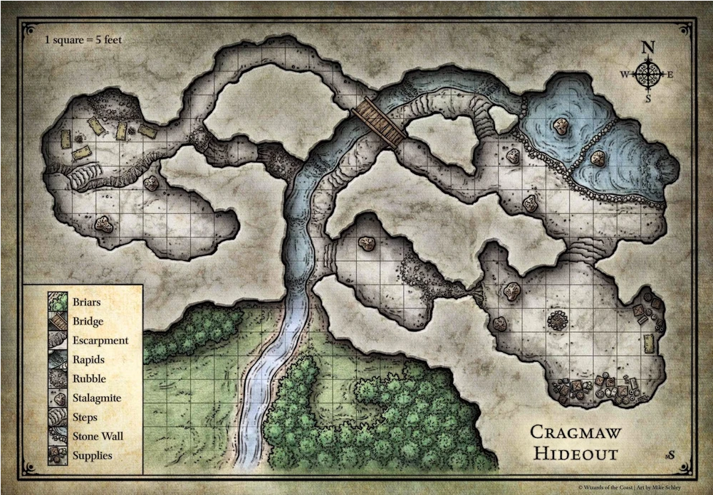

## Sommersonnenwende

### Morgen: Feurige Tänze der Priester von Lathander

- Bei Sonnenaufgang versammelt sich die halbe Stadt auf dem Marktplatz. Priester in orange-goldenen Roben tanzen mit brennenden Fackeln und Bändern zu Trommeln, während der **Hohepriester Aurelian Duskbane** eine Rede über "das Licht, das immer wiederkehrt" hält.
- Kinder dürfen kleine Papierlaternen mit Wünschen entzünden und in die Luft steigen lassen (schöner, ruhiger Rollenspielmoment).
- **Kleiner Haken:** Die Rede des Hohepriesters wirkt dieses Jahr merkwürdig lustlos, fast auswendig gelernt – niemand außer vielleicht einer aufmerksamen Figur bemerkt es bewusst.

### Tag: Events

#### Wettschießen

Zwischen zwei knorrigen Eichen ist eine Reihe von Strohzielen aufgebaut, bemalt mit einem grinsenden Sonnenmotiv – dem Wappen des Mittsommerfests. Ein Junge läuft ständig hin und her, um Pfeile einzusammeln und lauthals die Trefferzahlen auszurufen. Der Geruch von gebratenen Mandeln vom Nachbarstand mischt sich mit Bogenwachs.

- Jeder Teilnehmer schießt **3 Pfeile** auf zunehmend kleinere/weiter entfernte Ziele.
- DC = [10 + 3^i] (Angriffswurf mit Fernkampfwaffe).

- **Berg Eichenschild**, Stadtwache-Veteran, ruhig und trocken-humorvoll. Schießt konstant gut (Attack +3), kommentiert jeden eigenen Fehlschuss mit einem Fluch auf seine "alten Augen".
- **Tansy Krähenfeder**, junges Halbelfen-Mädchen, überraschend treffsicher (Attack +4), spielt aber die Unerfahrene, um Wetteinsätze zu kassieren. Freut sich diebisch, wenn sie gewinnt.

---

#### Wetttrinken

Ein Fass wird auf den Tisch gewuchtet, Krüge werden reihum gefüllt, und die Menge bildet einen Kreis, der jeden Schluck mit Gejohle begleitet. Der Braumeister der Stadt hat extra ein "Mittsommer-Dunkel" gebraut – stärker als gewöhnlich, mit einem Hauch Honig.

- **Konstitutionsrettungswürfe**, steigende DC = 8 + 3^i
- Bei einem Fehlschlag: Charakter scheidet aus + Betrunken für 3W4h, wenn Verlust auf 1/2: Bewusstlos für 1W6h

- **Grunna Eisenmagen**, Zwergin, Stammgast bei jedem Fest, praktisch unbesiegbar (Save +7). Nimmt es sportlich, wenn sie doch mal verliert, und kauft dem Sieger danach eine Runde.
- **Ostwin Federkiel**, schmächtiger Schreiber, der eigentlich gar nicht trinken kann (Save +0), aber jedes Jahr mitmacht, weil er "dieses Jahr wirklich trainiert hat". Scheidet fast immer in Runde 1 aus, unter großem Gelächter.

---

#### Ringen

Ein Kreis aus Stroh und festgetretener Erde, umgeben von johlenden Zuschauern. Der amtierende Stadtchampion steht mit verschränkten Armen bereit und mustert jeden Herausforderer von oben bis unten.

- Gegnerischer **Athletics-Check** (contested), 3 Runden nach Best-of-3-Prinzip.
- Alternativ: Nutzt die regulären Grapple-Regeln (Athletics vs. Athletics/Acrobatics) über mehrere "Bouts", bis eine Seite dreimal geworfen wurde.
- Kein Schaden, nur Erschöpfungsstufe 1 bei besonders hartem Kampf (optional, für Comic-Effekt: "Ihr könnt euch morgen kaum bewegen").

- **Thorgga Bärenklau**, amtierende Meisterin seit drei Jahren, Halbork, Athletics +7. Fordert jeden Herausforderer grinsend zu einem "letzten Schluck Mut" vor dem Kampf heraus.
- **Pockennarbiger Hemrik**, ehemaliger Champion, jetzt Schiedsrichter, da seine Knie nicht mehr mitmachen. Erzählt jedem, von seinem legendären Sieg vor zehn Jahren.

#### Schmalzbalken

**Atmosphäre**
Ein dick mit Schweineschmalz eingeriebener Baumstamm ist über einer Schlammgrube gespannt. Bit Stäben bewaffnet, gehen 2 Leute aufeinander los.

- **Acrobatics-Check**, DC 13, um nicht zufallen, first hit wins.

- **Fitzko Wasserfloh**, Gassenjunge, der mühelos gewinnt (Acrobatics +6) und immer trocken bleibt – Gerüchte über einen Trick halten sich hartnäckig.
- **Bäcker Malefein**, dick und rund (Acrobatiks: -1), versucht es trotzdem jedes Jahr mit großer Begeisterung und fällt jedes Mal spektakulär ins Wasser – zur Freude aller, sie selbst inklusive.

---

#### Wettrennen

Die Strecke führt einmal quer durch die Stadt: über den Marktplatz, durch die enge Gasse der Gerber und zurück zum Startpunkt. Fähnchen markieren die Route, Kinder sitzen auf Dächern, um als Erste den Sieger zu sehen.

- 3: Athletics, Danach: CON; 75 gewinnt.

- **Renna Windfuß**, Botin der Stadt, notorisch schnell (Athletics +6), nimmt Abkürzungen, die eigentlich nicht erlaubt sind, und leugnet es hinterher frech.

#### Hindernislauf

- Gleiche Strecke, wie beim Wettrennen, aber mit hindernissen aus Heu.

- Alle 15 Punkte kommt ein Hindernis (4), DC: 13 (Acrobatics): nat20: Vorteil auf den nächsten Wurf, nicht geschafft: Nachteil auf den nächsten Wurf, nat1: fällt eine Runde zurück.

#### "Einundzwanzig" (Blackjack-Variante)

An einem wackligen Klapptisch unter einem bunten Sonnensegel sitzt ein professioneller Spieler – oder zumindest wirkt er so. Karten werden mit geübten Fingern gemischt, kleine Kupfermünzen klimpern in einer Schale.

- Standard-Blackjack-Regeln: Ziel ist möglichst nah an 21, ohne zu überschreiten. Bube/Dame/König = 10, Ass = 1 oder 11, Rest nach Zahlenwert.
- Dealer (NPC) zieht bei 16 oder weniger, bleibt stehen bei 17+.
- Einsatz vorher festlegen (z. B. 1–5 GM), Auszahlung 1:1, bei "Blackjack" (Ass + 10-Wert direkt) 3:2.

- **"Seidenfinger" Davo**, Halb-Tiefling, charmant und redegewandt, betreibt den Stand fair.
- **Junger Pate**, Davos Neffe, kassiert die Einsätze und schreit die Gewinne laut in die Menge.

#### "Krone und Anker"

Ein runder Tisch mit einem in sechs Felder unterteilten, bunt bemalten Rad: Krone, Anker, Herz, Kleeblatt, Diamant, Kreuz. Ein alter Seemann rüttelt einen Becher mit drei Würfeln, auf denen dieselben Symbole statt Zahlen stehen.

- Spieler setzt auf **ein Symbol**.
- Es werden **3 W6** geworfen (jede Fläche = eines der 6 Symbole – am Tisch einfach: 1=Krone, 2=Anker, 3=Herz, 4=Kleeblatt, 5=Diamant, 6=Kreuz).
- Für jedes gewürfelte Symbol, das mit dem Einsatz übereinstimmt, gewinnt der Spieler das 1-, 2-, oder 3-fache seines Einsatzes (je nachdem, wie oft das Symbol erscheint). Keine Übereinstimmung = Einsatz verloren.

- **Alter Pelling**, ehemaliger Schiffskoch, erzählt zu jedem Wurf eine (vermutlich erfundene) Seemannsgeschichte. Betreibt das Spiel völlig fair – aus reiner Freude am Erzählen und Gesellschaft.

---

#### Wahrsager

**Atmosphäre**
Abseits des Trubels steht ein kleines, mit Sternen bemalten Zelt, aus dem der Duft von Räucherwerk dringt. Drinnen sitzt die Wahrsagerin zwischen Kerzen an einem Tisch mit einem abgegriffenen Kartendeck – die Bilder darauf wirken älter, als sie sein sollten.

**NPCs**
- **Madame Ilyska**, geheimnisvoll, spricht in Rätseln, tatsächlich eine echte (wenn auch schwache) Seherin – guter Aufhänger, um Kampagnen-Vorausdeutungen einzustreuen.
- **Ihr Lehrling Bo**, ein nervöser Junge, der die Requisiten vorbereitet und den Spielern hinter Ilyskas Rücken zuflüstert, dass "die alte Frau es manchmal wirklich sieht, ehrlich".

### Abend: Feuershow und Sommersonnenarie

### Nacht

Feuer, die die Nacht durchbrennen sollten.

### Nächster Morgen

Verängstigte Ältere, saure/pessimistische Sonnenpriester, aber die breite Bevölkerung sieht es nicht so eng.

- Die alten Sonnenpriester wirken sauer, fast ängstlich.

## NPCs

### Hohepriester Aurelian Duskbane

- *Mensch, ca. 60 Jahre, Hohepriester des Lathander-Tempels in Triboar
- Groß, hager, trägt die traditionelle orange-goldene Robe mit sichtbarer Würde. Tiefe Augenringe, die er mit Puder zu kaschieren versucht.
- Seit 22 Jahren Hohepriester, hat den Tempel durch mehrere schwierige Jahre geführt, genießt Respekt in der Stadt.
- Freundlich und würdevoll im direkten Gespräch, wird aber merklich unsicher, wenn man ihn auf die Ereignisse der Nacht anspricht — weicht aus, hat den Verdacht seines Lehrlings oft abgetan.

### Bruder Tamlin

- Mensch, Anfang 20, junger Priester im Lathander-Tempel
- Schlaksig, sommersprossig, trägt seine Robe noch nicht mit der Selbstverständlichkeit der älteren Priester — Ärmel oft zu lang, Knoten am Gürtel nie ganz gerade
- Stottert leicht, wenn er nervös ist (fast immer).
- Erst seit zwei Jahren geweiht, glaubt aufrichtig und intensiv.
- Er hat ein ungutes Gefühl bei den Entwicklungen der letzten Wochen.
- Evt Mitreisender nach Neverwinter, falls der Shar-Strang bereits bemerkt wird.

### Schwester Ophelia Grey

- Mensch, ca. 75, langjährige Priesterin des Tempels
- Klein, rundlich, mit einem Gesicht, das für gewöhnlich vor Wärme strahlt. 
- Offen ängstlich gegenüber Fremden Vampirin, wird von den anderen Priestern beschwichtigt.

### Perendil der Lohende — Feuerspucker & Illusionist

- Gnom, Wirkt jung, ist es vermutlich nicht, reisender Unterhaltungskünstler
- Winzig, quirlig, trägt eine Weste voller kleiner Taschen mit Feuerwerkskörpern und Zaubertand, Augenbrauen chronisch versengt
- Reist seit Jahren von Fest zu Fest, kennt halb Faerûn

### Ilsevet Morrow — Tänzerin

- Mensch, Ende 20, von der Stadt für den Eröffnungstanz am morgen gewählt.
- Bunt gekleidet, dunkles Haar, sehr hübsch
- Wirkt, als würde sie mitten im Satz kurz "woanders" hinhören
- Sie mag Lyssander nicht, da sie noch etwas schöner ist und mehr Aufmerksamkeit auf sich zieht. Darum ist sie auch bei allem gegen sie dabei.

### Hendrick Silberzunge (fliegender Händler)
- *Persönlichkeit:* Redegewandt, übertreibt schamlos, merkt sich jedes Gesicht, das schon mal gekauft hat.
- *Geheimnis:* Eines seiner "wertlosen" Artefakte ist tatsächlich magisch – er weiß es nur selbst nicht.

| Item | Preis | Beschreibung |
|---|---|---|
| Vollmondkristall | 10 GM | Angeblich Glück bringend; schimmert bei Vollmond schwach |
| "Zerbrechlicher" Krug | 8 GM | Zerbricht niemals, erst bei der Zweiten Nutzung.|

### Gorm Eisenhandel (Waffenhändler)
- *Persönlichkeit:* Grimmig, wortkarg, fachkundig, verachtet Zeitverschwender.
- *Geheimnis:* Besitzt eine seltene, leicht verfluchte Klinge, die er loswerden will, ohne es zuzugeben.

| Item | Preis | Beschreibung |
|---|---|---|
| Festtags-Dolch | 4 GM | Rein zeremoniell, aber scharf geschliffen |
| Sturmklinge | 30 GM | Solides Kurzschwert, magnetisch, was seinem Gehilfen Probleme macht. |
| Der "Flüsterer" | 45 GM | Ein Kurzschwert, das im Mondlicht etwas Vibriert. |
| Schild mit Sonnenwappen | 15 GM | Symbol des Festes, dekorativ und funktional |

### Rosalinde Krug (Wirtin, "Zum Goldenen Fass")
- *Persönlichkeit:* Herzlich, resolut, kennt jeden Stammgast beim Namen.
- *Kleiner Hook:* Vermietet Zimmer während des Festes zu Wucherpreisen – guter Ort für Verhandlung oder Quest-Board.

| Item | Preis | Beschreibung |
|---|---|---|
| Sonnwend-Braten | 1 GM | Festtagsspezialität, reichlich Portion |
| Betten | Doppelt | Überfüllt wegen des Festes 
| "Goldenes Fass"-Dunkelbier | 4 SM | Hausgebraut, limitiert |

### Emrys der Fremde (Gewürzhändler)
- *Persönlichkeit:* Exotisch, geheimnisvoll, spricht mit leichtem Akzent über ferne Länder.
- *Kleiner Hook:* Eines seiner Gewürze hat eine ungewöhnliche magische Nebenwirkung.

| Item | Preis | Beschreibung |
|---|---|---|
| Weißer Pfeffer | 3 GM | Schärfer als alles Bekannte, Zunge brennt ewig |
| Luminiszierendes Salz | 6 GM | Färbt Speisen leicht schimmernd, rein kosmetisch |
| Sternenanis | 20 GM | Sehr begehrt, angeblich aus einem fernen Reich importiert |

### Meister Peter Webstuhl (Stoffhändler)
- *Persönlichkeit:* Affektiert, elitär, aber fair im Handel.
- *Kleiner Hook:* Verkauft Stoffe mit eingewebten Mustern, die entfernt an eine bekannte Fraktion/Familie erinnern.

| Item | Preis | Beschreibung |
|---|---|---|
| Sommerseide (Bahn) | 15 GM | Leicht, kühlend, edel |
| Festumhang mit Sonnenstickerei | 25 GM | Passend zum Mittsommerfest, auffällig |
| Tarnfarbener Reiseumhang | 18 GM | Praktisch für Abenteurer, Stealth +1 |

### Petra Fassbrand (improvisierter Bierstand)
- *Persönlichkeit:* Robust, stolz auf ihr Bier, gerne im Wettstreit mit anderen Brauern.
- *Kleiner Hook:* Ihr Starkbier hat eine überraschend hohe Wirkung – Trinkwettbewerb-Potenzial.

| Item | Preis | Beschreibung |
|---|---|---|
| Petras Starkbier | 3 SM/Krug | Ungewöhnlich stark, DC-Probe für Standhaftigkeit empfehlenswert |
| Mittsommer-Met | 5 SM | Süß, limitiert, nur zum Fest erhältlich |
| Bierkrug-Andenken | 1 SM | Mit Festmotiv verziert |

### Selia Feuerkessel (Köchin/Standbesitzerin)
| Item | Preis | Beschreibung |
|---|---|---|
| Feuertopf-Eintopf | 4 SM | scharf gewürzt |
| Sommergemüsespieß | 2 SM | Vegetarische Alternative |

## Das Schwarze Brett

- **Ein Handwerker braucht Materialien** aus einer nahen, leicht
  gefährlichen Ruine/Höhle — Dungeon-Crawl im Kleinforma,
  ein Monster (z. B. Riesenspinnen oder ein Ghul).
- **Verlorenes Familienerbstück** — Eine alte Frau, **Mutter Yannis**, hat beim Fest ihre Brosche verloren; Belohnung ist kein Geld, sondern ein selbstgebackener Kuchen jede Woche für einen Monat (Rollenspiel-Belohnung statt Loot).

---

# Weg nach Neverwinter

## NPCs

### Mira & Milo Vantress — Akrobaten-Zwillinge

- Menschen, Anfang 20, fahrende Akrobaten und Unterhaltungskünstler
- Beide schlank, drahtig-muskulös, tragen farbenfrohe, geflickte Kostüme; Mira hat einen auffälligen Ohrring aus Messing, Milo trägt immer Handschuhe (Griffschutz für Akrobatik, keine tiefere Bedeutung)
- Beide reden schnell, fallen sich gegenseitig ins Wort, vollenden manchmal die Sätze des anderen
- Sind gemeinsam mit einer kleinen Wanderzirkustruppe aufgewachsen, die sich vor zwei Jahren aufgelöst hat; ziehen seitdem zu zweit weiter
- Mira: unausgesprochene Sorge, dass Milo sich zu sehr auf immer gefährlichere Kunststücke einlässt.

### Sir Dannok Vance — Verarmter Landritter (Veteran Statblock)

- Mensch, ca. 45
- Trägt eine einst prächtige, jetzt löchrige und geflickte Rüstung, poliert sie aber jeden Abend penibel; sein Pferd ist alt, aber gut gepflegt
- redet gern von "Ehre" und "Ruhm", übertreibt seine eigenen Heldentaten
- War tatsächlich einmal ein niederer Landadeliger, zog auch tatsächlich umher, um den Leuten zu helfen. Seine Familie hat ihm sein Erbe und seinen Anspruch gestolen, als er unterwegs war.
-  Neverwinter eine neue Chance finden, vielleicht als Söldner oder Wachoffizier.
- Unter der Prahlerei steckt echte Scham über seinen Abstieg. Wird defensiv bis traurig, wenn man ihn direkt darauf anspricht, ist aber nicht Zornig.
- Nimmt bereits an jedem Wettbewerb in Triboar teil.

### Corvain Ashe — Wandernder Geschichtenerzähler

- Mensch, Alter unbestimmt (wirkt "zeitlos", vermutlich einfach gut gealtert), reisender Barde/Geschichtensammler
- Lange, grobe Reisekleidung, ein abgewetztes Notizbuch, das er nie aus der Hand legt, wachsame, sehr aufmerksame Augen
- Sammelt seit Jahren Lieder, Legenden und Geschichten. Hat nach der Sommersonnenwende die erste Möglichkeit wahrgenommen weiterzuziehen.

### Tag 1 

- Aufbruch, kennenlernen

### Tag 2

- Wegelagerer

### Tag 3 

### Tag 4

### Tag 5 — Ankunft Phandalin

- Ankunft Phaladin, Handelszwischenstopp
- **Der Brunnen schmeckt komisch** — Anwohner eines Stadtviertels klagen über bitteres Wasser. Ursache: ein toter Waschbär im Brunnenschacht. Banale Lösung, aber gute Gelegenheit für Stadtkenntnis-Rollenspiel und Klatsch von den Nachbarn, die sich beim Wasserholen treffen.

### Nacht von Tag 6 auf Tag 7 

Überfall durch Cragmaw-Goblins, Nahrung ist weg

### Tag 7 

Gruppe muss Karawane mit Nahrung versorgen

### Tag 8 

- Nachwirkungen des Goblin-Überfalls: Die Karawane ist angespannt, Rationen knapp. Erste Anzeichen von Reizbarkeit unter den NPCs.
- Späte Zufallsbegegnung: eine Gruppe Handelsreisender aus Neverwinter kommt entgegen und bringt aktuelle Gerüchte aus der Stadt mit.

### Tag 9 

- Ankunft in Triboar

