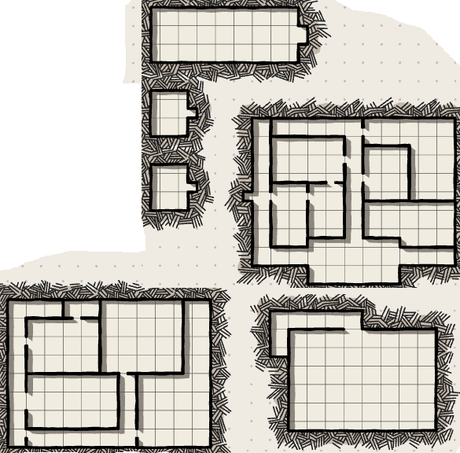

## Sommersonnenwende

### Rede

Er hebt die Hände zur aufgehenden Sonne – eine Geste, die jeder im Dorf auswendig kennt. Manche murmeln die ersten Worte schon mit, bevor er sie spricht.

„Seht her, gute Leute – seht, wie er kommt.

Jeden Morgen stirbt die Nacht aufs Neue, und jeden Morgen wird uns vergeben, was gestern war. Das ist Lathanders Gabe an uns: kein Tag ist wie der andere, kein Fehler zu groß, um nicht mit dem nächsten Sonnenaufgang neu begonnen zu werden.

Heute steht er höher als je zuvor. Wachset, sagt er uns. Werdet mehr, als ihr gestern wart.

Manche fürchten, was nach dem heutigen Tag kommt – dass die Nächte nun wieder länger werden. Aber fürchtet die Wende nicht. Auch das ist Lathanders Lehre: dass sich der Kreis immer schließt, um sich wieder zu öffnen.

Also lasst uns feiern, solange das Licht am höchsten steht!“

*Bei diesen Worten – wie jedes Jahr – tritt eine junge Priesterin vor, barfuß, in leichten Stoffbahnen, die Gold und Orange auffangen. Der Alte hält kurz inne, fast schmunzelnd, während sie zu tanzen beginnt: erst langsam, mit der Sonne, dann schneller, wirbelnder, bis das Dorf klatscht und stampft. Die Rede, die alle kennen, wird zur Kulisse; die eigentliche Anziehungskraft ist sie.*

„…und lasst uns morgen früh wieder aufstehen, dem neuen Tag entgegen, so wie wir es immer tun.

Gepriesen sei der Morgenlord. Gepriesen sei das Licht, das niemals endet, sondern nur schläft, um zu erwachen.“


### Arie

```

**I. Morgenröte**

Der Morgen steigt in Rosengold empor,
weckt Blüte, Feld und jeden Hahnenschrei,
Lathanders Licht tritt durch das Himmelstor
und macht das alte Jahr aufs Neue frei.

Wir tanzten einst im ersten warmen Strahl,
als Kinder, die kein Dunkel noch gekannt,
wir glaubten, Licht sei ohne Zweifel, Wahl,
sei alles, was uns hält, uns Halt, uns Pfand.

So preist ihn, der die Schwelle uns eröffnet,
der jeden Tag aufs Neu die Nacht durchbricht –
doch wisset: was am Morgen euch getroffen,
ist nicht das Ganze, ist nur halbes Licht.


**II. Die Wandlerin**

Und seht, wie hoch die Sonne heut auch steht,
sie neigt sich, wie sie es seit je getan,
und eine andre Herrin, ungesehen,
hebt schon am Rand des Himmels ihren Kahn.

Sie, die man nennt die Wandlerin, die Milde,
die Hüterin der Reisenden bei Nacht,
trägt heut ihr dunkelstes, ihr leerstes Bild –
denn heute ist es, dass ihr Licht erschlafft.

Man sagt, sie ruhe, wenn ihr Rund verschwindet,
dass sie sich sammle für den nächsten Lauf,
dass Schwäche nur ein andres Wachsen sei,
ein Atemholen, eh sie steigt hinauf.

So feiern wir sie, wenn sie leise geht,
so beten wir zu ihr, wenn sie sich neigt –
denn die uns führt, wenn keine Sichel steht,
ist Herrin noch, auch wenn sie sich verschweigt.

Gepriesen sei die Herrin dieser Nacht,
die niemals ganz erlischt und niemals bleibt,
die aus der Fülle in die Leere lacht
und aus der Leere neue Fülle treibt.

**III. Die Leere Krone**

Und wenn das letzte Licht vergeht,
wenn auch ihr Kahn zu keinem Ufer fährt,
dann bleibt, was vor der Sonne steht,
das Erste, Älteste, das nichts entbehrt.

Nicht Finsternis, die etwas uns verwehrt –
nein, eine Fülle, tiefer als das Licht,
ein Schweigen, lang bevor Licht sich lehrt
zu sprechen, sich zu formen, ein Gedicht.

Wer sagt, dass Angst uns in der Leere fänd',
hat nie gesehn, wie die Weite reicht,
hat nie gespürt, wie sanft die Hand, die end',
uns wieder öffnet, was der Tag verscheucht.

Sie, die kein Name und kein Bild mehr fasst,
die Herrin, die man nicht beim Namen nennt,
die schweigend hält, was jede Furcht verlasst,
die Nacht, die keine andre Nacht mehr kennt –

ihr, ohne Form, ohr' Auge, ohne Wort,
sei heute, da kein Mond die Dunkelheit
und keine Sonne stört, sei diesem Ort
die stille Krone dieser Zeit geweiht.

Gepriesen sei die Herrin dieser Nacht –
und wisst: sie war schon da, eh wir sie sahn,
und bleibt, auch wenn kein Licht sie sichtbar macht,
die Erste Herrin, und die letzte Bahn.
```

### Magiesammler

Ein Objekt, dass die Gruppe begehrt wird weggekauft: Überbieten oder vor der Nase kaufen.




## A. Bruder Tamlin — Der Ruf nach Waterdeep

### Auslöser
In den Tagen nach dem Fest verdichten sich seine Zweifel:
- Schwester Ophelia reagiert offen ängstlich auf Fremde – wird von den anderen Priestern beschwichtigt statt ernst genommen.
- Die Feuer der Nacht gingen aus, ohne dass jemand eine schlüssige Erklärung liefert.
- Tamlin konfrontiert Aurelian direkt. Aurelian weicht aus, tut die Sorgen seines Lehrlings (wieder einmal) ab.

Das ist der Bruch: Tamlin beschließt, den Dienstweg zu verlassen und die Vorgänge direkt den **Spires of the Morning** in Waterdeep zu melden – der höchsten Lathander-Institution, die er kennt.

### Route A1 — Die Gruppe begleitet Tamlin
- **Trigger:** Die Gruppe erfährt von seinen Plänen kurz bevor oder während sie selbst mit der Karawane aufbrechen (z. B. Tamlin sucht sie gezielt auf, weil er weiß, dass sie ebenfalls misstrauisch sind, oder sie treffen ihn zufällig am Stadttor mit gepacktem Bündel).
- **In Waterdeep:** Empfang in den Spires of the Morning – im Gegensatz zu Aurelian wird Tamlin hier ernst genommen. Ein hochrangiger Priester (Vorschlag: **Hoherwächter Ansellus Brightflame** oder ähnlich) hört sich den Bericht an, erkennt Muster aus anderen Städten (und auch Waterdeep) wieder (das ist ein guter Moment, um anzudeuten, dass Lysandras Methode nicht neu oder isoliert ist) und beauftragt die Gruppe offiziell, die Vorfälle zu untersuchen – mit kirchlicher Rückendeckung, vielleicht einem kleinen Segen/Gegenstand und einem Kontakt vor Ort.

### Route A2 — Die Gruppe bleibt in Triboar / reist nach Neverwinter
- Tamlin bricht allein nach Waterdeep auf.
- Wenn die Gruppe später selbst in Waterdeep ankommt, finden sie ihn dort wieder – **eingesperrt** - nachdem sie einen Vermisstensteckbrief von ihm finden.
- Tamlin hat tatsächlich Waterdeep erreicht und wurde (wie in A1) mit einem offiziellen Auftrag weitergeschickt.Er war jedoch zu forsch oder zu offen vorgegangen – und wurde von bereits kompromittierten Stellen (z. B. einem Wachoffizier oder Beamten, der selbst schon "abgestumpft" oder sympathisierend ist) unter einem Vorwand festgesetzt: Ruhestörung, Aufwiegelung, angebliche Blasphemie gegen "die Herrin der Nacht".
- Das zeigt der Gruppe zweierlei auf einmal: dass der offizielle Weg allein nicht reicht, *und* wie tief die Gleichgültigkeit/Infiltration bereits sitzt – noch bevor sie selbst aktiv ermitteln.
- Seine Freilassung/Rettung kann als kleiner, persönlicher Einstiegs-Hook in den Teil der Kampagne dienen.

---

# Bruder Tamlin — Reise nach Waterdeep

## Grober Fahrplan

| Etappe | Grobinhalt |
|---|---|
| Aufbruch | Tamlin verlässt Triboar, ggf. begleitet die Gruppe ihn (siehe Route A1 in den Zusätzen) |
| Unterwegs | 2–3 Reise-Encounter aus dem Pool unten, gestreut über mehrere Tage |
| Zwischenstopp | Ein größerer Ort auf dem Weg (Dorf oder Kleinstadt) — guter Ort für die "Reaktionen"-Szenen |
| Ankunft Waterdeep | Kurze Ankunftsszene, Empfang in den Spires of the Morning (siehe Zusätze-Datei für den offiziellen Auftrag) |

Du brauchst für diese Session vermutlich nur Aufbruch + 1–2 Encounter + evtl. den Zwischenstopp — der Rest kann als Zeitraffer/Montage laufen.

---

## Encounter-Pool

- **Pilger schließen sich an** — ein oder zwei einfache Gläubige hören von Tamlins Mission und wollen "dem Licht dienen", indem sie mitreisen. Gut für Rollenspiel, potenziell auch Belastung (langsamer, unvorsichtiger).
- **Ein skeptischer Mitreisender** — ein Kaufmann oder Söldner in der Karawane hält die ganze Sache für übertrieben, konfrontiert Tamlin offen ("Junge, geh nach Hause").
- **Kleiner Überfall auf die Karawane** — Wegelagerer zielen speziell auf den "reich aussehenden" Priester, in der Annahme, er trage Tempelgold bei sich.
- **Ein Bettler bittet um Segen** — einfache, warme Szene; zeigt, wie ernst Tamlin seinen Glauben nimmt, auch unter Druck.
- **Nächtliches Gespräch am Lagerfeuer** — Tamlin öffnet sich der Gruppe, erzählt von seinen Zweifeln an Aurelian, evtl. auch eigene Unsicherheit ("Bin ich überheblich, das zu tun?").
- **Ein zweiter Vorfall unterwegs** — in einem Dorf auf dem Weg zeigt sich ein kleineres Echo dessen, was in Triboar passiert (ausgeblasene statt entzündete Kerzen, ein befremdlich beiläufiger Kommentar) — sät früh den Verdacht, dass es kein Triboar-exklusives Problem ist.
- **Ein Bote/Reisender aus Waterdeep** kommt entgegen, bringt aktuelle Gerüchte aus der Stadt — guter Aufhänger für Vorausdeutung.
- **Wetterprobe/Naturhindernis** — reiner Pacing-Encounter ohne Kult-Bezug, zur Auflockerung.
- **Ein Selûne-Wanderpriester** kreuzt den Weg — reagiert je nach Wahl entweder hilfsbereit und besorgt oder seltsam defensiv/ablehnend (optionaler Vorgriff auf die Ilsevet-Thematik).

---

## Reaktionen von Reisenden und Dorfbewohnern auf Tamlin (Brainstorm-Pool)

**Positiv/ehrfürchtig:**
- Manche bitten spontan um Segen, laden ihn zum Essen ein, wollen ihm ein Geleit stellen.
- Kinder sind fasziniert von der Robe, stellen naive Fragen zu Lathander.
- Ein Wirt gewährt Rabatt oder ein Freibier, "für den guten Zweck".

**Skeptisch/gleichgültig:**
- Manche wittern in einem so jungen Priester auf Mission eher jemanden, der sich wichtig macht.
- Ein zynischer Händler kommentiert, dass "die Götter sowieso nichts an den Preisen ändern".
- Achselzucken, wenn Tamlin von den Vorfällen in Triboar erzählt — die Leute unterwegs haben eigene Sorgen.

**Misstrauisch/unangenehm:**
- Manche werden vorsichtig oder wortkarg, sobald Tamlin nach Selûne/Shar-nahen Themen fragt — nicht unbedingt aus Bosheit, oft nur Aberglaube oder Unbehagen, über "die Herrin der Nacht" zu sprechen.
- In dem Dorf mit dem "zweiten Vorfall" (siehe Encounter-Pool) reagiert jemand auffällig defensiv, wenn Tamlin nachfragt.
- Ein Reisender warnt ihn scherzhaft-ernst, in Waterdeep "nicht zu forsch" aufzutreten — hohe Priester mögen keine unangemeldeten jungen Boten mit großen Anschuldigungen.

**Neutral/atmosphärisch:**
- Die meisten Begegnungen sind schlicht beiläufig — ein Nicken, ein "Gepriesen sei das Licht" im Vorbeigehen, nichts Dramatisches. Das hilft, die selteneren auffälligen Reaktionen (Misstrauen, Abwehr) umso mehr hervorzuheben.


## B. Ilsevet Morrow — Kampf gegen den Einfluss in Triboar

### Auslöser
Ilsevet mag Lysandra zunächst aus Eitelkeit nicht (siehe NPC-Notiz: "sie noch etwas schöner ist und mehr Aufmerksamkeit auf sich zieht"). Nach dem Fest kippt das langsam in echte Überzeugung, als sie beginnt, Muster zu erkennen: Leute, die Lysandras Formulierungen übernehmen, ohne es zu merken; erste kleine "Herrin der Nacht"-Schreine; Nachbarn, die Kerzen lieber löschen als anzünden "zur Ruhe".

### Die Quest — und warum sie scheitern muss
Ilsevet bittet die Gruppe um Hilfe, dem Einfluss aktiv entgegenzutreten. Konkrete Ansatzpunkte, die du als einzelne Szenen/Rollenspielmomente anbieten kannst:
- Ein Gegen-Auftritt bei einem kleineren Fest oder Markttag – Ilsevet tanzt bewusst "für Selûne", offen und eindeutig, um Lysandras Zweideutigkeit zu kontern.
- Aufklärung Einzelner: ein Gespräch mit einem Trauernden, den Lysandra "getröstet" hat, das Sichtbarmachen der Doppelbedeutung.
- Ein Priester Selûnes (falls es einen gibt) wird um öffentliche Unterstützung gebeten – reagiert aber zögerlich, weil es "unbewiesen" ist und einen Skandal riskiert.
- Enttarnung eines beginnenden Schreins oder eines kleinen Kultmitglieds vor Zeugen.

**Der Kniff:** Jede einzelne dieser Szenen kann *lokal* gelingen – die Gruppe rettet eine Situation, überzeugt eine Person, deckt einen Vorfall auf. Aber die Gesamtwirkung bleibt aus. Baue das über die folgenden Tage/Wochen (ingame, gerne zeitgerafft) als spürbare Verschiebung ein:
- Beim ersten Mal ist ein Shar-Symbol noch gut versteckt; beim dritten Mal trägt es jemand offen als Schmuck.
- NPCs reagieren zunehmend mit einem Schulterzucken statt Entsetzen ("ist doch nur ein Tuch", "sie hat doch nur getanzt").
- Ilsevet selbst wird zunehmend frustriert und resigniert – ein guter Moment für Charakterentwicklung: Sie erkennt, dass offene Konfrontation der Symptome nichts bringt, solange die Ursache (Lysandra selbst) unangetastet bleibt.

### Die eigentliche Lösung
Das Einzige, was wirklich etwas bewirkt, ist die **direkte Konfrontation mit Lysandra als Person** – nicht mit ihrem Einfluss. Das führt direkt in den nächsten Abschnitt.

---

# Ausplanen von verschiedenen Konfrontationen mit Lysandra

## Eskalationsstufen

Nutze Lysandras Statblock (siehe Tänzerin.md) nicht zwingend für einen Kampf bis zum Tod – sie ist als wiederkehrende Antagonistin interessanter, wenn sie entkommen kann. Denk in Stufen:

1. **Verdacht säen** (bereits über Sommersonnenwende-Ereignisse angelegt) – die Gruppe bemerkt Unstimmigkeiten, ohne Beweise.
2. **Erste offene Konfrontation** (getriggert durch Ilsevets Quest) – ein Gespräch oder kleiner Zwischenfall, bei dem Lysandra kalt, aber nicht offen feindselig bleibt. Sie weiß, dass direkte Aggression ihr schadet; sie bleibt in der Doppeldeutigkeit, selbst wenn die Gruppe sie direkt anspricht (siehe *Zweideutige Zunge*).
3. **Eskalation zum Kampf** – erst wenn die Gruppe sie wirklich in die Enge treibt (z. B. beim Versuch, einen Schrein oder ein Ritual zu stören), lässt sie die Maske fallen. Hier kannst du ihren vollen Statblock nutzen.

## Was die Gruppe im Kampf/Gespräch erfährt

Baue den Moment der Enthüllung als Dialog während oder kurz vor dem Kampf ein, nicht als reinen Exposition-Dump. Ideen für Lysandras Worte (in ihrem typischen doppeldeutigen, überlegenen Ton):

- Sie deutet an, dass Triboar für sie ohnehin nur "ein Schritt" ist – eine kleine Stadt auf einem viel längeren Weg.
- Sie lässt fallen, dass Neverwinter "schon lange zuhört" – ein Hinweis, dass ihr Netzwerk dort weiter fortgeschritten und länger etabliert ist als in Triboar, nicht bloß, dass "Zeit vergangen" ist. Das ist erzählerisch stimmiger: Triboar ist Lysandras *neueste* Station, Waterdeep eine ihrer *ältesten*.

## Ausgang der Konfrontation
- **Fluchtoption:** Sie nutzt *Schattenschritt* und/oder *Person unsichtbar machen*, um zu entkommen, sobald der Kampf klar zu ihren Ungunsten steht. Das hält sie als Antagonistin für später am Leben.
- **Konsequenz für Triboar:** Selbst wenn die Gruppe sie vertreibt, ist der Schaden in der Stadt bereits angerichtet – ihr Netzwerk aus unwissenden Anhängern besteht weiter (siehe *Ziele*, Punkt 1 in Tänzerin.md). Das gibt Ilsevet einen bittersüßen Teilerfolg statt eines glatten Sieges.
- **Für die Gruppe:** Der Sieg über Lysandra persönlich ist der einzige greifbare Erfolg der Session – im Gegensatz zum aussichtslosen Kampf gegen die allgemeine Stimmung. Das sollte sich befriedigend anfühlen, auch wenn die größere Bedrohung (Neverwinter, der Ursprung) unangetastet bleibt.

---

# Waterdeep
### Was sie dort vorfinden
- Gleichgültigkeit und Shar-Symbolik sind **deutlich weiter verbreitet und offener** als in Triboar: "Herrin der Nacht"-Schreine, die niemand mehr versteckt, Kerzen, die man öffentlich und ohne Scham löscht statt entzündet, vereinzelte Bewohner mit unverhohlenen Shar-Zeichen (Onyx-Perlen, achtstrahlige Motive), auf die niemand mehr reagiert.
- Wichtig für die Stimmung: Es soll **nicht** wie eine offen von Shar beherrschte Stadt wirken (kein Terror, keine Straßenpredigten) – sondern wie eine Stadt, die es sich bereits bequem in der Gleichgültigkeit eingerichtet hat. Genau die "Gewöhnung", die Lysandra anstrebt, nur sehr viel weiter fortgeschritten.

---

# Ilsevet Morrow — Kampf gegen den Einfluss

## Kurzüberblick

Diese Quest ist als **Kette konkreter Stationen** gedacht, keine feste Reihenfolge – du kannst Stationen weglassen, umsortieren oder mehrere parallel laufen lassen, je nachdem, was die Gruppe verfolgt. Wichtig ist nur die grobe Eskalationsrichtung: von Ambiente über Ermittlung zu offener Gegenwehr des Kults bis zum Showdown mit Lysandra.

**Grundton:** Kein einzelner Sieg fühlt sich falsch an, aber die Gesamtbilanz bleibt bitter – die Stadt wird trotzdem gleichgültiger. Der einzige wirklich harte Erfolg ist am Ende die persönliche Konfrontation mit Lysandra.

---

## Stationen

### Station 1 — Der Auftrag (Stufe 1)

Ilsevet sucht die Gruppe gezielt auf (sie hat sie bereits beim Fest als aufmerksam/misstrauisch wahrgenommen) und legt ihre Beobachtungen offen: Formulierungen, die sich verbreiten, ein Gefühl, dass Leute "woanders hinhören", wenn Lysandras Name fällt. Sie bittet nicht um einen Kampf, sondern um Hilfe beim **Beobachten und Gegensteuern**.

*Ziel der Szene:* Die Gruppe bekommt einen Auftrag mit offenem Ausgang, keinen klaren Feind. Ilsevet selbst ist unsicher, ob sie übertreibt.

---

### Station 2 — Erste Risse (Stufe 1–2)

- **Kinderreim-Moment:** Die Gruppe hört Kinder beim Spielen unbewusst die "Acht Schritte in den Kreis" nachtanzen. Keine Mechanik nötig – reine Stimmung, aber ein guter Gänsehaut-Beat.
- **Marktplatz-Gerücht:** Ein Gespräch unter Passanten über "die Herrin der Nacht".
- **Stiller Schrein-Fund:** Bei einem unrelated Besuch (z. B. bei einem Questgeber aus dem Ritualbuch-Plot) entdeckt die Gruppe nebenbei einen unauffälligen kleinen Hausaltar – ausgeblasene statt entzündete Kerze, dunkles Tuch. Moralisches Dilemma: bloßstellen, ignorieren, oder vorsichtig ansprechen?

*Ziel:* Unbehagen aufbauen, ohne dass die Gruppe schon etwas "tun" kann.

---

### Station 3 — Der Trauerredner (Stufe 2)

Bei einer Beerdigung hält ein Redner eine Trostrede voller Doppeldeutigkeit ("Trauer ist nur ein Tanz, der endet"). Ein SG-17-Religion-Check (siehe Tänzerin.md) deckt die zweite Bedeutungsebene auf.

*Optionen für die Gruppe:*
- Öffentlich eingreifen → Skandal, aber ohne Beweise wirkt es wie Störung einer Trauerfeier.
- Den Redner später privat ansprechen → er glaubt selbst fest an Selûne, ist nur ein weiteres unwissendes Werkzeug. Kein Bösewicht, nur ein Gewöhnungsopfer.

*Ziel:* Zeigt, dass der Kult längst durch "harmlose" Vermittler wirkt – nicht nur durch Lysandra selbst.

---

### Station 4 — Der Gegen-Auftritt (Stufe 2–3)

Ilsevet will öffentlich Gegensteuern: ein bewusst eindeutiger Selûne-Tanz bei einem kleineren Markt- oder Feiertag, um die Symbolik zurückzuerobern.

**Mechanik-Vorschlag:** Ein kleiner Skill-Challenge (Auftritt/Überreden/Religion, 3–4 Erfolge vor 2 Fehlschlägen) mit einem "Stimmungsbarometer" der Zuschauer als Einsatz. Die Gruppe kann unterstützen (Musik, Ordnung halten, einzelne Zuschauer gezielt ansprechen).

*Ausgang, so oder so:* Selbst bei vollem Erfolg bleibt der Effekt lokal und kurzlebig – am nächsten Tag ist die Stimmung wieder wie vorher. Das ist der Moment, in dem der Gruppe (und Ilsevet) klar wird, dass Auftritte allein nicht reichen.

---

### Station 5 — Rufmord (Stufe 3–4)

Gerüchte tauchen auf: Ilsevet sei nur eifersüchtig, labil, suche Aufmerksamkeit. Die Gruppe kann der Quelle nachgehen (Überreden/Wahrnehmung/Ermittlung) und stößt auf einen **eingeschleusten Agenten** – z. B. ein Mitglied der Stadtwache, ein Händler im Umfeld von Lysandras Verehrern, oder ein Bediensteter, der Informationen weiterreicht.

*Ziel:* Erste konkrete, benennbare Gegnerfigur (nicht Lysandra selbst) – gibt der Gruppe ein greifbares Ermittlungsziel.

---

### Station 6 — Nächtlicher Späher (Stufe 4)

Durch die Spur aus Station 5 findet die Gruppe Hinweise auf einen kleinen, echten Ritualort (Keller, Lagerhaus, stillgelegte Kapelle). Eine Stealth-/Beschattungs-Szene bei Nacht führt zum ersten **handfesten Beweis**: das echte schwarze Scheiben-Symbol mit violettem Rand, unmissverständlich Sharran

*Wichtig:* Dies ist bewusst als der Moment gedacht, an dem "es gibt keine Zweifel mehr" beginnt – im Gegensatz zu Lysandras eigener Zweideutigkeit.

**Optionaler Encounter:** Ein oder zwei niedrigstufige Kultisten/Initianten sind vor Ort – kein Kampf gegen Lysandra, aber ein erster echter Zusammenstoß mit dem Kult.

---

### Station 7 — Der verschwundene Zeuge (Stufe 4, optional/schwerer Ton)

Ein NPC, der bereit war zu reden (z. B. der Trauerredner aus Station 3, oder jemand aus Station 5/6), "verschwindet in Frieden" – die Gruppe findet ihn tot auf, ruhig, ohne Gewaltspuren, umgeben von ausgeblasenen Kerzen. Kein Kampf, sondern eine unheimliche Ermittlungsszene.

*Ziel:* Erhöht die Einsätze spürbar, ohne dass die Gruppe die Täterschaft sofort beweisen kann.

---

### Station 8 — Der Kult-Schläger (Stufe 4–5)

Die Kultanhänger reagieren auf die Ermittlungen der Gruppe mit einem gezielten Einschüchterungsversuch – ein bewaffneter "Zufalls"-Überfall auf Ilsevet oder ein Gruppenmitglied nachts. Kein Elitegegner, aber ernst genug, um zu zeigen: der Kult hat gemerkt, dass er beobachtet wird.

---

### Station 9 — Die Salon-Begegnung (Stufe 3, kann auch früher eingesetzt werden)

Eine erste, rein soziale Begegnung mit Lysandra selbst, in aller Öffentlichkeit (ein Fest, eine Séance, eine Einladung). Sie bleibt vollkommen ruhig, nutzt ihre *Zweideutige Zunge* – die Gruppe kann ihr nichts beweisen, aber beide Seiten wissen jetzt, dass die jeweils andere Bescheid weiß.

**Für den Paladin:** Guter Moment für die in der Diskussion erwähnte persönliche Anfechtung – Lysandra kann gezielt Zweifel säen ("Ist Hoffnung wirklich Trost, oder nur Verdrängung?"), ohne dass es zum Kampf kommt.

---

### Station 10 — Die Tempelschändung (Stufe 6, Showdown)

Der Auslöser für die finale Konfrontation: Lysandras Netzwerk versucht etwas Offenes – eine Unterwanderung einer offiziellen Selûne-Zeremonie, die "Weihe" eines neuen Schreins vor Publikum, oder ein Ritual, das ein zentrales Selûne-Symbol der Stadt dauerhaft "kippen" würde. Die Gruppe muss eingreifen, bevor es zu spät ist.

Hier eskaliert es zum echten Kampf – nutze Lysandras vollen Statblock (Tänzerin.md). Denk an:
- **Fluchtoptionen einplanen** (Schattenschritt, Unsichtbarkeit, Menschenmenge zum Untertauchen), falls du sie als wiederkehrende Figur behalten willst.
- **Escape/Verfolgungsjagd** als Alternative zum reinen Kampf, wenn sie in die Enge getrieben wird.

---

## Endings (wähle passend zum Spielverlauf)

- **Tod im Kampf** — Netzwerk bleibt.
- **Flucht** — offener Hook für Waterdeep.
- **Gefangennahme** — politisch/rechtlich schwierig mangels harter Beweise; guter Rollenspiel-Epilog.
- **Märtyrer-Moment** — sie lässt sich beiläufig fassen/töten, weil "die Saat schon gepflanzt ist" — unheimlicher als ein normaler Sieg.

**Keine volle Bekehrung als Standardziel** — ihre Persönlichkeit (denkt in Jahren, lässt sich nicht erschüttern) spricht dagegen. Wichtig: Warum ist die Shar-Anhängerin?

---

## Wichtige Nebenfiguren für diese Quest

- **Merren Tallow** — charmant, komplizenhaft-naiv, Teil von Lysandras Gefolge, aber persönlich nebensächlich. Guter Gesprächspartner, wenn die Gruppe versucht, an Lysandra heranzukommen, ohne dass er sie bewusst verrät.
- **Der eingeschleuste Agent** (Station 5) — leg selbst fest, ob Wache, Händler oder Bediensteter, je nachdem, was zu deinen bestehenden NPCs passt.
- **Der Trauerredner** (Station 3) — ahnungsloses Werkzeug, kein Bösewicht.
- **Ein zweifelnder, aber zögerlicher Selûne-Priester** — kann optional als wiederkehrende Frustrationsfigur dienen, die weiß, aber nicht handelt.
