# Core idea

Your Character gains 1 Traitpoint per Level, so you start at 1 Point. You can spend those Traitpoints at any time into any trait you match the requirements for.

# Traits and connected lore 

> Notice this lore/fantasy is just what I originally intended for this path to be. Of course, you can adjust the traits to change the fantasy as well. But speak about this to your DM.

> Even if those Traits still are grouped into classes, you can freely swap between those. The classes only exist for classification and to reduce writing.

---

> ## Explanation about the Flowcharts:
>
> If an Arrow is pointing from one to another you need to gain that one first thatone the arrow is pointing from. If there are multiple Arrows pointing to one you need to have all of the sources. If there are exceptions there is no arrow, but a normal line.
>
> Attribut-Gates are written on arrows.

---

## Abjurer

*Every spell is a sentence, and you are the one who knows how to strike it from the page. You do not fight magic with magic so much as you refuse it room to exist — a ward here, a word of unmaking there, until what was bound is loosed and what was summoned is sent home. It costs you, every time. That is how you know it worked.*

### Abjurer · Banisher

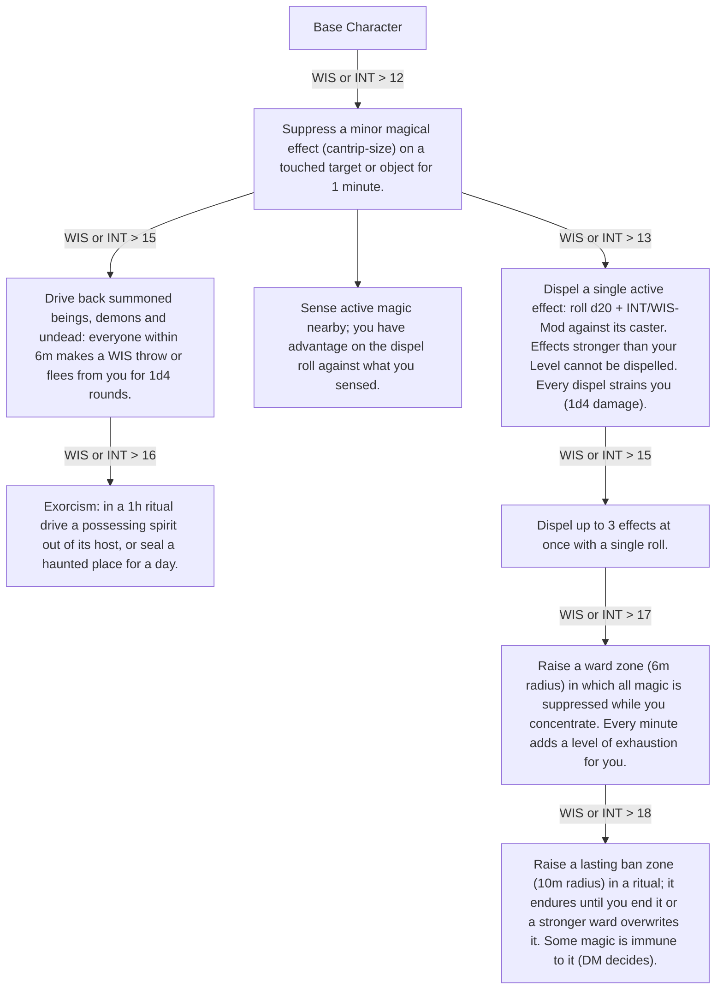
```mermaid
flowchart TD

A[Base Character]

1["Suppress a minor magical effect (cantrip-size) on a touched target or object for 1 minute."]
2["Dispel a single active effect: roll d20 + INT/WIS-Mod against its caster. Effects stronger than your Level cannot be dispelled. Every dispel strains you (1d4 damage)."]
3["Sense active magic nearby; you have advantage on the dispel roll against what you sensed."]
4["Drive back summoned beings, demons and undead: everyone within 6m makes a WIS throw or flees from you for 1d4 rounds."]
5["Exorcism: in a 1h ritual drive a possessing spirit out of its host, or seal a haunted place for a day."]
6["Dispel up to 3 effects at once with a single roll."]
7["Raise a ward zone (6m radius) in which all magic is suppressed while you concentrate. Every minute adds a level of exhaustion for you."]
8["Raise a lasting ban zone (10m radius) in a ritual; it endures until you end it or a stronger ward overwrites it. Some magic is immune to it (DM decides)."]

A -->|WIS or INT > 12|1
1 --> |WIS or INT > 13|2
1 --> 3
1 --> |WIS or INT > 15|4
2 --> |WIS or INT > 15|6
4 --> |WIS or INT > 16|5
6 --> |WIS or INT > 17|7
7 --> |WIS or INT > 18|8
```

---

##  Alchemist
<!--
### State

> Is this colidading with Elemtalists?

*Matter never stand still. The constant moving makes it only seam still and solid. But change the speed a little it all breaks apart: Stone becomes liquid and air hard as a rock. As alchemist, you can control that movement to mave impact on world around you.*

```mermaid
flowchart TD

A[Base Character]

1["Touch-range control of small amounts of material. Time: (20−d20) × 8s."]
2["Controllable amount increases in tiers based on INT-Mod; you can also alter basic surface properties (hardness, texture) at the cost of extra time."]
3["Time formula improves to (20−d20)×(8−INT-Mod)s."]
4["Form-shaping unlocked — you can now change the shape of materials"]
5["Ranged control up to 3m, on sight."]
6["Advantage on the time roll; If other range trait is unlocked: range increases to 6m."]
7["You can concentrate on two changes at once."]
8["Time throw becomes (20−2d10)×(8−INT-Mod)."]

A -- >|INT > 13| 1
1 -- > 2
1 -- > 3 -- > 6 -- > 8
1 -- > 5 -- > 6
1 -- >|INT > 17| 4
1 -- >|INT > 15| 7
```
-->

### Golem mancer

*Clay does not dream, and iron does not care. But give either a purpose, and it will pursue that purpose with a devotion no living servant could match. You are a maker of obedient bodies — vessels shaped by hand and bound by rite, animated by a spark of will that is yours to command. A golem asks no wages, feels no fear, and never once questions the order it was given.*

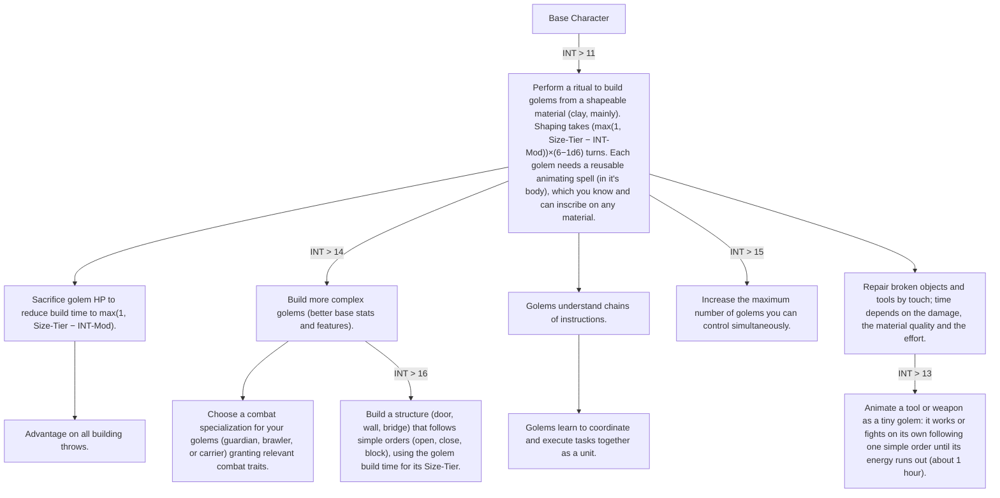
```mermaid
flowchart TD

A[Base Character]

1["Perform a ritual to build golems from a shapeable material (clay, mainly). Shaping takes (max(1, Size-Tier − INT-Mod))×(6−1d6) turns. Each golem needs a reusable animating spell (in it's body), which you know and can inscribe on any material."]
2["Sacrifice golem HP to reduce build time to max(1, Size-Tier − INT-Mod)."]
3["Build more complex golems (better base stats and features)."]
4["Golems understand chains of instructions."]
5["Choose a combat specialization for your golems (guardian, brawler, or carrier) granting relevant combat traits."]
6["Increase the maximum number of golems you can control simultaneously."]
7["Golems learn to coordinate and execute tasks together as a unit."]
8["Advantage on all building throws."]
9["Repair broken objects and tools by touch; time depends on the damage, the material quality and the effort."]
10["Animate a tool or weapon as a tiny golem: it works or fights on its own following one simple order until its energy runs out (about 1 hour)."]
11["Build a structure (door, wall, bridge) that follows simple orders (open, close, block), using the golem build time for its Size-Tier."]

A -->|INT > 11|1
1 --> 2 --> 8
1 --> |INT > 14| 3
1 --> 4 --> 7
3 --> 5
1 --> |INT > 15| 6
1 --> 9 --> |INT > 13| 10
3 --> |INT > 16| 11
```

### Runes & Seals

*A word spoken is gone the moment it is heard. A word written stays, and waits, and does not forget what it was told to do. You put your will into ink, chalk and chisel-cut stone, and let the mark carry it long after you have walked away. Anyone can smudge a line. Not everyone notices what it was guarding.*

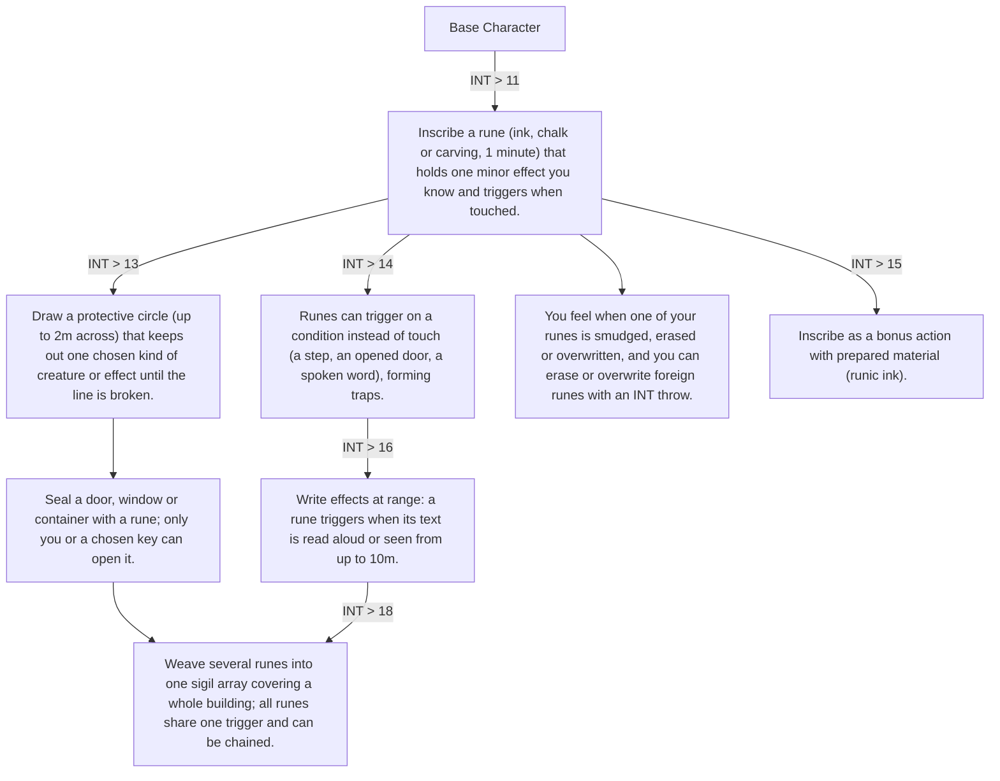
```mermaid
flowchart TD

A[Base Character]

1["Inscribe a rune (ink, chalk or carving, 1 minute) that holds one minor effect you know and triggers when touched."]
2["Draw a protective circle (up to 2m across) that keeps out one chosen kind of creature or effect until the line is broken."]
3["Runes can trigger on a condition instead of touch (a step, an opened door, a spoken word), forming traps."]
4["You feel when one of your runes is smudged, erased or overwritten, and you can erase or overwrite foreign runes with an INT throw."]
5["Inscribe as a bonus action with prepared material (runic ink)."]
6["Seal a door, window or container with a rune; only you or a chosen key can open it."]
7["Write effects at range: a rune triggers when its text is read aloud or seen from up to 10m."]
8["Weave several runes into one sigil array covering a whole building; all runes share one trigger and can be chained."]

A -->|INT > 11|1
1 --> |INT > 13|2
1 --> |INT > 14|3
1 --> 4
1 --> |INT > 15|5
2 --> 6
3 --> |INT > 16|7
6 --> 8
7 --> |INT > 18|8
```

---

## Bard

*Words were the first magic, long before anyone called it that. A story told with total conviction — every detail true, every stake real — does not merely describe the world; for a moment, it becomes it. You are a teller of tales that refuse to stay tales, weaving belief itself into a blade.*

```mermaid
flowchart TD

A[Base Character]

1["As part of telling a story, make a CHA throw against your opponents. On success, the story comes to life: e.g., narrate an army attacking the enemy, and an army (capped at 2 entities) spawns and acts as told. If the story is fabricated, your CHA bonus doesn't apply. Spawns act as long as you keep telling the story, then fade."]
2["Advantage on story-connected CHA throws."]
3["Summon up to medium-size creatures, or a single giant-size creature."]
4["Choose one: learn to tell convincing fabricated stories (CHA now applies to fake stories too); or your true stories grow more powerful and opponents suffer disadvantage against your story-related effects."]
5["Your stories persist for 1d4 turns after you stop telling them. Roll on letting them go."]
6["If you personally knew (or believe you knew) the subject of your story, you automatically win the check unless your opponent rolls a nat 20 or reaches 25+."]
7["You can tell a story while fighting, but lose your advantage on concentration throws if hit the turn after you attack. Telling becomes a bonus action."]
8["The cap on simultaneously awakened entities is lifted — a story you can narrate with full precision and truthfulness can awaken as many participants as it truthfully contains."]

A -- > |CHA > 12|1
1 -- > 2 -- > |CHA > 15|4
1 -- > 3
1 -- > 5
2 -- > 6
2 -- > 7
3 -- > 8
```

---

## Druid

*Every Druid path below is, at its heart, a conversation — with beast, root, life-energy, or spirit. None of it is domination; all of it is persuasion. Nothing in nature knowingly harms itself, and a Druid who forgets that distinction stops being a Druid at all.*

### Druid · Animals
*You did not tame the wild — you learned its language, and it decided to trust you. Every growl, chirp, and silence carries meaning to those patient enough to listen, and you have listened long enough to answer back. A beast that follows your word is not obeying a master; it is honoring an understanding, one creature to another, that happens to run deeper than most humans ever bother to build.*

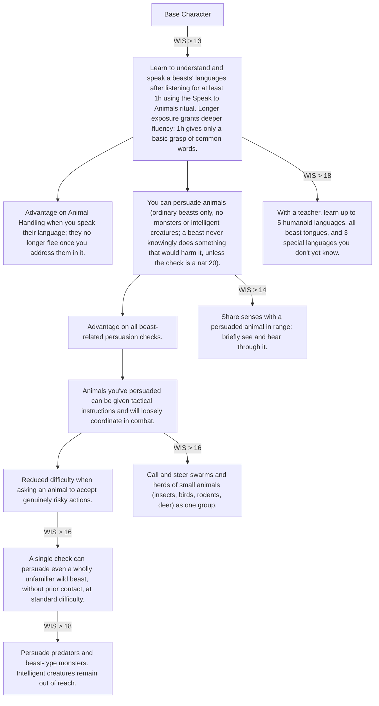
```mermaid
flowchart TD

A[Base Character]

1["Learn to understand and speak a beasts' languages after listening for at least 1h using the Speak to Animals ritual. Longer exposure grants deeper fluency; 1h gives only a basic grasp of common words."]
2["Advantage on Animal Handling when you speak their language; they no longer flee once you address them in it."]
3["You can persuade animals (ordinary beasts only, no monsters or intelligent creatures; a beast never knowingly does something that would harm it, unless the check is a nat 20)."]
4["With a teacher, learn up to 5 humanoid languages, all beast tongues, and 3 special languages you don't yet know."]
5["Advantage on all beast-related persuasion checks."]
6["Animals you've persuaded can be given tactical instructions and will loosely coordinate in combat."]
7["Reduced difficulty when asking an animal to accept genuinely risky actions."]
8["A single check can persuade even a wholly unfamiliar wild beast, without prior contact, at standard difficulty."]
9["Share senses with a persuaded animal in range: briefly see and hear through it."]
10["Call and steer swarms and herds of small animals (insects, birds, rodents, deer) as one group."]
11["Persuade predators and beast-type monsters. Intelligent creatures remain out of reach."]

A -->|WIS > 13|1
1 --> 2 
1 --> 3 --> 5 --> 6 --> 7 -->|WIS > 16|8
1 --> |WIS > 18|4
3 --> |WIS > 14|9
6 --> |WIS > 16|10
8 --> |WIS > 18|11
```

### Druid · Plants
*Roots remember everything the soil has ever told them, and a Druid who learns to listen through touch can borrow that patience for a moment's purpose. You do not command the green — you lend it strength it did not know it wanted to spend, and it repays the favor in ways no blade or spell can match. Slow, ancient, and vast beneath the surface, the plant world moves at your request only because you have never once asked it to hurt itself.*

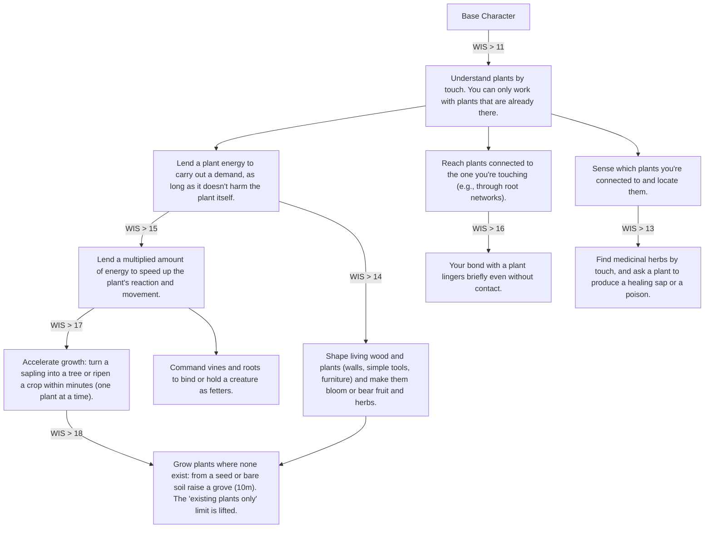
```mermaid
flowchart TD

A[Base Character]

1["Understand plants by touch. You can only work with plants that are already there."]
2["Lend a plant energy to carry out a demand, as long as it doesn't harm the plant itself."]
3["Reach plants connected to the one you're touching (e.g., through root networks)."]
4["Sense which plants you're connected to and locate them."]
5["Lend a multiplied amount of energy to speed up the plant's reaction and movement."]
6["Accelerate growth: turn a sapling into a tree or ripen a crop within minutes (one plant at a time)."]
7["Your bond with a plant lingers briefly even without contact."]
8["Shape living wood and plants (walls, simple tools, furniture) and make them bloom or bear fruit and herbs."]
9["Command vines and roots to bind or hold a creature as fetters."]
10["Find medicinal herbs by touch, and ask a plant to produce a healing sap or a poison."]
11["Grow plants where none exist: from a seed or bare soil raise a grove (10m). The 'existing plants only' limit is lifted."]

A --> |WIS > 11|1

1 --> 2 --> |WIS > 15|5
1 --> 3 --> |WIS > 16|7
1 --> 4
2 --> |WIS > 14|8
5 --> |WIS > 17|6
5 --> 9
4 --> |WIS > 13|10
6 --> |WIS > 18|11
8 --> 11

```

### Druid · Earth/Life
*Life is not a possession — it is a current, flowing through every breathing thing, and you have learned to feel its pulse beneath your palm. To heal is to steady that current; to draw from it is to borrow against something no creature freely gives away. This is the oldest and most dangerous of the Druid's gifts, for the line between mending and taking is thinner than most who walk it ever admit.*

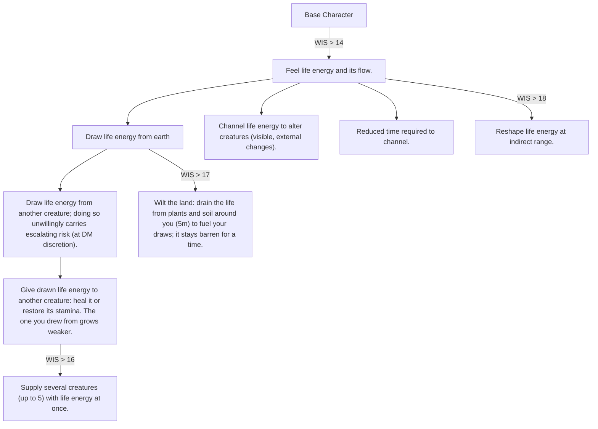
```mermaid
flowchart TD

A[Base Character]

1["Feel life energy and its flow."]
2["Draw life energy from earth"]
3["Draw life energy from another creature; doing so unwillingly carries escalating risk (at DM discretion)."]
4["Channel life energy to alter creatures (visible, external changes)."]
5["Give drawn life energy to another creature: heal it or restore its stamina. The one you drew from grows weaker."]
6["Reduced time required to channel."]
7["Supply several creatures (up to 5) with life energy at once."]
8["Reshape life energy at indirect range."]
9["Wilt the land: drain the life from plants and soil around you (5m) to fuel your draws; it stays barren for a time."]

A -->|WIS > 14|1 --> 2 --> 3
1 --> 4 
1 --> 6
1 --> |WIS > 18|8
3 --> 5 --> |WIS > 16|7
2 --> |WIS > 17|9

```

### Druid · Nature Spirits
*Before there were gods with names and temples, there were presences in the wood that noticed when you passed through uninvited. You have learned to notice them back — first as a feeling of being watched, later as voices with opinions, favors, and grudges of their own. They are not servants and never will be; they are neighbors older than memory, and a wise Druid treats every favor earned as a debt eventually owed.*

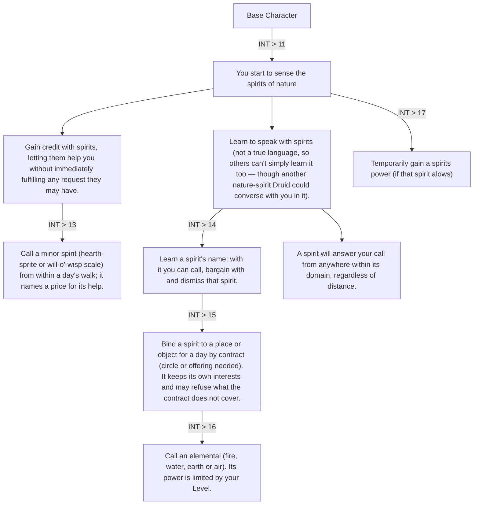
```mermaid
flowchart TD

A[Base Character]

1["You start to sense the spirits of nature"]
2["Learn to speak with spirits (not a true language, so others can't simply learn it too — though another nature-spirit Druid could converse with you in it)."]
3["Gain credit with spirits, letting them help you without immediately fulfilling any request they may have."]
4["Call a minor spirit (hearth-sprite or will-o'-wisp scale) from within a day's walk; it names a price for its help."]
5["Temporarily gain a spirits power (if that spirit alows)"]
6["Learn a spirit's name: with it you can call, bargain with and dismiss that spirit."]
7["Bind a spirit to a place or object for a day by contract (circle or offering needed). It keeps its own interests and may refuse what the contract does not cover."]
8["A spirit will answer your call from anywhere within its domain, regardless of distance."]
9["Call an elemental (fire, water, earth or air). Its power is limited by your Level."]

A -->|INT > 11|1 --> 2 --> 8
1 --> 3
1 --> |INT > 17|5
3 --> |INT > 13|4
2 --> |INT > 14|6 --> |INT > 15|7 --> |INT > 16|9

```

### Druid · Shapeshifting
*The beast was never outside of you. Every animal you have ever watched long enough left a trace behind, a door you can learn to open. Claws first, then the whole body — but a form worn too long starts to wear you back, and the animal's hunger is not always yours to refuse.*

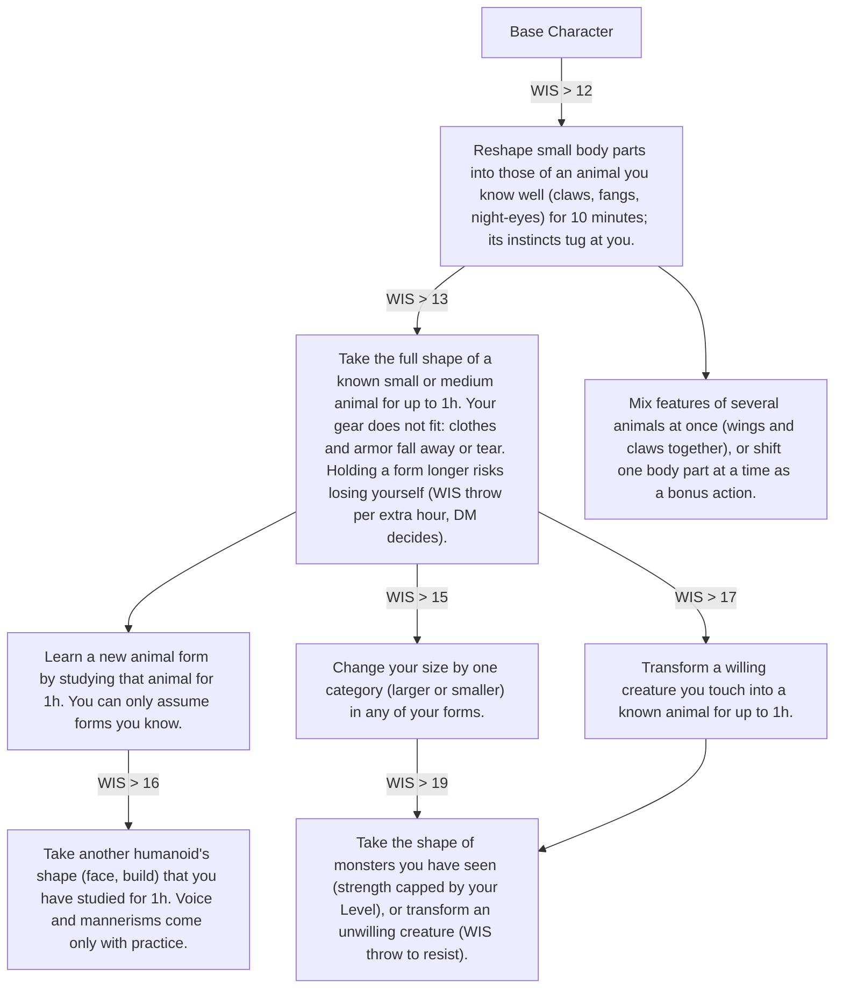
```mermaid
flowchart TD

A[Base Character]

1["Reshape small body parts into those of an animal you know well (claws, fangs, night-eyes) for 10 minutes; its instincts tug at you."]
2["Take the full shape of a known small or medium animal for up to 1h. Your gear does not fit: clothes and armor fall away or tear. Holding a form longer risks losing yourself (WIS throw per extra hour, DM decides)."]
3["Mix features of several animals at once (wings and claws together), or shift one body part at a time as a bonus action."]
4["Learn a new animal form by studying that animal for 1h. You can only assume forms you know."]
5["Change your size by one category (larger or smaller) in any of your forms."]
6["Take another humanoid's shape (face, build) that you have studied for 1h. Voice and mannerisms come only with practice."]
7["Transform a willing creature you touch into a known animal for up to 1h."]
8["Take the shape of monsters you have seen (strength capped by your Level), or transform an unwilling creature (WIS throw to resist)."]

A -->|WIS > 12|1
1 --> |WIS > 13|2
1 --> 3
2 --> 4
2 --> |WIS > 15|5
4 --> |WIS > 16|6
2 --> |WIS > 17|7
5 --> |WIS > 19|8
7 --> 8
```

---

## Elementalist

*Fire, water, earth, and air answer to the same principle, worn in four different shapes: mass, complexity, reach, and resistance. You do not conjure the elements from nothing — you convince what is already there to move, burn, flow, or hold in the shape your will describes. The paths below are less separate disciplines than dialects of the same argument with the world.*

### Elementalist · Fire
*Fire has always wanted to spread — you have simply learned to ask it where. What begins as a candle's flicker under your fingertip grows, with study, into a blaze that recognizes you as kin and spares you its hunger. Others fear what burns; you have made peace with it, on the condition that it remembers, always, whose fire it is.*

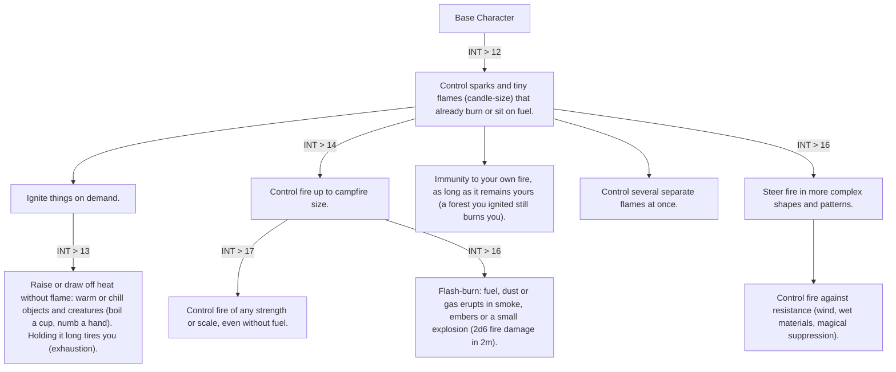
```mermaid
flowchart TD

A[Base Character]

1["Control sparks and tiny flames (candle-size) that already burn or sit on fuel."]
2["Ignite things on demand."]
3["Control fire up to campfire size."]
4["Immunity to your own fire, as long as it remains yours (a forest you ignited still burns you)."]
5["Control several separate flames at once."]
6["Steer fire in more complex shapes and patterns."]
7["Control fire against resistance (wind, wet materials, magical suppression)."]
8["Control fire of any strength or scale, even without fuel."]
9["Raise or draw off heat without flame: warm or chill objects and creatures (boil a cup, numb a hand). Holding it long tires you (exhaustion)."]
10["Flash-burn: fuel, dust or gas erupts in smoke, embers or a small explosion (2d6 fire damage in 2m)."]

A --> |INT > 12|1 
1 --> 2 
1 --> |INT > 14|3 --> |INT > 17|8
1 --> 4
1 --> 5
1 --> |INT > 16|6 --> 7
2 --> |INT > 13|9
3 --> |INT > 16|10
```

### Elementalist · Water
*Water does not fight — it finds the way around, beneath, or through, patient and relentless in equal measure. You have learned to be that patience made purposeful: currents that answer your intent, floods that rise where you point, mist that gathers because you willed it to. Stone breaks. Water simply continues, and so, increasingly, do you.*

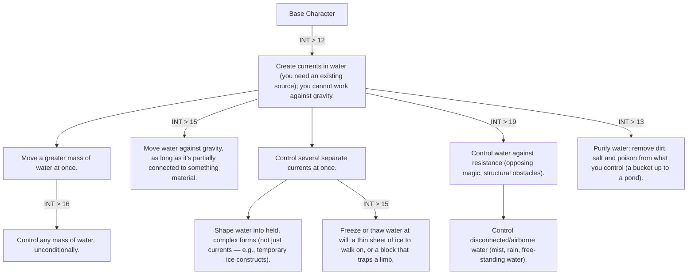
```mermaid
flowchart TD

A[Base Character]

1["Create currents in water (you need an existing source); you cannot work against gravity."]
2["Move a greater mass of water at once."]
3["Move water against gravity, as long as it's partially connected to something material."]
4["Control several separate currents at once."]
5["Shape water into held, complex forms (not just currents — e.g., temporary ice constructs)."]
6["Control water against resistance (opposing magic, structural obstacles)."]
7["Control disconnected/airborne water (mist, rain, free-standing water)."]
8["Control any mass of water, unconditionally."]
9["Purify water: remove dirt, salt and poison from what you control (a bucket up to a pond)."]
10["Freeze or thaw water at will: a thin sheet of ice to walk on, or a block that traps a limb."]

A --> |INT > 12|1 
1 --> 2 --> |INT > 16|8
1 --> |INT > 15|3
1 --> 4 --> 5
1 --> |INT > 19| 6 --> 7
1 --> |INT > 13|9
4 --> |INT > 15|10
```

### Elementalist · Earth
*The ground does not move quickly, but it moves absolutely when it finally does. You are the one who convinces stone and soil that stillness was only ever a habit, not a law — raising walls from bare earth, shaking foundations with a thought, and eventually feeling the whole world tremble beneath you like an extension of your own skin.*

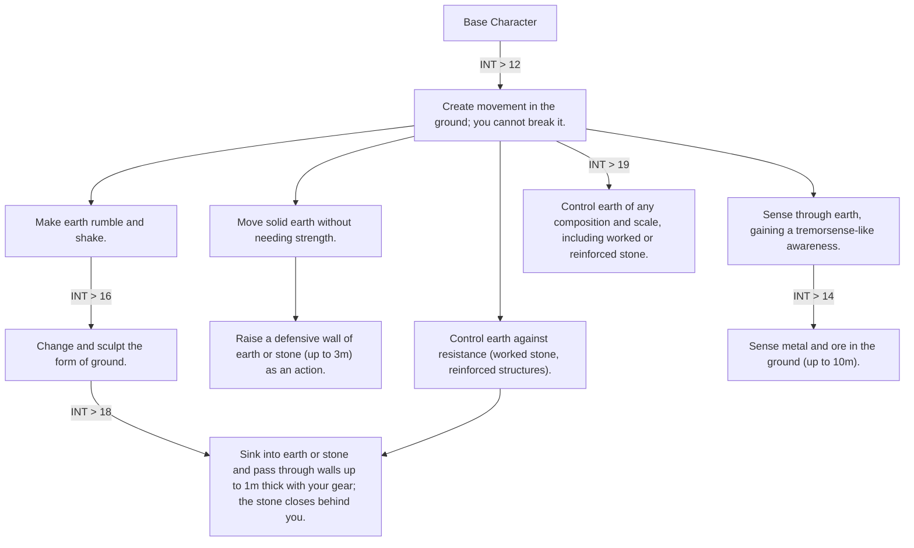
```mermaid
flowchart TD

A[Base Character]

1["Create movement in the ground; you cannot break it."]
2["Make earth rumble and shake."]
3["Move solid earth without needing strength."]
4["Change and sculpt the form of ground."]
5["Raise a defensive wall of earth or stone (up to 3m) as an action."]
6["Control earth against resistance (worked stone, reinforced structures)."]
7["Sense through earth, gaining a tremorsense-like awareness."]
8["Control earth of any composition and scale, including worked or reinforced stone."]
9["Sense metal and ore in the ground (up to 10m)."]
10["Sink into earth or stone and pass through walls up to 1m thick with your gear; the stone closes behind you."]

A --> |INT > 12|1
1 --> 2 --> |INT > 16|4
1 --> 3
3 --> 5
1 --> 6
1 --> 7
1 --> |INT > 19|8
7 --> |INT > 14|9
4 --> |INT > 18|10
6 --> 10
```

### Elementalist · Air
*Nobody notices the wind until it chooses to matter. You are the reason it chooses — a breath that turns into a gust, a gust that turns into a gale precise enough to snuff a single candle across a room or knock a single man off his feet. Air asks for nothing and holds nothing back; it simply goes where you tell it, faster than anyone expects.*

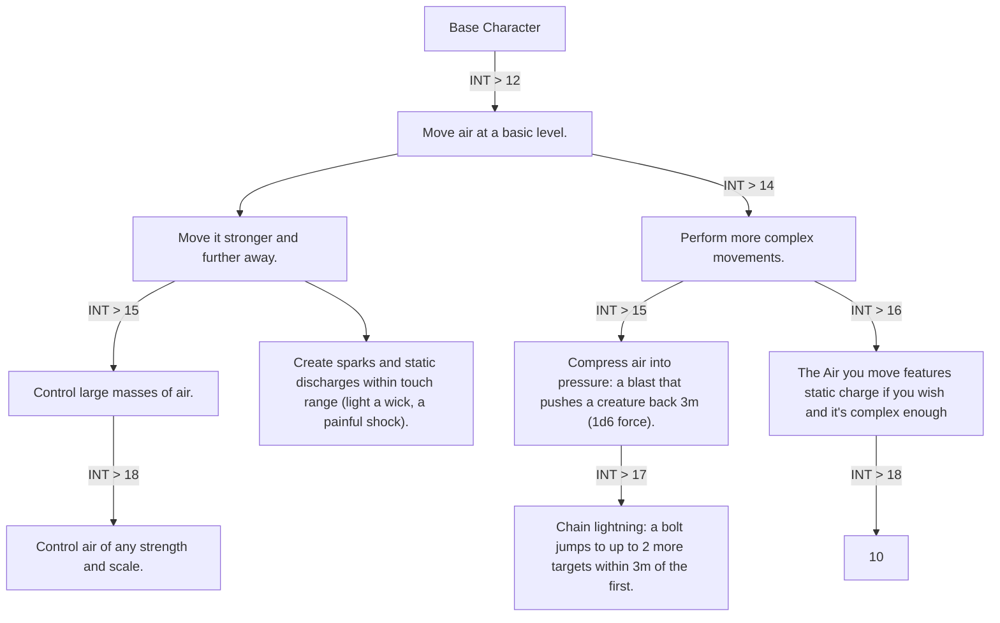
```mermaid
flowchart TD

A[Base Character]

1["Move air at a basic level."]
2["Move it stronger and further away."]
3["Perform more complex movements."]
4["Control large masses of air."]
5["Create sparks and static discharges within touch range (light a wick, a painful shock)."]
6["Compress air into pressure: a blast that pushes a creature back 3m (1d6 force)."]
7["The Air you move features static charge if you wish and it's complex enough"]
8["Control air of any strength and scale."]
9["Chain lightning: a bolt jumps to up to 2 more targets within 3m of the first."]

A --> |INT > 12|1 
1 --> 2 -->|INT > 15| 4 -->|INT > 18| 8
1 --> |INT > 14|3
2 --> 5
3 --> |INT > 15|6
3 --> |INT > 16|7
6 --> |INT > 17|9
7 --> |INT > 18|10
```

### Arcane Energy
*There is no element behind it and no tradition that taught it to you. Magic itself, unshaped, is the projectile: a bolt, a lance, a wall, a fist. It does exactly what you will it to, and the only things that grow with you are how much of it there is and how well you can steer it.*

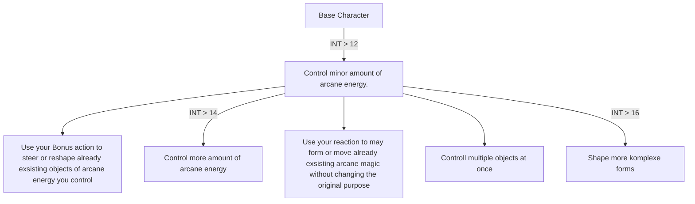
```mermaid
flowchart TD

A[Base Character]

1["Control minor amount of arcane energy."]
2["Use your Bonus action to steer or reshape already exsisting objects of arcane energy you control"]
3["Control more amount of arcane energy"]
4["Use your reaction to may form or move already exsisting arcane magic without changing the original purpose"]
5["Controll multiple objects at once"]
6["Shape more komplexe forms"]

A --> |INT > 12|1 
1 --> 2 
1 --> |INT > 14|3 
1 --> 4
1 --> 5
1 --> |INT > 16|6 
```

## Marshals
### Adrenaline

Adrenaline is a pool. Your **Tier** is 1 plus your adrenaline divided by 10, rounded down.

The pool itself does nothing. **Your path decides what each Tier gives you**.

| Tier | Buff | Debuff |
|-|-|-|
| 1 | none | none
| 2 | attack rolls gain +1 | attacks hit you deal +1 damage
| 3 | Your DEX and STR are increased by 1d4 as long as you remain in this tier | you gain disadvantage defensive reactions again all range attacks
4 | If you hit your target you can do an additional attack on disadvantage | Your tunnelvision becomes more badly: If you try to retreat you burn double the movement
5 | You attack so strong parries and blocks against your attacks get disadvantage | You can only swap a target if you get hit by it or you last one died.
6 | You attack one pure brutality reciving a second action per round | per round you use your second action you get one Level of exhaustion, but as long as you stay abouth Tier 4 you do not notice the exhaustion yet

---

*Every warrior burns something to fight harder: breath, focus, fear turned inside out. You call it adrenaline: the body's oldest magic.*

### Fighter · Adrenaline (Core)

*It starts in your hands and ends in your teeth. You did not choose it, but you can learn when it rises, how high you let it go, and when to put it down.*

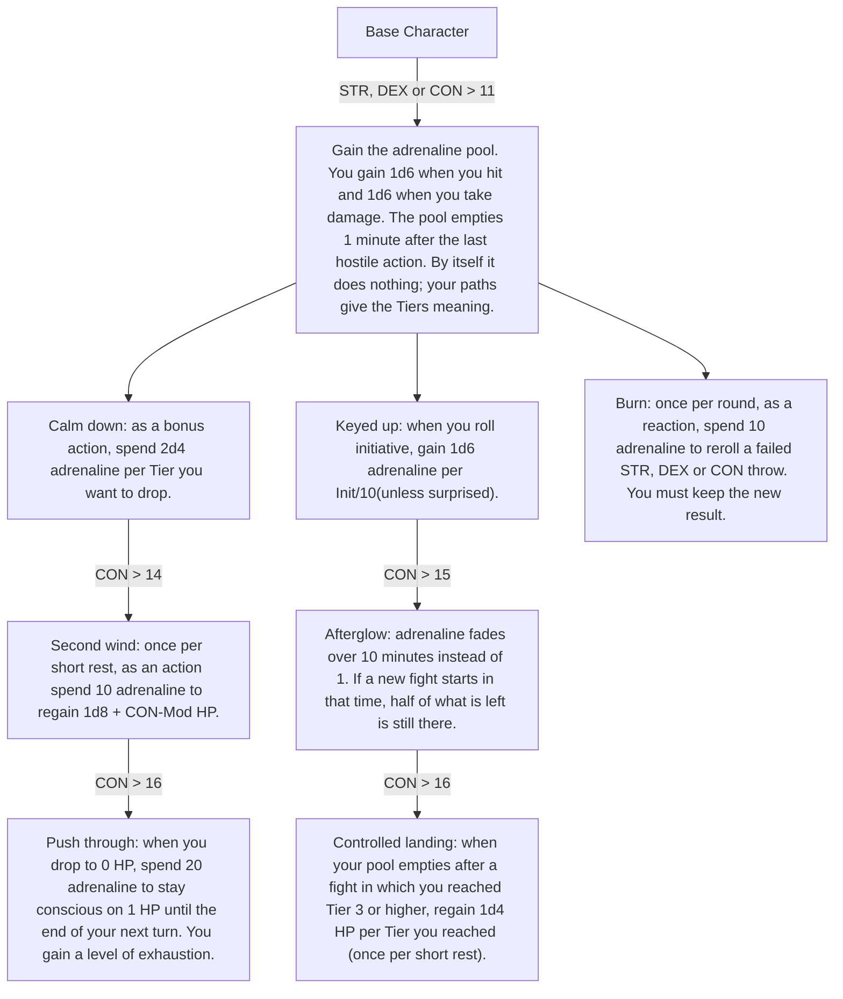
```mermaid
flowchart TD

A[Base Character]

1["Gain the adrenaline pool. You gain 1d6 when you hit and 1d6 when you take damage. The pool empties 1 minute after the last hostile action. By itself it does nothing; your paths give the Tiers meaning."]
2["Calm down: as a bonus action, spend 2d4 adrenaline per Tier you want to drop."]
5["Keyed up: when you roll initiative, gain 1d6 adrenaline per Init/10(unless surprised)."]
6["Afterglow: adrenaline fades over 10 minutes instead of 1. If a new fight starts in that time, half of what is left is still there."]
7["Second wind: once per short rest, as an action spend 10 adrenaline to regain 1d8 + CON-Mod HP."]
9["Push through: when you drop to 0 HP, spend 20 adrenaline to stay conscious on 1 HP until the end of your next turn. You gain a level of exhaustion."]
11["Burn: once per round, as a reaction, spend 10 adrenaline to reroll a failed STR, DEX or CON throw. You must keep the new result."]
12["Controlled landing: when your pool empties after a fight in which you reached Tier 3 or higher, regain 1d4 HP per Tier you reached (once per short rest)."]

A -->|STR, DEX or CON > 11|1
1 --> 2
1 --> 5
5 -->|CON > 15|6
2 -->|CON > 14|7
7 -->|CON > 16|9
6 -->|CON > 16|12
1 --> 11
```

### Fighter · Barbarian (STR)

*Rage is not a loss of control. It is a different kind of control, one that trades precision for certainty. Something in you answers pain and violence not with retreat but with more of the same, building until it must be spent. You do not fight to survive the moment. You fight because the moment has finally given you a reason to stop holding back.*

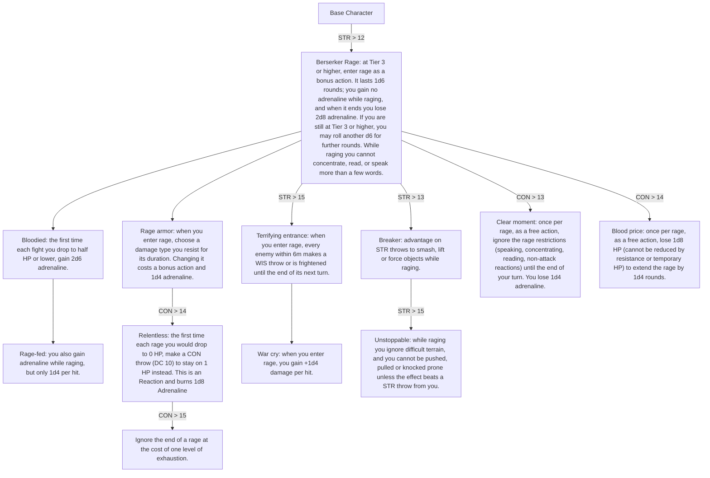
```mermaid
flowchart TD

A[Base Character]

1["Berserker Rage: at Tier 3 or higher, enter rage as a bonus action. It lasts 1d6 rounds; you gain no adrenaline while raging, and when it ends you lose 2d8 adrenaline. If you are still at Tier 3 or higher, you may roll another d6 for further rounds. While raging you cannot concentrate, read, or speak more than a few words."]
3["Rage armor: when you enter rage, choose a damage type you resist for its duration. Changing it costs a bonus action and 1d4 adrenaline."]
4["Bloodied: the first time each fight you drop to half HP or lower, gain 2d6 adrenaline."]
5["Rage-fed: you also gain adrenaline while raging, but only 1d4 per hit."]
6["Terrifying entrance: when you enter rage, every enemy within 6m makes a WIS throw or is frightened until the end of its next turn."]
7["Relentless: the first time each rage you would drop to 0 HP, make a CON throw (DC 10) to stay on 1 HP instead. This is an Reaction and burns 1d8 Adrenaline"]
9["Ignore the end of a rage at the cost of one level of exhaustion."]
10["Breaker: advantage on STR throws to smash, lift or force objects while raging."]
11["War cry: when you enter rage, you gain +1d4 damage per hit."]
12["Clear moment: once per rage, as a free action, ignore the rage restrictions (speaking, concentrating, reading, non-attack reactions) until the end of your turn. You lose 1d4 adrenaline."]
13["Blood price: once per rage, as a free action, lose 1d8 HP (cannot be reduced by resistance or temporary HP) to extend the rage by 1d4 rounds."]
14["Unstoppable: while raging you ignore difficult terrain, and you cannot be pushed, pulled or knocked prone unless the effect beats a STR throw from you."]

A -->|STR > 12|1
1 --> 3
1 --> 4
4 --> 5
1 -->|STR > 15|6
3 -->|CON > 14|7
7 -->|CON > 15|9
1 -->|STR > 13|10
6 --> 11
1 -->|CON > 13|12
1 -->|CON > 14|13
10 -->|STR > 15|14
```

### Fighter · Duelist (DEX)

*A blade fight is a conversation held at speed, and you have learned to listen to your own rising pulse as closely as to your opponent's footwork. Too little and you are slow. Too much and you stop seeing the person in front of you.*

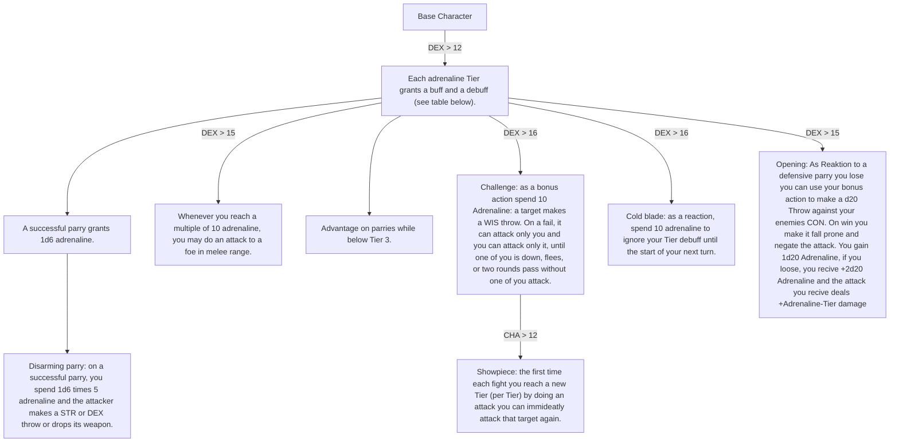
```mermaid
flowchart TD

A[Base Character]

1["Each adrenaline Tier grants a buff and a debuff (see table below)."]
2["A successful parry grants 1d6 adrenaline."]
3["Whenever you reach a multiple of 10 adrenaline, you may do an attack to a foe in melee range."]
4["Advantage on parries while below Tier 3."]
5["Disarming parry: on a successful parry, you spend 1d6 times 5 adrenaline and the attacker makes a STR or DEX throw or drops its weapon."]
7["Challenge: as a bonus action spend 10 Adrenaline: a target makes a WIS throw. On a fail, it can attack only you and you can attack only it, until one of you is down, flees, or two rounds pass without one of you attack."]
13["Cold blade: as a reaction, spend 10 adrenaline to ignore your Tier debuff until the start of your next turn."]
14["Opening: As Reaktion to a defensive parry you lose you can use your bonus action to make a d20 Throw against your enemies CON. On win you make it fall prone and negate the attack. You gain 1d20 Adrenaline, if you loose, you recive +2d20 Adrenaline and the attack you recive deals +Adrenaline-Tier damage"]
15["Showpiece: the first time each fight you reach a new Tier (per Tier) by doing an attack you can immideatly attack that target again."]

A -->|DEX > 12|1
1 --> 2
1 -->|DEX > 15|3
1 --> 4
2 --> 5
1 -->|DEX > 16|7
1 -->|DEX > 16|13
1 -->|DEX > 15|14
7 -->|CHA > 12|15
```

### Fighter · Knight (CON)

*Some warriors fight to win. You fight to make sure everyone beside you gets to keep fighting too. Every blow you take, every hit you turn aside for someone who could not, builds a steadiness in you that has nothing to do with anger and everything to do with resolve. The line holds because you decided, a long time ago, that it would.*

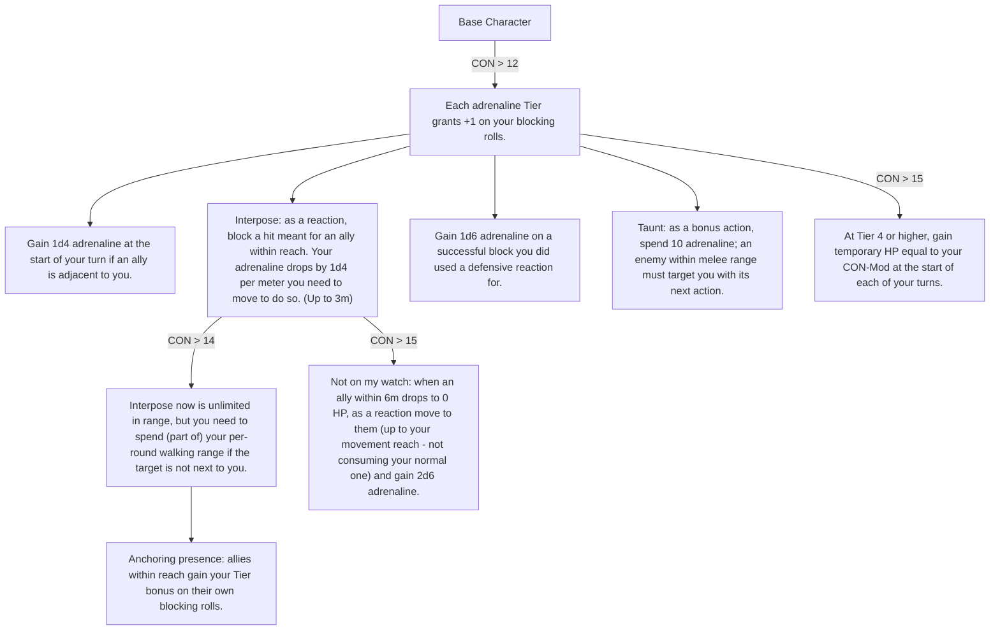
```mermaid
flowchart TD

A[Base Character]

1["Each adrenaline Tier grants +1 on your blocking rolls."]
2["Gain 1d4 adrenaline at the start of your turn if an ally is adjacent to you."]
3["Interpose: as a reaction, block a hit meant for an ally within reach. Your adrenaline drops by 1d4 per meter you need to move to do so. (Up to 3m)"]
4["Gain 1d6 adrenaline on a successful block you did used a defensive reaction for."]
5["Taunt: as a bonus action, spend 10 adrenaline; an enemy within melee range must target you with its next action."]
6["Interpose now is unlimited in range, but you need to spend (part of) your per-round walking range if the target is not next to you."]
7["At Tier 4 or higher, gain temporary HP equal to your CON-Mod at the start of each of your turns."]
8["Anchoring presence: allies within reach gain your Tier bonus on their own blocking rolls."]
12["Not on my watch: when an ally within 6m drops to 0 HP, as a reaction move to them (up to your movement reach - not consuming your normal one) and gain 2d6 adrenaline."]

A -->|CON > 12|1
1 --> 2
1 --> 3
3 -->|CON > 14|6
6 --> 8
1 --> 4
1 --> 5
1 -->|CON > 15|7
3 -->|CON > 15|12
```

### Brawler (STR or CON)

*Every weapon can be taken away. Hands cannot. You learned to fight the way the first fighters did, and you have not found anything since that works better at arm's length.*

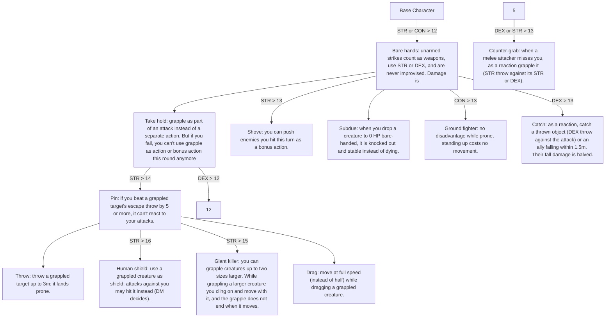
```mermaid
flowchart TD

A[Base Character]

1["Bare hands: unarmed strikes count as weapons, use STR or DEX, and are never improvised. Damage is "]
2["Take hold: grapple as part of an attack instead of a separate action. But if you fail, you can't use grapple as action or bonus action this round anymore"]
3["Pin: if you beat a grappled target's escape throw by 5 or more, it can't react to your attacks."]
4["Throw: throw a grappled target up to 3m; it lands prone."]
6["Shove: you can push enemies you hit this turn as a bonus action."]
8["Human shield: use a grappled creature as shield; attacks against you may hit it instead (DM decides)."]
9["Subdue: when you drop a creature to 0 HP bare-handed, it is knocked out and stable instead of dying."]
10["Counter-grab: when a melee attacker misses you, as a reaction grapple it (STR throw against its STR or DEX)."]
11["Giant killer: you can grapple creatures up to two sizes larger. While grappling a larger creature you cling on and move with it, and the grapple does not end when it moves."]
13["Ground fighter: no disadvantage while prone, standing up costs no movement."]
14["Drag: move at full speed (instead of half) while dragging a grappled creature."]
15["Catch: as a reaction, catch a thrown object (DEX throw against the attack) or an ally falling within 1.5m. Their fall damage is halved."]

A -->|STR or CON > 12|1
1 --> 2
2 -->|STR > 14|3
3 --> 4
1 -->|STR > 13|6
3 -->|STR > 16|8
1 --> 9
5 -->|DEX or STR > 13|10
3 -->|STR > 15|11
2 -->|DEX > 12|12
1 -->|CON > 13|13
3 --> 14
1 -->|DEX > 13|15
```

### Heavy Arms (STR)

*Some doors are opened by picking the lock. Others are opened by convincing the hinges.*

```mermaid
flowchart TD

A[Base Character]

1["Momentum: if you moved at least 3m in a straight line before attacking, the target makes a STR throw or falls prone."]
2["Sunder armor: declare an attack against the target's metal armor. A hit lowers its AC by 1 (max 3) until the armor is repaired (1 hour)."]
3["Advantage on attacks with your heavy weapon against a blocking or parrying foe."]
4["Wall-breaker: advantage on attempts to break doors, barricades and siege works with your heavy weapon."]
5["Sunder weapons: if you roll a critical on an attempt to disarm, the weapon breaks instead."]
13["Iron grip: you cannot be disarmed except by a critical hit, and drawing or sheathing your heavy weapon is free."]
15["Anything heavy but for you liftable (Check): logs, barrels, anvils and furniture count as proficient weapons for you (DM sets stats)."]

A -->|STR > 12|1
1 -->|STR > 14|2
1 -->|STR > 15|3
1 --> 4
2 -->|STR > 16|5
1 -->|CON > 13|13
13 -->|STR > 15|14
1 --> 15
```

### Warlord

*You do not win fights by being the best fighter in them. You win them because four people who would have run are still standing, and each of them knows what they are supposed to do next.*

```mermaid
flowchart TD

A[Base Character]

1["You can use commands, Allies burn their reaction to follow it"]
2["Carrying voice: your orders carry over battle noise up to 30m, and allies understand your signals without words."]
3["one bonus action issues Order to 1d4 allies."]
4["Briefing: a 10-minute briefing about the fight situation gives up to 3 chosen allies advantage on initiative in the next fight."]
5["Shared initiative: you and up to 2 chosen allies act on a single initiative (the best of you) and in any order you choose."]
6["Rally: as a bonus action, an ally within 12m repeats a throw to end frightened or charmed."]
7["Banner: allies within 12m of your standard have advantage on WIS throws against fear and morale effects. If the banner is seized, they lose it and the enemy gains it."]
8["Stirring speech: a 10-minute speech before a fight; each listener may reroll one failed throw within the next 24 hours (once)."]
13["Close ranks: allies who are adjacent to at least two other allies cannot be flanked."]
14["Final order: once per long rest, when you drop to 0 HP, every ally who hears you may use its reaction immediately. No reaction needed"]

A -->|CHA or INT > 12|1
1 --> 2
1 -->|CHA or INT > 14|3
1 -->|CHA or INT > 13|4
3 -->|CHA or INT > 16|5
1 --> 6
6 -->|CHA or INT > 15|7
2 --> 8
3 -->|CHA or INT > 15|13
5 -->|CHA or INT > 17|14
```
>### Commands
>
>| Kategorie | Command | Effekt |
>|-|-|-|
>| **Offense** | **Additional Hit** | The ally makes one weapon attack against a target you name. |
>| | **Focus fire** | Until the start of your next turn, the first hit on the named target deals +1d4 damage per ally who already hit it this round. |
>| | **Flank** | The ally moves up to 3m (no retreat penalty) to flank the named target and gains advantage on its next attack against it. |
>| **Movement** | **Repositioning** | The ally moves up to half its speed to a spot you point to, without provoking Tier 4 movement costs. |
>| | **Fall back** | The ally moves its full speed away from enemies. While doing so, it may use defensive actions against ranged attacks without disadvantage. |
>| | **Hold** | The ally cannot be pushed, pulled or knocked prone until the start of your next turn, but it may not move. |
>| | **Brace** | The ally gains +1 on all defensive rolls until your next turn. |
>| | **Shield wall** | Up to two adjacent allies who both receive this command share their blocks: either may block for the other. |

### Ambusher

*There is a moment in every guard's night when he is certain nothing will happen. You arrive on time for it.*

```mermaid
flowchart TD

A[Base Character]

1["Silent takedown: attack an unaware creature from behind or from hiding to knock it out instead of killing it. It makes a CON throw or is unconscious for 1 minute (reduce to HP to zero. After time they regain HP in Hight of two Hitdices for free)."]
2["Garrote: a strike from behind leaves the target unable to shout, speak or cast verbal spells for 1 round."]
3["Clean exit: after reducing an enemy's HP to 0, Hide as a reaction."]
4["Quiet alarm: when you take down a creature silently, nearby creatures are not alerted (unless they roll a nat 20 on Perception)."]
9["Open the dance: once per fight, if you start from hiding, you act first in round 1, whatever initiative says."]
14["If you are flanking and privious were hidden to the enemy you attack you attack on double damage"]

A -->|DEX > 12|1
1 --> 2
1 --> 3
2 -->|DEX > 16|4
3 -->|DEX > 14|9
4 --> 14
```

### Long-Weapons

```mermaid
flowchart TD

A[Base Character]

1["Long reach: spear attacks reach up to 3m. You can use your bonus action to expand this up to 4m, but that's an uncontrolled swing attack hitting everyone in a circle. You need to do a CON-Save or falling to the ground"]
2["Hold the line: as a reaction, attack a creature that enters or leaves your reach. On a hit, gain 1d4 adrenaline."]
3["Set against charge: if you did not move and a target ran 3m or more toward you, your hit deals +1d6 damage and it makes a STR throw or falls to the ground."]
6["Thrust through: your hit can also strike a second target directly behind the first, with disadvantage."]
9["Phalanx: spear wielders within 1.5m of each other gain +1 AC against ranged attacks."]
11["Hook and pull: on a hit against a mounted, flying or larger creature, it makes a STR throw or is pulled down prone."]
12["Thrown spear: throw your spear up to 9m as Range Attack. Drawing a spare spear is free."]
15["Impale: spend 20 adrenaline on a hit; the spear lodges in the target. Pull it out as free attack at base damage."]

A -->|STR or DEX > 12|1
1 --> 2
2 -->|STR > 13|3
1 -->|STR > 14|6
1 -->|CON > 13|9
1 -->|CON > 13|10
3 -->|STR > 15|11
1 --> 12
8 -->|STR > 16|15
```

---

## Light Mage

*Light does not belong to you, and it never will — it belongs to the sun, the moon, and whatever source you happen to be standing beneath. Cut off from that source, you are only as strong as anyone else in the dark. But given light, even a little, you become something the dark has learned to fear.*

### Light Mage · Sun-Worker
*The sun asks nothing in return for its warmth, and you have learned to shape that gift into something with an edge. Your weapon is light given form and purpose, reforged in ritual beneath open sky, burning steady and honest in a way that shadow-born magic never quite manages. There is no trickery in what you do — only brilliance, focused.*

```mermaid
flowchart TD

A[Base Character]

1["Learn to shape Light and make it flow in intended direction."]
2["Gain your weapon (choose its visual). It deals damage as the mundane weapon it mimics, plus 1d6 radiant damage on hit."]
3["Perform a 1h ritual, in direct sunlight the whole time, to reshape your weapon or spawn a new one (the old one breaks)."]
4["Focus the light more strongly (greater radiant damage or precision)."]
5["Fill a room or a 10m radius with light, from a soft glow to bright daylight. Careful: it dazzles your allies as well."]
6["Once per day, instantly reshape your weapon as your action; this blinds everyone within 1m and deals 1d4 radiant damage to everyone within 3m."]
7["You can now create a second weapon or an armor of light. The armor has resistance to necrotic damage."]
8["Force the day: flood a 30m radius with sunlight for 1h. Creatures of shadow and darkness suffer disadvantage there."]
9["Bundle light into a beam (10m line, 1d8 radiant damage) and bend it around corners with prisms or mirrors. Focused on wood or cloth it also heats and ignites."]
10["Purifying light: burn away rot, filth or minor poison from a person or object; undead take 2d6 radiant damage."]

A-->|WIS > 13|1
1 --> 2 --> |WIS > 15|3 --> 6 --> |WIS > 18|7
1 --> 4
4 --> |WIS > 15|9
1 --> |WIS > 14|5
5 --> |WIS > 19|8
2 --> |WIS > 16|10

```

### Light Mage · Moon-Worker
*The moon is not the sun's lesser reflection — it is its own thing entirely, changeable, patient, and just a little unkind to those who cross it. You have learned to work with that change rather than against it, shaping a weapon whose nature shifts with the sky itself. Where the Sun-Worker is a steady flame, you are a phase — sometimes radiant, sometimes something closer to shadow wearing light's shape.*

```mermaid
flowchart TD

A[Base Character]

1["Learn to shape Light and make it flow in intended direction."]
2["Gain your weapon (choose its visual). It deals damage as the mundane weapon it mimics, plus 1d6 damage on hit; the damage type varies with the moon's phase."]
3["Perform a 1h ritual, under direct moonlight the whole time, to reshape your weapon or spawn a new one (the old one fades)."]
4["Learn to make the light flow out of a place (it becomes darker and light-less)."]
5["Once per day, instantly reshape your weapon as your action; the effect varies by phase."]
6["Hide in the darkness you drew out of a place: while inside it you have advantage on Stealth."]
7["You can now create a second weapon or an armor of light. The armor has special resistance based on Moon Phase."]
8["Master all phases — once per long rest, choose which phase's effect applies, regardless of the moon's actual state."]

A-->|WIS > 13|1
1 --> 2 --> |WIS > 15|3 --> 5 --> |WIS > 18|7 --> 8
1 --> 4 -->|WIS > 16| 8
4 --> 6
```

#### Moon Phases

| Phase | Damage | Damage Type | Reshape Effect|
|--|-|--|-|
| Full moon |High| Radiant Damage | same as sun
new moon | Low | Necrotic damage | it is emerging darkness making surroundings in 2m 2 stages darker and in 5m 1. Inside this cloud you can see like one step brighter.
| 50/50 | Mid | Radiant Damage | you emerge light and shadow the same making no difference. If an Enemy is in your weapons reach after the rit you can use your Bonus action to attack

---

## Mirage

*Nothing you make is real, and that has never once stopped it from hurting someone. You are an architect of belief, building illusions so convincing that the line between seeing and knowing simply stops mattering to the mind you're speaking to.*

### Mirage · Mind Reader
*Every person carries a fear and a want close enough to the surface that a careful glance can find it. You have learned to read that surface and hand it back to them, twisted into something they cannot look away from. It is not mind control — it is worse. It is showing someone exactly what they were already afraid of, or already wanted, and letting their own mind do the rest.*

```mermaid
flowchart TD

A[Base Character]

1["As a bonus action, make a CHA throw against your target. On success, learn a random, strong fear or want of theirs. As an action you can make your target see an illusion, lasting for 1d6 Rounds."]
2["If your target currently believes your illusion, you may attack as a bonus action."]
3["Add your CHA bonus twice on illusion-related CHA throws."]
4["Choose whether you learn a fear or a want. Your illusion now lasts 2d4 Rounds."]
5["Read multiple targets — up to 3 — at once. Choose your learning for each independently."]
6["If your target believes an illusion you can attack it twice."]
7["As Reaction to a target pitfalling to the illusion deal 2d10 psy damage to it."]
8["Make your Illusion hurt your opponend if it is a fear for 1d12 as bonus action or if it's a want make it get disadvantage on all it's throws that turn as Action (nat20 ignore this)"]

A --> |CHA or INT > 13|1
1 --> 2 -->|CHA or INT > 16| 6
1 --> |CHA or INT > 14|3
1 --> 4
1 --> |CHA or INT > 18| 7 --- 8
1 --> |CHA or INT > 15|5
```

### Mirage · Fata Morgana

*The world lies to itself all the time — a mirage on the horizon, a trick of heat and light that fools even careful eyes. You have learned to author those lies on purpose, bending light until the ground cracks that was never cracked, until a wall stands that was never built. You cannot make a bird fly or a beast attack; you can only make the world around them look different than it is — which, against the right mind, is more than enough.*

```mermaid
flowchart TD

A[Base Character]

1["Manipulate light's flow to form a fata morgana. Every turn you sustain it, every target (including allies) makes a CHA throw against you. Targets who know the terrain instead make a WIS throw applying their proficiency (doubled if proficient)."]
2["If you've seen and studied the phenomenon you're mimicking for 1h, add your CHA twice on that check."]
3["You now mimic the process, not just the state — enemies see, let's say, a crack forming and breaking into the earth. Targets always make a CHA throw. You can concentrate on 2 fata morganas now; if you fail a concentration throw you lose all existing."]
4["If a target fails their check, the illusion becomes real for them. It still breaks if someone who succeeded the check touches it."]
5["Shape a fata morgana as a bonus action. Concentrate on up to 3 fata morganas now."]
6["Add your CHA bonus on concentration throws about your fata morgana. You now make a concentration check on each independently."]
7["If failing the check of your illusions, deal 2d4 damage per target (per fata morgana)."]
8["You now don't need any light source or a direction of light to create a fata morgana. You can now upkeep up to 5 illusions at a time."]

A -->|CHA or INT > 12|1
1 --> 2
1 --> |CHA or INT > 14|3
1 --> |CHA or INT > 15|5
1 --> 4
1 --> 6
1 --> |CHA or INT > 16|8
1 --> |CHA or INT > 16|7
```

---

## Necromancer

*Death is not an ending you fear — it is a resource you understand better than most of the living ever will. Two paths: one that spends the caster's own vitality as currency, one that commands what vitality has already left behind.*

### Necromancer · Blood
*Every spell has a price, and you have simply chosen to pay it yourself, in the oldest coin there is. A cut, a toll, a sacrifice — your own blood spent to push your magic further than it would otherwise reach. Others fear the cost. You have made peace with it, because you were always going to be the one paying either way.*

```mermaid
flowchart TD

A[Base Character]

1["Blood toll: spend your own HP or that of willing creatures to perform or boost a spell."]
2["The toll becomes more efficient (less HP cost per benefit)."]
3["Drain a sip of vitality from a touched creature (1d4 necrotic damage); you gain the same amount as temporary HP."]
4["Use blood from other creatures instead of your own."]
6["Give vitality: transfer HP from yourself or a donor to another creature."]
7["Supply a group (up to 4 creatures) with drained or donated vitality at once."]

A --> |WIS > 12|1
1 --> |CON > 13|2
1 --> 3 
1 --> 4 --> 6 --> |WIS > 16|7

```

### Necromancer · Death
*A corpse is not nothing — it is a vessel that stopped being used, and you have learned to put it back to work. Quality matters as much as quantity: a fresh, strong body answers your command with more strength than a decade-old bone, but given time and skill, you can raise a small army from what everyone else considers simply gone.*

```mermaid
flowchart TD

A[Base Character]

1["Empower corpses and command them (Corpse-Points: 1.5)."]
2["Empower more corpses simultaneously (Corpse Points: 4)."]
3["Awaken and command as a bonus action."]
4["Higher-quality corpses yield noticeably stronger servants (Unlock not Marshel Corspe-Powers)."]
5["Raise skeletons from bare bones, even old ones: weaker than a fresh corpse, but cheap. You always need a body or bones."]
6["Hold a horde under control (10). Beyond your limit you must pass an INT throw each turn to keep control. "]
8["Learn to compine different corpses to achieve more powerfull hybrids"]

A --> |INT > 12|1 --> 4 --> |INT > 17|8
1 --> 2
1 --> |INT > 15|3
1 --> |INT > 13|5
2 --> |INT > 16|6
3 --> |INT > 17|7
```

>### Basic Table to limit the number of servants
> 
>||Tiny | Small | Medium | Large | Giant | +++ |
>|-|-|-|-|-|-|-|
>|Marshel | 0.5 | 1 | 1.5 | 2 | 4 | 5 |
>|Minor Magic | 1 | 1.5 | 2.5 | 4 | 5.5 | 6.5 |
>|Full Magic | 2 | 3| 4 | 5.5 | 7 | 8.5 |

---

## Sorcerer

### Sorcerer · Channeler
*Magic was never meant to be tame, and you have never quite managed to fully leash it. Every spell you cast is a negotiation with forces that don't much care what you intended — sometimes they cooperate exactly, sometimes they overshoot wildly, and sometimes the difference between the two is the most interesting thing that happens all fight. You do not control wild magic. You survive it, more skillfully each time.*

```mermaid
flowchart TD

A[Base Character]

1["Cast spells, but there may be side effects (the DM improvises, or uses the table below)."]
2["Reroll a side-effect roll."]
3["Roll a second side-effect roll if you wish."]
5["Reduce the range of the worst outcomes (still random, but the floor is raised)."]
6["Recognize a side effect before it resolves, and choose to accept it or attempt to suppress it. (d20 + CHA-Mod > 15: On fail a second effect is rolled without you having noticed)"]
8["Let a deviation run fully wild by choice — highest risk, highest possible reward, full narrative license to the DM."]

A -- > |CHA > 11|1
1 -- > |CHA > 13|2 -- > 5 -- > |CHA > 15|6
1 -- > 3 -- > |CHA > 14| 8
```

---

## Summoner

*A demon's true name is a key, and finding it is only the first danger. Binding one is a negotiation held at the edge of a blade; keeping it bound is a discipline that never fully ends. Two paths: command many weak servants, or dominate one terrible one.*

```mermaid
flowchart TD

A[Base Character]

1["Learn 3 rituals for 3 base demons."]
2["Your bind check improves: 2d10 instead of 1d20."]
3["No hard cap on the number of bound demons, but each additional demon adds 1d4 difficulty to the check."]
4["Add your INT-Mod twice to the bind/controll check."]
5["If you controll no other demons your controll and bindchecks become 3d10"]
6["Demeons suffer disadvantage on escape check if your Level is 3 higher than their CR. Additionally you gain Advantage if your Level is 6 higher."]

A -->|INT > 11|1
1 --> |INT > 14|2 --> 4 --> 5 --> |INT > 17|6
1 --> 3
```

> ### Danger 
>
> Flat_DC = 10 + CR / 2 

---

## Warlock
*You made a bargain, and bargains have a way of reshaping the one who makes them. Your patron — fiend, fey, or something with no comfortable name at all — grants power in exchange for a devotion that only deepens with time. Every prayer answered is a debt quietly renewed, and every gift given comes wearing its patron's fingerprints, whether you notice them or not.*

```mermaid
flowchart TD

A[Base Character]

1["Gain your pact (choose a patron)."]
2["Pray to your patron for a minor power buff until your next long rest."]
3["Gain a patron-specific minor trait, reflecting your patron's theme."]
4["Gain a pact weapon."]
6["Gain a stronger patron-specific ability, or bind a second patron."]
7["Gain the power to reshape your pact weapon in a one hour ritual."]
8["Your patron grants you a signature, iconic ability tied directly to its core theme."]

A -- > |WIS > 11|1
1 -- > 2
1 -- > |WIS > 13|3 -- > 6
1 -- > |WIS > 14|4 -- > 7
1 -- > |WIS > 17|8
```

---

## Witch

*A Witch's power is old, personal, and built on knowing things others don't — a true name, a stolen strand of hair, the exact shape of a grudge. Several paths, one instinct: the world can be bent, if you know precisely where to press.*

### Witch · Curses & Witchcraft
*A curse spoken at a stranger is a threat. A curse spoken by name, over something they once owned, with their face fixed in your memory — that is a promise. You have learned that misfortune is not random; it can be aimed, layered, and made to land exactly where you intend, and the more of a person you hold in your grasp, the less that person's luck belongs to them at all. What can be aimed to harm can be aimed to bless, and both can be made to end.*

```mermaid
flowchart TD

A[Base Character]

1["Curse a target on sight (weakest tier). A target who believes in your curse resists with disadvantage; a failed curse may rebound on you (DM decides)."]
2["Curse a target by name, without needing sight. If you have both: moderate curse tier."]
3["Curse a target using something they own. If you have any two things: moderate curse tier, or if all three, strongest curse tier."]
4["You can now resolve your curses at will."]
5["Curse items directly."]
6["If the target does not expect to get cursed, you win the curse-check."]
7["You can now call a trigger for a curse."]
8["You can now cast 3rd level curses on having only 2 aspects, and 2nd level curses by only having 1."]
9["Bless instead of curse: good luck, health or success, using the same tiers and rules."]
10["Curse or bless a place or a family line: everyone bound to it shares the effect at one tier weaker."]
11["Bind a release condition to a curse or blessing (for example: until they return what they stole). When it is met, the effect ends. A strict condition raises its tier by 1."]

A --> |CHA or WIS > 12|1
A --> |CHA or WIS > 12|2
A --> |CHA or WIS > 12|3
1 --- 4
2 --- 4
3 --- 4
1 --- |CHA or WIS > 13|5
2 --- |CHA or WIS > 13|5
3 --- |CHA or WIS > 13|5
1 --- |CHA or WIS > 15|6
2 --- |CHA or WIS > 15|6
3 --- |CHA or WIS > 15|6
1 --- 7
2 --- 7
3 --- 7
1 --> |CHA or WIS > 15|8
2 --> |CHA or WIS > 15|8
3 --> |CHA or WIS > 15|8
4 --> |CHA or WIS > 14|9
4 --> |CHA or WIS > 16|10
7 --> 11
```

### Witch · Brewing
*Every plant, root, and rare ingredient holds a secret it's willing to give up to someone patient enough to ask correctly. You are a keeper of recipes half-remembered and half-discovered — potions that heal, harm, hinder, or help, bottled from patience and precision in equal measure. A cauldron does not lie, if you know how to read what it tells you.*

```mermaid
flowchart TD

A[Base Character]

1["Brew potions (basic recipes: heal, buff, debuff, damage)."]
2["Sense the location of a chosen ingredient up to three times per long rest."]
3["Merge different potions into one."]
4["Once per long rest you can detect any potion's effect at a 100% chance."]
5["Brew stronger tiers of recipes you already know."]
6["If you see a brewed potion and you learn its effects, you can do a WIS throw to guess its ingredients."]
7["You can brew double the amount out of the same amount of essentials."]
8["Using a rare, exceptional ingredient (quality matters) you can raise a potion by one further tier."]

A --> |INT > 12|1
1 --> 2
1 --> |INT > 14|3
1 --> |INT > 15|4 --> 6
1 --> |INT > 14|5 --> 7
5 --> |INT > 17|8
```

### Witch · Familiar
*A familiar is not a pet, and it was never meant to be decorative. Bound to you by something closer to kinship than command, it fights at your side, watches when you cannot, and feels what you feel across a distance neither of you fully understands. Lose it, and you lose part of yourself. Most Witches would tell you that risk was always the point.*

```mermaid
flowchart TD

A[Base Character]

1["Gain a familiar; you both sense each other's strong feelings (pain, great joy)."]
2["Communicate by telepathy."]
3["Gain 3 spells from your familiar's spell list. Your familiar has 4/3 your Passive perception. Enemies get Disadvantage on sneak and stealth against your familiar (everyone else gets first throw values)."]
4["Your familiar can fight competently on its own."]
5["Your familiar gains improved combat capability (better attacks/defenses)."]
6["Your familiar becomes a true extension of yourself — share senses fully, or briefly perceive through it at range."]
7["If your familiar is about to die, you can sacrifice half your remaining HP to immediately revive it at 1/4 of its health."]
8["Bind a mount or hunting beast (up to large size) as your familiar instead of a small animal."]

A --> |WIS > 11|1
1 --> 2
1 --> 3
1 --> 4
1 --> 5
1 -->|WIS > 13| 6
1 --> |WIS > 14|7
4 --> |WIS > 15|8
```

### Witch · Fate & Foresight
*The future is not fixed, but it leans — and you have learned to feel which way. A glimpse here, a nudge there: not command over fate, but a whispered suggestion to a world that mostly listens. You do not force outcomes. You simply learn, a little before anyone else, which way they were already about to fall — and sometimes, that's enough to matter.*

```mermaid
flowchart TD

A[Base Character]

1["Once per long rest, make a diviner's throw to glimpse the future."]
2["Choose who or what your divination concerns."]
3["Divine once per short rest."]
4["Choose a specific roll for a chosen entity to increase or decrease by 1d6 when it happens. Fate balances: luck here costs an equal misfortune elsewhere, and bearers of a great fate resist (advantage on their throw)."]
5["With a divinatory item, divine on up to 3 different targets, including yourself."]
6["For each target: reduce the chance it is a debuff or buff."]
7["Your calls become more reliable, the roll is now modified by 2d6."]
8["Divine a pivotal moment for an entity with full precision — name the exact circumstance, not just a general shift in fortune. Your DM decides how often you can do this."]
9["Divine through dreams: once per long rest sleep on a question and receive an answer in symbols."]
10["Read omens: interpret natural signs (bird flight, smoke, cards) to learn the general luck of a journey or place for the next day."]
11["Question the dead: a fresh corpse answers up to 3 questions, truthfully but as it understood things in life."]

A --> |WIS > 12|1
1 --> 2 --> |WIS > 14|4 --> 6 --> |WIS > 16|7
1 --> 3 --> 5
5 --> 8
7 --> 8
1 --> |WIS > 13|9
2 --> |WIS > 15|10
4 --> |WIS > 17|11
```

### Witch · Poison & Plague
*Rot is only another kind of growth, and sickness a kind of argument the body loses. You know how a fruit turns, how a wound festers, how a cough passes from one room to the next. The same knowledge that spreads a plague can stop one — but it only ever stops what you know well enough to have made yourself.*

```mermaid
flowchart TD

A[Base Character]

1["Spoil small things by touch: rot food, sour a drink, make a wound fester slightly (hand-sized)."]
2["Create a simple poison in one dose (a blade's worth, a drink), or neutralize one."]
3["Coat a blade or arrow with poison: +1d4 poison damage, and the target makes a CON throw against a lingering effect."]
4["Give a touched creature a mild disease (fever, weakness) for 1d4 days; it resists with a CON throw."]
5["Cure or halt a disease or poison you know."]
6["Infect a group: up to 5 creatures within 3m each make a CON throw against your disease."]
7["Immunity to the poisons and diseases you create; advantage on CON throws against other poisons and diseases."]
8["Spread a plague through a settlement over days, or blight a field. Immunity, Constitution, hygiene and healing can counter it."]

A -->|WIS or INT > 12|1
1 --> 2
2 --> |WIS or INT > 13|3
2 --> |WIS or INT > 14|4
2 --> |WIS or INT > 14|5
4 --> |WIS or INT > 16|6
2 --> |WIS or INT > 15|7
6 --> |WIS or INT > 18|8
```