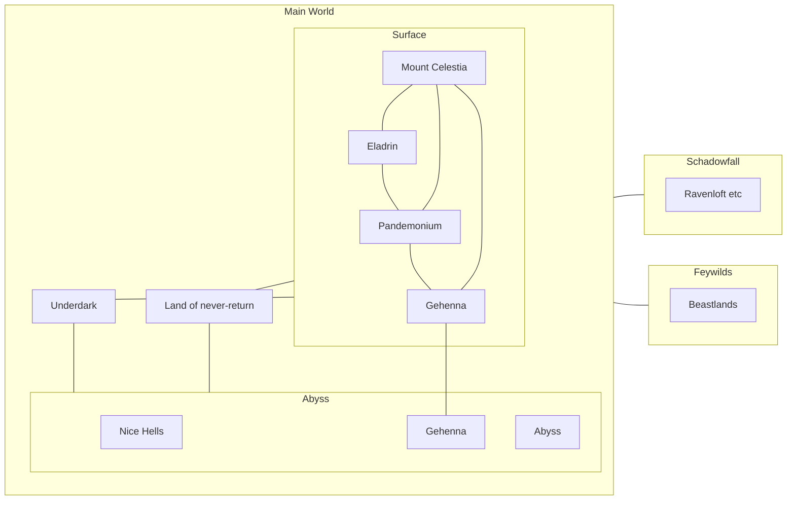

The Idea is looking like this:

```mermaid
flowchart LR

subgraph World[Main World]
    subgraph S[Surface]
        M[Mount Celestia]
        E[Eladrin]
        P[Pandemonium]
        G[Gehenna]
    end

    M --- E
    E --- P
    M --- P
    P --- G
    M --- G

    D[Underdark]
    L[Land of never-return]

    subgraph Z[Abyss]
        N[Nice Hells]
        A[Abyss]
        F[Gehenna]
    end

    G --- F

    S---D---Z
    S---L---Z
end

subgraph Shadow[Schadowfall]
    R[Ravenloft etc]
end

World --- Shadow

subgraph Fey[Feywilds]
    B[Beastlands]
end

World --- Fey

```