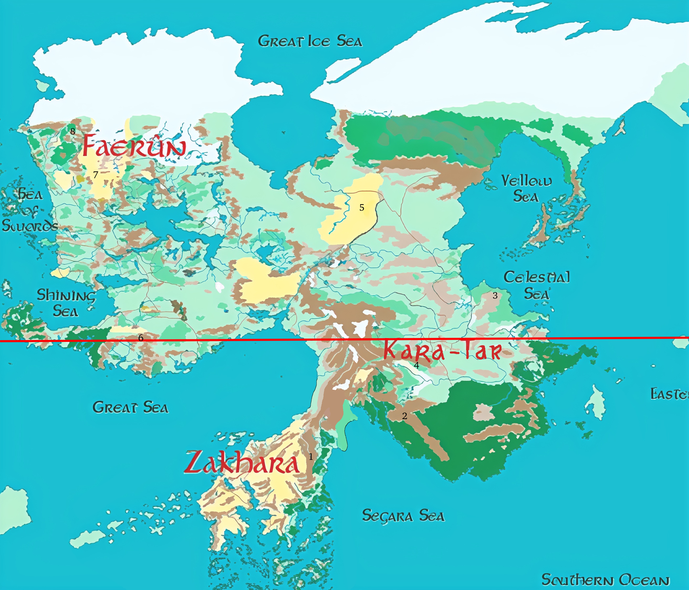

- 1: You find here large mountains blocking the rain on the right side, creating a rain forest on that side and a Desert on the left side. That desert is not but rocky.
- 2: Also here you find a Rain Blocking mountain resulting in not a desert but a humid savannah to the south.
- 3: At this coast we will find a desert, shifting inland to a dry savannah.
- 4: Due to the windblocking mountains in the south we will find here a savannah, right to the mountains quite dry, getting more humid to the north, before getting dry again on high of `3`.
- 5: Here you find continental klima similar to mongolia, but it intensivates up to a real continental desert
- 6: Even if rocky this biome is humid and fruitful. Also the jungl eof chult expands wide to the east.
- 7: To explain the desert near the glacier, we call it cold and on a high platue. That way we reach colder bioms, so a glacier is fitting, and the cold air from the glacier prevents big rainfall. So Anarouch desert is rocky and cold, instead of a real desert.
- 8: This high platue already under Anarouch is quite expanded, reaching most the north of fearun pushing it into colder air.

- Zakhara: This is a little draged to the south to fit winds direction
- Kara-Tar: South-side is little dragged to north to match climate zone
  

> Sources: This is the low-resolute version upgreaded and reworked by myself (may using ai tools)