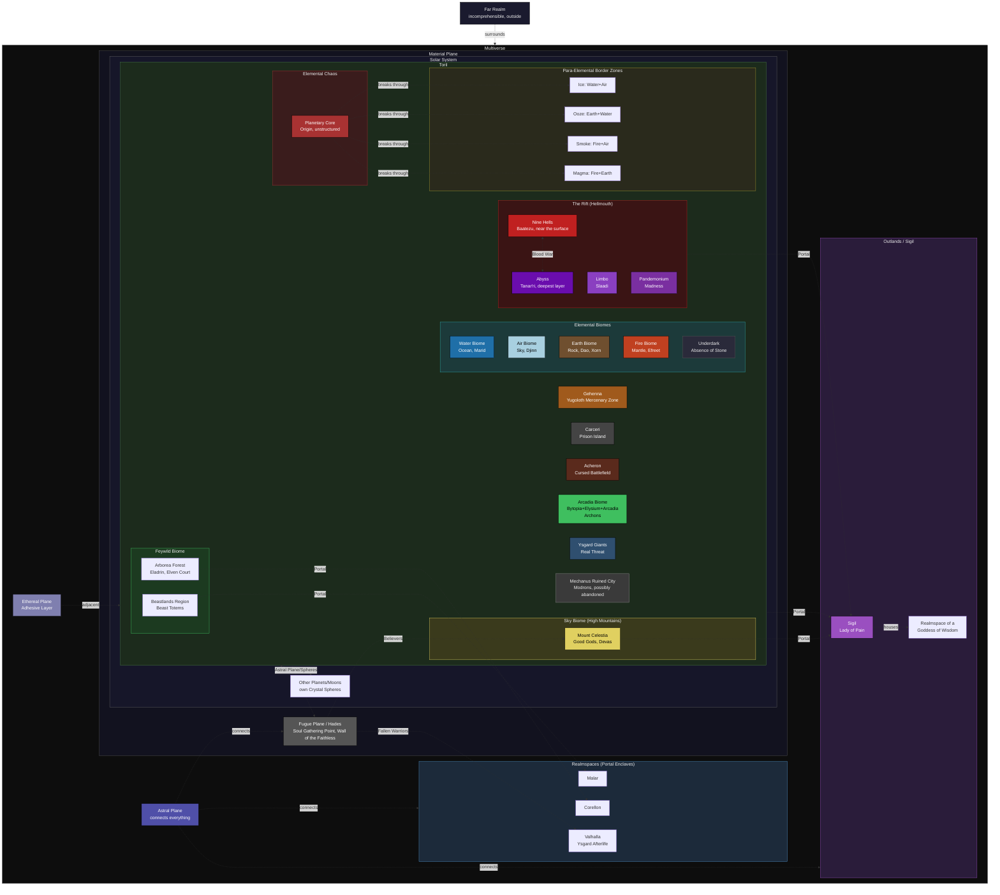

# Toril Cosmology: Biomes, Realmspaces & Relationships

## Key

* **Full border (subgraph)** = Containment: X is physically/structurally within Y
* **Dotted arrows** = Relationship, travel route, or conflict between locations that are not contained within one another
* **Rift** = Combined Limbo/Pandemonium/Abyss/Nine Hells structure, layered according to depth

## Ideas

### Mechanus

- Mechanus becomes a big city, an old empire or something. Of course the size will reduce drastically.

**Tasks**

- Ruin or still active city?

### Archadia

- This will become a biome class, without bound to fix types. Basically this appears if a land is completly dominated, by fairies or any power all animals  become calm and friendly and it becomes cultivated.
- Due to the factor of cultivation this is where many population settle.

### Celestia

- Celestia will become a realmspace on a high mountain. On ascending the mountain in the material world you enter the realmspace and you exceed the mountains actual hight in the material plane.
  
### Bytopia

- Becuase I like the idea of this scene, this biome is born during spell pleague (I did not found any timeline for any event on bytopia, so this should be fine). The spell pleague bend the mountains to overhang far, creating another ground to stay on, just in the sky. 
- Also the pleague did create an phenomina similar to *Faerzress*, creating a surrounding spell you can't resist, casting some kind of levitate on everone and everything make you stick to the skyborn ground in a way gravity would.

### Elysium

- A vast forested plateau (Amoria) under the normal sun, cut by a deep canyon whose terraced walls and waterfalls form Eronia. The canyon floor holds mist-shrouded marshes with mesa-islands (Belierin), and far below lies a bioluminescent freshwater sea with the Isles of the Blessed (Thalasia).
- The river Oceanus works as a closed water cycle. It rises from artesian springs out of the underground sea, braids across the plateau, cascades down the walls, and drains back through karst sinkholes. The draining keeps the sea fresh, and the cave openings double as portals.
- The mineral-rich, calming springs and thermal pools explain the "troubles wash away" effect, while geysers host the phoenixes and terraced walls grow the famous pears.

### Beastlands

* A vast, densely forested mountain range in a fey-touched wilderness, where nearly every natural animal (and giant variants) can speak and reason. Legend holds that the Spellplague awakened them, and the forest's mycelial network and Yggdrasil turned that surge into something benevolent.
- The three layers are stacked by elevation. **Krigala** is the sunlit highland and plateau forest with no shade, so it feels like endless noon. **Brux** is the deep valleys in permanent dusk, lit by low red light from both valley ends and reflected off the cliffs. **Karasuthra** is the cave network inside the mountains, an eternal night sky of glowworms and drifting luminous spores whose random movement defies mapping, with underground forests of giant fungi and root curtains.
- Weather is regional, as in real mountains, so desert can sit beside snow through rain shadows and altitude. The mortai are sentient cloud-spirits born from orographic clouds, who guard their local weather with help from the birds. Hollow trees and cave mouths serve as portals, and the Oceanus runs straight across the high plateau.

### Arborea

- A vast, larger-than-life region of the Fey where emotion shapes the land itself. The nature spirits of every forest, mountain, stream, and cloud mirror the moods of those who enter, taking on their likeness, so joy makes the land bloom and rage brings storms of lightning and hail. Pollen, fruit, and music on the wind make visitors passionate, reckless, and reluctant to leave, and staying too long can leave a lasting craving. Spirits and courts also enforce oaths, and magic requires small offerings to them.
- The land splits into three regions. **Arvandor** is a redwood-scale forest and mountain realm of glades, orchards, and firefly constellations, ruled by Fey courts and led by the Faerie Queen's ever-moving Court of Stars. **Aquallor** is an emerald sea, only ankle-to-knee deep for miles, broken by sudden blue holes leading to sunken courts. **Mithardir** is a cool white desert of gypsum dust and lightning-charged storms, the ruins of a dead Fey court whose emotions faded, making it the Fell-touched echo of the vibrant Fey above.

### Ysgard

- The Norse realms become real places in the far north, as in the myths.
- **Asgard** remains as the divine realm of the Norse pantheon and serves as the afterlife, with Valhalla as its hall of fallen heroes. It is reached via the **Bifrost**, seen in the world as the aurora borealis.

### Abyss

- The Abyss will be a giant rift opening to a big realm even under the underdark. It is home to two fractions of celestials: The Demons and the Devils. Since the very beginning the devils make contracts with humanoids. This intelligence based idea is not liked by all celestials like the demons who prefer the direct force to get their will. So there is a war inside the abyss resulting in different fractions and teretories. The Devils got a few top levels, they call the Hells, while the rest of the abyss belongs to the demons. Between Hell and True Abyss you find all the other Evil Planes you find between Nine Hells and Abyss in great wheel.

### Limbo

### Pandemonium

As Pandemonium is the same core idea as the abyssal planes just on another usecase, it will be dropped completly. If you really want to force it to be a specific place it could be just another layer in abyss

### Acheron

Acheron basically is the idea of fighting for fun as a complete plane what is little over the top. So I drop it completly, but if some campaignes need the idea of an endless war I would call some kingdoms an material plane to are engaged in an endless war noone knows the reason for anymore. And due to the Spell Pleague the wast land they fight on, make your wound heal as soon as you are lethally hittet.

### Outlands

The Outlands will be a city or a kingdom on the material plane where many Ley lines conflict and therefore the magic for traveling is really potent there.

### Fey Wilds

The Fey will remain like it is and additional some bioms including the Shadowfell.

