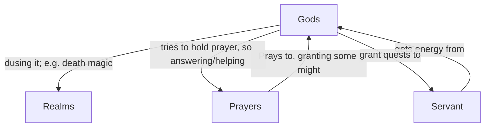

In this file I go over the role I assign gods to, their powers and their limits.

# Gods

I define Gods not as immortal or all mighty. In my opinion gods are normal creatures just got a really high power ranking, so their body is aging really slow, and it is hard to overcome them, but it's not impossible at all. Therefore, god is more a title for really powerful creatures also defines other scales to god-like and a higher creature like a demon or celestial.

In my opinion there are different Realms like Fire, Love, Death, War, etc. a god now is nothing more than someone representing this realm or a chunk of it. So gods do not belong to one realm, they can be god of birth and growth, even if that's may two realms. Also, this realm is not bound to the god in any way. Other than the god the realm is unkillable and everlasting. It's just a fundamental idea in the world and as such can't be distinguished or lowered. But as idea it can become quite unimportant. For example war and violence is always but in a perfect society that could be really irrelevant, even the concept still exists.

Humans pray normally to gods not to concepts as they give their gods humanoid features like understanding or mercy. Therefor humans could ask love itself, but the realm will not respond, it's just an idea. So Humans pray to god of love to get a chance of responding. Therefore, they pray the grant some of their might to that god. This means as more prayers a god got as more might it gains, so it of course tries to answer/help the prayer. 

To do this a god has some servants like priests and higher beings or ask another prayer to help that other prayer. In exchange the God helps that servant by granting them might or something similar.

So those servants' might can harshly vary if they fail on a quest, or they help the god a lot.  

As gods are just stronger beings, you can become a god by gathering the Strength. The most strength therefore emerges from the prayers and servants as normally you can't hold more power than Level 20. But getting more strength from your prayers exceeds your level over level 20. So Level 20 can be understood as half god state. Those Power levels may be topic in another mechanic sheet later on to clarify the mechanic and the CR scaling I imagine. 

## Multiple Gods for same domain

As we already said gods are just using the skill set of the specific realm, without the realm minding anything at all, there of course are multiple gods for the same thing if the characters of a world pray to different gods for this domain. Those could try to fight each other but most of the time they only overlap but not really serve the same. Still over time they could merge, because prayers make no difference anymore. This is quite an interesting idea, I not have the world rule for: Do they then actually merge? So have prayers so much power over gods? Or does the pray energy just split?

