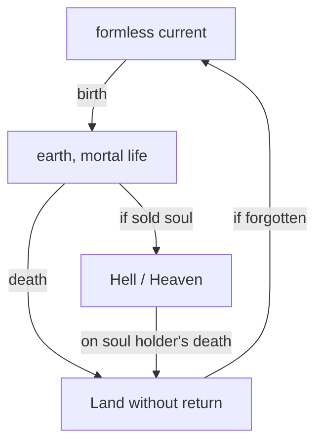

# Lifecycle

As already stated in the demon overview the natural lifecycle is not connected to Hell or Heaven. hell and Heaven are more like dead ends created by demons.

## Flow of souls

In the natural proceeding Souls flow from a outer plane further even than the elemental planes, called the formless current, to earth getting born to mortal races. They live and die going to underworld - land without return - where they live until noone's remembering them. Then they flow back to Brahman and wait for their new reborn.

So Hell and Heaven are non-natural. And even if those chaotic celestials [if found name set here] are also bound to this flow and gain power on collecting souls as all other beings they often serve/alliance with spirits, gods of nature and rulers of land without return to hunt down other gods and demons to get back those souls in eternal loop. Therefore they are the most complexe class of demons as they not just collect souls but collect and release and try to hold balance.

> ### The formless current
> It is really hard to locate it as it works more like another universe. 
>
> There is no shape at all. It's just pure being. You don't be someone or somewhere, you just are. Spoiler: It is inspired by the world of demons form book series Bartimaeus.

## Do souls remember their earlier life?

I personally do not really like this, but that's a character thing. From scientific tower you say memories are stored inside your brain, what is rotting after your death, so no, you do not remember. But if you want you for sure can your character remember some points, maybe told by a spirit or something. Just ask your DM about this, because this can cause more knowledge or skill.