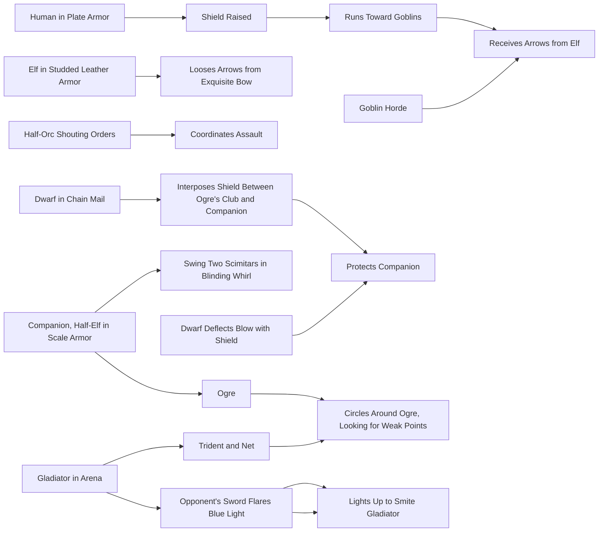

>To make it easier for players to not having to always compare and have different sources to create character I will just get also the unchanged stuff here.
>
>All things not relevant to changes like creation help are cleansed from this version! You can find the pdf for free in Web, so just search there if you got any question or raise an Discussion after checking on already existing one.

## Ability Score Summary

## Strength

- Natural athleticism
- bodily power
- scales Damage on STR-Weapons
- max carry weight 

## Dexterity

- Physical agility
- reflexes
- balance
- poise
- scales DEX Weapons Damage
- walking speed increase

## Constitution

- Health
- stamina
- vital force
- how long you can march

## Intelligence

- Mental acuity
- information recall
- analytical skill
- scales INT-Spells Damage

## Wisdom

- Awareness
- intuition / faith
- insight
- scales your miracles damage and effectivness

## Charisma

- Confidence
- eloquence
- leadership

## 3. Determine Ability Scores

See Abillity_Score.md

## 4. Describe Your Character

Once you know the basic game aspects of your character, it's time to flesh him or her out as a person. Your character needs a name. Spend a few minutes thinking about what he or she looks like and how he or she behaves in general terms.Using the information in chapter 4, you can flesh out your character's physical appearance and personality traits. Choose your character's alignment (the moral compass that guides his or her decisions) and ideals. Chapter 4 also helps you identify the things your character holds most dear, called bonds, and the flaws that could one day undermine him or her.

Your character's background describes where he or she came from, his or her original occupation, and the character's place in the D&D world. Your DM might offer additional backgrounds beyond the ones included.

Bob fills in Bruenor's final hit points: 10 + his Constitution modifier of +3, for a total of 13 hit points.

## Variant: Customizing Ability Scores

At your Dungeon Master's option, you can use this variant for determining your ability scores. The method described here allows you to build a character with a set of ability scores you choose individually.

You have 27 points to spend on your ability scores. The cost of each score is shown on the Ability Score Point Cost table. For example, a score of 14 costs 7 points. Using this method, 15 is the highest ability score you can end up with, before applying racial increases. You can't have a score lower than 8.This method of determining ability scores enables you to create a set of three high numbers and three low ones (15, 15, 15, 8, 8, 8), a set of numbers that are above in chapter 4, and might be willing to work with you to craft a background that's a more precise fit for your character concept.

|   Ability Score Point Cost |   Ability Score Point Cost | Ability Score Point Cost |    |
|------------------------------------------------|------------------------------------------------|------------------------------------------------|----|
|                                                |                                                | Score Cost Score Cost                          |    |
|                                              8 |                                              0 | 12                                             |  4 |
|                                              9 |                                              1 | 13 5                                           |    |
|                                             10 |                                              2 | 14 7                                           |    |
|                                             11 |                                                | 3 15                                           |  9 |

A background gives your character a background feature (a general benefit) and proficiency in two skills, and it might also give you additional languages or proficiency with certain kinds of tools. Record this information, along with the personality information you develop, on your character sheet.

## Your Character's Abilities

Take your character's ability scores and race into account as you flesh out his or her appearance and personality. A very strong character with low Intelligence might think and behave very differently from a very smart character with low Strength.For example, high Strength usually corresponds with a burly or athletic body, while a character with low Strength might be scrawny or plump.

A character with high Dexterity is probably lithe and slim, while a character with low Dexterity might be either gangly and awkward or heavy and thick-fingered.

A character with high Constitution usually looks healthy, with bright eyes and abundant energy. A character with low Constitution might be sickly or frail.

A character with high Intelligence might be highly inquisitive and studious, while a character with low Intelligence might speak simply or easily forget details.

A character with high Wisdom has good judgment, empathy, and a general awareness of what's going on. A character with low Wisdom might be absent-minded, foolhardy, or oblivious.

A character with high Charisma exudes confidence, which is usually mixed with a graceful or intimidating presence. A character with low Charisma might come across as abrasive, inarticulate, or timid.

## Building Bruenor, Step 4

Bob fills in some of Bruenor's basic details: his name, his sex (male), his height and weight, and his alignment (lawful good). His high Strength and Constitution suggest a healthy, athletic body, and his low Intelligence suggests a degree of forgetfulness.

Bob decides that Bruenor comes from a noble line, but his clan was expelled from its homeland when Bruenor was very young. He grew up working as a smith in the remote villages of Icewind Dale. But Bruenor has a heroic destiny—to reclaim his homeland—so Bob chooses the folk hero background for his dwarf. He notes the proficiencies and special feature this background gives him.Bob has a pretty clear picture of Bruenor's personality in mind, so he skips the personality traits suggested in the folk hero background, noting instead that Bruenor is a caring, sensitive dwarf who genuinely loves his friends and allies, but he hides this soft heart behind a gruff, snarling demeanor. He chooses the ideal of fairness from the list in his background, noting that Bruenor believes that no one is above the law.

Given his history, Bruenor's bond is obvious: he aspires to someday reclaim Mithral Hall, his homeland, from the shadow dragon that drove the dwarves out.

His flaw is tied to his caring, sensitive nature—he has a soft spot for orphans and wayward souls, leading him to show mercy even when it might not be warranted.

## 5. Choose Equipment

Your class and background determine your character's starting equipment, including weapons, armor, and other adventuring gear. Record this equipment on your character sheet. All such items are detailed in chapter 5.

Instead of taking the gear given to you by your class and background, you can purchase your starting equipment. You have a number of gold pieces (gp) to spend based on your class, as shown in chapter 5. Extensive lists of equipment, with prices, also appear in that chapter. If you wish, you can also have one trinket at no cost (see the trinket table at the end of chapter 5).

Your Strength score limits the amount of gear you can carry. Try not to purchase equipment with a total weight (in pounds) exceeding your Strength score times 15. Chapter 7 has more information on carrying capacity.## Armor Class

Your Armor Class (AC) represents how well your character avoids being wounded in battle. Things that contribute to your AC include the armor you wear, the shield you carry, and your Dexterity modifier. Not all characters wear armor or carry shields, however.

Without armor or a shield, your character's AC equals 10 + his or her Dexterity modifier. If your character wears armor, carries a shield, or both, calculate your AC using the rules in chapter 5. Record your AC on your character sheet.

Your character needs to be proficient with armor and shields to wear and use them effectively, and your armor and shield proficiencies are determined by your class. There are drawbacks to wearing armor or carrying a shield if you lack the required proficiency, as explained in chapter 5.

Some spells and class features give you a different way to calculate your AC. If you have multiple features that give you different ways to calculate your AC, you choose which one to use.

## Weapons

For each weapon your character wields, calculate the modifier you use when you attack with the weapon and the damage you deal when you hit.

When you make an attack with a weapon, you roll a d20 and add your proficiency bonus (but only if you are proficient with the weapon) and the appropriate ability modifier.- For attacks with melee weapons, use your Strength modifier for attack and damage rolls. A weapon that has the finesse property, such as a rapier, can use your Dexterity modifier instead.
- For attacks with ranged weapons, use your Dexterity modifier for attack and damage rolls. A weapon that has the thrown property, such as a handaxe, can use your Strength modifier instead.

## Building Bruenor, Step 5

Bob writes down the starting equipment from the fighter class and the folk hero background. His starting equipment includes chain mail and a shield, which combine to give Bruenor an Armor Class of 18.

For Bruenor's weapons, Bob chooses a battleaxe and two handaxes. His battleaxe is a melee weapon, so Bruenor uses his Strength modifier for his attacks and damage. His attack bonus is his Strength modifier (+3) plus his proficiency bonus (+2), for a total of +5. The battleaxe deals 1d8 slashing damage, and Bruenor adds his Strength modifier to the damage when he hits, for a total of 1d8 + 3 slashing damage. When throwing a handaxe, Bruenor has the same attack bonus (handaxes, as thrown weapons, use Strength for attacks and damage), and the weapon deals 1d6 + 3 slashing damage when it hits.

## 6. Come TogetherMost D&D characters don't work alone. Each character plays a role within a party, a group of adventurers working together for a common purpose. Teamwork and cooperation greatly improve your party's chances to survive the many perils in the worlds of Dungeons & Dragons. Talk to your fellow players and your DM to decide whether your characters know one another, how they met, and what sorts of quests the group might undertake.

## Beyond 1st Level

As your character goes on adventures and overcomes challenges, he or she gains experience, represented by experience points. A character who reaches a specified experience point total advances in capability. This advancement is called gaining a level.

When your character gains a level, his or her class often grants additional features, as detailed in the class description. Some of these features allow you to increase your ability scores, either increasing two scores by 1 each or increasing one score by 2. You can't increase an ability score above 20. In addition, every character's proficiency bonus increases at certain levels.

Each time you gain a level, you gain 1 additional Hit Die. Roll that Hit Die, add your Constitution modifier to the roll, and add the total to your hit point maximum. Alternatively, you can use the fixed value shown in your class entry, which is the average result of the die roll (rounded up).When your Constitution modifier increases by 1, your hit point maximum increases by 1 for each level you have attained. For example, when Bruenor reaches 8th level as a fighter, he increases his Constitution score from 17 to 18, thus increasing his Constitution modifier from +3 to +4. His hit point maximum then increases by 8.

The Character Advancement table summarizes the X P you need to advance in levels from level 1 through level 20, and the proficiency bonus for a character of that level. Consult the information in your character's class description to see what other improvements you gain at each level.

## Tiers of Play

The shading in the Character Advancement table shows the four tiers of play. The tiers don't have any rules associated with them; they are a general description of how the play experience changes as characters gain levels.

In the first tier (levels 1-4), characters are effectively apprentice adventurers. They are learning the features that define them as members of particular classes, including the major choices that flavor their class features as they advance (such as a wizard's Arcane Tradition or a fighter's Martial Archetype). The threats they face are relatively minor, usually posing a danger to local farmsteads or villages.

In the second tier (levels 5-10), characters come into their own. Many spellcasters gain access to 3rd-level spells at the start of this tier, crossing a new threshold of magical power with spells such as fireball and lightning bolt. At this tier, many weapon-using classes gain the ability to make multiple attacks in one round. These characters have become important, facing dangers that threaten cities and kingdoms.In the third tier (levels 11-16), characters have reached a level of power that sets them high above the ordinary populace and makes them special even among adventurers. At 11th level, many spellcasters gain access to 6th-level spells, some of which create effects previously impossible for player characters to achieve. Other characters gain features that allow them to make more attacks or do more impressive things with those attacks. These mighty adventurers often confront threats to whole regions and continents.

At the fourth tier (levels 17-20), characters achieve the pinnacle of their class features, becoming heroic (or villainous) archetypes in their own right. The fate of the world or even the fundamental order of the multiverse might hang in the balance during their adventures.

## Character Advancement

| Experience Points Level    | Proficiency   |
|----------------------------|---------------|
| 0 - 1                      | +2            |
| 300 - 2                    | +2            |
| 900                        | 3 +2          |
| 2,700 - 4                  | +2            |
| 6,500 - 5                  | +3            |
| 14,000 - 6                 | +3            |
| 23,000 - 7 +3              |               |
| 34,000 - 8                 | +3            |
| 48,000                     | 9 +4          |
| 64,000 - 10 +4             |               |
| 85,000                     | 11 +4         |
| 100,000 - 12 +4            |               |
| 120,000 - 13               | +5            |
| 140,000 - 14               | +5            |
| 165,000 - 15 +5            |               |
| 195,000 - 16               | +5            |
| 225,000 - 17               | +6            |
| 265,000 - 18               | +6            |
| 305,000 - 19               | +6            |
| 355,000 - 20               | +6            |# Chapter 2: Races
A VISIT TO ONE OF THE GREAT CITIES IN THE WORLDS OF DUNGEONS & DRAGONS — Waterdeep, the Free City of Greyhawk, or even uncanny Sigil, the City of Doors—overwhelms the senses. Voices chatter in countless different languages. The smells of cooking in dozens of different cuisines mingle with the odors of crowded streets and poor sanitation. Buildings in myriad architectural styles display the diverse origins of their inhabitants.

And the people themselves—people of varying size, shape, and color, dressed in a dazzling spectrum of styles and hues—represent many different races, from diminutive halflings and stout dwarves to majestically beautiful elves, mingling among a variety of human ethnicities.

Scattered among the members of these more common races are the true exotics: a hulking dragonborn here, pushing his way through the crowd, and a sly tiefling there, lurking in the shadows with mischief in her eyes. A group of gnomes laughs as one of them activates a clever wooden toy that moves of its own accord. Halfelves and half-orcs live and work alongside humans, without fully belonging to the races of either of their parents. And there, well out of the sunlight, is a lone drow—a fugitive from the subterranean expanse of the Underdark, trying to make his way in a world that fears his kind.

## Choosing a RaceHumans are the most common people in the worlds of D&D, but they live and work alongside dwarves, elves, halflings, and countless other fantastic species. Your character belongs to one of these peoples.

Not every intelligent race of the multiverse is appropriate for a player-controlled adventurer. Dwarves, elves, halflings, and humans are the most common races to produce the sort of adventurers who make up typical parties. Dragonborn, gnomes, half-elves, half-orcs, and tieflings are less common as adventurers. Drow, a subrace of elves, are also uncommon.

Your choice of race affects many different aspects of your character. It establishes fundamental qualities that exist throughout your character's adventuring career. When making this decision, keep in mind the kind of character you want to play. For example, a halfling could be a good choice for a sneaky rogue, a dwarf makes a tough warrior, and an elf can be a master of arcane magic.

Your character race not only affects your ability scores and traits but also provides the cues for building your character's story. Each race's description in this chapter includes information to help you roleplay a character of that race, including personality, physical appearance, features of society, and racial alignment tendencies. These details are suggestions to help you think about your character; adventurers can deviate widely from the norm for their race. It's worthwhile to consider why your character is different, as a helpful way to think about your character's background and personality.

## Racial TraitsThe description of each race includes racial traits that are common to members of that race. The following entries appear among the traits of most races.

## Ability Score Increase

Every race increases one or more of a character's ability scores.

## Age

The age entry notes the age when a member of the race is considered an adult, as well as the race's expected lifespan. This information can help you decide how old your character is at the start of the game. You can choose any age for your character, which could provide an explanation for some of your ability scores. For example, if you play a young or very old character, your age could explain a particularly low Strength or Constitution score, while advanced age could account for a high Intelligence or Wisdom.

## Alignment

Most races have tendencies toward certain alignments, described in this entry. These are not binding for player characters, but considering why your dwarf is chaotic, for example, in defiance of lawful dwarf society can help you better define your character.

## Size

Characters of most races are Medium, a size category including creatures that are roughly 4 to 8 feet tall. Members of a few races are Small (between 2 and 4 feet tall), which means that certain rules of the game affect them differently. The most important of these rules is that Small characters have trouble wielding heavy weapons, as explained in chapter 6.

## SpeedYour speed determines how far you can move when traveling (chapter 8) and fighting (chapter 9).

## Languages

By virtue of your race, your character can speak, read, and write certain languages. Chapter 4 lists the most common languages of the D&D multiverse.

## Subraces

Some races have subraces. Members of a subrace have the traits of the parent race in addition to the traits specified for their subrace. Relationships among subraces vary significantly from race to race and world to world. In the Dragonlance campaign setting, for example, mountain dwarves and hill dwarves live together as different clans of the same people, but in the Forgotten Realms, they live far apart in separate kingdoms and call themselves shield dwarves and gold dwarves, respectively.

## Dwarf

"Yer late, elf!" came the rough edge of a familiar voice. Bruenor Battlehammer walked up the back of his dead foe, disregarding the fact that the heavy monster lay on top of his elven friend. In spite of the added discomfort, the dwarf's long, pointed, often-broken nose and graystreaked though still-fiery red beard came as a welcome sight to Drizzt. "Knew I'd find ye in trouble if I came out an' looked for ye!"

—R. A. Salvatore, The Crystal ShardKingdoms rich in ancient grandeur, halls carved into the roots of mountains, the echoing of picks and hammers in deep mines and blazing forges, a commitment to clan and tradition, and a burning hatred of goblins and orcs—these common threads unite all dwarves.

## Short and Stout

Bold and hardy, dwarves are known as skilled warriors, miners, and workers of stone and metal. Though they stand well under 5 feet tall, dwarves are so broad and compact that they can weigh as much as a human standing nearly two feet taller. Their courage and endurance are also easily a match for any of the larger folk.

Dwarven skin ranges from deep brown to a paler hue tinged with red, but the most common shades are light brown or deep tan, like certain tones of earth. Their hair, worn long but in simple styles, is usually black, gray, or brown, though paler dwarves often have red hair. Male dwarves value their beards highly and groom them carefully.

## Long Memory, Long GrudgesIt looks like you've provided an image and some text describing a game or setting, likely for a role-playing game (RPG) or strategy game. The text describes clans and kingdoms in a fantasy setting, with various factions and their relationships.

To better assist you, could you please clarify what specific information or help you need regarding this setting? Here are a few possible areas we could explore:

1. **Understanding the Clans and Kingdoms**: What are the different clans and kingdoms mentioned?
2. **Factions and Relationships**: How do these factions interact with each other?
3. **Game Mechanics**: Are there any specific rules or mechanics related to these clans and kingdoms?
4. **World Building**: Do you need help expanding on this setting, creating more details about the world?

If you have a specific question or area of focus, please let me know!Dwarven kingdoms stretch deep beneath the mountains where the dwarves mine gems and precious metals and forge items of wonder. They love the beauty and artistry of precious metals and fine jewelry, and in some dwarves this love festers into avarice. Whatever wealth they can't find in their mountains, they gain through trade. They dislike boats, so enterprising humans and halflings frequently handle trade in dwarven goods along water routes. Trustworthy members of other races are welcome in dwarf settlements, though some areas are off limits even to them.

The chief unit of dwarven society is the clan, and dwarves highly value social standing. Even dwarves who live far from their own kingdoms cherish their clan identities and affiliations, recognize related dwarves, and invoke their ancestors' names in oaths and curses. To be clanless is the worst fate that can befall a dwarf.

Dwarves in other lands are typically artisans, especially weaponsmiths, armorers, and jewelers. Some become mercenaries or bodyguards, highly sought after for their courage and loyalty.

## Gods, Gold, and ClanDwarves who take up the adventuring life might be motivated by a desire for treasure—for its own sake, for a specific purpose, or even out of an altruistic desire to help others. Other dwarves are driven by the command or inspiration of a deity, a direct calling or simply a desire to bring glory to one of the dwarf gods. Clan and ancestry are also important motivators. A dwarf might seek to restore a clan's lost honor, avenge an ancient wrong the clan suffered, or earn a new place within the clan after having been exiled. Or a dwarf might search for the axe wielded by a mighty ancestor, lost on the field of battle centuries ago.

## Slow to Trust

Dwarves get along passably well with most other races. "The difference between an acquaintance and a friend is about a hundred years," is a dwarf saying that might be hyperbole, but certainly points to how difficult it can be for a member of a short-lived race like humans to earn a dwarf's trust.

Elves. "It's not wise to depend on the elves. No telling what an elf will do next; when the hammer meets the orc's head, they're as apt to start singing as to pull out a sword. They're flighty and frivolous. Two things to be said for them, though: They don't have many smiths, but the ones they have do very fine work. And when orcs or goblins come streaming down out of the mountains, an elf's good to have at your back. Not as good as a dwarf, maybe, but no doubt they hate the orcs as much as we do."Certainly! Here are the key details about Dwarf Traits from your provided information:

### Dwarf Traits

1. **Dwarven Resilience**:
   - **Hit Points**: Dwarves have 2 extra hit points at each level beyond 4th (this does not apply to multiclass dwarves).
   - **Saving Throws**: Dwarves gain proficiency in the Constitution saving throw.

2. **Stonecunning**:
   - Dwarves can identify natural stone or mineral surfaces and detect traps more easily.
   - They have advantage on Intelligence (History) checks related to stonework, mining, or geology.

3. **Darkvision**:
   - Dwarves can see in dim light within 60 feet as if it were bright light, and in darkness as if it were dim light.

4. **Dwarven Weapon Proficiency**:
   - Dwarves are proficient with battleaxes, handaxes, heavy maces, and warhammers.
   - They also gain proficiency with the War Cudgel (a quarterstaff that can be used to make a melee weapon attack).

5. **Tool Proficiency**:
   - Dwarves have proficiency with the Smith's Tools and the Mason's Tools.

6. **Dwarven Toughness**:
   - At 4th level, dwarves gain an additional +2 hit points whenever they advance in level.
   - At 18th level, this increases to +3 hit points per level.

7. **Languages**:
   - Dwarves can speak, read, and write Common and Dwarvish (an ancient tongue).

### Dwarf Names

- **Male Names**: Adrik, Alberich, Baern, Barendd, Brottor, Bruenor, Dain, Darrak, Delg, Eberk, Einkil, Fargrim, Flint, Gardain, Harbek, Kildrak, Morgran, Orsik, Oskar, Rangrim, Rurik, Taklinn, Thoradin, Thorin, Tordek, Traubon, Travok, Ulfgar, Veit, Vondal
- **Female Names**: Amber, Artin, Audhild, Bardryn, Dagnal, Diesa, Eldeth, Falkrunn, Finellen, Gunnloda, Gurdis, Helja, Hlin, Kathra, Kristryd, Ilde, Liftrasa, Mardred, Riswynn, Sannl, Torbera, Torgga, Vistra
- **Clan Names**: Balderk, Battlehammer, Brawnanvil, Dankil, Fireforge, Frostbeard, Gorunn, Holderhek, Ironfist, Loderr, Lutgehr, Rumnaheim, Strakeln, Torunn, Ungart

### Summary of Dwarf Traits

- **Resilience**: Extra hit points and Constitution saving throw proficiency.
- **Stonecunning**: Enhanced ability to detect traps and identify stone or mineral surfaces.
- **Darkvision**: Ability to see in dim light as if it were bright light and in darkness as if it were dim light.
- **Weapon Proficiency**: Battleaxes, handaxes, heavy maces, warhammers, and War Cudgel (quarterstaff).
- **Tool Proficiency**: Smith's Tools and Mason's Tools.
- **Toughness**: Additional hit points at 4th level and beyond.
- **Languages**: Common and Dwarvish.

These traits reflect the durability, resourcefulness, and cultural heritage of dwarves in your world.Based on the information provided, it appears this is a description for a character's background or class feature from a role-playing game (likely Dungeons & Dragons 5th Edition), specifically the Stonekeeper Background. Here are the key points:

1. **Tool Proficiency**: The character gains proficiency with artisan's tools of their choice: smith's tools, brewer's supplies, or mason's tools.

2. **Stonecunning**: This feature grants a significant bonus to History checks related to stonework. Specifically:
   - You are considered proficient in the History skill for these checks.
   - Instead of adding your normal proficiency bonus, you add double your proficiency bonus to the check when making an Intelligence (History) check about the origin of stonework.

This background is likely designed for a character who has a deep connection with stone and masonry, possibly coming from a family of stonemasons or having spent time studying ancient structures. The Stonecunning feature provides a unique advantage in understanding and interpreting historical information related to stonework.Languages. You can speak, read, and write Common and Dwarvish. Dwarvish is full of hard consonants and guttural sounds, and those characteristics spill over into whatever other language a dwarf might speak.

Subrace. Two main subraces of dwarves populate the worlds of D&D: hill dwarves and mountain dwarves. Choose one of these subraces.

## Hill Dwarf

As a hill dwarf, you have keen senses, deep intuition, and remarkable resilience. The gold dwarves of Faerun in their mighty southern kingdom are hill dwarves, as are the exiled Neidar and the debased Klar of Krynn in the Dragonlance setting.

Ability Score Increase. Your Wisdom score increases by 1.

Dwarven Toughness. Your hit point maximum increases by 1, and it increases by 1 every time you gain a level.

## Mountain Dwarf

As a mountain dwarf, you're strong and hardy, accustomed to a difficult life in rugged terrain. You're probably on the tall side (for a dwarf), and tend toward lighter coloration. The shield dwarves of northern Faerun, as well as the ruling Hylar clan and the noble Daewar clan of Dragonlance, are mountain dwarves.

Ability Score Increase. Your Strength score increases by 2.

Dwarven Armor Training. You have proficiency with light and medium armor.

1

## Duergar

In cities deep in the Underdark live the duergar, or gray dwarves. These vicious, stealthy slave traders raid the surface world for captives, then sell their prey to the other races of the Underdark. They have innate magical abilities to become invisible and to temporarily grow to giant size.

## Elf" I HAVE NEVER IMAGINED SUCH BEAUTY EXISTED, " Goldmoon said softly. The day's march had been difficult, but the reward at the end was beyond their dreams. The companions stood on a high cliff over the fabled city of Qualinost.

Four slender spires rose from the city's corners like glistening spindles, their brilliant white stone marbled with shining silver. Graceful arches, swooping from spire to spire, soared through the air. Crafted by ancient dwarven metalsmiths, they were strong enough to hold the weight of an army, yet they appeared so delicate that a bird lighting on them might overthrow the balance. These glistening arches were the city's only boundaries; there was no wall around Qualinost. The elven city opened its arms lovingly to the wilderness.

—Margaret Weis & Tracy Hickman, Dragons of Autumn Twilight

Elves are a magical people of otherworldly grace, living in the world but not entirely part of it. They live in places of ethereal beauty, in the midst of ancient forests or in silvery spires glittering with faerie light, where soft music drifts through the air and gentle fragrances waft on the breeze. Elves love nature and magic, art and artistry, music and poetry, and the good things of the world.

## S L E N D E R A N D G R A C E F U L

With their unearthly grace and fine features, elves appear hauntingly beautiful to humans and members of many other races. They are slightly shorter than humans on average, ranging from well under 5 feet tall to just over 6 feet. They are more slender than humans, weighing only 100 to 145 pounds. Males and DRIZZTDO'URDEN### Hidden Woodland Realms

Elves have long established their hidden realms within the dense forests of the world. These realms are not just places to live but also centers of magic, culture, and wisdom. Here’s an overview of some of these hidden woodland realms:

#### **1. Elderglen**
- **Location:** Deep in the heart of a vast forest.
- **Description:** A sprawling network of ancient trees that form natural arches over winding paths. The air is thick with the scent of moss and pine, and the ground is carpeted with soft, green leaves.
- **Culture:** Elderglen is a place where tradition and magic are intertwined. Elves here live in harmony with nature, using their innate magical abilities to enhance their surroundings. They celebrate the changing seasons with elaborate festivals and rituals.

#### **2. Moonbough**
- **Location:** On the edge of a dense forest near a moonlit lake.
- **Description:** A series of interconnected tree houses suspended high above the ground, connected by bridges that span between branches. The trees are adorned with silver leaves and glowing moss, casting an ethereal glow on the landscape.
- **Culture:** Moonbough is known for its artistic community. Elves here are skilled in music, dance, and storytelling. They hold regular gatherings where they share their talents and engage in friendly competitions.

#### **3. Whisperwood**
- **Location:** In a remote section of an ancient forest, near a hidden waterfall.
- **Description:** A dense thicket of whispering trees that seem to communicate with each other. The air is cool and damp, and the ground is covered with a thick layer of fallen leaves. The trees themselves are tall and slender, their branches forming natural tunnels through which elves can travel unseen.
- **Culture:** Whisperwood is a place of mystery and secrecy. Elves here are known for their shyness and love of solitude. They communicate primarily through telepathy and use the whispering trees as a means to share information without being overheard.

#### **4. Sunbough**
- **Location:** In a sunny glade surrounded by towering trees.
- **Description:** A clearing where sunlight filters through the leaves, creating a dappled pattern on the ground. The air is warm and filled with the scent of blooming flowers. Elves here are known for their love of nature and often engage in activities like gardening and flower arranging.
- **Culture:** Sunbough is a place of joy and celebration. Elves here live in harmony with the natural world, using their skills to create beautiful gardens and maintain the forest’s health. They hold regular festivals where they showcase their artistic talents and share stories.

#### **5. Starlight**
- **Location:** Near a dense forest on a hilltop that overlooks a starry night sky.
- **Description:** A series of small, interconnected tree houses built into the branches of ancient trees. The houses are adorned with twinkling lights that mimic the stars above. The air is cool and filled with the scent of pine and earth.
- **Culture:** Starlight is a place of contemplation and reflection. Elves here are known for their deep spiritual connection to nature and the cosmos. They hold regular ceremonies where they connect with the spirits of the forest and the stars.

#### **6. Moonbloom**
- **Location:** In a dense forest near a moonlit river.
- **Description:** A series of interconnected tree houses built over the branches of large trees, connected by bridges that span between them. The trees are adorned with silver leaves and glowing moss, casting an ethereal glow on the landscape. The ground is carpeted with soft, green leaves.
- **Culture:** Moonbloom is a place of creativity and innovation. Elves here are known for their skills in crafting and engineering. They hold regular competitions where they showcase their latest inventions and creations.

#### **7. Sunbloom**
- **Location:** In a sunny glade surrounded by towering trees, near a bubbling brook.
- **Description:** A clearing where sunlight filters through the leaves, creating a dappled pattern on the ground. The air is warm and filled with the scent of blooming flowers. Elves here are known for their love of nature and often engage in activities like gardening and flower arranging.
- **Culture:** Sunbloom is a place of joy and celebration. Elves here live in harmony with the natural world, using their skills to create beautiful gardens and maintain the forest’s health. They hold regular festivals where they showcase their artistic talents and share stories.

#### **8. Starlight Grove**
- **Location:** In a dense forest near a starry night sky.
- **Description:** A grove of tall trees with branches that form natural arches over winding paths. The air is cool and damp, and the ground is covered with a thick layer of fallen leaves. The trees themselves are tall and slender, their branches forming natural tunnels through which elves can travel unseen.
- **Culture:** Starlight Grove is a place of mystery and secrecy. Elves here are known for their shyness and love of solitude. They communicate primarily through telepathy and use the whispering trees as a means to share information without being overheard.

### Key Features
- **Natural Magic:** Each realm harnesses the natural magic of its environment, using it to enhance daily life.
- **Community:** Elves in these realms live in close-knit communities, relying on each other for support and protection.
- **Diversity:** The elves within these realms are diverse in their skills and interests, contributing to a rich cultural tapestry.

### Conclusion
These hidden woodland realms serve as the heart of elf society, where tradition, magic, and nature come together to create a harmonious and vibrant community. Each realm has its unique character and culture, reflecting the diversity and flexibility of the elven people.Most elves dwell in small forest villages hidden among the trees. Elves hunt game, gather food, and grow vegetables, and their skill and magic allow them to support themselves without the need for clearing and plowing land. They are talented artisans, crafting finely worked clothes and art objects. Their contact with outsiders is usually limited, though a few elves make a good living by trading crafted items for metals (which they have no interest in mining).

Elves encountered outside their own lands are commonly traveling minstrels, artists, or sages. Human nobles compete for the services of elf instructors to teach swordplay or magic to their children.

## Exploration and Adventure

Elves take up adventuring out of wanderlust. Since they are so long-lived, they can enjoy centuries of exploration and discovery. They dislike the pace of human society, which is regimented from day to day but constantly changing over decades, so they find careers that let them travel freely and set their own pace. Elves also enjoy exercising their martial prowess or gaining greater magical power, and adventuring allows them to do so. Some might join with rebels fighting against oppression, and others might become champions of moral causes.

## Elf Names

Elves are considered children until they declare themselves adults, some time after the hundredth birthday, and before this period they are called by child names.On declaring adulthood, an elf selects an adult name, although those who knew him or her as a youngster might continue to use the child name. Each elf's adult name is a unique creation, though it might reflect the names of respected individuals or other family members. Little distinction exists between male names and female names; the groupings here reflect only general tendencies. In addition, every elf bears a family name, typically a combination of other Elvish words. Some elves traveling among humans translate their family names into Common, but others retain the Elvish version.

Child Names: Ara, Bryn, Del, Eryn, Faen, Innil, Lael, Mella, Naill, Naeris, Phann, Rael, Rinn, Sai, Syllin, Thia, Vall

Male Adult Names: Adran, Aelar, Aramil, Arannis, Aust, Beiro, Berrian, Carric, Enialis, Erdan, Erevan, Galinndan, Hadarai, Heian, Himo, Immeral, Ivellios, Laucian, Mindartis, Paelias, Peren, Quarion, Riardon, Rolen, Soveliss, Thamior, Tharivol, Theren, Varis

## Haughtily But Graciously

Although they can be haughty, elves are generally gracious even to those who fall short of their high expectations— which is most non-elves. Still, they can find good in just about anyone.

Dwarves: "Dwarves are dull, clumsy oafs. But what they lack in humor, sophistication, and manners, they make up in valor. And I must admit, their best smiths produce art that approaches elven quality."

Halflings: "Halflings are people of simple pleasures, and that is not a quality to scorn. They're good folk, they care for each other and tend their gardens, and they have proven themselves tougher than they seem when the need arises."Humans. "All that haste, their ambition and drive to accomplish something before their brief lives pass away— human endeavors seem so futile sometimes. But then you look at what they have accomplished, and you have to appreciate their achievements. If only they could slow down and learn some refinement."

Female Adult Names: Adrie, Althaea, Anastrianna, Andraste, Antinua, Bethrynna, Birel, Caelynn, Drusilia, Enna, Felosial, Ielenia, Jelenneth, Keyleth, Leshanna, Lia, Meriele, M ialee, Naivara, Quelenna, Quillathe, Sariel, Shanairra, Shava, Silaqui, Theirastra, Thia, Vadania, Valanthe, Xanaphia

Family Names (Common Translations): Amakiir (Gemflower), Amastacia (Starflower), Galanodel (Moonwhisper), Holimion (Diamond Dew), Ilphelkiir (Gem Blossom ), Liadon (Silverfrond), Meliamne (Oakenheel), Nai'lo (Nightbreeze), Siannodel (Moonbrook), Xiloscient (Goldpetal)

## Elf Traits

Your elf character has a variety of natural abilities, the result of thousands of years of elven refinement.

Ability Score Increase. Your Dexterity score increases by 2.

Age. Although elves reach physical maturity at about the same age as humans, the elven understanding of adulthood goes beyond physical growth to encompass worldly experience. An elf typically claims adulthood and an adult name around the age of 100 and can live to be 750 years old.

Alignment. Elves love freedom, variety, and self-expression, so they lean strongly toward the gentler aspects of chaos. They value and protect others' freedom as well as their own, and they are more often good than not. The drow are an exception; their exile into the Underdark has made them vicious and dangerous. Drows are more often evil than not.

Size. Elves range from under 5 to over 6 feet tall and have slender builds. Your size is Medium.

Speed. Your base walking speed is 30 feet.Darkvision. Accustomed to twilit forests and the night sky, you have superior vision in dark and dim conditions. You can see in dim light within 60 feet of you as if it were bright light, and in darkness as if it were dim light. You can't discern color in darkness, only shades of gray.

Keen Senses. You have proficiency in the Perception skill.

Fey Ancestry. You have advantage on saving throws against being charmed, and magic can't put you to sleep.

Trance. Elves don't need to sleep. Instead, they meditate deeply, remaining semi-conscious for 4 hours a day. (The Common word for such meditation is "trance.") While meditating, you can dream after a fashion; such dreams are actually mental exercises that have become reflexive through years of practice. After resting in this way, you gain the same benefit that a human does from 8 hours of sleep.

Languages. You can speak, read, and write Common and Elvish. Elvish is fluid, with subtle intonations and intricate grammar. Elven literature is rich and varied, and their songs and poems are famous among other races. Many bards learn their language so they can add Elvish ballads to their repertoires.

Subrace. Ancient divides among the elven people resulted in three main subraces: high elves, wood elves, and dark elves, who are commonly called drow. Choose one of these subraces. In some worlds, these subraces are divided further (such as the sun elves and moon elves of the Forgotten Realms), so if you wish, you can choose a narrower subrace.

## High ElfAs a high elf, you have a keen mind and a mastery of at least the basics of magic. In many of the worlds of D&D, there are two kinds of high elves. One type (which includes the gray elves and valley elves of Greyhawk, the Silvanesti of Dragonlance, and the sun elves of the Forgotten Realms) is haughty and reclusive, believing themselves to be superior to non-elves and even other elves. The other type (including the high elves of Greyhawk, the Qualinesti of Dragonlance, and the moon elves of the Forgotten Realms) are more common and more friendly, and often encountered among humans and other races.

The sun elves of Faerun (also called gold elves or sunrise elves) have bronze skin and hair of copper, black, or golden blond. Their eyes are golden, silver, or black. Moon elves (also called silver elves or gray elves) are much paler, with alabaster skin sometimes tinged with blue. They often have hair of silver-white, black, or blue, but various shades of blond, brown, and red are not uncommon. Their eyes are blue or green and flecked with gold.

Ability Score Increase. Your Intelligence score increases by 1.

Elf Weapon Training. You have proficiency with the longsword, shortsword, shortbow, and longbow.

Cantrip. You know one cantrip of your choice from the wizard spell list. Intelligence is your spellcasting ability for it.

Extra Language. You can speak, read, and write one extra language of your choice.

## Wood ElfAs a wood elf, you have keen senses and intuition, and your fleet feet carry you quickly and stealthily through your native forests. This category includes the wild elves (grugach) of Greyhawk and the Kagonesti of Dragonlance, as well as the races called wood elves in Greyhawk and the Forgotten Realms. In Faerun, wood elves (also called wild elves, green elves, or forest elves) are reclusive and distrusting of non-elves.

Wood elves' skin tends to be copperish in hue, sometimes with traces of green. Their hair tends toward browns and blacks, but it is occasionally blond or copper-colored. Their eyes are green, brown, or hazel.

Ability Score Increase. Your Wisdom score increases by 1.

Elf Weapon Training. You have proficiency with the longsword, shortsword, shortbow, and longbow.

Fleet of Foot. Your base walking speed increases to 35 feet.

Mask of the Wild. You can attempt to hide even when you are only lightly obscured by foliage, heavy rain, falling snow, mist, and other natural phenomena.

## Dark Elf (Drow)

Descended from an earlier subrace of dark-skinned elves, the drow were banished from the surface world for following the goddess Lolth down the path to evil and corruption. Now they have built their own civilization in the depths of the Underdark, patterned after the Way of Lolth. Also called dark elves, the drow have black skin that resembles polished obsidian and stark white or pale yellow hair. They commonly have very pale eyes (so pale as to be mistaken for white) in shades of lilac, silver, pink, red, and blue. They tend to be smaller and thinner than most elves.Drow adventurers are rare, and the race does not exist in all worlds. Check with your Dungeon Master to see if you can play a drow character.

Ability Score Increase. Your Charisma score increases by 1.

Superior Darkvision. Your darkvision has a radius of 120 feet.

Sunlight Sensitivity. You have disadvantage on attack rolls and on Wisdom (Perception) checks that rely on sight when you, the target of your attack, or whatever you are trying to perceive is in direct sunlight.

Drow Magic. You know the dancing lights cantrip. When you reach 3rd level, you can cast the faerie fire spell once per day. When you reach 5th level, you can also cast the darkness spell once per day. Charisma is your spellcasting ability for these spells.

Drow Weapon Training. You have proficiency with rapiers, shortswords, and hand crossbows.

1

## The Darkness of the Drow

Were it not for one renowned exception, the race of drow would be universally reviled. To most, they are a race of demon-worshipping marauders dwelling in the subterranean depths of the Underdark, emerging only on the blackest nights to pillage and slaughter the surface dwellers they despise. Their society is depraved and preoccupied with the favor of Lolth, their spider-goddess, who sanctions murder and the extermination of entire families as noble houses vie for position.Yet one drow, at least, broke the mold. In the world of the Forgotten Realms, Drizzt Do'Urden, ranger of the North, has proven his quality as a good-hearted defender of the weak and innocent. Rejecting his heritage and adrift in a world that looks upon him with terror and loathing, Drizzt is a model for those few drow who follow in his footsteps, trying to find a life apart from the evil society of their Underdark homes.

Drow grow up believing that surface-dwelling races are inferior, worthless except as slaves. Drow who develop a conscience or find it necessary to cooperate with members of other races find it hard to overcome that prejudice, especially when they are so often on the receiving end of hatred.

24

PART II RACES

## Halfling

Regis, the halfling, the only one of his kind for hundreds of miles in any direction, locked his fingers behind his head and leaned back against the mossy blanket of the tree trunk. Regis was short, even by the standards of his diminutive race, with the fluff of his curly brown locks barely cresting the three-foot mark, but his belly was amply thickened by his love of a good meal, or several, as the opportunities presented themselves. The crooked stick that served as his fishing pole rose up above him, clenched between two of his toes, and hung out over the quiet lake, mirrored perfectly in the glassy surface of Maer Dualdon.—R —R.A. Salvatore, The Crystal Shard lives: a place to settle in peace and quiet, far from marauding monsters and clashing armies; a blazing fire and a generous meal; fine drink and fine conversation. Though some halflings live out their days in remote agricultural communities, others form nomadic bands that travel constantly, lured by the open road and the wide horizon to discover the wonders of new lands and peoples. But even these wanderers love peace, food, hearth, and home, though home might be a wagon jostling along an dirt road or a raft floating downriver. The comforts of home are the goals of most halflings'

## Small and Practical

The diminutive halflings survive in a world full of larger creatures by avoiding notice or, barring that, avoiding offense. Standing about 3 feet tall, they appear relatively harmless and so have managed to survive for centuries in the shadow of empires and on the edges of wars and political strife. They are inclined to be stout, weighing between 40 and 45 pounds.

Halflings' skin ranges from tan to pale with a ruddy cast, and their hair is usually brown or sandy brown and wavy. They have brown or hazel eyes. Halfling men often sport long sideburns, but beards are rare among them and mustaches even more so. They like to wear simple, comfortable, and practical clothes, favoring bright colors.Halfling practicality extends beyond their clothing. They're concerned with basic needs and simple pleasures and have little use for ostentation. Even the wealthiest of halflings keep their treasures locked in a cellar rather than on display for all to see. They have a knack for finding the most straightforward solution to a problem, and have little patience for dithering.

## Kind and Curious

Halflings are an affable and cheerful people. They cherish the bonds of family and friendship as well as the comforts of hearth and home, harboring few dreams of gold or glory. Even adventurers among them usually venture into the world for reasons of community, friendship, wanderlust, or curiosity. They love discovering new things, even simple things, such as an exotic food or an unfamiliar style of clothing.

Halflings are easily moved to pity and hate to see any living thing suffer. They are generous, happily sharing what they have even in lean times.

## Blend into the Crowd

Halflings are adept at fitting into a community of humans, dwarves, or elves, making themselves valuable and welcome. The combination of their inherent stealth and their unassuming nature helps halflings to avoid unwanted attention.

Halflings work readily with others, and they are loyal to their friends, whether halfling or otherwise. They can display remarkable ferocity when their friends, families, or communities are threatened.

## Pastoral Pleasances

Most halflings live in small, peaceful communities with large farms and well-kept groves. They rarely build kingdoms of their own or even hold much land beyond their quiet shires. They typically don't recognize any sort of halfling nobility or royalty, instead looking to family elders to guide them. Families preserve their traditional ways despite the rise and fall of empires.

Many halflings live among other races, where the halflings' hard work and loyal outlook offer them abundant rewards and creature comforts. Some halfling communities travel as a way of life, driving wagons or guiding boats from place to place and maintaining no permanent home.

## Affable and Positive

Halflings try to get along with everyone else and are loath to make sweeping generalizations—especially negative ones.

Dwarves. "Dwarves make loyal friends, and you can count on them to keep their word. But would it hurt them to smile once in a while?"

Elves. "They're so beautiful! Their faces, their music, their grace and all. It's like they stepped out of a wonderful dream. But there's no telling what's going on behind their smiling faces— surely more than they ever let on."

Humans. "Humans are a lot like us, really. At least some of them are. Step out of the castles and keeps, go talk to the farmers and herders and you'll find good, solid folk. Not that there's anything wrong with the barons and soldiers—you have to admire their conviction. And by protecting their own lands, they protect us as well."Certainly! Here's a summary and explanation of your halfling character traits:

### Ability Score Increase
- **Dexterity**: Your Dexterity score increases by 2. This means you have above-average agility, which can be beneficial for skills like Acrobatics, Sleight of Hand, and Stealth.

### Age
- **Adulthood**: Halflings reach adulthood at the age of 20.
- **Longevity**: They generally live into their second century (100+ years), making them long-lived compared to many other races.

### Alignment
- **Lawful Good**: Most halflings are lawful good, meaning they value order and justice. They tend to be:
  - **Good-hearted and kind**
  - **Hate seeing others in pain**
  - **No tolerance for oppression**
  - **Orderly and traditional** (they rely on community support and tradition)
  
### Size
- **Small**: Halflings are about 3 feet tall and weigh around 40 pounds. Your size is Small, which affects your reach and how you interact with the world.

### Speed
- **Base Walking Speed**: Your base walking speed is 25 feet. This means you can walk at a normal pace without tiring quickly.

These traits provide a solid foundation for your halfling character, emphasizing their agility, longevity, community values, and small stature. You can use these traits to create a well-rounded and unique halfling in your game!It looks like you've shared an image, but it's not immediately clear what the content or context is. Could you provide more details about what you're trying to convey or ask? Are you looking for help with something related to this image, or do you have a specific question or task in mind?Theses were the stories of a restless people who long ago took to the seas and rivers in longboats, first to pillage and terrorize, then to settle. Yet there was an energy, a love of adventure, that sang from every page. Long into the night Uriel read, lighting candle after precious candle.

She'd never given much thought to humans, but these stories fascinated her. In these yellowed pages were tales of bold heroes, strange and fierce animals, mighty primitive gods, and a magic that was part and fabric of that distant land.

—Elaine Cunnigham, Daughter of the Drow

In the reckonings of most worlds, humans are the youngest of the common races, late to arrive on the world scene and short-lived in comparison to dwarves, elves, and dragons. Perhaps it is because of their shorter lives that they strive to achieve as much as they can in the years they are given. Or maybe they feel they have something to prove to the elder races, and that's why they build their mighty empires on the foundation of conquest and trade. Whatever drives them, humans are the innovators, the achievers, and the pioneers of the worlds.

## A Broad SpectrumWith their penchant for migration and conquest, humans are more physically diverse than other common races. There is no typical human. An individual can stand from 5 feet to a little over 6 feet tall and weigh from 125 to 250 pounds. Human skin shades range from nearly black to very pale, and hair colors from black to blond (curly, kinky, or straight); males might sport facial hair that is sparse or thick. A lot of humans have a dash of nonhuman blood, revealing hints of elf, orc, or other lineages. Humans reach adulthood in their late teens and rarely live even a single century.

## Variety in All Things

Humans are the most adaptable and ambitious people among the common races. They have widely varying tastes, morals, and customs in the many different lands where they have settled. When they settle, though, they stay: they build cities to last for the ages, and great kingdoms that can persist for long centuries. An individual human might have a relatively short life span, but a human nation or culture preserves traditions with origins far beyond the reach of any single human's memory. They live fully in the present—making them well suited to the adventuring life—but also plan for the future, striving to leave a lasting legacy. Individually and as a group, humans are adaptable opportunists, and they stay alert to changing political and social dynamics.

## Everyone's Second-Best FriendsJust as readily as they mix with each other, humans mingle with members of other races. They get along with almost everyone, though they might not be close to many. Humans serve as ambassadors, diplomats, magistrates, merchants, and functionaries of all kinds.

Dwarves. "They're stout folk, stalwart friends, and true to their word. Their greed for gold is their downfall, though."

Elves. "It's best not to wander into elven woods. They don't like intruders, and you'll as likely be bewitched as peppered with arrows. Still, if an elf can get past that damned racial pride and actually treat you like an equal, you can learn a lot from them."

Halflings. "It's hard to beat a meal in a halfling home, as long as you don't crack your head on the ceiling— good food and good stories in front of a nice, warm fire. If halflings had a shred of ambition, they might really amount to something."

## Lasting Institutions

Where a single elf or dwarf might take on the responsibility of guarding a special location or a powerful secret, humans found sacred orders and institutions for such purposes. While dwarf clans and halfling elders pass on the ancient traditions to each new generation, human temples, governments, libraries, and codes of law fix their traditions in the bedrock of history. Humans dream of immortality, but (except for those few who seek undeath or divine ascension to escape death's clutches) they achieve it by ensuring that they will be remembered when they are gone.Although some humans can be xenophobic, in general their societies are inclusive. Humans welcome large numbers of nonhumans compared to the proportion of humans who live in nonhuman lands.

## Examples of Ambition

Humans who seek adventure are the most daring and ambitious members of a daring and ambitious race. They seek to earn glory in the eyes of their fellows by amassing power, wealth, and fame. More than other people, humans champion causes rather than territories or groups.

## Human Names and Ethnicities

Having so much more variety than other cultures, humans as a whole have no typical names. Some human parents give their children names from other languages, such as Dwarvish or Elvish (pronounced more or less correctly), but most parents give names that are linked to their region's culture or to the naming traditions of their ancestors.

The material culture and physical characteristics of humans can change wildly from region to region. In the Forgotten Realms, for example, the clothing, architecture, cuisine, music, and literature are different in the northwestern lands of the Silver Marches than in distant Turmish or Impiltur to the east—and even more distinctive in far-off Kara-Tur. Human physical characteristics, though, vary according to the ancient migrations of the earliest humans, so that the humans of the Silver Marches have every possible variation of coloration and features.In the Forgotten Realms, nine human ethnic groups are widely recognized, though over a dozen others are found in more localized areas of Faerun. These groups, and the typical names of their members, can be used as inspiration no matter which world your human is in.

## Calishite

Shorter and slighter in build than most other humans, Calishites have dusky brown skin, hair, and eyes. They're found primarily in southwest Faerun.

Calishite Names: (Male) Aseir, Bardeid, Haseid, Khem ed, Mehmen, Sudeim an, Zasheir; (female) Atala, Ceidil, Hama, Jasmal, Meilil, Seipora, Yasheira, Zasheida; (surnames) Basha, Dumein, Jassan, Khalid, Mostana, Pashar, Rein

## Chondathan

Chondathans are slender, tawny-skinned folk with brown hair that ranges from almost blond to almost black. Most are tall and have green or brown eyes, but these traits are hardly universal. Humans of Chondathan descent dominate the central lands of Faerun around the Inner Sea.

Chondathan Names: (Male) Darvin, Dorn, Evendur, Gorstag, Grim, Helm, Malark, Morn, Randal, Stedd; (female) Arveene, Esvele, Jhessail, Kerri, Lureene, Miri, Rowan, Shandri, Tessele; (surnames) Amblecrown, Buckman, Dundragon, Evenwood, Greycastle, Tallstag

## Damaran

Found primarily in the northwest of Faerun, Damarans are of moderate height and build, with skin hues ranging from tawny to fair. Their hair is usually brown or black, and their eye color varies widely, though brown is most common.

Damaran Names: (Male) Bor, Fodel, Glar, Grigor, Igan, Ivor, Kosef, Mival, Orel, Pavel, Sergor; (female) Alethra, Kara, Katernin, Mara, Natali, Olma, Tana, Zora; (surnames) Bersk, Chernin, Dotsk, Kulenov, Marsk, Nemetsk, Shemov, Starag

## IlluskansIlluskans are tall, fair-skinned folk with blue or steely gray eyes. Most have raven-black hair, but those who inhabit the extreme northwest have blond, red, or light brown hair.

Illuskan Names: (Male) Ander, Blath, Bran, Frath, Geth, Lander, Luth, Malcer, Stor, Taman, Urth; (female) Amafrey, Betha, Cefrey, Kethra, Mara, Olga, Silifrey, Westra; (surnames) Brightwood, Helder, Hornraven, Lackman, Stormwind, Windriver

## Mulan

Dominant in the eastern and southeastern shores of the Inner Sea, the Mulan are generally tall, slim, and amber-skinned, with eyes of hazel or brown. Their hair ranges from black to dark brown, but in the lands where the Mulan are most prominent, nobles and many other Mulan shave off all their hair.

Mulan Names: (Male) Aoth, Bareris, Ehput-Ki, Kethoth, Mumed, Ramas, So-Kehur, Thazar-De, Urhur; (female) Arizima, Chathi, Nephis, Nulara, Murithi, Sefris, Thola, Umara, Zolis; (surnames) Ankhalab, Anskuld, Fezim, Hahpet, Nathandem, Sepret, Uuthrakt

## Rashemi

Most often found east of the Inner Sea and often intermingled with the Mulan, Rashemi are tend to be short, stout, and muscular. They usually have dusky skin, dark eyes, and thick black hair.

Rashemi Names: (Male) Borivik, Faurgar, Jandar, Kanithar, Madislak, Ralmevik, Shaumar, Vladislak; (female) Fyevarra, Hulmarra, Immith, Imzel, Navarra, Shevarra, Tammith, Yuldra; (surnames) Chergoba, Dyernina, Iltazyara, Murnyethara, Stayanoga, Ulmokina

## Shou

The Shou are the most numerous and powerful ethnic group in Kara-Tur, far to the east of Faerun. They are yellowish-bronze in hue, with black hair and dark eyes. Shou surnames are usually presented before the given name.Shou Names: (Male) An, Chen, Chi, Fai, Jiang, Jun, Lian, Long, Meng, On, Shan, Shui, Wen; (female) Bai, Chao, Jia, Lei, Mei, Qiao, Shui, Tai; (surnames) Chien, Huang, Kao, Kung, Lao, Ling, Mei, Pin, Shin, Sum, Tan, Wan

## T e t h y r i a n

Widespread along the entire Sword Coast at the western edge of Faerun, Tethyrians are of medium build and height, with dusky skin that tends to grow fairer the farther north they dwell. Their hair and eye color varies widely, but brown hair and blue eyes are the most common. Tethyrians primarily use Chondathan names.

## T u r a m i

Native to the southern shore of the Inner Sea, the Turami people are generally tall and muscular, with dark mahogany skin, curly black hair, and dark eyes.

Turami Names: (Male) Anton, Diero, Marcon, Pieron, Rimardo, Romero, Salazar, Umbero; (female) Balama, Dona, Faila, Jalana, Luisa, Marta, Quara, Selise, Vonda; (surnames) Agosto, Astorio, Calabra, Domine, Falone, Marivaldi, Pisacar, Ramondo

## H u m a n T r a i t s

It's hard to make generalizations about humans, but your human character has these traits.

Ability Score Increase. Your ability scores each increase by 1.

Age. Humans reach adulthood in their late teens and live less than a century.

Alignment. Humans tend toward no particular alignment. The best and the worst are found among them.

Size. Humans vary widely in height and build, from barely 5 feet to well over 6 feet tall. Regardless of your position in that range, your size is Medium.

Speed. Your base walking speed is 30 feet.The scene sets a dramatic and tense atmosphere with Clanless Mehen standing on the first of three stairs leading down from a portal. Here are some key details:

1. **Physical Appearance**: 
   - His scales have turned paler around the edges, indicating he's been through something significant.
   - He still looks formidable despite his condition.

2. **Armor**:
   - Gone is his familiar well-worn armor; in its place is violet-tinted scale armor with bright silvery tracings.
   - There’s a blazon on his arm, marking him as part of some foreign house or clan.

3. **Weaponry**:
   - The sword at his back remains unchanged, the one he has carried since before finding the twins at Arush Vayem's gates.

4. **Setting and Context**:
   - He is standing on the first of three stairs leading down from a portal.
   - His father figures are also present but motionless, suggesting they might be waiting for something or someone.

This description paints a picture of a seasoned warrior who has undergone significant changes but still retains his core identity and weapon. The presence of the blazon and the unchanged sword hint at continuity in his role despite the transformation.father's face was a skill she'd been fortunate to learn. A human who couldn't spot the shift of her eyes or Havilar's would certainly see only the indifference of a dragon in Clanless Mehen's face. But the shift of scales, the arch of a ridge, the set of his eyes, the gape of his teeth—her father's face spoke volumes. For all her life, Farideh had known that reading her

But every scale of it, this time, seemed completely still—the indifference of a dragon, even to Farideh.

—Erin M. Evans, The Adversary

Born of dragons, as their name proclaims, the dragonborn walk proudly through a world that greets them with fearful incomprehension. Shaped by draconic gods or the dragons themselves, dragonborn originally hatched from dragon eggs as a unique race, combining the best attributes of dragons and humanoids. Some dragonborn are faithful servants to true dragons, others form the ranks of soldiers in great wars, and still others find themselves adrift, with no clear calling in life.

## Proud Dragonkin

Dragonborn look very much like dragons standing erect in humanoid form, though they lack wings or a tail. The first dragonborn had scales of vibrant hues matching the colors of their dragon kin, but generations of interbreeding have created a more uniform appearance. Their small, fine scales are usually brass or bronze in color, sometimes ranging to scarlet, rust, gold, or copper-green. They are tall and strongly built, often standing close to 6 1/2 feet tall and weighing 300 pounds or more. Their hands and feet are strong, talonlike claws with three fingers and a thumb on each hand.The blood of a particular type of dragon runs very strong through some dragonborn clans. These dragonborn often boast scales that more closely match those of their dragon ancestor—bright red, green, blue, or white, lustrous black, or gleaming metallic gold, silver, brass, copper, or bronze.

## Self-Sufficient Clans

To any dragonborn, the clan is more important than life itself. Dragonborn owe their devotion and respect to their clan above all else, even the gods. Each dragonborn's conduct reflects on the honor of his or her clan, and bringing dishonor to the clan can result in expulsion and exile. Each dragonborn knows his or her station and duties within the clan, and honor demands maintaining the bounds of that position.

A continual drive for self-improvement reflects the self-sufficiency of the race as a whole. Dragonborn value skill and excellence in all endeavors. They hate to fail, and they push themselves to extreme efforts before they give up on something. A dragonborn holds mastery of a particular skill as a lifetime goal. Members of other races who share the same commitment find it easy to earn the respect of a dragonborn.

Though all dragonborn strive to be self-sufficient, they recognize that help is sometimes needed in difficult situations. But the best source for such help is the clan, and when a clan needs help, it turns to another dragonborn clan before seeking aid from other races—or even from the gods.

## Dragonborn NamesDragonborn have personal names given at birth, but they put their clan names first as a mark of honor. A childhood name or nickname is often used among clutchmates as a descriptive term or a term of endearment. The name might recall an event or center on a habit.

Male Names: Arjhan, Balasar, Bharash, Donaar, Ghesh Heskan, Kriv, Medrash, Mehen, Nadarr, Pandjed, Patrin, Rhogar, Shamash, Shedinn, Tarhun, Torinn

Female Names: Akra, Biri, Daar, Farideh, Harann, Flavilar, Jheri, Kava, Korinn, Mishann, Nala, Perra, Raiann, Sora, Surina, Thava, Uadjit

## Uncommon Races

The dragonborn and the rest of the races in this chapter are uncommon. They don't exist in every world of D&D, and even where they are found, they are less widespread than dwarves, elves, halflings, and humans.

In the cosmopolitan cities of the D&D multiverse, most people hardly look twice at members of even the most exotic races. But the small towns and villages that dot the countryside are different. The common folk aren't accustomed to seeing members of these races, and they react accordingly.

Dragonborn. It's easy to assume that a dragonborn is a monster, especially if his or her scales betray a chromatic heritage. Unless the dragonborn starts breathing fire and causing destruction, though, people are likely to respond with caution rather than outright fear.

Gnome. Gnomes don't look like a threat and can quickly disarm suspicion with good humor. The common folk are often curious about gnomes, likely never having seen one before, but they are rarely hostile or fearful.Certainly! Here's an organized summary of your Dragonborn character:

### Dragonborn Background: Zealot

**Ability Score Increase**
- **Strength**: +2
- **Charisma**: +1

**Age**
- Walks hours after hatching.
- Reach the size and development of a 10-year-old human child by age 3.
- Reach adulthood by age 15.
- Live to be around 80.

**Childhood Names:**
- Climber
- Earbender
- Leaper
- Pious
- Shieldbiter
- Zealous

**Clan Names:**
- Clethtinthiallor
- Daardendrian
- Delmirev
- Drachedandion
- Fenkenkabradon
- Kepeshkm olik
- Kerrhylon
- Kimbatuul
- Linxakasendalor
- Myastan
- Nem monis
- Norixius
- Ophinshtalajiir
- Prexijandilin
- Shestendeliath
- Turnuroth
- Verthisathurgiesh
- Yarjerit

**Draconic Heritage Traits**

### Draconic Ancestry (Choose One)

1. **Breath Weapon**
   - Choose a breath weapon from the following options:
     - Fire: A cone of fire that deals 2d6 fire damage.
     - Cold: A line of cold that deals 2d6 cold damage.
     - Lightning: A ray of lightning that deals 2d8 lightning damage.

2. **Draconic Resilience**
   - You have resistance to the type of damage associated with your breath weapon (fire, cold, or lightning).

3. **Draconic Senses**
   - Darkvision out to 60 feet.
   - Truesight out to 120 feet.

4. **Tail Attack**
   - You can use your action to make a Tail Attack: a melee attack using only your tail. On a hit, the target takes 1d6 bludgeoning damage and is knocked prone if you have advantage on this attack.

### Draconic Personality Traits

- **Determined**: You are driven by a strong sense of purpose and will not give up easily.
- **Zealous**: You are passionate about your beliefs and can be quite fervent in their pursuit.
- **Loyal**: You value loyalty highly and will stand by those you consider friends or allies.

### Draconic Ideals

- **Purity**: You believe that purity of heart is essential for spiritual growth.
- **Strength**: You see strength as a means to protect others and uphold justice.
- **Faith**: You are deeply devoted to your faith and seek to live according to its teachings.

### Draconic Flaws

- **Overzealous**: Your passion can sometimes lead you to act impulsively or recklessly.
- **Stubborn**: Once you set your mind on something, it is hard for others to change your opinion.
- **Skeptical**: You are often wary of those who do not share your beliefs and may be quick to judge.

### Draconic Background Features

1. **Zealot's Training**
   - You have proficiency in the Religion skill and one other skill of your choice (such as Insight, Persuasion, or History).
   - You are trained in the use of simple weapons and light armor.
   - You gain a +1 bonus to saving throws against being charmed.

2. **Zealot's Code**
   - You adhere to a strict code of conduct that includes honesty, integrity, and self-discipline.
   - You must take an additional action or rest each day to meditate on your faith and reaffirm your commitment.

3. **Zealot's Allies**
   - You have a network of allies who share your zeal for the cause you believe in.
   - Once per month, you can call upon these allies to provide aid or support (such as healing, protection, or information).

### Additional Notes

- **Alignment**: Your alignment is likely to be Lawful Good due to your strong sense of duty and adherence to a moral code.
- **Background Features**: You gain proficiency in one additional language of your choice.

This summary should give you a comprehensive overview of your Dragonborn character's background, traits, and abilities. Enjoy your adventures!Alignment. Dragonborn tend to extremes, making a conscious choice for one side or the other in the cosmic war between good and evil (represented by Bahamut and Tiamat, respectively). Most dragonborn are good, but those who side with Tiamat can be terrible villains.

Size. Dragonborn are taller and heavier than humans, standing well over 6 feet tall and averaging almost 250 pounds. Your size is Medium.

Speed. Your base walking speed is 30 feet.

## Draconic Ancestry

| Dragon Damage Type    | Breath Weapon                               |
|------------------------|---------------------------------------------|
| Black Acid             | 5 by 30 ft. line (Dex. save)                |
|                        | Blue Lightning 5 by 30 ft. line (Dex. save) |
| Brass Fire             | 5 by 30 ft. line (Dex. save)                |
| Bronze Lightning       | 5 by 30 ft. line (Dex. save)                |
| Copper Acid            | 5 by 30 ft. line (Dex. save)                |
|                        | Cold Fire 15 ft. cone (Dex. save)           |
| Green Poison           | 15 ft. cone (Con. save)                     |
|                        | Red Fire 15 ft. cone (Dex. save)            |
| Silver                 | Cold 15 ft. cone (Con. save)                |
| White Cold             | 15 ft. cone (Con. save)                     |

## Draconians

In the Dragonlance setting, the followers of the evil goddess Takhisis learned a dark ritual that let them corrupt the eggs of metallic dragons, producing evil dragonborn called draconians. Five types of draconians, corresponding to the five types of metallic dragons, fought for Takhisis in the War of the Lance: auraks (gold), baaz (brass), bozak (bronze), kapak (copper), and sivak (silver). In place of their draconic breath weapons, they have unique magical abilities.It looks like you've shared an image, but it's not immediately clear what specific information or question you're asking about the GNOME desktop environment. GNOME is a popular open-source desktop environment for Unix-like operating systems.

If you have any particular questions or need help with something related to GNOME, such as:

- How to install or set up GNOME
- Troubleshooting common issues
- Customizing your GNOME desktop
- Using specific features of GNOME

Please feel free to ask a more detailed question. I'd be happy to provide information or guidance on the topic you're interested in.Skinny and flaxen-haired, his skin walnut brown and his eyes a startling turquoise, Burgell stood half as tall as Aeron climb up on a stool to look out the peephole. Like most habitations in Oeble, that particular tenement had been built for humans, and smaller residents coped with the resulting awkwardness as best they could.

But at least the relative largeness of the apartment gave Burgell room to pack in all his gnome-sized gear. The front room was his workshop, and it contained a bewildering miscellany of tools: hammers, chisels, saws, lockpicks, tinted lenses, jeweler's loupes, and jars of powdered and shredded ingredients for casting spells. A fat gray cat, the mage's familiar, lay curled atop a grimoire. It opened its eyes, gave Aeron a disdainful yellow stare, then appeared to go back to sleep.

—Richard Lee Byers, The Black Bouquet

A constant hum of busy activity pervades the warrens and neighborhoods where gnomes form their close-knit communities. Louder sounds punctuate the hum: a crunch of grinding gears here, a minor explosion there, a yelp of surprise or triumph, and especially bursts of laughter. Gnomes take delight in life, enjoying every moment of invention, exploration, investigation, creation, and play.

## Vibrant Expression看起来您提供了一个包含图像和一些文本的复杂内容。不过，我注意到图像部分是Base64编码的数据，并且直接嵌入了大量字符中，这使得解析具体信息变得困难。

从提供的文本来看，似乎是在讨论某个项目或任务的状态更新，以及可能涉及到的一些技术细节或工具使用情况（如“VSCode”、“Git”等）。同时提到了一些代码片段和环境配置。

能否请您提供更具体的询问内容或者需要帮助解决的问题？例如：
- 您是否遇到了具体的技术问题？
- 是否有关于某个项目或任务的具体疑问？
- 是否需要解释某些技术术语或概念？

这样我可以更好地为您提供帮助。如果您能提供更多详细信息，我会尽力解答您的问题。Though gnomes love jokes of all kinds, particularly puns and pranks, they're just as dedicated to the more serious tasks they undertake. Many gnomes are skilled engineers, alchemists, tinkers, and inventors. They're willing to make mistakes and laugh at themselves in the process of perfecting what they do, taking bold (sometimes foolhardy) risks and dreaming large.

## Bright Burrows

Gnomes make their homes in hilly, wooded lands. They live underground but get more fresh air than dwarves do, enjoying the natural, living world on the surface whenever they can. Their homes are well hidden by both clever construction and simple illusions. Welcome visitors are quickly ushered into the bright, warm burrows. Those who are not welcome are unlikely to find the burrows in the first place.

Gnomes who settle in human lands are commonly gemcutters, engineers, sages, or tinkers. Some human families retain gnome tutors, ensuring that their pupils enjoy a mix of serious learning and delighted enjoyment. A gnome might tutor several generations of a single human family over the course of his or her long life.

## Gnome NamesGnomes love names, and most have half a dozen or so. A gnome's mother, father, clan elder, aunts, and uncles each give the gnome a name, and various nicknames from just about everyone else might or might not stick over time. Gnome names are typically variants on the names of ancestors or distant relatives, though some are purely new inventions. When dealing with humans and others who are "stuffy" about names, a gnome learns to use no more than three names: a personal name, a clan name, and a nickname, choosing the one in each category that's the most fun to say.

Male Names: Alston, Alvyn, Boddynock, Brocc, Burgell, Dimble, Eldon, Erky, Fonkin, Frug, Gerbo, Gimble, Glim, Jebeddo, Kellen, Namfoodle, Orryn, Roondar, Seebo, Sindri, Warryn, Wrenn, Zook

Female Names: Bimpnottin, Breena, Caramip, Carlin, Donella, Duvamil, Ella, Ellyjobell, Ellywick, Lilli, Loopmottin, Lorilla, Mardnab, Nissa, Nyx, Oda, Orla, Roywyn, Shamil, Tana, Waywocket, Zanna

Clan Names: Beren, Daergel, Folkor, Garrick, Nackle, Murnig, Ningel, Raulnor, Scheppen, Timbers, Turen Nicknames: Aleslosh, Ashhearth, Badger, Cloak, Doublelock, Filchbatter, Fnipper, Ku, Nim, Oneshoe, Pock, Sparklegem, Stumbleduck

## Seeing the WorldCurious and impulsive, gnomes might take up adventuring as a way to see the world or for the love of exploring. As lovers of gems and other fine items, some gnomes take to adventuring as a quick, if dangerous, path to wealth. Regardless of what spurs them to adventure, gnome who adopt this way of life eke as much enjoyment out of it as they do out of any other activity they undertake, sometimes to the great annoyance of their adventuring companions.

## Gnome Traits

Your gnomish character has certain characteristics in common with all other gnomes.

Ability Score Increase. Your Intelligence score increases by 2.

Age. Gnomes mature at the same rate humans do, and most are expected to settle down into an adult life by around age 40. They can live 350 to almost 500 years.

Alignment. Gnomes are most often good. Those who tend toward law are sages, engineers, researchers, scholars, investigators, or inventors. Those who tend toward chaos are minstrels, tricksters, wanderers, or fanciful jewelers. Gnomes are good-hearted, and

1

## Always Appreciative

It's rare for a gnome to be hostile or malicious unless he or she has suffered a grievous injury. Gnomes know that most races don't share their sense of humor, but they enjoy anyone's company just as they enjoy everything else they set out to do.

4

even the tricksters among them are more playful than vicious.Size. Gnomes are between 3 and 4 feet tall and average about 40 pounds. Your size is Small.

Speed. Your base walking speed is 25 feet.

Darkvision. Accustomed to life underground, you have superior vision in dark and dim conditions. You can see in dim light within 60 feet of you as if it were bright light, and in darkness as if it were dim light. You can't discern color in darkness, only shades of gray.

Gnome Cunning. You have advantage on all Intelligence, Wisdom, and Charisma saving throws against magic.

Languages. You can speak, read, and write Common and Gnomish. The Gnomish language, which uses the Dwarvish script, is renowned for its technical treatises and its catalogs of knowledge about the natural world.

Subrace. Two subraces of gnomes are found among the worlds of D&D: forest gnomes and rock gnomes. Choose one of these subraces.

## Forest Gnome

As a forest gnome, you have a natural knack for illusion and inherent quickness and stealth. In the worlds of D&D, forest gnomes are rare and secretive. They gather in hidden communities in sylvan forests, using illusions and trickery to conceal themselves from threats or to mask their escape should they be detected. Forest gnomes tend to be friendly with other good-spirited woodland folk, and they regard elves and good fey as their most important allies. These gnomes also befriend small forest animals and rely on them for information about threats that might prowl their lands.

Ability Score Increase. Your Dexterity score increases by 1.Natural Illusionist. You know the minor illusion cantrip. Intelligence is your spellcasting ability for it.

Speak with Small Beasts. Through sounds and gestures, you can communicate simple ideas with Small or smaller beasts. Forest gnomes love animals and often keep squirrels, badgers, rabbits, moles, woodpeckers, and other creatures as beloved pets.

## Rock Gnome

As a rock gnome, you have a natural inventiveness and hardiness beyond that of other gnomes. Most gnomes in the worlds of D&D are rock gnomes, including the tinker gnomes of the Dragonlance setting.

Ability Score Increase. Your Constitution score increases by 1.

Artificer's Lore. Whenever you make an Intelligence (History) check related to magic items, alchemical objects, or technological devices, you can add twice your proficiency bonus, instead of any proficiency bonus you normally apply.

Tinker. You have proficiency with artisan's tools (tinker's tools). Using those tools, you can spend 1 hour and 10 gp worth of materials to construct a Tiny clockwork device (AC 5, 1 hp). The device ceases to function after 24 hours (unless you spend 1 hour repairing it to keep the device functioning), or when you use your action to dismantle it; at that time, you can reclaim the materials used to create it. You can have up to three such devices active at a time.

When you create a device, choose one of the following options:It seems like you're sharing an excerpt from a fantasy story! The passage describes Flint, likely a dwarf, observing someone approaching through a forest setting. Here's a summary and some thoughts on what might happen next:

Summary:
- Flint is hiding in the shadows of a pine tree.
- He sees a man walking up a path with an easy, graceful gait.
- The man has human-like features but with elf-like qualities (thick muscles, intricate leather clothing).
- The man wears a green hood, tan skin, and brownish-red beard.

Potential Next Steps:
1. Flint might try to identify the man or determine if he's friend or foe.
2. The man could be an elf-human hybrid, which would be quite rare in this setting.
3. There could be a confrontation or interaction between Flint and the man.
4. The man might be on a mission that intersects with Flint's own journey.

What do you think should happen next? Would you like to continue the story from here?"Tanis?" said Flint hesitantly as the man neared. "The same." The newcomer's bearded face split in a wide grin. He held open his arms, and, before the dwarf could stop him, engulfed Flint in a hug that lifted him off the ground. The dwarf clasped his old friend close for a brief instant, then, remembering his dignity, squirmed and freed himself from the half-elf's embrace.

—Margaret Weis and Tracy Hickman, Dragons of Autumn Twilight

Walking in two worlds but truly belonging to neither, half-elves combine what some say are the best qualities of their elf and human parents: human curiosity, inventiveness, and ambition tempered by the refined senses, love of nature, and artistic tastes of the elves. Some half-elves live among humans, set apart by their emotional and physical differences, watching friends and loved ones age while time barely touches them. Others live with the elves, growing restless as they reach adulthood in the timeless elven realms, while their peers continue to live as children. Many half-elves, unable to fit into either society, choose lives of solitary wandering or join with other misfits and outcasts in the adventuring life.

## Of Two Worlds### Half-Elf Characteristics and Traits

**Ability Score Increase:** At 1st level, your Dexterity score increases by 2, and your Charisma score increases by 1. 

**Darkvision:** You can see in dim light within 60 feet of you as if it were bright light, and in darkness as if it were dim light.

**Fey Ancestry:** You have advantage on saving throws against being charmed, and magic can't put you to sleep.

**Trance:** Elves don’t need to sleep. Instead, they enter a state similar to meditation, remaining conscious but effectively unconscious for 4 hours at a time. While in this state, you can dream, which has the same benefit as meditation. You can end your trance early by using a reaction.

**Languages:** You can speak, read, and write Common and Elvish. If you have elven parentage on both sides of your family, you can also speak, read, and write Sylvan.

### Half-Elf Backgrounds

#### **Acolyte**
- **Ability Score Increase:** Your Wisdom score increases by 1.
- **Proficiencies:** You gain proficiency in Medicine and Religion. 
- **Tool Proficiency:** Choose one of the following: Calligrapher’s Supplies or Herbalism Kit.
- **Background Features:**
  - **Initiation:** You have been initiated into a religious order, temple, or sect. You are trained in your chosen religion and can perform rituals that grant magical benefits to yourself or others.
  - **Patron:** You have a patron who is a member of the same religious organization as you. This patron provides guidance and support.

#### **Charlatan**
- **Ability Score Increase:** Your Charisma score increases by 2.
- **Proficiencies:** You gain proficiency in Deception, Performance, and one additional skill of your choice.
- **Background Features:**
  - **Fame or Infamy:** You have a reputation as either a famous trickster or a notorious con artist. This can be used to your advantage or disadvantage depending on the situation.
  - **Scams and Frauds:** You know how to run scams, swindle people, and generally deceive others.

#### **Criminal**
- **Ability Score Increase:** Your Dexterity score increases by 2.
- **Proficiencies:** You gain proficiency in Stealth and one additional skill of your choice.
- **Background Features:**
  - **Contacts:** You have a network of contacts who can help you with various tasks, from finding information to getting out of trouble.
  - **Felony:** You are wanted by the authorities for a past crime. This can lead to complications if you are caught.

#### **Entertainer**
- **Ability Score Increase:** Your Charisma score increases by 2.
- **Proficiencies:** You gain proficiency in Performance and one additional skill of your choice.
- **Background Features:**
  - **Performance:** You have a talent for entertaining crowds. This can be used to earn money or gain favor with others.
  - **Fame or Infamy:** You are known as either a celebrated performer or a notorious troublemaker.

#### **Gambler**
- **Ability Score Increase:** Your Dexterity score increases by 2.
- **Proficiencies:** You gain proficiency in Deception and one additional skill of your choice.
- **Background Features:**
  - **Luck:** You have a knack for making good decisions, especially when it comes to gambling. This can be used to your advantage in various situations.
  - **Debt or Debtors:** You owe money to someone who is not happy about it, and you are trying to pay them back.

#### **Hermit**
- **Ability Score Increase:** Your Wisdom score increases by 2.
- **Proficiencies:** You gain proficiency in Insight and one additional skill of your choice.
- **Background Features:**
  - **Solitude:** You have spent a significant amount of time alone, often in nature. This gives you an advantage in situations where you need to observe or understand others.
  - **Herbalism Kit:** You are skilled at identifying plants and using them for medicinal purposes.

#### **Noble**
- **Ability Score Increase:** Your Charisma score increases by 2.
- **Proficiencies:** You gain proficiency in History, Persuasion, and one additional skill of your choice.
- **Background Features:**
  - **Title:** You have a title or position that comes with certain privileges and responsibilities. This can be used to influence others or gain access to resources.
  - **Allies and Enemies:** You have allies who support you and enemies who oppose you, often due to your noble status.

#### **Outlander**
- **Ability Score Increase:** Your Constitution score increases by 2.
- **Proficiencies:** You gain proficiency in Survival and one additional skill of your choice.
- **Background Features:**
  - **Survival Skills:** You are skilled at surviving in the wilderness, whether it’s finding food, shelter, or navigating through difficult terrain.
  - **Home:** You have a home in a remote area, which can be used as a base for various activities.

#### **Sage**
- **Ability Score Increase:** Your Intelligence score increases by 2.
- **Proficiencies:** You gain proficiency in Arcana and one additional skill of your choice.
- **Background Features:**
  - **Knowledge:** You are knowledgeable about a specific field, such as history, magic, or nature. This can be used to solve puzzles or provide valuable information.
  - **Research:** You have access to books and resources that you use for research and study.

#### **Sailor**
- **Ability Score Increase:** Your Dexterity score increases by 2.
- **Proficiencies:** You gain proficiency in Athletics and one additional skill of your choice.
- **Background Features:**
  - **Navigation:** You are skilled at navigating ships and understanding the sea. This can be used to find safe routes or avoid dangerous areas.
  - **Ship:** You have a ship that you use for travel, which can be a valuable asset.

#### **Soldier**
- **Ability Score Increase:** Your Strength score increases by 2.
- **Proficiencies:** You gain proficiency in Athletics and one additional skill of your choice.
- **Background Features:**
  - **Combat Training:** You have extensive training in combat, including weapons and tactics. This can be used to defend yourself or others.
  - **War Experience:** You have experience fighting in battles, which gives you an advantage in combat situations.

### Half-Elf Traits

**Ambassador:** You are skilled at finding common ground between different groups and can often serve as a mediator. You gain the following benefits:
- **Advantage on Charisma (Persuasion) checks when trying to resolve disputes or negotiate peace.
- **You can use your reaction to attempt to de-escalate a conflict by making a Charisma (Persuasion) check against all hostile creatures within 30 feet.**

**Wanderer:** You have a nomadic lifestyle and are accustomed to traveling long distances. You gain the following benefits:
- **You can spend an extra hour of rest each day, but you must still sleep for at least one hour.
- **You can move through non-magical, solid obstacles (such as doors, walls, and trees) without squeezing if you use your action to do so.**

### Half-Elf Description

**Half-Elves are a unique blend of elven grace and human energy. They often possess the best qualities of both races: they have the elven ability to think quickly on their feet and the human drive to take action. Their presence is often a bridge between different cultures, making them excellent diplomats or go-betweens in situations where communication and understanding are key.

**In large cities where elves and humans interact frequently, half-elves can form small communities of their own. They enjoy the company of other half-elves, who understand what it means to live between two worlds. However, they may face challenges when trying to navigate the expectations and prejudices of both races.**

**Despite these challenges, many half-elves find that their unique position gives them a distinct advantage in the world. Their ability to adapt and thrive in various environments makes them valuable assets in any community.**

---

This description provides a comprehensive overview of what it means to be a half-elf, including their racial traits, background options, and how they fit into the broader context of the game.In most parts of the world, though, half-elves are uncommon enough that one might live for years without meeting another. Some half-elves prefer to avoid company altogether, wandering the wilds as trappers, foresters, hunters, or adventurers and visiting civilization only rarely. Like elves, they are driven by the wanderlust that comes of their longevity. Others, in contrast, throw themselves into the thick of society, putting their charisma and social skills to great use in diplomatic roles or as swindlers.

## Half-Elf Names

Half-elves use either human or elven naming conventions. As if to emphasize that they don't really fit in to either society, half-elves raised among humans are often given elven names, and those raised among elves often take human names.

## Half-Elf Traits

Your half-elf character has some qualities in common with elves and some that are unique to half-elves.

Ability Score Increase. Your Charisma score increases by 2, and two other ability scores of your choice increase by 1.

Age. Half-elves mature at the same rate humans do and reach adulthood around the age of 20. They live much longer than humans, however, often exceeding 180 years.

Alignment. Half-elves share the chaotic bent of their elven heritage. They value both personal freedom and creative expression, demonstrating neither love of leaders nor desire for followers. They chafe at rules, resent others' demands, and sometimes prove unreliable, or at least unpredictable.

Size. Half-elves are about the same size as humans, ranging from 5 to 6 feet tall. Your size is Medium.

Speed. Your base walking speed is 30 feet.Mhurren roused himself from his sleeping-furs and his women, pulling on a short hauberk of heavy steel rings over his thick, well-muscled torso. As a half-orc, he usually rose before most of his warriors due to his strong human bloodline, finding the daylight less bothersome than many in his tribe.

Among the Bloody Skulls, a warrior was judged by strength, ferocity, and intelligence. Human ancestry wasn't seen as a flaw; it was only an issue if a half-orc lacked the same level of strength, endurance, and thirst for blood as his full-blooded counterparts. In fact, a bit of human blood often provided just the right blend of cunning, ambition, and self-discipline to excel, which Mhurren had done.

Mhurren was now the master of a tribe capable of mustering two thousand spears, and he was considered the strongest chief in Thar.—Richard Baker, Swordmage

Whether united under the leadership of a mighty warlock or having fought to a standstill after years of conflict, orc and human tribes sometimes form alliances, joining forces into a larger horde to the terror of civilized lands nearby. When these alliances are sealed by marriages, half-orcs are born. Some half-orcs rise to become proud chiefs of orc tribes, their human blood giving them an edge over their full-blooded orc rivals. Some venture into the world to prove their worth among humans and other more civilized races. Many of these become adventurers, achieving greatness for their mighty deeds and notoriety for their barbaric customs and savage fury.

## Scarred and Strong

Half-orcs' grayish pigmentation, sloping foreheads, jutting jaws, prominent teeth, and towering builds make their orcish heritage plain for all to see. Half-orcs stand between 6 and 7 feet tall and usually weigh between 180 and 250 pounds.

Orcs regard battle scars as tokens of pride and ornamental scars as things of beauty. Other scars, though, mark an orc or half-orc as a former slave or a disgraced exile. Any half-orc who has lived among or near orcs has scars, whether they are marks of humiliation or of pride, recounting their past exploits and injuries. Such a half-orc living among humans might display these scars proudly or hide them in shame.

## The Mark of GruumshThe one-eyed god Gruumsh created the orcs, and even those orcs who turn away from his worship can't fully escape his influence. The same is true of half-orcs, though their human blood moderates the impact of their orcish heritage. Some half-orcs hear the whispers of Gruumsh in their dreams, calling them to unleash the rage that simmers within them. Others feel Gruumsh's exultation when they join in melee combat—and either exult along with him or shiver with fear and loathing. Half-orcs are not evil by nature, but evil does lurk within them, whether they embrace it or rebel against it.

Beyond the rage of Gruumsh, half-orcs feel emotion powerfully. Rage doesn't just quicken their pulse; it makes their bodies burn. An insult stings like acid, and sadness saps their strength. But they laugh loudly and heartily, and simple bodily pleasures—feasting, drinking, wrestling, drumming, and wild dancing—fill their hearts with joy. They tend to be short-tempered and sometimes sullen, more inclined to action than contemplation and to fighting than arguing. The most accomplished half-orcs are those with enough self-control to get by in a civilized land.

## Tribes and Slums

Half-orcs most often live among orcs. Of the other races, humans are most likely to accept half-orcs, and half-orcs almost always live in human lands when not living among orc tribes. Whether proving themselves among rough barbarian tribes or scrabbling to survive in the slums of larger cities, half-orcs get by on their physical might, their endurance, and the sheer determination they inherit from their human ancestry.## Half-Orc Names

Half-orcs usually have names appropriate to the culture in which they were raised. A half-orc who wants to fit in among humans might trade an orc name for a human name. Some half-orcs with human names decide to adopt a guttural orc name because they think it makes them more intimidating.

Male Orc Names: Dench, Feng, Gell, Henk, Holg, Imsh, Keth, Krusk, Mhurren, Ront, Shump, Thokk
Female Orc Names: Baggi, Emen, Engong, Kansif, Myev, Neega, Ovak, Ownka, Shautha, Sutha, Vola, Volen, Yevelda

## Half-Orc Traits

Your half-orc character has certain traits deriving from your orc ancestry.

## GRUDGING ACCEPTANCE

Hate orcs. Some are reserved, trying not to draw attention to themselves. A few demonstrate piety and good-heartedness as publicly as they can (whether or not such demonstrations are genuine). And some simply try to be so tough that others just avoid them. Each half-orc finds a way to gain acceptance from those who

Ability Score Increase. Your Strength score increases by 2, and your Constitution score increases by 1.

Age. Half-orcs mature a little faster than humans, reaching adulthood around age 14. They age noticeably faster and rarely live longer than 75 years.

Alignment. Half-orcs inherit a tendency toward chaos from their orc parents and are not strongly inclined toward good. Half-orcs raised among orcs and willing to live out their lives among them are usually evil.

Size. Half-orcs are somewhat larger and bulkier than humans, and they range from 5 to well over 6 feet tall. Your size is Medium.Speed. Your base walking speed is 30 feet. Darkvision. Thanks to your orc blood, you have superior vision in dark and dim conditions. You can see in dim light within 60 feet of you as if it were bright light, and in darkness as if it were dim light. You can't discern color in darkness, only shades of gray.

Menacing. You gain proficiency in the Intimidation skill.

Relentless Endurance. When you are reduced to 0 hit points but not killed outright, you can drop to 1 hit point instead. You can't use this feature again until you finish a long rest.

Savage Attacks. When you score a critical hit with a melee weapon attack, you can roll one of the weapon's damage dice one additional time and add it to the extra damage of the critical hit.

Languages. You can speak, read, and write Common and Orc. Orc is a harsh, grating language with hard consonants. It has no script of its own but is written in the Dwarvish script.

ARTIFACTS

## TIEFLING

" But you do see the way people look at you, devil's child."

Those black eyes, cold as a winter storm, were staring right into her heart and the sudden seriousness in his voice jolted her.

"What is it they say?" he asked. "One's a curiosity, two's a conspiracy—"

"Three's a curse," she finished. "You think I haven't heard that rubbish before?""I know you have." When she glared at him, he added, "It's not as if I'm plumbing the depths of your mind, dear girl. That is the burden of every tiefling. Some break under it, some make it the millstone around their neck, some revel in it." He tilted his head again, scrutinizing her, with that wicked glint in his eyes. "You fight it, don't you? Like a little wildcat, I wager. Every little jab and comment just sharpens your claws."

—Erin M. Evans, Brimstone Angels

To be greeted with stares and whispers, to suffer violence and insult on the street, to see mistrust and fear in every eye: this is the lot of the tiefling. And to twist the knife, tieflings know that this is because a pact struck generations ago infused the essence of Azzmodeus—overlord of the Nine Hells—into their bloodline. Their appearance and their nature are not their fault but the result of an ancient sin, for which they and their children and their children's children will always be held accountable.

## Infernal BloodlineIt looks like you've provided an image and some text that seems to be part of a list or document. The text appears to be about "Teifling Names" in a fantasy setting, possibly for a role-playing game or a fictional world.

Here's a summary of the key points from the text:

1. **Introduction**: Teiflings are a race with names inspired by their dragon ancestors.
2. **Naming Conventions**:
   - Names often include elements that reflect their draconic heritage.
   - Names can be complex and may include multiple parts or suffixes.
3. **Types of Names**:
   - **Draconic Suffixes**: These are common in Teifling names, reflecting the dragon ancestry.
   - **Elemental Names**: Some Teiflings have names that reflect their elemental nature (e.g., fire, water).
4. **Examples of Names**:
   - **Baelthorn**: A name with a draconic suffix.
   - **Aelarion**: An example of an elemental name.

If you need more specific information or help with something related to this text, such as generating Teifling names, creating a list, or understanding the naming conventions better, please let me know!Tiefling names fall into three broad categories. Tieflings born into another culture typically have names reflective of that culture. Some have names derived from the Infernal language, passed down through generations, that reflect their fiendish heritage. And some younger tieflings, striving to find a place in the world, adopt a name that signifies a virtue or other concept and then try to embody that concept. For some, the chosen name is a noble quest. For others, it's a grim destiny.

Male Infernal Names: Akmenos, Amnon, Barakas, Damakos, Ekemon, Iados, Kairon, Leucis, Melech, Mordai, Morthos, Pelaios, Skamos, Therai

Female Infernal Names: Akta, Anakis, Bryseis, Criella, Damaia, Ea, Kallista, Lerissa, Makaria, Nemeia, Orianna, Phelaia, Rieta

"Virtue" Names: Art, Carrion, Chant, Creed, Despair, Excellence, Fear, Glory, Hope, Ideal, Music, Nowhere, Open, Poetry, Quest, Random, Reverence, Sorrow, Temerity, Torment, Weary

## Tiefling Traits

Tieflings share certain racial traits as a result of their infernal descent.

Ability Score Increase. Your Intelligence score increases by 1, and your Charisma score increases by 2.

Age. Tieflings mature at the same rate as humans but live a few years longer.

Alignment. Tieflings might not have an innate tendency toward evil, but many of them end up there. Evil or not, an independent nature inclines many tieflings toward a chaotic alignment.

Size. Tieflings are about the same size and build as humans. Your size is Medium.

Speed. Your base walking speed is 30 feet.Adventurers are extraordinary people, driven by a thirst for excitement into lives that others would never dare lead. They are heroes, compelled to explore the darkest corners of the world and face challenges that lesser men and women cannot stand against.

These individuals often find themselves drawn to perilous quests, whether it be in search of ancient treasures, battling fearsome monsters, or uncovering long-lost secrets. Their bravery and determination make them stand out from the crowd, as they willingly step into danger for the sake of adventure and discovery.

Adventuring is not just a hobby; it's a way of life that requires courage, skill, and an unquenchable spirit. Adventurers are often seen as role models, inspiring others to dream big and pursue their own passions, no matter how daunting the journey may seem.

In essence, adventurers are the unsung heroes who push boundaries, challenge norms, and live lives filled with excitement and purpose. Their stories remind us that sometimes, it takes a bit of daring to truly make a difference in this world.Class is the primary definition of what your character can do. It's more than a profession; it's your character's calling. Class shapes the way you think about the world and interact with it and your relationship with other people and powers in the multiverse. A fighter, for example, might view the world in pragmatic terms of strategy and maneuvering, and see herself as just a pawn in a much larger game. A cleric, by contrast, might see herself as a willing servant in a god's unfolding plan or a conflict brewing among various deities. While the fighter has contacts in a mercenary company or army, the cleric might know a number of priests, paladins, and devotees who share his faith.

Your class gives you a variety of special features, such as a fighter's mastery of weapons and armor, and a wizard's spells. At low levels, your class gives you only two or three features, but as you advance in level you gain more and your existing features often improve. Each class entry in this chapter includes a table summarizing the benefits you gain at every level, and a detailed explanation of each one.

Adventurers sometimes advance in more than one class. A rogue might switch direction in life and swear the oath of a paladin. A barbarian might discover latent magical ability and dabble in the sorcerer class while continuing to advance as a barbarian. Elves are known to combine martial mastery with magical training and advance as fighters and wizards simultaneously. Optional rules for combining classes in this way, called multiclassing, appear in chapter 6.Twelve classes—listed in the Classes table—are found in almost every D&D world and define the spectrum of typical adventurers.| Classes    | Description                                                                                                                            | Hit Die   | Primary Ability              | Saving Throw Proficiencies          | Armor and Weapon Proficiencies                                                                                                                      |
|------------|----------------------------------------------------------------------------------------------------------------------------------------|-----------|------------------------------|-------------------------------------|-----------------------------------------------------------------------------------------------------------------------------------------------------|
| Barbarian  | A fierce warrior of primitive background who can enter a battle rage                                                                  |           | d12 Strength & Strength      | Constitution                        | Light and medium armor, shields, simple and martial weapons                                                                                        |
| Bard       | An inspiring magician whose power echoes the music of creation                                                                        | d8        |                              | Charisma Dexterity & Charisma       | Light armor, simple weapons, hand crossbows, longswords, rapiers, shortswords                                                                     |
|            | Cleric A priestly champion who wields divine magic in service of a higher power                                                       |           | d8 Wisdom                    | Wisdom & Charisma                   | Light and medium armor, shields, simple weapons                                                                                                     |
| Druid      | A priest of the Old Faith, wielding the powers of nature— moonlight and plant growth, fire and lightning— and adopting animal forms |           |                              | d8 Wisdom Intelligence & Wisdom     | Light and medium armor (nonmetal), shields (nonmetal), clubs, daggers, darts, javelins, maces, quarterstaffs, scimitars, sickles, slings, spears |
| Fighter    | A master of martial combat, skilled with a variety of weapons and armor                                                               | d10       | Strength or Dexterity        | Strength & Constitution             | All armor, shields, simple and martial weapons                                                                                                     |
|            | Monk An master of martial arts, harnessing the power of the body in pursuit of physical and spiritual perfection                     |           | d8 Dexterity & Wisdom        | Strength & Dexterity                | Simple weapons, shortswords                                                                                                                         |
| Paladin    | A holy warrior bound to a sacred oath                                                                                                  |           | Strength & Charisma          | Wisdom & Charisma                   | All armor, shields, simple and martial weapons                                                                                                     |
|            | Ranger A warrior who uses martial prowess and nature magic to combat threats on the edges of civilization                              |           | d10 Dexterity & Wisdom       | Strength & Dexterity                 | Light and medium armor, shields, simple and martial weapons                                                                                        |
|            | Rogue A scoundrel who uses stealth and trickery to overcome obstacles and enemies                                                    | d8        |                              | Dexterity Dexterity & Intelligence  | Light armor, simple weapons, hand crossbows, longswords, rapiers, shortswords                                                                     |
|            | Sorcerer A spellcaster who draws on inherent magic from a gift or bloodline                                                            |           | d6 Charisma                  | Constitution & Charisma             | Daggers, darts, slings, quarterstaffs, light crossbows                                                                                              |
|            | Warlock A wielder of magic that is derived from a bargain with an extraplanar entity                                                  |           | d8 Charisma Wisdom &         | Charisma                             | Light armor, simple weapons                                                                                                                         |
| Wizard     | A scholarly magic-user capable of manipulating the structures of reality                                                               |           | d6 Intelligence Intelligence  | & Wisdom                            | Daggers, darts, slings, quarterstaffs, light crossbows                                                                                              |## BARBARIAN

A tall human tribesman strides through a blizzard, draped in fur and hefting his axe. He laughs as he charges toward the frost giant who dared poach his people's elk herd.

A half-orc snarls at the latest challenger to her authority over their savage tribe, ready to break his neck with her bare hands as she did to the last six rivals.

Frothing at the mouth, a dwarf slams his helmet into the face of his drow foe, then turns to drive his armored elbow into the gut of another.

These barbarians, different as they might be, are defined by their rage: unbridled, unquenchable, and unthinking fury. More than a mere emotion, their anger is the ferocity of a cornered predator, the unrelenting assault of a storm, the churning turmoil of the sea.

For some, their rage springs from a communion with fierce animal spirits. Others draw from a roiling reservoir of anger at a world full of pain. For every barbarian, rage is a power that fuels not just a battle frenzy but also uncanny reflexes, resilience, and feats of strength.

## Primal Instinct

People of towns and cities take pride in how their civilized ways set them apart from animals, as if denying one's own nature was a mark of superiority. To a barbarian, though, civilization is no virtue, but a sign of weakness. The strong embrace their animal nature, keen instincts, primal physicality, and ferocious rage. Barbarians are uncomfortable when hedged in by walls and crowds. They thrive in the wilds of their homelands: the tundra, jungle, or grasslands where their tribes live and hunt.

Barbarians come alive in the chaos of combat. They can enter a berserk state where rage takes over, giving them superhuman strength and resilience. A barbarian can draw on this reservoir of fury only a few times without resting, but those few rages are usually sufficient to defeat whatever threats arise.

## A Life of Danger

Not every member of the tribes deemed "barbarians" by scions of civilized society has the barbarian class. A true barbarian among these people is as uncommon as a skilled fighter in a town, and he or she plays a similar role as a protector of the people and a leader in times of war. Life in the wild places of the world is fraught with peril: rival tribes, deadly weather, and terrifying| Level Proficiency Bonus    | Features Ranges                    |              | Rage Damage   |
|----------------------------|-----------------------------------|--------------|---------------|
| 1st  +2                    | Rage, Unarmored Defense          |              | 2 +2          |
| 2nd  +2                    | Reckless Attack, Danger Sense    | 2            | +2            |
|                            | 3rd +2 Primal Path                |              | 3 +2          |
|                            | 4th +2 Ability Score Improvement |              | 3 +2          |
| 5th +3                     | Extra Attack, Fast Movement      |              | 3 +2          |
| 6th +3                     | Path feature 4                    |              | +2            |
| 7th +3                     | Feral Instinct                    |              | 4 +2          |
|                            | 8th +3 Ability Score Improvement |              | 4 +2          |
| 9th +4                     | Brutal Critical (1 die)          | 4            | +3            |
| 10th +4                    | Path feature                      | 4            | +3            |
| 11th +4                    | Relentless Rage 4 +3              |              |               |
| 12th +4                    | Ability Score Improvement        |              | 5 +3          |
| 13th +5                    | Brutal Critical (2 dice)         | 5            | +3            |
| 14th +5                    | Path feature 5                    |              | +3            |
| 15th                       | +5 Persistent Rage                |              | 5 +3          |
| 16th                       | +5 Ability Score Improvement     | 5            | +4            |
| 17th  +6                   | Brutal Critical (3 dice)         | 6            | +4            |
| 18th +6                    | Indomitable Might                 |              | 6 +4          |
| 19th                       | +6 Ability Score Improvement     | 6            | +4            |
| 20th  +6                   | Primal Champion                   | Unlimited +4 |               |

monsters. Barbarians charge headlong into that danger so that their people don't have to.It looks like the text you provided is an introduction to a character creation process for a role-playing game (likely D&D 5e), specifically focusing on how characters might have come to adventuring life. The section you've shared outlines various scenarios or backstories that could lead a character to become an adventurer.

### Quick Build

Here's a quick build guide based on the provided introduction:

1. **Choose Your Background:**
   - **Soldier:** You were once part of a military unit, and now you're seeking new challenges.
   - **Refugee:** You fled your homeland due to monsters or an invading force.
   - **Prisoner:** You were captured and brought to "civilized" lands as a prisoner but have since escaped.
   - **Outcast:** You were cast out from your community for a crime, taboo violation, or coup.

2. **Character Traits:**
   - **Personality Trait:** 
     - Soldier: "I always follow orders."
     - Refugee: "I never trust anyone who isn't from my homeland."
     - Prisoner: "I know the ropes of prison life better than most."
     - Outcast: "I have a grudge against those who wronged me."

   - **Ideal:** 
     - Soldier: "To serve and protect."
     - Refugee: "To find peace in a new land."
     - Prisoner: "To prove my worth to the world."
     - Outcast: "To clear my name and restore my honor."

   - **Bond:** 
     - Soldier: "I carry my old sword as a reminder of my past."
     - Refugee: "I have a map of my homeland hidden somewhere safe."
     - Prisoner: "I still believe in the justice system, even if I was wronged."
     - Outcast: "I will never let anyone else treat me like this again."

   - **Flaw:** 
     - Soldier: "I can be too rigid and inflexible."
     - Refugee: "I am overly cautious and suspicious of others."
     - Prisoner: "I have a tendency to break rules even when it's not necessary."
     - Outcast: "I hold grudges for a long time."

3. **Ability Scores (using the standard array):**
   - Soldier: STR 16, DEX 14, CON 14, INT 12, WIS 10, CHA 8
   - Refugee: STR 14, DEX 16, CON 14, INT 12, WIS 10, CHA 8
   - Prisoner: STR 12, DEX 16, CON 14, INT 10, WIS 12, CHA 14
   - Outcast: STR 14, DEX 12, CON 14, INT 10, WIS 12, CHA 16

4. **Class and Race Selection:**
   - Choose a class that fits your background:
     - Soldier: Fighter or Paladin
     - Refugee: Ranger or Rogue
     - Prisoner: Rogue or Bard
     - Outcast: Sorcerer or Warlock
   - Choose a race that complements your class (e.g., Human, Elf, Dwarf).

5. **Feats and Skills:**
   - Soldier: Extra Attack, Great Weapon Master
   - Refugee: Stealth, Survival
   - Prisoner: Escape Artist, Persuasion
   - Outcast: Deception, Insight

6. **Equipment:**
   - Soldier: Longsword, Shield, Chainmail Armor
   - Refugee: Shortbow, Quiver of Arrows, Leather Armor
   - Prisoner: Lockpicks, Thieves' Tools, Studded Leather Armor
   - Outcast: Staff, Spellbook, Robes

7. **Spells (if applicable):**
   - Soldier: *Shield*, *Magic Weapon*
   - Refugee: *Stealth* (Bard), *Disguise Self* (Rogue)
   - Prisoner: *Knock*, *Pass Without Trace* (Bard)
   - Outcast: *Detect Thoughts*, *Minor Illusion* (Sorcerer)

This quick build guide should help you get started with your character, giving them a solid foundation based on the provided scenarios. Adjust as needed to fit your specific game and preferences!Here is a summary of the Ranger's equipment and key features from the provided text:

### Equipment:
- You start with either (a) a greataxe or (b) any martial melee weapon.
- You also have two handaxes, or (b) any simple weapon.
- An explorer's pack and four javelins.

### Rage Feature:
- In battle, you can enter a rage as a bonus action on your turn.
- While raging, if you are not wearing heavy armor, you gain the following benefits:

#### Benefits of Raging:
1. **Increased Strength**: Your Strength score increases by 2, to a maximum of 20.
2. **Enhanced Constitution**: Your Constitution score increases by 1, to a maximum of 20.
3. **Temporary Hit Points**: You gain temporary hit points equal to 2 + your level.

### Key Points:
- The rage feature is activated as a bonus action and provides significant stat boosts along with temporary hit points.
- The benefits are only available if you are not wearing heavy armor, which suggests that the Ranger can still use light or medium armor while raging but cannot wear heavy armor during this state.- You have advantage on Strength checks and Strength saving throws.
- When you make a melee weapon attack using Strength, you gain a bonus to the damage roll that increases as you gain levels as a barbarian, as shown in the Rage Damage column of the Barbarian table.
- You have resistance to bludgeoning, piercing, and slashing damage.

If you are able to cast spells, you can't cast them or concentrate on them while raging.

Your rage lasts for 1 minute. It ends early if you are knocked unconscious or if your turn ends and you haven't attacked a hostile creature since your last turn or taken damage since then. You can also end your rage on your turn as a bonus action.

Once you have raged the number of times shown for your barbarian level in the Rages column of the Barbarian table, you must finish a long rest before you can rage again.

## Unarmored Defense

While you are not wearing any armor, your Armor Class equals 10 + your Dexterity modifier + your Constitution modifier. You can use a shield and still gain this benefit.

## Reckless Attack

Starting at 2nd level, you can throw aside all concern for defense to attack with fierce desperation. When you make your first attack on your turn, you can decide to attack recklessly. Doing so gives you advantage on melee weapon attack rolls using Strength during this turn, but attack rolls against you have advantage until your next turn.

## Danger Sense

At 2nd level, you gain an uncanny sense of when things nearby aren't as they should be, giving you an edge when you dodge away from danger.

You have advantage on Dexterity saving throws against effects that you can see, such as traps and spells. To gain this benefit, you can't be blinded, deafened, or incapacitated.

## Primal Path

At 3rd level, you choose a path that shapes the nature of your rage. Choose the Path of the Berserker or the Path of the Totem Warrior, both detailed at the end of the class description. Your choice grants you features at 3rd level and again at 6th, 10th, and 14th levels.

## Ability Score Improvement

When you reach 4th level, and again at 8th, 12th, 16th, and 19th level, you can increase one ability score of your choice by 2, or you can increase two ability scores of your choice by 1. As normal, you can't increase an ability score above 20 using this feature.

## Extra Attack

Beginning at 5th level, you can attack twice, instead of once, whenever you take the Attack action on your turn.

## Fast Movement

Starting at 5th level, your speed increases by 10 feet while you aren't wearing heavy armor.

## Feral Instinct

By 7th level, your instincts are so honed that you have advantage on initiative rolls.Additionally, if you are surprised at the beginning of combat and aren't incapacitated, you can act normally on your first turn, but only if you enter your rage before doing anything else on that turn.

## Brutal Critical

Beginning at 9th level, you can roll one additional weapon damage die when determining the extra damage for a critical hit with a melee attack.

This increases to two additional dice at 13th level and three additional dice at 17th level.

## Relentless Rage

Starting at 11th level, your rage can keep you fighting despite grievous wounds. If you drop to 0 hit points while you're raging and don't die outright, you can make a DC 10 Constitution saving throw. If you succeed, you drop to 1 hit point instead.

Barbarians attribute their rage to different sources, however. For some, it is an internal reservoir where pain, grief, and anger are forged into a fury hard as steel. Others see it as a spiritual blessing, a gift of a totem animal.

## Path of the Berserker

For some barbarians, rage is a means to an end—that end being violence. The Path of the Berserker is a path of untrammeled fury, slick with blood. As you enter the berserker's rage, you thrill in the chaos of battle, heedless of your own health or well-being.

## FrenzyStarting when you choose this path at 3rd level, you can go into a frenzy when you rage. If you do so, for the duration of your rage you can make a single melee weapon attack as a bonus action on each of your turns after this one. When your rage ends, you suffer one level of exhaustion (as described in appendix A).

## Mindless Rage

Beginning at 6th level, you can't be charmed or frightened while raging. If you are charmed or frightened when you enter your rage, the effect is suspended for the duration of the rage.

## Intimidating Presence

Beginning at 10th level, you can use your action to frighten someone with your menacing presence. When you do so, choose one creature that you can see within 30 feet of you. If the creature can see or hear you, it must succeed on a Wisdom saving throw (DC equal to 8 + your proficiency bonus + your Charisma modifier) or be frightened of you until the end of your next turn. On subsequent turns, you can use your action to extend the duration of this effect on the frightened

Each time you use this feature after the first, the DC increases by 5. When you finish a short or long rest, the DC resets to 10.

## Persistent Rage

Beginning at 15th level, your rage is so fierce that it ends early only if you fall unconscious or if you choose to end it.### Totem Spirit

**Level 3 - Totem Spirit**

At 3rd level, when you enter the Rage feature, you can also summon a totem spirit that grants you additional benefits. The totem spirit appears in an unoccupied space within 5 feet of you and remains there for the duration of your rage.

- **Bear Totem**: You gain +2 to Strength and Constitution.
- **Bison Totem**: You gain +2 to Strength and Wisdom.
- **Cheetah Totem**: You gain +2 to Dexterity and Charisma.
- **Eagle Totem**: You gain +2 to Intelligence and Wisdom.

You can choose which totem spirit to summon when you enter rage. Once chosen, you cannot change it until you finish a long rest.

**At Higher Levels**

When you reach 18th level in this class, your totem spirit becomes even more powerful:

- **Bear Totem**: You gain +4 to Strength and Constitution.
- **Bison Totem**: You gain +4 to Strength and Wisdom.
- **Cheetah Totem**: You gain +4 to Dexterity and Charisma.
- **Eagle Totem**: You gain +4 to Intelligence and Wisdom.

### Path of the Totem Warrior

**Level 10 - Totem Spirit Companion**

At 10th level, your totem spirit becomes a permanent companion. It can take the form of any beast you have seen before (including animals, magical beasts, and vermin). You can use an action to transform into this form for up to 1 hour. While in this form:

- **Hit Points**: You gain hit points equal to your barbarian level.
- **Speed**: Your speed increases by 30 feet.
- **Skills**: You have proficiency in the Animal Handling skill and can speak with animals.

**At Higher Levels**

When you reach 14th level, your totem spirit companion gains additional abilities:

- **Bear Totem Companion**: You gain the ability to use a natural weapon attack (claw or bite) as part of your action. This attack deals 2d6 + Strength modifier damage.
- **Bison Totem Companion**: You gain the ability to charge with great force, dealing an extra 1d8 bludgeoning damage on a hit.
- **Cheetah Totem Companion**: You gain the ability to move at twice your speed for up to 10 feet. This movement does not provoke opportunity attacks.
- **Eagle Totem Companion**: You gain the ability to fly at half your speed, and you can use your action to cast *Fly* on yourself or another creature within 30 feet.

### Retaliation

**Level 14 - Retaliation**

At 14th level, when you take damage from a creature that is within 5 feet of you, you can use your reaction to make a melee weapon attack against that creature. If the attack hits, the target takes an additional 2d6 radiant damage.

**At Higher Levels**

When you reach 18th level in this class, the Retaliation feature becomes even more potent:

- **Damage**: The additional damage increases to 3d6 radiant damage.
- **Range**: You can now use Retaliation against creatures that are within 10 feet of you.

### Summary

The Totem Spirit and Path of the Totem Warrior provide a unique way for your barbarian to enhance their abilities through spiritual connection with animal spirits. The Bear, Bison, Cheetah, and Eagle totems offer different strengths and benefits, allowing you to tailor your character's playstyle to suit your preferences. Additionally, the Retaliation feature provides an effective defensive mechanism that can turn a potentially harmful situation into an opportunity for offense.

Feel free to choose the totem spirit and path that best fits your character concept and play style!Most barbarian tribes consider a totem animal to be kin to a particular clan. In such cases, it is unusual for an individual to have more than one totem animal spirit, though exceptions exist.

## Spirit Seeker

Yours is a path that seeks attunement with the natural world, giving you a kinship with beasts. At 3rd level when you adopt this path, you gain the ability to cast the beast sense and speak with animals spells, but only as rituals, as described in chapter 10.

## Totem Spirit

At 3rd level, when you adopt this path, you choose a totem spirit and gain its feature. You must make or acquire a physical totem object—an amulet or similar adornment—that incorporates fur or feathers, claws, teeth, or bones of the totem animal. At your option, you also gain minor physical attributes that are reminiscent of your totem spirit. For example, if you have a bear totem spirit, you might be unusually hairy and thick-skinned, or if your totem is the eagle, your eyes turn bright yellow.

Your totem animal might be an animal related to those listed here but more appropriate to your homeland. For example, you could choose a hawk or vulture in place of an eagle.

Bear. While raging, you have resistance to all damage except psychic damage. The spirit of the bear makes you tough enough to stand up to any punishment.Eagle. While you're raging and aren't wearing heavy armor, other creatures have disadvantage on opportunity attack rolls against you, and you can use the Dash action as a bonus action on your turn. The spirit of the eagle makes you into a predator who can weave through the fray with ease.

Wolf, While you're raging, your friends have advantage on melee attack rolls against any creature within 5 feet of you that is hostile to you. The spirit of the wolf makes you a leader of hunters.

## Aspect of the Beast

At 6th level, you gain a magical benefit based on the totem animal of your choice. You can choose the same animal you selected at 3rd level or a different one.

Bear. You gain the might of a bear. Your carrying capacity (including maximum load and maximum lift) is doubled, and you have advantage on Strength checks made to push, pull, lift, or break objects.

Eagle. You gain the eyesight of an eagle. You can see up to 1 mile away with no difficulty, able to discern even fine details as though looking at something no more than 100 feet away from you. Additionally, dim light doesn't impose disadvantage on your Wisdom (Perception) checks.

Wolf, You gain the hunting sensibilities of a wolf. You can track other creatures while traveling at a fast pace, and you can move stealthily while traveling at a normal pace (see chapter 8 for rules on travel pace).

## Spirit WalkerAt 10th level, you can cast the commune with nature spell, but only as a ritual. W hen you do so, a spiritual version of one of the animals you chose for Totem Spirit or Aspect of the Beast appears to you to convey the information you seek.

## Totemic Attunement

At 14th level, you gain a magical benefit based on a totem animal of your choice. You can choose the same animal you selected previously or a different one.

Bear, While you're raging, any creature within 5 feet of you that's hostile to you has disadvantage on attack rolls against targets other than you or another character with this feature. An enemy is immune to this effect if it can't see or hear you or if it can't be frightened.

Eagle. While raging, you have a flying speed equal to your current walking speed. This benefit works only in short bursts; you fall if you end your turn in the air and nothing else is holding you aloft.

Wolf. While you're raging, you can use a bonus action on your turn to knock a Large or smaller creature prone when you hit it with melee weapon attack.

## Bard

Humming as she traces her fingers over an ancient monument in a long-forgotten ruin, a half-elf in rugged leathers finds knowledge springing into her mind, conjured forth by the magic of her song—knowledge of the people who constructed the monument and the mythic saga it depicts.A stern human warrior bangs his sword rhythmically against his scale mail, setting the tempo for his war chant and exhorting his companions to bravery and heroism. The magic of his song fortifies and emboldens them.

Laughing as she tunes her cittern, a gnome weaves her subtle magic over the assembled nobles, ensuring that her companions' words will be well received.

Whether scholar, skald, or scoundrel, a bard weaves magic through words and music to inspire allies, demoralize foes, manipulate minds, create illusions, and even heal wounds.

## Music and Magic

In the worlds of D&D, words and music are not just vibrations of air, but vocalizations with power all their own. The bard is a master of song, speech, and the magic they contain. Bards say that the multiverse was spoken into existence, that the words of the gods gave it shape, and that echoes of these primordial Words of Creation still resound throughout the cosmos. The music of bards is an attempt to snatch and harness those echoes, subtly woven into their spells and powers.The greatest strength of bards is their sheer versatility. Many bards prefer to stick to the sidelines in combat, using their magic to inspire their allies and hinder their foes from a distance. But bards are capable of defending themselves in melee if necessary, using their magic to bolster their swords and armor. Their spells lean toward charm and illusions rather than blatantly destructive spells. They have a wide-ranging knowledge of many subjects and a natural aptitude that lets them do almost anything well. Bards become masters of the talents they set their minds to perfecting, from musical performance to esoteric knowledge.

## Learning from Experience

True bards are not common in the world. Not every minstrel singing in a tavern or jester cavorting in a royal court is a bard. Discovering the magic hidden in music requires hard study and some measure of natural talent that most troubadours and jongleurs lack. It can be hard to spot the difference between these performers and true bards, though. A bard's life is spent wandering across the land gathering lore, telling stories, and living on the gratitude of audiences, much like any other entertainer. But a depth of knowledge, a level of musical skill, and a touch of magic set bards apart from their fellows.Creating a Bard character involves weaving together a compelling narrative that reflects both the character's background and their unique abilities to tell stories. Here’s how you can develop your Bard:

### Key Aspects to Consider

1. **Background**:
   - **Childhood**: Was it eventful or mundane? Did you grow up in a bustling city, a quiet village, or an exotic land?
   - **Family and Friends**: Who were they? Were they supportive of your musical talents, or did they discourage them?

2. **Motivations**:
   - Why do you tell stories? Is it to entertain, inspire, or share wisdom? Do you have a specific cause or message you want to convey through your music and tales?
   - What drives you to travel from place to place, sharing your stories with others?

3. **Skills and Abilities**:
   - **Musical Talent**: Are you a master of the lyre, harp, or another instrument? Do you have a unique voice that can captivate an audience?
   - **Storytelling**: Can you weave complex tales from simple prompts? Do you have a knack for making people laugh and cry with your words?

4. **Personality**:
   - Are you charismatic and outgoing, or more reserved and introspective? Do you have a dry sense of humor or are you prone to dramatic outbursts?
   - How do you handle criticism or rejection from audiences who don’t appreciate your music or stories?

5. **Arcane Knowledge**:
   - Do you have a deep understanding of magic and the supernatural, which helps you connect with fey or other magical beings? Are you familiar with ancient runes or forgotten lore that can be woven into your tales?
   - How do you use this knowledge to enhance your performances and storytelling?

### Example Background

#### **The Orphan Raised by a Hag**

**Childhood**: You were born in a bustling city, but at a young age, both of your parents died during an outbreak of the plague. You were left on the doorstep of a hag who took you in out of pity.

**Motivations**: Your stories are often dark and filled with warnings about the dangers of hubris and the consequences of breaking nature’s balance. You travel from place to place, sharing these tales to remind people of the importance of humility and respect for the natural world.

**Skills and Abilities**: You play a lyre with great skill, and your voice can make even the most hardened warrior weep. Your stories are often dramatic and filled with vivid descriptions that transport your audience into another realm.

**Personality**: You are charismatic but somewhat cynical. You have a dry sense of humor and enjoy making people think about their own mortality through your tales. You are not easily swayed by praise or criticism, as you know the true value of your stories lies in their ability to inspire change.

**Arcane Knowledge**: You have a deep understanding of the fey and other magical creatures that inhabit the world. You can often sense when someone is being dishonest or when a place holds hidden magic. This knowledge helps you craft more compelling stories and connect with those who share your love for the supernatural.

### Example Background

#### **The Traveling Minstrel**

**Childhood**: You grew up in a small village, where music was an integral part of daily life. Your parents were both skilled musicians, and they instilled in you a love for storytelling from a young age.

**Motivations**: You tell stories to entertain and inspire others. You believe that every person has the potential for greatness, and your tales are meant to encourage them to reach for their dreams. You travel from place to place, sharing your music and stories with anyone who will listen.

**Skills and Abilities**: You play a harp with great skill, and your voice can fill an entire hall. Your stories are often uplifting and filled with hope, designed to lift people’s spirits and inspire them to overcome their challenges.

**Personality**: You are outgoing and friendly, always eager to make new friends and share your music. You have a warm sense of humor and enjoy making people laugh. You are not easily discouraged by rejection or criticism, as you know that everyone has the potential for greatness.

**Arcane Knowledge**: While you may not be an expert in arcane lore, you do have a basic understanding of magic and the supernatural. This knowledge helps you craft more compelling stories and connect with those who share your love for music and storytelling.

### Conclusion

By weaving together these elements, you can create a Bard character that is both unique and compelling. Your background and motivations should be rich enough to inspire great stories, while your skills and personality should make your performances unforgettable. Whether you are an orphan raised by a hag or a traveling minstrel, the key is to let your imagination run wild and tell stories that resonate with others.

Would you like to explore any specific aspects further?Did you serve an apprenticeship, studying under a master, following the more experienced bard until you were ready to strike out on your own? Or did you attend a college where you studied bardic lore and practiced your musical magic? Perhaps you were a young runaway or orphan, befriended by a wandering bard who became your mentor. Or you might have been a spoiled noble child tutored by a master. Perhaps you stumbled into the clutches of a hag, making a bargain for a musical gift in addition to your life and freedom, but at what cost?

## Quick Build

You can make a bard quickly by following these suggestions. First, Charisma should be your highest ability score, followed by Dexterity. Second, choose the entertainer background. Third, choose the dancing lights and vicious mockery cantrips, along with the following 1st-level spells: charm person, detect magic, healing word, and thunderwave.

## Class Features

As a bard, you gain the following class features.

Hit Points Hit Dice: 1d8 per bard level Hit Points at 1st Level: 8 + your Constitution modifier Hit Points at Higher Levels: 1d8 (or 5) + your Constitution modifier per bard level after 1st

## Proficiencies

Armor: Light armor Weapons: Simple weapons, hand crossbows, longswords, rapiers, shortswords Tools: Three musical instruments of your choice

Saving Throws: Dexterity, Charisma Skills: Choose any three

## Equipment

You start with the following equipment, in addition to the equipment granted by your background:

- (a) a rapier, (b) a longsword, or (c) any simple weapon
- (a) a diplomat's pack or (b) an entertainer's pack
- (a) a lute or (b) any other musical instrument
- Leather armor and a dagger

## S p e l l c a s t i n g

You have learned to untangle and reshape the fabric of reality in harmony with your wishes and music. Your spells are part of your vast repertoire, magic that you can tune to different situations. See chapter 10 for the general rules of spellcasting and chapter 11 for the bard spell list.

## C a n t r i p s

You know two cantrips of your choice from the bard spell list. You learn additional bard cantrips of your choice at higher levels, as shown in the Cantrips Known column of the Bard table.| The Bard   | The Bard    |                                                       | Cantrips   | Spells Known   | — Spell Slots per Spell Level—   |                 |         |       |         |               |
|------------|-------------|-------------------------------------------------------|------------|----------------|----------------------------------|-----------------|---------|-------|---------|---------------|
| Level      | Proficiency Bonus | Features                                              | Known      |                | 1st                              | 2nd 3rd        | 4th    | 5th   | 6th 7th | 8th 9th       |
| 1st        | +2           | Spellcasting, Bardic Inspiration (d6)                 | 2          | 4              | 2                                | — — — — — — — — |         |       |         |               |
| 2nd +2     |               | Jack of All Trades, Song of Rest (d 6)                | 2          | 5              | 3                                | — — — — — — — — |         |       |         |               |
| 3rd        |               | +2 Bard College, Expertise                            |            | 2 6            | 4                                | 2               |         |       |         | — — — — — —   |
| 4th        | +2           | Ability Score Improvement                             | 3          | 7              | 4                                | 3               |         |       |         | — — — — — —   |
| 5th        |               | +3 Bardic Inspiration (d8), Font of Inspiration      |            | 3 8            | 4                                | 3 2             |         |       |         | — — — — — —   |
| 6th +3     |               | Countercharm, Bard College feature                    |            | 3 9            | 4                                | 3 3             |         |       |         | — — — — — —   |
| 7th        | +3           | —                                                     | 3          | 10             | 4                                | 3 3             | 1      |       |         | — — — — —     |
| 8th +3     |               | Ability Score Improvement                             | 3          | 11 4           |                                  | 3 3             | 2      |       |         | — — — — —     |
| 9th        | +4           | Song of Rest (d8)                                     | 3          | 12             | 4                                | 3 3 3           | 1      | — —   |         | —  —          |
| 10th       | +4           | Bardic Inspiration (d10), Expertise, Magical Secrets | 4          | 14 4           |                                  | 3  3            | 2 2    | — —   |         | — —           |
| 11th       | +4           | —                                                     | 4          | 15 4           |                                  | 3 3             | 3 2    | 1     | — —     | —             |
| 12th       | +4           | Ability Score Improvement                             | 4          | 15             | 4                                |                 | 3 3 3 2 | 1     | —       | —  —          |
| 13th +5    |               | Song of Rest (d10)                                    | 4          | 16             | 4                                | 3 3             | 3 2    | 1     | 1       | — —           |
| 14th       |               | +5 Magical Secrets, Bard College feature              | 4          |                |                                  | 18 4 3 3        | 3 2    | 1     | 1       | — —           |
| 15th +5    |               | Bardic Inspiration (d12)                             |            | 4 19           |                                  | 4 3 3           | 3 2    | 1     | 1       | 1  —          |
| 16th +5    |               | Ability Score Improvement                            |            | 4 19           |                                  | 4 3 3           | 3 2    | 1     | 1       | 1  —          |
| 17th       | +6           | Song of Rest (d12)                                   | 4          |                |                                  | 20 4 3 3        |         | 3 2 1 | 1       | 1  1          |
| 18th       | +6           | Magical Secrets                                      |            |                |                                  | 4 22 4 3 3      | 3 3    | 1     |         | 1 1 1         |
| 19th +6    |               | Ability Score Improvement                            | 4          | 22             | 4                                |                 | 3 3 3 3 | 2 1   |         | 1  1          |
| 20th +6    |               | Superior Inspiration                                 |            | 4 22 4         |                                  | 3  3            | 3 3    |       |         | 2 2 1 1 1     |## Spell Slots

The Bard table shows how many spell slots you have to cast your spells of 1st level and higher. To cast one of these spells, you must expend a slot of the spell's level or higher. You regain all expended spell slots when you finish a long rest.

For example, if you know the 1st-level spell cure wounds and have a 1st-level and a 2nd-level spell slot available, you can cast cure wounds using either slot.

## Spells Known of 1st Level and Higher

You know four 1st-level spells of your choice from the bard spell list.

The Spells Known column of the Bard table shows when you learn more bard spells of your choice. Each of these spells must be of a level for which you have spell slots, as shown on the table. For instance, when you reach 3rd level in this class, you can learn one new spell of 1st or 2nd level.

Additionally, when you gain a level in this class, you can choose one of the bard spells you know and replace it with another spell from the bard spell list, which also must be of a level for which you have spell slots.

## Spellcasting Ability

Charisma is your spellcasting ability for your bard spells. Your magic comes from the heart and soul you pour into the performance of your music or oration. You use your Charisma whenever a spell refers to your spellcasting ability. In addition, you use your Charisma modifier when setting the saving throw DC for a bard spell you cast and when making an attack roll with one.

Spell save DC = 8 + your proficiency bonus + your Charisma modifier

Spell attack modifier = your proficiency bonus + your Charisma modifier

## Ritual Casting

You can cast any bard spell you know as a ritual if that spell has the ritual tag.

## Spellcasting Focus

You can use a musical instrument (found in chapter 5) as a spellcasting focus for your bard spells.

## Bardic Inspiration

You can inspire others through stirring words or music. To do so, you use a bonus action on your turn to choose one creature other than yourself within 60 feet of you who can hear you. That creature gains one Bardic Inspiration die, a d6.Once within the next 10 minutes, the creature can roll the die and add the number rolled to one ability check, attack roll, or saving throw it makes. The creature can wait until after it rolls the d20 before deciding to use the Bardic Inspiration die, but must decide before the DM says whether the roll succeeds or fails. Once the Bardic Inspiration die is rolled, it is lost. A creature can have only one Bardic Inspiration die at a time.

You can use this feature a number of times equal to your Charisma modifier (a minimum of once). You regain any expended uses when you finish a long rest.

Your Bardic Inspiration die changes when you reach certain levels in this class. The die becomes a d8 at 5th level, a d10 at 10th level, and a d12 at 15th level.

## Jack of All Trades

Starting at 2nd level, you can add half your proficiency bonus, rounded down, to any ability check you make that doesn't already include your proficiency bonus.

## Song of Rest

Beginning at 2nd level, you can use soothing music or oration to help revitalize your wounded allies during a short rest. If you or any friendly creatures who can hear your performance regain hit points at the end of the short rest, each of those creatures regains an extra 1d6 hit points.

The extra hit points increase when you reach certain levels in this class: to 1d8 at 9th level, to 1d10 at 13th level, and to 1d12 at 17th level.At 3rd level, you delve into the advanced techniques of a bard college of your choice: the College of Lore or the College of Valor, both detailed at the end of the class description. Your choice grants you features at 3rd level and again at 6th and 14th level.

## Expertise

At 3rd level, choose two of your skill proficiencies. Your proficiency bonus is doubled for any ability check you make that uses either of the chosen proficiencies.

At 10th level, you can choose another two skill proficiencies to gain this benefit.

## Ability Score Improvement

W hen you reach 4th level, and again at 8th, 12th, 16th, and 19th level, you can increase one ability score of your choice by 2, or you can increase two ability scores of your choice by 1. As normal, you can't increase an ability score above 20 using this feature.

## Font of Inspiration

Beginning when you reach 5th level, you regain all of your expended uses of Bardic Inspiration when you finish a short or long rest.

## Countercharm

At 6th level, you gain the ability to use musical notes or words of power to disrupt mind-influencing effects. As an action, you can start a performance that lasts until the end of your next turn. During that time, you and any friendly creatures within 30 feet of you have advantage on saving throws against being frightened or charmed. A creature must be able to hear you to gain this benefit. The performance ends early if you are incapacitated or silenced or if you voluntarily end it (no action required).

## Magical Secrets

By 10th level, you have plundered magical knowledge from a wide spectrum of disciplines. Choose two spells from any class, including this one. A spell you choose must be of a level you can cast, as shown on the Bard table, or a cantrip.

The chosen spells count as bard spells for you and are included in the number in the Spells Known column of the Bard table.

You learn two additional spells from any class at 14th level and again at 18th level.

## Superior Inspiration

At 20th level, when you roll initiative and have no uses of Bardic Inspiration left, you regain one use.

## Bard Colleges

The way of a bard is gregarious. Bards seek each other out to swap songs and stories, boast of their accomplishments, and share their knowledge. Bards form loose associations, which they call colleges, to facilitate their gatherings and preserve their traditions.

## College of LoreBards of the College of Lore know something about most things, collecting bits of knowledge from sources as diverse as scholarly tomes and peasant tales. Whether singing folk ballads in taverns or elaborate compositions in royal courts, these bards use their gifts to hold audiences spellbound. When the applause dies down, the audience members might find themselves questioning everything they held to be true, from their faith in the priesthood of the local temple to their loyalty to the king.

The loyalty of these bards lies in the pursuit of beauty and truth, not in fealty to a monarch or following the tenets of a deity. A noble who keeps such a bard as a herald or advisor knows that the bard would rather be honest than politic.

The college's members gather in libraries and sometimes in actual colleges, complete with classroom and dormitories, to share their lore with one another. They also meet at festivals or affairs of state, where they can expose corruption, unravel lies, and poke fun at self-important figures of authority.

## Bonus Proficiencies

When you join the College of Lore at 3rd level, you gain proficiency with three skills of your choice.

## Cutting WordsHere's a breakdown of the key features and abilities from the College of Valor Bard description:

1. **Bardic Inspiration (6th Level)**:
   - Grants an additional die roll for ability checks.
   - Can be used once per short or long rest.

2. **Additional Spells at 6th Level**:
   - Learns two spells of their choice from any class.
   - Must be a level they can cast, as shown on the Bard table, or a cantrip.

3. **Peerless Skill (14th Level)**:
   - Allows expending one use of Bardic Inspiration to roll a Bardic Inspiration die and add the result to an ability check.
   - Can choose to do this after rolling for the ability check but before the DM tells you if you succeed or fail.

These features enhance the Bard's versatility, providing additional ways to boost their abilities and utility in combat and exploration. The College of Valor focuses on empowering the Bard with unique skills that complement their role as a versatile and influential character.Bards of the College of Valor are daring skalds whose tales keep alive the memory of the great heroes of the past, and thereby inspire a new generation of heroes. These bards gather in mead halls or around great bonfires to sing the deeds of the mighty, both past and present. They travel the land to witness great events firsthand and to ensure that the memory of those events doesn't pass from the world. With their songs, they inspire others to reach the same heights of accomplishment as the heroes of old.

## Bonus Proficiencies

When you join the College of Valor at 3rd level, you gain proficiency with medium armor, shields, and martial weapons.

## Combat Inspiration

Also at 3rd level, you learn to inspire others in battle. A creature that has a Bardic Inspiration die from you can roll that die and add the number rolled to a weapon damage roll it just made. Alternatively, when an attack roll is made against the creature, it can use its reaction to roll the Bardic Inspiration die and add the number rolled to its AC against that attack, after seeing the roll but before knowing whether it hits or misses.

## Extra Attack

Starting at 6th level, you can attack twice, instead of once, whenever you take the Attack action on your turn.

## Battle MagicAt 14th level, you have mastered the art of weaving spellcasting and weapon use into a single harmful act. When you use your action to cast a bard spell, you can make one weapon attack as a bonus action.

## CLERIC

Arms and eyes upraised toward the sun and a prayer on his lips, an elf begins to glow with an inner light that spills out to heal his battle-worn companions.

Chanting a song of glory, a dwarf swings his axe in wide swathes to cut through the ranks of orcs arrayed against him, shouting praise to the gods with every foe's fall.

Calling down a curse upon the forces of undeath, a human lifts her holy symbol as light pours from it to drive back the zombies crowding in on her companions.

Clerics are intermediaries between the mortal world and the distant planes of the gods. As varied as the gods they serve, clerics strive to embody the handiwork of their deities. No ordinary priest, a cleric is imbued with divine magic.

## Healers and Warriors

Divine magic, as the name suggests, is the power of the gods, flowing from them into the world. Clerics are conduits for that power, manifesting it as miraculous effects. The gods don't grant this power to everyone who seeks it, but only to those chosen to fulfill a high calling.

Harnessing divine magic doesn't rely on study or training. A cleric might learn formulaic prayers and ancient rites, but the ability to cast cleric spells relies on devotion and an intuitive sense of a deity's wishes.Clerics combine the helpful magic of healing and inspiring their allies with spells that harm and hinder foes. They can provoke awe and dread, lay curses of plague or poison, and even call down flames from heaven to consume their enemies. For those evildoers who will benefit most from a mace to the head, clerics depend on their combat training to let them wade into melee with the power of the gods on their side.

## Divine Agents

Not every acolyte or officiant at a temple or shrine is a cleric. Some priests are called to a simple life of temple service, carrying out their gods' will through prayer and sacrifice, not by magic and strength of arms. In some cities, priesthood amounts to a political office, viewed as a stepping stone to higher positions of authority and involving no communion with a god at all. True clerics are rare in most hierarchies.

When a cleric takes up an adventuring life, it is usually because his or her god demands it. Pursuing the goals of the gods often involves braving dangers beyond the walls of civilization, smiting evil or seeking holy relics in ancient tombs. Many clerics are also expected to protect

## The Cleric

|           |                   |                                                                          | Cantrips   | — Spell Slots per Spell Level—   | — Spell Slots per Spell Level—   | — Spell Slots per Spell Level—   | — Spell Slots per Spell Level—   | — Spell Slots per Spell Level—   | — Spell Slots per Spell Level—   | — Spell Slots per Spell Level—   | — Spell Slots per Spell Level—   |
|-----------|-------------------|--------------------------------------------------------------------------|------------|----------------------------------|----------------------------------|----------------------------------|----------------------------------|----------------------------------|----------------------------------|----------------------------------|----------------------------------|
| Level     | Proficiency Bonus | Features                                                                 | Known      | 1st                              | 2nd 3rd 4th                      | 5th 6th 7th 8th                  | 9th                              |                                  |                                  |                                  |                                  |
| 1st       | +2                | Spellcasting, Divine Domain                                              | 3          | 2                                | — — — — — — — —                  |                                  |                                  |                                  |                                  |                                  |                                  |
| 2nd       | +2                | Channel Divinity (1/rest),                                               | 3 3        |                                  | — — — — — — — —                  |                                  |                                  |                                  |                                  |                                  |                                  |
|           |                   | Divine Domain feature                                                    |            |                                  |                                  |                                  |                                  |                                  |                                  |                                  |                                  |                                  |
| 3rd       | +2                | —                                                                        | 3          | 4  2                             | — — — — — — —                    |                                  |                                  |                                  |                                  |                                  |                                  |
| 4th       | +2                | Ability Score Improvement                                                |            | 4 4 3                            | — — — — — — —                    |                                  |                                  |                                  |                                  |                                  |                                  |
| 5th +3    |                   | Destroy Undead (CR 1/2)                                                  | 4          | 4 3  2                           | — — — — — —                      |                                  |                                  |                                  |                                  |                                  |                                  |
|           |                   | 6th +3 Channel Divinity (2/rest),                                        |            | 4 4 3 3                          | — — — — — —                      |                                  |                                  |                                  |                                  |                                  |                                  |
|           |                   | Divine Domain feature                                                    |            |                                  |                                  |                                  |                                  |                                  |                                  |                                  |                                  |                                  |
|           | 7th +3 —          |                                                                          | 4          | 4 3 3                            | 1                                | — — — — —                        |                                  |                                  |                                  |                                  |                                  |                                  |
| 8th +3    |                   | Ability Score Improvement, Destroy Undead (CR 1), Divine Domain feature   | 4          | 4 3 3                            | 2                                | — — — — —                        |                                  |                                  |                                  |                                  |                                  |                                  |
| 9th +4 —  |                   |                                                                          | 4          |                                  | 4 3 3 3                          | 1                                | — — — —                          |                                  |                                  |                                  |                                  |                                  |
| 10th +4   |                   | Divine Intervention                                                      | 5          |                                  | 4 3 3 3                          | 2                                | — — — —                          |                                  |                                  |                                  |                                  |                                  |
| 11th +4   |                   | Destroy Undead (CR 2)                                                    |            | 5 4 3 3                          | 3                                | 2  1                             | — —  —                           |                                  |                                  |                                  |                                  |                                  |
| 12th      |                   | +4 Ability Score Improvement                                             | 5          |                                  | 4 3 3 3                          | 2 1                              | — — —                            |                                  |                                  |                                  |                                  |                                  |
| 13th      | +5                | —                                                                        | 5          |                                  | 4 3 3 3                          | 2 1  1                           | —  —                             |                                  |                                  |                                  |                                  |                                  |
|           |                   | 14th +5 Destroy Undead (CR 3)                                            |            | 5 4 3 3                          | 3                                | 2 1  1                           | —  —                             |                                  |                                  |                                  |                                  |                                  |
| 15th +5   |                   |                                                                          | 5          |                                  | 4 3 3 3                          | 2 1 1 1                          | —                                |                                  |                                  |                                  |                                  |                                  |
| 16th +5   |                   | Ability Score Improvement                                                | 5          |                                  | 4 3 3 3                          | 2 1 1 1                          | —                                |                                  |                                  |                                  |                                  |                                  |
| 17th      | +6                | Destroy Undead (CR 4),                                                   | 5          |                                  | 4 3 3 3                          | 2 1 1 1 1                        |                                  |                                  |                                  |                                  |                                  |                                  |
|           |                   | Divine Domain feature                                                    |            |                                  |                                  |                                  |                                  |                                  |                                  |                                  |                                  |                                  |
| 18th      | +6                | Channel Divinity (3/rest)                                                | 5          | 4  3                             | 3 3 3                            | 1                                | 1 1 1                            |                                  |                                  |                                  |                                  |                                  |
| 19th      | +6                | Ability Score improvement                                                | 5          |                                  | 4 3 3 3                          | 3  2 1                           | 1 1                              |                                  |                                  |                                  |                                  |                                  |
| 20th      | +6                | Divine Intervention improvement 5                                        |            |                                  | 4 3 3 3                          | 3  2 2                           | 1  1 1                           |                                  |                                  |                                  |                                  |                                  |their deities' worshipers, which can mean fighting rampaging orcs, negotiating peace between warring nations, or sealing a portal that would allow a demon prince to enter the world.

Most adventuring clerics maintain some connection to established temples and orders of their faiths. A temple might ask for a cleric's aid, or a high priest might be in a position to demand it.

## Creating a Cleric

As you create a cleric, the most important question to consider is which deity to serve and what principles you want your character to embody. Appendix B includes lists of many of the gods of the multiverse. Check with your DM to learn which deities are in your campaign.

Once you've chosen a deity, consider your cleric's relationship to that god. Did you enter this service willingly? Or did the god choose you, impelling you into service with no regard for your wishes? How do the temple priests of your faith regard you: as a champion or a troublemaker? What are your ultimate goals? Does your deity have a special task in mind for you? Or are you striving to prove yourself worthy of a great quest?

## Quick Build

You can make a cleric quickly by following these suggestions. First, Wisdom should be your highest ability score, followed by Strength or Constitution. Second, choose the acolyte background.

## Class Features

As a cleric, you gain the following class features.

## Hit PointsHit Dice: 1d8 per cleric level  
Hit Points at 1st Level: 8 + your Constitution modifier  
Hit Points at Higher Levels: 1d8 (or 5) + your Constitution modifier per cleric level after 1st

## Proficiencies

Armor: Light armor, medium armor, shields  
Weapons: All simple weapons  
Tools: None  

Saving Throws: Wisdom, Charisma  
Skills: Choose two from History, Insight, Medicine, Persuasion, and Religion

## Equipment

You start with the following equipment, in addition to the equipment granted by your background:

- (a) a mace or (b) a warhammer (if proficient)
- (a) scale mail, (b) leather armor, or (c) chain mail (if proficient)
- (a) a light crossbow and 20 bolts or (b) any simple weapon
- (a) a priest's pack or (b) an explorer's pack
- A shield and a holy symbol

## Spellcasting

As a conduit for divine power, you can cast cleric spells. See chapter 10 for the general rules of spellcasting and chapter 11 for the cleric spell list.

## Cantrips

At 1st level, you know three cantrips of your choice from the cleric spell list. You learn additional cleric cantrips of your choice at higher levels, as shown in the Cantrips Known column of the Cleric table.

## Preparing and Casting SpellsCertainly! Here's the formatted text with proper line breaks and spacing:

---

**Spells Prepared**

You can change your list of prepared spells when you finish a long rest. Preparing a new list of cleric spells requires time spent in prayer and meditation: at least 1 minute per spell level for each spell on your list.

**Spellcasting Ability**

Your spellcasting ability is Wisdom (your Intelligence score if it’s higher). The saving throw DC for a spell depends on this ability modifier:

- **Save DC = 8 + your proficiency bonus + your Wisdom modifier.**

---

Feel free to ask if you need any more details or additional information!Wisdom is your spellcasting ability for your cleric spells. The power of your spells comes from your devotion to your deity. You use your Wisdom whenever a cleric spell refers to your spellcasting ability. In addition, you use your Wisdom modifier when setting the saving throw DC for a cleric spell you cast and when making an attack roll with one.

Spell save DC = 8 + your proficiency bonus + your Wisdom modifier

Spell attack modifier = your proficiency bonus + your Wisdom modifier

## Ritual Casting

You can cast a cleric spell as a ritual if that spell has the ritual tag and you have the spell prepared.

## Spellcasting Focus

You can use a holy symbol (found in chapter 5) as a spellcasting focus for your cleric spells.

## Divine Domain

Choose one domain related to your deity: Knowledge, Life, Light, Nature, Tempest, Trickery, or War. Each domain is detailed at the end of the class description, and each one provides examples of gods associated with it. Your choice grants you domain spells and other features when you choose it at 1st level. It also grants you additional ways to use Channel Divinity when you gain that feature at 2nd level, and additional benefits at 6th, 8th, and 17th levels.

## Domain SpellsEach domain has a list of spells—its domain spells—that you gain at the cleric levels noted in the domain description. Once you gain a domain spell, you always have it prepared, and it doesn't count against the number of spells you can prepare each day.

If you have a domain spell that doesn't appear on the cleric spell list, the spell is nonetheless a cleric spell for you.

## Channel Divinity

At 2nd level, you gain the ability to channel divine energy directly from your deity, using that energy to fuel magical effects. You start with two such effects: Turn Undead and an effect determined by your domain. Some domains grant you additional effects as you advance in levels, as noted in the domain description.

When you use your Channel Divinity, you choose which effect to create. You must then finish a short or long rest to use your Channel Divinity again.

Some Channel Divinity effects require saving throws. When you use such an effect from this class, the DC equals your cleric spell save DC.

Beginning at 6th level, you can use your Channel Divinity twice between rests, and beginning at 18th level, you can use it three times between rests. When you finish a short or long rest, you regain your expended uses.

## Channel Divinity: Turn UndeadAs an action, you present your holy symbol and speak a prayer censuring the undead. Each undead that can see or hear you within 30 feet of you must make a Wisdom saving throw. If the creature fails its saving throw, it is turned for 1 minute or until it takes any damage.

A turned creature must spend its turns trying to move as far away from you as it can, and it can't willingly move to a space within 30 feet of you. It also can't take reactions. For its action, it can use only the Dash action or try to escape from an effect that prevents it from moving. If there's nowhere to move, the creature can use the Dodge action.

## Ability Score Improvement

When you reach 4th level, and again at 8th, 12th, 16th, and 19th level, you can increase one ability score of your choice by 2, or you can increase two ability scores of your choice by 1. As normal, you can't increase an ability score above 20 using this feature.

## Destroy Undead

Starting at 5th level, when an undead fails its saving throw against your Turn Undead feature, the creature is instantly destroyed if its challenge rating is at or below a certain threshold, as shown in the Destroy Undead table.

## Destroy Undead|      | Cleric Level Destroys Undead of CR   |
|------|--------------------------------------|
| 5th  | 1/2 or lower                         |
| 8th  | 1 or lower                           |
| 11th | 2 or lower                           |
| 14th | 3 or lower                           |
| 17th | 4 or lower                           |

## Divine Intervention

Beginning at 10th level, you can call on your deity to intervene on your behalf when your need is great.

Imploring your deity's aid requires you to use your action. Describe the assistance you seek, and roll percentile dice. If you roll a number equal to or lower than your cleric level, your deity intervenes. The DM chooses the nature of the intervention; the effect of any cleric spell or cleric domain spell would be appropriate.

If your deity intervenes, you can't use this feature again for 7 days. Otherwise, you can use it again after you finish a long rest.

At 20th level, your call for intervention succeeds automatically, no roll required.

## Divine Domains

In a pantheon, every deity has influence over different aspects of mortal life and civilization, called a deity's domain. All the domains over which a deity has influence are called the deity's portfolio. For example, the portfolio of the Greek god Apollo includes the domains of Knowledge, Life, and Light. As a cleric, you choose one aspect of your deity's portfolio to emphasize, and you are granted powers related to that domain.Your choice might correspond to a particular sect dedicated to your deity. Apollo, for example, could be worshiped in one region as Phoebus ("radiant") Apollo, emphasizing his influence over the Light domain, and in a different place as Apollo Acesius ("healing"), emphasizing his association with the Life domain. Alternatively, your choice of domain could simply be a matter of personal preference, the aspect of the deity that appeals to you most.

Each domain's description gives examples of deities who have influence over that domain. Gods are included from the worlds of the Forgotten Realms, Greyhawk, Dragonlance, and Eberron campaign settings, as well as from the Celtic, Greek, Norse, and Egyptian pantheons of antiquity.

## Knowledge Domain

The gods of knowledge—including Oghma, Boccob, Gilean, Aureon, and Thoth—value learning and understanding above all. Some teach that knowledge is to be gathered and shared in libraries and universities, or promote the practical knowledge of craft and invention. Some deities hoard knowledge and keep its secrets to themselves. And some promise their followers that they will gain tremendous power if they unlock the secrets of the multiverse. Followers of these gods study esoteric lore, collect old tomes, delve into the secret places of the earth, and learn all they can. Some gods of knowledge promote the practical knowledge of craft and invention, including smith deities like Gond, Reorx, Onatar, Moradin, Hephaestus, and Goibhniu.

## Knowledge Domain Spells| Cleric Level Spells   |                               |
|-----------------------|-------------------------------|
| 1st                   | comm and, identify            |
| 3rd                   | augury, suggestion            |
| 5th                   | nondetection, speak with dead |
| 7th                   | arcane eye, confusion         |
| 9th                   | legend lore, scrying          |

## Blessings of Knowledge

At 1st level, you learn two languages of your choice. You also become proficient in your choice of two of the following skills: Arcana, History, Nature, or Religion.

Your proficiency bonus is doubled for any ability check you make that uses either of those skills.

## Channel Divinity: Knowledge of the Ages

Starting at 2nd level, you can use your Channel Divinity to tap into a divine well of knowledge. As an action, you choose one skill or tool. For 10 minutes, you have proficiency with the chosen skill or tool.

Channel Divinity: Read Thoughts

At 6th level, you can use your Channel Divinity to read a creature's thoughts. You can then use your access to the creature's mind to command it.

As an action, choose one creature that you can see within 60 feet of you. That creature must make a Wisdom saving throw. If the creature succeeds on the saving throw, you can't use this feature on it again until you finish a long rest.If the creature fails its save, you can read its surface thoughts (those foremost in its mind, reflecting its current emotions and what it is actively thinking about) when it is within 60 feet of you. This effect lasts for 1 minute.

During that time, you can use your action to end this effect and cast the suggestion spell on the creature without expending a spell slot. The target automatically fails its saving throw against the spell.

## Potent Spell Casting

Starting at 8th level, you add your Wisdom modifier to the damage you deal with any cleric cantrip.

## Visions of the Past

Starting at 17th level, you can call up visions of the past that relate to an object you hold or your immediate surroundings. You spend at least 1 minute in meditation and prayer, then receive dreamlike, shadowy glimmers of recent events. You can meditate in this way for a number of minutes equal to your Wisdom score and must maintain concentration during that time, as if you were casting a spell.

Once you use this feature, you can't use it again until you finish a short or long rest.Object Reading. Holding an object as you meditate, you can see visions of the object's previous owner. After meditating for 1 minute, you learn how the owner acquired and lost the object, as well as the most recent significant event involving the object and that owner. If the object was owned by another creature in the recent past (within a number of days equal to your Wisdom score), you can spend 1 additional minute for each owner to learn the same information about that creature.

Area Reading. As you meditate, you see visions of recent events in your immediate vicinity (a room, street, tunnel, clearing, or the like, up to a 50-foot cube), going back a number of days equal to your Wisdom score. For each minute you meditate, you learn about one significant event, beginning with the most recent. Significant events typically involve powerful emotions, such as battles and betrayals, marriages and murders, births and funerals. However, they might also include more mundane events that are nevertheless important in your current situation.

## Life Domain

The Life domain focuses on the vibrant positive energy—one of the fundamental forces of the universe—that sustains all life. The gods of life promote vitality and health through healing the sick and wounded, caring for those in need, and driving away the forces of death and undeath. Almost any non-evil deity can claim influence over this domain, particularly agricultural deities (such as Chauntea, Arawai, and Demeter), sun gods (such as Lathander, Pelor, and Re-Horakhty), gods of healing or endurance (such as Ilmater, Mishakal, Apollo, and Diancecht), and gods of home and community (such as Hestia, Hathor, and Boldrei).## Life Domain Spells

| Cleric Level    | Spells                               |
|-----------------|--------------------------------------|
| 1st             | bless, cure wounds                   |
| 3rd             | lesser restoration, spiritual weapon |
| 5th             | beacon of hope, revivify            |
| 7th             | death ward, guardian of faith       |
| 9th             | mass cure wounds, raise dead        |

## Bonus Proficiency

When you choose this domain at 1st level, you gain proficiency with heavy armor.

## Discipline of Life

Also starting at 1st level, your healing spells are more effective. Whenever you use a spell of 1st level or higher to restore hit points to a creature, the creature regains additional hit points equal to 2 + the spell's level.

## Channel Divinity: Preserve Life

Starting at 2nd level, you can use your Channel Divinity to heal the badly injured.

As an action, you present your holy symbol and evoke healing energy that can restore a number of hit points equal to five times your cleric level. Choose any creatures within 30 feet of you, and divide those hit points among them. This feature can restore a creature to no more than half of its hit point maximum. You can't use this feature on an undead or a construct.

## Blessed HealerBeginning at 6th level, the healing spells you cast on others heal you as well. When you cast a spell of 1st level or higher that restores hit points to a creature other than you, you regain hit points equal to 2 + the spell's level.

## Divine Strike

At 8th level, you gain the ability to infuse your weapon strikes with divine energy. Once on each of your turns when you hit a creature with a weapon attack, you can cause the attack to deal an extra 1d8 radiant damage to the target. When you reach 14th level, the extra damage increases to 2d8.

## Supreme Healing

Starting at 17th level, when you would normally roll one or more dice to restore hit points with a spell, you instead use the highest number possible for each die. For example, instead of restoring 2d6 hit points to a creature, you restore 12.

## Light DomainGods of light—including Helm, Lathander, Pholtus, Branchala, the Silver Flame, Belenus, Apollo, and Re-Horakhty—promote the ideals of rebirth and renewal, truth, vigilance, and beauty, often using the symbol of the sun. Some of these gods are portrayed as the sun itself or as a charioteer who guides the sun across the sky. Others are tireless sentinels whose eyes pierce every shadow and see through every deception. Some are deities of beauty and artistry, who teach that art is a vehicle for the soul's improvement. Clerics of a god of light are enlightened souls infused with radiance and the power of their gods' discerning vision, charged with chasing away lies and burning away darkness.

## Light Domain Spells

## Cleric Level Spells

| 1st    | burning hands, faerie fire        |
|--------|-----------------------------------|
| 3rd    | flaming sphere, scorching ray     |
| 5th    | daylight, fireball                |
| 7th    | guardian of faith, wall of fire   |
| 9th    | flame strike, scrying              |

## Bonus Cantrip

When you choose this domain at 1st level, you gain the light cantrip if you don't already know it.

## Warding FlareAlso at 1st level, you can interpose divine light between yourself and an attacking enemy. When you are attacked by a creature within 30 feet of you that you can see, you can use your reaction to impose disadvantage on the attack roll, causing light to flare before the attacker before it hits or misses. An attacker that can't be blinded is immune to this feature.

You can use this feature a number of times equal to your Wisdom modifier (a minimum of once). You regain all expended uses when you finish a long rest.

Channel Divinity: Radiance of the Dawn Starting at 2nd level, you can use your Channel Divinity to harness sunlight, banishing darkness and dealing radiant damage to your foes.

As an action, you present your holy symbol, and any magical darkness within 30 feet of you is dispelled. Additionally, each hostile creature within 30 feet of you must make a Constitution saving throw. A creature takes radiant damage equal to 2d10 + your cleric level on a failed saving throw, and half as much damage on a successful one. A creature that has total cover from you is not affected.

## Improved Flare

Starting at 6th level, you can also use your Warding Flare feature when a creature that you can see within 30 feet of you attacks a creature other than you.

## Potent Spellcasting### Nature Domain

The Nature domain is dedicated to the worship of deities who embody natural forces and entities. These gods are often associated with specific aspects of nature such as forests, rivers, mountains, and other natural phenomena.

#### Deities Associated with the Nature Domain:
- **Silvanus**: God of the forest, protector of woodland creatures.
- **Obad-Hai**: God of the wild, guardian of untamed wilderness.
- **Chislev**: God of the deep woods, patron of druids and nature spirits.
- **Balinor**: God of the mountains, protector of peaks and valleys.
- **Pan**: God of shepherds and flocks, associated with pastoral life.

#### Key Concepts:
- **Reverence for Nature**: Clerics of the Nature domain revere all aspects of the natural world, from forests to rivers to mountains. They believe in maintaining balance and harmony within nature.
- **Mysterious Rituals**: Many clerics practice ancient rituals and recite forgotten prayers in a secret tongue known only to druids.

#### Active Role:
- **Champions of Nature**: Some clerics take an active role in protecting the natural world, hunting down monsters that threaten it, blessing crops for their followers, or withering the crops of those who anger their gods.
- **Druidic Practices**: Many clerics also serve as druids, practicing mystical and herbal knowledge to heal and protect nature.

### Nature Domain Spells

#### 1st Level Spells:
- **Animal Friendship**: Charm a beast to be friendly toward you.
- **Speak with Animals**: Communicate telepathically with any creature that has an Intelligence score of 2 or more.

#### 3rd Level Spells:
- **Barkskin**: Grants natural armor bonus and resistance to slashing damage.
- **Spike Growth**: Creates thorny plants that deal piercing damage.

#### 5th Level Spells:
- **Plant Growth**: Causes plants to grow rapidly, making them larger and healthier.
- **Wind Wall**: Creates a wall of wind that blocks movement and deals damage.

#### 7th Level Spells:
- **Dominate Beast**: Compels a beast to perform as you command.
- **Grasping Vine**: Creates vines that ensnare creatures in their grasp.

#### 9th Level Spells:
- **Insect Plague**: Summons an army of insects to attack and damage enemies.
- **Tree Stride**: Allows the caster to travel between trees instantly, useful for rapid movement through forests.

### Acolyte of Nature

The Acolyte of Nature is a dedicated follower of the Nature domain. They are often found in natural settings such as forests, mountains, or riversides, where they can connect with their deity and practice their faith.

#### Key Features:
- **Nature Bond**: At 2nd level, an acolyte of nature forms a bond with a plant or animal that is native to the natural world. This bond provides them with special abilities related to their chosen creature.
- **Druidic Knowledge**: Acolytes gain proficiency in the Nature and Religion skills, allowing them to better understand the natural world and its deities.
- **Healing Touch**: At 2nd level, an acolyte can use a touch to heal minor wounds or remove disease.

#### Abilities:
- **Nature Bond (2nd Level)**: Choose either a plant or animal that is native to the natural world. The acolyte gains the following benefits:
  - **Special Ability**: The acolyte gains a special ability related to their chosen creature, such as the ability to communicate with it or gain temporary hit points.
  - **Resilience**: The acolyte gains resistance to one type of damage (slashing, piercing, or bludgeoning) and an additional +1 to AC.

- **Druidic Knowledge (2nd Level)**: The acolyte gains proficiency in the Nature and Religion skills. This allows them to better understand the natural world and its deities, making them more effective in their role as a follower of nature.

- **Healing Touch (2nd Level)**: As an action, the acolyte can touch a creature and heal it for 1d8 + their Wisdom modifier hit points. This ability can also be used to remove disease from the target.

#### Advancement:
As they advance in levels, Acolytes of Nature gain additional abilities and powers that allow them to better protect and serve their deity. They may also take on more active roles in defending natural habitats or leading groups of followers in their faith.

### Summary
The Nature domain is a powerful path for those who seek to connect with the natural world and its deities. Through their devotion, they can harness the power of nature to heal, protect, and defend against threats both real and imagined. Whether as a druidic acolyte or an active champion of nature, these clerics play a vital role in maintaining balance and harmony within the natural world.At 1st level, you learn one druid cantrip of your choice. You also gain proficiency in one of the following skills of your choice: Animal Handling, Nature, or Survival.

## Bonus Proficiency

Also at 1st level, you gain proficiency with heavy armor.

## Channel Divinity: Charm Animals and Plants

Starting at 2nd level, you can use your Channel Divinity to charm animals and plants.

As an action, you present your holy symbol and invoke the name of your deity. Each beast or plant creature that can see you within 30 feet of you must make a Wisdom saving throw. If the creature fails its saving throw, it is charmed by you for 1 minute or until it takes damage. While it is charmed by you, it is friendly to you and other creatures you designate.

## Dampen Elements

Starting at 6th level, when you or a creature within 30 feet of you takes acid, cold, fire, lightning, or thunder damage, you can use your reaction to grant resistance to the creature against that instance of the damage.

## Divine StrikeAt 8th level, you gain the ability to infuse your w eapon strikes with divine energy. Once on each of your turns when you hit a creature with a weapon attack, you can cause the attack to deal an extra 1d8 cold, fire, or lightning damage (your choice) to the target. W hen you reach 14th level, the extra damage increases to 2d8.

## M a s t e r o f N a t u r e

At 17th level, you gain the ability to com m and animals and plant creatures. W hile creatures are charm ed by your Charm Anim als and Plants feature, you can take a bonus action on your turn to verbally com m and what each of those creatures will do on its next turn.

## T e m p e s t D o m a i n

G ods w hose portfolios include the Tempest d o m a in including Talos, Umberlee, Kord, Zeboim , the Devourer, Zeus, and Thor—govern storms, sea, and sky. They include gods of lightning and thunder, gods o f earthquakes, som e fire gods, and certain gods of violence, physical strength, and courage. In som e pantheons, a god o f this dom ain rules over other deities and is known for swift justice delivered by thunderbolts. In the pantheons of seafaring people, gods of this dom ain are ocean deities and the patrons of sailors. Tempest gods send their clerics to inspire fear in the com m on folk, either to keep those folk on the path of righteousness or to encourage them to offer sacrifices of propitiation to w ard off divine wrath.

![Image](data:image/png;base64,iVBORw0KGgoAAAANSUhEUgAAAWAAAAERCAIAAADKfep/AAAgAElEQVR4AdTB7W4kR4IgWzOPSLK009j3f7+i/szMTrek+ibT7QIOBBAJklUsST3APceHhwdeonKoeIOKReWgckvldRVvpnKi8pKKpWKpOFT8iMqtCphzAhUw52RRWVRAZVE5qCwqoAIqBxWo+K6KpQIqoOJQARVLxf/PqYDKMyovUflfUXFS8ZepnKh8l8ozFbcqDhWv8OHhgX8nlb+m4qByS+VE5ZmKpWKpOFR8l8qJ2gLMOYE5JzDnZFEBFVABlUXloAIqoAIqb1BxUgEVUHGogAqoWCqeqTio/Fkqf7eKgwqoLCpLxUtUDip/VsVLVJ6peIOKV6jcUjlR+RGVk4qTipOKk4qDDw8P/Dup/DUVB5VbKicqz1QsFUvFoeK7VE7UFmDOCcw5gTkniwqogAqoLCoHFVABFVB5g4qTCqiAikMFVEDFUvFMxUHlz1L5u1UcVEBlUVkqXqJyUPmzKl6i8kzFG1S8QuWWyonKj6icVJxUnFScVBx8eHgAKt5A5UdU/pqK71I5UTmo3Ko4VCwVh4rvUjmoLHNOYM5ZzTmBOSeLCrgAKqCyqBxcABVQeV3FScVSARVQcaiAFpaKk4pXqLyNyl+g8pKKV6iASwVUQMUtlUVlUbmlcphz8roKULmlcqvir1E5UTlR+RGVk4qTikPFoeKWDw8PQMUbqPyIyl9T8V0qJyoHlVsVh4ql4lDxXSoHlWXOCcw5qzknMOdkUQEXQAVUFpWDC6ACKq+rOKlYKqACKg4V0MJScVLxCpW3UfkLVF5S8QoVcKmACqi4pbKoLCpQ8bqK16ncUrlV8deonKicqPyIyknFScWh4lBxy/fv3/OTVG6p/KSKv0ZlUTlROak4VCwVh4rXqRxUDnNOYM5ZzTmrOSeLC+ACuHBQOaiACqiAyknFScWhYmnhUAEV0MJScavilsobqHyXys9QOVQcKg4qoAIqSweg4pYLoHKoOFS8mcqickvlb6VyonKi8l0qh4pbFYeKQ8Ut379/z0sqDionKicqP6Pi76ByUDlRWSpOKpaKQ8V3qSwqhzknMA/AnJNFBVwAF0DloLKogAqogMqh4qTipGJpASqg4tDCUnFS8V0q36XyXSpvo3KoOFQcVEAFVJZOgIqDCngAKqACKqBiqVhUDioHFVC5pfI6lT9F5UTlROW7VA4VtyoOFYeKW75//55bFS9ROagcVH5Gxd9B5UTluyoOFYeK71JZVA5zzmrOWc05Wzi4AB5YVE5cABVQ+a6Kk4qlBaiAikMLS8VJxXepfJfKd6m8jcqh4nUqoAIV0AGoOKiACqgcKqACKpaKReWgclA5qNxSeYnKn6JyonKi8iMqS8WtikPFoeKW79+/56TiFSoHlYPKiQpUvKLib6JyovKKipOKQ8V3qRxUljlnNees5pzVnJPFBfCEg8qJCqiACqi8ouKkYqlYKqACKqACKpaKv0zldSo/Q+V1FQeVg1qxtAAVz6gcVKDiUAEqP0/lROUZlZ+ncqJyS+UvqDhUHCpu+f79ew4Vr1M5qBxUfkbF30fllspJxUnFrYofUVlUljlnNees5pzVnJNFBbzFLZVFBVRA5UTlmYpbFVABFVBxaGGpeEnFS1TeRuVtVH6eyq2KQ8VJxUnFQQVUoGKpxqKyVEDFUrFUPKNyUDlR+Xkqt1RuqfwFFYeKQ8Ut379/z1LxXSoHlROVN6v4W6m8WcWtih9ROajVnBOYB2DOycFbgMozKosKqIDK61Sg4qRiqYAKqFgqoOKZij9L5XUqf4HKicqhAloAlWcqoAJaWDwAFTDnVMcY27aNMVSgE6ACWniFyqJyUPlJKrdUnlH5CyoOFYeKW75//x6o+BGVE5WDyptV/Buo/EjFMxVvoHIy5wTmoYWDtwCVl6iAykFlUXlG5aRiqThUQAVULBUnFX8flb+JyqICKocKqIA5ZwW4AGrFUgEVUHFrjMFSqcAYwwPQAlQsLUDF61RABVR+hsozKi9R+QsqTipOKg6+f/++4g1UTlQOKm9W8ZMqFpXvUnlJxSsq3kblMOcE5qGac7J4ArjwjMpBBVQWlYPKicozFUsFVBwqoOKk4rsqfkTldSp/gQqoLCpQAXNOYC6AyxgD6MCPqGPZtk2dcz49PV2v1zmnJzxTcaiAioMLoAIqb6ByS+V1Kn9NxUnFScXB9+/fV7yByonKQeXNKn5GxS2Vv1XFMxWLyqJymHNWc85qzlnNOVlcAE94hcpBBVQWlYPKQeWZikMFVCwVS8WPVPwpKn8fF0DlUAFzzmougDoWYM55vV4rljGGSwvgAoxl2zYVeHx8/LbMOceybZsL4EnFYc4JzDk5eAKovIHKQeVHVP6aipOKV/j+/fuKN1A5UTlReZuKn1HxEpW/ScWtihOVRWWZc1bzAMw5WVTAW3yXykEFVBaVg8pB5aTiUHGoWCq+q+JWxY+o/N1UwAOHCpgngDqWah6qsajA9XqdcwJjjH3fxwF4enr6ujw+Ps45x7ItY/FkjMFSAXNOYM7JwWd4AxVQeRuVv6zipOIlvn//Hqh4A5WDyonK21T8jIofUfkLKm5VnKgc1GrOCcwDMOfk4DMcKk5UDiqgclA5UTmonFQcKg4VhwpQeV3FSyqeUfk3cAFcOFTAnLO6Xq8Vy1ha5pwtnHSYc1ZzzsfHx8+fP3/8+PHr16/V3d3du3fv9n3ftm2MsW3beEYdC1ABFVCx+AqWimdUDipvoPJ3qDipeInv379nqfgRlROVg8qbVbxZxb+HylJxUvGMysmcE5iHas4JqIC3ALXiGZWDyonKLZWDyknFoeJQcagAlYPKrYpDxduoHCp+nsrBBVDHGBzmnMCcE5hzAhWgAiqLOue8HqoxBlB9/Pjxjz/++LB8/vz527dvwOVy+eWXX/7xj3/88ssvl8vFkzHGtoxl27YxhsqiAmMMwAXwMMZw4aTiRAVUDir/Kyqeqbjl+/fvOal4ncqJyonKm1W8TcW/k1pxUvESlcOcs5pzVnPOas7J4i1A5btUDipvoLJUvKRiqbilsqiAyqECKv4OFa9QeUYFVMBljMFhzglUHDpRxxjbtqlzzqenp2/fvj0uT8u3b98+ffr04cOHP/744+vXr9u23d/fXy6XbdvUMcb9/f22bWoFjGXf9zHGtm1jjH3fxxjqGEMdy7ZtY1ErFVDHonKr4qACKqDyv6viVsUt379/z0nF61ROVE5UfkbFG1T8O6kVJxWvUFnmnNWcs5pzVnNOFg+AB95A5c+qeEnFS1wAFVArDhU/r+IlFScqz6gsKuBhjMFhzglUgMoyD+oYY993tXp8fPz27dvXr18/fvz4+++///HHHx8/frxer+oYY1/u7u4ul8u2bdV1mXNWLGPZln3fxxj7oo7Dtm37oWJxGYsLUPEKFVD531XxkoqD79+/51bFK1ROVE5UflLFj1S8WcUzKt+lVhwqlopF5aBWc05gHoA5J4sKeItDxYnKLRWoeEnFj1ScVJyogAvgwqHiUPGTKk4qXqJyUAGVRQVUljEGhzknBxdgLtfrVd22bd/3Mcbj4+Pnz58/fvz46dOnDx8+/PHHHx8/fvz69eu2bb8s79692/d9jLFtWzXnfHx8/Pbt2/V6rVjGYdu2fd/HGNuijjG2bRtjuIzDtuz7ro4xtm1TOak4UTmo/IwKUPkLKr7Lh4eHipOKV6icqNxS+UkV31XxXRVvo/IStWKpWCoOKrfmnNWcs5pzAnNOFhXwBFArXqHyTMVJxUnFd1W8whPABahYKg4Vb1ZxUvESlUUFVEAFVE5UDnNOoALUMQYw56zmnMBYqi9fvvy+/PHHH1+/fp3Ltm13d3fv3r375Zdf7u7ugDnn09PTvMXJGEMdr1DnnE9PT9frFbi7u3u33N3djWXbNpVbFQcVUDmoQMV3VZyo/FkVr/Ph4YGl4qTiGZVbKicqf0rF6ypeUfEzVJ5RK5aKpeIZtQLmnMCcs5pztnDwALhwUnFL5VbFUrFUnFR8V8UrfAZQK5aKZypeV3FS8SMugCcVULGoQAXMOYE5Z6UCYwwOc86vy5cvX759+/Z1eXp6mnOOMfbD5XLZlpa5VLzOBVDHGICH6nq9Vurlcrm/v7+7u7tcLvu+j4NLxaFSAZWDyjMVz1S8ROXPqniJDw8PLBUnFc+o3FI5UflTKl5X8YqKn6HyjFqxVCwVz6gVMOcE5pzVnLOFgwfAhZOKWyq3KpaKpWKpWCp+pOKWLwHUiqXimYrXVZxU/IgL4IFDBVQsFTDnBOacLYA6xnD5+vXrv/71r3/+85+///774+Pj5XJ5t+z7vm3bGENtmXMC6lhcOKgsFVCxVIDKQR3Lvu/joG7btu/7tm37vo8xVG5VKqByUHmm4pmKl6j8WRUv8eHhgUPFoeIlKicqJyo/r+JHKl5R8WYqz6gVh4ql4iXVnBOYc1ZzTqDi4AK48EzFicpJxVKxVBwqTioOFT/iCeCBP6XiVsWtClC5pQJqBagcVE4qYM7JM9fr9Wn59OnTH3/88fvvv3/48GHOeX9//8svv/zHf/zH5XIZizqX6/VajWXf9zGGyjMV0AGYc3KijjH2Zds2D2OMbdv2ZYyhAmOMClA5qIDK6ypOKr5L5a+pOPjw8MCh4lDxEpUTlROVn1fxIxWvqHgzlWfUikPFUvGSas4JzDmrOSdQcXABXHim4kTlpGKpWCoOFScVh4of8QTwwJ9S8RKVQ8Xr1BZABTzhpEXdtk2dcz4+Pn7+/PnTp08fP3788uXL4+Pj09NTBYwx9mXbtrGoY4wWwGUsKocKqIAOLBUnLuOwbdsYY9/3Mca+72OMfd/HGB5YVA4qoPK6ipOK71L5ayoOPjw8cKg4VLxE5UTlROVtKv6sipdUvELlFSpQcVJxqFgqlmrOCcw5gTknUHFQARVQeabiDSpuVdyqgAqogIoTlUUFVEAFXACVRQVUQAVUblW8TuWgAhVQcasCOgHUbRljVHPOFnXbtjGGuu/7nPPDhw+///77x48fP3369PHjx+v1um3b3d3d5XIZY1QsKuAyxgDGGMAYQx1jACrQCdDCUvGMCriMMfZ9H2Psy7ZtY4xt28aiAt7iJSrPVBwq3kDl7+DDwwOHikPFS1ROVE5U3qbiz6p4ScUrVF6hAhUnFYeKpWKp5pzAnBOYcwIVBxVQAZVnKt6g4lbFrQqogAqoOFFZVEAFVMAFUFlUQAVUQOVWxetUQOVWxVKxVEAngLotYwzg6elpLtsyxgCqz58//7//9//+9a9/ffr06fHx8du3b+ovv/zyH8u2bdXTUnEYB3WMoY4x1AroFlCxVDyjAiowxtj3fTvs+z7G2Pd9jOEreInKMxWHijdQ+Tv48PDAoeJQ8RKVE5UTlddV/N0qfp7KMxW3KpYKaAGqOSdQAXNOoOKgAiqLClQcKt6g4kcqYM4JVEDFiQqogMpBZVEBFXAZYwBjDKDiUAEqJ3NODmOMSt22DVA5VEALJy0qUHEyxlCrOWc153x8fPz06dP//M///Pbbb9++fbter3POatu2y+Xyy2Hf9+uhAuacwDjs+z7GUMcYaifX6xXowKHilspB3fd9W/Z9H8u+72MMdYzhMsZwGWPwXSqHiqViqThRuaXyd/Dh4YFDxaHiJSonKicqr6v4u1X8PJVnKm5VLBXQAlRzTqAC5pxAxUEFVBYVqDhUvEHFj1TAnBOogIoTFVABlYPKQQU8jDGAMQZQsVRAxTMVi4cxBjDG4FAB1ZyTEw+AWl2v16enp2qMsW2bOuf88uXLp+Wf//znw8PDb7/99u7du3/84x/btu37/ssvv9zd3d3f3+/7fnd3N8aYc1bX67XioO77PsbYtm0cgJY5ZzWXDhwqbqkc1G3Z933btrFs2zZO1DGGyxiD71I5VCwVS8WJyi2Vv4MPDw8cKg4VL1E5UTlReUnFT1J5RcUrKl6i8jMqDt0CqjknUAEVUHFQOagsFYeKv0ytgGrOCcw5gYqDCqiAyutUYIyhjjGAMQZQARVQARW3KhaXsQBjDGCMwVJdr9enp6c5Z+UyxrhcLtsyxlDnnI/Lt2/fHh8fr9fr09PT77///ttvvz0+Pl6v1y9fvlyv133f7+7u9n2/XC739/f7vo8FUFnUioO67/sYY9u2cQBa5lJdr9c5ZwVUnFS8RB3Lvu/jsG3bGGPbtnFLHWNwqwJUDiqHCqiAipeonKj8ZT48PHCoOFS8ROVE5UTlVsXPU/mRitdVgMpfUAG9AqiACqg4UXlJxUnFT1I5qYA5JzDnBCoOKosKqEDFLRVwAcYYLpxUQMVJxYmHMYYLMMYAKuB6vT4tgMsYY9/3bVGr6/X67du3L1++fPr06bfffvvP//zPf/7zn+rd3d2+73d3d//4xz/evXs356z2fb9cLuoYowOLB6ACxmHbtjGGum0bMOdsmUs156yAikPFUnHLZYyxbds4bNs2xti2bYyxbdu4xa2KRWVROVRABVRABajcUjmo/Fkq4MPDA4eKQ8VLVE5UTlRuVfwklZ9R8W/TK+acHCqg4kTlmYpDxUsqnlF5Rq2AFmDOCVQcVBaVkwpQWVQWFVABFVABF0AFKpaKExdABVSgZc7pYc6pjjHUp6enOSfw9PT07du3T58+ffjw4dOnT9++ffvw4cPHjx+3bbu/v9+2zWXf9//4j/+4v79n2ff9crm4VHPOFk+AChhjAGMMdYzhwtIJ0AJUnFRABVQcVEAdJ/u+jzH2fR9jbMs44VBxorKoHCqgAiqg4qByUDmovI3KS3x4eOBQcah4icqJyonKrYqfpPKnVPyIClScVIDKM92ac3YAKg4Vt1QOFYeKQ8VPUjmpgAqYcwIVB5WDWnHLBag4VCzqGEMdY3hSzTnVygOHikM1l5btoD49PT0+Pn779u3r16+fPn36/Pnzp0+fPn/+/OXLl8+fPz89Pd3f3//f//t/7+/vL5cLMOes1H0Zy7Zt+76PMdQ5ZwcVcOGgchhjcEutuFVxUgFzTp6pPGzbNsbY931bxhj7vo8x9n0fB6DiGZWDylIBLUDFicpB5aDyXSrf5cPDA4eKQ8UzKrdUTlRuVfwMldepQMXrKp5ROak4qQCVZzqZc3YCVBwqfqTipOKk4hUq31UBc06g4qByq+LEBaiAOScw5wSqsWzbNhaXluv1yrJt21jUToA5J0sFzOV6vc45v379+uHDhy9fvsw5v379+uHDhy9fvlSXy+X+/n7fd3Xf97u7u23bxhhqBajjljrGAKo5Z8XiAqgsFVABFVABngAegIqTCphzAhWHFhZ1jLEftm0bY+z7PsbY933btjGGyutUFpWlAlqAihOVg8qJyitUfsSHhwcOFYeKZ1RuqZyo3Kr4GSovUXmm4k+pOFQsKgcVqIA5ZzXnrOacHXim4nUVh4qTip+hclKxVEDFMxVLxYkLUAFzzmrOCVTqOOz7ro4xVKCayxgDqNQ5ZzXnrIA5JzDnrOacj4+PHz9+/P333//444+vX7+qYwxgjHF/f78vYwz1crnc3d2NMa7XK1ABYwx1jAG4jDFUQO2ERQVUDhUw5wTmnEAFeBhjeMIzc06gAiqgAqq5AOq2bfu+Xy6Xfd+3bRtjbNu2L9u2jTFUoOKgclBZVJYWoAIqnlEBlROVl6i8gQ8PDxwqDhXPqNxSOVG5VfEzVJ5R+a6Kn1cBFQeVRWWp5pzVnLOac1ZzTl5R8UzFoeKk4lDxEpW3qYCKWxVQARVQAS6AClRqNee8Xq8VUAHbtt3d3V2Wfam+fft2XR4fHz9//ny9XiugUlmu1+u3b98+f/78Zfn06dPT09Pd3d39/T3QMsbYljHG5XIZY1wul33fVU7GGMAYg2WM4QJUQAu3VA4VUAEVULG4jDEADywqhzknMOcEKg7V09PTXNRt2/Z9vyzb4XK5bAcVqLilAiqLytICVEDFMyqgcqLyjMrb+PDwwKHiUPGMyonKLZVbFT9D5ZbKm1W8WQVUHFRA5VDNOau5VHPOFm6pQMVJxaHipOJQ8TNUXlJxqwJagA7ccgHGGNWc83q9zjmrOSeg7su2bfu+jzG2bbtcLk9PT//6178+fPjw6dOnx8dHYIwBbNvGMuf8+vXr58+fP336dL1ef/nll3fv3m3bBqgsHsYY27aNgwugAmMMQGVRxxgVSwVU3FJ5MxVQOaiAylIBc06gAiqgenx8fHp6mnOqY4zL5XJ3d3e5XLZlX7Zl3/cxBlBxS2VRAZWlBWgBKkDloAIqJyrPqLyNDw8PHCoOFc+onKicqDxT8TNUTlR+XsUzKlBxqICKgwqoHKo5ZzUP1ZyTN6g4VBwqDhWHilsqb6NyqDhUQK/g1rZtKjDnrOac1ZwTmMv1ep1zPj09zTm3bbu7u5tz/vbbb1++fHl6eqqAMYY6xgAqljFGpY4xXIAxxrZtY4xt28YY27aNMTxU3FIBFVABtYWl4hUqoHJQAZVDxaECVBYXoALmnC0c5pyPy/V6BbZtu1wud3d3l8tl27Z92bbtcrls27bv+xiDV6iAyqJWQAW0ABWgclABlROVWypvoAL++uuvFYeKpeKWyi2VE5VnKt5M5ZbK36riUAEVB5VFZanmoZpLCweVWxWHipOKQ8VS8TqVH1G5VQEV0EvmnC1zzhagui5PT0/X63Uu1TxU1+Xx8fHz58/A/f39vu9jDJaKkzHGvu+Xy+Xu7m7btjnn9XqdcwJjjMvlMsbYl23bXIBOgApQgTEGoLK0ABWvUzmMMQAVUIEKqIAKqACVxQWogDlnC4c55+Py9PQE7Pt+OWzbtu/7tm2XZdu2fd/HGIDKMyqgsqgVUAEtQAWoHFRA5UTlROVtVMBff/214lBxUnFQuaVyovJMxZup3FL5+1QsFYeKg8qissw5q3mr4hmVpeJQcag4VCwVh4qDyonK61ROKg4tLJ3MOaunp6fr9fq0zDm/LV8P3759e3p6ul6vgLrv+93d3f39/Rijul6vc84xxv39/d2iXg8s6hhjO4wxgIpljLFt2xhj27YxhgeghVsqMMYAVKADUPEjKqByUIEKqIAWTlRABSpgztnCYc75+Pj4tADbtl0O27Ivl8tl3/fL5TLGUMcYHCpABVy41QJUQAWoHFRA5aByovIGKgd//fXXikPFScVB5UTllsozFW+jckvlL6h4RcWh4kQFVJa5VPOkhYPKSyoOFYeKQwVUvERlUbml8kzFoQIqTjrMOa/X69PT0+Pj49evX799+/b4+PjHH3/89ttvnz9//vbt2+Pj4/V6rcYY6r7vl8vl/v7+7u5u33cWddu2y+Vyd3d3uVy2bQMqYIwBjEUFVMAF8GSMAbhwSwVUQAXGGJx0AlTcUjmo3FKBCqiAFl5RAXPOFg5zzqfler0C27bt+365XPZ935Z9uSz7MhYOFYsHTiqgAiqgAlQOKqCyqJyovI3KwV9//bXipOINVG6pvKLiR1RuqfxZFa+rgIqlAlRAZVFb5jMVz6gcKk4qDhVLxaHiJSqLyonKSyoOFVBxq5rL09PT4+Pj58+fv3z58vXr1y9fvvz3f//3f/7nf3758qUCtm27u7t79+7d/f395XIBOoxl27axqGOMu7u7d+/e3S/7vgNjDJWlAlRA5btUQB1jACowxgBUTlrmnEDFK1RuVRwqoAIqoOKZFmDOCVQc5pxPT09zzuv1Cqj7vl8ul20ZY+z7frlc7u7uLsu+jDFUljln5QFQOVRABVTcUjmoLCoHlTdQueWvv/5acVLxBionKj9S8QqVZ1T+lIrvqoAKqFhUFpVDNZ9p4aCyqBW3KpaKQ8VScag4qCwqoHJQeUUFVEAFVIAL0DKXL1++fFw+fPjw+/Lhw4fPnz8/Pj5er1dgjHF/f//u3btffvll3/fq6enper0C27bt+365XLZtA9QxxuVy+T//5//88ssv7969u7u7U8cYgApUwBjDhaUCKm6pgDrGAFRABVRABboFVNxSeV0LUAEtQMVSsXQA5pxqBVRAdb1e5wKoY4zL5bJt21j2fb9cLvf395fL5e7u7nK57ItaAXPOygOgAhWHCqi4pXJQAZWDyo+ovMRff/0VqDhU/IjKLZW3qThReYXKn1LxiopDBVQcVBaVZb6k4hmVWxWHikPFUrFUPKMCKqCyqBxUloqlAiqgAuacgDrGYKnmnE9PTx8+fPif//mff/7zn//617/+67/+67//P+bgdDeyK73a7TPX2l1EkKkklVRnoaTyj7IB3//V2AbKVUVKmcpkH4xm7/XOAyxgAxEgKaWqOfjG+Pixbds3b95M07TdbsdxjIiUUtu2Xdc1TQO4Sil1XdfOUtU0Tdu23axt26ZpUkpASkmzlJKklJIq21S2OSAJUMVMEiAJkAR4BrgCbFNJYiaJmW1mrgDPAFeAbcA24BkQEYBtZrajsg2oapom55yqnHPbtn3VVU2VUgJsR4RtQDOesQ3Y5pgkQBIzSVSSOCaJz6bLy0vANjPb/CpJPCOJfzZJ/H62eZ1twDYz2xyQRCXJVTzjipkkQBKVbZ6xTWWbmW0q2zwjCZAESKKSRCWJmStmtoGIAGwDmrkqpYzjeHd398svv3z69Onm5ub29vbx8bFt2+VyGRGbzWa/35dSAElASinnnCpVVCmltuq6bpj1VdM0KSVJKaWmaVJKOed0QBUHbAOSmEnimCQO2AZcAbZ5RhIHbDPzAcDHAFdARNimigjANjPbEQHYBlSlAznntm37vh+Goeu6vu+7rmuaJucMxEwHOGabmW0OSAIkMZMESGImid9Pl5eXVLY5YJuXSOIZSfwLSOLz2OZX2eaAbcA2lW1AEjNJgKt4xhUzSYAkjtnmmG0q21S2mdlmJglQBUjiGUlUtqlsA7YB20BEAKoA26WUaZp2u93d3d2nT58+fPhwc3Oz3+9zztM07ff7aZpKKdM0xQFJOee2bZumsb2b2W6apm3bxWKxWq1Oq0VMmsUAACAASURBVJOTk8Vi0TRNSklSzrnrupxz0zS5SpVmQEqJmSTbgCuOSaKSZJvKFWCbl0gCbAO2mfkA4M8A2AZsM3MF2AZ0LKWUc+66ru/7oeqrtm2bpgFKKVHpAJVtnrFNJYmZJEASlSQqSfy9dHl5SWWbA7Z5iSSekcS/gCQ+j21+lW0O2AZsU9kGJDGTBLiKZ1wxkwRI4phtjtmmsk1lm5ltZpIAVYAkPoNtwDZgG4gIQBJge5qmcRx3u93T09Pt7e2nT58+fPhwfX1dSum6bpqm3W4XEVRxAGiapm3bpmmAcRx31TRNrpqmGYbh9PT0iy++ePPmzTAMTdMMw7BYLNq2zTk3s3RMBwBJgG3AFcckUUmyTeUKsM1LJAG2AduAbcAV4N8C2I4IwDZgm5krnlEF5Jy7rlssFsMwLJfLYRj6vm/btmkaoJQSlQ5Q2eYZ21SSmEkCJFFJopLE30uXl5dUtnnGNjNJvEQS/w+zzQHbgG1mtjkgiQPxElfMJAGSeJ1tDtimss3MNjNJgCRAEgds89l8oJSy3+831ePj46dPnz5+/PjLL79cX19P05RSkgSklCQBqiICkNTMVEVEKWUcx81ms91up2lKKS2Xy9Oqbduu696+fXt2dta2ba6aKj2jY7YBzzgmCZDEAduAbcA2r7AN2AZsA64AHwA8AzwDIgKwDdgGbAOe8YxtIOfctu1yuVytVsvlchiGvu+7rmuaBoiZDgC2+QySmEkCJFFJ4h+gy8tLKts8Y5uZJF4iif+H2eaAbcA2M9sckMSBeIkrZpIASbzONgdsU9lmZpuZJEASIIkDtgFXzFJKvMSzaZrGcdxsNuv1+r769OnTx+rm5mYcR0nNLB9IVc65qXLOkoCUUs55mqanp6fNZrPb7aZpApqm6fs+59z3/cXFxTfffLNcLpumSVWuUko55zTLOUtKKamyDbiKCMA2kFICJAGSOGAbsA3Y5hnbzCICsA14BtgGbAOeAZ4BEQHYBmwDtgFXEWGbY6UU25L6vl+tVifVYrHo+77ruqZpgJjpAGCbzyCJmSRAEpUk/gG6vLxkZpvfSRK/ShK/h23+SWxzwDYz24BtKtuAJJ6JCNsRUUqJynZE8IwkPpttKtvMbDOTBEgCJFH5GGAbkJRSAlJKgG1AElVETNM0juNut1uv1/f397e3tzc3N9fX158+fbq+vr6/v9/v95Kapum6rmmaruvatu26rmmaPGuaJqWUc1aVc+66DthXu91uu91uNptpmqLq+/6bb775wx/+sFqt2rZtmial1FQppZxzmuUqpaTKByICsA1IAiQBKSVAEmCbyjaVbWa2AduAbcA2YBuICMA2YJvKNmAbsA3YBlwBtoGIYBYRpZSoODZNU0QAfd+fzpbLZd/3Xdc1TQPYjgjbgGa2AdvMJPESSYAkZpIASVSSeMY2v0WXl5fMbPM7SeJXSeL3sM0/iW0O2GZmG7BNZRuQxDMRYTsiSilR2Y4InpHEZ7NNZZuZbWaSAEmAJCq/BEgVkFICbAOSqCJiv9/vdrunp6eHh4e7u7ubm5vr6ubm5v7+/unpaRxH2znnruv6vu+6ru/7tm1TSrYBHxiG4e3bt33fj+NYSmnbNqUUEbvd7uHhYbPZbLfbp6enlNL333//ww8/dF0HnJycrFarrutyzqlqqpRSrlJKqnwgIlwBkoCUEpBSAiQBtqlsU9lmZhuwDdgGbAMRAbiisk1lG7AN2AZsA64A20BEMIuIUtmOCGYRMVVA3/dfVG/evFmtVn3fd13XNA1gOyJsA5rZBmwzk8RLJAGSmEkCJFFJ4hnb/BZdXl5yzDafQRKvk8Tfyzb/MNscsE1lG7DNzDbPSLIN2I5nXDGTxEwSn8E2lW1mtplJAiQBkgBXEWE7IjwD0gFmtqkiYrfbbTabx8fH+/v729vb6+rm5uax2u120zTZltS2bdd1Q9W2bUSM1TRNpZSIcAW0bbtcLhdV3/dd15VS1uv1drvdbDYPDw/b7VbSarU6Pz//qjo7O+u6rmmalFLOuZnlKqWkylVE2I4IV4AkIKUEaMbMNjPbgG3ANmAbsA1EBGAbiAgq2xyzzcw2lW0gIgDbgKuImKYpIkopEcEsIsYKGIbh7Wy1WvV937Zt0zSSbEeEbc0AVxyTxAFJzCQBkqgkUUnidbY5ZpuZLi8vOWabzyCJ10ni72Wbf5htDtimsg3YZmabZyTZBmzHM66YSWImic9gm8o2M9vMJAGSAEmAq4iwHZUrSekAs4gAbEfEZrNZr9f39/d3d3e3t7efPn26vr6+u7vbbre73W6/30clKaXUzXLOtksp0zRFBJBSAqZp2m630zQBXdctl8vVarVYLHLOU7Xf7zebzXq93u12KaWzs7Nvvvnm66+//vLLL4dh6Lou59y2bdM0XdflnJumyTmnlFS5igjbUdkGJAEpJSClpIqZbWa2AduAbcA2EBGAbSAiAFe8xDYz21S2gYgAbAOuImKaplLKNE22mZVS9vv9OI4RsVgszs7Ozs/Pz87OVqtV3/dt2zZNI8l2RNjWDHDFMUkckMRMEiCJShKVJF5nm2O2meny8pKX2OYVkvhVkvgH2OYVtgFJ/CrbHLDNzDZgG7AN2OZ1tmNmOypXzCTxCkk8Y5uZbWa2mUkCJAGSANsRYTsq2xFhW1I6ANgGXEXEOI5PT0/r9fr+/v729vbm5ubTp0+3t7fr9Xq3243jWEqJCNtASqlpmr7v27ZtmialxCzn3DRNznkcx4dqvV6XUvq+H4ZhsVi0bSsppQTs9/vdbrfdbm2fnp5++eWXFxcX5+fni8Wi7/u26qqmylVKCXAVVSklImwDqlJKQEpJFQdsU9mmcgXYBiICiAjANuCKV9jmgCvANhARgG0gIqZpKqVM02SbSlIpZbvdjuMYEYvF4uzs7N27d+fn56vVquu6tm1zzpKAiKBSBbjimCRmkqgkMZMESKKSRCUJsM0x2xyzzUyXl5e8xDbPSOK3SOIfZptjtjkmiVfY5phtKtuAbcA2EBE8IwnwLCrbUbliJom/l21mtplJAiQBkgBXUdmOyrakdMB2RAA5Z9vb7Xa9Xm82m/V6/fj4eHt7+/Hjx+vr60212+32+30pxbaklFLOue/7ZbVYLNq2TSnpgO1xHB8fHx+q7XbrSlKqmqZJKUXENE37/d72arU6r96+fbtYLPq+76q+74dh6LqubdumaXLOqlxFRCllmibbEQGklICUEpBSUsVLbAO2AduAbSAiANtARACueIltKttUroCIAGwDEQHEAdtASinnXErZbDa73a6UMgzD+fn5u3fvzs/PV6tV27ZN06QKiAgqVbYB2xyTxEwSlSRmkgBJVJKoJAG2OWabY7aZ6fLykn8qSXwGSYBtXmGbA7Y5JolX2OaYbSrbgG0gIgBXHJDEzHZE2I4I21HZ5iWSqGzze9gGbFNJAiQBkqg8i8p2RNiWlCpJKSXb0zQBbdsCt7e3Nzc322qz2dzc3Lx///7u7q6UMo7jZrPZbrfTNElKKbVt2/f9MAzLahiGtm2bpkkpAdM0lVIA2xExjuN6vd7MttttKUWSbSpJESFptVp9UZ2eni4Wi77vu64bqsViMQxD13Vt2+acU0qSXEXEVNmOCEASkFICUkqqAEnMbDOzDdgGbAMRAdgGIgKwDdjmgG0q24BtKtsRAUQEYBuICMB2RAC2JaWqaZpSytPT0263m6ap7/vz8/N3796dn5+vVqumaVIlCbBNJYmZbQ5I4oAkKknMJAGSAEnMJAG2OWabY7aZ6fLykn8qSfwqSRyzzTO2mdnmJZJ4hW2O2QZsAxEB2AYiwjYzSRxwFRGuIsIzjknimG0+j21mtiUBkgBJzCLCVUTYjggqSSklSSkl29M0lVKGYQB+/vnnDx8+7Ha7cRx3u93Nzc3V1dV6vW7bdpqm9Xq92WzGcUwpDcOwXC6HYcg5S6KynVLKOdvebDallL7v37x58+7du77vN9V6vX58fLy9vd3v96WUzWbz9PQE9H3fNE3btovF4uTkZDkbhqGvlsvlycnJULVt2zRNSkmS7ahKKdM0lVIiAlCVUgJSSpIASTxjm8o2lW0gIgDbgG0gIqhsU9mmsg24AjwDIsJ2RAC2AduAJCCl1LZtU5VSnp6eNpvNOI5935+fn7979+7s7Gy5XOacU0qqANtUkjhgm5kkDkiiksRMEiAJkMRMEmCbY7Y5ZpuZLi8v+aeSxK+SxDO2ecY2lW1eIolX2OYZV0BEABEBRARgG5DETJJtICI8iwhXfB7bfAbbPCMJkARI8iwifACQlFICJNkupURE27bTNF1dXb1//3673Y7juN/vb29vP3z4sNlshmEopTw+Pj49PY3jmFIahmG5XPZ9b3scx/1+P45jRACSbI/jaLtpmtPT03fv3r19+3a1Wkna7Xabzebh4WG9Xj8+Pt7e3t7d3QHDMCyXy8Vi0c36vh+qxWKxqk5OThZV13WpkmQ7qlLKNE2llIgAJAEpJSClJAmQxCtsM7MN2AYiArANuAJsA7apXAGeAbYjAogI2xEB2KbSLOfcdV1blVKenp622+1+v+/7/vz8/N27d+fn54vFQhXPSOKAbUASz0iiksRMEiAJkMRMEmCbY7Y5ZpuZrq6ubPNPIonXSeJX2eaAbSrbvEQSr7DNM66AiAAiAogI2xyTROVnIgKwzWewzWewzTFJgCRAEuBXAKoASYDtiJimab1e//LLL58+fVqv15vNZrvdPjw8PD4+7vf7lNI0TZtqHMeISCk1TZNSAiKilALknFNK0zTZXi6Xkh6riDg/P/+P//iPi4uLXNm+vb29vLy8vr5+enoqpbRte3Jy8ubNm5RSREhKKTVNs1gsvvjii7Ozs9VqdXJyslwuh2Fo21YSIMlVRJRSpioiAElASglIKaniM9imsg3YBiICcAXYBmwDtgG/JCKAiLAdERxQlVLKOXdd11YRsa12u90wDF9++eW7ahgGwBXPSOIzSKKSBEhiJgmQxEwSYJtjtpnZ5piurq5s808iiddJ4rfYZmabyjYvkcQrbPOSiAAiAogI2xFhm2OSmPklvMI2B2zzGWxzTBIgCZBE5ZdQSQJU5ZxLKXd3dx8/fry7u3t8fHyoHh8fN5sNME3TvtrtdvuqlOJKEpBzbpompdRWTdV13X6///Tp0/39ve3VavX111+/ffv2tFosFk9PTx8+fLi5uVmv15vNxvbp6enJyQkwjiMgKee8WCzevXt3cXGxWq1OTk5Wq1Xf9zlnwDbgKiJKKdM0lVIigllKCUgpqeKAJI7Z5oBtwDZgG4gIwDbgCvDrIsJ2RNiOCGaapZRyzl3XtW3bNI3t/X6/3W73+/0wDO/evfvqq68uLi76vrddSokInpHEZ5BEJQmQxEwSIImZJNs8Y5uZbY7p6uoKsM0/gyReJ4nfYpuZbcA2YBuQxAFJvMI2L4kIICJsR4TtiLDNAUlUklwBPgDY5hW2mdnms9mmkgRIopJEZRvwAcA2YBuQlHNu23aapsvLy6urq+12u9/v7+7ubm5u7u7upmlaLpe27+/vn56epmkax3G/39sGUtVWfd/nnFNKbduuVquu69br9WazsR0Ru91uW+WcT09PT05OVqvV6enpMAzr9frnn3++vr7ebrd93y+XSyAics5N07Rtu1wuv/rqq4uLi5OTkzdv3qxWq77vJUVFZTsiSinTNJVSIsK2JCClBGhGJYlfZZuZbcA24BngGeAqIlxFhKuIsB0RrphpllLKOXdd17Zt0zTAOI673W6apmEYLi4uvvrqq3fv3vV9HxHTNEWEbZ6RxG+RRCUJkMRMEiCJX2WbA7Y5pqurK2a2+cdI4nWS+Ay2qWwDtgHbzCQxk8Svss2BiAAiwnZE2I6KmSQqSVSuAFeAbV5im8o2M9v8XSQxk0RlG/ABwHZEACmlpmlSSrvd7i9/+cvf/va3Usp+v7+7u/v06dP9/T1wenoKXF9fr9frUso0TeM42paUc26apquGYWjbNqUUEZvNZhzHtm0Xi8Vyucw573a76+vr9+/fbzabvu/btu37/uuvv/7++++BX3755ePHj7e3tymlYRgiAui6rm1bSavV6vvvv//2229Xq9VyuVwsFl3XSQJsA7aBiCilTFVEMEspAaoASRyQxDO2qWwzsw24AjwDXEWE7ahcRQVEBGAbsA3oQM65q9q2Bfb7/TRNtpfL5UV1dnbWtq3tUso0TbYB24AkKklUkjhmm5kkQBIgiZkkQBK/yjYHbHNMV1dXHLPN30USr5DE72EbsA3YBmwzk8RMEi+xDUhiZhtwFRG2Y+aKShIgiQO2AduAbcA2L7FNZZvKNn8XSbzCBwDbEWG7aZqc8zRNDw8PP/300y+//DJN03a7/fTp083NzW63kzQMQ0Tc3d09PT2VUqbKNiAp59xWXdc1TZNSkjSOo+2u6/oq5zxN09PT093d3dPT0263G8cxIt68efPtt9+enZ2llG5vbz9+/Gi7bdup6rquaZpxHE9OTv70pz/98MMPTdVWTdPknFNKgKuImKpSSkQwkwRoxgFJvMQ2lW1mtgFXgGeAq4iwHZWrqADbgG3ANpVmOeeu6/q+77rO9n6/L6V0XffmzZuLi4svvvhisVjknAHbpRSqiKCSBEgCJPES21SSAEmAJGaSAEn8KtscsM0xXV1d8feyDUjit0ji97AN2AZsA7Y5JgmQxEtsA5I44FnMbEfFMUmAJMA2YJvKNi+xDdimsk1lm5dIAmzzEknMbFNJovIsIqhKKbbbts05Pzw8XFf39/fjOD49PX348OHu7g7IOUsax/Hx8XG325VSpmkqpbgCJDUzSSmltm2Xy2Xf97aBprJdStnv94+Pj7e3tw8PD5vNpuu6L7/88vvvv7+4uHh8fPz5559LKTnn3W739PQkqWmavu/Pzs7++Mc/fvPNN03TACmlpmn6vu+6rm3bnHPMpqqUEhHMJAGSAElUkniFbcA2M9vMXAGuAM8iwnZUtiPCFQdsR4QrQFXTNF3XDcOwWCxsPz09STo5OTk/P7+4uBiGQVVKico2EBFUkgBJgCRAEmCbmW0qSYAkQBIzSYAkfpVtDtjmmK6urvjXk8TvYRuwDdgGbHNMEiCJZ2xTSeKAZ/EMByQBkjhgm1fYBmxT2QZsU9nmJZL4LbapbAOqqGIGSCql2O66Dvj48eP79+/X6/Vut9vv9+v1+v379w8PD13X5ZzHcdxsNrvdbr/fl1KmaSql2GaWUso5A5Kaqm3bvu+7rmvbtuu6nLOklFJErNfr6+vr29vbp6enUspqtfrxxx9/+OGH7Xb7008/lVKA9Xp9d3e32Wy6rvvxxx9/+OGH1WrVdV3btiklSU3TrFar5XI5DEPOOSJKKdM0lVIiYpqmiGAmiUoSlSQOSLLNzDZgm5ltZq4AV4APxMx2RLgCUkqApKhKKbYBVU3TdF03DMNqtYqIp6ennPOXX355cXHx5ZdfNk2z3W6Btm0lAa4iAlAFqAIkMbPNzDYgCZAESGImCZDE62xzzDbHdHV1xb+eJH4P24ArwDbPSAIk8YxtZpI4EBG24xnbzCQBqqhs8xJJgG3AFWCbyjZgm5dI4rfYBmxTqaKKGSApImznnEsp79+/v7q62u12EbHb7dbr9YcPHzabzWKxSCk9Pj4+PT1Ns1JKRHDAdkQAqlLVNE3f913XtW3bzHLO+/3+9vb2/v7+6elpt9ullL777rsff/yxlHJzc2M757zZbG5vb29ubnLO//Vf//Xv//7vpZSIODk5GYYh59y27WKxWC6XbdvmnCOilBLVNE1R2aaSRCWJA5I4YBuwDbjimG1mrgBXQETYjpmriHAVEbYB25JsS7KtqmmaruuGYVgul8B+v++67uuvv764uHjz5g2wXq9tt22bUpLkKiKodAyQZJvKNpVtQBIgCZDETBIgidfZ5phtjunq6op/PUl8NtuAbcA24IqZJEASlSQO2OaAJA5EhO2IKKXEAdtUkgBJgCReIokDtgFXVLYB24BtnpHEZ/CMSlJKSZLtiCilRISklBIQEbafnp7ev3//008/7ff7iJimabPZ3Nzc7Pf7YRgi4vb2dr1eA1MVEbapVO33++12C6SUbEcEICmllKuUUtu2XWV7u93udrtxHLfb7TRNp6en7969a9u2lDJUEXF/f//+/fv9fv+nP/3p+++/3+12ki4uLs7Pz7uua2cpJUmuYlZKiQjbVJI4JokDkmwDngG2Adu8xBVgG3AVBwBXETGO474qpaSU2pltQFLOua8Wi0VKyfbp6enXX399dnY2DMM0TZvNxnbTNCklSYDtiKDSM1S2AdtUtgFJgCRAEiCJA5J4hW2O2eaYrq6u+NeTxOexTWUbsA24YiYJkEQliZltjkniQETYjohSShywzUwSIAmQxDFJgCRmtoGIsE1lG7BNZZsDkniJJMA2lW3AMyBVkmJWSpHUtq2kiNjtdre3tx8+fHj//v04jqXa7/fr9Xqapr7v9/v9x48f1+t1Ssn2OI4RYRuQ1DQN8Pj4+PDwADRNYzsiqHQASCk1TZNSsq2qlDJNU855tVoN1Wq1GoahaZrNZvPXv/718fHxxx9//Pbbb9fr9Xa7XSwWZ2dnX3311dnZWdd1uVIFRITtiCilRASfQRKVK8AHeJ1twBXgKg64AiJiHMf9fj9NUyklV23bNk1jG5DUNE0/a5om53x+fv7dd9+dnp4C+/1+t9vZbpompSQJiArQLKUkCVBlG7AN2AZsA5IASYAkQBIHJPES2xywzUt0dXXF/18k8TrbzGwDtgHbgG1mkqgkUUkCbPMKSYBnEVFKiYhSSlS2qSQBkgBVHJBEJYmZbSAiANtUrvg8kjhgG/ABqlRJiqpUKaWu63LOEfHw8PDhw4dffvnl06dPu92ulBLVOI5ASunp6en9+/fr9bptW2Acx4iwraptW+Du7u7m5kZS3/cpJSCllHN2BZRS9vv9OI6llJRS27aLxaLv+5yzJCDnvFgsTk5OFotF3/dd1+33+7/+9a/X19fff//9xcXF/f39ZrN58+bN27dvT6vVarVYLPq+b5pGEhAz2xFhmwO2mUniGc8A2xHBTBIHbAO2AduAq6hsx8wzDkQEB1JKbdt2s77vF4vFu3fvvvvuu8Visa/GcQRSJQmIClCVUtIBKleAbcA2IAmQBEgCJHFAEi+xzQHbvERXV1f8M9hmJonXSeKAbSrbgG0q28xsc0ASM0k8Y5tKEgc8i4hSShywTSWJShKgCpAESAIk2QZsA7apbAO2AduAbT6DJI75GFWqJNmOiGmaIiLn3HVd0zSllOvr66urq48fP97e3u52u2maSilA0zSSpmm6u7t7//79ZrMZhkHSOI4RwaxpGuD29vbm5qbrutPT07ZtU0pt26aUxnHc7/e7apqm3W633+8lDcOwXC4Xi0Xbtjln28BisXj79m3f923bdl03TdPV1dXt7e0333zz9u3bh4eH/X5/fn7+xRdfdF03DMNJNQxD0zSSgIiwHTPANjPbHJDEMduAbcB2RDCTxAHbgG3ANuAqIjyLCM+AlBIgKapSiu2maVQBkpqmGYbh7Ozs22+/PT8/XywWOedpmkopEQFISilJchURVCklPeMKsA24AiQBkgBJzCQxk8QB2zxjm5fo6uqKfwbbzCTxOkkcsE1lG7BNZZuZbQ5IYiaJZ2xTSeKAZxFRSokDtqkkUUkCVAGqqCTZBiKCA7YB24BtwDafQRLHfIwqVZJsR8Q0TRGRc+66rm3bUsqHDx/+8pe/XF9fPzw87Ha7qUopLZfLnPPj4+PHjx9/+eWXcRyHYWiaZhzHiAAiwraq+/v79Xp9enp6fn7edZ2klJLtzWbzWO33e0mllO12a7vv+2EY+r5v2zalZFvScrl88+bNMAxN0+Scx3G8vr5+eno6Ozt78+bNfr+3vVwuT05OhmFYLBbLqu/7pmkk2Y4IICJKKREhyTZgm2ckccw2lW3ANjNJHPMMsA34WES4opIExKyUklLq+75pGmAcx/1+L+n09PT777//z//8z5OTk/V6XUppmgawrRngKiKoUkp6xhVgG3AFSAIkAZKYSWImiQO2ecY2L9HV1RX/MNs8I4lXSKKyDbgCXPF5JPF72AYiAohnbFNJYqZZSkkVs4iwHRG2qVJKVK4A28xs8xJJvMQ24BmVpJSSJNsxyzm3bdt13TRNV1dXf/7zn29ubp6envbVOI5N07x9+7Zpmo8fP/7888/X19ellNVq1TTNOI62gVLKNE22ge12W0q5qGw/Pj5uNpvtdrubAcMw2F6v16WUtm37vs85t22bcwZyzovF4uTkpO/7lJLtcRw3m800TatKUs55qLqu6/t+sVgsl8u+73POkmzHzHZE2OaAbX6VJA7YZiaJY54BtgHPANtUtjkQEdMspbRarYZhaJpmu93e3d0BX3/99R/+8Ic//vGPi8Vis9mUUtq2TSnZlgSklICIsB0RgJ7hgCvANgckAZKYSeKYJNu8wjYv0dXVFf8w2zwjiVdIorINuAJc8Xkk8XvYBiICiGdsU0lipllKSTPbQETYjkoSkFKicgXYZmabl0jiJbYBz6gkpZQk2Y4KkNS2bdd10zT97W9/+9///d+7u7vdbreftW377t27nPNPP/10dXV1d3cXEavVqm3baZpsA2MVEbaBtm2/++67i4uL9Xr9888/f/jw4f7+PiJSNQzD6emp7bu7u91u1zRNnrVtm1Lquq7v+67r2rZNKZVS9vt9REjq+34YhsViMQxD0zQ555RS3/eLxWK5XA7DkHMG4oDtiGBmm5fYZiYJkARI4pgkQBJVRACeAbYB21S2qWxzICKmaSqljOPYNM1yuVytVjnn7XZ7c3PTNM2PP/747bffnp2d9X0PpAqwLQlIKQERYTsiAD3DAVeAbQ5IAiQxm0in5wAAIABJREFUk8QxSbZ5hW1eoqurK/4xtvktkjgmyTbgZ3hGEpUkfj/bzCICiJntqHhFOqDKVURM0xSVpFRJAjyjss0ztqkk8RLbgG3ANpVmgO2IACS1bdt13X6//7//+7//+Z//ub+/3+/34zhO0zSOY9u2Z2dnKaWrq6uffvppvV7bXiwWOeeIsB0R0zSN4xgRQNd1Jycn33zzzdnZ2ePj44cPH37++eeHhwdJbds2TbNYLFarVSnlw4cPT09POeeUkqS2bbuua9u267qUkqScc9M0tksptoGU0jAMb9++XS6XEWG7aZphGBaLxXK5HIYh5wzEAdsRwcw2L7HNTBIgCZDEMUmAJCofA2xTqQJsA7YjArAN2G6aJqUEpJRWq5XtT58+bTab1Wp1cXHxb//2b19++eVqtWqappQC5JwlMZMERAQQEVSqAFUcsA3YBmwzk8RMEpUkPpttXqKrqyv+Mbb5LZI4Jsk24Gd4RhKVJH4/28wiAoiZ7ah4RTqgylVETNNUSokISTnnlJIkwDMq2zxjm0oSL7EN2AZsU2kG2I4IQFLbtl3X7ff7P//5z//93//98PAwVtM0RUTTNG/evLH9888/v3//frfbAW3bppRKKbYjYqoiAnjz5s2X1TAMu93u/v7+5uZms9lISinZbtt2sVjs9/uffvrp4eEhpSQppdS2bd/3i8Wi67ppmvb7vaS+79u2BaYqIpbL5VdffbVarTabzTiOwzAsl8vFYrFarZbLZdM0tuOA7YjgJbapbPOMJEASM0mA9P/xBq87klzXtUa/uXZE5K2qeGtRlCjBluFfBvz+D2PBAG12QW7R6q5L3iJir3mADQSQieoiuyn5jCFAEgtfA2xrAdgGbGem7cystUra7XabzaaUEhGr1erp6enPf/7zNE3/9m//9i//8i9ffPHFTWP7fD5nZilFEgtJQGYCmUmjBlDDBduAbcA2C0ksJNFI4pPZ5mN0f3/P38E2n0wS13wtM21zTQtAEhds8wls07gBMtN2ZtrOTDd8TDRd10WEJJrMrLVO0zTPc2ZKKqV0XRcRXgC2uWCbz2EbsM0FNSxsS+q6rpQyjuMPP/zwH//xH4+Pj9M0ZWO767r1ej1N07t3796/fz/PMyApF7Yzs9Y6z7Okb7/99ne/+91ut4uIWus0TYfD4Xg8js3pdAJub29rrX/961/3+z2NpL7vN5vNzc3NMAzH4/Hh4UHSZrPZbrellHEcD4fDPM/b7fYPf/jDbrd7eHg4nU673e7m5maz2dzc3Ox2u67rgFprLtywkETjhsY2YJsLkgBJLCQBkgBJLHwBcCOplBIRgG0gG9u1Abbb7WaziQjb8zwfj8f3799vNpt///d//+Mf/1hK6bpus9mUUmqttkspkljYBmwDmUkjCZAESGJhm8Y2r5PEBUn8Etu8Qvf39/wdbPPJJHHN1zLTDY0kQAtAEhds8wls07gBMtN2ZtrOTDd8TDRd10WEJJrMrLVO0zTPc2ZKKqV0XRcRXgC2uWCbz2EbsM0FNSxsS+q6rpQyjuMPP/zw5z//+eHhYZqmzLQtqZTS9/3pdPrrX//6+PgI2M5rtjNzmqaI+P777//whz90XVdrjQhJtdbT6fT8/Pz4+Pjhw4fMvLu7k/T4+Hg6nbKx3XXdbre7vb0dhuH5+flvf/ub7e12e3Nzs1qtjsfj8/PzNE3b7fYPf/jD7e3t3/72t+PxeNtsNptd0/c9kBdsZyYLSbxgm8Y2jSQaSSwkAZIASYAk24CvAbpgOxe2AdtA3/elFEnzPJ/P5+12+6c//en3v//9drsFaq22h2HoGzVcsA3YBjKTRhIgCZDEwjaNbV4niQuS+CW2eYXu7+/5tWzz+SSxcJOZtrNxQ6MLEQFIAmzzOttcsE1jG8hMIDOBzAQy0zbXbNNERNd1EVFKUeNmnuepqbVKKqV0XVdK8YJrtmls88ls8zGSWEgqpUTEOI4//vjjf/7nf3748OF0OtVaAUkR0ff9+Xx+9+7d09OTJKA2memm1ppNRPz2t7/97rvv+r7PzK7r+r63PY7jfr9/fHx8//79PM/b7VbSfr8/n8+1sd113Xa7vbm5GYbh+fn5/fv3tdbVarXdbodhOJ/Pp9NpmqbNZvPb3/52t9s9PT3N83zTrFar7Xa72Wy6rgPyghsWkmgksbANSLJNIwlQA0QEIAmQBEhi4QawnZk0melFXijNer3u+36apvP5bHuz2bx58+bbb7/96quvbm5uNpuN7dPplJld1/V9X0rRBZrMBGwDtrkgiUYSYJuFbV4niWuSeJ1tXqf7+3t+Fdv8EttckEQjicZ2ZtrOhRsaXYgINYBtGtv8LNuAbRo3QGYCmQlkJmCbj4mIUko0WmTmPM9TU2uVVErpuq6U4gUv2GZhm09gm18iqZQSEdM0/eUvf/nhhx/+93//9/n5udYK2I6I1Wo1juO7d+8eHx/V1Frnefai1pqZtkspX3311ddffz0MQ0QMw9D3PVBrPZ1O+/3+6elpHMdSSmaeTqdxHOd5rrVmZtd16/V6s9kMw3A6nZ6fn6dpioi+77uum+e51pqZq9Xqiy++2Gw28zwDu91uu932fb9qIgKwnZm2M9N2ZgKSgIgAJAGSuCCJRhKgCxEBSAIiApAE2AZ8jabWOo7jPM+2a63zPLvp+369Xt/e3q7X6+PxCHz33Xfff//9mzdv+r4fx9H2brcrpYzjWGstpUQEEBGSIkISTWYCtgHbXJPEK2zzgiReJ4kXbPOzdH9/z69im9fZ5gVJNJIALzLTdmbWWt3QSIoINREBSGJhm9fZprEN2AbcAJkJ2AYykxdsA2pKKREhKSLU2J7neRzHaZpqrZJKKV3XlVK8YCHJNo1tFra5JgmwzQXbXLMNSLINSOq6TtI0TT/99NPbt2/fvXv38PAwz7ObiFitVtM0vXv37vHxUU1tbAO253nOTEmllO12e3Nzs2qGYej7PiJsn8/n0+m03+/P53M24zhO0zQ3tkspwzCsVqu+7+d5Pp1O4zjWWiVFBI2kvu9XTdd1wzCs1+vNZtP3fdcAEWE7M21npu3MBCICiAjbpRRADSAJkASoAbQAIgKICEkRwcI2kJmAF4CkcRz3+/00TRGRmfM8Z6btrutWq1Xf95vN5osvvvjmm2++/fbbL7/8chgGoNYKDMNQSnGjBpAUEWpobAO2gcykkcRCEh9jmxck8Y+m+/t7Pp9tXmGbnyUJkORFLmqtbmgkRYSkaABJLNzws2wDtgHbQGYCtgHbgBteEY2kiJAUEZJsz/M8TdM4jrVWSaWUrusiAnBDI4nGNo1tfoltFra5YJuFbSAiuq6TNE3Thw8f/tL89NNP8zy7iYhhGOZ5/utf//r4+EiTjReZSRMRfd+vVqt1MwxDaYBpms6LcRzrYp7nzLQdEcMwdF1XSgGmaTqfz+M41lolRUTXRISkvu+3zWq1Goah67qIkBQRkmhsZyaN7YiQFBFAREiKCEANIAmQRCPJtiQgIoCIkBQRLGqtLLzITNvjOB4Oh3meI8J2ZgIRMQzDurm7u/vd73737bff3t7ellLO53OttZTSdZ2kiOi6LiIA24CkiFBDYxvITMA2C0ksJPGCbS5I4v+G7u/v+Xy2+Rjb/BJJLGxnpu1aa2bWWt3QRISkiJAUEWoA24BtXmebxjbgBrAN2AZsA254QRIgKSLURISkiADmeR6bWqukiOi6rpRiG7BNI4mFbRrb/CzbXLBNYxuwzQVJXddJmuf5+fn5p59+evv27f/8z/9M02Q7MyX1fT/P84cPHx4fH8dxBEopQG0yMyJKKW5KKX3fr1arYRi6rpME2J7neZqmeZ7HZp5n25kJqImIvu9LKZJsT9N0Op3GccxMoFtEBNB13Waz2W63q9Wq67pSSkRIKqVIiggtaCRFhKRYSIoIQBKghiYzbdeGRhIQEUBEsMhMQI3tzJzn+dwAfd8D4zgCpZT1er3dbne73RdffPGb3/zmm2++Wa/XESGp1jrPs+3SSIqIrusiwjaLiFBDk5mAbcA2FySxkMQLtgFJ/F/S/f09n882H2Oba7ZZSAIksbCdF2qtmWkbUBMRkqJRA9gGbAO2eZ0bwDbgBrAN2GZhm0YSF3QhFsA8z+M4TtM0z7OkiOi6rpRiG7BNI4kLtmls8zrbXLMN2AZs09gGSmO71no6nT58+PBjM02T7cwEIqLWut/vn56e9vu97WEYJM2LYRi2222t9XQ6RcQwDH2Ti3mea63ZzPM8TdM8z4Ck0vR9X0qJBqi1TtN0Pp/HcbQtqZTSdV0pJSKAruvW6/VmsxmGoeu6UkpESIqIUkrXddGUUiRFRCklIkopcUENjSTATWaO4zg1tgFJgCTANtciQpKbaZoOh8PT01NE3N3dAeM4rtfrL5rb29u7u7vb29vVatX3/Wq1KqXUWqdpAiTFhVKKGhZa2AZsA7YB21yTxAuS+P9I9/f3fD7bvGCba7a5IIlGEuBFZtZaM7PWmpm2ATVxQQ1gG3DD62wDbgDbgG3ANmCb10kCJAFqolEzz/M0TeM4zvMsKSK6rosIwDYLSYAk24BtGtv8LNtcsA3YBmwDboDSALXWaZqen5//qzmfz7Yz002tdZqm5+fnDx8+1Fpvbm4iYhzH8/k8TdN2u727u5um6fn5WdJqtSqlRMQ8z+fzeWoyk8b2PM+1ViAiVqvV0HRdp8b2NE1jM8+zbUldExFquq5bN8MwdF1XSlETEV3X9X3fdV0ppWsiouu6iOi6LiJKKREhKSIASSxsZ+Y8z6fmfD5nJhARgO1sbNNEhKRoaGqtx+Px8fFxmqbVanV7e3t3d/fmzZuvvvrq5uZms9l0XVdKkWRbjW1JcaGUEhGlFDWAJEASF2wDtgHbvCCJFyTxf08SoPv7ez6fbV6wzTXbvCCJhe28UGvNTNuAmmgkRYQawDZgG7DN69wAtgE3LGzzCkk0kgBJQCyAWus0TeM4zvMsKSK6rosI21yQBEiyTWObxjavs801N4BtwA1QGtu1VtuHw+GHZhzHbOZ5nqZpnmdJh8Ph/fv38zzvdrtSyvl8Pp1O0zTtdru7u7tpmp6enoBhGCLC9jRN5/N5HMdpmmyrcZOZtiNitei6To3tqRnHcZ5nICJKKV3XRYSkiCil9M1qteq6ru/7ruv6vu+avukWpZSu6yKilBILLbjgZpqm02Icx8ystWYD2FYDRASgBrA9z/M0TfM8R8Rut/unf/qnf/3Xf727u7MNRITtuam12gYiopTSdV0sSinR6AIgicY2YJuFbV6QxAuS+L8nCdD9/T2fzzYfY5sLtmlsA5K4Zjsv1Frd0EQjKRpJXHDDK2wDtgHbgG3ANmCbXyIJkARIAiRFA9Rap2maG0mx4JokLthmYZufZZsLtgE3NG5KY7vWKul0Ov3Xf/3XDz/8cD6fs5mm6fn5eRzHUso8zx8+fJjnebPZSDo30zStVqvdbjfP8+FwAEopEWF7nudxHKdpmucZkBQRbjLTtqR+0XVdREgCMnNuMlNNNGUhyXbXdUOzWq222+1ut9tsNl3XlaZbREQpJSIkRQQQETQRIYlGUmbarrWOzel0Oh6P++Z0OgGllK7r+r6PCEkRYTszbQPTNB2PR+D29vb777//53/+5+++++729rbv+8wcx3Gapsy0XWv1AihNREiKC1oAkrhmm4VtrkniBUn8fyEJ0P39PZ/PNh9jm4VtwDbXJNF4kYtaqxuaiJAUEZIiQg1gG7AN2OYVtgHbgG3ADddss5DEQhKNJECLiAAyc16oiQhJXJAESGJhm4VtPoFtFrYB24AbQFIpxXattZQyjuN///d///jjj6fTqdaamcfj8f3798fjcbVaAYfDYZqmiLA9NvM8R0Tf95k5TRMgCbCdmbXWbAA1brKRFE0pJSK6rouIUoqbzGQhKSJKKV3XlVIiAsjMeZ43m82bN2+++eabu7u79Xrd9300pZSu66KRFBEs3AARISkiAElANranaRrHcb/ff2j2+73tUkrfxCIza62ZKSkzbX/55Zd/+tOf/vjHP75582az2WSm7cw8n8/jONqWBEhyA0iKRlJESIoINYAkQBKvs80FSVyTxCewzUISn08SC93f3/P5bPMK2zS2Adu8wotsbNda3dBEhKSIkBQRgCTANmCb19kGbAO2AduAbRa2eUESC0k0kgBdyMx5nmutmUkTEZK4pobGNhds8zG2JXHNNo1twDaQmYCkUko2pZR5nu/v73/88cfT6VSbw+Hw7t27/X6/Xq/7vh+bzJzneWrmebYNuAFsA5kJZKYkGjVuMrPWaptGUkR0Cy1YqImIrutKKX3TdZ2k3W73VbPdbtfrddd1pRRJpZRoJLFwk5m2gYiQFBGSaGwDtjNznufj8fj4+Pjw8LDf7+d5zkwgIiRFRCkFyEbSdrt98+bN999//7vf/W673c7zbFsSkJnzPGem7YiQFBGAJECLiNAFQBKNJBaSuGabhSSuSeKX2OYFSXwmSSx0f3/Pr2Kbj7FNYxuwzcI2F3whF25oIkKLiFAD2AZsA7Z5hW3ANmCbxjZgm9dJYiGJRhKgRWbWWrOxDUQEC0k0kgBJtrlmm2u2WUjiBds0viApItxExDzP7969+8tf/nI4HKZpGsdxv9+/e/duv9+vVqthGGqt8zzXWqcL8zxnJk1m1loz07Yk24AaQJLtzLSdmYBtSUAppe/7rokISdHQqImIvu+HYVitVuv1+ubm5u7ubrfb9X2/Wq3W6/Vqteq6LiIkRYQWgG3ANpCZtmlKKWpsA7ZpbM/NuTk15yYzI2IYhtVqNQxDREgqpdze3n733XdfffVVKcX2PM+2I8J2NjQRISkigIgA9AKghkYSFyTxMZJ4QRKfwDYfI4mPsQ1I4pokFrq/v+dXsc3H2KaxDdgGbHPBNo3tzLSdmbYz0w2gaxEBSAJsA7Z5hW0WtgHbgG0a2/wSSTSSaCQBkgA32dgGJHFBEo0kXrDNC7ZZSOJ1bjLTtqSIsE0zTdOHDx9++umn/X5/PB5Pp9PT09Pf/va3w+HQ933XdUA28zxP0zSO4/l8nqZpnmfbQK11mqZ5njMTkARIsg24AdyoiaaUMgxDt5AUCyAiJEXEMAy73e7m5ma73W42m2EYVqvVer1erVbDMPR9X0qJCC1sSwIkAZIA2yzU0HiRjW1AUkTUWg+Hw3MzjuMwDDeL1Wo1DEPf9+v1erPZDMNge57nWqttIDNrrZlpG1ATESz0AqAGkMQ1SYAkFpL4GEl8Gtt8jCQu2OaaJC5IYqH7+3t+Ldu8YBuwDbhhYZuFbcBNZrrJTDeArkUE19zwOts0tgHbgG0+mSQWkgBJNLaBzHQD2GYhCZAESOKaba7Z5pokXucmM21Ligga2+M47vf7h4eHp+b5+fnp6Wm/35/PZ9vRSALmeR7H8dRM01RrzUzbUzOO4zzPtjNTEmBbEuCGRlIppVv0fd8tSiMpIgBJEdH3fSnFdtd1t7e3X3311ddff317e9v3fVlEhBa2aSRFhKSIALSwTWMbcJML25L6vu+6TtL5fH5+fj4cDtM09X2/2+1umlUzDEPXdREhyXatNTPdZFNrzUxAEiCJhT4GUMM1STSSAEmAJF6QxCezzSsk0djmYySxkMRC9/f3/Fq2ecE2YBtwA9hmYRuwDfhCZrphoQaQFBFcs83H2OaCbcA2jW0WtnlBEtck0UjiWmYCmQnYZiGJRhKNJNu8wjYvSOKaJBrb2diWFA0wz/M4jqfT6XA4PD4+fvjw4eHh4fn5eRzHaZrmebYdi1rr+Xw+Ho+n02mapmxqrdM0nc/ncRynaZrnOTMB22oASbYzU1JE9M0wDH3fl1Iiou/7UkrXSIoImohYrVZ930vabrdff/31mzdvbm5uNpuNJMC2pIhQA9gGbEdTSomFGttAZroBbOfCtqTSRMQ8z+M4TtOUmV3X9X2/Wq3W63XXdX3fd11XSomIUkpEALZzYTsbrkmi0Su4IIkLEQFIAiRxQRKfzDa/RJJtXiGJhSQWur+/5+9gm2u2AduAG8A2YBuwTeNXsFADqAEkAbZpbPM62zS2aWxzwTavkMQFSbwuM91wQRKNJH6JbV6QxDVJNG4y0zYQEaUU2/M8j835fH5+fn7//v3j4+PDw8OpOR6P8zx3Xdf3fdd1tqdpOjfjOE7TNC7O5/M8z5lpOzMlAXVRSlk3XRMRkiJCUjRd15WmayKi67pSStd1q9Xq5ubmm2++ubu76/t+tVqt1+tSiqRaa2YCEaEGyEwaSRHRdV1ElFKikeQmM30hM21nJiApFplZa81M2xFRSukWfd93XVdKiYjSSLKdTa3Vdmba5pokGn0MIIkLklhIAiQBkgBJvE4S12zzjyCJhSQWur+/5+9jmwu2ATdAZgK2AduAG8A24AZwA9gGJAGSaCTxgm1eZ5uFbRrbfD5JvC4zAdtckMTHSOIF23wCSYAkXwCiAeZ5nqZpnufz+bzf7x8eHh4fHx8eHh4fHx8eHp6ensZx7LputVoNw1BKqc08z+fz+XA4HI/H0+l0PB6naZIUEW66rouIcRyPx+PpdFqtVr/5zW+++uqr3W5XSpnneWoyE4hFKaXrumEYuq5bNZvN5ubmZrPZSOq6brvd3t7ebjabvu9t11ozE9AF24DtaCTFBUm2AduAbcB2ZtrOTEBSKSUiJNnOhoWkUkrf98MwrFarruuikQTYzqbWajszbbOQBEQEoAWgBSAJkMRCEgtJgCRAEp9PEv8IklhIYqH7+3v+Pra5YBtwA2QmYBuwDbgBbANuADeAbUASIIlGEi/Y5nW2Wdimsc3nk8TrMhOwzQVJfIwkXrDNJ5AESPIFIBrbmTk34zgeDoenp6fHx8enp6fHx8enp6f9fn86nWwDagBJwDzP0zSNzTzP4zg+PDwcDoeIWK1WpRRAUiml67pSStd1X3755e9///vtdns4HJ6envb7/TiOmWlbUkR0Xdf3/TAM0XRdV0rpum69Xn/V3NzcbLfbYRhKKbkAdME2jaSIkBQLNTS2AduAL9BEA0jyIptaa0QMw7Bq+r4vTURIykWtNTPdsIgIICIALQAtAEmAJBaSWEgCJAGS+HyS+EeQxEISC93f3/N3sM01N4AXQGYCtgEvANuAbRrbXJPE62zzs2yzsM012/wsSXwC24BtfpYkPp9tFpIASYAbGkkRAWQzz/P5fD4ej/v9/vn5eb/fH5rT6XQ8Hs/n8/F4HMcxMyWVRpJtIJt5nsdxPB6Ph8PhdDrZLqVst9vb29svvvhit9utVqttAzw/Pz8+Pj49PZ1Op3mesymlDMOwWq1KKZk5z3Nmdl33zTfffPvtt2/evLm7u1utVl3XRQSQC0DXAEmAJCAWamhs84JtrkkCIsL2PM/TNM3zDPR9v2r6puu6UoqkvOaGRlJESIoIICIkAZJoJAGSaCTRSAIkAZIASSwk2eYzSQIk8QrbgCQ+RhIXJLHQ/f09fwfbXHMDeAFkJmAb8AKwDdimsc01SbzONj/LNgvbXLPNz5LEJ7AN2OZnSeLz2WYhCZAEuKGRFBFAZtqe53maplNzaI7H4+FwOB6P+8XxeKy1qokI27WZ59m2pJubm91uV0qptY7jWGvt+35obm5uvvzyS0kPDw/Pz8/n8/l0Oh2Px2mabNN0zTAMfd+XUiRFxHq9/uabb77++uvb29vNZtN1nRrbmVlrtU0TEWoiApAESALURIQWvM42FyQBEQFM0zTPc63Vdtd1wzD0fd81pZFkOxsvaCRFIykigIiQBEiikUQjiUYSjRpAEiCJhSTbfCZJgCReYRuQxMdI4oIkFnr79i3/OLYBN4DtzARsA5kJZKZtwDa/xDa/xDavs80LtvlHs82nkcQnsE1jm0YSjSSuRQRgO5tpcTqdjsfjfr9/bvaL4/E4jqNtIDOnaTqfz6fTaZomoDTDMNze3n7RrFYr23MzTdPYTNNUa/UFSRFRmq7rhmFYrVbr9Xq73W6a7Xa7Xq9Xq9UwDBEhyU1m1lozE1ATEZIiApAESALURIQWvCCJRhIf4yYzbaspTSzUAG64JikuSIoIQBJgG5BEI4lGEo0aQBIgCZAESAJsc8E2r5AESAIkAZK4YJtrkrgmiQuSWOjt27f849gG3AC2MxOwDWQmkJm2Adv8Etv8Etu8zjYv2OYfzTafRhKfwDaNbRpJNJK4FhGA7VzUZpqm0+m03+8fHx+fmn1zOBzO5/M8z7XWzBybaZpqrYAaoNaamaWUzWZze3s7DMM8z9M02a5NKWW1Wm02m2EYIiIza62ZWUpZr9er1WrdbJr1er1qhmHouk4SYLvWmpm1ASRFhKRogIgAJLEopagBJAGSAEmAJBpJXLANZKYkmoiQRCMJkMQFSTRaABFRSomFpIgAJAG2uSCJRhIgCYgIQBIgCZAESAJsc8E2r5AESAIkAZK4YJtrkrgmiQuSWOjt27f8fWyzsA24AWxnJmAbyEwgMwE3XJPENds0tvlktnmFbV5hm4UkFrZ5hSSu2eaabUASv5ZtGklcsE2jBnCTmYDtbMZxfH5+fmyen5+Px+N+vz8ej6dmbOZ59rXMtB0RmTnPc60VsA10XbfZbEopmdn3/W2z3W4lnZtpmkop62az2azX62EYVs26Wa1WXdfZzmae58ystdqmkRQRkiJCUkQAkgBJgBaAFoAWgCRAEiAJyMY2EBGllIiQ5CYz3XBBHxMRpZRYSIoIQBIvSAIkAZIANYAkQBIgiV9im2uSgIgAJAGSWNjmYyRxTRLXJAF6+/Ytfx/bLGwDbgDbmQnYBjITyEzADdckcc02jW0+mW1eYZtX2GYhiYVtXiGJa7a5ZhuQxK9lm0YSF2yziAggM4HMBGwDmTlN036/f24Oh8M0TWNzOByen5+fnp72+/08z4CaWus8z9M0ZSbQ9/3t7W04/IMjAAAgAElEQVTf94fD4Xw+930fEbVWYLvdrlaroen7HpimaZ7nWqukYRhKKavVarvd7na7bbNarYZh6Pu+lGI7m3mes7FNIykiJEUEEBFqAEmAJEASICkiJAFaAJIASYAkIBvbQESUBnCTjW0u6FpESIprkiJCEo0kLkgC1ACSAEmAJEASIIlfYptrkoCIACQBkljY5mMkcU0S1yQBevv2LZ/MNhdss7BNYxtwA2QmYBvITMANYJsXJLGwzcI2n8A2r7PNx9jmV5HEx9jmE9jmFWpYSLJN4wssJAG2gcxkYXue5+PxeGjO57NtIDNPp9PT09P79++fn5/P53Ot1XZmnptxHOd5jkXXdcMwbLfb3W5n+/Hxsda62+2GYchMFrZpIqLruogYhmG3293d3d3e3u52u2EYuq6LCMBNNl7QSALUABEhKSIkRQSQmTRqIkJSRGgBSAIksfACUBMRgBeAbRaSADWApIgAIkJSREiKCEnRAFpEhCRAC0ANIAmwDdjmBUmAJH6WJEASIAmQxAu2WUjiFZJYSAL09u1bPo1tFrZZ2KaxDdgGbANugMwEbANe8DGSaGyzsM2nsc3rbPOCbX4tSbzCNh9jmxdsc0ELQBIgCfAiM73gBdssMrPWOo7j6XQ6n8+11ojouq6UUms9Ho/7/f5wODw/Px8Oh+fn58PhcDweT6fT+XyepikzbQOSSimbzebLL79cr9e2x3E8HA611tJEQyNptVrd3NysF9vtdrVaDcPQ9300knwBcANIAiSxkBRNKUUSkJm2ATXR6AVAEmCbhW1AEgvbfIwkGkmAGiAigIgAIkJSNJIiQk00ugaosQ3YBjITsA1IAiQBamgk8TGSWEgCJPFLbHNNEiCJhSRAb9++5dPYBmyzsE1jG7AN2AZsA24A24BtIDMB27xCEmCbhW0+gW1+lm1esM2vJYnX2eaabS7YprHNBTURoQaQBGSmm1zY5gXbLLKZ53kcx3mebfcLSbXWaZpOp9Pz8/PDw8P79+8fHx+fn5+Px+PpdDqfz8fjcRzHeZ5tS+r7ftdst9t5nt+/f38+n/um67rSRMQwDLvd7q7Z7XZ938eilBIRamhs8zGSbLOIiFJK13URYbvWmpmApLigC4AkXrDNBduAJBaSAElck0QjCYgIICKAWEiKCEnR6BqghsY2kJksJAGSADWAJH6WJBaSaCTxCttckwRIYiEJ0Nu3b/kltmls09imsQ3YprEN2AZsA7aBzARsA7YB23wa23wa2/ws27xgm19LEj/LNhdss7AN2GZhm0ZSNLoA5AtuANuAJBaZCdjOptZqG+i6ru/7UoqkzKy1TtN0Op3O5/N+vz8cDk9PT8/N09PT8/Pz4+Pj09NTrXW9XnddN45jrVXSer2+ubnpum6aplqr7b7vt9vt7e3t3d3der0ehmHX9H0PRATX1ACSAC1ovKAppXRNRNie5zkzAUlxQdcASYBtrtnmmiQaNbxOEiAJiAggInQtInQB0DVAkm1JLCJCEqAGUAPYprHNNUksJAGSAEl8jG2uSWIhCZAE6O3bt/wS24BtGtuAbcA2jW3ANmAbsA3YBmwDtgHbgG0+jW0+jW1+lm1esM2vJYlfYpuFbRrbgG0a24BtQE1ESIpGDZBNrTUza63ZuOGCJCAzgcy0TaMmGjW2M7Mupmk6n8+Hw2G/3z89PT08PLx///5vzfl8Xq/XpZTn5+fD4WD77u7u97///WazORwO+/1+mqau67744otvvvnm66+/7roOuLm5ub297brOtiQ3mWkbUBONpIhQQ2M7G5pSSt9EhO15nmuttiVFRCklFloAknjBNgvbNGoANYAkGtt8jCQgIgBJgCQaNYAkQC9EBBARQERIigggInQBkERjG3AD2AYkAZJYSAIigkYSL9imsQ3o/9EGdz1yXNf5t3/32lXdM0NKNEnTseL4nxg58ElO8v2/SWLHlk0FAiW+DDkzPV2197qfYAEFdGNIi3pMX5dEkQRIYqPvvvuOn2IbsA3YBmwDtgHbgG3ANmCb4sLGNmAbsM3nsc1ns82n2eYB2/x8kvhstim2AdsUFza2AZWIkBRFUkTYzsxRMrP3nsWFExFhOzNtZyYgqRUV25kZRRLQe1/X9f7+/ng8rmVZltvb2x/L9fX17e3tsiyZGREXFxdXV1f7/b61Zrv3fjgcbm9vgcePHz99+vTJkydRfvnLX7548WKapnVds4wxeu+2AUmttYhorcVGEuCSxTYwTdNcWmuZ2YvtKK212GgDSOITbAO2AW0AbThhmwcksZFEsQ3YpkiyrQdi01qLiNZaREiKCBVABZBkG3ABbHNCEiAJkASoAJJ4wDbFNiCJIgmQxEbfffcdP8U24ALYBmwDLoBtwDZgm2KbYhuwzcY2n8E2P5NtPsE2D9jm55PEx0iyzQO2AduAbcA2YJsHJEWEpIhQiQjbmTnG6L2PMbKMMVwokgBJQG4kRcQ8z9M0SbI9xshMSRExTZOkMcbxeLwvmelyPB7fvn37448//vDDD9fX18fjsbX2+PHjR48eTdOUmfflcDj03m1P0/To0aPHJSJaa7/61a/+6Z/+qbW2LEvvfV3X3nsWQNI0TRExTVNrLYokiu0stoHW2lxaa5nZi+0orbXYaANI4m+yDegBQBJgm2Kbc5I45wK4sJEE6EREtNYiorUWEa21iJAURRKgAkii2KbYlsRGEiAJkARIokjiAdt8jCRAEht99913/BTbgDeAbcAFcAFsU2xTbLOxzcY2n8E2P59tPsY2D9jmZ5LEJ0jinG3ANmAbcOHTVCJCEiAJsD3GyMzee2aOMbK4UCQBEQHYzkzbkiJinudpmiTZ7r1nJhARrTVJmdl7X5al9247M2333m9ubq6vr1+/fn1zc5OZ0zTt93vbt7e3h8NhWZb7Yvvi4uLx48dff/31o0ePLi4uJLXWnjx58otf/AJYlqX3vq5r7z0zbQOSWmtTaSUiJFFcMtM20Fqbpmme54iw3XsfY9iWFBGttSiSIkISIAmQxEYSG9ts9DFsbFNsUySxkUTxBnBhIwnQiYiQFOeAiAB0ApAUEYA2gCRAEiAJkMRGEhvbnJAE2OaEJD5G3333HT/FNpCZgAvgArgALhTbnLDNCdt8Btv8HWxzzjYP2ObnkMSnSeIB24AL4MIDkgBtKLYBlzFGZvbe8wRgWxIgCYgIwDZgW1JEzPMcEZJsjwJo4zLGyEzbuTkej713Sb33u7u74/E4xnA5HA7v3r3rve/3e9u998vLy2fPns3znJlAa+3y8vLi4iIzl2VZyxgjM21LiojW2lRaa9M0RYQkim0gM20DrczzLMl27z0zbUuKiNZaFJ2jSKJI4mP0MTxgmyKJjSSKC+DCORVAEhARQEQAEQFEhO2IAHQCkNRaiyKptaZNRACSAEmAbYptwDYPSOLz6OXLl4AkPsY2YBtwAbwBvAFsA7bZ2OYB23we2/wdbPOAbc7Z5rNJ4qdI4pxtwBvANickAREhiY1PZKbtMUZmjjFyY5sTEQFEBOciYpqmiJBke4yRmbYBSbbZZKakLICkiJBke13XY+m9UzKTYjszLy4uHj9+fDwe3717l5nzPE/TBKzruizLuq7LsmQmRVJEtNamaZrnOSLmeW6tSWLjQmmtRURrjTLGyEzbkuKEpIiQRIkIiiQ2kgBJbPQAoMKnSeKEbUmZKck2kJlARACSbEuiSAIksbENSAJUAJUo0zRFxDRNEdFaiw0gCZAE2AYy0zbgwgkVQBLnbAO22ejly5cUSTxgG7AN+ATgE4ALYJtPsM1ns83fzTbnbHPONp9HEp9BEg/4BGCbIglQiQggImxnpu0sY4wsY4wstrPYpqhEhKSIACQBtlWiSLKdmS4U24AkQBKQmbYlTaW1Jqn3vizL8XgcYwDTNM3zHBG2s8zzvNvtbm5ufvzxx977NE2Seu/LshzLsiy2KVFaa9M0zfPcWpuKCg9IiggV25lpG1CJCEkRoXOAJEASIAmQBEgCJAF6AFDhhCSKJDaSKLYB24Btzkmi2GYjCbAN2AYkASqASpTWWkRM0xQRrbXYABGhDSWLN2x0ApBEsQ3YBmyz0cuXL9lI4pxtwDaQmYAfALwBbPMl2ObvZptztjlnm88jic8giY0kwOcA2xRJQERIigggImxn5hgjSy+ZOcawnZm2M9M2G5WIkBQRQEQAtgFJUQAXwDYnJAGSANuASiuSMnOM0Xu3DbTWpmmSZDtLay0ibm9v3759O8aICNvruh6Px/tyPB4zE5AUZSpzmYoKG0mAJCAiAEm2M9M2oBIRkiJC5wBJgCRAEiAJkAToYwBtAElsJAGS2Eii2AZsA7Z5wDZgm40kNrYBbQCViFCJok2ca61FkQRk5hjDGzaSIkInKJkJ2AYyk41evnzJOUlsbAO2gcx0AfwxgG2+BNt8IbY5YZtztvkMkvg8kiiSKH4AsA1EBBAbFduZ2csYo/e+rmtmjjG8yUzbFEkRISk2gCQ2kgBJbCRxQhJFEick2Qa0sa0SEa01Sbaz2M7M+/v7m5ub3rukzFyW5f7+/vb29nA4HI/HzAQkRURrbSrzphVJbCICkMS5zKToREToHCAJiAhAEiAJiAhAJwA9AEgCJAGSAEmAJB5wAWwDttl4w0YSIImNNhGhEhGcsE2RFGWaptbaNE2tRITt3LhQJEWRFBEqgAuQmUBmstHLly/5KbaBzPTHAD7Bx0ji57DNF2KbE7Y5Z5vPIInPI4kiieIHANtARAAR0VqLCElAZo4x+ol1XTNzjOETbCRFhKTYqHDCNkXnKJIokjiRxTbQWouItokiyXZmjjF678tmXdcxRmYuy3J3d3d7e3t3d3c8Hm0DkiKilblM07Tb7aZpiggVQFJEAJKAzARsc0LnIkIFUAFUgIgAJAERAUQEoE8DVAAVQBIgiQdsAy6AbcA24BOUiAAksYkIlYjQBshM21lcgIhorU1lnufW2m63a63ZzuLCRlJsJEWEJMB2ZgKZCWQmYBvQy5cv+Sm2gcz03wTY5tMkcUISYJsHbPPl2GZjm3O2+SmS+Dkkcc4PUCJCUkRoYzsze++j9E0Wn2AjKSIkxUaFE7YpegCQxImIoGRm732MAbTWpk1rLYoklzHGuq7H47H3vpZlWdZ1PR6Ph8Ph7u7uvlBi08o8z9M0zfM8TVNrTQVQASQBmQnYZiMJUIkIPQBoA0gCIgKICCAidALQxwDaAJIASYAkTtgGXAAXwOcoESEpIgBJgCQ2kgCXzBxj5MY2EBHzPE/TNM/zbrebyzRNgE+wkRRFUhRJgO3MBDITyEzANqC//vWvgCQ+LTMB/xTANp8miROSANs8YJsvxzbnbHPCNp8mib+bbcAnKBEhKSIA20BmjtJ7H2PkOW8A25QokmIDSAIk2QZsU1QiQhKgQpFEiQhKljGG7SjTNEXENE0R0VpTcVnLGGNd1+PxeDgc7u/vD4fDfTkej713QFJEtNYASRExbVqJCBXOZSbndC4idA6QBEQEIAmICCAigIjQA4AeAFSAiGAjiSIJsE2xDfhjAElARAARISkiAJcstjPT9hgjM8cYubENTNM0z/NuM8/zNE2ttYiQFBGAbU5EhKSIkBQRKrYzE8hMIDPZ6K9//SvnJLGxDdgGMtM24E8AbPNpkjghiWKbc7b5cmxzzjb/GLbZ2OYBbyhRANuZOcbIzFF677Yz07Yk25npAthmIykiJEWEpIhQASRRbFO0ASRRVICIACKCksV2ZkoCJEVEK9M0qVAyc5R1XQ+Hw025u7s7Ho/ruo4xMlMlIlprtilRpmlqJSJUANuAbcA2G0mAzkWEzgGSgIgAJAERAUQEEBH6GEDnABUgIthIokgCJAGSKLYz0xvANiAJkARERGstIoBReu/rumZm732MkRufAOZ53pX9ft9KlKnM89xak8Q5SUBEaAPYBmwDtgHbgP76179yThIb24BtIDNtA/4EwDafJokTkii2OWebL8c252zzj2GbjW0e8IYSBRhj9N7XdR2l956ZtlUiwucA24AkICIkRYSkiFABJFFsU7QBJFFUgIgAIoJiOzOBzLRNkRQRrbVpmiJCEmBbkkvv/e7u7t27d9fX17e3t8uyZAFiI8l2ZgKSorTWpmmKIsl2ZtrOTDaSKDoREZKi6AQgCZAERAQQEUBEABGhjwF0DlABJAGSAEkUSYAkQBLFdmZ6A9gGJAGSgIiYpikigLUspfe+rmvvfYyRmYALm2madmWe5yiSWmu73e7i4mK/38/zHBGSOCEJiAhtANuAbcA2YBvQX/7yFzaS+BjbQGZ6A/gBwDafJokTkii2ecA2X4htztnm57PNOUmcsA3YBmwDtjkhCXChSIoISeu6LmVd1957FiAiWmvTNEnyCcA2IAmICEkRAUQEEBGAJM5JAiQBktioUCQBkthkpgsgKU4ALpJaaxGRmTc3N69fv3779u379+/XdbWtEhtJY4zMHGNIaq1N09RKRLTWJGXmGCMLm4gAdC4iJEXRCUASIAmICCAigIgAIkIfA+gcoAJIAiQBkih6ALA9xsgCqFBcAElRbPfel81a+okxRu89M21Lioip7Ha7/X5/WfZlt9vN89xam0oUwDZFBZAESAJsc05/+ctf2EjiY2wDmekN4AcA23yaJE5IotjmAdt8IbY5Z5ufzzbnJHHCNmAbsA3Y5oQkwIUiKSIkLctyX5ZlWdc1MynTNM1Fkk9wQlJEABEBRAQQEYAkzkkCJAGS2KhQJAGS2LiwkRQFGGPYzsyI2O/38zwDHz58ePXq1evXr9+9e9d7lxQRkiJCBcjM3ntmAq213W43lYhorUnKzHVdR7GtEhGApIhQiXM6AUgCJAGSgIgAIgKICP0UQCcASYAkNvoYSu99jOESESq2M3OMkZkUSZnZe1/Kuq6998zsvS/leDwuy7Ku6xgjM4HMBCJimqarq6uvvvrq6dOnT548ubq6muc5Ilpru91uv9/vdruIAGxTVABJgCTANuf07bffApLYSOJcZgI+B/gcYJtPk8QJSRTbfIxtvgTbfIxtPpttPkESxTbgc2y0sQ3Ypqgsy3J3d3c4HI7HY+89M21HxG63m+d5v9+31nyCEypARAARAUgCJAGS2EgCJFEk8QmSgIgAJNlmowJk5hij956Z0zRdFknv37///vvvX716dX193XsHWpEESMrSe89MSdM07Xa7qbTWIkJSZq6l9w5IigJEUYkHVABJFEmAJCAigIgAIkI/BdAJQBIgiY0eaK1Jsr2ua+/dpRVJttfSe88T/URmjjEys5dlWXrvtiVR1nU9Ho/ruvYCXF1dPX369Fe/+tWzZ88ePXp0cXFxdXV1cXGx2+1aa7Yl8TERAUjinL799ltAEhtJnMtMwOcAnwNs82mSOCGJYpuPsc2XYJuPsc1ns80nSKLYBnyOjTa2AdtsMvN4PB7K/f197902EBG73e7i4mK/37fWgMy0DdhmowJEBBARgCRAEiCJjSRAEkUSnyYpIgAVHsjMZVl672OMaZoePXp0dXUVER8+fPj+++9fvXr19u3bdV0lTdPUWqPYztJ7z0xJ0zTtdrt5nqdpakXSGGNd12VZeu9AbCRFhEqcaK1FUQEkUSQBkoCIACICiAg9AGgDqAAqgCRAEhARgAqgEhEqtnvvY4zMBKJI6r0fj8el9N7HGFnWde29j5KZYwzbmQlIAlpr0zTN8wwsy3JXbm9v3759e319nZlXV1e/+c1v/uVf/uXFixdPnz796quvrq6u9vv9PM8RIYmPiQhAEuf07bffspHERhIb20BmegP4HODCx0jiAUmAbT7BNl+CbT7NNj/FNidsS2IjiWIb8DmKCiDJdpbWmqTe+7Isx+NxWZb7+/tlWcYYmQlExL7sdrtpmii2MxOwTVEBIgKQBEQERRIgiSIJkARIAiQBkviYiJAUETxgOzP7ZpqmfYmIw+Hw5s2bV69evX79uvcuKSIA24DtPCGptTZvWpFku/e+rmvvHYgISREBRAQgKU5M0xRFBZDECUmAJCAigIjQA4A2gCRAEhARgCRAEhARgAqgAqjYzuINMMY4Ho+Hw+Hu7m5ZFtuSIsL2uq7H43Fd1+PxuJYxBjBN065M0xRFku3M7L2v5Xg8vn///nA4tNaePHny61//+sWLF0+fPv2qPH78eL/ft9ZcABdAUkQAktjYBvTtt9+ykcRGEhvbQGZ6A/gc4MLHSOIBSYBtPsE2X4JtPs02P8U2J2xLYiOJYhvwOYoKIMn2GCMzp2lqrR0Oh9vb2+PxOMZY17X3PsbITCAi9mW3203T5A3FNkUFiAhAEiAJUAEkUSQBkgBJgCRAEh8TEZIiggdsZ2bvPYukeZ4lAb33w+Hwww8/vHr1aowhySUzvclM25kpqbU2TVNrbZqmeZ6naZIE9N7HGJnJJiIASYCkODFNUxQVQBInJAGSgIgA9DGANoAkQBIgCYgIICKAiAAkUSS5ALYBFduZ2Xtf13VZltvb2/fv39/e3t7f30fEPM/TNEXEsiz3m+PxuCxL7z0idrvd1dXVfr9vrQG2JU3TtN/vozx69Giapnfv3n3//fdv3rwZYzx//vzFixfPnz9/+vTpL3/5y6dPn3799dfzPGembcB2ZgJRAEmAbTb685//DEiiSKJIYmMbyEzbgD8GcOFjJPHz2eYLsc1nsM0Dtim2OSeJjSTABfCGIgmQBNjuZb/f73a76+vrN2/e9N5dstgGJO12u3med7tda80bim2KChARgCRAEqACSKJoA6gAKoAkNpKAiAAiggdcsrgAvfcxRmstM3/88cdXr1713oExRu89M32OEqWVaZrmeW6tScpM25nJRhLgAkSZpikiWokIbdjYZhMRgCRAHwOoAJIokgBJQERIigggIgBJbGxnpu3MBFprESGp935f7u7uPnz4cH19fXNzc3d3ZzsiWmtA730tvffMtK3SWtvtdtM0RYRtNq01SRHRiu2l9N7neX78+PHTp0+fP3/+4sWLZ8+ePX369OrqCpAEjGI7iiSKbTb685//TJEESKJIYmMbyEzAHwO4ALZ5QBI/n22+HNv8FNucs83GNucksZEE2AZcANt8TC+73W6e5zdv3vzwww9jjCiACyBpmqa5RATgAtjmREQAkoCIACQBKhRJgE4AOgFIAiQBkoCIACTxMS6ZaTszxxjLsqzrutvtWmtv37599erV8XjMzDFG732MkZkugG1AEhCltTZtJPGAbSAzKVGmaYqIViJCGzaZCUgCJAGSAJ0AdAKQxAlJgKSIkBQRQEQAEQF4M0pmSmoFWNf1ttzc3Lx///76+vr9+/d3d3e998wEJAGSIkJSa22e52maAEk80MsYIzOXZcnMq6urx48fX15ettaWZYmIr7/++tmzZ7/4xS+eP3/+z//8z19//bUkQNIoQBRJgO3MZKM//elPkgBJFEmAJDa2gcwE/ADgDWCbByTx89nmi7LNT7HNCdsU22xsSwIksZEE2AZsA7YB25yTNEpE2H7z5s3r16/HGFOJCNsUSa21qUQE4ALY5kREAJKAiAAkAZIASYAkQJ8AqACSAElARAARQbENSLINZKbtLLYzs5fWWkRcX1+/fv369vZ2WRbbWXrvmWmbjSRApZVpmiS11iSxiQg2mQlIijJNU0S01iKitaYNxYWNJEASoAJoA2jDA5KA2EiKCEAS4JKbMYZtld77siy35ebm5sPm7u6u925b0jRNu93usuz3+91uN89za03SGKP3PsYAokha1/X+/v54PC7LcjgclmVpre33+8vLy91uB7TWLsvFxcWvf/3r//iP/3j+/PnxeMzM1hqQmUBrLSIotjPTNkV/+tOfAEmAJEASIImNbSAzAT8AeAPY5gFJ/Hy2+dJs8zfZ5oRtim2KbUASG0mAJIptwDZgm42Liu3M7L0fj8e3b9++e/fO9rxxASS11qZpigJ4wzlJQEQAkoCIACQBkgBJgH4KEBGAJCAiAEmcc8mNC5CZtjNzjHF7e/uu3N7eRkRrLTPXdc3CRhJFJU5IAiICaK0BEQHYVonSWouIttGGYjsz2UgCJAGSABVAG0ASHyMpNpIiQsUlM21n6b1npu3e+/F4vL+/vys3NzeHw+Hu7u7Dhw93d3e253ne7XaXl5dXV1ePHj26urq6uLhorUmynZljjHVdxxhAa22aJkmZuWwOh8P9/f2yLMA8z/v9fp7nqUSEpG+++eY///M///mf/7n3bnuaJkmZKam1FhGSbOdGEqA//elPFEmAJIokNrYBbwCfALyh2OacJH4+2/wj2eYB22xsU2xTbHNCEiAJkMTGNsU2YBtw0cb23d3dzc3N27dvb25ugN1ut9/v53nmRES01qLYBmwDtjkhCYgIQBIQEYAkQBKgAkSEPg2ICEASEBGAChvbQJYxRhYgiu11XQ+Hw/39/YcPH3788cfr6+vdbrff78cYy7Jk4ZxtSYBORAQQG0kRoROtNUljjNbaxcXFPM86QXHhnCSKJEAF0IZPkBTnAEkuubHdy7quy7Lc3t4eyu3t7d3dXe99WZbr6+u7u7v9fv/06dMnT5589dVX+/2+tRYRto/H4+FwuL+/X5YlM8cYKq21eZ4jYp7nViT13pdlOR6PmSmptRYRkmwDEfH06dPf/e53v/3tb1+8eHFxcWE7i6RWJNkeY2QB9H/+53/+B5BEkUSRxMY24AJ4A7gALhTbbCTx/5dt/vFsc8I2G9sU2xTbnJAESAJUbFNsU2wD3qhEhO0PHz68e/fu+vr67u5O0m4TEWyiSIoIwDZgm3OSgIgAJAGSABVAEqBzEaETQEQAkoCIACQBESGJjW0gyyiZKam1Nk0TsCzL/f39uq6Hw+HVq1evX7+eS+/9eDxmAVQA25lpmyIJkBQRkmIjKSIkRYSkKNM0zfPcWlOJAkiiuPAxkgBJgDaACrsuxQcAACAASURBVMU2JyRFRGstIiRFhIpLnui9H4/Hu7u7w+Fwe3t7OBzu7++PZVmWdV0Ph8MY46uvvvrlL3/57Nmzx48f2z4ej/f393d3dx/K7e3tuq5AKxEhqZXdbndxcXF5ebnb7SLCdhbbFNu9d9uttcvLy1/84he//e1vf//73z9//tx2732MIam1Nk2TJNtjjCyA/s8f//hHSWwkUSSxsQ24AC6AC2AbsM0/gG3+kWxzwjYb2xTbFNuckARIAlQA22xsAz4BqNi+ubl59+7d+/fv7+7uJM3zvCsRwSY2ktjY5pwkICIASYAkQAWQBOgzABEBSAIiAlABJAHeZOYYI4uk1lpEtNZsZ6akdV1/+OGHV69eres6xjgWl4horUWE7d77GKP3bhvQJiIkRYSkiJAUEUCc2O/3jx49mqZpWRbbrTVJnLPNp6kAOscJ24BKRLTWIgKICEAS4JKZY4zM7L3f3t6+ffv25ubmeDwuxfYY4+bm5vb2dpqmr7/++tFmmqa7u7u3b9++e/fu/fv3x9J7B+Z53u128zxHRGaOMTIzIna73Vx2u91cWmsqrTXbvUia5/nx48fffPPN73//+1/96lf7/R7ovUua57m1JilPSAL0xz/+kROS+ITMBGwDtgHbgG3ANj+TJIpt/ibb/APY5gHbbGxTbFNsc0ISEBGAJE7YBmwDPsEmM29ubj6Uu7s7YN5EBCAJiBOcsM2JiAAkAZIASYAKIAnQpwEqQEQAkoCIAFQASRSX3NiW1EoUSRExxnjz5s2PP/54e3t7OBxub2+XZYkiKSJaa5m5lN67bYqkiGgb24BtSUCU1to8z5Jst9YuLi7meZZEcQEk8YBtNvoEPkZSRLTWIkIFkESxnZm991HevXv3/ffff/jwITN77+u6ApLu7++XZXn8+PGzZ8+macqyLMv19fXbt2/fvXt3d3dnOyKmaZrLbrebpikiehkFkBQR+/3+8vLy6upqt9sBEXFxcdFaW4vtiNjtdi9evPj3f//3b7755tmzZ9M0resqabfbTdMEZKbtLID+zx/+8AfOSeKcbcA2YBuwDdim2ObnkMQ52/xNtvnSbHPONidsU2wDtjknCYgIQBLnbAMugE9kZu/9/v7+9vb2w4cPd3d3wDRN8zxP0xQRFEmttdhwzjZFBZAESAIkASqAJEAbQA8AEQFIAiQBEQFow7kstgFJ0zS11iICyLKu683Nzfv37w+Hw005Ho+7YjszJfXel9J7z0xKlGmaLi4udrvdGON4PI4xbANRWmvzPO92u2kTEYDtzLRNkRQRbGyzsS0J0CYitGEjiY2kiGitRQQQEZywnZnruvby5s2bv/zlLx8+fIiIzFzXNTMj4uLi4tGjR1dXV9M0HY/HDx8+XF9fv3///vb29nA4HI9H2/M8X1xcXF1dzfOsYpuN7czsvWcmME3Tfr+/urra7XZjDElfffXVfr9fiwvw5MmTf/u3f/vtb3/7zTffXFxc9N4jYrfbtdYA20AWiv7whz/Y5gHbgCTANsU2xTbFNj+TJD7BNn+Tbb4c25yzzcY2xTbFNuciApAESAIkAbYB24BtwCcys/c+xjgcDnd3dzc3N8uy2G6biABUWmuxkcQnSAIkAZIASYAKIAlQAXQO0AaQBEgCIgLQBpDExhuV1loU22OMdV2XZVnXdVmW+/v7u3I4HNZ1zczW2jzPETHGuL+/PxwO9/f3vXdJsZE0xsjM1to0TUBmSoqI1lpEtNamaZrnubU2TVMrEZFljAFERGtNEiUzeUAlIiRFhApFEhuViGitRQQgiRO2xxhLWdf19evX33777c3NTWvN9hjD9jRNT548efr06TzPx+Px+vr69evXP/zww7t373rvgKT9fn+1maZpXddlWdZ1tT2ViABGyUwgIlpr8zzv9/vLy8vHjx+31sYYy7LYXsvl5eVvfvOb//f//t+//uu/fvXVV5Jaa/M8RwSbzLRN0X//938DttnYZmObc7b5+0ji02zzU2zzJdjmhG1O2KbYptjmXEQAkgBJgCSKbcAFsA3kiTHGh7Ku6xjDNiApIrSJiNZabFR4QBJFEiAJkASoAJIASYA2gDaACiAJkARIAiJCEqACSOKB1pqK7czsBcjM+/v74/GYmbe3ty9fvry+vr68vHzy5MnFxYXtw+FwfX394cOHdV0ltdYiQlJmHo/HdV3ned7v9xEhqZWIkGQ7M21P03RxcXF5eXlxcbHb7Vpr67oeDofMnEprzTaQmS6cUIkISa01neCESkS01iICkATYptgeY9xv3r59+7//+783NzeApIhore12u6urq/1+DxwOh3fv3v34449v3769ubmJiN1ud3l5+ejRo4uy3++B+/v729vbw+GQmbvdbp7naZpaaxTbY4x1XZdlmef517/+9YsXL+Z57r2PMXrv67ouZZqmFy9e/OY3v/nd7373/Pnzy8vL3W43TZMLxTYb/dd//RfFNsU2G9ucs81PkcTHSOIz2OYz2ObvY5sTtjlhm2KbYpv/jzl465HjOs8F/L7fqlMf5kiRFC3ZpmRbUWDESHKVi1zkn+cu/yBARFnyIdGB5Mz0THdXV1ettb53b6yggB6ItGU4wd7P85iZASAJgAVOaAZAEgBJ7p4Ld7+/v99ut+4eQsg5uzsAkgBIWhFCMLMQgpmRREESM5IASAIgiRlJACQBkARAEgALACwAsADAAgBJACQBkARgZiQB8AQAkihISjIzkgBUeKFiHMdpmgAcj8fvv//+7u7O3a2QlFIahqHv+5yznQDQNE1VVTHGaZrcnWQIoSpIuruKqqq6rlsU7n44HNy9qqoQQlWEECQBcHcVmEkiaWYkzSyEwBMoSAJgYWYhBDPDTFLOWUVK6XA4DMXDw8Pt7W3f9yklM2vbdrFYtG1rZimlaZr6vn94eNhutzFGSU3TdF23LJqmqQp3jzGORUpJEooQQl2QjDEeDoe+70k+Leq61iznHGMcxxHAer1+/vz5p59++pOf/OT6+rrruhCCu+ecAZDECb569UoSCkkAJAGQhJkknCCJP4ckfoAkfhxJ+BEk4a8gCSckYSYJM0koJOExMwNAEgALFCR1AoUKd885u3vOeVOQbNs255xSkoSCpBUhBDMLIZgZCxQkAZBEQRIAScxIAiAJgCQAkgBIAmABgAUAkgBIYkYSgJkB4J8EgCQKFSgkuXsqYoypcHcz6/v+m2+++e677w6Hg7tXVUVSEgAzA0CyaZq2CCHEGMcipUQyhFDXdVWEEMysqqq6CCG4+ziO7k7SzOq6rgqSXqgAIAkAZ2ZGMoRgZiQBsEDBmc0AkATg7qlw92maDodDXxwOh/1+fzgcpmkKIayKtm1TSn3fb7fbvu93u13OebFYrNfrtm2bpmkLM2MBgCQAd5+m6XA4DMNwPB5DCG3bLhaLuq6naeqLGKOZtW27Xq+Xy2UozEzSNE0ppRDC9fX1p59++vOf//yjjz5arVYkc4HCzDDjq1evJKGQBEASAEmYScIPkMSfQxI/QBLvJwl/jiT8T5CEE5Iwk4SZJBSS8JiZASAJgAVOaAZAEgBJ7p5zVnFThBAWi0XOOaXk7ihIWhFCsBlnAEgCIImCJACSmJFEQRIASQAkAbAAwAIASRQkMSMJwMwA8EcAIAmAJBQqUkoxRnfPOU/TRLLrOgCbzeb3v//9l19+eXt723XdcrlsmoakCjOrZ1VV5ZxTStM0xRgBmFkIoZ41TVNVVQiBRQjBzGKM4zgCaJqmKkh6AcDdMWNhZiysIAmABQCSAFjYDABJSe4uKaU0TdPhcOj7frvd7na7YRhijKkIISwWi67r6roehmGz2Wy323Ecq6paFl3XNUVVVVaQVOFFznkcx+PxOAxDjNHM2qKqqhjjMAzjTNLZ2dl6vW6Luq7NLOc8TVNKab1ev3z58he/+MUnn3xyfn4OIBcozAwASQB89eqVJBSSAEgCIAkzSfgBkvjRSOKvIAn/CyThhCSckIRCEgpJeMzMAJAEwAIzSQBUAFABwAsAkt4WJBeLhbunlCShIGlmJEMIdgIASQCcASCJgiQeIwmAJAqSAHgCAAv8AEkAJAGYGf8kACQlAZBEEoAkAO6uWYxRkpnlnHe73bZ48+bN27dvc86LxcLMjscjybZtvQAQQjAzACQBSAJA0szquq6qqq7rqgghkATg7jlndydZ13VVAJDk7gAkYUbSCs4A8AQAkgBY2AxFzllSVVU55/1+v91ud7vdZrO5v78fx5GkmYUQzCwUAHa73f39/eFwMLOnBcmccwihrms7QTKlNAzDfr8fhiHGKAkASTMLIZgZyZxzjDHnHGOcpsndm6bpum61Wi2Xy6Zp6romOU3T4XBo2/bjjz/+VXF5eQnACwAsAJAEwFevXklCIQmAJMwk4X8OSfwlJOF/kySckIQTklBIQiEJj5kZAJIASAIgiUIFABUAJAFwd0lmJulNIanrOnfPOQMgiYKk/QAAngBAEgBJzEjiBEkUJAGwAMATeBeSAEgCsIIzACwAsABAEo+RBEASAElJOWcvYoyHw8Hdm6Z5eHj43e9+9/333x+PR3cHMBZm1jRNCMHMQgh1XbdtW1VVzjmllHMmWVVVXddt29Z1HQqSAHLOkgCQDCFUVRVCQCEJgCQAkkiaWShISgIgiSQAzgBwZjOSAFJKMUaSx+Px9evXNzc3fd8fDoe+7yXVdb0oAKSUcs7jOO52u/1+b2ZnZ2cXFxfr9RpAzjmEUFWVzaqqMjN3jzEej8dpmmKMeeYzAJJYSJqmKaXk7k3TnBVd17Vt2zRNjPHh4SGE8OGHH/7yl7/827/92+vrawAqSAIgiRlfvXoFQBJmkjCThBOS8C6S8COQxP9PJOExSZhJQiEJhSQ8RhKAmQEgiZkkAJIASAIgCYAkFCQBvH379vXr1znnqqokuXsIwcwkASAJgKSdAMDCzDjDjCTegyQKvockAJIwIwmAJAArOAPAAgALFCRxgkUIgaSZkZSUc04pubuZkXT3vu9vbm6+/vrr3/72t8MwnJ+fV1Xl7tM0xRgBVLPlctm2bc55KiRVVdUWdV2HEMyMJAAVAEiGEKqqMjOSACRhJomkmdV1HUIgKSnn7O4ozIwFAM7MjKSZhRBIxhinaRrH8e7u7ve///33338/DIO7A2iaZrlcnp2dLZdLSfv9fij2+/00TZeXlx988IG7T9NUVVVd12FWVZXNqiKEACCldCj6vh+GIcY4TZO7hxCapmnb1szGcRyGYZqmEMJ5sV6vl8U0Tff39+7+5MmTX/3qV7/+9a+fPHnCEwDcXRL/26tXrwBIwkwSZpJwQhLeRRJ+BJL4/4kkPCYJM0koJKGQhMdIAjAzACQxkwRAEgBJACQBkASApJkBuLm5efPmzTiOJFGEEMxMEgCSAEjajCfMjDPMSOI9SKLge0gCIAmPmRkAKzgDQBI/wAIASQAszCyEYGYkAeScU0oAQghmllKapmkcx91ud3d39/r16zdv3rj7YrFIKfV9v9ls+r5fLBZnZ2dd19V1bWYqSNZ1XVUVihACZ5iZWV3XVVWFEMwMgCQAJAFIQqGCMzPjCQAkAZgZADMDQNLMSOacU0oxxjdv3vz7v//7N998I6kqFovFer1erVZN0+Scd7vd4XA4Ho+Hw0HSdTFN0+FwqKqqbduqquq6bts2hCAp5yzJzOoihODu0zQNxaEYhiHG2DTNYrFYLpd1XaeUDodD3/fuvlgsLi4urq+vz87Ouq6bpunh4SHnfHV19emnn/7617/+4IMPQsECgLtL4n979eoVHpOExyShkISZJMwk4f8RkvjrSMJMEmaSUEhCIQmPkQRAEgBJzCQBkARAEh6zQtJms3n79u3hcEgpASBZ13UIAYAKACys4MzM+Bh+gCTehe8hCYAkPGZmAKzgDABJ/ABJACwAsLAZC0nuDkASgJwzSTOLMQ7DsN/v+77fFMfjMcZ4PB6HYYgx5pwBVFXVFlVR1zWA4/GYUiJpZizMjKSZVVVV13XTNCEEMwMgCQBJACQlpZTGcUwpAaiqqinMjAUKzgCYGU5IcvcY4263e/369Zs3b+7u7qZpqut6XbRtm3OepulYjOM4TRPJ88Ldx3EkWRdtEUKIMU6Fu5tZCMEKFO5+OBx2xfF4bNv27OxsvV63bQtgGIaHh4fj8WhmFxcXL168uLi4MLNxHPf7PYDz8/OXL19+/vnnT58+rYuqqkhKcvecM0kz46tXr/CYJDwmCYUkzCRhJgn/j5DEX0cSZpIwk4RCEgpJeIwkAJIASGImCYAkAJLwmBWSttvt3d3ddrsdhgFAVVV1IcndJQFgYQVnZsbH8AMk8S58D0kAJAGQhJmZkTQzFmZGEjNJ+AGSZoaCpJmxsIIkAEk5Z3dPKZlZVVXuHmNMxcPDw83NzevXr+/u7mKMAMZxHIYhpWRmXUEyxng4HCSdnZ21bQtAEgAWIYS6aJqmbdu6rs2MpCQAJFFIcvecs7tLMrMQghUkAbAAQNLMMCOZUgJQ17Wk29vb74v9fh9CqOs6hLBYLM7PzwFst9thGOJMUlVVy8LdU0osAIQQSAJw91RIQmFmVVW1bdt1XQhhGIbNZnN/f384HNq2vSiWy2UIYRzHu7u7+/v7GOP5+fmnn356dXUVYxyGIcZIcr1e/+xnP/vss8+ePn3aFnVdA5Dk7jlnkmbGV69e4c+RhEISAEkoJKGQhBOS8BhJ/K8hib+QJDwmCY9JQiEJhSQ8RhIASQAkUUgCIAmAJDxmBUlJ+/3+4eFhs9nsdjsATVFVlSQvJHFmZpyZGQszI4kZSfxJJAHwXSQBkARAEmZmRtLMWJgZScwk4TGSAMwMM85sRlJSzjkVkkiaGcmc87EYhuFwOPR9v9ls7u7uDofDWOSc67quqirn7O4hhLowMxUASJpZVVV10RZ1XZsZCzxGMoRgZgDcPefs7ijMjDMAZgZAEgCSOWeSXdellP7whz989dVXf/jDH+7v76uqurq6+vjjj589e7ZarcZxfP36dd/37p6LEELbtk3T1HUNQEXOORU5Z3fnCXfPOQNo23a5XK7X67Zth2HYbDa3t7f7/b7ruqurq8vLy9Vq1bbtNE23t7c3Nzf7/f7s7Oyzzz578uTJ4XA4Ho+SQgjL5fKjjz767LPPnj592rbtYrFomgaAu+ec3Z2kmfHVq1f4cyShkARAEgpJKCThhCQ8RhL/a0jiLyQJj0nCY5JQSEIhCY+RBEASAEkUkgBIAiAJj1lBUtIwDLvdbrPZ7Pd7d6+qqq7rEIIkLySxAEDSzDgzM5JmRhIzkniMJE6QRMEZHpOEmSQAIQQAZsYZAM5QkMSMJACSAEiikEQyhGBmAEhKSkXOWRLJuq6rqso5H4/HcRxjjDlnSWbm7re3t98Wm81GUtd1q9VqvV6fnZ1Jenh4OBwO7o7CzKqirusQQj0zM5JmxgIASQBmFkIwMwCSUko5ZxRmxhlm7p5zBtAV7r7b7b7//vvXr1/f3t4+PDz0fb9arX71q189f/48hND3/Zs3b/q+l5SLqqoWi0Vd11VVmRnJWOTC3SWZWVVImqZpHMecc13X66LrumEY7u/vb29v+77vuu6yWK/Xi8UipXR7e/v27dv7+/vVavU3f/M319fXh8NhHEczCyF0XffRRx99/vnnz549a5qm67qmaQC4e87Z3UmaGV+9eiUJP4IkzCShkIRCEh6TBIAkHiOJH00S3oMk/nKSMJOExyThXSThXUgCIAmAJABJACQBUIEZSQBWkJQ0DEPf99vtdr/fu3sIwcxI+gwnODMzFmbGGQqSeIwkCpJ4jIUk/ElmBsDMALAAQNLMSAIIIfAEAEkkAZiZJC9YmBkASe6ec3b3nLMkM6vrOoTg7nFmZiEEku7e9/1ut+v7frfb3dzcxBifPn26XC53u912ux3HMcaYcwZAMoRQzawIhZmFEMyMpBU8gUIzFJzhhKRpmiRdXV2dnZ31fX97e7vZbHa73TRNfd/f3t42TfPpp59eXl6mlHa73WazGYYh5+xFVVVd1zVNUxVmdjweh2EgGUIgGUKoZiml4/G43+/HcTSzxWKxXq+bphnH8eHhYbPZDMPQtu35+fnFxcVqtVoulwA2m83bt283m81isfjlL395fX09DEOMsaoqM6vr+qc//enf/d3fPXv2rKqquq6rqkLhBf/bq1evJOFHkISZJBSSUEjCY5IAkMRjJPGjScJ7kMRfThJmkvCYJLyLJLwLSQAkAZAEIAmAJAAqMCMJwAqSksZxPBwOfd8fDoecMwpJPsNjLMyMhZlxhoIkZiQBkERBEoAknFCBEyQBkMSMJAAzQ8GZFSSrqiJpZixUkARgZgBSSjlnSSTNTJK7p5R8BsDMALg7yRCCCgCS3D3nPE1TLAA0TRNCcPe+729ubm5vb3e73TRN7m5mdV1XVWVmoSDp7izMrKoqMwshmFkIwQr8gCQAJPGYJCtSSgC6rmvbluRut/vjH//43XffbbfblFJVVRcXFx9++OFyuZym6XA47Ha74/EYY/Siqqqu65qmqaqq67oQwm636/s+hNB1XV3XTdO0bds0TQghxrjf7+/v7/f7PYCmaZbLZV3X4zju9/vtdns8HpumOT8/X6/Xq9VquVya2Xa7vbm5ubu7a9v2k08+ub6+HscxpVTXNcm6rn/2s5/9wz/8w9OnT82sqiozIwnAC/63L774QhIASThBEn+SJBSSMJOEdyGJGUn8OJLw55DEnyQJhSQAkjCThL8OSQAkAZAEoAKAZpixMDMWkmKMwzAcj8dxHGOMKSV3z4VOYEYSgJmxMDPOUJAEQBIASQAkUZAEIAmAJACa4QRJACQBkARAEgBJFJyZWQjBzKoihEBSkheSAJAEkAt3l+TukvwxSSgkkQwhmBlJd08pxRjdXTOSTdNUVZVzHsdxu93e399vNpthGNwdgJmFEEiaGQoVAMysKkIIZlZVlRV4D5IoJGFG0syqqiKZcybZdV2M8euvv/7yyy+//fZbd//JT37y4YcfXlxcVFUVYzzOYpFzrqqq67qmadq2Xa1WVVU9FE3TLJfLrusWi0XXdU3TVFUVY3x4eNhsNg8PDymlqqqapqnrehzHw+HQ932MsWma1Wq1LFarlZnt9/tNUdf1z3/+88vLyxijuzdNA6Cu65cvX/7jP/7j06dPAXCGE/y/vvjiCxV4F5J4D0koJOGEJJwgiRlJzEjiPSThhCS8B0n8OZIASEIhCYAkzCThB0jiRyAJgCQAkgBUANAJAGbGEyhSStM0xWIsYowppZyzuwPQCQD8ATMjCYAkAJIASAIgCYAFAJIAdMLdVeAESQBmBoAkAJIASKLgzMxCCNUJALlIKbk7AHeXFEIgOY7jMAwxRnc3M5I555SSu6eUJLVtu1wuU0qHw8HdSVpBEoCknHOMUVJd11VV5QJAzjnGeDwe+1lKCYWkEEJd1yjMLBRVVZlZKMyMJABJAEgCIIkTkjCTRLJt27quU0Ey57zdbr/77ruvv/56GIbnz58/ffp0vV6bWYxxLI7FOI4556qqlstl27Zd111eXjZNc3t7e3d313Xd2dnZYrFYLpdd19V1HUKYpmm/3282m4eHh2maSJoZyRjj8XgcxzHn3DTNcrnsum6xWKxWKzPb7/ebzWa73bZt+9Of/vTy8jKl5O5N05hZ27affPLJ3//933/wwQcqAJAEQBIASQD84osvNMMJkgBI4l0kYSYJJyThBEkAJHGCJP4kSZhJwnuQxJ8kCYUkAJJQSAIgCe9HEu9HEgBJACQxkwRAjwEwM54AIMndcxFjHMfxWEzTlFKSBECSF5jx/QCQBEASgJkBIAmAJACSKnymGWZmBsDMAJgZAJIASGLGwsyqop65+ziOMcY8izFKWi6XdV1vt9u7u7vj8SipbdumaWKM0zTlnGOM7p5SijFKCiGQBBBCaJqmqqoQQs45xjhNk7ubWQgBgJktFou2beu6dve+7x8eHu7u7na7XYxRkpnVdV1VlZkBIBlCMLMQgpmFwsxIYsYZCkkAJAEgaWYxxpzzYrFYrVbuPo5jjDGllHPebre/+93vHh4eLi4uLi8vV6tVCCHnHGMcx/FwOPR9PwxDzrmqqtVq1bbtarW6vr5eLBZvi+VyeXFxsSi6rquqysxijH3fPzw87Pf74/GYc3Z3STHGVEhqmmaxWLRt23Xdcrk0s+12u9ls+r7vuu6nP/3p5eVlztndm6apqmq5XH7yySe/+c1vrq+vvZBEEoCZsQDAL774QjOcIAmAJN5FEmaScEISTpAEQBKPkcS7SMJjkvAeJPEnSQIgCYUKzCTh/UjiXUhiRhIASQAkVQDQYwDMjKSZkQQgCYWKlNLxeDwcDn3fj+OYUpIEQFLO2d0loSAJgIWZ8QQAkgBIAjAzAJyhUJFz9kKSu0tCQdLMAJgZADMDQBIAScxIWlEVTdO0bVvX9TiO2+02pWRmOedxHIdhyDlfXFwsFoubm5tvv/2273sA5+fni8VimqZxHKdpijHmnGOMKSV3JynJ3UmiYAGAJACbhRDatm2apqqqtm27rpO03+9vi2mamqapqgoASUlmFkIwM5JmFkKoqsrMAJAEwBMAVGBmxTAM0zSt1+uLiwuSMcaU0jAMd3d3b4vj8bhcLs+LpmkkpZSmaer7frvd9n2fUqrrerVadV23Xq+fPXu2Wq2+++67169fr1arq6ur9Xq9WCzqug4hAMg5Hw6Hvu8PxTRNscg5uzsAM6vrum3bplgsFiTvi2maVqvVxx9/fHFxkXOWVNd10zRnZ2effPLJr3/966urq5xzSsndSVrBAgC/+OILzXCCJACSeBdJOCEJfyGSeBdJ+EuQxPtJAiAJhQrMJOH9SOL9SAIgCYAkZpIA6DEAVrAAIAmFmQHIOQ/DcDgc9vv9MAwpJc1SSl5gxvcAjzajJAAAIABJREFUYGYASAIwMwBmBoAkAJKS3D3n7CckoSBpZgDMjKSZ4V1IVlUVQqiqKoRQ13XTNFVVxRh3u12MUVJK6XA49H2fUrq+vl6v1zc3N998881ut5N0fn7edd00TeM4TtMUY0yFu+ecJbm7pJxzSsndJZlZVVV1XYcQzIykFXVdhxCqqlosFmdnZ4vFAsDhcLi7u7u5udntdmZ2dnZWVRULM2NhZiEEmwEgCYAkAJIAJAGQhCKEQHIYhnEcz87Orq6uSHqx3+//+Mc/fvvttw8PD+7edd3Z2dnV1VXXdZJyzimlvu93xTAMdV2v1+vFYnF2dvb8+fOzs7O3b9/e3t4uFovz8/PFYtE0TV3XJN095zxN0+FwOB6PwzCMRYxREskQQlU0TVMVbdvmnDebzXa7dfezs7OPPvro/Pw85+zudV13XXd1dfXy5cvPP//84uIi55xSyjmTtAKAmQHgF198oRlOkARAEn+SJDwmCT8gCf9zSOIEScxIYiYJgCQAkgCowGOS8BhJ/DgkAZAEQBKAJAA6gcLMSJoZSUmYmRkAdz8ej4fDoe/74/EYY8w5e5EKFZixAMCZmQEwMwBmBsDMAHCGQoXPJLm7JMzMDICZASAJQBIASShImlk9MzPMrBiGYbfbHY/HYRj6vk8pXV1dXVxc7Pf7zWbz8PAwjmPTNGYWi5xzSinn7IUkd9fM3XPOAMwszCS5O4uqqtq27bqO5DiOdV2fn5+fnZ21bTuO4/39/cPDw+FwCCEsFgsAkgDYD+AxSfgBFtM0pZRWq9XFxQVJd5e03++//fbb77777v7+PsbYdd3Z2dnV1VXbtjlnAJLGcdzv9/f399vtNoSwXq8Xi8X5+fnz58+vr6/HcTwcDmZWVRUKMyMpKaU0TdNYTEVKKedsZvWsaZoQgpmhmKbp7u5uv9+HEC4uLl68eHF2dpZScvcQwmKx+OCDD16+fPnZZ5+dn5/nnFNKOWcAJM2MBQC+evXK3VWgIIkZSQAkAUjCnyMJj7k7AEmYScIJSQBI4v1IoiCJGUnMSAIgicckAVABQAX+OpIAkARAEgBJACQBSAKgGQBJAKxggRNmBsDdx3E8Ho+Hw+F4PE7TlGZ55u6SAJBEwRNmBsDMSJoZAJIAzAwASQAkVbi7CndXgRlJACQBkJTk7ioAsAghNE1T13XTNGYmKRV1XS8Wixjj/f193/f7/X673Q7DsFwuz87O3P14PPZ9P44jAHfPOaeU3D3n7O6SAEjCu3AGwN1TSu4OwMzquu66LqW03+/N7Pr6+tmzZ0+fPm2aZhiG29vbN2/e5JybpgHg7mYWQjAzklaQRKETmJEEIAkASXcHsFgslsslSXeXdDweX79+/ebNm5ubm2mauq47Pz+/vLxsmmaaJgB1XUvq+/62ALBer5fL5fn5+ZMnTy4vL0MIALyIMeacvQAQY0wpTdOUCneXBKCu66Zp2qKqKjMjKel4PO73+81mczwem6a5vLx88eLFcrlMKeWczWy5XD579uzly5e/+MUvzs/Pc84ppZwzCjMDQBIAX716pRlOkARAEj+aJJyQBMDdAbg7AEkAJAGQhPcjiYIkCpIASAIgiRlJFCQBkARAEoAkAJoBUAGAJP4kSTghCe9CEgBJACRRSAIgCYAkFGbGE5iRBODuMcbj8TiO4/F4HMcxxjhNUyzcPaXk7pJwgifMDICZkTQzAGYGgAUAkij0LpiRxAkvNCNpZiGEpmmqqqpnKaXdbrfdbodhWK1Wl5eX0zS9KTabjbvXdR1CMDN3lwRAkrunlLwAIAkFZ2ZGEjOSKnLOMcaUUi68MLN2tlwuz8/P1+v1crlMKe12u+122/e9pKqo69rMALAAIAmAJJ8BIAmAJAAVJEPRNE1d1yRRHI/Ht8XNzc04jl3XXV5eXl9fm9kwDCSXy2VVVcfj8c2bN99//727r4r1er1arZbLZdu2dV0DcPecc4zR3VNKOecYYyrcHQDJEIKZtW3bFU3ThBDMjGSMcbvd3hcxxuVyeXV19ezZs8VikVKKMZJcr9cvXrx4WazXa3dPBQozw4xffvmlu6tAQRIzkphJwnuQlIQZSQCSALi7JHeX5O4AVACQhB8giYIkAJ4AQBIASTxGEgBJACQx0wkAKgCQBEASAEnMJKGQhEISCkn4AZIASAIgiUISAEkAJKEwM57AjCQAd4/FNE3H43GcTdMUY8w5p5TcXQVmJAGQtAKAzQCYGQqSAEjihCQUKgBIwmM+U8EihFBVVdM0VVXVdQ1AUgiB5B/+8Icvvvji6urq888/Tyn953/+5+3t7W63m6ZJkpk1TWNmJN1dEgAVAFSgsMcAcCbJ3XPO4zjGGKdiHMdpmuq6vri46LqOZFVVy+Xy4uLiyZMnbdvGGDebzd3dXc65ruuqqkIILCSh0MxnAHhCBcmqCCGwMDNJwzBsNpu3b9/e3t5O07RcLq+urj744AMA+/0ewNnZWdd1Mcabm5tvvvkmxth13WKx6LquaZqu687OzhaLBUl3l5QeyzmnlCSRrKqqLhZF13VN00hy9xjjMAwPxXa7BXB+fv7kyZPLy8umaXLO0zS5+8XFxSeffPKzn/3sxYsXq9UKQEop5ywJj/HLL7/UDCdIAiAJQBIAdwcgCYAkAGYmiQUASQBYmBkAL3LO7i7J3QF4AcDd8RhJACwAmBlJMyNpZgBI4v1IAiCJmR4DIAkASQAkAZgZTkgCIAmAJACSAEhCIQkAScxIAjAzACpIujtOkDQzzjCTBMDdc84ppRjjNE3HYhiG4/EYY8w5p5S8kIQTnJkZSZuxAEASBUkAJFGwAKACgAp3x8zdVaCwon7seDze3d31fZ9SijFO0zSO4zAMMcacMwCSXpA0M3ePhbubWVVVIQSSPgNgZiEEMwshmFkIgWQIwcwASIoxHo/HcRynaRrHMcaYUiLZNE1d11VVdV23Xq8vLy+vr6+bppF0OBz6vo8xurskku4uyd0BkNTM3QFIAkDSzDhDEUIgqaKqqhDCNE37/X63293f3282m5zz2dnZ9fX106dPAdzf37v7er1eLpckN5vN999/PwyDmZEMIbRte35+fnV1dX5+TtLdJaWU3D2fcHdJJOu6bpqmbdvFYrFcLruuq6pqHMf9fr8tdrvdMAzH47FpmidPnlxfXy8WixCCux+Px3Ecnz179pvf/Objjz9er9dd14UQJKWUJAFwd8z429/+1t1VoCCJmZkBcHcA7q4ZZpxJQmEzkpJS4e45Z3cH4IUkd8djJAFwZo+xwMzd8QMkUZDUDIBmKEgCMDMAZgaApCQAKgCoACAJgCQUkjAjCYAkHpMEQBJmfBdJ7g7A3XPO7p5znqZpGIbj8dj3/TiO0zSllHLO7p5zloQTnJkZSZuxAEASBUkAJAGQNDOSmKnwAoC7A3B3zMysqqp6ZgWAaZoeHh6++uqr//iP/+i67uc///l2u/3qq6/c/eLiYrFY1HUdiqqqzAxAKnLOJEMIJAG4e4wx5wzAZnVdV1UViqqqSJoZgBjjsRjHcZqmGGPO2d0BkKzrerlcnp+fXxRd15kZgJTSOI7H43GappyzzyQByDmrAEASAEkALOwEAHePMbp727ZVVfV9v91u9/t93/e73U7SxcXF04Lk7e1tjHGxWKzX66Zp+r5/8+ZN3/cxxuPxmHNerVYffPDBkydPLi4uQgiSAHiRc3b3lJIXkkIITdG2bdd1bdtWVQVgv9/fFQ8PD+M4ppQkLRaLFy9eXF5ehhAASBqGoe/7jz/++J/+6Z8++ugjklVVtW0LIOfs7gC8AMD/67e//a1mOEESAEkA7g7A3XUCBWeYkTSzEAJJSTHGlJK755zdHYCfkIQTJAGQtMdIhhBYAJAEQBJ+gCQASWbm7gAkAVCBGUkAZgbAzACQlARABQDNAEgCIAmAJMxIAiCJxyShkISC7yLJT0hy9xjjUPR9P47jNE2pyDm7uwoUJAGQNDOSAMwshGBmLHCCJAAWVpAEQBKACi8kubsKACQBhBC6rmvbtq7rEIK7j+N4OBzMrG3b3/3ud//2b//W9/3Tp0+rqhqGIaXk7jlnAG3brovlclnXdQiBpKSccyqmaUpFzhkASTMLIVRVFUKoirquQ0EyxngsxnGMRc45FQCqquq6br1en5+fn52dLZfLrjCzcRz7vh+GYRzHlJK755wluXtKKecsiWQIwcxIqiBpZlVhZu6eUhqGIee8WCyapnl4eNhsNkNxPB5JXl9fP3/+/NmzZwBubm6Ox2PbtmdnZ8vlcpqmu7u7h4eHvu8fHh6Ox+Pl5eWLFy8uLy/X63Vd1yEEkgAkeZFS8kJSVVVt23Zd1zSNmbl7znkcx+12e39/v9lsDoeDJCvOzs4+/vjjy8vLlFLOmeThcOj7/uXLl//yL//y4YcfHo9HM+u6jqQXkrxAwa+++kozFCQxIwnA3QG4uyQAKjAjiROSWABw9zzzAoAXktwdj5EEwBNWkDQzAGaGE5JIoiAJgCQAkjghCY+RBGBmAFgAkARABQDNAEgCIAmAJMxIAiCJ95CEgjMALABIcndJ7g5AEoAY4/F47Ivj8ThNU0opxpgLFZiRBGBmJAGYGUkzY4ETJAGwMDOSZkbSzEhK8pkkd5eEgkVVVV3XtW3bNA3JlNJ2u725uWma5vnz5//1X//1r//6r2/fvl2v16vVqq7rnPNYSFosFufFarVqihCCpJRSjHGapljkQhJJ+4F6RjKlFGMcxzHGOE1TLHLh7mbWNM1qtVoul6vVarFYrNfr5XLZti3JGOPxsZSSJBYovCBpZiRtBkBSzjmlNI5jznmxWFRV9fDwcHd31/f9OI4xxqZpnjx58uGHHz5//tzM7u7ujsdjXdeLxWK5XKaUHma73S6ltFqtrq+vz8/PV6tVVVUhBCvquq4KAO6eixBCXYQQpmnq+34/OxQppRBCXZydnb148WK9XqeUYoySUkru/sknn/zzP//zkydPDocDycViYWb+GAp+/fXXmqEgCYAkZtL/YQzunuw6zvJh3/fT3Wut/aGZkWYkWXbiYEIIIVVwwP9/wgnHwAkVKCByFFmWNR979t7ro7uf+/1VU6tqVLZ5uS7hc/ocAEkAJLl7Xbk7GneX5O4A9ARWJNGQRENSEgCSAEgC4AqAmQHgyswAcAWAJACSWJFEQxIASQBsAEgCoAaAGgBqAKgBIAkNSQAkAZAEQBI/hSQAknhCDQBJWOWc53mepul0Oo3juKxKoxUakgDYACAJwMwAmBl+hE+YWQjBGgD+OazMjGSMcRiGrutijCRLKbe3t3/84x9TSl9//fXd3d0//dM/ffjwoeu6lFLXdQAk1VrNrO/7/X4/DEPXdTFGMyMJQI2711p9hZUadwcgKcaYmhACAG9yM8/zsiySQgiSlmUJIWy3274ZhmG73Q7DsN1uLy8vnz17Vmsdx/Hx8fG+OZ/PIYShCSEsyzI1kmKMKaUYI8lSyrIsOWdJ7l5rlZRSInk8Hu+baZoAbLfbm5ubL5qu647H47IsJEMIMcZa6/F4fHh4OBwOkmKMJM2s7/vNZmNmJAF0XXdxcXF5ebnf72OMkkopOWd3JymplHI8Hu/v7+/u7h4eHuZ5rrVKMrO+SSltt9urq6thGNx9WZZaa9d1L168+Iu/+Ivf/e53z549m+fZzIZhMDMA7l5r9QYA/5//+q//0gqNmWElCSszA0ASjSRfSULj7qWUeZ7Hccw5AyBpZiQBuDsASfgRkmhIAlDj7noCABv7EZJmxv8VADYASAIgic9JAiAJgBoAagBohRVJACQBkARAEgBJACTxU9SgIQmAJBpJpZRlWaZpGpt5lXMupbi7GqxI4nMkAZAEYGYAJOEJNuEJku5ea3V3Se6OlTUxxr7vu64zM0m11u++++7f/u3fuq777W9/e3d394//+I8fPnx49uzZdrvdbDYhBAAkQwhd1/V9H0IwM5IAJJE0sxACSQCSvJEEQJK755yXZSmluHuMMaXUdV1KKYRA0sxqrTnnqSG53W4BnE4ndx+GIaUUQui6bhiGlNJ+v/+6CSGcz+fj8Xh3d/fp06eHh4ecs5ltNpsQwrIs4zhO0+TuAKwppSzLUmt1dzZmhsbd53l+eHj44YcfjsdjCOHy8vLly5dffPHFl19+udlscuOrUsr5fD4cDqfTKYSw2+1SSpIeHx/P53Pf913XuXvf91dXVy9evNjtdl3XSco5z/Ocnzg1x+NxmqZSCkkAMca+77fb7TAMXRNCMLNSyjzPl5eXf/3Xf/3111/f3NwMwwAghJBSMjOS/gQA/j///d//rRUaM8NKEhqSZsYGjTellFqruwMgKWme5/P5fDqdpmmSFJsQAkl3ByCJJACSAEiiIYmVpNpIqrV6A4CkrUJjK67MjI2tSFoDIISAFUkAkrCShEYSAEkA9DkAktCQBEASAEkAbACwQSMJgCQAktxdEhozAxBC0KrWmnNelmWe52ma5nmemty4uxo8IQmNJKxIAjAzAGoASEJjZiGEuCLpK0nujoakNTHGvu9TSpJqraWUd+/e/fM//3OM8e/+7u9yzv/6r//6/v17d99sNs+fP48xAiBpZiGEGCMaSe4uiWSMMTVmBkCNPzHP8ziO8zyXUsys67qUUt/3KaXYAMg5T9N0Pp9DCJeXl2b28PCwLEtKKYQAIMbYdV0I4eLi4ne/+93vf//7YRjm5nQ63d/f397e3t3dHY9HAJJKKTnnWmvOeWlyzksTQui6LjUxxhBCrTXnXGs9n8/v378/HA7DMFxdXb18+fL169dv3rzZ7/cASik556UppczzfDgcTqdTjPHq6ur6+trM/vCHP/znf/7nfr+/uLiQFELYNV3XhRBqrTnnpZnneVmWnLO7A2CjlZl1XbdtYozuLqnrOknLsrx+/fof/uEfvvzyyxBCjDGlFBozIynJV/wff/zjH7UCQNLMsHJ3AGzMDIBW3pRSaq2llFprKaXWujTzPJdSJMXGzEhKAiCJJAA2WJHEyn+KJJLWkDSzEII1JAHwc9aEEMwshGArNnhCEp6QhEYSADUA1ACQhJ9BEg0bNO4OQI27S3J3SQDMjCQASd6UUty9NsuyzPM8TdM8z8uy1Fq1wkpPuDsASQDYmBkAPYHGzEIIqYkxknT3Wqu7A5AEgKQ1JGOMXdeFECSVUqZpevfu3b/8y78A+O1vf2tmb9++/fTpU855u91eXV3FGNUAkAQghGBm3gAgGWNMTYzRGpKS3L02y7LM87wsS85ZEkkzCyHEFclSyjzP0zTFGK+urszs8fFxnmeSZkYyxphSMrOLi4vf//73f//3f7/ZbEopkkoph+Z0Oj08PNzf3x8Oh1JKbZZlGcfxdDrN85xS2u/3pZRxHEMI2+12s9nEGGutOWcAOedPnz5N07Tb7a6uri4uLq6url68eLHZbMys1ppzXpZlnmcApZRPzXa7ffPmzfPnz939D3/4w3/8x3+QHIZhs9nEGGutAEhK8lUppTbubmapiTGSrLUCIBljHIZhu92aWa1VUtd1MUYz+8UvfvEP//APL1++zDkD6LouhGBmIQSSarzh/3j79q1WAGwlCYC7Y0XSm5xzKaXW6u6S3H1Zlmma5nlelqXWCoCkmZE0Mzb4HEn8DEkA1Li7GncHQBIASQBmRhIASXyOqxBCjNHMYowhhBijmZEMIQCQBIAknpCERhIASQAk4XPurgaAu6ORhCckodHKn5CElbvXWnPOpRR3B0DSzNx9nuec8zzPpRRJeEISAEneSHL3Wqu7SyJpDUlJ7q4GDckYY9eklMzM3Usp7g6AJACStgqNmQFYluV4PL579+7f//3fl2V5/fq1u3/48KGUstvtLi4uNptNCKGU4u6llGmaSinDMPR9TxJNCMHMQhNjTCnFGM2MpLvXz5VVztnd2ZgZgNrknFNK+/0+hLA0pRSSfd/HGEMIJJ89e/Y3f/M3v//977fbraQYo6RpmuZ5DiGM4/j27dvvvvtuHMd5npdlmaZpbKZpkmRmAMys7/vtdrvb7TabDclaK0lJ8zyT3DddMwxDCIGku9daSym11hijpO+ay8vLr776KoRwOp1ub28/fvx4f3+fc37+/HnXdbe3t4fDQU2t1cxijCTNjGRYxRjNjKQkNCRDCH3fxxglkRyGYb/fP3/+/Be/+MVf/dVfXV5ellIk2SrGSFKNu0vi//j222/VoLGGJBp3l4RGUq0157ys3F2Su5dSclNKkWRmMUYzIykJgCSsSAKQhM9JwhOSSAKQRBKNJACSALg7ADUAtMLKzGKMIYQYY0opNiEEkmYGgCQANnhCEgBJACQBkASAT0gqpdRavQGgBoB+nn8OgDeS5ibn7O4hhNSYWW6WZVFD0sxIApAEwN1rre5ea3X3Uoq7SyJpDUlJ7q4GDckYY9/3XdellMzM3Usp7g6ApDUhBFsBYDNN0/39/fv377/99tvz+ZxSyjkfj8fNZvPFF19cXl6mlADkZp7nw+EwTdN+v7+4uDAzkmYWQjAzktawQeONVgBqU0rJObt7rdXdJbk7ADUhhGEYuq4juSzLOI4hhN1ul1Jis9vtfv3rX//2t7/d7XYkU0pmVhozyznf3t5+/Pjxhx9+uL+/n+d5HMdzM89zKUVSSmkYhr7vN5vNxcXFfr+PMZIMIZiZpBBC13V938cYzSzGSBKAu9daJbm7mQE4HA7H47Hv+91udzqdHh4eJJVSHh4exnFMKbn7Dz/8cDweQwgkc86SYowhBJIhhNiEEKxhA6DWWkpx967r+r4PIZhZ3/c3NzfffPPNL37xi+vr62EYJLm7JACxMTM17i6J/+Pbb79VA4CkmZHEyleS3L2UMs/zsizzPC/LUmuVBEASVlwBkOTuarAiCUASGkkAJAGQhBUbAFwBkOQNAP+cPgeAZAghpRRjTCnFlTUAzAwAGzwhCY0kNGpImhlJM3P3UkqttZTi7gDcXU+4uz7n7pK8qbX6qtbq7vM8T9M0z7O7p5T6JoTg7qWUWqskNmZGEoAkku5ea3X3Uoq7l1K8IWkNSUnurhUAkjHGvu+7xszcvdbq7gBIWhMaayQBcPdxHH/44YePzePj4ziO8zwDuLm5+dWvfnVxcSGplLIsyzzP5/P54eFhmqbLy8vnz5+HEEjGGEMIZkYSgLuXUnLOtVZv0PAJrWqtOedSSs7Z3QFYE0JIKfXNsiyPj48hhMvLy67rAJDc7Xa//OUvv/nmm/1+H2NMKYUQJJVS5nl29xDC+Xz+85///OHDh9PpdD6fj8fj+Xye59ndAaSUuq7r+3673V5dXV1cXGw2mxBCjDGEYGZoSIYmxojGGzXexCbnfDqdPn36dDgc+r7fbDa11nEcj8fjQ1Nr3Ww2IYTcSEJD0sxCCLExM5KSANRax3GstaaU+tVms3nz5s3f/u3fvnnzpus6a2qtpRQAsTEzNe4uif/j3bt3agCocXcA7g7A3esTOedlWUopOedSirtjRdLM+AQASe6uBiuSaCShkQRAEgBJaNgA4AqAu0vyz0nyRo27oyFpZrEJIcQmhGANADMDwAYASTSS0EhCo8abWqu7A5BEEoC7S3J3NQC0AqCVu0vyH5Hk7vM8L8syz7O7hxBijF3XhRAkubsaAJLQmBkAM5PkK0mlFHdHQ9LMJLm7Vu6OJsbYrcwMQK1VDUlJZhZC6LouhGBmJN19nufD4XB7e/vw8HA4HB4eHh4fH3POfd+/fv3666+/HoZhmqZxHE+n0+Pj4/l8nueZ5PMmxhgaMyMJwN1LKXOTc661SgJAMsaYUoqNGncvq2VZJAEwsxijmaWU+r4fhmFZlsPhYGZXV1dd11mz2+1ev379y1/+8vLychiGGGMIAUApZZqmUkqMUdLpdLq9vf306dP9/f35fJ6baZrGcZznWdLNzc2XX375/Pnz7XY7DEMIIcZoZiEEkpIAkDQzkmjUACBZa5XUN8uyHA6HT58+PT4+DsOw3W5rrdM0HY/Hjx8/vn//fp7n6+vri4uLWuvSuLskdwdAMoTQdV0IAUCttZTi7pJIunuM8aK5vLz88ssvf/Ob31xfX6MJIdRac84AYoxmRhKAGqz47t07rGqty7LknGut7l5r9SY/4e5aYSXJzNhYwwaAu6vBiiQaSWgkAZAEQBIaNgDYoHF3Se4uyVeSvFHj7iQlkbTPxRhtBcDMAHCFz0lCo8bdSynzPC/LUkoBEEJIKYUQJHmDJyThCUnuLsnd1bg7AHcH4O5lVWt1d5KSzAwASTOTVEqptbq7pLBC4+4AJGHl7gDUuLtW3kgKIcQY+75PKYUQzAyAJHevtbo7yRhj3/epiTEuy3LfHA6H0+k0juPpdDocDu5+cXHx8uXLV69eAXh4eHh8fDwcDvf39+fzOaV0cXFxeXm52+26rkspmRlJX+Wc53nOjbsDIGlm3SrGKKmUUpuykgSAZIzRzFJKfd9vNptlWe7v783s6uqq6zozSynt9/ubm5vXr1+/ePFiv993XQdAUmlyzrVWM9tsNvM8f/fdd58+fRrHcVmWnPPd3d3Hjx/N7OLi4vr6+urqarfbdV3X930IgU2M0cywkoQVSTQk0cTG3adpOhwO5/M5hBBjLKVM0zSO4/l8fnx8HMdRkpmllEop5/N5WRYA7l5rJRlC6LouxujuuSHZdV0IIeccQri5uXn9+vXLly+/+OKLN2/e7HY7SQBIunutFQBJMyMJQA1WfPfuHVfLsozjOM/zsiylcfec89zknEspJM0shGBmJNGQtIakmXEFQBIASViRxOckAZAEQBKeICkJK3eX5O4A3F2Su+tHAEgCwB8xMwAhBABmBsDMAJAEQBKAJDRaubskdy9NrVUSSTNTA8DdsTIzNgBIAtBPwUqNu0vKTSllWRZ3D02M0d1zzsuy5JwlhRBSSjFGM0PDlZkB8CdqrZIAeFPSOOKaAAAgAElEQVRrlWRmsUkpxcbMSNZal0ZS3/fb7bZbjeP4/v37H374YZqmnHMpZRzH4/EYQnj+/PmLFy92u900TT/88MPxeBzH8fHxMed8cXFxfX0dYzSzvu+7rjMzkjnnWmtpAHBlZiRtRRKAu9dac87e1FrdXRIAkmYWY0wp9X0/DMOyLPf39wAuLi6GYYgxdl233++fP39+fX396tWry8vLGKO7l1JqrZK8MbOu68xsnufD4fDw8DBNU6317u7uw4cPy7IMw3DT9H0fYwwhmBkaa0gCUIOGpJmRBMBVCMHMANRa53mepsndJZVScs7Lsozj+PDwcHd3d39/X2sdhsHdHx8fSykxxhACSQBm1vd9jDHnXEqJzTzPOefNZnN1dfXq1asvvvjizZs3Nzc3+/0+xoiVJHcHQBKNJACSAJAEwHfv3pE0MwDLshyPx8fHx3Ecc86lFEk553lVaw0hpJRiY2ZsQgjWkDQzrgBIwv+BJDSSAEhCQ1ISAEkA3B2AuwNwd0nuricAqMGKJJ4gCYAkgBACAK7wI5J8pYYNgNqUUmqtkrDiysxImhkbSQD0OQAkAZgZVjnnqRnHsZQSQkgpxRglzfM8TdM8z5JCCDHGlBJJM2MTGjMj6U0ppdaqBoAkd6+1SiJpZqFJKcWGZCllbtx9u93udrthGPq+77puHMe3b99+//33y7JIqrUuy3I+n7uuu7m5ubi4MLPD4fD999+P41hKWZaF5PX19fPnz3POy7J0Xdf3fQhBUs55WZacM4AYY9/EGEMIZkZSUq21rNy91uorfC7GmFLqm2VZ7u/vST579mwYhhjjMAz7/f7y8vLm5ubly5eXl5dm5u6llForGzOTVGvtum632+WcP336dDqdaq1//OMf//CHP7j7zc3NV199dXNzk1KqtZoZSTVmRtLMAKhBQ9LMSJoZG2sAmBlJdy+lLI2vTqfT7e3th2ae5+12W2u9v7+vtfZ933VdSsnMSMYYzSzn7O7b7Tal9OnTp3me37x586tf/erVq1cvX7588+bNxcUFSTyhBk9IAiAJAEkA/NOf/hRjNDN3n6bp7u7u48ePd3d3OecYYwjBzHLOS1NrJRljDI2ZhRBIxhhDCDFGa0gCIIn/M0loJAGQhEYSGkkA3B2Au0tyd60AaAVAEgBJeEISAJIASAIgCYAr/IgabyShIQnA3WutpRR3l4QVSTNjY2YkzYykGgBq3B2NmQEwMwAkAeScp2kam1IKydAAWJYl57wsS60VgCQ21oQQYowpJTMj6e611lJKrZUNAEkA1ABgY2ahMTOStdZlWUopkjabzW63G5q+75dl+f7773/44Yfz+Tw3S9P3/fX19Xa7dffD4fDp06d5ngHUWs3sxYsXz549m+d5mqaUUt/3IQRJpZSccykFQIyx67oYY0rJVmrcvdZaSqmNu6vB58wspTQMQ9/38zw/PDyQfPbs2TAMMcau6/b7/c3NzatXr66urna7nZm5eylFkpmFEMxMUimFZIyR5LIs9/f3nz59enh4mKYJQN/3z58/v7y8BLAsC4AQAhqu0KgBYGb8ETMjaQ1Jd1+WJedcV8uyjOP48PBwf3+/LIuZTdN0e3t7Pp8BdF3X930IAUBuSIYQSEqa53kYhr/8y7/85ptvrq+vLy4uXrx4sdlsJLk7niAJQBIaSQAkASAJgN9++22M0czcfRzH29vbP//5z+/fv885D03Xde5eSqm1llKwsiaEEGNMKcUYQwgxRjNjA4Akfp4kPCEJgCQ0kgBIAqAGgLsDcHcA7q4fAaAGgCT8DJIASAIgCYAkfkQSAHfXCoAadwfg7mqwImlmbMyMKzUA3F0NGpIAzAwASQCllHmepybnLAkrX+Wcl6aUAoBkCCE2XdfFGM3M3UspOWd3TynFGCUBYIMn1ABg4+61Vkkkt6u+72OMOeeHh4f7+/vD4XA8Hk+n07IsADabzbNnz7quq7U+Pj4eDodaawgBQIxxt9t1Xbc0IYSu68wMgK8ksbEfCSGYGYDS5JzdXRJWktCYWUppGIau65ZlORwOAC4uLoZhCCHEGPf7/VdfffXll19ut9sQgpmRdHcAoSHp7qWUZVlyziRTSre3t+/evQshvHjxwsxqrV3X9X2fc57nGUAIwRqS+CkkAbABwMbMANgKgLuXVa3Vm1rrPM+5OR6Pnz59enh4GMcxhND3fUpJ0vF4fHx8JJlSqrWS3O12b968+fWvf/2LX/zi4uJiaGKMavAESTSSsJIEgCQAvn37NoRgZrXWUsrpdHr//v2f/vSneZ5TE0JA4+6SSinekDSz9ERszIwkAJIASAKQBIAkAElYScJKEhpJACQBkARADQB3B+DuANxdPwWAGvz/IQmAJACSWEnCShIAfQ6AuwOQhM9xZWZ8Qj8FAEkAJAGQlOTuSzPPc865lFJrlQSADYB5ns/n8+l0mqbJ3QGYWYwxpdQ1IQR3L6XM8wxgu932fV9rdfcQQkqJpBp3r7V6A8DdSaKJMe52u/1+v9vtYoyllPP5fGiOx+PpdDqfz+6eUur7frvdmtmyLKfTaRxHAH3fd12XUgohAFiWpZRCMoRgjSSSWrk7GlullGJjZrXW3JRS0JAEoAaAmaWU+mZZlsPhQPLi4mIYBjMLIex2u79oYoyllNC4O4AQgjXuvizL3CzLUkoZx3GaJjPrmhACSQCllForybAiKQkNSTQk8SNc2YqNu9daSym1Vm8A1FqXZhzH8/l8e3t7f3/v7n3fd11nZo+Pj3d3d8fjkeTl5eXNzc2rV6+++OKLX/7yl9fX18MwmBlJNJLQkARAEj8iCQBJAHz79q2ZAXB3ADnnDx8+fPvtt+M4mhlJAGZG0swklVJyzrVWSSGEruvSEzFGMyOJFUn8DEl4QhIaSQAkAVADwN0BSALg7gDcXT8DgCQ0kvAjJAGQxIokAEkAJGElCSs1ACThZ/BnSAKgzwEgiRVJSe6em2VZclMaAGYWQgAwz/OxOZ/PpRQAZhZCiDGmxszcvZSyLAvJvmGTmhCCJHcvq9pIImlmMcau63bNdrs1s+Px+NAcj8fz+TzPc87ZzIYmpeTu5/N5nudSSghhGIbtdtt1Xa11WZZSirujsYaNmUmqjbsDIGlNSqnruhijmUkqTa1VEgBJACShIZlS6rqu7/tlWQ6Hg5ldXl4OwxBCMLP9fv/rBsD5fA4hpJQkATAzkgBqrcuyzPM8TdP5fD4ejwCGYZC0LMswDJvNRtKyLJIAWBNjDCGQlISGJACSeEISVmzMjKStALh7rdXda63uDkBSznme51JKrfX29vbjx4/zPHdd1/d9COF0Oj08PNzd3dVaf/WrX/3mN7958+bNixcvrq+v9/u9mbl7KaXWCoAkVmzwv+Lbt2/NDIC7kyylvH///u3bt+M4hhBIAjAzAGYmyd1zzu4uKYTQdV1qYowppRgjGwCS8DmS+BmS0EgCIAmAJABaAXB3AJIAuLsaAPocADVYSQIgCQ1JAGYGgCRWWgGQhM+RxEoSVpKw4srM+AQaSVhJAiAJgCQAJAG4e865lLIsS2lq4+4A1OScx2aaplorSTMjKQkASW9qrSRrrfM8m9nl5eV+vw8hxAZArbWUkptSSq1VkpnFGLuuSykNTdd17v7w8HDfnM/nnHOtVVKMcbfbDcOQUso5Pz4+zvMsKYQwDMNut+v7flmWcRwBkHR3NCRtJanW6g0AktbEJoRgZgAk+RO1VqxImlkIoWuWZTkcDiGEq6urzWaTUgoh7Ha7X//61998842k8/kcY+y6Tg0Ad6+1llJyzkszNSS7rgPg7n3j7suyuDsAkrEJIQCQhIYkGpJYScKKJAAzA2BmJM0MgKRaq7tLwqrWuixLbR4eHj5+/DhNE8nYuHvOeZqmEMLXX3/9zTffXF9f75qUEkl3L6W4u1Zo2OB/xT/96U8kAdRaSZZS3r9///bt23EcQwgkAZgZAJJq3F0SgBBCjDGEkJoQQoyRJBpJ+Ckk0ZBEIwmNJACSAEgCIAmAGgDuDkASAHcHoCcAqAGgBoAkAGqwIgnAzACwAaCVu2sFgJ8DQBKNJADujhVXZkbSzLgCQBIASTSS3B2AJAAkAbh7zrmUsixLKcXdJbl7rbWUknOutZZSalNKqbWWUmpTSnF3Se5eSqm1AiilnE4nAC9fvry6uooxppS6riNZay2l5JyXZSmNu4cQUkp903Vd3/cppVLKw8PD/f393d3d+Xwupbi7pK7rdrvddrvt+36apru7u2VZzCyE0HXdbrcbhmEcx9PpFBtv0JhZCIGkGneXBMDMSFrDxlYkAZRScs6lFHcnaWYxRjMjGULo+35ZloeHhxjj8+fP9/t913Uppf1+/3VDcpqmGGPXdQDcvZSyLEtuyhPuDoBkCMHMYowhBEmlFHcHQNLMYowhBPwUkvh5JAGQBEASgCR3lwSADQBJOefanE6nu7u78/mccw4hpJTcXdJms7m6uvriiy9evXq13++7rkspmRlJrWrj7pIAsEEjCQBJfI7v3r0jCaCUQrKU8uHDh7dv347jaGYkAZDEE5IAWBNCMLOUUgghxhhCIAlADQBJ+JyZASAJgKQkNJIASEKjBoAkAJIAuDsASQC0AqAVAEkA9AQANViRBGBmAMyMpFbeSHJ3SQBI2oorNO4OQBIASQDYmBlJMyNpZvwpACS5O4BaKwCSACSVZlmWWisad6+1Ts2yLJLMLIQgaZqmx8fHw+FwPp/d3cxCCCSXZZnneVmWUkqMMaXU9/12u91sNrvdbhgGM6u1lmZZlpxzKcXdQwhd1/V9PwzDZuXux+Px7u7u9vb2cDhM07Qsi7uHEHa73X6/3263p9Pp48ePOeeu60IIMcb9fj8Mw+l0Oh6PXdcNw+DupRRJAEiGEEhiJQkAGzMDIAlNbFJKJEsp0zTN8+zuJGOMKaUQgqQQQkppnufD4ZBSur6+fvbs2TAMXdddXFx82ZhZzjk1AGqt8zyP4zhN07Is3qhBQ9KeUOPuAKwJIZgZSUn4EZIASOJnuDtWakiiIQlAkje11mmajsfj6XQax9HM+r4HEEK4urq6vr5+/vz5drsdhqHrupRSCMHMAKiptZZGEgA2aCQBIIkVSQD885//TFJSrZWku9/d3X333Xen06muJAFgA4AkAHsixhhCiDGaGUkAagBIAiAJAEkAZgaAJFaS0EhCIwmAJACSALg7AEkAJAFQA0ASADUAJAHQT8GKJAAzA8AGgCRvJLm7GgBs7AmSaNxdDQBJAEiaGUlbkTQzrsyMK0m+AkASgKTSLMvi7ljlnMdxnKZpHEcAXdellEiO4/jp06fb29vD4eDuMcaUkpmVUqbG3bfbbdd1pRSS+2az2aSUJLl7KaXWWhp3DyGklLqu6/t+12w2G0mn0+nu7u729vbx8fF8Pk/TlHMOIWy322fPnm232+Px+N133y3LMgxDSqnv++12G2N8fHw8n8+bzWa73br7sizuDsDMSFqDhiQArnwlKaXU933XdSGEnPM4jtM0lVJCCKkJIUiyZpqm8/ncdd319fWzZ8+22+1ms7m8vHz9+vWrV6/MzN1TSjFGkjnnaZpOp9P5fF6WRRJJNGwA8Ak8YU8AIAlAEp4gCYAkAJJoJAGQBMDdAbg7ViTxI5LcfVmWcRyPx+M0TSSHYXj+/PnV1dVms0kpdavUhBDMjKSaWmspJecsCQAb/AhJrPj+/XuS7l5rDc04jg8PD4+Pj8fj8fHxcZomSSRDgxVJW8UYQ2NmJNFIAiAJnyOJH5GElSQAkgBIAqAGgCQAkgBIAiAJgCQAkgBIAqAfASAJT5gZGpJaubueQEPSzEiaGRs0kgBIAiCJjZmRtCf4MyT5iqSZoSnNsiy1VjUAcs7jOE7TNM8zgBhjSsnMpml6eHg4HA7H47GUQtLM0PjKzCTN8+zuwzBsNpthGLquCyGYGUk1tVZ3N7MYY0opxtg3Xde5++l0emjO5/M0TcuyuDvJYRh2u13Xdcfj8cOHD/M8D8Ow3++3223f97XW4/E4juN+v99ut7XWnLO7SyJpZiEEM8OKpDUka62lkZRSGoah7/sQQs55HMdpmmqtIYT4hKSc8zzPtdau6168eLHb7bbb7cXFxYsXL25ubq6urkIIJM0sxkgy5zxN0+l0Op/POWdJZgaAjRo+AYAkAJLWkDQzkvgZJAGQxEoSVu4OQBJWJPFTJM3zfDqdpmly9xhj3/fPmu122/d9SimEEFdmxkaSN7XWUookACTxU0gCIAmA3333HQBJtdbQ5JzHcTwcDnfN8XgEEJuUklZsQghmFmO0FRs0JNFIwuckAZCEJyShkYRGEgBJaCQBkARADRpJACQBkARADQCtAKjBj0gCoBUArQCQxIoNAJL4HEkA1pC0FUkzIwmAJAA2ACS5uxprSAKotZZSlmUppbh7rdXdc87LsszzvCwLgBACm1LK2EzTlHOutWrl7gDcvda6LEspxd1DCCmlGGPXdX3TdV2M0czcvdZqZjFGNmYWQjCznPM0TcdmnudSSq1VEsmUUtd1Mcbj8fjhw4d5njebzfOG5Pl8Ph6POef9fr/b7WqtOWd3l+TuZpYad0dD0sxCCCRrrTnnZVncPaU0NGZWa52aWmtozKxvaq2Pj4/LssQYt9vt5eXlMAzb7fb6+vr169eXl5fb7TbGaCsApZRpms7n8ziOpRQAZsZGkjcA+FOsIWlmJAGQxE8hif8bkpIAkJQEQBIakuM4Pj4+untKqeu6vu+32+2mSSnFGM0shBBjNDOSkgC4uyR3B+DukvBTSAIgiRU/fPhAUpK7S3L3nPM0Tcfj8e7u7uHh4Xw+A4gxdl2XUpLkDQCSIQQzizHaiisAJPGEJACSAKjBShKekIRGEgBJaCQBkARAEhpJACQBkIRGDQA1ALQCIAmAJACSAEgCIAmNGjwhCU+QxMrMALCxhqQ1JM2MDQCSAEgCICnJ3dXYimSttZSScy6fy00pRRIAkpLcPa/Kqtaac57nuTTeoFFjZl3XbTab3W632Wz6vk8pAZBE0swAeAOg1ppznqZpnudxHHPO7i4JAMnQmNnj4+P3338/z/Nms3nV1Frv7++Px6O77/f73W7n7jlnb3LOJLfbbUrJ3SUBIGlmIQSSpZSc87IstdaU0jAMfd+HEGqtc1NrDQ3Jvu+3223O+fb2dlmW7Xb7rOm6brPZvH79+quvvtrv9yml2JgZAEmllGlVSiFpDQB3r7W6uyQAJM2MpJmRNDOStgJAEj9CEj+DJAAzwxMkJQGQBEANADan0+lwOIQQnj17NgxD13VDE2MMIZC0JsZoZiQleSMJK0kAJGFFEiuSWPHDhw8kAXizLEuttZQyjuPpdDqfz9M0lVIkoZEEQBIAktbEGO2J/48xeOux48rOtPu8c0XEPuWBB4lVVpXk8kVf+P//lr4w4Js2usiSKRXJTGbuHRFrzfcDFhDATlD012NIAtRxxTbgK2xsc8U2nW0624BtNrYB24BtOtuAbcA24A7wBrANZCZgG7AN2KazTWebzjbfkAREBKAuOknRSYoIdYAkQBIgyXZmuouNpNbVrrW2rmuttbW2drVWd4Dt3LTW6mZd18vlMnfLsmQnyXZ2wDiOu93u5uZmv99P0zR2wzCUUiTZzsx1Xed5XpZlnudlWVprtdbMtE2nrpQi6eHh4ePHj5fL5XA4/PTTT3/605/Wdf306dPXr18z8/b29nQ61VrXdW2t2QYiYhiGiKCTBESEbUm1W9c1M8dx3O/3u91uGIbW2uVyWZYlM0spwzAA0zQdDodlWX7//ffW2u3t7V1XStntdj/99NPf/va30+kElFKGYZAE2K61XjatNUmls52ZtdbMBGxLighJESEpNpIiApBEJ4n/kSQgIgBJQETQ2QZsA7YB25kZEZKenp6+fPmy2+3evHlzOBymadp16uhKFxGA7ezYSLINuKOTBEhiIwnQP/7xDzrb2blrrdVunufn5+enp6fn5+fL5QJERCklIiQBEVFKiYhSSkToCiCJjW0gM73hJdtcsU1nm842YBuwTWcbsA3YBmwDtgF3gG0gMwHbgG3AHWAbsE1nm842nSRekgREBKArESEpIiRFhDpAEiAJkGQ7MwHb0anLrtaaXa21tVZrXbtaa2Z6k5vWWmbWzbquy7JcLpdlWWqt67pmZutsSyrd1JVSIuJ0Ot3e3o7jGBFAZp7P5+fn56enp8vlUmuVBEiyTScpIkopkr58+fLx48d5ng+Hw7/8y7+8e/cuM798+fL4+Nhau7m5OZ1OtdZ5npdlkXQ8HiNiWZZa6ziOpRRJ7lqXma0128A4jtM07Xa7UkpmLsuyrmtmDsMwjqOkYRhKKfM8f/78Gbi7u3v16tX9/X10P//88//6X//reDxmZnSA7cystV66eZ5ba5KGYSilAJnZWrPNJiKAiJAUEZIiQlJEAJIASXSS+A5JQEQAEQFIorMN2KZzl5mApOfn58fHx/1+/+OPPx6Px2EYdrvdOI4RwUZSdIDt7NhIAtzxkiRAEht9+PDBNhvbpRRJtjOztTbP8+Pj4z//+c+Hh4enpydJw0YSIKmUEhGllIjQhk4SIAnITCAz3QG2+Q7bdLYB22xsA7YB24BtwDbgDrANuANsA5kJ2AZsA7YB24BtwDadbTaSAEl0kgBJgCRAEqAuItRFhDaAJEAb25kJ2JYUEepsZ6btzHTXWqu1rt2yLK01bzKz1mq71pqZtjOzdstm7pZlqbVmpu1SClBrlRQRtoE3b968e/dumibbwzBI+vr166dPnz5//nw+n22P4zhNUykFsA1IKqWM4zgMw5cvX3799dfL5XI8Ht+9e/fjjz8CT09PDw8Py7Lc3NycTqfW2rIsrTXbgDbRAa21dV2XZam12gYkRcQ0TeM4TtNUSsnMdV1ba7aHYRjHsZQiqbV2uVyen58j4u7u7k3n7pdffvn3f//34/FYa5UE2M6u1nrp5nlurUkax3EYBiAzbWcmIAmICCAigIiQFBFAREgCJNFJYiOJK+oASUBEAJLobAO26WxnZxs4n89PT0/H4/Hdu3fH43HcqGOjzpvMpJNEZxuwTSeJjSQ2ev/+vW06SRExDIOkzKy1rus6z/PDw8OnT58eHh7O57OkUso4jsMwSKKLiFLKMAwRoQ6wDUQEIAnITMBX+A7bbGwDtgHbgG0624A7wDbgDnAH2AZsA7YB24BtOtuAO8AdL2kDqGMjiU4SoE1EaAPoCiAJyEzAtqSIACTZBmwDtgHbtdZlWdZ1XZal1mo7M21n5rqurbXMtA1kV7tlWeZ5vlwu5/P5crms65qZkiKitTbP87quttd1tf2nP/3pr3/96ziOmXk4HMZx/PLly8fu+fk5Ig7dNE22M9O2pKkbhuHh4eHXX3+d5/lwOLx58+bt27ellHmeHx4eLpfL6XQ6Ho+2M7OUsizLb7/91lr74YcfTqdTrbW1lpm11svlMs/zsiy2SynDMIzd0JVScgMM3TiOmXk+n+d5Xtd1GIa7u7u3ne3W2i+//PLv//7vp9Op1mobyMzWret6uVzmeV6WpbUWEUMnyRtAEhARQEQAkoCIACJCEiAJkEQniU4SnSRAEhARgCQgIgBv2NjOzNZaZgKXy+V8Pp9Op3fv3h2Px1LK2KnjJduAO75hm5ck8ZLev39vm07SMAwRIcl2rXVd18vl8vT09PDw8Pj4eD6fbUsqpUSEuogopUREKSUiJLmjkwRIAmwDtgHbgG3+R7bpbAO2AduAO8A24A7wBrAN2AZsA7YB21yxDXgDuKPTd/BHJAG6AmgD6ApgG7ANRAQgiW/Ybq0ty7J2tdbsbLfW1nWttWambcBda63Wuq7rsiyXy+XcretqO7tlWeZ5rrVm5rIs67q+fv36z3/+8+3t7dSVUp6fnx8eHr58+XK5XCQNwzCOY0S4y0wgIkr39PT0+fPn1trhcHj16tXr16+HYWitPT4+ns/naZr2+z0gaRzHy+Xy4cOHeZ7fvHlzOp1aa5kJ1FqXZZnnudYKDMMwdsMwREQpJSLYqIuIUkpr7Xw+L8tie5qm29vbN2/evH37dhiGiPjLX/7yb//2b8fjMTPdZWbt1nWdu3VdW2sRMXSSbAO2AXURAUgCJAERAagDJAGSAEmAJEASnSQgIoCIACQBEQFkpjvANmA7M1trmQksy7Ku6/F4fPv27eFwKKWMnSTbvGSbzjadJMA2/2/0/v17wDYgKTpJtjOz1rosy+Vy+fr16/Pz8/l8rh2dpGEYImIYBkkRIYnOHSAJkATYZiPJNv8j22xsA7YB24A3gDeAN4BtwDZgG7DNS7YB24A3gG06XYkIbdjYZiMJkARIAiQB+gYgyTYbSXSSAElsbGfmuqm15qZuWmu2AXeZWbt1XZdluVwuz8/P67oC67qez+fL5dJaczfP87Is0zTd3d398MMPr169GoYhM2231tautZaZrbOdma0127VWurmLiNPpdHt7e3d3t9vtMvP5+fl8PksahkFSRAzDsCzLb7/99vT0NE3TOI5ARAzDYHvtMjMixm4YhojQJjaSbGem7Vrruq6tNUnTNN3e3r5+/frNmzfH4/F0Ov3444/v3r07Ho+AJNu11nVda63LZl3XzJQ0DEMpRZ1tOnURAUgCJAGSAEmAOkAdIAmQBEgCJAERAUQEEBFARADZuctMwHZmttZsA7VW24fD4f7+frfbRcQ0TeM4SspM/h9I4optvk/v37/niiS6zLSdmbWbr5zP53VdW2sRMXalFEmAJF/hJUmAOkAS32ebjW0620BmAu4AXwG8AWwDtuls09nmJXeAO8A2nTYRISki1AG2+Q5JdJIASYBeAiQBtgFJbCQBkujc1Vpba+u6ti4zW2u11mVZaq2ttcwEMhPIrnW11svl8vz8vK6rpHmeP336dD6fJZVSJK3rerlcbJlKcUoAACAASURBVI/juN/vT6fT69evb29vI2LdZNdaq5vWmrtSCmC71goMw3A8Hk+n036/j4h5ns/nc63VdnSllMy8dK0123TeAJKGbhzHYRjc0ZVShmEYxxGotS5da822pFLKfr+/ubm5u7u7v79/+/btjz/+eH9/fzgcdrvdNE2SbK/ruizL2i1drTUzJQ3DEJ0kNpKiYyOJjSRAHaAOUAdIAtQBEQFEhKSIACICyMzWWmbazkx3uaGLiP1+fzwex3EspYydpMwEbAOSAElsJNFJ4jts85I+fPjAFduZCWSm7cy0nV1rbVmW5+fnr1+/Pj8/11pLKeM4Dp1tOl8BbAOSAElARGgDSGJjmyu22dgGbAO2gcwEfAXwBrAN2Kazzfd5A3hDpy4iJEWENrxkm++QBOglQB0b23TqAEl07lprmdm6Wmtm1m5ZltplZxtwl12tdZ7n8/lcay2lPD8///rrr8/Pz8MwjOMYEbXWeZ5rrZl5uVwk/e1vf/vXf/1XSU9PT5fLZV1XOtuZuWwkTdO02+2maQLWda21ttbGcdzv98fjcZqm1trlcpnneV1XoJQiKbrMnOe51pqZ67rO85yZETF04zgOXSklO3fDMIzjOE0TMM/z5XKZ57m1JqmUMo7j4XC4ubk5nU53d3c//fTTzz//vN/vM3Oapv1+X0oBlmWZu2VZ1q7WaltS2UgCtImO71MHaAPoCqAuIoCIkBQRQEQAmdlay8zWWna2M9N2ZgKllPHKMAzTNA3DAGSmOyAitGEjCZAESOKKbTa22ejDhw9csZ2ZQGbazkzANpCZ67qez+evX7+ez+dlWQBJESEJsE1nWxJXJAERAUSENoAkNra5YpuNbcA2YBvITMBXAG8A24BtOtt8nzeAN3TqIkJSRGjDS7b5DkmAXgLUsbFNpw6QROcuu9ZaZtZaM3Nd19bauq7Lsqzrmp1twDZdZi7Lcrlc5nkGpml6fn7+8OHD4+MjXWa21mqt2Z3PZ9s///zzL7/8Ukq5XC61sy3Jdq31crnM87yua0Tsu2maIqLWOs/zuq4Rsd/vD4fDfr+PiNba0nkDlFKmrtb65cuXx8fHWiswjuM0TeM4DsMQHZ07QFIpJSJsL8uydpkZEaWUaZqOx+Pt7e3xeLy7u/v5559/+eWXcRwvl8s4jofDQZLt1to8z1+/fj2fz7XW1pptQNIwDKWTBGgTHd+nDtAG0BVAXUQAESEpIoCIADKztZaZrbXsbGem7cwEhmEYx7GUEhH7bhiGiJCUme6AiNCGjSRAEiCJK7bZ2GajDx8+AJIA20BmApkJ2AYyE8jMWus8z5dunufatdbc0amLCElARACSgIgAIkISnSRess0V23S22dgG3AG2AduAO8A2nW0623yfr2SmOzbaRIQ2bCQBkvg+bQBtAElsbNNpA0iis91ay02ttbVWa22treu6LMu6rpnZWstMQBIQEa21p6en8/mcmeM47vf75+fnX3/99dOnT2s3z3Ot1Z2kWqukt2/f/vjjj9M0ZSZddq21ZVnmeV6WpdYaEdM07Xa7aZok1VqXZam1RsQ0Tftut9sNw9Baq5t1XVtrEZGZtbOdXURMG0lcUQfkprWWnW11ETFN0/F4vL+/v7m5ub+//8tf/vLXv/41Ii6XSyllt9sBtjNzWZbPnz9/+fLFNp2kiBjHcRiGUoo6QFJESIoI/ogkOnWAJEAdoJciAogIICKAiADyJduZaTszbQOSSikRIel0Ot3d3UUEm8y0DUQniU4SnSRAEiCJzjadbcA2G3348AGQBNgGMhOwDUgC8kqtdenmeT53y7Ks62obUFdKGYYhIiRFBCAJiAggIiTRSeIl21yxTWebjW3AHWAbsA24Y2Obzjadbf6Ir2SmOzb6I4AkQBIgie/TBtAGkMTGNp02gCQ626213LTWapeZtdZ1XZdlqbW21jITUDeOY6318+fPT09PwzAcj8f9fn+5XD5+/Pjw8LB2y7JcLpe1a60BpZTbbpomSaWUiMjMWuu6rrVb13VZFtvTNB0Oh2magHVd53mutUra7XbjOO73+7u7u9PpBKzrOs/zuVuWRZLt1pqkiJAElFLGcdztduM4SmqtZaZtScMwRISkZVnmeb5cLpkJRMQwDKWU6MZxPB6Pr169uru7u7+//5d/+Zc///nPks7nc0RM05RdRMzz/PHjx0+fPtmWFN24KaWoAyRFhKSI4I9IolMHSALUAXopIoCIACICiAggX/ImM91JAmxLur+/f/v2bUS01ugy0zYQnSQ6SXSSAEmAJDrbdLYB22z04cMHQJJtOttsJAF5pXW11nmen5+fHx8fz+fzPM+2AUkRUUqZpqmUoo5NRAARwffZ5optOttsbLOxzRXbXLFNZ5vONn/EXWbazkzbmWmbjb4BSAIkAREhiY0krqgDtAEk8Q3b6gBJbGxnpu3WWnattVpra63Wuna1y05SKWUcx1rrP//5z+fn5/1+fzqdpmm6XC6///7709MTYLvWej6fn7p5noFxHKfN2JVSMrPWuq5r7dYOGMdxt9tN0wTUWtd1ba0B4ziWUvb7/d3d3atXr0oprbV5ni+Xy9PT0zzPtoGIkBQRQEQMwzBN0ziOwzDYbq3VWjMzIoZhKKXYvlwu5/P5+fm51lpKGcdxmqZxHEs3juPpdHr9+vX9/f2rV6/evXv3ww8/AOfzWdIwDK21zCylrOv64cOH3377DSilRMQwDOMmInQlIiRFBCAJkMQVSXSS6CQBegmQFBFARAARAUgC3GWmX8rOdmYCrTXbb9++/dOf/lRKWZbFdkRkJyk6SWwkAZIASbxkG7AN2GajDx8+AJJs09lmIwnIK7azm+f5crk8Pz9fLpd5ntd1dVdKGYZhmqZxHIHsbAOSgIjg+2zT2eaKbTa22djmim2+YZvONt+wDbjLTNuZaTszbbORBKgDIgKICEASEBGS2EjiijpAG0AS37CtDpDExnZm2m6t5ZV1XS+XS2a2blmWWqttoJQyDENmfv36dVmW3W43TVNmPj4+/vbbb5fLZepKKfM8Pz4+fvny5enpCSiltG632x2Px/1+PwxDZrbufD5//fp1XddpmoaulDKOoyTAtiRA0jAM4zhKGsfx7u7u5uZGku3MrLUuyzLPc601MwFJwzBM07Tf78cuM5dlmed5XVfbEQFk5mVTay2lTNM0juNutxuGYZqm/X5/e3v7+vXr+/v7V69evXnz5v7+3vblcpFUSmmt2S6l1Fr//ve/f/z4ERiGISKGYRi7YRhKKboSEZIiApAESOKKJDpJdJIAvQRIigggIoCIACQB7jLTL2VnO7t1XW3/8MMPP/30UyllWRbbEZGdpOgksZEESAIk8ZJtwDZgm43ev3/PxjYbSYAkIDOB7Gxnt26WZZnneVmWdV1rraWUaZp2u900TZm5rmutNTPZSHLHH7FNZ5srtvn/I4k/YpvONt+wDdjOTNt5xR0bSYAkICKAiAAiQlJESKKTRCeJTh0gCZAESOJ/JInOm8z0S8/Pz09PT0AppdY6z/O6rrVWICKGYbBdawWGYZB0Pp8/f/78+++/r+u63+9Pp9M0Teu6Pj4+fvr06cuXLxExjuPlcjmfz+M4Ho/H3W43DIPt1tq6rpJOp1NmfvnyZZ7n0kkau6GznZmllIg4n8+ttbdv3757927qdrsdMM/z09PT5XKptUqKiFLKOI7TNA3DUEpprS3dPM+11tbVWtdNZkZEKWUYht1ut9/vj8fj6XS6u7t78+bNfXdzc3M4HGyv6yppGIbWmu1hGGqtf//73//7v/8bGMcxIko3DEPpdCUiJEUEEBGAJEASIImXJNHpO4CIACQBkuhsA+4Ad7lprdVal2XJzB9//PGnn34ax7HWajsiWhdXeEkd37ANZCZgm43ev38P2OaPSAJsA5npLje2s5vn+XK5nM/neZ4jYr/fHw6H3W7XWrtcLsuy1Fpts3HHS7bpbLOxTWebPyKJThKdJL5hm842L9kGbOc33HFFEqBNRAARISkiJAGSAEl0kujUAZIASfy/sQ24y0zbdBFh+/Hx8fPnzxGx3+9ba+fzeZ7nWitdRJRSImIYBkmZeT6fHx8fv379mpm7bhzHZVkeHx8/fvz4+fPnw+Fwe3s7z/PT05PtiMjOXWttHMdXr14B//znP8/nMyAJ2O12x+PxdDrtdrvW2uVyWdc1M4FxHPf7/fF43G2GYZBkG1AXEUBm1lqXZWmtZaY623N3uVzmec7ONp2kYRh2u93Nzc3t7e199+bNm/v7+9vb2/1+HxHZlVIiorUGjONYa/373//+8eNHoJQiKbphGEopEaFNREiKDogIQBIQEYAk/ogkQN+ICEASIAmQxEt+Kbta67Is8zy31n788ceff/55HMfWGiCpdZKGYYgISVyRBEjiG5kJ2AZss9H79++BzGQjiY0kwDaQme4y0zadJGBd13mez+fzsiySdrvdfr8fx7HWerlcnp+f53nOTEl07tjY5optNrbpbPN9kgBJgCRAEhvbdLb5hq/kN2xzRRKgTUQAESEpItQBkugk0UkCJAGS6CTxP7JN501m2qaLCNuPj4+fP38upez3+9ba+XxelqXWaltSRJRShk5Sa+3SLctiu5QyDENEnM/nL1++/P7774+Pj3d3d69evWqtnc/nZVlaa/M8L8uSmbZba+M43t/fA58/fz6fz0Bm2t7tdjc3N3d3d4fDITPP5/PlclnXdb/fHw6H7MZxnKZpHMdpmsZxnKZpHMdhGCJCku11Xc/n8/Pz8zzPksYuItZ1vVwu5/N5WZbMBCQBtoGI2O129/f3r169evPmzf39/evXr+/v70+n0ziO2dmOzjYwDMO6rv/4xz8+fvwISKIrpQzDUErRlbgCRAQgCYgIQBKdJF7SH4kIQBIgCZDEN3wlu3Vdl2WZ57m19vbt27/85S+73c62JKDWmpmSShcRgG02kgBJXHEH2AZss9GHDx9sZwdEhCRAEmAbsA34Cht1tjOztZaZ2gC11mVZHh8fn5+fW2sRoc5dZtLZ5iXbdLbpbLOxzUuSAHWAOja26WzzDV/JK7Yz0zZXJAGSIgKICEkRISkiJAGSuCKJThIbSVyRxDds03mTmd4Akmw/PT09PDxImqYpMy+XS+2A2EiKiHEcbV+6dV0zU1JEAE9PT58+fXp8fFyW5ebm5vb2NjOXZWmtZWZrrda6ruvSSToej8DT09PlcrHdWsvMcRxPp9PxeDwcDtM0SZq7oavdMAzTNA3DUEqJCEBd6STZbhtJEVFKiYjWWq21tZYbd5kJSDocDq9fv37TvXr16u7u7vb29nA4lFJaZ1tSKYVO0rIsHz9+/PTpU2stM1trQCllHMdhGEopkgBJcUVSRACSgIgA1PENSYC+ERFARACSAEm8ZBvwJrta69Jl5qtXr969e3c8HiNCku3WWmbGFcAdIAmQxDdsA5kJ2Gajf/zjH621zKSLCEmAbcA2YJuNO66oiwhAXWa21mqttjPz06dPnz9/zszSSbKdmb7CH7EN2AZss7HNNyQB2gCSbLOxDdjmG95kpu3cuAMk0UkCJEUEEBGSIkJSRACS+A5JXJHERhIv2aazDbhrrdnOTHdAa22e5+fnZyAiMnNZluyAiBjHEViWxfbhcCilXC6X8/m8rmtrLTMB24+Pj//85z/XdS2l7Ha7/X4vqXWZKcn2PM+Xy+V8PmfmOI7A5XJZlsV2a63WWko5HA7DMIzj+ObNm/v7+9ba09PTuq6tsx0RwzCUUiKCKxFRSlEXHWA7M91FxDAMpZSIaK3VrrVmG4iI4/H4+vXrt939/f3Nzc3xeNztdhHRWqu12pZUSpEEtNYul8uXbu2WZcnMcRynaRrHcRgGSYC6iCilRISkiAAiAogIQB1XJNHpj0QEIAmICEASV2zTeZNda23tbN/c3Lx58+Z0Oo3jGBG2W2uZKamUEhGSbAO26SQBktjYBmwDtgHbbPSPf/xjnmdgHMeIcAdkJmCbl2xzRZ2vABFhOzOHYQA+dq21YRjGcYwI25lpOzO9YSMJsA24A2wDtgHbvCQJUAeo44ptOtt8w1eys52ZttlIAiQBkiICiAhJESEpIgBJtrlim04S35DERhIb24BtwJvWWm5sZ1drnec5r9gGohvHMTO/fv1aa727u5umaZ7ny+VSa12Wpdbaui9fvvz++++llNPpNE1TKWUcR+Dp6elyuUSEpLlblqW1BthurWVXa13XNSJKKbZLKX/9619/+eUX4PPnz1+/fn16espMSZkpKSKmadrv94fDYb/fD8Ngu3VAZgKZWWtdlmVdV9u73e54PJ5Op2maMnOe52VZaq22JUXE8Xh88+bNDz/88Pbt29vb2+PxuNvtxnGUVDvbkoZhkGR7WZbz+fzUXS6Xc9daG8dxv9/vdrthGNQB0ZVSYgNEBBARgDo2ktioiwhdiQhAEhARgCQ2tulsA+5yU2ttrQH7/f729vZ0Oh0Oh4iw3VqzHZ06d1yRxEvuANtsbAN6//79siy1VnWllOgA25nJRhLfkARk11rLTEnRZeYwDMB///d///rrr6213W43jmNE0GWm7exs06kDvAHcAZnJH5EEqAPUccU2nW2+4SuZ6S4zbdNJAnQlIoCIACJCUkSwsU1nm/+RJDaS6GwDtgFfya61Zju71lpm1lrXda212gYkAdGN49ha+/LlS631/v5+mqalq7UuXWttWZaHh4fPnz/vdrv7+/txHG2P4yjp69evj4+Pl8tlXVeu1FozE7DduuyA1to4jn/+85//+te/RsT5fL5cLsuytNZqrUtXax2G4ebm5tWrV7e3t7vdrrW2LMu6rq01SbaBzKy1ttZs73a7w+FwPB7HcczMy+WyrmutVVIpZRiG0+n0+vXrt2/fvn79+vb2dpqmcRxLKZJaa7XWzJRUOtuX7tx9/fr18fHx+fm5tTaO4+Fw2O/34zhKootuGIZSiqSIACICiAggIiTRSWKj74gIICIASUBEsLEN2Ab8UmstO2CapsPhcHNzczqdIsJ2ZtqWFBHqvKGTRCeJzjZgG7AN2Gaj//qv/2qtPT09PTw8ADc3N6fTab/fS7Kdma01QFJE8H3eSAKys70sy++///7bb7/ZnrphGNS5yw2dNpnpl4DM5IokOkmAOkAdL9nmj9gG3GWmN5nJRhKgLiIkRQQQEUBEABFBZxtwB9jmJdtsJAGSAEl0tgF/Ize280qtde1sx0ZdKaW19vXr18w8HA7jOK7ruixLrXVZlnVdM7O19vz8fD6fd7vd6XQqpbjL7vHx8b/+678+f/58c3Nzf38/TROwLEtrTRJQa7UNZGZrrZRyOBzGbhiGw+Fwd3d3OBwul8vDw8Pj4+OXL18eHh7WdT0cDrfdNE2ttXVdW2sRMU3Tfr+fpmkcx2EYSikRAbjLzNZarbW1BgzDME3Tbre7ubl59erV/f39q1evjsfjOI6llIiwnZm11syUVEqJCNtzV2t9enr6/fffP336NM9zZo7juN/vD4fDOI6S6KIbx7GUIikiJEUEEBFAREiik0QnCdAmIrSJCCAiAElARNDZprMN+KXsbAPjOO73+5ubm8PhUEqxDdgGIkIS4I6XJHHFHWCbl/Sf//mf5/P5crksyyJpt9vd3t4ej8eIyK61BkQnCbBNZ5uNOrrsaq3n8/np6enTp0+Pj4+2p00pRVJE2M6utWZbG8BdZrrLTMA2VyQBkgBJgDpAEiDJNt+wzRV/HyAJ0CYiJEUEEBFARAARAdgG/BJXbHNFEiAJkETn78tMX8luXddlWWqttksXEXSSMnOe58wcxzEiaq3LsrTW1nVtrbmrtbbWxnHc7XaSMnNd19Ya8Pz8/P79+48fP7bWdrvdzc3NbrfLTEmlFKDWGhG73W5d18vlMk3T6XSqtT4/P0fEzc3Nu3fv3r5921p7enp6fHz8/Pnzp0+fzufzOI7H4/FwOIzjCNgGSinjOE7TNI7jvtvtdqWUdV0vl8v5fF6WpbVGNwzDfr/f7Xan7u7u7vb29ubmZrfbjeMYEZJy01qTFB2wdq21r1+/fvjw4ePHj7VWYBiG/X5/OByGYZBEFxGllHEcSymSIkJSREiKCCAiJNFJAiQB+o6IACICiAhAEiDJNmAbsA24A2xnZxsYx3G/359Op/1+X0rhSkTQeUMniT9iG7AN2Gaj//2///f79+/HcfzLX/4yjuP5fB6GYb/fS6q1ZiagLjo624A7uohQZzszW2vruj48PHz+/Pnh4eFyuQDDMEzTtNvthi4iANuttVqrbW0A25lpOzNtZybfkARIAtQBkgBJgCRess1LtgFfyUzAHaArEaEuIoCIACICiAjbgP8IG9tckQRIAiTReZOZ/iNcqbXO87yua61VUillGIaIALLzRpLtWuu6rrVW25kJqCulREQpBWitZWatdZ7nWqukeZ4/fPjw+++/t9ZKKbvd7ng87vd7Seu67na70+m0LMunT59KKTc3N5KWzvbNzc2bN2+Ox+M4juu6ns/ny+VSay2lTNM0DMM4jkMXEZlZN6WU3W43TVNEzPP83C3LAgzdfr8/dDc3N6fu2E3TpM6b7CQBEQG01mxn5uPj4//5P//nw4cPtiOilLLb7fb7/TAMbCKilDKO4zAMkiJCUmyAiFAHSALUAeoiQlciAogIICIASWxs09kG3AHe0I3juNuUUiICkAREBJ03XJHEFdt0tgHbbPQf//Ef//f//t+I+NOf/rTb7dZ1LaWM4ygpM20D6qKjsw24o4sIdbYzs7W2ruvDw8OXL18eHh7O5zNQShnHcZqmsRuGQVJm1lpba7a5YjszbQPueMm2JEASoA5QB0iis01nmyu22fglwDYbvRQdEBFARACSAP8RrtjmiiRA0v9HGbztSHal19l+x5hzReSmMrmxJdE+kOAj3/816FiAYMAw4IbkbjVlsptF1i6zMiLWmt8wMIEFRKKK/v0/DyAJyGtVlR2QhNe2bTufz+u6jjEk9ck2UJN2ScYYVbVt2xiDnaRlWXrvkgDbgKSqOp/Pl8tFUlWdTqe3b9/++OOPv/32W1U9Pj7+7d/+7d3d3RjDdu/95eXl/fv3th8fH4/HY2ttjLGu68vLS5Lvv//+22+/tZ3EO0m2e++2JQFVdblc1klSmySdz+eXl5fPnz+v62q79348Hm9vb+/v7x+mu7u729vb49R7l5QrVZVEEmAbqKpMT09Pf/rTn37++ecxhqfD4XA8Hltrkphst9aWZem9S7ItybYk25JsawI0AfqCbU22AduAbUASuyRAEiAJkIQpCbve+7IsvffD4dBa67231mxLYsqO1yRxJQlTEiAJO/3888/v3r377bffPn78uCzLf/gP/+Hu7q615ikJIAmwrYldJibbmjJt27au6+l0+vz584dpjGG7T4fDYVmWw+Egqaq2qaqYsgOSMElKIglIIqmq2EkCdAWQlARIAmSSxC4Ju1wBkgBJAEmAJkCSJ8A2YBuwDVQVkCt8TRJAEpMkdvm/ApIAkoAkY4zL5bJt2xhDUu99WRbbkoCq8g7IVBOgyVPvXZLt1toySdqmMca2bafp5eXlxx9//Od//ufT6fRf/+t//eGHHySdz+dPnz49PT2dz+fe+8PDw+Pj48PDw5s3b3rvnz59+vjx47qukmzf3Ny8efPmeDwCSWwD67peLpdt25JIahO7JOfz+XQ6nc/nMYbt3vvhcLi/v398fPzmm28eHx9vb2+Px+OyLJ4kZQKqKgk720B2z8/PP/300y+//HK5XJhaa4fDobXGznZrrfe+LIsk25JsA7Yl2dYXAEm29ZonwDZgG7ANJAGSAEmAJExJmPQF24fp5uam9y4pr/GaJF5LAiThNf31r399fn5+OwHffPPNw8PD3d1d7z0TIAmwrR1TJiZN7MYY27ZV1bZtv/7669u3b9d11WT7cDgcj8fD4WC7qrapqsYYSaoqCTtNtjUBSYCqysSkLwBJgLzGThJXcgVIwmuSAE22AduAbcA2UyYgE1ck8ZokdkmA/A4gCZAEkMRUVeu6bttWVZLazrYm222yzSQpCaDJr7XW+iSpqpK01pK8vLxU1c3Nzc8///yP//iPP/7448PDwzfffHN7e5vk+fn55eVl2zbbt7e3Dw8Pj4+P33zzzd3dnaTT6fTx48fn52dN67q21u7v729vb3vvY4zL5XI+ny+XS5Jl6r1LGmPUdJ4ulwtwOBzevHlzf3//Zrqbjsdj7107IBOQCZAE2Aaye3l5+fXXX3/77beXl5dt2wBJrTXbTJI89d5ba5JsS/JOkm39Ptt6zbYk24BtwDaQBMjElIQrkjxJSrJtW1Ulubm5uZtubm4k1S4Tr0likgQkYUoCJGGnf/mXf3l5eakqSZ8/f35+fn54ePi7v/u7ZVnWda0qdtrZlgQkAZJwRVNVjTFaa8Bf//rXv/zlL6fTCUgiaVmW49RaS7Jt27quY4xt26pqjJGESZLt3rt3QKbaMWmyLQmQBCQBqipX2ElikpQrQCa+RhKgybYk20lsSwKSMCXhNUlMkriShF1VZQdkByThiiSgqsaURJLt1lrv3bveu+3ee2tNkidAVzy11mwnAWoCMkmy3XtP8vnz57dv3/7xj3/87//9v3/69Om777578+ZNay3JNklaluVmur29vbm5ORwOvXdgXdeXl5fT6bRt2/F4vLm5WZZF0hhjmwDtqmqMsW3bGONyuWzbNsbovT8+Pv7H6fHxcVkW25oASUxJgCRAEiZJgG2mJFV1Pp+fn58/fvz4/Pz88vJSVbzmXWvNtiTvJNmWZFuTbe1sa2dbV2xLsg3YBmwDSYBMTEm44qn3LmnbtvP5fLlcqur29vZhuru7k1RV27ZVFZCE1yQBktglYZeEnf7bf/tv27YdDofb29unp6fffvvt/v7+hx9+WJblcrkk4Yok86QdFgAAIABJREFUT5qSAEmYMkmyXdOyLMDbt2//8pe/PD8/jzHWdQUOh8PNzc3t7W3vPcm2beu6VtW6rmNKwiTJdmvNO0lMVZWkqpIAtvUakKmqkgCZgCSAJHb5Gr5GEqDJNmBbkm1AEpCEr5EESAIkAUmAJOyqKq8BSYAk7CQBkpIASQBJtltrvXdPbbLdJtuSbOsK4J2kJFW1bVsSpiTAsiyttTEG0Fr79OnT//pf/+sPf/jD//yf/3Nd1++///7u7g4YU5LWmu3j8fj4+PjNN988Pj7e3Nys63o+n8cE9N6XZbFd0xijpjFGVV0ul/P5fLlctm0DbB8Oh7u7u+++++4/Tvf397aTjDGqKgmQBEjClISdJttMSarqcrmcz+fPnz8/PT29vLys67pt2xiDSZOvSPJOkm1JnjTZ1mRbkm1NtrWzLck2YBuwDSQBMjEl4Yqn3rukbdtOp9P5fK6q29vbh4eHx8fH29tb22OMbduS8DWSAE1MSYAk7JIA+qd/+idJfbpcLi8vL7e3t4+Pj621JHzBdmvNtqQkQF6TZBtIYnuM8e7du7dv3z4/P5/P59PpNMY4Ho93d3f39/fLsiQZY2zTuq5VtW1bEnaSWmu2JXnHlKSqAL0GSAKSAJmATEASIAlTfkdVsZMESGKyDdiWZBuwrYnfoQmQBEgCkgBJgCRAVeULfEE725o89cmTJNuSbGuyrSuAJEBXgCRVlQSQBCSRBFRV7/3+/l7Sx48f//KXv/zxj3/805/+9PPPP6/rend311pb13XbtjFGVfXeHx4evvvuu2+//fb+/r61BlSVpNbasiy9d6Cqxhjbtq3ruu1Op9Pnz5/P5/MY4+bm5uHh4dtvv32c3rx5c39/fzwebWeqqlxhSsKUBLAtyTYgCaiqbdvWdX2ZPn/+fD6fT6fTuq5jDMCTJNuSvJNkW5J3kmxLsi3Jkybbmmxrsi3JNmAbsA0kAZIASYAkXJFku7Umadu2y1RVNzc3Dw8Pb968ubm5kVRVY4wkgCYmSUyaAElJmJIASdjpf/yP/1FVQJIxRlX13m9ubmxrx5QEsN1795QEyFRVY4wk3gFjjNPp9PHjxw8fPjw9PZ1Op5eXlzHG8Xi8u7u7v78/HA5JxhjbNKZt2zIxSfIkyXbv3bakTFUF6DV+RyYgCVBVSaoqCbvsauKKJEASYBuwLcm2JNuSAEl8QROgCZAEJAGSAFUFJKmqvMYVXfHUe2+t9d5ba8uytNY8AZLYJZEEaMdOEpMkIAmQBLANZDfGsH1zc2P7crmcTqeXl5enp6fffvvtxx9//Pd///fz+dx737bt5eVlXdckx+Px9vb2brq5ubm9vT1My7L03oFM67puV5KMMapKUu/97u7ucbq/v7+5uTkcDsuy9N4lAdlVVSauJGGS5AmwDdS0bdvlcjmfz58/f355eXl6ejqdTtu2AZ4k2ZZkW5JtSd5J8iTJkyTvJNnWzrYk24BtSbYBSeySAEmYknDFk6Qxxrqu27ZV1fF4vL+/v7u7u7m5kTTGyAR4ksQkCZAESGJKwi4JO/3000+X6Xw+J2mt2ZbknSSmqpJku/fuiSlJTdu2JZHUe2+tSTqdTs/Pz09PT58/f/706dPnz59fXl7GGIfD4e7u7vb29nA4AFU1xqiqbdvGGNu2VVUmptaa7Tb13j1JygTotSRMkngtCVBVQFUlqYkpiaQkNY0xkvCaJMA2YBuwLcm2JEASr0kC9AWgqoAkQFUB2VVVJqYkkmxLsi3Jdmutv7YsS2vNtiQgu6pKwk4SuyS8loSdbaYxRu2SMEmyDYwxnp+ff/3119+mT58+vby8nM/ny+WyrmtVJem939/fPzw83N/f397eLstiG6iqsauqJEBr7ebm5u7u7s2bN/f397e3t8ep995a0w6QlF1VZWKSlISdJE+SbAOZxhjbtq3r+vLy8vT09OHDh+fn523bknjS5AmwLck7Sf6CpNaaJNuSbGvnCbAN2AZss0vClARIwpQEkGRbUlWNCViW5ebm5vb2dlkW21WVBJDknSQmSYAkXksCJGGnt2/frut6Op3O5zPQWmOS5EkSU1UBviKJqarGGNu2JZHUe1+WRdLlcvk8vby8fPz48cOHDx8/flzXdVmWu7u7+/v7m5sb20mqaoyxrus2jTGqKhPgqfd+mI7H4+Fw6L231jxpl4TXJAGSmJIAVQVUVZKqSlJVY4xt28ZUVzIBSYAkgCRAEmAb0ARI4jVJgL4AVBWQBKgqIDt2STT5SmvNdmutT621ZVls995tA5KAqsoVviYJryVhZ5tpjFG7MUaS1lrvvbUmKdO2bZ8+fXr//v3z8/PLy8vpdHp5efk8nU6ndV1tL1PfLcsCXC6XbduS2D4cDjfTmzdv7u/vHx4e7u7ubm5ueu/LsmhKwpVMNSXhtSRM3kmyzZSpqrZtO51OHz58eP/+/dPT0/l8TiLJtiZPgG1J3kny17TWJNnWzrYm24BtSbYB21xJwi4Jr9mWVNMYA+i9H6feu212nrRjkgRIAiQlYUoCJGGnX375ZZsulwtgG0giyRNQVUBVAb4iiamqxhjbtiWR1Hs/HA7Atm0vu48fP75///7jx4/n87m1djwe7+/vj8fj4XAAkmzbtq7rtm2Xy2XbtjFGkqoCJC3LcjPd3t7e39/f3t4ep2VZWmuagCRAEq5IAiSxqyogCZBpjHG5XM7Tuq51ZUy1SwIkYScJkMSUhCmJJCZ9DVBVQBKgqoAkkthpZ7v3brv33na9d9utNe8A20nY5Qo7SVxJwpSE1yQxZaqqTJI8JakqptaaJGCMcZ5eXl6en5+fnp6edy8vL5fLZYxh+2ZqrW3btq6rpJubm/v7+8fHxzdv3tze3h4Oh+Px2Hs/HA59si0JyMSUqaYkvJaEyTtJtpmSAEmq6uXl5f379+/evXt6ejqdTkkA29rZlmRbkm1J/prWmu3WmiTb2tnWZBuwLck2YJsrSdgl4TXbkmoaYwC992VZDodD792TJMCTJiZJgCRAUyZ2Sdjp7du3Y5dEEpBEEmAbqCqgqgC9xlTTtm1V1XtfluV4PEr6/Pnz++np6elyuSQBkmzblkRSa+14PPbegTHGZbdOSQBJrbXHx8fvvvvu7u7ueDwepmWy3VoDNCUBknBFEiCJXVWxq6okVbVt2xhjXdcxRk1jukzruo4xMgFVBSQBkrBLAiQBkrDT1wBVBSQBqopJO9uabLfWlmXpvS/L0ntvrfXeW2u2NQHZcSUTO0mAJnZJmJLw+5IASaqKSVJVJQFst9Z676014HK5bNt2uVzWdT2fz5fL5XQ6ffjw4ePHj8/Pz+u6ttZsb9u2LMubN2+Ox2NrbVmWm5ub29vbm5ubZVlaa7Zba7Zba4Bt7bKrqiRVlQRIwmtJANutNduAbSAJoKmqTqfTu+nTp0+n02nbNkCTbUm2JdmWZFuSv6a1Zrv3Lsm2vmAbsC3JNmAbkAQk4fdJsi2pqsYYVZXE9rIsh8Oh9+4rgHZMkgBJgKZM7JKw0y+//FJVSaoKSMIXMlUVoB0giammMUZVtdaOx+PhcLD98ePHX3755S9/+cunT5967w/T4XA4nU5PT0/Pz89jjN774XBorSW5XC7rul4ul3VdL5dLEkm994eHh7/5m7/5u7/7u5ubG9uaAElJAE1AEiAJVyQBknitqoCq4oqkTFW1bdu6rpfL5Xw+r+s6xqiqTLVLUlVAEiBXgCRMkgBJTJJsA1XFLgmgya+11nrvy7L03pdl6VNrrfcuCaiqJLXLBEhiJ4lJE5MkpiRAEiAJO0m8lqSmTIAkwLYkT1U1xqiqJEySxhjPz89PT0/Pz8+Xy6X3fjgc7u7ulmVpu967bUm2AUl8TWtNElBVSaoqOyAJryUBbLfWbAOSgKoCbLfWqup0Or1///7du3cfPnx4eXkZY2SSZLu1ZluSbcCvtda8a63Z7r1Lsq0v2AZsS7IN2AYkAUn4fZJsS6qqMUZVJZHUe1+WpbXWe/dOkm1AEiCJSRO7JEASIAk7/fTTT0B2QBJeSwIkASSxk8RU0xgjie1lkvTy8vL09PTx48fz+dxau7m5OR6Pti+Xy9PT04cPH56fn7dt673f3d211i6Xy7ZtY4x1Xcdk+/vvv/9P/+k/fffdd3d3d713SWOMqsrEFUlJgCRckQRI4muSMCXRlKmqtm3LVFVJtm1bd9u2ZVdVuVJVeY1dJkATkASwDUgCvGutedemvmutLcsiybYkoKqS1C4JX5DEpIlJElMSIAmQhNeSsEsCVBU7SYAk25qYxhjsbCdZ1/UyJWmtLctyPB5771WVCdAOSAIkAaqKnW12VZUdX5OESZInQBJQVYCnJJfL5enp6d27d7/++uvz8/MYI5Mk260125JsA36tteZd7912712SbU2AdrYB25JsA7YBSfw+SYAkQBJQUxJJbbLde7ctyXZrzTagHTtJ7JIASYAk7PRv//Zv7CQl4QtJ2Elil0RSkjFGdoBtTUCSmoCqGmNU1bZt5/P53bt3v/3224cPHyR9++23t7e367rWBEiqqt77Dz/88A//8A/H43GMoWnbtqoCkvBaEiAJO0mAJCZJvJaEXRIg0xgjiaTWWu/d9hjjdDpdLpfz+bxtG1BVSaoqSU1JqipJVWVXVWOMJFWVBEjCZBvwrvfuXWvNu9aapzZJaq0BmoAkQJKqSsJrSdhJAiQxSWJKAiQBkrCrKqCqgCRMmgBJgCRAV5iqKhNQVYAk24Cn1hrTmLZtS6LJNruqYpcEyMQuCZMkvpCESZNtdlUF2JaUZNu28/n87t27n3/++enpqSYm27331pomwK+11my31mz33m333iXZ1gRoZxuwDdgGbAOa+B2SAEmAJKAmQJJ32tlelqX3DtjWxBcyAUl4Tf/6r//KznYSfp8mpkxAkqrKBCSRlESTbSZJSdZ1rSpJ67q+ffv2559//t//+38n+du//ds3b95s25bE9rIsh8PhON3f39/d3S3LAmhKwpSkqpiSsEvCThIgiUkSIIkvZGLKBCTRLklVJRljVFWS+kKS2iWpqiTblarKxORd733Z+Xdol8R2Ekm8lonXkrCTBEhiksSUBEgCJAGSAFUFjDGy09Rak2RbuyRAVSXhSlUBSQDbrTXbmoCqAjIBmdhJApKwSwKMMaqKyTY77dglAZIAkgDbQBKgqpLYlpSkqpK8e/fuxx9//PDhQ5KqSgLYXpaltaYJ8JU22W6t2e69226tedIEaGcbsA3YBiQBmthJYieJSRKTpCTsbAOS2Nk+HA7LskjyJIldEqYkTEmAJOz0hz/8AZAESOJrJAGaAElJgCRVlQlIAuSKJNuabEsaYyTpva/r+ssvv/z7v//7n/70p23b/vN//s+Pj49jDGBZltvb2/v7+4eHh9vb2zHGy8uL7cPhYBvwlKmqgCTskvCaJEASIImdJK4k4QtJxhhJqsp221VVkqratq2qktQ0xqgpSU1Jtm0bY6zrOsbYti0Tk+3Wmu1l13v3TpJ3gKQkQBIgEyCJSRKvJeFrJDFJYpeEKQlQVUmqKklNmSR5aq3Z1i5JTWMMSeyqSlISQFJrzTaQqaoA74CqSlJVgCRAEpAESFJTJv0OpkxAEkASYBvINMYAbANjDEDSu3fv/vznP7979y47SbaXZWmtSbIN+EprrffuqffuqfduW19jG7AN2AYkAZrYSWIniUkSO0mAJHZJgKoCJC3LcjgclmXpvUsCJDElYUrClARIwk5/+MMfJAGS+B2SAE1cSVJVSYAkQF6T5CuSxhhJJK3r+vbt27/+9a8//fRTVf3N3/zNmzdvNB2Px5ubm9vb27u7u+PxuG3b6XSS1FqTBHgCMgFJmJIwJQEkMUliksROEleScEUSkCuSbLfWbGeqqm3b6rUkVZWkpky2NSWpqiRMtltrtpmSAJ4k2dZkmykJkAlIwhVJvJaEr5HEJIldEqYkQFUBVZWkpkyabLfWdAWoqiRVpck2UFMSQJInSUlqAjxJyhW+pqqSVFUmTbZ1hSk7oKoASZ6YagIkJRljVNUY4/379z/99NNvv/12uVwA260128uy9N4l2QYktdZs995t995tt9Zst9Zst9Y8SbKtHWAbsA3YBiQBmpgkcUUSkyR2kgBJgCQgSVWNMZIAtg+Hw5s3bw6HA5AEkMQuCZAESAIkASQB+pd/+RdAEiApCVeSAJIATVzJFaZMVZUEkOSdpiRVtW3b+Xz+MH369Al4fHy8ubnp0/F4PEzLsrTWgMvlkoRJkm1AE7skQBIgCa9JAiTx/5MkrmgCMlXVGKOuJAEy1QRI6jtJSYAkgG1NVbVt2xijqgDb2gGSmJIwJQGScCUJX0jCFUnsJPE1SYBMVZWkqrKTBHiSBGgCJDFJ8gTULgmgCcgOkARIApIASYAkQBJ2VQVkYrKtK+wyVVUmQFJrzbakTGMMpiRjjG3bTqfT+/fvf52enp6A4/F4OBwkLcvSe7ctCfDUpzbZbq3Zbq3Zbq15kmRbV2wDtgFJgCRAEqCJ1yRxRRIgCZAE2AaSjDHWda3d8Xj8/vvv7+7uatLEJAnIBCQBkrDTv/7rv0oCJDElAZLwmiauZAKSMGVXVUy2AduSbEuqqvP5/Hk6nU5jjNbaYXc8Hg+HQ5s0VdUYoyZAkm1JtjUBkqpKUlVJqiq+RhJXkvAFSewksZPEJClJVQFVNcaoqiRVlR2QRFISJkmAbUASO0nskjAlkcROErskXEnClARIAiTh/4skdpJ4LQmQqaqAqsrEThMgicm2drZba7aBqhpj1A5IwpSESRKgKROQCUjCLgmQhJ1tXWHKVFOSqgIk9d5ba5Jq2rYtiW2gqi6Xy8ePH9+/f//hw4dff/313bt3wOPj4/F4BJZJkm1JnvrUJtutNe9aa35Nkm1NgG1e0xW+IInXJAGSAE9J1mmMsW3b5XI5HA4//PDDw8PDGKOqbEsCJAGSgCRAVQFJ2OmPf/wjIIldEiAJkASQxCSJK0mYkjDlClckeZJUVS/T+XyuqtbasizAsiyHw+F4PC7LYltSkqpKUlVj0mRbkm1JtiUBSYAkQBL+r5KwS8JOEiCJnSRAErskQFUlqaokVZWkqpIASZgkMWWqqiSAdkASdt4lAZIwJeFrJCUBMgFJgCRAEn6HJCZJfE0SIAmQBKgqIAmQhCuSmGwDtiW11jwBNY0xtm2rHTt9IROQCUjC79BrgKTs6gogqbVmWxJQU5JtWtf18+fPHz9+fHp6Op1Ov02SHh4ebm5uJB0Oh2VZPEmy3aY+tdZst9b8WmvNdmtNkidJttklYacrgCSuSOJrJAG2JQHrNMa4XC4vLy/Lsvzwww/ffPONpCS2NTFJYpcEqCp2+tOf/gRIApIASYAkQBJ2kgBJXEnCLgmQBEjCJIlJkm2gqs7Tuq5A7721Jsn24XDokyQgV6pqjCEJsC3JkyamJEASIAlfSMKUBEjClASQBEgCJAGSAEmAJKYkQFUBVZWkqoCqAjLxWnZM2gFVBSQBbAOSkvD/LAlQVUASIAlXkrCTxE4SX0gCJAGSAJKAJExJgCR8QRKTJsA2ULsxRu3YSWqtSbKtKROQpKr4GtuAJEBXAElAVSWpK0mYNLXWPG3b9unTpw/Tp0+fTqfTmD5//vzhw4ckd3d3x+OxtXY4HI7HoydJtltr/Yrt1pptSbYl2W6t2e69eyfJNpAEqCqu2NYESGInif8r20CSbaqqdV1fXl5sf/PNN4+Pj2/evOm9SwIkZQIk2QaSAFXFTv/2b//GLgmQBEgCJGEniUkSV5LwhSSSAEnsJCWpqnVdxwS01mxLAtpOEpCJqaqSSAI02dYOSMKUBEjCLgm7JEASIAmQhJ0kQBOgCZDEa1UFJAGqCkgCVFV2QCZAEjvtgKoCqgpIwmua+JokTEmAJEBVAUn4fyCJ1zIBSYAkgCRAEiAJyI6dpqrKVFVJ2GUCahoTk6bee5tsA0mqKjsgCSAJ0GRbUxImSZ4kAUmqKklVjTFqSgIkATQluVwuHz58+O23396/f//8/Lyua1VJulwuLy8vVbVMh8PhOLXWbEuy3V+z3Xu3rQmw3Xu33XtvrXnSBFQVUFVAVQGSbEuyDUhiJ4kvJGGXBKiqJDVt23Y+n7dta609Pj7+8MMP9/f3QBJJSbZtA1prttklAZIA+vOf/wwkYcoEJAGSsJPEThJfSMIkCZAESGKXqaZMgHaAJNuAJCAJr0kCJAG2NXElCVMSpiRMSYAkQBIgCZCEnSRAE6AJkMTXJAGSANlVVaaqysQkCdAESMoEVFUmIAmgHaCJXRKmJEyZgCRAEnZJ+BpJvJYEqCqgqthJAmxLAiRlqqokgG1NVTXG2KaqysQkqbWWZIyxrusYI4km28uy9Km1Jqmqtm2rKQk724BtSbY1ZaoqSa213rumJHVljFFVSSTVdLlczufzaffy8nKeLpfLtm3rNMZIIqm1drPzlWVZ+pU22ZYEaOq9t9Z6760175iqKklVJakqQJJtSbYlAZKYJHElCZAEqCqgqoAkQKYxxuVyOZ1Ol8vl4eHhv/yX//Ltt98CSSSNKUmbNAFVBSQB9Oc//5kpCZAJSAIk4YokJkn8Pu0A20CmqkpSVYAmdpKAJPwO24AkQBKgia9JwpQESMKUCUgCJAGSsJMEaAI0AZK4IokvZFdXklQVkyRAEyApE1BVSaqKnXaAdkASpiRAEqYkQBIgCZCEXRK+RhK7JEBVAVXFFyQxZaqqXAGqaoyRZIxRVUlq4kp2kmxL8iTJk6SqyhV2tgHbkmxLsq2vAZLUa+PKuq7n8/k0XS6XbdvGdJnO5/Plctm2rXattZtd7912/5rWmiTbmmxL6r3b7r3bbq15YqoqoKoycUUTk6QkvJYESAIkAaoKSGJbEpBkXdfT6fT58+e7u7u///u///7771trmsYYVZWkTZqAqgKSAPrxxx+TAEmATEASIAlXJLGTxO/Qa0CmqsoEaAIkcSUJUxJ2mgDbgCRAEpMkIAlXkjAlAZIwJQGqCkjCFzQBmgBJ7CRxRRJXktTXMEkCdCVJVQFVBVRVEiZdATSxS8IuCZAESAIkAZIASZiS8DskJQEysctUVUBVJQGqKgmQadu2dV0vl8u6roDt1pptIElVjTG2aYyRpLW2LEtrbVkW25KAJGOMbduqCrDdJkk1MWmyDdiW1Fo7TMuy2B7Tuq55raZt2y6Xy2m6XC5VBWRad+fdtm1jjKratm2M0Vo7Tjc3N4fDobW2LEvvfVmWfsU2IMlT7912a02Sp9aabU3skgB5jSkJUxKmTEASQBK7JEyS2gRs27au6/l8Xpbl+++//+abb25vb3vvtjMBrTXb7KqKnX788cckQBIgE5AESMJrkpgk8TWSAE2AJCAJUFVAEkATIIkrSZiSsNMESAIkMUnidyRhl4QpE5CEXRJ2koD/wxq86MhxXFkb/faJvFRVd7NJyZYvmMG8/0P94wvpsWdkXUh2d1VmRpz9AwEkUAWSsmR7LUmAOjpJ3JIESOKK7dy11nLHTreAzAQy03ZmArYlAboCSOIL3AG2AduAbcAdnW0623SS2LmjkwRIal3tMtN2dt611tZ1rZ3tUkp0dK0125nZOqCUMs9zKWUYhogAbGdm62qttiUBEQHYZicJKKXYjq6UMnbTNEnKzNZ5l5m2c7eu69Jt2wZERCnF9rZta3e5XJ6fn9d1tZ2ZW1drLaWM4zhN0+FwmKZpnudpmsZxnKZp2EWXmZJKKUNXSokISUDsJEUEIAmQBLjLzNZlJmAb8C4zvaOLCEkRAdgGohvHcRgGSbZba+5KKafT6fXr18fjMTpdYZeZgG1A7969A9wB7gDbgG1uSWIniSuS6CQBkgBJgG0gM9lJAiQBktjZprPNFUmAJEASnSS+wDZXbNPZBmyzs81OEiAJkARI4nMkAZIASXS2c9day8zWWmay0y0gM4HMBDITsA1IArQDJNFJ4hO2AdtAZgK2Ae8A24BtrkgCfEVSRKirtW7btq7rtm211rxiOzNtA5K8y8zWWmYCtoGIKF1EaMctdUBrbV3XrcvMiADU0UUEEDtJgKS4ArhrrdnOW7Yz0x3QWtu6Wuv5fH7//v26rqWUzLxcLuu61lollVKmaTocDvM8H7p5nqdpKqUMw1BKiQjAtqRxHIdhGMexlCKJTlJEqIsIICIA7WzXWrdtq7W21twBtltr2fmKpNgBEQFExDAMYxcRkoCIqLWez+dpmr755pv7+/uIGDp1dLaBzARsA3r37p1twDbgDrAN2OYTkugkcUUSnSRAErdsA7YlAZLoJAG26WxzSxKdJEASVyTR2ebLbLOzzc42O0mAJEASnSR2tukkAZKAiKCznbvWWu5ss1MHSHIHZCZgG7AtCZAEqAMkAZLoJHHFNmAbsA1kJpCZtgF3gG2uSALctdYy03brsrPdWsvM1lresg1IighJtltrtdbWWmbaBiRFxNiVUgB3XJEUEaUUSZlZu23bWpedbUlARACSIkKSbTpJ4zgOnSTbubOdmbYzE3AH2M7M1lqtdV3XZVm2btmtXWsNiIhxHKdpOp1Ox+Px7u5unudpmoZOkm2gdMMwlFKGYYgISXS6EhGS6NQBtmut67pu21ZrZWe7tVZrzZ07SRFRSokISbErpQxdKUVSRIzjuG3b8/PzNE3ffPPNw8PDMAxjFxGAbXa2AduA3r17ZxtwB9gGMpMvkMROEjtJdJIASdyyzU4SIMk2nW3ANlckAerYSeKfYpsrtrkliU4SIIlbtukkAZKAiKBzl5m2W2u5s01nWxJgG3AH2AZss5MEqAPUAZIASYAkdrYB24BtIDOBzPQOcMcVSYDtzGytbdu2LMv5fL5cLtu2SRq6Uoq7zLSdnW3AtiR32dnOTMC2pIgopUSnjk4doB2gK+u6Lt22bZkpCYgIduoiQt04jsMwRIQkd9msoXB6AAAgAElEQVTZzkzbmVlrba3ZBtRlZq11WZaXlxfgeDwuy/Ltt9++f/++7WxHN47j3d3dw8PD3d3d8XicpqmUMgwDUGuVdDgcxnGMnTo63QJsA5IAd9u2rV1rDZAUEUCtddu2WmtrLTPdAaWLzxmGISIkRcQwDMC6rvM8/+pXv7q/vx/HcZqmcRxLKYBtQBIgCbAN6N27d7YBd0BmArb5AknsJNFJYicJkMROEmCbK5JsA7YBd9zSFUASV2zzkyTxObb5HEnsJHHLNjtJgCQgIgBJ7jLTXWbabq0BtjPTNuAdYBuwzS1JgDpAO0ASoI5btoHMBDITyEx/giuSgNZarXXbtnVdL5fL0m3bJql0wzBIAiS5y0z/JHbqIgKICEBdREiKCEAdV2y31rautWabzjaQmbbVRcQwDBExDEMpJSIkuctM20Bm2q61bl1rTVJ0tjNz27ZlWWyXUpZl+f7775+enrZtW9e11pqZtiNiHMf7+/vHx8eHh4fj8ThNUyllGAbbl8tF0qtXr06nE2CbnSRAV3wLyEzby7KsXWutlDKOYykF2LZt7WqtrbXMtA2ULiJKKRExDENE6BMRUUoZhuF4PL5+/fru7m7qxnEspaizHRFAREiyDejdu3e2AXdAZgK2+QJJ7CTRSaKTRCeJnSQ+xzvAHWAb0CcASexs87NJ4ueRxBfYZicJkAREBCDJn5OZ7rLzLjMB23yOJEA7QDtAO0ASYBuwDdgGMtN2ZtrOTO8A23SSANu11m3blq5227a11gDb6iKilBIRgLvWmrvMdAfY5nMkAboSO0kRoa61tnW11sxUB0jKTCB3toHohmGIiGEYSikRIck7wF1m1lrXdd22rdYKxM67ZVmenp7O53Otddu2l5eX8/m8rmtrzTYwjuPDw8Or7nQ6TdNUShnH0fbz8zPw9ddfPzw8tM42nXaAJMB2XrGd3dJt29ZaG8dxmqZxHCVt23a5XJZl2battZaZtoGIKKVExDAMpZRhGCICcMdO0jRNp9Pp/v7+7u7u2B0Oh2maSikRIQmQVEqJCEl0evfunW3AHZCZgG2+QBKdJHaS6CTRSWIniU/YBtwB7gDbgG5FBLds87NJ4gsk8QWSbLOzzU4SIAmICEAS4M/JTNuZaTs7d4BtbkkCJAGSAO0AXQEk0dkGbAO2gcy0nZ27zLRNZ5vOdmbWWrdtW5ZlXdfatdYy0x0gqZQSO3etNdvZueMf0ZXoJJVStGutbdu2rmuttXW2MxOwTScpIiRFRCkldqWUiFAHuKPLTNu11rVrrQGSomN3uVzev39/Pp9t11qfn58vl8u6rq01unEc53k+Ho+vXr26v7+f53nsJF0uF+DNmzd3d3ettVqrbSAitKOz3VqrteautZaZrbW127attSaplBIRgO3WWma21nIHRKcOkGQ7M1tnO7phGA6Hw/39/V13PB7v7u4Oh8PpdBrHsXQRISk6dYDevXtnG3AH2AZsA7bZSWIniU4SO0l0kthJ4pZtdrYB24BtwDadPgFIAmzT2eYfkcQnJPE5kvgc23xORAARAUgCfAWwnZnuMtN2du74AkmAJEASoB2gHSCJzjZgG7ANZKbtvEUnyV1mttYyc9u2Wuu6rtu21W7btswEJAFxRZK7zLSdmb7CT4oI7SJCn8iutZaZy27btswE1I3jOHXDMJRSJAGSIkISV2zTuWutreu6bVtrDZAUHeBuWZaXl5fz+byu67KrtWYmEBHDMACSHh8fX716dTgcpmma53kYhm3bJN3d3c3znDtJpZToJOWutVa7dqXWum1brbW1VmttrWWmu9JFBF12gCTAXWa21mq3bVut1XZEDMMwTdPhcLi/v7/rTqfTfXd3d3c8HsdxHLqIUAdIAvTu3TvbgDvANmAbsM1OEjtJdJLYSaKTxE4St2yzsw3YBmwDtun0CUASYJvONv+IJD4hic+RxOfY5nMiAogIQBLgK4DtzHSXme4A23S2+URE2FYHSAIkAZIASYAkdrYB20BmAplpO2/RSQJs11q3batXWmu127YtM4GIAKKTFBGS3GWm7cz0FX5SRGgXEboF2M7d1rXWaq22tRt2ESEJkEQniSu26dy11rZta61lJl1E0NnOzHVdL5fL8/Pz0tVaW2vZAdFdLpda6/39/Zs3b06n0zRNp9NpmiZA0jiOpRR3gKRSSnSSMrO1tm1ba63Wum1b/ZzsbKsD1AGSIkJddrXWzATU2a61LsuybVuttbWWmZLGcTydTnd3d/f3969evbq/v3/16tXr169Pp9PcTdMUEZK4onfv3tkGbAPuANt8QhI7SXSS6CSxk8QnbAO22dnmy9QBkiKCW7b5Z0niE5L4hSICkARIovM/Atimsw1I4ookOkmAJEASIAmQBEhiZxuwDWQmkJm2c9day0zb2rXW1nXdtm1d11pr6zKzdbVW24AkIDrt3GWmP0FnG7ANSAIkARGhW4A6OtvZuQNsq4sIQF1m2pZEJ4mdbTrb7GwDmbltW2ba5pbtzFzX9XK5PD8/Xy6XZVlaa4DtzASi+/jx4/Pz88PDw1dffXU6nQ6Hw+l0OhwOwzBEhG2uSCqlDMNQSgFaa7XWbVdrXdd16+oV28AwDOM4llIiIjNbJykiSikR0VrbutZaKWWapnmeJbXWlmVZ13VZlsvlsixLrVXSPM+n0+n+/v5V9/j4+Pr164eHh+PxeDgc5nkehiEiAHWA3r17ZxuwDbgDbPMJSewk0Umik8ROEp+wDdhmZ5svUwdIighu2eafJYlPSOIXighAEiCJzl/AFdt8QhI7SXSSAEl0kgBJXHEHZCaQmUBm2s5day0zbWvXWlu6y+XSWsvOdma21twBkoCIkARIAmwD/gTgHbckARGhHSAJUEdnOzMB2+wiApAESAKys62OK7YlAbbZ2QZyB9gGbAPuMnPbtmVZnp+fX15ezufzuq611taa7YiYpmkcx5fueDy+fv36eDweDoe7u7vD4TBNk6TM9E4SME3TOI6lFKDWum3buq5bt3ZLt21brbW15g4Yx3EYhlJKRADuMtMdkJmtNduSSjeOo6TM3LattbZtW+u2bQNKKUN3PB7fvHlzf39/d3f38PBw3x0Oh3mex3EsXUQAevv2LZ1twDadbT5HEp0kOknsJPFltgF3gG12kthJopMEaMct2/yzJPE5krglyTafkARIAiQBkui8A9wBtrlim09IYieJThIgiU4SIIkr7oDMBDLTdmYCuau1ZqZtSREB1FrP5/Ola63ZzkzAdmYCtgFJQERIAiQBtgF/AvCOW5KAiNCOnSSu2AZsc8s2YBuwnZmAJEBXAEmAbXa2gcx0B2QmkJmAu8zctm1Zlufn5/P5/PLycj6fl2XZtg0opczzPE3T1o3jeHd3dzweD4fD6XQ6HA7jOEryFUDS1I3jaHtd123b1ivLsly6ZVlqrZmpDpAUEZIionQRkZm11m3bWmu2JUUHRAQgCchMQFIpJSLotm2rtW7bNs/zmzdvDofDOI6n0+n169evXr26u7s7ddM0zfMcEYDevn1LZxuwTWebz5FEJ4lOEjtJfJltwB1gm50kdpLoJAHaccs2/yxJfI4kbkmyzSckAZIASYAkOu8Ad4BtOkl0krgliU4SVyTxk9wBmQlkpu3MBHJXa81M25IiAqi1vry8PD8/L8tSawVsR4Q7dpKAiAAk0dkGbAPuAN8CbLOTBESEJEASO0lcsQ1IAiQB7jITyEwgO0BdRGgHSOKKO0ASu9aa7cz0lWVZLpfLS7csy7ZttVbv1GUmMAzDNE3H4/FwOJxOp3meSykRIcl27kop0zTN8zyOY2Yuy3K5XNZ1XZZl65ZluVwuLy8v5/N52zZJpZSIkJSZ7oBhGKZpKqVEhO3WWq3VtiTbuQMkDcMwjuM0TdFN03R/f2/7u+++e//+/bIs8zx/9dVXwzBs23Y6nb766qvXr18/PDy86u7v7w+HQykF0Nu3b+ls09nmyyTRSeKKJK5I4optwDbgHVck0UkCJAGS6NRxyzb/LEl8jiRuSeLLJAGSAEmAbcA24I5bkugkcUsSnSSuSOIn2c5MIDOBzAQyE8hdrTUzbasD1nV9eXl5eno6n8+1VkBSRAARwU4SEBGAJDrbgG3AHeBbgG12koCIkARI4pZtOkmAJEAS4C53trMD1EWEpIiQFBGSuOIOkMQud76yLMv5fH5+fj6fz9u2AZKA1lqtddu21hpQumEYDt3xeJznuZQSEZJs566UMo7jPM/DMLTWlmW5XC7n83lZlq1bluVyuZzP58vlsm2bpGEYostMd8AwDOM4DruIkJSZtdZ1Xbdta61lB4zjOE3TPM+llIhora3rWmvNzHVdL5fLPM9fffVVRFwul2mavvrqq9fd4+PjmzdvHh8f7+7uxnG0rbdv39LZprPNl0mik8QVSVyRxBXbgG3AO65IopMESAIk0anjlm3+WZL4HEncksSXSQIkAZIA24BtwB23JNFJYieJK5K4IomfZDszgcwEMhPITCB3tdbMtK0OWNf15eXlw4cPz8/PtVagdJIiAogIQBI7SXS2AduAO8C3uCUJUAdI4hOSuCKJzl3ubGcHqIsISREhKSIkccUdIAmQBOQV75ZluVwuLy8vl8ul1pqZdLXW1tq6rpkpaRiGiCilzPN8OByOx+M8z6WUiJDkLjMBScMwlFIkZea2bZfL5eXl5XK5LFfWdW2t1VoBSRExDENElFKGYZAUEcMwjONYuuPxeDqd1nV9enqqtQKttdq1K7YjQhKQma21bduWZTkcDq9fvx7HsdZaSnl4eHh8fPzqq6/edI+Pj/f39+M4Anr79i072+xss5PEFUlckcQtSXTqANuAbSAz3XFLEiAJkMROEr+EbXaSuCWJz5HE50jiyyQBkrhlm842VyTRSaKTxE4Sn5Bkmy+wDbgDMhPITMA2kJm2M7PWmpm26SQty/L8/Pz+/fuPHz/WWiUNXVwBJHHLNmAbsA24A2wD7rglCZAESKKTxBVJfE5m2s5M27mzDegLAEnckgRIAmznznZ227ZdLpfz+bwsy7qutdbW5c52RJRSIqKUMs/zoZvnuZSijiu2JQGttczctu35+fnHH3+8XC7brrVmG8jM1g3DMO6maSqluMtMICJaa5k5juPxeCylRITt1q3rerlczl1rbRiGqQMul8vSjeP4+vXr0+k0jiMQEY+Pj998883r168fHx9fvXr18PAwjmMpRW/fvmVnm58kiSuS+BxJgCRAEjvbQGZ6RyeJThIgiZ0kfgbbfIEkrkjiE5L4SZL4HEnsJLGzzRdIopPEThK/kG0624BtIDPdAbYBd5nZWsvONt2yLM/Pzz/++OOHDx9qrZLGcRy6iCilRAQgCbDNzjZgG7AN2AZsA7YB29ySRCcJkEQnCZBEJwmwTWcbyEzbmWk7M21npm06XQHUAZLoJNFJAiQB7rKznZm11m3b1m5ZlnW3bVtm2tYuIko3z/PhcDgej+M4llLUAeq827ZtWZZ1XS+Xy7fffvvXv/51WZbSDcMQEaWUYRiA8/lca52maRzHiJAUEUBmns/njx8/rusqaZ7n4/E4z3MpJXbqbNdu2zZgnufD4TDPc2Y+PT19/Pjx5eVF0qtXrx4fH1+9epWZy7I8PDz89re/ff369f39/atXrx4eHuZ5HoZBb9++ZWebL5PEThJfJgnQjp1tIDO944okQBI7SXyZbX4eSdySxE4Sv5Akrkji55FEJ4lOEr+Eba7YBtwBmQlkJldsZ2ZrLTu6zLxcLu+7p6en1lpEDFdKKREBSAJsA7YB24BtwDZgG7DNzja3JLGTBEgC1AGS2NkGvMtMIDNtZ6btzOSKJEAdoA6QRCcJkARIorOdu9Za7bZuWZZ1XZdluVwu67raBqLTbhiGeZ4Ph8PxeJymqZQiCZBE567Wum3b+Xx+enr67rvv/va3v3333Xfbtk3TdDgcjsfjOI5DJ2nbttZadLYB222nDsjOtnZxRVJ0wzDM83w4HOZ5bq09PT19+PDh6enJ9ul0et211i6Xy93d3a9//evHx8f7+/tX3fF4nKZJf/7zn/kySXxCEj9JHSApIthlJpCZ7gDbgCQ6SXSSuGWbf4EkrkhiJ4lfThK3JPFlkthJYieJn8E2V2zT2QbcAZkJ2GYnyXZmts52KQVYluXjx48//PDDx48f13XNTEnDrpQyDENESKKzTWcbsA3YBtzxy+kTdLYBd5lpOzNtZ6btzAQy0zadJEAdoA6QBEgCJAGSAEnscle71trW1VrXdX15ebl0tiNiGIZSCuCulDLP8/F4vLu7m6aplCIJsA3Yzsxa67ZttdZt2/7617/+93//98ePH0sp6qZpmue5lCIJKKXc3d0Nw/D8/Hw+n6OTZLt1tgFJrbVaa2ZKmqaplAJs25aZtkspwzBMu3meh2EA1nVdlmVd18wspRyPx9PpBLTW5nl+eHh4fHx88+bNY3c6nQ6Hg/785z9zSxJfJol/RFcigl1mApnpHVck0Uniim3+HSSxk8ROEv8aSVyRxBVJXJHEFUl8mW2u2GZnm842YBvITCAzAe3ctdZqrcA4jpn5/Pz83Xffff/99+fzWVJmAqUbunEcI0ISnTvANmAbsA3YBmxzRRL/iD4HcJeZtjPTdu6AzAQy0zadJEASIAlQB0gC1AGSAEmAJCB327bVLjO3bWutLcvy0l0uF9ullGmahmGw3TpJh8PhrjscDqUUwF1mtta27nK51FqXZfnLX/7y//7f/2utvX79upRiOyKmaYoIdxHx+Pg4z/P79+9fXl4klVLoJLlTFxHjOEaE7cxsrW27zJQ0DMM4jkNXShmGoZQSHWC71mo7IoZhGMdR0jAMj4+P33zzzevXr9+8eXN/f386nfTnP/+ZW5L4HEl8gW12uhURgCQgM4HM9BVAEjtJXLHNJ2zz80jiiiQ6SVyRxL+DJHaS6CRxRRKfkMQV21yxzRXbdLYB24BtIDMB24C6iHDXWtu2TdLhcGit/fjjj//7v//77bffrus6z7OkzIyIUsrQjeMYEZLobAPuANuAbcA2n5DELdvckhQRkiJCO+/ylu3MBDITyEzbdJLo1AHqAEmAOkASIAmQBNjObutqrZnZWsvMy+Xy8vLy/Px8Pp+BYRjmeR7HsbVWa922DTgej3d3d/f398fjsZQC2G6t1Vq37nw+Pz8/f/z48f379z/88MOHDx+A0+k0DANQShnHMXaAOsB22wGllKGLCEnjOE7TFBGZeblc1nVtrXmXHWBbUnTTNB27eZ5tv3Tbth0Oh/v7+9batm2vXr363e9+9/XXX3/11VcPnf70pz9J4hOSuCWJz7HNLXURISkiAElAZgKZ6R2fIwmwzRXb/LMksZPEThL/Gkl8jiQ6SXSSuCKJn8c2O9t0tulsA+4A24BtQF1EALZba9u2RcThcNi27dtvv/3rX//63XffZebxeIyIzARKKUM3jmNESKKzDdgGbAO2AduAba5IopPEzjadbbqIUBcR2gGZaTtv2c5MIDOBzLRNJ4lOHaAOUAdIAiICkARIAmxnt3W11txdLpfn7nw+A+M4zvM8jmNrbdu2dV1tH4/H+/v7u7u74/E4DIMk21t36Z6enj58+HA+ny+Xy/Pz89PTk+15nkspkkopwzBExNBFxPl8rrUej8dSSq11Xddaq+3oSiep1rptW63VdkQMwxARpZTobNdaW2uZaZtunue7u7v7+/vj8Qicz+enp6eXl5fD4fDq1avW2rIsd3d3v/nNb7755ptf/epXr169enh40J/+9Cd2kthJ4nMksbPN5+hKRACSgMwEMtMdYJtOEl9gm59kmy+QxBVJXJFEJ4l/E0l0kugksZPELUl8jm2u2GZnm842YBuwDdgGbAPqIoKutbZtm6R5nl9eXv72t7/93//939PTE3A4HCIiMwFJw66UIonONmAbsE1nG7DNJyQBktjZBmyz0y4i1NFlpu3c2c5M25kJZCaQmVyRBEgC1AHaAREBSAIkAZIA29nVWrdta61l11q7XC7Pz89PT0/n8xkYx3Ge53EcM3Nd123bbB8Oh9PpdHd3dzgchmGICNvbtp275+fnDx8+fPz48Xw+r+t6uVzO53Mp5Xg8DsOQmYCkUso0TeM4llK2bWutlVIktdZq11qrtW7blp1tIDOBzAQkjd00TeM4RoQkuuxsl1KOx+PhcJjneRgG2+fz+eXlZRiG+/t729u2HQ6Hr7/++je/+c1vf/vbh4eHu7s7/elPf+KWJHaS+NlsA5IA7SICkATYBjLTO25J4optdrb5F0jiiiR2kvh3kMROEp0kdpLYSeLnsc3ONp1tOtuAO8A2YBuICCAiJAGZuW0bMAzD09PTX/7yl++//37bNknjOEqyDUgqpQxdREjilm0624BtOtt0kgBJgCTANmAbsM1On6DLTNuZaTt3QGYCmQnY5pYkQB2gTwARAUhi5y4za9day8zWWq31crk8d+fzGRiGYZqmcRwzs9a6bRswTdPxeDydTvM8j+MYEbbXdX1+fv7Yffjw4enp6f379x8+fGitzfN8d3d3PB4jona2h2E4HA7TNA3DANRac9daq7W21tZu27Zaq+3MpJMERETpxm4YhmmaxnGMiMxsHTB2pZS5q7Wez+eImKaplGJ7GIa7u7vf//73//Ef//Hw8HB3d6c//vGPgCRuSWIniS+zzS3dAiQBtoHMdMfPY5svs81PksQVSewk8QtJ4h+RxE4SnSR2krgliZ1tPmGbnW3ANp1twDZgG7AN6JbtbdtsR8T79+/fvn374cOHiFAXEbYBSaWUiBiGISIksZNEZ5vONp1tdpIASdyyDbijUweoAyR5l5m2M9N2ZgKZCdgGbHNLEqAO0CeAiAAksXOXma21zKy1Zua2bbXWy+Xy3J3PZ2AYhmmaxnHMzFpraw0Yx/HQzfM8DENE2F6W5cOHD+/fv//xxx8/fPjw8ePHl5eXZVkkHY/H0+l0PB6BdV23bWutjeN4PB7neR6GAai1ttZqrZnZdpnZOtvbttVabQNllztJh8Ph2A3DkJm1s83udDq9efMmIs7nc2ttGIZxHIdhsD3P8+9///v/+q//enh4uLu70x//+Ed2kthJ4gskAbb5AkmAdoAkwDaQmYA7rkjilm12tvnXSGIniSuS+DeRxE4SnSR2krgiiS+zzRXbdLYB2+xsA7YB24AkQBIgyXatNTNtv3///n/+53+enp5KKRHBldgNwxARgCR2kuhss7PNJyQBkgDbgG3ANmAbkARIAiSxs52Z7jLTHZCZgG0623SSAEmAOkC3IgKQBEQEYBtwl5m2W1dr3bplWZ678/kMDMMwTdMwDLZrra01SeM4Hg6HeZ7HcSylSGqtnc/n9+/f//DDD99///2HDx/O5/OyLJlZSjl18zwDW9daG8dx7oZhAGq3bVvesp2ZtmuXmZJKKREhqda6bVutFZjn+e7u7nQ6jeMI1Fpba9m17v7+/ptvvhnH8Xw+t9YkTdM0jiMwTdNvf/vb//zP/3x8fHx4eNAf/vAHSVyRxE4SP49tOkmAJEAdIAmwDXjHz2Obz7HNzyOJnSRuSeLfQRJXJNFJYieJK5L4GWyzs01nG7DNFdvcsk1ne9u2zKy1fvjw4e9///vLy0tESMpMOkmxG4YhIgBJgCQ6SXS2uWIbkMQVSYBtwDZgG7BNJ4lOEp1vZSaQmexsA7bZSQIkAZIAfSIiAElARAC2gcy0DdjOzNba1q3rerlcXl5enp+fz+czMAzDOI7DMNiutdqWNI7j4XCYpmkcRyAz13V9eXn54Ycfvvvuu7///e9PT0+1VtuShmE4nU7H43GeZ6B1mVlKGcdxGIZSiu3W2rZttVbvsmutZaav0NnOzK2rtQLjOB6Px9PpNI5jRNBl5ta11h4eHn73u99N03Q+n1trkiJi6I7H49dff/273/3u17/+9Zs3b/SHP/yBThJXJHFLEp+wzSckAZIASYAkwDbgDrDNFUncss3ONv8ySVyRxM8miZ9HEjtJ7CRxRRK/hG0624BtPmGbXWYCmWkbsN1aq7Uuy/L8/Pzhw4fL5eIuM9lFRCklIoZhiAhAEiAJkARIYmebz5HEzjZgG7AN2OYLbAPeZSZgm51tPiEJkATocyICiAhAEmAbyEzbdJnZWtu2bV3XZVkul8vLy8vz8/PlcgGGYRjHsZRiu9YKRMQ0TfM8T9NUSsnMpXt+fv7uu+++7c7nMzAMwziOc3c4HKZpkgRkJiApOiAz247Ou9aabTpJQK11WZZ1XVtrtltr27bZHoZhnufD4TCO49BF/P/i4LU3juPaAujep6qre2ZEyomekR35//8nyvmSIEBsh+SwZ/pRVWffiwIaGIKiI8vKvWuZu+ec13UtpVxdXX348CGltCxLrRVNCKHv+6urq+vr69evX3/48OHt27f829/+hgskcYEkvgpJACTRkAQgCYAkAJLwZSThcyThi5HEBZK4QBLfCElcIIkNSWxI4veThEYSAEnYkMRGEgB3l+SNGnfPOc/zPE3T0pRSaiMJAEnbhBDMjA0ANgBIAiCJLyYJgCQAagBIwueoAaANAEnYSMJjJAGQBMBnmBkAMwNAEoC7A3B3bCTVWnPOy7LM8zw1p9NpWRZJIYSu62KM7i4JgJmlDcmc8zzP5/P5eDz+0vz888/zPKeU+r7f7/fDMHSbEAIbbHxTG0loSEoCUGsFYE2M0cymaRrHcV1Xdwfg7jnndV3NrNukpus6ADnnZVlyzi9evPjLX/6SUlrXVRIAdzez/X7/8uXLw+Hwpz/96ePHjx8+fOBPP/0EgCQ2JPEYSfwnkrAhiYYNNpLQSMIXkISNJHwLJPEYSXwtkngGSVwgiQsk8VUkAZCERhIakthIAqDG3SW5uyR3zzmvTa015zw3OWdJAEjaYwBIAjAzNgBIAiCJ50nCRrRSJbEAAA27SURBVBIASQDUYCMJFyQBkARAEgBJACRhIwkbkmhIAiAJgBsz48bMAJAEQBKAuwNwdwAkAUiqteacp2ma53lqzufzsiySzCw2ZkbS3QF0XZdS6rqO5LIs0zSdz+e7u7t//etfv/zyy93dXc657/vdbrff7/u+77rOzLquC42ZkZTk7rXWUopfQCPJ3WutOWdJIYS+74dh6Pv+cDj0fb8sy+3t7S+//HJ3d+fuIQQ2ZtZ1XUppGIaUkpm5+7qu8zzvdrs3b96klGqtkkhKMrPD4XB1dXU4HF69evXjjz9++PCBP/30EzYksSGJP4AkGpJ4TBIaSfgCkvA5kvDFSOICSTxBEt8CSTxGEhdI4mtJQiMJv0kSADXuLsnda+PNuq7n83kcx3mea60ASFrDxswAmBkAM2MDgA02JHFBEjaSAEgCIAmAJACSsJGERhIaSQAkYSMJG0loSOICSQD8HDMjCcDMAJAE4O6S3B0AG0mllHVd52barOvq7gBijF3X9X0fY1zXdVmWruv6vo8xSlqWZZ7n8/l8e3v7z3/+89///vc8zwC6ruv7fr/fp5RCCNbEJoRAUlJpcs7uLskbNe6ec16bWmtK6cWLF9fX11dXV/v9fhiGGKOk0+l0f3//66+/juOYc0YTQuj7fhiGlFJscs7jOIYQXr582fe9JJIhBDOLMaaU9vv9y5cv37179/Hjx/fv3/PTp08ASGJDEhuS+DKSsCGJx0gCkIQvIAmPScLzJOE3kcRjJPE8kvjDSOIJkvg9SGIjCY0kNJLwPDYA1HgjCQBJAMuyPDw8HI/H0+mUcwZgDTZszAyAmfECAJJoSOKCJACSAEgCIAmAJACSAEjCBUm4IAmfIwnPIIkNSQAkzYwbMwNgZgBIAnB3AO4OgCQASbXWZVmmaZo3y7LknJdlKaV0Xbff7w+HQ9/35/N5HMcQwjAMMUZJ8zxPze3t7d///ve7uzuSMcYQQkppt9vFGM0MAMm4IenuOedSSs7Z3QF4U5paaynF3WutJHe73fX19XfffXd9fd11HYAQgpnlnKdpur29fXh4mOe5NGaWUur7PqU0DMN+vy+l3N3dlVL2+31KKYRgZjHGvu+7rjOzrutev379/ffff/z48c2bN/z06RMAktiQxIYkvowkbEjiMZIAJOELSMJjkvA8SfhNJPEYSTyPJP4wkniCJH4PkthIQiMJjSQ8jxsA7i7J3SVZA2BZluPxeH9///DwkHOWZA0ASQBIAmBjZmzMjBs0JHFBEgBJACQBkARAEgB3ByAJz5OEz5GEZ5DEYyTNjBszA2BmbAC4OwB3B0ASgKRa67Is02ae53VTSum6br/fX19fD8MwjuPxeDSzlFKMUdI0TefzeZqm29vbf/zjH+M49n2fUiIZY+z7PsZIUhLJEELXdSEEku6+rmtuJAGQVGvNOa/rmnMGEELouq7v+91udzgc9vv9brczs1prKSU37l5rzTnPzbIsALqu6/s+pbTf76+urmqtv/766zzPKaWuiTF2Xdf3/TAMAGKM7969+/jx4/fff//q1St++vQJG5LYkMR/E0k0kvCEJDwmCV9AEi6QxOeQxDNI4hshia9FEk9IQiMJj5HE55gZAHcHIMndAUhy92mazufzOI7n8znnrMbMAKgxMwBszIyNmXGDhiQuSAIgCYAkAJIASALg7gAk4T+RhD+ApJlxY2YAzIwNADXuDoAkAEm11mVZpuZ0Ok3TdD6fp2mKMe52OwC11hcvXhwOh2maxnE0s67rSNZaz+fzOI6n0+nu7u7nn3+e53m/36eUSJpZjDGEQBIAydCYGQB3X9c151xrlQRAkrvnppRCMqU0NCEEAJIAmFkIwcxISkIjaW6WZZGUUhqGIaU0DMN+vy+l3N7ezvMcY+y6LqUUQogx9n0/DEMIYRiG9+/f//jjj+/evfvuu+/46dMnbEhiQxL/TSTRSMITkvCYJHwBSbhAEp9DEs8giW+EJL4WSTwhCY0kPEYSj0nChiQASbXWnPPSrOu6LMu6rjnnUoo3kgCQBGBm2LAxM5JmRhIAL6DRBQDuDkASAEkA1OAJbrCRBMDdAUhiA4AkHpOERhsAJM2MGzMjaWYhBDMDIMkbAGwk1VrneT6dTtM0jeN4Pp+Px+M0TYfD4fXr16WU0+mUUjocDqWUeZ7NLMYoKec8juP9/f3xeHx4eBjHsda62+1ijGxijCSt4UaNu+ecSym1VkloJLl7KUWSmfV9v9vtuq4rpUzT9PDwMM9zCGEYht1uNwxDCMHM0KwbACmlYRj6vk8pxRjXdX14eMg5m1nXdSklMwshpJT6vt/tdi9fvnz37t0PP/zw6tWr6+tr3tzckMQFktiQxOdIwtciiWdIwmOS8IQkfC2SeIIkvimS+HZIopGERhIeIwmAJDbuLsndSVpDspRyPp/HZl1XbyS5eyml1uruJM0shEASgLursQvcAOAGgDbuDsDdAUgCIAmAu6ORhA1JMwshmBlJNJL8gjUkQwh4TBIASbVWbwCQNDNubBNjDCGYmSRvJJE0M0mllGmaxnE8n8+n02mapvP5PM9z13W73S7GCCA0kmqtJEMIknLOx+PxtjmfzzlnM+v7PoRAEoCZkbSGJBp3r7W6e2nUYCMJTQihb7quK6Wcz+dxHOd5lmRmsem6LsbYdR3JWmspJedMsu/7YRj6vg8huPuyLNM0lVJCCF1jTQih7/vr6+vXr1+/bV6+fHk4HHhzc0MSF0hiQxKfIwlfiySeIQmPScITkvC1SOIJkvimSOLbIYlGEhpJeIwkAJLY+AYAyRACyXVdj8fj3d3dw8PDuq5mFmMMIbh7rbWU4u4ASIYQAJB0dzRmRtIabgBwA0Abdwfg7gAkAZAEwN3RSMKGpG0AkETjG0lmRtIaPCYJgKRaq7tLAkDSzLixhmSM0Ro1tVYAbCSVUqZpGsdxmqbT6TTPc865NO6+3++vrq5I1lrVoJG0LMvxeLxt5nk2s5RSjNHM0EgiGUKwRlKt1d1LKe5ea3V3SdjwQowxNTFGdy+lzPO8Nsuy5JxrrTHGXdN1HYBSSq2VZEppGIa+7wGsG0lmFhuSAMys7/s///nP79+/f/v27evXrw+HwzAMvLm5AUASG5J4jCQASfj9JGFDEg1JPCEJFyThCUn4FkjiN5HE/yuSeIYkAJKwYQOAJDbuLsmbWqu7l1LmeT4ej/f396fTyd37vt/tdsMwkHT3nHMpJedcG0mhiU0IgU8AIInHJLk7AEkA3B2AJABqsCEJwC9IQmNmIYQYo5mRlOTutVY1JNGoQWNmJEMIbMyMGzMjKckbNQAkYSOplLIsyzzPU3M+n9d1dXcAJHeNmdWmlOLutdac8+l0umvGcay1Do2ZAShNrdXMUkp934cQ3D3nvCxLzlmSNSRxgY2ZhRBijF3XxRgBSHL3WuvpdBrH8XQ65ZxTSofDYb/fp5RI1lolAYgxppS6rgOwrmsphaQaACEEkpIA9H3/6tWrH3744a9//eu7d+/2+31KiTc3NwBIYkMSj5EEIAm/nyRsSKIhiSck4YIkPCEJ3wJJ/CaS+H9FEs+QBEASNmwAkMTG3SW5e60157w05/N5bKZpIrnf7w+Hw36/DyG4e27WZlkWdw8hDMOQmhACnwAgCYAkACQBkHR3AO4OQBIASQDcHYAkAGwA1FpzU0qRxMbMUkp936eUYoy11nVdc86lFEkk0agBQDI2XdeFELgxMzYAaq3rupYGG5KS3F1SrbWUknNe13VZlvP5PE3Tuq5mllLa7/d937t7znlZlnVda63uXkqZpumhGcexlJJS6vs+hABgbWqtZtb3/TAMXdfVWpcm5wyg67oYYwgBgCQ03IQQzCyEYGYhBJJmJunh4eH+/v54PE7T1Pf94XC4uroahsHM1AAwsxCCmUnyhqQaAGYmyd0BDMPw9u3bH5v379/vdjsz483NDQCS2JDENyIJF0hiQxKPScJGEj5HEv4TSdiQxOeQxO9EEv+3SOIJSWgk4YKZASCJjW9qU0rJOc/zPE3TOI7zPJPsum4YhpQSSXcvpdTG3WutAEiGxi6QNDOSZibJ3WutkgDYRo27qwEgCYC7A5CEjSQA7i4JAEkzCxfMjCQANe6OjSRsJJEEYGYkQwjWsEEjqTaS0JAEIKnW6o+VUtZ1PZ1O4ziWUlJK19fX+/1+WZbj8bgsS61VEslhGGKMpZTz+Xw8HsdxXJZFUmxKKe4OwMxCCDHGEIKkumETQiCpBhturCFpZiTVzPM8TdP9/f3pdDKz/X5/fX394sWLEAI2knDB3dd1JZlSIglAEpu+79+8efPDDz+8evXq+vq66zr+r5ubGzQkcYEk/jBJuEASG5K4IAkXJOExSfgCknCBJJ5HEl+FJP5PkMRjktBIwgUzA0ASjSRvaq1q0JRS1nWd5znnLIlkCMHMALh7KaXWCsDM2ABwdzQkbcMGgCRvJAEgGUIgCUASADUAJAFwdwBqAEgCQNLMQghmFkIwsxCCmQHQxpoQgpmRVIMLkkoptVZ3B0DSGlwwM5JmxgaAmUly91KKNwBISnJ3SWYWYzQzADnndV1JhhDUmBlJd6+1AiAZQjAzd1/XdZomdydpDRs0JAGYmSQ0kgCowYYkAF4AoE3OuZQiiWRo2NgGgDe1VgAku65LKQFY17XWisbMYoxmxqZrzAzA/wCZPdpeSv7VtAAAAABJRU5ErkJggg==)

## Tempest Domain Spells

| Cleric Level Spells   |                                 |
|-----------------------|---------------------------------|
| 1st                   | fog cloud, thunderwave          |
| 3rd                   | gust of wind, shatter           |
| 5th                   | call lightning, sleet storm     |
| 7th                   | control water, ice storm        |
| 9th                   | destructive wave, insect plague |

## Bonus Proficiencies

At 1st level, you gain proficiency with martial weapons and heavy armor.

## Wrath of the Storm

Also at 1st level, you can thunderously rebuke attackers. When a creature within 5 feet of you that you can see hits you with an attack, you can use your reaction to cause the creature to make a Dexterity saving throw. The creature takes 2d8 lightning or thunder damage (your choice) on a failed saving throw, and half as much damage on a successful one.

You can use this feature a number of times equal to your Wisdom modifier (a minimum of once). You regain all expended uses when you finish a long rest.

## Channel Divinity: Destructive Wrath

Starting at 2nd level, you can use your Channel Divinity to wield the power of the storm with unchecked ferocity.

When you roll lightning or thunder damage, you can use your Channel Divinity to deal maximum damage, instead of rolling.## Thunderbolt Strike

At 6th level, when you deal lightning damage to a Large or smaller creature, you can also push it up to 10 feet away from you.

## Divine Strike

At 8th level, you gain the ability to infuse your weapon strikes with divine energy. Once on each of your turns when you hit a creature with a weapon attack, you can cause the attack to deal an extra 1d8 thunder damage to the target. When you reach 14th level, the extra damage increases to 2d8.

## Stormborn

At 17th level, you have a flying speed equal to your current walking speed whenever you are not underground or indoors.

## Trickery Domain

Gods of trickery—such as Tymora, Beshaba, Olidammara, the Traveler, Garl Glittergold, and Loki—are mischief-makers and instigators who stand as a constant challenge to the accepted order among both gods and mortals. They're patrons of thieves, scoundrels, gamblers, rebels, and liberators. Their clerics are a disruptive force in the world, puncturing pride, mocking tyrants, stealing from the rich, freeing captives, and flouting hollow traditions. They prefer subterfuge, pranks, deception, and theft rather than direct confrontation.

## Trickery Domain Spells| Cleric Level Spells   |                                  |
|-----------------------|----------------------------------|
| 1st                   | charm person, disguise self      |
| 3rd                   | mirror image, pass without trace |
| 5th                   | blink, dispel magic              |
| 7th                   | dimension door, polymorph        |
| 9th                   | dominate person, modify memory   |

## Blessing of the Trickster

Starting when you choose this domain at 1st level, you can use your action to touch a willing creature other than yourself to give it advantage on Dexterity (Stealth) checks. This blessing lasts for 1 hour or until you use this feature again.

Channel Divinity: Invoke Duplication Starting at 2nd level, you can use your Channel Divinity to create an illusory duplicate of yourself.

As an action, you create a perfect illusion of yourself that lasts for 1 minute, or until you lose your concentration (as if you were concentrating on a spell). The illusion appears in an unoccupied space that you can see within 30 feet of you. As a bonus action on your turn, you can move the illusion up to 30 feet to a space you can see, but it must remain within 120 feet of you.

For the duration, you can cast spells as though you were in the illusion's space, but you must use your own senses. Additionally, when both you and your illusion are within 5 feet of a creature that can see the illusion, you have advantage on attack rolls against that creature, given how distracting the illusion is to the target.Channel Divinity: Cl Oak of Shadows Starting at 6th level, you can use your Channel Divinity to vanish.

As an action, you become invisible until the end of your next turn. You become visible if you attack or cast a spell.

## Divine Strike

At 8th level, you gain the ability to infuse your weapon strikes with poison—a gift from your deity. Once on each of your turns when you hit a creature with a weapon attack, you can cause the attack to deal an extra 1d8 poison damage to the target. When you reach 14th level, the extra damage increases to 2d8.

## Improved Duplicit y

At 17th level, you can create up to four duplicates of yourself, instead of one, when you use Invoke Duplicity. As a bonus action on your turn, you can move any number of them up to 30 feet, to a maximum range of 120 feet.

## War DomainWar has many manifestations. It can make heroes of ordinary people. It can be desperate and horrific, with acts of cruelty and cowardice eclipsing instances of excellence and courage. In either case, the gods of war watch over warriors and reward them for their great deeds. The clerics of such gods excel in battle, inspiring others to fight the good fight or offering acts of violence as prayers. Gods of war include champions of honor and chivalry (such as Torm, Heironeous, and Kiri-Jolith) as well as gods of destruction and pillage (such as Erythnul, the Fury, Gruumsh, and Ares) and gods of conquest and domination (such as Bane, Hextor, and Maglubiyet). Other war gods (such as Tempus, Nike, and Nuada) take a more neutral stance, promoting war in all its manifestations and supporting warriors in any circumstance.

## War Domain Spells

| Cleric Level    | Spells                              |
|-----------------|-------------------------------------|
| 1st             | divine favor, shield of faith      |
| 3rd             | magic weapon, spiritual weapon     |
| 5th             | crusader’s mantle, spirit guardians |
| 7th             | freedom of movement, stoneskin     |
| 9th             | flame strike, hold monster         |

## Bonus Proficiencies

At 1st level, you gain proficiency with martial weapons and heavy armor.

## War Priest

From 1st level, your god delivers bolts of inspiration to you while you are engaged in battle. When you use the Attack action, you can make one weapon attack as a bonus action.You can use this feature a number of times equal to your Wisdom modifier (a minimum of once). You regain all expended uses when you finish a long rest.

Channel Divinity: Guided Strike Starting at 2nd level, you can use your Channel Divinity to strike with supernatural accuracy. When you make an attack roll, you can use your Channel Divinity to gain a +10 bonus to the roll. You make this choice after you see the roll, but before the DM says whether the attack hits or misses.

Channel Divinity: War God's Blessing At 6th level, when a creature within 30 feet of you makes an attack roll, you can use your reaction to grant that creature a +10 bonus to the roll, using your Channel Divinity. You make this choice after you see the roll, but before the DM says whether the attack hits or misses.

Divine Strike At 8th level, you gain the ability to infuse your weapon strikes with divine energy. Once on each of your turns when you hit a creature with a weapon attack, you can cause the attack to deal an extra 1d8 damage of the same type dealt by the weapon to the target. When you reach 14th level, the extra damage increases to 2d8.

Avatar of BattleAt 17th level, you gain resistance to bludgeoning, piercing, and slashing damage from nonmagical weapons.

## Druid

Holding high a gnarled staff wreathed with holly, an elf summons the fury of the storm and calls down explosive bolts of lightning to smite the torch-carrying orcs who threaten her forest.

Crouching out of sight on a high tree branch in the form of a leopard, a human peers out of the jungle at the strange construction of a temple of Evil Elemental Air, keeping a close eye on the cultists' activities.

Swinging a blade formed of pure fire, a half-elf charges into a mass of skeletal soldiers, sundering the unnatural magic that gives the foul creatures the mocking semblance of life.

Whether calling on the elemental forces of nature or emulating the creatures of the animal world, druids are an embodiment of nature's resilience, cunning, and fury. They claim no mastery over nature. Instead, they see themselves as extensions of nature's indomitable will.

## Power of Nature

Druids revere nature above all, gaining their spells and other magical powers either from the force of nature itself or from a nature deity. Many druids pursue a mystic spirituality of transcendent union with nature rather than devotion to a divine entity, while others serve gods of wild nature, animals, or elemental forces. The ancient druidic traditions are sometimes called the Old Faith, in contrast to the worship of gods in temples and shrines.Druid spells are oriented toward nature and animals—the power of tooth and claw, of sun and moon, of fire and storm. Druids also gain the ability to take on animal forms, and some druids make a particular study of this practice, even to the point where they prefer animal form to their natural form.

## Preserve the Balance

For druids, nature exists in a precarious balance. The four elements that make up a world—air, earth, fire,

## The Druid|         |   Proficiency |                               |   Cantrips Known |       | — Spell Slots per Spell Level—   | — Spell Slots per Spell Level—   | — Spell Slots per Spell Level—   | — Spell Slots per Spell Level—   | — Spell Slots per Spell Level—   | — Spell Slots per Spell Level—   | — Spell Slots per Spell Level—   |
|---------|---------------|-------------------------------|------------------|-------|----------------------------------|----------------------------------|----------------------------------|----------------------------------|----------------------------------|----------------------------------|----------------------------------|
| Level   |               | Bonus Features                |                  |       | 1st 2nd 3rd 4th 5th 6th 7th 8th  |                                  |                                  | 9th                              |                                  |                                  |                                  |
| 1st     |            +2 | Druidic, Spellcasting         |                  | 2 2   | — — — — — — — —                  |                                  |                                  |                                  |                                  |                                  |                                  |
| 2nd     |            +2 | Wild Shape, Druid Circle 2    |                  | 3     | — — — — — — — —                  |                                  |                                  |                                  |                                  |                                  |                                  |
| 3rd +2  |               | —                             |                2 | 4     | 2                                | — — — — — — —                    |                                  |                                  |                                  |                                  |                                  |
| 4th +2  |               | Wild Shape improvement,       |                3 | 4     | 3                                | — — — — — — —                    |                                  |                                  |                                  |                                  |                                  |
|         |               | Ability Score Improvement     |                  |       |                                  |                                  |                                  |                                  |                                  |                                  |                                  |
| 5th     |            +3 | —                             |                3 | 4     |                                  | 3 2                              | — — — — —                        |                                  |                                  |                                  |                                  |
| 6th +3  |               | Druid Circle feature          |                  | 3 4 3 |                                  | 3                                | — — — — —                        |                                  |                                  |                                  |                                  |
| 7th +3  |               | —                             |                3 | 4     |                                  | 3 3 1                            | — — — —                          |                                  |                                  |                                  |                                  |
| 8th +3  |               | Wild Shape improvement,       |                  | 3 4 3 | 2                                | 3                                | — — — —                          |                                  |                                  |                                  |                                  |
|         |               | Ability Score Improvement     |                  |       |                                  |                                  |                                  |                                  |                                  |                                  |                                  |
| 9th     |            +4 | —                             |                3 | 4     | 3 1                              | 3 3                              | — — —                            |                                  |                                  |                                  |                                  |
| 10th    |            +4 | Druid Circle feature          |                  | 4 4 3 |                                  | 3 3 2                            | — — —                            |                                  |                                  |                                  |                                  |
| 11th    |            +4 | —                             |                  | 4 4   |                                  | 3 3 3 2 1                        |                                  | — —                              |                                  |                                  |                                  |
| 12th    |            +4 | Ability Score Improvement 4 4 |                  |       | 3  3                             | 3  2                             | 1                                | — —                              |                                  |                                  |                                  |
| 13th    |            +5 | —                             |                4 |       | 4 3 3                            |                                  | 3 2 1  1                         | —  —                             |                                  |                                  |                                  |
| 14th    |               | +5 Druid Circle feature       |                4 |       | 4 3  3                           | 3  2                             | 1  1                             | — —                              |                                  |                                  |                                  |
| 15th +5 |               | —                             |                  | 4 4   |                                  | 3 3 3  2                         | 1                                | 1 1  —                           |                                  |                                  |                                  |
| 16th    |               | +5 Ability Score Improvement  |                  | 4 4   | 3  3                             | 3  2                             | 1                                | 1 1  —                           |                                  |                                  |                                  |
| 17th    |            +6 | —                             |                4 | 4     |                                  | 3 3                              | 3 2 1 1 1 1                      |                                  |                                  |                                  |                                  |
| 18th    |            +6 | Timeless Body, Beast Spells   |                4 | 4     | 3                                |                                  | 3 3 3 1 1                        | 1  1                             |                                  |                                  |                                  |
| 19th    |               | +6 Ability Score Improvement  |                  | 4 4   |                                  | 3 3 3  3                         | 2                                | 1 1 1                            |                                  |                                  |                                  |
| 20th +6 |               | Archdruid                     |                  | 4 4 3 |                                  |                                  | 3 3 3 2 2                        | 1  1                             |                                  |                                  |                                  |and water—must remain in equilibrium. If one element were to gain power over the others, the world could be destroyed, drawn into one of the elemental planes and broken apart into its component elements. Thus, druids oppose cults of Elemental Evil and others who promote one element to the exclusion of others.

Druids are also concerned with the delicate ecological balance that sustains plant and animal life, and the need for civilized folk to live in harmony with nature, not in opposition to it. Druids accept that which is cruel in nature, and they hate that which is unnatural, including aberrations (such as beholders and mind flayers) and undead (such as zombies and vampires). Druids sometimes lead raids against such creatures, especially when the monsters encroach on the druids' territory.

Druids are often found guarding sacred sites or watching over regions of unspoiled nature. But when a significant danger arises, threatening nature's balance or the lands they protect, druids take on a more active role in combating the threat, as adventurers.

## Creating a DruidWhen making a druid, consider why your character has such a close bond with nature. Perhaps your character lives in a society where the Old Faith still thrives, or was raised by a druid after being abandoned in the depths of a forest. Perhaps your character had a dramatic encounter with the spirits of nature, coming face to face with a giant eagle or dire wolf and surviving the experience. Maybe your character was born during an epic storm or a volcanic eruption, which was interpreted as a sign that becoming a druid was part of your character's destiny.

Have you always been an adventurer as part of your druidic calling, or did you first spend time as a caretaker of a sacred grove or spring? Perhaps your homeland was befouled by evil, and you took up an adventuring life in hopes of finding a new home or purpose.

## Quick Build

You can make a druid quickly by following these suggestions. First, Wisdom should be your highest ability score, followed by Constitution. Second, choose the hermit background.

## Class Features

As a druid, you gain the following class features.

## Hit Points

Hit Dice: 1d8 per druid level

Hit Points at 1st Level: 8 + your Constitution modifier

Hit Points at Higher Levels: 1d8 (or 5) + your Constitution modifier per druid level after 1st

## Proficiencies

Armor: Light armor, medium armor, shields (druids will not wear armor or use shields made of metal)Weapons: Clubs, daggers, darts, javelins, maces, quarterstaffs, scimitars, sickles, slings, spears Tools: Herbalism kit

Saving Throws: Intelligence, Wisdom

Skills: Choose two from Arcana, Animal Handling, Insight, Medicine, Nature, Perception, Religion, and Survival

## Equipment

You start with the following equipment, in addition to the equipment granted by your background:

- (a) a wooden shield or (b) any simple weapon
- (a) a scimitar or (b) any simple melee weapon
- Leather armor, an explorer's pack, and a druidic focus

## Druidic

You know Druidic, the secret language of druids. You can speak the language and use it to leave hidden messages. You and others who know this language automatically spot such a message. Others spot the message's presence with a successful DC 15 Wisdom (Perception) check but can't decipher it without magic.

## Spellcasting

Drawing on the divine essence of nature itself, you can cast spells to shape that essence to your will. See chapter 10 for the general rules of spellcasting and chapter 11 for the druid spell list.

## Cantrips

At 1st level, you know two cantrips of your choice from the druid spell list. You learn additional druid cantrips of your choice at higher levels, as shown in the Cantrips Known column of the Druid table.

## Preparing and Casting SpellsThe Druid table shows how many spell slots you have to cast your spells of 1st level and higher. To cast one of these druid spells, you must expend a slot of the spell's level or higher. You regain all expended spell slots when you finish a long rest.

You prepare the list of druid spells that are available for you to cast, choosing from the druid spell list. When you do so, choose a number of druid spells equal to your Wisdom modifier + your druid level (minimum of one spell). The spells must be of a level for which you have spell slots.

## Sacred Plants and Woods

A druid holds certain plants to be sacred, particularly alder, ash, birch, elder, hazel, holly, juniper, mistletoe, oak, rowan, willow, and yew. Druids often use such plants as part of a spellcasting focus, incorporating lengths of oak or yew or sprigs of mistletoe.

Similarly, a druid uses such woods to make other objects, such as weapons and shields. Yew is associated with death and rebirth, so weapon handles for scimitars or sickles might be fashioned from it. Ash is associated with life and oak with strength. These woods make excellent hafts or whole weapons, such as clubs or quarterstaffs, as well as shields. Alder is associated with air, and it might be used for thrown weapons, such as darts or javelins.

Druids from regions that lack the plants described here have chosen other plants to take on similar uses. For instance, a druid of a desert region might value the yucca tree and cactus plants.For example, if you are a 3rd-level druid, you have four 1st-level and two 2nd-level spell slots. With a Wisdom of 16, your list of prepared spells can include six spells of 1st or 2nd level, in any combination. If you prepare the 1st-level spell cure wounds, you can cast it using a 1st-level or 2nd-level slot. Casting the spell doesn't remove it from your list of prepared spells.

You can also change your list of prepared spells when you finish a long rest. Preparing a new list of druid spells requires time spent in prayer and meditation: at least 1 minute per spell level for each spell on your list.

## Spellcasting Ability

Wisdom is your spellcasting ability for your druid spells, since your magic draws upon your devotion and attunement to nature. You use your Wisdom whenever a spell refers to your spellcasting ability. In addition, you use your Wisdom modifier when setting the saving throw DC for a druid spell you cast and when making an attack roll with one.

Spell save DC = 8 + your proficiency bonus + your Wisdom modifier

Spell attack modifier = your proficiency bonus + your Wisdom modifier

## Ritual Casting

You can cast a druid spell as a ritual if that spell has the ritual tag and you have the spell prepared.

## Spellcasting Focus

You can use a druidic focus (found in chapter 5) as a spellcasting focus for your druid spells.## Wild Shape

Starting at 2nd level, you can use your action to magically assume the shape of a beast that you have seen before. You can use this feature twice. You regain expended uses when you finish a short or long rest.

Your druid level determines the beasts you can transform into, as shown in the Beast Shapes table. At 2nd level, for example, you can transform into any beast that has a challenge rating of 1/4 or lower that doesn't have a flying or swimming speed.

## Beast Shapes

| Level    | Max. CR    | Limitations                      | Example     |
|----------|------------|----------------------------------|-------------|
| 2nd      | 1/4        | No flying or swimming speed Wolf |             |
| 4th      | 1/2        | No flying speed                  | Crocodile   |
| 8th      | 1          | —                                | Giant eagle |

You can stay in a beast shape for a number of hours equal to half your druid level (rounded down). You then revert to your normal form unless you expend another use of this feature. You can revert to your normal form earlier by using a bonus action on your turn. You automatically revert if you fall unconscious, drop to 0 hit points, or die.

While you are transformed, the following rules apply:- Your game statistics are replaced by the statistics of the beast, but you retain your alignment, personality, and Intelligence, Wisdom, and Charisma scores. You also retain all of your skill and saving throw proficiencies, in addition to gaining those of the creature. If the creature has the same proficiency as you and the bonus in its stat block is higher than yours, use the creature's bonus instead of yours. If the creature has any legendary or lair actions, you can't use them.
- When you transform, you assume the beast's hit points and Hit Dice. When you revert to your normal form, you return to the number of hit points you had before you transformed. However, if you revert as a result of dropping to 0 hit points, any excess damage carries over to your normal form. For example, if you take 10 damage in animal form and have only 1 hit point left, you revert and take 9 damage. As long as the excess damage doesn't reduce your normal form to 0 hit points, you aren't knocked unconscious.
- You can't cast spells, and your ability to speak or take any action that requires hands is limited to the capabilities of your beast form. Transforming doesn't break your concentration on a spell you've already cast, however, or prevent you from taking actions that are part of a spell, such as call lightning, that you've already cast.
- You retain the benefit of any features from your class, race, or other source and can use them if the new form is physically capable of doing so. However, you can't use any of your special senses, such as darkvision, unless your new form also has that sense.
- You choose whether your equipment falls to the ground in your space, merges into your new form, or is worn by it. Worn equipment functions as normal, but the DM decides whether it is practical for the new form to wear a piece of equipment, based on the creature's shape and size. Your equipment doesn't change size or shape to match the new form, and any equipment that the new form can't wear must either fall to the ground or merge with it. Equipment that merges with the form has no effect until you leave the form.

## D r u i d C i r c l e

At 2nd level, you choose to identify with a circle of druids: the Circle of the Land or the Circle of the M oon, both detailed at the end of the class description. Your choice grants you features at 2nd level and again at 6th, 10th, and 14th level.

## A b i l i t y S c o r e I m p r o v e m e n t

W hen you reach 4th level, and again at 8th, 12th, 16th, and 19th level, you can increase one ability score of your choice by 2, or you can increase two ability scores of your choice by 1. As normal, you can't increase an ability score above 20 using this feature.

## T i m e l e s s B o d y

Starting at 18th level, the primal m agic that you wield causes you to age m ore slowly. For every 10 years that pass, your body ages only 1 year.

## B e a s t S p e l l s

Beginning at 18th level, you can cast many of your druid spells in any shape you assum e using W ild Shape. You can perform the som atic and verbal com ponents of a druid spell while in a beast shape, but you aren't able to provide material com ponents.

## A r c h d r u i d

![Image](data:image/png;base64,iVBORw0KGgoAAAANSUhEUgAAAlQAAAR5CAIAAACEGAysAAAgAElEQVR4AcTBB5RV5cE27Pt+9ikzTGFmAGUoIiggCKKgoiJKEVGsoCgRQYklCYkUjQGTgClG0byWTyVLMNgQGyCIBVFUUBNpinSVDoM4UqedOefs/Tz3/6691lnrzBpG8dXkvy7u2bMHP44k1EMSIZKoSxIASZ7nLVq0qFu3bq1atYpEIi+99NIrr7xyww03DBgwwFpL0vf94cOHDxgw4Je//KVzLggC1EMSQDQa/de//vXggw+OGjXq4osvNsb4vv/b3/62uLh48uTJJCWRTKfTkyZN2rdv38MPP3zMMcesXLnyySefnDBhQrt27dLptKREIjFu3Libb765d+/e1lpjzF133WWtvffee621kpARiUSWLFkya9as8ePHd+3ade3atffee+/ll1/erFkza20kElm6dOmhQ4fuu+++nJycF1544fPPP584cWJRUVF1dfVLL710xRVXNG3adNq0aV988cWQIUMAWGsBpNPpY4899pRTTkmlUjfddNPAgQNvuOEGay0ASagnGo1u3759/Pjxt912W//+/a21s2bNOvbYYwcNGrRq1arnnntuxIgRPXr0CIIgGo1u3rz5scceu/7663v27Pntt9++8sorF1988fHHHx8EQSwWmzdvnqTBgwcHQYAMY8yhQ4eef/75du3aXXrppQAOHz68aNGieDw+cODA3NzcRYsWeZ534YUXSrLWPvDAA927d7/gggskBUHw0ksvSRo+fHgsFotEIsuXL3/uuef++Mc/NmnSxDknCSGSVVVVTz755DHHHDN8+HBjTBAEb775ZmFh4dlnn52bm7t169b58+dfeuml7dq1y83NTafTb775Zq9evUpKSt54443NmzefeOKJTZo0AZBIJHbt2nXqqad2795dEkLGGM/zHnjggY8++mjatGktWrRIJpMzZsy48MIL27Zt+9hjjxUWFt54443GGADJZPKpp56KRqPXXnttYWHhJ5988u67744ePbpJkyYADhw4cN999zVp0uS3v/1tPB4/cODAfffd17p164kTJ1ZWVu7YsaNt27bGGAAkESKZTqdHjRpVU1Pz7LPPxmKxn//855MnT+7YseOECRMOHjx43333lZSUPProo5deemn79u1daN68edu2bevVq9d5551nQ9OmTcvLyxs5cmQkElm8ePH8+fP/8Ic/tGjRQqEnn3yyqqpqzJgxnucphAySnuclEomdO3du3LjR9/01a9YcOnSotLT08ssv79ixY05Ozr59+yZNmjRq1KjevXunUql0On3vvfcWFhZOmDAhnU77vj99+vQ+ffr06NEjEomsWbNm1qxZQ4cO7dat26FDh+bOnbtx48bx48cff/zxvu/H4/FHHnlky5YtEydOLCwsvP/++40x3bt3j8fjJDdu3LhkyZJ77723ffv2QRAgRDKRSCxbtqxx48bnnHMOyRUrVsyfP//qq6/u1q1bEAR79+7ds2dPMpk888wz8/PzSb7xxhv/+te/7r777mg0igxjzKFDh3bt2vXRRx+ddNJJffv2BbBjx4633377mGOOGTRoUDQa3bFjx9KlSz3Pu/TSS0tKSowxW7dufeGFFy655JJTTz3VWhsEwYwZMwoLC2+44Qbf9w8ePPjee+/t2LFj7Nix8Xi8trZ21apVmzdvPv/88zt16gRg3759jz322Kmnnnr11Vdba4MgmDt37uHDh0eMGJGbm1tZWfnGG298+umn55xzztChQ51zL7300qZNm37/+9/n5uYGQfDuu+9+8MEH559/fm5uLoBkMrl+/foTTzxxyJAhn3766SOPPDJy5Mi+ffv6vh+NRhctWjR79uwHH3wwJydHErKQRAZJHDWSqIukJNTDEACGAJBEwyQhiyTURRIASYWstZKQQRKAQgwZYzzPM8aQNMaQlORCvu875yQ556y1zjnf94MgAPD555+vWrVq0KBByWQyCAKSxphIJMKysjIAJPEjSEIWksggibokASBZVVX1wgsvdOrUyfM851wikZg/f35RUdHkyZNjsRiA2traW2+99ZRTThk/frznec45hEgii+d5VVVVY8eObdOmzR//+EfP8yQFQXDXXXf5vv+Xv/ylcePGzrlIJLJ169Y777yzpKTkgQceaNKkyc6dO1977bULLrigc+fOvu+TrK6uvu+++0aPHt2qVSvnnDFm8uTJ0Wh00qRJzjlJyJD07rvvfvzxx4MGDTr//PPfe++9559//pxzzqmoqCApyTmXl5c3fPjw3NzcDRs2PPzww1dfffUll1yycuXKNWvWDB8+3Fp77733tm/f3jmXSCScc9baVCp10kknXXLJJalU6uabbx44cODIkSOttWiYc+7OO+8k+cADD1RXV8+ZM2fo0KEFBQXTp0/ftm3b2LFjW7duHQSBMaaiomL69Om9e/c+++yzgyB49tlni4uLr7zySgCxWGzevHkHDhy47rrrotGoJIQ8z9u4ceObb77Zu3fvnj17OucASAJAEoAxxlqbSCQOHz68e/fu999//5xzzunXr59zLhaLzZkzp6qqatiwYZHQypUrX3rppQkTJjRp0sQ5hyySnnnmmUaNGl1zzTUkI5HIO++8s2XLlmHDhhUXF5eXl7/55pt79+51zp122mnHHHNM69atjznmmHQ6fdddd5111lnJZDKVShljPM8j2bZt2/POO88YIwmhSCSybNmyyZMnX3vttbfeeutnn3327rvv/vKXvzTG3H333aeffvpVV10lCYAxZvHixUuWLLnhhhu6dOmyYsWK2bNn33HHHSUlJSQPHjw4ZcqUrl27XnfddZ7nBUFw//33FxYW3nHHHel0OhKJBEEgCQBJZPnTn/701ltvTZ06taCgYPHixbfddls8Hn8m9Oc///nEE0988803hwwZkpeXJykSiWzZsuXJJ5+86KKL+vbta0NPPfVUfn7+sGHDrLX//Oc/Dx06dOedd0YiEQCSnn/++aqqql/84hee50kiiZAxBoBzjmQkEgmCwPf9ioqKzZs3r127tmXLlq1bt+7evXt5efnvf//7UaNGnXvuub7vp9Ppv/3tbyUlJb/73e9SqRQAz/NSqdT+/ft37969c+fOpUuXjh49umvXrtFo9J3Qr3/969atWwdB4HnemjVrpk6d+pvf/KawsHDJkiWVlZUAfN93zkkKgmDAgAGnn356EASoy1qbSCQOHjy4Z8+ejz766MorrzzllFOstc65V1991RhzzTXXBEHged5bb7318ccf//73v8/Pz5eEDM/zgiC4++67zz777Isuusg5F4vFZs+eXV1dPXTo0FgsZq197rnnDh48OGrUqJKSEkmVlZUzZ87s27dv165drbW+78+YMaOwsHDkyJHpdNrzvE8++eTzzz8fNWpULBbzPG/z5s0vvvjitdde26lTJ0n79u2bOnVq9+7dhwwZEgSBc+7pp5/etm3bmDFjSktLo9Hoe++9N2fOnP79+19xxRXW2tmzZ7///vujR48+7bTTampqHn/88QMHDjRq1KioqEiSFzr++OPPP//8uXPnfvzxx2PHjm3fvr21NhKJLF68eP78+VOmTMnJyZEEgCRCJAGQxI9AEg0jCYAkAJIIkUTDJKFhzJDknAuCwDmHDIYASCIJwBjjeZ7JICnJWuuHnHMkjTEAJFlrk8lkKpVaGxo4cGBVVZUkhjzPY1lZGbKQxH+FMWbHjh2ffvppIpGw1gZB4JwrLy/fuHHjxIkTTznlFGttOp1+9dVXzzjjjBNOOME5hyPxPC+RSMycOfObb775zW9+07Rp03Q67Xkeyaeffvq11177+9//3rFjR2ttJBLZsWPHn/70p86dO9922205OTm7du16//33+/fv37p1a2stydra2jFjxowYMaJv377WWknTpk077bTTevbs6ZxDFmPMZ599tnjx4sGDB59wwgmPPfbYmjVr7rnnnlatWjnnECKZSqWcc6lU6v7778/NzZ04ceLChQtLS0u7d++eSqWef/75ZDI5evToaDQKgCQASb7vp1KpW265ZeDAgSNGjLDWIkMS6opEIrNnz164cOE//vGPDz/8cMeOHTfddFM6nZ45c+b+/ftvueWWZs2aWWtJHj58eP78+a1aterbty/JJ598Mh6Pjxw50hgTiUQWLFhA8rLLLguCABme561Zs2bBggWXXHJJ9+7drbUIGWOccyQPHTr08ccf19TUNG/efO/evevWrevTp8+FF17onIvFYi+88EJlZeXIkSOj0WgkElm5cuXLL788YcKEkpIS5xwySFprn3322by8vKFDhxpjIpHIm2++uWbNmptvvrlJkybGmH379q1cufKLL774/PPPa2tre/Xqdcstt0gaP378hRdeOGzYMGOMJIQk+b6PDEkkJU2YMKG2tvbhhx9euHBhUVFRnz59ampq7rnnnrPPPnvQoEGSAESj0a1bt86aNeuaa67p0qXLqlWrXn311XHjxhUXF5M8ePDglClTrrvuutNPPz0IAt/3/+d//qewsHD8+PGpVAoNiEaja9asGTdu3EUXXdSkSZO2bdv269dP0rZt226//fZ+/fp1797966+/Hjp0qHNOkud5e/bsmTp1av/+/S+44IIgCKy106ZNy8/PHzFihO/79913X+fOna+66iqGnHMzZ86srq7+1a9+5XmeJJIASG7fvj0ej7dq1co5hwySxph33nmnpqYmEolccskl+/btu/3222+99dY+ffr4vp9Op//2t78VFxf/7ne/S6fTnud98cUXS5cujcVikUhk3759W7Zs+fWvf92lSxeS77///pIlS2699dYWLVpYaz3P27lz51//+tcxY8Y455566ql+/fpdd9116XQaAEkA1tp0Oi0JgCSEdu/evWzZslgsVlxcvH///vLy8oEDB3bu3Nk55/v+U089lZ+fP2rUqHQ6TXLRokWLFy++9tprzzrrrCAIkEEylUrdc889Z5999kUXXWStjUaj8+fPTyaTl112WTweT6fTjz32WEVFxdixY5s2bQrg22+/vfPOO2+55Zbzzz/f9/10Ov3II48UFRWNHj06lUoZY15//fV///vfd999dywW8zxv/fr1TzzxxK9//esuXboA+Pbbbx988MEzzjhj2LBhQRBImjZt2rp16+6444727dsbY956663Zs2cPGTLk4osvttYuXLiwoqLi4osvLi4urqmpmT59OoDrr7++RYsWQRAgRDKZTD7++OP79++/4447CgoKJEUikbfffvuVV1559NFHc3JyECIJgCQAhgBIwo9DEhkkkYUkjoQk6pGEekgCYBZJzjnf9621khBiCABDAIwxAEzICznngiDwfT+dTjvnPM8zxjCjtrb28OHD69at+/LLL7t377527doOHToUFBRI4v8qKytDFpL4zyOZSqWeeuqpSy+9tE2bNtZaANFodN26dXfeeWfPnj0nT54cBAGAXbt2OefatGkDQBLqMsbU1tYuWLCgoqJi+PDhhYWFkUhk0aJFZ555ZlFR0b/+9a+HHnpoypQpbdu2tdZGIpHNmzc/+uijgwcP7t+/v7X24MGDH3zwwSmnnNKxY8cgCEgmk8nf/OY311133YABA6y1JKdMmZKbmztmzBiFkBGNRteuXTtt2rRx48Z16NBh4cKFjz/++N///vd27dpZawGQrKysBJCXlxeJRGbPnv3hhx9edtllu3btuuqqq4qLi1Op1IMPPuj7/l133RWLxSQxVFtbm5OTk06nf/GLX1x44YXXX3+9tZZkJBKxIdQViUS++OKLJ598cuDAgWvWrLn00ks7deok6b333nv99dfHjBlz4oknBkFgjDl06NCjjz7arVu3K664wvf9BQsWHHfccaeffjqAaDS6YMGCrVu3jho1qrCw0DmHkOd5K1eufOONNy666KKePXtKAkCypqbG87xkMjl9+vT8/Pzhw4fn5+cHQfDQQw+dc845559/vnMuFos99dRTlZWVt956azQajUQiK1asePnllydOnFhSUuKcQwZJa+1zzz3XqFGjoUOHGmMikci8efNWrVp12223NW/e/IsvvmjZsmV+fn5tbe3hw4eXLFnywQcf9OvXb9iwYXffffeBAwceeuihaDQqiSSAVCoVjUZJIiQJQDwef+WVV1544YXhw4fv2LHj2muvLS0trampmTZtWp8+fU499VRJAIwxGzdufP311wcPHtylS5dPP/103rx5Y8eOLS4uJnnw4MEpU6YMGzbszDPPDILA9/2HH364sLBwzJgxqVQKDfA879ChQ3feeefWrVtbt279xBNP5OTkAEin01OmTPn000+7dev261//ukWLFr7vA4hEIrt27Zo2bVrv3r0vvvhi3/ettY8++mheXt4tt9wSBMH999+fSCTuvvvuWCxG0jn3zDPPVFdX/+Y3v/E8TxJJAJ7nbd68ecOGDQMHDszNzXXOISQpFostXLhw5syZV1111ZAhQ/bu3Tt69Ojbbrutf//+6dC9995bXFx85513BkHw5Zdfzp07t3fv3j169GjcuPGGDRueeeaZESNGnHzyySSXLl360UcfjRo1qrS01FobiUTWr1//0EMP3X777fn5+Q8//HD79u3HjRuXTCYBkHTOHThwoKioyBgDQFI0Gl2+fPmrr7560UUX9ejRIz8/v6Ki4vHHH7/iiiu6d+9urU2n0y+//HI0Gh05cmQ6nfY875lnntm0adP48eObN2/unEMGyVQqNXny5HPOOeeyyy6z1kaj0Tlz5qRSqSuvvDIejyeTyalTpx44cGDcuHHHHnssgPLy8kmTJt16661nnnlmEASpVOovf/lLSUnJhAkTUqmUMeall15aunTpQw89FI/HPc9bv3793LlzhwwZctppp0n6+uuvZ8yY0bFjx+uuuy4IAt/358+f73ne2Wef3bJlS8/z3njjjRdffPGSSy655pprJD3xxBPbt2+/5557IpFIIpH429/+BmDkyJEdO3b0fR+AtbaqqqqwsHDGjBn//ve/J06c2KlTJ2ttJBJ5/fXXn3/++X/+85+5ubkIkQRAEgBDACThxyGJDJLIQhJHQhL1SEI9JAEwZIwhKcla6/u+tVYSQgwBYAiAMQYASWOM53nGGAA2lA7V1tbWhGKxWFFRkTEmkUh88cUXW7ZsOfnkk9esWdOxY8fCwkLnHP9XWVkZjoQk/mMikUhlZeXs2bOvvfbaRo0aWWsBeJ5nrR07dqzneY888ogxpqamZty4cb169brhhhucc0EQIIsxJpVKzZkzp7i4+IILLlBo06ZNy5cvv/HGG/Pz83fu3Pnwww/379//8ssvd84ZY956660PPvjgd7/7XVFREcm1a9c+8cQTY8eO7dq1ayqVIplIJO67775f/OIXxx13nLU2Go1OnjxZ0l//+lff951zyIjH4xs3bpw0adLNN9986aWXLlmy5I9//OOvfvWra665Jp1OSyI5f/78k08+uW3btgD27dv3+OOPV1dXDxkypE+fPul02hizYMGC1atXT5gwoaCgQFIkEtmwYcO6desGDx7snLvlllsGDhx4/fXXW2v379+/YsWKTp06HX/88c45ZDHGVFZWvvrqq61bt16xYsVvf/vbSCRijNm6detrr702fPjw0tJS55wxZs+ePc8888zw4cPbtGmTSqVmzpzZq1evrl27+r7ved5rr72WTqevvvrqIAiQ4Xnejh07XnrppQsuuOCMM85AqKqqasGCBf369Tt48OBHH300cODAdu3aBUFw6NChefPm9e7du3379s65Ro0aPfbYYxUVFbfffrsxJhaLLV++fNasWZMmTSouLg6CABkkrbVPP/10fn7+z372M8/zJH3++edlZWV9+vQpKSl58MEHu3bt2r9/f0me51VXV991110nnHDCHXfc8eKLL86ZM2fy5MldunRxznme9+WXX27YsOHiiy82xkgCIAkAyYqKigceeODbb7+9PGRD8+fPTyQSw4YNy8nJAeCc+/DDD7dt23bZZZeVlpauW7fu/fffHzlyZHFxMYBkMvn666936NChe/fuQRBYax9++OHCwsKxY8fW1NSgAcYY3/cfeeSROXPmXHvttePHj5cEwPO8uXPn/vOf/zz33HMnTZoUBIEkANFodNu2bRs2bOjYsWP79u2DIABwzz33FBQUjBs3DsDcuXNfe+21qVOnFhYWArDWPvHEE7W1tbfffjtJ5xxJAMaYRCLxzDPPNGvW7Morr8zNzZVEUhKAmTNnrlixYuLEia1bt967d+/IkSMnTJgwcODAZDIZBMFf//rXkpKSiRMn+r7/wgsv1NbWXnvttQUFBc65zz77bM+ePb169SopKQHw8ccff/TRRzfccEOrVq2stZ7nTZ06ddu2bb///e/z8vImTJiQk5PzwAMPWGsRevvtt/fv33/VVVd5nqdQNBr95JNPlixZMmbMmIKCAufc119/PXXq1J/97Gc9evTwfd85N2XKlIKCggkTJiQSiWg0umzZslWrVl1xxRUtW7YMgoAkAEkka2trp0+fPmDAgJNPPtk5R/KZZ545fPjw6NGjPc9zzn3yySeHDx/u169ffn4+gOrq6hdeeOHcc8/t2rVrOp0OgmDcuHFNmza9//77q6qqotHoqlWrXn/99QkTJsTjcc/z1q9fv2PHjh49erRs2dI5V1NT8+GHH9bU1IwYMSKVSgGYOnVqXl7ezTffbK2NRqPz58/fsWPHhRde2L59e9/3Z82a5fv+yJEj4/F4Op2ePn36kiVLJk6ceMYZZwRBYIzZtm3bK6+8Mnr06LVr1z7wwAN33nln7969gyCIRCKvvPLKjBkz5syZE4/HnXMkATALQpIASEI9JFGPJNRFEgBJACQBkERIEhpGElkkoS6SABgyxjAkyVrr+34QBJIQIgmAIWMMAEkAGDLGkATgnLPW+r5fXV198ODBb7/99sCBA/F4vFWrVvn5+dbaHaHOnTvv3bu3ZcuWAJxzAFhWVoYjIYn/mN27d8+ePfvgwYMjRozo0KEDAJLJZLKsrOzpp5/+9NNPzzrrrOuvv/6EE06YNGnSt99+e+aZZxYUFFx55ZWe5yHLCy+88NFHH1lrJQGQlE6n27ZtO3ny5Gg0SnL79u0vvvji+eeff8IJJySTyYULF3br1u3cc8/1fd/zvM2bN0+dOvXcc89t06YNyY4dOy5fvnz27NlDhw7t2bNnPB7fsGHDP/7xj8aNG48ePbq0tDQej0sCQHL//v1vvfXWrFmzhg8ffvXVV0cikVmzZq1bt27AgAHt27e31r733nvxeHzYsGGRSASApCeffPKbb74ZP35848aNnXOe59XU1CxYsKCmpub0009v1qzZ3r17ly1bNnjw4CZNmnzyySdTp07t16/f4MGDW7RosW3btgceeKB9+/ZjxoyJRqOSkCUWi82dO3f+/Pm/+tWvzj77bN/3SQJYsGDBnj17Lrzwwry8vK+//nr16tUtW7a84IILIpGIc27WrFnffPPN4MGDY7HYnj171q1bl0wmr7zyyuOOOw5ZotHoihUrnnvuubPPPrtHjx6SVq9ebYwZMmTIzp07p06d2qFDh3POOWfLli1ffvnl7t27S0pKBg0a1K1btwMHDjz11FPV1dW33HJLixYtamtrly9fvnDhwl/+8pfHHXdcfn4+Mkg652bNmrVjx45+/fq1atVq586da9euXb169dChQ88777ytW7dOmTLl8ssvP+OMM2Kx2LZt21566aURI0b06dNn//79s2bNqq2t7du3b4sWLcrLy1999dXzzjtvwIABzjlJACQhY+bMmRs2bLj99tuPPfZYa63neV999dW8efOaNWt2wQUXxOPxtWvXbtmyZciQIaWlpQC+/vrrefPmnXDCCR07dty2bZu19vDhw+Xl5UOHDi0uLt67d+9zzz2Xl5c3fPjwpk2bRiIRNCAajb799tsPPfTQ7373u/79+wdBACAajW7atOkPf/jD4MGDhw8fbq0FQPLw4cOLFy9evXp1p06d+vbtW1RUtG7duscff7xly5Y33XTTcccdV11dfc899xQVFV133XU5OTnbtm1bvHgxyVGjRpWWlubk5CBEMhqNLlq0aPny5ccdd1yLFi1OPPFEY4y1ds6cOV9//fWwYcN69epVXl7+zjvvTJ06ddCgQTfccENRUdH69euffPLJwsLCm266qXPnzm+//facOXP69+/ftWvXdevWbd++vbKy8uKLL+7SpUuzZs2WLl367rvv9ujR45RTTolGo8uWLZs7d+5tt93Wq1cv59wXX3wxY8aMFi1aDBgwID8//7PPPtu7d++NN96Ym5vrnAMgKRqNLlu27LXXXjvrrLPat2+/cePGnTt3ep7Xp0+f1q1b5+Xl7d27d/r06clk8pZbbjnxxBPLy8tffvnl9957b9y4cb17987Pz0dIEsl0Ov3www8bY3r37t2sWbMPP/ywqqoqFoudd955rVq1qqysnDlz5nvvvTdp0qTOnTsbYxYsWPD3v/999OjRV1xxRePGjZctW/bnP/+5Q4cOd9111zHHHPP111//v//3/3bs2PGXv/ylXbt2qVTqww8/fPrpp2+99dZzzz03Jydn/fr1jz32WPPmzX/1q1+1adOmrKzs0Ucf3bVr18SJE7t37y5p+vTps2bNGjp06M9//vOmTZtOmzZt5syZN910U8eOHUtLS1u0aPHYY49t3Lhx9OjRBQUFFRUV77zzTv/+/Xv06AHgz3/+86ZNm3772982bdp0165dS5Ys+eCDDx588ME2bdoUFxcjxCwISQIgCfWQRD2SUBdJACQBkARAEiFJaBhJZJGEukgCYMgYw5Aka63v+0EQSEKIIQAkjTEAFHLOAXAh3/fT6XQqlaqtrU0kEtXV1VVVVTU1NZ7nFRcXx+NxSfv27du/f/+xxx5bVlbWoUOHvLw8ay0AlpWVoWEk8VOQhBBJ56nmYbkAACAASURBVNzGjRt3797tnCspKTnzzDONMSSrqqrWrVuXSCRqa2urqqq6dOly2mmnbd68eeXKlQDy8/MvuOACz/OQYa1dtWqV7/upVEoSAJLr1693zo0ZMyYSiUiKRCI7duxYvnz59u3b27Vr16lTpxNPPDEWi0kimU6n16xZU1tb63lecXFxs2bNNmzYkEwmGzVq1KlTp/z8/NWrVx88eDAnJ6dx48YnnXRSfn6+JADGmG3btm3atCmVSjVu3Lhbt25NmjTxff+LL75477339uzZE4lEzjrrrHPPPbdx48bOOQAkd+3aVV1d3blzZ0kkARhjEonEl19+uXfv3j179nTs2LFt27YnnHDC3r17V69enU6n8/PzmzZt2qFDh1Qq9c4775SXl998883RaFQhZBhjysvL33nnnUGDBjVt2tRay1AQBFu2bNm8efPWrVtLS0t79Ohx/PHHRyIRSST37t27adOmXbt2tWvXrqSkhOQ333zTrFmzLl26GGMkIUQynU5v2bLlq6++2rp1a/PmzY877rjTTz89Nzc3nU6vWbNm7dq1tbW1J5100gknnJBIJDZv3nzssceefPLJW7ZsOXz4sHOupKSkXbt2Bw8e3LdvXyqVaty4cWlpabNmzZCF5Ndff70hdMoppzRp0kTSzp078/Lyunbtmpubu3jxYpJfffXVN998U1paOmDAgO7duwPwPK+6unrjxo3l5eUbNmzo2LFj69atTz31VM/znHPIIikSiaxcufKzzz4bNWqUMUYSAEmVlZWrVq3avn17fn5+mzZt2rZt27JlS+ccQ2VlZcuWLcvJySkpKbHWkoxEIqWlpSUlJTt37qyoqCBZWFjYoUOHWCyGBpCsrKz8/PPPu3fvXlBQ4JwDQDKdTq9atapDhw7HHHOMcw6AMWb37t0bN26sqqpq3Lhx8+bNW7ZsuXbt2gMHDuTm5jZp0uSkk07Kz89fv379unXrvvzyy8aNG5966qkHDx4sKio69thj27ZtW1hYKAkhkolEwvf9LVu2VFVVbdu2befOnc2bN2/Tpk337t1bt27t+/6uXbvWrl3r+77nee3bty8tLd24cWNFRYUxpqio6LTTTkulUitWrFi7dm3z5s1bt27doUOHnTt3WmtLS0vbtWu3aNGit99+e+DAgfv371+3bt1xxx3XoUOHs846Kzc3V5Lned98883q1at37969fv36yy677PTTTy8pKQmCQCEAJKurq1euXLl48eKuXbsef/zxLVu23LlzZ6NGjY455piSkpLt27cfOnSotra2cePGXbp02bp16969e6urq/Py8nr27NmsWTPnHDIklZeXr1+/funSpd27dy8oKLDWRqPRwsLCdu3a7d27d/PmzdbaoqKiE088EcDKlStra2uLiopat27dsmXLlStX7tu3Lz8/v2nTpieffPLmzZu/+uqreDzetGnTTp06VVRU7Nq1q6KionHjxm3bti0sLNy0adOhQ4ecc61bt+7UqdOmTZv27duXSCSaNm3as2dP3/c/+eSTqqqq/Pz8rl27tm3bdufOncuWLcvLy4tEIp07d27VqlVlZeWHH364c+fO1atXn3TSSQMGDOjatWsQBCS3b9++fPnytWvXplKpnj17kqyoqOjYsWPbtm1btmwpiXVJAiAJgCQAkpCFJACSyCIJgCRkkARgjGEIgDFGEjIkoQEkEZKEkCRkMGSMIYkQSUnWWt/3nXMIMQNZnHOSnHO+76fT6VQqVVtbm8hIpVLOOUkAFALgeV5lZWUikWjTpk1NTU1eXl5BQYG1FgDLysrQMJL4KUhCFpKe5wFwIYQkGWNIAiBpQ57nGWMASAqCAHV5ngeAJDLS6bS1NhqNIsMYEwRBKpWKRqPxeNw5JwkZnucBUMg553meMcY5Z60FYIzxPE+SC6Euz/NI2hAAksaYdDqdTCYBFBQUWGudc8gwxpC01gIgiZAxxvO8IAjS6XROTg5J5xwAz/OMMS4kKRaLLV26ND8/v1u3bs45AJIAxGIxScaYJUuWJBKJgQMHBkEAgCQAksaYdCgej0ejUeecJISMMSSTyWQkBICkC6Eukp7nSUokEpFIJB6PW2udcyQ9z7PWplKp3NxcSQBISrLWmhAA55wkhowxzjlJqMeEksmk53nRaBQASRcCEIlEJNXU1Fhr4/F4bm6u7/skAZiQtTaRSOTk5MRisSAIAEhCiGQ0GnWhefPmtWzZ8qyzzkqn0wiRNMZISiaTAHJzcwE45wCQBOB5ng3FYjGSCDnnJJE0xgBwzknCdzIha60kZJCMRCLWWknIIGmMIelCkowxnue5kCQAnudJqqmpMcbk5uY65zzPA+CcA0ASGZ7nMQQgkUj4vh+NRnNzc10IIc/zSEqy1koyxnieJ8mFSHqel06nJcXjcUkAJDnnYrHY/NCf/vSnli1b1tTU5ObmxmKxIAgkASDpeV4kEkmGCgoKXEgZACSR9DyvtrbW87x4PA6ApCSESBpjSLoQSRNyIUnIIskYI6mmpsbzvHg8rizGGC9krUXI8zxjTBAELuR5njHGOWetlUTSGAPAWisJgOd5xhhJzjmGIpEIABcyxnieZ4yx1jrnABhjPM9zzllrnXPGGM/zrLUArLWSSHqel0wma2trc3Jy4vF4EAQAJHmeZ4ypqqqy1ubl5UkyxigEgPVIAiAJgHMOgCSESAIgCYAkskgCIAkZJAEYYxgCYIyRhAxJaABJhCQhJAkZDBljSCKkkHMuCALnHEIkjTHIkETSOReEamtrq6ura2pqEolEMplMp9O+71trARhjIpGI7/s1NTXGmPz8/MOHD6dSqTZt2uzfv7+kpCQvL08SAJaVleH7kMT/iSR8H0kISSIpCSFJqEsSvg9JAJJQF0kAknB0JAEgCUAS6pFEEoAkHIlCaBhJZCEpCUfieV55efmHH344aNCg3NxcSQBI+r7//PPPl4YWLlw4bNiwdu3aWWtRD0kAklAXSYQkkUTDJJFESBIAScggqRAAkmgASXwnhiShAQwBkIS6GJKEujzP27dv32uvvdaxY8eTTz759ddfHzBgQIsWLay1qIukJDSApCT8dEiiYSRxFEgCkEQSDSAJQBJJZEhCSBIaJgkZJCUhC0nf92fMmLFw4cL777+/U6dOJBVCiHUBUAiAc04ZACQBYEgSSQAkAZBEXZJI4kiUBYAyADAEwIQAkESGJIQkISQJGZIQIokMhpBBEiGSaIAkZEhCSBKySAIgCYAkZCiELKxHEgDnHADnHABJCJEEwBAAkghJAiAJgCSEjDEkjTEkjTEASCIkCYAkAJKQQRINkARAEgBjDEljDABJABRyIUkAmMWFJLmQH6qurq4KJRKJIAicc5IASDLGRCKRZDJZWVkZi8WaNm2aSqUOHjzYrFmzvXv3tmrVqlGjRgD4v8rKynAUSOIHkoSGSUJdkhCShCyScCSS8F8hCUdNEn5qxpjDhw8750pKSpxzCJFMp9NPPPFETU0NgJNPPvmKK65QCD8aSWRIQl2SkEUSGkASR0IS34kkvhNJ1EMS9XieV15ePmPGjK+++urcc8896aSTevXqpRB+OEn4PiTxw5FEXSRRF0l8H5I4EkmoRxKORBLqkYQsJJ1zS5cu/eCDD2pra0899dQzzjijc+fO1lqSCJEEQBIhkgAkAXDOKQOAJIRIAiCJEEkcBZIIqQEAmMUYA8AYgyySEJKELJJQF0mESCKDJBpGEoAkZJGEkCRkSAIgCSGFAEgCIAkhHokkAM45Sc45AJKQwboASAKgEABJCBljSJoMAMYYSQAkAZAEQBKykMSRSAIgCQBJYwxJAAo555SBEEljDDKstUEQ+KF0Op1KpRKJRE1NTSKRSKVSQRC4EABJxhjP89LpdHV1dTQaLSkpSafTVVVVBQUFBw4caNWqVaNGjSTxf5WVleHokMRRk4QjkYR6JCFDEjIkIYsk/FdIwn+AJHwnSWgAQ5JQVxAECsViMfy3SEJIEo4CSdRFEt+HJBpGEg0jibqSyeTGjRtbtmxZWloqCd9HEuqShB+NJL4TSWSQRIgkspDEDycJdUnCkUhCXZLQgGQySdIYEwRBNBqNxWIkAZAEQBKAJIRIAiApyTmnEABJqIskQiSRRRLqIoksOhJkkDTGkDTGADDGoC5JyCIJ34kk6iGJH0ISQpIASEJIEgBJABQCIAkhHolCzjlJzjkAzjkAJAGwLoQUAiAJGcYYkiYDgDEGgCQAykBdJHEkzjlkkDTGkATgMhQCQBKAMQYhhnzfTyaTqVAylE6nU6lUOp32Qy5DEgCS1tpUKhWJRPLz84MgqK2tLSoq2r9/f4sWLXJzcyUBYFlZGY4aSRwFSahHEuqRhCySkCEJWSThP0kSvpMkHAlJ/HCSUJck/BAkAZBEhiT8h0lCFkk4OiRRD0k0jCQaRhLfiSQySBpjIpGIDQEgiQZIQkgSskjCT4ckjoQkMkgCIIkQSWSQRMMkoR5JqEsS6pGEeiShHkkASBpjkIUZCCkDgDGGIQAuJAmAJNRFEiGSyJCEekgiixoAgBkmBMAYg3ok4UgkIUQSR40k6iIpCXVJQoYkAJIAKARAIQCSEOKROOcAOOckOeckOecAkATAehQCoBAyTF0AjDEAFAKgDIRIIkQS9TjnAEgCYEIkATjngiBwzkkCwAwALhSNRiORSDKZrKqqSiQSyWSypqYmlUrZkCTnnLXWORcEgQ25kCSSnufF4/EgCNLpdPPmzSsqKgoLC+PxuLUWAMvKyvDDkUQDJKEeSTgSSciQhCySkEUSfgqS8MNJQsNIoi6SOBJJyJCELJLwA5HEf5ckZJGEo0MS9ZBEA0jiO5HE9yGJDJLIIIkMkgAkIUMSMiQhQxJ+OiRxJCSRQRIASQAkESKJEElkkYQsklCXJNQlCfVIQj2SUI8khEgiRBIAsygDIWMMQwCcc8pAw0giQxLqIYksagAAZpgQAGMM6pKEnxRJ1EMSGZKQIQkZCgFQCIBCACQB4JE45wA45yQ55yQ55wCQBMC6EFIIgCRkGGNIGmM8zzPGADDGSAKgLMhCEgBJ1OOcAyAJgAmRBOCcC4LAOScJADMAuBAA51wymUyEamtra2pqUqmUJAAkATjnrLXOOd/3gyCw1gZBQDISiXieF4lEnHNBEBQWFtbW1paUlESjUWstAO7evZskfgSSCEnCkUhCAyQhQxKySEIWSfgpSMIPJwkNI4kjIYkskpBFErJIwg9HEv9FkpBFEo4CSdRFEg0gie9DEkeBJDJIIoMkGiYJGZKQIQk/HZI4EpIASCKDJACSAEgigyTqkoS6JCFDEuqShLok4Ugk4eiQBEASAEkAChljABhjAJAEIAmAsiALSfwQJBFSFuecQsggaYwhaYwBYIxBhiTUQxJHQRIaQBL1kERdkpAhCSFJABQCoBCyMAMAQ845AM45Sc45Sc45ACQBsC4AkgBIAiAJGcYYkiaDpDFGdQGQhBBJAAwhRBKAJADOOQCSAJgMAM45a61zThIAhgBIIimpoqLiwIEDkjzPSyaTNTU1tbW16XRaEjJchg35vm+tJRmNRiORiOd56XTa87yCgoLKysqmTZvm5ORYawFw9+7dJPEfIwlHIgl1SUIWScgiCT+C53mSnHPIkISjJgkNI4mGkTQhSS4EQBLqkoSQMUYhHAWS+K+ThCyScCQkUQ9JHAlJNIwkfjiSyEISWUjiSCQhQxIyJOEnQhJHQhIhkshgCBkkESKJuiShLknIIgl1SUIWSWiYJBw1kgAkOedIGmNIGmMAGGMAkASgkHNOErKQxJFIQgZJZJBESFmccwohgxnGGADGGGRIwpGQxA8hCRkk0QCSaIAkhCQBkARAEgBJACQBIAmAIQAkATjnADjnJDnnADjnECIJgBkASEoCIAkhSQgZY0iaDADGGGUBoBAAkgCYAYAksjjnADjnABhjPM8zxgCQ5EIISQLgQpKcc/v37y8vL7fWRqPRdDqdTCZ937fWuhAA55xCLmStDYLAOUcyGo1GIhHP85xzJJs2bZpKpaLRaE5OjrWW/2v37t0k8Z8hCQ2QhLokIYsk1CUJPxzJaDS6detW51ybNm1wJJLwfSThSEjiOxljqqqqVqxY4XneaaedVlBQAEAS6pIEgGRlZWVeXp4xBkeHJP7/IAk/BEkcCUkcCUn8OCRRF0nURRIZkpBFErJIwo9GEkdCEllIAiCJEElkkEQWkghJQgMkIYskZEhCFkn4P5GEkCRkkLTWOucAkDQhz/OMMSSNMSQVciH8QCSRQRIhZXHOKYQMkgBIGmMAGGMASEKGJIRIIkQSIZLIIgk/Akl8H0kAJCEkCYAkZJBEiCRCCjnnADjnFEIGSQAkAZBEhiTUZYwBYDIAGGOU4ZwDIAkZrAsASQCSADjnADjnABhjPM8zIUkuBIAkAOdcEASpUDKZrAlVVVXV1NRYawGQBOBCQRA45yQBUMiGnHMkI6FoNAqAZG5uru/7+fn5OTk5zjkA3L17N0n8B0hCwyShLkmoSxLqkoQfwhhTXV29aNGiOXPmDBw48MYbb3TO4Ugk4ehIQgZJfCdjTHl5+bPPPhuNRr/66quePXuOGDGCpCSEjDEAnHOSIpHI9u3b//GPf/Tt2/eSSy7xfR9HhyR+HJKoRxK+jyQ0jCSOhCQaQBI/HZKoiySOjiTUJQk/AknUQxJZSCKDJEIkkUES/yeSkCEJGZIQkoQfQRIASQhJQoZzThJJY4wXImmMIQlAWfBDkEQGSYSUxTmnELIwAwBJZEhCXSQBkARAEkciCf8nJJGFJOqRhAxJCElCPSTx/5EHJ1B6lvXd+L/f67qfbZ5ZkkySCQkhm6ISiAKCikWMLMEFpTVEEFKoBY5LKx7FBesCWrEidWm1IsriUbTuLYJ1qdZIDEFEoSFICCQkk0wyyTBLZnm2+/p9X891zn3O85yZCQlL//2/7+cTmRkAM5NkZgAUASCJiCSejHMOgMsAIKlJkGHGOccMAEkAzEySmQFwzvnIOafIzCQ550iGEBqNxsTExMjIyOjoaL1eT9N0eHh4aGjIzLz3SZKQlBRCaDQakkgikmRRCIGk9z5JklwuZ2be+2KxODY2NmfOnGKxaGYA2NvbC4AknlGSMD1JmEQSWknCVCTh0Hjvt2/f/tOf/vS73/3uBRdccOmll4YQMD1JeEYVi8Xrrrtu9uzZF1xwwfr16xdFZoaI5NDQkPe+s7PTzPL5/O9+97v3ve9955577hVXXFGr1XDISOIpIYnDJAlPCUlMhSSmRxLTkISDIompkMRBScI0JOEwkcRUSKIVSWRIIiKJJiRx+CShiSREkhBJQkYSIpJoRVISpiIJgCQAkgAkSZLL5er1+vj4uCQAhUIhn8+TlOQikgAkkQQgCZEkHBRJRCSRUSszk4QmJAGQBEASGUloRRIAIwAk0UQSWknCISOJDElMQlISpiEJkSQ0MTMAZgbAzACYGQ4ZSUTOOQAuA4CkIjOTZGaSEDHjnGPknCMJQBIAiyQBcM55710EwMxCCAB8BKBSqYyMjAwODg4PD1cqlUajMT4+PjExIQkAI0lmBkCScw4ASUmWIemcS5Ikl8uZGcmZM2eOjIx0dXUVi0Uz45/09vYCIIlnjiRMQxKmIQmTSML0JOHJeO9DCG9+85tXrVr1lre8BQDJNE0xFUl45pAE8PGPf3zp0qUXXnih9z6EYGbI5PP5W2+9ddasWeecc069XidZqVTuvffeZcuWHXnkkWaGw0ESh4kkngZJeDIkMQ2SmAZJHDJJmB5JTI8kWknC4ZCEgyKJSUiiFUlkSKIJSbQiiadEEiJJiCQhkoRIEjIkkSGJjCQclJkB8N4nSRJCqNVqJJ1zJBExcs6xCSJJACQBkIQMSUxCEgBJRJoGmjBCRhIiSciQBMAMAJJoJQmTSMKhIYmIJCKSmIQkmkhCJAmAJESSAJgZADMDIAmAmSGShIwktCKJiCQA5xwAlwFAUpFlJCHjnCPpIjaRBMAiSQBIeu+dcyQBSLLIOZfL5bz3lUrliSee6O/vHxgYmJiYCCE0Go0QQpqmZhZCkMTIOUfSe0/SOafIzEIIAJxz3vskScwMQHt7++jo6KxZswqFgiQA7O3tBUASzxBJmIokNCGZJAkASd57AGbWaDQkIUqSBECj0UDko0ajIYmkcy5JkhCCc44kADMLIZD03pOUVK/XJZGsVquXXXbZ2Weffdlll+3YsaNarS5atEiSmSEimSQJSUkkQyQJQBKFEJxzJEMIjUYDrUh6751zkkiGCECSJHv37v3IRz5ywQUXnH322RMTE2aGTJIko6Ojn/rUp84888xVq1aNj4+bmXOuVCqlaVqtVkkCcM7lcjkAkhCFECR57xFJStMUEUkfSUKUpqkkREmSkJREUpKZScL/LJKYBkk8DZIwDZL434QkmpBEK5LIkMRUSOLwSUJGEiJJACQhkoQMSQAkMYkkTMVFFkkys+Hh4cHBwSRJyuVyW1tbPp9PksQ5B4Cky5BEJAmAIkyFJDIkAZBEpOkBIImIJDKSAEhCK7YCQBKRJESSMD1JmB5JACQBkESGJJqQRCtJACQBkARAEQAzAyAJgJkBkARAEgBJiCShFUlEJAE450g650g65xApMjNJZqYIAEnnHEkXsYkkAGYmycwAkHQRSWVCCGaWy+Xy+XylUtm7d29fX9++ffsqlYok5xzJRlSv182MZJIk3vsk8t475xSZWQhBEknnnPcegKRisTg2NjZnzpxCoWBm/JPe3l5EJHEIJOHwSUITSSMjI7///e9rtVo+n9+yZQuAGTNmvO51r+vs7ATgnNuwYcPExMSrXvUqSQAeffTRDRs2rF69ulwu12q13bt3/+pXv1qyZMm2bdv2798fQjj22GOXL1++b9++u+++e2JiYv78+atXr+7o6ABQq9X+5m/+5rjjjps1a9bY2Fh/f/+yZcvOPffczs7OEALJarW6fv36vr6+zs7OgYGBU0455QUveAEAkr/97W9/9rOfnXLKKY888kh/f/8pp5xy9tlnNxoNZEjWarX77rtvy5Yts2bNGhgYeNnLXnb00UcnSTIyMnLzzTffd9998+bNW7Bgwbnnnrt06dIQAgDn3MDAwA033LB58+bly5eXy+VVq1YtX758cHDw+9///ty5c88999xGo0Fy586dP/nJT6rVarFYTJLEOXf88cd3dXX98Y9/rFQqJI866qjjjz+eJIAkSR5++OHf/OY33d3djUYjSZJXvepVHR0dAEII99xzz8jISEdHx+Dg4KJoxowZeDaRxJMhiWmQxCSSMBVJOCiS+F+AJJqQRBOSaEUS0yCJaZBEK0mIJCGShEgSAEkAJKEJSQAkAZAEIAkZSciQROQiACGqVqtbt27dsmULyZ6enoULF/b09BQKBQCMvPfOOWYQKYPpkQRAEgBJZJQxM2XQhCSaSAKgCBmSADgJMpIASMJBScI0SCJihAxJACTRiiQiSQAkAVAGgCQzAyAJgCQAigBIAiAJk5AEQBIRSeccAGYQmZlaISLpnCPpIpLOOZKKAJiZJDMDQNJFABSZmaQQgpmFEA4cOPDEE0/09/cPDg5OTEykaUoSgJmFCBEjFyVJ4r1XZGYhBAC5jJl570ul0vj4+OzZswuFgiT+SW9vL55lktDEObd///7vfOc799xzzxFHHHHOOedIGhsb+9nPfvaiF73ooosuGhsb+/GPf/zLX/7ypS996V/91V+R3LBhww033FAul6+99tpZs2Zt3Ljxlltu2b59+5lnnvniF784TdMtW7b89Kc/Xbhw4cte9rK5c+eGEL73ve+dcMIJb3/7282sVqu9733vKxQKb3zjG4855pjBwcFvfOMbs2bNuuiiizo7O51zt99++5133nn55Zc///nPvyN629vedsopp3z729/+2te+tmfPnqVLl5577rm/+tWvjjnmmPe+9721Wg0Z7/1tt93W19d39tlnH3nkkVu2bPnJT35yzDHHnHfeeZVK5ec///ntt9++YsWK5cuXr1ixYvbs2WYGwDm3a9eu9evX33777StWrDj55JOXL19eq9W++tWv/u53vzv99NM/+MEP9vf333nnnQ888EC9Xl+6dOmxxx5bKpXuu+++/fv3L1myZNmyZR0dHVu3bt20adPq1atXrFhB8pFHHvna1762fPnys846q1KpfP3rX589e/Yll1ySz+c3btz4s5/9bO3atfPmzdu1a9e6deuSJLnkkkvMjCSaSMIhI4nDRxLTI4knIwmtJOEQkMT/d0iiCUk0IYlJSGIaJDENkmglCZEkRJIQSQIgCYAkNCEJgCQAkogkISMJEUlEzrkkSSSlaVqv18fGxh599NGtW7fm8/l58+a1t7eXy+Xu7u6uri7vvSTvvXNOEiMAJCUBUISDYgSAJCI1AaAI05MEwMwASELEaSCShEgSDkoSMpKQIQmAJCKSAEgCIImIJKanCIAyACQBMDMAkgBIAiAJTUgCkOScQ8SMJAAk0UqSmSGSBEASAJKuCUnnHEkAFgEwMwCSEDnnSCoyM0kA0jQ9cODA/v37BwcHx8bGxsfHx8bGJiYmqtVqrVYLITjnvPe5XM45F0JoRJJIeu+TJAEQQrDIe9/e3l4sFsvlsnPOe18ul8fGxrq7u4vFopnxT3p7e/FskoRJJO3ateszn/nMypUrV69ebWZJkvzLv/zL8PDwO9/5zlqttmXLlu985zsrVqx485vfDGDPnj1f/vKXx8fHP/ShD3V1dTUajf/4j//49re//bGPfewFL3iBmY2Ojl566aXnn3/+G97wBhe9//3vDyFce+21kqrV6gc/+ME/+7M/W7NmTaPRyOVyv/vd77761a9efvnlJ5100u9///vvfe97K1euPOmkk0g2Go1bbrll7ty5b37zmx966KG77rrr7rvvfvvb337yySfvnRuwOAAAIABJREFU3LmzXq8vWbLEzBAlSbJ9+/YvfOELa9euPeGEExqNRj6fX7du3W233faBD3xg4cKFuVzu+uuvf+ELX3jWWWdVq1VJyOTz+W3btl133XVr16499dRT6/X60NDQQw89dOedd77mNa95xSteMT4+/thjj/3Xf/1Xd3f3mjVrkuj+++//9a9/feGFF3Z1dXnvH3/88Z///Oenn376UUcdVa/Xv/WtbznnXv3qV3d1dZHcuXPnbbfddtllly1YsOBHP/rR/ffff+WVV5ZKpUKhsCU688wzMT1JOCiSaEISTwNJHDJJaCUJh4wk/seRRBOSaEISrUhieiQxDZKYiiREkgBIAiAJgCQAkhBJAsAIAEkAJNFEEqbivXfOSWo0GmmaViqVzZs37969u6OjY/bs2SEESUceeeT8+fOdc2bmvSdpZpJIOucYKYNJJAEgCYARAJKIJAFQBoAkTM/MAChCEzZxzpHEJJLQiiQiSYgkIZKEDElEJAGQBEASGZKISGISSQAUAVAEQBIASQDMDIAktGIEgBEAkgBIApCEjDIAQgiIGCFD0jUh6ZwjKckiRQAkATAzRGaWpqn3vq2tLU3T/v7+3bt39/f3HzhwoFqt1uv1RqNRi+r1epqmzjnvfS6Xc86ZWSOSxMh7D8AiSUmStLe3FwqFUqmUz+dzuVyhUJiYmJg7d26xWJTEP+nt7cWzRhKmQjKEcPXVV59yyimvfe1rQwi5XO7mm28+cODA5ZdfXigUJH3qU59avHjxmjVrJLW1td14442PPPLIe9/73s7Ozlwu9/vf//6LX/ziBz7wgSVLlphZrVa74oorzjvvvFWrVqVp6py75pprJF199dVmVq1WP/rRj5566qnnnHNOCME519fX94//+I8vfvGLzzvvvJtvvnnz5s0vfelLZ86caWYAxsfHkyR5zWte09XVtWHDhp///Odvectb5syZQxJAmqbIkPzWt7712GOPXXHFFZ2dnWbmvd+/f/8XvvCF448/fvXq1Tt37vz85z//mte85rTTTkvTFE289+vXr//GN75x1VVXHXXUUSEE772kT3/604sXLz7//PPTNM3n83fcccfGjRuvuuqqXC7nnNuyZcu//uu/XnTRRc95znPMbGho6I477pg3b96rXvWqvr6+b3zjG0uXLj3iiCPMjKSk3bt3n3DCCccdd9xdd931wAMPJEly9NFH9/T0zJs3r6uriyQOShKaSEKGESKSeKpIYnokkZGEVpKQkYTDRBKHjCSaSMLhIIkmJNGEJJqQxJMhiamQxDQkIZIEQBIASQAkAZAEQBIiRgBIAiCJVpIwiYvMLE1TSSGEDRs2DA0NdXd3z5o1q1KppGl61FFHLViwgGQIwXsPwMwkkXQRSWXQRBJaOecAMEJGEgBFACShFUkAkgCYGQBlEHEaaCIJTUiilSQAkgBIQiuSiBghQxIRSUxPEgBFACQBkARAEgAzAyAJGZIA2AoASQAkJQGQRBKAmYUQzEySmQEg6SJkSLpWjCSFSBIikpLSNDUzSSGEer2ez+e7u7vHxsb+8Ic/bNu2bWJiolKpVKvVEIIiiyQBkIRJmAGgCIBzLt+kUCjk8/lqtdrT01MsFiUBYG9vL54FkjA9kvV6/Zprrnn5y1/+2te+NoSQz+dvvvnmAwcOXH755fl8vtFofPazn128ePF5550nKZ/P33LLLdu2bXvXu97V2dmZJMl999331a9+9corr1y0aJGkarX6nve85y/+4i/OOuusEIJz7mMf+xiAj3zkI5Kq1eqHP/zhU0899fWvf30IwTm3c+fOz33uc4sXL77ssss+97nPDQ4Ovuc975k3b14IAQBJ55yZee+/+c1v3nvvvddcc017e7uZoQlJM/vSl75Uq9Xe9a53Oeckee8HBga+8IUvvPCFL3zTm9704IMPfu5zn7vgggtOPfXUNE3RxHu/cePGH/zgBytXrnzta19br9dJVqvVz3/+80cfffSaNWvq9bpz7s4777znnnv+7u/+Lp/PO+cefvjhb37zmxdddNHzn//8EMLg4OCtt966fPnyc845Z+vWrd/+9rdXrlx54oknApBE0nsvCYCZ/eY3v9m4cePQ0FC9Xp8/f/6ZZ565YsUKRCQRSUIrSQAkoRUjACQBkMQ0JKEVSRwUSUxFEppIQkYSDh9JHAKSmIokHBqSaEISGZLIkMShIYmpkMT0JAGQBEASAEkAJAGQBEASMs45ACQBkARAEoAkRJIQkZQEwEVmlqapmTUajXXr1k1MTPT09MydO3dsbKxWq82fP7+npyeXy5F0zgEwM0kknXOMlEETSQAkASAJgBkAJJGRBEASAEloRRKAJABmBsDMJAGQBICtnHOMkJGEViTRShIASQAkYRKSAEgiIokMSWRIIiMJGUkAFAGQhEgSADMDIAlNGDnnADADgCSaOOcAmFkIwcxCCJIAOOcYIUPSZdhEUojMDICLEIUQzEyS955ktVrdvXv3pk2b+vr6zKzRaNRqtRACAJIASCIyM0UAnHMkAZAEQBKAJAAknXMkc7lcqVQqFAq5XK6trW1iYmLu3LnFYtHMALC3txfPNEk4KJK1Wu29733vaaedtnr16hBCPp//0pe+NDIy8s53vjOfz9fr9euvv37p0qVvetObJOXz+Ztvvnnbtm3vfve7Ozo6kiS59957b7jhhquuumrJkiVmVq1W3/GOd7zpTW969atfHUJwzl199dUArr76aknVavXKK6985StfuXr16hCC937nzp2f+MQnTjvttDVr1nz961+/99573/Oe9zz3uc9N0xQAyTRNSSZJ8olPfKJWq/393/99o9GQhCYkzezLX/7ywMDA+9///nw+L8l7PzAwcN111x1//PEXX3zxpk2brr/++gsvvPCVr3xlmqZo4r3/93//9x//+Mfnn3/+6aefXq/XkyTZvn37P//zP7/1rW997nOfG0Lw3v/gBz9Yt27dP/zDPxQKBefcgw8+eOutt1566aXHHHNMCGFwcPDWW2899thjX/e6123duvXmm29euHDhxRdfnCSJJADe+3q97r2v1+uFQmF4eHhsbOyRRx7Zt2/f0NDQG97whkWLFkny3ocQJCGShIwkAJIASELGOUcSACMAJJGRhMNHEk9GEjKSkJGEp4okpkcST0YSpkcSTUgiQxJNSOLQkMQkJHFQkgBIAiAJgCQAkgAoQhPnHACSAJxzaCIJTZRxznnvAYQQarXa6Ojo+vXrK5XKwqhSqYyOjra3t8+ePbuzs7NQKJBUhqRzjiQAZRBJAiAJrZxzJAEwQhNJiCShCUlEkgCYGQAzU4QMI+ccm2B6JJEhKQmAIgCSAEhCRBIRSQAkAZBEE5KYhiREkgBIAiAJkSQAkgCYGVoxQkTSOYcMSe89SeccAEkWpWkqyXvvnFMTRN57kgBIAmBkGUkAvPfOuSRJvPeSGo2GpFKpNDY29sc//nHLli379u2rVCrOuRBCvV4PIZgZAEbOOQCSAEjCJCQRkXTOAQghFIvFrq6uXC6XJElbW9vY2FhPT0+pVAohSGJvby+eUZLwZJxzjUbjsssuO+uss9auXdtoNEql0vXXXz88PHzVVVclSVKr1a699trnPe95F154oaRCoXDjjTc++uij73vf+9rb23O53G9/+9vPfvazH/vYx5YuXRpCqNfrF1988V/+5V++/vWvbzQaSZJ88IMfBHDttdeGECqVytve9rYzzzxz7dq1IYR8Pv+Tn/zkxhtvvOqqq17ykpf8+te//spXvnLJJZe84hWvCCGQHBwcXL9+/WmnnTZr1qyvfOUru3bt+uhHPxpCMDMAkpBJkmT9+vU33XTT+9///uXLl4cQkiT5wx/+8MlPfvLtb3/7ypUrH3zwwY9//ON//dd/ffrpp9dqNTTx3q9bt+7f/u3fPvShD82ZMydNU+fc/v37P/3pT1922WVHH310o9HI5/Nf//rXt27d+uEPfxhAkiQPPPDAl770pXe+853Lly8PIQwNDd10003HHXfcOeecs2/fvptuuqlUKl166aWFQsHMnHPbt2/ft2/fi170ottvv/3MM8/s7u4OIeTz+bGxsZtuumnlypXHHXdctVrdvHnzsmXL2tvbJSEjCYAkAJIASEKGU0FGEqYiCRmSOCiSaCIJGUkAJCEjCU8VSUyDJA6TJDQhiSYkkSGJDEkcJpJoRRKTkAQgCYAkAJIQKQKgCIAkNHHOASAJwDkHgKQkNFHGzCQ555Ik8d6HEMbGxgYHB9evX99oNJYtW7ZkyZIQwuDg4Ojo6IIFCxYuXCgpSRJkGAFQKwCSAEhCK+ccSQCMAJBERhKakEQTSQDMDICZKQOArZxzJAGQxDRIAiCJjCIAigBIQoYkAJIASGISkphEEppIQiQJrcwMgJkBUISIkSRELkoj730ul/PeMwJgZmmaNhoNkqVSqVAohEiSmaVpCoCkIgAuIinJIkkkc7lcEpFM07RWq1UqlfHx8X379j322GN79uypVqsAnHNm1ohCCACcc9575xxJSQAkAZCEJiQROedyuVyapvV6vVgszpkzR1Iul2tvbx8eHj7yyCMLhUKj0ZDE3t5ePKMk4aBIjo+P79q164orrli5cuXFF1/c1dU1Ojr6T//0T6Ojo+9+97vnzZvnvf/kJz9pZpdeemk+n9+9e/d3v/vdRqPx1re+df78+bVa7a677rrxxhuvvPLKFStWOOf6+vr+9m//ds2aNeeee265XB4cHLz22msBXHXVVXPnzg0hXHLJJSeccML555+fy+XGx8e/+MUvPu95z7v44otLpVK1Wr3tttv27du3du3aYrFYqVR++tOfLliw4NWvfvXIyMgPf/jDRx999B3veEd3d3eSJAAkIUPSzK677rqenp6zzz6bZJqmN91008jIyHXXXZfL5X75y19+5jOfufDCC88666wZM2agSZIkO3bsuOGGG9asWTN//vxyueyc6+vr+/znP3/SSSe9/vWvL5VKw8PDt9xyy29/+9vPfvazRxxxxIEDB+65555bb731He94x6mnnlqpVHp7e7/zne+84AUvOOOMM2bMmLFhw4Z169addNJJJ5xwAsl9+/b953/+55//+Z8vWLDg+9///sTExKpVq2bMmJGm6Z49e+644443vOENS5Ys+dGPfvSLX/zinHPOOeOMM8wMGUkAJAGQBEASMpwKMpIwFUnIkMRBkUQTSchIAiAJGUl4qkhiGiRxmCShCUk0IYkMSWRI4jCRRCuSmIQkAEkAJAGQhEgRAEUAJKGJcw4ASQDOOQAkJaGJMmYmyTmXJIn33sxGRkb6+/s3bNggaVlUKBSeeOKJLVu2LF68+JhjjqnVavl83jlHEhFJAGoFQBIASWjlnAPADACSyEhCE5JoIgmAmQEwM2UAsJVzjiQAkpgGSQAkkVEEQBEASciQBEASAElMQhKTSEITSYgkoZWZATAzAIowFUaNRqNerzvnCoWC954ZSWmaNhoNkuVyuVgsmlmaphbV63VFZiaJpI8YWSTJe5/L5ZIkAVCr1SYmJsbHx/fv379jx46+vr5qtRpCAMDIzNI0bTQaIQQAzrlcLuecI2lmACQBUIQMIwDe+yRJ0jSdmJhoa2vr6ekxs1wuVy6Xh4eHFyxYUCwW0zSVxN7eXjw7JGEqzrk9e/bcf//9u3fvLpfLixcvPvroox966KG9e/dKOuKII5YvXz5r1qyHHnroRz/60dDQUKlUOvHEEzdu3NjX1zdnzpzzzz+/VCpt27ZtcHCwu7v7Oc95TqFQ+OMf/9jX19fV1XXUUUctWrRo8+bNfX19AObNm3fiiSc65774xS+uWrVq+/bt69atW7hw4dKlS88444xyuWxm3vvR0dFf//rX//3f/91oNJIkecUrXnH88ceXSqWtW7c++OCD3vuenp7ly5e3t7dLQiQJEcm9e/fee++999xzz65du573vOctXLjwjDPOWLBgwfj4+Lp16/r7+2fOnLlo0aLly5eTRMY5d+DAgV/84hd33XXX/Pnz165dWygUNm3a1NfXZ2YveclLOjo6vvzlLy9atGhiYqKrq2vVqlV79+7dvn374OBgX1/fhRdemMvlHn/88QMHDhSLxe7u7uc+97kkd+zYsXnz5r6+PjNrb28/7rjjjj322CRJHnvssa1bt46MjOTz+bGxsYmJiRUrVpx88skAfvjDH27atOmNb3zj8ccfH0IAQBKAJESKAEhCxjlHEgAjACTx9JDEQUlCJAkZSYgk4TCRxPRI4hlFEhmSyJDEU0ISrUhiepIASAIgCYAkAJIAKEIT5xwAkgCcc2glCZEkiyR575Mk8d5LGhoa2rt379133y1p0aJFy5Yta29vHx0dffjhh9vb24855phSqVQsFhFJAuCcA6BWACQBkIRWzjkAjACQxDRIopUkAGYGwMyUAcBWzjmSAEhiGiQBkARAUhIAZQBIwiQkAZDE4ZOEjCQAZoaMJAAkFQEgiUgSIklmJomki0g650gmSeKckxRCUFSr1dI0zefzSZKkadpoNMwMgCSS+Xw+SRK0MjNJuVwuSRIzq1Qqg4OD+/btGxgY2BeNjY0557z3LgJgZiGERqNhZiSdc0mSOOdImpkkMwMgCU1IIiLpvQ8hVKvVtra2OXPmeO+TJGlraxsaGpo5c2Z3d3cIAQB7e3vx7JCE6UlKkiSEYGYkJXnvAYQQSALw3jcajUqlAqBcLqdpWq/XzaxQKHjvSXrvQwiSECVJYhFJSd57ACEEkpLMrFAoVKvVSqWSz+dLpZKZSULEaHx83Mycc+VyGYCZSfLeAwghkEQTSch47yWNjY2laZrP58vlsiQzQ+S9DyGYGUm0IglgYmJCUqlUIinJew8ghCCpUqmUy2XnXLVaTZIEAEnnXKVSSZLEey/Jey/JzBg550II1WoVQJIkxWLRzCQ55wDUarUQAoAkSYrFoiIzCyHkcjlkSAKQhEgRAEnIOOdIAmAEgCSeHpI4KEmIJCEjCZEkHCaSmB5JPKNIIkMSGZJ4SkiiFUlMTxIASQAkAZAEQBIARWjinANAEoBzDq0kIZJkkSTvfZIk3ntJQ0NDe/fuvfvuu81s/vz5CxcunDVrlplt3759eHh46dKly5Yta2trk5SmqZm5CIBaAZAEQBJaOecAMAJAEtMgiVaSAJgZADNTBgBbOedIAiCJaZAEQBIASUkAlAEgCZOQBEASh08SMpIAmBkAM5NEEoBzDhFJ5xwAM5PknANgZo0on88Xi8V6vT46OiopSZJcLuecQ+S9DyEMDQ01Go2urq62trZ6JCmE0Gg0crlcZ2dnoVAAQBIASQCKcrmc935sbGz//v19fX07d+7s7e194oknnHNJkpB0znnvSVorks45RgDMTJKZAVCEDEkAkkg65ywqFAozZ84sFou5XK5QKIyOjnZ2dnZ3dwPgn/T29uLZJwlTkYRDIIkkIkk4HJIAkJREEpEkTEISkSQcMkmIGCnCIZCEiCQASZiEJABJACQhQ1ISmpBEE0aSEJFEhiQiRQBIIpKEiCSaSMIkJNGKJJqQRIYkJiGJwycJGUnISEJGEqZCEoeAJKZBEhlJOBwk0YQkMiTxNJBEK5KYRBIiSQAkAZAEQBIASQAkIWIEgCQAkmglCZEiM5PknEsiMxseHu7v79+4cWOaprNmzerp6TnyyCMLhcJjjz22e/funp6ek08+ub29XVKtVgshJEninCOpjJkhkoSMJAAkEZEEQBJNSGISkmgiCYAkAGamCBlOBVMhCYAkIpKIFAFQBEASIpKISAIgCUASMpLQhCQyJCUBkIQmkiwjiaRzzntPUhJJ7z2Aer0uKZfLOefq9Xqj0ajX6wAk7dix4+GHHw4htLe3FwoF5xwzkrz3y5Ytmz17dqFQqNfrlUolhLB///6BgYGOjo5SqVQoFDo7Ozs6Otrb25MkkdRoNOr1ei6XAzAwMNDb27t3797d0YEDBzo6OkqlUghBEqIQgjLIMJJkGQCKkCEJQBIARt77fD7f1tZWLpfz+Xwul6tWq+3t7TNmzHDOee/Z29uLZ58kTEUSpicJT4kk/E+RhKdEEg6HJEyPJFqRRIYkJpGEaZBEE0mYhCQmIYkMSWRIYhKSOHySkJGEjCRkJGEqJHEISGIaJJGRhMNBEk1IIkMSTwNJtCKJSSQhkgRAEgBJACQBkARAEiJGAEgCIIlWkhApMjNJzrkkMrPh4eH+/v6NGzeaWalUmjFjxnOe85yurq7t27c//vjjpVJp5cqVnZ2dAOr1egghl8s55wAoY2aIJCEjCQBJRCQBkEQTkpiEJJpIAiAJgJkpQoZTwVRIAiCJiCQiRQAUAZCEiCQikgBIApCEjCQ0IYkMSUkAJKGJJDMLIZiZJBd575nx3ptZrVZL09R7H0KoVCrVarVSqfT19fX29qZpWiwWzSxNU+ccyWq1WqlUAHjvu7q6TjvttLlz53rvG41GtVpN0/Thhx/etm1bZ2dnCCGfz8+bN6+np2fOnDnlctk5l6ZpvV733ocQdu/evX379oFo//791Wp15syZbW1tlUqlXq9LCpEkAIyQMTMAlgFgZohISiIpycwUee8LhUIul8vn86VSqVwuFwqFNE1LpdLMmTOdc0mSsLe3F61I4pkgCZNIwiSS0EoSDkoS/heThKdBEp6MJEQk0YQkIpLIkEQTSQAUAZCEiCQAkgBIIiMJ05CEDElEJAGQBEASEUlkSOJpkIQmkhBJwtNAEtMgielJwiEgiSYk0YQkngaSODSSEElCJAmAJACS0IQkAJIASAKQhCaSACgKIUjy3udyuSRJSO7fv7+/v/+ee+5xUbFYPProo+fOnTswMLBz585qtfrSl760u7u7UCiEEMwsl8s559TEzNBEEqZCElMhiSYkMYmZAVAGGU4CgCSmQRIASWQkAZAEQBIASQBIIiKJScwMgCRkSCIiCYCkJACS0ESSmYUQzEwSSRclSVIqlZxzExMTjUbDOVetVgcGBp544onR0dHh4eGRkZGxsbE0TZMkKRQKJEMIJCVVKpV6ve69LxaLXV1dp5xyypFHHikpTVNJZrZp06atW7eaWaVSIdnR0TFjxoyZ0YwZM9rb2wuFAsmJiYmdO3fu2LFjeHj4wIEDQ0NDjUajq6urUCiMjY1NTExYFEIAwCbKADAzSWYGwMwQMRNCaGRIFgqFfD5fKBTK5fKMGTPa29sBlEqlrq4u55z3nr29vWhCEs8oSWglCa0koZUkTEUS/v9JEg6HJBw+kohIIiKJDEkAigAogyYkAZAEQBKAJACScGhIAiAJgCQAkohIIiKJqZBERhKmIQlNJKGJJBwmkpgeSTwZSTgokmhFEk1I4ukhiUMgCZEkRJIASAIgCU1IAiCJVpLQRJJFkrz3uQjAE0888fjjjz/wwAPe+0aj4ZxbunTpkiVL0jTds2dPf3//smXL5s+f39nZ6ZwDkMvlSCpjZorwNJBEhiQmMTMAitCEJAC2wlRIIkMSTSQBkARAEpqQREQSkSQAZgZAEpqQBEASAElJABShiZmFEMxMkosAJEnS2dmZy+VGRkbGxsYk7du3b9OmTbt37w4hkHTOhYhkkiTOOZIAJNUzSZJ0d3efeOKJy5YtIwnAzPr7+zdv3jw4OFiv18fGxhqNhnMuSZK2trbu7u758+f39PR0dXWRHB0d3bNnT19f31g0NDRUr9c7OztzudzY2NjExISZhRDMDAAj5xwiRQAkIWNmkhA550iaWS2q1+uSCoVCMWpvb585c2ZXV5dzrlgsdnZ2OueSJGFvby+akMRhIolIEqYiCa0koYkktJKEVpLwfxFJOASScMhIIiKJiCQiksgoAqAmAEgCIAmAJACSACQBkISMJEyDJACSAEgCYISIJCKSaEISU5GEaUhCK0l4FpDEIZCEgyKJViTRhCSeCSQxPUnISEIkCYAkRJKQIYkMSUSS0ESZEIKkJEny+XySJCGE8fHx+++/f9u2bc65arWapuns2bNPPPHEYrE4MjKyY8eOQqGwaNGinp6efD7vnMvlcgDMTJGZScJBSUJGEiKSyJBEhiQmkQRAEQBJAEgCYAYAI0yFJDIk0UQSIkmYhCSaSAJgZgAkoQlJACQBkASgDJqYWQjBzCQ557z3AJxz5XI5SZLx8fH9+/f39vbu2rVraGhofHzczBgBUASAEaJGxntfLpcXRp2dncVicWJi4tFHH92xY0cIwcwajYaZIUqSpFwuz5gxo6urq1wuO+fq9fr4+PjIyMiBAwcGBwf3799fqVRmzJhRKpUajUatVjOzNAJA0kWIFAFghMjMFAFgJCmEYGaSnHOFQqFYLJaijo6OUqkEoFAodHR0OOeSJGFvby8yJHFQJHFoJKGJJDSRhCaS0EQSWknC/70k4RBIwvRIIiKJiCQAkgBIImNmANQKAEkAJAGQBEASgCQAkpCRhGmQBEASAEkAjBCRREQSGZKYhiRMQxJaScIziiQOkyRMgyRakUQrkniGkMQkkpCRhIwkRJIQSQJAEk1IIpKEJsqEECR57/P5fC6XS9O0Uqn85je/6e/vBzAxMVGv14vF4stf/vJ58+ZVq9XHHntseHh48eLFS5YsKRaL3vskSQCEECQBkGRmaEISGUkAJCEjCRFJZEiiCUm0kgRAEgBJiEgCIAmAEQCSyJBEK5KYiiREkpAhiYgkMmYGwMwASEITkgBIAiApCYAiRJIAmJkkM5PkI0kkc7lcpVLZvn37zp07Dxw4UKlU6pEkRohCCGYGgCQAkiGENAJQKBRImlkulyuXy5JGRkbq9XqSJM45tHLO5fP5JGKm0WgMDw8PDAzs27evXq/PmjWro6MjhJCmqZmladpoNCS5iBEASSQBOOdIIjIzZRAx471PkqRQKBSb5HI5Sfl8vr293XufJAl7e3uRIYmpkMThk4QmktBEEjJT7Vd0AAAgAElEQVSS0EQSmkjC/0skYRqSMBWSiEgiIomIJACSyGgSNCEJgBEAkpKQkQRA0v9hD85+LLvu8g9/3rXW3meqrmp3t9OxyQhEIQRCIqQILrjmCok/FXHFDVygKEIRIgShKHFiJ+7Rdo81nDrD3vv7/qQlbekcVVUPbneSn8TzMLLNDkmAJEASoIpKEpUkRpK4gm2uYJvL2OaNSeIN2GafJC6QxD5J/K7YZmSbyjaXkcQO24xsA7ajsp1zbppmMpnYfvDgwX/+538+ffp0GIbVatV1XdM0f/EXf/GDH/xgvV7/9re/ffjw4Ze+9KXvfe97bdumlEopQETYBjyikmSbfbYZ2aaSxEgSOySxzzaVbXZIAiQBqhhJ4gJJjCTZZmSbCySxzzYQEUBEsEMSIImRbcAVYBuwDUQEkCtJwzCs1+vnz5//9re/vXfv3tnZ2Xa77StXklJKkmwDtiVRRTUMQ1Rd163Xa0nXrl0rpXRdZzvnLMk2oBHgKiKoSinDMBwfHz9//ny9XpdS3n333YODg9Vqtd1ubfeVbUmpkgRISilJSpUk2xExDIPtiABsU0lKKeWcJ5NJ27bTajabtW0rqW3b+XxeKt29e5eRJC6QxBuwzcg2I9uMbLPDNiPb/H9LEjts88psczXbjCQxkkQliUoSIImR9wG2qSQBkgBVgCTANmCbkSsukARIAiQBkqgkUUliJIkLbPMKbPMKbPMKJPFFsM0+SVwgiQsk8fbZZodtKttcRhL7bFPZBmxHhCtJTdNMJhNJH3zwwc9+9rOnT59GxHa77ft+MpncunXr7//+74dhuHPnzt27dw8PD3/4wx+WUoCmaYCIsA3YZp9tRrbZZ5tKEiNJ7JDEZWxzgSRAEiCJShKXkcRIEmCbHbapJDGSxCgigIgAXFFJopLEyDbgHeyQlHNumgbYbDZPnjy5c+fO48ePnz59enx8vFqtYuQqpaQRIAmwHZXtvu+3223f90BKaTab5Zy7rhuGQZIrIOdcSkkp2e6rYRhsSyqlDMPw5MmTk5OTlNLR0dGXv/zl+Xx+dnZ2fn4O2O773raqlJKqVJVSUiXJdkQMVYxcUaWU2rZtmmYymcxGOefpdDqbzVJKTdPo7t27jCSxTxJXk8RlbLPDNiPbVLYZ2WaHbUa2ucA2LySJ3xNJvALbvALbvDJJjCRRSQIkMfIIcMUOSYAqQBIgiSoigIjghSRRSQIkAZIASeyTxMg2r882/x+SxBUk8dbYZp9tRra5QBIX2AZsA7YjwlWqJpMJ8Mtf/vKnP/3p06dPbXddZ3s+n0v6x3/8x9lsdv/+/Y8//ng2m/31X/910zSSSimSIsI2F9imss1lbAOS2CGJHZK4gm1GkqgkAZIYSWKfJHZIYodtLiOJfREB2AYiggskMbINeJ8kQFXbtjnnYRjW6/Unn3zyk5/85Pj4eLlcbjabYRhUDVVEANoH2I4I28MoIgDbKSXAdkQAEQGklJqmadu2lAJExDAMtgFJbdt2XXf//v3Hjx9PJpNbt269//77i8Xi5OTk7OwspWR7GAbbgKSUkqSUUiklpVRKSSnlnCUBwzD0VVTDMESEK0BSKaWpZrPZvGqq2WxWKt29e5eRJHZI4gJJvALb7LDNyDZgm5FtRrbZYZsdtnkdkvhdkcTnYpsXss0rkEQliUoSlSRGrgBXgG0qSYAqQBIgCbANxIiRKkAVI0lUkqgkAZJ4O2zzlkmiss0bk8QXRBKvwDYX2GaHbXZI4moeAbYjwraklFLTNMMw/OpXv/rpT3/67NkzoOu6YRhms1nXdf/wD/9w+/btp0+ffvzxxxHxl3/5l7PZrG3blBLgikoSI1eMbLNDEpeRxD5JvBpJVJKoJHGBJHZI4pVJAmwDtoGIAFyxQxIj21QeRQSgKqUkqZSSc+77frVa/eY3v/nXf/3X8/PzvkoplVJSShHR931EAJIAjQDbQ9V1XUS4igjbwzBEBCPbQFO1bds0TUpJUkQAklJKbdtut9vf/OY3Dx8+nM1mX/rSl/7oj/7o4ODg9PT0/Pxcku2IsJ1SAtKoaZqUUiklpZRzlmR7qLqui2oYhohwRSWplNI0zXQ6nc/ni8WilDKbzabTaUqpaRrdvXuXShL7JLFPEq/MNiPbjGwzsg3YZmSbkW122OZzkcRbJokvgm2uZpsrSGIkiUoSlSRGtgFXgG1GkgBJgCRAEuBqqLqusw1ISvtUcQVJgCTePtt8oSSxzzZvRhJvhyR22OZqttlnm5EkLiPJOwCPqFJKwzD8+te//tnPfnZ8fAys1+vNZpNSWiwWf/d3f/eNb3xjGIb79+8/efLkT//0T2/evHlwcGB7GAbbjFRRuQJsc4EkLiOJfZK4giQukMRIEjskcYEkXkYSF0QEYBuICC5jmx0eRYRtSamSlFKiOj09/d///d9///d/77rO9jAMKaWmaXLOETEMg20qVYAkICL6vu+6ru/7ruv6vrcdVdd1tlUBKSVJzY6UkiRAVUqpaZrtdvvhhx/ev39/Pp/fvn37vffeu3bt2nq93mw2kmxHhO00yjmnUSklpZRzlhTVUMUOV4wkNU0zmUzm8/nBwUEpZTKZzOfzlFLTNLp79y6VJHZIYockXkgSYJsdthnZZmSbyjYj24BtRrYZ2eYNSOKtkcTVJFHZ5pXZ5mq22SGJkSRGkqgkMbIN2AZsA7YBSYAkQBWVq4joum5bDcMgKY9KKU3T5IrKNpVtRpIASfw+2Ob1SeJqtnkDkvgDYJvXJAnwDsA7IgLo+/6jjz76+c9/fnJyEhEnJyfL5TLnfPv27W9/+9vf+973Dg4OHj169Otf//r27dt/8id/cnBw0FeMNAJsA7YB24BtQBKVJC4jiX2S2CGJy0hinyT2SWKfJK4giQskAbYB20BEAK7YZ5sLIsJ2RNiWlFLKOUvq+952Sun09PQnP/nJj3/8Y9tN0/R9L2kymeScbQO2AUmMJAER0XXder3ebDbb7bbruojo+34YhqgASaWUlFKpcs6llKZpUko555SSpJSSpLZtN5vNBx98cO/evdls9u677375y18+PDwchiEiUkq2h2GQlKuUUs45pSQppSQpVZJsR4TtiLAdI9tUtgFVk8lkPp8vFotSStu2i8Ui51xK0d27d6kksUMSI0lcTRL7bDOyzcg2lW0q24xsA7YZ2WZkmzcgibdDEleQxBVs8wps85okMZLEDkmAbcA2lW1GqgBJgCTbMdpsNuv1ervddl2XUiqlNPtyzpJcAbYB24wkUUni98o2V5PEq7HN5yWJPwC2eU2SqFxFBJWriOj7PiI2m82dO3d+9atfnZ6eDsPw6NGj58+fHx4e3r59+9atW3/7t3/75S9/+fT09H/+53+m0+kPfvCDyWQyVIw0YhQRgG1GkqgkcRlJ7JPEDknskMRlJHGBJPZJ4gJJ7JPEDtuAbcA2EBGAbXbY5gLbUdmWlCvbXdf1fZ9Sev78+Y9+9KP/+q//KqVMJpO+74HJZFJKsQ1IAmwzSikBtjebzXq9Xq1W6/V6u91GRN/3ETEMQ0TYllRKaapSSqpK1TRNKSVVkkop6/X6gw8+uHPnTtu2N2/evH379vXr13POQEopImxLyjmXSqOUknYAEeFRRACuqDyS1LbtfD5fLBallLZtF4tFzrmUort37wKS2CGJHZK4jCQuY5uRbUa2qWxT2WZkG7DNyDYj27wBSbwFkriMJF6ZbV7INq9GEjsksUMSYJvKNmCbSvsA2xHR9/0wDH3fb6qu64ZhSCmVUtqqqdq2zTlL8ghwxUgSlST+MNhmJInXZJvPSxJ/AGzzmiRReQdVVF3XbbfbzWZz//79jz/++OTkpOu6Tz/99Pnz50dHRzdv3rx+/foPf/jDr33taxHxi1/8YrVaffe73z06OgKGYbANaARIAlwBEcFIFSCJfZK4jCR2SKKSxD5JXE0SF0hinyT2SWKfbcA2EBGAK/bZZockIEa2JeWcJdkehqHruoi4c+fOj370ozt37jRNM5lMuq6T1LZtztk2IMlVRHhHRPR93+0YhqHv+xjZllRGOedU5ZxLKU3TlFJyzpKAnPP5+fmHH3748ccfl1KuX79++/btmzdvNk2TKleSSilN0+ScU0oaASklQBLgCnAFuAJsR2VbUtu28/l8sVjknNu2XSwWOedSiu7evSuJHZLYJ4mrSWKHbXbYprLNyDaVbUa2AduMbLPDNp+LJN4OSVxGEq/PNlezzctIYockdkgCbFO5YiQppaQREBHDMGyrrur7fhgG2ymlpmnatm2qUkrTNCklSYArwBUjSVSS+H2zzdUk8Qps83lJ4g+DbV6BbUAj72AUEX3fb6vVavXpp5/ev3//5ORktVo9efLk+Ph4Op0eHR2999573/rWt775zW9OJpPPPvvs0aNHN27c+OM//mNJtiMCUMVIEhARgG1GqgBJgCRegSRGkqgkMZLEC0linyQuI4mXsQ3YBmwDEcE+2+xTFTtSSjln21ENw7Ber//7v//7P/7jP7quK1VUpRRJtgHbEWE7Imz3fd91Xd/3wzCoSilJGoah7/uu66KyTZVSyiNJqco5N01TSpEE2AbOz88//PDDe/fupZSuX7/+3nvv3bp1q5SSc04pSbItqYxSShoBKSVVgCvAFWA7IgDbEeEKaNt2Pp8vFoucc9u2i8UipVRK0b1799gniR2S+LxsM7LNyDaVbUa2qWwzss0O27wySbxlkriMJN6MbS5jm6tJYockdkgCbFN5RJVSyjmnlCRRRcR2u91sNuv1erPZDMNgG5BUqrZtc85N0+ScSykpJUauANuMJFFJ4gLbvIwk3oBtXpMkrmCbNyCJPxi2eRnbgEbewSgi+r7fbrfn5+er1erJkyePHj06Pj4+PT09OTk5Pz9frVY3b958v/rGN75xdHTUdd3Dhw+7rvv2t789nU5LKcMw2FYVEYAqwDYQEYxSSqoASbwaSeyTBEgCJPFCktghiReSxNVcAbYB20BE8EKSAEm2Y5RzTilFRN/3KaWIePz48b/927/98pe/nM/npYoKsB37+r6PyhWQUsqVJNt9FRGuqDRKKUlKKUlKKZVScs6SIqLve9tnZ2cff/zxgwcPJB0eHr7//vvvvvtuKSWlVEpJKdlOKZVSmqbJOaeUJAGqUkqSUkpARACuAFcRAdiOCFeSmqaZz+eLxSLn3DTNfD7POZdSdO/ePUaSuEASn4ttRrYZ2WZkm5FtKtuMbHMZ21xBEq9PEmCb1yGJy0jii2CbC2xzGUnskMTVPGKUUiqlpJQkAbaHYdhsNuv1+vz8fLPZRISklFLOuZTSNE3btqWUnHMaSaLyiB2SqCSxwzZfBEnssM0XShKVbd6YJP7A2OYythlpBLiKCEASEBF936/X6/PqefXkyZOTk5NN9eDBg/fff//dd9/90pe+9NWvfvXmzZuTyeSzzz578uTJ17/+9Rs3bsxms77vbUsCIgLQKCKAiAAkASklVYAq9tnmCpIYSQIkUUniCpLYJ4mXkcTINvtsAxEB2AZcMZLEPo1sxyjnnFLqum4YhqZpIuLOnTv//M///OjRo8PDw7Ztm6bpui6qYRgiYhiGiOirruts55xLKW3b5orKdlTDMESEbUauqCSllCSllHLOKSVJwzBst9thGJbL5b179x4+fAhcu3bt/ffff/fdd0spKaVSSs4ZSCk1VapUAZLSCIgIwBXgKiJcRYRtQFLbtvP5fDab5Zzbtp3P5ymlUoru3btHJYnLSOL12WZkmx22GdlmZJuRbUa2efskMbLNK5PEBZL44thmn20ukMQOSbapJLHDNuARVUqplJJSkuSq7/vNZrNardbr9Xa7ta2qlNI0TVuVUtJIEiAJ8Ih9kvg/lST+INlmn21GGgGuIgJQFRFd163X62V1Wj19+vT4+Hi9Xq9Wq08//fSdd965efPm7du3v/KVr9y6dWuxWBwfHz98+PDmzZvvv//+wcEBYDulFBF939uWlFKSZBuICCpJKSWNAElczTYXSAIkAZKoJHGBJPZJ4g3YprIN2AYiAnBFJQmQxA5VVLaHYYiInHNKqe/7ruuapomIe/fu/dM//dPz58+vXbtWqr7vh2GIiL7vI6Lv+4gYhqGvbOec26ppmpQSVezzjmEYXAGSUko555RSqWx3XbfdbruuOzs7++STTx49ejQMw2KxeO+9927dutW2balyzkDOuZTSNE2qJFGlKuecUgIiwjZgG3AVle2IoEoptW07m82m02nOuW3b+XyeUiql6P79+7yQJF6HbXbYZodtdthmZJuRbXbY5q2RxGVs8wokcYEkvmi22WGbfZJ4IUmAbcA24IpKUs45pSTJdkR0Xbeptttt13W2JQEppaZpptPpZDIppeScVQGqAI/YJ4n/A5J4ayRxgW1emW122GakEeARIAmIiK7r1uv1crk8G51UZ9Xp6WlK6caNG++9995XvvKVW7duLRaL1Wr16aefNk3z1a9+9caNG6UUSbb7vu+6znaqJNkGIgJQlVLSDkASlW0usM0+SYAkQBKVJPZJYp8kPhfb7HAF2AYiArDNDkns0wiwHVVKSdIwDF3X5ZyBR48e/cu//Mtnn302mUxyzkDf98MwRMQwDBHR931EDMMQEcMwACmlUuWcSymSqCJiGIa+7yPCdoz6vo8KSCnlnEspOee2bUspQNd1m81mvV6fnZ09efLk6dOnfd9PJpN333331q1b8/l8MpmUUlJKQM65qVIlyVWqSikpJSAiANtUrqIahsE2Vc65bdtZJalt2/l8nlIqpej+/ftcTRIvY5sr2GaHbUa22WebHbbZYZsvmiSuZptXIIkLJPEykriabfbZZp9tdkji1dgGbAO2qTSi6qvtdtt1Xd/3wzAAEWEbaNt2WjVNk3OWRCUJkOQdVJIASfwfkMQXShIvY5tXZpuRbXaklCQBHgGqImK73a7X6+VyeXZ2thydnp4eHx+fnJwsl8u+79955533qxs3bkyn05TSycnJ06dPv/rVr379619v21ZSRHRdt9lsbOecU2UbiAhAVUpJ+9hhm3222SeJShIgCZDEDknsk8Trs83INqOIAGwDtoGIYCQJkATYBjQCJNmOShIwVKrOz89//OMff/zxx8MwRNVXQEQMw9D3fUR4BEjKOacq55xSAiQNVdd1QxVVXw3DEBFArkopTdNMJpNSSkqp67rVarVer5fL5fHx8cnJyWazyTm/8847N2/ePDo6ms/nOWdJQCmlqXLOkoCIAFKVc04pAa6oJAG2+76PyjYgKefctu2sAtq2XSwWKaWcsx48eMDL2OZ12GafbfbZZp9t9tnmZWzzCiTx+mzzMpK4giQuI4nXYZuRbXbYppLEK7MN2AZcARrZHoahr7quiwjbEWF7qIC2befz+Ww2a5om5wzYBiQx8oiRJCpJ7LPN75skflck8UWQxOuzzSuwTRURjLQDcAVIAiJiu92u1+vlcnl+fr5cLs+r5XL5/Pnz4+Pjk5OTYRiuX7/+3nvv3b59++joaDKZzGazvu8/+OCD995777vf/e5kMkkpDcPQdd12u7Wdc06VbSAiAFUpJUkpJUAVO2yzwzZXUAVIopJEJYkdknhltrnANpVtKtuAbSAiANvskMRIEpUqwFVESLI9DENEqBqG4ec///kvfvGL09PT7Xbb9/12u40IICKGYej7PiKoJKWUtCNVVEPVdV1fRcQwDF3V971tIKVUSmmapm3byWTStm3Oueu65XK5Xq+Xo/V6bfvatWs3b968cePGwcFBSkkSUEppqpyzJNsRYTtVpZSUEmCbkSTAdt/3UdkGUkqllLZtZ7PZdDqVNJ/PJ5NJSinnrAcPHvAytnkdttlnm3222WebfbZ5Gdu8Akm8Ptu8jCSuIInLSOJ12GZkmx22qSTxOiS5igjbgKRSSkqp67rVarXdbvu+l5RzlhQR2+2273vbKaWmaabT6Ww2a5om5wzYBiQx8oiRJCpJ7LPN75skflck8UWQxOuzzSuwTRURjLQDcAVIAiJiu92u1+vlcrlarc7Pzzebzao6qc7OzoZhODg4uHnz5q1btw4PDyeTyXQ6tf3RRx9Np9PvfOc7R0dHbdv21TAMGqWUbAO2qSSllCSllABV7LDNDttcQRUgiUoSlSR2SOKV2eYC21S2qWwDtoGIAGyzQxKVRuywTSXJ9jAMEZFzjojHjx9/+OGHDx48OKtWq1XXdREBRMQwDH3fR4SkNFIFSEoV1TAMfd93XdePhmHo+77rur7vbQMppVJK0zSllMlk0jRNzrnrulV1PlqtVsMwLBaLd6pr166lSlLOuYwkRYRtIFWllJQSYJtKEiDJ9jAMUdmWlHNumqZt29lsNp/PJc1ms+l0mlLKOevBgwe8kG1eyDZXs81lbHOBbS5jm98T27yMJC4jiQskcQVJjGwzss0O27wySeyTBEhyFZXtnHPbtiml9Xr97Nmz1WplezKZzGazlFLf9+fn5+v1Oufctm3TNG3bTqfTpmkkMZJE5R2MVAGS2GGbP0iSeAsk8WYk8WZs8zKuANuAbUBVSkkSlW0q2xHRdd1mszk/P1+tVuv1ejM6OztbLper1WoYhul0enh4eHR0dHBwMJ1Oc/Xpp5+enp5+4xvfeP/99xeLRdd1EZFzlkQlico2lXZwGUmMbDOyzUgSoAqQBEhiJIlKEi9jmxeyTWWbkW3ANmAbsM0+7QM8opKUUgKiAmyvVqsnT5789re//fjjj589e3Z2dtZ1HVVE9H0/DENESEpVzjlVVJJSSoDtiOj7vuu6fl/XdRHhSlIppWmanPNkMimlpJS6rttut6vV6rxaLpfn5+fDMCwWi8PDw+vXrx8cHOScU5WrUkrOWZIrIFWllJQSYJtKEiDJdkS4AiTlnJummUwm8yql1LbtYrHIOZdS9ODBA17INi9km6vZ5jK2ucA2l7HN74ltXkYSl5HEBZK4giRGthnZZodtXpkk9klKKUmyHRFDJalpmul0mnM+PT395JNPTk9PU0qHh4dHR0cppc1mc3Jycn5+PplM5vN50zQ557Ztm6aRxEgSlXcwUgVIYodt/iBJ4i2QxJuRxJuxzcu4AmwDtgFVKSVJVLapbEdE13Wbar1ebzab7Xa7qdbVZrMZhqGUMpvNrl27Np1Om6bJOU+n0+Pj4zt37rzzzjvf+ta3rl+/3nVdSmk6neacPaKSBNimUsVlJDGyzcg2I0mAKkASIImRJCpJvIxtXsg2lW1GtgHbgG3ANvtUpZRyzpKish0RrlJKkgCPhmGIiOVyeefOnY8++ujhw4fPnj3rug6QFBF9ZVtSSqlpmjSikpRSAmxHRN/3Xdf1o67rhmHoui4iXEkCcs6llKZpSikpJdubzabrutVqtVwuT05Olstl3/ez2ezw8PDo6Gg+n7dtW0ZpJMkVoCpV7FMFuKJKKeWcm6aZTqeLqpTStu18Pi+VHj58SGWby9jmAttcwTYvZJur2ebV2Obts83LSOIykrhAEvskcQXbjGyzzzb7bLMvpcQ+SamyHRFDJamU0rZtKeX58+cPHjw4OzsrpVy/fv3GjRuSNpvN8fHx+fn5bDa7du1aKSWl1DRNSkkVOzwCbFNJAiQBkgBJgG1eh21enyTemCS+CJJ4A5L4ItjmhVwBEQHYBlSllDQCXEXV933XdZvNZrvdbjab7Xa72Wy2VVfZltQ0zWQyaZom59w0zWKxWC6XH374IfCd73zn9u3btpummc1mOWePqCQBtqlsA7bZIYlKEvtss0MSoAqQBEiikkQliSvY5gLbvJBtRrYB21zgCpCUc06VpNjhipGriOi6ru/75XL56aef3rt37/79+0+ePOn7nioi+moYBkk551JJSikxkgTYjohhGPpqGIa+Goah67qIGIbBNlVKKVepioiu6/q+32w2Z2dnp6en5+fnwzBMp9ODg4Nr165Np9O2bXNVSkkpqQIkUalKFZUkQCN2SMrVZDKZTqeLqm3bUspisWgqPXz4kMo2l7HNBba5gm1eyDZXs82rsc3bZ5uXkcRlJHGBJPZJ4gq2Gdlmn2322WZfSolRRAApJVVUtoGI2G63QErp7OzsyZMn2+22bdtr164dHR0Bm83m/Px8u93O5/PFYlFKAXLOKSVV7PAIsE0lCZAESAIkAbZ5HbZ5fZJ4Y5L4IkjiDUjii2CbF3IFRARgG1CVUtIIcBXVMAx933fVZrNZV5vNZhgGjyTZHoYBaNt2Pp8fHBys1+u7d+8+ffr0a1/72je/+c2Dg4PJZFJKUQVEhCQgpQREBOAKsM0OSVSS2GebHZIAVYAkQBKVJCpJXME2F9jmhWwzsg3Y5oVSJQlwFRGpioi+76lsD8Ow3W6Xy+Xz58+fPn16enr6rFoul13XAbb7vu+qYRgASaWUNAJsM3IVEUMVo67abrd939tOI8B2RAzD0HXdtuq6bl11XSdpNpstqrZth2Ho+34YBipJKSVVOeeUUtM0pZSmaVJKklJKgKSUkqSUkiQqSSmlnHMppW3b2Wy2WCwODw8nk0kpZbFYNJUePnzIDtvss80O21xgm6vZ5vXZ5nOxzRfKNi8kictIYp8k9kniarYZ2eYKtqlcAbaBVAGuIoIdqco5p5T6vl+v16vVarvdrlar9XotaTqdzmazyWQSEX0FzKpSCqAKkATYBmwDHjGSBKSUAElcxja/W5J4fZJ4M5J4A5J4ZZIA2+yzzT5JVLYB2xEBRARgG1CVUpKUUlLlahiGqIaq7/v1er1arZbL5Xq9tp1SigjbKaWIODs7G4ZhPp8fHh4uFovtdvvo0aN79+4tFos///M//8pXvjKbzfq+B5qmkRQRkoCUEhARQETYjghXjCQBqgBJVLbZJwmQBEgCJAGSAEmAJC5jm322eQW22WGby0jiAkmAbUlASinnHBHb7bavttvt+fn58VijcsYAACAASURBVPHx06dPl8vl+fn5drtdr9fbahgG2xHRdd226rrOtqRUSbIN2GbkCvAIsN113WazWa/XXdcNw6BRRHRd1/d9N9put13X9ZXtlNJ8Pl8sFrPZrJTSdd16vd5sNsMw2AYkpSrnXEppmqaM0j5JqVKVqpxzKaVt29lsdnBwcHR0NJvNSinz+bxpmrZt9cknn9hmh2122GaHbfbZ5jK2+SLY5nOxzRfBNi8kictIYp8k9klihyTANpVtRra5gm0qj6hSBdiOHcMwAJKm02nTNJKAiDg+Pv7000/Pz89LKfMq52y77/thGEopk8lkNptNp1NJttkhyRXgCrDNSBKQUgIkcYFtfk8k8Zok8cYk8QYk8QZss08SI1cRAUQEYBtQlVJSlVKS5CpGrvq+X6/Xy+Xy9PR0tVr1fS+p6zrbbdvaPj4+3m63h4eH77zzznQ67fv++fPn9+7dOzk5+au/+qvvf//7k8lkvV5LmkwmKaWIUJVSAiLCdoxsRwSVJEAVoAqwzQWSAEmAJEASIAmQBEjiMrbZZ5tXYJsdtgFJXEYSle2oJOWcVUVE3/dd1202m+VyeXp6+uzZs9PT077vbffVMAx9NQxDRNiOiO12u6m2260rVUBEuAIigpEkQFJKSZLtvu/X1Wq1Wq/XXdVXEWE7IiSllADbXddtt9uu62xPJpPFYjGbzSaTCTAMg0cRYRtIKQGSXEUEkFIqo7RDVc45pdQ0Tc55MpnM5/Nr164dHR3N5/NSymKxaJqmbVt98skngG122GZkmx222WebfbZ5C2zzBmzzudjmhSRxGUnsk8QOSeyQxMg2I9tUttlnm5FtwBVVqgBXscNVKaVpmlLKer1++vTp8fHx+fl5Smk6nS4Wi8lkYrurbE+n08ViMZ/PJ5OJJI8Y2QZcAbbZpwpIKbHPNr8/knhNkviiSeLzksRrss0OSexwFRFARAC2AY1SShoBtqMCXEXEarU6Ozs7PT1dLpfb7XYYhu12a3symUh69uzZarU6ODi4cePGtWvXJJ2dnX322Wd37tz5sz/7s7/5m7+ZTqfb7TalNJ1Oc862VVFFhO0Y2Y4IKkmAKkCVbS4jCZAESAIkAZIASVSSuMA2+2zzMrYZ2WYkCZDEZVxFJSmlJCkiNpvNs2fPHj58+ODBg+VymUaAbVW2Y4ftiNhut5vNZlv1fR8RrqKyHRFARFBJSilJSilJour7frVardfr89FqtVqv1xEhKaWUc26apm3bUoqkzWZzfn6+Xq+HYZhMJvP5fDabTafTtm2bpsk5p5RsR+Uqqr7qus42kHMupaR9qlJKOeemaUop0+l0Pp8fHh4eHR3N5/OmaRaLRdM0bdvqk08+AWyzwzYj2+ywzT7b7LDNW2ObN2Ob12ebq0niMpLYJ4kdktghiZFtRrYZ2aayzcg2lW3ANiApVZIA2xFBlVKS1Pf9+fn5ZrOxvdlszs7Ouq6T1LZtU0nqum6z2USEpNlsdu3atYODg9lsJilGgCTbgG3AFZVtQBKgCkgpscM2V7PNK5DE5yWJ1ySJt0YSb0YSL2SbCyRR2QZsRwQQEYBtQJcBXEUEle2IWK1Wyx3r9brve0lN0wzD8Pjx49PT06Zprl+//v777x8eHtp+8uTJRx99dPPmze9///vvvPOOpJzzZDIppQCSANtARABR2Y6KShKgCpDE1SQBkgBJgCRAEpUkQBIX2GafbV7GNpVtdkgCJAGSqLwjImwDtgHb6/X68ePHd+7cefz48XK5HIahVKkCUkqAKsB2RNiOiK7r+qqrtttt13V93w/DEBG2IwKICKqcc0pJle2ouq47Pz9fV+fn56vVar1eb7db223bNlUpJVcRsV6vl8vler0ehmE6nc7n89lsNp1O27adTCZN06SUqCLCVVTs6Ee2AUmpAiSllEopTdNMJpPZbDafzw+rxWJRSjk4OGiapm1bffLJJ4BtdthmZJsdthnZZp9t3ibbvDHbvCbbXEESV5DEDknskMQOSeywzcg2I9uAbSrbVLbZJylVqgDbQEpJErDdbp89e/bo0aPHjx9vt9uDg4PDw8P5fF5Ksd1Xm81mu91GRM55sVhcu3bt6OhosVhIioi+720zsg3YBmwDtqkkAaoASYAkwDYX2OZzkcTrk8RrksTvliTeMklUtgHbEQHYBmxTaQcgCbANRASV7YhYr9fno2fPnp2dndnO/486OGuO47qyBbzWPicza0AVQBKcJUqW25aH937pN7v713e/dPh6kqnREgEQJIACasrMc/a6ESciIwoBUiRF6obv94VQ13XO+axYr9eTyeQXv/jFo0ePxuPx5eXl119/DeCzzz57+PDhbDZrmqaqqhgjCwBeSAIgyd0lubsKACQBsABAEq9HEgBJACQBkERBEgBJFCRxnSRcJwlvIgmFJOwgCcDMAJAEIMl3ACAJwN37vt9sNufn50dHR8fHxyml0Wgkqes6AGZGEgBJAFaQBCAp5+zuOWcVOee2bbfb7Wq16rqu73t3B+DuACShCCFYISnn3Bdt267X622RUnJ3SQDMLMYYQjAzkgAkpZS22+1qtdput+4+Go2m0+moaIq6rmOMAMxMEgANSFoBoOu6bdH3PQAOAEgiGWNsmmY0Gk0mk+l0Op/P9/f3x+NxVVV7e3sxxqqqeHx8DEASdkjCQBJ2SMJAEq6ThJ+TJHwIkvCOJOFVSOIGkriBJAYkcR1J3CAJA0kAVACQhEISXoVkCMHMSJoZCkk5577YbDaL4urqStL+/v7t27dns5mZtW27Wq02Rd/3kmKM0+l0Pp/fvn17b28vhODufd9LAiAJhSQAklBIwoADACQBkAQgCQNJeG8k8dZI4ichiX8lJPEhkAQgCYAKAO4OQBIKDlCQRCEJhSQv2rbdDJ4/f352dgZgNBpNJhMzW6/Xp6en//znP3POT548+fTTTw8PDzebzddff71erw8PDz/++OMnT57M5/MwUOHuOWcMJHkhCQOSAEgCIInXIwmAJAqSAEgCIImCJAqS2CEJN0jCj5IEQBIKSSjMDICZATAzAJJyzimlnLMkkmYmqe/7zWZzcnLy3XffLZdLK0II7p5ScndJKMyMpBUkAUjKObu7JBYAttvtarW6vLzcbDZd17m7CgCSUIQQrJDUtu12sF6vt9tt27YxxvF4PJ1Ox+NxCMHdc8593+ecvWjbdrPZrFarzWbj7k3TTKfT0Wg0mUzG4/FkMhmNRnVds0BBEoAPUko5577vU0pd1+WcJWHgBYAYY9M04/F4WhwcHOzv7zdNU1XV3t5ejLGqKh4fHwOQhB2SMJCEHZIwkITrJOHnIQkfjiS8I0m4gSRehSSuI4kdJLGDJF5FEgaSAKgAIAmAJOyQhAHJEIIVIQQWOefVanV1dbVcLtfrdVdIijHu7e3t7+9Pp1NJq9Xq6upquVxut9uUkiSSs9ns1q1bh4eHs9kshODuKSV3RyEJhSQUkrCDAwAkAZAEIAkDSXhvJPHWSOInIYl/eSTxHlQAcHcAkgCQBEASA5K4TpIXbdtui/V6fXR09Pz585RS0zR7e3t1Xbv72dnZV199tV6vHz169Omnn3788ccppS+//PLi4mI0Gn300Ue/+93vbt++HWM0sxCCJB+gICnJ3SW5OwqSAEgCIIkfRRIASRQkAZBEQRIASVxHEgNJuE4SXk8SAEkoJKEwMwBmBoAkAEm5SCkBsCLnvFwuT09Pnz17dnR0JGk2m8UYvZCUCwAkzYykFSQBuHvO2d2tIAlgu92uVqvFYrFcLruu80ISdpgZC3dv23az2WyLzWbTdV1Kqaqq/WI2m4UQ+r7vuq5t21TknNu2Xa1Wy+Vys9nknKuqmk6nk2I0Go3H46Zp6rquqirGGEIwM5KS3L3v+5RS27Z936eU3D3n7O55IMndJZGMMY7H49FoNJ1O9/b2Dg4O5vN5XcxmsxBCjJHHx8cAJGGHJAwkYYckDCRhhyR8aJLwQUnCTyUJ15HEq5DEdSQxIIkdJPGjJAGQBEASAA1wnQYorIhFCIFk13VnZ2enp6dnZ2er1SrGOBqNJpPJeDyuixBCSmmz2SyXy9Vq1fe9pM1mk1K6devWw4cPDw8P9/b2YoySUkruDkASCkkoJOE6DgCQxA2S8BqSAJDEWyCJt0MSPwlJ/H+LJN6OCgCSAEjCgCQKSShIAiAJQEXOeTtYr9fPnj07OjpaLpckm6YZjUZVVW2325OTk67rbt++/eTJk1/+8pckv/rqq5OTk5zzgwcPfv/739+/f79pGjPDwAsUZibJ3SW5OwqSAEgCIIkfRRIFSQAkAZBEQRIFSdxAEoAkvIokvIokFJIASEJhZiwAaIe7p5QAVFVlZm3bHh0dffHFFy9fvjSzEEKMkaQKACpQmBkLKwBI8gKAmQGQ1LbtarVaLpebzWa73aaUcs6SAJAEYGYq3D2l1Pd927Zd0fd9zllSjHEymYzH49FoFGN095xzSikXKaW2bVer1dXV1Waz6fvezCaTyf7+/mQyIWlmMcamacbj8XQ6HY/HIQQAXqSUcs5d16WU8qDv+67rtttt13UpJQAhhBhjXdejYjqd7u3tHRwczOfzqqrqup7NZiGEGCOPj48BSMIOSRhIwg5JGEjCDkn4ECThw5GED0cSBiRxA0ncQBI7SGIHSfwoSShUANAOFCQBeCEJBclQAJCUUlqv1xcXFy9fvlwsFl3X7e3t3bp16+DgYDweS0op9X3fFpvNZr1eAyB5eXm5Wq3u3bv3ySef3L17dzqdxhgB5AKACgwk4QaSAMwMAElcJwmvIgmvQhKvRxJvQhI/CUn8vyUJb4ck3g5JvIkKAJIASEJBEoAkAJJQsABAUoW7bzab9Xq92WxWq9Xz589PTk4Wi0Xf92ZWVVVd1wDatnX38Xj86NGjzz//vK7rb7755vvvv7+6urpz587vf//7R48eTadTM3N3ACS9IAnAzABIcndJGJBEQRI/iiQKkgBIoiCJgiQKknh3krBDEgaSAEhCYWYsJLm7BgByziSrqso5X1xcfPfdd1988cV6vZ7NZjHGnLO7cwd2sLCCpAp3lwRAkrt3XbfZbNbrddu22+227/uUkrsDsIJkzjkN+r5PhbtLIgkghGBmIQQrQggkAbh7zjml1HXdcrm8urrabDZd1+WcR6PRnTt39vb2WIQQmqYZj8d7e3vj8TiEAMCLnLO7p5TcPeecBm3R931Kyd1JmllVVaNiOp3u7e0dHBzM5/MQQtM08/nczEIIPD4+BiAJOyRhhyQMJGEgCTsk4f1IwgciCW+BJABJ+EBI4gaSGJDEDpJ4OyoA6DoUJAH4QBIAM4sxAmjbdrlcLhaLq6ur7XabUso513W9v79/eHh4cHBQVdV2u728vLy6utpsNl3XtW3b972ZhRDOzs4Wi8WjR49+9atf3blzZzweV1VFMufs7gBUoJCEVyEJwMwAkMQOSbhBEt6EJF6FJH4USfwkJPEmkvAqJPF2JOFnQBI7SOJHSUIhCYAkDCQBUIGCOwB4sV6vl8VqtVosFpfFZrNJKUkKIVRVVde1mZG8e/fu7373u8lk8v3333/33XcnJyd7e3uff/75xx9/fHBwEELIOQMgqYKFmQGQ5O6SMCCJgiR+FEkUJAGQREESBUkMSOKtScJ1krBDEgBJKMyMJAB3zwVJKyQBMLPVavXPf/7z2bNnp6enXdfVdU3S3SWFEGxAEoUkACzMjKR2uHtKyd27ruv7vivatu2KnDNJMwshAEgpdYOcsyR3N7MwAJBSygXJuq5jjCEEAO6eUuq67qrYDuq6vn///q1bt2KMVVXVdd00TVVVdV3HGM2MpCR3l+TuOWd3zzmnlPq+d3dJACTlnNsipQRgVEyn09lsdnBwMJvNQgij0Wg2m5lZCIHHx8eScJ0k7JCEgSQMJGGHJLwHSfhAJOGtkQQgCR8CSVxHEjtIYgdJvB1JAHQDAJIofAfJEALJlNLV1dXFxcVisdhsNmbWNM1oNJpOp5PJZDqdjsdjAKvV6uLi4vLycr1ep4GZhRBevHhxfn7+5MmT3/72t7dv367ruqqqEIK755wBqEAhCa/CAQCSGEjCdZLwdkjiVUji9Uji3ZHE60nC/ydIYgdJvIYkFJIASMJABQBJKLhDkrvnnNu23W63y+Xy6upqWVxeXl5dXW2325RSzrmqqul0Oh6PQwiHh4e/+c1vZrPZixcvvi1CCJ9++umTJ0/u3btX17W7AzAzL0haQVKFu6MgiYIk3oQkCpIoSKIgiYIkdpDEa0jCDZLwKpIASEJhZijcPRckY4whBBU55/Pz86+++urk5GS1WuWcSQKQRDLGaAOSKNwdAAsAkkiq8EEa9H2fUmrbtitSSgBCCDFGAH3fd13Xtm3f9+6OwsyqqoqFu3dFSglAXddVVcUYAUhKKXVdtyy22+16vd5sNlVVPXz48PDwsKqqehBjDCGYGQsAKnyQc04p5ZwlsTCznPN2u91sNl3XSaqqajQaTSaT6XR6cHAwn89DCE3TzOdzMwsh8Pj4WBKuk4QdkjCQhIEk7JCEn0QSPhxJeBckAUjCeyOJG0hiQBI3kMRbkARABQANsMPdJbl7zjmEEGNMKS2Xy0XR932McTqdzovJZOLufd93XbfdbjebzXq93m63XdelgSQAZ2dny+Xys88+++1vf7u/v29mVVXFGL0AoAI7JGEHSQAsMCAJQBIGkvDuSOI6kng9kngXJPGjJOH/CUn4qUhiB0nsIIkbJKGQBEASBioAqABgBUkA7p4KkgBWq9Visbi8vFwsFi9fvlwsFm3b9n2/2WwkTafT+Xx+cHDw8OHDTz/9dD6fb7fbf/7zn3//+983m82dO3eeFLPZDABJAKkws1CYmQp3R0ESAElJuI4kriOJgiQKkihIoiCJtyYJ10nC60lCQRKFFzlnkrEg2ff9arV68eLFd999d3p6ulqtcs4xRpKSSFZVZWYkzYwkCncHoBvcXRIAFTnnlFLf9ymltm27ruv7PqUEIBQkU0p933ddl3PGwMxCQVJS13V936eUAFSFmanIOXddtyq2xXq9rqrq0aNHd+7ciTGaWYyxrusYY1VVIQQzIwlAEgAV7p5zdveUkrujkJRzTgMAZhZjbJpmOp0eHBzM5/MQwmg0ms/nZhZC4NHREW6QhB2SMJCEgSTskIR3JAkfmiS8C5IAJOG9kcQOkriOJN4OSVwnCYAkACoASEIhCYAkALmIxWazOSuWy2XTNPv7+/P5fH9//9atW1VVrVari2K5XPZ9n1LKOfd9n1Lq+z6lhGK5XPZ9/2//9m+ff/550zQ556qqYowAJAGQ5O54ExZ4DUl4FUkYkMQNJHEdSbwGSbw1kngTSfiZScIHQhIDkriBJApJGEgCIAmFJACSAKgAYAVJAO7e931KKcZYVdVyuXzx4sXl5eXFxcXLly8vLy8BuPtqteq6Lsa4v7//4MGDx48fP3jwYDabxRiPj4//9Kc/nZ6e1nX90Ucfff7557du3arrOoSQc+4KM4tFCEGFu6MgCYCkJNxAEjtIoiCJgiQKkhiQxI+ShIEkXCcJb0ISgAovAFRVFWM0s+12+/Lly+fPnz979uzly5ebzSbnbGYkzSyEUFWVmQEwMwzcXZJfl3N2dw4ASEop9X2fUmrbti9SSgDMLIRA0t1TIQkASQAkzQyFu6ci5wwgFCQledF13Wq1Wq/XXde1bbvZbOq6fvTo0a1bt1CYWVVVdVFVlZmxkISBD1JKXkjygSQMSFZVNR6P94sY42g0ms/nZhZj5NHREW6QhB2SMJCEgSTskIR3JAkfjiS8O5IAJOH9kMR1JHEdSbwdkrhOEgpJACQBkARAEgBJKHLO7h5jNLPFYvH8+fOLi4u2bQ8ODu7fvz+bzfb29qbTKcmLi4uTk5MXL14sl0t3Z5FzTil1XZdSsiLnHGP8rACwXq9jjHVdkwSgHXg9kgBI4lUk4QZJeBWS2EES15HEa5DEWyCJtyMJPydJ+KBIYgdJvIkkAJJQSAIgCYAkFCRDCCQluXtfNE1T1/VisTg+Pl4sFldXV2dnZ5vNZjQaVVW1Xq9Xq1VKaTqdPnr06MGDBwfF/v7+2dnZ//7v/37zzTfb7fbhw4e///3vHz58uLe3F0Lo+3673XZdZ2ZVEUJQ4e4oSOJHkcSAJAqSKEiiIIkdJHGdJAwkYSAJ10nCq5DEdZIAeEGyqqoYo5mt1+tnz56dnJwcHx9fXFx0XZdSkkQyhBBjrKrKzEjiupyzu6eU3D2l5AOSZhZCMDN3Tyn1fZ9S6rqu7/uu69wdAEkzI6kBAJIASAKQ5EXOWZK7S0JhZgDcPefs7n3fr4u+77uu2263TdM8ePDg4OBABckYY13XTdPUdR1CYIEdkrzIObt7ztkLSQDMjKQkAJLMbDQa7RcxxqZp5vN5LHh0dIQbJGGHJAwkYSAJOyThrUnChyYJPwlJSXg/JHEdSVxHEu+CJHZIAiAJO1S4uyQWktzdzHLOL168ODo62mw2VVUdHh7ev39/MpnUdV1VVc75/Pz8+fPnp6eny+VSkhUAcs6SALg7ADMbj8effPLJ48ePJW232xBCXdckAahwd0koSOI1SOIGSbhBEl6PJK4jiQFJvAZJ/CiSeGuS8LORhNeQhHdEEjtIYkASP0oSAEkoJAGQBEASCpIhBJIA3L0v6rpumubq6ur09PTk5KRt2/Pz8/V6PSq22+1yudxsNiGEw8PDu3fvHhwc3L179969e8vl8s9//vPXX399dna2v7//m2I2m5lZznmz2XRdZ2ZVEUJQ4e4YkEQhCQOSKEhiQBIFSRQkMSCJN5GEgSQUknCdJFxHEgBJFO4OQBIKSSSrqgohkFytVqenp99+++0PP/ywXq+3221KSRJJM4uFmQEgCYAkAJKS8sAHkkiaWQiBZM45pdT3fVeklPq+d3cAZkbSzABIQsGBpFyklCThOkkA3F2Su/d9v16vV6tV27ZdUdf13bt3b9++HUKIMdZ1HYtQcICCJAAVfl3OWQULFQDMbDQazYsQwmg0ms/nseDR0RFukIQdkjCQhIEk7JCEtyYJH44kvAeSkvB+SOI6kthBEj8JSRSScIMkL3LOZhZjJCkp57xcLo+Ojk5OTmKMd+7cuXv37sHBQYwRQM55u90uFouzs7OLi4vVauXuHACoqiqEkFJq27au69ls9ujRo7t374YQ3D0W2uHuklCQxKuQxA2ScIMk/CiSuI4kdpDEDSTxeiTxjiThZyAJryIJ74ckBiSxgyRukISBJBSSAEgCIAkFyRACC3fPOaeUzKyqqq7rLi8vnz59GmM8Pz+/uLiIMTZN03XdarVaLpcppdFodHBwcP/+/cePHz948KDv+6+++urbb799/vx5COHRo0f/8R//MZ/PzUxS27Zd15GsqirGGEJQ4e7YQVISriMJgCQGJAGQxIAkBiTxepIwkARAEgpJeAskMXB3FQDMDADJGKOZSdput6vV6q9//etXX32VUloulyklACzMjKSZASBpA5IAJPkAgCQAJK0A0Pd913VtkVLq+z7nLAkACzPDDpJmRlJS3/cppZyzJABmRhKFu6tA0ff9arW6urrabDbb7TbnXNf1QbE3qKqKpAoULACYGQAVPpDkO3LOKgCYWYxxPB5Pp9PZbBZCaJpmPp/HGKuq4tHREW6QhOskoZCEgSTskIS3JgkfjiS8B5KS8B5IYgdJ3EASPwlJFJKwgyQASSkld885hxCqqooxuvt2u3358uV333334sWLW7du/eIXv7hz585kMnH3zWazWq2urq5Wg+126+6SALg7gBBCVVVt22632/l8fu/evcPDw/39/aZpYoxVVZFU4e6Scs6SAJBEQRJvQRKuk4Q3IYnrSGIHSdxAEq9HEu9IEn4GknCDJHwIJDEgiR0kcZ0kDCShkARAEgBJKEiGEFhIyjm7OwCSANq2/ctf/tI0zfn5+dnZGYCqqlJK2+12uVxuNht339vbe/z48ccff3zv3j2Sp6enT58+PT09TSnt7e398Y9/vHv3boxRUleYWSxCCJK8kASAJF6DJACSGJAEQBIDkhiQxKtIwkASAEkoJKGQhDdhgcILSQDMjEVVVQBSSn3fd13317/+9W9/+1vbtqvVyt0BSMKAJAAbxBhDCGamHSwAkDQzAJL6vm/bdr1et23b930uJAEwM5Jmhh0kzQyApL7vUyHJBiS9kEQSRUppuVwuFovlcrndbgHUdb23tzefz2eD0WjEQhJJACTNTJKZASApyQvtyDn3RUpJkpnFGOu6Ho/H0+l0PB6THI1G+/v7Mcaqqnh0dIQbJOE6SSgk4TpJKCThrUnChyAJ740kCkn4SUhiB0lcRxI/FUkMJKEgCYCkpL7v3T3nHEKo6zrGKOny8vLZs2fffvvt5eXlRx999Nvf/vbWrVsxxu12e35+/vLly/Pz867oC3fPOUvKOaeUAJhZSinn/ODBgydPnszn86ZpptPpaDQKIQBQ4TsAkARAEm8iCa8iCW9CEteRxA6SuIEkXoUkfhJJ+KAk4VUk4QMhiR0kMSCJ6yRhIAmFJACSAEhCYWYhBBYq3D3n7O4hhJzzF198EWM8Pz8/Ozvr+97MAOScN5vNarXabDZN0zx8+PDRo0d37twZj8dd1/35z38+PT3tug7AH/7wh08++aRpGkldYWaxMDNJXkhCQRKFJBQkUbDAgCQAkthBEgOSuE4SCkkAJGEgCYAkDCThBpIoWACQ5IUkkmZG0sxCCAD6vk8p9X3/9OnT//N//s9isei6DoW755xVkARgZqGIRQgBhSQANiAJQJK7d1232WzW6/V2u+373gtJAMyMpJmRxIAFAHfv+z4VkkIIVgDIOXvBQc756upqsVhcXV1tt9sQQl3XTdOMx+PJZDKdTieTyXg8ruu6aZqqqsyMAwBmBoCk/cC6ZQAAIABJREFUJHdXAUBFznm73bZt23WdpKqq6roejUbj8XgymYxGI0mj0Wh/fz/GWFUVj46O8CqScJ0kDCRhIAkDSXgXkvAeJOG9kcRAEt4dSVxHEjtI4j2QxA2SUEjyIudsZjHGqqoAvHjx4ptvvjk+Pk4pffzxx7/+9a9v3bpF8urq6sWLFycnJy9fvuz73t0luXvOue97d08puTuAEEKMsWmax48ff/TRR+Px2MzqwgoNvJAEgCTehSTcIAk/iiSuI4kbSOI6kriBJN6dJHxokvAqkvCBkMSAJHaQxHWSMJAEQBIKSQAkoTCzEAILFT4A4O7Pnj3ruu6iWK/XAKqqMrPtdrtarbbbrZndunXrsJjP5zHGL7/88ttvv10sFiT/+Mc//vKXv2yaJufcdV3f92YWQogxmpkKd5cEgCQGkjAgCYAFBiRRkMQOkthBUhJ2SEIhCYAkFJKwQxKuI4kBCxReSCJpZixCCCT7vm/bdrPZPH369M9//vPl5WVKiaSZSco5u7skkgDMLIRgZlVVhQKAJBQ2IAlAUkqp67pN0bZt3/furgKAmZE0M5IYkEQhqe/7lFLOWRJJACTdPRfuLgmApJTSZrO5urparVZd14UQYowhhLqum6YZFZPJZDqdzmaz0WhUVRULACTNLIRAUpK7p5QkAVCRUmrbdrvd9n0PoKqqpmlGo9F4PJ5MJk3TSBqNRvP5PMZYVRWPjo7wKpJwnSQMJGEgCQNJeBeS8B4k4b2RxEAS3h1JXEcSO0jiPZDEDZIAaODuKCQ1TUPy+++//8c//rFarSaTyb179x4/fnxwcBBjXCwWR0dHx8fHZ2dnOWcM+iKlBICFmR0cHNy9e/fhw4eHh4cxRkkorGAhyQtJAEjiXUjCDZLwo0jiOpK4gSSuI4kbSOLdScKHJgmvIgkfCEkMSGIHSVwnCQNJACShkARAEgozCyGwUOE7UkrL5fKiWCwWq9UqpTSdTuu67rpuu92mlCSZ2d7e3r179+7evbu3t3d8fPynP/3p5ORkNBr953/+56effto0Tc6567q+780shBBjNDMV7i4JAEkMJGFAEgALDEiiIIkdJLGDpCTskIRCEgBJKCRhhyRcRxIDFijcXQVJMwNAMoRA0t3X6/XLly+/+OKLp0+fbjablJKZxRhJ5pxVsDAzkrYDgCQUNpDk7pJSSl3XtYO+790dAzMjaWYkMZCEQlIu/Lo0yNe1g5wzSTMDYGYxxqqqmqaZTCaz2Ww+n+/t7TVNE0KwIoQQC5KScs593+ecNUgpdV3X931KCUBVVU3TjEaj8Xg8mUyappE0Go3m83mMsaoqHh0d4fUkYYck7JCEQhJ2SMK7kIR3JAnvjSReTxLeAknsIInrSOKnIglAEgqSAEhKcncNSKJw95RSXdcAvv3227/97W8k79+/f3BwsL+/P5/Pq6o6Ozv74Ycfjo+Pz87OJJlZCIFkP4gx1nWdigcPHvzqV7+6d+/eZDIxM0ld17k7yVCQBKAC10nCu5CE90YSN5DEdSRxA0m8BUn4mUnCDZLwHkhiQBIFSbyeJBSSMJCEQhIASShIhhBYSPJChbv3fb9ery+Ky8vLxWKRUtrf359Op31BMqV0dXUVY3z48OHjx48PDw9PT0//+7//+/j4eDKZ/Nd//dfHH39c13XOueu6vu9JhhBijCEESe4uCTdIwg6SAEgCIAmAJHaQxA6SuEESCkkYSMJAEn4USQAksUMSAEkkAbg7yViQvLy8/P777//2t78dHR2llNq2JVnXtZm5uyQAJAGYGQsAJFFIQsHCzCS5e845pdT3fVeklPq+d3eSACSZGUkzI4mBXiWl1BV9kXN295RS3/dd0fe9u+ec3V0SAElemFkomqYZj8fT6XRvb29aTIqqqmKMIQSSqWjbNufs7ircve/7nLO7k6zruqqqpmlGo9FkMhmNRgBGo9F8Pjezqqp4dHSE15OEHZKwQxIKSdghCe9CEt6RJLw3kng9SXgLJLGDJK4jiZ+KJABJKEgCICnJ3SW5OwAOUkp935PMOX/99ddffvnldDr95JNP9vb2qqqaTqcxxpcvX/7www/Hx8dnZ2cAYkEy59x1Xc65qqrJZAIg5/zRRx/95je/mc/nAEgC6Ps+pUQyxhhCMDMAKnCdJLwLSXhvJHEDSVxHEjeQxFuQhJ+ZJNwgCe+BJAYkUZDE60lCIQkDSSgkAZCEgmQIgYWknLO7A1CRUloulxcXF4vF4urq6vz8vO/7g4OD+Xzu7pJijNvt9vT01N0fPHjwySefPHz48MWLF//zP//z7Nmz2Wz2hz/84dGjR3Vd55y7ruv7nmQIIcYYQpDk7pJwgyTsIAmAJACSAEhiB0nsIIkbJKGQhIEkDCThR5EEQBKAJBQkMVABIBZmdnl5+c0333zxxRcvXrxw97ZtSdZ1TVISAEkkAZgZSUkA3F0SAEkoOHD3nHPf9ymlvu9TkXNOKUnCwMxImhkAkgBUuLsKMyMpqe/77Xa72Wy2223XdanoB13X5ZwlkUTh7qnIOZMEYGahiDGORqPZbHbr1q3bt2/P5/PxeBxjDCGQTCnlnPu+Tym5uwp3l+TuksysKpqmGY1Gk8lkNBoBGI1Gs9kshFBVFY+OjvAmkjCQhIEkDCThVSTh7UjC25GE90YSb0ESXo8kriOJ60ji3ZHEQBIKFgAkeZFzBmBmJAFISim1bbtcLn/44YeTk5P9/f0nT57MZrOqyDmfnZ09e/bs5OTk4uJCUoyxqioAbdumlMwshNA0zf379z/++ON79+7t7e25+3a7BRBCACCJpJmFEEgCUIEdkgBIwg6SeHeS8O5I4jqS2EES/9ok4YMiiYIkCpLYIQk7JKGQhIEkFJIASEJBMoRAEoC755zdnQWAlNJisTg/P7+8vFytVhcXF33f7xUkAZBs2/b8/Jzk4eHhw4cP79y5c3l5+fTp06+//vrOnTv//u///tFHHzVN03Vd3/cpJZIhhBijmWmAgiQASQBUACAJgCQAkgBIAiCJG0hiQBI7JGEgCQNJeD1JGHAAwAsUJK0AIAmApBCCJACbzebs7Ozrr79++vTper2u6zrGiMLdAUgiCcDMMHB3FQAkAWABIOfc931X9EXOWYW7Y2BmJM0MAAtJAFQAMDOSkty9K7bb7Xq9vry8XC6Xm83G3UNhZiQBkEwptW3bdZ0KAGYWQpCUc5ZEsmma2Ww2n89ns9lkMqnrejQaVVUVCpKScs7unlLKOWNgZrGo67ppmslkMh6Pzayu6729vVjw6OgIbyIJA0kYSMJAEl5FEt6OJLwdSXhvJPEWJOH1SOI6kriOJN4dSQwkoWABQJIXOWcAZgZAEklJFxcXR0dHZ2dnKaWDg4MHDx4cHBw0TePuq9Xq/Pz8ebFYLNzdzOq6BtC2raS6aJrm0aNHn3322eHhYV3Xm83m6urK3eu6DiGYGQsAJAGowA5JACRhB0m8O0l4dyRxHUnsIIl/bZLwQZFEQRIFSeyQhB2SUEjCQBIKSQAkoSAZQiAJwN1zzu7Owsxyzufn5y9evLi6ulqv18vlsu/7uq6bpokxkuz7vuu6vu+rqjo4ONjf3x+NRl3XnZ+ff/nll/fv3//1r3/9ySefjMfj7XabCpIhhBijmWmAgiQASQBUACAJgCQAkgBIAiCJG0hiQBI7JGEgCQNJeD1JGHAAIBfuTtLMYoxmpiKEYGb5utPT07///e8vXrwwMwBe5JxVkARgZhi4OwBJACQBIIki59y27Xa7bYuUUs4ZgJkBkOTuAMwMAEkzY2FmAFSQDCGwkJRS6vt+s9lcXl6enZ2dn58vl8sQwrQYjUYA3F1S27aXl5ebzSYWJGPh7n3ft22bUiIZQqjrumma0Wg0Ho8nk8m4GBVmJikPAHAQQogx1nXdNM1kMhmPx2ZW1/Xe3l4seHR0hLcjCQNJGEjCQBJeQxJ+lCS8iSR8CCTxMyCJG0ji3ZHEQBIKFgAkuXvOOaUEIIQAIKUUYzSzo6Ojp0+fbrfb+Xy+v79/586dW7duTSaT9Xp9dna2WCxevnx5dna2WCz6vicZB1VVjUaj2Wy2v79/586d27dvj8djM+sKSSGEGKOZAVABQBIASQAkoZCEG0iiIIkbJOEdScKbkMQOkhiQxL88SXhHJPEaJAGQxICkJAwkYSAJhSQAkrBDEgBJKEiaGUkA7p5SkkTSzKqqknRycvL8+fPlctm27Xa77fve3UMITdOQXK/XKaWqqiaTyWw2q6rK3XPOKaXFYjGdTh8/fvzpp5+ORqO2bVNK7k7SzGKMZiYJgCTskARABQCSAEgCIAmAJAYkcR1J7CAJQBIGknCDJOwgCUASAEkAWJgZyZxzKtydZIyxqioz6/ve3ZumiTGmAoCkvu8l5ZxPT0//8Y9/nJ2dSXL3vu/dHQBJACzMDIAkAJIASAJAEoCkvu+32+1ms2nbdrvd9n0viWSM0cy8wHU2QMEiFiT7vl+v16tiXWw2G3evqmoymYwLd08puftms3nx4sVqtWqaZjQamVmMsaoqM0tFzjmllAsAMca6rkejUVPUdd00TVVVMcZQsADAwsxCCFVVNU0zKUIIdV3v7e2ZWVVVPDo6wluThEISBpKwQxJeTxJeQxLeRBI+BJL4GZDEDSTx7khiIAkFCwCS3D3nnFICEEIAkFKKMQL47rvv/vKXv0h69OjRwcHBbDa7ffv2ZDJZLBbPnz+/KhaLxXK57PteEskYY13Xe3t7t2/fvnv37p07d0ajEUlJKEgCMDMAJAG4uyQAkgBIAiAJhSTcQBIFSbw7SXgVSfhRJDEgiR0k8S9PEt6EJN6EJACSKEhiIAkDSSgkoZAEQBJ2SAIgCQVJMyMpyd1zzpJIxhirqnL3k5OT7777brPZSOr7fluQnE6nJBeLRUppXoxGI3dv29bdY4whhBjj3bt3Hz9+3DRN3/cpJUlmFkKwQgUASdghCYAkACQBkARAEgBJ/F/u4KzHjuu8GvBa795Vdcae2CIlUgMtOJAjO4Fh5A/k/+YmSO5yERiwM9rKAHmULUS2zKbIJrv7zFW197s+YAMFnEZ3S9TgGF+eZ0ASN5DE3SThlUkCIIl73D2llHN2dwAhhBgjyb7vc85VVcUYJQEIIQBIKQEws77vLy8vnzx58sknn1xeXuacJWFgZgDMDABJFCpQqOj7vm3b7Xa72+26rnN3SQBIAiAJgKS7o5DEAQAWZlZVVYwRwG63uywWi0Xf9yRjjFVV1XXdFFVV5Zz7vnf31Wr12WefrdfrcRFCqKpqNBqFEABIcveu69q23e12XddJAhBjDCGYWQghxlhV1XhQ13UIAQCLUFRVNRqNptPpZDIJIdR1PZvNzKyqKp6dneGVScIeSSgkYY8k3E0S7iAJd5OEbwJJ/HGQxB6S+KpI4jpJLABIcvecc0oJQIwRQM4ZQM75k08++eijjwA8fPjw+Ph4XlRVdXV1dX5+vi3W63XbtgBISmrbdrVaHR4efu9733vrrbeapjEzHwAgCcDMAJAE4O4AJKGQhEISCknYQxIASQxIApCEL0MSrpOEL0ISA5IYkMT/XSRxHUkMSGKPJBSSUEhCIQmAJOyRBEASCg4keSHJzGKMIYSc89XV1Ycfftj3fV3XXddtCpKHh4dm9uLFi67rjo6ODg4OmqaR1HVdSolkXdez2ezevXuvvfZaVVU+MLMQghUaoJCEO5AEQBIASewhietI4m6S8PW4OwAV7i4ppeTuVVWZ2W63c/fpdDoajQBIMjOSIYSu666urp4/f/7RRx89f/5ckheSAJAEYGYAzAwD7XH3lFLf921Bsq5rd++6brPZ7Ha7qqpGo1EIAQNJ7p5ScndJZkYyhBBjNDNJm83molgul+5e1/V4PB6NRnVdVwXJnHMqNpvN+fn5crms67ppmqqqmqYZjUZ1XZNU0RW7IqWUCxUkzayqqvF4PJlMptNpXdcxRitijFVV1XXdNM14PJ7NZtPpNIRQ1/V0Og0hxBh5dnaGPSQxkIQbJGEgCQNJuE4S7iAJt5GEu0nCN4Ek/ghI4jqS+KpI4jYkAUhy95SSuwOoqopkzrnv+81m8+mnn/7ud78jef/+/ZOTk4ODg6Zp3H2xWFxdXaWi6zp3jzFK6vv+xYsXl5eXDx8+/Ku/+qtHjx75HkkYkARgZgBUYCAJhSTcjSQAkriNJAAkcZ0kXCcJA0nYIwkASewhiQFJDEji/xaSuA1J7CGJ6yShkIRCEgpJACRhjyRcx0KSF5JCCFVVmVnf9+v1+l/+5V8kHRwctG27XC7X67WZnZycVFX12Wefbbfbw8PD+Xxe17WZSWrbdrfbTSaTBw8e3Lt3bzabVVUFQJK7m1kIwcxIAlABQAX2kERBEgVJACSxhySuI4m7ScIrIImCJABJXkgCYGYhBJI5577vN5tN3/dN07j72dlZ13XvvPPO/fv3c84ppbquzSznnFLaFL/4xS+ePHkiKefcdZ27AyAJwMwAmBlJFCrcPaXkBYCUUt/34/H44OAgpXR5efnixYvVajUej2ezWQhBEgsAfd/vdruu6ySRjDGaGYqc83a7XRa73Q7AaBALFKno+363211eXq5WK0kxxqZpxuPxZDJpmsbMSAJIKfV933Vd27Z933dd1/d9Krwws7quR6PReDyuqqqu6xBCXddNMRqNJpPJdDqdz+fT6dTM6rqezWZmFmPk2dkZCpK4gyQMJGEgCXsk4TpJuIMk3CAJd5CEbwhJ/BGQxHUk8VWRxG1IqvABgBijmUnabDYXFxdnZ2efffYZydPT05OTk/l8bmZt2y6Xy/V6TdLMJAGoqqrruouLi2fPnh0cHHz3u989PT2dz+ckvcCAJAYkcZ0k7JGE25BEQRJfniQMJGEgCQNJGJDEHpIYkERBEv9XkMR1JHEHktgjCXskoZAEQBIASSgk4TYkAahwd0mxCCH0fb9YLH784x+HEI6Pj9u2vby8XK1WIYTXXnutqqqnT5+u1+uDg4PZbBZCqOs6hLDZbK6urg4ODh4/fnxyclLXdVVVZibJ3c0shGBmJAHoOgxYACCJAUkAJHEdSVxHEneThM9FEgUH7p5zTim5O8kYY1VVMcaUUtu2u91uW1xcXHz66ackv//97z9+/Hi73XZd1zSNmXVd5+45Z5I/+9nPfv/73wPoum673aaUAJgZADMjaWYkUUjyous6dycZYwQg6fDw8N69e7vd7unTpy9evNjtdrPZbD6fu3vbtl3XuXsIIaW03W7btpVEMoRAMhd936eUcs4pJUlmVlVVKFB4kYq+73e73Wq12mw2bduSHI1G02I8HscYQwhm5u4ppa7r+r7POUty95RS3/dt23Zdl3OWBMDMYoxVVY1Go/F4PBqNJsV0Op3NZvP5fDabmVnTNLPZzMxCCDw7OwNAEp9LEvZIwkASBpJwgyTcIAm3kYTbSMI3hCS+aSRxA0l8VSRxN0nuLinnTDKEEGMEcHV1dXZ29uzZs+VyaWZHR0cnJyez2SyltFqttttt27YhhLquzSyEQHKz2Tx//vzq6urdd9/9/ve/n3MmGWME4O6SzIwFAEkYkMSXRxJfjyQAkjCQhEISriOJAUkMSKIgif//kcR1JDEgiS8iCddJAiAJgLtjIAlfRJK7AzCzWKSULi4ufvSjH1VVdXp6utvtLi4ulsslyddeey3G+OzZs81mM51Ox+NxVVXj8bhpmuVy+fz58+Pj4+985zvHx8chhBhjCEGSu5tZCMHMSEoCoIG7o+Ae7CEJgCSuI4kbSOIOkvC5SAIgCYBFzjkV7h5CiDFWVWVmfd+3xXq9fvr06cuXL1NKx8fH77333muvvbZer9u2bZoGwHa7DSGMx2NJ//7v//7JJ5+YWUppu93mnAGYGQAzI2lmJCUBkOTufZFSIllVVSzu37//xhtv9H1/fn7+7Nmz7Xb79ttvP378mORyuVyv11dXV8+ePVutVovFom1bSWZGUlLf96kAEGOsqirGyAKFu+ec3T0VXdellHa73Xa73RTuPh6Pp9PpbDYbj8d1XVdVFUIA4O5d1+WcJZEE4O4ppW7Qtm1fSDKzuq6bpplMJtPpdDabHQzm83kIoWma2WxmZjFGnp2dASCJzyUJeyRhIAl7JOEGSbiNJFwnCbeRhG8ISXzTSOIGkviqSGJAEoAkFNrj7iTNLMZI8uXLl5988snz58/7vg8hHB0dHR8fTyaT3W53dXXVdZ27m1lVVSEEM8s5bzab5XIJ4Fvf+tY777xDEkAIwQsALMwMgLtjD0kAJPHKSOI6kngFklBIwkASAEkoJOEGkhiQxIAkBiTx/yeSuI4kBiTxCiThBkkAJAFwdwCS8EUkYQ+LGGPO+erq6sc//nEI4eTkpOu6y8vL5XLp7vP5PISwWCx2u12McTweT6fTyWTSNM1isXj+/PnJycl3v/vd4+NjM4sxhhByzu5uZiEEKyQBUOHuktwdgBUssIckAJK4jiRuIIlXJgkDkihISiIJwN1zzikld48FgJRS13VtsdlsXrx4sVgsUkrT6fThw4f37t0bjUYxRjPLOW82G0lVVb18+fI//uM/PvvssxgjABUYmBlJMwOgQUqpL1JKOWcATdPMZrNHjx699dZb4/G47/vLy8vtdvvgwYM333wzhND3fV3XL1++/NGPfvTZZ589f/58t9uRNDN3zzn3fZ9zlmRmTdPUdR1jJAmAJAB3zzm7e8657/uu2O12m81mvV5vNht3r+t6Op3OZrPxeFwXMUYzc/eUkrtLcncVLADknHe73Xa73e12bdv2fe/uJJummc/nR0dHJycnh4eHR0dHBwcHMca6rufzuZnFGHl2dgaAJL6IJAwkYY8k7JGEGyThBkm4ThJuIwnfEJL4ppHEDSTxVZHEgCQKFQA0QEGyqioze/bs2a9//euXL18CGI1GBwcHR0dHTdOsVqvLy8ucs5mRNLMYI4Ddbte2rbsfHR09evTo6OjICpJeSDIzkmYGwN0lYcACBUncjSRuIIkvQxIKSSgkAZCEQhJuQxIFSQxIYkASf1IksUcSPhdJ3EASA5IYkEQhCXsk4W6SAEgC4O4AJOE2JFVgDwtJ7h5CALBcLv/5n/8ZwNHRUd/3y+VysVh0XRdjDCHknPu+Tyk1TXN8fDybzWKMy+XyxYsXJycn77///r1790JhZu6eczazEIKZkQSgPV6QtAFJ3EAS15HEDSTxNZBUAcDdAUhKKbl7VVV1Xbdtu1qtNptN3/dd1+12u/V6vVqtNptNzrmu68PDw0ePHh0cHJDs+36322232+Vy+eLFi/Pz87ZtJZE0M0kYmBlJMwPgg5TSbrfrui7nnFICcHh4+MYbb7z11lsPHjw4ODiIMQJwd0koSIYQzs7OfvjDH7Zt+/z587ZtzYxkW3RdJ6mqqqaoqiqEQNLdSWLg7jnnlFJbbLfbVbHZbHLOVVVNp9PRaDQej0ejUdM0VVWFEFT4HklmVlVVCAFAV7Rtu91ud7td27Z934cQZrPZwcHBUXF4eHh0dDQajeq6nk6nMcaqqnh2dgaAJF6BJOyRhEISrpOEGyThOkm4ThJuIwnfHJL45pDE3UjiyyOJAUkUKgBIQiEJRYzRzM7Ozn7+859fXFyMRqPJZDKfzw8ODuq6vry8vLi4AFDXNYoYo7uvVquU0mQyefDgweuvvz6ZTNxdEklJ7g7AzEiaGQB3VwGAJAAWKEhiD0ncgSS+EkkoJAGQBEASCkm4DUkMSKIgiQFJ/OmQxNdGEntIYkASA0kAJOEVqADg7gAk4QaSADRAQTKEQDLn3Pd9CMHMNpvNv/7rv+ac5/N5znm1Wi0Wi+12m3M2s7quc87b7TbGeHp6enBwEGNcLpcXFxfHx8fvv//+6elpVVUhBJK5MLMQgpmRBKCBF5IAmFkIwcxI4gaSuI4kbiCJr4QkCknuLsndUeSc3b2u66Zplsvl+fn5drvt+z6l1LbtdrvdFDnnpmnG43HTNCEEAO7e933OOaXUFTnnvu9TSipQkDQzAGYGwN1zzu7etu1ut2vbNucMoKqqt95667333nv99dfH43HTNFVVmRkASe6ec3Z3M/vDH/7wj//4j13XXV1d5ZyrqpK0XC5Xq1XbtiSn0+l4PK4KM5Pk7ihYqOi6ri02m81yuVytVuv1OqVUVdV4PB6NRuPxeDQaNUUIgaQkdwfg7ioAkDQzAJLcXVJKqeu6tm37vgdQVVXTNJPJZD6fHx0d3bt3bzqdVlU1nU5jjFVV8ezsDAVJfBFJ2CMJA0nYIwm3kYQbJGGPJNwgCd8okviGkMTdSOLLI4kBSRQaYCCJJAAzk/SHP/zhww8/XCwW0+n04ODg8PBwOp2SvLy8vLq6ijE2TeNF0zTuvlwuc8737t178ODB6enpaDTq+97dSXoBwAqSANxdBQCSAFigIIkBSdyGJF4BSQCScJ0kFJIASAIgCYAk3IEkBiQxIImCJP50SOLrIYk9JFGQxHWSAEgCIAnXkcQeFQDcHYAk3IakBihIhhBI5pz7vg8hAGjb9ic/+UnXddPp1N3X6/VisViv19vtVpKZSdrtdk3T3L9//+joqKqq9Xp9dXV1dHT03nvvnZ6eNk1TVRXJlFLO2cxCCFZo4O6S3F0SADMLIZgZSRSSAJDEgCQGJHEDSbwCkriNBjlnSQBIelEVFxcXz5492+12ktpiu93udrv1ep1zHo1GMcaUkrsDUOHuJK0A0HVd3/cpJUkASAIwMxSScs4ppZxz27bb7bZt2xBC0zTz+fzdd999//33T09PAZhZLEhKSim1bUtyOp0+ffr0b/7mb87OziaTyenpadM0KaXFYtG2rRUhhFy4u/a4O8kQgplJ6oq2bTebzaJYr9cppRDCqBiPx6NBjNHMSEoC4O4A3B2ACgAkrXD3vu+7rkspSSIZY6zrejabHR8fn5ycTCaTqqqRJA5rAAAgAElEQVSm02mMsaoqnp2dYUASn0sS9kjCQBKuk4QbJOEGSdgjCTdIwh8HSXw9JPFFSOLLIIkBSRQaoFBB0swAtG376aef/uxnP1utVvP5/N69eycnJ6PRqO/75XK5Wq3qum6aJqXk7uPxmOR6vZZ0enr62muvzefzuq5zzircPecMgKSZkQTg7ioAkATAAgVJFCRxG5L4GiShkIRCEgBJACThbiRRkMSAJAqS+NMhia+KJG5DEndTAUASCpIoSKKQBEASAHcHIAl3U4GCAy9CCO7edd1PfvKTvu+n02lKab1eLxaL9Xq92Wy22+1ms0kpxRjn8/np6enR0dF4PG7bdrlcHh4evvvuu6enp5PJpKoqkjlndzezEIKZkdTACxUAbEASe0hiQBIDkriOJO4mCQBJACRxGw1yzpIAkATg7la8fPny+fPnKSUA2+12tVrtdru2bXe7XUophBBjJAlAkrtLcndJJM0MQB6gIAlAA3fvC3dv23a73eacR6PR0dHRa6+99s477zx+/Pjw8NAGMUYzyzmnwt3N7OLi4oMPPnjy5MlkMjk5OZlMJu6+Xq9jjPfu3SN5cXFxfn7+4sWLxWLRdZ2kGGPOOaVEsqoqM5OUc+6KzWazWCyurq7W63Xf9yGEpmlGo9F4MBqNqqoyM5JmBsDdAbg79kgiCSDn3BcpJQAxxrqux+PxdDo9ODg4PDysi9lsFkKIMfLs7Ax7SOJukrBHEgaScJ0k3CAJN0jCHkm4QRL++EjiKyGJL0ISr4wkBiRRaACApKScs5nFGHPOy+Xyk08++fWvf71er+fz+euvv/7gwYMQwnq93mw2XdfVhbtLGo1GIYS2bc3s5OTk6OhoNBpVVQVAkrunlNxdEgcA3F0FABYASAIgiQFJ3EASX4MkFJIASMJAEgBJuBtJFCQxIIk9JPEnQhJfEkncjSSuk0QSgCQAGqAgCYAkrpMEQBIAd8cdJOE2JAGQzDm3bfvTn/5U0mQyadt2uVwuFovtdtt13Xq9Pj8/7/t+Xsxms8PDw4ODg5zzer2ez+dvv/326enpbDar65qkJHc3sxCCmZGU5AMNWJgZBxiQxIAkBiSxhyQ+lyQAJDEgiT2SAKjwggUAd0fx4sWLZ8+eAaiqarFYXFxctG3b933btjlnkiGEGCNJSe6ec9aAJAAV7o6CJAB3z0Uq+r53967r2rYlOZ/PX3/99bfffvvNN988OTmZTqdmhoKkmUnKOaeiL7qu2+127m5mdV2bWd/3dV0fHh5KOj8/Pzs7+8UvfvHpp5+2bWtmTdOklNq2JVnXtZmRzDmnlPq+3263i8Xi8vJytVr1fW9mTdOMRqPJZDIejyeTyWg0qus6hGAFAEkAJAGQBECSu6vIOfd9n1Jyd5JN04zH48lkMp1O5/P5ZDIhORqNZrMZyRACz87OcB1J3EYSrpOEgSRcJwm3kYTrJOE6SbhBEv4XkcQrI4lXQBJfBkkAJFGowEBSSsnM6rru+/78/PyTTz75+OOPN5vNwcHBo0eP3njjDUmLxWK327l7VVV1XZMEUNd1jDHnXNf10dHRbDaLMYbCi77v3V0SABYA3B2AJBQsUJDEgCRuIImvShIGkgBIwkASAEm4G0kMSKIgiT0k8eVJAkASXw9JvBqSeDUkAUjCddqDggNcJwmAJACSAEhCIQl3UAEghGBmAFJKbdt+8MEHkqbT6Xa7XRR935vZdrt9+vRp27ZHR0fT6ZTkZDI5OTkxs7ZtJ5PJ66+/fnp6enh42DQNSXcHYGYhBDMjKSnn7IUKFCTNjAUGJFGQBEASA5IYkMSAJAaSUEjCHpIASAIgKQmABgDcXRILSe4uyd3Pz8+fP38eY6zr+vLy8vz8fLfb5Zy7rnN3kmYWQiApyQsVKCQBkIQBSXfPOaei7/uUUt/37p6LqqqOjo7eeeedb3/726+//vpoNIoxmpm755wBmJmKlFLXdX3fAwghVEWMMYSAQlLO2d3X6/XV1dUPf/jDX/7yl+5eVdVoNOr7frvdkqyqKoRgZu4uqe/73W63WCwuLi5Wq1XXdWbWNM1oNJpMJuPxeDqdjsfjuq5DCFYAIAlAEgBJ7i7JBznnlFLOGUAIYTweTyaT6XQ6mUxms1ld1+5+cHDQNA0AM+PZ2RluQxJ7JOEGSRhIwg2ScIMkXCcJ10nCDZLwv44kXg1JvAKSeGUkAZDEQAUKSX3fm9loNNput0+ePPnd73736aef7na7o6OjN9544/79+znnq6urvu9J1nUdQkgpSWqaZjKZVFXVNM18Ph+PxyTNLIQAwN1TSu6O69wd15FEQRIDkriBJL4kSbhOEgpJACRhIAl3I4kBSRQk8UVI4gZJuA1JDEjiBkm4G0l8EZL4kiRhQBKA9qAgCYAkAJIYSAIgCYAkAJIASMJAEgCSAEiqcHcAZhZjJNl1Xdu2H3zwgaT5fL7dbheLxXq9ljQajXLOz58/b9t2NptVVbXb7Uaj0enpaVVVXdc1TXNycnLv3r3j4+OmaUi6OwAzizGaGUkvUkruDkASAJIAOABAEgVJACQBkMSAJAYkUZDEdZIASMIekgBIAiApCYC7aw8AklaQXK/Xi8VitVptNhsrLi8vX758udvtcs5937s7AJJmRlKSu+ec3V0SABUAJGGPpJRSzjml1Pf9brfruk4Si4ODg7feeuvP/uzP3n777YODA0kAQgjunnMGQBKAJHfPBYCmaeq6tgIAC3dv2xZAznm1Wv393//9f//3f8cY67quqqrv+7ZtAcQYQwgASErKOe92u8VicXFxsVwuu64zs6aYTqeTyWQ6nU4mk7quQwhWkDQzDHLOknLOPsg5p5RUxBhHo9F4PJ5Op5OirmtJ8/m8rmuSZsazszPcjSQASbhOEq6ThBsk4QZJuE4SrpOEGyThT4EkXhlJfBGSeDUkAZDEQAUKSV3XhRDG4/Fqtfqf//mf3//+98+ePcs5Hxwc3L9//+joKOe8Wq1SSiSrqjKz7XabUppMJoeHh5NiOp3WdU3SCpKS3F0SBpIAuDsASShIoiCJPSRxG5K4myR8LkkoJKGQhIEk3I0kBiQxIIlXQBIDSbgDSQxI4jaScDeSuBtJfBFJAEgCkARAEgYsAKhwd0kAOMBtJAGQBEASAEkAJGFAEgBJFe4uycxijCT7vt9utx988AGAg4ODtm1Xq9VutzOz2WxmZovFouu6GKO7bzabpmlOT0+rqkophRCm0+nJycnp6Wld1wAkATCzGKOZkXT3lFLO2d2xhyQAkgBIAiAJgCQAkgBIoiCJAUkUJFGQlIRCEgBJ2EMSAAsUktxdkrurAEAyxljXdQjh/Pz897//fc45hCCp7/vlcrlYLHa7Xc6573t3V0FShbvnnN1dA3fXAIUKLyT1fX91dbXdbqvBw4cP/+Iv/uLb3/72yclJCKFtW0lmBsDdAZAEIMnMSEoCYGYAcgGApBXuHmMEcHl5+bd/+7cffvhh0zQhBJIppZwzADMjCcDMALj7brdbLBYXFxeLxaLrOjNriulgMpnUdR1jtIKkmZGURNJvyDn3fe/uksysaZrRaDQZNE0jaTweTyYTMwsh8OzsDF+eJFwnCTdIwg2ScJ0kXCcJt5GEPwJJJPG5SOJrIIkBSdxBEgqSAEgCIImBBmbm7l3XmVlVVW3bfvTRRx9//PFqtQohzOfzw8PD6XTq7uv1uu97d5dkZnVdxxhzzgBOTk7efPPNqqpCCFZIMjMAZoaBCgDuDkAS9pDEdSTxjZKEgSQMJGEgCXcjiQFJDEjiyyApCXcgiQFJ3EYS7kYSdyCJ60hKwh5JuMHdUXAAQIW7S0LBAgBJXCcJgCQAkgBIAiAJAxYovJBEMsZoZl3XbbfbDz74AMDh4WHf923b5pxDCOPxGMBms2nblqS7d13XNM3p6Wld133fu3uM8eTk5LXXXqvrWgUAM4sxmhlJd0+FJAxIAiCJAUkALACQBEASBUkMSAIgiYIkCkkAJAFQAYAkAJIAWKCQ5AMAkgCQDAXJ5XL54sWLly9fVlWVUtoWbdv2fZ9S6vs+55xS8kJ73F1Fztnd80ASBu4uCUDOebVatW1b1/XR0dGjR4/efffdx48f379/v2kad2/bNudM0sxwXSgASAIgqe/7nDMAM4sxSmrbNsbYNM3Tp0//7u/+7re//W3TNABSSpIAkMTAzFS0bbtYLC4uLhaLRdd1ZlbXddM00z11XccYbQ8LST6Q5O6Scs593+eCZF2Mi8lkMhqNSNZ1fXBwEEKIMfLs7AxfniRcJwk3SMJtJGGPJNwgCTdIwjdBEu5GEjeQxNdDEgVJ3EYSBiQBkARAEgNJ7g7AzNy96zqSAEh++OGHv/rVryTVdT2fz6fTaVVVOefdbtf3fdd1m82G5Jtvvnl8fPzs2bMXL148ePDgBz/4AYoQgpnlnEmaWYyRhQp3B+DuACShIInbkMQ3QRKuk4RCEq6ThLuRxIAkBiTxzSGJAUkAJCVhjyR8EZK4gST2kEQhCQNJ2CMJgCQAkkiaGUkAXuScUZA0M5IoSGKPJACSAEgCIAmAJACSAJA0M5KSvJBkg77vt9vtT3/6UwCHh4cAUkokQ+Hum81mt9sBMDNJk8nk5OSkqqq+79u2JXl0dPTgwYOqqtxdEgAzizGaGUl3T4UkFCwASEJBEgAHAEgCIImCJAYkAZAEQBJ7VABQgYGZAeBAhQ8ASALAwgsVv/zlLyX1fb9er71IKfV9n/bkAgNJPsg5932fUso5S8LA3SUBkNR1Xc55PB6//fbbP/jBD7797W/XdR1CMLOcc9u27m5mLLDHzEIIACShUGFFjLFt26urK5LT6fTjjz/+h3/4hydPnkwmk5zzdrsFEEKQhOskdV23WCwuLy+Xy2XbtmZW13XTNOPxeFZMp9O6rmOMVoQQzIyFJB9okHNORc6ZZCzquh6Px5PJZDqdhhDqup7P57HgkydPSOJLkoQ9knAbSbiNJNwgCXsk4TaS8DVIwqshietI4msgiQFJXCcJe0gCIAmAJAoNAJiZu/d9D0BS27Y///nPP/74YwCj0ejw8HA0GgHo+77rOndPKV1dXeWcHz9+fO/evSdPnlxdXX3rW9/6y7/8Sy9ijGaWUgIQCxYq3B2AJACS8LlI4muQhNtIwkASBpLwRUhiQBIDkvjmkMSABQpJKCThFZDEdSSxhyT2SEIhCXskAZAEQBILAJL6vk+FmYUQzKyqKpLYQxKFJACSAEgCIAmAJACSAJA0M5KSvJBkBYCUUt/3P/nJTyQdHByYmaQQQozRzHLOu92u6zoVACaTycnJSYyxLQAcHh7ev3+/qip3lwTAzEIIZkbS3VMhCQULSdjDAoCZASAJgCQKkihIAiAJgCQKkgBUANAAAzMDwAKABu4uCYUkAJJSSn3fS3L33/72t9vttuu6vu/zIKXU933OOaWUC3fPObt7zlmFuwOQBEASAEkoJOWcVbh713UhhNdff/2999773ve+9/DhQ3fPOUvKOaeU3N0KkgB8kHN2dzMLg6qqQggxRjMDkHPebDY556dPn/7Xf/3Xz372s/V6PR6Pc87r9TrnDCCl1Pd9ztndQwh1XYcQ3H21Wl1dXS2Xy7ZtSVZVFWMcjUbTQdM0IQQrQmEFAHdXgUKSu6eUcs7uLinGGEKo63o0Gk0mk+l0GkKo63o2m8UYq6rikydPMCCJLyIJN0jCbSThNpJwgyRcJwl3kIQvSRK+JJK4jiS+HpIASGKPJNyGJAAzQyHJCwAxRgB937s7gBcvXvzqV7/67LPP+r6fTqdHR0d1XaeU2rbt+z6EAODi4qJt2zfeeOPw8PD8/FzSn//5nz9+/NiLGCPJlBKAULBQgUIS9kjCbUjiS5KE20jCdZJwnSR8EZLYQxIFSbwykgAkYY8kDEgCIAmABQBJKCShkITrSGIPSewhietI4jpJ2CMJA0koVABIKbVFzjmEUBdVVZkZSQCSALAAIAmAu2MgCYAkAJIAmBkLAD4wM5IAuq7LOf/nf/6nu8/nczMDEIsQgqS+71NK7p6K8Xh8cnISQmjbtus6kgcHB/fu3YsxSkJhAwDunlLyAgBJDCRhwD0AzAwASRQkUZAEwAIASQAkJQHQdRiYGQCS2KMBChU5577Ybrfr9frZs2eXl5c5ZwB933ddl1LKOfd97+45ZxU551T0fS8JBUkzizGGgiQAd5eU9uScp9Ppe++9953vfOfhw4fz+VySFxpYQdLdc5FSWq1Wm83GzOq6bpqmruumGI1GZpZzBpBzbtv2n/7pn/7t3/5tsViY2Wg0SimtVquu61JKu6LrOnevqmo8Ho9GI5KbzWa5XK7X67ZtWZhZXdej0Wg2m02n07qurQhFjDGEYGYASEoCQBKACi8kATCzGGNd103TTAozq+t6NpvFgk+ePMGAJL6IJNwgCbeRhNtIwg2ScJ0k3EESviRJ+JJI4jqS+HpIAiCJPZJwG5IAzAyFJC8AxBgBpJRyzimlZ8+e/eY3vzk/P08pTafTk5OTqqratt1utymluq5DCBcXF6vV6vj4+ODgYL1ej0aj7373u48ePer7PuccYySZUiJpBQsAklBIwh5JuA1JfEmScBtJuE4SrpOEL0ISe0iiIIlXRhKAJOyRhAFJACQBsAAgCYUkFJJwHUnsIYk9JHEdSVwnCXsk4Trtadt2uVy2bUsypTSZTI6Pj0MIZkYSgCQALABIAuDuGEgCIAmAJABmxgKAD8yMRUppvV7/5je/SSmNx2MWTdPEGM0MgKScc0qp67qUUtM0x8fHIYTtdptSCiHM5/PDw8OqqiShsAEAd08peQGAJAaSMOAeAGYGgCQKkihIAmABgCQAkpIA6DoMzAwASeyRhIEkd5fU933XdW3bLpfLq6ur8/Pzly9fkqyqarfbbTablJK7p5Ryzl4AkETSCu6xgiQAM0ORc+66brvd7na7vu8nk8l3vvOdx48fP3z4cDqdxhi9IGlmAKxgkXNOKbn7brd78uTJ06dPu64LIVRVVdf1uBiNRjFGkn3fL5fL1Wr10UcfffrppznnULRtu1qtNpvNdrtNKeWc3R1AjLGqqhgjyd1ut9lstttt3/eSAEgKIdR1PZ1OJ5NJXdc2iEVVVVaQREHSzEgCkOTuAEiaWYyxruumaSaTSdM0JOu6ns/nseCTJ09wA0ncIAm3kYTbSMIdJOEGSbhOEj6XJLwaSbhBEm5DEntIYkASr0ASbiAJgCQKkigkYY8kACQBkARgZgA0yDkDiDGSdPeU0na7/eyzzz7++OPz8/Oc83w+Pz09rapqU6SURqNRVVUXFxfL5XI6nc5ms5zzfD5///33Hz582LZt3/cxRjPLOUviHgCSUJAEQBKAJBSScANJvBpJuE4SrpOE20jCqyGJPSRRkMSrIYlCEgaSsIckAJIAWACQBEASAEn4XCQxIAmAJO5AErdRAUASADMDIMkLSdvt9uLiYrfbNU2z2Wwmk8nDhw+tIAnA3QGQNDMAGmBAUhIASSg4ACDJC5IAQgg55+fPnz979iylFEIgGUKo6zrGaGYASLp7SqnrurZtm6Y5Pj4OIWw2m5xzVVWz2ezg4CDGiAFJAGamwgfYIwl7SAIgaWYAzAwASRQkAZAEQBIACwAkUegGDMwM15EEQBKFJHdPKXVd17btZrO5urq6uLh49uzZxcVF0zTj8Xi9Xi+Xy5SSpJyzF5IAmFldjEajqqo4kOQDkijcfbPZLJfL7XYr6dGjR3/91399cHAwGo1CCAByzpLMrKoqG5AE4O4pJXdfr9cfffTRb37zm8Vi4e4kq6r6f7TBC29dx3k14LXemdn7XHiRKCmypTpK6ibpDW2RAkHaNA0S9Je3QVEUKIrIThy4TiRLEUVRpC7kue29Z971AQNs4BAkJdvJ9zzT6XQymaQqxrharY6Ojs7Pz90dlaSc82azOT8/XywWq9VKkpnFGK0CIMndh2Hoq5xzqSSZWdM00yrGaGYkzSylFGNMKYUQSFoFgKSZkTQzVCStijE2TdO27Ww2a5oGQNu2u7u7ZhZj5OHhIS4hiUsk4SqScBVJuIYkXCIJF0nCO0nCVyMJl0jCVUhiC0mMSOIrkIRLSAIgiYokKknYIgkASQAkAZgZAI1KKQCsApBzXq1Wjx8/fvLkyWKxWK/Xe3t7d+/eTSmtq5xzSimEsFwu1+t1Smk6ncYY9/b2vv/973/wwQdd1/V9H2Mk6e6SWGFEEhVJACQBSEIlCZeQxFcjCRdJwkWScBVJ+GpIYgtJVCTx1ZBEJQkjSdhCEgBJAKwASAIgCYAkvBNJjEgCIIlrkMRVVAGQBMDMAEjyCsBqtTo9Pe26bmdn5+zsLMb40UcfNU0TQgAgyd1RkcRIEkYkJQGQhIojANoCIITg7i9evDg9PS2lhBDMjGRKKcaIiiSAnPNQNU2zv79vZpvNRlJKaWdnZz6fxxgloSIJwMxU+QhbJGELSQAkzQyAmQEgiYokAJIASAJgBYAkKl2CkZnhIpK4yN1zzl3XravT09Pj4+OTk5PlcjmdTufz+Wq1Oj8/L6VIcncAZhZCiDGaWQiBpFUAWGnk7gAkASilnJ2dvX37FsD+/v4//MM//PjHPy6ldF1nlbsDCJVVHLl7KcXdl8vlo0ePHj9+/Pr162EYcs4AQuXukgBsNps3b970fT+dTlNKAHLOm81mvV4vl8vVarVer93dKpJmhkqSu0sqpeScN5tNzhlA27aTKlQkAZAMIcQYU0oxRgBmhsoqkjaKMYYqxtg0Tdu20+m0aRoAbdvu7u6aWYyRh4eH+ONIwlUk4XqScJEkXCIJX4EkvJMkbJGE9yGJEUmMSOJ6knA9kgBIoiIpCSNJGJEEQBIASVSS3F0VADMLIZRSVqvVr3/96+fPn3ddt1gs9vb27t271zTNer3u+z7nDEBSqUjGGNu2vX379oMHD27dutX3/TAMIQQA7o6KJEasAJgZAJKoJKGShItI4n0kYYskXCQJl0jC10QSF5HEFpJ4H5KoJGEkCVtIAiAJgBUASQAkAZAEQBK2kMRFJAGQBEAS70QSI5IAJLm7KgBmBoCku0sCsFqtXr582ff9/v7+2dlZKeXevXt7e3spJXfPObu7JAAkMZIEgFs0AmAVSQC6iGQp5eTk5NWrV6WUlBIAkiEEM0NFUpK755xLKU3T7O7uhhD6vgcQY5xXMUZVGJHUyN0loZIEQBUqkgBYmRkAMwNAEhVJACQBcASAFSqN3F2SuwMgCcDMAJAEIAmVJGxx95xz13Xr6vj4+NmzZ2/evOn7fmdnZz6fbzabxWIhiaQkkk3TpMrMSim5KqWoQsUKgLuXUsyslHJ6erpcLnd3dz/++OMf/ehHH3/88dnZ2fn5eUopxiiJpJmxAsARAK/W6/Xh4eGzZ89evXq1Xq/7vi+luHvOua+GYSiluDuApmlI5pz7vl+tVuv1uhvlnL0CQDJUZsbKzPq+Pz8/zznHGHeqlJIkVO4uKYQQY0wpmRlJSRhZFaoYY9M0sUopNU0zmUxms1nTNO7etu3Ozo6ZhRB4eHiIP44kXEUSricJF0nCJZLwFUjCO0nCFkl4H5IYkcSIJK4nCdcjCYAkKpKSMJKEEUkAJAGQRCXJ3VW5u5k1TVNKWSwWDx8+fP78+TAMy+Vyf3//3r17bdtuNptSDcOQc44VSXcfhuGv/uqv7ty5M5/Pc86lFDMD4O64iCQAMwNgZgBIopKEShIuIon3kYQtknCRJFwiCV8TSVxEEltI4n1IopKEkSRsIQmAJABWACQBkARAEgBJ2EISF5EEQBIASbwTSYxIApDk7qoAmBkAku4uieR6vX758uVms9nb2+v7fr1e37hx4+7du5PJZBiGUkrOWRIASQBIYmRmHGkEwCqSAHQRyVLKycnJq1evSKaUVJkZSUmoJAFwd0kppfl8HkJwdwBmNp/Pd3Z2QgheYURSI3eXhEoSAFWoSAJgZWYAzAwASVQkAZAEwBEAVqg0cndJ7g6AJAAzA0ASgCRUktxdEkkAkoZh2FTr9frw8PDLL79cLBYAdnd3d3Z2hmFYr9cAQggcATAzSV6VLe4OwMxCCGY2VGZWSjk9Pe37/vvf//4//uM/PnjwYG9vb7VabTabEIKZkcSIJABWAFhJ2mw2R0dHz549Ozw8fP36ddd1krzKOQ8VgBCCVaWU9Xq9XC4Xi0Xf98Mw5JyHYcg5932fc5ZEMsYYQkgpxRhTSk3TdF33+vXrvu/btr158+bBwUEIYbPZlFIAlFLcPYQQY2yaxsy8yjkDkBRCMLMYY6qaUUqpaZrpdDqbzZqmKaVMJpOdnR0zCyHw8PAQ35QkXE8SricJl0jCJZLwdUjCJZKwRRLehyRGJDEiiWtIwhZJGJFERRIASVwiCSOSGJFEpS2lFDNr27aUcnZ29vDhw+fPnw/DsF6v9/f379+/P5lM+r4vpbj7er0ehqFt29lsZmbn5+fr9fpf/uVf5vN5SqmU4u5mBsDdJWELt5gZADMDIAmAKgCSMCKJEUlcIgkXScIWSbhEEr4+kriEJLaQxDciCVtIAiAJgBUASQAkAZAEQBIuIoktJAGQBEASXwFJACQBSHJ3VQDMDABJSQBIrtfr4+Pj9Xo9n89JLpfLyWTywQcfzGaznHMpRVsAkMTIzDhShYqkmbGSBECSVyRLKaenp69fvyaZUgLg7qhU4aKU0nQ6DSFIAmBms9lsb28vhOAjVCR1EQBVACQBkASAJABWZgaAJACSAFgBIAmAFQBWAEgC0MjdJbk7AJIASAIgiUoXubukUsowDJtqvV4fHh4+ffp0uVzGGHd3d3d2dkopfd+bWYzRzCS5e64kYeTuuSqlALBR13V935N097dv38YYf/zjH//whz+cz+ck3b2UYmYkAUgCIAkjkgDMLIQAoO/74+PjP/zhD19++eXx8fFms3F3Vevzbt8AACAASURBVKVClVIyM0ld1y0Wi/Oq7/ucs7uXUoZh6Lou5+zuJGOMIYSUUtM0bdX3/atXr7qum06nt2/fvnXrlpltNptSCoBSAbCRu5dS3F0SAFYxxqZp2lHTNCmltm2n0+lsNptMJu7eNM3Ozo6ZhRB4eHiIb0oSricJ15OESyThEkn4miThIknYIgnvQxIjkhiRxFUk4SJJ2EISAEkAJHGJJFxEEgBJANoCwN3NLMZYSjk/P3/48OGzZ8/cfRiG/f39Dz/8sG3bYRhKKe7edV3OuWma2WxmZk+ePJlOpz/96U8nk0kIwSuSktwdlSRUrMwMgJmxAiAJgEa4hCS+MknYIgmXSMLXRBKXkMSIJP44kjAiCcDMAJDESBIASQAkAZCELSRRkcSIJACSqCRhRBIXkURFUpK7qwJgZgBIAiBpZuv1+vDwcLlcTiaTGGPf9zHGGzduTKdTq1gBkISRu6MiCYAktnAEQBKqUoq7hxAknZycnJ6ekmyaBkAphSQAVQBYmRmAGONkMiHZ9z3JGONsNtvb24sx+ggVSW0BoAqAKmwhCYCkmQEgCYAkAFYASAIgCYAjbNEWd8c1VAEg6e45567abDZd1/V9v9lsjo+Pj46O1uu1me3s7Mznc0mllFCZmSR3z5W7A5AEwLcAkARAUl+5O8lhGA4ODv71X//1/v378/kcQK7MLISAyt1VoSIJwCqSwzC8evXq+Pj42bNnx8fHZ2dnm82m7/uccylFEgAzSymZmaSu6xaLxXnV933OuZSSq2EYcs6SAIQqVm01DMPbt2+HYWjb9saNG7du3WqappQiiaSknPMwDDnnvu9zzqxCCGamiqSZtW3bNE1bNdVkMplVk8kEQNu2s9nMzFJKPDw8xDclCdeQhHeShEsk4RJJ+PokYYskbJGE9yGJEUmMSOISSdgiCZeQBEASAElcIgkXkcQWSe4uCQBHpZTVavXw4cMnT56gunHjxp07d5qmyTmXkbunlJqmkfTZZ599+OGHP/3pT9u2BSDJ3UkCcHdJACRhZBUAMwNAEoAqABphRBIjkngfSbhIEi6RhK+DJC4hiS0k8adDEoCZASCJkSQAqgBIQiUJFUlUJAGQxIikJFyFJLaQxMjdAUgCQBKVmZGMMa5Wq6dPn56dnTUVyVA1TTObzSaTSdM0JCW5OwBJANxdEgBJqLhFEgCSACShKqW4e0oJwMuXL09OTgA0TUOylMJKEiqSIQQzAxBjnEwm7r5arXLOk8lkb29vd3c3xiiplOLuJAGQ1AiAKgCSAEgCIAkASQAcASAJgCQAVqhIAmAFgBUqSQA0cncAkjCShEoVADOT1Pf9crk8OztbrVZ91XXdm2qz2QCYVGZG0iqSGpVSfCQJFUkA7l5KydVQlVLMbD6ff/vb3/7Rj340mUzm83kIoe/7nLOZhRDMDIBXqgCQBEDSzADknBeLxZs3b169enVycnJ8fPz27dvlctn3fc5ZEgAzSymRBND3/aI6Pz/v+76UMlSllJyzJIysCiGkqpSyXq+HYUgp7ezs3LhxYzqdhhBijFaVUrquW61Wy+Wy73sAIYSUkpm5uyQAJJumSSm1WyaTyWxEsmma2WxmZiklHh4e4puShGtIwjtJwiWScIkkfCOSsEUSRpLwPiQxIokRSVwkCRdJwlVIAiAJgCQukoSrkASgUSmFZAiBpLvnnIdh+NWvfvXo0aMQQkppf3//4OAgpZRzLqW4OwCSMUYz22w2n3766Xe/+92f//znMUZ3l4SRu6sCIAkASasAmBlG2gJAEraQxIgk3kkSLpKEa0jC+5DEJSRxCUlcIgnvRBJbSKIiCYAkAFYAJAGQBEAVAEm4hBW+DpK4hKQkAJKwxcxCCDHG5XL55MmT169fm9lkMplOp5K6rksp3bx5c29vbz6fkxyGIedcSgFAEpW7S3J3ACStIqkKF3mVUgLw8uXLk5MTAE3TkCylkDQzjEg2TWNmAGKMbdvmnJfL5cnJycHBwe3bt+fzeYwRgLuXUkgCIAlAWwBIAiAJgCSMSAJgBYAkAJIASAIgCYAkAJIAWGGLJAAaAXB3AO6OkUYYlVLevn378uXLs7Ozvu+HYei6brPZrFarvu/dPYTQNE1KKYRgFQBt8S0kY4whBJLu3lWbzSbn7O4555TSgwcPfvCDHzx48CCl1LYtgJxzKSVUZgbAR7jIzACUUrquW61Wy+XyzZs3T58+PTo6Oj8/77puGAZUZsYKwDAMy1FfdV03DIO7Y4skACTNLIRgZpJyzqUUAJPJZLeazWZt28YYSQIYhqHruvV63XVdKUUjrwCQDCGklJqmaavpaDabzedzM0spTafTEELTNHz+/DmuIQnvJAnXkIR3koRLJOESSfimJGEkCVsk4Z1IYkQSI5K4SBJGknA9kgBIAiCJiyThehq5O8kYo5kNw5BzHobhk08++f3vfx9jnEwmN27c2NvbizGWyt1JxorkYrF4+PDhX/zFX/zbv/2bmQ3DgIokAHfXFgAkrQJgZgBIAnB3XYQRSVQkcRFJXCIJl0jCnw5JXEISl0jC+5BERRIVSQAkAZAEwAqAJACqAKgCIAkXkURFEhdJwhaSGJHEJSQBSAIgCZWZxRhDCKvV6unTp6enp8MwtG27v79P8vz83Mxu3Lixv7+/s7MTY5RUKlRmJsndJbk7AJJWkZQEQBIAkpIAqCLp7qenp69evSKZUgIgiaSZYWRmTdNYFWNsmqbruvPz86dPn37wwQcffvjhfD4PIQDwiiQAkgC0BZUkAJJwEUkAJAGQBEASAEkAJFGxAkASFUkAkgBIAqAKgLsDcHeMVKHKOXddt1wuT09PT05OFotFztndS5VzHoahlAIghNC2bUqJpJkB0EVeASAZKzMbhmG1Wm0qd0e1u7v7l9XOzk5KKYQgqZQiycxijGYGwEeSsIUkAHfPOffV+fn50dHRixcvTk9PF4tF13WlFHcHIIkkgJzzcrlcr9er1WpTdV2Xc5ZE0sxIagSApJkBIOnupRR3TynN5/P9/f29vb3pdBoqAO6ec+77ftiScy6luDsAkmYWY0xVjDGl1LbtfD7fq5qmSSnNZrMQQoyRz58/x/Uk4XqScA1JeCdJuEQSLpGEb0oStkjCSBLeiSRGJDEiiS2SsEUSLpIEgCQAkgBIoiKJLZJwFUmoVLk7yRijmQ2jTz755NGjR03TzOfz/f393d3dEIJXkkjGGEMIABaLxSeffPLxxx//4he/ADAMAypWqrySBICkVSTNDABJAO6ui7CFJEYkcRFJjCThKpLwp0ASl5DENSThKyAJgCQAVgBIAiAJgCRGkgCoAiAJgCQAklCRxNdBEiOSkrDFzDBydwCSQmVmm83m+Pj45cuXb968iTHevHmzaZr1eu3uMcaU0mQy2dvbu3HjBslhGNzdzEhKcncAkkgC4BYAkgCQdHdJJEMI6/V6tVqdnZ0tl8sQQkqJpCQAJFGRNLMYYwghVWa2Xq/fvHnz5Zdf3rt37/79+7u7uzHGnLMkVgBI6iKMJOEqrDAiCYAkKpIASAIgCYAktqhCJQmAuwNwdwAkAUgiGWOUtFgsDg8PHz16dHR0tNlsSikAYoxN0wCQlHN2dwBm1jRNjNHMWAFQBUAVKpJWSer7frlcrlarvu8lNU2zu7v74Ycf/vmf//lHH33UNI1VANxdEskQgpkBkOTuqnCJu5dScs6bzabv+2EYFovFH/7whxcvXiyXy/V6vVqtcs4AzIxkKWW9Xm82m/V6vVgslstl3/eSWMUYzUyVuwMgaWYkJZVSchVjnM/n+/v7e3t70+k0hGBmJCW5e865lDIMQ855GIZSSs7ZKwAkzSzGCMDdSylmtre39+DBg+l0ur+/n1La3d01MwB8/vw53kkSriEJ15CEd5KESyThKpLwTUnCSBJGkvBOJDEiiRFJbJGELZIwkoQRSVQkAZAEQBIjSdgiCRdpC8kYI8mhyjk/fPjwyZMnk8lkPp/v7e3t7OyEENxdEgCSVpFcr9effvrpgwcPfvazn0nKOUsCYGasvCqluDsAMwshmBlJMwNAEoC76xIAJDEiiYoktpDESBKuIQl/HJK4iCSuIQnXkISKJCqSAFgBMDMAJAGQBEASI0kAVAFQBUASRpIwIolLJAEgiYokrmdmAEgCcHdVIQQzA9D3/dnZ2cnJybNnz0opN2/enM/nAHLOpRQAKaWmaSaTyXQ6bdtWkrs3TdO2LQBVJAG4uySSMUYApRQAZkbS3WOMIYTz8/Ojo6PlcgkgpdQ0jZmVUrCFpFUxxul0mlICsFgsTk9Pnzx58sEHH3z00UcHBwckh2EAEEIgiUpbAEjCRZIAkMSIJEYkAZBERRIVSQAkUZGUBEASAEkYSQLg7gDMjGQpxcwmk0nf98+ePfviiy8ePXp0cnJSSgFgZk3TtG1rZiTdHZWZhYpkCIGVKgAkAZgZAJLuDqCUsl6vF4vFZrPJOUuazWbf/va3v/e9733wwQd7e3shBABmRlKVmbFCpQqAJIzcHYC7S3L3vu/dPaU0DMPh4eHR0dGr6uXLl+v1mmQIIcbo7pvNpu/7zWbz5s2bV69elVJijCEEkjHGEAIAd5cEgKRV7j4MQ9d1wzDEGOfz+V41mUxImhlJVKrcPec8DEMpJedcSnF3SahIuvtQAdjb2/v+97/fNM3t27ebpjk4OHD3YRj4/PlzvI8kXEUSriEJ7yQJl0jCVSThjyAJI0kYScL1SGJEEiOS2CIJWyRhJAlbSAIgCYAkKpKoJGGLJIwkodKIZIwRQM55GIac88OHD588eTKfz3d2dnZ3d2ezWQgBgCQArMwMQM75k08+uX///j//8z+TzDmjIhlCIOlVztndAZhZCMHMSJoZAJIANHJ3VRiRxIgkKpL4+iThmyKJLSTxTpJwiSRcRBIAKwAcASAJgCQAktgiCYAqAKoASEIlCSOSuEgSRiQxIoktkgCQNDNWALySZGYk3b2U0vf9ycnJ7373u9Vqtb+/v7OzM51OSeacQwgxxmEYFovFZrMB0LbtjRs37ty5c3BwEELwqpQiyd37vjezyWQCYL1eA2jbNoQgKaVEsuu6X/3qV13X7e3ttW2bUiJZSsEWM2OVUprP503TlFLevn17enr6+PHju3fvfvvb37579y6AzWZDsmkabJHk7pJwiSRsIYmLSAIgiRFJVCQBkMRIEgBJ2CIJgCQAIYQYY86ZZNM0r1+//vTTTx89etR13TAMm81mGAYArMyMZAiBlZmRNDOSVpEEIAkASTMLIZCUVErJOQ/DsF6vz8/Ph2GQ5O67u7t/93d/98Mf/nBnZ0cjq0gCIImrSEIlyStJJEMlqZQyDEPXdW/fvv3DH/7wuHr79i3JpnL3vu9zzl3XnVSllOl0GkIws1gBcHdJAGxUSum6brVaDcMQQpjP57tV0zQAWIUqxghAUikl5zwMQ87Z3Usp7l5KkeQjAGa2u7v7ne98J8Z4+/btpmlu3bpVSum6js+fP8f7SMJVJOEqkvBOknAVSbiKJPwRJGEkCSNJuB5JVCSxhSRGknCRJIwkYQtJACRRkcT1JGEkCZUkAJJImhmAnHMpJef8m9/85ve//33btjdv3tzd3W3bNsZoZpIAsDIzAMMw/Pa3vz04OPjJT35C0t0lATCzEAJJSe6ec3Z3ADYCYGYASALQJdhCEhVJjEji65OEb4QkRiTxPpJwiSRcRBIARwBImhkAkgBIYoskVJIASAIgCYAkAJLwPpIwIomLSKKSBICkVSQleSXJzACUUiS5+5s3bx4/fnx6eppS2t/fn81mZlZKMbO2bUMIfd8/f/786OiI5O3btz/66KN79+6llCShkuTuAEiGEAC4O4AYI0lJTdOY2Wq1+u///u9Syp07dyaTSYwRlbtLAsDKzEimlHZ2dlJKOeezs7PT09Pf//73t27d+sEPfnDnzh0Am82GZIyRJACSqtxdEr4+kqhIoiKJEUlUJCUBkISLNCKZUooxurskM3vx4sX//u//Pn36NKVEcrVadV0nqZSCysxCCGZG0swA2EUakbSRuw9V3/fr9Xq1WpVSSE4mk7t37/7t3/7tX//1X08mk77v3R0ASTNjhUtIApAEQJVXkkIIqSLZdV0pJca4WCy++OKLzz///Isvvnj9+jWApgLQ930ppe/709PTly9fAphOp1aFEGKMkrwCYGYhBDMrpWw2m+Vy2fd9CGE2m+3u7s7n86ZpWJlZrFJKZibJ3fPI3UspwzDknL1CRTLGuLOzc//+/RDCrVu3Ukq3bt0qpXRdx6OjI0l4J0m4iiRcRRLeSRKuIglXkYQ/jiSMJGEkCdcgiYoktpDESBK2SEIlCVchCYAkAJK4niQAkjCSRBIASQCSfFRKefz48aefflpKuXfv3t7eXowxVZJKKQBijCklAOfn58+ePTOzn/3sZyEEAJIAmFkIgaRG7g6ApCRUZgaAJAB3VwVAEi4iiYokRiTxR5CEr4wkRiTxFUjCJZJwEUkAvAQASQAkAUhCJQmVJIxUAZAEgCNUkrBFEgBJqCThIlbYYhVJAF5JIgmglKJqtVq9efPm8ePHm81mf38/xgiglGJmbdU0jbt3Xbder/u+TylNJpOmadq2nUwmMUYAMca9vT0zWywWkubzOYDNZpNzBjCfz9u2PTw8/M1vfkPy1q1bk8nEzFipwsjMQght206n0xDCMAzL5fLNmzeff/757u7uj3/8452dHUmlFAAkUZmZRu6OEUlcTxJGJFGRREUSW0hiJAmXuDsAdyeZUmqaRlIpJef84sWLzz777PDwsJSSc95sNjlnVSQBWMXKzEhaFWM0M5KSvJJE0swA5Jz7vh+Goeu6YRhy1TTNRx999L3vfe/DDz+8ceNG0zQhBFQc4SokUUkC4JUkACGEWJmZuwMws9evX3/22Weff/75l19++fbtW3ePMTZNQ7Lv+1LKMAxnZ2dv374F0DQNSUlmBsDdSynuDsDMQghmVkrpum61WvV9H0Jo23Y+n89ms6ZpQgjxIpIA3D3n7O555CNVAEjGGGez2b1792KMN27cSCnt7+9Lyjnz6OgIlSRcTxIukYSrSMI7ScJVJOEqkvAVkMQWSRhJwkgSRpJwCUlsIYktJDGShC2SUEnCVUgCIImKJK4hCYAkAJJQkTQzkgByzqUUdzczAE+ePPmf//mfzWbzne98Z3d318yapplOp6WUYRgANE2TUpJ0fn5+cnLSdd0//dM/TSaTGKOqEIKZkQSgLSTdXRIAMwNAUpK7S8JVSGJEEiOS+BORhHciiRFJfAWScBVJ2EISAC8BQBIjSagkoZKESiNUJK0iiUoSAEkYqQKgEUYcYUTSzACQBODuqkiqcndJ7j4Mw6NHj549ezaZTJqmCSHknEMIbdtOJpOmaWKMZlZK6bpusVis1+uU0mw2m06nTdOEEPq+XywWZ2dn6/V6Mpl861vfun379nw+BzAMw6z63e9+9/nnn4cQDg4O2rY1M1YAJAGQBMDMmqZpK5LDMKzX6+Vy+emnn06n01/84hfT6RSAJK8AkDQzAO4uyd0xIokRSUl4H5IYkcRFJCWhkoSKJAB3V0Uyxtg0Dcmc82KxOD4+fvr06YsXL9ZV13WlFEkAzIwkAFYAzCyEYFWMMYRAUlIpJeesLTnnrhqGAUAIgeR8Pv/444//8i//cnd318zatk0pmRkAVpIAkMQWkhhJAuAVKjMLIcQYrSLp7m/evPl1dXR0tFgshmEIITRNQ7Lv+1JKznmz2XRdB8DM3L2UIqmU4u45Z3eXZGYhBDNz967rNptN3/ckm6aZTqeTyaRt26Zp2rZNKcUYzSyEYGYA3L2U4u555O6SsIVkjHE6nX7wwQcppZ2dnZTSfD4nCYBHR0fYIglXkYRLJOEqkvBOknAVSbiKJLwTSVwiCSNJGEnCSBIuIYktJLGFJEaSsEUSKkm4CklUJAGQxFUkoZIEQBIqG0nq+z7nDCBWX3755X/+539uNpvvfve7u7u7ANq2nc/n7t51HcmmaVJK7r5YLF6/fr3ZbP7mb/5mf39/MplIcvcYo5mRBCAJgCoA7i4JgJkBICnJ3SVhRBIASWwhiS0k8SclCdcgiRFJjEhKwlUk4RqSMCIJgJcAIImRuwOQhJEkVBqhIhlCsIokAHcHIAkjXQUVtwAgCcDMAJAE4O4AVAHQyKrnz59/9tlnm83m5s2bKaVhGGKMk8nEzEopXknySlIIIaUUQjAzksMwrKqu6zabTdd1N2/efPDgwZ07d2az2c7OzmQy+eKLLz777LMY461bt1JKAEIIJFGpAhBCaNt2MpnEGCUNw9D3/Xq9/vTTT9u2/fnPf76zs0MSQK4AWAVAkleoSAIgiUsk4RoksYUkriIJF7m7KpIxxrZtQwh937969erFixcnJyevXr1aVF3XlVIkATAzkthiZiEEM4sxhoqku5dShmHIObu7pFLKMAybzabv+5xzSmlnZ2c+nx8cHNy/f//P/uzPdnZ2YowppRijmaEiKQkASYxIYoskAJLcHQBJq0iGimTf98vl8re//e1//dd/nZ+fr9frvu8BpJQA5JEqAJJKKcOolJJzLqVIMrMQgpm5e9/3Xdf1fQ8gpdQ0Tdu2k1HbtjFGM2OFyqs8koTKzDiKMU6n07t376aUmqZJKU0mEzOLMfLo6AgXScIlknCJJFxFEt5JEq4iCVeRhGuQxPUkYSQJI0kYScJFJLGFJLaQxEgSRpIwkoSRJAAkUZEEQBIjkrhIEipJACQBIGkjSUMlKaU0mUweP3787//+76vV6jvf+c7e3h7Jtm1ns5m7931vZm1VSnn79u2LFy/W6/Xf//3f7+3tNU3j7gCapgkhSCIZQiCpyt1LKe5O0sxYSXJ3Sag4wkUkMSKJ/z8k4RKSqEhiRBKVJFwiCV8NtwBghYs0wvVUkQwhmBlJVO4uCRVJVNriFSoz4xYArABIAiAJgCRUGgEws8Vi8fTp0xcvXmw2G5Kz2axt2xACgFKKu0sysxCCVSQBqAKQUprNZimlYRhev359fHy8XC6bpjk4OLh79+6tW7em0+mLFy+ePn2aUtrf3w8hSCIZQsBIEoAQQlullNy967q+79fr9Zdfftk0zQ9/+MODg4MYo6Sc8zAMAKwCIMkrVCQBkARAEpUkVJJwFZL4RtxdFckYY9M0ZjYMw+np6fHx8atXr16/fn12drZYLDabTSlFklUkJWFkZiTNLIRgZiEEAKWUnHMpJefso2EY+r4fhqGUMplMDg4Obt68efv27bt3737rW99q2zalFGMMIZAEwEoSAJKoSOIiSQAkYUTSzACYWUqJZNd16/X6//7v/375y18uFouu64ZhcHeSkkrl7iRDCKpyzsMo59z3fc5ZEkmr3H0Yhq7rhmGQFEKIMaaUptV8Pp9OpyEEM8PIzFTlkSQAZhZC4CjGOJvNDg4OYoypmkwmZtY0DY+OjnCRJFwiCZdIwiWS8D6ScBVJuIokXIMkricJI0kYScJIEi4iiS0ksYUkRpIwkoSRJIwkASCJiiQqkngfSdhiI0nuPlRN00yn08ePH//Hf/zHYrG4f//+/v5+jLGt3L2UklJq23YymUh6+fLlo0ePzs/Pf/KTn0wmkxjjMAwhhNlsFmN0dzNrmsbMVLl7ztndSZpZCIEkAHeXhIojbCGJEUlskQSAJP50JGELSVQkMSKJShIukYSvhlsAsMJIEgBVACQBIImRmZEEoIokAJIAJLm7JFSsALBS5e6lFHcHQNLMuAUASVSSALg7AEmsAEjKOZdScs4AJL158+bZs2fL5dLMSEoys1CRNLMQQowxhCCplOLukswspdRUbduSHIZhvV5vNpvFYrFcLieTyc2bNyV1XZdSatuWZCkFgFXYEmNsRqWU9Xq9qtbr9WQyuXfv3t27d9u2dfecs7uzMjNVXqFiBYAkLpIEQBKuQhJfn7sDkAQgVgCGYTg7O3v58uXx8fHLly8XVdd1pRQAZhZCYAWAJEYkJZkZAEmlFHcvpbi7Ru4+DEPOmeR8Pr9V3alu3rwZYzSzUJkZAFa4hCS2SMI1SDZNE0Lo+36z2Tx+/PiXv/zlq1evNpsNyVJK13XurhHJEAIqdy+l5JyHYej7vuu6vu9LKQD+H2tw2mPHdV4Ne61776o6dYaexEkSKdGyJUeJjQBBgPz3fMiHIECcwJD92Jaj2BpNimyKZDe7+ww17H2vF9hAAafRpCS/znVZ4e7jOA7DMI6jJABmFkJo23axWKxWq7ZtY4wkUVhBUlLOORWSAJAMIXASY2zb9uTkJBZVVc1mMzOr65qnp6e4QRKuk4QbJOEGSfhekvAGkvA6kvA6JPFDJGEiCYUk7JGEPSSxhyT2kEQhCXskYSIJE0kASKIgiYIkfogk7LEJAEk5577vQwjz+fwvf/nLf/zHf1xdXd2+ffvw8HA2m9V1HWMkKSnGWNd1VVXufnl5+eLFi5TSxx9/PAzDOI65cPeqqlarVdM0IYRlMY7jer0GUFWVF1aQdHdMOMEekihIYiIJ15HE/wVJ2EMSBUkUJDGRhBsk4cfhHgAksUcSABXYowKAmbFQgYIkAC8koWBhBQtJ7p5ScndJVvA6AJIAuDsAdwcgiRNJ7p5SGseRZNM0JMdxvLq6evny5fn5+eXlZd/3kpqmmc1mLObzedu27p5SIinJ3Uk2TdO27Ww2a5omhAAg55xSGsdxu932fS8phGCFJHcHQBKAmQFgEUKo67qqqrquc8673e7q6mqz2VRVtVwuDw8PT05OZrOZJHfHxMwA+AQFJwBIYqICgCS8Dkm8gSTsIYmJJADuTjKEYGaSxnHc7XYvX758/Pjx6enpZrPZ7XZ93+ecAZhZCMH2AHB3Ff46mJCUlHMGEEJYLpe3i1u3bh0fH8/n8xgjSTMLIfA63EASE0koSGLi7pJI1nUdhq55VgAAIABJREFUY8w5d1336NGjX/3qV48fP845hxDGcby6ukopkQTAIoRAEoAkL3LOXdH3/TiOKEi6e0ppGIaUkhcASM7n81WxWCyqqpKEwsxCIcndUyEJAMkQAichhLZtj4+P42Q2m8UYq6ris2fPJOE6SbhOEm6QhBsk4XtJwhtIwutIwg0k8SNIwkQSJpIwkYQ9JLGHJPaQRCEJeyRhIgkTSQBIYkISAEn8OJJQWMFJzrnrOjNr2/bx48e/+tWvzs7Ojo+Pj46OFotFXddWkAwhmBkASQCGYTg/P3f32WxW17W7A6iLGCNJACStCCG0bTufz3POKSUzizGSxB5OMCGJgiT2SMJ1JPF/QRL2kERBEgVJTCRhjyT8NTgBwAKFJACSALg7rpPk7ihIAlABgCQAku4uyd0BsLA9JFWklNxdkhW8DoAkAO4OwN1VcALA3SW5uySS7p5Syjm7e855HMeu69br9eXl5WazGYYBwLwgaWYxRpJd1+Wcm6KqqnrSNM1sNquqarvdvnr1ahgGADnnlJIKTDgxsxBCNck5bzab9XrddV3btrdv314ul03TVFVlZiQxMTNJPkHBCQCSmEgCoAKvQxLXScKbkQQgCYAkAFaklHLOKaWzs7Ovv/76yZMn2+2267q+73POAMwsxmhmoTAzAO6eUnL3nHMq3F0TFCTNjIWZVVV1eHh4p3jrrbcWi0VVVTYhaWYAzIwTAJKwhyQKSShIYuIFgKoAsN1unz179sknn/zpT38KIZjZMAxnZ2d934cQWNgEAEkAXnRdtyuGYZCEwt1TSuM45pxTSrkg2bbtarU6PDxcrVYxRkkoQggxxhACyZxzSinnLAkAyRACSQBWtG17eHgYY6yqKsbYtm0IoaoqPnv2TBKuk4TrJOEGSbhBEr6XJLyBJLyOJNxAEj+CJEwkYSIJE0nYQxITkriOJApJ2CMJE0mYSAJAEhOSAEjix5GEwgoAJEMIOeeu60hWVXV2dvZf//Vfp6enR0dHh4eHq9WqaRqSNiEJQNIwDH3f73a7YRhWq9VisSAZY6zrOsYIwN1zzn3fd13X9/04jiRns9ndu3dv375tZsMwkDQzTFgAIAmAJCYksUcSriOJNyCJGyThdSRhD0kUJFGQRCEJE0n4K5EEwAIACxTuDsDdAagA4O4ArAghkJSUc3Z3AGYmyQtJJAFIAmBmAKxgAUCFF5KsIGlmnACQBMDdAbi7ChYoVLg7SQDuPgwDgFgASCl1XScppfTq1avT09OXL1/udru2bQ8PD+fzeV3XklJKOWczq+u6bdvZbDYv2raNMXZdd3l5mVKSNAxD3/deYMI9IYS6rmOMZpZS2hQppcVi8e677y6XS5IhBDMDIIkkADNT4QUK7gFAEoAkAJrgdUhijyR8L5KYSAJgZgDGccw5A7i4uPjyyy+fPHnSdd1ut+v7PufMPSjcHYC7S3J3ANqDQhMWMcamadq2PT4+vn379q1bt05OTtq2JWlmAMwMAEkAZsaJJFxHEoAkTMwMhSQvAMSC5Ha7vbi4+N3vfvfpp5/GGMdxHIbh4uJiGAYzIwmABQqSZkbS3buu22w2Xdf1fa8CgLvnnFNKOeeU0jiOKSVJs9ns4ODg6OhotVrVdY1JCCHGGEIgmXNOKeWcJQGwgiQAK2az2eHhYQihrusYY9u2IYSqqnh6eorrJOE6SXgdSbhBEr6XJLyBJLyOJLwOSfwQSZhIwkQSJpJQkMQNJHEdSQCSsEcSJpLwBiRRkMQPkYQ9ZkYSAEkzA9B1HQBJ4zj++te//vrrr4+Ojg6Kuq7NLIRgZiQBhBByzi9fvtxut8vlcrVa1RMzyzlLCiGQdPeu63a7nSSST58+ffLkyeHh4XvvvXfr1q3FYlHXtZlJAkASAEkAJAGQREES10nCdSTxOiTxZpJwgyRMSKIgiYIkCkkoJGGPJLwOSewhCYATACRR+ASAJABeADCzpjCzrkgpmVld1yRTSu4OIBTuLsnMWABQ4e64joWZkTQzkmZGUhIAdwcgCYAKAJIAqHB3kiEEkikld5fkhZnFGAGklHLOL1++/PTTT7/88svFYnH79u2maebz+Wq1MrPNZjMMQ13X8/l8uVwuFoumiDGO47jb7dyd5DAMfeEFSQAkMQkh1HUdY3T3YRi2223XdQCOj4/ffffd5XIpiUXOOaUEIIRgZgAkubskFNwDgCQASQA0weuQxEQSJpJQkMSEJG4wM3cfx9HdzWy9Xn/99denp6dd1223277vc84ASErKOaeJJBQkQwgxxhCCmZFU4cVYmNlsNlssFoeHhycnJ28VR0dHdV2bmSQAkgBI4gQASQCSMCGJG8wMhSQvAMQYAbj7OI5933/22Wd//OMf3X29XvdFzlkTAJK8MLMQgplJ6rpus9l0Xdf3vbtLAuB7hmHo+34cx5zzbDY7ODg4Pj4+ODio69rMAJhZCMHMQggA3D2llHOWBMDMQggkJbFomub4+DiEUNd1jHE+n4cQqqri6ekpJpJwgyTcIAlvIAnfSxJeRxLeQBLegCTeTBImkrBHEiaSsIck9pDEdSQBSMJ1krBHEq4jiQlJvJkk3EASBUkzAzCOo6Scs6T/9//+35dffrlarQ6Kuq5jjCEEM5OUUnL3nPN2u3X35XK5WCxIhhDquo4xSgJAMqU0jqO7AzAzSV3XbTabV69e9X1/9+7dd955ZzabmVkIwcxIApAEgKSZASCJ15GE60hiD0n8aJLwvUiiIIlCEgBJKCRhIgk3kERBEgBJACwAsEAhyd1zzu4OwAsALCTFGJum6fv++fPnu90uxljXddu2y+VysViQHMcRgKS+CCFUVWVmANw95+zuAEhawQkA20NSEgBJmKhwd13HiSbuLomkmUkahkEFgKurqy+L9Xo9m83u379/584dACmlYRjquj44OFgsFnVdN01T17WknLMkAOM49kVKKeesgqQmIYSmacxsHMeu63a73TiOAB4+fHjnzp3ZbEYSgLsPBckYo5mhUAGABQAW2CMJgAq8DklMJAGQhOtIAiCJCUkAJFG4+ziO7h5j3G63jx8/Pj097bput9t1XZdzVuHuKSUvJAFgYWYhBDMjaWYkVbh7znkYhr7vSS4Wi4ODg5Pi+Pj46Ojo8PCwrmsA7i4p5wxAEiYk8QYkscfMAJCU5O4qzExSSikXjx49+uyzzy4vL6+urvq+l5RzTim5uyQU7i4JAAt377puu912XTcMgxeaeDEMQ9/3XdellGaz2cHBwfHx8cHBQV3XMUYrQghmRlJSLtwdAEkzCyGQdHdJAGaz2cnJSQihruuqqubzeQihqiqenp5iIgk3SMINkvAGkvC9JOF1JOENJOENSOLNJGEiCXskYSIJe0hiD0lcRxKAJFwnCXsk4TqSmJDEm0nCDSRRkDQzSSklSTlnSZ9++ulXX301n8+Xy+VqtZrNZjHGqqrMLKU0DEPXdTnn2WzWti0AL1B0XXd2dnZ1deXu8/n85OTkrbfeWq1W7t51Xc6ZpJkBkASgqqqmaWazWYyRJABJAEiaGQCSeB1JuI4k9pDEjyYJ34skCpIoJAGQhEISJpJwA0kUJAGQBMACAAsUktw95+zukrzgBIC755xfvHjx+eefP336dL1ek1ytVicnJ2+//fadO3dOTk7atgXQdd1utwshNE0TQjAzd08p5ZwlhSLGGEJQAcCKEAILFJIAkATg7pK8UIEbSGKSCy8khRCapjGzi4uLZ8+ePXny5NWrVyGE5XJ5cHAQY1yv1wCWy+V8Pm+aZjabtW0bY7TC3cdx7IphGFJKKgBoEkJomgZA3/dd1/V9PwxDCOGXv/zlwcFBCCHGKCml1Pf9OI4AQghWAFABgAUAFtgjCYAKvA5JTCQBkITrSAIgiQlJACRRuPs4ju5eVVXf90+fPn3x4sVuMgxDngAgaWYkY4xmFkIgKcndJWEiKefc933XdX3fV1V1eHh4cnJy69at4+Pjg4OD1Wq1WCyqqgLg7jlnd5fk7piQxBuQxB4zA0BSkrurMDNJ4zjmnCWdn59/9dVXT548OT8/H4bBzNy97/uUUs4ZhSQAkgBIyjn3fb/b7YYipeSFCgCShmHYFeM4Nk2zWq2Ojo4ODg5ms1mMsaoqK0gCkJRzdndJAEiGEMyMpLtLAjCbzU5OTkIIdV1XVTWfz0MIVVXx9PQUgCTcIAlvIAlvIAnfSxJeRxLeQBJ+BJLYIwl7JGEiCXskYQ9J7CGJH00SfghJ/BBJeB1JAEiGEACklACklNz9008//frrr+fFarWq67oqYozuPgzDOI6S2rat63ocx77vx3Fcr9fPnz8/Pz/f7XbjOLp70zTHx8fvvffegwcPqqrquk5SCCHGCGAYhpRSXddt287n87quzUwFAJJmxkISbpCE60hiQhJ/DUn4XiRxgyQAkgBIwkQSbiAJgAUAFtjDAoAkn6iIMQJIKQGo67rv++++++7Pf/7zb3/729PT077vq6paLpd1XccY5/P5vXv3fvrTn3744Yer1QqAu0uywt3Hccw5u3sIoaqqWLi7JAAsrCApCYAkACQBuLskd1eBPZJQkJREEoC7p5TcnaS7m1ld1zFGd885u/v5+fn//M//PHnypGmaxWLRtm1VVQBijPP5fLlczufztm3ruq6qyt37vl+v11dXV7vdzt1JhhBYAHB3M6uqCsAwDH3fp5TW6/Xh4eHHH3/ctm0oJKWUhmEYx5GkTVRgwgIASQAkAUgCIAmAJNxAEhNJKCQBkISCJAAWAEgCIAmAJABJ7p5ScvcQQkrp5cuXZ2dnu91us9nsdrvtdtv3fUoJAAsrQghmFkIgCUBFzlkSAEld111cXGw2G3dfrVZvv/32vXv3bt26dXR0NJ/P27atqiqEQFKSFwBU4DpJ2EMSe1hg4u4qzAxASkkSya7rnj179vXXX3/zzTdd1y0WC0nr9brrumEYxnEchkEFSSsAuPs4jn0xjmNKKecsCYWkcRy3xTAMVVUtl8vDw8ODg4PZbBZjrOvazFhIAuDuKgDEwswAuLskALPZ7Pj4uKqqGGNd14vFwsyqquLp6SkASbhBEt5AEt5AEr6XJLyOJLyBJPwIJLFHEvZIwkQS9kjCHpLYQxI/miT8EJL4IZLwOpIAkAwhAEgpAUgp5Zx/97vfffPNN6vVaj6fz2azqqpijE1B0t1zziSrqpK0Xq+32+04jq9evXr06FEI4ec///m9e/fcPYRQ1zXJlJIXLNw95+zuJGez2Xw+Xy6XdV2bmQoAJM2MhSTcIAnXkcSEJP4akvC9SOIGSQAkAZCEiSTcQBIACwAsAEhCYWYkAUjyiSSSTdOQ7Pve3auqury8/OMf//jJJ5/85je/OT8/X61WR0dHy+XSzHLOZnZwcPDgwYMPP/zw/v37JycnAHLOsXD3XEgKIdR1XVWVmXkhide5uwoAJFFIcnfskQRAEm6Q5O4o3F1SCCHGWFVVCEHSdrs9Ozt79OjRF1980ff922+/vVgsuq4D0LbtarU6ODhYrVZt2zZNY2bb7fbi4uLVq1fb7dbdQwgxxhACCwBWSMo5j+OYUrq4uHjw4MH9+/ergqQXKaWcMwCSVqjAhAUAkgBIApAEQBIASbiBJCaSUEgCIAkFSQAsAJAEQBIASQCS3D2l5O4hhJzzVbFerzfFVZFzrqrKzCRhYmYhBDMDYGaS3D3n7MV6vT49Pd1ut/P5/N69ew8fPnznnXdu3bq1XC6rqgohADAzACQlkQQgCYUkTCRhD0nsYYFCkrsDkGRmJAGwSCldXV395S9/+eyzz66urhaLhbu/evVqvV4Pw7Db7fq+N7Oqqkh6IamqKjPr+3673Y7jOBTuDsDMSA7DsNls1uv1MAwhhMVisVqtlsvlbDaLMdZ1bWYsAEjCxMzqug4hmBkmJJumOTo6qqrKzJqmWSwWZhZj5NOnT3GDJLyBJLyZJPwQSXgdSXgdSfibScIeSdgjCXtI4jqS+OtJwh6S+NEkAZCE6yQBIBlCAJBzBpBSyjn/9re//eabbw4ODtq2jUVd17MixkhSEskY4zAMp6en5+fnIYSDg4Nbt24dHBzEGK0IIZhZSmkYhpRSznkcx5zzMAzjOLo7ybZtl8vlarWazWYkVQAgaWYsAEjCdZJwHUlMSOIGkigk4TpJ+HFIApAEQBIASQAkYSIJ15EEwOsAaMLCzEgCcPecs7uTREGyqqqU0vn5+VdfffXb3/72008//fLLL7fb7UcfffThhx8uFovLy8tnz55VVXV0dJSKW7duPXjw4O7duycnJ0dHR4vFQhLJGGMIwcxCCDFGADlnLwBwj7tLcnfskYQbNAEgCRMVKCQBIGlmVVWFEADknFNK5+fnjx8/fvnyZc7ZzGKMJAEsFoujo6ODg4P5fN62bdM0wzBst9vNZrPb7YZh8EKSmYXCzCQBMLNxHHe73TiO77///snJCYAQgpkB8EISCjNDIQl7SAIgCYAkCkkAJOF1SGIiCYUKTEgC4ASFmQEwMwDunnP2QpK7D8Ow2+2urq7W6/VmszkvJLVtG0LIhbsDMDOSZgbAzAC4+ziOwzBIurq6Oj09lfTOO+88fPjwgw8+uH379nw+r+uapKScM28wMxQqAGgCgCQKkthDEoAKd0cRJiQBpJR2u93Lly8fPXr08uXL3W63Xq9fvXrVdV0qYox3iq7rnhVXV1fL5XI+n/d9v9vt+r4fhqHrupQSyRACyWEYNpvNer3uus7M2rZdLpfz+bxpmqqq6ro2M5KYsDCzEEJd11VVmRlJACzquj46OqqqimTTNMvl0sxCCHz69ClukIQ3kIQ3k4QfIgmvIwmvIwl/M0nYIwl7JGEPSVxHEn89SdhDEj+aJACScJ0kACRDCABSSgByzu7+29/+9uuvv16tVnVdm1lVVW0xm82qqgohAJCUc16v148fP845f/zxxw8ePJCUUjKzGGMIgaS7A3D3YRi6rttsNl3XDcOQUnJ3kvP5fFXMZjOSKgCQNDMWACThOkm4jiQmJHEDSRSScJ0k/DgkAUgCIAmAJACSMJGE60gC4HUANOEeAJLcXQWAcRxJtm272Wz++Mc//u53v/vss8++/fbb7XZrZv/yL//yz//8z23bXlxcfPXVV+fn5+M4SiIpiWRd1ycnJx999NHDhw/btp3NZm3bNk0TQjAzkgDcXZK7SwJAEoD24DqSKFgA0B4AKlCoAEBSBQAzCyEACIW7b7fbp0+ffvXVV+v1erVahRCGYWia5vj4+ODgYD6fL5fLtm0B5Jz7vh+GoSt2u13O2cxijFVVkUwpSTKzcRy7rlutVm+//fZsNpMEwAoA7o4JSRSSsIckAJIASKKQBEASXockJpJQqMCEJABOUJgZADMD4O45Zy80GYZhvV5fXV1tt9uzs7Pnz59LWiwWZtb3fUrJ3QGQBGBmnOScuyLnvN1uz87O5vP5z3/+8w8//PD9998/ODjAJKU0DAMAkmYWQjAzkmaGQgUATQCQREESe0gCUOHuKGJRVRXJnPM4jn2x2WxevHjx6NGj58+fX11dbbdbd5/NZnfv3v3Zz3727rvvXl1d/fnPf/7iiy+ePHlSVVXTNCmlYRh2k3EczSyEQHIYhs1mc3V11XWdmdV1PZ/P27ZtmqaqqrquzYwkJmFSTUIIZoaCZNM0h4eHdV1Lms1my+XSzEIIfPr0KSaS8GaS8EMk4YdIwutIwutIwt9GEvZIwnWSsIckriOJ/1MkcZ0k7JGEiSQUJCWhMDNJKSUA7m5mn3766RdffBFjrKoqxjibzebFbDarqiqEYGZd1z158uTFixcxxrfeeuvhw4d3796VlHMmGQqSXuScd7vdVbHZbHLOAEIIVVXN5/PFYrFcLpumMTMVAEiaGQsVuE4SriOJgiT2kMQNkrBHEgBJKCRhD0kAJFGQ1B4AkvC9SAIgCYAkABYoJGHCwsxCCJKGYcg5V1Xl7peXl1999dUnn3zypz/96dWrV5IODg7u3r37y1/+8qOPPlqtVjHGvu/Pzs6eP38+jqOZSeq67uLi4urqyswODg7u379/7969tm1ns9l8Pq/rWpKZhRAA5JzdXRMAJAGQBEASE07MjAUA3YCCpAoAktxdkhUkzSzGKGm327148eLbb789Pz9PKbk7yfl8fnh4uFqt5vP5crmczWYkJaWUxnHsuq7v+91ul3MOIcTC3Ydh6LoupXR1dXVwcPDgwYPDw8O6rjUxMwBmhokkAJIASEJBEgBJACSxRxImkgCQBEAS10kCIAmAJExYACCJwswAkATg7ircXQXJlNKu6Lru/Pz8+fPnKaUY4ziO2+1WEgt3B2BmAFjknHe73Xa7HcdxGIZxHI+Pjz/++OOf/vSn9+7da9vW3SUBGAsUNiFpZiQlAdAEgCTsIYk9JAFIAuDuKEIIMcYQAsmccypyzu6+Xq+/++67s+LFixdd17377ru/+MUvbt++HULYbreXl5fn5+fPnj375ptvTk9PY4wk10XXdSklACQBDMOw2Wy22+1utyMZY5wVdV1XVVXXdQiBBQAzizFWRYyRZFVVbduGEHIBoGmao6OjGKOZzWazg4MDM4sx8unTpwAk4XtJwo8gCT9EEl5HEl5HEv42krBHEq6ThD0kcQNJ/M1I4s0k4TpJeDNJ4ziiiDF+UfR9PwwDyaOjo7t3787n8xBCjNHMcs4XFxdffPHFy5cv79+//8EHH9y5c2exWACQZGYxRjMD4O4552EYdrvder2+vLzcbreSQgh1XTdNM5/P26KuazNTweskAZCEPZJwHUkUJDEhiTeQhIkkAJIASAIgCRMWAEgCIKnrAEjCdSQxIQmAJAqSAEgCYKEJAJIxxqqqAAzDkFKKMa7X6z//+c+///3v//CHP7x48WI2m925c+cnP/nJBx988N57792+fXu1Wo3jeHFxIalt2xCCJJJd13377beff/75N9988+LFixjj7du3Hz58+P777x8dHS0WixhjCCHGCEBSztmLnDOAMCGJiSRObEISgLsDUIGJmUnKOUsC4AUAkgDMLIQgabvdrtfrzWbz7NmzJ0+e7Ha7xWJxcHAwn8+Xy+V8Pl8sFk3TmBkAd885D8MwjmPXde4eCpLuPgzD1dXV5eXl1dXVT3/60w8//DAUJL0gaQVJFO4uCYAkTEiiIAmAJApJKCRhQhIASRQkJQGQBEASAEmYkARAEgBJACQBkASg6wCYWc55KFJK6/X6/Py86zoAl5eX5+fn7h5CAODuAMwMk5zzbrfbbDZ935Ns2/bevXt/93d/9+DBg4ODgxiju0sCkAtJAEgCMDOSZkZSEgAVACThe5HExN1R2IRkzjmlpIJkSqnruvV6fXZ29uzZs/V6/bOf/eyf/umfzOzly5c557quZ7PZq1ev/u3f/u2///u/27ZtmuayGIYh5yzJi2EYdrvddrvtug6AmdVFVTRNE2M0MwBmFkKoqqppmrZtzSznXFXV4eFhjLHrur7v3b1pmpOTk6pomubw8DDGWNc1nzx5gh8iCT+OJPwQSXgdSbhBEv42knCdJFwnCXtI4gaSeAOS+L8gCddJwnUkJaFw92EYzCzG6O6PHz/+9ttvz8/Pnz9/vtls3n333V/84heLxWIcRzPLOb98+fK7777r+z6EcHR0dLc4ODjwIsYYQgDgRc45pTQMwziOfd8PwyDJ3QHEGJummc1mbdtWVRVCkISJmZEEIAmAJOyRhOtIoiCJgiTeTBImkgC4OwBJACRhwgIACxTurglehyQKkihIYg/3AJDk7pLMLIQAgGSMMaX08uXLzz///LPPPnv06NHFxQXJ4+Pjd95554MPPnj77bcPDg4Wi0XTNGaWc3Z3M8MkpbTb7c7Ozh49evT48ePLy8sY4/3i+Pj46Ojo8PAwxjgMQ84ZhbuPBYC6rpumCSHknMdxNLMQggoAKgCYWYwxhKAJCpIAzExSSgkTSV7knAHEGM0spZSLx48f/+EPf7i6ujo+Pj48PGyL+Xw+m82apgkhmBlJd885j+PY9727W+HuJCVtNpsXL16Q/Id/+Id79+71fS8phAAgpUQyhGCFJADuLgmAJOwhiYIkbpCECUkAJAGQRCEJgAoAkrCHJAqSAEgCIAlABfaQdPeUUs7Z3VNKfd/n4tmzZ48fP97tdiS9IGlmANxdUkqp67rdbtd1XdM0d+/eff/99z/66KNbt25VVQUg5yyJpK4DwMLMSEoCIAmAJBSS8AYkAZAEIAkFSQAkVbi7ipxzmozj2HWdux8eHt65c0fSZrPJOccYj46Odrvdv/7rv/77v/97XVxeXm42m1ykIufc931X9H0viWQsqqJpmhijTUIITbFcLkn2fV/X9a1bt2KMm81mt9uN41jX9Z07d6qqquu6aZqjo6OmaSTxyZMneDNJ+GtIwg+RhNeRhBsk4W8gCddJwg2SsIckbiCJ1yGJ/zuScIMkFCQlYeLuwzCEEOq67vv+u+++Oy02m01d13fu3Ll//37TNH3fD8NwcXHx7Nmzi4uLg4ODk5OTqqqWy+Xbb799dHSUc3b3qqrMLOfsRc7ZC01yzqkAEGNsmmY2m1VVZWbYwwKAJACSMJGEG0iiIImCJN5MEibuDkASAE0wYQGABQp3VwFAEvaQBEASAEkUJHEDSTMjCUCSu0uKMZpZSsndm6bZ7Xaffvrp//7v/37xxRcXFxcxxsPDw7fffvv+/fvvv//+0dFRjDHsIZlzRiGJZIwxhDCOY0rJzFgAyDlfXFy8ePFiGIbFYtG2bQjB3XPOKaWcs5lVRYwxhKA9JCWRjDHahIWZ8QZJJFGocPecc0pJUlVVMUZ3DyGY2bfffvub3/zmxYsXy+VytVq1RVPUdV1VVYwxhEBSUircHYW7SwohrNfrFy9evPXWW3//93+/WCzW63VKqaoqACklkjFGMyMJQJK7SwIgCdeRREG4VJMBAAAgAElEQVQS10nChCQAkgBIopAEQBIAFdhDEntIAiAJQAUmZkZSkrvngmQIwcxSSo8fP/7iiy8uLi5S4e4kzczdc86SUkp9kVI6PDz8yU9+8sEHH7z//vvL5RJALiQBYKHC3QGQBGBmJCUBkISJJNwgCQVJACQBkAQgCYUkAJq4+ziOKSVJZhYnJHPh7iklAG3bbjab//zP//z1r3/t7gC2223f95JSSn0xDENfDMOQUnJ3AGYWY6yKpmlijGYGwMxCCHVdt227XC7NrOu6uq5v377dtu0wDOM4untVVavVqqoqM2ua5uTkpGmaq6srPnnyBG8gCX8lSfghkvA6knCDJPwNJOE6SbhBEvaQxA0k8Tok8X9HEt5MBQqSktwdQAih7/vz8/OnT58+evQIwK1bt1ar1Ww2m8/n7v706dOvv/4657xYLNq2nc/nVVUdHBy88847h4eHKSVJMUaSOWd3l+TuOWdJAFS4e85ZEoAQQoyxrusYIwsAJAGQRCEJgCRMJKGQBIAkCpIASAIgiR8iCYW7A5AEwN0lAZCEggUAkgBIqgCgAoAkTEgCMDMAJAGQxOuQBMACgLtLapomhDAMQ9/3wzA8e/bsk08+Wa/Xz58/v7q6SikdHBz85Cc/efjw4bvvvnt4eFhVFUlJAMwsxljXNQB3B2BmIYQYYwjB3dfr9dnZ2XfffXd2drbb7R4/fvz555/PZrN//Md/fOedd3LOu91uu92O45hzRpFSArBarRaLRc45pRRCiJO6rkMIAEjGGNu2Xa1WTdOwMLNctG27WCwAjOOYUnJ3SQAkmVkIwcxSSmYWY3z58uXnn3/+7bffbrfbpmkODw9ns1mMsa7rpmnquq6qqq7rGCMKd5eUc3Z3SeM45pxfvnw5juPDhw8fPHgwm802m427xxgB5JxJhhDMDBN3lwRAEm4giYIkCkm4jiQAFtijAoAK7CGJG0gCcHdJKEiaGUkAkoZh6PseQFVVMcac8+np6TfffHN+ft513TiOOWeSAMZxTCm5e0qp73tJ8/n8zp07H3zwwf3799966622bSW5e85ZEieSAEjCxMxISsIeSdgjCYUkFGYGgCQAkgAkAVABQBIAFSklSQDMLBRmFkJw977vh2EAkHN++fLlkydPTov1et11Xd/34zi6+ziOu6Lrur7vx3FMKeWcJQEgGUKoqqqu66ZpYowkU0qSzKyqqtlstlgsQgjjOM5ms9u3bx8eHraTGONmszGz9Xo9n89v3bpVVVXf93zy5AleRxL+epLwQyThdSThBkn4/0sSrpOE15GEPSRxA0m8Dkl8L5J4A0m4ThLeTJK7o7ACgKSc8263Ozs7e/Hixfn5+Ww2u3PnTlVV4zjGGFNKv//977/55ptbt27dvn27rusQwmw2Ozo6unfv3uHhYc7Z3WOMAHLO7q7C3VUAkARAEgAWIYQYo5lxD/ZIAiAJE0koJAEgiYIkAJIASOKHqAAgCYC7A9AeFCQBkARAEoUkFJoAIAmAJAAzIwmAJH4ISTOTRLKqqhDCOI6Xl5enp6eff/75Z5991rbtq1evNpuNux8dHf3sZz977733jo6Olstl27YkU0p934/jGEJYLpez2ayqKjMjaWbjOJ6dnT1+/PgvxdnZ2Xa7BRBjbNv2zp0777zzTl3XV1dXKSWSXdddXV2N4wggxkhyKOq6bpomhGBmMcaU0maz6boupdS27Z07d27fvn1ycjKfz+u6jjFWVcViPp8vFosQQs5ZBUkAVoQQJOWcAZhZ3/evXr364osvPv/8c3e/e/du0zSS6rpu27aZ1HUdQrBCUircve/7i4uLJ0+e3Lp16+c///nh4WGMcRgGSSEEAO5O0gpM3F0SAEm4gSR+CEkALACQlARAEgAVACRhQhI3kJTk7pLcHYCZhRBIAiDZdd3FxcUwDDFGkiml8/Pz58+fX15e7na7cRy9kNR1Xd/3uRjHsWmau3fvvvfeew8fPrx161bTNCEEM5Pk7gBY4DqSAFgAkIQbJKGQhEISADMDQBIASUy0B4UKAJygsGL4/0iD0984r/tswPd9zrPPDIeUuGizZcmu49QOkgBZirYfWqAI+vH9Z9NPBdoiQZwEdRwvkZfY1kpSpERxSM7ybOd3v8ABBhiComK719W2dV075/q+f/LkyePHj9u2XSwWz58/f/HiRdd1bdt2Xdc0zSyq67ppmhCCmUlCRNI5l2VZnudZlnnvzaxt267rAHjv8zyvqipJEpJlWW5ubm5tbW1vb+/s7Fy5csV7v7e3l+f5119/PRqNdnZ2SE4mE+7t7eE8Sfi+JOFvkYSXkYQLJOE7koRLSMLLSMIKkriAJF6GJC4giW9HElZIQiQJSyQRmZkkMyOZJIn3HoCkrusmk8n+/n7XdUWUpmmSJABms9nBwcEf/vAHM7t7926SJGVZ5tHa2tr169fH47GZhRC89wBCCGYmCYAiRCSxxMg5B8A5R9I5RxIASUmIJCGShEgSIkkASCIiCYAkAJI4jyQASVhSBEASADMDYGaSAEjCeSRxHkktASAJgCQA5xwjXE4RALfESJKZTSaTv/zlL5999tnZ2Zn3/vDwsK7r9fX1W7duvfHGG1evXk2SJM/zsixJNk1zGplZFZVlmSRJ3/dnZ2f7+/tff/31w4cP5/O5mSVJkqapc857n6ZplmVJkphZCKEsy7W1tbIs3VJRFEmSLBaL6XTatm3Xde1S0zTz+bxpmr7vvffD4XAtGi0NBgOSZlaW5Xg8HgwGZVnmeZ4kCUlFJL33zjmLnHNJkpD84osvfvvb39Z1fevWrTzP+75P07SqqmJFuiSp7/uu69q27bru4cOH+/v7P/7xj998880sywCEEAA450hKIgnAOQdAEgBFACThZUjilUgCYASAJABFABQBkIQlkogkASCJSJItkfTeO+cAOOe897PZ7PDwcDqd9n1fr2jbtuu6vu/NrI/m8/lisei6TtH6+vqdO3fu3r37+uuvD4fDEIKZJUninJMEgCQAkoicc1giCYAkXkYSAEkAJGGJJACSAJxziBQB0BJWkJQEQJKZkXTO2Yq2befz+cnJyeHh4f7+/rNnz+ZRXdfz+Xw6nc5ms8Vi0batmWEFSedclmV5nmdZ5r0PIdR13TRNCME5l6ZpURRZNBgMNjY2dnZ2bkU7Ozve+4cPH66vr3/00UfD4fDGjRtmdnBwwL29PZwnCd+XJLySJFxCEs6ThO9CEl5JEl5GEiKSuARJvAxJXEAS35okrJAEQBIuMDNFJJMkSdPUe9+27cnJydHR0fHxcZqmm5ubWZZ1Xee9N7Pj4+NPP/30448/3t7evnv3btd1ZZSm6dra2vXr19fX180shEASQAhBEUmsIAnAOQeAJJYYOecYIZIEQBIiSYgk4QKSiEgCIInzSAKQhEgSAEkAJAEwMwBmJgmAJFyOJACSWgJAEgBJAM45RngZkpJIhhAYOedISkqSBMDp6ene3t69e/ceP35sZnVd7+7uNk1z7dq1119//fbt22tra865qqo2NjbyPJ/P50+ePPnqq68mk0nf93Vdt22LaBaZmfc+TdMsy3yUJIn33kXee+ccSR9lWVYURZZlzrm+79u2NbMQwmKxmE6ns9lsPp/PZrO6rpum6bouhAAgSZIsy8qyHAwGo9FofX19MBjMZrMXL16kabq+vj4ej9fX17e3tzc3N4fDYVmWeZ4nSeKcI+mcIykpjT7//PP/+q//Ojs7u3HjRlEUIYQ8z8uyLIqiLMs8z4uiyPO8KIo8z0m2bdt1Xdu28/n8r3/9a9d1P/vZz3Z2drz3igAwAkASAEkAkgAoAiAJgCQAJLFEEq9EEgAjACQlAZAEQEtYQRKRJAAkEUkysxCCmQFIksR7L8l7nyTJ2dnZ7u7us2fP5tFisQghAJBkZn3fm1kIoW3bxWIxn89DCIo2Nzd//OMf/+AHP9jZ2UmSZDabhRDSNHXOkQRAEgBJRM45ACSxRBJLJAFIQqQIgCQskQRAEoBzDgBJrQAgCStImpkkixC5KIRgZlmWOedOTk52d3e/+eabx48fT6fTRTSfz8/OzmazWV3XbduGELAkiVGe50WUJEnf903U970k51ySJEVRVFU1HA5Ho9H29vYbb7xx+/bt69evJ0ny4MGDa9eu/f73vx8MBrdu3er7fn9/n3t7ezhPEr4vSXglSbiEJJwnCX+LJHw7knA5SQBI4hIkcQFJnEcS350kLEkCIAmAJCxpiVGapkmSpGl6dnb25MmTk5OTJEnyPC/LMk1TSWY2m82m0+nvfve7k5OTmzdvbm5ukkySJI3G4/GNGzfG43GISAIIIWCJJCJGAJxzAEhiBSPnHEkAkrAkCZEkRJJwHkkAJBGRxHkkAUhCJAmAJACSAJgZAEUAFGGJJCKSOE8SVpAE4JwDQBLnkQRAEgBJAGYGwDnXR8Ph0Hv/5ZdffvHFF0dHR03TnJ2dHR0dHR4e1nU9GAyuXbt2+/btra2t0Wi0trY2Go2aptnb23v8+PHe3t7Z2VkXmZn3Ps/zoijyPCfpnEvT1EfOOZIAuOSckxRC6LqujbQUQuiiuq6bpqnruuu6uq77vg+RIpLOuSRK07QoijRN5/P5ycmJmWVZVhTF2tra1tbWjRs3Xo92dnaGw2Hf9ySrqsqyrO/7ruvatv3rX//6wQcfTKfTjY2Nqqq898VSFuV5XpZlURR5npPsIzM7ODh49OjR7du379y5k2VZmqbOOUQkAZDECkkAtARAEpZIIiKJVyIJgBFWKAKgCCtI4mUkmVkIwcwAJEnivZeUJEmapqenpw8fPtzb2zs7O2vbNoRgUdd1ITIzSX3fNxHJEELXdVtbW//8z//87rvvDodDM5tOp33fp2nqnCMJgBEAkgCccziPJJZIIpIEQBIASQAkISIJgCQAkgBIApAEQBIASVgiCcBWIHLOkQwh2JJz7vT09OOPP/7yyy/n83nbtnVdz6PZbFbXddu2IQQzkxRCsIhkURRVVQ0GgyzLSPZ937Zt3/chApBl2Xg8rqqqKIqrV6/evXv3jTfeuHHjRpIkDx8+3N7e/uMf/zgYDG7dutX3/cHBAff29nCBJHx3kvC3SMIFkvAykvC3SMK3Iwn/ByRxAUmcRxKXI4kVkrBCEiJFAMwMgJkBkASAS0mSOOcAnJ6eHhwc1HWdZVmSJACSyMxOTk4ePXr0wQcfbG9v37hxI89z7z0AklmWjcfj69evj8fjvu+7rnPOkTQzRIwAkATgnANAEgBJrOAKnCcJS5KwJAkASSyRREQSryQJgCQAkgBIAmBmWJJkZgBIAiCJJUkknXMkFeE8RriApIsYSTIzACRD1Pf9bDb78ssv79+/3/e9pMlkcnR0NJlM6romORqNrl+/fvXq1bIs27Y9Ojqaz+dmxshFSZJkSwAkJZFzjiuwwsy6rptOpycnJ8fHx9PptG1bSS4CYGZaMrMQgplJMrMQdV3X930IwcwAkATQtm1d1865qqqKosiiqqrW19evX79+9+7d1157raqqwWCwtrY2GAwkzWazw8PDBw8ePH78eD6fp2k6iMqyzPM8jbIsS9O0iPI8994rcs49fvz4wYMHP/7xj998882+75MkYYQlSYhIAjAzAFoCIAlLJBGRxCuRBEASAElEkgAoAiAJK0jiZSSZWQjBzEgmSeKcM7MkSYqimEwmX3/99aNHjyaTiZmlaWpmdV03TdN1nSJEbdt2XQfAOZckyc2bN3/xi1+8+eabWZZ1XVfXdd/3SZLwZQCQxJIkRCSxRBKAJACSAEgCIAkRSQAkAZAEQFISliQBICkJAElJtgIrJJlZ13V936dp2nXdN998c//+/ZPo7OxsOp0uFosm6pZCCF3XtW0bQgBQFMVoNFpbW6uqKkkSAJJCCG3bNlGSJJubm2VZAlhfX79z587t27dv3LiRZdmjR4+2trY+/PDDqqpu3rwp6eDggHt7e7hAEr47SXglSXgZSXgZSbicJHwXkvB/QBIXkMR5JHEJkngZSViSBEARADOTZGaKnHMknXMkJXVR27Z933dd17Zt3/dmlqZpnucATk5O/vu//3tvb+/nP//5zs4OgK7rJJFM03Q8Hl+7dm08Hndd1/e9c46kmQFgBIArAJAEQBIruAIvIwlLknABSawgiUtIAiAJkSQAkgBIwpKWEEnCEqMkSUhKMjMskcTl3BIjSWYGgGSapiGEb7755osvvphMJl3XLRaLpmlms9l8Pl8sFm3bhhCcc2VZDofD9fV1kovFQlKWZUVRpGkaQmiahqRfkSSJ954rvPcknXOKzKyu68Vi8fz582fPnk0mk6Zp2rY1syzLiqLIsizP8zRNsyxLkgQASUl91LZtXdez2Ww+ny8Wi7ZtzQyAIkQkkyXvvXMuy7KNjY2tra2NjY3r16/fuXPn1q1beZ6fnZ09fPhwf39/HnVdV1XVlStXyrJM0zSJfFREeZ5nWZYkifcewNOnT+/du/d3f/d3v/zlL0maWQiBpCJcYGYAtAIrSCIiCYAkIkk4jyQAkohISgIgCYAiAJIAkARAEitIApAEwMxCCGZGMkkS51wIIUmSPM+Pj4+//PLL+/fvv3jxguRgMDCz2WxW13XXdWZG0jlHsu/7tm27rquq6tatW3fu3Ll79+7Vq1eTJAkh9H1vZs45vgwAkgAkAZCEiCReRhIASYgkASAJgCSWSOICkpIAKDIzSRYBkIQVFvV933Vd27YnJyd7e3sPHz48ODh48eLFYrHouq6PmqZp27bruiZq21ZSWZbjaDgcFkXhIzNrmmY+n89mM+/95uZmWZZt245Go9eja9euZVm2v7+/ubl57969oihu3rwJ4OTkhHt7e3gZSfiOJOGVJOFlJOECSbicJHxHkvB9kcTLkMQKkrgESbySJACSACgCYGaSzEyRc44kADPruq5pmq7rSGZZ1vf9bDZr2xYASedcmqa7u7v/8R//4b3/p3/6p62trb7v5/M5gDRaW1vb3t4ejUZ95JwjaWaISAIgCYARAOcclkgiYgSAJACSuEASvjWSuIQkAIqwJAnnaQUASVxykSREkrBEEoAknMcIgHOOJCIXmVnXdSRns9lHH3107969ruvyPF8sFrPZrK7rvu/btu26rm3bJEnW19fX1taqqirLMsuypmmm06n3fm1tzTnXti0A5xwAks65JEmccwBIApBkZn3fd9FsNjuL6ro2MwCLKMuy4XCY53mWZelSErlIkpl1UdM086W6rpum6fu+6zozA2ARAJLe+yRJvPcAzCzLso2NjR/84Ac///nPb926labp8+fPX7x40UZnUZZl6+vreZ4759I0TZLEe++cK8uyKIo8z7MsK4oiTVNJk8nk0aNHWZa99957W1tbALQEQBLOMzMAZiYJgCSsIImIJACSWCEJSyQBkMQKSQAkAVCEJUaISGKFJFsCkCSJ9z6E4L1PkuT58+efffbZ/fv3z87OvPdFUUhaLBZN03RdJwmAcw5A3/chBEnr6+s/+MEP7t69u7m5WRSF916SmUli5JxjBIARliQBkIQlkrhAEiJJeBmSWCKJiCSWtGRmksxMEQBJAEgiktS2bQghz/OmaXZ3d7/66qv79+8/ffq0rutuqWmatm27rqujpmkkFUUxHA7H4/FwOCzLMs/zLMsAdF23WCxms5lzbmNjI8uypmmKorgZbW1t5Xn+4sWL0Wh0//79wWBw/fp159zJyQn39vZwCUn4LiThlSThZSThAkm4hCR8R5Lwf0ASL0MSK0jiEiTxSpIASAKgCIAkAGamCICkEELXdYvFou97kmmaeu9DCG3bmhmAvu8Xi0We55988snvf//7mzdvvvPOO9vb233f13XtvS+KIs/z4XC4vr4+GAwsIgnAzABIIikJAEkAzjkAJAGQREQSESMAJHEeSUSS8K2RxMtIAqAIl9AFXEojSW3bSgJAEkvOOQCSzAxLzjlGksxMEqIsy/I877ru5ORkMpk8ffr066+/3t3dbdvWe991XV3Xi8Wibdu+70MIbds650bRYDDw3vd93zRN3/dFUWxsbBRF4ZxLksQ5J8nMALglAGbWdd1isTg7Ozs9PZ3NZovFouu6vu/NLMuy4XA4Go0Gg0Ge52maOucASAoh9H0viaSLAEgysxB1Xdf3fdu2dV3PosVi0TRN13V934cIQJqmeZ5LMjNJo9Ho1q1bv/zlL3/yk5+QDCEcHBxkWTYej8/Ozl5EJIui8N4DSJIky7IkSbz3ZVkWRZHneVEUZVmmaWpmbfTw4cOiKP7+7/9+PB5nWdZ1HQDnHAAzwwozA2BminAeSQAkAZDEt0ASS4oASAIgCUuMAJBERBKAIlsimSSJ997MAEja39//9NNPnzx5EkIg6ZyT1Pe9mYUQLAIgqe97AEVRbG1tvf3226+99tra2lqWZSQlhRAAuIhLABgBkARAEgBJWCKJCyRhSRIuRxIRIwAkAWjJzLQCgCQAJAGYGQAzk+S9b9v22bNnDx48+Oqrr/b29hZRHXVR3/d11DRNCCHLsrIsh8NhFRVFUZal915S13Vt25IcDAbe+7qusyzb3t7e2dnZ3NwsiuLs7Kyqqt3d3eFwuLOzkyTJixcvuLe3h8tJwrcjCa8kCZeQhAsk4RKS8B1JwvdFEi9DEueRxCVIYgVJAJIQSQIgCYAkLEkCIMnMFIUQmqaZz+dnZ2eSqqoqyxKAVvR9f3p6enJy8sEHHzx79uyHP/zhzs7OaDQysxBCURRlNBgMqqoqigIRSUlmJsnMAEhCxAgASQAkAZAEQBIASQAksUQSK0jiAkm4HEmcJwmRIiyRxJIiACQlhRAkdV1X13XXdWVZrq+vJ0nSdZ2ZOecUkXQRAIskASDpvXfOATCzruv6vpcEoCiKsiz7vj8+Pv7oo4/u379/eHg4nU7NTFIIoWma2WzWti1JSU3TmFmWZaPRaGNjI8/zvu/NzDlXluVgMMiyLE3TPDKztm27rgshOOe895Kapjk9PZ3P533fh8g5l2VZFaVpCsB775wLITRNE0IwsxBC3/dd11kEwMwAKAJgZiEEi7quq+u6idq27bpOkpl1XWdmWZYVRWFmkgAMBoM7d+7867/+6927d/vo5ORkbW1tY2NjNpsdHR09f/686zqSZhZCSNM0z3PvfZIkxVKe54PBIM9zSQDSNP30008fPHjwwx/+8L333ltfX6/rWlKSJABCCJJIIjIzAGamCIAkACQBkARAEgBJfDskAUgCIAmAIqxgBIARliQBMLMQgpmRTNPUe29RCOGLL774+OOPT09PkySR1HWdmfmIZBdJMrOu65IkuXLlys2bN998882dnZ0sy1wkycwAeO9dxEgSSUSSAEgCIAkrSOICSViShPMkIWIEgBEAkgD0MogkYcnMADjnSEpq23Y6ne7u7n7++eePHz+eTqez2ez09HSxWPR9H0Iws6Zp6rpumqbve+dckiRFVC3leZ4kCQCSAJIkMbO2bZMkuXLlytWoKIrpdDocDo+Ojsqy3NrayrJsMplwb28PryQJ34IkvJIkXEISLpCEl5GE704Svi+SeBmSOI8kLkESSySxJAmAJACSAEjCeYos6vt+NpudnZ1NJhOSGxsbg8EAK0I0mUw+++yzjz/+eDgcvvfee+Px2DkHwDlXVdVwOCzLsiiKLMvSNPXeM5JkS4qwRBKAcw4ASQAkAZBERBIASSyRxBJJXE4SLkESS5IQKcISSQDOOUVmRtJ7L6lpmrZtZ7PZ8fHxbDYbjUa3bt0aDodmBsA5ZxFJ771zDoAtAXDOee+dcwD6vu+iEIKkoijKsuy67sWLF7/+9a8fPHgwnU7NjKSkEEJd19PptO/7JElI1nUNoKqqYVSWZZZleZSmqfcegHOujEIITdPMZrOmabz3zrm+76fT6dHRUdM0o9FoY2NjbW2tLEvvPUlJTdMsFov5fL5YLOq6DiH0fW9mkgBIAtD3fQih73szCyGYmSQz6/vezACYGZYUOecAdF3X932WZUVRWOScy7Lsrbfe+rd/+7f19fUkSUg65/I8z7Ks7/vT09Ojo6PpdNp1XdM0Xdd577MsS5IkTdNiqSzLwWBQFAVJ51yapl999dVvf/vbq1ev/vu///vNmzfn8zmALMsAdF0HgCQiMwNgZooASAJAEgBJACQBMAIgCd+OJACSAEjCCi4BIIklSQDMLIRgZiSzLPPem1nf913X/eEPf/j0009JFkURQpjNZpKKosjz3DnXtm3TNH3fm1kIIc/zmzdv3rlz5/bt2+vr6wAkkQQgCYBzLkkS5xwjSViSBEASAElYQRIXSMIKSYgk4TyuAEASgCQAOg+RJCyZGckkSZxzfdS27cHBwWefffbgwYPT09OTk5PJZDKbzfq+l2RmTdPUdd00Td/3kpxz3vssy8qyHAwGo9GoLMuiKLIsS5KEZAih7/uu65IkWV9fH4/HV65cybKsruuyLM/Ozsqy3NzczPN8Mplwb28Pf4sk/C2S8EqScAlJOE8SLiEJ35EkfF8kcQmSWEESlyOJJZJYkgRAEgBJACQBIIklRRa1bTuZTE5OTmazmff+ypUrg8EAQN/3IQTnnPf+9PT08ePH33zzzfHx8dWrV2/evFmWpXMuTdOyLPM8L6Msy0imaZpEJBXZkiQskQTgnANAEgBJACQRkQRAEksksUQSl5AEQBLOI4klkpIQSQIgCUvOOQDOOQAkQwiSQgiSzs7Ovv7666ZpxuPxfD6vqur27duj0QgASeecmYUQSLoIgCQzU+SWJPWRmUki6b2X9Pjx4y+++OKPf/zjbDZrmsbMSEqqo77vQwh930vy3qdpmud5lmV5ng8Gg/F4PBwOy7JMksRHzrkQQtd1IQQzk9RHddS2raQ0TauqGg6Hg8HAe9/3/Xw+n06ns9msbduu60IIJJ1zPkqSxDnnvXfOWdR1XTfAk7UAACAASURBVN/3dV0vFov5fN62rZmFSBJJLJEEYGZ93wOoqqosyy7K83x7e/vnP//5j370I5LOuSzLqqrK89x7D2A+n7948eLo6OjFixeTyWQ+n0vKsmw0Gq2trQ2Hw6IoyrIsiqKqqjzPvffOOTM7Pj7+4IMPjo+Pf/WrX7399tt933vvkyQB0Pe9JEYAzAyAmSkCIAkASQAkATACQBKRJHwLkgBIAiAJKxgBYIQlSQBsiWSSJN57M6vr+uTk5E9/+tPnn3/unKuqCsBsNiOZR977tm3n83nTNJJIjsfjO3fu3L1798aNG4PBIEQkFQFwznnvkyQhCUARVkgCIAkrSOICSThPEgBJOI8rAJAEoAiAIgCSAEhCJAmAJJJJkjjnzKyPjo6OvokODw+Pjo5OT08Xi0XXdSHquq6u66Zp2rY1MwAkkyQpy3IwGIxGoyoqiiLPc5Jt23ZdR7Isy9FoNBwOq6rKsiyEUJblZDIZDodbW1tpmh4fH3Nvbw/fgiS8kiS8kiRcQhLOk4SXkYTvThK+L5K4BEmsIInLkUREEudJAqAIgCQAJLHCIklN0zx//vzk5KRt2yzLxuNxVVWS2rZdLBbe+6Ionjx5cu/evcVisb6+XlVVGhVFMRgMhsNhukKS9z7P8yzLSCKSZEtYcs4BIAmAJACSAEgCIImIJCKSWEESl1AEQBKWSCIiiRWSACgCQBKAcw6Acy5JEpIhhL7vZ7OZmR0eHv7nf/5nkiT/+I//aGbe+1u3bg0GAwCMJJkZSQAkAUgCIAkRSQCSzEwSySRJnHNt27548eL999//n//5n9lstra21nVdXdcAJM1ms7qusywzs8lk0vf9eDweDAYkASRJMhwONzc3R6NRWZZZliVJUhSF934ymRwcHIQQ0jQdDAbe+7Ozs+Pj48Vi4b3f2dlZX1+X1Pd9CGGxWJydnZ2ens5ms77vnXPe+yzLiqIoy3I4HJZlmed5GjnnSJpZCKHruul0enJy8vz588Vi4b0PIcznczMD0EcASLZtW9d1CCFN0/F4XFXVbDZr23Ztbe0nP/nJr371q+Fw2DRN27ZlWQ4Gg7Is8zwn2TTNycnJ3t7ekydP9vf3J5NJ0zRZll27du369evj8biqqrIs8yjLsiRJJDVN45w7ODj405/+9KMf/egnP/lJHpGUFEJARBKAJABmpgiAJAAkAZAEwAgASUSS8LdIAiAJkSSsIAmAJACSAEhiyZZIeu+dc2Z2cnKyv7//5ZdfPnjwoG3bwWDgve/73jmXJEmapiSbppnP54vFQlJZltvb22+99dYbb7xx9erVoihCBECSmQHw3ruIkSScJwmAJKwgiQsk4TxJWJKEiCQALmGFlgAoAiAJkSQAkgAkkaQQQtd1Jycn+/v733zzzcOHDw8PD+u6XiwWTdN0Xdf3fdu2TdR1Xd/3ZgbAe1+W5WAwGI1GVVQURVmWABaLhaSyLEej0cbGRp7nANI0lXTlypWnT58OBoNr166RPD095d7eHr4dSbicJFxOEi4nCedJwstIwnckCd8XSVyOJFaQxOVIIiKJiKQkAJIASAIgCReQDCGYGYC6rvf3909OTkiWZTkajbIsCyFY1DTN8fHxw4cP9/b2qqra2dnJ8xyA974sy/F4PBqNnHOSvPfOOTPz3pdlmee5c44RAIskYYkkAJIASAJgBIAkAJKISOI8klgiCUASAEkAFCGSBIAklkgCIAlAEgBJACQBYOScA+CcS9OUZAihj05PT+/du/e73/2uLMt/+Id/2NraCiFcvXp1bW1NEgCSABQBkASAJACSisxMEYAkSbLIzPb29u7du/f+++9/+OGH3vsrV660bTufz7MsS5Lk+Pj49PQ0jSQB8BEi59x4PL5+/fqVK1eqqnLOdV0XQmjbdj6fz2YzM3POkZS0WCyapiFZluXGxsZgMAghtG3bdd18Pp9FdV2TzPO8KIqyLPM8z6I0TbMoTVOSfd+3S33fO+fKspRU1zXJoij6vj89PZ3NZm3bKjo5OXn+/HnTNEmSDAaDPM/n83nXdbdv3/73f//39957j2TTNH3fl1Ge52makuz7frFYHBwcPHny5MWLF2dnZ8+fP18sFjs7O6+99tr6+noVZVmWpmkSkWyapizLEMLHH38cQvjZz35248aNNE1JSjIzRCSxpBVYwQgAIyxJwitJQiQJkSScRxIASUQkAZAEYGaSzAyAcw6AmR0dHX399dcPHz589uxZ0zR5nmdZ5iPnHKK6rucRgI2Njddff/2tt9567bXX1tbWvPeSbCmEIMl77yKSAEhiSRKWJOE8kjhPEl5GEs4jCYARlrQCgCIAigBIAiCJpPc+SRKSIYSu6+bz+WQyefjw4V/+8pf9/X0za9t2Op02TRNCqOu6ibrIzCQ558qyrKpqMBiUS4PBwMxmsxnJ8Xi8vb29s7MzGAxIOudms9n29vbXX389HA6vXbtmZnVdc39/H5Ek/C2ScAlJuJwkvIwkXCAJLyMJ35EkfF8kcTmSOI8kLkcSAElEJBFJAiAJgCJcQDJEJOfz+e7u7unpaZZlw+Gwqirvfd/3JJ1zL168uH///tOnTxeLxXA43NzcrKrKRUVRrK+vr62tSeq6TpGZee+Hw2FVVW4JgCQzk4QlkjjPOUcSAEkskcQlSAIgiSUzA2BmACThAkYAGEkCIAmAJAAkATjnADjnsiwD0Pe9pCzLDg4OfvOb33zzzTfD4fD27dtvv/1213Vra2sbGxuSnHMkAWjJzACQdM6RlGRmIQQzA0Ayz/OiKLz3i8Xi448//s1vfvPZZ589e/bMe59lWdd1bdsOh8M0TY+Ojl68eEFyOByura0lSTKbzZqmcZH3fn19/datW1evXi2KIoRwenp6fHx8enrqnKuqSlLbtrPZbLFYOOeyLBsOh1VVkZQEwKKu69q27bqu7/skSaqqGgwGRVE45wCEEAB479M0TZLEzGZLIYSiKKqojJIkAcCobdumacys7/uDg4MnT55Mp1NJWZYlSdI0jff+xz/+8f/7f/+vqioAkpxzeeQiSQD6vj8+Pj48PFwsFk3TPHr0aH9/f21t7dq1a6PRqKqqtbW1siyTJHHOpWlK0szyPB8Oh7u7u3/+859/9rOfvfPOOz4yM0mISAIgiUgrEDECQBIASayQhBWScIEkLEnCK5EE4JxDpBUAzOzg4ODzzz9//PjxdDrtus57XxRFWZbee0khBDOr63o+ny8WC+/9jRs37ty589Zbb127dq0sS0kALAohmJkkRs45kgBI4tshiQsk4VsgifO0AoCWACgCIAmAJJLOuTRNSZpZFzVN8+jRow8//PDJkycAuq47OztbLBZ939dR27Zd1Pe9mZHM87yqqsFgUJZlnudlWQ4GAzObzWbOuatXr77++utvvvnmeDwmaWaHh4c7OzuffvppVVXXrl0LIUwmE+7v7yOShL9FEi4hCZeThJeRhAsk4WUk4TuShO+LJC5HEueRxOVIAiCJiCQiSQAkAVCEC0iGiORsNtvd3T09PS3Lsqoq732WZWmazmaz3d3dtm2rqnLOPXz48OTk5ObNm1VVOefSNC3Lcm1tbTgchhCapqnrum1bSUVRbGxsDIdDtwRAkplJwhJJnOecIwmAJFaQxCUYYcnMAJgZAEkAJAEgiYgRAEaSAEgCIAkASQDOOQAk0zQF0HUdybIsDw8P33///d3d3SLa2NhYW1tbjwaDQZqmJLXCzACQdM6RBGBmIQQzc85579M0BTCfz58+ffq///u/77///vPnz0nWdb1YLLIsq6oqTdMQwmQymc1maZrmea6IS4o2NjZee+21qqoWi8U0CiF4751zALqua9u2aRpJaZqWZVlVVZqmfd+3bWtmXdeFEMwMgHPOe5+maXae9945B0CSmbVtO51OT09Pp9Np13VJkmRZliRJnudlWaZpSjLLsrIsvfdmRrLv+8PDw729vcViISlJEpJ939+5c+cXv/jFu+++G0Lw3g+Hw8Fg4CJEZuacAzCZTA4PD+u6bprm8PDw4OBgOp1KKopifX19Z2fn6tWrZVl675MkcVFVVevr60dHR3/84x9/9KMfvfvuuz6yiCQAkgBIItIKRIwAkARAEiskYYUkXCAJS5LwSiQBOOcQ6YL9/f1PPvlkd3c3hCAJQFEUVVU557qlOjKzqqpef/31u3fvvv766xsbG2maSjIzSbYkiecBIIlvgSQukIRvgSTO0woAWgHAzABIwhJJ7z2jvu/NTNLu7u5HH3308OHDruvqup5Op3Vdd13XNE1d123bdl3Xtm3TNCEESUVRVFU1HA7LssyisixJhhCyLNvc3Hz77bd/+tOfjkajyWQyn8/39va2trY++eSTqqq2t7clTSYT7u/vY4UkvJIkXEISLiEJLyMJF0jCy0jCtyYJ3xdJvBJJXEASr0QSACOskARAEgBFACRhiaSkvu8lzWaz3d3d6XQ6GAzKspSUZdlgMNjd3f3zn/88Ho9/+ctfXrt27f333//ggw9u3769trbmvS/LcjgcVlWV5zmAuq6Pj4+n06lzbjQabW1tjcdjFzEyM0VYIglAElaQBEASK0jiEowAkASgyMwU4TxGALiES0gCQNJ7D6DrOpJ5nh8fH3/00UdPnz5NkqRpmpOTk7t37+7s7Kytre3s7JRlCcDMQghYwQhLkszMOZckCYDFYvHkyZMvvvjiww8//Pzzz/u+H41Gk8nk+fPn4/F4e3vbzGaz2WKxCCEURSHp6OioaZrxeDwcDgGYmaS1tbWdnZ0QwtOnTyeTSQhhPB5fvXq17/vT09OmaQAkSZJFSZIAkNQttW3bdR2ANE2LosjzPEkS771zLkmS4XA4irIsM7PFYjGfz6dLs9msrusQgiKSzrk0TbMsK8uyqqo8z5Mkcc6FEE5OTo6Pj7uu89475xj9y7/8y09/+lMzI5nn+fb29mg0QiTJzPq+994nSXJ8fPz06dP5fN513Ww2Ozo6un///t7enqSrV6/evn371q1bGxsbeZ4nSeKcS9N0NBptbGwcHx/fu3fvzTfffOedd7IskxRCMDNGLkKkFVhBEgBJACSxQhIiSbhAEs6ThAskYYkkAJIASAJQZGYAJO3u7n788cd7e3tpmjrnJOV5XlWVmdV13TRN13WLxaJt2yzLrl69eufOnTfeeGNra6uqKu+9RSEEAIoAkARAEhFJACSxRBKXIIkVknAeSVxOEgBJALQEQOcBMDMAkrDEFQCccwCePXt27969+/fvn56ezqK6rvu+b6K2bbuuq6O2bSVlWTYYDIbDYVmWWZYlSZLneZIkaZqWZbmxsfHOO+/84he/KIriyZMnJycnh4eH6+vrX331VVEUm5ub3vvT01Pu7+9jhSS8kiRcQhIuIQkvIwkXSMLLSMK3JgnfF0m8EklcQBKvRBIAI6yQBEASAEUAJGGJpKS+79u2nc1mT58+nc/nw+FwNBolSWJmbds+evTo+Pj4zp0777777ng8/uijj379619vbW1tbm4Oh8PxeDwajbIsc86RXCwWe3t7x8fHWZZdvXr1+vXr6+vrLmJkZoqwRBKAJKwgiZeRhPO45JwDQBKAIjNThPMYAeASLiHJzCQlSQKg73szS9P0yZMnn3zySdu2eZ7PZrPHjx+/8847t2/fHo1GW1tbZVmStAgrGCEi6ZyTBIBkCGEymfzlL3/5/e9///nnnz9//tx7P/z/zMHZj53XnR7q911rfdOeatfAYpEyR1GyLdttKGgEGTsIgtwEQS7zR+Ymt7lIAiRpdKNbdtyyLLVtUqLEqYos1rTHb1q/9xwsYANVICnT3Tnp8zyjUV3X8/m8KIrxeOy97/u+67oYI8m2bc/Pz9u2rapqMBiUZVkk3ntJi8Xi/Pw8xlhV1WQyKctytVotFgvv/Xg8rqoqz/MYY9d1TdOsVqumabquI4nEe18kWZbleZ5lWZ7nRVFMJpOtra3xeJxl2Wq1Oj8/Pz09PT8/XywW6/V6tVq1bWtm2CAZQiiKIku890zMrElCYmbOuf39/X//7//91tbWcrkcj8eTyWQ0GpVl6ZwjCSDG2DRNCCHP84uLi1evXrVtS3I+n7969erRo0fffffd+fl5URR37ty5e/fu/v7+ZDLJssx7X5blZDLZ2tpar9fPnz/f399/8OBBVVVd18UYJTFxCRJdgktIAiAJgCQukYREEt4gCVdJwhskYYMkAJIASAJQYmYAJD1//vxXv/rVy5cvh8NhlmVmlud5VVVd1y2Xy/V63TTNer02s+l0+sEHHzx48OAHP/jBaDTy3pM0s67rzAyAc04SSSQkkZAEQBIbJPEOJHGJJFxFEu8mCYAkALoKgK4CIAmAJABKADjnssQ5d35+/vXXX3/zzTcvX748Oztbr9dt2/Z9316yXq9Xq1Vd12YWQhgkVVXlSVEUWZbleZ5lWVVVN27c+PDDD8uynM1mTdOsVqvRaPTq1auqqnZ2dvI8XywWPDw8xBsk4XtJwttIwttIwttIwhsk4W0k4b1Jwh+PJN4DSbyBJL4XSQAkkZAEIAmAJACSAEgCYGYAJDGR1Pd90zSz2ezVq1dN00wmk62trbIsV6vVq1evjo6ODg4OPvroo8lkIuno6Og//+f/7Jzb29vb39/f3d0dj8dZlkkCsFwunzx5cnJyMhgM9vf3P/jgg+3tbe89ACbaQMIEgCRcQhKAJFwlCVfxEgAkAUgCoEuwQRIAEwBMAJBEQhKAJACWSPLek4yJpN///vdffPFFWZaTyWS5XH777bcffvjhRx99NJlMptNpWZbOOUlmxg0AJCUBIOmSGKMl8/n88PDwF7/4xV/+5V8+ffrUzLIsCyF47yXFGM2sLMuiKMysSdq2bZomxgggy7LRaDSZTEajUdd1r1+/ns1mfd+PRqPt7e0QQp3EGEej0fb29mAwcM6t1+tFMp/P1+t1jDHP86qqyrLM8zwkzrmiKMqyrKqqLMvxeDwcDquq8t4vl8uzs7PXr1+fnZ3NZrNV0nUdAO+9S0IIPnHOKbEEgCTnXJ7nIYS2bbMs++lPf/rv/t2/WywWbdseHBzs7u4i8d4750h2Xde2bQihKIrFYnFycgIghHBxcfHixYtvv/326dOnz549a9v25s2b9+7du3379nQ6zfM8y7LBYDAajYbDYYxxsViMx+O7d+8Oh8O2bfu+NzOSbgOJmQFQgktIAiAJgCQ2JGFDEi6RhLeRhKskIZEEgCQAkgCcc0gkxRiRPHv27Je//OXx8fFkMinLUlKWZUVR1HU9m81Wq1Xbtk3TeO+vX79+P9nf38+yLMZI0sy6rosxug2SknAVSSQksUESb0MSl0jCe5AEQBIASQB0FQBdBUASAEkAtEGyLMuiKJxzi8XixYsX33zzzXfffXdyclLXddu2fd83TdNurNfr1WpV13XXdVmWlWVZVVWZ5EmWZSEE5xzJqqqm02lZls457z3JPM+bphkMBtPptCzL5XLJw8NDvEESvpckvI0kvI0kvI0kvEES3kYS3psk/PFI4j2QxBtI4nuRBEASCUkAkgBIAiAJgCQAZgZAEgDnnKSu6+q6ns/nr1+/rut6Op2ORiOSy+Xy9evXbdt++OGH+/v7fd8752KM/+t//a+nT5+WZXlwcLC3t7e1tZXnOcm+7y8uLp4+fXp2djYej69fv37jxo3d3d0QAgAzI+mcAyAJADcASAJAEpcwkUQSiSQAkkjiKpK4SpdggyQAJgCYACCJhCQASQAskeS9JxkTM/vd7373xRdfDAaDyWSyWq0eP358cHDw4x//+Nq1a1tbW2VZeu8lmRk3AJAEIImk9x5A27ZN06zX66dPn/7617/+m7/5m0ePHi0Wi6Io8jz33mdZ5pzrkxBCnudm1rZt0zRd15mZJADOuSzLyrLMsqzruouLi6ZpnHOj0Wg6nZpZ0zTe+6qqvPfOuaIovPfr9Xo+nzdNs16v67ruui7P8+3t7evXrw8Gg7quY4xZlhVFkV0SQsjz3HsfY2zbtq7rxWJxurFarczMe59lWUicc0ywIcnMvPchBABm1jTNaDT6J//kn/yrf/WvmqYhub+/v729LcnMSFrSdV3f91mWlWXZNM1sNiPpvZ/P5y9fvnz8+PF33333+PHj5XK5u7v70Ucf/fSnPy3LMk+Gw2FRFCEEJFtbWx988MFwOOz7vuu6GCMAl5BEIgmAElxCEgBJACSxIQkbknCJJLyNJFwlCYkkACQBkATgnEMiKcaI5OnTp5999tmrV6+2trZGoxHJEIL3vq7r+Xy+XC7ruiY5GAxu3759//79H/zgB1tbW5L6vgcgqe97M3MbJCXhKpJISGKDJN6GJC6RhHeQBEASEkkAJAFQAkCXAFACQBIASQAkATAzSQBIFkWR5znJpmlOTk6+++67x48fHx8f13XdNE3btk3SJuukruu+7733VVKWZVEUeZ5nifeeJIAQwnA4LIoiyzKf5HluZlVVbW1tVVXVti0PDw/xNpLwbpLwDpLwNpLwBkl4gyS8jST8kSTh3Ujij0cS70ASfwhJvEESEiUAzEwJAOccgK7rmqa5uLg4Pj6OMW5vb+d5Xtf1fD5frVbT6fTu3bt5ni+Xy6Io8jz/+uuvP/vss6Zp9vf3d3Z2tra2hsNhCGG9Xp+enh4eHi4Wi8lksr+/f/369Z2dnaIoJPV9TzLLMgCSADjnSDrnAJAEQBKXMAFAEokkAJLwBjMDIAkbJJEoQUISCUlskETCBIkkM1MSQgAQE0kPHz784osviqIYjUbr9fr58+dVVX3yySe3bt2aTCZlWYYQAJgZE+ccAOccADMD4JyTVNf1xcXFy5cvf/Ob33z22Wdff/31crkEkOe59945l+d5CEFS3/dmBsDMYoxd18UYAZAMIZBUEmM0sxijJO99WZZVVUkys+FwOB6Pu66r65rJer1erVYAzKxtWzMLIZRlORgMhsPhYDAoiiLLMuccACZmJinLsqIosizz3ocQ+r6/uLg4OTk5PT29uLhYLpdt20pyzmVZ5pwDYGYkQwh5nkuKMYakbdumacxsd3f3n/7Tf/rpp5/meZ5l2c7Ozng8Jimp7/u2bZumiTFKyrKsLMsYY9u2kgCs1+uTk5PHjx9/880333777Ww2GwwGP/vZz/7xP/7HkoqiyLJsOByS7PveOTccDnd3d/f39weDgaSu62KMkgAwQSIJb0MSAEkkJAFIwiWSsCEJbyMJb5CEN5AE4JwjCUBSjFHJkydPPvvss6Ojo/F4PJlMiqJwzkmq63q5XM7n86Zpqqq6du3avXv37t69u7u7WxRFjLHvewCS+r5n4pzz3pMEIAlvQxJXkcQlJPE2kpBIAiAJgCQAkpBIAiAJgBIAugSAEmxIwoYSACRDAqDv+8Vi8eLFi6+//vr4+Liu66Zp1ut1XddN0rZtXddN07Rt2/c9ySzJ87yqqrIsq6rK89x775yTFEIYDAZ5nrvEJ865oijG4/FgMOD/6/DwEG8jCX+IJLyNJLxBEt4gCW+QhLeRhP8fIIl3IIm/K0kAJAGQZGZKmEjqk9PT06dPn44TkrPZ7Pj4mOS9e/du3bqVZdlyuQwheO9PTk7+23/7bxcXF7u7u+PxeDKZbG9vV1U1m82Oj49fv37dNM1kMtnf39/b25tOp1VVSWqaBkBRFCEESSSdcySdcwCccwCcc7iEJABJuEQSAEm4hKSZSTIzSUyccyQlAZCEq0jiKpIASGLDzCQBCCEAiAmAhw8ffv7553meD4fDvu9fv369Xq8/+eSTBw8ejMfjqqpCCCQlMUHinCMpycyUmNnz589/+ctf/uIXv/j6668Xi0UIwTkXY+z7XlJVVYPBQFLTNF3X9X0fYzSzGCNJ55z3Pssy55wkM4sxApAEwDnnvc+yLITgnAsJyRhj13V1XS8Wi6Zp8kSJc66qqnFSJlmWAej73swkxaQsy+FwWJZlnudFUWRZJsnM+r4/Ozt7/Pjx8+fPLy4uzKwsS5Jt23ZdZ2ZlWQ6HQ+dc3/dZloUQmmQ4HH7wwQc/+9nPHjx4UFVVURSj0aiqqizLzKyu6+VyuV6vY4ze+zxxzgEwsy6Zz+fffPPNo0ePnj17dn5+3vf9v/gX/+Kf/bN/1vd9nufe+6qq+r6fz+chhP39/b29vel0WlWVc05S3/eS8L1IIiEJgCTeTRI2JOENkvAOkrBBEhvOOSaS+r4HYGZPnjz567/+6xcvXgwGg+l0OhwOSbZtW9d10zTz+bxt252dnVu3bj148OAHP/jBcDiU1LZtjBGAEpIu8d6TBCAJl0giiXcgiQ2SeAdJACQBMDMAZgbAzLAhCYkkALoEgBK8myQAJF0SYzSzGOOrV6+++eab4+Pjuq7X6/Uqqeu6Sbqu6zfqum7btus67/1kMtnZ2dnd3R0MBt57AJJIZonfIFkURZZlg0QSDw8P8Q6S8L0k4R0k4Q2ScJUkvEES3kES/qGRxLuRxHuThA1JACQBkGRmACQxAdD3fdd1x8fH33333d7e3mAwADCbzZ4/f15V1Y9//OODg4OiKOq6Jtn3fdu2//W//teXL18Oh8PRaDSdTnd2dqqqms1mr1+/Pjs76/t+Op3u7e3t7OxsbW2VZSlpvV6bWZ7nWZb5hJc450g65wAoQcINAEqQSCKpS8xMG+4SSQDMDBskAUjCVSQBkARAEoCZIQkhAIgJgIcPH37++edZlg0GAzO7SD5KptPpYDDw3pME4JzDBhNJlkharVa//e1v/8f/+B+ff/75+fk5ydFoJGm1WnVdJ6mqqsFgYGZN09R13XWdJQBIhg3nHEkluISkcy7LshBCTIqiCCGs1+v5fL5YLGKMVeKck0SyLMutra3xeJxlWZ7nWZZJ6jdIeu8nk8nW1lZVVcXGYDCoqiqEsFgsHj58+Pvf//6bb765uLjw3kvqui7GKKkoiqqq/LTXGAAAIABJREFUnHMxRpf0fe+9Pzg4uH///t27d2/cuFFVVZ7nVVXlee69jzGuVqvlcrlarcwsz/MsCSE45/q+77quruvFYnF4ePj06dOjo6Pj4+PZbPav//W//tM//VMAeZ475/I8r+v6/Py8KIq7d+/u7++XZZnnuXOOpJlJAiAJG845XEUSAEkkJPEOkrAhCVdJwh+PpEsk9X0vycyePHny2WefPX/+vCzL6XQ6Go0ArNfruq6bpqnrWtLBwcH95Pr16yGEvu/bto0xSiIJgIlzLoRAEoAkAJLwfkgiIYm3kQRACQAzk2RmAMwMG5KQSAKgBIA2cBVJvA1JAH3fSyJ5dnb23XffvX79epUsFovValXXdZN0XWdJ27aLxWI+ny8WC5I7OzsHBwfXr1+fTCYklQBwzoUQsixzzoUQnHNlWXrvq6oaDAYxRh4eHuIdJOE9SMIbJOENknCVJLxBEt5BEv5BkcT3IomrJOHdJAGQhEQSACVISDrnSMYYZ7PZq1evjo+Py7IcjUYk5/P5y5cvJ5PJJ598sru7m2VZ0zQAYoxFUfz5n//5119/3ff97u7ujRs3qqoCUNf1fD6/uLiIMU6n0729ve3t7fF47L3v+76u667rAJRlORqNsiyThMRtkJRkZjFGS7z3ZVlmWSbJzGKMAEg650jGGNu27RNJJAG4JITgEiVmJgkAEwBKsEESABMAJAGYGZIQAoAYo5kBePjw4a9//esQwmAwMLOLi4u6rg8ODu7cuXPz5s3hcEjSOUfSOYcNM1NC0jlX1/WjR49+8YtffP75548fP14ul1mWDYdDSXVdS/Le53nuvY8xNk3TJmZG0jlHMoTgNgBIQuISJJJcoiTLMu/9er1eLpd935MsEuecJAB5ng+Hw6qqsiSE4JyLMa7X67qup9PpjRs3tre3R6PRcDgsyzIkeZ577yX1fV/X9dHR0W9+85uHDx8eHR3Vde29L8uyKAoAfd8DcM6t1+uu6/I839vb+/DDD3/4wx/evHlzZ2enKIoQgk8AdF3XNM1qtarrGkCe51mWuYRk3/dd152fn19cXHRdt16vX7x48ezZs7Ozs3/+z//5vXv3hsNhWZYkJa3X69lstrW19fOf//zGjRt937dta2YkQwi4xDkHwDlHEoAkJCQBkERCEm+QhKsk4SpJ+GNIAuA2JJlZjNHMnj59+stf/vL58+d5nk8mk6qqJK3X69VqtV6vnXOj0ejWrVv37t27efPm1taWc65L+r4HQBIASZd470kikQRAEt4PSSQk8QZJACSZGQDbkGRmeBttAFACQBISkgBIAiCJN8QY+76X5L1fLpcvX748OTmZzWbzZLVa1XXdJF3XmVmMseu6RbJcLklOp9P9ZDgcOueUMAkhZFnmnMuyTNJgMPDeF0UxGAwk8fDwEO8mCX+IJLyNJFwlCVdJwhsk4d0k4R8OSfyfIAmJJACSAEhCIgkbJEMI3vu+71++fHl8fDyfzyUNh0Pn3Hq9Pjs7297e/vjjjyeTSZZlTdMgGQ6HX3311d/+7d8eHx9Pp9ObN2+WZemcM7O6rufzedd1W1tbe3t729vbVVWZWdd1TdPUyXA43N/fz/PcEgAknXPee5KWdF0nyScAbCPGSNI5570nKalt2z4B4Jzz3ofEJ845STFGM0PCBIA2kJAEwAQASQCSkIQQAMQYzQzAw4cPv/jiiyzLyrI0s9lsZmaj0ejmzZsffvjheDyW5BKS2DAzSQCccyS/++67v/qrv/r888+fPn16enraNI1zrigKSV3XZVlWVRWAtm37pG3bruskee9DCM45ACQBkARAEgBJn5A0sxijmQFg4r0n2TRN27YhhDzPsyzz3gOQBMB7nyfOOZ9IsiSE8JOf/ORP/uRPsixbr9dFUQwGgxACSQAxxvV6TXIwGAA4Pz9/+PDhZ5999uTJk67rsizL89zM2rbNsqwoirquLy4uxuPx3bt3P/744wcPHly7dm08HocQnHOSzKzv+y5p27brOpJZloUQnHMxxq7rmqZZrVbn5+ez2QxAjPHly5dHR0eSPv300+3t7a2trdFoRLJpmtVqtVwub968+ad/+qfT6bTv+zZxzuV5jg1JzjmSzjmSACRhgyQAkkhI4ipJuEoSrpKEP4QkAEkAzAyAc85775yTZGYxRjN7/vz5r371qxcvXoQQBoNBURRmtlqt5vP5arUaj8cHBwf379+/devW9vZ2WZYk+77vus7MAPASl5BEIgmJJFwlCRskkZBEQhJXSQKgxMwA2FV4GyUAlACQhA3nHACS2GAiCYCZxRi7rpPkvW/bdj6fn52dvX79+vz8fD6fr1arJqnruuu6GGOX1HW9Xq/runbOjcfj6XS6s7MzGAyccwAkkXTOhRCyLHPO5XluZlVVee+LoqiqyjnHw8NDvJskvB9JeIMkXCUJl0jCGyTh3SThHwhJ/P1IwoYkJJIASAIgCZeQdM557/M8b9v22bNnh4eHq9UKQFmWzrkY42w229vb+/DDD6uq8t6bmSQAVVWdn5///ve//+1vf9v3/dbW1v7+/u7urnOuruvZbNa27WQy2d3d3d7eLoqiruumabqum8/ns9lsa2vr9u3bZVl2XWdmAEi6hKQkM+u6LsbonIsxzufz1WrV972kGCPJkHjvnXMkJZH03ockyzLvfUhISrJEEjcAaAMb3ABAEoAkJCEEADFGMyP56NGj3/zmNyGELMtIrlarruu89zdu3PjRj340mUzMzCdIJCEh6ZwLIczn8//yX/7LZ5999vr165OTk/V6bWZIzCzGOBwOJ5NJ27az2azrOjNr29bMSIYQsiwjKcnMJAFg4r13zvmEpJl1iZlJ8t6HECT1fS9pMBiMRiMAkgAwcc6RBBBjBEDSe1+W5c7OzsHBwZ07d27evBlC6Louz/OyLLMsI2lmbdvWdS2pqqo8z0kuFoujo6Pf/e53v/71r1+9ehVj9N6XZbm9vT2dTsuyfPLkyWQy+eijj+7cuXPjxo3xeFyWZQgBQNd1TdK2rZnFGCU557Is894DaJpmsVgcHx+/fv26bduu62az2enp6dnZGck7d+788Ic/HA6HVVVNJhPn3DJZrVY/+tGPfvazn81mM0ne+77vq6oaj8fee+dcTEh6710iCYAkJCQBkMR7k4RLJOEPYQLAzJQAcBsAzCzGaGYvXrz44osvDg8PnXN5nnvvY4yr1eri4mK9Xh8cHHz00Ucffvjh9evXq6qShKTve0kAeIlzjgk2JAGQhKskYYMkEpJISOIqSQCUmJkkM4sx2gbeRhIASQCU4BLnHADnHDaYKDGzvu+7rpNEEkCM8fT09Ojo6PT0dL1er1ar9XpdJ91G3/dt0nUdycFgME7KsnTOAWDivQ+Jcy7LMpJlWTrn8jwvy9LMeHh4iO8lCe9HEq6ShKsk4RJJeIMkfC9J+L+OJP5+JGFDEjYkAZAEQBISSQBIOudCCFmW1XX93XffHR0d1XXtvS+KgqSZzefzvb29Bw8eFEXhvVfinAshxBgfP3785ZdfXlxcFEVx48aNg4MD733btovFou/78Xi8s7MzmUxCCOv1uq7rtm0vLi7Oz8+3t7fv3bs3GAy6rpMEgKRzjqSkGGOb1HW9WCyapgEgKcZoZpIAkPSJcy5sZFnmk5B470MIzjmSkiwh6ZwjqUuwwQ0AJAFIQhJCIBkTko8ePfryyy+99yFp23a1WvV9f+PGjU8++WQ6nZJ0CUkAZgaApE/M7MmTJ//pP/2nX//613VdLxYLSQAkxUTSaDTa2tqq6/r8/LxtW0l935uZcy4kJG0DAEnnXAjBOee9d86RNLMuiTGaGUmXSPLeD4fD0WgEwMyw4ZzDBskQwu7u7s2bN/f29iaTyXQ6HY/H3nuSeZ4XReG9J9knXdfFGCVlWVZVlXOurusXL1787ne/e/To0fPnz5umGQwG165d293d3dnZefbs2XQ6ffDgwfXr16fTaVmWWZY55yQ1TbNer1erVdd1kpA450IIzjkzW61WF8ksOTs7e/Xq1cnJyWq1mkwmP/3pT+/fvz8ajYqiGI/HAGaz2WKx8N7//Oc/v3379ldffXV0dNQ0DcmDg4P79+8fHByEEGLinPPeO+dIAlCChCQ2SOI9SMIlkvC9SAIgCcDMJJkZAOec9945B0BSjNHMDg8Pv/rqq6OjI0khBJJN06xWq8Vi0XXdnTt3fvKTn9y7d29nZ8c51/c9AJJmJgkAL3HOkcQlkpBIwiWSsEESCUkkJPEGbdhGjNHMYoxKkJDEVZIAKMElzjkAJAGQREJSiZn1iZkBYLJarY6Pj8/Ozi4uLhaLxWq1Wq/XdV23Sdd1Mem6zsxIFkVRJXmeO+dIusRvhBDyPAdQlqVzLs/zsiwB8PDwEH+IJLwfSbhKEi6RhEsk4W0k4XtJwv8VJPH3IwmXSMJVkpBIAiAJgJkpybIshABgsVg8e/bs+Pg4xhhCyPMcQN/35+fn165d++EPf1hVVQghxijJOUeyaZqjo6MnT54sl0vn3Hg8Ho1GJM2s73vv/Xg8nk6nRVGQbNt2tVrVdT1Ltre37969OxqNzEwSSeccSQAxxvl8PpvNFotF13UAsiwryzKEQFKJmcXEzEhmWRYS7z1JtxFC8N6HhKQlJJ1zJJWYmSQkJAEwwYYkACRDCCRjjGYG4NGjR19++aVzLoSQZRnJi4uLxWJx/fr1n/zkJ3t7e1mWOeeYADAzSc65EALJi4uLzz///L//9//+29/+9vz8vOs6kt5725A0SJqmWS6XXddJ6vtekku89yQlmZkkACSdcyEEks45ACTNLMZoZjGRRDIk2SXOOSVmRjLLsqIoyrIcjUbT6XR7e3symYxGo8FgMB6PR6ORT4qiyLJMUkwkkYwxLpfLGGNZljHGs7OzGGMI4fj4+Msvv3z+/HnTNIPBYG9vbzAYmNne3t7t27e3t7dHo1GWZc45AGbWNM066fvezJxzJJFIMrP1ej2fzyV1Xffo0aOHDx8ul0tJXdcNBoMHDx7cu3dve3t7MBiUZdm27Ty5efPmT37ykzzPD5PFYiEphDCdTv/RP/pH4/HYOQcgJAAkAVCCDZJ4A0m8gyRcIgnvQBIJEwC2AcBtkJRkyatXr37729++ePEixuicI7ler2ezWdd1RVF8+OGHP/7xj2/evDkajSS1bUvSey8JCUkAvAQbkrAhCZdIwgZJACSRkERCEhuSAEgys5iYWYzRzCSZGS4hiUskAZAEQBISJgBIYoMkACVm1vd9jNHMAJiZJJKSTk9Pnz17dnJyslwuF4tFXddt2/Z9H2O0DUkkQ5LneQjBOUcyhOCcCyE457z3IYSiKAAURRFCKBIAPDw8xHuQhPcjCZdIwiWScIkkvI0k/CGS8P8lkvgjScL3koREEhKS2JAEQImZxRjNLM/zLMvatr24uHjx4sX5+TnJoiiyLIsxrtfr2Wy2u7v78ccfT6fTLMv6vifpvW+a5uzs7Pj4+PT0tO97730IwTkniaT3fjgcjsfj4XDonJMUY1yv18vlcj6fL5fL7e3tW7dujUYjAM457z0TM2vb9uzs7PT0dLlcSvLeF0VRlmWWZd57l5hZjLHrOjMDkGVZCMF7TxKAJAAkvffOuRBCURRZlkkyM5LeewBKzEwSNkgCIIkNSQBIhhBIxhjNTNKjR4+++uorn+R5DmC9Xr969Wp7e/tP/uRPDg4Oqqpyzkny3gOIMZpZSPq+f/r06V/8xV/87//9v589e3ZyctJ1nXMuhADAzCQByJK+7+u6NjNJMUZJJJ1zJAFIAiCJiUuYSAKgBEnXdX3fA8jzfDAYFEVhZjHGsiyLonAJSTOTNBqN9vf3r1+/vr29PR6Pi6LIk2FSFEUIAYASM2vbtmmauq6Xy+V8Pm/b1nvvnANQFMVwOKzr+sWLF4eHh+fn55IGg0EIYTKZ7O3t7e/vj0ajsixDCAAkxRibpqnrummatm3NzCVm1vc9AJKr1ers7Ozly5dHR0cvX76czWYAQggkq6q6efPm7du3P/jgg/F4THI+n5+dnfV9//Of//z+/ftnZ2dN09R1HWPs+/74+Liu6z/7sz/74IMPnHMxxiyRZGYAlOBtSOIqkrhKEi6RhHcgiYQJAEkxRjOT5DZIApBkZq9fv3748OHz58/btmWyWCzOzs689zs7Ox8n29vbeZ73CckQgnMOV3EDiSRcIgnfiwkSkkhIIpEEQFKMse/7mFiiBJeQxCWSsCEJCRO8jRIz6/vezCQBkGRmIYQsy2az2eHh4dHR0enp6cXFxXq9bts2xohECUlsuMQnWZb5xDnnvc+yrCgKknmehxDKpOs6Hh4e4r1JwnuQhEsk4RJJ2JCEt5GEP0QS/k8jiT+SJLwfSUgkYYMkAJJItGFmbduaWVEUIYT5fH5ycvLq1avVapXneVVVWZY1TXN2dta27fb29q1bt27evFlVVdd1Pjk9PX3y5MmrV6/m83kIoaoq55wkMyM5GAy2trYmk0lZljGR1DTNbDabz+dt225tbd24cWM8HnvvsywLIQAwsxhjXddnZ2ez2czMAMQY+76X5JwLSZ7nzjmSSLz3WZaFEEhKMrMYo5mRdEkIoSiKPM+99845ks45AJIskYRLSOISSQBIhhCcczGR9OjRoy+//NJ7H0LI81wSycePHxdF8emnn966dWtra8s5F2N0znnvu66LMRZF4Zybz+cPHz78n//zf37++efn5+fL5bJpGgAhBOecmSGRRFKJmWkDgCRskATADeccADNTwsR7T7JNJBVFMZ1Oq6parVbr9XqQlJfkeT4ajba3t6fT6Xg8LssyT7Isq6qqTEIIy+Xy7Ozs4uJiNpudn5/P5/PVarVer+u6zvN8f3//2rVr0+l0MBh47/u+Xy6Xi8ViuVyuVquu65xzW1tb20lRFN57kkq6rmsv6fsegHOu67q2bZ1zWZadnZ09f/788ePHz58/b5rGOSeJZFEU4/F4f3//gw8+uH///vb2dl3XJycnL1++nEwmf/Znf7a/v//48eOLiwszCyE4546OjhaLxb/9t//2448/NrPFYpFlWVEUkmKMSMwM70YSGySxIQlvkIS3IYmEJADnHAAzizGamSSS3nteYmanp6ePHj168eLFer2WRHI2m52eng6Hw9u3b3/88cd3794dDAaSuq6LMTrnsizz3jvnlGCDCQBJ2JCEP4QkACZISCIhiURJjLFL+r43MySScAlJACQBSMJ7kIREEgC7RJJzznvvnIsxtm0bY2zb9ujo6MmTJycnJ6vVqm3bGCMA5xwA5xxJAH3fxxj7vicZQsiyLM/zLMu89yS991mW5XkeQvDeZ1k2HA7LsmyahoeHh/hjSMIfIgmXSMIlkrAhCW8jCe9HEv7eSOLvRBL+EEm4ShI2SAIgicTMJAEws67rzKwoCpInJydHR0cXFxcxxqIoyrIMIdR1fXJyYmbj8fjg4ODu3bvD4bDrOu89gOfPn//t3/7t6elpjDHP87IsnXMAzMx7Px6Pp9PpeDwuiqLvezNzzjVNs0jath0MBjs7O6PRqCiKqqryPDezpmlWq1Vd1+v1ummavu+7pO97MyPpvQ8h5HmeZZn33jlH0nufZVlIJPV9b2YxRklIvPdVVQ2HQ5I+cYkkSyTh3SQBIBlCcM7FRNLDhw+/+uorn+R5DsB7/+233/Z9/+mnn967d293d9d73/e9S7quM7OyLAEcHh5++eWXf/EXf/Hll1+uVqs2ARBCcM6ZGQBJMUYzA+CcA2BmACQBMDNskATAS5SYmSSSIQTvPck2IVkUxXQ6LctysVis1+vhcDgYDJxzVVXt7OwcJKPRyCdFUVRVNRgMyrLMsiyEAKDruqZpTk5ODg8Pnz59enR0dHFx0batpKIotre39/f3b9++fe3atfF4nGWZpBhjk6xWq8ViUdd1CGE0Gm1tbY3H4xACEjPr+77ruhhjl/R9H5Ou69q2reu6bdvVanVycvLy5cvXr18vFou+7wGYmfd+PB5vb29fu3bt5s2bd+7cGY/Hy+Xy9evXR0dHP/jBD/7Nv/k3eZ4/fPjw5OTEe1+WZQjhxYsX5+fn/+E//IePP/44xjibzUIIRVGYWYwRAEklSCQhIYlLSGKDJABJeIMkvA1JJNwAIKnvezOTRNI5R9IlJCWdnZ19++23L168WCwWXdeZ2Ww2m8/ne3t7H3/88f379w8ODrIs6/u+6zozc85lWea9d84BUIKECQBJSCThPZAEQBIASSQkcZWkvu+7rmvbtu97SSQBSMJVTLAhCQlJXCUJgJkhkQRAkm0AcM5lWeaca9t2vV4DcM5dXFwcHh6+fPny9PS0aRpJAEgicc5JsiTGCMAnWZZ570PivQ8heO/zPI8xFkUxHo+Loliv1zw8PMTflSS8gyRcIgkbkrAhCW8jCe9HEv6uSOLvQRLeQRLeTRI2mCCxDeccSUuyLOv7/tmzZ4eHh3VdZ1lWFEWWZQCappnP5zHGoij29/fv3LkzGo3MzDkXY/zmm2+++OKL5XJZlqX33jnHxDlXFMVwOByPx8PhsCxLJiGEvu9Xq9VisViv1ySrqhomk8lkMBg0TTObzc7OzpbLZZZlAC4uLmazGcksy3ziEu99SABI8t7nSQiBJABL+r6PCcnRaDQejwE45/LEOQdAkiXYIAlAEjYkASCZZRlJM4sxmtnDhw+/+uorn+R57r1v2/b09PT8/PyTTz758Y9/vL+/H0Louo6kc67vezOrqqpt20ePHv3qV7/6/PPPHz58uFqtuq4zM+dcCME5F2M0sxijmUkC4JwDYGYAJCGRRBIJSSQkkUgyM0nOuSzLnHNmFmM0M+99mWRZ1jSNmQ0GgzzPm6YpiuLWrVt37tw5ODiYTCYhBCaDwWBra2swGHjvY4yr1eppcnh4+DpZLBaSSEq6du3ap59+euvWLe99lmXT6bSqKudc13XL5XI2my0Wi7ZtSRZFMUwGg4FzTkmMseu6vu/NrEsAkKzr+uzsbLlc9n3/4sWLb7755uzsrOu6GKOZSXLOhRCqqppOp9euXbtx48b+/v7Ozo73frVaXVxcvH79+kc/+tG//Jf/sq7rR48enZ6ehhCqqgohPH369OTk5D/+x/94+/ZtM1uv11kSY+z7nqRzDokkAJJwFUlskARAEoAkvEES3oYkAJIASDrnAJhZjNESks45ki4hCeDi4uLp06eHh4eLxWI+n68SSbdu3frkk09u3rw5mUxCCGbWdV2MkWQIwSUAJGGDJACSkgBIQiIJb0MSGySRkMQGSVwiqUvatu37HgBJACQBSMIGSQAkcRVJbEgCYGYAJAFQAkCJmUkCQNJ7D8DM2raNiSQzOzw8fPbs2Wq1AmCJJDNDQtI5570nqYSkcy5LiqLw3scYi6JYLpdVVU2n0xDCYrHg4eEh/n4k4W0kYUMSNiRhQxLeQRLemyS8N5L4P0ESrpKE9yAJG9ywJMZoZiEhGWP03q/X66+//vrZs2ckR6NRlmUkzazruqZp+r4nubOzc+fOnel0CsB7H2M8Ojp6/Pjx6elp0zQASJoZgLIsh8NhnudlWQ6Hw8FgkCXee0lt2y6Suq4BDAaDra2ta9eujUaj5XL5+vXrk5OT9XpN0swWi8V6vfbeF0WRZVkIAQBJ771LSEry3udJlmXOOSaW9H3fdR2TGOP169e3tra8927DzGKMZgaACQCSkgBIAiAJAMksy5xzMTGz3//+919++WWWZd77PM+993Vdr9frw8PDBw8e/PSnP71582ae523bAnDOxRgllWW5Wq3+5m/+5v+hDc5+7Lry8nG/71p7OmOdmsvl2LGTOA0dEGm6JQYBEhfAVd/QN/yFXCCEhJDgBhFQN90MEg2hE8dJHNsp1+SaT51p773W5/1KSzpSWYk7Dr/+Pc9//ud/fvbZZ/v7+9fX123bksyyrCgKkm3bhhBijGaGhCQAM5OEhCQAkvg6kgCYGQDvfZ7nAEIIkrz3eZ4XReG9d85lCYAsy3q93sbGxu3bt2/dujUajfr9flEU3nuSVVV1Oh1JdTKZTPb29v7rv/5rb29vNpsB8N7Xdd22LcmNjY133313e3vbOZdl2Wg0WllZ6Xa7ACaTyXg8ns1mzrler9fpdIqi6HQ6RVGQlGRmbduGRFJIJDnnrq6u9vb2zs7O5vP5/v7+s2fP5vO5974sS+89AJJVVQ0Gg9FotL29fe/evc3NTefcYrFommY8Hk8mk+9///vvv//+dDr99NNPz8/Psyzrdrve+4ODg/Pz8z//8z+/ffu2c66u6ywJiUtIIlGCr0MSAEkAJAFIwldIwtchCYAkAOccSQBmFmO0hEvee5cAGI/HBwcHx8fH4/H48vLy4uKibduyLB88ePDee+9tbGxkWeacAxBCiDGSdM4xQUISCUncIAmAJACSkJDEDSTxMpL4CpIAJLVt2yQhBADOOZLOOSW4gSQAklhigiUzA2BmAMwMgCQAkgBoCUuSAEiKiXMuy7LLy8sXL15Mp9OmaeokhGBmkpCQ9N6TBEDSOZdlWVVVZeKcm8/nWZadn58Ph8P19XXn3NXVFQ8PD/GrIAkvk4QlSViShCVJeAVJ+JYk4ZciiV8dSbhBEl6PJCxxyZIQgpnleV4UhXNOydXV1aNHj/b396uqGo1G3ntJIZEUQmjbdjAY3LlzZ21trSgK770kM5vNZs+ePXv69GkIIc/zuq7btu31ev1+H4D3vtvt9nq9brdbVZVzjqSZLRaL8Xh8dXU1n887nc7a2tr29vZwOByPx8fHx9fX17PZ7Pr6erFYkPQJyTzPvfcASDrnmCDx3hdLfomkJUouLi4ODg6+//3vv/3222YWQnCJmcUYJQHgEgBJACQBkASAZJ7nzjkzizGa2aNHjz766KM8z733eZ6TDMnz589v3br13e9+9/79+1VVtW0LgKS4VWbgAAAgAElEQVSZSaqq6urq6qc//enPfvaz/f39s7Oz6+vrEALJPM/LsgTQtm3TNCEEM+MSAEuQOOeYSEIiCYkkJJIAZFmW57mkpmkAFEXR6XTyPA8hkFxdXe12u9fX10VR/MZv/MZ3vvOd0WhUlqX3vizLwWDQ7XaLogCwWCzOz89PT08Xi0Vd1+fn5//yL/9ycHAQQmBiZpKKonDOSSrLcnV1dWVlZTgcbm5u7uzsVFXVNM1isTCzbre7trbW6XScc1mWee8BSIoxtm0bQogxSooxNk1jZjHG4+Pjzz77bG9v7+LiYjqd1nUtyXtflmVRFGYGoN/vr66ujkaj7e3tt99+e3V1dTKZXF1dSTo7O8uy7A/+4A/u3LmzWCwePnx4fn6e53mn08my7PT0dDwe/8mf/Mndu3edc23beu+dcyGEGKNbIqklvAITfBNJ+AqSALjknANgZiEES7jkEu89gMlk8uLFi5OTk8vLy5MEwOrq6q//+q+/9957vV4vhOCSmABwzmGJJBImWJIEQBIASVgiiRtI4jWQBCCpbdsmaduWpHPOe++c0xKWSAIgiYRLSCSZGQAzk2RmACRhSRISSWYWY5RE0jnnvXfOtYkkM5vNZldXV9fX19PptGkaM1MSkhgjySIpy7Kqqk6nUyYkLy8vB4PBl19+2e/3t7e3AVxcXPDw8BC/OpJwgyQsScKSJCSS8AqS8H8iCS8jiV81SXiZJLweSVjikiUhBElZlpVl6ZyTNJ/PT09PHz9+fHJy0uv1VlZWsiyT1LZtjBFACKFt216vt7W1NRwOy7IsEudcjLFpmsvLy4ODg6OjIzPL81xJnudFUXjvq6rq9XqdTsc5570nGUKYzWbj8Xg6neZ5PkzKsgwhTCaTcXJ9fd00TZ7nzrkYo5mR9N5nWQYgxuicK8tSUtu2zrmqqsqyLIoiz/Mi8d4DUGJmFxcXz58/v3fv3oMHD1ZXV0MIJCWRNDNJALgEQBIASQAkASCZZZlzzsxi8uTJk48++ijGWJZlnucAJJnZ8fFxr9d75513Hjx40O/3Y4xMzIxkURQXFxcffPDBv/7rv7548eLq6mo6nYYQSOZ5XhQFgLZt67oOIUjiEgAzk4TEOccEgCQAkgBIwpIkAHmeZ1kWY2yaxnvf6XSqqvLeN01jZqPRaDgckhyNRt/97nffeuutfr/vvY8xVlU1Go1WVlbKsqzr+vz8/Pj4+MWLF/P5fLFYvHjx4sc//vHJyYmkGCNJ51ye50VRhBDG4zGA9fX1wWBQluX6+vqbb745Go2yLAOQ5/nKysr6+npZlgBIAjCzGKOZxRjbto0xAgghzOfzaXJwcPDFF188f/58PB6bWVEUAEIIWZZVVUXSe7+xsbGzs3P79u2tra21tTXn3OXl5Ww2y7Ls+Pj41q1bv//7v9/r9a6vrz///POrq6s8zzudjnPu+vp6Op3+4R/+4e3bt733MUbnHMmYkPTeO+dIagmvwATfRBK+ggkAJs45AGYWQjAzSQCYuISkmS0Wi/F4fH5+fnFx8eWXXx4eHlZVdf/+/V/7tV+7d+9elmV1XZP03scYzQyAcw5LJJGQxFdIAiAJSySxRBKvhySSZqltWwDOOe+9c04JbmCChCQAJkgkmZkkMwNgZgCU4GWSzCyEIIlklmV5njvnmiTLsjzP67q+vr6eTqfz+bxtWzOTZGZt24aEZFEUVZLneVEUWZZ5783s/Px8bW3ts88+6/V6Ozs7ZnZ+fs7Dw0P8SknCkiQsScKSJCSS8GqS8O1JwstI4ldKEr5CEl6DJACSADBxzpGUZGYxRjPz3mdZ5r2PMZ6cnBwn8/m8qqp+v59lGYAQQoxRiZkVRTEYDIqicM71+/2VlRVJi8WiKIqqqubz+Xg8rut6Op0eHR1dXl52Op2qqgB47zudTp7nzrk8cc5JWiwWs9nMOVeWpZmFEKqq8t6Px+PLy0szI9m2bdM08/m8rusQgnOu2+0CWCwWzrnBYCBpPp8756qqKpJut9vr9cqyLIrCOQfAzGKMIYTr6+vLy8udnZ3f+I3fcM4p8d4DMDMATACQlIQlM0OSZZlzLiZmdnh4+NFHH11eXg4Gg6IozAzJZDJp2/b27dvf+c53VldXXUJSEoA8z8/Ozj744IMf//jHx8fHV1dXTdOYGQCfSAohNE0TYwTAxDkHwMwASALgnGMiCYkkAJLwMp/EGEMIRVF0u92iKEg2TRNCyLJsNBq9+eabd+/eXV1dHQ6H/X4/z3NJ3W53Y2NjdXW1KIrr6+vj4+Ozs7Pr6+vJZHJ1dfXJJ5/84he/uL6+dksASDrnAIQQAHQ6HeecmQ2HwzfffHN7e3tlZaWbrCRFUQAwsxBC27YhBACSmqaJMQJomubq6ur09PTk5OTo6Oj4+Pjy8rKu6zzPO51OCGE+nzvniqIoy7LX6+3u7r755pvvvPPO2trabDa7uLi4vr723pvZycnJ97///R/84Ad1XZ+enu7v789ms7IssywDMJ/Pzez3fu/31tfXvfeSmMSEpPfeOUdSS3gFJng9krBEEgBJAFwCYEuSmABgYmYxxpCMx+MXL148efJkb29vY2Pj/fffv3///srKCoDFYiHJOaeEpHMOAEkskQQgCS8jKQkJSbyMJBJJeDWSAEgCaJqmruumadq2BUDSJXiZc44JAEkkcYMSMwNgZgDMDIAkAJIAkEQiycxCCJJIZlnmvXfOmVmM0SUxxhBC27YhBElmJsnMYoyWkMyyLE+cc0rMLIRwenra7/cfP348HA53dnbM7OzsjIeHh/hVk4QlSViShEQSEkl4NUn4NiTh65DEr44kfIUkvB5JACQBIOkSkpJsiYn3PoTw9OnT/f39GGNZlgBIeu+dczFGM5NE0i/FGM1sMBhsbm4WRWFmWZZVVVUUBYDFYnF5eXlwcHB0dDSZTGKMnSTPcwBmlmVZN6mqyszatgXgnKvrerFYSMqyrN/vF0WxWCwuLy/Pzs7G4/Eiuby8rOsaQNM0V1dXVVXdvn17ZWXFe8/EOdfpdHq93mAw6HQ6VVVlWea9d85JItm27eHhYa/Xe/fdd8uy9N5Lcs5JMjMATAAwASAJgJlJApBlGckYo5KTk5MPP/zw7OxsOByWZdm2rXMuy7LZbDYej7e2tt5999319fWqqrz3JAGQ9N6fnp5+8MEHP/7xjw8ODq6vr2OMksyMiZnFxMyQkHTOAZAEQBIA5xxJ3CAJgCQs8YYYo6SyLLvdbpZlAEIiaTgcvvfee2+99Va/3+90OmVZkowx9nq9nZ2djY2NPM/Pz8+fP39+eXnZtu10Oj05Ofm3f/u3w8PDtm2zLHMJSQAkAXCpaZr5fN7v99966627d+9ub2+vrKx0u91+kuc5gLZtm6ZZLBZt2zrnSMYYQwht287n84uLi/39/b29vZOTk7quQwiSYowAer3ecDgMIdR1PRqNbt26dfv27Z2dna2trTzPLy4uzs7O5vN527anp6eXl5d/9md/9vu///vj8fjk5OT09LSu67IsnXMAzs/PNzY2fuu3fmswGHjvJTnnSMbELSFRgldggv8rkgBIAnDOAbAlAEywFGNsmkZSlmXj8Xhvb+/58+eTyeTWrVvvvffe1tZWlmUxxhCCJACSAJB0CUncoARLJAGQREISX0ESgCR8EyYAmqapk6ZpJJF0zjEBwCWXkFSCJUkAlJgZADMDIAmAErxMSYxREknnnPfeOYcbLAkhmBkASQB0AxPvvXOOpJkpadv2+Ph4Y2Pjk08+6XQ6t27dMrPT01MeHh7i/weSsCQJiSQkkpBIwqtJwrchCa9AEv+fScIrSMLrkQRAEgCSLiEJQJKZack51zTN48eP9/b2qqpaWVlpEwDOOSUAsiwry5Jk27az2ayu6263u7W1NRqNOp2O955klgBommY8Hh8dHT158uTs7GwwGPT7/biUZVm/3x8Oh71eL8syM5NEUlIIYTqdNk3T6/UGg4FzbjqdHhwcnJycLBaL+Xx+cnJiZuvr6ysrK1mWLRaLy8vLLMvW19e994vFwsyqqup2u/2k2+1WVVWWZVEUWZZJMrP5fE6y1+t1u91Op+O9lxRjlISEJACSzjkAkgCYmRLvvXMuhCApy7LT09P//u//Pj09HQ6HeZ63bZvneVmWk8nk4uJiZWXl7bff3traGgwGRVGQBEDSOXdycvLBBx/85Cc/ef78+fX1NUlJIQQzA2BLkgAwcc4BkIQlkvg6kpBwCYCkGCPJqqp6vR5JM1NiZv1+/8GDB+++++76+nq32wVQ13Xbtr1eb3d3d2trq6qqk5OTx48fT6dTAOPx+ODg4Mc//vFsNiNZFAVJAM45kkiccyTNrG3bxWKxsrLy9ttv37t379atW6PRqCiKsiyrqsqyTFLbtvP5fDabtW3rnPPem1kIYbFYXF1dnZycPH/+/ODgYDabVVWV57lzrtvtDofDwWDQ7XY7nU5VVVmWFUUxGo0Gg4Gk2Wx2cXFxfX3dNM3p6emjR48k/ehHP/rjP/7js7Oz8/Pz2WzWtm1RFM45AE+ePPnt3/7tt956q9vtOufMzDkHwBKSzjkmkgBIwiuQREIS3x5JACQBkASgxMwAMEEiKca4WCxIdjqdi4uLx48fX11d9fv9nZ2d3d3dqqpsCYAkJO4GJLoBSyQBkATAJXwdSfgKSSQlAWDinAPQNE29JIkkAN7glphIAqAEgJYAmBkAMwMgCYAkAJIAkEQiyRJJJF1C0jlHEoCZxRhDCG3bxhgBOOeYSAIgCTc450g65wCEEJ4/f76xsfHpp592Op3d3V0ze/HiBQ8PD/HaSOKbSEIiCUuSkEhCIglLkvB1JOHbkIRXIIn/K0l4DZKwRBIvk4REEgBJAJg455gAMDNJTJxzbdseHR3t7++fnZ0tFouyLHu9Xp7nACTFGCVlWdbtdkm2bTudTufzufd+MBisrKz0+/2iKLIsK4qiLEvnHMm2bZumWSwWp6enT548OTw8lNTv96uqyrKsWAohNE3T7/fX19fzPG/btq5rM8uyzHtvSVEU19fX//M//3N4eDgcDh88ePDbv/3bu7u7TdMcHBw8evTo+Pi4aZosy6qqijHWde2c63Q6g8FgOBwOBoNut1tVVVEUkmKMbdvGGL33VVV1Op08z7MsswQJSSTOOSSSzCzGKMknZiaJ5Hg8/vDDD/f29kajUVmWMcYsy/I8XywWk8kkhPDgwYPd3d3BYFBVVZZlkgBkWXZycvLBBx/85Cc/+fLLL8fjsXOOZF3XZgbAEklYIumcA0AS30QSACbOOZKSLCFZVVW32wXQti0S731VVbdv3/7e9763vr5eVZWZLRaLpmk6nc729vatW7d6vd7Jycmnn346m82892dnZ0+ePPn5z38+nU5JlmVJUhJJJC4xs6ZpAPR6vXv37r3//vu7u7tlWeZL3nuSZta27SJpmkYSSSV1XR8dHX3yySf7+/tlWW5tbe0kq6ur3W7Xez+fz6fTqfe+0+mQNLM8z7MskzSZTPb394+Ojq6urs7Ozk5OTnZ3d//iL/7ie9/73t7e3vn5eYwRgPe+qqrJZPLs2bM//dM/vXPnTpZlkgCQBGBmSJggkYRXI4mEJL49kkhI4gZJeJmkGGNd1yS73e54PH769OlisVhZWdnc3FxdXfXehxCUAJCExC2RlARAiZlJwhJJACQBMHHOYck5B4CkJACSAGgJgJkBkASApEtIhhCapG1bSUiYIHHOAeCSJABKAGgJgCQAZgZAEgBJSCThBiVISAIg6ZwjCcDMQggxxhCCmQFwzpF0zuEGJQB4QwjhyZMn6+vrT58+7XQ6u7u7ZvbixQseHh7itZHEN5GERBKWJCGRhEQSliTh60jCtyEJr0AS/1eS8BokYYkkXiYJiSQAkgAwcc4xAWBmkrKEZNu2TdOcnZ39z//8z9OnT7vd7urqalmW3nskkrIs63Q63ntJi8ViNpuFEEgWRdHr9TpJlRRLWZaZ2WQy2d/ff/Lkyf7+fghhfX291+vFpcViMZ1OLy8v5/P53bt3f+3Xfm1jY6MsyxhjXdfz+Xw2m00mk9ls1rZtv9+/k6yvr1dVFUKo6/r6+vr58+effvrp+fm5JOec997MSPb7/fX19eFwOBgMer1eWZZmFkJomsbMnHM+6XQ6vV7Pe29mkgCYGRLnHBJJZhZjlOQTM5NkZnVdf/TRR48ePVpfX+90OpJIOudijCGEk5OTd9555/bt26PRqNvt5nmuJMuy8/Pzf0mePXt2dXXlvSdZ13UIAYAkM8MNJJ1zAEjim0gCwMQ5RxKAmcUYSVZV1el0JDVNIwlAURRlWa6trf3e7/3e6upqVVVm1jRN27Z5nq+uru7s7KytrZ2dnX3yySfz+bwoiufPnz969OjZs2eXl5dmlue5cw6AJJI+IdnpdHZ2dm4n/X7fe9/tdtfW1sqyZAIgJm3SLIUQsixzzjVN88UXX/z0pz8dj8e/+Zu/ee/evaqqBoPBaDSqqopkjDEkklwSEpLX19effvrp/v6+997Mrq6ubt269cMf/vDNN988PDwcj8fOuTzPSXY6nb29vcVi8cMf/vD27dtt25oZAJIAzAwJEySS8GokkZDEt0cSCUncIAkvkxQT51yWZfP5/OzsrK7rTqczTJxzbdsqwRJJAC4hKQmAEjOTBEASEklImDjnSDrnSDrnADjnAEgCoMQSSTFGLZH03mdZ5pwzsxBC27YhBCX4CklmBoCkJOccAJJaQiIJgJkBkARAEhJJuEEJEpIASAKQBMDMYoxmpgQASeccE9ygBDeEEI6OjjY2Nj766KNut/vGG2+Y2fHxMQ8PD/FLkcS3JAmJJCSSkEhCIglLkvAKkvDaJOEVSOL/RBJ+RSQBkISX8QZJAFwCQFLbtk3T1HX94sWLDz/88OnTp977lWQwGHS73TzPSQLw3ptZ0zRt24YQJDnnvPdFUXQ6ncFg0O/3e71et9stikJSCGE6nZ6fn3/++ecff/zxYDDY2NhomkYSyaZpZrPZ0dHR6enpcDi8e/fugwcPdnd3SS4Wixjj1dXV48ePZ7PZg2R9fb3X6+V5DiAmZhZjXCwW5+fnh4eHp6en4/G4rmvvfafTGY1Gw+FwdXV1NBpVVdUmksxMUoxRUr/fX11dzfNcCQBLJDnnmEiKMbZtCyDLMuecmQEws7ZtP/roo4cPH66urna7Xe89ADOTBGA8Hq+vr29tbW1vb/f7/aIozEyS9/76+vo//uM//uEf/uHp06eXl5fee+fcYrFo2xaJJNxA0jmHl5HEV0hCQtJ775wjCcDMQggki6KoqkpS0zSSAGRZ1ul0NjY2fvM3f3Nra6vX6wFomqZtW+dcv9/f2dnZ3t4+Pz//5JNP6rouiuLJkycfffTR6enpbDar6zrGSNJ7n+d5lmVlWRZF4b3f3t5+//3379y5k2WZmQEoy3IwGJRliSSE0CYhhLZtY4xN00wmk6Zper1enueTyeTjjz/++c9/PhqN3n333X6/75zrdrtra2udToekJDOT5L3P89x7X9f1ZDK5uLg4Pj7e29s7PT2NMZKMMQ6HwzfeeOPtt9/e3t4mWRRFnuckZ7PZ48eP7969+yd/8iebm5t1XccYJSEhiSVJ+CYksUQS3x5JvIwklpQgIWlmkgCQbNt2Pp+bWZZlZULSzCThBpIAnHMk9WpIzAwJE+ccSe89SeccSZdgSVJMzCyEoCXnXJZleZ475wDEGMPLJAFwCcmYmJkkt0RSS0gkAZAEwMxwgyS8giQsmZkkWwIgCYBzDoBzjiQAkkiUIFESQnjx4sVgMDg8POx0Ouvr62Z2fHzMw8ND/FIk8S1JQiIJiSQkkpBIwpIkvIIkvDZJeAWS+D+RhF8RSQAk4WW8QRIASUgkhRAAdLtdM3v+/Plnn3328OHDy8vL0Wi0tbW1trZWVZUk51yWZd57kmbWLLVtC6DT6QyHw0FSlmWWZc65LJH0+PHjv//7vw8h7OzsZFlWFEWe5yTruj4/Pz89PR2PxwC++93vvvfee71er2kaSWYWQijLcnt7ezQaOeckkZRkZpIAFEWR53kIYZJcXV3t7+8fHh4CGAwGKysra2trm5ub/X6/ruu2bbMsA1DXddM0McZOp7O6utrr9bBkZjFGSc45kgAkmVnbtgCyLHPOmRmAGGMI4dGjRw8fPuz3+51OJ8sySSEE51yWZSEESRsbG7du3RoOh2VZkpREsq7rjz766K//+q+/+OKL8/PzLMucc4vFom1bAJLwMpLOObyMJL5CEhKS3nvnHEkAZhZjBFAkZta2rSQAzrlut3vr1q27d+++8cYbq6urkuq6DiGQrKpqJ7m4uPjss88Wi0VRFE+ePPn444+vrq7atp3P503TkOx0Or2k3+9vbm7eu3dvbW2NJICiKKqq6vf7RVFkWea9J2lmTdPUdd00Tdu2MUYAbdtOJpOmadbW1vI8Pz4+/vDDD58+ffrgwYPRaDSbzYqiGAwGa2tr3W4XgJlJyrKsLMs8z0nO5/PT09PPPvvsyy+/nE6ndV1fX183TZNl2WAw6Pf73/ve97773e9mWVYkJJ8lf/qnf/qDH/yg3+83TRNCkISEJJYk4ZuQxBJJfHsk8TKSWFKChCQAkpJijJIAcAlLkpCQBEASABP9UgAkASCJhDc45wCQRKIkJiGEGGMIwcwkAXDOee/zPM+yDIAtxRgtkUTSe++cA2BmIYQYIwCSPiEpycwk4QZJACThBkl4BUkAJNkNAMwMgCQA/AokkgBIAqAkhHBycrK6unpwcLC5uZllmaTj42MeHh7iK0ji2yApCTdIQiIJiSQkkgBIwpIkvIIkvAZJ+KVI4tuThNcgCS8jiZdJQiIJL+MSACaWALAEQFVVRVEAuLy8/OKLL548eXJwcDCZTPI8H41GOzs7/X6fZFEU3W43xjidTkMIktq2jTE657IsK4oiyzIA3vuiKHq9XrfbNbPPP//8n/7pnw4ODtbX1+/fv7+yslLXtfe+qqrr6+uTk5Pz83Mzu3///rvvvjsajZxzAMxMUlVV6+vrw+HQex9jDCEAyLKMpJk550hKatvWzKbT6ZMkxtjr9brd7mg0unXr1urqatu2IQTvPckYY9M0IYTJZDIYDLa2tvI8d85JMjMkJAGYmSQzizEC8N6TNDMAMUZJn3/++cOHD6uqIonEe19VVZ7ndV3P5/N79+71kn6/XxSF9x5A27ZPnz79q7/6q48//vjw8LAoCu99XddN0ygBwBsASAJAEgBJfB1JWCLpvXcJAEkxRjPL87woCkskASDZ6/V2d3ffeOONO3fujEajGGNd1zHGLMu63e7Gxsbq6up4PH727NlkMpF0cnKyv7//4sWL8XhsZkVRlGU5GAzW1ta2t7dv3769trZWFEWM0cwkZVlWlmWn08myTBJJAGbWNE0IoWmauq6bpkESY8yybHV1Ncb4+eefP3z48OTkZG1trSxL7/1oNFpbW+v3+0VRAIgxhhBIeu8lLRaL09PT58+fP3369OzsjKT3vk1IAlhfX/+d3/mdd999t9vteu+dczHG4+Pj09PTH/3oR/fv38+yLMYYQpCEhAkASXgNJPEykng9JPF1SAIgCcDMAEgCwCVJMUYA3nsmSgBoCQAT5xwSSQAkAdDLAEgC4JwDQBKAbrBEkpmFEOq6ns/ni8WiaZo2MbMQgpkpAcDEe++SLMvyPO92u/2kKApJIYkxAiAJgCQSkkrMTBJukISvIwmAJLxMEgAlZibJzABIwhITALxBCQDd0LbtycnJ+vr6559/vrOz0+/3JR0dHfHw8BBfQRLfBklJuEESEklIJCGRBEASliThFSThNUjCL0US354kvAZJeBlJvEwSEkl4GZcAMLFEkplJAuC9d861bSvJOde27fn5+d7e3qNHj66urnq9Xr/f73Q6w8Q517YtyaIozCyE0CYxxvl8/vz58+PjY+99r9dbWVkpimI+nz979uzRo0d5nv/gBz/Y2NiYTqdVVa2uri4Wi7Ozs8lkQnJtbW1nZ2dzc7PX6znn2rat6zrLstFoNBwOq6oC0DSNc67X62VZZmZt29Z1HWMEkOd5COGLL7549OhRjLHX62VZ1u127969u7OzIynG6Jxj0iZffvklyTt37gyHw6IoJGGJJAAzk2RmMUYA3nuSZibJzAA8e/bs4cOHJJummc/nzrnBYDAcDjudzmQyubq6euedd5xzVVUNh8N+v9/tdkmGEI6Ojv72b//2Zz/72dOnT6uqyvO8ruumaWKMAJg450gikQSAJACS+DqSsETSOee9d84BkBRjlOQTkkoAkOz3+7u7u/fu3dvd3V1ZWQkh1HUdYyzLcmVlZTQalWV5fX19fHx8dXW1SKbT6dHR0fn5eVmWW1tbd+/e3d7eLooixti2rXOu3+9XVeW9J+mTLMtIxhglWRJCiDGGEObz+WKxkJRlWbfbHQwGVVVNJpNf/OIXn3zyyWQyMbNut7uxsbG9vb26ulpVVZZlZta2bdM0bTKZTK6uro6Ojo6Pj8/OzhaLRVEU3W43yzIlIYQ33njj+9///tbWVq/XsyTGOB6PAfzoRz9aXV21JISAJeccSQCS8BpI4mUk8XpI4uuQBEASgJkBkASAS5LMDIBLAJAEYIkSAEycc0gkAZAEQC8D4JaYADCzGGNI6rpu27ZpmrZtZ7PZdDodj8eTyWQ2m7Vt2zRNTCSRBCApxmhmALz3eZ6XZdntdtfX1zeTwWAAoG3bpmlijFmW5XnuvXfOWaIlM4sxSgIgCQBJACQBkMSSJACS8DJJAJSYmRIskQRAEgCXkOjrhBD29va2trYuLi46nc5gMJB0dHTEw8ND3EASr4EkXkESEklIJCGRBEASAElYkoRXkITXIAm/FEl8e5LwapLwGkhKQiIJX0ESABPnHEkzi4mZAXDOkQQQQpBEUlLbtjRQXs4AACAASURBVDFGAIvF4uzsbH9//4svvphOp71eb2tr69atW71ejwmAtm2bZDqdHh0d7e/vv3jxIsa4u7s7Go3qur68vDw6OgohbG5ubm1tDYfDwWBQVVWMcTqd1nVtZt77Xq+3u7u7ubnpnAsJybIsq6oqy9I5Z2ZFUQyHw06nA6Bt27qu27aNMZZlaWaPHz/++OOPQwjdbtfMqqq6d+/enTt3vPdInHN5nrdtO5lM9vb2JpPJ5ubm7u5ur9eTBMA5R9LMAJgZADNT4pwDYGYASIYQjo+PP/nkk9ls1jTNyclJlmVbW1vr6+u9Xm82m43HY+/99vZ2VVVlWa6vr6+trWVZFkI4Ozv7x3/8x7/7u797/vx5lrRt2zRN27YAnHPee+ccSUlmJgkASQAkkZAEIAmJJACSAJB0zmVZ5pwDoCWSLiGJhGS/33/jjTfu379/69atfr/ftm1d12bW7XbX19e73W6McTqdTiaT8Xg8m83qug4htG0LYDgcjkajqqp8QlKSc64oiizLXOK9ZyIpxhhCiDFaAiDGOJ/PF4uFpKIoVldX+/3+YrE4PT39+OOPf/7zn8cYu93uzs7O5uZmL+l0OkVRAKjrejqdzmazyWRydnY2Ho9jMp1OZ7MZgKIo+v1+WZZ5nldVdffu3TfeeMN7L6mu6yzLyrI8Pj6+f//+H/3RHw0GAzNbLBZmBoAkAOccSSSSkJDEq5HEV5DEK5DEL0USAEkAkvAykpKQkATgnGNiSYzRzAA450g65wAoAUASiRIzk0TSOZfnuXOOJAAzC0ld103TzOfz2Ww2mUxmSV3XTTKfzxeLxXw+b5pGUp7nVVUVRUGyTWKMAJxzWVIURZV0u93BYNDr9fr9flVVRVF475lIMrMYoxIzizGaGUlJAEgC4BKWJAGQhCVJSCQBkARAEm4gCYAkAC4h0ZKZaalt24ODg52dnadPn5Zlubu7C+Do6IiHh4dYIolvQhLfRBISSQAkIZEEQBIASViShFeThG8iCb8USXx7kvAKkvDtScJXkETinGNiZjExM5cAkBRjDCG0beuc63Q63vsQgplJuri4ePLkyWeffba3t9fv97/zne9sbGzkeV4UhfdeUtM0k8lksViUZRljfPz48fHxcafTKYpiNpvN5/PFYjEej6fT6fr6+jvvvLO+vu69B2BmIZnP5yR3d3dv376dZZmZASAJwDlXVZWkxWKR5/nGxsZwOMyyjGTbtiGEGGNZljHGR48effjhh2Y2GAxCCHme379//8033yyKAon3vqqqEMLFxcXR0dHp6Wm327179+7Kyook51yWZSTNDICZATAzAJJIAjAzAN77pmkuLy8fPnx4enoaQtjf38+y7Pbt25ubm71eL8Y4nU6Pjo7eeeedbrebZdlGUhRFjHE6nf77v//7X/7lX+7t7cUYnXNm1jRN27aSnHN5njvnAFgiCQBJACSRkAQgCYmWADjnvPcuIaklJs457z1JJP1+//79+2+99dbm5ma3260Tkv1+f3NzM8/zyWQyn8/btp1Op/P5vGka59zKyspgMIgx1nXtnMuSPPHeAyAJwDnHxJK2bUMIbdtKAuCck1QnJDudzurqalmWp6enx8fHn3766U9+8hOSOzs777zzzubmpnOuKIqqqsqydM7VdT2ZTK6urqbTKcmiKEiGEObz+WKxCCEMBoM7d+4Mh8Orqyvn3O3bt6uqmkwm0+m0rmsAg8Hg+vr6d3/3d999991Op2Nm8/lcEhMAzjmSACThBpJ4BZL4CpJ4BZL4OiRxA0ksScISSbyMS5LMLIQgCYBzjqRzDoCZSQLABIkkM5PknPNLACxp27au63kynU7H4/HV1dX19fVsNjMzAJJijIukaRoAnU6nqqpOp0OybdumaUIIMUZJAMysruu2bUMIWZatra1tbW3t7Oysra11u90i8d4DMLMYo70MSyQBOOcAkMQNSrAkCYkkvAJJAEwAkESirzAzSSGEo6Oj7e3t//3f/x0Oh/fu3QNwfHzMw8NDLJHENyGJbyIJiSQkkgBIQqIES5LwapLweiThFUji25OEV5CEb08SXoE32A0knXMkzUw3MJEUY2zb1nuf5/nx8fEvfvGLvb29+Xy+sbHx1ltvDQYDkt57SZeXl+PxuKqqPM/Pz8+vr6+LogBwdXV1cXFxeXl5dnZ2dXXV7/fv3Lmzu7s7HA699zHGtm1jjIvFwsw2k7IsnXN5nnvvSWZZVlVVXddHR0cxxo2NjcFgkOd5lXjvAeR53rbthx9++F//9V9Zlm1vb5MsiuKNN964fft2URSSAHjvq6qSNB6Pz8/PLy4unHMbGxv9fj/LsjzPnXMkJQEwMwBmBkCSc06SmQHI87xpmsvLy4cPHx4dHYUQTk9P8zzf3NxcXV3t9XrOuRjjZDJZW1vrJ91ut6qqPM8BmNnDhw//5m/+5sMPP5xOp5JIxhjbtpXknMuyzDlH0sxijGYGgCQAkkhIApAEQAkASQBI+sQ5R1IJEpLOOe+9c07JYDB48ODBO++8s7q6WhRFXdchBOfccDjc3NwEcHV1NZvNQgiz2Ww+n5Msy3JlZWUwGDjnQgiSnHPe+ywBYGaSAEgCYEkIIcYYQogxWkISQIyRZFEUnU6n2+065y4vL09PTx89evTP//zPkjY2Nt56661bt26VZVkURVmWeZ6TjDG2bVvXddu2WZYVRVGWpfc+hCCpk2RZ1jTN5eUlgNFolGXZ9fX1YrGIMR4eHpZl+d57773//vurq6vOOSVInHMASAKQBEASEpJISOIrSOIrSOIVSOIrSOJlJPF6mACQZGYxRjMj6Zwj6ZyTZGaSkDjnAJAEIIkkAJIASCoxs7ZtF4vF9fX1OLm+vp5MJrMkxhhCwJJLkNgNMbEEgKQQQoxREsk8z4ui6Ha7o9Foc3NzK+n1eiRjjCGEGKOZKQEgCQlJLJHEDZIASEIiCYkk3EASAEkAJLFEEkv6CjOTFEI4ODi4devWL37xi+FweO/ePZLHx/+POPj8sfO6zod9r7X3006bziGHIjWUVWxZiQwLLglgJECQn/PB8B/rLwFSnMglcJFkQLKtLqpyyOmnPm3vdb/ABg4wBCWFcmy/1/VAjo6OsCYi+FIigsdDEgBJJCQBkETCBA8jic9DEo+HJL6AiOCrI4kvQBJfHUl8KUlImhkTEVFVACRFBImZhRBijADMrO97731VVX3fn5ycvJlkWXbnzp3t7e2yLL33McbpdDqfz4vEzABkWRZCuLy8PD4+Pjs7u7i4WCwWIjIajfaTLMu6rotJ3/ckh8PhZDIZDAZ5nldVled5lmXe+zzPSXZdF0IAcHl5+eDBg6IoDg8P9/f3J5NJWZbL5fLVV1/9zW9+k+f57du3B8n+/v7e3p73HgBJVc3z3DnXtu1isVgul33fq2pVVaPRKM9zEQEgIgDMDABJACRFBECMEUCe5zHG6XT6xhtvfPLJJyRXq1We55PJZDgcVlVVFIX3PoRgZjs7O9euXSMZQvDe53nuvT86Ovr3f//3l19++ezsrO97VSUZQiApIs45VQVgZiEEMwMgIgBEBICIICEJgGtIRMQ5p6rOORFhgkREVNU5p6oAzGw8Hn/zm9989tlnR6ORiHRdF2PM83xjY2NrayvGeH5+vlqtQgir1appmqIoJslgMHDOiQgSXSNpSVwzs77vY4yWkAwhxBhJAvDeV1U1Go0GgwGAtm2bpplOp3/84x//+7//u23byWRyK9nc3KyqKssyEQEgCQAR8d7neV4kzjkAMQHQ9/1yuTSzLMtEpG3bpmlWq9XHH3+8sbHx4x//+PDw0DnXdZ2IeO9VFVeQBEASDxMRACKCR4gIHiEi+DwigkeICNZEBI9BRACQBCAiTCwhKSKaiAhJM4sxktQEgCSqKiIALIkxhhD6pGma1Wo1TxaLxXK5rOu6bdumabqu6/vezEQkz/OyLPM8J9l1XV3XTdOEEEQEgIiQNDMmACQB0HVd3/cky7Lc39+/mWxtbZVlmWWZc87MQggkVVVESIoIAK4hERGskQRAEglJJCSxJiJIRASAiAAQETyMV5gZEwAhhPfff//mzZvvvvvuZDJ56qmnABwfH8vR0RHWRARfSkTweEgiIQmAJACSSJjgYSTxBUjiMZDE5xER/KlI4vOQxFdHEo8giTURQWJmAEiKiKoCEBGSliBRVREBEGPs+77ruhijmTVNc3Z29tlnnx0fHxdFsbu7m+d5CCHGSFJVnXMAnHNFUQBYrVaLxaKu67Zt+75frVaLxaKqqp2dHe9927YkAVjivS+KYjAYDIfD8XhcVVWe5y7xa1mWLRaLBw8erFarPM+dc1mWDQYDAB988MFbb73lvT84ONhNtre3x+Ox9x6AmYlIlmXee5IhhK7rFovFbDYry3JnZ6coCjMD4JwDQBKAmQEgqaokzQxAURQxxtVq9dvf/vaDDz4oyzKEkOd5kZRlORgMsiybzWaLxeL27dtPPvlk13XL5bIoitFolOf5YrH49a9//ZOf/OT4+Liua1UF0HWdmQFwzqkqSTMLIZgZSSQiAkASACQBcA2JiDjnVNU5JyIksSYiquqcU1URMbPJZPLiiy8+99xzeZ7HGPu+J1lV1cbGxmQy6fv+9PR0uVz2fV/Xdd/3o9Foe3t7MpmUZamqJAGYma6RjGv9FWaGtRhj13UxRhEZDAabyXA4XC6X8/nczGaz2e9+97vf/va3s9msqqqbN28++eSTe3t74/HYOQeApFzhnMuSPM9FRFVFxMzqug4hqCqAGKOIOOdOT08/+ugjEXnppZe++93vbm1tAajrWlXzPEciIgC4hkeICBIRwcNEBJ9HRPAFRARXiAjWRARXiAiuIIkrSCLhw0REVZ1zIkIyJCQ1ASAiLhERADFp23a1Wl1eXk6n09lsVtd1l/R93yZdEhIzI6mqIqKqZhZjDAkAVXXOqSpJMyNpZiQBiAhJSwCoap7nVVUNBoPNzc39/f1r167t7e1lWVbXNYA8z1WVpIgAsDWSACRBQhIJSSQkkZAEICIARASAiAAQEVxBEgk/D4C+7z/99NPbt2+//vrr+/v7BwcHAE5OTuTo6AhXiAi+lIjgMZAEQBIJSQAkkTDBw0jiC5DEV0ESiYjg/4YkvgBJfEUkAYgIAJJImOAKkiKCNVWVxMxijGYmIs45770kJFer1eXlZYxxkKjqp59++sc//vHTTz9drVbD4XBnZyfPc10D4L0vy9I513Vd3/ckzazv+/l8fnFxYWZVVYlICIGkiCAxM1UdDofjZDgc5nmuqs65PM+Hw+FgMMjz3DkHoO/76XT69ttvv/baa2dnZ6oqIlmWjcfjvb29mzdvPvHEE5PJZDAYOOcAmBkA51yWZarqnDOz2Wx2cnICYDweDwaDPM+dcyICwMwAkARAUkQAmBmALMtI9n3/i1/84s0339za2gLgnMuyLM/zoiiGw2GWZefn55eXlzs7O08//bRzru97VS3LcjgcAnj77bd/8pOfvPfeeycnJyRV1cyQiAgAS2KMZkYSiYgAkARrTACQBCAizjlVdc6JCACSACRRVZeoKoCtra0XX3zxmWeeUdU+cc6NRqPxeFyWZV3X5+fni8Wi7/u2bWOMW1tb+/v74/HYey8iJGMiCQCSMcaQ9H3fJX3fkwSgCckQgpmJyHg83t7e3traKopimpC8d+/e66+//s4775yfn2dZdnBwcHh4uL+/v7Gx4ZwTEZIAJAGgqt57TUTEOSciIYTFYhFjLIpCRBaLBck8zx88ePD222/v7+//v//3/1544YXxeEyyaRpVzbIMCUkATPB5RASJiODziAgeISL4UiKCNRHBmohgTUQAkMQVJLFGEgDXkGgiImYWE5IioqqSqCoAkjHGruvatq3rejabnSez2axpGktIhhD6vg8h9H1vZjFGM4sxhiTGaGYioqrOOVV1znnvnXMAYoyWkDQzJJKoqpm1iZmNRqMnnnjidjIej0VEVZ1zmogIAFtDIiK4giTWSCIhiUREAIgIABHBI0gi4RUAuBZC+OSTT27fvv3mm2/evn17c3OT5MnJiRwdHeFhIoL/jYjgi5FEQhIJSQAkkZBEQhJrJPGlSOL/DyTxvyGJL0ASgIjgEbwCAEkAZiYiqgpAVQGoKgARIWlmJAE451RVRACQ7Pt+tVrFGL33JGPStu3JycnR0dFqtVLVGCOAInFJlmWq2icxxrquF4tFjNE5F0Jo21ZVvfckY4wARMTMRKSqqtFoNB6PB4NBlmWqKiJZlg2Hw6Io8jzPEjPruq5t24uLi/fee+/3v//98fExgO3t7SeeeOLWrVs3b97c2toaDAbeewBMVNV775xTVQBN08zn8+l0Wtf11tbWzZs38zzv+94SACQBkFRVACQBiIiZicjPf/7z3/72tzdu3IgxkqyS4XBYlqX3vm3b+Xx+dnZ2+/btg4ODyWRS13Xf99vb21VVHR0d/fKXv/z5z3/+5ptvtm3rvS/LMs9zVTWzEEKM0dYAiAgAEQEgIgBEBImIkMSaiOiaiGBNRDTx3ouIc66qqr29vW984xuHh4cAuq6LMRZFMR6Pq6oCsFwup9PparUKIbRtG2O8fv36rVu3yrIE4JwD0HVd27ZmRtLWQggxxr7v27btEgCq6pzz3quqJN774XA4mUwGg4FzbpnUdf3qq6/evXv33r17y+Uyz/Pr16/funXr+vXrGxsbWZY550QEgIiYGQBVdc6ZGUlVdc7FGNu2nc/nTdOoaghhOp22bSsi0+n0/v37u7u73/ve9/7pn/7p2rVrqhpjFBHnHBIzA2BmSEQEV4gI1kQEn0dE8L8REXweEcGaiGBNRHAFSXwekkhIYk1EkJgZSTMDIGskzSyE0HVdXdfL5XI2my0Wi9VqVdd113VtEtZijCGEmFhCsu/7bs3MvPdFUeR57r13znnvVVVEzIykrQEwMxFBYmZt23ZdF2PM83w7uXbt2v7+/rVr14qiCCGISFEU3nsATMwMiYggIYmEJB5GEomIABARrIkIEpJYIwmAVwBg0vf9hx9++PTTT0+n06IoBoMBgOPjYzk6OsIXEBF8KRHBI0giIYmEJBKSSEgiIYk1kngMJPFXRxKPhyQeRhKAiOARvMLMuCYiqioiqgpAVQFIQhKJrDExs77vzSzG2HVd27YkvfeDwYDkZ5999vvf/342mznnJokmIkIyxtgni8Xi8vIyy7Lt7e2u687Pz733k8kkhFDXtYg450iKSJ7ng8FgOByWZem9V1URybKsSLIsK4oiz3PvvXOuKIosy+bz+d27d996660PPvhARPb29m7cuHHz5s2tra3RaOS9FxEmqioiqioiAGKMfd+fnJwcHx/v7Ow888wzRVG0bWtmXEOiqiLCJIRA0nv/i1/84mc/+9nBwQGAxWKxvb29sbExGo3KsszzPMuyruv+8Ic/VFX19NNPHx4erpLJZFJVVdM077///ssvv/yrX/3q/v37fd8PE1WNMTZNE0LgGgARASAiAEQEgIgAUFURASAiAEQEgKqKiKqKCNZUVUSyxMy899vb2wcHB1/72teuX79uZn3fk6yqanNzM8uy1Wo1n8+Xy2XbtjHGtm1jjLdv3/7a177mvW/b1nvvnFslXdeZWd/3MUYzIxmTtm27ruv7nqRzznufJUVRZFlWFEVVVUVRkDQzVe267sMPP/zpT396fHw8m81ijMPhcG9v78aNG9euXdvc3CzLMs9zTQCQjAlJ55yZrVar5XJZ13Xbtsvlsu97AF3XzefzpmnMrE0Gg8Hh4eGPfvSjv/mbvxkOh5IAEBEAZkbSzACICABJ8DARwRcQEXx1IoI1EcGaiCARESQkAZDE5xERJCKCxBKSAEQESYwRgPeeZF3Xi2S5XM6SxWLR972ZASDZ932bdF0XY7Q1kpaEpO/7GCNJ732e51mW+TXnnIiYGQB7GBKSZtYnMUYAWZbleT4ej2/cuHF4eLixseGcy/O8KArnHNZIAhARXEESn4ckEhHBmojg85AEQBIAr0DSdd1777339a9/vW1bklVVATg5OZGjoyP8b0QEXxFJrJFEQhIJSSQkcQVJPB6S+KsjicdDEmskAYgIHsE1S0iaGUkRUVUAkjjnAKiqiKgqEhEBwDUzIxlC6Ps+rpGcTCZZlh0fH//bv/3bbDYry3J3d3dzcxOAmZGMMZpZjNHMVqvVbDYry3J3d7dpmpOTk6Io9vb2+r6fTqcknXOSOOeqJM9z55yIqKpzLs/zoijyPC+KIl+TJM9zAKenpx999NHR0VFd1zs7OwcHBxsbG6PRyHuvqkhkzcxijGZGcjqdXlxcTCaTg4ODoihijABEBICZASCpCQAza9s2xpjn+a9//ev/+I//2Nvby/P8+Ph4PxmNRlVVDQaDjY0NEXnnnXdOT0+feOKJp59+WlVDCCRFJM/z5XL59ttvv/LKK6+99trR0ZFzrigKVQ0hNE0TQiAJgCQAEQGgqkhEBIAm8jAAkqgqABEBIImqZlmW53mMsSiK69evHx4e3rx5c2trK8YYQlDV4XC4ublJ8uLiYjqd9gnJtm3N7KmnnnrmmWcArFYr771zbp60bRtC6LouhMAEQIyxXyPpkyzLyrIcjUZlkmUZgLqu+77f2NgIIfz85z//r//6r+l0GkLIsmw8Hu/s7Ozv7+/u7m5sbFRVVRRFlmWqKiJm1vf9arWq67pt26ZpzpPFYtF1XYxRRFQVQN/3IQSSWBuPx//wD//wL//yLwcHB6oKgKQktgZAHobHIyL4PxARJCKCNRHBGkkAJJGQBCAiAORhAEjGGEMIJAGoqnMOQNu2McY8z0leXl5eXFxcXl7O5/M66bouxkgSQIyx67q2bZumaduWJBIzIxljNDOSAGQNgIioqoh477Ms896LCBIzizGaWQiBpCQAzKzruj4JCYCqqjY3N69fv35wcHD9+vXhcKgJElWVNQAkkZDEmojg/4AJAK4BINl13bvvvvv888+fnJyo6u7uLsmTkxM5OjrCYxMRPAaSWCOJhCQSklgjiYeRxFdHEn8tJPG/IYkvRRIJ12yNpIho4pwjCUBESOqaiJAEYGYkY4wkRcTMYoxmRjKEEGMsioLkycnJT3/609VqNRwOt7e3J5MJSTMDQLLv+67rzCwkdV13Xbe1tfXEE09sbGyIyHQ6PTs7a9uWZIwRQJ7nZVnmee6cU1VJVDXP8yzLirXBYFCWpYiEEIrEzM7Pz+/evXvv3r3JZHL9+vXxeFxVlU8kQUIyJJKsVqvFYlFV1c7OTp7nAEREVQGYGRNNnHMxxtVqFWPMsuyNN974z//8zzzPJ5PJ/fv3r127dnBwUBTFYDAYj8cbGxtFUVxcXNy/fz/GWFXV7u7uxsZGCMHMBoOBc24+n7/77ruvvfbaH//4xwcPHiyXS5JmFmM0MwAkcYWqYk1E9BGSYE1EdA2Jcy7LMhEZjUa3bt26c+fO7u7ucDiMMZpZlmXD4XAwGHRd9+DBg9lsFmM0MyZZlh0eHt65c4fkYrHQZJY0TRNC6Lqu7/sYo5mRjDH2fR9CICkiRVGUa8PhsKqqPM9VNYSwSsqynM1mP/vZz1577bXVagWgKIrxeLyxsbG7u3vt2rWNjY2yLLMsU1WSIYQ6WSRnZ2ez2ayu667r6rru+15VnXPee1VlAsB7n+e5mTnnvvGNb/zwhz/89re/PRqNnHMkkdgaAElUVUTwCJJIRASPEBEAJPHYRARXiAgAEUEiIgBIAmCChCQSuUJVRQQAyRhjCIEkEhEBYGYhhL7vm6aZTqeXyXK5bNu2TywBYGZd1zVN0yYxRjNjAkBENPHeZ1nmnBMRS0iKiPc+yzLnnIggsbUYI0kAIgIgxti2bZN0XUcSgHOuKIqtra2Dg4Mnn3xyMpn4xCV5njvnVJWkmZEEQBKAJHiYiOAKkngMXANAEgDJtm3feuutv/3bv33w4IGq7u3tkTw5OZGjoyN8dSKCL0ASaySxRhIJSayRxCNI4i+PJP58SOIRJPEwklgjiYQkAJKWkJQkyzJVBRBjNDOSuiYivCLGSBKAJn3fd10HQETatr24uLh///7du3dDCFVVDQaDsixJAsjznGTTNHVd932/WCxms5mZjUaj55577oUXXtjc3Oy67vT09Pj4+PT0dLFYNE0DYDgcDgYDVRURJJJ477MsK5LhcDhKvPcAsizz3td1fXJy8sknn5ydnY3H42vXrlVVVZZllmXee1UVEa6FEMxMkqZpFovFYDDY3t7OsgyAJCTNDABJXTOzpmlijKr6wQcfvPzyy4vFYn9///LycmNjY2dnx3tfluVwOKyqqizL4XBoZmdnZxcXF6PRaDKZFEXhvc+yzHuvqovF4ujo6NVXX/3lL3/5/vvvt22rqnmeAyCJNZIARAQASQAioon3Xq8QESYARMR7n+e5c45kCMHMvPdlWe7s7BweHt6+fXsymeR5TlJVi0REFovF8fHxYrGwBEBVVZPJ5ODg4Nq1aySXy6WImNk86bouxhhC6JKmafrEzACoap7nw+FwNBoNBoOyLIui8N6rKoAYY9d18/n87Ozsk08+eeeddz799NO2bQF476uqGo1Gu7u7169fn0wm3nsAMcbVajWfzy8uLmazWV3XXRJCiDGaWYyRpIioqoggIQnAez8YDHyyvb39/PPP/+hHP3ryySfLsuSamZE0M5IA5ApcQRJrIoI/KxHBmogAEBGskQTABABJJPIIJLYGIMbY9z2APM/7vj8+Pj4/P6+T1WpV13Xbtl3XtW0bY0RCsuu6tm2bpunWQggksywry7IoiizRNTNjoqrOOe+9JkjsCpJIzCyE0LbtcrlcLBYxxsFg4L3v+945NxwOt7e3d3Z2JpPJcDgcDAbD4bCqqrIsvfeqamYhBDPDmiZ4hIggIYmEJL4USQBMAJAE0LbtH/7wdEXBQQAAIABJREFUh29961v37993zl27do3k8fGxHB0d4S+DJNZIYo0k1kji85DEXwVJ/FmRxBpJrJHEGkk8QkSYAOi6ru97EfHeAyAJQES895qICMkYo5kxQUIyxghAkrqu7969+95777VtOxwOvfeqKglJ51ye5zHG2Ww2n8+7RFUPDw9feOGFnZ0dklmWFUXRdd3FxcXHH3/86aefLhYLAKPRaDgcioiZkUQiIqrqvc/zvKqq8Xg8SfI8d86pqpnN5/OTk5Pj4+PFYjGZTLa2toqiyJI8z51zIkIyxmhmMUaSknRd1zRNVVUbGxtZlpGUhKSZASCpayTbtjUzAJ999tn//M//nJycXL9+PYTgva+qSlWLohiNRlVVjcfjjY2NwWBQ1/Xl5eVqter7vqqq/f19M4uJS956661//dd/feWVV87OzgCMRiPnnJmRVFUAJLFmZgBERBPvvap67zUBYGYxRgDOuaIoyrLMsizG2Caqurm5efPmzcPDwyeeeKIoCk2yLKuqyjlX1/XZ2dnp6elqtWICYGdn5+DgYHt7ezAYxBi7rosxdl03n89Xq1UIwcxijCGEtm27xMw0ybKsLMtBUlWV915VLYkx9n0fQri8vPzwww/ff//9+/fvT6dTkqrqnPPel2W5t7d38+bN0WgUQmjbtq7rxWIxm80uLy/n83nf90iccwBIyhpJACQBkASQZVlVVd77LMvKsrxx48aPf/zjF198cTKZkBQR5xyTEIKZAZA1fDERwWMjiS8gIrhCRACICBIRAUASABMATJCICABJkIgIABEhaWYkY4xd14UQSC4Wi6Ojo/Pz867rYoxd0iZN08QYudb3fZf0SQghxigiWZZVVVUk3nsR0YQJABFRVe+9qooISQBmxjUzI2lmIQSSZlbX9Ww2q6pqZ2en67rpdNr3fZ7nRVEMBoPxeLy1tbW5NplMvPcAQghd15kZSRFxzqmqcw4ASaxJAoAkAJIASOIRIoKEJACSAEgCIAmgbds33njj29/+9tHRkXPu2rVrJI+Pj+XevXtIRAR/PiSxRhJXkMQaSXwxkvjLI4k/H5JYI4k1klgjiStEBIAkqgpgNptdXl6GEFTVOee9z7Isz3PvvYioKtdijEhEhGTf96vVqmmauq6n0+l5slqthsPh9vZ2nucku67r+15EnHMi0jTN+fn5xcVF3/c3b978zne+c3h4qKpd14UQvPdlQvL9999/6623Li4uzGyQiIiZMUEiIqqa53lVVRsbG5OkKArnnIiEEObz+fn5+eXlZV3Xo9FoY2PDe++cK4oiz3PvvYiQDCGYWYyRpCQxxhBCWZaDwSDLMiQiQtLMAJDUNZIhBDMDcHR09Ktf/er09HRvb8851/c9AOdcURSTyWRra2tzczPPc036vr+8vDw7O3POPffccyGE+Xx+fn7uvd/f3z8+Pn755Zd//etff/DBByGE0WjknDMzAM45ADFGACQBkAQgIrrmnPPeO+dUFUBMSHrvB4NBVVV5nscY67pumkZV9/b2nkyuX7+uqgC892VZDgYDMzs7Ozs+Pj4/P2/bVlVJqurBwcGdO3eGw2Fc67pulbRtG0Lgmq2papZl3vt8zXvvnAMQY+z7vm3bruvqum6a5vLy8tNPP/3oo48ePHgwn8+zLCvL0jknIs65vb29J554oqqq5XI5T+q6bpqmTUiKCABVBUBSRJCQxJqIAPDe53kuIqpaluXBwcHf/d3fff/739/d3fXeF4mIxBj7vo8xApA1fCkRwZciiccjIkhEBGsigjWSAHgFEhEBICJYIykiqorEkhDCcrk8PT09Pz+/uLio67rrOkv6vu+6rk1CCDFGM4sxhhD6vg8hxBgBqKpb82vOOV1jAkBEVNU5p6oiYmYAzAwASQBmFmMMCYCiKEjO5/Pr169fu3bt5OTk/v378/kcgJk554bD4e7u7s7Ozm6yvb2dZVlMQggxRpKq6r13zqkqHiYJAJIASAIgCYAkEhHBw0gCIAmAJACSbdu+/vrrL7300tHRkaru7++TPD4+lnv37uExiAgeD0lcQRJXkMQVJPGlSOIvjCS+gIhgjSQeG0mskQRAEmskcYWIAJAEAMnlcrlYLKbT6Wq1cs5VVTUYDMqydM7hYSTlir7vl8vlYrG4vLw8OTk5Pz83s7Ish8PhYDDw3pNsmqbve1UVkRDCbDY7Pz+/vLzc2Nh46aWXvvWtb21ubi4Wi9VqBcA5l+f5YDBwzt2/f//u3buffPLJdDqtqmo8HpM0M1UVESaSeO/LshyPx6OkqqqiKJxzMcbFYnGRrFarqqrG43Gxlue5915ESIbEzJCICEkzy/O8qirnnKyRNDMAJHWNpJkBEJEPPvjg1VdfXa1Wo9HIe79YLABUVeWcy/P82rVrBwcH3vsYo3MOQF3Xl8lgMNjc3MyybDabhRDKsry8vHzzzTd/85vfvP/++33f53kuIjFGEXHOmVmMMYQAgKSIqKokqioiquq9d85JYglJ732xRtLMSOZ5vre3d+vWrRs3bmxvbzMpy3IwGBRF0TTN/fv3j4+P5/N5CMEnWZYdHBzcvn07y7KmaWKMIYRl0jRNCIGkPMI5lyXee00AkIwxtm3bJ13XNU1T1/XFxcW9e/c+/vjjk5OT5XJZFEVVVd57JFtbWzdu3MjzfD6fz2azxWLRNE2MMYRgZkg0wRUkcYUkquq9lyTLsu3t7aeffvo73/nO17/+9YODg7IsSYqIrQGQBI9HRPAIkvgqRASJiGBNRLDGBADXsCYJACYARERVRYRkn7RtO5vNjo6Ozs7Olstln5gZyRhjl/R9313RJ2YGIMuysiyrqiqKwjmniSSqKiKqygSAiKiqc04SS0hijWSMMYQQYwTgvc/zHMDNmzdv3LhxeXl5fHx8dna2XC5ns9lqtcqybGdnZzcZJ6PRqKoq7z0AkmYGwDknIqoKQBIAIgJAREgiIQmAJACSSEQEDyMJgCQAkgBINk3z+uuvv/TSS3VdAyjLMsZ49+5duXfvHv5iSOJhJHEFSTwekniYiODxkMSXIolHiAgeG0lcQRJrJLFGEo9gIkmMMYQgIiTv3bt3//59ERmNRsPhMM9zVSVpZgD0CuecJDHGEELf923bzufz2Wy2Wq1CCM65PM9VlWTf92amqmbWtu1FUtf1N7/5ze9///tlWWZZ5pwjGUIQEeecqppZ3/fT6fTNN9+8e/dunueTyYQkgDzPvfdMAIiIqmZZViWDwWCYlGUpIqvV6vz8/PT09PLy0ns/Ho8nk8l4PC6KIssy772qxhhDYmYARERVLcmyrCxL55yqSkLSzACQ1DWSWPvDH/7wxhtviEiWZTHG6XSa5/n29nYIoW3b69evP/3004PBgGTf92aWZVmM8YMPPnjzzTeff/75p556CsB8Pj87Ozs5OTk7O3vllVc+++yzGGNIYowioqpmFkLous7MRERVvfeqKiIAJNHEOSciTACoap7nquq9z7KsqqrBYDCZTLa3t3d3d7e3t4fDoZmJSFVVg8HAez+bze7du3d6etp1nYgURVGW5WAw2N3d3dnZUdW2bbtkOp0uFosQAgC9wnuvqi7RRERImhnJGGPbtk3T9H1PMsbY931d19Pp9LPk/Px8tVrleV4URZZlAEgOBoO9vT3v/Wq1ms/nq9Wq7/sYoyUkRcQ5p6oigi+lqt57SQAURbG7u/v888//4Ac/+O53v1sUxXK5BKCqIgJAEqyRBEASgIjgC4gIAJL46kQEayKCNRFBQhIASQBcw5okAEiaGUlNRMTMVqvVcrlcLBbT6fT8/Hw+n69Wq77vQwhmFpO+72PSNM1yuVytVnVdd10XYyQpIoPBYJQMh0PvvapKgs8jIqrqnBMRkmYWYyQJQBIAfd+bGQCSMcaqqra3t69fv76/v++cm81mp6enx8fHn3322cnJSYxxPB7v7OxsbGwAcM5du3bt4OBgY2Mjz3OSZobEzACoqnNOVUUECUmskQRAEgBJJCKCK0giIQmAJACSbdu+8cYb3/rWt0SESYzxrbfeknv37uEvgyQeRhIPI4m/FpL4AiRxhYjgT0ISV5BEQhJfwBKSAESEpJmJCIDLJISgqiICgGQIgaSqZlmWJ957SQBIgqTrutVqVSdN03RdRxJAjFFEVNXMmqa5uLg4PT0dDAZ///d//8wzz3RdB6AoCgB935NUVZIxRhHpuu7DDz+8e/fu6empmY3H442NjbIsRYSkmZGUxK/leT4ajba2tsbjcZ7ndV2fn58fHR2dnp6KyHg83tnZ2draKssyyzLvvaqGNTMD4JxTVTMLIXjvi6Lw3msiIgDMjIlzTlUBiIhzLsa4Wq3eTlS1LMvz8/PpdLq9vX3jxo3pdPrgwYPDw8MXX3xxOBwyERHvvXOuaZq3336bZFEUo9FIVReLxUXyyiuvXFxc9H1/enq6XC5jjABUVURIdl3X971zLs/zoihU1cxijGZGUkRU1TkniaoCUFUAzjnvfVmWm5ubN5LxeFwm3nuSzrnRaFSWpZldXFx8+umnFxcXAPI8L8tyMplsbGyMx+OiKEi2SdM0FxcXi8UixqiqWeK9z9a896oKgKSZhaRt267rVNV7H0JYLpeXl5fn5+er1WqxWFxcXJyfn69Wq77vVTXP8yzLAMQY8zwfj8fOuaZp6rpu29bMSAJgIiKaAGCCRETwMBFRVUnMTETyPH/iiSf+8R//8Z//+Z/39vbMDABJeRgArmFNRPBnJSJIRARrIoI1kkhIAuAVAGQNgCUkRURVRaTv+8VicZ5Mp9Plctkmfd+HECwJITRNA0BV67q+uLi4vLxcLBYxxjzPi6Ioy7KqquFwOBgMqqpyzqmqiAAgaWZMJAEgIpqIiCUxRjMTEVUVEQAhBJKqSjKEkGXZnTt3Dg8Pq6rKsqzrutlsdnJy8uDBg5OTk/l8HmPURETKstze3r5x48bNmzf39vacc2YGIITQ932MMUucc6rKNTzMzPDFSAIgiYQJgLZt33rrrRdeeAGAmQEIIbzzzjty7949/FmRxOchiUeQxF8RSXwekrhCRPCnIok1kvhSJM0shEASgK6FEPq+l6Rpmvl8vlgs2rYNIcQYSTrniqIYDAZVVXnvRQSJqnrvXUKy7/uu6+q6vri4uLy8DCEAIKmqzjkza9t2Op0eHx/fuXPne9/73mg0QuK9DyF0XUdSVQFY0vf9YrG4d+/e7373u/v379+6deupp54qisLMYoxmRhKAiKiqiABwzo1Go52dna2traqq+r4/Pz//7LPPHjx4QHI8Hu/t7e3u7pZlmSWqGkLo+z6EYGYi4pxT1RhjCME5V5alc07XAJgZAJLOOVUlKSJ5nnddd3Jy8vHHH9+9e7fv+/F4/NFHHy0Wi1u3bt2+ffv4+Pju3buHh4ff/e53h8OhiJRlWRRFjDGEICJnZ2dvv/328fHx5ubm3t7eeDxu2/bo6Oh3v/vdcrlcrVYfffTRdDq1RES89yLSNE3Xdd77KlHVEELXdX3fmxkAVXXOiYiuATCzLMvKshwMBjs7O08lZVmSRELSez8ajfI8b9v27Ozs3r178/k8z/Mq2dzc3NnZyfPczPq+b9u2aZrVanV5eblcLkl677Msy/M8y7IiyfM8yzIRMbMYY5e0bds0TV3XXdfVdT2fzy8uLpbLZb3WJzFGkiLiEwAhBFUtikJVuyTGCEASVcXDLEEiCa5gIiKqamYkY4ybm5vf+973fvjDHz733HNbW1sA+r4HICKqKiKqCoCJmeEKESGJNRHBn0pEkIgIEhHBFSSxRhIArwAgCRJbk4Rk13UXFxenp6cnJyeXl5d938e1vu8tadu2aRoRyfN8tVodHx+fnp4uFgvn3GQy2dzcnEwmZVkWRZElzjlJSJpZjNHMSMoVmoiImYUQLAGgqs45EQkhkMyyDICZAfj617/+zW9+s23bGCOAvu8Xi8V8Pp9Op2dnZycnJ6enp8vlsizLra2tLMs2NjaeffbZO3fulGUpIiRDCE3TxBizLCuKwnuvqmZG0syQiAgSkgBI4vOQBEASCRMAXde9++673/jGNwBYEmP88MMP5d69e/hTkcTjIYnPQxJ/XSTxCJK4QkTwpyKJh5HEF7CEpJkBUFXnnKr2fR9CyLLMe79arebzeV3Xi8ViNpuNRiMzI+mTLMu89y5RVeec915VRYRk3/chhKZpLpIQAgBVdc7leR5jnE6n5+fnJF966aVnn31WVWOiqjHGEAJJESFpZky6rjs9PX311Vc/+eST3d3dW7duVVWlqjFGAKoKwMyYAHDOlWW5sbExmUwGgwHJ1Wo1nU7Pz8/n87mI3Lhx4+DgIMsynzjnzKzv+xijmQFwzqlq13Vt2+Z5XlWV915EVNU5JyJmxsR7LyIkRSTLsqZp7iUPHjxomibP8/fee69t29tJCOH09LTv+2eeeebZZ5/13mdZ5pwzsxCCmS2Xyw8//PDevXtd1w0Gg/39/SzLZrPZxx9/XNf1arU6OTkJITjn+r5frVaLxWKVdF1H0jnnvVdVS0IIJAFIoqqSkPTeO+em0+nGxsaTTz759NNP37hxY3t7uygKVQVAUkScc1mWxRjn8/nl5eVisSA5SqqqGiYk27at67pJVqvV6enpYrGoqmo0GgEQkTzPi6LIsswlZtY0TV3Xy+Wyruumadq2rev69PT0+Pi4bVtVJRlCiDGGEMwMayLinPPeAwghAPDek4wxhhDMTBKXiAiAmCAhiUQSkki4JglJM+v7vqqq559//gc/+MFLL710586dPM9DCCQl0QQASTMjiStEhCQeJiL4ikQEgIggERE8jCTWSCLhFVjjmiUxxhBC3/d1XU+n04uLi7Ozs+VyGWMkaWYxxm7NzJxzZtY0zWq1mk6ni8WiaRrn3DiZTCZlWeZ5niWqKiIASJpZjNHMSIqIJpKoqojExMxijCKiqs45VSUpIt57EQGQ5/mzzz771FNP1XUdQpAkhND3fdM0Z2dn95KzszMARVGYWVmWX/va1+7cuTMYDPI8z7JM/j/W4KXH0ussG/D9rLXe0z5X1e6qPjgdJ7ET1EksR1ghISAkBiCRAfwA/iIzxoxggBwBIThxYrvb7kNVV+2u2sf3vNZzf9KSXqlabYOTfNcloqoAnHNJklhrATBSVUQSYUASt5AEQBIRSUSMAHRd9/nnn7/77rv7/d57P5lMVPXq6krOz8/xFUjij0ASvw+S+EOJCL4aSdxCEq8jiTeICL6MiGBAEv8XkogYASCJiCQikgBkoJFETUTycDisVqt79+75SFUBkBSRNHLOGWMYqar3PoTgvW+a5nA4lGUZQhARY4y1tigK7/3l5eXNzc29e/d++tOfHh0diUhVVX3fW2tFRCOSqhpCMFHf95vN5ne/+92LFy9EZBKlaWqiNE0B+EhVRcQ5l0Z55JwDQLKqqqurq7Is70fOOWOMc85aq6okNSJpjBGRpmnqus6ybDabWWtV1RjjnBMRkoiccyLivQeQJElVVc+fP7+8vNztdlVVee9/97vfkXzrrbcePHhwfHxsjPnVr341Ho//8i//cjKZkPTeG2NEpGmatm3rul6tVl988UVVVcvlcjqdkqzr+nA4tG0bQhiNRkVR1HX96tWr8/Pzq6ursiy7yHsPQER4CwbGGAAhBFV1zk0mk6Zp3nvvvXfffXe5XKZpSjLP86IojDE2AtD3/W63u76+rus6SZLpdDqfz6fTaZZl1loAfd83TXM4HOq6bpqmruvLy8vD4bBcLo+Pj7soy7I0TUWEpKp2Xbff73dRWZZN1LZt3/fdQFUlAsAIgIgYY1wEwHtPUkRIakQSAElrbRIBaNu2aRoAzjkRQUQSAEkMSOIWkn3fp2n64MGDH/3oRz/5yU/ee++9+XwOQCNrrTEGESPcIiIASOJrEBF8GRFBJCIARASAiGBAEgAjACQBiAhJAByoKgBV5QCA975t26qqyugQlWXZtm0IgaSqhhC6rqvruqoqa+1kMmma5urqqqoqkiEEACKSpmmSJHlUFEWe52maSkRSVUmGEEiKiBlIZIwRkRCpKkkAZmCtNcY454wxIjKfz7/5zW8eHx+HCICJRMR7v9vtrqLVarXf76uqaprGGHP37t379+9Pp9PxII2MMSKCiANEEgEQEdxCEgBJACQRkUTECEDf98+ePXv48OEvf/nLoii+853vhBBWq5Wcn5/jK5DEH4Ekfh8k8YcSEXw1kriFJF5HEm8QEXwZEcGAJP4vJBExAsAIAxmQRMQIAMm+7733ItK27eFwmM/nIQRVBSAiAEgaY0QEgKr2fd91XR+FELz3fd/7iCQAVRWRJElCCNvtNoTwzjvvPHr0yBgTQmjb1ntvjBERABp571XVRiTLsnz58uX5+fn19XXf97PZbDKZJFFRFCLSRd57Y0yWZcYYVRWRJEnyAYCyLKuqSpIkz/MsStM0SRIAjDSSqKqq/X4/Go2Ojo6std57a22SJCJCEoCIWGtFxHtP0jl3OBw+//zz1Wrlva+qarfbffLJJ1mWPXz48N69e6enp0mS/PrXv26a5p133nn33XdFpGkaESHpvVdVEdlut8+fP1+v1845ay3JqqrW63UIYRSlaSoiXddtosPh0DSNqooIgBBCWZZV1HUdABsB6Pvee6+qxpjpdHp6evqzn/3s7t27xhiSALIsK4rCGJMkSZqmqrrZbC4jVT09PT07O5tMJlmWiUjf913X+ehwOOyiuq6998aYyWTinKuqqu/70WiUZVkfdV1X1/VhUFVVE7VtC8AYE0Lw3jMSEUQkAYiIMcZFIqKqIQQOJAqRtTZJkjzPrbWHyBiTJIkxRkR4CwYkcYuIkDTGTKfThw8fvv/++z//+c9PT0+TJPHeq6q11hjDCG8QEQAk8TWICL6MiCASEQAiAkBEMCAJgBEAkgBEhCQADjTy3jMCoKre+/1+v412u13TNH0UQtCB977v+67rmqYJIZCs63q/33vv0zRNksRaC0BVSRpjsiwbj8ej0SjPcwAkNUJEUkSMMdZaE4kIABEBQBIASQyMMUVROOdIGmOKojg6Ojo9PR2NRjoAYIwRkRBC3/dltNlsLi4uXrx4sdlsvPfT6XQ+n89ms6Ojo+Pj45OTk8ViMRqNAOgAgIhgIBEAEcEtJAGQBEASEUlEjACEED777LPFYvHkyZM7d+48ePAghHB1dSXn5+f4MiTxhyKJPxRJ/D5EBF8DSQxI4haS+DIigjeICN5AEv8rRgD4OhExkUQcICKpqiRVFYCqkhQRRM45a60xhmQIoe/7tm27qGmaruv6yHsfQiAJwBhD0ntPUkQQzWazt99+++TkJITQdZ2qkpQIgKqGELz3qmqMcc4ZY7qu2+12L1++/Oyzz9br9Ww2Ozo6StM0z/PxeCwiXde1beu9d87leU6ybdsQAoAsy6bT6Wg0yvPcOee93+12dV3neT6ZTIqiSNPUGCMiJDUCQLIsy91ul+f58fGxc46ktdY5JyLGGAAyCJGI7Ha7x48f39zcADgcDqvV6vPPP18sFm+//fbdu3ePj4+dc9fX16vVqu/7999/fzQahYgkAGutMaZpmvV6fXNzU9d10zR936/X66urqxDCZDIZj8dJkmy32/V6PZ/Pl8ul976u6yRJ0jS11nZdt16vr6+vr66uqqpSVWutcy6E0LZt3/cAnHMnJyc//OEP//RP/3Q0GlVVBSCNsiwzxjjn0jTt+/7q6uri4mK1Wjnn3n777Xv37qVpSrLv+6qqmqYBYIwpy/I6qut6NpsdHR2RrKpqu9167yeTSZqmdV1XVdU0TV3XTdO0bds0Tdu2dV23bdv3PUkzIBlC0AiAiAAwxlhrnXPGGBEhqRFJABKFELz3SZLkeT4ej51z24hkkiTWWgAkNSIJQEQQMQJgjHHOSQRgNpt997vf/cd//Mdvf/vbRVGoagjBRKpKEpGIIBIRfAWSAEQEt4gIXiciGIgIABFBJCIASAIgCUBVSeIWkgA40Kjve1UlCSCE0HXdbre7ubl59erVdrvt+x6AiOig73sfhRC892VZbrfbpmmMMc65LMuKosiyTFW7rmvblmSapuPxeDQa5XkOgGQIgSQiiYwx1lozkAiAiAAQEQAiQtI5VxRFmqYhBOfcPJpMJs45ACFSVQAkVRWDqqqePXv26aefXl1d7fd7ERmNRpPJ5OTk5PT09O7du3fu3JlOpyISQtAIgIggksgYA0BE8DpGAEhiQBIAIwCq+uLFizt37mw2m9FolGWZ9/7q6krOz8/xZUjiD0USfyiS+H2ICL4GkhiQxC0k8WVEBG8QEbyBJP5XjADwdSJiIok4QERSVQGoKgCSxhhVBSAizjlrrTGGZB91kY+6rmuapq7rpmm6rlNVRCICwFoLIMuyo6Ojk5OTyWRirQ0hkAQgIohERFVDCH3fq6q11jknIqraNM1qtfroo48uLy/H4/FisSiKIs/z8Xhsre0jVbXWFkUhIl3X1XXdtq21tiiKyWQyHo+zLFPV3W7XNE2apuPxeDQa5XlujJFIIwAky7Lc7XZJkoxGozzPi6Kw1kpkjAEgkTHGOee932w2q9Xq6upqs9nUdf3q1auLi4vtdnt2dvbWW2+dRrPZjORqtfrkk0+cc3cj55yq9n0vIkmShBA2m81ut+u6TlVJbrfbq6ur6+vrtm3Pzs7u3r374sWLjz/+2Dl3cnIymUxGUZZlSZKEEA6Hw3a7vb6+PhwOXdQ0TQiBZNd1AM7Ozh49evSd73zn+PjYORdCMMYkSWKtTdNUIgBN09zc3Gw2m67rJpPJW2+9tVgsQghVVZVlWde19z5JkjRNq6q6vr5erVZVVR0dHR0fHwM4HA7r9bqua2NMCKEsy/1+X5Zl13Xee0be+y4KIZAEYK01xpAEoKqIjDESGWOccxIBUFUORMQYIyLGmMlkslgsJpPzX7vSAAAgAElEQVSJMeZV1HUdAFUlGUJghEhEEDECYIxJkkSiEEKWZd/4xjd+/vOf/+xnP5vNZtZakiJCUlURSYRIRPAVSAIQEdwiInidiGAgIgBEBJGIACAJgCQAVeUAEUkAHKhqCMF7H0LQyHvftu1ut1uv19fX14fDwXuPiKSP+qjrOu9913V1XZdlGUJI0zTP8yzLiqJI05RkG3nvnXOj0SjLsjRNAXAgA2OMiBhjRMRa6yJjDMkQAUjTtCiK0WiUJEkIQVWzLBtHRVEkSWKtJamq3ntEIkJSohBC27abzeby8vLp06cXFxdd11lr8zyfzWbHx8d37txZLpfz+TxNU+ecMQaAiJBEJCImEhGSeB0jACQxIAmAEYAQws3NzXg8fvbs2b1797Is67ruyZMncn5+jq+HJP4IJPH1kMTXJiL4GkhiQBIDkvhqIoLXiQheRxK3kMQbSAIgCYARAJJyCwBGuEVVSaoqAJIiQhKAiJgBSe99CMF7H0Jg5L1vmuZwONR1XVVV13UhBJIARMQ5l6bpYrG4d+/efD7v+957D8A5Z4wREQCMNAohqKqNAITo1atXH3300YsXL/I8n81mo9Eoy7KiKNI0BRBCUFVr7Wg0staGEMqy3G633nvn3Hg8nkwmIkJSVUlaa7Msm0wmRVEYYyTiQFWbpinLsm1bETmJrLUhBBGx1oqIqgJwzo1Go77vnz9/fnFxcX19vYkuLy8vLi6ccw8ePFgul0dHR6enp3fv3p1MJofD4T//8z9/85vfHB0dffvb3x6NRs65EAKA8XgMYLPZVFXlnEuSRETatt1sNk+fPn3+/PlsNnv77bdFZL1ef/HFF6vVarFY3L9/fz6fp2maZZmIeO+bpinLsop2u916vW7bVkRUNU3T733ve3/2Z382n8/ruhaRPM+NMdZaEwFQ1bquy7KsqkpVJ5PJYrGYzWbW2rZtD4dDWZZt26pqkiTOubqud7vdZrOp67ooivF4bK1tmubm5maz2TRNU9f1fr+vqqqu677vRcQYIyIAQqSqJAGICCIRQWSMsdZKZIwREQAigkhEGAEQEedcnufL5fLOnTvz+RzAzc3Ny5cvd7td0zRt2/Z9H0IgaSJEIsIIkYg456y1xpgQgnNuuVy+9957f//3f3///v3xeCwiqhpCUFVEcgsiEcEtJDEQEQxEBAMRwRtEBG8gCYAkAFXlABEHqgpAoxCC9z6E4L1v27Zpmv1+v9vt9vt9WZZ935PUqO/7ruvatu26ronatg0hkHTOpWma53maplmWOedI9n3fdZ333hiTZVmSJM45ACQRSWSMkQiAiCRRlmXOOVX1EYDxeDyfz4+Pj9M0PRwObdtOozRNbSQiGpEEYIwREUSq2vd913UhhLqunz9//sUXXxwOB++9MSbLsvF4PJvN5tF0Oh2Px0VRJElCUiMANjLGiIhGJBGJCABGeB1JAIxCCDc3N8fHx0+ePFkul3med113fn4u5+fn+HpI4o9AEl8PSXxtIoKvgSQGJDEgia8mInidiOB1JHELSbyBJACSABgBICm3AGCEW1SVpKqSVFUMRMQMSKqq915VAUgEwHvfNE3btk3UdZ2qdl233+9V9ezs7O7du/P5PE3Tvu9DCCLinDPGiAgARhqFEFTVWuucCxGA7Xb7P//zP0+fPnXOTSaT0WiUDZIkAUDSOVcURZZlALbb7Wq1KssSwGg0Go/HIQRVLYoiyzIA1trpdDoajYwxAIwxIgJAI+993/eff/55COEHP/jBYrEAoKrGGOccgBAZY4qiAHB9ff3s2bMnT55cXl4eDofdbrff76fT6f3798fjsXNusVjcvXv3+PiY5NOnT3/5y18+ffp0t9vNZrPT09PFYjGfz2ezWZIkTdN4751zIhJCAEDy6urq2bNnv/nNb0Tk0aNH3/rWt168ePHJJ5/keX7nzp35fD4ajdI0NcYA8N63bdv3fdd1ZVluou12m6bpN7/5ze985zsPHz4siqJtW2NMmqYiQhIRybZtd7vd4XDouq4oigcPHsxmsyYKIYiItbbrurIsD4dDXddd14UQVDWEAICk976qqm203+/ruu66LoSgESKSAEQEAw4wEBFjjLXWOWeMIQmAJACJjDEiAoAkAGttnufL5fL09PTk5CTP88PhsIpubm52u13TNCEEEXHOWWtJAhARRohExDlnI4mSJHnw4ME//MM//PjHP57P5wBU1XvPSF6HSERwC0kMRAQDEcFARPAGEcEtJAGQBEASgKryFlVlBEAjRqoaQuj7vuu6Mqqjqqratu373kd933dd1wyqqqrrumkaEcnzfDQajcfjNE2TJHHOiQjJEIL3PoQgIsYYa62I4BZjjHPOGCMiqkpSRJxzeZ4XRZGmqXPOREmSFEUxHo+n02mSJCEC4CITiYhGJAEYYyQCQFJVfdS2bVmWNzc3l5eXNzc33nsAxpg0TYuimM/nx8fHJycnR0dHeZ6TDCGoKgAXGWNI6gCARAAY4XUkATAKIdzc3BwfHz958uTOnTtZlnnvr6+v5fz8HH8ckvjjkMTrSOINJAGICN4gInidiJDEgCQikhiQREQSkYjgdSKCW0QEt5DELSQRkcSAJN5AEm9ghFsYqSpJVcVARMyApEYkRcREIgIgRH3ft5GPADjniqLI89wYI7cYY0QEEW/RyETe+xCCc26/33/00UdPnz4FUBTFaDRKoyzL8jy31pJMkiTP89FoZIzZbrcvX77cbrd936dpmue5qgKYTCaj0UhVjTGTyWQ0GllrzUBEVDWEgOi///u/m6b5yU9+Mp/PRYSktdY5B8B73/c9AOccgKqqzs/PP/roo+fPn9d13bZtCGGxWDx48EBE6roej8dnZ2dHR0dZlpVleX5+/vjx488//3yz2RhjHkbz+TzLMpIiYozx3nddZ63N83y73T579uzDDz8Ukffee+/Ro0fX19effvpp13V5nk8mk9Fo5JwzxjjnJEJEsm3b8/Pzp0+fLhaL999//+7du9baJEmstc45Ywwj730IQVWbptlut2VZOufm8/nZ2VmSJDc3N1VVOefyPC+Kommam5ubq6ur9XodQkgjY0xd17vd7nA4lGV5OByqqirLsu97ks45ay0A730IQVUBWGudcyJijCGpqiRFxBgjkRkwCiGoKgBjjHPOGCMiiETEOZem6WKxODk5uXPnznw+77pus9lcXV2tVqvdbtc0Tdd1JEUEACMAJAGQBGCMsdY655IkMcYAaNt2sVj87d/+7d/93d8tl0trLUnvPUkAcgtuERF8GREBICIYiAi+BkYASAIgCUBVeYuqklRVkhoh0qht27IsD4dDWZZN03SDvu+7qG3bpmnquq6qqonatu373jk3jcbjcZqm1loR4etUFW8QEWOMc85aS1JVSQJI03Q0Go3H46IoRqNROsjzPEkSF+V5DqBpmq7rjDFJkkikqhxIBEAGqtpEIhJCuLy8PD8/3+/3dV177wE45yaTyXK5PI3G47GIqCpJY4yLjDEkQwjee1UFIAOSAEgCEBEMGAEIIaxWq+Pj48ePH08mk6OjI+/98+fP5eLiAhFJ/BFI4g9FEq8jideRxC0igltEBK8TEZIYkEREEhFJDEjiFhHBQERwi4jgFpIYkARAEgOSAEgiEhG8gSQiRgBIYkASgKoyQiQiAIwxImKMAaCqJBEZYyQCEELQiJGIkPTehxCcc9ZaEQEgr+MtAEiqKkkRMcb0fa+qWZZVVfXrX//62bNn3vs0TfM8T9M0ifI8d85Za9M0zbKsKArnXFmWq9Vqs9lUVdW2rYgUkY0AJEkyipIksdYaY5xzIqKq3nsX/fa3v12tVt///vcfPHiQJAkAEbHWioiqkgwh9H3ftu3hcFitVk+ePLm4uFiv12VZhhBOTk4ePnwYQnj16lWe5/fv3z86OiqKwntf13Xf95vN5vHjx6vV6kFUFEWSJCay1pLs+94YY629uLh4/Pjx5eXlYrEYjUbf+MY3drvd06dP9/u9qjrnkiQREWvtZDKZTqeTySTPc+dcURSTyeTx48dPnjw5Ozt79OjRyclJ3/cARMREAEh2Xdf3vaq2bbvb7VT17OxsPp9775tIRNI09d6XZXk4HKqqOhwOZVmSdBHJzWbz6tWrm5ub/X7ftq2qeu9JioiJAIQQVJWkMSZJEmOMtdZEImKtTZIkz/MkSay1quq97yPvfR+JSJIkzjlrraqGEKy1eZ5n0Xg8nk6nd+7cmc/n3vvD4bDb7cqy9FFd14fDYbvdtm0bQmCkqiRFxETWWheJSAihaZrJZPLTn/70b/7mb775zW8uFgtjDCMAEgEQEQAk8ToRwS0iAkBEEIkIXiciJHELSQCMAJAEoKoAOFBVkqoaQiAZQlBVRCRFBEBZljc3N/v9von6vu+6ru/7ruvaqK7rqqrKsqyqquu6EAIAa22e55PJZDweF0XhnBMRVSUJQCIAqkpSVUniFmOMtdYYIyKqSlJE8jyfzWbz+Xw6neZ5nqapc84YkySJc85a65xL0xRA13V935tIRABwgIGIABARYwzJtm27rgNAsuu6zWZzfn5+dXXVtq33HkCWZUdHR8vl8uTkZDabpWmaJIlzzkbGGJIAVNV7TxKARIhIIhIRACJCEgCjEMLLly+Xy+Vnn32WZdnp6an3fr1ey8XFBf4vJPEHIYmvjSQGJHELSbxBRDAQEfyvSCIiiYgkIpJ4nYjgFhHBLSKCAUkMSAIgCYAkAJJ4g4jgFpIAGAFghAFJACRxi4gAkFsY4RYR0QEAY4y1NkkSkl0kIgCMMdZakgAkYgSAAwCqSlKivu9VNcuyvu8fP3782WefNU1jrc3zPE1T51wSpWnqnMvzPMuyPM+ttW3b7na7qqoOh8N+v++6LsuyoigYGWOSJBmNRnmep2maJImLRERVvfdJtFqtPv/888Vi8YMf/GA6naoqIhExxjjnvPfr9frm5ma9Xm+i3W633+/X6/V2uy2K4uzsLISw2WzG4/GDBw9ms5lzjmTf913X1XVdVVUIYT6fT6fTJEmstRJZa0WEkaquVquXL1+mabpYLP7rv/7r1atX19fX+/0+z/PpdGqMCSGQtNZOp9N5NBqN0jQdj8fz+fzVq1fe+7feeuv09LQoihCCqpIUEWOMiJBso67r+r733mdZdu/evSzLVqtVWZZpBODm5ub8/LwsS5IAVJWDrutubm5Wq9X19fXhcAghGGNExBhDUkRIAlBVACJijEmSxETOuXSQ53lRFFmWWWu9903T1HXdNE0bdV0HIM/zNE1FJITQdV2appPJZDqdjkYj51ySJCcnJ4vFIoRQlmXbtgCyLBORsixfvXr17NmzzWYTQiDpvVdVkiJiI2OMi1Q1hND3/Wg0evTo0U9+8pNHjx49fPgwz3NjjIgAEBGSAEgCYIRbJMJARACICAARwUBEMCCJiCQAkgAYASAJQFUBqCoHquq9JxlC0IgkIuecMWa9Xr98+fJwOHRd10Z91LZtE9V1vdvtDodDWZYhBGttURSz2Ww8Hud5nmVZkiTGGB2IiDHGWisijDRihEhETCQiJAGIyGQyOTo6Ojk5WSwWWZaJCACSdmAiAIxEBICIACAJgCQAkgBEBLeEAUlrbdu2z58/Pz8/r6qqaZq+740x4/F4NpvN5/PZbDaNRqNRkiQiAkBVAahqCIEkABmQxEBEAIgIAA5CCNfX1ycnJ7/97W/zPF8ulyGE7XYrFxcX+H2QxP8PJPE6khiQxIAkvoKI4BYRwZchiYgkIpKISOIriAgiEcEtIoKIJAYkEZEEQBIASQAkEYkIIhHBgAMAjBCRxOtIiggAiQBIhNepKiMMRASRMYZkCEFVERljrLUY8HUASAJQVZISee9DCM45ANfX1//xH/9RVZW1NkmSNE2NMUmUZVmapnmeZ1mWJIkxJoTgvQegqlVVbbfbw+HQdZ21Nk1TETHGpGmaZVkaJUmSpqkxRlW990mSpGmqqh9//PFms/nrv/7r4+Pjtm0ZiUiapuPxuG3bp0+fPn/+/OXLl4fDAYC1VlU3m82zZ892ux1JY0yWZcfHx2dnZ2maeu+bqG1bknfu3Dk5OTHGiIhzLkkSACKCSERUlaRzTkTatn3x4sWHH374xRdfHA4HkqPRaDKZGGNIGmNkYKMkKori9PT0Rz/60f3797uu896TBGAiiVS1aZqyLPf7vff++Ph4MpmQbJqmqipjzHQ6VdXr6+vLy8vr6+uu66y1zjlrLckuqut6t9ttNpvtdlvXdQhBRIwxAEgiYiQixhgbiYi1Nsuy0Wg0Ho/zPE+SxDlnjAEQQuijJqqqqq5rAEVR5HkuIl3XtW2bZdlxNJlMvPd93x8fH5+cnJCs69p7b4yZTCZJkjRNc3V19dlnn11dXXnvQwh936sqSRGxkTHGOWetDSH0fa+qo9Ho3r17jx49+uCDD77//e/P5/M0TUUEgIgAUFVGqkoSAxEBICIARASAiACQCAMRwYAkIpIAGAFgBEBVAagqAFVlpFGIdEASgIgkSWKMubq6evbsWVmWqtq2bdM0Xdf1fV/Xddu2VbTdbg+HQ13XIYQ0TY+Pjx88eDCfz20kIiR9pKrGGBdZawFoRFJVQwgkAYgIAGOMiCByzk2n0zt37pydnR0dHaVpStJ7r6okRQSAvAGAiGDACABJABwAMJGIkOy6rmmaw+Gwjdbr9X6/7/veOZfn+Xg8XiwWx8fHy+VyPp9nWQZAVUMIvAWADHCLiAAQEQAcqOr5+flyuXz8+HGWZcvlMoRwc3MjFxcX+OOQxB+KJAYkMSCJAUl8BRHBLSKCL0MSEUlEJBGRxFcQEQxEBLeICEkMSCIiiYgkAJIASCISEUQiggEHABghIok3iAgAiXCLDHRAEoCIGGNERFUBqCpJEcHAGCMixhgAJDUiCYARIkYARMR7r6pJkojIdrv98MMPq6oyxiRJYq0FICJJkqRpmg2MMYxExEUAmqa5urq6ublxzhVFQRKAMSZJkjRNkyhNU+ccAFVN0zRJkjRNP/3008ePH//5n//5/fv3RQSAqoqIc248Hndd99lnn/3ud7+7vr4OIaRp6r3fbDb7/b4sy5ubm9VqZYxZLpdnZ2cnJydJklRVtY2apjk6OnrnnXe+8Y1vdF3X930SASAJQFVJSpQkiff+F7/4xb/927+t12sRMcZYa/PIOWcjVW3btq7rruustbPZ7OTk5Ozs7Hvf+94PfvCD8Xi83W7ruiYpIs45YwwAEVHVpmkOh8Nut1PVe/fuTafT6+vrzWYDoCiK0WhUVdX5+flqtaqqSlWdc2maOue893Vdl2VZVVVZlnVdV1XV9733HhEHiETERsYYETHGWGuLohiNRuPxuCgKay0AVSWpqiRDCH3fV1V1OByqqiI5Ho/zPBeRvu/bti2KYhnNZrOqqg6Hw2KxOD09FZGu69q2tdZOJpM8z1X11atXn3zyycXFRdM03vuu60IIJEXERNZa55wxxkcikuf5bDZ7+PDhj3/84w8++ODs7GwymZAEYIwREVUNIZBUVZIYiAgAEQEgIgBEBIBEiEQEEUlEJAGQBMAIAElVBaCqAFQVgKoy0oH3XgckJXLOAXj58uUXX3xRVZWqdl3Xtq33vuu6OiqjzWaz3+/rujbGzOfzs7Ozt956azabSaRR3/fee1U1xiRJ4iIAJHUQQlBVkoiMMSKCyDk3m83OouPj4zRNSYYQvPckVRUDMxARACKCiCQAfhkA1to0TZ1zJA+HQ13XALquu7m5Wa1Wm82mLEuSxpg0Tefz+fHx8enp6cnJSZ7nxhiSqgpAVQGQBCC3YCAiAEQEAAchhOvr65OTk48//jjP8+Vy2ff94XCQi4sL/H9CEn8QkgBIYkASEUn8r0QEAxHBlyGJiCQikgBIYkASgIhgICIYiAi+GklEjDAgCYAkBiKCgYiQBMAIAEkAJAGQxBtEBICI4HUyAKARSQAiYowREUSqCkBEAKgqABkwUlXegltIStT3PcnJZCIiz58//+yzz8qyFBFrLcm2bb33IuKcy7IsSZIsy0j2fU9SRLz3IrJYLGazWVVV6/U6hACAJACJnHM2SiLnnLU2TVPnnDHm+vr66dOnRVF8+9vffvDgQZqmfd+HEETEOee9/+KLL375y19aa5MkUdWyLG9ubqqq6rpuvV5fXV157yeTyTIqiqLruuvIe//ee+/dv39/Pp93Xdf3fZIk1lqSAIwxIYS2bQE450II+/3+X/7lX37961+3beucS9M0y7JkYK0VEVVt27bruhDCeDy+e/fu22+//c4779y9e7coCmMMya7r+r4HYK1FpFEbee+NMdPpNEmSsiwPh0Pf96oKoKqqm5ub3W7XdR0Aa22aptbapmkOh8NutyvLsq7rvu/btg0hkEQkIiEERsaYNE2TJJGIpHMui5IkybIsTVNrrYgwUlWSqtr3fV3XZVlWVUVyPB7neW6tVdUQQlEUi8Xi9PR0sVjsdrv1ej2bzU5PT5MkCSHUdR1CmM1mk8nEObderz/99NNnz56VZdlFqgoghEASQJIkzjkR8ZGIZFmW5/nZ2dn777//wQcfvPvuu8vlMkTOOWOMqoYQSKoqSQxEBICIABARACICQCIAIoKIJACSAEgCIAmAt6gqAFUFoKokVRUAyRACyRCCqpJU1RCCqhpjrLWq2jTN1dXVxcXF4XAIIfR9H0JQ1b7vq6oqy/JwOOz3+91ut49Go9G3vvWte/fuTSaTLMustSICQFW99yEEVRWRJEmcc9ZaACRVNYSgqt57jTAQEURJkkyn02V0dHSU57kxBgBJACQRkTTGWGuNMXgdSQD8MgCcc0mSOOcANE3TdR3Jruu22+3Nzc12uy3Lsuu6vu9FpCiK+Xx+fHy8WCzG43EaWWsBaEQSgDFGRIwxIoKBRIg4CCG8evVquVx+/PHHRVEsl8u+7/f7vbx8+RJfA0n8oUjif0USEUlEJBGRxIAkABHBLSKCgYjgy5BERBIASUQkEZHELSKCSEQwEBF8GZKISAIgCYAkBiRxi4jgFpIASAIgiYgkIpJ4nYjgdSICQCJEjACIiDEGgIjgFpKqikhEADBSVd6CgYgAEBFjTN/3AMbjMcnPP//88ePHTdNIFEIoy7Lve2OMu0VV+75n1LZtCGGxWCyXyzRNSXZd1/c9IlUliUGSJFmW5ZG1FoBGV1dXl5eXDx48eO+996bTadd1bduqapqmXdf96le/+vd///fFYjGfz0k2TbPf78uybJpmv9/vdru6rkVkNpudnp5OJpMQwvPnz1++fDkej//qr/5qNps551SVpLXWGMNIRJqmORwOSZLM5/O2bV++fPnP//zPL168UNUkSfI8z7LMRGkEQFW7rgshOOcmk8np6el3v/vd999/fzqdbjabvu/zPAfQ9z0Aa62qhhA06rpOVbMsS5IkhOC9J9n3fVVV+6iqqrZtvfeqaiJrLYCqqrbb7WazORwObduGEBghEhGSGpF0zo1GoyzLjDEhBO99lmXT6dRaS1JEjDHOOWOMiABQVUZ93zdNU1VV0zQA8sg5Z601xuR5PplM7ty5c3x8vN1uV6vVeDy+c+fOeDwGsN1um6aZTCZHR0dFUZRl+eTJk2fPnq3X67quu64jCSCE0HUdySRJnHMi4r0PIYhImqZZlp2cnLz77rvvv//+j370o4cPH7Zt2/d9lmXOOe99CAEASVVFJCKIRAQDYwwAiQCICACSAEgCYASAAwCMVJWkqgJQVZKqykhVSaoqB977EIK11jnXNM16vb6+vr65udnv933fqyqjEEJVVfv9frfb7ff7w+FQRZPJ5J133jk9Pc3z3DlnrUWkqiRVlSQAFxljGKlqiLz3IQRVRUQSgyRJxuPxUTSfz0ejUZqmNpIIAxExEQCSGJAEwC8jItZaFwFQ1b7vQwhd15VleRiUZdk0Tdd11tqiKKbT6WQymc1m4yjPc2OMqnrvSYqIMUZEjDESARARACKCiKSqkgwhXF9fL5fLjz/+uCiKO3fueO93u528fPkSvz+S+COQxC0kEZFERBIRSUQkcYuIIBIRDEQEX4YkAJKISCIiCYAkXiciGIgIBiKCN5BERBIASQAkMSCJLyMiJBGRxIAkAJIYkMRXExEAEgEQEdxijAEgIhhwgAEHqsoBAJIAjDESGWOstRqJiPf+6urqF7/4hffeOadR3/cknXNJklhrRSSEQFJVSapqiLquM8bcvXv37OxMRPq+FxGSIYS+731E0lo7Go1ms9l4PFbVuq6ttXmer9fry8tLY8wHH3xwdHQUQqiqCsB8Pq/r+l//9V8//PBD7/10Oj0+Ps7zvOu63W63Xq+bpgkhVFVV13We58vlcjwehxBevXq12+2Wy+Wf/MmfFEWRJIm11jlnIpKq6r3fRIvF4lvf+haAp0+f/tM//dPTp09Jpmk6Go2SJGnbNoQwnU5nsxmAvu+7rlNVa+3Z2dkPf/jDd955ZzabkSzL0nvvnDPGiIiJVNUPQgjGmKOjozzP1+v1brdLkgTA4XBYrVbn5+dVVVlr08gYA4Ck9/5wOGw2m/V6fTgcvPfGGBGx1iJipFEIIcuy2WxWFIUxpovyPF8sFiLSNI33HoAxxjknIgBIIgohtG3bNE3btiSzKE3TPM+zKE3TZbRery8vL/M8Xy6XR0dH1tpXr15tt9vRaHR8fHx0dOS9fxa9fPlyv9977wE45/q+L8tSVZMksdYCCCGoqogkSZLn+WKxuHv37qNHj/7iL/7ie9/7XhvleZ4kifdeVQGQVFVEIoJIRDAQEQDGGBEBICIASALgLQD4BlUFoAOSGjECwAgAyRBC//9Yg7MeS6/ybMD3s9Z653fPVdW2u43ttg22MLEMARMiQj4pUQ5yTHKQX5cfkYMoUhSkRFiJgMTYwoCHdnd1d+2a9rzfcT33Jy1pS1VqG1bEq8UAACAASURBVDDJdXWdC9br9dnZ2WKx2O/3m82mqioAEqjqbrdbr9fL5XK73TZN0/c9ySRJptPpUZBlWd/3GpAEQBKAORARBhp47/u+995rQBI3OOeyLCvLcjgcDgaDsiyzLEsDEyCQG0gCIImAJADeBoAkAGOMc84EAHzQdV3btnVdV1W12+02m816vd7v933fW2vjOE6SZDQajcfj6XQ6GAystara972qiogxxlprjJEAgAQARISkqjLw3l9dXR0dHX300UdZlp2cnHjvV6uVnJ2d4X+HJP5YJAGQREASAUkEJBGQxG0iggMRwYGI4AaSCEgiIAmAJAKSuE1EcCAiOBAR3EYSByQBkARAEgck8fuQxG0kAZAEQBI3kMQNIgJAAgASABARACKC20giIAmAJAAGqsoDACQByIG11jlHUlW993VdP378+L333iOZJIkxpm3bqqpEZDAYOOe89ySNMSICQFW99yLivV+v123b3rlz5969e3meW2uNMarqvW/btmmaruv6vrfW5nk+GAzKsvTe7/d751yaplVVbTab3W73jW98YzqdRlHU972IFEXhvX/06NHnn3/+8OHDi4uL1WqVJMmdO3eMMRcXF1VVAajrer/fG2PyPHdBlmVlWQ6HwyRJRMRaG8dxFEXWWpLee5IA1uv1o0ePiqL45je/WRTF+fn5v/7rv37wwQd93xdFYa2VwFobx3EURST7vm/blqS19v79+z/4wQ/u3LlTVdV+v2/bFoAJoiiy1opI3/dN03jvVRVAHMeTySRJkvPz88Vi4ZwjuVqt5vP5kydPqqpK0zTP8zRNrbWq2nVd0zS73W4d7HY7VZXAGANARACQ1IM4jsfjcZ7n1tqmaaqqStN0PB5ba5umadu273uSImKMsdZKAEBVm6Zp27brOu+9tTYJ8jwviiKOY2PMdDqdzWaLxeL8/DyKoqOjo+Pj4zRN5/P51dVVkiTT6fTo6EhE5vP5o0ePHj9+vNlsjDFJUFXVxcVFXdfWWhOoKkkRcc7FcVyW5Xg8fu211/7f//t/f/Inf+K97/s+TVNrrfdeVQEwwJczxgAwxgCQAAD/MKoKQA9Iqqr3niSe4b3vus5aa4y5vr5+9OjRarVq23a/31dVRdIYA0BVt9vtarVaLpdVVXnvrbVRFMVxbK0dDod37twpy9J7r6ree5IiAkBEjDEAjDEASAJQVe+9qvpAA5I4EBFrbRzHWZYVRZFl2XA4HAwGZVnmeW6tNcYgEBEAIoIbSALgDQAYACAJwBhjrTXGSEBSVbuu8973fd+27X6/X6/Xi8Vis9nUda2qAJxzw+FwMpnMZrPJZBJFkYgwAGACeQYCBqpK0nu/WCzKsvztb387GAzu3LnT9/1qtZKzszP8HyGJr4gkDhggIAmAJAKSeIaI4EBEcCAiuIEkApIASCIgiYAkvoiIIBARHIgIbiCJgCQCkgBI4oAkbiCJ20QEtzEAQBIASQAkcQNJBCICQEQAyA0IRAS3kURAEgGfAYAkAJIASAKwgYiQFJGmaR4/fnx6emqMybIsiiJVbZoGQJIkqrrZbHa7XdM0JEXEe980DUkR6fuepHOuLMvZbDaZTIwxJFW167om6PteRKIoygJjDAMcNE2TJMkkKIrCWkuy67q6rpvg0aNH77333unpqbW2LMvBYCAiu92ubVtV7QJVzfP8pZdeun//flmWqlpVVdu2LhARVa3r2lqbZZn3/v3331+tVm+99dbzzz9P8unTpz/5yU/2+/10Om3bdrfbAYiiyDlnrSXpve+6DkAcx9/61rd+8IMfiMhqtVqv133fW2ujKLLWGmNEBEBd11VVqapzLoqiLMuSJAGwXC5Xq5WqVlV1fX19eXm5Xq/7vk+SJE3TJEkA9H1fVVUdNEHbtl3Xee81AGACEdGDKIqGw2Ge51EUtW273++ttYPBIE1TY4z3vq7rtm27rrPWxnEcRZExhqSqdl3Xtm3XdX3fk7TWJklSBnEci0hZlqPRaLvdXl1dOeem0+lzzz1XFMVVYK0dDofT6dRau1wunz59+vjx4/1+X5blZDIZDAbr9fqTTz65vr723ouItVYOnHPGmCRJ8jx/6aWX/vIv//Kdd95J09Ra65wDQFJVATDAlzPGAJAbSALggaryQFV5g6qSVFXvvd5AEoDcYIwh2fe9qvZ9f3FxcXp6ul6vu66r67ptW1UlCaDruu12u16vV6tV27bW2jRNsyyL41hEnHNZlhVFkWWZMabve5ISkJTAGIMDDUiqqveeBwgksNZGQRzHSZIMg8lkUhSFcw4AAxEBICIARASAiJAEwGfgBhEBYIwBYK1loKokVbXruqqqNpvNcrncbre73a5pmq7rAOR5PhqNptPpaDTK8zyKojiOrbUiAkBVSRpjRMQYIwECkqrKwHt/fX09m80+/vjj8Xg8GAz6vr++vpazszN8CREBQBJ/LJL4nUjigAECkgBIIiCJLyIiCEQEByKCG0giIAmAJAKSAEjiS4gIDkQEByKCgCQOSAIgiYAkDkgiIIkvISK4jSQAkgBUFQBJBCQRkAQgIgBEBIDcBoAkvhxJACQB8AYAJAGQVFWSAETEWisiJvDe7/d7VRWRKIpsICIku65r23a32202m+vr68VisVqtmqZRVWutc85aKyKq6pwbBVEUWWudc6paB33fq6qIuCDP8yzLvPd1XRtjnHN937dtOx6Pj4+PB4NBFEUA+r5vmqbrur7vu66rquqXv/zlP/3TP22327fffvvo6KhpmrZtm6bZbDbb7VZVJ5PJ14OyLL33m81mv9+LiHNOREj2fe+Cuq5/9rOfPX78+OWXX3799defe+65KIr+67/+a7FYRFG0XC4vLy/X67WqFgEA733f93mev/DCC2+//fbLL7+82+02m81utwNgjInj2BhDEoCq1nVdVZWqRlFUlmWe56pa13VVVbtguVxeXFxsNhtVFRHnXBzHzjlVbZpmH/R9TxJB27ZVVdV13XUdAOectVZENCAZRVFRFHmeJ0nSdd1utyOZZdlgMCiKguR+v99ut1VVOeeyLEuSxDmnqj7ogqZp+r4XkTiOB0EURQDSNM2yrK7r7XZrrR0Ohy+88MJwOFytVldXVwCKohiPx1EUVVV1fn7+6aef7na7yWRy9+7d5557br1ef/jhh0+ePKmqCoBzzloLwBjjgig4OTn5/ve//+677x4fH6dpCkBVSQLgAb6ciAAwxkiAgDeoKklV5YGqMlBVkqrqvdcbSAKQwATWWgCq2rbtfr+fz+dPnjzZbDZd0Afe+77vu67bbrebQFXTNB0EURR577sgz/Pj4+MkSdq2BWCMAaCqIgLAGCMiCPhFEIiICay1xhgRsdZGUTQYDCaTyXQ6LcsyiiKSGogIABEBICLGGBEBwC+CZ4gIAAlwQNJ73zTNdrvdbDbb7Xaz2ex2u7quu65LkqQoitFoNBwOB4NBGcRxLCLe+77vVdUcSIBAVUmqKknv/WKxmE6nn3zyySho2/bq6krOzs4AiAj+MCTxRyGJL0ESAEkAJAGQBEASAUl8CREBICI4EBHcQBIASQQkAZBEQBIBSQAiggMRwYGI4EBEEJBEQBIBSQQkAZDEAUkckMSBiCAQEQQiwgAASQCqCoAkAJIASOI2OQAgBwBI4nciCYAkAAYASAJgoAFJETHGWGuNMRIAEBEGqkpSVb33fd+rqogA6LpuuVyenZ1dXFxsNhsRSdMUAMk4IGmtzbKsLMssy4wxzUHf9957VRWR0Wg0nU5Jbrfbrus0MMYMh8PxeJwkSRzHWZY557z3bdvu93tjTJ7nH3744T/+4z+enZ1961vfeuWVV8qy3O12T58+vbi4qKoqSZKTk5N7wXA4NMasVqvdbmeMsdYaY6Iostaq6m63e/Lkya9+9auzs7Msy95888133nnn5ORkvV5fXFxcXl4+fvz44uJitVp1XRdFURzHIkJSRJ5//vnvf//7r776atM06/Xae6+qAETEGCMiqgrAe1/XdVVVJOM4Ho/HRVFsNpv1eq2qVVVdX1/P5/OLi4umadI0TZIEgA26rtvv99vtdr/fA0gDa21d15ugrmsAzjlrrYiQVFWS1tosy/I8z7Ks67rdbtd1XRRFk8lkOp1aa3e73XK53Gw21trBYJCmaRRFJPu+90HXdU3T1HWtqlEUDYIoilQ1Crqua9tWRMqyvHfv3mw2W6/X19fX3vs0TYfDYZZl3vuzs7MPP/xwsVhMJpNXX3319ddfb5rmgw8+ePjw4Xq99t5HUWStBWCMsdbmeZ4kCYA8z994442/+qu/un//fpIkJFUVAG/AgYiQxA0iAsAYIwECBqpKUgMGqsoDDQCoqvdebwMgIiZwzpkAwH6/v76+Pjs7Oz8/3263/qDruqZp2rZtmma73e4DERkMBpPJZDweO+eqqloHWZa9+OKLRVF0XQfAGENSVUUEgDFGAgQMRAQASRyYwFprjBERkgCMMcPhcDqdzmazwWDgnCPpvVdVEQEgIgBExBgjAb8IbiCJAxExxgCQAADJtm3rut5ut7vdbrPZrNfr7XZbVZW1NkmSoigGg8F4PB6NRpPJpCgKEekCVTUHEpAEQFJVGXjvF4vFaDT67W9/W5blyclJ27ZXV1cyn8/xxyKJr4gknkESAAMEJAGQBEASX05EcCAiCEQEAUkEJBGQBEASAUkEJAGICG4QEQQightEhCQOSAIgCYAkDkgiIIkDkrhNRACICAARQaCqAEgCIAlAVQGQBEASt0kAQG4AQBIASXw5kgAYACCJgIGqeu9JiogxxjlnjBERY0wcxyJC0nvfB6rqAwDOOWstgLZtN5vN1dXVfD7f7XZd17Vtq6pRFFlrVdUYk+f5YDAoisI5p6pN0LatqnbBcDiczWbOuaZprq+vV6tVFEXDoCzL4XA4GAzyPCdZ13XbtiLSNM18Pv/FL37xz//8z3Vdf/e733399dfLstxsNg8ePDg/P++6Ls/z4+Pjk5OT4+Pj0WjknJvP5w8ePBgGaZqKyH6/v76+vry8PDs7u7i4WCwWbdu+8MILb7/99ne+85033nijrusHDx588skn8/l8v993Xbder/f7PYDBYHDnzp2XX375jTfeKMtyuVzWdW0DHgAgaYxR1W3gnCvLcjQaxXF8fX29XC6991VVXV9fz+fzq6urvu/zPM+yDICIAGiaZrvd7na7tm3jOC6DKIqqqlqv15vNZr/f931vjLHWAtCApLU2juMkSbIs897v9/umaYwx4/H46OgojuO6rpfL5Xq9ttbmeV4URZIkJPvAB03T7Pd7730URUVRlGUZRRFJEwBQVe99kiQvv/zynTt3VqvV5eWl9z7P8/F4nKap934+n7///vtXV1fD4fD+/ftvvPGGqv76179+9OjRcrn03idJYoxBkCRJURTOuaqqkiR56aWX/vqv//qdd95JkkREvPcAeIBnkMSBiAAwxkiAgKSqktQDkqrKGzQAoKree70NgATGGOectdY5B2C1Wp2dnc3n88ViUdd13/ca1HW93+93u11VVXVdd13X930cx8PhcBxYa3e73SKI4/iFF14YDAYAJCCpqiICwBgDQERwg4jgNhM454wxABiIyHA4nE6ns9lsOBw651TVe6+qAEQEgATGGBFBwGfgBpIASAIQEWOM3ECy7/u2beu6rqpqs9ms1+vlcrnb7VTVWpumaZZlo9FoOp3OZrOyLJ1zquq9Jyk3ACAJgDd47xeLxXQ6/c1vflMUxfHxcdd1V1dXMp/P8dWRxFdEEs8giQMGAEgiIAmAJAKSCEQEByKCAxFBICIISCIgCYAkApIASCIgiRtEBIGI4EBE8EVIIiAJgCQOSCIgiQOSuE1EEIgIABFhAIAkAJIAGAAgCYAkbpAAgNwAgCQAkvhyDACQBEASAQNVZSAixhhrrTEGgDHGOSciJPUGH5AUEQAioqo+qKrq/Pz89PR0vV7Xdd11narGcZzneZqmWZYlSRLHcRRFqrrb7fq+N8a0bbvf751zw+GwLEtr7cOHDx88eJDn+QsvvDAcDgeDwXPPPTebzYwxVVVtt9vLy8vT4PHjxw8fPjw9PT0+Pv7Lv/zLl19+ue/7xWLx5MmT5XJJMk3T8Xg8mUym0+lwOATw6NGjn/70pycnJy+++OJwOKzr+tNPP/3ss8+ur6+7rouiqK7r5XLpnLtz58677777wx/+8MUXXzTGnAUk+77/7W9/e3p6qqp37979zne+8+KLL1ZVtd1uVdVaG0WRMUZVvfcaGGOstSKyWq2Wy2VRFNPpNMsy7/1isVgul/v9frfbbTab5XK5Xq/btk3TNI5jY4yIkNztduv1umkaY0xZluPxOM9z51zTNLtgH/R9b60F0HVd3/cARMQ5Fwckq6pq21ZE8jwfjUZZlpHc7XabzQZAHMdlWeZ5TtJ737at9x5A27a73c57H8dxlmVpmkZRZG4AUFUVgNdff/3evXtXV1fn5+ciMhgMptNpkiRt2z59+vSjjz66urpK0/Tu3buvvPKKiDx+/Pjs7Gy5XAJI0xSAqgLIsmwymVhr5/N5kiTPP//8D3/4w7/4i7/I8zyKIu89AwAk8QySOBARAMYYACICgAd6G2/TAIB+EQAiAkBEbBDHsTHm4uLiwYMH5+fndV13Xdf3PUlV3e126/V6sVjsdjuS1to4jpMkGQwGZSAiVVWtA2PMcDgsiiJNU2utiGggIgCMMQBEBICqApDAGIMbTGCtNcaICACS1trhcDiZTKbT6WAwsNaqqvdeVQFIAEBEjDEARIQkAN6A20gCIAlAbgPAwHvfBrvdbr1eL5fL7Xbbtq2qGmOstcPhcDKZzGazwWCQJIlzzlorIiQBMABAEgEDAN77xWLhnPvss89ms9nx8XHTNIvFQubzOb46kviDkcSXIIkDBgBIAiCJgCQCkjgQEQQiggMRwYGIkERAEgFJACQRkERAEjeICAIRwYGI4IuQREASAEkckARAEgck8UVEBICI4IAkAJIASAJggIAkniEBADkgiRtI4hkkAZAEwAABSQA8ACAixhhrrYggEBEADFSVpKqS9N6TBCAiCETEWtt13XK5PDs7u7i4uLy8vLq6iqLIWhvHcZIkcRxba7MsK8vSGLPZbFQ1juO2bZfLZdd1URSNx+OiKB49evTJJ58YY6bT6Ww2m06no9GoqiqSbduu1+uzs7PPPvvsyZMny+Wy67ooir75zW9+97vfnUwmTdN89tlnV1dXaZqSjKKoKIo0TZMkiePYGLNarT744ANjjLW2bdvdbrcK6rq21hZFQXK/31try2AymXz3u9/93ve+Nx6PLy8vAXjvHz58OJ/PrbUnJyf3798viuLi4mK1Wllro0BEvPdd1/V9T1ICY0zXdX3fR1GUpimAtm13u91qtVosFpvNpq7rKmjb1hjjAhHx3q/X6+VySTLLsul0OplMsiwzxvR9X9d1VVX7/X69XldVRVJVu67r+x6BMcZa65xT1a7r+r4HYK3N87wsyyRJmqbZbrfee2vtYDAoyxKA975pGu+9tbZt291u572P4zhJkihwzpkgiiJjzHq9btv2G9/4xssvv3x+fv706dMoiqZBmqb7/f709PTTTz+9uroSkel0evfu3SiK1uv11dXVZrMxxqRp2vd9XdcikiTJq6+++vLLL3/44Ye73e7o6Ojb3/72j370o+Pj4yiKVJWkquJLkAQgIjiQAAEDVSWpqt57DfgMVSWpqiT1BgYASAIwxkRRlGWZtfbp06cfffTR+fm5qiLo+75t291ut1gsLi8vt9utc64M8jzPgiRJAFQHfd8bY/I8n0wmURR570mqqgTGGAAkAagqABExxoiIMYYkAAmMMdZaE0jgnBsMBuPxeDKZFEXhnFNV772qApAAgAS4gSQABriNJACSAOQGAAwAkFRV731VVZvNZrVabTab/X7ftm3f9wDyPB+NRuPxeDQaFUWRZVmSJM45kqrqvWcAgCRuUNUnT55MJpMHDx4URXF8fNx13XK5lPl8jq+CJP4AJPEHIAmAJAKSAEgCIImAJACSuEFEEIgIDkQEX4QkApIASCIgiYAkbhARHIgIAhHBFyEJgCQCkgBI4oAkApL4EiKCAxEBQBIASQAkAZBEQBIASdwgIgAkACAieAZJ3EYSAEkAJAGQBEASAUkciIgJRASAqpJUVZKqykBVSQIgKTcA6ANrrao+ffr0448//uyzz4bDYdu23nsXiEiWZdPpNIqi9XpNsiiKvu+vrq7W63Xf98PhcDweLxaL09PT1WpF8uTk5M6dO6r685//3HsPYLvdrtfr3W5X17X3fjAY3L1790//9E/v3bvX933TNO+//35VVffv32+aRkSSJPHeN02jqs65PM+rqnrw4MHp6Wnbtt77rusGg8FLL730ta997ejoyFq73W7XwZMnT66url599dV33333Bz/4gaoCINl1HcmiKKy1+6BpGu89AGOMtRZA13V933ddRxKA994YUwZt2242m6Zpuq5rmma73V5eXi6Xy77vvfdtoKrGmCiKjDFt2y6Xy8ViYa0dDofHx8ez2SzLMmMMyb7vu67b7/fX19er1aptW1Vtmqbve5IITKCq3ntVZWCtHQwGw+FQVauqapoGwCAwxnjv67ru+z6KIu/9drvt+z5JEuectTYKrLUikmVZHMeXl5e73e6NN964f//+fD5/8uRJmqazIM/zzWbzySefPH78eLFYdF2X5/nR0VGe533f7wLnXJZl+/1+uVyKiLX2z//8z//2b//23//933/9618PBoM333zz3Xfffe2115xz3ntVJSkiAESEJH4nEcEBSVUlqYH3Xg9IAuCBqgJQVZKqSlIDkqrKA2utcy5N0ziOT09P33///cvLS2OMcw5A3/dVVa1Wq+vr68vLy/1+n6bpZDKZzWZlWSZJYq01xpBs27brur7v67quqirLsuPj4zRNu65TVQQiYowBwEBVAYiIOcCBiBhjrLXGGGutMcY5F0VRWZaj0Wg4HBZFYa3VAwAiAkBEAIgIbiCJgCS+CEkEEgDgAQBjjIiQbNt2t9ttDvb7fVVVXdfFcVwUxTAYjUaDwaAsyzRNSapq13XeewAkcYOIeO8vLi6m0+lvfvOboiiOjo66rquqSubzOf4wJPH7kMRXQRIASQAkEZAEQBIASQQkcZuI4EBEcCAiuI0kAJIISCIgiYAkbhARHIgIDkQEt5FEQBIBSQAkcUASAUl8ORHBM0jigAECkniGiAAQEQAigmeQxA0kETAAQBIASTxDRACYQERI6gFvUFWSOBARBCLS9733PsuyOI5Xq9Unn3zy/vvvd11HUkT6vldV51xRFJPJxFq73W5JDgYDkstgt9sVRTEej/f7/Xw+Pzs72+/3s9ns+eefj6Loo48+uri4WC6X+/2+bVuSAJxzR0dHr7322ttvvz2dTi8uLh4Fo9Ho5OTk/PxcVeM4rut6t9sBEJGmabquq6qq6zqSAFR1PB6/8sor9+7dG41Gk8lkOBxut9tHjx59/PHHjx49qqpqNBr9zd/8zde//vXxeGyDOI7zPPfeX1xcrNdrANZaEQFAUlW9933fe+9JGmNUVUSGw+FgMNjv94vFYrfbNU1T1/V2u72+vl6v133f+6APRCSKIgBVVa0Ca+1wOJxOp6PRaDAYpGkaRZEEu93u4cOH5+fnqgqgDbz3JBGICAAeeO8B5Hk+HA6NMd77uq77vi/LcjAYOOdUta7rvu+dcyR3u13f9845Y4yIRFEUx7FzzhhTlmWaphcXF+v1+tVXX/3a1752eXl5cXGRpul4PJ4Gy+Xygw8+uLy83Gw2TdPEcTwej8uyNMbUdb3f7+M4zvN8u91eXl72fR/H8Y9+9KN/+Id/+M///M/33nvPOff666+/++67b775pnNOVRnIAQCSAEgCEBHcJiIASAIgqTf0fa8BAwC8AYCqklRVAHrAAwQiYq0VkcePH//qV79arVZxHJNs2xYAyYuLiydPnlxdXXVdVxTF8fHxnTt3RqNRFEUASKpqHwCoqmqz2SRJcnR0lCSJ954kABEBYIwREVUlqaoARMQcIJDAGCMi1lrnXBQkSVIUxWAwKMsyyzJrLUnvPUkAIgJARACQxA0iAoAkvgRJBCKCgAECETHGAOj7vmmafbDZbFar1WazqarKGJOmaZZlZVlODrIsExFV7brOew+AAQIRAaCqT58+zfP84cOHg8Hg+Pi4C2Q+n+P3IYnfhyS+CpI4IAmAJACSCEgCIImAJG4TERyICA5EBDeQREASAUkAJHFAEjeICA5EBAcigttIIiAJgCQCkgBI4oAkfh8RwW0kcUASAUl8ORFBICI4IInbSCIgCYAkAJIASOIZxhgAxhgJAKgqn6GqJAGoKgAGAIwxAEQkiiLnXN/3l5eXH3zwwaeffmqC9Xrdtm2apsPhMM9zAPv9HkBRFM65tm1Xq9V6vY7jeDAYVFV1eXl5dna2Xq/HQd/3l5eX19fXm82mrmtVBWCMcc7NZrNXXnnlxRdfLMvy9PT0f/7nf0TklVdeadv2wYMHXdclSVLXdVVVxhhrbdd13vuiKPI8FxFjjIjEcZymaRzHxpiiKMbjcVmW1trr6+snT56cn593XffWW2+98847zz//fJZlzjkRiaJIVXe7Xdu2cRxHUWSMAdD3vfeepAbGmCiKjDE2EJG6rne73fa2/X5f13XXdSRV1XtvjHHOdV233+/X6/V2uxWRoiiyLCuKYjKZjMfj4XCYpmkcx9vt9te//vWjR48AOOfaoOs67z0AETHGiAgPVJVkFEVZliVJYq2tqqpt26IoyrKMoghAXdd93zvnSFZV1XWdiJAEEEVRHMfOOWvtZDIpy/L6+nq5XN65c+fk5GSz2azX6ziOi6IYj8f37t07Pz//2c9+ttlsmqZp2zaO4/F4hT7bsgAAIABJREFUnOe5tbZpmrqukyTJ83y73V5cXOx2u6Io3n333b//+79//Pjxv/3bv+12u69//evf//7333rrrTiOGQCQAwAkAZAEICL4IjzQG/q+14ABAAYAVBWAqgJQVZKqSlJVScqBqnZd1/d913Xz+fzzzz/f7/fW2rqut9ttFEVxHJ+enn722We73c5aOxwOj46OnnvuudFoZK0l2fe9956kqpJs27aua2ttWZbOOQQiYowREWMMAD0AICImsNZKYIwREXMQRVEcx0lQFEUepGlqjCGpqiQBiAgCkgBIAhARACKCG0SEJAKSuE1ESOIGCUhq0HVd27abzeb6+nqxWGw2G++9tTaO4yzLJpPJbDabTqdlWTrnSGrAQFVJAhARAN77+Xw+Ho8//fTTPM+Pj4/7vvfey9nZGf53SOKrIInbSAIgCYAkAJIISAIgiS8iIghEBDeICAKSCEgiIImAJAKSuE1EcCAiuEFEcEASAUkEDHBAEgBJ/F8jiT8WSQQkEZBEQBIASdwggTEGgDEGgIgA4O+kgfeeJABzAwARadt2sVh8/vnnp6enjx8/3u12AAaDQVmWURR576uqEpGiKJIksdZut9vlckkyy7Ku69br9dOnT6+urpIkKYoCQNM0V1dX6/VaVRGQFJHRaHTv3r0oipbBZrMpimIymVRVtVwuvfci0gUiYowREWttFEVxHFtrnXMmEBEEzrkkSQD0fU8SQF3XAF566aU333xzNptFgbXWOUeyrmsAZVkWRRFFkao2TeO9RyAizrk0cM51Xbfdbutgu90ul8v1er3ZbLqua5pmt9vVdY2ApIhYa5um2QRN0wCIosha65w7OTl5/vnnj46OiqJwzu33+0ePHj158mS5XLZty6BtW++9PIOkBgCcc0VRZFlW1/V+v8+yrCzLJElEpK7rvu+ttSS7rmuaxnvPwDkXHcxms8lkslwuF4tFURTD4ZDkdru11iZJMpvNXnzxxdPT0//+7/+uqqrrOlWN43g4HGZZZoxp27ZpmizL8jzfbrfn5+ebzaYoirfffvvHP/5x13U/+clPzs7O7t+//73vfe/b3/52FEUIRMQYIwFJAAwAiAgAEQFAEoCqAuCB914P+r7XgAEAkgAYACAJQFVJ6gEAE4gISe99F1xeXp6enl5fX+/3e++9qgJo2/b09PTp06fOuclkUhRFWZaTyaQoCgCq2ve9qiIg6b3vug5AFEUSGGOstcYYETHGANADACJiAmutCay1JgBgjEmCLMvSNM3zPE3TJBARVWUgIgBEhAc4kACABABEhAEOSOI2EcEBD4wxEnjvN5vN1dXV5eXlYrFomoakiCRJMhqNjoLBYJAkiQQ8UFWSAEgC6Pv+4uJiNpv95je/ybLs5OREVb33cnZ2hv8dkvgqSOI2kgBIAiAJgCQCkgBI4ouICAIRwQ0igoAkApIISCIgiYAkbhMRHIgIbhARHJBEQBIBAxyQBEAS/9dI4o9FEgFJBCQRkARAEjdIYIwBYIwBICIASAIgCYDPUNW+7733qgrAGGOtNcaQVFVrbRRFaZpuNpuf/vSn77333mazMcaMRqOyLI0x3vu2bQGkaVoURZqmdV1fXV11XeecA9A0zdOnT8/OzlQ1TdPBYABgPp9fX18DsNaqat/3qppl2Ww2E5HNZtN1nTFGVdu2NcakaaqqbdsiUFUAURQ55/q+994bY5xzxhhrrTHGWmuMIem9V1UGANI0HY1Gd+/efeGFF+I4BuCciwKSbds6546PjyeTSRzH3vu6rr33ImKCKIqyLMvz3Dm32+2ur6+bpmnbdr1eLxaL1Wq13W5Jdl23Xq/3+72IGGNIIqjrer1e7/f7vu9FhGTf9yJy586dr33ta8fHx4PBQESaptntdhcXF5999tn19bVzLoqiruu898YYEQEgIsYYEQFAUlW7riM5GAyGw2Fd11VVxXFclmWaptbauq77vrfWkuy6rg289wCstc65KIqSJDk6OprNZtvtdrFYkEzTtCiKzWZDMo7jO3fuPPfccw8ePPjVr37VNI33HkAcx8PhME1Ta23btk3TZFlWluVms5nP55vNJs/z11577e/+7u/G4/F//Md/fPzxx/fu3XvnnXf+7M/+LI5jEQEgIsYYEcEBAwAiAkBEAJAEoKoAeOC9V1Xvvap671XVe08SAEkEDACQBKCqJPUAgAkkMMaQ7Pt+sVg8efLk4cOHjx8/ds4NBoP9fn9+fv706dPtdntycnL37t00Ta21SZI450iqqveeJG7QAwDGGOectdYYIyLGGAB6AEBETOCcM8Y456y1xhgJrLVxHGdZlud5mqZZliVJEgUioqoMRASAiPAABxIAkACAiDDAAUncJiIARISBqpI0xkQBgO12e319fXFxsVgstttt27Z93zvnyrKcTqez2Ww0GmVZFgXGGAZ935MEQBKA9/7x48ez2ezBgwdpmp6cnJD03svZ2Rm+OpL4fUji9yGJAwYISAIgiYAkvoSI4EBE8EVI4oAkApIISOI2EcENIoIbRAQASQQkEZAEQBIASRyQxO9EEreJCL4ikviDkURAEgFJBCQRkEQggTEGgIjgNpIAGAAgCYCkqvZ9771XVQDGGOecMcZ7DyAJRGS73X7++ecfBufn55MgiiKSXdeRjOM4z/M0TZumWSwWbdsaY6y1JOfz+dOnT7uui+O4LEsA8/n8+voagDHGBySjKBoMBiT3+72qOuf6vq/r2jmXZRnJrusAGGNUFUAURdZa772qioi1Vg5MoKreewAiYoyJomg0Gk2n08lkMhwOrbUARAQHIjIcDl944YXZbBZFkfe+rmvvvbXWGGOtNcZYa51zAPb7/Xa7VdW+79fr9WKxWK1W+/1eVdu2Xa/XdV1LoKree1Wtqmq9XnddJyIk+75vmobkbDZ7/vnnj4+Ph8Ohc67ruqqqrq6uHj58uFwunXNRFHVdR1JEEIiIMUYCkt77rutIDgaDoii6rmuaJoqioijSNLXW1nXtvY+iCEBd103T9H2vqiSNMc65KIriOD46OppOp3Vdr1arqqriOD45Obm4uGiaZjQazWaz0Wj05MmTjz/+uO97DeI4LooiyzLnXNu2TdPkeV4UxWazOT8/3+/3cRy/+OKLP/7xj1966aVf/OIXv/zlL4+Ojt56663vf//7o9FIVUUEgDFGRHDAAICIABARACQBqCoAHnjvVdV7r6ree1X13pMEQBIBAwAkAagqAJKqShKAiBhjAFhrjTEAuq7b7/dXV1effvrpJ5984r0vimKz2ZydnV1fX3vv79y5c/fu3TRNRcQ5JyIMVBWBiCAg6b3v+x6AMcY5Z601xgAwxgDQgCQAY4w9MMY454wx1loJrLVpmmZZlgdJkkSBtVZEVJUBAAkA8ACBHAAQEdxGEl9ERACICANVJWmtdc5FUSQi+/1+vV4vl8vVarVcLne7XVVVqppl2WAwGA6Hg8FgOByWZVkURRzHJL33fd+TFBEEfd9fXl7mef7xxx8PBoOTkxMAqipnZ2f46kji9yGJ34ckDhggIAmAJAKS+BIiggMRwRchiQOSCEgiIInbRAQ3iAhuEBEAJBGQREASAEkAJHFAEr8TSdwmIviKSOIPRhIBSQQkEZBEQBKBBMYYACKCA5IASAIgiYAkAJKq2ve9qpIEYK11zllrVZVklmXW2k2QZdlqtfqXf/mXn//858aYyWQyGAziONbAORdFURzHTdOsVqu+70UkSRJr7cXFxXw+77rOWpskiff+4uJisVioqohoQNI5l6bp/2cNTn40vcq7Af/u+5zzDO9QY1e1uz1gm9gYCA6EOCAF8BexCGIDibJMFvnTss0iSjZIRBECFIYQIIhg7Da229ju7qrqGt/xGc65f590pEeqUnfjNnBdJNu2TSmpKgAzExHnnJmllGQAQFWdc6qKS5iJiGYARARAWZbj8XhjY2M6ndZ1XRRFVVWqamYxxq7rRKSu662trSeeeGJ7e7uuawB936eUQgjOOVUlGbOUUtd1fd+rqpldXFycnZ0tl8v1et33fdM0i8WibVtVBdD3fdd1McbVarVYLAAURUGy7/umaWKM4/F4e3t7Z2dnY2Ojqiozm81mp9l6vdaMmYgAIAlAMgxijCSrzMxSSkVRlGVZVZVzrus6MyuKAsBqtWrb1syYiYhzznsfQtjZ2dna2kopLRaL5XLpnHviiSfu3bu3Xq/39vam02lRFGdnZx988EGMMaUUY3TOjcfj0WhUlmXXdev1uq7r8Xi8XC7v37+/Xq9DCNeuXfvbv/3bz33uc2+99dZPfvKT0Wj00ksvff7zn79x4wYykqrKgYiQRKaqAEQEgJkB4FWWpZTMLKVkGUkAJAGQBEASAEkAJAGQNDMMRASAqjrnAPRZ0zRvv/3266+/PpvNRGQ+n5+enq7XaxHZy8qyVFXvvaoCYAZABmZGMsaYUiKpqt5755yqAlBVAJaRBOCcCyF4751zqioiquqc0yyEUFVVXdej0aiu67IsvffOOVUVETNjBkAyABwgkwEAEcFVJPEwIgJARJghExFVdc4B6Pt+vV6vVqvlcnl+fn52djabzdq2BVBmk8lkZ2fn2rVrOzs7o9EIQIyx73sAIuKcE5G+7w8PD7e3t2/dulXX9f7+PgAzk4ODA3wUJPEIJPHYSGJAEhlJACSRkQRAEo8mIrhKRHAJSQxIIiOJAUk8jIhgICJ4BJLISAIgCYAkBiRxCUk8NhHB74UkABHBA0giI4mMJAYkkZFEJiIARARXkQRAEgBJZCQBiIgNSAJwznnvnXMkzcw5B6Bpmhjj1tZWjPHnP//5d7/73V//+tfj8fj69evb29siQlIGTdOsVquUkoiMRqOiKM7Ozu7fv9/3vWRd1x0fH19cXKSUSKaUSEoWQgBgGQARwYCZZKoKQAcASMYYORAR51wIwTlnWV3Xk8kkhOCcm0wm0+m0qqoQgogAEBEAzjnvfVVV0+l0d3e3rmtVdc6FEFQVgGUppRhjykh2XXeWddl6vV5mfd9770mus7ZtV6vVer0OIUwmE1Xt+75pmhijqpZlOcnG4zGAs7Oz8/PzpmlSSiRVFRlJACQBSIYBSQDOOe+9ZCGEoiiqqnLOdV0nImVZApjP523biggzEXGDzQzAer1umobkZDKZz+d9308mk7quRWS5XJ6dnXVdF2Psus45V9f1aDSq67rruvV6XZbleDxer9cnJydN06jqxsbG17/+9b/5m7/57W9/+8Mf/tA599xzz7388svPPPNMXdcxRjNTVZKWSYZMVQGICAAzA8CrLEspmVlKyTKSAEgCIAmAJACSAEgiExEAHAAQEe+9iMQYRcTMbt++/Ytf/OLw8LDrurOzs/l8DqCqqp2dnc3NzaIoXKaqACQDIAMzIxljTCmR1EsAiAgADgCEzHsfQlBVEVFV55xmIYSyLOu6Ho/HVVUVReG914ykmTGTATKSuERE8Agigg8jIniAZTHGrutOT0/v379/cnKyWCy6riMJYDQa7e/v37x588aNG9PpVFW7rosxAvDeO+dEJKV09+7d3d3d119/fTQa7e3tATAzOTg4wEdBEo9AEo+NJAYkkZEEQBIZSQAk8WgigqtEBJeQxIAkMpIYkMTDiAgGIoJHIImMJACSAEhiQBKXkMRjExH8XkgCEBE8gCQykshIYkASGUlkIgJARDAgiYwkAJIASGIgIjYAICLOOe+9c45kSinGaGYi4r0fj8eqenJy8sMf/vDf/u3fFovF9evXb968GUJQVQBmFmNsMzPz3td1HUKYz+dnZ2dt25JMKa3X67Ozs/l8HmMkmVIiKRkAEXHOiQhJDEiKCAARAaCqAFRVMgBm1vd9SomkiGhWFEVZlt77EMJoNJpMJtvb29PptG3b5XLpva+qKmRlWapqSqnLQgj7+/vb29vj8biqKu+9ZBiQjDH22Wq1Ojs7Oz8/jzF2Xbdarebz+Wq1ijE658xsmbVtu1qtuq6rqmpjYyOEYGYx67rOzLz3o9FoMpmIyMXFxXw+NzNmAEQEADMMRASAiGAgmaqGELz3RVFUVaWqMUYRqaqK5Hw+b9tWVQGYmYg45zSbZqra933XdTFGkiJiZqrqnAPQZl3X9X3fdZ2IlGU5Ho9Ho1Hf98vlsiiK0WjUNM35+XnbtiJS1/Wrr776D//wDwcHBz/4wQ9SSk8++eQLL7zw8Y9/fHt7u23bGKNzzsxSSiQBiIiqklRVACICgCQAM+NVNkgpmRkHAEgCIImMJACSuIqZmYlICAFAjNFl77777i9+8Yv33nvvPFuv12VZbmxsbG5ujsfjoiicc6oqIqoqmarKwMxijGaWUkKmAwAiAoAZABEJmfc+hKCqIqKqLgtZWZZVVY1Go6qqvPc6IGlmzGSAjCQuERE8gojgw4gIABFhZmYkRcQ5p6oppbOzs8PDw6Ojo9PT08Vi0bZt3/dVVV2/fv2pp556+umnt7a2nHNmllISEe+9c05VY4x3797d3t5+++23d3d3q6oiaWZycHCAx0MSj0ASj40kriIJgCQykgBIIiOJDyMiuEREkJHEgCQGJDEgiYcREVwiIngASWQkkZEEQBIASVxCEn8AEcEfRkQAkERGEhlJDEhiQBJXkQRAEhlJZCRxFUkAzETEe68ZADNLKVkmIs65siydc3fu3Pn2t7/93e9+1zn3sY99rCiKsiydcymlNosxioj3vqoqEZnNZhcXF23bxhi7rmuaZj6fr9frlBJJMyMpIgBIqmoIQVVJAhARZJJhQBKZqoqImaWUSJoZMhEpimIymdy8efNjH/vYzs5OlQE4Pj4+PDyMMYYQnHMhhLqui6IAYGYkATjnJpPJ3t7eaDQC4Jzz3ocQnHMiEmPs+75t267r1uv1xcXFbDZr23a9Xi+z1WrV9z2AlNI6a9u267qUkve+LMuiKLz3zjkATdOsVisAIYSqqrz3bds2TdP3fUrJMhEBwAwDGQAQEQxUNYTgvS8y772ZqWpZliQXi0XXdSICgKSIOOdUVURGo9FkMnHOxRi7rosxkhSRlKkqgJh1Xdf3fYwRQFmWo6zv++VyGUKo67pt24uLi7ZtVbWu689//vP/9E//1Pf9D3/4w9Vq9cQTT9y4cePFF1/c29tr27bve+ccgBgjSckAiIiqYkASAB9gg5SSmXEAgCQAkshIYkASA2ZmJiKqamZ93wMQkXv37r3xxhvvvPPO4eHhfD43s6qqNrLxeBxC0IeRgZnFGFNKZoZMMmQyAKCZc85nqopMRIpsNBqVZVlVVZmFELz3qioiJAGYGQCSAGQAQESQkURGEgBJDEQEgKpiICLImGGgmYgws0xVQwiqambz+fz09PQwOzk5WSwWKaWqqnZ3d5/Itre3q6ry3rtMRFQVQN/3d+/e3d3d/c1vfrOzszOdTkmmlOTg4ACPhyQehiQeD0k8DEkAJAGQREYSGUl8GBHBVSJCEpeQxIAkBiTxMCKCS0QEV5HEgCQAkshIAiCJAUn8MYgIPgoRwVUkMSCJS0hiQBIDZgBIAiCJjCQGJHEVSWQiogMRAWBZjLHve5JFUWxubqrqa6+99s///M93797d3d0timI0GhVFYWZN07Rtm1Ly3ldVpap938/n84uLi6Zpuqxt26Zpuq5DRhKAiJAEICLee+ecqiIjKSKqKiLMzIwkMskwYJZSIlkUxebm5rPPPvv888/v7u6GENq2XSwWy+Wyy8yMpPd+MpmMRiPnnPe+KAqSq9VKVTc3N0ejkaqGEEajUV3XVVUB6LpunXXZarWazWaLbDVo2zalFGNsmqbrur7vzQyZqk6n052dnfF47L2fz+enp6fr9ZqkG6SUVqvVer1OKZG0DFepqlyCgao657z3IQTvfQhBRLz3IQSSTdN0XccMgA4A1JlzLqXU931KSUQANE3T9z0ykmYWs5SSiBRFUdd1VVV936/Xa+99XddN05yfn/d975wbjUaf/OQn//Ef/3F3d/enP/3p8fHx1tbWtWvXPvGJT+zt7fWZ9x5ASomkZMhEBICIACAJgA8wM5I24AAZSQAkcZWZMQPAAQAzizF2XRdj7Pv+7Ozszp07b7/99jvvvNO2bVEUdV2PRqONjY3xeBxC0IH3Xi9BZlmM0cxI4ipVFRFVdc6pqnNOMlUVEc2891VV1XU9Go3qui7LMmSaiQgAkgDMDAO5BJeQBMAMAEkAkgEQEQCqigEzACSRqar3XkQAMDMzlwFIKfV9v1wuDw8P79y5c+/evfPzcwB1XY/H483NzWvXrm1tbW1sbEwy770N+r4/ODjY3d1944036rq+ceOGiJiZHBwc4DGQxCOQxIchiUcjCYAkAJLISCIjiQ8jIvgwJDEgiQFJPIyI4BIRwVUkkZFERhIZSQAkMSCJPxIRwWMQETwaSQxI4hKSGJAEwAyAmQEgiQFJPAJJZCKiqiKiqsiYWUZSVZ1zRVG0bfuDH/zg+9///tHRUVVVk8mkqiqSq9Wq6zqSZVnWdW1mq9Xq4uJiPp+v1+tuEGNMKYmIqoqIqnrvAVgGIIRQFAXJvu9JOudUVURIWsYMgGSaSUYyZiJS1/WLL774yiuv7O3tkTw7Ozs5OVkulzHGlBIz7/10Oh2PxyEE55zPRKTv+6ZpRGQ8mEwmo9FIRNbr9Srr+z7G2HXdcrk8Ozs7PT1tmma9XjdNs16vu67rs67r+r4n6Zzz3ldV9bGPfezFF1+8fv269/7u3bu3b98+OTlZrVZd14lIXdcATk9PZ7NZSolkjNHMcImqioiqiggAEQEgIgBUVUS89yEE730IwTnnMwBdllIiKSKq6pwDQLKqqrquVTXGmFIyM1UluVwu27YlqaoALEspmZmIFEVRZjHGpmm89yGEpmnm83lKyTlX1/Wf/Mmf/P3f//2nPvWpN9988ze/+Q3J559//rnnntvd3U2Z9x5ASomkZMhEBFfxAWZG0jIOAJAEQBIASVxlZiTNDAAHZpZS6vu+bdumaRbZfD5/8803b926FWPc2Nioqqosy42NjfF4HELQgc90gMyyGKOZcYCBZN77EILLSJoZSedcXdfTbDQaOee896rqvXfOee9VVURIAiAJwMyQSQZARFQVgIgAIAmAl2CgqgBEBICqIiMJgBkGquq9V1URYQZARFTVzFJKIhJjPDo6ev/99997773T01MRqes6hFBV1WQy2dra2s22trbKsoxZSqnruqOjo93d3Vu3btV1ffPmTRExMzk4OMBjIIlHIIkPQxKPRhIASQAkkZFERhIfRkTwYUhiQBIDkrhKRPAAEcFVJJGRREYSGUkAJDEgiT8SEcGjiQgeG0lcQhIDksg4AGBmAEhiQBKPQVVFRFWRkcSApJn1fe+939zcPDo6+vd///cf/ehHqrqxsVEUBcm2bWOMIlJVVV3XTdPM5/PZbLbKmqbpui7GSBKAZs45VfXei4iqIvMZyRijiDjnRARASqnv+xijmZEUEQCaOedUVbKUUt/3IjIej19++eVXXnllc3NzvV4fHh4eHBys12uSAEgCcM5tZmVZeu+dcyGE8Xjcdd29e/eapqmqajQaTSaTra2t6XQaQogxrlarxWLR931KKca4XC7v379/fHzcZOv1ummatm27rjOzLiMZQijLcjqdvvzyy1/84hefeeYZ59zBwcE777zzwQcfHBwcHB8fN01TliWAs7Oz2WwWYyTZ972Z4RJVFRFVFREAIoKBDrz3zrkQQlEUIQTnHICUUtd1fd+bmap6751zJFNKRVHUdS0iZpZSIqmqZrZYLNbrNUnnnIgws0xEisx7b2Zd12nWtu1isQDgvS+K4plnnvnGN77xV3/1V/fu3fvlL395fn7+0ksvPf3007u7u2YGwHsvIjFGkiKCgYjgKj6MmZE0M2YASCIjCYAkrjIzkpaRtKzv+7Ztm2w+ny8Wi7Zt+75/5513bt26ZWY7OztlWRZFMZ1OJ5OJ914H3nvnnA6QmRlJG3CATERUNQycczHGvu/NrCiKra2ta9eu7e7ujkYjEbFMMs0AmBkAMwNAEpk8Ah+AgaoCEBEAqgqAJACSAEhioKree1WVjCQyEUkpmVlRFCJyfHz8/vvvv/fee8fHx2YWQgDgnKuqamNjY29vb39//9q1a3Vdm1k/OD4+3t3dfeutt3Z3dzc2NkTEzOTg4ACPgSQegSQeA0k8AkkAJJGRBEASGUl8GBHBhyGJAUlcQhKXiAgeICK4iiQykshIIiMJgCQuIYk/mIjg0UQEHwVJXEUSl/ASACQBkARAEhlJ/E6SqapkuMoGqlpV1Ww2+9WvfvX973//7t27ZVmmlACIiKqKSFEUIYT1ej2bzRaLRdM0q9WqaZq2bVNKIqKqkqkqSQAhhOl0WlWV997Muq5T1bIsvfeqamZ937dt22QxRpKSqaqIOOdERFWdc2aWUiqKYmtr60tf+tKLL75oZufn5wcHB4eHh23bIjMzACGEra2tnZ2dzc3Nuq5FxDlXlqWZLRaLi8zMxuPx5ubm9vb21tZWXdd938/n877vu65r2/bi4uLo6Ojk5GS9Xrdtu16v2yzGaGZd1zVNY2YhhKIoJpPJK6+88uqrr968edN7LyLr9fr27du//vWv33zzzcPDw7Ztzaxt277vY4wps4wkMhFRVckwEBEAqioiquqyEEKROedEJMbYdV3f92bmnAsheO9jjG3bFkUxGo2ccwBSJiJmtlwu27YlqaoiAoCkZSISMu+9mfV9LyKqus5EJIQgIjdv3vzmN7/5la985eTk5NatW6enp08++eTTTz997do1zbz3AGKMJEUEAxHBwMwAMAPAB5gZBxiQBEASAxEBYGYkLUspxWy9Xs9ms4uLi/l8vl6v+76PMfZ9f+/evXfffRfAdDqt67osy+l0OplMnHOaiYhzTge4hCQAZpaRRKZZGIhISqnv+5RSVVUX5b5LAAAgAElEQVR7e3v7+/vT6bSqKuccSTMDIAOSZgbAzHCVDFRVMmS8BABJZKoKQEQAiAgGJAGQxEBVnXOqKgNkIhJjNLOiKFR1NpsdHR3dvXv3+Ph4sVj0fW9m3vuiKKbT6W62s7MznU6LojCz9Xrd9/3Jycne3t7bb7+9v78/Go0AmJkcHBzgMZDEI5DEYyOJB5AEQBIZSWQkkZHE7yQi+DAkcQlJPDYRwQNIIiOJjCQykhiQxIAk/gAigkcQEfxeSOIBJJGRBEDSzACQBEASAElcQhIPEBEAcomqAhARAMzMjKRzDkDf9yRDCL/85S+/853v3Lt3r2kaVS0yl4nIcrm8uLhomqbruibrui6l5JwTkZSSqpZlGUJwzo1Go93d3aqqYoxN0/R9X5blxsYGydVq1Q6apmnbtu97ACKiGQARAeCc894750gCKIriq1/96p/+6Z+uVqs7d+7cvXv37OwsxigiAMwMQFEU29vbe9l0OjUzkiLivVfV2Wz2wQcfnJycdF1XFMXu7u7169f39va8913XpZRijOv1+uzs7ChbrVZN03Rd1/d913UxRpJd163X6xij9z6EMJlM/vIv//L//b//d/PmzaIotra2iqK4c+fO66+//uabb96+ffu9996bz+fMYgbAzFJGEoBcgktERFUB6MB7X5ZlURQhBBHpByS990VReO/btl0ul977yWRSFIWq9n0fYyRpZm3b9n1PUjIAJC0TET8gGWNk1jRN27bOuaIoUkrXr1//xje+8dd//dfL5fLdd989Ojra2Nh46qmn9vf3i6LwGckYI0kRwcOQBGBmJAHwYcwMAEkMSAIgCUBEMOAgxtj3fdd16/V6sVjMZrPT09OLi4uu60Sk67rlcnlycnJ6eioi9WBjY6Oua++9qkoGQFVFBJdIpqoiYgOSyFTVOecHImJmfd+nlOq6vnnz5vXr18uyDBkAkshEhJmZATAzXCKPAIADACQxEBEAIgJARJCRBEASl4iIc04zGQAgmVIysxCCc65pmtlsdnZ2dv/+/Tt37pyfnwMIIRRFMRqNNrPpdLqdichyuey67vz8fH9///XXX59MJjdu3CCZUpKDgwM8HpJ4GJL46EhiQBIZSQAkkZFERhK/k4jgMZDEJSTxGEQED0MSA5LISAIgiQFJXEUSH52I4GFEBH8AkngEkgA4AEASAEkAJAGQxO8kIgBUVTJVBSAiyEimlEh670WkbVsRqarq5OTkO9/5zo9//OPVagWgLMuqqrz3ImJm8/l8Npv1fZ9S6vu+aZq+71NK3nsATdN47/f29nZ3dzc3N7e2tnZ2dpqmuXPnznq9rqpKRLquW61Wi8Wibdu+780spUTSzFRVRFRVRJgBcM6VZem9F5GyLDc3N//iL/7ik5/85MXFxRtvvHH37t35fE7SOYdBURSbm5v7+/s3b96cTqd9BsB7X1VVjPH09PT27du3bt1aLBYbGxv7+/s3btzY2tqq67osSxHpuu7i4uLw8PDevXuz2axpGpIppa7rUkok27ZdrVZ93zvnQgiTyeSzn/3sV77ylWeffXZjY6MsS5Lr9fri4uL8/Py3v/3tT37yk7fffrtt25RS27YpJeccyZRSjNHMkEmGq0REVQGoqmTOuaqqyrIMIYhI3/dd1/V9DyCEUJZlCGG1Ws1mM+fcZDKp69o51/d927ZmljIzIykZM8tExDnnvXfOkUwpkYwxtm3b9733vizLlNLe3t7Xvva1r3/9633fv/feex988EFVVU8++eT+/v5oNAoheO/NLKVEEhlJACICgCQAkgDMDACvAkDSzJjhEpK4SkSQMev7vmmaZbZYLFar1Xw+XywWMUYAs9ns6OhoPp93XaeqRVHUdT0ajTY2Nuq69t6rKjKSIkISlzjnVNU5p6okbQBARDRzzvkMgJnFGFNK4/H4mWee2d/f994757z3qmpmGDAzMwBmhkvkKlWVjCQAkgBIAiCJTEQAiAiuIomrREQHMgBAMqVE0jnnvU8ptW27Xq+Pj4/ffPPNe/fukSzL0ntfluVkMhllu7u7TzzxRAhhtVp1XXd+fn79+vXXXnttNBo9/fTTAPq+l4ODAzw2kngYkvi9kARAEhlJZCQBkERGEr+TiOAxkMRVJPE7iQgegSQGJJGRBEASA5J4GJL4KEQEV4kI/mAk8WjMAJAEYGYASCIjiQFJXCIiyEQEgAxUFYCqAjAzkmYGwHsvIn3fA3DOkfy///u/b33rW3fu3Ekp1XVdVVUIIaXUNM1isZjP5yRFpOu6tm1TSiS99845VR2NRnvZ7u5uXdeqOpvN7ty50zSNc+7i4uLg4KDruhACAMswEBGXAeCgKIrxeDwajUII4/F4d3f32ezk5ORXv/rV3bt3l8uliHjvAZAE4L2fTCbXrl17+umnd3d3nXMpJQAioqoA2ra9ffv2z372szt37pAcj8e72d7e3s2bN3d2drquOz4+Pjo6Oj4+Xi6X6/U6Zn3fxxhTSk3TrNfrvu9V1Tk3Ho8//elPf+ELX3jppZeeeOIJAH3fe+9DCGZ2dHT0s5/97Mc//vG7777bNM16vSZZFIWIxBhTRhKAiAAQEZIYiIiqAhARACLinCuzoihUte/7ruv6vheREEJVVSGE5XJ5fn6uquPxuKqqEEKfxRgtIwlARAAws0xEVNV7r6okLUspdV0XYwwhFEUhIltbW1/+8pe/+c1vkrxz587t27fLsnz66adv3LhR13UIwTlHMqVEEgBJPMDMAPABAHgVriKJS0QEgIgAINl13XK5nGWr1apt23UWYzSz+/fvv//++23bhhBERFVHo9F4PJ5Op1VVhRBUlSQAkmZGEplkquqc894750imzMxERDPnnKp671VVRMwsxphSGo/Hzz777LVr17z3quq9V1Uzw4CZmQEgCYAkMhmoqlyCjCQykngYEQFAEg8jmaqKiKpKBoBkSomkqnrvRcTM+r4/PT29devW+++/37atc857XxRFCKHMdnZ2bt68OR6PY4xmdnh4eP369bfeequu66eeegpA3/dycHCAx0YSD0MSvxeSGDBDRhIZSWQk8TAigo+CJB5AEg8QEfxOJDEgiYwkBiQBkMQjkMRjEBE8QETwx0ASj0YSADMAJAGQBEASGUk8jIgAEBEAkgFQVQAiAsDMSJqZiDjnVJVkykjOZrNvf/vbP/nJT7quq6qqrmvnXNM0y+VyNput12tV9d63bdt1HUlVDSFsbGxcv359e3vbORdCGI/HzrkY42q1Ojs7Ozk5OT4+XiwWMUYA3vsQgnMupdRnZiYi3vsQgqoyA1DX9U42mUzG2U52//79N9988+DgYLFYkFRVEWGmqt77zc3Np59++sknn9zd3a3rGkDXdcvlsu97kqenp+++++7t27ePjo7atnXOjUajGzdufPazn33ppZeWy+W9e/fOz88Xi0VKqW3b2Wy2XC5jjH3ft227Xq+7rosxOudEpCzLj3/845/73Odefvnl559/vizLGGNRFGVZppSWy+X9+/e/853v/Od//ufFxcVqtXLOlWXpnIsZM2QiQhIASQAiAkBVcYlzrizLqqqKolDVvu+7ruv7XkRCCFVVhRBWq9X5+bmIVFVVlqVzjmSMMaVkZiQxEBGSNgCgqs45VQVgWcoAOOe89yGEzc3NP/uzP/u7v/s7knfu3Ll9+3ZVVS+88MLTTz/tvXfOiQgAM0PGDICIACAJgCQAM+MlAEgC4CV4AEkAIgKAJAARAUCy67rlcnlxcTGbzVarVdu2Tda2bdd19+/fv3PnjpmNRiMRMbO6rieTyXg8rqoqhKCqIsLMMgCqKplm3nvnHMk4cM6FEFymqs45VRURM4vZaDR66qmndnd3y7L0GUkzA6CqGJgZADPDVaoqA1WVDAOSyEjiIxIRAJKpqmQASJoZSVV1zqkqyRjjxcXFe++9d/fu3bOzs77vvffOOc3KstzY2Njf39/c3ByNRqp6dna2t7f361//ejQa3bx5k2SMUQ4ODvBRkMTDkMRHRxIDkgBIAiCJjCQykngYEcHDiAgAkngASfwxkMSAJDKSGJBERhKPQBIfRkRwlYjgj4QkfieSAEgCIAmAJACSAEgiIwlARDAQEQAiAkBEAIgILuEAgGQALCMpIj/60Y++973vnZyckAwhOOfW6/XFxcVsNmvbNoRQliWAGKOIVFU1nU739vaeeuqp0Wh0cXHRNE1d12VZklwul4eHh/fu3Ts8PFyv195751wIoa7rsizNLMbY972ZqWrIvPcARERVx+PxtWx7e3s0GoUQqqoKIZyfn9+9e/f4+HixWKSUVBUAyZRSjLHve1Xd2NjY39+/efPmzs7OeDzuuu7+/ftN03jvSS6Xy/v377/xxhsffPDBer12zu3t7b300kuf+MQnyrLsuq5pmsVisV6vV6vVer1u27brutVqNZvNlstl13Ui4r0HICJPPvnkJz/5yVdeeeUzn/nMdDqNMTrnvPckU0pd133/+9//l3/5l5OTk8Vi4b0PIahqSsnMSOISkgDMDICIAFBVACTNDICqlmVZ13VZls65vu+7ruv7XkRCCFVVhRDW6/XFxQXJEIL33jknIszMjCQyEQFA0gYkdQCApJmRBCAiqhpCKIriiSee+MxnPvO1r30NwLvvvvvaa69Np9PPfOYzzz77rIiYGTJVBcAMDzAzAGbGS5AxA8AMv5OZARARACS7rlsul+fn5xcXF6vVqu/7ruvatl2v18vl8vDw8ODgwDm3tbVFsuu6qqomk8loNKqqKoSgGQDLUkoi4jMAIgJARJxzJPvMzEIIRVH4TAckzSzGaGZVVV3LRqNRURQiQtLMAOhARMwMgJkBIIlMLlFVuQQZSVxCEhlJPIKI4BIRQSYiuEpEVFVEAMQYV6vV6enp4eHhnTt35vO5qopISklEiqIYjUabm5t7e3s3btwoy/L+/fu7u7u3bt0ajUb7+/uWycHBAT4KkngEkvi9kARAEgBJZCSRkURGEg8QETyMiAAgiUcgiT8MSQxIIiOJAUkMSOJhSOLDiAguERH8UZEEICK4hCQGzACQxIAZAJK4RESQiQgAEcFAREjiKjMDQNLMUkqqWhSFc67rujfffPN//ud/3nrrrePjYzMry7JpmvPz88Vi0fd9VVWj0agsS59NJpMbN27s7e2Nx+P1en1wcNC27ebmpvf+/Pz89PT0/Px8uVy2bds0Td/3IlJVVZ1570UEgMuKoggheO9VVUS896PRaDvb2toajUYhBFUl2TTNPFutViklACTNLMa4Wq0uLi5ms9l6vfbe7+zsPJGJyP3799u2HWfOOVX96U9/+vrrr5+fn4vIZDIpimJ7e/uFF1547rnnUkrHx8d37ty5uLgYj8dlWS6Xy5OTk/v37y8Wixij974oCst2dnaeffbZL33pS1/4whc2Nzf7viepqs45kqvV6mc/+9m//uu/np6ezmYzAJKRBEASl3CAgaoCsAyAiFRVVdd1URTOuRhj13V934tICKEsyxBC0zSLxSKl5JwTEVV1GUkzI4lMMpIpJctIqqqIqCoADkTEOSci3vu6rj/96U//ZQbg9ddf//GPf7y1tfXnf/7nzz//PIC+7wGIiKqKCAe4yswAmBkvQUYSADM8GkkAJDEg2bbtcrk8Pz+/uLhYrVYppRhj3/eLxeL8/Pzg4OD4+Lgoit3dXTNr27YoislkUtd1URQhBO+9qgIws5SSmYlIURTee1UVEZIARMTM+r6PMZIMIRRF4b0PIaiqiKgqSTOLMZIMIWxtbe3s7GxublZVRTKlZGaaOedUVURIAjAzACSRyVWqKhkyEUFGEgOSAEgCIIlMRDAQEXwYEQEgIqqKLMbYdV3bticnJ++8887R0REAM+u6zsyKrKqqJ5988oUXXhiPx4eHhzs7O2+//fbOzs54PI4xApCDgwN8dCTxCCTxEZEEQBIZSQAkkZFERhKXiAgeQUQwIIlHIInfF0lcQhIZSQxI4hKSeBiSeAQRwVUigo+OJC4RETwekshIAiAJgCQAkgBI4gEiAkBEkIkIBiQBkMQlJM0sZapaVVVRFDHG3/72tz//+c9fe+21o6OjpmlINk2zXC77vlfVyWSysbFRFEUIYTwe7+7u3rx5s6qq2Wx2dna2WCxUdTqdppQODg6Ojo7Oz8+7rlPVvu/btnXOjQZFUYQQvPchhKIoyrIsisJ7r5lzrizLuq7HWV3XIQRVJZmypmnW67UNUkoxxuVyeXJycpitVquqqra2tnZ2dsqy7PveOTedTnd3d7e2tsbj8a9+9atf/OIXH3zwQYyxKIoYo/f+ueeee/bZZ1V1Pp/fv39/sVhMp9OyLNfr9dnZ2cnJyWKxMDPvfQiBpJmNRqMbN268+uqrX/7yl3d2dmKMZiYiIQQAy+Xyf//3f7/1rW8dHR1dXFyklACICEkAIoJLOMBAVUlaBkBEyrKs67ooCudcjLHPAIQQiqIIIbRtu1wuU0oiAkBEQgjOORExM5IARAQZSctSSgBERFVFBAAHIuK9FxHn3Gg0+uIXv/jVr371+eefTyndunXre9/73mg0euWVVz71qU+llLquIykiqioiJAGQxIAkADMDwAcAIImMJB6NJACSyJi1bbtYLM7Pz2ez2Wq1ijGaWYxxNpvdv3//+Ph4sVjUdb21tUWy7/sQQl3XZVmGELz3zjlVFRGSZgZARFQ1hFCWZQihqqoQgnMuxtg0TZuZmap670MIACQjmVIiCSCEMJ1Od3Z2tre3q6oimVIyMxFRVe+9qooISQBmBoAkMnk0ZCKCAUkAJAGQBEASgIggExEAIoKrSOIqEQEgIqqKLMZo2Xw+f+edd+7du7dardq27brOzIqiAKCq+/v7H//4x6fT6WKx2Nra+uCDDzY2NnZ2dkgCkIODA3x0JPGHIYkBSWQkAZBERhIASXxEIoJLSOJ3IonHRhJXkcSAJK4iiUtI4gEk8TAigktEBL8XkrhKRPB4SAIgiQFJAMwAkMQlIgJARACICK4iCcDMAIgIABEBYGYpJTMDEEKoqsp7f/v27f/6r//6zW9+s16v5/P5xcXFarWKMYYQJpPJ7u7u9vY2ABHZ3d3d39+fTqdN07z77rvn5+fTTFUXi8W9e/eOjo7Ozs6aprFMRMqyHI1Gk8lkNBpVVVVkIYSqqsqyLIrCe6+ZiGjms6IoyrIMIaiqiJhZ13Vt26aUzKzv+5SSmTVNc3Z2dnh4ePfu3dlsRlJEUkplWe7s7GxsbIzH4/39/SeffLKu64ODg1/+8pevvfbafD4PIVRVVRQFAFX13ocQRMTMUkpmRrJpmsVi0TQNSc0AkKzrem9v70tf+tKrr766v7/PDIDL+r7/7//+7//4j/94//33Z7NZSgkZSQCSYcABBqpK0jIAIlKWZVVVRVE452KMfd/HGEl674uiUNUY43q9TikhE5EQgvceAEkMODAzkmYGQAYA/j9v8Poj2VWfDfu+f2vtXbXr0N3VPd09M/EMjsFYEDuxnGAsDskDiA+OEsWBv5QPyQeEwRxtZJuDgRdjxyN7xjPd1efqOu7DWvcrLWlLNZoZGJs8z3WpRdLMAHjv+/3+V7/61VdeeWVnZ2e5XN6+ffsnP/mJpBdffPGFF15omqYsS0kAzIykJCSSkEgCIAmAHgF/liS0JAFQEkIoy3I2m11cXEwmk8ViEUKQFEK4uLg4PDycTCYxxqIoBoOBcy7G6L3PsizPc2uxZWbOOQAxRufcYDAYjUZXrlwZDofe+6qqZrPZdDq9vLyczWZVVZlZnucxYRJjBECy0+kMh8Pt7e3RaNTtdiWFBICZee/NjKQkADFGAJKQ8BEAkERCEi1JSCRhDUkAJAGQxBpJeASSZgaApKQYo6TFYnF4eHjv3r3Dw8PLy8sQAknvfQihaZp+v7+3t7e5uZll2ebm5sXFxSghCYCHh4f4tCThryMJgCQkkpBIAiAJiSQ8NpJ4GEl4PJLwCJJwP0l4gCS0JOEBknA/SXgASawhiU9IEh6GJB6bErQkAZAEQBIASWiRBMAEAEm0JMUYAUgCwMTMAMSWJJKd5H/+539ee+21O3fu5Hl+fn5+586d+XyeZdnm5ubOzs7e3t5oNHLJ1tZWv9+fz+eTyWQ2m4UQ8jx3ztV1PZlM7t27d3Z2tkjKsjSzXmswGAyHw27S6XS6SSfx3pNUCwBJM3PO+YQJgBBCk4QQqqpqmoZk0zSTyeTk5OT09HQ6nS6Xy8ViMZ1OAQyHw6IoOp3O7u7uk08+ORqNJB0cHPziF784Pj4G0Ov18jxfLpfz+dw5l2WZ955k0zQxRpIxxrqum6aRBICJmXW73a2tra985Stf//rXr169mmUZAEmWNE3z+uuv//CHP7xz585kMmmaRgkAttBSCy0zkxRjVEKyk+R57pwLIdQJADPz3pMMITSJJABm5r03M5JmBkASgBijpBijWkiYANAaJlmWdbvdb3/729/5znc2NjZms9nt27dff/31y8vLL33pSy+99BKAqqpijJIAkMSaGCMASWhJAqBWjFEJ1pBESxIASbhfTJqmKctyNptdXFxMJpPFYtE0jZLT09N79+6tVqsi6XQ6WZa5xBKSAEgCIGlmeQKgqirv/Wg02tvbu3r1ar/fDyE0TbNarcqynE6np6en5+fnkrIsaxIAZgaApJkVRbG5uTlKut2upKZpQggAzMw5x0QSAEkAJKHFh0FCEglJtCThAUwAMMEaSbifJCQkzQyAJQBCCGVZzufzg4ODd9999+joCID3HkBMsizr9/vDpN/vr1arra2tK1euZFlmZjw8PMSnJQl/HUloKUEiCYkkAJLw2Eji0SThL5GEB0jCAyThYSRhjSQ8QBLuJwktkngASTyApCQ8giQ8DEk8GkkkkgBIQiIJgCQAkgBIAiAJCUkAJAGQBEASLUkxRgCSAJC0BICk2JKU53mWZe+///6rr756eHi4sbFxfn5+69at1WrV6/X29vauXbu2s7OzsbExHA57vZ73frFY3L59ezabXbt2bTAYnJycnJ+fL5fLyWRycHAwn88lrVar5XKZZdnW1la/NRwOe0m32y2KotvtFkXR6XScc5JCIomkc87MlMQYkTCRFEKo67osy7qunXMxxmmySCaTyXQ6nc1m86SuazMbjUaf+cxnbt68ub297b1/7bXXPvroo6qqnHN5nscYQwgxxioJIXjvnXNoxRiVAPDeZ8lwOHzxxRe/9rWv3bhxo9vtkgwhmBmAsizfeOONH//4x/fu3bu4uKjrOsYoCQBJMyOJRBIAJQBIAiAJICYASOZ53ul0siwzsxhjXddN0wAgaWYAYhJCiDGSNDPvvZmRNDMkkmKMIYQYIwBJaDHRmhgjkyzL8jz/j2RjY2OxWLz//vtvvvnmycnJP/3TP7344otZlsUYm6YJIQAgiYSkpBgjAElYIwmAkphIQosJEkkAlAAgiURSTJqmWS6X0+l0MplcXl4ul8u6rmOMJI+Pj+/cuSNpZ2en2+2aWZ7n3W6XJBK1AJD03ud53uv1SK5WK+/97u7u/v7+lStXzGyxWIQQXFJV1Xg8Pjg4qOvazOq6bpoGgCUkvfe9Xm9ra2s0Gm1ubnY6HUkhhKZpAFiLZIwRgCTcjwkAtgCQREISAEn8WWwBYIJEElqSkEhCy8xImpn3nmTTNCEESUdHR2+99dbt27dJeu8BkHRJnudFUQwGg16vJynLsuvXrxdF4ZzjeDxGIgmfkCT8dSShJQmAJACSkEhCIgmPhyQejyQ8miS0JOF+kvBokvAASbifJDxAEgCSuB9JPIAkAEl4BEl4GJJ4BJJYIwmAJLQkAVALiSQAJAEwAUASAElJSGKMSgCQdM6ZGQBJTdPEGCU55/I8997/4Q9/+K//+q/xeLy7uzuZTD788ENJOzs7V69e3dvbGwwGvV5vNBr1er3pdHp8fDydTs1sf38/z/NxMp1OJ5PJycnJarUyM+99nuedTqfb7RZF0e/3u91uv98vku6aLMucc5JCCE3TSDIz5xxJACGJMQIwM5IAYowhhKqqmqYB0DTNdDqdzWar1Wq5XM5bFxcX4/F4Op1K6vf7+/v7N27cuH79+tbW1v+XrFarGKNzLssyM6vrepXUdW1mJGOMALz3JGOMSHxCstvtfulLX/r617/++c9/vtfrmVkIwcwAzGaz119//Re/+MXHH398eXnZJJIAkDQzkgAkIVECgCQAkgBijJIAkMyyLM/zLMvMTFJd103TSMIaSTEhaWbOOWuRlBSTEEKMURJaJAGQBKBWjBFJlmXD4fDf//3f/+3f/m1jY2O1Wr333nu//OUvT09Pv/zlLz///PPe+xhj0zSSmAAgCUBSTCQBIIk1SmILiZkxASAJgJIYIwCSAEhKCiHUdd00zXK5nM1ml5eX0+l0Pp/XdS3JzI6Pj2/fvm1m+/v7RVEA6HQ6RVGQDCEAiDFKijECIOm973Q6vV6PZFmW3vvt7e39/f2dnR3v/Wq1ijFmWWZmVVWNx+O7d+8ul0tJIQRJJM3MJXme93q9zc3Nra2t4XCY57mkEELTNAAsYSIJgCTcjyQAkgBIAiAJgCQAkgBI4n6SAJBEwgcgkYQ1kgBIQsvMmGRZRrJpmhhjnucnJydvv/32rVu36ro2M5cwcc51u92NjY1utxtC6PV6169f73a73nuOx2PcTxI+CUn460gCIAmAJCSSAEhCIgl/CUl8WpJwP0loSUJLEv4SSXgYSbifJDwekngASSSS8DCS8DAk8QCSeIAkAJLQkgRACQBJWEMSABMAJNGSFGMEEGMEYC0AMcamaUIIJDudTrfbBfDb3/72e9/73u9+97umaUg657a2tvaTra2tLMvMbGtrK8/ze/funZ2dbSUkl8vleXKRTKfTqqrMbGtr6/r1651OJ4Tgve/1et1uN8/zbreb53m32+20dqkAACAASURBVM3zvNPp5HnuvXfOSQqJJJLOOZJIYoySkJAEICkmIYS6rsuynM1ml5eX0+l0uVzWyWKxOD8/Pzw8vLi4qOvaez8YDHZ3d//mb/5mNBqVZfn2228vl8uqqiQVRdHtdquqWq1WIamSuq4lZVnmnJMEwMycc2YWQnDO/eM//uO//Mu/vPDCC/1+n2SM0cwkTSaT119//Ze//OWHH364XC6bpqnrOsYIgKSZkZSERBIASQBIAiAJIMYoCYCZZS2Skuq6jjGGEJQAICkJgCQA1nLOWSIpxtgkMUYkJJGQRCIJgBIAMcY8z/f29r797W+//PLLw+GwaZoPPvjgZz/72cXFxUsvvfTFL37RzEIIMUaSliAhGZMQgiQAkgAwQSIptiSZGUkzIykJgJKYAGBLUtM0ZVnWdb1arebz+XQ6nc1m8/m8LEtJZnZycnLnzh3v/dWrV4uiAJDnebfbJRlbACQBIOm9z7Ks0+k45+q69t5vbGxcuXJld3e3KAqSAGKMIYTFYnFycnJ4eDibzUIIAMyMpJllWZbneafTKYpiOBxubGz0+/08zyWFEJqmAWBmbEnCI5BEQhIJSQAkATBBSxIASWiRBMCWmTHBGkloSULLzACYmfeeZNM0kvI8v7i4+P3vf//BBx9cXl4CyPPczJQ457rd7tbWVlEUVVUNBoPr1693Oh3vPcfjMR5BEh6DJPx1JAGQhEQSAElIJCGRhD+LJP46ktCShJYktCThL5GER5CENZLweEjifiTRkoSHkYRHIIn7kcQDJAGQhJYkAJIASAIgCS0mAEgCIIk1MUZJMUYAZkbSzABICiE0TSPJex9jnE6n77zzzquvvvq73/1uPp9vbGw88cQTV69e3d7eHo1Gg8GAZAjBzEiWZQngypUrRVEsFovz8/PT5Pj4eLFYSPLedzqd4XA4Go06nQ7JPM/7/X6nlWVZnufe+yxxzpGUFEKQBMBaTABIAiApxog1kmKMIYS6rmez2Xg8nkwmdV3HGMuyvLi4+Pjjj09PT+fzeVVVZtbr9XZ3d5944omdnZ333nvv4ODg8vJS0pUrV0aj0SwhKWmxWMzn89VqFULIssw5J8nW1HUN4B/+4R++9rWv/Z//83/6/b6ZxRjNLIRwdHT0i1/84q233vroo4+qqooxlmUZYwRgZkwkAZCERBIAkgBIAlACwMy891mWee9JSmqaJsYYQogtAEzMDICZkTQz55yZOeckhRCapqnrOsaIhAkSkgAkAZCERFKWZbu7uy+//PK3vvWtoiiccwcHB2+88cbBwcHNmzefffbZ/f19SU3ThBCccyTRimskocUWgBhjCCHGKMlaJLUmJpJIWiKpLMvValXXdVmW8/l8NpvNk9VqFUIgeXZ2du/evSzLrl271uv1JHnv8zwnGWMEEGNEi6RLvPfOOQDOuaIotra29vb2RqNRr9cjWZblarW6vLw8TWazWVVVWZbleS6JZJ7n3W630+kURTEYDPr9fq/X895LCiHEGCWRNDMmkvDYmABgAoAkAEkxRgCSsIZrzIwtACQlxRjVwhozA0DSe++cCyGQzPN8Npt98MEHt27dOjw8rOu63+875+q6luS973a7w+FwY2MDgJldv37de29mHI/H+Esk4S+RhE9OElqSkEgCIAmJJLQk4TGQxKciCS1JaElCSxI+CUlYIwn3k4THQBL3I4k1kvAASXgEkngEklgjCYkktJQAkIQ1JAGQREISayQBiDECIAnAzJDEGJumqeta0nQ6vXv37jvvvPPmm2/evn07hLC/v//Zz352b2+v3+8PBoOiKABUVTWdTkMIV65c2d3d7fV6IYTLy8uTk5Ojo6NxUpZlr9fb2NjY3Nz03kvKsmwwGPR6vX6/XxRFr9fLssx771reeyZqATCzLMssIYlEUkwkATAzAJa4ZLlc3r59++joaLVaxeTi4uL27dvj8XgymUyn07IsJW1sbHz+859/6qmnTk9P33333ePjY5LXr1/f39+fz+fT6TTLMkmz2Wwymczn86qqLAFA0sy892ZWVRWAL3zhCy+99NLLL788HA7NLMZoZlVV3b1796c//emvf/3ru3fvhhAklWUZQgDABIkkJJKQkARAEmss8d4750hKapomxhhCiC0AZuacMzOSSEg653wiKYRQVVVd1yEEJGZGEgBJPICkpE6ns7m5+corr3zta1/LsqzX652fn//mN7+5desWgOeff/65556T1DRNVVUASKIV10hCiy0AMcYQQoxRkrVIak1MAJA0M5KSqqparVZVVS2Xy8ViMU8Wi8VqtWqaRtL5+fl4PO50OteuXev1epKcc957kjFGtEgCIGlmJC1xifd+MBjs7u7u7OxsbW2Z2XK5nCaXl5ez2Ww+n9d1nSUxRkndbrff73e73aLV7Xa995JCCDFGAEwAkMSfJQlrSAJgAoAkWjFGADFGAJIA8AFmBoAkAJIxkRRjxP3MDABJ771zLsZIMsuysiwPDg4++uijDz74YLFYbG5ueu/LspTkvS+KYjAYbG5ukpR09epV55yZcTwe4y+RhL9EEj45SWhJQiIJgCQkktCShMdAEp+KJLQkoSUJLUn4JCRhjSTcTxIeA0ncjyTWSMIDJOERSOIRSGKNJCSS0FICQBLWkARAEglJrJGEFkmsiTE2TRNjJHlxcfHee++9nkwmk93d3Rs3bly/fn1jYyPLsn4SQlgsFufn5yGEmzdv3rhxo9PpLJfL09PTs7Ozi4uLs7Oz8/Pzpmm63e4g8d5LyvN8OBz2+/2i5RNLXGJmJCXFGCUBMDPvvSUkAZhZTJQAMDOSljjnvPdlWd67d+/k5GS1WsUYQwiTyeTu3btHR0enp6eTyWQ+n5dlmWXZzZs3n3rqqaqq7ty5c35+HkLY2NjY2dkZDAb9fr/T6YQQTk5OxuPxycnJbDYDICnGyMR7b2ZIPve5z331q1/9xje+MRgM8jwHQHI+n7///vs//OEP33333fPz8xCCpKqqmqYBwASJJCSSkJAEQBJrLPHemxlJSSGEGGMIIcYYQpAEwMycc2ZGEglJ55xPJIUQqqqq6zqEgMTMSAIgifuRNDNJnU5nNBr953/+5wsvvNDtdgeDwXQ6/fWvf/3hhx9KevbZZ5977rm6riXVdR1jRMIkJiGEGCMAkgBIAlArxhhCUOKcMzO2JAFQEmMEQNLMSEpqmqaqqvl8PpvNFovFMlksFmVZ1nVdluXFxcXZ2Vm327127Vqv15NkZt57kjFGtPgAM8uyzMycc1mW9Xq9fr9fFAWAVVKWJQDnXJk0TUMyz/NOp5PneTcpkjzPO52Oc05SCEESEpIASOLPkoQ1JAEwAUASrRgjWpIAmBkAkgBIAjAzSTFGJQAkmRkAkkiYWIukpBgjAJJN0yyXy7t37/7hD3+4uLjY3Nz03i+XyxCCc64oimGyWq16vd7Vq1fNzDnH8XiMT0ISHpskPIwkrJGERBJaktCShPtJwv8TkvAwkvAASVgjCS1JeIAkPDaSeABJtCThESThASSxRhIehiRakgBIwqdFEgBJACSRxBgBxBibpiGZZdnZ2dlvfvObV1999ec//7mkZ5999ubNm/1+3zkHYGNjY3NzsyzLy8vLi4sLkk899dSNGzecc7PZ7Pj4+OLiYrFYLJfL+XweQsiyLM/zoiiyLMvzvCiKfr9fFEU3yfM8yzJrucTMSEqKMUoCYGbeezNjgpZaAMyMpJkBYFJV1fn5+WQyqaqqaZqqqmaz2enp6VFyeXm5WCxms1ld16PR6OrVq977RbJcLkMIg8Hg6aef/tznPtfv9+u6Ho/Hd+/ePTw8PDs7WywWdV03TSMJgHMuz/OtrS1Je3t7X//611988cXhcNjtdp1zks7Pz3/1q1+9+uqrd+7cWSwWMUZJdV3HGAEoQUISLUlokQRAEglJM3POmRlJSXFNCEESADNzzpkZSUkASDrnsizz3ksKIVRJ0zQASJoZ1yCRBMDMnHOSOp3O7u7uK6+88oUvfKHX621sbEyn07fffvvg4KDX633uc5978skn67om2TRNjBEJk5iEEGKMZuacA0AyxhhCaJomJpKQkDQzrgEgCYAkACTNTBIAknVdXySr1WqZrFaruq7LspzNZufn55eXl4PB4Nq1a71eT5IlJLGGLQCSAJhZlmXeezMjKYlJCKGu6xACyX6/v7Ozs7+/XxTF7du379y5UxTF5uam9z7LsqIoer1ep9PJE+ecpBijJPwVSOJhmCAhKQkASQAkAZBUK4TQNE2MEQBJSwCQBGCJT0gCiDFKijGGECRlWXZ8fPz2228fHR0Nh0Pv/XK5rOuaZLfb3djYGAwGVVX1er39/X3nnPee4/EYn4QkPDZJeBhJWCMJiSS0JKElCfeThP8nJOFhJOEBkrBGElqS8ABJeGwk8QCSaEnCI0jCA0hijSQ8DEm0JAGQhE+LJAAzYwIgJiRjjFVVAeh0OgcHBz/72c9ee+21P/7xj8Ph8IUXXrh69WoIoaqqEMLW1tb29vZisTg9Pb28vMzz/JlnnvnMZz4TYzw7Ozs+Pp5MJouWpG63WxRFv98vkl6vVxRFt9vtJFmWucRa3nszIykpJgBIeu/NjAlaktAiCcDMAChpmma1Wi2Xy7Isq6parVbL5XI6nZ6dnR0cHEwmk9VqNUkADIfDjY2NoihWq9VkMpnNZp1O5/nnn//7v//7wWBAcjqdXl5eTqfTg4ODW7dunZycxBibxDm3t7f35S9/OYRwfn7+zDPP/PM///PGxkZRFGYWY7x79+73v//9N9544/T0NMaopK7rGCMAJUhIoiUJLZIASCIhaS2SSmIrhCAJgJk558yMpCQAJJ1zWZZ57yWFEKqkaRoAJM2Ma5BIAmBm3vssy0hevXr1lVdeefrpp7MsG41G8/n8V7/61dHR0c7Ozo0bN65cuSKJZEgkAWAiKSaSzMx7b2YAmqapkqZp0DIztMyMpCUkAUgCQNLMlOR5HkI4Ojo6Pj6uksViUVVVjHE+n58lq9Vqc3Nzf3+/1+tJsoQkEpIAzIykJACSAJA0M++9c44kEpIhhKZpQgje+62tretJv9//+OOPP/rooxBClhRFMRwO+/1+lnjvzUxr8GmRxMMwAUBSUowRgCUkkcQkhBBjbJomxhhCqKqqrusQAgCSZuac896bmW9lWZbnOcmqqsxse3v7/Pz8Jz/5yZ07d/r9fpZlZVnWdR1CyPN8NBoVRdE0Ta/X29vbyxKOx2N8cpLweCShJQktSWhJwv0kYY0kPEASHk0SPi2SeGySkEgCIAktSQAkYY0kfCok8QCSaEnCI0jCw5BEogSAJKzhGgAxRiUAmKBFUhIASWhJwv3MjKSZMQEQEzOLMa5WqxijpFu3bv3oRz966623Tk9P9/b2/u7v/m5ra2u1Wi0Wi7quR8nl5eXR0VFVVf1+/wtf+MKNGzdWq9XR0dHZ2dlkMplOp/P5fLVakez1esPhcGNjY5AURdHtdjtJltj9siwzM5KSYgKApHPOzEhiDUkAJAGQBCAJQGyFEJqmKZPValWW5Wq1uri4ODg4mEwmi8Xi4uLi+Ph4NpuR3E1Wq9XZ2dl8Pie5s7Pzmc985plnnnniiSecc9Pp9PDw8KOPPrp79+7JyclqtVoul3Vdk7x58+Z3v/td7/2f/vSnnZ2db3zjG1tbW51OB0BZln/84x+/973vvfvuu7PZjKSSEEJMlABgC4kktEgCIImELTMjqTUxkQTAWiRjjEi891mWee8BNE1TJSEEAEzMjKSZMVECgKRzrt/vhxCuX7/+ne9858knnzSz0Wi0XC7feeed4+Pjq1evXrt2rdvtZllGMoTQNI0kAEy0xjnnvTczSXVdr1arsiybpgFgZiTNDC2S1mKChKSZxRgBdDqdGOPBwcHR0VGVLBaLuq4BXF5eHh4eXlxchBBGo9H+/n5RFJIAmBlJMwNgZgDMjKTWACBpZt57M3OtGGPTNDFGMxuNRteuXdvf3y+K4vz8/PDwcDKZVFXV7XaHw+HGxka/38+yzHtvZkx0PwCSkJDEGklYQxIJEwBK0CJpZgCUxBgBmBlJJJKapgkhxKRpmhBCWZbLpCzLGCNJ771zzntvZj7pdru9Xq/f7zvnlsulc25vb282m73++ut37tzJ89w5V9d10zQhhCzLtra2iqIIIfR6vd3dXe99lmUcj8f45CTh8UhCSxJaktCShPtJwhpJeIAkPJokfFok8dgkIZEEQBJakgBIwhpJ+FRI4gEk0ZKER5CEhyGJRAkASVjDNQBijEoAMEGLpCQAktCShPuZGQAzI2lmAMwMQAghxkhytVodHBy88847P//5z2/dukVyb2/vxo0bRVFUVdU0DYDBYFAUxcnJydHRUVEUV65c+du//dsrV67M5/OTk5Pz8/PLZLlcAsiyrNfrDQaDYTIYDHq9XrfbzfM8S2wNSTPLsszMSEqKMUoCQNI5Z2YksYYkAJIASAKQBCAmalX3m0wmBwcHZ2dns9ns/Pz85OTk9PS0LMvt7e39/f2maSaTyWq1IjkYDK5du/b5z3/+ySefLIqiaZrJZDIejw8PD+/cuXPv3r3JZCIphDAcDr/97W8//fTTZVkOBoNnn312e3vbe19V1Ww2++lPf/qjH/3o9u3bVVWZWWxJijEqAcAWEklokQRAEgnvB0CtmEgCYC2SMUYk3vssy7z3AJqmqZIQAgAmZkbSzJgoAUDSOZdlmff+ySef/O53v7u/v29mGxsbq9XqT3/60+np6bVr165cueK9z7KMZAihaRoAbClBYgnJGGNZlqvVqizLGKMlzjmSZobEzEiaGUkzk4SEpJkhybKsqqqjo6OTk5O6rsuyXCwWVVUBuLi4+Pjjjy8vL81se3t7d3e3KApJAMyMpJkBMDMAZkZSCQBJAEhai6SZkZQUE+fcYDDY399/4oknRqPR6enp3bt35/O5pG63OxwOB4NBr9fz3nON7gdAEhKSWCMJ9yMJgAkAkkjUijFKImlmJAGEEOq6bpomhCApxiipruuqqsqyrJKQxBgBkHTOWct775zzSZ7nkubzeYxxc3MTwHg8nkwmMcayLBeLhaQ8z4tWVVW9Xm93d9d7n2UZx+Mx/rdJQksSEklIJAGQhPtJwiNIwgMk4X6S8DCS8HhIokUSAEm0SGKNJCSSAEgCIAmAJACSACjB/waSeBiSkvCXSMIjSAKgBIAkJNYiCSDGGEKQBMDMmAAgiUQSACUAJAGQBIAkAJIAmAAgmWWZ975pmhACyePj41/96ldvvvnm+++/P5lMiqLY2dnZ3t7udDoxRu99p9Px3ocQDg8Pz87Orly58tRTT+3v7+d5PpvNzpPLpGmabrfb7/e73W6v1+v3+4Ok1+sVRZElzjlLkJA0syzLzIykpBijJAAksywzMyaSkJAEQBIASQAkAcREEgBJTdPUdd0kVVVNJpPDw8Pj4+Pz8/PLy8vJZHJ0dHR5ednr9XZ2diQtl8sYo/e+1+uNRqObN28+8cQTg8Egz/MQwmw2Ozk5uXXr1gcffHB8fFwlkp555pmvfOUrTz/99Pb29t7e3tbWFsnFYnHv3r3//u///uMf/3h8fNw0jaTYkhRjVMLEzJgAkIQHkARAEgBJACQBSAIgCYASACTNjCQASUh8C0DTNHVdV1UVQgBA0tYwUQKAJABJg8HgmWee+c53vrO5uemc6/V6q9Xqww8/nEwme3t729vbJM2MpKQQAhKuAWBmMQEQYyzLcrVa1XUtyTnnE+ecmSExM5JmBoCkpBijJJeYmaQY43K5PD8/n0wmVVWVZblYLKqqCiGcnp7euXNnNpsVRTEajba3tzudDhImZuacMzMAZkYSgCQAkgCQNDMmeIBzrtvt9vv9brebZVlIAGRZVhRFr9fr9/udTsfMSKJFUg9AQhJrlACQhIQkAOecmTFBIinGGEJomibGKIkkgBhjVVVlWVYJEkl1XZetGCNJ55wlTMwMgHOOCQBJAJqmWSwWVVVlWZbnuXOuruvZbLZcLuu6ds71+/2iKDqdTlEUy+WyKIrd3V3nnPee4/EY/9skoSUJgCQkkpBIQksS/ixJeIAktCThAZLwZ0lCiyRaJAGQREISAEm0SEpCIgmAEgCSAEgCEGNEIgmPJgn3I4mHIYm/miQ8QAkAJWiRNDPnHEkAMcYQgiQAZsY1SJQA0Bq0SCIxM5JN08QYvfedJMZ4enr629/+9vvf//7vfvc7Sc45kpubm7u7u0VRxBh7vd5gMKiqajqdjsfj6XS6s7Pz5S9/eTgclmU5nU4na0iORqONjY1Op9Ptdvv9/nA47Pf7RVH0er0syyxhgpaZee/NjKRaAMwsyzLnHEmsIQmAJACSAEgCiDFKQiIphBBjDCHEGKuqury8HI/Hh4eHx8fH8/l8sViMEzPr9XqWOOe89865oiiuX79+7dq10Wg0HA7zPK+q6vT0dDwen5ycfPzxxwcHB7PZzDnX7/efe+65b33rW0899dRwOMyyzMym0+lbb731gx/84PDwsCzLpmlCCE3TxBiVxBglAWBiCUkleBgmaJFEIgmJJCRsAZCExCfOOQAhhKqq6roOIQAgafcjKQlJjFFSCGFzc/P5559/5ZVX+v0+gCzLqqo6PDyczWbb29sbGxtmBoCkpBgjAK4xM+89gNVqVVUVSQCr1aosyxACSedclmWdTsd7z4eJa5xzWZY55wAsl8vZbDadTheLRVmWq9VqsVhUVVXX9Xg8vn379mq12tjYGI1Gm5ubeZ6TlASApPfeOWdmAMyMJACSSEgCIAmAJAAmlrhEUgiBZJZlZpbneT8piqKbZFlGUi0ATCTFGNUiiQcoASAJLZKWsAVAUkgASFosFrPZbLlcVlXVJDHRGgAhBElISALgGkkkJWGNpDoJIcQYAczn87OzM5K7u7u9Xg9Anue9Xq/f789ms6Io9vb2zMw5x/F4jP8LJCGRBEASAElIJCGRhMcgCQ+QhJYkrJGER5CERyOJFhMkJJGQREsSAEkAJAFQAkASAEkAJOHRJOFhSOIBJPFXk4SWJLQkAVACQBIAkmbmnCMJICaSAJgZSTMDwEQSAD0Aa0gCMDNJTdOEEMzMe9/r9RaLxe9///uf//znr7/++uHh4c7Ojvd+NpsNBoObN28OBoMYY1EU/X5/NpudnJycnp7WdX316tVvfvObAE5PT2ez2WKxOD8/n0wm0+k0z/O9vb3RaJQnvV6vnxRF0ev1siyzBPczM+ecmZFUgsTMsiwzMya4H0kAZgaAJBJJAJTEBEDTNFVVTafT4+Pjo6Ojg4ODxWJRluXBwcHdu3clbW5uSgIwHA77/X5VVZK2t7d3d3dHSb/fBzCZTGaz2XK5vH379nvvvXdxcZFlWYzx2rVr//qv//qlL31pNBpJijHevXv3Bz/4wZtvvjmdTkk2SQghxqgkxigJAElLmACIMeJhmOAxkARgZgBijABIuhaAEEKdxBiRkDQz55wlJCUBUCvGOBqNXnrppZdffrkoCkne+7Isj4+PV6vVxsbGYDAwMwAkJcUYAbBliXMOwGKxWK1WIQRJTdPEhGSW5HnuvTczkgC4JsYYQmiaRpJzLs9z772kxWJxeXk5m80Wi0Vd16vVarlcrlarsizH4/GdO3eqqtrY2Nje3h4Oh3mek5QEgKT33jlnZiTNjAkAkpJIAmAiCQATM/PeO+dIAqjrumkaMyuKYpgMBoNut9vpdPI8994riTFKAkASSYxRCe5HEoASJJJwPyZIJMUYQwh1XVdVVZblYrGYz+eLxWK1WsUYSQIgKSnGKAmAc85775wDICnGqIQtJTFGSSRdAiDG2DRNWZbz+XwymVxcXMxms42Njc9+9rPD4XC1WmVZNhgMhsPhdDotiuLKlStm5pzjeDzG/wWSkEgCIAmAJACSAEjCJyEJ95OEliS0JOF+kvBJkERCEglJJCTRkgRAEhJJACQBkARAEgBJeARJeASSeBiS+OtIQiIJgCTcT2tImplzzswAxBiVACBpZkwAkASgBICkGKMkAJKQSCIJIMYIQK0YY1VVt2/ffu2113772982TdPpdIqimE6n9+7d6/V6zzzzzGg0CiFkydnZ2eHh4XQ6LYriueeee+mlly4vLz/66KOyLOu6Pjk5mUwmVVUVRXH16tWtra086Xa7RVH0+/1er1cURZZllqAlCYCZOefMjKQSJGaWZZmZMcHDmBkAMwNAUhIAJSGEGKOkuq7LslwsFhcXF8fHx/fu3VssFmVZfpyQ/OIXvzidTs/Pz2/cuHH9+vXLy8vz8/MsywaDwcbGxvb29ubmZrfbret6uVxeXl7eu3fvo48+Ojk5Wa1WIYTRaPTSSy/9x3/8x40bN8zs4uLijTfe+PGPf/ynP/2pLEvvfdM0IQQlACTFGAFIAkDSzJgowQNIIiEpCQ9DEi0mAEgicc5ZIimE0CQxRrTMzDlnCckYI9aQ3N3d/drXvvbNb36z2+2GELIsWy6X4/FYUq/XK4rCOWdmSmKMAMyMiSWhVdf1ZDJZrVZ5nnc6HSZZi6SZkZQEgK0YY0gkee+zLDMzSWVZzmazyWQynU6bpqnrerVaLZfL+Xx+fHx87969uq43NjZGo9FgMMjzHIkkM/OJmTnnzIxJjFEJALYkxRhDCEicc5JI9nq9fr9PEsDGxsbm5qZPOp1OnudZljnnJIUQYoySADABICnGKAkASTwCSbSUhFaMMYQQY2yapq7rxWJxcXExmUwAZFkWYwwhSAIgCUCMURISklmWmRlJtbhGUowxhCDJzHwiqWmaMjk/Pz88PJzP551OZ3t7+4knnuj1ejHGPM+LohgMBrPZrNvtXrlyxRKOx2P8byCJRBISSQAkAZAEQBIASQAkAZCEv4QkEklYIwktSWhJQksSPi2SaJFEiyQASUgkIZEEQBJakgBIcNwqEAAAIABJREFUwiNIwiOQxMOQxF9HEhK1kJAEQFJSTCSRtBbJGCMASQDMjGuQSAKgBwBQ8v9TB2c/ll532bDv+7fWM+yx5up2uj2lbYckTohDgoLEQYSEkF5xBBKIf5ADDhBBHAASOQgJIQgFZ3A84bbd1V1Vu8ZdtcdnWOv+0JIeqUrtTmyHV5/e60ISE5IASC6Xy48++ujNN9/88Y9/fHh4+Nxzz+3t7Uk6OTl59OhRr9d79dVXd3d3JZGMMZ6cnEwmE0l37tz5gz/4gxdeeOH4+HgymcQY67o+OjqaTqfOuY2Njf39/fF4nOd5lmV5nvd6vUFSlmWWZWZGEgBJdEhaRwkSM/PemxlJPIOZkTQzACSRSIoxhqRt26ZpVqtVVVWLxeL8/Pzw8HC5XK7X6yeJpO985zvT6fTg4OCFF1547bXX6rq+uLhYLBZt2/Z6vY2Nja2trc3NzTzPV6vVSXJ5eXlycnJxcdE0zXA4fOGFF/7yL//yjTfeaJrmvffe+8EPfvCLX/xiMpnEGM0shBBjREcSgBijJCRMkEjCU0jiUyCJhAkAMwPAxMwASAqdGKMkJCSdc2bmnAMQY0RiiXPuueee++53v/ud73ynLMsQQlmW8/n8+PiYZJZl/X4/yzLnXOyQtISkmZGs67qqqqZp1uv15eVlXdcbGxvj8dh7T9J775wzM5JIJAFgR1KMsW1bSd77LMsASAohLJfLs7Oz6XQaY2zbtmma5XJ5fX19mrRtOxwONzY2xuNxlmUAJAEwM5+YmffeEpIhBEkxRgDsSIoxhhAkOeeKoijLst/vl2U5GAzG4/FwOJTUtq0kkt77PM9dIqlt2xijJCRM1EGHJABJSJg45wCQVBJCqDp10rZt0zTrpG1bSU3ThBDMzDknKSaSAEgCIAmAmTFBx8xImhnJmLRtC8B7n2WZ917SarWazWaLxWI6nZ6dnYUQNjY2tpJer5dlWVmWeZ4Ph8P5fF6W5c7OjiWcTCb4rZFERxISSQCUAJAEQBIAJfjUSCKRhI4kAJLQkYSOJHwKknADSXwSkngGSUgkoSMJHUl4Bkn4tUjiNpL47UgCoBuQkDQzkpJijCGEGCMAM3POmRlJSQAkATAz3oBEEgA9BYBuiB0zy/P88vLyBz/4wY9+9KPJZNI0TT/x3s9ms/Pzc+/93bt3t7a2iqKQtF6vj4+PLy4utra2Hjx48Pu///ur1erx48eDwSDGeH19/fHHH19eXg6Hw93d3b29vdFolOe5meV5XpblYDDo9/u9Xi/LMpJmhg5JAGZG0sxISkKHpPeeHSSScIOZkTQzkmYGQEmMsU2apqmqarVa1XXdNM3FxcXx8fFyuWya5uTk5PDw8Orq6qtf/WoI4eDgYDwev/7667u7u5IePXo0mUwA9Pv9zc3NO3fubG1tVVV1cHBweXnZtu3l5eVkMpnNZmaWZdmf/Mmf/Omf/unjx4//5V/+5YMPPri4uGiahiSAEEKMEQBJM1MSY5SEp0jCbSTxqZFEYmYArANAnRBC7EhCQtLMvPdmJinGKImkmWVZVhTF888//0d/9Edf//rX8zyPMQ6Hw4uLi+l0Wtc1yc3NzSzLnHMxxhBCjBGAmTnnSLokhLBYLA4PD09PT0MIg8Fgf39/a2vLzCR5781MEpIYoyQA7ACIMbZtC8AnMUZJJKuqOj4+Pj09jTECaNt2uVxeXl6enZ1Np9O2bfv9/jjJsgyAJABm5r3PsszMvPeWkASgBAk7AEg65/r9/tbW1t7e3s7ODsnlchljBCAJAElLvPdmRjLGGEKICQAmSCThKZKQOOesQ1JJVVXL5XKRLJfL9Xq9Wq3qug4hxBgBkAQgiYmSGCMASUgk4SkkrUMyJm3bAsjzvCiKPM9DCFdXV+fn52dnZ8vlkqSZ5Xne6/VGo9FgMBgOh/1+33s/HA5ns1lZltvb25ZwMpngt0MSt0kCIAmAEgCSAEgCoAQdSQBI4hlIIpGEjiQAktCRhEQSnkESPheSeIokdCThNkn4tSTh1yKJp5DEp0YSHUkAJAHQbQDMzDlHUlKMsW3bGKMkM3POmRlJ3GBmTACQRKIEgG4DoCTGKCmEEGMEQLJt24ODg3/+53/+z//8T0ne+xCCmWVZ1rbtfD733m8kg8EghDCfzyeTyfX19QsvvPDVr371tddeOz4+Pjs729/fb9v27Ozso48+ms/nGxsb+/v7u7u7w+Ewz3PnnPe+KIrBYNDv98uyzLKMpJkBIAmAJAAzYwKAJDoknXNM0JGEG6xD0sxISopJ0zRt29bJcrlsk9lsdnJyslgs6ro+Ozs7Ojp68uTJSy+9NBqNnjx5QvJLX/rSK6+8srGx8fDhw48++mi5XJrZcDjc3d3d29sjeXZ2tlqtJF1fX5+enl5eXtZ1vVwuv/zlL//Zn/3Z2dnZ3/3d3x0dHUkqyxKJEpIASEqKMaoDQBI6ktAhiWeQhNtIIiEJgKQlzjkzA9C2bQghxgggxgggxigJCUkzc86ZmaQYoySSZua97/V6L7300v/5P//ntddeM7MYo6SrqysA0+k0y7Lt7W3vvXMuxhhCiDECMDPnHEnvvZlVVXV1dfXRRx+dnp4WRbG7u3v37t2NjQ2SMUbnHElJMUYAMUZJANgBEGMMIQAwM+dcjBGA976u68ePH5+cnMQYzSzGuFgszpPr62tJvV5vNBoNh8MsywBIAmBmPjEz771zzsyQxBglITEz51yWZXmeF0XR6/VGo9Hm5mZZlkVROOdijFUCwMycc5YwARBjDCHEGCUBYIJnk4TEzLz3ZkYSgKQQwnq9ns/ns9ns+vp6sVgsl8v1el3XtSSS1kFHHdwgCYAkdNixhCSAEEKMEYD3Pssy733TNNPp9Pz8/OzsrGma4XCY5zkA7/1gMBiNRuPxeDAYmNlwOLy6uur1eltbW2bG/zGZTPDbIYnbJAGQBEAJACUAJAGQBEASbiOJp5BERxISSQAkoSMJgCTcIAmflyR8RpLwWUjCs5HEU0ji0yGJGyQBkARASYxRCQAzy7KMJIC2bZumiTFKMjPnnJkxQcfMmAAgCUASAD0FiZIYo6SmaWKMZVnGGD/88MOf/vSnP/vZzw4ODtq2tQ7JpmlWq1WWZZtJv99vmub6+vrs7Gw+n7/yyitf/epXt7e3l8tl27be++vr69PT0+Pj46ZpdnZ2dnd3t7a2hsNhnudZkuf5YDAoE+89EwDsADAzkgBIAiAJgImZMUGiBIAkACTNzDlnZiTNDICkmLRJnazX67ZtY4zL5fLi4mI+n89ms5OTk8PDww8//PDFF1/8whe+8OTJE5L37t178ODB7u7u6enp48ePz87OlsulmfX7/e3t7fF4XBQFyaqqZrPZdDq9vr5erVbn5+fOue9+97t37979/ve///Of/9zMBoMBE+vEGNu2jTGqA0ASAEn4LCThKSSRMDEzn5hZjLFt27quY4ySmACQFGMkCcA6kmKMkpg458qyfPDgwV/8xV+89NJLbduGEB49etQ0zZ07dw4PDzcS772ZSYqJmblEkplJOjs7Oz09nc1mbdv2er2NjY3t7e3hcAggxmhmAJQAUAKACRJJACTFxMx8sl6vDw4OTk5OAJAMISwWi4uLi/Pz8+vra5Lj8XgwGBRF4b0niYSk9945Z2bee+ecmUmKMbZtG0IAYGbe+6IoBoPBRjIej4uiABBCiDGamXOOJAAmSNiRFBMlAJgAIIkOSXRijEicc2ZGEoCkEELTNKvVaj6fz5Llcrler6uqappGCUkAZgaAJABJuIEkOpKQmBk76DBBIikkTdMsl8v5fL5YLCT1+/2iKLz3WZb1er3BYDAcDvv9PoDhcHh1dTUejweDAUkAnEwm+O2QxG2SACgBoASAJADq4BlI4jaS6EhCIgmAJHQkAZCERBI+I0l4iiT8XyMJz0YSTyGJT4cknhJjBKAkJpJImlmWZWYGoElijJJI2g0ASAIwMwAkAZAEoE8CQBIASQB0g5ldXFz86Ec/evPNN6dJXdchBOccyRhjXddN0xRFsZn0+/26rq+uri4uLqqqeuWVV37nd34nz3MAZVmu1+ujo6PJZDKfz81sJxmPx/1+vyzLLMvyPC/LstfrlWVZFIVzjiQSkpYAYIKEHQBmxg4ASQBijEoAWOK9NzOSZqYkJiGEtm2bpqnruqqqEIKkqqpms9l0Oj0/Pz86Ojo8PPzoo4/29/cfPHhwfn4uaTgcvvzyy88991xVVWdnZ48fPz4+Pl6v13mej0aj3d3dra2toihijFVVLRaLdXJ4eHh2dvbgwYM33njj7OzsX//1X6+urgaDgZmR9N67JMZYVVXTNEqQSEIiCZ+OJCSSkJAEQBIdkj7Jssw517ZtXddN07RtK4mk954kAEkkkTCRFGMEYGYxRjMry/LVV1/9q7/6q1deeaWu6/l8/tZbb1VV9fzzzy8Wi+3t7X6/75xjosTMsiwjqaSu68ePHx8cHKzX67Is9/f3d3d3R6NRlmVKkEhCIgkJSQAk0ZFU13XTNHmeF0XhnFutVgcHBycnJwDMrGma5XJ5eXl5dnY2m82891tbW/1+3zokAZB0zlmHpJmRdM6ZmXPOd/I87/V64/F4NBr1+33nXJ20bUvSe59lmXPOzNQhCYCkpBijEgAkATDBDWaGjiQAksyMiaS2bZumqet6tVrN5/PZbDafz9frdZO0bSsphKAEN5AEQBIASTMDQFISEpJmxgSApBijJOec997MSFZVtUyqqmrbNsYoyTlX3Nbr9QaDQZ7nMcbRaHR2dtbv97e3t0lK4mQywW+HJG6TBEAJACUAlABQgmcjiRtIoiMJiSQAkgBIQkcSAEn47CShIwkdSfh0SOIzkoRnIImnkMSnQBKfRDfERBIA732WZWYmqW3bpmnatgVA0hKSZsYEgJkBIAmAJAA9GwBJAMzMOVcUhaTLy8tf/OIX3/ve905PT0ej0XQ6bZqmruvQaduWZK/X29jYGI/HZVlWVXV1dTWfz2OMDxLnXIxxNBo1TfP+++8/fvw4xjgajXZ2djY2NgaDQa/X6/f7ZVnmeV6WZZHkee6cI4mEpCUAmCDhJ0EiCYCkGKMkAJZ4782MpJmpE2MMIbRJk4QQYoxt265Wq+l0enh4eHBw8Pjx48lkkuf5gwcPzGy5XJJ8/vnnX3jhhTzP5/P5hx9++P7775+fnw8Gg9FoNBwOsywbDAaj0cg51zSNpLZtDw4OHj9+bGbf/OY3X3/99R/+8If/9V//1e/3vfd5npM0MwAhhPV6Xde1EjxFEp5NEm6ThA5JACSRkPTeZ1mW57mZtW27Xq+rqmrbFoBzLssy5xwSkgAkIYkJSedcCEFSr9f70pe+9Od//uevv/5627bHx8fvvPPO+fn57u7uF77whcFgkGWZmZE0MwAkzcx7TzLG2Lbtcrn87//+748++sh7v7+/f//+/Z2dnaIoYiIJgBIAJNEhCYAkEuecpMVisV6v+4mZLRaLg4ODk5MTACTbtl0ul9Pp9Pz8/OrqqizL3d3dsixDCCS990wAmBlJM4sxSiKZ5/nGxsZWMhgMvPfsmBkSkmZGEgBJdEgCkARAEhJJuI0kAJJISAIwMwBmBiDGCEASAJKSQgh1XVdVtV6vl8vlYrFYLpeLxaKqqhBC7LRtG0KICTokAZC0hImZocPEzEhKCiG0bRtj9N6XZZllGYD5fD5N1uu1mRVFUSZ5UtxQlmWWZXVdj8fjs7Ozsix3d3fNTBInkwk+L5J4iiQAkgAoASAJgBIASvBsJHEDSXQkIZEEQBIASehIAiAJn4Uk3CYJHUn4dEjic5GEG0jiGUji1yKJZ9MNMZEEwHufZZlzTlKTtG0LgKQlJM2MpJkBYIIb9BQA6gAgaWbe+16vB+Dk5OQ//uM//uZv/qaqqjt37pyentZ1vVqt6rpumiaEAMB73+/3x+PxYDDIsqyqqtlstl6vzeyll156+eWXzaxpmuFw2Lbt22+/fXBwUBTF9vb21tbWaDQaDodlWfb7/bIs8zwvy7JIsixzzpFEQtISAGaGDhMATACQRCIJiRIAljjnzAyAmSkBICl0mqRt2xhj27ZVVV1dXR0dHR0kZ2dnVVU9//zz+/v7q9VqPp/v7+8///zzOzs7AA4ODt5+++2TkxMARVE452KMvV5vc3OzKApJzjmSs9ns8vJyPp/3+/3XX3/96Ojol7/8pXOOZL/f393d7fV6s9lsOp3O5/O6rpWQxKcjCU+RhNtIokPSe58nJNu2Xa/XVVWFEEj6xMzwSSTFGEk659q2ldTr9V5++eU//uM//tKXvmRmJycnH3zwweXl5f3797/85S9770lKImkJSeecmZEMIaxWq+vr64cPHx4fH+/u7r7wwgu7u7v9fp9k7ABQAoAkAJIASCIhCcA5J2mxWKxWq16vNxgMzGy5XD5+/Pj09DSEICnGuFqtptPp+fn59fV1WZZ37tzJ87xpGpLee5JIzIxJTAD0er3d3d27yWg08t7HTtM0ISHpnPPemxkASTFGAJLQUYKnkARAEgBJJCTNDICZAYgxApAEQEnbtutkmSwWi+VyuVqt2rYNISiJMTZNE0KIiSQk7FhC0hLcRhKApJhIMrMsy7z3Mcb5fH55eXl1dVXXdZZlg8FgOBz2er08z7MsK5K8471vmmZjY2MymZRlub+/b2aSOJlM8HmRxG2SAEgCIAmAJABKAEgCoATPRhI3kMQNkgBIAiAJgCR0JAGQhM9CEm6ThI4kfDok8X8TSfxaJPFr6YYYo6QYI0nnXJZlZiapbdumaUIIkkhaQtLMSJoZAJJISAKQBEBPASAJCRPnXJ7nAK6vr3/+85//7d/+7XK53NzcPDw8XK/Xq9WqTmKMJPM8Hw6Hg8GgLEuSVVWtVqu6rp1zLyUk67rOsqyu63fffff4+Hg4HO7t7Y3H41HS7/fLsiyKIs/zIinLMssyM2MCgKQlAEiiQxIdkgAkASCJDkkkJK0DQBJJSSSRxBibpK7rpmnatm2aZr1eLxaL8/Pz4+PjR48eHR0dXV9fb29vf/nLXwZwdHQ0GAz29/fv37+/sbFxdXX18OHDk5OTo6OjEEJMnHNFUTjnzCzLsqIohsPhYDAYDocPHz58/PhxURSr1SrLss3NzTt37rz44osk33///YcPH06n06qqmAAgic9LEm4jiQ5Jn+R5TjKEUCUxxiyRBEBJjBGAc46JEpJm1rYtgLIs7969+/Wvf31vb284HFZV9eTJE5JvvPHG/fv3zaxt2xgjADMjaWZMAEi6vLw8Pz+/vLxcr9ej0WgnGQwGJGOiDm5gAoAkAJIAzEzSarWq6zrLsjzPsyyr6/ro6Ojk5GS1WrVtS7Kqqul0enFxMZvNyrLc398viqJpGknOOZKSSFpCEkCMEUBZljs7O/v7+3t7e8Ph0DknKYQgCYAkkgDYwQ2SAOgG3EYSAEkAJAGQBEDSzACYGYAYIwDd0DTNMlksFsvlcrFYrFar9XrdNE2MUUmMsW3bGKOkGCM6TMyMpHVIohM7kgCQNDMASmKMbduuVqtlEmPM87zf7w+Hw7Iss6QoiizL8jzPOiGEjY2NqqqyLOv3+2YGgJPJBJ8dSdwgCR1JACQBkARAEgBJACQBUIJnIIkbSOI2SUiUoCMJgCQAkvDZSUJHEm6QhN+EJJ5CErdJwudCEr8JSfxaui3GKImkmXnvSUqKMTZNE2OUxMQ6AMwMAEncpg4AdXADO3meS7q8vHznnXf+8R//cTKZFEVxeXm5Tpqmqes6xuicK4pikDjnQghN09R1HULw3r/00kvPP/88ydVqRXK5XH7wwQcXFxebm5t7e3uj0Wg4HG5sbPT7/bIs805RFGVZZlnmnGMCgKQlAEgCkASAJAAlAJQAIAnAzNgxMwAkAZAEIAmJc87MSMYYm6ap63q9XtdJ0zSr1aqqqsVicXZ29ujRow8//PD8/Hw4HH7rW98qy/Lg4CCEsLm5+YUvfOH+/fur1erJkyeTyeTjjz9eLBZt2wIwM0lm5pwbDAaj0Whzc3NjY+POnTuPHj36+c9/PhwOy7Lc3t5+7bXX7t+/b2aPHz/+8Y9//PDhw8ViIYkJOiTRIYlPRxKeQlISAJI+ybKMZAihruv1eg1gMBh479frddu23nsza9tWkvfezCQBkGSJJDMry3Jzc/P+/ftFUezt7W1sbMQYx+PxF7/4xbIsJbVtC8DMmJiZEgCSTpIYY68zHo/LsiQJQLchIQmACQAmSCS1bds0DQAzK4oixnhycjKZTGazWVVV3vumaabT6cXFxWw2K8tyf3+/KIqmaSSZGYAYI0mXmBk6RVFsbW3t7u7u7OwMBgOSMQFgZs45MyMJQBIAkgDMDIAkADFGdQBIAkASCUkAJAGQBMDEzACQBKAOAEkxxrquF4vFfD6fzWaLxWK1Wq2Ttm1DCEpiB7eRNDOSlpA0M5JIJLWdEAJJ732e52bWNE1VVev1uqqqtm1D4pzL87wsy16vVxRFdoNPsizz3kva3Nwsy9LMADjn+D8mkwmeIglPIYkOSXQkoSMJgCQkkgBIAiAJgCQASvBJSOIGkniKJCRK0JEEQBIASfjsJOEGSfgkkpCQxLORxG8iCb8JSXw6JPFJSAKQBEASAHVijEhIOudISooxtm0bYwTAxMxImhkAMwNAEokkJJIASAKgDjq8Ic/zEMLh4eGvfvWrf/u3f3vnnXcAxBjbpGmauq5jjM65Xq83GAzKspRU13XbtkqKorh///69e/cALJfLuq5ns9njx4/n8/nOzs7+/n6/3x8Oh5ubm4PBoCiKLMvypEjyPHfOkTQzACQtAUASgCQkegoSknYbOpIASAJA0ntvSYyxaZrqhvV6vVqt2uTq6urg4OCdd9558uTJYDD49re/vbOzc3R0dH5+Xpblzs7Oyy+/HGOcTCaPHz++vLw8OzurqqooCjOTRDLLsu0kz3NJvV5PUl3XvV5vY2Nje3t7c3OzKIrVavX2229///vfPz4+NrOiKMxMUoxREhMAJPGbkERHEp6NpJn5hGSMsWmaqqpIjkajLMtWq1XTNEVRkGyaRpL3HoAkJCRdkmVZWZbD4XBnZ8fM7t+//+DBgxdffHFnZ6eqquvr67ZtSWZZ5r0HwCQmSg4PDyeTyXA4vHPnTp7nJPM8z7LMzEgC0A3okATADgCSkgDEpGmaGGOv1yN5eXk5mUzOzs5Wq1WWZSGE6XR6eXk5n8/Lstzd3S2Kom1bSSQlxRhJOue892ZGEklRFBsbG9vb21tbW/1+H4ASAL5DEoAkACQBmBkASQBijOoAkIQOSQAkAZAEQBIASTMDYGYAYowA1IkxVlV1fX09m82urq4Wi0WV1HXdtm0IQUmMUQk6JAGYGUkzI2lmJM2MJJIYY9u2VVXVdd00jZllWVYUhfd+vV4vFovZbFZVFYAsyfM8y7I8yRLnXJZlzjkzyxLvvaTxeNzv9733Zua95/+YTCa4TRKegSQSkuhIAiAJiSQAkpBIQiIJgCQASvAUkriBJD6JJCRK0JEEQBISSfiMJOGTSMKnQxL//yGJT0ISgCQAkgDoBiTsKAkhxBgBMDEzkmYGwMyQSEIiCYkkJOqgwxu8903THB4e/vjHP37zzTfffffdGKP3vm3bpmlijCEESc65Xq/X7/fLsgwhrFarpmkAeO/7/f4XvvCFu3fvxhhns9lyuby+vj4+Pq7rej/pJ5ubm8PhMM/zLMvypEiyLPPekzQzANZBIgkdSQCUxBgloWOJS8yMJBImkpCwIymE0LZtnazX60XStm0IYbFYHB4e/upXv3r48GFRFF/72tdeffXVs7Ozjz/+GMB4PH755Zd7vd7p6emTJ0/m8/nx8fFyucyyzDkHwMyyLNvc3NzZ2en3+1mW9Xq98Xic57lzbjAY9Pt9SW3bLpfLn/70p//+7/9+cXFRFEWv1yMpKYQgiQkAkuhIwm0kkZBEIgmAJNxAEgkTn5CMMYYQYowknXM+IRljrOu6aZoYo5l577MsAxBCkGRmWZblee6cK4piPB5vbW397u/+7je+8Y27d+8WRXF5eTmdTuu6BpDnufceAJMYY9u2SiaTydnZ2dbW1nPPPee9b9vWzLz3ZgaAJAB1cANvAEAyxohEUlVVIYSiKJxzs9ns9PT0+Ph4sVhkWRZjnE6nl5eX8/m81+vt7u4WRdG2rSQAIYQYI0nnnPfezEgCIJnn+Xg83tjYGI/H/X7fe29mAEj6xDlHEoAkdMwMnRgjACUAJOEGkgCYACAJgKSZASAJQBKAGKOSGON6vb66uppOp5eXl4vFoqqqNgkhxASAEtxAEoCZ8TYA7MQY27at67qqqqZpAJiZc45kVVXLpG1b732v1+v3+0VRZFnmnDMzn5iZ994S51yWmNl4PO71elmWmZn33sw4mUxwgyQ8G0kkJNFRAkASEklIJCGRhEQSACW4jSRuI4lnkARAEhJJACQBkIREEj4XSfh/EEk8A0kAkpBIAqAOOkwkxRiVICFpZgDMDICZAZCERBIASbhBHdxAEgBJM6vr+ujo6B/+4R/eeeedw8NDkgDqum6aRhJJAFmWlUme5yGE1WpV17WksizH4/G9e/d2dnbqup5Op7PZ7Orq6vz8XNLdu3fv3LnTTzY2NgaDQZ7nWZblSVEUeZ5nWea9d86ZGQAzI2lmAJSgw0RJCCHGiA5JS7Isc86RNDPnnJkxASAphCApxigJSQihaZrVarVYLK6vr9frddu2y+Xy9PT0nXfeee+990IIL7300ne+853lcvnuu+8ul8vBYPD888/fuXPn/Px8MplcXV0dHx/PZjNJzjkzy7KsKIqNjY3t7e3d3d2dnZ3t7e3RaCSpaRoAktq2jTFOp9Mf/ehHH3744Ww2K4oiyzIAMcYQgiQmAEgCkISOJCQkAZAEQBKJJACS8Ems4703s7a3s6GbAAAgAElEQVRtAXjvY4zX19fj8fjb3/725ubme++99+TJk6qq2rYNIZRlOR6PSa5Wq7ZtzazX6/X7/RBCv9//yle+8nu/93uvvvrq/v5+XdfL5bJt26ZpVqtVCMF775xjJ8bYtq2S6+vr2Ww2Go22t7fNLMYIgKSZASAJQBIASbiNt0kCoKSqqhBCnudmtl6vLy4ujo6OptOp9z6EcHV1dXl5uVqter3e3t5enudt28YYJYWEpJk558wMAJMsywbJcDgcDAb9fj/P8yzLzMx7b2ZMJMUYJSExMwAkAUgCIAmAJNxGEgBJACQBsAOAJABJAGKM6qxWq4uLi/Pz84uLi8ViUdd1jFFSjFEJACW4wcxI4jaSAHhDCKFpmrqumySE0DRNXddN04QQJJlZr9cbDAbD4bAoCuccEiZm5pwj6Zwj6b3P89x7v7GxUZZlljjnzIyTyQQdSbhBEm4gCYAkAJLoqANAEjqS0JGERBIASUgkASCJp5DEs0kCIAmJJACSAEhCIgm/HUn4XEjiN5GE/1Uk8RSSuE0SAEkAlOA2ddAhaWYASAIwMwCSAEgCIAm3KQEgCTdIIum9r6rq3Xff/fu///uHDx9eXFyYGYDVatU0DUnnnJnleV4kWZa1bbter6uqCiEMh8OdnZ27d+9ubm4ul8uLi4vpdHp1dXV9fe29f+655+7cuTMYDHq93ng87vf7eZ5nWZYnRVHkeZ4lzjkzI2lmAMwMQIxREhKSZkYSgKQQQoxRHQBm5r3Pssx7z8QSn5gZkxDCer1umgYASUlt2y4Wi/l8PpvNlsvler2u6/rq6uq99957++23Z7PZzs7Od7/73eFw+Mtf/vLo6KjX6929e/f+/ft1XZ+cnJyfnx8fH19fX0uKMZIcjUZ7e3v37t27e/fuzs7OaDQqyzLLshBCk9R1vV6v5/P5wcHBm2++eXV11TSN9945FzuSSAJgogSAJNxGEgBJACQBSAIgCYkkACSRWMd7b2Zt28YYzSyEsFgsNjY2vvnNb967d2+5XB4fH3/00UfT6VRSr9cbj8ckV6tV27YAnHOj0ejFF1/8+te//rWvfe3u3buj0cjMrq+vZ7OZkrquJZmZc46deENd123blmXZ6/VIxhiRMEFHEgBJ6PApSGLSNE0IwZK2ba+vr588eXJxcWFmbdteX19Pp9PVatXv9/f29vI8b9s2Jm3bhhAAkHTOmRkAkmbmvS+TXq83HA43NjaGw2FZlt57M0MnJpKQkARAEglJSXgGJgBIAiAJgCQAkujERMlyuTw/Pz85OTk7O1ssFiEESQBISkIiKcaohKR1dBtJSQDMzHtPUlIIoWmauq5XyXw+Xy6XIQQzK4qi1+uNOkVRkIwxtm0rCQBvMDPvfZ7nWZZtbGwsFot+v7+3t+ecMzNOJhN0JKEjCbeRBEASAEl0YowAlACQhNskoSMJgCT8WiTxFJKSkEhCIgmAJACSAEhCRxL+3yQJnwVJfBKSuE0SEkkAJCFRgkQSbmACwMwAkAQgCYA66JBEogSAEiQhBDPr9/ur1eqHP/zhP/3TP3388cfX19fOOTNbLpdN05hZlmXe+yzL8sR7H0Koqmq9XocQxuPxXjIYDObz+UVyfX29XC6Lonjuuefu3LkzHA57vd5oNOr1ekVR5EmWZUVR5HmeJS4haWYAzAxAjFESEpKWkJQUYwwhSIoxSgJgZt77LMuccySRmJn33jlHEgDJtm3n83ld167Ttu1qtVoul/P5fLlcrlarEMJ8Pn///fffeuutk5OTfr//h3/4h6+99tpbb731q1/9Ksuy3d3de/fulWV5cXFxfHx8cnIyn8+VZFn23HPPffGLX3zllVfu37/f7/djjOv1uqqqmFRVtVqtFovFZDJ56623Dg4OJHnvzQxACCHGqAQAEwBKAEgCIAkASSRMAJAEIAmAJCSSAJBEYolLSIYQmqZp2zbGaGZ5no/H4/v373/lK1/Z3NycTqdHR0fHx8d1XZdlKamu66ZpyrJ88ODBN7/5zVdfffXevXuj0eji4iIkq9VqvV63bRtjNDOSZuacYycmIQRJJF1iZpJijOiQBEBSEhJJuIGkmfEGSTHG0IkxMlkulwcHB2dnZwCaprlOVqtVv9/f29sriqJpmpi0CQAmZgbAEudclhRFMRwOt7e3t7a2hsNhURQAJMUYJcVEEhKSAEgCIIlPQhIJSQBMkDDBbTFGSTHGEMJisTg7Ozs9PT05OVksFjFGdpCQjDe4xMxIApAUY9QNAMwsyzKSAGKMbds2TTObza6urqbT6Xw+N7OyLIfD4bgzGo2KopDUtm1VVSEE3GZm3vs82djYuL6+Lori/v37Zua952QyQUcSAElIJKFDEgATACQBSAKg2/BsktCRhKeQxFNIoiMJiSQkkgBIAiAJiSQ8RRI+L5L43yYJn5ck3EYSTyGJTyIJt+kG3EYSAEkAZoaOEgBKcANJAEoASAIgCUCMkWSv11sulz/5yU++973vPXr0aLFYOOdIrtfruq6dc1mWOeeyJM9z51yMsWmauq4lDYfD7aQoisVicX5+Pp1OZ7NZVVVFUdy9e3dvb280Gg0Gg9FoNBgMyrLMkyzL8jzPEt+xBICZAVCChKSZ4QYlSCS5hKQk732WZc45AOv1uqqqEMJ8Pj84OLi8vMzzfNTp9/vOuRBCXddVsl6vq6q6uLh49913f/azn00mkzzPv/GNb3zrW9/6+OOPf/KTn2RZtrW1dffu3dFodHV1dXZ2dn19fXV1tVgstra2Xn311RdeeGFra2tvb297e9vM1uv1YrFYrVZVVdV1vVwu5/P5bDY7OTn54IMPLi8vvfd5ngOQ1LatJHRIohNjBCAJgCQAJAGQBEASAEkkktCRBIAkOpY450iGEJqmCSFIIumcy7JsOBzu7++/9tprb7zxxvb29tXV1ZMnTx49enR6ehpC2NnZee211x48ePD888+PRqNFYmaDwUBSlbRtG0IwM++9JezEpG1bSc65oihISgIQY1RCEgATJJIASEKHpJnxBgAxxrZtY4xt28YYJZnZarU6PDw8Oztr27aqqtlsdn19vVqt+v3+3t5eURRN0yhpEwAkAZgZSTNzHe99nue9Xm84HG5tbe3t7fX7fUkxxhCCpBgjbiAJgCQSkkhI4gaSSEgCIImEJG4wMwAxRkkhhNVqtVgszpOzs7PFYhFjRCfGKImkJOccSTMDEGOUBIAkACaS0CFpZgAkhRDa5Orq6vLycjab1XWd5/lwOBwMBsNkNBr1+/0syySFEJqmadtWEgBJSEh67/Nkc3OzbdsQwr1798zMe8/JZIKOJACSkEhChyQAJgBIApAEQLfh2SShIwlPIYmnkERHEhJJSCQBkARAEhJJeIokfF4k8b9NEj4vSbiNJJ5CEp9EEm7TDbiNJACSAMwMHSUAlOAGkgCUAJAEQBI6eZ6vVqu33nrrr//6rx89erRYLCypqqppGjPz3puZT7Isc86RjImkXq83Go36/X6WZcvl8jpZrVZ1XXvvd3d3d3Z2NjY2xuPxxsbGcDgsyzJPsizL8zxLfMcSAGYGgAkAkjFGAJIAkARgZiQBWEISQEjyPM+yDP8fd3D2Y9l1nwf7fddae+8zVNWpsZs9clCTpkSIiiXHtE3BsSULDhxn+CcNJLGiXEQ3ARIrhnMh0ZbEhKY4iDSbza7qqq6u4Uz77Gn93g9YwAZOobtl2lbyAXkeoK7rs7Ozo6Ojzz777PHjx03TAJA0HA739vb29/d3d3dHo1FIvPckzWy5XB4dHb333nvvvvvuyclJCOGVV15566235vP5//yf/zOEMJlMDg4OhsPhYrGYz+dVVU2n08Vi8frrr3/3u9+9detWVVUxRpJt29Z1vVqtqqpaJovFYjabXSbn5+dVVTnnQggAJJmZJPRIomdmACQBkASAJACSAEgCIIlEEn4l5xxJAJLMTImZAciybDwe7+7uvvDCC3fu3Ll9+/aNGze2t7eLoui6rq7roijG47FzbrVaTafT999///T09M0333z99deHw2HbtmVZdl0XYyTpvXcJe5Z0XSfJe5/nuXMOiSWSSAJggkQSAEnokXTOcQ0AM+u6zsxijJYAqKrq9PT07OysqqrVarVYLGaz2Wq1Go1GBwcHRVG0bauk67oYoyQmLgmJc46k9z7P8yzLnHPb29t3796dTCZdYmYASCIhiR5JJCSRkESPJHokAZBEQhI9JgAkOefatp1OpxcXF7Pk4uKiLMuu68xMUoyx6zozk0QyS0IIZtYlZua9z7IshOC9xxr1uq5r27bruhjjdDo9Pz9v2zbLss3Nza2trSzLQgiDwWA4HA4GA+ccSUkxRutJQkIyhJDneZZl29vbZVmGEG7duuWcCyHw5OQEiSQkkgBIQiIJABMAzjkAJAFIAmBmWoNnIQlAEr40kngWSUgkAZAEQBJ6SvD/BEn4xyKJL0ESACUAJOEqkgBIAiCJnhIASvAskvAsWZatVquPP/74z/7szz7//PPpdErSOdd1XYwRgHOOpPfeOZdlWQjBew+ASd4jWdf1crksy7JOvPeTyWR3d3dnZ2d7e3tnZ2djY2MwGBRFked5tib0vPeux55zDkBMzEyScy6E4L0nKcklSpxz3vsYY1mWR0dHX3zxxdHR0cXFRVVVZkbSzNq2reu6qqqiKK5fvz6ZTIbD4c7Ozo0bN3Z2drIsa5rm8PDw3Xff/elPf/r48WMAN27c+K3f+i2SP/nJT7qu29/f39vbM7PlcjmdTheLxXK5nEwmb7311ttvv727uzubzcqybJqmLMvlclmWZVVVq9Wqqqq6rufz+enp6fn5eVVVMUYAJCWRVAKAJACS6EkCIAmAJCQkAZAEQBIASTyHEjMD4JyTBICkJAAkAUgys8lk8sorr9y5c2d3d9d73zTNeDy+c+fOjRs3tra2VqvV0dHR8fHx6enpdDr99NNPY4x/8Ad/8NZbb+3t7cUYV6tV27YxRpIuYQ+AJDOLMUpyzmVZ5pxjYmZKuAaAJACSAEhCQtI5xx4S68UYzSwmVVVdJGVZLhaL+Xw+m81Wq9VoNDo4OCiKom1bSQAskcTEJSGEPM+dcyS990VRAKiqajKZvPrqqzs7O23bdl1nZkxcQhI9kuiRREISCUk8C0ms8d6TlAQghNA0zcnJyZMnT8pkNputVqumaWKMXde1bdslZiYJABPnHEmXFEme5yEEAEosiUnTNHVdd10XY5xOp5eXl977yWSyt7e3tbUFIMbovc/zPITgnGMCQJIlSgCQ9N7neR5CmEwml5eX4/H41q1bPuHJyQkSSUgkAZCERBIAJgCccwBIApAEwMy0Bs9CEoAkfGkk8SySkEgCIAmAJPSU4P8JkvCPRRJfgiQASgBIwlUkAZAEQBI9JQCU4Fkk4SqSAEIIVVV99tln//7f//tPPvnk7OwMgHNOEgBJZgbAOee9D0mWZe4pkpqmqaqqruu2bZumIbmxsbG9vb27u7uzs7O/v7+5uTkcDouiyPM8y7KwJsuyEEKWZa5H0vUkxRi7rrPEORdC8N6TBCCJpCUAzOzi4uLo6OgXv/jFF198QXI8Hg8GA+dc13VNr67rJgkhbG5uXr9+/c6dO7du3drd3fXen56evvvuu++8886jR4/MbHt7+xvf+Mbm5uZ77703n88PDg62trbKslytVhcXF4vF4uDg4Lvf/e5v/uZvhhDatl2tVnWyWCxms9lisVitVk3TSAKwXC4fPnz4+PFjMwMQYzQzks45SUhIAiCJniQAkgBIQkISAEkAJAGQxBqSAEiamRIzAyAJPZIAnHN5nptZXdfb29tf//rX7927t7+/3zTN8fFxWZZZlk0mk42NjcVicXp6WhTFeDxerVYfffTRYrF44403/sW/+BcvvvgiyaZp2rbtuo6kS9gDIMnMYoySXOK9d86RVI9rAEgCIAmAJCQknXPsITEzSZbEGLuua5qmqqrlcjmdTmfJYrGYzWZlWQ6Hw4ODg6Io2rYFQFKSmaHnnAshZFmW57n3nklRFDHGxWKxubn5ta99bW9vr03MjKRbg2chiYQkAJJ4DpJY45zz3psZgDzP67o+Ojo6OTmpqqqu6+VyWSdN0iZdr23brusAOOeyLMvzfDAYFL0QAkklMUYz65Kmaaqqats2xrhIxuPxwcHBtWvXtra22ratqgqAc44kANcjaT1JAEh67/M8DyFsb2/P5/M8z2/fvu0TnpycIJEEQBIASQAkYQ0T5xwA5xwAMwNgZpLMTAnWkMQ/EEn8SpKQSAIgCYAk9CQBkIRfN5L4v0ISniIJXxpJPIUkAEl4ihIAkvAUkkhIoicJgHp4iiSsYU+Sc66qquPj4//0n/7TT3/60/l83rYtSeccSUkxRjMDkGVZnuchhCzLnHMASLpEUtd1TdO0bds0TYyxaRqSo9Foc3Nzd3d3b2/v+vXr29vbRVHkSZZ470OSZVkIIcsyn7geE0n2FEne+6IoSHZdB8DMvvjii48//vjv/u7vTk9PnXMbGxvD4TDP8+FwGEIAQBKAS8ysaZosyzY3N6uqms1mu7u7X/nKV7a3t+fz+d/+7d/++Mc/Pjw8bJqmKIo33njj5s2bH3744fn5+ebmZp7nVVW1bds0zXg8/p3f+Z233nprc3NzNpstFoumaeq6rqqqruvVarVYLJbLZdd1ALz3ZVl+9tlnx8fHAJxzXddJcs6RVIIeewAk4TlIIiEJgCQAkgBIAiBpiSQzU4KeJADe+9Fo5L1vmqYoimvXrr300kuvv/76YDA4Ozsry9J7T1JS0zRt2+Z57r1fLpf3798/PT198cUXv/e977322mt5nscYu4Skcw4JSSRaQ9I5R9I5RxI9ks45JpIASAKgBAmvkoSemUnquq5pmqqq6rquqmqxWFwk82S5XA6Hw2vXruV53rYtAO89STMDIAkAyRBCkZCMMZqZ9x5A27Y7Oztf/epXd3d3u65r29bMALiEpHMOPZJYQxIASQAk0ZOEp5gZEudcCAFJCKGu65OTk9PT0/l8XiVN09RJ0zRd17VtG3td15lZTMxMEknvfZ5kWRYS5xxJSV3XmVnTNHXSdV2MEcDW1tZuMh6P27YtyxKAc04SACbOOZKSzAyAJAAkvfd5nnvvt7e3Ly4uhsPh7du3vfchBJ6cnCCRBEASAEkAJGENE+ccAOccADMDYGaSzEwJ1pDEPxBJ/EqSkEgCIAmAJPQkAZCEXzeS+L9CEp4iCV8aSTyFJABJeIoSAJLwFJJISKInCYB6eIokrGFPSdM08/n8P//n//yjH/2oruvVagUgJJLaBEDe894752KMknwSY+y6rmmaNum6zsxIFkUxHo93dnb29/dv3bq1vb2d53lRFHmeZ1nmvXfOZVkWQiiKIktCCN575xxJ5xxJAOpZ0nVdXddt2zrnBoOBmc3n808//fSDDz44Ojqaz+d1XYcQbiYhBAAhBJ9kWTYYDDY2Nra3t4fDofe+SC4uLj7//POu67a3tyeTiZl9+OGHP/7xj7/44ovlcumce+2111566aWHDx+enJzEBIBzruu6zc3Nf/tv/+23vvWtpmlOT0+n02nXdVWCZJHEGAF471er1S9/+ctHjx5JCiF0XSfJew9ACXrsAZCE5yCJhCQAkgBIAiAJgKQlksxMCQCSSgB470ejUZZlSAaDwf7+/p07d4qiKMtyY2Pj5s2bki4vLwEMBgMzWy6X8/n8yZMnn3322d7e3ve+971/9s/+2Xg8ltR1XYzRJWYGgCQSrSHpnGMCwDmHhKRzjokkAJIAKEHCqyShp6Rt27quV6tVXdcxxrIsT09Pz8/P5/P5bDZbLpfD4fD69et5ntd17Zzz3pOUBMDMkIQQiqIYDAYkY4xd15EMIWRZtr+///LLL29vb3ddF2M0M0kASAJwzqFHEmtIAiAJgCR6kvAUMwMgyTnnvXfOASDZNM10On3y5Mnp6elisYgxtm1bVVXTNDHGruvatrVEEgBJZlbXdVmWVVW1bQvAOZdlmfc+9JxzkkgCiDF2Xbdareq6HgwGk8lkc3NzIymKom3buq4lkZQEgAmukgSApPc+yzLn3GQyOT8/39zcvH37dkh4cnICQBISSQCUIJEEgD3nHACSACQBsERrkJBEQhIJSfyTSUIiCYAk9CQBkISeJPwTkMT/ryThKkn4+5DEVSTxFElYIwmAJDwLSQAk0dMaAJJwlST0nHNMAJhZjLFpmq7r/st/+S//9b/+1/l8XpYlyeFwWBRF13V1XVdVJakoiuFwmOe5915Sl4QQsizruq5pmrZtu65r2zbGKIlknufD4XBzc3Nvb+/27du7u7t5UhRFlmXe+xBClmUhhCLJsiyE4L13zpF0zpFUAkC9ruvatq3rukqOj48/++yzTz/99PDw0Hs/mUyGw+FgMJhMJuPx2DknKYQAoOs6AOPxeG9v79atW7u7u6PRqCgK731Zlo8fP16tViSHw6GZffjhhz/5yU8+//zz2WwWQrh169bdu3ebpnnw4MGTJ0/atiWZZdnGxsZXvvKVP/iDP7h3795qtTo6Orq8vOy6rq7rpmnyPC+KoizLxWJhZj4py/LDDz988OCBpCzLuq4DEEIAEGM0M0kASDrnmOAqkng+JgC4xsxijGYGQJKZMZFkZpJIDgYD7z2AEMKLL7745ptv7u3tSTo/Pye5tbUlabFYSAohtG1bliWA5XL5/vvvO+fefvvt3//939/c3AwhdF1nZi6JMZoZAJJIJOEqkgCccyRdwh4ASQDUQ8I1ACQBIIlEUtM0VVUtl8umaUhWVXV8fHx6erpYLGaz2WKxGAwG169fz/O8aRrnXAjBOYfEEkne+yLJsswlRVEMBoPhcDiZTHZ3d4fDoRIzUwJAEhKSAEgCIImECQCSAEgCkARAEtZYosQ5F0JwzgEwsxhjVVXn5+eHh4cXFxeWVFXVtm3sqQfAzADEGLuuiwl6Ztb0zMw5l2VZCMF7L2mxWMzn852dnbt3725tbWVZlue5975t267r0JMEQBLWcI33PssyADs7O6vVCsDdu3fzPPfe8+TkBIAkAJIASAIgCYkkAOw55wCQBCAJgCVKzAw9kkhIIiGJfxpJ6EkCIAk9SQAkYY0k/KOQxD8cSXwJkvAlSMJVkvArkcQakng+SVgjCYkkXEUSAEn0tAaAJFwlCT3nHBNJZhZjbJoGwH/7b//thz/84ZMnTxaLRZ7ne3t7w+FwtVrN5/PlcmlmRVGMRqPBYOCc67quTbIsy/O8bduqqtq2NbOu62KMAEiGEIqiGI/He3t7d+7c2dvbK4oiz/OiKLIsCyF470MyGAyKosiyLCTOOZLOOQBKAJhZjLHrurZtV6vVLLm4uPjlL3/58ccfr1arjY2Nrd5gMDCzGKMk5xxJSXVdm9lgMNjb27t79+6NGzf29vYGgwGAGGPbtqvVarlcAmjb9sMPP3znnXfu378/m81CCDs7O7du3drY2Pjss88ePHgQY8yybDQaff3rX//Od77z0ksvtW17dnb2+PHj+XweY1ytVk3TjMfjyWRSVdVyuTSzEIL3frFYvP/++w8ePDCzEELXdQCyLAPQdZ2ZSQJA0jnHBM9BEk8hCYAJACaSzEySmaFHUpIlJEMIJAFsbGy8/fbbf/iHfzgajaqqOjs7m8/nTdO0CQAzq6qqruvBYBBj/F//638tFos33njjT/7kT/b29oqiMLMYIxNLAJDEVZKQkATgnCPpEvYASAKgHhKuASAJAHtm1jRNVVXL5bJpmhBCVVWPHj06OTmZJ4vFoiiKg4ODPM+7rnPOhRC89yStJ8l7n2VZnueDwWCUjHuDwcAnTABIMjNJZoaEJACSAEgCYAKAJACS6EkCIAk960lyznnvQwgAuq6LMUqaTqf3799/8uSJmcUY67pumkaSJQAkAZCEhKT33jlHUkmMsaqq+Xx+eXk5n8+bpvHeZ1mW57n3nmRZlqvV6vr16/fu3dvc3JTExBL0lJiZJCQkvfckkXjvsyzz3u/u7i6XS0l3797N8zyEwJOTE0lIJAGQBEASEkkAuAaAcw6AEjNTz8zQI4mEJACS+CeQhDWSkEgCIAk9SXiKJHwJJPFPQxJfgiR8CZLwFEl4DpK4iiR+JUlYIwmJJPRIIiGJnnoAlOAqSeixJ8nMJLXJT3/60x/84AcPHz5cLBZbW1v37t2bTCYnJydHR0fz+dzMsiwbJQDaJMaYJU3TrFarruvMLMZoZgBIeu+LohiNRnt7e3fu3Ll27drGxkZRFD4JITjnSIYQ8iTLsjzPsyxzPfXMrOu6siyXy+Xl5eXx8fHh4WFZls655XJ5fn4uabgmyzJJMUbvvXMuxigp9AaDwebm5vXr11988cWtra2u6ySRbJpmuVyaWVmWH3744V//9V/fv39/Npt57zc3N2/cuDGZTI4S7/3u7u7t27e/+93v3r17t23bs7Oz6XS6Wq2apmnbdrlclmU5mUz29vaaplkulwBCCCTPz89//vOfn5ycmFkIIcYIwHsPIMZoZpIAkHQJSQCS0JOEhCQAkgAkIWECgCQAkgBcEhNJIQQAMUZJZiaJpPeeyc2bN7/3ve9961vfyrIMgKTLy8uHDx/OZrMYo0uWy+VisciyLMb48ccfn5+f37lz54//+I9fffXVwWBgZm3bKmGCHkn0JGGNc46kc45rAEgCIAmAJCRcA0ASAPbMrG3bqqrKsmyaJoRQVdXh4eHJyclyuZzP54vFIs/znZ2doigkOeeyLHPOAZBkZjFGSd77LBkOhzs7O1tbW8NeCAEASe89EwBKzAwJSQAkAZBEQhIASQAkkUgCIAk9JZZIcs5570MIJLuuizECmM1mDx48OD09reu6bdu6rruuk2QJAElISAJwPQBKYox1XS8Wi+l0Op/Pm6ZhYmZN07RtG0LY2tq6cePGC1IDFYoAACAASURBVC+8UBSFJJLOOSZIlJiZJDNDQtJ7TxKJ9z7LMufczs7O6enpeDy+c+dOURQhBB4fH6MnCYAkAJKQSALANQCccwDMDICZ6SoAJJGQREISTyGJniQ8hySskYREEhJJ6EnCUyTh+Uji14Qk/j6S8PeRhF9JEtaQxFNI4kuQhJ4kJJKQkARAEgBJAJIAKAGgHq6ShB4TAGYmCUDXdavV6uOPP/7+97//d3/3d7PZ7Pr167/7u7977dq1Dz744KOPPppOp13Xee9Ho9F4PAZQ13WMEUCWZd771WpVlmWMUT0AJL33IYSiKCaTyQvJwcHBYDAwM+dcnuchBO+9cy7LshBClmV5nmdZ5hPnHABJXbJcLi8vLx8/fnx8fHx0dPT48WMz29raGo1GeZ7HGJumkQTAJZJIhhCyLCNZFMX+/v54PJbUti2AjY2NGzdubG9vDwYD5xyAruvqupa0XC4//PDDv/7rv37w4MFsNpM0Ho9feOGFjY2Ns7Oz6XS6s7Pz6quvvvLKK2+99RbJo6Ojk5OTxWIBwMy6rlssFqvVamdn59q1a23bLhYL51yWZWZ2eHj4zjvvzGYzACGEruskOedIxhjNTBIA5xxJ5xxJ9MwMgJkBIAnAOYerSAIgiURJkXRdV1VVlmXeezOLMVoCgKRLvPevvfban/zJn9y7d8/MvPcbGxuz2ez+/ftnZ2dN0zjnQgiz2ez8/FxS13WPHj168uTJ9vb2t7/97X/+z//59vZ213VVVbVtKynP8xCCJAAksUYJes45ks459tCTBEAS1nANEpJIJHVdV9d1WZZd13nvy7I8PDx8/PhxWZbL5XKxWDjnNjY2BoOB9z6E4BKS1pPkvQ/JxsbG9evXd3d3i6LIsizPcwAxRgA+cc6RBCAJPZK4iiQSkgBIApAEQBLWSLIeAOec9z6EQDLGqGQ+nx8dHZ2ens5ms7Ism6YxM0lmFmOUhISkcw6A6yGxpGmasizn8/lyuWzb1nvftu1yuVwsFm3bTiaTGzduHBwcbG5uhhAAOOdC4pxDosQSJVyDxHufZZn3fm9vb7lcmtmdO3eKosiyjMfHx+hJAiAJgCRcxR4AkgAkATAzrcFVJJGQxBqSeIokXCUJayShJwk9SehJwrNIwlNI4v8AkngOSXg+Sfg1IYkvTRJ6kvAUkgBIomdmkgCoh6dIQkISiZlJAhBjrOv6008//fM///NPPvlksVjcvXv3X/2rf3Xz5s0f//jHP/vZz87Pz+u6ds6NRqONjQ1Jq9VKknMuyzKSZWJmSEgCIOm9ByApy7Ktra0XXnjhpZdeGo1GVVU55yaTyWg0KooihOC9d85lSZ7nPnHOkTSzpmmWy+XZ2dnx8fHjx49ns1nTNCRDzzm3XC4vLy/LsmyaxhJJAPI8HwwGWZZtbm5ev359f39/Y2MjhECyqqrFYpHn+Y0bN7a2trz3AMzMe19V1UcfffQ3f/M3Dx48mM1mZjYajfb394fD4Ww2q6rq5s2bb7311o0bNwaDAYDZbLZYLJbLZV3XZkayqqqmafb3969du9Z13WKx8N6HELqu++Uvf/nOO++UZUkyy7Ku6ySRBBBjVALA9UgCkATAzCSZGQCuASAJCRP0LBmPxxsbG1VVLRaL7e1tkmVZOue6rjMzAEy890VRfP3rX//TP/3Tmzdvrlartm3zPI8xLhaL2Wy2WCyUnJ+fn56edsmTJ08uLy+Hw+FXv/rVb3/72y+//HLbtovFoqoqAMPhMM9zSQCYSEKiBD3nHADnHAAm6EkCIAk9XoWEJAAlZtY0TVVVbds655bL5eHh4ePHj1erVVmWy+USwCApiiKE4JwjCUCSJZKccyHZ3Ny8e/fuwcFBURRMYoxt20ry3oeECdaQRE8SAJJISGKNJACSsMZ6kpxz3vsQgnNOkiXL5fJx8uTJk8Vi0TSNEjOLMUpCQtI5R9InzjmSACSZWdu2q9VqkUgqiqJt27Ozs6ZphsPhOBmNRsPhMPSyLAshOOeYKLEeEvYkAfDeZ1kWQtjf36+TO3fuFEURQuDx8TESSUgkAZCEq0gCcM4BIAlAEgAz0xqsIYmEJNaQxHNIQk8S1khCTxLWSEJPEp5FEq4iif8zSOJZJOE5JOHXhCT+4SQhkYSnkARAEj1dBUASnkMSEjOTBCDG2HXdJ5988h/+w3/47LPPYoyvvfbav/t3/+7WrVs/+tGP/vIv//Ls7KyqKpKj0WhjY0PSarUCkGWZ915SmZgZSQDOOQAkvfeSmqYxs+FwOJlMrl27NhqNSA4Gg93d3a2trfF4XBRFCME5570PIeR57nuSzKyu67Isz8/PHz58uFwu8zzPsqxLmqaZTqcXFxer1arrutVqVZZl27YxRpLe+8FgkOc5SedcnucHBwevvPLKzZs3R6ORmZVlWdd1jNF7XxTF5ubmeDwejUZN0/zyl7/82c9+9uDBg+l0GmMsimJ7e3s4HK5Wq7Ztx+Px7/zO79y7d2+1WsUYm6Qsy8Vikef5ZDJp27Ysy52dnYODA0llWUry3td1/bOf/ey9996rqso5F0Lous7MSAIwMyUkXcIEPesB4BoASgAwQa/rOkmbm5vb29vL5XI6nd6+fTvLsuPjY+99TCQxCSEMh8Nvfetb//pf/+v9/f35fL5cLp1zPqnrejqdtm3bdd35+fnJyUlZlnVdT6fT2WzmnLtx48bv/u7vfvOb3yRZluVyuZQ0Ho/zPJeEhCTWmBl6JAE455CQRE8SruJT0DMzAGbWdV3TNG3bklwul4eHhycnJ2VSVZWZZVk2GAyGw2GWZQBIIrEEgPc+JNvb2y+99NK1a9dCCEq6rqvrWlLoMQFAEglJAJLwFJLoSQIgCWskWU+Sc857H0JwiaQY43K5PDs7Ozk5efTo0Ww2a9tWiZnFGJUAIOmc80kIwSUAJJlZ27ZVVS0TAIPBoGmai4sLkru7u4PBwMxc4r0PIWRZlichBO89SQBKLEGPiSQAzrksy0IIu7u7Z2dnw+Hw7t27WZY553h8fAxAEnqSAEjCVSQBOOcAkAQgCYCZaQ16JNEjiYQkfiVJ6ElCTxJ6ktCThKsk4TkkoUcSX44kPB9JPAdJXCUJT5GEXxOS+MeShEQSrmKCq3QVAEl4FvUAmBkAkpJWq9VHH330H//jf3z06NF4PH7zzTe/853v3Lp160c/+tEPf/jD8/Pzuq6dc8PhcDweS2rbFkAIgaSZlWVZVZWZOecAOOeQkJTUdR3JwWBQFMVgMCiKYjAYjMfjzc3Nra2tzc3N0Wg0GAxCCK6XZZn3HoCZdV0XYyTZNM3l5eV0Oi3Lsq7rrutWq9V8Pl8ul1VVlWVZVVXTNF3XNU0TYyyKYjgcZlk2GAx2d3c3NzezLDOzruvG4/Hdu3dffPHFW7duOedOTk4eP348nU4Hg8HBwcHm5mbbtp988sn//t//+8GDB5eXl13Xee83NjYGg0HXdc65nZ2d3/iN37h37573frFYlGVZVdVisSjL8uDg4JVXXjGz09PToih2dnayLOu6brlcZlk2n8//8i//8v79+3Vd+6TrOjMDoAQ91yMJQBIAM5NkZpKYOOdIqoeEJHpd10na2tra3d2dJV/5ylf29vY++uijLpFkZpK89yGEoijeeuutf/Nv/s1kMqmqqmka55z3nmRd12VZxhjbtr24uHj8+PF0Op3NZtPpdDabmdnGxsYbb7zx+7//+wcHB23blmXZtm1RFFmWSUJCEglJAJLQIwmAJJ5FEnp8FvTMDICkGGPTNDFGAGVZHh4ePnr0aDabrVarGKMk51xRFIPBIIQAgAkAM5NEMsuyoiiyLNve3r579+7e3h4AMwNgZm3bAnDOhRC890yQkMRVkvB8kgBIwhpLYoySnHM+cc5570nGGMuyPDs7Ozk5OTw8vLy87LpOEgAzizGamSQAJF0SEu89SQBm1nVd0zRVUpalmXnvY4xN0+R5vrW1NRgMnHMxxqZpuq6TlGXZMBkMBlmWOedIApBkiSQATABIAkAyz3Pv/e7u7uXl5WAwePnll733Zsbj42NJWCMJiSSsIQmAJACSACQB0Bo8C0kkJNEjiZ4k9CQhkYSeJCSScJUkXCUJzyEJCUl8CZLw5ZDEU0hijSRcJQm/DiTxJZAEIAnPIgk9SVjDBABJ9MxMawBIwlNIWqIeSe+9mc1ms/fee+/73//+5eXl3bt3f/u3f/ub3/zm/v7+//gf/+P73//+xcVF0zTe++FwWBSFc87MmEjquq5OJDnnADjnlACQBIBknuej0WgymRRF4ZwLIRTJaDTa2NjY3NwcDAbOOSVZYmZt23ZdJynPc5JVVT158uTk5GQ6ncYYJcUYF4vFbDZbrVZt22ZJlZAcDAbj8Xhra2tvb+/g4ODatWsAjo6Ozs/PnXMvvPDC1772tevXrwNo27au67ZtY4whhK7rPv/88/fee+/hw4fn5+dt25IcDAZ5ngPIsmwymbzwwguvvvrq9vb2LKnrerVa1XV9+/btN954I8uy6XTadV2e50VReO+n02mM8fj4+C/+4i+ePHnSdZ1zDkCM0cwAKEHi1pAEIAmAmUkyM0lMnHMAlJgZEpLodV0naWtra3d3dz6fz2azV1999fXXX//Zz352fn7etq1zrmkaM8uTLMt++7d/+0//9E8nkwkAM3POAZDUJWbWtu1sNjtNTk5OptPpbDZbrVbe+9u3b//hH/7hN77xDZJVEhJJWMMEz0ISiSQ8HxPnHBPnHAAlZobEzLquizGSXC6XR0dHh4eHFxcXq9WKpHMOQAghz3PvPUnnHEkAkgA45waDwXA4HAwGW1tbN2/enEwmXeK9JykJAEnvPXt4Dkl4DkkAJKEnCYD1JJF0znnvnXNZljnnzKwsy7Ozs0ePHj18+PDy8rLrOkkAzCzGqASJc45kCCHLMu89STPruq5t26Zpqqqq67ppmrZtu67z3g8Gg2FSFEWWZTHGqqrquu66znuf5/lgMCiKIs9z730IgaQkSyQBYAJAEgCSWZaFEHZ2dhaLRZ7nr732mqSmafjo0SOskYSeJKwhCYAkAJIAJAFQD4AkXEUSCUmsIYmrJAGQhEQSEklIJGGNJDyLJDyfJAAk8SVIwj8ESTyFJABJuEoSrpKEZyGJZyGJL4ck1kjCs0hCIgk9kgBIAiCJnpkpAaAEgCT0SCKxNQBI5nkeY3zy5MnPf/7zH/zgB1VVvfnmm9/+9rdfffXV4XD4V3/1Vz/4wQ9OT0+rqsrzfDAYZFnmvWevS+q67rpOknMOAElLJCHx3ufJYDDY2tra3d3Nsqzruhijc25zc3N3d3c0GjnnYpIlZta2bdd1ZuacM7Plcnl6enp8fDybzZxzu7u7BwcHs9nsk08+WS6XRVHs7u5OJpPlcnl2dnZxcSHpxo0b169fJ3lwcPD222+/+OKLT548ee+9937yk58sFot79+7dunVrY2NjnDjnYowkm6b5/PPPP/jgg4cPH56fn9d1DSCEkOe59z5L9vb2Xn311f39/eVyWZZlTMxsf3//pZde2tvbK4qiqqrVapUly+VyOp1+/PHHf/VXf7VYLJxzSmKMlmCNc8577xKSAMwMiSQzk8SeemaGNSQBdF0naWtra2dnZ7FYLJfLl1566fd+7/fee++9Dz74oG3bEEJVVTHGwWBQFEWe59/4xjf+6I/+6Pr164PBAIkkJCTNrGma5XJ5fn5+dHT0xRdfXF5eTqfTy8vLtm13dnbefvvtP/qjPxqNRm3bVlVF0jmHq9jDc0jCr8TEOcfEOQdAiZkBICmp6zozI1mW5aNHjx4+fHh6elpVlU8kOeeyLHPOkXQJSUkAvPej0Wg8Ho9Go62trWvXro3H46Zp2rbNssx7z6vw5UjCVZIASEIiCYn1JJF0zpH03mdZ5pwDUJbl6enpo0ePHj58eHl52XWdJACSYozqAWASQsiyLIRAMsbY9Kqqapqm67q6rquqKori4OBga2vLe59lWQgBgJl1XRdjVALAOZdlWZ7nRVF47yXFGM1MEgAmSgCQzJLt7e3ZbDYajb761a/GGMuy5KNHj7BGEtZIQkISCUkAJAFIAqAeAEnokcQakuiRxFMkAZCERBIASUgkoScJzycJvw6S8A9HEleRBCAJayRhjSQ8H0k8hST+PiTxHJLwFEnoSUJCEgBJACTR01PQkwSAJABJ1lNCMssyMzs9PX333Xd/+MMfkvyt3/qt3/u933vhhRecc3/zN3/z53/+54eHhzHGEEKe5977EIJLALRt2zRN27Zmhh7JGKOZxRgBkMySkGxubl67dm00GplZ27ZmNh6P9/b2hsOhcy7G2HVdSCQ1TdMlkpqmmc/n5+fnT548WS6XWZbdunXrpZdeuri4+MUvfuGcu3379ssvv7y7u3v//v2//du/PT4+zrLsa1/72m/8xm8Mh8PNzc2vfOUrk8nk7Ozs8ePHl5eXp6enjx49qut6c3NzZ2fn4OBga2srz3Pn3HK5PDw8/PTTT7/44ovT09O6rs3MOZdl2WAwKIrCObe7u/vqq6/u7u4ul8umabz3SIbD4WQyuX379rVr19q2XSwWJL33VVUdHx+/++6777zzTl3XeZ5bEmO0BD2Sbg1JAJIASAJAEoAkM0NiZkqwhiQAM5M0Go0mk0mdHBwcfOc737m8vPzv//2/L5dL733TNGaWZVmR3L179zvf+c7rr78+HA5JApDknPOJpKZp6rqeTqeHh4f3798/T05PT5fL5ebm5ptvvvkv/+W/vH37NoCmaQDEGJGQBEASgHMOV0lCTxKej09xzgFQYmYASErquk6S976u6+Pj44cPHz569KgsyzzPnXNm5hLvPUmXkARAMsuyUTIej7e2tg4ODobDYVVVbdtmiUtIYo0SJCTxLJKwRhIASUgkIZFkZkoAOOdIOueyLHPOkVwsFsfHx4eHh0dHR/P5vOs6SQAkmZl6ACQB8N5nWRZCIBljrOu6aZq6rquqatvWzJqmqapqPB7fvHlzMpk457z3IQSSkizpui7G2LYtgBBCkXjvJVkiCQATJQBI5nmeZdlkMpnNZuPx+Gtf+1rbtvP5nI8ePcIaSVgjCQlJJCRxlRIAkvAcJNEjiR5JAJIASAIgCYAkJJIASEIiCc8nCb8+knCVJDyFJNaQxFUkJWGNJKyRhC+BJHok8Rwk8aVJwlWS8CwkAZBET09BTxJ6SsxMkiUAsiwzs/Pz8/fff/8v/uIvBoPBb/7mb37zm9/c2Ngg+cEHH/zZn/3ZZ599FkIA4L13zoUQXAKg67o2MTNJ6MUYree9DyFkWeacI5nn+cbGxvb29mQy8d7HGIfD4fb2dp7nzrkYo5m5xMzapEuqqloul7PZbLFYNE0TQtjf33/hhRcWi8UXX3xRFMWtW7deeeWVnZ2dX/ziFz//+c8Xi8XOzs69e/defvnl3d3dEELbtmaW5/lwOByPx+fn5++///50Ot1Jtra2iqIAIKksy+Pj4/v37z98+PDx48er1UoSyTzPx+PxcDgcDAb7+/svv/zyZDJZLpdd1xVF4b3vEpI3bty4fft2nudt28akqqrj4+Of/OQn7777boxxMBiYWYzRepKQOOdIuoSJJJIAzAxAlmXe+6Zpuq5DYmaSsIYkEkkAiqIYjUZmJmk4HP5/tMH7j55nfSbw67rv5/Ce33dmPDOxYztxyMkxDcsh3bRA2ApWpVpt+z/ub2ylrlaiLVFTCqGwENo0tMSJE2wn9nhOjOfwHp/T/b1WuqVHGssJhIX9fF577bVLly79z//5P4+OjswshEASQJZlaZr2er1vfetbX/va17IsY+ScS1oA6mg+nx8cHHz88ceHh4f7+/sHBwez2Ww4HD799NOvvvrqF7/4xU6nA0BSVVVmRtJFJCWRREsSWpIASMKjSOIcRgAYOecQSTIzAJLMrK5rAHme13V9dHR0//79Bw8ezOfzNE2dcyEEkt575xxJF7GVpmkv6na7w+Fwa2ur1+tVVVXXdZqmSZLwHESK0CKJ30YSAEkAJOFRZoYWSQDOOe+9c47kdDq9d+/egwcPjo6O5vN5XdeSSOpRACQBIJmmqfceQAihLMuqqsqyrKqqrmszCyE0TTMcDp944onRaOSiJEkAhKhpmhCCRZKSJMmyLM9z55wkMwshoEUSgCQAJLNoMpmUZem9v379elVVs9mMe3t7aEnCb0MSLUmIJAGQhMeQxDkkEZFESxIASQAkAZAEQBIiSQAk4TGS8P+HJJwjCZ+OJM4hiU8nCS1JaEnCo0iiRRItkjiHJP5fScI5kvAYRgBIomVmOgeAJESSAEgCoBYAMwshAEjT1MyOjo7efffdH/3oR4PB4Atf+MLLL7/c6/VCCPfu3fvOd77z3nvvJUliZs45ki4iCcDMmsjMJJkZSTMLkZkB8N6naZplmZmVZZmm6cbGxubm5mQy6XQ63vs8z3u9XpIkkgBIAiDJzEIIdV1XVbVarZbL5WKxKIpCknOO5GAwGI/HIYTpdAqg1+utr6/3er3d3d2dnR0zG4/Hm5ub6+vrg8HAOVfXdafTuXTp0mg0Ksvy7Ozs+Pi4qqper5fneZqmJM2saZrFYnF8fLyzs3P//v39/f2iKCR577MsS9M0y7J+v7+1tXXt2rW1tbWqqpIk6ff73vuiKB4+fHh6ejoajV566aULFy6QLIpiuVwWRbG/v/+DH/zgzp07ZtbpdCSFEKwlCQA/iSRGZkay0+lkWVZGkuq6lgSAEc4hiSiNnHNpmjrnXon+1//6X7du3WqaxsyccySdcyQlfeUrX/mzP/uzq1evDgaDqqokZVmWpqn3HkAIwczKsjw+Pr5///7u7u7Ozs7BwcHp6WmSJKPR6Nq1a6+99trVq1f7/b6kqqpCCM65NE2995IAmJkknCMJkST8NowAsIWWmQEwsxBCVVUAer2epIcPHz548OD+/fuz2cw5B8DMSCZJ4pwD4CJGzrkkSbpRnuej0Wh7e3swGNR13TSNj0gCYEsSAEUkAZBEiyQ+hVp4DEkAJAGQRGRmkpIkmU6nv/rVr+7fv392dlYURV3XZuacA6AIgCIzA0AySRLnnKSmacqyrFp1XUsCkCTJaDTa2NgYDAbee+ccSQAhhCYyM0UkvfdJkqRpSlKSRZIAMAIgCYBzLosmk0lVVSSvX79eluVsNuPe3h4iSfjMSAKQhEgSIklokcSjSCIiiXMkAZAEQBIASQAkAZAEQBLOkYQ/KJIAJKElCS1J+G1IokUSn0ISWpLQkoTHkESLJCKSOIckfj+ScI4kPIoRAJJomZkkADoHkSIAihBJAhBCkJSmaQhhf3//nXfeefPNN8fj8Re+8IX/9J/+03A4rOv6wYMH3/ve995++22LvPeIGAGwKIRgLUlmFkKwiKT3Ps/zLMuaplksFiGEwWBw8eLFp59+em1tLU3TJEnSNCUpiSQAM5NkUQihLMvZbHZ2djabzST1er0sywBkWdbv951zIQRGACQVRbFarSRlWba+vr62ttbv95Mk8d53u93RaNTpdJqmCSGYmaIQQl3XIQQzq+t6uVyenZ3t7+/fu3dvZ2enLEvnXJIk3vsQAslut7u9vf25z31ue3vbez8YDMbjsXNuPp9/9NFHDx48MLOvfvWr165dS5JksVicnJysVqu9vb3vfe97x8fHZpbnuSRrhRAk8VEASAKQxEiSc24wGHS73aZpiqJYRZKccySdc3gUI+ccySzL8jz33r/00kvf+MY3fvazn7355ptlWZqZ9z5JEklVVQHY3t7+4z/+429961uXLl2azWYhhDzP0zT13gMwM+dc0zTT6XR/f39nZ+fevXsHBwdHR0er1aqqqsFg8Nprr73yyisXL15M07RpGjNLkiTLMu+9JIskIZKEliQAktAiiU/CCABJRCQBKDKzuq7LsgQwHA6dc6enp7u7u/fv3z89PVVkZiSTJHHOkQTgnCPpoiRJut1unudZlg0Gg0uXLg2HwyZKksQ5JwkAWwAUoUUSAEkAJPEokoh0DiKSiJxzAJxzAJxzAMysKIoQQpqms9ns/fffv3///mKxaJqmqiozc86RlARAkUWSSLpIUl3XZVnWdV1VVR1JSpKk1+uNo16v5713zpG0qK7rpmkASGLLRwAkWSSJJACSaDnnsmhtbe3k5GQwGLzwwgtlWc5mM+7u7uL3Jgm/DUlEJPEoSQAkAZAEQBIASQAkAZAEQBL+PyCJSBJakhBJwjmS0CKJc0giIolPIgktSYgk4TciCYAkIpJokcQfgiS0JOFRjACQREuPASAJgFpmhhajEIKkLMuapvn444/feeedt956K0mSr3zlK6+88sp4PF6tVh9//PGPf/zjt956azqdOueyLEOkc8xMkrUkWaSIpPc+ibrdbr/f996T3NjYeOqppwaDQQgBgHOOJACSACQBcBHJuq6n0+np6elsNmuaJk3TPM+TJMmyrNPpeO8VNU1TlmVd1977LMucc977Xq/X7/ezLHPOpWna7XYHg0G/389bZrZarRZRVVVN09R1vVwup9PpwcHBRx99dP/+/dVq5ZzLssw5V1WVpMFg8MQTTzz11FNPPvlklmWDwWA0Gkk6PT396KOPdnZ2AHz961//3Oc+l+f5arU6PT09Ozu7devW66+/HkIwsyRJAEiyKIQgiecgIglAEkkA3vs0Tcfjca/XWywWp6ens9nMe29mABghIonIRZIA5Hne7Xa991evXv32t799//79f/iHfzg+Pi7LMk1T772ZFUUBIMuyq1evfv3rX3/++ecnk0m3200i7z0ASd57kvP5/Pj4eHd3d2dnZzc6OjqaTqfe+5deeunll1++cuXK5cuXNzY2XMRIjwIgCS1JeAxJfBKSOIckWk3TVFVVFAWA4XCYpulyuTw4ONjZ2Tk6OqrrOoRgZs65JEmcc4iccySdc977JEmySzZdHgAAIABJREFULMvzPE3TwWBw8eLF8XhsZk3TJElCUhIAtgCohcg5B4AkAEZ4FEkAOgctRi5CJMmiqqrKsqyq6uTk5M6dO7/+9a/rug4hVFUlCQBJSQAkmVkIwcwkkZTknJNU13VZlnVdV1XVRGbW6XTW19cnk0m/3+90OkmSkJRkZqEliSQA5xwARoosQsQILedcnudZlk0mk+Pj49Fo9Nxzz5VlOZvNuLu7iz8ESfgUJHEOSQAk0ZIEQC0AkgAoAiAJgCR8ZiQl4TMgiZYktCQhkoSWJDyGJFok0SKJR0lCJAktSYgkoUUSLZIASCIiiYgk/kAkoSUJj2IEgCRaegwARQDMTJKZISLpnCNpZpKyLKvr+s6dO7/4xS/efffd5XL51a9+9dVXXx2NRvP5/MMPP/yXf/mXt956a29vr9PpdLtdAJLMLIRgZpLMjKS11ELkztne3r5x48b29rb3Ps/zLMuappnP503TkHTOkZQEwDmXJEmWZZ1OJ8uyEMJisTg9PV1EVVWR7PV63W43yzIATVTXdVVVZpbnebfb7XQ63vskSbz3zjlFWZatr69vbW1tb28Ph8MkSeq6Povm83lZlnVdV1W1XC6n0+nBwcHt27fv3r27Wq0AZFnmnKvr2jl34cKFzc3NS5cuXb582Xvf6XS63W7TNCcnJw8ePHj48GG/33/11VevXr2aZZmZTafT/f39//N//s+bb76Z57kk55wiM5MUQpAEwDnHCABJAGp577Ms6/f7g8FgNBp1Op3FYvHuu+9KMjOSkhCRBEASgIskAcjzvNfrOecuXLjwl3/5l03T/NM//dPt27cXi4VzjqSkpmnMDECWZVtbW5///Oe//vWvX7161XvvIgCSvPfOubIsz87OHj58eHBw8PHHH9+9e3dvb+/s7Mx7PxqNLly4cPny5VdeeeXll1/O89w5FyJJAEgCMDMAktCShEeRBEBSEh5FEoAiAIwASAohVFVVFIWkwWCQ53ld18fHxzs7O4eHh4vFoq5rSd77JEmcc5IAOOdIOueSKG31+/1Lly6Nx2MzCyEkSUJSEgC2dA5JAM45ACQBOOcQkUSLJABFZiYJAElEzjnvvXNOUmiZWdM0y+Xy8PDw4ODg17/+9WKxACCpqipFANQys6ZpzEwSWpLqui7LsopCCE3TmNlgMNje3t7Y2Oh2u1mWOecAWCuEYGYkEZEEIAmAJIsUkQTACJH3Ps/zLMvW19eLoiD53HPPlWU5m824u7uLPxxJAEjiU5BERBItSQDUAqAIgCQAkgBIwmdGUhI+A5JoSUJLEgBJaEnCpyCJiCRaJHGOJLQkIZKESBIeQxIASQAkEZFERBJ/IJJwjiScwwgASbTUAqDHmJkkM5NE0jnnvXfOmZmkNE3ruv7oo4/eeeedf/u3f2ua5mtf+9qf/umfdrvdoiju3Lnz+uuv/+u//uvp6Wme591u1zlnUV3XTdNIQqTIzBSRBOCc897neZ5lWZ7nm5ubzzzzzPb2drfb9d7Xdd00TV3XIQQzc84BsChN0263OxgMhsPhYDBwzs1ms+NouVySDCFUVZVl2Xg8BrBarYqiKMvSzJxzeUQSgIu89845SXmeX7hw4Yknnrh8+fJoNDKz5XI5n8+Xy2VZllVUFMV8Pp9OpwcHBx988MGvfvWr+XxOMkkS731d11mWPfnkk2tra5ubm9euXQOQpqn3frVanZycHB0dLRaL7e3tL33pS9vb20mSeO+Lovjggw/+7u/+7ubNm51OBwBJM5NkZpJCCJJIOucYAWBkkSTn3GAwmEwmg+jatWunp6c//OEPl8ulJOecRWwh8t475yQB6HQ63W5X0ng8/u///b9funTprbfe+slPfnJ6eiophCAJgPc+SZImevHFF//qr/7qxo0b3W6XZIgkJVHTNKvVarlcHh0d3b59+8MPP9zf3z85Oamqyjm3sbGxubn5/PPP/8mf/Mnm5maapiRDCGYGwDkHwMwASMJvRBKPkoSWIgBsAWiapizLoijMrNvt9no9ALPZbHd3d29v7/T0dLVakfTeJ0ninJMEwDlH0jmXpmlyTr/fv3jx4ng8VuS9JykJAFs6B5FzDoBzDoBzDgBJRCQBkAQgycwkmRkAkgAkuQiApBACAJJ1XR8dHR0eHh4dHU2n09lsFkIgCaCuazNTy1ohhKZpFCEys7quy7KsohBC0zSSxuPx1atXNzc3syzzkaQQgpmphZYiM5NkkSQzQ8QWAJLOuTzPsyxbW1s7Pj4eDofPPvvsarWazWbc3d3FpyCJliT83kgiIolzJAFQC4AiAJIAKMLvgiQASfiNSOIcSQAkIZKEliS0JCEiiRZJtEgCIIlzJCGShJYkRJLwGJIASAIgiYgkIpJokURLEn5HknCOJLRIAiAJgCRaigDok1gLAEnnXJIkzjkzk5SmaVVVOzs7b7/99o9+9KN+v//Vr3711VdfTZIkhHDv3r3/8T/+xy9+8QuS3vs8z5MkkdQ0TVVVdV2bmXMOkSQzAyCJkfc+y7LBYDAcDsfjca/Xy7Ks3+9PJpMkSeq6TtO01+uRbJpGUV3XZpZl2Wg0mkwm6+vrk8kky7Kzs7PDw8P9/f26rieTSVmWDx48ILm1tZUkyTwqigKA9z5NU+dcXddVVTnn8ihN0yRJOp3O+vr69vb2pUuXer3earVaLper1SqEAKBpmrIsi6I4OzubTqf7+/vvv//+rVu35vO5pCRJvPd1XXc6naeffnptbW0ymTz77LOIJC0Wi9PT0+l0GkJ46qmnbty4MZlMnHOdTqcsy5///Of/+3//74ODgyRJECmyFgBGzjmSABhZK0mS8Xi8ubk5mUyyLHv55Zfv3bv3/e9//+zsjKT3vq5rSYwAkATgIkSdTqff79d13ev1vv3tb3/5y1/+4IMPvvvd7x4dHVVVVRSFmSVJ0ul0hsNhCOHs7Ozq1avf/va3v/CFL2xtbTnniqKo6xqA9z5JEgBN04QQzs7OPvzww1u3bh0eHh4dHR0fHzvnrly5MhwOO53OK6+88txzzw2HwzzPJYUQADjnAJgZAEn4dCTxGEmIJAEwMwAkAZAE0DRNVVVlWYYQOp1Ot9vNsmy1Wh0cHDx48ODXv/71YrEA4L1PksQ5JwkASRelaZpEzjnvfb/fv3jx4mQyAWBmSZI45xSxpcjMJJEE4JwD4JwD4JwjCYAkIpIASEqySBIiSWZGEoAkMwPgve90OqvV6ubNm7dv316tVpKqqjIzRBZJskiSmYWoaRozU8vMqqoqy7KKzCyEIGl9ff2ZZ57Z2tpKksRFkpqmkQRAEVpmJsnMQggWKULEFiLvfZ7nWZatra2dnJz0+/3nnntutVpNp1Pu7u7iMSTxGEn4f0US55DEOZIAmBkASQAUAZAEQBF+RyQBSMKnI4lzJAGQhEgSIkmIJOFRJNEiiYgkWiQRSUIkCS1JiCThMSQBkARAEhFJACQRkcRjJOF3IQnnSEKLJACSAEiipQiAPom1AJB0ziVJ4pwLIZhZmqZ1Xe/v77/99ttvvPHGxsbGN7/5zevXr6dpOp/Pb968+Td/8zd37tyR5JzL8zxNUzOr67qqqrquJbGlCC2SSZLkeT4ajSaTydraWpZldV0nSTIej/M8d871+/21tbU0Teu6DiHUdV0URdM0nU5nEq2trU0mk06nUxTFadQ0zWAwKIpib2+vKIput5umqaIQwiJKkiRN0zry3neiPM/TNO31euPxeH19fXNzM8/zxWKxXC7LsgwhAAghVFW1XC6n0+nZ2dn+/v7Nmzfff//9+XwOIEkSAGbW6XSefvrp7e3tfr//1FNPkQwhFEUxm80Wi0WSJGtra5cuXXriiScGg0GSJM6509PTH/zgBz/84Q+n0ynOUWRmACTxk0gKIZhZlmVra2tPP/302tpat9t96aWX3nvvvTfeeOP09JRkkiR1XYcQGAEgCcBFkgD0er1+v18URafT+Yu/+Isvf/nLJycn3/ve927fvr1cLlerlSTnXLfbHQ6HAObz+Wg0+vznP/+FL3zhxo0b4/E4tBg55xAtFot79+7dvn17f39/d3d3f3+/LMutra3xeJym6bVr1/7zf/7PV65cMbMQgpl579M0JWlmACTh05HEYyQhUmRmAEgCIGlmZSTJOZckSafTSdO0ruuTk5O9vb3d3d3pdAqAkXMOEUnvvXMuabmo3+8/+eSTk8kEgJklSeKckwSAEQBFZiaJJADnHADnHADnHABGAEiipUfZOZIAeO/TNPXem9nJycl777137969qqoANJEiRJIAmJkkMwutpmlCCGYWoqqqyrJsIklmBmB9ff2pp57a2trK89x775yT1DSNJESSAEgCYK0QgkWKELGFyHuf53mWZRsbG0VRSHr++edXq9V0OuXu7i4ikvhtJOEzI4nHkEQkCS1JABQBkARAEgBJACQBkITfEUl8NpIASEJLEgBJiCTh05FERBItkgBIApCEcyShJQmfgiRaJAGQBEASEUl8Ekn4FJLw2UgCQBIASTxKEiJFAHSOmUkyM0mMXBRCMDPvfQjh8PDw3//9319//fXNzc3/9t/+25UrV7Is29nZ+fGPf/yzn/3s8PCwLEvnXBqZWV3XVVXVdQ2ApIsASEKLZJIkeZ6PRqO1tbXJZJIkSV3X3vvBYNDv97vd7ng8nkwmWZaFEOq6LopisViUZdnr9SaTyajV7XbNrK7rsiybpiFZ1/VsNpvP56vVKsuywWDQ6/VI7u/v7+7ueu8HgwEAM0uSJG9lWdbtdoct51xZlqvVqiiKuq6bpjGzqqqKophOp6enp7u7uzdv3nz//feXyyUjRFmWPfXUU08//XSn09ne3s6yrGmas7Oz2WxW1/Xm5ua1a9fW1taSJOl0OlmWrVarBw8evPHGG7du3To7OyMZQgDASBIew5ZzTlIIAUCe5xsbGzdu3FhfXx+Px1euXPm3f/u3N9544+zsjGSSJHVdhxAYIZIEwDkHgGQvKooiz/M///M///znP58kyU9/+tOf//zn0+m0KAoAktI07Xa73vsQgnNuOBxev37961//+tWrV/M8BxBCaJrGzLz3LirL8ujoaGdn5/79+x999NHOzs7Z2VmWZRsbG5PJZDAYfOMb33j55ZeLoijLkmSSJHmeO+fMDABJtEhKQksSAElokQTACIAiM5NkZgBImtlqtSqKIk3TLMuSyDlnZsvlcn9/f2dn5/T0VJJFiNw5SctF/X7/8uXL6+vrkswsSRKSkniOzkHknANAEgBJAGxJQksSI0khhKqqzAxAWZZ1XTvnsiwbDAbe++l0ure3t7Ozc3x8XBRFCKEsy6qqQghmxsg5B0ASAElm1jRNCKGu66Zpqqqq67ppmqqq6rpumsbMGDnnJpPJxYsXNzc3e71ekiTOOQCKEEkCYGaS7DGKAPAcRM65PM+TJLlw4UJZlmb2/PPPr1ar2WzG3d1dRCTx20jCZ0YSjyGJSBJakgAoAiAJgCQAkgBIAiAJvyOS+GwkAZCEliQAkhBJwqcjiYgkWiQBkAQgCedIQksSPgVJtEgCIAmAJCKS+CSS8Ckk4bORBIAkAJJ4lCREigDoHDOTZGaSGDnnSDZRmqYhhKOjo3ffffcf//EfL1y48F//63995plnALzzzjuvv/763bt3l8tlXdcAvPdZlplZXddVVdV1DYCki0hKYgSApHMuz/PxeLy2tjaZTLIsCyGkaTqKBoPBMMqyTFJVVbPZ7OzsrCiKfr8/mUwGg8FwOBwMBnmeSwohmFkdmZlzTpKZpWmaZZmksix//etfn5ycJEnS7XZJmlmSJJ0oz/Nut9vpdLrdbp7n3nszq+u6iKqqKssyRGVZTqfT09PT3d3dX/7yl++9915Zlt57SWZGMsuyJ5988sUXX+z1epcuXVpfX6/rejqdrlarJEnW19e3t7fzPA8hpGnqvT88PPzggw/efPPNw8PD+XweIpLee+ccPgVJF0kKITjn+v3+eDz+kz/5k+3t7fF4PBgMfv7zn//TP/3T8fExySRJmqYxM5wjCYBzDgDJTuSiP/7jP/7Sl760ubn54Ycffv/73z88PKzrWlIIgVGSJN57MyP51FNPvfrqqy+++OLm5man02mapqqqpmmcc2maOufMbLlcHh0d3b1798MPP/zoo48ePnwoaTKZrK+vdzqdF1988ZVXXhmNRpJCCN77LMucc4hIokVSElqSAEhCiyQARgAUmZkkM0NkZrPZrCiKXq/X7/e994gkhRCOjo7u3bt3fHwcQqiqqq5rSSSTJPHeuyhJEudckiQ+6vf7ly9fXl9fl2RmSZKQlMRzdA4i5xwAkgBIAmBL55B0EcmyLJfLJQDv/cnJyfHxcVVVeZ5fvHhxMBgcHh7ev39/Op1WVVWWZVEUy+VyFZmZcy6JvPeIJFmrruuqqlarVRHVdR1CMDMAJL33aZoOh8ONjY21tbXhcJjneZIkzjlJiBQBMDNJ9hhJiHgOIudclmXe+42Njel0mmXZ888/X5blbDbj3t4ePh1JAJLQkoTPgCRaJHGOJACS0JIEQBIiSQAkAZAEQBJakvC7IIkWSbQkoSUJkSQAkhBJQiQJkSQ8hiQikohIAiCJ30gSfiOSaJFERBItkniMJHwSSfiDkoRIEgBJAHSOmUlCi2QTpWkaQnj48OH777//4x//eDwef+1rX/ujP/qjxWLxgx/84G//9m+Pjo4kkazr2jmXZZmZ1VHTNABciyQARgBIOufyPB+NRpOo2+065zqdzvr6+mQyGQwG3W630+mkaUqyLMvpdHp8fLxcLnu93mQy6fV6gyjPczNrmiaEUEbOuX6/PxwO+/1+kiQhhLOzs5OTk8Vi0TRNEkkyszRNu91uJ+r1ep1OJ8sykk3T1HVdtcqyLIqiaZoQQlmW8/n89PT0wYMHv/zlL9977726rp1zZhZCIJll2ZNPPnn9+vXJZPL0009fvny5aZr5fC5pMBh0Oh3vPYAQAoCqqu7cufPLX/7ynXfemc/nRVGEEJqmIekjRCQBSEKLpIsASErTdDgcDgaD//Jf/suVK1fG43EI4V/+5V9+9KMf7e3tkUySxCJEaiEi6ZzLouFwaGbXrl177bXXLl++/PDhw+9///t3795drVYAmqap61pSkiTdbldSCGF9ff3FF1+8fv36M888M5lMSDYRyTRNnXMkJU2n0zt37rz//vt37949ODgIIXQ6nVE0HA6/+MUvvvTSS51Op6oq51ySJCQROecAkATgnAMgCYAiM5MEgCQAngOApLVCCJIAhBCm02lZluPxeDgckpQUQgDgnDs9Pb13797Dhw/LslytVmVZSiKZpmmSJCSdc95751zS6vf7Tz755NraGgBJSZKQlATARSQBqIWIJACSACQBYAuARZJIOueSJHHOFUUxn88lAdjf39/Z2Vkul1mWXbly5cKFC/v7+7u7u2ZGsiiK1Wq1WCzm8/lisWiaxnufZVmSJM45kpIAKDKzpmmKolhGRVHUdW1mAEg655IkybKs3++PRqPJZDIej7vdbpqm3nuSiOwcSWYmycx0DiKeg4hklmUk19fX9/f3NzY2nn/++aIoZrMZ9/b28OlIApCEliR8BiTRIolzJAGQhJYkAJIQSQIgCYAkAJLQkoTfBUm0SKIlCS1JiCQBkIRIEiJJiCThMSQRkUREEgBJ/EaS8BuRRIskIpJokcRjJOGTSMIflCREkgBIAqBPAsDMJJmZJO990zSHh4cffvjhf/zHf6Rp+o1vfOPGjRt7e3uvv/763//93y+XS+ec975pGudcmqaS6qhpGgDuUQCccySdc977JEk6nU6/3x9Go9FoPB6vr68Ph8Ner9ftdpOIZFEU0+n0+Ph4Pp93Op3RaNTv90ej0Xg87na7kpqmCSEURVGWJYBerzcajfr9fpqmkubz+cnJSVEUIQTnnPdeUZqmnU4njzqdTp7naZpKquu6KIo6apqmjJqmqaLFYnF6evrgwYN33333/fffL8vSOWdmIQSSnU7niSeeePbZZ7e2tp5//vknn3yyaZq6rtM0HQ6HJFerFUnv/Ww229/ff/fdd2/evHn37t2yLAE458wMgHPOew9AEiJJaDHy3pP03nc6nclk0u12X3vttWvXrk0mk/l8/u677/74xz/+1a9+JSlJkhCCmQEgqRYiks65NE3zPB+NRiGEixcvfvOb37xw4QLJ99577+233/7444+TJCnL0sy8971ebzQaSZrP5wA2NjauXbt2/fr1K1eurK2t5XkOQJKZMXLOFUVx//79Dz/88Pbt2w8ePJjP5yGEfr8/Ho8Hg8ELL7zwla98ZXNzM4QAwEVokXTOAXDOAZAEQJGZSQJAEgDPAUBSrbquq6qS1DTNYrEws/F4PBwOAYSIpPd+sVjs7+8fHh5Op9PFYlGWpZmRzLIsSRKSrpWmaZIkaZr2er2LFy9OJhPvPUnnHElJAFxEEoBaiEgCIAlAEgC2AFgLAEnnHEkzCyFMp9PT09PDw8OjoyMzy7JsOBzmeb6IJJlZURRlq6qqpmnMDICZASAJwKK6rpumqeu6aZq6rptWCAGAJOec9z7Lsn6/P5lMLly4sLGx0e/3GUkyM0l2jiQzk2RmaiFiyzkHQBHJLMtIbm5uLpdLAC+++GJRFLPZjHt7ewBI4reRhJYk/EYkEZHEoyQBMDO0JKElCZEkRJIASMJvIwmPIQmAJCKSACQBkARAEgBJACShJQmAJESSEElCiyRaJAGQRIskAJL4/ZBERBLnkMSjJOGTSMLvRxI+hSS0JAGQBEAtMwshWCTJRVVV7e/v37lz5/bt2wD+7M/+7Lnnnvvwww+/+93v/uhHPyqKgmSSJGbmvU+SxMzqyMwAOOe89845771zDoBrpWnqozzPh8PhxsbG9vb2xsbGcDjsdrt5nmdRkiSSVqvV2dnZycnJfD5P07Tf749Go/Wo3+9LapomhFCWZVEUkrIsy6NOp+O9r+t6uVyWZVlVFUnnnCQA3vs8z9Moz/Msy7z3AOq6rqqqjkIITdOUZVlVVVEUVVWtVqvpdLqzs3Pz5s1bt24tl0sAZibJOdfr9TY3Ny9fvnz16tUXX3xxa2vLzLz3WZb1er2maebzOQBJ//7v//7Tn/50d3d3sVjMZrOiKNIIEUnnHABJACSZGSK2nHPe+06nMxqN1tbWvPevvvrqs88+O5lM5vP57du3//mf//k//uM/Qggkm6aRBICkc06SmSEi6ZxL0zTP8/F4HELY2tr65je/2ev1BoPBarX6yU9+8tOf/hRAVVXOuTzPh8Ph2toagLOzs8ViQXJjY+P5559/7rnnnn766a2trW63G0Ioy9LMSDrn6ro+Ojq6d+/er371q7t37x4cHCyXyyzLRqPR5ubm1atXv/KVr1y7ds05J8k5B0ARAJKuhUgtiyS5iBEASQBIOudImllZlkVRVFVV13UIwTk3Go0GgwGAEElyzlVVdXp6ur+/f3h4eHZ2Vte1JJJpxJZzLovSNO31ehsbG5PJJMuyJEmcc4oAuIiRIjxKEgBJABg55yRZSxJJRM45AIeHhx9//PHJyUld12maZlnWNE1VVWYGIITQNE1Zlk3ThBAkhagsyyoKIUgCYGZN09R13USSEEkKIdR1rQiAcy5N036/v76+vrW1tbm52e/3nXMAzCyEYGYhhKZpLJJkZgAkAZCEFlvOOQCKSKZpKmlra2u5XAK4fv36YrGYz+fc29sDQBK/jSS0JOE3IomIJB4lCYCZoSUJLUmIJCGSBEASfhtJeAxJACQRkQQgCYAkAJIASAIgCS1JACQhkoRIElok0SIJgCRaJAGQxO+HJCKSOIckHiUJn0QSfj+S8CkkoSUJgCQAkgBYFEJomiaEQNJ775yrqurg4ODOnTsffPDBcDj80z/902vXrr3zzjt//dd/ffPmzdVq5ZxLkkSSj8ysaZq6rs0MgHPOe++c8967R6VRkiS9Xm9jY+PixYtXrlwZj8fee5Le+zRNsyzz3ktaLpdn0Xw+B9DtdtfW1jaj0Wgkqaqquq6rqirLMoQAwHuf53mn08nzHEDTNFVVNU0jCS2SSZKkaZokSZqmSZJ47yU1UV3XTdOEEMysruuyLJfLZVVVRVFMp9Pd3d333nvv1q1b8/k8hCAJQJqmvV5vNBpdunTphRdeeO6559bW1rIs63Q6aZqSbJpmuVzu7+9//PHHN2/e/OCDD2azGYCmaUII3vskSUgCYCTJzBSZGSLnnPfeOee9T5Kk3+9fvHhxMBhUVfXKK6+88MILg8FgtVrdv3//zTfffOedd4qiAFDXNSKSzjlJZoaIpHMuTdM8z8fjcV3XGxsb3/rWt/I8n0wmw+Hw7bfffuONNw4ODgAkSeK9z/N8NBplWSapLMvFYuGcW1tbu3bt2o0bNz73uc9tbW2RrKqqaRoA3nszWywWBwcHd+7c+eCDDz766KPj42OS/X5/a2vr2rVrX/ziF2/cuNHpdCSFEAAoMjOSPnLOIVLLIkkuYgRAEgCSzjmSksqyXCwWy+WyrmvvfafT6ff73W4XgJmFEMyMZAihqqq9vb2PP/745OSkaRpEaZpmWQaAJADnXJZlnU4nTdNutzuZTIbD4WAwSNMUgCIALmKkCI+SBEASAEbOOUlmFiIAJJMkcc6VZXl2dnYQLZdLSc45733TNHUUQjAzSU3ThKhpmrqum6ap67ppmrqumyiEYGY8R5KZhRDMrGmaEIKZKXLOJUnS6/VGo9FkMllbW+v3+3meZ1nmnJPURHVdW6QIgCQAkhDxHOccIkkAkiQxs62trdPT0zzPr1+/vlgsZrMZ9/f38buQhEdJwmNIAiAJgCQiSQDUAiAJgCQ8RhJaknCOJHwSSXgMSQCMcI4kADoHLUmIJCGSBEASPglJRCQRkQRAEhFJ/I5I4lEkcQ5JPEoSHiMJvx8N8oQBAAAgAElEQVRJaEnCZyAJkSIzq+u6iZxz3nuSVVUdHx/fvXv3nXfeeeKJJ7785S8/+eSTP/3pT7/zne/s7e0tl8skSbz3klwkqYnMDIBzLkkS55z33jnnvXetNE2zLOt0OuPx+Iknnrh8+fKVK1f6/X5d103TAEiSJE1T772k1Wp1Fs1mMzPL83x9ff2JJ57Y3t6eTCaSyrIsiqIsy7quq6pqmsZ7n+d5J0qSxB4FgCQA732SJM65NE1dJMnM6iiEYGaSQghFUSwWi6qqyrKcz+e7u7vvvfferVu3ZrNZXdeSvPd51Ol0Ll269Ed/9Eef+9znRqPRYDDo9/sAiqKo67ooinffffett966d+/ebDYLITjn0HLO8Rw7RxIAtpIkyaPxePzMM8/0er3VanXjxo3r169nWdY0zc7Ozg9+8IN//dd/XS6XZhZCkATARWoBIOmcy7IsTdPRaFTX9Xg8/sY3vrG5udnpdC5cuHDv3r0f/vCHv/jFL5qmybIshECy2+0OBoPRaCRpPp8XReG9v3DhwrPPPvvCCy889dRT/X6fpCRGAEIIJycnd+7cuXXr1t27dw8ODuq6TtN0PB4/++yzL7300pe+9KX19XVJTdMgCiGYGUnvfZIkzjmSalkLAEnnHCO02DKzoiiWUdM0WZb1er1ut5umKUlFFgGQdHBwcPv27YcPH4YQFGVZlqYpSUQk8zzvdDp5nne73cFg0O/3h8NhnuckLQLgvXfOMQIgCS1JANQCwMg5J8nMmqYJIQBIksR7T/Lk5OTBgwdHR0fL5bKuazOThEjScrksikISSUlmVlVVXddlWTZNY5Gkpmmqqmqaxsycc1mW5XmeJImksizruq6qqmmaEP4vb3Diq1d1nw37vtdae+9nOM9z5uNjmxhPGAKZIAMpQW/SRqqaNora/rWNWggKUBIiwGDjGLCNbYx95vk8w95r/e7v1ZK2dCzjvEkrfdeVlJH03hdFUZZlt9vtt3q9XrfbrarKORdjbJomxphSMjNlOIEkAD4BgCSSIYSmaU6dOrW5udnv959//vnRaHR4eMi1tTU8jiQeJwmPk4SWJDyBJACSAEgikwRAmZkBkISnkISWJDyFJDxOEk5gBoAkAJIAlAHQCQAkoSUJmSRkkpBJAkASLZLISAIgCYAkMpL4fyGJpyCJJ5DE4yThcZLwvyYJgCS0JAEgiaeTBECZmcUWSeccyRjj0dHRl19++d577y0vL7/88ssLCwu/+93v/uM//mNvb6+u67IsnXN1XUsKIQCIMaaUJAFwLe+9c67ImIUQqqqamZlZWFhYXV09c+bM6dOne71ejDGlJIlkCMF7D2A6nR4cHOzs7Ozv76eUOp3OwsLC6dOnV1dXZ2dnJU2y6XRa1/V0Oq3r2jlXlmW32+10OkVRkARgZgAkIXMneO9dJsnMmiylpCylNJlMRqNRXddN0xwdHa2trX366ac3btw4OjoyM0nOubK1urr63e9+99KlS8Os1+ullHZ3d0fZjRs3Pvzww0ePHk2nU5IhBJJmJomka5E0sxhjSgkAM0kxK8tyOBzOzc2trKxcvHhxYWFB0srKynPPPee9Tyk9ePDgjTfeeP/990ejkSQzQ0bSOQfAzNByzpUtSWVZvvrqq3/3d393fHzc7XYlff7552+++eb29rb3PsYoqSiK4XC4sLBAcjQakex0Os65brd75syZZ5999uLFi/1+v9PphBAkmRnJg4ODO3fu3L59e2NjY21tbW9vbzKZOOfOnj373HPPvfrqq+fPny+KIqXkspg553zmnCMJQJm1AEgiCYCk954ZgBijmcUYm6ap67ppGjOrqqrT6RRF4b13zgFQZmbOOQCbm5t3797d3t6u69rMAIQQiqJgy2VVVc3MzPT7/W632+l0ZmZmqqoCYGaSALiMGTJJyCQBkATAzACQdM6RBGBmKaUYI8kQQkppPB5vbW1tbm7u7++Px2MzU2ZmksxsmlmWUpJkZikzM0mWxVZKyTlXZM65lNJ0Oq2zGKOZSQIQQqiysiw7nU6VdTqdqqrKsiyKwjkHQC0zSylJQoskAJIASAIgCcBlJL33IYTxePzMM8/s7e2llK5cuTLOuL6+jr+OJLQk4QRJeBxJAMwAkJQEQC0zAyAJgCQAJHGCJJwgCU8nCS1JOIEZAGZo6QkAJKElCZkkAJKQScIJJJGRBEASAEm0SAIgiacjiacjiceRxOMk4QmScIIk/EUk8ThJyCQBkIQTSCIjiUwSMkkAlJlZysxMEgCSZjYaje7du/fOO++UZfnKK68MBoP/+q//eu+9946OjgB0Oh0zOz4+NrMQAgDLJAEg6TKSzrlOp1OWJTPvfafTmZubW1xcXF1dXVlZWVhY6PV6AJQBcM55751zdV0fHBxsbm7u7e2ZWbfbnZ+fX81mZ2fNbDqdTlp1XTdNQ7Ioik5WFIXLkEkCQNJlJJ1z3nvnHElJZhZjbJompSTJzFJKk8lkPB43TRNjHI/Ha2trn3zyyfXr14+Pj0kiK1orKysvvvji5cuXh1mv1xuPx+vr67u7uwcHB3fv3r1169b29vZkMnHOhRAkpQyAc64oCu89yZRSzACEEEiaWZ31er3Tp0+vrq6eOXPmmWeeWV1dLbMzZ85472OM9+/f/8///M/33ntvPB4zQ8s5B0ASWs65sixDCMwAfPe73/23f/u3/f39lNLS0tLBwcEbb7zx2WefTSaTGCPJoih6vd7s7KxzLqU0GAwWFhZIHh0dSVpeXn7xxReXl5fn5ub6/b4kMyvL8vj4+Pbt2w8ePBiNRru7u/fv319fX2+aZm5u7sKFCz//+c+vXLnS6XRSSt77EEKMsWka55zPnHPI1LJMLQAki6LwWUppPB7XWUqJJADnXJE550g650gik0QSwO7u7sOHD7e2tkajUYyRZAihKAqSzjnvvXPOzLz38/Pzw+Gw0+mUZdntdkMIAJQBcBkzZJKQSQIgCYCZAXDOsSUppRRjJFmW5dHR0fr6+s7OzvHx8Wg0mkwmlgEwsxijmaWUYox1XccYm6aRxMx7D8BOiDFaJomZmcUY61aM0cwkOec6nU4v63a7RRZC8N67jKTPiqLw3gNImZkBIImMJJ7gvQ8heO/LsgwhHBwcnDt3bm9vbzweX758eTqdxhi5vr6Ov5oknCAJmSQ8jhkAZsjUsgyAJDyBJABJeIIkfBNJaEnCCWwBYAZATzAztCShJQmAJGSS8ASSyJihRRIASWQk8U1I4ilI4ilIoiUJT5CEx0nCX4EkWpIAKAMgCS2SAEgCIImWJADKAEiyTFmM0cy89wDG4/FXX3317rvv7u7uvvLKK8Ph8K233vrwww9TSlVVlWVZ1/Xu7m5d12VZkrSMJDKSzjkAzrl+v9/tdiUB8N73er3FxcWVlZXV1dX5+fmZmZmyLIuiIAnAzCR570MIMcaDg4ONjY3t7W0A/X5/fn5+eXl5dXV1OBymlKbT6WQyGY/Hk8mkruumaUgWRVFVVafTKYrCOee9d86RREbSZSRdi6QkM4sxNk1jrZTSdDqdTCZN08QY67re2Ni4evXqxx9/PBqNvPfInHMhW15efv755y9cuDA3NzccDjudzv7+/tdff722tra7u7uWjUYjSSS99zGr69rMQlaWJcmUUpMBKMuSpJk1TQNgeXn5ypUr3/rWt1ZWVlZXVxcXF0MIkobDYVEUk8nkyy+//O1vf/vee+/Vde0ykshI4gRmIVNG8vz58//+7/9eVdVoNDp9+jSAa9euvfvuu1999ZWZ+awoim63W1VVWZb9fn92dvaZZ54xsy+//DLGeObMmdOnT585c2ZpaakoCu99t9udTqf37t179OgRyaZprl27duvWLTOrqur8+fP//M//fPnyZedcXdfOuaIozCylBMB77zJkepyZpZTMTJJzrsy8903THB8fHx0dTSYTkmXLOUdSEgDXAkASgJkdHh5uZfv7+03TkCyKoixLkt77siydc9Pp1Dm3uLi4sLBQlqVzriiKEAIAZcycc8zQkgRAEgBJACQBIOmcIwmAZEqpaRrvfVVVOzs7t27d2t7eTinFGJumiTGamSQzizEqizHWdT3NJIUQiqIoy9I5p8yeosmmWZOllACEEGZmZobD4WAw6PV6LiNpWUoJgPe+k1VVRTKlFGM0MwAkAZBESxmyEEJZlp1Op9vtOue2trYuXry4tbV1dHR0/vz5GCMArq+v428hCS1JyCThccwAMEOmzMwkmRkASfgmJCXh6SThBEloScIJPAEASQB6gpmhJQmZJGSSAEjCU5AEQBIZSQAkAZDECSTxBJL4JiTxdCQBSMITJOEESfhbkEQmCYAyAJLQIgmAJACSaEkCoBYAM5MEwMxijCkl7z3JyWSyvr7+4Ycffvnll2fPni2K4oMPPrh9+3an0xkOhyGE4+Pj9fX18XhcliXJlJIk5xwyks45M3PODQaDfr8PQJJzrt/vr6ysnD59+tSpU8PhsNPpFJn3HkDKvPchhJTS4eHh+vr69vY2yX6/Pzc3t7S0tLy8PBgMzGzamkwmdV03TSOpKIqqqoosZN57ks45AMxcRtI5x0ySZU3TpJQsSynVdT2ZTJqmidnOzs7Vq1c//vjjo6MjkgBIAnDOFUWxuLh4+fLlCxcuLC4uDofDoih2dnbu3Lnz9ddfb21t7ezsHB4eNk3jWk3T1JmZee+LoijLkmRKqckAFEVBUpJzbjAYnDt37tvf/vbZs2fn5+cXFhaGwyHJlFJVVSGEvb29zz777M033/zggw/qug4huAwnkETGzHvvnAMgyTl36tSpf/zHfzx//vxoNDpz5kxRFBsbG+++++7Nmzen06mZxRjNzHvf6/VmZmZijCml73znO+fPn3+QSTp16tSZbH5+fjgcdrvdpmkePXr09ddf13Xd7/fv3r378ccfHx8fO+eeffbZf/3Xf7106VJKaTqdOueKogCQUgLgvQfgnJMEQBIAZQDMLKVkmfe+yLz30+n06Ojo8PBwMpmEELpZVVUkLQNA0nvvnGMmKaU0mUwODw/3s7quSTrnvPcknXNlWTrnptMpycXFxfn5+aIoSHrvnXMAJCEj6ZxjhpYkAJIASAIgCYBzjiQAl6WU6rr23ocQHj58eP369e3tbe+9cw5AalmmzMymWV3XZlYURVVVZVl670lKAmBmKSVrNa26rqdZk8UYJRVFMTs7Oz8/Pzc31+v1nHPKmqaJMTZNk1IKIXS73V6vV1UVSTNLKUkCQBItkgDUAhBCqKqqk3nvt7a2Ll++vLm5eXBw8Oyzz5oZ/6/19XX87SShJQmAJJzAFgBmapmZJDNThhZJtEgCkIT/F0loSQIgCSfwCXqCmUkCIAktScgkIZOETBIykshIIiMJgCQAkshI4gSSeBxJfBOS+NtJwuMk4W9BEpkkAMoAmBlabAFgJgmAMgB6grVIAkgp7e/v3759++bNm+vZo0ePmqY5derU8vIygO3t7QcPHhweHoYQAKSUSHrvSUpyWdM0zrnZ2dnhcOick+S97/f7Kysrp0+fXllZGQ6HVVWFzDkHIGYknXOSRqPR+vr69vY2yZmZmbm5uYWFhbm5uV6vB6Cu66ZVZ2ZWFEXIiixkJJ1zAJxzALz3AEg655gpM7OUkpmllMysyabTadM0dV2TPDo6un79+rVr17a3tyeTicuUhRCWlpYuZ6urq8PhEMD6+vqtW7e+/PLL9fX1w8PDpmnMjKTLYtY0jSTnXJGRjDE2TWNmkgCQDCHMzc1961vfOn/+/IULF5aWlmZmZgaDQa/XA2BmVVWZ2f37969evfrHP/7x5s2bKaUQAknnHE4gCYAnOOdIAvDeLyws/PjHP/7BD35A8uzZs91udzwef/7553fu3Nna2trJRqORpLIs+/1+URSdTmd5efnChQv9fv/GjRsPHjzo9XoLCwvPPPPMpUuXnnnmmaIoptPp4eHh3bt379y5c/bs2cFg8Mc//vHzzz93zp05c+Y3v/nNlStXSNZ1TbIoCpKSAJBEJgmAJACSkKkFgKRzjqSkyWRyfHw8mUzqui6KopuVZemcswwASe89SeecJGvFGOtsOp02TRNjTCkBIFmWpXOurmuSc3Nzg8HAOQfAZTiBLQAkcYIkAJIASALADADJEAKApmlSSk3T3Llz56OPPtrZ2el2u51OJ4RAMqXUNI1lkgBIijHWdZ1SAlBkZVk650gqM7OUxaw5oa7rJqszMyuKYnZ2dnl5eX5+fmZmhqSklFLTSil578uyrKqqKArnnCS0SCIj6ZwjqRYAkkVReO9DCEVRHB4eXrlyZXt7++Dg4MKFCykl/l8bGxv4iyThKSQBkARAElokAbAFgKRaZibJzJThBJLISCKThL9IElqSAEjCCXwCAElmppaZSQIgCS1JyCQBkIRMEk4giYwkAJJokQRAEgBJnEASjyOJJ5DE30ISHicJ/yMkASgDYGYAJKHFDABbANQCoBMskwRAEgBJZjaZTB49enTz5s0//elPf/7zn6fT6fLy8vPPPz8/Pz8ej7/++uvbt2/v7e2FEMwspeS9DyGQNDPvPcmmaQAsLCzMzc0550h672dmZlZWVk6dOrW8vDwcDquqCiF470lKipmZAZA0nU43Nze3t7dJzszMzM3Nzc/P9/v9sixJppRijCklAHVdTyYTMyuKwmVFK4RA0jlH0nsvyTkHgCcAUGZZSsnMmqaJMU6n08lkUte1cy7GeP/+/Y8++uj+/fuHh4fOOe99SsnMiqJYWFg4f/78xYsXV1dXh8MhgI2NjTvZw4cPx+MxAGUknXOSLJPknAsheO8BpJSaplGLZFVV586d+973vnfhwoXl5eV+v1+WZVVVZVkCcM51u93JZPLJJ5/84Q9/uH79+oMHDwCEEEiiRRIAM+ccSWTOOZLe+7IsZ2ZmLl++/Prrry8vLy8sLFRVlVI6ODhYW1v78ssv79+///Dhw729vaZpAFRV1ev15ubmqqp69tlnX3jhhfX19Zs3bx4eHnrvh8Ph2bNnz5w5MxgMqqqSdP/+/U8++WR5efmll1568ODBe++9t7m5efbs2V//+tdXrlwpigKZc44ZWmamDIAkZCQBkARAUpmZNU0zyWKMZhZCqKqq0+kUReGcAyAJAEnnHDNlZkYSgCQzq+u6aZq6rpumkUTSZWbmnOv1ep1OhyQAZmiRBMAMAEmcIAktSQBISgJAMoTgnIsx1nU9Go1u3br18ccf7+zsdDqdbrdbliXJlFkmCYCylJIkkqHFTJJlTdPEGJssxtg0TcyapkkpNU0znU4nk0lKyXs/Pz+/srKytLQ0GAwAWNY0TUqpaRozA+CcCyG4jJlzThJbrkVSkmUki6LwWQjh+Pj4+eef39nZOTg4uHjxYowRADc2NvDXkYTHSQIgCYAktEgC4AkA1DIzSWamDCeQREYSTyEJT5AEQBIASTiBTwCgzMwkmZkkM0NLElqSAEhCJglPIImMJDKSAEgCIIkWSbRI4gSSeAJJ/BUk4Skk4X9HLQBmhhYfh5YyADrBWswkpZTMbDKZbG1t3bp1609/+tPNmzebpnnhhRd++tOfOufW19c/y3Z2dpxzZhZj9N6XZUnSzEIIJOu6lrSYhRBIeu8Hg8HS0tLy8vLKyspwOKyqKoTgnJNkZimlpmlijCklADHG7cw5NzMzMzc3Nzs7W5ZlCME5JynGKCmEEGMcj8cppRCCcw5AURQhhKIoQgguI+mcA0BSElsASAIgKcnMUkpN08SsaZrxeDyZTFxW1/Xbb799/fr1w8ND55z3PsYoqSiK2dnZlZWV06dPLy4uDofDEMLBwcGDBw/u3bv39ddf13UdQpCUUiLpnAMgCYDLSHrvJcVMEkmXdbvdF1544f/8n/9z8eLFXq/nnJPEzHsfQuj1eoeHh7///e/feuute/fu7e3tASiKAieQBOCcI+mcIykJgMvKshwOhwBWV1f/4R/+4eWXXzYzkpKKotjf379x48bt27fX1tZ2dnaOjo7quiZZVdXc3NxgMHj22WdffPHFc+fO3b179+OPP97a2qrruqqqubm5xcXFpaWlfr+/v79/69at6XT64osvPvfcc++8886bb7757LPP/tM//dOFCxcGg0FRFMpIOudImhkAy5QhIwmAJ5hZSqlpmul0Wtd1jNHMSHrvi6KoqqooCuccSWRsIVMGQFJKycwkmZkkMwNgZsicc977oii893gCSQAkAZAEQBJPkIQTlJEMITjnUkp1XY9Go3v37v35z3/e3d0lGULw3kuyljJkJAE450h6751zJJ1zAJTFGJumqeu6yWKMTdPEGM0sxmhmTdNMJpPRaFTXdQhhcXHx1KlTy8vLg8GAZErJzGKMZpYyM1PGzDnnM2YASHrvQwjeewCWpZS8971er9PpVFXlnNve3r5y5crDhw/H4/HFixdjjAC4sbGBv4UktCQhkwRAEjJmANhCZmaSzEySmSnDCSSRkcRfJAknSAIgCYAktEgC4OMASDIzZWYmyczQkoSWJACSAEhCJgkASZxAEgBJtEgCIAmAJFokkZFEiySeQBKAJPyPSML/mloAzAwtZgCYASCpDJlOMLOUkpk550hKijECGI/H6+vrn3/++Ycffvjw4cNTp069+uqrL7300u7u7p07dz7++OMbN25sb28jSyl570MIJM0shEByOp0CWMqKoiBZFEW/319qDQaDqqqKonDOSUopxRibpokZgBjjzs7O7u6u934wGMzNzc3OzhZF4b0HkFKKMZIsisLMJpNJjNE55713zoUQnHMhI+mcI+mcA0ASGTMAzjlmAMwsxtg0TV3XKaUY4yTz3hfZ22+//cc//nFvb49kCCHGaGZFUQyHw8XFxeXl5fn5+ZmZmbIsDw4OHj58+ODBg/X19aZpQgiSUkoAnHMknXMAnHMASDrnJMUYJXnvAUjq9Xpnzpz5/ve//9Of/vTs2bMkzSzGaGYAfEZyY2Pjd7/73VtvvbWzszOdTkmGECShRRIASeccWwBIlmXZ7XZnZ2dTSnNzc6+99tovf/nLuq5jjJL6/f50Or2bPXjwYGNjY2dnZzQaTafTEMJgMFhYWDhz5syFCxdeeeWVuq5v3rx5+/btjY2NsiwHg0FRFN1ud2ZmhuTh4eHu7u7S0tKrr7761Vdf/fa3vwXw05/+9KWXXlpaWgohACDpMgB2giQ8zrVINk1zdHQ0ziSFELz3IQTvfVEUIXPOMQNAEgBJtJRZC5lzDllKycwkhRCKoiAJQBlaJAGQBEASGUlkJAFIwgmSACgjGUJwzplZXddHR0cPHjy4ffv27u6uJAAkzUySZZLMDBlJl3nvSSIjCYCkpJRSk9V13TRNzJqmMbMYo5nVdT2ZTEajUV3XIYTFxcXV1dWVlZXBYEAypWRmMUZJZhZjTClZJsllIQTvPTMAJEMIPgOQUjIzSUVRDAaDYUbyq6++unTp0p07d2KM58+fTykB4MbGBv52ktBShscxA8AMmZlJMjNJZqYMJ5BERhJ/BUnIJAGQBEASWswA8ASdYGbKzAyAJJwgCYAkAJKQScLjSCIjiYwkWiQBkARAEhlJZCSRkUSLJDJJeIIk/P9ImZkBkIQTSAJghsdJQibJTpAEwMwkOecmk8mdO3euXbt29erV0Wj0k5/85Gc/+9nq6uru7u61a9c++OCDmzdvbm5uppQASHKZMpLOuRijc24xq6rKe1+WZb/fn2/NzMx0Op2iKJxzAGLWNE2M0cwATKfT3d3dw8PDoihmZ2fn5+dnZ2c7nY73PqU0zSSVZemcq7OUUlVV3W7XOZdS8t6HEEgic84BYOac4+OccwDMrM6m02lKKcZYZ1VVdTod59wHH3zw7rvvPnr0CEBRFDFGM/PeD4fD1dXV06dPz8/P93o9AFtbW/fu3Xv48OHh4WFKiaQkMwPgnCPpnGNmZpJISjIz732v1wMwHo9Pnz79s5/97Hvf+963vvWtfr8vKcaYUmLmnGuaZm9v786dO++8886HH344nU5J4ilIAmDmnCPpvR9kVVUB6PV63/72t3/9618XRRFjrOu6LEvn3HQ63djY+Oyzz+7fv7+5ubm/vz8ajcys2+0Oh8Pl5eX5+flvZf1+/86dO1988UVKKYQgCYD3vtvtzs7OxhgPDw/n5+fPnTt3796999577/Tp0z//+c9Pnz7tnCNZFEUIwTkHIMbYNE1KCQBJPI5kCKEoCgCHh4dra2s7OzuTyaSqqtnZ2X6/X1VVkTnnSHrv8QSSaElCSxIyMwNgZpIAOOdCCCR1AjJmAEiiRRIASWSS8DhlZkayKArvPYDxeLyzs/PgwYOvvvpqf39fknOOpJ2QUjIzAJJIAnDOkZSElnOOJABJKSUza1oxxrquY9Zkk8lkPB43TRNCWFpaWl1dXVlZGQ6HAMwspRRjNLOUkpmllMxMkpl5751zIQTnHElkJJ1z3nvnHABlzrmyLGdmZhYXF1dWVpxzn3322ZUrV+7evbu7u3vhwoWUEgBubGzgf0oSAEkAJKFFEgAzAMyUmZkky5ShRRIZSfzVJAGQBEASMknImAFgC5kyM1PLzABIQksSMkkAJAGQhKcgiRZJACSRkURGEgBJACSRkQRAEhlJtCShJQktSXg6kvgmJAFIwl9NEgBJZgZAEgBJAEgCIImMJL6JMstSZhnJsiwnk8mNGzfef//9Tz/91Mx+8YtfvPbaa0tLSwcHB1evXv3ggw8+//zzjY2Nuq4BOOcASDIzSczMLISwkHU6nRBCVVX9fn92dnY4HM7Ozvb7/U6nU5alc45kzJqmsdZ0Ot3f3z88PKyqam5ubnFxcX5+fjAYhBBGo9HR0dFkMpFUlmVRFGY2zTqdznA4JDmZTJxzIQSSykgC8N6TdBlJACRdBiClVNf1dDqdTCYpJTNrmibG2Ol0er0egJs3b7711kCv9pEAACAASURBVFv37t0zsxCCmaWUSA6Hw29lc3Nz3W43pfT1119/9tlnm5ubKSXLlAEg6TKSAFJKZqbMe0/Se19V1fz8/AsvvPD6669fvHixqirnnKQYo5l570M2mUwePHhw/fr1999//89//rOZee8tYyYJj2PmshDC0tLS4uJiURQkU0rnz5//zW9+MxwOzWwymXjvi6Jwzh0dHT148OBetrm5eXBwMJ1OSfZ6vcFgQLLf77/yyivf//739/f37969u7e3d3x8bJmkTqezsLDgnFtbW0spvfTSS91u96OPPjKz733ve2fOnKmqyntPsiiKEIKkGGPTNCklACSdcySRSQJgZgDMbHd39+HDhwcHB8654XC4vLzc7/dDCEVRlGXpnJPknFOGE0jiccwAmJkkMwNgZshcSyegRRIASWQkAZDEUygzM0kkQwhFUZA8Ojra3Nz8+uuvHz16dHx8LImkc87MUkoxRjNLKZmZJDMDIAmZZci89yEE5xwAZSmlGGOTTafTutU0zSRLKYUQlpaWVldXV1ZWhsMhgJRSzOwEtVwWQnDO4QTnHEnnHEkAJENWluXS0tKZM2dCCJ999tmVK1fu3r27s7Nz/vz5pmkAcGNjA/9TkpBJwuNIAmAGgKQyM5NkGQBJeBxJ/C0kAZCEljJkzACwhUySmekEMwMgCS1JACQBkARAEjJJaJHECSTRIomMJACSAEgCIAmAJACSAEgiI4mWJACSkElCJglPQRItkshI4ptIwl+kDICZAZAEQBJaJHECSWQk0bITmqaJMUoiWVXVaDT66KOP3n333S+++KLX6/3Lv/zL66+/Xpbl+vr6p59++sknn9y+fXt9fX00GpEMIZhZyiQBIAkghDCfdbvdsiw7nU6v1xsMBjNZr9frdDpVVXnvSaaUmqaJMSJrmmY0Gu3v74/H4263Oz8/v7i4uLCwMD8/XxTFwcHB3t7eZDJJKZVZCGE6nY5Go16vt7S0ZGZHR0cAQggAzEwZSedcCME5xxOcc8xijNNWSsnMUtbtdvv9vqR79+698cYbt27dapomhGCZpOFw+Gy2sLBQVdVkMrl79+7169f39/fLspRU17UyACRdC0BKKcaYUgLQ6XRSSqPRaHV19ec///krr7xy4cKFmZmZlAFQ5r0viqLb7TZNc/v27Y8++uiDDz744osvzIxk0zQpJe+9c04SMmUASLrMe1+W5alTp1ZXVweDgZltbm6eP3/+N7/5zezsLMm6rr33AFJKZiZpY2Pjxo0b9+/f397ePjw8nEwmPhuNRiR/9KMf/exnP1tcXJxOp/fu3Xvw4AEA55wkACRjjKPRKKU0Ozt7+fLlhYWFnZ0d59xiRrKu66IoyrKUFGNsmkYSANciCUBSXdfHx8ej0Wg8Hu/v7+/t7ZGcn58/derU0tJSCCHG6L2vqso5B0AnoEUSJ7AFwMwkmRkAM0PmMpIAlJkZMpIASKJFEgBJPIUyM5NEMoRQliXJo6OjtbW1hw8fbm9vj0YjSczMrMnMLMZoLWVmJinGaGaSSHrvQ+a9JwlAUkqpzqbT6WQymU6nk8mkaZrxeFzXtZmVZbm4uLi6urqysjIYDACklGJmLUnImLkWAEnISAJg5pwLIVRVBSDGOBwOz549W1XVl19+eeXKla+//npvb+/8+fPT6VQSNzY28L8jCYAktEgCIAmAJACSysxMmZkpQ4skTiAJQBL+IkloSQIgCSeQBMAMAEk9wcwkAZAEQBJakgBIAiAJgCR8E5JokUSLJDJmAEgCIAmAJABmyEiiJQmAJACSAEhCJglPIImMJDKSAEji6SThm0gCoBYASQAk4SlIAmAGgKQyM0tZzJBJWltbe+edd27cuLG9vX3q1Klf/epXP/nJTyR99dVXN27cuH79+t27dzc2NiaTCQDnnJnFGFNKkgAwK4pimPX7/U6n0+v1+q1er9fJiqIIIZCUZGYxRgAkp9PpwcHB/v5+Xdf9fn9+fn5mZmYwGAyHw6qqJpPJwcHB5uZmXdeDwaDT6ZC0bH5+fnV1FcDh4WFKiaSZpZTMTBJJ55z33jnHE5xzJAGklOq6nmYpJTNLKQHodru9Xs/MHj169Pbbb3/88cd1XYcQAFjW6/XOnj17/vz51dXVTqdzfHz86aef3rx5czqddjodSdPpVBJazJCZGTKSzrkQwtzc3AsvvPCLX/zi+eefHw6HACaTSUqJpCQzc84VRdHtdlNKd+7c+fDDD69evfr555/HGM2sruuUUgjBe68MgDJkIQTvfVEUVVUtLi6urKwsLCwAWFtbu3Tp0q9+9aterxdCSCk55wBMp1PnXFmWx8fHX3311b1sY2Njf3+/ruuU0mQycc5dunTphz/84Xe+851Tp06tra3dvXv3+Pi4rmszSynVdd00jZnVdd00zUsvvfSTn/ykKIrNzc2U0szMTFmWZlZlkposxsgWMjNLKU0mk6Ojo9FoNB6Pj4+Pp9Npp9NZXl5eXV2dm5sDMJ1OnXNlWTrnACgzM0lokcQJbAEwM0lmhsc550gCUAsnkERGEgBJACSRScIJysxMEsmQkRyNRpubmw8fPtza2hqNRpKYpZSaLMaYUjIzSXaCpBhjSsnMSIasKIoQAjMAZjadTuu6nmTj8XiS1XXdNI2ksiwXFxdPnTq1srIyMzMDIGUxRsskoeW9J+mcA+CcA2BmACQhY+acK4qiqipJTdP0+/3V1dVOp/Pw4cPnnnvu0aNHe3t758+fn06nZsaNjQ3870jCNyEJgCQAkmqZmSQzAyAJTyCJbyIJT5CEliQAknACSQAkAZBEphPMTBkASQAkIZMEQBIASQAk4a9AEi2SAEgCIAmAGQBmAEgCIAmAJABJACQBkARAEgBJyCThCSQBkARAEgBJACTRIikJj5OEJ0gCoBYASQAkAZCEliQAJAE455gBICnJshhjyiQVRZFS2tzcvHbt2htvvHF8fNztdq9cufL666+/8MILdV3fvXv3k08+uXbt2oMHD/b29lJKZibJzGKMKSVJAJgVRdHr9Wayfr8/GAz6Wa/X63Q6VVUVReG9d855751zJCU55wAcHx/v7OwcHBzUdT3MvPfOuaqqut1uURSSDg8PJ5OJ9z7GWNd1WZazs7Nnz55dXV313o9Go7quY4xN08QYU0pmBsC1ADBzzgEgCUBSXddN09R1bWYpA1BVVafTkbS1tXX16tXf//730+m0KArnnKQYo/d+fn7+3Llzly9fHgwG+/v7f/jDH+7eveucK8tSUtM0kkgis4yZJO99p9NxztV1ferUqb//+7//wQ9+cPbs2cFgUJZlSmkymZgZSUkpJUnOuaqqUkr37t27du3a1atXv/jii+l02mQppRCC914ZAEnISIasqqput9vv94fD4crKSr/fPzw8vHz58uuvvw6gLEtmkswsZcwePXr0ySef3Lt3b2tra29vbzKZOOe62dmzZ1977bWXX34ZwNbW1sOHDzc2NqbTadM0KSVJzrnpdHp8fDwzM3P69Okf/ehHg8Fgf3//8PCwqqqZmZl+v1+WpaQmizEqM7OUUtM0Mcamaeq6nk6nKYsxmlm3252fn5+bm+v3+wCapgHgvSeJljI8ThIytpBJMjM8jhkAZQAkASCJFklkJAGQxBN0gpmRDCF47yVNp9O9vb1H2fHxMTNJMca6rptMkpkBkGQtSTEzM5IhK4oihOCcIwnAzOq6nk6nk+z4+HgymYzH46ZpYoySqqpaXFxcWVlZWlqamZkBkFIys5SSWgCYOecAOOdIIjMzZcjYKoqiLEuSknq93uLiYlmW6+vrly5d2tjY2N/fP3fuXNM0ZsaNjQ387UgCkISWJJxAEgBJZCR1gmUAJOEEkviLJOGbSAIgCYAknEASAElkJPUUACQBkARAEjJJACQBkIRMEp5AEk8gCYAkAGYAmAFgBoAZAJIAJAGQBEASAGUAJAGQBEASAJLImAEgCYAZAJIASOIESThBEk6QBEASAGUAzAyAJGSSAEhCi6RzjidIMrOUUowxpWRmJDudTtM0N2/e/O///u/333+/LMvnnnvu5ZdfvnTp0vLy8ng8/vLLL69evXr9+vVHjx6NRiPnXEopZiklM5MEgFkIoZMNBoNhNhgM+v1+JwsheO9JAiiKoizLEAJJ772kg4ODzc3N3d3dGOP8/Pzc3FzTNHVde++Hw+HS0tJ4PN7Z2anrutvtAlhbW+t0Ot///vcvXrw4MzNDsq7r8Xg8nU7ruo4xNk1jZpJ4AgCSAEg65yRZFmNsmsbMUiapKIqyLEnu7e3duHHjzTffHI1GIQTvPYCmaSSFEM6dO/ed73xncXFxc3Pz7bffXltbK4rCe0/SzCSRRBZjNDPnXAiBpCSS3vvl5eUf//jHr7322sWLF4uiIOmcA2BmkpxzlpF0zpnZ8fHx/fv3P81u3749nU5jjE3TpJRCCM45SWhJAuCcC1m32+1ng8FgYWHh4sWLMzMzg8Hg/PnzZlZVlfeeJACSMcbpdFqWZa/XOzg4uHnz5u3bt+/du7e1tTUej0kWRZFSGgwG3/3ud3/4wx+eOXOmLMutra2HDx+ura3t7++nlEIIVVU55+q63t7efvTo0SuvvPLLX/6y0+l8+umnx8fH586dW1pa6na7kmKMzFJKMavrepJNp9MYoyTvfQjBe18URbfbHQwG3W43hGBmMUYA/P9Ig9MfO47DetjnVFV3323mzp0ZLkNxXyTLdCRLsiUvsOFEgD/YyL+azwmQwFkcO4i1ULLFRRRJURxq5s4+d+/uqjrviwIamAFFWc7veUhJAJgAkIREEhJJaDBBQxJOI4lEEgBJOI0kEpIASOIllMQYJZE0iaSqqubz+XA4fPr06Xg8NsaQjDFWSZ1IQqIkxigpxhhC8N6HEEhaa7Msc4lJAMQYq6oqy3KxWMzn88lkMk/quo4xSmq1Wqurq2fPnl1dXe31eiRDCDFGNZAwMcYAMMaQBCApJpKQMDHGOOeyLHPOWWuLolhaWrLWHhwcXLt2bW9vbzweX7p0qa7rGCN3dnbwtyCJhiS8HEkkJAHotBgjAEn4G0nCCyQBkIREEhKSSEjiBH0TAJIASAIgCYAkAJIASEIiCd8BSSQkAZAEwAQAEwBMAJAEQBKAJACSAEgCoASAEiSSAJAEQBIAEwBsACAJgCROk4QTJKEhCYAkAJJijAAkAZAEQBIASQAkAWDDGMMEgKQYYwjBex9CkESyKIr5fP6nP/3pD3/4w9bW1tLS0k9/+tN33nmn0+kAmE6njx8//vjjj+/evTscDuu6zvM8xrhYLLz3kmICgIkxxjnXarWWlpb6/f5gMFhaWup2u61WqygK5xwASQCcc+12uygKa61zDsDh4eHW1tbh4aH3fjAY9Pv9MrHWnjt37vz581999dWjR4+qqrpy5cqNGzdms1mWZW+88cb6+npsLBaL+XxeVVVd12VZxhiVMMEJJAGoERve+xCCJJs456bT6f3793/3u9+NRiNJzjljjPe+qqq6ri9cuPDOO+9cuHDh2bNnf/zjH/f29qy1zjljjCQAJJF470MIzrk8z40x3vuqqrrd7i9/+cvf/OY3g8EgyzJJTKy1xhiSSmKM1lpJ0+l0d3f3yy+//Pzzzx89evT8+fMQgqS6rmOMJpGEE0gaY5xzWZZ1Op1erzcYDFZWVpaWln7+85+/+uqru7u7JCXleZ5lmTGGpDEmxljXtbW2KArv/d7e3uPHj+/du7ezszOdTufzeVVVMcY8z8+cOXPt2rU333zz1q1bxpi9vb27d+8+e/YshJDneVEU3W7XOTeZTB4/fizp17/+9Xvvvbe9vf3JJ5+02+319fXBYEAyxthut4ui8N5XSVmWs9lsPp8vFosYY5ZlRVG0Wq12u93r9brdblEU1toYo/c+hKAGEmMMSSRKkEjCaSQBkMS3koSGJAAkkZBEQhIvoUaMkaQxhqT3PsYYQhgOh19++eXx8TGSEEJVVWVZ1okkkgBIqhFj9EmMEYC11jWstcYYADHGqqrKslwsFrPZbDwez2az+Xxe1zWSVqs1GAzW19cHg0G32yUpKcaIE9gwxpA0xiCRFBtImBhjXJLneZZleWKtHY1Gly9fPjg4mEwmFy9e9N5L4nA4BEAS3wFJvIQknEASDZIAdFqMEYAk/O0k4TRJaEjCC0iioQSATgMgCYAkAJIASAIgCYAkJJLwnZFEQhIAEwAkATABQBIASZwgCYAkADFGAJIASEIiCQBJAEwAsAHAGAOAJACSAEhKQkMSGpKQSAIgCYAaACQBkARAEgBJACQhIWmMYYJEUowxJDFGYwzJuq53d3c/+OCDTz/9FMDGxsa77757+/ZtkvP5/Pj4+Isvvrhz5869e/d2dna890VRSFosFjFGSTFBg0lRFMvLy/1+fzAY9Pv9brfbarWKonDOSYoxAsiyrN1u53meZVme55L29vaeP38+m81ijCTzPO8nJJ1z8/n86dOndV1XVRVCuHHjxquvvrqxsXHp0qWiKMqyjDGSrKpqsVjUde29L8syhBBjlEQSgCQAktCQBECNGKP3PiYmcc4tFosnT57827/92/7+fl3XWZZZa0MIi8WiLMv19fW33nrr6tWrm5ubf/rTn/b3940xzjlrLRIlsWESktbaXq/3+uuvv//++++++y6Aqqq89ySNMSGEeVLXdSeZTqfD4XA8Hn/11VdbW1vbydHRkTHGWuu9jzGSRIMJAJLGmCzLWq1Wt9tdXl5eXV09m7z77rvXr1/f3d0djUYxxizL8jx3zpE0xkjy3htjsiyTNB6Pv/7660ePHm1ubm5tbR0cHEynU5KtVqvb7Z4/f/6NN974wQ9+sLa2VlXVw4cPnzx5Mp/PQwgk8zxvt9udTqcsy+3t7W63+957712/fv3LL7/c2dnJsmxlZcU5ByDLMmutpJBUVbVYLMqyrKrKGJPnebvd7nQ63aTdbjvnSIZEUkgkITHGMFECQBIASTiNJAAmOE0SGpLwEiQBkERCEoAknCAJgKQYIwBjjCTvvSQA+/v7m5ubh4eHVVV570MIVVXVDQAkARhj1Igx+iSEAMAmLrHWGmMAxBjLsqyqaj6fT6fTyWQynU7n83kIAQDJVqu1vLy8uro6GAy63S5JSWiwYYwhaYwhaYzBCTFGJUgkISFZFEWn02m320VRWGtHo9GlS5cODw8nk8mFCxe89wA4HA6RkMS3Iom/EUk0dAKAGCMASXg5SXgJSXiBJACScBpJNCQBUAOAGgAkAZAEQBIASQAkAZCERBL+RiSRkARAEgBJAEwAkMRpkgBIAqAEgCQ0JAFgAoAnACBpjAFAEoAxBg1JSCShIQmAJCRKACgBEGMEIAkNSQAkIWFDUowRgKSYACCZ57mk7e3thw8f3r17dzgcnjt37lZy4cIFa+1sNtvd3f3888///Oc/379/f2dnp6oq5xzJGKMkADEJCQBJALIsW15e7vf7g8Gg3+93u91Op9Nut51zkmKMAJxz7XY7z3NrbZ7nJHd2dp4/fy6J5Gg0mkwm3W53fX19Y2Oj2+0eHR2Nx+Msy6y1JAeDwYULF86ePbuyskKyqioA1lpJ3vu6rr33VVWFECQBICkpNiQBkARAEgAlsSGJibW2qqqdnZ1/+Zd/2d7enk6nzrksywBUSbfbff3112/durWzs3Pnzp2DgwOSNiEpySchBCaSALRarbW1tddee+0f/uEfbt++3el0SJZJCEHSaDQaDoeHh4fz+Zykc26xWBwdHY3H4y+++GI8Hs/n8/F4XFVVnoQQvPdISBpjmEgiaa1tt9udTqfX6/X7/XPnzl28ePHq1auXL19eWVmp63o8Hpdlmed5URRZljnnSIYQqqoyxhRF4b0fj8fHx8c7OztffvnlgwcPtra2xuOxMaaTrK6uXr58+ebNm9euXVteXj44OBgOh4eHh0dHR6PRKMbYSkIIo9Foa2vr6tWrv/3tb9fX17/88svDw8MQgkskhRCstcYYkpJijEqsta2k3W4XSZZlxhiSkpDEGL33MUZJANiQBEASGpKQkERCEgBJACQBSAIgCS+QhAZJJCSRkMQLJAFQAwDJGGMIIcYoaTab7e/v7+7uHh4eLhaLEIJvhBAAWGsBKAEgKcZYJ957ADZxibXWGAMgxliW5WKxmM/ns9lsPB7PZrP5fB5jBGCMKYqi1+v1+/2VlZVOp2OMQcM0SJoGAJIAjDEkTQIgxggghBBjDImkPM+Xl5eXlpa63a5zbjwenzt37uuvvw4hbGxshBAAcDgc4gSSeAmSaJDECSTxAkk4QQkANQBIQkMSXiAJ30oSXiAJL5CERAkAJQCUAJAEQBIASQAkAZAEQBISSThBEr4bkkhIAiAJgAkAkjhNEgBJAJQAkIQX8CWMMQCMMQBI4jRJACQBkARAEhIlAJTEGAFIAiAJAEmcIAkASUkAJIUQlMTEGJNlWafT8d5//vnnH3zwwZMnT2KMP/zhD996661+v99ut51z8/n8+fPn9+/f/+yzz7744oudnZ35fO6cA2CtNcZIijGGEOq69t6HEGKMkrIs6/V6Kysrg8FgeXm51+t1E+ecEgDW2lar5Zyz1hZFYYw5ODgYDod1XQOYz+ez2cwY0+l0VlZWBoNBr9fL87yqKpLLy8u9RpZlMca6ro0xzjljDIAQgve+qqoQAgAmkkII3vsQQoxRCQBJAJQAUAMAE+/9ZDL553/+50ePHk2nU2NMnufGmBBCXdfOucuXL9++fXsymXzyySeHh4eSSGZZRlJSXdcxqevaJ6urq++8884Pf/jDixcv3rhxo9/ve+/zPC/Lcn9/f3d3dzgc7u3tHSbT6XRpaenSpUsbGxtZln300UcffvihpMlkUpZlCMFaCyDGGEIgCYCkc85aS1ISAOdct9tdSpaXl69cuXItGQwGzrkY43Q6raoqy7JWq5VlmXMOQAihrmsAzjlJZVmORqO9vb3hcPj8+fPNzc2dnZ2qqrIsc861Wq3l5eVLly69/fbb169f996Pk93d3e3t7ePj4xgjSUne+729vVardfv27XfffXdpaemLL774/e9/75zb2NhotVokrbUmcUme5865oihaSVEUzjljDBrWWpPEGL33McG3IokGSSQkcYIkAJLwrUiiQRInkAQgCYkkAJIAKAkhxESS9342mw2Hw+fPn4/HY0mhIQkASQBKAEiKMdYNSTZxiUkAhBDKslwsFvP5fDabjcfj2Ww2n88lkbTWFkXRbreXlpb6/X673TbGkARA0hjjnDPGkDQNAEyMMS7JsoxkjNEnSkhaa/M87/V67Xa70+lkWQbAOXfv3r1ut7uxsRFC4P9vOBziBJJ4CZJokMQJJPECSThBCQA1AEhCQxJeIAnfShJeIAkvkIRECQAlAJQAkARAEgBJACQBkARAEhJJOEESvhuSaJBEQhINkkgkoSEJiSS8BF/CGAPAGAOAJE6TBEASAEkAJCFRAkBJjBGAJACSAJDECZIAkFQSG5JiYq3N87zVas3n848//vh//ud/jo6O1tbWfvGLX7zzzjsxxrqunXPz+fzZs2f3kkePHu3s7NR1XSTW2hhjnYQQqqqqkxijJOdct9tdWlpaWVlZTpaWljqdTlEUACQBsNZmWWaSVquV5/l4PN7b25tOp957m8QY67qOMVpre71et9tttVrLy8tnz55dWVlptVrW2hhjSEg657IsM8bEGEMIdV3HGAEYY0hK8t7XdV1VVYxRCQAlACQBUAJAEpMYY1mW//qv//rnP/95MpmQzLLMORdjDCEAWF9ff+utt+q6/uSTT46OjkIIAJxz1toYY1VVAEjO53Pn3I0bN954441XX3318uXLZ8+eLYpiMpns7e3t7OwMh8Otra39/f3RaDSdTquqyrJsMBhsbGxcunRpZWVlMpn853/+5/Hx8dLS0vPnz6uq8o0YoyQAJI0xWZY55wBIAuCc6/V6g8FgZWVldXX1VnL+/Plutwugqqr5fF7XtXOuKIo8z621AEII3ntJAKy1kkaj0XA4LMtyPp8/ffr0iy++mEwmkkIIMUaSZ8+efe+99958881er0fSe39wcPD8+fPhcDgajbz3xhgAZVnO5/P9/f1f/OIXv/71r+fz+T/90z9tb28XRdFPsiwzxuR5XhRFu91utVqdTqeV5HmeZRnJGGMIIcZIMssy55wxRpL3PoQQY8S3IokGSSQkcYIkAJLwrUiiQRInkAQgCYkkAJIAKAkhxEQSyRjjcDh8/Pjx8fFxjLFO0JAEQBIAJSGEuiHJJi4xCQDvfVmWi8ViPp9Pp9PJZDKbzRaLhSSS1tqiKFqtVrfb7fV6RVFYa40xJI0x1lrnnLXWnMCGMSbLsjzPi6IwxoQQ6roOIQBwzhWNPHHOWWuNMTHG+/fvdzqd8+fPxxgBcDgc4gUkcRpJJCTRIImEJF4gCYkkAJIAKAEgCYAkAJJwgiScIAl/C0k4QRIASQAkAZAEQBIAJQAkAZAEQBIASQAkAZCERBISSWhIwmmS8NeQREISDZJIJKEhCYkkfBN+E2MMSWMMAGMMAJIASEpCIgmAEiSSACgBoBMAxBjxApJoKAEQY5QUY1RC0lpLsizLra2tjz/++N69e71e77XXXnvjjTeuX78eQqjr2lo7n8+fPXt2L3n06NH+/r5zbm1tbWNjo67r/f398Xg8m82qqqrr2ntf13WMUZJzrtVqdbvdXq+3vLzcT5aWltrttjGGpCSSxhgA1tqiKPI8n81mh4eHs9nMe2+tdc4B8N6HEGKMJrHW9vv9ixcvXrhwYTAYFEURYwwhxBhDCACstcYYAJJijJIAMJFU13VZllVVee9jAkAJAJI4QYkxRlJVVb///e8/+OCD0WgUQsgSklVVxRjX1tbeeuutGOMnn3xydHQUQpDkkrquF4uFpCzL2u32K6+88stf/vJHbuhZoAAAIABJREFUP/rR6uqqtTbP8+Pj4wcPHty9e/fevXt7e3tMYox1XVdVlWXZYDDY2Ni4fPnyrVu3RqPR7373u/l8Lmlra6uu69CIMSJhYhOSxhiS1tput7u6unrhwoVLly7dvHnz8uXLa2trRVFIKpMQgjEmyzJrLckYoyQAJCUZYwDM5/PJZGKt9d5/+OGH//3f/71YLDqdjve+LEtJS0tLN27c+P73v3/jxo319fUQwnQ6nUwmx8fHR0dHdV2TnM1mR0dH4/H48ePHV69eff/9969fv/7ZZ5998MEHT58+7ff7Fy5c6PV6nU6n3+/3er08z7MkT5xz1loAMQkhkHSJMUZSSJTgNJJImAAgiZeTBEASTiOJBkl8E5I4TRIaSmKMIYQYoxLnHMm9vb2nT58eHx9772dJjJGkEiRqhBDqxHsPwCTOOWutSSSFEMqyXCwW82Qymcxms7IsJTHJ87zb7XY6nSxxzmVZZhPnnLXWOWeMIemcs9aSNMaQNMZkWZbneZZlxhhJIYQYozEmy7I8z4skz/OiKLIsk+S9B7C5uSnp/PnzMUYAHA6HeAFJnEYSCUk0SCIhiRdIQiIJgCQASgBIAiAJgCScIAknSMLfQhJOkARAEgBJACQBkARACQBJACQBkARAEgBJACQhkYREEhqScJok/L+RhL+GJBJ+E2MMSWMMAGMMAJIASEpCIgmAEiSSACgBoBMAxBjxApJoKAEQY8QJNlksFl9//fW9e/cePHgwHo9fffXVt99++8yZM51OhwmAyWSyubn54MGD+/fvP378+OjoaH19/datW7dv3z48PHz48OGzZ88ODw/LsvTehyTGCMBam2VZURStVqvX662trfX7/ZWVlV6vVxSFMSYkkgBYa/NkPp+PRqO6rkMISExD0mKxmM/nZVl2u92rV69ev359Y2NjaWnJGENSUlmWVVVJIgnAGAPAGAOApDEmxliW5SKp6zomkgBIAkASJyix1kpaLBYfffTRn/70p52dnRCCcy7Pc5JVVdV1vb6+/vbbb0v65JNP9vf3QwiSXFJV1Ww2izG2Wq0rV668+eabf//3f/+9732vruvNzc3Hjx8/efJkc3Nzb2/v6OhosVhIyvO81WpJWiwW3vssywaDwaVLl959993xePzBBx9Mp9ODg4OjoyPvfYwRgBI0SBpjSNqEpLW23W4PBoPXXnvtBz/4waVLl9bX15eWlrIsA+CTEAIAJiGEuq6NMa1WyxgTQpAUkul0urOz8+TJk0ePHg2HQ2ttp9Mpy3I2m0lyznU6nYsXL7799ts3b97M8xyAMaaqqvl87r2PMR4eHn799deTyWRnZ2cymVy5cuVXv/pVv9//93//9//4j/+w1l64cGF9ff3MmTMXLlxYWVlxzpEEYIxxzhljAJBUEmMkaRKSSmKMACThNJJImAAgiZeTBEASTiOJBkl8E5I4TRIaSmKMIYQYIwBjjHOO5PHx8c7Ozmg0Ksvy8PDw4OAghGCMCQlJY4yk2Kjr2icATOKcI2mMISkpxliWZVVV82Qymcxms6qqJJEEkGXZ8vJyURSSSBZJlmV5nruGMYakc85a65wzxlhrjTHWWpcYYwAwMca4JMuyoihaSVEUdV3PZjOSBwcH8/n8/PnzIQQAHA6H+CYkcRpJACQBkESDJACSaEhCogSAJCSSAChBQxIASWhIQkMS/k8kAZAEQAkASQAkAZAEQBIASQAkAZAEQBIASUgkAZCERBIaktCQhNMkoSEJ340kfCuSSPhNjDFMjDEAjDEAjDEASEoCIAmAEgCSAEgCIAmATgMQY8QLSAIgCUAJTjPGWGuNMdPp9MGDB5988sloNOr3+6+99tqtW7eKopBkjCEZQhiNRltbWw8fPrx///7jx48nk8mtW7d+/vOff+973zs6OrqTbG1tLRaLEEKMMYQQYzTGWGtNkmVZt9tdS1ZWVvr9fq/Xs9Z67+sEgLU2z3PnXFmWs9nMey8pxgjAGGOtdc6RLMtyNpvVdd3tdi9fvnzp0qXV1dVut5vneZZlzrmyLGezWVVVkgAYY6y1JI0x1lrnnKRFMpvNqqoKIcREEgCSAEgCYBJCkOScAzAajT7//PMPP/zwyZMnIQTnXFEUJBeLRV3X6+vrP/rRjyTduXNnb2/Pew/AGOOcizHWdR1CKIrixo0br7322tWrV/M839zcfPr06eHh4Szx3jORZIyx1sYYy7L03gNotVr9fv/s2bOj0ejw8NA5N01ijJIASMJpkkhaa/M8N0me5/1+/80333zvvffOnz/fSrIsI6lGCCHG6L0PIXjvsyzr9/skZ7NZXddVVe3u7j59+nQ6nVprnXMkp9Pp4eHhaDSaTCZlWYYQnHODweDGjRvf//73r1271u/3yyQm3vvFYjGZTLz30+n04cOH0+n0Jz/5ya1btz7++OP/+q//Ojg46Ha7586du3z58tWrV9fW1oqiIGkSkkqQkERCEg0lSCShwQYAJgBI4jRJACQBkIREEgCSSEgCIAmAJP4aSQAkAWACQFKMMSQArLXOOZLz+fz4+Hg6nc7n862trZ2dHe+9c26xWJRlaa3NsiwkMfFJjFGSaZA0xpCUFGMsy7KqqkUynU5ns1lVVUhijFmWraystFqtxWIRQuh0Ou12uyiKPM9dwyTOuSwxxjjnrLXOOWOMtdYkNnHOkbTWZlmW53mr1ep2u0VRzOfz4+PjGOPz58+Lojh37lwIAQCHwyG+CUmcRhIASQAk0SAJgCQakpAoASAJiSQAStCQBEASGpLQkIT/E0kAJAFQAkASAEkAJAGQBEASAEkAJAGQBEASEkkAJCGRhIYkNCThNEloSMJpkvB/QhIJv4kxhokxBoAxBoAxBgBJSQAkAVACQBIASQAkAdBpAGKMeAFJACQBKEFijCEJgEmM8ejo6M9//vPDhw+73e7169cvX7585swZ731d19ZaAIvF4ujoaHt7+9GjR/fv33/69Kn3/u233/7Hf/zHy5cvj8fjjz766A9/+MOTJ0+Oj4+rqooxKrHWGmPQ6HQ6g8FgfX19kPT7/SzLQghVVS0WC0nOuSzLnHNVVZVlGUKIiSRrbZZlzjmSIQTvfQih3W6fOXNmfX29m3Q6nXa7XRTFfD4/Pj4uyzLGaJKiKLLEJpLKspzP57PZrCzLEEJMJAEgCYAkACYxRknWWknHx8dfffXVnTt37t696713zrVaLZKLxaKu67W1tR//+MfW2o8//ng4HFZVBcA0SAIwxmRZlud5r9ez1o7H49FoNJ/PY4x5nreTLMtijCGJJ0gimWVZnueSyrL03ocQJCFRAw1JAJxzeZ6TtNZmWdbv93/yk5/87Gc/W19fN8bYxBhjrQUgqU6893Vde+/zPF9eXiY5Ho/LsqyqajqdzufzTqezvr6+vLwsaXNz8/PPP9/Z2Tk8PDw+Pp5OpwBardbq6ur3vve9995775VXXplMJovFIsuyGGNd18aYPM+zLKvr+s6dO3/5y18uX778+uuvHxwc3Lt379GjR+PxeG1t7cqVK1evXj137ly32221WnmeG2NiooQnSIox4gWS0GADABMAJHGaJACSAEhCIgkASSQkAZAEQBJ/jSQAkgAwASApxhhCiDGStAnJEMIimU6nm5ubz549q+vaWjudTheLhbU2y7KQxMR7H0KIMQIgaRI2Yoze+6qq6rpeJLOkrmtJACTleT4YDIqimE6n3vt2u91qtYqiyPPcOZdlmUustVmWOeeyJM9za61pWGuzJM9z5xxJY4y11jnXbre73W5RFNPpdH9/P8b47NmzTqdz9uzZEAIAbm9vk8QLSOI0kmiQxAkkcZokAJIASEIiCQ1JaEgCIAkNSUgkoSEJLyEJ30QSAEkAJAGQhIYkJEoASAIgCYAkAEoASAIgCYAkNCThJSThBEk4QRJOkITvhiQaJAHwJUwCwBgDgCQAkgAkAZAEQBIASQAkAZAEQBIANQDEGPECkgBIAlACgKS11hgjKcZYluV0Ot3Z2fn000/ruj579uzVq1fPnTu3tLRUJVmWkRyPx/v7+1tbW48ePbp///7W1lar1frxj3/829/+9uLFi+Px+P79+3fu3Hnw4MHm5uZoNAohACBprTXGxBhDCADyPF9OVpLV1dVOpwOgruvFYhFjzBJrbQihqqq6rkMIdV1LyhNjDICYGGMAkOx2u+vr66urq71erygKa+1oNNrf3w8h5ElRFCsrK0tLS61Wyxjjva+SxWIxn8+rqgohxAQJTwBAMsYIwFobQjg+Pt7c3Lxz587du3erqjLGtNtta22Z9Pv9n/3sZ71e78MPP3z69GlZlsYYkgDMCQAkAYgxVlUVQnCJtdYYY601xsSGMSbLMuecMUZSVVXee5LGGO99CCHGSNIYQ1JSjDEkkgAwMcZYa40xeZ5bazc2Nn7zm9/cvn17dXU1yzImxhiS3vuqquq6jjEaY0IIVVXVdR1jtNY654wxkuZJnucrKyurq6utVuvg4ODp06dff/311tbW119/vbOzs1gsjDErKys3btz44Q9/eO3aNWutcy7LshBCWZbW2qIonHPe+88+++zTTz8tiuKVV14ZDAZVVd27d+/x48ck19bWNpL19fXl5eV2u22tBRBjlASAJ8QEgCQAJAFIwgkkATABQBINkmhIQkMSAEk4gSQAkgBI4ptIQiIJDUkAmCCRFBOS1lpjDJIQQl3Xs9nsq6++evr06WQyiTFWVeW9jwkASQAkxQYAkgBIAiApKcZY1/Uimc/ni6ROQggAnHPtdrvf7xdFsVgsvPcusUmWOOdarVa73bbWGmOKomi1WkVRZFmGhrW21Wp1kjzPSQIwSVEUrVYry7LZbHZ0dBRj/PLLLzudztmzZ0MIkri9vU0SLyCJb0ISLyCJEyQBkIREEhqScIIkNCQhkYREEhqScIIkvEASTpCERBISSThNEhJJACQBkAQgxghACQAlACQBkITvRhIaktCQhBMk4TsjiQa/lTEGgDEGAEkAJAFIAiAJgCQkkgBIQqIEgBIAMUa8gAkakgCQdM6RjDHWdT2ZTPb29ra2th4+fHjhwoWNjY2zZ88uLS0VRVGWpfe+1WoBODo6Gg6H29vb95PJZLK6uvrTn/70V7/61blz56bT6fb29tOnTz/99NPPPvtsZ2dnsViQdM5ZawGERJIxptVqdTqd5eXllZWVtbW1Xq+XZVkIoSxLAM65LMuMMZJCCGVZVlVVlmWMsdVqFUUhKYQAgKS1tizL8XicZdm5c+fyPC/L0ntvjLHWGmOyLMvzvCiKTqezvr6+urq6srKSZVlZlovFok7KsqyqKiaSkJA0xpBEgySSqqrG4/Hm5uann3567969xWJBst1uO+e894vFotvt/uxnPzt37tydO3fu3bs3m82ccwBCCCSdcyYBEGOsqirGKCnP83a7XRRFCMF7H0KIMXrvY4wA8jzvdDrtdjvPcwBlWVZVVde1Eu99jNFa65yz1kry3ldVVde1JJImIQnAWlsUhTHmypUrv/3tbzc2Nvr9frvdJgkgz3NjTAihTiQ55ySVZXl8fHx4eJhl2cWLF5eXl0nWdV2WZQghy7J+v9/r9bz3h4eHW1tbz54920x2d3fLslxaWrpw4cK15JVXXllZWXHOee/n8znJPM+ttXVdP3369NGjR4eHh3mev/766xsbG1988cUnn3yyu7trrV1bW7tw4cKlS5fW1ta63W6WZcYYJgCstUwkxRhDCJJwmiScQBIASTRIAiCJ0yQBkARAEk5gAoAkAJIAJKEhCYAkNCQBkASADQBKkBhjSEpiEmMsy3Jra+urr77a3d2dTCbee0k+AUASJygxxsREEgBJIYSyLGez2XQ6nc1mZVlWVRWSuq4BdLvd5eXlbreb53mMMYQQY/TexxhJZlnmnMuybHl5ud/vG2MkFUXRSfI8N8YwyfO808iyzBgjCQBJ51yWZdbasiyn06n3/vPPP2+32+fPnw8hSOL29jZJvIAk/t9IQiIJLyEJDUkAJKEhCYkkNCShIQknSMIJktCQhJeQBEASAEkAJAGIMQLQCQCUoCEJp5HECyQhkYSGJJwgCd8ZSTRIAuBLGGMAGGMAkARAEoAkAJKQSEIiCYkkAEoASAIgCYAkNEgCIAmAJABJAEgaYwCEECSVZbm9vb25uTmfzy9fvry2ttbpdEiGELz3JDudDoDd3d2tra29vb2PPvro/v37WZadO3fu/ffff+uttzqdjvd+sVgcHx9/+OGH//u///vll19OJhMAeZ475yTVdR1CkATAGNNut9fW1paXl/v9fq/Xa7VaMca6rgFkWeacs9aSlFRV1WKxmM1m3vt2u10URZ2QNMaQ9N5XVRVCAGCTPHHOWWt9YozJ87zb7Q4Gg1deeeXMmTPW2hCCpLquF4tFVVUxRiUASBpjmACQBIBJjLEsy/F4/Pz587/85S/379+fz+eS2u12lmV1XYcQer3eG2+8cfPmzQcPHnz44Yej0SjLMklVVZF0zpkEQIwxhBBjJGmtzfPcWqtGjDGE4L0HYK0tiiJPSEqKJ3jvY4zW2izLrLUAyqSua0kkbUISgDEmy7I8z9fX12/durW8vNztdtvttjEmy7Ll5eVer5dlmaQQQoyRSYzx+Ph4e3t7eXn5zTffXF9fjzEiCSF477Msy/Nc0mKxGI/HBwcHh4eH29vbT5482d7ejjF2Op3V1dVbt27dvn374sWLzrmqqhaLBYA8z40x3vvRaLS7u/vkyZPDw8Nbt25dv379+Pj44cOH9+/fPzo6WllZuXz58pUrV86cObO0tNRqtbIsMyeQNMbEGEMIMUFCEoASnEYSp5EEQBIASSQxRgCSAEhCgyQAkgCYoCEJgCQkkgBIAiAJJ7CBl2DivR+NRvv7+zs7O7u7u/v7+9Pp1CXe+xACAJIASCIhGWOs6zrGCECS936xWEwmk+l0OpvNyrKs61pSjHGxWEhaXV0dDAatVivPc+dcCKGqqnkiKcsy51yWZaurq2fOnDHG1HVdFEWv1+t0Ou2k0+l0u912u51lmU2MMSTRIGmMAeC9r6qqruvPPvus3W6fP3/eey+J29vbJPECkvgmkvDXSEJDEv4aSWhIQiIJDUlIJCGRhEQSGpLQkITTJKFBEqdJAiAJQIwRQIwRgF4AQBK+FUmcJgmJJDQkoSEJ3xlJNEgCYAMATzDGADDGACAJgCQASQAkIZGEhiQkkgBIAiAJgCQAkgCQREISAEkAJCUhISkphBBjrKpqOBzu7e0tLy9vbGx0u12Si0SStbbT6Uja3t7++uuv9/f3P/jgg0ePHq2vr1+6dOn999+/du0aSQDOuRDCnTt3/vCHP9y7d293dzfGmOe5tTbGWNd1CAGAJABFUQwGg/X19bW1tXa77ZyLMdZ1bYzJ89xaS9JaK2k2m41Go9ls5r1vtVpFUcQYQwgkAcQYAVhrF4vFeDyOMXY6nW6322q1nHOSrLUAFotFWZbtdvvMmTPXr1+/cOFCu92WBKCu67Isq6pSg4kxho0YoyRrLcm6rmez2Xg83t7evnfv3sOHD8fjcQih0+k45+q6Jtnr9W7evPl3f/d3w+Hwj3/843A4NMbEGOu6BmCtJWmMIRljRMIEiWkACIkkkq5hEgCSYow+AZBlWVEUWZaRLMtyNpuVZem9J+kSkgBIGmM6SZ7nrVYrz/Msy6y1RVEsLS212+0Y42KxKMsSQKvV6vV6nU6nLMvd3d3V1dV33nnn0qVLeZ63Wq2iKCTVde29lxSTuq6rqirL8vDw8P79+1988cXBwUFZlq1W69q1az/60Y9u3rzZ7XZDCGVZAsiyTFKMEcBisXjw4MHTp0/X19dv3rx59uzZ+Xz+0Ucf3b17dzabra6u3rhx4+LFi8vLy+12u9PpZFnmnDPGkEQiKYQQY5SEhCQAJfgmkpCQBMAEAEkkkgBIAhBjRIMkACYASKIhCYAkAErQkARAEgAmAEgCIImEpCQkJAHEGL33dV1Lms1md+/e/fzzzwEURVFVVV3XMUY0SAKIifc+xigphOC9XywW4/F4Op3O5/OyLGOMxhhJ8/lc0tmzZ9fW1rIsyxMAs9lsNBrNZrMQgrXWOZfn+fr6+rlz56y1dV0XRdHtdjvJYDBYTTqdjjEmxhhCkISGJACSYqOu648++qjT6WxsbHjvY4zc3t4GQBKnkcRpktCQhBdIwmmS8BIk0ZCERBISSWhIQiIJiSQAkgBIQkMSAEn4DkjiBTFGADFGADFGAPomACShQRKnkcQLJCGRhIYkNCThuyGJBkkAJAHwBAAkjTEAjDEASAIgKQkNSUgk4QRJSCQBkARAEgBJAJgAIAmAJBJJ/x9p8Pmj13WfC/u+19p7P/2ZxuGwk2KTKEouclxzDNkOAsRAEOQ/dT4kdmI7jmJJkQXFTZ2UKIkcluGQU5+2y1q/+wAL2MAQFP3K77kuAJIAkJQ0nU4fP35clqVzbikpikJSWZZVVUny3ne7XTN78ODB5ubm1tbWp59++ujRo2PHjr344ouvvPLK2tqac46kcw7ArVu3/pR89tlnVVVlWUYyJmbG1mAwWFtbu3z58vr6elmWMca6rmOM3vuiKJxzMUbnXAhhZ2dna2trsVgAyLKs1+uNRqOiKEIIVVXFGJ1zWZYBqOvazLz3eZ5770MIZra+vr6xsXF4eHhwcLCxsXHp0qWTJ08Oh0NJIQQzizFWVdU0jRIAJF3ClhKSkpqmmc/nBwcH29vbn3zyyWeffXZ4eFjXda/Xy7KsaRqSg8Hg0qVL169fd8699dZbN27cqOvazJBIcs557yWZGRIe4b13LSRMssR7LynGGEKIMYYQzCzG6Jzr9/vD4bDf73vv67qeTCaHh4eLxYKk9945RxKJc26Q5HleFAUSkr6VZVkIYT6fT6fTxWLhvV9bWyuKoqqq0Wh08eLFy8nq6mqRZFkWY6zrOsZoZiGEpmlCCAcHB7du3bp58+a9e/cODg7yPD9x4sQLL7zw/PPPnzp1qtvtNk0jiSQASd77GOO9e/fu37+fZdnq6urS0lKv15O0tbX1+9//fnd39+LFi2fPnu33+8PhcHl5udfr5XlOUomZqYUvIwmJJLQkocUWACYAzAyAJABKAJAEQBIAExwhCYAkAEoASAIgCUcwQUISiXOOJBJJZiaJpPceQFmWm5ubn3/++e7u7mKxqOs6xmhmkmKMkgDEGMuyjDE65wDEGM0shLBYLCaTyWw2m8/nZuacK4rCe79YLCQdO3ZsdXU1SzqdDoD5fD6ZTBaLhZmR9N7neb66unr8+PGiKAB0Op1ut9vpdPr9/sbGxvr6+tLSUlEU3ntJIQQzQ0stM5NkZiGEDz74QNLp06fruo4xcmtrCwBJPIkkjpCERBJakpBIwpMk4cuQxDNIQiIJLUlIJCGRBEASAElIJAGQBEASnoEkWiSRkAQgCYCZAZAEwMz0bHgKSbRI4stIQiIJiSS0JOGrIYkWSQAkAZAEwBYA5xwA5xwAkniKJBwhCUdIQiIJgCS02MKTJAGwRJKZHRwc7OzskFxaWhoMBkVRkDSzGGPTNGZGsiiKEMLW1tbt27c3Nze3t7erqjp37twrr7xy6tSpTqeTZRkAkmb2+PHj27dvv/3223/84x8nk4lzLoQQY0TikizLTp069c1vfvPrX/86yTt37uzs7EynUwB5nnc6HQBm5pyr63pzc/Pu3btN0zjnzMw5NxwOB4OBc44kgDzPe0me5wCaJMYIwHvvnMuyrNPpLC8vX7p06bnnnhsOh2a2WCzKsgwhxBibpgkhKAFA0rWYAFASY6zrejabHRwcPHr06Hayu7tb13VRFFmWNU1Dst/vX7p06fr16+vr63/6059+97vf7e3tmVme55aQ9N5LMjMkPCJree+zLHPOee+zLMvz3HsPIISwSMqyDCFIApBlWb/fH4/Hg8Egz/MQwnw+39/fn8/nStAi6b3v9XrD4bDf7+d5HmNsmkZSURTD4TDP8+l0enBwMJlM6rqWBICkS7rd7vLy8unTpy9dunT69Onjx4+vr68vLS0556qqsiQmAGaz2ebm5s2bNz/55JPt7W3v/dLS0qlTp55//vlr164dO3ZMUozRzEi6RNJhUlWVJOfceDw+e/ZslmU3bty4c+eOcy7Pc+/9eDw+efLkeDz23pOMMYYQYoySSDrnAJDEM0gCIAmAJLTYAsAEgCQAZgZACQCSAJgAIIkjJAFQAkASAEkAJOEIkniSa5GUZGYxybIsz3MATdNMp9Pt7e1bt27dv3+/aRqSMcamaeq6jjFKquv68PAwxtjtdkk2TROSKmkSSd77oiicc2VZmtna2trKyopzznuf5zmAsiwXi0VVVWYGwDmXZdl4PF5dXR0MBnmedzqdPM+99/1+/8yZMydPnuz1ej4BEGM0M7SUWKLW559/vr+/f+bMmaqqQgjc2toCQBJPIYlEElqSAEgCIAmJJCSS8AwkcQRJtCShJQmJJLQkIZEEQBIASQAkAZAEQBISSTiCJFokkZAEQBJHmBkAMwNgZno2PIUkWiTRIglAEhJJSCShJQmJJHwFJNEiiYQJAJIA2AJAEoBzDk+RhGeQhEQSEkloOeeY4CmSQghVVdV13SQhhDzP+/1+nucAzEwSAEkxRgDOuaqqtre3Nzc3b9++vbu7S/Jv/uZvXnnllaIolDjnAIQQmqbZ29t7/fXX33jjjcePH0uqqirG6BLvfZ7n/X7/4sWLP/zhD1966SXv/RdffPHhhx/u7OxkWVYURZ7n3nsAJGOM0+l0f39/Op1OksVi0el0hsNhP+l2u8PhcDkZjUYky7KczWZVVUkCEEIAcOLEifPnz58+fXppaYlkWZaz2WyxWFRVFWNsmibGKAkJSZd475kAkBRjbJqmLMv5fH54eLi7u/vw4cPNzc379++HELz3zrmmaQDWNQzQAAAgAElEQVT0+/2rV69+85vfXFtbu3379m9+85s7d+4AKIrCzEIIALz3JCWhJQkAyaIo8qRIsizLkyzLnHMAqqo6PDycTCbz+TyE4JIsy4qi6Ha7eSvGOJ1Oy7I0sxBCjFESkyzLut1uv98fDAadTifGGELI87zT6WRZFkI4PDycTqchBEkkzSyEEGOU5Jzrdrt5nvd6vRMnTly+fPnSpUtnzpzpdrsxxizL8jxH4r1vmubhw4effPLJn//8583NTedct9sdDofPP//8t7/97bNnz5KMMZqZcy7LMuecpKZpqqqq67osy+l0CuDYsWMrKyskp9Ppzs7O7u7ufD4fDofnz59fXV313gOIMYZEkvc+yzImOIIkEkkAlACQhBaPAEASgCQAZgZAEo5gAoAkAJKSAEgCoASAJACSAEjCk0hKQss5573PsoykJDNrmiaEQNJ7H2MMIXjv5/P5Rx99dOvWrbqunXNN05RJ0zSSZrPZ7u6upNFo5Jybz+dVVcUYAWRZVhSF997MYoySYoxlWZrZ2tra8vIyAOdclmUkm6apqqppGjND4r0fDAbjpN/vF0XhvZfU7/fPnz9/5syZbrcLwHsPIMYoCYlalkgysxjj//7v/+Z5fvbs2bIsQwjc2tpCQhJPIolEElqSAEgCIAmJJCSS8BeRxDNIQiIJLUloSQIgCYkkAJIASAIgCYkkHEESLZIASAIgiYSkJABmBsDMAJiZng1PIomEJFokcYQkJJKQSEJLElqS8GVI4ikkkZAEQBIASQBMAJAEQBIASXwFktCShEQSWi4hiUQSWmbWNE3ZItnpdIoEQIzRzCQ550jGhGRZlo8ePbqdTCaT4XD4f/7P//na174GYLFYhBCyLDOzpmmyLKuq6rXXXvv1r3/94MGDEEJVVTFGnwDo9XobGxsvvfTSj370o0uXLkna3t6+cePG5ubm/v4+yV6vl+c5SQDe+/F43Ol0Hj16dPv27fv3708mk3Hive90OsvJcDgcj8eDwYBkldR1vVgsqqpaXV09ffr0iRMnlpaW+v0+gKZpFovFbDarkpCYmSQkJL33zjkeEWNsmqaqqsViMZvNFovFbDabTqd379796KOPYoxIQggke73e888//93vfvfYsWP7+/u/+MUvPvnkEzNzzplZ0zQAvPck0VICgGTR6nQ6RVHkifceSYyxqqrpdDqbzRaLhSSS3vssy3zinMvzvNvteu/LsqyqqklCCJJIeu+zLOv1eoPBYDQaDQYDkmaWJZLKsjw8PFwsFgC89yRjjHXLzJg45waDwalTp1588cWXX355eXmZZJ6QBJBlGYD5fH737t133333008/LcuyrusY44ULF77//e9fvXp1PB577yUBcM6RlERSkplVVbW/v1+WZbfbXVlZOXbsmHNue3v7wYMHOzs73vtTp06trq4WReGcM7OQAMgS5xxJAJKQkEQiCYASAJLQ4lMAmBkASQDMDC2SAJgAIAlAEgBJAJQAkARAEgBJeBJJSQAkAXDOee/zPPfeS4oxNk0TY5REsmmaGONgMIgx3rhx4+bNm5PJJMZY13WV1HUdY5xOp7u7u5LG47H3vqqqEIKZZVlWFEW3282yLIRQ13UIoa7r+XxuZmtra8vLy957lwCIMYYQYoxmJgmAc67T6QwGg6WlpfF4nOc5ADPr9Xrnz58/c+bMYDBwCYAQgpmhJcnMJFkrhPDGG2+Mx+OzZ8+WZRlC4NbWFhKSeBJJJJLQkgRAEgBJSCQhkYS/iCSeIgmJJLQkoSUJiSQkkpBIAiAJgCS0JCEhiYQkEpIASCIhiZaZATAzAGamZwAgCU8hiSNI4ghJaElCIgktSfjrkURCEgBJJCQBkARAEgBJACTxFJI4QhKOkIREElouIQmApCQAZibJzJqmqaqqruumaQDked7pdIqiABBCMDNJzjmSMcYQAsmyLB8+fHg7KctyY2PjG9/4xvXr13u93mQyqarKOQfAzPI8r+v6tdde++Uvf3n37t2qqkIIMcYsywDUdT0ej69fv/7tb3/7e9/73sbGxmKxqKpqsVjcuHHjnXfemc1mKysrnU4HAMksy0aj0XA4jDHu7+9vbm4+fPhQUlEU/X5/eXl5dXV1OBziCEkksywrimIwGGwkvV6PpKQYY90KIdR1HRJJaJF0zrEFwMxijE3TzOfzyWQyn88BOOcA3Llz58033yzL0sycczFGkr1e79q1a9/73vdOnTq1WCz+4z/+4+OPPy7LsqoqSWYGgCSOkISEZFEUeZ4XRZEnWZaRBNC0YhJCMDMkJL33zjmf5Ilzrq7rqqrKsmyaxsyYeO+LohiNRktLS8vLy4PBoNvtOufMrK7rpmnqul4sFnVdmxkASTHGpmlCCDHGpmlCCE3TmFme56urq88999yLL754/vz59fX1PM9jK8uyoig6nc58Pr+R3L9/f2tra29vb319/Zvf/ObXv/71CxcuLC8vZ1nWJJKccyRdYmZ1XYcQ8sQ5B8DMFovFTrK/vz8ajS5durS8vGxmMUZJJF2LJFqSAEgCIAkASUlIJAEgCYAJACYAzAyAJABKAJAEQBIASQAkkUgCIAmAJACSAEgCIAmAJCQkAUgCIAmAc857n+e59x6AmYUQzAwAyaZpzKzb7Uq6c+fOZ599du/evYODg7quAcQYQwhVVc1ms8lkImkwGOR5TtIlAJTEGEMIdV2bWdM0s9nMzFZWVlZXV3u9XpZlksxMkplJskQSyTzP+/3+KPHeI+l2uydPnjx9+vTa2lq323XOxRhDCDFGJGqZmSQzizE2TfPmm28Oh8Nz587VdR1j5NbWFhKSeApJJJKQSAIgCS1JACThSZLw15AEQBJaktCShJYktCQBkISWJBxBEi2SSEgCIImEpCQAkgCYGQAzUwuAjgAgCX8lSWhJQiIJR0jCV0YSLZI4giQSkgBIokUSAEkkJPEVSAIgCS3nHI8AIMnMYoxN08QYQwgxRjOT5L3PsqwoCgCSzEwSSQAhhBgjgKqqtra2vkhCCOfOnXv++ecvX768tLRUJTFGAM65LMvKsnzttdd+/etf37lzZ7FYxBhJ5nkeY5xMJseOHfvxj3/8gx/84PLly6PRKITgnMuy7L333vvFL36xvb29vLzc7/ezLPPe53k+GAxGo1Gv14sx3r9//969e4vFAkCv11tKiqKokqZpsizr9/vjZJCMRqPBYFDXdVmWzrk8z2NiZpJCSxIAPkktM2uapq7r6XR6cHAwn89Ho9Hy8nKe51tbWz//+c/v378vKcsySST7/f6LL774t3/7t2fPnq2q6u23337//fe3trbm87kk55wkM0NLEhImeZ5nWZbnuUtISjKzpmliIomkc44kEra893meZ1nmnAMQQqiqarFY1HUNgKT3vtPp9Pv98Xi8tLR0/vz5M2fOADg8PDw4OJhOp2VZhhDquo4xknTOAbCkSbIs6/V68/l8e3u7ruter7e6unr8+PH19fVjx46trq6ORiMAJMfj8XA4dM7N5/Pt7e3bt29//vnnm5ube3t7vV7v3Llz169ff/HFF8+ePTsajWKM8/lcUpZlLmFLkvfezKqqCiHkeQ5gMpncvXv35s2bJK9cuXLy5MnRaJTnORPnHEkAJAGQlGQtSQDYQkISAEkcQVISAEkAJAGQhCOYACCJIyQBkIREEgBJACQBkIQnSUJC0nuf57n3niQAM5OEJMZoZs45Mzs4OLh79+4HH3xw586dEEKe51mWmdk8aZoGQFEUeZ77lqSqqpqmqZOmaSQ1TTOdTkMIKysr6+vry8vLnU4nJCSRmFmMURKALMu63W6/3+/1es45ACQ7nc76+vrJkyfPnDkzHo8BxBibpjEzPcWSEEJd12+88cZwOLxw4YIl3NraQosknkISgCQkktCShEQSEkn4MpLwZSShJQktSWhJwhGScIQkPEkSjiCJFkkkJJGQxBGSAJgZADOTBEAtAEoASAIgCUdIwjNIwhGS0JKEp0jCs5HEk0jiKSRxBEkAJAGQBEASCUn8RZIASAJAEgCfIikkTdNYC4k7AoCZoRUSkmVZPnz48IukaZrz589fvXr1zJkzKysrJJumqaqKpPfeOTebzX7729/+5je/+eKLLxaLhZl57zudTozx4ODg5MmT//zP//yDH/xgNBp1E+fcbDZ77733/vu///v+/ftFUfR6veFw2El6vd5gMBgOh865x48fP3z4cLFYhBC893med7td733TNCEEAMPh8Pjx4ydOnFhbW/PeV63pdNo0zXg8XllZybLMzJxzkmKMIYQYoyQAzjm2zExJTOq6LstyOp3u7u7WdX3ixIlTp0557yeTyb/8y7/8/ve/9953Oh1JJPv9/vXr11999dVz584tFovbt2//+c9/fvfdd+fzOQDnnJnFGCXhCJIAnHNZ4r0nGWO0RBJJ5xwAJpIAOOcAOOcAkHTOZVnmvScJgGRVVdPptKoqAN77oigGg8G49dxzz507dy6EsLOz8+jRo93d3el0Wtd1jJFknuedTifPc+ecpKZpqqrKsqzX681ms/v370+n0yzLVpIYYwjh2LFjJ0+e7HQ6/X7/9OnTGxsbAA4PD+/fv7+5uXn37t2dnZ2maZxzRVGcPXv22rVrV65cOXHihHOuqirnXJ7nJCUBkARAknMOgKQQQlmWTVLXdVmWBwcHh4eHo9Ho0qVLKysrWeK9l2RmJAGQlGRmIQQzkwSApHOORwAgKQlHSAIgCYAkAJLQIgmAJACSeIokJJIASAIgCYAkAJLQkoTEOee9z7LMJSQBkAQQY5RkZiEESx49evS73/3u448/DiH0EknT6bSqKracc2iZWQihaZq6rkMIdV1Lqut6Op02TbO8vLyxsXHs2LF+v19VVdM0PiFpSQgBgPc+z/NOQhIAyW63u7KysrGx8dxzz62trZEMiSVqAZBkZjHGOnnjjTeWlpbOnz+vhFtbWziCJJ5EEoAkHCEJLUlIJOEISXiSJLQkoSUJLUlIJOEISXg2SXgGkjiCJBKSSEgCkARAEgBJAMwMgBIASgAoASAJiSQkknCEJLQk4QhJeJIk/P9FEl8BSSRMAJAEwAR/kSQ8iQkAJgAkxaRpGjMDIAkJW845AJKQSAohxBhJVlW1u7t7+/btTz/9tK7rs2fPXrly5ezZs6PRyMzquo4xZomZHRwcvP766//1X/919+7dqqok+YQkgIsXL/7TP/3TN77xDZIAOp3OYrG4e/fuZ599duvWre3t7bquvfej0ajf7w8Gg36/PxgMhsOh935/f39vb2+xWDRNI4mkS0hmWZbn+dLS0urq6tra2tLSkpnNZrPDw8PZbDadTmOMa2tr6+vrRVFI8t5LMrOYSCLpnGMiyZIYY5PUdT2fzyeTyWw2I3n27NkzZ85kWTadTv/1X//1N7/5jXOu0+lIAtDv919++eVXX3313LlzZVnu7+/fuHHjf/7nf3Z3d82MZIzREhzBVpY45wDEGEMIMUYAvsUEiSQAZkbSOUcSgHMuz/Ner9ftdufz+dbW1nQ67XQ6RVHkeV4URb/fP3ny5Pnz5zc2Nsbj8XA4bJrm008//eSTT/b29kIIALIs63Q63W53OBx2Oh3vPYAQgpnFGKfT6d7e3mw2k9Tv90ejkXOO5Nra2urqKknv/dra2rFjx3q9XlmWd+/e3dzcfPz48XQ6NTNJZnbs2LGrV69euXLlzJkzg8FAUp7nWZYBMDNJZoaEJACSMcbZbFZVFQCX7OzsfPbZZ2Z2MllfX+/3+yTNTBJJAErMLIRgZpJIuoSkS5hIAiAJgCQAkgBIQksSjiCJhCQAkkgk4QhJACQBkARACVqS0HKJ9945571nC4CZATCzuq7NLMuy3d3d119//b333jOzfr/f6/XMbD6fN03jvScZYwSgxJLmSWYWY5zNZiGE0Wi0tra2vr7e7/ebpokx5nmeZRlJS0IIZuacy7IsT0g654qi6Ha7WZYtLy9fvXr1zJkzeZ6bWUiUmJkkAEqapqmqqq7rjz/+mOSZM2cAmBm3trZwBEk8haQkHCEJR0jCEZLQkoSWJCSSkEhCSxISSWhJwv8bkjiCJFok8SRJACQBMDMAkgAoASAJgCQAkgBIAiAJgCQkkgBIQksSniQJzyYJ/19I4stIwrOxBYAtJCTxDJLwJJJISCKRZEkIQRIASWixBUASACUxRjMDEEKYTqf37t376KOPJpPJyZMnr169euHChX6/P51Om6bJsqzT6WRZVlXV48ePX3/99ddee217e1sJSTPr9XonT5586aWXfvjDHz733HOSqqqq6/rBgwc3b97c3d2VNJlMdnZ2mqbpdDrD4XA8Ho9Go+Fw2Ov1vPez2WwymSwWi6ZpJJE0M+99v98fDAb9fr/X6+V5niVmFmMMIcQY67qWtLS0NB6PsywD4JxTYokktgBYEmOs67qqqqZpqqqaTCbT6RRAv98/nXQ6nb29vV8lZua9NzMA/X7/pZdeevXVVy9cuFBV1WQy2d7efuutt7744ov5fG5mAMxMCRImAEh677Msc84BsEQJWy4hCUCSmYUQSGZZBqBpGgDj8Xh9fX1paenw8PDjjz/e29sbjUaDwcA5F2P03j///PPf+ta31tbW8jw/fvx4r9fb3Nz88MMPP/3008ePHzdNkye9Xm9paWkwGPR6vSzLnHMAQgiz2WxnZ2c2m8UYvfdFUQwGg5WVlRMnTiwvL8/n8/39fQDOuTzPJc3n84Pk8PCwLEtJnU7n+PHjFy9evHDhwvHjx1dWVrrdblEUJCWZGQBJbKlVVVUIAUAIoaqqyWTy+PHjvb29pmlOnjz54osvLi0tKWECQImZhRDMDABJ771LSHrvnXMk1QKgFgBJaElCiyQSkkhI4stIAiAJgCQASpBIAiAJiUu89y7hEUjMrGmaGGOWZbu7u2+++eYHH3xgZr1eL89zM6uqKsYIQFKMURIAJSGEOmlalpRlaWa9Xm88Hq+srPT7fUkAiqLI85ykJDNrmiaEQNI5VxRFlmXe+zzP+/1+URRlWRZF8cILL1y+fHk8HpNsEgCSYoySkJhZ0zSL5E9/+lOWZS+88IKkEAIfPHhAEkeQxFcjCU+ShJYkJJKQSEIiCYkkAJKQSEJLEo6QhBZJPBtJHEESR5DEk0gCkARAEgBJACQBkARAEgBJACQBkARACQBJAJQAkISWJACS8AyS8BdJQosknk0SniQJT+IRANjCESTxZSShRRKAJLQkAZBkZjoCCVsAzAyAmUmyhCSAEMK9e/f+8Ic/PHjwYHl5+YUXXvja177W7XYPDw8BFEWR5znJxWJx9+7dX/3qV++8887h4WGWZQDMrK7rlZWV73znO9/61reuXLmytLQUYyzLcjqd3rlz5/3335/NZuPxOISwu7s7mUyaphkMBseOHRuPx4PBoNPpkAwhLBaLsixDCM45kk3TAOh2u/1+v9PpeO8BKHHOee/zPPfeO+eyLBsMBv1+n6QkAJIAmJkkACQBkLRW0zRlWc7n8yqZJZIuXrx45syZ8Xic5/ne3t5bb7317//+71VVSQohAOj1ei+//PKrr756/vz5uq6rqlosFu+///7bb7/9+PFjSQBImlmMEYBzjiQSks65LMucc0yUoCWJLQDee+ccAO99p9MheXBwEGPc2Ni4mtR1/fbbb9+6dYukcw5Av9/f2Ni4du3a9evXR6MRySzL1tfXnXO7u7vvvvvuhx9+eO/evdlsJinP806rKIo88d6bWVVVkpxzZVlWVdXr9Y4dO7a+vj4cDufz+cHBQQhBknOOpJktFou9vb1Hjx4dHBwAOHfu3Ne//vUzZ86Mx+NerzcYDIbDYZ7nkgBIQkLSOcdESYzRzGKMTdMsFosyOTg42N/f73Q6Gxsb4/G42+0OBoN+v08yHmGJJOec99455713zmVZxkRfBoAkHCEJAEm0SCIhiSNIIpEEQBIASQCUAJAEQBJaJJ1z3nvnHFsAXAJAUtM0MUYAu7u777zzzo0bNyQVRSHJWjEJIZgZAElmFkKoqqqu6yYJIZiZpBijpCzLer3eYDDo9Xre+zzP+/1+URRKzKxJJDnn8jzPWr1eryiKGGOe56dOnTp79uzJkyf7/b6ZNU1D0sxCCJIAkDSzqqpms9l0Ov3DH/7Q7/dfeuklM6uqig8ePABAEk8iib+GJLQkIZGERBIASUiUAJCEliS0JKElCU8hiSNI4giSOIIknkQSX0YSAEkAJAGQBEASEkkAJAFQAkASALUASAIgCYAkJJLwlUnCX0MSjpCEIyShxScBYIKEJL4MSbQkoSUJgCQ8SZKZKUHCRBIASQDMTJKZIfHJvXv33nzzzZs3b3a73VOnTl24cGFpaWltbW1lZcU5ByCEUFXVjRs3fvazn3366adN0+R5LinG2DTN6dOnf/rTn373u98dj8eSQghN08zn883NzQ8//HA6nY5GoyzLyrLc2dnZ29srimJ1dXV5eXk4HGZZhiSEUJalmRVF4Zwry7JpGpcwQUKyKIpOp9Pv9zudTi/pdrt5npO0RBISSQBIApBkZjFpmmY+n08mkyqZz+dlWVZV9bd/+7cXLlyIMXrvJ5PJn/70p5///OfT6bSu6xCCpG63+/LLL//oRz86d+5cVVWSzOzBgwe/+MUvbt++jYSkmcUYATjnSEpC4pzLsswlTHCEWgCcc0VRdLvdTjIYDEg+evSoaZpz58698MILFy5ccM7dunXr448/fvDgQZZlp06dunDhwqlTp7rdbgjh8PBwMpnMZrOrV6+eO3duPB7P5/N79+798Y9//OSTT8qyNLOyLEMIJPM873Q63W53PB4PBoN+vz8YDDqdzmQy2dnZATAajXq9XqfTMTNJeQLAzCTN5/OdnZ27d+8+evTIzL7zne/84z/+44kTJ2KMVVV57/v9fpZlZoYWW845kkgkmVkIISYhaZqmLMuDJM/zjY2N48ePLy8vZ1nWtGKMZiYJgEu891mWOeeyLGOiJ5mZJACS8GwkcQRJACTRIikJgCQAkgCohUQSAEkASDrnvPdsIXEtAE1iZjs7O3/+858///xzSd77uq5jjCQB1HUdkhijEjMLIVRVVdd10zQhMTNJSJxzWZYVRdFJBoPBaDTqdDrWqhNJzrks8d4757Is63Q6w+FwMBh478fj8cWLF48fP07SzEiaWdM0kkgCMLOyLGez2WQyOTg4cM6tr6/HGBeLBR88eIAnkcSzkcSzSUIiCYkkAJIASEKiBIAktCShJQktSXgKSSQk0SKJFkk8hSRakvAMkpBIQiIJiSQAkgAoASAJgFoAJAGQBEASAEk4QhK+jCQ8RRK+Akl4iiQ8iQkAJgBIAiCJI0jiCJJ4kiQAkgBIQkISAElJZibJzJCQREsSADMDoASA974oiocPH77xxhvvv/++c26YXLx48aWXXlpbWzMzSXVdLxaLd95552c/+9mjR49CCFmWNU1Dst/vX7169ac//enLL78MoCxLS8qyfPjw4a1bt0IIy8vLw+FQ0t7e3r179/b3981sPB6vrq52u90sy8wshFBVlZnlee6cq6oqhACAJBIzY9LpdPr9/mAw6PV6g8Gg1+vleZ5lmSQzizFKwlMsaZqmTubz+Ww2q5LZbBZC6PV6P/jBD06cOBFC8N4vFot33333l7/85c7Ozmw2MzNJ3W73+vXrP/7xj8+fP1/XNZLHjx+//vrrt27dmk6ndV2bGVokzUwSAOccSZeQdM6xhYSkmUkC4JwriqLb7eZ53u12x+Nxp9Mpy1LSWtLtdieTye3bt+/cuTObzZaXly9dunTlypUzZ86EELa2tm7fvn3//v3t7e2TJ09evXr12rVrV69ezbIshLC9vX3r1q3PPvtsc3Pz4ODAzJxzeZ4XRdHv90ej0dLSUqfTcUm32z1+/PjKysrjx483NzcXiwXJbrfb6XTYqqpqf39/e3t7d3e3LMuLFy+++uqrFy9eHAwGkrIsK4rCew9ALbRIOueYALBWjNES55yk/f39R48exRjH4/FgMOh0Ot57SWYmCYB7kvc+yzLnXJZlTJSYmRJL8JWRREISAEkAJAFIAiAJgCQAkgBIAiAJgCQkTJxzTACYGQDvfZZl3nsAIYSyLOu63t3dvXnz5ubmZl3XAMqyjDF67wHUdd00TQjBzABIMrMQQpXUdR0SM5PEBID3viiKXq83SHq9XpZlJCU1iSQzA+BaPimKYmlpaTQamVm32z137tzGxka323XOee/NLIQgiSSAEEJd17PZbLFY7O/vj0ajfr9f1/VsNuODBw/w1yCJL0MSgCS0JAGQBEASEkkAlACQhJYktCShJQlPIYmEJFokkZDEVyMJT5GEIyShJQmJJACSAEgCIAmAJACSAEgCIAmAJACSAEhCSxISSUgk4ctIwlcgCX8RSQAkkZAEQBJHkMQRJHEESSSSkEhCiyQAJWYmCS2SkgBIAiAJAEklzrk8z/f29n73u9/98Y9/lJTneVEU3/3ud7/2ta/1+/0YI4AQwsHBwX/+53/+/Oc/n06nZkZyPp9nWXbx4sVXXnnl+9///tmzZ6sESV3X+/v7jx8/ds4dP358ZWUly7LDw8PPP//8o48+un379mAwOHPmzPLycqfTaZpmsVg0TRNj9N6TDCFIcs5lWcbEzCSRLIqi1+sNBoNe0ul0fCLJWniSJDMLIVRJ2aqS6XQK4Lnnnrt+/fp4PCZZFMVisXjvvfdee+21e/fuHRwcSHLOFUVx7dq1n/zkJxcuXAghmJmkx48f30ru3r27v7/fNA2ALMuQNE1jZt575xyPAMDEOUfSOUcSiSSSeZ5nWSbJe7+cDAaDoigAVFV1eHi4u7u7t7e3v79fVVW/39/Y2Lh8+fJzzz1XFMXh4eEXX3xx586dGOMoOX/+/D/8wz9sbGwsLS1VVfXo0aPPPvvs/fffv3fvXo/HwR4AACAASURBVNM0SEg65zqdTq/Xi8np06dffPHFs2fPZln2xRdffPjhhzs7O1VVee87nU6e50VReO9DCIvFYtoys7Nnz7788ssXLlxYWVkZDodZluV57pyLMYYQzEwSAEkAnHNsAZBkZiEEMwPgkxBCmVRJXdcAvPdZq9PpZFmW57lLSHrvnXNZljHREWYmyczwJEl4Ckm0SAIgCYAkjpAEQBIASWhJAiAJLbYAWAIgz/MsIVnXdVmW8/l8b2/viy++ePDgwWKxCCFUVWVmJAE0SYxREhJJTdNUSVmWIbEEgHOOpPe+2+0Oh8PRaNTv9733zrk8z82sLMsYo/deUoxRkmvleV4URT/Jsqzb7a4ly8vL3W7Xe68WAEkhhKZp5vO5pNu3b6+trQ0Gg6qqJpMJ79+/j78GSbRI4hkkIZEEQBISSQCUoCUJgCS0JKElCU8hiYQkWiTRIoknScKXkYQvIwlPkYSWJACSkEgCIAmAJLSUAJAEQAkASUgkAZAEQBIASfgykvD/jCSOIIknkUSLJBKSaJFESxK+jBIzk4QWSUl4EkkAZkYyz/PJZPLOO++8+eabZVmS3NjY+Lu/+7vLly8750IIWZaRvHv37r/927+99tprTdNYMp1O+/3+D37wgx/+8IdXrlzpdruHh4eLxaLT6RRFYWZVVTVNk2XZYDAYDod5nscYHzx48Nvf/vatt97q9XpXr149ceLEYDCYzWaTySSEYGYASAIg6b3P8zzLMpJKnHNFUXS73X6/3+12i6LIsowJAEuUmBlaksysaZrFYlGW5Xw+r1tVVZVlWRTFtWvXXnjhhTzPJXU6nRjjJ5988qtf/eqzzz47PDwE4JNr16795Cc/uXjxIoAqmc/n0+n05s2bH3zwwcOHD8uy9N5nWRZCaJqmrmsAWZbleY6EpHMOLe99lmV5nnvvSUoyM0nOOZJN08QYu93u8vLyiRMnlpaWQgj7+/tbW1s7OzshhLqum6Yh2el0Tp48efbs2eXlZZK7u7uPHj0qiqLf7zdNs7S09Pd///eXL18ej8chmc1m+/v7W1tbX3zxxc7OTlVVZgbAzADkeb6ysnLhwoVLly6trq6GEB49enT79u179+7t7OxIKoqi3+93u13nXIyxqqrFYjGbzZqmiTEWRbG6unrlypVr166NRqPl5eU8z2OMlkiKMYYQJAEg6Zwj6RIAksxMEhKSAMysaZqyLKuqqutaknPOe++c897nee6c8967J3nvmegpZoaWJHwFJAGQBEASAEkk+r/MwfmzZVVhNv7nWWvt4Zx9zp1vD0AzCC0QShQkImolJFIaK/klqQz/ZUotiYokGlGTIGKMSEDUppvbc9/p3DPsvdfwfKtW1a66XXQb38pbb30/HwmAJACScDdJOIVZymKMkpxzRVFYawH0fb9arebz+dHR0a1bt+7cuXN8fNy2bd/3kgBI8t6HEJSRNMaQ9N6vVqu2bVerlfc+ZJKYGWOstXVdN00znU6NMSR3dnbG4/FqtfLeK4sxeu9TSsyMMUVWVVVd1+PxuMrW1tbOnDmzvr7unCNpjJFEMsbovY8x9n1P8v33319fX9/Z2Wnb9vDwkFevXsUpkvB7kQRAEgOSyEhiIAmZJGSSAEhCJgmAJACSMJCEgSScIgkASZxCEgOSuA9JOEUSBpLwvyMJA0kAJGGgDIAkAMoA6D7we0kCIAm/F0lkJAGQxCmSAEgCQBJ3I4kBSWQkMSCJ/4mklEnCgBnuZowBIImktXa1Wr311luvv/768fGxpE996lN/8Rd/cebMmZRSCKGqKmvte++9941vfOOtt94CEGP03i+Xy+3t7b/8y798+eWXt7e327bd39/vuq5pmvF4TNJl1loA1lpjjLX24ODge9/73muvvVbX9TPPPPPQQw9Np9P5fH50dBRCSClJImmtdc4ZY4qicM5Za5kZY8qyrKqqruuqqpxzxhgMUqYsZQCUxRi998vlcrVaLZfLEEKM0XvfdZ33fjwe/1EGoOu6uq6ttVevXn311Vfffffd+XxujCFpjHnqqaf+/M///IknnrDWLhaL+XzO7Ne//vXPf/7zq1evzudzY0xRFN77tm1DCADKsiyKAoAkAMaYlJIkksaYqqqKonDOGWNillICIKlt267rJDVNc+HChbNnz5I8Pj6+du3a/v5+SokkgBCC935tbe1ctr6+3vf9YrEoy7KqquVyWRTFc88998wzz4xGI0lFUQBo2/bg4ODq1as3b96czWZ93wPouq7v+52dnU9+8pNnz56dTCbW2hhj13VHR0dXrlzZ29vrus451zTNeDwmGULw3i8y59x0Ou267vj4eDQaPfzww2fPnv3c5z63sbHRdR0Aa21KKWQxRmYmI2mMYYZMWYxRGU6RBEB3Y2buxkwDABoAkISBJPxPSAJgBoAkMkkYSAJAEgBJAJIASMIpKaWYpZSstUVRGGMAdF23WCxOTk5ms9lRdnh4uFgsvPcaeO9jjJJImoyk9361WrVtu1qt+r733ocQlJmsKIoqa5pmNBo9+uijzzzzzOHh4aVLl1JKJL33fd9771NKkgAYY4qicM4VRVFV1XQ6LcsyhNA0zUMPPbSzs1MUhTGmLEuSAEIIXddJijFKev/99+u6fvDBB9u23d/f59WrV3GKJPxeJAGQxIAkMpIYSEImCZkkAJKQSQIgCYAkDCRhIAmnSAJAEqeQxIAk7kMSTpGEgST870jCvUhCpo8BoPvA7yUJgCRkkgCQxN1IIiMJgCROkQRAEgBJOIUkBiSRMcOAJACSuD9JKZOEATPczRgDQBJJY0zXdW+//fa3v/3t4+PjlNLzzz//ta99bXt7O6UUYyTpvX/77bdfffXVS5cukQwheO9jjM8+++xf/dVfPf7443Vdt23bdV1KyTlXFEVZllXmnGMWYzw4OHj//fffeuutd999t67rhx9++OzZs2tra13XLRaLEELKSLqMZFEUxhjnnDHGZlVVlWVZVVVZliYDIAlASklSyiSFECTFLITgve+6rm3brutSSgBCCF3XpZSapnnqqaeefPJJSavVqq5r59zR0dF3v/vdN9988+TkBABJAE899dSXv/zlixcvWmtXq9V8Pk8pkbx58+aH2e3bt1NKo9Foa2urLMuTk5PlcmmzEIL3PoQQYwwhADDGAJAUY0wpkbTWIpOUUuq6rm3bGGNVVQ888MDZs2frul6tVleuXLlz54733hjjnDPZ9vb2gw8+eO7cubW1tdVqdXx8bIwpimK1WpF84oknLl68OJlMrLVlWZLs+957H0KYzWZ37tw5OTkJIZCs63pnZ+f8+fN1XaeUYowpWywWH3300ZUrV2azWUppnFlrSXrvu8xa2zRN27Z37twJIUwmE2vthQsXnn322QceeGA0Gkmy1pJMmSTen6SUScLAGANAEoCUkqSUSQJA0tyNJDJlADQAIAkDSfifkATADABJZJIwkASAJACSACQBkIRTUkoxk2SMsdY650guFouj7Pj4eJEdHx8vl8sQgqSUkiTvfUpJEgBjjLWWpPe+zVarVdd1fd+HEFJKkpiVZVnX9Xg8bppmc3Pzj//4j59//vkbN2789Kc/PT4+ttZK8t63beu9lwTAGFMUhXPOGFMURdM0zrkY42g0euCBB86cOTMajaqqquvaGAPAe991XUopZL/73e/KsnzwwQfbtj04OODe3h4ySRhIwr2QREYSAEkAJAGQxL1IQiYJmSQAkjCQBEASBpIwkIT7I4m7kcRAEjJJyCQhk4RMEu6FJD6GJO5GEvchCZl+r5SSBiklnEISd9MAgDIAJJGRREYSADMAJAGQBKCPwSkkMSCJjBkGJAGQBEASdyMJIKUUY0wpScLAGEMSAEkAkgCQBCDJGGOt9d7/7Gc/+9a3vjWbzQB85jOf+epXv7q7u0syhNC27fHx8RtvvPGv//qvh4eH1tqu62KMk8nka1/72ssvv+ycAxBjdM6RlESyyJxzRVFYa0nO5/N33333pz/96dWrV7uuq+t6PZtMJsaYGGMIIcYIwBhjMwAkjTHWWudcWZZFVpZlVVXWWpLGGACSAKSUJKVMUgghxugHIfPexxglGWNSSn3fp5Saprl48eITTzwhabValdlqtfrhD3/4L//yL4eHhxo89dRTr7zyypNPPkmy7/uu69q27fu+bdv5fH758uWrV6+GEOq6bpqmrmuSkqy1ktpB3/chBADGmBDCarVaLpdd15Esy5JkCEFSSsl7H0JIKRVFsba2trOzs729nVK6cuXK9evXl8slyaqqmqZZW1s7f/78hQsXdnd3x+PxbDa7fft2Ssla2/c9yQceeODhhx/e2tqqqspam1IKIVhrm6YJIdy6devg4GC1Wo3H43Pnzm1sbJRlmVJq2zalBCCltFwub9y4cfXq1ePj47ZtnXNFUdgspRRjTCkBsNb2fb9YLLquk2StHY/HL7zwwmOPPTYej40xVVWVZYkspUQSAEkAkgDwFAApJUkANAAgCUBKCYAkDHg3YwxJZJIASEImCYAkAJIASMJAEj6GJABmAEgCIImBJAw4ACAJgCScklKKMaaUSKbMOUfy5OTk4OBgf39/NputVqu2bVerVdd1IYSUSfLep5QkATDGWGtJeu/btu26rm3bruvatg0heO9TSszKsmyaZprt7u6++OKLTz/99J07d958880bN264LMa4Wq26rosxkrTWOueMMSSNMWVZOudIjsfjM2fO7OzsTKfTSeacSyl577uu8953XRdCuHr1alVVOzs7XdcdHR1xb28PmSQMJOFeSCIjCYAkAJIASOJeJCGThEwSAEkYSAIgCQNJGEjC/ZHE3UhiIAmZJGSSkElCJgn3QhIfQxJ3I4mPIYmBJADKUkoapJSUpZQ0SCnhFJK4mwYAlCEjCYAkMpIAmAEgCYAkAN0L7kYSGUkAzACQBEASAEkAJHE3kgBSSjHGlCEjaYwhCYAkAEk4xRhjrfXev/XWW9/85jdPTk6cc88999zLL7987tw551zXdfP5/PLly9/5znfeeeedGGNRFPP5XNLTTz/993//908++WTXdZLatl0ul5KapnHOhRAkkZTUdd3+/v6VK1c+/PDDq1eveu/ruq6qapRNp9O6rp1z3vsQgrW2yIwxMUspWWurqqrruqqqsiydc2VZWmuZAZAEIKUkKWUxxhBCP/DehxAkISNprU0phRAANE3z2GOPPfzww5Lati2KoizLGOPbb7/96quv3rhxI8YoKaX0+OOPf+UrX3nmmWcApJQktW27XC7bbDabHR8fn5yceO/ruh6NRtZaksYYSd77PiNZ13UIYTabtW0bYwwheO9TSt77xWIxm81CCABIAlBGcn19/dFHH22a5sqVKx999NF8PgcwGo0mk8na2tpOdvbs2a2trb7vj4+PvfeSQggk19fXz5079+CDD25sbADwWQghpdS27Ww229/fPzg4GI1GFy5c2N7eHo1G1toYI0kAxhhJJ9lqtVoM2rb13gMwxlhrSaaUfFYUxXg8Tim1bfvYY4899NBDm5ub4/G4ruuiKJCRBMBMWUoJgBkAiDGmlABIwkASgJQSAEkY8D4ASAIgCZkkAJIASAIgCQNJ+BiSAJgBIAmAJAaSMOAAgCQAknCKJAAkAaxWq/l83nWd9/7k5GSerVarruu89yGLMaaB9z5lkkxGMoTQndK2bdd13vuUEgCSZVk2TTPNtra2Hnvssel0ev369Zs3b1prq6oKISDz3vd9T9I5R1IDY4y1tiiKpmk2s+3t7Y2sLMuUkve+67rVarVYLGKMt2/fbppmNBr1fb9cLrm3twdAEjJJGEjCKSQBkARAEgBJZCSRkcRAEk6RhIEkZJIwkIRMEjJJGEjCx5DEH0ASMknIJCGThN+LJO5GEgOSAEhiQBIASQwkAVCWUtIgZZJSSpJSShrgbiSR6W64G0kAJAGQBMAMgDEGA2UpJZ2CeyEJgCQAkgBIAiAJgBnuxkHKQggpJWTGGJLGGAAkAUgCIAmZtdYY0/f9z3/+829961vHx8dN03z2s5994YUXzp07V5blcrk8Ojr65S9/+a1vfev69evGmKqqTk5OyrJ85ZVX/vqv/3pzc9N7L2k2m+3t7S2Xy/X19aIoFotF27Yppb7vT05OLl++/Otf//ro6MhaOx6Pm6ap67osy6qqRqPR+vp6XdchK4qiLEvnHIAYo/c+xuicq+t6NBrVdV2WpcuMMSSRSQKQUpKUUgoD732X9X2fUjID55y1FkAIAUDTNBcuXHjwwQdjjH3fO+fKsrTWvvfee1//+tc//PDDEIKklNKFCxe+8pWvfPrTn5ZkjHHOdV23XC5PTk6Wy6UxBsDt27ePjo6KohiPxyQlGWNIppQkpZRCCG3b9n0PgKTJUkohhPl8fvv27Vu3brVtKwmDEELXdePx+JOf/OTW1tatW7euXbt2dHQUQhiNRpPJpGmayWQynU7Pnz9/9uxZ51zXdX3fxxhDCCRHo9H29vYjjzyyu7tL0mfz+fz27dtHR0dd10kiKYnkZDLZ2dlpmsY5ByBmKSXnXFEUxpgQwv7+/q1btw4ODhaLBUlrbVmWkkIIKSVJKaUYo3Ouqqr19fXNzc2tra319fXxeFwUhXPOWmuMIWmMAZAGAExGEkCMMaUkCQBJYwxJSQBSSgAk4RSSAJgBIImPkYRMEgBJACQBkIT7IwmAJABmyEgCkIQBB8gk4V5IStrf37958+Z8Pu+6brVatW3rsxBCuluMMaXkvU8pxRglMQMQY+y6rm3bvu/brOs6731KCQDJqqqapplOp03TTCaT0WjknIsxOufKsgwhrFYrY0xZljFG770kYwwASSmTZK2t67rJ1tbWzpw5s729vbW1Vdc1gBBC13XL5XI2m8UYDw4ONjY2SHrvu67j3t4eAEnIJGEgCaeQBEASAEkAJJGRREYSA0k4RRIGkpBJwkASMknIJGEgCR9DEn8AScgkIZOETBJ+L5K4G0kMSAIgiQFJACQxkARAWUpJg5SSTokxSgKQUiKZUsJAEjJlyCThbiQBkARAEgAzAMYYDJSllHQK7oUkAJIASAIgCYAkAGbIJAHgKSkLIaSUkBljSBpjAJAEIAkASWUArLXe+/fff/873/nO4eHhmTNnnn322aeffnpzc7MoiuVyeePGjTfeeOMnP/nJ4eEhSeecpO3t7b/927996aWXxuNxCEHS4eHhb37zm729vfl83nWd977LUkoxxqOjo5s3b7ZtWxTFdDrd2NgYjUZlWRpjyrJcW1trmsY5Z601xkgKIcQYAZAE4Jyr67rKyrIsisJaa4wBICmlJCnGmLIYYwjBex9jDCH0fR8ySdZaksaYIgMQQjDGNE3zwAMPnDt3LoTQtq21tqqquq6vXLnyjW9841e/+hUASTHGnZ2dr3zlK5/97GcBWGudc977tm2Xy2Xf99ZaAPv7+4eHh8aYqqqYmUxSykIIXdeFECSRBEAypUQyxnhycnJ4eDibzU5OTg4PD09OTowxzjlJVVVtbW2tr68bY2az2Y0bNxaLRVEUk8lkOp2uZbtZURQhBO99CCHGSNI5t76+fv78+d3d3dFoZIyJMc7n8xs3bhwfH3vvlcUYATRNs7m52TSNMabruoODg48++ujg4ODs2bMPP/zwdDrd3Nxs23a5XJ6cnLRtm1JS1ve99z6lJCmEEGMEYIxxzhVFMRqNxuPx+vr6RtY0TV3XAEIGQBkAZsgkpZQkASBpjCEpCUBKCYAknEISADMAJPExkpBJAiAJgCQAknB/JAGQBMAMGUkAkjDgAJkkfExKKcbYtu3ly5c//PBDY8x4PO66brFYdF0XQkgpYSAppRRjTCn5LISQUgIgKaXU933XdW3WZSGEGKMkktbaqqqapplOp01WFIUkAKMspdS2bcwkGWMkxRiNMdZaSSklAMaYKivLcjqd7u7u7uzsbG9vj8djay2AEMJisTg+Pg4hHBwcbG5ukvTed13Hvb09DCThf0ISA5IYkMR9SMLHSMJAEjJJyCRhIAn/O5JwiiQMJOH+SOI+SGJAEncjiYEkAJIA6P5SShoASCkBSJkGuBtJACSRkQRAEgBJAMxwN30MAEm4F5IAmAEgCYAkAJIAJAGQBICZySTFGEMIKSVJJI0xJI0xACQBMMYAMMZICiEgizFevnz59ddfv3PnzoULF5599tnHHnusaRpr7Wq1ev/997/3ve/99re/XS6X3nsATdM89dRTf/d3f/fII4/Ude29TymdnJxcuXLlN7/5zW9/+9sbN27MZrOu62KM1tqyLEmGELz3KaXpdLq5uTkej4uiMMaQLIpiPB43mXMupdS2bQgBgMmcc0VRVFlZlkVROOeMMQBSSiGElJL3PoQQY/TehyxmKSUNrLUkjTFFBiCEYIyZTCbnz5/f2dkJISwWC2ttXdfj8fjWrVvf/va333rrLWutpL7v19bWvvzlL3/uc5+zmTEmxuizGCMA7/3x8fF8Pk8pWWtN5pwjKSmlFEJIKcUYU0oxxpSFEFJKRVGUZSlptVrNZrNbt25dunTp6tWr1trRaOQyY0zTNNvb2zHGjz766ODgwFo7mUzW19e3trY2Nze3trYmk4m1VlIYSCqKYjKZbGxsbG1tbW9vj8djY8xisbh9+/ZsNosxeu/7vo8xGmPqup5MJlVVSTo5Obl58+aNGzdms1nTNNvb2+vr60888cR0OjXGxExS13Vt265WK+99CCGlFDOfKQshGGM2NzfPnj175syZzc3N9fV151zbtn3fG2OstcgkpZQASAIgiSQAksYYDFJKuA+SOIUk7kUSAEkAJAGQhEwSPoYkAGYAmGFAEvdBEhlJSSklAJLatj0+Pv7ggw9+97vfTSaTM2fOdF03m83atg0hSOJAUkpJkh/0fR9jTFmMsW3b5XK5yvq+996nlCSRNMYURVHXddM0a2trTdOMx+OqqkimlMqyHI1GkrquCyEAMMZIatvWe18URVVVGBhjnHPWWudc0zRbW1s7Ozvb29uTyaSqKmstgOVyeXR05L3f399fW1tzzoUQuq7j3t4e/k+QxP8NkjCQhIEkZJKQScL/miR8jCT8YUji/kji/iQhkwRAGQBlACQhk5RSUpYGMcaUSULGDAAHyEgCIImMJACSuJsyADoFp0jCgCQAZgBIAiCJgTJkJI0x1lpjjKQYYwghxiiJpMlIApAEwBhD0hgjKcYoKcaYUvroo49ee+21q1evXrhw4YUXXrh48eJoNDLG9H3/ox/96LXXXtvf37fWLpfLGOPa2tpXv/rVr33ta5PJBEDXdSmlGONqtbp9+/bvfve7d9555+c///nR0dF0Oi3LMqVUZABijE3TbGxsjMfjoiiMMTHG1WqVUtrY2Njd3V1bWxuPxwBC1mcAyrKsBmXmnAOQUvLehxC8913X9X3vs5hJImmMsdZyAKAoirIsJYUQjDHT6fTMmTNbW1t93y8WC2NMXddra2uz2ez111//t3/7N+dcSmm5XDZN86d/+qcvvvhiWZbWWmaSUkoxxhCC936xWKxWq7ZtU0rGmCIjKSmlFGNUlgYxxhBCjNFaW1UVyRBC13X7+/sffPDBhx9+CKAoihhjSqksy/X19a2trRDC1atXDw4OjDHj8XhtbW0rm06nVVUVRQEgpRRC8N5LKsuyruvRaLSxsfHQQw9tb28XRbFYLG7cuHFyciIphLBarfq+B2CtLcuyKAqSbduenJzs7+/PZjMAo9FoMpl84hOfePzxxwGUZWmtBeC9XywWq9UqxhgG3vu2bbuukwRgsVh0XTcajTY2NtbX17e2ts6fP7+2thZjDCGUZemcIykpxphSijFKAmCM4SkYSMIfjCQykhhIAiAJgDIAkpBJwt1IAmAGgBkAkhiQBCAJgCRkPCVl1lpjzHw+v3379pUrV65fv26MGY1Gfd8vl0vvfUoJgDGGJABJKev73md938cspeS9X61WJycn8/l8uVx671NKkgBYa4uiqKpqNBo1TTOZTJqmGY/HZVlaa0kaY6y1MUbvfVEUFy5cGI/H1zOSLmPmnLPWKgNQ1/XW1tb29vbW1tb6+vp4PK6qyjnXtu3BwUHf93fu3KnrummaGONqteLe3h4GJPH/liQMJCGThEwSMkn4v0cS/p+ThIEyZJIwkARAUowxpRRjTCnFGFMmCRlJACQBcACAJDKSAEjibpKQSQIgCYAyZJJwL8wAkARAEplOAUDSGOOcs9ZKijGGEGKMkkzGDIAkAMYYksYYACGElFKMMaV09erV73znOx9++OGFCxdeeumlJ598sqoqY8xisfinf/qnH//4x/P5vKoqn+3u7v7DP/zDiy++6Jzruq5tW0llWdZ13XXdzZs3f/GLX/zgBz/46KOPiqIAEGMsy3I0GhljYozOuWk2Ho9jjG3bHh8ft21b1/Xm5ubZs2d3dnbG47ExJsbYdV3f9zFGa21RFNbaqqqKoqiqyjknKYTgvQ8h+EEIwXsfY0wpMXPOFUXBAYAikxRCcM41TbO7u7u+vt513WKxIDkajdbX19u2/dGPfvTGG29ISiktl8vRaPSlL33p85///Gg0stYCMJmkEILPuq5r23a5XPZ9b60tMmutpJTplJRSjDGEEGMEYK2VFGMEsFgsLl26dOXKlRBCjHE+n/d9X9f1+vr6dDqNMR4cHMxms5RSVVXT6XRra2tjY2M0GhVFUZalMSalFDJJZVnWdV0UxcbGxic+8YmzZ88WRTGfz2/cuDGbzSSFENq27fs+xgjAWuucM8YA6Lru+Ph4NpvFGG22u7v7qU99qmmauq6NMQBCCF0WB/5uIYTFYtG2rTGmqqqiKNbX1y9cuLC7u2utJVnXdVEUJCWllEIIKSVJvBs+hiQGknAfJAGQREYSgCQAKSUAkgBIAiAJmSQMSAIgCYAkAGYASAIgCYAkvGiagwAAIABJREFUAGUpJQC8W8qcc0VRHB0dXbt27fbt20dHR23b9n3vvQ8hpJQkASCJTFmMMYTQZ13XhRC89zHGvu/btl0sFqvMex9jlETSOVdlo2wymTRNU9d1WZZFUTjnSKaUvPcAzp49++lPf3oymVy6dOmDDz4IIcQYkRljiqIwxqQMQFVVm5ub29vbW1tb6+vrTdOMx2Pn3Gq1Ojg4CCHcvHmzKIqNjY2U0mq14t7eHgCSOIUk/gCScDdJOIUk/gCSAEhCJgmZJAwk4f83JOH3koTfSxI+RhIAZWkQY0wDDCSRREYSAElkJAGQxMdIAiAJA0kAJAGQhEwS7sYMAEkAJAFIAiAppSQJAElrrXPOWgsgZDFGSWZAEgOSyCSFEFJKym7evPnaa6/99re/feSRR1566aWLFy8652KM169f/+Y3v/nee+8tl0tjTF3Xkh577LG/+Zu/uXjxojGmbduu64wxo9FoOp3GGO/cuXPt2rVLly796le/+sUvfnF8fDydTtfX15umMca0bdt1nXPu/PnzOzs7s9nszp07KaUQwvHxcQhhd3f33LlzGxsb6+vrdWatlRRjDBlJa21Zls45733btn3fe+8BMAOQMkkASBpjnHPGGGstSWOMtdY5ByDGWBTFeDze3Nxsmqbv++VyCWA0Gq2trUn6r//6r9dff302mxljVqtVVVUvvfTSl770pel0CoCkySSllEII3vsuWy6Xfd8bY4qiKMvSWisppaQMgLKUkvc+hBBjlJRSihnJruuuX79+48aNruvatj06OprP5yTLshyNRk3TjEaj5XK5v78fY1xfX9/Y2JhMJlVVOeeqqnLOpZRCBqCqqtFoNB6Pt7a2Hn/88d3dXWPMfD6/cePGbDZLKYUQuq4LIaSUSJoBgK7r9vf3j4+Py7Ksqmq1WjnnnnzyyWeeeaaqqhDCarUKITjnYoxd13nvAUhKKVlrJR0dHe3v7/d9D4CZMaZpmnPnzu3s7JRlWRTFaDQqy9I5R1JSjDGlJAkASWMMspQSBiQBkMTHSEImCQBJAMwAkEQmCYAkAMoASEImCZkkACQBkATADABJACQBGGMAkASQBgCYmYGkGKO11hhz586dy5cv37lzZ7FYrFarrutijCklZDHGlFKMURJJYwzJGGPbtqvVqh10Xdf3fQhBWYwxhNB1Xd/3koqiqAdVNh6P67ouy7LOAPR9b4ypquozn/nMJz/5Sedc13XvvffetWvXjo+PQwgxRgDOOWttSgnZaDTa3NzcztbW1sbjcV3Xxpjlcnnnzh1jzLVr15xzW1tbktq25d7eHkkMSCIjiXuRhLtJAiAJvxdJ3IckZJKQSUImCQNJuA9JuBeS+BiS+D8hCfciCXeThFMk4RSS+ANIAhBjBBBjlJRSApAyADoFA5IASAJghkwSAEkAJOFeJAGQBEASAEk4hRkAkgBIAtApKSUAJK21RVFYawGELMYoyWTWWpIASAJQllKKGTJJBwcH3//+93/9618/8sgjX/jCFx5//HGSy+XynXfe+e53v3v9+vXVapVSWltbG4/Hzz///J/8yZ+cPXvWGNN1XQjBWlvX9Wg0IrlYLPq+77rurbfe+sd//Mdr166dP39+a2trNBoZY9q2PTo66rruzJkzu7u7BwcHt2/frqqK5M2bN4+PjyeTyWa2tbW1sbGxtrY2Ho8B9H3fdZ33PsZojKnruqqqEELbtiGElJIxpsiMMQCUASAJwGR2YIyx1iIriqKu67W1tbqu+75v21ZSXdfT6bQoisuXL3/729++fPlyWZbe+6IoXnzxxZdffnl9fT3GaDKSAFJKIYQYY5ctl0vvvbXWOVcUhXMOgCQAkgAoizF670MI3vsQgvc+hNB1XYxxtVodHh4eHBx0Xde27fHx8cnJSd/3ksqyfPjhh//oj/4opfTOO+8cHh5OJpOmacqyLIqiLMu6rouiSCl572OMJKuqmkwmW1tbZ8+efeSRRzY3N1NKx8fHt2/fns1m3vsQQswAmAFJSX3fH2TOuaIoVqtV3/ePP/74n/3ZnxljFovFrVu3ZrMZAGutMaYsy6qqrLXGmLIsi6LY39+/ceNG27Y4pSzLzc3NjY2Npmnquh6Px1VVlWVpjAGgDIAkYwwAZSklSchIAjDGACCJTBIASQAkISMJgAMAJAFIAiAJgAYAJAGQhI8hCYAZAGMMAJIASAIwxgBIKcUYU0qSSBpjSDrnjDEAYowkJV2/fv3SpUv7+/urzHsvCQBJAN77vu+99yEESQAkpZT6vu+yfhBCIFkUhXOOZN/3y+VysVh478uyHI/HdV1XVWWtLYqiGozH48lkIqlt27quH3zwwZdeemlnZyfGOB6Pr1y58p//+Z+3b9/uuq7v+5SSzQCQtNY2TbM9mE6nVVUVRQHg5OTkzp07zrnr169ba3d2dlJKXddxb2+PJDKSAEgiI4mPkQRAEgaSAEjC/4Qk7kUSMknIJGEgCZkk3Ick3AtJnEISp5DEgCQASThFEu4mCadIwkASBpJwLySRkcSAJO6mDEBKCYCylJKklElKA2QkAXAAgKQyAJIASML9KQMgCYAkDJgBIIlTlKWUlJF0zhVFYa0FEGP03scYJZnMWmuMAWCMARBjTFkIIcaIjORsNnvjjTf++7//+8EHH/ziF7/4xBNPWGtv3br1/e9//z/+4z+Ojo6898YY59yjjz76yiuvPProo9PpFID3PoRQZM65IrPWdl33s5/97Otf//r169fPnTu3trZmjCHpvT88PDw4OCDpnFtlzjlrbZ/FGJ1z4/G4aZq6rkejUVmWJEMIyEhaayeTydramnMOgM04MMZwAEASMmOMtdY5VxSFMYYkAGNMURR1XY9Go6Io+gxAURRNdnR09Oqrr/7yl7+01pI0xrzwwguvvPLK1tYWBiQBpJRi1vd927Zd13nvrbXOuaIonHMkJWGQBt77EIL3vstWq9VyuZzP57PZ7Pj4+OTkJMYYQlitVsvlsm1bAKPR6Ny5cw8//HBZlnfu3JnP58aYmDnnRqPReDyuqirG6L0PIRhjRqPRxsbG+fPnH3zwwYceemgymaxWq6Ojo/39/dls1nVdjFEZAGOMtZakMYZkSunk5OTg4ODo6KjrurIsU0oXL178whe+YK29c+fO+++/v7e3570vy3JjY+Ps2bNbW1t1XRdFUZalc857v1wub9++fXBwEEIwxgAwxjRNs7a2tr6+3jTNeDyuqqosy6IojDEkkZEEoCwNkBljABhjmAGQBEAZAEnISALg3QBIApBSAiAJgDIAkgBIwt2YASAJwBgDgCQAYwwAY4yklFIIIaUkiaTJXAYgxgjAe7+3t/e73/3u4OCg67rVatX3vSSbAfDet227GrRt23VdCEESSZORNJnLrLUAlsvlycnJbDbruq4sy/F4PBqNyrIEYIwpiqLMJpPJ+vp6Sqnruslk8vnPf/5Tn/qUcy6EUBTFYrF44403bt26FUJo29Z7T9IMqqqaTCa7u7vb29s7Ozvj8bgoCmNMjPHk5GR/fz+ldOfOnaIodnZ2Ukpd13Fvbw8ASQAkAZBERhIZSUnIJGEgCYAkAJLwByCJj5GETBIySRhIwkAS7kUS7oUkBiQxIImMJO5DEgaSMJCEgSQMJGEgCfdCEgBJACSRkcR9SAIgCUC6W4wxZZIAkARAEgAzAMoASAIgCfdCUhIAZQCUYcAMAEkMJAGQlFJSRtINAMQYQybJWmsGJI0xJGOMIYQYYwghpUQSgDFmsVj85Cc/+eUvf7mxsfH8888/88wzVVW9//77//zP//zBBx+sVivvvbV2Mpl85jOfefnll9fW1sqyTClJAuCcM8YAqKpqPB53Xbe3t/fuu+/+4he/OD4+nk6nzrkQAoCU0vHx8cHBwWKxaNs2xojMWlsUhTGm6zoAo9GoLMuUkiQAzKy1brC5ubmzszMej51zRVEYY0imlCSRNMaQtNaSVAaApLXWOVcUBQfOuaIoqqoqy9Ja670PIUgqimI0Gk2n067rXn/99X//938PIRRFQfK555776le/ur29bYxBRlJSymKMfd+3bdt1XYzRGFNk1lpjDE5JKUmKMXrvQwh933ddt8rm8/nh4eH+/v7R0dF8PkfWZX3fG2OaplnLptNpVVUxxtVqtVgs2rY1xlRVNR6Pq6oC4L1PKVlr67re3Nw8d+7c+Ww8Hvd9P5vNjo6OZrPZarUKIaSUJJE0xlhrSRpjnHMku66bzWb7+/uz2YykMebpp59+7rnnjDE3btx49913r127VhTFeDwuy3I0Gu1ko9GoKAprbVEUKaWrV6/u7e31fW+tNcY454qiqKpqNBqNx+OmacZZVVVFURhjeIqklFKMMaUkCRlJAMYYZgAkAVAGQBIykgB4NwCSAEgCoAEASQAkAZCEU0gCIAmAGQBjDABjDABjjKSUUgghpSSJpDGGpHOuKAqSMcaUUt/3e3t7ly5dOjg4aNt2sVj0fQ/AOVcUBYC+79u2XWbz+XyVpZSMMcXAOWczY0xRFMaYlNJisTjO2rZ1zo3H46Zp6roGQNIY45yrqmo6na6vrwPw3o/H48997nMXLlyw1q6trVlr5/P5D37wg8PDQ5Kr1arrOkkmc86NRqPpdLq7u7uzs7O1tdU0jTEGgPd+sVgcHBx472/dujUej7e2tlJK3nvu7e0hIwmAJDKSAEjiFEnIJGEgCYAk/O9IwkASBpIwkIR7kYR7IYkBSWQkkZHEgCQASThFEgaSkEnCQBIGkjCQhHthBoAkAJLISGJAUhIySQAkAUh3izGmlJThFJIYKAMgCYAkDEjibpIASAKgDAOSyEjibpJSSpIAkLTWOuestQBSSiGEGKMkcwpJY4yklIUQYowpJZLWWpJt27755ptvv/12jPHChQsvvfTSZDL58Y9//Oabbx4eHqaUVqsVgKeffvqLX/zixYsXq6oiCaAsS+ecJGTMLl++/MMf/vDq1auj0UhS27ar1cp7LwlA27bz+bzrur7vvfcpJWY2M8aMx+ONjY2iKJZZCEGSzYwxzrmiKHZ3d8+fPz+dTp1zIQTvPQD+f6zBh4+mV3024Ps+5ylvn3mn7MzsurLGNNMTSISQSCBEoCj5Y4OUIhEwCRZEASsEzK69a2/x1tmpb3naOb/7k470SDOyF0zyXRcJgKT33jnnvXfOAZAEgKRzznvvEu+9cy6/wDkXYwwhSMqybDweD4fDGOOvfvWrn/zkJ+fn54PBgOSXvvSl733ve3t7e957AOyZWUyapqnrummaGKP3Ps/zoijyPCcJQBJ6kmKMXdK2bdNbrVbHx8dPnz49OjpaLBYknXNVVdV1LSnLstFoVBQFyfl8/sILL+R5vlwuF4tFXdcxRpJZlhVF4ZwjmSVFUQyHw42Nje3t7f39/el06pxr23axWCyXy9VqVdd127Zm5pxj4pzz3ud57r2PMYYQJIUQlsvldDq9du3awcGBmZ2cnNy/f//Zs2cxxslkkmXZs2fPhsPha6+9NpvNiqLw3mdZZmaPHz9+9OhR0zTe+9FoNBgMALRtW9c1ydlsNp/Pt7a2xuNxURRZwh4ASWYWY5SEhCQAJuhJAiAJgCQkJAGwB4AkAEkAJAGQBEASACUAJOEykgBIAmACgCQA5xwA55wkM4sxmpkkks45kt77PM9JmlmMsaqqJ0+ePHjw4PDw8Pz8fLVadV0HIMuyPM8BtG1b13VVVU3TxMTMALgkyzJJZhZjNDMAWSJptVqdn58vFouqqgCUZbmxsTGdTouiABBjJDkej6fT6Wg0KooCyebm5jz58pe/PJvN3nvvvbfeequqqjzP27atqirGSNJ7XxTFcDiczWZbW1s7OztbW1vj8dg5Z2Zd11VVdX5+XlXVo0eP5vP5eDw2sxgj79+/TxIJSSQkkZDEx5GEniQkkvC/IgkXSMIFknCBJDyHJFxGEglJ9EgiIYmEJC6QhEQSepLQk4SeJPQk4QJJuIAkACYASAIgiYQkLpAEQBIASQDMTJJdph4+QhIASQAkAZCEP0gSAElIJCEhiYQkLlMPAEnnXJZlzjkAlsQYJZF0zpF0zpF0zgEwsxijmcUYJZH03pNs2/bXv/71L37xi+Pj483Nzb/6q7/a29v78Y9//N///d/n5+dm5pybTCZ/8Rd/8ed//uebm5skATjnBoMBgOVyWdc1STNbLBY3b9586623FovF1atXvffPnj1bLBZd1wFwzkmKMYYQuiSEwASA9340Gm1ubm5tbXnvT09PF4tF13UA8jz33jvnJJHc2dnZ39/f3t4uy7Jt26qqJHnvmWRZ5pzz3rsECUkAJAE45/I8z7Is73nvnXNmFmOU5JwbJSRv3LjxL//yL4eHh8PhUNLnP//573//+/v7+1mWAfAJADOLSdM0dRJjzLIsz/OiKPI8JwlAEnqSYoxd0rZt13Vt24YQqqo6Ojp69OjR06dPz87O8jzPsmy1WlVVRTLLMu+9c857v7u7+8orrwwGg+VyuVqt2raVBCDLsqIoXJJlmfc+y7LhcDgajWaz2Xw+n06nRVHEGKuqWq/Xq2S9XscYvfckATjnvPcuCSGQnCYAdnZ2vPcxxhBCXdfL5XK1WjVNUxSFpN///vdt277xxhsHBwdlWXrvSZrZ8fHx4eHh+fl5jHE2m21sbDjnqqo6PT3tum46nW4lk8mkTPI8z7LMOUcSiSQzk4QLSKInCYAkJJKQkATABAATAJIASAIgCYASAJIASMJHkARAEgBJACQBOOcAOOckWQ8JE+99lmXOOUld11VVdXJy8uzZs4cPHx4eHq5WqxgjAJJ5npPsuq5pmrZtQwiS2EMvxhhC6LouxijJJTHGqqoWi0WVhBCyLNtKJpOJc66qKjMbDoej0ahInHMAzGw4HG5ubn7mM58ZDocffvjhgwcPYoxZloUQ2rbtug5AlmVlWQ6Hw8lkspVsb2+Px2OSZtYmq+T+/fsbGxvT6VRSjJH3798HQBI9kkhI4hOQhMsk4ZORhAsk4TJJ+AhJ+BORREISCUn0SOICSUgkoScJPUnoScIFkvB8JAGQBEASAEkAJJGQRCIJgJkBkATAzCSZmSQz08cBIAmAEgCS0JOE55CEniR8AiQBSAIgCQBJl3jvAZhZjNHMkDjnADjnSDrnAEiyRBIAkt57AHVd/+53v3vzzTfv3bs3nU7/5m/+5rOf/eybb775n//5n48fP27bdn9//zOf+czXv/71119/3TnXNI33Ps9z7/1yubxz587R0VGWZW3bfvjhh48fPz47OwshFEXRNM2zZ8/W67Uk55z3Ps9z772ZdV0XQogxSmKS5/l4PJ4mks7OzpbLZYwxy7LhcJjnuaSmaeq6nkwmu7u7V69enc/nZtY0DQDnnCSS3vssy3zinCPpnFNiZgCcc0VR5HlelmWWZa4HQJKZkSzLcpzcvn37Rz/60dOnT8uybNv2+vXrP/zhD69du5ZlmXPOe5/nOQBLuq6rk6ZpYoxZlhVFUZZlnudIJKEnycy6pG3bkMQYq6o6Ojp6mJyeng6Hw7Isl8vler323ptZ27bOuc3NzYODg729vbIsq6qq69rMsiwbDAaj0Wg4HEoKIcQYAZRlOR6PJ5PJeDweDAZ5nmdZJqlt26ZpqqpaJF3Xee9JAnBJCKHruqZpvPc7OzsHBwfj8Xg4HIYQmqYJIZiZcw5A27Zd11VV9dvf/vbx48dvvPHG9evXR6ORmXnvSS6Xy6OjowcPHpyfn89ms52dnel0KmmxWLRtOxgMxuPxaDQaDofj8XgwGJRlWRSF9945x54kAJIASEIiCYkkPAdJACSRkAQgCT0lACQBkARAEj6CJBIm6DnnAJBUz8yQMHGJ955k27br9Xq1Wi2Xy/vJcrlUAsB775yLMYYQuq6zRJKZSQohSDIzSUgkAYgxmlnXdXVdr9fruq7btq3rmuTu7u7e3t58Ps/zfLlcNk3jEpLOOZKj0WgwGDjnzGw0GhVF4Zzz3ptZCAGApBCCpDzPB8lkMpnP55ubm1tbW6PRyDkXQmjb1szqul6tVu+//35RFLu7uyS7ruP9+/fRI4kLSOIykvgISfiDJOEySfgISbhMEj6OJPyJSCIhiYQkeiRxgSQkktCThJ4kXCAJl0nCZSSRkARAEgBJACSRkERPEgAzAyAJgJnpOcxMHwFAEhJJuEASnk8SPhmSuMwlJAFIMjMl6JF0CUlJliAh6b0HUNf1zZs3f/zjH9++fXs8Hv/1X//1V7/61V/96lc/+9nPHj58aGavvfbal7/85S996UtXr16NMa5Wq6Io8jxv2/bx48f/8z//8+jRI+99COHp06fr9TrPcwDr9XqxWJydnXVd5713SZ6YWdd1IQQzk4SkKIpJMhgMYozn5+er1crMsiwbjUZlWQKoqmq9XpdlOZ/PDw4OdnZ2siwzMyZmBsB7n2WZ9z7LMteTZIkk51xRFHmeF0WRZZnrIZEEIM/z8Xg8n8/v37//T//0T3fu3MnzvGmag4ODv//7v3/11VezxHuf5zkAS7quq5OqqmKMWZaVZTkYDPI8R6KEJABJZhZC6LouhGBmkmKM6/X6+Pj44cOHDx48OD4+Ho/Ho9FovV43TZNlWQhhuVx673d2dg4ODra2tgaDgZm1bdt1XVEU4/F4MpkMBgMza5IY42g0miRlWTLJsgxASJqmWS6XJycnVVVJIgkgyzLvfdd1TeK9v3LlysHBwXQ6zfNcUgih6zpJZVnmeW5mTdMsFovbt29/8MEHL7744qc//enxeGxmzjmSVVWdnJw8evTo9PSU5HQ6nc/ng8GgbdsQQp7nRVHkeV4UxXg8HgwGw+GwLMs8z733WZaRdM6RBCAJPTNTDwlJfARJJCRxmSQAkgBIAiAJiSQAkpCQREISCUkAJAGQRE8SAEm4wPVItm1b13WT3Llz54MPPlgulwBijJK89845Mwsh2Ed0XWdmkixRz8wkhRDqul6v123bNgnJK1eu7O3tbW9vF0WxWq3qujazGCMAM/PeTyaT6XTqnAshOOcGg8F4PC6Kouu6pmnMDABJ732e54PBoCzLyWSytbW1ubk5nU7LsvTexxjbtpXUNE1VVTdv3iyK4sqVKyS7ruO9e/cAkMQFJHEZSTwHSQCS8ByScIEk9CTh40jCHyQJnxhJ9EgiIYkeSVwgCYkk9CShJwkfIQl/DEkAJAGQREISAElcIAmAJABmBsDMACgBoAssUWJm6gGQhMsk4TJJ+GQkoccECUkAJAE450gCUALAzAAoIel6SsxMEgCSLmma5saNGz/96U/fe++94XD4rW9966tf/eqtW7d+8pOfPH36dDqdvvbaa5/97GevX7++u7sbY2zbtigKkqenp++///5vfvObe/fuxRi99ySdc977pmnOz88Xi0Vd1865oihImhkAkjHGkFiCJMuy6XQ6mUzyPI8xrlar5XLZtm2WZYPEex9CaNs2z/PxeLy9vb25uTkajfI8d85JMjMA3vss8d67hCQASwCQLIoiy7I8z7MscwkTJCSdc+PxeD6fn52d/du//dvbb7+d53nTNJPJ5B/+4R++8IUvFEWR57lzzntP0sxiUtf1er2uqiqEkGVZWZbD4TDPc5JK0FMSEzNzznnv27Y9Sw4PD+/fv398fDydTieTSdu2McYsy8xsuVySnM/n29vb8/l8NpsNBoO6rs/Pz7Msm06nw+Ewz/MYY9d1TdOY2XA4HI/HZVk658wMQFmWJGOMZhZjXK/Xh4eHi8WibVsz895nWZbnuZmFEGKM3vvNzc2tra0iGY/H3vsq8d7niXOuaZrT09P333/fe//SSy+Nx2NJACStVqvFYlFV1Wq1Oj4+bppmI3HOAciyzHvvnCuKYnBBkeR5nmWZ9945B4AkEklmJsnMJCEhCYAkLiCJHkkkktCTBEASAEkAJCGRhIQkeiTRIwmAJC6ThMuccyQBxBjbtjWztm0/+OCD27dvr1YrAG3bxhidc957MwshmJkk9CTFGC1p27ZJuq6T5Jzz3kuq63q9XldV1XVdCCHP862trd3d3fl8XhRFl8QYQwgxRgB5nhdFUZblZDIZjUYAzGwwGJRlGUKoqqqu6xBCWZaj0ahIyrKczWa7u7sbGxt5nmeJmbVta2Z1Xbdt+84770wmk83NTQAxRt67dw8XkMTHIYkLSOIykuhJwgWSkEhCTxIuk4RPTBI+MZJISKJHEj2SSCThAknoSUJPEp5DEp6DJACSSEgCIImEJC6QBEASAEkAzAyAJACSAKgXYzQzSZboAnyEJCSS8IlJwmXsASAJgCQAkkhISgJgZpLMTBJJ771LlJiZEgAuadv23XffffPNN997772iKL71rW995StfuX///ptvvnl2dra/v3/9+vWXX3754OBgNptJCiGUZSnp2bNnd+7cuXHjxt27d09PT51zs9lsMpk455bL5ZMnT5bLJcnhcDgej0k2SQih67oQgiWSAEjKsmw2m43HYwAhhKqqVqtVVVUkB0lZlgDMzHtfFMV4PJ5Op/P5fDKZeO/NLMYIwHufJd57XqAEAMks8d4757IscwkS5xxJAKPRaHt7O4Tw1ltv/exnPwPQdZ2kH/7wh9/85jen02mWZUwAmJmkGGNd1+uk67osywZJnufOOUkAJAFQgiQmWZYVRUFyvV4/efLk7t27jx49Wq/Xs9lsc3PTEpJN05ycnMQYNzY2Njc3NzY2dnZ25vP5er0+PDzM83x3d3c0GmVZZmZd1zVNE2Msy3I4HHrvlQAoikJS27Yksyzruu709HSxWFRV1XWdJCTq5Xm+kRRFUZblaDTKsmy1Wi0Wi/V6XZblzs7OYDCoqqpt2+Pj47qup9NpURTOOUkxxqZp6rruum69Xh8dHa1Wq+FwOJlM8jx3zgEgCcB7XxRFmQwGg9FoVJblYDDIE5IASDrnSEoysxgjWv+bAAAgAElEQVSjmUlCwh56JPF8kpBIQiIJgCQAknABSVxAEj2SuIAkEkkAJAEgicQSACGEDz744NatW6vVSlLXdW3bknTOmVkIwcwAsAfAeu0FZoZEUlVVy+Wyqqqu65xzw+FwY2NjPp9PJpPhcEjSzGKMXWJmzjmSWZaNx+NpMplMDg4O5vP5YrF4lKxWq/F4PJvNiqLIsmwwGGxubh4cHIzHY0kA8jwH0LatmVVV1XXdb3/7242NjdlsBiDGyHv37uGPIYkeSVxGEs8hCT1JSCShJwn/W5LwCZBEjyR6JHEBSQCS0JOECyShJwmfgCQAJNEjiYQkeiTRIwlAEhJJACQBkARAEgBJANSzJMYoyRL18BGSAEjCH0QSiSQAknAZLwDABIkkAEwA2AUkvfcuQWI9Sc45km3bvvfee//+7/9+69Yt59x3vvOdr3zlKw8ePPjlL3/Ztu2LL774yiuv7O/vz2azLMsAkCyKQtLp6enTp0/vJ3fv3m2aZivJ8/zk5OT9999fLBbD4XAjAbBcLler1Xq97rouhGBmkgA45yTleT6dTgeDQQihaZq2bdcJgKIoBoPBcDjMsoyJc64oitFotLe3t7W15b0PIZgZAO99lmU+YQ89Jt5718uyzCVInHPee0nD4XBnZ8d7//bbb//rv/5r0zQxxqqqvvWtb33ve9/b398niZ6SGGNd1+v1uqqqruuyLCvLcjAY5HnunJMEQBcAcM6ZWYzRJavV6tmzZ6enp0dHR+fn5yGErYRkjLHrurOzs6dPnzZNM5lMZrPZZDK5cuXK7u7ucrl8+PDhaDR66aWX5vN5nuckQwht24YQsgSAmSnx3scYu67z3o/HY+99XddN09QXtG1rZgBIFkWxmYxGo7IssyxbLBbvvvvurVu3jo6OBoPByy+//MILL8xms/F47JxrEwDee0kxRkkxxvV6vVqt2raVBMA5572XFHsA8jwviqIsy+FwOOqVZZnnOUmXeO+dc5LMLMYYQpAEgD0AJAGQxEdIwmWSkEgCIAmJJFxGEpeRxGVMkEgCIAmJJPScc2Z2586d27dvLxYLSU3TtG0rCUCM0RIA7AGwnhIzk9QlbdvWdb1er5fLZVVVIYSyLCfJdDodJmVZeu9DCF3Stm3XdWbmnMvzfDQavfrqq6+//vqLL744nU7run78+PGtW7ceP35cluVsNsuT4XC4tbV19erV4XBY17WkPM8BdF0XY6yqqm3b3/3udxsbG7PZDECMkXfv3gVAEp8MSVxGEh9HEi6QhAsk4f9GEj4ZkuiRREISF5AEIAk9SehJwgWS8L9CEj2SuIAkLpAEQBJ6kpBIQqKefRwAStCThJ4kPB9J9CQBkITL+HGU4AKSZibJzCSRdAlJSQDMTAkA55yZVVX17rvvvvXWW++++y6A73znO9/85jcfPHhw48aNLMteeOGFg4OD+XxeFAVJAM457z2AqqoWi8Xh4eGHH354+/bt5XK5kZRleXJycuvWrZOTE+fcOCFZJU3TdF0XQogxSiLpnCNZFMVoNMrzvOu6tm2bpqnrum1bAHmeDxLvvXMu7w0Gg93d3fl87r23hKRzznufZZlLAJAEQBIAE+ccSZd4713CxHvvnJM0HA63traGw+F77733ox/96OjoCMBqtfrc5z73wx/+8Pr168459CSZWQihaZo6MbMsy4okz3OSSsxMCRKSAEIIXdednZ3dunXrgw8+GI1GV65cybKMZJYAMLOu65bL5fHxcVVVg8FgNBoVRTFNzs/PHz16lGXZ3t7e/v7+zs7OaDRyzpGUFEIwM5KSDg8P1+v1eDze3NzMk6IonHMAYoxt23ZdV9d127Zd15kZAJJ5no/H4+l0OhwOnXNm9uDBg5///Oe/+c1vVqtVlmUbGxuf+tSnvvCFL7zwwguTySTGuFqtJHnvAcQYzSzGWCcknXNdYknbtl3XxRgBZFlWXjC4YJhkWUYSgCQzizFaAoA9JCTxx0hCTxISSUgk4TKSuIwkLmOCnhIkkpCQdM6Z2cOHD+/evXt6elrXddM0XdcpiYmZAWAPgCRL0DOzEELTNFWyXq+Xy2VVVTHG4XA4nU5Ho9F4PB4MBsPhcDQaZVlmZiGEGGPTNG3bmhnJEIL3/stf/vI3vvGNK1euOOe6rlssFo8ePXry5ElVVSQHg8FoNJpMJltbW3t7e4PBYL1exxiLogDQdV0IoUpu3ry5sbExnU4BxBh59+5dfAIk8X8jCf9fScInQxI9kuiRRI8kAEnoSUJPEi6QhD8dSXwESXwcSehJAiAJF0gCoMTMJJmZJEvUMzMAkgBIQiIJfxBJ9CQBkITLmDjn2AOgC5BIwgUkATjnAJgZADNDQtI513Xd2dnZzZs3f/GLX9y8eTPG+O1vf/s73/nO4eHh06dPJ5PJ/v7+fD4fDofOOTMDQBIASQBN0xwdHT169OjevXvn5+dlWQ6Hw6IoFovFvXv3Hj9+vFgszKwoCuec9UIIXdeFECQ55/I8L5OiKJxzIYSmadbrddM0kpxzRVFkCZPJZDKbzQaDQVmW0+l0PB5770lKIumcy7LMe++cYwKAJAB+hOt5751zJH0iqSzL+Xw+m80ePXr0j//4j7dv33bOrdfrvb29H/zgB1/84hfLsnTOkQRgZl3Stm2MMYQgKcuyPM+LovDeS7KePqJt29PT0w8//PD+/fvHx8e7u7vXrl3rum61WhVFked5jNHMSIYQ6roOIXjvsywjaWZd152fnx8fH9d1nef5Sy+99Nprr+3u7k4mk9ls5pw7T0hmWfb73//+8ePH29vbn/vc5/b29obDYdd1ALIskxRCkMQEgCQkJJ1zWQJgvV7fvn37Zz/72e9///uyLAGsVqu9vb0/+7M/++xnP7u5uZllWQiBpHMOQIyxTWKMAJxzANq2bZomhNC2bZ10XQegKIrBYDAcDvM8d8557/M8L4piMpns7Oxsb28XRSHJepLMTBIAkgBI4vlIIpGECyQhkYREEj6CJC4jicuYoKcEiSQA7JnZ8fHx06dPHz9+fHJy0nWdpJh0XWeJJABMAKhnvZC0SV3XVVWtVqv1eh1jHI1G0+l0OByORqPhcDgajQaDQVEUAMxMUoyx67oQAsn5fH7t2rWXX3752rVr4/EYQJN0XXd+fv7hhx+enp6Ox+Otra35fL6Z5HneNI2Zee8BtG0bY6zrerFYvPfee/P5fDKZAIgx8u7du/g/k4T/H0jik5GEPwVJ9EgiIYkeSQCS0JOEniRcIAl/CpL4U0hCIgk9SbhAEgBJAJSYmRIzU8/MlAAwMySS8HwkcYEkAJJwmXOOPeccSQCSLFECwMxIOueYIJEEwMwAmJkkACQBNE1zenp648aNX/7ylzdv3owxfuMb3/j+979vZsvlcjabXblyZTgckrQEAEkzI5llWdu2T58+ffz48eHhYV3X3vs8z0mu1+snT548fPjw0aNHTdMURQHAzJR0Xde2rZkByPN8PB7v7OxsbGw45yxZLpfPnj1brVYkvfdZlnnvAUgCsL29feXKlclkUiRZ4pxj4pzLsswlvACAc44JEpLOOZLOOe+9S7Is896bWVmW8/l8Op2en5//8z//869+9SsATdNMp9Pvfve7X/3qVzc2NvI8R2JmTWJm6GU955wkM4sx2gUhhCZZr9dVVZ2enj548ODw8HA+n1+7ds3MmqYhKamu6xBCURR5npN0ifeeZF3Xp6en5+fn6/W6aRpJ29vb+/v7V69e3U+Korh79+6dO3eaptne3n706NHdu3cHg8H169dfffXV3d3doii89yTNLMYIwCfOOSSSzKzruqZpJOV5vlwu33vvvZ/85Cc3b96cTqdFUaxWq9ls9ulPf/rzn//8K6+8MplMkDjnAEhaLpfr9do5VxRFlmXOOTMLSVVV5+fnyyTGOBgMRqPReDwuisJ7n+d5URTe+7Is9/b29vf38zw3sxACAEkAJOEjJOEykngOSUgkoScJH0ESPZL4OEzQU4ILSDrnJIUQqqo6Pz+/e/fuo0ePYox5nrdt2zRNCMHMQgiS8BGSzCwkXdeFELquCyE0TVNV1Wq1qqoqxjgcDieTySgZDoej0WgwGJRl6ZxjYmYxxq7rSH7qU5/64he/uL297b0HYGZIJJ2fn7///vtHR0eTyWR3d3d7e3s2mw2HQ+dcCEESSQBt28YYq6parVbvvvvu5ubmdDoFYGa8e/cuPgFJuEASPkISLiCJ5yCJP4Yknk8S/kQkkZBEQhI9kgAkoScJPUm4QBKegyT+GEl4Dkm4QBJ6knCBJCSSAEgCoAvMTJKZSTIzSWaGCyThApJ4DiW4zDlH0jnHHgBJdoESks65LMucc5IAmJkkM5NkZpJISgohrFarw8PDmzdv/vrXv/7ggw/M7Etf+tLf/u3f7u/v13U9Ho93dna8911iZs45ADFGSd77uq4fPnz45MmT9XotyTlH0syqqjo+Pn78+PGDBw+qqiqKwszatg0hxBi7rmvbVlKWZePxeGdn58UXX9zd3QUQYzSzk5OTe/fuHR8fm5lPAJhZjBHA/v7+tWvX5vN5WZYAzCzLMp+Q9IlL2APgEpK4wDkHwDmXZZlL8jz33ksqy3I+n49Go6qq/uM//uPNN99cr9dd143H47/4i7/42te+tr+/PxwOSVrSJJK89y7JsswlACSZWYzRzGKMZtZ1XdM0i8Xi9PT0/Py8TO7du/f++++XZXlwcDCfz8uyXK/Xp6eni8WiaZqyLMfJcDgsimIwGGRZtlqtnj59en5+HkIA4JyLMXrvDw4OXn755VdffXUwGNy4ceM3v/nN0dHRtWvXyrK8d+/eer0ej8evvvrqSy+9tL+/P5lMnHMxAeASkpZIatv2/Pz85OSkruvJZLJcLu/cufPLX/7ygw8+mEwm0+k0S0aj0WuvvfblL3/54ODAOccEQIzx7OxssVh474dJnudZljnnANR1fXR09OzZs6Ojo6ZpiqIYjUbj8XgwGJTJaDSSRHJnZ+fg4KAoihgjEia4TBcAIImEJACSuEASepLQk4SPQxI9kuiRxAUk0VMCgCQSks65GGMIwcyaprlz587du3djjHmeV0kIwcxCCGamBD2SksysuyCEEGNs27au69VqVVVVjLEsy+l0OrqgTLKEJJIQAsnXX3/9q1/96mw2CyE0TRNCGAwGZVm2bXt8fHz//v3FYjEajba3t7e2tsbjsfcegCQkktq2DSGs1+u2bd95553Nzc3ZbEbSzHj37l1J+IMkIZGERBI+QhIuIImPQxIASfRI4g8iiZ4kPIckfByS6JFEQhIJSXwcSUgk4QJJ+Dgk8XyS0JOEniRcIAkXSEJPEgCSeD5dYGaSrBdjNDNJSEgCIImEJABJ+DiSkEgCQBKAc46XAVBiPSUAXOK9lwTAzACYGQAzc8557yVVVXV4eHj79u2bN2/evn376dOnIYSvf/3r3/3ud69duyZpOBxubGyQbNs2xmhmSEIIMUYA6/X60aNHx8fHTdMwiTE2TVNV1WKxODo6evLkSV3XJLuuW6/XMUZJMZFUluXe3t7Vq1c3NzfH47H3HkAI4fj4+M6dO0dHR2ZGEoCSGCOAnZ2da9eu7ezsTCYTkiEEl/jEJd57l7DnEpIAlABg4pzz3rsky7I8z7MsGwwGGxsbZVmuVqu33377pz/96ZMnT2KMg8HgjTfe+Mu//Mtr165NJhPnnCQz6xJJzjmSzjmSSMwsxtglZibJzEIIVVWdn58fHR2dnJxMJpONjY3Dw8N79+5573d2dra2tkaj0WKxODo6Oj09res6z/PJZDKbzTY2Nmaz2cbGxnA4PD4+vn379tnZmXMOSdM0knZ2dl588cXr169vbGw8ePDgvffe+/DDD/M8L4ri+Pi4qiozG41Ge3t7L7/88osvvri7u1sURdu2ALz3JEPSdV0I4fz8/N69e48fP3727FnXdaenp2dnZ1VVmdkg8d5LMrNr16698cYbL7/88mQyyfOcZIyxaZqTk5PT01Pv/TApy3I4HJZlmed5COH09PTo6Oj4+Hi9XpuZ9z7LMpfkeT4YDJxzWZbt7u5eu3ZtNBplWea9Z4ILmCgxM0lImAAgCYAkAEnoSUJPEp6PJBKSSEgCIIkLSCKRBEASAJIAJAEgGWMMIXjvJT158uT+/fsnJydVVYUQYoyhZ2ZK0CMpKcbYJl0SQogxtm1b13VVVXVdxxjzPB8Oh7PZbDqdDofD0WhUJs65LMuYAJDkvX/ttde+8pWvbGxsxBirquq6bjAYlGXZdd3Z2dmTJ0/W6/VgMNjc3JzP54PBQD0kZtZ1XQihqqq6rm/cuLG5uTmbzUiaGe/evSsJf5AkJJKQSAIgCYkkPAdJJCSRkARAEj2S+INIoicJzyEJH4ckeiSRkERCEh9HEhJJuEASPg5JPJ8k9CShJwmJJCSScJkk9EjiOUgCUM96MUYzizGamSQkJAGQREISgCR8HElIJAEgCcA5x8sAKDEzSWamBAATACTRMzMk3vs8z2OMR0dH77///m9/+9tbt26dnp6u12sz+/a3v/2tb31rZ2enSAaDAckYoyQzA2BmIYQuWa1Wz549Oz09bdtWEoAQwmKxqKpqvV4vkrquu65br9fL5dLM8jwn6ZwjOR6PX3zxxf39fUkxxrIssyxr2/b4+PjevXvHx8dmBkCSmQGIMZKczWbb29sHBwfb29t5npuZJADOuSzLXOK9dwkT51yWZc45kpJijJIAMHHOee+dcySzLCuKYjAYTBLn3Pn5+TvvvPPWW2/dvn3bzPI8f/nll7/97W+/8sor0+k0yzKSMUZJZkbSzABIikkIwcxCCF3XhRDMTFIIoU6Wy+Xx8fHJyUlZlvP5vGma09NT7/1kMhmPx3meV1V1enp6cnJSVRXJ4XA4m822t7evXLmyt7c3nU4PDw9/97vfHR4eArAEQJZl0+l0Z2fn+vXrBwcHIYSnT5/euXPn8ePHi8WibdsYY1mWGxsbRVEA2N/ff+ONN7a2tszMe5/nuaQ2qZMnT568/fbbT548CSHEGBeLRdd10+l0MpnkeQ7AzNq27bpuY2PjpZdeeuWVV65duzYej0k2TbNcLp89e3Z6egpgOBwWRTEYDIbD4Wg0GgwGzrm2bauqWiXr9bpOuq4LIUjy3mdZNhqNrly5cvXq1fl8Ph6Ph8NhnucklQAg6ZwjqcTMJCFhAoAkAJIAJKEnCT1JeD6SSEgiIQmAJC4giUQSAEkASAKQhCQmWZY559br9bNnz+7cufPw4cMYY5ZlbduGEMxMSYyRpCQkkmKMbds2TdO2bdd1IYQYY9d1TdNUVdU0TYyR5GAw2Nrams/ng6Qsy6IomAAg6ZIsy1555ZXPfvazW1tbWZbFGLuu84mkuq5PTk6apimKYjKZjMfjPM8lmZkkJGbWdV2MsaqqxWJx69atzc3N2WxG0sx4584dPIck9CQBUAJAEgBJSCThOUgiIQmAJAAmAEjiI0jiE5OET4AkEpJISCIhicskoScJF0jCJ0ASgCRcIAmAJACSkEhCIgmJJFwmCT2SuIyXqWe9EIKZhRDMTAlJAOwBIAlAEnqScIEkXOac42VI1DMzJQDUc84BIAmASYxRUlEUy+XyneThw4eHh4eLxaKqquFw+IMf/ODrX//65ubmcDj03gNggkRSjDGE0DTNer0+Pz8/OTlZLpd1XSNpmub09HS1WtV1HZKu66qqOjk5OT09NbPBYFCW5Wg0Go/Hs9lsc3NzMpkAkFSWJcm6rp89e/bhhx+enJyYmaQQgpmRBECyLMvJZPLCCy9cvXp1NBpJion3Pssyks65LMvcZVmWee8BSAohSAJAEoBzznvvemVZTpPRaCTp+Pj4xo0b//Vf/3Xz5s0QQp7nu7u73/jGNz73uc9tbW1570kCIOmcA2BmMWmapq7rpmlijN575xxJM2vbdrlcnpycLJfLqqpOksFgsLOzUxSFmQFwzuV57pxr23a5XJ6cnKxWKzMrimI2m+3t7V27dm1/f38ymSyXy/v379+7d+/p06chhOKC2Wz2+uuvv/LKKySPj48fPnx4//79x48f13XtnBsMBnmexxirqtrY2Hjttdf29/c3NjZGo1FRFABCCDHGruuqqnr48OHPf/7zw8PDruuQlGW5sbExmUyyLCMpqa7r9XrtnNvY2Lh+/fqnP/3p+XxOcrVanZ6ePn369OTkRFKe52WSZVlxmXOu67rVanV+fr5YLFarVV3XbduamXNuNBrNZrPt7e3d3d2dnZ3Nzc3RaAQgxigJAEmXkJQUQpCEhD0AJHGBJCSS8MeQREISAEkAJNEjiYQkAElIJCFRAkCSmUlyzmVZZmar1eqDDz64e/fuYrEIIXRdJ8k5R9ISAGaGRFLXdW3b1nXdNE3XdTEJIdRJ13UxyfP8ypUrOzs7g6QsyyzL1AOQJYPB4OrVqy+99NLe3t5kMnHOxRjNTEmMsWmaGGOWZUVR5HmeZZkkSyQBkNR1XYyxruuzs7Nbt27t7OxMJhOSknjnzh08hyT0JAFQAkASAEkAlCCRBIAkEpIASAIgCYAkACYASOIjSOITk4RPgCQSkkhIIiGJyyShJwkXSMInQBKAJFwgCYAkAJIASAIgCYAkAJIASMIfRBI9XuCcQ6IkxmhmIQQzCyFYIokkACYASCKRhJ4kXCAJlznneBkSXQDAzCRZIomkS0h6751zMca2beu6vn///i9+8YsbN26EEJqmWS6XTdPs7+//3d/93Re/+MXNzc3BYGBmIQTnXJZlTMwsJOv1+uzs7Pz8/PT0tKqqruvMTNJqtXr27NlyuQwhuCSEsFqtjo6Ojo+PSc5ms8lksrGxsb29PZ1OAUgqy7IoijzPJa1Wq6dPn3744Yenp6dmFmPsuk4SE+ccgKIoXnrppVdeeWVjY4Nkl/jEJVmWee9Jul6e51mWOeckxQQ9ku6CwWCwubk5m83Ksuy67vDw8N1333377bfff//9pmm89+Px+POf//zXvva1/f19771zjmRRFFmWSQpJ0zR1XVdVVde1mQ2ToijMbLlcHh4e3r9//+zsrGmas2QwGOzv78/n88FgEGMMITjnSIYQVqvVycnJYrEIIWRZNpvNDg4OXnrppb29veFwKGm9Xt++ffudd95ZrVaTyWQ8HpdlCWA0Gn3+/7EGZz2SHYl5sN83Is6SW2VmZa29scnp5pAeigMthg0N4Bv/Xd/4ytCFbI+BuZBG8iaONJphd5Ps6q59y8xz8iwR8X5AAAlUg6Q0sr7n+Tf/5sWLFwBub2/v7u7Oz8+/++67u7s7l3jv27at69paO5/PHz9+/Pz5893d3SzLrLVMJHVd9/79+1/+8pfn5+d1XRtjJpPJbDYbjUbD4TDLMmutMaZpmru7u/V6DeCjjz764osvjo+Psyyr6/rm5ubi4uLm5sZ775zL89w5JwmAMWYwGMzn893d3el0aq2t63q5XN7f369Wq6qq6rruuk6Scy7LstFotL+/f3x8vL+/P5/PrbUhhBijJGOMtdYYQ1KS914SEm4BIIkHJCGRhH8OSSQkAZAEQBJbJJGQBCAJiSQkSgAoAUDSWkuy7/urq6v379+fnJzc3Nz0fW8TknFLD/R933Vd0zRt2/Z9HxLvfZN470MIbds6546Pjw8PD8uyLBJjDADvvSQAWZbleT4YDObz+dHR0ePHj/f29oqiiDH2fe+9l2SMAWCMYWKMASApJpIASOr7PoTQNM39/f2rV692d3cnkwlJSfzmm2+QSMIPkQRAEgAlACQBkARAEgBJ+BBJACSRkARAEgATACTx40jiX40ktkgiIYktkviQJDwgCYkkbEnCH0wSAEkAJAGQBEASAEkAJAGQBEAS/kmS8ABJYwxJkzABEEKISUhijEqQSCIJgKQkAJIAKMGPIwmADwAgqQfwQIyx7/sYoySSzrmiKPI8jzFKGo1GTdP8zd/8zV//9V9/8803l5eXbdL3/WAw+OSTT/7Df/gPX3zxxe7ubpZlISHpnDPGKPHeN02zWq2WyWq1apomJm3b3t/fX1xcrNdrSSQB9H1f1/VyuWyaZjQaHRwcjMfjwWAwHo+Hw2EIQVKWZUVRWGslbTabi4uLt2/f3t3dxRi9913XSTIJgBCCc+758+cff/zxfD631nrvu65jYq11ibWWW8aYLMvyPM+yzFpL0nvfdZ0kJCRN4pwrimI6nU4mE+dc27bn5+e/+93vvvrqq++++67rOknW2o8//vhP/uRPHj16VBRFlmXOuaIo8jz33rdt2zRN13U+CSGQLMsyz3PnnPe+ruuzs7Pf//7319fXXddVVVXXdVmWR0dHe3t7k8mEZAjBWmuM8d7XdX19fX17e9u2LcmdnZ1Hjx49f/786OhoOBxaa/u+//bbb//hH/7h5uYGwHA4HI1GkvI8/9nPfvbpp58651arVVVVNzc3JycnV1dXXdcZYwaDQdu2l5eXfd9Pp9PDw8OnT5/O5/PBYJDnuXMuyzKSks7Ozn75y1++efOmqqosy3Z2dubz+Xg8Ho1GeeKcq6rq8vLy9PR0tVrt7+9/9tlnL168ODg4iDGuVqvLy8ubm5uu65gYY2KMAEiWZbm7u7u3t7e7u1sURdM0VVWtk6qq6rpumqbveyRZlk2n04ODg+Pj48PDw7IsjTHeewDGGOecMUZJCEEStpggIYktSfgDkMQWSSQkAZDEFkkAkvA9kgBIQkJSEgCSACTFGL33q9Xq9evX7969a5oGQEy893FLEpIQQtu2TdN0Xdf3fQghxui9bxKfNE1jrT0+Pj46OsrzvCiKPM+ttSSVkLTWOueKophOp/v7+0+fPj06OirLUpJPABhjrLXGGJKSSEqKMUry3ksiGWPs+z6E0DTNer1+9erVaDTa29sjGWPkN998g0QSfogkAJIAKAEgCYAkAJIASMKHSAIgiUQjWOEAACAASURBVIQkAJIAmAAgiR9HEv9qJLFFEglJbJHEhyThAUlIJGFLEv5gkgAoASAJgBIAkgAoASAJHyIJIMaoBECMEQ8wMYlzzlprjEESY5QUY5QUY5QUYwSg7wEgCYAS/DiSAPgAAJLaijEiIQkgxtj3fQghxmiMyfN8NBoNBoO2bUMIOzs7d3d3/+k//ae//Mu/jDFKWi6Xq9XKGHN8fPzFF1/8/Oc//+yzzxaLBckYoySTAIgxkvTeL7eqqlqv133fW2v7vl8ul1dXV6enp3VdW2tjjG3bdl3XJsaYg4ODp0+fDodDa22WGGOYOOestQC6rru8vPz222+vr69jjN77ruskmQRACME599FHH3388cez2SzPc0l933vvSVpr3RYAJsaYLMvyPB8mWZa1bVtVVQgBQAghxmitdc7leV6W5Wg0Gg6H1tqqqk5PT3//+9//9re/PT8/DyG0bdt13ePHj7/44ovHjx9PJpOyLIuiGAwGeZ73fd8kfd8DMIlLSPqk7/v3799/9dVXFxcX3vu2bb33ZVkeHBwsFovZbFYUhbXWOWeM8d7XdX2dbDYba+1sNjs+Pn706NFisSjL0hjjvb+/vz8/P7+8vFwulySzLIsxlmX5+eefv3z5Ms/zpmn6vl+v15fJ9fW1pMViEWN8//590zSTyWQ6nc5ms0kyGo2KonDOmeTq6uq///f//rvf/a7v+7IsR6PRzs7OeDwejUZlWQ4GA+dcXdfn5+fffPPN6elplmVPnz798ssvf/aznw0Gg6ZpbpKmacIWSSRFUcxms/l8PpvNyrKMMXZd17Zt0zR1XW+Spmnatg0hkLTWzmazp0+fPnv2bDqdFkUREmutc84YoySEIAlbTJCQxJYk/AFIYoskEpIASGKLJABJ+B5JACQhIWmMIQkgxhiSsiwlvU1Wq1XbtlVVNU3jvQ8hSIoxSmISQmiTruu89yGEGKP3vkm6rvPeN01jrT0+Pj44OMjzPNuyCR9wzk0mk8Vi8dFHHz158mQwGEjy3ksCYIwhaa2VhERSjFGS914SyRhj3/chhKZp1uv1q1ev8jw/Pj42xnjv+ebNG/wQSdiSBEASAEkAJAGQBEASEkl4gCQAkkhIAiCJhCQAkviXI4ktkvgQSTxAEglJbJHEP0cSEklIJAGQhAck4Xsk4QFJAJQAkARACQBJAJQAkIQPkQQQY5QUY5QUY5SEB0gaY5xzWZa5xBgDQBIASQBijABiIiluSYoxKgGgBIAkACQBkARAEgBJACQBkARAEoCSGGMIAQBJYwzJEELf9977GKNzLs/zoijyPCfpvb+9vf3666//63/9r1999VVRFM651Wq1XC5jjE+fPv2zP/uzn//858+fP9/Z2ZEEgKQxhmQIIcZI0nt/d3d3c3NTVVWd9H2f53nf95eXl2dnZ6enp3Vd53nuvV+v123bhhC6rsvz/Ojo6NmzZ+Px2DlXFEWWZdZaYwwTYwyAGOP19fWbN28uLi5CCD6RZIwBEJMsy54+ffr8+fP5fD4YDEh677uuizFaa/M8z7LMWisJAEljjHNuMBhMJpPpdDocDtu2vb297ftekk+stXmeF0VRJnmeA1iv1+/evfv973//+vXr6+trAJvNZrlc7u7u/vSnP33y5Mnu7u5kMinLcjAY5HlOMsbovY8xGmNIAiBpjAkhNE0Tknfv3v3P//k/T09PY4zee5KDwWCxWOzu7s7n8/F4PBgMiqIwxnRdt16vr66ubm9vY4yj0ej4+Hh/f384HALoui6EYK3N8zzLsr7v1+v15eXlzc2N935nZ+fFixcfffRRlmXee5IhhPV6fX19fXFxUVVVnufGGO99jFESAGvtcDicz+fT6XQymQDoug7A9fX1f/tv/+38/DzP8+l0WiZZlpXJaDTK8zyEcHd39+23375582a1Wo1Goz/90z/98z//89ls1rbtarVaLpebzaZpms1m03WdtZZk3/fW2p2dnVkyHA6ttSRjjH3ft23bNE1d1+v1uqqqtm29913XFUXx4sWLn/70p/v7+4PBoO9777211jmHRFJMsEUSP4QkPkQS30MSD5DEh0gikQRAEn4cSZMwkRRjlERS0mazub+/v7y8vLi4ODs7W61WIQSSxhgASkh677st772kGKP3vmmauq67pGkaa+3R0dH+/n6WZc65LMvyPM+yLM9za60xBoAkksPhcDabPU9Go5GkGKMkAMYYkkhIApAUkxCCJAAxxr7vQwibzaaqqtevXzvnHj9+bK3t+55v3rzBhyThAUlIJAGQBEASAElIJCGRBIAktkgiIYmEJACS+H9CElskkZDEFklskURCEglJfEgS/kmSkEgCIAmAJHxIErYkYUsSAEkAlACQBEAJACUAJOFHSIpb2sIWSQBZluVJlmXGGJL4nrgVQogxhhBiog8BkASAJABjDLZIAmACgCQSJTHGEAIAksYYkjHGvu9DkiXWWmMMyeVy+X/+z//527/922+++ebu7q4sS+dc13Xr9dp7/+zZs3//7//9l19+eXx8PBgMQgjGGGstSQDe+xijpL7vr6+v7+7uNptN27ZVVXnvnXNt275Pzs7OmqbJ87zv++Vy2bYtgBBCURRHR0cfffTRZDLJ87wsyzzPbSIJABMAt7e3b968OTs767rOex9CAGCMARBCkJRl2dHR0bNnzw4PDweDgbU2hNC2bQjBWpvnuXPOGCOJiTHGOTccDufz+e7u7ng87rru9vZ2s9nEGPvEOVeWZZ4454wxMcblcnlycvLq1au3b98ul0uSVVXd3NyMRqPnz58/ffp0f39/Pp+Px+PhcJjneVEU1lqSxpiYeO9jjABCCE3TeO8lnZyc/PrXv37//n0IAYC1djgczmaz3WQ6ne7s7BRFYYzpum65XF5eXt7f3xtj5vP5s2fP5vN513W3t7c3Nzfe+7Issyyz1u7t7R0cHNzc3Lx9+7Zt28Fg8OjRo729PZIxxjzPsywLIaxWq8vLy5ubm81m45ybTCYkq6qq67rrurIsF8lkMokxVlUVY7y+vv7Vr351e3s7Ho8Xi0VZls45mwwSa22Msaqq09PT77777urqStLPfvazX/ziF8fHx8aYpmlWq9Vms2maZr1ed10nKcbYdR3J8Xg8nU53dnaGw2FZls45YwyAruv6vt9sNqvV6v7+vqqqpmnW6zXJZ8+e/fSnP338+PF8Pg8hxBidc8YYSQCUxBixRRKAJGyRxBZJJCTxIZJ4gCT+OZIASMKHSCIxD5BEIqnrOu99URQkLy4u3iV3d3dd12krxigpxui977qu7/uu60IIkkII3vvNZlPXddM0Xdc1TWOtPTw83Nvby7LMOZdvFUWRZRlJJcaY8Xi8u7v79OnTR48eDYdDJvgekgCUxBhDCJIAhBD6vg8hNE2zXq9fv35dFMXR0ZG11nvPN2/eYEsSPiQJW5IASAIgCYAkJJLwI0giIYmEJLZI4kdIwodI4gGSAEgCIIktkgBIIiGJhCS+RxIASXiAJD4kCYASAJKwJQlbkpBIwpYkAEoAKAGgBIAkAEoASMIPkRRj1BYekITEOZfneVEUWZYZY0hKwofilqT4IW3FGAFIQkLSGAOAJACSAEgCIIktJTEBwC1JMUZtkSzLEsD19fU//uM//vVf//Xf/d3ftW1rEmstE2PMRx999Gd/9meff/75YrHIsizGSNJaa4yRFGMMIXRdV9f1arVar9dt23Zdt16vm6bx3ldVdXZ2dn5+fnl52XWdtdZ7v16vvffGGJKDweDRo0fPnj0bj8d5njvn8jw3xpBUQtIYA+D+/v677747PT2t67rrOkkkrbUAQggAnHPz+fzg4OCnP/2pS2KMIYQYo0mstcYYSSSdc8YY59xwOJwn4/E4xrher6uqapqm73sAWZaVZZllmTGGZIyx7/v7+/t3795999137969Wy6XJNfr9d3d3XA4fPLkyfHx8f7+/uHh4WKxGA6HeZ4XiXNOUtd1TdNsNpu+740xJEMIMcYQwsnJyf/6X//r/fv33ntJxpjBYDCbzebz+WKxmE6nk8mkKApjTNu29/f3t7e39/f3IYThcPjo0aPRaLTZbG4S731RFHmeZ1m2t7d3dHQ0Ho+ttW1SJDHGEEKe51mWWWu996vV6v7+fr1ehxCcczHGzWbTdV2MsSzLWTIejwE0TeO9v7+//81vfvO73/3OWruzszMej0ejUZk45yR1XXd3d3d9fX1/f991nffeWntwcPD8+fOXL18+evSoaZqbmxvvPYC+75umubu722w2McYsy8bj8c7OzmQyGQwGWZYZY6y1xpiYdF23Xq/v7++Xy2VVVX3fAzDGTKfTly9ffvLJJ8PhMMsy5xzJEEKMEYkkbEnCDyEJgCQSktgiiQdI4p8jCYkk/BCSAMwWEySSuq4LIWRZ5pzruq5pms1ms16vb29vb25ubm9vN5sNgBhj0zQhBJ+0beu9jzGGEPq+32w2VVW1SdM01trDw8O9vb0sKYoiz/NsC0CM0RiT5/njx4+fP38+mUycc0VR5HlujCGJD5EEoCQmSmKMfd+HEJqmWa1Wr169mk6nu7u7JCXxzZs3SCThQ5KwJQmJJACSsCUJgCR8D0lskcQWSfzrkATABFskAZAEQBIASSQkAZBEIgmAEgCS8ABJACSxJQmAEgCSAEhCIglbkgBIwpYSAEoAKAGgBIASAJIASMIDkpBIAiAJALcAhBAkAbDW5nleFEWWZcYYAJIASAIgCYCkGKMeiDFKiomkGKO2kJA0xjABQBIASXxIW9giia2YSDLJarX67W9/++tf//rv/u7v3r59OxgMyrLsui7P88PDw/F4HEJ49OjRH//xH798+XI6nVprQwgknXMkJQHw3i+Ttm29933fd123Xq/v7++Xy+Xt7e3FxcXt7e3d3V3f98YY733btjFGl0wmk0ePHj158mQ8HjvnjDHWWmOMpBijJJLGGADr9frdu3enp6f39/dN05A0xmRZBiDGCMBam+f57u7un/7pn2ZZZoyRRBKAJACSmDjnsiyzyXA4nM/n0+l0OBxmWda27XK5XK1W3ntr7WAwKIrCGBOTvu83m83t7e3Z2dm7d+/Oz89Xq1WMsa7r1Wo1GAwODw8PDg4Wi8XTp0+fPHkyGo2cc0VROOeMMd77zWZTVdV6ve77PsuyPM+dcwA2m827d+/+/u///uzsrOu6EALJsixns9l8Pl8sFuPxeDgc5nlOsmma1Wq1TKqqstYuFouiKDabzXq9rus6hJBlmUkmk8nu7u7e3t7Ozs5oNHLOxRi7ruv7PoRgjHHOlWXpnIsxtm1b13XTNG3b9n3fdV0IAUBRFKPRaDweDwYDkiGpqur9+/f/+3//b+99WZaj0WgymYxGo7IsrbWbzeb6+vrs7Ozy8rLv+7IsB4NBURSj0Wg+n3/66ac/+clPuq67u7sD4JwD0DTN5eXl3d1d13VZlk0mk+l0OplM8jw3xjAxWyGEtm2XyXq9lgTg7u5O0ueff/7FF1/MZrOyLJ1zkrz3MUYATCQhkYQtSQBIAiAJgCQSkkhIIiGJ7yEJQBK2JCGRhC1JeIBbxhg+IAlAjNF7H2MEkGVZnjjnuq67ubk5Ozs7PT1dr9eSmqa5ublpmkZSCKFtW5+EELquq+u6qqo22Ww2xpjDw8O9vb08z4uiGAwGRVEwcc4hKYpiNpu9ePHi008/Jbler621ZVk657AlCQATJJJioiTG2Pd9CKFpmtVq9fXXX+/u7s5mM5IA+ObNGwCS8CFJ2JKELUkAJGFLErYkISGJD5HEAyTxPZLwByAJgCQAkgBIAiAJgCQAkgBIIiEJgCQSJQCUAJAEgCQAkgBIYksJACUAJCGRhEQSAEkAJGFLWwCUAFACQAkASQAkAVCCLUl4gCQAksYYa22MMYQQYwRgjMmTLMuMMQBijAAkAZAEQFsA9EDckhRjVILEJACMMQBI4nsk4XtISgJAsm3bruuGw2GWZefn57/5zW+++uqr3/72t+fn55vNJs9zY0xVVbPZ7Be/+MV8Pn/79u1sNvvjP/7jly9fTiYTY0wIAYC1lqQkkn3fX11d3d7eSjLGhBC6rlsul9fX12dnZxcXF7e3t6vVqq7rvu8lhRBijADyPC/LcjKZHCej0chaa4xhEkKIMQIwCYCqqs6S6+vruq5JZgmAGKO11jnX9/3u7u6f/MmfTCYTkjFG5xzJGKP3PsZI0hiTZVlRFDYZDofz+XwymQwGg7IsSd7d3V1dXYUQ8jwfjUZFUUjq+957v9ls1uv17e3t5eXl2dnZ1dXVarXy3m+Soih2t168ePHJJ5/s7OyQNMbEGJum2Ww2zZaksiyHw+FgMJC0Xq/fvXv39ddfX15etm3rvQdQFMVsNpsnw+Ewz3PnnKSmaaqqqut6tVrd39/3fT8ej4uiiDGGEAAYY6y1IYS2bWOM1trDw8PHjx8vFovBYACg67q+79u29d4754bD4Wg0KsvSGOO97/u+Teq6bpomhGCMKbdIKum67v7+/v379yEEY4y11jlnjLFJVVWnp6dXV1dN00gySZ7nx8fHH3300eHh4c7OToyx73tjDIAQQtd1fd8vl8v3799vNpvZbLZYLGazWZ7nMUZJAIwxWZZZa40x3vs62Ww2fd+HELquK8vyk08++fjjj8uyzLLMGAMghBBjJGmMIQlAEgBJ2JIEgCQAkgBIAiCJhCQSktgiiQ9JwpYkAJKQSML3MDHG8AEAMUYAMUZJMUYkxhhrrTFGUgih67q6rpum6bru4uLi1atXd3d3JGOM/Zb3vm3buq6rqmqapm3bzWZjjDk4ONjf38/zvCzL8XicZZkSYwzJLMt2d3efJEdHRyTbtiXpnCMpCYkkANwCoCTGqCTG2Pd9CKFpmvV6/erVq9FodHBwYIyJMfLNmzeS8CFJeEAStiRhSxIASfgDkMS/hCT8EJJISAIgCYAkAJIASAIgCYAkEpIASCKRhEQJPkQSAElJSCQBkARAEgBJSCQBkARACQBJACQBkARACQAlACQBkARAEgBJACQBkARAEgBJSEgCYGK2JIUQYmKMybIsz/Msy4wxkmKMACQBkIREEhJJAJTEByTFGCUB4BYAYwwAYwwekIQtkgBIAiAZY5REEkDf923bFkURQvjqq6/+x//4H7/97W/Pz89DCFmWAfDexxhfvnz5H//jfyzL8ve///10Ov3iiy+eP38+Ho+NMSEEScYYJQC6rru8vLy5uQFQFEWMseu65XJ5dnb27bffXlxcrFarzWbTNE3f9yEESSSzLCuT6XS6v79/cHAwGAxMgiQmAEwCoK7ry8vLs7Ozi4uLqqqMMXmeZ1kGIMbonCuKYrVaHRwcfPnll9PplGSMMc9za633vu977z0A51yWZYPBwDlnjBmPx/P5fDgcFkUxHA7zPL+9vb24uAghFEVRlmWe5yGEpmn6vq/ruqqq+/v76+vr8/Pzq6ur1WrV933btk3TlGU5n88Xi8XBwcGLFy8++eST4XAoyXvftu16va6qqm1b730IwRgzHA5Ho1FZlpLu7++vrq7ev39/e3u72Wzatg0h5Hk+nU53krIssyyz1krabDZVVbVtu1wuLy4uqqoqEpNkSZ7nIYSu6+q67rpusVg8efJkf39/Mpk452KMfd+3bbvZbAAMh8OdnZ3ZbDYYDKy1krz3dV3fJXVdxxgHW1mWkTTGSNpsNm3bhhAk+aTv+xijtXa1Wr179+7u7s4YE2Ps+957n+f5y5cv/+iP/mgymYQQjDHWWpIxxrZtQwh5nldV9Y//+I+Xl5fj8Xh/f38+n5dlKSkkxpg8z7Msc85Jatu2T5qm6fveOTebzR4/fnx0dOScA2CMARBjlETSGMNEW9iSBIAkAJIASAIgCYAkEpJISOKHSMKWJABK8CFJALhljOEWkhijEgCSAMQYJSExxpRlWRQFgBBCXdcnJye/+c1vLi4uQggxRu993/dt2/Z93zRNXddVVTXJZrMBsJ8MBoPRaDQcDp1zkmKMJsnz/PHjxy9evDg8PBwOh8aYGCMAkpJijHiAWwAkxRiVAAgh9H0fQmiapqqq169fF0VxdHRkrQ0h8PXr1/iQJDwgCVuS8IAkJJLwhyGJHycJfzCSAEgCIAmAJACSSEgCIImEJB4giX+SEiSSsCUJgCQkSgBoC4AkAJIAKAEgCYASAJKQSEIiCYAkAJIASAIgCQlJAEyMMSSNMZJCCDFGSSSzLMvzPMsykgBijNiShEQSAEkA9ECMUVKMUVKMURIAkgBIAiAJwBiDH8EEAElJMUZJTKy13vv1en1ycvLrX//6V7/61enpadM0WdL3vaRHjx79+Z//+aeffnqdPHv27MWLF4vFYjgcWmtjjJJIhhC89yGEtm1vb2+Xy6Ukay3Jtm3v7u5OT0+//fbbq6urpmnatm2apm1b7z0Aa21ZlqPRaDgc7uzszOfz2WxWliVJYwwSJSRNIqmu6+vr69PT04uLi7qujTFZAsB7XxTFYDBYrVZPnjz57LPPBoOBtVZSlmXGGO993/chBADOuSzLBoNBlmXW2vF4vFgsRqNRlmWDwcA5t1qtrq6u+r4nmWUZSe990zRd0vf9er2+vr4+Pz+/uLhYrVbe+7ZtN5tNWZYHBwdPnz599uzZkydP9vb2jDHe+67r+r7fbDZN04QQYowhBGPMcDgcDAbGmL7v62S1Vdd127bOuZ2dncFgMBwOi6LIEgCbzWa9XjdNc3t7e3Jycnd3VySSQggA8jwfjUZlWWZZJinGOBwOZ7PZdDodjUZFUTDpuq6qqr7v8zwfj8ez2WwymRRF4ZyTVFXV+fn52dnZ5eVljHFnZ2c6nc5ms+FwWBSFtRZAn/ikT7quCyFIWq1Wp6eny+WSZN/3TdOEEPI8//TTT3/+85/PZjNJJiEZY2zbNoTgnKvr+tWrV+fn5wAmk8nu7u5kMrHWxhj7vieZ53mWZcYYSSGEGGMIoW1b731ZltPp9OjoaH9/P89zkwCIMUriA5IASMKWJAAkAZBEQhIASSQkAZDEFklsSQIgCYAkAJIASMIDkrDFHyEpxghAErYkGWOstSSttXmeG2MAhBA2m83l5eW33357enp6f3/f932Mseu6pmm6rmuapq7r1WrVJFVVxRgXi8XBwcHOzs54PM7z3DnHxDlnrXXOPX78+OXLlwcHB2VZkvTeSzLGKAEgCQm39CEAIYS+70MIbduuVqvXr19Pp9Pd3V1jTIyRr1+/xgOS8IAkPCAJiSQ8IAn/QiSxJQnfIwk/jiQSkgBIYosJEpL4Hn4PAGMMgBgjgBgjgBijJHyPJCRKACgBICnGCEASAEkAYowAJAGQBEAStiRhSxISJQAkAZCEhB8CQFJSTACQzLLMOZdlGUkAkrBFEoC2AOifA0AStkgCMMbgR5A0xpBUEhNJ1tqiKABcXl7+1V/91S9/+ct/+Id/qOvaGENSUpZl+/v7n3/++b/7d/+O5Js3b/I8/9nPfvbkyZMisdYiiTF2XdcmTdOs1+vNZhNjBECybdubm5vT09O3b9/e3t76pKqqzWbT9z3JoihGo9HOzs5wOByPx5PJZDQaOedIGmOQGGOYmERSXdfX19dnZ2eXl5d1XZPMssw5J8l7X5blaDTabDYfJ845ay1JYwyAsEXSWptlWVmWeZ5nWbazs7O3tzcajZxzWZZZa6uqWi6Xm80mhBBjDCF0Xde2bd/3MUZjTNu2l5eXp6enZ2dnq9VKUtM0dV0XRbG/v/8yWSwWeZ7HGEMIPum6LoQAQFKM0Tk3Ho+dc23b1knf9yGEtm2rqqrruus659x4PM7z3FrLxForqWmazWbT9/3d3d3bt2/v7u5Go9FgMADQNM1ms5E0GAzG4/EoKYrCOWetLctyMBgMh8M8iTGuVqu6rkkOBoOdnZ3pdDoajcqydM5tNpvLy8tvv/32m2++8d7P5/NFMp/PR6ORcy7GKCmE4L3v+77rurZtu67z3gNo2/bu7q6u6xhjXdd3d3dt22ZZ9vLlyy+//HKxWBhjmACQ1Lat994Ys9lsTk5OTk9Pl8ulMWaxWOzu7o5GI0lN0wDI89wYA0ASSZP0fS9pPB4vFovd3d3ZbJZlmXPOGAMgxiiJW9iShB9HEgBJACSRkARAEj9CEoAYIwBJACQhkYQPkQRA0hjDBABJADFGJQBIAiDptkwiyXsfY+z7vq7rm5ubd+/evX37tqoqY0zXdVVVdV3Xtu06aZpms9msVqsQwnQ6PTg42Nvbm0wm1lqSzrmiKPI8d85Za4+Pj1++fLlYLLIsAxBCkGSMASAJgCQkJAGQ1IcAxBj7vg8htG27Wq2+/vrrvb29nZ0dY4wkvn79GluS8IAkPCAJW5LwgCT8/0ESfoQkJCTxAEkAJLFFEglJ/BCSxhiSJmFijAEQY5QUY5QUE/w4JQD0QIwRgCQAMUYAkgBIAiAJiSR8jyQkSgBIAiAJCR9AQlJSjFESAJJui4kkACSxJQmAPgRAWwC0BUBbAEgCIAmAJB4gCYCkMYakpJiEEGKMJPM8B3B/f/9f/st/+Yu/+IubmxtrbZZlq9Wq67pnz57923/7bz/55JPDw8Pz8/P3798fHx9/+eWXBwcHAJxz1lqSAGKMm82mruuqquq67vveJyEESW3b3tzcnJ2dvX37drlcAvDeV1VV13Xf99ba4XA4mUym0+loNBoMBmVZFkVhrQVAEoAxxlpL0lprEklVVV1fX5+fn19dXdV1TTLLMmttjNF7X5blZDJxzj1//nxvb89a65wzxigJIcQYJZE0xmRZVpZlnkyn0729vdFoZK01xkhq27aqqk3Stm2ftG0bQiA5GAxCCBcXFycnJ+/fv1+tVsaYpmmqqjLGzOfzFy9efPbZZ5PJBIAxBkAIwSeSnHPGGElZlk0mE5L39/e3t7fL5bLrOpKS+r73HJkTMAAAIABJREFU3gMoy3I4HBpj+r5vk77vu67z3gMgudlsTk9P67qez+fT6dQYU9f1zc3Ner0OITjnyrJcLBZ7e3vW2hCCMaYsy8lkMh6PR6MRgPv7+9Vq5b3PsmwymUyn09lsNh6Pi6KIMS6Xyzdv3vzud7/bbDazZHd3d7FYzGYzY0wIwRhDUlIIYZM0TRNCyLLMGCMpJtfX1ycnJ/f39865n/zkJ1988cV8PgdgEgDe+7Ztvfcku647Ozs7OTl5//593/eLxWJ/f38+n5Os61pSlmUAYowkrbVFUWRZFkKw1u7t7R0eHo7H46IoXGKMASAJAEkAJJFIwj+JJBKSSEgCIIkfJwlAjBGAJACSAEjC95AEwO+RFGMEIAmAMQaAMcZa6xImkrz3McYQQoyx67qTk5O///u/Xy6Xzrmu61arVZtUVbVarTbJarXqum5nZ+fg4ODw8HA6nUoiWRTFIMmyzFp7fHz8ySefTKdTJpIAGGMASAIgCVskAehDJEMIfd/HGNu2Xa1WX3/99d7e3s7OjjFGEl+/fo0tSdiShAck4QFJeEAS/hUk4Xsk4Q9AEh8iiX8SSZNYa0kaY0gaYwDEGCWFEADEBFsk8SF9CICkGCOAGCOAGCOAGCMASfjnSMKWJACSAEjCljGGiRIAkgBIAkDSOWeMsdYyQUISAEkAkgDoQ0gkAZCErbglCQBJACTxIX7IGBNjDCHoAedc13Xv37//z//5P//qV7+SlOe5Maau6/F4/MUXX/ziF7+YTqfe+7dv31ZV9cknn3z++eez2UxSjJGktZZkCKFt267r6rpu27bv+67rmqTrurZtl8vl1dXVd999d3d3Z4zx3ldV1TRNjDHP852dnclksrOzMxgM8jzPsswkTAAYY6y1JrHWGmMA1HV9fX19eXl5c3NT17Uk51yWZX1SluV0Ot3d3X3y5MlgMDDGZFlmjAmJtkgaY7IsK8syz/OiKHZ2dnZ3d4fDIQBJIYS+7zebTV3X6/W6aZq+72OMACQ550ajUQjh9PT022+/PTk5qarKOdd13Xq9ljSZTF68ePHpp5/u7OwAIKkkxhhCkGStdc4ZY/I8H41GMcbLy8vr6+vlctm2LRMAxhhr7TCR1LZt0zR1Xa/X67quvffGGOdc3/cXFxd93+/t7S0WizzP67q+vLy8vr6uqiqEkGXZ/v7+4eFhlmV935PMsmw8Hu/s7MxmM+fcarVaLpchBOfceDyeJDs7O8PhsOu609PTd+/enZ2dtW1bluVwOByPx5Ot4XDonCMJwHvftm2ThBCcc0VRDAaDPM9Jtm27XC4vLy/v7u4Wi8XHH388mUxI2kSS975t277vAXRdd3Nz8+7du6+//nq9Xs/n8/39/cVikWVZ3/chBJLGGJIAJFlrjTF931trj46OHj9+XJZlURSTyWQ4HFprAUjCjyCJPwBJJCSRkMSHJAGQBCDGCEASACX4ISQBMAHALUkxRmyRBGCMsda6BIC2YoySSAI4OTn5v//3/97f31tr27ZdrVZN07RtWyVN09R1fX9/37bteDw+ODg4PDycTqcAjDFlWY7H4zIpiuLo6Ojp06ej0UgSAGMMAJLYkoQHJAHQAyRjjH3fxxjbtl0ul69evVosFtPp1Bgjia9fv0YiCQ9IwgOS8IAkfEgS/uUk4Xsk4Xsk4YeQxI8giR9htgAYY0gaYwAoiTECiDHiQyTxgH5IjBFAjFFSjBGAEvyTSOIBJQAkAZCEhIkxBoAeAEASAEmzxS0AJAGQBKAEgLYASMIPiUkIIcYIgCQAkgAkIeGWMYZbMUbvPQDnHMkQgqTb29u//du//Yu/+IvvvvvOWgvAGDMajf7oj/7os88+++ijj7quWyZZlj1//vzJkyej0QhA3/cArLUkY4ySSMYYvfebzaaqqvv7++VyuVqtmqbx3t/e3r558+bq6gqA976qqr7vnXPj8Xh3d3c8Hg8GgzzPsywjCYCkSQCYhKQxxlprjCG52Wxub28vLy/v7u6qqvLeZ1mW53nf913XFUUxm81+8pOfLBYL55wka60xJiQAJAEgaa3NsixPyrIcjUY7Ozt5nscYQwh933dd1yR1XbdtG0JwzuV5nmVZkbRte3Jy8ubNm5OTk6qqsizr+76qKgCTyeTjjz9++fLlfD631sYYvfcxRkkxRkkk7f/HGpz+SHrd58G+73Oerfbqnu6enYssQyGkyHEcw4kRZP2zg3wJog8xHEi0JFIUZ4ZjjYac3qqX6qpnOef87hc4QAHVmKHEJO91eV8URVmWTdMMw3B2dnZ1ddV1XYwxpSTJZ2VZNk0zGo0AxBhTSjHGm5ub6+vrYRhSSiT7vl+tVjHGo6Oj4+Pj8Xjcdd1ldnt7G2MsimKxWDx48KCqKjMjWRTFeDyeTqeHh4fj8Xi73W42G0lVVU2n01E2m82m0+nFxcU//dM/XVxcFEUhKYRQFEVVVQDKsnz27NnHH39c17WZpZQsSyn1fR9CMLOqqqZZXdfeezO7urq6vLz03i8Wi7quvfdFUTjnAMQYh2EIWd/3t7e37969+/rrr6+uriaTyWE2mUy89ymlEEJZlqPRKKW02WxCCMMwbLdbSc+fP//oo4+qqhqNRs+ePTs+Pi6KQhl2JCFjhg+RhD0kkZEEQBLfQxkAMwMgCYCZ4XuQBEASADMAJJUBkIQd55zfcc4B0I6ZkQTw9u3bL7/88vr6mmTXdev1uuu6vu83m812u+37vm3bq6urvu+n0+nR0dHx8fF8Pi+yUdY0zWw2WywWJycnx8fHTdMgkwTAOQeAJABl2JEEQHtImlkIQdIwDLe3ty9evHjw4MFisXDOSeKrV68ASMIeSdgjCfdJwnsk4QeThPdIwn2S8P83kgBIOudIAmCG+yRhhyQAktij+8xMkpkBMDNJZgZAGd5DEjskcZ8kAJIAmBkyki4DIMkyZCQBOOe4B4BzDgBJACSRSQKgHbyHJDLLQghmBoAkAJIAzAwZSZeRdM4xSymFELz3ZVk659q2PT8//+qrr/7hH/7hN7/5Tdd1RVGY2cnJyWefffZXf/VXDx8+dM5dXl7e3NzUdX14ePjw4cPFYlFVFYAQAgDnHEkALiMZY9xut7fZ1dXV5eVl13VlWd7d3f3+97//9ttvU0ohhO12C2A8Hj948OD4+Hg6nTrnvPfOOTOTRNJ775wj6ZwjCYCkz0j2fX91dbVarW5ubu7u7vq+L4qiaRqSm81G0sOHD//mb/5mMpmYWQiBpPc+ZQBIAiBZZFVW1/VoNGqaxjkXYwwhDMPQdV2fDcMQQiA5Ho9ns9l0Oh2NRs6529vbf/7nf3758uXbt2+3221Zliml7XZLcjKZfPzxxz/60Y9OTk5Go1EIYbvdao+ZkayqqixL7/12uz07O7u7uzOzGGPXdWZWZlVVNRlJSWVZSrq6urq8vNxsNn3fp5T6vr+5uTGzo6Ojk5OT6XRqZldXVxcXFzc3N33fA5hMJrPZrGmasiydcz4bjUbHx8fz+bzv+2EYyrIcZXU2Ho9Ho9HFxcVvfvOb8/NzSSlzzpVl2fd9Sun4+Pijjz6az+d1XfusKAqSIYS2bfu+L4piuVzO5/OyLM0sxjhkkpxzfsc5ByBmfd93Wdu2Z2dnX3/99cXFRVEUs9lssVgsl8vFYpFSWq/XTdM8ePAgpXR5eXl3d9d1HYCyLKfT6cHBwXK5PDk5efbs2dHRUVEUAJgBUAaAe5BJwo4k3EcSGUlkJLEjCTtmBsDMAEgCYGb4HiQBkERGEgBJZQAkYY/33u1BJsnMAMQY37179+LFi+vra0ld163X667r+r7fbrdt2/Z933Xd9fV113XT6fQgm81m4/G4yaqqquv68PDw8ePHDx48mM1mZVmSlGRmAJxzAEgCkARAEgBJACQBUIbMzGKMkvq+3263X3311eHh4XK5dM5J4qtXrwBIwo4k7JGE90jC95CEP0cS3iMJ90nCfZLw/4wkdkgCIImMJACSkpgBIAmAJACSyPQhlgEwM0lmBkAZdkhihyQykvgQMwMgCYAktwNAkpmllJBxDwCSAJgBcM4BIIlMEgBlACQBIImMJACSAMwsZmYmiSQAkgDMDBlJt4ckADMLIRRZjPHy8vLzzz//xS9+8c0332w2GwBFUVRV9a//9b/+T//pP52cnHjvb25uzs7OhmE4OTl5+PDhZDKpqso5ZxkAlzGTZGYhhLZtt9nt7e27d+82m814PO667osvvvjDH/4QsrZtvffL5fLRo0ePHz8ejUZmJglAykgWReG9d86RlASApHOuKAqSwzDc3NxcXV2ts7ZtnXNN04xGo/V6fXt7++Mf//jv//7vi6IIIfR9D4BkSsnMuKfIyrKsdoqikDQMQ591XTcMQwghpSSpKIrFYvHgwYPlcjkajVJKl5eX33zzzYsXL96+fbvdbuu6Til1XQdgPB4/e/bs448/fvLkyWKx6Pv+7u7OzEhKMrMQAoCmacqyNLO7u7uzs7O2bb33wzDc3d2llKqqquu6aZqqquq6ds5578fjsXPu6urq9PR0vV63bdv3fdd12+2W5OHh4cOHDxeLhXPu9vZ2lbVtm1Iqy7JpmslkMhqNiqIAIKmqqpOTk4ODg5SSmY3H49FoVGdN09R1XRRF27bn5+d/yNq2rapqNBoVRTEMw3a7NbPRaHRycvLo0aPZbDbOyrIMIWyzoigODw/H43HKAJiZdkg655hZFmPs+3673bZtG0K4uLh48eLF2dlZSqlpmvl8fnR09PDhwxjjarUaj8dPnjwxs4uLi9vb2xjjdDp9+PDh8+fPT05OzEzSYrGYz+cuK4rCOQdAEjLuQSYJO5LwISSRkcR7JAEwMwBmBsDMAEjCh5DEDklkJJFJAiAJgCRkJJ1zJN0OSUkpJTMLIZyfn79+/fr6+jrG2LbtZrPpuq7v+67r2rYNIXRdd3V11bbtdDpdLpeTyWSeTafTuq6LoijL8tGjR5988snh4WFRFN5755xlAJxzAEgCkARAEgBJACQBUAaApJmFECR1XRdC+OKLL5bL5cHBgXMOAF+9eiUJO5KwRxI+RBL+JEn4fpLwHknYIwnvkYT7JOEHIIn7JAGQBICkJAAkATjnSDrnSAIgCYAkMpKSAOg9lgEwMwBmBsDM8B6SyEgiI4mMJABJACQBMDNkbgeAZSklZM45ZthD0jkHgCQAktiRBEASAEkASCLjDgAzSymFEGKMAEgCIAnAzJCRdM5xj3OOpCQAIYTT09Pf/e53//RP//Tll19eXV2ZmXNuPp8/f/783/7bf/vv/t2/a5rm6urq4uJiu91WVfXo0aODg4OiKJxzAJRxDwDLYox933ddNwzD7e3t27dvLy8vU0rr9fqbb745PT2NMUqKMdZ1fXBw8PDhw8ePH9d1HUIwMwApJTMj6TPnHABlJJ1z3nsAIYT1en17e3uXtW1Lsq7rpmm6rru9vf3xj3/8r/7Vv2qaZhiGtm0lee9TSmbGHedckZVlWRRFWZbee5Ixxr7vu67r+z6EkFKS5JwrimI0Gi2Xy4ODg/l83jTNMAxnZ2dfZ999913btnVdS+q6DkDTNE+ePPnkk08eP348n89DCNvt1sxISkopxRgBVFVVFEWM8e7u7vLysm1b51yMcbPZmFlZlkXmvS/L0jlXluVkMqnr+vb29vLysm3b7Xbbtu12u+373nu/XC4PDw8Xi4X3vuu6m5ub9XrddV1KCVmVFUVBEkBVVUdHR8vlktl4PB6NRnVdN00znU6rqpKUUuq67u3bty9fvry7u6uqqq7rsiyHYViv1zc3N8MwzGazhw8fPnr06Pj4eDab1XUtqe/7tm2994vFommaGGNKSRIzyyQBUGZZSmkYhm5ntVq9evXq7Oys6zrv/WQyOTo6evz4cUpptVqNx+MnT56QXK/XIQTnXFmWDx8+/Df/5t/85Cc/ubq6Ojs7q+t6PB6TdM4VReGcAyAJGfcAICkJO5IASMIekthDEnskITMzAGYGwMwAKENGEjsksUMSHyIJgCRk3ON2JKWUzCzGeH5+/vr169VqNQxD3/dd1w3DEELoum673YYQ2rZdrVbb7XY6nS4Wi6ZpZrPZwcHBfD6v67rMnj59+hd/8Rfz+VwSSe89ADMDwB0AkgBIAiAJgCQAygCQlBSztm37vv/6668PDw+XyyVJSXz58iV2JGGPJHwPSfhzJOH7ScJ9krBHEt4jCfdJwg9AEnu0B4AkZMyccySdc9wBQBI7kgDoQ8wMgJkBkATAzPAekshIIiOJjCQASQAkAZAEQJLLSAKQZJkk7sEeZgCccwBIIpOETBIASQBIAiAJgDsppZiZmSRkJHEfSWSSnHNlRnIYhouLi88///wXv/jFu3fvYoybzabv+6qqnj59+nd/93efffbZJ598Upbl27dvV6vVaDRaLpez2axpGpIAuIMdScgkmVlKKYQwDMPNzc2b7Lvvvjs/P7+4uNhutySdc9770Wh0cHBwfHz84MGDqqpCCGZG0swkkXQ7AJQxc85JijFuNpv1et227Xa77bqOZFmWzjlJIYSnT58+f/58uVyGELquk+S9NzNJAEgCcM6VZVkURVmWRVE450hKCiH0fd91XQjBzEh67+u6nkwms52mabz3Xde9e/fud7/73YsXL05PT4dhqKoKQN/3ZlZV1ZMnT370ox+dnJyMRiMz6/teEjIzSymRLIqCZIxxu91eXV21bWtmKaUQgiTnHICUEknnHEnv/WQyGY1Gfd+3bRtjHIbhLosxOuem0+l8Pp9Op0VRxBj7LKVkZiGEYRhSSpJ8VhRFXdfL5XI2mxVFQXI0GtXZZDJZLBZN06SUYozDMNze3p6fn2+3WzNz2TAMt7e319fX6/XazGaz2bNsPp+PRqOiKMxsGAbn3Hg8bpoGgGWSSMbMzCSlzLKUUowxpdT3/d3d3cXFxZs3b87OztbrNYDRaHR4eHh0dARgvV7XdX10dFRVFYAm67quLMu//uu//tnPftb3/d3dXVmWdV1LAkDSOYeMJDJmAEgCIAlAEgBJyCRhhyR+ADMDYGYAzAyAmWEPSWQksYckfhhmLiMpycwkpZTOz89fvHhxcXExDEMIYRgGy7qu22w2fd9vNpvLy8vNZjOdTmezWV3X0+n04OBgsViMRqO6rpumefLkyaeffjqbzWKMzrmiKACYGQDnHACS2KMMgCQAypgBSCkNw7BerzebzZs3b46Pj2ezGQAz48uXL7EjCTuSsEcS/q9IwveThB1JuE8S7pOE+yThByCJHWVmJsnMlCEj6b13zpF0O/gQZQD0HgBmBsDMAEjCe0giI4mMJHZISgIgCYAkZCSdcyQBSLJMEvfgPuccAJIASOI+SdhDEgAzZJaFEMxMEvaQdM4BMDMA2nHO1RmA8/Pz3/72t//4j//4+eefr9frqqrMrKqqTz/99Oc///lPf/rT5XJZ17VzbrVadV03zaqqcs4xc855751zAGwHgCRkksxsGIb1ev3u3btvvvnmt7/97R//+Me2bVNKZlYUxWg0mk6nBwcHy+VysVgURRFCAOCcQ0bSOUcSAEkAkrAjKYTQtu12u+2yEIIklxVFEUI4PDw8Pj6ez+cAQggknXOSzAw7zrmqqsqMJABJKaUQQp/FGL33dV1XVTWZTB48eHB4eNg0TVmWzjkza9v222+//eKLL77++uvVahVCqOsaQMicc8+ePfvLv/zLg4ODsiwBmBkASQDMDABJ55ykYRj6vt9ut20WY5SELITQdZ2ZAZBEcjwej0YjZmVZmtnNzc16vTYz731VVU1WVZVzDhmzGGPf98MwxBhTSsjKshyNRuPxuNypstlsdnJyMh6PQwgxRgAxxq7rtttt27ZmRjLGuN1uz87Orq6uqqo6PDycz+ezbDwel2XpnDMzkkVRVFVVlqWkEEJKCUBKKWZmNgxDjFGSmcUYzcx7H0JYrVZnZ2fv3r27uLi4vr4OITRNM5/PF4tFURR93xdFMclms9mDBw9ms1nbtiGEZ8+effLJJ03TFEUxmUzqujazEEKMURJJ771zDgBJZCQBMMOOJADK8P1I4j5lAMxMkpkBkIQ9JJGRxH0kcR9JACSxI4kkAJIuk5RSIinp9PT0q6++Oj09HYYhxmhmzjlJfd9vNpu+79fr9dnZ2Xq9nk6ns9msLMvpdLrMptNp0zSTyeTRo0cff/zxZDIJIZAsy9I5JwkASewwAyAJgCQA2iHpnCNpZm3brlartm1PT08PDw8Xi4WkGCNfvnyJTBJ2JGFHEv7fSML3kIQ9krBHEu6ThPsk4c8hiT3KbEc7ANx7mGFHEjJJAJQB0B4AkgCYGQBJuI8kdkgiI4nvYWbISDrnSAKQZBkA7uA9zjkAJAGQxH2SsEMSGTNklsUYzUwZMpIuA5BSkmRmyrz3TdOUZTkMw+9///v/8T/+xxdffHF2drbZbEiORqPnz5//h//wH/79v//3s9ms67q+72OMAIrMe08SAEnnXJE55wCYWYzRMknImIUQNpvNarV6/fr1P/zDP7x+/TrGCKDrOufcYs9kMnHOpZQA+Ix7AEgCIAmAdkIIfd93WQghZQC893Vdd123WCzm8/l4PC6KQhJJ55z2AHDOlWVZVVVZliTNLKUUYwwhDMPQ972ksiyn0+l4PF4sFg8fPnzw4EFZlmaWUhqGYbvdvn379osvvvj9739/c3OTUqrrmmQIYRgGSc+fP//JT34yn88BOOe89wAkAZDEDEBKqeu6EEKMsW3b9XodQnCZmfV9f3d3NwyDmaWUANR1PR6P67pummY6nXrvV6vVer0m6b13znnvq6yu67Isq6oqy9I5JymlFLKu6/q+H4bBzMqyrKqqzsqydM6VZblcLp88eTKZTEIIZlaWpfdeUtu2d3d3MUYAJIdhePv27cXFxaNHj54+fToMQ9d146zIvPcAJJVlWde1mfV9H2OUZGYppRhjCGEYhhCCZSEEAHVdp5TOz8/fvXu3Wq0us77vq6oajUaTyaSqKuccybIsF4vFycnJo0ePlstlSqnruqIoptPp4eHh8fHx4eHheDxOKXVZjNF7X2QksYckAOccdiQBUIb/Q2YGwMwAmBkASdhDEhlJfAhJACQBkARAEgBJZchIOudISjIzkmZ2enr65Zdfnp2ddV2XUiJZFIVzru/7zWbTdd3t7e3p6ent7e14PJ5Op3VdTyaTxWKxXC6n0+kke/To0bNnz8bjcYzROVcUhXOOJO5jhj3aAUDSZWa2Xq8vLi5CCBcXF5PJ5OjoSFIIgS9fvgQgCTuSsCMJ/3+QhO8nCTuSsEcS7pOEPZLwA5DEjjIzU2ZmkpA555i5jBn2SEImCYAkAJIAaAeAJACSAEjCHpLYQxI7JPEhkpAxQ6YdZMzwHpIASAIgCYAkvh9JACSRWZZSMjNlyJxz3nvnHAAzSxkA731RFM65vu/Pz89/9atf/c//+T/fvHmTUhqGwTn36aef/u3f/u1f/dVf/cVf/EVZln3fb7fbYRiqqqrr2jlH0syUee+LzHsPwMxijCkl2+OcIxlj3G63q9Xqm2+++V//63+9fv3azEh2XeecW2bT6XQ+n0+n06IoJAEoy9I5B8A5B4AkAEkAlAFQFmMchqHv+2EYQggxk1TX9XQ6TSktFovRaOScA2BmJAEoMzNJAJxzVVXVdV1VFQAzizGGPQBGo9E8O8hmsxnJlFKfdV333Xff/fa3v33x4sXt7S2ApmmKoogxtm07DMNHH3302WefzWYzMyuKoixL7EgCYGYhhJTd3d2dn5/f3d2RHI1G8/m8ruuU0t3d3dXV1Xa7HYYhxgjAOVeWZV3Xk8lkuVzWdX19fX13d1fXdVmWAEiWZdlko9Gozrz3kkII/X0xRjMjWVVV0zRVVTnnJM3n848++mi5XEpCVhQFgCEzMwBVVZFcrVZXV1eTyWQ+n4fMe1+WZVEUZVkWRQHAzLz3dV2bWdd1MUYAMcYQwpCFEFJKloUQJI3HY0mnp6dnZ2fX2Wq16rquKIqqquq6bpqmruuyLOu6XiwWx8fHJycni8VCUt/3KaWyLGez2cHBwWw2G41GRVGQROYyks45AJKQkQRAEgBJAJIAKMN7JGEPSewxMwBmBsDMAJgZMpIASAIgie/HDIBzDoBzDgBJSWYmCQBJ5xwykjHGzWbz7t27b775ZrVadV1nZiSLoiA5DEPbtl3XbTab8/Pzm5uboihGo9F4PJ5Op7NsOp1OJpPxeHxycvL06dPpdOqysixJIpOEHe5gj3ZIOudImtlms1mtViGEs7OzqqqOjo6ccyklvnz5UhIySdiRhB+GJD5EEv4cSdiRhB1J2CMJeyThPkn4P6QdZJIAOOckMUNGEnskIZMEQBIASQAkAZCEHUn4k0hiD0n8OSSxIwl7SCKThIwk9pBERhIASeyQxH0klZmZJDNThsw55713ziFLKYUQSDZNUxTFMAynp6e/+93vfvnLX/7qV7+6vr4ejUYA5vP53/7t3/7n//yfDw8PSdZ1XRRF3/chBO99VVU+SymZmSTnnM+cc8jMLMaYUopZSolZSunu7u78/PzVq1e//OUv37x5k1Ii2fe9936xWMzn88lkMpvN5vN5Xdcu89475wBwB4B2sCelFELosxBCzCSNRqPFYkHy8PCwLMuUUswk2Y4kZM65qqrquq6qyjkXsxBC3CE5nU4PsuVyWde1915SSmkYhhDCMAzv3r374osvXr58uV6vnXOTyaSqqpTS3d3ddrv96KOPfvazn81mMzMriqIsS2YAzCylFELo+z7GCODy8vKrr766vb1dLpePHj06OTmZTqdmdnd3d3l5eXNz07ZtjNHMUkqSvPfj8fjw8HAymazX667rJpNJ0zSSnHN1XTfZeDxumqaua+99jLHv+81m07ZtykIIfd+HEFJKRVFUVdU0jXOu7/vxePzJJ58cRVU3AAAgAElEQVScnJyUZSkphBBjNDOSZVkyq7JhGDabTdd1McaiKLz3ZiapzLz3zJxz3vuUUtd1ZuacG4ah67q2bYdhSCkBMLOUUghB0mQykXR2dnZ+fr7Orq+v+74H4L2v67ppmslkMh6Pp9PpbDY7ODhYLpeTyURSjNE5570vy7IoCu99Xdfj8Xg2m43H46qqSGIPSeyRBIAkdiQBkIRMEjJJ2EMSeyQBMDMAZgbAzJCRBEASAEkAJAFIwn3MALgdACQlWQbAOQfAzJxzZVm2bfvdd9+dnp6en5+v1+uu61JKAJiFEIasbdvVanVzc5NSqut6Pp8vFou6rsc7o9Ho+Pj48ePHy+WyaZqyLL33JJWZmSRkzJxzzJBpBwBJACmlvu/X6/UwDN9++61z7uDgoCxL5xxfvnwpCZkk7EjCD0MSHyIJf44k7EjCjiTskYQ9knCfJPzfYiYJgCQAkrBHEvZIQiYJO5KQScKOJPxJJLGHJP4cktiRhD0kkUlCRhJ7SCIjCYAkdkjiPpLKzEySmUkiCYCk2yEpKaU0DINzbjabOedub2+/+uqrX/ziF7/+9a+//fbb7XbbNM3JyclPf/rTv/7rv/7ss8/G43FKqSxL51wIIcbonCvL0nvvnLNMkttDEoBlIev7PoQAgKSZrdfrd+/evXz58ssvv3z37l2MUdIwDN776XQ6yebz+XK5HI/HZVkWRUFSEgCSLgNgZpLMDABJ7z3JlFIIoc9CCCmlEIKZTSaTuq5jjIeHh1VVSQJgWUopxmhmygB476uqapqmrmvnXIwxZCkzs6IoZrPZ0dHR8fHxfD5PKW2327gnpXR2dvbll1++fv367u6uKIrpdNo0jaSbm5v1ev38+fOf//zns9nMzIqiKMvSZQDMrG3bYRgkhRDW6/X5+fkf//jHtm1ns9lBNpvNmqaJMa7X65ubm9vb277vQwhd1/V9L2k8Hh8dHc1ms67rUkrz+XwymUhyzjVNMxqNmqYZZVVVee9DCF3Xrdfr7XYrieQwDDHGuq5J3t7edl03mUycc7e3t3Vd/+Vf/uWTJ09GoxGAvu/fvXsXY3z8+HFZliS99845SX3fD8MAwDlH0sxSSpLKzHvPHUkppWEYADjn+r6/u7vbbDZ93wNwzgEIIQzDIGkymUi6uLi4vLzcbDZt267X677vJQEoy7JpmsVicXBwsFwup9PpeDxumqYsS+ccAOecz5xzJJ1zVVWNRqM6q6qqruuqqpxzJCVhjyQAJLEjCYAkZJKQScIektgjCYCZATAzAGaGjCQAkgBIAiAJQBLuYwbA7QAgqSylBMA5B8DMvPej0ejq6urrr78+PT3ts7ZtY4wpJUmWxRjNrO/79Xp9c3Oz3W6dc0dHRwcHB0XWZKPR6PDw8NGjR8fHx4vFoq5r55wkM5NkZsoAOOdIOueYIdMOAJJmFrNhGLqu++d//mczWy6XTdNUVcUXL15gRxIyScgk4T6SuI8k/iRJ+AEkIZOEHUnYkYT7JGGPJLxHEt7DHQDcAZBSAqDMzCQBkIT3SMIeSXiPJLyHJD6EJN5DEt+PJPZIwg9AEgBJAMywIwl7dB923A53UkrDMDjnJpOJmZ2env7yl7/87//9v7948WLIxuPxz3/+8//4H//jp59+Op1Om6YpisI5l1KKMaaUnHNFUbhMO7wPmZkNWZ9p5+7u7o9//OM32eXlZQjBzPq+JzkajZqmGY1Gy+XywYMHs9msqqqyLAFIAkDSZQBsB4BzznvvnDOzEEKfhRDMLIQQY5zNZimlzWazXC7runbOVVVVFIWkEEKMMaVkZpIAeO+rqmqapqoq51zcsQxAWZaz2ewom06nm83m9vY2hJBSijGmlMzs4uLi66+/fv369Xa7LctyNpuNx2MA19mzZ89+9rOfLRYLSUXmMgBmttlsQgjOua7rvvvuu8vLy7ZtJXnvy7JsmmY6nS4Wi7IsY4zr9frq6qrv+2EYbm5u1ut1CKGqquPj48ViEWN0zh0cHEynU5Le+3HWZHVdV1XlvY8xtm27Xq+32y1J51wIoW3bruuGYej7nuRsNgNwfX1dluWPfvSjZ8+ezedz7/0wDL/+9a+7rvvpT386Go0AeO/NrOu67XabUppnMca2bWOMksqyrKrKOUfSOSfJzEIIMUZmbdve3t7e3d31fe8zSSGEYRgkNU1D8uLi4vr6ervd9n3fdd0wDCklSd77yWRyeHh4dHT04MGD8XhcFIX33mVFUTjnvPduh6QkZHVdT6fT+Xw+m82qqiIpycywIwkASexIAiAJmSQAkvAektiRBMDMAJgZADNDRhIAMwAksUcSdkg65wC4HWaSLAPgnAMQQiiKYjweX15e/vrXvz47OwMQY+y6LoSQUooxppS0E0LYbDa3t7fX19cAHj16dHh4SNI5V9d1VVV1XR8cHJycnDx+/Pj4+Hg0GgGQlFKyHUkAXEbSOUcSAEntIEsphRAkpZTatn316lUIYT6fT6fT0WjEFy9eYEcSMknIJOE+kriPJP4kSfgBJCGThB1J2JGE+yRhjyS8RxLewx0AzJCZGQBlZiYJgCS8RxL2SMJ7JOE9JPEhJPEekvh+JLFHEn4AkgBIAmCGHUkAlAGQhEwZADMDQNLtkESmLMZ4c3Pz6tWr//2///evf/3r1WolieSnn376X/7Lf/mX//JfHh4eeu9JppTMTJJlzjnvvcuUIeMOADOTZGYxxmFHkmV3d3dv3rx5/fr1mzdv1us1ADPbbDYhhKIoyrIcj8cPHjx4/PjxdDr1O9gpisI5B8DMYoxmJsk55713zplZCKHPUkpmllKKMTZNk1K6ubkZj8d1XZdlWWckzSylZGaSzAwAySorioJkyswMALOiKJqmGY/Hk8mkqqo+896TDCH0fZ9Sury8fP369du3b7uuK4piMpnMZjPv/fX19fn5+aNHj376058ul0uSzjnvPTIzk0QyxrjZbK6vr1er1WazMTOS3nvnXFEUo9FoNptVVSWp7/u2bSXFGM/Ozr799tu7uzuSB5lzrqqqg4OD6XTqnKuqajKZTKfTpmnqum6apqoq732Mse/7zWbTtq1zznu/3W5vs7ZtzawoislkUhTFMAwkZ7PZo0ePPv7449FotF6vf/WrX11eXj558uTp06fj8dg5J2kYhr7vAcxms8ViIanruu12G0KoMgAknXOSzCyEkFKSFGPcbrd3d3ebzWYYBpLOOTMLIQzDYGZVVZnZ7e3tzc1N3/fDMPR9n1IyM5Le++l0+vDhw8PDw8Vi0TRNWZYu894XReGcA0ASmSQzk0SyaZrZbLZcLqfTaV3XzjkAZkYSGUkAkrAjCYAkZJIASMJ7SGJHEgAzA2BmAMwMGUkAzACQxB5J2CHpnAPgdphJsgyA9x5AjNF7X9f1arX6/e9/f3p6OgxDSinGGELo+z7GmFLCTkrp7u7u+vp6tVpJevLkyeHhIUnnXF3XVVXVdb1YLE5OTh4/fvzw4cPxeCwppWR7JAFwGUnnHEkAJLWDzMxijCmlruskvXz5su/7WTYajfjy5UtJyCQBkIRMEr4HSeyQxA5JZJLwg0lCJgk7krAjCTuSsEcSdiRhjyT8SSQBMENmZgAkAVCGTBLeIwl7JOFDJCEjiQ8hiftIYg9JfAhJ7JGE+yThQ0gCYAaApCQA2gNAEnaUmRkASW6HJADnXFEUIYTVavXy5csvvvjiN7/5zWq1SikVRXFwcPB3f/d3//W//tf5fN40jXNuGIa+780MOy4j6ZxDJgkAM2VmllIys7gnpWTZer1+k719+7Zt27quAaxWq81mI8l7P5lMHj58+Pz58/F4LIlkXdfISHrvnXMAzCzGaGaSXEYypRRC6Ps+hJBSkmRmKSUAJK+uroqiqKqqruvRaNQ0TVEUJJGZmSQzA1AUhc9IppSUkSyKwmfOOZIAmBVF0TRNURR937dt23Xd1dXV27dvz87OhmFwzk0mk+l02jTN1dXV6enp0dHRT37yk4ODg6IoSCIzsxijpKZpUkqnp6eXl5d93ytzzvnMOVdVVdM03nuSlpVlmVJ6+/btq1evVqtVjHE2my2Xy6ZpptPpbDabTqdlWdZ1PZ1OZ7PZeDwejUZl5r03s5RS13V933vvSd7c3FxcXFxdXbVt65yr67qqqrquq6oCMAzD4eHhv/gX/2KxWNzc3Hz++ed/+MMfnHOfffbZ0dFRjFESSUnOuclkMp/P67qWdH19vdlsqqoqyxKAJJIAzCylJKnv+23WZiEEACRjjMMwhBBijM65GOMmG4YhZGbmnCNZluVyuXz8+PFyuax3nHNFUXjvi6IgCcB2lJF0zjVNs1gsZrPZaDSqqsp775yT5DJmACQBMDNkkgBIAiAJgCTcRxIZSQCSAJgZADMDIAk7JAGQBEAS3885B8A5R9I5RxKAMjMD4L0HYGYkvffr9frt27enp6dXV1chBADDMPR9H0JIKZEEQDKltF6vV1lK6enTp8fHxySdc/XOfD4/Ojp68uTJw4cPR6MRgJRSjFGSmQGQBMA5x/sAaAcASUkppa7r1ut1WZavX7/u+342m00mk/F4zJcvX0pCJgmAJGSS8D1IYockdkgik4QfTBIySdiRhB1J2JGEPZKwIwl7JOFPIokPkQRAGTJJeI8k7JGED5GEjCQ+hCTuI4k9JPEhJLFHEu6ThA8hCYAZAJKSACgzM0lmJgkAMwCWpZQkkfTeO+cASPLeV1WVUnrz5s0vfvGLzz///O3bt3d3d6PR6NGjR3/zN3/z93//9z/+8Y+HYZDknEspmZkk7LiMOwAkAWAmycxSSiGEGKOklJKZpczMUkrr9frNmzd//OMfv/vuuxjjYrEgeXp6ulqt+r4nOZ1Onz59+umnn47H467rnHN1XTvnSLodSWaWUjIzSQCYpZRCCH3fhxBSSiRTSjFGM5N0fX0dQijLcjKZTKfT8Xhc17X3vigKkpIsk0TSZdrjvS/LssgApJSUlWVZ13XTNM65tm3v7u622+319fXZ2dnV1VWM0Xs/mUzG43Fd17e3txcXF7PZ7Ec/+tHh4WFZlgBSSiQBSEop9X2/3W5vbm7atpVUlmVRFN57ACQlee+LovDek1RWFEUI4Q9/+MOrV69ubm5SSlVVzWazg4OD5XI5Ho9Ho1HTNKPRaD6fz2az6XTaNE1Zlt57ks45kiGEGKP33swuLy+/++67s7OzruuaphmPxyTLspzP51VVxRjH4/Hjx48Xi0WM8R//8R9/97vfAXj+/Pnjx4+vrq7atp3P5977siwXi8VR1jTN5eXlzc1NWZZFUVhGEoCZSQJwd3e3Wq22220IYRiGGKMkACGEYRjCzjAMbdv2fR9CiDGaGYCiKLz3dV0fHR09ffp0Op0CKMuyruuiKHxWlqX3XpJlMUYzAyCJ5Hg8Pjw8nM1mRVF478uyLIrCOee9d86RdM4BMDMAZoZMEgBJACQBkIT7SCIjCUASADMDYGYAJGGHJACSAEji+znnADjnSDrnSAJQZmYAvPckAUiKMfZ9f3t7e3Z29vbt27ZtnXMhhO12G0KQRNI5RzLGeHt7e3FxsVqtUkpPnz49Pj52znnvm6yu6/l8vlwuP/7446Ojo7IsnXMppRijJDPDDt8DQDsAmJnZZrO5urry3n/33XchhMlkMs748uVLScgkAZAEQBK+H0nskERGEu+RhA8hCUASdiRhRxJ2JCGThB1JyCRhRxIySbhPEv4PScL3k4QdSdiRhB+MJPaQxA5J7JDEe0jiPZKwIwmAJOxIAkASADMAJAFoj5lJMjNJAJgBkGRmMUZJJL33zjkAZkbSOTcMw6tXr/7bf/tvv/nN/0cbnP1Ictznwn7fiMjMylp7m+6ehUPKhGRYtGUbkmH7yhe+8YX9F/tOB5A3ydq5kyI5w+EsvVRX15JLxO/9PgSQQDWGI8nnwM/zm9VqtdvtTk9Pf/jDH/7jP/7j97///bIsN5tN13WSfIY9zABwDzJlZtZnMUZJZgbAzFJKZhZjvL29/eabb54/f355eSlpsVhI+vrrr1+8eLFarSQtFovHjx+/++67dV1vNhvn3Gg08t6TdANJZpZSMjNJyCSZWd/3Xdf1fZ9SkpRSijGmlGKMt1lZlvP5fDabTSaTuq7LzDmnLKWkDK/x3hdFETIAlpEsy7KqqqIoAGy329vb2/V6vVwur6+v1+u1mYUQRqPReDwuy3K1Wr169Wo+nz9+/Pjw8LAsSzNLKQFwzpHs+/7y8nK5XMYYAYQQiqKoqsp7b5kkAM45ZgBSSpJ2u93Tp0+/+uqr3W7nnKuqajKZHBwczGazUTYej6fT6Xw+n81m0+l0NBqFEJxzJJ1z3vuUkpl5783s4uLim2++ef78+W63G4/Hk8kkpRRCODk5mc1mRVGUZTmZTMbjsXPul7/85a9+9asY42QyOT09ffHixWq1unfvXpUdHh7ev3//wYMH0+n0+vr69va2KIoQgpmllJCZGQBJq9Xq8vJyu93GgZmllLqu67Ou65qm6bquH3Rdl1IiWZZlURSj0ejevXuPHj2q69rMvPej0ch775wLIZRlGUIgaWYpJTNLKSkDUFXV4eHhZDIpiqLMiqLwWQjBZQDMLKUkCQNJACQBkITXkERGEoAkAGYGQBIASdhDEhlJvJlzDoBzDoBzDgBJZWYGwDlH0jknqW1bM0spPX/+/NNPP12v1yGEGONms+n7XhJJ5xxJM7u5ubm8vLy6upJ0fn5+fHzss1FWVdVsNjs6Onr33Xdns5nPzCylpAwDDgCQBKA9zJxzZrbZbC4vLyVdXl6mlCaTSV3XVVXxs88+AyAJgCQAkgBIQiYJGUkMSGJAEgBJvIEk7CGJuyQhk4SBJAwkIZOEgSQAkjCQhEwS9kjCayTh/5kkDCRhIAl/CEnsIYkBSWQkMSCJu0hiIAl7JAGQhEwSAEkASAIgCYAkAJIamJkkM1OGAUllZiaJJADvvXNOUt/3m83m4uLi448//u///u8nT55st1sAf/7nf/7P//zPf/VXf1VVVUrJzLqu6/veOee9l4QBSWTMnHMkNbAsxtj3vZmllMwMgJnFLKXUNM1yuby5uWnbVlJZltvt9osvvnjy5MnFxQWA4+Pjx48ff+c736nrumka59xoNPLek3QZSQBmllKyTAPLYowppbZtm6aJMUoysxjjer1erVZFUUyn0/l8Pp1O67ouM+ccSb0GAEkAJL33RVH4DJmZkSyKoqoq7z2ApmnW6/Vqtbq5uVkul13XFUXhnOv7fj6fj8fji4uLp0+f3r9//zvf+c58Pvfep0wZgK7rVqvVZrNJKbkshFCWpXPOMmUAJJEEEGPsum61Wj179uz58+cppclkcu/evYODA0kppbIsJ5PJLJtOp/P5fDKZVFXlnOMeAJJCCABWq9XFxcWrV682m01RFCGEGONoNHr48OHR0VFd11VVTSaTsixjjN98883Pf/7zJ0+eeO+rqlqtVimlxWJR1/VoNJrP50fZZDJp27brurquq6qSlFKSZFlKqe/7ddZ1naQua9u2yfosZZIApJQ22Xa7NbMqq+v65OTkwYMH4/EYQAihLEvvvXMuhFBkzJRZBiCEIAnAZDI5Pj6ezWZFUYSsKArvvXOOpCQzSymZGQCSACQBkARAEl5DEgBJACQlATAzAJIAmBkykshIAiCJNyMJwDkHwDmHgTIAJAGQBJBS8tmTJ09+8Ytf3N7eTiYTM7u9vW3b1sxIOue892a22Wxubm5Wq5WZHR0dLRaLEIJzriiKsizH43FVVY8fP3733XfLsnTOee8lpZTwGpIASCLTHg7MbLvdLpfLrusuLy8BzOfzqqpCCPzss88ASAIgCYAkAJKQScKAJDKSGJAEQBL/byQBkISBJAwkIZOETBIASRhIQiYJA0nYIwmvkYSMJH4vksgkYSAJA0kYSMIbkMSAJPaQxIAkAJLYQxJvJgmZJACSAEgCIAkZSQAkAZAEoD1mpj3YQxKAJACSvPfOOZLb7fbJkyeff/75J5988vTp0+VyCeDs7Ozv/u7v/umf/unk5GS1WplZWZYppa7rAJBUhruYucwGKZOUUjKzdJdlXddtNpu2bQFIijFeX19/8cUXX3311fPnzyWdnp6+9dZbjx8/nkwmMUbvfVmW3nuSzjlmAMwsZWamu8xM0mazWa1WXdcxSymtM+/9eDyez+fT6XQ0GhVZCME5JwmZBgCYucwPSCIjGUIoisI5J6nv++12u1qtrq+vb25uYoyTycQ513XdfD4H8PXXXy+Xy3feeeett94aj8fOOTOLMaaUzCyl1HXdbrdr27brOgDOuSLz3ksyM0lmJsnMlKWUNpvN5eXlixcvbm5uRqPRycnJgwcPFovFer3ebDbe+/F4PMum2WQyKcuSpCTskRRC8N73fb9er29ubtbrddd1ZpZSms1mb7/99tnZWVVVo9FoPB5777uuSyl98MEHP/3pT3e7nZl1XVcUxXg8ruu6qqq6rkejUVVVRVF47ydZXdcALIsxmlnbtrusbdsYo5n1fd9mTdZ1Xd/3ZiYJgHOu7/vb29ubm5v1et33fVmWo9Goruujo6Pz8/PZbBZC8N6TTClJKstyPB7XdV1VlfeeJAAzizFK8t6nlJqmmUwm5+fnBwcHZVlWWQiBGQBJZpZSkgSAJDJlACThLpIASAIgCUASAEkAJAEwM2QkMSCJNyAJgCQAkgBIAiAJQBIGkgAwK8vSe//06dNf/OIX19fXZVlK2m63bdvGGEk650IIZtZ13Xa73e12ZjbJvPcu896PRqO6rt9777233npLUsgkpZQkkcQektgjCYAkM2MGIKXUtu3t7W3XdV9//bX3/uTkJIQAgJ999hkASQAkAZAEQBIASdhDEhlJDEgCIImMpCT8z0lCJgkDScgkYSAJmSRkkgBIQiYJA0nYIwkDSfg2JHEXSXwbSRhIAiAJA0n4NiQxIIk9JJGRxIAkMpLYQxJ7JGEgCYAyAJIASEJGEgBJACQBaI+ZaQ8ASchcRjKlJMlnzrmrq6tf/epXv/71r58+fXp1dbXdbh88ePAP//APf/mXf/ngwQPnXNM0JMuyJGlmzMxMkpkBkISBG0hKKfV9H2PUnpj1fZ9SUgag7/vtdtt1HQAz2263V1dXz58/f5qZ2fn5+cOHDx88eDCdTkmGEIqicM5xDwAzS5mZSTIzSciYrVarly9fNk0TQnDOmdlms9ntdiSrqprP57PZrKoq731RFN57l5FEpgyAc46kG5B0zvnMZd57kgAsa9t2tVpdXl4ul8sY42w2K8uyzr788ssnT56cnZ09fvy4ruuqqkIIAMwspRRj7Pt+t9ttt9vNZrPdblNKZVnWdT2ZTMqylGRmKSXLUiYppXR9ff3y5cuLi4u+7x88ePD2229Pp1PnXN/3XdellLz3s9lsOp2Ox+NJFkIgaZkkAJIAhBDKsnTOmdlut7u9vV0ul03TSDo8PPzud797dnYWQgDgnPPeO+dGo9H19fWPf/zjL7/8UtJutyuKYjqdjsfjqqq89ymlGGNKaTqdPn78eDabTadTkmbW971lu91utVptt9u+79u2bZrGzCSZWYyx67q2bfu+jzF2XZdS6vu+67r1er3JUkpFUYxGo7quDw4OTk9PF4tFXdcppe12e3Nz0zTNdDq9lx0eHlZV5ZwDkFJq27bruhgjyRDCaDSaTqfz+Xw6nc5ms8lkEkKQlDJlGJBEJgmAJACSMCAJgCQAkgBISgIgCYCZAZCEAUkMSOINSCIjCYAkMpIAJCGTBICkcy6EQPL6+vqrr7765ptvrq6uYoze+67rmqYB4L0PIZBMKfV9n1IysxBCURTee+ccAEne+7Ozsx/84Aenp6d93zvniqIAkFIC4JwDIAlvoAEAkmYWs+122/f9p59+WpblgwcPvPd93/Ozzz6TBEASAEnIJAGQhD0kkZHEgCQAkvi/JQl7JGEgCQNJyCQhk4RMEgBJyCRhIAl7JGEgCd+GJPaQxB6SACRhIAmZJGSSMJCEPSQxIIk9JDEgCYAkBiSRkcSbSUKmAQBJACQhIwmAJACSAHSXmQHQHmTOuRACyZSSmXnvnXOSvvrqq//4j//44IMPnj9/vtvtiqL4wQ9+8C//8i/vvPNO0zQxRknOuaIoQgguI2kDZRiQdJmkGGPf9zFGScgkxazv+xijJGQppc1m03WdpJTSer2+ubm5vr5+9uzZl19+mVI6Ozu7n00mkxCC974oCpIAOJBkZikl2yMJAEnvvXPu5ubm+fPnu92uKArnnJntdruu61JKIYT5fH5wcFAUhfe+KArvvcuYAVBG0g24Jwycc957AGaWUjKztm2Xy+X19fVqtUopjbPDw8OU0ocffnh5efn973//3r17kkIIZVk65yTFGLtss9msVqubLMY4mUzm8/lisRiNRgDMLKVkZimlvu/btk0p9X3/6tWr58+f73a78Xj8zjvvvP322yRjjM45SV3XSZpMJtPpdDQaTSaTuq5DCJJSSpYpIxlCqKqqLMsQgpntdrurq6v1ek3y6OjoT/7kT+7du+ecSynFGL334/F4NBoB+Pd///f333/fzJqmITkejyeTyWg0MrPNZnN9fb3dbmez2bvvvnt0dDSdTsuyJJlSQrbb7a6vr9frddM0u92uaZqUEjMAXde1bbvb7dq2bZqmy5qm2e12TdO0bSsphFBVVV3Xs9ns6Ojo+Ph4Npu1bfvq1avLy8vNZjOZTM7Ozu7fv3/v3r2yLL33ACTFGFNKfd+HEObz+Wg0cs6NRqNZNh6Py7J0zpGUhEwZAJLYIwmvIQmAJACSGJgZAEkAJOEukthDEq8hCYAk7iKJTBkAkiEEkjHGrutub2+fPXv25Zdfbrdb51zMJAFgpgyAJGTOOZ9Jcs49fvz4vffeWywWbds658qyBCAJADNkkjCQhEwDAI35kkAAACAASURBVCRTSn3fm1nTNDHGDz74YDQaPXjwwHvf9z0//fRTScgkIZOEgSRkJDEgiQFJZCTxR5OE10jCHknYIwmZJGSSkEkCIAmZJAwkYY8kDCTh25DEHpLYQxKAJAwkIZOETBIGkpCRxB6S2EMSA5LISGJAEgBJ/F6SkEkCYGYAJAGQhIwkAJIASCLTwMyUAVCGgfeeJAAzk+ScA9A0zc9+9rOf/vSnL168ePbsWVmW3/ve9374wx/+6Ec/Oj4+3m63bduamXOuqqoQAknnHEkAlmmAjANJKaW+71NKkgAoSynFGPu+t0xZSqlt277vAaSU1uv1bfb8+fMvvviibdt79+6dn5+fnZ1NJhOfhRAASOJAkpmllGyPJAAkvffOudVqdXFx0TSN9x6AmcUY+75vmkbS4eHh0dFRWZYkQ+ac4wCAJAAk3YAD55z3PoTgnPPeO+dImllKKca42Wyur69Xq1Xf9wC894vFoizLly9fXl1dzWazk5OT8XjsvS+KIoRAUlLf913X7Xa79Xp9fX19dXV1fX1tZovF4vDwcD6fV1VF0sxSSgAk7Xa7zWbTdd1ut3v69OmLFy+m0+lbb711dnZ2eHgYQkBmZikl51xd15PJZDQa1XU9Go2cc5JSZmaSAJD03hdFUWZVVUm6vb1tmgbAfD4/Pz8/PDwMIUgC4L2vqqosSzP73e9+9/HHH7dtm1KKMQKYZjHGi4uL3/3ud7e3t977hw8f3r9/fzKZzGaz0WjkvS+ypmmur6+Xy+Vms2nbtu/7rutijJb1fd80zXK5XK/XbduaWUqp7/sm67oOQFVVo9GozqbT6fHx8eHhYdu2L168uLq6apomhDCdTufz+WQyCSF470mWZTmZTEajEYDRaDSbzeq69t4750II3vsQQl3Xs9lsPp/Xde2cSyn1fZ9SAuCcw+9FEgBJACQBkJQEQBIASQCUASCJu0jiLpLYQxJ3kcQeSSS99yTNLKXUtu1yuXzx4sWrV69ubm4AlGWZUmqaJsZoZpJIOudIWkayLMuqqsqyrKrqwYMH77zzzmQy6fueZFEUJCUBcM6RxB5JyCQB0ACZmfV9L6lt2xjjb3/728lkcnR0FELg/++TTz5BJgkDSfi9SGJAEgOS+EMkYSAJbyAJeyRhIAmZJGSSAEhCJgkDSdgjCXsk4TUkMSCJ15CUhIEkDCQBkITfiyT2kMSAJAYkAZDEgCR+L0nIJAEwMwCSAEgCQBIASQAkAZCUBEDfBhlJAM45ZWYGwHvf9/2zZ89+/OMfv//++03T3N7enp2d/f3f//177713fn5elmWfmZn3vizLEAJJlwGQZGbagwFJy1JKlgEwM0lmllKKMZpZSsmylFLf9yklADHG7eDVq1dffvnldrtdLBZnZ2fn5+eTyQSAcy6EICmlxMw5J8nMUkq2RxIAks45krvd7ubmpmkaAJZJMrPVatW27b17905PT0MIJEPGDBlJZG4PBy7z3rs9kmKMTdOsVqurq6vNZuOcK4rCOVeW5W63u7i4qKrq0aNHzjmSo9GoKArnHEkz67quaZrNZrNer2+y5XIp6ejoaLFYFEURQvDeSzIzAJK22+3NzU2bvXz5crlcHh4evvPOO4vFoq7roii89zFGSSTLsqyqajwej0ajKiNpZjFGywBwEELw3ldVNZ/P67ru+z7GSLIsy/l8PplMqqry3ocQvPfOOe99Smm5XL548aJpGgDrbLFYHB0dtW375MmTn//859fX133fz+fzt99+e7FYHB8fz2az0Wg0Ho/ruu667jrbbDYAiqLY7XabzaZt25RSjHG73b548eLy8rJtW0lm1vd927Zd18UYSVZVNRqN6rous+Pj45OTk91u9+zZs/V6nVLyWZVJMjNJdV2fnZ0dHx8756qqmk6n4/G4KAqSZpZSAlDX9UE2m81CCCTNTBJJAJKQcYC7SAIgCYAkAEkAJAGQBEASvg1J7CGJAUm8GUkAJJGR9N6TlJRS6vu+bdvb29uXL1++ePEipRRCaJpmu922bRtjBOCc896TNLOUEsmyLKfT6Tw7zqqqSik557z3zjmSAJxzzJBJQqYMgAbIzKzve0ld18UYf/vb39Z1PZ1O67ouy5Iff/wx7pKENyOJu0jiLpJ4A0nIJOEuSXgDSdgjCZkkZJIASEImCQNJuEsS9kjCXSQxIIk/RBIGkjCQhG9DEntIYg9JACQxIIkBSbyZJAw0ACAJgCQAJAGQBMAMA70GGTMAyixzzhVFsVwuf/azn/3bv/3bF198AeDk5OTP/uzP/vZv//bRo0ckY2Zm3vuQ+cw5xwyAmek1AMxMmZlpYJkkG8QYU0oxSylZFmNsmqbruhjjxcXFV199tdls6ro+OTk5Pz8fj8cAXGZmKSUOJJlZSskySWaGAUkAfd/vdrumacwsxphS8t4DuLy8XK/XZ2dn9+/fDyEAKIrCe49MEgBmzjmSbg9J5xxJ5xxJ5xwA55z3nmSMcb1eX19fX11dNU1TlmVd11VVXV9fv3z5sizL+/fvHx8fSwIQMuccADNr23az2azX623WNM12u/XeLxaLqqratk0pFUXhnJMEIKV0e3t7dXVlZiGELquqapFNJhPnnKS+7wGUZVlV1Wg0qgZFUQBIKfV9b2aSnHMknXPMAIxGo5OTk8PDw6IoOHDOFUVRZWVZeu8BSDKzmAFIKT1//vzi4uLo6Oj+/fubzebDDz/8P//n/7x69Wq1Wo1Go8ePHz98+PDo6Gg+n08mk/l8PpvNUkrL5fL29rZt28lkcnBw0DTN1dXVdrvt+z7GuNlsnjx58vXXX282m77v27bt+77ruhijmTnnqmw0GpEEcHJycn5+vl6vnzx5stvtiqIIIYxGo/F4XJZl3/fb7bZpmqIo3n777dPTU+99CGE6nY7H46IovPcAJAEIIRRFUWXj8bjOiqJwzgFIKUki6Zxjhj0kAZAEQBKZJACSAEgCIAl3kcQekhiQxB9CEgD3OOdIKjOzGGPbttvtdrlcXl9f39zcbDabpmm6rosxkgyZc67v+5SS976u6+l0enR0dO/evdlsVlUVSQDOOe+9y0g65wA45zCQBEASAEkAJJkZMjPr+97Muq4D8MEHH6SUFovFdDqt65offfQR/idI4i6S+DYk8RpJAJThjyMJeyRhIAmZJACSkEnCHkm4SxL+CCTxR5CEgSQMJOE1JLGHJPaQREYSA5IYkMSbSUImCYAyAJKwhyQAkgBIAiAJQBIAZWaGAUlkNkAWY3z69OlPfvKT999//+LiYjqd/kX2ve99bz6ft1mMkWTIvPfOOe+9c44ZAEkANDAzSZZpAECSZcrMDICZxazv+xijZSmlGGPbtl3XmdnNzc2zZ89Wq5Vz7uDg4MGDB5PJBJlzzjKSAEhKMrOUmZkk3CXJzGKMTdO0bdt1XUophADg6urq9vb23r179+/fH41GAEII3nsAygCQdM5570m6PSSdcySdcwBIAnAZyb7vb25ulsvlzc1NjHEymRRFEWP8+uuvl8vl2dnZ22+/PZlMzIyZ9945B8DM2rbdbrebzWa32zVN07btbrdzzi0WixDCzc1N27ZlWXrvAZhZSmm1Wt3c3JCs6zqEwKwoitlsNp1OJaWMZFVVo9GozKqqKorCOQcgpdT3vZkBcM6FEJxzJM0MQFmWJ9lsNivLMoRgZl3XSQohlFkIwTlH0jnnvXfOee9jjBcXF1dXV7PZ7Pj4OMb45MmT//qv/7q8vPzmm292u91isTg+Pp5lBwcHR5lzbrPZ7Ha7lNJisTg8PGya5vLycr1ed10HoG3bZ9n19fV6vV6tVtvttm3bvu8lkQwhVFU1mUwApJQODw9PT083m83XX3/ddV2V1XU9mUyqqmrbdrVabTabEMKjR4/Ozs6KoqiqajQa1XVdFEVZlt57ks45kpJIeu8nk8l8Pl8sFnVde+8lmZkkks45DrCHJACSuEsSADNDJgkZSdxFEgOSyEhKwhvwDZBZFmM0s7Ztr66uXrx4sdlsdrtd27Z930sC4JwjqcFoNLp3797Z2dnBwUFVVZJIurtIOucAOOcAkJQEQBIAZQAkmRkyM4tZ27YkP/nkk6ZpDg8Pp9NpXdf86KOP8MchibtI4vciiT2SAEgCIAmAJPwPSUImCQNJACQhk4Q9kvBtJOHNSOKPIwkDSbhLEjKSuIsk9pDEgCQGJDEgiTeQhIEkAMoASMIekgCYASCJPZKQSQIgCYAyywCEEHa73dOnTz/++OP333//5cuXAN56662/+Zu/effddyeTiffezFJKZkbSe8/MDZgBkIRMmWV935uZMmYALNMAgJnFPZb1fR9jbJqm67q+77fb7XK5vLm52W630+n04cOHs9mMJABJAJgBUGZmMcaUkpkh48AykgCaplmtVm3bmpn3HsByudxsNgcHB6enp7PZrCxL5xxJAMoAOOe89yEEl5F0GfdgIIkkgL7vb7KmaUIIi8WiaZqvvvrq8vKyqqoH2Wg0MjMALiMJwMz6vm+zpmk2m816vb65uTGzg4ODoihubm66rivL0nsPIKXUNM12u93tds65uq7LsvRZWZZ1XY9Go5RSjNF7H7KyLEMIRRZCIGlmMca+783MOVcURVVVRVEAiDGaWQhhPp8fHh4eHx/PZrOqqlJKTdN0Xdf3PcmyLIuiKMuyzkIIACRZllIyM+fcZDKR9Pz586ZpPv74488//3y1WvV9D2A8Hh8fH5+fn5+dnY3HYzNLKUmqs91ud3Nzs16v+74vioLker2+urp6+fLlq1evXrx4sVwu1+t13/cppRhjSqmqqsViURRFSmkymRwcHLRte3l5GWMsy7Ioiqqq6roOIXRdt91um6bx3h8fH9+7d282m02n06IoyrIMIRRZWZYhBJKSADjnptPpPJtMJs45M0PGgXMOe0gCIImMJABJACQBkARAEt6MJDKSAEhijyTcRRIAMwAcOOdISjIzSWYGQFLTNJvNZrvdbjab9Xq92+26rG1bMxuNRpPJZDabTbPxeFyWJUlJJJ1z3ntmzjmSzjkAzjncpQyAMjMDQBJAjLFpmvV67Zz73e9+l1I6Ojqq67ooCn744YfISOLbkMQbkAQgCXeRREYSeyQB0ACAJAxI4o8gCZkkDCQBkIRMEl4jCf9rJGGPJPwhJLGHJPaQxIAk9pDEt5GEgSQAyjCQhIwZAGYASGIgiaQkANqTUjIzSc65EMJyufzZz372y1/+8uXLlyGE8/Pz7373u++9997p6akykmYmCRlJAMyccwBIYg9JSWYWY+z7PsYoCYDLANgAAzOLeyzr+77ruqZp2j3L5fLy8rKqqocPHx4cHHjvAaSUnHPee2TKUkp931sGgJlzjqSZpZS890VRrNfrq6ur3W4HgCSA29vbpmkmk8lRNplMSJqZc05SSgmA9z6EUBSFy0i6jHsAmBkAywB0XXdzc7Pb7UIIZVkCePHixSeffNL3/aNHjx4+fHhwcBBCSCk557z3zjkzA2CDGGPbtqvV6urq6tWrV33fHxwclGV5e3vbdV1ZliEESV3XbbfbrutSSt77uq6LoijLMoRQlmVVVd77GGNKqcpI+iyE4L13zpFMKcUY+75PKYUQRqPReDyuqkpS3/dmRrIoivl8fn5+fnx8XNe1mbVtu866rvPe13U9nU4Xi8V8Pi+KIsYIwDlXFIX3vu97M5tOp3Vdd10XY/wye/Xq1cusbdv5fH52dvbgwYPj4+PRaOS9d86RdM41TbPZbHa7XYwxhOC9jzGu1+urq6vLy8uLi4vlcnlzc7Pb7dq23Ww2q9XKe39wcFBVVUqpLMu6rlNKm81GUsiqzHsfY2zbtu97AKPR6Ojo6OzsbLFYeO9JhhDKshyNRnVdl2VJEkBKieR0Ol0sFoeHh5PJxMxijD4DwAwASQxIAiAJgCQySQAkAZAEQBLegCQykgBIIiMpCQNJGJAEwAwZSeccMwBmpgEAM4sxdl233W6bpmnbtuu6GGPI6roej8d1XRdFkVIyM2YASDrnvPckATjnmAFwzuEuSQA0MDMAJJ1zMcbtdnt1dRVCePLkCcl79+4VRSGJH374IQYkcRdJfBuSACThDUgiI4mBMgCSzAxvQBJvIAkDSRhIAiAJmSS8gST8L5CEPZLwZiRxF0ncRRIDkthDEq+RhD2SAEhCJgmAJAAkATADwAx3kZQEQAMz6/vezAA457z3L168+Nd//def/exnkt55552//uu//u53v3twcFBVlfceAEkzSylJAiAJAEkAJAGQxICZJDPr+77rur7vzcw55713zgGwTBkyy+IgpWRmfd93Xbfb7Zqm2Ww2KSUAy+Xy2bNn3vuHDx8eHh5WVSUpxui9L4oCmbIYY9/3MUZJANyelFKMsSiKqqo2m83Lly+32y0ASWbWNE3XdWVZzufz09PTg4MDACklkgBSSgBCCEXmvXfOMXPOcYDMzCSllLquM7O+79frtZkdHR055548efLpp58+f/58Npu99957Dx488N5b5r0vioKkmUkyM2YA2rZdLpcvX7785ptvmqaZz+dVVW02m77vvfchBAC73W69XscYi6wsy9FoVFWV9z5kJPu+N7PxeDwajZxzAJxz3nvnHElJKaUYY9/3ZlaWZV3X0+m0rmsz67rOzCSZ2Xg8fvTo0fn5+WQyAdC27XK5vLy83Gw2JMfj8dHR0cnJydHRUVEUfd+HEEajEQAzCyEUReGcA5BSMrO2bZvs66+//vWvf/273/0uxjifzx9mh4eH4/E4hGBmMcY+67qu73vLUkp937fZbrfbbrc3Nze3t7ebzeby8vLrr79u23YymZRlaWYAvPcAJAEgWRRFWZaj0SiEEGPsuk6SZbPZ7NGjR8fHx8qcc1VVzbLxeOycSynFGAGMx+ODg4Ojo6PxeJxS6vu+zCQBIAmAJAYkAZAEQBKZJACSAEgCIAnfhiQykgBIIiOJgSQAkpCRBEASe0i6jCQAM5NkWUrJzFJKkswMA5JlWTrnAJhZSkkSAJIAXMbXAHDOYUASe7THzJg551JKt7e3r1698t5/8803RVGcn5+T7LqOH374IQYksYckXkMSA0l4M5IASGKgDIAkMwMgCQOS2EMSr5GEgSQMJAGQhIEk/K+RhNdIwl2ScBdJvIYk7iKJPSSxhyReIwl7JAGQhEwS9pAEwAwASbxGEgBJAGygLKW03W6//PLLH//4x59++ulisXjvvfd+9KMfvf322957SSEEkgAkmZkkM1OGjCTuYgbAzLqBmTnnQgjOOZI2UAbABimlGGNKKcbYZ23bbrfb1WrV971zbrVaPXv2DMD5+fnR0dF0OiXZ971zrixLkhr0fd91XYwxpeSc8967jKSZpZTKsqyqarvdvnr1arvdmllKqe/7mJEcj8cPHjw4OTkBEGMkqYxkyIqiCCE455g55zhAJsnM+r7vui6l1LbtbrcDcHh42HXdp59++sUXX2w2m9PT0/fee+/09DTGmFKS5L0vioKkDZxz3nuSXdddXl4+z7qum0wmRVHsdru+70k65wC0bbter82sqirvfVmWVRZCIOmck5RSMrO6rkejUci89845ZgBSSn0mqSzL0Wg0mUyqqpIUY1RmZuPx+NGjR/fv3x+PxwDatl2tVhcXF7e3tymloihms9n9+/fffvvt0WjUtq1zrqoqSSmlsiyrqpJkZgAkOeckxRhfvnz50Ucf/eY3v/nqq69IPnjw4Ozs7PT0dLFYOOdGo1GMMaUkqc36vjczAJIsSyl1Xbfdbne73Xa7vbi4+PLLL29ubsxMUkrJzCSR9N4zCyGUmfc+pRRjBJBS6vt+PB6/9dZbh4eHKQNQ1/VisTg4OJhOp0VRADAzSWVZ1tkoKzLvvXOOpHOOJABJAEgCIAmAJAaSAEjCQBkGJHEXSQAkAZAEQFISAEm4iyQAkpKQkXTOcaDMzFJmZpKYuSyE4JyTFGPs+97MAJDEgKRzjq8BQBIDktijPWbGzDmXUrq9vX316hXJZ8+eTafTk5MTSX3f86OPPsJdJPEGJJFJwl2SMCAJgCQAkgBI6jUAJOEukngNSQCSsEcSBpIASMJAEv6XScJrJOGPRhKvIYm7SOIukrhLEvZIQiYJA0kASAIgCYAkBiSR6S6SAMyMmaT1ev35559/8sknn332Wdd1jx49+tM//dPvfe97x8fHACQBYAaApO2RBIAk7mIGIKXUDczMORdCcM6RlGRZyiSZGYCUkiQzSynFGLuu6/vezHa73eXl5Xa7NbPNZnNxcSHp8PDw5OTk+Pg4hNC2LckQgnMOmaQm6/vezELmnGNmWQihqqq2bW9vb7fbbdd1TdN0XWdmkmKMZVk+evTo/PzcOdf3vZlJYlYURQihKAqfOee4BwAzAGbW933btl3XtW3bdV1KSdJ2u33+/PlyuXTO3bt37/Hjx4vFQpKZAXDOee9JWibJe++cI9m27cuXL1+8eLFcLmOMRVF479u27fs+xkjSOdf3/W63k1QUBQDnXFmWVVWFEJxzKQNAMoQwGo3quh6PxyEE5xwAks45M0spxRglOefKsqyqqigKAJJIeu+LophOp/fv3793795oNJLUtu12u729vd1mXdd57x8/fvwXf/EXs9lss9mYGUlJAJxz3nvnnM+ccymltm232Waz+eSTT37yk5+8evXq9PR0NpudnJwcHBxIeuutt5xzZgZgl6WUkDnnJJlZ3/cpJWUxxtVq9c0337x48eLy8nKz2fR9H2M0M0nee5LOuRBCWZYhBOdcSinGKMnMUkp1XZ+enk6n05iRrOv64ODg8PBwsViMx+OyLJ1zJC3r+z6EcP/+/dPTU+ecpDBwzmmAjCQAkrhLEgBJACThzUgCIAmAJACSGEgCIAkDZrjLOccBAEkALJOEu5xzJJ1zACRZJgmAMmTMADBzzgEgiQFJ3KXMzCQBIAkgxrjb7ZbLpZl9/vnnx8fHi8UCQEqJH3/8Mf4IJJFJwmsk4S5mAEgCIKm7zAyAJAxIIiOJP4IkDCQBkIQ9kvC/TxJeIwl/CEncRRJ3kcS3IYm7JOEuSRhIwh6SyEjiNWYmKaUkiaRzjqQkZgCWy+V//ud//uY3v2ma5vT09Hvf+9677757cnJSVVVKSRIAki4jaVlKycwkYSAJAEkAJJGllLqBmTnnQgjOOZKSLIsxpuz/Yw5efuS67nNhv+9aa+9dl66qruobm6Qoi5ZlGXbgQQwbSZAAHmWUvzajnIk9EILEgREDtmzHsiRSJMW+d91r39bv/YAFbKAbFCUZ8XdwnsfMAEgCYEnTNFVVtW3rva+q6vz8fD6fN02z3W43m42Z9fv9o6OjBw8e5HneNI0kks45ks45MyvLcrPZVFVlZkVR5HlOEh0z896HEMysruvdbrfdbtfrdVmWAEiWZem9f+eddx4+fBhCaJqmbVtJPglJlmU+cc6xg8Q5x0RSXddlUlVVjLEsy8VicXt7u1wunXMHBweHh4eTyaQoCpKSSDrnvPcALJFE0iVVVX355ZeXl5e73U4SkhhjVVVlWUoKIcQYm6aR5JyzJIRQFEWWZSTrum6aJiRmlmXZbDabTCZZljnnJJEMIQAwsxijJAA+CSEw8d4XRTEcDieTyfHx8f7+fgjBzKqqatvWOVfX9XK5vLm5WS6Xjx49+ulPfzqbzdbrddu2ZoYOSedcSEi2bVsnZgbgiy+++OUvf/n73/++1+vt7e0Nh8NerxdC+MEPfnBwcOC9N7OqqsqybJqmbdu6rgGEEEg2TRNjDCF4782sLMvFYvH69evnz5/f3NyUZVlVVV3XkpxzPgkhZFkWQnDOtW1b13WMUZJzrtfrTSaTPM+bpmnbluRgMJhOpwcHB9PpdDQaDQaDLMucczHGtm2rqvLeHx0dHR8f9/t938myzDmnOwCQBEAS90kCIAmAJLwdSQBMAJAEQFISAEnoSCIJgCTu4H3oqAPAzACYGTree5JI1AGgBABJdEg65wA45wCQxB0kJQFQx8wAkDSztm3rul6v123b/ulPfxqPxwcHB865GCM/+eQTfGuS8AZJeANJAEwAkNR9ZgZAEjokkZDEtyAJHUnoSMIdktAhib8GSXiDJNwnCV+FJN5AEm8gibcgifsk4Q2S0JEEgCQSkgAkISGJJMZoZjFGM3POhRBIAiApKcZ4dnb2y1/+8ve///3BwcGPfvSjv/mbv3n48GGWZW3b1nVtZu4+STFGM4sxmhkASbiDJACSksysrusqMTPnXJZlzjmSkixpkrZtzQwAE0lm1jRNWZZmlmVZWZavX7++urrabDZVVbVtG2P03h8fH7/zzjuDwSDG2LYtANcxs91ut16vN5uNmQ2Hw6IoJAFgIomkc857L6ksy9VqtVwuN5sNAO/9drsF8OjRo8ePHxdFEWNsmsbMQghZljnnssQnzjl2kLiOpLqud7vdZrMpy9LMNpvNl19+eXl5GWOcTqfvvvvu4eEhEtdhAsDMAJgZAJLOubIsv/zyy+vr6xijc65pmhgjgKqq1ut127YhBABmhqRJvPdFUeR5DmC321VVVRRFnudVVYUQjo6ODg4OiqJwzkkimee5997MAChhxydZlvX7/f39/VkyGAycczHGuq6dc6PRCMDt7e1ut3POjUajo6OjXq8XO5IAKHEJEzMD4JwjaWaXl5e/+tWvPvroo81ms7+/b2YAhsPh+++//8EHH/T7/bZtSUra7XabzWa9Xtd13e/38zyPMZqZ99451zSNJdfX13/+85/Pz8/X6/U2iTECCIn3PiQAYox1XbdtKynP816vVxQFyRhj27Yke73edDqdzWbT6XR/f384HA4GgzzPSSJxzmVZtre3N51O9/b2vPckvffOOQBK0CGJN0gCIAkdSfgqTAAwAUASHUkAJKFDEgBJdEgCYAKACQDdYR3cwQQASQAkASgBIAkJE+cczXX1mQAAIABJREFUAOccAJJISKIjCYASM5NEMsbYNE2Mcbvdtm37hz/8Ic/zhw8feu/btuWnn34qCXdIwltIwhskAZCEDhMA7CCRZGZKzAyAJNxBEglJfBNJ6EhCRxL+b5GE+yThPklISOKrkMQbSOJbIImOJLyFJNxHEoAk3EESgHUkkUTHex9jvLi4+OSTT/793//94uLiRz/60d///d9/8MEH4/E4xrjb7eq6luS9dx2SACyJMZoZADPDHSQBkJQUY6zruizLqqrMzDmXZZn3HoAkS9q2bZqmqqq2bQF4751zJCU1TVNVVYyR5Gq1evXq1dnZ2WKxqKrKzGKMWZadnp6+//77k8nEzNq2leScCyGQNLPdbrdarRaLRdM04/F4OBwqcc6RlETSORdCIFmW5WazWSwWq9VKkvd+s9lIOj09ffjw4XA4BNA0TYwxhJBlmXMuS0II3nvnHBPnnCQALiEpqa7rsiyXy+Vms2nbdrVavX79+vb2Ns/zk5OTJ0+eTCaTtm3NzDnnvXfOMQEgCYCZSUJSVdXr16/n8zmTsiybpiHZNM1isajr2iWSSAJomqaua+dcURR5ngPYbDbb7bYoihBCXdfOucNkMBg459q29d73+/0sy0giYeK9d86FJMuyfr+/v78/nU4nk0me5865GGPTNCGE8XgMYLlcxhgHg0Gv18vz3DkHwMxijJIAmJkkMyMJgCQA731I6rper9e//e1v/+3f/u3q6moymUhqmsZ7f3Bw8O677z58+HB/fz+EYGZVVe2Suq7NzDmX53kIQVLbtlVVAciybL1ev3jx4vLycrlcrlarzWZT13XbtpKYhASAmTVN07YtgDzPi6Lw3pMEYGYAQgj9fn8wGAyHw8lkMp1ODw4O9vf38zx3znnvnXMAQgjj8Xg0GvX7/RCC9x4ASQCSkJDEHSQlAZCEjiTcIQkdkgCYAGAHgCQAkgBIQocJAJJISOIOJkgkmRkA6wCQhIQkAHYAkASgDhImzjkAzjkAJAGQxH3qmBkSM2vbdrfb1XUdY/z973+f5/np6an3PsbIzz77DIAkJJLQkYT7JOENkgBIQockAN6BRJKZKTEzJQBIIiGJhCS+iSR0JKEjCX8hkvgqkvAtSEJHEv4SJPEGkvjLkQQgCd+OJCSSAJAEQFISSQCSzCzGKAmA936z2fzmN7/57//+7xcvXgyHw3/4h3/42c9+dnx87JyrkhgjgBACEyQk1bGOJJJImCBp27aqqt1uV1VVjNE5F0LIsgyA3dG27WazqaoKQAghyzLnHIAYY9M0VXJ7e/vq1auzs7Obm5vNZhNjlFQUxTvvvPPhhx8eHh465yzx3mdZRrJt27IsV6vV+fn5brc7ODjY39+XZGYukUTSOee9J9k0TVmW8/l8uVzGGEmWZQlgNpsdHx9Pp9Msy9q2jTGSDCF477Msy/M8yzLvvXPOe08SgBKSzjkAZta27W63WywW8/l8u92uVqvFYtG27Xg8Pjo6Ojg46PV6ZiaJpOuQBCAJgJmpU5bl5eXler12zknabrdVVTnnmqZZLpdlWZoZAJI+aZqmrmvvfVEUWZaZ2Xq93mw2Pmmaxjm3v78/nU6Hw6Fzrq7rEMJoNOr3+y7x3oekKIo8z0MIzrksy4qiGCeDwSDLMpKSYozOuSzLJNV1Lcl73+v1hsNhCAGAmcUYAUgys9iRBMA5F0LIssx73zRN27afffbZ//k//+fFixdZlg0GgxjjZrMhORgMesnJycnx8bH33sy89zHG5XIZY5xMJoPBoK7r3W5XliWAXq8XY1wsFvP5/ObmZpnsdrsqadsWgHPOe++ci4mZAciyLITgvQ8h9Ho9km2ixHs/Ho9ns9mTJ0/eeeed4XAYQsiyzDlHEgDJfr8/m8329vacc5JcIgkJE9whCR1JSCThPkkASALgHQBIoiMJgCQAkkgCIAmAJACSeDslAMxMkpkBkISEJAB20JEEQBISJs45AM45ACQBkERCUhIAdcwMd1xdXVVVBeCPf/zjZDLZ398nKYnPnj0DIAmAJACSAEhCIgl3SEJHEhJJuI/3IZFkZkrMTAk6JAGQREISX0sSOpLQkYS3I4m/Hkm4QxLukISvQhJvQRL/CyTxTSQBkARAEu5gBwBJAGYWY/TeO+d2u92rV68++uij3/72t6PR6Ec/+tGPf/zj73znO3mexxibpokxAiDpvSepBB0mZhZjtASJc44JkrZtd7vddrutqirGSDLLMu89STOLMZoZgLZtV6vVZrNxzuV5nmVZCAGAmTVNU1XVer1eLpdXV1eXyWq1qqoqxpjn+cOHDz/88MOjo6M8z5GEELIsk9S2bdM0y+Xyiy++WK1WDx48ODg4UOK9JynJJSQBSKrrerlcLhaLuq7NrGkaAHt7e7PZ7OjoaDgcmlmMUZJzLkvyPM+yLITgEpIAlJB0zklqk7Isb29vr66u5vP5crmMMQ4Gg6Ojo+l0mud5CIGkJCbOOXaQWCfGWJbl7e3tbrfz3scY1+t1VVXOuaZplsvlbrer61qScy6EkGVZjLGu6yzLiqLw3pvZKkFiZs65wWAwHo9HoxHJsiyzLJvNZnt7e977EEKWZb1eryiKQRJCcM6FELIsGyRFUYQQmJiZpBijJJd47/M8HwwG3nuSliAxs7qum6ap6zrGKCm7Q1IIYT6ff/TRR7/+9a83m81sNvPebzabpmlijKvVarvdTiaTo6OjwWBQFMVkMhkMBm3bAuj3+0VRmFmbOOfyPCdZVdVisTg7O7u4uLi9vd1ut3VdV1UVY5RE0nsPQB2S3nuX9Hq98Xjsva+qarfbNU1jZpKKohiPx0+fPv3ud7+7v7+f5/lgMMiyTFJVVev1uiiKJ0+eHB4exhjbts2yzHsPgKRzjiQ6kgBIwn2S0JGE+0gC4H0AJAGQBEASEpIASAIgCYAkACUAJOEOJQAkAZAEQBI6JPFVSKLDDgDnHACSAJjgDiWWAGBiZjc3N6vVCsCnn356cHCwt7enhM+ePQMgCYAkAJIASEIiCXdIQkcSEkm4j/chkWRmSsxMCTokAZBEQhJfSxI6ktCRhLcjib8eSbhDEu6QhK9CEm9BEv8LJPFNJAGQBEAS7mAHAJMYY9u2RVF471+9evW73/3uP//zP6+urn72s5/94z/+48nJCYC2bZumkUTSdUhKMjNJAEg650iaWYzREiTOOSZI2rbd7Xbb7bYsy7ZtSTrnvPdMLAHQNM1yuVytViR7vV6WZXmeK2nbtq7r1Wq1Xq+Xy+V8Pr++vl4sFtvttq5rAEdHR++9997x8fHe3l4IwTkXQsiyzMzato0xrlarTz/9dLFYnJ6eHh0dAZDkvScpySUkJQEws/V6PZ/Py7JsmibGSDLLsvF4/ODBg/39fZJt25oZySzL8iTLMu99CME5RxKAEpIAJDVN07btZrO5vb29uLi4urpar9f9fv/g4ODBgwfj8TjGaGbee5KSSDrn2HHOATCzmDRNU1XVarWqqgpA27bL5bKqKu990zTr9Xqz2ZRlaWYhhCyJMbZtG0IoisI5Z2arxMwAkHTOZVnW7/eHwyHJ7Xab5/nh4eFoNMqTXq83GAyGw+FoNBoMBlmWOee89yGEPM+LosjzPITgnGMSY9xut2bW7/eLovDeZwkTMwNgnRhjXddVVbVtKylL8jzPssw5l+c5yT/+8Y+/+MUvXr9+vb+/3+/327ZtmqYsy5cvX7548aKu6zzPB4PBeDw+ODg4PDycTqe9Xo+kcy5LnHMhhCzLvPeS5vP5ixcvvvjii7Ozs/V63batOkyQKCHpnPPekxwOh7PZLMuy7Xa72+2apokxmplzLs/zd99997vf/e7h4eFwOByPx0VRxBjX6/V8Pg8hPH369Pj4uGmatm17vV6e5845ks45kuhIAiAJ90lCRxLuIwmA9wGQBEASAElISAIgCYAkAJIAlACQBEASAEkAJKEjCYAkdEjiq5BEhx0AzjkAJAEwwR1KLAHAxMyWy+XFxQWAly9fzmazwWAAQBKfP38OQBIASQAkAZAEQBIASbhPEjpKcB/vAEBSHTOTZGZK0GECgCQSkvhaknCHJHQkoUMSb0cS30QS3kIS7pCE+yQhIYlvhyT+10jiPkno6A50eIdzjmRVVWVZOucA/Pa3v/2v//qvly9fnp6e/vM///OHH37Y7/fLsqyqqm1bACS99y4BIMnMJKFDUomZScJ9JCXFGMuy3O12VVW1bWtmkgB470MIJM0sxljX9WKxWC6Xzrler5fneZZlACTFGOu6Xiar1Wq5XC4Wi+VyudlsqqqSNBqNHj16dHp6enBw0Ov1nHPe+xCCJEvW6/Xnn39+e3t7cnIym81IOue89yQlkXTOKXHOkdxsNqvVarlcVlUliclgMHj48OFsNsuyLCYksyzLkyzLfOKcY6IEiZnVdV1V1Wq1urm5uby8vLq6qqrq6Ojo4ODg+Ph4MBjUdR1jDCGQlETSOcc7AJhZ27YxxqZpqqpar9dlWUqq63q1WlVVRTLGuNlsttttVVVmRjLLshCCpLZtQwhFUZBs23abACDpOiGRVFVVURQHBwej0SjP80EyGo2GSVEUeZ6HxHsfQsjzvCiKLMu89845733btpvNBsBgMOj1et77EIL3XhIAM4sxtomZITGzGKMk51wIoSgK51xVVQC89xcXFx9//PHFxQXJEAKAtm03m82LZLVaxRhDCHmeZ1m2t7d3cnJycHAwGAyKouj3+3mehxCKouj3+0VReO9Xq9WLFy8+TW5vb2OMzrkQAgBJ6EgCQNIlJPf29o6Pj/M832w22+22bdumaWIC4PT09Dvf+c7JyclkMhmPx0VRxBirxHs/mUxGo1GeFEmWZSEE5xxJAJIAmJkkJCQBSEJHEt6CdwAgiY4kAJJwB0kAJHGHJACSkEgCIAmJJPyFSCIhCcA5B4AkAOccAJK4T4klAEg652KMq9Xq4uICwKtXr2az2XA4lGRmfP78OQBJACQBkARAEgBJACThPknoKMF9vAMASXXMTJKZKUGHCQCSSEjia0nCHZLQkYQOSbwdSXwTSXgLSbhDEu6ThIQkvh2S+F8jifskoaM78AbnHElJt7e319fXMXnx4sXz5883m80Pf/jDn//853t7e977uq6bpjEzAEwAkASgBICZAVBCEh11cEeMsUzatq3ruqqquq7NLM/zXq8XQjCzpml2u918Pl+v1865Xq+X53kIgaQkM6uqarlczufz6+vr9XpdluV2u91sNlVVmVme57PZ7PHjx48ePRqNRuw450gC2G63X3zxxe3t7f7+/mQyybKMpPeeJBLnnBLvfQihLMv1ej2fz9frtZk552KMeZ4/fPjw5OSkKAoAZkYyy7IQQpZlIXEJEyVIzKyu6/V6fZtcX19fXV1lWfbkyZPxeDydTvM8b9s2xui9d84BIOmcYwLAzACYWdu2McamaaqqWq/Xu92uruuqqjabTVVVAGKMVVWVZVlVlZk550g650hKcs6FEADEGOvEex86ksysaZq6riXleb6/vz8cDouiGI1Gk8lkPB4PBoM8z0MIWZbliU+yLBsOh0VRZFnmnAshmFlZlgAGg0Gv1yPpnCNpZjFpmqYsy6ZpAIQQ8jwPISCR5L3v9/t1XZ+fn8/nc0kxxs1ms1qt1uu1mWVZZmZlWV5cXJydnS0Wi91uF2Nsmmaz2cQYZ7PZycnJbDYbjUZFUWRZ5r0fDAaTyWRvb6/X67Vte3Nz89lnn3388cdnZ2dVVXnve70eADNDIgkJSZdIGo1GDx48KIpim7Rt2zRN27ZlWTZNs7+//+DBg4cPHx4eHo7H4yzLYoyS+v1+CKGuawDj8XgymfST4XCY5zlJAEoAmJkkJCQBSEJHEt6CdwAgiY4kAJJwB0kAJHGHJACS0JEEQBIASXg7krhPEkkkJAE45wCQBOCcA0AS9ymxBABJ51yMcbVaXV5eknz16tVsNhsMBpJijHz+/LkkJJIASAIgCYkk3CEJHUlIJOE+kgBIAiAJQB0zk2RmACShQxIASQAkAZBEhyTukIREEjqS8Bciia8lCW8nCfdJwl8bSdwhCW8gibeThDfoDiQkzQyAJDMry/Kzzz774x//2O/3Jb169aqu636//5Of/ORv//Zvh8NhjLGuawAkcYck3GF3MHHOkZRkiSQAJCXFGMuyrOs6xrhLNptNjLHX641GozzPJZVluV6vF4vFZrPx3hdFkWVZCIGJmZVluVwur6+vLy8vN5uNmdV1vdlsqqpq21ZSv99/55133n///f39feccAEnOuRCCc64sy7Ozs+vr66IoptNplmXee5cgIRljlJRlWZ7nbdtuNpubm5v5fG5mJOu6DiGcnp4+ePBgOBw658yMZJZlIYQsy5xz3nvnHEnnHBMAZqakLMubm5urq6vdbnd2dnZ1dfXgwYP33ntvkHjvLXEJAJLOOSYArNO2bYyxaZqqqjbJdrsty3K73dZ1LSnG2DRNXddt25qZJADOOUkkXQIgJpKKJMuyEIKZlWW5WCzKsvTeF0UxGAz6/X6v15tMJoeHh5PJpN/vO+cAZFnW6/WKosiyjGQIYTQaDYfDLMu891mWAajrGsBwOMyyDImZxRjrum46MUaSRVEMh8N+vx9jbNsWQJZlvV5vvV5//PHHn3zySYxxMplI2m63bdtmWdbv9/M8BzCfzy8vLy8uLhaLhSQzu7m5Wa1WWZb1+/2iKLIsc86RdM6NRqOTk5ODg4P9/f3RaOS9Pz8///jjj7/44ovFYgEgyzJJMUYkkpCQdAnJvb29Bw8eFEWx2+3KsjSzGGPbtuskz/PpdPr48ePT09O9vT3nXIzRez+dTvv9flVVTdN47/v9/nQ6nSWDwUBJ27aSAJiZJCQkcYckvB0TACQBkERHEgBJ6JDEHSTRkYSEJABJACQBkARAEu4giYQk7pOEDkkAzjkAJAE45/AG3WFmAJiY2Xq9vrq6Ivnq1avZbDYcDs0sxsjnz59LQiIJgCQAkpBIwh2S0JGERBLuIwmAJACSANQxM0lmBkASOiQBkARAEgBJdEjiDklIJKEjCX8hkvhakvB2knCfJPy1kcQdkvAGkng7SXiD7kBC0sxijE3TrFar7XY7Ho8PDg6cc7/61a8++uij9Xr9+PHjf/qnf3ry5MloNGqapm3bEIJzTgkAJbjDOjFGks457z1J60gCQFJSjLFpmrqum6bZ7Xar1Wq5XO52u36/P5vNBoOBc2673S4Wi/l8vt1unXN5kmWZ956kpN1ud3t7e3l5eXFxsd1uvfdt226326qq2ratqso59/Dhww8//PDw8LAoCiTOuSzLnHNVVV1fX19cXEg6OjrK89x77xIkJGOMkvI8L4pCUlmW19fXNzc3TdNIKsvSe39ycvLgwYPJZJLnuSQAIfHeO+e89845ks45JgDMTMl2uz07O7u4uADw/Pnz+Xz+/e9//7333uv3+845kkicc0yccyQBkLQkxmhmbdvGGJumqapqs9msku12W9d10zRtx8xijJZIAkDSOUcSd4QQ+v3+YDDI89x7b2br9fr6+nqz2XjvsyTP816vN5vNjo6O9vf3h8MhgBij976XZFkGwHs/mUz29vZ6vV6WZXmek2yahmRRFFmWSQIQY2yaZrfbVVVVluVut6vrmmSv1xsnIQSX5HleFMX19fWvf/3r3/zmN5vN5vDwUFKMcTwej0aj4XA4GAzyPN/tdtfX119++eXV1RWTq6ury8vL7Xbbtm1VVU3TxBjNjOR4PD49PT05OTk8PHz06NHJyUlZlp999tnz588vLi6qqnLOxcQ5R1ISOi4BMBqNjo+Pe71eVVVN00gys7Zt5/P57e2tpPF4/OjRo4cPHw4GA5Jt24YQjo6OJpMJgN1ut16vvfdHR0enp6cnJyfD4ZCkpBijJABmJgkJSdwhCW/HBABJACTRkQRAEjokcQdJdCQhIQlAEgBJACQBkIQ7SAJggo4kAJLQIQnAOQeAJADnHN6gO8wMABMzW6/XV1dXzrlXr14dHBwMBgMza9uWz549Q0cSEklIJKEjCfdJAiAJiSQkJJGQREd3WAJAEgCSAEgCIAmAJACSSEgiISkJHUlIJKEjCd8OSbydJHwtSXiDJPy/RxIASQCYIJEEQAkSM6uqqkxijJPJZDqdhhA+//zz//iP//jzn//84x//+Oc//3m/348xuo4SMwMgCXcosUQSSZeQtDtIKgHgvW+aZpMsl8vFYnF1deWce/Dgwf7+fpZlZVne3t7O5/P1em1meZ73+/3BYBBCIGlmm83m/Pz84uLi8vKyLEvnXIxxt9u1SVVVZnZ4ePj06dOTk5PJZFIUhbujqqrz8/PXr1+b2aNHj4rEOccEgCQzk5Tnea/XI1lV1TxZrVZVVdV1nWXZbDY7Pj4+PDwcDAYAJOV57jrsuISkJJIAYozr9fr169dnZ2dt2z579sx7//Tp0ydPnoxGIyXOOe89SeccO5IAWNK2bUzatm2apqqq1Wq1XC4Xi8Vut4vJbrdrmibGaGYxRnUAkHTOkQTgnPPehxCyLOv3+4PBIM/zEIKksizn8/lyuWzbFgBJ732WZbPZ7Ojo6PDwcDQaOedijCS990VRZFkGwDm3t7c3Go16vV4/8d7XdR1j9N6HELz3IQSSVVWtkvl8/vr164uLixhjL5nNZh988MG7777LxDk3n8+fPXv2+eefv379um3bsixHo9F77703nU6zxDlXluVisbi4uLi+vm6apqqqq6urs7Oz+XxelmXTNDHGtm0lkez1evv7+3t7e+Px+OHDh0+ePMnz/Obm5uLi4vz8fLvdmlmMUZJLJKFD0jkHYDgcHhwc9Pt9M4sxmpmkpmmur68vLy+999Pp9OTk5ODgoNfrOefMLMuy6XQ6Go2893Vdr1YrALPZ7PDwcDabjUajPAkhAJBkCUkAJNGRhK9FEgBJdEhKwn2SAJDEVyGJhCQAkpIAmBkASQAkISEJgCQAJuhIAiAJdzABQBIASQAkJaGjO8wMABMz22w219fXzrlXr14dHBwMBgMza9uWz549Q0cSEklIJOE+SbhPEgBJeANJdNQxM0lmBkASAJIASAIgCYAkAJIASCIhiY4kJJLQkYREEr4JSXwtSfhakvAGSfh/iSQAknAHO0jUsaQsy9VqBaAoisFg0Ov1SDZNc3Nz8/nnnz969Oj9999v23az2fT7/aIozCzGaGaSkJBUB4AkAJIAkATgnANgHQAkLfHe93q9tm0vk+12u9lsXrx4EWN8/Pjx8fHxcDgsy/I2WS6XTdOEEPb29iaTSVEUJM1sPp+/fPnyyy+/nM/nZVmaWYyxaRpJZlZVVdu2w+Hw9PT00aNHDx8+HI1GRVGQlARgt9u9evXqxYsXAJ4+fToYDPI8DyEwkQTAzCTleV4UhXMuxrjdbpfL5eXl5e3trZkVRbG3t3d4eHh6ejoejwFIyvPcOcc7AJD03pOU5Jwj2bbtcrl88eLF+fn5brd79uzZgwcPHj9+fHp6Op1OLfHeZ1nmEiZmpiR22sTMmqYpy3K5XM7n89vb291u55wzs9VqVZalJTFGSSQB8L4sy4qiyPO81+sVRdHr9YqiCCE455qm2e12i8VivV5vt1sl3vvJZHJycnJ4eLi/v5/nuSRLvPchBADOucFgMEz2khBCXddVVZmZcy5LQghlWd7c3Fwlq+Tm5maxWLRte3Bw8LOf/ewnP/nJeDwm2bbt5eXlzc1N0zSvk91ud3p6+oMf/GA2m8UYLamqarvdzpPlcrlYLC4vL8/Pzy8vL7fbLQCSMUZJJL33IQTvfZZlBwcHjx492tvbM7P1ej2fz3e7Xdu2SFwiCQBJJEx6vd54PB4Oh957AJY0TXNxcXF+ft7r9U5OTqbTab/fL4qCpHMuy7LhcDgYDPI8jzGu12tJ+/v70+l0Mpns7e0Nkl6v572XZAkS5xwASQAkoUMSb0ESX0sSvgpJACQBkARAEokSAGYGQBIAkgCYAGCCjiQAknCfcw4ASQAk0ZGERHeYGQAmZrbZbK6vr733r1+/ns1mg8Egxti2LZ89e4aOJHQkoSMJ90lCRxISSbiDJO5Qx8wkmRnuIwmACQCSAEgiIYn7JAGQhI4kJJLwtUjim0jC20nCGyThDZLQIYn/i5QAkIQOv0pMLNlut+v1OoQwmUyKogCgpG3b+Xy+Xq/39vam06mkPM9DCCQtkQSAiRIzkwTAOYeEJABJAJSYGQDnHMkYI0nnnKTPP//8448/zrLMzL744gsAjx49Oj09nUwmVVXN5/Obm5vFYrHb7bz3+/v70+l0OBySjDFeX19/9tlnX3755Wq1KsuyrusYoyQkTdPUde2cm06nT548efr06eHhYb/fBxBjlLTZbL744ouXL18C+N73vjeZTLz3WZZ570kqMTMAWZYVRRFCkNS27Xq9fvHixfn5uaR+v18UxXQ6feedd2azGUlJeZ4755AwAUDSew9AkveeZNM0t7e3n3/++e3t7WKxePny5Xe+852nT58eHh4Oh0NJALIsy/PcJSQBSDKzmLSdGKOZNU2z2+2Wy+XNzc319fVutyuKwszm8/l2u7WOJAAuYQLAOVcUxWAw6CdFJ8sy5xyAtm2Xy+XV1dV8Pm+aJsYIYDweHx4eHh8fHxwc9Pt9kk3T1HUNwCUk8zwfDAbj8XgymYzH4yzLmqYpk7ZtAZCUtNvtbm9vr6+vb29vm6aJMe52u81mU9d1CGE6nX744Yd/93d/N5vN1uv17373u08//fTx48fD4fD29hbA8fHxycnJYDCQFGM0s7quq6rabrer1erq6ury8vLq6ury8vLLL79cLBYuadvWzAA450IIzrkQQlEUg8EgyzKSZta2LUkAroOvQrIoimGS57n33pKmac7Ozs7Pz8fj8ePHj/v9vnMu3Jfn+d7eHsnlcgng8PBq7Z9bAAAgAElEQVTw6OhoOp0Oh8Ner1cURZ7n3ntJZiYJiXMOHUn4WiTx7UjCV2ECgAkAkgAkmRkASQDMDAATALwDHUkAJAGQBIAkAJIASAIgiY4kJLrDzAAwMbPNZnN9fR1CODs7m81mg8GgTfjs2TN0JKEjCfdJwn2SkEjCN9F9ZgZAEgCSSEgCYIKEJACS+CqSkEgCIAkdSfgqJPFNJOGbSMJ9knCfJHwtkvj/kxIAktDhHc45ks45M2uaJsZoZtvtdr1eF0Uxm83yPI8xmpkk733TNP/zP//TNM277747GAzyPCfpnJNkZpLYUWJmkgA455ggMTMA6pD03jvnYoxmFmMk+ac//ekXv/jF/v5+nucvX74keXx8fHp6Op1Om6ZZrVbL5XKVmNlsNjs8PNzb2/PeN01zeXn5ySefvHr1arvdlkmMkaRzDkCMsWmaGONgMHj06NH7779/eno6Ho9J1nVtZqvV6sWLF+fn5yGEp0+fTqdTknmee+9JAlACIIRQFEUIwXsvabvdPnv27OXLl2bW6/VCCKPR6N133z06OnLOkczz3HsPQBITJN57AJK89wCqqrq8vPz000+Xy+V18v3vf/+DDz4Yj8d5nktyzvV6vaIoXEISgCQzizE2TdO2bV3XbWJmMcbdbjefz6+vry8vL8uy7Pf7ZnZzc7NeryVZIomkc857D4CJ977X6+3t7Q2TIgkhZFlG0ntPcr1en5+fX19fN01T17WZ9Xq92Wx2dHR0eHg4Go2yLNslZuacI+mSXq83mUym0+n+/n6e52ZWVdV2u62qqm3bpmmqqtput6vVarFYbDabEEKv12uaZr1eb7fbXXJ4ePgv//Iv3/ve9xaLxa9//es//OEPP/jBDz744IO6roui2N/fHwwGIYQYo5nFGNukaZrtdnt5eXl2dnZ9fX1xcfHs2bPr62uXtAkAkiEE771zTlKMUZJzLoRQFEWe51mWOee89845dCQhYZLneVEUw8Q5F2O05Orq6uLiYjQanZ6e5nkuyXuf53mWZd57SVmWTSYT7/16vSZ51Nnb2yuKIoTgvWcCQBJJAM45AJIASMJ9JPGXk4S3431IlAAwMwCSkPANSCQBkARAEjpMAJDEfZKQ6A4zA0ASgJltt9ubm5sQwuvXr6fT6XA4NLOmafjs2TN0JOE+SbhPEjqS0JGEr6UEgBIzw30kAZBEQhIJSSQkAUhCRxISSehIQkcSEpL41iThm0jCHZJwhyT8JUjir4ckAEkAJAGQBEASAN7hOmbWNE3btma22+22222e5+PxOMsySd5751zTNNvt9uXLl9vt9uTkZDqd5nnuEkkxRkkknXMkdQcAks45kkjMDICZATAzkiEE51yMUVLbts6558+f/+u//muv15tMJq9evYoxjkajw8PD2WxmZrvdrm3bpmnm83lZlqPR6ODgYDweZ1nWNM3l5eWf/vSnV69ebbfbqqrKsjQzl5A0s7ZtJeV5fnh4+OTJk4cPHx4cHJCs67qqqvV6fX19vdls+v3+8fHx3t5elrgEiZkByLKsKIoQgveeZFmWL1++fPXq1W63I+m9H41Gjx49Ojo6Kooiy7I8z733JAGQRIckEu+9mS2Xy9evX7948eLq6ur6+jrG+MMf/vCDDz7o9/veewDe+36/3+v1XMJEkiV1UlVV0zQxRjOLMe52u/l8fnV1dXZ2VpblYDAws+vr6/V6LcnMlABwznnvkYQQsizr9Xr9fn88Ho9Go16vl+e5c46kmZH03ldVdXNzs1qt2rZtmqaua+fcYDCYzWaHh4fT6bQoirIsN5tNjNE5xwRAnueTZH9/v9free8l1XUdY2zbdrPZLBaL3W5X1/V2u62qajQajcfjxWLx+vXr29vb7Xbrkx//+Mc//elPl8vl2dnZ5eXlwcHB06dPSeZ5Pvz/WIOz38iu+1rAa/32PufUXMXi0OxuDS1ZQxIHtgHbcYA85CFA/tskyNMFjLzIcB7sIJadWLNaYrO7RTaHIos1nmHvdYENHIBEq2X5+n5fv9/r9ZxzIYQmiTFKapqmLMv5fH55efnixYtnz549fvz47OxMEsm6rkMIAJhYAiDGCMAneZ577y1xzpkZAJIAJAEgaWbOuSzLiqLo9Xr9fh9AWZYAzGyxWMznc+/9YDDI89x7nyfOOTMDkOf5YDDIsqxpGgCDwWBnZ+fg4GAymQwGgyzLAJB0zpEEYGYAzAxAjBFAjBEJSSQk8eeThJYk3MJvA0BSjBFAjBGAJAAkAfAutCQBkIS7SAIgCYAkAEkAJCHRLTFGACQlhRC22+18PnfOPX36dGdnZzAYxBjruubR0RFukYSXSMJdktCShEQSXkISiRIAauElJJGQxF0kkUhCSxISSWhJwv8PkvBqknCLJNwiCX8mkviLkcQtSgBIwi1sWUtSncQYt9ttVVUki6LI89w5l+e5c2673V5cXJyfn4cQxuPxdDrtdrvee5KSQgiSmJgZAEkxRrTMDABJADFGAGqRdM6ZmaQQgiQAZ2dn//Zv/7bdbg8PD1+8eLFarZxzo9FoZ2fHzEIIRVF476+urq6vr/M8nyTdbreu6/Pz888///z58+fr9bosy6qqJFlCEi3v/WAw2Nvbu3///sHBgXOurutVUpalc24wGPT7/Tzx3jvnzIwkWt77oiiyLDMzknVdn52dnZ6ezmazsiydc8Ph8ODgYHd3dzgcdrvdoihcwhaAmAAgaWZ1XV9cXDx9+vTk5OT09HQ+n/f7/Z/85Cfvvfeecy7GaGZ5nncS55wlJAFIijFWVbXdbjebTVmWsbXZbK6urs7Ozk5PT9frda/XA3BxcbFcLpXEGCUBIGlmMUaSRVH0+/0sGSf9fj/Pc0lNEkLw3scYt9ttXdeSqqpar9dN0wAYj8d7e3vT6bTX62232+VyGWM0M0kkAWRZNhgMRkmv1+t0Onmek5TUNE1VVavV6iZpmsZ7XxSFma3X61my2WwGg8FyuRwMBn/3d3/XNE1d1wDyPN/f38/z3HtfFEW32zWzEEJd103TACAZQmiaZrvd3tzcnJycfP31159//vnJyUld1zHGqqpCCCTNDABJ5xxJAGaWZZlzzsyQmJlzzsxI4haSzjnvfZZlRVF0u91erxdj3Gw2JIuiiDFut9vNZtM0TafTGQ6H3W43z3O2vPfdbrfT6TjnzIzkYDA4PDw8ODiYTCZZljVNQzLLMuccSTNjAkBJjBEJSbRI4i5J+H4k4S5+GwCSYowAJAGIMQJgAoB3SQIgCYkktJigRRKAJCSSAOiWGCMSSU3T1HW9XC5JPn78eGdnZzQaAWiahkdHR3iJJLxEElqS0JKEliQkJPESSUiU4BVI4jtJQksSAEloScL/D5LwapJwiyQkknCXJNxFEi8hib8MSSQkkSgBIAmAJAAkATCxFoA6aZqmTmKMALIs63Q6RVGQjDE+f/78+Ph4MBiMx+PRaNTr9bIsIykpxiiJiZkBUAsAEwAkAUgCEGMEIImkc87MJMUYQwgArq6u/v3f//3s7OyNN96YzWYXFxchhE6nMxqNsiwzs+l02u/3Z7PZ5eWlpMFgMJ1Oe71e0zQXFxdffPHFN998s1wu67quqgqAmTGxlvfeOdfv9w+TLMvqul4sFpvNJs/zQdLpdEiamfc+yzKSZgaAifc+z/Msy8yMZAhhPp+fn5+fnp5eX1+b2WAw2Emm0+lwOOx0OlnCFoCmaUIIAMyM5Hq9Pj09PTo6ev78+fn5+Xa73dnZ+dnPfvb+++/HGOu6ds4VRdHr9TqdjnPOEiYAJJVludlsVqvVdruNCYDNZnN5eXl2dnZycrJer3u9Xozx4uJitVopiYkkkmYWQiDZ7/dHo5FzzszG4/HOzs5gMMjzXFJZlpvNpqoql5C0pCzL1Wq1Xq/Lsuz1etPpdG9vbzAYlGW5Wq1ijCQBSAKQZVmv1+v3+4NkOBx2u92iKMysSbbb7cXFxcnJSQghy7L1er3dbieTyXQ6XSXdbvf8/HyxWPzgBz8Yj8ebzabb7U4mk6Io8iRLAMQYq6qKMQJwzsUEwGazef78+ZdffvnJJ588e/ZsvV43TVNVVQiBpJmRNDPnnJmRdAmSGKMkks45MyOJFkkz80mWZUVRdLvdTqfTNM1yufTeD4fDLMtijLPZ7Orqqtvt7u7ujkajTqdDMsZI0szyPO90Or1ezzlX13Wv13vw4MHh4eHe3p73frPZACiKIssy55yZATAzADFGSTFGJCTxF5OEliQAfAUkMUYAMUYAkpCwBYAJbpGEl5AEQBItSUgkAdAtMUYkMcamaUIIm80mxvj555+Px+PJZEIyhMCjoyO8giTcJQm3SEIiCa9GEi1JuEUS/hRJuEsSWpLQkoREEv5ikvBqktCShJYktCThO5FEiyRaJPFtJOEVSCIhCYCkJAAxRgCScAtJACTNjKSZSYox1nXdNE1d103TbLfbsiy9951Op9frZVlWVdXXX389m83u3bs3Go263W5RFFmWkVSLpJmRRKIECUkAJNGKMQKIMZJ0zpmZpBhjCEHSYrH45S9/eXR0dHh4uFgszs/Pt9utc67X62VZluf5wcHBeDy+ubm5uLhomqbb7e7t7Q0Gg7quz8/PHz9+fHJyslwuq6qq6xqAmZEEYGbOOe+9cy6EkGXZ/v7+/fv3vfdN06zX67qud5J+v++9V+K9z7LMEiZmlmWZTyyJMW42m6urq+Pj4/Pzc0ndbrff7+/s7BweHk4mk263myfOOSYxxqZp6roG4L2PMS4Wi+fPnz9+/Pjp06cXFxcA7t279/Of//y9994LIZRlmed5N+l0Os45azGRVJblZrNZLpebzaZpGkkhhO12O5vNzpP1eu2cq+t6NputViu1YsIkxkhyMBiMx2Mzc84NBoPJZDIajXq9HoCyLJfL5WazIem9z7Isz3PnXNM06/V6tVqt1+ssy/r9/s7OznA4rOt6s9nEGEkCIGlmWZZ1Op1u0u/3d3Z2er1ep9PJsgzAbDY7Ojo6OztbLpcAvPchBDN78ODBw4cPQwjb7TbLsouLi7Ozs9FodHh4WJblYDDY3d0F4L3P8zzLMjMDEGOs6zqEYGbOOUkxxizLqqo6PT19/Pjxxx9/fHR0dH19vd1uy7KMMdpd3ntLSEqKLZLWAiAJiZllWZbneZZ0Op08z8uyXCwWJAeDwXA4LIpiPp9fXl6a2SDpdrtFUbjEzLz3RVH0ej3vfV3XnU7n3r179+/fPzg4yPN8u90657LEEiYAYowAYoxokcRfQBISSbiFiZnxFiQxRgAxRgCSkLAFgAnukoRbmOAlkgAoAaC7AMQYq6qSVJZl0zSffPLJZDLZ2dkhGWPk0dERvpMk3CIJLUlIJOElJHELSbxEEu6ShJYk3CIJiSS0JKElCS1J+MtIwqtJQksSWpLQkoQ/hSQAkgBIAiCJliS0JOEVSCIhCYAkEiUAJAGQBIAkErbMTFKMMYTQNE1VVU3TzGazsiwlmdn+/v50Ov3mm2+++uqryWSyv7/f7/e99845MyOJW5ggkYS7SKIVYwQQYyRpCQBJMcamadbr9W9+85svvvjCe7/ZbJbLZVmWMUYzy7Ks0+ns7u6ORqOyLG9ubqqqKopif39/MBhUVXV2dnZ0dHRycrJYLKqqqutakpmRlETSEudcCME5t7u7u7e3571vmiaE4L3f3d2dTqedTsd7H2OU5BMzc86ZGUnnnG9ZAqCu65ubm+Pj42+++Waz2Tjner3edDp9+PDh3t5et9vtJN57kpJijHVdV1UFwDkXQpjP50+fPn38+PGTJ09ms1me5w8ePPjpT3/6zjvvhBCapimKotfrdTqdoii89845S5hIqqpqs9ksl8vNZlNVVdM0dV1vt9vrZD6fr9frqqo2m83V1dV6vY4xSgIQE0kkAZDs9Xqj0agoiizL8jzv9XrT6XQymWRZFkJYLBbL5bKua5J54pwLIdR1XZZlVVUhBDPrJzHGqqoAOOcAkCxaeZ4XRdHr9UajUVEUzrmiKLz3Jycnf/jDH549e1bX9d7e3uuvvz4ajZxzeZ4758xMkpmVZblcLs1sMpnked5NSDrnsizz3jOJMYYQJDGRFGPMsiyEcHFxcXx8/Mknn3z11VcvXrxYLBZlWQKwBIDdwkRSTCSRdM5ZohYAklmWFUWR57n3Pssy7/12u72+vq6qKs/znZ2d6XRKcrvdLhaLzWbjvR8MBru7u8PhsCgKkv4W51yn0xmPx/v7+4eHh/1+n6RzzntvZrwFgCQAMUa0SOIvIAmJJNzCxMx4l6QYIwBJAGKMAEgCYAKACf4UkniJJABKAOguADHGqqokbbfbpmk+/vjjncTMQgg8OjrC9yAJiSS0JOEWSWiRRIskEpJISCIhCUASAEkAJAGQBEASEkkAJKElCYkk3CUJt0jC/xNJeDVJaElCSxJakvCnkATAFgCSaEkCIAmAJLwCSQAkAZAEQBKAEgCSAEjCLSQBkEQrhFBVVYyxqqonT55UVeW9r+vazJqk0+k8evSo0+lkWWZmSEiaGRMAkpBIwktIohVjBBBjBGBmzjkASuq63m63n3zyyRdffDGfz1erVUiqqirL0nvf7XaHw+FgMCBZ13VVVd77/f39wWBQluXZ2dnTp09PT09vbm7KsqzrWhJJADFGSQAsiTGa2WQyGY/HJCXleT4cDvf29qbTaVEUJCUBMDPvvSXee5f4xBLnHMkY42q1evr06bNnz2azWQihKIq9vb3XX3/94OCg3+93u93BYJBlGckYY9M0VVWVZQnAzKqqur6+Pj4+fvz48dHR0dXV1WAwePPNN3/84x8/evRISS/pdDp5nmdZ5pyzhImkqqo2m816vd4kZbJer29ubtbrdVVV6/X6+vp6Pp8vFovtdlvXtZIYYwhBEgAzc87led7v9weDQa/Xk2RmBwcH9+7dGwwGJJfL5Xw+X61WTdP4xDlHEgDJGOMqybKs1+sBCCGYmfeepPe+3+/3er08z733WVIUBcm6rgeDwe7u7vHx8QcffHB+fj6ZTF5//fVHjx5NJhPvfV3XZVk653xiZk3TSMrzvNfr5XluiUssIQlACUkAkmKMJGOMq9Xq9PT0008//fzzz58+fXp1dVVVFUlLkJAEwASAkhgjAJLee+ccyRijpBgjAJJZlnU6nSzLSJoZye12u1qtqqoys8lkcnBwMJlMnHMnJyenp6fOud3d3ddee213d5dkCIGkpBhjnud7e3vj8bjX643H4729vX6/n2WZ954kAEkkAZgZAEkAJKFFEn+KJAAkcZckJJKQSALAW8yMtygBEGMEIAktJgBIAiCJVyOJhCRaSgAoAaC7AMQYm6apkhDCRx99NB6Pp9Opcy7GyKOjI3w/ktCShJYkvAJJJCQBkETCBHfFGAFIAiAJgCQAkgBIAiAJLUloSUJLEl5BEv4ckvBqktCShEQSWpLwp7AFgC0AkgBIAiAJgCS8AkkATACQREsSAEkAJCGRhISkJCQkQwhlWZJcr9d//OMfQwhFUTRN0+v1JE0mk4ODg36/H0IwM5JISFpCEoASAJLwCiQBKIkxArCEpKQYYwihLMunT59+9tlnz58/XywWAJxzm81msViQ7CadTqfb7Xrvq6oiub+/PxgMNpvN+fn5N9988+LFi/l8vt1u67qWRDLGGEKIMSIxMwDOuX4iieRoNDo4ONjd3Z1MJt57kkis5ZzzLZdY4r03M5Lb7fb58+fHx8cnJyfr9TrP893d3TfffPPw8HCQDIfDoigkxRibpqmqqixLJWVZXl1dHR8ff/nll0dHR/P5fDKZvPXWWz/84Q/feOMNkmY2GAx6vV6eZFnmvbcWyRhjVVVlWW42m+12u1wuN5vNer3ebDaLxaIsSzPbbrcnJyeXl5fr9bpMQggxCSFIAmBmWZZ574ui2NnZGY1GZVmGEA4ODh4+fDidTouiWK1Ws9lsPp9vt1tree+zLCuKwsyur6/Pzs4AdDodMwOQJSTzPB+NRsPhMM9zks45SSGEqqpWq5X3fjAYvHjx4uOPP/bev/fee4eHh4PBwHsviaSZOeeyFkkAzjnvvXOOJAC7hYmZIYktSTHGpmmurq6++OKLTz/99Isvvjg/P6+qiqT33swkIZEEQBIASQAkATAz771zjmRsASCZ53lRFM45SfEukqPRaHd39+DgoN/vP00Gg8Ebb7zx5ptvTiaT1Wq1WCxCCHVdbzabwWDw3nvvPXjwoNfrdbvdwWBQFIVzzsyUxBhJAjAztCShRRLfSRJeQhKAJACSkEhCy8yYmBlvUQIgxghAEhKSAEgCIAmAJF6BJACSuEsJACUA1IoxohVCuLm5CSEA+N///d/xeDydTp1zknh0dITvTRISSWhJwrchiYQkAJIASAJggrtijAAkAVACQBIAJUgkoSUJiSTcJQnfSRK+H0n4NpLQkoREEu6ShFdjgoQJbpEEQBL+FCYA2AIgCUmMEYAktCQhkYSEZIyxqqqmaZ4/f/673/2uqqosy8bj8Y9+9KPpdNrv97Msq+u6aRoAJJGQtISkWgAkAZCEFkkkJAGoBYAtJQBijCcnJ7/97W8fP35c17VLVqvVfD4H0Ol0vPdFUYzH436/X1VVjHE6nfb7/aqqZrPZ6enpxcXFbDbbbrd1XUsCEGNsmibGKAmAJVmWFUWRZZmZ5Xm+v79/7969yWTS7/e99yTNDICZkTQz55z3Pssy771zzlrOOe89yaqqzs7Onj17dnx8PJ/PSe7s7Lz22muHh4fT6XQ8Ho9GozzPSUpqmqaqqrIsm2S73c5ms+Pj4y+//PLp06eLxWJnZ+ftt99+//33X3/99SzLvPeDwaDf7/skyzLvvSVMJDVNU1VVWZbb7Xa9Xi+Xy9VqtV6vF4tF0zRZlm02m6dPn7548WK1Wm2327IslcSWJOdcnufOuTzPd3Z2xuNxWZYhhJ2dnfv37+/t7fX7/bIs5/P59fX1arUKIUgyszzp9/tFUVxfX5+entZ1nWUZSTPrdDp5nptZURSTyWQwGOR5jqSu69VqtVwuF4vFMinLkuTh4eG77747nU6dczFxzuV57pzLWt57MwPAWywhaQlJMyMJIMYYQoiJpBDCYrF48uTJp59++tFHHz1//ryqKpLeezNDS0mMURJuMTOXACAZY5RkZnlCEkCMsWmaGKMkAGZGstvtDofDhw8fTqfTy8vL8/Pze/fuvfvuu6+//nq3253NZufn58vlcrPZrFar0Wj0wx/+8I033hgMBkVR5HnuvWciKSYkAZgZWpKQkMSfIgnfSRISSWiZGRMz4y1KAMQYAUhCQhIASQAkAZDEtyGJhCTuUgJAEgDdEmNEIinGuFgs6rom+Yc//GF3d3cymZiZJB4dHeEukrhFEm6RhJYkJJJwF0kkJAGQBEASAEkAZoaWJABKAEgCoASAJABKkEhCSxJakvASSfgeJOE7ScK3kYRbJOF7k0RSEgBJJCXhFpJokUQiCS/hXQBIApAEQBIASQAkAZCERAkSknVdX19ff/jhh7///e+Xy6WZ/ehHP/r5z38+SDqdDoAQAu4yMwAkAUgCoBbuIgmAJABJAJSQBEASQIwxyzIzOzk5+T//5/989NFHg8Egy7IY43K5XCwWALz3Zpbn+e7u7mQyqeu6aZrBYNDtdgGsVquz5Orqar1eV1UlCUCMsWmaGCMSM8vzvCgKkmaW5/lwOLyX9Hq9oii895YAMDOSZuac895nWea9d86ZGUkz894750g2TXN1dXV6enp0dHRxcRFCGAwG+/v79+/ff/Dgwe7u7mAwKIqCiaSqqrbbbVmW2+12vV7PZrPj4+Ovvvrq+fPnq9VqZ2fnrbfeevfdd994440i6ff7vV7PzLIs894758yMLUkxxhBCXddlWW42m+VyuVqt1uv1YrGoqsp7v9lsjo+PT09Pr6+vN5tNVVVoxSSEkGVZt9s1M+/9KFHS7XZ3dnb29/dHo1GMcb1eLxaLm5ubzWYTQvBJlmWDZL1eX1xcbDYbSQDMrNfrdbvdLMvyPB8Oh/1+33uPZLvdXifL5fLy8vL8/DzP8zfeeOP+/ft7e3uj0agoCjMDQNLMnHNZ4r23RBJJaznnzIyk3UJSUoyxaZoYI4AYYwhhuVyenp5+/vnnH3744dHRUVmWJLMsMzMkJCXFRBISkgCYmBlJ5xyTLMtGo1GWZWUiKYQQE0kAzCzLsk6n89prrz148KCu67IsHz169N577z148MB7P5vNTk5OLi4u5vP5er0eDodvv/32w4cPx+Nxt9v13jvnmEiKCUkAZob/J5LwnSQhkYSWmTExM94CIMYIQBKAGCMAkkhIAiAJgCTuIolbSOIuJQAkAdAtMUYkkuq6rqpqs9mY2e9+97t79+6NRiPnHAAeHR2hRRLfRhJaktCShFskASCJFkkkJAGQBMAWWpIASAIgCYASAJIAKEEiCS1JSCThFkn4NpLwnSThO0nC9yYJLZK4SwkASTFGJTFGJCQBmBkAMwNgZgAkIZGEFkkAfAkASQAkAZAEQBIASQAkAZAUE+dcjPH4+PjXv/71H//4x+Vy2e/3//Ef//HnP//5cDjsdDrOOdxFUhJJSQBIItEtSEgCIAmAJABJSCQhIQkghOCcM7P5fP7LX/7yV7/6Va/XGwwG2+12vV5XVRVjJCkpy7J79+7t7OzEGMuyzPO80+nkeV7X9eXl5fn5+dXV1XK5rKoqxigpxhhCkITEzHq9XrfbDSE0TdPr9fb39+/fv39wcOAS732WZWZGEoC1/C1mRtLMnHPeewB1XW82m8vLy6+//vr09LQsyyzLhsPh/fv333rrrfv37/f7/TzPSbqkaZr1er1arRaLxWq1urq6Oj4+/vrrr1+8eLHdbieTyeuvv/7OO++8+eabvV6v2+32+/2iKMzMe+8SttCKMUqq63qz2ayT5XI5n30IT7YAACAASURBVM+32y2AsizPz88vLy/n8/kqqes6hCApxhhCiDHmed7r9Szp9/vD4TDLMjMjWRTF/v7+ZDJxzklarVY3NzdXV1dVVeV57pwjORwOd3Z2mqaZz+ebzaaqqhACyUGSJ/1+v9PpOOcAxBg3m83l5eVqtVqv16enp7PZbDgcvv/++7u7u0VR9Hq94XCY5zkSkmbmE+ccAJIASJpZlmVm5r23hKRzzsyYAIgx1nUdY0RSVdVqtbq6unr8+PFvfvObL7/8crvdusTM2JIUW0jMDLeQzBMz63a7+/v7eZ7PZrObmxuSkkIITdNIIumcI2lmr7322qNHj7Isc849evToBz/4wcHBQZ7nVVXNZrMnT568ePFis9l0u93DZG9vr9/vW4JWjFESSQAkAZAEIAl/Jkn4NpLQkoSWmTExM94CIMYIQBIASWiRBEASAEncRRJ3kcRdSgBIAqBbYoxIYox1XYcQNptNjPH3v//9wcHBeDz23kvi0dERSXwnSWhJQksSXo0kEpJImABggpYkAJKQSAKgBIAkAJIASEIiCYkktCThLkl4BUn4TpLwapLwEpL4c8QYJcUYJcUWEpIAzIykmQEwMySSkEhCwm8DgKQktCQBUAuAJACSYox1XZuZpM8+++yDDz749NNPq6p68ODBP//zP//oRz+aTCYkm6aRRBKAmQEgqRYAtiTFGCXFGJGwBYAkWpLQIimpaRoAIQRJ//3f//0v//IvIYS9vb35fF6WJYAYY9M0IQTv/b179/b29gBUVQUgz/N+vw/g6urq4uJiNpstl8uqqkIIMcYQQowRAElJzrnhcDgYDKqq2m63o9Ho/v37Dx482NvbU5LneZZlZkbSzABY4lvOOTMjaWbOOe+9pJDM5/Ovv/76+fPny+VSUlEU9+7d+6u/+qvXXnttMBhkWUYyS0IIq9VqsVhcXV2tVqurq6unT59+/fXXFxcXVVWNRqOHDx++8847b7755nA47CV5npuZS5gAIImErRBCWZabzWa9Xi+Xy6urq8ViEWOs63qz2ayT5XJ5dXU1n8/X63Vd15JijACKouj1eiQBdDqdwWDQ7XbzPK+qStLe3t7u7m6n03HO1XV9fX19dna22WyKonDOSRoMBru7uyTX6/Vqtdput1VVkRwOh6PRqNPpFEXR6XSyLCMpKca43W7Pz89jjJvN5ptvvinLcjKZPHr0qN/vxxj7/f5kMsnznAkAM3MJSUlISHrv8zx3zmVZZi8hKSnGWNd1jBHJdrtdr9er1erJkye//vWvP/300+12670naS2SkmISQkBiZgAkAZBkZp1OpygK59xwOHz48GGe5998881sNiMpKcYYQpDknPPexxgBPHz48NGjR91u13v/4MGD119//d69e+PxuNfrrdfrx48fP336dL1eZ1k2mUz29/cPDw/7/T5JADFGtCQhIQmAJL6NJPwpkvASSWhJQsKWmfEuADFGAJIASEJCEglJACTRIolvQxJ3KUGibwMgxljXdQhhs9k0TfPHP/5xOp3u7OzkeR5j5JMnT/A9SMItktCShG9DEglJJEwAMEFLEgBJSCQBkARAEgBJACQBkISWJNwiCYkk3CUJ30kSXiIJfyaSuIsk7pKEJMYoKcYoKcaoFlpsATAzSWhJQkISAL8N7pIEQC20YoySYowhhPV6/Yc//OHXv/718fGx9/5v/uZv/umf/untt98eDAYA6rqWhMTMSAJQCwATM5MUE0loMQFAEgBJvCQmkkIIJL/44ot//dd/3W63+/v7l5eXi8WiaZqQNE0jaXd3dzqd5nmOxHvf6/XMbLFYXCbL5bKqqqZpYhJCIGlmIQSSk8lkZ2cnJJPJ5P79+4eHh+PxuGmaGKNPzAyAmTFxzvnEzLz3TMzMJQBCCADW6/WzZ8+ePn16eXm53W7N7N69e3/913/9xhtvTCaToihIZllWFEXTNMvl8vr6ejabrdfr6+vr4+PjJ0+eXF1dlWU5HA7v37//zjvvPHr0aDQa9fv9brebZZmZOefMjCQSJgBIWiKpruuyLLfb7XK5nM1mNzc3ZVk2TVNVVV3XZVmuVqv5fD5LVquVJJJZlnU6nW63S7JpGjMrimI4HHa73bIsY4y7u7vT6bTX62VZJmk+n7948WK9Xnc6He89gE6nMxwOJa3X67Isq6pqmgZAr9cbDoeDwaDT6RRF4b2XFEKIMS6XyxcvXhRFUZbl6emppPF4/Nprr3U6naZpOp3OeDzO89w5R9JuAaAEifc+z/MscYmZOecsISkphFDXdQgByXa73Ww22+322bNnH3zwwccff1yWpfeepJmRNDOSkmKMTdPEGJGQBEASiZl1Op2iKJxz/X7/8PAwz/Ozs7OrqysAMQFAMs/zoigAkLx///6DBw/MrKqqXq93eHj43nvvPXr0aDQalWV5cnJycXFRVZVzriiK4XC4s7PT6XRIKsEtJNEiiZYk3CUJryYJd0nCLZKQsGVmTMyMJBJJAGKMACQhIQmAJACSSEjiTyEJQBJakgDorhgjkhhj0zR1Xa/X67quP//888lkMp1OvfcxRj558gTfgyTcIgl3SUKLJFokkZAEQBIAE7QkAZCEliQAkgBIAiAJgCS0JKElCS1JaEnCSyThFSThJZLwaiRxC0m0SOLbSAKgBECMUQkAJQBijGiRRCIJd5EEwFcAIAl3qQWAJIAQAknn3Hq9fv78+Ycffvjb3/726upqZ2fnZz/72T/8wz8cHh4655QAkATAzEhKAqAEAElLJMUWErbQIgmAJG5RQjLGGEJ4+vTpf/zHf2y32+l0epYsl8umaSRVVdU0Ta/XG4/Ho9Go2+2SNLOiKEhut9vr6+vz8/PlcllVVZOEECSRdM41TSNpZ2dnf3/fe++cm06nBwcH0+m01+tJCiGYmXMOCUkzI+mc8967lpkx8d475yTFGM2sLMvT09Pnyc3NDYD9/f333nvvrbfeOjg46HQ6ALIsK4qiaZrFYnGVrNfr+Xx+nFxdXZVlORgM7t+//+677z569Gg0GvX7/W636723hAkStqwlKYRQJ6vV6urqaj6fr1arKmmapqqq7Xa72Wxms9np6el8Pq/rOsuyfpLnuaS6rquqMrPBYDAcDkMIkqbT6c7OTrfbzfPczJbL5YsXL7bbbafTKYrCWtvtdr1ehxBIhhAAFEXR7/dHo1G/3y+KgmSMsWkaAFdXV6enp8PhsKqqy8tLAKPR6P79+51OJ4SQ53m/38/z3HtvdwFQC4D3PrvFOecTS0jGGJumqROSALZJVVXPnz//4IMPPv7447quvfeSzAwAE0kxxqZpYoKEiSXOuTzPsywzs6IoptNpnuc3NzfL5TLGGEKIMZpZlmW9JEsODg6m0+l6vb64uGiaZm9v7xe/+MWPf/zjfr9fluV6va7rGgAT51xRFN57tEgCIAmAJF5NElqS8GqScJckvAITM+NdACQBkARAEm4hCYAkAJL4HkgCkISWJACSAEiKMUqKMaLVNM12u10sFiGEx48f7yTe+7qu+eTJE3w/knCXJHwnkmiRBEASABO0JAGQhFskAZAEQBIASUgkoSUJLUlIJOEuSXgFSbhLEr6NJNxCEi2SSEgCIIkWSQCSkEhCogR3SQIgKcYIIISgBECMEQlJJCQB8BWQSMJLlJB0zgGo69rM8jyfzWYff/zxf/3Xf3300Uck33rrrb//+7//6U9/2uv1ttutJO+9EgBmRhKAEgBMLJEUYwwhxBiRsAWAJACSSEgiISmJSYyxqqrLy8v/+Z//WS6XRVFcXl4+e/bs9PS0qiqSZQKg1+sdHBxMp1PvPUkzk9Q0zWKxuLi4WCwWVVU1TVPXdYxRkpk55+q6bppmOp3eu3evKIosywaDwWQyGY/Hw+Ewz3PvPUlJMUZJJJ1zljjnvPfOOUtImplzzsxISjKzuq6vrq5OTk6+/vrr8/PzGOPu7u5byeuvvz4YDCR574uiqOv65ubm+vp6Nput1+ubm5vLy8vPPvvs7OyMZK/Xu3fv3rvvvvvmm29OJpN+v9/pdLz3ZsaWJABmxsQ5Z2ZMJIUQmqbZbDbz1nq9bpomhFBVVQihruvZbPb06dOLi4vtdtvpdKbTab/f996HEMqyXC6XVVUNh8PRaGRmWZaNk06nUxSF936z2VxcXJRl2U2cc03TrNfrm5ub5XJJstvtKjGzbre7s7MzHo/zPAfQNE1d15IuLy9fvHgxnU5jjBcXF0VRTCaT8Xic5zmALMvyPM8SM8uyzFpKYoxIfJIl3vs8z7Ms894758yMZAihaZqyLOu6Jgmgqqrtdts0zfPnz3/1q199+umnkpxzIYQYIwAmMQkhNE0TY1RC0jnnkyzLzMw5B8A51+v1siwLIVRVFUKo6zqE4L0fDAaj0WgwGPT7/aIoxuPxYDCYz+cXFxcAdnd3f/zjH7///vuj0QhAbEli4r03M5JISAJgC99GEhJJaEnCK0hCSxK+ExMz410AJAGQBEASWiQBkERCEn8+SUgkAVASEwAkAYQQ1uv1bDYj+eTJk93d3eFwaGZVVfHJkyf43iTh20jCLSRxC0m0SAIgiYQkAEloSUJLEhJJSCQhkYREElqSkEjCXZLwEkm4SxJeIgmvQBIASSRM0CIJgKQkJEoASMJLzEwSAEkhBEmxJSnGiBZJACQBsAWACQAmSgCQxC2SAJD03pOs69rMiqL45ptvfvOb3/z2t7/9+uuvp9PpT37yk1/84hd/+7d/K+n6+ppknucAQggAzAx3MbFEUgghJkhIAjAztEgCIAmACQC2QghlWW42m2fPnl1fX9d1fXNz8+TJk6+++mqz2ZjZdrtdr9dVVWVZ9vDhw8PDwzzPdctqtbq8vFwul1VVNU1T13WMUZKZOefqZDqdHh4edjod51yWZd1udzgc7uzsjMfjXq8HIIQQY5RE0jlnZi7x3jvnLCFpZs45MyMpycxijKvV6sWLF5999tnJyUnTNKPR6LXXXnv77bd/8IMfjMdjSWaW53ld14vF4ubmZjabLRaLm5ubqqo+/PDDZ8+edTqdXq937969d999980335xMJv1+v9PpeO/NDC1JJM2MpLUAMAEQYyzL8ubm5vr6ejabLZfLkFRVBUDS9fX1kydPXrx4sV6vO53O7u5ut9t1zoUQ1uv1fD5frVaDwWAymXQ6nW63OxqNBoNBnudFUWRZVtf11dVVXddFUfR6vTzP1+v15eXl+fn5zc1NURSj0YikJJJFUewkeZ5LqpMQwuXl5dnZ2e7urvf+4uJiPB7v7Ow457Isc86ZmXMuu8VaSmKMSrz32S15nmdZ5r13zpkZyRBC0zRlWdZ1zaSqqrIs67r+5ptv/vM///PLL7+UZGZlWYYQADCJMYZWTCQB8N7nee4TJkiccz4BUCchhKIoxuPx7u7uZDIZDAadTqff73vvF4vFcrnsdrt7e3uvvfba/fv3d3Z2iqIws6ZpyrKMMTrnfMIECW8xMwCScIskJJIASMJ3koREEgBJeDW+GgBJACQBkISEJACSSEji20gCQBLfRhJakgAoiQkAJjHG5XJ5fn5uZs+fP9/d3e33+wDquuaTJ0/wvUnCt5GEW0jiFpJokQRAEglJAJLQkoSWJCSSkEhCIgmJJLQkIZGEuyThJZJwlyS8RBJegSQAkkiYoEUSAElJSP4vbfD2W1eW5wX8+/2ttfbe5xxfYju+VSqpO90wDcyUaEAaQEhIPDESDJqH+f94QkI8IEbiAQlmxNAIeqqr1UV1dyXlxJWbE9vH9rn47L3XWl/QkrZkK0l3tRg+HxUAJGFAEgVJFLnQIOcMIOeMQhJuYwGABQCSKCQBIIkbJAEg6b13zsUYU0qSnjx58hd/8Rc//elPT09P33///T/8wz/88Y9//MEHH+Scr66uSIYQJKWUAJgZbmNhhaSUUi5QkARgZhiQBEASAAsAJM0MQN/3Mcac8/Pnz8/OzrquW61Wx8fHjx49uri46Pu+bdtVQfLg4GB3d7dpGgA5ZxRt215cXCwWi67rYox936eUJJF0zgFwzt25c2dvb288HocQzCyEUNf1eDxeW1sbjUYkzYykmZF0zpmZc84XNiBpZs45M2PhnAPQtu3p6emvf/3rp0+fLpfLEMLdu3c/+uij3/u939vZ2SEJwDmXc14ul1dXV9Pp9PLy8urqqu/7n/3sZ0+ePGmaZjKZHB4e/o2/8Tc++OCD9fX1yWTSNI333swwkETSzEjaAIWZkcw5d103m80uLi6m0+l8Pu+6LsbYdV2MkeRqtZoWl5eXKaWmabz3JFNKq9Xq6upqPp9XVbW1tbWzs7O9vT0ajaqqCiHUde29jzHOZrMYYwihaZoQwmKxeF1cXV1VVbW+vh5CIOmcCyFsbGxsbm6GEADkguTZ2dnR0VFVVVtbWyTX1tbG4zEAX7AIg6qqbCApD0h676uqCoW/wTlnZiRzzjHGvu9jjGZGsuu6tm27rnv16tXPfvazR48ezefzGGPf95IwyDmnlPIAgCQW3ns3YAFAEskQAoC+72OMOefJZLK9vb23t3f37t21tbW6cM5dX1+3bds0zdbW1u7u7s7Ozp07d0ajkXNOUtd1OWfnnJk551ig4A1mBkASbpCEQhIASfiNJKGQBEAS3o3vBkASAEkAJKEgCYAkCpJ4G0kASOJtJGEgCYCKXABgkXOez+enp6ckT05Otre3q6oimVLikydP8LuQhO+HJG4giQFJFCRxgyQMJGEgCYUkDCRhIAmAJAwkYSAJb5CEN0jCbZLwbiQxIAmAJG4jKQmFJBSSMJCEgiQKSSRVkMw5A5AEQAMAklCQxA2SSOK3IVnXtXMuxti27WKx+Prrr//iL/7i66+/vr6+fvDgwT//5//8888/39raAtB1HQDnXM45pQTAzEiikASAN0jKAxQkAZgZBiQx4AAASQB930si+fz585OTkxhjSunFixePHz8+OTm5uLjoui7G2LatpM3NzTt37tR1bQWKvu/n83nbtl3X9X0fi5wzAOdcCGE8Hq+vr9+5c2d9fX0ymXjvWQAwM+dcXdej0aiqqhCCDUII3vsQgpk558yMpJk558yMhXPOzPq+n06nR0dHx8fH0+k0xri2tvbhhx/+/u///uHhIUkAJHPOMcbFYnF2dnZxcXF5eblYLL7++uujo6MQwubm5r179z777LMPPvhgbW2tKaqqMjOSAFSQtAFJDKyQ1HXdfD6/urqaTqfz+bxt267rVqtV13UqACwWi/Pz89lstlqtYowAcs5d1y2Xy+vrazPb2Ni4f//+vXv3nHNmFkLw3ptZjLFt25SSmXnvnXOLxeL8/Pzs7Gw2mznnJpNJXdehqOt6PB6PRiPvPUkrvPfT6fSXv/zlcrk8PDzc2dkZj8chBJJm5pwDQDIMqqqygaQ8IOm9r6oqFN57N7CCJICUUowx58wipdS27fX19dnZ2aNHj548eXJycjKfz/u+l8QCQM45pZQLFGZGMucMgIUvnHNmllLKOZOUlFKKMQLY2Ni4e/fuwcHB3t7e2tpaCKGqKudc3/cppbqu19bWtra2tre319bWmqYJIQBQwcLMAJBEwdtwmyQMJKGQhN9IEgBJACQBkISCJG7guwGQBEAS3kASBUncIAm/C0kAJAFQkXPGIKV0fX19fn6ecz4/P19fXzcz7z0APnnyBL8LSfh+SOIGkhiQREESN0jCQBIGklBIwkASBpIASMJAEgaS8AZJeIMk3CYJ70YSA5IASOI2kpJQSEIhCQNJGEgCwAIAByg0yDnrNtwgCQOSeAeSdV1771erVUrp4uLiP/2n//STn/zk4uJC0nvvvffHf/zHf/tv/23vvZk550hK6vs+5wzAzFhIAiCJN0jKAxQkAZgZBiQx4AAAyZRS3/ckvfevXr169uxZ3/fOufPz8+Pj4ydPnrx48aLrOpJd1/V9X9f1eDyuqso5V1WVcy7nHGNs27bv+67r+r6PMaaUJAEwsxBC0zRmVlXV7u7u4eHheDwm2XXddZFznkwmm5ubGxsbo9HIzHwRQvDehxBcYWYk7bYQAsmc89XV1bNnz46Pj1++fDmbzUjev3//7//9v3///n3vfS5Imtn19fXZ2dl0cHR09PDhQzPb3t7+4IMPPv300wcPHozH46aoqsrMSAJQQdIGJHPOKkII3nsAfd8vl8vZbDadTufzed/3q9VqsVisVqu+751zIYTVanV2dnZ6enp2drZarXLOknLOXRFjXFtb++EPf/jJJ5/knGOMIQTnnKSUUs45pSSJJIDr6+uLi4vpdDqfz0k2TTMajeq6Ho/HTdOEwntvZs45kt77xWLx9OnT2Ww2Ho93dna2t7frus45m5lzDoAk730oqqqyAYCcc4wx50yyKuq69t4751jYDShyzpJYSGrbdjabnZ2dPXv27NWrV1dXV9Pp9MWLF9fX11VVee9JApCUc5YEwAqSMca+7yWR9N5XhZnFGPu+TynFGHPOAJxzGxsb+/v777333v7+/mQy8UUIgaSZ1XXdNM1kMllbWxuNRnVdhxDMjLcBIImCt+E2SRhIQiEJv5EkAJIASAIgCQVJ3MB3AyAJgCS8gSQKkrhBEn4XkgBIAqAi54xBSun6+vry8hLA+fm5L6qqMjM+efIE/9+QxA0k8TZmhkISABUASKKQhIEkDCShkARAEgaSMJCEGyThDZLwDpLwG5HE9yYJA0koJKGQBICkmQEwM5JmBoCkJAApJUk5Z70BQM5ZEgYkcRtJFGZW17X3frFYAHj+/Pm/+Tf/5ssvvwwhOOfu3bv3p3/6pz/84Q+7rvPeN01DMqUUY8w5AyBpZiQlAZAEgAWAnLOknLMkDFjgbXgDgJRS3/ckvfdnZ2ffffdd27Z1XS8WixcvXjx69OjJkyfX19cAYowpJQBmVhV1XTvnJKWUYtH3fSxyzhiEELz3bdumlPb29h48eLCzs1PX9Wq1urq6ms1mKaW1tbXtYjKZeO+dc977MPCFmZG027z3Zibp+vr69evXT58+ffz48enpadu2BwcHf+/v/b2PPvpoPB6T7PveORdCWK1WZ2dn0+n07Ozs1atXT58+ffToEYDd3d0PP/zwk08+uXfv3mQyaYqqqsyMJABJKMzMOUcSQC4kmZlzjmRK6fr6erFYXF1dLRaLtm2Xy+V8Pl8ul13Xjcfj7e3tlNKLFy+Oj4+fPHkym81SSiQB5Jz7vm/bdjQa/ehHP/rBD36Qc44xeu/NLMaYUjKznHNKKRfL5fKqWCwWkkIIo2J9fX08HocQzMx7bwWLruum0+lsNosxbmxs3Lt3bzKZ5JxZAJDkvQ9FVVU2IJlzjjHmnAFURV3X3nszIwmApJmRtIKkJDNjIalt24uLi9PT05cvXy4WCzObTqc///nPX7161TRNXdfee5KScs6SSHrvnXMAYoxd18UYJYUQ6sLMYoxd1/V9H2NU4b3f2NjY398/PDzc399fW1sLg6qq6rquqiqEUFVVXVRVFUJwAxYoeAMAkhiQxG2ScJskDEhiIAmAJACSAEgCIAkFSQxIAuDb4AZJuI0k/jpIAiAJhSQAkgDknCWllFar1Ww2I3l5edn3fQihrmvvPZ88eYL/b0jiBpJ4GzMDQFI3ACCJQhIGkjCQhEISAEkYSMJAEm6QhDdIwjtIwm9EEt+bJAwkoZCEQhIAkmYGwMwAmBkAM8s5A9AAgKScs6Scs4qcswoUZobbSKIgWVWV975t267rvvzyy3/7b//t48ePSY7H49/7vd/7kz/5k48++mi1WplZCIFkLiQB4EASAEkAWADIOUvKOUvCgAXehjcAkNT3fS5ev3799OnTtm1Ho1GM8eLi4vj4+MmTJ2dnZ8vlUhIGIYS6MLOUUowxF33fp5RyzrohhOC9zzmnlJxz6+vrh4eHe3t7krquizGa2WQyWV9fn0wmo9EohOCck+Scq+u6KpxzHNgN3nsr+r6fzWbPnj379a9//fTp0+VyubW19Tf/5t/8+OOP9/f367pu29Z7H0Jo2/bs7Oz8/Pzs7Ozk5OTZs2ePHj0iube39/HHHz948ODw8HB9fX00GjVNU1WVmZEEIAmFmTnnSALIRYyx67q+7yXlnLuu6/u+bdv5fH56enp1ddV1Xd/3kj766KMf//jHZvbll1/+9Kc//fLLL1+/fp1SMjPnnKQYY9d1TdN8+umnH3/8cV3XzjkzAxBjzDmbGYAYY0opxjifzy8vL2ez2fX1dc7ZzJqmmUwmGxsb6+vr4/HYOYfCzJxz3vvlcvny5cvLy8sY4507dx48eLC5ucmBCjMLRVVVzjnvvXOOZM45xphzBuCcq6oqhOC9NzO+wcxcYWYkAeScV6vVxcXF2dnZyclJSmlnZ2c2m/3kJz/59ttvc85VVTVN45xLKUkCQNJ7b2YsJHVd1/e9c66ua++9cy4VMcZU5JxJrq+v7+zs7O7u3r17d3t7ezKZVFXlnKvrummaEIJzrirCDVVVOedYoOANAEhiQBK3ScJtkjAgiYEkAJIASAIgCYAkFCQxIAmAb4MbJOE2kvjrIAmAJBSSAEgCkHOWFGNs23a5XKaUlstl13VmVlWV957Hx8cYSMJfB5IYkMQbVKBwzpkZC0k555SSJAAs8AZJKCShkARAEgpJuEESbpCEGyThN5KE35EkvIMkvI0k3EASAEkAZobbSKJQkd8GhZmxACAJN5D03ocQcs4XFxf/5b/8lz/7sz+bTqd936+trf2Tf/JP/sW/+Bf37t3ruk4SAJIoSALgQBIASSgkAdANuIEkBpIASAJA0sw4AJBS6vt+tVqdnZ2dnJysVqsQAoDVanVycvL06dMnT56cnp5KqqoKRQihruuqqgDEGPu+TynlQm8wM19Ims/nKaX9/f3333+/rmvnXF00TVPXdQihaZrJZGJmMUbnXFNUVeWc4w1m5pwzM5Jm5r0Ha/ADMAAAIABJREFU0HXdy5cvf/GLXzx+/HixWDRNs7+//8knn/zgBz9YW1uLMVrRtu3FxcX5+fmrV69OTk6eP3/+6NEj7/3h4eGHH354eHi4t7e3tbW1trZW17X33sxIApAEwArnnJnlnFNKOeeu62az2XK5dM6ZWSokXV9fv379Osa4vb29ubk5Ho9HoxGAhw8f/vmf//k333wzm82Wy2XXdSRDCDnnGGPOOYRwcHDw3nvvbW9vr62tmVnOOcaYc3bOkYxF3/eXl5fn5+eLxaJt25QSyRDCeDy+U2xubtZ1nQozC8VsNnv8+PHFxUVVVXfv3r13797GxgYHknLOZhaKqqpCCL4ws5xzjDHnLMnM/MAGJAGQBOCcCyF4751zAHLOKaXVanV1dXVxcfH69WsABwcHbdv+1V/91S9/+cvpdCppMpk451JKAEiamXOOpJk1TVNV1fX19Wq1IumcY2FmAEimlPq+jzFKappmY2Nja2vrzp07+/v7d+/ebZqGZFVVdV1bMRqN6rp2RV1UVRVCICkJhZmRNDOSGJDE/zMVACQBkARAEgqSKEgCIAmANwBggdskoSCJ35EkvIMKFCRRSMpF3/dd161Wq7Zt+wKAK3h8fIwbJOF3RxJvIIl3UIHCzFxBMqWUc04pSQLAAgBJFJIwkARAEgaSAEhCIQk3SMINknCDJPzuJOFtJOENkvC9ScJAEgDeZmYASEpKKeUixpiLlBIAkmbGAoAk3EbSe29mz58//w//4T/85//8n1NKZjYej//oj/7on/2zf7a7u5tS6roupSTJOWcFADMDQFISAEkAdAMAFbiBJACSAHLOACQBYGFmJFFI6vt+tVrNi+vr677vY4xd111cXLx8+fLrr79+/PixmU0mE5KSQghVVXnvAfR933Vd3/c5ZwAkAZDUIOcMwDkHYLVa9X0/Go02NzebphmNRuPxeDQa1XXtvXfOra+v7+7ujkajnLP3fjweN00TQnDOkURB0sy892YGgGQoSL5+/fpnP/vZo0eP5vN5Ssl7/8Mf/vDzzz/f3NzkoG3bi4uL8/Pz169fn5ycPHv27NGjR1VVffTRR/v7+7u7u3t7e3fv3t3c3AwhOOfMjCQGJJ1z3nuSMca2bVNKMcblchlj3NzcXF9fTyn1fZ9zJum9DyE4566vr0+KFy9eHB0dPXz48NWrV6vVqu97Sc45730qSDrnRqPR1tbWgwcPdnd3SaaUcs6SWKSU+r7vuu7i4uL09HQ+n/d9n1KS5JxrmmZra2u3GI/HXde1bUsyFLPZ7Pj4eLVabW1t7e3t7e7uVlUVY8w5k5QEwMxCCN77qgiFmUmKMeacJZEE4Jzz3jvnvPdmRhJAzhlACKEqvPc555RS13Vt215fXy8Wi6urK0nj8Til9Pz580ePHn3zzTfz+Xw8HjvnYowAvPfOOTMj6Zzb2NhYW1u7vr6ez+e5SClJqqoqhFBVVc657/u2bfu+d86Nx+NJcf/+/ffff388HpMMIVRVBcDMRqNRXddm5pxrmmY8Htd1HUIgCUASSTMjaWYkcRtJ/L/JOQOQBEASAEkoSKIgCYAFAA4AsMBtklCQxPcjCb+NChQsAORB3/dd0bbtbDbLOYcQAPD/Oj4+xm2S8NuQxG9EEgOSuEESAEkoSJqZc45kSklSzlkSCha4TRIKSSgkAZCEQhIGknCDJNwgCd+PJLyDJNwmCW+QhO9NEgBJACQB4MDMSJoZC0m5iDGmQc4ZAEkrUEjCG5xzAB4+fPjv/t2/+8lPfuK9b5pmMpn863/9r//xP/7HW1tbAFarVdu2knxhZgDMDDfoDQAkAZCEAUkAJAHknAFIAsAbUEiKMXZdF2Ps+34+n89ms7ZtU0rz+fz09PQXv/jFr371K0nj8ZgkgFB47yXFGLsipUTSzEgCkARAUs45pQRAUiokmVld15PJZDwej0ajqqq898657e3t+/fv37lzh2QIYTwe13XtvXfOmRlJFGbmvScJgGRVVXVdhxCm0+nPf/7zhw8fTqfT+Xze9/0nn3zy4x//eH9/v6oqM5O0Wq0uLi6m0+np6emrV6+ePn36zTffNE3z2WefbW9v3717d7fY2tqqqoqkmbEAIImkc857T7IvYrFYLFJKWwXJruj7Psa4XC5fvXp1cXGxXC5PTk4ePXr06tWr5XK5WCxWq5Ukkt5751wqnHMkc86TyeTjjz++d++ecy6lhMLMAOScY4xd102n09PT0/l83nVdjDHnTLKu6zt37uzu7h4eHq6trfV9v1qtJLlisVg8f/4853x4eLi3t3fnzh0za9s2pURSEgAzCyF476uqCoX33jknKaWUcwYgCQBJV/iCpCQAJEMIVeGcyzn3fd8V7aDve5I5577vnz59+ld/9VevXr2qqgpAjNHMqqry3psZAO/91tbWnTt32radz+cxxpRS3/cppRBCXddVVeWcu65brVZ93wOoivF4fP/+/Y8++mh9fd3MQgjeezMjGYq6rquqappmPB43TRNCIAlAEkkzI2lmJHEbSQwkoSCJ34gkAEkAcs4AJAGQBEASCpIoSAJgAYAFABYASOIGSQBI4nuThDdIAkAShQoUHOQixtgXXdfFGB8/fixpf38/pQSAx8fHeIMkvANJvANJvIEk/rpJwkASAEkYSEIhCQNJuEESbpOE35Ek3CAJt0nC20jCbyMJgCTcwMLMSJoZC0l5kFKKMeYCAEkzI4lCEgCSAHLOGKxWqy+++OI//sf/+Mtf/tLMNjY2tra2/tW/+lf/8B/+w42NDZKrQpIvzAwACwz0BgCS8DYkAeScAUgCwAEKFbHIxWw2m06nXdcBaNt2Op3+7//9v3/9618vFgvnHAAz896HELz3JFNKXde1bZtSImlmJCXlnCVxEGPsui4WOWeSVVWNi9Fo5Jzz3ldVdffu3Q8//HB3d9fMQghN01RV5ZzzhXPOzACYGUkUZlYVIYTZbPbtt98+evTou+++Oz8/jzFubm5+/vnnn3322fr6unOu7/vr6+vZbHZxcXFWPHv27Je//GUI4bPPPtve3r579+5esbW1FUIgaWYsMDAzFpJyzpK6rjs/P7+8vJQUQgDQ9/1yuVwsFqvV6vz8/PHjx8vlcjweAzg/P5/P523bXl9fr1YrSSStSCnlnM0MQIyxqqoHDx689957VVWZmXPOCkk5Z0l9319eXp6enl5dXbVt23WdJAAhhLW1te3t7f39/Y2NDUl936NIKS0Wi9PTU0n7+/t7e3vb29shhK7rcs4kVZhZCMF7X1WVc87MnHNmBkASSQCSUJA0M+ec956kFc45PzAzSf2g67q2bbuuyzmTNDNJL168+OKLL54+fZoGzrmqqrz3VoQQtra2Njc3U0pt2+acJfV9H2MEQBJASqnrurZtY4wAvPchhKZp3nvvvQ8++ODOnTtVVdV1XVWV955k3/cA7ty5s76+3jRNXdfj8TiEQFISCitY4PshibchiYEkADlnAJIASAIgCQBJFCRRsADAAgALFCTx/0ASbpCEAUkUKlBwkIsYY190XRdjPDo6ArC/v59SAsDj42O8jSS8gSTeQBJvQxJvIImCJIo8kETSOWdmzrmcMwBJKCRhIAkDSRhIAiAJA0m4QRJuk4R3k4TvQRIGkvAGSfjeJGEgCTdwYGYsUOQbUkq5AEDSzACQBJBzBmBmAFJKAEh2XXd2dvbf//t//6//9b++fPky57y5uXlwcPAv/+W//IM/+IO1tTUza9t2tVpJcoWZATAz3KYbAKjA25AEIAlAzhkAB7ohxphzlpRzns1mZ2dnMUbnXIzx6urq0aNHDx8+fPXqVdu2AJxz3nszq6qKJICu61arVUrJzEgCyDnHGCV570MI3vuu6xaLRdu2KSUUIYSmaUajUV3XZua9H41G+/v7H3300d7eXijquvbem5n3vqqqEIL3niRuMLMQgi9Wq9Xp6enjx4+//vrrly9fSgLw2Wef/f7v//7e3l4IYbVaXV9fz+fzy8vLi+L58+dff/11SunTTz/d39/f2dnZ3d3d39/f2toKIZA0Mw4ASCIpiYWZkez7/tWrVycnJ7Pi2bNnV1dX3nuSs9lssVisVqucs5k55yR1XXd9fd0WOWcMckESQIzRObe/v7+3tzcej6uqquvae29mknLOAHLO8/n87OxsOp0ul8uu6yQBcM6NRqP19fXt7e2NjY0QAklJKaW2bReLxeXlJYCtra29vb2Dg4Omafq+l0RShZmFELz3IQSSAEgCsAFJSQAkATAzkmbmnPPehxC8964wMwCScs5938cY27btuq5tW0mhIPnq1atf/OIXT548uby8bNs25+y9r6oqhOCcM7OqqjY3N9fX1733klJKMcauiDGmIhZ930sCYGbOuaZp9vb23nvvvZ2dnbW1tdFoVBckLy4u+r4/ODjY39+v6zqEMB6PQwgkVZA0M5JmRlISAEkk8W4k8QaSuE0FgJwzAEl4A0kAJAGQBEASAAsAJHEbSfyOJOEGSRiQRCEJgCQAHOQixtgXXdfFGI+OjgAcHByklADw+PgY7yAJN5DEbSRxG0m8G0kUJM2MJIBYdF2Xc/beh8I5JynnrAKFJBSScJskAJIwkISBJNwmCbdJwu9CEt4gCW+QhNsk4TeShLfhDQBIolCRByoASDIzACRVADAzkjFGSSRns9nR0dFf/uVffvHFF1dXVznntbW1jz/++I//+I8/++yz8Xjsve+6brVaSXLOWQGAJACSGOgGAJIASMINJAGQBJBzBiAJBQtJeSAp50wSwOXl5dnZWYzRe59zvr6+/u67746Ojo6Pj8/Pz3POIQQrQgjOOTOLMS6XyxgjCwAxxr7vAVRVNR6Pq6paLBYXFxdd12FgZqGoqopkCGFtbe3w8PDTTz89PDys67qqqhCCmQEIITRNUxckc84qzMwVJAFI6rru2bNnP/3pT588edJ1Xc55e3v7888//+yzz+q6vi7mxeXl5dXV1cnJya9//evLy8sPi+3t7Z2dnf39/e3t7RACB2ZGEoCKnDMAM/PeO+dSStPp9OzsbDqdvn79+ujo6PXr15JIdl0XYyQpKQ3iIKWUCxU555QSSUkxRjPb2NjY3t5eK0ajUdM0ZiYp52xmJBeLxXQ6PT8/v7y87PsegxBC0zSbm5sbGxvj8dh7T7Jt29lstlgsuq4zs8lksr+/f//+/fF43HWdJDNTYWYhBO+9c05SzlkSADMLIXjvzUwSABUoSHrvm6apCjMjCSAPJMUYu4GkqqqapnHOTafTX/3qV0dHR8+ePVssFpK891VVhRC89yGEuq7XitFo5Jxr23ZeLJfLlJKKlJKknLMkACTNrKqqO3fu7O3t7e/vb29vTyaTuq7X1tYAPH/+fLFYfFhUVeWcG4/HVVWRzDmjsIIFABUk8RuRxIAk3kYFgJwzAEl4A0kAJAGQBEASAAsAJPE2JPG9ScINkjAgiUISbmCRixhjX3RdF2M8OjoCcHBwkHMGwO+++04S3kESCpK4gSRuIInvgSQAFmYGQFJKKcbYdV3O2XsfCuecipwzAEkAJGEgCTdIwkASCkm4QRJuk4S3kYTvTRLeIAlvIwm3ScL3RhIASQAkAZAEoEHOWQMUJAGQlJRzJum9J9l1Xc6Z5Onp6ZdffvmXf/mXjx8/vr6+Jjkej3/0ox/90R/90f3790ejkfe+7/u2bSVZQRIACxQkJQFQAUAFCkkASGJAEkDOGYAkFCQBSMo5p5RyzpJImhnJq6urs7Ozvu+dcyRXq9XJycnx8fG33357cnISY3TOsXDO+SKltFwu27YFYGYAUkpd1wGo63oymYQQ5vP5dDqNMZJEYYX33jkHIISwsbFx//79Tz755PDwsGmaqnDOAQghNEVd1yQlpZQkmZn33sxI5pxJmtmrV6/+1//6X998881sNuv7vq7rH/3oR3/n7/yd9fX1tm2Xy+V8Pr++vl4sFrPZ7OTk5OHDhycnJ++///5nn322tbW1s7Ozv7+/vb0dQiBpZrxBUi4kOedCCM65nPNisbi8vJxOpy9fvnz48OGLFy+6rpOUcybpvQfQDVJKOWcVqcg5p5RyzpIASIoxkhyNRuvFRjEej80sFwBItm07n8/Pz8+n02nbtioAOOdCCOPxeL1omsbMVqvV5eXlcrkkWVXV+vr61tbW7u7ueDwGwEJSztnMfOGck5QLAGYWQnAFBhoACCGMRqOmaaqqMrM8AJBzBpBz7gaS6roejUbe+9ls9uTJk0ePHn3zzTeXl5cAvPdVVYWiruumacbj8WQyWVtb897PZrOzs7PpdDqfzwGQtAKAJJIAJAEIIayvr9+9e/fw8HB3d3cymTRNM5lMAHz33XeLxeKjommaEMJoNKqqiqQKklaw0AAFSQwkASCJgiQGJPE2KgBIApBzxm0kUZBEwQIASQAkAZDEG0jie5OEQhLeQBKFJBQkAZDMRYyxL7qu6/v+6OiI5MHBQc6Z/9d3330HQBJ+FyQxIIkBSdwgCTfwBhQ5Z0mpyDmbmXMuhEASgAYYSMINknCDJACScIMk3CYJt0nCbyMJv40kvIMk3CAJN0jC90ASBUkAJHGDBngbSTlnkt57M2vbNsZI8vnz53/+53/+P/7H/zg7O4sxNk0zHo//wT/4B//0n/7T/f398XjsnIsxdl0nycxYACAJgCRuUAFAEgBJuI0kBpIA5JwBkESRixhjzhmAmXnvSS4Wi/Pz87ZtUfR9f3Z29vz58ydPnpycnLRtm3NOKUkC4L0fjUY559lstlqtcs4knXM5567rSNZ13TSNc265XF5eXqaUSJoZABbee+dcSsl7v7W1df/+/Y8//nhvb6+qqrqux+NxVVVmVg2892YGQBIAM3POmRmAnDNJ59xsNvv5z3/+1VdfvX79ejabOec+/PDDP/iDP9jf3wewWCwuLy+7rosxzufzly9f/upXv3rx4sW9e/c+/fTTzc3N7e3tg4ODnZ0d771zzgoWkgBo4Jzz3puZpLZt5/P5+fn5ixcvvv322xcvXsxms77vc84kzQxAzjnGCCDnnFLKOaeUYowppRhjSinnDICkpJwzgLquR6NR0zQbGxvb29sbGxve+5RS13Vp0Pf91dXVdDq9vr6OMUoCYGbOuaqqxuPx+vr6ZDKpqqrruul02rZt0zSbm5t7e3tVVXVd1zTN1tZWCCHGmAuS3ntXkMQNZsbCzJxzZiYp5ywJQAihKaqqMrOUUowx5wyAhaSu6/q+77oOQF2Y2Wq1ev369cOHD3/xi1+cnZ2ZmXPOex9CqOu6aZrRaDQuJpOJmV1cXJycnJyenl5dXZlZCKGqKu+9Fc65nHMqzGxjY2N3d/fw8HB3d3cymYQQmqaR9Pr169Vqtb+///7779+5c2c0GjVN4703M5KSSFpBEoAGKEhiIAkFSQAkUZDEO6gAIAmAJACSMCCJgiQKkgBYACCJgiRuI4nvTRIKSXgDSRSSULAAkHNORV+0bRtjPDo6MrPDw8OUEv+v7777DoUkfA8kMSCJAUm8gyQUJM2MJICcM4CcsyQAkkgC4ACAJLyNJAwkYSAJhSTcJgm3ScIbJOF7k4TvQRJukISBJNwmCb8RSQxIoiCJgSS8jaScM0nvvZm1bdv3vaSjo6M/+7M/++KLL5bLJcnJZLKzs/OP/tE/+vzzz3d2diaTiZmllPq+l8QCBQsUJAFIAiAJgCQAknAbSQAkAeScAUjCQFIuYow5ZwC+MLPr6+vLy8vlchljlJRSmk6nr1+/fvHixenp6Ww2a9u27/tUOOfW1tYkzWazxWIRYwRQVZWkvu/NrK5r733OuW3b5XKZc7aCA+89yb7vvfc7Ozv379//6KOPdnZ2nHNN02xsbIxGoxCCH1jBgZk558wMQM4ZAMm+74+Ojn76058eHx9fXFz0fX9wcPB3/+7fffDgwWg0Wi6XZ2dnOWeSy+XyxYsXX3311YsXLw4PDz/55JP19fXt7e2Dg4OdnZ0QgvfeChaScIOZOefMTFKMsW3b6XT68uXL4+PjFy9enJ2dLZdLSQByzpJYmFnOORZ938cY+yLGiMLMJAEgGQozW19f39/f39ra8t6nlFYDM3POLRaL6XS6XC7bts05AzAzV1RVtb6+vra2NhqNUkqXl5dd162tre3u7t67d8/MLi4uzGx7e9t7nwoAJJ1zZua9d86ZmXMOQC4kAfDehxC89yRTSjlnSSGEpmnquq6qimRKqe/7nDNJKwD0Rdd1AOq6rqoKQN/3s9ns22+//eKLL169euWcsyKEMBqNmqYZDZqmIXl5eXl6enp+fj6fzyWFELz3IQQz895XVSWpbdu+7yVtbm7u7+8fHh7u7u6ORiPnnPde0mKxiDGura3dvXv34OBgY2MjhECyqiqSAEhaQRKApJyzJBQkMZCEgiQAkihI4h1UAJAEQBIASQBI4gaSKEgCIAmAJACSAEjiNpL43iShkISBJAAsMJAEgIWkXKSU+qJt2xjj0dGRmR0cHEgCwO+++w4DSfhtSGJAEgBJDEjiBkkoJPEGSTlnSTlnklaQBJBSyjmjIAmAJN4gCYUkDCThBkm4TRLeIAnvIAm/I0l4B0kYSMINknCbJLwbSQxIAiAJgCQAkhhIQiEp5wygqiozW61WbdumlL766qt//+///VdffZVzrut6Mpl88sknf/iHf/iDH/xgfX29aZoQQkopxijJzDAgiYIkbpAEQBIKSRiQREESgCQAOWcMJOWi7/uUkpl576uqMrOu6+bFcrlMKUmazWbT6fTs7Oz8/Pzi4mI+n19fX/d933WdmW1sbJjZ1dXVbDZr25ZkXdeSYozOuaZpAHRd1/d9jBEASStYOOcAtG3rvd/b27tfbG1tmdl4PN7c3FxbW2uaxntvZiyscM6ZGUkzc85JSimhMLPz8/P/9t/+269+9auLYmtr62/9rb/18ccf7+zsXF9fv3792syaprm+vn7+/PlXX3319OnT/f39Bw8ebGxsbG9vHxwcbG9vV1UVQnDOmRlJ3MDCCpKSSOacLy8vX79+/eLFi5cvXz579uzq6srMSPZ9n1JyzrHIOXdd1xdd17Vt2/d9jBEASTPjwDlHMuc8mUwODw/v3r3rvU8prVar2Ww2n8+995PJpOu6y8vL2Wx2fX2dUgJgZs45Sc65yWSysbGxtrZG8vLyMsa4ubm5t7d37969uq6vr69jjBjYgKSZOefCgGRKqeu6GCOAEEJd11VVmVlKKcYoyXtfF957ADnnGGPO2cycc2ZGMufc933XdQCqqnLOpZRyzimlo6Oj//k//+fJyYkVJEMIo0Fd11VVhRAAXF9fz+fzxWKxXC77vs+FmYUQmqap6zrnvCpSSpubmwcHB4eHh3fv3m2axsxISgLAYn19/f3337979/8QBycscmWH2YDf95xzt6quruq9JfUs8mCwnQWbhOzBNhiCQ0JC/mhiCFkgNgFDHOIl9qx2xqMZSe3R2urqWu+9Z3m/jwMXWmjkGTuGPM+hMQZAWZbWWgAkjTHMAEhKKUlCRhKAJFxDEgBJZCTxEsoASAIgCS9BEhlJACQBkARAEgOSuIYkPhtJyCQBkIQBM7yApKSUxRh91nVdCOHDDz80xpyenkri/3f//n1cIwkvRxIZSQxIAiCJAUkAkvACkgAkpZSUmcw5RzKlFEJIKUkCwAE+iSQMJGEgCQNJeIEkvIQkvJwk/LokIZOEgSQMJOEaSfilSGLAAQBmGEhCJimlBKAsS2NM13Vt9p//+Z/f+ta37t69S7Ku69Fo9OUvf/nP/uzPXn311SorikJSjFESSQxIYkASmSRkkpBJQkYSnySlhIGklHnvU0oki4xkjLFt2+VyuVgsvPeS1uv11dXVcrm8urq6uLiYz+ebzabrus1mY4yZTCbW2s1ms1wu27YFUFVVSsl775wbjUYA2rb13qeUAJA0GQCS1lqSfd87546Pj8/Ozk5PTyeTiTFmNBrNZrPpdDoajcqytNYaYwCYzFprjCFpjCEJQBkAa+1ms/n+97//5ptvPn78+OnTp03TfO5zn3vjjTdu3rzpvb+4uHDO7ezsbLfbhw8fvvfee/fu3ZvNZrdu3drb2zs8PDw5Odnb26uqqigKkzFDxoHJAEiy1qaUlsvlxcXF48ePHz58eO/eveVyaa01xvR9H2O01pIEEGPsB13X9X3vvQ8hpJRIAiBpjCHpnCMZQiiK4uTk5ODgoKoqAH3fL5fLq6sra+14PJa0Wq2Wy+V2uw0hADBZjBHAaDTayYwxq9VK0nQ6PTk5OTs729nZ6fu+zVJKxhjnnLXWGEPSZGVWFIVzLmTee0nW2iIjGTNJLqvruixLkimTZIyx1hpjSKaUQgjee0lFURhjQgiSSN67d+/73//+gwcPJAEgWRRF0zSj0ahpmrIsnXPGGEne+y5r27brur7vvffGmLIsm6YpyzLG2GYhhMlkcnR0dPPmzePj49FoZIwhaYwpy9I5l1Kqqurs7Ozw8JAkgKIorLXIjDHMdA1ejiQAkshI4iUkIUspYSAJLyCJjCQykgBIAiCJjCQ+A5J4niRkkgBIwoAZXkBSUspijN77Pgsh3L9/H8Dx8bEk/n/379/HNZLwciSRkQRAEgBJZCTxSUhKAqABAEkAmJkMQBpIAsABMpIAJGEgCZkkDCThBZLwSSThJSTh1yUJL5CETBIGkpBJwjWS8GlIIuPzAJBEJglASklSSolkWZbW2q7rttvt5eXlv/zLv/zbv/3bYrEgWVVVXdd/9Ed/9LWvfe3k5MQY45yr61pSCEGSMYakJAAk8RKSMJAEgCReQhkySSmLMaaUSNqMWYzx6urq8vKy67oY43q9Xq1Wm81mtVo9ffr08vJyuVxut9vNZpNSapqmKIqUUtu2m80mpeSc8973fV+W5WQyIbndbr33KSVJAIwxAJhZa40xMcayLE+y2Wxm+XbTAAAgAElEQVQ2Go2staPRaDKZ7O3tTafT0WhUFIVzzlpL0hjDDAAzZCSRdV33wQcf/PCHP/zggw8uLi6MMaenp7dv3z47OwOwXC6rqtrZ2Wnb9vHjxz//+c9/8YtfFEVxcHBwenp648aNg4OD2WzWNE1RFMhMRhIAB9ZaYwwASQBCCMvl8tmzZ0+ePHn06NH5+flqtSrL0lrrvU8pMZMUQuj73nvfD0II3vuYpZQkAXDOlWVprQ0hkNzNmqapqorker2+vLyUVNc1gL7vt5n3HgBJADFGAGVZ1pkxxnsPYDKZnJ6e3r59e2dnp23bvu+99wBImgEAk5UD5xwASSklvQCAJJLGmLqum6Zxzkkiaa0laYxhllIKIfR9D8A5ByDGKAnAgwcP/vu///v8/LzrOknGmKIomqYZZUVRkASQUvLed13XZ977ruu899ba0WhUVZUxxnvf933XdSmlqqqm0+nZ2dmtW7cmk4lzriiKsiybpinLEkBVVcfHx9Pp1BgDwBhDUhkHyDTAC0gCIImMJACSeAlJyCQBkARAEl5AEgOSAEgiIwmAJAYk8WlI4hpJyCQBkIQBMzyPJABJKQsh+Kzve+/948ePSU6nU2S8f/8+nicJn4QkAJIASGJAEgBJACTxApIAJKUBAGMMAGMMB5JSSpJSSpIAcICMJDJJGEgCIAnPk4QXSMJLSMJLSML/jiRkkpBJQiYJmSQMJOEzIImMzwNAEpkkACklSTFGkmVZFkXR9/1qtbp3794//MM//PCHP+y6zlrrnKuq6mtf+9rXv/71g4ODEIK1tmkaSSEEAMYYkng5SfgMJOF5kgAoSwMAxhhm1lqSi8Xi6dOn2+3We79erzebTdu22+32Iru6utpsNqvVKoRQFEWZhRDW63WMEUDXddvttmmavb09Y8x2u+26LsaYUgJAEhlJ55wxBkBd18fHx4eHh7u7u5PJZDQalWXpnJtMJvv7+5PJpK7rKiMJQFJKCQBJACSNMSRTSgBSSg8ePPjBD37w3nvvPXnyJIQwmUzOzs5ee+21siy7rmuaZjQaee8vLi7u3r378ccfe+/H4/Frr7326quvTqfT3d3dnZ2doihijJKcc9ZakgA4MMZYa0lKijH2fb9arebz+ZMnTx49evTgwYPNZlNVlXMuxigJQMr88/q+D1mMse/7EEKMUZJzrq5r51wIIcZYFEXTNOPxeDKZ1HXdtu3l5aX33lrLrOu67XYbY1SWUooxAjDGFEXhnGPmnKvr+vT09I033phOp13X9X0vCZnJSAIwWVEUZVYUhXPOWksypdT3fdd1fd+nlIwxJFNKkkg2TbOzs1OWJQDnXFEUJI0xACTFGEMI3nsA1loAIQQAKaVHjx69++679+/fXywWMcaiKJxzdV2PRqPxeGytlZSyEELf937Q97333jk3mUyKoggh9H3vvQ8hSLLW1nX96quvvvbaa7PZrK7rpmlGo9F4PK6qqiiKqqomk8loNLLWkgSQMkkAmGGgDIAkDJgBIImMJACSeAlJyCQBkIRMEl5AEhlJZCSRkURGEgBJfAYkMZCETBIASRgwA0BSEjKSACSllGLms77vQwgffvihtfb09FQSAN6/fx/Pk4RPQhIASQAkAZAEQBIZSWQkcQ1JACmLMaaUSBpjSBpjSCJLKWmAATNkJJFJwkASBpJwjSS8hCS8nCS8hCT8WiQhk4RMEgBJyCRhIAmfAUlkvAYAM2SSAKQBybIsi6Lw3l9dXb311lt///d/f/fu3c1mU2RlWX7zm9/8+te/vrOz0/c9yaZpJIUQAFhrSeIaSfgMJOEzUJZS0oCkpJRSmS0Wi0ePHq3X677vN5vNdrvt+77ruovs6upqlfV9b4ypqqquawDb7dZ7H2PcZKPR6ODgwFq73W67rgshpJQkYUDSOWetJTkajQ4ODo6Ojmaz2eHh4f7+vrW267qqqmaz2e7ubtM0Ozs7TdMYY1JKIYSUEgBJAEgWRUEyhADAOff06dMf/ehH77333oMHD1arlXPu+Pj41VdfHY/HxpjRaNQ0TYzx6urq4cOHH3/88WKxcM698cYbt2/f3smm02lZln3fSyqKwlrLATJjjLXWGCOp7/uu69br9WKxuLi4eJy1bVvXdVVVkmKMKaUYo39BCCFmIYS+730WYzTG1HVdFEUIoeu6GGNZlpPJZG9vbzKZxBjn8/lms4kxOueKogghtG2bshhjGpCUBIBkmTnnjo6OPv/5z+/t7cUYU0qSADAzxpAEYLIiKwdVVRVFkVJq23aVpZSKoiAZMgBN0+zu7lZVZa2tqqosS5LIUkpxIIkkgBhjSimEcHFxcefOnXv37j1+/Ljv+6qqiqIoy3I8HjdNY4xJgzDw3ocQ+r733hdFsbu765xr23a73cYYU0oAJDnnXn311du3bx8eHu7s7Ewmk93d3Z2dnaZp6rquMuecyWKMKaUQgiQAzJCRBJBSkpRSAkASgDGGJACSyEgCIImXkIRMEgBJuEYSriGJAUlkJJGRBEASA5L4NCSRSUImCYAkDJgBIAlAEgCSACSllGKMIQTvfQih7/sY40cffWSMuXHjRowRAM/PzyXheZLwApIASAIgCYAkAGbISGJAEhlJACkLIUgCYAYkU0oAUkoAlCEjCYAkMpLIJGEgCQNJeIEk/FKS8BKS8L8mCZkkZJIASEImCYAkZJLwmZEEwAEAZgBIApAEIA1IWmuLokgpXV5efu973/vWt751cXGx3W6ttVVVjUajv/7rv/7qV79aVVXbtiTrupYUYwRgrWUGQBkGkvA8khhIwjWSMCCJaySllDQgmVIKIVRVVdf1crl8+PDher3u+369Xm+3W+9913WXl5fPnj27urparVbr9dp7b611zhVFAcB73/d927abzaZt29FoNJ1OjTFt2/Z9H0JIKQEgiYykc85mo9FoOp0eHBzs7+8fHR0dHBzs7OwURaGsaZqdrGkaYwyAlBIySQBIFkVhjPHeAyiKYj6fv/POOz/96U/v3r17eXkJYDqdnpycTKfT0Wi0s7PTNI2k9Xp9cXHx8OHDp0+fppQ+97nPvfbaa6PRaDKZ7O/v13UdQkgpmYwZBsYYay3JlFLXddvtdr1er1arq6urxWJxdXUVQqjr2jkXshij977PvPd93/ssDrz3XdellEII2+02xjgajeq69t53Xdf3vbV2Z2dnb29vMpkAWK1Wm82m73vnXFVVMca+79MLJKWUYowA6rouisIYM5vNbt++vb+/XxQFn2cyAMYYa61zrigK51yVNU1TliWAvu/btt1ut13XhRAkAQghxBirqtrZ2Wmapqqqsiydc8wApJQkpUwSAEkhhBij934+n5+fn9+7d+/8/Lxt27quy6xpmqqqjDGSUhZC8N6HELz3Mca+7733VVXt7+9baxeLxWazUQZAkrX25s2br7/++vHx8XQ6PTg4mM1mk8mkruumacqytNaSNMaQTFkIQRIAZhiQTClJSilJYmaMIQmAJDKSAEjik0jCQBIASXiBJAxIYkASGUkAJDEgiYwkPg1JAJKQSQIgCYAkAMYYkgBI4gUppZD5QYzx7t27xpjT09MYIwCen59LwvMk4XkkATADQBIASQAkAZAEQBIvISmlJCmlBMAYwwxASgmAMryAJDKSGEhCJgnPk4RPIgmfRhI+iST8L0hCJgmAJGSSAEgCIAmZJHxmJAFwAIAZAJIAJAFIAwAkrbXGmCdPnnznO9/513/918Vi0XVdSmk0Gh0dHf3VX/3Vn/zJnzjn2rYlWVWVpBACSWstSWMMgJSSJACS8BIkkUlCJgnPI4lrdA0AY0wIoeu6sixHo9FqtXr06NF6vfber9frtm27rmvb9mqwXq+3221KqSxLY0zXdZJI9n2/XC43m02MsSzLpmlIdl3nvY8xIuPAZEVRWGubphmNRnt7e4eHh7PZbGdn58aNG2dnZymlZ8+ekZxMJk3TlGVprTXGWGuNMSQlASDpnCMZY5RkrV0ul3fv3n3//fd/9rOfPX36VFJZlpPJZG9v7+DgYHd3t65rY0zf94vF4smTJ48ePeq67ubNmzdu3BiNRtPp9OjoaGdnh2SMMYQgyRhDUhIyktZaACmltm03m81yuWzbtu/7EELbtimlqqpItm3bdZ33vu/7ruv6vvfed1kIIWbe+5A55yTN5/PVatU0TVVVIQSfGWNGo9HOzs5oNDLGhBC2223XdcaYoigkxRglpZQkpUGMMaUUYwTgMmPMaDQ6Ojo6ODjY3d2tqqooCmMMSfM8a60blGVZVVVd11VVFUUhCYCkzWYzn8+7riMZMmNM0zQ7Ozvj8dham1IyAwwkAZAUY/RZ3/fL5fLp06f37t378MMP1+t1XddN01RVVRQFSWOMtRaAJO99P0gphRC8903THB8fG2OePXu2Wq2UATDGFEVxdHR048aNk5OTo6Ojk5OT/f39nZ2dqqrqui6KgiQAksh0DQCSGJBMA0nMTAaAJDKSAEgCICkJ10jCQBIGknCNJFxDEhlJDJhhQBLPI4mXIAlAEgBlACRhYIwhCYAkriEpKaXkvQ8heO9DCN77GOPTp08B7O7uppQA8Pz8HIAkPE8SriEJgBkAkgBIAmAGgCQAksgkIZOETBIGkgBIAiAJmSS8gCQykhhIQiYJz5OEl5OETyMJn0QSfl2SkEkCIAmAJACSkEkCIAmfGUkAHABghuellCSllACklEg65x4+fPjP//zP//7v/77ZbEJWluXrr7/+t3/7t1/5ylecc23bAiiKQlKMEYC11mQAUkqSAEgCIAkZSQxIIpMEQBIySQBIAiAJgCQyDVJKJK21fd9vt9uyLEej0Xq9fvz48WazCSFst9vNZrPNlsvlarVaLBbr9TqEYIyp6zrGeHl5GUKoqqrv+4uLi7ZtSTrnrLWS+r4PIUgCQNIYQ9Jk1lrnXFmWRVGUZTmZTA4ODnZ3d+u6Pjo6unHjxmw2K4rCWmuMsdYaY0gaY5xzxhgAJAGQtNYaY9Jgs9k8e/bszp07b7311uPHj2OMKSWSh4eHt27dms1mVVWVZZlS2mw2FxcXDx8+XK1WBwcH+/v74/F4NpudnJzMZjPnXEqp67qUEkkAKSUAykhaawF0XbfdbjebTQjBOUeybdsQQlEUAFar1Xa77fu+67q2bfu+77qubdvtdusHMUZrbVmWzjlJ8/l8sViklCSFEFJKAKy15TXGmL7v27YFYK0FIAmAJABpELKUEjNjDMmiKEaj0d7e3unp6XQ6LcvSWmsGzjmTOeestS4riqKqqjqrqqooCuecMcZ7v9ls5vP51dVV27YArLVlWU6n093d3Rhj3/fGGJuRNBlJSSmlEIL3vu/7tm232+1isbh3797//M//LJfLuq7H43HTNCRDCMaYqqqMMZK8913XtW3b931KKcbovR+Px6enp8aYR48eLZdLkpIAWGvrup7NZgcHB6enpzdu3Lh58+bR0dF4PC7Lsqoqay0ySciYAZCE55FMKcUYU0qSSJoBAJLISAJgBkASBpJwjSRcIwnXSMKAJAYkkZFERhIASbwESTyPJABJAJQBkISBMYYkAJK4hqSklJL3PoTgvQ8heO8lffTRRwBu3rwZYwTA8/NzAJLwPEkYkETGDABJAMYYAMwAkMTzNEBGEgBJACklSSklDCThk5BERhKZJAwk4XmS8BlIwi8lCS8hCdeQxMtJQiYJgCQAkgBIQiYJgCRkkvAZkETGAQBmeF5KCUDKYowArLX379//x3/8x+9973ve+xij994Y8zu/8zt/93d/94UvfME5t91uATjnJMUYAdjMGAMgZZKQScKAJDKSyCQBUIbnGWMAkARAUoOUEknnXNu2q9XKOTcej7fb7cXFxXa7DSFst9vNZrPONpvNer1eLpdt26aUiqJomqbv+wcPHvR9Px6P+75/9OhR13VFUVhrJaUsxigJA5PZrBgYY0aj0Ww2m0wmVVUVRVHX9e3bt7/4xS+Ox+Ou61JKJE1GUhIAZsYYksYYADHGruu899vt9v79+z/5yU8ePHjgvV+v133fHxwcvP7667PZrGmauq6dc13Xzefzhw8fzufzpmkmk8nOzs7e3t7x8fH+/n7TNCmltm1jjNZaACklZTErisJa673v+z6lRLIsS5Lr9dp775xLKS0Wi81m02Xb7ba9JoSQUur7PsY4Go0ODw9feeWV8Xj8/vvvv/fee/P5fLPZhBAAFJkxxlprjCnLsq7rGGPbtiklDgCQBCAppRSylClDRtIYM5vNXnnllb29vfF4XJaltdZk7hqTOeeKoqiqqmmaOhuNRkVRGGOKonDOPX78+Oc///lisSiKwlprjJnNZnt7eyGE9XpNsigKa60xxmbGGAAxxhBCn202m77vt9vt/fv333333fl8Xtf1ZDIZjUYxxrZtnXN1XTvnSPZ937btdrvt+x5AjNF7Px6Pb9y4IenRo0dXV1fGGEkAyrIcjUY7Ozu7u7s3bty4devWK6+8cnx8PB6Pi6KoqsoYoyzGCMAMSCrDgCSAlFKMMWUkrbUmI4kBSQDMAEjCQBJeIAkDSRhIwoAkBiSRkURGEgBJvBxJPI+kJADKAEjCwBhDEgBJPE9SSilk3vsQgvde0kcffQTg5s2bMUYAPD8/x0ASXo4kAJIASAIgCYAZAJK4RhIASbiGmaSUEoCUEgaScA1JPE8SXkISPo0kfDaS8JsmCYAkZJKQSQIgCZkk/Oo4AEASAElck1KSFGNMKSmLMd65c+ef/umffvjDH0qKMfZ9X1XV7/3e7/3N3/zN5z73OWtt27YArLUppRACSWstSWMMgJQSAEn4JCTxPA0ASAJAEoAxhhmuSSnFGE223W4Xi4Vzbjwee++vrq42m03Xddvttm3b5XK5Wq3W6/Vms1kul33fkyzLsqqqrusePXrUtm1VVV3XPX78uOu6MjPGWGtJSgqDlBJJY4xzrigK55zNqqoajUbT6XQymZRlmVLy3jdNc3R0dHZ2duvWrclk4pwD4L0naYxhJgkASWMMgBjjdruNMaaUHj58+M4775yfny8y7/10On3llVdms9k4q6oqxrhcLh8/fvzkyZMQwuHh4Xg8ns1mx8fH+/v7dV2HEBaLhaTJZFIURUpJEkkAfd9fXFwsFovJZLK/v980jaS2bbuuizEiCyGs1+tNtt1uu67bbrdt24YQADRNMx6PY7azs3NwcDCdTlNK77777ptvvvno0aPFYhFjNMaUZemcM8aQNMYURdE0TUqp67qUEkmTASAJQFJKKYTgvU8DSciYjcfj09PTg4OD3d3d0WhUVZUxBoAxpixLlxljbFaWZV3Xo9GoruumaUajUVmWxpi6rquqevbs2Z07dy4vLyX5bDqdHh4ekvTeG2OstcystSYDkLI+W6/X3vu+7+/fv//2229fXl4WRTEajZqmiTF674uiaJqmLEtjjPe+67rtdtv3PYAYo/e+ruv9/f2U0uPHj5fLJUkAJMuyrOt6d3d3NpvdyF555ZXDw8PZbNY0jXOOpLIQAgCTWWtJSgIgCdeklGKMKSVJJM0AAElkzACQBCAJ10jCS0jCQBJeQBIDkgBIYkASGUn8KpQBkIQBr8HzUhZjDCF470OWUnry5Imk6XSaUgLA8/NzDCTh5UgCIAmAJACSAJgBIIlrJAGQhGuYSUopAUgpYSAJ15DE8yThJSTh00jCZyMJv2mSAEhCJgmZJACScI0k/Co4AEASAElcoyyEkFIyxqSUFovFz372s29/+9tvvvkmyZRS13Wz2ewP//AP//Iv//Ls7Ixk3/eSjDEppRgjSWMMSWMMgJQSAEn4JCTxPA0ASAJAEoAxhhmuSRmzzWYzn8+dc5PJJKW0Xq9Xq9V2u91sNm3bLpfL1Wq1zpbLpffeGFOWpbW27/vFYrHdblNKm83m2bNn3vuyLJumGY/HdV0XRQGg67rtdrvZbPq+jzEaY4qiqOvaOZdScs7t7OxMp9NJVpZl3/er1QpAPRiPx9Pp9OTk5OjoqGkaY4xzDoD3PqVE0hgDIMbYtm1KSdLl5eWdO3c++uijjz/+eLFYSBqPx4eHh7PZbHd3dzKZjEYjSZvN5tmzZx9//PF8Pn/11VebpplOpwcHB9PptCiK7XZ7dXXVNM2NGzfG43GMEYC1NmYpJQB938cYy7JMKT19+nS5XFZZSsl737btdrtdr9fb7bbrus1ms91uAYzH47Ozs5s3bzrn2rYtisJau1gsPv74448++ujDDz98+vTpcrmMMRpjiqJwzplBURTOOUkhBEkkTQaAJABJKaUQgvc+xpgyDIwxzrmyLCeTyWw2Ozg4mM1m4/HYGBNCcM6VZemcK4rCGGOtdc6VZVnX9Wg0agZFUVhrq6oqy3K73T579uzy8nK1Ws3n89VqtbOzc3h42DSNtdYYQzKlJMlaa4whCUBSSinG6L3fbDbe+67r7t+//9Zbb11cXFhrq6qq61pSSqksy7quy7J0zqWU+r733vd9LymE4L231lZV5b2fz+ebzQYASWOMtbYsy/39/ZOTk9PT06Ojo+Pj46Ojo+Pj493dXWNMSgmApBCCJJNZa0lKAiAJ16SUYowpJUkkzQAASWTMAJAEIAnXSMJLSMJAEl5AEgOSAEhiQBIZSfwqlAGQhAGvwfNSFmMMIXjvQ5ZSun//PoCTk5MYIwCen5/jk0jCgCQykshIAiCJAUm8hCRcQ1IZAEl4AUkAkpBJAiAJn0YSPhtJ+L8gCQNJGEjCNZLwq+AAAEkAJHGNsr7vQwhlWaaUHj58+NZbb333u9/96U9/aowBEELY39//6le/+o1vfOP4+BiA916SMSalFGMEQBIASQCSMCCJAUkMSAJQBkBSSgmAJAAkARhjmOEaSSkjuV6v5/O5tXYymZDs+361Wi0Wi+1223XdcrlcLBar1Wq9Xi+XyxCCc64oCkkhhK7rttvter1eLpeLxSLGWNf17u7uwcHB7u5uWZaSttvtYrG4urrabDZ935OsqqppGuec995ae3BwsL+/3zRNXddVVQHo+x6AMSZkxpjRaHR0dPS7v/u7+/v71tqiKAB0Xee9J2mMARBjbNs2pURyvV4/ePDgzp0777///mKxsNbWdT0ej2fZdDodj8fGmK7rLi8vz8/PHz9+fPv27aZpdrK6rq21l5eXMcbXX3/99u3bk8kkhBBjVJZSCiF477uuW6/X8/n86uqq6zqSdV2XZUkypRRjbNt2vV5vt9uu6xaLxXw+Tynt7+9/Pquqaj6fX15ePn369PHjx48ePXr69OmzZ89Wq1Xbtiklk1lrjTFFUZiBpJQSADPAIGVhkFKShIykc64sS5Pt7u6enJwcHR3t7u4aY7z3zrmyLJ1zRVEYY6y1zrmqqkZZk5VlWRQFyaqqyrIk6b1fLBbz+fzZs2dXV1dlWU4mk52dnbquSaaUQgiSADADIIlkSsl737at975t23v37r311ltPnjwBUNf1eDwGkFIqy7JpmqIonHMAQggxxhBCjDGE4L2PWdu2m82m7/uUkrXWOQfAWntycvLqq6/euHFjNpsVRfH666/funVrNpsBSCkBkBRCkETSGMMMAEkAkgAoSylJSikhI2mMYQaAJABmAEgik4RPIwnXSMI1JHENSWQkAZDEr4ikJACSAKSUAEjCwBjDAQCSAJSlQchijN57SXfu3AFw69Yt7z0Anp+f45NIwoAkMpLISAIgiQFJvIQkvEASAEl4AUkAkpBJAiAJn0YSPhtJ+L8gCQNJ+HVJwvOYASAJgCQAkpKQSeq6LoTQNE2M8YMPPvjRj370X//1Xx9++KExhiSAw8PDb3zjG1/96ld3d3eNMTFGSQBSSjFGSSTxSUhiQBIDkgCUAZCUUgIgCQBJAMYYZrhGUhqsVqv5fG6MmUwmRVHEGJfL5Xw+b9u267rlcrlYLJbL5Xq9Xi6XMcaiKJxz3vsYY0qpbdtnz54tl8vtdhtjLMtyOp0eHx/v7e2Nx2NJm81msVhcXl7O5/PtdkuyruvxeOyc67rOOXd6erq/v18URVmWVVWVZemcIylpm7Vta63d2dn58z//89PT06IonHMAuq7z3gMgCSDG2Pd9Solk3/eXl5d37tx5++23Ly8vi6Kw1hZFMZ1ODw8Pp9PpZDIpisJ7/+zZs1/84hcPHz48OzvbyZxzMUZJfd9//vOf/9KXvuScM8YACCH0fe+97/t+tVpdXl4+efLk6dOni8VC0mQy2dnZqaqKZFEUxhgAIYTNZtN1Xdu2l5eXjx496rpuNpv91m/91pe//OW6rh8+fPjuu++++eab8/m867ptFmNMKSEjabKiKIwxACQhM9cAkAQgpRQHIYSUkiRkJMuyrOtaUtd1TdPcvHnz9PT08PDQGNP3vbW2qiqXWWuLonDOVVXVNM0oq+vaOWezoijKsqyqyjnXdd1isZjP56vVSlJZlk3TlGUpKcYYQkgpaQDAZJJCCH3fe+83m83du3fffvvti4sLY0xZllVVAZBUFEVd10VGEoCklFIIwWdd163X67ZtfRZjNMYURZFSInl6enr79u2zs7PpdNr3/Re+8IVXXnllb29PUgjBGCMphCAJgDGGGQCSACQBUJZSkpRSAkASgDGGGQCSAJgBIIlMEj6NJFwjCdeQxDUkkZEEQBK/IpKSAEgCkFICIAkDYwwHAEgCUJYGIYsxeu8lffDBByRv3brlvQfA8/NzfDYk8TyS+HVJwvNIIiMpCYAGAJThBSTxcpLwS0nC/wJJ/F+QhOcxA0ASAEkAJFNKAEhK2m63IYTRaOS9f+edd37wgx/85Cc/uXfvns1I3rx58y/+4i/++I//eDQakUwpSQKQUooxSkopAZCEjAMAzJCRxDXKAEhKKQFIKQFgZowhCUASMpIAJIVstVrN53OS4/G4LEsAi8ViPp/3fe+9v7q6ms/n6/V6u91uNiPYBjgAACAASURBVJsQgrXWGBNC8Nl2u10ul5vNpuu6vu8BFEUxnU5ns9nu7m5RFDFG7/1yuXzy5MmzZ8+cc+PxeDQaFUURQijL8ujoaH9/3zlXFEWVFUUBIMa4zbquA7C/v/+nf/qnx8fHRVFYayXFGFNKGqSU+r6XBCCEsFqtPvzww7fffvvJkycxRpJN00yn04ODg9lsNplM6rqOMV5cXPziF794/PjxZDI5OTmZzWYppbZtQwgkb968eXR01HWdc65pGkmbzebhw4cPHjy4urrq+x6Ac46kc24ymYxGI+ccSWutMYakpBBC13Vt215eXj59+nSxWFRV9eUvf/kP/uAPdnd3Hzx48B//8R/f/e53QwhVVbVtu16vlSFjZgYAJCEz15BMKQFIgxBCGgBgVhRFVVUppbZty7I8Ojq6efPmycmJcy6E4Jwry9I5Z611zhVZVVV1XY+ysiydc0VRWGuLonDOVVlKqW3bbRZjlGStNcaklGKMKYsxpgyAGcQYN5uN975t27t3777zzjve+8lk0vf9fD4H0DSNycqyrOvaDlLms7ZtV6tV27YhBO99CIGkMSaEkFLa39+/efPm2dnZ8fHxeDx+4403zs7OptNpSimEYIwBEGOUxE+iQcoASAJAEgBJACQBkATADABJDCThN4EkBiSRkcRLSMILSEpCpgEASRiQNMYwA0ASgKT0vBhjCMF7L+nnP/85gLOzM+89AJ6fn+OzIYnnkcSvSxKeRxIZSUkANACgDC8giZeThF9KEv4XSOI3jSR+KUnIJCEjCYAkAJIASAIgmVICYIyRtN1uvfej0ajruh//+Mff+9733n333UePHjnnbHb79u1vfvObv//7v++cAyAJgKQYYxooA8BrADBDRhLXKAMgKaUEIKUEgJkxhiQASchIApAUQui6brlcrlYrSXVdl2VJcr1eX15ehhC891dXV/P5fLPZ9H3ftq33XhLJGGPf96vVqm3bPvPet1mMsSiK8Xg8nU6bpnHOVVXlvf/4448fPXpUVdXOzk7TNEVRAKjrem9vb3d3tyiKsiyrqirL0hgDIMbYZ13XWWtPTk6+8pWvnJycOOdSSpKcc8aYGGMIQVJKKYSQshhj27bn5+fvvffe/fv3F4uFMWZ3d3c6nc5ms/39/clkMhqNUkoXFxcPHjx4/PhxSun27dtHR0fb7Xa9XscYnXNlWfZ9v1gs2raNMW42m7ZtjTFlWQKQZK0ty3I8HjdNU1WVc84YA8AYQxKAMcZaG0JYr9fL5fLy8vLi4sJ7/6UvfelrX/va4eHhgwcPvv3tb3/3u9+11s5ms/V6vVqtQgiSkJE0xgBgJgkZSZNZa40xJFNKklJKklJKIYQ0AMDMOVeWZUqp73tjzGQyuXnz5tnZWV3XkpxzZVkaY6y1RVGUZVkURZXVWVmWRVGUZemcK4rCGFNmJGOMIYQYo/c+Zul5MUspSTLGOOeMMSGEzWbTZ3fv3n377bfLsnzttdfW6/Xdu3djjGVZppRijEVRjEajoijKsiyKwhgjyWdt23Zd17atz/q+TykB8N6HEEaj0cHBwdnZ2auvvvr666/fvHnz5ORkPB4DiDGSBKCMnwRASklSyvA8kgBIAiAJgBkAkhhIwm8CSQxIIiOJl5CEF5CUhEwDAJIwIGmMYQaAJABJ6XkxxhCC917S+++/T/Ls7Mx7D4Dn5+e4hiR+o0gik4SBJFxDEgAzACT1cgBIYkASn0YSXk4SXoIkPjOS+KVI4pOQxDUk8UtJQiYJGUkAJAGQxICkJADGGEnb7dZ7X1VV27Y//vGPv/Od7/zsZz9bLpfOOZt98Ytf/Mu//Mvf/u3fNsZIIglAUowxpRRjTCnFGCUBMMbwk+AFuialBCClBICZMYYkAEnImEny3m82m9VqtdlsYoxFZozZbDZXV1cxxpTSZdZ1XQih6zqfKeu67vLycrPZkEwpxRj7vm/b1nsvqSzLpmmcc0VR7O7uVlX18OHDR48eWWtHo1FRFGVZFkUxGo12dnZGo1Fd1+XAWksSQAjBex9jdM7NZrMvfelLZ2dnkrz3kkajUVVVMca+773/f7zB6a+eV3027PNca13DPezRcQJJnJgkJGkoGUoSqaVPaFVogaJKFWrVv7KiSAVRUVAVPvAFBE2A2M5gx7O3vad7vK611u98qiVd0t6yHZy3r57jiCpyzjHGnHNK6c6dOx8WN2/eBPDYY49tb29vbm5ub29vbW2Nx2OSBwcHN27cuH79ekrp5Zdffuyxx/b29o6Pj0MIVVUBuHv37s2bN/u+b5oGQM65ruvxeFzXtfc+hFBVVdM0dV17751zKEiiCCG0bStpuVwuFovZbHb79u3j4+PHH3/8e9/73hNPPHHt2rWf/vSnH374oZlVVbUqzAyFJOccSRUAJKEg6YoQgnMOgJlJMjMAdoIKAK7w3gOwoq7rJ5544vz589PplGRVOOe891VV1XVdVVVT1HXdFFVV1UVVVc65EIL3XkWMMedsBQAVZibJzHLOKaUYoyTnXAjBe59zXi6XKaW+7z/66KPf/OY3TdO88sor29vby+Vyb2/vzp07i8VCknMuhNC27Wg0atu2qipJKaUYYz+IMXZF3/dmJsk5Nx6PNzc3z5079+yzzz733HOPP/749vZ2XdckAZAEIAkASeccSVewAJBztgL3kQSAJAAWAEgCIInTJKEgic+JJAYkUZDEgCQASSgk4SEkYaABAEkAJAFwzvE0DXLOkmyQc44x5pwvXboE4Ny5czFGALx27RpOIIn/X5FEIQmFJJxGEgALACR1mpmpwGkk8flJwudHEp+JJB6OJO5DEgOSGJDEw0lCIQkDkihIAiCJwswAOOcAdF3X9733frVavf/++//+7/9+6dKllBLJEEJd16+99tp3v/vdl156CYCZkQQgyYqUkpmllCQBcM5x4JwDwAIFSRSSAGhgZpLMDAAL5xxJAJJQkAQgqe/7RbFer1NKAEII3vvlcrlYLKw4LPq+N7O+72OMXdellCSt1+uDg4PVauWcIwkgpRRj7Ps+xiiJpCTv/eOPP769vb2/v3/r1i1JbduSDCFMp9PJZDIqmqap67qqqjAgaWY5ZzOrqmo8Hr/44ovnz5/vuq7ve0kbGxuj0cjM+gKApJxz3/dmllI6Pj6+cuXKhQsXLl++bGZnz57d3Nzc2NjY2tra3t6eTCbOufl8fvPmzU8++WS1Wr3wwgtnzpzZ399fLBbee0ld1926devatWtmtrW11bYtybYYj8dt21ZV5QvnnCSSklioqKpqMpmQXC6X6/V6uVzeuHFjf39/Mpl8//vff/zxxz/55JN33313Pp+vVquu61arVd/3KlCQBCDJzFRg4JwLIXjvnXMkzUySmQGwQpKZqQDAwjlHEkBKCcBjjz323HPPbW1thRDquq6qyhVVVdWnVVXVNE1VVW3b1nVdVZUvSJpZzjnGmHMGwMI5J8nMJJlZKmKMkpxzIQTnXM55uVzm4uLFi7/61a/atn3jjTdefvnlzc3Nq1ev/vd///edO3fW67Uk731d16OirmsAuTCzvu9jjCmlruvW63XXdSkl51zTNG3bTqfTJ5988tlnn33uueeeeOKJ8XjsCg4kASDpnCPpBiQl5ZzNLOeMgiQehAUAkgBIApCE+5DEIyOJAUkMSOIEkgAkoZCE0yThPhoAMDMMnHM8TYUVksxMkpmllGKMOeeLFy8CeOaZZ2KMAHjt2jWcRhIPQRL/C5IASMJpJAGQBEASgB4C9yGJRyMJDyIJp5HEQ5DEQ5DEg5DEw5HECSRxAkmcJgkDSRiQREESJ5iZJO89yRhj3/eSFovFhQsXfvjDH3700UcxRgB1XY/H49dee+3b3/72Sy+9BCDnTBKACjNLKZlZSkkSAJ4AgCQAkgBIAiCJQieYmSQzA8DCOUcShSQMJHVdt1gsVqvVer2OMUpi0XXder224vj4+OjoqO/7nHMsuq7r+z7G2Pf9er2OBckQgqQY42q1Wi6XKaVchBDOnj37+OOPO+du3759cHBQ13VKKYSwsbGxubnZFk3TVFXlvXfOhcI5Z2YppZxzVVXT6fSVV1555plnlstl13WSJpNJ27YkU0oxRkkkc84xRjNLKS0Wi9u3b3/00Ucff/xx3/dbW1vTYmtra3t7ezqdVlW1Wq329vYuXbp09+7djY2NncJ7f3BwcOfOncNiuVySHI1GVVUBqKqqrutJMRqNmqbx3rsCJ0gyM+/9aDRyzvV933XdfD6/c+fO0dHRM88883d/93eTyeTKlSu/+93v9vf3F4vFer1eLper1SqlZGYASAJQYWYqAEgC4JwLhXOOpJlJMjNJZqbCzCSZGQCSriApKecMYGdn55lnntnZ2Wnbtq7rEIIrqqqqT6iKpmnqommauq5DCN5755wVKSUVOMHMJJlZKmKMkpxz3nvnXM55tVpZcenSpd/85jfT6fSNN9748pe/fObMmcVicfny5d/97ndXrlwhOR6PAXjv67quqso5JwlFSinGmFKKMfZ9H2PMOZN0zoUQmqb5whe+8Oyzz7700kvnzp0bj8dm5pwDwAIASQAsXMFCkhU5ZxQkcR+SAEgCIIlHQBIDkhhIwoAkTiOJAUk8iCQMJOHhNABgZhg45wCQdM4BIKmBmWlgZimlGGPO+cKFCwCeeeaZGCMAXr16lSROI4nTSOI+JPFoJAGQhEIS7sMCAEmdZmaSAEjCgCQGJPEgkvAgkvAISOJBSOI+JPEgJPHHkMRpJDEgiUISBpJwH5IoSEoCYGaSvPfOuZxz3/cxxuPj448//viHP/zhRx991HUdgLquNzY23nrrrW9961vPP/88STPDQJKZ5ZzNLKVkZihY4AQWAFhgIMnMJJkZADMDQBKAc44FAA2s6Pt+tVqt1+uu6/q+zzmbmaS+71NKksxsXvR9n1Lqui7G2Pd913WLxSLnXFVVznk+n0sajUbOuRjjcrk8Ojpar9d938cYSe7s7Jw/f/7VV1/NOf/2t7+9cuVK13VVVW1tbe3s7Ewmk6ZpqqpyzgFwzoXCOScppWRmVVWNRqMXXnjh+eefTyl1Xdf3fV3Xo9GoqioAKaWcM0kzizHmnCV1XXd0dPTpp59+/PHHy+Wyruu2bafT6VYxmUzqus45HxwcfPzxx5cvXz4+Pt7e3n7xxRen0+nNmzevXr169+7d5XIJwBckAZAMIUyn041iNBpVVeUGJM1MhZk550II3nsz67puPp/fu3ev7/vXX3/961//unPu8uXLN2/evHXr1mw2Wy6Xi8ViPp93XZdSAkBSD+ecC4VzjqSZATAzSWamwgpJAEi6gqSknDPJzc3NL37xi7u7u5PJpG3bEIIrqhPquq6Kpmnatq0HVVWFELz3ACTlnM1MkpkBMDMVAMws55xSijFKcoOc83q9NrOc87Vr195///26rt96661nn312Op2GEI6Pj3/729/++te/ljSZTGKMOWfvfQjBe++c896TNLMYYy4kmZmklFLO2cxCCGfPnj1//vyf/umfPv/88+PxOOcsCQAHAEgC4GmSbICCJO5DEgBJFCRRSMIJJDEgiQFJPDKSuA9JAJJwgiQ8nCQAkswMgCQMeB8NzEwDM0spxRhzzhcuXABw7ty5lBIAXr16FQBJnEASJ5DEgCROI4mHk4RCEgBJACThPiQBkASgh8B9SOKRScKDSEJBEvchifuQxGkkcRpJfH4kcRpJnCAJn4kkABVmJsl7H0Iws77vu647Ojr6+OOPf/KTn1y4cGG1WnnvAWxsbHzrW9/6xje+8eSTT1ZVpQKFJBuklMwMD8cCAAc6wcwkmRkAkgBcgYGkXKSU+r7vir7vu65LKcUYU0pWADCz1Wq1XC7X63WMseu6vu9TSuv1+ujoSNLW1hbJe/fu5Zyn02lVVSml5XJ5dHQ0m80Wi8V6vSa5tbX1wgsvfP3rX59MJu+///5//ud/xhjrut7e3t7d3Z1MJm3bhhAASCLpnAsFADMLIdR13XXdxsbG22+/vbu7O5/Pj46OnHOj0aht26qqzCznLCnnHGNUkXNerVa3b9++fPnywcGBmVVVNZ1Ot7a2Njc327YNIUhaLBa3bt26dOnSlStXNjc3d3Z2JpNJjHG5XM5ms/l8vlwuJXnvQwgkUYzH462trc3Nzclk4r0nGULw3pNUYWY5ZzMjGUJwznVdd3x8vFwuQwh/9md/9vbbb5vZRx99dHBwcFgcHBzMZrP5fL5arfq+R2FmkgDoBDMDQDIMAJgZADOTZGYqrJAEgKQrSEoyM5LT6fSxxx7b3d3d2toajUbee+ec9z6EUA3quq6KZlAXVeG9JynJTpBkZioAWJFSyjlLAuCcI2lmfd+nlPq+Xy6Xf/jDH+bz+TvvvPP000+nlJxzMca9vb1f/vKXy+XSOdd1XYzROee9DyFUhfdeUowx5wyAhXOuGzjnzp49e/78+ddee+35558fj8dWSOIJGJAEwEKSDVA453AfkgBIoiAJQBIehCQAkhiQxGmSMCCJ+5DEw0nCHyMJgCQzAyAJA54AgCQASWamAoAkM0sp9X2fc/7ggw8APPPMMzlnALx69SoKkhiQxAkkUZBEQRIDkngISSgkAZAEQBIASbgPSQz0IHgIkng4SbiPJHwmkjiBJE4jiRNI4jSSeAhJOI0k7kMSn0kSTiMJgKQVOWcAoZAUY+y67vDw8KOPPvrZz372+9//frlcOuckbWxsfO9733vnnXfOnj3btq0kM5NEEoCZSTKzGKOZAZCEQgUGvI9OMDNJZgaAJABXkASgIqUUY+z7PsbYFzHGruv6vo+FJBQ5577v1+v1arVaF33fm9l6vT46OnLOnT171jm3t7fX9/1kMqmqSlLXdcfHx0dHRwcHB4vFAsBkMnnuuefeeeedL37xi9euXfvXf/3Xo6Ojqqo2Nze3trYmk8loNHLOSSIJwHsfQvDesxiNRnVdHx0d9X3/ta997YUXXjCz4+Pjruu89+PxuG1bK1DknM0spWRmMcaDg4Pr16/fu3dvuVx67yeTycbGxnQ6revae++c6/v+6Ojo4sWLv//970MIJEdF27be+9lsdufOnb7vvfdVVdV1LcnMRqPRdDrd3t6eTqckAXjvnXMkJZlZztkKks45733XdbPZLKX0xBNPvPrqqy+//PJyufzkk0+6rkspHR0d3bt377iYzWaLxSKlZAUKSSRtAMA5FwYAzEySmQEwMxVWSAJA0hUkVXjvR6PR1tbW7u7u9vb2ZDLxgxCC9z6EUBV1XVdV1ZxWFSEEkpLsBElmpgKApJyzDQCwyDnHGFNKfd+b2aVLl46Ojv7qr/7qiSeemM1mkgB0Xffuu+8eHx+b2Xq97vsegPe+qqqm8N5LijGaGUnnXFVVJLuuW61W6/Wa5O7u7rPPPvvGG2+89NJL4/E45xxjNDNXkMR9WJiZJCtQOOdwAkkMSKIgKQkPQRIASQxIYiAJD0ISD0cSgCQ8MkkAJJkZAEkYkATAAQoNAEgCYGYxxr7vU0oXLlwgee7cuZQSAF69ehUDkhiQREESBUkAJDEgCYAkBiQlYSAJhQoAKgBIAiAJAEncR/fBIyMpCQ8iCY+MJE4giRNI4jSSOIEkHkQS/hiSOI0kCkn4TCQBWJFzlhRCqKoqFyml2Wx24cKFn/70px988MFyuZTkvd/Y2Pibv/mbb37zm1/84hebprFCEgszk2RmOWcrdB8UJJ1zPAGAJDOTZGaSzAwAC+ccB5LMrC+6ruv7PsaYUoox9oMYIwpJZpZzjjHOitVqFWME0Pf9crkMIZw5c8Y5d+/evfV6HQrvvZmtVqv9/f3bt2/P53NJbds++eSTr7/++gsvvJBz/sUvfnHp0iXvfVVVo9FoMplUVUXSOee9DyFUVeWcYxFCGI1GdV0vFovVarW7u/viiy9+4QtfCCHs7+/P5/NRkXMGUFVVCME5F2NcrVZ938cYZ7PZvXv39vf3Z7MZyclkMh6PR6NRVVXe+xBCznk2m125cuV3v/vd4eFh0zRt23rvt7a2zp4923Xd9evXZ7OZc65pmrZtSUqq63oymWxtbU0mE5KSzEwSSUlmllIyM5IhBOecma2LnPPrr7/+8ssvT6fT/f39mzdveu9Ho1HXdYeHh0dHR/v7+wfFbDbr+54kBiQlWSHJORcGJM1MkpkBMDMVVkgCQNIVJCUBcM61bbu5ubmzs7O9vT0ej6uq8t6HEHzhnKuKumjbtmmauq7btm2apqoq730IgSQKOw0DM5NkhSQUknLOMUZJAA4PDy9fvlzX9VtvvbW7u7tarZxzOefDw8Of/vSn6/W6ruvlcrlarSQ555qmadu2aRrvvaQYo5mRdAXJGON6vU4pOec2Nzeffvrpt9566ytf+cpoNFqv133f55zdgKQkAJIAkEQhycwkmRkK5xwAkihI4jSSACThIUhiQBKfB0k8MkkYkMRpkgBIMjMAknACBwBIAtAAhYoYY9d1McaLFy8COHfuXM6Z/+PTTz8liYIkBiRRkERBEgBJACQBkARAEgVJFJJQSAIgCYAGAFQAkIQBSQw0AKABAEkYkMQjk4T7SMKDkMQJJDEgiRNI4gSSOIEk7iMJnxNJfCZJOIEkAEk555QSgFDkAsByubxw4cKPfvSjCxcurFYrM6uqajKZ/J//83++853vPPPMMyEEKySxUGFmOWcbqDAzSWYGgAPnHAcAVFgBwMxQkHTOkXTOkZSUc+66brVadV23Xq9TSmaWc+77PsbY932MEYAkK0ia2cHBwb1795bLZUqJpKSUUlVVm5ubJI+Pj5fLZYzRe980TVVVKaW7d+9ev379+PjYzLz329vb58+ff/nll59++ukbN2787Gc/WywWKaW6rkejUV3XJOu6HhVN0wAwM+dcXddN09R1HWPsinPnzj333HM7Ozvz+XyxWNR1XVVVzhlA0zR1XXvvU0rL5fLw8HB/f7/ve5LHx8d3795NKbVt2zRNVVUonHMAYox379794IMPbt26NRqN2rYFsLm5+eSTTzrn7t27d3R01Pd927bT6TSEAMB737btxsbGdDoFkFLq+z6lhCIVZua9n0wmzrm+74+Pj/u+n0wm3/zmN5966qnDw8Nbt27t7++Px+Pt7e2c82KxmM1mB8Xdu3f39vbm8zlJ770kkt57SVZIcs6FAQAVZgbAzFRYIQkASeec956kCudc27abm5tbxWg0qqqqrusQght476uqquu6Leq6btu2aZq68N475ziQZIUkM8NAAzNTAUBSzjnGCMB7v7+//8knn5w5c+b111/f2trq+957v16vb968+aMf/QjA5ubmYrGYz+dm5pxrmmY8Hrdt673POccYzUySK0jGGNfrtaS6rh977LHz58+/+uqrX/rSl0ajUdd1fd+nlNwJAFRgoIGZSSIJgCQAkgBY4EEkoZAEgCQGJDEgif9PSErC50ESJ0gCIMnMAEgCIAkABwBIYqACAzOLMXZdF2O8ePEigHPnzuWc+T8+/fRTkihIYkASBUkAJAGwAEASAEkAJFGQRCEJgCQAkgCoAKATAEjCg0gCoAEASQAk4TSS+GMk4TRJ+GNIYkASA5I4gSROIIkBSZwmCSdIwmciiQFJPIgkFJIAkARA0sxyIcl7X1VVzjmlFEJYr9eXLl36wQ9+cOHCha7rcs4hhKZp3nnnnb//+78/f/58CCHnbGYAnHMkVZhZztkGkuwEADzBOccCgAZmJsnMAJAE4Jwj6ZwjCSDnvFqtlkXXdTlnK1JKMca+72OMACTlnCV57yXdvXt3b29vNpullJxzvqjrum1bkovFYj6fL5dLAOPxeDKZeO/v3r17+fLlw8PDlJKkpmnOnDnzwgsvvP3221VV/eAHP7h06VLXdSGEtm2bpvHej0aj7e3tjY2Npmkk9X3vnGuKqqok5ZxjjOPxeGdnZ3d3d2Njo21bADnnGCOAUHjvJa3X6+Pj4/39fTOrqurw8PDWrVur1co5F0Jwzq3X69VqlVJyzrVt23XdJ598sre31zRN27bOudFotLm5OR6Pvffz+fzw8LCu662trbquAZAMIUyn08lkAqDv++Vy2XUdilTknOu63t7eDiGs1+v9/f3lcvnlL3/529/+9mQy+eijj65fvz6fz6fT6dbWVkppuVyuVqtlsb+/f+3atYODA5Lee0kkQwgAzCznDMA5FwYAzAyAmQEwMxVWSALgBiQlAXDONU2zsbGxubm5sbExHo/roqoq5xxJV1RV1Qzatm2apm3buq5DCN57ks45FgAkmZkkM8OAJAANzEySFTFGSQBSSh9++OHm5ubbb7+9vb3ddZ2kxWJx5cqVH/7wh1VVPf7444vF4vj4OOfsnGvbdjwej0Yj730szEwSgBACya7rVquVpMlk8uUvf/nVV1996qmnptNp0zQAYow5Z+ec9945RxKACgAqAKgwMwxIAnDOAWCBQhJOkIRCEgCSGJDEgCT+HyKJgSQAkswMgCQAkgCwAMACAxUoSJpZjHG9XscYL168SPLpp5/OOfN/fPrppyRRkERBEgOSAEgCYAGAJACSAFigIAlAEgBJADQAoAEAMwMgCQNJKCShkARAEgBJACThNJL4TJJwmiQ8ApIYkMSAJE4giRNI4jSSACThPpLwmUjiBJI4TRIGkgCQRCHJzFJKkrz3IYScs5mFEPq+v3jx4r/9279dvHhxPp9Lcs557//yL//yH/7hH55//vkQQs4ZBQtJAOwzoeB9AEgCIMnMJJkZAJIAnHMknXMkAaSUlsvloui6ToOUUl/EGCUBMDNJVVUBuHfv3p07dw4PD7uuA1DX9Xg8bpomhJBzXi6X8/l8uVwCmEwm0+m0ruvj4+OrV6/u7+/P5/P1ei1pOp0+/fTTb7zxxlNPPXXx4sUPPvhguVxOJpOmacys6zrn3Gg0Go/HdV2bWYzR+/olrgAAIABJREFUOdc0TV3XvnDOkez7frFYOOeeLqbT6Wg0Go/H3vu+75fL5WKx6Ps+52wFyb7vb968ee3aNZKbm5uj0cjM9vf3b968eXh4mHPe3t5u2/b27du3bt1yzlVFXddt224WZrZarczMe++cIwnAez8uAHRdt1gs1us1CjNLKZlZVVWbm5t1Xfd933Wdc+4rX/nK1772tRjjxYsXb9++3ff9dDrd2NhIKS0Wi77vu65br9eHh4dXr149ODgg6b2X5JwLIUiyQpJzzntfVVUIAYAkAGYGwMxUmJkkM2PhnPPek1RBsmmaabGxsTEajZqirmt3Qgihqqq6rpumadu2aZq2beu6DiF470k65ziQZGaSzIykc46kcw6FipxzSinnbAUAM5P08ccfb25u/sVf/MXu7u5iscg5z2azP/zhDz/+8Y+bpnniiScWi8VsNgPgva/ruim89znnvjAzAL4ws76oquob3/jGW2+9tbGxkVKq67qqqlw457z3zjkUOgGAJACScB+SKEiiIAlAEk6QhIEkFCQBkARAEv9vkUQhCYAkMwMgCYAkACwAsMBABQCSAHLOMcau6/q+v379uqTd3V0z4/+4evUqAJIYkMSAJAqSAFgAIAmAJAAWKEhKQiEJgAoAKgBoAEASAEkAVACQhEISBpLw+UnCaZLwaEhiQBInkMQJJPEgJPFoJOE0krgPSZwmCQNJAEiikGRmOWdJvsg5m1lVVX3fX7hw4Sc/+ckf/vCHvb09N3jzzTf/8R//8ZVXXiFpZt57kijMDIAKu48kM5OEgidgoAEAMwNAEgAHzjkAKaXFYjGfzxeLRd/3kgBISin1RYzRzFQAqKqK5NHR0d27d/f29haLhaSmaTY3N9u2BdD3/Ww2W61WKSWSTdNMJpPRaNT3/d27d+/cuXP79u2jo6MY43g83tnZOXPmzHPPPfcnf/In+/v7x8fHX/jCF0II9+7d29vbOzo6ijE656qqssJ7PxqNSDrnqqqq69o51/f90dHRer1ummZra2tzc3Nra2tnZ6dpmhjjer1erVZ93wMwM0khBO/9omjb9syZMxsbGymlq1evXrx48dq1a7PZbLdYLBaXLl0C4Jyrqqpt29FoNC42NjYmk8lisbh7926MkaRzznvfFCRjjOv1uu97ACRV5Jydc23bhhBIbm1tnTt37sknnxyPx4eHh9evXz8+PiY5nU43NjZSSovFYlUsFoujo6M7d+4cHx+TdM5Jcs557wFYIYmk976qqhACBmYGQAMrJAEg6Zzz3pM0M0kkm6aZTCbT6XRjY2M0GjVFXde+cEUIwXsfQqjrummatm2bpqnruqqqEIIrSAIgqRNIOue89845FipijH1hZs457z2A4+PjmzdvPvHEE3/+53++tbV1fHws6ejo6Fe/+tUvfvGLEMLOzs5qtVoul865MPAFyb7vZ7NZ3/ckQwhV4ZybzWYppX/6p3964403mqZZr9d1XTdNkwvnnPcehSQAGuA0kigkAZAEQBJJABzgQXQCAJIAnHMASAIgidMk4TSSOE0SPj+SKCQBkGRmACRhQBIASQAkAZCUBEASCklmFmNcr9cxxsuXL0t64okncs78H9euXUNBEqeRxIAkABYASAIgCYAkAJI4QRIASQAkAZAEQAUAMwMgCYAkAGamAg8hCZ+TJJwmCY+GJAYkcQJJ3IckPhNJ/C+QxINIQiEJBUkAkqwA4L13zuWczSyE0Pf9pUuXfv7zn7/33nvXrl2rqoqkmb366qv//M///Nprr5kZgLquSQKwQhJJAHaCJCtU4ASSOEESAEkAJGFAEoBzjiSAlNJisZjP54vFou97SSQlpZT6vu+6LsZoZpJQVFXlnFsulwcHBzdv3jw4OMg5j0aj7e3ttm1zzsvl8vDwMMYYQvBF0zTj8biqqtVqdePGjcuXLx8eHsYYvfd1cfbs2fPnz+/v73dd9/zzz589exZAjPHg4ODevXvr9dp7b2Y556qq2raVZGZN04xGo6qqJOWcu66bzWZ93zvnqqpqmqauazcws5RSztnMSDZNMxqNptNpXddVVTVNk3O+du3ahx9+eOPGjeVyubu7+9RTT6WU3nvvvZSSpKqq6rquqioUu7u7Z8+e7ft+b29vsVjknAE450IIzjmSklJKOWcAJJ1zksws5+ycO3PmzGuvvfalL32pruu+7w8ODvb29u7du5dSappmPB6PRqOU0mKxWC6X8/l8Nliv15JQOOdIArACAEnnXCgAkMTAzFSYmSQzY+EKkmYmCUDTNJNiOp2ORqOmaeq6bpomFN77EIJzjkVdtG3bNE1d11URQmCBQgUASc65EIIvnHMkVXRdty4khRCapvHe7+3t3bhx48UXX3zrrbfG4/Hx8bGkg4ODd99997333gMwmUzW63XXdXVdV1VF0jkXCpKr1erg4GCxWDjnxkVVVc65GOPZs2e/853vPPvssyGEvu+rqgoh5JzNjAUASQA0wIAnoDAzAGYmycwAsHAFABY4wcwkmZkkAM45AM45AM45ACRxgiQ8Mkn4nEgCkARABQAzw4AFAJIASGIgCYCKnHOMseu6GOOlS5ckPfXUUzlnALx+/ToGJPEgJFGwAEASAEkAJFGQRCEJhSQAkgBIAiAJgAoAZgZAhZmpACAJAEkUJHGaJDwCSThNEh4NSQxI4gSS+DxIYkASA5IAJOEzkcTDSUIhCadJMjMA3nvnXM7ZzLz3fd9fvnz5v/7rv379619fuXKlrmuSfd+/9NJL//Iv//Lmm2+amfe+aRrnnJnlnM0MAEkAKqyQZGY6ASdIwmmS8CAsAKSUFovFfD5fLBZ936MgGWPs+77ruhijmUlCUVWV9z7GeHR0dO3atb29vRhj27a7u7uj0SjGOJvNDg4Ocs7j8biqKjOrqmo8Hm9ubpK8du3ahQsXZrOZmcUYc85VVTVNI2k+n8cYt7e3n3zyyZ2dnRCCpBhjzllSSqnv+6qqmqbJOccY27Ydj8ej0ch7b2br9Xq1WvV9b2YAWKCQlFJar9d938cYzayqqs3Nze3t7aqqUMQY7xaz2Yzk2bNnn376aUnvvffecrnMOVdV5ZzLOZsZya2trTNnzjRNk1KaFyklACQBOOdIApAEgKT3HoCZpZS895ubm3/913/92muvmdm9e/cuX758+/bt2WxGcjwet20bQogxLpfLxWIxKxaLRYwxpWRmkgCwAGBmkgCQdM75gqRzDgMz08DMJAEg6Zzz3gOwAkBd15NiOp2ORqOmaeq6bpqmKkII3nuSKEIIdV03TdO2bV3XVVXVdR1CYCEJgCQUJL33IQTvfQjBFZLMrOu6VWFmdV2PRqMQwt7e3rVr1958882vfvWrVVXNZjMz29/f/8lPfnLlypWcc1VVMcacc9M0dV2bGcm2bauqkjSfz/f39+fzufd+a2tre3sbgJlNp9O/+qu/evHFF5um8d6zAJBSkoSBJAAqcAJJ5xxJ55wkAGYmyQYASLoBBwBISgJgZpLMTBIAFs45AM45FjhBEv4YSSgk4TRJOI0kHkIFAEkAJAFwzgFggYIkCkkArEhF13UppUuXLkl68sknc84AeOPGDfwxJFGwAEASAxa4jyQUkgBIAiAJhZkBkATAzCSZmSQzk4SCJACSAEjiPpLwx0jCaZLwCEhiQBInkMTnRxIASQAk8RCSAJDEo5GEQhLuIwmA955kztnMSMYYb9269fOf//yXv/zl9evXnXNmlnM+d+7c97///XfeeccVbds65ySllHLOAJxzAEhKskL3MTMUkgBIwmeSBICkc05SSmmxWMxms8Vi0fc9AOccyZRSV8QYzUwSirquvfc556Ojo6tXr+7t7fV9X9f1zs7OaDTKOc/n88PDQ0kbGxt1XaeUvPdN02xsbIQQrl27dvHixeVyaWbr9brrOuccSTMD0HUdyd3d3a2tLedc27aTyUTSer3uui6l5L2v69rMUkp1XY/H47Zt67o2s67o+z7nbGY5ZzMDYGaSUkpdkXM2M+/9xsbGzs6Oc67v+5TSer1eLBbL5TLn3DTN2bNnH3/8cTO7cuXK4eFh3/dVVQFIBYDxeLyzszMajZxzq9VqNpullCSZmSRXsEDhvQeQi6qqQgivvPLK1772taeeemo2m73//vs3btxYr9fe+9FoVNc1yRjjspgXq9VKEgArAJBEoQKFc8577wYASALQwMxUACDpCklmJglAVVWTwWg0quu6aZq6qKrKe+8KkgC891VV1XXdFFVV1XUdQnDOAZAEQJJzTpJzLhTe+1A45wDknPu+X61Wi8UCwHg8BrBare7duxdCePPNN8+dO+ecWy6XMcbbt2//+Mc/vn37tplVVWVmAFxhZpIAhBCqquq67vDwMIRQVVUIYTKZAAghPP3003/7t3/72GOPmRkHkswMp0lCIQkDV/hChZnlnG0AgIUrSDrnSAIgCUCSmeWcrZDEwjnHAoBzDgNJeAiSkjCQBEASBpLwcCRxHxUAJGHAAQCSKEgC0CDnHGNMKXVdl1L68MMPJT311FMxRgC8efMmHhkLDEgCIImCJE6QhEISAEkoJAGQBMDMAJiZJCskmRkKFgA4wEASCkn4TJJwmiQ8ApIYkMRpJPEgkvAgJAGwAEASBUlJ+F+QhIEknEYSAEnnXC5IppT29/d//vOfv/vuuzdv3syFpLNnz37nO9/57ne/Ox6PAdR17ZwDkFLKOQNwzrEAYIUkABqYmSQzkwRABQYsMJAEQBIAFpJSSovFYjabzefzvu9Jeu9JppS6rusLFSjqunbOxRiPjo5u3Lhx9+7druvqut7Y2BiNRpLW6/V8PnfObWxsVFWVcwbgnGuaxjl3+/bty5cvLxaLlNK6kEQSRc7ZObe1tbWxsRFCaNt2NBr1fX94eLherwH4AoCkEEJTeO8lpZS6rosx5pwl5ZxVmJmkPAAgyTk3Lkh2XRdj7IoYo6S2bXd3dzc2NnLOh4eHBwcH6/Xae++cyzmbGcm2bafTaQhBUtd1fd+bGYCcsyQU3nuSAFhIijFKqqqqruszZ8589atfffPNN/u+//Wvf3316tX1eh1CaNvWe29mMcb1er0adF2HQgUGknCCOw2Acw6ATjAzSQBIukKSFQDquh4Xk8lkNBo1TVPXddM0ofDeu4Kkc857H0JomqaqqnoQQnDOAVABwDlH0jkXCu99CKGqKuccSTPr+369Xs/nc+fcxsbGYrG4cePG0dHRa6+99pWvfGU0GjnnYozL5fLq1av/8R//sbe355xrmsZ7DyDGmFIimXPuuo7kxsYGycVi8dRTT7Vte3x8nFIKIWxubr700kuvvfbazs4OSRUknXMsVLDACZJQOOeqqgohOOdUmFnO2QaSeJpzjiQAkgAkmVlKKedsZpJIAmCBgiQegiQGJFFIAiAJgCQAkvBoSGIgCYAkAJIw4AkoSAIgqcLMUkoxxpRS3/cppQ8//FDSk08+GWMEwFu3bmEgCZ+JJAqSAEgCIIkBSQCSMJCEgSQMJAEwM0lmJslOQMEHkYRCEgBJ+EyScJokPAKSGJDEaSRRSMJ9JOE0FgA4AEASp0nC5yQJA0kAJAHgAID3HkBKKefsnMs5371795e//OW77757+fLlrvu/pMHrs11ZWT7s+37GGHPOddg7O9lJGhIKummwUKShldaXVg5WyRdRyz9UPyhSFh8E1AKFLpWClgKS9CGdTjqnfVprrzVP47l/1qiaVWtXOtDWe11dzlnS4eHh17/+9b/6q7+6du2aTUiO45hzBmATAF4AkARAhe/QBAVJACQBkAQgCYC7A2AhaRiG7Xa7Kvq+JxlCIJlz7othGNwdk5QSya7rTk5OHj16dHx83LZtCKEpYozu3nVdCGG5XMYYx8Ldq6pKKW02m6dPn56enq5Wq7Ozs9Vq5e4AQggA3B1AXaSUlsvl3t7eZrN5+PDhdrsNBSexCCGYGQBJwzB4IcndJeWcvUBhZigkhRBSSiQlAZA0FDnnEMJsNmuaBsAwDCcnJ9vtNoRgZpIAmFmMMaUEwAtJAEi6e87Z3SWRDCGQRKECRUppb2/vq1/96p/+6Z8eHx//67/+67vvvjsMQ4yxrmsAfd8PRdd1fTGOIwCSADTBRSTNjKRNSJoZAD0DAEkzIynJCwAppXmxWCyapqnruipCYWYhBDMLIZhZLFJKMcZqEmM0MwAqSJpZjNHMYoyhiIUV7t513TiO7s7i/Pz86OiI5KuvvvqJT3wCAMlxHM/Ozt56661vf/vbm80mpTSfz6uqItm2bdd1kkIIVVXVdW1mTdMsFouXX355b2/vwYMH9+/fN7Nr1669/PLLN2/eXCwWZubukkIIKaUYI4Cc8ziOkkiiYIGJmaWUYoxmJsmLnLO7S3J3FCRRWMGJCneX5O4q8NuQREESBUkAJDFRAUASAEnYIQk7SGIHSRSSAEgCIAkTM2MBgCQKFpK8GMdxKPq+zznfunULwI0bN4ZhkMSHDx8CkIQdkvBhSKIgCYAkCpL4MJKwQxImkgBI8oskuTsKfhgAklCowG8jCRdJwm9DEhOSuIikJDxDEiaSUJAEwGcAICkJv5EkPJ8kTCQBkASAhZkBCCFIGsfR3UMIOeeHDx+++eab//Zv//Y///M/2+0250zyypUrr7322l/8xV+89NJLVVVJImlmOedxHAGEEKwA4O6SUGjiRc7Z3SW5uyQUJAGYGQAzA6DC3QGQBCCp7/vtdrter1erVd/3JEMIZpZz7othGCSRBCAppURyu92enJw8efLk9PR0u90CSCnVdd00TQjB3WOM8/k8hDAMQ9u24zhWVbVYLEIIXdednJw8Ko6OjoZhAGBmALxgEWO8dOnSlStXNpvNvXv3NptNSsnMJJlZSokFABZmRtLdVXiRc/YCQAghxkgSQC7cPcbYNE1d1zHGnHNXjONoZjHGlJKk1WrVdR1JMwMQQjAzAD4xsxACSTNz91y4OwCSIQQAkkjGGAEMw5BSun79+t/8zd+89tprd+7c+e53v3vnzp2cc1VVdV3nnLuuG4pxHIdhyDlLQkESgCaYcGIFSZsA0EUoOJHkBYCUUtM08/l8sVg0TVNPbELSzFJKZhYnIYRqEmM0MwAqzCyEEGMMIcQiTKxw967rADRN4+7r9brv+xjjlStXbt68ube3JwlA3/cnJye//vWv//Zv/5Zk0zSLxaKqqhBC27abzabv+49//ON/8id/cuXKlV/84hd933+muHTp0r179958801JH/vYx65fv76/v59SkuTuAFJRVRWAYRj6vh/H0d0BkAwhkERB0sxiYWaSfAcKTVDYhIUkFJIAkFQBQBIASdhBEgBJACQBkARAEgBJTFQAkARAEnZIwg6S2EEShSQAkgBIwsTMOMGEBQB3H4thknO+deuWpBs3bgzDIIkPHz5EIQk7JOEZJFGQBEASE5J4hiRMJGGHJADuLsl3SHJ3FPwwACShUIGPQBIukoTnIImLSOIjkIRCEi7ic2CHJDyfJHwYSZhIAiAJAEkrAJiZpHEc3T3GmHN++vTprVu3vve97/3nf/7n+fl5zrmqqv39/c9//vN/+Zd/+bnPfW42mw3DYGYppZzzOI4AQghWAFCBQhMvcs6+AwULMwNgZgBUuDt29H1/dna2Wq3ath3HEYCZkcw5j+PY9/0wDABIoogxAthut2dnZ0+fPj09Pe26LhdVVe3t7TVNQzKlNJ/PJbVt23XdOI5VVS0WixjjMAzr9fro6Oi42G63fd/nwicAzGxvb+/w8HAYhkePHp2fn0tCEUKIMZKUBIA7AEhyd0le5JzdnWSMMYRgZgDGccxFSmk2mzVNk1Jy92EY+sLdScYYAbRtOwwDyRACACskjYUkM4sxkjQzL8ZxdHdJAMyMpKQYY9M0krquu3z58he+8IVvfOMbH//4x3/1q199//vff+edd4ZhSClVVTWOY9d14zjmibsDIAmAJABNMOEOMyNpEwDaAUASAE4AeAEgpdQ0TV3X8/m8aZr5fN40TV3XZkbSzEiaWQjBzOIkhJAmMUYzw4RkLEIIVVWlIhZWSPJJ3/dd15Hc29u7WqSU3D3n3Lbt0dHRW2+99Y//+I+S6rpeLBYhBEnDMHRdNwzD7/3e7/31X//15cuXf/WrXz18+PDFF1/8zGc+s1gsHj16dOvWLUnXrl1bLpdVVQFw95yzJBYhBDMLIZDMhRUAVKAwsxgjCzMjicLdAbg7AEkAQggA3B0FL3L3nLO7S0IhCYAk7CAJgAUAkihIAiCJHe4OQBIASfjISKKQBEASLiJpZiSxg4Ukdx+LYZJzvn37tqQbN24MwyCJH3zwAf4vSGJCEhOSuEgSJpJQSEIhCYC7A3B3SV6owIQFAJIASAKQhIkkXEQShSRcJAkXScIzSOIikng+SZhIAiAJgCRMSJoZCzMjaWYASAKQhIkkXCQJz5CEiyShkITCCgAkJbm7JDOTdH5+fvv27e9+97s//vGPT09P3X0+ny+Xy5dffvlb3/rWK6+8Mp/Ph2Ews6qq3H0cRwAhBCtQSEKhHe6ec3b3cRxzzu6OgoWZASCJiSYs2rY9OjparVY5Z3eXhCLnPI5j3/fuLsnMSAIwM0l936/X68ePH5+ennZdN45j27YxxsuXLy+XS5J1XTdNM47jer0ex9HMUkpVVUkahqHrurZtt9vtZrNZrVanp6fb7bZtW3dXgWI+n1+6dInkuui6ThLJEIKZYUISgCSSmri7JC8kkTSzEAILd1cRQqiqKqUUY5Tk7jnnYRhyzpJIShrHURLJEAIAFl6M4yiJpJmRBOBFztndAUjiJMbYNA2AnPOnPvWpr33ta5/+9Kdzznfu3HnjjTfu37/f972ZxRjdves6d5fkEwAkzYwkAEnurgIASRQszAyATQBoBwBJALgDgCQAMcaqaIrlcjmbzZqmCSGQNDMAJK0IIcQYQwipCCHEgjusCCHEGJuiKkIIZsZJ13XHx8dd19V1PZvN9vb2Ll++fHBwEGMcx7Hrus1mc3Jy8t577/3Lv/xL27ZVVc1ms5zzMAzuruLVV1/91re+tVwuT09P7969e3Bw8NJLL4UQzs7Ojo6OSO7t7TVNQ9KLcRzzjhDC3t5eSqnrunEcU0okx3F0d01IhhBUhBDqujYzACpyzgBYVFVFchiGcRxJAjCzEEJKyczcfRzHYRgkYYckAJJImhl3ACCJgiQASXiGJACS8NFIwkWScJGZASCJZ0hy93Ecc87DMIzjOAxDzvnWrVsAbty4MQyDJH7wwQf4vyCJCUlMSOIiSZhIQiEJhSQA7g7A3SV5oQITFgBIAiAJQBImknARSRSScJEkXCQJzyCJi0ji+SRhIgmAJACSMCFpZizMjKSZASAJQBImknCRJDxDEi6ShEISCisAkJTk7pLMDEDO+e233/72t7/9wx/+8OjoKOe8XC4vXbr0iU984hvf+MYf//EfHxwcdF1nZk3TuPs4jgBCCFagkIRCO9w95+zu4zjmnN0dBQszA0ASE01YbLfbR48erVYrkgDcHcVYDMPg7pLMjKSZAZA0juN2u3306NHR0dEwDH3fr1arEMLVq1f39/dDCHVdN03T9/3JyYm7N02TUjKzvu/btpVE0sz6vj85OXn06NHx8fF6vZZkhSR3jzHOZrOmaQCcn58fHx/nnEMIZkYSE5IA3F2Su+sZALgDAEkUIYRYkDQzSe4+Fjlnd8fEzEIImHiRc5YEwMwAuLsknwCQBIBkjNHMAJjZbDZ75ZVXvvzlL89ms/V6/dZbb7355ptHR0eSAJiZu+ec3R2ATwCQNDOSACS5uwoAJFGwMDMAZkbSzABoAkASJmbGAgVJM6uqKoRQ1/VsNlssFsvlcjabhRBImhkA7ogxpiLGaGahMDOSVoQQzCyEkFJqmmY+ny8Wi5TSMAzuHkLIOZ+dnW02G3evqmq5XF66dGl/f3+xWFRVZWbDMKzX69VqZWbvvPPOj370o77vY9EWIQQzk/TKK6/8+Z//+f7+vpmdnJyklPb29oZhcHdJZhZCiDGaGUlJ4zjmnCW5e9d1OeeqqjabzePHj4dhODk56bpOEgArSI7jmHMOIVRVNY7jMAwhhJQSSS9CCIsixhhCSCkByDmb2Xw+b5rGzEJhBUkU7o6JJJJmxmdghyQ8QxJ+G0mYSMJFknCRmQEgiYtUuHvOeZwMw5BzvnXrFoAbN24MwyCJ9+/fR0ESF5HERSRRkMRFJDGRhB2SUEgCoAkASQAkAXB3TTAhiUISfhuSeIYkXCQJF0nCDpLYQRLPIQkTSQAkAZAEQBImJM2MpBUkzYwkdkjCRBImkjCRhGdIwg5JKFgAIAnA3QFYQfLu3bvf+c53fvCDHzx8+HAYhsVicXh4eP369ddee+1rX/vaCy+80HVdCKFpGknjOAIIIbDADk0AqPBiLHLOkgCQNDOSAEgCIAlAEgBJAEhuNpsHDx6sVquUEsmcs7sDGIthGNydZAjBCklebLfbR48eHR0d9X3ftu3Z2RnJ69evX7p0KaVU13XTNG3bHh8fA1gsFlVVuXvbttvtNoTQNE1VVe5+fHz8wQcfPHr06OTkRJKZxRglDcMgqaqqxWIxn8/Pz8+fPHnS930IgSQKkgBUuLskd5cEQBIASZiQBEASAEkAVoSCpJkB8CLnPAzDOI7uHgozCyEAcHdN3F0SAHcH4O6S3B2Au2tiZlVVkez7vqqqg4ODz372s7PZTNJyuXzy5Mmvf/3r9XodY0ShCQB3VwGApJmRBCDJ3TXBDpJmBsDMAJgZAE0ASELBiZmRNDOSNqmqajabLYv5fB5jJGlmKDiJMVZVFQszI2mTGGMozCyEkFKazWbLIoSw2Wy6rgshtG177969tm2vXbt2eHi4t7e3v79/6dKlqqrcXVLf9ycnJ6enp4eHh3fu3PnRj340jmOMkeR6vd5ut3VdxxiCt8FVAAAgAElEQVTd/fOf//xXv/rVK1euzOdzADnnvu+7rkspzWYzSWMhCcU4jjlnSe6+3W67rgPw1ltv/eQnP2nbdrvdAiAZQkgp1XUdYxzHcbPZrNfr7XZLspqEEGJhZirMDEUIYTabxRjNrKqqvb29F1544caNG4eHh/P5PMZoZu6ecyaJgoVNuAMTSbiIJCYk8XySAEgCIAmAJDwfSUwkYaLC3XMxFsMw5Jxv374t6ebNm8MwSOL9+/dRkMRFJHERSRQkcRFJTCRhhyQUkgBoAkASAEkA3B2AJBSSsEMSfhuSeIYkXCQJF0nCDpLYQRLPIQkTSQAkAZAEQBImJM2MpBUkzYwkdkjCRBImkjCRhGdIwg5JKFgAICnJ3UlaIenJkyf//u///p3vfOfOnTtt2zZNc3BwcOXKlVdfffXP/uzPPvnJTwIIIaSUJLk7AE6wQxMAKrwYi5yzJAAkzYwkAJIASAKQBEASAEnr9frhw4fr9bqqKpLjOLq7JHcfx3EYBncnGUKwQpK7S9put48fPz46OmqLs7MzMzs8PNzf36/ruqqq2WzWdd3Z2ZmZzefzlJKkruvato0x1nUdQsg5r1ark+L4+Hi9XnddJ8ndc84k67peLpeLxaLrupOTk+12q4ITLyS5uwoUkjAhiYJkCEGSuwOwAoBNAKhw97EAYGYhBJJmBsDdVQBwdxXuLsndAbg7AHfXxMyapokxSgIQQrh69epyuTSzGONqtXr48GHXdSEE7JAEQAUKTlS4uybYQdLMAJgZAJIA3F0SLuLEzEhaQdLMSIYQ6rpeLpfzIqUUCjMjiSKEkFKqqirGGEIgicLMYowppRhjSinGmIqqqpqmSSmRdPeu687Pz9fFbDZ78cUXr127NpvN6rpumsbMctG27Wkxn88fPHjwwx/+cLvdxmK73fZ9H2Osqiql9MUvfvH1118/ODiYzWbDMKzX677vUwEg59z3/ZMnTx4+fPj06dPVajUW58V2u5VE8uTk5MGDB5LGcXR3AFVVLZfLxWIxm81Idl13fn6+2WxyzpJyziGES5cuXbt27fDwcLlcShoKSU3TpJTcnWSM0d2HYXD3EMInP/nJz3zmM8vl0t1J2iSEYJMQghUkzYwTTEgCIAmAJCYk8XySAEgCIAmAJDwfSUx0kbtL8iLnPI7jMAw559u3b0u6efPmMAyS+P7776MgiYIkCpKYkERBEs8giYkk7JCEQgUATQBIwkWSUKgAIAmACuwgiQlJ/DaSsEMSPhqSeA5JKCQBUAFAEgBJmJC0HSTNjAUASSgkoZCEiSQUknCRJDxDEgqSmEhyd5IppRBC3/fr9frOnTt/93d/99///d/r9TrGuFgs9vf3X3311W984xuf/exnm6aJMZoZAEmYSAJAEoUmmEjKOQ/DMI5jzlkSAJJmRhKAJABmBkASADNz93EcV6vVkydPNptNCIFkLiS5+1i4u5nFGK2Q5O6SttvtkydPjo6O1ut127bb7dbM9vf3l8tl0zR1XTdNk3Nu29bMqqqKMZIcixCCmY3j2HXdMAxd12232/V6fVa0bdt1nbsDiDHOC0nb7fb8/Hyz2QCIMbIYC02wgyQKkihCCCmlnPMwDJJYALAJAEkAJLm7JBRmJgnP8EKSTwBIAiDJCwBm1jRNXdcxxpxz13VN01y7di2ltF6vz8/Pt9ttzpkkCpIASKKQhIITFV5ogh1mBsDMMHF3SSg4wcTMQggxRjMjCUCSmVVVNSvqIk1IogghVFVV13VKKYSgAoCZpaKa1HWdUooxmhkASWbWdd3R0dF2u53NZtevX3/xxRcPDg7MDEAIwcwkbbfbs2Kz2ZBcr9c/+MEPzs7OYoxN07h7zhlASml/f//LX/7yV77ylfl8Xtf1er0+Pj5298Vi0ff90dHRveLOnTv37t07Pz9395yzu7PIOZNsmobkZrPpuk4SAJJ1XS+LxWIRQsg5D8PQdd12uz0/P2/bdhiGqqrm8/lisZjP51aEEJqmWS6XBwcHy+VyNpuFEKyoqqqua0k5ZzNLHyaEYGYhBJIhBNvBwswAkARAEgBJACQxIYkJSRSSAEgCoAKAJPxGJCUB0EXuLskn4zgOw+Dut2/flnTz5s1hGCTx/fffR0ESBUkUJDEhiYIknkESE0nYIQmFCgCaAJCED6MJAEkAVGAHSUxI4reRhB2S8NGQxHNIQiEJgAoAkgBIwoSk7SBpZiwASEIhCYUkTCShkISLJOEZklCQxESSu5NMKcUYu65r2/b4+Pjv//7vv//97z99+jTnXNf1crl85ZVXvv71r//+7//+lStXUkruDoAkAHcHIAkASRSaYCIp5zwMwziOOWdJAEiaGUkAkgCYGQBJAMxM0na7Xa1WJycn2+2WJICcs7tLcvdxHHPO7m5mMUYrAHix3W6Pjo6ePn16dna23W7HcQwhzGazZlLXNUlJZhYLkgAkkXT38wKFJAAppZzz8fHx0dHRedF1HcmqMLOzs7Pj42NJVVXFGAH0fd91nSSSkjAhiYKkmQGQVFVV0zTDMLRtC8DdAZA0MxbYwQKAJHeXhB0kzUySu0vyiSR3B+DuKgCQrKoqpRRCSCnVdZ1Sqqqq7/vT09O2bd1dEgBOAJAEQBIFSUxUeKEJdpgZADPDxAsA3IGJmYUQYoxmRhKAJAAhhKqq6rquqqop6rquqsrMWIQQ6iKlFGP0AoCZVVWVUqrruinquq6qysxIAsg5bzabtm3dva7rvb29y5cvX716dTabjeNIMhUkHz9+/M4775ydnZnZcrkcx/Hb3/72druNMc5msxgjyWEYQgjXr19/7bXXvvSlL1VVNZ/P+75fT959991f/OIXv/71r99///3tdkvS3XPOkgDYJIRQ13VVVWYGIExijFVVpZRijO7eFW3bbjab8/Pztm2HYUgpNU0zK8xMEgAza5rm4ODg+vXrs9lsGAYzWywWs9ksxujuOeeqqpqmiTGGEKqqmhVVVcUYzYxFjDGEYEUIwXaQBMAJAJKYkARAEs+QBEAFAEn4CCQBUOHuknLOmrj7OI7DMLj77du3Jd28eXMYBkm8d+8eAJIASAIgiYIkAJKYkMQzSGKHJOyQBEASABUAVACQBIAkCpIo9By4iCQKkpiQxEWSsEMSJpLwfCTxG0kCIAmFCgCSAEgCIAmAmZG0i1hIQiEJhSTskIRCEi6ShI9AhbuTrOs6xthN/vmf//k73/nO3bt3u64LIczn88997nOvv/76l770pU996lOz2SznLMnMAHghCQVJAJpgh7v3fT8WkgCQNDMUkgCwkEQyhODu5+fnp6en6/W66zpJ7p5zdndJ7p5z9sLMYowhBDMj6e455+12e3x8/PTp06Ojo+12CyCEkFKqqqopqqqq6zqEYJMYo5mhGMfx9PR0tVqRrKoqxmhmXphZ27bHx8ePHz8+Pj7uui6EMJ/P67o+PT19/PhxzrlpmhijpLaQxAIFSQAkAZA0MwCS6rpeLBYkt0XOWRJ3YGJmIQQzA+A7AJgZABaSAEhy95yzu6sAIAkFi1CQ3Nvbu3r1alVV5+fnJycnZ2dnXdcBkASApBUAzAwASQAkAZAEoIm7S3J3TTAhCYAkJipQmBkAFgBImlkIwQqSKgCEEGKMIYSqqpqiLswshGBmKaV6EkJw93EcJYUQ6rpuilnRNE1VVSTdHcA4jqvVahzH/f39S5cuzefzugghuLuZxRgltW37wQcfvPfee5vNZrFYXL16FcA//MM/bDYbAHURY+y6LoRw9erVL3/5y1/84hfNrKqqvu/Pzs5+9atf/dd//dcvf/nLBw8etG1L0sxIoiBpkxhjSqmqqrqu5/N5XdepiDGSdPec8zAMbdtuivPz867r+r4fhkGSmVWFmanIOZMMIbCo63p/f3+5XDZNk1IKIcQYU0pVVTVNU9d10zTzYrFY1HWdUrJJ2BFjNLMQgk24AwBJTEgCIIlnSAKgAoAkPB9JFJIAqHB3STln7RjHcRiGnPOdO3ck3bx5cxgGALx37x5JFCQBkERBEgBJTEhiB0l8GEmYSAIgCYAkAJrgIpLYocLdtQM7SAIgiQlJPIck7JCEiSR8GJJ4BkkUklBIAiAJgAoAkgBIAiCJE9tB0sxQSMJEEiaSsEMSnk8SnkOFu5Osqiql1Bdt2/70pz/9p3/6p5///Oer1UpS0zQvvvjiK6+88tprr33+85+/cuUKAHeXBMALSQBYYOLuAEiqcPehGMdREgAWKCQBIImCpJnlnNfr9Wq12mw2Xde5+ziOXkjyCQAzi4WZkcw5j+O43W5Xq9XR0dEHH3xwdnYWQkgphRBijFVV1XU9n89ns1nTNCEEACRjjGZGEsAwDKvVar1eA4gxppRijADcHUDf96vV6vj4+PT0tG1bd0/F2dnZ48ePh2GIMZqZpLZt+75HQRITkpJYmBmKuq6Xy+ULL7zQtu2dO3fMTAUAkigkAYgxhhDMDIW755wBkAwhmNk4jn3fSwohuPswDOM4AiBpZiEEKwCQNLOUUowxhLBcLg8PD83s5OTk6Ojo+Pi473uSACSRDCGQBEASgJkBYIGJdri7JHeXhA9DEheRBEDSJiwkkUTBwiYxxpRSVVUppbquY4wppRhjXddN01SFmbl7zllSSqlpmsViMZvNlsvlfD5vmiallHPuum673QJYLBbL5bJpmrquU0ok3T2EMJvNYoxt296/f//WrVvb7XZvb6+u65TSwcGBpB//+Mfvvvtu13Ukq6pKKZEMIVRV9eqrr371q18NIZycnLz99tu/Lt59990nT55st1t3Z2FmIYRUhElKqa7r+Xy+XC4PDg7m83lVVSEEM8s5933ftu222BTb7XYcR0kASOac3b3v+3EcAYQQ6rquqiqlBEBSCGE2m+WcN5tN3/ckm8LMQgjXrl174YUX9vb26rqez+dNURUxxhCCmcUYScYYQwgxRttB0goAJDEhCYAkAJIoJAGQBEAFAEm4iCQmJFGQlARAE3dX4cU4jsMwjON4+/ZtADdu3Mg5A+D777+PgiQAkihIoiCJgiQuIonnkARAEgpJACQBkATA3XERSQAkAegid5eEZ5BEQRI7SKKQhB2SMJGEHZIwIYlnkMRFkgBIQiEJgLsDkARAEiYsbELSzEhihyRcJAnPkITnk4QdJAGoyDmTrKoqxjiOY9d1bdveuXPne9/73k9+8pMnT570fd80zfXr11966aX/r7hx40YIIefs7gAk5ZwlAeAEOzRx96EYx1ESJpIASALAQhJJM8s5r1ar9Xrdtm3f90PhhXYACCHEwsxI5pyHYWjb9vz8/Pj4+L333js5OQkhpJRijGYWQpjNZstiNpuFECSRjDGaGQBJOee2GIbB3VNKMUYAXgzD0HXddrtt27brurZtVZydnR0fH3ddp8Ld+77POaMgCUASChUkY4wsUkp7e3tf+MIXuq574403AHiBQhIASQBiwYmknDOAEEKMMYTQdd1mswkhNE3j7l3XSRqGAUAIIcZoO1JKdV1XVZVSappmPp9LOjs7Oyq6riMJQBLJEAJ2mBl3YKLC3SW5uybYIQkTMyOJHSRDEWMEICnn7O4AzCwUZgbACpJmFkJIKVVVVRez2axpmtlsllIyM3cfx9Hdq6qaz+d7e3uLxWK5XM5ms6ZpUko5577vt9ttCOFjH/vY4eGhpL7vMamqqq7rtm3ff//9O3fu3L17d7lc/s7v/M7BwYGZzWaznPPt27d//vOfHx8fD8NgZlVBsm3bl19++Stf+Yqkd955580337x169bDhw+7rpNEMk9I1sV8Pm+apqoqM0sp1XW9WCz2i9lsFkIwM0nDMPRF13Xb7XZT9H0PIBYhBHcfhiHnHELY398/ODiYz+dN08QYWWy32+Pi/Py873t3zzm7+97e3uHh4XK5nM/ns0nTNLPZrGmauq5jjCEEK0jGGEMIMUbbQdIKAGYGgCQAMwNAEgBJFJIAqACgAoAkkpiQBEASAEkULFCoAOCTnPM4jn3f55xv3bol6ebNmzln/q/333+fJAqSKEiiIIkJSUxI4jeSBEASAEkoJAGQBEASnkEShZ4DE5IoSGJCEh9GEiaSMJGEj4AknkMSAEkoVABwdwCSMCFpZiTNjKSZcSIJE0n4aCThOSShYAFARc6ZZIwxhJBzHoah7/t79+796Ec/+o//+I+7d++u1+u6rvf3969evfr6669/85vffPHFF2OMXkgiOY6jJABmxgI7VHgxDMNYuDsm7g7A3QGYGSZmNo7jarVar9dD0XVd3/deqMAkTsyMZM65bduu6/q+Pz4+fuedd54+fUqyrusQgpkBaJrmUrFYLEII7k4yhGBmANxdUs55GIbNZtP3vZnFGCW5uyR3B5Bzdve2bdfrdVus1+vVatW2bdd14zjmQhIKkpoAUEHSzEIIMUYAh4eHX/nKV8ZxfOONN05OToZhACAJgCYAYsHCzEi6OwAzS0Xf95vNZrlcHh4e5pzPz8+Xy+WTJ0/GcSTp7pJCkVKq63o2m1U7hmE4PT09Ojo6Pj7uuk4TkiEE7CBpZpygkARAhburcHcUKgC4OwqbkFQBgGQqYowA+r4fhmEcRwAppRhjSsnMUKhAEUKo63o2m80ni8WiaZoQQs657/txHKuqWi6Xly5d2t/fn8/ndVFVVUopxmhmMcb5fB5jHIahbduu62KMly5dijFuNpu33377Zz/72Waz+djHPvbCCy9cu3Ztb2+vaZqqqvq+v3v37s9+9rP79++fnZ2ZWUophDAMw8nJSQjh2rVrfd8/evTo6OhoLNxdEoBxHIdhkESyqqrFYnHlypXLly83TRNjDCGklOpJCIGkJC9yziratt0UXdeFEJqmmRUxxrqulwWLGCPJYRjGcZQ0juMwDCSbpokx5pwfP3788OFDknt7e7PZrK7r+Xw+K+q6TimFwi4KRYzRCpJWkDQzkmYGgCQAMwPAAjtUAFCBiSQAJAGwMDMAJAFwYmYkAWji7rkYhqHrunEcb926BeATn/hEzpn/6/79+yhIoiCJCUlMSGJCEheRRCEJgCQAkgBIQiEJhST8RroIgArsIIkJSVxEUhImkjCRhIkkPAdJ/DaSUEhC4e4AJAGQBEASAJJmRtLMWJgZSUwk4f83SQAkoSBpZgAkeQEgxhhCGAt3f/jw4U9/+tM33njjl7/85dOnT0MIVVXN5/M//MM//OY3v/m7v/u7V65cIdn3PQCS7i4JgJmxwEQ73H2cuDsASQDcXZK7A2CBwsyGYTg7Ozs/Px+Kruv6vvdCEnbEGFNKMUYzA5Bz3m63XdflnE9PT996663Hjx9LSilVVRVCkFRV1cHBwaVLl/b29lJK7g4ghIBCEgCS4ziu1+vNZsNCUs4ZAEkrSHZdt16vT05Ozs7Ozs/Pu67bbrdt2/Z9P46jCuyQ5O4AVJAMIZhZjFHS9evX/+iP/iil9Oabb969e3ez2ZiZJADujoKkmYUQYowsAJAEYGYhhJTSOI593x8cHFy7dk3SZrO5dOnSgwcPuq4DMAyDu4cQqqKu66ZpqqpKKcUYQwjDMKxWq5Nis9nknFWYWQhBEiYszAwASRUAJAHQxN1VAFABwN1R2A4AkgCEEOq6rqoqpSSpbdvtdtt1HYCUUlWQBKDCC0lmVtf1vFgsFvOirusQgiR3l9Q0zd7e3sHBwf7+/mw2q6oqpVRV1bxYLBYxxrZtt9vtWAzDEGOcz+fn5+fvvPPOgwcPNpvNwcHBpz/96cuXL4cQZkUIoW3bR48evf322+++++4HH3wwjqOK7XZ7UgzDYGYxRpLunnOWlHP2AkAIIaW0XC4PDg729vbm83nTNCmlGGMIwQqSKCS5uyQAXgzDsNls2rYdxzHGuFgslsvl/v7+fD6fzWYxxhBCSomku6tw95yzmYUQJA3D0Pf9MAx933ddByClVFVV0zSzSVVVZgZAEkkAIQQrQgg2IWlmJG1C0swAkARAEgBJACQBmBkASQAkYYckAJJIAuAEAEkAJG0HSQAq3D3nPBRd143jeOvWLZI3b97MOfN/PXjwADtIYkISO0hiQhI7SGKHJAAqAEgCIAnPkIQPowKAduDDkMSEJJ4hCYUkTCRhhyTsIIkPQxITSSgkoZAEQBIAdwcgCRPuMDNOcJEkFCTxfycJgCQUVgBQkXMGEGMkmQt3X61Wd+7c+e/i7t27OWcAZvbSSy/9wR/8weuvv/7FL36xqqrz83N3jzGSlATAzDCRBEASABV+kSS/SJKZsQBAchiGs7Oz1WrVF+M4DsPg7jlnSdgRY0wphRDMjOQ4jm3bdl3n7qvV6p133nn48GHf9yGE+XweYwRQVdVyuTw4ONjf36+qShJJM1PBwszcfbVanZ+fe5ELAGYWCgDjOG632ydPnjx8+HC73Urq+75t277vx3GU5O6YaAJAEgCSIQSSZhZjPDw8/OxnP3t4ePjee+/94he/WK/XIQRJOWeSAEII/480uOux7DjPg33fT1WttfZnd88Hh/NBmrJshDIMGY6BBEh8kB+Q8+Q0+Yk5ioPAPnAcR0EMBxAt0QotmU0Phz0905zu3r33WquqnvsNCthAEyRlOe91kZRkZn3fp5Ryzu4eYwwhACAZY5RUa12tVtvtFsA8zzHG/X6fc5ZUawXQdV3fdF2XUjIzkmYWY3T3aZp2u93V1dXd3d08z+5uZiEEM0Pj7gBImhlJAH4PGn0XAJIASEJD0swAmBkAkiGEruuWzTAMtdbdbndzc3N3d1dr7Y5IAtARGjNLKQ3Noun73swAmNlyudxut5vNZrVabbfb5XK5WCz6vk8pdc0wDIvFQtLNzc1+vweQUhqGIef8+vXr8/PzX/3qV7XW58+fv3jx4v3331+v12YWQiBZShnHUdJ+vz8/P/+7v/u7N2/e3N7e5pynadrtduM4osk5z/NcGjUA+r5fLBar5uTkZL1ek3T32KSUzCyEYGZsAEhyd0nuPk3TbrebpinnXGsl2ff9drvdNMMwpIbkOI6Hw6HWGmNcLpchhHmec87unnMex/Hm5ubu7m65XJ6cnAzDkFJaLper1WqxWPRNSsnM0EgyM5JmRtLMeATAzNhYA8DMAJDEEUkAbMyMDQCSOCKpI3cniYYkjkjGGENjDUlJ3tRac87zPE/T5O6fffaZpA8++KDWyv/r1atXAEjim0jim0jiiCSOSOKbJAFQA0ASAEn4x0hCIwmAjgBIwvcjie8nCY0kHEnCb4YkvoskHEkCoAaAJACSAEgCwG8yM5IASErC9yCJfwpJACShsQaNJHcHYGYAvJE0TdPV1dVPf/rTP//zP//000+naZJE8uHDhz/84Q//uDk9PR3HUZKZkTQzAJIAqAHg7gAkoZEEQBKAWqs3tVZ3L6W4uyQ7QpNzvrm5ub6+PhwOOWdvaq2lFEm4J4QQYwwhmBmAUso0TfM8S7q7u/vyyy9fvXq12+0AbDabvu8BpJQWi8V2uz09Pe37no2Z1Vrd3cxijGbm7vv9frfbTdOUc661urskO5Lk7qWUi4uLzz//fBzHrutKKdM05Zxrrd4AkARADRpJAEjGGNGklE5OTp49e/b8+fO3b99+8sknt7e3IYTakAwhxBhJ5pzNbLPZpJT2+32tdRiGEIIkAGbGJjYkJdVaAUgCICmEMAxD3/fDMKSUSEqqtUoiKSnnfDgcbm9vx3HMOUsiGWMMIQCQ5O4ASJoZSUm11nmea63ujiPd4+6SAEgCQBKAmakBQDI0fbNYLJbLZd/3pZTb29vr6+vb29taa9d1KaWu60jiiCQAa0LTdV2MkeRisTg7Ozs5OVmv16vVqu/7xWKxXC5Xq9VisVgul8Mw9H0fYySpptY6TVPO2d3NbBiGr7/++qc//enr168Xi8Xjx4+fP3/+6NGj9XrddV0IAUApZb/fT9PU930I4eLi4vz8/PLy8uLi4quvvrq6uiqlmFnXdZL2+/3hcJimqZTi7pJIDsOwXq9PTk6Wy2UIgeTQxBjNjKQdkTSzEAIAdwdQSrm5uXn9+vV+v2cTY1wul6enpycnJ+v1OoRgZjHGnPObN2+ur68BlFL2+30pJcYIYBxHSV3X1ebk5OS3f/u3N5sNydVqtdlsFotF18QYzQwNSTMjaWYk1ZCUBIAkADZmBsDMcCTJ3dGYWWis4bdIcndJ7i4JjSQckUwpxRhTSjFGkmi8qbXmnOd5nqbJ3V+/fu3up6en7s7/66uvvsI3kcR3IYkjkjgiiSOSagCoAaAGRyTxTZLQSEIjCYAaAJLQSMIRSXwTSXyTJDSS0EjCkST8WiTxj5GERhIASQDcHYAk3MPvgm+ShIYkAJK4hyS+iyQ0kgBIQmMNSTTujkZHaGqtP//5z//kT/7kr/7qr/b7PcnFYnF6evrs2bMf//jHf/AHf/DBBx+sVit3zzmTDCEAcHcAktxdkrurAUASABsAflRKqbWWUmqt7m5mMUYzIwlgnuebm5t3797d3d3N82xm7l5rLaW4O+4xsxCCmZEEUEqZpqmUYmbTNF1cXLx69ert27eSttvtYrEgaWZd1202mwcPHiwWCzNjU2t19xBCSsnM3H0cx91ud3d3N45jbdydZAiBpLsDcPcvv/zys88+yzkvl0sA8zzXWt29lOLuugeAJDRsQghoSC6Xy2fPnr148eL6+vrTTz/d7XYka62lFJIxxq7rzOxwOJB8+PBh13Xv3r3LOa/X65RSrdXdAcQY+75395yzu5uZpBCCHaWUFovF0IQQ3D3nPDfTUa3V3QGwCY2ZqXF3ADyqtZZS5nnOOddaJaGRBEDfAsAakt4AIBljHJq+72OMZgaglDKO4+FwmKbJ3c0spRRjNDM0JM0shBBjNDN3l2RmKaWu6957773f+Z3fefr06TAMJEspMcbFYrFcLheLxbJZLBYhhHme7+7urq+v53lerVYxxv1+f319fXNz8+D4oMgAACAASURBVPbt24uLixDChx9++OLFi0ePHm02m77vY4wkSynzPB8Oh3EcAZCcpulwOEzT9PLlyz//8z//5JNPUkrL5dLMJJVGUq21lOLukkIIMcaUUt/3q2az2SwWixACADUkJQEws5RSCEESgFLK5eXl+fn5brdLzTAM6/X67Ozs9PR0vV4DkERyv9+fn59fXFy4e611HEdJi8WCZGnM7MGDBy9evBiG4eOPP14sFofDYblcbjabYRhSSl3XxRhJoiEZQrAGQG1KKZLQSCIJgCQAkgBISnL3Uoq7k4wxppRiY99CUpI3tVY1ACQBkATAzFJKfd93XZdSIinJj2qtpZnnOefsR2h4cXGB3wxJHJHEEUkAJNFIAqB7AEjCEUkAJHEkCYAkAJIASAIgCYAkNJLwLSTxa0lCIwmNJNwjCd+FJL6FJBpJOJKERg0ASQAkAZAEgCQA3gOAJL4HSQAkcUQSv5YkAJJwZA1JNO4OQEdozIzk+fn5X/zFX/zP//k/X758WWvdbDbPnz9/+vTpRx999IMf/ODFixcPHz4kOc8zgBCCvsXdcQ9JM2MDwN1rU45qrWYWY0QjaZ7n3W737t2729vbeZ7NDEBpJLk7GruHJIBa69yQPBwOF83bt2/dfbPZrFYrkmaWUtpsNg8ePFgulyEEMwPgjZnFGEMIAKZp2u12+ybnXEpxd0khBJLuXmvNOX/55Zeff/55KWW1WplZztmbUkqtVZK7q8E9JK0B4O4kh2F4//33nzx5cnNz88tf/nK/3wOoDYCUUt/3IYTD4QDg8ePHfd9fXV2N47her7uuk+TuklJKwzCUUsZxdHczA2BmsUkpdV03DEPXdSklAKWUqRnHcb/fj+OYcwaQmhhjCCHGaGYkAUhyd0kAJLl7rbWUMk1TKaXW6u5oJOHI3XUEwBqSANxdUgih7/uhCSG4e60151xKqY27AyAZQrAGjTUppRijmbm7JJLb7faDDz74rd/6rSdPniwWi1IKgBjjMAx933ddNwxD36SUAMzzfHd39+7du3meT05OAJyfn798+fLu7i7G+ODBg8fN6enper3u+z7GaGYkSynjOE7TNM9zzrnWGkIgKenly5f/5b/8l5/85Cdmtlwua62S0Ehy91JKrdXd2cQY+75fr9cnJyebzWaxWJiZJHeXBIBHZkaylOLupZTLy8vz8/NxHJfNarVar9ebzWa1Wg3DQNLda63X19fn5+evXr3KOYcjbyTVWkm+ePHi448/Xi6XT58+3Ww2ZpaarutiE0IwMwAkcaSm1urutVZJfg8ANWgk4R4zC0dmFkKIMZpZbEIIZkZSRziSBIAkAJKxSSnFGM2MJACS7l5rLaXUWkspOedSijckAfDi4gK/GZI4IokjkgBI4kjfBEASjkgCIIkjSWgkAZAEQBIASWgk4TdDEo0kNJLQSEIjCfdIwj0k8S0k8S2S0EhCIwmAuwOQBEASAJIA2ABgA4AkvgtJACRxRBL3kMSRJHwXkmYGgCQASQDcXZK7SyIJoJRye3v76tWrv/qrv/rJT37y5s2b9Xr9z//5P//BD37w8OHDBw8enJ2dnZycdF0HwMxISnJ3SQAkAWCDho2ZsQGgph6VxsxIlkZSzvnu7u6mmaaJTW3cvZRSaw0hpJRijNagcfd5nqdpyjnf3Nx8+eWXFxcXt7e3ktbr9XK5jDGaWYxxu90+fPhwtVrFGEm6Oxs0IQQzyzkfDof9fn84HKZpmue5lCIphGBmkvb7/bt3716/fn11deXufd+bWa1VkruXUty91uruanAPjyS5ewhhGIYHDx6cnJzc3t5++eWXh8MBgLurMbNhGGKMOWeSDx486Lru3bt30zT1fT8Mg5mpiTEOwyBpmqZaq6RaK4Cu64am67oQApta63Q0z3POudYqKYTQdV1qYox2JAmAu9cm51yOauNHktCQBKDG3SUBMDMAPDKzlNJqter7nqS755ynaZrnuZRC0sxCCCTRkERjZgDMLIQQj1JKIYRHjx798Ic/fPr0aXcUQjCzrkkpxRgBSCoNmpyzuwO4u7v7+7//+9evX5vZo0ePfvjDHz579my9XnddF2MMIZC0xt3nJufs7pIAuPs4jq9fv/7rv/7rn/70p/v9nuQ4jtM0AfCmlOINyRhj3/fDMCwWi+VyuVgshmFIKZFUQ9LMYowhBHcvpczzvN/v53kupbx79+7NmzcATpvtdrtYLFJKAEJD8nA4vHv37tWrV2/evMk5qwEQGjMDEGN8/Pjxs2fPnj9/Pk3T+++//4Mf/ADA3d2dmYUQSAIws9BIyjlP0zTPc62VDQBJuSmNu9fGG0kku67r+77rupSSu9da3R1AOuq6LsaYmnBkZiTNjKSZkTQzkpIAuDsAM0tHZgag1uruktx9mqZxHN0dgDW8uLjAb4YkjkgCIImGJO7Rt+AekgBIAiAJQBIASQDUoJEEQBIaSfgeJPFdJKGRBEASjiThN0YS30MSjtQAkATA3XEPSQAkAZAEQBJHJHEPSQAkcUQSDUn8Y0iiIQnAzABIAuDutQEQYwSQm8Ph8POf//xP//RPP//88+fPn//xH//xw4cPQwgxxs1ms91uV6tV13VmhsYbHPEIgCTegyNJ7l6aWmsIAcDcSKq13t3d3d7eXl9fT9PEptbqTc55nucQwjAMMUY07g5AUillnuec8263u7i4ePv27W63q7XGpuu6EELf99vt9uHDh+v1OqUkyd1DCDHG2oQQYoy11qkZx3G/34/jmHN2d5IxRpJXV1dffPHFu3fvaq0AzIwkAEnuXkpx91qru9daJeGIpCQAJNWEEIZhWK1Wfd+P43h1dTXPMwCSAGqtAFLj7iGE09PTGOPt7e3hcIgxDsPQdR0ASTHGvu8B1FpzzqWUnLO7932/arquc/fSTPfUWiWZWQihO0opxRitIQlAkrvXWqdpGsdxnuecs7vryN1LKe6OxsxIqnF3STgiaWYxxpTSMAyr1SqlVErJOddac+PuAEiaGRpJOCIJwMxIhhBSSsPRw4cPP/rooydPnvR933Vd3/dmBsDMUkohBJLuXkrJOddaU0okx3Hc7/ellMPhcHV1lXNer9fvv//+hx9++OjRo2EYzAwAGzMjCaA0tVY17j7P836/v7i4+PnPf/769et3796dn5/v9/sQgiR3r40akn3fr9frzWazWq36vo8xhhDMDABJNGwAlFLmeT4cDvv9fp7nUsq+SSmdNpvNpus6kqUUAH3fhxBubm6urq6um3mec87uDiDGmI66rnvw4MHjx49/93d/dxzH5XL58OHDUsp+vwcQYwRAMoQQYwwhSMo5z/M8TVMpBYAkAKWU6WhuSlMbSST7vh+aGKO7l1JqrSRTSl3XDcPQdV3/LV3XhSbGaGYhBDMjKQmAJHcnaWbhiCQaaw6Hw+3trbubWQghxsjXr18DkIR/DEkckQRAEg1JACQB6LvgHh7hm9wdgCQAktBIQiMJ/08kAZCERhKOJOE3QBK/liQ0agBIAiAJgCQ0JAGQREMSAEkckURDEg1JHJEEQBJHJPE9SKIhiSOSkty9NgBSU2stpdzd3V1eXv7kJz/57//9vz9//vxf/+t/vd1u52a1Wj18+PD09HS9XpuZJACS3F0SAEkA1ABwdxyRBMAjd6+1llLcPYRAMudcSgFQa93v97e3tzc3N9M0kQRQa3V3SdM0jeMYQlgul2ZWay2luLskALUhmXO+vb29ubnZ7XaHw+Hu7s7dU0pd1w3DsN1uHz58uF6vU0repJS6rstNbNw9N9M0HZppmkopkmKMAC4uLv72b/92v9+vViszK6WQNDM1tVZ3r00pRRLukYRGTYyx7/uu68yslHI4HGqtAEIIJEsptVYzizECSCmt1+sY4263OxwOJPu+XywWMUZ3N7OUUggBQM55amqtwzCsm67rcs6Ho3Ec50ZSjDGlNAxD13V903VdjJGkmQFQ4+4553EcD808z5LMjKSkWmsppdYKgEcAJLm7JACSAJhZjLFvhmFYLpdmdjgccs5mFkIg6e4551prKcXddYSGJAAzI2lmMca+74dhWK/XJycnDx8+fP/9958+fbrdbknWWkspAMyMTSnF3c0shJBSmuf51atXb968IQlgt9stl8uPP/74gw8+SM1isUgpAbCGDRq/Z57nsfnyyy//9//+36enp8Mw/Nmf/dkXX3yRUqq1SnJ3Se4uieRyudxut2dnZ5vNJqUEQBIAkmYGQFLOeW6macrNPM+lFHevtUpKKS2bxWIRYzSzWiuA1WqVUrq6unrz5s00TeM4TtM0z7MkACGElNIwDH3fD8Pw3nvvPXv27PT0NOc8z3MppdZK0sxCCLEJIcQYzYwkAHevteac53nOOY/jOE3TOI6HZmrmeS6l1FrdXRKAEELXdTHGEAIANiGElNLQ9H0/NIvFYtmsVqvFYtF1XWzsCICZhRBijCEESbXW0pCMMYam67q+7/f7/bt372qtKaXQ8PXr12gk4R9DEg1JACQBkERDEoC+BwCSAHgEgCQASQDUAJAEQBIaSWgk4dciiXskoZEEQBIaSTiShF+LJL6JJI4k4UgSAEkA3B2AJACSAJDEEUk0JNGQREMSAEncQxINSQAkAZAEQBKNJDQkAZBEIwnfJMkbACEEkrVWb+Z5/sUvfvGf//N/3u12f/iHf/jhhx8COBwOy+Xy4cOHZ2dnm83GzCRZ4w0AkmrQSELDbzKz8k211lKKpJSSpLu7u9tmmiaS7l5KcXcApSGZUjIzSSTNzN1rraUUdydZa729vd3tdvv9/u7ubrfbzfNsZjHGvu83m82DBw9Wq1UIQZK7D8OwWCxyztM0xRhDCKXJTSllbqZpmufZ3UspX3755WeffTbP8+npaQhhnmeSIQSSaNy91jo37i4JAEkAkkiGEGqtpZTNZvPkyZNhGKZpuru72+12tVZJ3pC0BoC7xxi3222Mcbfb7fd7SX3fr1arlJK7kzSzGCPJWuvU1Fr7vl8ul6vVKsaYc97v94fDYWxyzqUUAH2zWCz6JqXUdV0IgQ0AP8o5j+N4OBzGcZznGYCZkZRUSsk5l1IA8AiAJHeXBEASyRjjcrlcLBZ936fG3Q+HQ601NSEESXMzjmOt1d3VoCEJwMxIhhCs6bpuGIbVarXdbp8+ffrBBx88evQohKDG3SXVWgGklGKMOefb29urq6vr6+taKxpJMcYnT578/u///tOnT3POkvq+TynZPSQBkHT3Wqu755ynaRrHMed8eXn5s5/97KOPPvr444//tLm8vAwhpJRKKbXWUookkqvV6uTk5MGDB9vtNqUkyd0lASApqda6b+7u7uZ5dnc2akiGEFLTNTHGEIIkksMwAHjz5s3l5WWttZQyTVMpBQ3J2KTmyZMnH3zwQUqplDLPcykFgDWhiU0IwczYuHutdZqmu2a3243jOM9zKSXnPM/zNE3zPJdS3F0Sm3jUNX3fd13X9313lFLqui6l1HXdMAyLxWIYhr7vU0qhMTOSaEiGJsaIptbq7iRjjGYWQlgul+v1epqmr7/+utaaUgoh8P96/fo1jiTh1yKJhiQAkgBIAiCJRt8DDY/MDABJAJIAuDsASQAkAZCEI0n4p5MEQBIaSWgk4R5J+C4kcQ9JfIskHKkBIAmAJACS8E0kcUQSDUkAJAGQxLeQBMAjAGwASMI9JNFIcnd8E4+8maZpHMcQwna7NbM3b978xV/8xV/+5V8+efLk448/Xq1WALquW6/X2+12s9mEEMys67oYY63V3c2MZGkkoSEJwMxCCCQBmBmAnPM0TaWUaZp2u91+v48xLhaL1WplZjc3N9fX13d3dzlnSbXWcRzd3cxijCGEUso8z5JCCMvlsu/7Wus0TfM8uzvJnPP19fXt7W1u5iNJMcbVanVycrJYLMwMzWKxWK1WtdZ5nkMIAKZpOhwOpRSSKSUAOefdbnd7dHFx8erVK0knJydmlnMGYGYppdCQnOd5HMfD4ZBzdnceAQgh9H1fStnv90+ePPmDP/iDk5OT29vbN800Te6+3+/HcVw1kqZpGsfRzM7Ozvq+v7293e12klJK6/U6peTuAEiaGQB3r7WWUiTFGLsmhFBKmaYp5zw3pRRJZtZ13XCUUgohxBjZAJDk7uUoH5VS1ABw93mec86lFEkAzIwkAHcHIMndJaWUhmE4PT1dr9cxRkmllJxzrRVAjNEaSe4+z/Pd3V0pxd11hIakNSEEkrVWSWY2DMN2u33vvfeePHny6NGj1WrV932Msdaac67NNE1js9/vr66upml69OjRycnJOI6Snjx58sEHH/zWb/3WdrtVk1IKjZmFEKwh6U3OudY6z/PUuPs4jpeXlzHGlNJnn32Wc76+vv77v//7y8vLWuvclFLMbLlcbrfbBw8ebLfbvu9JApBUm1LKNE37/f7u7m6/37u7mXVNjBEAyRhjCCHGGEKIMaaUYowA3B3ANE2Xl5dv376tTSnF3dmYmaTakHz48OHz588fPHiwWCxI1loBSGIDgGSM0Rpvcs7jOO73+5tmt9vlnEmaGQB3n+e5NADMLISQUuq6ru/7YRgWi8Vms1k3wzCklGKMdiSJpJmFEKwhiXvcXfew6Y5SSiEENdvt9tGjR+5+e3vr7maGhpeXl5JwJAnfjyQakgBIAiAJgCSO1Li77kHDIzMDQBKAJAA6AiAJR5JwJAn/FJLQSAIgCUeScI8kfBNJfBNJfBdJaNQAkARAEgBJ+CaSuIckAJIASAIgiUYSAJJo+C0ASEoCIAkASTSSvAHg7jgKIcQYQwiSSinzPI/jaGabzSaEsNvtfvGLX/y3//bfdrvdRx999OjRo2EYUkoxxmEYlstl3/fDMKxWq2EYQgjuXpsQgpm5eyllnmdJJN095yzJ3XPOd3d3V1dXr1+/vrm5ub6+fvXqVSnlxz/+8b/8l/9yu90CePfu3Zs3b+Z5LqW4+zzP4zjWWkMIfWNmpZSLi4vXr18DWK1WwzD0fW9mauZ5PhwOOWc17n44HHa73TzPZrZYLNbrddd1JAGQXK/Xq9WKZM7ZzNx915RSYownJyfDMEzTdH19/ebNm4uLi9evX7958+bu7i7GuFqtALi7JDPruq5vzGwcx7u7u91uN02Tu5MMIZAEYGZ937v7NE2PHz/+vd/7vffffz+EcHt7+/XXX5dSQgilFEmPHj0ahuH8/Pzv/u7vbm5uQgjvv//+arW6vr6+ubkppaSUVqtVSsnd0agBQBJHZkbSzNy91uru9QhACKHv+2EYFotFSinGyAYASQDuXmvNTSnFG0l+Tz6a51kSGjNTg6bWCqDv++12++jRo5OTE5LjON7e3k7TFEKIMZI0MwAkAYzjeHt7m3OW5O6S3B1H1oQQSEpydwAppeVyeXJystlsuq6rtUqKMfaNmZVS7u7u9vt9rZWkuwPYbrebzSaltFqtPvjgg2fPnp2dnQ3DwMbMQggxxhCCmcUYQwgAaq2llHmeSynzPI/jOM9zCAHA119/fXl5+fr16/1+//u///u11r/8y7/89NNP53mutY7jWGslOQzDdrs9OTnZbrfDMIQGwDzP0zQdDodxHOd5zjmXUkiGEFJKfd+nlKyJMVpDEgBJAKWUaZpKKeM4vnv37vb21t1rA4CNmUkqDYDtdvu42W63KSU2aNxdjTUka63TNB0Oh32z2+3u7u7Gcay1mlkIwcwk5Zy9MbOuGYZhsVisVqtls1qtFovFMAxd18UY2UgCUGt1d5JmRhKApFprKaXe4+4551qrJJJ93y+avu+HYQjN6enpixcvYoy73a7WCqDW6u68vLwEIAlHkvD9SAIgiSMzA0ASjb7J3SXhiEdmBoAkAEkA1ACQBEASjiThe0jCEUkAknCPJACS0EhCIwn/FCTx/SShkQRAEgBJACTh1yIJgCQAkgBIopEEgCQafhc0kgBIwpEkbwC4uxqS8cjM3L3WWkqRRLLWOo7jzc3NL3/5y7/5m79ZrVaPHz/ebDYkc84xxsVisdlsttvtarXq+z6l5O7jOF5dXZ2fn7969ert27fX19f7/b6UQtIaSTnnUso8z/v9/u7uThLJ/X6/WCz+1b/6V//23/7b09NTSZeXl59//jlJM3P3aZrGcay1hhCGYYgx3tzcvHr16pe//OXLly+naYoxkgwhdF23Xq8fP358dnY2DENsSEra7/dff/314XCQ1Pf9YrGIMUoCEEJYNyEEdwdQSrluSinDMDx69Gi9Xo/j+Pbt21evXp2fn798+fL29hZA15B0d0kkh2FYLpeLxcLMxnG8vb29vr6epsndSYYQSAIgGWMEIGm5XL733nvPm77vSyl9s9vt7u7uzs7Ouq77xS9+8Td/8zdv3rwB8OLFi81m8/XXX797966UEmNcLpcpJXcHIKnWKolkjNHMAEjyBkckAagBEGNcLBZDE2M0M0lo1Lh7KWWe55xzKUWSmZEE4O6llFprznme52macs7uLomNGgAkJQFYrVZnZ2dPnjzZbrfufnNz8/bt28PhMAxD13VmxsbMSI7jeH19PU2Tu0uqtbo7jtjYUQiBZGhijNaQBEBSkrvXWiWRtCbG2Pd9SknScrl8/vz5hx9++P7772+328ViEWNkE2M0sxhjCCHGGBoApZTclFJyzuM4llKGYQBwfn5+dXW12WxIXl1dffXVV2/fvr26urq5uTkcDvM8l1IkdV23Xq+32+16vR6GoWsAHA6H/X6/2+1yziTNLDZmRtLMYowppRhjCMHM3F1SKWWe58PhsG+maZrnOTe1VneXBIAkgBACAEkAzGy5XG42m9PT0+122/d9SinGSFKSu5dSaq1mBkBSKWW/3++acRznea61llLcHY0kAO4OgGRKaWhWq9WmWa/Xi8UihMAGAI8keQOAZAghpUSylDI14ziWJh+VBkAIIaXU9/1yudxsNovFYrVaPXv27Ic//GHf93d3d6UUALnh5eUlGkk4koTvQRJHJAGQBEASAEnd4+46AsB7zAwASQCSAKgBIAmAJNwjCf9EkgBIQiMJjSQ0kvCbIYl7SErCPZLQSAIgCYAkAJLw/UiiIQmAJACSaEjiHpIAeISGJBpJACThSBIaSQBIojEzkmZG0swA1Fpzzu5OMuf86tWrTz75ZJ7n9XqdUto3y+Xy7Ozs5ORku90+evQIwPn5+c9+9rNPP/301atXu92uNPM8Hw6HUgqA1Lj7PM+1VneXBGCxWAzDMM/zYrH4wz/8w3/37/7ds2fPQgg/+9nP/tf/+l8nDYBSSs5ZEkl3H8fxH/7hHz777LMvvvji6uqq1mpmtem6brPZPH78+OnTp8+fPz87O+u6js00Te/evTscDpJCCH3fm5m7AwghLBaL1WoVYwQgKed8fX292+1KKSmlhw8fLhaLm5uby8vLV69evXz58quvvpqmqeu6vu9JAnB3SQCGYVitVovFIoQwjuNNM46ju5M0M5IASIYQ0IQQ1uv16enpkydPHjx4cHZ2dnp6OgzDOI77/T6lJOni4uLzzz9/+fLl4XB4/PjxMAxXV1fX19cAUkrL5TLGKAmNu0sCwMbM1NRa3Z2kNSQBSAIQY1wul8MwLBaLGCMA3ePutdZSyjzPpWFjZgDcvTQ553mep2nKObu7JDZqAFiTUlqv12dnZ48ePVoul/M8v3v37urqahzHYRj6vmcTGgDTNN3e3s7zXEqpjburAcAja2KM1gBwd0kxxkUTY8w5j+M4TVMpRVIIgWQIYbPZLJfLEMJqtfqoefTo0XK5DCGQtCalRNKaEEKMMYQAIOdcSvGm1jrPcyklxhhCGMfx7u6OZM75yy+/vLm5kfT111+fn59fXl7u9/ucs6Su65bL5WazWa/XwzDEBsA8z+M4Hg6HnHNsUkMSgDUppRhjCIFkbeZ53u/3Nzc3h2Ycx2ma3F2SNwAkoSFpZiRDCCmlvu+Xy+Vms1mv14vFouu6GCNJSe5eay2lqKm1zvO83+9vb2/v7u6maSql6MjdSUoiKYlkjLHv+2WzXq83m816vV6tVn3fA3B3NQDMjKQkbwCYWWwA5JzHcdzv9+M4Tt9UmlqrJAAxxr7vV6vVMAzb7fZf/It/8c/+2T/rum6eZ3eXNDd88+aNJBxJQiMJR5IAkMQ3kQTABgBJAPoeaHhkZgBIApAEQBIASQAk4Zsk4Z9IEhpJaCQBkIQjSfh+JPEtJCXhHkloJKGRhCNJ+H4k0ZAEQBIAGwAkAZAEQFISjiQBkMQjAO4uCQ0bOwJgZpLcPefs7gDMLMZoZvM8397eAliv1znnr7766vXr13d3d7e3tzc3N2/fvt3tdg8ePHjx4sXz58/7vr+4uPg//+f/fPrppxcXF5JSSiQl1SNJAMyMZK01N+5uZjHGxWJhZre3t5J+/OMf/4f/8B9+53d+x8z+63/9r3/yJ3/y0UcfvXjxous6kpIASLq6unr58uWvfvWrL7744urqapqmEEKMUU1Kqe/7rusePHjwox/96MWLF13XkTSzUsp+v5/nGQBJMyOpxsxSSn3fp5TMzN3neR7Hcb/f55xJrlYrSZeXl1999dXbt2+vrq5ubm5ILhaLGKMkb2qtALquWzQxxmmabm9vd7vdOI6lFABsAJhZCEFSzjmEsFgsAIQQHj9+/OGHHz569Gi9XqeUzKyUknOutd7e3p6fn19dXXVd5+6Xl5e73S6EsFwuh2EIIQAgaQ2AnHMppdZKMsYYQqiNHZFUAyDGuGyGYYgxkpTk7pJqraUUdy9H7g6ApJl5U0qpteZmmqacc60VDUkAkgCQXC6Xm6P1ek1yt9tdX1/v93t3jzGaGckQQt/3IQQAOedxHOd5LqXM85xzrrVKcncc8R5rSEoC0HXdarXabDbL5RLANE2Hw2Ecx3meaxNC2G63Z2dnp6enZ2dnT58+ffz48dnZ2TAMkgCYWYwxpURSAkssaQAAIABJREFUEsnQmJm7l1IkkQwhkJRUm5zz9fX1brcDkFLq+z6l5O6vXr36+c9//qtf/ert27eHw0FSSmkYhs1ms1qtUkpmRhKApFKKu0syM5IhBGtIWpNSijGSlJRzrrWO43jd5JzdfWxqrd7oHncHEJu+77uuG5plMwxDSimEYGYA3F1SKSXnXErJOY/jeDgc9vv94XCY5znnrAaAJN5jZl3XLRaLdbPZbIZhWC6Xfd+nlABIcndJIYQYIxsAtVZJJEMIJAHknMdx3B8dDof9fj+O4zRNOedaa25qrQDMLKUUY9xsNv/+3//7H/3oRzHGUgpJSfM855z55s0b3CMJgCQAkgBIwvcgiYYkAJJo9F0AkATAxswAkAQgCYAkAJJwJAn/v0lCIwmAJACS0EjCt5BEQxLfJAlHknAkCf9PSKIhCYAkADYASAIIIQBQA0CSu+ueEAJJAO6uBoCZhRCsCSHEGAFIYuPuOedxHN09pTSO48XFxTzPwzDsdruLiwtr/sf/+B+ffPLJOI5939da1+v1v/k3/+b3fu/3fvnLX37yyScXFxfjONZarXH3aZrmeS6lSAJAEoC711pLKe5uZl3XpZQAfP311yT/6I/+6D/+x//44YcfjuP4n/7Tf/qzP/uzH/3oRz/4wQ8Wi0VKiU0p5Ysvvvjbv/3bzz///M2bN4fDQRIbACRTSsvlcrvdPnny5Ld/+7ffe++9lBJJ6f8jDU56LMuusgG/79rNOffcLqKyz2pcqSosPLAMprEBgYyFxODzgJFHTIG/h4AfwIgBAiygbKrs6rOyMiMjIiPidqfZe6/1SVu6UpTKBUg8j6lqSsmOAKiqVay89zHGEEIpJedcSsk5j+NYShGR/X7/xRdfPHv2bLvdDsOgqk3TzOdzkjnnUoqq5pxVNYTQtm3TNN77aZoO1TAMOWdVNTMAJKUCoKokQwi5ms1mjx49euONNx48eABgHMcY43w+b9vWzF6+fHl5eTlN02azef78+X6/F5G2bZumEREAvgohkByGYbfbpZQANE3Ttm0pJefsKhGxIwDOua7rZrNZ13Xee5JWqWpKKedcKlUtpZgZADMDoFXOWVXTLaqKiiQAq0ienJzcvXt3vV63beucG8fx6upqt9uZmYiQtCqE0HVdCEGrUso0TeNRztnMVNUqAGYGgJUcsYoxNk3Ttm0IAUBKaRzHaZpyzqUUACGE11577cGDB48ePbp79+7p6elyuVwsFt77nLOZhRCaCkDOWUSapiGpqqkC4JyLlfdeVXPOL1++/NnPfkbyrbfeWq1Ws9nMOZdSurq6evHixUcfffTpp59eXV3lnEWkaZrlcjmfz0XEzFTVzJxzvmIFgCQAHomI9945RzLnPE1Tzrnv+8vLy6urK1X13k/TNI5jzrmUoqp2pKqlFADe+7Ztu66bzWZt2zZHMUbnnFQASALIOY/VUPV9P47jMAy5sgoVSREhKSLe+6Zpuq5brVaLxWK5XDZNE2P03pMEoJWZhco5xwqAmZEUEQBmllIahuFwOOz3+91R3/eHwyGlpKqllJSSqrICQHK1Wv31X//19773PTPr+x6AiEzTlHPmxcUFbjEzAGYGwMwAmBm+AUlUJAGQRGW/DgCSAFiJCACSAMwMgJkBMDMcmRn+z8wMlZkBMDMAZobKzPA1JFGRxFeZGY7MDEdmhm9GEt+MJI5IAuCRiAAQEVRmpqpmpqpmphUAEWFlZqpqFUnnnFTOOZK5EhEzyznv9/urq6tXr15dX19/9tlnv/zlL3e73cnJyWw2I/n666/PZrN//Md//Oijjw6Hg6qO47harf7f//t/f/zHf7zdbt9///1PP/306uoq5+y9d86VUoajUgoqkmamqlaRdM6RVNXdbjebzX70ox/99Kc/Xa/XL168+Pu///v33nvvu9/97ptvvrlYLJqmcc6Z2TAMH3/88Xvvvffs2bPdbqeqzrmUUs6ZZAjBe79er79V3b9/f7lcOudUNaVkZqi0MjNVNTNUqkoyxhhCSClN0wTAzMaqlPLq1atPP/30+fPn4ziKSNM08/m86zoA0zSVUlQ1paSq3vsQQtM0JHPOwzD0fZ+qUopWJKXikVWqambOua7r5vO59342m92/f//Ro0fL5VJE9lVK6fr6+vPPP7+8vAQQQmjbVkQAeO9DCDFG59zhcLi5uRnHkWTXdTHGUkrO2XvvnBMROwLgnOu6rm3bruu89yQBmJmqpirnrKpmpqp2pKpmpqqlFFVNKeWcU2VmAMyMJKpSivf+3r17Dx8+XK/XIYRxHDebzdXVVd/3McYQgpmVUswsxrharUIIqmpmpZScc9/3wzCM45hSKqXokVUAWEnlvZfKOWdmAMxMVUspqmpmJEUkxth13b179x4/fvzGG2/cvXt3sViEEGKMJMdxNLMQQowxhEAy5ywiMUZVnaZJVaWKMbZtO5vNQghmNo7js2fP3nvvvddff/3tt98exxHANE3jOJZSADx9+vS999579uzZ4XAAEEJYLBZd15HMOauqmYUQ2radzWbee1SqiltIugpASmkYhmmaDofD+fn55eWlc65pmpTSNE0551KKqloFQCsAIYT5fL5YLLqua9s2VN5755yIsHLOiQiAnHPf94fDYb/f930/VTnnUkrO2SpUJKVyznnv27ZdLBbr9Xq1Wi2XyxCCiJA0M1UtpagqgBBCjDGEICKszIykiJBU1WmahmE4HA77/X5T7aphGHLOpRRVNTPnXAgBQClFVU9PT//mb/7m+9//fs756urKzLz3ueL5+TlJACQBWAXAjgCYGb4ZSQAkcWQVADvCEUkArACQxJGZATAz/N+QRGVmqMwMgJkBMDMAZobKzACYGSqSAEgCIAmAJAAzQ2VmAMwMlZkBMDN8FUkAJAGwwjcjia8hCUBEAIgIKqsAmJkeAZAjAKVKKamq975pGu/9MAz7/Z7kMAxPnz795JNPnj9/fn5+vqv2+/0wDKUU731TkTw5Odlutx988MFUDcNgZsvl8nvf+96f//mf37t37xe/+MX777+/r8wshEAypTSO4zRNqmoVADNTVTNTVVQkAeScHzx48Bd/8Rc//OEPY4wffPDB3/7t315fX3/nO985PT1drVaz2cx7X0rZ7/effPLJL37xiy+//HK/3wNwzuWcSykAvPfOudPT03eqx48fL5dLEck5T9NUSgFgZqpqZqhYqWpKKeccQiC5rUopKaWhKqXsdruzs7Pr6+ucs/e+q9q2FRFVLaXkSlV95ZwDkHOepmkcx1SVUrQCQBIAj8xMj8zMORdCIBljXK1Wp6eny+XSe9/3PYC7d+82TfPpp59+8MEHpZQYY9d13ntVdc5570MIIjJN0263K6V471er1Xa7LaWQ9EciYkfOueYohMDKzFS1lJIrVbUjVS2l6JGZqWopJeecUlLVUopVJFXVzACEEB4+fPjo0aPlcqmq2+325uZmu92aWdd1McZSmVnTNOv1umkaM8s5j+M4TdMwDGOVUiqlqGrOWVVLKapqZqxExFXeexEhqUdWARCREEKMcTabLZfL+/fvP3z48PHjx6enp03TkBQRACRLKeM45pzNjNU4jofDoe97AKvV6sGDB6enp8vlMsYoVSml7/urq6vz8/N71TiOwzD0fZ9zFhEAm83mZz/72S9/+cv9fq+q3vuu65qmIamqpRSSIYS2CiEAsAq3kBQRkgBSSvv9vu/7/X5/eXl5fX1NMoRQSkkp5ZytIglARACQFJGmaWZV13UxRl9JRdLMSLqKZM55v99vt9vNZtP3fUqplKKqZqaqVqEyM5Ii4pzz3rdtu1wuT09PV6vVYrEIIaAyMz0C4L2PMYYQRISkmQHgkapO0zQMw+Fw2O/3m+r6+rrv+1KKquacVdU5F2Psus7MhmEopZyenv7VX/3Vd7/73Zzzzc2NqoYQcsXz83OSAEgCsAqAHQEwM3wzkgBI4sgqAHaEI5IAWAEgiSMzA2Bm+L8hicrMUJkZADMDYGYAzAyVmQEwM1QkAZAEQBIASQBmhsrMAJgZKjMDYGb4KpIASALgEQCSAEjiyMwAmBl+HZI4IgmAJCpVtSMAzrkQAslSyjRNwzCUUkg651T16urq888//+ijjz7++OOzs7NXr15dXV3tdjtVlarrusViEUJQ1ZzzNE13797d7Xbn5+eHw6Hv+1JKCGE+n89msx//+Me///u//+zZs/fff//Vq1cXFxcppViVUswMgJmVUrQqpehXkYwxOufeeeedn/70p2+++WYp5V//9V//4R/+YT6fv/POO03TLJfLpmkADMNwdXX19OnTzz///Pz8fL/fqypJAGYGQEScc+v1+q233nry5Mm3vvWtk5MT733OOVU551SZmXPOVyKiqtM0pZREpJRyfn7+8uXLYRimaTocDiklM8s57/f7YRgAxBjbynsfQnDOAcg5l1JU1XsfQlDVnHNKqZQyTVPOuVR6ZEcASALQyszkSFVzziSdc7PZzHu/2+26rvvOd77zrW996+nTp//2b/9GcjabdV0nIiklMxOREALJUnnv27ZdLBaffPJJSilUMca2bWOMVgEg6ZwLIXjvXcXKzFS1VKpaSrFKVXPOWlmlqmamqqUUVc056y1mJiJd1z18+PDBgwdN04zjeHl5eXNzY2ZN03RdF2PUCkDbtuv1ejabkTwcDpvNpu/7VE3TlFLKOatqSqmUklIqpZgZKxFxzokIKxExM9zinBORrloul+v1+s6dO3er1WrlvTczVSUZQpim6fLy8sWLF2dnZyGEx48fm9nLly8vLi5KKW+//fZv//Zvv/nmm8vlspQyDEM5MjOSIYSmaQDs9/tpmkgCmKaplPKf1Xa7zTk750IIMUaSAMxMRLz3oXLOkQRAErfwyMymadpsNvv9frfb3dzcbLdbMxORUkrO2cwAsBKREIL3PlZN04QQYuW9d85571nZka9I5px3u93V1dX19fXhcCilACBpFQC7BQBJV81ms+VyeefOndVqNZ/PvfcArAJgZqoKwHsfQnDOsbIKACtVnaZpGIbD4bDf7zfV1dVVSsk5JyIpJVWNMc7n8+VyCWC/3+ecl8vlX/7lX/7mb/5mKeVwOAAQkZxzKYXn5+ckAZAEYGYA7KsAmBluMTMAJFGRREXSzACYGQCr8FUkAZAEQBKAmeFrzAz/LZL4dUjiyMxQmRkAMwNgFQAzA2BmOCIJgCQAEcEtZgbAKgBmBsDMUJkZKpIASAIQEQAiwgoASQAkcWRmAMwMgN2Cysxwi4i4iqSZqSqAnHNKSUSapokxOudSSofDQVWnaXrx4sXHH3/85Zdfnp2dvXz58vLy8ubm5nA49H2fUhIR51yM0TlH0sxUFdXDhw9LKedVztl7H0Lw3uecv/3tb//pn/7po0ePPv3003/6p386Pz8PIYiI915EnHPee5I555RSzrlUWuWcSykkm6aJMb799ts/+clPnjx5cnFx8S//8i///M//fPfu3bfffjvGOJvNzKzv+7Ozsy+++OLly5fb7XYYhpyzVahIioj3fj6f37lz5/79+/fu3Ts9PV0sFt57Ve37frvd3tzcbLfbnHN7FGMkWUpRVe99SunFixfPnz+fpsnMcqWquVJV51zTNG3beu9JNk3Ttq2IlFJyzqoaQvDep5SGYSilqGquSimqamblFjMDQBKVmQEgKSKotAIQQiA5DEMI4Y033rh379719fX5+flisVgulyGEvu+vrq5SSs65GGMIwcwArFark5OTYRg+/PDDcRxDCDHGtm3n83nTNCTNDJVUJJ1zIgKAFSqtSilalVJyzloBMDMAdks+UtWcs6qGEJbL5cOHD+/eveucOxwOL168uLm56bputVrN5/MQglUiMpvNlsvlfD53zm2327Ozs91uV0pR1XRUSklHOWdVBSC3ACApImaGI+dcCCHGuFwu1+v16enpSbVer1er1Ww2896bGaphGF69evXixYuU0unpadd1AEiWUp5W77777o9+9KP79++P43h5eXl+fq6qMcbFYrFarWKMIoJqHEdVdVXOeRiGDz/88L/+678uLi7GcSQpIs45knLkvZeKpHMOgFR2xCMzG4bh5uZms9lst9vdbjcMg6qamaqWUkgCIAnAex9j7LpusVh0Xde2rYiQlMo5570naWZ65Jzz3jvnSik3NzevqsPhoKoknXMiYmYArNIjkq5qmma9Xt+5c2e1Ws3nc+89AKtQmRlJEfHeiwgrVTUzkiJC0symaRqG4XA47Pf76+vrzWZzdXWVc+66LoQwDIOZdV13WpHcbrcppfl8/pOf/OTdd98lOQwDABHJOZdSeH5+ThIASQBmBsC+CoCZ4RYzA0ASFUlUJM0MgJkBsApfRRIASQAkAZgZvsbM8N8iiV+HJI7MDJWZATAzAFYBMDMAZoYjkgBIAhAR3GJmAKwCYGYAzAyVmaEiCYAkABEBICKsAJAEQBJHZgbAvgqAmaGyCpWIOOe89wDsKOc8TZOZhRC89yIyjuNmszk/Pz87O9tsNtvt9tWrVy9fvjw/P7+8vBzHMaVkZgBExDnnvU8pbTabYRhIxurx48dt2z5//vyLL74ws67rnHOqOo5j13U//OEPf/zjH/d9/3d/93fPnz9v29bMRMQ5F0KIMYpIzjlVOeeUklY5Z1Ul2TRNjHG9Xr/55pvr9frZs2dPnz5V1Xfeeefx48feewDDMNzc3Dx9+vTjjz/ebrfOOe89Sa1QOee89yGEGGPbtk3TtG07n8+Xy+VsNvPej+P46tWri4uL6+vrnHPbtrOqbVvvPasQgqq+fPny7OzMzJxzJM0sVWbmnAshtG3bNI2ImFnbtovFwjlnZiklVQ0hOOemaer7PudsZqXSo1JKSilXZgaAFW4REQAiQhKViJjZNE1mNpvNYoyllLZt79+/f3p66r2/ubk5Ozvb7/ci4irvfdu29+7dm81mz58//+KLL6Zpcs6FEGaz2WKxaJpGREjiSERQSeWcYwXAzFQ1paSqpZScsx4BMDOSODKznHOqVLWUYmaz2ezk5OTu3bvr9RrAZrP58ssv9/v9er2+d+9e13UhBBEh6b1v23ZehRC22+0XX3yx3W5VtZSSjnLO0zSN4zhVpRQAUjnnSAIgCcDMUImI9z7G2LbtycnJner09HS1Ws2qEAJJqfq+v7q66vveex8rkgBWq9XJyclnn3327//+7w8fPvzBD34wn8+vr6/3+31KqWmatm1FhGTTNCGEUpmZiITKzK6vr58/f/75558/e/Zst9tpJSIkRSSEICKsAJB0zsmRHaEiWUrp+/6m2mw2wzCklEopOWczI+mck8o5F0Jo23Y+ny+Xy67rYowArCIpIs45klqVUlTVOee9FxFVvbq6uri4uLy8PBwOquqcCyGICEkAZqaqpRStAIiIc65t2+VyeXp6enJyslgsQgi4hSQqEXHOkQSgqqUUVQXAysymaRrHse/7/X6/2+222+3NzY2qrtfr2Ww2DAOA9Xp9586d09NTkpvNZpqm2Wz2J3/yJ0+ePHHOTdNkZiRzzqUUXlxcsEJlX6OqAMwMlZnhq0gCIIlbzAyVmeFrSKIiiW9gZvifkMT/jpkBMDMAZgbAKgBmBsDMAJAEICIAWKEyMwBmBsDMUJkZADPD14gIAJIAeASAJACSAEjaNwAgIgBEBABJAFapqpmpqlWqStJ7D2Acx+vr67Ozs8vLy5ubm8PhMI7jNE273W6z2bx69er6+nq73Y7jOE2TqgIQEe99CKGUcjgcpmkC4L1v2/bk5KRpmqurq5cvX5pZ27YAVDXn7Jx79OjRb/3Wbz158uTFixe/+MUvLi8vm6YJIeScRSTGKCKlykelsspVqlpKUVUzm6aJ5Onp6ePHj+fzec75cDj0fZ9Surm5uby8nKbJey8iqMwMAMlw5JwjaWYkSyk5ZxFZLpfOuWEYxkpVRcTdIiIkY4wistlsbm5uSDrnSJpZSinnTNI517btbDZrmoakmbVtu1wuQwhmllLKOYcQnHPTNI3jmHNW1ZxzKUWPSikppZxzSsnMULFCRdLMAJAUEVU1M5JmllICsFgsvPc557ZtT05O7ty5s16vSR4Oh/1+3/f9ZrPZ7/fr9frevXt37949Ozt7+fLldrtVVRHx3ocQYuW9d5WIkETlnAuV956kmZWjlFI+UlUzwxFJAGamqmaWq1IKAJLOucVicXJysl6vZ7OZqm632xcvXuz3+5OTk3v37nVdF2P03oeqaZquCiEcDofz8/PtdjtN0ziOwzCM45hSyjlP0zSO4+FwGIYh50xSRFyFW8wMAEkR8d7HGNu2PTk5ea06OTmZz+dt28YYSaoqSRE5Pz/3FckY42w2c86p6mw2Wy6XNzc3n332Wd/3XdetVqvFYpGr+Xy+XC6dcyISQhCRUgFwzoUQvPcAttvtq1evzs7OXr58eXFxsd1uVVVEWLmKpIgAIOmckyM7UlWrcs5939/c3Gw2m91uN45jKSXnXEoREe99CKFpmlnVdV3TNCEEESEpIgDMDABJEXHOkdQq56yqIuKcI5lzvrm5uawOh4Oqioj33jlHEoCZqWopRSsAIuKca6v1en16enpychJjBMBKjkhKBSDnPI5j3/fjOKaU9CjnnFLKOaeUxqrve+/9a6+9tlwuVTWEsF6vF4tFjLGUst/vh2EIIfzRH/3RkydPnHMpJTMTkZxzKYWvXr0CQBKVVapqlapahcrM8OuQREUSgJnhyMzwNSRxC0n8OmaG/wlJ/C+YGSozA2BHAKxCRRIASQAiQhKVmQEwMwBmhiMzw5GZASAJgCSOWAEgiYokAJL266CSrwJgZrmapklVAZhZztk513XdOI7Pnz//5JNPPv744/1+770fhmGz2QzDMI5j3/e73W6/3/d9PwzDOI6lFFUVkRCC915ESik5ZzMTEe99jNF7P47jbrdTVeecVSRFxMxOT09/7/d+76233vrkk09+/vOfO+e896UUVfXekzQzAKpaSkkplQoASe+9mfV9fzgcWE3T5Jy7c+fOcrk0s8PhsNlsUkrOOREppZgZyVKKqrISEedcqGKMAFJK0zSN46iqzjmS0zSpagjBe++cI1mOzEwqkt5759w0TeM4khQRkmZWSlFVks65tm3n83nbtiKiqm3bLhaLGCPJlNI4jiLivVfVXJVSpmkqpeSctcq3qKqZoSKJiqSZASAJoJRiZiTNLOcsIicnJ03TTNOkqjHGk5OTBw8evPbaayGElNJ2u33x4sXFxcXdu3dff/312Wz2s5/9bLPZOOdEhCQAMxMR51yMMYTQNI33XkRY+SrG6JwTEVUtVc45pTSO4zRNqoojVqj0KFdmRjLGOJvNTk5O1ut127bOuZzz4XC4uLjo+361Wt25c6etZrNZPJrNZm3bNk2TUtput/v9fldtt9txHFNKOedxHPu+3+12h8NhmiaSIuK9FxFUZoaKpFTOuRBC0zTr9frk5GS9Xq9Wq67rmqbx3pMcx1FV+77/8ssvv/Wtb929e1dVSXZd570HEELw3l9fXz979uz6+to5d+fOnQcPHqhqSmmxWKzXa+eciJAEYBVJ55z3XkQAjOO43W43m83Nzc3Tp0+//PLLUkqMEYCqiohzTipW3nupSFqlVc65lJJS6vt+u93udrv9fj9NUylFVUk652azWdu2Xdctl8v5fN51XYyxlJIqVUVFUo5Impke4Wiaps1mc1UdDgdVFRFWIoJKVUspqoqKZAghxui9b9v2/v37d+/ejTGSFBHvvXPOVyLCSlXHcdzv97vdbr/fj+OYUiql5JxV1cz0qJSiqjHG1157bbVahRBms9np6WmMcZqmsRqGQVX/8A//8J133nHOTdNkZiKSc1ZVXl1dkcSRmamqmWllRwDMDN+MJH4dM8PXkMTXkMTXmBn+WyTxPzEz3GK3ALAKt4gIAB6ZGSozA2Bm+Bozwy0k8VUkcUQSAEn7GhyJCI8AmBkAkmaWczazEIKITNPU9/1ut3v+/PmvfvWrly9f7vf7lFIpZRiG3W53OBz6vk9VKSXnPE3TOI65EhHvvVRmBqCUQlJEAJBU1ZSSqpoZSRFxzokISefcYrF48803Hz169PTp0y+++GKapqZpYoylFADOOVSqmqtSCioRIZlzTikBMLNSCskYo4iYWa5UVSoAZqaqOWczIykivgqV9x5ASmmsVBWVqpIUEeccKwBmpqqsUFmVK5LOOREBoKqlFADe+9lsNp/P27YVETNrmmY+nzdN45ybpqnve5LeexFR1VLKNE3jOOZKq5xzSqmUknNWVatwxAoVSTNTVQAiYmalFBFZLpdN06SUpmkC0LbtabVYLGKMAIZh6Pu+67r5fH59ff3+++8Pw9A0jXMOQCkl51xKAdC2bdM0s9ksxhhCcM6JCACtzExEYozOOZIAcs77/f5wOJiZiPAWVKpqZqpaSkkpqSrJ+Xy+Wq1OT0+Xy6X3vlTjOF5dXY3juFgsTk5O2radzWaLxWI2mzVNE6umaWKMJHPOh8Ph+vr61atX19fXwzCklEop4zjudrvNZrPf7/u+ByCVcw4ASVSs5ChUy+VyvV4vl8tF1TSNc87MpmnabDafffbZZrP53ve+9+TJE+ccgKZpRISkc857n6oQwnK5DCHknA+HwzAMTdPMZjOrUJEUEV8550QEQEppGIZxHA+Hw8cff/yrX/0q59y2rZmVUgC4So6cc3JkZlrlnFM1VPv9/nA49H2fUlJVMxORrusWVdd13nsRMTMRQUUSt8gRSQCqamZ6VEqZpmm73d5Ufd+rKiqSOFJVq1CJSKgAeO8fPXr08OHDGKOIOOe89yGEGKP33jkHQKtpmvq+PxwOwzDknFXVzFS1VKpajlRVRLqua9s2xrhYLB48eNA0Td/34ziWUg6HwziOf/AHf/Duu++KyDiOZiYipeLnsP62AAAgAElEQVTV1RVJVHaklZmpqlX4n5DEr2Nm+BqS+BqS+HXMDN+AJP5bZgbAzACQRGW/DiqSAEgC4BEAM8ORmeFrzAy3kMTXkETFCoDdAsCOWAEQEZIAzAyAiLBS1VSN4/js2bP//M///PTTTzebjZmFEFR1GIa+73fV4XBQVQAiYmY553Ecc86lFB5JRdIqAKpqZgDMrFQi4pwLIYgISVUdx7Fpmt/4jd948ODBr371qxcvXsQY27Y1M5IiQhKAqpYjMwPASkRImpmqmlkpZZqmnLOZkRQR5xwAVqpaSsk5q6qIeO9DCN77EIL3XkQA5JynKudsZqxEBLfwqwCYWc55miZVNTOSzjmptDIz733TNPP5vOs6772ZhRC6rpvNZs65cRz7vjczX5HMOaeUxnFMKeWcVTXfUkpR1VKKVQBIAmCFryJplYjMZrMYY855mqaUEsmmaRaLxXK5PDk5WS6XXdeFEJxzKaWPPvro888/L6W0beu9BzBV4zgCiDG2bdt1Xdu2TdP4qpQyTdMwDDln7/2sijGSLKXsdrvtdmtmvMVVAFS1lKKqqKRaLBbrqus6VZ2mKec8TdNmsxnHcbFYrNfrtm27rlutVvP5vGmaGGOoYowhBJJ9319dXb169erq6mq/36eq7/vtdnt9fX1zc3M4HEg650II3nszU1UAJEWEpBy5quu6eTWrQggioqpmdnV19ctf/pLk7/zO77z77rvee5Jt24oIADMTka7rvPfjOO73+xBC13UkVdVVZpZzNjNW3nvnHCszA6CqpRSSKaUPP/zwvffeG4ahaRozSymJiPdebvHey5GZqWopJaU0DMM0TcMwHKphGMZxzDmTFJEQwnw+X6/Xq9WqbVtVnaZpHMdSivc+hOC9FxEckZSKlaqamarmapqmcRx3R+M4llLMDJVVAKzCkYiEysy8948ePXr99ddjjFKFEGKMTdOEEETEzFS1lJJSmqqUkqriSFVLKSmlUkquSikAXBVCWK/XDx8+nM1mfd/nnFV1u93u9/sf/OAH7777roiM42hmIlIqvnr1iiQqO9LKzFTVzPC/QBLfzMxQkcQ3IIlvYGb4GpL4n1iFW0jaLapqZgDMDABJACQB8AhHZoZbzAxHZoZbSAIgiSNWAEiKCCs7AqBVKUVVpTIzkr6KMZIcq2maNpvN8+fPX716td/vr66uzs7Obm5uxnFkVUo5HA7jOO73+91udzgcVJUVgJzzNE2lFFUFwEoq5xxJq1TVzFDlnEspAEQkhEAy52xm3vumadq2vX///snJyatXr168eDGO43q9DiHknEspVukRjkiKCABVLaWYmaqmSlUBSAXAOUdSq5yzmYlIuEVESAJIKU1VSgkVKxHBEb8KVa5UFQArEcEtzrkY42w2WywWMUYAIYS2cs5N0zSOo5mJiHOOZCklpTRNU65KKSmlnLOqppRyzqpaSlFVM8MtJPFVJK0SkaZpQgiqmlLKOZdSAIQQ2rZdrVZ3qvV67b0fhuGjjz764osvSimz2cx7DyClNI7jNE1m5r2PMc5ms7Ztm6aJMYYQSikppWmaSiki0jTNfD5v29bMSinDMBwOh5RSztnMADjnYowhBBEppYzjmFJqmma9XnddF0Loum5WOeemaer7fpqmcRw3m01Kablcrtfr+Xzedd1isei6rm3bpmlCCN77EIL3XkSmadpsNjc3N5vN5nA4DNXhcLi6urq4uLi6ujocDt772Ww2n8+996WUlFLO2cykcs7Jkau897PZrGkaAKoKgKT3Pue83W67rvv2t799//59VfXer9frpmlSStM05Zzv37+/3++32+0HH3yQc753795bb731+PFj772ZiYj33sxU1Y5yzimlaZpUFYBzLsYoIp988snPf/7z6+trAGYGwFckRYSV9945J5VVOedpmvpqv98fDoe+78dxTCmZmXMuxti2bdd1iyrGaGallJyzqoqIc05ESOKIpIiQFBGSWpVSxqrv+2EY+moYhpSSqpoZADNTVTNTVTPDESvvfYxRRLque1jFGKVyzsUYQwjeexExMwCqmm5RVdyiR6WUnHMphZVzLsa4XC7v3r3bNM00TaUUVd1sNrvd7nd/93efPHkiIuM4mpmI5JxLKby8vCSJyipVNTNVNTNVNTPcQhK/Dkn835AEQBJHZoYjM8MtJPHNSAKwW1CxskpV7asAkARAEgArACTxVWaGIzMDYGa4hSQAkqh4i4iwwpHdoqpmpqoASIoIADMrpRwOh+vr6/Pz8y+//PL6+nocx2EY9vv9MAylFFUFYGa5Gqp91fd9zhmAmQHIlaqaGSqSIuIrVgC0AqCqpTIzACICIOdsZl3XtW2bUgohPHnyZLlcfvjhh5vNZr1ehxCmaco5mxkAVcXXkASgqqUUVS1VzllVzYwVAOccSa1KKWbmnAtHzjkRIWlmKaWpyjkDIAlARHBEEgBJAKxEBIBWZgbAzACQREVSRFzVtu1yuWzbVkRCCE3ThBCcc7kyM1RWlVJyzqqaUso5p5RKKbmapklVc86qahUAMwNAEgBJAGYGgKSZofKVmWmVKwDe+9lstl6v7927d3p6GmMcx/Hs7Oz8/FxVY4zeewA551SpKgDvfYyxbdumCiEAyDnbkYi0FYDtdqtVSmmaJlUF4L1v27ZpmhACABGJMS4Wi/l83jSNiLiKpKoOwzCOY6q22+00TYvF4vT0dLVazefz2WzWVk3TxBh95ZwjmXPu+/5wOOz3+2EY9vv94XDYbDYXFxdnZ2eXl5f7/d57P69ijKWUXAEQEeeciPAWM1NVks65GKP3XkScc/P5PIQwjqOqNk0zq9br9d27d0MIh8Phqrp//76qvvXWWxcXF59++ukwDI8ePXr33XcXi0XbtrPZrGka5xxJq3LO0zQNwzCOY0qJpHMuxgjg2bNnH3744fn5ed/3ALz3TdPEGFGZGUnnnPfeOSciVuWcx3Hc7Xb7/X632x0Oh77vx3EspTjn2radzWZd17VV0zQhBBHBLSRRmRkqkiLCI1UtpaSU+r4/HA673W6ocs4pJatQmVlKSSszA0ASACvnXIyxbduTk5MHDx7cvXs3xshKRJxzcgtJM1PVnHNKKedsZriFJAAzU9WccykFgIh470MIXdctl8sYo1allM1ms9vtvv/977/xxhskU0pmRjLnXErhxcUFjuxIVe0W3EIS34Ak/tfMDEckAZAEQBK3mBkqM8MtJPHNSAKwSlXNDAArVGamqmamqlbhFpIARAQASXwzMwNgZgDMDEckAZAEwK/CkaoCIKmqOWcAzrkQgnNumqa+78dx7Pv+5ubm6urqutput/v9fhgGVRURM0splVJIAjAzVU0plVLGcez7fr/fHw6Hvu9TSqUyM62swpGIhMp7TxKA3pIr3FJKMTMRcc6RFJF5FUJQ1WEYcs4iAsDMAJDE15BEZWallGmacs6lFDMDQBKAmZEEoEdm5pyLMYZKREgCMLOUUs55miZVBSAirFTVKgA8EhGSIkJSVQGoqpmpKo5YhRCcc2bWNM1yuey6LlTe+xACSa3MTFWtAqBHKaWcc6pylVIqt5gZADPDEUkAJPFVrMwMgB2RFBGSItJ13Wq1ijGa2VQBcM6RBFBKyZVWAJxzTdW2bYzROaeqIkIypTRNE8kY4717987Pz8dxLJWqAhAR733TNG3bdl03m83W6/Xp6elisSA5TdPhcJimqZQyVapqZt57M9tsNuM4zufz02o+n8cYm6Zp27ZpmhhjCME5x6qUknNOKY3jeDgcdtX19fX5+fmLFy/Oz883mw0A730IIcYolXPOey8VSQCqamYASuWcm81m6/V6tVp1XeecM7O+7y+rm5sb7/2jR4/u37+/Xq/N7Pr6+uLiYrPZdF13586dP/uzP2vb9j/+4z92ux3JrutWq9Xp6elisZjP57PZrG1b772IADCzlFLOuZSScy6l5JzHcXz58uXz58/Pzs42m42ItFWMEUApRVVJOud8JSJW5Zz7vt/tdttqv9/3fT9Nk5mFEObz+Wq1ms/nMUbvfQjBOSdHAETEzABYhSOpSJqZquacp2na7/fb7Xaz2fR9n3O2iiQAklZN01QqMyPpnBMRkgBIxhhXq9Xd6vT0NITAChWPXEUSQCkl56yqOCIJQERIAlDVXJmZiPgqxti2bQjBe29mKaXNZrPb7b7//e8/fPgQQCnFqlzx4uICgJkBsG+AW8j/Txm87Vp2nGUDfr+vqsYYc4w555prdbfdduJO7CTYJJFCAkqQ4CASRygHiLtAiAOuhvsBCSQ4QEBEomxkG3fb7e5eu7kbu6r63l8qaUjLSkD6n0fw/0NE8FUk8fuICAARASAiJPEASfz/4wKAFChImhlJM2OBB0QEgKoCEBH8L0iiIAmAJBayAKCq8gAXAEjmnAGoqpnFGKdpOp1Od8WbN29ub29Pp9NQ5Jy99yEE7z2AeZ5TSiSlAEDSzGKMKaV5nsdxPBd938cYU0q2IAmACwDOuaqqmqYJITjnzCwXKaWcc0rJzFgAYGFmOWcR8d6LSIyxaZpnz55VVXVzczMMQwjBOYdCClVFQRKAiABQVZKxSAUKESEJgAsrADjnqqoKhRQkzSwVMUYzExEtANgCgKqKiKqKiBYiQhKAmZG0AoWIOOdCCKpqZiGEzWbTdV1d11VVee+dcyQBkARgZjlnkgBYmFlKKS5SSmYWY0wPsEBBEgsRIamqAEQEX0USgIg450QkxjhNk/d+tVpVVeWcawpV5SLnbGY5Z5JmlnM2M+99XddN09R1HUJQVREhmXOOMZ5OpxDCT37yk9VqdXt7+/nnn4/jOM/zOI4559Vq1RW7om1b731VVd778/l8c3NzPp9TSjHGnDOAEEJd16p6Pp/nee667urq6tGjR13XhRCqqmqapq7rEIL3XgqSKMwsxjgMw+l0Oh6Pd3d3r1+/fvXq1Zs3b+7u7uZ5NjMAzrkQQlVVTdOEEFRVRABIoYWIOOfaIoTgnGuahuT19fXNzc0wDOM4Ho9HAJvN5smTJ++++26M8ZNPPjkcDk3TqOput/urv/qrDz/88Je//OX19fU8zwCcc3Vdr9frbdF1nffeOScFyVxYkVKa5/n+/v7NmzcvX768ubkhWVVVXdchBAAppZyziDjnvPfOOVUFQDKlNAzD8Xg8FH3fj+MYYwRQ1/W22Gw2IQQAunDOaSEiJAGQBEAShaoCEJFcxBjHcTydTodiGAYzk8I5h4JFXpBUVRFxhS/qut7tdo8ePdrtduv1OoQAgCQAkgBIqqpzLoTgnBMRLrCQQgsAOeeUUoyRpBbOOe99VVUhhKqqRGSapuPx2Pf9d7/73adPn6pqzplFjDGlJNfX1ywAsADAAgBJACTxfyKJ30dE8PuQxAMigoWIABARkvjfkcT/giR+HxHBgqSZ8asAiAgAEQGgqiKCryKJBUkUJAGQBCAiALSQQlVlAcDMUkoi4r03s6kYx/Hu7u51cXNzczwe53nOOQMQEQAxxpwzSREBQNKKnLMUqkoypTTPc0ppnudxHPtiHMd5nlNKtgAgImZG0swAOOfatu26rmkaVZ2LaZpSSiRzzmYGwMwAmBkAkmZGEoCIAFitVldXV3Vdn8/neZ5FRFWdcyICQFWlAEASCxYppRhjSinnzAKFFCQBmBlJAM65qvDeiwgAkjnnlFIsSAJQVSmsQKGqIqKqUqgqFmZG0sxIohCRUIhISsl7vy6aIoQAIOcsIqpK0hYAzIykmaWUzCwWuUgpxSKlFGM0Myy4QCEiqioFABHBwsxIioiqAkgpzfPsvW+axnvvnLsonHO5MDOSZpZzJikiOee+7wE0TVMvQgg55xhjCKGqqv1+fzqdnj179rWvfe3y8pLk/f39y5cvX7x4cTwer66unjx5cnl5eXV1dXFxUVVVjHEYhr7v7+/v7+7u5nkG4BaqGkJQ1WmazGy9Xj8uNptNKJqmCSF471VVCpIAVNXMUkrTNJ3P59PpdH9/f3Nz8+WXX15fX9/e3vZ9P45jSglACKGqqqZpnHMigqKqqtVqVRe73W6z2fR9f3t7O00TSVU1s/P5PM+zc26e57u7u3EcV6vV48eP33333Zzzxx9/fD6fN5tNXddXV1c//elPf/zjHx8Oh88++2y/38/z7JxrmqZt23WxWq1UFYAVJFPhnGsKETmfz9fX1y9fvnzz5k3f9yRdQdLMUOgDLHLOwzAcj8dDMQzDPM8pJVVtmmaz2Wy32/V67b1HISKq6r3XAgBJACTxVSTNLKU0F+M4nk6nYzFNk5npgiQAkgBIAuACgKpWVdUV6/V6u912XdcUWgBggUUovPeqKgUAEQEgIihUVURIpgVJEVFV55wvQghVVQGYpqnv+xjju+++++zZs7quc85WxEKur69JmhlJACTxAEkUJAGwwFeRxIIkABHBQkTw/0lE8H8iCYAkFiQBkARAEgsR0UJEALAAwAcAsAAgIgBEBICqSsEFCpJYkMTvI4VzznvvnBMRkjnnlBJJAPM8Hw6Hu7u729vbm5ub29vb4/E4DMP5fJ6myTlX1/VqtfLe5wKAmeWc7QGSOWcWAHLOKaVYzPM8jmPf92MRY0wpWUFSRACQNLOUEsmqqjabzcXFRdd1AMZxPBcxRpIASAKwgiQAEWGRcwbgnKvrerVaee8B5JxTSqpaVZWqAtACBUkAZkbSzEimhS1QaCGFmZEEEEKo67qqKu+9iFiRiliYGQopSKIQEVUVEVWVgiQAkgBIAmABQERUNRQAYowi0nXder1u27brurquzWyaJlX13gOwBUkzI2lmKSUzywszSynNxTiO8zwDEBFVFREzyzmbGUkR8d5rISIApACQCzOTQlVz4ZwLIYiIc+7p06dPnjxxzsUYU0o5ZxY5ZwAhhHme7+/v53luFm3b1nWdUpqmqa7rtm2HYbi+vr67u1utVj/60Y9+8pOfHA6H3/zmNx9//PH9/f3bb7/97rvvXlxc7Ha79XpN8v7+/vXr1zc3N+fzOecMwDm3Wq2aplFVEfHeA5imKefcdd3V1dWTJ0+2221d11XhvddCRPBVKaV5nodhOJ/Ph8Ph9vb2zZs3t7e3Nzc3+/3+cDj0fR9jDCFUVVXXtXOOJACSTdO0bdt13Wq1qus6hGBmMcaU0jAMh8NhGAZVrevaOZdzHobBzKqqatvWzO7v70Wk67rVauWc67ruj/7oj/7sz/7Me//pp59eX18Pw1DXddd1dV03C++9c87MWFxfXz9//nye56ui67q2bZ1z19fXX3zxxfX19fl8zjmrKgCS8gAAEWFhZsMwHIrT6TSOY87ZzJxzdV1virZtvfcAzAyAqjrntCAJgCQKEQFA0sxSSjnneZ6naRqGYRzH0+nUF/M8A1BV55yIcAFAVaVQVRFxzoUQ2rbdFpvNpq5r55yIANACC5IAVNV7HwrvvSvkAZIARISkmeWcY4wpJZIAtPBFCKGqKjObCjO7vLz8xje+sdlsSJpZSmmaphijvH79mqSZkcQDIoIFSQBcACCJBUkUJLEQERQiAkBE8PuQxO8QEfyfWKAgCYAkFmZGEoWqeu+14FcBYAGABQARAaCqAFRVRABwgYIkFiRRiAgKkmZGEkBYAJjneZqmGOP5fL69vX3z5s2rV6/u7u76vp/nOecsIt57ACxEBABJKQCIiBUkbZFzNrNcpCIW8zyP4zgMw1jEGFNKZsZCRACQNLMYI8m6ri8uLq6urtbrNYC+7/f7/eFwSCmRBCAiJK0gKSKqyiLnDEBEVNV7X1VVXdc553meVXW1WjnnAIiIqooIADMDYIu8SCnZAoWqOudUVURYAKgWIQSSVqSUYowppRhjzhkLEcFCHxARAGYGgCQAM8MDIuKcCwWAaZoAtG3bFev1uuu6lNIwDCISQhARMyNpZiTNLOdsi5yzLVJK8zxP0zQMwzRNIuIKVSUZY0wpkVRV730IwXuPQkQAkIyFmYmIc05VrQDgnCMZQvha4b0fxzHGmHMWEZJmJiJ1XU/T9Pr1677vq6pqi67r2rYlOc8zAFUF0Pf9ixcvzufz9773vb/+678ex/Gzzz774osvhmF4++2333rrrbquV6tV27bjOH5R3N7equp2u63rWlWbwjmnqs45AOfzeZom59xms3n06NHl5WXbtqHQAoWIkAQgIiRzzimlcRyHYTgej/v9/ra4Wdzf38/zrKpVVdV17ZwzMxSqWtf1arVqmoakiFxeXj5+/Nh7H2Mcx3EYhrkYx9HMqqpqmkZVnzx54r3/9a9/raqPHz9umibGaGYffvjhj3/846qqXr58+fr169PptF6vd7tdVVWqGkJYrVZd17Vt65xT1ZTS8+fP/+u//uvly5cikov33nvvo48+atu27/vXxTiOAEgCcM6pKkksWJjZMAzH4/FwOJxOpxhjzhmA975pmq7r1ut127YiAsDMAIiIc05VRYQFCikAmFnOORbDMIzjeD6fh2Icx2EYzExEVDWEICIkzYwkABFxznnvq6parVZN03TFer3uum61WolIWgDQQkQAkASgqt77sPALWZAEYIuccyxIAtDCFyEE772ZzfM8TRPJ3W737Nmz7XYrImYWY5ymaZ5nefHiBUkUslBVEcFXkQRgZgBIAiAJgCQKFihEBAsRwf+CJH6HiKAQEQAiggdIAiAJgAUKkqoKwMywEBHnnBb8KgBcACAJQFVFRFUBSAGApJmRxO9gAYAkfh8r5nk+nU53d3dviv1+fzwez+ezmamq9945JyIAnHPee5KpMDMAqgpARPg7cs5mFmNMRc45xphSijGO49gXwzCkwswAkJSCZM45pUSyruvdbnd1dbXZbEiez+f7+/vD4RBjxIKkmbEQEVX13otIXgAQkRBC0zQA5nlW1aZpqqoCICKqioKFLVJKOWcrcs5WoFBV55yqighJACISQqjruqoq7z1JM0spxRhTSjnnGGPOGQsRwUJVvfe6sIIFADPDA1pUVRVCIDlNE8m6rtu27bpuu92u12uSwzCQdM6JCAqSZpYKMyMJwMxIppTMLKWUczaznLOZ5ZxTSmaWF2ZGEoBzznvvClUFYEXO2cxEBICIqKoVAESEpPf+naKqqpSSmZEUEZJmJiJVVcUYr6+v9/t9Smm1Wl0W2+0253w6nXLOZjZNU9/3d3d3OecPP/zwZz/7GYDr6+ubm5sY46NHjy4vL51zWuz3+y+++OLu7i7GWNf1er1erVZVVTVNU9e19945p6okz+fzPM9mtlqtdrvddrtdrVbee+ecqooIfgdJM0spTcUwDPv9/v7+/u7u7vb29ubm5vr6+v7+vu97M1PVEIKImBkALUIIq9WqaRrnnPf+7bfffuutt5qmUdWmaczs9vb2zZs3t7e3Zrbdbq+urtq2vbq6muf5V7/6lYg8ffr04uIipTSO47vvvvvhhx/WdX1/f//ixYv9fr/dbne7XQjBOVfXdVe0bVtVlfcewOl0evPmzf/8z/98+umnz58/v7m5EZHdbvetb33r/fffd86dTqfj8Xg+n1NKJFGQFBEULMxsGIbj8Xg4HE6nU4wRgIh475um6bqubdvVaiUiAMwMgIhoISJcAFBVEQGQc04pxRjHcez7fhiG0+k0DMM0TSmlGCNJACLinAPAAoCqeu+rqqrrerVadUXbtk1R17VzjmRKKedsZiKihYgAIAlARFQ1FL4IIbhCChS2yDmngiQAKZxz3nvnnKoCSClN05RSurq6evbs2Xa7VdWc8zzP4zjO8yy//e1vAWghIs45VXXOiQgAEQEgIvgqkgDMjIWZAWCBB0QECxHBgiR+H5JYyAN4gCQAPgBAClUFICJ4QAoAIgKAD5gZFyhU1TmnqgBEBAAXZgZARFQVBUkr+ICqeu9V1cyGYTgej/v9/r64vr6+ubk5nU5mxgKAmQGQQlWdcyICwMxyzmYmIniADwAgaWYxRjNLRc6ZZEppGIZT0fd9jNHMSGIhIiTNLKVEsq7ri4uL3W63Xq9J9n1/OBxOp9M8zyQBmBlJM8PCOde2bQgh5zzP8ziOOWcAzrmqqkQk5+ycq6qqrmvnnIiYmYgAIAnAFimlnLMVOWczI4lCRJxzqioiKESkWnjvSaaUYowppZxzSinnbGb4fVTVF845APYAADPDQkS0CAXJeZ7NzDnXNE3XdRcXF9vt1jk3TVNKiaSIaAEg5xxjnOeZJBYkU0oxxpSSqjZNU1WV934Yhru7u77v53lOKZE0MwAkUTjn6roOIZhZKgBUVaWqXJgZSSycc1dXV48ePWqaRlVdISIkc84AvPc559PpdHd3d319Xdf1e++9984772w2m77vr6+vSQJ48+bNzc1N0zRPnz79wz/8w+9///ve+77v9/v9PM/b7bbrOudcznkcx7u7u+vrazPbbDYhhJzzarXabDZ1XYcQvPdaAJjnOaVEMoTQdd1qtQohOOdUVQp8FQszyznHGOd5HsfxeDze39/v9/u7u7v74ng8nk6nvu9zzqoKwMwAqGoIoWma9Xrdti0Ako8fP3769Ol6vQ4hVFVF8nw+397e3tzcpJQuLi7atiU5juP9/f04jo8fP/7617/+9OlT732Mcb1eP3nypK7rvu8//fTTV69erdfr3W5XF+v1uuu6pmmqqnLO1XXdNI2ZnU6nN2/evH79+ubm5v7+/tNPP33x4sWjR4++853vPHv2bLfbHY/HN2/eDMMQY5znOecMQAsRYZFSGsfxeDweDofj8RhjFBFV9d43TdN1Xdu2TdOoKkkzI6kLEeECgIigyDmnlOZ5nqbpfD6fimEYUkosUEhBEgBJACGEpmlWq1XbtquiaZoQgvdeVWWhDzjnVFVEWKDQhffeOee9V9UQgog450QEgC1I5pytACAiALRAocU0TeM4Xl1dffOb39xsNiTNbJ7nYRhijPLb3/5WVX2hqiKCQrPaZTMAACAASURBVERQmJmIoJACgJkBMDOSZsYHAIgIACkAkAQgDwAgid9B0sxIAhARVZUFFwD4VQBExHuvCwAk8VWysIKkmXEBQES0EBFVFREz4wMASKoqABEhCYAkCpJmloppms7n8+FwuCtub2/P53Pf9yklM8s5k1RVESGJQkRUVQoWOWdbADAzLEgCEBEWOWczSylZQdLMhmHY7/eHw+F0OsUY8VUiwsLMAFRV1XXdxcXFarUCMI7j6XTq+36e55wzSVsAEBEAVVVdXl52XZdzPp/Px+NxGAYAIuKcA6CqzrkQQtM0dV0DSCmRFBGSAGyRczaznLMtSKIQES1EBIAU1cJ7b2YppXmeY4z2AAqSeEBVQwjee+eciJhZLsyMBQCSIgJAVZ1zoTCzGGPOWURCCKvVarfbXV5eVlVlZuM4TtMkIlVVOedEJKU0z/M0TSQBqKqIkIxFSsk517Zt0zR1XatqSulwONze3k7TJCIkAYiIqoqI977rOu993/en06nve5JN03jvY4w5Z5JmRhILVV2tVuv1um3bpmnatq2qSkRI5py5iDEej8fXr18Pw/DkyZOnT5/udjszm6ap67r333//9vb23/7t38zsBz/4wQcffPD48WPv/TzPfd/HGKvCez9N093d3fF4nKapruuLi4u6rkWk67rNZuO9B+Cc00JEzAwASVUNITjn5KvwABc5ZzPLOaeUpmk6nU77/f5wOOz3+9PpdD6fx3E8HA43Nzd937PIOQPw3td13bbttjCznPOjR4/eeuuttm1dASDG2Pf9/f29mV1cXAB4/fr1q1ev7u/vd7vdhx9++I1vfOPp06chhHmeRaSqqtVqJSKvX7/+5S9/SfK9995bFbvdbrPZVFWlRVVVTdOYWV9M09T3/X6///jjj3/9619/8cUXOedvf/vb3/ve9zabTYzxeDweDoe+73POAFQ1hKCqLFJKwzAciuPxmFJSVedcVVVN06yKqqpUlaSZAdCFiPABEWGRUso5T8X5fD4V4zjmnEVEVZ1zvqjr2jknIqoKwHtfFXVdV1UVQvDehxCkQKGq7neoKhd4QB8IIbiFiJgZSTMDQNLMWIgIFiRzzqoaQpimaRiGq6urb3/72+v1OsaYc44xDsMQY5Tf/OY3IQTnXAhBVc0s5xxjBOC9B8ACgKpKAcDMAJgZfwcAEVFVKQCQBCAiWkhhZvgdtgAgIqoqBR8AwMLMSJoZAFUNIbhCVUkC4AMAtBARkvYACwCq6pwzMwDee+dcztnMAJAEQDLnDEBVAZAUEeeciKiqiMQYT6fT7e3tTXF/f7/f70+nU9/3KLQgaWYopNBCFiRzziklM0uFFSikACAFyZyzmeWcWQAws2EYbm9v9/v98XhMKaEQERQiQhIASRHx3nddt16vm6YBME1T3/fDMMzznFKyB0REVc2sruu33357t9uZ2eFwuL6+Pp/PJFGoqvfeOee9b5pmtVoBmKYJgIgAIGlmJM0s52xmOWcrSOIBVZUHVDWEUBXe+5xzjHGe5xijmfEBFCSxcM6FELz3zjkRMbOUUs7ZzEiaGRYioqrOOe99CIFkjDGlRNI5V9f1xcXF48ePV6uVqvaFqlZVFUIAkFKa53maJjOTQlVJppRijCklVa2qqq7rqqpExMxyYWYAcs4iEkKo6zqEUFVV13Uicnt7++rVq9vb23me67pW1RhjSsnMWGChqiISQui6bls0TaOqLHLOMUYzc871fX9zc5NS+sEPfnB5efny5csY48XFRV3XP/zhD7uu+8d//MfXr1//yZ/8yZMnT1arFckY4zRNKSURcc5574dhePPmzTiObds2TRNCWK/Xl5eXFxcXTdOYWYxRRLz3qioiWvABM0MhIgBEBAuSZkYy52xmJHPO8zyfz+fD4XA8Hk+n01jEGPf7/Zdffnl3d5dSMrOUEoAQQtM0bdteXl5ut1uSZvbo0aPHjx9XVWVmKEQk5zyOI4DNZhNj/Oyzz54/f357e/vWW2/9+Mc//ta3vnVxcSEi4zgOw2BmmyLG+M///M93d3ff//73m6Zp2/bRo0e73S6EIIUWAHIxz/MwDMfj8fPPP//kk09+8YtfvHjxom3bb3zjG9/97nffeeed0+n06tWrvu9JAvDehxCccyTNLOc8DMO+OB6POWfnnPe+ruumaeq6bpqmqioRAWBmAHQhIizMDAVJM0spxRin4nw+931/Op2maTIzVfXe13Xdtu1ms1mv103TOOe0ACAiAEREC+ec915VnXOqKiIARISkiPiFqqIgaWYkzYwkABHRwj8AgCQAkgBIAmCBgkXOOaWkqiGEoXj8+PFHH320Xq/Hccw5p5SGYYgxyj/8wz9IoapVVa3X621RVRUA51xd11VVee9VVR5QVREhmVIyM5IoRMTMRASAiKCQAgBJFCICgCQWJPG/kAKAmeWcSYoICzMDQFJEnHMioqokRYRkjHEcx5RSzhmAiKiqiFjBrzIzAE3T1HU9z3OM0TmnqiTNjKT3frVaee9tMU1T3/cpJQBmNs/z6XS6u7u7v7/f7/d93w/DME1TzllV3YKkmZEEICKqKl9lZrkwsxhjLkgCkAdUVURI5pzNLOcMQFVJzvN8Pp/v7+/3+/3hcIgxioiq4gERQaGqVVU1TdN1XV3XJKdp6vt+GIZ5nm2RcybpvQcQY3TOvfXWW7vdzjk3DMPNzc3pdEopkQQgIiEEV9R1vVqtRGSeZwAiwsIWOWcrSJoZvkoe0CKEUFVVCME5l3Oe5zkWZgaAJAAWKEii8N6HEHwBwMxSSjlnW2AhIqrqnAsheO8BxIKkiHjvLy4uHj16tNlsqqoax3EYBpLOOe+9iJBMKU3TlHMmCYCkmaXCzAB470MI3nsRAVBVVV3XLAB470OhqlVVtW0L4Pb29ssvv3z16tUwDFVViUgszIwFFiICQES6rtsWq9XKe6+qAHLO4zjmnJ1z8zyP4+i9/+lPf/oHf/AHv/jFLz755JPz+ZxS+u53v/u1r33t888/P51OH3zwQdd1zjmSeWFmJEVkGIbb21sAjx8/7roOQNd1V1dXm80mhJBSijGS9N7rAwBI5sLM8ICIoODCFiTNLMY4DMOp6Pt+HMe5OB6Pr1+/vrm56ft+mqacMwDvfV3XbdvudrvtduucA3B5efno0aMQAkkAUqBQVe/98Xj8+OOPv/jii77v33333T/90z/94IMP2rYFMAzD+Xwex7Ft2+12W1XVL3/5yy+++OLRo0dt2+52u8ePH+92uxCC915VRQSAFCRjjMMwHI/H169fv3jx4pNPPvnP//zP4/HYdd13vvOd999/v6qqcRxPp9M8z977uq5DCN57ACRjjMMwHA6H/X5/PB7neZYihNA0Tdd1bduuVisRIWlmAFTVOScFCzNDQdLM5nkeFn3fT0XOOYTQNE27WK1WTdNUVeW9l4JkzpmkmYmIK0JR13UIwTmXUooxzvOcc1ZVXzjnRERVUZhZSsnMAOjCOecXAEgCIImCJAARUVUzA5BSmud5miYRqev6eDxeX19/8MEH3/ve99br9TzPuRjHcZ5n+fu///uUUs4ZgKqGEJpit9s9ffr00aNH2+12vV63beucQ6GqzrkQgveeZEopxkhSRLSwAoWIOOdEhKSZpZRIApAFSTMDQFIL55yImFkuRERVvfciknOepomkc05ESFqRc04piQgAkiLinDOz0+l0PB7HcZymKecMwDmnqlygEBEzSynN8zxNU0pJVVer1Xq9rqrKzHLOIgKAZEppXpAUETOb53kq5nmepinGOM9zztnMWKBQVQAssBARAFKgsAdyzlaQBKCqIqKqIqKqIkLSzHLOKSUR8d7nnM/n8+l0OhwO+/3+eDymlACoqoiQxEJVRcQ51xSr1aqqKpLjOJ7P577v53lmYWYsqqoiOY6jme12u4uLi9VqZWb7/f54PM7znHMGoKpuUVVVXdciYmYARMTMSJpZztnMcs5WACAJgCQAEUEhIvpAKLz3qppzjjHO8xxjJImCBQCSeMA5V1VVCME5JyI555SSFTlnM0MhhRYhBO89gJRSjJGFqm42m6urq4uLi9VqZWbTNKWUSAJwzqkqgFiklMwsxphzTinlnM0MgKo650JR13VVVd57MyMZQmiaxnsvIiRVtWkaAMfj8VVxPp9DCCKSUooxmhkLLEQEgKo2TbNer7uuW61WdV2HEJxzOedpmuZ5NjOSIYS+7999992//Mu/bJrmP/7jP/71X//1dDo9e/bsnXfe2e12q9WqaRrvPQBbkARAMuc8juP5fK7r+t13391utwBCCG3bNk0TQsg5xxgBOOf0AQAkc84sAJDEAywAkLSCJAAzizGO49gXwzCMi9PpdDweb25ubm9vz+dzzhmAiFRV1bbtZrPZbrdVsSuqqhIR55yqklTVqqpEZJqm169ff/zxxzc3N977Z8+e/fCHP3zvvfeapgEwTdNQqGrTNF3XTdP02WefvXnzZrvdvv3221dXVxcXF1XhvdfCOSciJGOMfd8fj8fr6+svv/zy7u7un/7pn168eCEiFxcXb7/99rNnzzabzel06vu+ruu2bUMI3nsRIZlzHobh/v7+eDzu9/tpmnLOZuaca5pmu91uNpuu65xzJM0MgKo656QgaQVJEQFgZsMwHI/H/X5/Pp+naTIzks659Xp9cXGx2+3W63UIQUQAiIiqiggAkiklMyOpqiGEqqrqoilUdZ7nvu+HYZimiaRzTlVDCG4hIiRTSmYGQBeu8N6rKgCSAEgCYAEghKCqAHLOMcZxHIdhAFBV1Zs3b54/f/7Hf/zHP/jBD7quSymZGclxHOd5lr/5m78xs5wzFiLinPPe13Xdtm3Xdc45ACGEruvW63XXdSEE55yq1nW93W7X67WIpJTmeTazEIKqAlBV55yqkgSgqlKoqiwAmBkLMwNgZjnneZ5TSjlnK0QEQAjBez9N0+l0ijGKCIuc8zRNpyLnHGPs+36aJgA553meVbVt26ZpnHOqKiIASAIQEQBWpJTGcYwxeu9FZJomkusihDDP8+3t7eFwmOfZObdareq69t6TjDGmlGKMLFCQFBEAXNiCDwAQEQAkUZA0My7MjIUWzjkRcc5JwWKe5xijc65pmnEc7+7ujsfj+Xze7/en0ymlJCKqCoAFCuec976qqrqum6ZZrVYhhJxz3/en0+l8PscYUZAEQDKEoKoxRpJt27711lubzWae5/v7+7u7u2EYcs4ioqoioqrOOe99CME5JwUAM8s5m1kqcs54gCQeEBEAzjldVFXlvXfOqWpKKS5IAiAJgCQAknjAex8K772I5IUtSAKQQlWdc74AkFLKOZsZi9VqdVlst1vvfc55HMdpmnLOzrmmabz3McZ5nqdpmud5HMd5nq1gAUAL51wIgaRzbrPZ7HY7AGZWVVVd11qEEMzseDy+fv361atXx+PRew8gFXwAgBQAVLUummK1WtV13TQNyWmaxnGcpgmA9/50OlVV9dOf/vT73//+9fX1z3/+82maLorLy8umaXIxDMPhcNjv96fTKefcdd1ms6mqCkDO+eLi4mtf+9putyMpIm6RczYzAKoKQFVFRFUBiAhJEcGCJACSALgAQNLMSAIws5TSPM/jOA7FNE1935/P52EY5nm+v79/+fLl/f29FSS993Vdd1232Wy6rluv1xcXF9vttqoqVXWFiHjvu64zs5ubm+fPn3/66afjOF5dXX3zm9/86KOPnjx54r0nmXOe5znGaGaq2rZtCOHzzz9//vz5er1+8uTJZrNZr9er1appmqqqQgjOOVUVkZzzPM/n8/lwOAzD0Pf99fX1v/zLv/zqV7/a7/chhCdPnnz961+/vLwkmXNumqaqqhCCqjrnAJjZMAz39/f7/f5wOMQYAahqCKGu67Ztm8I5B4AkAFV1zqkqAFuQBCAiZnY6nW6Lw+GQc/be13W9Wq222+1ms9lut23bVlWFB1iYWYwxpUTSOde27aqoqsp7LyJmFmMci3meSQIQkRCC976u6xCCqpLMOZuZiKiqK7SQAgszA5BzTimJSNu2VVWZ2TzP0zTlnEXkdDp9+eWXL1++7Pv+L/7iL374wx82TRNjJAlgmqYYo/zt3/4tChEBQBKFiDjnVFVEnHMhBBFRVZJSqKr3vl6IiPe+ruuu69q2DSGQdM5VVSUiOWfnXFVVdV2HEJxzqioiAETEzEia2TRNMcZ5nqdpGscx52xmKaVpmnLOZpZSmuc5pZRzBmBmJM0s52xFznkucs4ppZyzmZEEICJuIQUWJLEgCSAWZiYizrkQQlVVzjkRMbOUkpmRBCAiALhQVQBaiAgAFlbkwsxSSlawQEESBQsAJAGQRKGF915VnXNSsJimaZ7nEELTNH3fv3r16nA49H1/PB7P53POGYCqAjAzkihCCFVR13XTNKvVKoSQUjqfz4fD4Xw+xxhRqKqIkHSFiKhqXdfvv//+dru9u7u7vb29ubk5nU4pJeeciAAQEVV1znnvQwjOORRmlotU5JyxUFWS+CoRUVW3CCHoIqUUFyRRkMSCJBbe+6qqQgjeexExs5SSFTlnM0MhhRa+AGBmOWczy0Vd15vN5tGjR1dXV23bikjf9+fzOcaoql3XVVWVUprneRzHYRj6vp+mKedMEoAVJFGIiJmJSFVVbdEtQgjOOVVNKR2Px+vr61evXp1OJxEBkHNOKfEBFKoKQFVDCN77EELTNG3RNI2qzvM8DEPf9yklAPM8k/zoo4/+/M//fLfbnU4nAE3TqCqAnPMwDH3f39/ff/nlly9evHj16tU8z0+ePHnnnXeurq7atvXeP3r06L333ru4uABAEgUXAFQVgKoCEBEAUqiqcw6FmZE0My7wgJkBMLOcc0ppnudxcTqdjsfjNE0Ajsfjixcvrq+vY4w555SSc66qqtVq1XXdRbHb7bqua5rGLUTEe7/dblNKn3/++SeffPL555+LyNe//vVvfvObz5492263qmoFihijmTVNE0J4U9R1vdls6rruuq5t267rVqtVXdfOOQAkU0rzPJ9Op+PxKCLe++fPn//85z//7//+7+fPn6vq5eXl1dXVdrtt27YqnHNaOOdEhOQwDPf393d3d8fjkWRVVasihKCqzjktRERVAaiqc05VAZhZztnMcs4ARCTnfDgcrovD4QCgbdvtdrter7uua9t2tVo1TVNVlffeOSciJM0s55xSigXJEELXddvttm1b51xKKRYppRhjSskKFM65uq6bpqmqyjlHMudMUkRU1TmnCyxEBICZkUwpTdOkql3XNU2Tc56mqe97Va3r+ssvv/z3f//3169fb7fbn/3sZz/60Y+qqhqGAYCIxEL+7u/+DoCZkUShqiKiqgBImpmqOudEBIAWzrkQgnOO5PF4nKap67rNZlNVlYhM06Sq6/VaRIZhUNWu65qmcc7VdR1C8IVzTkRImlmMMaU0z3OMcZ7nnLOqppTO53PO2TlnZtM0xRhTSqrqnBMRkmaWczazlBIWIuKcE5FUWJFzJqmqUmDBhZmRBEDSzEi6AkUoqqpyzomIFfh/dMFLj6TJVTDgc4mI95ZvZnZV9W1mTLeNbWzLRmOwxAIkkMwGATt2XiDwjr8KC8CWjS3Gbk9fqru6LpmV+d4i4pzzSSGlVKP5eB4AM1PVnLMUiOicoxMAICIzU9VciIiq5kJV4WvMDE7MDADMDAoicidEhAUAqOqyLDFG731VVcfj8f3797e3t0OxLIuIAAARAYAWAICI3vuqqkIIVVXVhfc+5zwMw36/H4YhpQQAiEhEiAgAVDCzmTHzj3/847Ozs1evXt3c3CzLstvt5nnGAgAQkQpXeO+hUFURyTmnlHLOIgIAWBCRmcFXISIRMbNzjpmdc1QAQC5SSjlnM4PCzODEzODEORdC8N475xBRVaVQVRFRVSiwoMIVAKCqImJmOWcRYea2bc/Pzy8uLtbrdQhhnudhGFJKABBCcM6ZWUppKaZpijFqYWYiEmPMOQMAInrvu65rmibnPM+z9z6EgIhEVFVVXdfeeyLKOR8Oh48fPw7D4JwDgBhjzllVrYATRAQAOvHehxCaE2bOOc9FzhkARMTMzs7O/uZv/ubly5c5Z+ec9x4AYozjOO73+91ud3t7e3Nz8+HDh+vr62VZttvtxcXFo0eP+r5frVZPnz79xje+cX5+HkJARFVNKakqFFgAABHBA1QwMyKamaqamaraCTygqgCgRS5ijMuyzPM8juPhcFiWhYiGYbi8vLy6upqmaRzHZVmYuaqquq6rqnp00nVdXdchBO+9mU3TZGbb7dbMXhe73c57/2nx5MmTruuYGRGJCIsYo4isVquqqm5vb6+vr1W1Ktq27bqu7/uu65qmISIzU9WUUoxxKJjZe//+/fvf//73v/rVr169ehVjbJpmu91uNpumaZxzIQRmphNENLNpmvb7/W63Ox6PANA0TVt47wEACyJCRDpBRCICAFUVEVVNKUmRUjocDrtiHEfn3Gq12m636/W667oQQlVVoXDOEREAaJFzVtWcs4iYWQhhVdR1DQAiknNOD6gqIhIRMzvnQuGcY2YAUFUzAwAqEBEAEBFOEBEAzExEVJWIACDGKCLMLCLzPA/DsN/vr6+vr66u5nlerVZ///d///nnn4cQ5nmGIhX4b//2bzlnEck5AwAz+4KIoDAzOCGiqqrqum6axnuvqjlnMxORXIgIIhKRqoqImTEzIpoZABCRc46IvPfOOe89EYlIzjnGmAsRUVUiCiFUVdW2raoei2mazMx775xjZiLSQkRUNaUkIgDgnKvr2nvPzKqaUso5iwh8jRUiYmaqmlLKOYuImRGRc46ZnXPMTERcEJFzjk4Q0cxyzsuy5JxTSgDgnCMiZiYiACAiM1PVXIiIquactYCvQkT4GjMDAEQkIndCRFgAgKqmlGKMzjnv/fF4vLy8/Pjx436/n+dZRFTVzBARAFRVRAAAEUMIdV1XD4QQUkrDMOx2u2EYUkoAgIhExMxEhIgAYGYiwsx/9Vd/9eTJk1/84hc3Nzdt215fXw/DkHM2MwBARCJiZu+9K6BQ1VyklHLOIgIAiEhEzAwPmBkUzOxOqIAiFymlnDM8YGYAgIhmBifOuRCCLxBRVUVEi5yzqsIJIhIRMzvniAgRzUxVzSwXAOC9Pzs7u7i4OD8/77pORMZxTCmpqplBoao551TknEVEixjjNE0pJTNzzq1Wq4uLiydPnrRti4hmlnOepul4PO73+3meqwIR53m+u7tblqVpGkScpmlZFi3gATODggpm9t5XVVUXzKyqKaUYo5kRkaqaGRH95Cc/+da3vgUAVVXVdW1m0zQdj8e7u7ubm5vb29t5nqdpGoYhxsjMVVV1XbdarTabzbNnzz777LPnz59vt1vvvZnFGFNKiMjMWAAAIgKAmUGBiESEhRVa2AmcIKKZAYCe5GIp5nkehiHGaGbTNN3c3Hz8+PHu7m63243jSERd14UQnHPb7fb8/PzRo0d937dt6713zuWc9/t9SqnrOhF59+7d7e2tiNR1fV6cnZ21bRtC8N475xARAGKMZrbZbNq23e/3V1dX0zQBQF3Xq6IvmqYhIjMTkZRSjHEcx2EYEJGZ7+/v379//8UXX/zhD3/Y7/dEdHZ2ttlsoPAFM1OBiKo6z/N+v7+/vz8ejwDQtm3XdW3beu8BgIgQkb4KEa1QVRExsxjjsixzMQzDOI7zPKeUqqrq+3673a7X66ZpQuEKKqxQ1ZyzqgKAmSFiCKFpmqqqvPeIaGaqKiIppWVZYowi4pwLIVRV5b3ngogQEQozgwIRAUBVzQwAmBlPACDnbGZ1XYvIx48fj8ej9x4Rx3F89+7dF198MU3To0ePQgje+5/+9Kc//OEPq6pKKVmxLEtKCX/2s58tyxJjzDkDgPe+PqmqynsfQkBEVc05mxkRee9dISKqioiqmnMWETMDAGYGgJSSmTnnzExEzAwAEBEAEJGIEBEAVFUKVUVEOkFEV6jqPM/LsuScAYCIsAAAM9PCzPQEHzAzKBDRF845ItKvyjmLSIwxFapqZlgwc13XTcHMiKgFAOCJFlbgVwEAIpqZquacVTXnrKo5Z1U1MwDAEwBARPg/IKIrvPfMTAUiWpFzjjEionPucDhcFre3tyklItICEQFAVUUEABDRe980TfWA9z6lNAzDfr8fhiGlBACISETOOWYGABGJMZpZ0zR/+Zd/+eTJk//8z//c7XZnZ2e3t7c3NzcxRlUFAEQkIuec994VUKhqLmKMKSVVBQAqmBkeMDMomNk5571nZiJCRABQVRHJhaqaGZyYGQAgopnBiXMuhOALRFRVEdEi56yqcIKIRMTMzjkiQkQzU1Uzy4WIMPNms3ny5Mnjx483mw0RxSLnPM9zjJGImFlVrZAi55xSijGO4xhjVFUiaprm2bNnf/RHf7RarYgIAEQk57wsyziO0zTlnGOM4zje398fj0dE3Gw2iHh/fz/PMwCYmapCYWaqCieISETOOe99VVXee+ccAGiBiM45AMg57/f7rus++eST58+fP3nyZLVaLcuy2+0Oh8N+v7+7uzscDr4QkRjjNE0i4r1vmma1Wm02m4uLi5cvX37zm988OzsjopRSjJGIvPdEhIgAgIhmpqpmBgCISERYWKGFncAJIpoZAOgDIpJSijEuyzJNU4xRRGKM4zheXV29efPm6upqHEfnXNd1zjlE3Gw2FxcXZ2dn6/W6aRoiygUiisjhcLi7u7u9vRWRvmiL1WrVFk3T1HUNACKyLAsAbDab9Xo9juPNzc1ut5vnua7rvu9Xq9V6vd5sNnVdI6KZiUgs5kJVASDGeDgcLi8v3717d3V1FWNcr9d938cYU0rOuRACMxMRIgKAqs7zfDgc7u/vp2kiorZtV6tV13XeeygQkQrnHBEBACKamRYiYmbzPA/DI6Co0gAAIABJREFUcDgcjsfjsiwioqrM3Lbter3ebDZ939d1zQUiMjMVVmgBAIhIRMzsvQ8heO+xMDNENLNlWWKMy7KISFVVXde1bRtCQEQroEBEALACihjjsize+7qunXPM7L0HgHmeY4xEJCKHw+F4PKaUjsfj5eXlhw8fdrsdEZ2dna3X6+12+2d/9md/8id/0jRNjFGKZVlSSvgP//APy7LEGFNKiOi9r6qqaZq2bbsTZlZVEdHCzADATgAAEQEATwAAEQHAzADAzADAHtAHAAALIuLCOQcAOedUqCoWAGBmWuScrVBVM0NEM0NEVU0pLcuSc1ZVRCQi51xVVU3TtG1b1zUzA4CqSpFzTifLssQYU6GqIsLMfbHZbLz3ZpZSyjmrKgBgQQUXiAgAqgonVqiqiKiqiKiqiKgqnCAiEeED8DWI6ArvPTNTgYhmBgA555QSADDz/f39u+Ljx48i4r03s5wzIpqZFmZGRFVVNU1T13VVVd77qqqIKKU0DMN+vx+GIeeMiFSEAgByzvM8I+LZ2dnnn3++3W7/+7//e7fbPX369O7u7sOHDzHGnDMUROSc8967Agot0omIICIVzAwAZgYFIkLBzM457z0zI6KZAYAWIpJz1gK+ChHhAeec9z6E4JxDRDNTVRFRVRFRVTMDAEQEACqYmYgQEQCsyEWMEQDW6/XFxcXTp0/Pz8+996qac16W5Xg8zvNMRM45KIhIi5xzSmmapnEcl2VRVRGpqur58+cvX77sug4AEJELIkLEGOPxeLy+vv7w4cP19fU4jiGEi4sLIrq/vx/H0cy0gMLMRAQAzAwKKlzhvXfOYQEARBRCAIBlWWKMItK27eNitVpN03R7ezsMwzzPh8MhpdS2bd/3iBhjvL+/H8eRiJxzVVV577uue/HixQ9+8IPPPvtstVohoog457z3RISIUJiZFlBQAQBWqKqZqaoVAICIAICIZgYAqgoAepJzTinFB3LOKaWbm5svv/zy8vLycDggYl3XzExEfd+fn5+fnZ2t1+u6rs1sWRZV7fs+5/zq1as3b96M49g0zfPnz7fbrXMuhFBVVXNSVRUiqmrOGRHXRc75/v7++vr6cDg0TdP3fdu2fd+v1+u6rhHRzEQkpRSLZVlyzqpqZjnn/X5/dXX19u3bw+HQtm3TNNM0zfPsnAshEBEzI6KZqeo8z8dimiZmXhVd13nvAcDMAICIXEFEVugDIjKO4/39/W63Ox6POWci8t7Xdd0Xm82m6zrvPREBABZEhIh2AoX33jnHzN57ZiYiRIQCEc1sWZYY47IsZtY0Td/3XdfVdW1mUqgqFgBgZiICAGYWY1yWhZmrquLCew8Ax+NxmiYiAoCc8/F4vLu7e//+/evXr4/HYwihruumabbb7fPnz7/zne9897vfbdt2nmcRyTnP85xSwn/8x3+MMeacU0pmhohExMzhpK7rUFRV5ZxDRDNTVSsAQFUBwMwQER5ARACwAgo7ERFVtYKZfeGcAwAz0yKllHNOKZkZM2OhhRQ5ZxFRVTNDRABARDOLMS7LEmMUEQAgIudcVVVdUdd1CIGIENHMcs4ppXmel2WZT2KMKSVVNTPnXNu2fd+vVqu6rhERCjNDRADAgpmpgEJVAcDMAEBVzUxPzExVrYATRCQifICIAAARAcDMAAARXeG9Z2YqsDAzVU0pAQAi3t/fv3v37s2bN1dXV6paVZWqppQAwMy0MDNmbtu267qm8N4jYoxxnudxHIdhmOdZRIiIi67rmqYhopyziIQQnj59+uLFC+/9L3/5y+vr66dPn+52uw8fPsQYc85QUOG9dwURAYAW6UREEJEKZgYAM4MCEQEAEYnIOee9Z2ZENDMA0EJEcs5awFchIpwgonPOF845RDQzVRURVRURVTUzAEBEAKCCmRGRiADAilzEGM2s67qzs7OnT5+enZ1VVYWIZpZzPh6P8zybGTObGQAQkZmpqoiklJZlGcdxKUSkqqrnz59/61vfWq1WRIQFMxMRIi7LMk3T7e3t5eXlhw8fhmHw3m+326ZpRGQcx8PhsCyLmSEiFGYGAGYGJ4hIRM457z0zExEzA4BzLoSAiLGYpqlt24uLi7quRSSltCyLiKhqSgkRq0JVY4zjOC7LQkRQmJn3frvdfvLJJ3/8x3/88uXLzWbDzL5ARCICADMDAFU1MwBARCoAwApVNTNVtQIAEBEAENHMAEBVAUBVzUxVpUjFUszzvCzLPM/jOH748OHdu3eHwwERQ7Fardbr9Waz6fvee4+IzjlmFpH9fv/mzZvr6+uUUtu2n3zyyaNHj6qirmsiAgARAYAQQtd1rui6ru97M5vn+fb2dhiGEELTNFVVNU3Ttm0IgZkRUYuUUixERFUR0cymabq7u3v16tXt7a1zjplTSjlnZnbOUYGIZqaqy7Icj8dhGOZ5Zuau61arVdd1zjkAQEQAICLvPREhopmpqohYISLTNB0Oh/tiGAYACCF0Xbdarfq+77qu7/umaZxziAgnWJgZnDCz9z6E4L1HRFVFROccETGzqqaUYowppZyzmTVNs1qtuq6rqsrMVFVEVNXMoBARM8s5qyoV4zgej8cYo5khoojc39+nlM7Ozvq+n6bpw4cPb968ub29FREAIKKqqlar1WazefLkycuXL3/wgx/0fT+OY4wx5zxNU4wR/+mf/innLCI5ZxExM1W1gogQ0TkXQlitVl3XtW3rnAMAOwEAPbETOEFEADAzKMwMAKyAE+99CMF7z8wiknNOKeWcRcQKKBARAMxMRFQ155yKnDOcIKKZpZSWZcmFmSEiEYUQuq5r27YuQgjOOSLKOS/LMhVDMU3TsiwiYmaI6Jyrqqop6roOhfeemYkIEaFARDMDADMDAFUFAFUFAFU1M1W1AgDMDAAQER4gIkSkAhGJCAAQEQAQEQAQkYi89845ZqYCT8wspQTF/f39m+Lq6kpVq6pS1ZQSAJiZqooIADBz3/fr9brruqZpvPcppd1udzgcYozzPKeUzIyLEMK6cM4BADPXdX12dtZ1nYj8+te/vrm5efLkyX6/v7q6yoUViEhE3ntXEBEiWpFORAQAmJkKM1NVAMCCTpjZOUdEiGhmAKAnOWdVNTP4KkQEAEQEAER0zvnCOYeIqppz1sLMVNXMoMCvIiIozExEUmFmTdNst9vz8/Ptdts0jXOOmc1smqZlWXLOZqaqUFihqimlnPM8z9M0jeOYc66q6pNPPnn58uV2u/Xem5mqIiIAiEiMUUSOx+P79+8/fvx4OBwQse/7ruuYeZqm29vbcRytgIKIEBEKVYWCiFzBzHTinPPeE5GqLkVd148fPz47O2ua5nA43NzcxBiJSAtmBgAzk0JViUhVl2UREURk5qqqXrx48f3vf/+zzz7bbDZ1XXvvEZGIAMDMAMDMoEBEKhDRClW1B6BARDgxMwBQVQBQVSlyzjHGlNI8z9M0jeOIiN77u7u7V69evX///ng8hhDW63XTNCGEvu9XqxUiMvOTJ0+apnnz5s2XX355OBxijDnnuq4fP3786NGjvu+7rmvb1szGcby/v5/nuW3bs7OzEIL3vm3bvu+996o6DMOyLMzsvSci51wIwXvPzM45IlLVlFKMMaVkBRGZ2TzPh8PhbbEsi3MOALAgIjwBADNblmUoYozM3DTNarVq29Z7DwCICABE5L0nIkQ0MxGJMZoZMy/Lst/vd7vdUMzzzMxN06zX677ouq5t27quiQgR4WsQEQCIiJlDCFUhIvM8E1FVVXVdM3OMcRiGlJIWiFhVVdd1TdN474nIzLSQQgsz06KqqhDC7e3t+/fvh2HIOatqSulwOJjZkydPVqvV/f39u3fvXr9+vSzLdrtt21ZEvPebzaau667rvvOd7/zpn/5p3/fzPMdiHMd5nvFnP/tZzllVRURVzQweICJEdM6FwnvPzFQAACICgJ6IiKqaGZxgAQCICA8gIhEBABEBACJCoapWqKoVqgoARISIAKCqZpZzTinFGJdlSSmpqpkBACKaWUppWZaUUs5ZVc0MEUMIXVHXddu2TeG9zznP8zwUh+J4PC7LIiKIyMxE5L13zlVVVdd1V7RtW1UVESEiFFZoYWZ6YmaqagWcYEFEiGhmAIAFPYCIAEBEAEBEiEgFM1PBzESEiFSYmYgAgJnt9/vXr1+/efPm6upKVauqUtWUkhWqKiJmVlXVdrt99OhRVzjnDofD27dvd7udFKqKiFyEEM6LEAIzN00TQsg5p5SWZfniiy+WZXny5MnxeLy6uso5q6qImBkAEJH33hVEhIWq5pxTISIAwMxEhIiqagUiEhGfUIEFFHoiIqpqZvBViAgAiAgAiOhPmBkRRSTnrIUVAGBmAICIAIAFAGABAGYmIrkws6qq+r7fbDZ937dtW9d1VVVElHNeliXGmFKSwgoAMLOcs6rmnIdhOB6PMcYQwtOnT1+8eHF2dlZVFQDknBERAFJKIgIA8zx/+PDh6urqeDwy82azcc6N47gsi6rGGKdpijGqKgAws3MOEQFAVQHAzOjEOUeFc46InHPM7JwTkRhjCGG73Z6fn/d9LyKHw2Ecx2EYDofDNE2I6Jzz3ocQqEDEnPM0TTFGVTUzItpsNk+fPv32t7/9ne98Z71ec0FEVgAAEQEAItIJItr/DzyAiHCiqmamhYjknEUkxphSmud5WRZVJaJlWXa73ZcFIp6fn3vvAWC1WnVdF2Nk5u9973ubzea//uu/fvnLX5pZXddm5r3fbDbbYrPZ9H0PAIfDYb/fH4/HEELf96no+/7x48fr9bquazMTETODAhG99845RHTOee/NLKUUY0wpmRkzA4CZxRjHcRyG4Re/+MXbt28fP37MzKqKXwUAqppSGsdxmqZ5np1zTdG2rfceAIgIEYnIOUdEAGBmOedlWVTVez9N09XV1e3t7TzPy7KklEIIfd8/evRos9msVqu6rquqCiEQESICgJkBgJlBQUSIyMze+xBCXcQYD4cDEXWF934Yhv1+n3PGkxBCXddVVTnnqDAzKWKMOWczQ0RmJiIzyzmP4zgMQ87ZilzEGIdiHMdhGO7v73POXdf1fd+2bV3XIYScs6r++Z//+Y9+9KOu61KxLMvxeBzHEf/5n/9ZRLQwMyyYGQsiQkR6AAor8AQAtDAzVYUHEJGIEBEeoBNEVFU5QUQqAMAKVQUAIkJEIlJVEck5p5RijMuJqgKAmalqzjnGKCI5ZxFRVQDw3rdtu1qtuq5brVZd17Vt6703s3mej8fjMAyHk3meVRUAmJlOQgh1Xa9Wq77vV6tVXdfOOSysUFURUVUzU1URUVUzU1Ur4IQeMDMoEJGImJlOAICIAICIEJG+ipmpQERmRsScMwCIyO3t7evXr9++fXt9fW1mzjlVzTlboQUAhBA2m816vW4L7/3hcHj79u3d3Z2qWsHMoajr+rxomoaIEFFEpmma5/l4PF5eXjLz2dnZMAw3Nzc5ZynMDACIyJ1QgYhmlnNOhYhgQUSIqIWZUeEKKrCAE1U1M1UVEVUFADODEzwBACycc75gZkQUkZyziKgqAJgZAJgZFIgIJ4gIJ6qacxYRM/Pet23bdV3btn3ft4X33sxijEuRUhKRnLOZQWGFiIzjeDgclmVh5vPz82984xvn5+dN0yCiiBARIkqBiPM8f/jw4erqahzHqqouLi7M7MOHDymluq5V9Xg8juOYUjIzLogIAFTVzACAvoaZiYiZnXMhBEQ0s6qqVqvVZrNZr9fe+5zzMAy73W6/3x+PR1VFRGZ2BTMjopnFGOd5zjmrKhF575umefny5fe+971nz561bVtVFTObmaoiIhEBACLSCSLaVwGAmcHXICIAqKqZqaqImFnOWVVzzimlGGMqRAQAVPXLL7/8zW9+E2PcbDbMbGZt2zZNIyIhhO9+97td1/37v//7L3/5yxDCer0mIudc13V93z969Gi73fZ9z8zTNB0Oh2EYEJGZD4fDfr8PIVxcXHz66aeffPJJCAEARESLlFLOGRGrqqrr2nuPiCKSUhIRM/Pem5mqppRijIj4H//xH7/97W8fP37snCMiM1NVPAEAM0spTcWyLMxc13VTeO8RkU6YmYgAQFVFZFkWVWXmcRzfvXt3e3sbYxQRM6vrerPZPHr0aLvddl3nvQ8hMDMiEhEAqKoVAICIRMTMvggh1MU8z4fDARFXq1Xf9977w+Fwd3cnIs45ZiYi51wIwTnHzFQgoqqmlGKMOWczY2bvvXNunufj8SgirmBmADAzETkcDq9evbq8vJymycygYOa2bS8uLuq6Tikdj8d5nv/6r//6hz/8YdM0uZjn+f7+fhxH/Jd/+Rc9MTNEpAIRoUBE731dOOdyzsMwTNM0zzMAuIKZ8cQKVbWCCixU1Qo6QUQzU1URMTNEJCJmBgAz0wIAmJmIEBEAVDXnnFISkWVZjsfj4XCIMaqqiOScVdXMtMg5qyoAEFFVVZvN5uzsrO/7uq6bpqmqCgBijHNxOByOx+PhcJjnOedsZnhCRN77qqpWq1VX1HXtnGNmRAQAM1NVEVFVM9OvMTM4oQfMDApEJCLnHBWICACISP8HLqhgZjPLOZtZSunjx4+///3v379/v9vtzIyIVDXnDA8gIjOHgpmrqqrrOqV0d3c3DEPOWVXNLISwWq36vl8Xfd+vVisze/fu3c3NTdd1VVVdX1/f3NzUdd00zaGQEzNDRCJiZlfQiZmJSCpEBAAQkYgAQFVFxMyIyJ0wMxbwgKqamZ6YGTyAX+Oc8wUzA0AuRERV4cTM4AEzgxNEBABVFRFVBQBm9t43TVPXdX9S1zUApJSWIhYpJRFBRCKCQlXneR7HcZomM1uv18+fPz8/P+/7Hgtmds6pqoiY2TiOl5eX19fXKaW2bZ89e4aI19fX4zgSkYhM0zTP87IsOWcAQEQozAwKegAAsKDCex9CqKqqruu2bbuuq6rKF8yMiCKiqsuyzPN8PB53u93xeBQRZg4heO8RMcY4z3NKiYiqquq6brPZnJ+ff+tb33r58mXf98xsZiKCiEQEBRVY2AmcmBkAmBmcICIRAYAWIqKqZqaqZiYisUiFqjIzIl5eXv7ud7/b7XZEBAAhBOec9361Wm2329VqNY7jr3/96zdv3jRN0/e9K+q6Xq1W66LrOueciKSUpmkSkRjj4XC4u7u7vr4moh//+Mc/+clP2rY1MwBQ1ZzzMAy73S6l1Pf9arVyBREBACJSYWaqCgCqmnP+/e9//6tf/WpZlq7rmqbJOccYAQARiQgAzCznPE3TPM8pJUSsT7z3zEwPICIAmJmqppRERFXv7+/fvXu33+/NDBGZueu69Xq93W77vq/r2ntPBRYAYGaqamYAgIjOuVB478NJznkYBkRsCiIax3G/35uZ956ZnXNcUIGIRISIZpZPEDGEgIg556lQVWb23ocQqqoys91ud319vd/v7+/vb29v53l2zlVV5b2v63q1WjHzMAyHwyGl9NOf/vRHP/pR0zQxxpzzsiz39/fjOOK//uu/6gkAYEFEiAgAZkZEIYTVatU0jfd+mqbdbnd3dzcMAyKGEKrCFUQEAKqacxYRM6MTANATAKACEeEBIkJEIgIAPUFEZqYCEc1MRFJKZpZzvru7+/jx4zzPKaVlWWKMiEhEzAwAuYCCmR89evT8+fPtduucqwoiUtWUUoxxLA6HwzzPy7KICBRUOOeqqqqLpmmqqvLeO+eYGRH1ATPTrzEzVYWCiJiZiBARAMwMABCRiLz3RIQFFETEBX2Vc46ZqWBmM4sxquqyLJeXl1988cXV1dU0TSICAFpAgSdEhIWZMXNd14i4LEuMMaWUcwaAEMJqtXpWMHNKiYhSSm/fvr2/v7+4uGjb9urqahiGruuIaL/fz/OsqlKYGRFxQUTOOTpBxJxzKkQEABCRiMxMVUVEVYnIex9CcM4xMyJaASdWqKqZqaqZAYCZAQB+DRE557z3zjlmBoCcc0pJRMwMTswMCjuBBxDRzFTVCiq891VV9X2/3W43m03btogoIstX5ZwRkQpEVNVUDMMQY2ya5vHjx+fn5+v1OoSAiCEE7z0ASHE8Ht+9e/fx40cz2263n332WQhhV0zTJCJmNs/zOI7TNOWcAYCIAMDMAAARiQgRqbATKrz3IYTVarXdbjebTdu2iJhSIqK6rruiqipEnOf55ubmyy+/fPv27f39vYjUdd22bVVVIjKOY4wREdu27fuemZ1z3/72t7///e8/fvw4hICIqgoAiAgAZoaIRISFFfA1doIFESGiqoqIFgBghYjEGJdliTGKiJkxMyLudrvLy8u3b9/e3t7Wdd22rZkR0bNnz87Ozg6Hw+Xl5fv378dxrOu6bVvvvXOuqqq6rruua9u2aZqqqpxzRCQiMcbj8Xg4HO7u7v7whz9M0/T555//xV/8xXa79d4zMwCIiBZSAAAROeeY2TlHJ1YQEQAsy7Lb7X73u9+9e/cOEeu6lgILIgIAM0spzfO8LEtKCRGrkxCCc46ImJmI4ISIAEBEUkrzPN/e3r5//34YBiIKITRN03XdarXq+361WnnvmRkAEBEAEBEArFBVACCicFJVlS+cc6qaUkJE771zzszmeZ6mCQBCCM45ZsYHAAALK0REVZm5ruuU0vF4nOc556yqAOCcq6qqrmtEvLu7OxwOzrkY4+vXr6+vr5m5ruumabz3RLQsy+FwOB6PzPy3f/u3n3/+eVVV8zznnJdlORwO0zThz3/+cz0BACqcc1gAACI653wBAOM47ophGIioaZq2CCF4751ziCgiKaWcs5kRETMjIgCoqoioqpkhIgAQEQAQEQAQETNTAQBaiAgiMjMRMTMRAYCI5JyJSFU/fvz49u3bw+Ewz/MwDMuyEFFVVSEEIso5p5QAQFUR8ezs7MWLF48ePSIi731VVcyMiACgqvM8j8U0TcuyxBhzzgCAiMzsHwgheO9DCL5ARADQEwDQ/4OZAQAiMjMVVgAAFc45ZkZEM4OCiJxzzOycowIRicgVRISIzKyqy7KklOZ5fvv27W9/+9vb29ucs4hoYWZQEBEiAgAWRIQFMwOAmYlISklEENHMvPeffPLJp59+mnO+u7ub51lEiMg5R0TLsux2O1V99OgREe33+3EcAcDMcs4AwMzOOSyIiAsiQkQRSYWIQIGIZqaqOWczI6JwQkQAoKpmBidmBgCqamaqagUU+AARYeELLgAgFSJiZgCAiABgZgBgXwUFIkJhBZwgovd+vV4/KlarFRGpakppWZa5GMdRRBCRiJxziKiqZqaqx8I5d3Z2dn5+vtlsQgje+7ogIjOLMe73+9evX9/c3DDz48ePX7x40XXdfr//+PHjbrczs6Zppmm6vb3d7/fjOBJRCAERzYwKPDEzLcwMAFxR1/V2u3327Nn5+Xld1zHG4/FIRKvVar1e933fdV1VVYh4OBxevXr1xRdfvHv3brfbMXNfAMDxeFyWBRGrwjnnvf/ss8+++c1vPn/+fLvdhhAQEQAQUVXNDAsAQEQzAwAzAwBEBABEtAewICJE1AcAABHNTERisSxLSklVmdl7H2Pc7Xa/+c1v/ud//ufTTz+tqmpZFiJ68uRJ13Xv379/+/btsizM7B8IX9W27Wq1atvWORdjvL293Z0sy3J2dvbZZ589f/784uLCFW3bhhC0sEJV7QQRAYAKOBGRZVnu7u4uLy/fvHkzjmPbtl3X4YmZpZRijMuyxBhTSkQUiqqqQgjeey6ICABUFRGpAIBlWfb7/dXV1c3NzbIsVVW1bbsqmqZp27ZpGuccFGYGAIgIAFaoKgAQUVVVdV1XhfeeThARABDRzFIhIogYQnDOMTMiWgEAZgYAiAgAiKiqZhZCqOt6mqabm5t5ngHAzACAmZ1zvqiKtm0Ph8Ovf/3r169fm1lVVXVdI+KyLPf397e3t8Mw1HX9d3/3dz/+8Y+rqhrHMcaYUjoej/M8489//nNVNTNVRUQqvPf4ABEhIgCIyDRN9/f3x+NxmiYAYOYQQl3XVVXVdV1VlXPOzHLOIoKIRMTMRGRmqioiWkBBRABAJ8xMBQBoISKISETM7JwjIkRU1ZwzEZnZx48fX79+vdvtDofDMAzLshBRVVVN0zBzzjmlBAAioqpnZ2cvXrw4Pz8PIfjCOceFmS3LMs/zNE3zPC/LEgszQ0Rm9t4755iZCu99CMF7H0JARCjMTFUBQFVFRFVFRAsrVBUAEJEKRDQzKKhwzlEBJ0TEzM45OkFEIuICC2ZW1ZTSsizDMLx58+Z///d/7+/vVVUKVYUCEZnZOcfMRGRmqmpmqmpmiEhEegIAZgYAVVW1bQtFVVV1XYcQVPX+/n6/38/z7L2/uLhwzu12u2EYzAwRAQARqQAARCQi5xwViCgiqcg5AwAiAoAWOWczI6IQQlVVIQQiskJVzQwKMwMAMwMAVbUCTqhARCLCwjnnvXfOEREAxBhzYWYAgIhQ2NdAgYjwgJ0AADP3ff/o0aOzs7PVasXMZiYiMcZ5nqdpGsdRRBCRiJgZEc0Mi+PxeH9/j4jr9Xq73a7X61B0Xde2rfceAGKMu93u1atXNzc3IYRnz569ePFivV4Pw3Bzc7Pb7WKMiBhjnOd5HMdpmlJKdoKIRIQnVqgqADBzCKGu66Zpzs7Onj9/vt1unXPDMOz3e+fcuuj7viuapkkpXV5eflG8fft2mibnXN/33vtlWVJKdOK9r6rq4uLi2bNnn3zyyZMnT/q+994TESKqqpkhInyVmQEAIpoZIloBAGaGiABARIiohRUAgIgAICIxxmVZYowpJREhIu89AIzj+Jvf/OYXv/jF06dPmXm1WjnnAGAcxw8fPux2O2auqoqImNkXIQRmds4xs3Oubdt1Udf1siy3t7f7/f5wOMQYVdXMvPfn5+dPnz49Pz/fbDZVVTGzK4jICijMTFUBAAsoVNVzamSrAAAgAElEQVTMcs4ppfv7+/fv39/c3CzLgoghBOdczlmKeJJzBoAQgvc+FL5gZiICAFVFRCICACKapunm5ubjx4+Hw0FEmqbpuq7v+9VqVdd1VRCRmQGAqgIAEQGAnQAAEVVVVdd1VXjviYgLIjIzKWKMqmpmzBxCcIWZaQEAVkCBiFaEEOq6Hobh6upqnmdmRkQAQMT/Rxec9ch1XQfDXsMezlRd1XNzlJzIERLnKpMjAfkDiY0AQXIbCfmhAYLcOjBgG4otkZRIkWx2d3V1jafO2cNaH7CBAmjk/Z6HiBDRe39xcXF+ft513Xq9/t3vfvfq1athGJjZe59zXi6XDw8Py+VyGIamaX7xi1/81V/9lfe+7/sQQkppu90Ow4D/8R//oQeISAUzExH+MRHJOYcQhoO+74dhCCEAQFVVXdE0DTMDACJyYYwhIlUVkZSSFFBgQUSISB/RQkRyzohIRMxsjCEiRFTVnDMi5pxXq9X19fXd3d3Dw8Nut0spIaK11ntPRKnQAgAmk8llcXx87JwjIma21jKzqsYYh2EYixBCjDGlpKqISETGGCKCAhGZ2TlnCyJCRChERFVFJOcsIjlnKeAAEVUVC/gIIjKztZaZEREKRKT/AwpEhANENMYg4jAM9/f3b4vtdququRARVQUAIqrrejKZ1HXNzPv9frvd9n0fQhARZjbGEBEAqCoAUAEARHRycnJ8fJxz3u/3KaUQwnq97vteRJqmOTs7M8YsFovtdquqzOy9Z2YAUFURQURTICIRIWLOORYpJRFRVQAQkZyzFETkC+ccEamqFFoAgKrCgYhoAQUiEpExhojwgJmNMcxMRKqaUoox5pxVFQAQEQD0jwGAqsIBImoBhRYAwMxd181ms+l02rattRYRVTWlNAxDX+ScAYCImBkRVZWIELHv+81mg4ht23ZdV1WVMcZ737bt0dGRc84YIyIPDw+vXr26u7vz3l9eXj579mw6naaUxuL29vbm5oaIjo+Pvfc55/v7+/l8PgyDqooIABARMxtjmBkAEJGIvPeTyaTruslkcnx8fHJy4r1PKa3X681mY62dTqeTom3byWTSdR0zL5fLt2/fvnz58rvvvnv79u1ms6mqqq5rZjbGIKIWAGCMmc1m5+fnV1dX5+fnZ2dnXddZaxERABARAFQVAFQVPqIFFKqKiACgqgCgqvDHEBGKnHMIYRzHEEKMMeeMiMYYRAwhvH///tWrVyEEVf3pT386juOHou97RCQiYwwVtnDOMTMVzOy9bwvnXIxxu932fb/f70MIOWdmRsRxHJn56dOnjx8/NsZ472ezWdd1VBhj6rpumoaIcs4iooWIqKoUKaVxHGOMADCO4+3t7cPDQwghxjiOY85ZVUUkFiEEADCFtdYdGGOICAC0AAARAYC+7+fz+Wq1ijESkfe+aZq2bZum8d4756y1RKSqACAiAEBEiAgfISLnnPfeOee9d86ZAhEBQERijCmlnLOqIiIRWWuNMcwMACKiByKiBSKKiKoyszGm7/vFYhFjpAIKLay15+fnl5eXJycnwzB8++23L1++XC6XImKMGcfx9vZ2uVyGEGKMVVX98pe//Ju/+Zuqqvb7fYwxpbTdbvf7PX799dfwEfpjWACAqopILkQk5zyO43q9Xi6Xm81mHEfnXNM0beG9d855721hjEFEABCRlJIUcIAFABARIlKhhRSIyMxExMxEhIh6kFLq+36xWFxfX9/e3vZ9rwUzW2sRMeecUhIRACCiuq4nk8mTJ0+ePn3aNE3OmYicc0SkqjHGEEKMMaUUi5yzqiIiETEzIkoBAIhoD4gICwAQEVUVkZyziKSURERVAYCIsFBVAFBV+AgRmYIKKBCRCmamAgstRCSlBIWIDMMwjmPf9/P5/Pb2drfbqaqI5JxFRAtjTHdARNvtdlWM46iqRGSMsdYiIgAgYtu2XdflnFX1+fPnjx8/XiwWr1+/3mw2McaUkqoiYl3XR0dHqnp/f7/dblXVe991nbVWRFKBiM45ZkZEIkLEnHOMMYSQUso5i4iq5pylUFUi8t67gohUVQr9CBzoART8EQDAgoiMMVSoaipyzqoKAIgIACKiBQCoKhyoKhR6AB9h5q7rJkXTNM45IkLEnPM4jvv9vu/7lBIAUIGIAICIRLTf73e7HRE1TeOco8JaOy2qqvLeI+JqtXrx4sXNzU1VVRcXF48ePZpOp1DknG9vb9++fSsis9ms6zpjzGazeXh4GIYhpRRCyDmrKiJSwczGGGtt13WnB13Xee9FZFv0fW+tnU6nbdE0Tdu2XddZa/f7/cPDw/X19cuXL7/77rv379+P4+ica5qmqioiSoWIIGLXdcfHx6enpxcXF48fPz49Pa2qChGZmYgAQA+gUFUAEBEtoCAiRJQi56yqdICFFjnnUMQi5wwAqsrMqrper+fz+bt379br9aefftr3/fv3729ubkTEWouIRMTMxhhbOOeICA+Yuaoq55wxRlVDCKkYxzHGiIgAsF6vQwiTyaTrOkTsuu7y8nI6nQIAM9vCe9913XQ6tdZKgYjMTEQxxhACFiKiqgAwDMPDw8P9/f1isdjv9yKiqiISYxyGQVWZ2RhjrXXOee9dQURQiEg62O12i8Wi73vnnPfeWuucq+vae+8Kay0iqioAqCoAEBEiEhEAICIAEJEtnHPee1dYawEg55xSijGmlFQVABCRiExBRIioHxGRnLOIAIAUWozjuNvtcs6ISESqCgCqmnNm5pOTk4uLi7OzMxF58+bN999/f319PQyDtXa3271582a9XhtjVLWqqn/6p3/6+c9/Xtf1MAwxxpTSdrvt+x6/+uorRIQCD+gAC1VNKeUCEanIOW+324eHh9VqtdvtVJWIjDHe+6ZpuqKua2utMYaZEVFEcs4iAgCqCgCqCgCICACICACICIUeYEEHWABAzjmllHPebrdv37798ccfx3FERBEBACJCRBGJMYoIIhpjmNla+/z5888//3wymYzjiIjee0TMOaeURCSllHNORc5ZVRGRiJgZAHLOKSURQUQiMsZYa+kAEVVVilyklHLOqkpEpkBEOVBVAEBEACAiZjbGMDMiioiqIiIRmQNmxkJVc84xxnEcRURVU0rDMOz3+77vV8UwDDlnEQEAEYGCiKrCOYeI+/1+u932fR9CUFUi4gMsrq6unj596pyLMTrnmPnu7u7m5ma32yFi0zRVVRERIjLzMAyLxWK324lI27anp6fe+xjjMAwpJUR0zjEzIhIRIuacQwgxxhBCzjmlJCI5ZykAgJmttd57ay0RaSGFFiICAIgIAHoAAIjIzMYY5xwiEhEUiEgFIqpqzjmlJCKqCgdSqCoAICIAEBEAqKqIaCEiqgoFIjKztbYumsI5x4WqhhCGYRjHMcaoqgCAiACAByGEYRiIyHsPACKiqsaY2Wx2fHzctm1d18659Xr97bffXl9fN01zdnZ2cXFxdHRERKqacw4h9H2/XC5XqxURVVU1mUzquhaR8WAYhnEcU0qqaozx3td1fXx8/Pjx40ePHl1eXlZVFWPcbrfL5bLv+3EcrbWTyaSu66Zpqqqq69pai4gxxlDM5/MXL168fPny9vY2xlgXRJRSGoZBRBDRe19V1XQ6PT8//+STTx4/ftw0DTM755gZEVVVRABAVQFAi5yzFABARMwMACISY0wpqSoR2YKZtRCRVMQDEUkp5ZyZ2Rijqn3ff/fdd2/evDk7O5vNZtfX169fv97tdlgwsyustcYY5xwRqSocMDN9hJkBIITQ9/04jjFGRCQiZgaAYRiqqnr8+PFsNss5qyozAwARNU3Ttq1zDhGZ2VrbdV3TNOM4bjabvu+J6OTkZDabEZGqAsB6vX79+vXd3d0wDKqKiCGE/X6fc+bCFf6AiLDIOY/jOAxDjHG73T48POScp9Np27ZEZIxxhTlARDigjwAAFkRkCmutL1whIjHGYRhijKoKAPT/AoUWOeeUUi5SSiKSUooxhhBSSlAQERSqmlJi5tlsdnZ2dnJygojz+fzHH3/84Ycf1uu1c261Wn377bebzebo6IiIrLW/+MUv/v7v/75t22EYUrHdbvu+x6+++goRocCPEBEeqGqMMaUkIkRkCgDo+361Wq3X6+12G0KIMYoIMzdN03XdZDJpmsZ77wpm1kJEAEBVAUBV4QAR4UBVAUBVocCCCjzIOaeUAGAYhnfv3r1+/XoYBlXNOYsIESGiiOScRQQRmRkAEPHZs2c/+9nPZrPZMAxE5JxDxHwQY0wp5ZwRMecMAFgAgKqKSM5ZVaFgZmMMF0SEiACgqiKSi5RSzllVichaa4xBRFVNKYmIqgIAFkQEAMyMBQAgIgBIkXNGRGamQlVjjOM4xhhFhJm991VV7ff76+vrh4eH3W4XQsg5Q6GqAICFMcYWqhpC2O/3wzCklFQVEYnIHHjvnzx58umnn1ZVFWPc7/ebzeb29vbh4SHGaK2dTqdt2wJAzjnG2Pf9ZrPp+z7n3HXd1dVVXddjEWNERGstMyMiESFiSimEEGMcxzGlFGNMKeWctUBEZjbGOOestUQEAFKoqhSqCh/RAgAQ0RhjrXXOEREiAoCqIiIRYaGquRARVQUAVQUAKVQVALAgIkRU1ZyzqsoBACAiETGztbau66qq6rquqsoWzKyqKaUQwjiOMUYtoMCDlNI4johojBGRlJKIGGOm0+lsNmuLuq53u90f/vCHDx8+1HV9enp6cXFxdHTEzKoqIgCAiPP5/Pr6ehgGZj4+Pp7NZsycc1bVGOOuGIZBRKqqatt2Op2enZ09efLk/Pz8+Pi4rmtVXSwW7969u7+/995XVVXXdVVVdV1XVeW9JyIASCkhIjPvdrs3b968evXq7du3y+WSiKy1zJxzHsdRRBCRiKy1TdMcHx8/f/78yZMns9msruuqqpgZAEREC0SEQkRSSjlnEQEARGRmABCRGGNKSVWJyBbGGD3IOaciFiISY0wpEZG1lpljjK9fv/7hhx+MMZPJZLFYvH//frvd5pxFhIista6w1nrvmVlE9AAKZnbO1XXtnCOiEMJut9tsNuM4ukIKIjo6Onr8+PHx8TERISIAMLMxJqW03+9zzkSEhfe+bdvZbOac2263i8Xi/v4+pTSdTs/Pz09PTxHx/v7+4eFhtVrt9/sY4zAM4ziKCCISkbXWf4SIsMg5D8PQ9/04jrvdbrPZENHJyUnXdUTEzKYgImYmIkQkIgDAgoiYmQpEJCJmNgUzW2udc9ZaY4yqhhDGcUwpqSp9BBGJCACoAAAtRCQVIYRYhBBijDlnVQUARCQiRIwxhhBSSsaYo6Ojk5OT09NTa+0wDPP5/O3btw8PD8Mw3N/fv379erPZ1HWNiM65X/7yl1988UXbtvv9PqWUc95ut/v9Hr/66itEhAP8f8k5i0jOWUSIiJmNMao6jmNfbLfb/X4/DEMIIedsjKmKpmnatu26rqoq5xwRAQAiAoCIaAEAiAgHqgr/ByICABZEhIWqiggRhRDev3//9u3bzWYTY0wpiQgRIaKIqCoUiKjF48eP/+Iv/mI2m6WUmNk5h4gpJRFJKfV9PwwDETGziKgqMyNiSinnDABEBIWqIiIRMbO1lpmJCAopcs6pAAAistYaYxBRVVNKOWdVRUQiQkQtRERVqWBmAOj7flPEGInIGGOtBYBhGEIIImKM6bru6OioaZoQwocPHxaLxW63izGqKnwEC2a21hIRAKSUQpFSEhEsnHPe+6Zpuq67LJxzMcb1ev3w8HB3d7fdbhGxqqq6rq21qhpjHIsQwjiOIYTJZPLkyZO2bcdxDCHknFWVCi4AIKUUinEcQ5EKVQUARGRmY4xzzlpLRFrIHwMARIRCCwBARHfAzACgBQDggfwxAFBVAJADACAiZiYiRFTVlJJ8RFURkZmNMdba6iPWWmMMEamqiKSUQggxRlUVEVUFAEQkIkSMhaoioojknAGAmZummRRt2zZNs9/vX758eXNz470/PT29vLyczWZEhIgAgIiqutlsVqvVZrMZx1FEmNlaW1VV0zRE1Pf9drvd7XYA0Lbt8fHxxcXF5eXlxcVF13XMPCnm8/kf/vCH77777unTp0dHR0RUVVXTNFVVOeeICBFVFQAQcRzH+Xx+fX394cOH29vbzWaTUjLGIGLOWVVFBACMMdbapmkuLi4eP3786NGjk5OTqqoQEQCkwI+ISM45pZRzVlUAwEJEUkoioqpExMzWWmaGQouccypijCISY0wpAYAxRkRijOv1erlcrtfr3W633W53u90wDLEQEVVl5qqq6rpumoaZRSTnLCKqCgCISERd102n07quASCEsNvtttvtfr8nImMMIhIRM08mk6urq8vLy8lk4r1XVShSSjHGUPR9v9/vQwjW2qdPnz579sx7f319/V//9V/ffPNNVVWnp6d1XV9cXPzZn/3ZdDp9eHi4Kfq+BwBVFREAMMY457z3VVV574kIAFQ15xxC6Pt+KMZxtNYeHR21bcuFMYYKAEBEACAiLJiZCmMMETGzMYaIrLXGGGYmImYmIgAQkXwAAFwQESLCASISESICgBzEGMdx7Pt+GIYQghQAgIhEZIwBgG0hItbaruum0+nx8XHTNMycUur7fj6fv3nz5sOHD6vVarPZ7Pf7EELTNP/8z//85Zdf1nW93W5zziKyL/Drr7+Gj2ABAIgIAIgIAFKoqogQESISkaqKSEophDAMw3a73Ww2u91uGAZVJSJmruv66OhoOp0eHR1VVWWMoQIRRUQLAEBEKPQACkQEAESEAhEBgIiwICIAYOYQwu3t7du3b5fLZd/3KSURISJEVFX4SM4ZAC4vL3/605+enJwAgClUNaWEiCKyXq83m03O2RjTtq21diwQkZmpQERVTSmpKhExs7XWFIgIAHKQUso5qyoRWWuNMYgoIiklEVFVIsJCRHLOMcaUUs4ZAEQkpbTf73e73TAMquqcq+u6aRoiSintdrvVahVjrOvae2+MAYAQwm632263KSVEhI8QEQAgIjMjIgCISM5ZVXPOIqKqiOicq+t6Npudnp6enJy0bWutTSmtVqv7+/vNZiMizjlrbc45xphSGsdxGIacMxGllIZh6Lru+fPnbduGEFJKqioFEXEBACmlUIzjOAzDOI4xxpSSqgIAIlprjTHWWmMMEQGAFjlnEck5iwgAICIAIKKIQIGIrvDeMzMAiIiqQoGIAKCFHACAiACAHCAiEXGBiKoaYxSRnLMUqoqIzGytdc5576vCOWetZWYiUlUpYowpJTkAAEQkIkRMKcUYc85SqCoiGmOcc03TdF03mUyaphnH8fXr1zc3N9ba09PTR48eHR8f0wEAiEgIYRzH3W633+/7vo8xWmvrgpn3+/1ut+v7XlWbppnNZldXV4+Kuq4BwHvftu18Pn/x4sWbN2+ePn3adR0iOufatq2qyjlHRIgIAFqklEII6/V6Pp//WGy3W2a21iIiAIiIqhKRqjLz0dHR5eXlZ5999uTJE2utiACAqgIAIhIRMyOiiKQDEQEAVUVEEVFVEQEAOmBmIgIARFRVEck5p5RijDnnGGNKCRGJSERyziGEYRjW6/Vyufzw4cNisVBVRByGIcaYcyaiuq7bwhiTc04p5ZxVFQAQkZmn0+nZ2VnbtswcY9ztdpvNpu/7lJIWxhhrbdu2s9nssjg6OlJVIrLWIqKqxhiHYbi7u5vP5+M4eu+vrq4ePXrUNM1yufz1r3/9u9/9brFYhBBijI8fP/7iiy/+9E//lIjm8/nLly/n83nOWUQAABGdc95751xVVc45IgIAEck5hxCGYdjv9yEEAHDOdV1XVZW1lpmNMVBoAQB0wMxUGGOstcYYay0RWWuNMcyMiCKScxYRPQAAImJmKqAQESgQkYhUNaWkqsaYnPN2u12v133fhxAQEQDwgIgQse/7YRjqum7b1lpLRNZa733XdU3TOOdWq9XLly/fvn17f38/L4ZhmE6n//qv//rll19aa5fLZUoJAIYCv/76a0RUVfgIIkKhqgCgqgCgqvARPACAEMJ2u10sFqvVarvdjuOYUlJV7/3R0dHp6elsNuu6zhhjrWVmItIDAEBEKPQAALAAAESEj+ABF0SUUlosFh8+fLi7u1utVjFGVcUCCkQEABHJOQPA+fn5T37yk9PTU2OMtZaIcs4pJUQEgP1+v91ud7tdjJGImBkAiKiqKuccFQAgIimlnDMiEpFzzhZEBAAioqoiklISEVUlImMMESGiiOScRQQAiAiLnHMohmHoD0IIqmqMqaqqaZqu644K51zOeRzHvu9DCCmlcRx3u904jjHG/X7f933OGQBUFQAQEQCICAC0gAMq9AARrbVN05yfnz969KhtWyJiZlVdLper1UpE6kJV7+/vHx4exnEMIQzDAADeexHZ7/dd1z1//rzrupSSiABASinnDADGGCpijGMxFOM4hhBSSqqKhT0wxhARFKqac06FiAAAIkKhBQAQkffeOee9N8boR6BQVQBQVRFRVREBABFRVTlARCKy1hpjAEBVY4wppZyzFKqKiMYYV/gD55wxhgotpMgHIqKqiEhEiJhzjjGmQkQAgIiMMYjovW/b9ujoqOu6lNLbt2/v7u6I6OTk5PHjxycnJ0TEzEQEACKiqiKSUgpFSgkAqBCRfTGOo4gQUdM05+fnjx49evbs2XQ6NcYgYkrp/v7+5uYmxnh0dGStRUTnXNM0VVV57xERCi0AwForIsvl8vvvv//973//4cMHVfUFIoqIqiJijDHnbIw5Ozv72c9+9pOf/ISZU0pExMwAgIhEZIwhIlVNRYxRCj0AAEQEAEQEACJCRCJiZiICAFXNOYtIPEgpAQAiEhEAhCKlFGNcLpfz+Xy1Wu12u+12OwxDCIGI6rpuC2NMzjmllHNWVQBARGPM8fHx5eVl13XGmJTSfr/fFsMwjOMYQkBEV1RVdX5+/uzZs9lshohVVc1ms6ZprLWqOo7jjz/++O7dOwCYTqcXFxcnJydt2y6Xy1/96le/+c1vHh4eUkoA0Lbt5eXl8+fPP/nkkxjjixcv3r17t9lsUkrM7Jyr69p775zz3jvnEBEARCSlFEIYx3EYhpyztdZ7X1WVc84WzAwAIpJzFhFEJCJmJiJmpsIY4w5MwcxEpKoxxhBCjFFVqeDCGEOFquacRUQLRCQiVR3HUVW996q6Xq8fHh52u12MERGNMUQEAKpKhaoy89XV1enpaQhhuVyu12sAmE6nZ2dns9ks53xzc/PmzZsfinfv3g3DcHZ29m//9m9ffvklEc3n85QSIg7DEELAr7/+GhG1gEJVEVEL+AgiwoGqIiIRGWMQMee83W5Xq9W66Pt+v9+nlIwxXddNi67rfGGtZWZEhANEhEIPAAALAEBE+GNYMLMxBhFTStvtdrFYfPjw4fb2NsaoqgCAiFAgoqqKSEoJAM7Pzz/99NPz83PvvbWWiGLhitVqtd1unXPMvF6v+76vqsp7n1JSVSyICABUVUQAgIjcASICgKrKR1QVD/RARACAC0QMIez3+77YFH3fp5S6rjspjo6Ouq7zBTPnnKXIOccYEZGZ1+v1+/fvF4tF3/fjOIYQRAQAsCAiRBQRLQAAEalARC2IqOu6k5OT09PTo6Mjay0AMDMibjab3W7nnGuaxjkXQri5uZnP58MwxAIAvPciEkJo2/bJkydd14kIACBijDGlBADGGGYGgLEYhmG/3w/DMI5jjDGlBACISET2wBjDzIgIAKqac46FiKgqHGgBAETkD4wxWoiIqkKhByICACICACKiqnKAiERkCwBQ1RhjSikXIgIARGSMcQfee+ectZaZiQgAEFFVAUCKnHMqVJWImBkRRSTGmFIKIagqIlIBAETUNM3R0dFsNgOA9+/f397equrx8fGTJ0/Ozs6YmQoAUFUA0EJEcs4ppZyziKhqSmkYhhhjzjnGGEIgoslkcnJycnV1dXJy0ratMSaltCqcc13XISIAOOeapqmqynuPiFCoqogwc1VVRLTb7d68efP73//+9evXm83GGNN1HTOLCBQhhJSSMWY6nT579uzRo0dt23rv67o2xkBhjKECAHLOKaUYo3wECkQEAEQEACyIyBhDRIioqjlnVY1FKlQVAJgZEVNKIQQAEJGc836/XywW9/f3Dw8Pq9VqvV6HEJxzTdO0bWutlQNEJCJENMZcXFxcXV0ZY4ZhSCnlnIdh6Iv9fj+Oo6pWhff+5OTk6dOns9kMEZumOTs7m0wm3ntmTin9WDDz8fHx+fn5ycnJZDJZrVa/+tWvvvnmm2EYUkoPDw/7/Z6Zm6bpuu74+Hg2m+12u3fv3vV9bwrnnPe+KpxziAgAIpJSGooYIwA457z3zjlbGGOYGQBEJKUkIohIRMYYImJmIkJEY4z33hXWWmamQkRCCLFQVWY2B1QgoqqmlKRARGYmIkRU1ZTSOI77Yrvd7vf7nLOqGmOstYioqkRkjCGiqqqePn16enq62+1ub2/n83kIoeu64+Pj6XRqjOn7frlcfvjw4dWrV99+++1isZhMJv/yL//yxRdfOOfW63VKSVWHYRjHEb/++mso9EBEAEBV4SNUICIUIoKIRMTMiCgi4zju9/u+77fFbrcbx1FVrbV1XVdV1RRt21ZVZa1lZkQkIgBARCi0gAMs4P8HERljVDUX2+327du379+/DyHoR6BQVRFJKanqxcXFZ599dnV1VVWVtRYAYozDMCyXy5TSJ5988pOf/KRtWyJi5mEYHh4e7u7ubm5uNptNCAEAiMgUiCgiiOiLqqoAQFWlUFUA0EI+AgBaEBEXiDiO42azWRe73W4cxxACMz969Ojp06fn5+dt2zKziMQYU0pSqCoAEBEzI+I4juuDh4eH5XKZUsICAKgAAFUVEUQEAEQEACoQkYjOzs6ePn3aNI2IqCozG2MAIISQUnftp/kAACAASURBVHLOee9FpO/7+Xy+Wq2GYRARKIhIVXPOdV2fn5+3bcvMiAgAqQAAZiYiVR2Goe/7/X6/2+1CkVISEQBARGa2hffeWmuMwUJVU0ohhFhoAQCqKiJQEJE/MMZoISKqCoUeiIgWACAiqiqFqiIiEVlrjTGIKCIppZxzSkkKAGBmY4z33jlnjLHWOueYmQpEBAAsVFVEYpFSAgBENMYQkarGGFNKMUZVBQAscs6I6JybTqfn5+fW2nfv3t3c3OScp9Pp06dPz8/PrbVEhIhaQKGFFCmlXKSUcs5axBj7vh/HkYi895PJ5Pj4+OTk5OjoyFq72+3W67X3/uTkhIhExHvfNE1VVc45IoJCCyJyzgHAMAx3d3fv3r178eLF999/LyLHx8fOOVWFIqUkIt77uq6NMXVdX1xcXF5enp2d1XUtIgDAzESEiAAgRT4QkZyzqgIAIgIAIgIAFkTEzFSoqoioakop55xSyjmLCBSImHNORc4ZEQFARHa73d3d3fv37z98+LDZbETEOVdVlbUWABARAKy1xhhEZObLYr/f397eppSMMSISYxyGYRzHlBIi1nXdtm3TNLPZ7OzsrG1bImqa5vj4eDKZWGu99wBwc3NzfX0NALPZ7NGjRxcXF13X7Xa7b7755vvvvw8hIGII4e7u7ttvv53P54g4nU4vLi6qqhKRnLOIqCoAeO/bwnvPzACgqiGEzWbT9z0AGGOstc45W5iCiABARFJKIoKIzGytJSJEJCIAYGbvfVVV3ntrLSICgBYxxpyziAAAMxtjnHN0gIgikgoRMcZYaxGRmZ1zwzC8f/9+sViklFRVRFJKMUZrbdM0xhgAICJrLTN7709PTyeTSd/3i2IcR2Z2zlVV5ZzjQlXfvXv361//+vXr1wDwj//4jz//+c8nk0mMMRfb7Xa/3+PXX38NAHogB6oKB0RkjKECChEBACLCAgByzimlGOMwDOv1erPZ9H0fQhARKppiMpl0XVdVlTGGmalARChUFQBUFQCwAABEVFX4Y6pKRMycC2ttjPH169c//PBDCEFV5UBVRURVASDGqKpXV1eff/7548ePu65T1Zxz3/fL5XKz2TRN8+WXX/7lX/5l0zQiYq2NMd7f39/e3s7n89vb2+vr64eHhxhjVVXT6ZSZh2EQEedcWyBiKkQEEQGAiEQkpRSLnDMUiMjMpgCAvu+Xy+VisVitVuM45pxVtaqq58+fP3v2bDabGWOISERCCCklVUVEVUVEIkLElFLOOaUUQthutx8+fLi+vh6GAREBABGJiJnhQAsRAQBmds5576uqmk6nZ2dnVVWJCAAQkaoCgKoys7XWGDOO43q9XiwW2+0250xEiKiqOWdVRcS6rqfTadM0zjkiEpFUUIGIqrrf77fFbreLMaaUpAAARGRm55wvnHPGGCJCRFVNKYViHMecs4gAgIioKhRE5A+YGQBERAso9EBEVFVEAEALEdECEYnIWktEiKiqMUYRyTmrqoggoim899Zac0BEiEhEiAgARISIACAiIYRYAAARGWOYWVXTgYgAACICQEop58zM0+n06dOndV2/ffv25uZmHMeu6549e3Z1deW9JyIR0UJEAAARiUhVASClFEKIMeacVZUKERmGYRzHnLOqIuJkMrm6ujo5OfHe73a7h4eHuq4vLi6stTln51zbtlVVWWuJCApVBQBEJCJVDSHsdrvNZvPNN9/8z//8z36/Pz8/b5oGEaHIOauqtZaZc87MPJ1OHz9+/Cd/8icnJye5MMYwMwAgIgCoqhQppVyoKgAgIhxgQUTMTIUe5JxFJKUkBQCICCLmnFNKMUYRISJjDBHlnBeLxW3x8PCw3W7HcRQRRGRmWxhjiEhViahpmq7rYoybzUZEiAgRoUBEZrbWOueqqnLONUVVVUTUtu1sNuu6zjlX17VzbrlczudzAJhOp0+ePLm8vPTer1ar77777v3796o6nU7Pz8+Xy+V///d///a3v10ulyLivZ/NZicnJ9bacRxzzgBQVdVkMum6rm1bIoIihLBYLLbbrbXWe8/M1lpjjLXWGMPMRKSqcoCIzGytJSJEVFUAYGbvfVVVdV1ba1VVRHLOIqKqAKCqRGQKay0iUgEAIhJjTCmJCDMTkaoioojsdrv5fL7ZbACAiJg5hDAMg/d+Nps55xCRiGzhnGvb1lq73+9XxX6/BwBmNsY457z3TdN4729vb3/zm9/8+OOPAPDFF1/83d/93fHxcSrGcdxut33f41dffQWFqopIzllEcs6qCgUiEpG11hhDRFCIiKoiIgDgRwAghLDZbJbL5Xa73e124zjGGEXEOde27XQ6nUwmTdN4751z1losAEBV4SOICACICB9RVQDQAhGJKBdt2wLA999///Lly3EcVTXnnFKSA1UFgJwzIj5+/PjP//zPnzx5Utd1znm3293f36/X65OTk88+++yv//qvT09P67oGgHEcQwgiklIax/H29vZ///d/f/jhh/v7e2PMyckJM+/3+5wzM3ddN5lMEDGlFGMUEUQkImYWkRhjCGEcxxgjHhhjrLXGGETcbreLxeLu7m65XKaUuKjr+tmzZ48ePbLWqqq1logAQFWpAABVBQARyTlLAQAhhOvr61evXm23Wy0AwBSICACIKCK5UFVrbdd10+n06OjIe4+IVVXVdY2IOecYo4hYa12hqrvdbrVardfrcRxFxBQiMgyDiFQfqeuamUUkpSQiWBBRznm3262L3W6XUso5A4CqYsHMzrmqqrz3VVU554gIEQEgxjgehBDkQFWhICLvvXPOe8/MAKAHUGghhRYAoKoAICJaICIRGWOICBFFJKUkhaoCACKawntvrWVmImJmIgIAIsKPAICIxAMAYGZjDBEBQM45pZRzFhEAQERVHccxhICIR0dHn3766dHR0fv376+vr/u+b9v2+fPnV1dXdV0jYkpJCxFRVSKy1jIzEcUYh2EYxzGlBADMbIxBRCkAIMY4jmNVVZeXl7PZzFq7Wq3u7+/btn306JFzTkS8903TeO+ttUSEiKoKAIiohYiEEAAg5/zb3/72P//zP5fL5cXFxWQy4QIAVFVE4AARiej09PRnP/vZkydPAEBErLXGGFVFRCICAFWVIqWUcxYR+GNYEBEzUwEAWkiRcxYRVQUAEVFVEcmFiCAiESGiiOz3+91ut9lsVqvV7e3tYrF4eHgIIVhrvfdVVRGRiKiqiMQYc87OOe89IqaUAICZm6aZTCZd19V1TURQICIzO+estW3bTiaTruuqqmqLvu/X6zURTSaTp0+fnp+fA8Dd3d2LFy/m87n3fjabVVU1juO7d+9evHjxhz/84fr6er/fd113eXnpvY8xiogxpmmao6JtWyICAEQcx3E+n282m6ZpqqqiwhhjrWVmIkJEABARVRURIjIFEQGAiKgqIlZV1RTGmJxzjDGlJCKIyAfmgIgQEQBUNRcppZyziKgqAIzjuFqt+r7POWvBzMaYEMJut6vr+vT0tK5rRGRmY4z33haqut/vN8UwDADAzNZaY4xzznvvnFutVt9///1isWDmzz///G//9m9ns9lY7Pf7zWbT9z3++7//u6oCgKqKSC5ERFWhQEQistYaY5gZClUFAFWFAhFNQUQppb7vV6vVw8PDZrPZ7XbjOMYYjTF1XXddNymapum6zntPRCKiqiICAESEiACAiPB/qKoUqoqIzJxzVtWmaQDg+++/f/nyZYxRVXPOKaVciIgWiOi9f/LkyWeffXZxceGcQ8TNZvPq1avpdPoP//APn3/++dnZWYzRWsvM4zjGGFVVRIZhGMdxGIabm5vf//73796922w2RNS2bV3XxhhEVFUAQEQoiIiZiQgAUkohhBhjSgkAsGBmUyDibrdbLBbz+Xy5XIoIEVlr67p+9OjR+fm5tVZVjTHMrKoAQAUi/n9swVmPZNlVMOw17OFMEZFjZdbY7vaATYMsSwwCbIS4sqX3AnEFoht+KOKCG8sSAiODB7ndQ1VXdVZXZkZmjOfsaa1P2lJIafE9jx6IiKqKCCLGGL/++uvPP/98tVqVUkQEEYmImYkIABBRVUWklAIA3vvZbHZ8fHx0dGStLaVYa7uuA4CUUs5ZREzlnBOR5XK5Xq+ZGQBWq1UpZT6fG2M2m42IDMPQNA0z+4qIAEBVRQQPUkq73e7u7m61Wm2321KKquIDzOyca5qm67qmaZxzxhisYowhhP1+H6pyICJQMbM7YGZEFBFVhQfkQCsAQEQAEBFVBQCsmJmIAEBVc856AACIaIxxznnvjTFUISIRAQARIaKqIqKqAoCI5KqUAgDMbIxhZgAQkZxzKUVEAEBVRSSEME2TiAzD8P777x8fH9/c3FxdXW02m67r3nvvvcePHzdNAwA5Z62gIiJjDDMTUSklVimlUoqIQEVE1lrnnKpO02StPTk56fseEVer1d3dXd/3T58+dc6JiPe+6zrvvbWWiBBRVQEAEbXKFREh4v/8z//867/+6/X19cnJSd/31lrnHFeIqKqlFBEBAESczWbPnz9/+vTp0dFR27bGGEQUEaiwEpFSiqpKBQeqCgdExMxUwYE8oKpQ6YFUpRRVLVXOuZQSQtjtdre3t+/evXv79u1utyMiWyFizllVSymxapqm6zpVTSmpKhHN5/Pj4+Ojo6O+7xFRKgBgZuec976t+r4fhmE2mzVNE0KYpklVu6578uTJ+fm5iNze3v72t7+9ublp23Y+n3vvVXW73b59+/Z3v/vdJ5988sUXXzDz5eVl13UAQETOua7rFovFfD7v+56IVBUAQgjL5XK/3zdN470nIkQ0FSISESICgFYAwMymIiIRyTmXUhCxOzDG5JxjjCEEETEP2MoYg4gAoKqlFFUFgFJKzrmUknMupUzTtNlspmlCRAAQESIyxsQYd7ud9/7o6KhpGkQkImNM27bee2utqk7TtN1uN5tNjBERiYiZjTHOOV+N43h7e7terwHg+fPnP/jBD+bz+Xa7naZpHMfNZjOOI/7zP/+zHohIzrmUIiKqCgCISJUxhisiAgBVBQBVBQBVRURrrTGGiEQk57xard69e3d/f7/f70MIMUYistZ67/u+XywWR0dHx8fHwzAQUSklpSQiAEBEWMH/H1UVkVKKiBCRMUZEAKBpmlLKy5cvP/vss5QSAKhqKSXGmHNWVRFRVe/90dHRs2fPnj59Op/PiYiZV6vVy5cv//RP//RHP/qRtdY5ZytEzFUpJca43+9FxBgTQnj37t2vf/3rn//859M0PXny5OTkxFo7juNmsxER770xxlpLRMxMRAAgIqUUqbQCACIyFSKO47harZbL5WazyTkjIjN7709PT09OTtq2pQoAtIKKiKBCRK2kCiFcX1+/efNmtVpN0yQiiEhEzAz/ByI2TTObzY6Pj2ezmfceEYmImQFARHLOUmGVc14ulyGE09NT59xXX3212+3Ozs6cc+v1WlWPj4/btlVVZnbOEREiAgBWqgoAMcbtdnt3d3d/f7/dbkspAIAPMLP3vu/7ruvatnXOGWOYGRFjjOM47vf7aZpCCDHGnHMpRUSgYmZ3wMyIKCKqCg/IgVYAgIgAICJwgIjMTEQAoKo5Z60AABGJyFrrnPPeG2OwAgBEBAAiQkRVFRFVlaqUoqoigohEZIxhZgAopciBqkoVQhjHMcbYNM0HH3xwdna22WzevXu3XC699++///7jx4+dcwCQc1ZVIgIARCQiZsZKVaVKKYUqxqiqAOCc67rOOYeIzrmu66y1OefNZrNer4dhePz4sXMOALz3Xdd57621zIyI8ICI5JxLKQCgqr/85S///d///erqqm3bpmmstW3VNI21VlVzziklETHGeO/7vj89PX327NnZ2Zn3nohERFVFBACICABUFQBERFUBQFUBQFXhgIiYmSo4kEpVRQQAsIIDVRWRVMUYU0papZRCCOM4LpfL169fr1YrEVFVABCRUopWIqKq1lpjTCklhFBKIaLZbHZ8fHx0dDQMAxFBRUTOuaZpvPfOOWYehuHk5KRtW2ttzjnGKCLW2kePHp2enjLz3d3db37zm6urK+fcYrGYz+fMPE3TZrO5u7v75JNP/vu//3u1Ws3n89ls1nWdqYZhWCwWs9msbVsiUlURCSFst9sQgjHGWouIRMTMxhg8gEpVAYCZTUVEIpIqAOi6ru/7YRiMMTHGaZpCCKUUY4y11h1Ya40xiCgiKSURQURmFpGcc6riQc65lCIipRREJKKcc4zRGNP3vbUWK2NM0zTee+ccAKSUxnHcbDYxRkQkIkS01jrnmqbx3qvqOI7r9Xq/3z99+vSP//iPh2FYr9fjOIYQttvtOI748ccfayVVzrmUIiKqioj0AFdEBAeqCgAigoi2wkpV1+v1mzdvbm5uYowppRijqiKiMcZ7f3x8fF4tFgtmzjnHGHPOiEgVIgKAqsIBIgKAVDlnESEiay1UxpiU0qsqpYSIqioiIYScs6pKNQzDk+rk5KRtW0Qcx/Hm5qZt25/85Cff+c53drsdEXnvEbGUEmMspYgIAJRSVBURc87TNL158+bXv/711dVVjJGZm6YRkZwzIlprmdlaS0TMTERYQaWVVIhoKkScpmm73a7X691ul1ICAES01s6qruustUQkIqoqIgCgqogIAESEiAAgIqWapun+/v76+vru7m6/3+ecEZGIEBEeoMpa2zTNbDZbLBbDMDRNg4hEpKoAoFXOearGcUwpAUDTNH3fE9FmswkheO9VdbfbGWMuLi66riulqCoiEhEzUwWViKSU1uv13d3d/f39er0WEayYGStm9t73Vdd13ntrLTMjYoxxHMfdbjeO4zRNIYSUUs5ZRKBiZmutq5gZKlWFA1WVB6BCRABARFUFAHwAAFRVRFQVKkQkIuectdZ7b4whIqhUFRGJCABUNedcKhFRVQBARKqYmYgQUR5QVRHJOYcQxspa+/777z969CjGeHt7e319TUTvvffe5eVl27aImHNWVa7wACqsAKCUkquUUoxxv9/HGJm57/uTk5PZbOacQ8Rpmtbr9W63m81mFxcXzjlE9N53Xee9t9YyMyLCAyKScy6liEgp5Te/+c1Pf/rTr776ChGNMdbaYRjm8/lsNmuaBgByzjHGnLOIIKK1tu/7xWJxenr66NGjxWLhnBOREIKIWGuxAgAigkpVAUBE4AAR6QARVRUA9AEAQEQiwgoqESml5JxTSjnnUkrOeRzHnLOIbDabL7/8crlcTtMUq1KKqkJFRFwBQEppmqYYIyIOw3BcDcPAzFgZY5qmadu2aRpEBID5fH5xcdE0DQCoaiklpYSIx8fHJycnzrnVavWrX/3q1atX1trFYjGfz9u2BQBVjTG+e/fud7/73a9+9avdbjefz09OTpxzqtp13dHR0TAMbdsCgIiUUkIIMcZSCgAQESIyM1WICACICAeIaCprLRGllGKMKSVV7bpuqIwxIYSxKqW4A19Za5kZEXPOKaWcMzMbY0Qk5xwOUkoAUEqRKucsIkSEiMYY733XddZaRAQAOkBEEUkphRD2+31KiYiMMYhojPGVMYaISinX19dv37791re+9eGHH3ZdFw622+00Tfjxxx9rJSKllJxzqVSVmen3ISIRYQUHIoKI1lpmBgAiMsZsNptXr17d3NzEGNOBqgKAMebk5OTi4uLy8vLk5MQYk3NOKZVSsCIiRAQAVYUDRAQAqXLOIkJEzjlEBABEDCF8VaWUVLWUIiIhhJQSAIiIqp6cnDx//vzi4mIYBmutqn799dd3d3c//OEPf/KTn3Rdt16vichaG2OcpimEUEohIlsBQAihlAIAKaX7+/vPP//8f//3f6+vrxHRe991nTEGK2MMHTAzETEzEQGAiJRSRAQRicgYg4gxxv1+P47jNE0pJVUFACLy3jdN0/e9c46IRERVRUQPAICIEBEARCRXIYTtdntfrVarUgoAYKUVACCitdZVXdf1fT8MQ9d13nusSilYAUDOebfbrdfr+/v7lNLp6enx8bGIpJSMMao6VjHGruseP37c931KKeesqohojLHWMjNUIjJN03q9Xi6X9/f36/VaRLBiZqystU3T9H0/DEPf9957ay0zI2KMcRzH7Xa73+/HcZymKcaYcxYRqJjZWusqZoZKVeFAVeUBqBARABBRVQEAHwAAVRURVQUARCQiZrbWusoYQ0SqCgCqCgBEBACqmnNOlYgAABExMz2AiCKiqlKpqojknEMI+4qZv/GNbzx58kRE7u7urq6uAODFixePHz/23iNiKQUAuCIiRFRVAFBVqgAAEaFS1Wma3r17d3d3l1Lq+/7p06dnZ2dt26rqdrtdrVbjOM7n84uLC+89Inrv27b13ltrmRkRoUJEVZUqpVRKiTF+8skn//mf//nll1/mnBHRGDObzY6Ojo6Pj/u+B4Ccc6qmaRIR7z0RicgwDC9evHj8+PHR0REzhxBU1RjDzIjIzESEiAAgIgAgInCAiHSAiKoKAHoAAIhIRMyMlaoCgKoCgIioas45xjhN03a7TSlZa6dpev369e3t7b4axzHGqBUAIKIxhpkBIMY4TVMIQVX7vl8sFkdHR8MwGGOIiJmdc977vu+7rgOAUsrR0dHl5aVzLueMiACQUlLV2Wy2WCyaplmv17/61a9evnzJzIvFYhiGruv6vnfOIWKM8f7+/qc//ekXX3zRtu3x8bExppTSNM18Ph+GoWkaRCyl5JxTSqpaKgBARGamChHhABEBABFNZa0lopRSCCHGCABt2/Z9PwyDMSaEsN/vx3EUEedc0zS+aprGGMPMqppzDiHknAGAmQGglDJN036/n6YppcTM1lpmFpGcc0pJRJxzfd8Pw9C2rXMOKxEpVUopxphzDiHEGEspfGCtdc4ZYxCRiFT1yy+//N3vfveDH/zgww8/7PteRHLOIYTtdjtNE3788cd6UErJBwBARMxsjCEifAAAEBEAiAgRVRURmRkARISInHPTNL19+3a5XI7jOE3TOI4hhFIKADDzYrE4Pz+/uLg4OTlxzgGAqgIAVnCAiHCAiFqJSClFRIjIOYeIUIUQbm5urq+vx3GMVc45hJBzxoPj4+MnT56cn593XQcAIYSvvvqqaZp/+Id/+PDDD5k5hAAAqhpjDFUpBRGZ2RgDADlnVaWqlLJcLj/99NMvvvji6uqqlNI0DREhIjNba+kAEU1FRACgqqVCRCJCRADIOccYUyUiqgoARGSMsdY2TeOcQ0QRUVUR0QMAQEQAUFURUdWccwhht9ut1+v7+/vVapVSggMRgYqZm6bpuq5t267rvPdN0zjnjDFEBAAighUAiEiMMYSw2+1KKcfHx8MwTNMUYzTGAMBms9nv9yLSdd2jR4+6rksplVJEBBFtxcwAgIgiMk3TarW6vb29u7tbr9eqCgBExMyISETW2qZp+r4fhqHve++9tZaZASDGOE3Tdrvd7/fjOE7TFGNMKZVSoGJm55y11jnHzIioFQDogYioqojA70NEOMAKKlUVEaiIiCtrrauMMUSkqgCgqgCAiKoqIimlnHNKSVURkYiMMUSED+iBiACAiOScY4zjOO52O2b+4IMPnj59CgDL5fLLL78kou9+97uXl5ciklISEUTkCgAQESpVRUQiAgAiUlWopmm6vb3d7XalFGb23p+cnFxcXDDz/f39er0OISwWiydPnjRNQ0TOuaZpnHPMTESICBUiAoCqllJSSjnnGONnn332X//1X2/evCmlAAAiNk3T9/1isej7nohEpFQ5Z1V1zjEzIjJz27ZHR0eXl5dnZ2d93zNzzhkRqUJEqLQSEQAQEQAgImMMVQCgB3CAiETEzFipKgCICFSqWkoJIez3+91ul1Ky1qaUrq+v1+v1dDCOY6hSSiKiqsYYZs45xxhzzqrqvZ/NZn3fd11nK++9tdY5NwzDYrEwxuSc+74/OzszxuScEZGIVBURZxUzr1ar3/72t1dXV9bavu+bqu/7tm2NMSml1Wr1ySeffP311zlnEVFVAPDeD8PQ933TNIioqjnnUoqqikjOWUQQkZmJiJmhQkSosDIVMyNizjlWANA0Tdd1wzAYY0IIYwUA3vumabqu894757hS1RhjqsZxDCF4740x4zhuNpsQQs6Zmc/Ozo6Pj0MIADBN036/B4C2cs4ZY7BSVRHJVYxxHMcYo6pChYjee+ectZaIRAQRReTly5effvrpn//5n3//+99v2zallHOOMe73+xACfvzxx3ogIimlXAEAEVlrjTFEBBVWcEAPqKqI5JwBgJljjPf396vValft9/sQQikFAIhoGIbj6ujoqOs6VzEzImoFAFjBASLqAQCoKiIyMyJClVLa7Xb39/frar/fj+OYUhIRqpxz8/n8tJrNZjnnzWbz9u3bx48f/8u//Mv5+bm1lohKlXOOMaaUSikiohUAYMXMxhhmFpHNZnN/f//u3burq6t3795N0wQAzGyMISJEZGYi4goqVZUKABBRVUVEVUspqgoAiAgAiEhEzExE1lpmVlUR0QoqEUFEEQEAEdGqlJJS2u/3q9VqvV6vVqsYo1QAICJQWWuHYZhXTdMwMxEBAFWIqKoAQESICAeqCgDee2YOIcQYAaCUst1uQwgA0Lbt0dGR976UIiKqyszWWmMMMxMRIorINE339/c3Nzd3d3er1UpVAQARmRkRmdla27Zt3/fDMPR97703xhARAMQYp2na7XbjOO73+2maQggppVIKVMzsnLPWOueYGREBQB8QEa1EBH4fIsIBVlCpqohARURcWWtdZYxBRCICAK0AQFVFJKWUK1VFRCJiZiLCB/RARABAVUUkhBBj3O121tpvfetbz549A4Db29tXr15N03R2dnZ5eXl0dGStTSkBAFWqCgBEBACqiohEBJVUqhpj3O/3OWciijFut9u+79977z3n3Gq12mw2FbbMugAAIABJREFUOeeTk5Nnz571fY+IzjnvPTNTpRUiEhEiqmopJaWUc04pffbZZz//+c/fvn0LAIioqgCAiH3fd11nrUVEACAirGzlvReR7XZrjLm4uHj69OmzZ8/atk0pqaq1FhFVFSqtRAQARAQAiMhURKSqIqIVHFDFzFiJCACUUlS1lJJzjjGGEMZx3O/3KSVjTCllt9uFEHLOpZQQwjiO2+12f5BSIiLvPSKWUlQVAIwx/oG2staKSN/3Z2dnbduqatu28/mcmUVEVY0xzOycm8/nfd+XUpbL5RdffHF3d9e2bdd1AMDMfd83TcPMMcb7+/uvvvrq1atX2+2WmalyznVV0zREpKqlFDnIOYsIIjIzETEzVIgIAHjAzMYYZkbEnHOsAKBpmrZtu64jopRSqIioaZqu8t5ba5mZiHLO0zSJSEppuVze3d21bds0zWazWa1WMUZVRcQXL1584xvfKKU456ZpWi6XIQRrrTEGEYkIK6ikijFuNpsQgrXWGBNjBIC+79u2JSJVLaWISIzx9evXr169+ou/+Is/+7M/a5pmu92mlERkHMcQAn700UeICACqKiIxxpRSzhkAjDHWWmMMEUGlFVSISETWWqpUNeccq5TSbrdbr9ebzSbGmA5KKaqKiE3TDMMwm83m8/lsNhuGoe977z0iikgpRVWpwkpVAUBVoUJEAMADAFBVEYkx7vf75XJ5c3OzWq22223OWVWJyFrbtu0wDH3fn56enpyc5JyXy+X19XXXdT/+8Y+/973vzedzRCQiAFDVUkqu0gEAEJExxlrLzFjlnMdxXK/Xd3d3y+VyvV7vdrtpmlJKiGitNRUiqqpUAKAHAFBKEREAQERrLVd0gA/oA3CgqqUUESmlqCoiqmopZb/fr1ardRVCyDlLpapQee8Xi8XJycnR0ZH3HgBypapEhBU9AA8wMxGpqogAQIxxs9mEEJi5aZq2bY0xcMDM1lpjDDMTESKKSIzx/v7++vr67u5uvV6XUgAAEaliZmtt27Z93w/D0Pe9956ZEVFEUkohhLHa7/dTlVIqpUDFzO6AmRERAFRVREopUqkq/D5Vhd+HB1qJCAAgIhGZylbOOWMMVQCglVTlAVVFRCJiZjyASlUBQFWhUlURSSnFGMdx9N5/+9vffv78uYjc3Ny8evVqt9sdHx9fXFwcHx9773POIkJEqioiAEBEiEhEcKCqcpBzTimVUgAgpTRNk7V2sVgQUQhhmiYAOD8/f/HiRd/3iGitdc4REQAgolaISBUillKmaco5p5Q+//zzX/ziFzc3N8YYVc05hxBSSt77ruuapjEH1lpjDFXGGFVNKQGAc242m52enh4dHfV937atMYaZEZGIEFErOQAAY4y11hhDRKoqlaoCACICAFVYEZGIqGpKaZqm/X6/2+32+/1ut5umaRzHnDNWIqIVAIhICGEcx6naViLStq0xBhGJCCuqnHNd1w2Vqm63W0Q8Pj5eLBZN0ywqa62IqCoRNU0zDMNisfDeT9N0c3NzdXW12+2GYWiaJsaoqm3bWmuJKMa42+02m82yWq/XIuIq733btk3TEBFUUuVKVRGRmYmImRERABARAPCADhAxHwCAtbapmDnnHGPMORNR27Z95ZzjCgBCCLvdjohKKdfX12/fvi2liMiqyjmrKhFdXl5+85vfPD09PTo6UtXNZjNNEwCISCkFABCRiBARAEREVWOMd3d30zQNw+C9H8dRVefzed/3qlpKyTnHGLfb7evXr6+urv72b//2L//yL7339/f3KSVVHccxhIAfffQRIupBqnLOAGCMsRUiqioAaAUVIjKzqRBRVVO13W7X6/X9/f16vZ6mqZQClYiUUkQEAKy1zrmu6/q+Pzo6Oq66rkPEUkpKSVWJiJmJCBH1AACICA8AQETggRjj7e3t27dvb25uVqtVzhkAiMh7P5vNuq5rmub4+Pj09LSUclPFGL///e//zd/8zfn5OSI654wxIlJKyTmnlGKMIYScs6o657z31loiAgBEBIBSSqj2+/16vb67u7u/v99sNqUUOgCAUoqqiggcSFVKEREiMsY456y1xhhmpgoRtRIRreAAK1XNVSlFVaEqpUzTtF6vN5vNer2OMYYQRCTnrKoAQERt2x4dHZ2dnR0fHzdNU0oJlYgAAB0YY5iZiABARKCiipmJCABijOv1OoRgjLHWMjMRMTMRISIz24oqABCRGON6vb67u7u/v1+v1zHGUoqqAgAzW2udc23b9n0/DEPf9845IgIAEUkpxRinar/fT1WMsZQCFRG5ynvPzIgIAKoqIqWUnHMpBSoiAgBVBQBVBQBVRUSoEBEAEFEfQERzYA+MMcxMRACAiCJSqpyzHKgqIhIRMyMiPKCqAKCqUImIqopISimE4L3/zne+8+zZMxFZLpevX7/ebrd935+enp6dnXnvc84igohSAQBViAgAIgIAUqmqVKpaSsk5iwhUqioiAFBKIaJHjx49e/as6zpEtNY654gIABBRVQEAEalCxFLKNE0hhGmaXr58+etf//r+/t45p6oxxu12u9/viair2rZtmsZ775wzxiCiVkRkrRWRcRxLKW3bnpycPHnyZLFYeO9dZYwBAK3kAACMMdZaYwwRqWopRURUFQ+ICAAQEapSioiEEDabzX21Xq93u900TSGEUoqqEpG1lpmpAoBSSowx5xxj3FeqSkTMbIyx1jKziJRSVJWIuq6bzWbz+TznfHt7m1IahuGkOjs7Ozo68t6raikFAGaz2cnJyXw+N8Zst9vbKsa4WCyaphnHMYRgrSUiRMw5xxhLKTHGr7/++vXr1yGEpmmMMdbapmJmrFS1lJJSyjmLCBExMxExMx4AAFYAgIhEhFUpJVcAYK11FTOLSM5ZVZm567q2bbuuc84RESKKSAhhmiYiGsfxF7/4xS9/+UtmbppmU2mFiLPZ7P333//Wt7715MmTYRhSJSKhEhFEBABEVFURQcSc83K53O12s9msaZrdbgcAp6enwzDknFO13++Xy+WbN2/u7+9//OMf/+hHP3LO3dzcpJQAYKrwo48+AgA9yDmXUkQEAIjIGMPMiAgAqgoPICIRcUVEqioipZTtdnt9fX17eztNU4wx56yqACCVqgIAMxtjnHNt254eDMOAiDnnlJKqEpExhogQUVVFRFUBgCqspIIDRCylrNfr6+vrt2/f3tzcpJQAABHbtl0sFvP5vO/7+Xw+DEOM8e7u7vb2NoTw4Ycf/tVf/dXFxYUxxjlHRDnnEMI4jjHGnDMAqKoxxnvfVMxMRMxMRKWUGOM0Tfv9fpqmsdpV2+12HMdpmgCAD+BADlQVEZkZEYmID4gIEbUSEa3gACtVFZGccylFVUVEVUsp0zRtt9vdbrfdbqdpCiHkSlURkZnbtj06OjqumqYRkVSJCFR0YIwhIkSEiogAABGJiJkBIKW03+9DCFiJCBHZipmNMdZaZiYiAFDVUkqMcZqm7Xa7rsZxnKYp5ywizOyc8953Xdf3/TAMfd875xBRVUUk5xxjDCFM0zSO4zRN4zjGGHPOUDGzOzDGICIAqKqIpJRyzqUUVUVEIkJEVQUAEYEHEBEAsNJKRAAAEY0x1lpjjLXWGGOtNcYwM1WIKCI555RSKUUqVQUARKQKEaFSVTjQAzkopcQYm6b55je/+ezZMxHZbDbL5XK9XqvqfD6/uLho2zbnLCKIqKoioqpUQSUiqiqVViICAKqac1ZVEVFVAFBVABARZj46Onr06FHTNERkrXXOMTNVzIyIRAQAiEhEpZRpmjabzWq1ev369RdffLHdbplZVWOM+/1+HEdVNcYMwzCfz7uus9Y654gIEQFAVRGRmUUkxigizrn5fH56ejqfz4dh6CprLQAgIgDIAQAQkamISFVzziKiqkTEzIgIlVQppZxzCGGaps3BbrebpilWWhGRtZaZiUhVAUBVc84xxhCCc65t22EY3rx5E2O0FTOLSIwx5ywi1tq2bYdhAID9fi8i3vvFYnFeLRYL7z0ApJRE5OTk5OzsrO97Itrv9/f398vlUkSOj4+7rhsrEQEARFTVnDMAqOq7d+8+//zz/X7vvefKV8yMiESkqjnnlFLOWUQQ0RhDRMYYPAAArKBCRKhEJOdcSlFVZraVMQYOjDFN03jvm6ax1jKzqpZSVDXnnFJ69+7dz372s7dv347jWErJOYuIMYaIcs7GmLOzsw8++ODb3/72o0ePjDEAICIppWmaUkp6kFJSVeccIi6Xy/V6bapxHK21FxcX8/k8hBBjTCmtVqu3VQjh//2///fXf/3X1tqbm5uUkqru9/tpmvCjjz5SVRHR34cHRAT/B1ZEhIhUAQBWm83mzZs3Nzc3uUoplVIAQCoAwIqImLlpmtPT00ePHp2dnc1mMyLKOaeURISZjTFUSaWqAICIRISVVKqKFQCo6jRNy+Xy9evX7969CyFo1XXdycnJ+fn5fD7vuo6IQgjb7Xa5XO73+z/4gz/4kz/5k8vLy6ZpnHOIGEIYx3G/38cYRQQAiMg51x8454iImRFRRGKM0zSN45hzFpFSyjRNq9Xq5ubm7u5utVqllADAOWethYqIcs4hBAAwxjjnjDEiEmNERGutMYaIELGUAgBawQNYaSUipRQRKVVKKYQwHkzTNI5jjDHnrKqIaIxp23Y+ny8Wi/l83rYtAKhqKUVVoUJEACAiZqYDACAiAEBEIkJEABCRWOWcU0VETdN47+0BESGiquacU0oxRgBIKe12u/XBOI45Z2utc65t267rhqrve2stIqqqiKSUcs6hGsdxmqZxHGOMOWdVBQBmdgfGGEQEAFUtpaSqlKKqVCEiAKiqiMDvQ0QAQEQAEBFVBQBENMbYA3NgraUKEUspOeeUUs5ZKqgQkYiYGREBQES0QkQAQEQRyTmXUkREq5yz9/7999+/vLwEgBhjCGG9Xq9WK+/906dP+75PKakqEUkFAESEiFqJiKqKiD4AAKoqIqoqIqpKRIioFRG1bTubzZxzzGyt9d4bY6y1xhhrrTGGiEQEAJhZVcdxvL29/eqrr66urm5ubqZpQsScc6xSSqUUY8zR0dHp6WnbtsYYESml4AMAoBUAGGOstX3fz2azxWIxr7z3VAGAViKiqlQxMxGVUnLOIoKIRGSMISKpcjVWu91uv9+PVThIKeWcVRURmdlaS0SIqBUillLGccw5f/Ob3/zud79rrf23f/u3m5sb733TNM65UkqoSimqaozx3jvnmBmqYRjOz8/Pzs7m83nTNIgYQiilnJ+fX15eNk0jIiGE7XZ7f3+vqmdnZ7PZLKW02Wx2u13O2TmHiDlnYwwAvHv37vPPP9/tdsxMRIjoKmamSlVTlXMupSCiMYaZjTH4+wBAVeFAqlJKzllVicgYY601xhARIhKRtdY55713zhljELGUknMmIlW9u7v79NNP/+M//iOltNlspmkiIu+9tZaIUkoi0jTN8+fP//AP//DFixdd11lriSjnHEJIKeWcSyk55/1+H2Ns29Zau6pEBABSSl3XPX36dD6fj+M4TVMp5ebm5uXLlzc3N8z8d3/3dz/60Y+stbe3tyEEEdntduM44j/90z+pailFRKBCRCJCRFWF/wMrIgIAIoIDZjbGMPNms/niiy9ubm5EpJQSQiilAIBWAICIAICVc+78/Pzi4uLs7Gw2mxFRKSWlJCLMbIxhZkSUSlUBABGJCBEBQFVFRFWJCBFVtZQiItvt9uXLl1dXVyGEnLOqdl13fn7++PHj09NT732McZqmEMLNzc1qtfrGN77x/e9//+nTp33fW2sBQERijCGEVJVSRMQYs6iOjo6aptEHSpVSylVKaZqm/X6/3W73+/16vb6+vl6tVlSJCDMbY6ZpWi6XAHBycrJYLJqmyTmP4wgAzjmqAEBVAUBV4fdhpaoAoKpSpYMYY6imarfbhRBSSqpKRNbapmmGYZjP58MwtG3LzESkqgCgqlCpKhExMxEhIhEhIhEBABFhBZWIpJTGapomROy6rqmcc8YYIkJEEYkxhhBSSsYYZh7Hcb1e393dLZfLzWYTYzTGNNVw0Pe9MQYRpcpVSimEMI7jNE3jOIYQcs6qCgDM7A6MMYgIAKqac44xppRyzqrKzMYYRNRKRABAVeEADwBARLQiIlsZY2zFzOaAmRGxlJJSCiHknLUCAKyoQkQAkEpVsQKAUkquSimIqKoi0jTNixcvLi4uAEBEmHm73b558wYRnz9/PgxDSklVmVlVRQQAiAgAtBIRVRURfQAA9AAqIkJEVQUARGRmWxljrLXee2utc65pGu+9c46Ics6qyswAME3T1dXVZ5999vXXX+/3+5yziMQq5wwAiNg0zYsXLx4/fuycCyGs1+txHEWEmfEBItIDY0zf9ycnJ2dnZ8fHx03TGGOICCtVlQoRqQIAESmliAgAMLO1lohKKSmlGGMIYbfbbardbhdCyFWqYow5ZwBwznnvjTFUISIchBAA4L333vvggw/2+/3Pfvazm5sbIppVOedQxRi1QsSu6+bzOSJO09Q0zdnZ2cnJyWw2a5qGmWOMqnp5efn48WNjTM45pTSO43q9VtVHjx4dHR2VUjabze3tbYzRe8/MImKMYebr6+vPP/98s9kgIlTGGOccM1OlqqnKOZdSENEYw8zGGHwADrQCAKlyzqUUVUVEZrbW0gPWWu+9c85ai4gioqoppd1ut1wu3759++bNm6urKwAIIZRS2rb13ucKK2a+vLz83ve+9+LFi7Ztm6ax1qpqKSVVsVoul/f398YY7/04jvv9XkSgms1mz58/n8/n+/1+HMeU0tdff/3pp58ul8vZbPb3f//3P/zhD621y+VymqZSym632+/3+I//+I+llJyziAAAETGzMQYRAUArqFQVABCRmYkIEQFARFQVAOzBbrd79erV9fV1KSXnPE1TzllEVBUqIlJVAEBE59zx8fH5+fnl5eV8PmfmUkrOWURMRUSIKJWqAgAiEhEiqmrOuZSScwYAESml5JyNMSmlr7766t27d9M0xRhLKV3XPXr06Pnz5xcXF9ba3W4XQiil3Nzc3N7ePn369I/+6I9OT0+dc957ay0RIaKqllJCCDHGnDMRtW3bV03TGGOYGQ8AQERSFUKIMZZSRCTnvNvt3r59e3V1dXNzs91uAcBa65xDxJyziBCR977rOkQspQAAESEiEWEFB4ioqogIAFipKiICgKqWUnLOKaUYYyklxphzDiGM47jdbsdxnKZJVZnZGOO97/t+Npv1fd+2rbXWGIOVHgAAESEiHSAiEQEAEcEBIgJASmm322232/1+j4ht2/Z9PwyDc46ZEREARCSlFELIOXvvnXMxxvV6fX9/f3t7u1wu9/s9ETXVcND3vTEGEVVVREopuUopTdM0ViGElJKIAAAiWmtdZYxBRABQ1ZxzjDGlVEpRVSJiZiJSVQAQEQBQVTjAAwAQEa2IyFbOOWstM5sHiAgRSykxxhBCzllVoUJEOkBEVRURrQAAEVU151xKyTmXUgAAEQGg67pnz56dn58DACK2bbvb7V69epVzvry8HIZBRFSVmQFARACAiABARFRVRFRVRPQBAFBVqPABeEBVEdFWvmoq733TNP8fW3Deaml2Fg77HtZaz7DHM9Y5VV2dThtMNJpOSBASCRpQxEQFNaCgqN/WP5WgaIZOD9U1nn329OxnWNN9v7BgQ8nvvS5mzjmLCCKqqvf+q6+++tWvfrXZbFQ1pRRj9IWqGmPqur64uPjmN7/5ta99jZkPh8Pbt293u12MERFVFc+MMQCQClVtmuby8vLq6mq9Xs9mM+ccMxMRIuoZERljEBEARCTnLCIAwMzWWiJKKXnvh+J0OnVddzqdhmEIIaSUpFBVIgIARAQARGRmRBSRnLOIWGvbtiUia+39/f3Nzc2LFy9+85vf7HY7VV0sFsvlMqU0TVMochFjrOv64uLCGDMMQ13X19fXt7e3FxcXVVUBQEqJiO7u7u7v75l5Kvq+PxwOiHh7e3t5eWmMGYZhs9lM01RVFTOrKhEBwOPj41dffXU6nQBARACAma21VDAzAMQYQwgpJRFBRGstETEzIgIAIkKBiFCICABIkQtVxYIKa60xhpmJiJlFRFVTSt77aZqOx+Pr169fvnzZ9z0AEBEAICIzW2uNMVogohaXl5cff/zx06dP67pu27ZpGmstEeWcQzGO4+vXr9+8eaOq1tpUEBEAENFqtXr+/PlyuRyGoe/7YRjevHnz2WefHQ6Hi4uLv//7v//Rj35krT0cDtM0pZROp9MwDPjzn/88FSKCiFxYa5kZABBRVQFAVUUEABDRGMPMiKiqOWcRAQBbMLP3/rEYhmGaJu99jDGlJCJQEJGqAgARWWvn8/nl5eXTp08vLy+NMVKoKjNTgYhSqCoiMjMRIWKMcRzHaZrGcfTexxinaco513XNzF0xjqP3PsbYNM3d3d3z58/v7++dc33fhxBE5PHxcbfbffjhh9/61rcAoO/72Wy2Wq3atq2qyloLAKHIRYwx56yq1trlcrlarebzuXMOEVVVRFJKuRARRAQAEYkxTtP07t27X//61+/evbPWVlXFzFdXV0+ePPHef/bZZ2/evBmGoaqqxWJBRCklAGBmRCQiRKRCVbEAAESEAhEBQAsRyTmnlFQ1pZRz9t73fd913el0GoZBRBCRmZ1zs9lsuVzO5/Omaay1xhgsAEALAKD/CxGJCAAQEQBEBApVjTH2xTAMqlpV1WKxWK1WdV0TERRSpJRExFrLzDHGvu9Pp9N+v394eDgcDgBgra2qalYsFovZbGatRUQAUNWcsxQxRu/9MAzjOE7TFELIOasqIjKztdY5Z4xBRABQ1ZRSjDEVqkpEzExEqgoAqgoAWkBBBSICgKrmnFWViKy1rrDWGmO4sNZSgYgppRij9z6lpKpQICIzExEzA4CIqCoiSqFFLlRVRHLOAGCMWS6XH3zwwdXVlYggYlVV0zS9fv06hLBer9u2RUQiQkQAUFUAQEQAUFUAEBFVFRH9f8AZFgCAZ1IgIjMbY6qqcs7VRVVVzjljDCKqqojknL33r169+vTTT7fbraqmlHwRQlBVa+3l5eXTp0//4A/+4Otf/zoRbbfbV69ebTabcRxjjCEEEQEARGRmAJBCVZ1z8/l8UbRtW1VVXdfMDACqKiLGmKqq6rrWs5yziAAAFwCQUpqm6Xg8Hg6HYRi89yEEX4QCEeu6XiwW8/ncWptSEhFVjTH2fT8MQwjBObdYLJqmqev65uZmNpv94he/eHx8nKZJVatiHMdhGBBRVWOMUwEAs9nMWptzXiwW9/f3z58/v7+/N8Z47wGgruubm5urqyvn3DRNm83m4eFhu90S0e3t7c3NzXw+F5Hj8ei9Z2YiUtWU0jiO+/3+8fFxmiYAUFVEJCJjDBExMxEBQM45xphzVlVEZGYqAEBVRQQAiAgRiQgRRQQA5EzPoCCiuq6rqnLO5Zz7vj8ej4fD4XQ69X3fdd3hcBjHMeeMiMYY5xwzG2OIKMYIAKvVaj6fp5SmaYox1nV9d3d3dXVV1/VsNlsul/P5vKoqAAjFMAxv3rx5/fr1NE0AoKpEZK1lZgBYLBZPnz5dLpfjOB6Px91u9+7du7dv33Zdt1wu//Zv//aHP/yhc+54PIYQUkqn02kYBvybv/mbVIgIIjKzMcY5Z4yhAhFVVc4Q0RREpKq5UFVTIKKqTtPUdd1mszkejzHGUKSUAAALKIwxtlgul8+ePbu9vXXOwRkVUIiIFohojCEiAIgxDkX/nhBCVVV1XYtISmkcx2maYox1Xd/d3T1//vzu7q5pGu99Sinn/K548uTJRx99lFI6nU7z+Xy9XiOiiBCRtdY5Z4wBgBjjMAzjOIYQmHm1Wl1cXKzX67ZtrbVcAICq5pwBwBjDzIioqjnnYRjevXvX97211hgDAPP5fL1eW2v7vv/f//3fX/ziF13XOecAIKUEAERkjGFmay0VqoqI8B5EBABEBABEVFUAUFVEFJGccwih7/tD0fd9jFFVEdE5N5vNlkXTNNZaIsIzVQUARCQiZqb3ICIAaCHviTH2fT+O4zRNKSVjzGKxuL29bZoGAFQV3qOqzAwAIYRpmlJKp9Pp9evXj4+PMUZEdM41TTMvZrNZVVVEhIgAoGcpJe/9MAzjOE7T5L1PBQAwsymYGRGhEJEYY0op56yqiEgFvEdVRQQKIjLGEBEAiEhKSVWJyFpbFdZaPjPGEBEiAkBKKRQpJTgjIi6MMSISY0REY4yIhBByzqoqIqpKRADgvc85N01zdXX17Nmzy8vLnLOqMnMI4Xg8eu+tta5gZkQEAFUFAEQEAFWFMyn0TES0gDNEBAA8U1URwcIY4wprbVUYY2xBRKHw3r979+6LL744HA6qGkIYx3GaphgjAFhr7+/vP/rooz/8wz/86KOPmHm/37979+7x8fF4PJ5Op77vvfeqCgBEhIgAgAURGWOstVVVNU0zn8+bpnHO5ZxFxFrbNM18Pm+aRkRyzgAgIiklAGBmRBSRlNI4jtvtdrPZhBCgEBFfTNMkIm3bzovFYjGfz+u6ZmYqVDWldDgcdrudiMzn87ZtU0r/+Z//OQwDETEzAOSch2Ho+15VnXMXFxci8uLFi77vV6tV0zSqWtf1xcXFhx9++Pz5cyIax7Ft2+vr68vLy8Vi4ZybpumLL7747LPPttstEV1dXT158uT6+rqua+99jFFEtBiG4fHx8XQ6ee9FRFWhICJjDJ0hoojknEVEVRGRmYkIAEQkxphzBgBTMDMiQiEiACAiqioFnDEzIgLANE37YrvdHo/HYRhijHpmra3r2hhjC0SMMTLzzc3NcrlMKfV9P00TIjaFMWaxWFwVq9WKiEIxjuPj4+NmsxmGIcYoIkTknGNmEWma5u7ubrFYxBh3u93Lly83m03XdTlkxRBWAAAgAElEQVRna+3PfvazH/7wh03T9H0fY8w5n06nYRjwpz/9aYwxFQBgjHGFtdYYw8xEBAA555SSiBCRKYhIVXPOKSUAYGZjjKoSkTFmGIbXr19vt9sY4ziO0zSllFQVAPDMGOOcA4Cqqj788MP7+/umaQCAmbEAAFUFAC0AABGpQMSccyjGcey6brfbHY/HcRyJyBYA4L0fxzHnXNf17e3tBx988OTJk9lsJiIAkFJ68eLFF198YYy5vr6u69o517ZtVVUxxmmaUkqIWFWVtRYRAUALAGBmY0xVVXVdz2az1Wq1XC7n8zkzq2rOGQCMMc45ay0ijuM4TZMUqioiWjDzbDZr2/ZwOHz++ee//vWvv/zyS+89MxMRIlprjTHOOWMMAGgB70FEAMAzOkNEABCRGOPpdNrtdvv9vuu6EEJKCQCstbPZbLVaLRaLtm2NMUSE7wEARCQiYwy9BxEBQM5SSiKSUooxDsMwTVMoVHW1Wj19+rRpGi0AgIiYmYgAABFFxHsfY0RE7/2rV6/evn07DIOIMHPTNG3bzufzxWJRVRUzExEiAgARqWrO2Xs/jmPf99M0+SKlpKqIyMzGGEQkIgBARBFJhYioKgAQERYAgIgAoKoioqqISETWWiJCxJxzjFFVmdlaWxXWWmMMMxMRMyMiFCmlUIiIqgIAFsxsrTXG5Jy990RkrRUR732MUQsAMMYg4jiOMcblcnl3d3d/f79er3POKSUAyDn7IufMzE3TGGNUFQAQEc4QEc70TERUVURUVURUFQpEBAA8AwARUVVEJCJXWGuNMdZaZrbWtm3LzGMRQtjtdi9fvjwej6o6TVPf9977nDMAVFX17Nmzjz766Fvf+tYHH3xgrR3H8XQ6HY/H3dkwDCklVQUARGRmKgAgpaSqRFTX9aKo6zrGmHNeLpcXFxfz+dxaKyI5ZwAQkRijqhIRAIhICGEcx4eHh3fv3uWcnXPWWiKKMYYQpmmKMaoqABBRVVWrYr1er1ar5XI5m82MMfv9/uXLlyEE59w0Te/evfv8889Pp1NVVbPZLMY4DMM4jjnntm1vb2+fP39ORL/5zW8eHx/n87lzLoQQYwSAq6urZ8+eIWII4dmzZ9/4xjfW67Utpmn61a9+9T//8z/b7RYRLy4u7u7u7u/vl8slIsYYvfciAgD7/f7169fjOBpjEBEAEFFV6f9CRFUVEVUFAEQkIkQUkZyz9z7GiIjWWuectRYLABARVRURVRWRGCMAGGNU9XQ6dV13PB6HYfDehxC896FIKYkIEVlr67p2znGBiMw8L+q6NsaISAjBex9CyDmLiKoul8snT57c39/f3NwYY2KMIYRpmoZhGMdxGIYQQowx54yIAJBSquv65uZmsVjknB8eHj777LPHx8cY43w+DyH85Cc/+fGPfzybzYZhSCnlnPu+H8cRf/rTn3rvx3EMIQCAMaYurLXOOWMMMyNizllEcs5ExMxEhIgiAgA5ZwBgZiICAGZu2zbG+Pr1681mM5zFGFUVAPDMGGOtVVXn3H0xm82Y2TnHzACgqiKiqnCGZ1BIMU1T13Xb4nQ6qaoxxjlHRNM0jeMYY6zr+u7u7tmzZ3d3d4vFAhEBIKX0+vXrL7/8Muc8n89ns1nTNCKSc9YipRSKlBIiGmOstc65uq6JCApmbprmoliv123bVlVlrTUFMxtjVHUYhhCCtZaZAYCImDnG2Pe9iDjnjDGqutlsXr169fj42HWd9z6lBACIyMyICGeqCgCqKiIAgIgAgIjMbAtmJiJVFZEYY9/3+/3+cDicTifvfYxRRJh5NpstFovZbNa2LRdEhIhEhIgAQETGGGamMywAQM7y2TRNwzB472OM3vsQwmq1evr06WKxgIIKay0RIaKqppRCCDlnY0xK6c2bN69fvz4cDtM0EZFzrmma+Xy+WCzqurbWGmO4ICIAEJEQwjAMfd9P0zSOo/c+hJBzBgBEpAIRAQARpcg5iwi8h4gQkYgAQFWlQERmtgUippRijDlnZnbO1YW1lgsiQkQAUFURSSnFQkQAAM+Y2RY552maENFaCwDxTEQAgJkR0XuvqpeXl/f397e3t4vFIuccYxQRLbz30zQRUdM0xhgRgQIRocCCiBARAPT/ISL6HigQEQBUVQpVJSJrrTHGFsYYRHTOzWYza+04jsMweO93u927d+/6vkfEcRyPx6P3XlWJqK7r29vb3//93//4449vbm6ccyLivR+GYb/fb4uu67z3Mcacs6rSmYjEQlWdc7PZbD6fLxYLYwwihhAQ8fLycrFYAICIICIAqCoiAgAiikgIYRzHx8fHzWaTUnLOVVVlrRWReBZCiDGKCDPXdT2fz5fL5WKxWC6X60JEDodDjFFEttvtV1999fDwcDwerbVVVfV9PwzDfD6/v7+/vr6+vb29vLy01h4OhzfFfr+PMaoqADjnmqbh4lvf+tZ3v/vd1WqlqsaYvu//4z/+47e//e3bt29Vdb1eP3v27MMPP7y6urLW5pyHYVBVItputy9evOj7npkREQCoYGYq8D0AgIgAgIhQ5JxjjN77GKOqMrMxhpkREQpVBQApVNUYo6p93x+Px0Ox3++991gwMwDkQlWJqKoqW5gCEeu6Xq1Wi8VCRHLOKaUYYwhhKrz3ALBYLJ48efLs2bObm5umaVQ1hBBjhCLnHGMMRc45peS9Z+bVatU0TUrp3bt3n3766X6/Z+bVajWO45/+6Z/+8R//cdu20zTlYhxH7z3+9V//dd/3XdeN45hzrqqqaZrZbFZVlXPOFIiohYgAACICgKoiIgCoKp0BgDGmaRoR2e/3Dw8Pj4+PXddN0xRCEBEAwDNTAIBz7ubm5vr6ej6fV1XVNI21FgBEJOesqlgAACJCoaoAgIgiEmPsum6z2ex2u67rRMQYU1UVAIzj2Pd9jLGu67u7u+fPnz99+nSxWACAiOScjwURNU2DiDHGw+FwPB6naUopqWrOOcaYc1ZVInLO1YUxBgtmrqpqNpu1bbtarS4uLq6vry8uLhaLBTOras45pZRzTil57wHAWrtcLlerFQAcDoe+73POxpiqqpg5xrjf7x8fH7fb7fF4HIYhxphSEhEAoEKLnHNKSUSgICJrrXPOFkQkRQhhHMfT6dR1Xd/3IYQYo6oiYlVVbdvWBTNba4mImYkIEanggs4AABGhkPeo6jiOx+NxHEcRmaZpGIbFYvH06dPlcmmMYWZrLZ0hohQxRhFh5pTSbrd7+/btmzdvjscjETnn6rqez+ez2axtW+ectdYUzIyIqhpCGMdxOPPeT9MUYwQAfA8AIKKIqKoUAKCqUCAiMxMRAKhqzllVEdEYYwtETCnFGHPOzOycqwtrrTGGCkSUs1TEGFUVALAgIma21jJzzjmEICLWWmYGgBjjOI4xRhFRVURUVefc9fX13d3d5eVlXdciklJSVShijN57AHDOEZEWAICIUCAiM1OBBRSqCgCqCgCqmnMWEVWVAgBUVURSSiKiqkTEhbXWFETknGvb1lobYxzHse/73W73+Pg4TRMRjeO43++naVJVa23btuv1+kc/+tHXvva1tm2dc6qaUhrH8XQ6dV13OBy6ruv7fhiGcRxjjKoKAIgoIiklEQEARLTWNk2zXq9vb2/n8/mmMMa4whjDZ8YYLAAgpTRN06Hw3iOic85aq6oiQkSImAsiUtUYY0pJVZumub29vS/qug4hxBinadrtdm/fvt1ut8fjMRe73S7G+J3vfOf73/++c67v+zdv3ux2OwCYpmm73XZdJyLz+fzy8jLGuNvtjDFXV1effPLJ97///eVymVJi5u12++///u/b7fb169cxxsvLy+fPn3/00UfX19dVVYnIOI6IaIw5HA4vXrzYbrfeexFBRCKyZ4gIAKqKBTNjAYWqxvfknKXQMzhTVRGJMaaUhmHY7XaHw8F7HwtVNWeICACqKiJEZIxhZmNMVVV1XVdFXdfGmBhjCMF7P46jL2KMIsLMi8Xi+vr69vb26upqsVhUVZULY0xd18YYAEgphbNxHFNKdV0j4jRNDw8Pn3/+ed/3dV0bYxDxz/7sz/7oj/6orutxHEVEVcdxDCHg3/3d3x0Oh+12ezweY4x1Xc+Lpmmcc7YgIkSEQoqcs4jQGTNTgYjM7JxjZu/9w8PDy5cvd7ud9z7GmFJSVTwjImMMM1dVtVgsVqvVcrmcz+ez2ayqKgAQkZSSqhIRnmkhIohIRIiYUjqdTtvtdrfbdV2XcyYiZkbEEEKMUVXrur6+vn7y5MnNzc18PkdEVc05x4KIjDEhBO99zllEYozTNPVFCCGlFGPMOasqIlLBzLYwxlhrnXOz2Wy9Xt/c3FxfX69Wq6ZpmFlEELGu65TS27dv9/s9My+XyydPnqzXa2NMSsl7r6rOuZyz9z7GGEIYhqHrur7vh2EYxzGEkFJSVQDIOaeUYgEAzIyFMcZaawoiEpGccwjBez8MwziO0zSlAgBUlZlNYd9jjKEzZiYiZiYiRCQiKLCAQkS0GMdxu90Ow6Cq4zh2XVfX9f39/Wq1apqmLphZVRERALTIOYsIAOScx3F8eHj44osvNpsNALhiNpvN5/O2bavCWuucM8YQEQCEEMZxHIq+76dpGoYhxigiAICIUCAiFFqICABoAQCIyMxEhIiqmnMWEUS01jrnrLVEFIuUEjNXVVUXzjlmpgIARCTnLCIxxpRSzllVAQARqTDGcJFzDiHEGImoKlJKXdd572OMKSVVdc4tl8snT57c3NzM53PnnIjknOEs5xxjBAAsVBX+L0Q0xhARF1QAACICABaqmlISkZSSiKSU8llKSURUFQsuTEFEzrmmaay1ADBNU9d1j4+Pu90uxmitHYZhu91O0wQAxpi2bZ88efLjH//47u7OGFNVFSKmlELhve/7/nQ6HQ6H/X5/PB6HYYgx5pxFRAssUkqqOpvNrq+vnz9/fnV15b3fbrdv3749Ho9t29Z1jYgAYAoiMsYQUUrJFyGEaZq894hojGFmIlJVAKjr2loLADHGYRjGcYwxGmNWq9Xt7e2zZ88uLy/rus45n06n4/G4L7quCyGM4/jq1auLi4u/+Iu/ePr06a9+9atf/vKXwzCEEGKMOWdEzDmHEIjIWptznqbJWvvRRx/9yZ/8ybe//e2qqqZpSimdTqeXL19aa7/44ovtdrtYLO7u7m5ububzORHFGEMIxpjZbOa9f/v27WazOR6PIuKcAwBEpAIAVFVEEJGIjDFEhIiqKkUIwXufUlJVEcmFqoqIqgKAiITCe9/3/X6/77rOe59zBgAuiIiZiQjPiAgRicgYY601xtR13TRNVVXGmJyz934sUkoxxpxzSinGKCJE1LbtarVar9er1erq6uri4oKIcs5VVbVtW1UVAKSUYozTNPlCRIgopdR13cPDw8uXL6dpms1mqlpV1V/+5V9+73vfc84Nw6CqAOC9DyHgP/zDPzw+Pm42m8fHxxBCXdeLomka55wtjDHMTESImHNOKcUYc85EZIyx1hpjiAgLZjbGWGuJaLPZfPbZZ5vNJhYhBFWFAgtmds5VVVXXddu2q2K5XNZ1jYg555SSqjIzESEiAKiqFIhojCEiEen7frfb7ff7rutijCICAETEzNZa51zTNPP5fLVaLRaLqqqICABUVYp8BgCISEQAEAt/Nk3TOI5934/jOE2TiNiiqipmRkQista2bbs8W6/X8/m8qqrZbLZer3POv/71rz///PNxHJumefLkye/8zu98/PHH8/l8mqYQQkppGIau60TEGMPMqhpj7Pt+GIZpmsZx9EUIwXsfQogxElFd10QkIgBgraUCAEQk55xSCiH4IoSQc1ZVANAzRGRma21VVc45ay0zU8HMRMTMRIQFFIhIRFioKgCo6jAMm82m73tVHcdxv99ba29vb1er1Xw+XywWs9mMiFQVClUFAFWV9zw+Pv7mN7958+aNiBhjrLWz2Ww+n7dtW1VVXTjnTAEAMcZpmoZh6ItxHPu+DyHknFUV3oOIAKCqAKCFiKgqACCiMYaZEVFEcs4igojW2qqqrLVEFIuUEjPXZ9ZaZiYiRAQAEUkp5ZxTkXNWVQBARCqstcyMiCISYwwhpJTatl0ulymlw+EwjmOM0XuvqvP5/Obm5vb29vLy0jnHzACgqogIAFqIiKqKCACoKgCoKpwhonkPM1OBiFQgoqqmlEQkxpjOYowppRhjzllVoaCCmY0xzGytrarKOcfMIYTD4bDZbPb7vYg454Zh2G633ntEBICqqn7v937vBz/4weXlJSLWdc3MKaWcs6rmnEMIfd9vt9vHouu6aZq89zFGEQEALrz3McbVanVfXF1dVVU1juOnn3767t27tm2rqgohpJQQkZmJyBjjnEspTdMEAMw8TdMwDCLCzFVVtW27WCyqqkLEEMJUhBBSSiICAMy8WCyur6/v7u5ubm4Q8Xg89kXXdafTKcY4DMOLFy8+/vjj73//+7/97W9/+ctfvnv37vb29vr6WlVjjCmlvu+HYfDe54KIUkrf/va3f/7zn9/f36vqMAx930/TZK1t2/ZwOJxOJ+dc27bWWlX13k/TFEJo2/bq6goR9/v9drs9Ho+I2DSNqnrvU0q5kAIRicgUiJgLERnHcRiGGKMxBhFVFQDwTFVTSl3X7Yuu66ZpSimJiKpaa40xzjkiEhE4IyJmNsY456qqquvaOWcLIhKRvu8Ph8PxeJymCRFNAQAhhGmaUkrW2rZt5/P5bDa7v79/+vSpcy7nXBfGGFWNMXrvp2kKIagqESGi93632z08PLx79y6lVNc1EdV1/Zd/+Zff+973rLV936sqIoYC/+mf/mlTPDw8TNPknGvbdjabNU3jnKuqyjlnC2YmopxzjDEVRGTPiAgLImJm55wxZr/ff/7555vNJsYYQvDe55xVFQBUFRGZ2VprjLHWNk2zWq0uLi7W63XbtoiYc04pAQAzU4GIcgZnOedhGI7HY9d1p9MpxphzVlVmrut6VjRFXdfOOWstMxMRIqoqAIQQYoyqSkSqKiKqCgDMjIg55xhjCGGaptPp1HVd3/feexGBQlVzzqpKRM65tm1ns9lyuby8vLy4uFgul7PZrKoqEen7/nQ6jeNIRIvFwjmnqldXV8+fP2fmw+HQ932MkZldYa1V1ZRSCMF73/f9OI5930/TFEJIKYnIOI6Hw8F7z8z2zDmHiFCISEopvCellHMWEQBARGa2RVVVzjlrrTGGCyqYmYgAgIigwPeoKgCoat/3j4+Pp9Mp5zxNU9/31tqbm5vZbFYXbds655gZEQGAiAAAEVU1pZRzVtXdbvfll1++efMmhAAARFTX9Xw+n81mTdO0bVvXdVVVxhhmRsQYYwhhHMdhGPq+H4ppmnLOUgCAqgIAIgKAqgKAFiKiqgCAiMYYZkZEEck5iwgiGmOcc9ZaIso5xxhFhJnrM2stFYgoRYwx55yKnLOIIKKqEhEiUsEFEeWcY4zOubZtvff7/X6aJimIaL1e39zcrNfr2WxGRIhojGFmVQUAVQUARJRCCwBQVQBQVQBARGOMLYwxzExEzExEzEyFqopIzjkVIpJzjkUocs4iAgBEhIhEZIwhIlM454wxKaWu6zabzePjY87ZOTdN036/jzESkarWdf29733vk08+WS6XAFBVlTEmF4gIADnncRz3+/222O/3p9Op7/txHGOMOWcuvPchhMVicX9/f3t7e3Nzs1qtROTTTz99/fq1c84YE0KIMQIAnxFRSinGSETGmNPp1HWdtXaxWNzc3FwXTdPEGKei7/tjMQxDzrmqKldcX19/8MEHTdOEELz3wzAcDofj8ZhSmqbpyy+/nM1mVVX913/9V13Xy+VytVrN53PnHADknL330zTlnFW16zrvvTHmJz/5yZ//+Z9XVZVSmqbp5cuXqnp1dbVerwFARIiImUUkxjiO4/F43G63RHRzc7NYLBCx7/vD4aCqVVWpqvc+pRRjDCHEQkQQ0RhDBQCoqoh470+nU9d14ziKCBGZM2stEanq8Xjcbre73a7rOu99SklEAICZrbXOOWaGAhGpMMY45+q6ns1mbdtaa0UkhOC9H4ah7/vT6TSOY87ZGFPXdVVVAOC9H8cxhAAAVVXVdd00zQcffPDRRx81TaOqzrmqqohIVXPO3vtpmnLORMTMOefj8fj27dvtdtv3vYg451TVOffTn/70Bz/4gbX2dDqpKhHFGEMI+M///M+73W5TjOPIzNbaqqjruqqquq6rqrIFEYlIKkSEiIwx1lpjDBFhQYW11hjTdd3r1693u910FmPUMwAgImYmImauqmq9Xl8WbdsioojknAHAGMMFIqqqFCmlGGNKyXs/TdPpdBqLGKMW1tq2befz+WKxaNvWFaZgZiLCs1ioKiICABEBgIggoqoiIhEhYkrJez8U4zgOxTiO3vsQQkoJAKy1bbEqLi4u1ut1XdfDMHjv67q21opIXdfX19cistlsxnF0zjVNU9d1VVW2ICIuiIiZEVFExnEcimmaVFWKvu83m83j4+PhcMg5V1XVFs45LogoxhhC8N5PxTiO3vucMzNXhSuqqnLOWWtNQUTMTGeISEQAgIhwpgUAqGrf99vttuu6GGMIIaXUNM3FxYVzTkQQsaqqeWGMQUQqEFFVY4wpJRHpuu7NmzebzWYYhhCCqlZVNS+appnNZk3TVFVljGFmAEgpxRi999M09X0/FN77GGPOWQotoFBVKPQMABCRCkRUVSkQkYhsgYhSqCoz10VVVdZaIkJEAFDVdJZzToWIaAGFiCCitbZt29lshoghBCz6vt/v9yklay0zt217cXGxXq+rqkJEVSWi+XxeVVXOOaWkqkSEhYjoewBAVaEwxtgzYwwRMTMRMTMViKiqOWcR0QIAUkohhGmaxnH03osIFFgwMxXMbK1lZhEZhmGz2bx9+zaEUFVVCKHrupwzMwNA0zTfLebzOQA454wxuUBEABAR733f913XHY/H/X6/2+2Ox+PhcBiGwXsPAMaYWDRNc3V19aRYrVaI+PLly4eHByxSSiICAMxsrQWAWIgIFdvttu/73/3d3/3kk08uLi6ICACYuaoqY4yqdl331Vdfffnll69evco5X11dGWPGcZzP58+ePbu6umqaJqXUdd12u93v9ymlYRi+/PLLzWZDRMx8eXl5cXFR1zURiQgAMDMiAgAi5pzfvXt3PB6fPHnyj//4j9/4xje89zHGcRz/+7//u23bDz/88O7ujohSSkTEzACQcw6F995aO5/PrbUppdPpdDgcUkpEpKpyNk3TWHjvAYCIEJGZjTHMrKre+9Pp9Pr161evXvV9b62tiqaoqoqZx3Hsuu54PPZ9fzqdpmny3osIANjCvMdaa4xhZudcXdfz+bxpGiIax3FXHI/HEIKIAAAzG2Occ9ZaVY0xjuMYQgAAWzRN88EHH3z961+fz+cA4ApE1CKlFEJQVWstAAzD8PDw8OLFi8PhgIjMjIgpJUT82c9+9sMf/tBa23WdqjJzCCHGiP/6r/96PB4fHx+3223f96oKAIhojGmapq7r2WxWVZVzzlrLzAAgIjlnVSUiUzAzEeEZFcw8juN+vz8ej0MxjmMIQURyziICAIgIAIhIRM659Xp9WbRtS0RaAIC11hjDzIgIRc45hND3/VCM4zhNUwghxphSAgBEdM7N5/P1er1cLtu2NcYQESISkSmICBFFJKUkIlAgIhEhIpxRgYg55xij9z6E4M+m94QQVJWImLmqqsVisV6vV6tV0zQxxmmaQgjjOMYYnzx58sknn1xfX+8K730IQUSaplksFtZaOrPWGmOstYiYi5SSiACAquacQwh93+/3+4eHh9PpFAtErKpqNpu1bWuMSSn1Z7FIKakqEVlrjTHVWV3XzjlTEBEzExEiEhEiUoGIqioiqioiqirFNE2Hw6HrummaxnHMOVtr27YFgJQSANR1fVM45xCRmY0xAKCqKaUYYwhhGIbT6bTb7Y7H4+l0SikZY2az2WKxaNt2Pp+3bVtVlTGGiFRVRFJKMcZpmoZhmKZpGIZpmmKMKSURyYWIqCq8RwsosCAiAFBVEVFVACAiLrAAAEQ0xjjn6rp2zhljiAgRAUBEUkoxxpRSPksp5ZzlLOcMAE3TzOfz5XKpqqfTKcYoIiGEcRwBoKqqxWJxUczn8xCC9z7GaIy5vr6ezWahEBFENMYQESLq/yUiUBhjrLXOOWutMYYKZjbG0BkAiAgAICIVqhpCOJ1Ofd8Pw5BzBgARUVUAICJEpIKZiUhVU0qbzebFixfjOFZVlXMex1FEnHOI2DTNd77znU8++WQ+n6uqc84YkwtEBAARSSnFGKdpGobhcDg8PDxst9vNZnM4HLquU1VjTCqMMYvF4ubm5u7u7uLiwjl3PB4Ph4P3PucsIoioqlzEGE+nU9/33vsYozFmNpvd3Nx897vf/eY3vxlCePv27el0CiGklACAiETEe384HB4fH733zjlEDCFUVXV1dXV/f397e4uI++JwOEzTNAzDrrDWrtfruq6dc0SkqjlnIrLWMjMAnE4nIlLVzWZzfX39L//yL1/72tf6vs85Pzw8fPHFFx9++OHFxUXTNMysqgCAiABARIhIRNZaY4y1VlXHcRyGoeu6aZpSSgCAiMwsIsMwnE6nruv6vs85Q0FEtkDE3W731VdfvXz58vHxcRxHRLTW1nU9n8+XRdM0OedxHKdpGoahK06nUwhBRIiImY0xdV1XVdU0TVVVzjlrrTGGmY0xiJhSGsfxcDh0XTcMg4gAABFZa40xtlDVGOM0TTFGVSUiZq6q6oMPPvjGN76xWCwQ0RjDzCKSc4YipYSIdV0DwOFwePXq1W9/+9u+7xeLRVVVOee+70Xkr/7qr3784x8757quU1VmDgX+27/9W9/3+/1+t9udTqcQQiqYua7rtm1ns1ld1ybjpMAAACAASURBVFVVWWudc1CIiKoSkTGGCyJCRABARCJCRACIMY7j2BfDMIzjOE1TSinGmHMGAD1DROfcarW6uLi4vLyczWbGGADAwlrLBREhIgDknKdpOhZd143jGELIOaeUVBUAiKiqquVyeXV1tV6v27ZFRFUVEUS01hpjiAgRRSTnrKoAgAWdISIUWqQiFqqKiMysqiGEoTidTuM4TtMUQlDVuq6Xy+WscM4ZY1Q1hDBNkzHm4uLi9vb24uJiNpsRkYhM09QXqmrew2fOOWOMc46ZAUBVcxFjTClN07Tb7d6+ffvmzZvD4eCcu76+Xq1WxhjvfVecTidVpQIRVRUKZq7rummauq6dc6agM0QkIkSkAhFVVURSSiKiqlJ470+nU9d1fd8PwxBCUFUASCnlnI0xy+XyWeGcAwBjjLUWEUUkpRRCmKbJe59S6vt+u90eDodxHJm5bdv5fD6bzRaLxXw+d84ZYwBAi5xzSimEMBXDMHjvY5FSyjnHGKVQVfj/g4gAgIgAoGcAgO/hgojcmbXWGENEiChFzjnGmHNORc45FTFGKWKMRNQ0zWKxmM1mIYTtdjuOIwAgIhExc9u2l5eXt7e36/W6qqrT6bTf7733zrknT54sFotQpJQQ0RRYAIAWUqgqADCzc86eUWGM4cIYQ0QAgIgAQETOOWb+/8iCsx7LzqtgwGutd9p7n33Grq5qd9vdtuPENs5AhMIkFGGJW1AUkC9MgviNXCAu4IZYCUhMCrGEIbET293tqupTZ9rTO631Sa90pI6+5yEi7/2xGIYhxsjMOWdmlgIRAUBrjWcist1uf/3rX3dd55wDgBACIhpjlFJN03yzaNtWRIwxWutcQMGFiDBzCOF0Ol1fX9/e3t7c3Lx48WK326WUlFLMnHMGAOfcZrO5urq6f//+fD6PMfZ933Wd9x4LOev7fr/f73a7vu8Xi8WTJ0++9rWvvfLKK0Q0DMM4jsMw7Pf7YRiUUlVVWWuJKKWUi2maTqdTSslaq7WuqurRo0evv/661nq/33ddNwzD8XgcxxEAlFJaayIKIaSUiAgARERr7ZwDgJTSs2fPnHOvvvrqzc2Nc+6DDz54++23vfe3t7c/+clPttvt9773vcvLy7qurbWICGda67qurbVaa0QEABHJOYcQhmHo+34cRwDQhYgMw7Df7w+Hw+l0ijHmnJkZEYnIGIOIT58+/fnPf359fQ0AzBxjRETn3HK5XK/Xm81mPp8TUUqJmadpOh6Pu93ucDgMw5BSgsIY0xRt29Z17Zyz1iqlcs7TNI3jOE1TKFJKzCwiUCiltNbGGK01AMQYvfcppZwzFsaYV1999a233loul0opIhKREELOGQCISESUUnVdM/Nut/viiy9+9atfee8vLi7qug4hHA6HGONf/MVfvP/++865w+EgIlrrUODf/u3fTtPUdd2pOB6P0zTFGInIWltVVdM0dV1XVVXXtXOOiACAmQGAiHRBRFiICAAQESKKCDPnnMezaZq6rhuGIYSQcxaRnLMUiGiMadt2sVgsl8u2bauqstYaY1SBvy3n7L0/Ho9d151Op3EcvfchhJQSABCR1rqu69Vqde/evdVqVde1iKQCAEyhlEJELkQEABARAIgIEamQgs9yzimlnDMAEJHWGhGZORb+JSEE733OGQC01k1hrUXEEIKIVFW1Xq+vrq5Wq5W1ViklIkPBzNZarTURMXMIIcaolJrP58vlsmkaY4xSCgByzsycUso5e+9Pp9OLFy/u7u72+33XdTnnpmnatmXmaZpCCDFGAKAzABARRAQApZT+bVRgQYVSiogQEQBSSjFGOWNm733f96dimiYRyTnHGEMIImKtvXfv3oMHD66urpRSImKtdc4RETOnlEII4ziGEABgmqbD4bDf77uuY2ZrbdM0i8ViuVzO53NrLREBgIgAABc5Z+/9NE3DMHjv41lKKcaYChGB34aIcIaIACAFAIgIAIgIACCieYm11hijC0QEAD6LMeaXpJRijKnIBRHVRVVV3vv9fj9NEyIqpeq63mw29+/fn8/nTdPMZjOt9a6Ypklrvdls5vO5iKSCmQFAa22MUUohIgCICBc5ZxFRStnCFESktVZK6cIYQ0RwprW21hpjiCiE0HVd3/dd143jOE1TLmKMKaWcMyLWdW2tFREAQMT9fv/ll1/2fW+MEZGUklLKWqu1bprmnXfeefvtt5umYWZjjNY65ywiACAFFCLCzF3X3d3dbbfbFy9e3N7ebrfbcRxzzrFgZq31ZrO5urq6vLxcr9ciMk3T6XQaxxEAEFFEvPdd1/XF6XSapum99957++23N5uNtfZ0Oh0Oh2maUkrjOIYQrLXOOWstIqaUAAARvff7/T6lZIwhIkS8vLx8/fXXm6bx3k/TNI5j13XTNAGAtZaIRCQUOWcAICJm9t4zszGGmS8vLx88eHB3d1dV1R//8R9XVdW2LTP/3d/93ccff/zuu+++/vrrDx8+XCwWxhgi0lo3TUNEOWdmJiIAEBEAICJmnophGHLORISIOedxHE+nU9d1wzCkIsbovR+GIYQQY7y5ufn1r3/ddZ1zDgBCCACgtW7bdj6fL5fL+Xw+m82cc4gYQjidTrvdbrvdnk6nlJKIAIAxpmmaWVHXtbXWGENEMca+GIYhxigFFIgIAESklNJaE5GIxBhDkXNGRBEhoocPH7755pv37t2r69oYQ0QpJWbWWiulUkoiAgDe+5ubm2fPnj1//pyZN5uNc24YhsPhwMw/+MEP3n///bqu9/u9iGitQ4F/8zd/E2P03k/TdDweb25uuq5jZhEhImtt0zR1XTdNM5vN6romIgAQEURUShljtNZEBAAiwswAQESIKAUAhBC897HY7/d3d3fTNDFzSinnLAUiGmOqqmqaZjabtW27XC7n83nTNNZaAOACALDIOaeUhmEYx3EYhq7r+r4fxzGEgIhaa2tt27ar1erevXvL5bKqKmb23scYmdkUSikiAgApAAARAUBEAAARAUB+W86ZCxFBRCiISCmFiAAgIsyccx7H8e7ubrvdDsMQY9Ra13XtnDPGiIi1dj6fLxaL2WxW17UttNZKKSIyxmitlVIiMo5j3/dd1wHAZrO5uLiYz+dVVRljEFFEUkohBO/9OI7TNPliKoZh6Pt+HMecMxEhIhEhIgAgIhEholKKiESEmXPOIgIAuqACEQEAEYlIa62UQkQASCnFGEUEChEJIXRddzweT6dTSskYw8y+EJG2bS8vL9frddu2ACAi1lrnnNYaEWOM3vtpmlJKzBxjHIZhv993XTdNEyLWdb1cLtfr9Wq1stbKGRYAkHMOIXjvp2nyRYwxhBCLEEJKiZnhDBEBABHhjJmhQEQAEBFmzjkzMxFZa92Z1toYo7UmIiiYWUSYOaXEzDlnLlJK8YyZAUApZa01xiilYox936eUVLFYLF4rjDE5Z601Ih6Px8Ph4L1n5rquZ7OZcw4RY4ze+xijUqppGmMMFkTEzDHGlJKIKKXsmTGGiIwxWmtjjNbaGENEiCgiAKC1ttYaY4gopTRN0ziOfd8filx474dhCCEg4mq1ms1mUiBi13W3t7fjOCJizpmZlVLOOa110zRf//rX33jjDeccMxtjtNZSAIAUAICIIsLM3vvj8Xg6nQ6Hw3a7vb29PRwOY+G9Tylprdfr9dXV1eXl5Xq9BoAQQtd14zjmnAGAmU+n03a77fseADabzaNHj373d383pXQ8Hvu+jzHmnGOMzCwFESEiFXIWYxyGIaWEiFysVqtXXnlltVoZY1JK0zSN4+i9jzEyMxYAwMwhhJSSLqy1bdE0jdbae9/3/WKxePz48dOnT998883Hjx///d///T/+4z865+bz+WazWa/X9+/ff+2119q2naYppVRVlbVWRKAwxlhrETGlFEKYpinGmIoY41TEGFNKMcYQwjiOh8PhxYsXd3d3feG9R0StNQCklJiZiKy1VTGbzS4uLlarlTEmxjgMw36//+qrr47HY84ZEQFAa12fVVWltVZKEVGMcSjGcUwpAYCIAAAWVAAAESEiM6eUQgjee2YmopyziFxdXT158uTq6mq5XNZ1bYwREQBQhS/GcTwcDs+fP9/tduM4KqVmsxkA9H1/Op2I6Ic//OH7779fVdXpdBIRpVSMMYSAf/3Xf83MIpJzPhwOX3zxxX6/lwIAiMg5V9f1fD5v23Y2mxljRAQKrbUxRmutlJKCmaFARCgQkZljjCLCzC9evHj69Ok4jsycUooxiggiUqG1ttY65+bz+UWxWq2ccyISY0wpMTMAIKKI5JxTSjHGaZpOp9N+vz8ej957RHTO1XU9n8+Xy+Vms1ksFs65lJL3PoTAzKZQShERIooIFCICAFIws5wxsxTMLGd4RkSqICJEFBFmzjkjYozx7u5uu932fR9CAABEVErVdb1YLNq2rc6steZMa01EiAgA6UxEcs51Xb/yyiv37t1zzimliIiZp2kax3EYhhgjF7EYhqHrusPhMAyD9z7GyMxaa+ecMUZrrZSiAhFFJBUAoJSiAgpmRkQA0ForpRBRRFIhIkSklAKAlNKxOJ1OANA0jYj0fT9Nk1JqvV6/8sorTdMgYs4ZALTWzjlrrVIqxui9n6YppcRFCKHruuPxeDqdUkpVVa1Wq81ms1qtrLVSMDMVUMQY/UtCEWP0RYwx5wxnWBARAEjBzFAgIgCICDPHGHPORFRVVV0454wxSikqoGBmEWHmnDMzAwAXOecYYwghxsjMSildiEhKKcaYUiKipmnatt1sNuv1erFYEJGIEJGIeO/HcfTexxiZ2Tm3WCycc977ruvGcVRKzedz55wqiIiZY8HMWmt7ZoxRShljtNamsNYSESKKCAAopUxBRCISQsg5D8Nwe3t7c3OTc2bmruuOx+MwDER0dXW1Wq1EhJlFZJqmruu89znnlJKIKKWcc9bapmmePHny6quvGmNyzlprYwwiQiEFFCLCzCmlEIL3vu/7/X5/c3Oz3W53u93pdBqGIYSgtV6v15fFarVCxJTSOI5934cQUnE6ne7u7gBgs9l84xvfePfdd1er1a9//eu7u7sQwjRNMUZmpjM5AwApACDnnFJiZgCIhXNuvV5fXFys12si8t7HGEMI0zR575kZAKhQStmibdvlcrlarWazWYzx2bNnv/jFL375y1/OZrMnT56cTqff+73fe++99/7hH/7hX//1X6dpQsS6ro0x1lpjDBEhota6aZrZbNa27Xq9vnfv3mKxqOtaKSUiOecQwjiOwzCM4+i9jzGKCBEppUIIh8PheDze3d3d3NzsdrtpmhCxrmulVEophMAFFEQEAFVVPX78+NGjR865lFII4XA4PH36dLfbAQARAYBSyhV1XWutEZGIACDGOBXee2YGAEQEACqwEBFmBgApUkq5EJGUkohcXFw8fvz40aNH9+7dU0qllEII6Wwspmnq+/5wOOScq6pyzjGz977runEcq6r64Q9/+P7771dVdTqdRERrHWMMIeCHH36IZ4fD4bPPPtvtdswsIjlnETHG1HU9m80Wi0XbtsYYLIhIKWUKpRQAcCEicKaUIiIAyDljcX19/fnnn3ddl3OOhYgAAL1EKTWfz6+K+/fvz2aznLP3PoTAzACAiCICACLCzCGE0+l0d3e32+2GYSAi51zTNItivV4vFgtrbUppmqYQAjNrrY0xWms8g4KZRYSZRYTPRIQLEWFmOKMCEYkIEYkIEYkIABBRRHLOzAwAMcbb29ubm5u+70MIxpi6rpuiqqq6cM4ppbTWSilEJCIAICKllDFGKWWtrYqmaaqqcs5Za5VSABBC8N5P0xRjzDmnIsbovQ8hjON4Op32+33XddM0KaVcoZSilwCAiMAZIhKRiHABAESEiFprRBSRVACAUkprrZRKKXVddzweD4cDEbVtCwCn0ynGqLW+vLx8+PCh1tp7H2MUEa21c85aq5RKKcUYvfcxRmaWYhiGw+Gw3+/HcbTWrlar+/fvr9drY4yIpJSYWSmltUZEAEgphTNfhBC899M0ee9jjDlnOMOCiABARLgQETxj5pRSjDGlpJSq63o2mzVN45zTWiuliAgRAUBEmFlEmFlEmBkAuMg5xyKEAACm0FqnlMZx9N6LSF3X6/X68vJys9kgYkoJEY0xACAiAJBzjjGOBRFtNpumabz3x+PxdDoppVarVV3XSildMHMscs5KKVuYQmttCuecMcZaS0SIKCIAQES6UEohIjMDwDRNz549e/r0aYwx53w8Hne7Xd/3SqmHDx/eu3dPRJhZROJZCCHGKCJKqaqqnHNN07zyyisPHjzQWuectdbGGCKCQgoAkJdw4b0/Ho+3t7cvXry4vb09HA6n02kcR0RcLpdXV1f3799frVYAkFIKIQzD0Pf9OI4xxq7rhmFo2/aNN974zne+884779ze3v7Xf/3XOI7W2mEY+r4XEWOM1pqIuMg5S4GIACBnAOALEWma5urq6uHDh865lFLO2Xs/FswsIgBQVdV8Pl8sFk3TLJfL+Xx+PB4/+eSTzz//fLfbbbfb4/GYUrLFH/zBH7z33nsfffTRZ5991nUdEbVtu1gslFJd1+Wcl8vlfD6vqqqu61nRNM1sNmvb1lpLRIiYUur7/nA4nE6ncRxTSkQ0m82cc6fTabfb7ff7u7u73W7XdR0zN02zXC6Z+Xg8DsMAAFykM2PMm2+++cYbb8xmMxFJKR2Pxy+//HK32zGz1hoAlFLGGOectZaIAECKGKMvYowAgIh0hgUAMHNKSQoiAgARYeaUUs5ZRDabzaNHjx4/fnz//n1m7rrudDr1fX86nfpimqYYY0op51xV1f37951z4zgej8e+70MIbdv+1V/91Z/+6Z9WVXU8HgFAKZVz9t7jhx9+iIhUdF33+eef73a7nHNKKYQgIkRkjGnOnHPmTGutzhARzuSMiLTWiCgiRCQi2+326dOn+/1+HMcYY86ZmUWEiBARAIhIa900zWazuby8fPjwYdu2zBxjTCkxMwAgoohAISIppdPptNvt9vt93/eIqLWuqmo2my0Wi+VyuVgsnHM55xhjSklEtNZKKa01nokIAEjBzCLCZyLCzFIwM5zRSwCAiJRSRISISikRyQUAiIj3/ng8Xl9f73Y7EVFKEZG1tqqqunDO6UIpRQUiEpExRimltW7b9uHDh+v1GhGZWWutlEJEACAiAGDmEELf92MRYwQAKdLZNE37YhzHlBIiEpGIAAAR2YKImBkLOENEc6a1FpGUUgiBmdUZM0/TdDqd7u7umLltWwCYpinnXFXVxcXF1dWVUmqappQSMyulTIGIzBxjTAUzS+G977ru7u7ueDxqrdfr9cXFxWq1MsaISEqJmZVSWmssUhFjDCH4IoQwTZP3fpom731KCc6wICIAEBEuRATPmDmlFGPMOSulmqaZFVVVKaXwJQDAzCLCzDlnEWHmnLOI5JeICBFZa+u6BoBxHPu+jzG2bfvw4cOLi4u2bUXEe09EWmtmFhFEZOYY4ziOfd8DwGKxqKoqhNB13TAMSqm2beu61lo754wxIpJSijEyMyIaY6y1xhhdGGOstc45WxARnBGR1loVRISF9/7Zs2dPnz4dhiGEcDwe9/v9MAxKqQcPHmw2G0SUgouUUgghxigiSqmqaJrm/v37m81Gaw0AuiAiKKQAABFBRBEBABFh5pRS3/f7/f6uOBwOp9PpcDh47+fz+WWxXC5zzt77nPMwDIfD4Xg8+oKZ79+///bbb3/nO9958uTJp59++rOf/WyaptlslnP23iOiKohIRLiAl4hILlJKoUgpOeeurq5ee+21pmmYWUSmaRqGYRxHRFRKaa2bplksFm3baq0RMYTwySef/Mu//EuM8a233qrrer/fP3v27Pb2Vin1+uuvv/baa8+ePbu+vp6m6cmTJ48ePULEruv2+32MsWmatm3rup7NZvP5vK5rU1hrnXNVVRljEHEcx8PhcCymaULE9XqttX7+/HnOeTiLMSJiVQzDcHt7O00TIqaUQpEKrfXjYrVaKaWY+Xg8fvXVV7vdznuPiEopa61zzhhDBQDknEMIMcYQQkop5wwAWFCBiEQEACKSc04p5ZwBQEQAQClFRFy0bXt5efnkyZOHDx8aY8ZxvC66rvPe930/TVOMkZlFpK7re/fuWWuHYei6bhiGlNJisfjggw++//3vO+eOxyMza62Z2XuPH374IRUAME3TV199td/vQwje+xBCzhkAlFJaa2ttVTSFtVZrrZRCRCJSSmmtEZGIuBARRFQFIopISul0Om2329vb2+PxGGMEgBgjM8OZUsoYU1VV0zSbzea1115bLpcAwMw5ZwDAAs6YOcbY9/3hcDgej33fMzMRaa2dc/P5fLlczufzuq4BgJlFBABUQUSICIWIAICIAIAUzCxnzCxncIaIdIaIRKS1pjMR4SLGOI7jvggheO9DCDHGnDMiOueapnGF1toWSin6bcYY51zbtovF4t69e7PZTCnFzCKCiLYgohhj3/fH47Hv+5QSFEopY0xVVcYYRJym6XQ67ff7XXE6nbz3IoKIWmtjjFIKAPAMCkQ0xjjnrLVaaxFJKcUYRUQXRISIOeeu666vr0MIVVURUUoJEZumWa/Xm81GKRVjzDmLCJ0hoogwc0qJCxHJOccYQwh3d3cvXrwgonv37m02m+VyqbUWkZwzMxORUgoLZs45xxhDCL4IIXjvp8J7n1ISESiwgEJEuIACCxHJOccYmVkp1TTNrKiqSimFLwEAZhYRZk4pMXPOOaXEZ1Aws4g455bLpbU2hHA4HE6n03K5fP311xeLhVKKiACAiESEmaXIOccYp2nq+56Zq6rSWuecx3GMMSql6rquqsoY4wpETCnlnJkZEVWhz4wx1lrnnC201lgAABFprYlIKUUFIsYYb25unj59ejgcurNxHJVSm81mtVoZYxBRCmZORYxRRLTWVVU1TVPX9Wq1WiwWzjlE1ForpRARCikAAAsRAQARyTnHGL334zh2XXc4HIZhOBwONzc3+/2+aZrLy8urq6vFYjEWIjKO410xDEPOuaqq11577Z3i8vLyf//3fz/66KNhGNq21VojIgAgooggopwBAJ6JSEopF6HIOSul7t+//9prr83nc0TMOU/T1Pe9915r3TRNXddN09R1rbX23n/xxRcff/zx8+fPiWi9Xl9eXjLzXdF1XUpJaz2fz621h8NhHMdXX331zTffnM1mOeehyDkbY9q2XRVVVRERACCitbYuiCildDweD0XXdSJydXWFiJ988onWOucsIjFGZiYirTUAHA6H29vbEIJSynvfdV2MkZlFxBhzcXHx4MGDi4uLuq5zzl3Xbbfb3W7XdV1KyTlXVVVd18YYAMAihDAMQ4wxFwDAzFDgmVIKEYmImUMIKSUAcM41TWOMIaIYY0ppsVg8ePDg0aNHFxcXVVUppdq2DSH8/Oc//8UvfrHf73PBzCKitW6aRmsdYxwLZl4ulx988MH3v/9959zd3V3O2VorIt57/PDDD6kQEe/9sRiGYSpSSjlnEQEAIjLGNE0zn88Xi8VsNlNKIaKIEJExxlprjCEiEckFACiltNaIyMwxxmma+r7/6quvrq+vU0pKqRhjCAHOlFLWWmMMES0WiydPnqzXayJCRCICACzgjJljjMMwdF3X9/0wDDHGnDMiaq1ns9lisWjbtmkarTW9BM/kDF4iIswMAHIGACICACICBb5EKUVESik6AwBmFpGUUt/326Lv+3EcvfchBGYmIndmC+dcVVVKKSJCRCJSShGRUsoYU1VV0zTL5XI2mxljtNaq0ForpQAAEUWEmVNK0zSN4zgMQwhBa900TVVV1loiYuYYIzNrrWOM+/2+67qUUtd1+/1eROq6JqIYIxfe+2matNbWWq01AOScU0oAYIxp27ZpGmutUkpEjsfj8+fPh2FQSmFhjJnNZvNCKSUizAwAWBARIkrBzFLknGOMzAwAu93u+fPniLjZbNbrddu2WmsRyTkzMxEppbBg5pxzjDGl5IsYYwhhGIapiDGKCBRYQCEiXECBhYjknGOMIqK1ns1mbdvOZjNrrVIKEQEAEYkIEbnIOaeUcs4xxpRSjFFEiAgRlVIiEmOsqury8rJt25TSdru9vb1dr9ff+MY3mqYJIRCRMQYApOAipRRC8N5P0xRjREQAYOaUkogopYwxzrmqquq6ds4hIjOLCDMDABEhotZaKWXOnHO20FoTERZEpAoqlFJElFK6u7u7vr5+8eLF3d1d3/fjOIYQiKht2/l87pxTSiEiADBzzjkVIqK1rqqqruumaebzedM0VVUZY5RSiAhnUgAAnokIM+ecY4w555RSjHEYBu/98Xj8/PPPnz9/7py7vLy8urpq2/ZUIKL3/vr6+ubmpus6pdS9e/e+8Y1v/M7v/M6TJ09ms9nHH3/80UcfdV03m82cc1prRGTmaZq898wML0FEAFBKGWOstVprZvbeT9MkIpvN5tGjR8vl0hiTc56mqeu6EELTNKvVqm3buq4B4Hg8fv75519++eXhcFBKrdfrqqpijOM4DsPQ9/1wVtf1arUai81m8/u///uXl5dKKe/96XQ6Ho8AsFgsNpvNarVqmoaIEFFElFLGGK01AMQYu647HA7H43GaJq31q6++aoz593//9+12m3MGgJQSAGitEZGZh2Houg4RjTGn0+nu7s57T4Uxpm3b5XL5yiuvLBaLlFLf96fTab/fb7fbGGNd17NCa51zBgAi8t4fj8cQAgCICABIwcwiggUR6UJEvPc5Z631t7/97XfffZeZD4fD3d3dNE2PHz9+99135/O5iCilnHOLxWIYhp/85Cc/+9nPdrsdAMgZFIgIADFG7z0AbDabDz744E/+5E+01tvtNufsnBMR7z3+6Ec/QkQAEJGU0jRNwzB0XTcWLis1YwAAIABJREFU3vsYYyoAQClV1/WimM/nxhhEBAAicoW1ViklIimlnDMAKKW01oiYcw4h5JxjjM+KGKNSKoTgvWdmEQEApZRzTimVc57NZq+99tpmszHGKKWstUopIkJEAJAi5xxj9N5P0zSO4zRNvsg5A0DTNLPZrG3bpmmcc9ZaY4xSCgtmBgA5g9+GiAAgZwAgIgAgIlDgS6hARDqDsxjjOI673e7m5ubFixeHwyGEIIVSyhW2MGeISESISERaayLSRVVV1lpjTFVVdV03TVNVldZaRJhZRLTWdV1XVaW19t4fir7vEdE5VxWusNZqrZkZAIiImcdxHIYhxjhNk/c+pZRzDiFMhfc+5yxFzjmeaa3btp3P57PZrKoqa23f919++eXxeAQAItJaV1U1K5xzSilEJCI4Q0QAQEQAYGYRAYCUUowRABDxcDh89dVXzLxYLNbr9Ww201qLCBeISAUAcJFzTimFELz3IQTv/TiOUxFjFBE4kwIARAQAmBnOEFFEmDnnLCJa69lsNp/PZ7OZcw4LAEBEIkJEAGDm+JKUUoyRmRGRiIwxiBhjrKrqwYMHi8UCEbfb7bNnz1ar1TvvvFNVVdd1ROScAwBmBgARYeaUUjibpinGmFISEQAgIkRUSllrq6qq69o5p5RCRAAQEQAgIgBARKWUOXPO2UIX9NsQURdElFI6nU4vXry4vb3dbrd930/TlFISEWttVVV1XVtrEREKZk4p5ZwBQClVVVVd103T1HVdVVVd19ZapRQiiggAiAgAiAgA4Bkz55xTSjlnEQEAEfHexxiPx+Nnn332xRdfOOfuF3Vdb7fb/X6vlPLeXxdd12mtX3nlld8pXn31VWPMxx9//NOf/vR4PNZ1bYwhImZORc5ZzhARAIgIEY0x1tqqqqy1ABBCmKYp57xYLB48eLBcLp1zzDxN0zAMOefFYrHZbGazmdZ6HMcvv/zyf/7nf/b7/WazaZpmmqYYIyKmlEIxTVPXdcMwVFXVNM0wDCLy9a9//c///M/ruh7HMYTQ9/12u40xtm27Kuq6NsZQgYWIpJRijNM07ff74/GYc66q6vHjx865//zP//z5z38eYxSRGCMiaq0RMeccY8w5a62NMYfD4ebmJsZIRKZwzrVt++DBg9VqlXMehsF7fzwer6+vx3Gs63o2mzVNQ0QpJQBQSnnvD4dDSomIEBEARCSlxMwigoh0ppQCABGp6/rq6urP/uzPvvvd7263208//ZSZr66uZrOZUsoWurDW7vf7f/qnf/rpT396OByICAAQUURyzjFGESEiZk4pIeLFxcUHH3zwR3/0R0T04sULZrbWAkCMEX/0ox8hIgCICDPnnGOMQ9H3/VB471NKzExE1tq2befz+Ww2c84ZY7TWxhjnnLXWGENEIpJzZmYAICKlFCIyc0qJi+vr6+fPn0/TxMwhBO99zpmZAYCIjDFElHOuqurBgwfr9bqua+dcXdfWWjwTES5SSjnnUHjvp2kahiGEkHO21tZ1XVXVbDar67ppmqqqlFKIyIWcwf8HEaGQMwAQEXgJIhIRIlKBiFQgIpzFGKdpOp1Ot7e319fX2+025wwAiEhESqmqqpqmMcYAQIwxhCAiRKS1VkoZY7TWxhhbaK2NMdbapqjrWmvNzDlnEVFKVVVV17VzDgBCCDHGnLPW2lrrnLPWIiIXIgIARKSUIiIoEDGlFEJQSjnnhmE4nU5KqaqqhmE4Ho/e+5xzCKHv+7u7u77vmdkYo7VeLpcPHjzIOX/xxRfH41EXrmiaxjlnjFFKISIRAQAWzAxnUgAAM+ecRQQATqfTixcvYoxVVS2Xy8VioZTiM0QkIqUUAIgIM8cYmVlEQgh94YtpmmKMIgIAIgIAIsLMACAicCYiUEjBzIiotZ7NZvP5fDabWWuxEBE6Q8RUhCIWOeeUUowRAKqqstYiYlVVi8Jau9/vnz9/Pp/Pv/a1r1VVNY4jEWmtASDnTESICAA55xij9z6EMBXe+5QSFlQYY5xzdV0754wxRKSUIiJEhAIRlVJaa1M452yhCyJSShGRUgoRiUgXRMTMwzAcj8e7u7v9ft913TiOscg5a63btnXOEREiAoCI5JyZGQCUUlVV1XVdVZUrqqpyzhERAIgIFFLAS0Qk58yFiCAiM8cYQwiHw+E3v/nN9fV1Xdf3799fLpdEdH19fXd3h4gxxtvb2+12OwyD1nq9Xn/9619/7733Hj9+XNf1r371q//4j//Y7/dEhIg552maAGCz2axWKwBIKTEzAGitjTFKKREJhfc+pQSF1no+n282m/l8bq0VkRBCjBER27ZdLBZ1XTPz9fX1b37zm+vr6xDCfD631sYYU0rMHEKYpomZQwgxRmYWEWYehkFr/a1vfev73//+er2WYhiG7XbrvXdFXdfOuaqqnHPGGKUUADBzSklEYoz7gpmNMZeXl23bfvrppx999FE+IyJjDACklEIIKSVEJKLj8bjdbmOMSimttXNuNpstFouLi4u2bUUkhBBj7Lru5uam73sistYaYxAxpQQASqkY4ziOIqK1RkQuciEiWmtjjBQxRhFZLpfvvPPOH/7hH373u981xnz22WeffvppVVVvvfVW27bMnFLKOSOiUirnfH19/c///M//9m//No6jcw4AEFFEmDmlJCIAwMwAYIy5urr6y7/8y+9973uIuN1umdlaCwApJfzxj38MhYgAgBQppWEYjmfTNKWUmBkRlVJVVdVFU9R1XVWVKZRSiCgiXCAiFYgIAFLknLfb7c3Nzel0mqbJex9jzDkzs4ggolKKiETEWrtarZbLZdu28/m8bVtrrVIKEQFACmbOOYsIFyGEYRj6vh+GIaVERNZa51xd103TzOfzpmm01gDAzDlnZpYzOENEAMBCCgCQAgBEBAo8owILKhARChGJMXrvp2na7XZPnz598eJFzpkKKKqqWq1WVVUhYt/3x+Mx54xnSin9ElNYa5umqaqqrmulFBc5Z6WUtdYVxhhdWGurqmqapqoqY0zOeZom730IgQsAICJrbVVVxhgiyjn7goistSKSc8YipRRC8EUshmHo+/50Ok3TJCJciAgAEJHW2hjjnLPWGmPoJUoprTURISIzAwAXUPDZOI6n08l7LyKLxWK9XiulYoxcEJEqEFFEcs4xRhFRSqWUdrvd6XQKIXjvQwgxRnkJF/DbpIBCRAAAEY0xs9msLYwxiAgAIkKFUgoRU+G9DyHEGFNKOecYY9/3Oeeqqtq2bZrGWquUapqmbdthGG5vb6uqevXVV+u6zjkTESLmnJmZiLTWSikRiTFO0+S9H8dxmqZxHGOMzIxnxhjnnLXWFcYYa61SCgsAQEQi0lqbwp5prY0xRKS1VkrRmdZaKUVEIhJjHIah7/vT6dR1Xd/30zSN4zgMAwDM5/OqqqhARADgAgC01q6oqsoWzjlrLRYAICIAIC8BAGYGABFhZikAgJm999M0HQ6H58+f7/f7+Xx+cXFRVVUI4enTp3d3dwAQY9ztdofDIcaIiHVdv/HGG9/61rfeeuut5XJ5fX39f//3f4fDQUSIyBjTFtZaREwphRBijCLinLMFM0/TdDwed7vdMAwpJUQ0xjRNM5/Pm6apqkpEUkqIqLWu69paq5QahuHp06fb7XYcx5wzABARAIgIM3vvQwjDMOScq6pyzg3DcDgcuq6r6/qb3/zme++99+jRo6ZpiGgcx9PpFEJARCJSShlj6rp2hTEGEZk5pUREzHw8Hne7Xd/3VVWt1+vZbHZ7e/vTn/50HEcuiMg5BwAhhGmavPcppZxz3/fH4zHnTERKKWvtvWI+n1trEZGZc85932+3267rQggAgIhcAIBSSkRyzkRkrQWAlBIz55xTSgDgnDPGiIj3PoSw2Wzefvvtb37zm2+88cZqtUopjeM4TZMxpm1b55xSapqmcRyNMTnnTz755L//+79/+ctfbrdbEdFaS4GFFDlnESGiuq4fPnz4gx/84Nvf/jYiHg4HZtZai0jOGX/84x/DGSIqpYhIRKZp2hX7/X4YhpQSM0OhlNJaO+fatl0UbdtqrZVSWMgZnhERFgCQcz4cDtvt9u7u7nQ6ee9jjHwGAHimta7rum3b9Xq9Kuq6JiJEBAARAQBmFhEsACClNAzD6XTqus57LyJEpLWuqqpt29Vq1batMUZEUko5Z2aWMzhDRAAgIiikAAA5gwIRiQgRiQgRiQgRiQgAEBEAEFFEYpFzPhwOv/nNb25ubphZFyISQqiq6uLiYrPZNE0TQui6bpqmnLP3PoSQC2YGAKWU1toYU1VVXddVoZTKOccYmZmIrLVVVdV1bYyx1hpj6rpu23ZZNE1DRCKSc04phRC89yGEnLNSSmutlEJEZs4FESmlEFFEEJGIAICZU0o555RSCGEYBu99Smkcx91u1/d9CCHG6L2PMeacEdFaa4yx1tKZMaau67Zt67q21opIzjmlxMwAgIgAkHMOIaSUYozDMIzjOJ/PN5uN1jqEwMwiQkRKKSpEJOccQgCAuq5jjLe3t8fjMYQQY/Tep5S4EBE+gzNEBABmFhEoEBEAlFLW2tmZMQYRpSAirTURIWJKKcbovQ8hxBhzzszsvd/v9977uq7X6/VmszHGTNNkrV2tVjnn3W6nlLq4uJjNZkopRGTmlFLO2RhjrdVaE1GM0Xs/TdMwDGMxTVNKSUQQkYh0YYxxzlWFK7AAAERUhTFGa23PTKHOtNZ0ppSiQkRijCmlcRxPxTiOx+Px7u4uxrhYLJqmQUQiUkohohQAoJSy1rrCWmuMsdZqrbEAABEBADnjMxFBRAAQkf/HFrz8WHZehcNea723fTvn1Kmqrup2t91ubCdERnEEEh8SSAyCBBkwYg4CFPKnIZiBGDNJlChCUbBwHOVKbLe7u7pu57b3fq9r/aRXOlJbfM/DzKUKIUzTtN1u7+7uvPcnJyenp6cAsN/vnz9/fnNzIyIppd1uN8+ziACA1vrZs2d/9Ed/9I1vfOPi4iLGeHt7670HgMVisVqttNbMHEKY53mq5nnOORORMcY513Vd27Yist/vb29vr66udrtdzpmI2rbtuq7ve6ycc9ZapVTOOYRwd3d3f3+vtd7tdvM8iwgiAgAiwtHvfvc7Inr48OF6vb6+vv7iiy/Gcez7/v333//ggw+ePn16cnKilEophRBKKaoiIqWU1pqItNaISEQiwsxaayLy3t/e3n7++eePHz/u+95au9lsPvnkkxcvXiilcs5E5JwDgBDCPM/e+3meQwjzPHvvmZmIENE59+jRo4uLC2OMiGitEVFE5nneVYfDIYSQc2ZmEUFErTURKaWstc45Zg4hMLOI5JwBwFqrtRaRaZq01v9f9Xu/93vMnHMmolJKCAEAnHNt21prvffzPPd9X0r50Y9+9IMf/ODVq1c5Z2YWEa4QUWtNRCKSUhIRY8xisXj77bf/+q//+utf/7qIjOPIzEopAEgp4d/+7d+KCFREZIzRWiNiCGFzNE1TSinnzMylFBEBAGPMMAzrarFYaK2VUkSEiAAgFQBgBQBKKSICAGbe7/f39/c3Nzf39/fe+1IKH4kIVEopIlJK9X1/fn5+dnZ2enradZ1SChFFBACkAgBE1FojooiM47jf7w+HwzRNpRQAQETn3GKxODk5WSwWxhgRYeacMzPLERwhIgAQEVRSAYAcQYWIRISIRISIRISIRARvEJFcich+v//8889fv37NzKrKOXvv27a9uLh4+PDh6ekpAIzjGELIOXvv53kOIcQYUwUAiEhExhh3pJQqpeScmRkRichWxhhXdV23XC5PT0+Xy+VqtXLOWWuJCABKKamKMZaKKxGBChEBABGJCBGJCACICACYOVcpJe/94XAYx9F7P8/zOI7zPIcQUko5ZxHRWquqlJJzLqUg4jAMJ1Xf9wBQSmHmUgoe5ZxjjFxN0zSOY9/3p6enWuuUEjMDACISESISkYiUUmKMRNT3fSnl9evX2+02ViGEGGMphZlFhI/giIgAgJmlAgCqlFLW2r7qus4Yg4hSEZHWWimFiDnncJRSYmYRCSHc3d3N89x13enp6cXFhTFmv99rrdfrNQDs93sA6Pt+sVi0bUtEKaWcMzMbY6y1xhilVM45hOC9n+d5qrz3MUYRAQCqlFKmatu2aZqu65xzSilEBABEVJUxRmttjLGVqbTWqtJaU6UqqhARqpTSfr8/HA7TNG02m+vr63meh2FomgYRiUhrTURSIaKunHPGGGutqYgIEYlIRABA3sBHIoIVADBzSinnHEIYx3Ff5ZyXy+VisQgh3N3dvXz58vb2VkRyzuM4xhgRUUSI6MmTJx999NG3vvWt9957Tyk1jiMza60RUURyzqUKIdzf39/e3m42G++9McZa65wbhmG9Xi+XS6314XB49erVzc3NdrvNORtjmqbpug4AiKitmNl7v9/vX758OU3T2dnZ7e3t4XDAIwAQkZyziFxdXZ2dnZ2fn2utX7x48cUXX4QQlsvl22+//ezZs6dPn56enhpjRCTnDABaa2MMVQAgFSISkVTGGK11Sunm5uZnP/vZhx9+2HUdAOx2u9/+9re//OUvjTEpJSIyxgBACGGeZ+/9NE3zPHvvc87MDJVz7vHjx5eXl0qpnLMxRmstIjFG7/00Tfv9fpqmEEJKiZlFhCpjjHOuaZqccwgBAOQIEaVCxHfeeefb3/7222+/vVgsUkoA4JwTkZQSABhjVJVzjjFqrff7/fe///0f/ehH+/1ea51zTikBACJSpZQSkRgjADRNc3Z29vTp07/4i7949uwZIs7zzMxEJCIxRvy7v/s7OCIiY4xSChFTSuM4Hqp5nr33McaUUowxpVRKUUp1XXdSLZdL55wxRmtNRAAgFbyBjph5v9/f399fX1/f399770spfCQiUOFR3/cXFxcPHjw4Ozvruk4phYhQiQgzA4BSSmutlBKRaZoOh8NUxRhTSgBgrV0sFicnJ8MwOOdEhI9EhJlFBAAQEQAQEQCICCr5P6AiIkSkCo+ICI6kyjmXUkRknudXr17d3Nx470spzJxSKqW0bXt2dvbWW289ePAAAOZ5ZmZEZOacc0qplJJSilWqmJmIdKWUgqNSSq5ExBgzVMvlchiG5XK5WCy6rnPOWWuNMdbapjLGiIj3fpqmeZ5zziICAIgIFSISEVYAgIgiwsylFGYWkVJKztl7fzgc9vv9OI45Z6WU1lopRUSICAAxxv1+f3d3t9lspmlq2/bk5GS9Xq9WK6WUiCCiiBARIgJAKSWlxMwAEEKY57lpmuVyqbUWEajkqwAg56yUatsWADabzW63895PVQihlMLMIsJHAICIAEBEAMCViCAiESmljDHOubZt+75v21ZrjYhSEZHWWikFADln732oUkrMLCIppd1uF2N0zi2XywcPHlhr53kmouVyiYje+5yzUmq5XK5WK6VUSinnzMxaa2ut1pqISikppRij936e52mavPchBGYWEQAgIkTUWiul2rZtmqbrOuec1pqIEJEqVWmtnXPGGOecOdJaq4qOjDFaa0QkIqxKKfM8j+Povd/tdjc3N+M46goRiUhrTUSICACIqCtrramUUlprIgIAIhIRAJD/g5kBABGJCBFzzimlGKOvpmma5znGaK3VWh8Oh9tqt9uJSCnFe59SQkSu1uv1s2fPvvnNb3744Yd938cYnXPW2pubm9evX8cYEdF7P47jbrfb7/e73S7GqCoi0lobYy4uLp49e7Zer5l5v9/f3t6GEIgIq1IKALSViHjvd7vd8+fP7+7uzs7O5nmOMQIAESFiSilUInJ2dvbBBx8cDoff/va3X3755X6/N8as1+tHjx699dZbjx8/Pj09bZpGKQVHRGSMQUQ5AgCsiEhrjYgxxuvr608//fQP//APh2EAgO12++tf//rTTz+11uaciQgRSymxCiH4KqVUSsk5l1JERCn18OHDBw8eOOcQ0VqrtZYKAEopIQTv/TiOvso5M7OIIKIxRmtdSkkpAYCqRGSqEPHx48ff/va3//RP/1QplVISkVIKIhKRrgAg5zzP836/3+12h8Ph+vr6448//tWvfqW17rpunucYY1MBgFSllJyzUmqxWDx8+PD999//6KOP3n33Xa31PM8AgIg55xAC/v3f/z1UWFGFiKWUWHnvQwjTNIUQpmnyVYwRANq2XSwWy6qtnHNKKSKSipnlCBGVUkQkIrvd7v7+/vr6+v7+3nvPzCLClYhAJSJQDcNwcXFxeXl5dnbWdZ3WGhGhEhFmBgAi0lorpUTEez/Ps/d+mqZ5nkMIzGyMWSwWq9Wq6zrnHBFJxcwiwswiAgCICABEBABYyVcxs1SISJVSCr8KAEQEAKTKOZdSRCSEsN1uN5vNbrc7HA7zPOeciaht25OTk7feeuvy8lIp5b1HRK01ETGzVDnnGKM/ijHmnEUEAJRSWmtrrda6lDJNk/c+pUREw1HzBlc1TdO27bLquk5rHWOcpmme55SSVFBhRUTMLCIAUEqBSkQAQI5SStM0zfMcYwQAa61zzlqrlAIAZg4h3N7evnz58urqarPZAEDXdSeVc04dQcXMpRIRRMw5p5SstU3TaK2VUkSEiKWKMTIzHCmlmqZBRO/9OI6Hw2G/3+92O+99KYWZRYSPAAArIgIAESmlMDMiKqWMMdbapmmcc13XNU2jlEJEEQEARNRaK6UAIOfsqxBCSomZRaSUEkLIOSul+r4/OTlxzjEzETnniKiUEmPMOS+Xy/Pzc2NMSqmUIiKIqLVWSiGiiOScmTmEMFfe+xBCzpmZRQQRAYCqpmrb1jlnjCEipRQRKaWISCmltTbGuMpaa4zRWhtjVEVHxhittVKKiLBi5nh0OBzu7+93u10pRUQAQCmltSYiRAQApZQ+MhURKaWICAAQUUQAQCoAkAoARAQRqULEnHOovPchhJSSr0opIYTtdrvZbPb7/TzPIsLMMcacs4iUUnLOzrn1en16enpycjIMQ9M0i8XCWnt3d/f69etpmnLOUCmltNbW2lLKNE0hBAAQEWbuuu7Ro0dPnjy5uLjQWs/znHNm5lIKM6eUmNk51zQNIsYYD4fDZ5999uLFi/V6DVUpRaoYo/d+sVg8fvz4vffeOz09/eSTT77//e9fXV0h4nK5PDs7e/Dgwfn5+eXl5Xq97rrOWquUAgBmBgBrLRExs4gAgFRaa2OMUirnPM/z7e3t559//uGHH65WK631drv9xS9+8fHHHyulAICIcs4ppVJKqmKMKaWcMzOnKueMiKvVarlcNk2jK6UUEWmtnXPGGKVUKWWupmny3ocQcgUAiFhKYWYA0Fo3TYOIt7e30zSdnZ199NFHf/VXf/WNb3zjcDiM40hEIpJSEhFE1FoT0Xa7ffny5WefffbixYv9fj/P8+vXr7fbrXOu7/tSCiIul8umaVJK3vsYY85ZRKy1Jycnb7/99te//vV333338ePH1toQgoggYoxxnmf8h3/4BwDAI6hEBAAQUURKKSGEaZrG6nA4TNM0z3MpxVrb9/2iGoah7/uu64wxRCRVKUVESikigohEpJQSkd1ud39/f319vdlsvPfMLCLMLBUASMXMiDgMw8XFxeXl5fn5ed/3WmtEhEpEmFlEiEhrTUQAkFIK1TzP0zR572OMWuu+7xeLRd/31lqlFBEBgIjwEQAQESISEQAgIgDIG5hZRJhZRBBRKUVESin8KgBgZgBgZhEpFTOnlEII+/3+7u7u5uZmu92mlKy1fd8Pw/Do0aMnT55Ya3POAEBEIlJKAQBmBoCcc4wxpRRj9N6HELz3KSUiatu27/u2bQHAVyklEVFKaa2NMUopItJaW2vbtu37vuu6vu+7rmvb1jlnrSUiAJCjUgozAwBWAJCPRAQRtdZKKQAopaSUcs7MjJVSChFFhJmhoqqUst1ur6+vb29vN5vNNE0558VisVqtmqZxldaamXNVShERACAiqFRlrTWVUiqlFELw3qeUEJEqpZQxRmsNAN77+2qz2czznHOWio8AABGVUkQEAMycc2ZmRDTGWGtd1VTWWqUUIkJFlVIKAFJKcxVCKKUwMwCICDMDACIaY7qua5rGGKOUQkQiQkTv/TzPi8Xi8vLSWltKERGoEBEAEFFEAICZc84hhHmevfchhJQSM5dSRAQAsLLWNk1jrXXOWWuVUsYYpRRViKi1dkfWWnOklKIjpZQxRmutlCIirACgVDln7/2uGscxpSQiqiIiRKRKV8YYrTW9AQAQUUQAQEQAQETgDYhIFSLmnH01z3OpUkrzPO92u/tqu93GGEspIsLMOedSioikqpQCAEoprbVzrmkaa61zbrlcLhYLrTUAICIAiAgfiQgAIKJUMcYQgnPu9PT0wYMHp6enWusYo4ggYkop52yMcc5prXPO+/3+f//3fz///PP1em2MIaIYo/c+xth13cXFxePHjx89enR2doaIP/zhD//zP//z5uambduz6uTkZLVardfr1Wq1XC7btnXOAUBKCRGdc0TEzFKVUkTEWtu2LSJ67w+Hw93dnff+4uLiwYMHXddtt9uf//zn//Vf/yUiWmsimuc5hCAizJwrPkopxRhTSqUUANCVOtJaN02zqIZh0Fozc0ophOC9n6ZprlJKpRRmBgBmVkotFgut9fX1NTP/8R//8Z/92Z997WtfW6/X3vt5nkspIgIA0zTd398fDodxHK+vr6+urjabzb6apqmU4pw7Pz8/OTlhZkRcLpdEtN1uN5vNNE0pJUTsuu78/Pzp06df+9rXHj9+vF6vjTE5Z0QUkRDCfr/Hf/zHf8QjAJAjRFRKYRVjHMdxmqZ9dTgcxnGMMWqtm6bp+34YhsVisVwuh2FomoaIRIS/io5EZLfb3d3d3dzcbDYb7z0zAwAziwgAIKKIlFKYGRH7vr+4uLi8vHzw4MEwDFprRIRKRJiPLckbAAAgAElEQVRZRBBRa01EAFBKSVUIYZ7ncRzneRaRtm2HYVgsFk3TKKWICBEBQERKKcwMAESEiEQEAIgIAHLEzCLCR4iotSYirTUeAQAiAgAzAwAziwgzl1Jyzsyccx7H8XV1e3ubUmqrrusePnz45MmTvu9FBBEBoFRSAQAz5yqllHOORwCgtTbGaK0BIOdcSsk5M3MpRSoAQEQiMsZ0XddXXdc55+wbnHPGGEQEgFKKVFAhIrwBEYkIEZk555wqADDGOOestQAQj0REVSISQjgcDuM4Hg6Hsco5I6JSylVaa0QUEQAQEQAQEQCgIwCw1jZN45zTWpdSQpVzBgAiUkoRkaq01t77+/v7m5ubu7u7eZ5zzswsIlyJCAAgolKKiBCRmVNKzIyIrmqaxh0ZY4gIKwBARCJSSgFAjHGe52maYoylFDgiIkQEACLSWjvnuq5TSiGiUkpr7Svn3Hq9ttYSkVIKKmaWiipELKWEEHwVQkgp5ZxTSswsIgCAiFprW7nKHOGR1tod2cpUSik6UkoZY7TWSikiwgoqrkII0zQdDofdbue9FxGsiAgRlVJEpJTSWhtjtNaISERYAQAiQiUiACAiUIkIACCiUgoRASCl5KsQQs5ZRAAghHB3d/fq1aubm5vtdsvMIsJVKYWrUgoz50pr3bbtstJaK6W6qmkaY4zWGhFzzimlEAIzExEiiggAiEjOea5KKW3brtfr1WrV933TNNbaUqnKGJNz3mw2n3322fPnz4dhcM4ppUII8zyLyDvvvPPNb37zrbfe0lofDofr6+uf/vSn//3f/73f751z6/X69PR0GIau6xZHwzCsViutdYwRAKy1SqmUklSlFBFxznVdp5Ty3t/f36eUlFLW2svLy+VyeXd39+Mf//gnP/mJ1tpaS0SHwyGEICLMnHNmZgDgKh3lnGOMzEwVIiqltNbOuWEYFovFMAxN02itiQgAUkpzNU3TPM8hhFKKiJRSiGgYBufcdrsdhuE73/nOn//5n/d9H2Pc7/cxRkRMKe33+81mc39//6Iax5GZRaSUMk1TKeXi4uKdd965vLy01t7d3e33+6ZpmPnq6ur+/r6UAgBKqb7vLy8v33nnnWfPnl1eXvZ9r7VmZqUUM0/TtNvt8Lvf/S4AiAi8QUQQUSmFiAAQY/Tez/M8juN+v99VIQQAsNa2bdt13Wq1Ojk5WS6XbdsSEQAws1TMLCJ0JCLb7fa22mw2IQRmBgCpAAARRaSUIiKI2DTNer2+vLx88uTJcrkkIkQEAKmYWUQQUWtNRFCVUlIVY5ymabfbhRCIaLFYrFarvu+JSClFRAAgIswsIgBAR1DJETOLCDOXUphZRBBRKaW1VkoRESICACJCJSIAwMwiwlVKSUSYeRzH169fX11d3dzcxBidc03TdF13fn7+8OHD5XJprVVKiUipRAQRAYCrnHOMUUQQkYgAoJQyTdM4jt77nDMAEBEiMnOuRAQAqNJaO+eaI+dcUznnrLXOOa01EWEFACICAMxMRMvKWouIzByrnHMpRUSYGRHVETPHGEMlIohIRyKSUso5M/M4jp9//vmXX35ZSkFEAFBKtZVzzhjDzDlnZgYApRQiAoBzrq2stYgoIqUCAEQkIkQEAKzmeb67u7u9vb27u5umKefMzCLClYgAABFprZVSiFhKSSmVUhCxaZq2bbuua5rGVFprPAIAqhBRRGKMUxVjBAAiAgA6QkSutNbDMFhrlVJaa2utiKSUcs6I6Jzr+75pGqUUM5dSUkoiYoyx1iqlmDlU3vsQQqxSxRUAKKWMMdZa9wZjDBEBACISkbW2aRpXWWuNMdZapRS9QR0RkVKKiBARAESEmVNKIYR5nsdx9N5zJSJYKaWISCmltVYVIhIRHGEFACICAFIBADOLCFZQpZRCCN77EELOWUSstYh4e3v7/Pnz169f39/fM7OIMHOuuFJKmUopZa11zrVt2zQNEYmIMcY51zSNtdYYo7UupeScU0r5KKUkIojIzCmlEEKMsZSitV4ul+fn56enp4vFwlpLRMwMAFrrlNKrV6+eP3++3W4R0TkHADFGIjo5OXnnnXeePn26Wq1SSr/61a8+/vjjV69ezfMcYwSAYRgWi0XbttbaphqGYb1eX15eDsOQc2ZmrTUzp5SYGQCYWUSstW3bNk1TSrm6ujo7O0NEADg/P18ul1dXV//+7//+85//fBgG55zWehxH7z0zp5RyzqUUABARZi6l5JxLlXMWEUQkIqyISFW6cs51XddWiFhKyTnHGKdpGsdxnucYo4gQkbXWOQcAjx49+s53vvMnf/InzPz69euXL1/e3d3N87zdbjebTQhBROZ53u12zGytRUSt9fn5+aNHj05PT/u+J6Jpml69enV3d1dKmabp5cuX8zyfnJy0bYuIi8XirbfeevTo0eXl5enpad/3SqlSilJKRKZp2u12+N3vfhcAmFlEoMI3AICI5JxDNY7jfr/fbre73W6eZ2bWWltru65brVYnVd/3RISIUgGAVIhIlYhst9vbarvdhhCYGSoRAQBEFJFSiogQkbV2GIaHDx8+ffr05OSEiBARAKRiZhFBRKUUEWHFzKVi5mmabm9vt9ttKWUYhgcPHgzDQEeICABSISIdAYC8gY9KKVwhoj7CIzgSEQCQiqtSCjOXUsZxvLm5efXq1d3dnfdea900Tdu26/X6/Px8vV4Pw6C1FpGUEjOLCCICgIgwc6kAQFVEVEoZq2maSikAoJQiImYOIeSqlCIVVVprY4y11hjTNE3XdW3b2kpXSikiQkQAwIqIlFJN0ywqRCylcCUVACCiiCCiiOScvffzPIcQRAQRiUhXSimoEDGE8OLFiy+//HKapnmevfelFK21McZaa4xBRDqCChGbpmnbtu975xxVWEHFzCICFTPP83x3d3d7e3t/fz9NU86ZmUWEKxEBACLSFSKWUmKMpRQiapqm7/uu65qmMcZorYkIv4qIEFFEQghTFWNERKUUfVUpZZ5nRFwsFm3bOueMMbZCxO12e39/3zTNgwcP+r43xjBzztl7z8xNZYwBgPAG732MMYSQUso5l1JEhIi01tZa51xTtW1rjCEiqBDRfZUxxlqrtSYiRCQiRFRK0ZExhogQEQBEhJlLKTnnWIUQUlVKERFEJCL1VVgBgIgAABHBG+SIKxEBABFh5pRSCCFVIQQRGYbBOXd/f//8+fNXr17d3t7mnJk5HzGziGit+8o51zSN1tpaq7UGgFIKACCiUkprbYzRWhORiHCVjgCAiBARAGKM8zznnInIGNN13Wq1Ojk5Wa1Wfd9LpbVOKX3xxRdffvllSinnrLVm5pTSarV69uzZO++8s1qtQgivXr36n//5n08++WQcR+ecVG3lnNNaI6LWum3bi4uLd9999+zsjCsASCl575mZiAAAEZ1zfd+nlJqmsdZ+7Wtfu729vb6+XlfX19f/9m//9tOf/tRa2/e9cy5UOecYYwgh5ywVAHAlIswMACKCFQCICACICDNDZa3tj5qmUZWIjOO42WwOh8M0TQBARFprpRQivv3223/zN3/zrW9967Pq6urq+vp6u93O81xKAQCttTHGWts0Tdd1i8VivV6/9dZb5+fnOedxHEspIYTbarvd3t/fv3z5kpmfPHmyXC5LKX3fP378+Pz8fLFYLJfLYRiUUjlnRBQR7/1+v8d/+qd/EhGuoCIirKBi5lJKjDGlNM/zfr/fbDbb7XYcx1IKImqtm6ZZrVbr9Xq1Wi0WC601IgIAIgKAiAAAIhIRIorIbre7u7u7ubnZbrchBBGBSkQAABFFpJQCAESktW6a5vLy8r333js9PSUiAEBEEeFKRBBRKUVEiEhEAFBKAQAimuf51atX19fXIYS+7y8vLxeLBVVKKSKCSkQQkY4AQI6YWURKKcxcKmZGRK21MUZrjUfwVSICAHxUSkkpjeN4e3v7+vXr+/v7eZ4R0Vrbdd1isViv12dnZ+v12hhTSkkpMTMAICJUIgIAcsTMACAiWAEAIgKAVDnnEEKM0XsfqhhjSqmUgpVSSmvdHLnKGGOt1VqrIzoSEUQ0xjjn2rZ1znVdZ4whIjliZhHJOYcQpmkaxzGEICJEpLU2xhARACAiADCziCBiKWW3293f32+rsYoxAoBzblVprWOMIoKITdO0bTsMQ9u2RAQASiljjFJKRHLOzAwAIlJK8d5vNpvb29vNZjPPc0qplCIiXIkIABCRrhCxlBJjLKUQUdu2wzD0fd+2LREppRCRiPD/EBHv/TzP0zTFGAHAGKOUIiKlFBEZY2KM2+2WmZfL5WKxaJrGOWetHYbBOXd1dfXZZ59Zax89enRyctI0DTPHGL33pZS2cs4BQEophJBSCiH4KoQQq5yziBCR1toY45xrmqatrLWIKCIAgIjuq4wx1lqtNVX4VUopXRGRHHElIswcK+99CIGZ6UgpRUSqQkQRAQARAQAiAgBEhEoqrnLOXIlIKSWlFGPMlfeemdfr9TAM2+32xYsXr169ur29DSHEGHPOMcZSCjMDgDGm67phGNq2tdYqpRARKhEBAGYupYiI1toYY61VSgGAiACAiAAAIqoKEVNK0zTN8+y9BwBT9X1/eXl5cXFhrVVKGWNCCF988cWLFy+kKqXknAHgrbfe+oM/+IO3334bEX/729/+9Kc//c1vfnN7eztNk4gQkbW2qay1iJhSEpGmaS4vL7/+9a8/fPgQEZlZREII8zyXUrTWVA3Vy5cvLy8v33vvvadPn35WnZycrNfreZ5/+MMf/sd//Mc4jicnJ8vlspQSY0wpee/neU4pSQX/BxFBxcylYmY4MsY0VVt1Xde2rdZ6nue7u7vNZnM4HABAa42IIhJjPD8//8u//MsnT5588sknu91uv98DQNu2WmsRGYbh7OxsGAatddM0XdctFouu64gIALTWAOC9n+c5pXQ4HF6+fPnll1++fPlSa/3ee+8tFotxHJumefz48Wq10lr3fb9cLokoxoiIAOC9PxwO+L3vfY+PRAQRiQgrABARrkrlvT8cDvf395vN5nA4pJREBBGttYvFYr1eL5fLxWJhrVUVEQGAVIhIlYjs9/v7arvdeu+ZWUSYGSpEFJFSCgAQkVJKa315efn++++fnZ0REQAQEQCICDOLCCLSkVIKEaUionmer66urq+vp2my1p6fnw/DoLW21hpjiEhEAEBEAICOAAARpeKjUkrOmStE1JUxBo/gSEQAQERSSsyslAIAZk4pjeN4e3v7+vXru7u7eZ5FxBjjnDs5OTk9PT0/P1+tVsYYZk4pMTMAICIAYAWViJRSmLmUgojmCCsRYeZSSq5CCN77cRynafLep6qUAgDWWmOMUsq+wTlnjLHWGmO01kSEiESkK2YWEWNM27Zd1zVNY4xRShERIjJzKSWlFEKYqxCCiCiltNZKKaiwyjkTUd/31tp5nvfV3d3dzc3N69evN5tNzrmrjDHWWqWUiDCztbap+r4/qZxzSqlc8VEpJaXkvd8fzfMcQogxppRKKVIBABEppbTWAFBKSSmVUhCx67rFYtH3fdu2VGFFRPhVzOy9n+d5mqYYo4gopUylK+dcCOHu7i6ltFqthmFomsY5Z61drVZ9319fX//ud78TkdNquVyKSKhKKUopa61zTmstIjnnGGMIwXsfQpjnOcaYKxFBRKWUqZqqbVtjDCJCRUTuq0yltaYKv4qIjDFaa0QEADkCAKlyziEEX4kIAFCllKIjRGRmOMIKABBRjrjKOTNzzpmZSympKqXknL33pZTVarVcLqdpurm5uas2m83hcAghpJSkIiJjTNM0bds2TaO1hiNjjLXWGENEAJBznqYphCAiWuumaZxzRAQAIoKISiljDBExc4zRez/Pc4wxV1rrhw8fPn36dLVatW1rjDkcDr/61a+22y0RiYj3vpTSdd2777774YcfrtfrcRw/+eSTH//4x8+fPw8hpJRERCllrTXGWGuNMYiYUhIRY8z5+fn777//8OFDYwwRIWKMcRxHZnbOISIAGGOapvHef/DBB8+ePWua5rPPPnv58uVqtVosFgDw8ccf//M///Pt7e1isViv14hYSkkp+SrnLBVUiAgAWBERAIgIM+ecSynMDEdKKWOMrbquG4ah73trLTPvdrvtdrvb7UopiMjMpRqG4Rvf+MYwDM+fP9daE1HTNG3bPnz48NmzZxcXF03TiEhKSWvdNA0iiggzI2LTNNZaZvbeb6q7u7vb29sXL14g4nvvvbdarcZxdM49fPiwbVsAaNt2uVwSUYwREQEghHA4HPB73/seH4kIIhIRVgCAiMwMACJSSokxjuO4qbbbbYwx5ywiWuu2bRfVMAxt2zZNY63VWosIVwCglCIiEZmmab/fbzab3W7nvc85p5SYWUSgEhFmBgClFFYPHjx4//33z87O1BEiiggziwgiKqWo0loTkRxN03RbTdOEiH3fd13XNE1bKaWYWUSYGQCwIiJEJCIAEBE+KqXknLlCRF0ZY/AIAEQEAEQEqlIKMxMRAIhIznkcx5ubm6urq7u7u3EcRYSIrLVnZ2cPHz48PT3t+14pBQClFGYGACICACKCI6mYWUQAACulFCISER4BgIiUUkII3vtpmnw1V6UUa61SqpQiIsYYW7k3KKWwIiKlFBEppYgIj4wxTdO0bds0jdZaRHLO6Q05ZxGhChGJCI6YGQC01sYYAGDmnPPhcLi6unr58uXNzY333lrbtq1zTkRSSiGEGCMR2arrumVljNFaD8PQNI1SqlQ55xBCfMM0TWM1z3OMUUSgIiJEVEqJSCklpSQiRNS27VA1TaOUQkQAoCM8EpFSSgjBVyGEGKOIdF3Xtq211hjTtm1K6ebmJqW0XC67rjOVtXaxWCyXS+/99fX1brdj5rOzs8vLSwAIITBzzjnGyMzuCABCCN77GGMIwXsfQmDmUoqIIKJSyhijtbaVc84Yg4hQKaWcc03TuMpaayqlFFX4VUSkKyJCRKmgkirnHELw3qeUSilY0VcBADMDgIgAAFYAgIgAIBVXOWdmzjkzc65SSrmKMaaUmqbpuk5EYozzPG82my+//PLq6mqappwzVlprY4yujDFEJCJKKWvtYrFYLpeLxaLrOq01AOScYxWqUgoiikgIoZSitVZKaa0RUUQAIKXkvd/v94fDgZnPz8/feeedy8vLk5MTrfX19fXPfvYzrTURMfPhcFBKXV5ePnv27MmTJwDw+vXrTz/99JNPPrm6uooxKqWstUSElVLKGKOUgkopNQzDw4cPz87O+r5v29Y5V0o5HA6I2LYtAMQYQwha66dPn3700UcPHjzw3v/yl7/8/PPPl8vler221n7yySf/8i//cn19rbUehsEYg4g55xBCSomZpYI3ICIAICJUpRQ+giMi0loTkTGmaZqu69q2tdYaY0RkHMftduu9j5WIWGsXi8WDBw+GYQghaK1Xq9WDBw8uLy8fPXp0eXnZtm0pJaXEzCJCRFKVUhCxaZqu66y1zLzdbm9ubl6/fn1VAcDbb799cnKCiM65k5MTrTUzN02zWCyIKKWEiAAQQhjHEb/3ve/xEQDg/x+oRCSlNI7jZrO5u7u7v78PIaSURISIrLVt23ZdN1SLxaJtW2MMVzlnANBaExEAzPM8juPhcNjv9/M8hyrnzMxQiQgzA4DWGqrT09Nnz56dnZ1Za01FRFwBACIqpYhIHQEAM+ecp2naVtM0pZSIqGmarutWq9UwDEopZs45MzMAYEVEiEiViPBRKSXnXEphZkTUWpsKjwCAmQFAROAIEeWolDKO483NzdXV1c3NzTiOIgIAWuvz8/MnT56cnJw0TWOMAQARYWZEJCIAICI4koqZRQTeQERaa1UBADPnnEspACAizBxjnKZpt9ttNpt5np1zRLTf73PO1tqmaVzVNI1zzlqrlMKKiBCRiIwxSikAQEQRUUpZa9u2bZpGKSVVzrmUwsxyhBUAiAgAiAgcUQUAIsLM8zzf39/f3t7e399774moaZq2bVNK4zh671NKiKi1ttZqrUMIKaXFYtH3PSIqpRaLRdu21loiUkoREQCISCllnufNZrPdbne7XQhBROANiCgizJxSEhEi6rpuGIa+75umISKslFJ0hIhSlVJCCN77EEKMcRzHUkrf94vFwjnXNM0wDDnnm5ubGOMwDM45ItJaG2OGYVgul865GOMXX3zx6tWrBw8evPvuu4gYQkDEnPNut5umyRizqLTWvkophRC89yklqQAAEYlI/x94pLV2zjWVc84Yo7U2xiiliAgRiQjfQERaazpCRPmqVIUQUkrMjBURYUVEiAgAzAwAIgIAeASVHDFzzpmZSyn5KKWUqxhjzhkRjTHOOWstER0Oh1/84he/+c1vpmkqpSCi1tpaS0QiAgBUGWPW6/X5+fl6vV4sFn3ft21rrdVaW2uJKMbovd/v9/f399fX19M0cZVSYmYiwkopRUSllGmaQgjM3DTNarVar9fL5RIANpvNF1980XWdc46Zt9utc+79999/++23u67z3v/617/+2c9+9vz5891ux8zOuaZpEJGZSymIqLW21mqtqVJK9X2/XC5PT09PTk5WqxUz73Y7ROy6TmstIqWUpmnefffdDz744OzsjJk/++yzn/zkJ8z8+7//+5eXl9fX1//6r//6gx/8gJmttVprAMg5l1LkCABEBABEBI4QESqupAIA/CoAsNY2TWOrvkop7Xa77XZ7OBxSSgBgrb24uPjoo48++OADpRQA9H0/DEPXddZafYSIpRQRAYBSSs6ZmYmobdumaZi5lKK13m63n3766W9+85sY49nZ2WKxGCpXAUAppWmaYRjo/9EFJ712ZlfBgNdau3nb099zG9tll11OpVIioEgJiEGQQAQxgF8AsyJkws9CGSGhzBggZQACEqGgWHb1dpWr3N32tG+3m7U+aUtHcgTf8xDFGBERAIZhaJoGf/azn3EiIpDgASWISESQhBD2+/16vb6+vl6v113Xee+ZGQCMMVmW5Xle1/U4qevaGCMiIQEAlQCAc67rurZtm6Zp27ZLnHMhBEhEhJkBwBgDAMw8mUzu3bs3n8/zPM+yLM9zIhIRZgYARNRaU6K1JiJEZOZhGNqD/X7fNI1zzhgzHo9ns9loNDLGMHNMAAARAYDeAgB8EGMMIcQYmRkRtdYmwQQAEJGZAYCZ4YCIAEASZm6a5vLy8vz8/Orqar/fMzMAKKWOjo7u3Lkzm81MggkzI6JSChGJCBJJmFlEmBneorW21hpjlFIxxr7vu67z3htjiqLIsgwA9vv99fX1+fl50zRFUSDier3u+95amx1Ya/M8N8YQESICACZEpLVWShGReovWWikFAPIWIlJKYQIAiCgifCAiiEgJAHjvXdL3/TAMXdcNwxBCkAQARCQmIgIAdCAizAwAIuK9DyEws9Z6kkyn06qqjDFKKWbuum61Wt3c3KzX62EYRAQSZgYASWIiIkRUlmWV5HlORJgQkVJKa01EACAiMRkS7/0wDNvt1jlX1/VsNiuKoizL0WgUY7y6uhqGoSgKay0AEJG1tizL8Xi8WCyyLPv8888//fTTo6OjBw8eKKW891rrEMLFxcVms1FKjcfjxWKR53mfhBBcEkIQEQBARCJSSmmtlVL0FkyIyBiTZVme51lijNEJHeABESEiESml6AARAUASZo5JCME5F0KAA3wLJCICACICAIgIAIgIByLCzCISQmDmkHjvY4zhwCchBACo63o6ndZ13ff948ePP/74491u55wjImNMnueI6BNEzPN8Pp/fu3fv3XffnU6nWmtKrLU6QUQAEJEQQtu262S1Wm02m/V67b2XAyLSWhORUkprjYjee+ecUspay8w+sdaORiMAuLm5qev6+9///unpadM0+/3+t7/97ePHj5umiTEiYlmWeZ6LiHPOew8ASqk80VqLSIxRRMqyXC6XJycnx8fHALDdbgFgNBoVRZHneV3X4/G4LMvRaHT79u0sy37729/+/Oc/L8vyb//2b/M8H4bhv//7v3/+85/vdjtmFhFmjjECABEBgIhAIiLMDAAiAgCICIkcAAARISIRAYCIMLOIIKIxRillrZ3NZovFAhF3u93V1dV6vRYRY4zW+vbt23/2Z3/2ox/9SCnlnBMRPgAApZTW2lqrEyISkZCIiLVWKdV13cXFxdOnT1++fNl1nXNuMpl897vfJaI8zyeTSZZlIhJjZOYsy6qqUkrFGIkIAIZhaJoG//7v/56ZJQEARAQARKQDRCQiSGKM+/1+tVrtdrv9ft80Tdd13nsRMcbkeV6WZV3Xo9GoruuqqowxIhJCiDECABEppRDRez8MQ9d1fd/v9/u2bXe73TAMIQRIRISZEVFrDQDMPBqNzs7O5vN5VVVlWeZ5rrUGAGYGAETUWhORUoqIlFKIyMx93w/D4Jxr23a73W42m6ZpiGg8Hs9ms/F4nGUZAHACAIgIAIhIBwDABzHGEAIniKgTYwwRISIkzAwAzCwiRAQARASJiDBz0zSXl5dv3ry5urra7/ecKKXu3r374YcfFkXR9z0AKKUQkZkRUSlFCSICgCTMLCLMDAeIaIzJ8zzLMqVUCKFt26ZphmEwxlRVVRQFEW02m8vLy+vr62EYJpNJnudt23ZdF2MMCRFlWZbnubWWiBBREiJSCRGpAyJSSlECAMwcY2RmRDQHRIQJADCziDCziBCRUgoRmdl775zr+34YhhBCPAghxEREAAARISEiSJRSAND3/TAMMcYQQtd1IlJV1Xg8Ho1GVVUVRZFlmVJqGIbNgXMO3hJjZGYRiQkAKKXyPK+SLMuUUpgQkU6ICACYOcYYQhiGwTkXQnDOrVarvu/H4/FsNivLsqqq0WjEzFdXV13XWWu11kSktc7zPMuysiyXy+VoNHr9+vVXX32ltZ5Op0opRCzLUjIly5MAACAASURBVETevHmzWq0AoKqqxWJRlqX3fhgGZvbeO+eYGQDoQGttjCEiRCQiSBCRiBDRGGOtzRJrrTFGJXSAiESEiEQEAESklCIiRCQiRAQASTiJifc+xggHiAgAiAgHzAwAIgIAiAgAiAgHkjBzCIGZvfchBO89M4cQYhJC8N4750Qkz/PJZDKfz4noyy+//Pzzzy8vLzebDTNrrcuy1FrHRGt9dHT0zjvv3LlzZ7lcWmslYeYYY0hijESkEgAQEedc0zQxRq113/eXl5e73c577xIA0Fpba5VSwzB0XUdExhhmjjEiIhHVdQ0Au91uMpn8wR/8wWw2Oz8/v7y8fPTo0bNnz0IIAKCUqqoqz/MYo3NuGAYRUUplWVYUhdY6xhgSY8xsNjs+Pr5165a1tus6rfV8Pq/rOs/zsizrutbJYrFg5l//+te/+MUvbt++/Q//8A8i4r1/+vTpP/7jP7569Wqz2SAiAMQYKUFEeQszwwERQSIJJESEiEQkIpyICAAQESIaY2az2WKxMMa0bXt9fb1arQAgS+7evfvnf/7nf/iHf2iMCSF474dhcAfr9Xq1Ws3n8/fff38ymciBc67ruv1+3zRNCOHm5ubx48cvX76sqipPHjx4cHJyMplMjDFEJCIhhBhjlmV1XRNRjJGIAGAYhqZp8Kc//akk8BZEpLcAgIggYoxxs9nc3NwMSdu2TdP0fc/MRVGMkrqu8yTLMqUUADCziAAAEWESQvDeO+f6vt/tdtvtdrfbdV0XQoBERJgZEZVSiAgAZVnO5/PpdDqZTEajUVVVWmtEZGYAQEStNREppSgBAGYOife+aZr1en1zc7Pb7QCgLMvJZDIej7MsUwkiwlsQkRIAEBFmDiHEGPkAEXVijMEDAGBmEWFmOFBKEREAiAgzN01zeXn55s2bq6ur/X4fYwQApdRisTg7O5tOp3mea60RUUSYGRGVUlprIkJESESEmUWEmQEAEYlIKWWMyROtdQihTYZhICJrbZZlzHx1dXV+ft62LREtl8vZbKa1ds7t9/vVarXZbLz3WmubEBEAMDMmRKSUIiJMAICI9AEA+AMistbmeZ5lmTFGKUVEmACAiAAAJQDAzDFGn4QQvPcxRmb23ocQYozMDAkmAICIAMDMIsLMIfHex4SZMVFKGWOKosjzPMuyGGPf923bdl3HzABARADAzDFGPogxiggRFUVRVVVZllmWEREmSimttTGGiACAmb33IQSXxBidczc3N13XjUaj2WxWJaPRSESur6/3+z0AKKWstUVRVFWlk+l0OplMmHm73a5Wq/1+T0RFUUwmE6XU9fX1arXy3ltrR6NRVVUAwElIAAARlVJEZK3VWhtjtNaIyMyIKCIAgInW2iTWWq21MYaIlFL0FkSkBACICBGJCADwQBJmFhFOYozMDAAiAr9LRACAmeEtiAgJIsoBM4cQYoz+QEQ4EZEQgnOOmWOMzGytPT4+Ho/H6/X61atX33zzzcuXL5umAYDRaFSWpTHGWlsUxTvvvPPee+9VVeW9d855712y3++32+1+vx+GAQCMMdbaPCnLsq5ra62IMLNLmqbZbDar1WoYBgBQSgFAjDGEYK3NsgwRRcR7z8xKKQCIMS4Wiw8++CDP85cvXz5NVquViGCS53mWZczsEmZGRK21tVYpxcwxRhFRShVFsVgs7t69W9c1M1dVdXR0VNe1UooSYwwRicj19fWTJ0+eP3/+ve9972/+5m+IaBiG58+f//M///OjR49ev35tjNFaiwgAYCIJM4sIM0NCCSZyAACIKCKIKCIAIAkAICIAEFFd19Pp1Frrvd9ut7vdjpmzLBuNRu++++6Pf/zjH/zgB0VRICIA9H3fNE3XdX3fP3/+/NNPPxWRu3fv3r9//9atW2VZiohzbrfbvXz58vr6OssyAPjmm2+urq7KsjTGDMOwXC5/+MMfnp6edl3nvVdKxRhDCFmWVVVFRDFGRASAYRj2+z1+9NFH8LswISKlFBEBACKKCCKGEC4vL1+8eNH3fYyx73vnXIxRa13X9XQ6HY/HdV1ba4lIKYUHIoIHABAT733f97vdbpM0TRNCEBFIRAQAEJGIlFLW2rquJ5PJYrGYTCZ1XWdZhojMDABEpLWmBBEhkQNmbprmKtlutzHGLMvqpCgKY0yWZVprRBQRZhYROkBETmKMzBxj5AQR9QERYQIAzCwizCwiABBjtNZqrQFAREIITdNcX1+fn59fXV3t9/sYIwBoreu6ns1m8/l8NpsZYyRhZkRUSmmtiQgPJGFmEQEASowxWZLnudY6xth1Xdu2fd+LiE6cc99+++2LFy+GYbDWLhaL5XI5Go201s65Jun73nvvnIsxiggAGGOyLAMAZkZEpZSIcIKISimttbUWAIZh6BMiKoqiLMuqqqy1xhgiUkpRgogAQESICAAiEmP03ocQYsJJSGKMzAwAdICIkDBzCIGZY+K9jzFyEkLgBBGJSClFRIgoIjFGZkZEACAiAIgJM4tICIGZRYSI8jyvqqooiizLiAgTrbVJiEhEQgjOuRCCcy6EICLOuevr66Zp6rqezWZVMhqNAGC9Xm82m2EYiKgsy9FoVNe1UoqIxuPx0dGRMaZt29evX19cXGitx+PxaDRSSm2SYRhEpCzLoiistUTEzDFGZkZEItKJPdBaI2KMURIAwAOttUlUQgdKKUoQkRIAQEQAICIAwAQA5C3MDAAiwswAICKQyAEzA4CIwFsQERJElISTEEKM0R9IgogiEhIRCSE0TRNjPD09PTs7s9ZuNpvPP//8iy++uLm5CSFUVTVO5snZ2dnx8XGMcbPZhBC8969fv37x4sVms+m6ru/7EAIAEJFNsixDxBijMWY+ny+Xy6OjI2NM3/e73W673YYQAICZnXN9EmMkorIs8zyPMYZERKy1R0dHt27dKsvyyy+/fPTo0dXVlXNOKUVEAGCSGGMIwXsfQsBEKYWIMUYRISKttbX2+Pj44cOH8/mcmYuimM1mZVlqrRGRiBDRe395efn8+fMXL15477/73e/+5Cc/mc1mxpjLy8t/+Zd/+dd//deXL19qrbMsAwBmFhEAkISZJYGEiFRCRCLCzHLAzCKCB5CICDMDgLW2russyxCxS2KMWZZNp9P79+//6Ec/+v73v1+WpdaaiGKMfdJ13X6/32w2n3zyyccffzwajR4+fLhcLo0xmyTP89lsNp1Omfnrr79+8eIFAJRlmWXZ8fHx97///eVyOQxDCAEAQmKtreuaiGKMkPR9v9/v8aOPPoLfhYlSSidEhIgxRkTs+/7bb799+vTpfr+PiYgYY4qimEwms9lsOp1WVaWUAgARAQAiQkQAwANmFhFmjjEOw7Db7dbr9Wq12u12IQQRgUREAAARiUhrbYyx1o5Go6Ojo/l8Pp1OsyxDRGYGACLSWlOCiJIAACISETO3bXt1dXVxcbFer51zSqkiKcuyKIoyAQBORIQOEJGTGCMzxxg5QUR9QESYAAAziwgziwgAxBiVUtZaRBSREELTNNfX1+fn51dXV/v9PsYIAFrr0Wg0nU4Xi8V0OjXGiEiMkZmJSCmltaYEE0mYWUQAQCmltbbWZkme51prZu6Svu+ZGQCIqG3bL7/88quvvnLOGWNGo9HR0dFyuZzNZlprIhKRvu+32+16vd7v9845RMwSEQkhICIRxSSEAABEZIzRWotI13V9AgBlWdZJlmXWWq21MUZrjYh0AACIKCIxRu99CIETABCRmIQQmBkRlVJaa6UUIjKziDBzjJGTGGMIIcYYQuC3hBC89yGEGCMAIKJSSmtNRIhIRIjIzDFGZo4JM4sIEeV5XlVVURRZlhERJlprkyilmDmE4BLvfYxRRJxzNzc3XdcVRTGbzcqyrBMA2G636/V6t9uJSF3Xk8lkPB5rrQFgOp0ul8ssy5qmuby8vLq6AoA8z6uq0lp3XdckIQRrbVEUZVlqrZk5xigiiKi1NkmWZXmeW2uNMYgYY+QEABARABCRiLTWSikiUkrRgVKKEkSkBAAQEQ4QEQAQUd4CiYgAgBwAgBwwMwCICLwFESFBREmYOcbovQ8heO9DIiKQIGIIIcaIiCGEm5ubruuOj4/v3bt3enoqIk+SN2/eDMNQ1/VisVgul7du3To9Pc3z3HvfNM1mszk/P3/16tXr169vbm66rmNmAEBESIhIEmZWShljyrIsiqKu66Ojo7Ozs6qqiEglIYSu67bb7c3NzXq9HoZhPB5Pp1NrrYh0XRdjrKpqsViMx+M8z588efKb3/ym6zpEzLKMiBBRJcwcQvDexxiZGRJJAMAYY63NsuzWrVsffvjhYrGIMRpjyrLMskxrba2NMb58+fLZs2e73W4Yhs1mU5bln/7pn/74xz/WWjvn2rb9t3/7t3/6p3968+YNAFhrAYATAJCEmSWBhIiUUlprIhIRZhYRZhYRTgBAKUVEiCgifICIeWKMCSH0fc/MWZYdHR09ePDgBz/4wQcffFAUBREhIiUxRuec977v+08++eTXv/71q1evYoyj0ejk5OT09HS5XM7n87qui6LY7XZPnjz56quvQgjz+fzu3bt37tw5OTkpisJ7z8wAEEKIMVpr67omohgjJH3f7/d7/Oijj0QEEnyLtTZLjDGI6L13zm2322+++ebrr7/e7Xbe+xgjIlpri6IYj8eTyWQ6nVZVZYwBAHwLHEgCCTN777fb7SrZ7Xbee3kLJERkjNFaW2urqprNZkdJnucAICIAgIhaayLCBA6ICBGZueu6zWZzeXl5dXXVdR0iKqWstVVV1XU9mUyqqkLEmIgIEWmtlVKIyElM+AARlVI6ISJEBABEZGYAYGYRCQkAFEWhlBKREELTNDc3N+fn5zc3N/v9PsYIAEqpqqpms9lisZjNZsYYEeEEEdUBESEiEUnCCSLqxFqbJdZarTUAuGQYhhBCjFFEdrvds2fPnj9/PgwDEZVleXR0dPv27eVyaa3VWhOR975t2ybx3jPzKrHW1nUtIs45ZoYDRFRKAUCMcRiGvu+dc0SU53lZllVV5XlujLHWGmO01kopOsCEk5hIAgAiwswxxhCCiCCiUkprTUQAwMwxRk4k4UREOAkhMHOM0SfhIMYoIohIRCbRWotIjJGZY4yciIjWOs/zqqrKsrTWUoKIWmuTICIze+9d4r1nZgDw3m+322EYsiwbjUZlWdYJIjZNs1qtrq+vvfdFUUyn09lsZowBgLquj46O6rpGxL7v1+v1mzdvdrvdfD6fTqfe+/1+37at915rXSZaa2b23osIEWmtjTHW2uxAa01EACAJvIUSpRQRKaUQkRKlFCWYEBEAICK8RUQQUUTg/yL/F2YGAGaGA0QEAESERESYOSbe+xCC9z4kIgIJIsYEEWOMu92u67rRaHR2dnbv3r08z589e/b48eOvvvrKe38nmc1mJycni8Vis9k8ffr04uJiv99fJpvNpu9755yIQCIiAICIAMDMiKi1VkohIhFZa6uqOjo6unfv3nvvvVdVFTMTEQDs9/vr6+urq6v1es3MRVEsFouiKNq2jTEWRTGdTquqGobh0aNHH3/88TAMSqksy4wxOiEiEQkheO9jjCEETiDRWucHp6enH3744dHREQAQkTGGiEKy3+9fJ8MwiEjTNLPZ7K/+6q9+7/d+DxG7rmvb9j/+4z9+8YtfXF9fiwgRhRAkYWYRwQNmFhFmJiKVIKIcMLOIcIKIdAAAIYQYIzMjorW2KIosy0IIzjlmzrLs5OTk/fff/+EPf/jBBx8YY3yCiEVRWGuZ2XvfNM12u33y5Mmnn3662WyOj4+/+93v3rt3bz6fI6JzbhiGb7/99t///d/btj06Orpz586tW7dOTk6Wy2WM8c2bN8MwlGWptUbEPM+rqiIi7z0kwzA0TYMfffSRiECCB0qpPM/H43FVVXmeI2Lf95vN5s2bN69evXrz5s12u+37PoQAAFrrIhkndV1ba40xWmsiQkRJYowiEmMUESJSSiFijHG73a5Wq5ubm91u1/e9/C4AICKdZFmW5/l4PD4+Pj49PS2KAgBEBAAQkRJEJCJEhISIRCTG6L3vuu76+vrNmze73U5EmBkRq6qaTqfz+Xw8HiOi9z6EICJaa5sQkYjEGEMSY2TmGCMiKqV0QkSICACIyMwAICLMPAyDUsoYgwkzxxibprm5ubm4uLi5udnv9zFGAFBKVVU1m80Wi8VsNjPGSMLMiEhEKiEiRCQiSZhZRBBRJzbJskwnRCQiMcYQgvd+GAbn3G63e/HixatXr/q+FxFjzHw+v3fv3snJiTFGa01EIhJjdM55751zIQQRYebdbrfZbJqmcc4xsySICAAiEkLwBzFGRMyyLE+yLDPGWGuNMVprpRQRKaWICBGJSBJORAQSEWFmEYkxiggiKqWICBFFJITgvWdmEUFEAEBEIgIARGTmGGMIwXvPzDFGZo4xOuf6xHuPiFlijAGAGCMfQGKMyfO8qqqyLK21lCCi1tokiBhjdM4NSYwRkhhj13Xee611URR1XZcJEXnvV6vV69ev9/u91noymSyXS2stIuZ5PkvG43FRFG3bPnny5NmzZ/P5/Pj4WESGYej7PoSgtc4TImJm51wIQSmltbbWZolNjDFKKUyICN6CCREholKKfhciEhEmAICI8BZJAAAR4X+R/wszAwAzwwEiAgAiQiIizBxC8EkIwXsfQogxSgIJHwCA9z7GKCJ1XT948GA+n19cXDx79uybb74RkQcPHty+fTvP8yzLiOjrr7/+7W9/+/Llyzbp+56TEEJMmBkA8EApRURKKQAIIQAAIkIyn8/fe++9W7duHR8fLxaLqqoAoGma1Wr15s2by8tL59zdu3ePj4+dc8MwKKWKosjz/OLi4tGjR998841zDgC01kVRlGVprUVEEWHmEIL33jkXQogxAoDWOs/zMsmybLlcPnjwYDabiYhSyhgTQtjtdtvtdr1e933vnBOREELTNLPZ7K//+q9v3bpljBmGYb/f/+pXv/rlL3+5Wq2GYYgxDsPAzAAQY2RmY4y1lohCCCLCzACABwAgCTOLCDOLCADQAQCEEGKMzKyUstYWRZFlWQhhGIYYY1EUZ2dn3/ve9/74j//4gw8+AICmadq2BYCyLLMsE5Gmaa6uroZh+OSTTzabzWw2Wy6Xi8WiqiqbhBAuLi4ePXr0y1/+cjKZfPjhh9/5zndGyWw22+/3n332Wdu2R0dHk8mkLMu6rquqAgDvPSTDMDRNgx999JGIQIIHxpiyLBeLxWQyqapKKdW27cXFxbNnzy4uLq6vr1er1X6/DyEAgNY6yzJrbVVVo9GorusiybJMKQUAzBxCiDEycwhBRIjIGENEIrLb7VbJdrvt+54TEWFmEQEARNRJlmV5cnJy8s4771RVxcwiAgCISAkiEhEeAICIeO9jjCKyWq1evny5Xq99EmOsqmo+ny+Xy+l0iog+ERFrbZ7nWZYRkYjEGEMSE2ZGRCJSSmmtEZGIAAARIRGRGGPbtgCAiFmWKaVi0jTNarW6vLxcrVb7/T6EICJKqbquZ7PZ0dHRbDaz1krCzIhI/wsAiAgziwgi6sRaaxKllE6UUojIzM65NtlutxcXF5eXl23bDsOAiNPp9P79+2dnZ1mWWWu11ogYQnCJ956ZEREAnHPDMPikaZpt4pxDRBFp23YYBjkgIq21McYmJrHWaq2VUkSklCIiRCQiRBQRZpYEESGRt2BCRIgYQvDeO+dijABARFprdUBEIsLMMcYQAiciwszOuWEY+r733jMzIiqlEFESZhYRODDGFEVRJVmWEZFSChGVUjpBxBCCc25IYoxwEEKIMSJilmVVVZVlmWWZ1lpENpvNt99+u1qtYozj8fjk5KQsS0S01tZ1PZvNFovFZDIBgG+++ebrr78ehkFrnee5tXYYhhCCTbIsAwDvvXPOe09ExhhrbZaYt6iEEmaGBBMiQkSlFP0uRCQiTAAAEeGADwAAEYkIE0jk/4OZAYCZAUBEAICIMJGDGKM/CCF470MInIgIJHwAAFprRNxsNgDw8OHDW7duNU3Tti0RKaWstYjovb++vn6RXF1drdfrvu+99zFGAODfBQkmRKSUIiIAYGYRAQBJlFKTyWS5XN69e/fOnTunp6fT6dQY03Xd5eXl8+fPd7vd/fv3b9++7b1vmsZ7LyJKqVevXj169OjVq1fMLCIAUFXVZDLJsgwRRYSZQwjee5d47wEgz/NRkue5tXY8Hh8fHxtj2rY1xtR1HULYbDZd18UYlVJaaxHpum63202n07/8y788OTkpyzLGuN1uP/nkk1/96lfPnz9frVZt24aEmUMIIlIURV3XzNz3vYgAACKKCACICACICADIASSUIKKIxERElFJ5Yq313jvnmDnP8+Vy+f777//RH/3RBx98QER93w/DwMxKqRjjbrf76quvPv300xACAEyn03feeWe5XI5GI6UUACBi27ZPnz598uTJZ599NhqN3n333Xv37i0WCyLquu76+vrq6iqEMJ/PT09P33nnnaOjo6IoRMQ5BwCI6JxrmgY/+ugjEYEED7TWo9Ho9PR0sViMRiNjTNM0X3/99SeffHJ+fr7dbler1W63CyEAgNY6z3NrbZ7n1VvyPNdai0iMMSTMHEJgZpVorZl5v9+v1+vVarXdbodh4EREmFlEIEFEa22e58YYa+3p6em7775b17UkAICIAEBEiEgHiCgiMUbvvYgopXa73YsXL66vr/u+77rOOVeW5WKxOD4+ns1mSqmQAIC1Ns/zLMu01iISYwxJTJhZRIhIKaW1RkQiAgBEhANm7rqOiEIIOmHmEELbtqvV6urqarVa7ff7EIKIKKXqup7NZkdHR7PZzForIgDAzABA/wsAiAgziwgimsRaqxMi0lobY6y1WmsRcc7t9/vdbrfZbNbr9c3NTdM0bduGECaTyf3792/dulWWZVEUWZYhonOu67q+72OMcmASpVQIYbPZXF5enp+fbzabEIL3vmmaYRhEBA+ISCmlE3OgtUZEIlJKEZFKiEgOIMEDEWFmAEBEIsLEHYQQEFEpZYzRWhtjtNZEhIgiwswhBGaWgxCC9945570PSYyREwAQEUgwMcYURVElWZYRkVKKEp0gYgihT4ZhYGZEBABEBAARAQClVFmWRVHkea61VkrtdruXL19eXl62bVsUxXK5rKpKJUVRzGaz4+Pj+XxeluUwDJeXl8+ePTs/P6+qqq5rACAia60xRmstIt5751wIgYi01tbaLMvMgdbaJsYYrTUiSgIAiAgAmND/BREBABEBABHhgJljjMwMAJRgAon8fzAzADAzAIgIABARJnIQY3TOee+HYfDeM3OMkRP5XTFGESnLkojOz8+7rnv48OG9e/eICBHzPCci7/1ms7m4uPjkk08eP3682WyyLBMR51yMURJmFhFEhEREAAARRQR/lySISER93zvnyrI8PT09Ozu7devWO++8c3Z2ZoyJMTIzAGRZprUOIbRtu91u+75n5pcvXz5+/PjNmzdyUNf1bDaz1iIiAIhICMF7PwxD3/fDMCBiVVXj8Xg6nWZZBgBa67IsmXm73XZdBwDW2qqqsqSqqjzPvfe73W6z2YxGo5/85CcnJyfj8ZiIdrvdixcvnjx58umnn56fn9/c3LRt2/d9jDGEwMxlWY7HYwAYhiHGyMySAICIAICIAIAcAAAiUoKIIhJjZGYRUUrliTEmxui9FxFr7Wg0un379u///u+/9957WZaJiPe+67rdbvfixYtnz55dX18j4nK5vHv37nw+L4piPB6PRiNEdM7FGFer1ccff/zll1/udjulVFVV8/n85OREKXV5edm2bVmWi8Xi7OxsPp+PRqPxeFxVFQA45wAAEZ1zTdPg3/3d34kI/C6t9WQyuXXr1vHx8WQyMcZsNptPP/30N7/5zevXr5uk73sRQUStdZ7ndV1XVWWtzbKsTKy1WmsRiTGGEDiJMTIzHIQQ9vv9brfbbDZt2zrn5CDGKCIAICIAYK3N81xrba09OTl58OBBXdciAm8hIkSkA0QUEWb23osIEbVte3FxcXl5udls2rYNIeR5Ph6P5/P5ZDKpqkopJSIAYIzJEiKSJCQxYWYRoUQpRUSYAAARwUGMEQDatkVEpRQzhxDatl2tVjc3N+v1er/fe+9FhIjqul4sFkdHR7PZLMsyEQEAZgYAIgIAIlJKUQIAcoCIJrHW6oSIdJJlmdZaRJxzTdPs9/tNsl6vd7td13UxxtFodOfOndPT09FoVNd1WZZE5JzrEu+9iMQYmVkpRURKKRHpk7ZtN5vN+fn5arUahiGE4JyLMYoIIhKRUsoYow601kQEAJQopYwxWmulFABIAgCYEBEAiAgkiEhESilE9N4Pw+Cc894jolJKJ8YYShBRRPgAACQJITjnfBJCiDGKCCeSAICIAAAiaq2LoqiSoii01kopSrTWRAQA3vs+GYaBmRERAPCAmYmoLMuiKOyBc+4qWa1WIlKWpbVWa62UqqpqsVicnZ0tl8vpdGqt3e/3nyVN0yilFovFZDJRSlGCiCLCzCKCiESktTYHWmtjjLU2z3NrrTEGESUBABEBAEzoLUopRCQiRAQARIQDSZg5hMDMAEBEWmtKAED+LwAgIswMAMwsCQBQAgBy4L13yTAM3nsAYGYRYWYRYWYRYWYRCSEwc5ZlRHR9fd113cnJydnZ2Wg0Go/H0+mUmc/Pz7/88stPP/30q6++urm5CSForZk5hCAiRAQJIlKCiYgAgIgAADOLCACICDOLCCbDMDjniCjLMiIqiuL27dsPHz68e/fuycnJeDzO85yIACCE0DTNarVqmibG+Pr1688+++zNmzcAgElZlnVdG2NEBBGZOcYYQui6rk8AoCiK8Xg8nU6VUn3fO+cAQEQAQGtdJXmeG2OstaPRqCzLeeF15AAAIABJREFUrutubm7W6/VkMvnJT35ycnJS1zUi9n1/fX39zTffvHr1arfbvXjx4osvvri5uSGikBhjyrIsikIpNQxD0zQxRkhEBABEBBIRgQQRKUFEEYkxMrOIKKXyPLfWGmMQkZlFBBGVUlVVLZfLk5OT6XSaZdlut/v222+fPn263W6rqjpKFovFfD6fzWZVVeV5boyRxHu/Wq0eP378+eefN00TQogxGmMmk8lisTg5Oblz586DBw+qqhqGwXuvlCqKoq5rIgohAAAiDsPQNA3+9Kc/FRFIJAEAIppMJrdv3z47O5vP59bazWbz5MmT//qv/3r+/PlutxuGQUQAgIiMMWVZHh0dTSYTRFRKZYlSiog4kbcwsz9wzjUHwzCEEAAAEUUkxsjMIgKJ1jrLMq21tfb09PT+/fuj0UhEEBEOEBEAiEhrTUSIKCLMHEKIMQLAMAzb7fYi2e/3AGCtzfO8ruvRaDSbzSaTCRExs7XWGKO1RkQAEBFmjkkIIcYoIvQWfAsAEJGIMLOI9H3PzIjIzCGEtm3X6/XNzc1ms9nv9957Ziai0Wi0WCyWy+VsNsuyTEQAgJkBgIgAABGVUpQgoogwMwAgorXWGGOtNcZorYlIKaW1NsYopUTEe991Xdu2u91uvV6vVqv9ft/3PQDUdb1cLo+OjqbT6WQyGY1GSinvfdu2XdcNwxAORAQOEFEn+/3+6dOnr1+/ds6FENq2HYYhxggARKS1NsYopfAtAICJSay1WmsAYGYRAQBE1FoTESJKAgBEpBNEDCE454ZhCCGIiEqISClFRIgIACLCzDFGSCQJIbjEey8iAICIAMCJiHAiIgCgtS7Lsq7rqqqKotAJESmliAgRAcA51/d913V934sIIgIAEWHCzERUJMaYLMuKokDErutubm5ev3692+2YGQB0Utf10dHR2dnZ8fHxYrGYTqeI+Pr16y+++OLzzz9fr9cnJyfHx8daa0TUWqsDIkJEAEBEItJaG2O01saYPMmyzFpLRJIwMwCICAAgIiVKKUrwLSICB5Iws/eemQGAiIwxWmsiEhFmlgMAkP+FmSVBRCLCRBJm9t475/q+d8557wFARABA3sLM8QAAYoxd1223281mo5T6zne+8/Dhw/F4PAzDixcvPvnkk88//3y1WmHCzCGEGCMAKKUQkYiMMUoprTURISIAiAgzxxiZ2XvPzCEETuAgxuicCyEopfI8N8bMZrOHDx9++OGH77zzzvHxsdZaRLz3TdNsNpu2bZn54uLiyy+/vL6+DiEopYwxeZ4bYxARAESEkxBCl/R9z8xa66qqJpMJEbVt2zSN914pVdf1bDY7Ojqq69oYQ0RKqdFoVBTFdrs9Pz/fbDbT6fQv/uIvlstlVVWIyMy73e7y8nK323nvnz9//j//8z/Pnz93zoUQmFklIYRhGIjIGAMAIgIAIgIHIgIHiEgJJjFGZsbEWqsTYwwRiUhImBkRi6JYLBbGmKurq81mE2NUSlVVdffu3ffff3+xWCil8jyvqkopFWMchqHv+91ud3V19fz581evXrVt671v25aZy7L8zne+8yd/8if3799XSmmt8zz33nddp7UejUZKKWZGRBHp+36/3+PPfvYzSQBARGKMIoKIk8nkzp07Z2dni8Wirmvn3Oeff/6f//mfX3zxxfn5edu2zAwAWmtr7Wg0unXr1nw+58QYo7VGRACQAwBARABg5r7vu65rD/okhMDMiEhEIsIHIgIASqksy5RSWZadnp7ev39/NBoBACbwFiLSWhMRIooIM8cYQwgxRu/9MAwXFxcvX77c7/dEpBJrbVVVp6enJycnWmsRMcZorYkIDkSEmUPCzCKCiJTgW4gIAIhIRDjx3ocQRCTGGEJo23az2axWq81m0zSNc46ZiWg0Gi0Wi+VyOZ/PsywDAEngABGVUpQgoiQAQETWWmOMtdYYo7UmImMMESmlEBEAvPfOub7vm6ZZrVY3NzdN0zjnlFJlWY7H49lsNk/G47HWehiGNhmGwXvvnAshMDMkmBARIvZ9f3Nzc3l5uV6vd7td13XOuRijiBCRSYgIEkRkZhEBAEQ0xmSJ1lpEQgjMDABaa2OMUgoRJQEAItJaG2OIKMbokhCCiBARIhIRACAiJMws/48tOOuV5DgOBhoRmVlLV3X1Oned4ZAcmotkWtaT3/zo32JJ/ocGDBvfg2AbsGyI5iKKHM569759e6klMyPiAxJo4BLyOQk8EmP0SYxRVelARJhZRJhZEgCw1o5Go7quq6oqy9Ja65yjA0QUkRBC3/dt2/Z9r6qICABEhImqElGe50VROOfyPK+qqigKIlqv1y9fvry+vt7v98xsjMnzfDweN00zn89ns9l8Pl8ul4vFommatm3/4z/+46uvvhKRsizH43FVVVmWucRaS0QAoKoAgIjWWmOMtdY5VxRFmWRZRkSaiAgAqCoAICIlxhgiQkQiwgQAVBUAVBUANGHmEIKIAAARucQYo6rMrI8AgP6ciGiCiESEiACgiYiEELz3QxJj1AQSRIREEmb2SZdsNpvb21vv/Xw+b5pGVb33fd/HGFW17/vtduu9B4CYAAAdZAfGGCICAFVlZu99CMF7HxIR0QQAMGHmGKOqmmQ0Go3H46OjoxcvXnz22WeLxaIsy77v27btui6EICK3t7c//vjjMAzb7ZaZZ7OZc04OVFWSGGOX9H3PzCLinKvrOs9zEWFmInLOjcfjJqmqKs9zk4zH4zzP7+7u3r9/v9lsJpPJP/zDPywWi7qurbWI2Lbtzc3N3d3dbrdbr9d3d3fffffd119/vdvtyrK01gKAJABARPAXVBUeQURjDBFhIiKaIKJzjoistVmWWWtjjCEEAFBVEQEA55yIdF1njJnNZnVd53n+9OnTTz/99OjoyBgDAMzc9/1ut7u9vb26unr58uXV1RUilmWpCQCUZXl0dPTRRx99/vnnT548McYAABGFELz3eZ7XdW2MERFEVNWu67bbLf7jP/6jPsIJIk6n02fPnp2ens7n88lkAgCvX7/+r//6r6+++urHH398eHgQEQCw1hZFMZlMnj59ulgsJKFERFQVADQBAExEpOu6zWaz3W53u13XdSEE772IAAAiEhEASKKqIqKqRJRlmbW2KIrT09MPP/ywaRoAwAQeISJjDBEhoqpKEmMMIYgIM9/c3Lx69Wq73RIRJERUluWzZ8/Ozs7yPAcAa60xBhJMVFVEmFlEmFlVMSEifISIEJGIVFVEmDkmIsLMMca2bR8eHu7v7x8eHvb7vfeemYloPB4vFoujo6P5fF4UhaoCgIgAACJCYowhImstImoCAESUHTjnrLUmoQQSZvbeD8PQdd062W633nvn3Gg0KsuyaZrFYrFcLpumsdaGEHa7Xdu2fd9774dhiDGKCCICACJCEhPv/f39/fv371er1TAMMUZmBgBrrXMuyzJEhAM5AABrrXPOWuucAwARUVUAICKTICIcGGOstc45IlLVkMQYVRUR4UATAFBVeAQRASDGGELw3scYVdUYY61FRFWNMUoSYxQRVbXWjkajuq6rqirL0jlnrSUiRCQiRBQR733f923b9n2vqohICQBgYhKX5Hk+SsqybNv23bt379+/X61WwzAAQJZlRVHkeT4ajeq6ns/ny+Xy+fPnX3zxxWQy+eqrr/7whz9cXFx0XZdlWVmWRVGUZZllWVEUWZYhoh5QYoyx1hZFMUqyLCMi/TlIKDHGUIIHAKCqAICIkKhqjDGEwMyqSkQuMcZIoo8AgB6ICACIiCYAQIkmkoQQ/AEzA4CqIqI+wswiwswhhLZt9/u99363293d3W02GxGJMbZty8xlWZ6cnDx9+pSZ3759u9lsEJGZRURVEZGIjDFZlhVFkee5c84YowkzD4n3PoTAzJDoASKqKicAYIwhIu89Ec1ms2fPnv3617/++OOPmXkYhhCCiADAarV69eqVMWa/33ddNx6PETGEwMxyoKoxxj4ZhsF7PwwDIlZVVZalS/I8L8uyqqqyLEejUZlYa40xo9HIWnt1dfX27dvdbnd6evr3f//38/m8rmtrLQD0fb9ara6vr+/u7kQky7Kvv/76n//5n29vb5umcc4xs6oSEQCoKgAgIvxfVBUAENFaS0SY6AEiEhEiGmOKosiyLITgvQcAYwwAiEiMUVXzPJ/P50+fPj09PZ3P57PZrGkaIhqGYbvdrtfry8vLi4uL9Xq93+/X63Xf93mez2az09PTyWSiqlmWnZ6enpyczOfzoiiMMQCgqiEEZs7zvGkaImJmAFDVrut2ux3+5je/UVUR0YQTAJjNZh9++OHJyclsNqvrGhFvbm7+93//93/+53++/vrrh4cHEQEAIiqKYjKZHB8fz+dzYwwiEhEAMLOIAICqiggAYCIibdtukt1u1/d9CCHGKCIAgAkAqKqIaCIiiOiSsixPT08//PDDpmnwEQBQVQBARGMMIgKAJiLCzDFGZlbVu7u7N2/erNdrEdHEGFMUxdnZ2cnJSVmWRGQSPIBEVSXRBP8vRAQARAQAksQYmVlEmDnG2Lbter2+v79/eHjY7XbeexEBgPF4vFwuj46OFotFnueaiAgAEBEAIKJJrLVEpAkAEJFzLkucc9ZaYwwlxhgAUFUR8d4Pw9B1Xdu22+12vV63bZvneVVVRVHUdT2fzxeLRdM01toQQtu2Xdf1fT8kIQRVRUQAQERImDmEsN/vV6vV+/fv7+/vvfciwsxElOd5lhhjEBESVZVEHyEia61zzlqrqsMwxBgRkRJjDBGZxDlHRADAzDFGZoYDEdEDSDABAEwAIMbokxijqhpjKFFVZpYkxigiAGCMGY1GdVKWpbXWGIOPiIj3vu/7tm37vldVIrLWEhEkRVFYa0MIqmqtzRLnXJZl1lpVXa/X79692263MUZmFhFEzLJsNBpNp9Plcnl+fv78+fPj42Nr7W63e//+/atXr969e7ff76skz/PxeDyZTIqiUFURiTGqKgAgojGmKIrRaFRVVZ7nxhj9C5jQASJSgohwgAkRqWqMMYQQYxQRIrIJEWkiIgCgCQCoqoioqogAgIhoAgCUqCoziwgzxxhDEmNUVUoQkZm7rhuGoe/7EAIziwg/MgzDw8PD/f1913XDMIiIMWY0Gj158uT09HQYhtevX69WKxEBACICAEyMMXmeF0mWZcYYAFBVEfEHqmqMcc5Za0XEex+SeKAH3nvn3OnpqbX2iy++ePHiRV3XiNj3PTMT0cPDw7t375xzdV3vdrvVahVCMMYgohwwc4zRJzFG7/1utxORqqrKsnTOZVlWFEVVVXVdV0lRFFmWGWMAwDnHzNfX15eXl13X/epXv/rFL35xdHRUlqWq9n3fdV2McbfbrddrZrbWfvPNN//2b/92dXWVZRkiMrOqIiIAqCoAICIAEBE8oqqQIKIxhogw0QMAwMQYUybe+77vRQQRjTHOuaIomqZ58uTJ0dHRYrGoqsoY45wjotvb29evX69Wq7ZtmTmEsNlsHh4eQgh5ns/n8w8++OCv//qvnzx5skvyPJ8mZVlaaxFRVYckz/PJZEJEMUZIuq7b7/f4m9/8RlVFRJMYIzMDwGKxePHixenpaV3XRVEg4m63e/369X8lDw8PqsrMiFiWZdM0dV03TTMej4uiAAAR4URVJQEARAQAZm7bdrvdbjab/X7f931MRAQAEBESfUREENFa65wbjUanp6cfffRR0zR4QEQAoKqQEBEkesDMIsLJer2+uLhYrVZd18UYichaW5blMhmNRs45kyAiESEiACCiqgKAqsIBEeEjAEBEAICIAKCqkjCzqoqI975t2/V6vVqt1uv1drv13jMzEY3H48VicXx8vFgssizTREQQkYgQkYiMMdZa5xwRqaqIAIAxxiVZltmEEmutMYaIVJWZh2Houq7ve2buuu7m5ma73ZZlWVVVURR1XTdNM5vN6rq21jJz3/fDMPR9770fhsF7r6qICABEBACqKiJ939/f39/c3FxcXKzX6xgjACCitbYoijKx1hIRIkKiqiLCzH3fDwkzO+fyPM+yzFqrqn2iqlmWWWsRkRJjDCX6CACoqoioqoioKgDQASISESICQIyx73vvfQhBVelAVZlZRJhZRFQVAKy1VVXVdT0ajcqytNZiAgCICAAi4r3vuq5tW++9qhpjsiyz1sYYEbFpmizLtttt13XOuSzLAICSuq7n8zkz393dbbfbtm23ifceEZ1zVVVNp9P5fD6bzU5PTz/++OOjo6NhGG5ubl69evX69euHhwdmHo1Gk8mkaZq6rvM8R0QRCYmqGmPyPB+NRnVd53lujEFEfQQOEJESRKQEHyEiay0RAUCM0XsfY2RmRDTGICIRAYCqAoCqAoAeiIiqSqIJJJioaoyRmUMIzCwimgCAqiKiqnrv26Tv+xACMyMiHKhqCKHv+81ms16v27Y1xmRZZq2dzWbL5bLv+zdv3tzd3Q3DYIzJsoyIRAQArLVFUpZllmXWWkTUJCbMjIjOuSzLrLWqOiQ+CSHEGEUkhOC9Z+bxePzpp5+KyGg0mkwmJycnk8lERACAiHa73dXVlTHm9PR0s9l89913XdeVZWmMUVURiY8ws6oOw7Ber733dV2PRiNjTJ7no9GoqqpxUlVVlmXGGERUVUQMIaxWq/v7eyL6u7/7u6Ojo8VikWWZ9361WnVdNxqNAGC73XrvReTly5e///3v3759S0QiEmMUEXgEEQGAiOD/gohEhAd6AImqEtF4PK6qKoTQdV0IAQCcc+Px+OTk5IMPPnj69GnTNN77rutCCJvN5vb29urq6ubmhojquvbe73a7GGOe56enp8+ePTs7O1ssFnVdA4D3vu97ESGiyWTSNI1JAKDrut1ul+f5bDYjomEYAAARvfdd1+Fvf/tbSVRVRDhR1SdPnnz66afHx8dlWTrnEFFE7u7u/vCHP/z+979frVbMHGMEgNFoVFWVtbaqqqOjo6ZpVDUeqCozi4iqIqKqMnPbtttkv98PwxATEYEEEVUVEk2YGRFtUlXV6enpRx991DQNJYhIRACgqpCoKgCoKgDogSQxxoeHh9tkvV7HGIkoy7KiKCbJeDwuisIYQwf4CCSYAAD+X+BAVUMIxhgRUVURCSF0XbdarW5vb+/v77fbrfeemYloPB4vFouTk5P5fJ7nuapKQo/YJMsyRAQAVQUARHRJlmU2ISLzCADEGPu+77qu73siCiFcXl4+PDyUZVnXdVEUo9GoaZrxeDwajay1IuK9DyEMByEEVUVEACAiVWXmGGPbtre3t9fX11dXV5vNhpkR0VqbZdloNKqqajQa5XlujKEEEhEJIex2u23S9z0iWmuJKEtEpG1bAKiqyhgTY1RVIkJEIjLGEBEmACAiqioHqgoAxhibGGMwERFmHoah7/sQgqoCABEhoqrKI5BYa+ukqqo8z4kIEeEREen7fhiGtm2996rqnCuKwlrrvQeA5XJZFMXt7e1ms8myzForIgBgrS3Lsmmauq7zPI8xrtfru7u71Wq12+2GYRARIsqyrCiKqqrm8/mzZ88++uijZ8+eTSaTYRjevXv3/fffX19fq6qIMHNd18vlsq5ra23f923biogxJs/z0WhU13We59ZaTPQAfo4eQURKENEY45yz1gJAjNF7H0JgZgDAhIgAQFUBQFUBQA9EhJlFBABUFQBUFQAQEQBEJITgE1VFRGutMYaZu64LIcQYmdl7H0KIMZoEEUVEVZnZJ4jYdd3l5eV6vcZEVSeTyfHxsapeXl7e3t7u93trbVEURMTMAGCtLZLRaJRlmbUWEVUVAFQVAFQVAIgIESEREWaOMTJzjJGZY4xtIiJN03z66aez2UxEVLUsy6ZpptNpVVVEtNvtbm9vVXUymTw8PLx8+bLruizLrLUiwswxxhACM0tCRMMw3N3dtW1b1/VoNHLO5XleH1RVVZalcw4SVTXGiMh2ux2G4ejo6PPPPy/LMkv6vn/37l3btsvlsizL3W7nk9Vq9f/+3//7/vvvnXMiEmNkZhGBA0QEACICAESERxARAPAAAPQAEhEhoqZpxuNxCKFt2xgjADjnFovFixcvnj17Vtd13/dXV1d3d3dd13nvQwjDMPR975wriuL29na1Wp2fn//N3/zNF198cXp6muc5MwNAjHEYBu89IvZ9n2XZ8fExERljiKht281mUxTFYrFAxK7rENEYE0Jo2xZ/+9vfys8xs6oeHR199tlnx8fHzjlz0LbtH//4x9///vdXV1dd14UQVDXLstFoVJZl0zTz+byuawBg5phwIokmItK27TbZ7/fe+xijJKoKB6oKAIioqswMANZaY0xZlmdnZ5988knTNMYYIkJEIgIAVQUAEVFVEYFEVSFRVREJIex2u7u7u+vr69Vq5b0nojzPi6Ioy3I0Gk0mk7qusywzxhARIhIRPgIAeAAA+HPwiIjggaqKSAhhv9+vVqvr6+vVarXZbLz3zExE4/F4uVyenJzM5/Msy1RVEkQ0xlhrjTHWWpcYY1QVEkR0B9ZaYwwRmQMiQsQY4zAMXdd5740xzHx9fb1er7Msq6qqLMu6rkdJURTGGFVl5hij934Yhr7vQwiqSkSYiEiM0Xu/2+2ukpubm/1+z8xElCVlWRZFUZZlkeQJEQGAiHjvu67bJfv9nplVFQBCCMMwxBiNMVmWOeeMMZjQASZEBImIaCKJqiKiS7IsM8YgIgCoaghhGIa+7733qgoARAQAqiqJJgCAiNbaqqrquq6qKs9zIlJVEYEDEemTrutCCKrqnCvL0lrrvQeA4+PjPM+vrq7u7++JyBgTQgAAa22WZUVRLBaLo6OjPM/7vu+6bpOsVqv1er3dbpmZiPI8b5pmPp8/f/78yy+//OCDDxAxhND3/Xq9vkm22y0RNU0znU6rqmLmYRhijACQJ6PRKMsyay0lcKCq8AgiUmKMQUR6xDlnrUXEGKP3PiYAgAn8nKoCgBwws4gAgKoCgKoCgCbMHJMQAgAQESICQIyx7/v9fr/b7ay102Q0GsUY27bt+z6EwMwhhGEYvPdENAzDmzdvbm5uAEBEYoxN05ydnTnn1uv1zc3N/f09Io5GIyISESJyzuV5XhRFWZbOOWMMHCAiESGi/hwiQiIiMUYRCSFst9v9fk9ERVFUVbVYLJ4+fTqfz733zDwajcbjsbU2hLDf71U1y7L1en1xcbHf7zGRhJlDCCKiqph4729vb/f7fVEUZVlmWZbneVVVdV2Px+O6rquqstYioiQAICJd1yHiixcvnj9/TkQikmXZfr//4Ycf9vv9+fn5dDrtk2EYiOiHH374/vvvN5vNarXabDbDMIgIIhIRIkJCRIgIAIgIB4gIAIgIB3oAiYgQ0WQyGY/HIYSu60QEAIwxR0dHv/rVr5qm+e67716/fi0iRAQAIuK9Z2ZVret6MpkQkXPuxYsXn3322Wg0MsYURZFlWQhhGAYRAQBjzG63A4DlchljBADnXN/3u92uKIrFYoGIbdsiorU2hLDf7/F3v/udiMQYJVFVEQGAo6Ojzz77bLlcOudsQkRt2/7444///d///ebNm9VqNQyDJGVZPnv27MmTJ0QEANZaRBSRGCMzxxg5ERFVFZG2bbfJfr/33jOzqoqIJvAIIqoqMwOAcw4RnXPPnj37/PPPp9MpIhIRIhIRAGgiIswsIqoKjyCiqoYQdrvd3d3d9fX13d2d9x4R88Ram+f5dDqdz+dVVWVZpqoiQgkiAgAmAICIAICIAICPQKKqAOC9B4CyLJ1zmoQQdrvd7e3t5eXl7e3tw8OD956ZiahpmqOjo+Pj49lslue5qjKziBCRMcYm7sAYg4giAgCImGWZtdY5Z601xlBiEiJCRGYehsEniMjM9/f3u90OAIqiaJqmruvswBgDAKrKzN77YRj6vg8hqColiBiTEMJ2u3379u3FxcV6ve66TkSIyDlnjEFEInLOVVU1n8+n0+l4PHbOqSozxxg5CSH4R7qDGKP3PoTgnKvruixLkxCRqjJzjJGZAUBVIVFVSBAxz/MssdYioiYhhGEY+r733osIABARAKiqJACgqgCAiFmWlWVZ13VVVXmeIyIziwgkqioiwzD0fd91XQhBVZ1zWZY555iZiObzuXPu5uZmvV4zs6qGEESEiIwxRVGMx+P5fD6dTsfjcVVVxpjdbvf+/fvXr1+/f/9+v9+rapZlo9Goruv5fH52dnZ+fr5YLGaz2Wg0UtXdbrfZbHa73cPDw36/z/O8aZqyLK21IbHWZlnmEpNQgogAoKqQqCoAICIRmQQRKQEAInLOGWMAgJlDCDFGZgYAPFBVONADSZhZRABAVQFAEk5EBAAwYeYQwjAMfd+LiDFGRBCxruujo6PlclnXddd1Nzc3q9Vqs9mEEEQkxhhCiDFuNpu3b9/e3d1pIiLj8fj09LSqqmEYbm5uLi4uQghFUVhrETHP8yzL8jzPEmstEWkCAIhIRIgIAIgIAKoKAKoKiRzEGDebzW63M8ZYa1V1NBp98MEHH3/88WQyiTHe3t6GEMbjcVmWqmqMsdZut9urq6v1ej0Mg6oCACKqagiBmQGAiBDRe79ardq2RcTskbquZ8l4PM7znIhEJMbove/7vm1ba+1f/dVfffLJJ845VbXWbrfb7777brvdPn369MmTJyIyDEPf91mWqert7e2bN2+++eabH3744eHhQVWttc45RCQiAMAEEkSEBBHhQFUBQBM4EBEiappmPB7HGPu+V1VMxuPx+fm5c+7t27er1colABBjHIYhy7LpdPr06dPz8/OTk5PFYjGdTsuyDAkkzAwAeZ4TUYwxhEDJMAwiYoyJMQ7DUJblfD5X1bZtTTIMw263w9/97nciEmNkZlUFAFUloidPnnzyySeLxcI5Z611ziFi27aXl5d/Tt6+fdv3vap674uUmGE2AAAgAElEQVSi+Pjjj09PT5k5xuicM8Ywc4xRREIIMcYQghzs9/ttst/vQwgiAgD6CCSYqCozI2KWZSKCiM+fP//yyy8Xi4WqIiIlkIgIM8eEmQEAf05EttvtdXJ/fz8MAwBkWeacAwBjzHw+Pzo6Wi6XRVHEGEMIRGSMgQQRAQAR4RFMiAgRRQQARAQAjDHWWuecMQYARCTGuN1ur6+vLy4ubm5u1uu1956ZiahpmuPj46Ojo/l8nmWZqjKziBhj7EGe5865LMuMMYioqgCAiM45e2CMoZ9DRGaOMYYQYowiEkLoEu99lmXT6XQ8HhORMQYRjTGYAEAIoU9CCKpKRMYYAIgxhmSz2bx8+fLi4mK/34cQYoyIaIwBAE2MMePx+Pj4+OjoaD6f53mOiDFGEUFEAEBEZvZJl/R9PwyD9/7u7u7y8lJEJpNJXddZlhGRJjFGZhYRVUVEAMBEVQHAOZcnZVlaaxFRkhDCkHjvmRkAEBEARERVRQQSSrIsK4qiqqq6rvM8F5EYIzOLCACoqoh47/u+H4YhhKCqROScM8YgorV2NBoZY7qEmUMIXdf1fT8MAwBYa/M8r+t6Op0+efLk+Ph4uVyORqOu63744Ydvvvnm4eFhGIYQgqoWRVFVVVmW0+n05OTk2bNn5+fn0+kUEUUkhHB7e3txcdH3PSI657Isc85Za01CRNZak1hriQgR4S8gIhEZY6y1eAAAmBCRqopIjFFEAAATIgIAVWVmANC/ICKQqCoAiAgzhxBijCKiqoioqt77tm2HYRARa21VVdPpdD6fj8fjPM8REQBijF3X3d3dXV9f73a7YRhEJITQtu39/f319fV2uxURVUXE8Xh8dHQ0n8+dc1dXVz/99NN+vzfGuKRK8jw3xlhrEVFVJVFVRCQiRCQiPFBVANADRASAGONms3l4eGBmAPDe13X96aeffvjhh+fn5865n3766ebmZj6fN01jrSUiROz7/uHh4fr6erVahRCstc45Y4yIMDMiAkAIoe/7/X7fdV0IgYjKsjTGAEBRFLPZrGma8Xhc13VVVdbaGONut9tsNvv9Ps/zTz755IsvvhiNRsYYRFyv19999939/f3Tp0+Pjo4AQJIYo4gMw7Barb799tt///d/v729NYm11hhDRHCAiJAgIgAgIgDoAQBoAgkiqioR1YmIDMMAAJogYlVVWZYxc9d1+/2eiGaz2cnJyenp6Xg8zvP86Ojo/Py8qioics4hYtd1fd+rKgAgoohQAgA+QUQAwCTGyMx1XU+nU1Xtus45Z4zZ7/fr9Rr/6Z/+KSYioqoAgIhEtFwuX7x4MZvNXJLnuYi0bbvdbt+/f//NN9/86U9/6vueiJjZOXd8fHx0dJRlGSUAEGMMIYhICCEecNK27TbZ7/cxRlUFAFUVEVWFA0xUVUSIKMsySZ4/f/7rX/96Pp+rKiZEBACIKCIxRu99jJGZAQATShBRVbfb7XVyf38/DIOqOuestTFGAFgsFufn5ycnJ1VVee+HYTDGEBEcICL8HCZEhIgioqoiAgDWWpcYYwBARGKMm83m6urq8vLy+vp6vV5775nZGNM0zZMnT46Pj+fzeZZlqiqJMcZa65yz1uZ57pzLsswYgwkAIKJ9xBhDB4hIRAAgInwQEmb23u/3eyJaLpfj8RgARAQR6QARQwjDMPR9H0JQVSIyxgBACMF7H0JYr9d//vOfLy4uvPcxxhCCqhpjEBEAENE5N5lMjo6Ojo+PF4tFURSIKCKqComqiggzh4SZRQQAvPebzebm5ub29naz2QBAURQiEkIAAEoAABMAICI8cM4VSVmW1lpElCSEMCTee2YGAEQEABFRVRGBhIiMMVmWFUVRJXmei0gIIcbIzACgqiLik2EYQgiqiohEZBKbmISSYRjW6/X9/f16vR6GARGttUVRlGXZNM1isXj69Omnn3767NmzYRhev3796tWrly9fvn//frvdZlmW5zki5nk+nU7Pz88//PDD8/Pz8Xg8Go2stW3brlar6+vr29vb3W6nqovEOaeqiGiMcc7ZhIgQER7BhBJrLREhIhGpKgDoAQCoKgCICCLSgaqKSIxRRPQRRFRVAEBEeCQmwzAws6oyc9d1+/1+u90S0TRpmmY8HjdNUxQFEYlICIGZvfcPDw/X19c3Nzf39/ch2e12m81mv98Pw8DMIoKIdV0vl8vj4+OmaW5vb//0pz+t12tVdc6VZdk0TV3XWZYRESICgCTMrKqISAk+AomqQkIJM6/X67u7u91uF2M0xpycnHz55ZdVVZ2dnS0Wi/v7+zdv3kwmk7IsEVEOvPeXl5fv3r0bhsE5VySIyMyqGmPskmEY+r7vug4Ry7I0xsQYiWg0GuXJfD4/Pj4ej8equtvt7u/v9/t9nueffPLJL37xi/F4nGWZqq5Wq+++++7+/v78/HyxWKiqMcY5F0LY7XZ937dte3l5+S//8i+r1Wo0GkmCiEQEAKoKAIgICSICACLqX4ADRAQAY8woUdUQgqoyc4xRVYuisNYys7V2Pp+fn5+fnZ2dnJxMJhNjTIzROVeWZZZlxhhVjTEys4ggIhGp6pC0bbvb7e7u7owxH3zwQV3XeZ6ragghxljX9Xw+B4C+712y2WxWqxX+7ne/izEys4ioKgBQslwuP/744+l0aozJ87woClXtus57v1qtvv7666+++mq73UJSluVyuZxOp3meG2MQUVVjjCEEZg4JJyGEYRjatt0lXdfFGFUVAPQRAMADTYgoyzJENMZ88MEHv/zlL2ezmariz4lIjNF7HxMAwIQOVHW3293d3V1fX9/d3XVdJyImiTGq6mKxODs7Oz09reuamb33lKgqJIgICSICAP6cJsyMiERkjCEiRBQRZg4h7Ha7u7u76+vru7u7zWbjvRcRIhqPx7PZ7Pj4eLlc5nmuqpLYxCVZljnnsiwjIkQkIkQkIuecMcYm9AgmACCPeO9DCAAQY9zv94i4WCyqqlJVZgYAOkBEZh6Goe/7EIKqGmMQEQBijH2yWq1evnx5eXkZQmDmYRhUlYistXmeF0VRVVXTNPP5fDabTSaTPM+JSFXhQA5CCMysqogIAMwsIsx8c3Pz5s2bu7u7YRi89yEEACAiay0RISIkRISIAEBEzrkiyfPcOYeImoQQhmHw3g/DICIAgIgAoKoioqoAgIhEZIzJsqxKiqKw1qqq9z7GyMwAIEmM0SchBBEBAExMgojW2iKx1sYYHx4e7u/v1+t127YiAgDGGGttnkwmk08++eSLL744OTnJsuzm5ubPf/7zt99+++rVK2ZW1RCCMWY8Hi8Wi+VyeXJy8iSZTqdZlsUYN5vNarV6+fLlxcXFbDZ7+vRpURSqSkQmsdYaY6y1xhgiMsYgoh4gIiWYQIKIAICIRAQHqooJACAiJJoAgB4wcwiBE0QkIgBQVWYWkRBC3/ebzabvewBomub09LSqqhCCtXY8HldVVRQFETFzjLFP9slms1mv16vV6v7+/uHhoe/7GKOqioj3PoQAAEVRTKfTs7Oz5XK53W5/+umnq6urtm2NMaPRqGmaqqqyLCMiAEBETUREVRGRDjABAEQEAFUFAESkJMa42+3uk7ZtrbWnp6dffvnlaDQ6Ojo6Pj4ehuHy8jJPAEBEmBkAVPXm5ubi4sJ7b4yx1hJRCGEYBhEBACJi5r7vdwkz53lORMwMANbaLMuKoqjrejqdzufzqqr6vl+v123bFkXx+eefP3v2bDKZ5Hmuqre3t99++23f98fHx/P5XFWttWVZMvN6vfZJ13X/+q//enFxYYxBRCKKMYYQVFVEVBUOKEFETURED+AAD4qiyPMcEiKy1hpjrLUA0DTN06dPz87OptPpeDwuyxIRY4zOuaIoiCjGCABEJAfMHELw3m+3W0TcbDar1eru7q5t2/Pz81/+8pfj8TjPcwDw3scY67p+8uQJIu73e2utc26z2dzd3eFvf/tbEYkxioiqAgAiEtFyuXzx4sV0OiWiPM+LokBE772IbLfbb7/99o9//OPV1VXf93mez2az4+PjyWTCCREhooiEEGKMIQTvvaoCQNu22+12v993Xde2bd/3zCwiAKAHkOABAKgqImZZlud50zTn5+fPnz8fj8eYAAAiEhEiqmqMMYQQEzggImMMIopI13Wbzeby8vL6+nq324kIIhKRiBDRdDp9kozHY2OMiBARIooIJPgIEeHPqSoAiIiqSsJJjDEkbdtuNpuHh4ftdrvf70MIqoqIRVGMx+PjpCgKEdHEWuseMcZYa4nIGGOtJSJjjHPOJNZaOsADABARVZXEex9CAAARGYYBEZumKYpCEwCgA0RkZp+EECBBRBFh5mEYHh4ebm5u3r17d3t7OwxDjHEYBlUloqIomqaZTCaz2axpmrquq6oajUbOOUQkIjiQhJlDCDFGZlZVSQCAiESk67r379//9NNPm81GVUWEmY0xRAQAIgIJEQEAEVlr8yTLMuccIkISQvBJCEFEAICIAEBVmVlVAYCIjDFEVBRF0zR1XRMRIqpqTJgZACSJifc+hCAimgAAERljAICIiqLI89xaCwDe+2EYuq7r+957H2MUEWOMtbZLRqPR2dnZhx9++Pz589lsZq29v79//fr1999//+rVq67rrLVN0xRFAQBVVZ2cnJyfn5+eni6Xy6qqyrJExMvLy9evX7dtS0RZljnnEFFVEdEYYxPnXJ4YY5g5xsjMIgI/h4hEZK11iTEGAEREVUUEHjEJIgIAIqqqiPR93ybDMBhjnHOqKiIAwMwhBFUty7JK6rquqsoYw8yI6BJjjIiEEETEe397e3t1dbXf70MIqtq27du3by8vL0XEOWetRcQuYWZrbVVVJycnx8fHInJ9ff3u3bvb21sRGY1GVVUVRZFlmUmICBNIEJEOMAEARAQAVQUARCQiAGDmvu93u906YebpdPrZZ5+dnZ09efKkaZoQQtd1AGASIoJERDabzXq9ZmZE9N63bbvdbne7XYwxy7LFYlEUxWazWa1Wm83Ge4+I1lpjDAAgYlEU4/EYAJh5NpsdHR0hYpuMRqNf/epXRVFMJpM8z4no4uLi66+/LstyuVxOJhNVtdYWRYGI/kBE/vM//3Oz2ZRl2ff9fr9fr9fb7TbGqKrMLCIAQETGGEoQUQ5UFRJEVFUAQEQAsNZmWYaIxpiyLMfj8XQ6ffLkyWQymc/n0+l0NBoZYwAAEYnIHohISFTVJjHGtm3X6/XV1dVPP/10dHSUZZlzjoistePxeDKZlGWZZRkRDcPQ9/1kMjk/Pyeih4cHSrbb7Wq1wt/85jfMLImqAgAiEtFyufz444+n0ykAFEUxGo2IiJkRseu6H3744Y9//OOPP/64Xq8nk8lpUtf1brfr+94YQ0SqGhPv/TAMAGCt3Ww2Nzc3u90uhNB1nfdeEgDQA0jwEQBARGPMdDo9Ozs7Ojqaz+dFUVhrIUFEYwwiAkCMMYQQY2RmTQCAEkQUEe9913VXV1dv3rzZbreSYOKcG4/Hk8lkNpuNx+OyLI0xRKSqIqKqiEh/ARNIEBEAEDGEsNvtYowi0nVd27be+2EY+r4fEp+EEFQVEY0xeZ4fHx+fnZ2VZSkikFhrsyxzzllrjTFEZIwhImutc84mzjmb0AEeQCIiACBJCCHGqKoioqqImOd5lmWICACISESISESIyMwxRu89MwOAqjKzJMMwXF9fX15e3t7ebjabtm1DIiLGmDzP67pummY6nU4OqqrKsgwRIRERVZUkxhhCiIkkqkpEzrk8zwHg+vr6hx9+uLy83O12wzAgojGGiACAmUVEVQGADtyBTYgIAJjZez8MQwhBVRGRiBBRVZlZRADAJERUluVyuazrOiaqKiIxRhHRRESYOcYYQogxMrOIxBhVFRGJCACIKEucc8YYay0RIWKMse/7h4eHu7s7Vc3zvOu6h4cHABiNRlVVzefzFy9efPTRR1VVee8vLi5ev359cXGx2+2ccwDQ970xZjqdjsfj0Wh0cnLy/Pnzp0+fzmYzANjtdvv9frvd3tzcPDw8iEiWZcYY51xRFFmWIaIxpigKY4yqiggzi4iqioiqIiIRQWKtzfPcGENEmKiqiACAqgKAc64sS0QchoGZAUCSYRh8wswhBEQcJ5jkeV4meSIiXdcBQFVVzjkRAQBVZeYQAhGJyGq1evfu3Xa7bdt2u93u93vvfQhBVQEAEWOMu2QYBlUtimK5XJ6enpZl2ff969evf/rppxBCnlhrsyxzzmVZZhMiMsYgojGGEkQEAESEBBNIEFFEmFlEhmG4v7+/u7vr+945d3Z29rd/+7ez2QwRi6IgIu+9qroD+f9swdmOpNlVMOy11h7eKSIyIjIyKysrs6qru6p68tC2TGMhI3HGER/mFmyMuUMkJBBgDsACI7Vt2j1V1tQ5xhzvvPde65e2FFJZ/M/DHEJomqbrOu+9iHjvnXPe+7qu5/N527aTySRN08VisVwum6bx3jOz1jpNU0R0zllrh8OhiPR9nyTJZDJJ0xQRAWA4HL7//vta6yRJ0jTN8/ybb7758ssvp9FwOBQRREzTlIgAQEScc8z86tUrpdRoNCrL8osvvnj16tVqter7XkT6vvfeAwARmYiIEJH3RAQiRBQRABARAEBErbUxxlqrtR6Px48ePTo8PDw/Px+Px957REzTVCnlvVdKWWu11kSklAKA9Xq9Wq201saY1Wq1XC6dc69evbq4uDg8PJxOp5PJJMsypVSapkdHR9PpNMuyEMJyuby5uTk9PX3y5Ikxpm1biHa73Wq1wr//+7/nPREBAIxms9njx4/H4zEipmlaFIVSipm11n3fv3z58rPPPvv8889vb2+Pj4/feeedk5OTLMtWq1VZlioSkRACM7cRIhpjVqvV5eVlWZbeexeFEJgZACSCPdwjIoiUUsfHx0+fPj08PLTWGmO01gAgIkSklCIiEWFmvyd7iEhEiMjMIQTv/dXV1YsXLzabDTOHEABAKZUkSR4Nh8PRaDQcDtM0RUQRCSEAACISkVKKIq01EWEkIgCAe977sizrugaA9Xq9WCzayDnHEQCEEJxzIkJEAEBEJycnZ2dnWZaJCAAgonkL7imljDE2MpFSSmtNexgBgIgAADMDADOLiI+YGQBoTylFe/gWZg4h+AgAmNl7H0IAgKZp3rx5c3l5ud1u67quqqrv+xACAKjIGGOtLYpiMpmcnJwcHx8fHh6maYqIIeI9HznnvPcciQgAEJG11hiDiNvt9ubm5sWLF69evWrbVmttjFFKiUgIwXsvIgBAb1GR1toYo7UmImbu+77rOueciFCEiCLivWdmAFBKGWOIKM/z4+PjwWDQtm3XdYjIzCGSiPecc977EIL33jkne4hIRFprY4y1NkmSPEqSRETatm2aZrfbbbfbzWbTNE0IARGNMSKitR4Oh9PpdDKZHB8fP3jwABF///vff/31123beu+dcyKitbbWZlk2Ho9ns9nZ2dmDBw/G43GSJFmWicj19fXr16/v7u7qulZK5Xk+GAystd57AEiSxBijlEJEABARH4UQtNZJkjBzCEEppbX23ocQjDFJkmAEESKmaToYDLz3y+WyqioRYWaJiMgYo7XOsizP89FolGWZUgoAEFFEmNl7LyIAYK1NksRaS0Tee2YOITCziGDUNM3Nzc0f/vCHL774Yrvdpml6dnZ2794951xd103TlGW52WzKsmzb1nuvlJpOp6enp9PpVGv98uXLzz//vK7rJEkwstYmkY1MRERKKSLCCAAQESKMAAARRSRESqkQwmq1uru7q+vaez8cDv/iL/7i4OCgqqrj4+Msy5qm8d4bY5IkSdNURPq+996HEJxzIQRjTFEUg8HAOffll19eXFxANJ/Pd7udUgoRu65TShVFgYh1XQNAnufWWkQMIQBAURTj8Xg4HI7H43v37hVFEUIwxhwdHf3+979/9erV8fHxeDwuikJEAMBaq7UmIohCCG3b2sg59x//8R9ffvnlfD7vuk5Euq5zzgEAEZk9RGTmEAIziwgAYCQiHAEAIiql0jS11vZ9PxwOP/zwwyzL3n333dlsxswiYoxRSomIMSZNU601IjZNs1qtvvrqq9evX0+n09PTU+dcWZbM/D//8z83NzcikmVZnufGGBE5OTn59NNP33nnncFgsN1uv/nmmy+++OLjjz/+7ne/m+e5iCAiM+92u/V6jX/3d3/HzBLBnlJqMpk8fPhwPB5rrbMsy/NcKSUixhjv/cuXL3/729/+7//+793d3fHx8bvvvntycpKm6Xw+3263WmullIhw1EXMjIjL5fLy8rKqKr/HEQBIBHuICAAYEREAaK1PT08/+OCDyWSCiDoCAGYmIq01EYkIM/s9jkQEAJRSiMjMABBCuLm5ubi4WK1WIQTvvYhorZMoTdPhcDgajcbjcZZlRMSRiFCktaZIRYgIAMwsIrjHzFVVlWUJAMvl8u7urq7rtm2dcyICAEQkIt57ACAiZgaA4+Pjhw8f5nkuIohIRCay1iqlAAARRYSIkiRJ0zRJEmutMUZHiEhEuAcAIgIAzCwizCwizBxCYGYAUEoREQBQpLUmIowg4ihEACAiXdd57wGgrusXL158++23VVX1fV9VVd/3IoIREYkIAFhrp9Ppw+j+/ftZlgFACME5x1EIwTkXQvARM4cQRISZiUhFIlJV1XK5fPHixcuXL5umMcZYa5VSzBxC8N6LCEVKKYowIiIAQEQAEJEQgogws4gQkVJKRJjZex9CAABjjLVWa53n+Ww2y/O8iwCAmb33zCwivCcizBxCcM55751zHIkIACCiiowxSZIUUZZliOicC9Fms7m7u+u6DiKOQgjMrLUeDoez2ezw8HA4HDLzZrO5vr5er9fe+xBprbMsG0R5dBKNRqM0TfM8B4Cbm5urq6uyLNu27boOEYuiSJIkhGCtnUwm4/F4NBqJSBU1TeO911ofHByMRqOqqhaLhXOOiEaj0Ww2u3fv3mQyQcSu68qyvLu7u7m5qesaEQEghCAiRJQkSZqmWTQajfI8N8YgIgAwcxd5751zfd8zs44QUWttrSUiAFBKaa2JqOu6m5ubL6Orq6s0TY+Pj4+OjobDofe+ruumaXa73Waz2e12TdP0fS8i4/H49PT03r17eZ5fXl7+4Q9/2Gw2iAgAiGiMsdYmSZKmaZIkNtJaU4SI8MfwLSISIq21iGw2m/l8vtvt2rYtiuLHP/7xbDYry/Lk5GQwGPR9773XWqeRiHRdJyJaa4yMMdbaNE2bpvnss88+//zzqqpCCGVZishgMNBal2UpIoPBABHbtmVmrbUxRinV9733fjAY3Lt37+joaDqdFkWRpmlVVU3ThBBevnyplHr8+PFkMhkOhxRprZVSiAhRCEFEENF775z713/914uLi91u55wLIXRd55yDSGttjLHWElEIwXvPzCKCeyLCEQCIiFIqyzJrbdd1eZ5/+OGHk8nk/Px8PB4zs4gYY6y1xhgbaa0RcblcXl9f393dlWU5GAwODg4AoKqq+Xz+X//1X6vVKoRQFIUxhpmttR9//PGPf/zjBw8eENF8Pv/Nb37zzTff/OQnP/n+978/GAyYmYhEZLfbrddr/Nu//VuJYA8RlVLj8fj+/fuTySRJkjzPsywjIhGx1oYQLi4uPvvss6+++mq1Ws1ms0ePHt2/fz/P8/l8vl6vtdZKKRHhyDnXtq2LFovF7e1tXdc+4j0AEBF4i0QYKaWISGt9enr6wQcfTCYTRFRKaa0BgJkRUWtNRCLCzD4KkfeemQHAGIOIzExEzHx7e3txcbFarUIIzjlmVkoZY6y1SZKMRqODg4PJZJLnORFxBAAUaa3pLYgoIiEEEcE9Zq7ruus6RJzP53d3d1VVNU3T9z0zAwAiAoD3HhGJiJkB4Pj4+OzsrCgKRKTIWmsipZSIMLOIEFGaplmUJIkxRkeISESICACIKBEAMLOIMDMAcCQiAEARACAiERljiAgjAJA9jgAghNB1Xd/3AFCW5fPnz9+8eVPXtfe+bdu+7wEAIwAIIYiIUmo6nT569Ojdd989Pz8vikJEXMR7IQTvfYj8WwCAiBBRRHa73WKxuLy8vLq6attW7XEkkYq01kSEkYgAgHMuRCKCiFpr3AMAEWFm730IARGNMWmaGmPyPB+Px2maukhEmNl7HyKOIBIRZvaRc857z8wSAQAiEpFSylqbJEmapkmSaK0BQESYue/7ruu898zsve+ivu9DCCKCiFmWTSaT0WiklAohtG3bRX0UQlBK5Xk+HA4Hg0GapnmeJ0mSpulgMDg+Pp7NZkVReO9vbm6eP3/+zTffdF13fn7+9OnTd9999+TkJM/zJEmIqK7r5XK5WCx2u12SJEdHR4eHh0VRdF13d3d3fX293W6Pj4/Pz8+Pj4+Hw6GIeO/7vr+9vf3yyy/n87lSioiYWSmVJEkWDQaDLMu01hAxs/c+hND/H977EIL3Pk3TyWSSJAkiFkWRJMlisfjDH/5wcXFxc3PTdV2e5+fn5ycnJ03TbDYbjpxzdV1vo6Zp2rYNIYxGowcPHpycnBRFcXd39+LFi8Vi0fc9ACildGStTaMkSdI01VoTESKKCPwxfIuIhBBERCkFAFVVLZfL1WrV931RFE+ePDk/P++6bjab5XmOiABAREmSZFkWQmjbVimVpqm1VmstIt77EMJ6vf7973//1VdfbTabEAIzp2k6nU611uv12jmXZZlSiplDCCICAIgYQgCAwWAwm83u379/dHSUZVkIYblcLhaLtm2Z+eDg4N69e0dHR9PpNE1TYwwiSsTMIhJC8N63bbvdbsuy/NWvfjWfzwGAmUMIXdc550IIIgIAWussy5RS3nvnHDOLCCJSJCIhBGaGCBGzLLPWOueyLHvy5Mnjx4+Pjo6yLONIa52maZZlSZLoCBE3m81yuX3U4JAAACAASURBVEzTdDQaOefm8/nz588vLi6Wy2VZllVVKaWm02mapnVdTyaTH//4x++//36e53VdX11d/epXv1oul3/5l3/5ySef5HnedZ1SCgDKstxsNvjzn/9cRGAPI2PMYDA4Ojoaj8fD4TDP8zRNASCEkKZpCOHi4uKzzz57+fLlbrebTCZnZ2enp6dZli0Wi+12q5QiIhEJIXDUdV1d12VZLqOqqrz3vCciACAiECGiRMwMAIiotVZKWWtPT0+fPn06nU7VnogwMyIqpYhIRJjZR845732IAEBrrZQSEaUUANze3r58+XK9Xnvv+74PISCi1toYk6bpaDQ6ODiYTqdZlhGRiDAzAFBkjCEiRCQiAJCII9wTka7rmqZRSi2Xy/l8XlVVXddd13nvRQQARCSEgIhaaxEBgNlsdnZ2VhQFESmltNbWWhMRETOHEJiZiNI0LaIkSYwxOsK3iAgAMDMAMLOIMDMAiAi8BREh0lobY5RSiCh7sMfMIhJCaNu273tm3m63X3/99bffftu2bQih6zrvvYggIgAgIkXW2vF4fHZ29ujRowcPHuR5LiLee+ccM4tIiEQkhMDMzrmu69q27fseAKy1SZIQ0Wazubm5ef369c3NTdM0iEgRAEiEiMYYrbUxRiklIswsIswMACLCzCICkYggIgBIFEJwzjEzIlpr8zxP0zTP8yzLjDEAEEIQEe+9c857z8whBGYGAIxEJITgvXfOee9DCMwsIswMESKqSGttrTXGJElijNFaK6WICABCCH3fV1Hbts65EIJzriiKZ8+ePXz4kJm99yLivW+aZrVaLRaL7XbrnDPGFEUxjvI8N8YQEQAopdI0vX///mQyCSHc3d1dXFwopf7kT/7kww8/HA6HSZKkaUpEfd+3bVtV1Xa7bds2TdPDw8PBYGCtdc41TdP3vXMOEY0xaZpaaxFRRACAmdu2Xa1Wy+WybVullLXWRBQBQAjBe++cY+YQAjNLxFGI+r733jvn+r7vuo6IrLUhhO12u9vtmqYxxgyHw8FgMBwOR6MRAFxdXV1eXnrvQwje+7Ztt9vtbrdr27ZpGufccDi8f//+vXv3hsNhVVXX19e3t7fb7RYArLWISETGmCRJ0ijPc2MMIsoevAX/GDOLiFJKRJqm2W63m82m67okSY6Pjx8+fGitzaMsy4wxiKi1TpKEiLz3fd+HEA4ODkaj0WKxePPmzXw+r6oqhND3/Wq1qusaALIsGwwGIYT5fN40TbIXQmiahpkREQCISGs9Go3Ozs7Oz8+HwyEArNfrxWJRlmWSJPfv3z85OTk4OBgMBnmeK6WY2UUhBGZ2kVKq7/vf/e53//iP/+i9H41GAOCc6/veR8zsvVdK5XmutXZRCEFEaA8AQgjMDAAigohpmlpru66z1j558uTZs2eHh4dFUQBA13V1XVdVFUIYDoez2Ww6naZputvt7u7uQggi8u2337548WK1WrVt65wjIufcYDD4/ve///jxY2a21s5ms+FwqLWuquq3v/3tv/3bv3Vd91d/9VeffvppkiR1XROR1rqqqvV6jT/72c9EBABwj4iMMXmej/eKokiSBABCCNZaZn7x4sXvfve7y8vLqqpGo9H9+/dPT0/zPF8sFmVZIiIRiUgIgSPn3GazWa1Wi8Vis9m0beuc4wgARAT2EBEARIQjAEBEHSVJcnJy8t57781mMx0RUYgQUSlFRCLCzN77EIJzznsfIgDQWiulAICIAGCxWLx+/Xq9Xnvv+7733gMAEWmt0zQdjUYHBweTySTLMiKSCBEp0lpjREQAICIciQgiAgAiiohzznuPiKvVarlclmVZ13XTNM457z3vKaWMMRAdHh4+ePCgKAqttVJKa22t1VobY4iImb33zExEWZYNBoOiKNI0tdbqCCOIJGJmAGBmEWFmAEBEAEBEABAR2NNaG2OUUogoIswsIgCAETMDQAihbduu65xzm83mm2+++fbbb9u2ZWbvPTOHEJgZALTWSZTn+WQyOTk5OT09PTo6yrJMREIIzjlmFpEQiQgzi0jXdW3b1nXdti0R5Xk+HA6NMZvN5s2bNxcXF5eXl3VdAwBFECEiEVlrjTHWWiISER8BgI6UUiLinOv73nvPzAAgUQjBe8/MiJimaRFlWaYirbWIeO+dc977EHnvRQQAEBEiEfHeO+fCHr8F3qK1ttYWRZHneVEUWZYlSaK1BoC2bXe7XVmWVVU550KU5/n5+fnjx48fPHhwcHAQQmjbtizLm5ub169f39zclGUpIlrrEELf92maTiaT6XQ6Go2KorDWIqIxZjKZJElSlmWaph999NH9+/eZWUSstUTkvWfmEIL3npmJyEbGGGb23vd975wDAIkQUUVEhIjM3LZtVVUhBK21MYaImLnruqZp2rbt+9573/e9iGCk9ogII2b23ruoaZrdbreJ6roWkSzLJpPJ0dHRcDhM0zTLshDC69ev37x503Wdi9q23e12VVW1bds0Td/3g8Hg+Pj46OhoNBox82azubq6ms/nImKtRUQR0VonSZJGeZ4bYxBR9uAt+MeYGQCUUiLSNE1VVXVdd11HRIPB4Pz8fDqdKqWSJJlOp0mSMLNSKkkSpZT3frfbrdfrzWZTVVXf90qpw8PD8XgMALvd7u7ubrPZiIgxRinVtu3V1VVZlsaYQRRCKMvSOUdEOkLELMvOzs7efffdw8NDY0zTNKtIa/3ee++dnZ1Za40xaZoionOu7/u2bUMIzOyca6PNZvPrX//6N7/5jdb68PBQKeWc8967yHvvnCOioiiMMX0UQhARpRRFAMARAIgIIiZJYoxpmsYY8/Tp0ydPnozH46IolFJlWV5FVVVNJpPHjx8/ePBgNBqVZXl1dfXmzZvr6+vFYlHXNREZYyhCxMlk8sMf/vDp06dpmiKiUkprLSJ1Xf/Lv/zLf/7nfwLA//t//+8nP/lJmqZlWRKR1rqqqs1mgz//+c9FBCKMiMham2XZQTQej4uisNYioohorUMIV1dX33zzzatXr7bb7cHBwXFUFMVyuSzLEiNmDiEwcwjBObfdbufz+WKx2G63bdt670WEmQFARGAPEQFAImYGAERUkbX25OTk6dOns9lMR0QUIhFBRCICABHhPe99CIGZAUBFzIyIIrJcLq+vr7fbrfe+6zrvvYggolIqSZLBYDAajcbjcZZlSimJEJEirTXuAYC8BREBABEBIITQdZ1zrq7rqqq2221ZlnVdd13X930IgZlFRClljIFoNps9ePCgKAoVaa2ttVprYwwRMXMIgZmVUlmWFVGapsYYHWEEkUTMDADMLCLMDACICACICAAiAntaa2OMUgoRRYSZRQQAMGJmAAghdF3Xtm3TNOv1+sWLF1dXV03TSBRC8N4zMwAopYwxWZYdHBzcu3fv7Ozs6OhoNBoZYxAxhOCcY2YRYeYQAkci0vd927Z1XXddh4hFZK1dr9dv3ry5uLi4vLys61pEEJGIEFFEEFEpZfeIiJl9BABKKa21UkpEvPcuYmbZY+YQgoggYpZlgyhNU4y01gDgIh+JSAgBAJgZAESEmUWEmb33zOy9DyFwFELgSEQgQkSttbU2SZI0TfM8HwwGWZYZY7z3ddQ0Tdu23nullLU2y7IHDx784Ac/eO+990SkaZqqquq6rqpqvV7f3d3d3NwsFovdbhdCSJJkNBrNoqIorLXGmBDCbrfz3k8mk4cPH3700UeHh4feexFJkoSIOAohMHMIARFtpJTq+75pmqqqmqZRSmmtVaQjRGTmruvqiJkpYuYmatvWOQcARKQiIlJKUaSUIiIAICKlFEQhBOecj9q2raqqLMu+74uimE6naZoCQFmWq9Vqu91WVRWiruvqut7tdlVVdV3XNI1zLk3Tw8PD2Ww2Go2MMc656+vrm5ubtm1xT2ttrU2SxFqbpqkxhoggIiJ4C/4xZgYApRQAVFW12+36CADyPD8/Pz8+PhaRLMuOj4+NMU3TKKWKotjtdpeXl69fv14ul4PB4MGDB+fn57PZTCnVdV1VVavV6ubmZrPZiIiK6rq+vr7e7XZElOf5cDgMIWy3W++91jpJkuFwOJ1Oj46ODg8Pp9PpcDi01rZtu9lsdrudUurhw4f37t1DRCJSSmmtiQgARISZvfebzWaxWGyiN2/eXF5eXl1dWWuTJNFaO+e6yHvvnCOioii01n0UQhARpRRFAMARAIgIIpqImY0xjx8//uCDD8qybNsWAOq6vru7G4/Hp6enRAQAxpgkScqyvL6+vrm5WS6XVVWFEJIkySIics59/PHHP/zhDw8ODrIsQ0Rmds5tt9u7u7tf//rXX375pTHmr//6r//8z/88TdOyLIlIa11V1Xq9xl/84hciAgAiAgCISETGmCzLRqPRQZTnubVWKQUASqkQwmazubq6ev78+e3t7WAwODk5mc1m1trtdluWJUbM7Jzz3ocQnHPb7XY+ny8Wi+1227at9x4ARAT+D0QEABGBPSICAGPMycnJs2fPjo6OjDFaa0QMITjnJCIiAEBE2GNmEWFmAMCII+/9drtdLBZlWTrnuq7z3osIABCRMaYoimGUpqlSChEBABFpDxEBABEBQESICCIiAgBEZGbnHAA459q2Lctys9lst9uqqpqm6brOex9CAACttbUWAETk6Ojo7Owsz3MiUkoRkTFGa22MISJEZGYAUEplUVEUaZoaY1SEEUQiAgAiAgC8BxFGACARRERkjFFKIaLsQYSIzAwAzOy9b9t2t9stFovXr1/f3t62bStRCMF7z8wAICIAkOf5bDZ79OjRe++9N51OTYSIIQTnHDOLSIg4CiF477uua9u26zpEzLIsTVOl1Hq9vry8fPXq1dXVVV3XzAwRIooIIiql7B4RMbOPAID2RISZQ8R7AMDMACAiSqksywaDQVEUaZoiIgAQkYh4751z3ntmlggAQuS9DyGICP8f3nuOQgjMDAD4FiJSSmVZNojSNBURH/V93zRN27ZENJ1OP/7442fPno3H4zzPtdYhhLZtlVJFUfR9f319/VW02WwQUWudJMlgMBiNRtbaJEkGgwER3d3dVVU1Go0eP3783e9+9+TkhJkBIMsyrTUAuKjrOu89EWURItZ1vV6vN5tNXdfGmCxK01RrTVHbtsvlcrVaVVXV971EIQTvfd/3zIyISZKkaZrneZIkSikiQkQRgUhEiMhaqyNEDCE457quq6qqruu+7wHARkQUQqjrerPZLJfLsiyVUgBQ13VZllXUNE3btiEEa+1wOJxOp5PJJMsyIlosFpeXl9vttu97AFBKmbdorY0xKqIIIwDAPQBARABgZgAwxiDiZrNZr9chBGYOIRRF8fDhw6OjIwDI8/zk5ERrvV6vETHLstevX//ud7+r63o8Hr/33ntPnz6dzWbGmLZtt9vtfD5fLBa3t7dVVTGzMUZr3TTN7e3tdrtl5izLRqORiJRlGULQWhdFce/evcePH7/zzjtZlgGA1pqIuq5rmqbrOqXUbDYbDociAgCIaIxJIq21iHRdd3Nzc319nSTJwcHBer3++uuv//mf/9l7n2VZnufOuaZpuq5zzomI1jrLMkTs+945JxHuAQAziwgAiAgiaq2ttUqpJElOT08//PDD58+fbzabk5MTEXnx4sXTp09/9KMflWX54sWL+XweQijLcr1e930fQui6zntvrc0jRPTe/8Vf/MX3vve9ruu01gAgIpvN5s2bNy9evPj6668Xi0We5z/96U//7M/+LE3TpmmISCm12+3W6zX+8pe/BAARYWYRQUQiMsakaToYDEZRURTWWq21UgoAQgjOuc1m8/z585cvX4YQPvjgg6Ojo6qq2rbtug4AOHJR3/fOue12u1wuF4vFer3u+56ZAUBE4P9ARAAgIkQkIgAQEWYmopOTkw8++ODo6MgYo7VGxBCCc857H0IAANyjCPcgEhFmds51XVdV1W63a5qm7/uu67z3IoKIRKS1TtM0j5IkUUoREQAgIu0hoohAhIhEpJSiCCIRCSGIiHOubduqqtbr9Xa7Lcuyruumafq+DyEAgNY6TVMAEJHj4+Pz8/M8z0WEImOMjpRSuGeMSaMsy5IkMcYQkVIKI4hEBABEBAB4DyKMAEAiiIhIa01EiAiRiEDEzCICACISQmjbdrVa3d3dXV1drVartm2ZGQBCCH3fMzMihhC891mWnZ6evv/++x988MFoNGJmikIIfd8zs4iEiJlDCMzsve/73kWIaCJEXK/XV1dXb968ub6+rqqKmWFPRBCRiJIksRERMbOPRAT3AEAifotEGBlj8jwfDAZ5nidJgogAwMwi4r13znnvRQQjAHBR27Z934sI7PFeiJg5hMDMEgGAUoqIlFImspExhiKttYhUVdU0jTHm9PT0Rz/60fvvv6+1BgBjjIj0fQ8AaZoiYtu2i8Xi9vb26upqPp83TSMRIiZJYiNm3u12IYTxePzee+998sknp6eniKiUyrLMWgsAzrmu69q27fueiLIsS9OUiNq23Ww2u92ubVulVJIkaZomSaKU0loT0Wazefny5c3NTRWVZYmIeZ6PRqPBYJAkiVLKRkmSqIgiZpYIADDSWiulRCSE4Jzr+75pmq7rQgiISEQY9X2/Xq/n83ld18ycpqlSarPZbLfbuq6rqqrruu97ESGiJEkODg6m0+l4PE7TdLPZXF1d3d7elmUpImaPIhUZY7TWxhitNf4fAICIIhJCQERrLRHN5/PFYgEARMTMeZ4/evRoNpsBwGAwOD09zbJst9ttt9vdbnd5eXlzc/Ps2bPHjx9Pp9M0Tbuuq+vae9913fX19Xw+r+vae8/MRKS1btv27u5uvV73fZ/n+dHRUZZl3nvnHCJOJpPz8/PT09PpdGqtFRHvPTMTkdZaRBAxTVOtNTMDABEBQIiY2XvvnOui8Xg8m83Ksvzyyy//4R/+oes6pVSSJCGEPvLeK6VMBAB93zvnJMI9EWFmiEQEEbXW1loA0FofHR09e/asruvdbvfgwYM8z5fLJRGJyHq9bpqmLMuqqrquY2ZrbZqmLiIiYwwRWWtns9mnn356dnbWdV3f9957AJjP57/97W+fP3++Xq+99wcHBz/96U9//OMfZ1nWNA0RKaV2u916vcZf/vKXRCQizCwiAICIWuskSQaDwWg0GgwGeZ6naWoiZg4hEFHTNM+fP//qq692u90Pf/jDo6Oj29tbZg4hcOS9d871Udd1m81mvV4vFov1et33vYgAACICgIjAHyMipZSOEFFEvPcAcO/evWfPns1mM2ut1hoAvPfOOR8xs4gQkYqISClFEQAws4gwc9/3bds2TdP3fdd1zrm+7733EgGAUspam6ZplmXGGKUURYhIRIhIRBJBhIhaa2MMRQAgETOLiHOubduyLDebzXa73e12VVW1bdt1XQgBEY0xaZpiNJvNzs7O8jwXEQAgIqWUfgsiKqWMMWmaJkmSpqm11hhDEUYAICIAgIgQMXMIgZklQkQAQESJIEJErTURISJEiCgRM4sIRCLSdd3d3d3Nzc3t7e12u23blplFhJn7vmdmRHTO9X2f5/nZ2dlHH330ne98ZzAYdF2HiFrrEELf97znvQ8heO/DnnMuhICISikiEpHNZnN9fX15eXlzc1NVlfdeIgAQEUQkoiRJbKSUYmYfiQgAYASRRMzsvWdmEaFIKZUkSZZlRVHkeZ4kiYgAADN775nZOee9BwBEhMg51+6JCBEBACKKCO+FPY5EBACUUiay1hIRRIiotbbWpmmqtS7Lsuu6oijOz88/+eSTJ0+eICIzExEiuoiZtdZpmiqlQghlWW6326qqmqZp27aqqvV6vdvt2rb1kTFmPB4/fvz4k08+OT8/11orpYqiMMYAgHOu7/umabquQ8Q0Uko556qo73tENMZorY0xKiKixWLx1VdfvXnzpu97IkqS5CBK05SITKSUIiIAQEQiUkoREQBIxMwAICKICADM3Pe99945F0Jg5hCC9z6E4L0PITRNc3t7e3d3R0R5ng8GA631ZrNZr9dN09R1XVVV3/ciAgBENBgMJpPJbDYbjUZVVd3d3V1fXy+XyxCCjowxiAgAiKiUstYaY6y1Wmsiwj3YwyiEgIjWWgCYz+eLxQIAjDGIWBTFw4cPZ7MZAAwGg5OTk8Fg0DTNzc3N69evd7ud1voHP/jBcDhUSonIYrFYLpfWWqXU5eXl7e0tAGitmRkAlFJN09zd3a3X67Zti6I4PT09ODjQWnvvRWQymZyenhZFofe89yKSRkopEQkhMDPshRCcc13Xee+zLDs4OOi6rqqq4XA4Ho/rur64uPinf/qnsiy990opRAwh9H3PzFpra61SCgC89845jiBCRNmDCBGNMVrrEILWejKZPH78+OTkpG3byWTivb++vp7P533fO+f6vq+qqq5rIsrzfDAYZFkWQuj73nvPzCGE0Wj0ne9858mTJ4PBoO/79Xrdti0iXl9f//d///fr16+991rr2Wz2N3/zN59++mmapn3fExEA7Ha71WqFv/jFL4wxAMDMIgIAiEhE1to8z4soj7Iss9Yys/deKdU0zVcRADx58mQ4HNZ1jYgiEkJweyGEtm3LslxHq9Vqt9v1fS8iAICIACAi8MeIKEkSa22aplprAPDeI+J0On306NF0OjXGaK0BwEWICAAuQkQVISIRiQgAiAjvhRD6vvfehxCYWURCCMzc74mItTbLsjzPrbVaa9wjIkQkIomYGQCIyERKKUQUEWYWEWYWEWZu23a73a6j7XbbNE3Xdd57ZkZEa22SJFprpdTh4eHJyUmapiICAESklNJ/zETJno4owggARAQAEBEiZg4hMLNEiAh7IgIRIlKEbxER3gMAIhKRruvu7u6ur6/v7u62223btswsIszc9z0zI2IIwTmXpunJycn777//0UcfHRwciAhFIYS+73kvhOCjsMfMIQQAICIA8N5vNpub6Pb2tqoq55xEACAiAKCUSpLERkopZvaRiAAARhBJxMzee2YWESIyxmitkyTJ87woiizLrLUAwMze+xCCiHjveU9EmLnv+67r2rZ1zokI7okIv8V7LyIciQgAIKKKjDGIKCIAgIhKKWttmqbGmLZtQwiTyeTRo0fPnj07Pz9HxBACESGij5jZGJNlWZqmSqkQQtu2fd8757qua5pmvV5vNpuyLJum6bpORNI0PT09/eSTTx4+fKijoiiUUgDgvXfONU3TdR0iJkmSpqnW2jlXVVVd133fI6LZQ0QiEpH1ev3q1avFYkFEo9FoOp3meQ4RRxAhIgAQkVJKa22MAQBmFhFmBgBEFBEACCH0fe8iIlJKhRCqqlqv18vlchstl8uqqrIsm06nBwcHSZK0bVtVVdu2dV2XZdm2rfc+hMDMaZqOx+PDw8ODgwMRqev69vZ2Pp/XdQ0RESmlEJGIlFJaa2ut1lopRUQYiQgAMDMAKKW01gAgIkQUQliv19vtFgC01tba6XT66NGjo6MjEbHWjsdjY0xd16vVarPZhBDSND07O7PWlmW5Xq+7rlNKDQYDRLy8vLy5uSEiay0AiAgR1XV9c3OzXq+dc1mWHR8fF0VBRFrrJEm01sYYa63WWkSUUoPBoCgKEXHOiYj33jkXQiCiEIJzLkmS6XQ6mUyKotBaM/O3334LANPpdDgc9n3/7bff/vu///vFxYVzLk1TpZSI9H3PzESktbbWEhEAOOe6rgshAABGsgcAzIyISimtNRElSTIcDt99992nT5+u1+u+7zebzWq12u12fd+HEPq+77rOe5+m6cHBQVEU1tq+75um6bqOmRFxNpv96Ec/euedd5h5vV5fXV3tdjtEXCwWn3/++d3dHSJqrWez2U9/+tM//dM/zbKs6zoiAoDdbrdarfBnP/tZkiREBAASISIAaK2TJMmyLI+Gw+FgMEiSBAD6vgeAuq6/+OKLi4uLwWAwm82stcYYrTUAeO+7rmvb1nuPiFVVLZfL1Wq13W43m81ut3POQYSIsCd7AGCMyaPBYGCtRUQRIaLhcHh0dHRwcGCtVUqJiHPOe6+1JqK6rsuyBACMAAAjiJhZRDgCAPxjANA0TVVVTdN4740xWWStVUohIhHhW3gPAIjIRFprABARZvZRCMF73zTNbrfbRFVVdV3nnGNmAEBEa22SJNbaJEmm0+nh4aG1FvaISEfGGPv/R2utlCIijOAtiEhEAMDM3nuOJIKIiACAmUUEESnCt4gI7wEAEQFA13Xz+fz6+vru7m6323VdF94iIojIkdZ6Op0+evTogw8+mM1mNkLEEELf98wsIswcQnCRjwBARJhZRDjy3q/X6/l8fnNzs1wuq6pyzoUQmFlEAAARiShJEhsppZg5hOC9Z2YAwD2IRCSE4JxjZhFRSiVJYq1N0zSP0jS11ooIM3vvQwgAwFEIwUVd1znnvPd934cQAAARAQARRYT/mIhwJCKwhxEA0FuUUtZarbVzTil1//79R48ePXjw4PDwUCkFETN770WEiLTW1lpjjNYaEWWPmb33TdPUdV1VVdM0ZVm2bSsiR0dH3/ve9x4+fKiiLMuUUgDgvXfOdRERJZHW2jlXVVVd133fI2ISGWNEhJlFZLfb3dzctG2bpqlSipnTNB0MBojove/73nsvIhgRkTFGa22tJSKOAAAjAAh7zrm+74lIKdV13d3d3fX19bfffrtYLDabTdd1RHRwcHB4eDgajbIsY+au69q2reu6LMu6rruua9vWe2+tHY1GBwcHo9EoyzIiWq/X8/l8s9m0bRtCAAD1x3RERACAiAAgIswcQgAAa22apogYQvDe933fNE3Xdd57IhqNRvfv33/06NHx8TEAEJExxjm32+26rlMRIoqIc66ua+fc/8cWnPxYep2FA36Hc8433KluzdWu6sFt4oQkFonxwpEQCGXFyhJr/kgQK4RggdgEv7lDFgAAIABJREFUCRJEEuIhabvd1V3TrTt84xne9ycd6UqOfjzP1dXVycnJzc3Nq1ev2rYFAGYmIsyIaLfbXV9fbzYbESnLcjqdOudUdciMMdPptKoqay0iOufOzs4ODg52u939/X3f9zFGEQEAIqrr+vDw8OTk5PDwsCxLVTXGFEXx+vXrsiwPDg6qqkop3dzc/Nu//duvfvWrlNJ0OmVmVY0xppRU1RjjnCvL0hjjvW+aJoQAAJjpHgCICGbGGOdcXdfT6fTp06fPnj27v7+/vb29u7sLIYgIAIQQhmFQVefcfD5fLBZFUahq27ZN04zjCADW2vPz8z//8z9/+vRp13Wvs/V6nVJq2/bm5qZtWwBg5sVi8dlnn3366ad1XY/jSESqutlsVqsV/t3f/V1d18YYIgIAzQAAEZ1z1tqyLCeTyXK5nM/ndV2r6jiOMca2bT///PPXr1/PZrPFYmGMKcuyqiprbQih67q2bUWEmXe73bt37x4eHpqm2e12bdvGGCFDRNjTPQBwzs1ms0VWVRUzIyIRlWU5m83qui6KgpkBwHsfYzTGiMhdFkIQEVVFROdckVlrmTml5L1XVWttVVV1XTMzAFDWdV3btiEEVUVEAGBmRCQiRKQM92RPVYnIWmuMsdYCgKqmlLz3bdvusqZpxnEchsF7H0KIMYqIqiIiERljnHN1XU+n08ViMZ/PrbWqCgCqSkQms9aWZVkURVmWRVE450xGRMYYRCQiRITvoAwARCTGmFKSDPYQEQBEBABwj4gQkYgQUVVFJMYoIgBARIjovb+/v7+5ubm7u9vtduM4xhhDCDFGyDADAESsquri4uLly5cXFxfL5bIsSwCImYioqojEGMNeSgkyVRWRGGMIYRzHzWbz+Ph4f3//+PjYdZ33PsYoIqoKGTM754qicM4xs4jETFUBADPYU1URCSGIiKoaY8qsyuq6LorCWquqMVNVAEBEVQ0h9H3fdd0wDN77lJKIQIaIkKmqfIf+f0RE9xCRiDhTVQBgZmutqlZV9Tybz+dVVTnniEhVYyYivGeM4QwzyETEex+ycRyHYfDZ4eHhj3/848vLSyJCxKIoiEhVY+a9DyEQUVEUzjljTAih67phGEIIiOicK8vSWquqKSUR2Ww2Nzc3XdcZYxAxxmitrarKGIOZqopISklEAMAYY60tisIYoxlmRKSqIQQRUdUQwjiOMcZxHB8fH99k796967pORIqimM/nR0dHh4eHRVEQkap674dh6Pu+67qmadpsGAZjzDSbTCbHx8fz+bzv+9VqdXd3t9lshmEQEWa21hpjOCMizAAAEVVVRFJKMUZVLctyMpkwc0qp67q2bTUbxxERT09Pr7KzszNrLRGJyGazeXh4iDFWVcXM3vuHh4ftdnt2dvb8+fP5fH59fd11XYzRex9jTCmpKiISETNvt9vXr19vt1tmttYSkarGTFUR0TlnjHHO1XU9m80ODg6ccw8PDzc3N7vdLoRgjCmKwjl3cHBwdnZ2dXV1fn5eVZWIIKK1tuu6MiOiGOO7d+/+/u///ve//32MsaoqZgYAEYkxppSIqKqqyWRSVZX3frVaDcPAzIgIAKoKAKoKAJIhIhE55+q6ns/nh4eHdV13XXd/f//4+KiqmMUYx3EsiuLo6Oj4+HixWCBi13Xr9Xq3243jiIjOuYuLi48//vjy8nK1Wv3+97//4osv7u/vY4wiklISEcjquv7ss89+9rOf1XU9jiMiqupms1mtVvi3f/u3k8mkyIgIAFRVRBDRWuucK4piOp0eHBwsFou6rlV1GIYQwna7ffXq1fX1dVVV8/ncWluW5WQycc5579u2bZompcTM2+32+vr64eGhbdumafq+jzGqKgAQEezpHiIWRbFYLA4PD5fL5XQ6dc5RZoxxe8YYRIwxhhAAoO/7b7/99vXr1+M4ioiqImJZlnVdV1VlrZVMVZm5KAprrcustcYYZoYsxigiaQ8AEJH2cE9VJQMARDR7kInIMAzr9fo+22w2KSVVRUQAEJGUEgBQZoyx1s6y+Xw+mUyMMbpHRMxsjHHOVVVVlmVVVUVROOeYmTJjDCISESLCHiJSBgAiEjMRUVXY0wwA8DuICBGJCBFVVURijCICAMysqiGEx8fHu2y9Xvd9HzIRUVUAICLcc84tl8vLy8unT58+efKkrmtVTSnFGEVEVUUkxhj2YoyQqWpKKYTgvR+GYbvdPj4+rlar7XbbdZ33PsYoIpoBADM754qicM4xs4jETEQAADPYU1URSSnFGAHAWltldV1XVVWWpXPOGKOqIYQYo6oCACICQAihbdumafq+DyGoKgAgInyHqoqIqoqI/l9EJKUkIqqKGWeSEZExBhEnk8nTzFprjCnLkpkBIKUkIgBAf8xai5mqAoCI6J6IhMx7P5/Pf/zjH19eXmJmrSWilFLMUoaIRVE455g5hNB13TAMIQRjTJExs6rGGEVkvV5fX19vt1tEJCIAYGabmYyZVTVmImKzoiistaoKmaoCgIjEGEUkpeS97/s+hDCO4/X19Zdffnlzc9O2bYzRWrtcLs/Pz09OThaLBQDEGEMI4zgOw9Bnzd4wDMxc7Z2fnx8fH6vqZrO5v79/fHzc7XYxRlU1xlhrjTGYAQBmmolIzESkLMvpdGqMiTE2GTMbY4ZhQMSzs7OnT59eXV0dHR0BgPe+7/vtdts0jbX24OAAAPq+V1Xn3PPnz588edJ13b/+678y89HR0TiOu92u7/uUEhHZrO/7N2/e7HY7ygAgxjiOIwBYaxERAJgZEUUkpaSqiGiMQcSu68ZxLMtyMpkURXFwcHB+fn51dXV5eVnXdUrJGFNVlXOOiAAghOC9f/fu3T/+4z9+/fXX4zgaYzCTLMaIiGVZTjPv/cPDwzAMRISImgGAqgKAZACAiNbaqqrm8/l0OiWi7Xa72WzGcRQRylJK3vvpdHp+fn52djafz1NK2+324eFhu92mlJh5Op2+9957P/jBDw4PD9++ffv555//4Q9/uLu7izEyc13XzAwAIlLX9Wefffbpp5+WZTmOIyKq6na7Xa1W+POf/7wsy8lkslgsyrJERBEBAER0zhVFUdf1ZDKZZVVVqeowDCGE7XZ7fX19e3tLRHVdV1U1mUzKsmTmEELXdW3beu9VdbPZvH37drVadV3Xtu0wDDFGVQUARAQARIRMM0Qsy/Lw8PD4+Pjo6Gg2mznnOENEykzGzAAQQvDer1arV69effPNNyEEAMCMiJjZGJNS6vseEauqKssSEWOM4ziWZTmdTq21zHxwcDCbzUQkhAAAiAgAiMjMtId7AKCqAKCqiMjMRISIRISIADAMw+Pj4/39/d3d3WaziTEiIgAgomQAgIhEZK11zs1ms/l8PpvNqqpiZt1DRGa2WZXVdV0UhbWWmSkzxiAiEWEGGWZEBAAiEmNMKYkI7KlqCEFEjDHMjIgAgIiUYaaqIhJjFBFEJCIRiTE2TbNer29ubu7v77fb7TiOmomIquIeMzvnJpPJycnJ8+fPX7x4MZlMVFX2VFVEYowhBO99CCHGqKoioqoxRu/9OI7DMGy320222+2GYQghSJZSEhFVJSLnXJERkYjEGEMIIgJ/DBEBQPYAwDlX13WVlWVZFIUxhplVNYQQYxQRAEBEVQ0hdF3Xtu0wDDFGVYU9IgIARASAlJLuSabfISIxRhGBDBEp0wwzACiK4jhjZmNMWZbOObNHRIgIAKqKiMYY55wxBhFFRDNEpAwAUkre+2EY5vP5Rx99dHl5iZm1FhFTSiEE772IUGYzRAwhdF3X932MsSiKyWTCzACgqjFGEVmtVm/evNlsNtZa55wxhpkRkYiYGTMiAoAYo6oWReGcM8YQETOrqs9CCCKCiCmlvu/btm2aBgBE5M2bN19++eUwDMzctm1K6ezs7MWLF6enp7PZLMbY9/0wDG3bdlnf923bdl3X930IgYiKonDOVVV1nDHzOI5N0+x2u+1227Zt3/eqajNEBAD8DlUVkZillKy1VVURUUqpy4wx1tqUEhEtl8vzrCzL7Xa72Wz6vk8pOedOT0+vrq6KogghVFU1n88PDw+Lomjb9l/+5V9ijNPptGmah4eHpmlCCMaYuq6n0ykArNfr3W7nvVdVY4yqeu9VFfdSSiJCRADQ930IoaqqoigkM8YU2Ww2Ozo6ei+bTCaqOp/PT09PrbXDMIxZ13Wr1eqLL774r//6r/V6raohBBFhZkQUEQAwxlRVNZvNYoyPj4/jOBKRZKoKAJpJpqpE5JybTCZVVR0dHR0cHHz55Zc3NzfGmBACERljRCSEMJvNzs7Ojo+Pp9Op9363261Wq+12a4yZTCYXFxdXV1ez2WwYhuvr69evX9/c3Gy32xACM0+nU2stACDiYrH47LPPPv74Y+ec9x4RVbVpmsfHR/zkk0+MMbPZ7Pz8fD6fE5GqIqIxpiiKqqome1VVOedUdRxH733btvf396vVyntvrT04OJjNZogIACmlYRjatu37fhzH9Xp9d3e3Xq+7bBzHEIKqAgAiAgARYaYZIpZleXx8fJLN53PnHDMTESKqKmTGGGstEaWUuq67vb395ptvrq+vvfewF2MMIaSUmLkoCiKSDBGZ2VqrqjFGADDGFNlkMinL0mRFUTjnmJmIMCMiRAQAIgIAzFQVEQEAM2ZGxBDCer2+zzabTYxRVQFAVUUkpQSZMcZa65ybTqfz+Xw2m1VVxcyqKiKqiohEZK11zlVZXddFUVhrac8YQxnuAQBmRKSqIhJjlAwyIhKRrutSSmVZOudUFQCICBEpQ0RVFZEYo4hgJiIxxhDCbrd7l93f3w/DQJn3XkQAADNrbVmWRVFMp9MXL158+OGHs9lMRAAAESWLMaaUwneISMq89+Ne0zS73W673bZtOwyDiKiqiMQYU0oigojW2iJjZhGJMXrvRUQz2ENEANA9IiqKoizLKiuKwjnHzESkqiGEGGNKSVUBIKUUQhjHse/7cRxTSqoKe0SEiEQEALqXUhKRlJKI6J6IpJRUFfYwU1UAQETImHma2azIqqoqy9I5Z4wBgJSSiCCiMcY5Z61FxJSSiKgqZ9ZaIkopee+HYVgsFh999NHl5SURIaK1FhFTSt77rusAoCgKZjbGMDMAeO/btu26LsY4m82m0ykApJRUNcYoIqvV6uuvv95sNkVRTKfTuq6NMaoKAEQkIqoKGSICgKqmlESEiMqyRMSu65qm6bpORJxzKaU2a5qmbdumaXa7Xdu21tqyLNu2jTE+efLkxYsXp6enk8lkHMfdbrfdbjebTdu2TdP02TiOIQQRYWZrrXOuKIr5fL5YLKqqYmYR6bpus9k8Pj6uVqthGKy1zjnMmJmIcE9EYpZSQkRmBgAR8d6HEJjZGAMAzDybzaqqUtUYo4gw82QyKcuyKIrT09Orq6vZbEZEdV1Pp1PnXIxxt9v94he/aNtWVTebzWq12m63MUZmrut6uVw651JKTdOs12sRmU6nzByylBIAMDMiUiYibdv2fe+cq+u6KApjDAAgYlEUZVlOp9Ojo6OzszPnXErpvffe+/DDD51zq9WqbdtxHLuua9t2HMf/+I//ePfu3W6367oupcTMxhhEBABVdc7NZjNV3e123ntVFZEYo2YAoKopU1Uiqut6Op0WRXF+fn5xcfGb3/zm1atXRBRCYGZjDADEGKfT6dHR0Xw+L4oixtg0zW63G4ahLMvLy8unT5+q6nXmvQ8htG07DIP3nogmk4m1FgCMMScnJ3/zN3/zk5/8xDnX9z0iElHbtuv1Gv/kT/6EiObz+YsXL46Pj4kIAJjZWltV1XQ6nc/ndV0XReGcY2ZV9d6P49h1XdM0u92uaRoROT09PTg4iDGGEETEe991XdM02+12tVqt1+vtdtt13TAM4ziGEEQEMsqYGRFVFQAQsa7r4+Pjk5OTs7Oz+XzunDPGIKKqikhKSUSY2TlnjAGApmnu99q2HcfRZzFTVQAwGTPjHhEBgKqKCABMJpOqqogIEYmoqqrDw8PJZEJEIqKqAICI9McQEQBkj5mttcycUtpsNg8PD3d3d+v1OsYoIgAgWUpJVRGRmZ1zRVFMJpNZVtc1EckeIjKzMcY5V1VVnTnnrLVEhIhEZIzhDP8vqioiMUYRUVUAQERmjjFut9sQwmw2q6pKM0SkDDMAEJGUkogAACKmDBGHYbi+vn79+vX19XXf99ZaZvbehxAAADPnXFVVRGStffHixY9+9KPFYiEiRMTMksW9sBdjDNn4HW3WNE3XdTFGVQUAEYkxhhBijADgnCsyZk4pxRhDCDFGEVFV+A5EBADMmNk5V1VVmdmMiBBRREIIMcaUkmQppZB570MIKSVVhQwRiQgRiQgyzWKMIhJjTClBpqqSqSoiAoCqQiYikCEiM1try7Ksqqosy6IoELEoitlsVlUVACAiM8cMEY0x1lpjDADETESstc65oiiMMSkl7/04jsvl8qOPPnr69CkRIaK1FhFTSl3XNU3DzNPp1FqLGQCM49hkKaXDw8PFYhFj9N5LllK6v7//8ssv1+t1VVXL5fLw8NA5p6oioqqU9X3fdV3Idrtd0zTjODLzwcGBc24YhnUWY6zrGgD6vh+/I6UkIgDAzMaYyWRycXFxdXV1dHRUFEXbtg/ZarXa7XZN07Rt671PKQEAIhKRMcY5V2RVVS2Xy8ViQUTDMGy329vb2+vr6+12a60tigIAENE5Rxlmqhr3UkqqKiKqKiIAgIhExJnNICMiY4xzrq7r2Wx2cnJyfn5+eHhYVRURiUhZlsaYm5ub3/zmN7vdLoSw3W43m80wDDFGVbXWTrOyLLuuu7m5iTGen5+XZdll3nsAKIpiNpvN5/PJZAIA77KUUlmWy+VyOp2mzGVEVNf1dDqNMTZN873vfe+v/uqvJpPJ3d3dZrMZxzGEEGMUkdevX3/11Vdv3rxZr9cpJSIyxjjnVNV7z8yTyYSZ+74PIaQshCAiAKCZiIQQVJWZJ5PJbDabz+fHx8fL5fL29varr75arVaIaK01xqgqAJRlOZ/Py7Jk5hDCMAwxRiIqy/Ljjz8+Ojr693//94eHh7ZtvfcxRslSSsw8mUyYWVXrur68vPzZz37205/+tCzL3W6HiMaYvu83mw1eXl4CwGKxePHixcnJiTGGiKy1ZVnOs+l0WlWVtdYYQ0Sq6rMh67puu93GGE9PTxeLhc9ExHvf9/1ms1llm81mt9v1fT8MQwghxigiqgoAiMjM1lpmVlUAQMS6ro+Ojs6y+XxurSUiAFBVEUkpiQgiOueMMQDQdd1ms9ntdtvtdpPtdruu62KMIgIAiEhExhhrLTPjH1NVALDWOucwc87VdT2fz6uqYmZVBQBEZGYiYmYiYmYiQkQRSSmFEGKMAICIABBjbNt2u92u1+umaVJKIqKqIhJjFBFVRURjjHOuKIq6rqfT6Ww2q+uamUUkpSQiiEhE1lrnXJXVdV0UhTGGiBCRiIwxzGyMQUQiwu9QVQAQkZSSiGhGRMwcY9xut9772WxWVZWqYkZEiEhEiAgAIpJSEhEAQMSUkogQUQjh+vr69evXb968aZrGGIOI3vsQAmSIWBRFVVWqiogvXrz40Y9+dHh4SESciUhKKf4xn43/n26v73sRwQwAQgg+U1VrbVEUZVkyc0opZCmlGKNmsIeIlCGitdY5V1VVWZZFURhjKFNVEUkpxRhDCCml+B0p0wz2iAgAiAj2VDXuiQhkqgrfod8hIpAhorW2KApjTJFVVTWZTIqiYGZrbVEUABAyESEiYwwzE1FKKYTgvU8pEZFzrigKYwwAiEhK6fj4+Cc/+cmzZ8+MMapqjEHElFLTNLvdzlp7cHDgnFNVAFDVcRybptlsNiml09PT5XLpvR/HUbIQws3NzRdffPHw8FCW5XK5PDo6IiLvPREZY1JK4zj2fb/dbler1W63AwAiSikZY46OjqqqGoZhvV4/Pj7GGKuqQkSfxSyEIFlKCRGrqjo9PX369OmTJ0+KokgpNU3z+Ph4d3f38PDQNE2XxRgBgDJmNsZYa4uisNYWRVHX9XQ6nc/n1tqu6+7v77/99tvHx8eUEjOnlBDRGENExhjKVDWlFGMMIcQYU0oioqqYAQAicoYZMxORtdZkRMTMp6enL168uLy8nM1mMca+78vs22+//cMf/rBer7uua5qm67oQQkophMDMVVXNsxjju3fvjDHL5ZKZQwhd1/V9r6p1XR8cHJydnT179mw6nf7617/+1a9+1fd9VVVHR0ez2Uwya60xBjJEbNtWRD7++OOf//zn0+n03bt3q9Wq73tVRURV7bruD3/4w+9///vr6+u+74nIZimlvu8Rsa5ra21KKe6FEFJKAKCZiIQQVJWZ67qez+fH2WQyaZrmt7/97c3NDRFZa40xiAgA1tq6rq21qhozRCyKYjqdfvLJJ8z8D//wD7vdDhG99yklYwwiAgAiOueIiJkPDw9fvHjx0Ucf/dmf/VlVVZvNBhGNMcMw7HY7fPLkCQBMp9MnT54cHR0554wxRVHMZrOTk5P5fF5mJkNEEUkphRB8NgzDbreLMS6Xy9lsFmP03qeUvPdd163X64eHh/v7+8fHx6ZpxnH03sdMRFQVABDRGOOcM8bAXlVVx8fHp6enZ2dns9nMGIOI+scAwBhDRKo6DEPXdX3fd123Xq8fHh5Wq9Vms4kxppQAgIgQ0VprjGFmRCQizIiIM+99CGEymRwcHMznc+dcjFFEjDHOObtnjLHWEhEiQpZSCiGMe33fj+M4DIP3PsYYQkiZiKhqSkkyVSUiY4xzriiKuq4nk8lsNqvrmplTSjFGEUFEZjbGOOeqqqoz55wxBjMistYyszGGmYkIv0NEAED2NENEIkopNU0TY6zruigKAKA9RCQiRAQA2QMAIlJVEQGAYRhubm7evn377t277XabUhKRcRxTSrDnnKuqKqUEAE+fPv3hD394cnJSlqW1FhFVNaUUQvDei0hKKcbovR+Goc+GYRj3+r4fhqHrOu89ADCzMQYRvffjOPZ9LyLGmLIsi6Jg5pRSjNF7H2NMKYmIqsIe7TGztbbcc84RESJqJllKKWTe+xBCjFFENIP/i6oiou7FLKWkGREBAGcAEGPUTDLIKGNmay1liFgUxXw+r6oqpUREZVkyc0oJAJiZMkRU1RjjOI7DMIQQUkoAQETWWuecMcZa++TJk08++eTFixfGGFXFLMbYtm3TNM655XJprdVMRLz3TdNst9sQwunp6dHRkfd+HEcRSSmN4/j27dvf/e53d3d3zrnJZFJVVUqp67pxHH0WQogxhoyIptPpbDYriqIsy4ODA+ec936XxRiNMQAwjqPfCyF0Xdf3vYgYY6y1y+Xy+9///vPnz7fb7e3t7TiObduu1+vNZjNk3vsYIwAgIhE554qiMNl0Oi3Lsm3bYRiePn16dXVljNlut7e3t3d3d5vNpuu6YRhUFQCIyGbGGABIKcUYQwgxRhHRDBEBQFURkTNEBABVBQBmttlkMpnNZmVZWmufPn368uXLsiyHYSAiAHj79u3r168fHh7W63XTNOM4hhBSSiJCRFVVzWazg4MDZt7tdkdHR+M4brfbuq6998MwiEhZlrPZ7OTk5OLioizL//3f//3Nb37jvS/Lcj6fTyYTAEBEY4y1loi898MwbLfbZ8+e/fVf//VPf/pTZn779u3Nzc1utwMAa60xJqW0Wq2++eab3/72t+/evTPGFEWhquM49n0PAHVdO+eISETCnoioKmQxU1VmLopisVhcXFycn5/P5/O3b9/+6le/6vs+pWStZWZEVFVjjHOOmQFAMwBwzp2cnFxeXm632//5n//ZbreSAYDJmFlVQwjMvFgszs7O3n///T/90z/9wQ9+UBTFdrtFRGYehmG32+HFxQURVVW1XC5ns1lVVWVZVlV1dHT03nvvzWYzY4y11jlHRIgoIgCQUvLehxC8933fp5TqTFVjjN77cRzbtl2v1/f397e3t4+Pj03ThBBijCmlGGNKSVUBgIiMMUUGe1VVLZfL02w6nTKzZABARIgIGSJq5rMY4ziOTdOsVquHh4fNZjMMg/c+xqiqiGiM4YyImBkRAUBVmdkYE0IgopcvXz5//twYMwxD3/chBFUFAEQ0xrisKAoiQkQRSSmFELz34zj2fd+27Xa7bdu26zoRAQAiAgBVBQDZU1UAICJjjHOuLMuqquq6ns1mdV0zc8xEBBGJyFrrnCvLss6cc8YYzIjIWmuMYWZjDGWYAYCIAICIqKqIaAYAiJhSGscxpWStNcYwszGG9jDTLKWkqojIzIgoIjHGruseHh7u7+/v7u7W63XXdcMwhBBEBPaMMUVRiAgiXlxcfPjhhxcXF4vFwjkHAKqaUvKZZCkl733XdW3W9/04jj4b9kIIRGSMcc4Rkfe+7/uu61JKxpiiKMqyZOaUUgjBex9jTCmJiGaQEREzG2OY2Vpb7llrIUspiYiqioiqhhDGcRyGYRzHlBIA4B4AICJkmqWUAEBEVFVEYiYiAICIRISIzrmqqlJKwzCoKgCkDBGJiJmJCDMiUlUAIKK6rmez2WQyKYoCAJi5qiprLSICgGYppT7rum7MUkoigohlWRZFUdf11dXVp59++v7771trVRURRSTG2Pd927ZFURwcHFhrRURVRcR73zTNdrsNIZyenh4dHYUQvPciEkIYhuHbb7/99a9//fbtW0Ssqso5NwzD4+Nj3/cpJURk5qqqptPpYrGYTqfOOWutc66qqrqurbUppXEcu66LMSJiSmnc67put9utVqvNZmOMqeuameu6/uCDDy4uLu7v79+8eeO9H4Zht9t1XRdCiDGmDDJELIqiypxzk8nEWrvdbtu2PTs7u7q6Ojg4UNXdbndzc/P27dvVatW2bYxRVRHRZdZaABCRGGMIQVVFRFURUTPOB/LEAAAgAElEQVQRAQDOEBEARAQAEJGZjTGTyWSxWIiI9/74+Pijjz46Pz9HRFX13q9Wq+vr66+//nq327VtG0KIMYqIqhJRWZaTyWQ6nZZlKSIffvjh4+Pj7373u+l0CgAhBAAoimIymSyXy6OjI+fcF1988bvf/S6lVFVVWZZFURhjiIgzY4zPRORHP/rRX/zFX7x48cJ7/80339zc3DRN45yr67ooClX13t/e3v72t7/9+uuv+75X1Rij977ve1Wt67osS2stAIS9lBIAqCoAxAwRmdkYM5/Pnz17dnl5WVXVN99889///d/e+xijMYaZEVFVEZH2mBkRRcQY8+TJEyK6v7/fbDZN06SUMCOisizn8zkANE3DzKenpxcXF1dXVx988MGLFy+cc23bAgARDcPQNA1eXFwYY6y1ZTabzSaTyXQ6PTs7e/78+Xw+V1VjjLWWiFQVEQFAshhjCMF7LyLGGGstEYnIOI593zdN8/j4eHt7e3Nz8/j42LZtCAEARCRlIgIAzOycK4qiqirIELEsy4ODg+Pj45OTk8lkAgAxxpQSABhjOAMAEUmZiKSUVFVEQght2zZNs9lsdnveewCgjDNjDBGllEIIKSVmPjg4ePLkyQ9/+MPnz58Pw7Db7YwxALDdbh8fHzebTYyxLMuqqqbTKTMDgIj4bMjatu26rmmaruv6vhcRyBBRVWFPRCBjZmNMkVVVVdf1dDqt65qIYiYiiMjM1lrnXFVVZVnWde2cY2bMiMhmzGyMYWYiwgwARAQARERVRUS/Q0RUVUQwM8ZYaznDPVWVTFWJyBjDzCLS933btpvNZp2tVquHh4e2bWOMqgoAqgoAiOicU1VmPjo6ev/9958+fXp6eloUhYioqoiM4+i9l71xHNu23e12TdN0XTeOo/c+hDCOo/d+HMcYIzMXGRF577sshGCMKTIiSinFGL33McaUkohoBhkRGWNs5pwrMuecMUZV057uhRCGYej7fhzHlBIiMjPtISIAqKqIhBBERFVlL8YoGSIyMxEhYlVVs9kMAHa7XUoJAFJKMUZEtNYaY4hIMkTUrKqqJ9nBwcF8Pp/NZtbalJLPQggiErNN1vd9zEIIbduO42itLbNnz559+umnH3zwQVEUqgoAKaUQQp9VVbVcLq21KSURiTF679u23Ww2McbT09OjoyMR8d6nlLz3fd9//fXXv/zlL7/55puUUlmWVVUhYoyxqqqDbDqdTiaTOrPWppRijCKCiMYYay0zA0DMQua9DyF0Xff4+Pju3bvb29vNZlNV1XK5NMYw83w+L8uyaZrHx8dhGPq+b9t2GAbNiEgyVUXEqqpms9nBwcFsNkPElBJnIQRmvri4WC6XIYS7u7s3b97c3t42TRNCSCkhos2cc4goIjHGlJJmiAgAsgcAiMjMRAQAqgoZIgIAERljDg4OLi4uhmE4PDx8+vTpbDZjZu9913UPDw//+Z//GWNs29Z7LyKaMXOROecmk0lRFJ9++uk4jv/0T/9ERM45VbXWVlVV1/V8Pj84OGDmr7766osvvkBE5xxnZVlaazVDRGNMURRHR0fvv//+y5cvT05O1uv1q1evHh4eQgiLxeLw8LAsSwBQ1bZtb25uvv7666+++ur+/j6lJCJ934tIVVVlhogxCyGklHQvZUTEzES0WCxevnz53nvvAcC7d+8+//zz1WoFAMYYZgYAyQAAEY0x1lpjjKoS0cXFxe3t7W63896rKu6p6nw+v7y8LMtyu90y88XFxfHx8dHR0ZMnT9577z3n3DAMkA3DsNvt8Pz83GTMXJblPFssFhcXF8+ePZvP5yLCzNZaIlJVRAQAzWKMKaUYo4gAAGciMo5j13VN06xWq9vb25ubm9Vq1bZtjBGylJKIqCoAWGurqlosFqpKGQAURXGYLZfLsixVNWUAYDJmBoCUUoxRRFQVAEQkpRT2uq57fHx8eHhYr9dt26oqZcyMiMxMRCISMmvt9773vR/+8IdPnz6dzWZ9VpYlANzf3799+/bu7m4YhrIsJ5lzDrKUUghhGIa+77uua7Ou64ZhSClBhoiqCnuqChkzW2tdNplMptNpXddFURCRiMQYRYSImNla65yrqqosy6qqrLXMTESISETWWrPHzJQhoqqKCACIiKqKCABIpqoAgIiqKiIAYIyxGRFhBgCaiYiqEpExhplFpO/7tm27rttutw8PD/fZbreLMaoqAGgGANZaAGDmg4ODq6ur58+fX15eFkUhIgCgqmMmIikbx7Fpml3Wdd04jt77kMUYQwgiwswuQ8QQQpeFEIwxLiOimHnvY4wpJRFRVcgQkZmNMc45a61zrigK55y1lplVNe6pqmQhhHEch2Hw3qsqIjIz7SEiAKhqSimEICIpJRFRVdlTVUQ0xhARIk6n08PDQ0Rcr9fDMKiqiMQYEdFkRJQyRAQAVZ1Opy9fvnz+/PlhtlwurbXe+7Ztu64LIahqykQkxti27Xq9fnh42Gw2wzCoKmdFUVxcXHzyyScvX74sy5KIEDHG2Pd913UhhLquj46OrLUpizH2fd9kKaXT09Pj42MRGcfRez+OY9/3r1+//vWvf/3mzRtmPjw8PDs7Wy6XRVHU2Xw+n06nAJBSGscxxkhEiCgZIjKztZaIEDHG6L2PMaaUQgh936eUhmH4+uuvv/jii2EYqqpiZiJCRFUdhqHve+/9OI7e+5QSAGCmqpIhYlVVy+Xy6Ojo4OBARMZxrKqqKIrVatU0zfHx8cnJiTGm7/v1er3ZbJqmadt2t9vFGJ1zRcbMKSURUVX4DhFJKUmGiJQhouwBACKKiKoeHx8/e/ZsGIa6rqfT6fHxcV3XACAi6/X6F7/4Rdd1bdt670UEMmZ2zhljnHNlWS6Xy7/8y79k5n/+539+9+6dqhZFUZbldDqdZMfHx8MwvMoQ0VoLAIg4mUystaoKAMaYyWSyWCzOzs4ODw/n87lz7uHh4dtvvx2GwVp7nJVliYhEFEJomubt27eff/75t99+u9vtxnEchkFVnXNFRkQppZjJHgBIBgDGmLIsl8vl5eXl4eFhCOHx8fH169d3d3dEZIxBRAAQkRijiBCRMcY5Z4wBACJaLBY3NzfDMKgq7WG2XC4/+OCD6XS62WyY+cmTJ8vlcj6fHx8fn56eGmO894gIAF3X7XY7PD09NcYws7W2qqr5fL5cLg8PD8/Pz588eTKdTpmZiIwxiKiqiAgAmolIzEQEAIgIEUVkHMeu69q2Xa1Wt7e3Nzc39/f3bduKCGSaAQARFUWxWCwuLi4eHh5sBgBFURwfHy+Xy6qqjDEAICIpJQAwxjAzESGiiIQQVJWIAGAcx7Zt+76PMTrnROTx8fHu7u7x8bFtWxHBPc0QEQAQUVWrqvr4448/+eSTk5MTEdlm3vthGFar1f39/Xq9HsfRWluWZV3XRVE454wxzJxS8t4Pw9B1Xdu2TdO0bdt1XUoJESFTVchUFfaY2VprjHHOzefz5XJZliUzA4CqSsbMNiv2yrK01jIzZkRkM5MxMxFhpqoiAgAiAgAiAgAioqqwp6oiAgA2M8ZgBgCaAYCIAADtAcA4jkO23W7fvn17c3OzXq/btvXei4hmIgIAzExE1trJZHJ2dvbBBx88f/68KIoYIxEhYoxxHMcYYwhhHMdhGJqmadt2t9t1XTeOo/c+hCCZZkTEzEQEAN77cRyHYYgxMrMxxlqLiCmlGKP3PmUiAntExMzGmKIoXGatdc4ZYxBRVWOMIYSYpZRCllIKIaSUVBURKUNEIkJEAFDVlFKMUfZUVUQ0AwBEtNYSESLO5/Pz83NEfHx83O123vuUkqpSxswAkDIigmw6nX7wwQfvv//+QbZYLKy1McY+ExFEJCJEZGZEjDG2bfv4+Pjw8LBer4dhUFXKjo+Pv//9719dXU2nU+ecMcZ7v9vt2raNMc5ms7OzM2ttykII2+12s9n0fU9EZ2dnx8fHIjKOY9u2fXZ3d/fq1aumaebz+fn5+cnJSVEUImKMcc5ZaxFRRFJKIQQRQURmpgwzZqZMRFJKAICIMUbvfVEUzPz69etf/vKXr169Wq/XImKtFZEY4ziOIQQRQUQAQEQAQERVlUxVAWAymSyXy8PDw8ViQUQxRkQEgN1u1zQNANR1PZvNJpNJURQAMAzDw8PDq1ev2rat63oymTjnmBkAVBX2EFFVRSTGKBnuqWqMMYQQYwQAYwwzI2Lx/+iCsxZJs+tQ2GutPb1TDBk5Z1V219SS2t0NxrKFwfjG4H9ssHXriyMsjCQPkluyVF1DZlZOERnjO+xhrQ82BJQ453se55qmmUwmZ2dni8ViPB4fHR01TUNEq9Xqt7/97cePH1erVYxRRAAAM5NVVUVEX3755Y9+9KPVavXHP/7x+vrae18UxWg0Go/HTfb8+fPr6+uPHz/e3d0BgDGGmYmoqirnHAAYY0aj0cHBwXg8rqoKEWOMfd+vVqv1em2MmU6nx8fH0+m0KAqlFBExc9u2q9VqPp/f3t6+f//+8fGx73sRQUSllDGGiDgTEWZOKTGz7KWUrLXHx8cnJydVVSFiCGGz2czn881mg3siwswpJWZGRJ0ZY4gIs77vU0oAwMyYEZG19vj4+KuvvmqaZrlcKqXOz89ns9loNJplROS9JyJE3G63q9UKj46OlFJaa2ttVVXT6fTw8PDk5OTo6Oj4+LhpGmut1hoRAUBEYE9EmDnGmFJiZgBARBFh5mEYuq7b7XaLxeL+/v729vbx8XG32zEzABAR7BljRqPR4eHh8fHx4+OjzZi5KIqzs7PJZAIZIsqeUgozIgKAlBIza60BYLPZLBaL1WoVYzw4OCiKYrvdLpfL3W633W6HYfDehxBillICAKWUMUYpVdf1X2Wj0SjGiIht23748OH6+nq9Xnddt91uU0qIaIxxzhVFUdd1VVXOOUQMIXjvu67b7bVtG2OUPwcAIgIZIhKRzowxs9ns6OjIOZdSAgBEZGYR0Vo754wxLrPWOue01kopzJRSxhi9R3uIKCLMLCLMDAAiAgCSwZ6IMDMAmEwphYgAIBkAiAgAiAgiEhEiAkCMMYQQY1wul+/fv7+9vd1sNl3X9X0fYwQAzkQEEbXWzrmiKA4ODt5kzrkYo9ZaKcXMPuv7vuu6tm13WZsNw+C9DyGICH5GspRS2EspIaLWWikFACmlGKP3njMRgQwRiUhnzjmbaa2NMUSEiMycUgqZz0LGzAAgIpgBAH4GADiLMTKziDAzAIgIACAiACCiMQaz6XR6eXmplJrP509PT7vdLqVERJAREQCklJhZKYWIADAej7/66qvXr1+Px+PRaNQ0jTGGmb33fd+nlIgIEYkopSQiWmsiatv26enp9vZ2uVwyszFGaz2ZTC4vL09OTkajUVVVzrlhGBaLxXa7FZHJZHJ+fu6cCyEw8zAMT09Pi8ViGAbn3NnZ2dHRETN3XbfZbNq2jTE+PT1dXV11XTebzQ4PD8fjMRF570WEiJxzSilmjjGmlESEiIwxzjmtNWYAQBkiAgAiEpGIhBAQMYTw9PT0/v37d+/effz4cbVaDcOQUuJMMiJCRNgTEc5EBADquj44OJjNZuPxWGvNzDHz3g/DsN1uQwhN0xweHs5ms9FoZK0dhmG5XK7X667rQgjMTERaa5UhIgCICGcxxpQSMwMAIooIM3vvh2EIIQBAURTOOaVUCMF7f3Jy8sUXX3jviWiSWWv7vv/48eNvfvObp6cnZpY9RLTWaq2LojDGvHz5cjQaXV9fP2Xe+6IoxuPxbDabTqfj8Xg2m11dXd3c3MzncwAwxogIEVVVZa0VkaZpjo+PT05OJpMJMy+Xy8fHx6enpxCCMWY2mx0fH49GI+dcURQqE5EQwjAM3vvVavXx48cPHz7c3Ny0bUtESimtNSJCJiKcxRhFBAAQMYRgjHn58uXz58+7rlsulyGEYRi6rosxMjNk/BnK1B4ixhgRkYgQMYTAzIhojKmq6uzs7M2bN03TrFYrpdTp6elsNmuaZjqdTiYTAPDeK6UQcbPZLBYLPDo6QkSttbW2aZrDw8OTk5Ozs7PZbDYej5umKYrCGAMZM0MmGWcpJWYGABFh5hjjMAx937dtu1gs7u/v7+7uHh8fd7udiAAAEeGetfb09PT4+Nha6703xhARM5dleXFx0TTNMAwpJaUUIkqGiJAhIhFJprUWkaenp9vb28fHxxDC+fn58fFxjHEYhhhj27br9Xq5XK7X67ZtvfcpJRFRSpmsqqo3b968fv26LEvn3PPnzxHxF7/4xa9+9au+7xExhJBSAgAi0lqXZTnO6rrWWjNzSqnPdlnbtiGElHEmGXxGKaW1VkoZYw4PD8/Pz40x3nsRISLJrLXuMybTWhMRIlJmjNFaq0xrTRkiiggziwgzA4CIAICIICIASAZ7SiljDBEhonwGPoOIkIkIM4vIcrn805/+dHV11bat975t2xCCiDBzjFFEAMBa65zTWo/H4zdv3nz99dfW2pSS1toYIyLe+77vd7td27bb7bbrut1u1/d913XDMHjvQwiISERaayISkRhjCCHGmFKKMTKziAAAESGiiMQ9ZgYAEQEARCQipZTW2hjjnDOZ1pqIEBEAmDnGGLJhGPq+997HGBFRKUVEiAiZiAAAIgKAZMycUmJmABARyDCjTCkFAIh4eHj44sULY8x8Pn94eFgul8xsjBGRlBIiAkBKiZmVUsYYRDw4OPjqq69evnzZNE2daa1FJITgvY8xpoyZEZGylNJ6vX56elosFm3bKqWcc2VZjsfj2Ww2nU7H43HTNEVRDMPw8PCw3W6J6ODg4OLiwjkXQmDmYRju7+8fHh5SSk3TnJ6eHh4eAkDXdavVqm1bAFgsFu/evdtsNuPx+Pj4+ODgQGsdQmBmyiRjZhEBAK21y4wxRAQZ7SmlEFGylJL3vus6733XdY+Pj+/fv//hhx9ubm689yZTSjFzjJGZU0oiAhlnIoKIdV1Pp9ODg4PRaGSMERHvfQhBa83M8/l8uVwqpSaTydHR0dnZ2fn5eVmWbdtusvV6vVqtUkrWWuectZaIOEspMXPMJENEEUkpDcPQ9/0wDIhY13VZlkqp7Xa7XC7ruj4/P3/x4kXXdYhYVVXTNMaY5XL5r//6r/P5nDMRYWZEtNYqpRCxqqqLiwtjzGKxWK/Xq9XKe2+MGY1GJycnR0dHBwcHAPD09HR3d7dcLgFAaw0ASqmiKKy1RNQ0zbNnzy4uLsbj8Wazeffu3YcPHxaLRVVVZ2dnz549Ozo6IqKUkrXWGKOUQsSUEgAQUYxxs9n88MMP//7v/35zc6OUMsYopTADAERk5hhjSomZlVKIGEJwzn399dfPnz//9OnT1dXVMAzMjIhExMwiwswiwpmIICLtYSYiRGSt1VqHDBGdc+Px+Pz8/M2bN03TbDYbpdTx8fF4PG6aZjQaNU0DAN57rTURrVar+XyOR0dHiEhE1trxeHx6enp+fn56ejqdTuusLEutNSKKCDNDJhlnKSVmFhHOQgje+2EY2rZ9enq6v7+/vb19fHzc7XbMDABEpLUmIkQsiuL58+enp6eIyMxaa0QUEefcyclJXdd938cYtdZEJBkASIaIRASZ1lpElsvl3d3dp0+fvPfPnj07PT0FgJSSiHjvV6vVYrFYrVa73c57H2PkDAAQUSlV13VRFCIyHo//7u/+7vz8/Be/+MUvf/nLGKO1NsaYUoKMiIqiGI1G4/F4NBoZYxARAEII3vvdbte2bdd1IUsZZ5JBhohKKZ0ZYw4PD09PT621IQQRQUQAEBFrbVEUZVk656y1OlNK0WeMMVprlWmtKUNEzgCAmQFARGAPESUDAEQEACIyxmDGmWQAgIjw/4KIq9XqT3/608ePH7fb7TAMbduGEDiLMYoIABhjnHNKqbquv/rqq2+//dY5F2NUSmmtY4xD1ma73a7L+sxnMUYAICKtNRExcwjBe59S4kw+AwCcpZQ4AwAiQkTa05nZIyJEBAARSSl572OMPhuGwXsvIoiolCIiRBQRABARAEBEAJCMmUWEmQFARAAA9yhTSgEAIh4eHr58+bIoiqenp4eHh8fHxxijtRYAYoyQpZSYWSllrS2K4vDw8NWrVxcXF03TlGXpnFNKpT3OUkrMHLJhGPq+b9t2t9v1fZ9SUko555qmGY1GTdNMsqZprLV93z88PHRdZ4yZzWZnZ2fOuRACMw/DcHt7+/j4CAB1XR8dHR0cHABACKHrut1ut1qtPn369P79+7ZtDw4OTk9PZ7NZURQiQkRaa2YOIYgIM4sIIhpjrLV6jzL8DACICAAw8zAMfd8zs4gsl8v3799///337969G4bBGGOtNcYwcwghxsjMIgKZiDAzACBiVVXjrGkaay0ixkxrzcz39/eLxUJEmqY5PDy8uLj44osvRqOR977ve+9913Xr9dp7n1KCDPcAgJljJiIAQEQiwsze+67rhmFAxLIsi6IQkWEY2rYlorIsX7x44b0XkaqqTk5OJpPJbrf7+c9/fn9/z8ySMTMiaq2VUjHG2Wz26tUrIvr06dN8Pu+6LoSglKqqajabHR4eTiYTa+1isZjP55vNBgC01ohorS3L0jlnrR2Px2dnZwcHB1rr29vb77///u7uLqU0mUzOzs6eP39+fHyMiDFGk2mtEVFEAMBaS0TDMNzd3f3yl7/8/vvvmZmIRAQRAQAzZk4pxRhFhIi01ojYNM3XX39dFMV1NgwDABhjlFIiklICAGaWPQCgPQBARABAxKIorLWcEZFzbjwen5+fv379ejQa7XY7pdR0Om2apiiKpmmqqgIA770xhojW6/V8Psfj42MAICKt9WQy+eKLLy4uLo6PjyeTSV3XRVE457TWiAgAzAwZMwMAZyklZhaRGCMzhxC898MwtG27XC7v7+9vb28fHx93u52IAAAimgwRi6K4vLw8Pz9XSjGz1hoARMQYMx6Py7KMMYqI1hozZhYRZk4pISJlAEBEItK27Xw+//Tp0263Ozs7Oz4+ZuaUEhHFGNu23W63bdt2XRdj9N4zc5+1bRtCcM4VReG9r6rqb/7mb549e/a7jJmNMSGElBJkiGitrfacc8YYrTUAeO+7vRBCjDGlFGPkPRGBDBGVUiaz1k6n08PDw6IoJAMAEQEAa21VVXVdO+eMMUSkMvqMMUZrTURaa6UUZYgoIswsGQCICGSICACIKCKwR0Raa0QEAN6DPUQEABGBDPe22+27d++ur68Xi8Vut+v7PoSQUmLmGKOIAIBSylpLRHVd//jHP/7uu+/KsgwhKKVEpM+GrO/7tm37Pe99yFJK8BlmDiGklJhZRBARAEQkZSEEEWFmABARypRSWmvKEJEyY4xSijIA4CyEMAyDz9KeiAAAZkQkGewhoogAADOLCDPDHn6GMgBAxMPDwy+//LKu691u9/Dw8Pj4GEKw1jJzSgkRRYQzESmKYjabnZ2dnZ6ezmazqqqKojDGMHPf98xsjFFKISIAiMh2u33K1uu19x4AiEgpJSJa63E2ymazWVmWiNh13XK5jDEWRTGbzY6OjrTWMUZm7vv+4eFhPp8jYlVV0+l0NBphxszr9fr9+/d//OMfr66uYozHx8cnJyfT6bRpGmttWZZFUaSU+r6XjJkBgIiUUkSklDKZUoqIAICZJYNMRFJK3nsA8N4/Pj6+e/fuT3/609XV1TAMiKi1VkrxnmQAgIgiAhkRFUVRVVVd12VZFkVhjCEiEUkptW378PCwXq8Rsaqq8Xh8fHx8dnZ2cHBQVRUADMMQY0wptW27Xq93u13f98ystTbGKKVEJGUigohKKSISkRDCkAGAMUYpFWMkIq2193673RpjnHPW2tFo9NVXX11cXKzX63/6p3/69OlTSgkARISZEVFrTUTMXJbldDrVWvd9P2QxRhHRWldV1TTNZDI5Pz+/vb1drVZt2yKizpxz1d4oQ8Tdbvf+/fu3b9+GEA4ODsbjcV3XJycnx8fH1loAsJkxBgBSSgBQFAURdV03DMMPP/zw61//erPZ9H2fUmJmEcGMmWOMzAwAROScq+v66Ojo+fPnt7e3y2wYBmbWWiulJAMA2YMMESkDAEQEAEQ0xhRFYTKttXOuruvT09OXL1+Ox+NhGBCxruuiKIwxVVXVdQ0A3ntjjFJqvV7P53M8OTkBABEhotls9ubNmy+++OLo6Gg0GpVlaa01xhARZgAgIgDAzCLCzCLCeyGElJL3PoQwDEPf909PT/f393d3d4+Pj7vdTkQAABGNMdZaRCyK4vLy8tmzZ845ZtZaAwAzI2JZltZazLTWRISIzJwyZhYRyhARAEQkpbTZbK6vr5fL5fHx8Ww2S5lSCgB8FkLw3ofMe9/3fdd1bduGEIwxzjnvvTHm22+/PTk5+d3vfvf999+LiDEmpcTMAICIAKCUsplzrtzTWscYu65r27bruhBCSomZY4wpJd4TEQBARK21zYqiaJpmMpkURWGMQUTOAMA5V1VV0zTOOa01/TmlFBHpTGVaa8oQUUSYWUSYGT6DeyICe0SklEJEAGDmGCMzQ4YZAEgGAJQhYtu219nd3d1qter7PsaYUmLmGKOIAAARGWOIqK7rH//4x999911d1zFGAIgx7jLvfcj6bMi89ymlGKOIpJSYOaUkIimTDBGJCBEBwHsfQvDep5QAADOdmUwphZ+hDPaYOcY4ZH3fhxBEBPZEBABEBAAQUURgDxFFBACYGQBEBPbw/8dsNru8vByNRt77+Xx+f38fQjDGMHNKCTNmjjEyc1mWz549e/78eZM556y1Wmvv/Xa7BYCmaZxziEhEALBer+fz+ePj42q1CiEgotaaiEIIRDTLmqaZTCaz2cw5l1La7XZt24pI0zQHBweTyUQpFWNk5r7vHx8fF4uFUqrec84ppUIIy+Xy06dPf8ratp1Op5PJpNqbzWYHBwdaa3WiDEgAACAASURBVGYGAGZOKTGziGCmM5sppQAgZiICe8wcY0wpdV338PDw/v37Dx8+fPr0qe97EaGMMxGBzyAiACCi1toY4/bKsiwypdRut1ssFsvlcrfbAYC1tizL6XR6fn7+7Nmzy8tLY8xqteq6LsbYdd1qtdrtdt77GCMAEBEiMnNKSUQAgIiMMVprRIwxDsMQQmBmrTUiMjMRIeJut1sul8MwOOestePx+Gc/+9lf/MVf3Nzc/Mu//MvV1VUIQUQAgJkRUSlFRACAiERkrS2KAgBCCDETEaVUURTj8fjZs2fr9Xq323VdBwBa66Io6rquMuccEaWU2rZdrVZPT0+bzUZrPR6PR6NRWZbTrCgKrbVzzmYAEEIQEWut1pqZAWA+n//v//7v27dvb25ulFLMHEIAAERMKcUYAQCzsixPTk6eP3+utf79738/7KWUiAgRYQ8RRQQARAQAiAgRiQgAiAgAEFEpVRTFeDyu69oYY60ty/Lw8PDFixfj8TjGiIjOOaUUERVF0TQNInrvjTFa681mM5/P8fT0VESYGRGPjo6++eabL7/88uDgoK7rqqq01kSEiEopRAQAZgYAZpYMAJg5ZSHz3ocQvPd93y+Xy/v7+7u7u/l8vtvtRERlzjljjNa6LMvLy8vz83PnHDMrpQAgpQQARKQzpZQxhogQUUTinohQhogiwsxE5L3/+PHj4+PjdDodj8ecaa2VUgDAzCISYwwhDMPgvQ8hpJS898yMiADgvddav3r1qqqq//7v//7973/PzNZaEYEMEQEAM6WU1rooiqZp6rouioKZ+75v27bve2ZOKTFzymKMnIkIACCi1tpaW2RVVtd1URREFGNkZkR0ztV13TSNc05rjRntaa3VntZaKUWZUgoRRYSZJQMAEQEA/Ax8hjJEFBFmjjEys4jgHgAwMwCIiFJKa42IXdfd3d3d3NxcXV0tFouu61JKnMUYRQQAEFEpBQB1Xf/kJz/57rvvRqNRyoZh2Gw22+02ZiEEnw1ZCIGZRYSZU0oxxpBJBhntAcAwDN77YRhijIhIREopu2eM0VojIgAgImSScZZSijH2eyklRKQMEUUkpcTM8BlEhExEAEBE4DOICACICAD4GSKaTqfPnz8fjUYppdVq9fDwMAyDUkpEUkqYMXPMqqp68eLF8+fPjTFaa2OMtZaI+r5fr9dENJlMiqLAvbZtN5vNarXa7XZd16WUJGvblohOsslkMp1ODw4OjDF933dd571XSo2zqqqUUiklZu77fj6fPz09KaXqui6Koq7ryWSitV4ul+v12nt/dXX1n//5n/f39yZDRGtt0zTn5+cXFxfj8VhrjYicxRhTSsyMmdbaWluWpTFGRGKMwzAwMwAgImSctW37+Ph4dXV1fX19f3/f9z0ziwgAcAYAIgIZZkSkPqO1NsZUVTXKtNbL5fL+/r5tW5+JCBGNx+OLi4sf/ehH33777Wg0enh4uL+/X61WbduGEDgLIXjvQwgxAwARQUSttbVWa62USimFEGKMIkJEWmsi8t53XbfJQgiISETj8fjv//7v//Iv//Lt27f/5//8n6urq77vRYSImBkAKENEEWHmoihGo5FSKqUUY/QZM2utR6PRwcGBtbbv+67rAMBaW2dlWTrnAKBt28VisVqtuq4zxjRNY4whoqqqJpNJVVXW2rIsXWatdc4BQAghpaS1dhkRrdfr1Wr1m9/85vvvv7fWppS6rosxikhKKcYIAEopImqa5s2bN+fn5zc3Nz/88EMIQUS89zFGEYEM9+AzmBERAFCmlCKioiiOjo6m02lRFMYYa+3BwcHz58/H47GIAIBSCgCYuSiKuq4R0XvvnNNabzabp6cnPD09BQBmBoDj4+Nvvvnm8vKyqqqyLEejUVEUxhgiUkoBgIgwMwBwhogAICLMHGP03g/D4L0PIXjv+75fLpf39/d3d3fz+XwYBkS01jrn6rouiqJpmul0enJyMp1OASDGCBkziwgAEJHOjDGUMXMIIWYiQhkicqaUCiF8+PDh4eGhruvRaKSUQkSlFAAQESICADOnlEIWY0wpxRiZGQBEJKWEiM45Zr66urq7u0spISIzQ4aISilEFBHMjDHWWpeJCDOnlGKMzCwinKWUYoy8BwCIqLV2zhVFUWZFUdR1XVUVEaWUmBkRnXNVVdV1ba3VWuOeUoqItNZKKa01EamMMqUUIsKeiAAAM8MeZgCAGQDgHmcxRmYGAMyICACYGTKdIWLXdY+Pj1dXVx8/fpzP513XpZRijMwsGQBgJiJlWf7oRz/69ttvx+NxSomZvfe73W673cYshOC9H/ZCCJIxc8xCCCklEQEARCQiAEBEABAR730IwXvPzIhIRDqze0opzCDjz4QQYowhhGEYfCYiiEhEmIlIjFFE4M8hIuyJCACICAAQEQAgoohARkRKKURUSk2n04uLi6ZpYozr9XqxWAzDAAAiwsyICACcxRiLori8vDw5OSEiADDGWGuJqO/79XotImVZOueISGchhL7vh2Houq7v+2EYUkoxxu12q5Q6PT09Pz8/PDw8ODiYTCZKqT6LMRpjRqNR0zRFUSilUkrM7L2fz+dPT09EVFVVnY1GI6XUarXa7XYicnNz8x//8R/X19eQxRgRsSzL169f/+QnP0HE9XpdluVkMiGiEAIz932/Wq1CCOPxeDKZOOeYeb1ed10XQmBmAEBEpZRzrigKY0xK6enp6fr6+urq6vb2tus62eMMAEQE9ihTGe1prUej0WQyaZpGa73ZbFarVUqJmdfr9W63SymVZXlycvL69etvvvnm+Ph4GIabm5u3b99ut1tjDBExc4zRe9/3fQghxggZImqtrbVaayJi5pSJCBEZY4gohLDb7dbr9W63CyEgotZ6NBr95Cc/+eKLL66vr//4xz8+PDwMw6CU0loDgIggIhEhooiklKy1o9FIa83MKaUQwjAMMUalVFEUVVXVdR1jTCkRkduz1hJRSmm73S6Xy+12m1Kq63o6nRZFISJFUYxGI+ec1rrMnHMmU0rFGEVEa+0yRGzb1nv/Nttl2+12GIaYpZQAQGtdluXp6el3331njPn+++8Xi0XbtsMwhBBSSrCHe/DnEJGIRISIikxrXRTF4eHhwcFB0zTWWmPMeDw+Ozsbj8fMLCKIyJlzrqoqAIgxWmuVUpvN5unpCU9PTwGAmQHg+Pj4u+++Oz8/11qXZTmdTquqKopCKUVEACAizAwAnCEiZMwcQvDe930/DIP3fhiGvu+Xy+X9/f3Dw8PT01MIwRhT1/VoNGqaZjQanZ6eHh0djUYjrbX3fhgGZhYRZhYRACAilWmtiQgRRSSEEDMRQUQiQsSUEjMrpfq+v7q6ur+/d841TVOWpXOOmQGAiBBR9phZRFJKcQ8ARAQRY4zz+Xy5XIYQUkre+xACM4sIZkopRIQ/R0SISEQqQ0TIRISZU0oxRt4DAETUWjvniqIos6Io6rouy1IplVJiZkR0zlVVVZaltdYYQ0SYKaWISGutlNJaE5FSioiUUohIRLgHACICAMwMe5gBAGYAgBkAcJZSYmYAwIyIAICZIdNaG2OIqOu6+/v76+vrq6urxWLRtm0IIcbIzJJhBgAiUhTFy5cvv/7669FoBFlKqe/7tm1jjH6v7/thGHyWUuK9lFKMMaUEAEopyjhLGe+JCAAgIhEppYwx1lpjjFIKM8g4SymFEIZh8FmMMaXEzAAgIkSEiAAgIiklEYE/h4iwJyIAICIAQEQAgIgiAhkRaa2VUlrryWRycXFRFEXf99vtdr1eD8MQYxQRAEBEABARZk4paa0PDw9HoxFmNtNae+83m00IgYi01kRkrdVaA0CMMaUUYxwyZg4htG2rlDo5OXn+/PnZ2dlsNqvrmohijMMwxBi11k3TlGXpnFNKMTMAeO8Xi8V8Pieiuq5Ho1HTNNZaAPDeD8MQQri5ufntb397c3OTshgjEVlrZ7PZ0dERAAzDgIjGGKUUAKSUYowpJWYGAMq01kopRGRmEYHMGFPX9XQ6HY/HWuvlcvn+/fsPHz58+vSp6zrZ4wwARAT2aE9rTRkiaq0nk8lsNnPOAcAwDCEEa62IPDw8PD4+eu+11uPx+OTk5MWLF1988cXp6end3d2//du/LZfLg4MDIuq6LoSQUgohxBiZWTIAQESdEREzSwYASiljDCKmlIZh2O122+02xoiIRVGUZVlVldZ6t9ut1+u2bWOM1lpjDO4RESKKCDNrrcuyVEqJCDOnLMYoIkSktXbOKaW01i5DRAAQEWYOIfgspaSUcs5VVeWcIyL3mbIsi6JwzimljDFKKUQkImOMzkRkGAbvfdd1y+Xy9vb24eFhsVis1+vdbhdCEBFmttYeHh6+evXq22+/vbu7+/3vf4+I8/l8s9mEEOAzuAefERHKmBkRp9PpZDIpssleWZZa67quj4+Pq6pKKYkIADCziBhjnHMAEGO01iqlNpvN09MTnpycSAYAp6enP/3pTy8vL40xzrmmaYqi0FojIhEhIgDwZyhDRGYOIfR933Vd3/fe+2EYuq5bLpcPDw/39/er1UpEqqo6ODiYzWZVVRVFcX5+fnp6WhQFM3vvQwgpJd4DAMyIyBhDRIgoIiGEmIkIIhIRIjJzSgkAuq67vr6+vb1VStV1PZ1O67qOMaaUiAgRRQQAcE9EmDmlxMwpJc6GYbi5uXl4eGBmRAwheO9FBPe01ogoIswsIgCAGRFhRkSISESQiQgzp5R4DzKttXOuyKqqKsuyqirnnFKKmQEAEY0xZWatNcYQEWZKKSLSWhOR1lplRKSUQkQiwkwphYiSMbNkAIAZAOAeACAiAHCWUhIRAEBEygBARAAAEbXWxhgi6rru/v7++vr66upqsVi0beszZgYA3AOAlJK19ssvv/zqq6+apkFEpRQAhBCGYfDeD1mfDcPgs5SJSNoDACLSWhtjiCjG6LMQgogQEWYAgIgAgIjGGK21yjCDjLOU0jAMXdf1fR9CEBHIiIiZEZGZAUD24P+CiJAxM+wRESICgOwppZxzWmtjzGQyOTs701rvsj4bhkFEAAARAUAyZiYi55y1loiUUtZa5xwRhRC6rmNmYwwRiQgzAwAzxxhTSsycUhIRIgKAvu+VUoeHh5fZ0dFRURSIKCIhU0pVVeUyIhIRAIgxLjJErOt6MpmMx2POJAsh3N7e/u53v7u6uhqGQUQQ0VpbFMVoNGqaJoTQdZ0xpq7rsiyttcwcY0wpSYaIKjPGFEXRNI1zDgC8933fK6WapinLEgDu7+/fvn378ePH29vbvu9FBBFFhDPZgwwRKVNK0Z5S6vDw8OjoSGsdQvDeM7NzTkQ+ffr08PDAzCar6/rg4ODrr7/+q7/6K+/9z3/+80+fPl1cXKSUHh4ehmEAAGZOKTGziDAzAGBGRIgIe0SklDLGEBEzhxC6LKWEiESkMgCIMYYQUkoAQERaayJCRMoQETIi0loTkYggomTMHDNmRsSqqsbjcV3X1toYY9d1wzD0fe+9TylprYuiqKqqKAqdEZExRinlnCuzoiiMMSrTmTHGWqu1hoyZh2Ho+94Yo7W+u7v7r//6r/fv3z89PXnvAYCZjTEnJycvX7788ssv/+d//mc+n2utV6vVbreLMcJnMIPPMLOIqCzGCABHR0enp6dN05RlORqNxuPxbDar61opVRTFdDp1zsUYJYOMiLTWACAi1lpE3Gw2i8UCT05ORISZReTZs2d/+7d/+/r166IorLVFURCRiAAAEWHGnyEipRQRMbP3vuu6tm27rvPeD8PQ9/1yuXx4eLi/v1+v10Q0mUxOTk6Oj4+ttUR0lmmtU0rMnPZijCICALintSYiRBSREELMRAQRiUhEmDnGyMxt297c3Nzd3TFzVVXHx8dN06SUYoxEBAAigohEpJQiIkQEABFhZu99SimE0Lbt3d3dw8NDCCGlFEJgZgBARMqUUojIe4iolNJaE5FkzAwAiEiZZCkl3oNMa+2cK7KqqsqyrKrKOUdEIgIAiGiMcZm1VmtNREopItJa054xRmVEhIhEhIhEpLVWSiGiZMwse5BhRkSICJlknIkIANAeAIgIACCiMUZrrZTq+/7+/v76+vrm5ubx8XG32w3D4L1nZgBARKUUIjJzSslae35+/uLFi6ZptNbGGCISEe99n7Vt23Vd3/c+CyGkTESYWUSYGQCUUiYjohDCkIUQEFEpZYwhIgAQEciUUvQZRAQAEWHmlFIIYRiGtm2HYfDeI6JSijLJmFkyABAR+L8gImTMDHtEhIgAIHtKqSKz1o7H48PDQ0Rcr9d933vv+77vuk5EEJGIAEBEAICZRQQAMLPWuswYg4gigohKKWYehqHrumEYvPcxxpSSiACA1rooCiLy3hPRbDa7vLx8/fr10dGRtRaylFIIgYistc45YwwRAQAippQWGRFVVTWbzZqmGYYhhEBExhhmvru7+8Mf/vDhw4fdboeIzrkmm06nTdP0fb/dbquqOjg4mEwmRVEAgPd+GAZm1lpba40xWmtEFBFmBgCVaa2JSLKu625vb9++fXt1dXV3dzcMAzMTEQAwc0qJmSWDDBFpTylFe8fHxycnJwAwZDFGa22M8dOnT09PT0op5xwzI6K19ptvvvnHf/zH2Wz2z//8z2/fvj0/P++67uPHj7vdjogAgJlFhJlFBABEBDJEBAAiQkStNREZY4hIRGKMIYsxikiMkZm11sYYEWFmzAAAM/oMIhIR7CEiESmliAgAQght23ZdJyJ1XU+n09Fo5Jzr+3673e52u67rhmEAgLqup9PpeDx2zgEAIiqliAgRrbVVVZVl6ZwzxhCRUkpr7TJrrdYaABCRiEIIbdsqpYqieHp6+sMf/vD27durq6u2bQEgpeSc++KLLy4vLxHx17/+NSIaY4Zh6PtePgMAmMFnOFMZM2utLy4uLi8vx+Oxc64sy7quj46OmqZRSmmtm6bRWnvvRQQRiQgRAQARITPGIOJms1ksFnhycgIAzAwAz549+9nPfvb69eu6rq21zjlEZGYAICJEBABmTikxs4gQkTFGKcXMwzBst9u2bbuu896HELz3y+Xy4eHh/v5+vV4T0cHBwdnZ2enpqVIKEU9PT8/Pz7XWMUYRYeaUkvc+xigiAIB7WmsiQkQRCSHETEQQkYhEJKUUQogxtm17d3d3f38/DIMx5ujoaDqdAoCIEJFkiEhESikiQkQAEJGUUgjBZ23bPjw8zOfzEAIzhxBEBAAwIyJEBABmlgwAiEgpRUQAIBkAYEZEkvGeiAAAIiqlnHNlWRZFUWVlWTrnlFKyp7V2zllrjTFaa8pUprVWmdZaZUSEGRGpzBijlBIRzlJKzCwikGFGRIgImWSciQgAEJFSiogwAwBENMZorQFgGIb5fP7p06ePHz8+PDzsdru+7733zIyIRKSUQkRmTikZY46Ojp49e9Y0jcm01gDgve+6brvdbjab3W7nvY8xpoyZAUBEAED2EJGZAQARZQ8AEJH24DNEhHtEhIgAwMwhhBhjCGEYBp/FGBGRiDCTjJkhExH4f0FEyJgZMkSkTERSSswsIkqpuq6rqirLsmma0WjEzJvNZhiGEELf913XiQhliCgZMwMAM4sIIhpjnHNN0xwcHBwdHc1msxDCfD5fLpdd1+12u67rQggpJRFBRBFRShljELHve0SczWaXl5evXr06OTkxxhARIqaUvPciYq01xmitaS+ltMiIqGma6XRaluV2u+373jlnjEHExWLx9u3bq6urzWaDiFVVTbOjo6PpdCoi3nullHPOGANZSinGCABKKWutMUZrjYgAICIAoDIiYuY+22w26/X64eHh/fv3Hz9+HIYBAIhIRPgz8BnMiEgpRZnWejabHR0dEZH3fhiGEAIRee8fHx/X67VSyhjDzCJirX327Nk//MM/vHz58le/+tUf/vCHpmnatv3w4UPbtpCJCACICGTMLBkAICLtKaWMMUQkIimlmKWURCRlAKCUQkTKEFFEIKM9RKQM9ohIa22tdc5prYdh2G63m80mhKC1ds6VZWmMSSl571NK3vsQAhFVVTUej5umsdaKCO0horW2LEtrrXPOGKOU0llRFDbTWlOmtRaRvu8RUWu92WzevXv39u3b9+/fbzYb732McTQa/fVf//WbN29+k2mty7JMKTGzfAYAEBE+IyIpExGtdVmWs9nsxz/+8atXr4qiEBFmttbOZrPxeKyUQkTnHCIOwwAAxhilFCICACKKCAAYYxBxvV7P53M8PT0FABEBgPPz85/+9KevXr0ajUYuIyJmBgAiQkQAYP7/GIOzHkuO61zY7xoiMnNPVbuqehK7KXaTmiGKsGAbguEBhn1+sS985wtBkGzDsA1DoMS5yR7Y3VW7qvaYmRGx1gcEsIEm5IPvPI+VCgAzhxBExN37vt9W+/0+VymlzWbzulqv16q6XC7v379/7949Znb3u3fv3rt3L8ZYSiEid08pDcMwjqO7AyAiVWVmEaHKzEopuXJ3HOWcU7Xb7S6r7Xbr7suqaRpVJSIzc3ci4iMA7m5mOeeU0ljt9/urq6vb29uUkpmVUswMR8xMRADMzCsAdMTMOKKKmd3dzNzdKncHQEQi0jRN13Vt206OmqZhZnc3M3fXKlQiwpWqiohWIhJCYGZVJSJmBsDM4UhE3N2qUoqZubuZASAirojI/wQqZhYRZiYiZgZARFq5+ziO6/X65cuXX3311atXr3a7Xd/34ziaGRExs6oSkbubmYicnp6en5/PZrOu60IIIkJE4zjudrvb29vr6+vtdptS8oqIAIgIEQEwM6/yEQARCUdEBMDdUTEzACLCERExMxG5eyml7/uxyjmXyisAROQVAHdH5e743xARKjNDRURcuXspxSpVnc1m8/l8Npt1XRdCyDnvdrthGHLOQ+XuXBGRu5uZu6NiZlU9PT19t7p37x4z39zcXF9fb6tdtd/vSykAiIiZSylmBsDMdrsdEZ2dnT169OjJkyd37tyJMTIzEZVShmFwd1VlZlUVEVVlZjO7urq6vr5W1dlstlgsVPXm5ma/3zdN03WdiGw2m+fVer0movl8fnFxcefOnYuLi5OTk6Zp3L2UknMeKncnIgDMLJVWUqkqMwMgolJKSmm/3/d9f3Nz8+zZs6+//nq1Wu33+5QSAK/syCscUcWVHJ1UIQQzG8dxGIac8ziOt7e3h8OBiETE3QHEGCeTyZ//+Z//9Kc/3e12f/jDH/b7/TAMz58/3+12ZubuqKgCYGZeASAiZiYiZiYiVSUidzeznLOZ+VEpBYC7M7OqUuXuANydKgBExMwiQkQAiEhVY4yTyWQ6nTZNMwzD7e3tdrvd7XbjOJqZqoYQuFJVZjYzZo4xtpWIUCUVM4cQYhVCiDGKSKiapgnfparMbFXOWVUBfPbZZ7/73e+++uqrvu9LKWdnZ3/7t3/7/vvv/9M//dMnn3zi7rPZjIgAeGVm7g6AiPAWdy+lpJRKKap6cXHx+PHjDz/88P3331fV/X4/DAMzL5fL2WwmIgCIqJQyjiMRTSYTEUHFzF6FEIhovV5fXV3RgwcPALg7M9+9e/cXv/jF48ePT09PJ5NJjBGAmQFgZqrMLOdcSnF3VQ2Vu+/3+011OBxyzmaWc95sNpeXl69fv16v16q6XC7v379/9+5dIiqlnJ+f3717t21bAMwMIKXU9/0wDKUUIhIRVWVmEaHKzEopuXJ3AF6VUoZhGMdxt9vd3NxcXl7e3NyklObz+XK5PDk5aduWiEop7g6AKmZ2dzMrpeScU0pD1ff9ZrPZbrfDMJRSzMzdAbg7AHfH/4aIADAzACICQESo3N3M/C0AiEhVm6bpuq5t28lR0zRElHMulaqGIxHhoxCCHoUQmFlViYiZiUiqpmlijKrq7lblnO0IABFxRUT+XaiIiJlFhI+okqqUklI6HA6vX7/+9NNPX758udvthsrMiEgrInJ3MxORyWSyWCxms9lkMgkhiAgRjeO42WxWq9XV1dVmsymlUCVVCIGZAZhZqbyiSlVDCDFGZgbg7maGipmJCJVXAKhy95RSXw3DYGYAqLLK3c3M3YkI/8/MDBURMbOIuHspJedsZiGExWJxcnKyWCxijGaWUtrv9+M4ppSGYUgpAZCKmc0s52xmRKSq0+n07Ozs7t279+7dOz09DSHknPf7/Waz2e12h8Oh7/thGMZxdHeuiGgcx2EYSinDMGy3WyI6Pz9/9OjR48ePLy4umqZRVSJKKfV9b2YiwpWqioiqmtn19fXNzU0IYT6fd10H4Orqarvddl03nU5DCH3fv3nz5ttvv725uWHms7OzB9V8Po8xAjCzUqWUcs7uzkeqKiJ6JCKqSkRe5SpV6/X666+//vTTT6+urna7Xc7ZzLyyyo8AuDsqqphZREIIIjKtmqYhonEc9/v94XDoq1IKACJiZndn5hDCkydPfv7zn3//+9//4x//+PnnnzPzs2fPbm9vvUJFRFy5u1WomJmOmJmI3N2OUBGRuwNwdxFhZgD+XaiIiJlFhIiYmYhCCF3XzWaz09PTruv2+/1qtSKiFy9e7Pd7dw8hNE3DzCKiqiLCzFKFEJiZKq5UVURCCKoaQlDVGGM4ijFqFUJo27ZpmhijqhKRu6eUAJRSXr169cknn/zrv/7rdrsFsFgsnjx5slwuP/7449evXwOIMQIgIj9CRUSo3B2Au+eqlCIi9+7de++99376058+evQohJBSAhBjPD09nU6nAMyslJJS6vteVefzeQjB3YmImd3dzEIIRHR7e3t1dUXf+973UDHznTt3fv7znz9+/Hi5XE4mkxACADMDwMxUmVnOuZTi7qoaYwwhuPvhcNhUh8MhpZSrzWZzdXV1eXm5Xq9DCMvl8v79+3fv3mXmnPNyuTw/P++6TkRUFcA4jn2VcyYiVQ0hMLOIUGVmCtzCkAAAIABJREFU+cjdAVhVShmr3W53fX19eXl5dXU1DMN0Oj07O7u4uJjNZu5uFQA6siqllHMexzGlNAxDXx0Oh/1+P46jmaEyM3fHdxER3kJEAJgZABGh8u9CRUQiEmNsq67r2rbtui7GyMylFDNzdxHRI6lUlZlDCFoxcwhBjqgSkRBC0zQxRlUFYFVKyY4AEBEzU+UVvosrEeEjImJmVSWiXI3jeHl5+Yc//OH58+e73W6ozIyItCIiM3N3ImrbdjqdzqoQAhG5+ziOt7e3l5eX19fXm83G3YmImUMIIhJCUFUiAlBKcXciUlWpVJWIRASAu5tZKQUVVwDc3cy8oqqUklLa7/eHw2EcR3cXEVVlZjMrpeSczQwAEeH/DxG5OwAzQ0VEXAEopeSc3V1VT09Pz87OTk5ORGQYhr4ahiFVOWciEhFVZWYzSymZGTNPp9PZbNa2bVO1bdt1naqmlMZxHIZhHEd3L6UAICKu3D2lNAxDSmkYhu12a2anp6cPHjx4/PjxxcVFCIGZAZRSxnE0MyLiIxFRVXffbDbb7TbGOJlMYowppcvLy81mM5lM5vN527Y559Vq9fr165ubG1W9d+/eo0eP7t2717ZtKSVX7m5mXvGRiKiqiGgVQmBmESEidy+ljOPo7jlnM9vtdi9evPjiiy9evHhxfX3d930pxY9KKV6ZmbsDcHc6YmapVLVpmrZtm6YJIQzDsN1uN5tN3/fuzszuTkTMDCClpKqnp6e/+MUv/uZv/uarr776t3/7N1V9+fLlzc1NKcXdUTGziDCzHaFiZnoLAHc3M68AEBEAZgbAFRG5u5m5u5m5u5mhooorqUII0+n0pOq6brfb3dzcNE3zxRdfbLdbADHGpmm40iqEICLMTETujoqZRUQrEVFVEVHVeBQqZhaREELXdW3bNpWqAiiljOPYV6vV6l/+5V8uLy8BqKqIAMg5p5S8QuXuANydiFARkbubGSo7CiHcv3//vffee/z48d27d2OMANq2nU6ni8Wi6zozS9UwDH3fhxBOTk5CCGZGRCICwMxUFcB6vb66uqKHDx8CcHcAd+/e/fDDD588eXJyctJ1XQgBgJkB4AqAmeWcSynurqpN04QQAPR9v9vtttvtbrfr+/5wOPR9v9lsrqv9fh9jXC6X9+7du3PnTgiBiBaLxXK5bNtWRFQVwDiOfZVzJiKtRIQrIjKzVOWc3R2Ambl7KWUcx5TSdru9vLx8/fr19fV1Smk6nZ6fn19cXMxmM3e3CgAzU2VmpZR0VEoZx3EYhv1+v9vtttvt4XAwM1RE5O44IiJUROTueIuIACAiAEQEwN0BeIWKiEREVUMIsQohNE0TKlUNIYgIACICQEQxxqZpQgha8ZGqioiqEpGIEJGIhBCapokxqioAM8s5l1KscndUzEyVu6OiCgAzExF/FxExs4gQUc65lJJzvrq6+sMf/vDNN9/sdrthGA6Hg5kxcwhBRACUUsyMiJqmmc1mi8ViNpvFGIkopbTb7Var1c3NzX6/7/vezNydiLgSEVUNIahqCEFVpaIKgLuXUszMKzMDQEdemZm746iUklI6HA5934/j6O7MrKrM7O6lcnf8P3N3AGYGwN2JiCsAVrl7jPG0Ojk5EZHD0TAMqTIzIhIRVRURM0splVKYebFYnJ6eLhaLEEJfASil2BFXqioiVAFwd1TMXErZbrd936vqxcXF48ePLy4u3N3MvEKlqly5eymFiJjZKhFRVQDDMFxdXe33+9lsdnJy0nVdKWW1Wr169er6+rppmu9VZ2dnbdu6OxGZmbvnnEsp7s5HqioiqioiqhpCYOYQAhG5e845pVRKGcfxcDjsdru+729vb7/66qvPP/98u92WUlCZWc7ZzEopVqEiIj4iImYWEVWNMTZNo6oppf1+v91ux3EEwMyomNndU0oAuq778MMP//7v//7m5ua3v/3ter3ebre73W4YhpwzAK5EhJndvZRiZgDoiJkBEBEqP8IRMwPgIwBeAfAKgFeoRERVQwgxxtlsdnJy0nUdM4/jeDgcSimvXr3a7XY5Z2ZWVanCkapy5e4AqGJmOdKjGGMIIcYYQhARrkIIXdc1Vdu2MUZmLqW4eykl57zZbP7nf/7n6dOnm81mHMdcEZGZlcrdAbg7MwMgIhy5u5kBICKvVHU6nX7/+99/8uTJw4cPz87OiMjd27adzWaTySSE4O4555TSWKnqdDpVVTMjIhEhIjMTEXffbrer1Yq+//3vu3spBcDdu3c/+uijx48fLxaLtm1VFYCZARARZiYiM8uVu4cQYowhBCJKKR0Oh91ut3nL7e3ter3ebDbDMLRtu1wu7969e+fOnclkEkKYz+ez2axtW6kAjOPYVzlnIhIRVWVmVaXKzFJK4zimlNwdgFdmNo5jznm73b6ottstgOl0enZ2dnFxMZvN3N0qAFwRUSklVymlUoq755zHcdxut7e3t9fX1/v93sxQMTO9BZW7o3J3HBERAGYmIq7cHYC74y1ciYiqcqWqItIctW3LzO5ORMzctm1XhRCIyCsiCiGoqlR8FEJomibGqKrubmY5Z6u8AkBEAKgCQEQAmFkqZiYiZgbAzADoSESYuRytVqs//vGP33zzzW63O1SlFGYOIaiqu6eKiJqmOTk5WSwWs9msaRoAfd/f3t6uVqvNZuPuZpZSKqWYGQAiAiAiTdO0bdt1XdM0IsLMAMzM3UspOWczc3e8hYj8yMzcHZW7l1JSSsMw9H0/jiMAPgJglbsTkbvjT7g7AHfHkZkBMDMccUVE7o6qaZrT09OTk5PFYkFEh8Nht9vt9/thGFJKpRQzY2atmLmUklIqpYjIycnJ+fn5crkUkcvLy+vr61S5OwBmDlWMMYRARKUUMwOgqiGEGCMRHQ6H3W6Xcz45OXny5MnZ2VlfmRkzx0pVQwjMPI7jbrdz9xhj13Vt2wIopeSc9/v99fX1MAynp6fL5XIymeScV6vVt99+u1qtuq57+PDh3bt3Z7NZ0zQhBBEhIjMrpaSUSilExJWIqKqIxBhVNYSgqiJCRGZWSknVMAzbKoRARE+fPv3444+vrq76vgdARGNVjrwCwMyqysxUoRIRVQ0hiEjOeRzHw+GQcyYiZkZFRGaWczYzVf3JT37y93//9wB++9vfPnv2zMyGYdhutzlnVMysqszs7lYBoIqZ6QhH7g7AKwBEBICIVJWZ6S3ujsrdSylm5u7M3DRNCKFpmvl8fnJyQkR931O12+02m82hMjOqwltijFIREQB6CzOLiKqGEFQ1xhgqVeWKiEIIbds2TRNjbNu2aRoR4UpEiOhwOLx+/fqTTz559uzZ1dXVfr9PKRGRu+ecU0qlFFRcEREqdy+luDsRiQiq6XR6cXHxgx/84IMPPnjw4EHXdaXqum4ymcQYmRmAmZVSUkqlFGYOIRARACISEWYGQERmtt1u1+s1PX782N1LKWZ2586dP/uzP3v8+PFsNmvbVlUBmBkAEWFmIjKznHMpxcxCCDHGEIKI5Jz7vt/v95vN5ubm5urq6qbabDaHw6GU0rbtcrm8c+fOxcXFYrGYHDVNo6rMDGAcx77KORMRM4sIM6uqiBBRKWWsUkruDsArM8vVdrt9+vTpN998MwyDiEyn07Ozs/Pz8+l0SkSlFDMjIq6IqJSSc06VuwNw95TS7e3tarW6urra7XalFABExMwiwsyqSkRm5kcA3J2I3B2AuwPgtxARAHcHQESoiAgVVQCIiJlFRKtYNVXbttPpdDKZdF2nqmaWKwCxChUfhSrGKCIASilm5u5m5u54C1UAiIiZRURVY4yqSkTubmaoqAIgVanMbLVaffLJJ8+ePdtut/v9/nA4lFKYOYQgImY2jmNKyd27rjs5OVksFrPZTFXd/XA4rNfr1Wq13W7bthWRYRjGccw5ewWAmUMI8YiZUbk7EQEgIvwJf4uZeQXA3c0spTRUOWd35woAEXlFRF7hu7wC4BUqMwNgZgDcHQAzExEzU8XMbduenJzM5/PFYkFE+/1+Ww3DUEqxiohCCKrKzKWUlFIphZkXi8V5xcyvXr26ublBVUpxdyLiSlVFxN1LKVZJparMbGYppWEY5vP5Bx98sFwu11VKKYQwm826rgshtG2rqtvt9vr6Oufcdd35+fnZ2ZmZHQ6Hvu+32+3t7W3Oeblcnp+fT6fTnPPV1dXLly+vrq4mk8m77757dnamqm1FRO7OzAByhYqZiSjGGEJomiaEEGNUVSICYGYppXEcc84ppcPh0Pe9iBDRarX65ptvXr58eXl5WUpx92EY+r43s5xzKcXM3J2IRCSEwJWZubuZcSUizFyqlJKZUQWAiACYWc7ZzEIIjx49+od/+IfJZPKb3/zm+fPnZjYMw263Sym5OwBmVlVmdnerABARV/QWHPlbABARM6sqHxERM1MFwMxyzqWUnLOINE0TQogxnlTDMKzX6xBC13XDMKzX62EYxnHs+97MiEirGGMIIcaoqiLCzPQWdyciEQlHMUY9ooqZRSTG2DRNjLE5CpWqxhiZeb1ef/HFF5988smXX365Wq1SSswMIOc8DEPO2cyISES4cncA7l5KcXdmVlUAzHx+fv7w4cMf/ehHH3zwwdnZmYiM45hznkwm0+lURNwdgFdm5u4A3B0VEakqVwBKKfv9frPZ0JMnT0rl7hcXFz//+c/fe++9s7OzrutU1d1LKQBERFWJyMxyzqUUM1PVGGMIQURKKcMw9H2/2WxWq9Xl5eV1tdvt9vt9KaXruuVyeVEtl8vZbDaZTJqmiTGqKjO7+ziOQ5VzBsBHIQQRIaJSyjiOwzCklMwMABG5eykl52xmm83miy++ePr0ac5ZVafT6dnZ2fn5+XQ6JSKriIiZRYSISik553Ecc87uzswAcs63t7er1erq6mq73ZZSAFAlIswsIswMwN2JCJWZuXspxd3NzN35LTgiIgBUuTsAfwuOiIiZVbVpmrZtu66bHk0mkxgjEVkFQFVFJFRahRC0CiEws7tbBcDdARARKnenIxFhZhHRSkSIyN1xxMyopDKzXF1fX3/22WfPnz/fbDb7KufMzKoqIqWUsTKz6XS6XC5PTk5ms1nTNKWU1Wr1+vXr6+vrnPNsNmuaZhzHw+GQcy6luDsAIlLVcEREXgHgSlWZmSp3B+BHZubfZVXOeaxyzu5ORMwMgCocuTsAd0fl7gDc3czcHYC7AzAzdzczAO4OgJmJiJlFhJlDCG3bLqrpdApgt9ttt9vNZjMMQynFzAAQkYioKjObWUqplCIis9lsWQF4/fr1ZrMJITBzztnMABARAKrsLUTEzETElbunlKbT6ZMnT5bL5X6/v7293Ww2zHxycjKdTmOMk8mkaZrb29tXr16N4zidTu/fv3/37l1mPhwO2+329vZ2s9mUUk5OTi4uLk5OTojo6urqxYsXb968aZrmwYMH8/mciEIIXRVjdPeccynFzIgIAFVSqaqIMLOqiggRAXB3M/MqVWaWc95ut5eXl0+fPn3+/HkpBUDf98MwmFnOuZRiZu5ORCISQhARAGZWSjEzAMxMlbubGQB3xxFVZpZzNrO2bc/Pz//P//k/i8XiN7/5zfPnz0sp4zju9/uUkrtTJSLM7O5m5u4AiIiZiYiZqQJARKj8yMwAcKWq8hZmpgpAKWWsUkohhEnVtu18Pm/bdr1er1ar6XR6dnbW9/1+vx+q7XY7jiMRiYgehRBUNYTAzKrKzESEI1UNVYwxhCAiqioidMTMIYRYNVXbtl3XxRhDCJOq7/vnz59/+umnH3/88ddff71er5k5hDAMQ9/3OWczIyJVFREiMjN3B2Bm7s7MqkpEIYR33nnngw8++NGPfvTo0aPpdAqg7/tSymw2m0wm7m5mRIQjr6xydyIKIagqVSmlw+Gw2+3ovffeSymZmYgsl8v3qnfffXexWDBzqQCEEFSViNw9V2YmIjHGEAIz55yHYej7frfb3R7d3Nzc3t5uNptxHLuuOzs7u6hOT09ns1nXdU2lqkTk7mM1DEPOGQARcRVCUFUiKqWM49j3/TiO7g6AiADkysw2m80XX3zx1Vdf5ZxDCNPp9Ozs7Pz8fDabAXB3MyMiroiolJJzTinlnAEwM4CU0m63W6/Xt7e3h8OhlILK3c3MK2YOVYyRiKxKKZVSUkqlcndmpgpH9BYAXgEwM68AEBFXRMRHIYTpdDqZTGaz2XQ6nUwmXdc1TQNgGAYzE5EQQnsUY2RmESEir8wMgLsTkYgQkVcAiEhEQggiQkQA3N3MmFlEYowiwsw4kgpASulwOFxeXj59+vTly5fr9Xq/32+325wzEYkIM5dShmEYxxHAfD6/uLhYLBbz+Xy5XLr7H6rD4SAi8/m867qxyjmXUtwdABGpals1TcPMVrk7AK6IiJmp8iOr3N3MvAJgZqVKKY3jmHN2dwDMTG9B5e4A3B2Vv8XMvAJgZu5uZl4BICKuVFVEYoyTyWRRTadTd99ut5vNZr1eD8NQSjEzAEQkFTObWc7ZzIhoOp3OZrP5fO7uq9Vqt9sxMxGVUgBQBYAqd7fK3YmIj4jI3VNK0+n0nXfeuXPnTtM02+322bNn4zjO5/PpdNq27Xw+77ru+vr6xYsXKaXZbHZ+fn5xcTGbzYjo9vb26upqs9mklLquOzs7e/DgQdu2q9Xq5cuXb968MbP5fN62LQARaZpmPp9PJhMzyzkTETOrKlcA3N3MUkrjOOacmbnruhijqsYY27ZtmoaZzWwYhpzz4XC4vr5+8eLF06dPv/32WwAiMlbuXkoxs1KKuxMRM4cQRMTdzayU4u4AiAgAMwMwMwDuDsDdARARM7t7ztndJ5PJ2dnZP/7jP87n81//+tfPnj1LKY3j2Pe9mRERACJiZiJydzPDETPTnwDg7gC8MjMAzCwiIQQR0SNmJiIA7p5SOhwOfd+nlJqmOT8/Pz09nc/nbdvmnC8vL1er1Z07d955553Xr18TUd/32+329va273siEhGuVFVEmDmEoKohBKmICAARqWqMMRwxs4hwRURcadVUbdV1XdM0McbJZNJ1nZldX1+/ePHij3/84+9///uvv/6aiGKMKaVhGEop7k6ViLi7mbk7EaEiIhFh5qZpfvCDH/zsZz979913l8tl13VElFIqpUwmk7ZtzczdiQgAEQFwdwDMnHNOKTFzjFFViQiAmR0Oh91uR+++++4wDO7eNM1isVgul9///vd/9rOf3blzx91zzqUUIgoVM5tZrsxMREIFIKXUV4dqX93e3l5dXV1fX+/3+6Zpzs7O7ty5c3Z2dnp6OpvNJpNJ0zQxRlUlIncfq2EYcs4AiIirEIKqMnMpZRiGvu/HcTQzAMzs7maWcy6lbDabL7/88quvvkopqepsNjur5vM5EZmZuxMRM1NlZvkIR6WUYRgOh8N+vx+GIedsZgCsQiUisQohEJGZlVJSSuM4DtU4jmYGwN1REREqrqjyCoCZuTsAdyciZiYiZrbK3YmoaZoYY9d10+l0NptNp9PZbNa2bQjBzFJKqjqtuq4LIRARAK8AuDsAIhIRrdydiAAQUTgys5xzKcXMuAohiAgz05GIqKqZDcOwXq/fvHnz7NmzN2/ebDab3W633+9TSgCYGYCZjeOYUgIwmUyWy+V0Ou26TkR2u90333zz/PnzUkoIYTKZxBjNLKVUSjEzr4ioaZrpdDqZTLquExEzK6WYmbujooorr+wt/hYzK1XOeRzHnLO7ExEzExEzA6AKlbsDcHcAXpmZu5uZH9kRAHdHRUQiEqoY42QyOT09XSwWk8nE3Tebze3t7Xq9HoahlOLuAKjiyip3J6IYY1uZ2W63OxwOfgRARKgCQEQAzAxHIkKVH7Vte3Fx8b2q7/uPP/54tVpNp9OuWi6Xs9lstVp9/fXXpZT5fD6dTk9PT+/fv79YLK6url6/fr3dbg+HA4Dz8/PHjx8vl8vNZvPll19++umn+/1+sVg0TePuIQRVRdU0Tdu2IkJEzExEAHLO2+pwOLh7CIGIzKxt27Ozs8ViMZvNmmo+n08mk3EcLy8vr66uXr58+fTp02+//RaAiOSKiNzdzEop7g6AmVVVRMyslGJmqIgIADMDMDMA7g7AKyISEQBmBqDrugcPHvzd3/1d0zS//vWvnz59OlY5ZyISEQDuTkQA/AgA/V8AcHcAfgSAmVU1hKCqMUatmNndzczdx3Hc7/eHwyHn3LbtnTt3zs/PF4sFEW232zdv3uz3+0ePHj158uTbb79198PhcHt7e3Nzs91uiUhE6C3MLCKxCiGoKlXMHGMMIcQYQwgiwswAmFlEuBIRrUIIMca2mkwmbds2TdN1XYyRiFJK4zheXl7+93//929+85v1ek1EpcJ3uXvOGQAziwgRASAiZp5Opx9++OEvf/nLs7MzEYkxioi7AwiVu6MiImZGRUTMXEoZxxFAjDGEwMxE5O6Hw2G73dLDhw/HcQQwmUy6rosxvvvuu3/5l3/54MGDUso4jmbGzKESETPLVSmFmUMIqgogpXQ4HPoqpZRzHsfx5ubm9evXl5eX2+02hHB2dnZxcXF2dnZycjKbzSaTSdu2MUYRISJ3TykNwzCOY0oJABFxFUJQVREppfTVMAzuDoCZAZhZzrmUstlsvvzyy6+++mocRxGZzWZnZ2fn5+fz+ZyIvCIiZqbKzEopKaWcM47MLOecqpzzOI4551IKgFDFGKUiIncHYGallJTSMAy73e5QpZQAmJm7o6KKj4gIlbsDcHcAXhERKiICwMxEBMDdiUhE4tFsNjs9Pe26TkQmk8l8Pu+6LoSgqiKScy6lAOAKADOraqio4kpVY4whhJRS3/fM3DQNgFK5OwARYWYRUVUicve+71er1evXr7/99tvVarXb7Q6HQ9/3KSV3R2VmKSUzc3dmbpomhEBEm81mvV7nnN0dADOrKjObmVdm5hURdV03nU5ns9lkMhERM8s5m5m7mxkqIuIKgLubWSnFKn+LmZVSzCznnFLKObs7ETEzETEzHaFydwDuDsDdzczd7cgrOwJgZqiISFVDCDHGtm2n0+mimkwm7r5er2+rYRjMzN1R0ZEfARARVRURACmlcRxLKe4OgIiYmYjwFiLCERGhMjMAIhJjnM/njx49+tnPflZK+fd///eXL1+GELqum0wmFxcXi8VitVp9/fXXpZTZbKaqs9ns8ePH9+7dW61W33777Xa73e124zgul8uf/OQn9+7d2+12n3/++e9///vVahVjDCEAYGYRUVWuiMjdSyk555RSznkcx8PhkFIyM1VtmoaIcs6qOp/PJ5NJ13Wq2rbtxcXF/fv3mXm32x0Oh+vr62fPnr148WIYhlK5u4gws5mVUtwdADNLZWalFDPDW5gZgLsD8CMzIyJVJSJ3J6K2bd9///1f/epXOeff/va3T58+HYYhpWRmzBxCAGBm7g7AK1REBID+BAB3B+AVACJiZlUNIcQYVTVUROTupRQzG8fxcDgMw1BKiTHO5/PFYjGdTnPO6/V6s9kw8/vvv//DH/5ws9lcX1/3fb/ZbK6urtbrtbuLiLsDMDMARCQiMcamaWKMIQQR4SrGGEKIMYYQuALAzCLCzKrKzCKiVQhhMpm0bdtVbdvGGEMIUjHzdrt99erVP//zP3/xxRfX19fuLiJcubuZubuZlVIAMLOqMjMAdxeRk5OTX/7yl7/61a+6rjscDiISQiAiZlZVZiYiVETEzESEyt1LKTlnImqaJsYoIszs7ofDYbPZ0Pe+9z0iEpG2bUWEmR8+fPhXf/VX77zzTs45peTuRBQqEXH3UkrOuZRCRCEEEXH3lNLhcOj7fhzHUqWUttvt5eXlmzdvbm5umHk+n19cXJyfny8Wi+l0Op/P27aNMYoIEbn7WA3DkHN2dyICICKhEpFSSn/k7kTEzADcPedsZpvN5osvvnj69Gnf98w8nU6Xy+X5+fl8PhcRZgZARMzs7gDKkZl5BcCOSinubmalFDMjohBCjDGEICIA7MjdzSyldDgcttvtbrfb7/fjOJZSzMzdURERV6rKFY7cHYC7A7DKKxFhZiICYGY551KKmTGzqoYQpJpMJicnJ/NqWYUQzIyZVZX+hFUppVy5OzOrqogsFovT01NVHcfR3ZkZgLszs4gwMxExs4gAGMfx6urqzZs3V1dX19fXNzc3m81mt9uN4+gVEbm7Ve5uZqjcfRiGcRyJSESICIC7A3B3IgLgR0TUtu1kMlksFl3XMbO755zNzN1LKaioYmYA7m5v8e8ys1yVUtwdFTMDoO9ydwDuDsCP7H/j7mYGwN0BuDsRqWrbtl3XTSaTadV1Xdu2pZTNZrOuxnE0M3cHQEQAiAhHZgaAiJgZgLubWSklpWRmRMTMVOEtRASAiPCWUoq7q2qMseu6hw8ffvTRR0T0n//5n8+ePQMQY5zNZufn5ycnJ/v9/tWrV33fMzMRTSaTJ0+ePHz4cLfbvXnz5vb2dr1ep5ROT09//OMf3717d7fbPXv27Isvvvj2228Ph0MphYi4CiGIiLvnqpSSc04p5ZwBxEpVzSylREQxRiLKObu7qsYYm6YJITRNM51OF4vFcrkkoqdPn3722Wfb7TbnbGZEpJWZlVLMjJlFRFVFBICZpZRyzmZGRPguM/MjIlJVIgKgqpPJ5Ic//OFHH3203+9/97vfff3117kyM63c3Sr8CSICQN8FwN0BuDsqItIqhKBVCEFEmBmAmbl7SmkYhr7vx3F096ZpptNp13U5591ul1KaTqc/+MEPfvzjH5dSnj9/fn19XUq5ubm5vb0dxzHnbGbubmbuTkQiEkKIMTZNE0IQEWYWkRhjCCHGqKoiQkQAmFlEtGJmEWFmEYkxTiaTtm27qm3bULVtG2Mcx3Gz2bj7f/zHf/zXf/3XZ5991ve9iKhqCAGAVQDcnYiYmSoA7h5COD09/eu//utt0oTxAAAgAElEQVSPPvooxrjf74kohKCqzExHqIiImd3dzJhZRNbr9evXr5fL5f3790MIKSUiYuZhGLbbLT148GA+n7dt6+5mpqoPHz78i7/4i3feeadU7k5EIQRVFRF3zzmXUsyMmVWVmd09pdRX4zjmahiGw+Gw3W5Xq9X19XVKqWmas7OzO3fuLBaL6XQ6n89ns1mMkZkBuPtYDcOQUnJ3VCISjkopfd8fDoe+792diJgZgLubmbtvNpvPP//8q6++6vsewHQ6XS6X5+fn8/lcK64AWFVKMbOcs5nhyN1LKWZWSqFKKyIC4BW+y93NLOe83+83m812u93tduM45pzNzN0BEBFXqhpCEBFmdncz8wqAuwOwyisARATAjtwdgIhoRUQ551IKEanqdDpdLpfn5+enp6eLxWK5XC4WC2YupdDROI7r9fr6+nq9Xm+qYRgAMLOqnpycXFxczGYzVT2p2rYVkRCCiJhZKcXdRaRpGgC3t7er1er6+nq1Wr18+fLNmzc3NzfDMLg7M1NlZn4EgJndfRiGlJKIqCoRubuZuTsAIgLgR0TUNE3XdbPZrOs6ZnZ3ewsAdwdARDhydwB25O5m5u5EBGCsiCiEAMArVFThu9wdgLvb/4VXqLwiIlWdTqfz+Xw2m3Vd1zSNqhJRKWW73e73++12m1LyCgAR4bvMDABVANzdzHJlZgCYmSocEREqIkJFRABKKe7OzCGEruvu37//wQcfhBCePn366tWrYRhE5KRaLBbMvNvtbm9v1+s1gPl8/vDhwwcPHrj7drt98+bNer1m5uVy+ejRo9PT08Ph8PTp048//vjVq1elFABU8ZG7l8rduVJVEWFmEWFmAO4OwI9K1TRN27Z93282mxjj2dnZnTt32rZ98+bN8+fPD4dDKcXdmVlVRcTMcs5mJiIxxqZpYoyq6u77/X6z2ZRSULn/f3zBaY9k2VU27HutPZwhIjJyqMyqrsHdYJtuWhgEEsYWWCAk+PSIFhK/GD4wCIywjdWu6sFd3TXnGJERZ9p73a+0pSNlyei9LgIgCYAkAJIApFBVAFVVHR4efv/73//44483m82//uu/vnr1yjmXClV1zpG0AoWIABARACICQN6HGUkUIuKLEIL3XkRcoYWIkDSznHPXdZvNZpomEanrumkakiklETk6Ovr+97//8ccfA3j16tXz588Xi8V+v78pbm9vc84kzYykqjrnvPehcM7pLM58oaoioqrOOV+oqhSqGmNcLpdt2zZNU1VVLJqiqioA4zjmnL/55pufFxcXF+M4hhBijKoqImYmIq4AkAuSqlrX9dHR0d///d9/+OGHVVWZmZupKgtVFREzExHnXM657/sYY9M0X3/99X/91399+umnP/7xj1X18vKSZIxxmqau6+SDDz54/PjxarXa7XZ933vvf//3f/9P/uRPjo+PnXMsRCSE4JxTVRY5ZzNzzomIqpJMKY3j2Pf9OI5D0XXdNE1mttlsLi4udrsdgMPDw9PT0/V6vVgs1uv1arWKMaoqADMbx3EopmkyMxTOuRhjKHLO/YwkAFUVERYAttvtl19++dVXX3VdR7Jt28PDw+Pj44ODgzhTVZIppZxzSsnMcs5mhjvMLOdsZiRV1XsfQhARK1jIDACLlFLXddvtdrPZ7Ha7cRynaTIzkgBU1TnnvQ+F915VzSznbGa4w8xyzlagyDmbGUkAUqiqc05VSU7TNAxDSklE6roOIdR1vV6vz87ODovj4+PDw0MRSSkB2O12L168ePny5Xa7vS2GYSCpqs45KQ4ODu7du9c0jXNutVodHh7Wde29b9u2qipVHYbh6urq+vp6v993Xbfb7fb7fdd1u91us9mM4whAVZ1zImJmLKRQVQAkzUwLklaQRCEiLFDEGKuqapqmqirnHAszA5BzBsACMxEBICIkU0pW5JxJxhi998MwbLfbEELbtgByziQBkAQgIpiRxIyFmeWc7X24gwWAEMLBrGkaVTWznPM4jv1smib8X0gCMDMUUpDMOafCzOQOFCJCEneoqhQpJRYhhMVicXh4eP/+/aZpuq67urq6vr4WkcPDw/V63TSNqvZ9f3V1tdlsvPfr9frk5OT4+Hi5XOacX758eXV1tVgsTk5Ojo+Pm6YZhuGbb7753//933fv3kmBmaqKCEkrAHjvQwgxRu+9qkrhnAsheO9FhGRKaShEJIQwjuNut1PVqqqccwDGIqVkZiLinPPeAzCzaZrMzHvftu1isWjbtqoqEbm+vn779u0wDCjMDABJACQBiAgKEQEgIm3bnp6e/l7x6tWr//iP/7i5uYkx5pyHYUDBGQARASAFABFBISKqKgV+h4j4IoTgnBMRACKiqt575xwA731VVTnn6+vr7Xa72+3MzBXe+7quT09P/+iP/ujhw4ckz8/Pnz9/3rYtgP1+/+LFi/Pz85QSSTMj6b13zomI3uGcU9UYYwghxhhC8N6rqpt577WQWVVVy+VysVi0bRtCEJG6rlerVdu2dV1770lO07TZbJ4/f/7r4ttvvwUQY3TO5WK9Xn/44YchhNevX19cXEzTBCDGuF6vz87O/uqv/ur+/fuLxSKE4L1XVSlyziRVFYCZARAR55yIpJSur69/+ctf/uIXv/jZz37213/91977i4sLM4sxjuPY9708fPjwk08+OTo6urq6ur29VdVPP/30448/DiG0bauqJEXEe68FAM6kUFWSUzGO4zAMfd93Xbfb7Uh67/f7/fn5+fX19TAMBwcHZ2dn6/V6uVweHh4eHBzEGFUVQM55mE3TZGYkATjnYhFCyDn3M5IioqoARATFbrd79uzZl19+ud/vzaxpmoODg6Ojo/V63RR1XatqznmaplTknK0AICIo7A4WAEREZ1JgJiIkU0p932+3281mc3t7OwzDNE1mRlJEXBFjDCFUVeW9V1UzSymZGQopzCyllHO2WUrJzKRQVdxBEkDOWQrvvXPOey8iqkqyqqqTk5OHDx+enp6uVisA19fXX3/99XfffTdNE8mcsxUiQhIASS1YOOdijCGEGGPTNCEEkuM47na7rutSSmaWczazlNI0TeM4khQRLUSEBQApdOacU1UAZpZSsgKAFCxQeO9DEWNUVREBQBIASQBWsACgMwAppZyzmaWUcs5N07Rtu9/vb25uQgir1UpEUkpmBoAkCpL4HSzMLOds7wMgIgBExMxIAogxHhwcHB0dHR4eVlVlZtM0DcMwjuMwDNM0jeOYcyaJ32FmJM0MgMxI5pxTYWZyB2YsUIiIqkqRc7bCObdcLheLRTvruu7t27ckDw8Pl8tlVVWr1cp7//r16++++857f3Jy0rbtarU6PT2NMT5//vzy8vL4+PjevXtt2zrnhmH47rvvPv/88/PzcylI4n1mBoCkqjrnvPdaiIhzLsa4WCzatm2aRkS6ruuLcRxzziGEGKOZ7ff7YRimaUopoZAihKCqIpJzTimRDCGsisVi0TSNqr579+7bb7/t+x4ASTMDYGaYSQGAJABVXS6X9+/f/+ijj773ve/9+te//uUvfzlNU1VVZtZ1Xc4ZgJmRRCF3ABARFCKiqiICQEQAiAhmquqc896HEFQVAAtV9d4751S1bdvT09MY43a7vbi4ePPmzfX19TRNzrnlcrlarT744IOf/vSndV2P47jZbC4vL3PObdua2RdffPHixYtxHM0s5ywi3ntVZQFARFTVe++cC+9TVe+9K7z3WogIiqqqlsvlarVaLBaqCqCu6/V6vVgs6sJ7P45j3/ckz8/P/+Vf/uXf//3fh2EQEZIppZzz2dnZp59+WlXVN9988+rVq77vSdZ1fXZ29vjx448//vjhw4cHBwd1XYcQVBUAyZQSSQAkUZBs23a1Wr1+/frf//3ff/WrX11fX//d3/3dT3/607qu9/u9mYnIUMijR4/+5E/+5OzsbLvd7vf7GOPv/d7vPXnyxHtf17WqAhAR55yqiggKEQEgIiRFhGRKaZqmcRyHYej7fr/f73Y7ACGEaZqur6/Pz883m01d16enp8fHx4fFcrmsqkpVAeSch6Lv+2macs4kATjnYoxVVYUQcs79jKSIqKqIqKqIqOrt7e0XX3zx7Nmz29vbnHOM8eDg4LA4ODhYLpcxRlXNOY/jOE1TSikXJAGICAARsYKkmZE0MwBSuEJEUJCUAkDOueu67Xa72Wy22+0wDNM05ZxJiogvYoxVEWN0zplZzpkkAFX13ouImU1FSmksUkokAaiqFCTNjAUAKQCoqnNORMxsHMeUkohUVdW2bdM0bduuVisAr1+/fvfunYiEEJxzIsLCzEiaWc55miYRcc6lwjkXQlBVkiklMwsheO8BkBQRMxuGIaVEUkRU1TmnqiICgCQAKVTVOaeqzjlVJWlmuWABQEQ4A6CFL7QAICIARASFzUREVX0hIjbLhaoC6Pt+mqbFYrFerwEMwzCOY87ZzPD/y+7IOVtBEjMRsQJAVVXHx8f37t07OTmpqiql1Pf9fr/v+36appTSNE1mlnM2s5wzChEBwMLMUEhB0symabICgMxIomCBQkRUFYCI2Mw517ZtjNE5t1gs1ut1Sundu3ckV6tVVZydnR0eHr59+/a3v/0tgOVyKSJVVT1+/Hi9Xl9cXGw2m3UhIjnnvu9fvnz51VdfXVxcmJmIOOdEhCQAkpiRFBEtREQL51yMsW3bpmkWi0UIQYqcc9/3+/0+pURyGIbdbtf3/TRNUujMOacFSQAk67o+PDxcLpdVVYUQROTt27fffvtt13UASJoZSTPDTGYkAajqYrE4Ojo6Ozs7Pj7+4osvvvzySxFp2xZA3/c5Z5JmhpmIABARAPJ/ASAFABEBICKq6grvvaoCMDMAIuIK7/1qtXr06NFyuRyG4eLi4sWLFxcXF/v9XkRWq9XR0dGjR4/+9E//NIQwjuPt7e1+v+/7frFYqOo333zz+eefT9OUcx7H0cxcoarOOVVFQVJEnHPe+xCC9z6E4L1371NVzGKMbdsul8v1eh1jBFBV1XK5rIumaeq6noqqqoZh+MUvfvFf//VfL168uLy8BNC27Xq9btvWFd77ruuur6/7vg8hnJ2dPXny5PHjxx988MF6va6qKoSgqiJC0gqSOeeUEoCqqlR1t9s9e/bs3/7t37777rsY4//7f//vxz/+cdM0fd/nnEkOwzCOo3z44Yc/+tGPHj16RNLMmqY5Kuq6ds6pKgARUVUpVBWAqgJQVQBmRjKlNBXDMPR9vy9IhhByzrvd7vz8/N27d865o6Oj+/fv37t3b71eN01TVZVzDoCZDUXXddM05ZzNDIBzLsZYVVUIwcyGYegLMxMRvcM5t9/vnz59+uzZs+12m3P23i8Wi9VqdXJycu/evYODA+eciJjZWKSUcmFmAGRG0swAkBQRACKiqpiJCACSAKRQ1Zxz13U3NzebzWa73fZ9P01TSomkqvqiqqq6rqvCey8iLJxzoVDVnPNU9H1/c3Nze3tLEgBJEVFVEbE7cIeqioiqighJESFpZimlaZpINk3jve+6ru97730IwXsvIgBImhlJAJyJCEkRUVXnnPdeREiaGQvMSNpMRFTVe++ckwKFFKoKQFWlIGkF7wDAO0QEgBRaOOd0JiIAbCYi3vsQQozRey8iJM2MpJntdrvNZmNmdV0fHR0dHByY2b4YhoEk/i8igsKKnLOZ5ZxthpmI5JzNDEDTNPfu3bt///7Z2VnTNNM0dV232+36vp+mKaU0TVNKaZqmlNI0TSQBqKqIsDAzkgBEBACLnLOZkcRMREgCIAmAJGYiAkBESJoZSRGp6zrGqKp1XS+Xy5TSdrs1s6ZpvPchhKOjo8PDw77vr66uUkoAhmFwzj158uSDDz6YiliY2TAMu93uzZs3L1++vLy87PteVeu6FhEzI4k7RASAiKiqiGjhCu+9c66qqsVicXR0tF6v67qepuny8vLNmzdv377d7XZmRhKAzqRQVRHxhXNORJbL5eHhYdM0LFJKFxcXr1+/7vsehc0AkAQgIqoKQEQAqGqMsS6899fX12/evBGR1WolIuM4mhkAMwMgInifiKiqvA+AvM85p6pSeO9VFYWZiYibrVarR48erddrktvt9t27d1dXV33f55zruj45OXny5Mnjx48Xi0VKabvd9n2fUvLehxAuLi7+8z//M+ecUtrtdsMwqKr3PsbYNE2MUUTSTER84ZwLIaiq915VnXOq6pxTVQAi4grv/XK5PD09bdvWex9jDCE452KMbUFymiYzSyntdrvXr1///Oc/f/bsGcn79+9///vfX61WV1dXZrZer6dpOj8/v7m5IXl4ePjo0aOHDx+enZ2tVitfqKpzTkRYpJSmaer73jm3Wq1ubm7++7//+9e//vWLFy/2+/3h4eFnn33205/+NMa42+1SSgDGQn7wgx98+umnH3300XK5rKqqrutYhBDkdwDQO0QEgBUppWmaUkrDMPR9v9/vh2HIOasqgGmazs/PX716lXNerVaPHj16+PDhYrHw3sdCREgORdd14zjmnM2MpHMuxljXdQjBzIZh6Pt+GAYzExGdOedCCF3XPX369NmzZzc3N9M0qWpd123bnp2dPXz48PDwUEQAmNk0TeM4TtOUCzMDIDMAJFHoTEQA8H0ARMQ5JyIk9/v9zc3Npuj7fhzHlBJJEQlFVVV1XTdNU9d1CEFEVFVEvPd1XVdV5b3POY/j2Pf9fr9/+/bt1dWVmTnnrBARACTNjAUAkgBExHsvIlqQBEByKswMgBQsRMQ5JyKYkUQhIgBIApAZABFRVQAiQlJESKIwMwAsRERVnXPee5kBUFUAqoqCpJmRxIyFFXyfFQBExM28964QEZuJSIyxKpxzAFiM49h1XUpJRLz3VVWhyDlP05RSmqbJzPA+EQEgIihsllKyO0hiZmYkAVRVdXR0dHx8fHR01LatiJjZNE0ppakYx3EYhnEc+74fx5GkiKiqiLAwM5KY8Q4ALFCQBEASgJlhJiIARIQzEfHehxBU1XsfYwQwjiNJ772qOufatl0sFiIyzfq+B3B8fPzgwYOTk5Oqqm5uboZhqKrKOTcMw+3t7Xa7vbi4OD8/n6Ypxggg50xSRACICAARAUAShc6kIKmqi8Xi9PT03r176/Xae9913evXr7/99tvtdmtmKSUz05nc4b1vmqaqKu/9crk8OTnx3u/3+67rhmG4ubm5uroahoEkAJJWsAAg79PCe6+qJKdpur29zTnHGEUk5ywimIkIACtIAlBVV6gqChEBIDMtnHOqKiIAfKGqJHPOZuYKVV2tVo8ePTo+Pvbej+O42Wz2+33XdeM4qurx8fGjR48ODw/btk0p7ff7cRzNzHsvIpvN5n//93/3xXa77bqOpKp676tCRACYGUkR0ZlzTlWdc6rqnFNV55yqAhCREIKIkFwulw8ePDg6OmrbFkDOWUS8903TtG2rqiTNjKT3fhzHFy9efPXVV99++62Zffjhh2dnZyklVW3bNue83W6vr693u91isXhQ3Lt3r6oqLUTEe6+FmfV9b2beezO7vb399ttvf/nLX/72t7/dbDY555OTk3/8x3/88Y9/HGO8vb3NOQMYC/mk+OEPf3h2drZcLquqApBzBqCqIgJARDBTVe+9FiICwIqU0jRNKaVxHPtiGIZpmkg650Tk/Pz8xYsXfd/Xdf2kaNtWVWOhqiTHcez7vuu6cRxzzmZG0jlXFSEEMxvHse/7YRjMTERUVUScc6Houu7p06fPnj27ubkZhkFEQghN05ydnX344YdHR0cASAKYpmkYhpRSzjmlZGYARASAqmImIs45772qigjJnDNJM+NMRLz3qkpyv9/f3Nxsir7vx3FMKZmZqoaiqqqmqOu6qioRcc6palVVTdO0bRtCSCn1fd913W63e/Hixbt370iGEFJKOWcALMwMAEkAIgJAVb33WgCwGQCSKEREVUUEgJnlnM2MJAARASAzACRRkARgZiSlcIWIoCCJO0REVZ1z3nu5Q1UBiAiLlJKZkQQgBUm7gzMzyzmnlMxMRJxz3nvnXIzRF6pqM1WNMdaFqqaUSOacb29vb25ulsvlw4cP27btuu7y8vLi4iLnHEJwzomImbHATEQASAHAZiklK3LOZkYSM5IoYoxN07Rtu1gsmqZp2zbG6L0HkFKapqmf7ff7YRjMTES0MDOSZkYSAEnMSKLg+wCQBGBmmIkIZiRRqKpzTgsRASAzACLinPPexxidcznncRxTSgBijG3bLpfLEMIwDN77k5OT1WpFUkQAvHv37re//e3NzQ2AnHNKCYAUqgpAREhaAUBEVFVEAFhBsq7rw8PDk5OT4+Pjg4MD59xms3nz5s1msxmGYb/f931P0hWqikJEYoyLxaJt26qqDg4Ojo+PSV5dXd3c3PR9f3t7u9vtxnEkCYCkzUiiEBFVlQKAiHjvpTCzqRjHEYAWIqKqKEjaDICqeu+dc6qKO2Smqs45772qAiAZQqiqKoQAYBiGaZpU1TknIqvV6uHDh/fu3WuaRkTGcRyKrutyzuv1+sGDB8vl0nufUhqGIaVEMoRA8vr6+tWrV5eXlxcXF9vtdr/fp5TMDICqOuf8HXIHAL3DFaoKQFVDCABSSovF4tGjR6enp6vVysz2+33O2Xvftu1isQghiIgrVDXG2Lbt5eXlP//zPz99+nS9Xj948ODw8LBt2xACADPbbDbX19dVVR0fH5+enh4dHYUQAMjMFznnrusAHB0d7ff7//mf//nyyy8vLi6urq42mw3Jk5OTzz777M/+7M9ijF3X5ZwBjOM4DIN88sknf/zHf/zJJ5+cnZ0tFouqqsxsGAYzc86JCGYkAaiqc05nAKzIOadiHMdhllIiqcXV1dXLly+vr69zzmdnZ9/73veOj4/btq3rOoQgImY2jmPf98MwjOOYUjIzAM65qgghmNk4jn3fj+NoZgBUVUR8EULouu7Zs2dPnz7dbDZ935uZc66qqtPT048++ujevXveewBmNk1T3/c5ZzMjaWYASAIQEQAiAkBEvPfOOVUVEZI2I2lmAETEe6+qJLuuu7m52Ww22+227/txHFNKJFU1FFVV1bMYo3NOVZ1zVVU1TdO2bQghpdQXt7e3r169Oj8/NzPnHArnnIiM4zgVZiYiWpC0giQALaRgAYCkqjrnRCTnnFLKOZOUQlWlACAiAEgCMDOSZsbCOecL55yqSoGCJAAptJD3AVBVkmaWCjMDIAVJm7EAQDIXKSUzA+C9d0UIwRfOOQBmBkBVw4zkMAwppZzzMAzTNJ2cnDx8+NDM3r17t91ux3EkKSJakLQCd4gISRFhYWY5Z3sfSRQiAkBEVNV7H0KIMVZVVdf1YrFo27aqKudcznkqhlnf92YGgCQAm5E0M5L4HXwfAJIAzAz/F5KYiYiqohARV4gIABHJOQMIIcQYVdU55713zqmq9z4WIrJYLB48eHBwcGBmIgLgzZs3X3zxxbt378ZxnKYppSQiqioFABEhaQUKKVjknElWVdU0jYgAODo6evDgAYCrq6v9ft/3fVeQVFVXiIhzznsfY6zrummaxWKxWq2aphnH8eLiYrPZDMMwjmMqcs4kzSznbDMAJKUAIDPcISLTNA3DACDG6L13zuEOnQEws5yzFbhDRABI4ZwLITjnhmFIKbVtu1qtlsulc24Yhr7vU0okzWy5XD548ODevXur1aqqKpKp6Ps+pdQ0zdHRUdM0qkoypWRmItI0jZm9fv367du3m2K3293e3u52u2EYSIqIqnrvnXMhBOecFgBEBICqAtDCF6oqRQjBzFJKdV2fnZ2dnp4eHh6KyG63e/fu3WKxuH///gcffFDXNUkRUVWSIYTlctl13a9+9aunT5/udjszu3///pMnT1TVzKZpGoYhpRRjXC6X6/V6uVyGEFQ15wzAORdjDCFokVLabDbffffdr3/965cvX+73+64QkaOjo88+++zP/uzPqqrq+97MAAyFfPzxxz/+8Y8//fTT9XpdFSTHcTQzVZWCMwA6ExFVRWFmeTZN0ziOwzBM05RSAiAiALbb7bt3716/fn1zc7NarR49evT48ePT09O2bVUVgJkNs2macs4kRcQ5FwvvPclxZmYApHCF977rumfPnj19+nS73fZ9n1ISkRjjycnJ9773vQcPHjRN45xLKQ3D0Pd9zllVRYSFzQDozDmnhYiQtBkLACLinFNVkn3fb4rdbtf3/TiOOWeSquq9DyFUVRVjrIsQgqqKiHMuxlgX3vuc8ziOfd/v9/vz8/Orq6uUkhYhhBijiPR933Xdfr/POYuIc05Ecs7DMIzjOE2TqlaF9x5AzjmlxEILEbEZClWV9wFgYWYAzIwkAOec9z6E4AtXiAhnKEQEgBQopFBVkmaWZiQB8P8CQETMLOdsZiQBiIgWvnDOee9VFYCqAhARLXLO4zhO05RzVtWqqo6Pj1er1dXV1YsXL5xzBwcHAKZpMjMAVrAAwEJEeIeZkbSCJAAWKEREVUXEFX5W13XTNHXhnANAMuc83WFmKSUzm6aJZM7ZZizwPs4AkARAEoCZ4XdwZmYARASFiGjhvVdVEWEhIt77qmiLuq5VVUTquo4xOueWy+X9+/dXq9U0e/PmzVdfffX69evb29txHHPOAFRVREhixgIFCwAigkIL55z3vi0A9H0/juM0IykiquqLqgghiEhd14eHh03TkLy9vb26utrv92aGIuc8TVNKycymaTIzAFawQCEFADNjISLOOTPLOYtIXdcxRu89ACtEJMbYNE2MUVXHcdztdvv9fhxHkgBEBABJADILITjn9vv9OI7r9frs7Ozk5KSqqq7rNpvNfr8fxzHn3DTN6enpvXv3Dg8P67p2zokIyakIITRNE2PUQkTMTFUXiwXJFy9evHr1quu6vu/Hcby9vb28vNztdjlnEfHeq6qIaCEiqioiqiZISvYAACAASURBVCoFSVX1M1WVwjlH0sy896vV6qRwznVd9/Tp09PT008++eSHP/xh27YppWEYpmlCISI5567r3r59++LFi+fPnx8cHPzwhz90zqWU+r4Xkaqq6rquqqqehRCmaUophRCqqvLeV1W1XC43m83Pf/7zzz///Pz8fLvd7na7cRxTSqp6dHT0D//wD3/+53/etm3f92ZGsu/7ruvkk08++cu//Ms/+qM/qqpKVauqUtWUkpmpqhScYeack5mqksw5p5TMbJqmsUgp5ZwBkMw5p5S6rnv37t2bN29EZL1ef+9733vy5EnTNCjMbJxN05RzJqmq3vtQeO9JjuM4FSxQuMJ733Xd0+L29rbrummaSIYQjo6OHj169MEHH6zX6xhjSqnrur7vzcw5570XEZLTNKWUzAyAzpxzWogISZuxACAizjlVJdn3/bbY7XbDMEzTZGYkVdV7H4qqqmIRQkAhIiGEuq5jkXMex3EYhq7rbm9vu64bhoGkFiRzztPMzEhKYWY555RSzllEvPeuIJlzTimRRKGqAEiaGUkUqirvA8DCzACYGUkAzrkwizGGQlVJmlnOmSQAMyMJQERQSKGqJM0szewO/A4RMTMAJAGQRCEibuYLLQCYWUop50xSZ3VdLxaLEELf95eXl9fX1zHG9XotIiklMyNpM5IA+DvMjO8DQBKFiGjhZiKiqiISQqiLpmm891qISEppHEeSzrmc8zAMfd+P45gLkjlnM8s5mxnexxlmIsICAEnMSJoZCzMDQBKFFs45KQCISFVVBwcH66Ku6xhjCMF7j8I554u2bdfrddu2AMwspfTu3bvnz5+/ePHi4uKi6zozIwmApJnhDhFhYWYkAUjhnJNCVb33zjkRIZkLm5EEoKre+7qu27ZdLBbe+2maYownJychhNvb26urq5ubm2manHMxRu99znkspmnKOZsZSTPLOZsZSRQigsLMWIiIc46kiHjvm6ap6zqEAMDMcs4AYoxVVcUYAQzDsCu6riMJQEQAkERhZgC89865YRhIPn78+KOPPrp//75z7vLy8vXr11dXV13X5ZxjjMfF0dHRcrmsqiqE4JzLOU/TRFJEvPchhBijc87MAIQQnHN9319cXLx8+XK73dZ1PQzDixcvLi8vAUhBEoUUzjktRASFqnrvQ+GcExEUIgJAVb33h4eHp6enZrbZbL7++utPP/30Rz/60Ycffhhj3O12FxcXm80mhLAoYowApmkahuE3v/nN559/7pw7Pj4+PDys69p7DyDGWNe19z7GuFwu67oex3G/35N0znnvSfZ9/+bNm9/85jevXr3qum4cx/1+n1ICoKoHBwefffbZX/zFXywWi77vzYxk3/dd18mPfvSjv/mbv/nkk09UNedc17VzLudMUgoAnGEmhc5YpJTMbCrGcUwFyZxzSklVnXNXV1dv3rzpui6E8OTJk8ePHzdNg9k4m6YJhap670MI3ntVBZBSmgrOAKiqK/b7/RfFdrvtum4cx5yzc+7g4ODs7OzRo0enp6dN06SUuq4bhoGk9z6E4JxLKU3TNAxDzhmAqoYQdCYiAFiYGe8QES1IDsOw2+1ub293u91UmBkAVfVFKGKMIQRVxcw5F0KIMTrncs7TNI3jOAzDVIzjOE0TADMbx3GaJhYAOAMgMxQkzYwzMwPAAgVnAOT/wsLMSAIgiUJVvfehqIoYo3OOpJmllFjknEkCIIlCRACoqojknFMxTVPO2Wa4QwoAIgJARACQNDMUIqKqzjnvfQjBOee9BzCOY1+oatu2TdNUVbVYLNq23e/3b9++3W63KaUYY9M0qkoSAEm7g+/LOfN9AEhiJoWqOud8ISIASAJQ1RhjXYSZc87MUkqqGmNMKXVd1/f9MAzTNOWcU0o5ZzPLOZsZSQAkcQdJzESEBQCSmJG0O1igEBFVdc5Joare+6Ojo4cPH37wwQenp6cxRgAkU0pmlnNGEWOsilh4783s6urq5cuXz58/f/ny5e3tbc4ZAEkrSKJQVRFhYWY5ZwBaOOe0kMLMcs6cASApIiicczHGuq5XhXOu6zrv/fHxsYhcXl6en59vt1uSVVU1TVNVlZkNs5yzmZE0s5yzzXAHSRQioqoi4pyrqqpt26ZpqqoCYGY5ZzNzznnvVdXMxnHc7/d93w/DkHMGwBkKM8s5O+e892bmvf/BD37wh3/4hw8fPhSRly9fPn/+/Pz8fLfb5Zy998vlcr1eHx0drVarpmmqqooxAkgpTYVzLsZY13UIwcxyzgBijG3bdl33+eefv3nz5uDgIOf84sWLi4uLnDPJnLOZsQCgqt5755yqiggKEQkz55yIACApIs45kma2XC6Pjo6madpsNrvd7i//8i8//vjjw8NDAJvN5tWrVxcXFzHGk5OTs7Oz9XpNMoSwWq12u91vfvObL7/88urqqm3bx48fV1W13++dc03TeO+dc+v1erlc9n1/c3Oz3+9TSs65/X7//Pnzly9f3t7eppTMbJqmrutSSqoKYLlcfvbZZz/5yU8Wi8U4jjlnM+v7vus6+dnPfva3f/u3Z2dnqkoyxuicyzmTlILvMzPM3ExVSeZiKoZhGMdxmiYzSynlnEkC2G6319fXwzA45x48ePDw4cOmabQQkWmahmHo+56kK0iqagjBOaeqAFJKOeeUks0AqKor+r7/+uuvv/rqq81ms9/vu66bpklVm6Y5PDx8VCyXy5zzNE0pJQDee+ccgJTSUKSURMQ5F0LQmYgAYGFmvENmJMdx3O/3t7e3wzBM05RzNjMRUVVfuMJ772aqCoCkmeWcU0pmRnKappzzVIzjOAzDfr8n2TRNjNHMcs5mxhkKEVFVEQHAOwCYGQAWIgKApBQoSIoIAJJSsDAzkgBIAhARLZxzIYQ4894D4AwFZ2aGmRS5SEXO2WYkRQQASQAiAkBEdGZFzpkkAFUVEedcmJGcpqkvVLWu66pomqau69vb23fv3u33ewBVVTVN45wTEVUFkHOepskKkgBEhIWZkTQzFmbGGQpVFRFVdc75QkQAkAQgIiEE732MMYQQY3TOee9jjFVVAUizqRjHcSimabKCMzPD+6QAICIAzAwASRQkzSznbDOSAESEBQBXxBiXy+W9e/eOjo7u3bt3cnJyeHgYQiCZc07FOI4pJVVtmqauawDe+7quY4wANpvNmzdvvvrqq6+//vr6+trMSIoIZiKCQkQAWEESgBTOORFRVSnMLKVEEoCZoVBVEfHehxCqqmrbdrFYLJdL59w4jiJS13XO+erq6vr6er/fA6iqqq7rqqrMbBiGvsg5mxkAK3LOVuAOkiikcM5VVVXX9WKxaNu2rmtVJWlmJG02jmPf9+M45lkqSGJmhap6780shPDkyZM/+IM/+MEPfrBarS4vL1+/fr3ZbPq+TymhCCG0bds0Tdu2dV3HGFV1KsZxVNUYY1VVIQSSOWcAMcbFYkHyZXFzczOOo4jc3t6en5/f3t6qqpnlnM0MgHPOex9CUFUAZgZAREIIsXDOASBpZgBEBAALVywWi/v37//kJz959OiRiHRdd3t7OxSbzSbnfHZ2du/ePVWtqurg4MA5d35+/sUXX3z99deq+vDhwxjjfr8XkRijFIeHh6vVquu6y8vLq6ur3W43TVPXdW/evLm5uSHpnPPeT9O03W6HYUCxWCw+++yzn/zkJ4vFou97MyPZ933XdfJP//RPP/vZz3wBIMYoImZGEoCZ8X1mBsDMAPg7SJpZznkcx77vh2Ho+34YhpyzmeWc+77vinEcAYQQ7hVN04RCRFJKfUGybVvv/TRNJEMhIgDMLOecUjKznLOZkVRVX/R9//z582+++ebm5ma73e52u3EcRSSE0LbtgwcPPvroo/V6jUJEAIgIADMbx3EoUkoi4r0PIXjvVVUKACSt4B0ApCA5juN+v+/7fhiGaZpImpkWvnDOqaoUzjnvvaqKyDRNXdH3vZkBYJFSGgozq+u6qirvPcmc81TknEmKCAspAIgI3kcSMxFB4ZwTEQCcASAJwMw4wx0iAkAK730oYozee7lDVQGICIucM0kUIkLSilTYjKSZoSAJgCQAVXXOee9VleQ0TTlnMyMJQERUNcbovQ8hiMg0TeM4DsMgIm4WQvDe932/2WzGcVTVqqratg0hOOdUFUDOeZqmXACQGWdWkMw5mxlnAFRVRLTwhaqKCEkAUqiqc857H2MMIXjv27ZdLpcA+r7POZuZiJhZ13X7ous6kiLCmZmRxExmAEQEgJkBIImCpJnlwgoUIkIy50zSe++cq6rq4cOHv//7v390dFRVVVs450iaWc55mqZhGMZxVNWDg4O6rnPOItK2bYwRwH6/v7y8/Oqrr549e3ZxcTFNE0kRcc6pKgARAUASBWcARASFiGghIiRzziQBWEFSVUMIMcamadq2bYoYYwgBgJmllLqu2xfDMJAMIVRV5b3POQ/D0Pf9MAw5ZzMDYAVJMyNpZiQxU1URAUAyhNC2bdM0bdsuFou2bZ1zJAH8f4zBya5k6VU/7N9ab7NjR3PixOnyVDbVl1UGCyMQWLLwgCkDuBNuggtgZIEEIw+4EZAQSAjJwi4bV7myrazMOm10e7/NWuuTXimkLPEffM9jZqpaSqm1juO43W5TSs45M6u1pkZVqWFmVTUzbszMObdarZ48efKjH/3o8ePH4ziu1+taqzQppf1+LyLMHGPsum4ymXRdR0QiUmstpRBRCMF7H0JAQ0QhBOccM5dS3rx588UXX2y32/Pz81rr06dPr6+vAZiZiJgZAOec9z6E4JwzM1VF472PMXZd55yzRlWtISJmTinlnOfz+YcffvijH/3o888/n8/nOeftdptznkwm0+m01jqOYynFzGKMfd+HBsDV1dXTp09zzkdHR865lJKZEZGImNlyuTw6OhqG4ebm5u3bt/f398Mw5JzHccw5m5n3vuu6Usrt7e1+vyciM5vP53/913/9k5/8ZDqdDsOgqmY2NvS3f/u3f/AHf+CcIyIzCyEAUFUzA6CNmQEwM21ERFUBeO9j4703M1UVkZzzMAy73W5saq1mpqr39/c3Nze11hhjCGEymSya2Ww2mUy6rvPe11qHYdjtdsx8fHwcQhiGQURCQ0QAREQbEam1qqqZMbP3PsY4juOLFy+eP39+f3+/2Wx2u90wDACIyHt/fn7+8ccfn5+fM3NomFlVa60ikg5qrczsvQ8heO+ZmRoAZqaNvQMAEQEQkVLK2KSUVBWAmRGRcy6E4L3nxswAmJmIqGqtNeecUso510ZEABARM5tZSqmUQkQhhK7rQghmVmsdx7HWamY4ICIARASAiJgZABEBMDMAzExEAIiImZ1z1JiZiOgBAFW1AzREhO8jIt+EELz33Hjvmdl775xjZjNT1VqriKAhIjNTVRHRxsz0wMxUFYCqWgOAmb33IQTnnJnVWksptVZrABBRCCE2RCQipRERNGYGQFVrraUUMwshdF03mUxCw8xEJCKllFqriADgAzRmpo2IqKo0qmpmAJiZiJjZNd57ZqYDOwDgvZ9MJn3DzKradV3f9yKSc/beO+f2+/39/f1ms9nv92ZGRGj0AAfMTO8AoKoAzAyAqgJQVRGptWpDDTObWSkFgPdeVZ1zH3300R//8R+fnJyYWdd1s9mMmVVVREozjuMwDM654+Pjvu9TSqo6m826rgNgZimlV69effXVV69fv16v17VWapjZzIhIRMwMjZkBICIA1gAgImZ2zjGzmamqmamqiKiqmTFzjHE6nR4dHc3n88lkEkJwznnvY4yllNvb281mUxsRAeAaZi6lpANVNTMAqmqNqpqZqpoZDpjZOWdmqtp13WKx6JvZbDadTr33AJiZiJjZmmEYbm5uNpsNADMbm5SSqlLDjZkBYGZqQginp6d/9Ed/9Mknn6hqSsk3qjqO43q9HscRgHMuhNB1XYyRiFS11qqqROQa7z0RMbP3nohqrQC899vt9unTp7e3t977Usr19fXV1dXd3V0phQ+cc977EAIzm5mqigiAEELXdSEE55yZaQOAiEIIMUYARLRarZ48efLo0aPlcgmg1goghDBpvPcAVBWAawAws3MupbRer8dxVNVa6ziOtVZVzTmr6tHR0Xw+3+12Nzc3t7e3m80m51xrTQcAptOpiNzc3Izj6L0nosVi8Td/8zc/+clPJpPJbrdTVQAppXEc6e/+7u8ePHgQY1RVM3POEZGZqaqZqaqI2IE2IqKqAEIIsfHeW1NrzTnvD8ZxrLUCMLOrq6tvv/1WVWezWd/3k8lk2szn82njva+1juO43W6dcycnJzHG3W5Xa40xeu/RmJk2IlJrFRFVZeYQgnOulPLmzZtvvvnm5ubm9vZ2t9vt93szExEiOjk5+fjjjy8uLiZN13XMrKr5IDW1VmYOjfeemYkIgB2oqpkBsAYHIlJKSU3OWVXREBEze++dc0QEwJpSSm5KKSmlWquI1FpVlYgAOOe89zFG771zDoA1IlJKyU2tFe8gIgBEBICImBkAEQFgZgDMTEQAnHPM7JxjZgBmVkrR77MGB8yMA1U1MwDM7JwLIfjGOeffwcxmJiK1VhExMxyoqjWqamaqageqamYioqrWOOe89yEE772Z1VpLKbVWbQAQkXMuhOC9JyIzU1Vpaq0iYmalUVUics51TYwxNN57IlLVnHOtVUSIiBtq0IiIqoqIqtZapTEzAMzsnOMD5xwzO+eYmYjMrDZm5pzr+/7o6GixWAzDcH9/P5vNLi8vnXM5Z+89M+/3+7u7u/V6vdvtzAwAEVkjImaGhoiYmd4BQFUBqCoAMwOgqiJSaxURM6OGmc2slALAe19KUdX333//xz/+8YMHD2KM04aIRKTWWkrJOY/jOAwDM5+cnPR9PwyDiPR9H2Mkohij9/7m5uZlc3V1tV6v9/u9qhKRc46ZtbEGABExMwAzU1UzIyJm9t4756zRptaqDRFNp9Plcnl0dDSfz2OMzjkics5NJpOU0rfffrterwEQERpqAJRSUkrjOOacRcTMAKgqADvQxswAEJFzLoRgZiLSdd3R0dHsYDqdeu+tIaIQQozRe59zvrq6ur29Tc0wDPv9PuesqkTkvefGzAAwMzWqOp1O//AP//DTTz8NIahq13UhBDNLKa3X65QSEbkmNERkZqpqZswMgJmdc8zsGyIahkFEuq5T1Zubm6urq9vb25wzgKurq+fPn2+3W9+4xjfMbGbamJn3PsYYQnDOmZmqAiAi732Mseu6GGPf96enpxcXF13X1VpFBMBsNlsul845IuqbrutCCABUVURUlZmpSSntm3Ecc8611pRSrXU+n/d9PwzD3d3der3e7/e1Gcdxt9ttt1siWq1WIYT9fp9SMrNaa9d1f/VXf/Vnf/ZnXdft93tVBZBSyjnT3//93x8fH3vvRcTMnHPMDEBEzExEaq1mpqpmpu8wsxBCbJxzZqaqIpJSGsdx3+ScVZWIzOzq6urVq1cppa7rYrNYLJbL5dHR0Ww2m8/n3vta6ziOu92OmY+OjmKM4ziamffeOWfvAKCqtRERAESkqtJst9uXL1++evVqs9mM45hzrrUCWC6Xjx49evDgwfHxcd/3IQRmNrNaaykl55xSyjnXWpnZex9C8N5TA8AabcyMGrxDREop4zimlHLOZgaAiACYGQA7qLWqaq1VRAAQUSllGIbtdrvb7bz38/l8Op32fd913WKxePTo0cXFRd/3m83m+fPnr169ur6+TimZmarigIjQUIMDIgLAzETE76CGmQGYmYioqojogZmhYWYAzIzGzFTVzIiImZ1zvnGN956ZnXPeeyJS1dqIiJnhHWaGxhoAZqaq1tRaVbXWqqrMHBrvvZmpqjT2DgDWUMPMRGRm9fvMjJlDCF3XxRjDATMTkTa1VhEBwMwAqDEzANrUWlW11qqqImJm3LgD/j4iUtVSSq1VRJxzfd8vmt1ud319HUI4Pz8/Pj6eTqciMh7sdrv9fl9rlcYOiAgAEQGgd6BRVQCqCsDMAOiBiJgZACJiZjOrtQJgZhExs+Vy+cEHH3z44YdPnjxZLBbUmJmqlialNI4jMy+Xy+l0mnMWkRij9x7AZDKZzWbjOH733XdXze9+97svv/wypRRj7Pu+6zpmNjMRMTMAROScIyI7ICLnHDdmJiL6fc655XK5Wq1ms1nf9zFG55yZEVEIYRiGN2/ebDYbbtAwMxEBKKWklMZxTClpA8AOAJiZNmYGgBvvPQAzizEuFovVanVycjKfzyeTiXNORHa73TAMIYTpdNr3vfd+GIa7u7urq6u7u7vtdptS0gYAMzvnmJmIABARADMTkRjjJ81qtYoxEpE0OedhGGqt3vsQgmu89845IgKgqmYGgIi89845771zDkDO2cwmk4mq3t7evnnz5vr6moj6vr++vv7yyy+/++47EXHOxRidc3xARKqKhpmdcyEEboiID7z3MUZmDiGcnJy89957XdeVUgB0XTefzxeLRdd1zOy9jzFOJpOu64hIGjMjIt/UWne73TiOpZRaa845pVRrjTF2XZdS2mw26/V6v9+nlEopKaV9M5lMPvzwwwcPHkwmk5zzzc3N69evb29vf/azn/3pn/5p3/cpJTMDUErJOdM//MM/LBYLACJiZt57ZgagjYjUWvX/MDMA3vsYYwiBmc1MVWutOedxHIdhGMex1gqAiABcX1+/evVqs9moKoAQwunp6fn5+XK5nM1mi8UixlhrHcdxGAYz6/s+xigiALz3RKSNmaExs1JKrVVEAJhZbUII4zh+/fXXz5492+/34zimlESEmWez2enp6eXl5fn5ed/33BCRmdVac8611pSSiBCR9z6EwA0aM9MDM3POMTMdABCRlNLQ5JzNDAAzA1DVWquIlFJqraUUETEzInLOMbOIpJRqrUS0XC4fPHjw8OHDi4uL5XLpnKu13t3dvXjx4tWrV1dXV8MwmBkRoTEzAESEhoiY2Q5wwAfOOW7QEBEAM1NVMxMRPQBARACccwCYGQeqamZExMzOOd8wMxE555iZiNCoam1ExMyICAA1AIgIABEBsO+rtYpIbYjIORdC8N4zs/2/iIiqiggAPjCzeiAiqkpEzOy977ouNN575xwzAzAzPUBjZgDMDIB+n4hoY2bM7BvX8AEdqGoppdaqqkTUdd18Pp9Op8Mw3NzcqOrx8fH5+fnx8bGqDsNQm5TSMAzpQEQA8AER4R3UmJmqAlBVAGYGQFWtUVUzw4GZATAzIjIzIloulx988MFHH330+PHjyWQiIkTEzGYmTSkl50xEs9ms73sAZsbMAMys67rZbKaqu+b+/v6LL7749a9/fX19raohhK7rQghEVGtVVQBE5L1nZgBEZGb0DlWttWqDRlWdc2dN13X+wBpV3e/3t7e3wzAQETObGR8AyDmnlMZxTCmJiJkBUFUzA2AHqooDZnbOMTMRhRDm8/np6emDBw/6vveNqt40IYTFQQhhv98/azabTa2VmQGoKhFxA4AaM9MmhHB5efl+s1gsSikppVqriJRSzMw55xvXxBi99wBKKSICgJm998zsGiJSVWaOMYrIzc3N1dXVdrstpTjndrvdy5cvX79+fX9/D2AymTAzGm6ICAAzA2BmImLmGKP3PoTAzGiY2Xvfdd1yuTw5OQkhAPDeT5qu60IIMcau6/q+DyF470MIzKyqAIjIN6qacxYRMxORUkpKqZTivXfOlVL2+/1ms9lut/v9fhzHUgqAGON8Pj87Ozs9PT05Ock5v3jx4ssvv3z9+vVPf/rTH//4x5PJpNZqZgBqraUU+sUvfhFjFJFSiqqGEJiZiACoam1UVUT0wMzQeO9DCN57ZlZVEam15pzTgaoSkXMOwO3t7evXr6+urna7Xc7ZOXd5efno0aPVajWdTheLRYxRVVMjIr5xzhERMwMQEVXFgZmVUmpDjZmVUjabzXffffftt99+9913wzDknEUEQAghxjidTh88ePDo0aPpdKqqzOy9B6CqIlJrzTmLCBE557z3zEwNADMTEVUVEQDee2b23jMzEZmZiKSUttvtbrcbx9HMmNk5B8DMSim11pTSMAwpJRFhZu89Ealq3/er1eq95uLiYrFYiMh2u729vX379u2rV69ub2/NjIhyzrVWVTUzAGZGBwDMjIicc2YmItoAICJmJiJmDiFwY2YAzAyAHeiBmRERMxMRMxMRM+NAVc2MiJjZN3yARg/qgaoCICJmJiJmJiJmpgYAEQGwg9qUUmqtAJjZORdCYGYiYmYzA6CqAMyMiJiZiMxMVaWpjYioqplRw8ze+xhjCMF7z8zU4MAafYc1emBm2piZqgLwTQjBe++cY2Z6BwBVrY2IAAghzGazvu+HYbi5uTGz+Xw+bfq+77rOzGqtOedhGMZx3O12+/2+lEJEIQTvPTMDsAYAEQEgIjNTVQCqCsDMAFgDwN6hqkTknGNmAEQEgJkXi8UPf/jDH//4x13X7XY7Iuq6joisqbWKCIDJZNJ1XQiBiMys1qqqzBxjZGYzK6WklHa73e3t7VdfffX111/f3d2JSAjBe19rFREAzOy9d84xMx0AMDMAqlobVSUi55yqhhAePHhweXlJRGbmvXfOmVkpJaW03++3220phYiYGQAfEFHOOaU0DENKSURUFYA1AOz70DAzEXnvY4ze+8lkcnp6enZ2RkSllL7vQwjX19c3NzcxxqOjo+VyeXp6ulqtmPm3v/3tf/zHf+z3ezPz3jOziJgZM1PDzEQkIrVWACGE2Wx2cXHxwx/+8OLiIqVUSmFmIiqliIiqElEIwTnnve+6bjKZAEgp1VoBMLNzjpmJiJmdc8zsvXfO1VrX6/V+vxeR58+f39zcdF03juObN29evnxZSum6johqrQCY2TnHzM45ZrYGADNPmq7rnHOqKiKq2vf9arXq+945V2sVkRBCjBGAnZn8kQAAIABJREFUNjHG8/Pz09PT0CwWi+l0So1rvPcAzIyZvfdmVmtNKZVSVBWAiOScd7vdpkkpichisXj8+HEI4bvvvttsNiIyjuN9U0r5y7/8y88//zzGmHNWVSISkVIK/cu//AsR5ZzHcRSREEKM0XtPRPKOWquqWoOGiJg5hOC9JyJVLaXUWvM7zMw5x8xEtF6v3759++bNm5ubm+12a2YPHz784IMPVqvVfD4/OjqKMZpZKSWlJCJE5L0PITCzmamqNURkjaqWUmqtIkJE3ntmTim9ePHi2bNnt7e32+02pVRrBcDM/uDs7OzJkyfz+dzMmDmEwMzaiEgpRVWJiJmdc0TEzEQEwMxERFVFBIBvnHPMDEBVa60ppd1ut9/vx3E0MzRmVmstpdRaSyk551KKqnZdt1wuLy8v33vvvcvLy5OTk8ViwczX19cvXrz45ptvbm5uhmFQVQCqmlIqpTAzEYmIqlpDRMxMBwCIyMxqrdoQEb8jhMDMRKTvwIE21hARM3vvmZmImBkHqmpmRMTM3nvnHDNTYwcioqoiUhtt0BARv4OIABARDsxMRGqtpZRaq5kxMxE555jZNUQEwBoAzOwbMyul5JxTSjlnEVFVMyMiZnbO+QPXMDMAMwNABwBEpNYqjX6ffR8Ree9DCDFG771zjpmpAUBEZqaqtdZSiogQUYyx7/sY4zAMNzc3RDSdTpnZObdcLo+Pj51zIqKqOefdbrfZbLbbbUqJmX3jnLMDAESEA1UFYGYAVBWAmRERGjPTAwCu8d4zM4CUEhF9+umnf/InfzKbzVJKMcbZbOacQ6OqaJi567oYIzOrailFVc2MiEKjqrXWGCMzP3369De/+c3Tp09vbm5KKUSkqmYGgBvnHDMTkfeeiABYIyK1UVUics4BmEwmDx8+vLi4MLNaq3OOmVU1pbTb7fb7/TiOqgqAG+ccMxMRgJxzSmkYhpSSiKgqADNDY+/AATUhhMlk4pyLMa6aUsput+uadRNjXC6Xx8fHZ2dnFxcXi8Xid7/73b/927/d39/XWr33RCQiAOiAmYmoNkTkvXfOrVarzz///PHjxwByzl3XOedEpDYAXBNCmEwm0+nUzHLOqgrAzADwgXOOD2qt4ziWUgB88cUXr169mk6ns9ns/v7+q6++2m63zKyqpRQAzjluvPfMbGaqambOuUnTdZ1zTlVFRFUBOOem0+lsNjOzlJJvaq0ppVorETnnZrPZaTOfz5fL5enp6Ww2MzMi8t7HGEMIMUbvPYBaa8651lpKUVUzK6XsdrtNU0pxzvV9P51Od7vdl19++eLFi/v7eyJarVZ938/n87/4i7/45JNPmHm/36sqEYlIKYV+8YtfmNk4juv1upQSQpg1zrlSiqqamYjUWq1Bwwfee2YGICLlIDe1VlV1zjEzgGEY7u7u3jS3t7e11vPz88ePH5+dnR0dHS2Xy+l0ama11pyzqhKR977rOjNLKYkIM7tGVUsptVY5ICLXDMPw7Nmzp0+frtfr/X6fcxYRarghotVq9fDhw+Vy6Zzz3ocQiAiAmamqiJgZAGamhpmJiJnNTERqrapKRN575xwzAxCR2uScSym5EZHSpJT2+31Kycy4mUwmy+XywYMH77333gcffHB5eUlEt7e32+12v9+/bjabTc651soHtVYRqbWKiKpaA4AOvPcxRjMrpVijqmZGRN57ZnZNCIGZAYhIKSXnLCI4sAMAROScCyE454iImXGgqmZGRNw455gZgJmpKhFxA8DMpMk511pLIyIAmNk5x8xEBICIAHADwMxEpJRSazUzANa4JoTAzESERlWpAaCqtSmlSGMNM3vvQ+O9d85xA0BVzQwAETGz956Iaq3lQFVFxMy0AWDvIKLYdF0XQuAGABEBICIzU9Vy4JybTqeTycQ5t91ub25uiKjve26m0+lisei6LoTgnFPV3W53f3+/2WzGcTQz1zCzmQEwMwBEhAMzA6CqAFQVB9SYWa3VGmm897PZzHtvZjlnMzs5OXn8+PHJyclisVitVsvlkpnNjBs0ROSc894TkZnVWs0MADN3jYiM41hrFREA4zj+/ve//9///d9Xr17tdjsi8t4TkZkBoMY5F0JgZiJCIyKllFqrqpoZM8cYF4vFxcXF6ekpAFUFICKllHEcd7vdMAw551KKmYUQptOp9x6NqqZmGIaUkoiYGQAzw4E1+D9ijF3Xee9DCMdNznmz2dRaAaSUaq0xxsViMZ/PT09P33vvvaOjo6urqy+++OL58+fr9VpViQgAEZkZEXFDRLUB4Jxj5sVi8fDhww8++OD09PT29jbG6L0nIgDMTEQAnHMhhL7vJ5MJgFKK9945l1IahoGZY4whBCKSxhoRyTmP4/jq1avb29txHM/Pz4no2bNn19fXY1NKAeCcY2Yi4sYaImLmEEJsmFkbMyOiEELXqGqt1Te11pyzNqUUM+v7vus6Vb24uPjzP//z999/fxiGWmvXdYvF4ujoaDKZOOdqraUUEVHVWquIqGrOebvdrtfr/X6vqiEE59wwDK9fv/7iiy92u93Dhw/Pzs5ms1nXdYvF4rPPPnv//feJaL1e11qZudaac6Z/+qd/IqLdbvfdd98NwzCdTo+Ojo6Pj733pRQzIyJVFREzA0BEAJjZOcfMzjlmNrNaayklN6WptZoZMxORmZVSxnF8+/btN9988913343juFwuLy8vz87Ojo+PT09PZ7MZEYlIKUVVmTnG2HVdrXWz2ZRSuibGKCK73S7nbGYioqpExMze+/1+/7TZbrcppZyziFBjDYCjo6MHDx6sVqvJZNJ1nfeeiNDYARpquHHOmZmI1FpVlYi89845IjKz0uSmlJJzTinlnFNKY1NrFREims1mDx8+fPLkyeXl5dnZ2Ww2c87lnPf7/W63u7q6urm5GYZBVYdhSCmpqveemYmoNOM45pytQUMNgK7rptOpqg7DoKo4YOYQgnPOe+8aIgJgZjnn/X6fUgJARGisAcDMofHeU4MDVUXDDTUAtAHADRGZWa1VVUspuSml5JwBcOOcwwE33ntmBqCqtVYRMTM9MDPnXAjBe08HZqaqIlJK0QNrRMTMAHjvQwhd18UYvffcADAzEVFVMyMi51yMkZlrrakppaiqNNYAsAMARNR13WQyiQ03OCAiM1PVUkpKKefcdd3R0dFkMhGR9Xp9e3sLoO975xyAEELXdbOm73tm3u/39/f3m81mv9+LCBGhISK8g4jQmBkAMwOgqgDMjA7MrJRijYjUWqfT6fn5eYxxGIb9fp9Scs4dHx+fnJxcXl4+evTo4uLCe29mzrkQAhGZGRoisgMiAhBCiDF2XSciwzBst9uU0nK5nE6nb9++/eqrr37zm9988803KSXvPRGZmYioKjN772OM3ntqmFlEcs4iUmsVESKaz+er1erk5OTo6Mh7D6DWmnMex3G/3w/DMI6jiKSUaq2TyeT4+DjGKAcppXEch2HIOYuImeH/nxBCjNF7H0I4akopm81mu93mnGOM0+m073szCyHM5/PLy8vlcklEd3d3X3zxxddff51SAuC9JyIzo4aZiUgaM2Nm733f90dHR48ePXr//ffX6zUzE5Fzruu66XTKzLVWZu66bjKZxBitmU6nk8nk7u7u5ubGOTeZTGKMzrnSmBkRmZmq1lpvbm5evnz54sWLs7Oz5XJ5f39/fX19e3u72WxKKQC890SkqgCYmYgAcOOcY2bnHBEBMDMics75xjmHxnvvnFPVnLOZiUjOWVWdc6q62WxOT09/+tOffv755845EQGwWq0uLy9ns5mZlVJyzmhEpJRSa00prdfr3W5Xa2VmIhrH8fb29vr6ervdhhAePnx4fHzsm+l0en5+/vjxY2Zer9eqSkQ553Ec6ec//zkRbbfbly9fbrfbxWKxWq1OT09jjKUUAM45a9BQw8zOOWZ2zjGzmZVS8kFpaq1mRkQAVBWAmV1fX798+fLbb79dr9fT6fTk5OT09PSsmc/n3ntVrbUCcM51XRdjzDlfX1/nnKfT6Xw+7/s+53x/f59zBqCqIkJEzjnv/X6///LLL3//+9+nlEojIkQEQBoAs9lstVqdnp4eHx93XeecowYAEeFAVQEQkXPOe8/MAESk1qqqRBRCcM4RkaqWUmqt4zgOw7Ddbne73Xa7HccxNQCm0+lqtbq4uHj48OHl5eXJyYn33jnnvVfVYRhub29vbm5ub283m42IMLNrAIhIbUopKaVhGHLOZoaGGjMDMJ1Oj46ORGS9XosIN0TkvQ8h+MY5x8yqSkTMXGu9u7vb7/cAiAiANWh803Wd956ZiQiAmQFQVTMDQETcADAzVRURVRWRWquq1kZVRURVRcQaNNTggIi89yEE7z0R2YE2tTEzADHGruusoabWmlIqDQ6IyMzQeO8nk0nf913XOeeYGYCZqWqtVUTMjIi8913XOedKKWOTUlLVWqu9A4CZoWHmrusmTYyRmYnIzABQA0BESimp6bru7Oys67qU0l0DoO97AKoKIMY4n8+Pj4+Pjo5ijOM4rpv9fl9rFRFVNTM0RASAGgBEZGYAVBWAquKAiJhZVUspIgLAzJxzFxcXH3/8sff+zZs3r1+/vrq6IqLj4+PZbLZarT799NNPPvlkMpkQUdcQkTYiog29wzkXGxHJOddaRYSImDmEMAzDr371q1//+tdv3rzJOTvnmHkcx1qr9z6EEGMMIXADQERKKSKiqiklIlqtVg8ePJjP533fd13HzCmlXbPf71NKtVZVTc10Oj07O+u6Ludcay2lpJTGcRyGIeesqmaGAyICQET4PjMDEEKIMTrnvPfz+Xw6ndZaN5vNer0upZyfnz958mS5XL58+bLW6pw7Pj5+8ODB2dlZjPGXv/zlv//7vw/DACCEQERmBoCZqdEDAJPJpOu6GOPx8fGTJ0+6riul1Fq7rpvP58fHx977cRyJqO/7ruu89wCI6Pj4eDabvX379tWrV977yWQSY/TemxkAIgKgqkQE4NWrV//93//9/Pnz6XR6fn4+n883m82bN2/u7+9TSkTkvTczEVFVANx475kZgKoSEQBmJiJunHPUMLNzLoRARKqacxYRAEQUQphOp2Z2d3dHRI8fP/7ss88+/vjjGOP19fXx8fEPfvCD+XwuIjnnUopzzntfa00pjeM4DMNms8k5TyYT59x2u72/v08pqapzLoQQYwwNM8cYV6vVw4cPY4w5ZwBEtN/vt9st/fznPyei/X7/6tWr6+trVZ3P548ePTo+PnbOEREaMwNgZsxMRPx9ZlZKyTmXUnLOpam1mhkRacPMzrm7u7tvv/329evXt7e3zrn5fL5arU5PTy8vL4+Pj7332gDw3scmpXR9fV1K6ft+sVhMJpNa693dXUoJgKqKCBG5ZhiGp81+v885l1JUlYhUtTZmNplMjo+Pz87OTk9P+75nZgBEBICZcaCqAIjIOee9Z2YAqlprVVUiYmZqVDXnnFLaN5vNZr/fD8NQSgEQQjg6Onr06NHHH3/85MmT1WolIqrqvTez/X6/2+222+16vb5v1us1EcUY+77vus7MSpOa3IiIqpoZvm86nR4dHYnI/f29iDjnmJmIvPcxRu99CIGZnXNEpKoppWEYttttzpkOAJgZACLyTdd13ntmJiIAZgZAVc0MAB1Yo6q1yU0ppdYqIqpqDQAiAkBEeAcRAWBmf+CcIyJrRKTWKo1zLoTAzETknAOgqqWUnHMpJecsIgDoAA0RhRAmk0nfOOfQaFMbMwuN997MSikppbFRVRFRVWsAEJGZASAiZu66btJ0XcfMAMwM7xCRWmvOeRzHyWRyfn4eY9zv9/f39+v12swmkwmAWquqOucWi8VxM5lMSinDMOx2u/1+n5taq4iYGQD6P1QVgJkBUFW8g5lVtZQiIgBCCLPZ7PHjx5988gmAZ8+ePX369Ntvv1XVxWLRdd3R0dHHH3/82WefnZyc9E0IgYi0qY2qEhF/HxpqzGwcRxFZLBZd193e3n755Zf/9V//9fTpUzPz3psZANeEELz3RMTMRGRmpRQRUdVxHIno7Ozsvffem06nIYTJZMLMwzBst9v1er3f78dxFBEzy81sNjs/P++6rpSSc661ppTGcRyGIeesqmYGgIjwfUSEdxCRcy7G6JwLIcxms+l0KiKbzeb+/l5ELi8vP/zww8Vi8fvf/3673arqarX64IMP3n///eVy+atf/epf//Vfb25ucs7ee2Y2MyJiZmrMTBsAIQTfTKfTi4uL1WoFwMxijPP5/PT0NISQUiKiyWQSQnDOEZFz7vT0dLFYXF1dvXr1ahzH6XRKjfe+67oYIzOnlK6urp49e/bixYurq6thGFR1sVicnJyIyKYZx1FVAaiqiFjjnGNm5xwz2wEA5xwze++JCICZEREzxxidc0RkZqWUWisRhRCm0+l8Pmfm/X5fa53P5++///4PfvCDruvevn1LRJ9++un777/PzLVWVWVm51zOeRzH1IzjWGvtuq7Wen19nXNW1RDCbDbz3pdSVNU5R0TMfHJycnl5OZlMzIyZAWy3281mQ//4j/9IRKWU9Xr98uXL3/3udwA+//zzDz/88PT0lJlTSqpKRGYmImiYmYiYmYiY2cxEpJRSa80511pLKbVWM9NGRJxz3vthGG5vb9++fXt1dZVzds7N5/PT09MnT56cn59771XVzIjIOee9DyGUUtbrda01xtj3fYyx1rrb7XLOZlZKUVUics4xc0rp7du333zzzf39/WazKaWoqpnVWkspOWcz6/v++Pj47Ozs9PS073tmJiIzw/cREQBqnHNEBMCaWquqmhkaERnHcb/fbzab3W6XUgLgvWfm6XT6+PHjDz744OLi4vz8fD6fd13HzABE5P7+/ttvv725udnv9+M4ppSurq7evHlDRPP5fDKZhBDMTJqc8ziOtVZupDEzAGZGRAC6ruv7XlV3u52qUgPAex9j9N6HEJg5xtj3fSnl+fPnV1dXzjnvPQBm9t5Tg8Y5570PITjnuCEiAGamDRoiAmBmtVYRKaXUWsuBmamqHQAgIhwQERpqmNk5571nZu89MxORmZVSxnFUVSI6Ojo6Pj5eLBbe+5zzdru9ubnZbrc5ZzNTVQCqioaIADAzEcUYp9PpZDLpus45B8DMtKm1llIAzOfzvu9TSuM41lpTSjnnUoo0dgCAiNAQETN3XTeZTPq+jzEysx0AsEabnHNKqe/709NT59y22e/3qsrMAFTVzJh5Op0ul8v5fN73PQARKaXknMdxHIZhHMdSipkBICIARMTM1KgqADMDoKp4h5kBMDNpZrPZ5eXlw4cPz87OxnF88eLFq1evbm9vU0rOua7rjo6OLi4uHj9+/NFHHz169CjGCICZAahqbcyMiJxzROScY+ac8zAMIYTZbOackwNmds6FELbb7a9//ev/+Z//+frrr8dxPDo6ms1m1tABACLSxswApJTM7OLi4r333uv7npljjACGYVg3u91uHMdaqzQAZrPZ6elpjLHWWkqpteacx3EchiHnbGY4MDMAZoZ3EBEAIgIQGudcCOHo6GixWIjIZrPZbre11qOjo5OTkxDCer2+ubkRkYcPH3766acfffRR3/fPnj375S9/+fXXX9/e3jrnmNnMiIiZiYiZAZgZAFUVESLqum42m02n09lstlqtptMpEfV9f3Jy0ve9iADw3hORc857P5lMlsvlYrEYx/Hq6urFixeLxWK32+Wc+75fLpeLxWIYht/+9rdffvnl27dvU0reeyIqpYgIEXVd1/d9rXUYhnEcc84ioqpoiIiZqWFmIgJARM45ZnbOATAzETEzZu66znvPzGYmIqoKwHvfdV3f913XEdFkMlk18/nce59zfv369XK5/NnPfrZYLJxz3ntVFZGhUVUzI6Ja6ziOV1dXd3d3p6en4zia2Ww2CyFYQ0RmRkTL5fLBgweTycTMnHNmtt1uN5sN/fM//7OZqWqt9fnz5//5n/+53W4/++yzH/7whx9//HGM8e7uTkRijGb/H1vw1SvpmRUMe611hydUrl07d3KQPMHYnvEkZoQEB4gD/h1CIMEBGv4DEodICDSEGWwzdndP597du2unql3hSXdY65VuqaRG33dd0ratiGAiIrQDADEJIXjvw3uYOcbIzESktY4xtm17lazX6xCCtXZvb+/BgwdHR0fGmBgjESGiUoqIlFIxxq7rmJmItNZKKRHpus57H0Lw3scYEVEphYje+6qqFovFxcXFzc2Ncy4m3nuXiEie55PJZDab7e3tFUVBRAAgIgAgIgAgIrhDRCKCiCKCiEopEXHOhRBEhIistQDgvRcRAIgxOudCCABQFMV4PD45OTk8PCyKokzyPCciRGTm6+vrV69e3d7eiggzt2374sWLJ0+eIOJkMsmyDBEBgJlFxHvfNI2IlGWZZVkIwXsfY2RmTABAa22MiTE655gZdrTW1lqttTEGEQEghNA0zWq1atvWWqu1ZmZKMAEARCQindAOJiLCzDFGEUFESJjZJ13XhR1mBgBJ4P8PIgIAIhIRIlKilCIipRQRKaUAwDnXdR0RlWU5TcbjsdZ6sVjM5/OLi4vNZhNCoAQRORERAKBEKWWMKYoiz/Msy4gIAJhZRJg5xuicQ8TpdNrr9W4TZg4hOOdCCMwcY5QEdnCHiLIsyxNjDBHJe5hZRJgZAEIIzrk8z8fjMQBst9u6rp1znIgIJESUZVlZlkWiEyKKMdZ1vd1u67pu21ZEIMGEiDBhZgBgZgAQEUgkgYSIRMR7Px6PP/7448PDQ2PMarV68+bN9fX1drttmibGqLUej8ez2ezu3bsff/zx3bt3tdbMTESIyMwhBGYWEUoQUSlFRJvNZrlcFkWxv79vjAkhSBITEYkxtm17fn7+1VdfvX79GgCKosiyjIhijMwMAMwsCQAQkVKq6zoROTg4OD4+zrKMEmau63q9Xq9Wq7quY4wigogAQETGmLIslVIiEmNk5q7r2sQ5JyKwIwkziwgkiAgAuGOMsdYqpYwx44SZN5tNVVXOOaVUlmV5nmutb29vmfn+/fsfffTR4eGhMWa1Wj179uybb76Zz+fMjAkA0A4AiAgkIQQAMMYQEQDs7++fnp4Oh8MYo7V2Mpn0ej2lFACICAAopay1/aQsS6XUZrN59uyZiMzn86qqDg4Ojo6OiqKYz+f/+q//+uzZsyzLyrJERABg5i7J87zf72utvffb7baqqhgjvAcRAQARtdaUIKIxhogQUURijCEEZiaiLMuMMVprEWFmEQEArbW1Ns/zIhkOh+Px2BjjvWfm4XC4XC5vb2//+I//+JNPPun1ekopZnbO3d7erlYr7z0iDodDInr37t3bt29F5O7du3Vde+/zPDfGAICIIGKMEREHg8Hh4WFRFCJCRCKy3W43mw3++te/DiEws4i8e/fut7/97eXl5Wg0+uSTT370ox/1er3r62sA6Pf7zFxVFTMjIiREhIhEJAkzxxhD4r0PIXjvmTmEICKUKKUA4Obm5urq6ubmZrvdish4PP7www/v3r1rrWVmeg8iynsAABElCSE457quCyEgolJKdqqqev369bt377qu8ztd1znnRCTP88lkcnBwMJ1O8zwnIgCQhBMRofdIEmNExCzLAMAlRFSW5Xg8zrIMAIgIEUWEmSnpuk5EZrPZ0dHRYDDI8xwRAYCIjDGIuFwu37x545zr9/sAsFwuv/7669/97ncisre3Z4yJMUoCACGEpmkQcTqd9vt9733btt77GCO+BwCYWXaYGQCUUlmW6YSZvfdt28YYrbVaa96JMTIzJIhIO0opeg8AiAgzxxiZGREBQERijC7pus57HxMRgQQRAQAR4f/CHaUUJZgQkVKKiLTWSilmDiGUZTmZTEajUZ7nbduuVqv1TtM0IqKU0lojYkyYGQBUorW21mZZlue5tZaIAIATEWFm55xS6uDgoN/vv3v37vLyUkSY2XsfY+REROA9mBCRUspam+d5lmXGGESUHWYWEWYWEQBg5hhjlmXD4TDGuNlsmqaJMYZERACAEqWUMcZam2VZWZa9Xi/PcwCo63qTNE0TYxQRAMCEiBARAJgZAEQEdphZEgBARKUUIsYY9/f3P/vss9lsVtf15eXlmzdvVquVc65pGuec1rrX61lrZ7PZ559//sMf/lApFWNUSiEi74gIESmlAEApRUQ3Nzfv3r3r9/t3797N8zyEAACIGELw3ocQYoyIWFXVmzdvnj9//uLFi7Zt9/b2yrJ0zoUQmDkkAICIOokxIuJsNjs6OjLGAAAieu+rqlolXddZa/M8z7JMKSUiIYQYo4hAwszOua7r2rZ1zokIIooIIvKOiMB7EJGIENEYY61VShljJpPJbDYTke1227Zt13VN0wDA0dHR3t7edrsVkfv37x8fH2dZprUGgDdv3vz2t799+fJl27YigohEBAAqkQQAEFFEjDGHh4ci8ubNm6Ojo9PT09Fo5L3XWo/H48FgkGUZAIQQREQpVRTFcDjs9Xp5nmdZ5r0/Pz8/Ozt7+vTpZrP55JNPZrPZ69evnz17dn193batMYaIYoxEZIxBRE5ERGtNRHVdbzabGCMmzCwJACCiMUa/h4gQkZmdcyEhImttlmVaa0hEBBGNMXmeZ1lWluVgMOj3+9baEELXdW3b3r17d39//6uvvrLWfv755/fv3x+NRnmexxgvLi7Oz89XqxUinpycFEXx7Nmz+Xy+t7d3eHgYQvDea62JiBMRCSEg4mAwODk5KYqCmYlIRLbb7WazwX/8x38MIcTk+vr68ePHr169ur29vXPnzq9+9auTk5MYIxEZY2KMbdvGGAGAmQGAiJRSRAQAzBxjZObwHu99CCHGyMyISETGGCJar9fXye3trfe+LMv79+/fvXu31+sRkVKKEkQEAEwAIMYoCSYhhDYJISCt/9AXAAAgAElEQVSiUkpEAEBr3XXdixcv3rx507atc65t267rnHMhBBEpy3Iymezv708mkzzPiQgReSfGKCKISERKKUwAABEBQEQAABGNMcVOlmVaayISEeec9945F2MMIWRZdvfu3Tt37iilMBERTmKMbdtuNhsA0FoDwHa7ffr06XfffbdarQBAa42IIYQYo4jEGLuu01rPZrPBYOC9b5rGORdjBAAiQkQRYWYAQEQR4QQAiMhaq5QiopgAgFLKWktE3vsQAjOHEGKMAIAJESEiESEivQcROYmJiACAiMQYnXNd4r2XHQBARADABAAQEQBEBABEBBGVUsYYlSAiJESktbbWGmPKshwMBuPxeDgc1nV9fX29XC43m01d123ivUdEIjLGIGKMkRNEVEpprY0x1tosy/I811oTEe9AEmNUSs1mszzP3717d3FxISLM7L0PIUgCACICAPgeIlJKWWuzLLPWGmMQUUSYWXaYGQAQEQAQMc/zfr/vnFsul03TiIj3vus6EUFEIkJEIkJEIsqybDgcjkajfr+vlGqaZr1eb7fbpmlCCDFGEYGEEgBgZgBgZtiRHQBARJVorU9OTj799NPxeLxer+fz+evXr5fLZQjBOee9N0nbtkVR/OQnP/n5z3/e6/UQEXaYOYQgIlprpRQAKKUAYLFYnJ+fDwaDO3fu5HnOzACAiDFG771zLsaotSYiEbm6uvr666/fvn0LAFmWWWsBoGka55z3XhIiUkqJiFJqNpvt7+8bY0QEALquW6/Xy+Vys9mEEPr9/mg0Gg6HWmvnXFVVbduGEEQEEudc13Vt23rvRYQSROT3yA4AYEJEOiEia+3e3t7BwQEROeeUUsx8c3Oz2Wwmk8lsNsvzfDAYHB0dDQYD7z0R5Xl+fX39P//zP0+ePLm9vQ0hKKUQEQCISCkFADFGTJg5z/MHDx4Q0ZMnT3q93vHx8WQyQURjTL/fHwwGZVkSUQhBRIio1+tNJpOyLK21eZ4z89XV1ePHj7/77rubm5sPPvig1+t9++23r1690lpnWUZEIsLMRGStVUoxs0904r1v2zbGKCLMHEJgZkgQUWttrc2yzCREhIghBOdc13Xee0S0O4gICSLanV6vNx6Pe70eInrvY4xVVe3t7X3++edt275586aqqtFodOfOnYODg7Is1+v1fD6/vr4uimI2m2mtnz9/vlwuT09P9/b2ACCEgIgAICIxRudcXdfOuaOjozt37hRFgYhKKRHZbrebzQZ//etfM7P3vm3b9Xp9dXX1hz/84euvv7bW/vKXv/z0009PTk7yPHfOxR1OAICItNZKKUQMCTOHnRij9z4kzAwARGSMQcTtdnt7e7tcLtfrdVVVAHB4eHh6erq3t1eWpdYaEZVSiCgimAAAM0uCife+67q2bZ1ziKi1FhEAMMZ0Xffq1auzs7Omadq2raqqbVvvPTMjYr/fn0wms9lsMpnkeU5EnMQYORERACAiTLTWxpgsy5h5u90CwGAw2Nvbm06niFjXNSLmeV4UhbW2aZr1el3XdYwxy7LpdHr//v39/f2maeq6JiIA6Lquqqq6romo3++HEG5vb7uuAwDvfVVVz549e/78OQCUZdl1XdM0zCwizGytnU6nvV7POdc0Tdu2zCwiRIQJMwMAIgIAJwBAREopIsKEmUUEALTWiMjMMUZmjjGKCADQDiICACICABEppYgIEUUkJDFGZhYRAIgxOufatnXOxRghQUQAICIRISIRgR1mloSIzHsQEQCYWSllrc2yrCzL09PTe/fuee/n8/nr16/n83nbtiLinPPexxhFBBEBQCkFOyKCiGbHWptlmbXWGAMAMUZOEFEphYha616vBwDX19eLxSKEEGP03scYRQTegwm9x1prjMmyTGuNiJwAgIgAABGJCCbGmF6vNxgM2rZ99+5dVVXM7L3vuk5EAICIEBEARAQArLWj0WgymYxGI2tt27ZVVdV13TSN977rOmYWEQAgIkyYWRLYERFmBgAigiTP88lkcnp6+uDBg36/X9f1fD5//vz5YrHouo6ZEVEpBQDOOWvt97///S+++OL4+Ljf74tICAEAmNl7z8zGGK01EQEAM6/X6+VyWZbl3t5elmUAgIgAwMwxRu99jJGIEFFEvPebzeb8/Pzp06fOuYODA6XUarWq6zrsxBgxyfN8Op3u7e0ppZgZEbuuu76+XiwWTdMAQL/fn81mk8lEa10lbdt670MIIoKIzrmmadq29d4jolJKa62UEhFmFhH+vxARABCREkQ0xuzv7x8dHeV5TkTj8bgoivPz8+vr6/39/ePj4zzPy7Ls9/ta66qqAKDX6202m8ePHz969Ojt27dt2xpjEDHGqBJOAEASpdR4PFZKLZdLItrf39/b2xsMBnlSFEWv19NaA4CIaK37/f5kMinL0hhjrY0xLhaLFy9ePHr06OzszBgDAJvNpqqquIOI1lqttTFmL7m9vX39+nXXdUopay0RxRi7rmvb1nvPzACAidbaWluWZZZlxhgiQsQQQtu2TdM45xDR7BARAGCitTbGaK3LspzNZoPBQEQQUSnVdZ1z7vDw8PT0VGu93W5vbm7W6/X+/v69e/eMMU3TXF5eHhwcAEBVVRcXF865g4ODyWRCRJwgIgCEEKqqurm5ub29/cEPfnDv3r2iKIwxWmsR2W636/Ua/+Ef/kFEQghNUtf1ixcvfvOb36zX6/v373/++ec/+clPptNp0zTOuRgjAEiCiERkjNFaA4BPYoxhh5m99yFhZgBARKUUADRNs0m22+1yuWzbdjQaHR0dnZycTKdTYwwiaq0BQEQAABNJEFFEAMB733Vd27bOOUTUWjMzIhpjnHOvXr06Oztrmqaqqu122zRNjBEAiKjf708mk9lsNplM8jxHRGYOIfCOiAAAEQEAImqtlVLWWq01ERljyrIcDoej0QgRu65DRK11CKHrOgBQSgEAImZZNhqN9vf3R6NR13Xb7baqqq7rmDmE4Jwry3IymazX6ydPnlxcXDDz8fHxnTt3nj59+l//9V91XRtjmqap61pEEFEpVZblYDDIssx73yQxRgAgIkwgQUQAEBFIEBEAiAgRiQgSEUFEEWHmGCMziwgAICIRKaWICBElAQBKtNaIyMxhJ8bIzAAQY3RJ13UigohEhIhEBACICADMDACSMLMkiGitzfM8yzJjDCIyMwAopfI8n0wms9ns4OBgOBy+ffv2u+++m8/ndV3HGAEgJpCICAAgIgBgQolJbJJlmTFGaw0AMcYQgogQkTHGWqu1RkTn3Hq93m63Xdc557z3MUZIMAEARKT/y1qrtc6yTGstIswsIpAgIhFhorXO83w4HA4Gg6qqXr16tVqtmNl733WdiAAAEQEAM8cYmdkYMx6P9/b2ptNplmXOuaZpuqRNnHMiAgBEhIgAwMySwHuYGQC01gAQQuj3+w8ePDg9PZ1MJkVRhBAuLi7+8Ic/XF5eNk2jlMrzHBFDCF3XAcBwOHzw4MFPf/rT733veyGEpmmIiJmbphGRLMuMMQDAzCGEtm2dc8aYsiyttUQEAIgoIswcExFhZu+9iGitt9vt8+fPr66uuq6LMUrivW8TETHGWGvLshyPx8PhkIiYmYjatr28vLy+vnbOKaXKspwkSqm6rruuizF679u2laTruqZp2rb13iultNbWWmMMAEjCzCEEZg4hMLMkAIA7xpjJZHJ4eNjv94uimE6n/X6/qqq2bSeTyWw2AwBENMaISNM0iDgYDJxzZ2dnDx8+/MMf/rDZbIwxABBjJCKllIjEGEWEmUUEAIwxSilOer3ebDY7Pj4eDAZKKWttr9ez1mqtEVFrPRgMxuNxURREhIghhKZpFovF+fn506dPnz171ratUgoAQgjee2ZGRGvtRx99dP/+/dFoREQvX758+PDh9fU1M49Go8Fg0HXder2uqsp7LyIAQAkiWmsHg0FZlipBxBBCXddN03RdJyLGGK21MYaIEJGIEJGIlFJEVJbl/v7+ZDKhHRHpuq6qKiKaTCaffPJJv99vmoaIjDHbJIRw586d1Wp1eXnZNI0xZjweD4dDrbWIeO+ZWWsdY9xut1dXV7e3t19++eX9+/eNMQBgjAGA7Xa7Xq/x7//+7xGRmdu2DSGIyNXV1bfffvvq1auqqkaj0ccff/zRRx+dnp4aY5xzRKS1JiJEJCKdAID33jkXY/TehxBijCGEmIQQmBkSRGTmruvqum7btmmay8vL1WpljJnNZvfv3z86OsqyTClljAEASYgIEUUEABBREu9913Vt23Zdh4haaxFBRGOMc+7s7Ozt27fb7Xaz2azX67quRQQRtdb9fn8ymezt7U0mkzzPEZGZQwgxRk5EBABoRylFRIjY7/ePj4/7/T4zi4jW2lqbZZlSSkRijMwMiYgopXq9Xr/fz7LMWptlWVVVL168WCwWZVkOBoMsy3q9XpZlbdvO5/Ovvvrq97///SeffPJnf/Zn7969+7d/+7eLiwvnXF3XXdcBgNY6z/Ner1cUhVIqhNA0TV3XIQREpAR3AAARAUBEEBHeoxIiAgBmDiHEGJlZEgCgRGtNRIgoIswsIoiotVZKISIzhx3vPTOLSAjBOecTESEipZTWGhMAEBFmBgBmFhFORAQRsywrEmMMIgIAERlj+v3+ycnJ6ekpM19cXLx48eLNmzdN0wBACMF7LyKwIyLMDAklSiljTJZlxhibmEQpJSIxxhACM2utsywrikIp1XXddrttmqZt267r2rb13scYAQARiQgRAYCIEJF2lFLGGK21tVZrLSLMLCKQKKW01pRYa3u93mg0GgwGt7e3T58+XS6XMUbvvXNORACAiAAghOC9jzFqrcfj8Ww2m06nRVHEGH3SJnVdt23LzACAiEQEAMwsCbyHmQHAGAMA3vvxePzpp5+enp4aY7TWRHRxcfHw4cPz8/O6rrMsGwwGRNS2bdM0IYSyLO/du/erX/3qs88+897XdU1EzNw0TYwxz3OtdYwxhMDMAEAJImqtiQh3AEBEQgjee04AIMYYQnDOrVard+/eLZfLpmmcc13XtW3bdR0R9Xq9siz7/f5wOCyKgoiYGRHbtn337t1isUBEnRRF0ev1iMh7T0TW2hhj0zRd14UQmqRt2xCCUspam2WZMYaIJGHmsMPMMUYRAQARAQBENMb0+/3pdDqZTEajUS8ZDoeDwUApBQCSICIzhxC01v1+X0QWi8XDhw+/+eabxWJhjBER7z0iKqVEJCbMDAAiAgBEpJSiZDKZPHjwYDKZAIAxptfr5XlurdVaG2MGg8FoNDLGAEBIlFKI2DTNo0eP/vmf//n29lZrnWVZjJGZEdFaW5blz3/+848++oiZt9vtq1evnj17dnZ2tl6vp9PpwcFB13XL5XKz2TjnmBkAlFJEBADW2tFo1Ov1lFJEhIgxxjpp21ZElFI6oR0AICIAQMSyLA8ODvb29oqiQETvPSIaY5qmads2hPDFF198/PHHRVEwc9u2TdOEEIiImc/OzubzuVKqnxRFYYwRkbZtmVlrLSJt2y4Wi+12+7Of/ezBgwcA0HUdIiqlttvtZrPBv/u7vwMAZu66TkSstSKy3W4fPXr03//934vFYjwef/jhhz/84Q+n06nWOssyay0mRKSUgkREQgjee+dcTJjZe8/MMUZmFhEAEBFmds51XRdC6Lru4uLi5uYmxjgcDu/du3dyctLr9ay1xhillIgAACICgIhAgojM7L3vuq5tW+ccImqtAQARlVLe+/l8/u7du+VyuVqt1ut127YhBERUSvX7/clksre3Nx6P8zwnIhFh5hBCjDGEICJKKa21McZam2VZnhRFMRqN8jzXWouI915rXRQFETEzABCRiIQQAEBr3UuISCmV53lVVY8ePbq8vByPx7PZbDAY5HlORE3TXF1d/e53v/vqq6++973v/fmf//nFxcW///u/v337tq7rpmmccwBgjCmTPM+JyDlXJzFGSpRSRIQ7IhJCiDEys4hAQkQ2McYgIjOHhJklAQAiUkpprYkIETkREUTUWiulEJGZQwje+xACJ/49IQQRISKdEBEiAoCIMDMAMLOIMHOMUUQQMcuyPM+LojDGaK2VUsaY4XB4dHR0586d6XT69u3b3/72t2dnZ23bMjMiukREiAgSEWFmEQEASrTWxpg8ybLMWqu1pkREYowhBAAwxhRFobUGgK7rqqpqmqZt2y7x3jMzAFCCiABARIhIO0opY4zW2lqrlBIRZoaEiIwx1lpE9N7neX54eDiZTIwxFxcXjx49WiwWzCwi3nsRAQBEBACfxBiJaDQa7e3tjcfjfr9PRMzsnGuapm3bqqrato0xAgAiEhEAMLMk8B5mBgBjDCJ672ez2Y9//OPT01NmRkQiury8/O67796+fVvXdZZl4/FYKdV1XdM0XddZa09OTn75y19+9tlnIuK9JyIA8N53XRcTEVFKWWuNMUQkIjFGEUFEIlJKaa0RUURCCM65GCMAiEiMERGttc65q+Ty8vLm5ma1WjnnEFFrned5r9cbDAa9Xi/LMqUUAIhIXdfz+Xy1WvV6vSzLYozMrJTyyWg0Ojo6yrKsqqrb29v1er3dbtvEOaeUyhJrLRHJTki898wcY5QEEiIyxlhry7Lc39/f29sry3I4HB4dHe3v74tI13Wyw8wiopTK8xwRt9vt06dPf//7319cXDBzjNF7j4hKKRGJMYYQRAQARAQAENEYo7UWkcFgcO/evel0qpNer1cURZ7nJun3+4PBQCnFzDFGAOj1elmWtW37+PHjf/qnfzo7O1NKZVkWY6zrerPZ7O/vf/755z/96U97vV7TNF3XXVxcvH79+unTp/P5vNfrHRwcWGudc7e3t+v12nsPAEopRAQAa+1oNCrLUmtNSYyxruumadq2FREi0lorpYgIEYkIADABgKIoZkmv11NKOecAwBjDzCGEq6urXq93enp6cHAwHA7zPO/3+0VRKKWWy+XDhw/fvn1LRIPBoCzLPM+zLBORtm2998wMyWKxuLm5+cUvfvGDH/yAiKqqQkSlVFVV2+0W//Zv/xYAYozOOaVUv98nouVy+fz586+++ur8/JyZ9/f3P/roo7t37x4cHPR6PWstIgIAIgJACAEArLUA0LZt0zSchBD4PbLDzCFh5q7rLi8vr6+vq6qy1h4dHR0fH0+n07IssyzTWhMRJpyICCYi4r3vuq5tW+89AGitiQgAiMh7v1qtrq6u5vP59fV1Xddt2zrnYoyIWJblZDKZzWaTySTPc0QkIkRk5hBC13XMrJQqiqKfDJLxeKyUapoGEUejkTGm6zoRISJEFBEAEBFIEFEpVRRFr9fTCSKuVqvHjx8vFovpdLq/vz8ajay1IYTFYvHu3buXL19eXl7eu3fv008/ffv27X/+539eXFw455qmcc4BgNa6KIo8z4uiUEp1XVfXdVVVMUallE4owSSE4Jzrus57LyKUKKWstVmitY4xhhA4kQQAiEglRISInIgIEWmtiQgRmTmE4L2PMRIRM9d13bat9z4kAEBEOsH3MDMAMLOIMHOMUUSISGttrTXG5HleFEWv1xsMBicnJ3fv3o0xvn79+unTp2dnZ845YwwzuySEAAC4IwnsICIRWWt7SVmWxhhIRAQS772IlIlzrus6EQkhbDab7XbrvQ8JMwMAJbhDRIhIOyax1hIRIooIACCiUspaW5YlAGy327IsHzx4MJlMvPevX7/+9ttvF4sFIhKRJAAgSQjBex9jJKLBYDAajYbD4WAwKMuSiOq6bpqmbdu6rpumCSEAACYAwMwAICKwg4gxRgDQWhMRABweHn755ZcnJycxRmaOMc7n88ePH5+fnzdNY4wZDod5notI0zR1XYcQJpPJz372sx//+MdFUeAOETVNc5t47/v9/v7+fq/XA4AYo0tijMaYPM+NMYgIACEE51wIAQAQEQCISGstIk3TLBaL8/Pz+Xx+cXHRdZ3eyfO83+/neW4TIgohbDab+Xzetu3BwcF4PO66brvd1nVdVVUI4fj4+Hvf+95oNKrr+vz8/M2bN7e3t13XNU3TdR0RZVlmrTXGEBEAiAgnIWHmGKOIQIKIxpgsy0REaz2bze7cuTNMZrPZ3t4eIjIzIsp7AAARRcQ59/bt2ydPnpyfn6/Xa+dcjBEAiEhEYozMDAAiQkQAQETGGK21Uqosy8lkMhqNBoNBURRZluV5XpaltdYYU5ZlURSIGEIQEWPMYDDI83y73b548eI3v/nNw4cPQwgi4pwDgKIoPv744x/96EcHBwdVVXVdJyKbzebq6urhw4fPnj1j5tFodHBw0Ov1VqvV9fV1XdfMjIhEBADW2l6vl+e5tVYpRUQxxq7r2rb13osIANAOABARAOBOnueTyWQ6nZZlaYwBAE4o6RLvPSLOZrOTZG9vryzLpmmePXv26tWrtm2ttUWitQYA733XdXVdiwgRXV9fz+fzP/mTP/nyyy+zLGvbVkQQsa7rpmnwb/7mb0SEmUMIiFgUBSKu1+vr6+tvvvnm+fPnXdeVZXl6evrBBx/cv39/NBoZY4gIEhFxzgFAv99XSm0TSUIIMUZImFlEmDnGyDsi4py7ubm5vLxcLBYiMp1Oj4+PDw4ORqNRlmXGmCzLiAgRY4zeexHBRERCCF0SQgAArTURIaKIhBC6rru5uXn9+vXl5aVzruu6pmm6rhORoigmk8n+/v50OjXGiIgxJssyRIwxNk3TdR0A9Pv9w8PD2WzW6/WyLOv1ekop7z0RFUWhlAohMLOIwHsQERKlVJ7nRVEYY5RSIrJYLJ4+fbpcLvf29g4PD/f29owxXdctFourq6vlctl13WAwGA6Hr169+t///d+bmxvnXNu2zjkAUEplWVYURVmWSqmu6+q6rqoqxqgTY4xSChEBABGZOYTgvWdmStR7MBERZpb3QEJESikigkREAIB2EBEAvPdd1wGAMUZEVqtVVVXe+xhjCAEAiEgppbVGRCLCHQBgZhEJITAzACAiESmltNZ5nvd6vePj448++ujw8BARz87Ofv/735+fnzdNAwBExMzee04gQUQiEhEAQERmhp0sywZJv9/XWotIjDGEAABKqRCCiPT7/bIs1+v1ZrMxxhDRcrm8vb2NMXIiIohIRPgeIsIdIjLGWGuzLFNKYQIAiEhESqksy4wxWuvBYDCbzYqiqKrq5cuX33777XK5VEpprZVSIgIAnIQkxqiUKopiMBiUZTkajcbjsbV2mzjnmqapqirGCAkiAgAzw3sQEQBCCCKilDLGaK1PTk6+/PLL4+Njn3RdN5/PHz9+fHFx0bat1rrX6/X7fWNM13Xb7bau66Iovvjiix/96Ed7e3t5nscYRURrHWPcbrdv37598+bNYDD4/ve/P5vNmNl775yrqqppmqIohsOh1hoARISZQwIAiCgiAICIIuK9r+t6uVyuVqvb29vFYrFer4loOBzmea4Sa22e51rrtm3X6/V8PmfmDz744OjoKMZ4e3t7fX3ddV2e50dHR8fHx8PhkJlfvXr16NGj5XLZdV1VVW3bEpExxlprjEFEAJCEmUMInMQYRQQSIrLWFkUBAFrr0Wj0xRdfjMdjpVQ/0VojIhFhAgCIGGPsuo6ZRWSxWJydnb1+/Xo+n9d1LSIAIO8BAEQkIpUYY7TW1lqTDAaD2Ww2HA6NMXmel2WZ57lNjDExxjYBgL29vel06r2fz+f/m2w2mzaZzWaff/75hx9+mOd5TDhxzq1Wq2+//fa7776r67ooitlsNhqNELGu69VqVVUVMyMiEWmt8zzPsswYo7VWSomI977rOu+9iAAAESEiJIgIAJhora21w6QsyzzPtdZEBAkm3vu6rpum8d4j4nQ6vXPnzocffjibzaqqms/nZ2dn3vvRaKS1bts2hCAizOycq+t6tVpdXV1VVfUXf/EXP/vZz/I877qOmUWkbduu6/Cv//qvAUBEYowAQEQA0LZtjPHhw4fffvtt0zTGmIODg3vJeDw2xiiliEhEYoxt2yLiaDTK83y1WlVVxcwiEkKIMULCzCLCzDFGZhYRZhYR59xyuby6urq8vGzbdjAYHBwcnJycTKfTsiyLosjzXCkFADFG55yIYAIAIYQuCSEAgNaaiBBRRGKMzLxarV68eHF+fu69d85tt9umaUQkz/PJZDKbzfb29owxImKtzfNcKSUibdt674loMBjcuXNnNptZayHRWvf7fa01M4sIAHACCSWICAAigohZluV5bowhohDCcrl88eLFer2eTCbHx8d7e3vW2rZtN5tNVVVt28YYnXPb7fbFixfPnj1br9c+CSEgolLKJlmWEVHXdW3bNk3DzEoprbUxBhNIRAQRiQgRdWKMIaIYo/c+hOC9R0QRgUQSSGgHEQFARACAdhARALz3XdcBQFmWInJzc7Ner0MIzBxCAABKtNaUYAKJJDFGZgYARKTEWtvr9cbj8YcffvjDH/4wy7IXL148evTo9evXVVUhYgihbVtmxh34/0BESSDJsmw0Gg2Hw8FgoJSKMfoEAJRSIoKI/X7fWntzc7NYLMqyNMbc3Nzc3t6KCAAws4ggIhHhe4gId4jIGGOtzbJMa62UIiLcEREA6Pf7Jycn4/FYKRVC2G63L1++/O67725vb40x1lqttSScxBhDCMyMiEVR5HmeZdloNDo4OMjzfLvdVlXlnKvruqqqGCMkiAgAzAzvQUQACCEwMxFlWTYYDO7cufPZZ58dHh5677uua5rm7du3T548ubq68t4jYlmWg8GgLEvv/Xq93mw2Wusf/OAHn3/++cnJyWAw8IlSyloLAE+ePPmP//iPLMt+8Ytf3Lt3DwBijM659XpdVVVZlsPhUGsNCTPHBBIRiTGGEDgJCQDEGF+/fv348WMiOjo6MsaEEABAa10UhTGmaZrFYnF5eYmIn3zyyYMHDzrFB6QAACAASURBVIwx6/V6Pp8DwNHR0WAwQMQsy6y1L1++/Prrr29ubrquq6qqbVsA0FqbBBJJmDnGyMwiwswiAgCISERZlhVFoZTK83w4HP7pn/7paDTquo6IlFI6UUpprYlIKUVE3vu6rmOMiFjX9fX19YtktVqJCADIDgAgolJK75gkyzIics4VRXF6ejoej7OkLMs8sdYiYlVVy+VyvV6LyOHh4enpqdZ6vV4/e/bs6dOn8/l8sVg45w4PD7/44ovDw8O2bUWk1+sRkfc+xti27e9///uvv/56tVoZY/I8HwwG0+nUWrtcLm9ubrquAwAiUkoZY6y1xhittVIKAGKMIQTvvYgAABGJCLyHEq21tbYoirIs+/1+WZZZlllrtdYAEEJARKWUiHjvu66r63q73YYQDg4OHjx48OGHH5ZleXZ2Np/Pi6IwxqxWq7quMWHm6+vrly9frlarfr//l3/5l19++WWe503TxBiZ2SX4V3/1VwAgIpAgIgC0bUtEy+Xyd7/73dXVVVmWBwcHh4eHs9msLEtrbZZlSqkYY9d1TdOIyGQy6fV6XRJjDCF472OMzCw7AMDMIsJJCKFpmsVicXNzc3V1Vdd1nuez2ezw8HCWDAYDay0RxYSZYUdEQgguCSEgolKKiBARAJgZEbfb7YsXL87Pz+u6btu2qqqmaZg5z/NxMhwOR6NRWZZaaxEJIcQYlVL9fv/OnTuz2QwAmFlrbYwBAK11r9dTSnnvmRkAmDnGCABKKUoQEQBEBBGLhIiY2Xt/e3t7fn5e1/VoNJrNZsPh0Frrkq7r2uTm5ubdu3dv3rx59+5d0zQAgIhaa2utTpjZex9CcM7FGJkZAChRSgFAjFFEmBkAaMfuEJH3vm3bruu89yKCiJBIAgntICIAICIRISIRYSIiMUbnHACUZSkil5eXq9UqxigiIQQAUEoRkVKKiAAAE3gPM0tCRFmW5cnBwcEHH3xwfHyslLq8vHz8+PH5+Xld18wMAM65pmlEBBGVUkQEAJIwMyICACKKCCVKqTzP+/3+YDDo9XpKKZd47wFAKWUSa22McblcrlarPM+VUsvlcrPZiAgAiAgAICIlmAAAvoeIjDFZYoxRStEOAEgyGAzu3r07nU6JqOu65XL58uXLhw8frlYrvQMAIsL/FyJaa7MsM8YMBoODg4OyLJ1zTdO0bVvXdVVV3ntIEBEARAR2MAEAn4hIv98/Ojq6f//+J598Mp1Ovfdd11VV9ebNmydPniwWixgjEWVZ1u/3e71e13Wr1Wqz2Silvv/97//RH/3R3bt3h8Oh9z6EYIzJsgwAHj169C//8i8i8pOf/OSDDz7o9XpKqRhjl4QQACDP8yzLiIgTSCSJMXrvORERAFBKicibN2+ePHnCzNPpVGsdQgAAIiqKQmu93W6vr69vbm5E5KOPPvrggw/KsnTOrVYrpdTBwUGWZc45rbW19sWLF998883FxUWTeO8BABG11kopRJT/i5lFhJlFBAAQUSmV53lRFEqpPM8PDw9/+ctfjkYj732MUUSIyBiDiHqHiETEORdCEBHn3Hq9fv78+bNnz25ubkII/48teOuR68oOA7zW2pdzqVNV3dUXdpNsskmKI8makQzLwNiZ2JMxDDj5MX72o2HAgF+MIP8ngZMgM8jEiQf2jKShZIlNdot9v1SdqlPn7NtaATbQAA37+5gZAESEmSlTSllri6IwxiiljDFVVTHzer0uiuLhw4dbW1t1XVdVVRRFWZZVVTVNIyJHR0fffPMNEe3t7e3s7MxmM2vter1+9+6d9/74+PjVq1cxxp2dnR/96Efb29td14lIXdeI6L1HxJTSF1988atf/eru7g4RtdZ1XW9vb9d13XVd27Z934cQRISIjDH6HhEhIjOnlJhZRODfQpnW2lpbluVoNGqapq7roiistcYYEUkpIaLOlFJElFK6vb1t23Y8Hu/u7s5ms+l02jTNq1evvv/++0ePHhHRfD5HxL7vr6+vLy8v27YlokePHv3sZz/77LPPjDF3d3cxRgAIIXjv8b/8l/8CGSISESIycwiBmQHgV7/61bt372az2cHBwXg8JiJrbZEZY1JKwzA450RkOp02TQMAKQshDMPgvedMRAAAEYlIRGKMIYT1et113e29vu+ttdPpdHNzc3d39/Hjx1tbW0VRpJS89yKilEJEEQEAEYkx+izGiIhKKSLCjIgQseu6k5OTd+/eLRaL1WrVdZ33XkTKspxOp5PJpGmara2tjY0NERmGwXtPRLPZbDer6zqEEGMsMmOMUoqIACDGmFLie0SktVZKUQYAzExETdNUVcXMwzB479fr9Xw+DyFUVdU0TVVVSqmUUghhGIau61ar1eXl5fn5+cXFxXw+d84RUVEUdV2PRqOiKIio7/ubm5vlcgkASqmiKJRSIgIAIpJSCllKSUQQkbKiKMqyLIqCiEIIfd8PmYjAv4UyRKT3ICIRYSYizOycI6Kqqpj58vJysViklEQkxggASikiUkoREQAgIgAwM2SICBkzE9F0Op3NZpubmwcHBy9fvlRK/fa3v/3qq69OT0+HYSiKAhFDCM45772IEJFSiogAgJlFhJklAwAiMsbYrKqq0WhU13VZlgDgnAtZjFEpNZlMRqNRjHGZ9X2PiACwWq36vhcRABARAEBEyjADAHwPERljintaa6UUZYgI2Wg02t/fn81mVVU5587Pz4+Ojr799tv5fI6IlIkIZCLCzCICAIioMq110zRbW1uTyQQAYozr9Xq1Wi2XyxACZIgIACIC94gIEQHAZzHGyWTyMnv8+HHTNDFG59xqtfr++++/+eab+XxOmTFmNBoVRTEMw3w+Xy6XWuuPPvros88+Ozg4mEwmMcaUUlEU1toQwm9/+9v/9b/+V9d1z58/f/Hixf7+fl3XSimtNQDc3t7e3d0VRdE0jVIKALTWRCQizCwiABBj5EwyImLmm5ub09PTYRistZQBABGVZYmI8/n86urq9vYWAPb39x89etQ0jVKKmY0x4/HYGBNjVEoR0du3b7/66qt3794tl0vvvYhARpncAwDJAEAyyBBRKVUURV3XRFSW5fPnzz/66KPZbEZEIQTnHBEppRBRKWWMsdZShojMHLJhGI6Pj7/55pvz8/P1ei0iACAizIyIWmtrbZkZY4jIGFNVFTMvl0ut9fb29u7u7mw2q+taa22tret6MpkQ0cnJydHRkVJqa2uraZq6ro0xzrnb29udnZ3T09Nf/vKXfd/PZrOXL19ubm4655hZay0iMUalFAD89re//dWvfnV9fZ1SIqKiKJqmqaoKAEIIfd8750IIIqKU0lqrjIgQkTPJ4B4iiggRISJlSilrbVVVo6yqqqIorLVKKcwAgIiKoqgza23f9+v12lqrtZ7P58aYzz777JtvvvnlL3/5gx/8YHd3dz6fD8NweXl5cnKyWq3KspzNZoeHh5999tknn3xCRJeXlyEEpZT33jmH//k//2cAQEStNSKKCAAQUdu25+fn33777TAM+/v7z58/t9auVisiqqqqLEtrLRFBRkRFUVhrETGlFEJwzg3D4L1PKcUYmRkRtdZKKQDw3vd937btYrG4u7tbLBbz+dw5Z4ypswcPHnzwwQcPHjwoyzKEMAwDABRFoZRKKTGziMQYQwgxQ0QAICJEVEpprRGx7/vz8/N3795dXV0tFou+7733IjIajWaz2fb29sbGRlEUzDwMg/d+Npvt7+9vb2+Px+OqqpRSIgIA1lpjDBEhooiklEIIKSXORERrbYzRWiuliAgAmJmIJpNJXdfDMHRd55zzGQAURVGWpdZaRJxzbdve3d11XRdC6Pu+67r5fL5YLFarVQjBWjsajeq6ttZqrfu+Pz8/XywWSqm6rkejkbU2pRRjTCl5710WQmBmIlJKaa3LsqzruigKpZRzrsvW6zVn8C9hRkSIqJTS9xCRiEQE7nnviaiqqpTSxcXFYrFIKYlISgkAKNNaIyJkIsLMkiGitVYpNQxDSmk2mz19+vSjjz568OBBCOHs7Oz169fv3r1br9fMrJRi5pillACAiJRSRAQAzJxS4kxEAEApVRTFaDSqsrIsi6Kw1qaUnHPhnlJqe3t7c3NzuVyen58751JKIXPOxRglAwDMiAj/JcgQkYistWVZFpnWWmWUiQgijkaj3d3dra2tpmmccycnJ2/evDk6OprP58wMAIgoIvCv4D2tdVVVGxsb0+m0qipmXq/Xbdsul0vvvYjAv0IZIorIMAze+xjjeDz+9NNPf+/3fm86nSqlmNl737btycnJP//zPy+XS2OMyqqqMsas1+v5fN51nTHm5cuXv//7v7+/vz8ej1NKAFAUhbXWe//q1auf//znl5eXs9nsxYsXH3zwwebmpjGmqiqtddu28/m86zpmLsuyruvxeGytDRkRAUDMUkoiQhkzr1ar29vbruu890RkjCEiRLTWish8Pj8/P7++vjbGbG1tNU1T13VRFFrrqqqapinLkrKU0vfff//111+fnJzc3d2llJRSAJBSQkQiEhFmlgzuSQYAiEiZtbaua611XdfPnz9/8eLF1taWtbbPRISIAICIiqKw1hJRURRlWQJA3/fe+2EY2rb9zW9+8+bNm9VqxcxKKWZOKRGRMaYoirIsR6ORtZaysixTSsvlEhE3Nzf3stFohIjW2qqq6romoqurq9PT05RSVVVlWY5Go7IsAWC1Wk0mkxDCV199dXZ2Nh6Pd3Z2mqZhZhHRWqeUQgjGGCL65ptv/vEf//H6+noYBmZWShljqqpqmkYptV6vu67r+56ZtdZKKQBARCJCRMgkg3tEBABEhIiUKaWstVVVjbKqqoqi0FqrTGuNiEopa22ZGWOYOcZIRMzctm3f9+Px2Fp7dnZGRDs7O33fv3379vT0lIhGo5G1djwe7+zsfPDBBx999JFS6vb2VkS01s65vu/xb//2bwEAEYlIRNK929vb4+Pjtm3Lsnz27NnHH39MRFdXV33fE1GZFfeMMZCJSErJOTdk3vsQQowxpUREKkPEvu/btr27u5vP523bLpfLrutCCERkjLHW7u7ufvjhh48fPx6NRjHGrusAoGkapVSMkbOUUgghZogIAJjpDBGHYbi5uTk/P7+8vLy5uen73nsvInVdb29vP3jwYGtrK8a4WCxSSqPR6Fm2sbFBRJwZY7TWSilEBABmDvdSSjFGZkZEY0xRFDZTSgFASomIxuNxXdfL5XKxWDAzEQEAEWEmIt771Wq1WCzu7u6cc5gBQNd18/n87u6u6zqlVFVVRVHYbBiG09PTtm3LspxOp6PRyFqbUgoheO+dc+v1uu977z0zY2aMqaqqruuqqpRSzrnVatV1Xd/3KSURgfcgImSY6XtKKczgnojEGBGxLMuU0uXlZdu2KSURSSkBABGpDBEhk/cgYlEUWmvvPRFtb28/f/78d37nd4qi+OKLL77++uvFYpFSMsYws/c+hMCZiCAiESmliEhEmDmlxBlkSqnRaNRkVVVZa1WWUnLOhRBijCEERNzb29vZ2bm+vj4+Po4xAkCfMbOIMLOIICIAUIb/EmSISERFUZRlWVVVURTGGKWU1pqIEBEAELGu661sOp0Ow/DmzZujo6Pj4+O7u7uUEmQiAgCICPeICO4hYlmW4/F4NptNp1NEXK1W8/l8uVx670UE/hW6l1JyznnvmXk0Gn3++ed//Md/rJRi5hhjCKFt25OTk6+//nq9Xtd1rbUmImOM1nq9Xi8Wi/V6bYw5PDz8yU9+srOz0zSNiACAtdYYE0J49erVz3/+87dv31prDw8PP/744729vVFmrWXmrusuLi4Wi4UxZiOz1qaUYoxKKQBIKYUQYowAoJQiIgDw3ndd17btcrkUEWstESGiMSaltFgszrKNjY3pdMrMZVkWWZPVdV2WJSL2fX96evr69eu3b99eX18DgDFGRFJKAICIIsLMkgEAIkImIgCAiJQZY8qyLIpiOp0+fvz48PBwd3e3qqqu65bLpYggIgAgos201nVdN01DRF3XDRkA/OY3v/nqq68Wi0VKSWstIiklpZQxpqqqsizrui6KgjKtdQihbVtmnkwm+/v7T548mU6niKi1LorCGCMiy+WybVvvPSIqpaqqaprGWjsMg4hsbGxcX19//fXXNiuKAhGJSGudUgohGGOUUkdHR1988cXZ2VnXdSEEEUHEqqq2traqqur7frlcdl0XY6QMABCRiBARMhEBABGBjO4hIt2z1lZVNcrKsrTWmvdorZVS+j1EhIgiklIKISwWi5OTkw8//HB3d/frr79u27bv+zdv3jjnPvrooydPnjAzAJRl+ejRow8++MBa23Wdyvq+77oO/+Zv/kYpxczOOe99COHu7u7k5AQAHj9+PJlMtNbPnz//9NNPrbWnp6cnJydXV1dFUWxublprichaa4wREUQEgJSSc67v+2EYvPchhJiJCCISkYgsFovb29u2bbuuWy6Xfd8PwxBjBAAi0lpvbW09e/bs6dOnOzs7iLhcLkWkaRqtdQghpcTMKaWYMTNkiAgAKgMA7/1isbi9vb25uZnP513XrdfrEILWummajY2N6XRaVVVZlo8ePXr8+HFZlojYNE1VVczsvVdKEREiAgAixhj7vh+GwXsfMmYmImNM0zSj0aiua2MMEYkIAJRlqZS6u7u7vb2t63o6nSJiCGG9Xi+Xy67r1uu1c84YU9c1IoYQhmFwzi2Xy7Zt5/P5er1WSpVlWde11hoAuq67uLgYhmE6nTZNo7VGRBFJKYUQnHN93w9ZCCFlRGStreu6qipjTErJZSklRNRaK6WISESYWTK4h4giAgAighkAICJkMUZENMaEEO7u7rquSymJSEoJAChTSiEiZJgRkVKKiEIIiLi5ubm3t7e7uzuZTJxzNzc3JycnV1dXIQSllDEGEUMI3vuUEmeISPcAgJklAwBEBACtdVVVTdOMx+OyLLXWRISIKSXvfYyRmVNKiLizszObzW5vb4+Pj51zzLxer4dhAAARYWYRQUQAICKlFBFhBgD4HqVUURRVVdV1XZalMUYppbUmIgBARACo63qWTSaTvu+Pjo5ev359fHw8n89TSvAeRAQARAQAIgIAZhYRRLTWTqfT2Ww2nU6VUuv1ej6fL5fLYRhEBP4lRAQAzJg5ZohY1/Xv/d7v/cmf/ElKyXsfYwwhtG379u3bV69eOeem06kxBgCMMUop7/1qtVqv1yLy+PHjn/3sZ1tbW6PRiIgQkTLn3BdffPHf//t/Pzo6stY+efLkgw8+ODg42N7ebpqmKApjjIgsM++9iBCR1tpaa4zRWgMAM6cMESkDgBjjMAzLLIQAAJRprZm567rz8/Pj4+P9/f2tra2UkrW2yKqqGo1GdV1ba1NKq9Xq7Ozs+Pj47du3l5eXAFCWZcogExFmFhG4h4hwj4gwU0qV2ebm5oMHDw4ODh49ejQej7uua9tWRIhIRABAKWWMKYqiruvRaKSUGu6llM7Ozv7+7//+5uaGmZVSiAgARKS1LrMi01oTkYis1+vb29sY42Qy2d/ff/bs2dbWVpFprZm573vnXErJZjFGZi7L0hjjvU8pTafT9Xp9dHQUQiiKoixLAKAspRRjNMYQ0dnZ2T//8z9/+eWX3vsYIzMjorV2NptVVeWc6zLvPQAQkVKKMkRkZhFhZhEBAEQEACJCRCJCRMoQ0RhTlmVVVXVdl2VZZUVRWGuNMVprIjLv0VoDQMiY2Tl3dXWllHr58mXXdev1+urq6v/8n/8DAH/wB3/w4sWLkGmtd3d3Dw4OrLXOOcrW6/VqtcK//uu/VkrFGLuua7O+75l5Z2fn448/fvLkyW42m82UUjc3N19++eWrV6+MMbu7u4goIkSktcaMiFJK3nvn3DAMzrkQgvc+ZswsIiGEq6ury8vL9XodQuj73nsfY0wZACilxuPxw4cPnz59+uLFi6qqFotFSmk0GmmtQwgxRmZOGWciAu9BRAAIIazX667rVqtVmy2Xy2EYmFkpNRqNtra2PsnG43GMMYQgIuPxuK5rEYkxAoCIxBgBQGsdQlgsFl3XhRC89865lBIRlWU5mUw2NjZms1lRFEopEUFEpZRz7vj4uOu6R48e7e7uElHbtmdnZ+fn5+v12lo7m802NjaqqkopdV23yNq2Xa1Wy+VyGAYiKsuyaRqlVN/3i8Xi9vYWALa3t5umGYYhxoiIIhIy59yQee+dcyEEETHGVJm1FgA4Q0StdVEUWmtEZOYQQkqJmQFAMmZOKcUYmVlEEBEAlFKQMbOIIGIIoeu6vu9TSiKSUgIAypRSeI+IlFLGGK01ADjniOjw8PD58+ebm5t933/11VevX792zokIIqoMEZk5ZiEEZgYAugfvUUpRppQqiqKu66ZpqqrCTESYOaXEzACQUiKijY2N8Xg8n8/Pz89Xq5Vzru97773cgwwzrTUR4b9EmVKqLMs6K8vSWqu1VkoREQAgIgAURbG5uTmbzcbjcdd1R0dHr1+/Pj4+ns/nzIwZvAcRAYCIRISZRQQAiqKYTqez2Ww6nSql+r5fLBbL5XIYBsngPYgIAMwsIgCAiACAiE3TfP7553/4h3/IzMMweO+dc8vl8ujo6NWrVyGEnZ0day0AaK2VUiLinFsulyGE3d3d//gf/+N0Oh2NRsYYRIwxMnOM8Ysvvviv//W/Hh0dlWW5vb29v7//7NmzJ0+eTKdTa21VVdZaAHDOLZfLu7u7+XzOzJPJZGNjYzQaEVGMMaWEiEQEAIgoIikl7/0wDF3W9z0A6AwAnHNXV1dv3759/Pjx3t6eyYjIGFPe01o75+bz+fn5+enp6du3by8uLgCgLEtmjjFCJiLMLCJwDxEBAN8DAIhojGmaZjabbW9v7+3tPXnyZHt7e71eLxYLACAiyQBAa11VVV3XRVForVNKwzCsVqsQQkrp5z//+bt375hZa62UIiJEVEqVZWmt1VlZlkQ0DMN8Pr+8vIwxTiaT/f3958+fP3jwYDqdNk2jlFqv17e3t8MwGGMmk0nTNMMwrNfrqqqstc45ESnLMqV0fn6+Wq1Go1FVVcyMGTPHGClbLBYnJyc///nPQwgiAgAiorVumqYoipSSc269XnvvU0qIaK3VGQDEeyICAEQEAESEiEQEAESEmc6qqiqKoq7rpmkmk8loNCrLUmVEZIwpMmutUgoAQgjOuRgjIsYYv/vuuw8++ODRo0d937969erv/u7vptPpn/zJnxweHg7D4L0noo2NjQcPHhhjYoyICABd161WK/zrv/5rpVSMcbVa3d3d3d7ebmxsfP7558+ePavruizLuq7LsqyqSmvtnHv9+vW3337LzKPRCBFFhIiUUkSEGTN7751zwzB470PmvQ8hOOdijM65s7Ozd+/eee8R0XsfQpDMe8/MSqmqqmaz2dOnTz/99NPpdDqfz2OMTdNorb33MUZmThkzSwYAIgIAci/G6O+tVqubm5vlchlCiDGKyMHBwSeffPLo0aOmaay1lCGiUoqIEJGIEJGZnXMiUhRFCOHi4qJtW2b23vd9n1Iy2Wg0evDgwePHj+u6RkRmBgCt9XK5/MUvfjEejz/55JOmaay1i8Xi+Pi4bdvRaFRVFSJaa4uiSCmt1+vlcrlarZb3hmEgorIsR6ORUmq5XN7d3S0WC63148ePq6qaz+d93xMRAMQYQwjOuWEYnHMhhBijiCCiMaau67IsrbWImDIRQUQiQkQACCF470MmIswsIsyM9wAAEQEAESETEWZOKYUQvPchhJQSZwCAiESklCIipRQiEpG1VinlnEspzWaznZ2dpmmstSGEtm1vbm4Wi0WMUUSYmTLMYhZCiDECABEppShDRAAgImMM3SuKoizL0WhUFAUASAYAzAwAiCgiRFTXdVEUq9Xq5uZmPp93XeecCyEws2SQISIRaa0pAwBEJCJEJCKdVVVV1/VoNCrL0lqrtVZKEZFkAFAUxWZW13XXdW/evPnuu+/evHnTtq2IUAb/CiICAGciUpblxsbGbDabTCZKqb7vl9kwDMwsGQAgIgAgImciAgDGGKUUM29vb//4xz9++fIlEXnv+2y1Wh0dHf32t79l5r29vaqqmFllWuuU0u3t7TAMu7u7/+k//afJZFLXdVmWItL3vYgopb777rv/8T/+x+vXr5VSWmtjzLNnzz7++OPZbFYURVmWRVEgYoxxGIblcnl7e9v3PSLOZrODg4OyLJfLZQjBGENEIgIAIsLMIRuGYbFY3N3dMbO1VmtNRN7729vb8/Pz3d3dg4OD7e1trXXXdUopa21ZlkVRaK27rru+vr64uLi8vHz79u3FxQUAFEXBzDFGAEBEZpYM3oMZESEiAEimtR6Px1tbW5ubmzs7O8+ePXv48GHf9/P5nDIRSZlSajQaVVWlM6XUer2ez+fMbIz5p3/6py+//NI5V5altVZrjVlRFMYYAFBKjUYjRGzb9urq6uLiwjk3mUz29/efPXv26NGjvb29jY0NY8x8Pn/37l3btgBQVVVd1957Zt7e3p5Op8MwhBCKokgp3dzc9H3fNE1RFMwMAIjIzDFGRCSivu8vLy//23/7b+v1GgCUUpiZDABSSs65YRhijIhYlqUxRmsNAN77kIkIABARABARABARAOA9ItJaG2OstaPRaDqdbm5uTiaTuq611pgZY4rMZESEiDHGxWLhvddav3nzZjqd/vCHPzw+Pv7FL37x1Vdfffrpp3/2Z3+2s7OTUhqGIaU0Go1ms5m1lpkBQERWGf7VX/0VM3ddd35+XhTFD3/4w08//fTly5d1Xfd9771HRMm01oh4e3t7dnbWdV1KSUQAABGVUkSEiCLCzCEE771zznsfshijc24YBu/9MAwnmXOOiGKMzIyIAOC9jzESkbW2ruuDg4PPP/98e3t7uVyKyHg8Vkp572OWUuIM20/CcgAAIABJREFUAEQEAEQEAPheypg5xrher+/u7m5vb7uuK8tyf3//ww8//MEPflAUxWq1YmatdVVV1tqYKaWMMUQUYxyGwXuPiM65+Xy+Xq9jjCGEYRhSSkRUFMV0Ot3f33/06NFoNFJKMXOMUSn1/fff/8//+T8/+uijH/3oR1prY0xKaRgGETHGxBhXq5VzTkRijCEE771zruu6tm2Xy+UwDIhorS3LUkTu7u4Wi0WMcTQa7e3taa1PT09Xq5XWWiklIjFG59wwDN77lBJlWmtjTFEU1lqlVEophBBjDCGICDOLCDPHLISQUooxppREBACIyBijlCIi+JdEJKUUQoiZiKSUOAMAIkJEItJaG2OISCmltRaR9XotIo8ePdrf308ptW17c3OzWq1UJiIxRmYWEQDALKUUsxACItK/Rd+z1haZtVYpBQDMLCIAgIgiQkRa66IolFIppfV63bbt7e3tYrEIIcQY5R5kiEhEWmsiwnuUKaWMMdbaqqrquh6NRmVZWmu11kopIpJ71tqNjY3JZFJVVdd1R0dHr1+/fvPmTdu2AEBEWmsAEBF4DyKKCGcAUBTFZjaZTJRSfd8vl8vVauWc40xEAAARAQAR+R4AWGu11iJyeHj44x//eHNz0xgTY+z7vuu6tm2Pjo5evXoFAI8fP66qipmJSGcppfl83nXd/v7+n/7pn06n07quq6oCgOVyKSJlWZ6dnf3yl7/87rvvnHPr9do5d3Bw8MMf/nB/f79pmrIsjTEAwMwhhJSSMcZ7f3FxEWM8ODjY2dnpus45p5QiIgBARABg5hCCiDjnrq+vLy8vmbkoCmMMETnn2ra9u7ubzWZPnjw5PDxExLu7OyJSSpVlaa0louVyeZHd3NycnJxcXl6KiDFGRFJKkMk9eA8iUoaIkjGzUmo0Gm1vb08mk62trRcvXhwcHIQQlsslIhIRM8cMEUejUVVViGitNcZ0XXd9fY2IdV0fHR39v//3/xaLRVEUVVUVRaGUQkRjjFJKRJRSdV0z893d3fn5+cXFhfe+aZqdnZ0nT548ffr0yZMnW1tbxpjFYnF6enp3d+ec01obY2KMxphHjx7t7u72fe+cs9bGGOfzufd+NBoZY5hZRBCRM8xCCPP5/O/+7u+urq4AwFqLiCKCiESklAKAEIL33jkHAEVmjBERf09EAICIAICIAAAR4R5mRKS1NsY0TbO5uTmbzTY3N+u6NsZorZVSWmuTaa2NMTZLKd3c3CyXy7IsLy4uVqvVy5cvv/jii3/4h38IIfz0pz/99//+34/HYyJyzoUQrLWTyURrDRkzr1ar5XKJf/EXf3F1dQUAT548+dGPfvS7v/u7W1tb6/W673sAUJmIpJQgizH2fX97e3t3d+ecExEAUEoRESKKCDOHzDnnvY/3fBZCGIbh3bt3x8fHq9UqpcTMIgKZ9z7GiIha67Is9/b2Pv74452dHWYuimI6nWqt/T3ORAQAmBkARAQyEQEAZhYR59xqtfLep5Rub2+vrq4ODg5+8pOfHBwcMHPKmBkRrbXGGBFhZiJCxBhjCCGltFqtzs/P+75vmkYp1fe99x4Rh2Ho+346nR4eHm5sbFRVNR6Pq6pKKa3X6xDCr371q6urq3/37/7dw4cPjTFKKWYWEUQkohDCcrmcz+dt24YQlFJEBADDMCyXy7Zt+74HAKUUEQ3DcHFxMQzD5ubm1tZWWZar1ert27er1aosy6IojDHM7JwbhsF7DwDWWpMREQCISErJe++yEAIzS4YZACAiZyklEQEAIlJKEREiigjck4yZQwgxRmYWEWaWDAAwIyKttTGmKApjjMvKsmyaBgCYWSnFzG3b9n1vjNFaIyIA8D0AEBHOUgb3MCMilSGitbau66ZpxuOxtTbGyMyIyMwiAgBElFICgOl0urm56b2fz+ddNp/P27YNIcQYJYN7iEhESikiwntEpDNjTFEUVVWNsrIsrbVaa8rkntZ6MpmMx+OyLFer1Zs3b16/fv327du2bRGRiLTWkIkI3ENEEeFMRIqi2Mwmk4lSahiGVeacSykxs4hAhllKiZkBABGJCBGttZ9lSqmyLJm57/vlcnl7e3t0dPTtt98qpR4/flxVlYgQkdY6pRRCGIZhsVg8ffr0j/7ojzY3N0ejUVVVANB1XUrJWnt9ff3ll19+++23FxcXi8UihLC7u/vs2bMXL148fPiwqioiQkQRYeYQgoiEEIZhmM/nIvLBBx9UVTVkAGCM0VoTkYiEEERkGIaLTESqqjLGIKJzbrFYtG27s7NzeHj46NEjEem6TkSIyGZE1LbtRXZ9fX12dnZzcxNj1FpzBgCIKPfgPYhI90QkpSQiRFRV1ebm5mQy2d7efvHixdOnT0Wk6zq5l1KKMSJiWZZFUSilbLZara6vrxFxNBqdnZ199dVX5+fnfd9XVTUej+u61lpjRkRKKa21c+7m5ubq6mo+n3vvjTEbGxt7e3vPnj17/vz5bDbTWocQ1uv1arVar9cAQETMrLXe3d3d2Njw3ocQtNYxxvl87r0vy9IYw8wigoicISIRpZTatv2///f/fvfddymlsiwBIKWEmdaaiJg5peScizESkTGmKAoA8N7HGEMIIgIAiAj/FkQEACJSShljRqPRZraxsdE0TVmWVVUVRaG1VkpRprW2GTOvVqv1eq2Uur6+Pjo6Yuajo6OU0uHh4e/+7u8eHh7WdW2MYeaUklKqqiqlFAAgIjMvM/zzP/9zRHz69OlPf/rTDz74IMbYdd16vU4pWWt1hoicAYBSSkTatr26ulosFsMwEJFSKqUkIgAgIjHGEIL3PoTAzCmLMaaUYozOudPT05OTk9vb2/V6nVKCe977EIKIEFFZlpubmwcHB9vb203TbGxsbG1tWWudc33fD8OQUoJ7zAwAIgIAiKiUAgBmTimFEJxzy+VyvV4rpaqq2t/ff/r0aV3X3nsAUEoxs4hora21SikiEpFwz3t/c3Pz5s0b59zDhw+bplmv1wBQVZWIOOfKstzY2BiNRlVVjcfjqqpCCHd3d+fn57/+9a9ns9kf/dEfVVVVFIVSChGVUimlvu9Xq1XbtqvVynuPiEoprbVSahiGruvm83nf90SktXbOrVar+XwuInt7e9Pp1Ht/fX397t271Wplra2qqigKEXFZjBEAtNbGGKWUiMR73nvnnPc+xsjMkCEiEWmtlVIAICLMLCIAgIgAQEQiAhkzAwAziwgzxxhTSgAgGWSICACISERKKWNMWZbGmPV6PQzD5ubmxsbGYrG4vb3VWhtjvPcxRiLSWiuliAgAUkrxnohAhogAQPcQkYi01ojIzETUNM1sNtvZ2VFKtW07DAMRAYCIAIBSynufUnr48OHBwcFyuTw6Oloul865ZRZCSCmJCNxDRABARMowo8wYo7UuiqIsyzprmqYsS2OM1pqIEFFEONNaN5m1drlcHh8fv379+vj4eLlcIqLWWikFAJIBACJCJiLMnFISkbIsN7PxeKyUGoahy5xzKZMMEQGAiFJKIqKUAoAQAgBsbm7+5Cc/efbsWQihqipEHIZhsVicn5+/efPm5OREa/3o0aOqqkREKUVE3vvlcplS6vv+8PDwD//wDzc3N+u6rqqKiJxzIQQAWC6XZ2dnr169+vrrr6+vrxFxNBptb2//6Ec/+p3f+Z3RaJRSAgAiEpEYo3OOmbXWt7e37969e/Dgwf7+PhGt12tmruvaWktEIpJSYmbn3GmGiE3TWGuZue/7tm27rtvb23v27Nnu7m5KyXsfY0REmyFi27YXFxfn5+eXl5fX19dt23rvJYMMEeUevAcR6R4AxBhFhIiMMePxeDKZPHjw4MWLF0+fPtVae+9DCDFGAGDmlBIimoyIiqKw1nZdd319LSKj0WixWHz//ffffvvt2dlZURRbW1sbGxtlWXJWlqUxJoSwXC6vr6/n83nf9yEEEamqanNz8+nTpx999NF0OiWiuq7LsvTer1arGCMzi4gxZjwe13XNzCklIvLeLxYL55wxhoggIyJmTikholIKAFar1RdffPHll18Ow1AUhYiklBCRMqWU1lpEQghDRkR1XRNRjJGZJWNmEQEAZgYAEYH3ICIRKaWMMVVVTafTjY2NyWQynU6bpplMJk3TGGMAgJlFRGttjNFaA8AwDCEEpdT19fU//MM/vH37Nsb4ySeffPzxxw8fPmyapqoqYwwRMTMRaa0BQES01gDQtu1iscC//Mu//Oyzzz788MPpdIqIIpJSYmYRAQDJMFNKEREzxxiZ2Tl3fn5+c3OjtVZK9X3vnFNKIWLMQggpJc5EhLOUkvf+8vLy+++/Pz8/n8/nIQTIRMR7H2NkZkS01jZNs7Gxsb29/eDBg/39/d3d3bIsh2FYZzFGAEBEAGBmABARRCQirTUAMLNzLoSglLq8vFyv1wcHB3t7e5PJhJnxHtzTWpdlaa3VWvsMAEII11nbtiIyHo/LskTEuq6n02lVVcx8c3NzdXU1m81+8IMfbGxsMHPf96enp7/+9a/X6/WTJ08+/fTTIivL0hgjIl3XnWfX19dlWR4eHo5Go5Axc9/3XdctFothGIpsuVx2XUdERVFYa5l5GIbFYnF3dzcMAwAopYgopRTupZTkPZxJxpmIMDNkkiGiiCAi/CsiAgAiAgCS8b2UkogAgIgAAN4DAESkTGtNRFprzEwWQnDOhQwzIlIZEQFASsnfY2ZEJCKttbW2LMuqqoqiUEoRkdaambuuCyHUdb29vb23t6eUury8XK1WSilEFBEAUEoNwxBjfP78+cuXL6+vr3/961+3bRtj7LIYI2QiApmIAAAiAgARYUZESiljTFEUZTYajeq6Ho1GZVkaY5RSRCQZZ0qpuq5Ho5G1drlcHh8fHx0dHR8fr1YrRNRaK6UgExF4j4gwc0pJRMqy3NjY2NzcHI/HSinnXNd16/XaORdjTClJBgCYMTMAaK0BoO97Zn769Ol/+A//YTqdikhRFIjovb+9vT3OLi8vi6LY29ur65qZiQgAmPni4iLGqLXe29v74z/+48lkUtd1URRa6xhjuLder7/66qu///u/v7i4UEoRUVmWn3/++Y9//OPxeOy9Z2alFCICgPceAJRSzrnj4+Pz8/OHDx8+ePAAAIwx1lpjDCKKSEpJRJxzJycn33//vdZ6Y2PDGBNjXGXOuf39/cPDw+3tbWb23ocQAMBkRNS27cXFxenp6eXl5d3dXd/3wzCklEQEAIgIEUWEmUUE3oOIRKSUIiIAiDGKCCISUVVVk8lkf3//2bNnh4eHVVWJyDAM3nvImBkAlFJEpJQqisJa23Xd7e0tMxdFEUKYz+e/+c1vvvnmG631gwcPdnZ2RqNRCCHG2DSNtXa5XN7d3d3c3HRdl1IKGRHVdf3kyZNPPvmkaRoiepABQNu26/U6hICI1tqiKKy1kgGAc65tW+ccIhIRACAiEYlISgkAtNZKqb7vv8y6rlNKcQYARISIWuuyLJVSMcau6xaLhYiMRiOtNTOLCBGJSIyRmUWEmQGAmQFARCBDRCJSShljqqoajUaTbGNjY3NzczabbW5uaq2ZOYQQY9SZtRYAVqsVMzdNc3Jy8r//9/8+Pj7+8MMPf/azn9V1ba0dj8dVVSEi3ENEyYwxiNi27Xw+x1/84hcPHjwoiiKlFGMUEaWUtRYRU0ohhJQSAJiMiJxz3nulFADM5/Orq6vVarVer5kZAIwxSqmUUshSSnwPEZk5peS9v729vby8PDk5uby8XK/XkImI9z7GmFIiojprmmZra+vg4ODhw4fb29vWWu/9er3uui7GCAAiAgDMDBkiqoyIEDGl1LbtxcVF27bPnj375JNPEDGE0Pc9EZVlSUTMDACIqLW21hZFobX2GTMPw3B7e7tcLkWEiETEGDOdTjc2NqbTKRHN5/M3b96cnp4+fPjw93//9yeTSdd1i8Xi7Ozsm2++2d7e3s1G94qi8N5fX1+/ffv266+/Xi6Xh4eHP/zhDzc2NtaZc67Plsulc66ua2tt27br9bppmqqqnHPrrO9751zIUkrMHGMMIaSUQua9j5lkkGFGRIgo9zhLKYkIZJhBJhkAiAgAiAi/RzK4h+8hIsyICAAQcTQa1XUdQvDeK6VEZL1e932vM8oQUSmFiDFG55z33jknIkoprbW1dpSNx+OqqpRSiKiUSim1beucK8tya2trb28PEc/Pz9u21VoTEQBgFkIAgMPDwydPnpyenv7jP/5j27Yi0vf9MAwxRmYWEQAQEQDADDJ8j1KqKIqyLOt7VVXVdW2tNcYopRARADhLKSml6sxau1wuj4+P37x5c3JyslqtEFEpZYwBAMkAQEQAABFFhDMRsdZOp9PZbDaZTJRSzrkuc86llDgTEcgQkZkBwFqLiOv1mog+/vjjn/70p5BZa4kohHB1dfXdd9+dnJzc3d39f77g/MfN6zoY8Dl3eTfu5AxnH0m2bLl2Itex4SJF0R+aFmjR9E9u0SZNgqRtbCeSZcvaR7NzyCH5bnc75wMuQEBBm+95iqLY3d0tioKIAICjy8tL55zWemtr62c/+1mv18vzPE1TKSUzO+estQBARE+ePPnlL395enqKiM45RPzss89++tOfjsdjAGBmIYRSChGJCACICBFvbm4eP36c5/n+/v5wOMyyTEophAAA51zTNMaYpmlubm6Wy6WUsigKpRQRNU1ze3vrvb93797+/v54PCYia61zDgBUBACr1ery8vL09PTy8nK9XpvIOcfMIkJEZiYiZoZ3IKIQQiklhACAEAIAMDMiKqV6vd7u7u69e/fu3LnT6/WUUsaYtm0BABEBgJkBABGVUkmSSCmttcvl0jmHiEIIY8w333zz9ddfM/P29vbu7m6/3zfGWGt7vZ5SarVazefz5XJpjAGAEELbts65JEl2d3cfPHiws7OjlBqNRu+//36aplVV1XXtnBNCaK2FEIgIABy1bVvXddu2GDGzEAIRmZmIEFFGxpjnz59/8803y+USAIiImQEAEYUQWutOp5MkCRGt1+ubmxvnXKfT0VozM0bMHCKKmJmIAICZIcJICKG1TtO00+l0u91+vz+ZTLaj4XColPLeW2u994gopdRaA0BVVSGEbrf7ww8//Pa3v53P53/3d3/3s5/9rGmaEMJwOMyyjIiYGQCYGQCYGQCSJBFCLJfLxWKBJycnzOycY2aIhBBJkkgpQ0REAKC1llIionPORCGEJEmMMY8ePXr58uVgMJhMJkmSSClDCM45a61zjohCCETEzETkvTfGrNfrxWLx9u3bs7Oz5XLpvQcARLRRCEFrPRgMRtFkMplOp5PJpN/vK6W8923bNk3jnKMNiHBDSpkkCRHd3t6uVivvfVEUR0dHk8mEiGyklMrzXClFRADAzBhpraWUzGyMWa1WbdsCACKGyDmX5/n29vZkMsnz3Hs/m83evHlzeXm5vb390UcfdTqdqqqurq4Wi0WSJHt7e0TEzJPJZGtrq9frSSmrqjo7O3vz5s1XX32V5/nnn38+nU7zPDfGtJGJ6rq21iZJIqWsqqppmiRJtNbe+7Ztm6ax1oYQXBRCcM557621LvLeO+d8FEKgCCJEhIjfAQBEBBuICBscAQAzAwBtMDMRMTO8AxGFEPi/MDMi9vv9Xq/nnCvLEgCYuW1b55yMMBIbIQQbOecQUWudJEmWZcVGlmWIyMxCiBBC0zQA0Ol0BoPBaDRi5tlsVlWVlFJrjYgcCSHyPB+NRmmanp2d/fDDD2VZMrNzzhjjnLPWhggjKaUQAt8BkRAiy7KiKHq9XqfTyfM8y7I0TXUkIgAgohACEUkp8zwviiJN07Is37x58+rVq5OTk7IsEVEpJaWEiJkBgJkhYmYiYmYA0Fp3u91RlCRJ27br9bqqKmMMbTAzbIQQAEBrLaX03hdF8emnn3755ZfWWudckiRSSufc1dXV999///bt29Vq1e129/b2iqIgIo6892VZhhDqup5Op//wD//Q7/ezLEvTVEpJRD5CRAD4/vvvf/Ob35ycnBhjmqYBgAcPHnz66aeHh4fdblcIgYhKKRmFEIwxRMTMt7e319fXSZIcHx+naYqIAEBEVVXNouVyqbUuioKZnXNKKSklEV1cXBDRJ598Mp1OB4MBEVlrnXMAIKVUShHRcrk8Pz8/PT29uLgoy9Ja6yIAEEJIKRGR3wEbiKiUklIKIQCAiAAAEZlZSlkUxWQyuXfv3vHx8Wg0SpLEe2+MAQBEBABEBABEFEIopRAxhGCMadvWGCOEAIDHjx9/9dVXVVV1u92dnZ3RaGStNcakaSqlrOt6vV7XdW2tBYAQgjHGWgsAw+Hwzp07n376aZqmdV0/ePBgMBgQUQiBiBBRCAEAFHnvicg517at9x4RYQMRAYCIhBCIyMzGmMVi8Zvf/GY2m3GEiBBJKZMk6XQ6eZ4jYlmWV1dX1tosy7TWiMgbROS9pwgAiAgAmBk2MFJKpWlaFEW32x0MBjs7O7u7u+PxuCgKpRQAOOdCCEQEAFJKRGyaxjkXQvj2228fP37MzH/7t3/7k5/8BBGFEP1+P01T3kBEIQQAMHOapkKI1Wo1n8/x+fPnHAkhcENrLYQAAGYmIkSUUiIiAIQQjDFVVVlr+/0+Ij5+/Pjp06eI2O12B4NBnufOOe89AIQQnHPe+xCC956IrLVt21pr67o+PT09OTm5vr6u6xoRhRDWWmMMEaVpOhwOx+Px1tbWOBoOh91uVykVQvDe23eEEABAKSWlBIAQAhFJKY0x19fXiHh8fDyZTIQQg8EgSZIyUkr1ej2lFBExM20opRDRGLNardbrNTMPh0Mp5Xw+N8b0er1x1O/38zxvmuby8vLs7Gw+n3e73b29vTzPnXPr9dp7P51Ou93u6enp7e3t8fHx/fv3x+OxlHI+nz9//vzFixfPnj27e/fuT37yE6WUECKEYIxpI2utMcY5J6UUQnjvrbVExMzWWhcRETOHENyGjZxz1lrnnI9CCD4KIXAEAMwMALwBfx4zAwAzAwAzAwARMTMRMTMRMTNs4J/nvUfEcdQ0ze3trfceEUOEEUSIKKIQgo9CCFLKLMvyqCiKLNJaM7P3npkBgJm11v1+v9PpJElCROv12lorpdRaJ0ninGvbttfrbW9vE9H19fX5+fnFxUXTNBQxMxGFEKy1zjkiAgAhBL4DAJgZABCxKIper9ePsizTWqtIbABACIEiKWWWZd1uN8/zqqrevHnz6tWrk5OTsiwRUUqplIKImQGAmSFiZiICAERUSiVJMhqNdnZ2siyr63q1WpVl2bYtbxARM0PkvWdmrXWSJIi4vb395Zdffvjhh23bNk2jtVZKOefOz88fP358enraNM1gMNjf3y+KwnsfImam6O3bt7u7u//0T//U7/fzPE/TVEoZImZGROfc2dnZ//zP/zx58mS1WhljAGBnZ+fevXsPHjw4PDxMkoSZlVJaa0QMIRhjvPdSSmY+PT0NIRwfH2utiYiZnXPL5fLq6uri4uL29nY4HO7s7IQQqqoSQiRJwswnJydKqU8//XRra6vX6zGzc85ay8xSSiGE936xWJyfn5+cnFxeXpZl6SJmRkQhhJQSEfkdAICIAICIKpJSIiIzAwAiEpEQIkmS4XC4s7Pz4MGD8XicpikzExFHIgIARBRCAAARiagsy/l8johJkjx79uybb76ZzWaIuLW1NZlMnHNN0wghENEY46IQAhGFyEZ5nu/v73/xxRej0ejq6monGg6HSZJwFEIgohCCc85aG0Lw3hMRMwshEJGIOMJICMHMIYS2bcuy/O///u+Li4u2bRFRSsnMAKCUyvO80+kURaG1ruv64uKiaZokSbTWQghmttbSRgiBmWGDiJgZNhBRKZVE/X5/NBrt7+8fHh72+32llIgAgIicc957jLz3ZVleXFx89913l5eX3W73888/f++997Isy/N8OBymaQoAFCmlkiQBAGZO01RKuVwuF4sFvn79WkqJiCEEZhZCIKKUEgAwgndQ5Jyz1jrnpJSIWFXV1dXVDz/8sFgsdnd3R6NR27YhhKIopJRt27oNImojZvben5+fv379+uzsbLlcAoCU0lrrnCOiJEm63e5gMBiNRuPxeDKZjEajwWCQJAkAhBCcc8aYNnLOIWKapkopRGzbtq7rqqoAoN/vF0VBROv1utvt/uVf/mUI4erqiojyPO/1ekopImJmIvLeM7PWmoiurq4uLy+ZudfrbW9vW2u/++47a+2PfvSj4+NjrXWWZZ1Op2mas7Ozi4uL9XotpRwOh0mSSCnTNM3zXGu9Wq2+++672Wz2ySeffP755/v7+0qpi4uLR48effvtt9baTz/99P333yciZiaitm3rum7b1lrrIkSUUgohiMha20bOOQBARCEEETnnjDHWWrNhrXXO+SiE4CMiCiFwBAC8Af8LM8MGMwMAMwMAMwMAR0TEzEQEAMwMEb5DCIEbzOycA4DpdLq9vV2W5fX1NRFJKSmCiJkhEkIgIhGFiJmTJMnzvNvtFkWRRUmSSClDCM457z0ipmna7Xb7/X6SJMzsnDPGMLMQIk3TLMvati3Lcnt7+/DwcLFYPHr06OLioixLYwwRMbNSKk1TpZT33hjjIu99CAEAhBCIyMxExMyI2Ol0BoPBeDweDAZZlokIAESEiMxMRCEEIpJSFkXR7XaLoqiq6s2bN69fvz45OSnLEhGFEFpriJgZAIgIABCRmYkIAIQQSikhxHA4PDw8LIqiLMvFYlGWpTGGmQGAIyICAGb23hOR1jpN0yzL7t69+9d//deTyaRt26ZplFJSSufc6enpH/7wh7OzsxDCcDg8ODjIssx775zz3gshtNYhhCdPnhwcHPz85z/v9XpFUaRpKoTw3jOzEIKZq6pqmubRo0e//vWvb29vnXPMXBTFZDJ5+PDhJ598UhQFEWmtpZQr/JORAAAgAElEQVRE5L0HAO9927bOubqupZTj8VhK6ZwjorZt1+v1YrG4ubmpqqrT6YxGI0S01gohENE5d3Z21u12P/74462trW63CwDee2stEQkhAMB7P5/PT09PT05OLi4uyrL03hMRRkIIKSUi8ga8QwihIimlEAIRAQARiQgAtNbdbjfLsi+++GIymaRpqpTiDbGBiABARN77JEnyPF+tVmdnZwCQ5/nJycm333779u3bpmlGo9FkMvHe13XtvacII2b23jMzABhjmqbRWu/s7Dx48ODw8LCqKmvtwcHB/fv3O50OAHjvrbVEFEIwkXOOiBBRSimEQEQiCiEQkdigyBgzm82ePXv29u3b5XKJiFprIgIArXWe551Op9vt5nnetu35+XlZllLKJEmklCEEY0wIgZlDCETEzACAiABARMwMAMwMkVJKa50kSa/Xm0wmh4eHx8fHRVEwsxBCKSWlZOa2ba21RATRfD5//PjxixcvmHk6nd6/f39nZyfP816vt729nec5EYUQmDlN06IoEJGI0jSVUq5Wq/l8jicnJ1prIYRzjohEhIgQYcTMRAQAFIXIOUdEiAgAdV0/f/788vIyjYgIEZMkEUIws7XWRURkjGnbFhGZ+fr6+u3bt69evbq6umJmIYSLAEAplWVZp9Pp9/uj0Wh7e3symYzH4zzPAYCZvffGmDay1iKi1lopJYQwxtR13TQNM/f7fWa+uroqy/L+/fs//elPjTFXV1eImGVZp9ORUhIRMxMRM2NU1/X333+/Xq9Ho9HOzk6v11uv199//z0ifvnll3fu3AkhIKLWerlcnp6eLpfLEEKSJFmWAUAIQQhBRDc3N+fn54vFIsuyn/70pz/60Y8mk0kI4e3bt0+fPn39+vVwOHz48OHOzg4ROedCCFXknKMNa60xxntPRM65EAIzCyGklFprIQQR1XVdVVVZlk3TmMhF3vuw4b2nDX4HADAz/F+YGSJmhoiZAYCIAICIeAPegZEQAjcgcs4h4tbW1mQyKcvy5uaGiKSUAMDvAACOAAARZaSUSpIky7I8z9M0zbIsSRKlFCJ6700khBgMBuPxuN/vK6Wcc8YY7z0ACCG01mmaAgAR9fv9brd7dnb2zTff3NzcWGvbtrXWAoBSqiiKTqeT57kQomma9XpdlmXbtswsImYOIQCAEKLf749Go+3t7dFolCQJAIQQiAgiRGRmHxGRUqrf7/d6vSzL6ro+OTl5/fr1yclJWZaIKITQWgMAM0NERBBxhIgyQsThcHh0dFQUxXq9ns/nZVkaY5gZEQGAIo5CCMwshCiKYjKZ3L9//yc/+Umn07HWGmOEEIjovX/z5s3vf//7q6srpdR4PJ5Op1mWee+ttc45rXWaptbab7/9dnd391/+5V9Go5GUMssypVQIgZmVUiGEsiwR8cWLF//6r/96fn5urRVCIGKe5w8fPvzss8+GwyEiaq2FEN77EIIQgojqujbGEJFSKk3TJElCCOv12keXl5ez2axpmjzPh8OhUgoAhBBEVJbl9fX1ZDL56KOPxuNxURSIGEJwzoUQEJGZnXM3Nzenp6cnJydnZ2dVVRERACCiiKSUiMgREcEGIgohVCQjIQRGzExEiJhEn3322c7OTq/XS9MUEUMIzCylVEohohCCmb33zrk0Tbvd7nq9Pj8/J6I0TWez2cuXL3/44YfLy8s8z4fDITO3beucY2YhhFJKSsnMzrkQAjMbY6qqEkKMRqPDw8N79+5lWdY0Ta/X29/fn06n/X7fGFPXNSIys9sIIUgplVJCCEQkohACESGiUgoRiYiZrbUXFxdnZ2dv3ryZzWYAoLWGSCmVpmmWZb1ebzAYOOfOz8/X6zUiqoiIrLXe+xACRcwMAEIIZiYi3oBISqmU0lr3+/3pdHp0dHRwcJDneQhBCJEkiZQyhNBGIQTvfVVVdV1/9dVXZ2dng8Hgzp07e3t7w+EwTdOiKEajUZ7niEhEAFAUxXA4lFJaa5MkkVKuVqvb21s8Pz8XQhARR4gohGBmAEBEiJiZohACABBRiBCRmdsIAJqmuby8XK1WSZJIKdu2RcQkSRDRGOO9JyJrrXMOAJj59vb28vLyhx9+ePv2rXMOEb33IQQAkFJqrbMs63Q6g8FgOp1ub29vbW0VRSGlZOYQgnOubVsTMbPcCCEwMwA455bLZQhhMBiMx+Otra3hcBhCaJqGiJRSWmspJRGFEIhIa62UMsbMZrOvvvqq0+ncuXNnb28PEZfL5Ww2y7Lsk08+mU6n1loX3dzcnJ+fW2uLouh2u0mSNE0z2yjL0loLAMfHx3//93+/s7MjhFgsFicnJ5eXlyGE6XT6/vvvj8djZrbWGmPW63VZliEEpZQQgojW6/XNzc3t7a0xRkqZZVmn08nzPE1TrbVSylq7XC7n8/lisSjL0hhjrXXO+Yj+FDNTxH8K/jxmBgBmBgBmBgBmBgAi4ggAmBkijAAA/xQAhBAQsd/v93o9Y8x6vWZmRAQAZgYAZgYAirz3AKCUKoqi0+kURZEkidZaKSWl1ForpYQQAOC9b9u2rmtE3NnZ2d3d7ff7QgjnXNu21lpmllKKqNvtjkYjZp7NZifRarVq27au67ZtiUgIkabpYDDY29sbDodlWc7n85ubm6qqiAgjjgBAaz0YDLa3t/f29iaTiZTSOWetdc5RBAAhBL+RJMnW1la/31dKVVX19u3bk5OTt2/flmUJAEIIpRS8g4gg4ggAlFJSSkQcDodHR0dFUazX6/l8vlqtrLXMjBFF/A4A6Ha7d+7c+eCDD+7evdvtdonIe8/MiOi9f/ny5W9/+9v5fN7v98fj8XA4TJKEiGyUJIlSqq7rly9fbm9v//znP59MJiGEoii01iEEANBahxCqqgKAq6urf/u3f/v++++NMUmShBCEEH/xF3/x6aefTqfTNE2TJBFCeO9DCFJKRCQia23btkSEiN1uVwhxcnKCiGmavnz58vT0tGmabrc7mUzSNBVCKKVCCDc3N8vlcmdn55NPPul2u1mWSSmZ2TkXQmBmInLO3dzcvH379uTk5PT0tK5rAEBEIYSUUmwwM0UQISIACCGUUlJKFYkNZg4heO8BYDAY3Lt37/DwcDqd5nkuhAghMLPWWikFETOHEJxzWussy4wxi8UihCClrKrq8vLy0aNHT58+JaJOpyOEICJmBgAhhFJKSsnM1lrnXAihbdu6rpk5z/Otra2jo6P9/f1er9c0jff+7t2777//ftu2y+VSSqm1BoAQgnMuhCAjIQQA0IYQQkqJiEQEAM652Wx2fn7++vXry8vLEIKKhBAAIKVMkqTX621tbTHzxcXFcrlkZiml1hoRQwjOOWstEQEAR4jIzETEG0QEAEopKaVSajgc7u3tHRwcbG9vZ1kGAFJKrTUieu+NMW3beu/Lsjw9PVVKffvtt7PZbG9v77333tvZ2el0OkopKWWWZUmSKKUQUSk1HA6n0ykiGmNktF6vV6sVXl5e8gYAYMTMEHFEUYggCiEAgJRSCGGM8d4nSeKcu7y8vLm5qevaGOOck1LmeY6IzrkQAjOHEJxzFBljFovFkydPnj9/Xtc1AHjviQgRRSSlTJJkMBjsRtPptNPpKKUQkZmdc8aYtm2ttcwsNrTWANA0zXq9LstyMBj8+Mc/Pjw8NMaUZYkREXEEAIjovQ8h5HmulFqv10+ePHnx4sWDBw/29/fH47GUsqqq2Wwmpbxz506/32/b1jnHzHVdr9drIkqSJE3TEMLFxcXJyUlVVUmSHB0djUajk5MTIcQ///M/93q95XL5/Pnzp0+fVlV1dHR0fHw8mUy63a5Synvftm0ZNU1jrXXOWWvryBjDzGmadqI0TZVSAMDMTdMsl8tFVJalMcZa65wLEUXMDBEzExEzExG/A/48ZgYAZgYAZgYAZgYAImJmAGBmeAdGAIB/ipkRMU3TJEmIyDlHRLDBzBARkY+YWWtdFEWv1yuKIsuyNE211kopKSUiMnMIAQCcc7e3t0R0HPX7fSGEc65t27qumVlrLaUUQgwGg9FotF6vnz17dn5+vlgsqqqq67ptW2stEQkher1ev9/v9XpFUSilnHNlZIxp29Za670HACllkiSTyWRnZ+fg4GA6nSJi27ZVVbVt65wLkY9slOf53t7ecDhk5rIsz8/PT6P1eo2IMmJm2CAiiDgCAKWUlFIIMRwOj46O8jxfrVY3Nzer1cpaCwBCCESkiCMAQEQi6vf7H3/88QcffDAYDLIsS5IEEUMIROS9f/78+a9+9avVarW3tzeZTIqiUEoBgDGmbVulFCIul8vr6+vpdPqzn/1sPB4zc1EUWmtmRkSlFBHVdQ0AdV3/+7//+3/913+1bZvnubWWiO7du/fxxx8fHBz0+/0sywAghMDMasN7v16v67p2zo3HY2Z+8uRJCAEALi4uZrOZc67X621tbRVFkSSJUso5d3FxUVXV4eHhj3/84yzLdISIPiIiF93c3Jyenr5+/frs7KxpGkSUGyJCRGYmIo4AADeUUlJKFWmtRQQA3vumabz3w+Fwd3f3zp07x8fH3W5XSum9Z+YkSbTWiMjMIQTvvXMOEZMkISIXee+ZuSzLP/zhD48ePTLGpGmKiEQUQiAiRBRCSCkRkYgAgJm998457z0RSSkHg8FxhIh1XWut8zw3xhDR9vb21taW1pqZnXPeexkhIkdExMwiQkRmBgDn3O3t7eXl5atXry4uLtq2lVKmaaq19t4TkRBiMBjs7e0JIS4vL5fLJREJIZRSWmtEtNY2TUNEiMgbAEARM1MEAHJjNBodHR3t7u72+/0sy5RSWmspJRFZa51z1tq6rheLxcnJCSK+efOmaZrDqNvtJkmitZZS6ijLsiRJ0jSdTqcHBwcAUJYlAEgpqwjPz88REQCYGQAQkZkBgN9BRCEEIgohEBEiMjMiKqV0xMxlWbZtK4RYLpdPnz69vLxM07QoiiRJhBDOOY5CCETknCMiZi7L8smTJ999991qtQohOOeYGSMiAgApZb/f39vb29/f393d7ff7WmtEBADvvTGmbVtrLQAIIRBRSpnneQjh7du3zrmPPvro6OjIORdCUBEiCiEAwHtvrWVmKWUIwXuf57nW+ubm5j//8z+ttX/zN39TFEWSJP1+3zn38uXLuq53dnY6nU7TNERUFEWSJIgYQmjb1hizWq1evnx5fn6+s7PzySeffPDBB0VRfP3116vV6h//8R/zPL+8vPwmYubPP//8gw8+UEolSZLnORG1bVtV1Xq9ns/nNzc38/m8qiopZVEUnShNUx0BgPfeWts0TV3X6/W6LMv1et00jTHGRd57imADEQGAImYmIt6AP4+ZAYCZAYCZAYCZAYCIAICZIWJmAEBEAEBEAMAIAIQQ+A4hBEa8AREiAgARee+dc0SklMqyLM/zLMuKqNPppGkqhGBm730IARG99/P5nIjef//9e/fudbtdRHTOtW1bliUzF0WRJImUMs/zNE1vbm6ePn06m82apinLsqoq7z0iEpFSajqddrvd1Wplrd3Z2RmPx4jYtu1yuby5ubm9vW2aRgihtS6KYmtra29v7/DwcHt7GxGrqlqtVmVZWmt95CJrrTGmKIqjo6PhcOi9X6/Xl5eXp6en5+fnZVkiohBCSsnMsEFEEHGEiHJjOBweHh5mWbZarebz+XK5NMYgooiYmSJmRkQhBBENh8PPPvvsgw8+UEohYr/fT5LEGBNCcM798MMPv/rVr5qmee+99yaTiZRSCIGIbds2TSOEYObr6+uqqg4ODv7qr/6q1+tlWZbnudaamYUQWusQQtM0EP3Hf/zHL37xi7quO52Ojfb29u7fv3/v3r3pdJplGQB47wFAa51E3vvlcrler6uqGo1GVVU9evSobdvb21trbQiBmTudzng87vf7eZ5rrY0xFxcXVVUdHx8/fPgwTVOllNZaSum9d84RkbW2bdubm5uzs7M3b96cn5+3bYuIKhIbiMjMRMQRAOCGiqSUOpJSIiIAeO+rqjLGFEUxnU7fe++9e/fuDQaDJEm898ycJInWWgjBzN57FzGzEEJG1tq2bZVSAPDtt9/+8Y9/rOtaKcXMzrmmaay1ACCEkFIqpZIk0ZGUkoicc1VVLZdL7/3u7u6DBw+2t7fTNEVEY0xd1yGEwWAwHo/zPJdSOudCCIgopWRmAOANESEiMwOA9361Wl1fX7969ers7KwsSyFEp9PRWjvnrLXM3O/3j46OtNbX19fL5TKEgIhKqSRJtNbGmKqqiAgReQMAKGJmiphZRkKI8Xh8586d6XSa53maplmWJUmCiCEEY0wIwVo7n8+vr69ns1lVVfP5HAD29vYmkwkiCiGyKEmSNE07nU6aplmWHRwc3LlzBxGXyyUzSymrqqrrGs/PzyFCRIiYGQD4HUTkvSeiEAIzAwAiCiGklEmEiGVZWmvTNK2q6smTJ6enpyGETqfT7XaFEG3bhhAAgJmJyEdEVNf1mzdvXrx4cXl5uV6v67oGACmlECKEwMxCiF6vt7Ozs7e3t7u72+/3kyQRQiAiEYUQnHPe+xACESGiEAIjrXW3251Op1rr+Xzetm0eISIzhwgApJRCiBCC9z7LMinlfD7/xS9+0ev1vvjiiyzLhBB5ntd1/ezZs7Isp9Npv99nZiFElmVFUSilqqq6urpaLpd1XS+XSwC4c+fOxx9/PJ1OEfHFixdlWT58+NB7/8c//vHZs2eIuLe399FHH02n0xACEQFAXdeLaD6fr1arqqqapgkhFEUxijqdjlKKImutMaZpmjqqqqqOTBRC8N6HECiCDSEEAFDEzETEG/Dn8QYAMDMAMDMAMDMAMDP8L4gIABgBAEYi4kgIIaVERGaGDUQUQjCz9945R0SIqLXOsqzT6XS73TzPi6LIskwIQUTM7L1vmsYYw8zdbvfo6Gh3dzfLMgDw3htj2rZl5jzPkySRUmqtmfn6+vrZs2c3NzdV1DSNEEJrLaXM83xnZ6fT6czn86qqut3ueDzudrsAsFwuZ7PZ7e1t0zSIKKXMsmx7e/vg4GB/f380GhFRXdfL5XK9Xhtj3IaNjDGdTufo6Kjf7xtjVqvV9fX1RVTXNQAIIaSUzAwbRAQRR4goN0aj0cHBQZZlq9Xq5uZmuVwaYxBRSimEYGaKAAARZTSZTB4+fHj37l0pJQAMBoM0TZ1zxpimab7//vvf//73RPT+++/3+/0QAjMDABF574mobdvZbNa27dHR0ZdffjkYDPr9fpqmQgjvPSIqpUIIbdsCgJTyl7/85S9+8Yv1ep3nuXPOGDMYDI6Pjz/++OOjo6Msy5iZiIQQSikppRCCiIwxdV1fXV2t1+vlcnlxcUFEy+XSe8/MAJDn+WAwGI1Gg8EgSRLn3NXV1Wq12tvb++yzz9JIa42IzjnvPREZY8qyvLq6Oo1ms5kxBhGllEopRBRCAIAQgpkBgJkBADeEEFprGSVJorUWQiAiM3vv1+t1XddFUezu7h4dHR0eHm5tbfV6vRACEalIa42IROS9Z+YQgvdeRN57Y0yapkqpp0+fPn78eLFYhBAAgIjatvXeA4CUUimltU4jrbVSChG992VZ3tzcVFU1Ho8//PDD6XSa57nWmpmrqrLW5nne6/XyPFdKEVEIASNmBgDeEBEiAgAzhxCqqprNZq9evTo5OVmtVkKITqeTJImNiKjX6x0cHKRpulgsyrJ0zjGzlDJJEq21tbaqKiJCRN4AAIqYmYhCCAAgNra2tu7evbu1tZWmaZZlRVEopSjy3ocQmqa5vr6+urpaLBbL5bKqKqXU9vZ2v98HACFEp9PJsixN0yRJtNZSyiRJjo6OPvzwwzRNy7IEAEQsy7JpGjw/P4cNRGRmAGBmAOANIvLeUwSREEJKiYgyQsQQAjMjYl3XFxcXp6ens9lMKbW1taWUquvaOQcAzExE3nsbtW17e3t7fX398uXL09PT5XLJzDpiZiKSUna73a2trel0ur293ev10jRVSkkpIaLIGGOtFUIAgDGm0+l89tlne3t7z58/Pz091VqnaSqlRERmtta2bSul7HQ6SZIIIXyUJAkilmX5u9/9bjwev/fee71eTwhBRIvF4vXr18aY3d3d8XicZZlSChGVUgAwm81evXp1e3srpRwMBnt7e7u7u1tbW3meV1X19OnT169fF0WRJEnbtkVRvPfee0dHR91uVwhhrW2apqqq6+vrs2g2m4UQkiTJ87y70el0kiRhZmNM27ZN07QbTdPUdd1E1lrvPW2EEIgINhARAIiImSkCAI7gz+OIiACAiACAmeH/CxEBABEBAP8UMwOAEEJKKYQAAEQEACEEIgohmNlHAMDMAFAUxWg06na7yQYiEpGUkpmvrq6qqppOp8fHx1tbW3meK6WIKITgIiFEkiRKKUQUQnjvb25uXr16dXFxsVgs6romIq11nudFUfR6vfF43Ol0nHNVJISYTCZZltV1vVqt6rq21nKklNre3j48PNza2up0OkTUNM16vS7Lsm1bGznnbGSM6XQ6BwcH3W63aZrlcnlzc3N5eTmbzeq6BgAhhJQSImYGAGYGAI4AABFlJIQYDodHR0dZlq1Wq9lsdnt7a4xBRKWUEIKZiYiZIZJSdjqd6XT64Ycf7u/vJ0milOp2u2mahhDqur69vf3uu++eP3+eZdnh4WFRFE3TeO+JSGsthDDGLJfL+XzunDs4OPjyyy93d3eHw6HWmoistSEEpVQIoW1bRJRS/vrXv/7Nb35ze3urlLLWOueKotjZ2Xn48OH9+/eLoiAiRJRSCiGY2XsPkXPuzZs3X3/99WKxUEolSeKcq+vaWsvMSZL0+/2tra3JZJJlWQhhsVjc3t52u90vvvii2+12Oh0pJRE550IIzNw0zWKxOD8/f/v27dXV1XK5NMYgopRSCIGIECEiAAghmFkIgZEQQkqptVbvEEIgIjNba1erVVmW/X5/f39/a2tre3t7f39/MpkAQAgBAJRSWZYppQCAmRHROde2bQiBmSnK81wI8fLly+++++7s7KwsS0TUWhMRACilpJRaa6VUkiRSSqWUEAIRQwjGmNVq1bbtYDA4OjrqdrtCCCklInrviSjP8263m2WZUoqZiQgROQIAjgAAEUWEiETkvW+a5vb29sWLF69fv14ul4iY53mSJCEE5xwRdbvd6XSapmlZlnVdW2uZWQghI+9927YhBNjgiIg4IqIQAjOLja2trbt3725vbydJUkSI6JwDAES01pZlOdtYrVZt2yqlhsNhr9fTUafTyfM8SRIpJQA45xDxzp07P/7xj/v9vrUWEZl5vV6XZYnn5+fwp5gZImYGAPpTQggAEEJIKSFiZkSUUiIiEbno+vr65cuXt7e3SZJ0u908zxHRRs45a61zrqqqtm2VUm3bPnny5Lvvvru6uvLepxEzA4BSqtPpjEaj8Xg8Go16vV6WZUmSKKUQ0XvvImYmIu+91np3d3dvby/PcyK6ublZr9dSyjRNkyRh5rqub29vF4tFURR7e3udToeZQwjeeyklAJRl+cMPPwgh7t692+12pZRE1DTNer1m5uFw2O12tdbM7Jxj5hDC5eXlq1evnHM7OzvbG91ut2may8vL58+fn52d5Xm+v79/fHw8mUyY2TnnvbfWGmPatm2a5vb2drFYzOfzsiy11r1ebzgc9vv9NE1FxMzee2utMabdaJqmbdumadq2tdZ675kZAJiZNuAdzExEzExEzAwAHME7EBE2eIOIAICIOIL/CyJChIgAgIgAgBEAYAQRIkophRCIKDYQUQjBzBQBQAjBe9/pdKbTaafTkVIqpbTWIQIARFyv10R0HOV5DgAUMTMAIKKUUmuNiMzsva/rerFYXF5enp6eXlxctG2bJEmWZd1ut9frDaOiKLz3TdPUde29l5EQAgBCCETkvXfOMfP29vbh4WG/35dShhCstWVZ1nXdRsYY55y11jlnrS2KYm9vL8uysiyXy+VisZjNZjc3N23bIqKI4B1EBBFHiCilVEoh4nA4PDo6yvN8tVrNZrP5fG6MQUSttRCCmUMIiAgAzKyU2tra2tvb29/fn0wm3W43j5IkIaKyLC8uLh4/fnx1dXXv3r29vb0kSbz3VVXVdS2EkFKu1+vr6+vb21vv/XQ6ffjw4d27d3u9XpIkiOi9JyIpJREZYyh6/Pjx7373u6urKyIKIRCR1nowGNy/f/+LL77odDpEJKVUSkkpmdlFbdsul8sXL148ffrUGJOmqRAihNC2rXMOAIQQnU5nOp3u7u4WRcHMZVkuFgsi+uKLL3Z2drrdrhDCe9+2LREhYlVVV1dXJycnb968mc/nbds655hZSimE4AgiRBT/i1JKRyqSUiIiADCztXaxWJRlOR6PDw4OiqLo9Xp37tw5ODiQUoZIKdXpdLTW3nvnXAjBRiEERFRKaa2VUsy8XC7/+Mc/Pnv2bD6fCyGKotBaK6WSJNFaJ0mitZZSIqIQAiMACCG0bWutLYpiNBpJKZk5jQAAEZVSaZqqCCMA4D8FAIgoIkQkIuectXa9Xj979uzly5e3t7cAkKZpkiQAEEIAgCzLRqNRkiTGmLZtrbXMDACIKIQgIuec956IEBEAmBkAiIijEAJFYmMymdy9e3d7ezvLsqIoOp1OCKFpGq11kiR1XS+Xy5uN1WplrZVSFkXR6/U6nU5RFN1uN4uklMxsjAGAo6OjH/3oR4PBwHsPAES0XC7X6zWenZ0BADPDn8ERRcyMiCJCRAAgohACIiqlpJTeeyFElmWr1erZs2evXr1arVaDweD4+DhJkrIs67pumsZG6/W6bdvhcCilfPTo0ddff/327VtjTJqmSZIwMyJqrTudzmAwGA6Ho9Go0+nkeZ6mqZSSmdu2rarKWpumaZ7n1to8z7/88svj4+Ovv/765cuXk8lkOBy2bcvMeZ577+fz+ePzC+kAACAASURBVOXl5WKxGAwGd+/e7fV6zBxCICJEZObVajWbzRaLxf3797Msk1IqpYQQUkoVSSkBwDlX13UIwXt/fn5+cnLS6/UePHgwGAySJBmNRkVRzGazk5OT8/Pztm13dnaOj4/H4zEiXl1dXV5ertfrqqqMMd57IvLehwgAiqLo9Xr9fj/Pc2Z2zhljrLXOOR8ZY9qoaRoTWWu990SEiLDBzETEEQAwMwBQxBvwpxARIkQEAGamDWamiJkhQkQAQETYQESIEBEAEBEAMAIAjAAAIyGEUkoIIaUUQmAEAEQEAEII55wxptvt7u7udjodIYSUUgjhnLPWeu8BQGvd6/WOjo62traEEMYY7z0zI6JSSmutlMKIiOq6XiwWq9Xq9vb29PT07du31tpONBgMRlGv10vT1FrrnGNmY/4fXXDaW9d1HQx4rT2d8Y7k5SCSGi3bqp00aYAOKNoi/e0v0A9pkSaxEzuSZUsUKY53OPeeYU9rvcAGCMho+zx2vV6HEMqyrKpKa42IzrlhGLz3i8Xi9PS0KIoQQozRe9/3fdd1Q2Ktdc5570MI3vs8z/f397XWTbJer1er1XK5dM4hohBCSgmfICJIOEFEmQghptPp2dlZnuebzeb29na1WjnnEFFrLYRg5hijEAIRY4xa65OTk9PT09lsNhqNZrNZXdfGGCmlEGK9Xp+fn//xj3/suu4f//EfDw8PlVJCiM1mc39/H0Jg5uVyeXNzs16vQwiz2ezp06cvX76sEmMMJkIIIhqGIYRgrb28vPzd7353fn7uvY8xAoAQoizLg4OD3/72t5PJhJm11kopKSUzhxB2u93V1dXl5eWHDx+2262UEgCstSFhZiEEABhjjo6OTk5OyrJERGvter3ebre//vWvnz9/XpallNI51/c9M0spm6b5+PHjjz/+eH5+vt1umTmEEGPEhJkpYWaRKKWklCKRUiqldKISIQQAEBEzO+dWq1Xbtvv7+ycnJ4iYZdmLFy+ePn1qjGFm771SajKZKKXatt3tdn3fO+eYGQCUUmVZFkWBiN57KeV///d///nPf76+vkbEuq7LsiyKIsuyPM+NMUopTCBBRJGERCmV5zkRxRjLsqyqSkqJiAAghJBSKqWklEIIAOCfAwBEFAkixhi99yGE3W735s2bH374Yb1eM7NSyhgjpQQAZtZa13VtjCGiEIL3nhMiAgBmjjGGEGKMkCAiAFDCzEQUQiAiTIQQe3t7T58+PTg4KIqiSpxzbdtmWVaWZdu29/f3y+VytVrd3d01TRNjlFJqrauqGiVFUeR5Xpal1hoRY4xSytPT01evXo1GI2stIhLRer1umgYvLy8BgJnh/8AJEXGCiCJBRGYmohgjAGitpZQAgIhSSmvter2+vr6+u7tDxNlsJoQYhqHve5dYa3e73TAMk8lECPHdd9/96U9/Oj8/b9tWSqmUYmZElFJWVTWdTufz+Ww2G41GeZ5rrRHRWrvb7ZxzQojJZLJYLKbT6WQyyfPcOffhw4emaWazWV3XzjnvPTOvVqsPHz5Ya0ej0Xw+n0wmeZ4LIeQDANhsNk3T7Ha7w8PDoihUIoRQSgGAcw4AsiwjomEYYvLdd9/d3Ny8fPnyyZMnRVEIIfI8V0ptt9v1et33PTOPkyzLrLVXV1fX19fr9Xq32/V9H0JgZq11nudVVZWJSRDRe2+t7ft+GAZrrffeOee9t9a6B977EEKMkZkhQUQAYGYi4gQAmBkAKOEH8HOICAkiAgAz0wNmpoSZIUFEAEBEeICIkCAiACAiAGACAJgAACZCCKWUEEJKiQkkzIyIQogYYwihqqrFYlHXNSJKKRHRe2+tHYaBiCaTyWKxOD4+nkwmAGCt9d4DQJZlWmtMhBCIGGNs2/bu7m61Wi2Xy4vEe19V1Xw+f/To0dnZ2WKxICLvvRACEYmo7/v1em2t1VoXRVFVlRDCe991nfd+f3//9PTUGOOcCyF47/tkeOCcizESkfdeKTUej4UQbds2TbPZbNbrddM0zjlEFEJIKeETRAQJJ4gohFDJfD4/OTnRWt8nTdN47xFRJswcY0REKSURZVn2+PHjs7Oz0WhUluV0Oq3rWj1YrVY//fTTN998I4T4zW9+c3x8nGUZM282m9vb22EYnHPL5fLm5ma73Vpri6LY29t79uzZ3t7ebDYbj8dVVWmtmdk5t9vtvPfW2qZp/vCHP3z//ffW2hACEYUQ8jx/9uzZv/7rv06nUyFElmVSyhijtbbv+7u7ux9++OHq6qrve0xCCM65EEKMERGllESklDo6Onr06FFRFIhIRLvdbrlcfvXVV69evTJJCGEYBiJCxKZpPnz48O7du+vra2YuiiLGOAyD9z7G6Jzz3ocQYowiUUoJIaSUItEPlFJSSkSkB9ba7Xbbdd1kMlksFkqpPM+fPHny9OnTuq6VUt57KeVsNlNKbTabm5ub1WrlvdeJlLJKjDFEJKV8+/btn//85/Pz877v8zyfzWbj8TjPc611lmVKKQAgImYGAEQUQiiliCiEIKXUWsekKIqyLJVSkCCiTLTWSikA4E9AgogiQcQYo/c+xti27dtkuVw656SUWZZprQEghCClLMuyKAr9gJndzxERM8cYmVkIAQBExEmMMYQQY8RECDGfzx8/fnx0dFSWZVVVeZ475/q+z/O8qqrdbnd7e7tardbr9e3t7Xa7JSIhhJRSKZVlmTFGKSWlzLLMGFMUhda6ruvnz59//fXXo9Go73shBDOv1+umafDi4gIAOIGfQ0RImBkAOMEHAMAJEQGAlFIpJYQgIu89ACilrLXL5bJpmmEYYozMHBJrrXOu73trrTGGiM7Pz9+8efP+/fv1eh1CICJmBgApZVVV8/n84OBgf3+/rmuttVKKiLqu2+12zDwajY6Ojh4/fvzkyZM8z7/55pvXr1/XdT2dThGRmYnIWrvdbs/Pz3/88cfxePz111/P53PvPTNrrYuiyPM8yzIi2iREVBRFXddZlnEipfTeN00DAOPxOMsy7z0ihhB+97vfrdfrv//7v9/b21NKCSEgISJmllIKIUISY+y6brVaLZfLzWbTtq1zLoQAAGVZTiaT6XQ6Ho+NMQAQE2vt8HPWWuec9z4mIQTvfYyRiDiBB8xMRADAzJAwMxFxQkQAwMyQYAIA+AAAmJkexBiJKMbIzJAgIgAgIgAgIgAgIiSICAkiAgB+AgAwEQ+klPBziCilREQAKMtyPp8XRSETRAwhWGu3222McbFYnJ6e7u3tlWXJzM65vu8RcTQa5XkeYwQApRQihhC22+3d3d3Nzc3V1dX19fX9/X0Ioaqq/f39p0+fPn/+/ODgoE3KsjTGOOf6ZBgG771SqqoqrXUIYRiGEMJ8Pj89PVVKOed80nVd3/dDYq313hMRM3vvhRBZljFzmzQPYoyIKIRQSkHCzABARJAwMxEBACIaY/I839vbOzo6QsTr6+vlcjkMQwgBAKSUQggiCiEgolIKEcuyfPz48dnZ2Wg0yvN8PB4XRaEerFard+/e/fWvf62q6vPPPz86OqqqynvfNM39/X3XdW3bLpfLu7u77XZrrUXE8Xh8enr6+PHjeTKZTLIsI6Ku67bbrfc+xth13evXr//whz+0besfCCEODg6ePn36xRdfPH78uCxLImrbtmma9Xp9dXX19u3bzWaT57mUMsYYQogJEQkhpJQhBCHEwcHBo0ePjDEAIIQYhmG1Wj1//vyXv/yl1jrPcyJyzoUQEHG1Wp2fn19cXKxWq7Is9/b2iGi323VdNwxD13U28d4zsxBCKSUeSCmVUjpRSiEiABBRTKy1bdtaa7MsG4/HZVmOx+Pj4+NHjx4tFouyLL33Usr5fK6UWi6XFxcXV1dX3vuyLLXWiFgUxWg0qqrKGBNjXK/Xf/3rX1+/fn13d4eIBwcHi8UiyzIpZZZlSikiijESESQyIaIQglIqyzJmjjFqrbMsk1ICgBACEaWUOlFKAQAmnECCiCJBxBij9z7G2Lbt+/fvf/rpp+vr667rhBBZluV5jojDMDBzVVV1XVdVNRqNxuMxInZd1ydN03Rdx8xSSu99CEEIIaUkohgjM8cYQ4KIzIyI8/n87Ozs6OioruuyLLXWIQRrbZ7nZVnudrvb29vVarVer29vb7fbLQBIKSEhIn4ghMjzfDwe13U9m81evXr1d3/3d5PJpOs6IQQiNk2z3W7x4uICADiBn0NESJgZfg4RAYATRGRmRGRmAEBEZkZEACAi7/1yuby5ufHe53lORDZxzllrvfdSSgAYhuH6+vrNmzfv3r1brVZ933vvmVlKWVXV4eHh0dHR8fFxXddSSgDwD6SUe3t7L1++fP78eQjh+vr6xx9/XC6XBwcHe3t73ntrbQih67r1en1xcXF5eblYLH79619PJpO2ba21Sqm6rkejkVLKOXd9fX17extCMMYsFouqqtq2JaLpdMrMV1dXMcaDg4PRaISIzNz3/bfffnt/f/9P//RPe3t7WmtEjDEysxBCSqmUIqLtdts0zW63a5pmvV5vNpvdbhdCUErlSVEUZVkWRZHnuRCCiHxik67rhmFo23YYhr7vvfdExMwAwMwxxhACEXECAJwAADMDADNDwsxExAkRAQAzQ4IJAOAnmJmIYoxEFGMkohgjM0OCiACAiACAiACAiJAgIiSICAD4CQDARAiBiEIIAGBm+AQiKqWMMVrrsixHo1Ge5zJBxBCCc269Xnvvnz59+uLFi6qqmNlau91ul8slIh4fH8/nc0QUQmitAcA51zTN9fX1hw8fLi8vt9stAGitq6Su61FSJlmWSSlDCD5p23a73SJiXdfGmBijc46Z5/P58fGxUspa65zz3rdt2/f9MAzW2mEYYowAwMwxAYAYY9/3bdvukrZtY4yIKIRQSjEzADAzABARJMxMRACAiMaY0Wi0n4QQLi4u1us1PRAJEYUQEFEpJYQYjUZPnz49PT0djUZZlpVlaYxRSkkplVJN07x///6HH36YTqcvXrzY398vy9J737bter3ebDbL5fL+/n65XG63W2ut1no+n3/++efPnz/P81wlUkoAICJrLTMjYtu279+///3vf79er4dhcM4RESLmeb63t/erX/3q888/z7JsGIbNZrNcLq+uru7u7na7XQhBKYWIRMTMAMCJTKy1zLxYLI6OjoQQzJxlGTNvNpuDg4Nf/vKXVVXlec7MMSGi5XJ5fn7+4cOH5XI5Ho+Pjo4Qse97a+0wDG2y2+2cc0SEiFJKkSCiEEJKqROlFCJSEkLw3tvEOUdEeZ7PZrPFYjGdTheLxenp6Xw+995LKWezmTGmaZqrq6vLy0trbVVVRNT3vTFmPB5Pp9PJZCKEsNa+efPmL3/5y08//eS9Pz09ffTokdYaEY0xSikiCgkzA4BMiCiEoLUuigIRmRkRRQIAQggppVJKa22M0VoLITCBhJkBABGFEJgQUYzRe9913eXl5fv37y8uLpqmAYA8z8uyRMSu62KMo9GoLMs8z8fj8Xw+N8ZYa7331trVarVcLpnZGOOcs9bqhIhCCDHGEIJzLoSAiETEzJPJ5Ozs7OjoaDKZFEUhpYwxElGWZXme73a7+/v79Xq9XC5vbm6apkHELMuklAAQEgDAxBhTlmWWZaPR6Ouvv/6Hf/iHyWTS971KmqbZbrd4cXEBAJzA/wERIUFEZgYAZgYARAQARGRmIooJImZZBgB93wOAMaZpmg8fPlhr8zxnZpu4JISAiEoprXXf9z/88MP333//7t27+/v7ruuISAgxGo1OHlRVRUQxxhACAGRZVlXVwcHBF198sbe39/3333/zzTfMXNf1ZDIpisJ7PwyDtXa32202m/v7+81ms1gsXr16Vdf1brcbhoGZ67qeTCaIuNvtLi4uPn782HUdImZZlud5lmWTyeTw8BAALi8vQwhHR0fT6VRrHWNsmub8/Pz29vZXv/rV4eGhMQYR+RMxRmvtZrNZLpebzWa9Xm+327Zth2FQSo3H49lsNh6Pi6IQQgAAJ0QUQvDeW2uHYei6bhiGtm2HYei6znsPAEIIAEDEGCMRxRj55wCAmeHniIh/DhL8OQBARGYmohgjEYUQiCjGyMwAgIgAgAkAICIAICIkiAgP8AEACCEAABEBQAgBAEIIAGBmIoJEJEqpPM+LoijLsigKY4zWWkqJiN77YRiapokxfvHFF59//rmUcpesVqurqyshxNOnTx89eqQfAMAwDKvV6uLi4vz8/OPHj0Q0mUzG43FVVczsnBuGQUr56NGj4+NjKSUiCiGklMzcdd1yuQwhlGVpjCGiGCMA7O3tHR4eKqWstc45733/YBgGa20IgZkBgJljjDZxznVd1ybDMMQYEVEmzAwARAQAzAwAnBARMwNAnufT6XRvb286nVprLy4umqZBREoQUQgREwBQyXg8fvbs2dnZWV3XWaK1lolSqmmaDx8+vH//fj6fP3/+fDKZZFlGRMMwNE2zXC5vk7u7u6ZpnHNlWZ6cnPzt3/7t8+fPiahtW+dcjFElAKCUklLudrvr6+s//OEPV1dXu93OOcfMmIzH46+//vr58+eIuN1ud7vd/f399fV113V5ngshvPcxRkQUCQAws0istcw8n88Xi4UQAgCKolBKtW1bVdVXX321t7dnjAEASkIIy+Xy4uLi/Pz8/v6+ruuTkxOllHMuxhhCaNt2u902TWOtJSJMhBAAgIkQQmstpRRCICIzE1EIwXtvrQ0hxBidc4g4nU4PDg7qup7P58+ePTs4OAghCCGm02mWZX3f39zcXF1dWWuLovDebzYbKeVoNNrb25vNZmVZhhB+/PHHb7/99vvvv2/b9smTJ48fP1ZKAUCWZUKIGGNImBkAZBJjDCForcuyFEIAABEBACZCCCmlMUZrbYzRWksphRCIKIQAAGYGAPwEM8cYvfdd111dXX348OH8/Hy1WjFzURRVVSmluq6LMeZ5nmWZUqqu68VikWUZMwshYoyr1er+/h4AjDF933ddJ4TQWocQvPcxxhCC9z7GCABExMyj0ejk5OTo6GgymRRFgYjMDADGGK31brdbP7i6utpsNlLKsiyNMUKIEEKMERHFA601IuZ5/vXXX//zP//zbDYbhkEl2+12t9vhxcUFAHAC/wdEhAQRmRl+DhE5iTESESJqrZnZWiuEKMtyGIbb29vVatW2LTNLKUMI1lrnnPeeiBBRSklE2+324uLim2++efv27XK5DCFIKSeTydnZ2ZMnT87Ozowx2+3WWiulNMbM5/OnT5+enp5KKe/u7t6+fXt9fT2bzRaLBSLGGEMI3nvnXNd16/V6u9167xeLxdOnT7Ms67puGAYiKoqiLEvvfdM019fXFxcXq9VKCHF4eHh8fDwajfI8N8Y459brNQAcHBxMp9M8z51zy+Xy5uZms9mcnJwcHh5mWYaIAEBEzrm+79u23W6362S73fZ9H0IAAETMsmwymczn8/F4bIwBgBhjCIESn1hrh2Houm4YhrZth2Ho+957DwAiAQAiYmYi4oSImBkSZoaf4/8BEvwEJIhISQiBPsHMAICIAIAJACAiACAiJIgID/ABAAghAAARAUAIAQBCCAAgIk4AQAghpdRaF0VRJlmWGWNUIoQYhmG323nvi6J4/vz52dkZEW02m91ut91um6bRWp+enu7t7WmtpZRKKUR0zt3c3Pzwww8fP35s21YIMUmqqmJml8QYlVJ5nhdFUSZ1XVdVFUK4u7vb7XZKKUSMMQohtNb7CSJaa2OMzOy9H4ahbdsucc557wFAKUVEbdv2fT8kXdcNw2CtZWYAEAkzAwARxRiZGQD4EwBQFMV8Pp/NZlVVdV13c3Oz3W4BgIiYGRGFEDFBRKWUlLKu6xcvXjx58mQ8HiulsizTWgshpJRKqfV6/f79++VyOZ/Pj4+PJ5NJnufM7L3f7Xar1eru7u7y8vLjx4+r1SqEMJlMnjx58vXXXz99+hQAuq7b7Xbee621lFIIYYxRSllr1+v1d9999+bNm/v7e2stMyMiM+d5fnZ2dnBw4JzbbrchBOdc27ZEVBSFlNI5F2NERJFwIoRAROccM49Go9lslue51jrPc6VU3/d5nn/++efHx8dSSgBg5hijtXa9Xl9fX19dXd3d3dV1/ejRoyzLnHNEFGMchqFLrLXMDAkiQoIP4AEnABATpRQiDsPgnJNSFkVRVdVisXj+/PnR0REzA8BoNFJK9X1/c3NzeXnJzNPpVAjRtq0QoizLUVJVVYzx7du333///V/+8pfdbnd2dvb48WNjDCJqrRGRiELCzACglBJCUCKlzPMcEYkIEeGBEEJKqbU2xmRZZoyRUgohEFEIAQDMDAD4CWaOMYYQuq67vr7+8OHD+/fvV6sVIpZlWdd1lmUhBO89EQGA1noymSwWi6qqtNZCCGbuuq5tW621MWaz2dze3nZd55zz3scYmZkeCCEwGY/Hx8fHBwcHdV0bYwAAEyEEALRtu9vt2rbdbDaXl5ebzcYYU9e1MYaZY8LMAICJlJKZ8zz/xS9+8W//9m97e3vDMAghpJS73a5tW/z48SMzAwAzAwAzw/8BE/jfMDMAcAIAiMjMRCSlzPOciNq2vUqcc0opAIgxDkmMkYhCCIiYZdl2u/3jH//45z//+cOHD13XCSFms9mzZ88+++yzs7MzALi/vx+GwRgzn89PT09fvny5v79/fn7+pz/9abvdGmP29/cnk0mfhCTG2HVd0zTWWmPMbDbb399XSvV975wjIiGEUso5t9vtLi4u7u7uuq6r6/qzzz578uRJlmUxxiFxzhljZrPZaDTK83wYhtvb2/V6HUKoqmpvb09rTUTMHELY7Xbr9Xq1Wq3X6+1227attZaIlFJZUlXVOCnLUinFzCEE732MkYh8Yq0dhqHv+2EYuq4bkhACACCiEAIRiYiZiYgTImJmSJgZfg4RAYATAGBmeICIAICIRAQAzEz/AycAIIRARADABwCAiPA/ICIA4AMAEEIAgBACAIQQAEAJJFJKpZTWuiiKMsnzXGsthDDGKKWaplmv10VRLBaLk5OT+Xxurd1sNtvttuu6GGOWZfv7+5PJRGsthEBEIYT3/vLy8ttvv12v11LKLMuKoqjruqoqIQQzA0AIYblctm1bVdV4PK6qajqdzmYzRFyv123bElGMkYi01nVdLxaLvb09Iur7HgCUUgDgnNtut03T7Ha7LmHmoiiEEE3TtMkwDC6JMTIzJIjIzDFGIooxEhEAcAIAzAwARVHs7++Px2MhRN/3m82mbdsQAhExs5QSESkRQkgpAaAsy5cvX7548WI8HiulsizTWgshEFEIsV6vf/rpJ+fcfD6fTqej0agoCiFEjLHrut1ud39///79+3fv3i2XS+fcZDI5Ozv78ssvz87OpJQhYWZE5ERKqbWOMXZd9+bNm2+//fbm5mYYBiLCRGs9Ho+LorDWOueEEFJKABBCKKUQMcZIRACAiABARMwMSYwRAIwxk8lkNBqNx+MsywDAWpvn+YsXLx49eiSEiDEiove+67qmaTabzfX19XK5rOv66OjIGOOcAwAics55751zIQT4OX5ARDFGImJmTIQQAMDMxhillPe+TUIIo9Ho6Ojo2bNnR0dHiAgARVEgYtd119fXV1dXiLi/v5/nOREJIbIsK5M8z0MI7969+/bbb9+8edN13fHx8enpaVEUMgEAIooJMyOilBIRAYCIpJRKKWYOIUgphRCIyMwAIKXUWhtjsiwzxiilpJQiAQBOAEAIgYiQEFGMseu66+vrDx8+vH//frVaKaXquq6qqiiKLMustavVylqbZdl0Oj08PJxMJnmeSykBIMbIzHmeI+Jqtbq8vLy/v99sNsMweO+ZGRIppVJKCIGIdV3v7+/v7e1VVWWMkVKKhIistX3inNvtdhcXF6vVqqqqyWQihGDmGCMlMUYAQEQhBDNnWfbLX/7yt7/97WKxGIaBmQGg67q2bfHq6oqZAYCZIWFmSJgZHiAiAGACP8fMkGACAETEzEQkhFBKCSFCCE3T3N7e3t3dbTYbpVRRFF3X7XY7ImLmGCMAGGOcc+/fv//rX//63Xff3d7exhj39/e//PLLly9fnp2dAcByuez7viiK58+ff/HFF3mer9fr8/Pzq6srABiPx6PRKMuyYRjatnXOee9DCF3XtW0rhJhOp6PRSCkFACGEGGMIYRiGEIJSahiG//zP/3TOnZycvHz58vj4OMuyvu+HYYgxCiEQUWud53lRFFmW7Xa729tb731RFGVZ1nUNAF3XDcOw2+02m80q2Ww21toQAgBIKbXWeVLXdVVVdV3neS6ECCHYJMZIRCGx1g4/55yLMUKCiADA/wf4OUQEAESEB5zAA0zo55iZEk4AgJkBQAiBDwAAE/g/4CcAABEBQAiBiEIIAKAEEqWUMUZrned5mRRFIaVExCzLjDF3yeHh4fPnzxeLRZ7nwzCsVqvr6+vtdgsAZVlOHhhjYowAEEL46aeffv/731tr9/f3q6oyxhRFUZallJKZich73ychBACQUmZZVhSFlJKIEFFKSUQhhKIoZrPZwcHBdDoNIXRdJ4QoikIpFWPcbDar1appmu12u9lsiGg8HiulmqbZbDa73a7v+xgjJcwMCTPHByEEIuIEEkRk5rIsF4tFWZbe+67rrLV931trY4yIKBJKlFJSSu99lmVffvnly5cvJ5OJMSbLMq01ACAiAGw2m/fv38cY9/f367rOsqwoiizLmHkYBmvtarX6IVmtVn3fSykXi8Xz589PTk601nmez2azsixDCH0SY0REAHDO/fDDD3/605/u7++990TEzFJKpZRJRCKlFAkiQkJEnAAAMxNRjJGZiQgSIUSe5wcHB4vFIsuyGOMwDHmef/bZZycnJ8wcQkBEa23TNG3bxhh/+umnruvG4/F0OpVSEhEkCi+0jwAAIABJREFU9ICZAQATAOCEiEII3nvnXAiBmZVSWmspZYzRey+EUEoBwDAM9/f32+12Op2enJycnZ0dHBxIKVXCzMMw3N3dXV9fM/NkMsmyjJmNMVVVjcfjuq6VUtbau7u7//iP/3j37p33/vDw8OjoqK5rpZQQghMiijEyMyIKITABAExCCN57pZQxBgCYGQCEEFprY0yWZcYYpZTWWkqJiPwAADCBB0TU9/3Hjx8/fPhwfn6+2WyMMaPRqKqquq4nk4m19t27d03TZFk2mUwWi8V8Pp9Op8YYAEBEIQQixhh3u91qtdpsNqvVqmma3W7XdZ33XmudJ4jonBNC1HU9mUzGSVmWWZZJKfu+3+12fd8755h5GIYPHz6sVqvpdDqfzykBAH4AD7z3Sqlf/OIX//7v/75YLKy1McYQQtd11lq8vr4GAGYGAGYGAGYGAGYGAGaGBBEBABGFEACAiADAzABARACADwCAiJiZiESCiADgnGvb9mMSY9Rae++HYSAiRKQEEZ1zTdOcn59/88035+fnwzCMx+Nnz5599tlnT58+lVKu12sA2Nvbe/HixePHj1er1evXr3e7HSJqrfM8z7JMSumcG4bBWuu9DyH0fd91nTFmsVjkeR5CiDECQEi6ruv7XgjhnPv222+n0+lXX3314sULIrq7u7u9vfXez+fz8XistRZCAIDW2hjTtu39/T0iTqfTqqqklN77pmk2m81qtdpsNuv1ummaruuYWQghpTTGKKWMMVmWFUVRlmVRFFmWMbNzziYhBCKKibV2GAZr7TAMLvHeExF8gh8QET+ATyAiACAiACAiACAiADAzEXGCiACAiMxMP8efgAf4v4EHzAyfwE8AACICgBACEYUQnMQYAQARtdbGmCzLiqLIsqyqqqIopJQAYIzRWt/e3i6XyydPnrx69Wo2mzFz27Z3d3eXl5dN0yil6roej8fT6XSxWBhjhmHw3ltrf/zxx2+//RYATk9P67pGxCwBgBhjCCHGiIgA0LZt13X0QAiRJXmeA4D3vq7rg2QymYQQuq6TUmZZppSKMe52u81ms91uN5vNarUioslkopTabDbr9bppGmstESEiJJwQUYwxhOC9DyEQUYyRiABACCGlZOayLPf397Msa9u27/sYo3NuGIYYIyKKJMZIRCpxzmVZ9sUXX3z++eeTycQYU5al1poTAGia5vz8nIgODg7qupZS5gkA+GSz2fz4449/+ctflsul9x4RmVlrXdf14eHh8fHxdDqtqkoIQUQhhL7vu67rk8vLy/Pz867rACDGyMxSSpVorYuiMMYgIjMDADPDA35ASYyRiGKMiAgARKS1Pj4+Pjo6MsYwcwghy7KTk5PFYqGUQkQhhLV2vV5ba0MIr1+/BoDZbFYUhZSSiAAAE2ZGRABgZkiIiJkpCSEMw2Ct9d4jokm01jHGvu+ZWQihlAohXF9fr9fr+Xx+cnJycHCwt7dX13We50IIIhqG4e7u7vr62jlXFIVSChGzLKuqaj6fj8djKaX3frPZ/L//9/8uLi6YeW9v7+DgYDQaGWMAgB8QETPj/8DMzjnvvdbaGAMAzAwAQgittXmgE6UUIjIzETEzAGACAJgQ0TAMV1dXH5KmaYwx4/G4qqrxeDybzZxzb968WS6XSqmqqmaz2WKx2NvbK4pCJohIRDYZhqHruu12u1qtlsvler0ehkFKWRRFnucA0Pd9CEEpVdf1ZDLZ29ubTCZFUSiluq5rmsZay8wAYK29uLhYr9eTyWQ6nTJzjFEIIaVkZniAiCEErfXf/M3f/Mu//MtisbDWhhC8913XOefw5uYGEmYGAE4AgBP4BD4AACEEAPAnAAARIWFmRAQARIQEEWOM3vvdbrfZbD5+/Hh7e6u1rqoKALz3MUZKvPdd193e3r5+/fri4mKz2YQQ8jw/PT199epVnudN0+zv73/++efT6XQYhrtESllVFSICQJ7nSqkQgnMuxhhCICJrbdd1SqnJZKK19t4TESKGEHzinFsul7vdbjwev3r16uDgIMb4Nlkul1VVvXz58tGjR1LKGKP3XgiRZZm1drvdCiHqulZKxRj7vm+aZpU0TdO2bd/3zjkhhNbaJEoprbVSKkuMMUqpGKP33jlnrQ0hEFFMrLXugfc+hBBjJCL4BCdExMyUMDMkQggAEEIAACICACYAwEkIIcZIRACACQAgIjPTA2ZGRE4gQURmRkQAwEQIgYjMDAkzwyfwEwCAiAAghAAAIQQAEFGMEQAQ0RiTZVme50VR5HleFEWWZVprRBRCAMB6vR6G4dmzZ19++WVd19771Wp1c3NzfX1trR2NRrPZrK7ryWSyt7cnhFgnm83m8vLy4uIiy7LT09OiKEIIzIyIROS9DyEQkdZaKRVjDCHEB8wshNBaG2NCCN776XT6+PHjw8PDuq6Z2XvPzAAQQvDeE5FzbrfbbRIiGo1GALBer1er1Xa7dc4hokgQkYiYOcYYQvCJcy4+AACllJQSEcuynM/nSqnNZtP3PTOHEKy1MUZEFEIgIiUyCSHkef7y5cvPPvtsOp1mWVbXtdaaiDjZbDYXFxfMfHR0NBqNENEYk+e5EMJ7H2Nsmubi4uL3v//9zc1NnudFUdzd3Sml8gQAvPeIWNf1eDwuisI5d3d3t1wuN5tN3/fOOaWU1hoRmVkIIaVERKVUlmVaa0RkZnggEkSkT8QYQwhEBADMHGPUWh8kxhilVJ7nWmtEzPN8NptNJpMsy7z3m80mhHB3d/f27dvxeDybzbTWQggi4kQkiAgAIQSXeO+ZGRGZOcbY971zLoQghDDG5HlujGFm7z0AiMR7f319vV6v5/P54eFhXdfz+fzk5GQ+nyOic67v++vr68vLy6ZppJRZluV5rpSSUtZ1PR6Pq6pi5ru7u2+//fbm5oaZp9Pp/v7+aDTKsowTAGDmGCMz4ycAABGZ2SUmAQAiAgAhhNbaGJNlmTFGa22MUUohIjNTAgD4c0Rkrb27u/v48eP79++bpjHGTCaTsixHo9FkMvHen5+f39/fe++VUnVdz+fz/f398XicZZnWWkoZY3TOee+ttcMwbLfbpmnW6/V2u23blohUAgDW2hijlLIoirIsJ5PJaDQqy1JKOQxD13WIqJQCgGEYrq6uNpuNMaYoCgBARK21lBIAiAgApJR5niulyrL8/PPPf/Ob30wmE2ttSLqus9bi7e0tPOBPAAAn8AATIQQACCEAgBMi4gQAmBkAEFEkiEhEAMAPENF7/+OPP759+xYARqORUoqZY4ze+77vvffOue12e3FxcXl5+fHjx6ZpiOjo6OiLL74YjUYxxtPT0y+++IKI3r171zQNM+d5XpYlJ8YYpVQIIcYIAIgIAM65rutijMYYpRQzY+K9t9a6ZLPZOOeOj49PTk7yPF+v169fv765uamq6vDw8OjoaDQaCSGcc9ZaRDTGAIC1FhGFEEQ0DEPf99vt9v7+frlcDsPgnAshMLPWOssyk8hECCGlFEJIKRGRiEII3nvnXAiBiGLinPMPYoxExA/gATMTETPTA2YGAEQUQiCiEAIAhBAAgAknROS9DyHEGAEAE5EAADPHGImImYUQ8AlmJiJIEFEIgYhCCE4AgJnhE5gAgBACABARAIQQACCEYGYiijEys5QyS/I8L8syT0wipYwxWmuHYUDEp0+fvnjxYjQahRCWy+XNzc1yuYwxzpOiKEaj0Xw+jzF+/Pjx8vLy+vr6/v5+GIbRaHR4eGiMsdaGEJg5xsgJAAghpJQAgIhExIn33lpLRIjok4ODg5cvXx4eHpZlKaUkIu/9MAzb7XYYhjzPlVJ93zdN03VdjDHLshjjOmmaxjknpdQJIhJRjDGE4BPnnLU2JDFGAFCJEKIsy9lsJoRYrVZd1zEzEXnviQgfxBiJSAghpSSioiieJ/P5vCiKuq6NMfSgaZqLiwsAOD4+Ho1GiGiMybJMCBFCiDG2bXt5eflf//VfV1dXBwcHZVn+9NNPxhghhPfeORdjJCJOAICZY4xEBABDopQqikJKiYgiQUQhhDFGCMEPMNFaK6UQkZmJKMZISQiBHsQYlVKz2WyxWBTJaDSSUu52Oynlo0ePDg4OtNYxxt1uF2N8/fr1+/fvT05OptOpSJiZkhgjMxNRCMElwzB475kZABCRiPq+994jopTSGJPneZZlQggAEEJg4py7ubnZbDaz2Wxvbw8Rp9PpV199dXZ2BgDOuWEYbm9vz8/P7+7uhmEwxlRVJYSIMVZVNU2EEB8+fHj37t1yuWTm6XQ6n89Ho5ExBgD4ARExMyYAgIgAgIjM7Jzz3usEAIgIAIQQWmtjTJZorY0xSikpJRHFGIkIAPCBEAIRicg5t1qtbm5uzs/PV6tVnufj8biqqrIsi6KIMa5Wq+VyudlsvPdZlo3H4/39/dlsVtd1lmVCCGYOiU3atu37vm3bruvatu26znsvpQSAEAIRSSm11saYoijyPM+yTGsdYwwhGGO01jHG3W63Xq/btmVmKSUASCmNMVmWGWO01kVRZFmW57nWuiiKx48fv3r1qqqqYRhi0rbtMAx4e3uLiJDw/wYSfCCEAAAhBABwQkTMTEQxRmYGACml1loIgYhEFGMkIkQUCTOv1+vb29urq6vdbjcejyeTife+aZrlcjkMg1KKiO7v79+9e/f999/vdru9vb3FYnF4eLi3tzdP6rru+/7m5sZ7L6UEAEQ0CSLGGImImYUQWmspZQihbdu+7733iKgTKeUwDE3TrFarruum0+nR0VFZls65+/v71WoVYzTGVFU1Ho8nk0mWZSGEYRicc8xsjFFKCSGIyFrb9/1ut7PWtm17e3t7f38fQkBEKaVSKs/zoiiyLNNaAwAzxxiZGQA4IaIYYwghJiGEmHjvY4whAQBmhoSZIWFmIuKEHjAzACCieAAAQggAEEIgIjNT4pMYIwCITyAiEcUYiQgAhBCICAkRMTMlAICIIkFEAOAEAJgZHmACAEIIAEBEABBCAAAiMjMlzCyEyPO8KIo8z6uqyvM8yzKttUn6vm+ahoiqqjo7O3v69Ol8Ptdab7fb+yTGOJlMRqORUqqqqoODA+fc27dv37x58+7du77v8zyfTqd7e3ta65gAgJTSGKO1llL+f8bgszeyLDkUbURsc3w6Foum7GjajYcAfZD+vb4IGI2BpJluTJuqru5iseiSyXTHbRNxgQ0kwEZfvfvWijGO4+gTORiGYbfb9X0fYxzHMYTw4sWL3/zmNycnJ1mCiH3fr9fru7u7tm1ns9l0Oh2GoW1b7z0zi8g4juv1erPZbLdb770xxlqbZRkRMXOM0XvvnBvH0Tk3jqNPQgiIaIyx1mqti6KYTCYislqt2rYFABGJMYoIABARIoYQYoyUAEBZlq+So6Ojuq4nk4m1lpljjMy82Ww+fvyIiOfn55PJhIi01tZaRIwxImLXde/evfvyyy9vb29/8YtfiMibN28QEQBCCM457z0zAwAmIhJCiDHyASIqpbTWRKS1VkoRkUoAgJlDCDFGALCJMYaIOIkxMnOMkZOQiAgRTafTo6OjxWLRNI1SCgBEpKqq8/Pz+XweQogxDslf//rX5XL5ySefNE0jIpQAgPe+67q2bXe7Xd/3MUYR4QMAQMQYY9d1zGwfybLMWmuMUUohooiM43h3d7ff72ez2WQy6bpuOp3+67/+6xdffAEAIQQR2e12V1dXFxcXNzc3McaiKBCRmReLxcnJyXQ6ZeZ3yWazUUrNZrPFYlHXtbVWEgAQEWYWEUQEAESEBBEBwCVaa2utJABARMYYa22WGGOstcYYIuIDAMAEAChhZu/9bre7v79///79w8NDnud1kuc5EYlICGG9Xl9fX282G0QsimKxWDx58mQ+n+d5TkQAwEkIwXvvknEcvff7/X65XLZtS0SIGGNkZiLCRClljLHWGmOUUkRkrUXE/X6/2Wy898wsCQAgotZ6MpmcJGdnZ1VVAUAIgZmPjo5evHiRZZlzDgCYeb/fd12Hy+USABARAOR/AQB4QESISEQAwMwAwAcxRmYGAK21MUZrDQDMHGNkZgBQShGRJM65Dx8+XF5exhiLBBF3iUv2+/3FxcVXX33Vdd3Lly+Pj4+bpjk6Ojo9PS2KIoSwTxBRKRWSsiyLomBm7z0zAwARGWOUUiLinOsSZtYJEQ3DsN1ul8tl27avXr16/fp113UfPny4uroahuHk5OTs7KwsS2NMnueI6L0fhsF7z8xKKZ2EENpkt9u1bbvdbtfr9X6/FxGT5ElZllmWGWNCCC7x3osI/5SIxBhDCDFGZg4hxBg5AQBEhEREAEASZpaEmUWEmSFBRCICACICACICACJCRBFh5hijT2KMWmullNYaESEREUhEhJlFBBJmBgBOAAAfgUREIBERSPARAEBEACAiAEBEPhARpVRRFGVSVVWe59ZarXWWZdba3W53f3+PiNPp9Pnz569evXry5ElRFMMwbLfb1WrlvS+KoizLLMuKoqjruuu6H3744d27dxcXF8x8lEwmE2utiDAzImqt8zy31hLRMAxd1w3D0Pd9jJGTYRjath2GIcY4jmMI4fnz57/5zW+Ojo6UUlmWIeJms7m9vb2+vm7bdjabzedzZg4hEJGIOOe6rttsNuv1erPZeO+ttVmCiDHx3ruDcRxDCN77GCMiZokxpiiKsiyZebVatW0LACLCzHCAiDFBRCICgLIsX758+eLFi6Ojo8lkMp1O8zxn5hACM282m6urKyI6Pz9vmkYppbU2xiBijJGIhmH47rvvvvrqq91u98tf/nIYhouLC58458ZxjDGKCAAgIgCICDN775kZABAREiLSB0SklEJEEWHmEEKMEQCstXmeG2OUUpyEEOLPAIAxpqqqxWLx9OnTpmlijCEEpdRisXjx4kXTNMMwjOMYY1ytVn/84x+7rvviiy8mk0mMUUQAwDnXdd1+v9/tdtvtdhgGESEirTURIaJSioi89/v9PsZojLHWGmOyLLPWGmO01kQkIgDgnNtsNn3fTyaTsiz3+33TNP/2b//2u9/9zlqrlDLGjOO4Wq3eJ23bGmMAQESOj49PT0+rqnLOvXnz5u3bt5vNRik1n88Xi0XTNMYYZhYRSCRBRABAREgQEQBcorU2xgCAiAAAIpokS2xijFFKMXOMkZkBAA8oERHvfdu2q9Xq48ePq9UKAObzeVVVWZYxMwAg4n6/v7y8XK1W4zgqpWaz2dHR0fHxcVEUWmulFBGJCDPHGEMIPnHO9X2/2Wy22+0wDN57EQEARIRERADAGGMTY4xSipn3+33btkRkjKFEKWWMsdbOZrPz8/Nnz56dnZ1VVeWc6/t+HMeqqo6Pj40xMUYiYubdbte2LS6XS3hEfgYSPCAiACAiAGBmAOCfAgCdKKWIiA8AABEh0VorpYZhWK/XFxcX9/f3WZYdJSGE77777uLigplXq9W3337bdd3JycnTp0/n83ld10VRGGNEpG3b3W4HANZaSfI8z7JMREIIzAwAmIiIUsoYE0Lous45JyIxRudcCMF733Wdc24ymdR1fX19/eHDh2EYqqo6Pz8/PT2tqkonABBjDCE452KMcuC977puGIa2bW9ubu7u7mKMxhgAICJjTJ6UZZllGRGN49h1Xd/34zgyMwAwsxwAQIyRmWOMzCwizCwJACAiAIgIAMgBM8tPAQAiiggRAQAiAgAiQoKIAMDM3nvnHDMDgLU2z3NrrYg450QEEbMss9aO49h1nfdeRAAAEQFARJgZABARADCB/wUmAICIAEBEcICIIsLMMUYR0VqXZVlVVV3XVVUVRZFlmdbaWqu13mw2t7e3IjKZTF4mi8UiyzLvfdd1+/3ee4+IZVnO53NjTNd16/V6lazXa2PMycnJkydPptOptVZEQgjMDAkiMvMwDH3fO+fGcXSJ9z7GCImIjOPovT89Pf3kk0/quo4xIiIz397eXl5e3t3ddV1nrZ1MJnmeFwkR9X2/3+83m816vV6tVs45e4CIIQT/SAjBex8TZiaiPM+LosjzPMsya633frPZdF0HAJzAASLGBBGJCADyPH+RLBaLyWSyWCzyPGfmGCMzb7fbm5sbpdTJyUnTNEoprbUxBhGZmYj6vn/79u1f//pXrfX5+bn3fr1e932/3W5Xq9V+vxcRRGRmAEBEEWHmGCMzE5HWmogQkYh0QkSISAkziwgniGitzbLMWktEnITEJyEEESEipZS1tmma6XQ6m82qqmLmYRi895PJ5NNPPz06OnLObbdbAPjxxx//9Kc/aa0///zz2WzGzMMw7Pf7h4eHzWYzDENMRAQAiMgYkydFURhjxnFcLpd93yOiUsoYk2WZMYaIYowhAQARGceRmauqyvPcOVdV1e9///vf/va3R0dHTdPkeR5jbNv25ubm6upqt9sBgPdeRGaz2dHRkbW267q3b9++efPm/v4eABaLxdOnTyeTidY6JIhIRIgICSLCASICgEu01sYYABARAEBErbVJsiyz1mZZZq1VSvEBAOABJYjovd/tdg/J7e3tw8PDy5cvy7I0xogIJH3f393dLZfLzWYTY6zrej6fHx0dNU2T53lRFFmWEREAxBi99+M4DkmM0RjTdd0PP/ywWq2UUlprRFRKEVEIwXuPiMaYoiiyLIsxhhAAgIiMMVlSlmVd181BleR5TkQxxnEcQwhlWc7nc611jFEpxcz7BJfLJRxIAgCSAICIwAEmRAQAiAgAIgIAzCwinIgIABCRSogIAEQEAJhZRJgZALTWxhhEDCHc399fXV1dXl6O4/j8+fO6rt+/f395eRlCaNv2+vp6HMe6rk9OTs7Pz7XWXdeJiFJqHMe2bQHAGEOJSQCAmUUEAEQkJkqpsiwBYL/frxJmLorCGIOIACAiADCO47t3766uruq6Pjs7Oz09nc/nRVForYlIDkIyJs65YRi6rhvHseu65XJ5f39PREVRUGKMybIsz/OyLK21ANC27S4Zx1FEAAARAUASAJADZgYAEYGfkp/iREQAABEhQUQRAQARgUREIMFEREIIMUZjTFEUeZ7XdV0UxTiODw8Pfd8DQF3Xk8mk67rVajUMg4jAI5JAgogAgIgAgIgAgIiQICIkmAAAIsIjIsKJiGitq6qq67ppmrquy7LMskxrba0looeHh5ubmxBCXdcvk+l0aq0VEe+9cy7GKCJa67IsmXm1Wu12uxij956Z8zw/Ojqaz+dVVRljmDmEEBNOYoxj4r13zg3D0Pf9MAwAkGWZMSbG6L1n5tPT09evXxtjuq5zzg3DcH19fXV1tV6vx3F0zimlZrPZ0dHRfD7XWu92u+12u9vt1uv1/f39MAzGGJsws0+ccyEEZo4xciKJ1rooiqqqyrK01iLiOI5t23ZdJyIxRmYWEQDAJCaISETMbK198eLFy5cvF4vFdDpdLBZFUYhIjJGZ9/v93d0dIj59+rSua6WU1tpaS0TMTERd17158+ZPf/rTZDI5OTmJMY7jOAzD/f39+/fv7+/vtdZKqRACACCiiHAiIkSktVZKEZFKKAEAIoJHREQpZa01xlhrEZETnzjnxnEMIRCRMcZaWxTFZDKZTqdFUWitmbnv+7Ztq6r69a9/fXp66pxbr9eI+OWXX/7P//xPWZavXr1qmiaE0Pf9brdbrVbb7TaEQERKKUqUUkVRVElRFFrrrutubm7atqVEKWWM0Vojovc+hOC9FxFmjjEiYpYAQNM0r1+//uyzz37xi188ffrUGBNCGMexbdvtdtv3fYzRex9jzPO8LEtE3O/37969e/v27fX1dQjhyZMnp6en8/lcKTUMg/deJXgAjyAiALhEa22tBQBmBgBEVEoZY7TWWZZZa7NEKcXMIsLMAIAHRKSUQkTv/W63e3h42G639/f319fXz549q6rKWgsAkozjuNvt7u/vb25uhmEwxtR1vVgspslsNqvr2hgDACEE51zf913XOeeIaDqdxhi///7729tbTrz3iKiUYuZhGESEiIqiyLIsxggAR4kxhoiqqqrrujnIsoyIRISTmDBzURTT6VRrzcxKKWbe7/dt2+JyuQQAEQEAEYFERABARABARAAAEQEAEYkIABARAEQEAJhZDiDBhBJMAICTEEKMEQCICBFFxHvfdd1qtbq5ufnw4cPNzU3btohYFIVSKoQQY9RaP3369Be/+IWIXF5e9n2vlGLmEAIiEpFSSmutlNJaI6IcMHMIwTlHREVReO8fHh5ubm7u7++VUovFoq7rLMustUTknFuv119//fXt7e2zZ88+/fTTo6OjPM+ttYgYYxQRRCQiZvbet227T9qk67q2bWOMIWFmY0yWZXmeZ4m1VmsdQtjv9w8PD9vtdhgGAEBEIsIE/n8QEQCQR2KMzCwimCiliAgRY4x8IAkkiKiUIiJmNsYsFov5fD6ZTKbTaV3X6/X6hx9+uLu7c85Np9Pj4+P9fn9zczMMAzPHGEUEEnkEEkyICBEBABM4QERIEBEARAQAEJEPAMAYU1XVdDqdTCZ1XVdVlWWZ1toYg4j39/fX19fjOBZF8eLFi5cvX1ZVpbU2xlACifd+t9vt9/txHJk5S4qiyA+01ojIzCEEZgYATEQkhDCOo3NuSNq27boOAIqiQMS+75k5z/Pnz5+/fv0aEVer1SZZLpcPDw8hBO/93d1d27bz+fw8sdauVquHh4e2bTebzXK5HIZBHzCzS7z3MUYRgZ8yxlRV1TRNVVXWWu/9OI7DMIzjGJIYo4gAACYxwSTGaK199uzZixcvjo6OptPp0dFRWZYAEGMUkbZtHx4eEHE+n1dVpbW2CSIys9a67/u//e1vX3755WQyOTs7Q0TnXAhhuVx+/fXXV1dXRVForb33zIyIIsLMIgIAiKiU0lrTI4gIAIgICSJSorW21mqtlVKIyMwxRu+9c67v+3EcQwha67Is8zxvmmbo3T+iAAAgAElEQVQ2m02nU0SMMYYQ+r7fbrdVVf32t789Ozvruq5tWwD485///M033+R5Pp/PlVLDMIQQYowuYWYAQERK8jyfTCZN0xRFQUQxxt1ut1wux3HM81wpBQCIqJQiIkyY2Xs/jqP3npmJyFpblmXTNIvF4vXr17/73e/Oz89FZBxH7z0zExEiAoD33jnHzETkvd9ut+/fv3/37t3FxYVz7unTp+fn54vFgojatnXOGWNUggdwgIgA4Jwbx9EkACAiAICIRKSUIiJrbZ7nWaKUQkRmFhEAwAOlFBEhYoxxu92uVqtt8vDwYIyZTqdlWRJRjDGEwMwhhPv7+w8fPqzXa2bO83w2m83n86dPn56cnCwWC2MMAHjvx3Hsuq7vexGx1jZNo5Ta7Xbr9Xq3261Wq81m45xTSgHAOI4hBBHJ8zzLMgDI8/w3v/nNZ599prX23mdZlue5SbTWSikAEBFOYowhBGbO83wymWitRUQpJSL7/b5tW1wulyICACICACICByICj+ABACAiAIgIADCziMBP4c+ISEhijMwMB1prRGTm9Xr97bffXlxc9H0fY3TOiYhSKsuyqqqm0+l8Pu+67uPHj13XGWOISEQw0VpbaxFRKUVEksQYvffDMPR9j4hZloUQ1uv1drsdx9EYU5ZlXdd5nhdFoZQahmG5XH733XfL5fLVq1effvrpZDLRCQCEEJgZE2Yex3G3222SNun7fhxHnTjnvPfGmKIoskQniOic2+126/V6u92O4wgAdICPQIKIAICIkIgIAIgIAMgjIQROEFEppbVWSgEA/5SIAAAiEpHWOs/zqqomk8l0Op0kTdPkeb7ZbN6/f393d+e9b5pmOp2uVqsPHz4MwyAizjnvPTMDACYiwsyQ4AER4QH8DCICgIhAIiKcAIAxpq7r2Ww2mUyapqmqKssyY4xSCgDW6/Xd3d0wDMaYk5OTs7OzLMsQUSfGGCJCxHEcHx4e2rZFxCzLyrKsqqppmjzPlVJEhIgAEBMRQUQiQkQACCE458ZkGIau69q2BYCyLJl5t9sBQNM0L1++fPHiBTMvl8vb29v7+/v1eu2cm8/neZ5///33l5eXVVWdnZ2dnJwURTEMw3q9Xi6Xd0nf90SkExEZx9EnIgIAiAgAiAgAiGiMqapqOp3WdW2MGQ+cc977kIgIAGASEwBARGY2xpyenj579uzp06eLxWI+n5dliYicDMOw3W4BoGmaoiiyLLPWZlkGAMyste77/r//+7//8Y9/NE3z/PnzoigAYBzHy8vLr7766u7uTimFiN57ESEiEWFmEQEARCQilVCCCRwgIhEppfSBUoqIACAm3nvnXN/3zrkYo7V2MpnUdd00TVVVWZYppZjZez8MQ9d1dV1//vnnx8fH+/3eJf/5n//57t07Y0xRFCIyDAMciAgziwgiEhEi5nm+WCxms1me5wAwDMN2u10ul977siy11syMiEopIlKJiDjnxnF0zsUYmVlrXdf1dDqtqurVq1d/+MMfnj9/LiLjOHrvlVI2UUp578dxjDEyc9u29/f3P/744/v37z9+/BhCODk5OT8/n81mRNR13TiOWmulFBHhARwgIgA457z3WmtrLQCICABgQokxJs/zLNFaI6IkAIAHSilKYoy73W69Xm+T9XrtnJvNZk3TEFGMMYQAAIi42Wx++OGH1WoVQrDWTqfTo6Oj0+To6EgpFUKIMY7j2LbtOI6ImGVZWZZZlsUYx3HcbrfL5XK1WjGz1nq1Wm02G++9iGRZlue5Umo6nf7Lv/zL73//e2OMc85aa4xBRBFBRHmEmUMI3ntmzvO8aRpjjIgopURkv993XYfL5VISABAR+P+ECfyUJPAziAgJIhIRM4cQYoycAAAiKqV0wsze+77vh2Fwzi2Xyzdv3iyXS6XUYrE4OzvTWq+S/X4vItZaShBRKaW1NsbQgYjEGL33fd/vdrv9fh9CKIoCEcdxHIYhhJBl2WQyKcvSJkTU9/1qtfrw4cN2uz05OXn27Fld1yoRkZiISIzRe9/3/Xa73Ww26/W673vvfQghxkgJM4uIMSbLMmut1hoRRSTGOI5j27b7/b7rOuccItIBJkSECQCICAAgIhyICACICCQiwswhYWZE1IlSChNJmDnGKCIAYIzJskxrPZ1Onz9//uTJEwAgoixBxHEcd7vdOI6IqJRCxMvLy4uLC++9iHRdt9vtnHMiYq1VSskBJHhARHgAiYhAgogAICKQiAgnAGCtbZpmNptNJpOmaaqqyrLMGKOUEpH9fr/ZbMZxJKJJgogxRkQkIqUUJSISQgAAY0ye51VVlUmWZUopPOBERCCRJIQwjqNzbhxH51zf98MwIGKe5yGEzWaDiPP5/Ozs7PT0lJlXq9XV1dXd3d12uzXG/PrXvz47O/tHQkSLxWIymdR1XZblbrf75ptvfvzxx+Vy2fe9iCiljDEA4JyLCfzfGGPqup7NZnVdG2Occ+OBT0IIIgIAmMSEmRERAIwxi8Xi7Ozs2bNnx8fH0+k0z3MiAgARGcex73sAyPM8S/IEALz3Wuu+7//+979/8803RVG8ePHi5OQky7LNZvPmzZtvvvlmt9u1bTuOIzMjIhEBgCSQqIQOAICIAEBEAAARjTFaa6WU1lopRYmIOOdCCN5755xPAKAoitlstlgs6rqOSVEUWZaN4+icA4DJZPLs2bO6rvf7fYxxv9//5S9/uby8RMQsy4goxigizCwinAAAIhIRAFhrnzx5slgsqqpCxL7vV6vVcrl0zhVFobUGAERUStEBIvqEmWOMzjkRqapqMplMp9Pnz59/8cUXz58/N8ZwIiIAYIyx1sYYx3EUEWZ+eHi4urp69+7d5eXlZrMxxjx9+vTk5KSuayIaxzGEgAkkiAgAiAgAiAgAiOi9jzESkdYaEUUEEwDARGudJ1mWaa0REQBEBB9RShERIsYYu67bJev1+ubmZhiG6XQ6mUyIiJkBABG11rvd7uLi4v7+3nufZdlR8vTp0+Pj4+l0yszDMMQYvfd934/jKCJa67IssywTEU76vt/tdlVVaa3/8pe/fPjwIYQAAHmeF0VhjJnNZv/8z//829/+tizLGGOWZcYYRISEmSVh5hCCT0Qkz/OmabTWAKCUEpE2weVyKQfwv0NEeAQR4UBE4GdEBH6KDySBRClljNFaI6KIhBB2u93t7e3l5eX19fUwDGVZTqfTyWQSQri9vd1ut957EdFaK6W01kopfUBEiAgAnDjn+r5v27bruhACEYlIjFFElFJlWU4mkyzLlFKICAB937dt+/DwMAxDXdfT6TTPc0pEhJlDCD4ZhqFt202y2+3GcRQRAEBEIgIAIkJErbW11hiDiDFG59yYDIlzLoQAAPQziAiPiAg8IiKQIKKIMLNPmBkAjDFaa2MMJpAws/deRIioruumaeq6XiwWx8fHk8kkJlprpRQAxBhFBACISEScc7e3t3d3d4hIRPf399fX15vNxjlnEjmAA0wowQQAJIEEEQFARABAHkFEa23TNLPZbDKZNE1TlmWWZcYYpZSIjOPY971zLsaolDLGICIAqISIEJESrbW1Nsuy/MAmSik8EBFmlgQARISZvffjOLokhDCOo3MOALIsG8dxtVoppZ48eXJycnJ0dCQim83mxx9//Pjx4ziOVVX98pe/fPLkyffff//u3TsiOkomk4lS6vb29n/+539+/PHHtm2dczFGADDGAECMkZlFBB5hZgAQEWNMXdez2axpGmut9348cEkIQUQAAJMYYwiBmQFAKWWMaZrmyZMnr1+/Pj8/r+vaJEQkIt5755yIaK2ttUWS57mIjOOIiMMwfP3112/fvp1MJs+ePZvP59ba7XZ7fX19eXl5cXFxe3s7DEOMUSmltSYiSSBBRKUUESEiEQEAIgIAIgIAIppEJ4hIRAAQY3SJ9z6EEGNkZiIqy3I2m83n86ZpmDmEoLUmIuccETVNM5vNmqZRSrVt65zbbDZ/+9vfbm5uREQniAgAzBxj5EREKIkxGmOOj4+Pjo4mkwkRtW17f39/e3vrnCuKQmsNAESktSYiRCQiRGTmGCMAxBj7vo8xFkVRJ0dHR8+ePTs/P5/NZnVda61jjN57rXVRFH3fr9frcRydc6vV6ubm5vr6+uHhgZmrqjo+Pl4sFkVRAECMkZklYWYRAQA8gAQRmTnGSESISEQAgImIQKK1zpMsy4wxiAgHRIQJJYjIzMMwdF233+9Xq9XFxUXbttOEiEQEEY0x1tq+7z9+/Hh3d7ff74losVgcHx+fnZ2dnJxMJhPv/X6/D8kwDM45ZiaioiistYhIRNZapVQIQSm12+3++Mc/Xl9fhxAQ0RiTJfP5/He/+90XX3wxmUyIKMsyrTUiyiMAwMwhBJcwc1EUTdMYYxBRKSUibdt2XYfL5VIO4GcQEf5fEBF+Sg4AQEQAQH4GDkyCiMw8DMPNzc3f//73jx8/EtF0Oj0+PlZKbbfbruuYOcbovWdmEVFK2UQnRKSUAoCYhCTGGEKIMY4HIQRjTFmWTdPUda21FhFmDiE453wSY1QHRAQAIhJj9N6P49j3fdd1+/1+m+z3+xACIuqEiBCRiJRSWmtjjFJKRIZh6JNhGHwSYxQRAKBHtNaYQCIiACAiACAikIgIAGAiIszsvQ8hxBgR0RhjrTXGEBEmAMDM3nsRMcbM5/Pj4+OnT59OJhNIlFJEhIgAgIlSChEBQERijF3XOeeKojDGXF5efv/995eXl5vNBgCUUjFGEUFESEQEAOgRRJQDSBARAJgZEkkAABGttU3TzOfz6XTaNE2e51mWGWOICACYOcbonBvH0TkXY1RKZVmW57m1VimFidbaJlmWWWuNMdZaY4xSCh8BAGYGABEBAE689+M4uiTGGBIAUEq1bXt/f6+1Pjk5OT09nUwmANC27Xfffff27VsRaZqmKAoRub+/b9t2Mpk8f/789evXRVHc3d198803f//7329vb5VSIuKcExEiQkQAEBE4QEQR4UREtNZ1Xc9ms7qusyyLMTrnxsQl3ntmBgBMYowhhBijiBhjbLJYLD755JNXr16VZam1NsYopUSEHzHGVFVVlmWe58w8DAMz933//ffff/z48ejo6Pz8HACcc8yMiNvt9j/+4z8uLi6cczFGrbW1ViklCSSICABEhIhEBABEBACICACIaK3VWhtjlFKYMHMIwTk3DINzTkQAgIi01lVVNU1TVVVd11VVaa3btt3tdiJS1/WzZ88WiwUzO+fGcdxut/f39999991qtWJmEdFaW2sRkQ8kwcR7b4w5Pj5+8uTJdDpFxN1ut0ycc1mWaa0RUSlljKEDRAQAEQEAZu66znufZVme59baLMvKsnzy5MmLFy/Ozs4mk4mIdF1njCmK4uHh4eLi4u7ubr/fb7fb/X4/DAMAlGU5nU7n83ld18YYTEQkxhgSEQEAfAQeEREAICIAICIAkAQAlFJZluWJMQYTAEBEIsKEEhFh5hCCc2632y2Xy3fv3m2328lkMp1OlVKISERZlpVl6Zy7vb29urq6vb0dx7Gu69PT09evX7948WI2mznnNpuNcy6E4L13zsUYRcQYY601xuRJVVXGmPv7+2+//faHH37Y7/chBAAQESIqy/Lo6OhXv/rVp59+Op/PjTF5nmutRYSZY4wiggkAhBDGJIRQluVkMrHWIqJSCgDatu26DpfLpRzATyEiJIgIACIC/zeICD8ljwCAJAAgBwDAzCICANZaYwwAjOO42+0uLi6+/PLL9Xr99OnT4+PjPM+HYVgul8MwaK0BICYiQkRZYq1VSkEiIjHGkMQYAUAS7/2QhBCyLKuqqq7roigQMcbonAshMLOIAAAiAgAzExEiikgIwXvvnOuStm33Sdu2fd/HGBFRJUSklCIiY4xSSmuNiMw8DEOXDMMQQogxiggk9IjWmogQUUQAgJkBQEQAgJkBQETgABNmjjEys4horY0xWaK1VgkiMrMkxpjZbPbkyZOjo6OyLMdxdM7pREQAABGVUlprIkJEPgAAYwwRbTabq6urt2/ffvz4se97EfHeiwgiAoAkAICISikiUkohIgBIAo8wMySSAAAi5nneNM18Pp9Op03TZIkxhojgIIQwjuMwDOM4IqIxxlprjLHWaq2NMdbaLMtsorU2idYafwoARAQARAQAOPHeuwNmDgkzE9Fut7u7u9NaP3v27PT0tGkapVTXdd98883XX3/tvS+KgohCCKvVSkT+6Z/+6bPPPjs9PfXev3nz5quvvvr666+3222e50TknGNmTCDBBAAQUUSYOcYoIlrrqqqm02nTNFmWiYhLxnF0zo3j6JxjZgDAJMYYQogxMrMxxlqrtZ7NZp988smrV6+apjHGWGuVUnIQY2RmrXWV5HnOzMMweO/btn3//v3t7e3Tp0/Pzs6cc+M4KqWstQ8PD//+7/9+cXExDAMza62zLFNKSQIJIgIAESEiESEiEQEAIgKAUkofKKUAQESYOYQwDINzznsPAFprY0yelGVpjCmKYrFYFEWxXC5Xq5XWerFYvHz5cj6f933fdV3f9+v1+vb29scff2zbNiZKqSzLEJGZAYCZJcEkhGCMOT4+fvLkyXQ6FZHNZrNcLu/v7733WZZprRFRKWWMUUpRggkAICIzd13nvTfGWGuJCBGJaDKZnJ2dnZ6eNk0DAM65PM+rqlqtVu/evbu+vt5sNsMwiIjWuizLyWTSNE1VVVmWKaWISCkFADHGEIL3XkQAAB+BBBEBQEQAABEBgIgAQESYGQCUUtbaPDHGYAIAdICIRISIIsLMIhJC2G63t7e379692263dV1PJhOlFBFprbMsK4oixvjw8HB1dfXhw4fdbpfn+fn5+Wefffby5cvpdOqc22634zj6xDkXYwQAItJaZ1lWlmVVVWVZWms/fvz4ww8/XF5e3t3dOeeUUgCAiFVVHR8ff/7555988sliscjzPMsyrbWIMHMIQUTwIITgnOv73ntvrV0sFnmeA4BSChHbBJfLpRzAI4gICSLCIyIC/y+SAICIAIAkACCPMLOIAIBJmHm3293c3FwlRPT69euqqpbL5Xq9HseRmeWAmUVEa22tLYrCGIOIzBxjDCHEJITAzIgoIojIzN77EAIza63zxBgjIt5751wIARKttVIKEyISkRDCOI7DMPR93x70fT8MwziO3vsQAjOLCCY6McYQkVIKEZl5HMcuGccxxsjMIgIAiEiPaK2JCBGZGQBEBACYGQCYWUSYWUQgwUeISCllrc2ToiiMMVprIlJK0YHWujwwxjBzjJGIEBESRFRKaa2VUojIzDFGABCRkGitvfffJZvNxjk3DEOMEQDkAAAoUUpprRERACSBR5gZEhGBRCmV53nTNLPZbDqd1nWdZZm11hhDRHgQk3EcvfcxRhFBRCLK87woivzAGKO1NgdKKSJCRCICABEhIkhEBAA4CSG4xHsfY/Tej+MYY0TEzWZzc3NjrX358uX5+fl0OlVKdV333Xffff311+v1GgCqqjLGrFYrRPz973//+eefA8DNzc0333zz9u3bi4uLvu+ttUTkvRcRAMAEABCRiCAREU5ERGtdlmXTNHVd53kOAMwcQnDODck4jjFGAMAkxhhCiDEyszFGa22MmUwmr1+/fvHixWKxKMvSWquUkgNmjjEqpaokyzIAcM71fb/ZbD58+LBarY6Pj8/OzgAghEBEIYT379//+c9/vrm5adtWRIwx1lqllIjAI4hIRIhIREopIgIAIsJEKaW1pkREOPHeuySEoJTKk6Io8jw3xhCRMWY+n+d5vlqtttttURRHR0enp6d1XXddtzu4TGKMIQRmVkpprZVSMUYAEBEAEBFEJCIAyLLs+Ph4sVjUdc3Mq9VquVyu12vvfZZlSilE1FobY+inAAARRWQcxxCCSjARkSzL6sQYQ0SIWFVVXde73e7q6ur+/n6/3wOAtbZOyrLMsswYoxKttVIKAJg5JCICAESECSSICImIAAAmRCQJMwMAIlprsyzL89xaCwCISAdKKSLCJMbIzEQkIuv1+vr6+v3799vttizLpmlUYg+Yebfb3dzcXFxcbDYbpdSLFy9+9atfnZ+fV1XFzF3XjQfeexEBABEhoizLqiTLMhG5v7/v+/7bb7998+bNOI7GGCJSSjVNc3x8/Pnnn3/yySeLxaJIjDEAwMwhhBgjIgKAiMQYvfd9IiLn5+d1XccYlVIA0CV4f38vB/BTiAg/IyLwMyICByICByICifwMJyKitVZKhRDW6/W7d+9ubm5CCNPp9NmzZ0R0eXm5Wq0AQESYWRJmBgBjTJ5orQHAJ865EEKMkZlFBBEpAQARYWYAQERjjFIKEWOMLgkhIKJSylqrtVZKIaJSipnHcez7vuu6tm33Sdu24zjGGDkJITjnvPcxRkQ0B5QgIjOP4zgkzrkQgiQAgIiUKKWISClFRIjIzADAzADAzADAzCISY2RmSDDRWpsky7KiKKqqKsuyKAqtNScAoJQyiU2yLLPWaq3lABEBABOllNZaKYWIMcYQgogws/eema21IYQ3b958//33m83Ge991nXOODyChRCmltUZESEQEHmFmABARSBBRKVUURdM0s9lsOp3WdW0TrbVSCg8AgJlDCDFGEcFEKWWTLMustSZRSmmtjTHWWq01ESEiACAiPIKIAMDMIhJC8IlzLoTgnOv7PsYIAOv1+uPHj1mWvXr16sWLF/P5XGvddd1333339ddf393dhRDqum6aRimVZdnJyUld19vt9uPHjz/88MP19fVms/HeK6UAQBJIEBEAEJGIAAARRYSZJVFKFUVR13VVVXmeExEAMLNzbhzHtm2HYYgxAgAmMcYQQoxRRFRirW2a5tmzZ8+fPz85OZlMJlmWEZEkzBxjZGatdVVVRVFYa4kohLDf75fL5cePH3e73fHx8dnZmVKKmRGx67p//OMf//Vf/7XZbLquExGttbVWKSUicICIAEAHWms6QEQAICKlFBFJwswh8d4755hZa11VVV3XZVnmeW6MUUoRkYiEEGKMSqmmaebz+Ww2y7JsHMebm5uHh4dhGN69e7dcLpVSIhJjBACtNSKKCByICCVa66Ionjx5Mp/Pi6Lw3i+Xy9Vqtd1uQwjWWqUUIiqljDFKKXoEAIhIRGKMzAwHnCCiTbTWlFhrsyzz3rdt2/d9CMFaWxRF0zRFURhjEFFEEFEppbU2xgCAiDBzCEFEAAAfgQQRAYCZAQATIgIATgAAEY0xWWKMwYQSpZTWmogwCSGIiNYaAFar1dXV1YcPH/b7fZ7nZVnqJMsya61SipmHYbi7u7u4uFgulyLy6tWrP/zhD8fH/4cxOOvR67jOhn2vofbwDN1NsjloIDVbimI7SE5ylrMgToz8aBvBi8B2bAu2KEuyKMmiyGaPz7yHqlrrAwrYQAu2ge+67quqiLh713X7/b7v+xijiACIMbp7XdfLQlW7rjscDvv9/o9//OPz589TSsxMRCKyXC7v37//0Ucfvf/++3fv3p0VVVURkZnFGN2diNw9pZRzTin1fb/ZbLque++9905OTmKMzExEXdft93u6uroC4AX+f3B3/JAXKNwdf4cXZuaFmeWczYyIAPR9f3l5+dVXX93c3JycnJyens5ms3Ecz8/Pd7sdEbm7mfmEiEIIbds2TaOqOedhGPq+H4YhpWRm7g6AmbVgZiLCxN0BmFlKaSxyzsysqnVdq2oIQUQAmNnhcNjtdttiv9/vdruu61JKRMTMAFJKXdf1fT+OI4BQVFXFzACIKOccYxyGYRzHGGPO2d1REBHfIiLMTERmBsDM3N3MANgtKIiImauqapqmbdvZbDafz5fL5Xw+b9sWQN/3XdfFGEWkruumqKqqrusQgqoC8An/FSLKxTiOKSUucs7r9fovf/nLixcv+r5PKe33+77vx3G0wt2JiAsRUVUqcIu7AzAzAO4OgApVbdv26Ojo5OTk+Ph4Pp+HQlVFhIiYmQp3R6GqVVWpagiBmalgZlUVES1CCFowMxEBICIURIRb3D0XMcZxHGOMfd93XTeOo7uvVquXL1+q6pPi9PQ0hNB13bfffvvll1+enZ31fd+27f379x8/fjyfz6+vr1+8eHF5eXl9fX15ebndbq0A4O64hYgAEBEzAyAidzczL0SkaZrZbNa2bdM0IQQRIaIYY9d1+/3+cDiklAAQEQAzSymZmbsTETNXVbVcLh8+fPhGcffu3aqqmBmAFTlnMwshzOfzpmlCCKpqZqvV6sWLFxcXF13X3b9//9GjRyEEAO6+Xq8/+eST3/zmN+M4poKZq6oSEXdHQRNmlgkzqyoz0wSFu+eczSzGaGYxxpSSu9d1vVgsjo6O5vN5VVWqGkIws8vLy+12e+/evUePHi0Wi7YgomEYvvnmm+vr63Ecnz17ttvt6romopQSAGYmIncnIkyISESaplksFvfu3Ts6Omqapuu6V69e3dzc7Pd7MwshiAgRiUgIgZlFhCcAmBkAEXlhZjnnGKOZARCRUBARADMjImYWkRCCqrZt2xRVVQFIKcUY3V1EVDWEQERemJm7A6AJACLCxN0BEBEAZgZghbsTUQihqqpQiAgRMbOIqKqIcEFEKSUzq6oKwPX19YsXL87Ozvb7vao2TaOqVVW1bauqANw9xnh9ff3dd9+9evUqxvjkyZOf/vSnd+/eJaLZbBZCGIZhu90eDocYo6oyc9/3Oee6rpcFEW02GyJ6/vz5J598MgyDu1tBRPP5/P79+x999NGHH35479692Ww2n8+rqmJmM0spmRkRufs4jjnnVFxcXFxfX//0pz89PT0dhoGImPlwOOz3e7q5uXF3AO6Oibtj4u74K+4OwN0BmJm7o3B3FFQAICIUPjEzdzezlJKZuXvf92dnZ69evdpsNiGEhw8fLhaLw+GwXq93u13f955SbooAACAASURBVETkEyICQEQhhKZQ1RjjMAx93w/DkFIyMxQiEgoRYWZ3NzMvrEgpxRjHccw5i0gIoZqoKhHFGDebzdXV1fX19Wq16rqu7/thGNydmVWVmVNKh8NhKACoaghBRIgIgLubWZzknM3M3YkIADMTETOLCDOLCBU2cXczA2CFu2MiIqpa1/VsNmvbdl4sFovZbFbXtbv3xTiOIlLXddu2dV2HQgoicnczc3ctuHB3IvLCzHJBRAD6vl+tVi9evDg/Pz8cDjHGw+HQ932MMedsZih4IiJ0CybubmYA3B0AFyGEtm2Pjo6Oi/l8HkJQVWYWES6IiJlpUlVVKFSVmVEQkYiEEFSVmUMIqioizEwTFESEW9zdipRSjHEcx77vu64bhiHnvFqtLi4uiOj+/fuvv/76gwcPmqZJKV1dXb18+fKbb765vr6+e/fukydPHj16RETPnj378ssvz8/P1+v1ZrMZxxF/BxEBICJmBkBEAMzMCyKqqqppmrZtm6ap67qqKlVNKR0Oh+12u9/vY4wAiAiAmeWczcwLIlLV5XL54MGDN95448mTJ3fv3m2ahpmJyN1zYWYhhPl8XlWVqtZ17e6Xl5fffffd5eVlSunBgwePHj0KIQBw96urq1//+te//e1vzQxAjJGIqqoSEXcHQEQAiIgLEdFCRFSVmanwwooYo7unlMws52xmzFzX9XK5PDo6ms1mRBRjdPdxHHe7HYDHRQgBADPHGLfb7XfffbfZbLqu+/7778dxrOtaRHLO7k4FACLChIhUdTabHR0d3blzZ7FYNE3Tdd133313fX09DAMRMbOqMrOIqCozqypPADAzACIC4O5mlnO2wt2ZWQsqcs7uLiJN09RFU1RVFUIws5TSMAzuzsyqKiJE5AVuoQJ/CxEBICIAVrg7AFWtqkpVQwjMLCLMLCJaiAgzE1HO2cxU1cxWq9WrV6/Oz88PhwOAEELTNFVV1XUtIl7knFer1ffff395eTkMw/Hx8dtvv/3aa6/duXOnrmsqUkq73a7rOhFh5mEY3L2u69lsVtd1Smm/37dt+/nnn//xj3/0wszcnYjqur5z587HH3/8D//wD6enp7PZbD6fhxBExN1TSmYGwMxijFa4+1/+8pezs7N//dd/ffjwYd/3RMTM+/1+t9vRzc2NuwNwd0zcHRN3x19xdwDuDsDM3B2AFwBoAoCIUPjEzNzdipzzMAyr1eqLL764uLi4c+fO66+/fnx8PI7j2dnZ1dVVztndzQwFTbSoChFJKQ2TnLOZEREAVQ2FiHhhZl5YkXNOhZmJSAihqqoQgqoyM4BhGK6urs7Ozs7Pz1er1TiOKSUzAyAFM5tZ3/fDMIzjCEAKZvbCzHIRY8w5mxkKmvAtIkKFTXLOZgbAzAC4OxVahBCappkV8/m8aZq2beu6VlUAMcaUUs5ZROq6rqoqhCAFFcxsZgCISFVDCMxMRGaWczYzAMxMRO6eUooxdl232WzOz88vLi62223f913XpZRijFa4OwCeiAjdgom7mxkAdwfAzKpaVdVsNlsulycnJ8vlcjabhRBEhJlFhAsi4kJVmVkKVeUJETGzqoZCJlzQBAURASAiTGySUhqKvu+HYrvdrtfrlFLTNKenpw8ePFgsFsyccz4cDl999dXLly8fPXr09ttvhxBubm6++uqrr7/++uLiYrfb7ff7GCP+CjMTESZEBICIAJiZF0QUQqiqqq7rpmlms1nbtlVVmdl+v1+v19vtNsYIgIgAmFnO2cy8AMDMi8XiwYMHjx8/fvLkyenpadM0zExE7p4LMwshzOfzqqpUta5rAGdnZ99+++319TWAh4WqAiCi8/Pz//mf//n000/NjIhijERUVZWIuDsAIgJARFxoEUJQ1RACETEzADPLRSpyzmbmBRGJSF3Xi8Xi6OioaZpxHDebzW63G8dxPp8/ePDg8ePH9+/fzzmnlJi567rz8/OXL1+uiu12a2Z1XYuImbk7TQAQESYhhOVyeXR0tFwuF4vFbDbb7XZff/315eWlmXGhqswsIqrKzKrKEwDMDICIAHhBRCioUFVmFhEqABBRKFS1Kuq6FhF3zzmnlNwdgIhQ4QVuoQJ/CxEBICIAVrg7AJ2EELgQES1CCCLCzETk7mYGIKW03W6vrq4uLy93u13OOYTQNE1VMDMAdzez9Xp9dnZ2c3PTdR2A5XL51ltvvfvuu1VVuXvbtlVVbTab7XZLRCKSUmLmuq5V1d0Ph4OZzefzTz/99IsvvkgpuTsKImLm5XL58ccf/+M//uOjR49ms1nTNCEEVQXg7rlIKeWcicjdAXz22WdnZ2f/9m//9vrrr/d9T0TMvN/vd7sdrVYrFO4OwN0BuDsAdwfg7vgr7g7ACzPzWwAQETPTBBMz81uIKOd8c3Nzdnb27Nmzrus++OCD119/fbVavXz58urqqus6dyciAMwsBRExsxYhBC5yzsMwxMLM3B0AM6tqKIjI3VNKOWefADCzlJKZubsWVVUxc845xtj3/X6/v76+vri4uLy83O/3KSUUIqKqXJjZMAyxAEAFM1uRCjNLKZkZCp4QEf8QEbm7TXLOZuYFTUSkKkIIbdvO5/NZUVVVCEEKAO5uZgCYuaoqKbggIgBE5O5UqGoo3D3nHGNMKTGzqoYQiGgYhsPhsN1uN5vNzc3N9fX1arXa7/fjOOaczczdrQBABRdExAUVALwwMwDuDkBEQghVVc1ms+VyeXJyslwuZ7NZCIGZiYgLImJmVRURVWVmEWFmVeWCiJhZRFQ1FFIwMxXMTLegICIARATAJjnncRyHYRjHsSv2+33f913XmdnR0dHDhw+Pjo5EpKoqIrq+vl6tVm3bLpfLGOPFxcWf/vSnr7/+er1e930/jmOM0d0BuDsAKpiZiDAhIgBEBMAKdwcgIlVVhRCaplksFvP5vGkad9/tduv1ervdjuOIiRXubmY5Z3dn5tls9ujRo8ePHz958uT09LRpGlVlZnc3s5SSmYnIbDarqkpVm6YhohcvXjx79my9Xqvqw4KZ3Z2IXr169ctf/vKzzz4zMxGJMRJRXdci4u4oqOAihKCqIQRVraqKC3fPOaeUxnFMRc7ZzABwoap1Xc9ms/l83jTNMAyr1Wqz2ZjZ66+//vbbb9+/f79t25QSgPl87u5XV1fPnj37/PPPX7x4kVIKIdR1LSLuDoAmAIgIkxDC8fHx0dHRfD5fLBbz+Xy73X7++efn5+cioqpciIgWIqKqPAFARPghuYWZVZWZRYSZiQgAFyJCRCKihYgAcHczc3cARITCC9xCRACICAAR4a8QkRdm5u4AmFmLEAIXIqJFCEFEVJWZAZhZSmkcx/1+v9lsrq6uttttjFFEZrNZXddcUJFS2m63r169ur6+3m63KaWmaR4+fPjkyZP79+8fHx/XdW1mu93ucDgQkYgAUNW6rs1st9v1fd80DYCnT59+++23MUYAVADIObdt+/HHH//kJz957bXXFotFXdciEkIQEXfPOccYU0ruzswAUkq//e1vX7169e///u9PnjwZhoGZiWi32223W1qtVijcHYC7A3B3AO4OwN3xV9wdgBdm5rcAICJmpgkKL8wME1VNKX1bbDab2Wz2wQcfzGazp0+fPnv2LKVERCklM1PVEEJVVfJDIQRVBZBzHoYhFu5OhYjoBEDOOcaYUjIzTMzM3c0MgBYiAmC/3282m9VqtV6vV6vVpuj7HgAziwgzqyoX7h5jTIW7ExEAdzezlFKMMaVkZgDcHQBPRISImJmIeEJE7m6TnLOZuTsAImJmLaqiaZq2befz+Ww2a5omhMDMRISCiJiZiJhZVZmZiJgZABFhQkQiohN3jzEOw5BzFpGqqpqmIaKu6zabzWq12mw26/V6s9msVqv9fh9jtMLdrQBABTMTEU+oAOCFmQFwdwCqWlVVXdfz+Xy5XB4fHy+Xy6ZpVJWZiYgLImJmLUIIqsq3EBEXIhKKqqpEhG5hZroFBREBICIAXphZzjmlNI5jjLHrut1u13VdSmm32202m7Zt79+/v1wu67peLBaz2czMxmIYhvV6/eLFi2fPnr148WK326WUYoy5MDN3B8ATInJ33MLM7m6FuwNgZhFR1bZtl8vl0dFR27YAdrvder3ebDbjOLo7Civc3cxyzmYGYDabvfbaa0+K09PTtm1VlZnd3cxSSmYmIrPZrKoqEWmaBsD333//5z//ebfbNU3z8OHDBw8eEJG7E9HZ2dkvf/nLp0+fEhEzxxiJqK5rEXF3FETEkzBR1RCCiDCzu8diGIYYY87ZCiJi5hBCVTRNU9d1CCHGuCmI6J133vnRj340n8+ZOcYoIicnJzHGL7/88unTp99+++1qtWLmqqrqumZmIgJABTMDICIA7g4ghHBycnJ0dDQrFovFZrP57LPPzs/Pq6pSVS5ERAsRUVWeACAi3EJEqlpVVQhBVUUkhMDMIkJEzEwTAFTwBAARofAJAC9wCxEBICIARIS/QkRemJm7A2BmEWHmEAIziwgzhxBUNRSqysxEZGbjOPbF4XC4urpar9fDMIjIfD5vmgYAEYkIEaWUdrvd+fn55eXlzc1NzrlpmrZt79y58/7777/77rvMfDgchmGIMRKRiDBzVVUhhL7vr6+vzWy5XN7c3HzxxRcXFxcpJXenAsA4jiGEjz766Mc//vEbb7xxdHRU17WIVFWlqkSUcx7HMefs7qpKRF3X/epXvzo/P//5z3/+1ltvDcPAzES02+222y2tVivc4j8EwN3xd7g7ADPzWwDQBLe4OwAzc3dVFREi2u/3n3zyyTfffHPnzp033nijaZrtdvv1119fX1+3bUtEq9VqGIa6rqtCVaVQ1aqqZrNZXdciMo7jbrc7HA593xORiGjBzCLCzO4eJ2aGH/KCmUXE3XPO2+12tVpdX1+v1+vtdrvf7w+HQ4zRzIhIVZlZC2Z29xhjSinn7O4o3D3nnCbujgkzqyoziwj9LQBs4hOeaFEXTTGfz9u2bZpGVQEQkbsD4IKImFlVmZmImBkTIgJARDwhIndPhZmJSAihqioi6rpuM7m5uVmv17vdru/7cRytcHcz8wIATfgWIgLg7gDMzAsiCiFUVVXX9Xw+Xy6Xx8fHy+WyaRpVpYJv0SKEoKp8CxFxISJhoqpEhIKIuKAJCiICQEQo3N3Mcs4ppRjjOI7DMOz3+67rUkrr9frq6srd5/P5crlcLBZ37txZLpcppXEcmXkYhi+//PLZs2f7/T6ltN/vuyKlFGPMObs7AC5EhIjwQ8zs7mbm7maGgplVtW3b5XJ5fHw8n8+JaLfbrdfrzWYzDAMKd7fC3c0s55xSAjCbzV577bUnT548fvz4/v37bduqKhG5uxU5ZxFp27aqKhFpmsbMvv/++2fPnvV9P5/PT09P7927x8zuzswvX778xS9+8fTpU2YWkRgjgKqqRAQFEfEtYSITZnb3GOM4jsMwxBitcHciUlURCSG0bds0jaq6+zAM+/1+s9kAePz48bvvvnt6elpV1W6322w24zhut9uzs7Pz8/P1ej2Oo4ioqohwQUTMTETMjIm7A1DVk5OT4+PjtpjP59vt9vPPP7+8vBQRVZWJTkSEmUWEiAAQESZUiEgIQSchBC6oYGYiAkBEzCwiPAFARP5XALg7biEiAESEv4OIvDAzFEQkIsysqlyISAhBVUOhqly4+ziOfd+P43g4HC4vL1er1TiOqjqfz5umAUBEIkJEZrbf7y+Lm5ubcRyZOYSwWCzefvvtt956K4SQc/aCCyISEQDjOG42G2auquqbb775/vvv9/t9SsndzQxFjFFV33nnnQ8++ODNN9+8e/fucrms6zqEIIW7D8OQc3b3EIKIDMPw61//+tWrV//93//95ptv7nY7IhKR3W633W5ptVrhFv8hAO6Ov8PdAZiZuwNwdwDuDoAKFF4QEYCcs5nVdV1V1X6/f/Xq1dOnTy8uLj744IPHjx+fnZ19++23u92OmefzubtfXFz0fR+KqqpUVUSYOYTQtu1isZjP5yGEruvW6/VmszkcDiJSTYgIgJm5e5yYmbtjQkR+S8657/vtdrter29ubrbb7eFw6Pt+HMcYo5m5OxExcwhBCwAxxlS4Owp3z0VKKefs7pgws6oys4jQ3wLAJgCo4EJEtKjruqqqppjP53Vdt20rIkTkBQAi4kkIgQsicncURMQFADPLOfsEBTOLCDO7e9/3u93ucDhst9uLi4vVajUMQ855HMcYY0rJ3c3MCwA04VuICIC7AzAzL4gohNAUs9ns+Pj46OhoPp83TSMiVDCzFMwcQtBCRFSVmYmIfyiEoBMiQkFEXNAEBREBICIU7m5FzjmlFGPsuq7v+67r+r5fr9fX19eHw4GI5vP58fHxvXv3FovFfr8/Pz///vvvz87O1us1gDt37rRtezgc1uv1fr/vum4cRysAcCEiRIQfYmZ3NzN3NzMUzExETdMcHR2dnJwsl0si2u126/V6t9v1fe/uANzdCnc3s5xzSgnAbDZ79OjRW2+99eTJk3v37rVtG0IgIne3IucsIm3bqqqIhBDM7Pvvv//mm29yzsfHx3fu3Dk+PhYRAMz88uXLX/ziF59++ikzi0iMEUBVVSKCgoiYWQotRERVRYQn7h5jHIsYo7ubmbszs6oys6rOCgBd1/V933Xdfr/POZ+enj58+FBVh2G4vr5erVYxxpxzSsnM3B0AM1PBtxARM2NiZgBU9biYzWZt29Z1vdvtnj17dnV1BUBEQgiqysw6ERFmFhEiAkBEKGjCzCLCzCKiqiEEEaECBRdSqKoUzExE/rcAcHfcQkQAiAh/BxF5YWYoiEhEmFlEiIiLcIuqiggzu3uMse/7lNJ+v7+4uFitVjHGqqoWi0XTNO4OIIRARO5+OBxuJofDIcbIzLPZ7O7du6enp8vlsm3buq6ZmYhQWJFSijGGELqu++yzz9brtRUppZyzmbm7manqgwcPHhePHj168ODBbDZTVWYOIQCIBQBVJaK+7//v//7v5ubm5z//+euvv77ZbIhIRHa73Xa7pdVqhYn/LfhbiAiAu6NwdwDuDsDdUXgBwAtmJqJctG0bQviyAHD37t3j4+Oc87fffvvq1St3DyEAMLOUEgB3B0BEOgkhVFXVNE1VVSIyDMO+GMdRVdu2bZqmqip3z0VKKU7MzN0xYWYAZpaKYRgOh8Nms1mv1zc3N/v9fhzHlFKeWEFEVaGqAGKMqXB3FO5uZqkwM0y4EBFmFhEiwoQmANwdgLsDkFuYWURUtaqqumiKtm3ruhYRIvICABHxRAsqMOGJmaWUhmGIMbq7iPCEiMws59xPdrvd2dnZzc2NuxPRUMQYrXB3TKjgCRExMwp3NzN3B8DMIYSmWCwWy+Xy6OhoPp83TSMiVDCzFMwcQlDVEAIzqyozExH/UAhBVUWEmemHmJkKAEQEgIgAEBEAn1iRc04p9X1/KLqu2+/3u92u7/uUUghhPp8vFgtV/f7777/++uuzs7P9fh9CODo6Ojk5qet6GIbNZrPb7Q6HwziOqXB3LkSEiDAhIgDMDMAKL1AQUdM0R0dHJycny+WSiLqu22w2u92u73t3B+DuOWczc3czizHmnAG0bfvw4cO33377vffeWy6XbduGEIjICytEpK7rEAIzi0iM8eXLl8+fP2fm42KxWEjBzC9fvvzFL37x6aefMrOIjOPo7iEEESEiAMwsIjoREZ4QERfuHmMci5QSAHcHwMyqCoCZZ7PZcrnMOa9Wq67rYox936eUqqqazWZEZGbDMIzjaGY+wQ9xISLMTAUAInJ3MwOgqsfFbDZrmiaEsN/vnz9/fn19nVJi5rquQwjMrKoiogVPABARALrF3algZlUNIagqEXkBgJl1EkJQ1aqqmBmAmeWc3R2AuwNwdwDujluICAURYeLuuMXdAbg7CiLiCRFxEW7RgojcPec8jmNKab/fn52d3dzcmFnTNIvFoq5rdyeiEAIzu3vXdetitVrtdru+781MROq6Pjo6ulscHR3VdR1jTCkBMLOcc0pJVdu2ff78+RdffNF1HTMTUUopxphScnciUtXFYnF6evrkyZO33nrryZMnx8fHRASgrmtmjjGaGQB3H4bh/Pz8V7/6FRH953/+5xtvvDGOo6oy8263W6/XtFqtULg7AP9bcAsRYUJEANwdE3cH4LcA8IKZRcTMYozMPI7j73//+2fPnn344Yc//vGP1+v1V1999fz58/1+37atiBwOBzNbLBYhhBhjztnMmDmEoKohBFXlAkBKaRzHGKOZVVXVtm3TNCJiZrEYxzHnHAsvMCEiM8s5j+M4DMO+2EwOh0NKiYgAmFmM0QoAVVWFEFQVQM45Fe4OwAszSylZgYKIuBARZhYR/BAVuEVVRUQLEWFmEVHVqqrquq6qqmmauq6bpgkhMDMRmZm7A+BbQgiqSgUmzCwizJxz7othGMxMVUMIIkJEZpZSijGO49j3fYxxv9+fnZ3d3NxIMQxD13UxxpSSF5jQhCdEBICI3N3MALg7M1dVNZvNmqZZFMvlcj6fN00jIlQwsxZSaMHMqso/JCJciIiqMjP9fSiICAAzA/DCzLzIxTAMXdfti67rUkrDMMQYAaiqiJjZer2+vLz89ttvr66ujo6OHjx4MJ/PAcQYu67b7XaHw6Hv+7FwdyJiZlUlIkyICAAzAzAzdzczL1A0TXN8fHxycrJcLpm567rtdrvb7YZh8Eku3N3MYoxmBqBt29PT0/fee+9HP/pRXdez2SyEQERemJm7i0hVVapKRADGcXxVhBBOTk6Wy+VsNpOCmV+9evXLX/7y008/BcDM4zgCUFURISIAzBxCUNUQgqqKCBEBICIAzAzA3eMk5wyAiAAws4hQ0bbtYrHo+/76+rrrOjNLKcUYU0pmBkBEQgiqyswA3D3nbAUmIkJEIsLMVAAgIisAqOqymM/nTdOEELquOzs7u7m56fuemdu2DSFwoROeAGBmADQB4AUAIlLVUBCRmeWc3V1EVLWqqhBCVVUhhKqqVNXdzSznbGa4xQv8EBGhICJ3B+Du+CF3x4SIuKBbVLWqqjBRVSpyzqnY7XYvXry4ubkB0DRN27Z1XQNg5hCCiAAYhmG32202m/V6vdvtDofDMAw5ZzMLIZyenj58+PDOnTtt26Jw95xzSmkYhvl8Xtf106dPv/nmG3dXVRHJOQ/DEGN0d2bWYrFYvPnmm+++++77779/enpKRdM0IpJzRhFjvL6+/uqrr371q1+dnp7+x3/8x5tvvklEVVUR0Xa7Xa/XtFqtALg7AP9bALg7ACLChIgAEBH+ihdm5gUAL1Q1hCAi4zi+fPnyL3/5y8XFBRF9+OGHb7755nfffff06dPz8/Oc89HRUV3XXdflnOu6FpGcs7sDICIR0YInANw9xphzdvcQQl3XIQRmTimNEzNLKeWc3R0AFVaklMZx7Ird5FAMw5BzdncA7p5zNjN3J6IQgqqKCICcc0op52xmALwws5yzmbk7ACq4UFUuALg7biEiAEQEgIhCUVVVCEFEmFlEVLWa1HVdFSEEZrbC3QEwsxTMHELgibuj4EnOue/7oTAzLZjZzHLO4zjGGMdxHIYhxng4HK6urjabDRd93w/DEGNMKXmBW6jggoiYGQARubuZAXB3Zm6aZjabtW07n88Xi8VyuZzP503TMDMVzKyqIQSZqCoziwgziwgziwjfIiI8ob8FABEBICIARATACzPzSc55GIa+7/dF3/cxxqEAQETMbGaHw2G9Xl9dXe12O1WdzWZN0zDzOI5933fF4XDo+34YhpwzF6pKRJgQEQBmBmBm7m5mXpgZgLZtj4+PT05OFouFiPR9v9/vd7vdMAzubkXO2SYppZwzM9d1fXx8/PHHH7///vt1XbdtG0JA4e5mBoCZQwiqSkRm1nXd5eXlzc1NVVXHx8eLxaJtWxHh4vz8/P/9v//39OnTnLOZxRgBhBBEBAARMXMomqYREWZG4e4AiMiLGGNKKcZoZgCIiAtVJSIAVdH3/fX19TiOAHKRUso5AxARZlZV3OLuAOiHmJkKZkZhhbuLyGKxmM/ns9msbdvZbDYMw8uXL6+urvq+F5G2bUMIzCwiqioiqsoTAMwMgJmpAGCFuxNRCKGqqhACEZlZSsnMRERVq0kIoaoqVXV3m+AWL/BXiAi3uDsm7o4fIiIuiAgFEalqVVWhqKpKVZmZiHKRUtrtdi9evLi5uQEQQqiqSlVFRFVDCCLCzDHG/X6/2+32+/12u93tdn0xDIO7Hx8f37lzp6qq+Xz++uuv37t3L+ecUjocDrvd7ujoqOu6p0+fXl5eEpGqMnPOOaUUY3R3KYioqqr79++/9dZb77333qNHj6qqCiHM53NVzTkDIKJhGM7Pz//0pz/9/ve/f+ONN372s5+98cYbAFSViHa73Xa7pdVq5e4o/O/ALUQEgIgAEBFuISIA7m5m7m5mmLi7qlZVJSIxxt/97neffPLJYrF49913Hz586O5fFdvtVlWPj4+bpokxppSICABNuCAiZqaCmYkIgBcApGBmACmlYRjGcYwxmlnO2d0BUMHMKaVhGGKM4zjudrv1er3dbvf7fd/34zgOw5BzTilZ4e6YMLMUzAwgF1a4u5m5u01QMDMRiQgzS0FE7g7A3XELFQCYuaqqpmmqQlWZWURUtZqEEKqqUlURAWATImJmLZhZVbmgwt0BEBEzA8g5xxjHwsyYmYgA5JxTSsMwjLcMw7DdbruuMzMAwzCM4xhjTCl5AcDdURARAL4FABEBMDMvRKRt2/l83jTNYjKfz+u6ZmYi4kInIsLMIsLMqsoTEWFmEeEfIiJmph8CQEQoiAgAEQHwv2Jm4zj2fb/f77uu6/t+HMe+74dhcHcAROTuwzAcDoeu64Zh6PvezJqmqaoqxtj3/TAMXdfti67r94GKzgAAIABJREFUcs5EpAURAXB3AEQEgJkBmBkAM3N3M8s5A6jr+uTk5M6dO4vFgpljjPtiGAab5MLdzWwcR3dn5rquZ7PZP/3TP73//vuqOpvNVBUTL5g5hCAiAFJKh8Ph5uZmt9tVVbVcLheLRdu2IsLMAC4uLn7zm9989tlnwzCklGKMAFRVRIiIi6qo6zqEQEQ2AeCTGGNKKefs7lSICDOrKjNTAaDrus1mE2NEYQUKKgC4OwAiAkAFM6sqFbiFmVFY4e7M3LbtbDZrmmY2m52cnMQYnz9/fnl5OY6jiLRtG0JgZhEJIUjBEyoAcEFEXqSU3J2ZQwh1XYcQmDkVOWdmVtW6rkMI1URV3d0KdwdARAD8FhREhAkRAXB3AO6Ov4+IuMAtWlQTVRURZjazlFLOebfbvXjx4vr6GoCIuLuI1HVdVZWqSpFz7ovD4bDb7bbb7X6/PxwOXdfFGNsi5zyfz3/0ox+99dZbROTuu92u67qTk5Ovv/76iy++GIZBCgDubmY5Z3fnIqUkInfu3Hn8+PFHH3305ptvNk0TQpjNZqqacwYgIl3XvXjx4g9/+MMXX3zx9ttv/+xnP3vzzTdTSswM4HA47HY7urm5wcRvMTMv8ENEBICIABARJkQEgIjc3SYAiIiZAVDh7sMw/Pa3v/3DH/7wzjvv/OQnPxmG4fnz5y9fvlytVimluq4Xi0VVVanIOQMQEWYWEWZGQUQoqOCCJgDc3czGcRyGYRzHlJIXAKgQEWYehuFwOKTi+vr64uJivV4PRc7Z3c0s55xSyjm7OxUiwsxExMxEBCDnbBN3twkAMwNABReqyhO/BQURAWBmIhKRuq7btm2apqqqEAIXqloVIQRVDSFwASDnbAURiYgWzKyqzExEzAyAiHCLmaWUYmFmANzdzHLOwyTGOBYxxr7vY4ypGMcxpRRjTCn5BIC7oyAiLoiImQEwMwAz80JEZrPZYrGYFYvFYl7Udc0FEUkRQlBVLkSEmUWEmUWEmUWEmUWECyJiZiLigm4BQEQAiAgAEQEgIgBm5hMAXsQY+77f7/d933ddN47jMAzjOJoZCncfhqHv+6FYr9fjOC4Wi7ZtU0rDMIzj2Pf9ttjv9zlnItKCiFC4OxEBYGYAZgbAzNzdzHLO7l5V1Z1iPp+LSIzxUIzjaGY5ZzPLhRUxRjMTkbqum6b553/+5w8//NDM5vN5CAGAuwNwdwBEFEIQEXcfx3G32223277vQwjL5XI+n7dtKyLM7O6Xl5effPLJ559/vtvthmGIMRKRqooIETGziFRVVRchBCIys5SSFe5uRUop52xm7k5EzCwizBxCEBEiyjmP49h13eFwyDkDYGZMqMDEJwCYWURUVUSIyN3NzN0BMDMAIjKznLOZEVHbtk3TVFU1n8/v3btnZt99993FxUWMUUTatq2qiplFJITAzKrKEwDMDICZiYiZ3d3MUkpmxsx1EUJg5pRSjDHnzMyqGkKoihBCXdeqCsAKdwdARAD8FkyICBMicncA7o6Ju6MgIhTMTAUAd0ehRTUJIagqM5tZLna73YsXL66vr1GM4whgsVg0TSMTd48xjuPY9/1+v99sNrtiHMecs4ioKhGFEO7cuXP//v2Tk5PZbNZ13Ww2WywW//u///v1119rISJmhsLdzQxFjBHA6enpO++88y//8i/vvPNOVVVmxswAcs4ioqp933/11Ve/+93vvvvuu/fee++//uu/3nzzzZQSAHc/HA5d19HNzQ0mfouZeYEfIiIARASAiDChAoAXVgBgZhRE5O5d193c3Pz5z39+8eLFu++++95777148eJPf/rTarVyd1Wt67ptW1U1s5RSjBGAiGhBRJi4OwoiYmYtiMjMcs6pGCdmhoKIALg7AHfv+77rurG4LjabzTAMOWcAROTuOedUuDsRMbOI0C1e2MTdzczdzcwLAMxMRMwsIswsIsxMRGbmBW4hIilUtSnatq3rOoTw/zEGr712Xdd5gN/3HXOutffZhxRFiRJJyVGcxLEMuEjtNEJboE6TogiCxL8yn/Ij+qG5tcjFbpq4diRbtCSKlETx3Pfea6055xgFJrCAQ7gB+jzqzGwYhpzzMAySUkrsIsJXJM0sdZJSSpJISgJAEl2saq2llNaau0eEd8uyzN00TaWUZVnmea61ttZqrcuylK61VkqptcYKQESgIymJpDoAkgC4O4CISCltt9vT7s6dOyfdZrMZhsE6dSmlnLN1kkhKMjNJZiYppaRXsVPHWwCQBEASK0kA3D1WAKKrtU7TdDwep9U8z6WU1ho6d1+WZZqmZVnmeT47O5vn+fT0dLfbtdZKKbXW4/F4dXV1eXl5c3NTSpGUUso5k4wIABFBEoAkABEBwFettYjIOd+9e/f111+/c+dOzrmUcjwep2ma59nda62ttVqrr2qtrTUzG4Zhs9l8//vf/853vrMsy+np6TAMACICgLsDIJlSMjMA0zRdX18fDodSSkrp9PT05ORku92mlABExNnZ2c9+9rOPPvro5cuX+/2+tUYydSQlmdkwDGOXUiLp7rVWd2+t+arW6h0AkpJSSpJSSmZGspSy3++Px+OyLO4OQCsAkkhiFRHuHp2ktCLp7rVWdwcgCQBJX5HcbDbDMKSUTk5O3nrrrYh4+vTp119/XWs1s81mMwyDJDPLOUtKKUkiKYmkJACSSEqKCHevtbq7pLEbhkFSrbWUUmuVlFLK3bBKKZFsrbk7ViTjFqxIYkUyIgBEBFYRgY4kAN4CwN0jAkDqcs7DKucsKSJaa+5+c3Pz+eefv3z5EkBEHA4HAHfu3Dk5ObEVAHevtS7Lst/vLy8vr66u9vt9KSU6AOoA7Ha7d9999/79+621N998U9Jf/MVfPH/+fBzHnDNJdwcgCYC7A3D3eZ4BvPbaa9/85jc/+OCD3/qt3zo5OXH31pp3JAEsy/KTn/zkRz/60cuXL99///0//dM/feedd5ZliW7qeH5+TjIiAMSr3D0i8CqSAEgCIImOJG6Jzt3ZtS7nbGZffvnlL3/5y+PxmHM+OTmR9NVXXz1//ny/3wPIOW82m2EYUkrelVIAmFnq2GEVEegkpZTMDECtdVmW0tWutRYRANi11mqtx+Nxv9/XWt395ubm6upqnudlWfb7/fF4jAhJJCOiriKCnZmxA0AyVt5FhLtHhLtjRVKdmaljFyvcYl3uxnHcbDbb7XYYhpSSJOvyyswkASDp7gDcPSJImlnqJJmZJJKSAJAEELfUWksprTV3j87dl2WZu2ma5nkupczzXLvW2tKVUlprtVbvYoUVO0kkJQGQBCAiAJBMKQ3DsNvt7t+/f+/evXGVc04p2Sqt1JGUZGaSUkqSzEwrkpJIqiMpiSQAduhIYiUJgLvHimR0tdZ5no/H43TLPM+ttYgA4O6llHmel+76+nqe503n7q07HA5XV1eXl5dXV1fLsphZSinnTBJARGAlCUBEAIgId2+tuXtEpJROTk7u3bv3+uuvj+NYSjkej9M0zfPcWqtda83dI8Ldl2VxdzPLOW+32+9973vf+c535nm+e/fuMAwAIgKAu0cESesALMtyfX19PB5LKTnnk5OT7Xa72WxSSiTd/fLy8smTJz//+c+fP39+cXHh7maWUjIzdWY2rFJKJN29teburTV3r7W6e2vN3SOCnaSUklYAlmU5HA7zPC/LEhEAJJGUBIAkViSjQycpdZJIuntrzd0jgiS66ACQHMdxGIaU0mazef311939q6++uri4aK1JGscx5yzJzHLOZqZbuJJEUlJEuHtrzd0lDcMwjuMwDCRba6WU1hpJM8vd0I3jmFIi2Vpz94gAQBJdrLAiiRXJiAAQEfhX8Ja4xcxSSjnnYZVzNjMArTV33+/3n3/++YsXLwC4+zzPEbHb7TabzTiOZgZAEkl3n6Zpv99fXV1dXl7u9/tSSuvcHQBJSaenp48ePXrzzTdzzicnJ9fX1//0T/90cXFBchgGkhEBgJ27R4S7l1IApJTeeuutf/tv/+1v//Zv379/fxxHM4uutXY8Hud5/vGPf/yjH/2olPI7v/M7P/zhDx89ejRNU3TzPC/LwouLC3QRASAi3D1ehRU7ACQBkMQtEYGOZERg5e6lFJKttc8+++zJkyevvfba48ePLy4uPvvss6urq3meSykRkVIaOkkAvANgK0nsAJAEEBEASKqLiLlbOnePDgBJdLXWUsrl5eX5+fmyLAD2XWvN3ZfO3dFFRCml1tpaiwh0XAEgCSBW7g7A3SPC3bEiaWa6hSSA6HALSTMbhiHnPAzDOI6bLudsZurMLHfDMEhCFxG4RZJ16sxMEgBJ7ADEqnWllNZadADcfVmWeZ6nbp7nUso8z7XWUkqtdVmW0tVaW2veRYdbuFIHQBJWklJKkna73cOHD994442cc+pyzmmVc7YupaSOpKSUkqSUkm4hKYmkJJJmxlcBIIkVSQAkAbh7dOiiq7WWUqbucDhM03Q4HKZpaq1FBAB3L6UsyzLPcyllnudaq3UAvJum6aK7vLxclsXMUko5Z5IAIgIASfwKd2+tuTsAM0spvfbaaw8ePNhut6WU4/E4TdM8z621Ukrr3D0i3H1ZFneXlHPebrff//7333///Wma7t69O44jSQDeRQSAlJKZAViWZb/fT9NUSkkpbbpxHHPOJN395ubm2bNnT7oXL15ERFqpM7PcDcOQUgIQEb6qtZZSvIsIdOrMTBJJABGxLMvclVIiAoAkkugiAh07AOwASDKzlJKkiPBVROBXkBzHcRgGMxvHcbfbRcTZ2dnNzQ0ASamTlDoz0y0AJJGUxA5ARLTWIkJSznkcx5wzAHcvpbg7SUm5G7pxHFNKJFtr7h4R6EgCiBVWJNGRBBARWEUEbiGJjquIcPfoJKWUcs4ppXEchy6lFKv9fv/06dMXL1601gCUUiJi0223WzOrtaaUcs7ufjwe9/v99fX11dXVzc3Nsiy1a625O4CU0unp6ZtvvvnWW2/duXMnIj777LPPP/+8lBIR6rAiGRG+igh3v3Pnzne+853vfve7Dx8+3O121pF09+PxeHNz89d//dc/+tGPJH3wwQc//OEP33rrrf1+D0DS0vHi4gKrWLl73IKOJABJAEjiVdGhY4eOJICIuL6+fvHixZdffnl1dfWo+/TTT3/yk58cj8eUEoCIsC7nLAldRJBUZ2bquAIQEViRdPdpVUoBQBIASQAR4V0p5fr6+uLi4vr6elmWN9544/79+1988cWnn35aa805l1LmeY6ulFJr9Q5ARJAEQBIASQARASAi3B2AuwNwd6wkmZlWAEgCiAi8SlJKaRzHYRg2m80wDGOXUjIzSSTNLK8kxQoASUkktTIzSSQlkZTEDkB07t66UkprLSLQRUQpZVrN87x0pZRlWUopy7LUWksptVZfRYdXSWInCYAkkgBImllKCcDJyck3vvGNBw8emBlJSfmWlJKZpZTMTB1JSSklW0niSh1JrXgLXkUSAEkA7h4dVhFRay2lzPM8TdPhcDgej/v9/ng81lrRuXspZe5qra01AO4OgGR00zRdXFycn59fXFwsy2JmKaWcs6SIwL/O3VtrEcEOwN27dx8+fHh6ejrP8/F4nLvWWiml1updRLh7KaW1JimltNlsfvd3f/fb3/72NE337t0bx1FSRPgKQErJzEiWUg6HwzRNpRQzG7thGHLOJN39cDicnZ19+umnP/vZz549ewYg55w6dWaWc06dmZEEEBHu3lqrtZZS3D06ACTVmRlJABHRWiulLMtSuogAIImkuwNwdwBcSeJKkplJIgnAu1hhJQmApGEYcs5mllIax7G1dnNzM8+zJJLqzCx1ZqZbAEgCoI4kgIhwdwAkc87DMOScAbh7rdXdSUpK3dgNw5Bzjgh3b61FBAB20QGICKxIoiOJVUTgX0ESADt3jxVJM8s5p5TGcRy6lBLJ6Pb7/dOnT7/88svWGgB3B5BS2mw2u91OUiklpbTdbt39eDze3NxcX1/fdPM8l1Jq5+4AJG2329dff/3tt9++f//+NE0fffTRy5cvh2GQ1FoDwC4i0NWOHYCTk5NvfetbH3zwwePHj8dxLKVsNhtJKSV3//rrr//bf/tvf/d3fwfgBz/4wZ/8yZ+8+eab+/2epJmVUuZ55sXFBVbxKnePDgBJAOwAkARAEl3cAoArdSQj4tmzZ7/4xS+Ox+Nms3nttdfGcfzkk08+/vjjZVmGYSCpjqSZSeItZqaOpJmxA+BdRGDl7vOqlAIgIkhGBDp3n+d5v99fX18fDoeI2G6377333sOHDz/88MMf//jH0zTlnEsp8zwDiIhSSq21tebuEYFXkcQtEQHA3QFEBICIACDJzCSZGUmsIgIdSXSSxm7TjeM4dCklriTlFcnWmrtHBEkzSymZmSSSkkhK4kodyVi5e63V3Usp7h4RAEhGRCllnuepm7ulm+d56WrXWvNVdHgVSUkkJQGQxA5A6gCcnp6+9957b731liR3JylpHMdhGHLOwzBISilpRVJSWkliB4CkfgVXAEiiiwgAJAGQBODu0WEVEa21UsqyLPM8H4/Hm+54PJZS0EVEKWXpSinRuXtESAIQEcfj8eLi4uzs7OLiYp5nM0sp5ZwlAYgIvIokuohorbm7pIhorZ2enj5+/Pju3bvzPE/TNM/zsiy11lJKrdW7iHD3UkprjWTO+eTk5Lvf/e7777/v7nfv3t1sNpIiwt1rra01AKkjWWudulKKpGEYzGwYhpyzmbXWlmXZ7/dPnz79x3/8x88++wzAMAypk2RdSkmSmUkiKQlARNRuWRZ3jwh0JM1MHQDvWmu11lJKa63Wio4kAHcH4O4AJLGTRFISSUlcAYhXoVNnZpLMTBJJSWbWWpumyd3NjCQASSklM0spSTIzrQBIAiCJK6xImlnuAHgXEQAkWTcMw9illEi2LiIAkEQXEQAiAiuS6Eji/w9JACS9i45d6oZh2Gw2wzDknCUBiIj9fv/06dOvvvpqWZaIYCdpHMfT01OSpZSc83a7jYhjt9/vb7rj8bgsSyml1uruEUFyHMe7d+++0R0Oh5///OeXl5e73S6ltCwLAHURASAiaq2lFElmFhGbzea999779//+3//2b/+2u0/TdOfOndxdX19//PHHf/M3f/Phhx+21v7rf/2vf/RHf/T6668fDgd1y7LM88yLiwsAJAHEyt3jFnQkAUgCQBIASQCx8g6AOpJmllKKiGVZPvnkk5///Ocppbfffnuapq+++urs7Gy/37fWSAKQRFK/gmRKSRI7SejcvdbaWnN3kgBIRkSttXS1VncvpdRaI4KkJHe/vr5++fLl9fV1RLz77ru/+Zu/SfLly5fPnj17/vz55eXlPM+ttYiQBKB2pZTWGv51JAFEBICIABARWEkyM0lmhi4icAtJdJI2m812uz05OdlsNuM45pxTSmYmCQC73KWUALTW3D0iSKaUcs4pJTNjB0ASAEkA1JEEEBGtNXdvrbl7rdXd0ZGMiFLK3E3d3C3LMs/zsizzPNdaW2v+qojAq7iSRFISSXRmNgxDSum11157991333zzTQDRmdk4jsMwjOOYc5aUUtKKpKS0ksQOnW4xM0lc4V9BEoC7R4dVRLh76eZ5Ph6PNzc319fXh8OhlIIuIlprdbUsS60VALuIcPd5ni8uLs7Ozs7Pz6dpMrPckUQXEbiFJACSEdFac3eSEVFrPT09ffz48Z07d5ZlmaZp6WqtpXP3iADg7qWU1hrJnPOdO3e++c1vfvvb3z45OTk9Pc05SwIQEbXWZVkA5JxTSpJaa/M8T9NUSiGZc5aUUhqGIaXUWqu1llI+//zzf/iHf3jy5AmAcRytSymZWUrJzCRxpS4iWmtL11oDwJU6M4uIWmtrrdbaOu8iAq+KCADsJLGTRBIAOwAkAUQEgIhAR9K6lBJJdO6OLiJKKQDMjKQ669SZmVYkJQGQxBUArswspWRmJGMFgKQkMxuGYRzHYRhyziRbFxEASKKLDreQBEAS/99IAiDpXXQASFo3juNmsxk6SSTd/XA4fP755y9evDgej+4OQFJKaRiGk5MTSa01M9tutxExd9M07ff7q6urm5ub4/FYSvEOgKRhGDabzWuvvXbnzp1pmj7//PP9fr/ZbFJKtVYA6iICQETUjqSZRcQwDG+//fb3vve9Dz74YJomd797927OubX24Ycf/tM//dOTJ0+urq5aa3/8x3/8h3/4h/fu3TsejyQBLMsyTRMvLi4AkAQQt7h7rNBxBUASbokId2+tuTtJSWYmiaSkUsp+v3/27Nnz5883m80bb7zx/Pnzn//859M0pZQiorUmycy4kpRS0iqlJIkdgIhw99ZaKaXW2loDoA5ARLh7RLTWaq1TV0oB0ForpVxfX19dXZ2enr777rvf/va333333Z/97Gd/9Vd/9fLly9basWutATCziKi1lq61BoAkAJIRASAiAJAEQBJdRACICHQkJZmZOgDRoSMJgCQAkma22Wx23Xa7HYbBzFJKkkgCYJdzTimZGYC2MrNhGHJnZuwAkARAEoBWANy9teburTV3b61FBDqSEVFrnbtptSzLNE3zPC/LMs9zrbW15u7R+SoicAtXkkiqiwgAkoZhODk5uX///qNHj+7duwfA3SPCzMbVMAySzEwrkpJyziklM5NEEit1ZibJzCRxhVVE4BaSANw9OqwionWllGVZDofDzc3N9fX1fr+vtaKLzrta683NzTzP1pH0bpqmi4uLs26aJjPLHUmsIgIrkgAkRUSt1d1JRkStdbfbPX78eLfb1VqnaSqlLMtSay2du0cEAHevHclhGHa73TvvvPNv/s2/OTk5uXPnTs5ZEsmIKKXM8wwg55xSMjN3n+d5mqZaK4CUErtxHHPOrbWIkPTs2bP/+T//5y9+8YuIGIbBupRSzjmlJIkkOq1I1lqXZZnnubUGQBJJ3RIRpZRlWUop7h4RAKLDiiQAkgBISiIpCQDJiABAEiuuAJAEQDKtALh7rbWU0loDEB1J69SZmVZmphUASQAkcSWJpFZmJokkfoWZ5Zw3m80wDDnniPAuItCRBBAdbiEJgCQ6kvj/FhHeRQQAdma26cZxHIZBEkl3PxwOz549e/ny5c3NTa0VQEppGIbcmRlJMxuGAUAppbW2LMt+v7+4uLi6urq5uam1RkfSzFI3DMM4jrXWy8vLeZ5JSgIgycxIRgQAd28du4jIOd+7d+/999///d//fTOTdPfu3XmeP/nkk//1v/7XL3/5y6urKwAk//iP//g//+f/fPfu3WVZ3D0i5nk+Ho+8uLgAQBJddO4eEe4eEViRBCAJAEkAJAFE5+6tNXcHkFIyM0kk3f3m5ub8/Pzq6mqaJjOT9Omnnz558qSUstlsALTWUko5Z3TsUkpmllKSZGaSSAKIiNbVWkvXWiOpFTsA7l5KmabpcDgcj8da6zRNx+Px5OTk0aNH3+refPPNiPjxj3/8l3/5l7/4xS/Oz89rrRHROpIRUVbuDoAdgIgAEBEASAJgh1VEYCUppaQuItw9IgDwFgCSzOykOz093W63wzCQNDNJJNGRTJ2ZAWit1VrdXdIwDJvNJudsZiQjAgBJACQBaAUgImqtfktEoCMJoNY6d9NqWZZpmuZVKcW76HwVHVZcSSKpLiLQjeN47969B92dO3cAeGdm4zhuupyzJDPTiqSknHNKycwkkYwIdOpSSpLMjKQkkgBIRgS6iMCKJAB3jw5ddN6VUpZlOR6P191+vy+l4JaIIFlrvbi42O/3QxcRrTV3Px6Pl5eXZ2dnL1++nKbJzHInCV10ACICgCQAkgDUWt0dgLu31k5PT99+++3T09Na6zzPpZRlWWqtpWutRQSAiKi1ttYk5ZzN7Nd+7df+3b/7d8Mw3L17N+dsZtEtHYDcmZm7z12tFYAkACQ3m01KqbUmaRiGL7744m/+5m8+/PDDiMg5S0pdzjmlJAlAdJJSSpIA1FqXZZnnubVGUhJJSWamrrW2dKUUd0dHMiKwIglAEklJJCWRjAh0EYFb1JGURBKApLQCUEpZlmWe51prdOxSSmaWUjIzklqZmVYAJAGQxJVeZWZcoSMZEQAk5ZzHcRyGIedMsrXm7hGBjiSA6HALSQAk0ZHEq0gCiAj8iojwLiLQkZS0WQ3DIIlkROz3+y+++OLly5dXV1elFAA553EcU0o5ZzOTZB0Ad4+IWuvhcDg/P7+4uLi6uqq1AogISdaRBEDS3WvXWosIM0spSSIJICJ8FREkAaSUdrvdb/zGb/zgBz94/PixmW02m6dPn/73//7fP/roo1rrsiwRcXJy8l/+y3/5gz/4g3v37k3T5N2x4/n5OTt00bl73IKOKwAkcUtEuHtrzd1Jmpkkd5dkZhcXF8+ePSuljOM4z/P5+fmnn376xRdfkNxutyTd3cxSSujYSUopmZlWJCOidWVVa3V3kmYmKaUkiSSAWus0TfM8l1KW7nA4tNZ+4zd+4z/+x//4rW99686dOwAOh8OzZ88+/vjjH/3oRz/5yU/Oz8/dfZ7n1hrJiKi1llJqrRGBjl10WJEEQBIASQARgY6kJDOTRDJWAEiqIwlAkpmddKenp9vtNuesFUl0JG0FoLVWa40ISUOXczYzkriFnVYAIqK15qvoALADUGudu2ma5m5Zlmma5nmepmme51JKa827iPCutebueJUkkpJISiKJLiI2m82DBw/efvvte/fu7XY7kq01dzezzSrnLMnMSKozM0mpMzNJACICnSTrJJmZJK6wig4rkgDcPTp00XlXuuPxeN3t9/tSSkQAIAkgIiS11s7Ozm5ubsZx3G637l5rjYjD4fCyu7y8nOdZUkop5ywJK3cHEBEASKqLiFqruwNw99babrd7+PDhbrertS7LUl7VWosIdLXW1pqklBKAb3zjGx988MF2u70tsQWDAAAgAElEQVRz584wDJLcfVmWWmtEkEydmUXEPM/LspRSIgIASTMbxzGlVEqRdHJy8uLFi7/6q7/6l3/5F5I5ZwCScpdSkhQrrUjWWpeutUZSt7Bz92UVEQDY4RaSACSRlERSEsmIQBcdOpKSUkqSSJoZAN0SEaWUpau1ujsAkpJSSmaWc1bHTpKZSTIzSQAkAZDElSQz04qdJK4ARAQAkimlcRyHYcg5k2ytRYeOJIDocAtJdCQBkMSKJG6JCLzK3SPC3SMCK0njOG63281mM46jJACttXmez8/Pnzx5cn197e4kh2HYbDY5Z+tSSpKwkhQRNzc3L1++PDs7u7q6qrWi0yoivANA0t1LKQAkpZQkkUTnq4hAl1La7XaPHj364IMPvvvd79Zar6+vP/zww7/92799/vx5zpkkgNPT0z/o7t+/P01Ta83dj8fj4XDg+fk5O3Rxi7tHBG4hiY4kXuXuEeHuAEhGRCklpTSO4+Xl5SeffBIRd+7cubi4ePLkyfPnz6+vr4dhODk5IenuZiYpItCRlGRmWqFz99qVlbsDIJlSMrOUkiQAtdZ5ng+HQ6015xwR8zzvdrv33nvv/fff/83f/M3tdjvP87IstVZ3PxwO//t//++/+7u/++ijj87Ozg6HQ2uNZETUWluHFUl00QEgCYAdViSxkmRmkkhGhLtHBElJ1nEl6aTb7Xbb7TbnLImkJJLoSJqZJDMD4O6ttYggmVeSAEgCQBIAO60ARISvYsUVgFrrsizzPE/TtHTzaupK56vWmrvXWqPDiqQkkpJISiKJLiK22+3Dhw8fPXp0eno6jqOZRYS7m9mmG8cx56xXmZmk1JmZJADRAZCUUlJnZpK4wio6rEgCcPfoAMQt7l5rLaUcj8fr7nA4LMsSEQAiAkBEmFlr7ezs7ObmZrvdnpyctNZqrRGx3++/+OKLs7Oz/X5fSiFpZjlnkli5O4CIAMBOUkS01twdgLvXWk9PTx8+fLjb7WqtpZRa69KVrrUWEehqra01M0spRcSjR49+7/d+7/79+7vdLqVkZrXW6+vr1tpmszEzkta5+7IspZRaaynF3VNKQ0eylELy9PT05cuXf/3Xf/3RRx9JSim5u6SUUs7ZzEgCiI6kOgC11tK5OwCt2AFw96UrpUQEbwEQEQDYSeItAEjiV5CUlFLSqwBEhHettVprKcU7dJLSShJJSSQlmZlWJCUBkMSVJDNTx5VWJAFEByClNAzDOI4pJZKxAkASXazQkQRAEgBJACSxIolbIgK3xMrdIwIrkptuu92O4yjJ3Vt3OBz+4R/+YZomAJKGYTg5Ock5W5dzJunuESEppUTy+vr6xYsXZ2dnV1dXtVYAEQFAXawAkGyt1VoBSEopSSKJzm8BQDLnfHp6ev/+/e9+97u/93u/d3Fx8dFHH/3Lv/zL119/fXFxERHDMEg6OTn5g+6NN96Y57l1x+PxcDjw/PwcADsA8f+CFcmIwIokAJIA4hYAEeHutdZ5nvf7/fF4bK1FxBdffPHkyZPLy8vW2jAMm81GUkQAIBkRWJHUiiSAiKi1LstSay2l1FojgqR1KSVJ7Gqt0zQty1JKqbWS3O12Dx48eO+99775zW8+ePBgHMda6/F4dHczI7ksy5dffvnkyZN//ud//vu///vLy0t3n6aplNJac3fcQhJARACICHQkAZAEQBIASXQktQIQK5JmlnNOKUniarvdbjab3W632WxyzpJISmIHgKQ6du4eHcmUkiQz0wqAJACSSGoFIFbuHh0AkpLY1VqXZZnneZqmUsqyLPM8L8syz/PULctSSqm1tq7W6u61VncHEBEASEoiqQ6AJAAkAUTEycnJu++++/Dhw+12m3NOKaEzs3EcN5vNMAw5Z0kk1ZlZSklSSkmSmUkCEBHo1KWUtOIKt0QEXuXusQIQEe4eEe5eu+PxuN/vr6+v9/v9sizxKjNrrZ2fn+/3+91ud3JyUmstpQC4vr5++vTp+fn5siyttYggmXMmiZW7A3B3AJJISgJQa3V3AO5eaz09PX348OHp6WmttZRSa11WpZTWWkQAIFlKaa2llMwsIh48ePC7v/u73/jGN8ZxNLOc8zzPX3/9dUS89tpr4zhGBElJ7r4sS+2Ox2Ot9eTkZLPZpJQiYp5nknfv3j0/P/8f/+N/fPzxx+rcnaSklJI6ABGBThKAiHD3Wmspxd3ZqQNAMiLcfVmWUkqtNSIASGIHICIAsJPEDgBJAOwAkARAEoCZSTIzSWamjmRrrZRSa22teQfAO3SSUkqSUkqSSGplZlqRlARAEleSzEwdSQAkJVlHEoC7RwSAlFLOeRzHlBJJABGBjiSAuAUdSQAkAZAEQBIrklhFBFYRgS5ehY7kOI7b7fbk5GQcx4horUly96+//vof//Efp2kiaWbDMOx2u2EYcs6pi4hSSkSklMZxlHR5efnll1+en59fX1+XUiLC3SOCt6CLiNaau0eEpJSSJJLo3L215h0ASSmlzWbz4MGD73//+9/73ve++uqrv/3bv/3www+XZZnnGUBKCcA4jn/0R3/0+7//+2+88UYppXWHjmdnZ1wBiF8BICLwqogAQBIASXQRASA6dpeXl8+ePYuI119/fZ7n58+fP3369Msvv1yWxcyGYcg5k4wIANFhRVISOwDRlVKWrtYaEZJyl1IyM5IAaq1zV2sludvt3njjjcePH7/zzjsPHjzYbrcA5nkupQAYu+PxeHV1lXN295/+9Kd//ud//uLFi9baxcXFzc1Naw0AO3QkAUQEgIhARxIASQAkAZBER1IdSQDRASCZUho6SewAbLrtdjuOY85ZEkl17ABIYgeAZEQA4C2SzIykOgCSSOqWuAVAdFqRrLUuyzJ3pZSlK6XM8zxN09wty1K70rXWaq3uDiAi0JmZVgBIAiCJbrfbvffeew8fPsw5S8o5mxkAMxu7YRhyziQlkbQupSQppaQVblFnZlpxhVsiAq9y9/gV3rXWaq3H43G/WpaltRYrd5fUWru8vDwej7vd7uTkpNZaSgFweXn5ySefnJ+fuzuA1hqAlBJJrNwdgLsDIKkuImqt7g4gImqtp6enDx8+PD09ba3VWkspy7LM87x07o6OZCmltWZdRNy/f/973/veb/3Wbw3DIGkYhsPh8OzZMwAPHz48OTmptQIg2VorpbTWaq3X19fLsrzxxhs555RSa22aJpJ37969vLz8+7//+ydPnrCrtQKQZGbq8Cu8a63VWiOCt6CLCHcvpdQuIgCQlEQSK5IAJJFERxIASUm8BYCZaWVm6kguq1IKOkkAogNAMqUkycy0IikppaQVSUkAJLHTLVwBkGRmKSVJALyLiJRSznkYhpSSuohARzJehRU7dOzwKpIAIgJAROCWeBU6kuM4brfb3W43jmPrxnEspXz88cdPnjzZ7/ckzWyz2ex2u81mk3NOKeWcW2vzPANIKW02GzO7vLx8/vz5+fn5zc1NKcVXANiZGTt3r7W6OwBJZsYVAHdvrXkHgKSZ5ZzfeeedH/zgB9/61re++OKLv/zLv/zwww9rrSQlAWitDcPwwx/+8D/9p//0+uuvu3vrDofDfr/n2dkZSQAk0UUHIFboIgJARACICAAkAUjCKrrWWkQAuLm5efnypaTXX3/966+//ulPf/rFF18cj0d3N7OUkpkBcHcA7g4gItBxBSA6d2+tlVJaByClRDIiSAIws5RSzllSay3n/ODBg3fffffx48f3798fx1ESgHmeD4dDa43kZrMZhuFwONzc3JyenuacP/rooz/7sz/77LPPjsfj+fn5fr+vtZKURDIisIoIABGBjiQAkgBIAiAJgCtJJAFEhLsDMLOc8ziOwzCYGVdDt9lshmFIKUkyM0kkJbEDQBKdJJIASAKICAAkJZmZbiGpFTsAEQEgOgDqzIxkrXVZlrkrpdRaS7d0c1dKqbWWUpZlKbd4h05SSsnMSKLjLbvd7td//dcfPnxoZiRzziklkimlcRyHzswksTOzlFLOWZKZSSIpCbeoMzOtuMItEYFXuXvc4u4R4V3rpmnad8fjcVmWWqvfAqC1tt/vl2XZdu5eu/Pz81/+8peXl5ckAbTWAEgiiZW7RweAnaSIaK25O4CIqLWenp4+fPjw9PS0tVZrba0tyzJN0zzPy7K4OzqSpZRaqyQzc/e33377gw8+ePTo0WazMbNhGG5ubp49e0bynXfe2e12tdaIANBaK6VERCnl7OxsWZZf+7Vfc/eUUmvteDxGxMnJSa31pz/96f/5P/+nlOLu6CSZmTqSACICQES01tw9IryLCHYASEbnXWut1uruEYGOpCSsSAKQRBK3qCNpZur4/wIgIkq3LEtrDQBJSQBIoiOpLqUkiaRWKSWtSEoCoI6dOpKSAJAEYGapkwTA3VtrEWFmKaVxHFNK6kjilujcPSKwIgmAJACS6EhiRTIi0EUEuohAFxEAYgWA5DiO2+12t9sNw+DurbXNZjNN0y9+8YvPPvvs6urK3XPOu93uzp072+3WzFLn7vM8A0gpjeMo6fr6+sWLF19//fX19XWt1d1rra01dJJSSpJIRkSt1d0BkJTEFQB3b625e0SQjAgz2263v/7rv/4f/sN/ePz48S9/+cu/+Iu/ePr0aWst55xSAlBKGYbhT//0T//wD//wzp07EeHutdb9fn84HPjy5Ut2AEgCiAgAEQEgOgARASAi3P8vZXD2Y1dWng/4fb9vrX1O1akqt+0e3LbpZgwBJAhRpEi5ASJAEUiJ8nfmAuUqw0VuIIkCIQmCZgxD027bVXYNrqoz7L3W+t6ftKQtldXdyS/PEwAiAoCZkTQzkgDURUStdZqm1lqttbWG7t133/3pT396dnaGmbubmaSIUIeXsdMsIiRFRGtNUs55sVhExDiO0zRFRM7ZzLbbrZndv3//M5/5zB/8wR+89tprtVZJ+/v7OedSyjRNpZSIAJBScvdpmsZxXCwWJN99992/+Zu/+eUvf3lxcXF1dTWOY61VkpmRVAdAHQBJmLEDQBIASQBmxhk6dQBSSsMwLBaL5XLp7pyllIYudWbm7nYDAEkk0XlHEkBrTVJEkDSznLPdQNJm7MyMJAB1AKxzd5IRMU3TOI673a6U0lqrXenGcSxdrbWUMk3TOI7TNI3jWLrWWkQAcPeUkruTBCCJpJm5O8mDg4O333773r17ZkZyGIaUEsmU0mKxGDp3JwmAZEopdzYDYGYASAJgZy/jDABJAJLQSQIgCYC6iFAXL2utjeO43W7X6/V2u52mqdbaWouIUkpESIqIcRxbaznnYRhSSq217Xb7/Pnzd9999/LyMqUEoLUmiR06SREBICIAsDMzSdEBkFRrPTg4uHfv3uHhYUTUWltr0zTtunEcI4KzaZpKKQDcXdLHPvaxP/uzP9vvcs7DMFxfXz958sTdHzx4sFqtWmuSALTWSimSpml69uzZbrf79Kc/XWt191rrdruNiMVisVwu33vvvX/7t3+7urqqtbq7mZFMnZmRBCApulprRKjDjCQASREhKbrWRQQ6kgDMDABJACQBmBleZmbubmYpJTNzd5LoIgJAdAAiotYaEbVWSejMDABJAOzc3WbubjN3t5eRNDPOzIykmZFER9Ldc+fuACKilBIRZpZSWiwWKSXvzIwkOnURISkiJAEgCYAdOpIASOJlktBJQicJM5IRIQkAyWEY9rrFYgEgIlJKu93u3Xfffe+9987Ozkopy+Xy8PDw1q1be3t77k7S3QG01iR5B2C73Z6fnz979uz8/Ly1BqDWWkqRRNLMcs7uTlJSrTUi0JE0M5KSAESEpIggCaDWmlK6ffv2Jz/5yS996UtHR0fvvPPO97///RcvXkREztndAZRShmH41re+9e1vf3uxWESEpFLKdrvdbDY8PT1lB4AkAEkAJAFQB0ASAEkRASAiAJgZSTMjCUBda62UsulI7u3tXV5e/v73v3/8+PHZ2dl2u22tASCZUjKz6FprkjgzMwDsAEgCELNSCoC7d+/ev39/tVpFxDiO19fX5+fn19fX+/v7Dx48+OxnP/vxj398sVi01qZpiohhGNy91ioJHUkAZlZKGcfRzACcn5//7d/+7b/+679eX1+v1+ta6zRNkswMgKSI0AyAJMzYASAJgCQAM+MMnToAKaXFYrHXpZRIonP3lNIwDKkzM3e3GwCoA0AydSQBtNZqra01AGlmH0DSzEiaGUl0kgCQTB3J1to0TeM4Tl1EtK7eUEqptZZSxnHczcaulNJaA+DuKSV3JwlAEkkzc/eU0uHh4cOHD9944w0zIzkMQ87ZzFJKQ5dzdneSAEimlHLn7iTNDICZASAJgJ29jDMAJAFIQicJgCQA6iJCXbystbbrNpvNbrcbx7GU0lqLiFpra63WGhHqSOacF4tFRFxeXh4fHz969Ojq6iqlRLLWKokdOkkRASAiALAzM0nRAZBUaz04OLh3797h4WFEtNZqrdM07bpxHCOCs2maSimSzMzd33rrrT/90z/d29vb399395zzer0+OTlx9wcPHqxWq9YaAJK11mmaImKapovu05/+tHWllO1221obhmG1Wr148eK73/3uo0ePSHpHMue8WCzMDICk6GqtpZSIwMtIApAUXWstbkBHEoCZASAJgCQAM8PL3D117m5m7k5SUnS11tZarbWUEhGSSAIgCUASOpLWkXR3m7m7zdzdXkbSzDgzM5JmRhIdSXfPnbsDiIhSSkSYWUppGIaUkrunlMyMJDp1ESEpIiQBIAmAHTqSAEjiZZLQSUInCTOSESEJAMlhGPa6xWJBUhKAzWbz5MmTR48enZyc7Ha7vb29V1555fbt23t7e+zMjKQkkugiopRyfX19cnLy7Nmz1hrJ0kkiaWa5MzNJtdboJJE0M5KSAESEpIhwd5LjOLr7gwcPPvOZz3z2s5+NiO9///u/+MUvpmkCYB3JaZqGYfjWt771V3/1Vznn1pqkUsp2u91sNnz+/DlneJkkAJIAaBYRkiICgM3YSYqIWus0Tev1+vLyEsByuXz//fd/9KMfnZ+fLxaL1tp2uwWQc3Z3M5PUuoggaWYkreNMEgB1rbVaa0rprbfe+sIXvvD666/nnMdxvLy8vLi4mKbp9u3br7766nK5TCm1zt1JSooIAGbmHUl00zSN4wggIkop//AP//B3f/d3u91uvV7XWsdxjAh3B9Bai04SZpIwIwnAzACYGQAzI4kbJAEgmVJaLpd7XUqJJDp3TzeYmbvbjKRmAEjmzt0BlK7WCiDNbObuZkbSzEjaDQAkASCZOpKttWmaxnGcpqnWGhGttYhorUVEvaGUMo7jdrvd7XbbbrfbjeNYSgHg7qlDJ4mku6fu8PDw4cOHr7/+OkkzWywWOWczSykNXUrJzDhLKeUupcQOHV9mZiRtxhkAkugkYRYRACJCXURIihtaaxExTdM4jpvNZrfbjeNYSmmt1VkpJSLcnWREmNlqtYqI8/Pzp0+fvv/+++v1OqUEoNYKgCQ6dREBQBIAkgDMTFJ0JCVFxGq1unfv3uHhYUTUWltr4zjuunEcI4KkmZGcpmkcx4hw98Vi8fDhwz/6oz+6devWcrl095zzer1+9uxZSun+/fur1SoiAJBsrY3j2Fobx3Gz2ZycnLz11ltHR0eSdrvdOI6ttcVisb+/X2v93ve+9/Of/9zdAbi7mQ3DsFwuzQyApIhorZVSpmlqrQFgZ2bo1LXWIqLWGhGa4QYzA0ASgJkBMDMAktCRTF3OOaVkZuwk1dnUlVJaa5LcPaVkZurQkTQzdzczdydpnbvbzN3tw7AzM3ZmRhKzlFLu3B1ARJRSIsLMUko55zRzdzMDICkiJEWnDgBJACQBkARAEjOSmElCJwmdJAAkAZDUDMAwDHt7e8vlchiGlBKA1tp6vT45OXny5Mnjx483m83e3t4rr7xy+/bt/f19zqwjKam1VmuNiHEcnz59enx8HBEkSynTNKFLKeXOzCS11qJTR1IdgIhQl3M2s91ul1J66623PvOZz3zqU5968eLF9773vadPn0aEu0tiN01Tzvnb3/72X//1X6eUSikR0VrbbrebzYbPnz/nDC+TBEASAM0iQlJEALAZOnWllGmattvtZrO5vr6+uLh42o3jmHOutW63WwA5Z3c3M5KSotMMAEkAmgGICDPLOS+Xy9u3b7/99tuf/OQn79y5k1JqrY3juF6vW2ur1erg4IBka62U0lpzdzOrtbbWAJhZSsnM2AGoXUS01sZx/MEPfvCd73zn6urqxYsXtdbdbtdac3cArbWIUIeZJMxIAjAzAGYGwMxI4gZJAEgOw7BYLPa6lBJJdO6eUnL31JmZu9uMpGYASObO3QGUUmoHwN1TSu5uZu5uZu5uZiTNjKTdgBnJ1JFsrdVap661FhGttYhos9pFRCllHMddt91ud7vdZrPZbrfjOEoimTp0kkjmnIdhSCkdHBw8fPjw1VdfZbdYLHLOZpa7YRhSSmbGWUopdyklduj4MjMjaTPOAJBEJwmziAAQEeoiQlLc0FqLiGmaxnHcbDa73W6aplJKvaGUEhHubmatNTNbrVaSnj17dnx8fHJysl6v1UUEO3TqIgKAJAAkAZiZpOhISoqI1Wp17969w8PDiKi1ttbGcdx14zhGBEkzIzl1ksws53z//v0vf/nLt2/fXi6X7p5zXq/Xx8fH7v7gwYPVatVaA0CytVZKaa1N07Tdbt9///0HDx689tprEbHb7VprAMws5wzgV7/61U9/+tOLi4uIMLOU0rJzdwCSWmullKmrtQIwM5Jmhk5day0iaq0RoRluMDMAJAGYGQAzAyCJnbunlIZhyDm7O0l1EVG6WmspZZqmUkprjaSZpZTMDIAkdCTNzN3NzN1JWufuNnN3+zDszIydmZHELKWUOzMjGRGllIgws5RSzjnN3N3MAEiKCEnRqQNAEgBJACQBkMSMJGaS0ElCJwkASQAkNQMwDMPe3t5yuRyGIaVEsta6Xq+fP3/+9OnTJ0+erNfrYRgODg6Ojo5Wq9VyuTQzSZxFRK21tSaplHJycvL06dNaK8naASDp7rlzdwCttYhAFxGllNYaAEkRIQmAdxGRc37zzTfffvvtT33qU8+fP//ud797dXUVESklSSTdfZqmnPNf/MVf/OVf/uXh4eFms4mI1tp2u91sNnz27BlvQCcJnSQAkgCoiwgAEQGAMwAk1U3TtNvttt3Tp09/97vfvXjxgqSkWmsppdZK0m4gqS5mkgBIwkySuy+Xy1u3bt2+ffvOnTuvv/763bt39/b2SAKIiFpray2llHM2M0nRsWudJJJmxpmZRSep1np9ff2rX/3qO9/5ztOnT8/Pz6dp2mw2rTUzAxAdbpCEThIAkgDMjKSZkTQzkpoBYGdmwzAsFovlcjkMQ0qJpJmRdPfUuXtKycxSStZJAiAJMzPLOacOQJ0BsM7dzSyl5O7WcWY3kARA0szcPaVEMiJqrVMXN9RZa63WGhGttVLKNE27brvdrrvdbtdaI5lScndJACSZ2dCllA4ODh4+fPjqq6+yG4Yh52xmOeeUUs45peTu7MwsdTlndydpZuj4MutIWscZAJK4QRKAiAAQnaSIkBQ3tNYiopQyjuOum6apdLXWUkqttZQSEe5OMiLMbLVaRcRJd35+vl6vx3FsrQEg6e4kI0IzAJIAkARAUlJ0JAFExMHBwZtvvnl4eNhaK900TbvdbhzHaZoigqSZkZymqZQiycxI3rt374//+I/v3r27t7fn7sMwXF9fP3nyxN0fPHiwWq1KKQBISiqltNZKKZvN5v3333/ttdcePHgQEdM0sYsIdpvN5uc///nPfvazUkpKKee8t7e3XC7NDICk1lopZZqmcRxrrZLMjDMA6qIrpUSEbgBAEoCZkTQzACQxMzN2KaXFYjEMQ87ZzCKizWqtpZRaayml1lpKiQiSZkbSzDBjZzN3t/+Nu9sNJM2MnZmRREfS3VNnZiRjRjKllHNOs5yzmUmKiNZaRGiGG0gCIAmAJF5GUhJmkvAydurQDcOwXC4Xi8UwDO5OsrW22WxOT0+Pj49PTk6urq7cfRiGvb29w8PDW7duDcPQWosIkgBqrZJaa5JqraenpycnJ9M0tdaiA+DuJHPn7mYWEbVWM8s5T9O0Xq9LKQAkRYQkACTdPaW0v79/69atN95441Of+tT5+fm//Mu/bDabiMg5kzQzd5+mKef8jW9849vf/vbdu3fX63VrLSK22+1ms+GzZ894AzpJ6CQBkARAXUQAiAgA7ACwM7OIGMfx8vLy5OTkuDs/P9/tdgDUoSNpZuyiA2AdyZSSmQFIKS0Wi2EYSC4Wi8PDw7t377722mvDMEjKOS8WC3cHICkiWmsRgc7MSAIgaWYAIqK1JgkAOwBm5u4kJbXWpmnabDaPHz/++7//+3feeef09LSUcn19XUqRRFISAJKYSUInCQBJAGZG0sxImhlJzQCQdHczG4Yh57xcLodhcHfrSLp76tw9zcwMgGYASAIws5xz6gC01mqtESGJnbubWUrJ3a3jzG4gCYCkmbl7SolkRLTWSim11uhaaxHRWqu1llJqrdHVWltr0zSVUqZp2mw219fXV1dXm82m1krSOkkAJJnZokspHRwcPHz48O7duwBIDsOQczaznHNKKeecUnJ3dmaWupyzu5M0M3R8mXUkreMMAEncIAlARACITlJESIobWmsRUUoZx3HXTdNUulprKaXWWkqJCHcnGRFmtlqtaq3Hx8fPnz+/vr5er9dXV1elFDPzjmREaAZAEgCSAEhKio4kgIg4ODh48803Dw8PW2ulm6Zpt9uN4zhNU0SQNDOS0zSVUgCYGYC7d+9++ctfvn///nK5dPdhGK6vrx8/fkzywYMHq9WqlCIJgKTWGoBa6+Xl5fHx8XK5/MM//MNa6zRNwzCY2VREixsAACAASURBVDRNETEMw2Kx+M1vfvNP//RP4zgeHByQXHZmBiAiaq2llGmaxnGstUoyM84AqIuulBIRugEASQBmRtLMAJDEzDp3H4Zh0eWczazWOo7jNE2llIiotbbW6iwiAJgZZ+jY2czd7X/j7nYDSTNjZ2Yk0ZF099SZGQBJ0ZFMKeWc0yznbGaSIqK1FhGa4QaSAEgCIImXkZSEmSS8jJ06dMMwLJfLxWIxDIO7k2ytbTabs7Oz58+fP3v27Pr6OiIAuPvR0dG9e/eWy2WttbUGICJaaxEhiWQp5fz8/Pnz59vttrUWESRt5u6pc3dJtdac82Kx2G635+fn4zgCiA6dJHc/PDxcrVYppVu3bn3iE5/Ybrc//OEPr6+vJeWcSbp7SqnWmnP+8z//829+85uvvvrqbrdrrUXEdrvdbDY8OTnhDZhJQicJnSQAEQFAEmaSSHoH4Orq6v333//1r3/97rvvbrfb1WqVUpqmKSK8MzPO0JG0Luecuv39/VdeeeXw8HC1Wi2Xy2EYSAKQFBHuPgwDSXUAIqKUEjNJJK1zdzMDoBk6SQDMzDsApZRxHEspz549++d//ufvf//7x8fHm83m6upqmqaIICkJHUlJuEESAHb2MgCSWmsRQdLMUpdvcHfrUkrunjp3zzmnzswkRURrTRIAMyNpZrlzd5KtkxQRJNGZWc45peTuZkYSADszI2lmJO0GdycJICJKKa01SRHRWouIWmvpaq0xa62VUiJimqbNZnN1dXV5ebler0spANhJQmdmwzAsl8uU0uHh4YMHD+7evSuJ5DAMKSUzyzmnG8yMpJmlmZmRNDMAfJmZkTQzktZxBoAkAJLoIgJAREiKCEkxkxSz1lpElFKmaRq7aZrKDbXWUkpEsJPk7svlstZ6fHx8enq67i4vL0spZpZScneSMcMNJNFJighJJAFIOjg4uH///uHhYa11HMepG8dxmqZSSkRwNk1TrdXMSEbErVu3vvSlL33iE58YhsHMhmHYbDZPnjwBcO/evf39/daaJJKSIoJka+38/Pzs7Gyapi9+8YuSpmna29szs81mExH7+/uHh4fHx8f/+I//eH19vb+/31rLOS+XSzOTFBG11tKN41hrlcQb0EmKrpQSnWYASAKwGUlJACSRNLOUUs55sVgsl8vFYjEMA4BxHLfb7W63G8cxujaLDjOSAHiDfTSSNnN3M3N3+wCSZsYZAJLubmbubmYAJAGQZGbunrqcc0op50xSUkTUWiNCEj4MSQAk8X/HThIASQCGYVgul8Mw5JzdHUBrbRzHi4uLs7Oz09PTq6uraZpaaxFxcHDw4MGD/f39UkpEAGidJHa11ouLi+fPn282m1qrJJKpc3czc/eUkrsDkDQMw2KxuL6+fvbs2Xa7BRAdZimlO3fuHBwc1FqHYXjrrbdaa++8887l5SWAYRjMLKVkZq21nPPXvva1r3/966+++uo0Ta21iNhut5vNhicnJ7wBgCTMJKGThE4SAEkAJAGQBMDMUkpmdnZ29s477/zyl788Pz/f39//2Mc+9uqrr+ac3R0ASQDsAJBcrVb7+/tmBoCduwOYpiki3D137s5OEkkzk1RrlQRAUkSoiw4ASXc3M3aaoZMEgDNJrbVaa0Scn5//6Ec/+vd///ff/e53Z2dnV1dX0zTVWiNCEmaSAJCUhBk7m7m7mQGIiNZaRABIKeWZu6fO3c0speRdmuWcU2dmEdE6SQCsc/ecc0rJ3UlKighJEaEOgJnlnFNK7m5mJAFwZmYk7cMAiIjWWkQAiFkpZRzHaZpqrZpFRGstIqZp2m63l9319fU4jpJwA0nrhmHY29t75ZVX3nzzzbt370aEpGEYUkpmlnNOM3c3M3c3M3dPKbm7zQDwZWZG0sxIWscbAJDELCIARISkuEFSdJIionWlG7vSTdNUulprKSUirANA0t1LKaenp2dnZxcXF9fX1+M4ttZImpm7k2ytRYeOJGYko5NkZiQlHRwc3L9///DwsNa62+3GrpQyTVMpRRIAdqWUWqt1tdbDw8MvfvGLn/zkJ3POJIdhmKbp9PQUwJ07dxaLhSQzc3dJESGp1np5eXlxcXF2dvb5z39+f39/HMdhGEjudjtJi8Xi8PCw1vrOO++8//776/V6HEczG4aBZEQAiIjSTdNUawXAGQCSACS11iKilBKdZgBIArAbJEWEJJK5G4ZhsVjsdcMwSNput1dXV+v1erfbSWqtxQ2ScANfZmYkzczdSdr/yN3NzN3tZfwAMyNpHUlJJAGQTJ275xnJ6EopEYGPQBIASfwfkQRAEp0kAMMwLBaLYRhyzmYmKSLGcby6urq8vDw7O7u6uhrHsZSy2+0Wi8W9e/f29/dbawDcXVIpRZJ3tdazs7Nnz57tdrvWAVh0qbOOpLunlHLOKaUXL14cHx9vNhsA0bEzs8VicefOnYODg1LKOI4f+9jHIuKXv/zlZrMBkHP2LqVUa805f/WrX/36179+9+7dcRxbaxGx3W7HceTJyQlneJkkzCShkwRAEgBJACQBIGlmkmqtu93u8vLy4uKi1rparV555ZWjo6Ocs6ToAJgZu9ZarVU3RAQ6SREBwMxSSt6RBEAyIiThBpKSogPAzsxIolOHTh0AdREBQN3l5eWvf/3rn/zkJz/72c8ePXp0dXVVShnHsdYaEerwEUgCMDN3NzN3NzOSEVFrjQgAKaWhyzmbWUrJzNzdzNIN7p5SGoYhpZRzJhkRtdZSiiSSZpZS8i6l5O7sJAForUUnycyGYUidmaHjDWZGMqVE0mbsJEUHICIkRcQ0TWNXa5UEQBKA1lpE1Fq32+1ld3V1tdvtIkISAEkAzMzdJZnZ0dHR3bt333zzzdu3b7duGIacs5nlnNPMO+tSZzcAMDMAnJkZSetImhlvAEASs4gAEBGS4mWSYtZai4jSjeM4TVMpZZqmMqu1TtMUESTd3cwASBrH8fLy8uzs7OTkZL1eqwNA0t0ltdYiQhI6krhBUkRIMjOSko6Oju7fv39wcFBK2W63Y1dmkkgCIFlKaa2ZGcla69HR0Re+8IWPf/zjOWeSwzDUWjebDYD9/f1hGMwspZRzBtC6Uspms3nx4sXTp08fPnz42muvlVLMTFJrDcAwDMvlMue8Xq9///vfv/fee6enp7XWYRhIttYAkKxdKaW1ho4dZpJaaxFRa42ZOgAkAZiZu5sZSUkRIYlkznkYhsVisbe3t98tFovW2vX19WW32+0iorUmKToAknADP8A+gKR9GHc3M3c3M3e3GT/AzHgDAJJmRtLdU5dzTinlnElGRGut1hoR+AgkAZDE/x+SmLEDIAndMMs5k4xuHMftdnt9fX1+fn59fT1N0ziO19fXJG/durW/v08y5zwMg6Raq6TUtdaeP3/+9OnTUoqkaZok7XWLxSLnbGYRASCltL+/n3OOiIuLi5OTk81mIykiJFmXc97f379169ZqtWqtnZ6evvHGGyTffffd3W4HwN1TSu6ec661ppS++tWvfuMb37hz585ms4kISbvdbhxHnpycAOAMnSS8TBJukARAEoCIwEwSgIgopdRaI8LMcs6LxQJAay0iJAGwjmRrLW4AEBEA2AEgaWYkzQydZgDMjKSZATAzABEBQBIAzgCQlARAEgB1EdFaq7VGhJm5u6TNZnNycvLf//3fP/zhD3/1q19dXV1N07Tb7aZpqrVGhDrMSEpCZ2YAzMzdzcw7ABFRa40IAMMs52wdSTNLH2YYhpRSzplka610kkiaWUrJ3VNKZpZSMjN2ACKi1hqdmQ3DkDozQ0cSgJmxMzN3t46kmbFDFxEAIkJSREzTNHalFHSS0EVEa2273V7OttttrTUiAEgCkHN291IKgFdeeeVed+vWrVJKa20YhpyzmeWc08zdzSylZGbunlKyGwCYGTsAJK0jaWYkzYw3ACCJWUQAiA8jKSIkRUStNSJKN3Wlm6apdLXWaZokkfRO0jRNu+78/PzRo0fr9XoYBpIRAYCkpNZadOjMDDN1EQHAzEgCODo6un///sHBwTRN2+12t9uN41hrLaXUWiUBIAmg1tpaMzMAtdajo6PPf/7zb7/9ds6ZpHWtNQDunlLKOS86ALUbuxcvXpycnOzt7T18+BBArTUiUkq5c3eS7j5N029/+9uf/OQnl5eXy+USQGsNgJlJql1EoCMJgCQAda21iKi1xkwdAJIAzMzdrYuI1pokksMwLBaL5XK5mi0Wi1rr1dXVebfdbltrugGAJNzADzAzkvYyknaDu5uZu5uZu5uZu9uMnZnxAwBwZmbubmYpJXfPM5KttdpJwowkAEnoSAIgif8RSbyMJAB2ktDlnBeLRe5IRkSttZQyjuNms7m4uFiv16WU3W53cXFRSlkul4vFIue815EspQDIOQ/DEBHHx8ePHz9urQEYxzEiVqvV4eHhcrnMOZNs3WKxeOWVV1JKu93u9PT0+fPnm80mOnbuvr+/f9CtVisAv/nNb46Ojlar1fHx8fX1NUnvUkrDMNRac85f+cpXvv71r9++fXu9XkcEgN1uN00Tj4+P2QEgiY8gCTdIAiAJQESgk4SOJAB2rbW4obUmCYB1JCXFTBJm1qWUzIwkuriBpN0AwMwwkwSAJACSAEiikwRAXWut1lpKqbWmlHLOksZxvLy8fPTo0Q9+8IOf/OQn5+fnu91us9mM41hKiU4SZiQloTMzAGbm7maWUnJ3ABFRa40IAEO3WCxyzuysSyl5l7vUDcOQUso5k6y1llKmaYoIku6eUnL3lJKZpZTMjLOIKKVEZ2bDMKSUcs5mho4kADNjZ2bubmbszIwdbogISRFRStntduM41lolYUZSUmttu91eXFy8ePHi8vJyvV631iJCEgAzyzm7+ziOku7cuXP//v3XX3/98PCwdcMw5JzNLN3gXUrJzNzdzNzdZgDMjC8zM5LW8WUASGIWEZLiAyRFhKToaq0RUWstpUzTVEqZpqmUMk1TuSEiSJqZu0sax3GaptbaixcvHj16dHl5mXMG0FqTRFJSay0iJKEzM3SaRQRJdycp6ejo6P79+wcHB+M4brfbsau1llJaa5LQkSyltNbMjGQp5ejo6HOf+9zbb7+dc2ZnZu4OICLcfW9vb7lc5pxJttZKKWN3fX19cXFRSrl3717OudYaEYsupSSptbZYLPb29h4/fvxf//VfT548iYjWWkSklHLOkmqtrbWIQEcSnWbRtdYiorUWEeoAkARgZu5uZiSjk0RysVgsu9VqddAtFota64sXL54/f352drbdbltrktBJwkwSOn4E+x+5u5m5u5m5u5m5u3UkzYykmZE0M3YASALgzMxSSmaWUnL3nHPqSEZE7SShI4kPQxIfjSQ+gB0AkgAkkcw5D8OQO5IR0Vqbpmm3263X66urq91uV0rZbrcXFxfb7dbdc87DMOzt7a1WKzNrrZnZMAyLxSIinj59+vjx41oryXEcSR4cHNy6dWtvby+lFBGllFrr/v7+3bt3U0rr9fpZt9lsWmsASAIYhuGoWywW+/v7Oed33nnH3V999dXT09OrqyuSPhuGAUDO+Wtf+9pXvvKVW7dubTabiAAwdjw+PiaJjiQ6kvgwktBJAiAJgDrcwJmZRQQAktG11iQBIAmAXWsNQERIwg0kAZBEpy4iJEUESbuBpJmhU4eOJACSuEESgIhordVaSymttZRSzjkiSinjOB4fH//nf/7nj3/840ePHl1eXm6322maxnGMThI6kgAkoTMzAGbm7maWUnJ3khHRWpNEcpillMyMnZmllLzLOaeUcs7unnNOKeWcAdRaSxcRJM0spWRmKSWbuTs7SaWU1pokMxuGIeecUjIzkgB4g5mRdHe+DABJzNRFRK21lDJNU2tNMwAkAbTWNpvNWXdxcbHZbFprkgCwyzmnlKZpknT37t379+/fuXPn4OAAgKTcmVm6wd3NLKXknb2MpJnxZWZG0sz4AQBIApAEICIkRYSkiGitRScpIiRFV2uNiFpr6aZpKt04juWGiJAEwMwktdbQbTabk5OT8/Pz3W5XSlEHQFJESMLMzACoiwh1JN2dpKSjo6P79+8fHByM47jdbne73TiOrbVSSmtNEgCSAGqtrTUzI1lrPTw8/NznPvf222/nnAGQtE5Sa20YhsPDw2EYzAyApFrr1O267XZrZrdu3WqtkRyGIedMEoAkd08prdfrx48f/+53v3vvvfe2223OedEBqF1EoCMJQBIAddG11iKitSYpInADSXc3M5LRSTKznPPe3t5yuVytVofd3t5erfXi4uLk5OT09HSz2USEJAAkJQEgCUASZvwI9mHc3czc3czc3czc3T6ApM3YoSMJgKR1KSV3Tym5e+rcHUB0pRRJ6Ejiw5DERyCJD0MSAEncMMxSSiTVTdN0cXFxeXm53W5rraWU3W53fX293W4jwszcfblc7u/vuzuAYRiWXa31+Pj4yZMn0zShSykddcMwkCylTNNUa12tVq+99tpisbi+vj45OXny5Ml6vZZE0swADMNwu3P3xWJxeHj4H//xH9vt9o033njx4sX19TVJM0szd9/f3//mN7/5J3/yJ6vVapomSQC22+1ut+Px8TFmJAGQBEASAEl0ktBJAiAJgCQA6vAykgDYeQcgIlprESEJHUkAkgBIQkdSs4gAoBkASQAkAbCOpM3QRYQ6kuhI4gZJAKKrtZZSWmupk1RrLaWcn5//7Gc/+/GPf/yLX/zi5ORkHMdSyjiOpRQAkvAySQDMDICZubuZpZSskwRAEsmc8zAMOeeUkpm5O0l3NzN3N7Occ0rJ3VNKOeeUkrsDqLWWLiIAmFlKyczc3czc3WYkJdVaW2uSzGwYhtyZGUkA7MyMnZnxBgAkAZDETBKA6GoXs9aaJJIAWmvr9fr09PT58+fn5+fb7ba1xpmZ5ZxTSqUUAK+99tq9e/cODw/39/dT5+4pJTNLKbl7zjmlZGbunlLyzl5G0sz4MjPjRwBAEoAkABEhKV7WWpMUEZKia61FRHnZ1JUbWhcRkgCkWa31xYsXp6enT548Wa/XJAGoAyAJAEkAZgYgZupIppRISjo8PLx///7h4eE4jpvNZrfbTdNUu4iQhI5kKaW1ZmYka61HR0ef+9zn3n777ZwzAJJmBqB2+/v7d+7cSSm11tBJKqXUWqdpaq2N43h5eXlwcJA6dycJgCSA1O12u5OTk9/+9re/+c1v1uv1ohuGAUDtJKEjCUA3RNdaiwhJ0eEGktaRjAh1JIdhWHar1erw8PDo6Gh/f7+1dnZ2dnJy8vz58/V6LQkdSdwgCR1JALwBADv7AHdPKdkspWQfjaTNSKIjCYCdmaUu55xScnfrAETXWpOEj0YSH4Yk/kfs0EkCMAzDcrnMOaeUOJum6cmTJ2dnZ7VWSaWU/0cZvPVKdl3nwX7fMeZaVbV31T6we3e3SJEtC3YoW4qM2JCTm1wG+cUBlJsEggVFBmzBtuhI5kl0U2T37t7nOq8553g/YAILqAbJJN/z7Ec554iQlFKaTqdd16WUjo6O5vN53/ellDdv3rx8+XK73UpKKc3n87Ozs/l8bma11t1ut9/va63z+fzp06fT6XSz2bx8+fKPf/zjarWSlFJydwAppYuLi8ePH5M0s+Pj49///vfX19fn5+er1Wq32wEgmVLqGjN7/Pjxf/2v//XP//zPp9NpRJgZgHXDy8tLAJIAkATABgAbjCQBkAQgIjCShANqIkISSTPrui6lBCAiaq0RoQYjkgDMjCQAkpIiQlI0GuEAGzMDYGbubmYAJEWDEUkckIQmRjnniDCzlFJE1FojYrVa/eEPf/joo49+85vffPnll8MwRMR6vS6lAFADgCQANQDMDICZubuZpZTMzN3RsEkpdU1KycxSSmbm7jZKjbubWdd1KSUzI1lKyU2tFYC9LaVkZiStkVRrjQhJZtb3fdeYGUdmRtLMeAANSXyHiAAQEZIiIudca805RwSaWut6vX7z5s3V1dXt7e1ut5MEwN2t6boupZRzJvnkyZNnz57NZrPJZDKbzfq+Tym5u5mllNw9Nd6klMzM3e1tJM2M32BmfBsAkhhJAhARkuI7SIqm1hoROedSSs55GIac89DkA6XJOddazWzW9H1vZjnny8vLjz/++ObmxswARARGbACQBBARtdaIUGNmKSUzi4jFYvHuu+/O5/P9fr/dbne73X6/j4hSSkRIwqg01pRSTk5OfvzjH3/wwQdd1wEgqSbnXEqZz+cXFxcppd1uJ8ndJUVEbUju9/vr6+tSymKxODo6klRrJQlA0nw+Pzk5efPmzW9/+9s//vGP2+025xwRqQFQGkkA2ADQKCIkRUStNSIkRYQaAJIAmBkAayJCjZl1XTdtjo+P5/P52dnZfD6vtV5fX19eXr5582az2UhCQxINSQCSMGIDgCQAkgDYWOPu1qSU3D2lZI272wGS1ri7vY0kAJJo2JhZavq+TylZQ1JNjPDdSAIgif8jSRiRBMAGgCQ0fd9Pp9O+71NKJM0spbTZbL744ovLy0szSykNjaSc83a7HYahlEKy7/uu6yaTycnJyenpad/3wzBcX1+/fv16uVzWWo+Pj8+b4+NjAPv9fr1eb7fbiDg5OXn69OlsNtvtdl999dUXX3yxWq0ApJS6rpOUUnr27NnTp09J5pwBXF9fX11dlabWGhEAUkp9389ms1LKD3/4w//yX/7L8+fPJ5MJAHcHsFqtlsslLy8vJQGQRBIAvwGAJABqAEQERpLQkAQgKUYA3L3rOncnGY2aiMDIzADwgJoYaYQRGwBmBsDMSJoZmohQg4YkRpIwkhQRtYkIku4ejaTdbvfq1avf/e53v/rVrz799NOccyllvV7nnAGoAUBSDRqSAMzM3c0spWRm7s7GzFJKZubuKaWu68wsNdaQNLOUkpmllMwsNWxKKbmptQIgaQ1JM3N3G7m7pFprRAAws77vu8bdObKGpJmRxP8fGuWcSxMRamqt6/X69evXV1dXt7e32+0WgJm5uzVd16WUcs5m9uTJk6dPn04mk77vj46OZrNZSsnMvEkpuXtqzCylZGbubm8jaWb8BjNjA4ANAJIYSQIQ301SjGqtEZFzLqXknIdhyDkPTW5KKTnnUkpuSinuPmv6vk8pkby+vv7444/fvHlTm4gAIAkASTMDYGaSIqKUEhGSAJBMKZkZgMVi8ezZs/l8vt/vt9vtbrcbhiEiSikRIQkASQA551qrmZGstZ6cnPzkJz/54IMPuq6TBEBSROScSynz+fzi4iKltNvtJLk7SUm1Vkkkc863t7er1WqxWBwfH0dErVUSAJJ936eUvvrqq48++mi5XB4dHUnabrelFAC11mjQsAEgKSIkRYSkGEmKCDUAJAEgCcDMSEoCIIlk13WTZj6fnzVHR0ellOvr68vLy6urq81mIwkNGwAkAUjCATYYkQRA0hp3N7OUkjcpJWvc3UYkbeTuNnJ3MyMJgCQAkmjMrOu6lNJkMkkpsQGgUURIQiMJbyOJhiT+jyThAEcAJKHpum46nfaNNe6+Xq8/+eSTV69e9X0/mUz2+30pRVIpZbvd7na7YRgAuHvXddPp9PT09Pz8vO/7UsrNzc3r16/v7+9LKScnJ48ePTo/P5/P5wD2+/3Dw8N2uyV5enp6cXExm832+/2XX375+eefL5dLAH3fp5QApJTefffdJ0+ekNxut0NzfX19f3+vJucMoG9ms1lE/OQnP/nP//k/v/fee7PZTFJKCcByuXx4eOCrV68kAZAEgI2Z8W0aRQQASRhJAkASAElJEaEGgJm5OxsAktBIwogkAEkk0ehARACQhG9DEgAbM0OjBt9GEkaSoqm1RgRJM5MUEQByznd3d59++unf/u3f/u///b+32+0wDOv1er/fA1CDUUSgYWNm7m6NN2bWdZ2ZpZTMzN3NLB1wd47c3czc3cxSStYAKE3OudaKERsbpZRImhkANQDMbDKZpJS6rnN3MyNpI5JmhkYNAEkA1KAhaWYkzQxANJIiQlKtVVJthmFYrVZv3ry5urq6u7vb7XYAzCylZE1qcs5mdnFx8fTp0745OjqazWZd13mTUnL3lJI3ZpZSMjN3t7eRNDP+3wAgiQMRASAiJMWo1hojSTGqtUZEHg3DkHMemtzUWksptdYyItl1Xd/3ZpaazWbz6tWr6+vr5XK52+1qrREhCQBJMwNAUlJE1FqjAUDS3VOzWCweP348nU6HYdjtdkMTEaWUiMCIZM65lGJmJGutp6en//7f//vnz5+7e0QAiAhJpZSImE6n5+fnXdeVUgC4O0kA0QAopazX6+122zUkJUUEAJLL5fKrr766vLxcrVbT6fT8/FzScrlcrVa73a7WKokNADYaRYSkiJAUEZIiQlJESAIgCSMzwwGSXdellPq+XywWT548OT8/77puGIabm5vXr1/f3NxsNpuIAMARAJIAJAGQRBIASXwDGzPzJh2wAyStIenuZubuNkopmRkbACQxMrOUUt/3k8kkpURSBwBoBEASDpDEiCS+myS8jSQANpIAkEzNbDabTqdmxubh4eGTTz65vLycz+ez2WzXSKq1brfb/X6fc44IkmY2nU4Xi8X5+fnx8XFE3N7evnr16v7+vpSyWCwePXp0dna2WCy6rss5Pzw87HY7Mzs9PX306NFsNtvv9y9evPj0008fHh4AuHtKieRkMnn27Nnjx49rrbvdrtaac769vX14eKhNzpnkdDrtum4ymcxms7/8y7/8q7/6q/fff382m0WEu0taLpcPDw989eqVGoysIWlmbABoFBEAJAGQBIAkGpIA1ACQBIAkADYA2AAgCYAkgIgAoBEANWgk4RskoZEEgCQAMwNAEoAkNCQBSEIjCQeiqbVKAkASgJqI2O/3f/jDH37xi1/89re/fXh42O12Dw8PwzAAkBQR9ztrlwAAIABJREFUaDQCwMbM3N1Gqem6LqVkZu5ujbt3TUrJzDiyAyklMyMJoNaam1qrJDRs7IC7mxkASWjcve/7lFLXde5u30ASgA4A0AEA1qSUSKKJiNrk0TAMOef9fr9er+/v75fL5Wq1yjkDMDNvSKaU3D3nTPLi4uLJkyeTyaTv+1nTdZ27p5S6rnP3lJI17p5Scnf7BpJmxu8GgCQAkhipARBvq7XGSFI0kkopEZGbYRhyzsMw5Jz3+33OuZQSEaWUiKi1RkStFYAkAJLcves6ktvt9vb29vXr18vlspRSa40IACTNDABJSRFRSokGAJu+72ez2WKxOD09nUwmwzDs9/thGHLOtdZoJAEgCSDnXEqxptZ6enr605/+9Pnz5+5ea5UUI0l93x8fH/d9T9IakgBiVJvcSOr73t0BlFK22+3XX3/92Wef3d3dpZROmohYr9fL5XK73dZa2ZgZADYaxUijiNA3oCEJgCQANikld08pnZycvPvuu48ePSK53W7v7u6urq5ubm62221EoOEBAJIASAJAEgckoWFjTUqp67qUkrunlNzdzNzdzABYQ9KalJKZubuZpZTMjCMAJCUBINl13aRJKZGstUaEJDSSAGiEhiQOkMT/kSR8A0doSJqZux8dHc1mM3cHIOnu7u7jjz9+8+bN2dnZfD7fbDbb7TYiSin7/X4YhpxzREgimVI6Pj4+Pz8/OTkheXd39/Lly4eHh2EY5vP5o0ePTk5OTk9Pj46OIuLh4WG323Vdd3Jycn5+Pp1O9/v9ixcvPv7447u7O0k+mkwmT58+feedd0op2+0WQCnl/v5+uVzmkZnNZrOu6/q+Pzs7++u//uuf/OQn77333nQ6jQgzk7RarR4eHvjq1SuNALBxd5JmxpFGESEpIjAiCYAkAJKSAEgCIAmAJJIA2JgZR2giAkA0agBIAkASDUmM1ABQg5GZASAJgCTepgYjkmoiotYqCQBJAJIASCL51Vdf/c//+T//8R//8fr6er1e39/f73Y7AJIiQhIAjQCwMTN3t1FKqeu6vu+7rkspmRlJAO7edV3f913XmRkAkgDsgLubGZpaaykl51xrlYQRRzZyd5IYpZS6rksjd7eRu5sZSTURobcBkATAmpSSmQEgKWkYhs1ms2rW6/Vut9vv98Mw7Pf70tRaJaEhaWYkU0runnMmedFMp9O+72ez2XQ67bouNV3XpZTc3cz8gH0DSTPjdwBAEg1JAJLQRASAeFutNUaSopFUSomI3AzDkHMehiHnvN/vc8611oiotUaEmmjyyMwmk8lsNuv7/uHh4Ysvvri9vc0511pLKQDYACApKSJqrdGgITmZTObz+WKxOD4+TinVWodRjDAiOQxDrdXMSNZaz87OfvrTnz5//tzdSymSopEEwN0nk0nf95PJxBqSAKIppURESiki7u7uttvtUTOZTDabzVdfffXll19eXl7udjsz65qIGIZhv9/nnAGwMTMAbNTESKOI0LfBAZIAbETSzM7Ozj744INHjx5FxHa7vb+/v7m5ub293W63ESEJjZkBMDMAkgBIwtsk4QBJM/Om67o0cncbkTQzkjZKKbm7NSklazgCIAkAya7rJk1KiWSttZQiCQBJABoBkASAJEYk8X8jCY0kACQBcASAB46blJKkYRhubm4++eSTm5ubR48eLRaLzWazXq8jIuc8DEPOuTbRmNnR0dFp0/f93d3d119/vVwuc87Hx8dnZ2cnJyfn5+eLxYLkw8PDfr+fTCYnJyenp6cppf1+/+LFi08++eT29lYSADPrum42mz158uTs7GwYhu12CyAi1uv1arXa7XbDMOSc3X02m3VdN5lM3nnnnf/4H//jT37yk6dPn/Z9HxFmFhGr1erh4YGvXr3SCAAbdydpZhxpFBGSIgIjNgBIYiQJgEZoSFpD0sxIookISdFIigiM2AAgiZHehhFJABzhgCQAkvA2SdFIwgGOrq6ufv3rX//qV7969erV3d3darUahqGUUmuVhEZSREgCwMbM3N1GXdM3KSU2ANy967q+77uuMzOMSJqZu9sITUSUUnLOtVZJOMCRu1vDEYCUUtd1KSVvUkrWpJSsISkpIiRFhKSIkIQRGzNjU0qJiJzzfr9fr9erZrPZ7Ha7/X4/DEMpBQ1JjNgA8CbnbGYXFxdPnz6dTqeTyWTadF3X931Kqes6b8wspWRm7m5m7m5mJM3M3c2MpJnx2wAgiW+jBkBE1FpjVGuNRlI0kiKilBIRpZSc836/zzkPw5Bz3u/3pZRaa0RIigiSaiJi3wzDAGAymczn8+Pj4+Vy+emnn15fX5dSaq05Z0ls0EiKA2hITiaTRXN0dOTutdb9fj8MQ85ZUkSoAUASQM65lELSzCSdnZ399Kc//eCDD9y91iopGjVm1nVd3/fT6TSlRNLMAEiKiGEYImI2mwF4+fLl69evU0oXFxdd163X6xcvXnz99dcPDw+lFGsA1FpLU2sFQNLdzQyAmZGUFAfURIRGEaEGgCQcIAnAzDgCcHZ29vz580ePHkna7/fr9fr29vb6+nqz2cQIgI0ARAQASQBIApAEQBLeZmYpJTPrui6N3N3M3N3MSJoZSRullMwspWRmKSVrOMKIZEpp0qSUSNZac86SALDRAbyNJL4DSUloJKGRhIakmbEBwAYAyePj4/l8nlKKiN1ud3V19a//+q93d3dPnz49Pz/fbrer1Wq/3+ecSykRISk3pRSSk8nk5OTk7Oys7/v7+/vLy8vValVrPTo6OmnOz89PT09JPjw85JyPjo7Ozs7m8zmA9Xr94sWLzz777Pb2Vo2ZTSaT4+Pjx48fn5yc5Jx3u52kiNhsNuv1erPZDMNQa3X36XSaUppMJk+ePPlP/+k//fjHP764uOj7PiJIRsRqtVoul7y8vIwINQBIWkPSzNigiQhJEQEgIjBiA4AkDugAGpLWkDQzjCICQDRqcIANDkgCoCYiMCIJgA0AkhhJAiAJB9REhBoAJAGQdHczq7Uul8uPP/745z//+WeffXZ9fT0MQ855s9nUWjGKCDUASAIws5SSjbqm7/vJZJJSYgPA3buu6/s+pUQSgBoz88bM3N3MAEiKiNJEBA5IAsDGRiTNjKQ1KSVvUmNNSskakgAiQlJE1FojQhIAMyNpZiQlRUStdbfbbbfbzWaz3W73zdDs9/vSRIQaABEhiQ0ab3LO7v706dNnz55Nm9lsNp1O+77vRmaWUjIzdzczd7dvQ9LM+G0AkMQ3SAIQEQDibbWJCEnRSIqIWmtE5GZocs5DU0qptUYERiTV7JucM4C+72ez2XQ6vbu7+/zzz29ubiTVWnPOknBAUhxAQ3IymSyao6Mjdy+l7Pf7YRhyzpIiQhIAkmhyzqUUSWbm7u+8885f/MVffPDBB13XRQQASTnniJBEsuu6vu8nk4m7W0PSzCTtdrta63w+l/T555//67/+a875/fffl7TZbG6b9Xpda00puTuAWmspJedcawVAMqVkZgDMjKSaiKi1RqNRROgAAEk4QBKAmZEEIAnAYrF4//33Hz9+7O4Acs43NzeXl5fL5TIiaq2lFAA2IhkRACQBIIlGDd5mTXqbu5uZu5sZSXtbSsndU0pmllKyhgfQkEwp9U1KSVJE1FoloSGpAzhAEt+GJBpJGKnByMxImhlJSSTNDADJ+Xx+fHzcdV2tdb1eX15e/u53v7u7u/v+97//9OnTYRhWq9XDw8MwDGgklVJ2u90wDBGRUjpp+r5/eHi4vr7e7XYAptPpYrE4OTk5Pz9fLBYA7u/va63nzWw2K6Xc3t7+27/92xdffHF/fx8Rktx9NpstFovHjx/P5/Na6263q7WWUtajUoqklFLXdWbW9/3z589/9rOf/ehHP3r69Gnf97VWkhGxWq2WyyVfv34dEWoAsDEzkmbGBoBGEQEgIjDiCA1JSWh0AICZ8QAAkgAkAYgIjXCAJA5IQqMRRiTRkMS3kYRGEgCNIkISADMDQLLv+5RSrXW9Xv/bv/3bz3/+83/6p3+6u7vb7/fDMKxWq1IKGh0AQBKAmbm7Ne7eNZPJpO/7lJKZASDp7imlrutSSiQ1MrPU2AhNRNRaSymSMFKDkZmRtMbdbZRSssbdU0pmllJydxtpFBGllGiscXczA1BrLaUMw7Df7zebzfbAfr/PTURIigg1ACKi1spGEgBvSikppWfPnn3ve9+bzWbT6XTW9E1Kqes6M0spmZm7m5m724ikmZG0Eb8NGpI4IAmAGgARUWuNUW0iQlI0kiKi1hoRuRmGIec8DEPOeRiGUkpESMLIzABExNDUWgG4e9/37n57e/vFF1/c398DiIicc0QAkARATURIighJaEj2fb9ojo+P3T3nvNvt9vt9KUUjACQBkByGIecsyd27rnv8+PGHH374/e9/v+97AGYmKedcSokIkimlruv6vnd3a7wBsNvtcs7z+RzAv/zLv/zd3/1dKeXZs2e5GUaS3B1NrbWUknOOCABmllIyM5JmRlJSNLXWaNREhKSIUINGEg6QBGBmANQAOD4+/t73vndxcTGdTvu+B3Bzc/PHP/7x4eEhInIjyczc3cwARAQASSQBkAQgCYAkHLDG3VPj7ikldzczdzczd7cD7p5S8lFKyRqSZkYSAEkAJN2967q+791dUjSSAJBEIykiJGFEEt+BJEaS0KjByEYkJQEwMwBmNm9SSrXW5XL59ddff/TRR/f39z/4wQ++//3vS1oul1dXV7vdzt3NjGTOebvd7na7Uoq7Hx8fz+fzrutWq9Xd3V3O2d2n0+lisTg5OTk9PT0+PpZ0d3cH4OLi4vHjx33fbzaby8vLL5v7+/uIAJBSOj4+Pjk5efTo0fHxsaTdbpdz3u/3m81mvV6vVqtaq5mllNydZN/3f/Inf/Kzn/3sww8/fPr0ad/3tVaSEbFarZbLJV+/fi0pIjAiaWY8gEZNRACICIzMDABJACTRSAKgERqOAJAEQBKAJABqAEjC2yTh26jB20jiu0kCoAZARGgEwMwAmFnf913XSVqtVi9fvvzlL3/5i1/8YrVabTab3W738PCw3+8BkNQBNCTNzN2tcfeu6ft+MpmklMyMJAB3TyMAkiICAMmUUtd1KSWSZoYmmlqrJJIASEaERgDYWJNScncbsXH3NHJ3GwFQExG11lJKRJhZasys1ppzHpqccykl57zf71fNcrnc7/eSSAKQVGuNUa0VAEk13kRESunZs2fvvvvubDabTqdHR0ez2axvUkpd13ljZu5ubyNpZiTNjKQ1fBsAkvgOkiICQIxqrRFRa423SYqIWmtElFJyzsMw5JyHYcg5D8NQSlEDgCQAayIi57zf73POkki6O8m7u7svv/zy4eHBzCIi5xwRACICQEQAiAgAEaEGTd/38/n89PT0+PjY3XPOu6aUogYNGwDDMOScJbn7ZDK5uLj4sz/7s3fffXc6nZqZu0sqpQzDUEoB4O4ppa7rUkp+gOR2u805z2azUspvfvObX/7yl5Jms1lEkDQzb9REU2stpURD0sxSSmZG0hpJEVGbaNREoxEaSThAEoCZAYgGwGw2e/z48cXFxWKxmM/nXdfd3t5++eWXd3d3tdZ9I8nM3N3MAEQEAEkA2ACQBEASDtjI3VNK7p5ScnczSylZ442ZpZTMLKVkZikld08p2YgjNNaklLquMzOS0WBEUgfw/4AkRpLQqEFD0kYkJaExM3efz+fHx8dd1+Wc7+/vv/zyy48++uj+/v6HP/zh8+fP3X21Wr1582az2bh7Solkznmz2Wy322EYSM5ms6OjI3ffbDar1UpS13Wz2WyxWJycnMzn8+l0WkpZrVbu/vTp00ePHqWU7u/vX758+eLFi5cvXz48PEQEgJTSYrE4Pz8/Ozs7Pj4GMAzDbrfbbrfrUa01NWZGsu/7H/zgB3/zN3/z4YcfPnv2rO/7UgrJiFitVsvlkm/evIkISRjxGwCoARARACRhRBIASQAk0UgCoAaAJABsAJBEQxIjSWgkoZGERhIASQBI4oAkvE0SvgNJSQD0bQCYGZu+71NKpZTtdrtarT766KP/9t/+26tXr3LO6/X66upqs9kAMDM0atCQNDN3t8bdu6ZvUkrWkDQzd++6zt0BRCPJzLompUTSzNBIigYNG0nRSMLImq7rUkrubmYYpVHXdWbm7tYAUBMRpZRozCyl5O4kc8673W673e73+1JKRNRac8673W673e52u4hIKXVd5+611s2o1opGDYCUkrtHRErpe9/73rNnz2az2XQ6nTV9k1Lqus4bM3N3G5E0M5JmRtLMSFrDtwEgiW+QhCYiAERErTVGpZQ4ICmaWmtElFJyzsMw5NEwDKUUSWjYmBnJiMg57/f7zWaz3+8luXvXdavV6uuvv16v1wAiopQSEQAiQlJEqAGgEZqu6xbN8fGxu+ecd00pRRJGJAGQHIYh5yzJ3fu+v7i4+PDDD997773JZGJm7g4gjySR9Cal1Pd913UpJXcHsFqtcs5HR0cvX778zW9+8y//8i+SSAJw977vJ5NJ13UAoqm1llJqrdGQNLOUkpm5u5mRBBARtdZSSjSSIkJSNGrwNpIYmRmAaEj2fX9ycvJOc35+3vf9arW6vLy8ubnZbDbb7XYYhoiwEYCIACCJIzRqcMAOpJS8SSmZmbubWUrJGzNLKfkopeTuKSUb8QAAMyOZGjMDoBEAkgB0AP8PSOKAJABq0JA0M3c3M5IRgcbMUkrzpuu6nPP19fUXX3zx0UcfLZfL58+f/+AHPzg6OtrtdldXV+v1GoCZASilbJthGCSllCaTibsPw7DdbgH0fb9YLE5OTubz+dHRkZmVUvb7/XQ6ffLkycnJiaTVavXq1avPPvvs9evX6/W61gqg67qTk5Pz8/Ozs7OjoyMAOefNgfV6XWvtus5Gk8nkT/7kT/7qr/7qww8/fPfdd/u+L6WQjIjVarVcLvnmzRuNALABwBFGGgGQhBFJAGwwkgRAEgBJOEASI5L4NpLQSAKgBgdI4oAkjCQBkISGJL5B3waAmbFJKZHc7Xa11pTSl19++fOf//y3v/3tfr9frVavXr1aLpcRAcDdSaoBQBKAmbm7Ne7eNX2TUrKGpJmlhiSAiCilSHL3vu+7xsxIotEIABszk1RKiUYSADbu3jXuThKAJADu3nVdSqnrOjNzd2tIqolGUkQAsCYihmHY7/fb7Xa325VSolETEQC6rptOp5PJJKW03+9vbm6urq6ur69rrX3fR0TOGYCZ9X3v7hHh7k+b6XTa9/10Op3NZl3X9X3fNT6yEUlrAJgZSTMjaQ3fhoYkDkhCIykiAERErTVGpZQ4ICmaWmtElFLyN5RS1KBxdzOLCEm11vV6/ebNm4eHh1LKdDo9OTnJOb9+/Xq1WtVaI0INgBipQaMRgK7rjo+PT09Pj4+P3X0Yhl1TSpGEhg2a3ADw5vHjxz/+8Y+fP3+eUiLp7gByzqWUYRgiQg3JyWRydHQ0nU7dnWStdbVa7ff7yWTym9/85ve///3d3V3OWZKZdSN3J6kmIkoptYkIku6eUjIzdzczkgAiotZaSolGUowkRQS+gSQAkgBIAogISSRTSpPJ5PT09MmTJ++8885kMqm1LpfL62a1WuWca61szAxAREgCwMbMSGqEAyStcXcz8yalZGYpJTNz95SSN6kxs9S4e0rJRvwGa9zdzNBIwgGNAEjC/w1JHJAEQA0akmaWUjIzAJLQmFnXdfP5fLFYTCaTnPPLly8/++yz3/3udw8PD+++++77779/fn4O4P7+fr1eD8NQa42IUkrOeRiG3NRau65LKeWG5GQyOT8/f/To0dHRUUppGIZaa9d1Jycn5+fnfd9vNptSyu3t7T//8z9fXV3t9/taK4Cu605PT8/Pz09PT2ezGYBhGDbNdrvdbDbb7bbWStLMUkruPp/PP/jgg5/+9Kf/7t/9u/fee286nZZSzCwilg2vrq4kAZCEhiQakjggCYAkAJIwYgOAJA5IAiAJgCR8N5JoSGIkCYAaAJJwgCQakgAkAZAEQA2+gSQaSQD0Nhwg6e5mlnOutbr7zc3Nb3/72//1v/7XJ598st1u1+v1arV6eHiIiL7vAdRaAbABYGbubqOu6fu+a9ydjbubmbuTBBARpRRJ7t73fddYgwOSAJgZSTOTVEqpjSQ0JFNKfePuAKIB4O5d16WUuq5LKdmIJBpJEaFRREiKpo6iwcjMSKaU+r5PKZHcbDavX7++vLx88+YNgNlsVmvdbDaS+r6fTCYppVqruz958uTi4qLv+67rptNpP+qalJK7p5SsIWlmbACYGUkzI2kN34bvIAmApIgAEBG11hjVJkaSoqm1RkQpJR8opeScSymSIgKAJHc3s4iQFBEPDw8vXrx48+ZNzvno6OjJkydmdnt7u16v9/t9RABgExGllGjQmJmaWiuAlNKiOT4+NrNhGHZNKQUNSQAkAZDMOZdSSLp7RLzzzjv/4T/8hx/84AfuHhEpJQARUUoZhqGUknMupUg6Ojo6Ozs7OjoimXMehiHnPAzD7e3t3//93798+TI3JFNKfd+bmbubGUmNIqI0kqxJKZmZu5sZSUnRlFKikRRvwwGSGJkZADMDoMbMSEpaLBbPnj27uLiYTCbuHhFXV1d//OMfl8tlKaXWKgmAmUmKCEkAbERSEgBJACQBIAmApI28SSmZWUrJzNw9pdR1nbunxt1TSu6eGjNzd5Jmxm8wMwBmBoANRmoASAIgCSNJeBtJjEgCkARAEgA1AKxJKZkZADUk3b3ruvl8vlgsZrPZfr9/8eLFp59++vHHHz88PDx69Oi999579uzZZDLZbrfL5XK9Xu92u1JKRNRaI6LWum1IppQk1VpTSpPJZLFYfPDBB4vFYr1eD80777zz6NGjxWIRETc3N33f39/f/8M//MPV1dUwDBFBsuu609PT8/Pzk5OT6XQqaRiGTbPdbne73X6/L6VEhJmllCaTycnJyXvvvffjH//4T//0T99///3ZbBYRJCNi2fDq6koSAEloSKIhiQOSAEgCIAkjNgBI4oAkAJIASMJ3I4mGJEaSAKgBIAkHSKIhCUASAEkA1OAbSKKRBEBvQyMJAEkzc3dJtdZhGLbb7XK5/PWvf/3f//t/X61WALbb7evXr4dhSCkBiAgAbACYmbvbqGv6vu8ad2fj7taQlBQRpRRJ7t6PrMEBSQBsJKk0tVZJaEimlPompSQpGgDu3nVdSqnrupSSjUiikQRATUSUJiK8SSm5OwCSaEiamSSSakop6/X6+vr68vLy+vqa5Hw+L6Usl8ta62QymU6nXdeVUszs4uLi8ePHXde5e3+ga9LIzNiYGRsAZkbSzEhaw7fhO0gCICkiAERErTVGtYmRpGhqrRFRSskHSik551KKpIgAIMnMSNbR7e3tF1988erVq/1+f3x8/O67706n09VqtV6v9/t9rZWjiCilRIPGzABERK0VQEpp0RwfH5vZMAy7ppSChiQAkgBI5pxLKSklkqWU09PTv/zLv/zhD3/YdR2AlBKAiCil5GZoIuLo6Oidd96ZzWYAdrvdZrMhuV6vf99st9taqySSfd93XWdmHAFQExGlkWRNSsndrSEpKZpSSjSS4m04QBIjMwNgZgAkAXB3STnn2Wz23nvvPX78eDKZHB0dTSaTq6urzz///O7urtZaSokIAGYWDRobkZQEQBIASQBIAiBpb3N3M+u6zt3TN7h7atw9pWRm7k7SzHjAzACYGQCSAMyMJEZqAEgCIAkjSXgbSYxIApAEQBIANQCsSSmZGQA1JN19MpkcHx8vFovpdDoMwx/+8Iff//73n3/++Wq1Ojk5efbs2fe+973FYiFpvV7f3d1tNpucczQkI2K9Xi+Xy1qru6NJKU0mk+Pj4x/96Eenp6evXr0qpez3+/fee+/i4iKltFqtLi8v5/P5drv9x3/8x6urq2EYAKSU+r5fLBanp6cnJyeTyUTSbrdbr9fb7Xa32+33+2EYcs61VgCT5uTk5Pvf//6PfvSjP/uzP/vggw9ms1lEkIyIZcOrqyuNcIAkGpL4BkkASKIhibdJQiMJI0n4NiTxbSQBkARAEg6QBEASByICgBp8A0k0kgCoAaARAEkAJJkZSQARUZv9fv/RRx/9j//xP168eHF3d7derzebzTAMpRRJAMyMpJkBsLd1o77vU0rWsLGGpKRoJLl7SqlvrGGjBo2NJNVaSym1VkloSKaUJpNJ13UpJQDRADCzNPLGGpIYsZEUEaWUWmtEmFlKaTKZuDvfZmYk0UREznm9Xt/c3Lx+/frm5gbAbDYrpSyXS0ld100mk5RSzpnkxcXFo0ePUkru3jX9qGtSY2Y8YGYA2JgZSTMjaWb8/yiD3x+7rrNswPf9rLX2PvucmfHYHsdOHCcU0qqpgIpKbT/wgS/8rUh8RAgQiAIqRSCKVH60tGlK5SSOE3vG83vOOXuvtZ77lZa0pTNyDH2vqwFAEl9FEgA17g7Ab6u1+qzW6u61Vnevtbp72ZGb0nijhiSAUso0TZvN5uzs7PPPP3/16tU4jsMwPHz4cBiGUsq6qbVaQ9LdSym1VndHY2Zq3B1AjHG1Wu3t7a1WKzObpmnb1FrRsEFDsjYxRpKllNVq9cEHH/zWb/3WwcHBYrEIIQAopeSmlFJrleTuAFJKfd93XSdpHMerq6svv/zyV7/61fPnzwGQlEQypRRCMLMQAhtJtVZJ7l5KqbVKMrM4I2lmACTVWt291uqNpFqrN5LcHW9gM5LuDsDMJJVShmF4+PDhvXv3FovF3t7eMAxnZ2dPnz49PT2dGncnaWaS3B0NSTMLIZiZZthBEgAbm4UQzCylFEKIO1JKoYlNCCGlFBo2ZsaZmQEgCcDMAJgZScwkAZAEQBJmkvAGJHGbJACS0JA0sxACG0loUkp9368KxKJKAAAgAElEQVRWq+Vy2XVdzvnzzz//l3/5l+fPn5dSVqvV0dHR/fv379y503XdNE0XFxfr9Trn7O61VgAk1+v1xcXFOI6S0JjZYrE4Ojr64IMPFovFq1evpmki+eTJk/39/Zubm5cvX7548SLGCOD58+dnZ2e1VpJd1y0Wi9Vqtd8sFouc802z2Wy22+00TaWU3ADom/39/Xffffdb3/rW17/+9SdPngzD4O5m5u5XV1eXl5c8OTnRDDtIoiGJ/wtJ3CYJjSTMJOGrkMRXkQRAEgBJ2EESAEnscHcAavAakmgkAVADQDMAkgC4O5paK4CUkqT1ev3FF1/8/Oc//6//+q+f/vSnr169CiHknG9ubmqtAGwGwMxI2izNuq6LMVrDxhqSkryRFEKIMaaUYmMNSUneADCzGKOZSXL3UkqtVRIakjHGvu9TSjFGAGoAkAwhxMbMYowhBDaYsUHjjSSSZhYaAGbGJoRgZmzMTFKtdb1en52dnZycnJ+f11pjjLXW7XYriWRKKYSQcwZwdHR0//79EIKZxRhTSt0sNbEJIZA0M5IASAJgY2YkzYykmbEBQBJfRRIANe4OwG+rtfqs1urutVZ3L6W4e2lqraWU3JTGG0k+K6VsNpuz5vz8fL1e55xTSgcHB8vlMsY4TdPFxUWt1RqS7l5KqbW6OxozU+PuAGKMq9Vqb29vGAYzm6ZpbGqtaNigISkJQAiBZK01xnh0dPT48eP33nvv8PAwhCAp5zw17k7SzABsNpvtdhtCWCwWIYTtdvv8+fOnT5+enJzc3NzERo2ZhSalFEIAUGstpdRaSynuriaEEGPs+z7GCEASAEm1VnevtXojqdbqjSR3xxvYjKS7AzAzNMMwHB4e3rlzZ7lc7u3tLRaLy8vLzz///NWrV+v1epomSSTNTJK7oyFpZiEEM9MMO0gCYAOApDUhhBhjCCHNYowppRBCbEIIMcaUUmjYmBlnZgaAJAAzA2BmJDGTBEASAEmYScIbkMRtkgBIQkPSzEIIbCSh6ft+aLquSynlnL/88su//du/PTs767puuVzu7e0tl8v9/f3Dw0Mzu7q6Gsex1pobNOM4XjebzUYSAHcfhuF3fud3Hj9+7O6bzWYcx2EY3n333RDCs2fPPv300+Pj41LKMAw5581m4+4hhGWzWCyGYdjf318sFuv1+vLy8vr6ervdjuOYcy6l5AZA3/cppWEYnjx58vu///vf+MY3njx5MgyDu5uZu19dXV1eXvL4+Njd1WAHSTRsAJAEQBIASeyQhJkk3CYJvwFJeANJ2EESM5IAJAGQBEASAEm4TRJuk4RGkrsDcHdJ7i7J3WutJPu+l7TZbLbb7Xq9/sUvfvF3f/d3v/rVr8ZxnKZpHMdSirsDIGlmAOy2GGNquq6LMZoZSQAkzYwNAEnuDsDMYowhhNiYWYyRpLvXWt0dgJnFGM1MkrvXRhIbM4sxpiaEYGYAJAEgaU3cYWaaATAzkmYGQDOSZkbSzABYwxkANgDcfbPZXF5enp+fX15ellLU1FrdHYA10zRJOjo6un//fgjBmpRStyM1McYQAkkzIwmAJAA2ZkbSzLgDDUnMJAGQBEAzdwfg7pLcXZLPauNNKaXWWkqptZbG3WutOedSyjRNpRTfUWY3NzfPnz8/OzurtXoDoOu6YRhWq1Up5eLiIuccQiAJwN1rrd5gJgmAJAAxxmUzDIOZTdM0juM0TbVWAJyhIQnAGpLuLinG+NZbb/3u7/7u48ePAZQm5zxNk7tbI6nWWkrJOY/juF6vz8/PX758eXJyst1uJaWUQghqAJhZSqnruhijpFLKNE0551qruwMgGZu+72OMACT5G9Ra3V2Su2uG20iaWQjBzEiqAWBmMcbFYrG3t7darfb29pbLZd/3Nzc3Jycnx8fHFxcX0zSRBGBmANwdDUkzCyGQBCAJ/yuS1oQQYowhhDSLMaaUQgixCSHEGFNKoTEz3mZmAMwMgJkBMDM2aCShkYTXSMJrSOI1krDDzEgCYAOA5GKxWK1WKaUYY9/34zh+/PHHP/rRjzabzTAMy+Wy73uSq9Xq4cOHwzBst9ucs7tP07TdbiWZ2TRN6/X6oimlACilrFarb3zjG48fP56mabPZ1Fr39/cfP35ca/3444+fPn16cXFRa+37nmQpRVII4eDg4M6dOymlGOPe3t5isbi6ujo7O7u+vt5ut+M45pzdvZQyTROArutijF3Xvffee3/wB3/w4YcfvvPOO8MwuLuZuftVw+PjY3fXDABJNCQBsAFAEgBJACSxQxJmknCbJPwGJOENJGEHScxIApAEQBIASQAk4TZJuE0SGknuDsDdJfms1koyxkhymqYQwt7e3hdffPGDH/zgJz/5yaeffnp1dVVrzTlP0+TuAEgCsNtijKnpui7GaGYkAbAxM5IAJLk7ADMLs5RSjDGEQNLdSwPAzEIIMUYAtVHDxsxijKkJIZgZAEkkzYykmYUmxhhCMDMAktDYjCQASdhhZgBImhkaSSQxkzRN0/X19c3NzXq9nqaplOLuJGut7k4SQM5Z0lHDxsxSSt2OlFLXdTHGEAJvA0ASgJmRNDPuQEMSM0kAJAHQzN0BuLskd5fkO2rj7mVWay2luHspxd1zzqWUaZpKKd5IKqWMs8vLy2fPnp2fn3eNJG+GYTg8PKy1Xlxc5JxDCCQBuHut1RvMJAGQBCClNAzDcrns+97Mcs5TU2sFwBkaNtaQlFRK2W63h4eH3/72t99///0Yo7uTrLWO4+juZubutda+77uuOz8/f/bs2RdffHF8fLxer3POJEMIMUYzUwPAzFJKXdellCTlnKem1ioJAMkYY9d1fd/HGEmWUvwNaq3uLsndNcNtJM0shGBmJNUACCEsFothGBaLxTAMy+VyGIYQwna7vbi4OD4+Pjs7m6aJjZkBcHc0JM0shEASgCT8X0hak1IKIaTbQghxR0opNGbG28wMgJkBMDMAZsYGjSQ0kvAaSXgNSbxGEknM2ABgA4DkqrFmuVxuNpt//ud//tnPflZKWa1WwzCYWc55sVg8fvz4zp077l5rdfdpmjabjSQzc/f1ev3q1auTk5OcM4Ba63K5/OCDDx4/fjxN03a7DSEcHBw8fPhwHMdf/OIXn3zyyc3NjbuHEMxMEskY47179+7fvx9CALBarbquOzs7Oz4+Xq/X0zSN41hrdfdSyjRNALquM7MQwvvvv//d7373ww8/fOedd4ZhcHeS7n59fX11dcUXL15Icnc1AEgCIAmAJADuMDMAZoaZZgAk4TcjCTNJACShkYSGJBqS2EESX0USAEloJKGRBEASAEn4Ku4OwN0l+azWSjLGaGYAQrPZbL744ov/+I//+OEPf/jpp59O0zSO43a7rbViZrfFGFNKXdellGKMZgZAEgCSZsYGgCQAJM0shGBmKaXYmFmZATCzGGMIAUCt1RsA1oQQYowhhBijNSTNjKSZhRDMjKRmJGOMKaUYozWcAXB3NJIAuLsaNCStIalZKWUcx2mattvtOI6bzaaUUhtJIQQz2263kt56660HDx6QBGBmKaWu6fu+67qUUtd1McYQAm8DQBKAmQEwM84AkMRr9Bp3B+DuANwdgDeS3L3WWnbknGutpRRvaq0551LKNE05Z3eXBKCUcnNzc91cXFy8ePHi5uam67q+7wFIqrUOw3BwcADg5uam1koSQK3V3SW5uyR3ByAJAEkAJGOMi6bvezPLOU/TVEpxdzRsJKGxHZLcvZSSUnrw4MFbzcHBwWKxADCOo7sDyDmXUvb394dh+Oyzz/7zP//z5cuXm81mmiZJZhZCMDM2AEiGEFITY3T3nPM4jtM01VrRkOy6rm9SSgBKUxs1Pqu1urskd9cMgCTMSJpZaMzMG0kppdVqtbe3t2i6rosxAthsNtfX12dnZ+fn59M0sTEzAO6OhqSZhRBIopEEgCQaSQDUoCFpTUophJBuCyHEHSmlGGMIga8xM5JmRtLMAJgZAJJ4jSQ0JPFmkrCDJBqS2CEJAEkzY7O3t7darcwMwN7e3uXl5V//9V9//vnn7j4MQ9d1kqZpWiwW77zzzt27d0kCcPdpmsZxBBBCqLVeX1+/aqZpAiBpGIZ333337bffJimp67r9/f27d++u1+uPPvro6dOn19fXOWeSIYTYpJSOjo7u378fQpC0WCxInpycvHz5crvd1lpzzrVWkrXWaZoAxBgBhBDee++9733vex9++OE777yzXC4lAai1Xl9f39zc8MWLF+4uyd2xgyQA3mYNADPDzN0lAVCD/x+SAEgCIAmAJOwgCYAkAJL4X0nCTBIASQAkAZAEQBJeIwmNuwNwd0m1VkkAzCw0krbbbQhhtVr9+te//qu/+quf/OQnL1++vLq6yjlrhoakNSGE1HRdl1KKMZKUhIY7AJBEY2YkzSzNSJYm5+zuIYTYkHT3Wqu7kzSzEEKMMYRgO0IINkspmRnJWmsppdZqZimlxWLRdV2MkSQaNbVWdwfg7gDcXVJp0LABoJm711rdvZQyTdNms9lut6UUdweQUgohbDYbAA8fPnzrrbdIAjCzlFLX9E1qYowhBDNjA4AkAJIAzAyAmbEBQBIASTSS0Og17q4GgLsDcHc17l5rzTmXWW5qrT7LzTRNOWd3lwSglHJxcXF6enp2dnZxcXF+fj5NU9d1KSWSaPq+X61WZlZKkeRNKcXdAbi7JHcHIAkNm5RS3/ddY2a11pxzKcXdAZAEQFISGpuRlITG3adp2tvb+9rXvvbkyZP79++HEOos51xrXa1WKaWPPvroxz/+8fn5eQhBEkkAktCQDCHEJoSQUiLp7jnnaZpyzu6Oxsy6rls0KSV3L6XknEsp7i7J3SV5U2t1d0nurhkASZiRNLPQkPRGUtd1+/v7d+7cWa1Wfd+TdPda62azubm5ubi4uLq6KqWQBGBmANwdjc1I4qtoB2YkzSylFGNMKcUYu65LTYwxhBCb1MQYQwh8jZmRNDOSZgbAzNjgN0MSgCS8GUkAJDHTjKSZhWa5XK5WKzMjuVgszs7O/vIv//Lk5MTd+74PIbj7NE193z969Ojw8LDrOpLunnOutZpZCCHnfHl5+erVq7Ozs2maSIYQ+r6/d+/e0dHR3t7eYrHo+365XK5Wq+vr61/96leffPLJ+fn5drt195RS3/cppb7vj46OHjx4EEKQFGOstX7xxRfHx8c5Z0m1VkkhBHefpsndY4ySzOy999773ve+981vfvPx48er1YqkpGma1uv1ZrPhixcvvFEDgCQAkgBIAjAzkmZG0sxImhlm7q4d+P/n7gDUAJAEgCQAkgBIAiCJ34AkNJIASAKgBoAkzCThNkkA3B2AGjSSzMzdp2kys77vr6+vP/7443/6p3/6h3/4hy+//DKlFEIg6e5qAFgTY0xN13UppRgjAEmY8TUASAIg2XVdasyslDJNU87Z3UMIsSHpjSSSIYTYmBlJMyNpZjFGMwshmFlKyXawMbMQAhsAJCW5e2ncXQ0Ad5dUZuM4TtM0jmMpxd3VkARAEoC71wYNyZRSjHG73QJ49OjRW2+9ZWaSzCyl1DV9k5oYYwjBzLgDMzMDYGYkAZAEQBI7JAHQbd4AkARAEgB3l+RNrTXnXJo8q7X6LDfjOJZS3F0SgJzz6enpy5cvj4+Pz8/Pt9stgNCYGckQQkqp7/sYo5lJcvfSuDsAdwfg7pLcHQBJMyOZmq7rUkpm5u4551IKZiQBuDsam5F091orgFrrOI4hhMPDww8//PC3fuu3SPZ97+45Z0lm5u6Xl5e//OUvP/roo81mExuSknLOtVYAIYSu62KMKSUzCyGQrLXmppTi7mjMbDFLKbl7znmappyzu2vmTSlFjbtrBkASZiTNLIRgZiQlubukruvu3Llz9+7dg4ODrutqrWOzbq6vrzebTSmFJAAzAyAJDUkzI2lm+Cra4e5oSJpZSinGmFKKMXZdl5oYYwghxphSijGmxhreZmYkbQbAzEgCIIk3I4k3kIQdJAGwAUBSkjeSrInNcrlcrVZmBoDk6enpj370o6dPn0oahgGAu9daU0p37949PDxcLpcxRnevtUoKzTRN5+fnr169uri4yDmTjDH2fb9cLu/cufPgwYN79+71TUrp6urq6dOnn3322enp6Xq9rrXGGBeLRdd1fd8/aGKM7g5gu91+/vnnJycntVYzkwQgpSRpHMdaa4xRkpk9efLku9/97je/+c3Hjx/v7++bWa11HMfNZjOOI7/88ktJ7q4GAEkAJAGQBGBmJM2MpJmRNDMAkgDoNvxmSAKQBMDdAagBIAkASQAkAbABQBKNJLxGEnZIAqAGgBrMJOE1krBDM3eX5I0kACGE7Xb7r//6r3/yJ3/y8ccfp5RCCGYmqdYqCQBJMwshpKbv+5RSjBGAJMz4VdCQjDF2XZdSMrNSSm7c3cxiQ1KSu0siGUKIMaaU2JgZSTOLMZpZjNHMQhNj7JqUkplJKqXUWjVz99qUUmrj7nVWShnHcZqmzWazXq83m03OudYqCQBJa0II1oQQrAkhpJRijDlnM3v48OGDBw/MTJKZpZS6ZrFYdF2XmhhjCMHMuAMzMwNgZgBIAiCJ1+g13gBwdwCSALi7GnevteacS5NnpRSf5ZxLKeM4TtMkyZvNZvPq1auXL19++eWX19fX7m4zkmYWYwwhpJS6rkspAai1lsbdAbg7AHeX5O4ASFoTY0wpdV0XYyTp7qUUd5cEgCQad0dD0hoAtVafbbdbdw8hfPOb3/zggw+GYdjb2yMJgOQ0TRcXF1988cVnn332xRdf5JxTE0IopeScSymSYox936fGzEgCqLXmptYqCQDJEELf94vFYhiGlFKtNec8jmPO2d01q7W6e61VkrtrBkASbrMZSc0Wi8Xdu3fv3bt3586dGOM0TTezzWaz3W6naaq1ojEzAJLQkDQzkmaGryLJ3bUDjZmllGKMKaUYY9d1qYk7UhNjDCGQNDPuMDOSNgNgDQCSeAOSaEhihyTMJAEgCYAkADZmJqk27m5msUkpLZsYo7uXUk5OTn784x9//PHHJFerFQBJ7h5CGIZhf3//zp07fd8DcHdJsdlsNicnJ+fn51dXV6UUACmlxWKRUtrf33/nnXcePnw4DENKCcDl5eWnn3767Nmz09PTm5ubWmtKqe/7rusWi8WDBw+Ojo5CCLVZr9eff/75q1evJIUQJJFMKQHIOddazUySmT1+/Pg73/nOt771rffee+/g4MDMSinbZhxHfvnll9oBgCQakgA4MzOSZgbAzDBzdwCa4X9FEoAk7JAEwN0BSMIONgBI4qtIwleRBEASAEkA1GAmCW8gCYBe4w3JrusAXF1dPXv27M///M//7d/+7erqqtYaQnD3UgpJAGzMLMbYdV3fxBgBqAHAN5AEgGSMMTVmVmvNjbubWWxISnJ3ACRDCLFhY2YkzSyEYGaxCU3aQVJSaWqtpam1SgIgyd3HZrPZbGfjOE7TVGv1Wa1VEpoQgjUhhNiEEMwsNimlEMJisbh79+7BwUEIgaSZxRi7ruubrutSE2O0hjMzw8zMAJgZGpL4KnqNNwDcHYAad1fj7rXWMsuzUoo3tdaccyllHMdpmiS5+83NzcXFxfn5+dnZ2enp6WazcfcQAmdmFmM0sxhj1wCoTSnF3QG4uyR3ByAJABszizGmJoRA0t1rre6OhiQaSQAkcQZAs1rrer1298Vicf/+/bfffvvJkyeLxaLv+9VqVWv9n//5n+Pj45ubm9PT01evXrl7bEi6eynF3QHEGPu+TynFGM0MgKRaaykl51xrlQSAZIyx7/vFYjEMQ4zR3cemlFJr1cybWqu7awZAEl5jZgDMjCRmy+Xy7t279+/fPzg4MLP1en11dXV5ebler8dxnKYp5ywJDUns4A58Fb0GjZnFHWkWQui6LqUUm5RSjDGEYDM2AMwMgN1G0szQkMQbkMRtkvBVSAKwmbvXWksptdYQQmr6vh8aM6vNixcv/v7v//7Vq1eSlstlSimEAECSuw/DcP/+/f39/ZRSKWWaptRcX1+/ePHi4uJiu93mnN09pbRoDg8PHz169NZbbw3DkFICcH5+/sknnzx79uz09HQcxxBCSimEsFgshmG4e/fu4eGhmZVSxnG8vr4+Pj4+Pz93d5IASKaUAJRSJJmZJJKPHj363ebrX//6nTt3JJVSxnHcbDbjOPLFixeaYQdJNHwNADPDTBIASQAk4TcgCTskAVADQBIAkmhIAiCJ10jCayShkQRAEgBJACRhJglvIAmAu2sHAEnuHkLouq7WenZ2No7jT37ykx/+8Ic///nPb25uUkq11pwzyRijJDQhhL7vh2Ho+z6lBEANGjPjbQAkoYkxpsbMaq2llJyzJDOLMVqjGckYo5nFGM2MpJmRNLMQgpnFHSml2JgZSUmlmaYp5zw1tVZ3l1Rr3Ww262bTbLfbaZpqrSTNLIRAUpK7SwJgsxBCjDGlFBszCyH0fb+/v3/nzp1hGBaLRYwxhGBmMcZuR0opNjZjY2YASAIgCYANZiQxkwRAEgBJ7q7GGwDuDsDdJbm7JJ/VWkuTc56mKedcSvGm1ppzLqWM47jdbgG4+8nJycuXLy8vL7fb7Xq9nqZJkpmhYWNNjDE1JGutPpPk7pLcHYAkACStibMQAkl3r7W6OwDOALg7biOJxsxqrev1uta6XC4B7O3tvf/++8MwHBwc7O/vbzabn/70pycnJwA2m816vXZ3MyMJgKQkACGEGGNKKcYYQiAJwN1rraVxd0kAzCyE0Pf9ookx1lqnaRrHMefs7mr8Ns3wv+IsNMvl8vDw8O7du/v7+ySvr6/Pzs4uLy9vbm5KKTlnd5eExswASELDHZhJwkwzAGrQmFmM0cxiE0KIMaaUuh3hNWbGHQDsq5DEG5DEjCQASXgDSQBImllo3L2UknOutYYQ+tkwDH3fk8w5l1I+//zzH/zgBzc3NwBWTd/3McbtdntxcRFjfPvtt4+OjoZhyDnf3NzEGPu+v7i4ePbs2dXVVSkl51xrNbNhGA4ODo6ae/fuLZfLrutInp6e/vrXv/70008vLi4kDcOQUjKzvu+Xy+X+/v4wDACmadpsNtfX1xcXF9fX17VWSQBImhlJSQDMDADJe/fufeMb3/j2t7/9e7/3e4eHhznnWus4jpvNZrvd8sWLFwAk4auQRMMZGpIASGImCTNJeDNJuE0SAEkAJGFGEjOSmEnCbZJwmyQ0kgBIAiAJM0l4jSQAkgC4u3ZgRtLMSinr9VrS8fHxP/7jP/7gBz84Pj5OKeUmhJBS8gaAmfV9v1wuh2FIKQHQjKSZcQaAJABJaGKTUiLp7rXWUooka0IIZqYGAEkzCyHEGElaA8DMYoxmFkKIs5RSbMwMgLvnZpqmcRy3zWazGcdxs9mM47jdbsdxnKYp51xrBSCJJACSkkhKcndJANiYWYwxNX3fxxjNjOQwDA+aGCPJlFKM0cxijN0spRRnNmNjZgBIAjAzACTRkMRtktBo5u5q3F2Su0tyd0nuLsnda63e1FpLKTnnaZpy402tNedcStk2JKdp+rzZbDaSaiMJgCTMSJpZbFJKJN1dkjeS3F2SuwOQBMBmIYQYYwjBzEh6IwkAZwAkAZAEQBIaMyMZQpA0jmMpxcxKKe6+WCzu3r37zjvv1Fqvrq5evHix2WwA1FpLKe6uBkAIwcxIppRCCLExMwCS3L3WWkqptbq7JJJmFkLo+36xWPR9H2OstU7TNI5jztkbNd7UWjUDIAkAScxIAnB3SQBIhhBSSl3XrVarg4ODO3fuLJdLAFdXV6enp+fn5+v1upTi7gAkkQRAEjvYACAJQBJmkgBIAiAJgCTMSIYQzCzGaGYxRjNLKS0Wi77vu8bMQghmFkKIjTUk0ZA0M5JmFkIwsxCCmZHEVyGJGUnskIQZSUkAJAEgGUKIMYYQ3D3nPE1TKSXGuFgslstl3/eLxSKlBCDnfH19/fz58x//+McvX740s7t37965c2e1WqWUrq+vnz9/TvL9999/+PDhcrmcpuni4iLGOAzD6enp06dP1+s1gGmacs4kh2E4Ojp69OjR4eHhnTt3hmFYLBYkT09PP/74408++eTq6irGeHh4mFKS1HXdcrkchiGlVGsdx/G62Ww24zjmnN1dEgCSZgaAZIyRJIC9vb3333//O9/5zve+9727d+9ut9tSSs755uZmu93y5cuXACRhB0ncRhIASbyGJBqSACThNknYIQkzSdghCV+FJBpJuE0SbpOERhIaSQAkYSYJt0nCTBIAd9dtAEgCkFRrLaWQnKbpZz/72Z/92Z/97Gc/I5lznqYphNB1nTeSQgh93y+blBIAzUiaGWcASAJwdzQhhNiYmSR3r7VKImkNScxIhhBsRtLMSJpZjNGauCOEYI2kWmtuttvtOI43NzebzWa9Xt/c3FxfX282m2macs61VkkAYowpJTPTbWgkoTGzGGPXdX0TYzQzAH3fv/vuu2+//TbJUkrXmFkIoWtSE2MMIcQYbQdJMwNAEoCZASCJN5MEQDvcXZK7S3J3Sf5mpZSc8zRNuam1llJqrTnnWus4jtvttta62Ww+/fTT58+fT9NkZiQBaAZAEhozizGaWYyRJBpJvkMSZiStiTGGEKwh6Y0kACTNjI0kAO4OwN3RhBDMLIQAoJSSc661TtO0Xq+naTo6Onr77bc3m83l5eU0TbVWSSQBSHJ3SQDMLMYYQkgphRBijCEEM5NUa3X3WmspxRsAJEPTdd1isei6LoRQa805j+OYc661SnJ3ST7TDDvYoJHkjSSSXdcNw7BYLFazvu/d/fLy8vT09OLiYrvdursk7DAz3EYSAElJACShkYRGEhpJmNlrQggxxsViMQxD3/cpJZuFEFJjDUnMbEeMMYRgZmzwZiRxmyQAJDFTA4BkjDGlFG0iO8QAACAASURBVEJw96nJOccYl80wDH3fxxglTdN0enr6/Pnz//7v//70008Xi8XR0dHh4eHe3l7f9zc3N8+ePZum6cGDB0dHR/fu3XP36+vrGGPXdScnJ0+fPt1sNgByztM0SRqG4XGz1ywWi2EYSJ6env7yl7/85JNPbm5uFovFgwcPuq5z95TSYrFIKZEcx/Hm5ub6+nq9Xpcm51xKASAJAJsYY9/3AGqti8XinXfe+e53v/uHf/iH9+/fX6/Xpbm+vt5ut3z58iUAkvi/kJSE17ABQBI7JGEmCTNJmEnCb0YSbpOEmSTskISZJDSSMJOEHZLQSAIgCYBuc3cAJCW5OxpJ4zheXl7+zd/8zV/8xV+M45hznqYphJBSUgPAzBaLxbJJKQGQ5O4A2JgZSQAk0bg7AJJmFkKIMZqZGneXxMbMSAIgCYCkzUjajhCCmYUQzCzGaA1JM1NTa805T9O0bW5ubjaz7XY7jmPOuZTi7pJIhsbMSAKQBIAkGjVoYoz9LMZIUlJK6cmTJ++++y7JUkrXmFkIIaXUdV1qYowhBDMLIdiMpJmxAWBm+L9IAqAd7i7J3SX5bbVWbyS5u6Raa855mqac8zRNpZRpmnLj7rm5vr4+Pz9/8eLFq1evcs6cSUKjBg3JEIKZhRDYoPEdkjCzWQjBZiS9kQTAZgAkAZAEwN3RhBCskVRrzTmXUqZpWq/Xku7cubO/v19r3Ww24zjWWgGYGUkAakiaWWhSSjHGEIKZkZRUSqkzSe4OwMxCCDHGrun73sxKKTnncRxLKbVWd5fkjSR31wwzztBIcvdSiiQzWywW+/v7q9VquVx2Xdf3vZlN03R9fX1xcXF9fT2OoxoAJNGQxG0kMZMEQBIaSdghCTMzI2lmJK0hmVJaLBbL5XKxWKSUzIykmYUQUhNjNDPsMDOSZhZCiDGmlMyMJN6AJP4vJDUDQDLG2HVdjNHdxybnHGNcLperZrFYmJmkzWZzfHz8/Pnzn//858+fPz84OHjw4MHBwcFyuey6Lud8dnZ2eXk5juP+/v6TJ0+Wy2Upxczc/eTk5NmzZ+v12t1rrTnnUsowDO81q9VquVz2fd91XUrp9PT0o48++uyzzzabzWq1evDgwTAM7m5mfd+bmbtfXV1dXl5eX19P0+Tukty91lpKcXdJAEguFovVaiVpu93GGB89evT973//j/7oj46Ojtbrdc651np9fb3ZbPjy5Us2AEjiNZIwUwNAEgCSAHgbGkloJAGQhJkkzCRhB0k0knCbJDSSsEMSbpOERhJmkrBDEmaSAEjCTBIAd9cbuLuZxRgBrNdrkv/+7//+p3/6p0+fPl2v1+4eQjAzNCRjjIvFYrlcDsOQUgIgyd0lmRlJMyMJgCQANWisCSGYGUk1aDgDwNvsNSEEMyNpZiTNDDNvaq252W63m83m5uZms9mM4zhNU865lOKNJDRmRtLMOAPABoBmAGKM/SzGCCDnnFJ68uTJ48ePQwiSuq5LKZlZCCHtMLMQgpmFEOw2AGYGgCQAkmgkoSEpCY0kALrNG0k+q7W6e621lKIGgKRaa26mZmymaco5e1NrPT4+fvHixfn5+WazyTmjMTPM1GBG0sxIWsNGUq3V3WutmLEJIdhtALyRRNJmJCUBkARAEgBJNpNUa80511pzzuM4mlnf9zFGkqWUcRzdnSQA3mZmIQQzCyHEGEMIZgbA3XNTa1UDgKSZxRhDCCmlriFZa805j+NYSqm1+kySu2sHZmzMDI0kd885u3sIYW9v7/Dw8ODgYBgGM6vNOI7r9frm5maz2eScJeE2kthBEjNJACQBkIRGEmYkMTMzAGYGgCQAkimlxWKxWq2Wy2VKiSSaGGNKqe/7lJKZkZSEhqQ1IYQYY9d1ZkYSt5HEb8zMtINkSqnrupSSu4/juN1up2mKMa5Wq4ODg9VqtVgsSOac1+v1xcXFxx9//NFHH52dnd27d+/Ro0fDMKRG0na7vbi4OD09JfngwYN79+6tVqsQwmazOTk5efHixc3NTc7Z3WutOeeU0te+9rXf/u3fPjg4iDGmlLrm4uLil7/85bNnz7bb7f7+/ltvvbVcLiVZQ3KaplevXp2cnGy321orAJJmJik3tVYAJIdhuHv3rrtfXl5KevTo0fe///0//uM/fvDgwXq9zjmXUq6vrzebDY+Pj9kAIInXSAIgCYAkdwcgCQBJAGbGHZhJQiMJgCQ0kjCThP/HGLy9aJbd9eN/vz9rrb33U09XV597OpkQM2JECEFDYkTRC73wxgsvJBL4IuL/56VEEEX8YSCIB8hBZzQzmelzV1VXT9Vz2HuvtT7vHyzY8BQ9HX29AJJ4B0kAJKGRhAOScEASGkm4ThIOSMJCEgBJACQBkARAB9xdjbtLqrWGEIZhkDSOI4CXL1/+4Ac/+Pu///vXr1+bGRsAJM0spdT3/dHR0Wq1SinpgJnxAACSktwdjR0giQMk0fCL2BcBYGaSAKjxppTi7rkZm91uN47jPM+1cXc0bADw3QBIcndJAEIIfd8Pw9D3vZlJKqXEGN9///0vf/nLMUYAXdellKxJKXVdF2NMKdkihGDXkTQzACTxbpLQ6Iv4otbqTSml1lpKkYRGkrvnZp7naZrGcZymaRzHnHOtFUCt9dmzZ48fP97v95JKKe4OwMxwQBIASQC4sAVJSaUUb9BwYQdImhkAd1cDwMxCCGZGEo0kAJLQkDQzkpJqraWptbq7JJJotAAgCYAtQgjWkDSzEEKM0cwklVJyU2uVhMaa2KSUYowpJZK11pzzPM8551qrN5LcXZK7SwIgCQ0XZoZGkrvnnGutMcaTk5M7d+7cunVrtVqVUvb7/TRNu91uWtRaJQEgiS9CEgckAVADQBKuIwmAJACSAEhiQTKlNAzDer0+OjpKKZFEE2NMKfV933WdmZGUhMbMSJpZbFJKIQSSeAtJ/G9IAiAJQJK7SyLZNSkld5+maRzHaZpijDdu3Dg5OVmv133fkxzH8erqyt3//d///aOPPtpsNg8fPnz06FHXddZIKqWM43h1dbXf7yXduXPnS1/6Ut/3m83m4uLi7Ozs6upqHEd3lzSOY4zxa1/72te//vW7d++6ewih67q+7y8vL//nf/7n2bNnu93uzp07Dx486Ps+hEBSzTRNz58/f/ny5TRNXHRdByDnPM9zKUUSyaOjo/v377v7+fl5rfXevXu/8zu/88d//McPHjzY7Xal2Ww2u92Op6enPIDrJAFQA0CSuwOQBIAkADPjAgBJNJLQSAIgCY0kLCQBIIkFSTSSAEgCIAmAJByQhOskoZGE6yThgCQ0ktBIAuDuACQB0HXurkWtNYSwWq0AzPPs7rvd7ic/+clf//Vf/+xnP4sxSqq1SiIZY+y6ru/7VZNSUuPuksyMpJmRBEASgCR3ByDJmhCCmbHBW8yM1wGwBQAzA0ASgCRvaq2SSim11lKKu5dSaq3zPE/TNI7jPM+lFHevtUoyM5IhBDNDIwkAGwBcmJm711rdXVIIoe/7oQkhSCI5DMN777338OHDrutIppRijNaklLqui40tQghmFkKwBUkzA0ASjSR8EUkA1ACQ5O5qfFFr9aaUknOutbo7GknunnOepmlupkXO2d1zzuM4Pnny5OnTp6WUEEJtSJoZGpIA1GBBEoAtSEoqpdRaJZEEYA0PmBlJMwOgBQAzCyGYGRsAkgBIQsOFJHcvjbtLcvdSirujMTOSktCQDCGYWYwxhGBvcfe8qLViYWbxLSRrrTnnaZpKKbVWX0hydzUAJKHhATSS3L3W6u5d152cnNy9e/fWrVt930/TtNlsttvtbrfLOc/zXEpxdyxISsKCJN4iCYAaAJJwHUkAJAGQxHUkQwjDMBw1XdeZGQCSMcaUUtfwAAAzI2lmIYTUmBkbSWhI4jqS+CIkAZiZGncHQLJrYozuPk3Tfr/POfd9f+PGjePj46Ojo5SSu4/juNvt3P0nP/nJRx99dHl5+eDBg0ePHvV9zwaAu5dS9vv91dXVbrc7Ojr68pe/fOPGjVLK559/fnZ29ubNm+12i2a/35P8yle+8o1vfOPBgwc55xBCSqnrus1m84tf/OLjjz/ebrdf+9rXbt26FULous7M1Oz3+ydPnjx79iznbA3JrusAlMbdJQFYr9f37t0DcHFxsd/vb968+d3vfvdP/uRPHjx4sN1uS7PZbHa7HU9PT7kAQBIHJKHRwt0BSAJAEoCZkQTABtdJwkISGkl4C0kckARAEgBJACRhIQlvkYRGEq6ThAOS0EgCoAaAJADuDkC/VAih73uSpdnv99vt9m/+5m/+7u/+zt3neZ6myd1JppT6ZmhSSpK8AUDSzLhAI8nd0ZA0sxCCNSQBkAQgCQAXZkYSAK8DIAmAJHevi5xzrTXnXErxA7XWUkrOuZTiTa1VkjUxRjMD4A0WJNGQDCEAyDnXWiWR7LruqAkhkByG4datW3fv3r19+3ZKycxiQzKEEGPsui7GmFKyRQjBriNpZgBIYiEJb5EEQBIALdxdki9qre5eay2l5Jxrre4uCYCkUkrOeWpyzqWUeZ6naaq1uvvV1dXFxcWLFy/Oz89LKWamhqSZkQRAUgssSAKwBUl3L6XUWiXZAQAk0ZC0BoAaNGYWQjAzNlhIQsOFJHevtZZS3L3WWkrJObs7AJJmRhINSTMLIZhZjDE0tmDj7jnneZ5zzrVWNNaEEFITGzMjWWvNOU/TVEqptfoBLQBIQsOFJCzUAOj7/uTk5NatWycnJymlcRw3m83V1dVut8s5l1JqrWoAkMSCJN5BEgA1ACThLWzwFpIAQgjDouu60JhZCCE1McYQgjUkAZgZSTMLIaSUYoxmxkYSriOJhiQAkriOJACSALQws9TEGN19atx9GIYbTUqJZK11nuexef78+Ycffnh6enpycvLw4cP1eh1jJImm1rrf73e73X6/N7Pj4+Pbt2/fuHFju90+e/bs/Px8u92i2e/3kh48ePCtb33rvffeq7WaWQghxrjdbp8/f/7jH//48vLyt37rt46OjiQNwxBCIAlgHMfPmlpr13WSAMQYzUwNSQCShmG4detWCGG73V5dXcUYv/vd7/7pn/7pgwcPLi8vc87uvm14enpKEgBJACTxRdQAcHcAkgCQBMAGDUm8myQsJGFBEm+RBEANAEloJOEdJGEhCddJwkISGkkA1ABwdwDuDkDXAZAEQBIAM0spkZRUShnHMcb4b//2bz/4wQ8+++yzy8vLcRxrrSRTSsMwdF03DEPf9zFGNe4OgG8BIMndAUiyJoRgDUkAJHGAjZnxOknuDsAXpcnNPM+llNx4g4akJDOT5O6lkUQyxphSMjMA7l5rlQRAEkk0JEMIAKZpyjm7O8mU0nFjze3btx88eHDz5s3VapVSijGGEMyMZAghxth1XYwxpWRmIQQzCyHYdQDMDABJLCThLZIASAKghbtL8kWt1d1LU2stjRY553mex3GcpqnW6u6llHmeJdVaX7169fTp0/Pz8/1+X2tFQ9IaklhIcncsuDAzNu5eSnF3SdbEGEMIWgAgaQ1JNQBI2oIN3sKFJG9qraWUvHB3ACTNjAfMLMZoZnFB0hoAktw95zzPc8651gqATWxSSjHGlJI1JGutOedpmkoptVZ3r7VK8gaAJACS0HDh7gAkASBpZiGEvu9v3rx5cnKyXq9DCOM4Xl5eXl1d7ff7nHOtVQs0JNGQxDtIAiAJgCQAknAdSRwgiQXJEELXdX3fd02MMaUUQohNaGKMIYQYo5mxAWBmcWFmAEhKwlvYAGADgCSuIwlAEhqSMcaUUgjB3cdxzDmb2dHR0fHx8Wq1MrOc8zzPOed5nnPOV1dX//Vf//X06dO+7+/du3fr1q1hGNCQdPec8zzP4zju9/ta63vvvffVr351v9///Oc/Pzs72+/3ACTtdrtSysnJyXe+852vfvWrtdYQAskQwmazef78+X/+539eXl7++q//+snJSQih67oQgjU5508++eTTTz9199VqVWt1d2tCk1IC4O4ppZs3b5pZrfXy8nK/3//2b//2n/3Znz148ODi4iLnDGCz2ex2O56engIgiYYkFiSxkARADQBJWJAEQBJvIYm3SML/gRoAkgBIAiAJ7yYJByThOkloJKGRBEANAHdXA8Dd1QBQgwVJM+Oi1ppzDiGcn5//f83z58+naZrnGUBKaRiGrun7PsaoBQBeB4CkJHeXBICkmcUYrSEJgCQOkDQzNmbGBoC718bdc8611pxzKWWappzzPM8553mec87uDoCkmcVFCMHdSyk551prCCHG2HWdmUly99qowYJkCEHSNE3zPNdaSfZ9f3x8fPPmTTMLIbz33ntf+tKXVqtVCCGlFGO0hmQIIcbYdV2MMaVkZjHGEIIdIGlmJM0Mb5GE6yQBkARAC3eX5ItSirvXWssBd1eTcx4X7g6g1ppzllRKefz48ccff7zZbNy9lILGzGKMZoYDktwdCy7MDABJdy+luLskM0spxRhDCJJqre4uyQ5IwsIWbACQBCAJDUkzI6nG3WutuZnnOefs7gB4wBYxRjNLKcUYw0ISAEmllJzzPM8551orAJJmFpuu61JKMUZrANRac87TNJXGF5LcXRIaSWjYAJDk7pIAhBBijH3fr1aro6OjGzdurFYrM9vtdpvN5urqarfb1VrdXQssSAIgiXeQBEASAEloJOE6kriOJACSIYQYY9d1KaWuSU2MMYRAMoQQm5RSjJGkmQEgGUKIMYYQzAzXSULDAwC4wFtIYkEyhBBjDCHUWsdxdPeU0nq9vnnzZkpJ0jiO+/1+nudaq5mN4/jhhx9++umnJE9OTu7evbter81MEhbuPo7j69ev37x58/7773/jG98Yx/Gjjz46PT3d7XYkJe12u2majo6Ovv3tb//Gb/xGzjmEwObq6urp06ePHz/ebDYnJycPHz5cr9dmFkJIKcUYSymfNABWq1WttZQCIITQdV3fkKy1hhCOj49rrV3XXV1dnZ6efvvb3/7zP//zBw8enJ+f55wBbLfb3W7H09NTLEhiQRJvkYRGEv43JLEgiXeThOskAZAEQA0ASfilJOEtknBAEhpJANQAcHcA7g7A3QG4uyQAkgBIAkASAEkAJAFIAuDuZjbP809/+tN//Md//PnPf35+fr7dbkspKaXVapVS6rqu7/uUEgA1AHgdGknuDkCSNSEEa7jAATNjY2ZcSCqLnPM8z/lArTXnXEqZ57nWKolkCCHGGEKITQgBgBoAMcaUUtd1JEsp0zSN45hzLqWoIRlCIAnA3WutpRRJMcZhGPrGzI6Ojt5vuq4DYGYxRjMLIZhZCCHG2HVdjDGlFGMMjS1IWgPAzPAWSbhOEgBJALRwd0m+KKW4e2lyzqXxRc55mqZxHKdpqrUCcPdSyjzPu93us2YcRzOrtUqyJoRgZlhogYbXoXH3UkqtFUCMMaXUdV0Iwd1zzrVWSSRDCNbggC3YACCJAyTNjKQWtdZSyjRNc+PuAMyMCzMjaWYppXgdSUnuLik38zznnN0dAEkzSynFGPu+TymFEMyMJIBaa855mqbS+AE1+CIk3b3W6u4ku67r+34YhvV6PQzD0dFR13UAttvt5eXl1dXVOI7uLgmAGixIAiCJd5AEQBIaSVhIwoIkAElYcGFmIYTYdF3XL2KMXKSm7/uUEkkzA0AyhGBmIQQzwwFJWPAd8EVIAmBjZqEppYzjaGar1Wq9Xh8dHcUYa6273W673c7zDCClNM/zxx9//Omnn+73+9Vqdf/+/ZOTk67rJNVaAYQQAEzTdH5+fnZ2dufOnV/7tV/ruu7ly5fPnz9/+fIlgBjjNE3jOKaUvvWtb/3mb/5mKSWEIAnA1dXVs2fPXrx4cXV11XXdo0ePbt68STLGmFLquq7W+otf/OKTTz6RNAxDrdXdQwip6ft+tVqFEEopAPq+J9n3/TiOjx8//uY3v/n973//4cOHZ2dnOWcA2+12t9vx9PQUbyGJhiSuk4TrJKGRhAMkAZBEQxL/G0loJAFQA0ASAEn4P5CE6yRhIQmNGgCSALg7AHeX5O4AtAAgCQ1JACR1AADJEELO+enTpz/+8Y9/+tOffvTRR69fv56mKcbY931KaRiGvu9TSiQBSALA69BIcndJAKwJIVhD0swAkMSCC2vYuPvc5JzHcZzneRzHeZ7dvdYqyd1rraUUSQBCCCmlEEKMkaQ1YRFjTCl1DYBxHK+a/X5fSqm1unsIoe97kjnnWquZASC5Wq3W67WknHNK6eTk5Ctf+cqjR4+6rpNE0sxCCDHGEEJs0iI0MUZbsDEzAGYGgCQASWgk4TpJACQB0AE/UEqpteacSyk559L4Iuc8NfM855zdHUAp5erq6uzs7MWLF+fn5/M8kwQgiaQtsFADQBIAXgfAm1qruwOIMXZd1/d9CKHWmnMupbg7yRijNViQNDOSZsYGAEkAJAGQBMAGjZpSyjiO0zTN8+zuAMwshEBSEhszSynFGFNKMcaUUgiBpKTa5Jznec6NuwOwJjV936eUQghmRlJSKSXnPM9zafyAGryDu5dS3J3kMAzr9fro6Gi9XvdNjNHdt9vtxcXF1dXVNE1oSALQAgBJAGaGd5MEQBIaSVhIwjuwsYakNV3X9X2/Xq+HYQghkAQgKaU0DEPfmBlJACTtAA6oQUPSzHidmeGLcGFmJK3JOU/TFGM8OTk5OjpKKZlZrXW73W42m5wzgK7rcs5Pnjx5/Pjx69evY4wPHjy4e/fuMAwAcs7uHmMkmXP+/PPPz8/PY4z37t27ffu2mX322Wf//d//7e5HR0fuPk0TgG9+85vf+c532HhzdXX14sWLly9fXl5edl334MGDmzdvmllq+r6vtX7alFK6rkOzWq2GYTCzGONqtQoh1FolmVnXdTFGAD//+c+//vWvf//733/06NH5+XnOGcBms9ntdnz16hXeQhIASQAk8Q6SAEgCoAYLkgBIAiAJgCQOkAQgCQckoVEDQBIANfi/kYS3SEIjCYAkAJIAqHF3AO4OwN0BuLskNJLQkEQjqdbq7rVWM4sxApjneZqmly9f/uu//uuPfvSj58+fX11dmVnf9zHGvu+Pjo5SSmaGBa8DoMbdAUiyJsZoDQ9gwYUtANRap2kaF7vdbhzHnLMkACTNTBIaNjHGEMLQ9H0/DEMIgaQkkimlrgEwTdO22e/38zznnOd5jjGenJyEELbb7TRNkmqtkk5OTh48eABgs9nEGE9OTu7evXv79u0QAgA2McaUUmxSE2NMKcUYQwgxRmtImhlJMwNAEgBJAJJwQBIWkgBIAqAD3tRa3b0cyDmXUnLO3tRaczNN0zzPuQFQSjk9PX3y5MnFxcU4jqUUNmaGhg0OSAIgCYCZcQFAkje1VncnmVLquq7v+xhjKSU3tVaSMcYQgpmRxMLMSJoZGwBmBoAkAJIASKIhiabWOk3Tfr+f59ndSVpDUhKaEEJKKcaYUooxppRCCCTdvTQ553mecyMJgDUppa7r+r7vus4aAJJKKTnneZ5L4+61VneX5O54B0nuXkpxdzM7Ojo6btbrddd1IQSSOefNZvPmzZurq6tpmkiGEMwMgLurAUASgJnh3SShkYRGEhpJeIskAGZG0ho0JFNKq9Xqxo0bq9UqxqgGQEppGIbVajUMg5mRRGMLklhIAiAJDUkzY2NmXAAgCUASFmZG0hoAJM0s5zxN0zAMd+7cOTo6AiCp1rrdbjebTSkFQErJ3V+9evX06dPnz5+XUu7fv//w4cPj42OS+/2+lBJjDCHUWvf7/dXV1TRNJE9OTtbr9cuXLz/55BN3X61WkmqtOedf/dVf/f3f//2+7wGUUmqtV1dXZ2dnL1++fPPmTdd1d+/eXa/XKaWu6fve3Z88efLZZ59N0xRCIJlSunXr1nq9rrWSXK1WIQRvJHVdl1KKMX788cf379//i7/4i/fff//8/DznLGmz2ex2O7569QqNJAAk0ZAEQBIASSxIYuHuANwdgBocIAmADQCSAEiiIYmFJACSAEgCIAmAJABq0EjCgiR+KUlYSEIjCYAaADoAwN0BuLsWACRhQRKAJG9KE5taa8756OhomqZ/+Zd/+Yd/+IePP/749evXAFJKMcau61arVd/3ZkbSzABwAYAkADXujsaaEII1JAGwAcADAMyMDYBSytjsFuM4llIAmFlsSJpZCIGkmYVmvV6fNOv1OoRQa53nuZQSY0wpdV1nZqWUaZrGcZymKec8z/N+v08p3bt3L8Z4eXm53W5zzvv9fpqmu3fv/sqv/IqZXV5ehhCOj49Xq1Xf92YGgE1quq5LTWxSSnFhDQ8AIIkFSUk4IAmNJACSAGjh7pLcvTalyTmXUnLOpZScs7vXppSSc54XOWd3L6U8efLkk08+2W63JN1dUmjQSMJbJAEgaWZcuLskP0AypTQMQ9/3IYSc8zzPOedaK8nYmBlJNFyYGUkzA0ASgJkBMDMcYAOg1jpN0ziO0zS5O0lrSEpCE0JIKcUYU0oxxpSSmQFw97yY5zk3AEha0/d913V933ddZ2YkAbh7buZ5Lk2t1Rs1eIskAGpqre5uZuv1+uTk5ObNmzdu3IgxAnD3eZ6vrq7evHlzdXWVcyYZGwC+AGBmAEjiOpI4IAkHJAGQhEYSDkgCYGYkzYykJDQxxqOjo3UTY1QDIKU0DMPR0dEwDCEEMwNAEoCZkcRbJKHhATPjAgBJACSxMLMQgjXuDsDMcs7TNK3X6/v37w/DUErxZrvdbjabUgrJEIKkN2/evHjx4vHjx7vd7s6dOw8fPrx9+7aZ7Xa7nHOMMYTgzTiO2+12s9l0XTcMw9XV1dnZmbt3XSep1ppzfvTo0R/90R8dHx+7+ziO7r7dbs/Pz09PTy8uLkIIt2/fXq/X3aLvewBPnz598uTJOI5mBmAYhvv37x8fH+ecURA/EwAAIABJREFU3b3v+5QSgFprKSXG2Pd9SunTTz/tuu6v/uqvvva1r52fn8/z7O7b7Xa32/HVq1doJAEgiYYkAJIASGJBEgt3B+DuANTgAEkAbACQBEASDUksJAGQBEASAEkAJAFQg0YSFiTxS0nCQhIaSQDUANABAO4OwN21ACAJC5IAJLl7rbWUUms1sxijpFLKjRs3SH744Yf//M///KMf/eji4mKeZwBmFmMchmG1WplZCMHM2AAgCYAkADXujsaaEII1JAGwAcC3oKm15pzHZrfb7ff7eZ7HcSylAAghdF0XmxBC13Uxxq7p+361Wt24cWO9Xg/DQLKUknOutcYYUxNCKKVMTSnFm1prSunk5ITk5eXldrud53m73e52u5OTky9/+cuSrq6uhmE4OTnpus4aAGzSdbFJKcWFNTwAgCQWJCXhgCQ0kgBIAqCFu0ty99qUJudcSpnnuZSScy6l1EVu5nnOi+12+/Tp088++2wcRzMDICmEEGMEoAZvkQSApJlx4e6S/ADJlNIwDH3fhxByzvM855xrrSRjY2Yk0XBhZiTNDABJAGYGwMxwgKSZAai1TtM0juM0Te5O0hqSkgCQDCGklOIBM5NUa83XlVIAkLSm7/uu6/rGzNC4e27meS5NrdUbNXiLJABaAAghrNfrk5OTmzdvrtdrkpJKKeM4bjaby8vLq6urnDPJlFKMEYAvAJgZAJK4jiQOSMIBSQAkoZGEA5IAmBlJMyMpyd1JxhhXq9V6vT46OooxkpQEoOu6YRhWq9UwDCEEM2MDwMxI4i2S0PCLmBkAkgBIYmFmMUYzI+nuAMysNOv1+u7du13XlVK82e122+22lCIphCBpu92enZ09fvz48vJyGIa7Tdd14ziWUmKMZqbG3ff7/WazmaaplJJzLqXUWrWotd6/f/8P//AP7927N03TbreTtN/vLy4uXr169fnnn0u60QzD0Pd9Sqnve5IvXrx49uzZOI4AJPV9//Dhw1u3buWcSympCSHUWud5DiF0XZdSevz4sZn95V/+5QcffHBxcTHPs7tvt9vdbsfT01M0kgCQREMSDUkckISFJADuLgmAJBxgA4ANAJJ4NzVoJAGQBEASAEn4IiTxDpLQSEIjCYAaALoOgLsDcHcAavBFJLl7rbWUUmslGWMk6e7DMJjZ+fn5j3/84x/84AdnZ2fb7XaeZ0khhKGJMYYQYoxmRlISDpBUg8aaEIKZ4QAXZhZCYCPJm1LKNE3jYpqmnHMpxd0BhBBijCmlbrFarYZhWK1WwzD0fd91XYwxhEDSG0kxxpRS13UkSynTNI3jWGu1Rdd1wzAA2G634zjO87zb7TabTdd1N2/ezDnv9/sbN27cv3+/6zoAZsYGQLouhGBmKaUYY0opxmgNGwBmBoAkFiQl4TpJaNQAUOPuknxRSsk5l1JyzqWUeZ5LKTnnUoq7l0XOeZ7nUoq7b7fb169fv3jx4vT0dBxHSWhCCDFGAGrwbtaQBODukrwBIIlkarquCyHknOd5LqW4u5nFGENDEg2vMzMAZgaAJAA2WJBEU2udmnme3R2AmZE0My5CCCmlGGNorAFQSsnXuTsAkmYWQugPmJkkb3IzTVNpfCEJb5Hk7gAk2SKltF6vj4+Pb9y4sVqtANRac87jOG42m8vLy+12m3MmmVIyM5LeSAJAEgBJACRxgCQOSMIBSXiLJACSAHABQBIAkiGEYRjW6/UwDF3XkQRgZl0zNCEEMwshmBkAM0MjCQuSAEjiOi7MDABJAGYGwMxImlkIwcxISkLj7gBWq9Xx8XHXdaUUb+Z53u/3pZRaK0lJ0zS9efPm6dOnFxcX7n7jxo27d+8eHR3VWt09hEBSDUl33+/3nzfunlIqpeScSUpy9wcPHvzBH/zBe++9t9lsttttCGG/319cXJydnX3++ee11mEY1k3f9yGEvu9Jnp2dvXjxYpomSbXWruvee++9W7duuXvO2cxijCklSdM0AYgxdl337NkzM/t//+//ffDBB2/evCml1Fp3u91+v+fp6SkaSQBIoiGJhiQOSMJCEgB3lwRAEg6wAcAGAEm8mxo0kgBIAiAJgCR8EZJ4B0loJKGRBEANAF0HwN0BuDsANfgikty91lpKqbWSjDGSBBBjJOnuT548+du//duf/exnn3/++TRNOWcAfRNj7LoupRRCACAJB0iqAUDSDqCRBICkmZE0sxCCmZF091JKznme56kZm1qru0sCQNKaruuGYTg6OhqaGGMIIcaYUuq6ru/7lFIIwd3RxCalRLLWOs/zNE21VkkkAYQQVqtVCEFNrXW73V5cXMzzHEKYpqmUcvv27UePHqWUaq1mFmMkCSDGmFKKMaaUQmNmKaUYY0opxmgNGwBmBoAkFiQl4TpJaNQAUOPuknxRSsk5l1JyzqWUeZ5zU0rJOZfG3Usp0zS5O4CLi4unT5++fv366upqmqacMwCSKSUzI6kG72YNSQDuLskbNCRjjCmlGCMAd88511rd3cxijKEhiYbXmRkAMwNAEgAbLEiqKaXknOfG3QGYGUkzI2lmoYkxhsbMSAKQVErJOZdScs611lKKuwMgaWYhhL7vh2HoG5KSvMnNNE2l8YUkvEWSu0sCEGPsui6E0HXd0dHR8fHxarXquk5Sznme5/1+v13knEmmlMyMpDeSAJAEQBIASRwgiQOScEAS3iIJgCQAXACQBIBkCKHv+6FJKYXGzLoDKaUQQozRzACYGRpJWJAEQBILSThgZiRtAcDMSJpZCMHMSEpCQzKE0Pf9MAwhBDXunhelFHeXVGvdbDanzdXVVQjh7t27x8fHZkbSzEiqISkp57zb7TabzTRNOed5nmutIYQYY6314cOHv/d7v/fw4cPLy8vtdptSmuf5dXN5eTnPs5mt1+ubN2/2fU+y73uSr1+/Pj8/n+fZ3ed5Tik9fPjwzp07JHPOtdYQwjAMZjZN0ziOJI+Pj589e2Zm3/ve9z744IPtdltKqbXudrv9fs+zszN8EZJYSEIjCY0kAJIAqAEgCQuSANgAIAmAJK6ThIUkNJLQSEIjCb8USbxFEgBJACQBkARADQBdB0ASAHcHoAZvkQTAm1KKuwMwM5Jmxqbrus8///yHP/zhP/3TP52enu73+3Ec3T2l1Pd9Sqnrur7vY4yS3F0SGjZYkLSGpJlJcndJAEhaE0JIKZkZyVrrNE3jYmpyzpIAmBlJa2KMXdetVqujpus6AKUUADHG1Wp1dHQ0DEMIgaS7kzSzGGNKiaS755xLKbnxxsz6ZhiGEIK773a7N2/ebDabqQFw9+7dR48exRjd3cxijCQBxBhTSjHGlJItYoypiTGGENgAIGlmAEhiQVIS3iIJgBYA3F2NN7XWUkpelFLmec5NKSXnXBp3r7VO06Tm1atXn3322cXFRSllmqacsySSMUYzAyAJ70bSGpIAfIGGTVgAcPecs7sDMLPYmBlJLHjAzACYGQCSAEgCIIlGi1JKXrg7ADZmFmM0sxijmcUYrSGJxt1zzrXWUkrOudbq7pIAkDSzEELf90PT9z1JSaXJzTzPpfEFFpLQkHR3Se5Osuu6vhmGYbVaHR0d9X0fY6y1zs1+v982+/2+lEIyxmhmANxdDRYkAZDEgiQAkrhOEt5NEgBJOEASDUkz65q+77uuS02MMTUxxq7rUkohhJSSmbHBQhIAXufuktwdB8yMpJmFEOy6EIKZkVQDwMy6rksphQaNu9dac1NKqbW6u6T9fv/mzZuzs7NXr16VUm7dunV8fNz3fQjBzABIYuNNrTXnfHV19fnnn4/jKCnG2Pd9rfXevXu/+7u/e+/evc1ms91u+76vtb5uNpvNfr9396Ojo5s3b/Z9H0JIKZG8vLy8uLiY59ndx3FMKT18+PDOnTskc2NmR0dHIYSc8+XlpaQ7d+48e/YMwPe+970PPvhgu93WWt193/Ds7AxfhCQWktBIQiMJgCQAagBIwoIkADYASAIgieskYSEJjSQ0ktBIwi9FEm+RBEASAEkAJAFQA0DXAZAEwN0BqMFbJAFw91qrJHdHQ9LMSJpZ13XTNH344Yc//OEP/+M//mO/3+92u1JKjLFb9H0fY5Tk7pLQsAFAEgAbMyNpZpLcXRIAktaEEFJK1pRSdoupmee51grAmtikpuu6YRhWq1XXdTFGSd7EGIdhWK/Xfd+HEEiiMbMYYwiBZK21lJJzLqXUWt0dAEkz67qu73t33263klJK+/3+zZs30zTFGE9OTu7evZtSkmRmMUZrYowppRhjCMHMSJpZjDE1McYQAhsAJM0MAEksSErCWyQB0AKAu6vxptZaSskH5nnOzTzPpZR5nmutJGutOeda6zzPz58///TTTy8vLyWVRpItAEjCu5G0hiQAX6AxM5JmFkIgCcDda63uDsDMYmNmJLHgATMDYGYASAIgCYAkGjW1yTmXUnLO7g6AjZnFJqVkZiEEMwNAUpK71ybnXEqptbq7GgAkzSyE0Pf9MAyr1arrOpKSSpObeZ5L4wssJKEh6e6S3N3MYozDMBwfH9+8eXMYhpRSjJFkrXVs9s1utxvHsZRCMsZoZgDcXQ0WJAGQxIIkAJK4ThLeTRIASThAEg1JM4sxpqbv+67rhmHoui42oUlN3/dmxgYLSQB4nbtLcnc1aEiGEMwsxmjXhRDMjCQWZtZ1XYzRGpIA3L028zznnGut7i4p57zdbi8uLl68eLHZbIZhWK/Xq9UqpRRC4HWSAJRSdrvd5eXlbrcrpYTw/1MGL72WJFfZgN93rYjM3Pvc6t7dbsBgBkjAyCAQEwQzBowYIMEPZQQDRiBZFuLSvmDZDXZ3V5WrqqvOZZ+dmRGx3k8KKaVzVNX+zPO4mZVSHjx48Md//Meffvrp8XhclmUcx1rru3fv3r59e3Nzczgc1nUdx/H8/Pzk5CTn7O4RcXNzc319XUqJiHmeU0rPnj179OgRyXVdSykkd7udu7fWLi8vJT169OjLL7+U9Hd/93ff+c53rq6uIkLS8Xic55lv3rwBQBJ3SMIdkgBoA0ASAEkAJOFD2AEgCYAkOkm4TxI2krCRhI0k3EcSH0ISgCR06gCoA6ANAN0BQBIASQAkoZMEQBIAdei0AaAOgG/WdX39+vVnn332j//4j2/evDkcDhFBMuc8DMM0TeM4untsJJkZN2YGgJ2ZkQQgKSJaawCs8y7nnFIys2VZDofDTTfP87qutVZJANw9pZRzHrtpmsZxzF1KyczUAXD3cRynaRrH0d1JojMzdzczkrVb1zUi0JmZpFqrJDNb1/VwOEzT9PTp01LKmzdv1nWdpmm/35+enuacSbp7SsnM3D2llHNOKbm7mbFLXc45peTu7ACwA0ASAEkAJCXhPZIA6L6IkBRda63Wuq5r2azrWrq1K6VEBEkAEXE8Hm9ubp4/f/7zn//8cDhoA4AkAJIAJOGb2YYkgNZadCStI2lm6NRFhCSSZpY6MyOJDTsAJM0MgJlhww4ASXUR0bpSSkTUWiMCHUkzG4YhpZRzNjN3NzMA0bXWaq0RUWstpUSHjXXuPnW73W4YBpKttXLHuq611tZadOoAkJSEjToAZubu4zg+fPjw6dOnwzBYFxGllONmnufj8biua2uNpJmRBKA7SGJDEh1JACQBkMSvRBKbiAAgCYA6dOzMjKSZ5ZzdfRzHaZr2+/00TSklkmZGcujGcUwpsZOEThIAkrYBEF2tVR06ku5uZiklM0spmVlKye7AJnXuTtLM2ElqrdVa1y46SbXWdV2vrq5evHjx7t27iBjHcb/fT9NkZt6ZmXcAJJVSaq3Hbp7niJA0z/M0TX/4h3/4u7/7u60bx7HWenV1dXl5eXNzc319fTgcUkrn3X6/l7Su6+3t7TzPpZTW2rquKaVnz549evRI0rqupRQAwzC4e0Tc3NxExOnp6VdffTUMw9///d9/+9vffvv2bWuN5NLx66+/xjeQBEASAEkA1AGICGwk4UNIAiAJgCTuk4T7JGEjCRtJ+AYk8StJAqAOgDYAtAGgDoAkAJIASEInCYDuwIYkAEkR0VqLiNy11kopkr788st/+Id/+I//+I9lWcwsIsxsGIZpmsZxTClFRK01IgCQtI4dADMjaWYASLbWopNknbunlHJHclmWq808z6WUiGCXc04pjeO42+323TiOKSUzQycpIgC4+zAMY+fu7ACQNDN0rbVSyrquEWFm3tVab7t5ngHsdruLi4vz8/NSyrt370ienp6O4+hd6tzdzHLOKaWcc0rJ3blx95RSzjml5O7sALADQBIASQAkJeE96gDojoiQFF3t1nUtm3VdS7eu67IspZTWmneSrq+vX79+/dVXX3355Ze3t7ck3d3MAEgCIAmdJAAk8R6S7m5mJAG01qIj6e7WAZAUEZKwIWlmKSV3NzOS2HADwMwAmBnu4EZSay0iWmsRUUqJiNaaOgAkU0p5Yx1JSRHRWqub1kWEJADsrHP3qdvtdsMwkKy1ruta7qhddJLQkZSEjTozSykBGIbho48++uSTT4ZhkBQRtdZ5nm9vb4/dPM/LstRaW2sAzIwkAN2BjiQ27ACQREcSH0ISG5IAIgJARABQh46ddezMbJqm/X5/cnKy2+1yzuhI5pynaRqGIefMDoAkbEi6u3UAIqK1VmuNThIAku6eUnL3lJK7p5S8MzOSZkbS7iNpZtzUWteulCIpIlprEQHgeDy+ePHi1atXNzc3JM/Ozna7XUrJzIZhSJ11ACRFRCnleDze3Nwsy1Jrba3N8/w7v/M73/3ud0kCGMextXZzc3N1dXVzc3PZmdnp6enDhw/Pz89bazc3N8uy1Fpba7XWUkrO+enTpw8ePJC0LEspRVJKiWRrrdbq7vM8v3jx4tNPP/2bv/mbTz755O3btxHh7suyrOvKN2/ekMR7JKGTBEASAHUAIgIbSXgPSXQk0ZEEIAnvkYQ7JGEjCb8SSXwDSQAkAVAHQHcA0B0AJGEjCYA6ALoDHTeSIqLWGhE555RS7XLOl5eX//RP//TP//zPx+ORZGsNwDAMY+fuEdFaiwgAJM2MnZkBMDOSZkYSQGstOknWuXvu3J3kPM+X3dXV1TzPrbWIIOnuOedxHKdp2m9yziQlRYeOZEpp7IZhSClxA8DMJEVE7ZZlkQTA3UmWUm5ubq6vrw+HwziOz549e/jw4TRNy7Lc3NwMw3B+fu7uksws5+zuqcs5p5Ryzikl6wCQNLOUUs45peTu7ACwA0ASAEkAJCXhPkkAJAHQJiLURUTraq1rV7q1K6WsXSklIszM3SXd3Nx8+eWXX3zxxevXr4/HI8mUkruTjAh1ACShI4n3kLSOJIDYkEwpWQcgNgBIAiBpZiklM3N3dtiwA2BmAEhiwzskRUSttXW11ugkYZNSGoYhd2ZGEoCkiKi1ttZKKbXW1lp06NiZmXdTt9vtcs4Aaq3rupZN3UQnCR1JSdhIAuDuKSUAwzB861vf+vTTT1NKEdFaW9f19vb2cDjcdmtXa5UEgB0A3YGOJDbsAJDEhiTeQxIASWwkAYgIABEhCR0769CZ2TiOJ91+v885oyOZcx67nDM3krAhaWYpJTOTFBGttVprRLTWIgIASXdPm5xzSsnd7RtwYx1JALXWZVnWdS2lSALQWosId1/X9cWLFy9fvnz9+nVEXFxcnJycmFlKaRiGnLO7m5m7swMg6Xg8Xl9fH4/HdV0lXV5efvzxx3/0R3+Uu2maJN3e3t7c3BwOh7cdgJOTk4cPH56fn9dab25u1nVtXa21lJJzfvbs2YMHDySt61pKiQh0rTUzSym9evXq9evXv//7v/9Xf/VXT58+vb6+jgh3Xzu+fv2aJDqSACRhIwmdJADqAEgCIAm/Ekn8GiRhIwkbSfj1kMR9kgBIAqAOgDoAugOAOgCSAEgCIAmAJACSAGiDjhsAEVFrjYiUkru31mqtOeebm5vvfe97//qv//rmzZvD4RARJN095zyOo7tHhKSIAMAOAEkzA2BmJM2MXXStNUlm5u4pJXdPKZkZgHmerzbLspRSIoJkznmapt1ut9/vp2na7XbDMJhZrXXtIsLdh2HIOY/jOE3TOI7DMKSUzIwdAJKSIqLWWkpZlqWUUmttXa11XddSSmttmqbHjx9fXFzsdrta6zzPKaWTkxMzk2RmOWd3T3fknFNK7k4SAEl3Txsz4waAmQEgiQ1JdJKwkQRAGwCSIkJSbFprtdZlWUop66aUsq5rrXVd11KKJAAk13Vtrf30pz/9/PPPj8fjuq6SUkruDiAi1OEOkngPSetISooISRFhZikl6yTFBgBJANa5u5m5Ozt0JAGQBGBmAEjiDpJmRlJSRNSutVZrjQh16MwspZS7lJKZkVQXEbUrpUREay06dCRtk1Kaut1ul3OWVEpZu1JKrbWUEhG11ugkoSMpCRtJANw95+zuu93u448//uSTT1JKrVuW5fb29rq7vb2tta7rGhGSALADoDvQkcSGHQCS2JDEe0iiI4lOEoCIABARktCxMzOS6EiO47jb7U5OTvb7fc7ZOpK5G4YhpeTuZsYOgCQAJN3dOgCSWmullIhorUVH0t1TSsMwpJRyzimlnLN1JN3dzNzdOnS8r5SyLMu6rqUUACQjAkBKaVmWFy9efPHFFy9fvoyIR48enZycAHD3YRhSSu5uZu7Ozt0lLctyPB6XZVnXdVmW29vbR48efec73zk5OTk7Ozs9PTWzeZ5vu6+//vrNmzeS9vv9+fn5fr+PiHme13Utpazr2lpb13Ucx48//vjRo0cASim1W5YlItzdzCS9efPm8vLyD/7gD/7yL//y8ePH8zwDILl2fP36NTqSuEMSNpLQqQMgCe+RhI4k7pOEjiTukIQ7JGEjCfdJAkASvx5JACQB0AaANgB0BwBJACShkwRAHQBt0HEDQFJ01kVErVXS4XD4/PPPf/jDH/70pz99+fKlJHcH4O4555SSNuhIojMzACRtQzIiWmsRAcDMvDOzlBLJiFiW5ebm5urq6vr6elmWUkprjeQ4jicnJ2dnZ/v9PuecUnJ3SaWUtZOUUhq7qRvHcRiGnLO7kzQzAJKiq7WWUpZlWdf1tpvnudbq7sMwjOO42+1OT09PTk52ux2AUoq7j+NIEoCZpZTcPeecNjnnlJKZcWNm7p5zTimZGTsA7ACQBEAS75EEQBIAfUhsarfesSxL6epGUkS01pZlkfTjH//4888/b63VWiWZmbuTjAh16EjiG5A0M3YAIkIdyZSSdZJiA4Ab27g77wBAEh1JAGYGQBI660hKiohaaymltVZrjQhJ6EiaWUopd+5uZgAiQlJE1K61FhGttYiQhI6kde6eUpo2OeeIWNd1WZZ1XUspbVNrjU4SOpKScJ+ZDcMwjuPp6enTp0+fPHmSUpJUa12W5XA4XF5eXl9f397eruvaWosIdOwAaIMPYYeOJDYkcR9JbEgCkAQgIgBEBO7gRhIAMxvHcZqmk5OTaZqGYfBNzjl1ZpZztg02JG0DILrW1VpbaxFB0t1TSsMw5DvsDu+swx3sAJRSlq6UYmbujs7M5nl+/vz5L37xixcvXkTEkydPTk5OAJjZMAzuzg4ASTNzd5KttXVdW2ullMPhUGs9OTm5uLh4+PDh48ePLy4uhmFY13VZlnmev/7661evXrXW9vv9brfLOZNsrS3LMs/zsiy11lLKOI6ffvrp48ePzayUImlZlqurq9baMAxmVkq5urpaluU73/nOn//5nz99+rTWim5ZlnVd+erVKwAk8c0koVOHbyYJ90nCh5AEIAkbSdhIwn2ScB9JfDNJACQBUAdAGwDqAGgDQBIASQDUAZAEQB0ASdhwow1JABFRa13X9fb29vr6+osvvvj3f//3n/3sZ5LMrLVGMuecUpKE+yQBIAnANu5OUlJEtNYAmFlKyTqSAFpry7IcDoebm5vD4TDPcymltUZyt9tdXFycn5+fnJyYWWzQkURH0t1zztM07Xa7aZqGYbANgOhaa6Vb1/V4PF5219fXEXFycnJxcfHgwYP9fj9N09i5OwDbkDSzlJKZ5ZxT5+4555SSmbEzM9+klMyMHQB2AEjiG0gCoA6A7osISdHVblmWdbMsy7qupZSIqLVGRGut1tpaq7W+e/fuJz/5ycuXLwFERGuNpLsDiAhJ2JDEN+AdALQhmVJydzOLjSR0JM2MpN3HDneQBEASd1hHUlJE1DuiA2CbtHF3kgBi01qrtcYd6gCwS5tpk3OutS7LMs/zsiy11tjUWlsnCQA7AOoAsDOzYRhOT08vLi4ePnx4fn6ecwbQWpvn+ebm5t27d5eXl4fDodYaEZLQkQRAUht8CDt0JHEHSdxHEndIAiAJgDpsSAIgiY7kMAzTNO12u2maxnFMKQ3DkFJydzPzTUrJ3a1Dx42ZAZAUXWutlFJrba2RTN0wDDnnYRhyzsMwmJm7W5dScnfrtAHATtLazfNcSnH3nDM38zx/+eWXv/jFL54/f95ae/r06enpKQAzG4bBzCRFBAB2KSV3B9Bak1RrXZal1iop5/z48eOPPvro0aNH+/2+tVZKWdf17du3v/zlL2utu90upQQgpeTux+PxcDjM87yua611t9v9xm/8xrNnz8ystQbgeDy+fv26lLLf70nO83w4HMzsk08++bM/+7NvfetbkgBImud5XVf+8pe/BEASG5KS8CGS0EnCHSSxkYROEgBJACRhQxIfIgmdJNwnCf93kgCoA6AOgDoA2gCICACSAEgCIAmAJACSAKjDfey0IQkguuPxOM+zpK+//vp73/veD37wg1qrpFIKyZyzuwMgiU4SgIgAQBIASXc3s5QSSUnRATCzlJJ1klq3LMuhOx6Py7LUWiWZ2cnJyfn5+cXFxX6/l7SuayklItw9d2YWEa01SSmlaZr2+/00TcMwkDQzAJIiotbaWivduq7H4/Hdu3cmzCofAAAgAElEQVRv3769uroyswcPHjztzs7O3N3MvEspsTMzdzezlJK7p427p87MSJoZyZSSmaWU3N3MSAIgCcDM8A1ISgKgOwBoExHqoiul1FqXZVm7pVvXtdYaEZIiotZaunVdnz9//r//+7+Xl5eSWmsRYR2AiFAHgB0AkvgQbgBoY2YpJXcnGRtJALgxM3bubhuSkgBIAmBmAEgCkITONpJaa/WOiJAEwMy8yzmbmbubGbrYtC4iJEWEpIjAxsxSSjnnlNLUjeOYc661HrtlWWqtEQEgImqtEVFrlQSAHQB1AEhaN03T2dnZw4cPLy4udrtdzplkRMzzfH19/fbt23fv3h0Oh1qrJGxIAiCpDT6EHTqSuIMk3kMSG0kAJAGQhG9mZimlaZrGcZymaRzHYRjGcRyGwczYmZm7D8OQUnJ3M0PH+9RFRGutdK01AKkb7sg5p5Ssc/eUkrunlABIighJ6EhGxLquy7LM81xKSSnlnN3dzEgej8cXL178vCulPH369OLigmRKaRgGkrEhmVJyd3YA1JVS1s7MHj58+PTp00ePHp2cnACQVGu9vLx89epVKWUcRzMDkLrD4XB9fX17e7uua0Scnp7+5m/+5rNnz8xMEsnb29uXL18uy7Lb7SQdDofWWs752bNnf/qnf/qtb33LzAC01uZ5XteVL1++JImOJP5/JOFDSKKTBEAdAHW4jyTeIwmAJNwnCf9HktBJAqAOgDYA1AHQBoAkABEBQBIASegkAZAEQBI6kui0IYkuIkpnZpeXl9///vf/67/+6/r6el3XWivJ1HGjLiLUoSPpXUrJzNRFBAB3TymZGYCIqLWu6zrP8+FwOHatNUlmllI6OTk5Ozs7PT3d7XattaVrrbn7MAw5Z3eXFBGS3H2apt1uN02Tu5MEEF2ttZRSay2beZ5vbm6ur6+Px2NK6fHjx5988slHH310enoqqdbaWjOzYRjc3czcPaVkZikl71JKOWczSyl5Z2YkzSylZGYpJTPjHQBIAiAJQBI2JAFIAqBfKTa11lLKuq5Lt67rsizrutZaJUXXunmeLy8vX3TX19ettYiQZB2AiFAHgBt8A3boJKEjmVKyTlJrLSLQ8T4AZubuKSV2ANQBMDMAJAFEBDp3t05Sa61uSikRIYmkmaWNu5sZSXWxaa1FhLqIUIeNmaWUcjeO4zRN4zimlEopx+PxcDgsyxIRkgBIql1rTRIAdgDUASCZUnL33W53fn5+cXFxdna22+1yzgAiYp7nq6urt9319XVEoCMJgCQ26nAfSXQk0ZHEfSTxISQBSAIgCRtJ6CThDjNLKeWcx3Gcpmkcx2madrvdOI4kAUgCkHMeupSSmQEgCYAdAJLoJNVaSynrutZaAbh7SmkYhnEcp2nKXUrJ3c3M3VPn7iQjQlJEYBMRS3c8HkspKaVhGHLOZiZpWZZ379794he/+NGPfnQ4HJ4+ffrgwYNh4+7RSTIzdzczSbij1rp2AM7Ozi4uLs7Pz/f7feoA3NzcfP3118uyuHvuzCwibm5urq6urq+vl2VJKV1cXHz66adPnjzJOUsieXt7+/r168Ph4O611sPhkHMehuHTTz/97ne/+/HHH6eUANRaj8djKYUvXrwgiY4k3kMSvwaS6NQB0H3oSKIjifskAZCEjST8eiThPZIAqAOgDoA2ANQBiAgAkgBIAqAOgCRsJAGQhDt0B0kAJAFEhCSSV1dX//mf//nZZ5/98pe/vL6+bq2RTB1JMyMJICJaaxEhCR1Jd08pubuZAVBH0sxSSmYmqda6ruuyLPM8397eHo/HeZ4BuHvOeRzH3W53enq63++HYSilzF1rzd3Hccw5p5QkRQQAd5+maezcPbrWWumWZam1lq7WWkpZlmVd11przvnBgwePHz9+8uTJ6empmdVal2Uxs3Ecc+eblJK7p867lJKZpZRsk1IyM3c3M24AsMNGEjYk0elXighJ0ZVuXdelW9d16WqtACS1DsDNzc3L7u3bt4fDoZQSEQDc3cwARCcJgJmxw4eQREcSgCR0JFNK1kmKThIAdmaGjqR1OWczI6kNAJIASAKQBECSd2YmqbVWay2l1C4iJJF095RSztnM3N3MSMaHSAKgO9C5e0opd9M0jZ27r+t6e3t7OByWZYkIACQl1a61JgkAOwARIQmAmeWch2HY7Xanp6cPHjw4PT3d7XYpJQC11nmer66uvv7667dv315dXUkCQNLMAJDERhIASbiDJDqS2JDEHSTx/yMJd0gCoA4dSetyzkO36/b7/TRNJCNCXc557FJKZsYOHUkA3Eiqta5drRWAmaWUhmGYumEYcs7unlIys7Rxd5KxkQRAUkQsyzLP8/F4LKWklMZxzDm7e2ut1no8Hr/66qt/+7d/+/rrr590Z2dnJ52ZrV2t1d2HYQDQWpNE0swA1FrXdS2lABiGYZqm3W43deM4DsMwz/Pl5eXxeJS02+1OTk4iYlmWq+7y8nJZlv1+/+jRo48//vjhw4fDMAAgeTwe3717d319va7r0u12u3Ecf+M3fuO73/3us2fPUkqSWmvH43FdV7548QIdSWxI4j6S+AYk0ZGUBEAfgg1JACSxkYROEjaS8CtJwodIQicJgCQA6gCoA6AOgDYAJAGICACSAEjCRhI6SQDUAZAUEerYmRkAd2d3fX39k5/85Ic//OH//M//vHr1KiJIuntKyd3NzN0ltdZqrdGhI+nuqTMzkupImllKycwiYlmWeZ6XZZnn+fb2dp7nUoqZjeM4TdN+v5+mabfbjeNoZqWU4/E4z3NrLaU0TdMwDCklSa01AO4+DMM4jiklM2ut1VrXdS2lrOu6LMu6rqWUWmtrLSIkkTSzlNI4jrvdbr/fn5ycnJ6ekiyluPvYDcOQOndPnd+RUnJ361JKZpZSsg03ANhhIwnv0X0RoTsiQlJ0tdZSyrIs8zwvy7Ku67Is67q21gBERK1VEsm3b9/+/Oc/f/Xq1bFbliUiSLo7SQARoQ6AmZE0M0m4jyS+gZm5u5mRBBAdOm6wMbPUmRlJbQCQBEASQESgM7OUkplJaq2VrnYRAYBkzjmllHN2d3YAIqK1FhGttYiQBEASOm3QuXvOebjPzJZlub29PRwO8zxLMjOSkupGEgAzIwkgIiQBcPdxHKdp2u12Jycn5+fnJycnu93O3QGUUuZ5vrq6etPd3NxIImkdSdwhCZ0kbEiiI4kNSdxHEt9AEu4gCUB3YGOdu+dut9vt9/uzs7Npmki21mqtkoZhmKZpHMecs7uzA0ASHUkzIwmg1rosy7qutVZJZpZSGoZh6nLOwzCklHLOZpZSyjmnlNydZES01iJCm4iY5/nYlVLMbOxSSq0D8OLFi3/91399/vz5w4cPP/roo6fdkydP3P3q6ury8vJwOOSc9/u9pFqrJJLuDqDWuq5rdABIuvswDPtut9tFxG23ruvp6emDBw9aa9fX15fdu3fv1nU9Pz9/+vTpkydPLi4uxnE0M0nLslxfX19dXV1eXs7zLCnnfH5+/uTJkz/90z/99NNPJUV3PB7XdeXz589JYkMSG5LYkMR7SKIjiY2+Ae4gifdIQicJv5IkfIgkbCQBkARAHQB1ANQBUAcgIgBIAiAJgDrcIQmdJAC6IyLUsTMzkikld4+Iw+Hw1Vdf/eQnP/nv//7vL774opQCwMxyzmaWUnJ3Sa21WmtrLSLQkTSz1JkZSWzMzN3NrLW2LMs8z7e3t/M8H4/HUkprzd1PTk723TRNwzCklACs67osyzzPrbWc8zRN4zi6u6Raa0SYWc55GAZ3B9BaK6XUWtduWZZ1XUsptdbWGgB3TymN45g2OedhGHa73TAM4zgOw5BSypuUkrunzu9IKVnn7iklM0spWcf7AJDERhLu0waApIiQFBHaRISk6Eq3LMs8z8uyrJvWGgBJtdbWmqQ3b978z//8z5s3b0opSxcRJN2dJICIUAfAOpIAJGFDEt/MzNzdzEiqiwgAvEMSOjNz95SSu5PUBgBJACQBRAQASd6ZmaTalVJaa7XWiABAMm/cnSQASRHRWouI1lpEAJCEO9ShSynlnIcudyklkuu63nbLskgyM5KSWmu1iwgAJM1MGwAppanb7/cnJydnZ2cnJyfTNJGUVEqZ5/nt27dv3rx59+7d7e2tJJLWkcR9kvANSGJDEveRxEYSvhlJALoDG9ukbrfb7ff709PT3W5HsnUAcs7TNI3jmHN2d96BjqSZkQTQWlvXdVmWWqskM0spDcOQcx6GYepSSjlnd08p5ZxTSu5OMiJaa9Gpa63N83zsSilmNgzDOI4ppYgA4O4vX778l3/5l5///Of7/f7jjz/+nd/5nd/+7d/+5JNPhmG4ubm5urq6vr5urbk7SUmttXUjCV1E1FojQlJK6aTb7XYppdbaoTs9PX306FFr7fr6+qp79+7duq5nZ2dPurOzs2EYzEzSuq43NzdXV1fX19fzPJM0s/1+f35+/hd/8Re/9Vu/ta5rREg6Ho/ruvL58+fYkERHEh1JbEjiPpL4EH0IPoQkAEnoJOFXkoT7JOE+SegkAVAHQB0AdQAkAdAGgCQAkgCowx2S0EkCoDsiQh3v8K61Ns/z1dXVF1988YMf/OBnP/vZ9fV1a83MUkpmlnN2dwCttVpray0isHF3M0spmRlJbMzM3Um21o6bpau1Asg5n3b7/X4YBncnKamUsnaShmEYx3EYBndvrZVSWmsAvDMzkq212pVuXdfS1VpbayTdfRiGqRvHcRiGlFLtTk5OPvroo/1+D8C6lJK7p41vUkrWpZTMLKVkZiklMyNpZtwAIIlOEgCS2GgDQBIASbFRFxGSYlNrLaXM3bIsa1dKaa0BkFS7ZVlevXr1xRdfvH37tmwkAbAOQERIQmdm7ABIwoYkPoQkAJLubmYkJQGICHTcAJAEwMzcPaXk7iS1AUASAEkAEQFAkm0ktdZKV2uVFBEAzCxvzIykJAARUWuNiNaaOgCS0JEEIAkAyZRSznmaptS5O0kA67rO3bqukqyT1FqrtZZSIgIAOwDqAOScd7vdNE0n3enp6X6/H4aBZGut1np7e/vq1avXr1/P87wsizrrSOI+SfgGJHEHSdxBEoAk/BpI6g5szIykmbl7SmnqTk5OpmkyM3UkU0rDMEzTlFJyd5LW8T0AWmullHVda60AzCx1ANz97Ozs9PQ0vcfdSUZEay0iJMVmnufj8Xh7e1tKMbO8Yefub968+f73v//5559L2u/3Dx8+/L3f+70/+ZM/efbsWWutlLIsy9XV1eXlZUppmqZlWd6+ffvixYt3794Nw7Df7wFERGutlFJrdffdbrff78dx3O120zQdDoe3b98Ow/Do0SMzm+f5ZrOu6zAM5+fnT58+PTs7SymRBLCu69XV1fF4XNe1taZunuezs7O//uu//va3v308HiUBOB6P67ry+fPnuI8kAJLoSKIjiQ8hiTvUAdB9+GaS8GuQhPdIwkYSOkno1AFQB0ASAHUA1AGQBEASAEkA1OEOSegkAdCHkMTG3UnWWksprbU3b9589tlnP/rRj16/fr0sC8mUkpnlDkBrrdYanSQAJK1zdzPDHdaRbK0dDodjtyxLay0iSI7jeNbt9/uUEgB1tdZ1XVtrAIZhGMcx5+zupZR1XWutrTWSZkYSQHSttdqVUmqtpZRaa2uNZEppGIZxHE9PTy8uLkiu69paA3B+fv7s2bPdbgeApJm5e0rJNykl36SUrHP3lJKZpZSs430AJGFjZgBIRoSkiJCEjaTWWmzURYSkiGit1VpLKXO3LMu6rqVrrQGQVGtdluVwOLx69er58+fv3r1rrdVaW2uSAJA0MwARAUASADNjB0ASNiTxHpLobINNRAAgCcDMcId1KSUzIwlAEjqS2ESEJAAkrZNUay1da00SOjPLG3YRASAiaq2xkYT7SKIzs5TS2OWczQxda62UsizLuq6lFADWSapdKSUiALADoA5Aznm/3+92u5PNfr8fhiEiSimttcPh8Pz589evX0fXWpNkHd4jCd+AJO4giTtIApCEOyThPpLYaIONmZG0zt2HYZimabfbjePo7uzMLKWUcx6GIXUk3d3MSJoZN+giopRSOwBmllJy91qrpAcPHjx8+DCl5O4ppZxzSsk7kpLivtbaPM/HrpRCMnU5Z+/M7PLy8sc//vEvfvGL6+vrZVki4jd/8zf/5E/+5Ld/+7f3+/00TQCOx+PhcBjHcb/f11pfv379+eefv3jxYr/fn56ellLmeY6IWmspheTYpZQuLi4ePnx4e3v78uVLd7+4uBiGQdLxeLy9vT0ej+u6Strtdk+ePLm4uDAzSQDWdb28vCyluLuZ1VrXdX358uXJycnf/u3ffuc73zkcDhFBcp7nZVn41VdfoSOJDUkAJAGQxB0k8StJAiAJgDYAJOEOSbhPEv4vJGEjCRtJACQBkARAHQBJANQBUAdAHQBJ2KjDHZLQSQKgDoDuQBcRAMxMUilF0jiOh8PhBz/4wWefffbFF19cX1+TTCmZWe5IRkQpJSLUoSNpZiTNjCQ2ZkYSQK31dlNKQZdS2u12Z2dnp6en+/3ezCS11mqtrbXoSA7DkDuSpZRlWdZ1rbVKAiAJm4horUVE7VprtVZJJFNK4zgOw3B2dvb48ePj8fju3bvdbndxcXF6ejpN0zAMKSV3ty6lZGYpJTNLKbl7Ssk6d08pmVlKycxSSmZG0sy4QScJgCTrAJCMrrUmCQBJAJJaaxHRWosISREhKTalm7tlWUop67rWWltr6lprt7e3X3/99evu+vq6lBIR6gCQNDMAEQFAEgAzI4n3kMR9JNFxY2Yk0UlCxw53WOfuZsZOEjqS2ESEJADszExS2UQENimlnHPq2EWEpIhorcVGEgBJ6NgBIGlmOeexyzmTjIjalVJaa6WUiABgZiQl1VpLFxHoSAKQBIBkznnfnXT7Ludca12WpdZ6c3Pz5Zdfvnnzxrtaa0SQNDN8iCR8CEncQRJ3kJSEOyThPSSx0QYd77Au5zwMwziOwzDknM0speTuaePuKSV3TymRtA07AJIiorVWa40IACRTSu5+e3vbWnv06NGTJ09SSu4+DEPOOaVkGwBxR2ut1rosyzzPx+OxlALA3VM3DIO7A5jn+dWrVy9evHj16tXV1VVrLed8enr69OnTTz755OHDh/v9/rSbpmkYBjO7ubn56U9/+sUXX+y7q6ur6+vrWmtErOsqKaXk7iQfPXr08ccfL8vy4sWL1trZ2dlut0sp1VrneS7dPM9m9vjx44uLC5IRAWBd16urq9baycnJOI611rdv3/4/1uBsx5LjvBr2Wm9EZOYeqnqi2N0kJRIQCdvycAU+8IEBw4aPfWgJul/bkAEKAic12VP1WOPeOzMj4l0fEEACVehuQfp/P8/3339/dHT061//+pe//OXl5aW7kxzHcZomPnv2DDeRBEASAEkAJPGXkARAEgBJACQBkIRGDf5/kIRGEhaSAEhCIwmAGgCSAKgBoAaAJACSAEgCIAkLSVhIQiMJgCQAWgCQ5O4A3B0ASQA5Z0mbzWaaph9++OHrr7/+4YcfXr9+LSmEQLLrur7vzazWWkrxRhIAkgDMDAAbLNgAKKXsmsPhUGs1sxhj3/fDMGy32/V6PQwDSUm11lKKu6shGUJIKcUYJeWcpybn7O61VncHYA1JSbXWUoovJIUQVs0wDGYmaZomknfu3Ll169YwDGYWY0wpxRitiTGaWQjBzGKMIYQYozUhhBijmcUYzSzGaA2vQePuaGxBstbq7jlnSQDYSCqluHspRZK7S/JrcjM20zTlnMvC3SW5++Xl5cvm/Px8v9/nnNFIAsAGgLtjwQbvIIlrSKIhCcDMAJgZAJIAJAEgCYCNJDR2DRssSKKR5O5YsJGUF5IAsImLlBJJSe4uyd1rrb4AIAkLXmNmXdf1TUoJQCllnudpmmqjBoA1kvKi1oqGJABJAEh2XbderzfNuhmGIcbo7uM4Hg6H8/Pzk5OT8/PzGGMIwRs2eB9JeB+SuIYkPkwSPoykJACScA2vMbMYYwghLfq+77oupRRCsEVchMYaNpIA+EINyRACgMPhUEq5c+fO3bt3u0VKKcZoZmzQ+KI00zSNTc6ZZAghNiklM5Pk7tM0XV5evn79er/fSzocDm/evAFw+/bte/fu/exnP/v0008fPHiwWq1Idl2Xc378+PGzZ89Wq1Xf9xdNbuZ5LqVIcndJd+7cefjwobu/ffvW3YdhWK1WMUZJtVZ3L6VcXV2VUu7cuXN8fAyg1gog57zb7SRtt9u+72utb968+cMf/nB8fPzb3/72yy+/PD8/d3eS4zgeDgc+e/YM72ADgCQAkvgzSMJCEhpJACQBkARAEgBJACThHSTxJ0nCQhIASVioQaMGgCQAagBIAqAGgBosJGEhCQtJaCQBkARADQA17g7AGzMDUGuVNAxDKeXFixfffffd73//+6dPn5ZS2AyNmdVac861Vkm4hiTewQbAPM+73e7q6mocRwBd1w3DsF6v+0VKiY27S3J3LawhKSnnPDU551prKaXWCiCEkFKKMQKotZZS3J2LruuOjo622+1qtTo9Pf3xxx/7vv/888/v3bsXYwyLlFKMMTTWxBjNLMZoZiGEGKM1oYkxmlmM0RZsAJCU5O4AJJlZjNHMSNZaSyk5Z0kA2EiqtZZSaq3uLskbSe5ea805z/M8NtM0lVJyzu5eSvHF+fn5kydPXr58udvtpmmqtQIgiQVJAJJwDUm8gySuIQmAJAA2AMwMAElcQxIASSxIWsObsJAEwN0BSCKJRlJuSimSSJpZWMSGpDeS3L3W6u6S3F0SFiQBsLGm67phGFarVUrJ3adpOhwO4zjWWtGQBGCNpJzzPM8551orGpIAJAEws67rNot1k1IyM5LjOJ6dnb1+/frs7Gy/35tZCMHdAZDEB0jC+5DENSTxAZLQSMKCJN5HEha8ycxIhhBijH3fr1arYRj6vjczkpLMLDapCSGYWQiBJBpJACSh8Yaku+ec3X2z2dy+fXtYdF0XQmCDhSRvSjNN0ziO0zTlnM0sNTFGNpIAxBjdfb/fS0opXV5ePnr06OXLl+M49n1///79z5v1eh1j7PsewOvXr9++fds34zgemnEcD4fDuKi1Hh0d/exnPxuGYZomkjHGlJKZkQQQQqi1XlxcjON4dHS03W7dvdYqyd3neSbZ933XdbXWt2/ffvPNN8fHx7/97W+//PLL8/Nzdwew3+8PhwOfPn2Ka0gCIAmADQCSuEkS3kcSbpKERg0ALQBIwoIkbiKJd0jCQg0WkgBIAiAJgCQAkgCoASAJgBoAkgBIAiAJN0nCQhIaSQAkAVADQI27S/KGJBYxxlrrbrf76aeffve73/3xj3+cpsndAfR9v9lsQgilqbVKQiMJgCS8D0lJ0zTtmnEcSa7X66Ojo81m0/d9aEiaWQiBJAA13pBUU2vNOc9NzrmUknMupZCMMQ7D0HUdgFJKzllSjDGl1HVd3/dHR0er1SqE8OTJkxcvXty9e/eTTz45Pj42s9iEEOLCzEIIZhZjtCbGGEIwsxCCNSGEGGMIIcZoCzYASEpyd0kAzCzGGEIgWWvNOc/z7O5szExSrbU03kjyRa01N4fDYRzHaZpKKbUppdRG0unp6aNHj168eDHPcyml1sqFJLwPSbwPSSxIAiAJgCQAMwNAEgBJLEiiIYkFSTNjY2ZcACAJwN0BuDsASWjU5JxLI8maGGNoYoxmRlKSL2qt7g7A3SVhwWus6bpuGIb1ep1SqrUeDoerq6txHGuttuBCUl6UUvAOM+v7frvdbpr1ej0MQwjBmmmaXrx4cXJycjgccs5s0LCRhPeRhJtI4iaS+ABJaCThJpL4k0gCYIOGpJmtVqvNZrPdbvu+NzNvSMYY0zVmFmMkCUASGjYAauNNrZVk3/ebzWa9GIbBzHANSQDuXmvNOZdS5nmepmme55xzCCGl1HVdSkkLkiklM6u1mlnf96WU09PTk5OTJ0+evH37VtK9e/e++OKLzz777Gc/+9l6vQawa2KMKSVJOef9fn/VXDS73S7nPAzD3bt3j46O+r4PIZBEE0KIMXZdB+D09HS3261Wq/V6XWstpUgCIAlACCGlRPLs7Ozbb789Pj7+zW9+8+WXX56fn9daJe12u8PhwKdPn+ImkgDYACCJP0kS3iEJN6kBoMbd8T4k8T4kJWEhCY0kAJKwUANAEgBJANQAkARADQBJANTgfSRhIQmNJABqAEhCI8nda63ekARAEoAkkpJevHjxu9/97ttvv728vJymSVLf95vNJsZYGndXA0ASAHcHIAnXSALg7tM07ZppmmKMx4uUEgBJAMwspWRmJNX4ojb5plJKzrnWGmNMKa1Wq67rSJZScs4Ahpv6vp+m6Y9//CPJTz/9NISQUur7vmtijGERY7QmxmhmIQQzizHaIsYYQrAmxhgaM2MDgKQkd5cEIIQQYwwhkCyl5Jznea61krRGUm1yzrVWd5fkTW1KKdM0jc00TXVRFu7+5s2bH3744eXLl+5ea3V3a0hKAiAJC5L4MJJYkATABgAbACQBkARAEguSuIYLMyNpZlygcXcA7g5ADQA1uam1ArAmLqwh6e+Q5O64hteEEEgOi67rcs77/f7i4mIcR3cPIcQYQwhcSMo5z/Occy6l4B0hhL7vt9vtZrPZbrfr9brvezMjaWbzPP/000/Pnj1zdy14DRpJuEkSbiKJm0jiAyQBkIT3IYkPIImGJAA1AEiuVqtts1qtSNaGZIwxpdT3fWpCCDFGkmgksTEzkrXWUkrOudZK0sxijF3XbTab7Xa72Wz6vjczkgC4AODutdaccyllXtRaQwgppb7vU0qSvAFAEgDJ0KxWq/V6fXFx8d13333zzTePHj3KOT948OBXv/rV3/7t37r79uYAACAASURBVB4dHUlyd0khhNhI2u12l83Z2dnbt2/Pzs4Oh0MIYbvd3rlz59atW13XSaq1Soox9n0/DIOZnZ6eXl5edk1t3J1kCIFkrdXMSF5dXf3xj388Pj7+9a9//eWXX15cXJRS3H232+33ez59+hQ3kQRAEg1J/EmS8GGS0EgCoGsASMKCJN5BEtdIQiMJjSQAkgBIQiMJgCQAkgCoASAJgCQAagBIQiMJ75CERhIASQAkAZAEQBIANe5ea/WGJACSaEiGEM7Ozr5pTk5Orq6uAHRNCMEbAGoAqPEFAJIA1ABw92mads00TSmlW7du3b59+/j4uOs6Se4OwMxijGaGRpK7l1LcvdZaSpkXOed5nkspkkIIfdN1XUrJzNiYWd/3qYkx9n0fQpjn+dGjR6WUL774wpq+6bouxhgWZhZjNLMYo71PeEeM0Ro2ACS5O5oQQozRzACUUnLO8zzXWklaI8nda60551qrN7VWd69NKWWaprGZpqkuSim11lLKOI6vX7/+8ccf37x5440kMwshkHR3AJKwIIkPI4mGJAA2ALjAgiQANngf3mRmXKCRBMDdAbi7rilNrRVAaGJjDUkA/g41aCQB4CIuUkp933ddF0LIOe/3+6urq3EcJcUYU0rWAFCTcy6l5JxLKXhHjHEYhu12u9lsttvter3uus7M0BwOh8ePHz9//hwASXeXxAYASQAkJeEmSbiJJN5BEu+QhEYS3kESfwaSaNSQHIZhtVptNpthGEi6uySSqem6LjUhhBijmZEEIIkLALXWnHMppdYaQogxhhBSSsMwrJu+72OMZhZCiDGyAeDutdaccyllmqZ5nqdpKqXEGPu+77ouxijJG0kAzCyEQFJS3/fb7XaappOTk2fPnj158uTk5GSe5y+++OJXv/rVdrs1s81mc3R0tFqtuq4LIZAspUzTtN/vLy4u3r59+/Lly9evX+ech2E4Pj6+detW13UAJAFIKfV9PwyDmV1cXOz3+xBCjLHWWkpxd5IppRACgMvLy9PT08PhcHp6evfu3d/85jdfffXV5eVlKcXd9/v94XDg06dPcRNJACTRkMSfJAkfJgmNJAC6BoAkLEjiHSRxjSQ0ktBIAiAJgCQ0kgBIAiAJgBoAkgBIAqAGgCQ0kvAOSWgkAZAEQBIASQAkAVDj7rVWb9SgCQ3Jw+Hw6tWr77///ptvvnnz5g3JEIIkLgCQlATAbwJAEoAab6Zp2jXTNKWU7jRHR0dd1wFwdwAkY4xmBkCNN7XW3MzzPI7jNE0552macs4ppe12e3R0tFqtSLp7Sqnv+67rYmNmAEimlEgCePLkyatXrz7//POjoyOSfd+nJsYYFmYWYzSzGKNdQ9IWsQmLGKM1bABIcnc0IYQYo5kBKKXknOd5rrWStEaSu9dac861Vm9qre5em5zzPM9jM01TrbWUknOutQKY5/n09PRlc35+XkpRY2YhBJLuDkASFiTxYSTRkATABgAXWJAEwAbvw5vMjAs0kgC4OwB318Lda62llForgBBCbEII1pAE4O9Qg0YNmhBCSqlrUkohBDMjOc/z2EzTJCnGmFKyBoCanHMpJedcSsE7YozDMGy3281ms91uV6tV3/cxRkk556urq5OTk5cvX0oi6e6S2AAgCYCkJNwkCTeRxDtI4h2S0EjCO0jiz0ASjSQAZpaavu9TSmYWQiAZQkgpxRhT03VdCCHGaGYAzAyNJACSSim1cfcYY9d1IYTUdF0XY+ybYRj6vo8xsgHg7rXWnHMpZZqmeZ6naSqlxBj7vu+6LsYoqZSScwZgZjHGEAKAUookM5OUc3b3/X7/ww8/fPfdd13XPXjwoO/7YRgePHjw2Wef3b17d7PZACCZUiJZSjkcDmdnZ8+ePfvxxx8vLi5CCH3fD8PQdV1oUhNj7LqO5DiO8zybGUl3L6W4O4AQQtd1McYnT558//33OedSyieffPKf//mfX3311W63k+Tu+/3+cDjw6dOnAEjiz0MSN0nCB0jCQhIANQAkAZCEd5DE+0jCQhIaSQAkAZAEQBIaSQAkAZAEQA0ASQAkAZAEQBIWkrCQhEYSAEkAJAGQhEYNAEm+KKWocXeSKaUQgiR3L6U8efLkf/7nfx49elRKIQnAzEiGENhIAuCLUoq7SyIJQJIvpmnaNdM0pZTuNEdHR13XhRAkAeACgBpvSpNzHhc552ma5nnebDYfffTRvXv3ttttrfVwOJDsui7GGEJIKcXGzEgCMLPXr18/efLk3r17H3/8cQih67rUxBitCSGYWYzRzEIIZkbSGpK2iE0IIcZoZjHGEIKZcQFAEhozCyGQBJAX7g7AGgDuXkqptZZSvCmluHsppdaac57neWymaXL33NRazWwcx+fPn798+fLi4mK3283zXGslGUIwM5JaYEESH0ASDUkAXADgAguSAEjiGkloSALgwsx4DRpJACQB8EaSX1NrJRlCiI2ZsUHj75CEhSR3RxNC6Pt+tVr1fR9jVFNrzc08z6UUACGElJKZAdAi51wad5cEgCQWIYRhGLaL1WrV931KSdJ+vz8/P3/9+vXbt2/dXQ1u4gKNJDSScBNJvA9J3CQJC0lYkERDEo0kLCRhQRIAGzS2CCGYWUopNqmJMaaU4jW2QFNrdfdaqy8AxBi7JsZI0sxIppTW6/XR0dF6ve773sxI+iLnXEqZ53lscs4xxr7vu66LMUoqpczzLMkWJM2MC0kApml69uzZDz/8cHFxAUDSZrP5/PPPv/rqq08//fT27dvuLqnruhhjacZxPDk5efTo0evXr2utkgDEGPu+H4ah7/uUUgjBzEh6w8bdayPJ3UnGGH/66aeXL1+6+zRNX3755X/8x3/84he/2O/3ag6HwzRNfPr0KQCS+POQxE2S8AGSsJAEQA0ASQAk4R0k8T6SsJCERhIASQAkAZCERhIASQAkAVADQBIASQAkAZCEhSQsJKGRBEASAEkAJKFRA0CSL0op7i6p1kqy67oQQq01xjgMw6tXr/77v//797///enpaSml67oYI4AQgpmRlATAm1prKcXdJZEEIMnda62llGmadrvd4XCYpimldPv27bt37x4fH3ddF0JAQxKAJDRqapNznud5HMfD4TCOY855nudSyvHx8cOHD+/fv390dDTP88XFhbuHECSR7Pt+aFJKtVYAIYSrq6sff/yx67rPPvus7/sQQowxpRRjtCaEYGYxRjMLIZgZADMjaWZszCzGmFIKIaSUQggxxhCCmXGBa6whCSAv3B2ANQDcvZRSay2leFNKqU0pJec8z/PYTNPk7qWUaZpqrWa22+0eP3788uXLaZrGcZymqdZKMoRgZiS1wIIkPoAkGpIAuADABRYkAZDENZLQkATAhZnxGjSSAEgC4I0kv4mkmcXGzNgAkOSNJHevtbo7rpHk7pIAhBCGYViv18MwmFmtNedcmtpIAmBmMUYzA6DG3cvC3SUBIIlFCGEYhu1itVr1fd91naTLy8u3b9+enZ1dXFyUUtxdEm7iAo0kNJJwE0m8D0ncJAkLSViQREMSjSQsJGFBEgAbAGbGxt0BmFmMMaXU931q4iKlFJrYhBBISioLd1cDIMbYdV3f9zFGSe4uKaW03W5v3bp1fHw8DIOZkZTkTc65lDLP8ziOh8OhlBJj7Pu+67oYo7vnxt0BkAQQY+z7PqUUYyTp7qWUcRwvLy9fvXr17Nmzk5OTaZo2m80vfvGLv/7rv/7iiy/u37/v7pJSSmY2z7MkMzs7O/vxxx9fvHgxjuN+vx/HMYQwDMNms1mtVjFGMwNAMjRo1NRac87jOOacJb1+/VpSrfXi4uLv//7v//3f//3Bgwe73U4SgHEcp2ni06dPSQIgiUYSAEloJKEhiQVJLCThAyRhIQmAJABq8BeShIUkNJIASAIgCYAkAJLQSAIgCYAkAGoASAIgCYAkLCRhIQmAJACSAEgCIAmAJABqAEhyd0m+qLW6O8nYAAghpJSurq4ePXr09ddff/PNN7vdbr1ed10nycxCCGYmCYC7l4W7oyEpqTS11mmadrvdNE055xDCdru9e/fuvXv3+r43MzSSALg7GpKS3L2UknOe53lspmnKOXtz+/bt+/fv37t3b7PZ5JwvLy/d3cwAkEwpDcPQ932M0d0BpJT2+/2TJ08APHz4cLPZmFmMMaVkixCCmYUQzCyEYGYA2JgZGzOLi5RSCCE2ZkbSzLjAwswASMoLSSStAeDutdZSiruXUtw951xKqbWWUnLO8zyPzTRN3szzXEpx9/Pz88ePH79+/bqUknOe59ndSVoDQAt8AEk0JNGQBMAGAG/CTSSxkISbuDAzXoNGEhbuXmv1hRoAJM0sNmy08EaSu9da3R0NGwBqAIQQhmHo+77rOgDunnMupdRaAbg7GmtIAnB3Se5eGm+wIIkmhDAMw3a73Ww22+12tVr1fd91nbtfXl6+ffv27Ozs8vKylCIJgK4BYGYkzQwLSVhIwoIkPoAkrpGEDyMJgKQkAJLQSMJNJAGQNDOSACQBIBlCiDF2XRdjTCnFGFNKMcaUUgghxpgWIQRJ5RpvAMQYuyaEIKnWKimltN1u79y5c3x8vFqtzIykGncvzdgcDodSSoyx7/thGFJK7l5KyTnXWrGIMaYmhGBmJAHknMdxPD09/ak5HA593z948OCL5uHDh13XhRBSSmaWc5YUY7y6unr+/PmLFy/Oz88vLi72+z3JruvW6/UwDKGxJqUUYyQJQE2tdZ7n3W633+/Hcdzv913XzfO82+3+4R/+4d/+7d/u37+/3+8lATgcDtM08enTpyQBkEQjCYAkNJLQkMSCJBaS8AGSsJAEQBIANfgLScJCEhpJACQBkARAEgBJaCQBkARAEgA1ACQBkARAEhaSsJAEQBIASQAkAZAEQA0ALdwdgC9qre5OMsYYQmADoJRydXX17bff/td//dfLly/7vo8xAgghxBhJSgLg7mXh7mhISipNznme5/1+P01TrZVk13X37t178ODBarXCwt0luTsAMyMpyd1LKTnneZ6naRrHMefs7iRDCMfHx/fu3dtut33f11rHcZRkZgBIxqbruhACAJJd143j+Pz581rrxx9/vN1uAcQYU0q2CCGYWQjBzEIIZgaAJAAuzCwuUkpxEUIgaWZcYGFmACTlhSSS1gBw91prKcXdSynunnMui5zz1IzjOM+zNznneZ7HcXz79u3z58/fvHlTa3X3UgoWZgZAC3wASTQk0ZAEwAYAb8JNJLGQhJu4MDNeg0YSFu5ea/WFGgAkY4xmFmNkI8nd1fii1ioJDa+RZGYkY4wppRACAHevDRpJJAGYGQCSANy91urutfEGC5JoQgjDMGy3281ms91uV6tV3/dd17n75eXl27dvz87OLi8vSymSAOgaAGZG0sywkISFJCxI4gNI4hpJ+DCSAEhKAiAJjSTcRBIASQAkAZAEQNIWMcZ0TYwxhJBS6rputVp1XZdSIllKyU0pJefs7gBIpiaEIMndSaaUttvtrVu3jo6OVqtVjNHMAHhTay2lTNN0aHLOKaWhSSm5e6015ywJC5IpJTMjGULous7MJJVSLi8vnzx58tNPP+12OzPbbrcff/zxZ5999sknn9y6dWu9XqeUSNZaJZnZNE1nZ2cvXrx49erV6enpbreTFGNMixhj13UhhJRSjJENAEmllGmaLi8vLy4uzs7OSG42m2maDofD3/3d3/3rv/7r/fv3x3EEUGs9HA7TNPHp06dssFADQBIASbiGJP48knCNJDSSAEjCTZLwYZKwkIRGEhpJACQBkARAEhpJACQBkARAEgBJANQAkISFJDSS0KgBIAmAGgBqAOgaAGp8AYDXmBmAeZ6fPn36hz/84dGjR+fn57XWlFLXdX3fm5kkAO6ecy6l5JzdXRIbSfmaw+Ewz7OkWmsI4d69ez//+c/X67W7SwLg7pLcHQDJEAJJdy+lTNOUc56bUoqkEMIwDEdN3/dm5u61VkkkAZA0sxhjSimEQDLG2HXdNE2vXr0qpdy9e3e9XpMMIaSUQggkbRFCsAUAkgC4MLO4SCnFRQjBzEjaAgBJAJIAuHteSCJpDUlvalNKqbXmnEspOedSSs55HMd5nsdxnOdZTa31cDhcXFy8efPm5OTk7OzM3SXhJkkA1OADSKIhCYAkADYA+A58gCQ0krAgaWZ8B66RBEBSbbxBwybGaGYhBJKSvFHjNwEgaQs2ZsYGAEkA7q4GAEkz4wKAJG9qre5ea/VGEho2aEIIwzBst9tNs1qtuq5LKbn71dXV6enp2dnZ+fm5u6OR5I0kALYgKQmAJPx/RRKNJFxDEguSuEYSAEkAJOEDSAKwBQBJbFLT931KKcYYQkgp9X2/2WzW63Xf9yRLKTnnaZpKKTnnWqu7AwghxEYSAJIppe12e3R0tNlsVqtVSimEQFKSu9daSynTNB2anHNKaRiG1WrVdR2AWmvOWRIWvCbG2HVdCIGkmZVSTk5Onjx5cnl5WUoBsFqt7t+//9lnn3388ce3b99OKQGotbq7mUmapunVq1c//fTT27dvp2kqpaAJIcQYu67r+z41sTEzAJJKKYfD4fz8/E3Tdd1HH31Ua726uvqbv/mbf/mXf3n48OE8z+5eaz0cDuM48unTpyQBkAQgCYAaAJLwPiTxDkl4hyQsJGEhCQtJeB9JuEkSGkloJAGQhIUaAJLQSAIgCYAkAJIASAIgCYAkAJKwkARAEgBJACQBUANADQBdg0YSAHeX5O6SAEgCQDLGaGbzPJ+fn5+cnHz77bfffffd1dVV13Xr9Xq1WpmZu0ty99LknN0dDUlJeTHP8ziOpRRJpRSS9+7d+/nPf75er91dEgA17g6AZAjBzNy9lDJNU855nudSirtL6rpus9lst9u+783M3SW5OwB3RxNC6LoupRSbEEJKKed8dnZWa91ut8MwmFmMMaVkZiTtJpJmBoAkAJIASJpZjDGlFGNMKcVFCIFkCMEWbACoqbWWUnLj7rYg6YtSSq21lJJzLqXkxdSM45hzVuPuh8Ph1atXL168ePPmzdXVlbsDMDOSWqBRgw8jCYAkAJIA+D4ASAIgiYUkNJIASMI1XJgZr5GEm7wppbi7JABcxBitIemNJHeX5O6SfIHGriFpZiS1ACCJJACStiCJxhe18YUkNGzQxBiHYdg02+12tVqllGKM7n51dXV6enp2dnZxceHuaNTUWiUBsIYNAEn4v0ASgCSSuIkkrpGERhIASfgAktaQlOTukkjGGLuu6/s+pRSblNIwDNvtdrPZDMNgZjnnUso8z6WUnHMpxd0BkAwhmBkANiml9Xq92WzW6/UwDKkxM5KSvBnH8XA47Pf7nHNKqe/79XrddR2A2qjBNSQldU0Iwcy6rgshnJ2dPXv27OLiYhzH/X4v6e7du5988slnn3320UcfxRgBSHJ3kmYm6ezs7NmzZ69evbq6ujocDqUUSSRjjF3X9X3fNTHGlJKZAZBUSjkcDqenpy9fvnzz5s0wDL/4xS8kXV5e/tVf/dU///M/P3z4sJRSm91ut9/v+eTJEzZYSAIgCYAk/IUk4R2ScI0kNJLwPpJwjSQsJGGhBgtJACQBkIRGEgBJACQBkARAEgBJANRgIQmNJACSAEgCIAmAGgC6CYAkAJIAuLskd8dCEskQAsmc8ziOV1dXP/zww9dff/3y5UtJq9Vqu92GEGqtkty9NjnnWisAkgAklVJyM8/zOI45ZwC1VjO7e/fuw4cP1+u1JDSSALg7ADNj4+6llNyUUnLO7i6p67rNZrPdbvu+l1SaWmsppdbq7iSHYVitVpvNpus6MwMQQqi17vd7dx+Goeu6EEJqzIykmZE0M5JmBsDMAJAEQBIASTOLi5RSjDGEEBszizHagg0aSbXWeZ5z4+5mFkIwM5KSvKm15pxLKTnnUso8zznnuZmanLO7A5C03++fN2dnZ4fDwd1JmhlJd5eERhIWkvA+JAGQBMAGAD8AN0lCIwmAJACS0JA0MzZmxoUkAJIAkATg7rXWUoq7SyJpZiTNLIRgZiQBSPKFJHcH4As0bKwhaWYk1WBBEgBJW7AB4IvSuLskd5cEgCQAkgBIhhCGYdhut5vNZrvdDsOQUjIzd9/tdqenp2dnZxcXF+4OgCQAbyQBIGlmbABIwv8RkriJJBYkJaGRhEYSbpKEBa+R5O6SSKam7/uUUmxSSsMwbJq+782s1lpKyTmXptYqCY2ZkVRDMsY4DMN6vR6avu9TY2YkJbn7OI6Hw2G/3+ecY4x936/X667rANRGEgBJuCnG2HVdCCHG2HVdjHG3271+/fpqUUq5ffv2/fv3Hz58+NFHH3VdF2MkCUBSrTXn7O611pOTk++///7s7KyUYmahMbMYY9f0fZ9SMjOSkuZ53u/3p6enb968OT09HYbh888/J7nf77/66qt/+qd/evDgQa3V3XPOu91uv9/zyZMnAEjiGkkAJAGQhGtI4iZJeB9JeIckXCMJN0nCNZKwkISFJDSSAEgCIAmNJACS0EgCIAmAJACSAEgCIAmAJACSsJAEQBIASQAkAVADQA0A3YSFu0tydwAksTAzSTlndy+lPH78+Ouvv378+PHV1VXf98fHxyGEUooady+NuwMgCUBSKSXnXErJOY/jOM+zuwPouu7WrVv37t0bhoENAJK4hqQkd6+1lpskdV23abquc/d5nsdxnKZpnuecc62V5Ha7vX379p07d1arlTck3b2UAiClFGNMCzMjaWYkzQwLkgDYAGBjZqGJMaaUQhNjTCnFGEMIMUZr2KCR5O7TNM1NrTU0MUYz80ZSKSXnXErJzdxM05Rznpucc61VEsndbvfTTz89f/58t9tN01RrJRlCAKAFbpKE9yEJgA0A/kkAJOEaSQAkAVCDBRsz402ScJOkWmsppdYKgKSZxRitYSPJF2rcXZK7S3J3AJIAkATAxsx4DQCSANiYGUkzA2BmACS5eyml1lpK8UYSFmzQxBiHYdhut5tmGIYYo5m5+9XV1dnZ2enp6eXlpbuzAeANFmZGEv/XSOImkliQBCAJC0l4hyRcQxKNGgAkU9N1XUopNimlvu9Xq9V6ve773sxqraVR4+64Rk2tFYCZdV3X9/0wDH3fD8PQdV3f9zFGMyPp7vM875ucs5n1fb9er7uuk1QbSQBIAnB3LGKMKaUQQoyx67oYY855t9tdNZeXlznn7XZ77969jz766O7du6vVahiGlBJJSeM4Hg6HYRhu3br17Nmz//3f/33+/HnOOYTQdR0AdwcQY1yv16vVKsbIRtI8z7vd7uzs7Pz8/OLiYr1ef/rppzHGeZ5/+ctf/uM//uP9+/fdvdaac768vDwcDnz8+DFJvEMSGkn4M0jCh0nC+0jCQhKukYSFJCwkoZEEQBIWkgBIAiAJgCQ0kgBIAiAJgCQAkgCowUISAEloJAGQBEASADUAdBMASQAkAXB3AO4OgCQWZgYg5+zutdaXL18+ak5OTkgeHR2ZWa3V3Um6e23cHQBJAJLKIuc8juM0TaWUEMJ6vT46Ojo+Pu66zhoAZsYGjZpaq7vXWkspOefaSIoxrtfrzWbTdZ277/f73W53aObGzG7duvVxs9ls3L2UooakNeH/kQZnPZYc19VA9z4RkXmHquqqJltNivwIm5L4YsOApQf//1f7wRJk2ZZIS1RRbE5Ndtdw783MiDj7Aw6QQBWatDWslVJZpZTMjAFBEgCSABgAMFjIIa1yzqWUnPMwDDlnCwwASAJorc3zvCzLPM+995RSDmbm7pLcva2WZam1zvO8LMs8z7XWZVlq6L27O8n7+/tPP/30xYsX8zzXWnvvAFJKJN1dEh4gCUASAEl4jCQABgD8X2ElCUESAAUAkrDiysz4gCQAkgCQBCCp995a670DIJmDmTEouLskD5LcHYC7A3B3AO4uCSsGe4ABAB8wMwBmhuDurbVaa+/dgySsGBByzpvN5izs9/vNZpNSItl7PxwOr169ev369d3dnSQADJLcHSuSeIwk/mYk8RhJBJJ4QBLeIAlvkARAEgBJDOWBHEop4zhuwjAMZubuPeANCu7eWpMEIKU0hHEcN2Ecx2EYcs5mBmBZluPxeDqdlmUhOY7jbrcbhkFSD5IASCIpCYAkkmZWSjGzUkoOJHvvx+PxLizLstlsLlf7/X63243jmHOWtCzLNE2llP1+//Lly48//vjFixc3Nzckh2Fw91pr7z2ldHFxcXZ2BkCSmUlaluV4PN6Fw+Gw2Wx+/OMfl1Ikffjhh//yL//yox/9SJK7T9N0f39/Op342WefIZBEkIQHJOEHSMJjkvDnkYTHJGElCUESVpIQJCFIQpAEQBKCJACSAEhCkARAEgBJACQBkARAEgBJWCkgSAIgCYACAK0A6AGs3B2AuwMgKQnBzAD03t299353d/fNN998Emqt+/2eZO9dkpl5UEBQcPfWWu+91no6naZp6r3nnM/Ozvb7/W63K6XYAyklMwPg7pLcvffu7q01d++9t9Z675JyztswDEOt9XA43N3d3d/fH4/HeZ5rrSmly8vLH4WLi4uUUu+91gqglGIhpVRWFhj0AIKZ8TEzK6WYWc7ZQs65lDKEUkpKycwYAJgZgNbaNE3zPJ9Op957SqmUMgyDmUny0HuvtbbWljDP8zRNtdZ5nluotfbeFW5ubv7whz988cUXtVZ3770DSCmRdHcFBAYAkgBIwmMMABgAkDQzfh8AkrBSAKAAQBIASQBImhmDmXHl7liRBODuvffWWu+dpJnlnEspZoYgyd0leVBwdwDuDsDdAXiQBICrlJKZ5ZzNjAEASQAkATCYGUkAvffWWq219+5BElYMAEimlDabzfn5+dnZ2X6/H8fRzEi21g6Hw+twd3cniSsF/K9I4m9DEo+RRCCJ/4skPCAJgCQA7o6VmeWcyyqHIY1obwAAIABJREFUUsoQxnEchsHMAEhydwAKALiS5O61VneXRDKllHMehmGz2Wy3281mMwxDztnMSC7LMk3T6XSqteact9vtbrfLOUvqwd31AACuUkpmlnNOKQ2B5DRNt7e3d3d3tdZhGM7Pzy8uLs7Pz/f7/dnZ2Xa7LaUAaK3N82xmwzDc3t6+ePHis88++/rrryWVUnrvy7L03s1ss9lst9ucM4O7t9bmeT4ej/dhu90+f/58GAYz+/DDD3/xi1/86Ec/kuTu0zTd399P08TPPvsMP0wSHpOExyThzyAJP0ASVpKwkoQgCUESgiQESQAkYSUJgCQAkhAkAZAEQBIASQAkAZCEIAmAJACSAEhCkARAEgCtAOgBAJIASAIgCYAkAAoIJAG4OwCSy7Lc3Nz89re//fWvf304HDabDYDeO0kzA+DuACQhKLh7D7XWaZrmee69p5T2+/1ut9tsNqUUCyklM8s5mxkASR567+7ee3f31loPknLO2+12s9nknOd5vru7uw3TNC3L4u4ppfPz88vLy6urq4uLiydPnqSUaq2995xzWaVgD5CU5EESgpnxMTPLOZPMOVtIKQ3DMIZSSs7ZzACYGQAzA9Bam8LxeOy955xLKcMwpJQkeei919UcpmlaVi0g1Fq/++67Tz/99Msvv3R3Sb13ACklkh4kAeAKgCQAkvAYAwD+GQBIwkoBgFYAJCEwmBmDmZEEIAmAJAAkAUjqvbfWeu8kU0o552EYzEzB3SW5uyQPktwdgLsDkATA3RUAkEwpmVlKycxyzmZGEoAkrCSRtBWA3ntrrdbaWvMgCYErhJzzZrM5Ozs7Pz/f7XbjOJoZgFrr4XB4HQ6HgyQAZkZSEoIkBElYkQRAEn8bkliRxAMk8QaSeEASHpAEwN0BuDtWZpZDWaWUShiGoZQyDIOZpZQYeu8tSEop5WBmvfdaa+/d3QEwlFI2m80YSikpJYZa67Isp9NJ0m63u7i42Gw2KSVJvfcW3L33rgCAKzMjmVLKOQ/DsNlsUkrzPN/e3t7f39dah2E4Ozs7D9vtdr/f73a7UgqA3vuyLCSHYbi/v//6668/++yzL774orWWc+7BzEjO8+zuFxcX+/2+tVZrTSm5e631u+++e/369W63e/vttzebTUrpww8//MUvfvHs2TN3773XWg+HwzRNvL6+xp9NEh6QhJUk/LUkIUjCShKCJARJCJIQJCFIAiAJQRIASQAkIUgCIAmAJACSAEgCIAmAJKwUAEgCIAmAJACSAOgBAFrhMa3cHSuSkixIOp1OH3/88a9//euvv/7ag6Scc0oJgCQ8oOCh915rXZZlnufWWs55s9nsdrvNZpNztgdKKWZGUpK7995ba+7egyR3771LKqVsNptxHElO03Rzc/P69evb29t5nt0dQEpps9lsw+Xl5XvvvXd+fj7P87IsJMdx3O/34ziSBMBggaSk3rsHACTNjI/ZKqVkq2EYNmEcx5yzmQEwMwBmBqC1Nk3T8Xg8nU6995zzEFJKkjz03utqnudpVcM8z733nLOZHY/Hb7755tNPP/36669JAui9A8g5S3J3BQAMZgbA3QFIwmNcAeADZsbH8IAkAFoB0AorrsyMD0gCIAkASQCSeu+ttd47yZTSEMzMH5Dk7pLcXZK7KyBIcneszCznnFLKOZtZztnMSLp7710BgCQAZpZSMjOSvfcaWmu9d0l4gAEh57zZbM7Ozs7Pz3e73TiOJCXVWg+Hw+vXr29vb+/v7yWRNDOSWOkBACQRGPC3IYkVSTxAEg+QxIokAEl4zN0BuDsAd0dgyDmnlMrKzMoDOecScs4ppWVZjsfjPM+Scs7b7XYcx2EYeu+11hbcHcHMhlVKycwYaliWBcBbYRxHBHevtS7L0laSAJgZA4KZ5Zy3Iec8z/Pd3d3hcFiWZRiG83B2drbdbjdhGAaSvffWGkkzm6bp1atXn4dpmsys9+7uOWeS9/f3y7Kcn5/vdrt5nnvv+/2+lELyyy+//Oqrr87Pz588eVJKGcfxZz/72c9//vO33nrL3XvvrbXT6TTPM6+vrwFIwookfoAkBElYScLfRhKCJARJCJIASEKQhCAJQRIASVhJAiAJgCQESQAkAZAEQBKCJACSAEgCIAmAJACSAEgCIAmAJABaAdAKgCQAkgCQBKCVBwAMAFJKDK21P/3pT7/73e8+/fTTly9f1lpTSjnnUgpJBJIAJAGQ5KsalmVpraWUxnHchJwzSQsppVJKSomkpN57C+7eWqu1SgIgCUApZbPZlFJIHo/Hm5ubV69e3dzc1FoZzCwHM7u8vPzoo4/efvvteZ6naZI0juPV1dV2u+29SwJA0gJJSa01d++9AyBpZnzAzEhaSCmRtDAMw3a73Ww24zjmnM2MpJkBMDMArbXT6XQ8Hk+nU+895zyEnLMkD733GpZlmed5WtUwTZO7j+NoZjc3N19++eVnn3328uVLBncnmVKS5EESADMjaWYAJAFwdzzGvwQASQAkAdAKgFZ4wMwYzIwrd8cbeu+ttd47yRKGYTAzD601Se4uyd0leQAgCSt3RyBpZiWklZkB6MEDAEkAzCznbGYke++11nmeW2vuLgkPMAAgmVLabDbnYbfblVJISqq1Hg6H169f397eHg4HSQxmRhJBwd0lIZAEwIC/DUmsSOIBkliRRCCJN0hCkATA3RWwIplDSqmUknNOKZVScs6llJTSMAyllHEch2HIOc/zfHd3dzweW2vDMJydne12u81m4+611tZarbX37sHMUkolmBlJhN57a63WmlJ6991333nnnVKKuwNw91rrNE11JQmABZLuDoBkKWW3222321LKPM/39/eHw6HWOo7jedjv9+OqlJJS8lVrrdY6TdOLFy8+++yz4/EoqQeSZibJ3QH03qdpSik9ffr0/Pw85/z555//8Y9/vLq6Ojs7k3RxcfHRRx/9/Oc/v7q66r1L6r2fTqdaK6+vryXhMZJ4gyQAkrCShMck4YeRxPeRBEASgiQESQiSAEhCkIQgCUESAEkIkgBIQpAEQBKCJACSAEgCoABAEgBJACQhSAIgCYAkAFoB0AqAAt4gyVcAuDIzhtbazc3Nixcvfvvb337yySeHwyGlVEoZhoEBAAOCHmit1dBaM7NhGMZxHIYh50zSQs65lJJzBtBaW0JrTRJJAJL6KqVUQkppmqbb29ubm5vb29veOwBbkQRweXn50Ucfvfvuu7330+k0z/N2u3327Nlms3F3BQYzIympBXcHQNLMSJoZV2ZG0gJDSmkYhnEct9vtZrMppZgZSTNjANBaO65676WUMeScJbl7CzUsyzKHKdRaW2vTNPXeN5sNyW+//fbzzz//4osvbm5uSAKQRNLMAHiQBMDMSJoZAEkA3B2P8YeZGVcASAKQBEASAK0AaIUHzIxvkITHJLl7a00SyZxzKWUYBjNz9957a82DJHdXcHcAkgCQxAMWhmEopZgZSTMDoODuktwdgLsDIJlzTimRbK3VWud5rrW6uySsuAJAMqW02WzOz8/Pzs52u10phaS711oPh8PNzc3d3d3hcJDEYGYkESS5uwICSQAMWJEEIAl/CZJYkcQDJLEiiUASb5CEIAmAuwOQhBXJnLOFvCql5AeGYdhut5vNJqW0LMv9/f3t7e2yLMMwnJ+f7/f73W4nqdbaVr13dydpZjnnlBJJBEnu3kNK6b333vvxj39cSlFw91rrPM/LShJJCyQBSDKzUso25JxrrafQex+GYbfabrebzaaUYgGAu9fg7q21L7744vr6+nA4SGqteSBZSgEwhXmeSylPnz598uTJMAxfffXV7373u2fPnl1dXbXWdrvdT3/603/+539++vSpgrtP01Rr5fX1tSS8gSQekIQgCStJeEAS/gwksZKElSQAkhAkIUgCIAlBEoIkAJKwkgRAEgBJCJIASEKQBEASAEkICgAkAZAEQAGAJACSAEgCoABAKwAKCJIAkASglQcADAAYJC3L0lo7Ho///d///ctf/vK7774DUEoZhoEBAB8AoFXvvYbWmpkNq5wzSTNLoZSSc5Y0TdMxtNZyzuM4DsNAcp7n0+k0z7O7kxzHcbPZtNYOh8Pd3d3hcGitAZBkIaVkZhcXF3//93//zjvvlFKmaXr9+vVut3vnnXdKKWaGwAfcvQV3B0DSzEiaGVdmRtICg5kNwzCO43a7HcexlJJzJmlmAEgCqLUew+l06r0Pw7DZbMZxzDm7e1vVsCzLHKZpmue5hWmaeu/DMEj66quvPv/885cvXx4OBwUAFgB4kATAzEiaGQB3ByAJD5AEwJWZ8QcAIAlAEgBJALQCoBUeIGlmfEwSAEkASAJwd0nuLolkDqUUku7ee2+tubskd9cDACQBIAmAJIKZpZRKIKkVAJIASCq4OwCSKZBsrc2h1urukrDiYznnzWZzdna23+93u10pBYC7t9YOh8NtOB6PkhjMDCs9gEASAANWJAFIwl+CJFYk8QBJPEASP0wSAEkAJAGQBIAPWEgp5VBCSinnXEoZhmGz2QzDkHN292mabm5uDofDMAxnZ2f7/X4cR0mtNXdvrflKUkop52xmJLXyVUrpnXfeef78+WazISmp917Dsiy11mVZJJG0wJWZDcMwhpyzu9dal2Vx95TSEDabzcXFxW63YzAzSe5eg6Te+xdffPGHP/zhdDqR7L231hBISlpCrTWltA+bzebVq1cff/zxs2fPPvjgg1qrpA8++ODnP//522+/bWYAeu+n06nWyuvra0l4A0k8IAlBElaSsJKEv40kAJIQJAGQhCAJQRKCJACSAEjCSgFBEoIkAJIASEKQBEASAEkAJAGQBMDdAUgCoABAEgAFAAoAFABIwhskubskd0cgCYChtVZrZfjkk0/+/d///YsvvpimKaVUSiEpiaQFrhAk9d5rra213juAIZRScs62SimVUlJK7n48Hm9ubu7u7uZ5zjlvt9txHEnO8zxN07Istdbe+263e/LkiaRTmKap1tp7d3cAKaVSyjAMZ2dn77zzzo9+9KOLi4tlWb744ov9fv/uu++WUnLOJM2MK0nu3lrrvbs7ggWuzIykmZE0MwYzG4ZhXJVScs4WSEoCUGs9nU7H4/F0OvXex3HcbDbb7Tal1HtvrS3LUkNrbZ7nZVnmeZ6maVmW3ntrbZ7n1lrOeVmWF+Hu7m6e59aaJAApJQYPkgCYGQMASQAk4QG+wcy4AsAVHpMEwN0BSAKgAEASVgxmxgCAJIIkrLQCQDLnnAJJD601D5LcHYACAJIASAIgCYCkmeUVgN57rbX3TtLMSikpJZKSPNgKQGttmqZ5nmut7i4JK67MjGTOebPZ7MN2uy2lAHD31trhcLgLx+NREoOZSUKQBEABgSQABvwNSOIBkniAJP4SClhJAmCBJACucs7lgZRSKWUIpZSUUs7Z3V+9enVzc5NSOjs72263pRRJvXcAHiS5O0lbkdTKg6SU0tOnT9966639fp9zltR7b6HW2lqrtUoCYA+klHLOpZRhGHIg6QGBJIDNZvP222+fnZ313t2dpCR3r7Uuy+Lhyy+//OMf/3g6ncys995aQ/DQe2+t9d4lpZTGcdzv96fT6fr6+vLy8p133um9D8PwwQcf/MM//MOzZ89yzpJaa9M01Vp5fX0tCd+HJABJeEASVpKwkoS/liQESQiSECQBkIQgCUESgiQAkgBIQpAEQBKCJACSECQBkIQgCYAkAO4OQBIArQBIAqAAQAGAAgBJACQhSMIDCu4uCUESAIbee601pWRmn3/++W9+85s//vGPr169kpRzBiDJzFJKtmIAIMnda62ttd47gGEYSinDMKSUbJVSKqWQ7L3f3d29evXq9vb2eDwCyMHMaq3uDqDWuizL2dnZW2+9lVKa53mapmVZaui9S0opjeO42Wz2+/2TJ0/efvvt58+fz/P82WefPXny5Pnz58Mw5JzNLOfMAMBDa6337u4IFhgsMJgZV2ZWShnDEHLOKSUzI+nukmqtp9PpeDxO0+Tu4zhuQ0qptbaEulrCHJZl6WGe51oryXmer6+vv/jii3meW2u1VncnaQGAVgC4AiAJgCQ8wAfMjN8HAEmsJAGQBEASAEkAJAFQQCAJgG9AkISVJKxIppTMLKUEwEPv3VcKWJEEYGYASAIgaWY5pJQA1FqXQLKUMgxDKYUkAHdHsCCp1jqFWqu74zGStso5j+O43+93u91msymlAHD31trxeLy7u7u/vz8ej5K4AiAJQRIASQBIIjDgb0ASD5DEAyTxBkn4PpLwBpIWSCoAIJlzLqthGHLOZZXCZrNJKb169erbb79NKW2322EYSinuLgnB3bEyM5JmhiAJgAdJZnZ+fv7kyZOLi4txHAG01npooffu7gBImllKKedcHsjBzBgAuHtrrfc+DMPz58+fPHmyLEtrjSSA3vsSeu+tta+++uqzzz6b59nMepAEwB/oYVmWnPOTJ0/c/dtvvx1CSun58+cffvjhT37yk6urq1KKpNbaNE21Vl5fXwOQhD+DJDwgCStJ+GtJQpCEIAmAJARJACQhSEKQhCAJgCQAkgBIQpAEQBKCJACSECQBUAAgCYAkAO4uCYACAAUAkgAoAJAEQBIASXhMPwAASQDu3ntPKeWcX758+fvf//6TTz7505/+tCxLSkkhpVRKSSnZigGApFpra83dAZSVrUhaINlau729fR0Oh4MkM0spmZkkC/M8H4/H3W739ttv55xrra213nsNrTVJZlZK2Ybdbvf06dP333//dDq9ePHinXfeeeutt1JK4zimwABAkrvXWj0gmBlJMyNpZiTNjKSZMQAws1LK8EAOZkbSQ631FKZpkjSO4y6klJZlmed5mqZlWepqWZZ5npdlqbW6e++9htba/f399fX1V1991UNrzd1JmhmDVgBIAiCJlSQ8wJWZkTQzPgCAJACSWEkCIAmAJACSEBQASALAAIAPACAJQBIASQhcmRmDmUny0Hv3lSQEkgDMjKSZASAJgCEFMwPQWluWpdZKMudcSsk5p5RISkIwMwCSaq3TNJ1Op1qru+MxkmaWUjKznPM4jrvdbrvdbjabUgoASa214/F4H06nkyQADAr4ASQBkMTfgCQeIInHSAKQhJUkfB9JACQBMDMAtiIJQJK7SyKZUiqlDMNQHhiGoZSSUjKz7XabUnr9+vWrV68AjOOYgplJ6r1LwoqkmaWUzAyAJAR3lwTAzMZx3O12l5eXZ2dnKaXee621tdZ7l9R7d3cEkjnnUsrwWCklpUQSofc+h2EYnj17dnl52VrrvZOU1HuvobU2z/P19fXvf/97SRcXF+4+z7O7awVAUu99WZbj8Qhgv98DuL+/N7NSypMnT959990f//jHP/vZz54+fWpmkmqt0zTVWnl9fY0gCf8XSQiS8Jgk/LUkAZCEIAlBEgBJCJIASEKQBEASAElYKSBIAiAJQRKCJACSAEgCIAmAuwOQBEAPAFAAoABAAYAkAJKwkoSVJABaubskd5fEIMndc7i7u3vx4sV//dd/ffzxx8fjMaXUe3f3YRhKKTlnkjlnCyQBSGrB3QGUlZmRNDMAJCW5e2vt/v7+9evXt7e3p9NJkoWUEgAL8zzf3d2N4/j06dNhGFprHtpKEkkzG4ZhHMfNZnN1dfX//t//O51O33777d/93d9dXl6SHMcx52xmDAju3lrzgGBmJM2MpJmRNDMGMwNA0sxyzqWUYRhKKeM45pxLKWYmyUOtdVpJ2mw2u5BSmud5mqbT6bQsS10tyzLP87IstVaF1tqyLKfT6bvvvvv8889fvnzp7pLcXRIABgQFACQBkAQgCW9gMDOSZkbSzBgAkEQgCUASVpIASAIgCUEBD5AEwBUAknhAEoIFkiklrCT13v0BBQQzA2ArACQBkARggSQAd2+tuTsAM0spmVlKiQ+YGQB3X5ZlmqbT6VRr7b3jAQYLKaVSyjAMu91us9mM41hKASCptXY6ne7v7w+Hw+l0kkQSAEmtsCKJFUkAJPHXIonvQxIrkpIQJCFIwhsUAJC0x0gC6MHdSeacy2oYhhKGkFLKOZdSzOz+/v7m5kZSSgkAyXEcSc7zXGsFQBKAmaWUcs5mRhIrBZIWhmG4urp68uTJdrt192malmVxdwCS3B2rlFIJ4zhuNpv9fr/dbsdxTCkBcPfee611mqZ5nlNKT58+ffLkCUlJJCW11nrv7r4sy/39/W9/+9vf/OY3u93u/fffl3R/f99akwSApJkBaK1N03Q4HHrvZtZ7Px6PKaXLy8v333//8vLy4uLin/7pn95++22FZVlOp1OtldfX1wiS8L+ShJUkPCYJfy1JACQhSAIgCUESAEkIkgBIQpAEQBIASQAkIUgCIAlBEoIkAJIQJAGQBMDdAUgC4O4KALQCoABAEgBJACQBkIQHJCHoMXfvgaQFSSklkrXWm5ubX//617/61a9ub29JttbcfQw5ZzPLOaeUzIxBUg+SAKSUcs6lFDMjaWaS3L2HZVmOx+Pt7e39/f00TSTNDACDmZVSaq3TNO33+2fPnqWUTmFZltaau+sBM8s5b7fb8/Pz58+fA2itvf/++xcXFyWklPiYu/fePSCYGUkzI2lmDGbGx3LOZTUMQwlmJsnde+/LsszzPE3TPM8ANpvNfr/f7XZmNoXD4TDPc621915rXZZlnudlWVprkgD03ud5vrm5+eabb7788stXr1713kniAZIAJOExkgAk4Q0kzYykmZG0QBIASQSSkrCSBEASgiSsJAGQhBUDAAYAJPGAJAQzyzmnlEhKAiDJ3Xvv7i7JgwKCmZE0s5SSmQEwM6xIYiUJbyCZgpmRNDMAvfdlWaZpOp1Oy7K4Ox6zVUqplDKO4yaM45hzBiCp9z5N0/39/TFIYtADCAwIJBFI4q9FEt+HJN4gCYAkAJLwBgUAZpZSyjnbiqSkFtwdQEqplDIMQyllGIYSxnEchqGUklIyM0nTNJ1OJw+tNZK73S6ldH9/P00TV2aWQ0qJpJlJIolgobVmZldXV0+fPn3y5AmA+/v70+lE0swASHJ3BJKllGEYxnHc7/cXFxfn5+e73c7M3L21VmudwjzPJM/DMAw555SSu7fQe7+/v//mm2/+53/+5/r6ervdPnv2TNLxeHR3ACRTSjlnSbXWaZqOx+PpdFqW5XQ6TdO02+3eD/v9/urq6h//8R/feustSe5eaz2dTsuy8Pr6GitJ+GGSsJKExyThLycJK0kAJCFIAiAJQRIASQiSAEhCkARAEgBJACQBkIQgCUESgiQAkgAoAJAEwN0BuDsAPQBAKwCSECQBkITHJAFQAKBVD+4uycxSSiTNzN1J1lp/9atf/eu//uu3334LYJ5nAJvNZhzHUoqZ5WCBpKTeu7tLImlmOZgZA4DW2jzPrbVlWU6n0+FwOB6Py7KQNDN3B0AypVRKISnp6urq+fPnAF6/fv3q1au7u7vWGlY9SDKz7Xa73+8vLi7Ozs7Oz88vLy+fPHmy3W5zznyDu0vygGBmJM2MwcwYzIwBgJnlUErJOQ/DUIKZSephWZY5LMtCcrPZ7Pf73W5H8hQOh8M8z3XVWpvneVmW1pokAO4+z/PLly+/+uqrb7755vb2tvdO0sxIYiUJfwkzI2lmJG1FEoEkAEkIkrCShCAJK0kAJGHFAIAkAJIASGIlCQBJM8s5p5TMTJI/JsmDAgCS9hhXkgAoIJDMOZOU5O69d0lmloMFkpLcfZ7naZpOp9OyLO6Ox2yVUiqljOO42WzGcRyGIeeM0HufpulwOByPx9PpJAkASQV3lwSAD+ANJPFnI4n/FUk8JgmAJACSAEjCiqRWJM0shxQYJNVaWwCQUiqrYRhKKcMwjOM4hJwzgFpre2CeZ0nn5+c555ubm8PhQDKlRNLMUkqllJyzmTGYGUJKieQ8z5Kurq6ePXv29OlTM7u9vb2/v08p5ZxJSnJ3SQBIlrDdbvf7/dXV1eXl5X6/N7Naa2ttnufT6TRN0zzPkjabzW632+/3m80mpeTuLdRav/76608//fSbb745Ho8ppWEYALTWEFJKpZScM4ApHMNdmKbp8vLyo48+evbs2W63e++99z766KOrqysA7r4sy/F4XJaF19fXeEASfoAkrCThDZLwF5KElSQAkgBIQpAEQBKCJACSEBQASMJKAYAkBEkIkhAkIUgCoADA3QFIAuDuWgHQAwAkIUhCkISVJACSAEhC0KoHd5dkZiklBgA5Z3f/j//4j3/7t3978eLF6XTqvZMchqGElFIpJQcLADxIAmBmKVggCaC1Nk3TsizzPC/LMs9za633LsndSQIgaWYpJQCSLi4u3nrrLUm3t7evX7++vb1trWHVgiSS4zhuNpthGJ4+ffree+9dXl7u9/vNZlNKIYlgZgzuLsndJZEEYGYkzYxvMDMGM0sp5ZxLKTnnUkoOZiap915rba0ty1IDyc1ms9vtNpsNyWmaDmGaplpr773W2lqb53lZllqrr47H47fffvvVV1+9evXq7u5Okq0kIUjCn43BzEhaIGlmDFhJAiAJD0hCkIQgCStJAEgCIAmAJACSAEhiJQkhpZQDSYXeu7sr+EoBAEl7jAFBwd0lAUgplVJISnL31pokM8srkgAk9d7neZ6m6XQ61VrdHQ/YYyWMq5QSQ+/9dDodDofj8ThNkySsJLm7JAQzY8AbSOKHkcRfjiRWkgBIAiAJgCQ8JonBzNIq52xBUg3LsgAws5xzCcMwlFKGVSkl50yy9+7uklpry7JM09R73+/3Oee7u7vj8UgypUTSzEiaWUrJzFJKOWczIwmAYVkWSU+ePHnrrbeurq7M7HA4nE6nFEgCcHdJAEgOYbPZ7Pf7y8vLi4uL/X5vZpJqrcuyTGFZlt57Smkcx01IKQForaWUlmX5z//8z08//fT+/r73nlIqpTAAIJndXd6QAAAgAElEQVRSyjmbmaRa6xSOx+Pd3d3hcJjn+fLy8ic/+cnV1dV+v//ggw9++tOfXl1dkey9L8tyPB7neeb19TUek4Q3SMIDkvAGSfizScJKEoIkAJIQJAGQhCAJgCQAkhAkAZAEQBIABQRJCJIQJCFIQpAEQBIAdwfg7gDcXd8HgCT8AEkAJAFwdwDujkASgCR37727uyQzQ0gpkUwpufsnn3zyy1/+8g9/+MO3334raRxHMyOZcx6GoZSSVyklkh4kATAzBjPLOZsZydbasiyn0HuXRFJS793dSZqZJITWWu99s9ns93sAp9PpeDweDofWmiQA7l5rba0BIFlCSunp06c/+9nPnj17VkrJOQ/DQBLBzBjcXZK7A2CwwAcAkARgIaVkZimlnHMpJYeUEkkzk9R7r7W2lbuT3IRhGCQty3I4HO7u7qZp6qHW2lqb53kJrbVaa2vteDy+evXq5cuXr1+/Ph6Pksws52xmkgBIQpCEByRhRRIrBnsDSQRJALTC91EAIAkPkERgAMAAgCQASQDcHQBJM0sp5ZxJAtBjADz03iUBIGkrkmaGlR4DYGalFDOT5KuUUs65lJJSIinJ3Vtr8zxP0zTPc61VEgJJAGaWcwZgq1LKOI7DMIzjmFJicPdpmu7v74/H4zRNkgCQBODuCghcYUUSgSS+D0n8XyTh+5DEShJWkrCShBXJlBJJM2Mws1JKDpJqrfM8L8sC4P9zBie/dh3n9bDXeqtq79Pchp0oSrJJw5ZjKx2STDIL8mcbnmQSI6MMHCWxYlmyTIqkJDa3O+fspqre9QEFbOBcUHLy+56HpJnFGFNKMcaUUt/36YiZATAzSaWUeZ6HYai1dl1nZsMwzPNM0sxIAlADIITQdV1qzKzWisbdSZ6enp6fn5+cnIQQxnEspViD28ysa1ar1WazOT093W636/U6xgjA3Wut4zjOTc5ZkpmlBcla63q9HsfxN7/5zbNnz8ZxrLWu1+vNZhNjNDOS1pBUU0qZ57mUMo7j4XAYhqGUcnJy8tFHH52fn2+32x//+Mc///nP7969G0Jw92maDofDNE18+vQpbpOEd0jCEUl4hyT8n0nCQhIaSQAkoZEEQBIaSQAkAZCERhIASQAkAVCDRhIaSWgkoZGERhIASQDcHYC7A3B3fR8AkvADJAGQBMDdAbg7GpIAJLm7JHeXhIWZhRDMrJTy7Nmzzz777He/+93z589DCNvttpRSa40xrlar1HRdF2MMIZiZN5IAcGFmMUYzA0DS3XdNrZVkSqnruhijpNwAkFRKyTm7O8mUkqRa6ziO0zTlnH2Rcy6lACCZUjKzWut77733t3/7t48ePZJkZn3fm5kkAGbGxt0BuDsANtbwCACSAKwJIZhZCCHGmFKKMYYQzIwkAG9KKTlnSd6YWd/EGCXN87zb7a6vr6dp8ibnXEqZpmkcx2kxz/N+v79qbm5uxnGUZGYxRjOTBEASGkk4IgkLkliwsXeQRCMJgBb4PmoASMIRkmjYAGADgCQASQDcHQBJMwuNmQFQA8DM2Lh7aWqtkgDYgqSZYaHbAJhZSokkAF+EEGKMKaUYIwBJtZmmaRzHaZpyzpLQkIwxkowxspFkZimlvu+7ruv7PoTAxt3HcdztdofDYRxHSQBIAnB3NWi4wIIkGpL4PiTxv5GE70MSC0lYSMJCEhZmllIKIZB0dwBmlhYASinTNM3zXEohaWahSbfFGFNKMcYQQowRQCllnudpmnLObEop7s5FbXLO7h5j7Pt+tVp1XWdmtZFkZl3XrdfrzWazWq3MTA1JM8NtMcauWTXr9Xqz2fR9H2MkaWaS5iO1VncHYGaxIRljPBwO//qv//rll1/O8xxjPD09PTs76/vezGKMAEi6e63V3Wut3pRSpmkqpbh73/d3797dbrenp6ePHz/++OOP79+/H0Jw92maDofDNE18+vQpbpOEd0jCOyThiCT8H0jCbZIASAIgCY0kAJIASEIjCYAkAJIASAIgCYAkAJIASEIjCY0kNJLQSEKjBoC7A3B3AO6uHwaAJBqSWEgC4O4A3B2Au6NhA0CSu6sB4O6SzCzGSDLn/Pz58y+//PLTTz/905/+lFI6OTnJOc/znFJarVap6bouNWYmyd0lAVBDMoSQUgohADCzWuv19fVut3P3EEJKabvdnp+fhxBubm4OhwNJSaWUWqu7l1LcvZTi7vM858bda1NK8YZkCIGkuz98+PDv//7vP/jgg5wzgL7vQwiS2AAg6e4AJAEgaQs2AEhiYWYhhNiEEGKMKaUQgpmRBOCLUkqtVRIaM+u6LqUUY3T3YRgOh8PNzc00Td7knEsp0zSN4zgMwziOh8NhGIb9fr/b7fb7/eFwmOdZkjUhBElYqEEjCd+HJACSdiSEYA1JLQC4uxocIYlGC3cHQBIAGwAkAfAIFpIASEJjR7AgaQ0Ad6+1llJqrZIAmBlJMwNAEoAkADqCxsxijGZG0hsAZhZjTCmFEAC4eyml1jpN0zzP0zSVUiQBYBNjDCHEGEmqARBC6Pu+67q+72OMbNx9HMf9fn84HIZhkMQGgLurQcMFjpAEQBLfhyT+LEloJGFBEv8bkmrcHYCZhRBSSjFGAO7OJi0AlFKmaZrnuZSCxpqu69KRGGNKKS7MrNY6z3Nuaq2S0JCURLKUknOe57mUEmNcN33fkyyl1FrdPaW0arquCyGYWUrJzHCEi9R0Xdc3q9Wq7/vUxBhDCJJKKbmZ57mUMs9zKQVASinGSDLnfHNz8+///u+///3vSynr9fr8/Pzs7Gy1WqWGpCR3zzm7uyQ07l4bACGEdXN2dvbkyZOPP/74wYMHMUZ3H8fxcDgMw8CnT5/iNkl4hyS8QxKOSML/gSTcJgmAJACS0EgCIAmAJDSSAEgCIAmAJACSAEgCIAmAJDSS0EhCIwmNJDRqALg7AHcH4O76YQBIoiGJhSQA7g7A3QG4Oxo2ACR5g0YSAJIAJOWcnz59+vnnn//+979/+fJlCGG9Xrt7zjml1Pd9arquS42ZAVDj7lqklFar1Xq9JnlxcfHq1av9fl9K6RsAm83mww8/3G6319fXwzCEEGKMIQQzk7Tf76+urna73dzUWr0ppbi7JHfPOdda3T2ltN1uP/zww1/84hf3798vpQDo+z6EgIYkADVYkLQFGwAksTCzEEK8LYRgZu4uyd1rre5eSkHDJoSQUopNzvnm5ma/30/TlHMupbh7bqZpGsdxGIZ9c3Nzs9/vx2ae51IKAJJmRlISFmrQSML3IQmApB0JIVhDUgsA7q4GR0ii0cLdAZAEwAYASQC8TRIASViQNDMAJAFw4U2tVY2Z8YgkACQBkAQgCYCOoDGzGKOZkfQGgJnFGFNKIQQA7l5Kyc08z9M0lVIkASAZQkgpxYZkrdXdJYUQ+r7vuq7v+xgjG3cfx3G/3x8Oh2EYJLEB4O5q0HCBIyQBkMT3IYk/SxIaSViQxP+GpBp3B0AyhJBSijGGEMwshGBNCMHM3L2Ukptaq7urMbOUUtd1fd+nJsaYUooxhhDMjCQAb2qtpZRaq24rpdRac87uHkLoum61WnVdR7KUUmsFkFJarVZ936eUQpNSCiGQlITGzNikRdd1fd+v1+u+71MTQjAzAKXJTSkl51xKIdl1naTD4XB1dXVxcfHFF198/fXX8zx3XbdebDab1WrVdR1JSaUUNCQBuHvOuZQiKYTQ9/16vT4/P3/y5Mlf/MVfPHjwIKVUax2GYb/fD8PAp0+f4jZJeIckvEMSjkjCnyUJt0nCQg0aSQAkAZCERhIASQAkAVADQBIASQAkAZCERhIaSVhIQiMJgBoA7g7A3QGocXd9HzQkAbABQNLdAahxd0nujsbMSKqptbo7ADMjCUBSKcXd53n+wx/+8F//9V9ff/31zc0NgBgjAJIhhBhjSinG2C1CCCTVuHut1d0lpZS22+3p6SnJZ8+effHFF/v93sxOT083m03OebVaPXny5N69e9M0zfNsZqvVar1er1arEMJ+v3/79u2333776tWrcRwlAXD3WqskM5M0NDnnzWbzo+aDDz7YbrfuTrLrupQSSTTeSMLCzEII1pAEQBKNJAAhhBhjSinGmFKKTQgBQG3cvZRSa5Xk7mYWFnExjuObN28Oh4O711pzzrXW3EzTNI7jMAzXzc3NzX6/n+c55+zukgBIMjMAktDoCH4YF3YkhGANSS3cXUcAkARAEgBJSb4AwNsAsDEzLtxdEhqSAEiamRZcuPs8z6Uh2XVdjDGlRBKAJCwkAXB3ADoCgKSZpZRCCAAkuTsAM4sxppTMDEBp8mKeZ3eXBIBkCCGlFGPsuk5SbdzdzLqu65sYI0kzc/dxHHe73eFwGMdREgAzA+DuatCwAUASC5IASOIdJPG/kQRAEn4YSRzhwptaqySSZtZ1XYyxX8QYa62lFEnelKYu3N3MUkpd1/V93zWpMTOSANiEEEgCyI2714UfkRRCSE2MEYC711oBdF3XNyml0KSUQggkJQEgaU0Iwcxik1Jar9fb7Xa9XqeUYoxsAJRSclNKkVRrdfcQQt/3wzC8fPnyxYsXFxcXb9++vb6+nucZQAghxrher7fb7cnJyWq1ijGSlEQSAEkA7j417m5mq9Vqu93euXPnyZMnv/jFLx48eJBSqrUOw3B9fT0MA58+fYrbJOEdkvAOSTgiCX+WJNwmCQs1aCQBkARAEhpJACQBkARADQBJACQBkARAEhpJaCRhIQmNJABqALg7AHcHoMbd9X3QkATABgBJdwegxt0luTsaMyOpppTi7gBCCGZGspQyTVMpZRzH//7v//7tb397cXEhqZTi7imlGKM1sen7vmtCCCTVuHut1d0lxRjX6/VmsyH5+vXrly9fXlxcjOO43W43m00pJaX04YcfPnz4cL1eS5rnmeR2uz1t+r4vpXz22We//e1vr6+vY4wAJNVaAcQYJe12u5ubm3Ecz8/P//qv//rx48ebzcbMSJpZ13UpJTaSvJGEhZmFEKwhCYAkGkkAQggxxpRS13UppRBCjNHMAJSm1ppz9gZACCEuzCw2+/3+m2++ORwOMUZJ8zznnEspOeex2e/319fXl5eX19fXu93O3dGQ1AKAJDQ6gh/GhR0JIVhDUgt31xEAJAGQBEBSki8A8DYAbMyMpJkBcHdJaGyhxt0l4YgaACTNjKSZkQTg7lhIAuDuAHQEAEkzSymFEABIcncAZhZjTCmZGYBSSs65lJKbeZ7dXRIAM4sxdl2XUuq6DkBuaq1m1nVd38QYSZqZu4/juNvtDofDOI6SAJgZAHdXg4YNAJJYkARAEu8gif+NJACS8MNI4ggX3tRaJZE0s9RsmrOzsxjj4XDY7/fuDoCkpGmacs6llFqru5NMKXVd1zddE2Mk6Q2AlFLXdSmlEELOeZ7nnPM8z6WptUoCwMbMQghmRhKAuwMgGWPs+77rutTEGFNKZkYSDUlrQgi2iDFut9vT09PNZtP3vZmR9KaUknMupbi7mZGUlFLq+/7NmzefffbZl19++ebNm5xzCIEkADOLMXZdl1Lquq7v+5RSbKwhCaCUMgzDOI7TNIUQttvtycnJnTt3njx58stf/vK9995LKZVSDofD9fX1MAx8+vQp3iEJt0nCOyThiCT8MEk4IgkLSQAkoZEEQBIASQAkAZAEQBIASQDUAJAEQBIASQAkAZCERhIaSWgkoZEEwN0BSALg7gDcXQt3120ASAJgA4CNJADuLsndJbk7AJIASAJw91KKu5MMIcQYSc7zfDgcxnHc7Xb/+Z//+emnn47jmFLKOZdSYowpJVvEGPu+75oYI0k07l4XMca+77uuI1lr3e/3r169uri4INl1XYyx7/vT09P79+8/ePCg67phGGqt2+323r179+/fB3B5efnHP/7xiy++uL6+llRrzTm7O8mUkqSrq6ubm5uc84MHD/7hH/7h8ePHAEopZhZjTE0IgaS7l1JqrViQNLMQgpmFEACQRCMJTQghpdQ1KaUQQoyRpLvnnEspOedaq7tLAhCblFIIwcxCc3Nz8/Lly2EYuq6TNM9zzrmUMk3T0Ox2u+vr68vLy+vr68PhIMnMYoxm5gtJWOgIFpIAkARAEgAX1oQQ7AhJSe6uxt21AEASAEkAJAG4e63V3SWxsYYkGjMjaWYkAbg7AEkkzSyEQBKApForFmxCw8abWqskAJIASAIgCYAkADoCgGQIIaUUQiDpDQAzi42ZuXspJedcSslNKUUSGjOLMXZd1/d913UApmnKDcm+6bouxmiNu4/juNvtDofDMAxozAyAu6tBQxIASQAk0ZAEQBLfhyR+mCQAkgBIwm0kcYQkGpJmRtKbWqu7kzSzlFLXddvt9vT09OTkpOu6YRgOh8M8z+5uZgDmJudcSqm1AkhN3/er1arv+9VqFWMEkBsAXdetVqu+71NKtdac8ziO8zznnEsjycxCCNagkQTA3QGQjDH2fd91XWpijCklM+MRW5CUBCDGuNlszs/Pz87Ottutmbl7rbU0tdZSCoDYuLuZhRBevnz5H//xH59//vmbN29CCGdnZ13XAYgxdl1H0sxIhhC6pu/7EIKZkQRQSjkcDuM4TtMUQthutycnJ3fu3PnJT37yy1/+8uHDh13XlVL2+/3V1dV+v+fTp0/xDkm4TRLeIQlHJOEHSMJtkrCQBEASAEkAJAGQBEASAEkAJAGQBEASAEkAJAFwdwCSAEgCIAmNJDSS0EgCIAmAGgDuDkASAHfXwt11BEfYAGAjCYC7S3J3AO6OBUlJ7l5KcXczizGaGcmc8+FwuLi4+O677z7//PM//vGPOeeu62rjDckQQmz6RYzRGpLuXppaawih7/uUUmwkXV9fX1xcXF9f55zv3bt3enpaa+37/v333z89PXX3GOP5+fndu3dPT0/neX779u2bN2/evn37+vXry8vLm5ub/X7v7qGptd7c3MzzHGN8//33//Iv//L999+X5O5mFkJIKcUYQwgA3L02aNiYWWjMjCQaNWhijP0ipWQNgFJKznme51KKNwBIhhBSSjFGa9Ds9/vXr18PwxBjdPd5nnPOpZRxHPf7/W63u76+vmn2+/04jgBCCDFGM3P3UkqtFQ1JACR1BIAkNCQBkATARQjB3kFSjbtLcnc1OEISgJlJcvdaq7tLImkLkmjYACAJQBIAkgC4sEUIge8A4O5loQbvUANAEgBJAEiGEFJKZkbS3dWYWYwxhGBmtdZSyjzPpZSccyml1ioJAEkzSyn1fb9er1NKkuZ5nqYp5wyg67q+77uuizGGEEhKGsdxt9sdDodhGCQBMDMAktxdEhqSAEgCIImGJACS+AEk8X0koZEEQBJuI4l38AgAd6+1SjKzGGPXrJqUUtd1q9XKzHZNzlmSmbn73EzTBCA2fbNquq6TNDe11q7r1ut13/cpJUmlyTmXUnLO7i7JzEIIJAGocXdJ7i6JZIyxW6SUYowpJWtImhkbMyPp7qUUdzezvu/v3Lnz8OHD+/fvhxDmJufs7pLc3cz6vg8h5JzneR6G4euvv/7d73731Vdf3dzcdF13dnaWUgIQQogxkjQzkmbWLVJKIQQ2tdZxHKdpyjmb2aa5c+fOkydPfvnLXz58+HC1WtVad7vd1dXV4XDg06dP8Q5JuE0S3iEJRyTh+0jCOyRhIQmAGjSSAEgCIAmAGgCSAEgCoAaAJACSAKgBIAmAJACSAEhCIwmAJACSAEgC4O4A3B2AuwOQ5O66DUdIAmADQBIASQDcHYC7S8JCkrvXWt3dzGKMZiaplDIMw4sXL7766quvv/76zZs3tdYQAsla6+FwGMeRZIwxpdR1Xb/oui6EYGYkJZWm1hpC6Ps+xphS6vs+hDAMw8XFxevXr+d5/vDDD8/Pz6+urkop9+/ff/DgwcnJyXlzenqaUhqG4c2bN8MwzPP89u3bly9fvnjx4u3bt7XWGKOkeZ6HYTCze/fuPXr06KOPPjo/PzczktaklGKMZgbAm1qrJAB2JMZoZmjUAJBEMsa4Wq3W6/VqtYoxmhkASTnnuck5S0JjZiGEGKM1atx9HMerq6txHAHUWqdpKqXknIdhuLm5ub6+vry8PBwOQ5NzBhBCiDECcPecc63V3c2MpJmR1BEAktCQBGBmALiwIyEEM2OjhbvrCACSAEgCICnJ3Wut7i6JZAjBGpL4AWwASOIipbTZbPq+DyFYI8ndS1Nrnec551xKkQRAEgCSAEhiIQkNSUkkzSylZGYAJLk7AJJmFmMkWWstpczzXErJOZdSaq2SSFrTdd2q6fte0tjknAF0Td/3MUZrJA3DsNvtDofDMAyS2ACQ5O6S0JAEwAYLkgBI4s8iiSOS0EhCIwm3kcT34RF3l0TSzGKMqyalZGYAYox3795dr9e7ppQiqdZamnmex3GUZGYxxpRS3/frpus6SfM8T9NUSokx9k3XdQDcXZI3pRR3l0TSzEi6u6Raqx8hGWNMKXVNSinGmFIKIdiCDQCSOedpmuZ5BtB13Z07d3784x//6Ec/ijEOwzCO4zzPAMxMUghhs9mY2eFwuLi4+O67754+ffrs2bNXr16N4xhC2G63MUYAJG0RmrSIjZmRlJSbWquZrdfr1Wp1enr6+PHjTz755NGjR+v1uta63++vrq72+z2fPXsmCbdJwhFJuE0SbpOEHyAJt0lCIwkLNQAkAZAEQBIASQDUAJAEQBIASQDcHYAkAGoASAIgCYAkAJIASAIgCYAkAGoAuDsASQDcXT8AR0gCIAmApCQAkgBIAuDu+j7ubmYxRgClGcfxyy+//N3vfvf27dvaAEgpufvFxcXV1RXJ1PTNarXq+77rupRSCIGkpNLUWmOMq9UqNX3fA7i4uHjz5s00TSmlhw8fbjaby8vLw+GwWq0ePXr005/+9IMPPuibGOM4jldXV9fX14fDwczevHnz6aefPn/+fJ5nkjnnUkqtdb1eP378+IMPPjg5Oen7vus6W8TGzAB4U2tFY4sYYwjBzCQB0AIAyZTSer3ebrer1SrGqMbd50XOGQAbMwshWAOg1urupZR5nodhmOe5lDI3Oed5ng+Hw9XV1cXFxeXl5TRN8zyXUmqtJGOMZiap1pobdycZYzQzkloAUIOGJAAzA2BmbOwdbHTE3dXgCEkAZibJ3Usp7i7JzEII1pBEo8bd0dhCDRsAXdfdvXv37OwsxkjSzCTlnKdpmud5WuSc3R0LMwNgZgBIYkESABszCyGYGQB3V0PSzEIIJEszz3NuagOApJnFGLuuW6/Xq8bdh2EYxzHnDCCl1DUxxhCCmUkahmG32+33+2EYJLEBIMndJaFhA4AkFiQBkMT/L5LQSMJtJHGbJAA8goZkSinGuF6vV6tVCIEkADPrui6l5O4xxrOzM0nPnz+/uLiQBCDnLAmAmYUQuq7bNH3fu/s8z9M0zfMcQkhN13W2ACDJG0lsALh7rbWUUmstpXgDIMaYUuqalFKMMaUUY7QmhMAGgLtP07Tf78dxdPcQwt27d3/exBh3u91+v5+mycxSSgC6rttutwAuLy9fvnz5hz/84enTp5eXl/v9vpRiZl3XhRDQ2CLGaGaxCSHEJjQAaq1qzKzv+xjjycnJ48ePP/nkk48++miz2dRa9/v91dXV4XDgs2fPJOE2STgiCbdJwm2S8H0k4TZJWEgCIAmAJACSAEgCIAmAJABqAEgCIAmAGgCSAEgC4O4A1ACQBEASAEkA1ACQBEASAHcHIAmAuwPQDwAgCQuSaEhiIQmAJABq3F2Su0sCoMbMQgiScs7TNN3c3Hz++eefffbZMAwxRm/6vgfw+vXri4sLSSmlEELXdavVqu/71WrV931KKcZIUlJpaq0ppdVq1XVdakop33777du3b09PT+/evdv3vZmVUoZhGMfx3r17f/M3f/P48ePVahVjDCGUUqZpuri4ePv27Xa7vb6+/s1vfvOnP/1pGAYA8zy7e0rp7t27P/3pTx8+fGhmJPu+TymRNLPYkATgCwAkbRFjDCGYmRbujoZkSmm73Z6cnKzX6xCCpFKKu0/NPM85Z5J2GwBJpZnnuTTzIjfjON7c3Lx9+/bi4uL6+nqaplorm7CQNM/z1NRaScYYzYykJABqAEhCw8bMAJgZGzMjaUfY6PvgCEkAJCW5eynF3SWZWYzRGpJoJHkjiaQt0JCMMaaU1uv12dnZZrOJMbKptc7zPDbTIueshiQAMyNpZgBIAiAJgCQANmYWQiAJQAsAZhZCkFSaaZpKKTnnWqu7A7Amxth13WazWTWSxnEchmGaJkld16WUuq5LKYUQzEzSMAy7ZhgGSWwASHJ3SWjYACCJBUkAJPH/ThIWknAbSQAkJQGQhIZHAJA0s5RS3/fr9brvezPjotYqKaV0586dH/3oRwB+//vff/3115IA5JwlASBpZqvVatOsVit3n5p5nkmGEGKMKaUQQkopxmhmOgKAJAB3L6XknEsptdZSirsDiDGmlLompRRCSCmFEGKMIQRrSAJw92EYrq+v9/t9KSWE8ODBg180KaXdbrff76dpijF2XUey7/v1ek3y9evX//M///PZZ589f/58HMdSiiQzCyGQRGNmJM0sxmhNCCHGaGZxYWYASAIws5RSCGGz2Tx58uSv/uqvPvroo81mU2vd7/dXV1fDMPDZs2cAJOGIJByRhNsk4TZJeIckvEMSFpIASAIgCYAkAGoASAIgCYAaAJIAaAFAEgBJALQAoAaAGgCSAKgBoAaAJADuDkASAH0fAGpwhCQakpIASMIRSe5ea3V3NCQloSGZc768vPzmm2+++uqr58+f55xTSmhSSgAuLy+vrq5qrWYGIITQ9/1qter7vuu6lFKMkaSk2rh7Smm1WnVdl1IKIczz/O233+73+8ePH3/wwQfX19fzPN+7d4/ky5cvJf3sZz/76U9/+t5770D3GX4AACAASURBVHVdJ8nMUkq73e7169ellKurq1//+tfPnz/f7/eSAHRdd3Z29t5773300Ufn5+cA3L3ruhACSTOLjZkB8EYSAJJmFpoYYwiBpCR3l+TuaEh2XXdycnJ6errZbEII7j7PcyllmqZxHOd5zjmTDCHEGK0B4O6S5nnOOc/zXEpx95zzNE21yTlfX1+/efPm1atXV1dX4zhO0ySp7/vVahVjTCnFGCUdDof9fn84HHLOJK0hKQmAJACSsGBjZgDMjKSZkbQFSTNjowUALfAOM5NUay2luLskM4sxhhDMjA0ASd5IAsDGzEJDcrVaPXjw4OzsrJRSazUzAO6ec57neWpyzvM8l1JqrZKwMDOSZsYFADZmxsbM2ACQ5O6S2JiZpFLK3OScSym1VncnaWYhhBhj3/ebzWa1WvV9b2Y558PhcHNz4+5d1/V933VdbMxM0jAMNzc3+/3+cDhIYgNAkrtLQsMGAEksSAIgif8XknCbJCxIYkFSEgBJaEgCYGNmbDabzXa77brOmhCCmZGU5O4kz8/Pf/SjH6WUnj179uLFi91uN01TzrnWShJASmm9Xp+cnGw2m77vJY3jOE3TPM8ASJpZjDEtYoyS3F0NF7XWUkrOuSzUxBhTSl3XpZRik1Iys5RSjNGaEAIASYfD4fLy8urqahzH9Xr9wQcffPzxxz/5yU9SSuM4DsOQc04prVYrM4sxppRijN99992//du//eEPf7i8vJzn2d0lWQNAEkkAJM0sxmhmIQRbxCalFGM0M5IxRmsA9H3/s5/97O/+7u8+/PDDlFKtdRzH6+vrw+HAZ8+eAZCEI5JwRBJuk4QjkvAOSXiHJDSSsJAEQA0ASQDUAJAEQA0ASQDUAJAEwN0BSAKgBQA1ANQAUANADQAtAEgC4O4AJAHQbQAkAZCEBUncJglHJLl7KcXdAZA0M5KSaq2SSikvXrz44osvXr58ud/va60hBDMLDYDD4TAMwzzPpZRaK8mU0mq16vu+67qUUggBjbvXWgHEGPsmxkgy53xxcZFzfvz48YMHD7777rtxHB8/fnxycvLq1avLy8uu6x4/fvzJJ5/cv3+/1tr3/cnJyW63e/Xq1du3b1+/fv2rX/3q5cuXNzc3ALquOz8/f/To0XvvvXfv3r3VaqUmhGBmAMwspRRjDCEA8EYSSQBmFmMMIcQYQwgkJfkCDcm+709PT8/OzrbbrZmVUuZmmqZxHKdpKqWYWQghpRRjVFNrdfd5nqdpmue5lOLuuZFEcpqmt2/fvnz58sWLF4fDoZRSa5W03W7Pzs76vu8ad7+5ubm8vLy+vh7HEYA1JCWhkQRAEkkAZkbSzACYGUkzI2lmJM2MpJmxkQRARwBIwoIkAJKS3D3nXGsFYGYxxhBCjJEkAJKS3B2AJHeXBMDM+r5frVZd152cnLz33nubzWYcx8PhUGudm2ma5nnOTW3UAJBEEoCZkTQzAGbGBoA1JEMIJAGQBODuagCwcfdSyjzP0zSVUnLO7i6JpJmFELqu6/t+vV6vVqvUANjv92/evCmlrFarvomNmUkahuHm5ma32w3DIAkASQCS3F0SGi6wYIP/G0n4AZJwhCQakmjUYMHGzEgCIHl+fn52dhZCKKXEGLuuizGSBODNer3+8MMPt9vt1dXVt83V1dU8z7VWSWaWUtput6enp9vttu97SWOTc3Z3ACTNLKXU933XdTFGSbVWdwdgDUl3L6XknEspOedSipoQQkqp67rUmFkIIaUUF2YWYyQp6XA4XFxcvHnz5nA4nJ6e/uQnP3n8+PGjR49SSqWUaZpqrX3fr1YrMwshmFkI4eXLl7/+9a+fPn06z3MpxRtrAKgBQNLMYoy2IGlmKaUQQmpik1IiCaDWmlL6xS9+8Y//+I+PHj0C4O7jON7c3AzDwGfPngGQhCOScEQSbpOEI5LwDkm4TRIWkrCQBEALAJIAqAEgCYAaAGoAqAEgCYC7A1ADQAsAWgDQAoAaAO4OQBIASQDUAFADQA0ASfgBknAbSW9KKe4uycxCCGbm7tM01VpLKV9++eWnn356eXkZYyQJIISQUiIpqdaac56maRiGaZrcPaXU933XpJTMjI27SwIQQuj7vuu6GCMAd5+mSdJms4kxXl1duftHH330/vvvhxBev379xRdf3Lt375//+Z8//vhjM1uv15vN5ubm5uXLl998882LFy/+5V/+5auvvrq5uYkxnpycPHr06MmTJw8fPlytVlqwAWBmqQkhkPRGEhszCyHEJoRAUlKt1Rs0JFer1enp6fn5+Xa7NbOc8zRN4zhOi1JKCCHGmFKKMUqqtZZmmqa5yTm7e25CCDHGcRy//fbbp0+fPnv2bJqmEIK7hxDOzs7u3bu3bvq+r7VeXFy8evXq7du3u91OUgjBzEhKwkISAJIAzIykmZE0MzZmRtLMSJoZGzSSAEgCoAZHSAIgKanWmnOutUoKIaSUYowhBDZoJAGQVGt1d0lmdnp6et5st9uUkpkByDnvdrubm5vr6+thGHLOtVZ3ByDJzEiiIQmApDUAzIyNHWEDgKQad5eEhqS7l1KmppSSc3Z3ACRDCDHGlFLf9+v1uu/7GGPX7Ha7b7/9Nue8Xq/7vu+6LqUUYzQzScMw3DTDMEgCQBKAJHeXhIYLLNgAIImFJByRhB8mCe8giYYkGjVYcGFmAEjeuXPn/v37AMZxTCmtVqu+781MUm26rvvwww/Pz89LKa9fv/7jH//43XffTdNUa5VEsuu67XZ7dna23W5Xq5W7z/M8juM0TbVWAJLMrGv6vg8hSCqluLukEEKM0czcvZSScy4Ld5cUQkgpdV2XUooxWhNjTCnFGFNKsTEzSYfD4e3bt69evdrtdvfu3fv5z3/+6NGjs7OzrusAlFIkrRprJLn7n/70p1/96lfffPMNSXeXVGsFYGYA3B0LM4sxmhkAMyNpZiklM0spdYuUkplJmuc5hPDJJ5/80z/908OHD2utpZSc8263G4aBz549AyAJRyThiCTcJglHJOE2SXiHJCwkAZAEQBIASQAkAVADQA0ANQAkAVADwN0BSAIgCYD/f5TBSa9lyVk27Pt+ImKtvc8+TeY52VVmVmW1LpdljJAsITEBm36O+Gn8AJgYMUFISIxsiYmFsEFuCmxjV5eZ1WRz2t2tFRHP/UkhLWkfuYqX77rcJQHQBIB2ANAEgCYAJAGQBEASADUA1ACQhEYSvoIkACTRSHL3Uoq7SzKzGCPJWuu2Wa/X//M///P+++9vNpvFYhFCcPfUAKi1AnD3YRi2Ta3VzGKMaRJCiDGSVEPSzPq+TynFGAGoIQmglLLZbADcunXr7t27Jycn5+fn77//ft/3f/AHf/CNb3zj4OBgf3+/7/vLy8vPPvvsiy++ePz48fe///0PPvhguVzOZrPj4+OHDx8+evTo5OQkhFBKUYOJmaWUYkNSkrtLYmNmMcYQQmxISqq1eoOG5Gw2O2gWiwXJnPMwDNvtdhiGcRyHYai1hhBSE0Jw91JKzrmUMgzD2OSc3T03IYSU0nq9/vTTTz/++ONPP/20lNJ1Xa3VzO7du3f//v29vb2u61JKpZTz8/Nnz569fPny6uqqlOLukgBIAkASgCQ0JM2MpE3YmBkbM2MDgKQkNJIASAIgCROSAMxMUikl51xrlWRmKaUYYwiBDXZoAiCldHBwcNzM5/PcxBhLKZeXl2dnZxcXF5vNJufs7gBI2oQkAJIA2JgZSTMjadexAaAd7g6AJAB3zzmP4zgMQ865lOLuAEiGEGKMKaW+72ezWd/3Mcau6/q+Xy6Xz58/H8dxNpv1fd91XUopNJI2m83V1dVyuVyv15LYAPBGEhpO0JAEQBIASUwkYSIJX0YSvhpJNCTRqMGEOwCQvHnz5q1bt9x9HMcYY9/3XdfFGM0MgKS+7+/cuXN4eEjy7Ozso48+evbs2TiOpZScs6QQQt/3i2Y2mwEYx3EYhnEcvZFEMqXU933XdSEESaUUdwcQY0wpmZkkd885l1JyzqUUd5dkZjHGrutSSjaJMaaUuq5LKcUYQwgkJa3X65cvXz5//ny9Xt+5c+e99967detWSqnruhiju0uaz+ez2QyNu282m1/96lf/+q//+uLFC5IAJNVaAZiZJHfHxMxijGYGwMzYxBjNLMbY7QghSBqGwcy+9a1v/dEf/dGdO3fGcSyl5JyXy+Vms+Hjx4/RSMJEEnZIwkQSrpOE6yTht0jCDkkAJAGQBEANAEkA1ABQA0ANADUA1ABwdwCSALg7AO0AoB0AdB0ASQAkAZAEQBIaNQAkAZCERhImkvAVJAHwCQBrJOWcx3E8Pz9//vz5hx9++Mknn+ScF4tFCAFAjDGl5O61VjU551LKOI61VkloUjObzVJKIQSSkkiaWWpCCAAkkQQQQpA0jqOk+Xx+owHw8uVLknfu3Hn06NHDhw9PTk5SSldXV8+fPz89Pf3888//6Z/+6Te/+U3O+eDg4M6dOw8ePHjllVcODw9JeiMJgCQAZhYnJDUhaU1oYmNmatxdEhqSfd/vNfP5nGQpZRzHYRjGJudcaw0hxBhTSmZWay2l5JzHHTlnd885j+MYQkgpXVxcPH78+LPPPjs7OwOQUtpsNmb2zjvvvPvuu33fSwKQc764uDg7O7ts1s04jrVWSWzQSEJjX4bXASCJRhIaSWgkYUISgJlJKqXknGutkkjGGEMIZkYSAElMSMYYQwgxxr7v9/f3D5qUUillGIZSyjiOy8kwDKUUdwdA0iZs0JgZADMjaWYxRttBEgBJTdxdDRqS7p5zHoZhHMeccynF3QGQjJOu6/ompRSb9Xp9fn6ec57NZimlrutijKGRtNlsls1ms5EEgCQAd5fk7gBIAmADgCQakgBIYiIJjSRcJwn/ByTRkESjBhPukETy8PDw5s2bIQR3JxlCMLOU0ryZNUdHR7PZjORyufziiy8uLy9LKeM4rlarcRxrre5uZvP5fH9/38zGcSyl5JzdXZK7k0wpdV2XUjIzSd6YWYyx67qUkiR3LztqrZJIhhBSSiEEMyNpZjHGruv6xszQ1FpXq9WLFy9OT09LKQ8fPvzGN75xdHQEoGvc3cz6vu+6rpTi7gBevnz505/+9Oc///nFxUWtFY27AzAzST4xsxBCjNHMSJoZAJJmBiCEkFLquq7v+67rQggAhmGIMf7e7/3ed77zndu3b+ecSynjOC6Xy81mw8ePH6ORhIkk7JCEiSRcJwnXScJ1krBDEhpJACQBUANADQA1ADQBoAaAJgDcHYAkALoOgK4DoOsASAIgCYAkTCQBkARAEgBJaCShkYQvIwmAJACaADAzkjnnUsowDJ9//vmHH3746aefXlxcSJrNZiEEkjHGEIK7l1Ikubskd5dUay2TEMKsmc/nKSWSaMwsNiEEACQBkDQzALVWSSml/f39o6Ojvu9zzrXWGOOtW7dee+21O3fu7O3trVarFy9ebLfbZ8+efe973/vNb34D4NatWw8fPjw5OTk+Pp7NZjFGd5fk7piQDCHEGEMIJAFIAsDGzGKMIYTYmBkANZiQTCnNmq7rSNZac87jOOacSyk5Z3c3s9iQrLXmydgMw1BKcfec8ziO1pydnX300Uenp6ebzabWCoDkwcHBO++887Wvfa3rulqrpM1mc3FxcXp6en5+fnFxsVwuV6vVMAylFDRmBkANGjMjaWYhBDMLIZgZGwBscJ0kTCRhB0kAZiaplJJzLqVIIhljtIYkAEloSJpZ3/fzHbPZrO97kjnnTbPdbjebzTAM2+22NO6OxpoQAhs0JAGYGUkzi401bABoh7urQUNSUs55GIZxHHPOtVZ3B0AyNDHGlFLfpJTMjOQwDOv1utbadV2chBDMTNJ2u101m81GEiburgYNGwAkMSEJgCQmktBIwg5J+L8hiYYkGjWYcILJ3t7ewcFB3/dmBsDMJPV9f7PZ39+fzWbz+TzGWGvdbrebzWYcR3ffbDZnZ2dXV1fr9Xq1WuWc9/b2jo6OzCzn7O6S3F0SAJIhhJSSNZLcHYCZdU1KyczcvTalqbW6OwAzCyFYQ9LMQgiz2axvzKyUIqnWenV19eLFi8vLyxDCo0eP3nvvvcVi4e4ppb7vJZHsui7GmBt3//zzz3/yk5/85je/Wa/XOWc0kthIcvdaq7uTNLMYo5mFEKwBQBJNjDGl1Pd913VmRlJS3/fvvPPOX/7lXz548GC73eacx3G8urpar9d8/PgxGkmYSMIOSZhIwnWSsEMSfoskTCRhIgmAJADuDkANADUA1ADQBIAaAO4OQBIAdwegHQD0WwBoBwA1ACRhIgmNJDSSAEhCIwmNJACSMCEJwN0BSEIjCY2ZSRqbzWbz8ccf//d///eLFy9IhomZhRBIuntt3N0m7j4Mw3a7HcfRzPq+32u6rjMzktaEhqQ1JAFIcndJZjabzfb39w8ODmKMOedaa0rp4ODg1q1bd+/ePT4+3mw2z58/Tyl9/vnnf/u3f/vrX/86pfTqq6++9dZbfd8vFouUUowRgBoAkgCQDCHEGM2MJCZszCzGGJoYYwiBJABJAEgCIBljTE2MkWSttZRSay2Nu9dazSw0JEspuRl31KaUMo4jAEkvXrz4+OOPl8ulpNVqVWu9ffv2o0ePHjx4cPv27dlsRtLdV6vVs2fPPvvss+fPn5+dnW02m2EYaq3ujoYkAHcHIAmAmZG0JsYYQjAzNmhIYiIJE0n4LSQBmJmkWmvOuZTi7iRtQhI7SIYQFovFwcHB/v7+YrFIKYUQzKyUst1uV812ux3HsdbqTSnF3SUBsCaEQBIASUzYxBhTSjHGEAIbAGrcXZK7awKAjaSc8zAM4zjmnGutkgCQDCGYWQghxth1Xd/3XdcBqLXmnGutAEIIMcYQQozRGknb7Xa1Wq3X681mIwmNdqDhBBOSaEhiIgmNJEwk4f+MJBqSaDQBQNLMSAKQhKbruvl8vre31/c9STV939+/f//u3bv7+/sppb7vSY7j6O4kQwjuvl6vnz179vLly7Ozs9PT0+VyOZ/Pj4+PY4zujoYkJmZG0sw0ARBC6Pu+a0IIkrwpTa3V3dGQDCEAYJNSms1mfUNyHMfSXF5evnjxYrvdLhaLN9988913353NZsMwpJTm8zmaGKOZjeO42Wy22+3nn3/+s5/97OOPP84511olYUJSUq3VG5JmFhszCyGYGQA1AEjGGLvGzCTt7e3N5/Pj4+O//uu/fvPNN1er1TiOwzBcXl6uVis+efJEEgBJmEjCDkmYSMJ1krBDEq6ThB2SAEjCxN0BqAGgBoAaAJoA0ASAJHcHIAmAuwPQDgC6DoCuA6AGE0mYSEIjCY0kNJLQSAIgCROSANxdDRqSaEhKyjmvVquzs7MPP/zwl7/85eXlZd/3KSWbsPEdIYQYYwhB0rYZhgFASmk2m/V933VdSinGmFKyCUkzCyGYGclSSq1VUoxxsVgcHh7u7e2FEEoptdYQwnw+Pzg4uH379snJSc757OwspfTs2bO/+7u/+/Wvfz2bzd5+++3XX389pdR1XYwxhEBSEq4zsxijmZHExMxImlmM0cxiE0JgA4ANAJK2A4CkWqukWqs3AEiaGUkApZSc8ziOOedxUic551rrMAwvX7787LPPttttjBFASun+/fuvvvrqwcHBrIkxuvtyuXz27NmTJ0+ePn364sWLcRxLKWow0Q4AbMwshBAbMyOJryAJX0YSADMDYGaSaq0551JKrZWkTUiiIWlmIYSU0v7+/uHh4cHBwd7eXgihNtvtdtMsl8thGGqtaCTVWt1dEgBrOMEOkmYWY0xNCIEkAE1qrZLcXRMAbCSVUoZhGMcx51xrRUPSJjHGNAFQSpEEgKQ1MUZrQgiSttvtutlut+6ORjsAkATABg1JACRxnSQAkjCRhIkkXEcSE5LYQRKNJgBImhlJSe6OZjabLRaLw8PDxWJRSlmv1znnEMLJycn9+/fffPPNGzdu5JyHYai1mlls3H2z2VxcXFxeXl5cXDxvACwWi9T0fZ9SkpRzLg0AMyMJwN3VhBD6vp81IQRJ3pRSfIKGDQA2McbZbNY3JMdxzDkPw3B2dnZ6eirp5OTk9ddff+ONN/q+zznHGPu+RxNCIDmO4zAM5+fnv24+//xzbyQBkMTG3Usp7i4ppTRruq4jKQlAKaU27k7SzFJKXdeZGYBFc3x8/Fd/9Vdvv/32ZrMZx3G73V5cXCyXSz558kQSAEmYSMIOSZhIwnWSMJGE6yRhhyQ0kgBIAiAJgCYA1ADQDgCaANAEgLsDkATA3dUA0G8BoB0ANMF1krBDEhpJaCShUQNAEkkAJAG4uyR3R0MSO9z99PT0k08++fDDDz/99NPtdhtj7LouxmhmJDFxdzRmFkIwM0k557FxdwAkQwhd181ms/l83vd9jJENgBBCSimEYGallHEc3T3GeHR0dHh4uLe3F2N091KKpK7r9vf3j46OFosFyWEYaq2np6d///d//9FHH/V9/81vfvPk5KRrYowhBDOThOtswgkAMyNpZjFGM4tNCMEaNgBImpl2YCIJgBo0ZgZAUp6MO2qtkrxZr9fnzeXlpbvv7e2dnJzcvXv36OhoPp+zSY27b7fb09PTp0+ffvDBB8+ePRvHURNM3F2Su0sCwMbMQggxxpSSmZFEIwmNJHwFSZiYGUkzk1RKyTmXUmqtJG3Cxsxik1Lqum5/f3+xWOzv73ddJ2n7W3LOkthIcndJ7g6ApJlxguvMLMbYNTFGAJLcXU2t1RtJ7o6GpJlJKqUMwzCOY87Z3SVxYmYkzSxOSLo7G/sykoZh2Gw26/V6GAZ3B6AdmJAEwAYTkrhOEgBJaCRhIglfhiQakthBEo0mAEiaGUlJtVZ3J7m/v3/z5s3j4+ODg4PVanV6erper2utfd+fnJy88cYbd+/eTSmRjDGGEEhKKqXUWt29lDKO44sXL54+fXp5eVlrnc1mh4eHN2/eXCwWpZSrq6vlcrleryWFEMwMQGkkhRD6vt/b25vP5yEESd7UWtVgh5mhIRlCmM1mfd+nlMzM3YdhuLq6Oj09PT8/7/v+wYMHr7766r179/q+lxQaAJLYuHsp5dNPP/33f//3L7744vLyspQCgCQAdwdA0t1LKe5OcrFYHB0dHR4e7u3tSco5b7fbsSmNJJIhhJRSjNHMUkr7+/uPHj36y7/8yzfffNPdc86r1er8/Hy5XPLJkyeSAEjCRBJ2SMJEEq6ThIkkXCcJE0mYSAIgCYAkAO4OQA0ATQBoBwBdB8DdAUgC4O6SAOg6ALoOgCZoJOHLSMJEEhpJaDTBxMwAuLskd5cEgCQASe5uZiQ///zz999//6OPPloul7VWM+u6LqVkZmrQsDEzTiTVWt29lJJzHsexlOLuKaX9/f2Dg4PFYpFSAiAJQIyx67oYo5mVUsZxdHczOzg4OGr6vs8NyRBC36SUuq6LMa5Wq6urq3/8x3/84IMPDg8Pv/Wtby0Wixhj3/cppRACSVzHxsx4ne0IIcQmhGBmIQSSZsYGgKRaa8651gqA12FCUpK758k4jsMwjI0aM3P3i4uLp0+fnp6ejuO4v7//yiuv3L179+TkZD6fkyyluHuMMaXk7sMwXF5ePn78+Je//OXTp09rrdZIQiPJG0nuDoAkADOLMabGzEhKAiAJgCQ0kvC/somkPKm1kgwhmFkIwZoQQtf0zWKxmDchhJzz1dXVcrncbDbDMORGEgA2ANSgkcQJfouZpZT6vu+6Lsaoxie1Vm8kuTsaMyMJoJQyNKUUdwfA32JmIYQYI0kAdh1Jm0gax3HTbLdbdwegHZhwgh0kcZ0kAJLQSEIjCV+BJBqS2EESjSYASIYQSLp7rdXdSc7n84ODg5s3b964cWN/f9/MXr58eXZ2Np/Pb9y4sdccHh4uFovZbBZCkFRKGYYh5+zuAGqtFxcXz549Ozs7G4ZhsVjcvn377t27N2/erLWuVqvz8/OLi4txHMsk5+zukkIIs9lssVjM5/MQgrvXWt1dEkkAJDExM0xCCH3fd10XYwwhmNl2uz09PX3x4sXV1dXR0dGbb7557969w8PD+XweYzQzkpLcPecsaT6f11r/67/+64c//OHl5eUwDDlnADFGAO6uxhtJZnZwcHDULBYLAKWUoRknpRQAZhZjDCGklEIIBwcHb7311h//8R+/9dZbJEspV1dXZ2dny+WST548kQRAEiaSsEMSJpIwkYQdknCdJOyQhEYSGkkAJAFwd0kANAGgHQC0A4AkdwcgCYC7A3B3ALoOgHYA0ASAGnwFSbhOEgBJACQBUIOJmQHwCXa4e63VzAA8fvz4xz/+8dOnTwGYmbunlPq+J1lrdXcAtoMkGkkkJbn7OI6r1Wqz2QzDkFI6PDy8cePG4eFh13UA3B1ACKHv+5RSCKGUMo6ju0sKIRweHt69e/fg4CDnXEqxhiSAEMLe3t5isTg/P1+v1//yL//yi1/84sGDB9/4xjdms5m7z+fzrutCCABIoiGJhjvMjKQ1JK0JTWxCCDFGa9gAqLXmnMdxLKVIIhlCMDOSZgaAJAA1tdbcjOOYcx6GYWwkAYgxAnjx4sUHH3zw8uVLM3v48OHXvva1o6Oj0JhZKUVSjDGl5O7jOK5Wq8ePH7///vuPHz+WFEIwMwCSAEjyHQBIAjCzGGNKqes6MyOpCQA1+D8wsxCCmbl7znkcx1JKrZWkmYUQUkpmFpvZbDafz2eTrutijAA2m83FxcXV1dVyuSyleAOApJmxASAJv4Ukdkgys67r+r7vui7GqMbda63uXkrxRhNOAJRSxnEchqGUIgkAGwCcALBJCMHMYowkrSFpDUlJ4zhuJ+6uHQAkASAJgA12kMR1kgBIQiMJjSR8BZJoSGIHSTSaACAZQiApyRsAIYSU0tHR0fHx8cnJyWKxGMfR3e/cuXN01IvQaQAAIABJREFUdLRcLtfr9d7e3sHBwWw2CyHUWsdxHIZhvV5vNptSirtvNpurq6vlcllKOTw8vNfcvHkzxlhKWS6XFxcXy+Xy6upquVxut9txHGutkmKMfd/P5/PZbBZCcPdaqyQAJK0BYGYASGJiZn3fd11HMoSQUlqv18+fP3/58uV2u719+/bXv/714+Pjruvm8/lsNiOpppSyWq1qrTdv3txutz/84Q9/8pOfbLdbd885k4wxmlkpxd0luTuaGON8Pt9vZrNZSgmApFLK0Gy323EcAbAJIcTm6Ojo9ddf/+53v/v222/HGEspV1dXL1++XC6XfPLkiSQAkjCRhB2SMJGEiSTskIQdkrBDEhpJACQBkARAEgDtAKAdAHQdADXuDkASAHcHoB0AtAOAJgDUAFCD6yThK0hCowaAJiQBkATgEwAkAUgCUJv1ev3RRx/9/Oc/f/nyZdd1ZubuIYSu6wDUWt1dkjUxRjMjiQlJSQC22+1yuVytVtvtNsZ4dHR048aNo6OjrusASAIQQuj7PsZoZqWUcRwljeN4dXXV9/2rr7567969ruvcXRLJ1JjZrLm4uLi6uvr+97//wQcfvPrqq++++24IoZQym83m8zlJNCSxg6SZcWJmJM2MpE1iE0KITQjBzNgAcPec8ziOOWdJNiFpZmgkeVNrzc04jjnnYRhyzuM4ujsAMyN5dnb29OnTzWZzeHj46quvPnr0KKU0DAMAkrVWSSmlGKO755yHYfjiiy9+9atfPX36dBiGnHOtVQ0m7l5rdXcAJAGYWYwxpdR1nZmR1ASAGvyvSAIwMwBm5u65KaXUWtHEGLuuSyl1Xdf3/d7e3nw+39vb6/s+xgjA3Uspm81m2Ww2m1KKu6MhaWYhBDMDIAlfhiR2kOy6ru/7rutijJK8KaW4eynF3bWDE0mllHEch2EopQAgCcDM0JAEwImZxSaEYGYkzYykmZE0M3cfx3EYhm3j7tqBHSQBkMQOkphIQiMJjSRMJOErkERDEjtIotEEAMkQAklJ3gC4cePGrVu33H21Wrn7bDa7e/fu/WY2m52enl5dXc1ms/39/b7vQwg552EYttstgK7rxnE8PT29uLhYrVZXV1fb7XZ/f//Bgwevv/76vXv3xnFcrVbuXmvdbrer1Wqz2azX620zjiOAEELXdSklMwMgCY2ZkTQzkmYGwMwwMbOu62KMJEMIZrZer589e3ZxcSHp/v3777777s2bN0MIKaXZbAagNqUUNcMwPH369D//8z8/+eQTkgBKKQBijCRrowZNjHE+n+/t7S0Wi9ls1nWdmZF097EZhmEcRzUASIbm4ODgtdde+9M//dO33347xlhKubq6Ojs7u7q64pMnTyQBkISJJOyQhIkkTCRhIgk7JGGHJEwkAZAEQBIASQDcXRIA7QCg6wDoOgDuDkASAHdXA0ANAE0AqAGgBoAaXCcJX0ESGjUANMEOd5fk7gDMDIAaksvl8smTJx9//PGnn3663W77vjczdydpZgBKKe4uyZoQgjUASJqZJACShmFYLper1Wqz2cQYDw8Pj46ODg8Pu64jiSaE0HVdjBHA0Lj7arX6/PPPSykPHz5888037927N5vNttutmS2alFKMEUDO+fz8/Pvf//7HH3/86NGjd999V9IwDPMGAElNMLEJJwDMDICZkTSzlFKMMaUUmhijNSEEku5eSsk511olcQJAjbtLcndJpZRxHHMzNrkpDQAz22w2q9VqNpvdu3fv5ORksViUUrbbrbsDcHdJIYQYo6RSSs757Ozs6dOnX3zxxcXFxeXl5dXV1TiOAEIIZgbA3SW5OwCSAMwsxphS6rrOzABoAkANdpDEhCQAkphIcveccymlNu4OIKXUdd1sNtvb25vNZotJSsndt9vtphma3JRSvAFgTQjBzPAV2AAgiYZkSqnv+5RSjFGSu9daSynuXkpxd0kAJKEhCcDdSyk552EYaq0A2JgZdnBiZrEJIVjDxszYSBrHcdsMw+DukgBogglJACSxgyQmktBIQiMJE0n4CiTRkMSEJACS2gGApJmRlOTukkjO5/PFYnHr1q2bN2+WUnLON2/evH379tHRUYxxvV6P49g1KSUApZSc8zAMpRR3l1RrXa1WL1++PD09Xa/Xi8Xi5ORksVj0fW9mKaWDg4P9/X0AtVZ3H8dxtVpdXl6uVqthGNwdDUkzCyGwMTMAZgaAJAAzI2lmAMwsxmhmIQQAtdbVanV6ejoMw3w+f/DgwVtvvXV0dGQTkpKGYXD3xWKRc37//fd/+tOffvbZZ6vVqu/7GGOt1d1JeqMJGjObz+eLZj6fp5TMLIQgqdZampyzTyShmc/nb7zxxl/8xV+88cYbJEspm83m/Px8uVzyyZMnkgBIwkQSJpKwQxImktBIwkQSdkjCRBIaSWjcHYAkAO4uCYC+DABdB0CSuwOQBMDdAWgCQA0ASQAkAZAEQBIASQDUYCIJgCR8NUkANAGgCQBJANxdkruTjDGSLKVICiG8ePHi5z//+ePHj7fbrZl1XWdm7i4JQK3VJyTNLIRgZiTNLIRgZpqM47hcLler1Xa7DSEcHBzs7+8fHh52XcfGzEIIKSUzk7Rer5fL5WazWa1WZ2dn4zju7e299tprX//61+/evSvJ3c1sb29vsVjEGCXN5/Oc8z/8wz/88pe/fPjw4XvvvTefz0nOZrOUEgDtACCJpJmFEMyMDRqSANiYWUopTlJKoTGzEIKZSXL3Uoq7SyKJxt3rxBtJpZRxHHMzjmNuSim5cXeStVZ3v3HjxquvvrpYLGqtQ+PumIQQUkoAaq2r1er8/Pz58+fPnj07bS4uLjabDckYYwiBpBo0JAGYWWxSSmYGQBMAkrCDJCZsAJAEIMmbUkqttZTi7pLc3cxSSn3fz2azxWKxt7e3v7+/aFJKm83m4uLi/Px8uVyO44hJKaU2kkiaWQjBzLCDJABOzAwASTQkU0p938cYSUpy99q4eylFDXaocfdSSs55GAZ3B2AT7GBjTYzRzGKMZsaJmbGRNAzDthmGQRIa7UDDBv8vkjCRhIkkfBmSmJDEhBPtQEPSzNQACE3Xdffv33/99dfv379/dHQkaRzHGKOZbbfbnDPJGKOZSSql5KaUUmsNzWq1ev78+eXlZSllPp/v7+/XWsdxJLm3t3f37t2Tk5MQAgBJOefNZrNardbr9Wq1GppxHAHEGLuuizGaGXaQBGBmJGOM1gAwsxBCrXW73S4bMzs+Pn7w4MGrr756cHBAstbq7rEppUgys9/85jc//vGPP/zww9VqRXI+n6eUauONJABq0JCczWbz+XyxWMxms67rYowhBJIA1NRaSynuXmt191rrOI4ppffee+/P/uzPXnvtNUm11mEYrq6uVqsVnzx5IgmAJEwkYSIJOyRhIgmNJEwkYYckTCShkYTG3QFIAuDukgDoywDQdQAkuTsASQDcHYAmANQAkARAEgBJACQBkARADSaSAEjCV5MEQBMAmgBwdwBq3J1kjJFkKaXWSvLJkyc/+tGPnj59OpvN9vb2uq4zM5/knGut3pA0M5JmFkIws9BIcndJ4ziu1+vNZjMMA8m9vb39/f29vb2u62KM1oQQYowkSynL5fKsWa1WksZx3Gw2x8fHv/u7v/vuu+/euHEj53x+ft513cnJSd/3AF555ZX5fP43f/M3//Ef//Htb3/7O9/5DoCzszMzizG6uyQAkryRRDKEEBuSANSgYWNmKaU4SSmFJsZoDUlJ7q4GjbvXWsuk1urutRnHMTellNyUUnJTawUgKcZ4+/bt+/fv932/Xq+3220pRRIakrEhOY7j+fn5y+bFixenp6dnZ2dXV1fDMJA0sxijmalBw8bMQggxxpSSmQHQBIAk7CCJCSdmRtLdS1NrLaV4IwlACCHGOJvNFovF/v7+YrHYa2azWQhhuVy+fPny+fPnl5eXtdYYY0rJzNw951xrlUTSzEIIZoYdJAFwYmYAzAwAmxhj13UxRpKS3L2U4k0pRQ12qHH33Izj6O4AbIIdbKyJMZpZjNHMODEzNpKGYdg2wzBIQqMdaNjg/0USJpIwkYQvQxITkphwoh1oSJqZGpIhhJRS3/fHx8d37tx59OjRvXv39vb2SAKotQ7DMI6ju5OU5O611tJIAmBmtdbNZnN1dbXZbEjO5/PZbDaO43K5HMcxxni7MTMAkkopuRnHcb1eL5vtduvu3cTM0EjCxMxCCDFGawCQBJBzXq1Wy+VyHMfFYvHKK6/cv3//7t278/kcwDiOtdau6/q+N7NhGE5PT3/wgx/86le/2mw27p5Sms1mMUZ3L6V4IwmAGjQku66bzWbz+Xw2m6UmNiEEkmYmqZTi7rXW3Gy3WzP7nd/5nT/5kz958OCBNznnq6ur9XrNJ0+eSAIgCRNJmEjCRBIaSZhIwkQSJpIwkYRGEhpJACQBcHcA7i4JgP5XAHQdAHcHIAmAuwNQg0YSAEloJKGRhIkkAO4OQBIANdhBEhPtAKCJuwNwdzQkJZEMIZCstY7jeHV19eGHH/7sZz978eLF/v7+wcHBfD43M5/knEujBgBJM+v7PoRAEg1JSeM4rtfrzWYzDAPJebO3t9d1XYzRmhCCmZHMOV9dXZ2enp6dnS2XSwA5581ms1gs3n777W9961vvvPNOKeWTTz5JKT18+PDg4IDkycnJ0dHR9773vR/84Aff/va3v/vd787n8+fPn5dS3L3Wqkkpxd0lkey6LjYkAajBhKSZpZTiJKUUYwyNNWjUAJAEwN1rraWU3JRS6mQcx9yUUnLO7l5rzY27AzCzrutu3bp17969lNJqtRqGwRsA7k5SjbtvNpvT09MXL16cnZ2dn59fNpvNJucMwMxCCCSxw8xIWhNjDCGYGRpJACQBkASAJAA2mJgZSTMj6e4559LUiSQzAyBpNpvduHHj+Pj46Ohob28vxkiy1rpcLs/Pz09PT1erlbuHEFJKIQRvSimSSFoDgCQAkgDYADAzkmZG0swAsIkxppRCCAC8KaV4U2uVhIYkAEk+yRN3tyaEYGaSMCFpkxCCmYUQzIykmZE0MwAk3X0Yhs1ms91ux3GURBKNJHfHDpL4apKwQxL+fyIJgCQANmgkubskAJwAUAOg67r5fE7SzF555ZU33njjtddeOz4+LqVst1sAZuZNKcXdAbh7rdXdx3EchmG73bq7mW2322EY9vb29vf33X3Z1Fpv3LhxdHSUc661dl0XQnD3UkrOebPZrFar9Xq93W4lxRhTE0IAwAYTkiEEm4QQJNVaN5vNarUahsHMbt68+fDhw3v37t24caPruty4e2oAnJ2d/eIXv/jRj370/PlzNCmlruvMzN1LKe6uBhNJAEjGGLuu65uu61ITY+y6LjQkJXmTm+12G0J48803//zP//y1117LObt7zvnq6mqz2fDJkyeSAEjCRBImkjCRhEYSJpIwkYSJJEwkoZGERhIASQDcHYC7SwKg/xUAXQfA3QFIAuDuANSgkQRAEhpJaCRhIgmAuwOQBEANdpDERDsAaOLuANwdDXcAMLPLy8tPPvnk17/+9ePHj1er1WKxODg42NvbSympcfdxHEspuVHj7iGExWLR931pQghmBqCUsl6vtw2Avu9nTUopNiTNjCSAnPPl5eXZ2dnl5eVyucw511ol9X1/fHz8zW9+8/d///dDCB9++GFK6fXXXz86OkopzWazo6Ojf/u3f/vnf/7nN9544w//8A/v3bv34sWL9Xq93W5zzrVWNaUUd5dEsuu6lFLf9yS1Aw1JM0spxRhTSjHGlFIIwXYAkARAEibuXprclFJqraUZxzE3pZRaqxp3zzm7O4AQwmw2Oz4+vnnzZoxxGIZSijeSaq3uXkoZm9VqdXp6+vLly4tmtVptNpthGGqtaMyMJHaYGUlrYowhBDNDIwmAJACSAJAEwAYTM4sxmhlJdy9NzrmUknMupZDs+97Mcs59399qjo6Ouq5z981ms16vV6vVdrtdr9fDMEgiGUIgqQaAJJKSSAIgCYAkAP5/pMFrjx3HdTXgtXZVdfc5c4YzvJOiKFmWLcWQowB2HAPOHUiA/OF8CfIpAQI4MIzId0cRaXNIUSNyyLmdS3dV7fUCBTQwhK3Ywfs8DQAzI2kzkjaLMZoZAHevjTe1VkloSAKQ5O611nKFu1sTQjAzSZiRNLMQgs1CCGZG0sxImhkAku4+juN2u93tdtM0SSKJRpK74wqS+GqScIUk/B+RBEASABs0ktxdEgDOAEiqzTAMy+VyHMfz83MAe3t732hu3LixXC739vb6vpdUSsk5SwJgZpKmaVqv12dnZ5eXlzHG1Wq12WzOzs4Wi8WtW7e6rss5X15evn79+sWLF+v1+tq1a4eHh8MwpJTcvdZaSslXSCIZQjCz0FhD0t0BkAwhkAQQQkgpAdhsNpeXl5vNBsBqtbpz587bb799+/bt5XLp7rvdzt1DCCTdfb1eP3369Mc//vGXX36Zc2ZjM3cvpbi7GswksQlN13Vp1nVdSqlrYgOApLuXUnLT9/2tW7f+6Z/+6b333ss511rHcby4uNhsNnz69KkkAJIwk4SZJMwkoZGEmSQ0ktBIwkwSGkloJAGQBEASAHcH4O6aAdAfAkCSuwOQBMDdAagBIAmNJMwk4feRBMDdAbg7AHcHIAkAScxIAtDvACDJ3SW5uySbkXR3ADHGly9ffvLJJ59++unl5aWkvu9Xq9X+/n5KiaQkd5+mKec8TVPOuc5ijAcHB8Mw7Ha7nHMIIaVEspSy2WzGcdxutwC6rksp9X2fmhgjSTOT5O7TNF1cXJydnV1cXKzX63Eca62xGYbhgw8++P73v3/jxo3T01OSh4eHBwcHe3t7q+a3v/3tP//zP+/t7f3DP/zD1772tRfNOI673a6UIsndSynemFnXdX1DUlegIWlmKaUYY0opxphSCiFYg5kkAJIAsJFUSslXlNk0TaWUnHOtVQ0ASaUUdwcQQlgul/v7+3t7ezFGNd6UpjallJzzer0+PT199erV2dnZ6enp5eXler3e7Xa1VkkA2KAhCcCuCCGYGRsAktBIwowNAJIASJpZjNHMSEqqtZZSpmYcx2ma+r6/e/fu4eEhyZTSarUahiGlVErZ7XbnzTiO7l5rdXc1mJkZAJK6AgB/h72JpF1BUpK711rdvdbqjSQAnLl7rbU0OWd3L6VIIhljDCGYmSTMSJpZjNHMSNqMjTUASLr7OI7bZpomAGwAuLsazEiikYQ/RBL+j0gCIAmAM10BgCQAkpLcXU3XdcMw9H0fYzSzlNK9e/feeuutw8PD5XK5Wq26rpNUa805SyJpZiRrreM4bjab3W6Xc661brfb3W63XC5v3bq1t7cXY8w5v3r16rPPPvviiy/2mlKKu8cYzQyAJJJo3F2SuwMgmVKKDUl3ByCJDYAQwjAMkk5PT8/Pz3e7Xdd1t2/ffuuttx48eHD9+vWU0mazubi4CCEsl0szu7y8fPTo0a9+9avnz5+7eynF3UmGEMwMgLuXUtxdEt7EmZmFJjVd0zepCSGwkZRzrrV2XXfr1q2///u/f/fddyXVWrfb7cXFxXq95tOnTyUBkISZJMwkYSYJjSTMJKGRhEYSZpLQSEIjCYAkAJIAuDsAd9cMgP4QAJLcHYAkAO4OQA0ASWgkYSYJv48kAO4OwN0BuDsASQBIYkYSgH4HAEnuLsndJdmMpLtLAvD555//8Ic//Oyzz0imZrVa7e/v932Pxt1zztM0jeM4TVNtcs4xxhs3bgzDsNlspmlKDcla664Zx9HdY4whhDSLMZoZSUmllGma1uv1+fn5er3ebDa73a7WmlIysxDC22+//fHHH7/77rvDMACQtLe3d/369Zs3bw7DcHZ29m//9m+73e4f//Ef33///ZcvXz5+/HiapnEcSyl15o2Z9U3XdWYmyd3VoCFpZimlGGNKKc7MjCRmkgBIAsDG3Wut+Yoym6aplJJzdncAnEkCQDKEMAxDamKMZkYSgLtP05RzLqWocffdbnd2dnbSvH79+vz8/PLycrPZlFIkAWCDhiQAuyKEYGZsAEhCIwkzNgBIAiBpZqEh6e61VnfPzTiO0zTt7+9/85vffPDgwTAMMcYQgrtP03RxcXF6enpycnJ6elpKIRljNDNv1JC0hqQ3agDwd9jvQ9IakpLcvdbq7rVWbyQB4MzdyxXuXkqRRDLGGEIwM0mYkTSzGKOZkbQZZ2bGxt3HcdztdtvtdpomSWwAuLsazEiikYQ/RBL+j0gCIAmAM10BgCQAkt4AMLMQQtd1N2/evHv37vXr1/f29vb394em7/uUUghBkrvXWgGQDCGQBODukkopZ2dnJycnu90uhND3/bVr1/b39xeLRUpps9k8fvz46OgIgKTLy8tpmmKMZhZCMLPQmJmkUkqt1d3NLMbYdV0IgaS7A5BkZgDc3cwWi0Wt9eTk5Pz8vJSyt7f39ttvP3jw4N69e8vlstZ6cXGxXq+HYdjf3y+lPH/+/JNPPvn1r38dYxyGITckzYwkAHcvpbi7JLyJbzKzGGNKqWuGYeib1JhZCAFAbVJK9+/f/8EPfvDw4UMApZTtdnt+fr5er3l0dIRGEmaSMJOEmSQ0kjCTBEASGkloJGEmCY0kAGoASALg7gDcXX8EAJoBcHcAkgC4OwBJACQBkARAEgBJmEnCmyQBcHcA7g7A3XEFSQAkMdObAEhyd0nuDsDMQggkJQGYpuni4uLJkyc//elPnz17ZmbDMHRdt7e3d+3atb7vAXiTc56a3Lh7KSWEcO3atb7vd7tdzjk1JCWN47jb7aZpqrVaE0KIMXZdF2MMIZCstZZSpmnabDaXzXa7HcfR3WOMJGutN27c+PrXv/6Nb3zj3r17fd9LWiwWBwcH169fXywWFxcXn3766W63+853vvP1r3/95cuX//3f/z1NkySSufEGgJmlGUmfSUJD0sxS03VdjDGlFGMMIZBEo5m7oyHp7rXWUkrOuZQyTVOZ5Zxrre4uiU0IIcbYdV1qQggk3b3WCsDMSAKQVErJOZdSSAJw991ud3Jy8sUXXxwfH5+cnFxeXm6323EcSymSALBBw8bMQgg2Y4M3SULDKwBIAkAyhMDG3Wut3qAxs4ODg3fffffu3bvdDEAp5eTk5Pnz58fHx69fv845k0wpmZk3kgCEEKwB4E2tVRJJM+MV1oQQ7E0AzIykZrVWd6+1unutVRIAkmZGstZaZrVWbySRNLOUkplJQsPGzEIIZkbSzEiaGQCSAMyMpJlJmqZpHMfdbjeOoyQAatwdgCQAJNGQBCAJX00S3kQSfzSSADjTDFeQdHdJAEgCILm3t3fz5s333nvv3XffPTw8XCwWKSWSPkNjTQiBpCRvcs4XFxdnZ2fTNLGJMaaUhmHY399PKV1cXLx48eLk5GS73fZ9T3K9Xo/jiKbW6u5qAEgiaU2M0cwwI2lmANwdQIwx5/z69evNZgPg4ODgwYMH9+/fv3HjRq317Oys1tp13Wq1Inl8fPzZZ589efLk5OSk67phGADoCp9pBkASADZmhoakmYUQYox933dN36QmNgDcvdbadd39+/f/+q//+sGDB6WUWutut7u4uNhsNjw6OkIjCTNJmEnCTBIaSQAkoZGERhJmktBIQiMJgCQAkgBIAuDuANxdX8HdJQHQFQDUAHB3AJIAqAEgCYAkAJIASEIjCW9ydwCSALg7AHfHjCQakgBISgKgKwBIcncA7g4ghGBmktyd5GazOTo6evTo0dHR0enpKcmu64ZhWK1W+/v7KSUA3kzTlGe1Vm9IDsMQY6y1SgohxBhJSso5T427SwJAMoTQ931KKYQgqZTi7uM47na7dbPZbEop7h5jdPecc9d1t2/ffu+9995///2bN292Xbdo9vf3F4vFtsk5P3jw4OHDh69evfr5z38+TdNisei6bhzHaZrcHY2ZhcbMAEhyd0nuroakmaWm7/vUxMbMSALwKyShkVRrzTmXUmqt0zSVWa1VEhprYoxd1y2Xy8ViMQyDmeWcx6aUAsDdMau1llIkuXvOeb1ev3z58vnz559//vnLly93u900TTlnNQBIYkbSmhCCmZE0MzZ4kyQ0vAKAGgAkAUjyWQhhGIblcrlYLA4PD2/fvn1wcJCarutCCJKOj48fP378xRdfXFxcTNMkiaSZAZAEwMxIWgPAm1qrJGtImhlnZhZjtBlJMwNgZmgk+azW6u6lFHcHYGZs3L3MfAaApJmFEMyMpCQAbMwshGANSTMjiZmZkQwhSMo5j+M4NbVWn0nCFSQBkJSEryYJbyKJ/wuSANigUYMrSHqDRhIAksvl8qOPPvr2t799586dxWIRYwQwTVMpBTMzizGGRlIpJec8juOuqbW6e23cPcZ40KSUdrvd8+fPX7x4UWsFIMnda63TNOWZJABsAJAEYGYASJpZaADUxt13u93FxUXOue/7w8PD+/fv3759e7VanZ6ePn361Mxu3759eHhI8uTk5MmTJ8+ePXv16lUIYRiGGGMIoTalcXcAugIzkmZGEo2ZhRBijF3XxRhTSt0szUhKqrV2Xff222//3d/93b1798ZxLKVM03R5ebnZbHh0dIRGEmaSMJOEmSQ0kgBIQiMJjSQ0ktBIQiMJjSQAkgC4OwB3B+Du+qMB0AyAJACSALg7AEkAJAFQA0ASGkmYSQIgCYAkAO4OwN0xIwmAJACSmGkGQDMA7k4yhECylOLuZnZ+fv6zn/3s008/vbi4GMcRQEppuVyuVqu9vb0YIwB3r7XmWW3cHY2ZhRAAkAwNSUmlyTnXWn0WY+z7vuu6EIK7l1JqrTnn3W63mdVa2bh7ztndu6578ODBhx9++PDhw5s3by6Xy5RS18QYU0qSVqvVrVu3Li8vP/nkk91ud+PGjdVqtV6vd7sdADPjDFdIAuAzACFHtoPGAAAgAElEQVSE1PR9n1Lqui7GmFIyMza1VnevjbsDUFNrLU2tNedcmlorAEnWhBBijKnp+z42JN29lJKvqLWGEGKMAEop4ziu1+uLi4vz8/PXr1+/bE5PT6em1qoGABtJAEhaE2M0M5JmRhK/QxIaM+NMjburASDJG0ld1x0cHFyf7e/vL5fLlBJJALXWaZo+//zz3/zmN6enp9M05ZxLKQBIoiFpDUkzk+RNrRUASZuRNDOSZhZCMLMQgpmRNDNcIcndJbl7rdXdc87uDoCkmZF091JKzrmUIsnd0ZC0GUk0nIUQrCFpZiQloSFpZiEEAKWUaZryrJRSa3V3SWhIAiAJgKQkvEkSvgJJvIkkGkl4E0nMSAIgKQmAJFxB0hs1bMxsGIaHDx9+7Wtfu3Pnzv7+ft/3JAGYWYyRZCml1hpj7LpuGAaSOedpmsZxnKap1uruatxdkpktFothGFJK7r7b7TbNOI6llGmacs6lFEkA3L2UMjWlFHdng8aaGKOZAai15px3u912u91sNgBWq9X169dv3bp148aNxWLx4sWLzz77bLfbHR4evvvuuzdu3Dg6OvrFL35xfn7u7mbWdV3f9zHGUsrUlFIkAdCb0FgDgCQAa2KMKaUYY0ophJCarkkphRAAlFJSSh988MHf/M3f3Lp1a7vdllJyzuv1ervd8ujoCI0kzCRhJgmNJMwkAZAEQBIaSWgkoZGERhIaSQDUAJAEwN0BuLuucHd9BQBqAEgC4O4AJAGQBEANADUAJAGQBEASGkloJAFwdwCSALg7ZmwAkARAEo0aAJqhcXcAIQSSOedSCsmXL1/+6Ec/+vTTTyWZmaQQwt7e3mq1Wi6XIQRJ7l5KqbWWmbtLAqAGQAjBZiEESe5ea3X3nHNpaq1m1vd9SinGCKDWWkqZpmm3222327Fxd0kA3L2UMk2Tu1+/fv3dd9/9xje+8c4771y/fj3GSDKEcNCYGYDVarXb7X70ox+N43j//v2Dg4PT09PNZpNSijGSROPuugIzktbEJqXUdV2ahRDYuHutNedcSvEGgKRSiruXUtw951wadydpTYwxNV3XhYYNAJKS3D3nPDY5Z5IpJZK11vV6/bo5OTk5PT199erV+fn5xcVFzrmUogYNScxIWhNjNDPO8CZJmJkZZ+4uyRu9ieRisbh58+a9e/fu3LlzeHjY931KKYRQStk06/X6+fPnR0dH0zSFEGqt4zhKQsPGGpJmJqnW6o0ka0IIJM2MpDUhBJuRNDM0kgCocXdJtck5uzsAkmZGstZaZpIwI2lmJM2MJBo29iY27i4JAMkYo5mRdPeccyllanLOpZRaqyQAJAGQBMBGEmaS8L8iiStI4veRBIAkZiRxhSS8SZI3AEiaWd/3McZaK8k7d+7cv3//8PBwtVpdu3ZtGAYzQ0MyxhhCsEaSN2q8kYQrSJpZCKHrOgDrpjTTNLk7Z9M07ZpxHKdp8gaNmbEB4O6llJzzZrPZbrfTNA3DcPPmzcPDw/39/eVymVL68ssvP/3009evXw/D8MEHHzx8+PC3v/3tT37yk1LKYrEwsxDCcrmMMeacd7vdNE2lFHdH4+6S3F0SGmsAmBlJm8UYwxUppW4WYyTp7imljz766K/+6q9u3Lix3W5LKTnnzWaz3W55dHSERhJmkjCThEYSAEmYSQIgCY0kAJIwkwRAEhpJaNQAcHcAatxdv4+76woAagCoASAJgCQAagBoBkANAEkAJAGQhEYNAEkAJAFwdzQkAbABQBINSUkAdAUadwdgZiRLKeM45pyfP3/+ySefPH78GEBKCUBKadksFosQAgB3r01p3L3WKgmANwBCCDYLIZCU5E3OeZqmcRxrrQD6vk8pxRhDCJJyzpvNZrvd7nY7Se5eG3eX5A3JEMJyuXznnXc++OCDBw8eHBwcmBnJw8PDGzduhBDcfbFYnJ+f//CHP8w5v//++4vF4vj4+OLiYrVaLRYLSZi5e621lFJrlRRjHIahb0IIAKyJMaaUYmMzdy+lTNOUc/YZgFqru9da3b3MJJlZjDHNYowpJWvYAJBE0ptSSs55HMeccynFzNx9u92en59fXFy8ePHi6dOnx8fHu91uHMdpmmqtkjAjiRmb2JgZG/wOSZhZQxKAN5LcXQ0aM4sxLpfL27dv3717986dOwcHByEEMwOw3W5fNaenpy9fvnz16pWkYRjcPefs7pIAsLGGDQB3L6W4OwBrQggk7YoQgs0AkEQjCYCuKKW4e8651irJzNi4e5lhRhKAmfEr2BUkAbi7GjOLMYYQSLp7rbWUMjU552macs5oOAPARhJmkvDVSOIKkvijkcRMEn6HJHeXBICkmaWUzKyUMk0TyWEYrl+/fuvWrTt37uzt7UkiuVgshmEws1rrNE0xxuVyube3t1wuY4ySaq3jOOaca62SaiMJQAhhGIYYYyml1opGUm1KKbVWdwcgyd03m816vR7H0d1DCCRLKdM0bbfbaZpKk3Mupbj74eHhe++9d+3atVIKmpOTk8ePH7969SrG+Pbbb9+9e/f4+Pizzz6TNAxDCCGltFwuY4w5591uN01TKcXdJQHwptYqCQAbMyNpZiTNjKSZhRCsYZNS6rqu7/thGFJKIQQAfd9/61vf+sEPfnDz5s1xHEsp0zRtNpvdbsejoyM0kjCThJkkNJIASMJMEgBJACShkYRGEhpJACShkQRAEgB3B+DuANxdM3fX/wqAJACSALg7AEkAJAGQBEBXAFADQBIASQAkAZAEQBIAd0cjCQBJAGwAkARAEgBJSQB0BQB3l2RmJEsp2+32/Pz82bNnv/zlL58+fQogpRRC6Pt+GIbFYtH3fQiBpDe1Vncvpbh7rdXdAXgDgKSZhRDMLMZoZmjcPee8a8ZxBNB1XWz6vg8hjON4fn5+eXk5jmPXdTHGUkrOudYqCYA1tTk8PHznnXc++OCD9957L6Uk6fDw8ObNm2Ymqe/7ly9f/vu//7uZ/emf/qmkx48fX1xc3Lp1a7Va1VrRkHR3Sd6YWd/3q9Vqb29vsViQdHc1ZhaaGGMIwZpaayllmqaccynFZ5J8Vkqptbq7pBhj16QmxhhCMDMAJCWZGUkAktw957zb7TbNOI5936eUdrvd+fn5ZrM5OTl5+vTp559/fnFxsdlspmlyd5KYkcSMpJnFxsxI4veRhJk1JAF4I8ndJaGJMXbNarW6efPm7du3b9y4sVqt2Lj7+fn58fHxl19++fr16/Pz881mQ7LrOgDurgYASQAkzYyNJG9qrZJCCGYWQrCvBoAkADUAdIW7l1JyzqUUACTNjGSttTTujpmZATAzALzCzDizGUkAtVZ3l2RmsTEzNbXWaZrGZrfb5ZzRkDQzkgDYSMJMEr4aScxIYkYSjST830lCowYASTMjCaA2KaWu68Ks67q9vb2u6yTVWiWFEIZh2N/fPzw8vH379r1791arlZnlnDebzW63m6apNO4OgGSMMaUUQrAZm9qUUmqtJM0shEDS3adpOj8/X6/X1qzX69PT01evXq3X61KKJABmFkK4devW+++/v7e3t16vp2mqtZ6enj5//vz169c554ODg2vXrl1cXJycnEjq+z7G2HXdMAwxxlLKOI4551KKN5Jqre5ea3V3AGxsRtLMAFiDGckYY9d1fd8vFouu6/q+N7PFYvHhhx9+73vfu337dm2maVqv19vtlkdHRwAk4QpJmElCIwmAJMwkAZAEQBIASWgkoZGERhIASQDUAJAEwN0BeKM3ubt+BwBJANQAkARAEgA1ADQDoCsAqAEgCY27A5AEQBLeRBIAGwAkAZAEQFJvAuDukkgCqLVuNpvj4+MnT548evToxYsXAFLTz7quCyGQlORvKqX4TBIakjHG0FhDUtI0TZvNZrvd7nY7ADHGEEKMcblc9n2/3W5PT0/Pzs6madrf3x+GIec8TVMpRRIAXiEppfTtb3/7u9/97v7+PoDDw8Pr16+bGYCu646Pj//lX/7l2rVr3/3ud8/Pz3/xi1+M4/jWW28dHBzknN2dpJoQQtcsFothGBaLRd/3KSUA7l4bkmZG0poYo5nVWnPO0zTlxmeS3F2Su9dGEskYY9/3wzCklGKMIQQzIynJ3SWZWYzRzACM43hxcXF+fn52dnZ+fu7ut27dunHjxuXl5evXr7fb7cnJydHR0bNnz87OzjabTc7Z3c2MpCQAbCQBIGlmMcaUkpmRBCAJb5IEQBJJMyNpZmrcXTOSZtb3/TAMi8XiWnP9+vVr164Nw0BSUq314uLixYsXL1++PD09Xa/X0zTVWgGQlASAJGa8QlKt1RtJIQQzCyHYm0IIZkbSzACQBKA3AZBUm5xzKQUNG3cvjbsDYGNmAEgCYGNmfJPNSEqqtbq7JDOLTQgBgCR3L6Vsm91ul3OWxMbMSAJgIwmNJHw1kpiRREMSv48k/HEk4U2S0JCUZGYkQwjWsLEGgDeSSKaUlsvltWvXHj58+P7779+6davrulrrdrvd7XZjU0oJIaSUuq5LKZkZAJKS3L2U4u4AQmNmJAG4u6TQXF5ertfrEIKZvX79+vnz559//vnr169LKWbWNX3f37t374MPPhiG4eXLl5eXl9M0bTab09PTV69enZ+fm9kwDLXWaZpIxhhTSl0TQnD3aZpyzqUUn9Va3b2U4u5orCFpMwBs3F0SGjPrum4YhuVyOQxD3/cppdVq9c1vfvM73/nOnTt3ANRax3Fcr9fb7ZZHR0eScIUkzCShkYRGEgBJmKlBIwmAJDSS0EhCIwmAGgDuDsDdAbi7Zu6uK9xdDQA1ADQDIAmAJACSAEgCoDcBUANADQBJACQBkARAEgBJaEgCIAmADQCSaEjqCjTuLgmANxcXF0+ePHn8+PHx8fHZ2ZmkGGPXdcMwdLMQAklJ7i7J3SW5eynF3Usp3qAhaWYxxhCCmYUQSALIOW+a3W4HIIRAMsa4Wq2GYdhsNq9fvz47O8s5HxwcLJfLnPM4jqUUXBFCiDFut9vdbvfee+/95V/+5cOHD0MI+/v7BwcHMUaSXdcdHx//67/+6927d//sz/7s2bNnP//5z0k+ePDg4OCg1iopxsgmxrhcLvu+Xy6Xfd93XZdSCiGoKaW4u2YAzCzGaGbuPs1qrT5TA8BnkkimlPompRRCMDOSknwWQkgpdV0H4PT09NmzZy+b09PTcRz39vb29/fNDICkV69e/epXvzo6OnJ3SaUUd2eDho0kACTNLMaYUjIzkgAk4U2SAEgCYGZsAGgGwMxIppQWi8Vyudzb29uf7e3tdV0XQnD3nPPl5eXr169fvHjx6tWr9XpdSskNAJIAzAwzXiGp1uoNAGtCCGYWQrA3ATAzAGYGQI27qwEgqTY5Z3eXBIBNrbU07g7AZpixMTOSZkYSAEmbkfQrzCylFGMMIZAE4O45591ut9lsttttzlkSGzMjCYCNJDSS8BVI4gqSaEji95GEP44kXEESgGYAQggxRmsAaJZz9pkkACGExWJxfXbz5s3bt2/v7+93XSdpmqbtdptzjjEuFothGGKMANxdkrvnppRiZl3X9X2fUiLp7jnnWmvOuZQCIITQ972kly9fPn369PHjxy9evKi1DsPQN8MwPHjw4KOPPkopHR0dvXr1apqmUsp2u33x4sXx8XHOOaUUGmtSSl3XxRjNTFKZuXut1d1LKe5eSnF3NNaQNDOSZgaAJABJ3kgys5TSMAx7e3tD03XdarX68MMPv/Od79y9exeAu4/juF6vt9stnzx5giskYSYJM0loJAGQBEASGkkAJKGRhEYSAEloJAGQBEASAHcH4O4A3F2Nu2vm7vodANQAkARAEgBJANQA0AyAZgDUAJAEQBIASQDcHYAkvIkkAJIASAIgiSs0w0xSrbWU4u7n5+f/8z//8+jRo4uLi91uV0oJIXRdNwxDNwshkNTMZ2XmDRo2NosxmhnJUsq22e12AMwMQAhhtVoNw7DZbF6/fr1er919uVz2fV9KmaaplIImhGBmANw95yxpGIa/+Iu/+PjjjxeLxWq12t/f77rOzPq+Pzk5+eEPf3jv3r2vfe1rn3322aNHj/b29u7du7dYLMwsxrhYLLquizGaWYzRmtR0XRdjJCkJgKTS1FrdnWSM0czcvZQyTVPOudaqGWY+kwQgxtj3fWpIAiApqdbqTQih67phGNz9888//9WvfvX8+fMXL14cHx+/evWq1tp13Wq1unbt2nK5zDk/f/78+Pi4zCSxAcAZGpJmFmNMKZkZGkmYkVQDQBIaziQBIGlmMcYQQt/3y+Vyb29v1ezt7S2Xy6GJMQKYpmm73Z6fn3/xxRfPnj07OzsrTc5ZEhszw8zM2KDxptZK0poQgpmFEGzGBoCZkTQzAGq80RW11pyzu0sCwKbWWhp3B2AzNCQBkDQzkmbGK8yMjSSfmVlsQghmBkBSKWW73W6anLMkkmbGBgBJzCThK5DEjCRmJPEVJOGPJgkNSTSaASBpZpjpdwCQ5O4AVqvVrVu3QgjTNPV9f+fOnYcPH77zzjv7+/vuPo7jbrczs77vY6OZN7VWdzezlFKMMYQgyd1Lg0ZNCEHS+fn58+fPP/300y+++MLM9vf3Qwhd1y2Xy729vWvXrqWUaq0553Eca6055+fPnz99+nQcx2EYQgjWxCalFGMkKanWWkrxppTi7qUUdy+luDsaa0iaGQAzA0BSjTeSzCylNAzDYrEYhqHv+67rVqvVt771re9973t3796V5O455/V6vd1u+eTJE8wk4QpJmElCIwmAJACSAEhCIwmAJDSS0EgCIAmNJACSALg7AHcH4I1m7q6Zu2sGQBIAzQBIAiAJgCQAkgBoBkAzAJIAqAGgBoAkAJIASEJDEgBJACQBkMRMEgB3lwSAjZm5+ziO0zS5+9nZ2S9/+ctHjx6VUgDknAGklPorYoxo3F2SN7XWnHMpJedcSpGEhiQakmYWYzQzkqWUnPM4jjlnSQAkkVwul33fbzab8/PzUoqkGKOZlVJyzu4uKYSQUooxllJyzrXWrutyzu+///73v//9+/fv7+/v933fzTabzePHj69fv76/v/+zn/3sl7/85c2bNz/88MO9vb2u6/q+H4YhNmbGBkBoYowppdCYmaSc8ziOOedaK4AYo5m5e611mqZSirtLIgmAJBqfSQJgZqkxMwBqfCaJZIyx73t3f/To0Y9//OPPP//89PT0yy+/fPnyJYCUkpl1XbdarWKMFxcXl5eX0zSVUtwdDUkAJM2MJAA2oYkxmhkASZiRRKM3oSFpZiRjjKnp+34YhuVyub+/v1qtlstljNHMAAzDcO3atb7va62llGmanj59+utf//rFixellNy4OwCSZsaZmZEEQFKNu0sCYE0IwcxCCNawQUMyhGBmANT4TJK7S3L3Uoq74wp3L427A7AZAJJoSFrDryDJ3dWYWYwxNGYGQFIpZbfbbZppmgCwMTMAJDGThK9AEjOSmJHEV5OE/z+aAdAMM5JoSAIwMwAkh2HY39+PMUoCMAzD/fv3v/71r9+5c2e5XJZSxnEMIXRdZ2YkJbm7GpJqzIwkAEne1Frd3cxCCADcHYC755y//PLLn/zkJycnJ4eHhwBCCGbW930Iwd1jjMMwmJm7hxDc/dmzZ48ePZqmablcsjGzlFJozIykGp+VUty9lOLutVZ3R0PSzACYGQCSAEgCkOQNAJKpGWYxxr29vY8++ugHP/jB3bt3Jbl7KWW9Xu92Oz558gSAJLxJEmaS0EhCIwmAJACSAEgCIAmNJDSS0EgCIAmAGgCSALi7JHfXzN01c3e9CYAaAJIASAIgCYAaAGoAaAZADQBJACQBUANAEgBJACRhRhIASQAkMZMEQFeQDI27b7fbzWZTaz09Pf3pT3/6m9/8JqXUdd00TbXWGGPfDMPQ932MEY27S/Km1jpNU855mqacMwCSAEhKQkPSzEIIJCXlnEspOWc1tVYAy+Wy7/v1en1xcQGAJAB3r7WWUtwdQAih67qUUillmiZJMcZa62q1+vM///OPP/744OAghDA0MUZ332w2McZSyi9+8Yvf/OY39+7d+5M/+ZOU0mKx2NvbU0PSzFJKMcaUEkkzAxBCSDOS0zRtm1IKgBCCmUkqTa1VEhsAbACocfdaqyRrYowA1JRS3F1XkEwplVJ+/etf/+d//ueXX345TdN5k3Outbo7gBCCmdVaSym1VneXhBlnZsbGZjFGMwMgCTOSaDRzdzUAzCw0Xdf1zTAMy+Vyv1kul13XTdO0Xq83m01K6a233rp586aZpZTM7MmTJ//1X//17NmzUsrUuDsAkmZG0sxImhlJACQ1Q2NXhBCsIQnA3QGYWYzRzEhK8qbW6u6SvJHkDWaS3L007g7AZgBIojEzkmbG3weArjCzGGMIwRo0tdbtdrvZbLbb7TRNAHgFrpCEr0ASAEnMSOIPkYT/P5IAuDsAd1cDgCQAXmFmsUkpkZQUQuj7frlc7u3tDcOwWq3uNyGEWmuMse97AJq5uySSmEkqpdRGsxhjCIEkAG9CCK9evfqP//iPy8vL999///j4OITAWQgBjZl1XbdcLs3s6dOnn376ac55uVySlBRCSCmFEDjTFe5eSnH3Wqu711rVAGADgCQAkmhIqnF3ACRjjCmlruv6JoSwXC4//vjjv/3bv713716t1d1LKf+PM7j7ue06zzr8u58x5lxrve/+suP4iyZpCERQqShUFFKBesRBJUhbDqj4RzntYVElQCIliZs0jndrY29ve8f7/VprzTnGcyMNaUrvlp026XUdBz19+pRX2eYe22w8sLEN2AZsA7YZbDPYBmwz2AY8AJkJZCaQmbYz05vM9JCZ3gAeAA+AbcA2YBvwAHgAPAC2AduAbcADYBuwDdjmHkkMkhhsAx6AzARiY/t0Ot0Oz58/f++99z7++OPD4bDf75dl6b1Lmud5v98fDof9fl9rlZSZQA6999basizn83lZltYaICkiGDxIio3t3ntrbV3XzOy9r+uamQ8ePLi4uLi5ubm+vpZUSsnM3ntm9t4zE4iIaWitresK1Fo9/PN//s//4A/+4Bvf+MY0TYfDYbfbRQRgu7V2PB6fPn16d3f31ltvvfnmm8ButzscDr33zARKKbthnueIkARImud5GoB1XY/H4+l0WtcVkBQRQO+9tZaZtjUAGgAPOdjWANjOTNuZCdjOTA8Mt7e377333v/8n//z+fPn67oej8e7u7t1aK313jMT0GCbL9Emvgr3SAIk+Z7MZBMR8zxP07QfDofDfr+/vLx88ODB5eXlfr8HXr58+fz581/+8peZ+bWvfe2tt9567bXXdrvdsiwffvjhz372s88++6y11gfbDBGhTUQAktjYZoh7SikxSMrBdkRM01RrlZSb1lpuvAFsAx4ysw2ZCcQGkARoExGSIkIbNrYB24CkWmtElFIigqH3fjqd7u7ujsfjsiyANrzKNr+CBgZJ/ENs848lCbDN4E1megD0JaWUWus8ZObpdJJ0OBwePnz4+PHjiKi1/tZv/da3v/3thw8favDQewcy03ZmegBsZyZgWxLgISIkxdBa671HxO3t7Y9+9KNPP/30O9/5zmm4vb09Ho+992maIqL3XkrZ7/eHwyEiPvnkk1/84hettcPhoCEipmmSxCDJtiQPmdlay8zeew4eAEl8iQZvAEkRUWud53mapnmeSykXFxff+973/uN//I9vv/32uq62e+/HQU+fPuUe27zKNoNtwDZgm40HwDaDbQbbDLYB2wwegMwEMhPIwZvM9CYzfQ/gAbAN2AZsAx4AD4AHwDbgAbAN2AZsA7YB24AHBkkMktjYBnwPEBGlFNuZ2Xu/u7t79uzZ3/3d33300UcvX77c7XbzPK/rmpnANE37/f4w1FolAbnpva/ruizLaWitSSob24BtQJsceu/ruvbe13U9nU6Z+ejRowcPHlxfX19dXUkqpdjOwXZmApJKKRGRma21iJimqQ9vvPHGv/23//Z73/ve48ePLy4uSilA7/18Pmfmuq7Pnz+3fXl5+eTJk2maJJVSJAERUWvd7XbzPO92u1qrhogopUzTVGu1va7reVjXFZAUEbYzs/eembzKNmAbyEzANmA7M2333m1LigggM3vvgO3z+fz555//9Kc//au/+qtnz57d3t4ej8fT6dRay0wPgCRAUmYyaABsSwIkxaskRQQgiUESIMlDZtpmkBQR0zTtdrv9fn84HPb7/eXl5X6/PxwO+6HWuizL8+fPP/nkk88+++zm5kbS1772tW9/+9vzPH/yySfPnj27vr5eliUzJUUEIAmICDaSAEmAJNsMkiJCUgyllBiAzOy9246IaZpqrRFhuw+ttdzYZuN7MrMNmQlEhKSIACIC0CYiJEWENoBtwDab2JRSIgKQ1Hs/nU53d3en02ldV9vasPHAYFsSG0kMkgBJ/Aq2+UeRxK9gG8hMIDM9MGgDSIqIWmspZZom2+fzGai1XlxcPHr0aJ7nBw8efPOb3/xn/+yfvfHGG9M0ret6e3u7rmtmAhp67621dV1777aBWutut5umKSIk5WA7htbauq6999ba1dXVj3/84zfeeONb3/rWJ5988v/+3/978eLF6XQqpdShlCKp1mr7xYsXn376aWttnudSSkTUAchMDxoiwnZmruuamb1325npgXtss9FgG7ANaCilTNNUa53nWdLFxcXv/d7v/dEf/dHbb7+9rqvtzDwej6fTSU+fPmWwzZfYZmMbsA3YBmwz2AZsA7YZbDPYZrAN2AZsA5kJZKbtzPQmMz1kpofMtA14A3gAbAO2AduAB8A24AGwDdgGbAO2AduAbSAzAdvcI4mNJN8DeFOGPkTE3d3dz4erq6vWWq01InrvmQnUWvf7/cXFxeFwqLVKAmxnZu+9tbau6/l8Pp1Ox+OxtRYR01BKYbDNxnZuWrQui94AACAASURBVGvrup7P59vb2977kydPHj9+fH19/ctf/lLSNE3eAB7YeKi1TtO0Dvv9/l/8i3/xR3/0R+++++7FxQXQez8ej9fX1621UkprbbfbzfNca42I3rvtUkpE1GE/7Ha7WmsMpZSIkBQRtnvv69B7Z+O/F2AbsA1kJpCZ67q21nrvQCklIiTZbq313k+n0+eff/7BBx88ffr0ww8/fPHixe3t7fl8Xte1925b93jITNuSIkISkJmA7RhKKbEBJAEaAA2Ahxw0lFKmaZrn+XA47Pf7y8vLi4uLy8vLi4uL3W43z3NE2L67u3v27NlHH3306aefvnz5MjMfPnz49ttv11pfvHhxfX3dWmOIiFprDIAkIDNts9HARlJESIqhlBKD7d57a812KWWe51prRNjuQ2stM1trmWlbG29yaENmAhEhKSKAiAA0RISGiJAUEZK84Z54FSApM8/n893d3el0WteVQYNtBg+AbUASG0mAJEASIInBNhvb/KNI4h+SmUBmAra5RxKgITZAZtqWVEo5HA7zPD948ODNN9989913X3vttUePHj1+/Hi32x2Px9PpFBHTNJVSMvO0uR0Oh8Obb755OBwys5QyTZPt3jtQSsnMNvTez+fzX/7lX15cXHznO9/5fLi9vV3XtfduG8jM1lof7obMLMM01Fozc13X3ntmRkStNSKAzFzXNTN775npDYNtIDPZaGCwDWhTay2lTNNk++Li4vd///f/83/+z++8886yLB6Ox+PpdNIHH3zAV7HNPbYZbAO2AduAbcA2g20G2wy2AdsMtoHMBDxkJpCZHjLTQ2Z6yEzfA3gAbAO2AduAN4BtwDbgAbAN2GawDdgGMhOwDdjmSyQxeAA8AJkJlFIiovfeWpum6fb29oc//OF7771ne5qmiAB675kJ1Fr3+/3FxcV+v5+mSRJgOzN77621dV2Px+PpdDoej621Uso8z9PAYBuwnZm2M9N2ZrbW1nU9Ho/X19frun7ta1977bXXrq6uXrx4IWmaJu7xkBsgIqZhXdfj8RgRb7/99n/7b//tu9/97uXlZe99Xdfb29sXL16cz+fD4fBgmKaptbYsy7qumSmplDJN0zzP+2G3203TVGuNiFJKRAC2M9N2ay0z/So2tnvvtjPTdmYCmckmh9bauq6ttXVdbUuKiForsK7r+Xz+4osv3n///R/96EfPnj27u7s7nU7n83ld18y0DWjjofeembYllVIiwnZmepBUay2lxCAJkARoADQAtnvvmWlbUkTUWud53u/3FxcXl8OD4XA4zPMcEb33dV2vr68//fTTjz/++NmzZzc3N7vdbp5nSTH03s/nc2ZGRBliACTZzkwPDBoAvSqGUkpESLLde2+tZWYpZZ7nWmspxXbvvbXWh9ZaZtqWFBGSgLyntZYDoCEigIiQBEiKCA0xaLCdmbYZNESEpNgAknrv5/P5dDqdz+d1XXmVbcADYBuQxEYSoAGQxMY2G9v85iTxKkncYxuwDdgGbAO22UgC9CrbDLYlRcQ8z/v9/sHw5MmTr3/962+88cbhcJjneRrmebZ9Op1ubm6urq6eP3/+ySefrOv68OHD14YnT55cXl5GRGYCEQHY7r0vy/LixYv/8T/+x263e/LkiW1gmibbx835fD6dTufzeVmWzARsS6q1zvM8TVMpJTPP53NrrfdeSqkDkJnrumZm792vAjITsA3YBiICkMSrJJVSIqLWmpkXFxf/7t/9uz/5kz955513zuczw/F4PJ1O+uCDD3iVbb7ENmCbwTZgG7AN2AZsM9hmsM1gG7ANeAAyE8hMIAdvMtNDZvpLAG8A24BtwANgG7AN2AY8MNgGbAMeANuAbcA2fy/bgAcgM22Xofe+rmtEXF1d/fCHP/zrv/7rUsp+v48IwHZmArXW3W53OBz2+/00TZIAD5nZWlvX9XQ6HYd1XUsp0zTN81xrlcRgOzcegN77+Xy+u7u7urpaluWN4eXLl59//rmkaZrYeMhhXVfbQETM81xrba0dj0dJr7322g9+8IPf/d3ffe211zwsy3Jzc7Ou636/f/jw4eFwiIjT6XQ+n5dlASRFRK11t9vNw263m4dpmiJCku0cgBy8yUzbgG0G24DtHHrv+aree2ttWZbee2au67osS0QcDodpmjLzeDw+e/bsJz/5yf/6X//rs88+A3rvrbXMBGwDkgBJQG4ASaUUSUAOtiWVUqZpiggNgCRAGwYPvffMtA3EMM/z4XB4+PDho0ePHjx4cDgcdrvdNE2SlmU5Ho93d3c3NzdXV1cvX768urpqrc3zXEpZlgXY7XbAsixARJRSYgNIsp2ZHgBJgL5KvCoze++ttcwspczzXGstpWRmH9rQe89MQFJESAIys/eemb333AAaIgKICH1JbADbOTBoiFcBknrvy3A6ndZ1BWwzZCbggV9BEqABkMQ9thls85uTxD2S+Cq2AduAbcA2r5IESAIkMXgAJJVSgFLKbpC02+3eeeedt956q9baez8O5/O5915Kubm5ef78+el0muf5yZMnX//613/7t3/7W9/6lqSbm5vT6dRay8ze+7qud3d3n3766U9/+tNpmg6Hw36/v7i4ePDgQUQcj8fb29u7u7vTprUG1FoBSaWUOgCZua5ray0zI2KaplorYLv3noPtzPQ9mQnYBmwDEQFI4lWSYiilZObFxcX3v//9P/mTP3n33XfP5zPDadAHH3xgm7+XbQbbDLYB24AHBtuAbQbbDLYB2wwegMwEMtN2ZnqTmbYz00Nm+h7AA2AbsA1kJmAbsA3YBmwDtgEPDLYB24BtwDZgG7DNP8QbIIdSSq01M1try7K8ePHiJz/5yfvvvx8Ru92u1irJA1Br3e12+6HWqsE2kMO6rqfT6Tis6yqp1jpNUylFG9uttRxsSwJsL8tyc3Pz8uXLZVm+/vWvv/nmmy9fvnz+/LmkaZoAD3nPuq62gYioQ2ttXdeIePz48e///u//3u/93htvvDFN0zzPknrvtqdpmue5lAKcz+d1XXvvgO2IqLVOQ611mqbdMM/zNE22c8OQg4ccANuZGRGSIkJSZrYv6b2v69paW9fVNnA6nV68eNF7f/LkycXFhaTj8fjs2bMf//jH//t//+/PP/88Ijxkpu3MlARIYpOZDJJKKZJsZ6YHSaWUaZoiQgMgCYgISYDv6b1npu3MZJim6XA4PBkePXo0TZMk28uy3N3dXV1dXV9f39zctNZyAEopEZGZgCSg9y4pNpIiApDkAbAtCdA9QERoExtJtnvvrTXbETHPc61Vku0+tNYys7WWmbYllVIk2c7M3nu+CogIICKAiNCXxFBKAXLDPRFRSomIUkpEAJJ67+twPp/XdfUmM73hV5MEaAAkcY9tBtv85iRxjyR+NduAbcAD90gCJDFI8gBIKqVEhO3eOxAR0zTtdrtaa0QAtgHbvffWWu/9dDodj8eIuLy8vLi42O/30zTtdru3hmVZXr58eTqd1nU9Ho+3t7fPnz+/ubmptR4Oh4uLi8vLywcPHpRSlmU5D8uwrmtrTdI0TREBRIQkDzn03m1HxDRNpRRJgO3MtJ2Dh8z0AGQmGw18iaTYZObFxcUf/MEf/PEf//G77767LAsg6Xg8nk4n/eIXv+DvZZuNBza2AQ+AbQbbDLYB2wy2AduAbSAzgcy0nZkeMtN2ZnrITH8J4A1gG7AN2AY8ALYB24AHwDaDbcADG9uAbX4N3uRQSqm1Asuy3NzcPHv27Oc///lHH31ke5qmeZ5rrbYZaq3zPO+GWqsGBtvAsizn8/k0LMsCSCqlxEaS7dZaH4CIKKUA67peXV198cUX5/P5zeHly5eff/45MM+z7czsvWdmGzKz924bkFRrjQjbmSnp8vLyu9/97r/6V//qjTfeuLi4uLy8nOc5M23vhoiQ1FrrvdsGtClDRJRS5mG329VabffeW2uZWWstpdgGPGRmay0H2xFRa52mKSJst9bWYVmW0+m0ruuyLMfjcV1XSfM873a7Dz/88M///M8/+eSTb37zm9/5znf+yT/5J6fT6Sc/+cnPfvazv/u7v7u9vQUkAbnhHklsNESEJCAzPUiKiGmaSikaAElAREgCbOeX9N5ziIjD4fDaa6+9/vrrjx49mudZku11Xe/u7m5ubq6vr+/u7mwDkoCIkATYzkwPDBEhCYgINpIYNADaANrEICkiJNnug+2ImKaplCLJdu89M1trmdlay0zbkkopkmxnZmstNx4ADREB6KuUUmKQ1HvPwTabiCibiAAkZWYb1qEPufHAIAmQZJuNJEADgyQG29xjm9+cJO6RxJfYZmMbsA3YZpDEIIl7bAMRUWuNCNuZ2XsHaq2llDZIKqVM01RK6b2vm8wspex2u2maIqK1lpmPHz9+/fXXgfP53Htvw7Is19fXvXeglLIb9vt9KaW/KgdJdZAEZGYbJOVgOyJqrTFoAPIebzITsA3YBrSxzT2SYpOZFxcX3//+93/wgx/81m/91rIsDKdB77//Pr8e24BtwDZgG7AN2AZsM9hmsM1gG7ANeAAyE8hM25npITM9ZKaHzPSrAG8A24BtwDbgAbAN2AY8ALYB24BtwDavss1Xsc2gAbCdmX0opUzTFBHLsjx//vzDDz/86KOPnj9/npmllN1uV2uVBEgqpczzvNvtpmmqtUaEJECSbaC1tizLaViWxYOG2NjuvbcBqAOwruvV1dUXX3xxPp/feOONr3/969fX1y9evACmabKdmb33dV3bkJm9d9uApBi0mef5G9/4xne+852333778bDf79d1zczDMM9zRAAeAA0MkgBJtdZ5nne7XSnFdu+9tWa71jrPswYPmdk3tksp0zTN81xrBdZ1XYbj8Xja3NzcnM/niJjneb/fP3369L//9//+N3/zNw8fPnz06NHhcADO5/Pd3d3t7W1rzTZDZtrOTNuAbUASoC8BPACSIqLWGhGSIgKICEkRIcl2Dq213Nhura3r2nsHDofDkydPXnvttcePH+/3+1prRGTmsiyn0+k4tNZ677YzE9BgOzN9jyTukQREBBARGgANgCRAXwWwnZm2JZVSIkKS7d57ZvbeM7P3npm2JUWEpBxaaznYZiMJiAggIrQBNNRaI6KUAuTQWrOdmQwRUYdSSkQw2M7M1lrvvbW2rmtrrfe+rqs3gO6xDdgGJAEa+PXY5jchiVdJ4h7bbGwDtvkqkniVpIgopWgAPGRm7z0zbddap2mqtUZE77211nvPTG0YSimSlmGapnmeSykagMxsra3rmpkRUQZJgCTbkmwDtiOilFJrjQjby7K01nrvHjJTQyklNqUUSbnpvWemh8zkVRpsA7bZSIqhlJKZh8Ph+9///h//8R+/++675/NZw2nQ+++/z6/HNmAbsA3YBmwDtgHbDLYZbDPYBmwDHoDMBDLTdmZ6yEwPmekhM/0qwBvANmAbsA14AGwDtgEPgG3ANmAbsM2rbPNVbDNok0MfSinTNJVSzufzRx999P7773/66afX19dArbUMESEpIqZpqrVOQ601IiQBGgDb5+F0Oi3L0lrLTEBSDLVW2621dV1ba8A0TbVWScuyXF1dvXz58ng8PhmOx+PV1ZWkUortHNahtZaDbYZSSkRIiohSym63e/DgwVtvvfU7v/M73/72tw+HQ61VUkQApZTdbjdNEyAJsM0QEbaXZem9A7XW/X5/OBzKUGuNCNun02ld14gopUiKCIY+2C6lTNM0z3Mppfd+Pp9vb29Pw/l8vr29PR6P5/P57u7u+fPnz549++STT14M5/M5Ikop2mRm790DQ2bazkzbgG1AEqAvATwAkiKi1hoRkiICiAhJESHJdg6ttdzYbq2t69p7B3a73eXl5cPhcDjM8zxNU0TYbq2t63o6nY7H4/l8Pp1O67pKKqXUWiMiM4HMBCRlpm02EWE7IoCI0BARbCQB+iqA7cwEJMUA2M6h956ZvffMtC0pIiTZ7r2v65qZHthIAiICiAhtAA211lJKRAA5tNZsZ6ZtSRFRh1JKRDDYzk1rbVmWdWitZaZtBg0RAdgGbAOSAA38emzzm5DEqyRxj202tgHbfBVJvEpSKSUiJAGSeu+Z2XtvrdkG6lBKkWQ7M3vvkiLC90SEpNNQStnv9/GqzFzXtfcORAQQEZIiQgMgCYjBA2A7M3vv67rallRKkRT3lFIkAZnZWuu9Z6aHzGQjiUGSbcA2G0kxlFIy83A4fP/73//TP/3Td95553Q6ARFxGvT+++/za7DNYBuwDdgGPAC2GWwz2AZsM9gGbAOZCXjITCAHD5lpOzM9ZKZfBXgD2AZsA7YBD4BtwDbgAbAN2AZsA7b5NXgAJEWEBtu999Za7z0ipmma5/l0Ov385z//6U9/+uLFi2VZaq3TNAG2a62llIiY57mUMk1TrTU2kiJCEmB7WZbzsAw5SCpDrRVY13VZlnVdJU2DpGVZrq6uXr58eXd3t9/vLy4u1nU9n8+SSim2c1iH3ntm9t5tA3EPsNvt5nkGLi8v/82/+Tf/+l//64cPH0o6HA4RcT6fW2u73W6aJkAD0FqLiHmeW2vX19fLsgARMU1TrXU3XAySfvnLX15fX9dap2mKiDpIsp2ZtiVFxDRNpZRlWU6n083Nzd3d3bIs67re3Nzc3d2dz+fPPvvshz/84dOnT9d1ldR7ty2plBIRttd1zUxvGDITyEzANvdIArRhYxuIoZSiISIkRYSkiJAE5NB7z03vPTNba5kJ1Fp3w+Fw2O/3h8Nhv9/P81xK8bAsy83NzfX19e3t7fl8BqZpqrWWUhgkAZIy04MkICIkMUSEhojgS3QPIIl7JLGxnV9iWwNgu/e+rmtm2gY0AJKAiAAiQgObiJimqZQSEZIysw25kRQR0zTVISIA2ww5tNaWzbquHgBJESEpIoDMBGyzkcQ9kvh72eY3IYmvIolX2eYe2wy2+SoxaABs9w1gW0MpJSIk2QYyE4gIIDMB2wy998yUVErRAESEJNu998yUFBGSIkL3AJJKKZKAzOy92y6l1FqBu7u70+k0DRoiopQSEaUUSUDvvbXWh8z0AEgCIoKNbcA2G0mx6b3v9/t//+///X/5L//lnXfeubm5ASLidDqdz2e9//77/BpsM9gGbAO2AQ+AbQbbDLYB2wy2AdtAZgIeMhPIwUNm2s5MD5npVwHeALYB24BtwANgG7ANeABsA7YB24Btfg0eAEkRocF277211nuPiGma5nk+Ho/vvffej3/846urK+Di4mKapnVde+/TUEqZpqkMtdbYSIqN7XVdl2U5D+vQWpNUSqm1TtMELMtyPp/XdZU0DRGxLMvV1dXLly9vb28l1VqBzIwIDTm0ofeemb1320BElFIiQhJQSpmmKTOnaXr33Xe/973v/e7v/u5+v7+8vMzM4/G4rutut5vnudYaEZnZe8/M3W53cXFxPB4//fTTu7u7iMjMjz/++IsvvnjjjTd2u91+v3/y5MmjR48iQlIpJSKAMtRaJQE5AJIiIjN778uynIfT6bQsy8uXL3/xi1/8zd/8zdOnT7/44gvbEeFBUkRIAnrvbDwAmQnYBmwDthkkAdqwsQ3EUErREBGSIkJSREgCcui9Z6bt3HgDaJim6XA4PHz48HKY57nWGhG99+PxeH19fXNzczwe13W1DUiKiDJEhKQcAA0RIck2gyQgIgDb3KN7AEncI4lNZtrOV9nWANhuQ2baBjQAkoCIACJCA5uImKaplBIRkjKzDbkBSinTNNUhIgDbDJJst9bO5/PxeFyWZV1XD4CkGDRkpgc2krhHEn8v2/wmJPFVJPEq29xjm8E2XyUGDZlpu7WWmUAMQEQwSAIkMWSmB8B2RDDY5ksk2c5MQBIgKQYNDJJKKZJKKfv9fpqm4/G4LMuTJ08uLi4+//zzzz77rAwaIqLWGoMkoA2Z2VrLTA+AJCAi2NgGbLORFJve+263+w//4T/81//6X996662XL1/aLqWcB73//vv8Q2wzeGBjG/AA2AZsA7YZbAO2GWwDHoDMBDLTdmbazkzbmekhM21npl8FeAPYBmwDtgEPgG3ANuABsA3YBmwDttlI4qt4AGxLikGS7d57a633HhGllHmej8fjj370o7/6q7+6u7ubpunBgwfzPB+Px9baNE273a7WOk1TRJRNfIntdV2X4Xw+L8uyDrZrrdM01VqBZSNpnudpmiJiWZar4ebmZl1XICJKKREhKSJsZ2ZrrffeWsvBNhARpZSIADLTdkTUWkspvfff+Z3f+U//6T89evRonufT6XQ8Hltrh2Ge54jovXuotZZS7u7uPv/88/P5vCxLZn7wwQc/+9nPXnvtNUm11sePH19eXq7rOk3TN7/5zbfeequUEhF1KKVIAnLwoAHovZ9Op7u7u9bap59++pd/+Zc/+clPjsdjRGRmHzIT0D0RIQnIAbAN2GawzT2SGCQxSGKICEkRoSEiJEWEpIiQBNjOje3c2JZku/eeQ0Ts9/uHDx8+evTo4cOH+/1+nudpmmyv63oajsfjeWitZWZE1FqnaYoISWwkMdjOAZDExjavkgRIAiQBGtjYBjLTdmbazsEDG9ttyEyGGABJgCQgIjSwiYhpmsoAZGbvvbWWma21zARKKdNGEmAbiAhJtnvv582yLJlpm0FSDEAOtgFJgCReJYmvYpt/FEl8FUn8arYB24Bt7pEESAI0ZKbtzLQdQyklIiR5ALQBeu+ZaZshIoCI8IZ7vAEkARpKKZIiQgMgqQxt2O/3T548eeutty4vLz/88MO//du/ba15kFSHiCilSLLdhsxsreVgG4gNgzeAbQZJpRRJEdFa2+12f/iHf/hnf/Znb7755osXL2zXWpdlOZ1Oev/99/mH2GbwwMY24AGwDdgGbDPYBmwz2AY8AJkJZKbtzLSdmbYz00Nm2s5MvwrwBrAN2AZsAx4A24BtwANgG7AN2AZss5HEV/EA2JYUgyTbfWNb0jzPd3d3PxrO5/N+vz8cDtM0nc/n1to8z9M01aGUUmuNiFJKfInt1tqyOZ/Py7Ks62q7bIDW2rqurTVJ0xARy7JcXV3dDMuy9N4jYpqmiJAUEUBmtiHvASRFBJCZrbXMlHQ4HPb7/bIs//Jf/ssf/OAH0zQty/LFF19cX19Lev311x8+fFhKYZjnOSLu7u4+/vjjq6urx48f73a7Dz74IDPfeuutv/7rv/7oo49Op5PtdV2XZTkej/v9/p/+03/67W9/+7XXXnv06NF+v6+1RkQp5XA47HY7ScuynM/n1lpmAjmcTqcXL148ffr0//7f//vRRx8B8zx7ADwwaIgISUAOgG3ANoNt7pHEIIkhNrYzMyJKKdpEhKSIkATYzo3tHGwz2M7M1lpmSprn+XK4uLiY53maplprKQXwkJm2e++Z2XvPTNuSbEuah4jovbfWeu9tWNe1924byEzbkmxrYJDEIAnQBrAN2AYy05scPLDJzN57ay0zGWIAJAGSgIjQwCYi6lBKATKz995ay8zWWmYCpZRpI4lNRGiw3Vpbh2VZ1nVdlqW1xiApIoDMBGwDkgBJvEoSX8U2/yiS+CqS+NVsA7YB29wjCZDEJjMl2QYkxQDYZrAdEZIiQlJm9t5tA7oHsM0giaH3bjszAUmAhmmaIqKUMk1TrVVSZvbeMzMiLi8vv/GNb3zrW9/a7Xa3t7d/+7d/+/Tp05ubm/P5nJmSyhARpRRJQB8ys7WWg20gNgzeALYZJJVSNPTed7vdH/7hH/7Zn/3Zm2+++eLFC9u11mVZTqeTPvjgA8A2r7LNxjaDB8A2YBuwDdgGbAO2GWwDtgHbgG3AA5CZQGbazkzbmWk7M21npofM9KsAbwDbgG3ANuABsA14AGwDtgEPDLbZSOKreGAjKSIkecihtZaZtdbj8fjjH//4vffe670fDocyZKbtWmvZ1E0pJSJKKbGRZLu1tq7rsiznYR167xoiwnYOtiVN0xQRkpZluR3u7u5Op1PvXVJElFJqrREhyXYbcmitZSaDbaC1tq5r7x24vLx88OBBrfVb3/rWb//2b3/88cc3Nze998vLy9dff/3NN9988uTJPM+2e+/7/f7x48dXV1d/8Rd/8emnn373u9/9xje+8cMf/vD//J//8/jxY0nLspzP52VZJNle19X2fqi17vf7y8vL119//Wtf+9rrr7/+4MGD/X6/2+2Ox+PLly/P53PvvbV2d3d3dXX1xRdfnE6n29vb58+fX19fSyqlABFRawU8AJJsS/ImM4HMZGObQQMgiXsklVKmaSqlrOu6LEtE7HY7SQwRAUSEJMCbzLSdmd4wZGZrzcM0Tfv9fp7n3W5XSomhlDJNU6112tRaSynAOvTB9uXl5aNHj2qtrbXjcD6f13U9nU7ruvZhXVfbGmKwzT2SAG0A24BtIDN9T2Z6AGwDmdmHzAQ0RISkiAAkARGhwTaDpDpEhKTM7L231vL/0wZvvZZdV92vf631PsaYa65V5Sq7bJcTEitAJLhDCMEFcQDxIhSEuOAi+YqIr8EF9wgJclDiU2I7dq3zYc7Re2//LTVpSKvkZL9Be/M8G0mllGnj7oCZAe5uG0DSGGNd18PhcH9///DwMMaQZGaAmUkCzAwwM8DMSGbGRhIbSSQz43/OzPhfYGZ6JCIkuXut1cwASYAkkiVPQEQoAfY6kpm5O2lsJAGWSilTmtNutxtjtNZKKc+fP3/33Xe/+c1vvvXWW8uy3Nzc/GpzdXV1e3s7xgB8U0oxM0ApNmMMSYAld2ejDRszc3czc/fe+7IsH3zwwQ9/+MN333334uJCUinlmOyjjz6SxCOSSJJIkgBJgCRAEiAJkARIAiQBkgBJgCRAEiAJkAREBBARQERIigiliJAUEUqR9AigBEgCJAERAUgCJAGSAEmAEiAJUAIk8VuYGSCJJAmQRLINIAkYY6zr0SaldgAAIABJREFU2lpz94eHhx//+Mc//elPSynLskgC3L3Wapua5nmutZbkjwCSeu/rI621dV3HGEBEsDEzwMxKKe4uqbV2f3//kNZ17b1LAmqt0zTVWt1d0hijp9iMMSRFammMERHLsuz3+2VZnjx5Msb46quvaq2np6dvpKdPn7548eIb3/iGmX3++eeS/uRP/qTW+q//+q8//vGPv/GNb7z//vsPDw8ff/zxw8ND731d1977GMPMSJZKKe4+pZOTk91u995775lZrfXp06f39/evXr1a1xW4SYCZjTHWNMaQZGaAu0/TZGYRAZgZMMaIpA0QEYAkHrFHSJKAUkqtdVmWaZoOh8PNzU0pZb/fu3tEAO4OuLuZAdpEhF5HighAUkS4e9mQLNVa53mute73+5OTk7Ozs/1+X2sdY/TeI6L3PsZ4+vTpixcvlmWJiKurq8vLy4eHh+PxeDgcjsfjuq6ttePxOMYws5LcXYlkCbANIAmICEBfExGSAKVIYwxJgCV3NzN3B9wdsA0gCTCzWmspxd3NbIwREWOM2ADuPm3cHXB3S+5uZmUDrOt6d3d3nVprEcHr3B0wM8DdATPjEUmAJL7GzPifMDP+PzAzfhMzi4gxhqSIWNe1tTbP836/d3fA3c1MG8CSu+sRwJK7m5m7A2ZWSnF30hijpYgALE3TdHJyMqf9fn9ycnKb/viP//gv//IvT09Pr6+v13U9HA6vXr364osvzs/PLy8vb25uHh4eeu+SSGZWSnF3M5NEioiRJAGW3J0kCVDiEXc3M3fvvS/L8sEHH/zwhz989913Ly4uJJVS1nU9HA728ccfA5JIkkiSAEmAJEASIAmQBEgCJAGSAEmAJEASIAmQBEgCtAEiAogISREhKSIkRYSkiFCKCH0NoARIAiQBSoAkQBKgBEgClABJgCQeMTO+RhIgideZGZsxRktjjNvb25/97GcfffRRrXVZljGGpClJAsyslFJrned5Sr4xM3cHIqL3vqb2SESMMSIBZubulgBJEdF7f3h4OKbWWu99jGFmtdZlWeZ5dndJvffW2hhDKSJ67xExxui9t9Z672OMiCilTKmUYmmM4e6np6f7/X6apjfffPMP//APnzx58vOf//zy8vKDDz547733/uVf/uU//uM/drvdnIDW2vF4XNcVcHczK8nd2ZgZIGmM8fbbb7fWJL355pv39/evXr1a17WUMk2Tu/fe13WNCMDdgYiQZGbuXkqxRIqIkXrvSqSIACTxiG3cHZBEKqVM03RycrIsy+3t7eXlZa319PTU3ccYktwd8ATotyNJAiTxiJlFBBt3r2m32+33+ydPnpyens7zDLi7mUWEpOfPn798+XK3240x7u/vb25u7u7ubtN9OqYxhpm5eynF3bUB7HUkSYAkQP83sZEEWHJ3M3N3wN0BdwfMjI2ZuXspxd3NLNIYI5IkwN2naaq1TtPk7oC7W/JUa53neZqmUkpr7fr6+uLi4vr6+uHhYYwhCTAzkrsDZga4O2BmPCIJUOIRMwPMjGRmbCTxNWbG/5AkkpkBZsbGzHgkNpIAM9sloPceEWMMSYAkkpm5u5mRzIxkZoCZuTtgZrVWdzczoLW2rmtrbYwBuHspZZ7n09PT3W63LMvJyck0TRcXF+fn59/+9rf/7M/+7O23317X9erq6ssvv7y4uLi8vLxPDw8Ph8MhIiSRLLm7mbGJiJEiAnB3wN3ZSAKUSGbm7mbm7q21ZVm+//3v//CHP3z33XcvLi4klVKOx+PhcLBPPvkEkESSBEgClABJgCRAEiAJkAQoAZIASYAkQBIgCZAEKAERAUQEEBGSIkIpIiRFhKSIkBQRegRQAiQBEQFIAiQBkgBJgBIgCVACJAGSAEmAmbExM5IkkiRAEo+YGWmMEWmM8fDw8OrVqw8//PCzzz6b53m3240xJNVap2mSFBFmVkqZpmlO0zR5MjN3J0VES+u6ttbGJiJ672OMiJDkycwiorXWe2+t9d7Xde2ptdZ7jwgzm+d5t9sty1JrldTSGEMSICkiWmtjjN57ay0ixhgRYWalFHcHeu9K7l5KqbW6+263+9a3vvX++++fn59/+umn3/nOd7773e/+27/923//93/vdrtSyjRN7r6ua+89Imqty7JMqZQCjE3vfaSI2O12EVFKOTs7W9f16uqq924JUALcvdbq7hEhyczcHSilTNMEjDF6GmP03iMCMDMgIgBJPGLJE6BkZqWUeZ5PT093u93Nzc2rV69KKfv93t3HGIC7A+5uSRKg1wGSAEkkSYAkQBIQEYAkwN1rraWUmqaNu0/TtNvtaq3zPL98+fIb3/hGrbW1ttvtpmm6vr7+8ssvX716dX5+fnFxcX9/P8ZQsgQokex1JEmAJCAiAP12sSFZcnczc3czc3fAEo+YmW/MLB5RAty9btwdcHdLnqZpWlKttbV2c3NzcXFxfX19f3/fex9j8Ii7A2YGuLuZAWYGSAKUACXAzEiWSGbG10gCzIz/IUk8YmaAmQFmRjIzQBIgCYiIWutbb7318uXLZVnGGPf391dXV5eXl9fX1xFRSgHc3VIppdY6pVorMDaAmQG+MTNg3USEmbn7NE0nJydnZ2f7/X5Zllpr7/3zzz//9a9//f777//FX/zFs2fP7u7uLi4uXr16dXd3d39/fzgcHh4eDofDuq6Ab3idUqQxRkQAltydjRIgiWTJU2ttWZYPPvjgRz/60TvvvHNxcSGplHI4HI7Ho3366aeAJEASIAnQBpAESAIkAZIASYASIAmQBEgCJAFKgCRAGyAigIiQFEkpIiRFhKSIkBQRSoASoARIAiQBSoAkQBKgBEgClABJgCS+xszYSCJJYiOJR0YqpUi6vLz81a9+9cknn7x69Wq3252cnIwxJNVaSymSIgJw92VZ5o0nS5KAiFjXtbW2rmvvXY/0NMaQZJve+8PDwyH13scYkkbqvUsys91ud5JqrRGxrmtrbYxhG0ktjTF67xEhKSIASYCk1lrvHTAzQJK7m9nTp0//4A/+oLX22Wef7Xa773znOx999NFnn3222+1KKcAYIyLMzN2naVrSNE1mNsbor1OKCGBOY4zj8TjGiIgxRkSYmbsD7l5rdXclMyNN03RycgIcDod1XXvvY4zWmiTA3QFJQESwMTPA3c3M3c1MEqnWOs/z6enpfr+/ubn58ssvzWy/37v7GANwd8DdLQFKgBIgCZBEkkSKCDYRwcbdLQGSADPztCzLLp2cnLzzzjsvX75clqWU8s477zx79uzm5uaLL774dfr8889vb28Bd2+t6XUkM3N320gCJAGSAEmAEqBHIkmKCEkkS+5uZu5uZu4OWOIRS57MLJKkiFAyM3cvpdTk7iQz8800TUuapqn3fnt7e3V1dXNzc39/v67rGEOJZGaAmQHubmaAmQGSAD3CxswAMwPMDDAzfjeSADPjN5HEb2JmgCXAzEiS2Eiapukb3/jG+++/f3Jy0lp7eHi4urq6uLi4vLxsrUWENpZqrUua59nde+9jjN47G3cH3J10PB7XFBHuPqX9fv8kLcsC3N7efvrpp+fn53/6p3/6gx/8ICL+67/+69e//vXV1dXhcDgej4d0PB7HGKWUaZqWZSmlSBpjRIQSEBFjjIgYY0QE4O5m5u5stGFjG3dvre12u+9973s/+tGP3n333fPzc0mllGOyX/7yl5JISoA2gBIgCZAESAIkAUqAJEAJkARIAiQBSoCkiAAiAogISREhKSKUIkJSREiKCL0OkARIAiICkARIAiQBkgAlQBKgBEgCJAGS2JgZycwASYAkkiSSJEASqfc+xliWxd2/+OKLn//855999tnd3d1ut9vv9xEhyZOkiJBUSlnSnDyZGRARksYY67r23td1HWNYcndJPbXWJJEkret6m+7v73vvktwdiIgxhiR33+12p6enJycn0zSNMVpr67pGhLvXWs1MUku9dyUg0hij9z7G6L1HBMnMgFJKRJRS9vs9sK7rNE2np6cPqdZqZpLMzN1LKbXWsjGziBhj9N4jAnB3M5PU0hjD3c3M3QFJvfcxRkSYWdmYGSCJJGmMsSzL06dPzezm5uZwOPTexxitNUlm5u5mJgmICB6x5MnMJJFqrcuynKbr6+svv/zSzHa7nZlFBODugLtbIkkCJAGSAEkkSSQlvkYpIrQB7JFa6zRN8zzv9/uzs7OXL1++9957L1++PDs7a61dXV1dXl5++eWXn3766eXlpac1SYokieTJEiCJ10UEoATokUjakCy5u5m5u5m5O2CJ15mZJzOLCL0OcPeaSilmRrLkaZ7nZVnmNMa4v7+/vb29u7t7eHg4HA6994gYY0gCzIyNPULS69iYGWBmgLvzO5PExsz4GklsJAFmBpgZYI8AkkjalFL2+/3Tp0+fPHlydnY2TVMpxcxaa1dXVzc3N8fjsbW2rmvvfYwBuPuyLLvdrpQyxjAzT3rEzABJx7Suq6Ra6zRNu91uv9+/8cYbZ2dnu91O0vX19a9+9au7u7vvfe97//RP/3R7e/vv//7vH3744fn5+cPDw+FwOKYxhrvP87zf73e7XSlFUmut9x5JUqTeeyTAkrsDZiYJUOIRdzczd2+t7Xa7733vez/84Q/ffffdi4sLSaWUw+FwPB7tl7/8JSAJkARoA2gDSAIkAZIASYASoARIAiQBSoAkQI8AESEpIoBIkiJCKSIkRYSkiFAClAAlQBIgCVACJAGSACVAEqAESAIk8TVmRpJEkkSSBGgDmFlrbYxxcnLi7r/85S9/8pOffPXVV8fjcbfbnZycAJLc3cwiSSqlLMuy2+3m5MnMIo0x+qa1FhG+kRQRLY0xJAFjjMPhcJvu7+9774AnSREhycx2u91+vz85OZmmKSLGGL13Se5eazWziGip9y7JzNzdzFpra2qtRYQkNpYk9WRm8zzXWiPCkyWglDJNU01mBkTEGCMieu9jDKCUUmstpUjqva/r2lqLCKDWWkqR1HsfY0SEu5dSpmlyd0mAEiCptbbb7Z4/f25mV1dXh8MhInrvrTVJZubuZiYJiAg2Zga4u5m5u5lJIk3TdHJyst/vd7vd7e3t+fl5RMzzbGaSzMzdAXe3BEgiSQIkAZJIkkhKgCQekRQRY4yIkERydyAiJAFmVmstpczz/O1vf/u73/3ue++9d3p6ChyPx/v7+4uLi08++eT8/FwScDwe13UdY0SSRHJ32wCSADMDJAHaAHpdJEmAJJIldzcz3wBmxteYmbtbigglQBLJ3WutpRR3NzM2nkoptdZlWeZ5rrVGxLquh8Ph4eHhcDis63o8Htd17b1HBCCJjW3cHZAE6BE2ZgaYGeDu/M4k8YiZ8TpJbCQBZgaYGWCvk0SKCEmAmfXegbOzs+fPnz9NT548WZZljPHw8HBzc3N7e9ta60kSEKmUMk1TKcXMJI0xIumRY2qtAbXWeZ6XZTk9PX3jjTeePn263+8j4vr6+osvvri/v/+jP/qjP//zP7+/v//P//zPTz/99OLiYl3XMUZPQCllt9vt9/uTk5NSSkS01nrv67rGI733SIAld2cjCZDEI+5uZu7eWluW5a//+q//+Z//+e23376+vpZUSjkcDsfj0T799FM2kgBtAG0ASYAkQBIgCVAClABJgBKgBCgBkiICiAggIiRFhKSIUIoISREhKSL0OkASEBGAJEASIAmQBEgCJAFKgCRACZAESGJjZrxOEkkSSY8AZtbTycmJu3/00Uc/+clPrq6uxhjTNC3LApiZuwOSIkJSKWVZlt1uNydPZjZSa62nMUbvXZKnUoqkMUbvvbXWex+b4/F4d3d3f3//8PAwxgDc3cyUADOb53m3283JzABJgCeg995aOx6PvXeg1jrPs7u31g7peDyOMZSAiJAESGqtRUQpZZomQNI8z7VWdzczd5+maZ7naZpqrZJ6Wtc1kpJvJPU0xpAElFLcXVLvfYwREWZWkrvziKSIaK3tdrsXL16Y2dXV1eFwiIgxRmtNkpm5u5mRIoJH7HWAJGC3252enu52u1rr/f391dWVJHc3M0meAHe3BEgCJAHasJFE0iNstIkkiY2kiFAys5qmaXr58uXv/d7vvf/++y9evJimaU1XV1efffbZV199dTgceu/H47G1FhtJJNvwW+i3iwglQBLJkrubmW8AM+Nr7BFtAEkkd6+1llLcnUfcvZTi7jVN0+TuZiZpXdfWWu99jHF7e3tzc7Oua0QAESGJZGbubmbubmZKgBIgCTAzwMwAS/zOJPGImfE6SfwmZgbYIzwiCbC0rmvvvZSy2+32+/2TJ09OT0+fPn16enq6LEskdzczSZZaa8fjEXD31tp9Oh6PY4yIkBRpjLGua0uSaq3TNC3LcnZ29iw9ffp0jHF+fv7q1aurq6tpmp4+fXo8Hi8uLq6vr9d1rbXudjtAkrvXWpdl2e12y7K4+xijbcYYvfeI6L2PMSIBltydjRIgiWRmnsystTZN0z/8wz/84Ac/eP78+f39vZm5++FwOB6P9umnnwKSSJIAJUAJkAQoAZIASYA2gCRACVAClAAlICKAiJAUEUAkSRGhFBGSIkJSRCgBSoASIAmQBCgBkgBJgBIgCVACJAGS+H8liY0kQJuIsNTTbrcDPvroo5/85Cd3d3dAKaXWamaezExSRACllGUzTZO7W+qptdZTRIwxJPkGGGP03lvqvbfW1nVtrR0Oh+PxuK5rJDMDJJHMrNY6TVOtdZqmWmtJniRFRO99XdfD4dBac/d5nk9OTmqtvff7+/u7u7vD4TDGiAhJQO9dUkRIigig1mpmgJnN81xrLaWYWa11nudlWeZ5LqX03g+Hw/F4XNdVEiAJMDNJgKSI0AawJKn3PsaICEueADMjSYqI3vtut3vx4oW7X19fH4/HiBhj9N4lmZm7m5kkICJ4xB4BzExpv98/ffp0nucxxvF4fHh4GGOQzMwT4O6WACVAKSJIknhEUkQAESGJpARowyYeMbNSypyePXv21ltv/f7v//63vvWtZVnGGL33u7u78/Pzr7766tWrV/f39733MUZESBpjSGJjZmzMjI2ZARGhFBH6LQBJJEvubmbubmbuDljidbYBlABJJDNz91KKJx5x91prKcUfKaWYGTDGMDPg8vLyq6++OhwOESEpEht/RAmQBEhiY2aAmQFmxu9MEhsz42sk8ZtYAiwBZsYjZkYaSZKZ1Vrned7tdsuylFLmeX4j7dNut1uWpda6LEut9erq6rPPPvviiy+urq5aa2YmKSLGGL33kdZ17b2PMSS5e611WZazs7Pnz5+/+eabz549i4jz8/Ovvvrq8vJyjOHuh8Ph5ubmeDxKWpZlt9tN01RKmVKtdZ7nUgowxmibniKi9z5SRADuDrg7G23YmFkpxdO6rrXWf/zHf/y7v/u7Z8+eretq6Zjsk08+YSMJkARIApQASYASIAmQBGgDKAFKgBKgBChFBBARQERIighJESEpIpQiQlJE6HWAJCAiAEmAJEASIAmQBEgClABJgBIgCZDE68wMkESSxEabiJBkaYzRWluWZYzx0Ucf/fSnP13XtZQCmJm7l1Lc3cwkkWqtS5rneZomS0BrbU2ttTFGRACW3N3MgDFGT621w+FwTK21sYmNJDZm5pta6263W5ZlnudSiplFxBhjXdfj8fjw8NBaK6WcnJycnp5O09R7v7+/v729PRwOvfeIUOopIgBJZlZKMTPA3WutpZSapmla0jzPZnY8Hu/v7+/u7o7HI8ndzSwitAEssZEUEWOMSJLMDHB3wN1JkiJijLHb7Z4/f+7ud3d3x+MRGGP03iWZmbubmSQgItiYGWBmgJkBZgZIOj09feutt9z9/v6+tRYRPZmZu5dS3N3M3N3MAH1NREjidZKAiJAUEUqAJJKZAWYGmBkQET1FhCQzm+d5t9sty3J2dvb76ezsDIiI3vvt7e35+fmnn356fn4eESRJkZRIkgAzI5kZYGZAREiKCKWI0Ot4nSV3B9zdzNwdMDPAzHidJUASIImNmfkjZsbG3WutpRR3Z1NKmee5lGJm0zSVUs7Pzz/77LP7+/uxiUQqpfgGUOJrzIxkZiQzAyTxfyOJZGZ8jSS+xswAMwPMDDAzwMx4RBJgZoCZAZF4pNZ6dnb29ttvv/vuu++8886zZ8/2+/2yLO5+c3PzRXr16tW6roCkMUZrrb8uIiSZWSml1np2dvZWevPNN4Grq6uLi4urq6vWmpmNMQ6HQ08RAczzfHJystvtlmUppbi7mUnqvbfWeu/ruvbeW2s9jSQJMDPA3dlow8bMSinuXmsdY9Ra/0968eJFa83S4XA4Ho/28ccf8zpJgCRACZAEKAGSAEmANoASoARoA2gDRAQQEZIiAogkKSIkRYRSREiKCCVACVACJAGSACVAEiAJkAQoAZIAJUASv50kQBKPSIqNpTFG732e5zHGhx9++LOf/ay1Nk0Tyd1LKZ4ASWZWa13SPM+1VkuS1nU9Ho+Hw6G1FhEkd7fk7pIiYozRWlvX9f7+/iGNMSRZioieIkISYMmTmU3TtEvLstRagYgYY6zpcDi01mqtu91uv99P0zTGeHh4uL+/Px6PvfeIkDTGaK31JAlwd9uUUty91jo9UhNwPB7v7u7u7++PxyNgZu5uZhExxogIwMzc3RKgTWwAMwNsQ5IUEb333W737Nkzd7+9vV3XFYiIMYYkT4AkICJIZkYyMzbuDkh68uTJm2++Cdzc3IwxgDFG711SKaXW6u5m5u5mBmgTEUoRIQmQxOsiQlJESIoIQBJgjwBmBkTEGKP3HhGSgDmZWa31m9/85re//e3nz5+fnJzsdjszu7m5+eqrrz777LPLy8t1XSWZmaRIQEQosTEzwMwAMwMiQlJESIqkR/gaS+5uZu4OuDtgZiQz43VmBkjidWbm7mbmycwAS+5eSqm1ujsgCSilzPM8TZO7L+ny8vLzzz+/u7trrR3TGCMiSJ5KKe4uCZAEmBmvMzOSmbGRxP8fJLExM5KZAWYGmBmPSGJjZp4kjTF672OM3nskSScnJy9evHjvvffeeeed58+fn5ycTNNkZmOM4/F4e3t7fX19e3v78PDQWouI1lrvvbU2xmitRSKZmbufnp6+8847b7311rNnz9z9cDjc3t7e39/33s0sIlo6pNbaNE37/X632y3L4u6AUu+9tdZ7X9e1995a62mkiADMDHB3kiRAiY2ZlVLcvdYaEfM8/83f/M3f/u3fvnjxovdu6Zjs448/ZiOJJIkkCZAESAIiApAESAL0CKAEKAHaANpEBBARQERIighJESEpIpQiQlJE6HWAJCAiAEmAJEASIAmQBEgCJAFKgCRAEqDEbyGJRyQBkmJjqadlWcYYH3744U9/+tPW2jzPZga4e63VE8nMaq3Lssyp1mopIo7H4+FweHh4WNdVkiVPlpTGGK21dV3v0u3t7RjD3Wut0zRJWlPvPSIASyXVWqdpWtI8z7VWM5MUEb33lnrv7j7P87IspZSIaK2t69pa671H6r2v63o8HnvvEUFyd0ullPpIKcXdSRGxrusx9d4BM3N3SWOM3ntESPKNmbGRFBFKZubuZubulgCliGitzfP8xhtvANfX1713SREhCfBEUuIRM5NEMjN3NzPgyZMnz58/j4jLy8veu7sDvXczc/daq7ubmSdAUkRIiiRpjCGJ3yQiJEUEEBGAJMDMANuQYiOJVFNrrff+9OnTFy9evJ1evnw5z/OXX375+eefPzw8HA6Hm5ub4/FIighJQERIighJJHcHzAwwMyAiJMVGUkQo8TVmBpiZu5uZuwPuDpgZGzPjd2Bm7g74BvBUNu7OppQyTVOt1d136XA4XF1d3d7e3t3d3dzc3N3dtdYigmRmvgEkkcwMMDNeZ2Y8Ion/HWZGMjMekUSSRLINICmSEmBm8zzv9/snT56cnZ3tdrtaq7ubGWmknlprEdE3I0mKCEkRoXR2dvbee+89f/785ORkmiYzG2P0NMaItK7rfToej+4+TdM8z7VWdzczQFJ7pG9aa2OMSCRLJG14xMxqre5eax1jTNP093//93/1V3/15ptv9t7d3czWdT0ej/bxxx8DkthIYiMJkARIAiICkARIAiIC0AZQArQBtAEkRQQQEZIiAogkKSIkRYRSREiKCCVACVACJAGSACVAEiAJkARIApQASYAkQBJfI4kkiUe0iYgxhqXee2ttWZaI+MUvfvGzn/2stTbPs7ubmbuXUjwBlqZpmud5WZZ5nkspZgZExOFweEiHw0FSKcU3lpQiovd+OBxub29vbm5ub29779M0Lcuy2+0kHY/Hw+GwrmtESALcvdY6z/M0TfM8T9M0z/M0TaUUdyeNMSJiJDNz91qru0saY0TEGCM2rbWHh4fj8biu6xhDEuDuZubutdZSSk2lFDOT1FNrrfc+UkQAliT1NMaQ5I+YGWBmkSQBnmqtpRRLgNIYo/deaz07O5N0dXW1rquZSSJ5MjNJQESwMTNACXD3Uoq7m9np6enz589ba5eXl713dzeziDAzdy+l+COApNhIiogxhiR+k4gAIgKQBEhiY4mNEkkS4KmleZ7Pzs7efvvtly9fvvfee/v9/vb29vz8/P7+/vb29vr6+ng8kpSAeAQwM3cH3B0wMyB+E0l8jZkBltwdcHfA3QEz4xEzAyTxm5gZYGbuDri7mfmm1lpKqbWamSdSKcXdSynuvtvtTk5O3H1d19vb24uLi1evXl1dXR2Px4hgY2bubmY8YgkwM347SfzvMDOSmbHRBpBEsg1gG0ASqZRSa53neUq11lKKmZVSbKM0xoiI3ntE9N4jadPTGOPs7Oxb3/rWs2fP3L0md4+I3vsYQ6m1dkitNUmAu5uZu1uS1FLvvbXW0xijpzFGRABmBpgZSRseMbNaayml1jrGqLX+4Ac/+P73v//8+fPhVEpBAAAgAElEQVTeu7ub2bqux+PRPv74Y0lsJPGIJEASIAmICEASIAmICEAbQBtAG0CPRAQQEUBESIoISREhKSKUIkJSROh1gCRAEhARgCSSJEAJkARIApQASYAkQInfQhIgiY02ETHGsNR7b63N8xwRH3744U9/+tPW2jzPtVZ/nW2maVqWZU6lFEDSGONwONyndV0luXsppdbq7mYGKEVE7/3h4eH29vY6RcSyLPv9frfbSTpseu8kd5/TbrdblqVuPFkC9DpAkm0ASREhaV3Xh7Sua2stIgBJ7l5Kqakkdzez1tq6rsfjcV1XSYCZ8Yik3ntrbYwhyd3NzJOZAWamDVBKqbWWUmqt7k5SGmOs61pr3e/3Y4zLy8t1XS2RPJkZICkiSGZGUgLMrNZaSnH309PTN954o7V2eXnZWvMkyczcvZTijwCS4nVjDEn8JpKAiAAkAZLYmBlfYwmICJIkwN2XZXn27Nlbb731/Pnzs7Ozk5OT1tqX6ebmprVGUjKziBhjRCK5uyXA3SXFbyKJZGYkMwMsAe4OuDvg7mzMjK+RRDIzkpkBZubugJl5KmmaJnevtXqyR9wdcPfdbrdPtdabm5tXr159/vnn5+fnDw8PY4yIkATYhkfsETaSeJ0k/heYGRszI+l1gCTAkm9KMrPYAO5e0pyWZZmmqZSiFBFmphQRkmKjTUS01tZ1ba2dnZ19+9vffvLkSUSYWa0ViAggIkiReu9jjIgYKSJsA7TUe2+tjU1PY4yIYGNmJG14xN1rraWUWmvvvdb6gx/84Pvf//6zZ89676UUM1uTffzxx5JIknhEEkkSIAmICEASEBGANoA2gDaAHgEkRQQQEZIiQlJEKEWEpIhQighJEaEEKAFKgCRAEiAJkAQoAZIASYASoARI4reTBEgCJAFKsbE0xmit1Voj4he/+MXPfvaz1tqyLDWZmW/MzNM0TXOapsndgYgYYxwOh/u0rqskd6+1llLc3ZKkSL33h4eHq6ur6+vrh4cHYL/fL8syTZOkQzoej713krvP87wsy263W5al1lpKqbW6u5kBkgAzU4oISWMMSe5eay1JUkRIGmO01g6Hw8PDw+FwGGNExBjD3UspU/p/aIOb3rqS62rAa+2qOud+kRIptWR74AzyASTDjDxynI5jx8nPzjhIPIlhw23rW62WSIkixXvPqaq9XmADB7iEup12XuR5LJAE0Huf57m1VmsFQNLMSCIotNZqre4uiUcAkARgIaVkZggkAZBEUGitzfOcc97tdq21y8vLw+GQUiIJgMHMSEoC4O4ASAIgqSMkSyk555TSdrs9OTlprd3c3LTWACiQNLOUki1IApDki967B0n4jAIAdwcgCYAkACQBkMQRkgAYALi7AgCSklJKJycn5+fnZ2dnu91us9mQnOf58vLy1atX19fX4zimlFprCu7ee/cAgKSZATAzACQl+bfBgiQAkgC4AGBmAEgCIAmAJL4HkgBIAiBpZgBIWsg5p0XOOaVkZiQBMCCY2Xq93m63Jycnm83m06dPFxcXb968uby8vL29nee51tpakwSAAUdImhkDAEkIkhAk4TOS8G1I4vshic+QBKC7AEgCQBKALXLOKSWSkjxIYjCzYRjGcVytVsMwpJQQJAEgCUASgN67JHcHIMnDvNhsNo8fP95ut601AKUUkghmRhKAJADuLqkteu8ASAKQ1Ba1Vndvrbl7W7g7FiQRtMARkjnnlFIppfdeSvnFL37xs5/97P79+7VWC/M811r59OlTLCRhIQkLSQC0ACAJgLsD0BEAWgDQEQA64u4A3B2Au0tyd0nuLsndJbm7grvrCAAFAJIASAIgCYACAEkAFABIAqAAQAsAknCEJI5IAqAAQAtfkDSz3ntrzczmeX7y5Mkf/vCHWutqtco5l1LMjKTdVUoZQs6ZpIfe+36/PxwO+/2+1irJFiklMyMpqS9ubm4uLy8/ffrUex+GYbfb5ZzdvdY6z/M0TfM8u7skkmZWShnDMAwl5JzNTFJrzd0BkJTkRyTlhZmRBEASAMl5nq+urm5vb3vvtdZ5ngHknIdhGMfRzEgiKACQRBIAA4Ikd++9+0ISgyQAkgCUUoZhGMcx59x7n6ap1tpaA0ASwd3neZ6maRiG8/Pz1tqbN2/2+33O2cwQSJoZAEkAJCEwSHJ3Se5uZiXknDebzW63AzDPc2ut994CgJSSBZJmRlILv0sSFpKwcHcA7q6AIwwAGBC4UHB3SR5672a22+3Ozs4ePny42+0klVK++OKLeZ7/+7//+82bN+v1upQyz3PvXZK7997dXRKCmQEgCcDMJPlnFEgC4GcAkEQgCYAkPkNSEo6QBEASAI8AMDOSZpZzNrMUcs4WSAJgQEgprdfr3W53enq62Wymabq6urq8vLy6urq+vr69vd3v97XW1pokkrjLzLgAIAmAJCwk4S5J+JNI4n9CEt9NRwBIAkASgJmRNLOUEkkzA+DuWDDknMcwDEPO2cxSSgxmhoWCB0k91FrnMAzD6elpKcXdSZaQUjKzlJIFSR5aa+7ee/eFJF+01nporXmotbbQewdAEgBJAFoAkIQFSTPLOZdS3H0Yhi+//PKf/umfzs/P53kmaWbzPNda+fTpUywkYSEJQRIASQAUALg7AEkA3B2AjgDQAoDuAiDJ3QG4uyR3l+TuCu4uyd0V3F2Su0sCoABACwCSAEgCIAmAJACSACgAUACgIwAk4YiZIZCUBECfcXdJ7i6JpJn1AOD29vbp06dPnjxpra1WqxLMjKQtcs5mVhY5ZwDuXmvtvU/TdAi1VkkkLaSULEhqrdVa3f36+vqbb745HA455+12e3JyImm/38/zXENrzd0BkDSznPM4jsMwlFKGUEoxM3evtbbWADAAaKH3TjKllHO2QDKlZGYppdVq1Vq7uLj4+PFja63Went76+7DMKxWq3EczUwSAElmlnMupaSUSAKQhEBSwY9IAqAjAFJKOZhZa63WOs9zaw0Ag6Te+zzP0zSN4/jo0aPW2qtXr25vb3POZkYSgSQASQAkIZA0M0nu3nuXZGallGEYxnFcrVbr9bqUAqC1Ns/zNE3zPEsys5SSmQEgiSDJ3SW5uyQPkrCQhCDJ3SW5OwB3xxGSZsYFAAYAJLVw9x7cneRqtTo5Obl///5utxvHcbfbPX78WNIf/vCH169f11ol9d4VfCEJgSQAkgBIAvC7JLk7AJIASJoZ78KCJL43kgAYADCYGQAzI2lHUko555SSmSFIIgmAZM55vV6fhO1223u/vb29ubn5GK6vrz9+/Ljf72utkvAZM+NCEoIkAJLwGUn4Hkjif0IS30ELAJJwhCQAMyNpZgwIJAGQNLOc8ziOQyilmFkpxRYAzAyAJAAeeu+ttd57XQAopQCQlFIax3EIpZQUSErqCy08tNZ67x567+7ee/fQe6+1ttZqrb13ACQBkAQgCYACAElYkMw5D8MgaRiGn//8519++eX9+/drrSTNbJ7nWiufPn2KhSQESQiSAEgCIAmAuwOQBMDdAWgBQAsAuguAjrg7AHcH4O6SPCi4u4K7S3J3HQEgCYACAEkAJAGQBEABgCQACgB0FwAFBJIASAIwMwQdcXdJ7q7g7pJIppQktdZ679fX189C730cxyGYGUkLKaWcc0qplJJDSklS773W2lqbwjzPrTVJAEhayDmbmbvXWud5bq1dX1+/e/dunufNZnN6errb7VprV1dXh8PB3VtAsJBSKothGMZxLKWYWe+9BklmlnNOKdVaD4dDa00SyZSSmaWUcs6lFDMbx/Hk5ETS27dvP3z4cAg3NzfuPo7jarUaxzHn7O6SAJRSVqvVOI7DMJAE4O4IJBU8SOq9K7i7AgBJ7g7AjygAIAlAkru31g6Hw2q1evToUWvt+fPnnz59KqWklLCQBEASFgxmJsndW2uSzGwYhnEcV6vVuMg5t9amabq9vZ2mSRJJCwBIAtBn3F0LBEkIktxdkrtLcncseMTMuABAUnf14O4kSyljODk5efz48cOHD7fbraRPnz5dXFy8evXq48ePJFNKJP0IAkkAJAGQBOBHJLm7JABcmBlJM2PAd5CE78YAgHeZGQAzA2BmJC2klHLOFiThCMmc82azOQnr9drMWmuHw+H29vbq6ury8vL9+/c3NzfTNElCkITAuyQBkIQgCXdJwvdDEt8DSXwbSQAUECSRxIIkAB4xMwYLpZQhlJCCmaWUzIykmQEgCcDde+/uXmttR3rvrbXeO4CU0jAM4zgOw1BCSsnMJLl7710SADMD4O6ttRp675IASOq9e+i919ACAJIAzAyAjiBIwiLnPAyDpFLKr371q5/+9KdnZ2e1VpJmNs9zrZXPnj2ThCAJgCQESQAkAZAEQAGAuwOQBMDdJQHQAoA+A0BH3B2Au0tydwAeFNxdwd0lubsWABQAKACQBEASAEkAJAFQAKAAQN8BgcHMAJgZSQCS3F2Su0ty9967grsDIJlzJllrnef5w4cPz58/f/HiRe99HMfVajUMg5mRNLOUUg4ppVJKzjmlRNLde++11nmep2mqobWmQNJCztnM3H2e58PhMM/zzc3N1dWVu+92u9PT09VqNc/zhw8fpmnqvbfWeu8ALKSULOQwDMM4jqUUkq21eZ5rrSTNrNY6TROAlFKt9XA4uHtKabVardfrzWYzjmNKaRzH09PTlNL79+8vLi6urq6ur6/3+72klNIYcs4MZlZKWa1W4ziWUlJKANwdRyS5uyR37727e+/d3RUASOq9u3trzYMkkpIAkERIKbm7pGEY7t27t9/vX758+enTp1KKmTFIcndJOELSgiR37727u5kNw7DZbFYh51xKyTm31g6Hw+3t7eFwkETSAgCSABQASAKgIwAkIUhC8IUkd0cgCYAkAJJmRtLMSAJQACAJgKTeuwcAabHdbn/0ox89evRovV6nlMzs6urqj3/847t37wCkIKmH1hoCSQAkAZAE4AtJ7i4JgaQtSJoZA4IkAJIASAIgCYAk3MU/ycwAmBkDAIaUUs7ZgiQcIZlzXq/X2+325ORkvV6XUkj23qdp+vDhw7t3796+ffvhw4d5nhEk4QhJACQRJAGQhIUk/K+QxPdDEp+RhCAJRyQBIIlA0o6QtJBSyjmXUnJIKVlIKZkZSTMDYGYKvXd37727ew/uXkPvXQEh51xKGYZhHMdhGMxMAYAt3L3WOs9zrbW1hkBSkofeew3zPLfWADCYGQB3lwRAEoKCuwPIOQ/DAGAcx1/+8pf/+I//eP/+/XmeLcyBz549k4QgCYAkBEkAJAGQBEABgLsDkATA3SUB0AKAPgNAR9wdgLtLcncAHhTcXcHdJbm7FgAUACgAkARAEgBJACQBUACgAEDfAYHBzACYGUkAktxdkrtLcvfeu4K7AyCZcybZWru9vb28vHzx4sXr16/dfRzH1Wo1DIOZkTSzlFJelFLMLOdMsrVWwxxa8CAJAMmUUs7ZzNx9v9/fhsPhME1Tznm73a7X65TSNE03NzfTNPXeW2u9dwAWUkpmRtLCOI7DMKSUALh7793dGbah9/7x48d37969f/9+miaSu93u7Ozs/v372+2WZCnl9PS0lDJN08XFxcuXLy8vL1trAEjmnMdxLKXknFNKJeSFmSGQRJAEwN0luXtrrffeWuu9uzsASSR77+7ee/cFFiQllVJWq9UwDDnnlBLJjx8/vnnz5vb2NudsZgyS3F0SjpC0IMnde++SzGy1Wm23281mM44jA4Ba6zRNh8NhmiZJDGYGwMxIYiEJgBYIknCXu0vygLvcHQBJMyNpQQsAkgBIcndJACQBYFiv1w8ePHj48OFut9tsNuv1+tOnT8+ePXvz5k2tlWQpBUCttffeWpOEhZkBIAnA3SW5uyR3l4RA0u5iAKAAQBIASQAkAZCEu/gnmRkAM2MAwGBmOeeUkplJQpAEgKSZrVar7Xa72+02m81qtco5A2itXV5evnnz5uuvv/7w4cM8z1hIwoIkAJIIkgBIwkIS/ldI4vshic9IQpCEI5IAkEQgaWY55xQQSKaUSKZgZiTNjKQFAGYGwMwQdMTdAUhqrdVa3V1Sa22apnme3T2ltFqt1uv1OI6llBTMLAUzc/da6+FwqLW21kimlEhK8tB7r2Ge59YaAAYzA+DukgBIQlBwdwA552EYAKzX6y+//PLnP//52dnZNE0W5sBnz55JAiAJQRIASQAkAZAEQAsAkgC4OwDdBUCfAaC73B2Au0tydwAeFNxdwd0V3F0SAAUAkgBIAiAJgCQACgAUAGgBQHe5OwAFAGZG0sxImhlJAJLcXZIvWmuSAEgCQDLnTLK1dnNz8/bt25cvX759+7b3vgrjOJoZQ0qphJxzKYWL1lqtdQ611taah967uwMgmVLKOZuZu+/3+5ubm48fP87znFJarVabzSbn3HufpulwOMyhtdZ7J5lzNrOUEkl3J2lm4zimlHrvZjaO42azGcfRzAD84Ac/+Iu/+IthGK6urn73u9999dVX33zzze3t7TAM9+/f/+KLL05PT1PY7Xbr9Zrk5eXlb3/727dv3wJIIedcwrAwMy7MDAADgo64e1vUWrEws957a63W2ntXQCAJgOQ4jrvd7uTkZLPZALi5ubm8vHz37t3hcABgZiklkh4ASEIgaQsA7t57l2Rm6/V6G4ZhANB7r7XO81xrnee51iqJJAAzI2lmJAGQxF2SECThLneX5O44IglA710SADNLKZkZSXeX5O44ogBAwd0BDMNw7969+/fvn4bz8/PW2rNnz16/fv3p0ycAq9UKwDzPNUjCwswAkATg7gruDkASAsmUkpmllCwwAJDk7gDcHYC7A5AEQBLuImlmXJgZj5gZSTMjiSAJgJmVUixgIQnBzMZx3Gw22+12s9ms1+txHEspvfeLi4vXr1+/evXq8vJynmeSZkZSEu6ShCAJC0n4/0ASfw6SuEsSvoMkBJIppVJKCggkJfEIAkkAZgbAzACQBGBmAEgCMDNJJBVaax5aa9M0tQAghVLKcKSUklIyM3ef53mapnmee+8kU0pmRtIXtdZ5nqdpaq0BIGkBgLtLAiAJQZIHSTnncRwlrVarX/7ylz/72c/Ozs5qrSTNbJ7nWiufPXsmCYAkBEkAJAGQBEASAC0ASALg7gB0FwB9BoDucncA7i7J3QF4UHB3BXdXcHdJABQASAIgCYAkAJIAKABQAKAFAN3l7gAUAJgZSTMjaWYkAUhyd0m+aK1JAiAJAMmcM8ne+4cPH16/fv3111+/f//e3cdxXK1W4ziaGUNKqYSccymFAUCtdZqmeZ6naWqtuTsAd++9uzsASSmlnHNKqbX26dOn6+vrjx8/uvsmrFYrAFOYQ621tdZ7J5lzTgFA712SmY3jmHN291LKycnJ+fn56enparUieXJy8uDBg1LKNE2vXr16Et6+fdt73263jx8/Pj8/zzmb2Xq93m636/X6/fv3v/71r1+/fp1SGoYh55xCKWW9Xo/jWEoxMwDuLokkAAYAkgBIAqDQwjzPrTUAkkgCcPcWPCgAIGlmKaX1en0/3Lt3r7X27t27b7755vLycr/fkzSzlBJJDwAkIZC0BQB3770DKKVsNpvdbrfZbFJKvfcp1EXvHQBJAGZG0gID7pKE7+DuANwdC5J+BIAtSCq4O45IIglAUg/unlI6Ddvt9uzs7Ic//CHJly9fvnr16urqStJ6vSY5TdM8z7VWBQSSAMwMgBbuDkASAsmUkpmllCwwAJDk7gDcHYC7A5AEQBLuImlmXJgZj5gZSTMjiSAJgJmVUixgIQmB5DAMq9Vqs9ms1+vtdrvZbFarlbtfXl6+ePHi5cuXFxcXtVaSZkZSEu6ShCAJC0n4/0ASfw6SuEsSvoMkBJIppVJKzjmlhIUkAAoAJOEuMwNAEoAtuDAzAJJ80YOH3nuttfdOchiG9Xq9CqWUnLOZuXutdZqmeZ577yRLKTlnkr6otc7zPE1Taw0ASQsA3F0SAEkIkjxIyjmP4yhpHMd//dd//elPf3p2dlZrJWlm8zzXWvn06VMESQAkAZAEQBIASQAUALg7AEkA3B2AjgDQZwDoM+4OwN0luTsADwruroW76y4ACgAkAZAEQBIABQAKABQA6NsAUABgZgDMDICZkQQgyd0leZDk7pIAKJA0s5RS7/3t27fPnz+/uLj49OmTpGEYVqvVOI5cpJRyzqWUlFLO2cxISqq1TtM0z/M0Ta01dwfg7pLcHYCktKi1XofD4UByHcZxdPf9fj9N0xxqra01dzezvHB3SQDMLOe83W7Pzs52u13OuZSyWq3Gccw5P3jw4Isvvqi1TtN0c3PzX//1X7/5zW8Oh0NrbRiGx48fP3jwIOcMoJSy3W5PT0+vrq7+8z//8+XLlwByzpJIDmEcx9VqNY5jSgmAu/feU0o5ZwsKACQBICmp9z5N0xzcHUCttbUGoASSLdRaJaWUcs7jOG42m3thu9323t+9e/fNN9+8ffv29vaWpJnlnEl6wF22ACDJ3SWN43gSVqtV732/3x8Oh3meW2s9uDsAMyNpZiRtgSMK+A4KACQBcHcAOoJAEoCZkUSQBEALACQRWnD3lNJ2uz09Pd3tdmdnZ48ePTKzd+/evXnz5vLysve+Xq9JHg6HWmvv3d0l4QhJAJIASAIgCQs7QtLMGAAoAHB3AJIAaIEjPGJmJM2MR2xBUgsAZpaDmUlCkIRAspQyjuNms1mtVrvdbrPZrNdrAJeXly9evHj27NnFxUWt1cxyziQluTuCJAAkAUjCEUn43yKJ/0uSEEimlEopOWczQ1AAIAmAJACSEEgCIAnAzACYGY8AIAlAwd0l+ZHWWq219w6glDKO42q1GsexlJJSMjNJrbVa6zzPkkiWUnLOJN1dkrvXME1Taw0ASQBmBkASAElYSPIAIKU0jqOk9Xr9z//8zz/72c/Oz89rrRbmwKdPnyJIAiAJgCQAkgBIAqAAwN0BSALg7gB0BIA+A0CfcXcA7i7J3QF4UHB3LdxddwFQACAJgCQAkgAoAFAAoABA3waAAgAzA2BmABh0l7tLcndJACQhkMw5t9ZevXr15MmT6+vr3rskM1uv18MwkARAMqWUcy6lpJRyzgySaq2Hw2EKrTUEBXcHICkt5nl+//79p0+fJOWch4W77/f7w+EwTdM8z7XW3rskMyul5ODuvXeSOedhGB48ePDjH//47Oys1tpaM7NhGLbb7cOHDx88eHB9fT1N0+Fw+Pd///ff/va3OefWWkrp8ePHDx48MLPeO4D1en1+fn5zc/PrX//6xYsXHgCklMZxLKXknEvIOZsZAJIpWJDkAYAt3H0O0zTVWltr8zzXWodhWK/X2+12GIZ5nm9Da20YhvV6vV2s1+txHHvvNzc333zzzatXr25ublLIOZP0gLtsAUCSu0tarVbn5+enp6c55/1+//79+/1+D6AHLMyMpJmRNLOUkpkBkISgAEASjkgCIAkLSb5AIIlAEoELSQC0wJHee2vN3VNKm83m9PT0JJyenqaUbm9vLy8v375921obhoHkPM+ttd67u0vCEZIAJAGQBEASAoMtSJoZAwAFAO4OQBIALXCER8yMpJnxiC1IagHAzHIwM0kIkhBIllLGcVytVuM47na77Xa72WwAXF5evnjx4vnz5xcXF7VWM8s5k5Tk7pKwIAlAEo5Iwv8WSfxfkoRAMqWUc04pmRlJAJIQJAGQBEASAkkAZgbAzAAwAJAEQBIASQB0xN0leWituTuAHErIwcwAuHuttfcuycxKKSklkgru3lqrtU7T1FoDQBKAmQGQBEASFpI8AEgpjeMoabPZfBnOz89rrRbmwKdPnwKQBEASAEkAJAGQBEABgAIAdwcgCYC7SwKguwDou7k7AHeX5O4A3F2Suyu4uxburiMAJAFQACAJgCQAkgAoAFAAoABACwBaIJDEgkF3ISgAkARAkrvnnFtrz58//+qrr/b7fSkFAMlxHIdhIAmAIQczyzkzSKq1Hg6HKbTWEEgCcHcEhpzzNE3v3r3b7/djSIve+36/PxwO0zTN81xrdXcAZjaOYykl51xrnaaptTYMwxdffPH48ePz8/P1em1m4zienJzcu3dvt9utVisz2+/3h8Ph9evX//Ef/3FxcTHP8zRNKaVHjx49ePAAQA3DMDx8+PBwOPzmN795+fIlgNbagwcPzs/PJQFw9xoApJSGYSil9N5ba5JISuq9t9YADMNQSkkpMUiqtR4Oh2mazGwcxxJyzgBub2+vQ+99tVqdnJycnp7udrvValVKAeDutda3b98+efLk5uYmh5QSSXeXBEASFrYgKcnde+/b7fbRo0enp6cArq6u3r59u9/vzUySuwNIKZE0M5IWUjAzAArurgBAEo5IAiAJgCSSAHyBQNLMALi7JAAMZkYSgC9wpPfuIaW02WxOwmazWa1WKSV3//jx49u3bw+HwzAMJOd5dndJ7i7J3QFIwrchicDvBkASjkgCoABAEhY8YmZcmBmDLUhqQdLMcs4pJTOTBEASFmaWcx7COI673W673W42GwCXl5cvXrx4/vz5xcVFa83Mcs4kPUhCIAmAJIIkBJIAJOHPRBL/xyRhYWY555SSmZEEIAmBJIIkLMwMgJkBMDMAJCW5uyR3l+TuCliQdHcEd5fk7gAYzCylZGalFDMDIMndFcyslJJSIqng7i3M89xak0QSAEl8G0nujpBSGoZB0jiOv/jFL/7hH/7h7OystZZzTinN83w4HPj06VNJCJIASAKgAEASAAUA7g5AEgBJANxdAYD+JABauLskdwfg7pLcXQt3V3B3fRsAkgBIAiAJgCQACgAUACgAUACgAEABC0lYkASgIwgkEXTE3VNK8zw/efLkd7/7nbtvNhszA1BKGYaBJIKFlJKZpZQYJNVap2na7/fTNPXeSQJgwO0Kx2IAACAASURBVEISADObpuni4mKe591ut1qtEMystbbf7w+Hw36/r7X23t0dQEppCDnnWuvhcNjv95vN5q//+q9/9KMfpXBycnL//v179+7tdrtSSq315uZmDr///e//8Ic/kLy+vp6mKef88OHD+/fvA5im6XA4pJTOz89ba7///e9fvXrl7vfv3//Vr371V3/1V2/evLm9vQUwTdPt7a27k6y1Hg6HeZ73+/00Ta01d1cAkIKZlVJyziklMyuljOPYez8cDr13D/M8X19fX11dXV9f99632+1Z2O12pRRJrTV3l/Tu3bs//vGP19fXpZScs5mRlOTuuMsWJCW5e+99t9v94Ac/ODk5aa1dXFy8efNmmqaUEgBJJHPOJM2MpIWcc0rJzADoLgCSSAIgiSAJgJmRNDMA7t5a6727uyQGSR4kkTSzlBJJSe7ee3d3SSQBKHhIKa3X610YxzGFYRhub2/fvHmz3+9LKSRba5IA+AKAu+MISQAkAZAEwAUAkgBIAiCJQBJ3uTsASbiLpJnxiJkxWCBpZiQlAZAEwMxyMDMFHDGzHEopwzBsw2azMbOLi4uXL1++ePHi4uKitZZSyjmT9AUCFwAkYUESgCT8OUji/5Ik3GVmKSULJHGEJBYkEcwMgJkBMDMACv4ZLBgAkEQg2XsHIAmAJAAkzSylRBJBEkkzK6VwAcDdW6i1ttYkIZDEZ0gqIKSUhmHovQ/D8Ktf/eqnP/3p2dlZa83Mcs5z4NOnTyUBkARAEgBJACQBUAAgCYC7A5AEwN0B6C4A+h7cHYC7A3B3Se4uyd21cHcFd1cAoABACwCSAEgCIAmAJAAKABQAKACQBEASAEkIkgBIwkILBC4ASPJAUhKA/X7/VSB5cnJiZgBKKcMwYEHSjjBIqrVO07Tf76dp6r2TBGCBJELvXWGe5+vr6977drsdhgGLWuvt7e3hcNjv97VWSe4OIKVUQs5ZUg337t37u7/7ux//+McANpvN48ePx3G8ubm5urq6ubm5urq6vr7uvbfW3r179/79+5SSJJLDMNy/f3+32wGY5/lwOJjZbreb5/nZs2dv3rw5HA6np6d///d//5d/+Ze3t7cATk5OhmHQIqVkZgBqrZ8+fdrv9713AMMwAJimqbVmZiQBlFKGYXD329vbaZpqrfM8T+FwOFxfX38Kkk5PT8/Ozs7Pz7fbbSml9z7PcwuXl5fPnz+/vr7OOaeUzIykAu6ywADA3Xvv2+32Bz/4wXq9PhwO78M8zyTNTJIFLizkYGZYKCCQtJBS4pEScs4ka637/f5wOEzT1HsHIAmAh947STNLKZGU5O6tNXeXhCPuDsDMxnFch2EYUkqllNVqdTgc3rx5s9/vSykke+8ASPpCkrsDkASAJAB+BoEk7iIJgCQAklhIAiAJgCQEBjPjZ8yMpC1ISgLg7iTNLAczU8CCpJmllMws55xS2m63u91us9mY2eXl5atXr16+fHlxcdFaSynlnM3M3Xvv7i6JR3AXSSwk4Xsgic+QBCAJ34Mk/JnMjKQFkggkEUgCIInAAMDMAJgZAAUPknyBwLsAkAQgCYC7S3J3LBiwsJBzNjMGAJLaEUm4iyS+DUkzK6X03ksp//Iv//Lll18+ePBgnmd3J9l7d3c+efIEQRIASQAkAVAAIAmAFgAkAXB3APo2APQnuTsAd5fk7gA8aOHuWri7FgAUACgAkARAEgAFAJIAKABQACAJgCQESQAkAXB3AJIQFABIAsBgZiQBSOqBpJm5+9XV1VdfffXkyZOU0tnZmZkBKEESFmZG0gKDu9daD4fDfr+f59ndGWyB0FqrtfbeW2vzPJNcr9elFHeX5O7zPO/D4XCotUpCMLNSSs45pQTA3XvvDx8+/MlPfvI3f/M3vXczu3fv3jRNz58/f/bs2Zs3by4vLz99+uTuANy9955zXq1WwzCM47jdbsdxJNl7n+dZ0jAMh8Ph66+/fvfu3fX19Wq1evTo0Q9/+MOc83q9fvz48fn5+WazKaX03qdAMqU0jmMpxd2nadrv9733nHMpxUNr7TbUWiW11g6HwzRNh8Nhv98fDod9mKYppXRycvLgwYPz8/Ptdmtmvfd5ng+Hw36///Dhw5s3b25vb0maGYMkfMYCAwAPm83m4cOHwzDc3NxcX1/f3t621gCQBEDSzABIAmBmKaUcUkoMCCQBWEgplVJSSjnnlJKZpZSGYVitVsMwmFlrbb/f397efvr06RBaa+4OwN1rre5uZiklkpLcvbXmgSQAkliYWSkl5zwMQ855GIZxHNfr9eFw+Oabb/b7fSnFzNydQZIfASAJgQsz4wJHJOEISTMDQBIASQAKACRhwe9gZgy2ICkJgCSSZpaDmSkgkDQzBjNj2G63u91us9mY2eXl5ddff/3y5csPHz601syslELS3Vtr7g6ApJkx4C6SWEjC/4Qkvg1JAJLwJ0nCn48BgJkxACAJgCQAkgBIAuACAEkAJAHoLndXQDAzLgBwgeALSR4UAJA0M5JmllIyM5JmRhJAD7XW1poCFiQBkMRnLOScW2vDMPz85z//t3/7t4cPH97e3h4OB0kkU0p88uQJAEkAJAGQBEASAEkAFAAoAHB3AJIAuDsAfRsA+g7uLsndAbi7JHdXcHct3F2fAaAAQBIAdwcgCUESAAUACgAUsJCEoADA3QG4OwBJABQQSNoCgKQWUpjn+d27d3/84x9fvHhRSjk/PzczACUoIPAzkmqth8Nhv99P0ySJpIWUkpmRBDDP8zRN8zz33s0s5zwMQ0rJQ2ttnud9OBwOrTVJAEiaWQ5mJqnWOs/zgwcPfvKTn/zt3/6tu38K78OHDx8+fvx4fX19e3srKec8DEMJ4zgOw5BzHoYh52xmklpr7t57PxwOl5eXHz58uL6+dvdSynq9Hsfx5OTk0aNHDx8+PDs7W61WZgZAkpkBSCmZGUlJvXcACu5e/x9reLtj2XWeZ9vndY8x51qrqthki+4wfmM6zg9vBQlkGyIp2fIYCCybTVsWP5pSdXV31fqYc4z7eoABTGAVmpQl4D2OdW2tLctyuVxOp9P5fD4ej6fT6XK5rOvahnVdl2XpvZdSPv30088///xXv/rVzc2NpNba5XI5Ho/v379/9+7dw8PD6XQCJAGSbDNIAiQBei4zbe/3+5cvX5ZS3r9/fzqdeu85MGgAcpBUa52GWqs2gIZaa0RM0zTP8zRNtdZpmuqwG+Z5rrVGRGa21o7H48PDw/39/bt3787nc63V9ul0aq3FIMl2ZrbWMtM2g67EICkipmnaD7e3t+fz+c2bN6fTaZqmiLAtqZRiu/eeGw+AhojQEBGSIsI24AGwzUZSRAARAUhisA3Y5oqkiNAAaIgISTFIighJDLYlRUQdIsI2G0kRoYHN4XC4vb09HA4R8fbt2x9//PH7779/9+5da62UMk2TpN57a82DpBgk8ZwkNrb5z0jiI5IYbPPLbPPXk8QgCdAAaANoADQAkgBJgCTANuDn2ESENoCGiJAE9N5tZ2bf5ABIikFSKUVSDJKAzOy9r+vae7edmWy04Yo2EVFKaa3tdrv/+T//5//6X//riy++eP/+/dPTU2ttmqZ5nvXtt98CtgHbgG3ANuABsA14ADITsA1kJuCfA/hKZnqTmUBmAplpOzM9ZKY3memfA3gD2AZsA7YB24AHwANgm8E2Gw9AZgKZCWQmYJuNhhgkAeu6ttbq8PT09P333//bv/3bmzdvdrvdZ599VmuVVGudpskDVyQxSLK9ruv5fL4MtiXFUGuNAThveu+73W6e52maJNlura3ruizL8Xg8D713BkkRUUqJITPXde2911pfvnz5q1/96nA4AE/DsiyttcxchlLKPM+3t7c3NzfzPJchNqUUoPd+uVxOp9PxeHx6ejoej09PT+fzufcuab/f397evnjx4tNPP727u7u5uZmGWitgOzNtR0StNSKA3nvb2O69Z+b5fH56ejoej+fzeVmWzLSdmbZ770Ct9bPPPvvVcDgcbLfWLpfL09PTw8PDu3fvHh8fl2XJTD4iiY2uRIRtYJ7nTz/9VNKHDx/WdY0IIDNta2BjGyhDDHouImqtETFt6lBKmef5cDjcDPv9vtYaEcD5fH737t2bN2/++Mc/vn//fh0ul0trTRIgKYfee2ay0RCDJDa11sPhcDtcLpc3b94cj8dpmkopmSmplGK7954bwDagIQZJMUjyFcA2G0kRAUQEIImNbZ7TFUBDREiKQVIMDLYlRUSttZQSEZLYRIQ2bOZ53u/38zwD7969e/PmzU8//fT+/fveeyllmiZJvffWmgdJEaENVySxsc2fJYmfI4krtvk5tvnrSeKKJEDPARoAbdhIYrDNYBuwzSAJ0ABIAiKiDEBm9t4zs21675mpIQZtYiMpM9vGAxttuKKhlKKh977b7b7++uv/83/+z9/+7d/e398/Pj6u6zrP836/17fffmubwTZgG7ANeABsAx6AzARsA5kJ+COAn8tMbzITyEzbmQlkpu3M9CYzvclM24A3gAfANmAb8ADYBjwAHhhss7EN2AYyE8hMIDMB22w0RIQGoPe+rus0TbXWh4eH3//+999///27d+/meb67uyulRMQ0TbVWrtgGbLOxva7rsiyXy2Vd18yUFEMpJQbgvOm97/f7eZ6naZLUh2VZLpfL6XQ6n8+Xy6X3ziApIiRFhCTbmckQEbXWeZ6B8/l8uVwASRGhYbfbHQ6HTz755Pb2tpQC2I4IICJKKbbXdX16enp8fDwej+fzeVmW8/ncewdqrYfDodaqISKmYZ7nWivQe2+t2ZZUSokIoPfeWuu9Z6YkQFLvvQ2993VdM9N2ZgIRAUzT9Nlnn718+fKzzz47HA6213W9XC5PT08PDw/v379/enpaliUz+bO0iUFSRMzzfHt7K+l8PmdmrVVSZgLa1FpLKdM0AbbXdW2t2Qa0ASSVUiSVUiKilKLNNE13d3e/+tWvXr58eXd3J6n3Lsn2sizH4/Hdu3dv3rz57rvvPnz4EBG2e++ttRw8MNgGJAExSGIzTdPNzc3d3d3t7e2yLD/88MPxeJymKSIyE4gI2733zLSdmWwiQlJESIqNJH+EjaSIACQBEcEvkwRIAnQlIiTFFa5ERK21lBKDBkCbGEopQAyS1nV9//79/f3927dvn56eMjMiaq2SMrP3npm2JUWEBgZJDJLY2ObPksRHJPGcbX6Obf56krgiCdAG0ABoA0gCJAGSGGwDthlsc0WDbUBSRMzzXGuNCNvLsqxDHzLTNiApBkkMMZRSJGVm23hgow1XNJRSNPTed7vd119//b//9//+27/92z/96U+n08l2KWWaJn377be2AdsMtgEPgG3ANuAByEzANuCPAP45melNZgKZaTszgcy0nZkeMtObzPQG8AB4AGwDmclgG/AAeABsA7bZ2GawDWQmkJlAZvIRDYCGzGytTdNUSvnpp59ev379pz/9aVmWUsp+vy/DNE211ogAJPlKZjJkZmttXddlWdZ1BSQBEVFKicH2edN73w3zPEtqra3ruizL5XI5D+u69t7ZRAQgyQNgOzNba5kZEZJsA3WYpmme52ma5nnebUopGoBaa0RIyszj8fj+/ft3796dTqd1XXvvrbVSyjzPhwE4n8+n02ldV0m11nmeIyIz13VtAyApIoDc2I5Bg23Adm5slyEi5nl+8eLFp59++uLFi/1+D6zrerlcjsfju3fvPnz48Pj4uCxLZjJI4jnbgAYgImqtZdjtdvv9vpSSmUCtVZuIkBQRpZQ6AK21ZVkul0trjUESz2Umg+3MBEopNzc3nw0vXry4vb2ttS7Lkpm3t7fzPJ9Opx9//PH169dv3rzJzNba5XJZlqX3zkaDbTYRAUQEoGGaptvb208++eTu7m5Zlu++++54PE7TBPTebUuynYNtrsQgKa5I8s8BJAERAUgCJAEa2EhiYxvQR+KKpIhgExGllIgopdRaSymSbEuKCKCUMk1TrTUiMnNd18vlcj6f379//2E4n8+2I6KUIik3tnWFjSRAEs/Z5hdI4iOSeM42v8A2fyVJXJEEaAA0ABoAbQBJbCTZBmwz2AZsM0jKTA8RUWvd7/e73a7W2lq7XC6n02lZlswEbGsTEQy2AUkRUWuVlJlt44GNNmwkAZJKKTGs67rb7b7++uvf/va3X3zxxf39/bqupRQGffvtt7YB24BtwDZgG7AN2AY8ALaBzAR8BfCflZkeMhPITNuZCeTgTWZ6k5m+AngAMhOwDdgGbAO2AQ+AbcA2YJvBNoMHwDaQmYAHrkhiIykibLfWpmmKiO++++5f/uVfPnz4EBGSyjBNU611mqaI0OAhNx4ys/feWlvXtfduWxIQG0m2L5fL+Xw+nU6ZOQ+73Q5orS3DZbOua+8dkARIAjz03ltrvXfbMWiYpmme591uN8/zNE3zPNdaJeUgqdY6D7XWaZoiAljX9cOHDw/D6XTKTEDSbrc7HA53d3eHw8H2eViWBSil1Folret6uVzO5/O6roAGwAObiABsZ2bvPTO9kTQNpZR5nl+8ePHJJ5/c3d3N8wy01pZlOR6P79+///Dhw+Pj47IsthkksbHNc5JKKbXWaTPP8zRNpZRaa0SUUiRFRBkiIofeew59yEzbQGYC3mRm77211ofMtA3UWne73TRNh8Phk08+ub29tT3P85dffvk3f/M3vfeHh4effvrpD3/4ww8//PDw8NCGzGSIQZJtnosIIIZpmu7u7j755JO7u7tlWb7//vvHx8dpmoB1XW0DtnNgExFADJLiiiT/HAYNbCQBESEJkARIAmwDthk0RISGuCIpIhgkxaaUMk1TrVVSREiyDUzTtNvt5nmOiGVZnp6ePgxPT0+nYVkW2xFRSpFkOwfbgDZsJAGSeM42v0ASH5HEc7b5Zbb5a0jiiiRAEqAB0ABIAjQAkgBJgCTbgG0G24BtwDaQg21J0zTdDLXW1trpdDoej+fzGdBQStEA2AYy03YMtdaIyMzW2rqurTUPbLRhIwmQVEqJobW22+2++uqr3/72t69evbq/v7c9z3PvvbWm169fM9gGbAO2AduAbcA24AGwDWQm4A3gv0Bm2s5MIDNtZyaQgzeZ6U1m+grgK4BtwDbgAbAN2AY8ALYZbDPYBmwDtoHMBDwAkgBJgIfMlFRrtd17n+dZ0u9///v/9//+3/F43O/3sambMkQEkJmttcxsreWVPmQmGw0RIcn25XI5D5k5TdM8z7vdDliW5TIswzpkJhvbgIfW2rqurTWgDhFRaz0Mu91unudpKKX03td1XZal915r3e/3u91unudSiqTMXJbl/fv37969e3h4OJ/PQCllnuf9fn9zc3N3d7ff7yWt63q5XNZ1BSJCku1lWU6n03mwDWiwzRVJtnPovWembQZJ0zTN87zb7fb7/e3t7WGotQK992VZTqfT42ZZFjaS2NhmY1sSUEqZpmkepmmKiHmYpqmUEkMpJSI0tOFyubTWbDPYzkzbmekhN21Y1zUHDwySSimSaq23t7evXr36x3/8xy+//LLWuizL8Xj8j//4j3/+53/+4YcflmVprdkGJJVSIkKSbcA2G21KKdM03d7e3t3d3d7eLsvy5s2b4/EoyXZrLTM9ALYBSUBESIpBUmwkRYQHIDO9YSOJK5IiQs/5CoOuRISkeA7QJiLKZp7naZpKKZJsA9M07Xa7eZ4j4ng8vn379v7+/t27d8fjcVmWdV0zE5AUEZJs58AgCZDERhIgieds8wsk8RFJPGeb/4xt/jKSuCIJkARIAjQAkgBtAEmAJJ6zDdgGbAMecrANTNN0c3NzOBymabK9bDxoACQBtjOztZaZkuoQEZnZWlvXtbWWmVzRhkESoCE2rbXdbvf111//+te/fvXq1f39vaT9fr+u67Isev36NWCbwTZgG7AN2AZsAx4A24BtIDNtA/7LZKbtzAQy03ZmAjl4yExvMtMfAbwBbAO2AQ+AB8A2YBuwDdhmsM1gG7AN2AYy0zagjTe9d6DWCrTWdrtdKeXbb7/9p3/6p/P5fHNzM01TDLXWiCil1CEiJPXe13XtV3LjDYOGiABsL8tyHnrv0zTNA7Asy/l8vlwuy9B7X9c1M4HMZGMbaK2t69p7B0optdZSyjzP+/3+5uZmt9tN01RrLaVERA6tNdsRMQ2lFMB2a21Zlg+bdV0lTdM0z/N+v7+5uTkcDvv9PiIysw22GTLzcrkcj8fzkJkMtgHbDJIASUBm+oqkGGqtL168uL293e/30zTVWksptjNzXdfL5fL09PT4+Pj09LQsC89JAmyzsS0JKKXUWud5noaImIdpmkopMTB46L23ofeeG9uZ6StADn2TmbYZbAOSIqJsPvvss3/8x3/8h3/4h8PhEBG99x9//PGf//mff//733/48KG1ZpuhlBIRkmyzsQ1IAiRFxDRNN8PhcFjX9f7+/nQ6Zabt3rttwDYbDREhKTaSYtAA2AYy0xvANiAJsA1oiAgNEaHBQ2Z6ACJCV+IjgIaIKKXUWiPC9m63u729necZsA2UUqYB+PDhw5/+9Kc//vGPb9++PZ/PvXcPgDa2M9M2VySxkQRI4jnb/AJJfEQSP8c2f5Zt/gKSuCIJkARIAiQBkgBJgAZAEhARfMQ2YBvwJjM9AKWU3W43D7XWUook2733ZVlaa+u6ApIA2733dV1775JqrdM0RURmttbWwTaDJEASIIlBEqAhNr333W731Vdf/frXv3716tX9/b2k/X6/ruuyLHr9+jVgm8E2YBuwDdgGbAMeANuAbSAzAf81cgAy03ZmAjl4yExvMtM/B/AA2AYyE7AN2AZsA7YB24BtwDaDbcA2g23ANpCZbCJCku0cWmvANE1Aa22e51rr69ev/+///b/n8/n29na3203TFFdqrdM0lVIk9d7XTWa21nrvtgHbDLYZJEUEYHtZlsvlcj6fe++11t1uN02T7cvlch6WZWmtZWZrLTNtZyZgG/CQmeu62gZqrfOw2+32wzRNpZSIYJDkQUNESAJ67621dV3P5/PpdDoej6fTKTNLKdM0zfO8H3ZDKSUiGDxkZmvtfD4fj8fzkJm2AduZaZuNBsA2g22glBIRvfdSysuXLz/77LNpmhgk2c5hWZanp6fHx8fj8biuq21AEoMkwDbPSYqIOkxDREzTVK9ERGa21tYhn+u9Z6afA2wDHjLTNh+RxCYz7+7u/sf/+B//8A//8Nlnn93d3U3T9PDw8Lvf/e7169f39/fn81kSYDsGSQy2AdsM2pRS9sNut+u9Pz4+nk6ndV1777YBDWwkxSApNpJi0ADYBjLTV7him0FSbCRFhCQPOdgGJEWErsRzkiJCQx0ktdb2+/3Lly9vbm48ALGx/fDw8NNPP7158+bt27fLstiOCEkMEWEb8IaNJDaSAEk8Z5tfIImPSOLn2OYvYJs/SxJXJDFIAiQBkgBJgDaAJEASIImPeAPYzkzbDJJqraWUadjtdrXWUkpmLsuyDoCHzGytrevae5dUa52mqZSSma21ZVnWdbXNIAmQBEgCJAGSAEmx6b3vdruvvvrq17/+9atXr+7v7yXt9/t10OvXrwHbgG0G24BtwDZgG/AA2AZsA74C+LnM9EdyADLTdmYCOXjITG8y0z8H8ABkJmAb8ADYBmwDtgHbDLYB24BtwDYb20BmMmiICNt9aK0B0zQBvfdpmiT927/92z/90z+dTqe7u7vD4TDPcykFkBQR01BKkdR7X5ZlHdqQmbYBSQy22UQEYHtd18vlcjqdeu/TNM3zPE1TZp43y7L03jOz956ZtjMTsA146IPtiJjn+XA47IfdbjfPc61Vku3ee2YCGiIC8JCZ67ouy3K5XJZluVwuy7Ks62q71jrP8263m4da6zzsdrs62G7DsiyXy+U0XC6XHADbmWmbjSQG2wweaq2S1nWNiFevXn3++ecRsa5r79024GFd16fheDy21mwDkhgksbHNRlJElFLqJiJqraWUuomI1tqyLOfz+XK5ZKaHvOKBK7a5IgnQwBXbrbV1XTNzv99/+eWX//2///f/Mrx48eJ4PP5u+PHHH0+nU0QAmSkpBtuAbcA2G0lAKWUepmnKzMtwOp1673qOIT4iKSIkRYQGwD8HsM1gm0FSPCfJdg69d9saIkJX4jlJESEpIkop8zxLulwu+/3+v/yX//LJJ5/YzkwGD621h4eHN8Pbt29ba5LKwHMe+AWSAEk8Z5tfIImPSOLn2OYvY5tfJokrkhgkMUgCJAGSAA1ARACSAElckWQb8EcYNMRQN6UUSUBm2s5M25nZWluH1pqkaSilZGZrbVmWdV1tM0gCNACSGCQBkmLTe9/tdl999dVvfvObv/mbv3n79i2w3+/XQa9fv7bNYBuwzWAbsA3YBjwAtgHbgDeAf0Fm+rnMtJ2ZtjMTyMFDZnqTmf4FQGYCtgHbgAfANmAbsA3YBmwz2AZsA7bZ2AY8ABEhCbCdmb331howTZOkzJR0uVz+4z/+43e/+93lcrm9vb25udntdhEBaKi1TtNUSgF67+um995ay0xAA4NtwDYQEZIy83w+XwbbpZRpsH06nc7n8+l0Wte1956ZtjMTsA3k4KH3nplARBwOh5ubm8PhsN/vd7vdNE2lFNu993VdW2tsJNnOzN57Zi7Lsm5675lpG5iG3W43TVMMpZTdbndzc7Pb7aZpsr0sy2U4n8/LsK6rB8B2ZnpgkAR4yEwgM22XUiS11kopr169+vzzz4F1yEzAw7Isx+PxdDodj8d1XRkkcUUSz0mKTSklhlJKRGhjOzNba+u69t4zkyEzbWemB8A2g202ugJoYPCwDpk5z/MXX3zxd3/3d/+/4fPPPz+fz998883vfve7H3744Xg8RgSQmUBESLIN2AZsA7YBSUBETNNUay2lAK21ZVnO53PvXUNEcx+ueQAAIABJREFUSAIiAoifoyEiJDH4ucwEbAO2AdsMkiJCUmxKKbYzsw+2NUSErkSEpIgopUSEpBgklVKmaYqIdV0Ph8OrV69evHgB2M6htbYsy+VyeXh4+NPw/v371lpElIHnbDPY5jlJgCSu2GZjG5DEc5J4ThK/wDZ/Mdv8HElckcRGEoMkQBIgCYgIQBIQEYAkQBIbSYDtzPQVNpIASXVTSokISYCHHFpr60bSNJRSMrO1tizLuq62JbHRhkESg6TYtNZ2u93XX3/9m9/85tWrV/f398B+v2+treuqb775ho1twDaDbcA2YJvBNpCZgG3AA+A/KzN9JTNtZ6btzARy8JCZHjLTvwzITMA2YBvITMA2YBuwzWAbsA3YBmwDtvmIB0ASg+0ceu/ANE0RASzL8vDw8Ic//OH7779fluVm2O12EQFoKKXUWiMC6L2v69paW9c1M3vvtgENEQFkpgcght774+Pj6XRqrUkqpdRap2nKzPNwPB7Xdc3Bg6SIAHrvrbXMtJ0DUErZ7/e3t7c3Nzf7/X4aIsJ2a21ZlnVde+8ectNay8zWWu89Mz1EhKRSyjRNtdZpmkoptgFJu93u5ubmcDhM05SZp9PpeDxeLpdlWVprfQAkRYSvcCUzW2uZabv3bhuICNvzPP/qV7/69NNPgTZkpofMXNf1dDodh9YagwbbXJEESAI0RIQ2EaEhM9uQmbYlRYQGhswEMtM2YJvBNmCbQQMgCZDEFdttsD3P82efffbFF198+eWXf/d3f/fy5ctlWf793//99evX33333fF4nKYJaK3Z1mAbsA1kJs9FRB0iAui9r+t6uVxsa4gISUBEABFRa40ISREhKSJ0BfAvAzKT5yJCQ0TUWiPCdg69d9saIkJXIkJSfERSKaXWWkqxfTgcPv/889vb24jwsK7r+Xw+nU5PT0/vhvfv3z89PfXeJZVSIoLnbLOxzUYSgySu2GZjm0ESVyTxnCT+LNv8ZWzzEUl8RBIbSQySAElARAARAUgCIkISgyRAEuAhM73hOUm11nmea62lFElAZnrITNu993VorUmqQ0TYbq2t69pas80gCdAASGIjCYhNa22323399de/+c1vXr16dX9/D+z3+9bauq765ptvGGwz2GawDdgGbDPYBmwDtoHMBDwAvpKZvpKZ3mSm7cy0nZlADh4y00NmepOZtgE/B9gGMhOwDdgGbAO2GWwDtgHbgG3ANh+xzcbPZaakOkh69+7dd9999+bNm/fv32fmNE2Hw2G/35dSAA2xsd1a6723wRsNMdjOjaSIqLW21h4eHh4fH4FSSkTUITPP5/NpWNe1956ZDBExTZOk1tqyLJnZe89MQFIpZb/f3wz7/X4aJGXmuq6XYV3XzFzXtW9aa5lpm6GUUodpmmqt0zSVAegDME3TzTDP87qux+Px6enpdDq11mwDGkopESEJ8Abw0HtvQ++9tZaZgKRa636/f/Hixc3NTUT03ltrmemhtbau6/l8Pp1Ox+NxXVdAGw+AJEASEBEaAEm2AdtsbOdgG5AUEYAkBkmAbQbbgG3ANmCbQRIgiUGSbQbbvXfbETFN0263e/ny5d///d9/+eWXn3766bquP/7447//+79///33p9Op1gq01mwz2AYyE7AN2GbQUEqptUYEkJltsA1IighJMUiK5zQA2njIAbAN+EpmspHERlKttZQSEUAOvXfbkmKQBGiICEnxEUkxTMPNzc0nn3xyOBxqrYDt8/n8+Pj4fnh8fHx6ejqdTpfLJTMBSRHBFdv8Mkl8xDYb2wySuCKJj0jiP2Obv4BtnpPEL5DERhKDNkBEABEBRIQGQAMgyXZubAO2uSKp1jrPcx2AHHrvgDettXVdW2tAHSTZ7r2v69pa4zlt2EhiiE1rbbfbff3117/97W9fvXp1f39ve7/ft9bWddU333zDYJvBNoNtwDaDbcA2YBuwDXgD+COZ6SuZ6SEzbWem7cwEcvCQmR4y00NmegP4CpCZgG3AA2AbsM1gm8E2YBvwwHOSANsMtjPTA+BBUillmiZJP/3007/+67++ffu29w6UUvb7/W63q7UCuuKh956ZffAAaIjBdm4klVKmaVrX9Y9//OOHDx8iYp5nSaWUWmtmns/n0+l0PB7Xdc0BkDQNEbGu67IsbbANSJqmab/f39zc7Pf7w+FQB0mttWVZLpfL+Xy+XC6ttWVZ2qb3bltSRJRSpmma53m/3+92u3meSykxZOa6rq213vs0TTfDPM/run748OHx8fF4PGZmDGWotZZSIgLwBrCdma213vu6rsuytNZ677Yl7Xa7m5ub29vbeZ4jwnbvPTNtZ+a6rsuyXC6X0+l0PB5ba4CkiAA8MEiKCCAiNAC+0nvPTNuSSim11lKK7cxsrdkGNEQEgyTANuAB8MAVSQySbLPJTKAOku7u7v7+7//+v/23/3Z3d5eZb9++/e6773744Yfz+VxKAVprmcmQmR6AzOQ5SWWICCAze++ZCUiKQVIMkiJCUmwASYAGwHZuGGwDtjPTdmaykQTYBiSVDZAb25Ji0ABIigggrpRSIkJDREzTdHNzc3t7u9/vd7vdNE2SMvN0Or0dHh4ejsfjMvTeM9M2IImNJNtckcR/xjYb2wySeE4Sz0niL2ab/7+SxEYSICkigIgAIgKICH0EsJ2D7cy0DdhmI6nWOs9zrTUigNZaZtpm8NB7X9c1M4GIKKVIsp2Z67r23m1zJSI08JyGGFpru93u66+//u1vf/vq1av7+3tgv9+31pZl0TfffAPYZrDNYJvBNoNtwDZgG7ANeAD8CzLTVzLTdmbazkzbmQnk4CEzPWSmh8z0BvAVIDMB24A3DLYZbDPYBjwAtgHbgCRAEhsPmekBkARIiqG19oc//OFf/uVfjsfjNE2llIiYh1IKEBGSvOm9286NbcC2JEASQ2Z6KKXUWne73bquP/7447t376Zp2u12GkopmXk6nc7n8+l0Wtc1B6CUMs9zrbWUYru1djqdLpeLbQ3TNO33+5ubm/1+v9vtaq0RAbTWLpfL6XQ6n8/LsqxDa21d1967hxhqrdM0HQ6H/X5/OBzmeS6lRISkzFyWZV3X1lqtdT/UWltrT8P5fLYtqZQyTVNE1CEiANtcyczW2rquy7Ks69pa671npqT9fn9zc3M4HKZpkmQ7r7TWLpfL09PT6XRa1zUzbWsAbGcmoCEiJEWEBl/JjW1JpZRpmiLCdma21jITiAggIoCI4IoHwAM/RxKDJDa11ojIzP1+/8UXX/zX//pf7+7uJJ1Opz/96U9//OMfn56eJPXecwBsZ6btzARsA7a5EhGSSimSPDDERlIMkiKilBIRQCmFj9jOzNZaZjJIAnLwAEhik5m2JUVErbWUAtjOzN47EBtJgCQgIoCIkBQRZYgIDRExz/Pt7e3Nzc1ut5vnuZQiqff+9PT09u3b+/v7t2/fnk6n3nte4YoG2wySuCIJsM1HbDPY5ookrkjiOUn8lWzzV7LNIImfI4lBUkQAESEpIoCIkBQRes52bmxnJuCBTa11mqZaa0TYbq3lAEQEYDszW2uZCUSEBtuZ2QcPgCRAG65IAiTF0Frb7XZfffXVb37zm1evXj08PEja7XattXVd9c0339hmY5vBNoNtBtuAbcA2YBuwDXgAfCUzvclMb3IAMtN2ZtrOTNuZ6SEzbWemh8z0FcBDZgK2gcwEbAO2AdsMttl4AGwDHrgiiSveMJRSbAOSMvPp6en3v//9v/7rv7bWPvnkk1qrpGma5nkupQARYTuv2M6NbSAzAdsMHhimaZrn+XA4rOv63XffPTw87Pf7w+HAEBG999PpdB7Wdc1M20CtdZ7nWmsZMvPDhw+Pj49AKUXSNE37YbfbzfNca5Vku7V2Pp+Px+P5fF6WpbXWh9wAkiKilDJN0+FwuLm5ORwO8zyXUiICyMx1aK1Jmud5mqZa67qu52FdV9sx1FrjiiQGbTKztbau67Is67q21mxnJrDb7Q6Hw36/n6YJsN17z8HD8Xh8+/bt+XyWBNgGJAE52NYQEZIiQlJEMNjOTF8BIkKDN5kJRAQgiUESg202ttlI4ookhoiQxBARkmzXWj/99NOXL1/e3d3tdrvMfHp6ur+/f3x8XNe1tWYbkJRXbDPYBmwz6BfEUEqJjaSIKKVEBCCJj+Swrmtm2gY0ADnYBiKCwXYOtiOi1lpKkWQ7M3vvkmIopUhiIwmQFEMppdZaSpEUEZLmeb69vT0cDrvdbpomSUBr7fHx8e3bt/f39+/evTudTplpOzdsJEWEJK5IAiQx2GZjm41tBttckcRzknhOEn892/wFbPOXkQRIigggIiRFhKQYJEWEpIjQYDs3tjMT8JCZ/v9Yg9seOa7rbNvntfau6p4mKUswbel/2EryKQjwBLCcBEH+e74FMOnYsWC9UXyZ6emuqr2uB1hAATMg5VuyfRw20Fqbpqn3HhG2xxjrutqWFBEU21kokvxAZroAtoEokmzzmKQomXk4HP7pn/7pv/7rvz799NPb21tJ8zyvRS9evLDNzjbFNsU2xTZgG7AN2AZsAy6AH8hM7zLTuyxAZtrOTNuZaTszXTLTdma6ZKYfAFwyE7ANZCZgG7AN2KbYZucC2AZceEASD3gHtNYiAsjMMcblcnn37t0f/vCH3//+9xHx/Pnz3jvQWpvnOSKAiLCdmVvJTIrtfI8Lu4g4lCdPnowx/u///u/Vq1c3Nzen08k2EBFjjPv7+0tZ1zUzbQO998Ph0MvhcAC+//77169fA733iJim6bDrvUfJzHVdL5fL3d3d5XJZliUzbWemC7uIkDRN083Nzel0urm5mee5tRYRQGau67pt2xgDiIjWmqQxxrIsWwHiAT0QEXoA2LZtWZbr9bqua2baBmzP83w8Hg+HwzRNgO0xRhaXu7u7r7/++nq9Hg6HiBhj2JYEZLGtEhGSIkJSRLCzLQlwodgG/AAgCZBEkUSxzc42O0mAJEASEBGSIkKSbXa2W2vTND158uTp06dPnjyZ53nbtrflfD5v20aRlA/YptgGbPOASjzQe4+I1lo8BkQEIAmwzc5ljLGua2baBlSALJSIkARkGWPYjojee2tNku3MHGNIitJak8ROEiApSmut995akxRlnufT6XRzc3M4HHrvtjNzXdfb29vXr1+/evXq7du31+s1MwHbWQDbKhEhiQckAZIottnZZmebYpsHJPGYJB6TxE9nmx/BNj+OJEBSRAARISkiJEWRFBGSIkLFJTPHGH4sM20DEdGLJNvbto0xbEuKCBXbmekCSPIDmekC2AaiSLLNY5KiZObxePzHf/zH//zP//zss8/O57OkaZrWohcvXthmZ5tim51tim2KbcA24AL4B2Smd5npkpm2M9N2ZtrOTNuZaTszXTLTdmb6PYDtzARsA5kJuFBsA7YptikugG3ANu+RRHHJTEm994iQlJnX6/X29vabb7754x//+Oc//3me508//XSe58xsJSIASbYzcyuZSbGdD2zblsU2ICkiWmvzPN/c3Dx58mSM8cc//vHVq1dPSmYCksYY5/P5UtZ1zUzbkqZpOh6Pvdzc3ETEd9999+233wLTNEXENE3zPB+Px2maeu+SgMy8Xq+Xy+V8Pl8ul3VdecA2EBEUSdM0HY/Hm5ub0+k0z7MKkGUrtiVRMnMU24CkiFABtIsISa21iFDZtm1Zluv1uixLZlIkTdN0KL132/kA5d27d3/+85+v1+vNzU1rbYxhG7CdBVCJCEkRoRIRgCTbkgBJtoHMtJ2Ztim22dmmSOKHqQCSAElAREiKCEm2AduAbco0TU+ePPnoo4+ePHki6XK5vHnz5u7ublkW25KAfMA2OxeKbYqk3nsrEdF7b63Fe4CIACQBtgHbgO3MHGOs6zrGYKfiQokISpYxhu0orTVJtrNIiojee0RIAmzzQJRpmnqJ3TzPx+Px5ubmcDhEhO1lWdZ1fffu3du3b1+/fv3u3bvr9ZqZFNuZaZsSRRIgiSIJkESxDdgGbAO2ecA2j0niMUk8IIm/lm3+Itv8FJIiAogISREhKR6QFBGSIsIli0tm2s5iG5DUe49ie13XzLQtKSJU2HkHuACZCWQmYBuICBV2timxy8ybm5t/+Id/+I//+I/PPvvscrlExDRNy7Ks66oXL17YZmebYpudbYptim3ANuAC+AdkpneZ6ZKZtjPTdmbazkzbmWk7M10y03Zm+j2A7cwEbAOZCbhQbAO2KbYpLoBtwDbvkURxyUxJEQHYjgjgm2+++d3vfvfll1/e3t4+e/bsl7/85eFwyEyViABsZ1nXddu2zAQkAfnAGCOLbUBS7721Nk3T4XA4nU7btv3pT396/fr1k5KZgKQxxvl8vpRlWbZtsy1pnufT6XQ8Hud5PhwOY4xXr1599913tqdpktR7P5ZpmnrvtjNz27Zrub+/v16vYwxAD0ShSGqtzfN8c3NzPB7neVaxnWXbtjGGC2A7d7YlAREhKSIA7SJCUmstIlS2bVuW5Xq9btu2rmtm9t7neZ6mqfc+z3NrDcgHgMy8u7v75ptv7u/v53mWNMYAJNnOAqhEhKSIUIkIQBJFEiUzbWemC8U2O9sUSfwwFUAFkBQRkiJCEmA7MwHbWSSdTqenT58+efJknudt2y6Xy/l8XpYld2MM21kA2xTbvEdSK9M09d6jtNZiB0SECiDJBfAuy7quYwx2KoALEBGAS2aOMQBJEdFak2Q7i6SI6L1HhCTANg9Iaq1N09RL7OZ5Ph6PNzc3h8NB0rZty7JcLpfb29u3b9++efPm9vZ2XVd2tjPTNiWKJEASRRIgiWIbsA3YBmzzgG0ek8RjknhAEn8t2/xFtvkpJEUEEBGSIkJS7CRFUQFsZ3HJTNtZbAOSWgFsb9uWmbYlRZHEzjvABchMIDMB20BEqLCzTYmd7dPp9Pnnn//7v//7Z599drlcImKapmVZ1nXVixcvANvsbFNss7NNsQ3YBmwDtgEXwLvM9C4zXTLTJTNtZ6btzLSdmbYz03ZmumSm7cz0ewDbmQnYBmwDmQnYBmwDtgHbgG3ANmCbnW3ANkVSREiynTtAEpCZrTVJX3755X//939/8803EfGzn/3s+fPnh8MhM20DkgCXMca6rtu2ZSYgCcjHABcgInrvEdHL8Xhc1/Wrr756+/btzc3N6XSSBETEGON8Pt/f35/P5+v1um3bGEPS4XB49uzZ06dPD4dDa21Zlu+///7169eZGRGSeu/H4/Hm5uZwOPTexxjbti3lWpZlyUwgiqSI6L1HBCAJiIhpmo7H4zzPvXcV21m2bRtjuAC2c2dbEhARkiJCUkRIigiV2Enatm1ZlnVdt227XC7ruh4Oh6dPn07T1FrrvbfWgHwAyMy7u7tXr17d398DtjMTkATYzkxAJSIkRdEOsM3Ou8wEbAO2+YkkARGhAqhEhKSIkETJTNuZuW1bZgKHw+F0Oh2Px8PhEBG2t21b13XZjTEotgHbFNu8R1JrrZdWIqK1FjsgIgBJgD8ky7ZtmUmxDUiKCMA2u8wEXACViAC8kxSltSbJBbBNkdR7n3ZRWmvzPB+Px8PhMM8zsG3b5XI5n8+3t7fv3r17+/bt3d3dtm3a2c5MwDYQEdqxk0SRZBuwTbEN2OYx2+wk8SGS+BBJ/ES2+Yts86NpFxFARACxkxRFBfAud34AkBQFsJ3FtnYRQZHkArgALkBmArYBSexU2EVprdk+nU6ff/75v/3bv3366af39/cR0Xvftm1ZFr148QKwzc42xTY72xTbgG3ANmAbcAG8y0zvMtMlM10y03Zm2s5M25lpOzNtZ6ZLZtrOTL8HsJ2ZgG3ANpCZgG3ANmAbsA3YBmwDttnZBmxTJEWEJNuZOQoQu2VZ3rx588c//vH3v//93d3d6XT66KOPfvazn03TlJkuFNuZOcZY13XbNtsUSVlsZ5FkG4iI3ntrLSIkRURrbV3X77777u7u7ng83tzcRAQQEWOM8/l8f39/Pp+vZds24Obm5uOPP/7oo49Op5Ptu7u7N2/e3N7ejjEkAb334/F4Op0Oh0PvfV3XZVmu1+tS1nXdti0zJbVdRPTeI0IFkDRNU+99mqbWmiTAdpZRXCj5ACUiJEVEay0iJEWESuwkbdu2LMu6rmOM8/l8f3//7Nmzjz/+eJ5nSa21iHDJxy6Xy9u3b8/n8/V63bYNiAhJgO3MBFQiQlIU7QDbFO+AzARsA7b5iSQBEaECqESEpIiQRMlM25m5bVtm2m6tzeV4PM6ltbZt2/39/d3d3eVyGWNIYmebD7Gt0nufpikieu+ttSgqEQFEBCAJ8Hsy03ZmbtuWmRTbgKSIsJ2ZgCTANmAbUAEkAd5JitJak+QC2KZI6r1PuyittXmej2WaJuB6vZ7P57u7u9vd+XweY0iKCEm2MxOwDUSEduwkUSTZBmxTbAO2ecw2O0l8iCQ+RBI/kW3+Itv8aNpFBBARQBRJEaHHAJfc+QFAUhTAdhbb2kUERZIL4AK4AJkJ2AYksVNhF6X3bvt0On3++ee//e1vP/300/v7+4jovW/btiyLXrx4QbHNzjbFNjvbgG3ANjvvAD+WmS6Z6ZKZLplpOzNtZ6btLC6ZaTszXTLT7wFsZyZgG7ANuAAugAtgG7BNsc3ONpCZFEkRIQnIzG3bxhhAa633HhGvX7/+3//93y+//PLt27e2nzx58vTp05ubm9YakIUyxsiyrusYwzZFUpYxRmZSVFprvUSEbcq6rq9fv75cLsfj8XA4tNYkRcQY47y7XC7X63XbNts3Nzcfl9PptG3bu3fvbm9v7+/vM5PSez8ejzc3N/M8t9aWZbler5fLZVmWtWSmpIhopffeWuu9R4SkiAAk9d5jJwmwnWUUF0rubFNUIqK1FhGtNUmApNhJ2rZtXddt28YYd3d3l8vlo48+ev78+TRNgKSIyEzbubM9xliW5a7c3t6u66oSEZJcAJWIkBRFBbAN2Aa8A1wA2+xs8/8iiSIpIvRYRAARoQLYzrKua2YCkiKitXYsp9Npnucxxl25v78fY6hEBGCbD9Gu995a67231mKnEhGAJMA2kJl+LDNtZ+YYIzNtA7aB1lpEtNYkAVlsAyoUl8y0TZHUWosiySUzbVMk9d7ncjgcYjfP87FM05SZ9/f3d3d37969u729vSuXy8W2pNZaRNjOTMA2oB0PSOIB2xTbFNv8tSTxAyTxU9jmh9nmx1EBIgKQBESRFBF6jGI7H7ANSAIkAZIAl8wEJAHaAZIotgHbgAuQmYBtwAXQA4BKa22aJtun0+nzzz//4osvfvnLX57PZ0nTNI0xlmXRixcv2Nmm2GZnm2IbsM3ONuAd4Mcy0yUzXTLTJTNtZ6btzLSdxSUzbWemS2b6PYALkJmAbcA24AL4AcA2O9sUSbaBzHQBVCi2xxhA7x24XC7ffPPNy5cvv//++8zsvR+Px5ubm3meJQFZbANjDNuZuW1bZtqmSMrMrYwxbAOSIqL3Ps/zNE0RYXuMIel6vb5582ZZlpsSEZJaa2OM8+5yuVyv123bbM/z/FE5Ho/rup7P5/v7+2VZgFZ671NprdleluVSlmUZY2QmICkiemml9x47lYjQDrANZBljZCbgAmSm7cwEbFMkRUTvvbUWEZIoUVprkrZtW5ZlXdfMvF6v67p+9NFHn3zySe+d4rIV2xTb67qez+e7u7vb29tlWVQiQpJtikpESIoI7QDbgG3ABXABbAO2ecA2f5EkQFJE6LGIkBQRPJBljJGZtgGV3vvxeDwcDvM8jzGu1+v5fF6WxbZKRLCTRFEBIsJ2KxExTVMUSRGhHWAbsA1kpktm+oHMHGPYzgJI6r3P8/zs2bMnT57Yvl6vl8tlXVfbkiLCdmZuJTNtUyS11iKitSYpM10yE7AdEb33w+Ewl957lHmej8fj4XCYpmmMcXd397bc3t7el3VdbUtqrUUEkJmAbUASIInHJFFsU2yzs83fQBI/TBI/mm1+mG1+BBVAEhARgKSI0HsAFSAzxxhZKJIASYAkIDNdAEmAJEAFkESxDdgGMhOwDWQmkJm2AZWIUAEk9d6nabJ9Op0+//zzL7744he/+MXd3Z2keZ7HGMuy6MWLF+xss7NNsc3OhZ1twAXwezLTu8x0yUzbmWk7M21npu0sLplpOzNdMtPvAVyAzARsA7YB24Dfww+wDeQOsC0J6L1Lsg303u/v77/99tuvvvrq66+/vlwuEdF7n+d5KrYlZbENZKbtzBxjZKZtdpm5bduyLNu22aZExLzrvWfmGMP2sixv3rxZ1/XJkyen0ykiJLXWtm07n8/39/d3d3fX63VZlm3bMnOaplOZ53mMcblcrtfrGKP3fjgceu/zPEuirOt6vV4vZdu2zJQEROmltdZLPKBiWxLgHZDFdmYCLpkJ2AYyE7AtKSJ67621iJBEidJak7Rt27Is67pu25aZkp4+ffrRRx9FhG0gM7eyrmtmSooISdu2nc/nu7KuKyApIiTZpqhEhKSI0I7iAtgGXADbgG3ANjvb/EWSgIhQiQjtIgKQBEii2M6dbXYR0VrrvUdEZo4x1nUdYwAqEQFEBCAJiAjbeiAieu8R0VqLogcotoHMBDLTdmb6gdzZHmPYBiKitTbP8y9+8Yuf//znku7v78/n8/V6tU2xva7r9Xpd13XbNtuUKL33iJCUmbazALYjYpqmeZ6Px+M8z733KPM8H8o0Teu63t7evn79+s2bN7e3t9eybRsgqbUWEZIy00USIIkPkWSbnW12tvnbSOKHSeLHsc3/i21+mCRAEiAJkASoRIR2gCRAO9uZuW1bZgKSIgKQBNgGXHiPdoAkim3ABbANZKbtLICkKHqg9z5NE3A6nX79619/8cUXz58/v7u7kzTP8xhjWRa9fPnSNjvb7GxTbFNsU2wDtgEXwB+SmS6Z6ZJa50yFAAAgAElEQVSZtjPTdmbazkzbWWxnpktmumSm3wO4ALYB24AL4A/hQyS5ZOYYIzOBzLQtaZ7naZpsq7x69ep3v/vdq1evxhiZCUTENE2ttYgAbGexTbE9xrCdmbbZbdu2ruv1et22LTMBSRExz/PhcJhLZm7bZntZlrdv327b9uzZs9Pp1FpT2bbtfD7f39+fz+fr9bqu67ZtmRkR8zwfDofWmu1lWcYYkuZ5vrm5OR6P0zRl5rZt67ouy3Ip1+t1jAFIiojWWkS01nqJiN57RPTeI0IFsA24AH5PZnpHsZ2ZLpIiopeIYBeltSZp27ZlWdZ13battTbP8+l0Oh6PklzGGMuyrOu6LEtmRkTvvbU2xjiXu7u7bdsoESHJNiUigIiQFBHaUWwDLoBtwDZgm2IbsA3YZmebIomdJCAiJEWEpIhQiQg+xHZmege4AC6AbUAPRISkiAAiQh8SEa21eEA7wDaQmUBmAln8QGbazmI7M21LigiXX/7yl5999tk0TcuybNs2xrCdZdu26/V6Keu62gYkRem9RwRgOzNtZ6ZtQNI0TYfD4Xg8Hg6HiOi9R8Q0TYcyTdP1en379u3333//+vXr29vbdV23bRtjABHRWosIIDMB24AkfgTbPGCbvwdJfIgkfgrb/EW2+RBJFEnsJAF6D6BdREiynZnbtmUmICki2Nmm2OZD9AA77wDbgO3cAZKiaBcRvfdpmiSdTqdf//rXv/nNb54/f357eytpnucxxrquevnyJWCbnW2KbYptdrYB24BtwAXwh2SmS2a6ZKbtzLSdmbYz03YW25npkpkumen3AC6AbcA24AL4QwDbgCR2kjITyMwxRmbazkzbkuZ5nqYJsL1t2zfffPM///M/b9++PRwOEZGZklprESEJsJ07SbYz0zvANmB727br9bqu67IsYwxAUkQcyvF4nKbJ9rZttpdleffu3Rjj2bNnT548iQhJwLZt5/P5/v7+fD5fr9d1XccYtiX13ltrvXfbYwzbkg6Hw+l0Oh6P0zRt23a9Xi+Xy/V6XZbler2u65qZUVqJ0lqLiN57ay0iWmsRoQJ4B3hHcclM25lJcclMFyAieokISbaBKK01SVtZlmXbtmmaTqfT4XCY51lSZtretu16vS7Lcr1ebbfWehlj3Jfz+byuK6AdO0lAREiKCEkRwc424ALYptimuAC2AduAbR6QxE4PRJEUESp8iG3AJTNtZxljZAEiorUWEZIiAoidpIjQeyJCUmstdnoAyEwgM21npu3MBLzLTJcs3kVZ13Xbtp///OeffvrpNE2j2AYkAWOMy+VyX9Z1zUxAUpTee0QAmWk7C2A7IqZpmuf5eDweDofWWu89IuZ5PpTW2rIsr1+//u67716/fn13d7eua2baBmIH2AZs86PZ5gHb/P1I4j2S+KvY5qeTxE4SRQ8AkgBJrbWIkGQ7M7dty0xAUkSws80Dtim2ARVAD9gGXADbQD4ASIodIKm11nufpgk4nU6/+tWvvvjii+fPn9/e3kqa53mMsa6rXr58CdhmZ5udbYptim3ANmAbsA34B2SmS2a6ZKbtzLSdmbYz03YWl8y0nZkumen3AC6AbcA24AL4QwDbgCQecMlM25npnaTWWkRI2rbt9vb222+//fLLL8/nc+89ImyrRIQkl9y5UGwDfmAp1+t1WZYxBiApIg6Hw/F4PBwO0zQBYwxg27bb29vMfPbs2ZMnTyRR1nU9l/v7++v1uq7rGMO2pF5aa7Yz07akeZ6Px+PhcIiIbdsul8u1bCUzgb6LCElAREiKiN57RFBUAEkU79i5ZKbtzLQN2AYy0wWIiN57ay0iJLGLCEkRkZljjHVdxxjTNJ1Op3mee++Ssmzbdr1el5KZrbVexhj39/eXy+X+/n7bNooKO5WIACJCUkRQbAMugG2KbXYugG3ANmCbByRRJAGSIkJSREiKCO14zDZgG3DJTNu5G2MAkqK01iRFBCApiqQoKhEhCZAUD0iKCO1sZyaQOyAzXQDbmenHskiKiDGG7Y8//viTTz6xfX9/f7lctm2bpulYImJZlvv7+8vlsixLZlIktdaiALYz03ZmArYjYpqmeZ4Ph8M8z733aZpaa9M0HUpr7Xq9vn79+ttvv3316tXd3d0YwzYlIiRFhKTMBGwDkvgRbPOAbf5+JPEeSfy1bPNXkcROBVBhJ6n3HsV27iiSAEmAbR5wAWxT9B7AO8A2kJm2swCSomgXEb0Ap9PpV7/61W9/+9tf/OIXt7e3kqZpGmOs66qXL19SbLOzTbFNsU2xDdgGbAO2Af+AzPQuM21npu3MtJ2ZtjPTdhaXzLSdmS6Z6fcALoBtwDbgAvhD+BAXIDOBzARsS7KdmbYj4nq9fvfdd99///3t7e26rrZ5ICIkZabt3LnwgHeZuSzL9Xq9XC7LsmQmEGWe50OZpsk2IGmMcXd3Z/vZs2dPnjyR5LIsy3l3vV7Xdc1M2xHRe5+mqbXmkplA732apt47sG3b9XpdlmXbtswEJEVE732e5967JNuAbUlRJAGZSVFprUnyjp1LZtrOAtgGMhOwDUREKxEhCZBEkUSxvW2b7d77zc3NNE2tNSDLtm3LLjNba733iLB9f39/uVyu1+u2bewksYsIICKAiJAUERQXwAWwzQO2AduAbcA2YJsHJAGSAO0iQiUitOMxF8C7zLSdmS4USREhKSJUgIiQFBGSokiKIglQiQhJsdPOdj7mAtgG/B5gjJGZFJWnT58+efJk27a7sm3b4XA4nU5Pnz6dpmnbtmVZLpfLuq6Z6SIpdkBm2s5M24DtiOi9z/N8OBzmeZ5Ka22e58PhMM9za+16vb5+/frrr7/+7rvv7u7ubLOLCEkRAdgGbPMhkniPbR6wzd+bJB6TxF/LNj+dJB5QASSxkzRNUxRJubPNY5J4wA+wU4kIFcA7IDMB20Bm2gZUIkIFiIhebB+Px3/6p3/6zW9+8/z58/P5LGmapjHGsix6+fIlO9sU2+xsU2wDtgHbgG3ANuAdYDszvctMl8x0yWI7M21npu3MtJ2ZtjPTdma6ZKbfA7gAtgHbgAvgD+Ex25TMBGwDtoEoY4z7+/tt21pr5/P5T3/607t373rvttd1HWPwgCTbWcYYmWk7MwHtgCxjjGtZim0gIiQdDodpmuZ57r1HBBARtu/v720/e/bsdDoBWZZluSvn83lZlm3bMhOQNM/zNE2tNSALEBGSIiIz13VdlmXbtjFGRLTWepmmaZ7n3rukzBxjZCYQESpZtm0DIqKXiLCdmbYpkoAstrMAmQnYBmwD8YB2FNuUiLANtNamEhFAZtretu16va4lMyOitRYRmXm9Xi+Xy7IsYww+JCKAiAAiQjvbgHeAbR6zDdgGbAO2ARdAEiAJ0HsiQo8BkgDbQGYCfiAzXSgRISkiVAAVQBIQEZJi11qLCHZ6ICJaaxEhCbCduzFGZtoGbFNsAy6AS+5sS+q9T9PUex9jrCUzp2m6Ka0129u2reu6bVuWMQYQRRJgOzNdKJJ679M0zfN8OBym0nuf5/lQIuJ6vb5+/fqrr7769ttvz+ezbUCPAbb5iyTxmG3eY5u/H0k8Jom/gW3+BpIAFXYq0zRFRGtNUhbvMhOQBEQEIAnwLjNt80AU7VwyE8hMwDZgm11EqACSIqKVMcY0Tf/6r//6L//yL5988smyLK213vu2bcuy6OXLl+xss7NNsU2xDdgGbAO2AduAC+CSmd5lpktmumQBcmc7M21npu3MtJ2ZLpnp9wAugG3ANuAC+EN4zDbgAtimSIoIIDMvZV3Xd+/effnll5fL5cmTJ6216/W6bRtgG7AtKXdjjMy0nZmApIiQBGTmVtZ1Xcq6rkBEtNJ3rbWIkNRas313d2f7448/Pp1OwLquY4xlWe7K+XxelmXbNttARMzzPE1T7x2wnZneAZm5ruu2bWMMoLXWe5+maZ7nqfTegczcti0zgYhorQFjjG3blmWx3VrrpbVmOzNtAyqA7XzAdmYCtikqESEpIrQDXCiSIqLtogCZaXvbtmVZ1pKZscvMZVmu1+uyLGMMiiQekAREBBAR2rkA3gG2eY9twDaQmYBtiiRAO0BSROgHAJIA20Bm+rHMdJEUEa21KHoMkMROUttJ4jGViGitRQGyjDEyc4yRmbZ5zDbFNmA7y7ZttmMnyXZmjjEkTdN0PB4Ph0NrzfYYYyuZOcbITNuSIkISkJneUST13qdyOBym3WEXEff3969evfrqq69evXp1f39vG9AOiAjANmCbxySxk8RjtvkQ2/ydSOIxSfy1bPO3kQRIYqcyTVPvvbUmyXZm2s5M25lpWyUiAEmAd1lsU1RiB7hkJpCZgG12kgDtAElReu/ruvbev/jii3/+53/+5JNP1nXtZVmWdV318uVLHrBNsU2xTbEN2AZsA7YB24AL4F1mumSmd5npkpm2c2c7M21npu3MtJ2ZLpnp9wAugG3ANuAC+EN4zDbgAtimqACZafvu7u6777775ptv3rx5Y/t0OvXe13XNTNuZaTt3tnM3xshMIHbAtm3rum7btq7rKJkZEVPpvbfWVACV3ntmvnv3bozx/PnzZ8+ejTHWcrlc7sr5fF6WJTMpETHPcy+UzLSdj40xbAO993mep9JKRACZaTszW2u9AOu6XssYo7XWS0R4B2hnOx+wnZm22emxiFABMpMyxgDmeb65uWmtUTITyDLGWNd127Z1XW0DKrbXsm3bGIMPkQREBBAR2nkHeMd7JNkGMhPITMA2RRKg90SEHgBUAEmAbSAzbWemd5npEqX33lrrvUeEpIhQ4TFJrURxyUx2kiKitRYFyMxRMnOMkZm2KZJ4zDZge4yRmWOMzJQUxbvMlHQ4HI5lmibbmbmu67YbY9gGorhkpm12klprU5nneZqmeZ6naTruWmu3t7d//vOfv/7667dv314uF9tAREiiSAJs8wMkUSTxmG1+mG1+BNs8IIkHJPGYJP4GtvnbSAIksYuIaZp6kQS4ZOa2bVkktdYiQgVwycwxRmbaZheltaZiOwuQmYBtQDt2kgBJvfco67r23v+/8vOf/3xd11bWdV2WRb///e9ts7PNzjbFNsUFsA3YBmwDLoB3meldZrpkpktm2s5M25lpO4vtzLSdmbYz03Zm+j2AC2AbsA24AP4QHrMNuAC2AdsRIQnITNtv3779wx/+8O233y7L0lq7ublprWWmS2Zu2zbGyOL/nzY46bEsO6sGvNa79zm3iYhsqqEAARISQkgeMEAMGNiyDQML/v/AFCbT1biarCabiNucvfdan/RKR7qhzKgqXPqex9ZqjCEJQESUUiLCdu+9tbYsyxhDEgCStdZ5njebzTzPJG0rASBZa5X0/fffjzE++uijx48f997P5/OyLMfj8S4dDodlWWwDIBkR8zzXWkspJAFoNcZQckKapmmz2czzXGtlso2V7ZrmeQbQWjudTsfjsfceEaWUWmspxSsAEcFkW2+xjRQRAJgAMEWyLQkAydZa732/3z9+/LiUMpIk21r11FqTBIDJdmttjNF7l4QLtpFIAogIABHBhOQLAGzjPpIAbAOQBMA2AElIJAGQjAj+IAAkAZAEYBuAJNuSvJLkRLLWOk1TrXWapogopUQEE1a2kUqKZHuMoYRVRNRaSykRYVtS712p9y7JNgCSAJiw8mqMIWmMIYkr2wCcSG42m32apsl2772l3ntrrfdum2REkAQgyQkrkqWUaZpqrdM0zWmapu12u9/vd7tdrfXVq1efffbZixcv7u7ulmUZYwCICJJ4i21cIIlEEokk7rONh9nGD7KN+0jiPpK4QBI/j238ZLZxgSQSSawiYpqmWus0TUwAbEtqrfXebZMspUREKYWkV5LGGEpYRSqlMDlJsi0JgG0AEcGECyQjotYaESSXZam1/va3v/2P//iPDz74oPdeSomIZVlaa3z+/LltXLCNZBvJNpITANsAbAOwDcAJgFeSvJLklSTbkmxLsi3JtpJtSbYl2ZZkW5LfAsAJgG0AtgE4AfBbANjGyjYA2wBsA7ANwHYkkmOMw+Hw3Xffffrpp69evQIwpVIKkm1JPbXWJNmWZFsrACRLKRFhu7W2LEvvXRJSKWWz2ex2u+12u9lsSLbWerJNstbae//uu+/GGB999NHTp09778fjcVmW4/F4e3t7d3d3OBxaa7YBRJqmqSYk25LGGL13JQAkAdRap2nabDbTNJVSvAJgG0BE1LTZbEiez+fT6XQ4HHrvAEop0zRFhG0AtpkigiQApTGGVraRIoIkVkyRbI8xmJb06NGj999/v5RyPp97UrItaaTWmiQAJAHY7r2PZBuAbbxLRACICCYAtgH4At6FpG0AkgDYBiAJifdFBN8CgCQAkgBIArANQJJtSV4BcIqIWuuU6ioimLCShFRKIRkRJJXGGJIA2AYQqdYaEQDGGL13pd67JKy4AkDSK92HRBLJNoCI2G63+/1+t9vVWm333tuF3rttkhFBEoAkJySmiCil1FrnC9vt9urqarfbTdP08uXLZ8+evXjxYkljDAARQdI2VrbxLiQBkEQiifts4wfZxgNs4wEksSKJCyTx89jGT2YbbyGJCxExpVprKYUkkqRlWXrvkkjWWkspEUESgG2l3rsSANsAItVaIwKAkyTbkgDYJhkRTLaxIllKmaaJ6Xw+R8Tvfve73/zmN++///4Yo5QSEUvi8+fPAdjGyjaSbSTbSE4AbGMlCYATAK8keSXJSZKTJNuSbEuyrWRbkm1JtiXZluT7AHgFwDYA2wBsA/B9AHwBgG0AtgHYxgWSJQE4HA5fffXVixcvXr9+vSwLgEgkI4JJUmttWZbWmiSvtAJAMpLt3vuyLL13SSQjota62Wx2abPZAOi9t9Z675IA1Fp77999913v/aOPPnr69Glr7Xg8LstyOBzu7u5ub28Ph0NrDQDJSNM01VpLKSQBaNVaG2NIAkAyIqZpmtM0TaUUSbYlAXCKiHmed7vddrstpZxOp9vb2zdv3izLAqCmiMCFiGCyLcm2LthGigiSWPGCbUkASLbWlmV5/Pjxhx9+GBHn83lZlt77GEMSAEkj9d4lYWW7967khJVtJJIASAKICCYATgC8wg+yDUASANtYkYwIriKCKwBMSCRxnxNJJ5IASAKIiJpKqikimABIAiDJNoCIIBkRAGxLGmNIcgJAspQSCcAYQ9IYQ9IYQxJWvM9pjKFkWwlvIRkR2+12l2qtknrv7ULv3XYkkgAkOSExRaq1TtO0We12u81ms9/vt9vty5cv//CHP3z99dfLsvQEICJI2gZgGw8jCYAkEkm8xTYeZhsPsI0HkMSKJC6QxM9mGz/GNn4CkhExTVNdMQGQ1FrrvY8xSJZSaq0RQRKAbaXe+xhDEgDbAEiWUmqtEUFSkm1JtiUBsE0yEkkAtgGQBBARpZSIIHk6nUop//mf//mb3/zm6dOnY4xaa0Qsic+fPwdgGyvbSLaRbCM5YWUbgCQATgB8QZKTJCdJTpJsS7ItybaSbUm2JdmWZFuS7wPgFQDbAGwjOQHwjwFgG4lkRACIiGmaIqL3/u233/73f//3ixcvttvtPM89SSIZEaWUiJC0LEtrbVkWSQBsA9AKAEkAJAH0NMawzVRr3aTdbjdNU0SMMXrvklprtkspkl6+fDnG+PDDDx89etR7Px6Py7Icj8fbdDgcWmsASEZEKWWaplprKYUkAKXee2ttjCEJQESQnKZpk+Z5LqU46QKA/X5/nWqtx+Px1atX33///fF4JFlKqbWWUkgiMQEg6STJtlZYRQRJrEgCYLItCQDJnh49evT++++TPJ/PrbXe+xhDkm1JYwxJYwxJWNnuvSs5YWUbiSQAkgAigiRWTgCc8INsA7ANwDYSfwwAJqxsAyAJgCkimCKRjIhSSiSSsWJCkgRgjAHANklc8EqSE4BITGMM3YcV73PqvSv5AgDbuFBK2Ww2u91uu92WUmyPMVrqK9uxAqBkG4kpIkjWWqdp2mw2u7TZbGqt+/3++vr61atXH3/88VdffbUsS2ut904yIkhKwo8hCYAkEkm8xTZ+kG08wDbehSRWJHGBJH422/gxtrGyjftIYhUR0zTVWksptdZSSkSQlNRa672PMUjGBQBOknrvYwxJXpEspUzTFBEkJdmWZFsSVpF4wSumiOi9l1L+67/+69e//vXTp09bazUty9Ja4/PnzwHYxso2km0k20hOWNkG4BUA3yfJSZKTJNtKALQCoGRbkm1JTpJsS3IC4BUA2wBsA7ANwDYAP0ySkyQAtgGQLClSrVXS7e3tF1988Yc//OHly5ePHz/e7Xbn83lZFkkAIqLWGhG2l9RakwTANgBJtiXhvpEkAWAqpcyraZoiwklS732MERG2X79+Len999+/urrqvZ9Op2VZjsfjbTocDq01AJFqraWUWmsphSQApb6SBIBkREzTtEnzPJdSSDqNle3NZrPb7fb7fSnlfD6/efPm9vZ2WRbbpZRaayQATLggyUmSbUlYRQRJrEgikZRkm6n3Psa4ubl57733IuJ8Pi/L0nsfY+gttgHYBmC7967khAeQBBARAEgCsA3ANgAn/CDbeAtJAHwXAFwBIGkbgCQATJFKKdM0RURNJUUEViTxFkkAbAOQ5CQJiSQA20q2AXAFQMm2JNuSkEgC4AXbklprkpwAOAFwQiIZEfM8b7fbzWZTSrE9xmitjTF6kmQ7VgCUbCORBBCreZ43m80+bTYbkvv9/smTJ2/evPn973//xRdfLMvSWhtjAIgIkpLwg0gikQRAEu9iGz/INh5gG/eRxH0kcYEkfjbb+DG2AdjGD2KapqmUUlcRQdJ2T2MMpoggGREknST13iWNMZRsk6yplEJSkm1JTgBsk4wIplgp9d5tA5imaYwxz/Pvfve73/zmN0+fPl2WpZRSa+29t9b4/PlzALaRbCPZRrKNZBuAbaxsA/AKgO+TZFuSkyQnJQBaAVCyLclJkm1JfhcATgBsA7CN5B+klRMSyWma5nkmGREkj8fj119//cUXX7x48WJZlt1uN03TksYYJCOi1lpKkdRaW5JtrCQBkOT7ANgGYJtkpJqmaaq1RgJgeyQAku7u7mw/fvx4v9/33s/n87Isx+PxNh0Oh9YagEillGmaaq2lFJK2JdnuvbfWeu+SADBN07RZ1VpJArAtqacxRkSURHKMsSxLa22MQTIukIwIrGwD8EoSAElYRQQAkkgkbSM5ASDpdH19fXNzExHLsrTWepJkW8m2JNtITr13JSc8gCSAiABAEoBtAE4AbGNlG28hiftIAiAJgAkALwDgBSdJtiPV1TRNtdZ5nmut8zzXWiNCKySSSLYB2AYgybakMUbvfYxhmyvbSk5IJCU5AZAEQBISE4CIIAnA9hijtdZ7x4qkL2AVEdM0zamUYnuk3rukMYYkAKWUSAC0QiIJICJIRsQ0Tbvd7urq6vr6epqmMcZut/vwww8Ph8Pvf//7zz777HQ6tdbGGCQjgqQkPIwkEkkkkniYbTzANh5mGxdI4j6SuI8kfh7b+DG2AdjGyjbuIwkgImqtEVEvRITtMUbvXZJtABEBIBIA25LGGJJ675LGGLYB1FqnaSqlkJRkW5ITVlyVUiKilGK7pzEGgM1mI2m32/37v//7b3/726dPn55Op1rrNE1jjGVZ+Pz5cwC2kWwj2UayjWQbgG2sbAPwCoDvk2RbkpMkJyXbkmxLsi3JSZKTJCdJvgDACYAkrGwDsA3AFyT5gtIYQxIAkgAiYpqmeZ4jAoCkN2/e/PGPf/zyyy+XZQEwTRPJ1tqyLL13khFRk6RlWVpry7LYxso2AElOSra5AsAUEaWUWmsppdYaCQBJAGMMSa21w+Fg+/Hjx7vdrve+pMPhcJsOh0NrjWSkUso0TbXWUgqSUl9JAsA0TdMmzfM8TROT7TFG77211nu3TRIASdtjDElIEUEyIkhGIukVANsAbEsCYBuriABAEm+xPcbovdve7XY3NzfTNEkCIGmsdAGAEwDbAGy31iSNMWzjYSQBMGFlG4BtALaxso23kMSKKySSSFwBIAmAZEQw2VayHRG11nmea61TqrXO8zxN0zzPtdZSim0lkpFIRiJpu7W2pJ7GGE4AbAOwLWkk20i2AThhZRsrXgBgu/feWuu92wYQESR9AauIqLVO0zTPM0mtxhhakYyIWmtE2FZyAkASAFNETNO02+1ubm6ur6+naWqt7Xa7v/iLvzidTh9//PFnn312e3t7Pp8lRSIpCYBtrEgCIIkVSaxI4mG28TDbeJhtrEjiPpK4jyR+Htv4MbYB2AZgGyvbAEgiMdVaI6KUMqVaaykFwBij9y7JNlaRSNpWGmP03iX13iWRrLVO01RKISnJtiTbeJdSSiQAYwxJtiNinmfb2+3217/+9W9/+9snT56cz+eImOd5jLEsC58/f24bK9tItpFsI9kGYBuAbay8AuD7JNmW5CTJtiTbkmxLsi3JtiQnSU6SvJLkBMAJgBMA2wBsI/k+Sb4gqfcuyTaASKWUWmtEkJS0LMv333///PnzFy9eRMRmsymlSFpWAEop0zSVUgAsqbUmCQBJrJwk9d7HGAAioqSIYIoIkhFRSokVSQC1VpKttcPhcHt7S/Lx48f7/b73fjqdlmU5HA53d3e3t7eHw6H3DiAiSpqmqdYaEUhKvffW2hjDNgCmaZrmed5sNvM8T9MUESQB9N5ba+fzufdumysASkhcRSqlkJRkWxIuSAJgGysmrJiQJPXeT6fTsiwffPDB3/zN30j69ttvxxi1VpKSxhiSxhiSbAOwDcA2AKfeu6Teu228C0msmJBsI9kGYBsr23gLSQAkAUQESQAkcYEkAJIASAKICJIRQdK2ku1a67wqpUzTFBHTNM3zvNlspmkqpQBwqrVOq5oiwvbxeDwcDre3t6fTqWXaqNoAACAASURBVPcOQJLtsZLUWuu9jzFs44JtJJIAbCORBMAVAEm995Zsk4wEQJITVhFRSqm1llJI2pY0xrAtyTYAkhFRa40IAFrZBkASiWREzPO82+2ur69vbm7meV6WZbfbffjhh8uy/PGPf/zkk0++++674/EIICJKKSQlAbCNFUkAJJFIYkUSP4FtvItt/LlI4j6S+Hls48fYBmAbgG0AtnEfV6WUSNM0zfM8TVMpheQYQ9IYQxIA2wBIRgKgNFatNUkAaq3TNNVaSUqyLQmAbayckJgigmRJtdZ5niXN8/zLX/7yV7/61dOnT5dlKaXUWnvvy7Lw+fPntpFsI9lGso1kG8k2ANsAbAOwDcA2AN8nybYk25KcJNmWZFuSbUm2JXklyStJvg+AEwDbAGwDsA3ANgCvtPJqjCFpjGGbZCmlJpIAIqK19urVq6+//vrLL798/fp1RGy323mebZ/P51OSNKVaq+1lWVpry7LYxookku2exhi2SynzPE/TVErhCkBEACBZSokIACR3u900TXd3d69fv769vSX55MmT/X7fez8ej8uyHA6Hu7u729vb4/HYeycZEaWUWmsppdZaSnGSZHuM0VpTAhARJKc0z/OUIgHovS/Lcj6fe++2AZCMCACScIGplBKJpFb4CUjiAkkAtscYp9Optfb06dO/+qu/sv3y5csxRq3VtqQxhqQxhiQAJLHyqvc+xui928aKJN6FJO6zjZVtJNt4S0QAiAgAEUESAEm8hSQSUySStscYkkjWWrfb7SZFIjlN0zzP2+12s9mUUpwATNO02+2ur6/3+/08z6UUkgCWZTmslmVprS3L0lpbUltJ6r1Lso2VbaSIAEASiSQSk21JbWWbZCklIkg64UJEkIwIJttaAbANICJqiggAWtnGfSTned7tdjdpnufW2na7/eCDD8YYn3/++SeffPLVV1/d3d2RLKXUWklKcsKKCQBJrEjiJ7ONB9jG/x1JvIUkfh7b+DG2AdgGYBuAbQC2kZgARATJSNM0zfM8pYhQGmNoBSBWJG2PMST11FqTBKDWOk1TKYWkV1hJsi3JNgBJSKWUeZ43m812u52mqdYqaZ7nf/3Xf/3Vr3713nvvtdZKaq0ty8Lnz5/bRrKNZBvJNpJtJNsAbAOwDcA2ANsAfJ8k25JsS3KSZFuSbUm2JdmW5JUkryT5PgBOAGwDsA3ANgDbALzSyqsxhqQxhm2SdYVE8nQ6ffbZZ59//vnhcJBku9a63+8j4ng83t3dnU6nMcaUaq0AWlqWxTZWJJFst9R7tz1N02azmaaplMILWNVaSykAIuLq6mqapjdv3rx8+fL29jYinjx5st/vW2vH43FZlsPhcJeOx2PvnWRElFJqraWUWmspxUmr3rsSgEillGma5nmeUiQAvfdlWc7n87IstgGQjAhcIGmbqZQSiaSkMYYkJJJ4GEm8xbbSGGO3293c3JRSWmu2AYwxJI0xJI0xbAMgiZVXvfcxRu/dNlYk8S4kcZ9trGwj2cZbIgJARJCMCCYk27hAEokpEknbI0XENE2bVUSQBFBKmVfTNAEgGRGbzebq6urJkyePHj2a57nWWkqJCEmttWVZTqfTbXrz5s3hcDidTufzeUmttd77GEPJNu6LCAAkkUgiMdmW1Fo7n8+tNdsRUWuNCJJOuBARACKCpFeSbGMVETVFBACtbOM+ktM07ff76+vrm5ubzWbTe99sNu+//76kL7/88pNPPvniiy9ub29JllJqrSQlOWHFBIAkViTxk9nGA2zj/44k3kISP49t/BjbAGwDsA3ANgDbSEwAIoIpIqZpmtM0TRFhW9IYQ9IYQxKAWJG0PcaQ1FNrTRKAWus0TaUUkl5hJcm2JNtKSNM07Xa7q7TZbCLC9jzPv/jFL375y19+8MEHrTWSpZTW2rIsfPbsGZJtJNtItpFsIzlhZRuAEwA/QJKTJK8k2ZZkW5JtSV5JcpLkdwHgFQDbAGwDkGQbgG1JtiU5SXKSNMawHRElRQRJAJJevXr18ccf/+lPf6q17nY7SRGx2Wwi4pBOp9MYo64AtNZ6kgTANi7Ybqn3brvWOs9zTVwh2QYwz/M0TSXt93uSb968efXq1eFwKKU8fvx4u9221o7H4ynd3d0dDofz+dx7Jxmp1lpKqbVGBAAl20pOAEhGmlIppdYaCUBP5/N5WRbbJAFEBAAmACRtAyBZSokEQCvbAEjiASQBkATgC7gwz/N+v4+IMYZtSWMMSWMMSU4ASAIgCcCr1lrvfYxhGyuSeBeSAGxjZRvJNh5AEkBEkIwIkhHBhGQbD+AF2yMBmKZpXkUELpCMiGmaNpvNPt3c3FxfX5dSJN3c3Dx58mS73ZZSIgLAGON0Or169er777//9ttv7+7uTqfTGENS77211nsfY/TeR5KE5MQUEQBI2kZisi1pWZbz+dxasx0RtdaIYAJgGwBJrJh8ARcioqSIIKmVbQAkcaHWut/vr9N2uwWw2+2ePHnSe//iiy8+/fTTr7/++u7uDkAkAJJwHxMAJvy5bOMBtvGTkcS7kMTPYBs/gW0AtgHYBmAb9/EttdY5TdMUEbYlAdDKNi/YBmC7p9Za7x1AKaXWWkoh6RXJiABgWyvbACKilLLZbPb7/dXV1fX19TzPJG3P8/yP//iP//Zv//bBBx/03klGRGttWRY+e/YMyTaSbSTbSLaRnLCyDcAJgB8gyUmSV5JsS7ItybYkryQ5SfK7APAKgG0AtgFI8n2SnCT5AgCSEQHAdq3V9uFwePHixf/8z/+8ePHi+vr6yZMnTqUU26d0Pp8lRUStNSJsS+pJEgDbACQBsC2ppd677VJKrXWaplIKLzgB2Gw2+/1+u91O01RK6b2/fv369va2tVZrvb6+nud5WZZjOq3O57MkACQjotZaSqm1RgQAJSckkgC4iohaa6RSSkSQHGP03s/nc+/dNkkAEQEgIriyTRJARJBE0so2AJJ4AEkATLYl9d7HGABqraWUiNgk2713SU6SxhiSnACQBEASgFettd77GMM2ViTxLiQB2MbKNpJtPIAkgFiRjAgmJNsAbOMtXNmW1HtXKqXM81wTAK9aa71329M03dzcPHny5HG6SVdXV/M8R8Q0TZvNptYaEQDO5/OrV6++/fbbb7755vb2tveOJKn3PsbovbfUe2+t2ZbkxBQRAEjaRmKyLWlZlvP53FqzHRG11ohgAmAbAEmsSALwCvdFREkRAUCSbUm2AZDEhVrrdru9vr7e7Xb7/X6e5/1+f3NzczqdPv300z/96U+vXr06Ho+SbEcEAEm4jwkAE/5ctvEA2/jJSOJdSOJnsI2fwDYA2wBsA7CN+/iWupqmKSJIImllmwmJJADbY4zee2ut9w4gImqtEUHSNgDbJCOCaYzRe5cEoNY6z/Nms9ntdvvVPM8kJdVa/+Ef/uFf/uVf3n///d47yYhorS3LwmfPngGwjWQbyTaSbQC2kWwDsA3ANgAnALYB+GGSvJJkWxIASbYl2ZbkJMlJkm1JTgCcADgBkARAkm1JXgHwBUm2kWwDIBkRYwxJEdF7/+qrr/70pz+9fPmytTZN02aziQgAEWF7WZbz+bwsiySSEUHSSdIYQ5JtrQDYltRS7902yVJKRJRSIpEE4ARgv99fX1/f3NzM8zzGOB6Pb968OR6PAKZp2u/3pZRlWQ7pdDotqbUmCSlSTRFhWwkAE4CIYEIiGREAIpVSSNruvbfWeu+2SQKICAARwRWAiEAiCcC2khNWtvEWpoggabv3vixL7z0ipgsRYXuMoWRbKwC2AZAEQBKAV6213vsYwzZWJAGQxMo2LthGsg3ANi6QBEASABOAWJGMCCYk2wBsA7CNd7Etqfc+UkSURNK2km1JSKWUeZ632+0+XV9f/2V6/PjxdruNCAAl2W6tHQ6HN2/evH79+nA4tNZ6GmNIcmqtnU6nJfXetWKKCJJOSCSRxhittfP53FqzTbLWGhFMAEgCsI0VSaxs4764AECSExJJALYBkCylbDab/X6/2+2ur6/3+/319fXV1dWbN2+eP3/+9ddfH4/H0+nUWrMNQBIukETiCgBJPMA2HmYbP8Y2HkYSDyOJP5dt/DS2AdjGyjbu4woAU0TUNE1TRDABcJIEwAmJJACStnvvrbXeOwCSEcFkGylSKYXkGKP3PsYgOc/zVdrv97vdbrvd7na7aZpI2o6Iv//7v//nf/7np0+fjjFIRkTvvbXGZ8+eAbCNZBvJNpJtALaRbAOwDcA2ACcAtgH4YZK8kmRbEgBJtiXZluQkyUmSbUlOAJwAOAGQBECSbUleAfAFSbaRSAJg6knS8Xh8/vz5559/Xmvd7/c91URSUu99SU4RQdJJ940xJNmWNMbovbfWxhi2mSKilBKJJAAnkldXV48ePbq5udlut+fz+c2bN7e3t8uy1Fo3m808zyRPp9PhcLi7uzufz8uyjDF677aRSEZETRFhWwkAyZIiggmAEwDbJCOilBIRAHpSIgkgIkhGBMmI4MoJgJOSE1a28RauIsJ2731ZljEGyXmeN5vNPM8RYVuSbSXbkmxLAmAbAEkAJAF41VrrvY8xbGNFEgBJrGzjgm0k2wBs4wJJACQBcBURJCOCZEQwIdkGYBuAbVywjWR7jNF7H4kkgIiwLWmMIcl2KaXWGhEkJdkmud1u9/v9brfbbrePHz9+7733PvzwwydPnuz3+1IKSQBjjNbasizndDqdlmVprUmyLel8Pp9Op+PxeDqdWhpj2GaKCJJOSCSRxhittfP53FqzTbKUEokkAJIAbGNFEivbuC9WJAF4hUQSgG0AJEsp8zzvdrvtdnt9ff3o0aObm5vtdvv69etnz5598803SzqdTpIASMIFkkhcASCJB9jGw2zjx9jGw0jiYSTx57KNn8Y2ANtY2cZ9XAFgilWtNS4AsC0JgJMkACQjgqTtMUZrrfeOFBEkcSFSKYXkGKP3Likittvtdbq6utrv99tUa40ISbXWv/u7v/vFL37x+PHjMQbJUkrvvbXGZ8+e2UayjWQbgG0k2wBsA7ANwDYA2wBsA3AC4ATAP0gSAEm2JQFQcpJkW5JtJd8HwDYASQAk2ZZkW8kJAEmvJNkGwJWTpNba8Xh8/fr1J5988s0330zTtN/vbY8xIqKUYhtAXzkBsI2VUu99jNF7lzTGkDRWkpBIRkQpJVYkkUjudrvrNE3T+Xx+k8YY2+12t9uVUsYYx+PxcDjc3d2dz+feu21JtrGKiGmaSikkbY8xJAGoF0gCcBpJEsmIKKVEBACtAJAEEBEkI4JkRHDlJGmM4fsA2AZgGyvbAGwD4ArAGEOS7YiotU4JgO4DYBuAbQC28Ran1lrvfYxhG4kkAJK4YBsr2wBsA7ANwDZWTAC4igiSEUEyIkhGBBOSbQC2AfgtSEpjDCUkkgAkjTGcYgXANgCSEVFKqenq6ur6+vrRo0dPnjz54IMP3nvvvUePHm02G5JKI7W0LMvpdDqfz8d0OByOaUmSbCNFBJIk2wCYAIwxWmvn87m1JikukIwIkgBsA7ANgCTehSQAXgDghFVEALANwHYpZbPZbNP19fWjtNls3rx58+mnn37zzTfnVe/dCYkkViQBcIWfxjbus43/I9tIJPFjSOLPYhs/mW2sbOMtJAGQBEASAEkAsSopVgCcJI0xJAEgWUqJCACSWmu9d1ywjRQRACKi1kpSq4iY53mX9vv99fX1Ps3zHBGSpmn627/923/6p396/PjxGINkKUXSGIP/+7//i2QbyTaSbQC2kWwDsA3ANgDbAJwAOAFwAuAVAN8nCYAk25IAKNmWZFuSbUm2lbwCYBuAbUkAJNnWBSeSAEg6SbKNxCRpjGF7jPH9999/+eWX33777d3dHclpmmqtEQHAtiSvtLItCQCTbUk9LcvS00hOWJGMiLKKFYCI2Gw22+12s9lExLIsd0nSzc3Nfr+XdD6fj8fj3d3d4XA4n8+SAJB0QoqIkkjaViJZa91sNtM01VojwmmM0XtvrfXeSUZEKSUiSAKwjRQRACKCZETwPttjDEmtNScAXgFwwso2AEkAbJNEIhmplBKJpFLvXRIA23iAbaycWmu99zGGbSSSAEjigm0k2wBsA7ANwDYu8C0RQTIiSEYEyYhgwso2AK8k2VayLckXsCIJQAkXmAAwAbANICJqmuf56urqo48++uu//uu//Mu/fPr06WazAWAbABOAZVkOh8ObdHt7e3d3dzweD4fDMQEgaRsASQBeASCJNMZorZ3P59aabZJxgWREAJAEwDYAkgBI4j6SAJgAkARgG4BtkgAigqQkALYjYrPZbNPV1dXNzc319fVmszkej19//fU333xze3t7Op2WZWmtOSGRxIokAK7w09jGW2zj/xuS+LPYxk9jGz+GJBJJJJJITKWUmiKRdJLUe5dkOyJKKbVWAJJaa0pOAGwD4CoSSfw/5uDux7LrLPf2737GmKs+uqq6uo0hQooAiYOEHCCOOIEDBBEHEULAv24+nMQmINvIuO1ud32uNcd47i090pRWqdvgbHZ43+sC24CkiOi9L8tydnZ2Wa6urk5PTyPC9rIsP/zhD3/0ox9dXl6OMVprvXfbmalPP/0UsE2xTbFNsQ3YBmxTbAO2gcwEbAMugG3ABfBTQGYCmWk7M21npu3MdMliO4vtzLQNuAAuQL4PRcVHKCpjjHVdJY0xvvjii88///z29jYzgYjY7XattdzYBiTZzsw5ZxbbUYA551oOh8MYY13XMUZm2pYE6EjvvbXWe28lNr33ZVl677bXdX14eLi7uwNevHhxfn6+ruv9/f3Dw8Pd3d3t7e1+vwciQhJgmyKptRbF9pzTtqTdbndSeu+SXMYY68Z2RLTWokgCJAERISkigIjQJiIA22OMOee6rrYpPgLYBmwDmQlkpjdARPTel2XpvbfWKFnmnGOMzGQjCZBEsQ3YZuOyrusotgEVQBJHbFNsA7YB24BtjmgTESoRISk2QESoUGxTXPJ9bHNEEiAJcOG7SQLiSGut9356enpxcfGyXF5e7na71lrv/bT03m0/Pj4+PDzc39/flvtyc3Nze3sLLMtiOzMlAVlsAyrAnHNd1/1+v65rZkqK0lqTFAXITMA2IIkiiY0kiiRAEsU2RRIQEZIy0yUiTk5OTsuzzcnJyeFweP369TfffPPmzZu7u7u1ZKZtSUBEALYBHQEk2eb7sc0R2/zGSOLXZ5vvzTbfTRJFEhtJgG2KpIhYlqX33lqLCBXbc85RbEdEL5JsjzEyc85pOzNts4kIICIkRQSgAtgGJJ2cnFxdXV1fXz9//vz8/Lz3DizL8sMf/vBHP/rR5eXlGKO1tiwLRZ9++qltim2KbYptwDbFBbAN2AZsA7YBF8A24A3gDWA7M4HMBDLTdhaXzLSdxXYWHwG8AfJ9KJIAHwG0mXOu6zrnfHh4+Pd///fPPvtsXdfeu8put+u9zznHGJkJaGN7zjmKbUkRAcw517Lf78fGNqAjESGp995aW5al974sS0T03qNIAjJzXdf9fn93dyfp5cuXFxcXj4+Pt7e39+Xm5uZwOEiKIsk2YFtSay2K7TmnbUm73e60LMsC2M7MMca6rofDYV1X2xHRWouiDRARQERIightIkKS7THGWmyz8SYzbQO2gcwEvMlM2xFxsmmtZeYYIzPHGJk5xshM25KAiOAdttm4rOs6im1ABVABbAO2AduAbcA2xTZHJEWEpIiQFEVSREiKCCAiVCi2AW/yO0gCJAERwTtss7HNRlJEtNYiQgVwGWOs62r7/Pz8xYsXH3744cuXL6+uri4uLp49e7Ysi+05536/f3h4uC339/e3t7f39/dzTiALJYttQBJlzrmu6+FwWNc1M1UiorUWGyAzAdtsJFEkAZIASRRJFNsUSUBESMpMF0knJyen5ezs7FnZ7XZzzpubm2+++eb169e3t7drGWOwiQhJtimSIkIFsM33Y5sjtvmNkcSvyTa/Dtu8jySOSOKIJG8kRcSyLL1EhAowNpnZWuslImyPMfIpiqSIACQBESEpiu0xRmba7r1fXV1dl2fPnu12u4g4OTn5vd/7vR//+McXFxfrurbWdrsdYFuffPIJxTbFNsU2YJtiG7AN2AZsA7YB24BtwAXwEcAbIDOBzLSdmUBm2s5M25lpOzNtZ7GdmbYBb4DMBPIdLoAkPyWptSbJm7dv37569eqLL7549epVZvbeJUXEyclJa23OOcbITEBSFNtjjLXYptjOzHUzSmbaBlQiQiUiellK731ZltZaREiiZObhcNjv93d3d7Zfvnx5cXHx8PBwe3t7X25vbw+HQ2wkuQCSYuONpN1ud1KWZQFsZ+Yoa7EdEa21iNCGIgmICCCKpCiSbI8x1mIbkAS4ZLEN2AYyk+IjrbXdbndSIiIzZxljZOYYIzNtSwIiArDNd3BZ13UU24AKoALYBmwDLoBtNrbZqESEpIiQFEVSREiKCCAiJLFxAVwy03a+QxIgCZAE2OaIbcA2RyRFkRQRQGbazkzbFEkRsdvtTk9PLy4urq+vX7x4cX19fXl5eXJy0loDDofD3d3dt99+e3NzM+cEbm9vX79+PedUAbLYZmN7zrmu6+FwWNfVNhBHWmsRAWQmYJunJAGSAEmAJEASxTZFEhARQGa6RMSyLKfl7OzsWdntdpl5f3//9ddff/PNN3d3d+vGtiQgIjgiKSJUKLbZ2GYjiSO2OWKb3xhJfDfb/L9gm6ck8R0ksXEBImJZll4iQgUYG9sR0UtE2J5zZuacMzNtZyZFBYgIQCUiJNmec2am7dbas2fPLi4urq6unj17dnZ2tizL+fn57//+7//4xz++urpa17UXIDP1ySef2GZjm2IbsE2xTbEN2GbjDWAbcAH8FOBNZgKZCWQmkJm2M9MlM21npu3MtJ2Z3gAumQnkxnYWF8BHMtN2RPTeJWVm713S559//qtf/erVq1ePj4+2W2sR0Vrb7XattTnnGCMzgYhorUUEcNjMOV0yc845xphzruuamXPOzKRIiqLNsiy9991utyzLbrfrvS/LEhGSgCyHw+Hx8fHm5sb29fX1xcXFw8PD7e3tw8PD/f393d3d4XCQFBGtNUkugKQokmwDtiUty3JycrLb7ZZlccnMMUZmjjHmnICkKCqAbSAzAUlAbFprUWzPOdd1HWPYBiQBtvMIYBuwDUgCbFMiYleWZYmILHPOMcacM4ttSWxss5HEEduZua7rnHOMYRtQAVQA20BmArYB23wHlYiQFEVSREiKCCAigIiQRLEN+B2ZaTuLC+/ITMA24ALYpkSEpIiQFEVSZs45M9O2pIhYlkXSLJm5LMvV1dWLcl0uLi7Oz89t39/fv3379ubmBpD0zTfffPnll+u6RgQlN7Yptuec67oeDod1XW0DkiKitRYbSZkJ2OYdkgAVQBIgiWKbIgmICCAzXSQty3JycnJ6enp2dvas7HY72/f396/L3d3duq6HkpkqEcERlYiQBNhmY5t3SKLY5inb/MZI4oht/n9AEuACREQvrbWIkBQRtuec67rOOW1HRC8RYXvOmUdsU1QASUBEACoumQlExG63Ozk5OS+Xl5fn5+dXV1d/8Ad/8Ed/9EdXV1eZ2VrrvWfmnFO//OUvKbYptim2KbbZ2AZss3EBbAM+Avh9gMwEMhPITCCLN5npkpm2M9Pvk5lAZtrOTNtZ/FRm2s5M2621ZVkkZeayLBHxySeffPTRR2/fvo0jrbXdbicpM8cYmQm01nrvrTXb+/3+cDjs9/t1XeecmTk3mTnnzEzbmQmoRIRKREhaym63W5Zlt9sty7Lb7VprklzWdT0cDo+Pjzc3N3PO6+vr8/Pzx8fH29vbh3J3d3c4HCRFkWSbTRRJFNuSlmXZ7XbLsrTWgCy2cwNIiggVwHZmAnNO24CkKK213nsU23POUWwDKrazzDkzE8hMNhEhiU1rrfe+2+1675JyMzcuHMlMNipsbGfmuq5jjDmnbUAFUAFsA5kJuPA+kgCVKJJiA0QEEBFARLDxEcDvyEwXim3ANpAF8AawDUiKiNZaHJGUmbPYBiKitRYRo2SmpJOTk/Pz84uLixcvXvzO7/zOB2W32x0Oh/1+f19ub29vbm7u7u72+/0YIzNnyQLYBmzPOdeNbUBSbFprESEpMwHbgG2KJEASIAlQASSxsQ1IAiLCdma6SFqWZbfbnZ6enp2dPSsnJye27+/vv/3229evX9/d3a3rut/vD4dDZkoCIoIjESEpIiQBttnY5n0kAbZ5yja/MZIotvlfZ5t3SAIk2aZIWpYlIlprEaFiOzPXdc1M2xHRe2+tRYTtOWcW25lpm40kICIASYAkwDabiJDUWtvtdufn58+fP7+8vHz58uUf/uEf/uQnP3n+/HlmRkRrbc45xtAvf/lL22xsU2xTbLOxTbHNxgWwDfi7Ad5kJpCZQGYCmemnMtMlM/1UZrpkJpCZtjMTyEzbmemSxSUzbbfWlmWRlJmSMvPjjz/+6KOPHh8fT09Pe++Seu+tAJk5xshMSX2TmYfDYV/WMuccY+RTLoA2ESEpylJ2ZVmW3vuyLK01SS5zzv1+//DwcHt7O+e8vr4+PT19eHi4vb19LHd3d+u6AhGhwpEokthI6r0vy9J7j4jMtJ2ZtimSKCoU25lpOzNdJEVEay2O2J4b29rYzjLGyEzbmQlIAqJo03tvrfXeW2uSMnPOmZs5pwvFNpCZtikRoWIbsJ2Z67qOMeactgFJgDaAbSAzgcwEbFMkAZIASYCkiJAURVIUICKAiAAkUWwDfgqwDXgDuACZCWQmkMU24A1FUkS01uKIpDwCRITKnHOMkZm2I2JZlpOTk+fPn/9O+fDDD589e9ZaA9Z1/fbbb7/++uvHx8cxxuPj4/39/eFwWNd1jOEC2AZszznXjW1AJSJaiQhJmQnYG3CPSQAAIABJREFUBmyzkQSoACqAJDa2AUmAJCAzXYBlWXa73bIs5+fnFxcXz549Ozs7s317e3tzc/P27dvb29vHx8dDyUxJQERwJCIkRYQkwDbFNt9BEmCbd9jmN0MSYJv/dbYpttlIAlRsUyKitRYbSRFhOzPXdc1M2xHRe49iO4tLZtpmIwmQBEgCJLFRYRMRZ2dn19fXl5eXL1++/NGPfvTHf/zHL168mHNKaq2NMdZ11S9+8QuKbYptim02tjliG7BNsQ3YBvw9AJkJZCaQmUBm+n0y00cy0yUzbWcmkJm2MxPITG9y4wLYbkXSnHO/39/d3X3yySeffvrpGOP09HS32/Xeo1BmyUxJS2mtAYfDYV/WMsaYJcucMzOBzARU4khrrfe+LMtut1uWpffeWluWJSIkUeac9/f3d3d3j4+PEXF1dbXb7e7v729vbx/L/f39uq6ApIiQxBFJESEpIiiSWmu994iQBMw5M9N2FBVAEhtJmQlkJmAbkBQR2kSE7TlnZs45bUuKCEm2M3POOcbITNuZSYmnJPXeW4kISVnGGJlpOzO9AVwy0zagEhGSbAO2M3Nd1zHGnNM2IAnQBrANZCaQmbbZSAJUAEkRISkiJEWRFBFARACSAEkUv4Nim41twAXITNuZaTszXQBvKJKiSIqiYjszbWempIgAJM05xxhzTtuSImK3252fn798+fKDDz54+fLl5eXl2dnZyclJRDw8PLx9+/bx8XG/39/f39/c3DyWOadtQJI3mbmWMUZmAipReu8RISkzAduAbTaSAEmANoAKYBuwLQmQBGSmi6TW2lLOz88vLi4uLy/Pzs4y89tvv727u9vv9zdlv99n5pyTIomNShRJgG2Kbb6DJMA238E2/x+xzUYS/y/YBmzzlDZsJMURICJsZ+acMzNtR0RrLYrtzPQmM23zlCRAEqANoALYBiSdnJxcXl6en59fX1//5Cc/+dM//dMXL16s6xoRrbUxxuFw0M9//nM2ttnYptjmiG02tim2AduA35GZLoA3mQlkJpCZgL+HzLSdmS5ZgMy0nZmAj2TmGCMzbUuKCBXKnPP169dffvnl559//urVK9unZbfbSbKdZc6ZRdJut1uWpfcOrOVwOKxlbOacmTnnzA0gKUrvPSJ6723TN7GRFCUz3759e3t7O+fc7XZXV1ettZubm9vb28fHx/1+//j4uK4rRYUiCZAUEUBEACqxAWzPOTPTdmttWZbWmiTANkVSFCAzAdsU25JsAy65AaJIAjJzlNzYjk3vPUrbRLGdmXPOLH4KyA1gWyWKbcB2Zq7rOsaYc9oGJAHaALaBzAQy0zYbbYCIUIkISREhKSIkRQQQEYAkjvh9KJIokiiZCeRTtgHbbGxTtAEkAZLYSAIigjI3tiUBEXFycnJ2dnZRrq6ursv5+Tlwf3+/3+8fHh5ub2/fvn17c3Nze3ubmYAK4JKZaxlj2GYTEa1EhCTbgG3ANhtJgCRABdAGsA3YlgRIsp2ZLpIiYimnp6cXFxfX19fPnj0bY3zzzTePj4/Azc3NV199td/vJWUBJAG2gYiQFEUSYBuwzXeTxMY272Ob/122eYcknpJkm+/NNmAbsM1GRyjaRISkiAAkAbmxHUdsZ6aPALZ5H0lRVABJgG1A0rIsZ2dny7JcXl7+yZ/8yZ//+Z+/fPlyv99HRO99jHE4HPTzn/8csM3GNhvbHLFNsc3GNsUFcMlM/5eAzAQyE8hMF8DfLTNtZ6btLEBm2s5MwDZgO8sYIzNtR0RrTRKQmcAY44svvvjXf/3Xr7/++nA4RMRutzs7Ozs9PQVmGWPMOTPTtqRlWXa7Xe8dGGOsZYyxlrHJzDlnZs45MxOQ1FqLiN57K7201iKi9x5FUkRIiojWmu3Xr1+/ffu2tXZ2dnZxcQHclP1+fzgc9vv94XAAJAGSKJIASREBRAQQEUBEqNjOzDlnZgJL6b1HhAslNoAkwCUzbQOZ6ZKZtrNIio3tzBwlN7aj9BKl9x6ltSbJdmaOMbIAtgHbmQnkxkVSFEmAN+u6jjHmnLYpOgLYBjITyEzbbHQkIiRFhKSIkBQRKhEBRARPuQB+iiIJUAEkZabt3NjOTBfANu8jiSOSIgKICEASJTNtZ6btzLQNSGqt9d5PT0+vrq5+u1xfXy/Lsq7rGOPh4eHm5ub169dv3ry5vb3NTCAiJNkGbM+yrusYIzPZREQrESHJNmAbsM1GEkUbQBuKbTaSbGemCxARvfdlWU5PTy8uLl68eHF5eXk4HF69enU4HJZlefv27RdffLHf73vvmTnn5ClJUSRFBGAbsE2xTZHERhIb23wH2/wvss37SGIjiWKb78c2YBuwzUZPUVQiAogIQBKQmbYz03ZsJNnOTBfANmCbYpsjcUQSIImNpIjY7XaSTk5O/uzP/uwv/uIvXrx48fj4KGlZljHG4XDQxx9/TLHNEdtsbLOxzcY2YJvi7w3ITCAzAdtAZnoDeAN4k5m2s9jOAmSm7cwEbAMumTkLEBGtNUlAZs459/v9v/3bv3388ce3t7d98+zZs91uB6zrOsaYJTMBSb33ZVlaa5LGGGuZc66bMcacMzPnnLkBJLXWIqKX1lovEdF7j402EdFas/369eu3b9/23p89e3Z+fm77zZs3b9++PRwO67oeDocxBhtJFEmApIgAIgJQiQgVYM6ZRdKyiQhvgIiQFBFsXLL4SGbazkzbQBRJQGaOMeacubEdpZeI6L1HRGtNUkRIyjLnzEwXiu3MBHLjIikiJEUE4M26rmOMOadtijYU24BtIDNts5EUESpRJEWESkSoRAQgiSO2AduAj3BEG0pmArmxnZkugG02ttlI4oikiJAUETzlzZwzN7Yl9d4vLi5++7d/+8MPP3z58uX5+XlEZObDw8Pt7e235ebmZs6pQnHJzDnnuq5zzsxkE6W1FhGSKLYB25IA22y0AXTEhacy0wWIiNZa7/309PTy8vL6+vry8nKM8erVq3Vdd7vdmzdvPvvss8PhsNvtMnPOaZsjkiJCUhTbgG2KbY5I4ogkwDbfzTa/ebb5bpIoknjKNv8d24BtwDZHtIkISYA2QEQAkgDbmekiKQrgkpmAC8U274gjkgBJgG1KRCzLMudcluWnP/3pX/7lXz5//vzx8VHSsixr0b/8y79wxDZHbHPENsU2YBuwDdgG/D0ALkBmApkJ+CnARwDbmWk7M21npu3MtJ2ZQGYCLoDtLLYBSRFBycx1Xe/u7j799NOPP/54Xdfz8/NWzs7Odrud7bXMOTOTIqm1FhGtNdtzzjHGuq5jjHVdxxjruo4x5pyZOefMTMA2EKW11ntvpffeSu+9tRZFmyiZ+fr165ubm977s2fPzs/P55xff/31t99+u65rZq7rOue0TZEEqAAqgCRAJTaSstiWtGwiAvAGsM0RlywugDdZgCiSbGfmLLkBovTel2WJp1SyzDkzE7BNsZ2ZQGbazkwXbSKC4rKu6xhjzmmbogJIAmwDtoHMBGwDKhEhKYqkiNCRiFABJAG2KbbZuAC2OSIJkATYzkwgM21nJpAFsA24ALYpkgBJbCRFhApHJAEuY4w5Z5Y5JxAR5+fnL168uL6+vrq6ev78+fn5ue2Hh4f7cnt7e39/P8ZwAbzJsq5rFtuASkT03iNCkm3ANkXFG0BPASouPJWZgG1AUkS01k5PTy8vL6+vry8vL+ecb968GWP03r/++uvPPvvscDjsdjtgjGFbEmAbkBQRkiJCEmCbYpt3SGIjCbDNf8c2/2OSbPM+ttnYZiOJIgmQxDts8z6SANuAC2CbI5KAKJIiQhIgCVCJCMB2ZrpoA9jOArjwHVQiQk8BLkBE9N7HGL33n/3sZ3/1V391dXX18PAgaVmWteif//mfeYdtnrJNsQ3YBmwDLoAL4O8A+AhgG8hMIDNdAG8Av09m2s5iOzOBzARcABc2klwA24+Pj2/evPnkk09++ctfAtfX1601SbvdblmWzFzXdYyRmbbZSIoISZk5y+FwGGOs6zo2ubHNJkprrfceEa213vuyLK303ltrklprKrYlZeabN29ub2977+dlXdevvvrq9evXc07bc87MtM1GR3hKEtB7byUivJG0lN57REhyyTLnzEwgMwHbQBaOuGQBtLGd7wAiorXWSxRJEaEC2M4NYJtiOzOBzLSdmYBtHWFje13XMcac0zZFhadsAy4USREhKSIkRdF34CnbHLHNU7YBSbYptjMTsA1kpu3M9AawnZm22WgDSAJ0hKckAbZHyTLntA3sdrtnz56dnZ2dn59/8MEHL168kPTw8LCWxzLGyMxZbAO2s6zrmpkugEpEtNYiQhLFNqW1Jik3gJ4CJFFs81RmArYBSVFOTk4uLi6ur68vLi4k3d/fr+tq+6uvvvr888/XdT05OcnMMQYgiSMRISkiJAG2Adu8jyT+r9jmf0ASYJt32OaIbY5IAiQBkniHbd5HEmAbsA3YBmzzVES01qKoUCRFAVwy0zYgiWJ7zukNYJuNJEASIAmICEmANt4AEdF7X9e19/63f/u3P/3pT58/f357eytpWZa16J/+6Z/4L9mm2AZsA7YB24A3gI8APgL4CCUzAdtAZvoI4A3gd+TGdmYCtoHMdKGo2JZkOzOBzLy7u3v16tWnn376q1/9qrX2wQcf9N4zc1mW1lpmjpKZFEkU20BmzjlHWcsYY845xsgNRVIc6b1HRGut974sS0Qsy9Ja67231iJCEmAbmHN+++23d3d3vffz8/OTk5PD4fDll1++efNmzgl4w5GIULHNO3rvy7K01iICsC0JWEpEtNYkAVnmnOu6zjldANtAFkASIMklC0US4JKZtrPYBiKitdZ7b61FhJ4CbGem7cwEbFNsZybgkpmAbRVAEiDJZZQ5p22KJIokwDYb22wkRYSk2Oh9AElsbAO2OSKJjSTbgG3AT7HJTCAz/VRmugB6CtAGkMRGEqBie2zmnJlpG2it9d5ba7vd7sMPP/zBD34QEfv9PjNtr0dGsQ24ZOa6rplpG5AESIqNCkdaa5LmnFkoOgJIYmObI7YB2xSV09PTi4uL58+fX1xcRMRaDofDV1999cUXX6zrutvtbM85AUmAbYqkiJAUEbYB23w3Sfz6bPM/IAmwzTtsU2zzDkmAJEASIMk2R2xzRBIb24BtwDZHbFMk9d4jovcuiY2k1lpEAC6ZaZuNy5wzM10A2xQVQBIQEYAkNiqACyBpWZbD4dB7/7u/+7u//uu/fv78+c3NDbDb7Q6Hw7qu+sd//Ee+B9uAC2AbsA1kJuAjgDeAC+ANYBvITMA2kJneAC6AnwJcMtN2FttAZgJZKNoAkmzPOQFJ33zzzWefffarX/3qq6++2u12L1++bK3Zbq1JyswxxrqutgEVwHZmjjEyc4wxN+u6jjHmnGOMLLYlAfFU7z0ieu8RsSxLP9JaiwhJLsAY4+3btw8PD8uynJ6eRsTDw8NXX3317bffZmZEuAC2KZIiQsWFI5Iiom9ss2mtLcsSRQUY5XA4jDFsS7ItCchM24A2LpnpQvFTmQnYBiKitdZ7b62psJFEsZ2ZtgHbFBcgM4HM5ClJgCTA9ihzTtsUSXwPESEpIiRF0VOACsU2YBuwzUYFUKH4SGZ6w1MumWk7M21nsQ1Iigi9DxARkiJCUhRKZq7lcDiMMTKTIomyLMsHH3zwu7/7u7vdbl1XScCcc13Xw+Gw3+8Ph8MYwzbFdmaOMTLTNiAJiAhJUSTZBiS1Atiec2axDegIIImNbY7Y5ilJu93u4uLi6urq2bNnu90uM9d1vbu7e/Xq1X/+538eDoeIADITiAggMymSIkIFsM3GNkUSG0n8+mzzf0sSG9s8ZZtim3dIAiQBkgBJFNtsbLORxMY2xTZHvAEiorXWi4ptICJaaxEhyXZm2s5M24BLZs45M9MFsA1IAiICiAgVim2KCuACRETv/XA4tNb+/u///mc/+9nZ2dnDw0NEtNYORR999JEkvpttim3ANpCZgG0gM30EcAFsAy6AN4BtwDaQmUBmugAugJ8CbAMuWWxnpu3MBDLTBdCRiMjMOafKl19++fOf//w//uM/7u/vT05Onj9/3lqzHRGS5pxjjMPhYFtSFNuZOcZY13WMMefMMudc13WWMUYW25LiHb33iOi9R8SyLP1IRPTeJWUBxhg3NzePj48nJye73W7OeXt7++rVq9vb28yMCEmAbTaSIkLFBbDNprW2LEtrLSJss5G0LEsUbdZ1HWPs9/sxBiApIiQBmWkb0AawncU24AK4AJkJ2AYiovfeiiTANkUSxRvANsUFsA3YBmzzlIrtMcacc4xhmyKJ/5IkICIkRZEURRKgQpFkG7AN2AZsU/Q+LplpOzNtZ6YLIIkjtrPYzo1tShQ9FRGSImJZlt57K5Jc5pyHw2G/3z88PKzrylO2e+8vXrz4wQ9+cHZ2Zru1Bowx1nV9fHzc7/ePj4/rutqWRMnMMYYLIAmICElRANuZKen09PTk5GSULHNO24COAJLY2OZ9bLPZ7XYXFxeXl5fPnj07PT2NiP1+//bt26+//vqbb755fHx0ASRFhAtgW1JEqNim2OYpSWwk8ZQk2/yXbPPrk8QR2xyxzcY2G9uAJEAFUOGIbf47tnnKR4CI6GVZFklsJPXeI0KS7cy0nZm2M9MlM+ecmekNG0kRAUSRBNjOTIoKYJsSEa21/X7fe/+Hf/iHv/mbv2mtzTlba5IOh8N+v9dHH33E92AbcAEyE8hMwO8AbAO2ARfAG8A2YBvITCAzbQMugN9BsQ3YziNAZgJZANuAJKC11nuXNMaYcx4Oh88///wXv/jF69evgZOTk7Ozs9YaoDLGWNf1cDjYbq1FsT3GWNd1v9+PMeacmWl7zjnGyMwxxpwzi+0orcRTvffW2rIsfbMsS2stIiTZnnNm5pzz5uZmv9+fn5/33h8fH9+8efP69ev7+3vbUSS5ACoRoeICZCabiOhFkktmAhHRWosjwBhjXdf9fj/GsN1a671HBJCZtgFJESEJsJ3FJTMB22wyk01E9N5b8YYiiWIbsA3YprgAttnYBmxTtLE9xphzjjFsUyQBtimS2EgCtIkISbFRASQBkii2AdtAZgK2KZIiQiUiVFzyHRRJQERQbOc7XFQiQlJESIpNK7tN7x2wPeccY+z3+4eHh7u7u8PhAEiiuETE8+fPf+u3fuvy8vLk5CQibI8x9vv94+Pj/f394+Pj4XCwLen/sAb3vZZVV3q3f/eYc+19zqkXKDC25ShKlA8TKQqOu/G3jqKOOjj5I63udgNNA4aqgvO291pzjvuRhrSkfVRg4+i5rogAMnPOmZkUPRURQGbOOSPixYsXNzc3p9PpfD5npu0xhm3tAEmAJHa2+QkuwLIsL8r19fWzZ8+WZTmdTm/K3d3dw8PDuq6ZqRIRQGYCtlUigp1t3iGJnSSeksTONj/GNn89SVywzQXb7GwDttlJAlQAFS7Y5i+xzTtcMhOIiGUnyTZFUu89ikvubOdujJGZ3lFUIkJSFElAFtuACjuViFjXtbX2ySeffPzxxzc3N+u6ttaAdV3P57M+/fRT/hIXwAXITCAzAT8F2AZsU2wDLoB3gG0gMwFfAFwAXwB8IYvtzAQyE8hiG5BkG2itHY/H3vsY4/7+/s2bN19++eUXX3xxOp1674fDobWmQhljbMV2RPTeIwJYy/l83rZtzpmZtjNzjJGZc87c2Y7SSzzVe4+IpfTSSu9dku0xRmbOOW9vb8/n883NzbIsP/zww5s3b96+fXs6nWxHRO89IlwASVFUbGcmkJmAbSAiWpHkkpmApHhK0hhj27bz+bxtG9BLRFBsA5IASYBLZrpkpm1+jKSIaK313iXZzkwXQBJP2QZsAy6AbUASxYWdiu0xxiy2+TGSAEmAnooISbFT4YJtwDZgG7AN2KaoRJEUEZJs526WLJSIACICiAiXOWc+RdGFiGil995aW5bleDxeXV0dDodlWQDbY4x1XR8fH+/Luq6ACpCZtiPi5ubmVXn27Fnvfc45xjifz6fT6f7+/uHhYV1X29rZzkzbFBVAOyAzxxgR8f777z9//vzx8fHh4cFljGEb0I4iiQu22UkCJNnOTJdlWZ4/f/7ixYvj8fjixYubm5vT6fTdd9+9ffv2dDrd3d09PDzMOWNnOzMB2yoRwc4275DEThI7STxlmx9jm7+SJN5hmwu2KbYB2+wkAdoBKoBtim1+BtuAJECS7cy0DUhaluVwOCzLIsk2RVLvPSIkuWSm7XxqjJHFhaISFyTlzjZFEiAJiAiVdV1ba3/7t3/7X//rf3316tXpdAJaa6fT6Xw+69NPP+UvcQFcgMwEMhPwU4BtwDbFNuACeAfYBjIT8AXABXABvMtiOzNtA5kJZCaQxTYgKXattd57Zn799df/9E//9O23327bBqhEhHeZOXdARPTeI8L2tm3nsm3bnDOfmnPmznaUXmLXWouI3ntELMvSd6303iVlsT3nfPv27el0evbs2eFwePv27evXr3/44Yfz+Ww7InrvEeECSIqiYjszgcwEbAMR0VqL4h2gXWstiqQxxrZt67pu2wa0EhGSANuAJECS35GZtvkxkiKitdZ7l2Q7M10okrhgG7ANuAC2AUkUF3YqtscYs9jmx0gCJAERoQsRoRJFhQu2AduAbcA2YJuiEkVSREiynbsxRu4oEQFEBBARLnPOvOAC6EKUQ1nK8Xg8HA7LsrTWANtzznVdb8v5fB5j2FYB5py2I+JwOLx8+fKDDz54//33l2XJzDHGuq6Pj493d3cPDw/rutrWznZm2qaoANoBmTnGiIj333//5uZmXdfHx8c5p+0xhm1AO4okLthmJwmQZDszXZZlefbs2c3NzdXV1ftl27ZvvvnmzZs3p9Pptsw5JUWxnZmAbZWIYGebd0hiJ4mdJJ6yzY+xzV9JEu+wzQXbFNuAbXaSAO0AFcA2xTY/g21AEiDJNkVSRCyl9y4pCyCp9x4Rklwy03b+BNuZaRtQiQuScmebIgmQBESEyrqurbXf/va3v/vd716+fLltm6SIOJ1O5/NZn376Ke+wTbENuAAuQGYCmQnYBmwDtgHbFNuAbcAF8A6wDdgGMtM24KcASYDtzJxljGEbsA3YBlxyJ6m11nuPIgkYY/zxj3/89NNP7+/v33vvvd77nNM2MMsYY87pnaSIaK1FhO1t287n87qu27bNOXPnkmXOmZm2o/TeW2sR0VqLiN57RLSyLEsrEdFa670vyxIRtjMTGGO8fv367u7u2bNnV1dXb9++ff369Q8//HA+n2231nrvEcFOUuwk2c5MIDNtZyYgKXaS2GkXO0mjrOs6xrAdEXoKcJHkHWAbcGEniZ2k2EnyBUAS7/CFzGSnHWCbnSTbmTnGmMU2RRIgiSIJiAggInQhIvQUF2xTbAO22dmmSIoIPWU7d7NkkQREBBARgCTAJYvtzHRhJwmIiNbasVyVZVlakeQi6XQ6fffdd7e3t3NOIDNtS7I957QdEb33m5ubDz/88KOPPlqWxWXbtoeHh7u7u4eHh/P5bBuQBNgGbFMksVMBbGdmRDx79uzq6mrOuW3bnNP2tm2ZCegCP4MkIAvQe78ux+Pxgw8++PWvf23766+/fv369f39/Q8//HB7e7ttmySK7cykSIodYBuwzTskcUESF2zzZ9nmryGJn2CbC7bZ2WYnCVABJAGSANsU2/wYSRTvKCoRoRIRvbQCZLENRJHkkpm2M9N2ZnoHzDmz2AZUYgfYzp1tigoliqTz+dx7//jjj3//+99fX1/POVtrks5Fn376Ke+wTbENuAC2MxPITMA2YBuwDdgGbFNsA7YBF8A7wDZgG8hM24CfAiRRMnOMsa7rtm22AUlcsJ07Sb331toYo/d+fX09xvj222//sYwx3n///WVZMtNljLGu6/l8nnPalhRPZeYYY9u2dV23bZtz5s4ly5wzM21H6b231iKitRYRrbXe+7IsrUREay0iWmu992VZIoIiaYzxzTffvHnz5vnz51dXV7e3t69fv769vT2fz7Zba733iGAnKXaSbGcmkJm2MxOQFEVSRAARoQsRoV1mjjG2bRtjuACSgIiQBPgCO9uACzsVdrGT5AuAJN7hC5nJTjtAEsU2YDszR8lM2xRJgCRKRAARISki9BSgC1ywTbEN2GZnmyIpInQBsJ0X5pxZJAERAUQEIAlwyUwXwCUzbQOSgIhorV1dXd3c3Dx79ux4PPbeAUlZJLXWHh8fv/rqq9vb29aapDmnbUm255y2IwI4HA6/+MUvfv3rX19dXQG255yPj493d3cPDw+Pj4+ZCUgCbAO2KZLYqQAukg6ltWZ7zrlt2xgjMwFd4GeQBGQBeu9XV1eHw2FZll/96lf/4T/8h4j45ptvvv3229vb2++///729vZ8PmcmJTNtUyTFDrAN2OYdkrggiQu2+bNs89eQxE+wzQXb7GyzkwSoAJIASYBtim1+jCSKdxSViFiWpffeSu+9tSbJ9ii2KREB2AZ8ITNtq7jMOccYmQlIiqIC2M6dbYoKJYqk8/ncWvtv/+2//e53v3v58uW2bVHORX/4wx8A2xTbgG3ANuAdYDszgcwEbLOzzQXbFNuAbcA/BrANZCbgpygRIQmYc64720BEsLMN2M5M25J67xGxrmtr7dmzZ3d3d//8z//82WefvX37Fri6umqt2aZs23Y6nc7n87ZtQET03uNCZo4xtjJ3YwzbgG0gM+ecmWlbUpTee0T03lvpvS/L0lqLAkREa633vixL710lIsYY//Zv//anP/3p2bNnNzc3d3d3r1+/vr29XdcVkLQsS0RIokREay0iVGxnJpCZtjOTIime0oWI0C4zR5nFdmbaltRaiwggd7bZSeIdKuwiAogIwIWnJHEhM12yALYlRYSkiFCh2M7dGGMW24Cx0xXCAAAgAElEQVQkQCUigIgAIkJSROgpQBIgCbBNsQ3Y5s9SASQBkgDbeWHOaTszJQERAUQEIAmwDdgGbAMumelCiYjW2k15/vz59fV1RNjOYhuIiMfHxy+//PL29nZZltbatm2AJNtzTiAiMjMiPvroo9/85jfX19eAJNuPj493d3cPDw+Pj4+Z6cJOkm3ABZAERAS7KL33w+EQEXPOrcw5AUkRIYkfI4mnJNnOTNtAa+14PC7l17/+9X/6T//pcDh8V25vb1+X8/mcF2xT2i4ibAO2Kba5IImfYJs/yzZ/DUn8bLb5aZIASYAkim3ANj8hIii2M9M2RaX3vizL4XBYlqX33lpTmXOOMue0DUgCbAO+QJEUEZRt28YYmQlIiiLJJS+wU6FEkXQ+nyPik08++fjjj1+9enU6nSQty7Ku6+l00h/+8AfANsU2YBuwDfipzAQyk6dsc8E2xTZgG/BTWSTZBjLTNmAbcKFEhCRgzrnuMlNSRFBsZyYgiaLSe1+WZc75ww8/fPHFF5999tnt7W1rLSIA25TMHGOsZYxBiQhJrbUowCzbts3dGMM2YBvInW0gSu89InrvrfTel2VprUUBJLXWeu/LsvTeoyzLMsb4/PPPv/nmm+PxeHNzc3d39/3339/f36/rCkhaliUiJFEiorUWESq2MxPITNuZSZEUu1aiSAJUKJk558zMuRtj2JbUe48IIMsYwzagHU9JAiSxiwggIgAXnpLEhcx0yQLYlhQRkiJChWI7d9u2zTkz0zYgCVCJCCAiJEWEpCgqgCR2kgDbFNuAbf4sFUASIMkld7bnnLYzUxIQEUBEAJIA24BtdpIyc86ZmbYBSa213vt1ubm5OR6PvXfARRIwxri/v//666/v7u5aaxEx51SxPecEWmtjDODDDz/89//+319dXUWxfTqd7u/vHx4eHh8fxxgu7CTZBlwASUBEsJMUEb334/EYEXPOrcw5AUkRIYkfI4mnJNnOTNtAa+14PC7lV7/61X/8j//x+vr69vb2vnz99df/+q//+vDwYDt3tiltFxG2AdsU21yQxE+wzZ9lm7+GJH422/w0SYAkQBLFNmCbnxARFNuZaZsiKSKWZbm6ujoej4fDYVkWlcycc67rum3bnDMz2dmm2AZsUyKi9y7J9hhj27Yxhu2IaK1FhHd5gZ0KJYqk0+nUWvvkk09++9vfPn/+fIwREb33dV1Pp5P+8Ic/ALYBF8AF8DsyE8hM3iGJnW3AO57KzDFGFheKbcA2xTZFBcjMbdvWdT2fz7ZVANtAZgKSWgHmnK21q6ur29vbf/zHf/yXf/mX29tbSTc3NxGxruucM8u8kDvbklprscsyxsgyxti2zTYgCcidbUBSlNZav7AsS2stIgDbQGut974sS98tyzLG+Pzzz7/88svD4XB1dXV/f//9998/Pj6OMQBJvfeI0C4iWmtRJNnOTNuZaTszKZKA1lrfRQFsqwC5cxllXdc5Z0T0ImnOOcbYts02oBIRkgAVQBIgiZ0kLthmJwmQRJFkOzNt585FUkRIiiIpImxnGWNk5rZtmekC6EJESIoISREhKYoKIMk2xTZgm2IbsM1TkgBJFEk85ZI725npQokIQBIgiSKJnUpmzjnHGLYlRcSyLL33Y7m6uuq9Hw6HiAAk9d5tPzw8fP/992/evHl4eLAN2JbUWgMyE2itretq+4MPPvh3/+7f3dzcRMSyLMDpdLq/v394eHh8fBxjZLENqAC2M9M2IAmICMA2IKm1tizL4XCQNOccJTMB7XiHJC5IorhkJtBaOxwOx+PxcDj84he/+M1vfvP8+fMxRmZu2/Yv//Iv//AP/3B7eytpzjnGyEzbgKTWWi8RAdgGbLOzzU4SO9vsbPPTbPOzSeL/V5IoktjZBmxTbAOSAElARFBsZwEkRTkcDtfX11dXV9fX1713wHZmbtu2lm3bMtM2xTbFNjtJvbTWMnMrYwzbEdFaiwjbmTnnzAvsVACViJB0Pp8j4ve///3vfve7ZVkk9d4jYl3X8/msP/zhD7YBF8AF8I/JTCAzeYcknvIFiiTbmTlKFttARNjmgm2KL2TmGGPbNtuAbcA2kJmApNZa712S7fP5fHt7++WXX/7TP/3T4+Pje++9d319PefMTNvbtp3P59PptG2bbUASMOccY2zbZru11ntvrUUEkMV2Zm7FNqCSmbYz0zZFUkS01pZl6btlWVprEZGZLq213vuyLL33ZVl678fjcYzx2WefffHFF733w+Hw8PBwd3d3Op3mnICk1loUlYhorUWRZDszgcy0nZmAbUlAa633fjgclmVprUlyUbGdO0nAtm3rup7P5zlnRPTel2UB5pxbyUwgdroASAIkAZLY2QZsc0ESoEKxnZm2c+ciKSIkxU6S7SxjjDnnGCMzXQDtokiKnaSIkBQRkgDbFBfANmAbsA3YpkgCJAEq7GwDtgHvMtN2ZnpHiQhAEkUSRRIgKSIkZeYomSmp934oy7L03ls5Ho/LskREa+36+nqM8ebNm9evXz88PJxOp23b5pxRWmuSMlNSRKzrOud89erVr3/96+fPn/fel2WJiPP5fH9///Dw8Pj4OEoW7QDbmWmbogLYBiT13pciKTPnnNu2ZSagHU9JYieJC94BEXE4HI7H49XV1fvvv//RRx+9fPnyUIB/+Id/+Pu///vvv/8+IsYY27a5AJJaa733ZVkiAnCh2Oan2WZnm59gm59NEj+bJH4eSTxlG7BNsQ1IAiQBEUGxnZm2AUkR0Xs/HA7Pnj27ubm5vr7uvdvOzK2cy7qumekC2OaCJCAieu/LsvTeM3PbtnVdxxi2I6K1Jsl2Zo4x8gI7FUoUSefzOSJ+//vf/+53v2utRcThcJC0Fn366aeAC+ACeAdkpneZ6cI7JPGUbcCFne055yiZ6QJIss3OO8A2YHvOOcbYtm2MYVsSICkz55zbtklaluVwOETEtm0//PDDn/70p6+//vpPf/rT/f39s2fPfvOb3xyPx7u7uzFGa23btoeHh8fHx/P5bDuKpDnnGGNdV9sR0XtvrUWEJJfMHGXOaZudbSAzAduASmutX1iWpfcuyTtJvfdlWXrvy7K01g6Hw5zzs88++/LLL1trh8Ph8fHx7u7ufD7POQFJrbWIkBQRkiKitRYRrTXAdmbazkzANuACtNZ670tprUWEbUmAbcBFkm1gXdfz+byu6xgjInoB5pxbyUxJsdM7AEnsbFNsc0ESRRIgybvMtJ3FRVI8JQnIzFHmnGOMzHQBJEWEpCiSYicpIiRFBDvbgAtgG7AN2AZsUyQBkgAVim3ANuB3ZKZ3FEmAJECFIgmIIikzR8nMiDiUXlprEdFaOxwOx+MxInrv19fXY4xvvvnm9evX5/N5Xdfz+TznjIjee0RIykxJEbGua2a+//77v/zlL29ubg6Hw/F4jIh1XR/K4+PjVuactoGIkATYzkzbFBXANqX3vhRJmTnnHGPYBlR4hyR2krjgHRARh3J9ff3y5csPPvjg1atXNzc3z58/l/R//+///bu/+7vXr1/bHsUFkNRa670vyxIRgG3ANjvb/Bjb7GzzE2zzM0ji55HEzyaJH2MbsE2xDUiiSIoIQJLtzKRIioje++FwePbs2fPnz29ubiIiM+ec27at63o+n0+n07quWWxzQRIgCYiIpbTWbG/btq7rGMN2RLTWJNnOzDFGZs45s1AkAZIoUSSt6xoRv//973/7298eDgdgWZaIWIv+1//6X4AL4AK4AC6Z6ZKZtjOTnSSekgTYZmcbsJ1llMy0LQnwO7LYBlprkoDHx8e7u7v7+/t1XW0vy3J9fX04HM7n893d3bZttpdlaa2dz+e3b99+/vnn33zzzbquh8Ph5cuX77333tXVFbCua2ZGxLZt57Jtm20VIDPHGHNO25Jaa1EkUcYYj4+Pc05JgAs/ISIk9d4jopdlWVprEQG4SOqltRaltTbn/OKLL7755ptlWa6urh4fH+/v70+n0xgDkNRaiwLErvceEYDtLBTbQGa6SGqt9V2U1lpmjjGA1tqyLK21Mca2befzeYxxPp/HGBHRe2+tAXPOrdiWFBGtNZWIUAEksZME2AZsc0EST0nyLjNdMtMlLrQSEZlpe+y2bctiG4giKS5IigggIrSzTbEN2AZsA7YB27xDEqBim+IC2Ab8E7ggCYgIQBJFJUpmzjnHGJnZWluW5VB677E7HA7LsgC99+vr6zHGV1999d13363rmpnn83nOGRGttYiQlJmSgMwEXrx48eGHH97c3ByPx+vr69batm0P5fHxcV3XbdvGGLYBSREB2M5M2xRJFNuApNbaUiRlmXPapqjY5oIkQBJPSbKdmbaBiFiW5XA4HI/H995774MPPvjwww/fe++96+vrOec///M//5//83+++eab0+k058wdIKm11ntvrUUExTY/xjbFNk/Z5qfZ5i+RxF8iib+GJC5IAmwDtgHbFNvsJAERoWIbsA1IiojW2vF4fFaur69ba5k5xljLuazrOsZgZ1sSIAnQrve+LEtE2B5jbNs2xgAiorUmyXZmjjHygm1AEiCJIikiJK3r2lr75JNPfvvb37548WJd14jova9Ff//3f28bsA24ALYBX8hM25lpOzP5aZJ4h+3MnGWUOSdwOByWZRklM10yc86ZmUBmSmqtLctye3v7r//6r/f397YltQKMMU6n08PDw/39/d3d3cPDw5xTUkQsy3J1dXU8Hpdlsb1tW+5sjzHmnGOMOadtim0gM21TJAGSAEkRcT6fb29v55zH41HSnDMzKSqAJCAiAEkRIam11ntflqX3HhHsJLUSEUBmStq27euvv37z5s3xeLy6ujqdTg9l2zYgInrvESEJkBQRvfcogO3MtM2F3AGSovTeW2uHw2FZljHG6XSKiOuyLMv5fL67uzufz3PObdvmnLED5pyj2JYUEb13PUWRxDtsUyTxlG1Akt+RmbaBKK21iGglIoA559ht2zbGcAGiSIoLQEQAESEJkESxTbEN2KbYptimSGIniWIbsA3YBmwD3gG2ARcgMwGViFBhJymK7TnnGMN2a21ZlkNZliUiWmsR0XtvrdmWdHNzs23bV1999d13340xMnPbtsyMHZCZFEmttZubm5cvX97c3FxfX9/c3CzLsm3b4+Pjw8PD4+Pjuq5byUxAheLCU7YBSa21XiS5ZKZtiiTANk+psJNE8Q6Q1Fo7HA7H4/G999778MMPf/nLX77//vu99/P5/OWXX/7xj3/86quv3r59O8aIiDHGnBOQ1FqLiN57RAC2+Qm2KbZ5h21+mm3+LEn8BEn8P5HEThI724ALO9vsJEWEpIgAbFNUWmuHw+FZubq6aq3NOccYazmXdV0z0zYXJAHaRem9R4TtUTITiCIJyMw5Z16wzTskRVnXtbX2ySeffPzxxx988MH9/b2kw+Gwruv5fNb//J//E7AN2AZsA7YBP5XFdmZywTbvkARIAiRl5pxz27YxxrZtY4w5p6QXL15cXV3NOU+n07quswCSIkLSnPN8Ps85xxivX7/+6quvbL///vuttdPp9Pj4+PDwYBu4v7+/u7vLzN77zc3N9fV17z3KnHPbtjHGLFsZY2QmO9tZbEtqrUWEpDlnFkpEtNYeHx+/++4728+fP4+IdV0z07akuMAF7fqutaYLUYA55xgjM9d1ff369f39/dXV1fX19fl8vr+/f3h4WNcVaCUiJAGSovTeIwLIYhuQFBG2M3POmZkukoDW2rIsV1dXx+Nx27a7u7ve+4sXL16+fHk8Hu/u7t6+fXs+n22PMeackiJCku055xgjM21H6b2rAJIASRRJgG3eIYmdbYptii8AmUmJ0lqLiGVZogBzzjHGtm1jjG3b5pyZaRuIpyRFhAogiSKJd9im2KbY5ilJ7GwDtgHbgG2KCxdsZ6btzAQkRZHEhYhQsZ2ZLq213vvhcFhK7z1K713SnBO4urratu2rr7767rvv5pzAnNN2FEm2M9M2EBHH4/Hq6urZs2fX19c3NzfPnj07Ho9jjMfduWzbNucEtLMN2OYp24BK731ZFkm+AEii2OYpFXaSKN4BkiJiWZbD4fDee+999NFHv/rVr169eiXp9vb2zZs333777RdffPH111+PMSJijDHnBFQiorUWERTbgCSesk2xzU+wzY+xzZ8liR8jib9EEjvbFEnsJHHBNmAbsE1xocQFdhEBqBwOh2fPnt3c3ByPx4gYY2zbtq7rtm3nsm1bZrKTBEgCtIsISVGyzDltA7EDMtP2nNN2Zs45M5MiyTa7iGitrevae//kk08+/vjjV69e3d/fA4fDYV3X8/msv/u7v7MN2KbYBmwDtoHMdMliOzMB2+xs85QkQLvMnHNuZZRZosxCmRfGGKfT6e7u7v7+/vHx8Xw+Ay9evPjwww8lPTw8jDHmnKfT6Xw+SzqU1hql9y5pzvn4+Hh/f7+uKzDGOJdt22wDrTVJWeactiW11nrvkoA5J2AbiAhJj4+Pr1+/tv38+XNJ67rOOW1L6r23HWCbYhuI0neSIkKFYnsrc85t225vb0+n0/X19fF4PJ1Od3d3p9NpjAFERO89IiiSovTeI8J27iRFAfKCbUpELMtyfX19dXW1ruvd3V3v/WU5Ho+3t7dv3rxZ19X2GCMzARXbs2QmEKX3rsJOEn+JJIptwDZgm+IC2AZsU6K01iKitRbFdmaOC3POzLQNxI9hJ8k2IImnJNnmgm2KbUASO9sU24BtwDZgm5+QF+ICF7QDstiOiN774XDovR8Oh957lN67pMy03Xtf1/Xrr79++/btnFOSbYqKS2YCy7Icj8fD4XB1dXVzc/PixYtnz54tyzLnPJXHx8fT6XQ+n7dtG2MA2tnmKduAbUBSlN57RAAuFEm2Ads8pQJIYifJdmayi4jW2uFwePny5S/Lq1evgLu7u4eHh7u7u88///yzzz47n8+SxhhzTu0iQlJEcEESIAmwDdim2ObPss07bPPTJPGUJH6MJP4akiiSANuAC8U24EKRFBcktdYiQrtlWa6vr6+uro7Ho6Rt29Z1PZ/P67qez+d1XccYtgFJgApFUkSoAJIomekCxA6wDdiec2bmnDMz2blQIqL3vq7rsiyffPLJf/kv/+XVq1en0wnova/rej6f9T/+x/8AbFNsU2wDtoHMdMliOzMB24BtwDZgm50ueLcVwPYY4+7u7t/+7d++/vrr1trNzc2cc13XbdvmnIAkytgBy7I8e/bs+fPnEXE+n9d1HWNkZkS01iICGGPMOTMzIiRl5rqu5/N5Xdc551bO5/O6rrYlRYRLZnonKUprLSJ675JsS7J9Op1++OGHzLy+vgbWdZ1z2o6IZVl6iQiKS2balhQRfRcRrTVJLmOMOecYY86ZmWOMx8fHMcbhcGit3ZU5J0VS7z0i2EXpvUeE7TnnGMO2pNZaREiiuLCTtCzL4XBYlmWMcTqdWms3pff+8PDwww8/rOtqe86ZmYBtwPacMzNtA5J6UbHNThJgm6ckAZLYeQfYBmxzwTa7iFBprUkCIsJ2Zs45M3OWLJR4SlJEsLMN2AYkUSRRJAG2uWCbd9gGbAO2AduAbd6hAmTmGGPOmZlReu8RQbENSIoISbYzc85pW1JELMvSWjscDr33ZVl6kWQ7M22fz+dvv/329vY2MyVxQZJLZgLLshyPx9778Xh8+fLle++9d3V11VrLzHVdz+fz4+Pj6XQ6lzEGRYV32AZsAyoR0VqLCEm8wzZgmwsqgCR2klzYSYqIZVmeP3/+i1/84qOPPnr16lVr7Xw+b9u2ruvnn3/+xz/+8e3bt9u2zTmB1lpESAIkAZIASYAkQBLFNmAbsM3PYJsfY5sLknhKEk9J4v+JJIokdrYBF4p37CQBrbVlWXrvh8Oh995aU+m9H0vv3fa6rqdyPp9Pp9O2bXNOSkRIigh2EaGdd5JsUyRFhKSIACQBtrNs2+ZC8Q6IiGVZ5pzLsvzN3/zNf/7P//mDDz44n8+SWmvrup5OJ/33//7fKbbZ2abYBjLTJYvtzARsA94BttnpgktmziIJeHx8/Pbbb//3//7f33777YsXL54/f35/f//999+fz+fe+/NyfX39rPzwww9//OMf13X94IMPXrx40XuXlJmjAK01SbbHGFvJAmTZyhhjXddt284FiAjAdhbAdmutl9Za7721FhGSbGc5n8+n0ykzW2u2t22bc9purS27iKDYzsw5Z2YCrfTel2WJiNaapMwcY2xlzpmZQGZu2zbnXJYlM9+8eXN/fx8Ry7LYltRaiwjblIhorUVEa832KJkpqbXWe48ISRGhwk5Sa6333lrLzDGGpKUA67o+PDyMMTJzzpmZtjPTJTNdVHqRRLHNTpJtwDY7FUASxe/ggiR2kgBJgCTbFO8y0yUzbQOS4ikVwDaQmYBtQBIgCZAESOIp2+xsA7YptgHbgG3ANk9JAlSAzBxjzBIRrbXee0RQbAMqEZGZ/x9p8NZy2ZWWj/u+nzHGXGu929p3QpokaqS1uyXgJ5DWtiFG0PYringgHgiCiAgi4omnEVqbdCq7Sroqqap37eacY4zn/sMDE9ZLJXb3739dPbi7JAsppSGUMAyDmSnUWvf7/YsXLw6Hg7sz4DYFADnnYRhSSqvV6u7du/fu3SulAHD33vs0TWOYpmkcx9aaJAQGACQlIUgCIAmBpC1ImhlJBEkAJAFQAEASAAMAkgBIAiCpBQJDzvn8/Pzu3bv379+/e/fuarWSBKDW+vnnn3/00UdPnjzZ7XbunlLKOaeUSAKQBIAkAJ7AQhIASQAk4TaSOCEJC0n4TZDECZL4FiQRJOGbkARAEoEkghYAJAHQAkESAEk559VqtV6vN5tNKSWlZGYkU0qr1SrnnFJqrY3jeDweD4fDFFprvXcAJG2BhZmRNDMAvgDAE2ZG0swAmBmCh1qru2MhyQOAlNIwDO4+DMP777//4x//+P79+7VWkmY2Bv7nf/4nXiEJCy3cXZK7S3J3AO4OQLchkATAgNCDJDOT1Fp7/vz5559//sEHH5yfn9+7d+/q6opka633bmbr9drM5nkGUEp5+vTpz372M0lvv/321dWVJAApJXdvrfXQggIAd2+L3ntb1FrneZ6maZ5nACklAK01DwDM7Ozs7OLi4uzsbLVaAei911p77x5aaz24e+/d3Vtr7i4ppbRarYZAEoAkD601d5dEMqWUcy6lmFnOmaS7T9M0B3eXBICku0sys3menz17djgcVqvVer2WxGBmWJBMKVmQVGttrbk7yVJKzjmllHM2s5SSBQQGMyOJIAmApN57Cz201vwEAHcHIImkmeVAEoACTkjCbQwASALQtwDABQAzw0LB3SUBUAAgiaQkLEiaGYOZkTQzkgiSALi7JCxIAmAAQBLfRBIASQAkAVAAIAlBEm4jCYCkmTH03mutrbXeu5mllHLOKSUAkhC4cPcW3F0SAJJmVkpZrVbDMJRShmHIOZtZ7/14PO52u+12O8+zu3MhCQtJAEiaWSkFwGq1evTo0cOHD82s1kpSUq11mqZxHA+HwziOtVZ3B8AAgAGAJACSAEhCYDAzkrYgKQmAAgAFACQBMGBhZgBIAlDAgqSZbTab6+vrO3fuXF1dXVxcDMNQSpH0xRdfPA5Pnz7tvQ/DUIICFrwNAEkFAFpgQRIASdwmCQtJ+PWQxIIkTpDE/xOSAEhiIQmAAgBJABQAaAEg57zZbM7Pz8/Oztbrdc7ZzEimlEopZgagtbbb7fb7/W63m6ZpnufWmruTtJBSIonAYEGSu9da3R2AmaWUzIwLWzC4e++91uruCAoeAJjZMAwANpvNj8PDhw9ba2YGYAz8j//4D7xCEha6zd0luTsAdwegE+4OgAHB3SW5ew8AJLn7PM/Pnj377LPPvvjii9dff/36+nq1WpVSSCqQ7L1P09Ra670/ffr08ePHpZS33nrr8vKytQYg5yyphWmaaq2tNQAM7t5am+e5BndvrdVFCwpYmBnJnPNmszk/P7+8vMw5u3utdZqmWmtfuDsAd+8Ld5eUc16tVkNAkNRDa83dJZFMoZRiZjlnkr33aZrGcZzn2d3NDABJAJIATNP01VdfHQ6H9Xq9Wq0QSJoZFnZCUq21tQaAZAn5REqJJABJABgAmBlJAL33Fnrv7t57b63VWv0EAEkIJM0sB5Ja4IQk3EYSAEks9E0A8DYAJCW5uyQPCliQRCAJwMy4MDOSZkZSEgBJANxdEhYkATAAYMAJSQAkAZAEQBIALRAk4RVcmBlD772G3ruZ5ZBSkgRAEgCSAEi6e++9teYBgWQpZRiG1Wo1hJxzSqn3vt/vt9vtfr+vtUriQhJuI2lmKSUAwzC89tpr3/nOd0hO02RmAFpr0zSN47jf78dxnKZJEgAGACQBkFRAkASAJAAGMyNpC0kAtAAgCYEkAJIASAIwMwAkAUhCkASAYbVaXVxcXF5eXlxcXF1dXVxcbDYbM3v+/Plnn3324Ycffv7559M0mVkJkhBIIjAAIImFAgAF3EYSAEkESTghCb8KSZwgidtI4v8HkrhNEm6TBEASAIac83q9Pjs722w2q9WqlGJmOWczSymRlDRN02632+/3u91uHMdaa2tNEkkzSylZwMICSQC991qruwMws5SSmXFhZiklCyTdvQV3x0JSa83dAaSUhmEAcHZ29qMf/egnP/nJo0ePaq0kAYyB//7v/46FJNwmCYAkAAruLsndAbg7AC08ALAgyd1rra21Wmtrzd177+7ewtMwDMOjR4/MrPeOIKnWejgceu+llNbaixcv9vu9u19cXNy/f38YhtaaJJJ9UWvtvbu7JACS3L0tapjnuQYtaq3zPKeUSimbzWa9XqeUSOach2HIOQPovbfW5nluoQdJJAG4uxYAcs6llGEYcs4APPTQWnN3SSRTSmaWc3+78UgAACAASURBVE6BZGttDrVWd0eQhCBpnuebm5vj8ZhzLqUAYDAzSVxYIOkLSWa2Wq3KIgczA+DukgAwADAzkgDcvbVWa22tuXsLtdbeuwcESQgkU0pmlnMmKQmAJJyQhNtIIpAEoAUAnQDABQAzw8LdJXlQwIIkAH4TM2PAQhIAd5eEBQMABgAkcUISAEkAJAFwdwAKCJLwCpIASJoZSTMD0HuvofduZimlnHNKCYACAJIASLp7Dx4QSJZShmEopQwh55xS6r0fDoftdns4HOZ5lkTSzEgCkIQTJM0spQRgGIbXgqR5ns2MZO99mqbj8bjf7w+HwzzPkgAwIJBEkIQgCQBJAFzYgiQABQCSAEhCIAmAJACSAEgCMDOSkhAkAZBEspSyXq/Pzs7Oz8+vw+XlZSllHMevv/768ePHH3/88YsXL+Z5TimVUgAwmJkknCAJQBIABQCSECQBIIlAEq+QhF8PSZwgiW9CEgtJOEESJyThW5DEwswAkAQgCQBJM8uhhJxzWeScSykWSLr7NE273W673e52u3mea62tNUkkU0pmllIiiYWZkTQzAO5ea3V3ALbgwsxSShZIunsP7o6FpNaauwMws2EYJG02mx//+MfvvffegwcPxnEEYGZj4L/9279hIQm3SQIgCYAkAO4uyd0BuDsALXogmXNOKfXea63TNLXWeu+ttXmep2ma53m9Xh+Px08++aTWevfu3aurKzNrrdXQWqu1Ho/HWivJcRyfPXtmZg8ePLi+vl6v1yQ99N5b8AUADwo9tNZqreM4zvM8TVPvXRIAkpJaayRLKdfX11dXV8MwmBnJ3ns7UWttoffu7pIsIJBEyDmXUnLOKSVJvffWWl+4OwAGM8s5WyDZe68LSe4OQCfmeR7HcZ5nACQRSKaUADCYGYOZubskdweQc16FUsowDKWUlBJJd++9u7skkmZG0sxIApDUWquh914XvXdJ7g6AJBYkU0pmllIiqYDbJOEVJLGQBEABgAIWDABIYuHuANxdkrtLQuACAL8dFpIAuDtu4wIASdwmCYAkAO4OQBIAd0eQhG/CAMDMSJoZgN57rbW11nsnmVLKOaeUtABAEsFvQyBZTgzDkHNOKfXeD4fDfr8/HA7zPEsiaUEBgSQAkhYkDcPwWgAwz7MFd5+m6XA47MM8z5IAMCCQBCAJ34QLCwwAJAGQBEASFiQBkMTCzACYGUkstABgZsMwrMP19fX9+/evr683mw3J4/H46aeffvTRR0+ePNlut5JKKQw5ZzPTCSwkAZAEQBIASXgFSQAkAUjCb4gkFiTx7UgCkIQgiSQAkjghCYAkvIIkgi1IApAEgOQwDOtQSiHp7gDMrJQyhJyzmQHovY/juFvM81xr7b1LIplSskASCzMjaWYA3L215u4ASFrgwsxSShZIeui9uzsCSUmtNXcHQHIYBndfrVbvhfv37+/3e5JmNgb+67/+K14hCSckIUhydwDuDsDdAWjRA4BSSkqptTZN0ziOFj7//POf//znAO7fv//WW289ffr0f//3f+/cubNarYZhuLi4yDnv9/ubm5tpmlprvfd5nne73cuXL3e73cXFxdtvv319fe3ukgC4+zRNtdbWmrsrkHR3AJLcXVLvvbVWax3H8XA4TNPUe5fEUEoZhsHdSd67d+/BgwdnZ2ck3f14PO52u3Ec53lurfXea629dw8AzCznnFLiAkDOuZSSUiLp7jW01nwBgAtbAHD33nsLktxdkrv33n3RFu4OgAtbMAAgKQmAJJKllNVqtV6vV6vVMAyllJSSQq21tSaJZErJzBgASOq9t9amaaqLeZ5bazhBEgCDLUgCkIRvIgnfQhKCJACSAEhCYABAEoAkAJIAuLsWCLwNABcAGPAKBQSSAEgCYABAUhIWkgC4OwBJANwdgAK+CUkE3gbA3WutrbXeu4Wcs5lpgUASgAdJ7i4JgWTOuYSUUikl55xScvfj8XgI8zxLImlBEk5wYWaShmH4TiBZa00pmZm7z/N8OBx2u91+v5+mSRIABvwauDAzLhAkIUjCCZIIJAEwmBkDgoK7SyKZUiqlDMNwfX19//79O3fuXFxcnJ2dAfjyyy8fP3780UcfPX36tPeeUgJgZqWUlJIkd9cCQQGAJARJWEgCQBIAAwBJ+DWQxG0k8auQRJAEQBJJACQBkASgBQAFLEgCIGmLlJIFBJLr9foslFJ67621eZ4lrVarYRhWq1UphSSA3vs0Tbvdbrvd7vf7eZ5rre4uiaQFBizMjKSZKfTe3R0AF2bGYIuUEklfSEIgKam15u6SzGwYhlrrMAx/+Zd/+d57711fX+/3ewBmNk3TOI78l3/5F5xwd5IAJAGQBIAkggIAdwfg7gDcHcHdJXnAQhJJSb/4xS/++7//G8Brr7328OHDL7/88uuvv37ttddIuvvV1dV6vd5ut8+fP3/58uXhcJjnuS3c/fz8/OHDh+v12t0BkHT3aZrmea61SsJtCh5aa/M8j+N4OBymaWqtASBpZiWklIZh+O53v/v666+THMdxmqbj8bjdbvf7/TzPLfTe3V2BZEop51xK4QkzyzmnlEi21mqt8zzXWj0g8AQAklr03v223rsveqi19t4BkARAMudsgQELSQBIllI2m816vV6FUkpKiWTvfZ7nWqu7k8w5WyAJQFIL0zTNodY6TVNrDYGvMDOSZoaFJASSWEjCCUlYSMIJSbiNJG5zdwDuDkASFvwmCCQBkMQrJOEEAwCSAEgiSAIgCYACAHcHIAmAu+MVJLEgCYAnALh7C713kiklC1rghG7DIqWUcy6lpJRKKTnnlJK7T9N0CPM8SyJpQRIWJAGQNDOSAIZhePDgwcOHD1NKklJKZubu8zzv9/vtdrvf76dpkgSAASckASCJBUkAJAEwmBkDAElYSMJtJLEwMwAWGABI8iCJpJmRLKVcXl7euXPn+vr6/Pz86upqs9nc3Nw8efLko48++vzzzw+HAwBJZlZKSSkB8ABAEoICAEkIkrCQBIAkAAYAkvBrIInbSOJXIYkgCYAkkgBIAiAJQK8AIAkAFxZyzhZyziRTSma2XuSce+81SCqlDMNQgpmR7L2P47hbzPPcWnN3BAsASGJhZgwAJHlA4Am7jaQkD1iQlNR7d3dJJEsprbVSyl/91V+9995719fX2+0WQEppmqZxHPnP//zPACQBkARAEgBJuI0kAEkA3B2AgrsDYDCzWutut+u9D8Ow2WxKKe5+PB6fhmmaUkrH4/Hm5ub6+vrRo0fzPB+Px/Pz82EYdrvd12G73e73e5Lr9fri4mK9XqeUeu+SUkoW3H0OrTVJAMwMAEktPLTW5nkex/FwOEzT1FoDYGYpJYTLy8tHjx6988473/nOd3a73S9/+cvD4TDP83a7PR6P0zS1IAkAg5nlBU+YWUrJzADUWqeFJASSABgkAdACQZKH3ru79979tlpraw2AJAAkSyk555QSSQCSAEhCMLNSymazWYdVyDmTbK1N0zTPc++dZCnFzLhw9xamMIdpmlprCCTNjMHMGMwMAEkAkrAgidskAZAEQBK+iSTcRhILSQDcHYACTjCYGU/gVyGJEyQBkARAEgtJACQBUADg7gDcHYACAkkEkggkAZAEwAUAd2/B3UlaIKkAQBIWWgCQhEVa5JxLKTlnMwMwhsPhMM8zAJ7AgiQABjMjWUq5e/fuvXv3hmEws5wzSUnTNO33++12u9vtpmmSBMDMECThBEksSAJgAMATWEjCtyMJgMHMGMyMpCQPkgCYGcmc83q9Pgvr9frOnTvX19eSdrvdJ5988umnnz5//nyapt67mZVSUkqS3B1BEoIkAJIASMJCEgBJABgAkESQhNtIYkES/69IYiEJCzPDQt8CwRYpJQsppXIiBzNLKbm7JHcnmVLKOZtZzrmUQrL3Po7jbjHPc+9dEhZmBoAkFlwAUHB3BJIAGOw2kgA8SOJCUu/dA8lSSmutlPLTn/70/fffv7q62m63AFJKY+A//dM/AZAEQBIAd5cEQBIWJM0MgCQA7g6AJIDee2uNZM55GIZa68uXL+d5Xq/XwzCYWWvteDzehP1+P03TOI4kHz58eHFxsd/vt9vtMAwAnoXdbpdSunPnzmazqbVKWq1WAGqt7m5mDO5eQ+8dwcwAkNTCQ2ttnudxHI/H4zRNtVZ3zzmXUlpr7v7d7373e9/73uuvv75er29ubr766qvdbjeO43a7PRwO0zS11nrvAEimlEopKaW8IIkFyZSSmUma5/kY5nlG4AkAfgIASTMj6aH37u69d3fvvfuiB3eXBIBkKSXnXEohqRMIKaVSymazWa/Xm81mtVqt1+tSiqTW2jRN8zz33kmmYGYkAbh7a63WOi3meZ6mqbUmiaQtSJoZF/gmJHGbJAAKACThFSRxmyQsJAGQBEABC54wMy6wkARAEhYkAZBEIIlAEgBJnJAEQBIASe4OQBIAdwfg7jhBEgBJACQBkERgQHD31poHABZI6gSCJACSECRhYWZpUUrJOZsZgHmex3E8HA61Vkk8gUASABcWSimXl5fX19ebzWYYhpQSSUnTNO33+22YpkkSA4IknCCJBUkADAAYAJDEb8LMAJgZSTMjaWY6gWAhpZRzLuHevXv379+/uLiQ9Mtf/vLjjz9+8uTJzc1N751kzjmlJAkLSTghCQtJACQBkASAJAAGAJJwgiQWJBFI4oQkfAtJWDAAICkJgCSSAMwMCwV3V3B3BQRbpJQspJRWq9U6DMNgZu7eewdgt5EEkFJarVYpJXefpmm32223291uN8+zAgB3l4QgCQBJAFwAkARAASfsFSQBeADAYGaSeu8eSJZSaq2llJ/+9Kd/9md/dn19vd1uAZjZOI7TNPEf//EfJSFIAqAAQBIWXCC4uyQzA9Baq7X23kmuViszG8ex925m7j6O4zzPvffD4XBzc7Pb7aZpWq1W19fXq9VK0m632+/3vfdxHJ88edJae/PNN99666179+5N0/T48eNnz5611lJKpRQAfqL3XmuVhGBmAEgCUHD33ntrbZ7ncRynMM9zay3nPAyDu5P8wQ9+8O677+acb25uprDb7W5ubrbb7fF4HMex9y6JpJmVUoZhKKXkkFIiCUCBpJkBcPdpmsZxPB6P8zwDYDAzSQy9d3dvrbk7STPLOZP00Fpz9967u7fW3F3BT0giWRZmJsndFRDMbLVabRbr9Xq1WpVSSM7zPIXeO8mUkgUEd2+tzfM8juMcptBaA0DSbmPAtyCJ2yQB0AKAJCxIIpDEQhKCJACSAEhCkIQFFxa4ACAJgCQAkrAgCYABgSQAkggkAUgCIAmAJACS3B2AuwNwdwCScIIBAEkAJAGQxIIkAHdvrXlgMDMAOoEgCSckYWEhpWRmOZgZgFrrNE3jOM7zjMAFAAYAPGFmwzBsNpuLi4vLy8uzs7OUEgBJ0zTt9/ubm5vtdjtNkyQuFHCCJACSAEgCIAmAJAJJnCCJX4UkAAskzYxBCwSSZubuACSllO7evfvo0aMHDx6cnZ29ePHis88++/jjj589e1ZrJZlSMjP8eiQBkITbGABIwgmSWJBEIIkTknBCEr4JSQAMknDCzACQBKDg7pLcXQsEM8s5W2BIKW02m7Ozs/Pz82EYJNVa53nuvecwDIOZkXR3AGY2DEMpheQ8z7vdbrvd7na7Wqu7K7h7710BCwYADJIAKOAESbuNJAB3lwSApJmRlNR790CylFJrzTn/9Kc/fe+99+7cubPb7QCY2TiO0zTxH/7hHyThFSQlYUESgCQuJM3B3SX13vf7/fF4vHv37vn5+TAM7j6O4+FwmOe5tTbP8xRqrSmlUkqtdZ5nSb33ly9fHo/HUsr9+/ffeuuthw8f5pyfP3/+4Ycffvnll/M8k8w5A+i9u3vv3d177601SQhmBkASAEkeeu+ttVrrGGrovaeUhmHIOZ+dnf3whz/8/ve/fzwenzx5Ms+zu+/3++12u9/vx3Gc57n3LolkzrmUslqtSik5mBlJnQAgqfc+z/M0TXMAwGBmCiR1AoCZkQTgobXm7r13d2+tubskBEkeJJEsIecMQJK7KyDknNfr9dlivV6vVqucM8l5nqdpGsextcYTCu7eWqu1TtM0h1rrPM+tNQAk7URKiSSCJNxGEq+QBEALAJLwa5CEE5LwCi7MjAssJCFIwsLMADAAIAmAJF6hAEABgLsDcHcA7g7A3bHgK3BCEha+kIRgZgB0AoAkfDuStsjBzADUWqdpqgEnuAAgCQCDhWEY1uv1xcXF5eXl+fl5zpmkpHme9/v9y5cvd7vdNE2SEEhKAiAJgSQCSQAkAZDEK0jiBEl8O5IALJA0MwYACliQ7MHdSV5dXT0MFxcX4zg+e/bs448/fvr06TzPAEjiNyQJAEn8KiSxIIlvJwkASZwgiYUkACRxgiQAkgC4kARAkrtLAiAJwcxyzhYYUkrr9frs7Ozi4mIYBndvrc3z3Hs3s5RSztnMuJAEwEKtdR8Oh8M0TbVWDwAkMWBBEgAXACQBkARAEoKZkTQzkmZG0swkuTsCSTMjqeCBZM651lpK+Yu/+Iuf/OQn9+7d2+/3JM1sHMdpmvj3f//3ACQB4Ldwd0kAJJE0s5SSpJubm+12m1ICMI7jkydPvvrqq9/6rd9644037ty5M03Tfr8fx3Ge59aaAoDW2m6324bW2sXFRSnl2bNnvffvf//7v/u7v7ter6dp2u12X3311ZMnT16+fNl7d3eF1pq7997dvbXmAYGkJHcH4O69d3fvvbfWaq3jOE7T1FrrvUsys1LK3bt3Hz169Nu//duvv/76119//emnn07TJOkY5nmuofcuiWQJq9WqlJKCmZGUBKC15u6tNXevtbbWeu+tNXdHIKkAQBKAlJKZkQSg4O69d1/UWnvvrTVJDABIujsWKSUzSymR1AmEnPPZ2dnl5eXZ2dn5+fkq5Jwl1VqnaRrHcZ5nSSTdHYC7S3L31loN8zzXWnvv8zy7OwJJW6SUSCJIwm0k8QpJALQAIAm/Bkk4IQmv4MLMuMBCEoIkLMwMAAMAkgBI4hUKABQAuDsAdwfg7gDcHQu+AickIUhyd0nuLgnBzADoBABJ+HYkbZFSMjOSAHrvdYETXACQhEASgJkNw7DZbC7D+fl5KYWkpHme9/v9NozjKAmBpCR8E5IASAIgiVeQxAmS+HYkAVggaWYMABSwkNSDu5M8Ozu7vr6+c+fO2dkZgMPh8OTJk2fPnk3TBKD3LgmBpAIABQSSCCQBkARAEr8hSQiSAJgZAJJYkMQJklhoAYAnsDAzkmZGEoACAAYAFlJKZsaFma0XwzCYWe/dFwgkzSznXErpvR+PR3cvpbj7fr8/Ho9jmKap1tpaYzCzlBIWJAFwAUASAEkAJCGYGUkzI2lmJM1MkrsjkDQzkgoeSOaca63DMPz5n//5n/7pn969e3eaJpJmNo7jNE38u7/7O0kIDGaWc+bCzHrvkty9907SgqTdbrff71NK0zR9Hjabzfe+9727d+9uNptpmvb7/eFwcPecM8neu7vXWr/66qunT5/udjsA5+fn6/V6nuezs7Mf/OAHb7/9dmvt5cuXz58///rrr7/66qvD4aDQWnP33nsL7t5a84BAUpIvWms9tNZqrXOotUoCQLKU8sYbb7zzzjuvvfbaarX69NNPP/roo3meU0pz8NBa80CylDIMQwk5ZwskJbl77721Nk1TDe4uCYAkBJIK7i7JzHLOpZScsyR3b6H37ot5nltrvXdJFlJKJAGQBCAJAEkEkmZGUhIAd08pXVxcXF9fn4fVajUMQ0rJ3Wut0zSN4zjPs6Teu99Wa20n3L215u4IJO02SQAk4f8kCQsFAJIASEKQBEASvh1JvIIkAgMAkgBI4gRJ3GZmABgAkEQgCUASgiQAkgAoAHB3AO4uyd0BKADgwsx4QrcBkOTuCliQBKAAQAGAJASSuI2kmZG0BUkAvfcWeu8AJCGQBEBSCwAkAZjZMAybzeYynJ+fl1IYWmv7/X4bxnFUwAmSCJIQSOJXIYkTJBFI4hUkzYy3IUgCIAmApN67JHeXtFqtzs7O1guSz8I0Te7eWuu9AyAJQLchkATAAIDBzCSRVMCCJE5IAiAJgCQESQDMDABJAGYGgCQCSQSSACS5uwIACyQRJJE0sxTMTAHBzFKwQNLMuDCz1WpVShlCSokkAEmttVpraw1AznkYhtVq1Xs/HA4ALi8vzex4PI63TdPUe/eABRcAGHCbJAQGMyNpZli4uyQAJC0AkOTukkjmnFtrOef333//j//4j+/evdtaSykBmOd5mib+7d/+rSQEkinknC0weOgBgaSkaZpqre7+4sWLDz744Obm5oc//OFbb711PB4Ph4O7z/PcWhuG4ezsTNLxeJym6Xg8fvnll0+fPu29D8OwXq83m82dO3cePXr0xhtvnJ+f39zcvHjxYr/fHw6Hly9fTtMEQFLv3d177y24e2vNA4IkDy300E7UWltrABhyzu+8884f/MEfXF1d7ff7n//8548fP661DsPQA4MvSJZShmEowcwYAEhy99ZarXWapjkgpJRIApCEIMndAZhZKWUYhlIKgNZarbUFd++9u3uttbXmIeecUiqlWCCJE5IAkARA0t1775LM7Pz8/Pr6+urq6uLiYghm5u6ttWma5tBO9N5ba+7eWuu911rdHYC7A3B3AJIQ7IQkAJLwf5KEhQIASQAkIUgCIAmAJASSOEESryCJwACAJACSOEESt5kZAAYAJBFIApCEIAmAJAAKANwdgLtLcncACgC4MDOe0DdxdwCSsCAJQAGAAgBJCCRxG0kzI2lmDAAkubuk1lrvHYAkBJIASOoEgpkNw3B2dnZ5eXlxcXF+fl5KSSmRbK3t9/vdbrff78dxbK1JwgmSCJIQSOJXIYkTJBFI4hUkzYy3IUgCoIW7S3J3SSmlUkpKKed8dXW1Xq9vbm6eP38+z3PvfZqm1hoABneX5O6SAJAEQBIAT+SczQzBAxYkAUgCQNLdSbq7JACSsCAJwMwAMAAgicAFAEm9d3eXBCAttABgZqWUHHAiB5I5Z77CzFJKpZQUSik5ZzMDUGudg6SU0nq93mw27r7f70sp9+7dG4ZhWozjeFiM4ziF3rskkmbGAIAB346kmZE0MyzcXRIAkhYASHJ3SSRzzq21Usp77733R3/0R/fv33d3MyM5z/M0Tfybv/kbSQgkU8g5W0Bw9957a83dSZoZAEm993meD4fD06dPP/jgg3v37v3hH/6hu//sZz/7+OOPAVxfXz948ODOnTullGma9vv9zc3Nixcvvvjii2fPnm02mwcPHlyGN9988/XXX99sNrvd7he/+MWzZ89Wq1XOeQy9d0kkJbXWeu+ttd67nwDg7pJ673Xh7n3RQu8dQEoJQErp937v9959910z++KLLx4/fvzFF1+01lJKANw950wSgLsDIFlKyTmXUlJKZsYgqffu7jXM81xr7b27O08gMEgCYGYppZyzmQGQ5O6999ZaX7TWeu/uDqCE1WqVczYzkgBSSkNIKbn7OI7H0FrrvUtKKa1Wq4uLizt37lxfXw/BzAD03mutc6hhnucaWui9S+q9uzsAM0OQ5O4IJG2hgFdIwglJACRhIQmAJAC6DYAkBJIIJAGYGRYMAEji/0QSAEkAJAGQBGBmALjAKyQBkARAEgAFAO4OwN0luTsAd0dgMDOSZkbSzABIcndJ7i7J3RVwG0kACgC0wAmSCCQRzIykmWEhyd0V3F0LAFxI8iAJwcyGYdhsNpeXlxcXF+fn56WUlBLJ3vs4jrvdbr/fj+PYWnN3SQC4QFAAQBKAJCwk4RUksSAJgCQAkpKwIAnAzHgCC0kAdAKAuwMgaWYkzezq6mqz2RyPx91uN01T732aptYaAAYAktxdEgAzI2lmDGZGMqWUc04pkfQTCAwIkgBIAqAAQAELkjhBEoEnJPmCZAkpJYXeuyQzK6XknIdhyDmXYGaSPADgbWZG0sxIWhiGIeecUjIzd2+t1VolpZSGYVitVu5+OBxyztfX16WUeXE8Hndhv9+Podbae5dE0swYADBgQRK3MQAwMwCSALi7JAAMZkZSAQDJlJK7l1L+5E/+5Ec/+tGDBw967xbmwL/+67+WhEAyhZwzSQRJHlpr7k4y5wxAEoBxHJ8/f/7JJ5989tln77777ltvvfXhhx/+13/91//8z/+Y2Ztvvvn7v//7jx49aq0dDoftdvvL8OWXX+73+7t3777xxhv37t179OjR7/zO7zx48GC73T558uTp06fH45GkmfXe53k+Ho/uvlqtyP+PMXhttSw7y8d9388YY8611j7Uoburu0M8IBrBF0FF8GUwJjFEiH67RH8i4ofxpYQQFSWdpNPnrqq9a+9ahznnGOO5//DAhLWpbv1fF1trvXd3b635GQAeaq1LqLW6u6Teu4fWmiSSOWd3N7M//uM//tM//dPD4fDBBx988cUX+/2+945AMudsZiQlATCzlFLOuZSSUiIJgGTvvdbaWqu1ttY89N7dXRIASSTNjKSZpZQsILi7JIacM4DWWq21tVZr7b27uyQz24TtdltKSSkxlFIuLy93u904jrXW+/v7u7u7V69enU6nWqu7AyC52Wzeeuutd955ZxiGlJIFSb331lqtdZ7nZVnmsCxLrbW11ntXIAnAzFJKJCV5kMRgQQFvkIQzkgBIwkoSAEkA9BAASQgkEUgCMDOsGACQxP+KJACSAEgCIAnAzABwhTdIAiAJgCQACgDcHYC7S3J3AO6OwGBmJM2MpJkBkOTuktxdkrsr4CGSABQAaIUzJBFIIpgZSTMDoBUABXfXCgBXkjxIQjCzYRi22+1l2O12wzDknEn23qdpOhwOx+NxmqYWJAHgGa0AkAQgCStJeANJrEgCIAmApCSsSAIwM57BZ6NfeAAAIABJREFUShIAnQEgCYGkJJIXFxfjOPbel1Brnee59w7AAkl3V7CQgpmRNDOSOedhGHLOJN29995ac3cEBgRJACQBUACgAEASAEkA3F0SVlxZcHdJ7i4ppTQMwziOOWcALUgys5RSznkMm81mHMeUUmttWZbWWu+dpJlxZWYktSJZSskrBgSSZpZS6r0vywJgs9mYWQvLshyPx9ereZ5rra213rskkmbGAIABK5J4iAGAmQGQBMDdJQFgMDOSCgBIppTcvZTyV3/1V9/73vfeeeed1lpKycyWwH/913+VhEAypUQy50xSKw+tNXdPKZVSAEgiuSzL7e3tz372MzP78z//82VZPvjgg48//vjm5sbM3nnnnd///d9//Phx7/14PN7f33/66acff/zxfr8neXV19eTJk+12+yd/8ie/93u/l3P+zW9+88EHH9zf35vZ9fX1drslOU3T/f09gN1ul3OutfbePfTefSXJQ611mqZlWWqt7q7g7lqllHLOvXcA3/rWt7797W8/f/78F7/4xf39vbv33t2dpJmlYGYMZpZSyjlbIAlAUu99WZZa67IskhAkuXut1d0lkTSzlFLOuZQyDEPOWVKtdZqm1hrJYRg2m03OubU2z/M0TfM8uzsAkqWU3Wqz2ZRSLOScx3EspaSU3H1Zlmmajsfjfr+/u7s7hVrrMAzvvffe+++/PwwDAAsAFGqt8zxPqzm01nrvABhyzmZWSiEpqQdJPCMJD0lCkARAElaSsJKEoJW76wwAkgC4AmBmAEgCMDOSAEgiSAKggDNcATAzAGYGgCQArrCShCAJgCQAkgAoAHB3AO4uyd0BuDsCSTMjaSuSAPwNkhBIAiCJlSQAOoMVSQAksSJpZgwAPEgCQBKAggcAXAHwIAnBzHLOm83m6urq4uJit9sNw5BzNjN3n+f5GKZpaq3VWt0dAEkLJCW5uyQ8pICvQhIrkgBIAiApCQ+ZGVcASEoCIAmAJACSAJBE0ApAKWUYBjMDUGtdlmWe5947yRRIurskdzezYRhyzqWUlBJJM0sp5ZzHccw5p5R678uytNZ67wC4AiAJgCQEBQCS3B2Au0tyd0nuLgkrriwA8AAg57wJwzAAWJaltdZ7N7OccwkppZxzSokkAHeXhBVJACTNjKS79wAgpZRzLmEYhhxSSpLcXVLvvbUmycwk9d7dfVmW4/F4d3d3H+Z5rrW6uwJJM2PAGZIASAIgiTMksZIEwN0lAWAwM5KSEMwspVRrLaV8//vf/+u//uunT5+21nLOKaVlWWqt/Jd/+ResGCwAUPAzknLOpRQAkgDUWp8/f/5v//Zvb7311p/92Z8dj8fnz59/9tlnr1+/Hsfx0aNHT5482Ww2vff9fn9zc/Ppp59+/vnnkrbb7TAM4zjudru//Mu/fPTo0d3d3S9+8Ytf/epXtdarq6tnz55dX1+b2el0ur29JXl5eVlKqbX6Q713d5fk7r33Wus8z8uy1FrdXRIASQAkAUgp5ZzdXdIf/MEffOtb3/r0009//vOfz/O82Wxqrb33lFLOOa3sDVj13ltrS6i1SiJpZiR77621WisAkimlnHMJwzDknN291jpN07IsZjYMwziOwzD03pdlmed5WRZJAEjmnLfb7S5sNptSSs7ZQkqJpIWcs5lJ2u/3L1++vAv7/V7Ss1BKIZlSyjlbANB7X5bltJqmaQ7uTtJCXpmZpN57rVUSAK4k4SFJWElCkISVJARJAPQ1EHgGgJkBMDMAPANAEgCtcIZnzAwASQBmBoAkAJJYSUKQBEASAEkAJAGQ5O4A3B2Au2sFgKQFkmbGAMCDJF9JwhmSAEhKQlAAIAlnSAIgiUDSzBgkeZAEgCQABXeXhGBmJCW5uwIASSRzztvt9urq6uLiYrvdDsNQSjEzd5/neZqm4/E4TVNrbVmW3rskW5GU5O6S8JAkAJLwBpIAGLAiCUASHjIzBgAksZIEQBIASQC4cvfeu0JKKec8DENKqbU2z/OyLO5OMoeUkiSGlFIJOeeUEkkzS2Ecx5yzmfXel2VprfXeAXAlCYAkAAoAFAC4OwAPktxdAWdI2oqkBwCllE0Yx1FSDa01Mysh5wxAEkkAZkbSAs5w1VbunlLKOQ/DMJ5JKUlqrS3L4u4A3L3W6u4Ky7IcDodX4e7ubp7n1pq7SwLAFR5iAEASAEl8FUkA3B0rM2PAysxSSrXWlNKPfvSj73znO0+ePHH3nHNKqQb+8z//M1YMFgAouLuCu0vKOZdSALg7yePx+Otf//o///M/Ly8v33///Xme7+7unj9/3lp78uTJ06dPLy4ucs611hcvXnzyySc3NzfzPOecx3E0s81m84d/+Iff/va39/v9L8PNzc0wDI8ePXr69Ol2uwUwTdPr16/dfbvdppRaa5L867XWlmVprfXePUgCIAkhBUkA3nvvvW984xtffvnlBx98UGvdbDYeUkqllJxzSinnbA8BUHD3Fmqty7LUWiUBYHD3HkiaWQ4WEEgCIIngQZKZlVJyzmbWe2+t1Vrd3cxyzqUUM8s5p5BzHoahlDKE3W43jmNKqda63+8Ph8N+v7+5udnv96WUi4uLHDahhJRS731ZltPpNE3TaTXPs7uTTA+RlNSCJABmxiAJgCR8FUk4IwlBEgBJAPQGAJIQeAaAmQEwMwBmxoCVJAAKACQB4BsAmBkAkgBIIpDEShKCJACSAEgCoBUAd5fk7gAkYWVmfAiAB0ketAJAEgBJPCQJgCS8gSRWtiLpK0kAJAGQBEAS3qAAwN0lkcw5b7fbq6uri4uL7XY7BDNz92VZptUSaq2SSFogqRUAklgpIEhCIAmAZ7BSwBvMjAEASawkAZAEQBIArty99+7uklJKOedxHHPOtdZ5nmutkkjmMAzDJozjmFICIAnBAkkzSymZGUl378HdJQEgKQmAAgBJ7i4JgCQAkgAo4AxJBAZbAfAgKee82WzGcSylSKq1ttZ672aWV2YGgMHMAJgZSTzE0FqrtbbW3D2llHMewhiGYUgpSWqt1VrdHYC711q1WpblcDi8fPny5ubm7u5umqbWmiQAkkgCIImHGACQBEASX8/dsSJpZiQRSFqotaaUfvSjH33nO9958uSJu+ewLEutlf/0T/+EFVdmRlJnALi7pFJKzlmSu5O8v7//+c9//uGHH15fX19dXbXW7u7uXrx4QfLdd9999uzZbrdz9/1+//HHH//mN7+Z53kcx81ms91uAex2u7/4i7/4vd/7vV/+8pf//u///vnnn0t6/PjxkydPttttSknSPM/TNPXec86SPEjylSRfSeq9t9b8jAJWZpZzRri8vLy+vr67u/vyyy8l5ZxJSkoplVJSSjmkYGYMkty9h1pra63WuixLa83dsVIAYCHnnFIyMwC9dwBmlnMex3EYht77NE2n06nWmnPebre73a6U4u7LskzTtCyLu0tCIGlmOYzjOAzDdrsdx3G32223281mk1IyMwDLsrx8+fLLL7/c7/e11pzzZrPZ7Xbb7XYcx2EYSimSlmWZ53lZltPpdDgcjsfjNE3uTrKUknNmACDJQ+9dEkkzI2lmCvi/SMJKAYAkADoDQBIASQBIAmAwMwAkAZgZADNjAEBSEgBJACThDB8CYGZYkcRDJAFIQpAEQBIABQDuDsDdAUgC4O5Y8QwAkgruLsnddQYASQAk8ZAk/P9gZjlnM0sp9SDJgyR3B8AVAHcHIAmAJAAk3b33TjLnvN1ur66udrvddrsdx3EYBjOTVGtdlmVazfO8LIu7k7RAUisAZoaVJARJWDGYGYCUEoMkX+EMSQBcASCJM5IASMKKoffuQVJKqZQyjqOZ1ZUkM8s5l1K22+3FxcXV1dXFxUXO2d17kGRmJBEkubsCgr6eu0tydwCSsOJDKSU+ZIGkJA+SUkqllGEYcs4Aaq09mFlKKedcSrEzJAFIwkMMAFprtdbWWu89pTSEUso4jiWYmaTee2tNwd1775IASFqWZb/fv3jx4vnz569evZqmqbUmCYAkACTxBpIAGACQxNeThEASAAMABjNLKdVaSyk/+MEPvvOd77z11lvunnNOKS3LUmvl//t//08SAldmRlISAEkICimlnLMkdzez/X7/85///JNPPnn//fefPHlyf3///Pnz29tbAE+fPn327Nn19fXpdPrss88+/PDDzz77zN0vLy+vr68vLy/Hcby8vPyjP/qjq6ur//iP//jZz352f3+/3W6fPXv25MkTM3P33nsLvXc/I8lXANxdkrsDcHdJ7q7gQRIAhpRSztnMSKaUSE5BkpkBIGlmOeeUUs45pZRztkASgKTee2uthnbGgyQEhpSSmaWUzCwFM8s5p5CDuy/LMs9za83dSZqZQu/d3XvvACSRBEDSzFJKtkop5ZyHsNlsrq6unjx58vjx42EY7u7uPvvss88///z+/n4Yhs1mk3MupYyhlAKg1rosS2vtdDodDof9fn86nSSZWSkl5wxAwd177x4kkbRAEoAkAJLwBpI4IwmAAgCtAEgCIAlBEgCSABjMDICZATAzADyDlSSsJAFgAMAVAJIASOJrkESQBEASAEkAtALg7gAkAVAAQBKBJFb6GjhDEl+DJIIkrCQhpJRyzqUUM2ut9d4luXsP7g7AVgA8SEJgkNRaA5Bz3m63V1dX2zCO4zAMZgagtbYsyzzPp9NpmqbT6TTPs7uTtEBSAcHMAJAEIAmAJJwhaSuSZkZSUmvN3XvvkgCQBEASAFcASOIhSQAkASAJgGTv3YOklFIpZRxHkq21WmvvXVJKqYTNZrPdbne73Xa7HYbBzHhGEoDe+7IsrbXeO0kLACT13iW5u4K7S3J3Se4OQBJWtkop5ZxTIGlmAEhaICnJgySSOZiZpN67B5JmlkNKKeecUjIzAJLwVUgCqCt3TymN4ziEUkoKZibJ3XvvCu6uQFJSa+3+/v7LcHNzM01Ta00SAEn4GiQBkARAEgBJ/F9IAiCJQNJCzrm1Vkr5bnj77bd77ynUwH/4h3/AGQYzwxskATCzlJKk3ruZLcvy/Pnz+/v7y8vLUsrd3d0XX3zx4sWL3vvbb7/93nvvPXr06Obm5r//+78//fTT4/E4DMPV1dX19fXFxcU4jtvt9smTJwB+8Ytf/Nd//Vet9enTp9/85jcfPXpUaz2dTsuy9N49tNZ6776S5AGAu0tyd6wkISggcJVSyjmbWa11miZJZibJ3QGklGyVc04p5ZwtAFDovbdQa5XUe/fQg7tLIplWJM2MZEqplDIMQwkkASj03mutrbVlWVprtdbeO1ZmhsBgZikA8CCJpJmllMZxfPr06Xvvvffs2bPr6+ve++vXr29ubm5vbw+HwzRNAFJKpZQx5JwB9N5rrafT6XA47Pf70+nk7qWUYRhyzgBa6MEDAkkzIykJbyCJFUmsJAHQGxAk4Q1cmRkAMwNAEoCZAWDA1yMJgCQABgAksZKEMyQBkMQZBQAKANwdgCQAkgBIwleRBEASAL0BZ0jiq3AFQAGAJKxSSiWYGQB3b6H33oIkM0spmRnJ3ru7SwKQVgB67+5OchiGy8vL3W633W7HcSylmBlJd1/CNE2n0+lwOEzT1HsHkFIyM5IKAEiaGQAzAyAJgCSsGGyVUjIzku7eWqu19t4lASAJgCQArgAwIEhCkIQVSQAeeu8Acs4lkHT3Ftw9pVRKGcI4jpvNZlzlnEspKSWSANy9tTaH1hpJCwAk9d59JcndJbm7JACSEBhsVUrJOZdSUkpmxpWZMQDwIImkrQB4kMRgZimlnHMpJedsZgAUcEYSAJIAemitATCzElKwQFIrd1dAIAmg1np/f//5559/8cUXL168OJ1OHgBIQpCEh0gCIAmAJAJJfBUGPMSQUrLQey+lfPe73/3e97739ttv11pTqIE//elP8RBJM8PXYFAws977q1evDodDzjml1Fp79erVRx99tN/vHz9+/NZbb22327u7u9/+9ren0+ni4uLq6uri4mIYhpRSD6WUaZr+53/+58MPP0wpvfvuu7/7u797eXl5PB7v7u72+32tFYBCD+7ee/eVJHeX5O5YMVggaWYA3F0SQikl5zzP8/39fUpps9m0IMkCSQspWEBQ6L17QDAzAO7eWuu9SzKzUkrOOaVEEsHMUjCzUkrO2d3nea619t5rra213rsHSTgjCYFkDqUUAB4kIZhZKeXy8vJxePTo0fX19W63G4ah1vrJJ598+OGHNzc30zSllDabzS4Mw0Cy1no6nQ6Hw36/P51OAIZh2Gw2pRRJtdZlWVprtVYPClxJwhmusCKJlSQA7q6H8DV4xswAmBkAkgAYAJBEIIkzJBFIAiAJgCQekoQzJAGQRCApCYACAK0ASAIgCUESgiQESQAkISgAUMBXkUQSKwYAJBEkAdAKQM65hJRSzpnkFGqtrbVaqyQAZpZSIinJ3SWZ2TAMJaSUSNaQUtpsNpeXlxcXFyWYGQB3b63VWqdpOh6Ph8PheDy21khaIIkztgIgCYAkrBjMLKVkZqUUMyPp7suy1CAJgJkBIAmAJACSABhwRhLeIMkDgJRSDhbcfZ7nWquZldUmjOO42WzGUIKZkZTUe1+WpQZJ7g7A36AzJAGQBEDSzACYGQAzy2EYBgtcWSAJQCuSFkgiuDsCg5nlnEspOeeUklZY6QwAM0vBzABoRdICggIAd1cwM4ZlWV69evXZZ599/vnnL168OJ1O7i4JgLsDkARAEh4iCYAkAJJYkcRDZkYSbzCzFMys1ppz/uEPf/j973//8ePHtVaSOeca+NOf/lQSzpAEQBIPkQRAEoC7AyApaZqmeZ4BMNRaX79+fXt7+/r169ZazllS730cx0ePHl1fX4/jKGlZlkOYpun+/v6jjz568eLFZrN555133n333e12u9/vX716dX9/vyyLBZKS2srdAXgAIMndAUhydwAk8xkAJAGklMxMUu8dAMlaa2uNZEqpr9y99w7AQkrJzBAkASAJgKSZ5ZxLKSkld++9t9YkpZRKKTnojJmRlJRSGsex1np3dzdNk7u31nrvWJHEyt0lIZhZKWUYhnEczcxD710SAIac8zAM4zheXV29++673/zmN589e7bb7e7v7z/++ONf/epXH3/8ce+dZErp4uLi0aNHwzDUWo/H4+l02u/3p9PJzDabzXa7HYbB3Wut8zwvy1Jrba313t1dASuSAPgQViSxcncACu6ugK/Bh8yMpJkBIIkVSQSSCCQBkEQgiUASAEkAkgBIAiAJZ7gCQBJBAYACAEkAJGElCYAkAAoAJAGQhCAJQRKCJDwkiSQCAwCSAEhi5e6S3B1AznkYhhy2223Oeb/fv379elmW1tqyLL13kmaWUiIpyd0B5Jx3u904jsMwjONYSpnn+Xg8ttZyzlehlJJSMjMAPbj7NE2Hw2G/3x8Oh9YaSQsksSJpZiklMwMgCYAkrEhayDmbWQ4kW2vLShIAMwNgZlgxACCJ/4skd0cws5QSyZTSdruVdDgcTqeTmZVSzGwIm81mHMdN2G63m82mlJJzTimZWQ+ttVpra62G1poHSR4kIZA0M64sACAJgKSZ5ZxLKRZIAiBpZiQtYEXSzEiaGc5IQjCznHMpJeecUgIgyd2xUnB3SQBSSjnnUkpKCUBrrfcuCQADggKCu0sys5QSyWmabm9vP/vss08//fT58+en00kSgrtrBUASzpAEQBKBJAJJnCFpZiQRJCGQNLMUzGxZlpTSj3/84x/84AfX19en04lkKaUG/uQnP0GQhDMkEUhiRRJBElbuDsDMALi7JJLLshwOh2VZEEiaWc55GIacc631dDrt9/v7+/ubm5uX4XQ6lVIuLy+vrq5SSqfT6XA4HI/H1loOZkZyWZbWWq1VEgBJWCn04O4kc86llHEcSykkc87jOG42m3Ecc84ppSEsyzJNU+/d3U9hv99P03Q8HltrJM0spWRmJBFIWkgplVLGcRyCpN57a633nlIahiEHSb13DwA85JzHcTydTs+fPz8cDgDcXRIABjPDyt2xSimN47jZbMZxTCl5aK15kOTukhg2m83bb7/9zW9+8/3333/8+HHv/Xg83t/f39zcvHr16vb29v7+vpTy7Nmzy8vLWusU9vv96XRKKe12u4uLi3Ec3X1Zlnmep2mqtbbWaq29d3eX5O5YMZgZz+AN7g7A3RXcXRLOkEQgCcDMGCyQNDM8RBIrkgBIAmBAIImHJAGQBEABgSQAnsFKAYBWeEgSAEkAdAaAJHwNSVhJwookAJIASAIgiUASgLtLcndJOedxHHO4uroqpdzf39/e3k7T1Huf57n3TjIFM5Pk7iSHYbi4uNhut5vN5uLiYhzHaZpevXp1PB5JXl1dXV9fl1IsAHD33rukeZ4Ph8P9/f3hcGitAbBAEoHBzFJKZoYgCWdIppTMLOdsZjmQbK0tyzJN07IskgCYGQNWDABIYkUSX0UBwYKklNLV1VVK6e7u7nA4mFlKiWRKaVhtt9vdarPZlGBmACS5e611nudpmuZ5XpbFgyR3VwBA0sxSMDMGM8OKIQULJAGQNDOSdoYrM2MAQBKAuwOQRDKlVErJOaeUAGiFoIcAkARgZjwDQBJJAJIASEJwd0kpJTMjOc/zzc3NJ5988umnn3755Zen00mSmQHwlSR8PZIASCKQxIokAAsIkhBImlkKZrYsS0rp7/7u7374wx9eXV3t93uSwzDUwJ/85CcIkvAGkgBIIpCUhIdSYOi9t9Z675JSSpJ67yRTSgB67wBInk6n4/G43+9fv359c3Nze3u73+9rrWaWc04pAei91+DuFkhK6r23oIDQg7uTNLNSSs65hGEYxnHc7XaPHj26urrabDbDMOScU0oke++ttZQSyXmej8fjNE3H4/H29vbVq1c3NzfH47H3nlIqpaSUcMbMSKaUxnHcbrebzWYYBgA1uLuZ5ZxLKSml3ntrzYMkd++9p5SGYTgcDl988cXhcCCpAICkBQCSAEjCKue82Wy22+1ms8k5e+i9u3trzUPvvdbq7imlq6urt99++6233nry5MnV1dVutxuGodb65ZdffvTRRx9//HFr7Z133rm6umqtLcsyz/PxeJymKed8EbbbLYBa6xxqra21WmtrrdYqqffu7ggMAEiaGQCSeIO7S3J3Se6ugBUDAJIASJoZSTMjaWYkzQwASQAkcYYkADNDIImvJwmAuwPQCgBJAFwBYAAgCYACAEl4iKS+Hs6QRCApCYAkvIErMwNAEitJABQA5JzHcUwp5ZwvLi5yzq9evXr58uU0Tb33WmvvHYCZ5ZzNLKVkZiml7XZ7eXm5DZeXl+M47vf7Fy9e3N3d1VofPXr05MkTkgBsJan3Pk3T4XDYh967JJJmRlISAJIWUkpmhq9CMqVkZjnnlFLOOaVEsvc+z/M0TfM8SyJpZiRxhisAJCXhf0USgJlJAuDuKaVHjx4Nw7Df74/Ho7uTlESylDIMwziO2+324uJiFzabzTiOpZSUkpkBkNR7n+d5mqZ5npdl8aAzAEiaWc45pZRzTinlnM0MgKTeu7vzjJlxZQ+RNDOuAJAEQBKAuwOQRNLMSik5ZzNDUAAgCYACAIXeO4KZpWBmABQQJOGMJK5aazc3N78NX3zxxTRNklJKJH2F/xVJACTxBpIALJCUhBVDzjmlZGbLsqSU/v7v//5v/uZvrq+v9/s9gGEYauBPf/pTSQiS8BBJACQBkAQgCSuSAHLOKSUAWpF09x7cnWRKyczcHYC7n06n4/H4+vXr4/F4Op2maToej/M8u7sCAAYAknporSkA8BXDNE3H47H3bmZXV1ePw/X19TiOwzCUUjabzcXFxW63yzkD6L1PobWGQDKtaq03NzdfhLu7u2maSG42m2EY9JC7m1kpZbfbbbfbYRgk1VqXZam1mllKKedMsvdea22tuTtJSe4OIKV0PB5fvnx5Op0ASHJ3AGYGwMwASAIgCauc82aVcwbgKwCS3L21tixL711SKWWz2ex2u+vr63fffff9999/+vRpzvn29vajjz765S9/+fr160ePHm23W3evtc7zPE1TrbWUstvtLi8vd7udmfVQQ2ttWZYaeu+tNXdXACAJAEkEkggkAUgC4O6Seu/urhUAkgAYAHBlZgwWAJgZAwAzA0ASAAPOkMRDkrBydwDuDsDdFRBIAuBDWEkCIAlnSGKlM+6uM1iRRCCJIAmAJKy4sjMAPEgCQNLMSJZShmEws5TSMAwAXr16dXt7O02Tu7fW3B0h51xKGcNms9ntdldXV9vtdhzH3W5XSrm/v//ss89evnw5z/P19fXTp08BuLuZ5ZyHYSA5z/PxeJym6XA4HI/HWqskACSxYjCznLOZ4Q0MFnLOZpZzNjOSvfdlJQmAmQEgCUASAJ4BoICvQdLMGAC0kFJ6/Pjxdrttrc3zXGttAUApZRzHzWaz3W53u91ms9ntdmMYhiGlZIGku9fQWluWxd0BaOXukkhaSCkNw7AJOWdJrbVlWWqt7q4AgKR9FQYzIwlAElYkAbg7AEkkzSwFMwNAUhLOKACQBEASADMDYIEkAK0QJAFgACCp955SknR7e/vrX//6N7/5zaeffjpNE8kUfIUVSbyBJACS+BoWSOIMQwo551prSunHP/7x97///evr69PpRDLnXAN/+tOfYiUJbyAJgCQAkjjDYEESAEkI7t57b60BIGlmJD303k+n0/F4vL+/P51OwzCUUuZ5PhwOtdZpmk6nU62VZAoke++ttd67u0siaYFka633nnMupUhKKV1eXj4KFxcXOedSSkpJgSQASa01d0eQhJBzHoYhpdR7f/369c3NzcuXL6dpyjmnlJZlaa1JcndJ7t6CpJzzdrvdbDY5Z3ef53kJDCklAK21ZVlaa+7OAMDD6XR6/fp1rRWAr0hiJQmAJKxyzpvNZgzDMJCUBEASSQDgzVs+AAAgAElEQVTu3lqrtbYgCYCZ7Xa7b3zjG7/zO7/zzjvvXFxcLMvyxRdffPDBBy9evNhsNsMwSKq1zqG1VkrZ7XaXl5e73a6UYmYA3L33vizLPM/LstRaW6i1SvIVAEk4QxJn3L337u69dwWs+JCZMQAwM5JmRtLMAJgZADNLKQEwM5IAJJGUBEASHpIEQBIABXcH4O5aIZAEQNLMGBBIApAEQBIAkgBIAiAJQCt3l+TuWuEhklhJwhsYzCznXEpJKQHovddae+8k82oYhpwzV8uy3N3d3d/fz/Pce3d3kjnnUsowDOM4brfbzWaz3W53u93FxcVmsxmGYbvdkry9vf3kk0+++OKLw+Hw6NGjJ0+eSGqtARiG4fLyMqV0PB4Ph8O0WpbF3SUBkIRA0kJKycwAkMSKJACSdibnbGYk3b3WuixLrVUSADPDShIAngGgFQBJeCilZIGku9dal2VJKT169Oj6+rqU0lqb5/l0Ok3T5O6llM2Z7Xa72WzGUEIKZgZAkrv33iW5OwAFd9fKViUMw5BSIimp9+7uy7K01mqt7k4ypZRztjdwJcndFQC4O1aSANiKKwAksZIEQBKCmZE0MwAkEbQCIAmAJAAkU0pmVmudpqmE29vbDz744Je//OVHH300TVNKKedcSvEgCSuSeANJACTxNUiaGUkADABIAiCZcy6ltNZKKX/7t3/73e9+99GjR8uykEwpLctSa+U//uM/SkKQhK9CEgBXACQBMDMAZkZSAYAeAkASgKTee2ut1jpN0+l0ur29nabp7bfffvr0aa319evXp9Npv9+/fPlyv9/33nPOpZScsyQAJN291koypTQMwzZcXFxsNpthGHLOKeScU0okAUgC4O5akbQzJAH4qoVa67Is8zz33kkCaAGAu/feW2vLstRae+9mVkoZxzGl1HufpmkOkgCQBFBXkkha6L0vyzIFd5fkK0kAJAFwdwCSEEimlDabzRhKKWYGgCszk9RaW5alhtaah3Ecnz179v777z958uT6+rqUst/vf/vb3758+RKAmUmqtc6h955z3m63l5eXu91us9mUUnLOJHvvy7LM87wsS611WZYaeu/u3nv3lSQEkgBIIkhy99ZaD5JwhsHMGMyMD5kZSTMjaSuSFkgC0AqAAlaSECQBcHcA7i7JgwJWXJkZSQAkAZCUhBVJACQBkESQ5O4K7q4VAEkIDFhJwlchaWallHEcU0oAeu/LsrTWUkolDCHnTFLSPM+Hw+H169eHw2FZFneXNAzD5eXlxcXFOI7b7fby8rKUknMex/Hi4mIcx1LKOI7ufnt7+/HHH3/yySd3d3fX19dPnz5192VZJA3D8Pjx41LK69ev9/t9rXUOy7J4UEBgMLOcs5kBIIkVSQAMtkopmRlJd6+1ttZ675IAkAQgCYAkAAxmRlLB3RXwhpRSztnMSLbWlmWptZrZ1dXV48ePLy8vzex0Or1+/fpw+P8Yg7sdy66rbMDvO+aca62966+rfxwnIslJRAQncANRTExQfI0gEAIhoYhcBRwCiomQYyPT3bG7Y3e77OqqvWuvNecc7ycNaUm7ZDt8z7Prveecp2kax3GapnEcN5vNNE1DKCGlVEpJKVlgAKAAQJIHSQBsBUCBZEop51xKIdlaO4TWmpmllHLOtkop2YqkgofeuyR3l4RAEgC/BY5IwsrMSJoZAJIAFADoCIKZpZTMrNa62+2GYdhsNldXV7/97W8//PDD3/3ud4fDIec8DEMpRZK7S8KKQRKOkARAEkckYWVmAEiaGVcIJFNKwzD03odheO+99376059eXl7WWs0spbQsyzzP/Ou//msAkrCShPtIAuAKK5IAzAyAJACSACgAIIkgyd1773XVezeznPN2u8057/f729vbZVl67wAktdbmeb67u6u1ptU4jtvttpRiZjnnUkpKycxI5pxTSjlnAJJ67/5NJJHMOZdSLJAE4O6991rrsiytNXdX6L0vy+LuKSWSCu6+LMs+zPMsqZQyDEPOubV2CPM8uzsAhRp675LMrJSSUuq9Hw6HeZ5b6L0DIOnuvXdJ7i7J3XGEZEppmqYxDMPAAMDMGAC4e621tVbDsizunlK6uLh48uTJw4cPLy8vt9ttrfXVq1dXV1fLstRae+/LSlLOeZqmk5OTTRgDSXevtc6h1rosS621tdZ7d/feuyR31worBQCSeu9thfsYLJA0M5JmxpBSsvtIWuBKEgBJ7i7J3SUhSMJKEgB3l+T3AZCEwJBSMjOSAEgCIIkjJLFiAKAAwN0BaIUVSQAMCJKwkkQypWRmKaWcMwMAP5JSyjkPw1BKGYYh51xKcffr6+svv/zy+vr67u6OZM65lLLZbB48ePD48ePvfve7m83mcDjM8wwg57zdbodhyEHSzc3Nixcvnj59+vnnn5+dnT18+BDAsiy11pzzxcXFMAw3Nzf7/b73Xlc9KCAwmFlKycwAMCCQBMBgZiTNjCtJfYVAEoBWAEiaGYOCB0kAJGFFMqWUc7bQWquB5DRNFxcXDx8+nKZpnufbUGvNOU/TNIYhlFKGYRjHcRiGUkrOuZSSQ0rJzBiwkuTuCgBImhlJSe7eWpOUcx6GoZRiZq21eZ4Ph0PvnWRKKedsR0hKcndJ7q7g7gB4BCuSCLwPgAIASViZGUkzwxF9EwBmllIys9bafr8fx3GaplevXv33f//3Rx999OLFi3mec87jOJZSJHlAYECQhEASAEncJwkrkgBI2oqkJISc8zAMkkop77333k9+8pPLy8veu5mRXAL/5m/+BitJCJJwH48AIAmAJAAzkwRAEoIkACQRFDzUWnvvJFNKFoZhAHBzc7Pf70kOw5BzBtBaq7Uuy+LuKaV8JKVkZu7eWusBQCklpZRzJglAK3dXcPfeuyQAtmIAIMnde++ttd67pNaau0sCIAmBpCR3n+f55ubmzZs3+/2+955SyjmnlNx9nufD4TDPc+9dkofWWu/d3SXlnEspOWd3PxwOtdbW2rIs8zynlMZxlFRrba25uyR3xxGSOedpmsYwDANJHCEJwEPv3d1rrfM8995Jbjabi4uLJ+Hk5ETSzc3Nmzdv7u7u9vv94XCY53lZllqrpJTSOI7b7Xaaps1mM03TOI4pJXdvrc3zvIQaWmvuLglBEgAd8SDJQzuCIzxigaSFlJKZ5ZxTsBWPYOXukjxoBUASVpIAuHvv3e+ThCNmlnM2MwYAJHEfSdxHEoEkgiSsSAIgCYABgSQAdwcgieS4MrNa6xLcHYCZpZTMLKVkZjnnIUzTBODVq1cvX768urqqtW42m/Pz85OTk7OzswcPHlxeXl5cXJRSeu/zPLfWAIzjWEpJAcCyLK9fv/7www+fPXt2cnLy+PFjM6u1Hg4Hdz89Pc05Hw6HeZ7dvbXWe2+t9d49YMVgKwAMAEgC4BEAPCLJVwgkAbi7AgCSFgAoeNAKK5JmlnNOKZF099aauwNIKZ2cnDx+/Pjs7AzAfr+/vb2ttaaUxlBKyTmnUEqZwjAMJeRgKwBmhqAjALhCcHcAJFNKDL33FtydpH2Nu7fWlmVprfXeFQDknEvIOZsZAEkAFBBsBUCSB60QzAyAmQEgCUBf4+5YpZRI9t5ba9M05Zxfvnz5/vvvf/zxx59//vmyLKWUaZqGYZDUWnN3HCEpCUcYEBTwTUimlCyQlISQUhqGQdIwDO+9995PfvKTy8vL1lpKieSyLPM882//9m8BSMJKElaSAJAEwGBmAEgCIAmApCT8QQoeJAFIKbl77z3nDGAOZpZzBuABgAV3J2lmktydpJlJ6r2TNDMAZkbSzEgCkARA97m7JAQzA8AAQBIAd2+teehBkpmRBMCVu9da96ta6zzPLfTea61LaK35qrXm7pIAlFKGYcg5S1qWpbXm7vv9frfbjeN4enoqaVmWWmtrzd0lYcVQSpnCOI45ZwR3lwRAAYCZkZTUWpvn2d0Vpml6++23nzx5stlscs4t1FrneT4cDrvdbr/f73a7w+FAchiGKWw2m2maxnEchsHda63LstQjvXcEkgAYAEjy0IOHWmtrrdbaAgIDAB6xVUqplJJSyitbASAJgKRW7i7J3XvvOoKVAgB37727e+/dVwoASAIws5yzBa5wnyTcR9LMGMxMEgBJDGaWUiIJgCQAkgDMDIC7Y5VXAOZ5Xpal1iop5zwMQyklpQSAYRiGaZpOTk5Ivnjx4tmzZ69fv3b3hw8fvv32248ePbq4uDg5OSmlkDSzlJKk3ruklJLdd3Nz85vf/OaDDz7YbDaPHz8upfTeb29v53nOoffuoffuQZIHrEgCMDOSZgbAzAAwAOAKgSSCmSkAkIQj7i7J3QGQtEBSkofeuwIASQgkzSwFM/NAEoC7D8Pw1ltvXV5ellJaa/v9fp7nWqskAKWUaZrGcRyGYRzHzWYzTdM4jsMwlFJyziklCyQBmBkDAK0AcIWVJACSAEgCoIDAlZkxSOq9u3vvHYAkkgDMLAULCFq5OwAzSymZGQBf9d49SAJgZgDMDABJBK3cXZK7S8KKwczGcQTw/PnzX//618+fP//qq69aaznncRyHYZBUa+29S8JKEoIkAFwBkATA3bGShBXJlFLO2cxISnJ3ACmlcRwljeP4V3/1V++8887l5WWt1cxILoF/93d/hyOSECThCEkAJM0MgJkBIIkgCUdI4ogkAJJISgLg7goeFHrvHiQBMLOUkpkB6L23IAmAhZRSDmaGoABAAYACAEkAFBBIAiCJlSR377176L27OwCSZpZS4kqSh9baPM93d3fX19dv3ry5vb2d57nW2lqrtbbWeu9+BADJUsowDDlnkrXW1pq773a729vbcRwfPHhA8nA4zPPcWnN3SViZGclSyjRNY8g5A5DkQSsAOZDsvddaJfXe9/s9ye985ztPnjwZV6UUkgBaazc3N19++eXr16+/+uord885j+M4TdNms5lCKQVArXVZltZarbW1Vmt1dwAkU0okzYxBUg8t9FBrba3V0HsHwBUAHrFVCXlVSkkpMSDoPneX5O69d3fXCkESAEkA3L337u69d3fvvbu7JASSAMws52xmPAKAJFaScB9JM0vBzCQhkMw5m1lKiSQAkgBIAjAzACQBaOXuknporbm7mY3jOE3TOI5mpuDuwzBst9vT01OSz58///jjj7/44gsz+973vveDH/zg7bffPj8/NzN3b61JSimRNDOSkhBIppSmaZrn+b/+67/ef//9UsqjR4/GcXT36+vr29tbACklBh1xdwWsSAIgCcDMAJgZAN6Hb0ISgSSO+AoAyZSSmQGQ5KH3rhVWDGaWUjIzkpJSSgDmeU4pvfXWW48fP95utySXZdnv9zc3N7e3t4fDIed8enp6Frbb7WazmaZpHMchpJRyzmbGAICkmTFIwhFJZibJzEhK8tB7d3eStsKKJFZ2hEfcXZK7SyIJgCQAXwEws5yzmUly9967u9dafQWAJAAzA0ASAEkFd1dwdwUAkgDknIdhGMextfb06dNf//rXn3766W63a62ZWQmSaq29d3fHShIASQhcAVBwd6wkYUXSzHLOKSWSktwdQEppHEdJm83mZz/72bvvvvvw4cN5nkma2RL493//91hJwkoS7uMKgJkBIAlAEu4jiSOScJ8CAEmtNXdHcPfeu7uTNLOcs5lJaq0ty1JrlcRgZimlUkrO2cxISnJ3AJIASAIgCYACAAV8DUlJAPw+SQBIWkgpkURQ6L3XWvf7/c3NzZs3b25ubt68ebPb7Wqt7t5a6727uyQPDDnnUkrOGUAL7r7f729vbzebzfn5OYB5npdlqbV6AEDSzFJKpZScc1mZGUmt3F2BZCkl52xmknrvklprNzc38zxfXFxcXl5uNpuzs7OLi4uTkxMzIynp9vb2yy+/vLq6+uqrr5ZlAZBSKqVMYbvdllIktdZqrW1Va5XEYCsGSe2+3ns74u4AzIykmQHgylYppZxzKcXMSik555SSmZEEIMmDJD8iyYNWCJIAKABwd0nuLsmDJBwhCYAkAJIAGMyMwcywIgmAJACSKeScU0o551JKztnMFABIwsrMAJgZAJIASEryI601D2Y2juM0TaUUM3P31lrvfRzHzWZTSqm1/u///u+zZ8/meT4/P//Rj370wx/+8OzsLAV3r7VKSilZAODuCgByzpvNprX20UcfffDBB7XWcRxLKe5+fX292+0AmFkKkgAouLsC7iMJgCQAM+PX4FuQNDMGACQl+QoASQskfdV71worBjMDYGYpjOMI4O7uzt1PTk6ePHny9ttvT9N0c3Oz2+2WZdntdjc3N+6+2WzOzs4ePHhwcnKy2WymMIYczAwrHkEgiSNcAXD3FiSRTIEBQRICQ1oxACDp7pJ675IQzEzBAwAzSymZGcnee2vN3Vtr7t57d3eszAwASQAkASgAkOTuACQBcHcAKaVpmkopy7I8e/bs/ffff/HixfX19bIskkqQ1FrTCoAk3EcSRyQhSAIgCYAkACRTSjnnlBJJSe4OIKU0jiOAzWbzl3/5l3/xF39xeXk5zzNJM1sC/+Ef/gErSVhJwn1cATAz/EEkESQBUAAgCcHMSErqvbs7AK0QzIxBUmut1tp7lwSApJmRNLOUEgNWJBEUACi4uwK+hqQkAO4uyd0luTsCg5kxIEhy99ZarXWe50PY7XavX7/+/PPPl2UB0Ht3d0kAPEgiaWYpSGqt9TDP87IswzBsNhsA8zzXWltrvXd3B0ByGIZSyjiOpRQz430ASCoAIFlKsQDA3UnWWq+vr3e7XSllu91eXFw8fPjw8ePHZ2dnJAG4+zzPt7e319fXu93ucDj03t0dwDiOmzAMg6S26qG1JolfA8Dda63tiLv3lbtLImkrHjGzlJKFHNLKzBB81YMfkeTuABQQJAGQBMDdAUgCIAlBEgJJACQBuHvv3d0RGCykYGYkAaSUADDYKuc8himYWVtJwsrMAJAEQBKAmUnCyt17cHeSOedhGHLOANy91tp7H8dxGIbe+/X19dOnT3//+99P0/RHf/RHf/Inf/Ld735XUq0152xmCmZGEsHdFQDknEsprbXPPvvs+fPnX3311eFwIOnuu93u7u4OQA5mppUHBXwTBjPj1+BbkDSzlJKZATAzSb4CQNLMSAJQcPfeu1b4JmZWShnHcZqmlNJ+vz8cDmZ2eXn5ox/96Ozs7Orq6nA45JyXZXnz5s3hcJC03W4fPHhwcnKyCdvtdpqmcRyHYcg5mxkASSQRGBBIAjAzrEiaGQB377231iQBSClxhUBSEr8FAJKSACggmJmCBwBmllIyM5K999aar3rvCiQBkARAEgBJHJEEQBIABQAppVKKmS3L8sknn3zwwQeffPLJ1dXV7e1trTUHd5dEEoBWWJGURBJHJJkZVpIASEIws5yzmZFUAJBzHscRwDRNv/jFL376059eXFzUWkma2bIs8zzzH//xH/E1kvBNGACQxB9EEkESAAUAkhDMjCSCuwNwd0kAJAEgiSCp1tqDJAAkzYzBzACYGQAzA8AVAEnuruBBEu4jiZW7S3J3AJKwYgBAEsFDC7331pqku7u7Tz/99OnTp/M8A+i9u3tKiaS7997dHQBJMyPZe2+t9d5ba713SSmlnDOAWmtrrQd3l2Rm4zhuNptpmkopknogaSGlRFIBAMlSigWsWmvXYVmWnPPl5eXb4eLigiQAkq21w+Fwd3d3OBzu7u4Oh8M8z621Uso0TZvNZhxHAD201nrv7t57lwSAJAAGSR5aqLW21nrv7t57d3cFAGaWc7YVAJIpJVvlnM0s52xmJM0MgELvvbXWQwseJAGQhPskkXR3Se6OlZmRxBGSKSUzc/fWWg3uDoCkhZxzKSXnbCGlZGYAbJVCzrmshmEwM5IKABSwIgnAzADwPgDu3nt3dwAWSAJw9xZS2O12r169+t3vfrfb7b7//e//+Mc/fuutt7bbbc5ZkpkBUGAAoODukkjmnEn23u/u7q6urj755JPPP/9c4fb2dp5nkqWUnLOZaeVH8C1ImhmDmXGFb0LSQkrJzACYGQB3l+TukrgCoODuktxdAYAkACQVAJAcx3Gz2Wy325zzHHrv4zh+5zvfOT8/J5lz3m63y7J88cUXb968ORwO4zg+fPjw5ORkmqZtmFbDMJiZVliRBMAAgCQArrBy9967JABmhkASgUewIgmAJI5IwoqkjgCwFQAPknrv7q4VSQCSAJgZAJIASCKQxEorBjOb5/mLL7548eLFq1evXr9+/dlnn11dXfXeU0ruTjKlZGaSeu+SsCKpAEASAAYzw0oSAEkIZpYCSQUAOedxHAFst9uf//zn77zzzuXl5TzPJM1sWZZ5nvlP//RP+BpJ+CYMWJHEH6QjACRhZWYkzQyAuwNwd0kAJAHQkdaaB0kAuAJAEoCZpZTMDICZMeiIryThCEkccXcA7g5AElYkcZ+HHiQBMLN5np8/f/4///M/+/1eUmtNUgru3nt3d0kIknrvbSXJAkl378Hde+/uLimlNE3TNuScW2s1SMorMwMgCcGOMLTWrq+vv/rqq+vra0mPHj363ve+953vfOfy8jLnnFIi6e6ttRr2+/0uLMuSUhrHcZqmcRxJ9uBHJAEgqeBHWmu999Za710rdwfAYGY555SSBQAkLaSU7D6t3L2HWms74u4KWJFEICkJgCR3x5GUEu8zs1IKSXdflmUOvXcEM8uhlJJzLqWYWUrJzEhaIFlKySGlZGYASOach2EopeScSUpydwUAJAGQBGBmJC0wSHJ33QfA3VtrtdaUEsnXr19/9tlnv//970n+2Z/92Z/+6Z+aWWttu91O0+RBEgJJBEnuLolkzrkHMzscDh9//PHTp09rre6+2+0Oh0NKaRiGnLOZSeq9+334FiTNjMHMuMI3IWlmOeeUkpmRNDOS7i7J3SUxIEgC4O6S3F0BgCQAJCW5uySS0zRtt9vNZjMMQ++9BgCllNPT08ePH19eXp6entZavwhv3rzJOV9eXm42m3EcN5vN6enpZrPZbrebzWYYBjPTCiuSABgAkATAFVbuDsDdcYQkAo9gRRL/F0kAFADYCoAHBXdXACAJK5IIvA8ASQR315FlWe7u7m7C1dXVJ5988umnn97c3CzL0nsnmXNOKUlqrbm7JAYErQAwmBkDVh4AWEgpkZSEUEoZx9HMttvtz372s3fffffy8vJwODAsgf/8z/+Mr5GEbyIJR0jiD9IRAJKwMjOSZgZAEgB31wqAjri7VgBIAiCJlZmRNDMAXLm7jri7Ao6QxBF3ByAJgCR8CwVfASAJYFmWV69ePX/+/Orqarfb1VpJmllKSUc89N5rrS303gFYICnJVwoAzGwK4zjmnFtrNUjKOZdScs5mBkASAgMAM8s5A3D329vb69BaOz8/f/To0cOHDy8vL09PT8dxJInQwt3d3X6/v7m5mecZQFmRlGRmCgC06r27ewu11tZaX5E0s1LKECyQBCAJgCTcZ2YpJQskJQForfXeW2u991qru7fW+qq15gH3kUSQBECSu5MEQBKAhSGUYGYk3b21tizLHFprCmaWUso5l1JyMDOSZgbAzACQLKXknFNKOWeSFoZhGMdxGIZSipkBcPfeO46YGQBbAWCQ5O6S3F2SryQtYbvdbjably9fPn369Kuvvjo9Pf3zP//zP/7jP3b3eZ7HcSylSHJ3rEhiJQnBzHoYhqH3/vvf//7Zs2dXV1c3NzfzPLs7yRQASGqtedAK90lCIGmBpJlxhSAJgCQEM0sp5ZxTSnZEwd0VsJIEQJK7a4VAEoACAJJDGMexlEJSkgcA0zQ9DJeXlyml3W73Vei9j+NYShmGYRzH7XZ7enp6fn5+enq63W5JurtWOML7AJA0MwYA7g7A3QFIwopHADAgSMLXSMJKEu4zM5JmBkArdweggG9HEoEkjri7godaq7vXWvf7/c3NzW63+/LLL58/f/7pp58eDgd3771LcndJJAGYGUkzA+DuCgBIAjAzrgBI8gDAQkqJpCSEUso4jma23W5//vOfv/POOw8ePJjnmWEJ/OUvf4mvkYRvIgn/HyQB0H04QtLMAJgZAHcH4O4KACQBIKkVAEk4QhKAJAAkcYQkAN3n7pIASEIgifvcHYAkAJLwLSQhSHJ3BHef5/nu7u7LL7/89NNPX7x4sSyLrRgASOq911pba7XWFnrvACyQBCAJgLsDIAnAzEopwzCUUlJKvfdaa+8dQM65BDPTEQAkJZEspZB098PhcBtqreM4bsODBw+ePHlydnZmZgy999ba4XC4u7u7ubk5HA7uTjIFkimlnHNKiSQAhR5aa8uyHA6HJdRaJQEws2maTk5OTk9Pt9vtMAwpJTOT1HtvrfXg7goAbAVAkrv33mut8zzXWpdlaa156L37SsHdJQEgiRVJd9eKZEoJgaSZTdO02WymaRqGwcwASKq1Lssyz/OyLLVWd5dE0szyygJJBEkIKeRQQs55PILg7r13HDEzkmYGgCRWCh568CCphvPz89PT05cvXz579mxZlkePHv34xz/+wQ9+QHKeZ5IIkhB4nySseu+Scs5m9ubNm88+++zFixefffbZ4XBordnK3VvQCgBJBJII7q5g93GlIwAkATCzHFJKOeeUkgUFd1cAoICg+xBIApBkZgAspJRyzimlnHNKiUFSSmkcx4uLiydPnpydnZnZfr//4osvdruduwNIKQ3DsNlszs/PLy8vLy4uzs7OzMzdtQIgCQBJAGZGEgBXZsYAwN0BuDsASVjxCAAGBEn4GklYScJ9ZkbSzABohaCAbyEJR3TE3XXE3QG4++FwuLu7G4ahtfbhhx9+8MEHu91unufb29u7uzt3J2lmJG0FwN0VAJAEYGYAzIwkAA+9dwAkbSUJAMlSymazITlN03vvvfeTn/zk4uKi1sqwLMs8z/zlL39JEn+QJNA9RPgAACAASURBVACSAEjC/0USAN2HIyTNDICZAXB3AO6uFQJJSQAYcEQSgiQA7o6VjgCQBEASAEkAJCGQxH3uDkASAEm4TxIASQBI4oi7L8syz3NKqbX20Ucf/fa3v53nOedM0gJJM5PUWluWpda6LEsL7i7JzEiaGUkEBjuSUjIzAO7ee5cEoKxIauXuktwdAMlSipkBmOd5WZZ5npdlASAJwOXl5fe///3Hjx9bINl7b60dDoe7u7vdbnc4HFprvXcAJFNKwzBM0zQMQ0qJpELv3d1rrfM878PhcOi9AzCzUspmszk7O9uGYRhSSmYGQJK7S3L3GtxdkpmllMxMUlvN83w4HO7u7uZ5rrW6OwBJCCQRFLAiCUCSu/feJQFIQQEAyZRSKWUYhlLKEEopkmqt8zwfDodaa+/d3SWRTCmVUnLOZkZSkq8ULOScSymbzWZabcI4jpJqrZKwcncADGYmCYBWABRaWJaltUbSAoO739zc7Pf7cRwvLy+/973vPXr0iGSt1YMkkgD4NTjSe5eUUgJwOBxubm52u93r16+fPXv2+vXrUso4jmbm7jUoIPAIAEkeJNl9XOkIAEkAzCyHlFIOFgBI8qAjCDqCFVe2kgRAEslxHIdhmKbJzFprvXcAJycnb7/99ltvvXV+ft5ae/369dXV1Zs3b2qtKaVhGLbb7cXFxaNHjy4vL8/Pz1NK7q4VAEkASAIwM5IAGMyMwcwASALg7gDcHSt+E9wnCYAkAJIASAIgCQDvA0ASAEkACgAkkcRKEla6D4BWvsJKwd0Ph0OtdRxHki9evPjd7353OBx2u93nn39+dXXVWnN3AJIYzAyAAgCtSAIwM5IAPPTeAZC0lSQAJEspm82G5Gaz+fnPf/7OO+88ePBgWRaGZVnmeea//Mu/kMQfJAmAJACSAEjCEZJYaeXuWmFFEgADAJIA3B2Au2sFgCQA3oeggCAJgLsDcHcA7q4VAEkAJAGQhD9IEgBJABRwRBIASQBImhlJhN774XCY5/n09LSU8pvf/OY//uM/DodDKYXBzFJKZiap1rqsenB3SSQBmBlJMyNpq5SSmSFIAuDuCCSHYSiBpIfeu7tL6r0DIJlzttB7r7W21mo4HA6ttbOzsx/+8IePHj2ykHMG0HtflmWe50OotbbW3F1SKWUKwzCklMyMpCR3b60tyzLP82632+/3d3d3vXeSZjaETRjHsZSSc04p2YqkpLaSBMDMALh7C8uyHMLd3d08z601d0cwMwBmRhJHGABIcndJ7o5gZggKACQxlFJOTk622+1ms8k511oPodbaWvNAMqVUSjEzkgju3oO7SwJgZimlUso4jtM0bcJ2u52maRzHlJIkd5fk7gDcHYCZATAzAJLcXZK7A1Bw99ZarbX3TjKlNI5jznm3293c3JCcpukinJ+fT9NkZr33FgCQBMBgZjwCgCQAd5eEUAPJN2/evP/++x9//HHOebPZlFJIttaWZWmtKSBwpeBBEgAzSymZGUkzIwlAXwPAzHJIKeWcSykWSCq4uyR3VwAgCStJWDGYWQoke3B3kuM4bkNKqbW2hM1m89Zbb7399tuPHz82s+vr6y+++OLLL7+c51kSgHEcz87OHj169PDhw/Pz83EczQwrBQAMAEiaGYOZMZgZAEkA3B2Au2PFb4L7JAGQBEASAEkAJAHgfQBIAiAJQBJJAJLwLdxdwd11xN177+4uCQBXPczz3FrLOZO8vb198+bNPM/7/f7Vq1dXV1e3t7f7/f7u7q7WKsnMGPRNSFog6e49IFjAimQpZbPZmNl2u3333Xd/9rOfXV5eHg4Hkma2LMs8z/zVr36FFUl8E0kAJAGQBEASvoW+BQCSALjCShIAd9cKgQGAmTEgSAIgCYC7A3B3AO4OwN0VAEgCIAlBEv4gSQAkAVDAEQUEkiklMwNA0t3v7u4Oh8Pl5eU4jv/5n//5b//2b4fDYZomMyMJgCQAd2+tLcvSWuu9KwBwd0nuLomkmeWczYykhZSSVliRTCmVFUl3b8HdJbk7AJIpJTMj6e49tNZqrYfDYVmWaZoeP358cnLi7imlaZqGYUgpAZDUe2+h915rdfdxHIdhYEgp5ZxTSpJqrXM4HA673W6e5xp675JyzmaWUiqljGEIpZQcAJA0M5IA3L211kNrrffeWuu9z2EJ7k4SQZK7A1AwMwBmxuCrlFLOmSSAHhC4AkAy57wJ4zimlGqtS6i1ttZ67+5uZjnnUkpKqQcLvffWWu9dEgAeMbOU0jRN2+12CGdnZ+fn5+6+3+/dnQEASTNLKZmZJD+ClZkxIDDc3d3t9/uU0snJyePHjy8uLsZxNDOSklprvXcAJBF4HwJJrEgC0OrNmzcffvjh06dP53kupWw2m1IKyVrr4XCotSq4u1buLsmDJKxSSiQtIEgCoBUAkjlnM8s5p2ArBB0BIAmAJAAkEUgikEwpmVlKiaSk3rskkuM4TtO02Wxyzu5ea22t5ZxPT08vwziOAFprh8Nht9vdhlrrNE2X4cGDB2dnZ5vNJqVkAYAkBH6NmXGFlbsDUABAEgC/Bt9EEgB3ByAJgCQA/BoEkggk8S0kAdDK3XVf793dJSEwSOq911p772ZGclmW3W633+9rrTnnZVlevnz5/Pnzly9fXl9fA8g5p5QAuHvvXRJWkkiaWUrJzCR5kIRAEiuSwzCM40hymqZf/OIX77777oMHD+7u7kia2bIs8zzzV7/6FUn8f5AEwN2xkoSv0QqAVjhCEgBJrCQB0Ar38QiCJACSAEgC4O4A3B2AuwNQACAJQRK+nSQAkgBIQpCEIAmAJACSAJDMOVsg6e53d3eHw+HBgwellH//93//13/918PhsNlsUkok3V2Su/feW2u1VneXRDKlZGa999ZarbW1RjKlNAyDmTGkIMkDAAYzyzkPw1ACgBZqre6uAICkBZIeeu8t1Fpba2a22WxSSu6ec56mabPZTNOUUgKgAMDd53nuvZ+cnEzT1HtvreVgZgDcvbXWe3d3kgrLshzCPM+9d4aUUikl51xKySGl1HuXZGY555SSpNbasiy11t67u0ty9xZqrb13ACQBkPQgCUAKOedSipnlnIdhcPfWWillu92WUnrvNzc3V1dXy7IgSLJVWeWcSfbel2VprdVaW2u9d0lmlnMexzHnPM/zsiyllHEc3X1Zltaau0sCQFKSu0sys5TSMAwlkEwpDcMwTVNKCauUUiklBQRJ7g5AEgCSKaWcs5kBcHcAknows81m8+TJkwcPHpiZu5ME0Ht3dwAkEUgCYJCEwBWAlBJJM3P3ZVlubm5evXr18uXLzz//vNb64MGD8/PznHOtdbfbHQ6H3ntrrdbaWnP33ru7S3J3Se4OwN0lmRlJW+GIAkJKycxSSmYGwFYAzIwkVpIAKADgEQAkAZhZSskCAEkAzGwYhlLKOI45ZwCSgP/HGbz1WnZdVaBurY8x5lyX2pe6uWyH3EgCIUEIiWdHICQQDwcBIsm/tB95Q+KRi0KEkhAJOyROXLFddlXt21pzzjFGb0fq0pT2ll0m53wfSJpZKWUcx91ud3Jyst1uc87TND0PV1dXZrbb7bbb7dnZ2ePHj+/fvz+OY845pURSEgD+X7BydwAKABgAcAWAJACSuEsSAEkA3B238BYAJAGQBEASd5HEShIArQDoLg+SEEgi9N49SHL3eZ6Px+PhcCB5//79nPMHH3zwi1/84v333//kk0/mefYgyQNWCgDMLOecUiKpuwC4OwLJYRjGcXT3zWbzt3/7t3/5l395enp6OBxIppSWZZnnme+88w5uIYnPIwmAAgBJ+AxJCFoBUMBdJPEZWuEukgAYAEgCIAlBEgB3ByAJgAIASQAkAZCElSS8giQAkgBIQpCEoBUAkjnnlJIFSdM0HY/H3W7n7j/+8Y//9V//dZ7nzWaTUiLp7rXW3nuttQV3N7NSyjiOOefe+zzP0zQtyyIp51xKyTkz5ODuvXd3B0DSzFJKpZQhlFIA1Frnea61urskBDPjyt177x5676213juAFEjmnIeQcybp7q01d5cEYJ5nAI8ePTo7O+u9t9ZKKSmlWivJ3W633++32+3Jycnp6ekwDABaa8fj8eXLly9evOi9k1yWZZqmHlprvXczkzSF1hqAlJKZSfIgiaRWHhAkATCzlBLJnPMwDLuw3+/HcUwp7Xa709NTAIfDIed8enq63W6XZfnggw/ee++9ly9fLssyz3OtFUBKKYeUkpmRlOTu7RZ3l5RSyjlvNptSyiFst9v9fu/u8zy31nrvrbXeOwALOecScs6llGEYUiilpJQA9BVJM3N3ACWQTCmVUgC0IAmAJJJmlnNOIedsZuM4Pn78+P79+621eZ5JppTcHa+mAICk3ZJSMjNJ0zQdDodpmj799NN333338vLy9ddff/LkyWazqbW+fPnycDjM8zyFWmsLvXcFkr13Sb13dwdgIaVkZiSx0gqAmZE0M5IAGOwukghaAbDAFQAGu4ukmeWcU0qllLQyM0nLstRa3X2z2dwP+/0ewHW4ublZlqWFcRx/7/d+78tf/vJmsxmGoZSSc5YEgKSZIfAuACSxkgRAElYkATAAIAmAJFYkESQBkARAEgBJAEgC4AoASQAkAZDEiiReTSsEBXfXCgBJBEkeaq3zPB+Px3meSeacU0oAjsfj9fX11dXV8+fPPw7Pnz8/Ho8Acs5mRtLde+/uDoBkKcVWJCW5e+/dAwLJUsowDO4+DMM//MM//NVf/dXJycn19TWAnPOyLPM885133sGKJF5NEgBJACQBkIS7JAGQBEASAEkAJOF3oIDPIAmAJABJACQhSAIgCYAkAJIASAIgCUESgiR8HkkAJGElCUESAN0CgGTO2cxIppRILssyz/MwDLXWH//4x//2b/82TdM4jiklkq21WmtrzYMkAGaWcy6l5Jxba9M0HY/HeZ7NbBiGcRyHYTAzkgi9dw8ASJpZzrmUMo7jMAylFEnLskzTtCyLu2NlZgBIApDk7pLcvbXWe3d3SSTNrJSSUjKzlBLJ3ntbASAJYLPZPHny5MGDBwBqrQwppc1mc3p6en5+fnZ2ttlsSKaUzKz3Ps9za63WOofWWg3H43EKvfd5nm9ubo7HY+9dUu8dgJmlQBKfx8wY8moYhs1ms9/v74VxHIdhSCm5+/F4vLy8JLndbsdx7L2/ePHi448/vry8vLm5ORwOy7IASMHMEHzVWnP31lrv3d0lpZRyztvtdhiGm5ub6+vr3W633+/dfVmWHmqtrTV3Tynt9/uTk5Pz8/PT09OTk5PdbrfdbkspKSUzk9R7r7W21mqty7LM89x7d/feu7sDcHdJJM0MgLv33iWllHLO4ziWkHMmmXN++PDh2dnZsizH45FkSgmfIQlBKwS7JaVkZpLmeV6WRdLl5eV77713cXHx8OHDx48f73a71trLly9vbm5aa8uyzPO8LEutdVmWWqsHSe7ee2+t9d4lmVnO2QIABQDuroDAFVZmlnNOgcHMdAsAM0spmRkDAAYzI2lmOWcLOWcLJFNKOedSSs65tXYMy7KUUu7fv//gwYOzs7NhGNy9974sy+FwuLq6urm5AfDo0aM333zz4cOHp6enpZSUEgJJM0PgCgBJfB5JWJEEQBIASQSSAEhiRVISAEkAJAGQBIABAAMAkgBIIpBEIAmAJF7N3UlKAiDJ3RUASCIpCUGSu8/zfDweD4dDrXUcx5zzNE2ttZxzSgnA9fX1b3/721//+tdPnz59+fJla03B3XtwdwBmVkoxs5SSBUnu3lrrvbs7VqWUYRjcvZTy93//93/zN39zenp6dXUFIOe8LMs8z3znnXcQSOIukgiSEBQASMJKElaSECQBkIQgCXdJwmdIwquRBCAJQRIASQAkYSUJgCQESQiScIsk3CIJgCSsJGElCYAkAJIQSCKklHLOJGuty7JcXV399Kc//clPfnJzc2NmJAG4uyR3J5lSyjmnlEhK6r27+7Is0zTN89xaG8fxXtjv96UUAMdQa3X33rskkimlEsZQSum9z/N8PB6naXJ3AGYGgCRWkhDcvbVWa+29u7skM0sp5Zy5asHdJbl7zvns7Ozhw4ePHz8+OTkh6e4kN5vN+fn5fr/PIaWUcy6l5JxTSu6+LEutdZ7n6+vrw+FA0sxaa7XW3vuyLFdXV9M0pZTMzN2nabq6uprnmeQwDOM4ppTcHXeRLKUMq5yzmaWUciil5JWZSbq5ufn000+PxyOAnDPJm5ubi4uLZVncvQcGhNZarbW11nt399aaJHdvrbm7pJRSznmz2ZRSDmEYhnEcJfXeJbl7rbW1JmkYhvPz84cPHz569Gi326WU9vv9/fv3t9stg7u3laRSymazMbPe++Xl5cXFxTzPUwCw3W6HYbCQUioh55xSIunurTVJp6en+/2+tbYsC0kzw12SAOguBJJmBiClRNLMJNUgaVmW6+vrm5sbSaWU7Xbr7jc3N601C5JqrdM0HY/HaZqWZem9t9bcvYXeu6SUkgVJ7i6ptebuvXd3lwTA3QEwAGAws5xzClwpeDCzlFLO2QIAkgBImhlJM8s5m1lKyQJJMyOZc04pmVnvfZ7naZpqrcMwnJycnJ+fn56ebrfbYRhyzgCOx+PV1dU8z8uyzPO82Wy+/e1vf+1rXzMzd0dgQOAKn4ckAEm4hSQCSQSSAEgCIIlbJAGQhFtIAiAJgCQAkgBIAiAJgCQCSQAk8WqSAEgC4O4AJAGQhEBSkrsvyzKH1lrOmWRrrfdO0swkLctycXFxeXn54sWL58+fv3jx4vnz5xcXF8fjsbUmiWQKOWe7BYCH1pq7S0JIKQ3D4O7jOP4/4ezs7PLyEkDOeVmWeZ75zjvvIJDELSRxiyQESQAkAZCEIAlBElaScIskBEkAJOEVJOEukrhFEgBJACRhJQlBEoIk3CIJnyEJK3cHIAmfIQlBEgCF3juAlNIwDOM4Lsvy9OnTn/zkJx999NHNzc3xeJzn2d0BSGLItwBordVal2WptS7LUmuVtNls7t27tw+np6ellMvLyxcvXtRae++1VncnmcMwDGMopfTej8fj4XCYpqn3DsCCJADuDoDBzNy91jrPc6219w4gBZIIknrvrTUAKSV3H4bhK1/5yle/+tUHDx4Mw0CylHJ+fr7f70spACR5ADAMQ0rJzNy9tTbPc62VZEqp1jrPc2tNEsnW2uXlpbs/evRou91eXl5eXV211txdEgAPCgAkIZjZMAyllCGQBCCJAQBJAO4uqfd+OBwuLi6ur69bawDMbAkALAAwM4XW2ryqtbp7712Sh967JDPLOY/jmFJalmWaJgsAJJEE0Frrvbv7brd74403Tk9PU0qllP1+/+DBg0ePHm23WwCS/BYAkkjmnEn23qdpOhwOtdacs5m11kjmnEtIK5Lu3lqrtfbexwCg904Sd0kCoM+DQBIASQAkAXhAkDTP883NTa21lCJpnmcAwzCUUsys974syzRN8zxP07SEGnogmVIyMwDu3sKyLLXW3rsHSb13BAYzI2lmOWczSykxAJDkKzMbhqGUYmYMAEgCMDOSZpZSMrOUkpmRNDPeJam11nuXVErZ7Xbb7Xa/32+32zGklGqt0zQBWJblww8/7L3/6Z/+6be//W2StVYGACQBMAAgiZUkACTxaiRxCwMAkgBIYiUJgCTcQhIASQAkAZAEQBIASQAkAZBEIAmAJD6PJJLujpUkAJIQFAC01mqtPSi4e+9dUr+l1rosy8XFxaeffvrxxx9/Gq6urqZpcvdSyjAMZsZgAYAkv0USADMbhsHdt9vtX//1X//d3/3dgwcPLi8vJeWcl2WZponvvPMOAkmsSOIzJAGQhJUkAJIASAIgCa8gCYAkAAr4/0sSgiQESVhJwkoS7pKEz5CE4O4AJOELSXL3FnrvpZRxHIdhuLm5efbs2T//8z8fDofNZnM4HK6urmqtACzknFNKZiaJpCR37727e2vNg6RSyjAMZrbZbL70pS/dv3//8vLy2bNny7L03ud57r2TNLNSyjAMYyiltNZuwvF4dHeSFiR5AGBmKSUzkzTP8zRN8zz33lNKpZSUEoAe3L21JinnPI6ju2+32z/8wz/8oz/6o7Ozs5RSKSUFBElmlnM2MwYzk+Tuklpr7m5mJAFIcndJvXdJ7g5AkgeSObh7a21ZltaaJHeXBMDMADAAIAnAQ+8dQErJgrvP8zxN0zzPy7K01mqtvXdJ7i7J3QEwACCpUGs9Ho83NzfH43Ge5967JAC9dw+SzCznXEpJKfXel2XpvUsCYGYpJQDu3lrrvZ+cnHz9619/9OhRKUXh5OTktdde2263vXdJ7i4JKzMDkFIiKcnde++SAJCUhBWDmTEAkOTuAEimlEjiLkkIktxdt7i7JNziASGlVALJaZrmeW6t9VsApEASgCQArbV5no/H4+FwmOe51toDyZSSmZF091rrPM/TNNVa26r37u6SADCYWUrJzFJKtkKQ5O6tNXdPKQ3DUErJOXOFYJ+Ht7i7JAQzSyHnXErJoazMDICZDcPg7s+ePau1fvvb3/7a176WUgJgZiklkpIQGLBSAEASK5J4NZIASALgCitJWElCIAmAJACSAEgCIAmAJAJJAGYGgCQAkvi/SEJQAKAVAEnuLsnde+9t5UGSr3rvtdZ5nqdpurm5+c1vfvOLX/ziww8/vL6+zjnvdjsAkgCYGYNWvgJgZqUUd9/tdn/xF3/xj//4j6+99trLly8l5ZyXZZmmie+88w4CSaxI4vNIQpAEQBIASQAk4QtJAqAAQBIASfg8JAFIwueRhJUkrCRhJQmvIAm3SAIgCYAkAJIASMKKJFYK7t57r7X23knmnEspvfePPvron/7pn66vr/f7/TRNNzc3rTWSOedhGMZxNLPWWq21tdZ7l4RbGEop4zjmnMdxfPz48cnJyeFwuLi4mOe51jrPc62VwcxKKeM4bjabUkpr7SYcj0d3J2kBgLtLAkAypURS0jzP0zTN89x7L2EcRzOThNBa672TzDm7+3a7/ZM/+ZM//uM/Pj09BTAMA8nee2ut1gog51yCmekud5dkIaVkZpJ677VWScMwkDwcDvM855xTSr13d5dEMues4O4IZgZAwd1ba+7ee28BQEop52xmvfdlWY6htebuvXcPkiwAkOSh917DsixTmOd5WRZ3770D8KBgZimlUoqZAXD31pq7SwJgZpIA9N4lnZ2dfeMb33j99dd3u52711q32+3Dhw+HYWitKZAEQBKAmQEwM6xIYkUSQO/d3SUhcIVAUsECAHdHkIQgyd0lubuCu0tCkATAgySSOefNZjMMA4Dj8bgsi6Te+xLcvQd3l2RmOedSCsllWQ6Hw83NzTRNvXd3B2BmKQzDIKm1Ns/zdMs8zz0gMJhZSsnMUkoWSAJQcPfeu7uTzDkPwcwYAJA0M5K2ImlmXCm4uySSKaWccykl55xSyiGllHMupVhIKW02GzP79NNPa61f//rXv/zlL6eUzCznnFIiKQkrBkkAFACQxIokXo0kAJIAuMJdkgBIAkASgSQAkgBIIpAEQBIASQBmBoAkAJIASOLVJCEoANAKgaRCrbWtPGjl7goA3H2e548++uiXv/zlr371qw8//HCeZ64AMADQLe4uCYCZ5Zzdfb/fv/XWWz/84Q+fPHny4sULACmlZVmmaeI777yDFUkEkliRlISVJACSAEhCkARAEr6QJABaAZCEu0jiLkm4SxJWknCXJHweSbhLEgBJACRhJQmAu0sCwBUAhd47Qg/LstRar66ueu/Pnj372c9+9sknnyzLUmt1d5LDMGw2m91ut9lsSM7zfH19fTwea62SEFJKOeeUUs755OTkLGy32977PM+11t77HJZlaa15AGBm4zhuNptSSu/9cDgcj8dpmtydpAXcRRJA731Zlnmea63unnPeroZhGIOZkTQzku4+DMNXv/rVr3zlK5vNhmTOOaXk7j0AIGlmKSWSkhAkubskAGaWAsnee2ut1uruOeeUUu/d3c2MJAB31y24xcwASPLQWuu9t9B7l2QrAL331lqtdZqmm5ubeZ7dXZKZlVJyziRba+6+LMtNuL6+Ph6PHgBI6r231nrvWJG0kFIys1JKSkmhhtaauyOklM7Pz3//93//zTffPDs7Sym5+zAMJycnOWd3VyAJwMwAmBkAkgruLgkrBgXcQlIBgFYkU0ruDkASgiQAknwlyYMk3CUJIeecUjIzAD24e611mqZ5nmut0zQdw7IsZjaO43a7HYah1no4HI7H47IsksysBADDMNy7d6+U4u6ttXmeD4fD5eXlxcXF9fV1rZUkAoOtUkoWtPKVgruP47jf74dhQCBptzAAIAmAQQFBEkNKKee8CdvttpSSUhrHcRiGHjabDclnz57N8/wHf/AHX/3qV80MQErJzEjiFgZJABQAkARAEoEkvhADAAYAJAFIAiAJn0ESgSQCSQSSAEgCIAmAJACSABjwhSQBUAAgCbeQlNRaq7X23n2lQFLB3Xvv0zQdj8canj59+stf/vL9999//vy5pGEYSGKl4O4KAEiaWc7Z3bfb7VtvvfXDH/7wyZMnL1++lJRSmqZpnme+/fbbJBFIIpBEIImVJACSsJIEQAFBEu4iiSAJgAIAd8fvRhLukoSVJHyGJLyaJARJABRwiyQAHgCQNDOSACS5e+8dgJkBqLX23p8/f/4f//Efz549m6ap934IkkrYbDallHEcc84Aaq3TNM3z3FqTBIDkEEopOeeTk5Ozs7Pz8/NxHI/H49XVVWvN3ZdlmaaphXmeeyA5DMM4jqUUd5/CPM/uTtLMSJoZAJIIkty9915Daw1AKWW/35+cnNy7d2+73e52u23YbDYnJye73U6Su+9CSolkzpmkVriFJFa6xcxyziklkq21eZ5rrb33lFLOOaVEUhIA5tfE2gAAIABJREFUSe4uqfcuCYAFkgBIAvDQe2+h1tp7d3dJJC2QVOi9X11dffLJJ9M0SQJAMuecUnL3JUzTdDgcrq+vD4fDsiwkU0qlFAC991praw0ASTNLKZkZQ0ppDKUUAPM8H8KyLO6eUso5n52dfelLX3rjjTcePHiw3+9zztvt9t69eyklAO4uicHMAJBEcPe+kkTSzBgQJAEgiaAAwN0VAJCUhJUkBEmtNQ+SPEhCIAnAzBgQJAFwdwDuLqn33lrrvddab25uXr58+eLFi8vLS0mllHEcU0q99zm01gCY2TiOwzCklPb7/ZMnT05PT82stbYsy/X19SeffPLs2bNPP/209z4MAwB3JwnAzACYWUrJgla9d3dXaK0tyzKO4/n5+WazkQTA7mLAiiSCJASSOeeU0jAMOedhGDZhHMecc0rJQ2ut9z7P89XVlZl997vf/eY3v2lmvXeusCIJgCQASQAkASAJgCQCSXwhBgAMuEsSPg9JrEhiRRKBAQBJACQBkEQgiVeQBEABn0dSD74CoADAQw/zPE/TlMLFxcXTp0/ffffdX/3qVy9evOi955xLKbql9y6JJAALKSV332w23/ve937wgx88efLk5cuXklJK0zTN88y3334bAEkAJBFIIpDEShIASVhJAiAJgCR8IUkAJAFQACAJ/xdJuEsSVpLwu5GElSQE3QLAzAAoeJBkK4UeAOScASzL4u6//vWv/+Vf/uUmHI9HkuM4llKGYRjHMecMQFLvXZKZkTQzrsyslLLZbHIYQyklpUTS3Y/H4zRNy7LUMIdpmpZlAVBKGcexlCJpWZZpmpZlkQSAwVYk3b337u5t5e4ppc1mcxZOT0+HYdiE7Xa72Wzu3bu33W5LKSmlUkpKiQErBdxFEgBJSe6uYGY555QSgFrrPM/TNLXWcs6llGEYzEySu0vqvUtydwQzSymZGQCSANy9rWqtrbXeu7sDsBUAd5fUWnv+/PmHH344TVNKCUBrDYCkeZ4Ph8MUWnB3ACmlnHMphWRrrdbaWgNgZimlnLOZASBpZruw3W5TSsfj8erq6vLy8ubmpvcOwMx2u93D8OjRowcPHpyfn5+dnZ2enuacSUpyd5IWSCJIcvfWWq219y4JQErJAoIkACSxcncA7g5AEgB3R5CEoJWveu8eJAEgaWYkbQXA3WutPSBIIpmDmV1dXX300UdPnz79+OOP53kmKcndW2u991qrB0mllGEYxnF89OjRt771rddffz2l1HuvtV5fX38YPvroI3ffbreSaq2SEEiaWUrJgoLfAmBZlsPhsNlsHj16tNlsJJE0s5SSrfAKkhCGYdjtdvtQSiGZgru31mporc3zfH19PU2Tmd2/f//P/uzPvvWtb5lZa00BAEkAJAGQBEBSEu4iiUASX4gBAEkAJBEkYSUJK5JYkcRdJBFIIpAEQBIASQAksSKJWyQBkARAEj6PJHeX1HuXhCDJQ2ut964AQFJbLcvywQcfvPfee//93//99OnTUsq9e/ckuTsASa01SQwpJTNLKfXeN5vNW2+99YMf/ODJkycvX75095TSHPj2228DIAmAJAJJBJK4RRKCJACSAEhCkIQvJAmAJACSAEjCXZJwlyTcJQl3ScLvTBIASQAkubskBJIASHrovUuyFQBJ7t57B2Bm7j5Nk6Sf//znP/rRj0geDoeLi4tSyn6/L6WkYGY9uDuAYRjGcRyGoZSCYGYkSynDMIzjWEohiVBKMbNpmo7H47Isvfda6zzPh3A8HnvvwzCM41hKkbQsyzzPtdbeOwJJM8s5p5RIunsPtdbWWu9d0jiOZ2dnDx48OD093e/3JeSct9vtbrfbbDbDMOz3++12a2ZYKQCQBEASViQBMEhydwUzyzmnlCTVWqdpmue5tZZSKqWM45hzdvfeuwdJCCQtkJTk7j201vpKKwAkESS5O0l3f/78+QcffHBzc2NmknrvACRN03QI8zxLAkDSQkrJzEj23mutvXcAKaWcswUAJM1su93uQ0ppnuerq6vLy8vD4VBrlQQg57zdbk9OTu7fv//48eMnT548ePDg/Px8s9mklBDMLOdsgSQAD621ZVlaa5LMLKVkAXeRBKAAwN0BuDsAd0eQhKBV793de+/u3nt3d0kASJoZSVtJcvdaa2ut946VmQ3DMI4jyWVZrq+vX7x4cXFx8ezZs08//fTy8vJ4PNZa3Z2kmdVa3T2llHMehuHRo0ff+ta3vvSlL22321IKyePx+Cx88sknNzc3tVat3B3BzFIwM63cvbWmsCzL4XAYx/HRo0fb7RYASTNLKdkKgLsDkIRAEoGkmY3juNvt9mG73aaUANRal2U5Ho+ttWmaLi8v53m+f//+vXv3Xr58+dprr33nO9/5xje+YWY9SAJAEisGfB6SCCTxhRgAkARAEkESAEn4PCTxeUhiRRIASaxIAiCJQBKfIQmAJLyau0tydwSt3L3W2ntHIAmg1rosS0oJwPPnz99///2f/exn//u//3s4HACYGUlJHiQBsFVKqfc+juP3vve973//+0+ePHnx4oWklNI0TfM88+233wZAEoEkAJIASOIuSQiSsJIEQBJWkvB5JCEoYCUJd0nCShLukoTPIwm/GwUA7q4VADMDQFJSa633LomkrRTcXZK7t9aur6/d/T//8z/ff//9lFIPOedSiqQeJAFgyDlvViklBQAKm83m5OSklCIJgLubmaTee621teburbVpmq5XvfdhGDabTSml974syzRNy7L03iUhmFkpxYKkHlprPbj7ycnJG2+88ejRo81mMwQL4zjuwjaUUhgAkNRdCCQBkMRKwd0BkMw5p5RI1lqnaVqWpbWWcy6lDMOQUnL33rsHM+MtCrXW1tqyLLVWSe4uCYCZpZRIAnD3vnJ3AGb28uXLp0+fXl5eKgBIKZlZrXUK8zxLwl1atdYkAbAVAwCS4zhuQymltTZN0/F4nOd5WZbWmgczG4Zhv98/ePDg9ddff/To0f379+/duzeOY845hVJKDmYGQKGG1lrv3cxyziklM8MtDAAUALg7AA8AFEgqAFBorfmqtebukhBIAjAzAGYmyW8B4O4IOZCUtCzLFG7C9fX18Xi8vLy8vr6utfbea629dwZ33+12b7zxxpMnT87Pz09PT/f7PYDr6+ubm5urq6uPPvroN7/5zbIs4zhKqrUimFlKKeecUkKQ5O4tuHtrbVmWYRjOzs62262FlJIFkgjuDkASAoOZpZRyGIahlDIMw36/Pzk5GYZB0jzP1+FwOLTWNpvNm2++udlsfvnLX37nO9958803nzx5Yma9dwUAkhBIAmDALSRxF0m8AkkAJAGQxGdIwhciKQl3kcSKJFYkAZAEQBKBJIIkBEkAJCGQBEASK72au0tyd0l+C0lJ19fXz58///jjj58+ffruu+9++OGHJIdhcPfeO0kA7i6JIefs7pvN5q233vr+97//2muvvXjxQlJKaVmWaZr49ttvAyCJQBIASQAk8RmSAEjCShKCJLyCJARJCJIASMJKEm6RhJUk3CUJX0gSAJK4SxIASQAkubtWAMwMAElJrbXeuyQAtiKJ0HtfwlX493//96urq/1+T7L3jtBWAMyshHFVSkkpcdXDvXv3zs/PU0q1Vg+SPEjy0Huf5/nq6ury8vLq6qrWOoRSSu99WZZpmuZ5bq0pADCzUkpKyczcvffu7r13d+/h/v373/zmN1977TWSOedxHM0MwDAMu91uv99vt9tSiplhZWYAFDwAIGlmDAiS3F2SuwMgmXNOKZFsrc3zXGvtvaeUSik555SSpNaau0sys5wzgyQP8zwvobUmCcHMSikpJZIAJLl7a83dSUpaluWDDz74n//5n2VZzs7Ocs61Vknu3lpblqXW2lqTxKDgKwAKAHgLAslSyhBKKQDcvffeWpvneZqmZVlaa713kpvN5vT09LXXXnvw4MH9+/dPT0/v3bu32+2GYSil5JyHYSilpJRIApDUWqu1ttbcHUDO2cxSSiQRJHEFwN0BuDsAd9cKgCQAkgBIcvfeu7v33v0WSViRRJAEQLcAcHcAJHPOJCW1UGvtvbv7sizTNEnqvV9fX19cXEzT1EKt9XA49N6HYTg5Obkfzs/PN5sNyZSSu3/44Yfvvvvuy5cve+8tkMw5m1lamRlJAO5eQ2vN3SUNw7DdbjebTUopB5JmBkASAHcHIAkrkqWUfAtJM9vtdqenp+fn5/v9XtIhHI/HWqu711pba9vt9s///M+32+0wDGamFQAFACQBMAAgiUASn4ckPoMkAJIIJLGShJUk3EUSd0nCXSSxIokVSQAkAZDELZIQJGFFEgBJrCQB0MrdJSFIAuDuvffWmgdJANy91rosS631008//fGPf/zzn/98miYzW5bF3YdhSCnVWltrkgCUUtx9t9u99dZb3//+9x8/fvz8+XNJKaVlWeZ55ttvvw2AJAJJACQRSOIuSVhJQpCElSR8HkkIkrCSBEASgiSsJGElCZ9HEv6/UwAgyd21AmBmAEhKaq313iUBMDOSZpZSMjOSrbXD4bAsy+FweO+99/7rv/6rtfbgwQMANzc3tVYPvXdJKaWc8ziOm81mGIYcUko5ZzNLKZVSeu/ufnJy8vDhQzObpkmSu0tyd0nuruDu8zxfhouLi1prDqWU3vs8z9M0LcvSWvMAwMxKKTlnkpJ67x4keXj8+PF3v/vdx48ft9bMbLPZpJTMbBiG7Xa73+/HcTQzD5JImhlJAL4CQNLMUkokdYu7K5DMOZsZSXdflqW1JolkKSWlRFJS793dAeScU0pmBqC1Vmt192VZWmu11t47ADMjaWalFEm9d3dnkHQ8Hl+Gi4uLly9fXl9f73a7hw8fmtnhcJimaVmWFtxdEgAzQ3D33ru7S0IgCUASgiQEkmaWV6WUlJKZufs0TYfDYZqmZVlqrQByztvt9v79++fn5/fv3z8L9+7d2263m81mHMch5JzNjKSk3nuttbXm7iRzziRTSiQReAsAdwfg7gDcXSsAkgBIAiDJV713v0uSuwOQBEASAJIASAKQ5AEASTMjiSDJ3VtrdQXAzBSWZZnneZqm6+vr5+Hq6srdT05Ozs7Ozs/Pz87O7t+/f3Z2tt1uLy8v33///d/85jcfffTRNE0AzGwYBlvlnFNKZkbS3Wuty7K01iTlnEspOedhGErIOZNE0AqAJKxIllUKACSVUrbbrZn13lNKOWdJ7m5m4zienp6enZ3tdruHDx+OwcwA6C4ADAAYAJAEQBKvRhJ3kUQgiVskYSUJK5J4BUl4BZIIJAGQRCCJuyQBkITAAIAkbpEEQJK7S3J3AFy5ew29d3cn6e6SSJpZSunq6uqnP/3pT37yk9/+9reXl5fH49HMdrtdznlZllpr7x1AzlnSbrd76623vv/97z9+/Pj58+funnNelmWaJr799tsASCKQBEASgSTukoSVJKwk4S5JuEsSVpIASMJKEgBJWEnCShL+L5LwO5AEQMHdtQJgZiQBuHsPkrgys5yzmZFsrR0Oh9baPM8/+tGPfv7zn0t68OBBrfXy8vJ4PLbWJJFMKzNLwcxSSmaWczaznHMppYXXXnvt61//+unpKYBa6zRNy7K01iQBIKkwz/PFxcWLME1TSqmUMgyDuy/LMk3TsiytNQ8AzKyUknMmKam15u6SsHry5Ml3vvOdx48f11oBjOOYc04pjeO43W43m804juT/Sxuc9FiWneUCft9vrb1PF01GREZkZONqbFeBJwwZgFyMmDBjABQ/kQm2hegsWwJkBLIAY19jY6vKripXNrgiM9pzzj57r/W9V/qkLZ1QZpaLK93nobuXUiRZIAnARwAYzIykJJIK7q5AMqVkZiTdvdZaSpFEMudsQZK7I5gZQ611GIa+74dhqLUqAJBE0sxIbjYbd2/bttb64sWLs7Ozi4uL1WoFIOc8mUwADMNAsm1bSV3X9X1fa9WWWmsJ7i6JpCQAJBEkubskd5cEQBIAkmaWQzMC0Pd9F/q+r0FS0zS7u7uHh4d3797d3d2dhp2dnb0wnU7bts05W5BUay3B3UnmnC2QROAWAO4OwN0BuDsAdwcgCYACAI3cvdYqyYMkv02SuwPgCIACAgOCJA+1Vnevtbq7JHdPAUApZRiGm5ubs7Ozp0+fPn78eLlctm27u7t7586d4+Pj09PTg4OD+Xzu7peXlx999NGHH354c3PDLRZSSjlnC5JqrX3f11pJNsHMcmjb1sxIIri7JGxhMLOcc9M0bduSBGBmKaW+729ublarVdd1pZTJZHJycvLWW289ePDg7t270+k0B3dvAgMAbQHAAIABAEkAJPEqJPESkhiRxBZJGEnCiCRGJDGShFeRhBFJBJIASAIgiSAJI0kIDABI4jaN3F0SAJJmRtLdSyl937u7JJIKZkbS3Ver1YsXLz7++OPvf//7H3744WazmU6nk8kkpVRrLaW4O8mUkqTZbPb1r3/9T/7kT46Pj8/Pz909pdT3fdd1/Mu//EsAJBFIIpDE60nCSyThNkm4TRKCJIwkAZCEIAkjSRhJwhcjCYEktkhC0BZ3VwBgZiQB+AgjhpxzSolkKWWz2Ujq+/6f//mff/nLX0pqmqbrusvLy9VqVUohmUNKyd1LKR5IppTMLKVEMoVaayllPp/v7+/fuXNnb2/v4OBgZ2dH0jAMJM2MJAB377ru8vLyxYsXZ2dnq9XK3ZumaduW5DAMpZS+72utHgCQbJom50xS0jAM7g7AzHLOZnZycvLOO++cnJzUAKBt29lsNp1O27adTqdt25KUVEqRRNLMSAKQ5EESSQWSFkhK8iCJwYKPJJG0kFICwCDJR8MwbMIwDCTNLKVkZjWQLKVcXV1dXl6en5/f3Nys1+tSCoCmaabT6Ww2m0wmfd/f3NzUWlNKDGaWUiJpZiQldV23Wq26ruv7HsHMMJLkW2pQIGlmOeeUUhNyziQl1VqHYXB3AMMw3NzcANjZ2Tk+Pn7w4MFsNnN3M9vZ2Tk5Obl3795sNssjAAo1ACBpgQEASQAMCJIAuDsAdwfg7giSEDQCoJG7K7h7rdXdSynuXmt1dwWSCCQtMACQ5O4leABgZgAkuXutVVIKADabzeXl5dOnT3/xi1+cnZ3VWqfT6eHh4cnJycOHD/f395ummUwmAJ49e/bhhx9eXl6WUoZh2Gw2kkhaSCk1TWNBkrtLMrOccwoWUkpmRhJBEgCSALjFzFJKOeemaSQNw1BKqbUul8ubm5udnZ0HDx4cHh7ujGaz2WQyadt2Mpk0TWNmkhDMDCNJGJEEwACAJACSeAlJvApJbCEJQBJGkvASkgBI4nNJwquQRCAJgCS2SMJtJAGQxG26DQBJMyMpqQR3t0BSkrsPw3B1dbVerxeLxfX19Xe+853vf//76/W6bVuSZoaQUmIopUwmk69//et/9md/du/evYuLC3cn2QV+4xvfwIgkXkISWyThN5GELZKwRRJGkgBIwkgSRpIwkoQvRhJeTxIASQB0GwCSAEhKcncFBIacs4VSSt/3AGqt3/3ud3/1q1+llNbr9XK5vLm52Ww2pRSSKZiZu5dS3F0SAL4EgKSUUs55Op3O5/O9vb3Dw8PT09ODg4Occ60VQK217/v1en1zc3N5eXlxcXF5eXl9fe3uk8kk56zgWwCQbJompUSy1joMQ62VZNM0bTg+Pn7zzTePjo7MbBiGvu8nk8n+/v5sNmuaZjKZ5JxJagTAzBC0xUcWUkpmBsBHJAGYGUlJANwdAAMAMyOZUiLp7sOWGtwdgJkBIGlmpZSLi4sXL14sl8v1en15eVlKWYS2bd19vV6XUiQNw9B1nbubWdM0s9lsMpm0bdsEkpL6vu+6br1ebzabYRhKKbVWd5cEQJKHOipBEkPO2cxySCMzQ8g5r9fr8/PzzWYznU5PT0/ffvvtyWTSdR3JO3funJ6ePnjwYDqdAsgBIwUAJAGYGQMAkgAYECQBcHcA7g7A3REkIUgiKQlBEoKCu5eRu5dS3L3WKsndEVJKOecUACi4ewkeAJA0MwV3l2RmKSV3L6UMw/D8+fNf/vKXT58+vby8dPfd3d3T09M333zz4OCgaZqcM8nlcvn8+fOrq6vr6+vLy8urq6thGEhaSCk1TZMDSTMjmUYkzYwjbCFpZgDMDACDmU0mEzOrta7X64uLi9Vq5e6LxeLk5OTNN99866239vb2zAyAJJJm1jRN27YpJZKSsIUkAJIASAIgCYABAEkAJPESkvhfkgRAErYwAGDA55KEVyGJQBIASWyRhNtIAiCJ23QbAJJmRtLdJZVSJJlZSsnMAJRS1uv11dVV13XT6bTW+sEHH/z4xz/+yU9+8vz587Ztm6aptQJo25ah67rJZPLee++9//779+/fv7i4cHeS6/V6uVzyG9/4BkYk8RKS2CIJv4kkbJGELZIwkgRAEkaSMJKEkSR8MZLwepIASAKg2wCQBEASgAIABQAkc84WJJVSSJZSvve9733wwQeSXrx4cX193fd9KUWBIwQFAJJIIpAEQNLMcs4kAUgi2bbt4eHhvXv37t+/f3BwkFIqpXRbVqvV5eXl2dnZcrmURNLMUko5ZwAeAJBMgWStdRiGWivJtm2n0+lsNjs8PHz48OHBwUHOue/7zWYzm80ODw9ns1nOuW3bnDNJSQAkASCJoC0eaq0kzSznbGYkfUQSgJmRlEQSLzGzlBLJUspmVGuVZGYK7l5r7fv+6urq4uLi+vq66zp3N7OUkpkxAJC0GdVaEVJKbdvuhNls1rZt0zRmBsDda63DMGw2m67rlsvler3ebDburuDuNbj7MAy11lKKuzOklMwspWRmKaVmZGY558lkslqtzs7OVqtVSunBgwdvv/1227Y3NzdmdnR09MYbbzx8+DDnXEpJKeWcSeI2jgCQBEASgSSCJACSALg7AEm4TRIAkthCEoAkdx+GoZQyDIO7l1I81ODuAFJKTTAzAB4k+RaNSFogCaDW2ve9u+ecN5vNkydPPg3X19dN05ycnHz5y18+Pj5u2xZAKYUkgOvr62fPnv36179+/vz5MAwAzCyFpmlyzm3b5pybpjGznHMKDBqRRGAwMwBmBkDB3WutwzBsNhsAs9lssVgcHBycnJzcv3//4OBgOp3mnAG4eykFgAVuwRaSAEgCIAmAJAAGACQBkMRtJPG/JwmAJGxhAMARAJJ4FUkYScIWkggk8blI4jUUAEhC4EhbLKSUAAzD0I2Wy6W7LxaLs7Ozv/u7v/vBD37QNE3btpvNBsBkMkkpuXvXdZPJ5L333nv//ffv379/dXVVayW5Wq2WyyW/+c1v4v8bSRhJwkgSgiRskYQtkrBFEr4wSXiJJACSAEgCoC0ASAIwMwAKABQAkDQzkhZSSmbW9/0nn3zyj//4j8+ePbu+vl4ul33fAyApCQBJAJIQJAGQhBFJADk0TWNm7l5rdXeSk8lkd3f38PDw4OBgNpu1bTuZTAAMw9CP1uv1ixcvnj17tlwuAbRtO5vNzEwSAsmUEkkAtdZhGCSRnEwm0+l0MpkcHBw8ePBgb2+PZA2LxeLo6Gg2m+WcU0o5ZwCSAEgCQBJBEgAFd5dUawVgZiklMyPp7pIAkARggSQAkgBIYmRmJCXVWvu+34RSSg2llD50XbfZbLpQawUgiWRKCUAN7l5rHULf95LMjGRKaTKZzOfzxWIxn89zzhYkmRkAd6+1dl23Wq3W63XXdX3fD8NQRrVWd5cEgCRuM7MUmpGZtW07mUxKKZeXl+v1Oud8fHz88OFDSRcXF5KOj4/ffffdr3zlKwCWy6WZNU0DQBIDAkcASAIgiVeRBMDdAUjCbZIAkATAgEBSkruX4KGU4qEEd5dkZimQBCAJgCTfooBggaSkWmvf95ImkwmAi4uLx48ff/jhh5999pm7HxwcvPXWW/fu3ZvNZmZWawVQaz0/P3/27Nnz58+vrq76vpdEMqXUjNq2bZqmbducc9M0KZgZAB9JQiBpIedMspTSdd0m9H3ftu3R0dH9+/cfPXp0cHAwn89ns9l8Pk8puTsASTVwhEASAEls4QgAAwCSABgwIoktJLFFEl5FEkaSAEjCiK8CgCReRRJGkrCFJAJJfC6S2CIJgCQESbiNAYACSQBmllICUGvt+77W2nXd//zP/3Rdd3x8XEr513/913//93//9a9/3XVdrTXnPJ/PU0qllK7rcs7vvffe+++//+DBg6urq1orgPV6vVqt+M1vfhP/30jCSBJGkhAkYYskbJGELZLwhUnCSyQBkARAEgBtAUASgJkhkASgEQCOmqaZTCYppfV6Lekv/uIv/vM//7OUstls+r43s5yzRgAkAZAEQBIAkggkATRNM5lMmqZJKZGstUpydwAMk8lkb2/vIEyn0xrMrG3b6XT6/Pnzn/zkJ0+fPl2v103T7OzspJQAWCCJIMndSymSSE4mk+l02jTNnTt3Tk9Pd3Z23J1k0zT7+/sHBwfT6dRCSgmAJACSAJDESBIASe4uyd0lMQAgCcDMAJBMKZlZSsnMuAWAu0ty9xpKGIahlDIMQ9d1m7Bardbrddd1fd+bWdu2TdPknCWVUoZhqLcNw1BrlQTAQkqpaZrZbDadTieTiZlhlIKZSRqGoQ9d161Wq+Vy2XVd3/elFEkAzCzn3LatmUnyIMnMckgp5Zwt5JzbtiW52WxKKWa2t7d3eHjY9/35+bmZnZ6efu1rX/vqV7/q7tfX12aWc/ZgZiTNDLeRBEASryIJgCQEkngVkgBIIpBUqLW6e63V3WutPiqluHutFYAkjBgkeVDAFpII7l5rHYYBwHQ6TSn1ff/s2bOf//znT5486bpusVg8evTo+Ph4b29vOp0C6Lru4uLi12G5XJZShmFwd5IppSZMp9PJZNI0Tdu2TcjBzAC4ew3uLomkmSGYmaS+77vQtu3JycngSuTyAAAgAElEQVTp6endu3f39vYWi8VsNpvP59PpNKXk7n3fu7skd8eIJLaQxBaOADAAIAmAASOS2EISWyThVSRhJAmAJIz4KmYGgCQAkggkFQBIAiAJgCSMSGILSYxIYoskjCQBkIQgCbcxYAtJM2Nw91qrpM1m8+zZs6urq/l8bmafffbZz372s//4j/94/PixpMlkMp1OzazW2nVd0zRf//rX//zP//z+/fvn5+funlJar9er1Yrf+ta3cJsk/CYk8QVIwkgSRpIQJOE2SXiJJLyGJHwuSRhJAiAJgAIABWwxMwAMADQCwFFKycxIrtfr5XL5rW9967/+67/cve/7UkpKqW1bSbVWBQRJCAwAOEopNYFBEgBJABhSSk3TTCaT+Xyec3b3tm0PDw8PDg52dnaur68//vjjX/3qV2dnZ6WUyWRiZgByICnJtwAgOZlMmrC3t3d6ejqfz0spKaX9/f07d+7s7e1Np1MzYwAgCYAkBJIIkgAoANAWBHtJSsnMUkoW3F1SrbXv+9VqtV6vV6tV3/ceJJVS+r4fQt/3wzCUUmqtJFNKFiT5baWUGiQBsFEKTWjb1sxIWkjBzDQqpazX66urq4uLi+vr677vSeacm5BzbpompSSplDIMg6SUUs65aZqUEkkAkkimlABIqrUCmM1mi8Vis9ksl8vDw8N33nnn/v37e3t7KSV3J2lmCmZG0swwkgSAJACSeD1JCCTxKiQBkEQgqZG7A/DbSinuXmstpdRaSymSGMwMgLZgC0kA7i6pBEk5AHj+/PnPfvazTz/9dL1eT6fTk5OTu3fvHhwc7OzsALi6unr8+PGTJ09evHhRa8051wAg59w0Tdu20+m0HTVN07ZtE3LOkmqtwzDUWiUBIJlSKqX0fd913WazAbBYLI6Ojg4PD+/cubO/v3/nzp3ZbNaGpmnMjKS7D8Pg7pLcXRICSQAMAEgikATAAIABAEkAJAGQBEASAEl8AZIQJGEkCYAkAJIwImlmDGbGYGYASAIgiUBSAYAkAJIASMKIJLaQxIgktkgCIAmAJAAKACRhC7dgRNLMSALwUErp+34duq6rtbr706dPv//973/wwQd930tyd0kk+76fTqd/8Ad/8P7775+cnLx48UJSSqkL/Na3voWXSMJrkMRtJPEqkjCShJEkjCThVSThJZLwGpKwRRJeIglBEgAFAJIASMLIzACYGQCSCu7OYGYASHpYLpeffvrpP/zDP3z00UellGEYJLXB3UsptVZJCCTNDABJSSklBjMjaWYpJQZJCCmlHAAMw1BrdXdJtdadnZ033njj9PR0f38/59z3/dOnTz/44IOzs7NhGCSZWdu2TdMAkOTutVZJ7g6AZNu2TdPknPf39+/duzebzWqt0+n08PDw4OBgsVi0bcuAIAmAJASSCJIASAJAEoC7S3J3SQxmlnO2kFKykFICIKnW2ofVanVzc3N1dbVcLjebjQJJD7VWSRhJ8lBKkQTAzEgC8FBKkYSRjVJKJM2MZAp5ZGYkzYxb1uv15eXl8+fPr66uhmHIOU9D0zQppZyzmdVaSynDMLi7maWUcs5mBkDB3Usp7g5AEoCUUtu2JNu2/fKXv/y1r32tbduu65qmmc/n2ELSzBgUsIUkfhOSCCQRSCKQxGtIAiAJgI9qre4+hM1mMwyDuzOYGQCNAJDESBIAd5dUgiSSZtY0zcXFxc9+9rMnT56s1+umae7cuXN0dHR4eLizsyPp7Ozs448/fvLkycXFRc55Op1KqrUCyDk3YTqdtqOmaSZhOp02TUOy1lpCrVUSAEmbsF6vSd69e/fevXuHh4e7u7v7+/uz2Ww6nTZNk3MmaWYK7g7A3SW5uyQEkgAYAJAEwACAAQBJACQBkEQgCYAkAJL4AiQhSMJIEgBJACQhcIuZMZgZAwCSAEhiJAmAJADujs9FEgBJBJIICgAkAZAEQBIASQiSEMyMAQBJBI4AuHutte/7WmvTNJKeP39+fX2dUrq5ufnpT3/6y1/+8vz8/Cr0fZ9ScvfFYvHee+/96Z/+6cnJyfPnzyWllLqu22w2/Ku/+iu8RBJegyRuI4lXkYSRJIwkYSQJryIJL5GE15CELZLwEkkIkgBIwhZJACQBIAnAgkbuTtLMSAIws5xz3/fPnz//5JNP/umf/umjjz4ahsHdSU6CpGEYSinuDoDBzADwNjNjMDMGjEimlMwMwDAMtVZ3r7X2fd80zfHx8YMHD770pS89ePDg7t27L168+OEPf/jzn//86dOnfd83TTOfzyeTCYA6kgSAAUBKaTqdHh4enp6e7u/v55wXi8X+/v7Ozs5kMmmahkESAI0AkMRIEgCSAEgC0BYEM8s5N03Ttm3O2czcve/7zWazXq83m81qtepC3/ebzaaUUmvVyIMCAJIANHJ3BDMjqeBBEka2BaGGpmlms9lkMsk5k5REEoCZMZRS1uv1zc3Ner2utZLMOadggWSttZTS932tVRKDBYZSynq97vu+1gogpeTuKaW7d+++8847b7/99unpKYCu68ws54wtZsaRAm4jic9FEoEkAkkEkngNkgAkAXB3Se5ea3X3IfR9PwxDrdXdSWKLJAAkMVJw91prCZJINk0zmUwuLi5+8pOfPHnyZBiGnPN8Pt/d3b1z5850Oq21np+ff/rpp5999tnNzU3OeTKZSAJA0sxyaEZt204mk9lstgiTyaRpGgCS3H0TlmEYhrZtT09PT05O9vb2ZqPpdJpzNrOUEkkAGgEgiSAJgCSMSAJgAMAAgAEASQAkAZBEIAmAJEYk8XqSECQhSAIgCSNJCNxiZgxmxgCAJACSGEkCIAmAu+NzkQRAEoEkggIASQDcHSNJCCQxYgBAEoEjAO5ea+37XlLbtma2Xq+vr68vLi6Wy+VqtTo/P38cnj17tlwuzczd5/P57//+7//xH//xycnJxcWFu5tZF/jXf/3XGEnCq5DEbSTxEpIIkjCShC2SsEUSRpIQSErCSBIAkgAkYSSJpCSMJAGQhN9EEgJJSRi5O4KNJLl7DQCapkHIOU8mk9Vq9cknn/ziF7/4t3/7t08//XQYBklmNgnu3vd9KaXWCoDBzDgyMwQGM+MWjEgiuLtCrXW9Xrv7dDq9d+/eV7/61fv378/nc0mXl5e/+MUvfvrTn15fX7dtO51Oc84AalAAYGYAhmEws729vePj49PT05OTk90wn8/btk0pWWAA4O4KuE0SAG4BoBECyZxzMwLQdd31aLlcrkMphcHMANTg7goAtAWBJAAzA0DSzBTcXQEjkgjuPgxD3/ebzabW2jTNfD6fzWZt25oZSQAkc84pAHD3YRhKKbqNJABJHkopdeTuCGZGspSyXq+7riulpJR2wuHh4cOHD9966627d+9Op1MAPsKIIwAkNUIgiS0k8SokMSKJEUm8BgNGkjxIKqHWOoRSirvXWt0dtzEguLskdy+l1FpLKZLMrGmayWRyfn7+ox/96NmzZyRTSk3TTKfTxWJhZsMwXF5evnjx4urqqus6ADlnBjNLKTGYWRPasFgs9vf39/b2FovFdDptmoaku6/X69Vq9eTJk/Pz88PDw4cPH+7v7+/t7Z2cnNy5c8fMAJgZgiRscXcAHJkZSUkA3B0jkgAYADAAIAmAJACSCCQRSGILSbyeJARJGEkCIAm3MZgZg5lxBIAkAJIYSQLg7gAk4XORBEASAEmMFAC4OwBJCAwIZoYtkhBIIjAAkOTutVZJOeeUEoDVavXkyZPlcjmfz/u+//jjjz/66KPHjx9fXl6W0Lbt7/7u7/7RH/3RvXv3bm5u3B1A13Xr9Zp/8zd/g9+EJG4jiZeQRJCEkSRskYQtkjAiiSAJgCSMSEpCkIRAUgEjSQAk4QsgiZe4OwB3t5Ekdy8BQNu2KSVJJN19vV7/93//9w9/+MPHjx+vVisPklJKZlZr7fu+lFJrBUDSAkdmhkASAG/DyMwQfMswDKUUkovF4ujoaG9vbzqdHhwc7O/vX11dffjhh5eXl+5eShmGwd0VAEgimVKStFqtzOzu3bunp6f3799/8ODBvXv3dnd3m6Yh6e4WSJoZAA+S8BokLSBIwoikmWk0DMNyubwOq9VqGIZSSq3V3QGQBCCp1lpKcXeMSEpydwUAZgbAAkkzI6mAEUlJpZS+74dh6Lru6urq8vJyGAaSZpZznoe2bXPOKaWmaaahaZqUkrvXWiUBkIQgyd1LKbVWM0uBZCmlD8MwbDabUoqkWqu7S8o57+/vP3jw4NGjRw8ePFgsFiRzzk3TMCCQRCApiSSCJACSsIUkXkISt5HEFpJ4DZIAzAwjSQDcvdbq7qWUGsqo7/taqyQEBgAkEXwLAHdHIJlSOjs7+9GPfvTZZ5+1bZtzlpRzbttW0nq9Xq1WNzc3XdeVUiQBsJCCAkkzyzm3bTuZTHZ3dw/CYrGYzWZt25KstZZSNpvNJ598cnZ29uDBg69+9av7+/uLxeLw8HCxWABwdwCSaq0AzIwBgLtLAkDSQkpJEgB3ByAJgSQAbgFAEgBJBJLYQhIvIYnXkISRJIwk4TaOzIy3ASCJEUkFAJIASMLnIgmAJACSAEhKAuDuANwdgCQAHJkZAJIAJCFIwm0MGElyd5IAaiil9H0/DMP19fVno4uLi+VyeX19Lel3fud3/vAP//DevXvr9VphHfi3f/u3JPESkthCEoAkkgBI4ouRhNsk4TZJ2CIJAEmMFBBIApAEQBJJAJIAuDsASXgVkpIQSGLEgOBBEkkLkty91joMA8nJZJJSqrW6+2azOTs7+9GPfvSDH/yg7/ucs5m5+zAM7l7DENwdgJmRTCmRNDOSZoYtDABIIjCYGUkA7l6Cu0ty91qrpJQSyZzzgwcP3nnnnaZpzs7OlsvlZrNZrVY3Nzd93/sWkjlnAMvlMqV0enr66NGj09PTL33pSw8fPtzb2yNZAwALJAG4uwJeg6QFkgoICu7e9/1ms1mv113XrULXdX3fS+JIAUAppdZaSnF3SdyigGBmAHgbRiTNjKSkzWZzc3NzdXV1c3NTazUzd6+15hFJSe5Osmmatm3n8/lsNmvb1swwIunukmqtpZS+7909pdS2bc45pVRr7UdDcPec887Ozp07d46Ojg4ODg4PD/f29nZ2dsxsGAZJZpaCmZE0M7yKAj4XSYxI4lVI4vVIAjAzACQBSALg7rVW31JrHULf98Mw1FqxxQIASe5ea0UwM5KS+r4fhqHW+tlnn/30pz89Pz9fLBY552EYJKWUhmFYLpebzabvex9JMrOUkgVJ7i4JQEqpaZq2bff29u7evXtycnJwcDCfz1NK7j4MAwB3f/LkydnZ2c7Ozv3794/DycnJYrGotQ7DoDAMA4CUUtM0Zkay1urutVYzS8HMJAFwdwCSMOIWAAwIJPESkngNkngVSdgiCa/C18OIJEaSAEgCIAmvRxKBAQBJBEnuDsDdAUgCQNICgyQAkjCShC0cASAJwN0lufswDGY2n88BvHjx4vz8fLlcrlarq6ur6+vri4uL8/PzzWbzla985fd+7/eOj49LKe5ea12v113X8e///u8RSGILSWwhCYCkJAAk8cVIwm2ScJsk3EYSQRIASSQRJAGQBICkJACSALg7AEl4FZK4TRIAjgB4kASAQRIAd5cEoGkaAKUUdx+G4f+Ex48f930/Ce6+2WyGYej7vpRSg7sDIGkjkhawhQEASQQGMyMJoNY6BHcHIKluMbOjo6M333xzd3e31qowDMN6vV6tVuv1erVabTabUgqAtm1Jdl03nU4fPXr0xhtvnJyc3L9///T0dGdnh2St1d0lWSAJwN1JSkIgiZdwpODukmqtpZTNZrNarW5ubpbL5Xq9Hoah1qoRAgMABXcvwd0lkbRRSokBI0nuXkqRZGYAJJlZ0zQ5ZwCbzeb6+vr8/Pzq6grAbDZrmoYkAEm1VkkIHmqtJNu2bZom55xSIokgyd1rsJEkAJLcXVKt1czatl0sFjs7O/v7+8fHx4eHhzs7O23bmhnJnLMkdweQgwUAZoaXKACQhNtI4jaSGJHE/xIDbnN3ST6S5O7DllJKrVUBgJmllMzMRwAskCyl3IzOzs5+9atfrdfr+Xyecx6GodYKoO/79Xrd9/0wDJIAuLskM0spmRlJbQFgZk3T7O3tnZycvPHGG48ePVosFrXWLpAEcBW6rmvb9ujo6NGjR+++++7R0dFms1mv1yTdve97STnnpmnMjKSPAKSULCi4O0YkAXALAJIASOJzkcSrkMTrScLrcQsAjgCQxEskYSQJr0cSAEkAJAGQRFAA4O4KAEimlMyMpIK74zYGBJIASAIgCUDBA8m2bSXd3NysVqs+rMP19fXV1dVms7l3795v//Zv7+3t1dEm8Nvf/jZJBJIIJBFIIpDES0jic0nCbZLwBUjCbZJwmySM3B2AJADuDkASAJIASAJgQHB3BQAMCO4OQBIABQAkATBg1HXdZ5999i//8i8fffRR13XDMLRtu1gsaq3r9brrus1mU0rxIAkAg91GEoEkADMjCUASAkkzIwlgCH3fuzsAkgDcvZRSawUwnU739/f39vbm8/l0Om2aBkCtdblcXl5eXl1dLZfLYRgkNU2TUnL33d3dL3/5y2+++ebBwcFRmM/nZqaAQNLMAJDEFpL4XO5eSnH3Wutqtbq+vr4Jq9Wq6zpJZpZSMjMFkgBISgJQa92EUkqtFaMUmqbJIaVkZgD8NgApJQBmxrBer8/Pz9frtSSSbdsuFovZbObum1BKSSm1wcw2m83Nzc3V1dVqtSqlSAJgIefcNM1kMplOp23bppRqraWUWqu7m9lkMpnP57u7u3fu3Dk6Ojo8PFwsFimlnHPbtiklADVIMrOUUg4kzQwASQCScJsCPhdJjEji/xVJAJIw0sjdNSphGIZSyhBKKe5OMgUzA1BrBSAJgLsPw7Bery9GV1dXl5eX7j6dTlNKwzDUMAxD13V935dSJJFEMDOSZkZSIw+Scs47OztHR0dvv/32O++8s7+/X0pZr9d930si2ff9crm8uLhYr9fT6fT09PTdd9+9f/8+AHdvmsbMJAFgcHeS2MIAQMHdAZAEwJcAIIlAEoAk/CYkMSKJ/1cMABgAMGBEElskAZCEL4ABAANGCgDcXZK7AzCznLOZAZBUSqm1SiJpZgAskEQgidskIZBEqLX2fV9KqbW6eyml7/su9H2/WCzu3r07nU491FqHwO985zsASCKQBEASgSQCSbyEJD6XJNwmCV+AJNwmCbdJwsjdAUgC4O4AJAEgCYAkAI4kubskd0dgACAJgLsD8IBgAUAppWmaxWLx9OnT733vez/+8Y+7rgPg7tPpdD6f11pvbm6Wy2XXdaUUAJIQODKzlJIFkggkLZAEUGsFIMkCSQDDMGyCuwNIAYGkmdVaN5vNbDY7ODiYzWZNANB13fX19c3NzXK5HIbB3VNKTdOY2dHR0bvvvvvmm2/u7e3t7+/v7u5Op9OUEklJCAwAzAyAmQEgCYAkAEl4iYdhGNy9lHJ5eXl2drZcLvu+H4IkACklkgBImhlJScMwrNfrVei6rpTi7hiRNLOUUtM0KUwmk6ZpJJHMOQMopUhqmqbWulwuh2EguQn7+/tf+tKX9vb2mqaZhVrrJrj7dDqdzWbT6TTnXEpZLpcvXry4ubmRVGvt+16SmaVAEoAHM8s5p5SapplMJvP5/M6dO7u7u7PZLOdM0t1JInAEgKSZASCZUrIAgCS2SEKQBEASXo8kAJIYkZSE2yRhC0lJeIkkbJEEQFvcvdY6DEMpZRiGPpRSAKSUmqZJKQGQBMDdN5vNzc3N5eXl1dXVxcXFdei6zt1TSjlnM6thCH3fD8NQSpFE0swAmBkDAEkI7j4Mg7ubWdu2i8XijTfe+K3f+q27d++mlBAklVL6vl+PNpsNycPDw7t37x4fH9+5c2d3d3c2m00mk5TSMAyllM1mIymNSAKQBMBHABjMjFsAkARAEi+RhM9FEoEkAkkESXgJSdxGEgBJAAwASOJzScIXwACAAQBJSQDcHYC7S3J3AGaWczYzSe5egiSSZkYyBZIIDJIASAIgCYCZkZTk7jW4uyQA7l5rLaUMw1BrNbO2bXPOZiaplFIDv/vd75IEQBKBJACSAEgikMRLSOI3kYTbJOGLkYTbJGGLJAR3ByAJgLsDkITAAIAjd5fk7goIJDGS5CMANpJUSjEzAD//+c+//e1vP3nyZDqd5pxJtuH/0gavvZJdV9WAx5hr7V27qs69u4kdO7EtR47zgSDElwgkJP42XwBxUUBRFISAAFZjG7fd7uu51Kmqvddac7zSlLZUR93ttF/C89RaN5vNdrvd7Xa1VgSSABgs5JzNLKXEgGBmDADcXRIAkmZGUtI0TfvQWjOzHMwspdR1XUppu92+ePEipXR+fj4MQ0qp6zozK6Xsdrt9KKW4u5n1fb9cLn/4wx/+9Kc//eCDD9br9TL0fZ9SMjOSAEhKQjAzkmYGwMwAkESQhOBBEgBJpZTtdnt9ff3y5cvLy8tpmkhKIunumJE0M0n7/f76+vrm5mYcx9YagyR3l4SZpNaaAgBJ7m7B3QHknEm21kgOw9CFi4uL99577/79+8fHx6vVarFY5JwBtNamIGmxWKxWq2EYzGwcx2maALh7a83dzUxSKaXW2lorpbTWAJBMKXVdtwjL5bLv+5yzpFJKaw2Ah1qru5NMKeVgZiQlAWCwQBKAJMwkIUjCWyAJgCQOSMJMEr6TJACS8Do64O6lFHcvpYyhlAIgpZRztgCgtbbf7y8vL58/f/7s2bOXL19uNpvdbjeOo7svFou+71NKAFprZTZNUyml1irJzFJKFgBIAiAJgCR3b60BMDMAZnb//v0PP/zwwYMHq9Xq6OhoGAaSNZRS3H2appubm81mU2tdr9fvvPPOH/zBH5ydnZ2EYRgAuHtrDYEBQRIABQQGAGYGgDMAJPE6kvC7kARAEoEk3g5JBJIASAIgiQMkMZOE74MkAJIAGHDA3QG4uyR3B2CBpCR3b625uyQGCwBImhlJACQlYSaJpJmRlFRrba25O2aSfCaptSbJzHLOAGqtrTV351/91V8hkARAEoEkAJIIJHGAJL4PSbhLEr4PSTggCUESAEkA3B2AAg6QBEASMx3AAZIAJLXWPJDMOZuZZtfX11999dVvf/vbf/3Xf91sNuv1OudM0sxIllJ2YRzHWisCZ2aWQs7ZzFJKPACAJIK7Y2ZmANx9HMd9qLXmmZmllHLOZrbf7y8vL81svV73fQ/AQmuthBrcHcAwDBcXFx988MFPf/rTH/3oR8vlcrFYdF2Xc04pmRlJACQlIZgZSTMDYGYIJAFo1lorpUgCYGa11m+//faLL764urqSZGY5pJQ8AJA0TdNut7u5udlsNvv9XlLf98MwLJfLYRgWiwWAWitm7j4FD7VWdzeznHPf913XpZQAmNlisTg+Ph6Goe/7Bw8e/OhHPzKzq6srAMvlsus6ku5eSqm1ttZSSl3X5ZxJjuNYa+XMzEhKKqHWamZd1y0Wi67rSErKOaeUcs5mRlJSC7VWD601dyeZQ9d1ZkZSEgAGM2MAIAkzSQiS8J1IYkYSByRhJgmvIwkHJOENNHP31pq7l1KmaRrHsdYKwMxSSiTNTNJut7u8vHwSnj9/vtlsdrtdKcXdzWy5XC4Wi5yzpFrrNE3jbJqmWiuAlFLOOaVkZgDcXcHdJSHknLuua61N09T3/fn5+cXFxdnZ2cXFxenp6TAMJM2Mwd33+/12u91sNq21ruuWy+XR0dHp6enZ2dnJycnx8fF6vV4ulymlMnN3ADxgZiQBSAIgCQAPAGDAKyThO5EEQBKBJH4XkjhAEgBJBJL4fSAJgCQAkggkASgAcHcA7g6ApCR3VwBA0swAMLj7NE0A+r43M5KYcQaAJABJtVZ31wyAJJ9JcndJZpZzBlBKaa1J4l//9V8DIIlAEoEkAknMSOIASbwFSXiFJLwBSUl4A0mYSUKQBMDdASgAkIRAEoAk3EUSgGYASAJwdwWSAMxMUq11t9vd3Nw8evTot7/97f/8z/9cX1+TXK/XOec6K2Ecx2ma3F2BpJmlkO8CYGYkAWiGGUnNaq37mbvnnLuuyzmbWc45pWRm0zRtt1t3TymZGQAGSa01d5fk7grL5fK99977yU9+8sknn7z33nvDMKSZmaWUSCJIQjAzAGYGgCQCSQCauXutFcHMWmtPnz79/PPPLy8v9/v9brcbx1ESSTNz91LKOI673W6aJpJd1y2Xy2EYcs7DMCwWi+VyuVgslsvlYrEwM8y6rss5u3trTVJKKc/MrOu6lJKZSWqtuTuAxWIxDAPJWiuAnHNKiaS7t9Y8cGZmACS11tzdzLquIynJ3WutkgBYSCl1gSRmkkhKAuAHJJFMIedsZgwAzAwASQAkESQhSEKQhDcgiRlJvI4kzCRhJglvRhKAJARJADQDIMndS5imqdYKwMxISso5u/uLFy8eP3781VdfPXny5Pr6ehzHWqu7k+xCzpmku7fWSinTNJVSxtBaA5BDSsnMAPistebuklJKfd93Xefu4zhK6vt+vV6fnJycn5+fnp4eHx8vl8vVarVYLFJKAFpr4zhuNpvdbjeOo6Sc8zAMR0dHJycn9+7du3///sXFxWKxANBac3dJACQxdF1nZiQBtCAJgaSZAeAMAEkckIS7JCGQBEASAEkAJPEWSOIASQSSeB2SeGskcRdJBJIICgBIIkhqrdVaSynuTrLrur7vU0ruDiClNI7j9fU1gGEYcs4kJQEgmVLKOZsZAM1qre4uCQckubskD5JImpm711pba5L4N3/zNyQxI4kZScxI4gBJHCCJN5CEV0jCm5GUhDeQhJkkBEkAJAFwdwCSAEjCTAGBBxTcHUGBpJmllCRNYbfbPX369OHDh//93//96NGjzWaTcymWuvkAACAASURBVF4ul6vViuQ4K6XU0FpzdwWSZpZzTil1Ic9IppRIuruk1pokACQBkJTk7pJKKfuZu+ecu67LOaeUcs4pJZKttXEcSym1Vkk2k+QBM0nHx8cffvjhp59++pOf/OQHP/jBYrEwMwYLDAAkIZAEYGaYkZSEAzzg7q21cRxvbm6urq5evHjx7NmzFy9eXF1dbTab1lqtdb/fj+NIchiGo6Oj9Xq9DEdHR6vVarFYrFar5XK5Wq0Wi4WZkUwpmVnOueu6lBIAd5cEQFKt1d1TIOnukhDcXZKZdV0HQBIAzdydJAAzY9AMAEkz4wwHJCFIQiBpZgAsYKaAQNICZwDMDABJACQRJCFIQpCE1yGJQBJ3kZSEmSQESQiS8AYkcUASAB3ATFJrrdZaSmmtSTIzd2+t5Zzd/cmTJ1+EJ0+ejOMoyd1J5pxJAmjB3RXcvdZaSpmmqdYKIAczIwlAkru31mqt7i7JQkqJJEJKKefc9/0wDMvl8vT09Ozs7Pz8fL1e55wluXutdRzHKdRaW2uSzGwYhrOzs4uLi/Pz89PT0/V6vVqthmFIKUlyd0kku64zM5Lu3lqrtbo7Al8HAEkESTggCXeRBEASAAPeAkkcIIkDJPG7kMRdJPGdSOKAJAAkAZCUVEqZpmm/37fWcs7L5XK1WpnZOI4kF4vFdrt99uyZpPV63XUdAHcnmVLKOXddZ2YA3F2Su7fWPJA0M5IpJZLuLslDrVVSa83dW2se+Ld/+7e4iyQOkMQBkpiRxF0kESThDSThf0cSgiQESQAkAVAAoABAEgAFBDPjTMHdAUhCyMHMpmm6vLx89uzZt99+++jRoy+++OLZs2e73Q7Acrns+z6l1Fobx3G/34/jWEpRcHcFACRTSl3X5VdYIOkHcECSu0sqpYwzdyeZc+66ru97MyMJwN1LKdM0jeMoycxyziQBKABwdwB939+/f/+jjz765JNPPvzwwwcPHvR9T9LdSVpgwCtIAiCJIAmBwQKDu7fWSLbWrq+vnz17ttvtaq2llP1+f3t7O45jznkYhr7vc85mlnPuZotZSsnM3J2kmaWUzAyAJASSAEoprTUEdweQczYzAGYGoISU0jAMJFtQwMzMAJDEXSQRSNoMgCQ/AEASSTMjmVLiAUk4wBkABjMDQBIASQRJCJIASMLrkMSMJGYkESRhJglBEoIkAJJwgCQAkjggCYAOIDC4ew3uLomku9da3X0cx2+++ebzzz//6quvrq6ucs5937t7a40kAHdvrWnm7rXWaZp2u90YAHRdl4OZSSLpodbaWnN3BDNLgQfMLOd8fHx8Fo6OjrquY5BkZh5qrdM0lWBmXdctl8v1en16enp+fn5xcXF2drZer/u+77ouBTMD4O6ttVJKrbW1xllKSRLvAkASQRJmknAXSQAkATDgLZDEK0jizUjiAEkcIInvSRIABjNz9/1+v9vtpmmS1Pf9IqSUAJA0s81m8/LlSwBHR0dm1lojmWZd15kZAHeX5AdIWsg5k5Tks1pra63W2oIH/t3f/R1ehyTuIokZScxI4u1Iwu+DJARJCJIASAIgCYBmABQASELgDABJSe4OQBKAlFLXdWZWa725uXn8+PHnn3/+H//xH19//fU4jgAWi0XOGYC7j+M4TVMJ0zS5OwBJCJyllLquyzmnlHLOKeScLZAE4KG1pgDA3QG4u6TW2jRNpZRaaymltZZSWi6Xi8VCkgdJZSbJAkkEMyM5TROA8/PzH/7whz/+8Y8/+uij999//969ezlnku5O0gIDDpDEAZKScIB3SXJ3Se6+2+222627pwCgtVZKAWBmi8Wi73szAyAJgCQAkjAjaQGAJADuDoAkAEkeJGHGkFLKOZuZpNYaSTMj6QGAJLwOZwAUAHBmZgBISgIgyd0BSGIAYGYAGPAKBgCcmRkAkngdSQAk4XVIIpDEAZIIkjCThCAJgCQAkhAkAWAAQBIzSQB0FwDOFNy9tSaJZGutlLLf729ubh49evT1118/fvx4HMfT09Ojo6Na636/b625uyQzyzkDaK1N07QNm83m9vZ2v98DyDl3Xdf3vZmRNDNJrbVaa2vN3RUApJQsACBpZgBIDsOwWq3W6/Vyuez7vuu6nHPXdX3fp5TMzN1rreWAu5NcrVZnZ2cXFxf37t07D2dnZ0dHR13XKbTWSqi1ttZIppQsSALAAIAHMJMEQBIASQgkATAAYMBbIInfhSRehyRmJAGQxFuTBEABAMmUkpm5+83Nze3trbunlJbLZUqptZZSWq1WOedpmjabzXa7zTmv12t3H8cxpbRYLFJKJC0A0AF3RyBpQTMPtdY2q7W6uyT+/d//PX4XkpiRxIwkZiTxZpLw+yMJQRKCJACSAEhCUHB3AJIQJAEgiZmZAXD31pqkHADc3t5+++23X3755cOHDx8/fnx5eTmOo5l1XTcMg5nVWvdhmqZaq7vXWhFIAjAzkimlnLOZ5ZCChZyzmaWUSEryWWvNZwAkAXD3WquHUsp2uyV5cnIyDMM0TbXW1pq711pbkATAAgCSOWeS2+0WwI9//OOPP/74nXfe+eEPf/jOO++cnp7mnElKAmBmPACAJN4OAwCSANxdUmtNMwAKZiap1jpNk7ub2TAMfd9LQmitubskkggkASgAkIQDCiQRSCKklMyMATOSAEgCcHcAkgBIwozBzBQ8AODr4BUk8Z34CjPDjCQOSEKQhFeQRCCJGUkckISZJARJACQBkARAEmYkAZAEQBKAXgcASQskAXhQqLWWUrbb7c3NzcuXL58/f/7o0aPb29uzs7OTk5PW2m63q7UC6Ps+pSRpHMfr6+vb29vtdjtNUws+A8BgZiklAO5ea23B3Vtrkix0XccAwENKabFY9H2/WCz62WKxGIah7/uu61JKkmqtrbUya62R7Pt+GIajo6PT09P79++fh6Ojo+Vy2fe9mbXWaq2llNZaDgAUEEgC4AEAJAFIAiAJgCTMGABwhrdGEt8HScxIAiAJgCS+kyQc0AwASTPLObfWXr58eXNzk1IahmG9XqeU9vt9KSWl1HVdztndp2lKKQ3DsN/vN5vNYrE4OjoyM3cHYGYIkkjigCTMJPmstVZrbaHW6u6S+A//8A94ayQRSGJGEjOSOCAJbyAJM5J4a5Iwk4QgCYAkzDRzd0k4IAkHGCTVWt296zqSt7e3jx49+ud//ueHDx9uNhsFHGitlVKmUEqR5O6SEOxAzrnruhTMLKVkZiklkjlnM0spkZTk7q01d2+t1Vpba+4OgCRCa00SyVLK1dUVgPPz88ViMY7jNE211tZardXdJSFYkESy73sz22w2JD/99NOf/exn9+7du3///sXFxcnJSc6ZpCQAZsYAgDO8gSTMSAIgCYAkAEkA3B2ApDaTxGBmJAFIImlmAMyMJAB3V3B3HSAJgCReQRIASQAkJWHGGQAGMwPg7gAkAZCEGYOZKdRa3V0SX2FmAEgCIIlAEoAkzCRhxjcAQBIzkgiSAEjC65BEIIkZSRyQhJkkBAUAkgBIAiAJAAMAkgBIAtABd1cAYDMGAO4uqbVWwjiO+/2+tbbZbB4+fPjkyZPlcnl0dASg1uruCtM0bWa3t7f7/T7nfHx8vF6v+75vrW3DOI4AzCznTNLda63uXkMpxd3NLOfc933XdQBaa6WUWivJLuScu1nf90NYLBZd16WUECR5kFRKmaaplAKg7/uTk5PT09Pz8/N79+49ePDg7OxsvV6bmaRaq6TFYpFzLqW01iQBkASArwNAEgBJACRhRhIAZwBI4veKJA6QBEASAEkEkngDSTigAwBImlnOubX27Nmz6+vrruuOjo6Oj4+7rtvv95eXlzc3N33fv/POO8vlspQCIKW02Wyur6+Xy+XZ2RnJ1pokBJIASAIgiaBXeKi1tlBrbUESf/nLX0rCWyOJGUkEkvieJOEukngLkhAkAZCEmSTMNHN3STggycwQJJFsrbm7mZGstV5dXX3++ecPHz788ssvLy8vW2skW2uSAEhy99baNE01tNbcXRIAkgDMLIUcUkpmxmBmKaWu68wsh5QSSUm11hJaa7XW1pokkmbGoACg1np9fQ3g9PS07/v9fj+FWmtrTQGAzSQB6LoupTSO4zAMP//5zz/++OOLi4uzsFqtcs4kEUgCIAmAwczwBpIwI4kZSQAkAUhCqLWWUmqt7k7SZiRba7VWdzezFMwMgAIAzTAjiQNmxgCAJGYKCAwIFjBzdwAKCCRTSmYmqbVWa3V3BN5lZgBIAjAzzCQBkARAEmYkAfAAAAYAJAGQBEASgCQESXgFSQSSOEASM0k4IAlBAYAkAAoIDABIAiAJQMHddQAAyZSSmTEAkOTuLZRSpmna7/ettf1+/+2337548WK/35tZznm5XB4fH5dSHj169Pjx481ms9vtSim1VgCLxeLk5OT8/Pz4+LjWenV1dX19vdls3N1mknxWSpmmqbUGoOu6vu+7rnP3aZpKKZJImlnOOaVE0kLOeQir1arv+5wzSTMjCUChlFKDu5PMOfd9PwzDycnJvXv3Hjx4cP/+/aOjo2EYupBSAlBrba25uyTMzIwzACQxkwRAEgJJAJwBYMD/DZIASAIgiRlJACTxCkk4IAmAZghmlnNurb148eL6+rrrunXIOe/3+6urq+vr68Vi8e67756cnLRQStmG5XJ5enpqZrVWBQCcASCJoODumnmotbp7KaUFd5fEf/zHf0SQhN+FJA6QxIwk/o9JwkwSgiTMJGGmmbsrYEbSAgB3lzRNU611GIac8/Pnzx8+fPib3/zmiy++SCl1XXd7e7vdbqdpkgSAwd1raK15kASAwcxyzinknFNKCgBIdqHv+67rciDZWpumaRzHaZpKKa01SQBIppRyziQlubukWut+vwewXq9TStM0jeM4TVOttbXm7pIAmFnO2cwkuXvOues6Mzs/P/+jP/qjd9999+Li4vT09Pj4eBiGlBJJBAYEBjPDTBIAkngdkpiRxF3uPk1TrbW1RtICgNZaKaXWKsnMcs4pkMSMMwDuDkASZjxgZgiSAJCUhMCAmZkBIAlAEgAFBAYzA+DutVZ3R+BdZgaAJA5IAiAJgCTcxRkABgAkAZAEQBKBpCQckIQZScxI4i1IQpAEQBIASQAk4QBJACQBkATg7gB0FwCSZsYgCYAkAB5aa/uw2+3GcSyl7Ha7p0+fbrfb1Wp1fHy8Wq0kbTably9fPn/+/MWLF1dXV9vt1t3X6/X9+/cfPHhwfHzcWru6urq8vLy+vq61IpCURBKAu9dap2lqrUlKKfV933XdNE273a61lnM2MwAW3F2B5GKxWC6XwzAsFouu6yyQlOTukswsBTOTVEqptbp713WLxaLv+7Ozs48++uiDDz44OztbLpcAFNy9tebuCCTNjDNJCCQBkAQgCTPOADDg940kDpAEQBIASQAk8RYkIUgC4O4AGMzM3a+vr7fbrZn1geQ0Tfv9vpTS9/35+fl6vTazaZq22+1+v6+1rlaro6MjM6u1KgBgAEASM71Oa62U4u6llFqrJHeXxH/6p3/C90cSd5HE/wFJeIUkBEkIknBAEgAFd1cAIAmAhZSSmZVSxnEEIKnWutlsPv/8888+++zLL7+8vr5OYRdqra01d5cEQJK7K3iQBIBkSsnMcs4ppZxzSomku5dS3J3kYrEYQt/3XdflnEnWWvf7/Xa73e12pRR3l0Qyh67rzMxDrdXdW2tm1nUdgFLKFGqtrTUPJFNKOWczk+TuKaXFYpFz/uSTT372s5+dnZ2dn58fHx+vVqvFYpFSIolAEjMGMwMgCTOSOEASM5KYkQQgiSQAd29BgSQASR4UAJA0s5SSmeWczYwkAHcHIMndJbk7AJIAzIx3AZCEu0gCkIRAEgBJHHB3BDNjUGituTsCX4FXSAKggFeQBMAAgCQAkgBIYkYSb4ckfhdJOCAJgCQAkhAkYUYSAEnMJAFQAKAAgCQAkpIAKGDm7tM07cM4jgBqrdvtdpomC+4uCUApZbvdPn/+/Ouvv37x4sVut+v7/v79+z/4wQ/u37+fUtqH7XZ7e3u72Wy22+04jgBImhkAd2+tuTsAM8s5m9lut7u+vjaz5XKZUpIEgKQkD5JSSnnWdV3Oues6kmYGQFJKqe/7rutyzgBqaMGDmR0dHb377ruffvrpxx9/fHJyklKapqnWmnN291KKu5tZSsnMSGoGwMwAmBkASQgMADgDQBIzSfj/RRJ3kQRAEgBJzEgikMSbScJMAQBJACTdfb/fj+Po7gDMTFKt1d1zzn3fD8OwWq36vt9uty9fviyl5JyXwcxaawAkIZDETBKCAgBJANy9tVZKqTNJACTxV7/6Fb4/kriLJH5PJOEVkjCThCAJryMJgCR3l+TuCggkU0o5ZzMbx3G325kZySdPnjx8+PA///M/v/7669ZaSmm73e52u9aah9ZarbUFSQDMDEEzkjlnM8s5p5RyziklACXUWkkOw7Ber4fQdV3OmWQp5fb2drPZbLfbUookACS7ruv7vuu6lFJrrdZaSpFkZiklAJJKKVOotbbW3B0AyZRS13UppRb60HXdn/7pn3700Uer1ers7Oz4+LgPFhBIYsYZ7iKJAyQxI4kZSQCSAEgCIAnB3RUAkARAEoAkd5dkZl1IKZF091qru7fW3F0SAkkAZsYDAEhKwkwSZpIQSAIgiTdgUGitYUYSAAMAkniFJAAKeAVJAAwASAIgCYAkZiTxdkjidSThLkk4IAmAJARJmJHEjCQASQAUACgAICkJgCR3VwDAAKDWOk1TKaXWWkoBsFgszGy3221DKQWAmeWc9/v95eXlOI42yzl3XZdzTimRLKVcXl4+ffr02bNnV1dXrTUAJM0MgCSSCCklM7u5ubm6uso5n5ycpJRaa5hJAuBBgWQ3yzmnlMyMZEqp7/uu63LOJM1MkruXUsZx3O/37r5arY6Ojvq+f/fdd3/xi198+OGHu92ulLJcLgFst9taawpmBkAzAGZG0swwIwmAAQBJACRxlyS8HZKYkcRdJBFIYkYSgSQOkMR3UgBAEoCHFurM3QGklIZh6LrOzBaLxTAMt7e3T58+lbRarYZh6PvezNwdgCQc0AwzkgAkAXD31loppdZaSqm1uruZuTt/9atf4S2QxJuRxO+PJLxCEmaSECThAEkAJAEouHtrzd0VEHLOwzCYmYfW2m63e/Hixb//+7//27/92+PHj3e7nYXb29vdbqcDLbg7gpmRBKCZmeWczSznbGY555QSgBJaa2a2Wq3W6/VqtVoul13XmRmA3W53e3t7dXW12WxaawwppS7knFNKrbUS3D2lZGYA3L2EcRxba+4uCQDJnHPf9znnUkprbRiGlNL5+fmf/dmfvf/++8dhtVp1XZdSskASQRICZ7iLJACSAEhiRhKvkIRXSALg7ghmRhKApNYaAJIppa7rUkok3b3W6jMAkgCQBGBmADjDKyRhJgmBJACSAEjiFSQBKLi7JASSABgAkMRdkgBIQpCEAyQRSAIgiUASAEnMSOIukvg+JOEuSTggCUES3owkAEkAJGEmCYACAEnuLgkzkgDcvbVWSvEAYBiGlNI4jtvtdrfb7ff7cRxrre5uZjlnAKUUdwfQWnP3lFLXdSklSdvt9iZcXV1twn6/L6W4O0kLACxst9ubm5u+78/OzkjWWltrCJx5kATAQkrJDnRdt1wuh2FYLBYk3b0FSbXW1hpDa+329vbo6OhP/uRP/vAP//D8/Hy5XHZd11qbpqnWStICAM0AmBlJM8OMJAAGACQBkMRdkvB2SGJGEneRRCCJGUkEkjhAEq9DEoAkAJIwc3fNaq2llNaau5NMKS0WCzMD0HVd3/e73e7Fixdmtl6vh2FIKZGU5O6ScEAzzEgCkARAUq21lFJrLaXUWt3dzNydv/71r/EWSOLNSOL3RBJmkjCThCAJQRIASQBIAjAzACQRJLXWanB3kgiLxWK9XpvZNE0evvnmm88+++xf/uVf/uu//mu325lZa63WOo5jrdXdNQMgiSTuIolgZjlnM8s5m1nO2cwktdZKKZJSSqvV6vj4+OjoaBgGMyPp7rvd7irc3Ny4u5nlnLuuyzOSZebuJC24eyllHMdSSmtNEgCGvu8Xi0XOeZqm1tp6vXb3999//xe/+MU777xz79691WrV930KFkgiKADgDDOSAEgCIAmAJGYkESThO0kC4O4IJBEUAJC0wCDJ3QFIcncAkgCQBGBmABgASMJMEu4iiUASAEkAJPEKkroLMwYAJBFIApCEmSQESThAEoEkAJIIJDEjiUASB0jid5GEmSS8mSTMJOEtSMIBSQAUAEhyd0mYkQTgMwWSZgbA3Vtrtdbdbndzc3N9fX1zc9N13fn5OYCbm5vWWs7Z3WutZpZzJglAkoftdvvy5cunT59eXl5eX1+XUiQhkDSzlFIpZRzHvu+Pjo4AlFJqrZIAmFnO2cxIIigAkIRA0sz6vl+FYRgAtNZqra01kmbWdZ2Z7YOZLRaLo6OjDz744Oc///n7779vZq01d2+tuTtJMwNAEoAkAGYGwMxwgAEASQAkAZCUhJkkvAWSCCQBkMQBkpiRxF0kMSOJGUkEkggkAUgCIAmAJADuDkASgNaaB0kkLZBsrZlZznmaptvbWzNbrVaLxSLnTNKDJACSAGjm7ggkAZBEkNRaK2GaplqruwNwd/7617/GXSRxF0n875DEm0nCTBJmkjCThCAJQRIASQBIAjAzkhYAuHuttQR3RyCZc14sFsMwAHjy5MmXX3752WefffHFF5eXl9vt9vr6ervdTtPk7i24O2ac4S6SACyklMws52xmKSUzAyCptSYp53x0dHRycrJer4dhQCil3N7eXl1dXV5e3tzcuHvOuQ85ZzNLKQEoYZqmWisAkmYGYJqmEtwdIaWUc+77frFY5JynaWqtnZyclFLee++9P//zP3/w4MH9+/eXy2XOmcHMUkokAUhyd0kAOMOMJADOAJAEQFISZpJwFwMAkgAkAZAEQBIASQBIYiaJpCQEkgAkkcQbkAQgCTNJuIskAkkAJAGYGQAGBL0OZgwASCKQBCAJ34kk3oAkZiQRSCKQRCCJuyThgCTMJOHNJOENJOF1JOEVkgBIAqCAmSTMFBDcHYCZIZRSbm9vX758+fTp03Ecl8slgP1+n3MehqG1ttvtAKSUSAIwM5Jm1lrb7/c3NzeXl5dXV1e3t7c3NzebzabWStLMSHZd1/c9SQV3l4S7ODMzzQBIQjCznHNKqTuQUiphGIa+76dpqrUuFguSu93u/Pz8j//4jz/99NOTk5OUUgsIZgaAwczwBgwASAIgCYCkJMwk4S2QRCAJgCQOkMSMJO4iiRlJzEgikEQgiaAAQBIAd0cgCUASSUkkAUiqtXowsxZyzn3fD8OQcwbQWqu1SgIgCYBm7o5AEgBJBEmttRKmaaq1ujuA1hp/85vf4C6SuIsk/ndI4s0kYSYJQRJmkhAkAZAEQBIASQAYzAyABZLuXmstobVGEoAkM8s5931fa/3lL3/5l3/5l0+fPu26rpSy3+9LKa21WqsHzRA4AyAJMzuQUjKznLPNMCPZdd1xWK/XXddJaq1N03Rzc3MVNpuNpK7r+pBzJolQSqm1llJaawBIApA0TVOttZQiiaHrupzzYrEYhiHnXEpx99PT09ba2dnZX/zFX7z77rsXFxfDMOScJZE0s5QSSQCS3F0SAgMAkgBIAuAMAEkAJCUhSMIrGACQBCAJgCQAkgBIAkASgJm5uyR3l4TAAMDM8AaSECQhSMIBkgBIAiAJwMwAmBkABgQFd9cBBJIIJAGQxOuQxCtI4juRBEASgSQCSQSSuEsSDkjCTBJeRxK+kyQESfhdJAGQBEABM0kIDJIASHJ3SSklkmbm7tM01Vpba1dXV48fP95sNu6ec+66zt2naWJA4IGUkoXdbvf06dNvvvnm+fPnt7e3rTWSABRIAiAJwMxIelAAwGBmCCQlYebutdbWGsm+79fr9dHR0TAMrbVpmlJKXdf9P9rg7key6y7/9udea+9du6p7uufFie0YbIhBMcQSkASEkICDcICUXwgR/ypHIETECSgIYUjsjBM7JnZs5sUzPT1dVV1Ve6/v/UhL2lKVeno8UXiuC5A0m80iYrlcjuN4fHz8e7/3e3/2Z3/22muvrVarYRjatpUUEUBKSVJKieeSBKjikG0mtnkWSYAkQBIgiYkkvogkKklUkqgkAZIASYAk20BEABEB2AZUASklVYDtcRyHYRjHsZRiW1LOuWmatm27rmuaBiiljOMYEbapbEeE7YigkgRIorJdShkm4ziWUoBSit555x32SOKQJJ5LEteTxBexTWWbiW0O2QZsA7YB2+xJKQEpJVVAKWUYhnEcgbZtbW+325xz3/f3799/77337t69+/HHH19eXuacgXEch2HYbrebzWYYhpxzSikiSikRUUqJyjagiipN2rbtuq5pmpyzJCAigJxz0zQ559lsdnR0tFgs5vN5zrmUst1uLy8vV9XFxcV6vQbatu26rm1bSa5iUkoBcs62d7vdMAwRMY7jMAy2m6Zpq6Zp+r6fzWZt20aEpJOTE0m2v/nNb/7BH/zBycnJfD7PObtKFRNXVKqYSAIkAZIASYAkKttcIQmQxEQSE1dMUkqSYg+VJiklQBJgm4ltJrapIoI9KSVAEhNJQEoJSClJorIdET5EJYlKEiCJiSSukMQLk8REEhNJVJK4wjYT2xyyzQuwzR7bTGzzXLbZY5vKNlVKCZAE2I4I25JSSqoiAoiI3W53fn6+XC6fPn36+PHj8/Pztm1PT0+bpokI21S2AUlt1TQNMI7jZrNZrVbn5+fL5XK73ZZSLi8vl8vldruNiatUAZJcAZLYkytJEbHb7cYKaJqm67qjo6M7d+7cuHFjt9ut12tJTdPYFIO96wAAIABJREFUjohSyjiOpZQ7d+587Wtf++pXv/rlL3/55ORkNptFxHa7tQ1IyjlzyDYTSYAkfhW2qSRRSaKSxB5JfBFJVJKoJFFJAiQBkgBJtoGIACICsA1oT0pJEmB7qEopEWFbUtM0XdellNq2zTnbjohxHCPCNpXtiLAdEYAkKklUtkspw2Qcx1IKUErRf//3f7NHEock8VySuJ4kvohtKttMbHPINmAbsA3YZo9tQHtsR8Q4jimlrusiYrPZDMOw2+3ee++9H/7wh0+ePJnP55LGcbQdEbvdbrvdDsMQEa7Gaqh21TAMtpumSSlpT9M0bdvO5/OmaXLOQESM4wjMZrO+79u27Sdd19kehmG9Xq9Wq/V6vamGYQCapmnbNqVkexzHUoptVbabppnNZhHx9OnTy8tL2xExjqOkrutms1nbtl01m83atk0pNU1z48aNruvOzs5+8zd/89vf/vbt27cXi4UkV0BKiYkrKlVMJAGSAEmAJEASlW2ukARIYiKJa0gCYg+VJiklQBJgm4ltJra5niQmkoCUEpBSkkRlOyJ8iEoSlSRAEhNJXCGJFyaJiSQmkqgkcYVtJrY5ZJsXYJs9tpnY5rlss8c2lW2qlBIgCbAdEVQpJVVUEbHb7bbbLdXDhw//53/+5+LiAhjHEZjP54vFom1bSaUU203TdF2XUoqI3W43jmMpxTYwDMNut4sIYLfbXV5eXlxcLJfL1Wq12Wxsp4ntqADbVCmltm1zziklYBiGcRyHYYiIYRi22y1w586dL33pSznniGjbNue83W4jom3bpmlKKbvdbhiGV1999Y/+6I/eeuutl156Kee83W4jQhIgiUO2mUgCJPGrsE0liUoSlSSuYZtrSAJUAZIASYAkJpIA24BtICIA2+zRBIiqlBIRtoGUUs65aZqUUtu2KSXbpZRxHCPCtiQfAiRRSbINRDVMxnEspQARoR/96EfskcQhSVwhiWtI4nqSuMI2YJvKNlfYZmIbsA3YBiICsE2lPVQRMY5jrj766KN///d///jjj3e73VhJyjmrioiU0nw+b5pmtVotl8vdbjeO47Zar9eXl5ebzSYimqbJOaeUJKWUJKWU2radzWZN00iiKqWklBaLxfHxcV91Xde2raRhGDabzXK5vLi4uLy8LKVEJSlNhmq329luq5RS13XHx8fjON6/f3+5XEoCSik559lsNq/aqqtyzrPZ7ObNm13Xffrppznnv/mbv3nzzTdns1kphco2V0jiCklUkqgkUUniGpI4JAmQBEgCJAG2qSLCdkRwSBXPZZsXJglIKQGaeBIRnnBIEqCKQ5I4JIlfnSQqSUwkcYVtDtnmCts8l20mtpnY5ldkG7BNJQlIKQERwR5JVJJcAZIiYrVa3b9//969ew8ePLi4uCildF13fHx8cnIyn8+HYYiI2WzWdV1KKSLGqpQCSIqIUoptSW3b5pxLKdvt9uzs7PPPP18ul5eXl+M4UkXEMAylFEkppZxzSinnLAmwHVUpxbaklFIp5fz8fLVanZycvPTSS0dHRznnYRhKKU3T9NVutzs/Px/H8ebNm2+//fYf//Efv/LKK6pyzkAphUMRYRuQBEjiuSQxsc0hSVSSqCQBtqlsM7HNs6gCVAGSAElMJNlmYhuwDdgGXDGxTWUbsA2kQzlnSVGN4xgRgCTAE/ZIAlxFNVRjVUoBIkI//vGP2SOJKyRxSBJ7JHGFJF6MbSrbXMM2E9uAbcA2EBG2IwJQBUhKKUmyHRHDMIzjuNls/uM//uOf/umfttvtG2+8ATx69Mj2bDaTlFLqui6lNI5jREgChmHY7Xbb7fby8nK1Wl1cXKzX63EcJaWU2rbVJKWUq6Zpcs4pJVVN0xwdHd24cePo6Kjv+5xzSqmUst1ul8vlxcXFcrnc7Xa2qSSllADb4zjuKtuzqm3brusWi8Vut7t3797FxYUmTdMsJm3bNk3TTvq+Pz09bdv2008/ffz48fe///1vfOMbOedhGFJKgCeAJEAVV0jikCQmkqgk8VySAE0ASYBtwIfYI4lKEtewzRexTSUJSCkBmnhPRACuqCRRSQIkAZKYSOJZJLHHNldI4pAkDkniCttcYZtr2OZZbFPZ5pBtXowk24BtKkkcss0hSUCqgFJKRGy326dPnz58+PDzzz9//Pjxer0upbRtO5/Pu2o2m3Vd1zQNUEoZx3EYBiYpJVWlighJOeeU0jAMm81mvV6vVqvlcnl5ebnZbIZhoEopAbaBiPAEkNS2bdM0KaX1er1arWw3TdNWklJKQN/3Jycnkp48efL06dOI+O3f/u0/+ZM/+d3f/d3bt2/3fZ9zHsdxGAZAEyAibFOpAmxzhSQmkgDbXCGJShIT24BtKtuAbZ5FFaA9VJKobFPZBmwzsQ24AmwDtplIAiSllCSllCSllFRFVUqJCEASlW3ANpUkwJOIKKWM4zgMQyllHMdSiu1Sit599132SOIKSUwkcUgSE0lcTxLPYhuwDdjmi9gGbAO2gYgASimAKkBS27a2t9ttSqnv+1/+8pf/+q//+u677z59+nQ+n7/00kuS1ut1KUUSIKlpmpwzYDvnbHusdrvd5eXlRbVcLi8vL3e7XUqpbduUkm1JOeeIAGazWd/3ueqr2Wy2WCxOT0/n8zkQEeM4LpfLs7Ozi4uL7XY7jqNtIKUkyTYQEaWUYRjGcQRms1nf913XtW0LXF5enp2drdfriGiaZl71fb9YLObzedu2TdPknNu2bZpmNpsdHR21bfvgwYNPPvnku9/97p/+6Z+mlMZxzDlLsh0RtgFVKSVJgG2eSxITSYAkQBJfRBIgiStcAbbZI4lfj22uSCkBmvgaVJIASYAqJpKYSOLXJokrJHGFba5nm2exzSHb7LHNxDZ7bFNJopIESKJyRWWb51IFpAqwDUgqpVxeXm6324uLi4+rzWaTc+77fj6fS2rbdrFYzGYz2xFRSokIIKWUc04pAbYjokyiAlJKti+rXbXdbjebzXa7HSvbEeEJoD3z+Xw2m11eXj59+nS9XkfEjRs3jo6OgKZpjo+PgfPz8/V6nXO+ffv266+//vbbb7/11lt37txJKa3X69VqBbRtm3NOKQG2mUiisg3YBiQBkqgkAZIA21whiStsA7YBV4BtnkV7AE2Y2KayTWUbsM3ENmCbZ9EhQBPbUdnmCttUkmwDsWc8FJXee+89DkniCklUkphIYiKJPZJ4YbapbPMCbAO2gYgAbAO2AUm2AUlN00TE5eVlKSWl9KMf/ejv//7vP/vss1deeeX09FSV7XEcSylASilXbZVzBiJiHMfdbrfdbtfV5eXl+fn52dnZOI5d11GllJqmGccxIm7cuHFycpJSyjkfHR0tFgtJs9nspZdeOjo6KqXsqidPnjx8+HC5XEZEKcW2JhFhO6pSim1JXdf1fT+fz4H1er1cLodh2FZd1926devGjRuz2azv+8Vi0bZtrpqmSSk1TdP3fdM05+fnH3300be//e0///M/TymN49i2bUrJdinFNpBSkpRSkgTY5hq2mUgCJAGSAFVcYZsXIMk2zyKJQ7Y5JIlnsU1lmz0pJUAVlZ+FShIgCVAFSGIiiYkknss2V0jii0jikG2+iG0O2WaPbfbYZmKbiW0mkgBJgCoqTwDbgG0qSRzSBFBlO6WUcx6GYbvddl3XNM1qtfrss88+/PDDX/7yl7abprHdNM3R0dFisej7PuccEaUUIKXUNE1KyTYgaRiG3W632WzGcZTUNE1KSZXtUsp2u11PttvtbrcrVUTYBmwDEVFKkbSoSimr1er8/Hy9Xh8fHx8dHaWU2rbt+x5YrVallMVi0XVd3/df+9rXvvWtb/3Gb/zGbDZbr9dPnz5NKc3nc0m2JaWUJHHINmAbkARIAiQBknguSeyxDXgPYBuwzRV6FvbYBmxT2aayDdgGJHE9SYAkJpIA25IiwjYTSVS2OWQ79ox7hmGIiFKKfvKTn3CFJA5JopLERBKVJCpJPJck9thm4oorJLHHNpUngG3ANiAJsA1Iiojtdvvo0aOPPvrov/7rv9599931en3r1q2+76MCxnGMiJRSW/V9v1gs5lXTNBExjuNutxurUsowDI8ePfr444+Xy2VKyVXTNF3X2QZu3759584dqqOjo/l8Po5j27Yvv/zyycnJdrtdr9ebzebzzz+/d+/earVq2xYopQApJdsRYTsiXAEppa7r+r5fLBallIcPH15cXLRta3u5XM5ms1dfffXk5GQ2m/V9P5/P27bNlaqUUlNtt9sPP/zwW9/61l/91V8BEdF1XdM0tsdxjAhJaSIJsM0VtgHb7JEEaA8gico2e2xT2QZsM5EESKKSxIuxTSWJShKHbAO2AduAJEASoIrKzwJIopIEqAIkAZKoJHFIEhPb/J+SxPVsc8g2E9vssc0e20xsU9nmkA5RuYoIICIA21SS2CMJkARIAiTZBlxFBJBzTilFxJMnT+7du/fpp5/ev39/tVrtdruc82KxuHXr1mKxkATYTpUkQFVElFKGYYiItMd2KWUYhnEyDMNut9tsNruqlEIlKSLGcYwqpZQrSdvtdrVabTabiOi6brFYzOfzpmnGcZTUtm1EAK+99trbb7/95ptvfvnLXy6lrFarvu8Xi8UwDNvtNqXUNE3OWRKVbcAVE00ASYAkXphtwFcAtrlC17BNZRuwDdgGbDOxDUiikgRIAiSxxzZgm4ltDkniWWwDtmPPOI6llGEYxnEchmEcx1KK7t69yzUksUcSIImJJCpJVJK4niSexTZgG7DNHklcYRuwDUQEE9uAJMAVIGkcxw8//PAHP/jBf/7nf56dndmezWYppXEcbQO2gZxz0zRd1/V9P5/Pj6q+71NKkgDbqmyfnZ19/PHHFxcXKaVhGDabje2Uku3ZbPb666+/8cYbwG63a9s257zb7Zqm+fKXv3x0dLRcLi8uLtbr9YMHD+7du7fZbGazmaRSiu2Uku2IsA1ISlXTNDnntm1ns9l2u713795ut7tx44bt5XI5m81effXVk5OTruvm83nf903TpEqTlFLOOSI++uijr33ta9/5zndKKRHR933TNLbHcYwISSmlnHNKSRJgm8o2E9tUtplIAnSIPbaZ2AZcAbaZSAJUAaqobHM924AkJpIASVS2AduAK0ASIAlQReUrOKQKkARIAiQBkqgk8UVs839BEs9lm4lt9thmYpsrbAO2qWxzSFcAriLCdkS4opJEJYlKEpUkJlEBkoZhiIicc9d1KaWIWC6Xn3/++ccff/zJJ588evQoIk5PT2/fvr1YLHLO4zhKats258weTySllCQBUY3jGJXtiBiGYbPZbKthGGwDtksp4zjaHivbXdfNZjPbl5eXjx49Wq/Xfd8fHR31fd91HaDKNnB8fPzyyy+/+eabX/3qV2/evJlz7vu+aZrdbrfdbiU1TZNSkgTYZmKbiSaAKp5LEhPbgJ8FsA3YZiIJ0B5AFZVtKtuAbcA2E9uAKkAVoMo2lW3AFWAbsA1IYiIJkMQe24Cr2DMMQyllGIZxHIdhGMcxInT37l32SOKQJCaSqCQxkQRIYiKJ55JEZZuJK64nyTaVbSrbgG0gIjiUq1LKhx9++C//8i//9m//9otf/GK1WjVNk1KKCEm50iRVXdfNZrO+7+fz+fHx8VE1m81yzoCkzWbz5MmTiGiaZr1ef/7552dnZ5vNJiJOTk7eeOONr371q7dv327bdrfbXV5ejuPYNM3p6WnTNE+ePHn8+PH5+fmjahiGruskRYRtSUBEUHWTpmlcAcvl8vPPP79x48bNmzeHYdhutznnW7duHR0d9X2/WCz6vs85M5GUUmrbtmmaUspnn3322muvfe973xuGYRzHvu+7rrM9jmNESEop5ZxTSpKobDOxDdimss1EFaA97LHNxDbgCrDNRBKgCpAESLLNNWyzRxKVJEASlW3ANmCbPZIAVVSeAJ5QSaKSBKSUmEgCJAGSeDG2+bVJ4rlsM7HNxDYT2zyLbcA2lW0O6QrAdlRARLiiksREEpUk9kiKCEDVOI7DMABN07Rt2zTNOI676tGjRx988MHPf/7zx48ft2376quvvvTSS7PZrGmaNLFdSrHNHkmAJkBElFKGalcNw7Db7YZhGMexlDKO4zAM4zhGRCnFNtB1Xc45Ii4vLy8uLjabTdu2fd83TZNzTim5atu27/thGHa73Wuvvfb1r3/9rbfeeu2113LOu92OynZEAJIA24AkDqkCJAGSqCTxXJJsA34WwDZgmz2SAEmAKkASV9gGbFPZZo8mgCr2uAI8AWwDkgBJVJI45AkQEbYjopQyDMM4jsMwjFVUunv3LpUkDkliIolKEhNJVJKYSOJZJHEN24BtKts8l20O2Y4KkEQlqWkaScMwrFars7Ozd9555wc/+MHdu3dXq9UwDBEhKefcVJJsU6WqaZq+709OTk5PT2/dunV0dNR1XVPZjoicc9M0y+Xy/v37jx49evr06TiObdvO5/Pbt2+/8cYbX/nKVySN4ygp59y27TAMZ2dnDx48ePTo0ZMnT5bLZUQ0TSMpItijajab9X3fdV3OOSJK9eTJk/Pz89dee+327dsRMQxDRHRd1/f9fD5fLBbz+TznbDsibEtqmmY2m7VtGxH379//0pe+9L3vfW+73Y7j2Pd913W2SykRISmllHNOKUmiss3ENpVtrlAFaMIe20xsA7YB2xySRKWKZ7HN9SRRSQIkAbYB21S2maSUAEmAJNuAD7FHEpUqQBITVbww2/zaJPFctpnYZmKbiW2exTZgm8o2h7QHkAS4igggIlwBkrhCEpUkrpAUEeM4RgTQNE3OeRxH2/P5PKV0cXHxi1/84t133/3FL34xDMPJyckrr7xyfHw8jmPTNLPZTFIpxTbgiklKKU+AcRyHPWM1VOM4DlUpZRzHiEgpSWqaBhjHcVuN45hSkpRSkpRzpuq6brFYrFarx48fn56e/tZv/dY3vvGNr3/968fHx+M4qrJdSrFNJYlKEiCJShIgiUoSeyRxSBKHfAXgCrDNFZKoJAGSqCRxyBUT24AqQBUgiT22AVeAK/ZIAiRxhfcAtiOilLLb7YZh2O124zjajgjbunv3LiCJPZKYSGIiiUoSE0nskcQeSbwY24BtJra5wjYTVUBElFIigkoSkFLKOQPDMOSc+76/f//+D6v33nvv/v37u90uImw3TTObzVJKVJJcSco5LxaLo6Oj48nR0dFisei6Lle2d7vdarVaLper1eri4mK1Wm02G0k3b958+eWXv/KVr3zpS19q29b2drtdLpfn5+cPq/Pz81IKkHMGIsJVqpqmyTl3Xdc0TaoA25KePHlycXHx5ptv3rlzp+u63W633W7HcUwpHVXz+TylVEqJKqXUtm3f913XSbp3797t27f/3//7f9vttpTS933XdbYjwjaQUso5p5QkAbbZY5uJbfZIAiQBqgBJVLbZY5vKNteTBEiiss0LkwRI4grbHJIEqKKyDXgC2GYiiUoVE0lUkngxtvm/IInr2WaPbSa2qWxzhW0mtqlsc0gSoAqQBLiKCCAieAGSuMK2JNuAbcB7gJxzSikilsvlz3/+83feeefjjz+WNJvN+r4/qtq2ZVJKiQjANiCpneScbUdEKSUihmEopYzjWKqIKNVY2dbEdkSM4xgRZWIbaJqmbdtcNU0zDMNyuSyl9H3/1ltv/eEf/uHrr79+enoKDMOgiokkKlWAJCpJ7JHEIUlUkqgkUdkGbAOuAE+AiABscw1JgCRAFSAJsA3YBmwzkQRIAiQBkgBJtqlsA64A2+yRxLP4EJXtcRy31W63G8dRUkopInT37l1JTCQxkUQliYkkDklijyT2SOIKSVS2mdimss3ENntsA7apUkqSANtR2Qa0x3YpJaXUdd12u71///4vqvfee+8nP/nJ48ePbUvKOaeUcs5N00iKiFJKRABN07RtO5vNFovFaXVycnJ0dDSfz3POVKWUcRwvLy+fPn16dnZ2fn6+XC6BxWLxctVXs9lst9s9ePDgs88+e/To0Xq9ptIkVU3Vtm3OOVWA7V21rU5OTn7nd36n7/umacZx3FbAour7XlJElFJsp5S6ruv7vm1b4N69e7du3frOd74zDENEzGazrusAV0CqVHGFbQ7ZBiRRSQIkAZK4wjaHbHMNSTyXbZ5FEiCJShIT2+yRBEgCJAGSbAOuAFdcIQmQxEQSlSRejG3+70jiCtvssc3ENhPb7LHNIdtUtjkkCZBEJck24AqICJ7FNnsk8Sy2JQGSbEflKiKAlFLTNCmlzWZzdnb2wQcfvPfee5999tk4jl3Xzefz4+Pjvu9TShHhSSklIoC2bbuqaRpJtoGIcBURtiMCiGqoIoKJ7ahsR0SZAE3TtG2bc27bNqUUEbvd7vLychzH27dvv/HGG2+//fZXv/rVvu8jom3bnHMpJSIASVTaw/UksUcSIAmQRCXJNmAbsA3YBmxHBGAbiAgq2+yxDUgCtAeQBLjiCkmAJEASlSTANpVtwDZgm2exzcR7IgKQlFKyPQzDdrvdbDbb7XYcRyDnbFvvv/8+E0lUkqgkMZHEIUlcIYmJJA5J4grbVLapbFPZZo8rJpJSSpJsA6UUSbYBSYBtICpJtkspEXF5efnDH/7wH/7hHz755JOI2O12wzDknNu2nc1mbdtGxG63G4ahlOIqpdT3/Ul18+bNk5OTGzduLBaLruuapkkpAcMwrNfr1Wp1UZ2dnS2Xy2EYcs7Hx8enp6cnJycppYuLiydPniyXy91u50nTNH01m826KuecUrJdSomI3W53dna23W7btr1169Zrr7128+bNzWYzjqOkUsput5M0q9q2leRJSqlt277vm6YZx/HTTz+9devWd7/7Xaqu69q2lQTYBlSllCRxhW2eSxIgCZDEHts8i21+bbapJFFJopIESKKyzR5JgCRAEiDJNmAbcAXYZiKJiSRAEnsk8QJs8/8PSYBtDtlmYpuJbfbY5grbVLa5QhLPEhGAbfbYprLNRBKVJK6QBHgCpJRsRwTQNI2k3W4nqe/77XZ7796996sHDx6M43h8fHxyciJpGIamadq2LaUMVUS0bdtVOWf25JxTSpKobEc1VKUU20BE2I6JbSAibAOpktR1Xd/3trfb7TiOEXF5eQm8/fbb3/rWt1555ZXj4+Ojo6Oc8+Xl5Xa7BSRRaQ+VbSpJHJJEJQmQBEgCJDGxTWUb8ASICCAiANuAbcA2YJtKhwBJXE8SIIlKEhPbgG0q21zDdkQAtgFXUZVSJOVK0jiOl9VmsxmGwXZKybbef/99KklUkqgkUUnikCSuIYmJJPZI4llsM7FNZRuwzcQ24IoqVaoA20BEACkl27GnlJJSaqtxHH/0ox/98z//8wcffHBxcbFer8dxzDl3k1LKMAy73W6YRERKaTabzefz4+Pjmzdv3qlOT09ns5mqiCiljOO43W4vLi4ePnx47969hw8frlarvu8XiwVVzjkittut7a7rbA/D0DTNUdX3/WKx6Pt+NptJ2u12l5eXm2q9Xuecb9++/fLLL5+enkrabrfDMEiKiGEYgLZtcyUJSCkBKaVmUkr58MMPb9++/bd/+7dt26aU2rZtmialJMk2oAqQxK9OEiCJiSTbXM82vzrbXE8SlSRAEteQBEgCJAGSAFeAbcA2zyKJShJ7JPFFbLPHNldI4v+ObSa2mdhmYptr2KayzQuzDdhmYhuwDdhmIgmQRCWJPZKAiGCSUpJkG1A1DINtSU3TpJTW6/X9+/fv3r37k5/85MmTJyml2WzWdV1KyVVUkpqqbduUEpUkqpxzSkkS4CqqUkpE2I6J7YgopdhOKUliYhto27brOknjZLVabbfbmzdvvv7669/85jd///d///T0FNhsNrvdzrYk24D2ALY5JImJJCpJgCRAFSCJyjYT24DtiAAiAogIICIA24AnVDoEqOKQJCpJVJK4whWVbUASh2xHhO2IADwZx7FUktoq5zyO47q6vLwchqGUQqX3338fkEQliUoSIImJJF6AJCaS2COJZ7HNHtuAbcA2E9uAK6pUSUopsce2JNullHEcI8K2pIgYx7FtW+Cdd975x3/8x48//th2RAAppZxz27YppVLKUO2qoRrHMSJsN01zcnLyla985dVXX33llVfm83lESGqaJqUkyfZ2uz07O3vw4MG9e/fOzs5sj+O4Xq+HYWjbNqVku+u64+NjYLvd5pyPqvl8vqj6vs85X15ePn369MmTJ8MwHB0d3bx58/j4eDabSUopzWYzSWM1DANVSklVqpqmSZWknDPw4x//+ObNm3/3d393dHQ0m83yRJJtKknskcQLk0QliRdjmyts88Jss0cSlSRAEiCJZ5EESAIkAZIA24ArwDaHJLFHEockcT3bTGzzRSTx67HNxDYT20xsc8g2V9jmWWxzhW0mtgHbgG3ANhNJgCRAFVfYBiQBqqgiQlLO2fYwDKUUIOecUrq4uPjf//3f999//4MPPlitViklV7lqmiZXklIFqALGcbStisq2JoDtUkpUtiOilGI7pdQ0jSTAdlSApJSSpO12e3l52XXdbDZ78uRJKeUv/uIv/vIv//LOnTuA7YiQZDsiqDQBbHNIEhNJVJIAVYAkQBJX2AZsRwQQEUBEABHhCvCEiZ6FiSRAEpUkJpKobFO54pAkJq6i8p6IGKtSiqSu69q2zTkPw7Ber1er1Xq9HoahlBIRgH76059SSaKSRCWJShIvQBKHJLFHEtezzcQVYJvKNpUrqlRJSikBkqhcARFRShmGQVLXdSml3W73+PHjTz/99EfV+fl50zQ5Z0ASYDsixnHcbDbb7XYYhnEcoyqlDMNQSrE9n89v37790uTmzZsppXEcU0pt20qyvd1u1+v1+fn52dnZ06dPz8/PV6vVdrvNOd+4cePWrVuSLi6Q1tuHAAAgAElEQVQuNpuNpNlsdnR0dKNq21YSYHs7SSndrLqus11KyTkvFouc81CN4xgRgCapapom7YmIn/70pznn73//+y+99NJ8Ps85p5Ryzikl21SSbAOSmEjiBUjikCRegG322Oa5bHM9SVSSAElMJLFHEiAJkARIsk3liso2E0kcksT1JDGxzR7bvDBJ/Opss8c2E9tMbLPHNlfY5pBt9tjmerYBTwDbTCQBmgCSOGQbkARoYjsigLZtgV1lO6WUc7a92+222+3FxcVHH330s5/97Je//OXTp09tz+fz4+Pj+XzeNI0kQJXtUgrQtq3t3W5nG0gpaZJSkgTEpFSqUkq5kmS7lBKV7ZSSpN1ut91u+74/OjrabDbb7fbOnTtvvvnmN7/5zdPT067rJOWcbUeEbUkpJUlMbHMNSYAkQBKgCpAESOKQbcB2RAARAUQEEBF+FkDXYCIJkMQeSeyxzR7bXMM2EJUPlVIiopQC5Mr2brdbT3a7XSklIgD97Gc/AyQxkUQliYkkfkWS2COJ57LNxDbgiso2lW0qSUBKSRUgCZAUFSApIoZhAHLOy+Xyk08++dnPfvbhhx8+efIkIsZx3O12rkopw2QzGccxVTlnSRHhKqWUc27btu/74+Pj0+r4+Ljv+1yllNrK9nq9fvjw4aNHjy4vL4dhsN227Xw+32w2jx49KqXcuHHj6OhoNpudnp7eunUrItbr9Wq12m63Oeeu62azWV91XScJkJRzbts2pTRWEWGbSntS1TRNzlnSMAwPHjx48uTJX//1X7/55puLxSKlJKlpmpRSRACS2COJKyTxXJK4QhLPZZs9tnkW23wRSVSSqCQxkcREEiCJShIT24BtJrYBSVxDEi/MNr8GSXwR2+yxzcQ2E9tMbHOFbZ7FNhPbVLa5hm3AFWCbQ6oAVYAkKttMJAGauAJSSpIiYqwiQlLTNG3bppTGcVwul2dnZw8fPnz8+PHTp0/X6/V2u91sNuv1erfb2ZZkO1eSANtMUvX/1QZvP5KdZ/m/P/fzrlXV3TOesT12AnbYBEUBs1POgKNICET4d4FzDiJxQEDhBCkkcUyIY7xLZtddXVXrfZ/799MjLalKPeOMky/XJcl2RACSAEm2D4dD731TbEuapqm1lidsA5KyRERrbZomSfv9/uHDh3/7t3/7+uuv379/v7W22WwkjTFsR1EBXADb3CGJIglQASQBkngR20BmApkJ2Aay2M5MnwBUIkLnOGcbkESRBNjmnCTANisXwDbFtiSfo9gGxhiZOcZYlmW/3+/K7e3tsiy2Adt6//33WUninCReRBJfhiRegW2KbcA2YBuwzQlJgAor25KmaWqtLcvSe48IIDOfP3/+4Ycf/vCHP/zRj370+eefZ+Y0TfM89973+/3xeFyWZb/fHw6H29vbZVnGGFkASbGSRMnM3vsYw3Zr7fLy8vXXX3/jjTeurq42m808z9ty7969119/fbPZPHny5JNPPvn888+vr6/HGJk5xliWpfc+TdP9+/fffPPNhw8fTtPUex9jZGbv3fY0TZvNZrvdzvMcEZIASa3M8wxkZu89M21LiggV24CkiJjnubVmOzOfP3/+0Ucf/eVf/uW3vvWt1157LSIkTdMUEZlpW4U7JPGFJHFCEuck8YVsc8I2L2ebl5DEShJFEucksZIESKJIsk2xzf8LkgDb3GGbl5PE/wu2WdlmZZtimxO2OWebF7FNsc3KNi/hAtjmnCRAEiAJkMQdkgCtANuAbcD2GCMzxxjAZrO5uLgAlmXJTNuZOcZYluV4PO52u5ubm/1+/+zZs08++eSXv/zlbre7LcfjUQVorW02G8B2a22aplYASfM8R8TNzc2yLA8fPry8vNztdsfj0bYk25kJ2AZiJck2sCn7/X6apm9+85t//Md//NZbb11eXs7zbLv3npmttSiSABfANmCbIomVJIokQBIgCZDECdsUFyAzAdtAFtuZ6ZKZFK0iQidYZSaQmYBOALY5JwmQBLhkAcYYFEkRIcknKBEhqfd+LLe3t7vVfr9flsV2RNjWBx98wMtJ4tcliS/JNsU2xQWwzUorwDbFdmZGxMXFxTzPvffj8dh7H+WDDz747ne/+8EHH7TWLi4uWmu2j8fjfr+/vb29ubm5vb3d7Xb70ntvrc3zvN1uW2uSbAM6McY4HA7H43FZFmCe5+12e1EuLy8vyna7naZpjDHP89tvv91a+5//+Z+PP/54jNHLNE3379+/urqa51nSGENSa+3i4uKqXFxcREQW25lJiYh5nqdpighJtscYmQlEUbGdmSqbzUar6+vrjz766Bvf+Ma3v/3thw8fSgLmeY6I3jugFS8iiS8kiROSWEniV7HNCdu8hG1WkngJSawkcYckQBJFEids83/DNr8uSXwZtlnZZmWbYpuVbU7Y5iVss7JNsc3L2QZsA7Z5EUmAJEASK0msJAGSABXAdmaOMTLTdkQAEWFbEiApS+/dNhBF0hijl+PxuC+3t7c3NzfPytOnT/f7fS9LGWNImqYJaK1dXFy01p4/f348Hh89enR1dfXs2bPdbtdai4gstgFJU2mtScpM2xcXF5eXl5J674fD4e///u+//vWvP3z4MCJ678fjMTNbaxExTZMkwAVw4UUkUSQBkiiSuMM2JTMB24BtIDNtZ6btLC6ACtBaiwhAK9tAZtrOTEArim2KJEAngMy0PcbITNuZaRuQ1FqLCMB2FpWIkNR7v7m52e1219fXu93u9vZ2v98fDofeO9Bay0z99Kc/5TcjiRO2OWGbF5HEOdsU24AkilcUrYAsrCRFRCvTNGXmkydPPvvss08++eQnP/nJj370o+vr69dee+3q6krSfr/f7XbX19e73e758+e73e54PPbeMxOQ1FqbpikidCIiJNnuvR9WQES0MpdpmuYiqfcO3L9/f57nw+FwPB4luWy323v37kna7/fTNF1dXV1eXs7zfHFxsd1uLy4uNpuNpDFGZo4xMtM2EBGtRIQk24BtIIqKC9Bam+e5tSYpM58/f/6///u/77zzzt/93d+98cYbkjJznmeg9w601qKwss1KEl9IEkUSK0msJPFytjlhm3O2eRFJvIgkXkIS5ySxksRL2ObXZZvfjCS+PNusbFNsU2yzsk2xDdjmFdim2KbY5iVs88okASqsJFEksXIZY2SmpIhQyWKbkpkukiKiFUBSRABjjN778XjsRdI0TYfD4fHjx/v9flmW/X7//PnzX/7yl0+fPo2I7XYrqfd+PB5tX1xcbDYb2/v9/smTJ8+ePVuWZYwBzPO83W5ba5np0lqb5/ny8vL+/fuPHj2apunjjz/+1re+9Wd/9mf379/fbDaZOUprLYokztnmRSRRJAG2eWW2AdtAZtrOTNtZvMpMSZRYAVFYZaZLZtrOTMA2RXewkuSSmS6ACmA7M21HhKSIkLTf7x8/fvyk3N7e9t4z0wVorWWmfvrTn/KbkcQJ25ywzYtI4pxtim1AEsU2YJsiKSIk5cpF0jzPrbVlWcYYFxcXvfcPP/zwh+Wzzz6bpuni4mKeZ2BZlpubm+vr6+fPn+92u5ubm9vb28yMiGmaIiJXklprm81mnufWWkQAtscYx+NxWZbj8WgbUHHJTBVA0jzP9+/fv7y87L1n5maz2W630zTN8zxN02az2W63m81mmqZ5nlsBbFMkUTKTVURIAiRFhCRALxER0zTN8xwRh8Ph6dOnn3zyyW/91m995zvfefToke3MnOcZ6L3bnqYpiiTbgG1WkvhCkiiSWEliJYkvZJtztlnZ5kUk8SKSeAlJnJPEShIvYZtfl21+M5L48myzsk2xTbHNyjbFNmCbV2CbYptim5ewzSuTBKiwkkSRxMorQBKrLC4UFVaSbAOSbAO2JQGSAJcxRmYuy5KFkiUibO/3+2VZNpvN1dXVgwcPgF/84hePHz8+HA673e5Zubm52e12vfdlWXrvY4zM3G63FxcXYwzgwYMH77333l/8xV/YvnfvXkRk5hijtRYRWnHCNiCJlSTusM0rs83KdmbazpVLZo4C2I7STkiKCMCll1FcAK0iQgVQiQhJEQHkCrCdmYDtzLTNKjN3u90vypMnT47Ho6RpmuZ5VokI2/rZz37Gi9jm1UjihG3ANmAbsM1KEkUS52wDtikqrGxTJEWEpMzsxbak1to8z5LGGMuyHI/HTz755D//8z/ff//96+vrzJznebPZRMSyLDc3N8+fP7++vr69vd3v94fDofc+xgCmaZLkAkzTdFXu37+/2WxaaxSXXPXexxi9jFWuttvtV7/61QcPHtze3i7LsinTNN27d+/hw4fzPI8xeu+c0AqQBNiWxMo2YFtSay0iWmuSIoIiKVYul5eX8zzv9/unT59+9tlnb7/99ne+85233nrLdu99miag9w5MJSIkecVKEmCbIolzkiiSAEkUSRRJfCHbnLNNsQ3Y5pwkQBKvTBIvIokTkvhVbHPONv+XJPEl2abYpthmZZtim+IC2AZsUySxksTKNmCbYpuVbV5EEidsU2xzTisgIjhhG7BNkUSRRLGdxQVorUmKCMA24BMUSRRJtjMTiAhJLkAUl4gAMtP2NE2bzWaeZ9v7/f54PEoCRsnM3W53c3NzPB4z83g87lY3NzfAV7/61d/5nd/5gz/4A2C73QIuOkfRCpDEShIr24BtwIWXkMRKEivbmWk7Vy5jjKVkpu1W5nmeSmstIiQBY4wso2QmJyKitaZztiUBtoHMtJ2ZtjMTyMyxWpZlf+5wOCzLkplAREzTpDJNk219+OGHrGyzss2rkcQJ24BtwDbFNkUSRRLnbAO2KSqAJMA2RavMHGP03m1HxDzPkjKz9/7ZZ599//vf//GPfxwR0zSNMQ6Hw263G2MA+/3+edntdsfjsfc+xsiVbaC1Nk3TZrO5uLh4bXV5eTmViGitRQHGGIfD4Xg8Hg6H3vsYIzN772OM3ntm2gbmeb5///7V1VVbRZmmabPZSFrKGAOYpmme54iQRLEtiZXtzLQtaZqm1to0TREhCVCZSmut956ZFxcX0zTd3t4+e/bsyZMn77zzzl//9V8/ePAA6L1P0wT03oGpRIQkr1hJAmxTJHFOEkUSIIkiiSKJL2Sbc7ZZ2eZFJPFlSOJFJHFCEr+Kbc7Z5v+SJL4k2xTbFNusbFNsU1wA24BtiiRWkljZBmxTbLOyzYtI4oRtim1OSAJUgIjghG3ANkUSEBEUl8wEbAOSYgVkJuAVxTZgOzO9UokISUAWSqymaWqtRURm3t7ejjGmYhuQlAWICE5kZu99WZbMbK1N07TdbqdpkmQbsC0JkAToDkASIIlztgHbgG3ANi8iiZUkVi5ZfKL3fjwee+/LsmSmpNbaNE0RMc/zNE2tNUBSZlJsU2wDtoGIaK1JiggVwHaubGem7VyNMfrqeDzudrvr6+tnz57d3NyMMaZp2pSIGMW2pIiYpgnQRx99xMo2K9t8SbY5Z5tim1dgm5UkVpIASZzLAkREa03Szc3NT37ykx/84Acffvjh06dPN5vNxcXFNE299+fPn9/c3ByPx91ud3Nzc3t7u5Te+xgji0tEXFxc3Lt37/79+xcXF5vNprU2z/N2u70sV1dX8zxLAmyPMZZl6SUzAa9675k5xliWxfbFxcV2u20rwHZETNMEZOYYw7akViJCUmZyQpLtLEBETKW1pmJb0jzP2+12s9m01qIAvfenxfYf/dEffetb39psNpJsT9ME9N4ltdamaVIBXHgJSZyQRJFEkUSRRJHEq7HNHbZ5EUncYZuXk8RLSGIliZUk25yzzTnbvIhtfgOS+HXZZmWbYptim2KblW1Wtnk52xTbFNusbHNOEitJnLPNCUmACiCJlW3ANmAbkBQRkig+R5EUBchM7rDNOduACyDJdkQAkiJCJSIk2e697/f7zJzneZomSYAkIDNVIkLSNE0RkZljjGVZbAMqEcGLaBUROgfYBmxTbAOSOGGbX8U2KxfA58YYvfcxxnJijAFsNptpmjabTWttmqZWogC2s4wxbEuKCElRWmsqtjPTJTPHGL33ZVn2+/2hHI/HZVl678dyOBx677Y3ZZomSb33ZVkyE5A0TROgjz76iBO2OWGbV2abc5I45wLY5g7bgCTOSQIkcUdEqPTenz9//uGHH37/+9//wQ9+EBEXFxeZ2Vrbbre2d7vd9fX18+fPd7vdofTel9J7H2MAkmy31h4+fPj666+/8cYbl5eXmbnf7w+HQ2vt6urqtbLZbCJCku3MHGPYzkxJsQJsZ+YYo/c+xrANSGpFEid0DogIIDM5Icl2FiAi5nluRQWIiHmer66utitJNzc3H3/88Y9//OMnT5689957f/M3f/Pbv/3bmSkJaK0BtlVaayqACy8hiROSKJIokiiSKJJ4Nba5Q4WVbcA2L2Kbl5PES0hiJYmVJNucs80527yIbX4Dkvh12WZlm2KbYptim5VtQBIgCXABbHPCNsU2xTYr25yTxEoSd0gCJHGHJFa2AduAbUBSREii+BxFEiCJE5IoKhQVQFKeUGmtRYQkVi6jZImI1pokQMV2ZtqWFBHTNEVEZvbeM9N2FEkRwYtoFRE6B9gGMhOwTYkIilasbFO8otgGMhOwDUjyOcB2Zo4xDofDzc3N9fX17e3tGCPKXLbb7aZM0xQRrTUgM0exDUiKCEkRMU2Tim1glMxcyr7c3t4ej8dlWcYYvXeKpIhorUmKCCAzl2XpvWembUnTNNnWxx9/zAnbnLDNOducs80dkgBJnHMBMhOwzUoSRZILYBvQCduZCUTENE0RIQl4/Pjxv/3bv/37v//7zc0NJSIyU9I0TcAYY1mW/X5/e3u72+1ubm5ub2+Px+NSxhjTNM3z3Hu3/fDhw7fffvvRo0eXl5eZud/vb29ve++ttYiY53mz2dy7d+/q6mq73UZE732M0XuX1FqLIgnITNuZ6RWrKJIiApAE2FZhlZmAbYok25lJaa3N89xKRLTWIqKVi4uLe/fuXV1dtdaePHnygx/84IMPPrh379677777h3/4h3/6p396//59FyAiJFF0gmKblW1AEkUSRRIrSZyQRJHEShJ32OblJAEqrGwDLoBtviRJvIgkVpJ4Oducs80J25yzzW9GEq/MNivbFNsU24BtzkkCJAGSABfAK8A2xTbFNidsc04SK0kUSYAkQBIgiTtss7LNHZIokii2M9MFsA1IYhUROscdtgEXXsIFsA3YBnTOdmZSIkIFsC2JlSRWkjgnKSIkRYRWtoHMBDITsE2JlU7YBmxTvMpMIDNtZyZgG9DKK0CSy7IsNzc3t7e3u91uv98fS+8daK1Nq+12O5e2ksTKdkQAksYYvRxXh8Oh9z7GcFGJAmSm7cy0TbGdK9uZCbTWMlOffPIJJ2xzwjYr26xss7LNHSqAJECSC+CSmYBtQBJFEiDJJwCtANuZCczzvN1uI2JZlsePH3/wwQf/8R//8V//9V/zPN+7d28pkmxnpm2VMcZ+v7++vn769On19fXhcOi9jzFsbwrQWnvw4MGbZbvd2t7v94fSi+15nh+W+/fvR0Qvy7IA0zRJaq1FBCckueRKUmttmqbWmiTbmWkbkARIAjKTO2wDKvM8T9MUEdM0zatpmlpr2+229/7zn//8/fff//zzz6+urr797W//1V/91Xa7tR0RrTXbgFaAJIokim3ukESRRJHECUmckESRxBeyzYvoBCvbgE/wEpJ4BZI4IYkTkgDb3GGbc7Y5YZsTtvkNSOKV2WZlm2KbYhuwzTlJgCRAEmAb8Apwodim2OaEbc5JYiUJkASoAJIASZywDdjmnG1WklhJovgOVpKAiJAUESqcs02RBEjKE7Y5ERFaUWxrxTnbrKJIAjLTNkWFcyoRoRWrzAQyE8hMQFKsVCJCEmCb4hOZaTszbWemi04Atikqtnvvx+PxcDjs9/ubm5vnz59fX1/f3Nwsy+IiqbW2Kdvt9qJst9tpmgDbmenVGKP3fiyHw+F4PB4Oh2VZxhgRsdlsttvtpkwF6L0vy3I8HnvvWVxYZWmtZaY+/fRTwDYnbHPCNivbgG1+FUmsJLkALpnJShKgFcV2ZtqmSGKVmcB2u726uoqIx48ff+973/vud7/79OnTiJhKZrosy9JLZi7Lcjwe9/v9bre7LcuyZKakaZokbTabt8vV1dU8z9vtNiLGGL33w+GQmUAr0zRtyjRNwFhFxFRaaxEBSHLJE7YzU1KsJAG2KREBRAQrrVi5AFGmadpsNtvt9vLycrvdbjab4/H48ccf//d///ezZ8+22+177733J3/yJ6+//vq9e/c2m42kzASi6AQrSZywzUoSIAmQRJHEHZJYSWIlCbDNF7JNkQRIAiSxsg3YBmzz5UniDkmckMTL2eacbU7YZmWblW1+LZL4Mmyzss3KNmCbYpsTklhJAmwDtgHbgG3ANsU2xTbnbAOSKJIokgBJgCROSOKEJFa2WdnmFbgAtllJAnQOkESxzR25Amyz0omI4IQKJ2wDtikRIYlim5VWnNAKkMQJ20BmciIidCIiAEm2KbYptjPTdq4A20BEqNgGbFMk2R5j9N6XZdnv97e3t9fX1zc3N7vdblmW3ntmegW01jabzXa73Ww20zRJArL0MsbovWemi1YR0Vqbpmme54horUWEpCx9NcbIzDGGCyWLpMzUZ599ZhvITF7CNmAbsA3Y5pwkTtiWxMo2YBuwDWQmq4gAIkIrnwBcAJXMtL0tkn784x//0z/907/8y7/cv3//a1/7WmYuyxIRto/H436/PxwOx+PxcDgcy36/Px6Py7KMMTIzIrYlIi4uLn7/93//3Xffnee59+7Sex9jZKakeZ43m808z621POcSEfM8T9M0z3NEABFhu6+yuFAkAZKAiACiSIoISREhKSIkRYRWtnvvYwxgs9lclKmMMX75y19+/PHHz549m+f5d3/3d99777133333wYMHvfcxxjzPrbUxRma2IglQASSxksQdkgBJgCSKJF5CEitJvALb/LpsA5J4ZZK4QxInJHHCNi9hm5Vtim1Wtim2+ZIk8SXZ5oRtim1Wtim2eTnbnLMN2KbYZmWbF5EEqACSAEmACyckUSICkMTKNmAbsM2XIYkTkgBJnJDEygVwyQJIAiQBOhGFIgmwzco257wCdC4iVCi2JVFss7LNi0iiSKJIAiRRJLGynZlAZtrOTMA2oBXgFeDVGCMzl2U5HA673W5fjsfjsixjjN77sizH4zEzgYiYpmme59aaJMoYY1mWUWwDETGVTZnnOQrFJYvLGCMzl2XpvY8xbGcmkCsgM/X555+7ZKZtQBIr2xTbgAuvwDYnbAO2KbY5ERFARGgF+Fxm2o6I1howxoiI3vsY47ul937v3r2rq6ve+36/H2Mcj8fb29vr6+vdbnc4HHrvY4wsvffMBFprFxcXl5eXV1dXr7322sNy//59Sb13F0CriGitqeQdQETMq4gAIsJ2731Zll5cANuAbUASEBGSWmtxTlKU1hpls9kAY4xlWYB79+698cYbFxcXx+PxF7/4xc9//vPr6+uLi4vf+73f+8Y3vvHgwYN5nrfb7TzP0zRFBMUFUAFUAEmsJHGHCiAJkMQJSbyIJH5dtgHbvJwkvgxJvIQkTkji5Wxzh21Wtim2KbYptvmSJPEl2eaEbVa2Wdlm5QLY5kUksbIN2KbYptjmRXQOkGQb8AmKVhEBRAQrF8A2YJsTtimSAEkUSYAkXoEkiktm+gQgCZAERIRKnKC4UGxzIjNtZ6YLICnuYGUbsA14BdgGJAGSAEmsbHOHVoAkSmYCmWk7MwHbKhEBeJWZtjPTNsWl9344tyzL8XgcJTMBldZaREii2GalVUQAESEpIgBJtgGfy8wxRmYuy9KLV5k5CpCZ+vTTTwEXXsQ2xTZgG7DNF7IN2AZss7INSOJEROgEIMk2JTNtjzEys7W22Wwk9d6XZXn69Olnn332z//8z++///7Xvva1i4uLzLy9vb2+vt7tdtfX1zc3N9fX17e3t8fjMSJakTTGyExgnueLcnV19dZbb7355pvzPEuKCEmZCUTENE0RISlL7922JIpXkiJinuepSKLY7mVZljEGJ2xnJiAJkBQR7Y4ogCQgIi4uLsYYz58/n+f5tdV+v//oo4+ePHkCfPWrX/3617/+1ltvXV5ebjYb4Hg8jjEuLy+3263tMQYlMymSAEmAJFaSOCEJkARIAiQBkvhVJPHrsg3YBmxzThIgiVcgiZeQxDlJfBm2OWGblW3ANsU2xTavQBK/AducsM3KNidsAy6AbV5EEidsA7YptlnZ5lxESAJUOOETFK0iApAESAJsA7YB24BtVrYpkgCdACSxcuFFJFFcMtMFsA1IAiICiAitIkIrTtgGbLPKTNtZbANRWmuSIkJSRACSWPkOiiRAEhARgG3ANmCbEyqAVkBmApkJZKZtVpIA25Rc2QYiQiUzl3I4HG5vb3e73e3t7eFwsC0pIjghiVWU1loUSaxyBbgAtoHMdMnM3ntm9tUYI89Jykz9/Oc/lxRFEmCbE7YptiVlJmCblW3ANmCbYpuXk0SJCCAibKuwkkSxnavW2na7jYje+83Nzaeffvq9733vhz/84fF4vLy8vLq6mqbp2bNnn3/++ePHj58+fbrf7w+Hw7IswGazuby83G63kpZlOR6PYwxJrWw2m9fLxcXFZrO5vLzcbDa2M3Mqkmwvy3I4HI7Ho+2IaK1N0xQRKlGmaYoC2M4yxui9jzFsA1plJucktdVcpiIpi+3e+xjj2bNnNzc377777qNHj8YYh8Ph+vp6v9+//fbb3/zmN99888151VqTlJnAPM8R4QK4UCQBkiiSOCeJlQogCZDEr0USr8Y2xYVzkgBJvBpJvIgkXkQSr8Y252xTbFNsU2yzss0dkngJSbwC25yzzco2J2xTbPM1IqEAAAR3SURBVAO2AduAbVaSKJIotgHbFNsU27yIJEASL2ebIglQYSWJO2yzss0JnQMkAbYptgHbnJDEyudYSQIiApAUEYAk25lpW6UVSS6cyExgjJGZgKQokmwDtoGIaEUSJTO9YiUJiAhO2KbY5oSKba0A20BmAraBPAFEhKSIALLYBiJCJTN772OM/X6/2+2ePn36/Pnz29tbYJ7nqdjOTBdWcYekiGBlG8ji1RjD9ii998wcq977UrJImudZ/7+f/exnklprUSi2OWebYhuwDdgGMtMneAlJgE4AEQFIorhQIkIFyMxRWmvb7TYijsfj4XB4//33//Ef//H6+vr111/f7/eXl5fzPD979uzTTz998uTJs2fPeu+2gdbaPM+bzWaeZ0m99+Px2HsfY9jOzIi4vLy8d+/e5eXl1dXVo0ePXnvttSytSMrMZVmOx+OyLMA0TXOJCK1iZTszxyozbQO2tYoIiiTbgG2glWmaWmtTmecZWJblcDjs9/vHjx9//PHHT58+3W63X/nKVy4uLiJis9m88847f/7nf/7o0SOgtbbZbADbEdGKCiCJYpuVCi8nCZBEkQRIAiRxh21WkoDMBGxTtOLLcGEliRexzUoS5yTZlsQXksQ5Sdxhm3OSbAO2WdnmhG3O2eacJF5EEr+Kbe6wzco2d9imuLCyzQlJnLAN2KbY5iVss7LNORVAhRO2KZkJSAIiApBEkUSxTbFN0TnusM0X8glOSAIigiLJNpCZtjMTiIhWJNnmnG1JmWkbkBQFyOLSVlr5BCtJgCRO2OZFJFEkAZIA20BmApkJ2M6V7SitNUm2xxi2AUmAS5bD4bDb7Z4+ffr8+fPb21tJbWV7jGE7MwFJgCRAUqxakRQRKrZzZTtLXy3LkpkuY4ze+/F4XJal9w5ExDRNrTV99NFHvBrbrGwDmWk7M32COyQBkiJCq4gAIgKQBIwxXCgR0VqLCCAzxxi999badruNiNvbW+Bf//Vf/+Ef/sH2V77ylePxCIwxbm9vr6+vd7vd4XCQNBVgjNF7ty2ptWb7cDj03rMArbV5nqdpury8fOeddx49emQ7M1trEZGZgG2KpGkF2B5j2NbK9hhjKWMMQCciQue8AiKilShARAC2r6+vf/azn+33+0dF0uPHjx8+fPjee++9/vrrDx48ePPNN1trx+PR9jzPkiJCEiAJkBQrzqkAtgHbrCSxkkSRBEgCJHGHbVaSgMy0nZmASkRIss1KEl/INsU2IIk7bHNOEick2ZbEryKJF5HEyjbnJNkGbLOyzTnbvAJJ/MZss7LNOdusbFNss7LNOUkU24Btim1ezjaQmYBtwDZFq4jQiuKSmUBmApKAiAC04g7bFBVAhZewzUv4BEUSIAmQBHhFkUSRZFsSK0mcsy2JEhGAJIokTmhF8YoiiVcmiZUkim0gM4HM5A5JtiXZBjKT4hNZeu/H43FfjsfjGCMzbWem7TFGZtpmJQlQiTJNU5yQZDvv6L0fj8eljDEASbbHGEvpvWempNaapP8PFkNYDB0uPZ8AAAAASUVORK5CYII=)

Additionally, you can ignore the verbal and somatic components of your druid spells, as well as any material components that lack a cost and aren't consumed by a spell. You gain this benefit in both your normal shape and your beast shape from Wild Shape.

## Druid Circles

Though their organization is invisible to most outsiders, druids are part of a society that spans the land, ignoring political borders. All druids are nominally members of this druidic society, though some individuals are so isolated that they have never seen any high-ranking members of the society or participated in druidic gatherings. Druids recognize each other as brothers and sisters. Like creatures of the wilderness, however, druids sometimes compete with or even prey on each other.

At a local scale, druids are organized into circles that share certain perspectives on nature, balance, and the way of the druid.

## Circle of the Land

The Circle of the Land is made up of mystics and sages who safeguard ancient knowledge and rites through a vast oral tradition. These druids meet within sacred circles of trees or standing stones to whisper primal secrets in Druidic. The circle's wisest members preside as the chief priests of communities that hold to the Old Faith and serve as advisors to the rulers of those folk. As a member of this circle, your magic is influenced by the land where you were initiated into the circle's mysterious rites.

## Bonus CantripWhen you choose this circle at 2nd level, you learn one additional druid cantrip of your choice.

## Natural Recovery

Starting at 2nd level, you can regain some of your magical energy by sitting in meditation and communing with nature. During a short rest, you choose expended spell slots to recover. The spell slots can have a combined level that is equal to or less than half your druid level (rounded up), and none of the slots can be 6th level or higher. You can't use this feature again until you finish a long rest.

For example, when you are a 4th-level druid, you can recover up to two levels worth of spell slots. You can recover either a 2nd-level slot or two 1st-level slots.

## Circle Spells

Your mystical connection to the land infuses you with the ability to cast certain spells. At 3rd, 5th, 7th, and 9th level you gain access to circle spells connected to the land where you became a druid. Choose that land—arctic, coast, desert, forest, grassland, mountain, swamp, or Underdark—and consult the associated list of spells.

Once you gain access to a circle spell, you always have it prepared, and it doesn't count against the number of spells you can prepare each day. If you gain access to a spell that doesn't appear on the druid spell list, the spell is nonetheless a druid spell for you.| Arctic   |                                      |
|---------------|--------------------------------------|
| Druid Level   | Circle Spells                        |
| 3rd           | hold person, spike growth            |
| 5th           | sleet storm, slow                    |
| 7th           | freedom of movement, ice storm       |
| 9th           | commune with nature, cone of cold    |

## Coast

| Druid Level   | Circle Spells                       |
|----------------|-------------------------------------|
| 3rd            | mirror image, misty step            |
| 5th            | water breathing, water walk         |
| 7th            | control water, freedom of movement  |
| 9th            | conjure elemental, scrying          |

## Desert

|     | Druid Level Circle Spells                     |
|-----|-----------------------------------------------|
| 3rd | blur, silence                                 |
| 5th | create food and water, protection from energy |
| 7th | blight, hallucinatory terrain                 |
| 9th | insect plague, wall of stone                  |

## Forest

|     | Druid Level Circle Spells          |
|-----|------------------------------------|
| 3rd | barkskin, spider climb             |
| 5th | call lightning, plant growth       |
| 7th | divination, freedom of movement    |
| 9th | commune with nature, tree stride   |

## Grassland

|     | Druid Level Circle Spells        |
|-----|----------------------------------|
| 3rd | invisibility, pass without trace |
| 5th | daylight, haste                  |
| 7th | divination, freedom of movement  |
| 9th | dream, insect plague             |

## Mountain

|     | Druid Level Circle Spells       |
|-----|---------------------------------|
| 3rd | spider climb, spike growth      |
| 5th | lightning bolt, meld into stone |
| 7th | stone shape, stoneskin          |
| 9th | passwall, wall of stone         |## Swamp

|     | Druid Level Circle Spells             |
|-----|---------------------------------------|
| 3rd | darkness, Elf’s acid arrow            |
| 5th | water walk, stinking cloud            |
| 7th | freedom of movement, locate creature  |
| 9th | insect plague, scrying                |

## Underdark

|     | Druid Level Circle Spells         |
|-----|-----------------------------------|
| 3rd | spider climb, web                  |
| 5th | gaseous form, stinking cloud       |
| 7th | greater invisibility, stone shape  |
| 9th | cloudkill, insect plague           |

## Land's Stride

Starting at 6th level, moving through nonmagical difficult terrain costs you no extra movement. You can also pass through nonmagical plants without being slowed by them and without taking damage from them if they have thorns, spines, or a similar hazard.

In addition, you have advantage on saving throws against plants that are magically created or manipulated to impede movement, such those created by the entangle spell.

## Nature's Ward

When you reach 10th level, you can't be charmed or frightened by elementals or fey, and you are immune to poison and disease.

## Nature's SanctuaryWhen you reach 14th level, creatures of the natural world sense your connection to nature and become hesitant to attack you. When a beast or plant creature attacks you, that creature must make a Wisdom saving throw against your druid spell save DC. On a failed save, the creature must choose a different target, or the attack automatically misses. On a successful save, the creature is immune to this effect for 24 hours.

The creature is aware of this effect before it makes its attack against you.

## Circle of the Moon

Druids of the Circle of the Moon are fierce guardians of the wilds. Their order gathers under the full moon to share news and trade warnings. They haunt the deepest parts of the wilderness, where they might go for weeks on end before crossing paths with another humanoid creature, let alone another druid.

Changeable as the moon, a druid of this circle might prowl as a great cat one night, soar over the treetops as an eagle the next day, and crash through the undergrowth in bear form to drive off a trespassing monster. The wild is in the druid's blood.

## Combat Wild Shape

When you choose this circle at 2nd level, you gain the ability to use Wild Shape on your turn as a bonus action, rather than as an action.

Additionally, while you are transformed by Wild Shape, you can use a bonus action to expend one spell slot to regain 1d8 hit points per level of the spell slot expended.## Circle Forms

The rites of your circle grant you the ability to transform into more dangerous animal forms. Starting at 2nd level, you can use your Wild Shape to transform into a beast with a challenge rating as high as 1 (you ignore the Max. CR column of the Beast Shapes table, but must abide by the other limitations there).

Starting at 6th level, you can transform into a beast with a challenge rating as high as your druid level divided by 3, rounded down.

## Primal Strike

Starting at 6th level, your attacks in beast form count as magical for the purpose of overcoming resistance and immunity to nonmagical attacks and damage.

## Elemental Wild Shape

At 10th level, you can expend two uses of Wild Shape at the same time to transform into an air elemental, an earth elemental, a fire elemental, or a water elemental.

## Thousand Forms

By 14th level, you have learned to use magic to alter your physical form in more subtle ways. You can cast the alter self spell at will.

1

## Druids and the GodsSome druids venerate the forces of nature themselves, but most druids are devoted to one of the many nature deities worshiped in the multiverse (the lists of gods in appendix B include many such deities). The worship of these deities is often considered a more ancient tradition than the faiths of clerics and urbanized peoples. In fact, in the world of Greyhawk, the druidic faith is called the Old Faith, and it claims many adherents among farmers, foresters, fishers, and others who live closely with nature. This tradition includes the worship of Nature as a primal force beyond personification, but also encompasses the worship of Beory, the Oerth Mother, as well as devotees of Obad-Hai, Ehlonna, and Ulaa.

In the worlds of Greyhawk and the Forgotten Realms, druidic circles are not usually connected to the faith of a single nature deity. Any given circle in the Forgotten Realms, for example, might include druids who revere Silvanus, Mielikki, Eldath, Chauntea, or even the harsh Gods of Fury: Talos, Malar, Auril, and Umberlee. These nature gods are often called the First Circle, the first among the druids, and most druids count them all (even the violent ones) as worthy of veneration.### Fighter

**Description:**
A human in clanging plate armor stands ready, her shield raised high as she charges toward a mass of goblins. An elf behind her, clad in studded leather armor, looses arrows from his exquisite bow, peppering the goblin horde with deadly precision.

Nearby, a half-orc shouts orders, coordinating their assault to maximize effectiveness. The dwarf steps forward, interposing his shield between an ogre's club and his companion, deftly deflecting the blow. His companion, a half-elf in scale armor, swings two scimitars in a blinding whirl as she circles the ogre, searching for any weak points in its defenses.

In an arena, a gladiator fights for sport with a trident and net, a masterful combatant skilled at toppling foes and manipulating the battlefield to his tactical advantage. His opponent's sword flares with blue light just before she unleashes a bolt of lightning to smite him.

### Visual Representation

### Key Elements:
- **Human in Plate Armor:** Charges toward goblins.
- **Elf in Studded Leather Armor:** Shoots arrows from an exquisite bow.
- **Half-Orc Shouting Orders:** Coordinates the assault.
- **Dwarf in Chain Mail:** Deflects ogre's club with his shield.
- **Half-Elf in Scale Armor:** Swings scimitars in a blinding whirl.
- **Ogre:** Receives attacks from both dwarf and half-elf.
- **Gladiator in Arena:** Uses trident and net to topple foes, opponent’s sword flares blue light before unleashing lightning.

This visual representation helps illustrate the dynamic interactions between the characters and their respective roles in combat.All of these heroes are fighters, perhaps the most diverse class of characters in the worlds of Dungeons & Dragons. Questing knights, conquering overlords, royal champions, elite foot soldiers, hardened mercenaries, and bandit kings—as fighters, they all share an unparalleled mastery with weapons and armor, and a thorough knowledge of the skills of combat. And they are well acquainted with death, both meting it out and staring it defiantly in the face.

## Well-Rounded Specialists

Fighters learn the basics of all combat styles. Every fighter can swing an axe, fence with a rapier, wield a longsword or a greatsword, use a bow, and even trap foes in a net with some degree of skill. Likewise, a fighter is adept with shields and every form of armor. Beyond that basic degree of familiarity, each fighter specializes in a certain style of combat. Some concentrate on archery, some on fighting with two weapons at once, and some on augmenting their martial skills with magic. This combination of broad general ability and extensive specialization makes fighters superior combatants on battlefields and in dungeons alike.

## Trained for Danger

Not every member of the city watch, the village militia, or the queen's army is a fighter. Most of these troops are relatively untrained soldiers with only the most basic combat knowledge. Veteran soldiers, military officers, trained bodyguards, dedicated knights, and similar figures are fighters.Creating a Fighter Character

### Key Ability Scores

- **Strength:** Essential for melee combat and damage output.
- **Dexterity:** Useful for acrobatics, disarming traps, and dodging attacks.
- **Constitution:** Important for health and endurance in combat.
- **Intelligence:** Slightly useful for some skills like Arcana or Investigation.
- **Wisdom:** Useful for Perception checks and possibly some spells if you take the Fighter's Fighting Style feature.
- **Charisma:** Can be used for Charisma-based skill checks, Persuasion, and Leadership.

### Race Selection

Fighters can choose from a variety of races. Here are some popular choices:

1. **Human**: The most versatile race with no racial penalties or bonuses. Great for customization.
2. **Half-Orc**: +2 Strength, +1 Constitution, -2 Intelligence. Good for melee combat and durability.
3. **Dwarf**: +2 Constitution, +1 Wisdom. Excellent for endurance and perception.
4. **Elf**: +2 Dexterity, +1 Intelligence or Wisdom (choose one). Great for agility and spellcasting if you multiclass.
5. **Half-Elf**: +2 to two ability scores of your choice. Versatile and customizable.

### Background

Choose a background that fits your character's story and playstyle:

1. **Acolyte:** A religious figure or temple guard, providing access to divine spells (if you take the Oath of Devotion).
2. **Charlatan:** A con artist or trickster, offering skills in Deception and Performance.
3. **Criminal:** A thief or outlaw, giving you skills in Stealth and Sleight of Hand.
4. **Entertainer:** An actor, bard, or performer, providing Charisma-based skills like Performance and Persuasion.
5. **Folk Hero:** A local hero with a reputation for bravery, offering skills in Athletics and Survival.

### Class Features

#### Fighting Style
Choose one of the following:

1. **Defense:** Gain an AC bonus when you have no shield.
2. **Great Weapon Master:** Can use your reaction to impose disadvantage on an attack roll against a creature within 5 feet if it is making a melee attack with a weapon that deals bludgeoning, piercing, or slashing damage.
3. **Duelling:** You can fight with one off-hand weapon as if it were in your main hand.
4. **Two-Weapon Fighting:** Can make an additional attack when using two weapons.

#### Hit Points
Fighters have high hit points and a Constitution modifier that increases their HP at each level.

#### Armor Proficiency
Proficient in all armor, including heavy armor.

#### Weapon Proficiency
Proficient with all simple and martial weapons.

### Oaths of the Fighter

Choose an oath to guide your character's moral code:

1. **Oath of Devotion:** Sworn to a deity or divine power.
2. **Oath of the Ancients:** Bound to nature and the natural world.
3. **Oath of Vengeance:** Driven by a personal vendetta against a specific foe.
4. **Oath of the Knight:** A chivalrous code of conduct.

### Example Fighter Character

**Name:** Thorgar Ironfist  
**Race:** Dwarf (Dwarf)  
**Class:** Fighter, 5th Level  
**Background:** Acolyte (Oath of Devotion)

- **Ability Scores:**
  - Strength: 18 (+4)
  - Dexterity: 12 (+1)
  - Constitution: 16 (+3)
  - Intelligence: 10 (+0)
  - Wisdom: 14 (+2)
  - Charisma: 11 (+0)

- **Proficiencies:** Heavy Armor, Simple and Martial Weapons
- **Fighting Style:** Defense (AC bonus when no shield)
- **Oath of Devotion:** Sworn to Moradin, the Dwarf god of strength and craftsmanship.
- **Hit Points:** 56 (12d10 + 30)

**Skills:**
- Athletics (+4), Insight (+2), Religion (+4), Perception (+2)

**Features:**
- **Armor Proficiency:** Heavy Armor
- **Weapon Proficiency:** Simple and Martial Weapons
- **Fighting Style - Defense:** Gain an AC bonus when you have no shield.
- **Oath of Devotion:** You gain the Divine Smite feature, which allows you to deal radiant damage with your melee attacks.

**Equipment:**
- Chain Mail (Heavy Armor)
- Longsword (Martial Weapon)
- Warhammer (Martial Weapon)
- Shield
- Holy Symbol of Moradin

### Character Sheet

| Level | HP    | AC   |
|-------|-------|------|
| 5     | 56    | 18+Dex |

**Skills:**
- Athletics (+4), Insight (+2), Religion (+4), Perception (+2)

**Features & Traits:**
- **Divine Smite:** You can deal radiant damage with your melee attacks.
- **Fighting Style - Defense:** Gain an AC bonus when you have no shield.

**Equipment:**
- Chain Mail
- Longsword
- Warhammer
- Shield
- Holy Symbol of Moradin

This example character is a dedicated warrior sworn to the god of strength and craftsmanship, making him a formidable defender in combat.As you build your fighter, think about two related elements of your character's background: where did you get your combat training, and what set you apart from the mundane warriors around you? Were you particularly ruthless? Did you get extra help from a mentor, perhaps because of your exceptional dedication? What drove you to this training in the first place? A threat to your homeland, a thirst for revenge, or a need to prove yourself might all have been factors.

You might have enjoyed formal training in a noble's army or in a local militia. Perhaps you trained in a war academy, learning strategy, tactics, and military history. Or you might be self-taught—unpolished but well tested. Did you take up the sword as a way to escape the limits of life on a farm, or are you following a proud family tradition? Where did you acquire your weapons and armor? They might have been military issue or family heirlooms, or perhaps you scrimped and saved for years to buy them. Your armaments are now among your most important possessions—the only things that stand between you and death's embrace.

## Quick Build

You can make a fighter quickly by following these suggestions. First, make Strength or Dexterity your highest ability score, depending on whether you want to focus on melee weapons or on archery (or finesse weapons). Your next-highest score should be Constitution, or Intelligence if you plan to adopt the Eldritch Knight martial archetype. Second, choose the soldier background.

## Class Features

As a fighter, you gain the following class features.

## Hit PointsHit Dice: 1d10 per fighter level Hit Points at 1st Level: 10 + your Constitution modifier Hit Points at Higher Levels: 1d10 (or 6) + your Constitution modifier per fighter level after 1st

## Proficiencies

Armor: All armor, shields Weapons: Simple weapons, martial weapons Tools: None Saving Throws: Strength, Constitution Skills: Choose two skills from Acrobatics, Animal Handling, Athletics, History, Insight, Intimidation, Perception, and Survival

## Equipment

You start with the following equipment, in addition to the equipment granted by your background:

- (a) chain mail or (b) leather, longbow, and 20 arrows
- (a) a martial weapon and a shield or (b) two martial weapons
- (a) a light crossbow and 20 bolts or (b) two handaxes
- (a) a dungeoneer's pack or (b) an explorer's pack

## Fighting Style

You adopt a particular style of fighting as your specialty. Choose one of the following options. You can't take a Fighting Style option more than once, even if you later get to choose again.

## Archer

You gain a +2 bonus to attack rolls you make with ranged weapons.

## Defense

While you are wearing armor, you gain a +1 bonus to AC.

## Dueling

When you are wielding a melee weapon in one hand and no other weapons, you gain a +2 bonus to damage rolls with that weapon.## Great Weapon Fighting

When you roll a 1 or 2 on a damage die for an attack you make with a melee weapon that you are wielding with two hands, you can reroll the die and must use the new roll, even if the new roll is a 1 or a 2. The weapon must have the two-handed or versatile property for you to gain this benefit.

## Protection

When a creature you can see attacks a target other than you that is within 5 feet of you, you can use your reaction to impose disadvantage on the attack roll. You must be wielding a shield.

## Two-Weapon Fighting

When you engage in two-weapon fighting, you can add your ability modifier to the damage of the second attack.

## Second Wind

You have a limited well of stamina that you can draw on to protect yourself from harm. On your turn, you can use a bonus action to regain hit points equal to 1d10 + your fighter level.

Once you use this feature, you must finish a short or long rest before you can use it again.

## Action Surge

Starting at 2nd level, you can push yourself beyond your normal limits for a moment. On your turn, you can take one additional action on top of your regular action and a possible bonus action.Once you use this feature, you must finish a short or long rest before you can use it again. Starting at 17th level, you can use it twice before a rest, but only once on the same turn.

## M a r t i a l A r c h e t y p e

At 3rd level, you choose an archetype that you strive to emulate in your combat styles and techniques. Choose Champion, Battle Master, or Eldritch Knight, all detailed at the end of the class description. The archetype you choose grants you features at 3rd level and again at 7th, 10th, 15th, and 18th level.

## A b i l i t y S c o r e I m p r o v e m e n t

When you reach 4th level, and again at 6th, 8th, 12th, 14th, 16th, and 19th level, you can increase one ability score of your choice by 2, or you can increase two ability scores of your choice by 1. As normal, you can't increase an ability score above 20 using this feature.

## E x t r a A t t a c k

Beginning at 5th level, you can attack twice, instead of once, whenever you take the Attack action on your turn.

The number of attacks increases to three when you reach 11th level in this class and to four when you reach 20th level in this class.

## I n d o m i t a b l e

Beginning at 9th level, you can reroll a saving throw that you fail. If you do so, you must use the new roll, and you can't use this feature again until you finish a long rest.You can use this feature twice between long rests starting at 13th level and three times between long rests starting at 17th level.

## Martial Archetypes

Different fighters choose different approaches to perfecting their fighting prowess. The martial archetype you choose to emulate reflects your approach.

## Champion

The archetypal Champion focuses on the development of raw physical power honed to deadly perfection. Those who model themselves on this archetype combine rigorous training with physical excellence to deal devastating blows.

## Improved Critical

Beginning when you ch oose this archetype at 3rd level, your weapon attacks score a critical hit on a roll of 19 or 20.

## Remarkable Athlete

Starting at 7th level, you can add half your proficiency bonus (round up) to any Strength, Dexterity, or Constitution check you make that doesn't already use your proficiency bonus.

In addition, when you make a running long jump, the distance you can cover increases by a number of feet equal to your Strength modifier.

## Additional Fighting Style

At 10th level, you can choose a second option from the Fighting Style class feature.

## Superior Critical

Starting at 15th level, your weapon attacks score a critical hit on a roll of 18-20.

## SurvivorAt 18th level, you attain the pinnacle of resilience in battle. At the start of each of your turns, you regain hit points equal to 5 + your Constitution modifier if you have no more than half of your hit points left. You don't gain this benefit if you have 0 hit points.

## Battle Master

Those who emulate the archetypal Battle Master employ martial techniques passed down through generations. To a Battle Master, combat is an academic field, sometimes including subjects beyond battle such as weaponsmithing and calligraphy. Not every fighter absorbs the lessons of history, theory, and artistry that are reflected in the Battle Master archetype, but those who do are well-rounded fighters of great skill and knowledge.

## Combat Superiority

When you choose this archetype at 3rd level, you learn maneuvers that are fueled by special dice called superiority dice.

Maneuvers. You learn three maneuvers of your choice, which are detailed under "Maneuvers" below. Many maneuvers enhance an attack in some way. You can use only one maneuver per attack.

You learn two additional maneuvers of your choice at 7th, 10th, and 15th level. Each time you learn new maneuvers, you can also replace one maneuver you know with a different one.

Superiority Dice. You have four superiority dice, which are d8s. A superiority die is expended when you use it. You regain all of your expended superiority dice when you finish a short or long rest.

You gain another superiority die at 7th level and one more at 15th level.Based on the provided image, it appears to be a description of a character sheet or class features for a Dungeons & Dragons (D&D) fighter. Here's a breakdown of the information:

### Character Sheet Information:
- **Strength Score:** 16
- **Dexterity Score:** 14
- **Constitution Score:** 18
- **Arm/Class:** Fighter
- **Current Hit Points:** 72 (9d10 + 36)
- **Total Class Levels:** 15th level
- **Fighter Class Levels:** 15

### Improved Combat Superiority:
- At 10th level, your superiority dice turn into d10s.
- At 18th level, they turn into d12s.

### Relentless:
- Starting at 15th level, when you roll initiative and have no superiority dice remaining, you regain 1 superiority die.

### Maneuvers (Class Features):
The image shows several maneuver options for the fighter. Here are a few examples:

#### Maneuver: Disarming Strike
- **At-Will**
- **Range:** Melee 5
- **Action Type:** Standard Action
- **Target:** One creature within range.
- **Attack Roll:** +10 vs. AC
- **Hit:** 2d8+6 damage and the target is disarmed if it's wielding a weapon in its hand.

#### Maneuver: Power Attack
- **At-Will**
- **Range:** Melee 5
- **Action Type:** Standard Action
- **Target:** One creature within range.
- **Attack Roll:** +10 vs. AC
- **Hit:** 2d8+6 damage and the target is disarmed if it's wielding a weapon in its hand.

#### Maneuver: Trip Attack
- **At-Will**
- **Range:** Melee 5
- **Action Type:** Standard Action
- **Target:** One creature within range.
- **Attack Roll:** +10 vs. AC
- **Hit:** 2d8+6 damage and the target is knocked prone.

#### Maneuver: Improved Trip Attack
- **Encounter**
- **Range:** Melee 5
- **Action Type:** Standard Action
- **Target:** One creature within range.
- **Attack Roll:** +10 vs. AC
- **Hit:** 2d8+6 damage and the target is knocked prone, and you can make an additional attack against it with a +4 bonus to hit.

#### Maneuver: Power Trip Attack
- **Encounter**
- **Range:** Melee 5
- **Action Type:** Standard Action
- **Target:** One creature within range.
- **Attack Roll:** +10 vs. AC
- **Hit:** 2d8+6 damage and the target is knocked prone, and you can make an additional attack against it with a +4 bonus to hit.

#### Maneuver: Disarming Strike (Improved)
- **Encounter**
- **Range:** Melee 5
- **Action Type:** Standard Action
- **Target:** One creature within range.
- **Attack Roll:** +10 vs. AC
- **Hit:** 2d8+6 damage and the target is disarmed if it's wielding a weapon in its hand, and you can make an additional attack against it with a +4 bonus to hit.

### Additional Notes:
- The character has a high Constitution score (18), which likely contributes to their durability.
- The fighter has 15 levels of Fighter, indicating they are well-versed in combat maneuvers and tactics.
- The character sheet shows that the fighter is using superiority dice for various abilities, which can be regained under certain conditions.

This breakdown should give you a good overview of the character's stats, class features, and combat capabilities. If you need more specific details or have any questions about these features, feel free to ask!The maneuvers are presented in alphabetical order. Commander's Strike. When you take the Attack action on your turn, you can forgo one of your attacks and use a bonus action to direct one of your companions to strike. When you do so, choose a friendly creature who can see or hear you and expend one superiority die. That creature can immediately use its reaction to make one weapon attack, adding the superiority die to the attack's damage roll.

Disarming Attack. When you hit a creature with a weapon attack, you can expend one superiority die to attempt to disarm the target, forcing it to drop one item of your choice that it's holding. You add the superiority die to the attack's damage roll, and the target must make a Strength saving throw. On a failed save, it drops the object you choose. The object lands at its feet.

Distracting Strike. When you hit a creature with a weapon attack, you can expend one superiority die to distract the creature, giving your allies an opening. You add the superiority die to the attack's damage roll. The next attack roll against the target by an attacker other than you has advantage if the attack is made before the start of your next turn.

Evasive Footwork. When you move, you can expend one superiority die, rolling the die and adding the number rolled to your AC until you stop moving.

Feinting Attack. You can expend one superiority die and use a bonus action on your turn to feint, choosing one creature within 5 feet of you as your target. You have advantage on your next attack roll against that creature. If that attack hits, add the superiority die to the attack's damage roll.Goading Attack. When you hit a creature with a weapon attack, you can expend one superiority die to attempt to goad the target into attacking you. You add the superiority die to the attack's damage roll, and the target must make a Wisdom saving throw. On a failed save, the target has disadvantage on all attack rolls against targets other than you until the end of your next turn.

Lunging Attack. When you make a melee weapon attack on your turn, you can expend one superiority die to increase your reach for that attack by 5 feet. If you hit, you add the superiority die to the attack's damage roll.

Maneuvering Attack. When you hit a creature with a weapon attack, you can expend one superiority die to maneuver one of your comrades into a more advantageous position. You add the superiority die to the attack's damage roll, and you choose a friendly creature who can see or hear you. That creature can use its reaction to move up to half its speed without provoking opportunity attacks from the target of your attack.

Menacing Attack. When you hit a creature with a weapon attack, you can expend one superiority die to attempt to frighten the target. You add the superiority die to the attack's damage roll, and the target must make a Wisdom saving throw. On a failed save, it is frightened of you until the end of your next turn.

Parry. When another creature damages you with a melee attack, you can use your reaction and expend one superiority die to reduce the damage by the number you roll on your superiority die + your Dexterity modifier.Precision Attack. When you make a weapon attack roll against a creature, you can expend one superiority die to add it to the roll. You can use this maneuver before or after making the attack roll, but before any effects of the attack are applied.

Pushing Attack. When you hit a creature with a weapon attack, you can expend one superiority die to attempt to drive the target back. You add the superiority die to the attack's damage roll, and if the target is Large or smaller, it must make a Strength saving throw. On a failed save, you push the target up to 15 feet away from you.

Rally. On your turn, you can use a bonus action and expend one superiority die to bolster the resolve of one of your companions. When you do so, choose a friendly creature who can see or hear you. That creature gains temporary hit points equal to the superiority die roll + your Charisma modifier.

Riposte. When a creature misses you with a melee attack, you can use your reaction and expend one superiority die to make a melee weapon attack against the creature. If you hit, you add the superiority die to the attack's damage roll.

Sweeping Attack. When you hit a creature with a melee weapon attack, you can expend one superiority die to attempt to damage another creature with the same attack. Choose another creature within 5 feet of the original target and within your reach. If the original attack roll would hit the second creature, it takes damage equal to the number you roll on your superiority die. The damage is of the same type dealt by the original attack.Trip Attack. When you hit a creature with a weapon attack, you can expend one superiority die to attempt to knock the target down. You add the superiority die to the attack's damage roll, and if the target is Large or smaller, it must make a Strength saving throw. On a failed save, you knock the target prone.

## Eldritch Knight

The archetypal Eldritch Knight combines the martial mastery common to all fighters with a careful study of magic. Eldritch Knights use magical techniques similar to those practiced by wizards. They focus their study on two of the eight schools of magic: abjuration and evocation. Abjuration spells grant an Eldritch Knight additional protection in battle, and evocation spells deal damage to many foes at once, extending the fighter's reach in combat. These knights learn a comparatively small number of spells, committing them to memory instead of keeping them in a spellbook.

## Spellcasting

When you reach 3rd level, you augment your martial prowess with the ability to cast spells. See chapter 10 for the general rules of spellcasting and chapter 11 for the wizard spell list.

Cantrips. You learn two cantrips of your choice from the wizard spell list. You learn an additional wizard cantrip of your choice at 10th level.Spell Slots. The Eldritch Knight Spellcasting table shows how many spell slots you have to cast your spells of 1st level and higher. To cast one of these spells, you must expend a slot of the spell's level or higher. You regain all expended spell slots when you finish a long rest.

For example, if you know the 1st-level spell shield and have a 1st-level and a 2nd-level spell slot available, you can cast shield using either slot.

Spells Known of 1st-Level and Higher. You know three 1st-level wizard spells of your choice, two of which you must choose from the abjuration and evocation spells on the wizard spell list.

The Spells Known column of the Eldritch Knight Spellcasting table shows when you learn more wizard spells of 1st level or higher. Each of these spells must be an abjuration or evocation spell of your choice, and must be of a level for which you have spell slots. For instance, when you reach 7th level in this class, you can learn one new spell of 1st or 2nd level.

The spells you learn at 8th, 14th, and 20th level can come from any school of magic.

Whenever you gain a level in this class, you can replace one of the wizard spells you know with another spell of your choice from the wizard spell list. The new spell must be of a level for which you have spell slots, and it must be an abjuration or evocation spell, unless you're replacing the spell you gained at 8th, 14th, or 20th level.Spellcasting Ability. Intelligence is your spellcasting ability for your wizard spells, since you learn your spells through study and memorization. You use your Intelligence whenever a spell refers to your spellcasting ability. In addition, you use your Intelligence modifier when setting the saving throw DC for a wizard spell you cast and when making an attack roll with one.

Spell save DC = 8 + your proficiency bonus + your Intelligence modifier

Spell attack modifier = your proficiency bonus + your Intelligence modifier

## Weapon Bond

At 3rd level, you learn a ritual that creates a magical bond between yourself and one weapon. You perform the ritual over the course of 1 hour, which can be done

## Eldritch Knight Spellcasting

| Fighter Level   | Spells Known   | — Spell Slots per Spell Level—   | — Spell Slots per Spell Level—   | — Spell Slots per Spell Level—   | — Spell Slots per Spell Level—   |
|-----------------|----------------|----------------------------------|----------------------------------|----------------------------------|----------------------------------|
| Known           | Spells Known   | 1st 2nd 3rd                      | 4th                              |                                  |                                  |
| 3rd             | 2 3            | 2                                | — —  —                           |                                  |                                  |
| 4th 2 4 3       |                |                                  | — — —                            |                                  |                                  |
| 5th 2 4 3       |                |                                  | — — —                            |                                  |                                  |
| 6th 2 4 3 — — — |                |                                  |                                  |                                  |                                  |
| 7th 2 5         |                |                                  | 4 2 — —                          |                                  |                                  |
| 8th 2 6         |                |                                  | 4 2 — —                          |                                  |                                  |
| 9th 2 6 4       |                |                                  | 2 — —                            |                                  |                                  |
| 10th 3 7        |                |                                  | 4 3 — —                          |                                  |                                  |
| 11th 3          | 8              |                                  | 4 3 — —                          |                                  |                                  |
| 12th 3 8        |                |                                  | 4 3 — —                          |                                  |                                  |
| 13th 3 9        |                |                                  | 4 3 2 —                          |                                  |                                  |
| 14th 3 10       |                |                                  | 4 3 2 —                          |                                  |                                  |
| 15th 3 10 4 3   |                |                                  | 2  —                             |                                  |                                  |
| 16th 3 11       |                |                                  | 4 3 3 —                          |                                  |                                  |
| 17th 3 11 4 3   |                |                                  | 3  —                             |                                  |                                  |
| 18th 3          |                |                                  | 11 4 3 3 —                       |                                  |                                  |
| 19th 3          |                | 12 4 3 3                         | 1                                |                                  |                                  |
| 20th 3          | 13 4 3 3       |                                  | 1                                |                                  |                                  |during a short rest. The weapon must be within your reach throughout the ritual, at the conclusion of which you touch the weapon and forge the bond.

Once you have bonded a weapon to yourself, you can't be disarmed of that weapon unless you are incapacitated. If it is on the same plane of existence, you can summon that weapon as a bonus action on your turn, causing it to teleport instantly to your hand.

You can have up to two bonded weapons, but can summon only one at a time with your bonus action. If you attempt to bond with a third weapon, you must break the bond with one of the other two.

## War Magic

Beginning at 7th level, when you use your action to cast a cantrip, you can make one weapon attack as a bonus action.

## Eldritch Strike

At 10th level, you learn how to make your weapon strikes undercut a creature's resistance to your spells. When you hit a creature with a weapon attack, that creature has disadvantage on the next saving throw it makes against a spell you cast before the end of your next turn.

## Arcane Charge

At 15th level, you gain the ability to teleport up to 30 feet to an unoccupied space you can see when you use your Action Surge. You can teleport before or after the additional action.

## Improved War MagicStarting at 18th level, when you use your action to cast a spell, you can make one weapon attack as a bonus action.

## Monk

Her fists a blur as they deflect an incoming hail of arrows, a half-elf springs over a barricade and throws herself into the massed ranks of hobgoblins on the other side. She whirls among them, knocking their blows aside and sending them reeling, until at last she stands alone.

Taking a deep breath, a human covered in tattoos settles into a battle stance. As the first charging orcs reach him, he exhales and a blast of fire roars from his mouth, engulfing his foes.

Moving with the silence of the night, a black-clad halfling steps into a shadow beneath an arch and emerges from another inky shadow on a balcony a stone's throw away. She slides her blade free of its cloth-wrapped scabbard and peers through the open window at the tyrant prince, so vulnerable in the grip of sleep.

Whatever their discipline, monks are united in their ability to magically harness the energy that flows in their bodies. Whether channeled as a striking display of combat prowess or a subtler focus of defensive ability and speed, this energy infuses all that a monk does.

## The Magic of KiMonks make careful study of a magical energy that most monastic traditions call ki. This energy is an element of the magic that suffuses the multiverse—specifically, the element that flows through living bodies. Monks harness this power within themselves to create magical effects and exceed their bodies' physical capabilities, and some of their special attacks can hinder the flow of ki in their opponents. Using this energy, monks channel uncanny speed and strength into their unarmed strikes. As they gain experience, their martial training and their mastery of ki gives them more power over their bodies and the bodies of their foes.

## Training and Asceticism

Small walled cloisters dot the landscapes of the worlds of D&D, tiny refuges from the flow of ordinary life, where time seems to stand still. The monks who live there seek personal perfection through contemplation and rigorous training. Many entered the monastery as children, sent to live there when their parents died, when food couldn't be found to support them, or in return for some kindness that the monks had performed for their families.

Some monks live entirely apart from the surrounding population, secluded from anything that might impede their spiritual progress. Others are sworn to isolation,

## The Monk| Level   |   Proficiency Bonus | Martial Arts   | Ki Points   | Unarmored Movement Features                                           |
|---------|---------------------|----------------|-------------|-----------------------------------------------------------------------|
| 1st     |                     | +2 1d4         | — —         | Unarmored Defense, Martial Arts                                       |
| 2nd     |                  +2 | 1d4            |             | 2 +10 ft. Ki, Unarmored Movement                                      |
| 3rd     |                     |                |             | +2 1d4 3 +10 ft. Monastic Tradition, Deflect Missiles                 |
|         |                     | 4th +2 1d4 4   |             | +10 ft. Ability Score Improvement, Slow Fall                          |
| 5th +3  |                     |                |             | 1d6 5 +10 ft. Extra Attack, Stunning Strike                           |
|         |                     |                |             | 6th +3 1d6 6 +15 ft. Ki-Empowered Strikes, Monastic Tradition feature |
|         |                     | 7th +3 1d6 7   |             | +15 ft. Evasion, Stillness of Mind                                    |
| 8th     |                     |                |             | +3 1d6 8 +15 ft. Ability Score Improvement                            |
| 9th +4  |                     | 1d6            | 9           | +15 ft. Unarmored Movement improvement                                |
| 10th +4 |                     |                |             | 1d6 10 +20 ft. Purity of Body                                         |
| 11th +4 |                     | 1d8            | 11          | +20 ft. Monastic Tradition feature                                    |
| 12th +4 |                     | 1d8            |             | 12 +20 ft. Ability Score Improvement                                  |
|         |                     |                |             | 13th +5 1d8 13 +20 ft. Tongue of the Sun and Moon                     |
|         |                     |                |             | 14th +5 1d8 14 +25 ft. Diamond Soul                                   |
| 15th +5 |                     | 1d8            | 15 +25 ft.  | Timeless Body                                                         |
| 16th    |                     |                |             | +5 1d8 16 +25 ft. Ability Score Improvement                           |
| 17th    |                     | +6 1d10        | 17          | +25 ft. Monastic Tradition feature                                    |
| 18th    |                     |                |             | +6 1d10 18 +30 ft. Empty Body                                         |
| 19th    |                     |                |             | +6 1d10 19 +30 ft. Ability Score Improvement                          |
|         |                     |                |             | 20th +6 1d10 20 +30 ft. Perfect Self                                  |emerging only to serve as spies or assassins at the command of their leader, a noble patron, or some other mortal or divine power.

The majority of monks don't shun their neighbors, making frequent visits to nearby towns or villages and exchanging their service for food and other goods. As versatile warriors, monks often end up protecting their neighbors from monsters or tyrants.

For a monk, becoming an adventurer means leaving a structured, communal lifestyle to become a wanderer. This can be a harsh transition, and monks don't undertake it lightly. Those who leave their cloisters take their work seriously, approaching their adventures as personal tests of their physical and spiritual growth. As a rule, monks care little for material wealth and are driven by a desire to accomplish a greater mission than merely slaying monsters and plundering their treasure.

## Creating a Monk

As you make your monk character, think about your connection to the monastery where you learned your skills and spent your formative years. Were you an orphan or a child left on the monastery's threshold? Did your parents promise you to the monastery in gratitude for a service performed by the monks? Did you enter this secluded life to hide from a crime you committed? Or did you choose the monastic life for yourself?Consider why you left. Did the head of your monastery choose you for a particularly important mission beyond the cloister? Perhaps you were cast out because of some violation of the community's rules. Did you dread leaving, or were you happy to go? Is there something you hope to accomplish outside the monastery? Are you eager to return to your home?

As a result of the structured life of a monastic community and the discipline required to harness ki, monks are almost always lawful in alignment.

## Quick Build

You can make a monk quickly by following these suggestions. First, make Dexterity your highest ability score, followed by Wisdom. Second, choose the hermit background.

## Class Features

As a monk, you gain the following class features.

Hit Points Hit Dice: 1d8 per monk level Hit Points at 1st Level: 8 + your Constitution modifier Hit Points at Higher Levels: 1d8 (or 5) + your Constitution modifier per monk level after 1st

## Proficiencies

Armor: None Weapons: Simple weapons, shortswords Tools: Choose one type of artisan's tools or one musical instrument

Saving Throws: Strength, Dexterity Skills: Choose two from Acrobatics, Athletics, History, Insight, Religion, and Stealth

## Equipment

You start with the following equipment, in addition to the equipment granted by your background:

- (a) a shortsword or (b) any simple weapon
- (a) a dungeoneer's pack or (b) an explorer's pack
- 10 darts## Unarmed Defense

Beginning at 1st level, while you are wearing no armor and not wielding a shield, your AC equals 10 + your Dexterity modifier + your Wisdom modifier.

## Martial Arts

At 1st level, your practice of martial arts gives you mastery of combat styles that use unarmored strikes and monk weapons, which are shortswords and any simple melee weapons that don't have the two-handed or heavy property.

You gain the following benefits while you are unarmed or wielding only monk weapons and you aren't wearing armor or wielding a shield:

- You can use Dexterity instead of Strength for the attack and damage rolls of your unarmored strikes and monk weapons.
- You can roll a d4 in place of the normal damage of your unarmored strike or monk weapon. This die changes as you gain monk levels, as shown in the Martial Arts column of the Monk table.
- When you use the Attack action with an unarmored strike or a monk weapon on your turn, you can make one unarmored strike as a bonus action. For example, if you take the Attack action and attack with a quarterstaff, you can also make an unarmored strike as a bonus action, assuming you haven't already taken a bonus action this turn.Certain monasteries use specialized forms of the monk weapons. For example, you might use a club that is two lengths of wood connected by a short chain (called a nunchaku) or a sickle with a shorter, straighter blade (called a kama). Whatever name you use for a monk weapon, you can use the game statistics provided for the weapon in chapter 5.

## Ki

Starting at 2nd level, your training allows you to harness the mystic energy of ki. Your access to this energy is represented by a number of ki points. Your monk level determines the number of points you have, as shown in the Ki Points column of the Monk table.

You can spend these points to fuel various ki features. You start knowing three such features: Flurry of Blows, Patient Defense, and Step of the Wind. You learn more ki features as you gain levels in this class.

When you spend a ki point, it is unavailable until you finish a short or long rest, at the end of which you draw all of your expended ki back into yourself. You must spend at least 30 minutes of the rest meditating to regain your ki points.

Some of your ki features require your target to make a saving throw to resist the feature's effects. The saving throw DC is calculated as follows:

Ki save DC = 8 + your proficiency bonus + your Wisdom modifier

## Flurry of Blows

Immediately after you take the Attack action on your turn, you can spend 1 ki point to make two unarmored strikes as a bonus action.## Patient Defense

You can spend 1 ki point to take the Dodge action as a bonus action on your turn.

## Step of the Wind

You can spend 1 ki point to take the Disengage or Dash action as a bonus action on your turn, and your jump distance is doubled for the turn.

## Unarmored Movement

Starting at 2nd level, your speed increases by 10 feet while you are not wearing armor or wielding a shield. This bonus increases when you reach certain monk levels, as shown in the Monk table.

At 9th level, you gain the ability to move along vertical surfaces and across liquids on your turn without falling during the move.

## Monastic Tradition

When you reach 3rd level, you commit yourself to a monastic tradition: the Way of the Open Hand, the Way of Shadow, or the Way of the Four Elements, all detailed at the end of the class description. Your tradition grants you features at 3rd level and again at 6th, 11th, and 17th level.

## Deflect MissilesStarting at 3rd level, you can use your reaction to deflect or catch the missile when you are hit by a ranged weapon attack. When you do so, the damage you take from the attack is reduced by 1d10 + your Dexterity modifier + your monk level.

If you reduce the damage to 0, you can catch the missile if it is small enough for you to hold in one hand and you have at least one hand free. If you catch a missile in this way, you can spend 1 ki point to make a ranged attack with the weapon or piece of ammunition you just caught, as part of the same reaction. You make this attack with proficiency, regardless of your weapon proficiencies, and the missile counts as a monk weapon for the attack.

## Ability Score Improvement

When you reach 4th level, and again at 8th, 12th, 16th, and 19th level, you can increase one ability score of your choice by 2, or you can increase two ability scores of your choice by 1. As normal, you can't increase an ability score above 20 using this feature.

## Slow Fall

Beginning at 4th level, you can use your reaction when you fall to reduce any falling damage you take by an amount equal to five times your monk level.

## Extra Attack

Beginning at 5th level, you can attack twice, instead of once, whenever you take the Attack action on your turn.## Stunn ing Strike

Starting at 5th level, you can interfere with the flow of ki in an opponent's body. When you hit another creature with a melee weapon attack, you can spend 1 ki point to attempt a stunning strike. The target must succeed on a Constitution saving throw or be stunned until the end of your next turn.

## Ki-Em powered Strikes

Starting at 6th level, your unarm ed strikes count as magical for the purpose of overcoming resistance and immunity to nonmagical attacks and damage.

## Evas ion

At 7th level, your instinctive agility lets you dodge out of the way of certain area effects, such as a blue dragon's lightning breath or a fireball spell. When you are subjected to an effect that allows you to make a Dexterity saving throw to take only half damage, you instead take no damage if you succeed on the saving throw, and only half damage if you fail.

## Stillness of Mind

Starting at 7th level, you can use your action to end one effect on yourself that is causing you to be charmed or frightened.

## Purity of Body

At 10th level, your mastery of the ki flowing through you makes you immune to disease and poison.

## Tongue of the Sun and MoonStarting at 13th level, you learn to touch the ki of other minds so that you understand all spoken languages. Moreover, any creature that can understand a language can understand what you say.

## Diamond Soul

Beginning at 14th level, your mastery of ki grants you proficiency in all saving throws.

Additionally, whenever you make a saving throw and fail, you can spend 1 ki point to reroll it and take the second result.

## Timeless Body

At 15th level, your ki sustains you so that you suffer none of the frailty of old age, and you can't be aged magically. You can still die of old age, however. In addition, you no longer need food or water.

## Empty Body

Beginning at 18th level, you can use your action to spend 4 ki points to become invisible for 1 minute.

During that time, you also have resistance to all damage but force damage.

Additionally, you can spend 8 ki points to cast the astral projection spell, without needing material components. When you do so, you can't take any other creatures with you.

## Perfect Self

At 20th level, when you roll for initiative and have no ki points remaining, you regain 4 ki points.

## Monastic TraditionsThree traditions of monastic pursuit are common in the monasteries scattered across the multiverse. Most monasteries practice one tradition exclusively, but a few honor the three traditions and instruct each monk according to his or her aptitude and interest. All three traditions rely on the same basic techniques, diverging as the student grows more adept. Thus, a monk need choose a tradition only upon reaching 3rd level.

## Way of the Open Hand

Monks of the Way of the Open Hand are the ultimate masters of martial arts combat, whether armed or unarmed. They learn techniques to push and trip their opponents, manipulate ki to heal damage to their bodies, and practice advanced meditation that can protect them from harm.

## Open Hand Technique

Starting when you choose this tradition at 3rd level, you can manipulate your enemy's ki when you harness your own. Whenever you hit a creature with one of the attacks granted by your Flurry of Blows, you can impose one of the following effects on that target:

- It must succeed on a Dexterity saving throw or be knocked prone.
- It must make a Strength saving throw. If it fails, you can push it up to 15 feet away from you.
- It can't take reactions until the end of your next turn.

## Wholeness of Body### Tranquility

**At 11th Level:**
- **Meditation Aura:** When you complete a long rest, you gain the effect of a *Sanctuary* spell that lasts until the start of your next long rest. The saving throw DC for this effect is calculated as follows:
  - Base DC: 8
  - Wisdom Modifier: +[Your Wisdom Modifier]
  - Proficiency Bonus: +[Your Proficiency Bonus]

### Quivering Palm

**At 17th Level:**
- **Vibrational Strike:** When you hit a creature with an unarmed strike, you can spend 3 ki points to initiate quivering vibrations in the target's body. These vibrations last for a number of days equal to your monk level.
  
  - **Ending the Vibration:**
    - You and the target must be on the same plane of existence.
    - To end the vibration harmlessly, you can choose not to use an action.
    - To end the vibration lethally:
      - Use your action.
      - The creature must make a Constitution saving throw (DC = 8 + Your Wisdom Modifier + Your Proficiency Bonus).
      - If it fails, the creature is reduced to 0 hit points.
      - If it succeeds, the creature takes 10d10 necrotic damage.

- **Limitations:**
  - You can have only one creature under the effect of this feature at a time.Monks of the Way of Shadow follow a tradition that values stealth and subterfuge. These monks might be called ninjas or shadowdancers, and they serve as spies and assassins. Sometimes the members of a ninja monastery are family members, forming a clan sworn to secrecy about their arts and missions. Other monasteries are more like thieves' guilds, hiring out their services to nobles, rich merchants, or anyone else who can pay their fees. Regardless of their methods, the heads of these monasteries expect the unquestioning obedience of their students.

## Shadow Arts

Starting when you choose this tradition at 3rd level, you can use your ki to duplicate the effects of certain spells. As an action, you can spend 2 ki points to cast darkness, darkvision, pass without trace, or silence, without providing material components. Additionally, you gain the minor illusion cantrip if you don't already know it.

## Shadow Step

At 6th level, you gain the ability to step from one shadow into another. When you are in dim light or darkness, as a bonus action you can teleport up to 60 feet to an unoccupied space you can see that is also in dim light or darkness. You then have advantage on the first melee attack you make before the end of the turn.

## Cloak of ShadowsBy 11th level, you have learned to become one with the shadows. When you are in an area of dim light or darkness, you can use your action to become invisible. You remain invisible until you make an attack, cast a spell, or are in an area of bright light.

## Opportunist

At 17th level, you can exploit a creature's momentary distraction when it is hit by an attack. Whenever a creature within 5 feet of you is hit by an attack made by a creature other than you, you can use your reaction to make a melee attack against that creature.

## Way of the Four Elements

You follow a monastic tradition that teaches you to harness the elements. When you focus your ki, you can align yourself with the forces of creation and bend the four elements to your will, using them as an extension of your body. Some members of this tradition dedicate themselves to a single element, but others weave the elements together.

Many monks of this tradition tattoo their bodies with representations of their ki powers, commonly imagined as coiling dragons, but also as phoenixes, fish, plants, mountains, and cresting waves.

## Discipline of the Elements

When you choose this tradition at 3rd level, you learn magical disciplines that harness the power of the four elements. A discipline requires you to spend ki points each time you use it.You know the Elemental Attunement discipline and one other elemental discipline of your choice, which are detailed in the "Elemental Disciplines" section below. You learn one additional elemental discipline of your choice at 6th, 11th, and 17th level.

Whenever you learn a new elemental discipline, you can also replace one elemental discipline that you already know with a different discipline.

Casting Elemental Spells. Some elemental disciplines allow you to cast spells. See chapter 10 for the general rules of spellcasting. To cast one of these spells, you use its casting time and other rules, but you don't need to provide material components for it.

Once you reach 5th level in this class, you can spend additional ki points to increase the level of an elemental discipline spell that you cast, provided that the spell has an enhanced effect at a higher level, as burning hands does. The spell's level increases by 1 for each additional ki point you spend. For example, if you are a 5th-level monk and use Sweeping Cinder Strike to cast burning hands, you can spend 3 ki points to cast it as a 2nd-level spell (the discipline's base cost of 2 ki points plus 1).

The maximum number of ki points you can spend to cast a spell in this way (including its base ki point cost and any additional ki points you spend to increase its level) is determined by your monk level, as shown in the Spells and Ki Points table.

## Spells and Ki Points

| Monk Levels    |   Maximum Ki Points for a Spell |
|----------------|---------------------------------|
| 5th—8th        |                                 |
| 9th—12th       |                               4 |
| 13th—16th      |                               5 |
| 17th—20th      |                                 |

## Elemental Disciplines

The elemental disciplines are presented in alphabetical order. If a discipline requires a level, you must be that level in this class to learn the discipline.

Breath of Winter (17th Level Required). You can spend 6 ki points to cast cone of cold.

Clench of the North Wind (6th Level Required). You can spend 3 ki points to cast hold person.

Elemental Attunement. You can use your action to briefly control elemental forces nearby, causing one of the following effects of your choice:

- Create a harmless, instantaneous sensory effect related to air, earth, fire, or water, such as a shower of sparks, a puff of wind, a spray of light mist, or a gentle rumbling of stone.
- Instantaneously light or snuff out a candle, a torch, or a small campfire.
- Chill or warm up to 1 pound of nonliving material for up to 1 hour.
- Cause earth, fire, water, or mist that can fit within a 1-foot cube to shape itself into a crude form you designate for 1 minute.

Eternal Mountain Defense (11th Level Required). You can spend 5 ki points to cast stoneskin, targeting yourself.Fangs of the Fire Snake. When you use the Attack action on your turn, you can spend 1 ki point to cause tendrils of flame to stretch out from your fists and feet. Your reach with your unarmed strikes increases by 10 feet for that action, as well as the rest of the turn. A hit with such an attack deals fire damage instead of bludgeoning damage, and if you spend 1 ki point when the attack hits, it also deals an extra 1d10 fire damage.

Fist of Four Thunders. You can spend 2 ki points to cast thunderwave.

Fist of Unbroken Air. You can create a blast of compressed air that strikes like a mighty fist. As an action, you can spend 2 ki points and choose a creature within 30 feet of you. That creature must make a Strength saving throw. On a failed save, the creature takes 3d10 bludgeoning damage, plus an extra 1d10 bludgeoning damage for each additional ki point you spend, and you can push the creature up to 20 feet away from you and knock it prone. On a successful save, the creature takes half as much damage, and you don't push it or knock it prone.

Flames of the Phoenix (11th Level Required). You can spend 4 ki points to cast fireball.

Gong of the Summit (6th Level Required). You can spend 3 ki points to cast shatter.

Mist Stance (11th Level Required). You can spend 4 ki points to cast gaseous form, targeting yourself.

Ride the Wind (11th Level Required). You can spend 4 ki points to cast fly, targeting yourself.

River of Hungry Flame (17th Level Required). You can spend 5 ki points to cast wall of fire.Rush of the Gale Spirits. You can spend 2 ki points to cast gust of wind.

Shape the Flowing River. As an action, you can spend 1 ki point to choose an area of ice or water no larger than 30 feet on a side within 120 feet of you. You can change water to ice within the area and vice versa, and you can reshape ice in the area in any manner you choose. You can raise or lower the ice's elevation, create or fill in a trench, erect or flatten a wall, or form a pillar. The extent of any such changes can't exceed half the area's largest dimension. For example, if you affect a 30-foot square, you can create a pillar up to 15 feet high, raise or lower the square's elevation by up to 15 feet, dig a trench up to 15 feet deep, and so on. You can't shape the ice to trap or injure a creature in the area.

Sweeping Cinder Strike. You can spend 2 ki points to cast burning hands.

Water Whip. You can spend 2 ki points as a bonus action to create a whip of water that shoves and pulls a creature to unbalance it. A creature that you can see that is within 30 feet of you must make a Dexterity saving throw. On a failed save, the creature takes 3 d10 bludgeoning damage, plus an extra 1d10 bludgeoning damage for each additional ki point you spend, and you can either knock it prone or pull it up to 25 feet closer to you. On a successful save, the creature takes half as much damage, and you don't pull it or knock it prone.Wave of Rolling Earth (17th Level Required). You can spend 6 ki points to cast wall of stone.

1

## Monastic Orders

The worlds of D&D contain a multitude of monasteries and monastic traditions. In lands with an Asian cultural flavor, such as Shou Lung far to the east of the Forgotten Realms, these monasteries are associated with philosophical traditions and martial arts practice. The Iron Hand School, the Five Stars School, the Northern Fist School, and the Southern Star School of Shou Lung teach different approaches to the physical, mental, and spiritual disciplines of the monk. Some of these monasteries have spread to the western lands of Faerun, particularly in places with large Shou immigrant communities, such as Thesk and Westgate.

Other monastic traditions are associated with deities who teach the value of physical excellence and mental discipline. In the Forgotten Realms, the order of the Dark Moon is made up of monks dedicated to Shar (goddess of loss), who maintain secret communities in remote hills, back allies, and subterranean hideaways. Monasteries of Ilmater (god of endurance) are named after flowers, and their orders carry the names of great heroes of the faith; the Disciples of Saint Sollars the Twice-Martyred reside in the Monastery of the Yellow Rose near Damara. The monasteries of Eberron combine the study of martial arts with a life of scholarship. Most are devoted to the deities of the Sovereign Host. In the world of Dragonlance, most monks are devoted to Majere, god of meditation and thought. In Greyhawk, many monasteries are dedicated to Xan Yae, the goddess of twilight and the superiority of mind over matter, or to Zuoken, god of mental and physical mastery.The evil monks of the Scarlet Brotherhood in the world of Greyhawk derive their fanatic zeal not from devotion to a god but from dedication to the principles of their nation and their race—the belief that the Suel strand of humanity are meant to rule the world.

## Paladin

Clad in plate armor that gleams in the sunlight despite the dust and grimness of long travel, a human lays down her sword and shield and places her hands on a mortally wounded man. Divine radiance shines from her hands, the man's wounds knit closed, and his eyes open wide with amazement.

A dwarf crouches behind an outcrop, his black cloak making him nearly invisible in the night, and watches an orc war band celebrating its recent victory. Silently, he stalks into their midst and whispers an oath, and two orcs are dead before they even realize he is there.

Silver hair shining in a shaft of light that seems to illuminate only him, an elf laughs with exultation. His spear flashes like his eyes as he jabs again and again at a twisted giant, until at last his light overcomes its hideous darkness.

Whatever their origin and their mission, paladins are united by their oaths to stand against the forces of evil. Whether sworn before a god's altar and the witness of a priest, in a sacred glade before nature spirits and fey beings, or in a moment of desperation and grief with the dead as the only witness, a paladin's oath is a powerful bond. It is a source of power that turns a devout warrior into a blessed champion.## The Cause of Righteousness

A paladin swears to uphold justice and righteousness, to stand with the good things of the world against the encroaching darkness, and to hunt the forces of evil wherever they lurk. Different paladins focus on various aspects of the cause of righteousness, but all are bound by the oaths that grant them power to do their sacred work. Although many paladins are devoted to gods of good, a paladin's power comes as much from a commitment to justice itself as it does from a god.

Paladins train for years to learn the skills of combat, mastering a variety of weapons and armor. Even so, their martial skills are secondary to the magical power they wield: power to heal the sick and injured, to smite the wicked and the undead, and to protect the innocent and those who join them in the fight for justice.

## Beyond the Mundane Life

Almost by definition, the life of a paladin is an adventuring life. Unless a lasting injury has taken him or her away from adventuring for a time, every paladin lives on the front lines of the cosmic struggle against

## The Paladin

|           | Proficiency   |                                            | — Spell Slots per Spell Level—   | — Spell Slots per Spell Level—   | — Spell Slots per Spell Level—   | — Spell Slots per Spell Level—   | — Spell Slots per Spell Level—   |
|-----------|---------------|--------------------------------------------|----------------------------------|----------------------------------|----------------------------------|----------------------------------|----------------------------------|
| Level     | Bonus         | Features                                   | 1st 2nd 3rd                      |                                  | 4th 5th                          |                                  |                                  |
| 1st       | +2            | Divine Sense, Lay on Hands —               |                                  |                                  |                                  |                                  |                                  |
| 2nd       | +2            | Fighting Style, Spellcasting, Divine Smite | 2  —                             | — — —                            |                                  |                                  |                                  |
| 3rd       | +2            | Divine Health, Sacred Oath                 | 3                                | — —  —                           | —                                |                                  |                                  |
| 4th       | +2            | Ability Score Improvement                  | 3                                | — — — —                          |                                  |                                  |                                  |
|           |               | 5th +3 Extra Attack                        | 4  2                             | — — —                            |                                  |                                  |                                  |
| 6th +3    |               | Aura of Protection                         | 4  2                             | — — —                            |                                  |                                  |                                  |
|           |               | 7th +3 Sacred Oath feature                 | 4 3                              | — — —                            |                                  |                                  |                                  |
|           |               | 8th +3 Ability Score Improvement           | 4 3                              | — — —                            |                                  |                                  |                                  |
| 9th +4    |               | —                                          | 4 3                              | 2                                | — —                              |                                  |                                  |
|           |               | 10th +4 Aura of Courage                    | 4 3                              | 2                                | — —                              |                                  |                                  |
|           |               | 11th +4 Improved Divine Smite              | 4 3 3                            |                                  | — —                              |                                  |                                  |
| 12th      | +4            | Ability Score Improvement                  | 4 3 3                            |                                  | — —                              |                                  |                                  |
| 13th +5   |               |                                            | 4 3 3                            | 1                                | —                                |                                  |                                  |
| 14th +5   |               | Cleansing Touch                            | 4 3 3                            | 1                                | —                                |                                  |                                  |
|           |               | 15th +5 Sacred Oath feature                | 4 3 3                            | 2                                | —                                |                                  |                                  |
|           |               | 16th +5 Ability Score Improvement          | 4 3 3                            | 2                                | —                                |                                  |                                  |
| 17th      | +6            | —                                          |                                  | 4 3 3 3                          | 1                                |                                  |                                  |
| 18th      | +6            | Aura improvements                         |                                  | 4 3 3 3                          | 1                                |                                  |                                  |
| 19th      | +6            | Ability Score Improvement                  | 4  3                             | 3 3                              | 2                                |                                  |                                  |
| 20th      | +6            | Sacred Oath feature                        |                                  | 4 3 3 3                          | 2                                |                                  |                                  |evil. Fighters are rare enough among the ranks of the militias and armies of the world, but even fewer people can claim the true calling of a paladin. When they do receive the call, these warriors turn from their former occupations and take up arms to fight evil. Sometimes their oaths lead them into the service of the crown as leaders of elite groups of knights, but even then their loyalty is first to the cause of righteousness, not to crown and country.

Adventuring paladins take their work seriously. A delve into an ancient ruin or dusty crypt can be a quest driven by a higher purpose than the acquisition of treasure. Evil lurks in dungeons and primeval forests, and even the smallest victory against it can tilt the cosmic balance away from oblivion.

## Creating a PaladinThe most important aspect of a paladin character is the nature of his or her holy quest. Although the class features related to your oath don't appear until you reach 3rd level, plan ahead for that choice by reading the oath descriptions at the end of the class. Are you a devoted servant of good, loyal to the gods of justice and honor, a holy knight in shining armor or venturing forth to smite evil? Are you a glorious champion of the light, cherishing everything beautiful that stands against the shadow, a knight whose oath descends from traditions older than many of the gods? Or are you an embittered loner sworn to take vengeance on those who have done great evil, sent as an angel of death by the gods or driven by your need for revenge? Appendix B lists many deities worshiped by paladins throughout the multiverse, such as Torm, Tyr, Heironeous, Paladine, Kiri-Jolith, Dol Arrah, the Silver Flame, Bahamut, Athena, Re-Horakhty, and Heimdall.

How did you experience your call to serve as a paladin? Did you hear a whisper from an unseen god or angel while you were at prayer? Did another paladin sense the potential within you and decide to train you as a squire? Or did some terrible event—the destruction of your home, perhaps—drive you to your quests? Perhaps you stumbled into a sacred grove or a hidden elven enclave and found yourself called to protect all such refuges of goodness and beauty. Or you might have known from your earliest memories that the paladin's life was your calling, almost as if you had been sent into the world with that purpose stamped on your soul.As guardians against the forces of wickedness, paladins are rarely of any evil alignment. Most of them walk the paths of charity and justice. Consider how your alignment colors the way you pursue your holy quest and the manner in which you conduct yourself before gods and mortals. Your oath and alignment might be in harmony, or your oath might represent standards of behavior that you have not yet attained.

## Quick Build

You can make a paladin quickly by following these suggestions. First, Strength should be your highest ability score, followed by Charisma. Second, choose the noble background.

## Class Features

As a paladin, you gain the following class features.

Hit Points Hit Dice: 1d10 per paladin level
Hit Points at 1st Level: 10 + your Constitution modifier
Hit Points at Higher Levels: 1d10 (or 6) + your Constitution modifier per paladin level after 1st

## Proficiencies

Armor: All armor, shields
Weapons: Simple weapons, martial weapons
Tools: None

Saving Throws: Wisdom, Charisma
Skills: Choose two from Athletics, Insight, Intimidation, Medicine, Persuasion, and Religion

## Equipment

You start with the following equipment, in addition to the equipment granted by your background:

- (a) a martial weapon and a shield or (b) two martial weapons
- (a) five javelins or (b) any simple melee weapon
- (a) a priest's pack or (b) an explorer's pack
- Chain mail and a holy symbol

## Divine SenseThe presence of strong evil registers on your senses like a noxious odor, and powerful good rings like heavenly music in your ears. As an action, you can open your awareness to detect such forces. Until the end of your next turn, you know the location of any celestial, fiend, or undead within 60 feet of you that is not behind total cover. You know the type (celestial, fiend, or undead) of any being whose presence you sense, but not its identity (the vampire Count Strahd von Zarovich, for instance). Within the same radius, you also detect the presence of any place or object that has been consecrated or desecrated, as with the hallow spell.

You can use this feature a number of times equal to 1 + your Charisma modifier. When you finish a long rest, you regain all expended uses.

## Lay on Hands

Your blessed touch can heal wounds. You have a pool of healing power that replenishes when you take a long rest. With that pool, you can restore a total number of hit points equal to your paladin level × 5.

As an action, you can touch a creature and draw power from the pool to restore a number of hit points to that creature, up to the maximum amount remaining in your pool.

Alternatively, you can expend 5 hit points from your pool of healing to cure the target of one disease or neutralize one poison affecting it. You can cure multiple diseases and neutralize multiple poisons with a single use of Lay on Hands, expending hit points separately for each one.

This feature has no effect on undead and constructs.## Fighting Style

At 2nd level, you adopt a style of fighting as your specialty. Choose one of the following options. You can't take a Fighting Style option more than once, even if you later get to choose again.

## Defense

While you are wearing armor, you gain a +1 bonus to AC.

## Dueling

When you are wielding a melee weapon in one hand and no other weapons, you gain a +2 bonus to damage rolls with that weapon.

## Great Weapon Fighting

When you roll a 1 or 2 on a damage die for an attack you make with a melee weapon that you are wielding with two hands, you can reroll the die and must use the new roll. The weapon must have the two-handed or versatile property for you to gain this benefit.

## Protection

When a creature you can see attacks a target other than you that is within 5 feet of you, you can use your reaction to impose disadvantage on the attack roll. You must be wielding a shield.

## Spellcasting

By 2nd level, you have learned to draw on divine magic through meditation and prayer to cast spells as a cleric does. See chapter 10 for the general rules of spellcasting and chapter 11 for the paladin spell list.## Preparing and Casting Spells

The Paladin table shows how many spell slots you have to cast your spells. To cast one of your paladin spells of 1st level or higher, you must expend a slot of the spell's level or higher. You regain all expended spell slots when you finish a long rest.

You prepare the list of paladin spells that are available for you to cast, choosing from the paladin spell list. When you do so, choose a number of paladin spells equal to your Charisma modifier + half your paladin level, rounded down (minimum of one spell). The spells must be of a level for which you have spell slots.

For example, if you are a 5th-level paladin, you have four 1st-level and two 2nd-level spell slots. With a Charisma of 14, your list of prepared spells can include four spells of 1st or 2nd level, in any combination. If you prepare the 1st-level spell cure wounds, you can cast it using a 1st-level or a 2nd-level slot. Casting the spell doesn't remove it from your list of prepared spells.

You can change your list of prepared spells when you finish a long rest. Preparing a new list of paladin spells requires time spent in prayer and meditation: at least 1 minute per spell level for each spell on your list.

## Spellcasting Ability

Charisma is your spellcasting ability for your paladin spells, since their power derives from the strength of your convictions. You use your Charisma whenever a spell refers to your spellcasting ability. In addition, you use your Charisma modifier when setting the saving throw DC for a paladin spell you cast and when making an attack roll with one.

Spell save DC = 8 + your proficiency bonus + your Charisma modifier

Spell attack modifier = your proficiency bonus + your Charisma modifier

## Spellcasting Focus

You can use a holy symbol (found in chapter 5) as a spellcasting focus for your paladin spells.

## Divine Smite

Starting at 2nd level, when you hit a creature with a melee weapon attack, you can expend one paladin spell slot to deal radiant damage to the target, in addition to the weapon's damage. The extra damage is 2d8 for a 1st-level spell slot, plus 1d8 for each spell level higher than 1st, to a maximum of 5d8. The damage increases by 1d8 if the target is an undead or a fiend.

## Divine Health

By 3rd level, the divine magic flowing through you makes you immune to disease.

## Sacred OathWhen you reach 3rd level, you swear the oath that binds you as a paladin forever. Up to this time, you have been in a preparatory stage, committed to the path but not yet sworn to it. Now you choose the Oath of Devotion, the Oath of the Ancients, or the Oath of Vengeance, all detailed at the end of the class description.

Your choice grants you features at 3rd level and again at 7th, 15th, and 20th level. These features include oath spells and the Channel Divinity feature.

## Oath Spells

Each oath has a list of associated spells. You gain access to these spells at the levels specified in the oath description. Once you gain access to an oath spell, you always have it prepared. Oath spells don't count against the number of spells you can prepare each day.

If you gain an oath spell that doesn't appear on the paladin spell list, the spell is nonetheless a paladin spell for you.

## Channel Divinity

Your oath allows you to channel divine energy to fuel magical effects. Each Channel Divinity option provided by your oath explains how to use it.

When you use your Channel Divinity, you choose which option to use. You must then finish a short or long rest to use your Channel Divinity again.

Some Channel Divinity effects require saving throws. When you use such an effect from this class, the DC equals your paladin spell save DC.

## Ability Score ImprovementWhen you reach 4th level, and again at 8th, 12th, 16th, and 19th level, you can increase one ability score of your choice by 2, or you can increase two ability scores of your choice by 1. As normal, you can't increase an ability score above 20 using this feature.

## Extra Attack

Beginning at 5th level, you can attack twice, instead of once, whenever you take the Attack action on your turn.

## Aura of Protection

Starting at 6th level, whenever you or a friendly creature within 10 feet of you must make a saving throw, the creature gains a bonus to the saving throw equal to your Charisma modifier (with a minimum bonus of +1). You must be conscious to grant this bonus.

At 18th level, the range of this aura increases to 30 feet.

## Aura of Courage

Starting at 10th level, you and friendly creatures within 10 feet of you can't be frightened while you are conscious.

At 18th level, the range of this aura increases to 30 feet.

## Improved Divine Smite

By 11th level, you are so suffused with righteous might that all your melee weapon strikes carry divine power with them. Whenever you hit a creature with a melee weapon, the creature takes an extra 1d8 radiant damage. If you also use your Divine Smite with an attack, you add this damage to the extra damage of your Divine Smite.## Cleansing Touch

Beginning at 14th level, you can use your action to end one spell on yourself or on one willing creature that you touch.

You can use this feature a number of times equal to your Charisma modifier (a minimum of once). You regain expended uses when you finish a long rest.

## Sacred Oaths

Becoming a paladin involves taking vows that commit the paladin to the cause of righteousness, an active path of fighting wickedness. The final oath, taken when he or she reaches 3rd level, is the culmination of all the paladin's training. Some characters with this class don't consider themselves true paladins until they have reached 3rd level and made this oath. For others, the actual swearing of the oath is a formality, an official stamp on what has always been true in the paladin's heart.

## Oath of Devotion

The Oath of Devotion binds a paladin to the loftiest ideals of justice, virtue, and order. Sometimes called cavaliers, white knights, or holy warriors, these paladins meet the ideal of the knight in shining armor, acting with honor in pursuit of justice and the greater good. They hold themselves to the highest standards of conduct, and sometimes, for better or worse, hold the rest of the world to the same standards. Many who swear this oath are devoted to gods of law and good and use their gods' tenets as the measure of their devotion. They hold angels—the perfect servants of good—as their ideals, and incorporate images of angelic wings into their helmets or coats of arms.

## Tenets of Devotion

Though the exact words and strictures of the Oath of Devotion vary, paladins of this oath share these tenets.

Honesty. Don't lie or cheat. Let your word be your promise.

Courage. Never fear to act, though caution is wise. Compassion. Aid others, protect the weak, and punish those who threaten them. Show mercy to your foes, but temper it with wisdom.

Honor. Treat others with fairness, and let your honorable deeds be an example to them. Do as much good as possible while causing the least amount of harm.

Duty. Be responsible for your actions and their consequences, protect those entrusted to your care, and obey those who have just authority over you.

## Oath Spells

You gain oath spells at the paladin levels listed.## Oath of Devotion Spells

## Paladin Level Spells

| 3rd    | protection from evil and good, sanctuary   |
|--------|--------------------------------------------|
| 5th    | lesser restoration, zone of truth         |
| 9th    | beacon of hope, dispel magic              |
| 13th   | freedom of movement, guardian of faith    |
| 17th   | commune, flame strike                     |

## Channel Divinity

When you take this oath at 3rd level, you gain the following two Channel Divinity options.

Sacred Weapon. As an action, you can imbue one weapon that you are holding with positive energy, using your Channel Divinity. For 1 minute, you add your Charisma modifier to attack rolls made with that weapon (with a minimum bonus of +1). The weapon also emits bright light in a 20-foot radius and dim light 20 feet beyond that. If the weapon is not already magical, it becomes magical for the duration.

You can end this effect on your turn as part of any other action. If you are no longer holding or carrying this weapon, or if you fall unconscious, this effect ends.

Turn the Unholy. As an action, you present your holy symbol and speak a prayer censuring fiends and undead, using your Channel Divinity. Each fiend or undead that can see or hear you within 30 feet of you must make a Wisdom saving throw. If the creature fails its saving throw, it is turned for 1 minute or until it takes damage.A turned creature must spend its turns trying to move as far away from you as it can, and it can't willingly move to a space within 30 feet of you. It also can't take reactions. For its action, it can use only the Dash action or try to escape from an effect that prevents it from moving. If there's nowhere to move, the creature can use the Dodge action.

## Aura of Devotion

A paladin tries to hold to the highest standards of conduct, but even the most virtuous paladin is fallible. Sometimes the right path proves too demanding, sometimes a situation calls for the lesser of two evils, and sometimes the heat of emotion causes a paladin to transgress his or her oath.

A paladin who has broken a vow typically seeks absolution from a cleric who shares his or her faith or from another paladin of the same order. The paladin might spend an all-night vigil in prayer as a sign of penitence, or undertake a fast or similar act of self-denial. After a rite of confession and forgiveness, the paladin starts fresh.

If a paladin willfully violates his or her oath and shows no sign of repentance, the consequences can be more serious. At the DM's discretion, an impenitent paladin might be forced to abandon this class and adopt another, or perhaps to take the Oathbreaker paladin option that appears in the Dungeon Master's Guide.Starting at 7th level, you and friendly creatures within 10 feet of you can't be charmed while you are conscious. At 18th level, the range of this aura increases to 30 feet.

## Purity of Spirit

Beginning at 15th level, you are always under the effects of a protection from evil and good spell.

## Holy Nimb us

At 20th level, as an action, you can emanate an aura of sunlight. For 1 minute, bright light shines from you in a 30-foot radius, and dim light shines 30 feet beyond that.

Whenever an enemy creature starts its turn in the bright light, the creature takes 10 radiant damage.

In addition, for the duration, you have advantage on saving throws against spells cast by fiends or undead.

Once you use this feature, you can't use it again until you finish a long rest.

## Oath of the Ancients

The Oath of the Ancients is as old as the race of elves and the rituals of the druids. Sometimes called fey knights, green knights, or horned knights, paladins who swear this oath cast their lot with the side of the light in the cosmic struggle against darkness because they love the beautiful and life-giving things of the world, not necessarily because they believe in principles of honor, courage, and justice. They adorn their armor and clothing with images of growing things—leaves, antlers, or flowers—to reflect their commitment to preserving life and light in the world.Certainly! Here's the formatted and cleaned-up version of your Paladin Oath of the Ancients:

---

**Oath of the Ancients**

**Code of Conduct:**
- **Kindle the Light:** Through acts of mercy, kindness, and forgiveness, kindle the light of hope in the world, beating back despair.
- **Shelter the Light:** Where there is good, beauty, love, and laughter, stand against the wickedness that would swallow it. Where life flourishes, stand against the forces that would render it barren.
- **Preserve Your Own Light:** Delight in song and laughter, in beauty and art. If you allow the light to die in your own heart, you can't preserve it in the world.
- **Be the Light:** Be a glorious beacon for all who live in despair. Let the light of your joy and courage shine forth in all your deeds.

**Oath Spells:**
You gain oath spells at the paladin levels listed below:

| Paladin Level | Spells |
|---------------|--------|
| 3rd           | Ensnaring Strike, Speak with Animals   |
| 5th           | Moonbeam, Misty Step                   |
| 9th           | Plant Growth, Protection from Energy  |
| 13th          | Ice Storm, Stoneskin                  |
| 17th          | Commune with Nature, Tree Stride       |

---

This version is more readable and organized. Let me know if you need any further adjustments or additional details!When you take this oath at 3rd level, you gain the following two Channel Divinity options.

Nature's Wrath. You can use your Channel Divinity to invoke primeval forces to ensnare a foe. As an action, you can cause spectral vines to spring up and reach for a creature within 10 feet of you that you can see. The creature must succeed on a Strength or Dexterity saving throw (its choice) or be restrained. While restrained by the vines, the creature repeats the saving throw at the end of each of its turns. On a success, it frees itself and the vines vanish.

Turn the Faithless. You can use your Channel Divinity to utter ancient words that are painful for fey and fiends to hear. As an action, you present your holy symbol, and each fey or fiend within 30 feet of you that can hear you must make a Wisdom saving throw. On a failed save, the creature is turned for 1 minute or until it takes damage.

A turned creature must spend its turns trying to move as far away from you as it can, and it can't willingly move to a space within 30 feet of you. It also can't take reactions. For its action, it can use only the Dash action or try to escape from an effect that prevents it from moving. If there's nowhere to move, the creature can use the Dodge action.

If the creature's true form is concealed by an illusion, shapeshifting, or other effect, that form is revealed while it is turned.

## Aura of W ardingBeginning at 7th level, ancient magic lies so heavily upon you that it forms an eldritch ward. You and friendly creatures within 10 feet of you have resistance to damage from spells.

At 18th level, the range of this aura increases to 30 feet.

## Unyielding Sentinel

Starting at 15th level, when you are reduced to 0 hit points and are not killed outright, you can choose to drop to 1 hit point instead. Once you use this ability, you can't use it again until you finish a long rest.

Additionally, you suffer none of the drawbacks of old age, and you can't be aged magically.

## Elder Champion

At 20th level, you can assume the form of an ancient force of nature, taking on an appearance you choose. For example, your skin might turn green or take on a bark-like texture, your hair might become leafy or mosslike, or you might sprout antlers or a lion-like mane.

Using your action, you undergo a transformation. For 1 minute, you gain the following benefits:

- At the start of each of your turns, you regain 10 hit points.
- Whenever you cast a paladin spell that has a casting time of 1 action, you can cast it using a bonus action instead.
- Enemy creatures within 10 feet of you have disadvantage on saving throws against your paladin spells and Channel Divinity options.

Once you use this feature, you can't use it again until you finish a long rest.

## Oath of VengeanceThe Oath of Vengeance is a solemn commitment to punish those who have committed a grievous sin. When evil forces slaughter helpless villagers, when an entire people turns against the will of the gods, when a thieves' guild grows too violent and powerful, when a dragon rampages through the countryside—at times like these, paladins arise and swear an Oath of Vengeance to set right that which has gone wrong. To these paladins—sometimes called avengers or dark knights—their own purity is not as important as delivering justice.

## Tenets of Vengeance

The tenets of the Oath of Vengeance vary by paladin, but all the tenets revolve around punishing wrongdoers by any means necessary. Paladins who uphold these tenets are willing to sacrifice even their own righteousness to mete out justice upon those who do evil, so the paladins are often neutral or lawful neutral in alignment. The core principles of the tenets are brutally simple.

Fight the Greater Evil. Faced with a choice of fighting my sworn foes or combating a lesser evil, I choose the greater evil.

No Mercy for the Wicked. Ordinary foes might win my mercy, but my sworn enemies do not.

By Any Means Necessary. My qualms can't get in the way of exterminating my foes.

Restitution. If my foes wreak ruin on the world, it is because I failed to stop them. I must help those harmed by their misdeeds.

## Oath Spells

You gain oath spells at the paladin levels listed.### Relentless Avenger

**Level:** 3rd level  
**Class:** Paladin (Oath of Vengeance)  

---

#### Channel Divinity Options

When you take this oath at 3rd level, you gain the following two Channel Divinity options.

1. **Abjure Enemy**
   - **Action:** An action
   - **Description:** You present your holy symbol and speak a prayer of denunciation, using your Channel Divinity.
   - **Target:** One creature within 60 feet that you can see.
   - **Effect:**
     - The target must make a Wisdom saving throw (disadvantage if it is immune to being frightened; disadvantage for fiends and undead).
     - On a failed save, the creature becomes frightened for 1 minute or until it takes any damage. While frightened:
       - Its speed is 0.
       - It can't benefit from any bonus to its speed.
     - On a successful save, the creature's speed is halved for 1 minute or until it takes any damage.

2. **Vow of Enmity**
   - **Bonus Action:** You can utter a vow of enmity against a creature you can see within 10 feet.
   - **Effect:**
     - For 1 minute or until the creature drops to 0 hit points or falls unconscious, you gain advantage on attack rolls against the target.

---

#### Relentless Avenger Feature

**At 7th level:** You gain the ability to make a single melee weapon attack as an action. If this attack hits, it deals an extra 1d8 damage of your weapon's type (for example, slashing or bludgeoning). This extra damage increases to 2d8 at 15th level.

**At 10th level:** You gain the ability to make a single melee weapon attack as a bonus action. If this attack hits, it deals an extra 1d8 damage of your weapon's type (for example, slashing or bludgeoning). This extra damage increases to 2d8 at 15th level.

**At 15th level:** You gain the ability to make a single melee weapon attack as a reaction. If this attack hits, it deals an extra 1d8 damage of your weapon's type (for example, slashing or bludgeoning).

---

### Summary

- **Abjure Enemy**: A powerful option for controlling a single enemy by making them frightened or halving their speed.
- **Vow of Enmity**: A way to gain advantage on attack rolls against an enemy for 1 minute or until they are incapacitated, providing significant tactical benefit in combat.

These features and Channel Divinity options make the Relentless Avenger a formidable and versatile paladin, especially in situations where you need to deal with single powerful enemies or control the battlefield.By 7th level, your supernatural focus helps you close off a foe's retreat. When you hit a creature with an opportunity attack, you can move up to half your speed immediately after the attack and as part of the same reaction. This movement doesn't provoke opportunity attacks.

## Soul of Vengeance

Starting at 15th level, the authority with which you speak your Vow of Enmity gives you greater power over your foe. When a creature under the effect of your Vow of Enmity makes an attack, you can use your reaction to make a melee weapon attack against that creature if it is within range.

## Avenging Angel

At 20th level, you can assume the form of an angelic avenger. Using your action, you undergo a transformation. For 1 hour, you gain the following benefits:

- Wings sprout from your back and grant you a flying speed of 60 feet.
- You emanate an aura of menace in a 30-foot radius. The first time any enemy creature enters the aura or starts its turn there during a battle, the creature must succeed on a Wisdom saving throw or become frightened of you for 1 minute or until it takes any damage. Attack rolls against the frightened creature have advantage.

Once you use this feature, you can't use it again until you finish a long rest.

## RangerRough and wild looking, a human stalks alone through the shadows of trees, hunting the ores he knows are planning a raid on a nearby farm. Clutching a short sword in each hand, he becomes a whirlwind of steel, cutting down one enemy after another.

After tumbling away from a cone of freezing air, an elf finds her feet and draws back her bow to loose an arrow at the white dragon. Shrugging off the wave of fear that emanates from the dragon like the cold of its breath, she sends one arrow after another to find the gaps between the dragon's thick scales.

Holding his hand high, a half-elf whistles to the hawk that circles high above him, calling the bird back to his side. Whispering instructions in Elvish, he points to the owl bear he's been tracking and sends the hawk to distract the creature while he readies his bow.

Far from the bustle of cities and towns, past the hedges that shelter the most distant farms from the terrors of the wild, amid the dense-packed trees of trackless forests and across wide and empty plains, rangers keep their unending watch.

## Deadly Hunters

Warriors of the wilderness, rangers specialize in hunting the monsters that threaten the edges of civilization—humanoid raiders, rampaging beasts and monstrosities, terrible giants, and deadly dragons. They learn to track their quarry as a predator does, moving stealthily through the wilds and hiding themselves in brush and rubble. Rangers focus their combat training on techniques that are particularly useful against their specific favored foes.It looks like you've shared an image that appears to be part of a character or creature, possibly from a game or story. The text "The Ranger" suggests this might be the name or title of the character depicted.

If you'd like to discuss this character further, share more details about where you encountered them (e.g., a game, book, or movie), or if there's something specific you're curious about regarding the ranger, feel free to ask! I'm here to help with any questions you might have.|         |   Proficiency |                                                   | Spells   |             |         |       | — Spell Slots per Spell Level—   |
| Level   |               | Bonus Features                                    | Known    | 1st 2nd     | 3rd     | 4th   | 5th                              |
| 1st     |            +2 | Favored Enemy, Natural Explorer                   | 一        | — — — — — — |         |       |                                  |
| 2nd +2  |               | Fighting Style, Spellcasting                      | 2  2     | —           | —       |       | — —                              |
| 3rd     |            +2 | Ranger Archetype, Primeval Awareness              | 3 3      | —           | —       |       | — —                              |
| 4th     |            +2 | Ability Score Improvement                         | 3 3      | —           | —       | —     | —                                |
| 5th     |            +3 | Extra Attack                                      |          | 4 4 2       | —       |       | — —                              |
| 6th     |            +3 | Favored Enemy and Natural Explorer improvements   |          | 4 4 2       | — —     |       | —                                |
| 7th     |            +3 | Ranger Archetype feature                          |          | 5 4 3       | —       | —     | —                                |
| 8th     |            +3 | Ability Score Improvement, Land’s Stride          | 5 4      | 3           | — —     |       | —                                |
| 9th     |            +4 | —                                                 | 6  4     | 3           |         | 2 — — |                                  |
| 10th +4 |               | Natural Explorer improvement, Hide in Plain Sight |          |             | 6 4 3 2 | —     | —                                |
| 11th +4 |               | Ranger Archetype feature                          | 7        | 4 3         | 3       | —     | —                                |
| 12th    |               | +4 Ability Score Improvement                      | 7        | 4 3         |         | 3 —   | —                                |
| 13th    |            +5 | — 8 4 3 3 1                                       |          |             |         |       | —                                |
| 14th    |            +5 | Favored Enemy improvement, Vanish                 | 8        | 4 3 3 1     |         |       | —                                |
| 15th    |            +5 | Ranger Archetype feature                          |          | 9 4 3       | 3       | 2     | —                                |
| 16th    |            +5 | Ability Score Improvement                         | 9 4      |             |         |       | 3 3 2 —                          |
| 17th    |            +6 | —                                                 | 10 4 3   |             |         | 3 3 1 |                                  |
| 18th    |               | +6 Feral Senses                                   | 10 4 3   |             |         | 3 3 1 |                                  |
| 19th    |               | +6 Ability Score Improvement                      | 11       | 4 3         |         | 3 3 2 |                                  |
| 20th    |               | +6 Foe Slayer                                     | 11       | 4 3         | 3       | 3     | 2                                |Creating a Ranger Character

### Background and Training

As you begin crafting your ranger character, consider the following aspects:

1. **Training Style**:
   - **Mentorship**: Did you train under one mentor who guided you through the wilderness? This could be a druid, an experienced ranger, or even a retired adventurer.
   - **Apprenticeship**: Did you complete your apprenticeship and leave on your own to explore the wilds?
   - **Tragedy**: Was your mentor killed by a favored enemy, leading you to seek vengeance?
   - **Community**: Were you part of a ranger group or druidic circle that trained you in both combat and mystic paths?

2. **Favored Enemy**:
   - What specific type of creature do you hate? It could be a dragon, a lich, or any other powerful foe.
   - How did this hatred start? Was it personal loss (a loved one killed by the enemy) or witnessing their destruction?

3. **Adventuring Career**:
   - Is your adventuring career an extension of protecting borderlands?
   - Or is it a significant change from your previous role, such as leaving behind a life in civilization to live more freely in the wilds?

4. **Joining Adventurers**:
   - Why did you join a band of adventurers? Was it for financial gain, a sense of purpose, or simply to escape solitude?
   - How do you feel about teaching new allies the ways of the wilderness? Do you find it challenging or refreshing?

### Example Scenarios

1. **Mentorship and Vengeance**:
   - You were trained by an old druid who taught you not only combat but also the importance of nature's balance.
   - Your mentor was killed by a powerful lich, leading you to seek vengeance against all undead creatures.

2. **Apprenticeship and Independence**:
   - You completed your apprenticeship with a group of rangers and left on your own to explore new territories.
   - You have a deep connection to the wilds but struggle to adapt when forced into civilized settings.

3. **Community and Change**:
   - You were part of a druidic circle that protected borderlands from encroaching threats.
   - A significant event, such as a devastating attack by a dragon, led you to leave your community and seek adventure elsewhere.

4. **Adventuring for Purpose**:
   - You joined a band of adventurers seeking glory and treasure.
   - You find it challenging to teach new allies the ways of the wild but appreciate the companionship they offer.

### Key Questions

- What is your specific hatred towards a certain kind of enemy?
- How did you learn your skills? Was it through formal training, self-taught, or a combination?
- Why do you continue adventuring? Is it to protect borderlands, seek vengeance, or something else?

By answering these questions and considering the background details, you can create a rich and compelling ranger character who is driven by both personal and communal goals.## Quick Build

You can make a ranger quickly by following these suggestions. First, make Dexterity your highest ability score, followed by Wisdom. (Some rangers who focus on two-weapon fighting make Strength higher than Dexterity.) Second, choose the outlander background.

## Class Features

As a ranger, you gain the following class features.

Hit Points Hit Dice: 1d10 per ranger level Hit Points at 1st Level: 10 + your Constitution modifier Hit Points at Higher Levels: 1d10 (or 6) + your Constitution modifier per ranger level after 1st

## Proficiencies

Armor: Light armor, medium armor, shields Weapons: Simple weapons, martial weapons Tools: None

Saving Throws: Strength, Dexterity Skills: Choose three from Animal Handling, Athletics, Insight, Investigation, Nature, Perception, Stealth, and Survival

## Equipment

You start with the following equipment, in addition to the equipment granted by your background:

- (a) scale mail or (b) leather armor
- (a) two shortswords or (b) two simple melee weapons
- (a) a dungeoneer's pack or (b) an explorer's pack
- A longbow and a quiver of 20 arrows

## Favored Enemy

Beginning at 1st level, you have significant experience studying, tracking, hunting, and even talking to a certain type of enemy.

Choose a type of favored enemy: aberrations, beasts, celestials, constructs, dragons, elementals, fey, fiends, giants, monstrosities, oozes, plants, or undead. Alternatively, you can select two races of humanoids (such as gnolls and orcs) as favored enemies.You have advantage on Wisdom (Survival) checks to track your favored enemies, as well as on Intelligence checks to recall information about them.

When you gain this feature, you also learn one language of your choice that is spoken by your favored enemies, if they speak one at all.

You choose one additional favored enemy, as well as an associated language, at 6th and 14th level. As you gain levels, your choices should reflect the types of monsters you have encountered on your adventures.

## Natural Explorer

You are particularly familiar with one type of natural environment and are adept at traveling and surviving in such regions. Choose one type of favored terrain: arctic, coast, desert, forest, grassland, mountain, swamp, or the Underdark. When you make an Intelligence or Wisdom check related to your favored terrain, your proficiency bonus is doubled if you are using a skill that you're proficient in.

While traveling for an hour or more in your favored terrain, you gain the following benefits:

- Difficult terrain doesn't slow your group's travel.
- Your group can't become lost except by magical means.
- Even when you are engaged in another activity while traveling (such as foraging, navigating, or tracking), you remain alert to danger.
- If you are traveling alone, you can move stealthily at a normal pace.
- When you forage, you find twice as much food as you normally would.
- While tracking other creatures, you also learn their exact number, their sizes, and how long ago they passed through the area.

You choose additional favored terrain types at 6th and 10th level.## Fighting Style

At 2nd level, you adopt a particular style of fighting as your specialty. Choose one of the following options. You can't take a Fighting Style option more than once, even if you later get to choose again.

## Archery

You gain a +2 bonus to attack rolls you make with ranged weapons.

## Defense

While you are wearing armor, you gain a +1 bonus to AC.

## Dueling

When you are wielding a melee weapon in one hand and no other weapons, you gain a +2 bonus to damage rolls with that weapon.

## Two-Weapon Fighting

When you engage in two-weapon fighting, you can add your ability modifier to the damage of the second attack.

## Spellcasting

By the time you reach 2nd level, you have learned to use the magical essence of nature to cast spells, much as a druid does. See chapter 10 for the general rules of spellcasting and chapter 11 for the ranger spell list.

## Spell Slots

The Ranger table shows how many spell slots you have to cast your spells of 1st level and higher. To cast one of these spells, you must expend a slot of the spell's level or higher. You regain all expended spell slots when you finish a long rest.For example, if you know the 1st-level spell animal friendship and have a 1st-level and a 2nd-level spell slot available, you can cast animal friendship using either slot.

Spells Known of 1st Level and Higher You know two 1st-level spells of your choice from the ranger spell list.

The Spells Known column of the Ranger table shows when you learn more ranger spells of your choice. Each of these spells must be of a level for which you have spell slots. For instance, when you reach 5th level in this class, you can learn one new spell of 1st or 2nd level.

Additionally, when you gain a level in this class, you can choose one of the ranger spells you know and replace it with another spell from the ranger spell list, which also must be of a level for which you have spell slots.

## Spell Casting Ability

Wisdom is your spellcasting ability for your ranger spells, since your magic draws on your attunement to nature. You use your Wisdom whenever a spell refers to your spellcasting ability. In addition, you use your Wisdom modifier when setting the saving throw DC for a ranger spell you cast and when making an attack roll with one.

Spell save DC = 8 + your proficiency bonus + your Wisdom modifier

Spell attack modifier = your proficiency bonus + your Wisdom modifier

## Ranger ArchetypeCertainly! Here's a detailed breakdown and explanation of the features for the character class you've described:

### Ability Score Improvement (ASI)

- **When to Increase:** At 4th, 8th, 12th, 16th, and 19th level.
- **Options:**
  - Increase one ability score by 2.
  - Alternatively, increase two different ability scores by 1 each.

### Extra Attack

- **When to Gain:** At 5th level.
- **Effect:** You can now make an additional attack when you take the Attack action on your turn. This means you can attack twice instead of once with this action.

### Land's Stride

This feature seems to be a unique ability that allows the character to move in a specific way, likely granting them some form of enhanced movement or terrain traversal capability. However, without more details about what "Land's Stride" entails (e.g., distance traveled, terrain types it affects), I can provide a general interpretation:

- **Effect:** This feature likely grants you an ability that allows you to move in a particular way on the battlefield, such as increased speed, improved movement through difficult terrain, or some other form of enhanced mobility. It could also potentially allow you to traverse certain types of terrain more easily than normal.

### Summary

1. **Ability Score Improvement (ASI):** At 4th, 8th, 12th, 16th, and 19th level, you can boost your stats to improve your character's overall capabilities.
2. **Extra Attack:** Starting at 5th level, you gain the ability to make an additional attack when taking the Attack action on your turn.
3. **Land's Stride:** This unique feature likely provides a specific movement or terrain traversal benefit that enhances your character’s mobility and tactical options.

If you have any more details about "Land's Stride" or need further clarification on these features, feel free to provide additional information!Starting at 8th level, moving through nonmagical difficult terrain costs you no extra movement. You can also pass through nonmagical plants without being slowed by them and without taking damage from them if they have thorns, spines, or a similar hazard.

In addition, you have advantage on saving throws against plants that are magically created or manipulated to impede movement, such those created by the entangle spell.

## Hide in Plain Sight

Starting at 10th level, you can spend 1 minute creating camouflage for yourself. You must have access to fresh mud, dirt, plants, soot, and other naturally occurring materials with which to create your camouflage.

Once you are camouflaged in this way, you can try to hide by pressing yourself up against a solid surface, such as a tree or wall, that is at least as tall and wide as you are. You gain a +10 bonus to Dexterity (Stealth) checks as long as you remain there without moving or taking actions. Once you move or take an action or a reaction, you must camouflage yourself again to gain this benefit.

## Vanish

Starting at 14th level, you can use the Hide action as a bonus action on your turn. Also, you can't be tracked by nonmagical means, unless you choose to leave a trail.

## Feral Senses

At 18th level, you gain preternatural senses that help you fight creatures you can't see. When you attack a creature you can't see, your inability to see it doesn't impose disadvantage on your attack rolls against it.You are also aware of the location of any invisible creature within 30 feet of you, provided that the creature isn't hidden from you and you aren't blinded or deafened.

## Foe Slayer

At 20th level, you become an unparalleled hunter of your enemies. Once on each of your turns, you can add your Wisdom modifier to the attack roll or the damage roll of an attack you make against one of your favored enemies. You can choose to use this feature before or after the roll, but before any effects of the roll are applied.

## Ranger Archetypes

The ideal of the ranger has two classic expressions: the Hunter and the Beast Master.

## Hunter

Emulating the Hunter archetype means accepting your place as a bulwark between civilization and the terrors of the wilderness. As you walk the Hunter's path, you learn specialized techniques for fighting the threats you face, from rampaging ogres and hordes of orcs to towering giants and terrifying dragons.

## Hunter's Prey

At 3rd level, you gain one of the following features of your choice.

Colossus Slayer. Your tenacity can wear down the most potent foes. When you hit a creature with a weapon attack, the creature takes an extra 1d8 damage if it's below its hit point maximum. You can deal this extra damage only once per turn.Giant Killer. When a Large or larger creature within 5 feet of you hits or misses you with an attack, you can use your reaction to attack that creature immediately after its attack, provided that you can see the creature.

Horde Breaker. Once on each of your turns when you make a weapon attack, you can make another attack with the same weapon against a different creature that is within 5 feet of the original target and within range of your weapon.

## Defensive Tactics

At 7th level, you gain one of the following features of your choice.

Escape the Horde. Opportunity attacks against you are made with disadvantage.

Multiattack Defense. When a creature hits you with an attack, you gain a +4 bonus to AC against all subsequent attacks made by that creature for the rest of the turn.

Steel Will. You have advantage on saving throws against being frightened.

## Multi-Attack

At 11th level, you gain one of the following features of your choice.

Volley. You can use your action to make a ranged attack against any number of creatures within 10 feet of a point you can see within your weapon's range. You must have ammunition for each target, as normal, and you make a separate attack roll for each target.

Whirlwind Attack. You can use your action to make a melee attack against any number of creatures within 5 feet of you, with a separate attack roll for each target.## Superior Hunter's Defense

At 15th level, you gain one of the following features of your choice.

Evasion. You can nimbly dodge out of the way of certain area effects, such as a red dragon's fiery breath or a lightning bolt spell. When you are subjected to an effect that allows you to make a Dexterity saving throw to take only half damage, you instead take no damage if you succeed on the saving throw, and only half damage if you fail.

Stand Against the Tide. When a hostile creature misses you with a melee attack, you can use your reaction to force that creature to repeat the same attack against another creature (other than itself) of your choice.

Uncanny Dodge. When an attacker that you can see hits you with an attack, you can use your reaction to halve the attack's damage against you.

## Beast Master

The Beast Master archetype embodies a friendship between the civilized races and the beasts of the world. United in focus, beast and ranger work as one to fight the monstrous foes that threaten civilization and the wilderness alike. Emulating the Beast Master archetype means committing yourself to this ideal, working in partnership with an animal as its companion and friend.

## Ranger's CompanionAt 3rd level, you gain a beast companion that accompanies you on your adventures and is trained to fight alongside you. Choose a beast that is no larger than Medium and that has a challenge rating of 1/4 or lower (appendix D presents statistics for the hawk, mastiff, and panther as examples). Add your proficiency bonus to the beast's AC, attack rolls, and damage rolls, as well as to any saving throws and skills it is proficient in. Its hit point maximum equals its normal maximum or four times your ranger level, whichever is higher.

The beast obeys your commands as best as it can. It takes its turn on your initiative, though it doesn't take an action unless you command it to. On your turn, you can verbally command the beast where to move (no action required by you). You can use your action to verbally command it to take the Attack, Dash, Disengage, Dodge, or Help action. Once you have the Extra Attack feature, you can make one weapon attack yourself when you command the beast to take the Attack action.

While traveling through your favored terrain with only the beast, you can move stealthily at a normal pace.

If the beast dies, you can obtain another one by spending 8 hours magically bonding with another beast that isn't hostile to you, either the same type of beast as before or a different one.

## Exceptional TrainingBeginning at 7th level, on any of your turns when your beast companion doesn't attack, you can use a bonus action to command the beast to take the Dash, Disengage, Dodge, or Help action on its turn.

## Bestial Fury

Starting at 11th level, your beast companion can make two attacks when you command it to use the Attack action.

## Share Spells

Beginning at 15th level, when you cast a spell targeting yourself, you can also affect your beast companion with the spell if the beast is within 30 feet of you.

## Rogue

Signaling for her companions to wait, a halfling creeps forward through the dungeon hall. She presses an ear to the door, then pulls out a set of tools and picks the lock in the blink of an eye. Then she disappears into the shadows as her fighter friend moves forward to kick the door open.

A human lurks in the shadows of an alley while his accomplice prepares for her part in the ambush. When their target—a notorious slaver—passes the alleyway, the accomplice cries out, the slaver comes to investigate, and the assassin's blade cuts his throat before he can make a sound.

Suppressing a giggle, a gnome waggles her fingers and magically lifts the key ring from the guard's belt. In a moment, the keys are in her hand, the cell door is open, and she and her companions are free to make their escape.Rogues rely on skill, stealth, and their foes' vulnerabilities to get the upper hand in any situation. They have a knack for finding the solution to just about any problem, demonstrating a resourcefulness and versatility that is the cornerstone of any successful adventuring party.

## Skill and Precision

Rogues devote as much effort to mastering the use of a variety of skills as they do to perfecting their combat abilities, giving them a broad expertise that few other characters can match. Many rogues focus on stealth and deception, while others refine the skills that help them in a dungeon environment, such as climbing, finding and disarming traps, and opening locks.

When it comes to combat, rogues prioritize cunning over brute strength. A rogue would rather make one precise strike, placing it exactly where the attack will hurt the target most, than wear an opponent down with a barrage of attacks. Rogues have an almost supernatural knack for avoiding danger, and a few learn magical tricks to supplement their other abilities.

## Shady Living

Every town and city has its share of rogues. Most of them live up to the worst stereotypes of the class, making a living as burglars, assassins, cutpurses, and con artists. Often, these scoundrels are organized into thieves' guilds or crime families. Plenty of rogues operate independently, but even they sometimes recruit apprentices to help them in their scams and heists. A few rogues make an honest living as

## The Rogue

| Level   |   Proficiency Bonus | Sneak      | Attack Features                                |
|---------|---------------------|------------|------------------------------------------------|
| 1st     |                     |            | +2 1d6 Expertise, Sneak Attack, Thieves’ Cant  |
| 2nd     |                     |            | +2 1d6 Cunning Action                          |
| 3rd     |                     |            | +2 2d6 Roguish Archetype                       |
| 4th     |                     |            | Ability Score Improvement                      |
| 5th     |                     |            | +3 3d6 Uncanny Dodge                           |
| 6th     |                  +3 | 3d6        | Expertise                                      |
| 7th     |                     |            | +3 4d6 Evasion                                 |
| 8th     |                  +3 | 4d6        | Ability Score Improvement                      |
|         |                     | 9th +4 5d6 | Roguish Archetype feature                      |
| 10th    |                     |            | +4 5d6 Ability Score Improvement               |
| 11th    |                  +4 | 6d6        | Reliable Talent                                |
| 12th    |                  +4 | 6d6        | Ability Score Improvement                      |
| 13th    |                     |            | +5 7d6 Roguish Archetype feature               |
| 14th    |                     | +5 7d6     | Blindsense                                     |
| 15th    |                  +5 |            | 8d6 Slippery Mind                              |
| 16th    |                  +5 | 8d6        | Ability Score Improvement                      |
| 17th    |                  +6 |            | 9d6 Roguish Archetype feature                  |
| 18th    |                  +6 | 9d6        | Elusive                                        |
| 19th    |                  +6 | 10 d6      | Ability Score Improvement                      |
| 20th    |                  +6 |            | 10 d6 Stroke of Luck                           |

locksmiths, investigators, or exterminators, which can be a dangerous job in a world where dire rats—and wererats—haunt the sewers.As adventurers, rogues fall on both sides of the law. Some are hardened criminals who decide to seek their fortune in treasure hoards, while others take up a life of adventure to escape from the law. Some have learned and perfected their skills with the explicit purpose of infiltrating ancient ruins and hidden crypts in search of treasure.

## Creating a Rogue

As you create your rogue character, consider the character's relationship to the law. Do you have a criminal past—or present? Are you on the run from the law or from an angry thieves' guild master? Or did you leave your guild in search of bigger risks and bigger rewards? Is it greed that drives you in your adventures, or some other desire or ideal?

What was the trigger that led you away from your previous life? Did a great con or heist gone terribly wrong cause you to reevaluate your career? Maybe you were lucky and a successful robbery gave you the coin you needed to escape the squalor of your life. Did wanderlust finally call you away from your home? Perhaps you suddenly found yourself cut off from your family or your mentor, and you had to find a new means of support. Or maybe you made a new friend—another member of your adventuring party—who showed you new possibilities for earning a living and employing your particular talents.

## Quick BuildCertainly! Here's a concise summary of the Rogue 1st Level features:

### **Rogue 1st Level Features**

#### **Starting Equipment**
- Choose one:
  - A rapier or a shortsword.
- Choose one:
  - A shortbow and quiver of 20 arrows, or
  - A shortsword.
- Choose one:
  - A burglar's pack (tools, bedroll, mess kit, tinderbox, torches, 10 iron spikes, 50 feet of hempen tripwire, 10 days' rations).
  - A dungeoneer's pack (bedroll, mess kit, tinderbox, torches, 10 days' rations, crowbar, rope (50 feet), 10 torches, 25 feet of hempen tripwire, 30 feet of silk climbing line, 10 iron spikes).
  - An explorer's pack (bedroll, mess kit, tinderbox, torches, 10 days' rations, crowbar, rope (50 feet), 10 torches, 25 feet of hempen tripwire, 30 feet of silk climbing line, 10 iron spikes, 10 pounds of black powder, 10 sulfur sticks, 10 charcoal sticks).
- Leather armor.
- Two daggers.
- Thieves' tools.

#### **Expertise**
At 1st level, choose two of your skill proficiencies, or one of your skill proficiencies and proficiency with thieves' tools. Your proficiency bonus is doubled for any ability check you make that uses either of the chosen proficiencies.

---

This summary covers all the key points about starting equipment and the Expertise feature at 1st level for a Rogue character in Dungeons & Dragons 5th Edition.At 6th level, you can choose two more of your proficiencies (in skills or with thieves' tools) to gain this benefit.

## S n e a k A t t a c k

Beginning at 1st level, you know how to strike subtly and exploit a foe's distraction. Once per turn, you can deal an extra 1d6 damage to one creature you hit with an attack if you have advantage on the attack roll. The attack must use a finesse or a ranged weapon.

You don't need advantage on the attack roll if another enemy of the target is within 5 feet of it, that enemy isn't incapacitated, and you don't have disadvantage on the attack roll.

The amount of the extra damage increases as you gain levels in this class, as shown in the Sneak Attack column of the Rogue table.

## T h i e v e s ' C a n t

During your rogue training you learned thieves' cant, a secret mix of dialect, jargon, and code that allows you to hide messages in seemingly normal conversation. Only another creature that knows thieves' cant understands such messages. It takes four times longer to convey such a message than it does to speak the same idea plainly.

In addition, you understand a set of secret signs and symbols used to convey short, simple messages, such as whether an area is dangerous or the territory of a thieves' guild, whether loot is nearby, or whether the people in an area are easy marks or will provide a safe house for thieves on the run.

## C u n n i n g A c t i o nStarting at 2nd level, your quick thinking and agility allow you to move and act quickly. You can take a bonus action on each of your turns in combat. This action can be used only to take the Dash, Disengage, or Hide action.

## Rogueish Archetype

At 3rd level, you choose an archetype that you emulate in the exercise of your rogue abilities: Thief, Assassin, or Arcane Trickster, all detailed at the end of the class description. Your archetype choice grants you features at 3rd level and then again at 9th, 13th, and 17th level.

## Ability Score Improvement

When you reach 4th level, and again at 8th, 10th, 12th, 16th, and 19th level, you can increase one ability score of your choice by 2, or you can increase two ability scores of your choice by 1. As normal, you can't increase an ability score above 20 using this feature.

## Uncanny Dodge

Starting at 5th level, when an attacker that you can see hits you with an attack, you can use your reaction to halve the attack's damage against you.

## Evade

Beginning at 7th level, you can nimbly dodge out of the way of certain area effects, such as a red dragon's fiery breath or an ice storm spell. When you are subjected to an effect that allows you to make a Dexterity saving throw to take only half damage, you instead take no damage if you succeed on the saving throw, and only half damage if you fail.

## Reliable Talent

By 11th level, you have refined your chosen skills until they approach perfection. Whenever you make an ability check that lets you add your proficiency bonus, you can treat a d20 roll of 9 or lower as a 10.

## Blind Sensation

Starting at 14th level, if you are able to hear, you are aware of the location of any hidden or invisible creature within 10 feet of you.

## Slippery Mind

By 15th level, you have acquired greater mental strength. You gain proficiency in Wisdom saving throws.

## Elusive

Beginning at 18th level, you are so evasive that attackers rarely gain the upper hand against you. No attack roll has advantage against you while you aren't incapacitated.

## Stroke of Luck

At 20th level, you have an uncanny knack for succeeding when you need to. If your attack misses a target within range, you can turn the miss into a hit. Alternatively, if you fail an ability check, you can treat the d20 roll as a 20.

Once you use this feature, you can't use it again until you finish a short or long rest.

## Rogue Archetypes

Rogues have many features in common, including their emphasis on perfecting their skills, their precise and deadly approach to combat, and their increasingly quick reflexes. But different rogues steer those talents in varying directions, embodied by the rogue archetypes. Your choice of archetype is a reflection of your focus—not necessarily an indication of your chosen profession, but a description of your preferred techniques.

## Thief

You hone your skills in the larcenous arts. Burglars, bandits, cutpurses, and other criminals typically follow this archetype, but so do rogues who prefer to think of themselves as professional treasure seekers, explorers, delvers, and investigators. In addition to improving your agility and stealth, you learn skills useful for delving into ancient ruins, reading unfamiliar languages, and using magic items you normally couldn't employ.

## Fast Hands

Starting at 3rd level, you can use the bonus action granted by your Cunning Action to make a Dexterity (Sleight of Hand) check, use your thieves' tools to disarm a trap or open a lock, or take the Use an Object action.

## Second-Story WorkWhen you choose this archetype at 3rd level, you gain the ability to climb faster than normal; climbing no longer costs you extra movement.

In addition, when you make a running jump, the distance you cover increases by a number of feet equal to your Dexterity modifier.

## Supreme Sneak

Starting at 9th level, you have advantage on a Dexterity (Stealth) check if you move no more than half your speed on the same turn.

## Use Magic Device

By 13th level, you have learned enough about the workings of magic that you can improvise the use of items even when they are not intended for you. You ignore all class, race, and level requirements on the use of magic items.

## Thief's Reflexes

When you reach 17th level, you have become adept at laying ambushes and quickly escaping danger. You can take two turns during the first round of any combat. You take your first turn at your normal initiative and your second turn at your initiative minus 10. You can't use this feature when you are surprised.

## Assassin

You focus your training on the grim art of death. Those who adhere to this archetype are diverse: hired killers, spies, bounty hunters, and even specially anointed priests trained to exterminate the enemies of their deity. Stealth, poison, and disguise help you eliminate your foes with deadly efficiency.

## Bonuses ProficienciesWhen you choose this archetype at 3rd level, you gain proficiency with the disguise kit and the poisoner's kit.

## Assassin

Starting at 3rd level, you are at your deadliest when you get the drop on your enemies. You have advantage on attack rolls against any creature that hasn't taken a turn in combat yet. In addition, any hit you score against a creature that is surprised is a critical hit.

## Infiltration Expertise

Starting at 9th level, you can unfailingly create false identities for yourself. You must spend seven days and 25 gp to establish the history, profession, and affiliations for an identity. You can't establish an identity that belongs to someone else. For example, you might acquire appropriate clothing, letters of introduction, and official-looking certification to establish yourself as a member of a trading house from a remote city so you can insinuate yourself into the company of other wealthy merchants.

Thereafter, if you adopt the new identity as a disguise, other creatures believe you to be that person until given an obvious reason not to.

## Impostor

At 13th level, you gain the ability to unerringly mimic another person's speech, writing, and behavior. You must spend at least three hours studying these three components of the person's behavior, listening to speech, examining handwriting, and observing mannerisms.

Your ruse is indiscernible to the casual observer. If a wary creature suspects something amiss, you have advantage on any Charisma (Deception) check you make to avoid detection.## Death Strike

Starting at 17th level, you become a master of instant death. When you attack and hit a creature that is surprised, it must make a Constitution saving throw (DC 8 + your Dexterity modifier + your proficiency bonus). On a failed save, double the damage of your attack against the creature.

## Arcane Trickster

Some rogues enhance their fine-honed skills of stealth and agility with magic, learning tricks of enchantment and illusion. These rogues include pickpockets and burglars, but also pranksters, mischief-makers, and a significant number of adventurers.

## Spellcasting

When you reach 3rd level, you gain the ability to cast spells. See chapter 10 for the general rules of spellcasting and chapter 11 for the wizard spell list.

Cantrips. You learn three cantrips: mage hand and two other cantrips of your choice from the wizard spell list. You learn another wizard cantrip of your choice at 10th level.

Spell Slots. The Arcane Trickster Spellcasting table shows how many spell slots you have to cast your spells of 1st level and higher. To cast one of these spells, you must expend a slot of the spell's level or higher. You regain all expended spell slots when you finish a long rest.

For example, if you know the 1st-level spell charm person and have a 1st-level and a 2nd-level spell slot available, you can cast charm person using either slot.Spells Known of 1st-Level and Higher. You know three 1st-level wizard spells of your choice, two of which you must choose from the enchantment and illusion spells on the wizard spell list.

The Spells Known column of the Arcane Trickster Spellcasting table shows when you learn more wizard spells of 1st level or higher. Each of these spells must be an enchantment or illusion spell of your choice, and must be of a level for which you have spell slots. For instance, when you reach 7th level in this class, you can learn one new spell of 1st or 2nd level.

The spells you learn at 8th, 14th, and 20th level can come from any school of magic.

Whenever you gain a level in this class, you can replace one of the wizard spells you know with another spell of your choice from the wizard spell list. The new spell must be of a level for which you have spell slots, and it must be an enchantment or illusion spell, unless you're replacing the spell you gained at 8th, 14th, or 20th level.

Spellcasting Ability. Intelligence is your spellcasting ability for your wizard spells, since you learn your spells through dedicated study and memorization. You use your Intelligence whenever a spell refers to your spellcasting ability. In addition, you use your Intelligence modifier when setting the saving throw DC for a wizard spell you cast and when making an attack roll with one.

Spell save DC = 8 + your proficiency bonus + your Intelligence modifier

Spell attack modifier = your proficiency bonus + your Intelligence modifier

## Mage Hand LegerdemainStarting at 3rd level, when you cast mage hand, you can make the spectral hand invisible, and you can perform the following additional tasks with it:

- You can stow one object the hand is holding in a container worn or carried by another creature.
- You can retrieve an object in a container worn or carried by another creature.
- You can use thieves' tools to pick locks and disarm traps at range.

## Arcane Trickster Spellcasting| Rogue Level   | — Spell Slots per Spell Level—   | — Spell Slots per Spell Level—   | — Spell Slots per Spell Level—   | — Spell Slots per Spell Level—   |
|---------------|----------------------------------|----------------------------------|----------------------------------|----------------------------------|
| Known Known   | 1st                              |                                  | 2nd 3rd 4th                      |                                  |
| 3rd 3 3 2     |                                  |                                  | — — —                            |                                  |
| 4th 3 4       | 3                                | —                                | — —                              |                                  |
| 5th           | 3 4 3                            |                                  | — — —                            |                                  |
| 6th           | 3 4 3                            | — —                              |                                  | —                                |
| 7th           | 3 5 4 2                          |                                  | — —                              |                                  |
| 8th           | 3 6 4 2                          |                                  | — —                              |                                  |
| 9th           | 3 6 4 2                          |                                  | — —                              |                                  |
| 10th 4 7      |                                  | 4 3                              | —                                | —                                |
| 11th 4 8     | 4                                | 3                                | — —                              |                                  |
| 12th 4        | 8 4 3                            |                                  | — —                              |                                  |
| 13th 4        | 9 4 3 2                          |                                  |                                  | —                                |
| 14th 4        | 10 4 3 2                         |                                  |                                  | —                                |
| 15th 4        | 10 4 3 2                         |                                  |                                  | —                                |
| 16th 4        | 11 4 3 3                         |                                  |                                  | —                                |
| 17th 4 11 4   |                                  |                                  | 3 3                              | —                                |
| 18th 4        | 11 4 3                           |                                  | 3                                | —                                |
| 19th 4 12     |                                  |                                  | 4 3 3 1                          |                                  |
| 20th 4 13 4   |                                  |                                  | 3 3 1                            |                                  |You can perform one of these tasks without being noticed by a creature if you succeed on a Dexterity (Sleight of Hand) check contested by the creature's Wisdom (Perception) check.

In addition, you can use the bonus action granted by your Cunning Action to control the hand.

## Magical Ambush

Starting at 9th level, if you are hidden from a creature when you cast a spell on it, the creature has disadvantage on any saving throw it makes against the spell this turn.

## Versatile Trickster

At 13th level, you gain the ability to distract targets with your mage hand. As a bonus action on your turn, you can designate a creature within 5 feet of the spectral hand created by the spell. Doing so gives you advantage on attack rolls against that creature until the end of the turn.

## Spell Thief

At 17th level, you gain the ability to magically steal the knowledge of how to cast a spell from another spellcaster.Immediately after a creature casts a spell that targets you or includes you in its area of effect, you can use your reaction to force the creature to make a saving throw with its spellcasting ability modifier. The DC equals your spell save DC. On a failed save, you negate the spell's effect against you, and you steal the knowledge of the spell if it is at least 1st level and of a level you can cast (it doesn't need to be a wizard spell). For the next 8 hours, you know the spell and can cast it using your spell slots. The creature can't cast that spell until the 8 hours have passed.

Once you use this feature, you can't use it again until you finish a long rest.

## S orcerer

Golden eyes flashing, a human stretches out her hand and unleashes the dragonfire that burns in her veins. As an inferno rages around her foes, leathery wings spread from her back and she takes to the air.

Long hair whipped by a conjured wind, a half-elf spreads his arms wide and throws his head back. Lifting him momentarily off the ground, a wave of magic surges up in him, through him, and out from him in a mighty blast of lightning.

Crouching behind a stalagmite, a halfling points a finger at a charging troglodyte. A blast of fire springs from her finger to strike the creature. She ducks back behind the rock formation with a grin, unaware that her wild magic has turned her skin bright blue.Sorcerers carry a magical birthright conferred upon them by an exotic bloodline, some otherworldly influence, or exposure to unknown cosmic forces. One can't study sorcery as one learns a language, any more than one can learn to live a legendary life. No one chooses sorcery; the power chooses the sorcerer.

## Raw Magic

Magic is a part of every sorcerer, suffusing body, mind, and spirit with a latent power that waits to be tapped. Some sorcerers wield magic that springs from an ancient bloodline infused with the magic of dragons. Others carry a raw, uncontrolled magic within them, a chaotic storm that manifests in unexpected ways.

The appearance of sorcerous powers is wildly unpredictable. Some draconic bloodlines produce exactly one sorcerer in every generation, but in other lines of descent every individual is a sorcerer. Most of the time, the talents of sorcery appear as apparent flukes. Some sorcerers can't name the origin of their power, while others trace it to strange events in their own lives. The touch of a demon, the blessing of a dryad at a baby's birth, or a taste of the water from a mysterious spring might spark the gift of sorcery. So too might the gift of a deity of magic, exposure to the elemental forces of the Inner Planes or the maddening chaos of Limbo, or a glimpse into the inner workings of reality.Sorcerers have no use for the spellbooks and ancient tomes of magic lore that wizards rely on, nor do they rely on a patron to grant their spells as warlocks do. By learning to harness and channel their own inborn magic, they can discover new and staggering ways to unleash that power.

## Unexplained Powers

Sorcerers are rare in the world, and it's unusual to find a sorcerer who is not involved in the adventuring life in some way. People with magical power seething in their veins soon discover that the power doesn't like to stay quiet. A sorcerer's magic wants to be wielded, and it has a tendency to spill out in unpredictable ways if it isn't called on.

## The Sorcerer| Proficiency   | Sorcery Points    | Features                         | Cantrips   | Spells Known   | — Spell Slots per Spell Level—   | — Spell Slots per Spell Level—   | — Spell Slots per Spell Level—   | — Spell Slots per Spell Level—   | — Spell Slots per Spell Level—   | — Spell Slots per Spell Level—   | — Spell Slots per Spell Level—   | — Spell Slots per Spell Level—   | — Spell Slots per Spell Level—   |
|---------------|-------------------|----------------------------------|------------|----------------|----------------------------------|----------------------------------|----------------------------------|----------------------------------|----------------------------------|----------------------------------|----------------------------------|----------------------------------|----------------------------------|
| Level Bonus   |                   |                                  | Known      |                |                                  | 1st 2nd 3rd 4th 5th              |                                  |                                  | 6th 7th 8th                      | 9th                              |                                  |                                  |                                  |
| 1st +2        | —                 | Spellcasting, Sorcerous Origin  | 4          | 2              | 2                                |                                  |                                  |                                  | — — — — — — — —                  |                                  |                                  |                                  |                                  |
| 2nd +2 2      |                   | Font of Magic 4                  |            |                | 3 3                              | — — — — — — — —                  |                                  |                                  |                                  |                                  |                                  |                                  |                                  |
| 3rd +2 3      |                   | Metamagic 4                      |            |                |                                  | 4 4 2                            |                                  |                                  | — — — — — — —                    |                                  |                                  |                                  |                                  |
| 4th +2 4      |                   | Ability Score Improvement        |            | 5 5 4          |                                  | 3                                |                                  |                                  | — — — — — — —                    |                                  |                                  |                                  |                                  |
| 5th           | +3 5              | —                                | 5          | 6              | 4                                | 3 2                              |                                  |                                  | — — — — — —                      |                                  |                                  |                                  |                                  |
| 6th           | +3 6              | Sorcerous Origin feature         | 5          | 7              | 4                                | 3 3                              |                                  |                                  | — — — — — —                      |                                  |                                  |                                  |                                  |
| 7th +3        | 7                 | —                                | 5          | 8              | 4                                | 3 3 1                            |                                  |                                  | — — — — —                        |                                  |                                  |                                  |                                  |
| 8th +3 8      |                   | Ability Score Improvement        | 5          | 9              | 4                                | 3 3 2                            | — — — — —                        |                                  |                                  |                                  |                                  |                                  |                                  |
| 9th +4        | 9                 | —                                |            | 5 10 4         |                                  | 3 3 3                            | 1                                | —                                |                                  | — —                              |                                  |                                  |                                  |
| 10th          | +4 10             | Metamagic                        |            | 6 11           | 4                                | 3 3                              | 3 2                              | —                                | — —                              | —                                |                                  |                                  |                                  |
| 11th +4       | 11                | —                                | 6          | 12             | 4                                | 3 3                              | 3 2 1                            |                                  | —                                | — —                              |                                  |                                  |                                  |
| 12th +4 12    |                   | Ability Score Improvement        |            | 6 12 4 3 3     |                                  |                                  | 3 2                              | 1                                | — —                              | —                                |                                  |                                  |                                  |
| 13th          | +5 13             | —                                | 6          | 13             | 4                                | 3 3 3                            | 2                                | 1                                | 1 —                              | —                                |                                  |                                  |                                  |
| 14th +5 14    |                   | Sorcerous Origin feature         |            | 6 13 4         |                                  |                                  | 3 3 3 2 1                        |                                  | 1                                | — —                              |                                  |                                  |                                  |
| 15th          | +5 15             | —                                |            | 6 14 4 3 3     |                                  |                                  |                                  | 3 2 1 1 1                        |                                  | —                                |                                  |                                  |                                  |
| 16th          | +5 16             | Ability Score Improvement 6 14 4 |            |                |                                  | 3 3 3                            | 2                                | 1                                |                                  | 1 1 —                            |                                  |                                  |                                  |
| 17th +6       | 17                | Metamagic 6                      |            | 15             | 4                                | 3 3 3                            | 2                                | 1                                |                                  | 1 1 1                            |                                  |                                  |                                  |
| 18th          | +6 18             | Sorcerous Origin feature         |            | 6 15           | 4                                | 3 3 3                            | 3                                | 1                                | 1 1                              | 1                                |                                  |                                  |                                  |
| 19th          | +6 19             | Ability Score Improvement 6      |            | 15             | 4                                | 3 3 3                            | 3                                | 2                                | 1 1                              | 1                                |                                  |                                  |                                  |
| 20th          |                   | +6 20 Sorcerous Restoration     | 6          | 15             | 4                                |                                  | 3 3 3 3 2                        |                                  |                                  | 2 1 1                            |                                  |                                  |                                  |Sorcerers often have obscure or quixotic motivations driving them to adventure. Some seek a greater understanding of the magical force that infuses them, or the answer to the mystery of its origin. Others hope to find a way to get rid of it, or to unleash its full potential. Whatever their goals, sorcerers are every bit as useful to an adventuring party as wizards, making up for a comparative lack of breadth in their magical knowledge with enormous flexibility in using the spells they know.

## Creating a Sorcerer

The most important question to consider when creating your sorcerer is the origin of your power. As a starting character, you'll choose an origin that ties to a draconic bloodline or the influence of wild magic, but the exact source of your power is up to you to decide. Is it a family curse, passed down to you from distant ancestors? Or did some extraordinary event leave you blessed with inherent magic but perhaps scarred as well?How do you feel about the magical power coursing through you? Do you embrace it, try to master it, or revel in its unpredictable nature? Is it a blessing or a curse? Did you seek it out, or did it find you? Did you have the option to refuse it, and do you wish you had? What do you intend to do with it? Perhaps you feel like you've been given this power for some lofty purpose. Or you might decide that the power gives you the right to do what you want, to take what you want from those who lack such power. Perhaps your power links you to a powerful individual in the world—the fey creature that blessed you at birth, the dragon who put a drop of its blood into your veins, the lich who created you as an experiment, or the deity who chose you to carry this power.

## Quick Build

You can make a sorcerer quickly by following these suggestions. First, Charisma should be your highest ability score, followed by Constitution. Second, choose the hermit background. Third, choose the light, prestidigitation, ray of frost, and shocking grasp cantrips, along with the 1st-level spells shield and magic missile.

## Class Features

As a sorcerer, you gain the following class features.

Hit Points Hit Dice: 1d6 per sorcerer level
Hit Points at 1st Level: 6 + your Constitution modifier
Hit Points at Higher Levels: 1d6 (or 4) + your Constitution modifier per sorcerer level after 1stProficiencies Armor: None Weapons: Daggers, darts, slings, quarterstaffs, light crossbows Tools: None

Saving Throws: Constitution, Charisma Skills: Choose two from Arcana, Deception, Insight, Intimidation, Persuasion, and Religion

## Equipment

You start with the following equipment, in addition to the equipment granted by your background:

- (a) a light crossbow and 20 bolts or (b) any simple weapon
- (a) a component pouch or (b) an arcane focus
- (a) a dungeoneer's pack or (b) an explorer's pack
- Two daggers

## Spellcasting

An event in your past, or in the life of a parent or ancestor, left an indelible mark on you, infusing you with arcane magic. This font of magic, whatever its origin, fuels your spells. See chapter 10 for the general rules of spellcasting and chapter 11 for the sorcerer spell list.

## Cantrips

At 1st level, you know four cantrips of your choice from the sorcerer spell list. You learn additional sorcerer cantrips of your choice at higher levels, as shown in the Cantrips Known column of the Sorcerer table.

## Spell Slots

The Sorcerer table shows how many spell slots you have to cast your spells of 1st level and higher. To cast one of these sorcerer spells, you must expend a slot of the spell's level or higher. You regain all expended spell slots when you finish a long rest.For example, if you know the 1st-level spell burning hands and have a 1st-level and a 2nd-level spell slot available, you can cast burning hands using either slot.

Spells Known of 1st Level and Higher You know two 1st-level spells of your choice from the sorcerer spell list.

The Spells Known column of the Sorcerer table shows when you learn more sorcerer spells of your choice. Each of these spells must be of a level for which you have spell slots. For instance, when you reach 3rd level in this class, you can learn one new spell of 1st or 2nd level.

Additionally, when you gain a level in this class, you can choose one of the sorcerer spells you know and replace it with another spell from the sorcerer spell list, which also must be of a level for which you have spell slots.

## Spellcasting Ability

Charisma is your spellcasting ability for your sorcerer spells, since the power of your magic relies on your ability to project your will into the world. You use your Charisma whenever a spell refers to your spellcasting ability. In addition, you use your Charisma modifier when setting the saving throw DC for a sorcerer spell you cast and when making an attack roll with one.

Spell save DC = 8 + your proficiency bonus + your Charisma modifier

Spell attack modifier = your proficiency bonus + your Charisma modifier

## Spellcasting FocusYou can use an arcane focus (found in chapter 5) as a spellcasting focus for your sorcerer spells.

## Sorcerous Origin

Choose a sorcerous origin, which describes the source of your innate magical power: Draconic Bloodline or Wild Magic, both detailed at the end of the class description.

Your choice grants you features when you choose it at 1st level and again at 6th, 14th, and 18th level.

## Font of Magic

At 2nd level, you tap into a deep wellspring of magic within yourself. This wellspring is represented by sorcery points, which allow you to create a variety of magical effects.

## Sorcery Points

You have 2 sorcery points, and you gain more as you reach higher levels, as shown in the Sorcery Points column of the Sorcerer table. You can never have more sorcery points than shown on the table for your level. You regain all spent sorcery points when you finish a long rest.

## Flexible Casting

You can use your sorcery points to gain additional spell slots, or sacrifice spell slots to gain additional sorcery points. You learn other ways to use your sorcery points as you reach higher levels.

Creating Spell Slots. You can transform unexpended sorcery points into one spell slot as a bonus action on your turn. The Creating Spell Slots table shows the cost of creating a spell slot of a given level. You can create spell slots no higher in level than 5th.## Creating Spell Slots

| Spell Slot | Level | Point Cost |
|------------|-------|-----------|
| 1st        |       2 |
| 2nd        |       3 |
| 3rd        |       5 |
| 4th        |       6 |
| 5th        |       7 |

Converting a Spell Slot to Sorcery Points. As a bonus action on your turn, you can expend one spell slot and gain a number of sorcery points equal to the slot's level.

## Metamagic

At 3rd level, you gain the ability to twist your spells to suit your needs. You gain two of the following Metamagic options of your choice. You gain another one at 10th and 17th level.

You can use only one Metamagic option on a spell when you cast it, unless otherwise noted.

## Careful Spell

When you cast a spell that forces other creatures to make a saving throw, you can protect some of those creatures from the spell's full force. To do so, you spend 1 sorcery point and choose a number of those creatures up to your Charisma modifier (minimum of one creature). A chosen creature automatically succeeds on its saving throw against the spell.

## Distant Spell

When you cast a spell that has a range of 5 feet or greater, you can spend 1 sorcery point to double the range of the spell.

When you cast a spell that has a range of touch, you can spend 1 sorcery point to make the range of the spell 30 feet.## Empowered Spell

When you roll damage for a spell, you can spend 1 sorcery point to reroll a number of the damage dice up to your Charisma modifier (minimum of one). You must use the new rolls.

You can use Empowered Spell even if you have already used a different Metamagic option during the casting of the spell.

## Extended Spell

When you cast a spell that has a duration of 1 minute or longer, you can spend 1 sorcery point to double its duration, to a maximum duration of 24 hours.

## Heightened Spell

When you cast a spell that forces a creature to make a saving throw to resist its effects, you can spend 3 sorcery points to give one target of the spell disadvantage on its first saving throw made against the spell.

## Quickened Spell

When you cast a spell that has a casting time of 1 action, you can spend 2 sorcery points to change the casting time to 1 bonus action for this casting.

## Subtle Spell

When you cast a spell, you can spend 1 sorcery point to cast it without any somatic or verbal components.

## Twinned SpellWhen you cast a spell that targets only one creature and doesn't have a range of self, you can spend a number of sorcery points equal to the spell's level to target a second creature in range with the same spell (1 sorcery point if the spell is a cantrip).

## Ability Score Improvement

When you reach 4th level, and again at 8th, 12th, 16th, and 19th level, you can increase one ability score of your choice by 2, or you can increase two ability scores of your choice by 1. As normal, you can't increase an ability score above 20 using this feature.

## Sorcerous Restoration

At 20th level, you regain 4 expended sorcery points whenever you finish a short rest.

## Sorcerous Origins

Different sorcerers claim different origins for their innate magic. Although many variations exist, most of these origins fall into two categories: a draconic bloodline and wild magic.

## Draconic Bloodline

Your innate magic comes from draconic magic that was mingled with your blood or that of your ancestors. Most often, sorcerers with this origin trace their descent back to a mighty sorcerer of ancient times who made a bargain with a dragon or who might even have claimed a dragon parent. Some of these bloodlines are well established in the world, but most are obscure. Any given sorcerer could be the first of a new bloodline, as a result of a pact or some other exceptional circumstance.

## Dragon Ancestor

At 1st level, you choose one type of dragon as your ancestor. The damage type associated with each dragon is used by features you gain later.

## Draconic Ancestry

| Dragon      | Damage Type    |
|-------------|----------------|
| Black       | Acid           |
|             | Blue Lightning |
| Brass       | Fire           |
| Bronze      | Lightning      |
| Copper      | Acid           |
| Cold        | Fire           |
|             | Green Poison   |
| Red         | Fire           |
| Silver      | Cold           |
| White       | Cold           |

You can speak, read, and write Draconic. Additionally, whenever you make a Charisma check when interacting with dragons, your proficiency bonus is doubled if it applies to the check.

## Draconic Resilience

As magic flows through your body, it causes physical traits of your dragon ancestors to emerge. At 1st level, your hit point maximum increases by 1 and increases by 1 again whenever you gain a level in this class.Additionally, parts of your skin are covered by a thin sheen of dragon-like scales. When you aren't wearing armor, your AC equals 13 + your Dexterity modifier.

## Elemental Affinity

Starting at 6th level, when you cast a spell that deals damage of the type associated with your draconic ancestry, add your Charisma modifier to that damage. At the same time, you can spend 1 sorcery point to gain resistance to that damage type for 1 hour.

## Dragon Wings

At 14th level, you gain the ability to sprout a pair of dragon wings from your back, gaining a flying speed equal to your current speed. You can create these wings as a bonus action on your turn. They last until you dismiss them as a bonus action on your turn.

You can't manifest your wings while wearing armor unless the armor is made to accommodate them, and clothing not made to accommodate your wings might be destroyed when you manifest them.

## Dragonic Presence

Beginning at 18th level, you can channel the dread presence of your dragon ancestor, causing those around you to become awestruck or frightened. As an action, you can spend 5 sorcery points to draw on this power and exude an aura of awe or fear (your choice) to a distance of 60 feet. For 1 minute or until you lose your concentration (as if you were casting a concentration spell), each hostile creature that starts its turn in this aura must succeed on a Wisdom saving throw or be charmed (if you chose awe) or frightened (if you chose fear) until the aura ends. A creature that succeeds on this saving throw is immune to your aura for 24 hours.

## Wild Magic

Your innate magic comes from the wild forces of chaos that underlie the order of creation. You might have endured exposure to some form of raw magic, perhaps through a planar portal leading to Limbo, the Elemental Planes, or the mysterious Far Realm. Perhaps you were blessed by a powerful fey creature or marked by a demon. Or your magic could be a fluke of your birth, with no apparent cause or reason. However it came to be, this chaotic magic churns within you, waiting for any outlet.

## Wild Magic SurgeStarting when you choose this origin at 1st level, your spellcasting can unleash surges of untamed magic. Immediately after you cast a sorcerer spell of 1st level or higher, the DM can have you roll a d20. If you roll a 1, roll on the Wild Magic Surge table to create a random magical effect.

## Tides of Chaos

Starting at 1st level, you can manipulate the forces of chance and chaos to gain advantage on one attack roll, ability check, or saving throw. Once you do so, you must finish a long rest before you can use this feature again.

Any time before you regain the use of this feature, the DM can have you roll on the Wild Magic Surge table immediately after you cast a sorcerer spell of 1st level or higher. You then regain the use of this feature.

## Bend Luck

Starting at 6th level, you have the ability to twist fate using your wild magic. When another creature you can see makes an attack roll, an ability check, or a saving throw, you can use your reaction and spend 2 sorcery points to roll 1d4 and apply the number rolled as a bonus or penalty (your choice) to the creature's roll. You can do so after the creature rolls but before any effects of the roll occur.

## Controlled Chaos

At 14th level, you gain a modicum of control over the surges of your wild magic. Whenever you roll on the Wild Magic Surge table, you can roll twice and use either number.## Spell Bombardment

Beginning at 18th level, the harmful energy of your spells intensifies. When you roll damage for a spell and roll the highest number possible on any of the dice, choose one of those dice, roll it again and add that roll to the damage. You can use the feature only once per turn.

## Wild Magic Surge

## d100 Effect- 01-02 Roll on this table at the start of each of your turns for the next minute, ignoring this result on subsequent rolls.
- 03-04 For the next minute, you can see any invisible creature if you have line of sight to it.
- 05-06 A modron chosen and controlled by the DM appears in an unoccupied space within 5 feet of you, then disappears 1 minute later.
- 07-08 You cast fireball as a 3rd-level spell centered on yourself.
- 09-10 You cast magic missile as a 5th-level spell.
- 11-12 Roll a d10. Your height changes by a number of inches equal to the roll. If the roll is odd, you shrink. If the roll is even, you grow.
- 13-14 You cast confusion centered on yourself.
- 15-16 For the next minute, you regain 5 hit points at the start of each of your turns.
- 17-18 You grow a long beard made of feathers that remains until you sneeze, at which point the feathers explode out from your face.
- 19-20 You cast grease centered on yourself.
- 21-22 Creatures have disadvantage on saving throws against the next spell you cast in the next minute that involves a saving throw.
- 23-24 Your skin turns a vibrant shade of blue. A remove curse spell can end this effect.

## d100 Effect- 45-46 You cast levitate on yourself.
- 47-48 A unicorn controlled by the DM appears in a space within 5 feet of you, then disappears 1 minute later.
- 49-50 You can't speak for the next minute. Whenever you try, pink bubbles float out of your mouth.
- 51-52 A spectral shield hovers near you for the next minute, granting you a +2 bonus to AC and immunity to magic missile.
- 53-54 You are immune to being intoxicated by alcohol for the next 5d6 days.
- 55-56 Your hair falls out but grows back within 24 hours.
- 57-58 For the next minute, any flammable object you touch that isn't being worn or carried by another creature bursts into flame.
- 59-60 You regain your lowest-level expended spell slot.
- 61-62 For the next minute, you must shout when you speak.
- 63-64 You cast fog cloud centered on yourself.
- 65-66 Up to three creatures you choose within 30 feet of you take 4d10 lightning damage.
- 67-68 You are frightened by the nearest creature until the end of your next turn.
- 69-70 Each creature within 30 feet of you becomes invisible for the next minute. The invisibility ends on a creature when it attacks or casts a spell.
- 71-72 You gain resistance to all damage for the next minute.
- 25-26 An eye appears on your forehead for the next minute. During that time, you have advantage on Wisdom (Perception) checks that rely on sight.
- 73-74 A random creature within 60 feet of you becomes poisoned for 1d4 hours.
- 75-76 You glow with bright light in a 30-foot radius for the next minute. Any creature that ends its turn within 5 feet of you is blinded until the end of its next turn.
- 27-28 For the next minute, all your spells with a casting time of 1 action have a casting time of 1 bonus action.
- 77-78
- 29-30 You teleport up to 60 feet to an unoccupied space of your choice that you can see.
- 31-32 You are transported to the Astral Plane until the end of your next turn, after which time you return to the space you previously occupied or the nearest unoccupied space if that space is occupied.
- You cast polymorph on yourself. If you fail the saving throw, you turn into a sheep for the spell's duration.
- 79-80 Illusory butterflies and flower petals flutter in the air within 10 feet of you for the next minute.
- 81-82 You can take one additional action immediately.
- 83-84 Each creature within 30 feet of you takes 1d10 necrotic damage. You regain hit points equal to the sum of the necrotic damage dealt.
- 33-34 Maximize the damage of the next damaging spell you cast within the next minute.
- 85-86 You cast mirror image.
- 35-36 Roll a d10. Your age changes by a number of years equal to the roll. If the roll is odd, you get younger (minimum 1 year old). If the roll is even, you get older.
- 87-88 You cast fly on a random creature within 60 feet of you.
- 89-90 You become invisible for the next minute. During that time, other creatures can't hear you. The invisibility ends if you attack or cast a spell.
- 37-38 1d6 flumphs controlled by the DM appear in unoccupied spaces within 60 feet of you and are frightened of you. They vanish after 1 minute.
- 39-40 You regain 2d10 hit points.
- 41-42 You turn into a potted plant until the start of your next turn. While a plant, you are incapacitated and have vulnerability to all damage. If you drop to 0 hit points, your pot breaks, and your form reverts.
- 91-92 If you die within the next minute, you immediately come back to life as if by the reincarnate spell.
- 93-94 Your size increases by one size category for the next minute.
- 95-96 You and all creatures within 30 feet of you gain vulnerability to piercing damage for the next minute.
- 97-98 You are surrounded by faint, ethereal music for the
- For the next minute, you can teleport up to 20 feet as a bonus action on each of your turns.
- 99-100 You regain all expended sorcery points.## Warlock

With a pseudodragon curled on his shoulder, a young elf in golden robes smiles warmly, weaving a magical charm into his honeyed words and bending the palace sentinel to his will.

As flames spring to life in her hands, a wizened human whispers the secret name of her demonic patron, infusing her spell with fiendish magic.

Shifting his gaze between a battered tome and the odd alignment of the stars overhead, a wild-eyed tiefling chants the mystic ritual that will open a doorway to a distant world.

Warlocks are seekers of the knowledge that lies hidden in the fabric of the multiverse. Through pacts made with mysterious beings of supernatural power, warlocks unlock magical effects both subtle and spectacular. Drawing on the ancient knowledge of beings such as fey nobles, demons, devils, hags, and alien entities of the Far Realm, warlocks piece together arcane secrets to bolster their own power.

## Sworn and Beholden

A warlock is defined by a pact with an otherworldly being. Sometimes the relationship between warlock and patron is like that of a cleric and a deity, though the beings that serve as patrons for warlocks are not gods. A warlock might lead a cult dedicated to a demon prince, an archdevil, or an utterly alien entity—beings not typically served by clerics. More often, though, the arrangement is similar to that between a master and an apprentice. The warlock learns and grows in power, at the cost of occasional services performed on the patron's behalf.The magic bestowed on a warlock ranges from minor but lasting alterations to the warlock's being (such as the ability to see in darkness or to read any language) to access to powerful spells. Unlike bookish wizards, warlocks supplement their magic with some facility at hand-to-hand combat. They are comfortable in light armor and know how to use simple weapons.

## Delvers into Secrets

Warlocks are driven by an insatiable need for knowledge and power, which compels them into their pacts and shapes their lives. This thirst drives warlocks into their pacts and shapes their later careers as well.

Stories of warlocks binding themselves to fiends are widely known. But many warlocks serve patrons that are not fiendish. Sometimes a traveler in the wilds comes to a strangely beautiful tower, meets its fey lord or lady, and stumbles into a pact without being fully aware of it. And sometimes, while poring over tomes of

## The Warlock| Level Proficiency   | Bonus Features                     | Cantrips Known | Spells Known   | Spell Slots   | Slot Level   | Invocations Known   |
|---------------------|------------------------------------|---------------|----------------|---------------|--------------|---------------------|
| 1st                 | +2 Otherworldly Patron, Pact Magic |              0 | 2 2            |               | 1 1st        | —                   |
| 2nd +2              | Eldritch Invocations               |                | 2              | 3 2           | 1st 2        |                     |
| 3rd +2              | Pact Boon                          |                | 4              |               | 2 2nd 2      |                     |
| 4th +2              | Ability Score Improvement          |                |                | 5 2           | 2nd 2        |                     |
| 5th +3              | —                                  |                |                | 6 2           | 3rd 3        |                     |
| 6th +3              | Otherworldly Patron feature        |                | 7              |               | 2 3rd 3      |                     |
| 7th +3              | —                                  |                |                | 8 2           | 4th 4        |                     |
| 8th +3              | Ability Score Improvement          |                |                |               | 9 2 4th 4    |                     |
| 9th +4              | —                                  |                | 3 10           |               | 2 5th        | 5                   |
| 10th +4             | Otherworldly Patron feature        |                | 4              |               | 10 2 5th     | 5                   |
| 11th                | +4 Mystic Arcanum (6th level)      |                | 4 11           |               | 3 5th        | 5                   |
| 12th +4             | Ability Score Improvement          |                | 4 11           |               | 3 5th        | 6                   |
|                     | 13th +5 Mystic Arcanum (7th level) |                | 4 12           |               | 3 5th        | 6                   |
| 14th  +5            | Otherworldly Patron feature        |                | 4 12           |               | 3 5th        | 6                   |
| 15th +5             | Mystic Arcanum (8th level)         |                | 13             | 3             | 5th          | 7                   |
| 16th +5             | Ability Score Improvement          |                |                |               | 13 3 5th 7   |                     |
| 17th                | +6 Mystic Arcanum (9th level)      |                | 14 4           |               | 5th 7        |                     |
| 18th  +6            | —                                  |                | 4 14           | 4             | 5th          | 8                   |
| 19th                | +6 Ability Score Improvement       |                | 15 4           |               | 5th          | 8                   |
| 20th                | +6 Eldritch Master                 |                |                |               | 15 4 5th     | 8                   |Your patron's demands might drive you into adventures, or they might consist entirely of small favors you can do between adventures.

What kind of relationship do you have with your patron? Is it friendly, antagonistic, uneasy, or romantic? How important does your patron consider you to be? What part do you play in your patron's plans? Do you know other servants of your patron?

How does your patron communicate with you? If you have a familiar, it might occasionally speak with your patron's voice. Some warlocks find messages from their patrons etched on trees, mingled among tea leaves, or adrift in the clouds—messages that only the warlock can see. Other warlocks converse with their patrons in dreams or waking visions, or deal only with intermediaries.

## Quick Build

You can make a warlock quickly by following these suggestions. First, Charisma should be your highest ability score, followed by Constitution. Second, choose the charlatan background. Third, choose the eldritch blast and chill touch cantrips, along with the 1st-level spells ray of sickness and witch bolt.

## Class Features

As a warlock, you gain the following class features.

Hit Points

Hit Dice: 1d8 per warlock level

Hit Points at 1st Level: 8 + your Constitution modifier

Hit Points at Higher Levels: 1d8 (or 5) + your Constitution modifier per warlock level after 1st forbidden lore, a brilliant but crazed student's mind is opened to realities beyond the material world and to the alien beings that dwell in the outer void.Once a pact is made, a warlock's thirst for knowledge and power can't be slaked with mere study and research. No one makes a pact with such a mighty patron if he or she doesn't intend to use the power thus gained. Rather, the vast majority of warlocks spend their days in active pursuit of their goals, which typically means some kind of adventuring. Furthermore, the demands of their patrons drive warlocks toward adventure.

## Creating a Warlock

As you make your warlock character, spend some time thinking about your patron and the obligations that your pact imposes upon you. What led you to make the pact, and how did you make contact with your patron? Were you seduced into summoning a devil, or did you seek out the ritual that would allow you to make contact with an alien elder god? Did you search for your patron, or did your patron find and choose you? Do you chafe under the obligations of your pact or serve joyfully in anticipation of the rewards promised to you?

Work with your DM to determine how big a part your pact will play in your character's adventuring career.

## Proficiencies

Armor: Light armor Weapons: Simple weapons Tools: None

Saving Throws: Wisdom, Charisma Skills: Choose two skills from Arcana, Deception, History, Intimidation, Investigation, Nature, and Religion

## Equipment

You start with the following equipment, in addition to the equipment granted by your background:- (a) a light crossbow and 20 bolts or (b) any simple weapon
- (a) a component pouch or (b) an arcane focus
- (a) a scholar's pack or (b) a dungeoneer's pack
- Leather armor, any simple weapon, and two daggers

## Otherworldly Patron

At 1st level, you have struck a bargain with an otherworldly being of your choice: the Archfey, the Fiend, or the Great Old One, each of which is detailed at the end of the class description. Your choice grants you features at 1st level and again at 6th, 10th, and 14th level.

## Pact Magic

Your arcane research and the magic bestowed on you by your patron have given you facility with spells. See chapter 10 for the general rules of spellcasting and chapter 11 for the warlock spell list.

## Cantrips

You know two cantrips of your choice from the warlock spell list. You learn additional warlock cantrips of your choice at higher levels, as shown in the Cantrips Known column of the Warlock table.

## Spell Slots

The Warlock table shows how many spell slots you have. The table also shows what the level of those slots is; all of your spell slots are the same level. To cast one of your warlock spells of 1st level or higher, you must expend a spell slot. You regain all expended spell slots when you finish a short or long rest.For example, when you are 5th level, you have two 3rd-level spell slots. To cast the 1st-level spell thunderwave, you must spend one of those slots, and you cast it as a 3rd-level spell.

Spells Known of 1st Level and Higher At 1st level, you know two 1st-level spells of your choice from the warlock spell list.

The Spells Known column of the Warlock table shows when you learn more warlock spells of your choice of 1st level and higher. A spell you choose must be of a level no higher than what's shown in the table's Slot Level column for your level. When you reach 6th level, for example, you learn a new warlock spell, which can be 1st, 2nd, or 3rd level.

Additionally, when you gain a level in this class, you can choose one of the warlock spells you know and replace it with another spell from the warlock spell list, which also must be of a level for which you have spell slots.

## Spellcasting Ability

Charisma is your spellcasting ability for your warlock spells, so you use your Charisma whenever a spell refers to your spellcasting ability. In addition, you use your Charisma modifier when setting the saving throw DC for a warlock spell you cast and when making an attack roll with one.

Spell save DC = 8 + your proficiency bonus + your Charisma modifier

Spell attack modifier = your proficiency bonus + your Charisma modifier## Spellcasting Focus

You can use an arcane focus (found in chapter 5) as a spellcasting focus for your warlock spells.

## Eldritch Invocations

In your study of occult lore, you have unearthed eldritch invocations, fragments of forbidden knowledge that imbue you with an abiding magical ability.

At 2nd level, you gain two eldritch invocations of your choice. Your invocation options are detailed at the end of the class description. When you gain certain warlock levels, you gain additional invocations of your choice, as shown in the Invocations Known column of the Warlock table.

Additionally, when you gain a level in this class, you can choose one of the invocations you know and replace it with another invocation that you could learn at that level.

## Pact Boon

At 3rd level, your otherworldly patron bestows a gift upon you for your loyal service. You gain one of the following features of your choice.

## Pact of the Chain

You learn the find familiar spell and can cast it as a ritual. The spell doesn't count against your number of spells known.

When you cast the spell, you can choose one of the normal forms for your familiar or one of the following special forms: imp, pseudodragon, quasit, or sprite.

Additionally, when you take the Attack action, you can forgo one of your own attacks to allow your familiar to make one attack of its own.## Pact of the Blade

You can use your action to create a pact weapon in your empty hand. You can choose the form that this melee weapon takes each time you create it (see chapter 5 for weapon options). You are proficient with it while you wield it. This weapon counts as magical for the purpose of overcoming resistance and immunity to non-magical attacks and damage.

Your pact weapon disappears if it is more than 5 feet away from you for 1 minute or more. It also disappears if you use this feature again, if you dismiss the weapon (no action required), or if you die.

You can transform one magic weapon into your pact weapon by performing a special ritual while you hold the weapon. You perform the ritual over the course of 1 hour, which can be done during a short rest. You can then dismiss the weapon, shunting it into an extradimensional space, and it appears whenever you create your pact weapon thereafter. You can't affect an artifact or a sentient weapon in this way. The weapon ceases being your pact weapon if you die, if you perform the 1-hour ritual on a different weapon, or if you use a 1-hour ritual to break your bond to it. The weapon appears at your feet if it is in the extradimensional space when the bond breaks.

## Pact of the TomeYour patron gives you a grim oire called a Book of Shadows. When you gain this feature, choose three cantrips from any class's spell list. While the book is on your person, you can cast those cantrips at will. They don't count against your number of cantrips known.

If you lose your Book of Shadows, you can perform a 1-hour ceremony to receive a replacement from your patron. This ceremony can be performed during a short or long rest, and it destroys the previous book. The book turns to ash when you die.

## Ability Score Improvement

When you reach 4th level, and again at 8th, 12th, 16th, and 19th level, you can increase one ability score of your choice by 2, or you can increase two ability scores of your choice by 1. As normal, you can't increase an ability score above 20 using this feature.

## Mystic Arcanum

At 11th level, your patron bestows upon you a magical secret called an arcanum. Choose one 6th-level spell from the warlock spell list as this arcanum.

You can cast your arcanum spell once without expending a spell slot. You must finish a long rest before you can do so again.

At higher levels, you gain more warlock spells of your choice that can be cast in this way: one 7th-level spell at 13th level, one 8th-level spell at 15th level, and one 9th-level spell at 17th level. You regain all uses of your Mystic Arcanum when you finish a long rest.## Eldritch Master

At 20th level, you can draw on your inner reserve of mystical power while entreting your patron to regain expended spell slots. You can spend 1 minute entreting your patron for aid to regain all your expended spell slots from your Pact Magic feature. Once you regain spell slots with this feature, you must finish a long rest before you can do so again.

## Your Pact Boon

Each Pact Boon option produces a special creature or an object that reflects your patron's nature.

Pact of the Chain. Your familiar is more cunning than a typical familiar. Its default form can be a reflection of your patron, with sprites and pseudodragons tied to the Archfey and imps and quasits tied to the Fiend. Because the Great Old One's nature is inscrutable, any familiar form is suitable for it.

Pact of the Blade. If your patron is the Archfey, your weapon might be a slender blade wrapped in leafy vines. If you serve the Fiend, your weapon could be an axe made of black metal and adorned with decorative flames. If your patron is the Great Old One, your weapon might be an ancient-looking spear, with a gemstone embedded in its head, carved to look like a terrible unblinking eye.Pact of the Tome. Your Book of Shadows might be a fine, gilt-edged tome with spells of enchantment and illusion, gifted to you by the lordly Archfey. It could be a weighty tome bound in demon hide studded with iron, holding spells of conjuration and a wealth of forbidden lore about the sinister regions of the cosmos, a gift of the Fiend. Or it could be the tattered diary of a lunatic driven mad by contact with the Great Old One, holding scraps of spells that only your own burgeoning insanity allows you to understand and cast.

## Other Worldly Patrons

The beings that serve as patrons for warlocks are mighty inhabitants of other planes of existence—not gods, but almost godlike in their power. Various patrons give their warlocks access to different powers and invocations, and expect significant favors in return.

Some patrons collect warlocks, doling out mystic knowledge relatively freely or boasting of their ability to bind mortals to their will. Other patrons bestow their power only grudgingly, and might make a pact with only one warlock. Warlocks who serve the same patron might view each other as allies, siblings, or rivals.

## The ArchfeyYour patron is a lord or lady of the fey, a creature of legend who holds secrets that were forgotten before the mortal races were born. This being's motivations are often inscrutable, and sometimes whimsical, and might involve a striving for greater magical power or the settling of age-old grudges. Beings of this sort include the Prince of Frost; the Queen of Air and Darkness, ruler of the Gloom ing Court; Titania of the Summer Court; her consort Oberon, the Green Lord; Hyrsam, the Prince of Fools; and ancient hags.

## Expanded Spell List

The Archfey lets you choose from an expanded list of spells when you learn a warlock spell. The following spells are added to the warlock spell list for you.

## Archfey Expanded Spells

| Spell Level | Spells   |
|-------------|----------|
| 1st         | faerie fire, sleep                   |
| 2nd         | calm emotions, phantasmal force      |
| 3rd         | blink, plant growth                  |
| 4th         | dominate beast, greater invisibility |
| 5th         | dominate person, seeming             |

## Fey PresenceStarting at 1st level, your patron bestows upon you the ability to project the beguiling and fearsome presence of the fey. As an action, you can cause each creature in a 10-foot cube originating from you to make a Wisdom saving throw against your warlock spell save DC. The creatures that fail their saving throws are all charmed or frightened by you (your choice) until the end of your next turn.

Once you use this feature, you can't use it again until you finish a short or long rest.

## Misty Escape

Starting at 6th level, you can vanish in a puff of mist in response to harm. When you take damage, you can use your reaction to turn invisible and teleport up to 60 feet to an unoccupied space you can see. You remain invisible until the start of your next turn or until you attack or cast a spell.

Once you use this feature, you can't use it again until you finish a short or long rest.

## Beguiling Defenses

Beginning at 10th level, your patron teaches you how to turn the mind-affecting magic of your enemies against them. You are immune to being charmed, and when another creature attempts to charm you, you can use your reaction to attempt to turn the charm back on that creature. The creature must succeed on a Wisdom saving throw against your warlock spell save DC or be charmed by you for 1 minute or until the creature takes any damage.

## Dark DeliriumStarting at 14th level, you can plunge a creature into an illusory realm. As an action, choose a creature that you can see within 60 feet of you. It must make a Wisdom saving throw against your warlock spell save DC. On a failed save, it is charmed or frightened by you (your choice) for 1 minute or until your concentration is broken (as if you are concentrating on a spell). This effect ends early if the creature takes any damage.

Until this illusion ends, the creature thinks it is lost in a misty realm, the appearance of which you choose. The creature can see and hear only itself, you, and the illusion.

You must finish a short or long rest before you can use this feature again.

## The F i e n d

You have made a pact with a fiend from the lower planes of existence, a being whose aims are evil, even if you strive against those aims. Such beings desire the corruption or destruction of all things, ultimately including you. Fiends powerful enough to forge a pact include demon lords such as Demogorgon, Orcus, Fraz'Urb-luu, and Baphomet; archdevils such as Asm odeus, Dispater, Mephistopheles, and Belial; pit fiends and balors that are especially mighty; and ultroloths and other lords of the yugoloths.

## Expanded Spell List

The Fiend lets you choose from an expanded list of spells when you learn a warlock spell. The following spells are added to the warlock spell list for you.

## F i e n d E x p a n d e d S p e l l s

## Spell Level Spells1st burning hands, comm and

2nd

blindness/deafness, scorching ray

3rd fireball, stinking cloud

4th fire shield, wall of fire

5th flame strike, halo

## Dark One's Blessing

Starting at 1st level, when you reduce a hostile creature to 0 hit points, you gain temporary hit points equal to your Charisma modifier + your warlock level (minimum of 1).

## Dark One's Own Luck

Starting at 6th level, you can call on your patron to alter fate in your favor. When you make an ability check or a saving throw, you can use this feature to add a d10 to your roll. You can do so after seeing the initial roll but before any of the roll's effects occur.

Once you use this feature, you can't use it again until you finish a short or long rest.

## Fiendish Resilience

Starting at 10th level, you can choose one damage type when you finish a short or long rest. You gain resistance to that damage type until you choose a different one with this feature. Damage from magical weapons or silver weapons ignores this resistance.

## Hurl Through Hell

Starting at 14th level, when you hit a creature with an attack, you can use this feature to instantly transport the target through the lower planes. The creature disappears and hurtles through a nightmare landscape.At the end of your next turn, the target returns to the space it previously occupied, or the nearest unoccupied space. If the target is not a fiend, it takes 10d10 psychic damage as it reels from its horrific experience.

Once you use this feature, you can't use it again until you finish a long rest.

## The Great Old One

Your patron is a mysterious entity whose nature is utterly foreign to the fabric of reality. It might come from the Far Realm, the space beyond reality, or it could be one of the elder gods known only in legends. Its motives are incomprehensible to mortals, and its knowledge so immense and ancient that even the greatest libraries pale in comparison to the vast secrets it holds. The Great Old One might be unaware of your existence or entirely indifferent to you, but the secrets you have learned allow you to draw your magic from it.

Entities of this type include Ghaunadar, called That Which Lurks; Tharizdun, the Chained God; Dendar, the Night Serpent; Zargon, the Returner; Great Cthulhu; and other unfathomable beings.

## Expanded Spell List

The Great Old One lets you choose from an expanded list of spells when you learn a warlock spell. The following spells are added to the warlock spell list for you.

## Great Old One Expanded Spells| Spell Level    | Spells                                       |
|----------------|----------------------------------------------|
| 1st            | dissonant whispers, Tasha's hideous laughter |
| 2nd            | detect thoughts, phantasmal force             |
| 3rd            | clairvoyance, sending                         |
| 4th            | dominate beast, Evard’s black tentacles       |
| 5th            | dominate person, telekinesis                  |

## Awakened Mind

Starting at 1st level, your alien knowledge gives you the ability to touch the minds of other creatures. You can communicate telepathically with any creature you can see within 30 feet of you. You don't need to share a language with the creature for it to understand your telepathic utterances, but the creature must be able to understand at least one language.

## Entropic Ward

At 6th level, you learn to magically ward yourself against attack and to turn an enemy's failed strike into good luck for yourself. When a creature makes an attack roll against you, you can use your reaction to impose disadvantage on that roll. If the attack misses you, your next attack roll against the creature has advantage if you make it before the end of your next turn.

Once you use this feature, you can't use it again until you finish a short or long rest.

## Thought Shield

Starting at 10th level, your thoughts can't be read by telepathy or other means unless you allow it. You also have resistance to psychic damage, and whenever a creature deals psychic damage to you, that creature takes the same amount of damage that you do.

## Create ThrallAt 14th level, you gain the ability to infect a humanoid's mind with the alien magic of your patron. You can use your action to touch an incapacitated humanoid. That creature is then charmed by you until a remove curse spell is cast on it, the charmed condition is removed from it, or you use this feature again.

## Eldritch Invocations

If an eldritch invocation has prerequisites, you must meet them to learn it. You can learn the invocation at the same time that you meet its prerequisites.

## Agonizing Blast Prerequisite: Eldritch Blast cantrip

When you cast Eldritch Blast, add your Charisma modifier to the damage it deals on a hit.

## Armor of Shadows

You can cast Mage Armor on yourself at will, without expending a spell slot or material components.

## Ascendant Step

Prerequisite: 9th level

You can cast Levitate on yourself at will, without expending a spell slot or material components.

## Beast Speech

You can cast Speak with Animals at will, without expending a spell slot.

## Beguiling Influence

You gain proficiency in the Deception and Persuasion skills.## Bewitching Whispers

## Prerequisite: 7th level

You can cast compulsion once using a warlock spell slot. You can't do so again until you finish a long rest.

## Book of Ancient Secrets

## Prerequisite: Pact of the Tome feature

You can now inscribe magical rituals in your Book of Shadows. Choose two 1st-level spells that have the ritual tag from any class's spell list. The spells appear in the book and don't count against the number of spells you know. With your Book of Shadows in hand, you can cast the chosen spells as rituals. You can't cast the spells except as rituals, unless you've learned them by some other means. You can also cast a warlock spell you know as a ritual if it has the ritual tag.

On your adventures, you can add other ritual spells to your Book of Shadows. When you find such a spell, you can add it to the book if the spell's level is equal to or less than half your warlock level (rounded up) and if you can spare the time to transcribe the spell. For each level of the spell, the transcription process takes 2 hours and costs 50 gp for the rare inks needed to inscribe it.

## Chains of Carkeri

## Prerequisite: 15th level, Pact of the Chain featureYou can cast hold monster at will—targeting a celestial, fiend, or elemental—without expending a spell slot or material components. You must finish a long rest before you can use this invocation on the same creature again.

## Devil's Sight

You can see normally in darkness, both magical and nonmagical, to a distance of 120 feet.

## Dreadful Word

Prerequisite: 7th level

You can cast confusion once using a warlock spell slot. You can't do so again until you finish a long rest.

## Eldritch Sight

You can cast detect magic at will, without expending a spell slot.

## Eldritch Spear

Prerequisite: eldritch blast cantrip

When you cast eldritch blast, its range is 300 feet.

## Eyes of the Rune Keeper

You can read all writing.

## Fiendish Vigor

You can cast false life on yourself at will as a 1st-level spell, without expending a spell slot or material components.

## Gaze of Two MindsYou can use your action to touch a willing humanoid and perceive through its senses until the end of your next turn. As long as the creature is on the same plane of existence as you, you can use your action on subsequent turns to maintain this connection, extending the duration until the end of your next turn. While perceiving through the other creature's senses, you benefit from any special senses possessed by that creature, and you are blinded and deafened to your own surroundings.

## Life drinker

## Prerequisite: 12th level, Pact of the Blade feature

When you hit a creature with your pact weapon, the creature takes extra necrotic damage equal to your Charisma modifier (minimum 1).

## Mask of Many Faces

You can cast disguise self at will, without expending a spell slot.

## Master of Myriad Forms

Prerequisite: 15th level

You can cast alter self at will, without expending a spell slot.

## Minions of Chaos

Prerequisite: 9th level

You can cast conjure elemental once using a warlock spell slot. You can't do so again until you finish a long rest.

## Mireth the Mind

Prerequisite: 5th level

You can cast slow once using a warlock spell slot. You can't do so again until you finish a long rest.

## Misty Visions

You can cast silent image at will, without expending a spell slot or material components.## One with Shadows

Prerequisite: 5th level

When you are in an area of dim light or darkness, you can use your action to become invisible until you move or take an action or a reaction.

## Other Worldly Leap

Prerequisite: 9th level

You can cast jump on yourself at will, without expending a spell slot or material components.

## Repelling Blast

Prerequisite: eldritch blast cantrip

When you hit a creature with eldritch blast, you can push the creature up to 10 feet away from you in a straight line.

## Sculptor of Flesh

Prerequisite: 7th level

You can cast polymorph once using a warlock spell slot. You can't do so again until you finish a long rest.

## Sign of Ill Omens

Prerequisite: 5th level

You can cast bestow curse once using a warlock spell slot. You can't do so again until you finish a long rest.

## Thief of Five Fates

You can cast bane once using a warlock spell slot. You can't do so again until you finish a long rest.

## Thirsting Blade

Prerequisite: 5th level, Pact of the Blade feature

You can attack with your pact weapon twice, instead of once, whenever you take the Attack action on your turn.## Visions of Distant Realms

## Prerequisite: 15th level

You can cast arcane eye at will, without expending a spell slot.

## Voice of the Chain Master Prerequisite: Pact of the Chain feature

You can communicate telepathically with your familiar and perceive through your familiar's senses as long as you are on the same plane of existence. Additionally, while perceiving through your familiar's senses, you can also speak through your familiar in your own voice, even if your familiar is normally incapable of speech.

## Whispers of the Grave

Prerequisite: 9th level

You can cast speak with dead at will, without expending a spell slot.

## Witch Sight

Prerequisite: 15th level

You can see the true form of any shapechanger or creature concealed by illusion or transmutation magic while the creature is within 30 feet of you and within line of sight.

## Wizard

Clad in the silver robes that denote her station, an elf closes her eyes to shut out the distractions of the battlefield and begins her quiet chant. Fingers weaving in front of her, she completes her spell and launches a tiny bead of fire toward the enemy ranks, where it erupts into a conflagration that engulfs the soldiers.Checking and rechecking his work, a human scribes an intricate magic circle in chalk on the bare stone floor, then sprinkles powdered iron along every line and graceful curve. When the circle is complete, he drones a long incantation. A hole opens in space inside the circle, bringing a whiff of brimstone from the otherworldly plane beyond.

Crouching on the floor in a dungeon intersection, a gnome tosses a handful of small bones inscribed with mystic symbols, muttering a few words of power over them. Closing his eyes to see the visions more clearly, he nods slowly, then opens his eyes and points down the passage to his left.

Wizards are supreme magic-users, defined and united as a class by the spells they cast. Drawing on the subtle weave of magic that permeates the cosmos, wizards cast spells of explosive fire, arcing lightning, subtle deception, and brute-force mind control. Their magic conjures monsters from other planes of existence, glimpses the future, or turns slain foes into zombies. Their mightiest spells change one substance into another, call meteors down from the sky, or open portals to other worlds.

## Scholars of the ArcaneWild and enigmatic, varied in form and function, the power of magic draws students who seek to master its mysteries. Some aspire to become like the gods, shaping reality itself. Though the casting of a typical spell requires merely the utterance of a few strange words, fleeting gestures, and sometimes a pinch or clump of exotic materials, these surface components barely hint at the expertise attained after years of apprenticeship and countless hours of study.

Wizards live and die by their spells. Everything else is secondary. They learn new spells as they experiment and grow in experience. They can also learn them from other wizards, from ancient tombs or inscriptions, and from ancient creatures (such as the fey) that are steeped in magic.

## The Wizard|         |   Proficiency |                                 | Cantrips   | — Spells Slots per Spell Level —   | — Spells Slots per Spell Level —   | — Spells Slots per Spell Level —   | — Spells Slots per Spell Level —   | — Spells Slots per Spell Level —   | — Spells Slots per Spell Level —   | — Spells Slots per Spell Level —   | — Spells Slots per Spell Level —   |
| Level   |               | Bonus Features                  | Known      | — Spells Slots per Spell Level —   | 1st 2nd 3rd                        | 4th 5th 6th                        | 7th 8th                            | 9th                                |                                    |                                    |                                    |
| 1st     |            +2 | Spellcasting, Arcane Recovery 3 |            | — Spells Slots per Spell Level —   | 2                                  | — — — —                            | — —                                | —                                  | —                                  |                                    |                                    |
|         |               | 2nd +2 Arcane Tradition         | 3 3        | — Spells Slots per Spell Level —   | — — —                              |                                    | —  — —                             | —                                  | —                                  |                                    |                                    |
| 3rd +2  |               | — 3                             |            | — Spells Slots per Spell Level —   | 4                                  | 2                                  |                                    | — — — — — — —                      | —                                  |                                    |                                    |                                    |
| 4th     |            +2 | Ability Score Improvement 4 4   |            | — Spells Slots per Spell Level —   | 3                                  |                                    |                                    | — — — — — — —                      |                                    |                                    |                                    |                                    |
| 5th +3  |               | —                               | 4 4        | — Spells Slots per Spell Level —   | 3 2                                |                                    |                                    | — — — — —                          | —                                  |                                    |                                    |                                    |
|         |               | 6th +3 Arcane Tradition feature | 4 4        | — Spells Slots per Spell Level —   | 3 3                                |                                    |                                    | — — — — — —                        |                                    |                                    |                                    |                                    |
| 7th +3  |               | —                               | 4          | — Spells Slots per Spell Level —   | 4                                  | 3 3                                |                                    | — — — — —                          |                                    |                                    |                                    |                                    |
| 8th +3  |               | Ability Score Improvement 4 4   |            | — Spells Slots per Spell Level —   |                                    |                                    |                                    | 3 3 2 — — — — —                    |                                    |                                    |                                    |                                    |
| 9th     |            +4 | —                               | 4 4        | — Spells Slots per Spell Level —   | 4                                  | 3 3 3 1                            |                                    | —  — —                             | —                                  |                                    |                                    |                                    |
| 10th    |               | +4 Arcane Tradition feature     | 5          | — Spells Slots per Spell Level —   | 4                                  |                                    |                                    | 3 3 3 2 — — — —                    |                                    |                                    |                                    |                                    |
| 11th    |            +4 | —                               | 5          | — Spells Slots per Spell Level —   | 4                                  | 3  3 3                             | 2 1                                | — — —                              |                                    |                                    |                                    |                                    |
| 12th +4 |               | Ability Score Improvement       | 5 4        | — Spells Slots per Spell Level —   |                                    |                                    | 3 3 3 2 1 —                        | —                                  | —                                  |                                    |                                    |                                    |
| 13th    |            +5 | —                               | 5 4 3      | — Spells Slots per Spell Level —   |                                    | 3 3 2 1 1                          | 1                                  | —                                  | —                                  |                                    |                                    |                                    |
| 14th    |               | +5 Arcane Tradition feature     | 5          | — Spells Slots per Spell Level —   | 4                                  | 3 3 3 2 1 1                        | 1                                  |                                    | — —                                |                                    |                                    |                                    |
| 15th    |            +5 | —                               |            | — Spells Slots per Spell Level —   | 5 4 3                              | 3                                  | 3 2 1 1                            | 1                                  | 1  1                               | —                                  |                                    |                                    |
| 16th    |            +5 | Ability Score Improvement       | 5          | — Spells Slots per Spell Level —   | 4                                  | 3 3 3 2 1 1                        | 1                                  | 1  1                               | —                                  |                                    |                                    |                                    |
| 17th +6 |               | —                               |            | — Spells Slots per Spell Level —   | 5 4                                | 3 3 3 2 1 1                        | 1                                  | 1 1                                |                                    |                                    |                                    |                                    |
| 18th    |               | +6 Spell Mastery                | 5          | — Spells Slots per Spell Level —   | 4                                  | 3 3 3 3 1 1                        | 1                                  | 1 1                                |                                    |                                    |                                    |                                    |
| 19th +6 |               | Ability Score Improvement 5     |            | — Spells Slots per Spell Level —   | 4                                  | 3 3 3 3                            | 2 1                                | 1                                  | 1 1                                |                                    |                                    |                                    |
| 20th    |            +6 | Signature Spell                 | 5          | — Spells Slots per Spell Level —   | 3  3                               | 2                                  | 3 3                                | 2 1 1                              |                                    |                                    |                                    |                                    |## The Lure of Knowledge

Wizards' lives are seldom mundane. The closest a wizard is likely to come to an ordinary life is working as a sage or lecturer in a library or university, teaching others the secrets of the multiverse. Other wizards sell their services as diviners, serve in military forces, or pursue lives of crime or domination.

But the lure of knowledge and power calls even the most unadventurous wizards out of the safety of their libraries and laboratories and into crumbling ruins and lost cities. Most wizards believe that their counterparts in ancient civilizations knew secrets of magic that have been lost to the ages, and discovering those secrets could unlock the path to a power greater than any magic available in the present age.

## Creating a Wizard

__________

Creating a wizard character demands a backstory dominated by at least one extraordinary event. How did your character first come into contact with magic? How did you discover you had an aptitude for it? Do you have a natural talent, or did you simply study hard and practice incessantly? Did you encounter a magical creature or an ancient tome that taught you the basics of magic?What drew you forth from your life of study? Did your first taste of magical knowledge leave you hungry for more? Have you received word of a secret repository of knowledge not yet plundered by any other wizard? Perhaps you're simply eager to put your newfound magical skills to the test in the face of danger.

## Quick Build

You can make a wizard quickly by following these suggestions. First, Intelligence should be your highest ability score, followed by Constitution or Dexterity. If you plan to join the School of Enchantment, make Charisma your next-best score. Second, choose the sage background. Third, choose the mage hand, light, and ray of frost cantrips, along with the following 1st-level spells for your spellbook: burning hands, charm person, feather fall, mage armor, magic missile, and sleep.

## Class Features

As a wizard, you gain the following class features.

## Hit Points

Hit Dice: 1d6 per wizard level

Hit Points at 1st Level: 6 + your Constitution modifier

Hit Points at Higher Levels: 1d6 (or 4) + your Constitution modifier per wizard level after 1st

## Proficiencies

Armor: None Weapons: Daggers, darts, slings, quarterstaffs, light crossbows Tools: None

Saving Throws: Intelligence, Wisdom Skills: Choose two from Arcana, History, Insight, Investigation, Medicine, and Religion

## Equipment

You start with the following equipment, in addition to the equipment granted by your background:- (a) a quarterstaff or (b) a dagger
- (a) a component pouch or (b) an arcane focus
- (a) a scholar's pack or (b) an explorer's pack
- A spellbook

## Spellcasting

As a student of arcane magic, you have a spellbook containing spells that show the first glimmers of your true power. See chapter 10 for the general rules of spellcasting and chapter 11 for the wizard spell list.

## Cantrips

At 1st level, you know three cantrips of your choice from the wizard spell list. You learn additional wizard cantrips of your choice at higher levels, as shown in the Cantrips Known column of the Wizard table.

1

## Your Spellbook

The spells that you add to your spellbook as you gain levels reflect the arcane research you conduct on your own, as well as intellectual breakthroughs you have had about the nature of the multiverse. You might find other spells during your adventures. You could discover a spell recorded on a scroll in an evil wizard's chest, for example, or in a dusty tome in an ancient library.

Copying a Spell into the Book. When you find a wizard spell of 1st level or higher, you can add it to your spellbook if it is of a level for which you have spell slots and if you can spare the time to decipher and copy it.Copying a spell into your spellbook involves reproducing the basic form of the spell, then deciphering the unique system of notation used by the wizard who wrote it. You must practice the spell until you understand the sounds or gestures required, then transcribe it into your spellbook using your own notation.

For each level of the spell, the process takes 2 hours and costs 50 gp. The cost represents material components you expend as you experiment with the spell to master it, as well as the fine inks you need to record it. Once you have spent this time and money, you can prepare the spell just like your other spells.

Replacing the Book. You can copy a spell from your own spellbook into another book—for example, if you want to make a backup copy of your spellbook. This is just like copying a new spell into your spellbook, but faster and easier, since you understand your own notation and already know how to cast the spell. You need spend only 1 hour and 10 gp for each level of the copied spell.

If you lose your spellbook, you can use the same procedure to transcribe the spells that you have prepared into a new spellbook. Filling out the remainder of your spellbook requires you to find new spells to do so, as normal. For this reason, many wizards keep backup spellbooks in a safe place.The Book's Appearance. Your spellbook is a unique compilation of spells, with its own decorative flourishes and margin notes. It might be a plain, functional leather volume that you received as a gift from your master, a finely bound gilt-edged tome you found in an ancient library, or even a loose collection of notes scrounged together after you lost your previous spellbook in a mishap.

1

## Spell Book

At 1st level, you have a spellbook containing six 1st-level wizard spells of your choice.

## Preparing and Casting Spells

The Wizard table shows how many spell slots you have to cast your spells of 1st level and higher. To cast one of these spells, you must expend a slot of the spell's level or higher. You regain all expended spell slots when you finish a long rest.

You prepare the list of wizard spells that are available for you to cast. To do so, choose a number of wizard spells from your spellbook equal to your Intelligence modifier + your wizard level (minimum of one spell). The spells must be of a level for which you have spell slots.

For example, if you're a 3rd-level wizard, you have four 1st-level and two 2nd-level spell slots. With an Intelligence of 16, your list of prepared spells can include six spells of 1st or 2nd level, in any combination, chosen from your spellbook. If you prepare the 1st-level spell magic missile, you can cast it using a 1st-level or a 2nd-level slot. Casting the spell doesn't remove it from your list of prepared spells.You can change your list of prepared spells when you finish a long rest. Preparing a new list of wizard spells requires time spent studying your spellbook and m em orizing the incantations and gestures you must make to cast the spell: at least 1 minute per spell level for each spell on your list.

## S p e l l c a s t i n g A b i l i t y

Intelligence is your spellcasting ability for your wizard spells, since you learn your spells through dedicated study and m em orization. You use your Intelligence whenever a spell refers to your spellcasting ability. In addition, you use your Intelligence modifier when setting the saving throw DC for a wizard spell you cast and when making an attack roll with one.

Spell save DC = 8 + your proficiency bonus + your Intelligence modifier

Spell attack modifier = your proficiency bonus + your intelligence modifier

## R i t u a l C a s t i n g

You can cast a w izard spell as a ritual if that spell has the ritual tag and you have the spell in your spellbook. You don't need to have the spell prepared.

## S p e l l c a s t i n g F o c u s

You can use an arcane focus (found in chapter 5) as a spellcasting focus for your w izard spells.Learning Spells of 1st Level and Higher Each time you gain a wizard level, you can add two wizard spells of your choice to your spellbook. Each of these spells must be of a level for which you have spell slots, as shown on the Wizard table. On your adventures, you might find other spells that you can add to your spellbook (see the "Your Spellbook" sidebar).

## Arcane Recovery

You have learned to regain some of your magical energy by studying your spellbook. Once per day when you finish a short rest, you can choose expended spell slots to recover. The spell slots can have a combined level that is equal to or less than half your wizard level (rounded up), and none of the slots can be 6th level or higher.

For example, if you're a 4th-level wizard, you can recover up to two levels worth of spell slots. You can recover either a 2nd-level spell slot or two 1st-level spell slots.

## Arcane Tradition

When you reach 2nd level, you choose an arcane tradition, shaping your practice of magic through one of eight schools: Abjuration, Conjuration, Divination, Enchantment, Evocation, Illusion, Necromancy, or Transmutation, all detailed at the end of the class description.

Your choice grants you features at 2nd level and again at 6th, 10th, and 14th level.## Ability Score Improvement

When you reach 4th level, and again at 8th, 12th, 16th, and 19th level, you can increase one ability score of your choice by 2, or you can increase two ability scores of your choice by 1. As normal, you can't increase an ability score above 20 using this feature.

## Spell Mastery

At 18th level, you have achieved such mastery over certain spells that you can cast them at will. Choose a 1st-level wizard spell and a 2nd-level wizard spell that are in your spellbook. You can cast those spells at their lowest level without expending a spell slot when you have them prepared. If you want to cast either spell at a higher level, you must expend a spell slot as normal.

By spending 8 hours in study, you can exchange one or both of the spells you chose for different spells of the same levels.

## Signature Spells

When you reach 20th level, you gain mastery over two powerful spells and can cast them with little effort. Choose two 3rd-level wizard spells in your spellbook as your signature spells. You always have these spells prepared, they don't count against the number of spells you have prepared, and you can cast each of them once at 3rd level without expending a spell slot. When you do so, you can't do so again until you finish a short or long rest.If you want to cast either spell at a higher level, you must expend a spell slot as normal.

## A Tradition of Traditions

The study of wizardry is ancient, stretching back to the earliest mortal discoveries of magic. It is firmly established in the worlds of D&D, with various traditions dedicated to its complex study.

The most common arcane traditions in the multiverse revolve around the schools of magic. Wizards through the ages have cataloged thousands of spells, grouping them into eight categories called schools, as described in chapter 10. In some places, these traditions are literally schools; a wizard might study at the School of Illusion while another studies across town at the School of Enchantment. In other institutions, the schools are more like academic departments, with rival faculties competing for students and funding. Even wizards who train apprentices in the solitude of their own towers use the division of magic into schools as a learning device, since the spells of each school require mastery of different techniques.

## School of Abjuration

The School of Abjuration emphasizes magic that blocks, banishes, or protects. Detractors of this school say that its tradition is about denial, negation rather than positive assertion. You understand, however, that ending harmful effects, protecting the weak, and banishing evil influences is anything but a philosophical void. It is a proud and respected vocation.Called abjurers, members of this school are sought when baleful spirits require exorcism, when important locations must be guarded against magical spying, and when portals to other planes of existence must be closed.

## Abjuration Savant

Beginning when you select this school at 2nd level, the gold and time you must spend to copy an abjuration spell into your spellbook is halved.

## Arcane Ward

Starting at 2nd level, you can weave magic around yourself for protection. When you cast an abjuration spell of 1st level or higher, you can simultaneously use a strand of the spell's magic to create a magical ward on yourself that lasts until you finish a long rest. The ward has hit points equal to twice your wizard level + your Intelligence modifier. Whenever you take damage, the ward takes the damage instead. If this damage reduces the ward to 0 hit points, you take any remaining damage.

While the ward has 0 hit points, it can't absorb damage, but its magic remains. Whenever you cast an abjuration spell of 1st level or higher, the ward regains a number of hit points equal to twice the level of the spell.

Once you create the ward, you can't create it again until you finish a long rest.

## Projected WardStarting at 6th level, when a creature that you can see within 30 feet of you takes damage, you can use your reaction to cause your Arcane Ward to absorb that damage. If this damage reduces the ward to 0 hit points, the warded creature takes any remaining damage.

## Improved Abjuration

Beginning at 10th level, when you cast an abjuration spell that requires you to make an ability check as a part of casting that spell (as in counterspell and dispel magic), you add your proficiency bonus to that ability check.

## Spell Resistance

Starting at 14th level, you have advantage on saving throws against spells.

Furthermore, you have resistance against the damage of spells.

## School of Conjuration

As a conjurer, you favor spells that produce objects and creatures out of thin air. You can conjure billowing clouds of killing fog or summon creatures from elsewhere to fight on your behalf. As your mastery grows, you learn spells of transportation and can teleport yourself across vast distances, even to other planes of existence, in an instant.

## Conjuration Savant

Beginning when you select this school at 2nd level, the gold and time you must spend to copy a conjuration spell into your spellbook is halved.Starting at 2nd level when you select this school, you can use your action to conjure up an inanimate object in your hand or on the ground in an unoccupied space that you can see within 10 feet of you. This object can be no larger than 3 feet on a side and weigh no more than 10 pounds, and its form must be that of a nonmagical object that you have seen. The object is visibly magical, radiating dim light out to 5 feet.

The object disappears after 1 hour, when you use this feature again, or if it takes any damage.

## Benign Transposition

Starting at 6th level, you can use your action to teleport up to 30 feet to an unoccupied space that you can see. Alternatively, you can choose a space within range that is occupied by a Small or Medium creature. If that creature is willing, you both teleport, swapping places.

Once you use this feature, you can't use it again until you finish a long rest or you cast a conjuration spell of 1st level or higher.

## Focused Conjunction

Beginning at 10th level, while you are concentrating on a conjuration spell, your concentration can't be broken as a result of taking damage.

## Durable Summons

Starting at 14th level, any creature that you summon or create with a conjuration spell has 30 temporary hit points.## School of Divination

The counsel of a diviner is sought by royalty and commoners alike, for all seek a clearer understanding of the past, present, and future. As a diviner, you strive to part the veils of space, time, and consciousness so that you can see clearly. You work to master spells of discernment, remote viewing, supernatural knowledge, and foresight.

## Divination Savant

Beginning when you select this school at 2nd level, the gold and time you must spend to copy a divination spell into your spellbook is halved.

## Portent

Starting at 2nd level when you choose this school, glimmers of the future begin to press in on your awareness. When you finish a long rest, roll two d20s and record the numbers rolled. You can replace any attack roll, saving throw, or ability check made by you or a creature that you can see with one of these foretelling rolls. You must choose to do so before the roll, and you can replace a roll in this way only once per turn.

Each foretelling roll can be used only once. When you finish a long rest, you lose any unused foretelling rolls.

## Expert DivinationBeginning at 6th level, casting divination spells comes so easily to you that it expends only a fraction of your spellcasting efforts. When you cast a divination spell of 2nd level or higher using a spell slot, you regain one expended spell slot. The slot you regain must be of a level lower than the spell you cast and can't be higher than 5th level.

## The Third Eye

Starting at 10th level, you can use your action to increase your powers of perception. When you do so, choose one of the following benefits, which lasts until you are incapacitated or you take a short or long rest. You can't use the feature again until you finish a rest.

- Darkvision. You gain darkvision out to a range of 60 feet, as described in chapter 8.
- Ethereal Sight. You can see into the Ethereal Plane within 60 feet of you.
- Greater Comprehension. You can read any language.
- Invisibility. You can see invisible creatures and objects within 10 feet of you that are within line of sight.

## Greater Portent

Starting at 14th level, the visions in your dreams intensify and paint a more accurate picture in your mind of what is to come. You roll three d20s for your Portent feature, rather than two.

## School of EnchantmentAs a member of the School of Enchantment, you have honed your ability to magically entrance and beguile other people and monsters. Some enchanters are peacemakers who bewitch the violent to lay down their arms and charm the cruel into showing mercy. Others are tyrants who magically bind the unwilling into their service. Most enchanters fall somewhere in between.

## Enchantment Savant

Beginning when you select this school at 2nd level, the gold and time you must spend to copy an enchantment spell into your spellbook is halved.

## Hypnotic Gaze

Starting at 2nd level when you choose this school, your soft words and enchanting gaze can magically enthrall another creature. As an action, choose one creature that you can see within 5 feet of you. If the target can see or hear you, it must succeed on a Wisdom saving throw against your wizard spell save DC or be charmed by you until the end of your next turn. The charmed creature's speed drops to 0, and the creature is incapacitated and visibly dazed.

On subsequent turns, you can use your action to maintain this effect, extending its duration until the end of your next turn. However, the effect ends if you move more than 5 feet away from the creature, if the creature can neither see nor hear you, or if the creature takes damage.Once the effect ends, or if the creature succeeds on its initial saving throw against this effect, you can't use this feature on that creature again until you finish a long rest.

## Instinctive Charm

Beginning at 6th level, when a creature you can see within 30 feet of you makes an attack roll against you, you can use your reaction to divert the attack, provided that another creature is within the attack's range. The attacker must make a Wisdom saving throw against your wizard spell save DC. On a failed save, the attacker must target the creature that is closest to it, not including you or itself. If multiple creatures are closest, the attacker chooses which one to target.

On a successful save, you can't use this feature on the attacker again until you finish a long rest.

You must choose to use this feature before knowing whether the attack hits or misses. Creatures that can't be charmed are immune to this effect.

## Split Enchantment

Starting at 10th level, when you cast an enchantment spell of 1st level or higher that targets only one creature, you can have it target a second creature.

## Alter Memories

At 14th level, you gain the ability to make a creature unaware of your magical influence on it. When you cast an enchantment spell to charm one or more creatures, you can alter one creature's understanding so that it remains unaware of being charmed.Additionally, once before the spell expires, you can use your action to try to make the chosen creature forget some of the time it spent charmed. The creature must succeed on an Intelligence saving throw against your wizard spell save DC or lose a number of hours of its memories equal to 1 + your Charisma modifier (minimum 1). You can make the creature forget less time, and the amount of time can't exceed the duration of your enchantment spell.

## School of Evocation

You focus your study on magic that creates powerful elemental effects such as bitter cold, searing flame, rolling thunder, crackling lightning, and burning acid. Some evokers find employment in military forces, serving as artillery to blast enemy armies from afar. Others use their spectacular power to protect the weak, while some seek their own gain as bandits, adventurers, or aspiring tyrants.

## Evocation Savant

Beginning when you select this school at 2nd level, the gold and time you must spend to copy an evocation spell into your spellbook is halved.

## Sculpt Spells

Beginning at 2nd level, you can create pockets of relative safety within the effects of your evocation spells. When you cast an evocation spell that affects other creatures that you can see, you can choose a number of them equal to 1 + the spell's level. The chosen creatures automatically succeed on their saving throws against the spell, and they take no damage if they would normally take half damage on a successful save.## Potent Cantrip

Starting at 6th level, your damaging cantrips affect even creatures that avoid the brunt of the effect. W hen a creature succeeds on a saving throw against your cantrip, the creature takes half the cantrip's damage (if any) but suffers no additional effect from the cantrip.

## Empowered Evocation

Beginning at 10th level, you can add your Intelligence modifier to the damage roll of any wizard evocation spell you cast.

## Overchannel

Starting at 14th level, you can increase the power of your simpler spells. W hen you cast a wizard spell of 5th level or lower that deals damage, you can deal maximum damage with that spell.

The first time you do so, you suffer no adverse effect. If you use this feature again before you finish a long rest, you take 2d12 necrotic damage for each level of the spell, immediately after you cast it. Each time you use this feature again before finishing a long rest, the necrotic damage per spell level increases by 1d12. This damage ignores resistance and immunity.

## School of Illusion

You focus your studies on magic that dazzles the senses, befuddles the mind, and tricks even the wisest folk. Your magic is subtle, but the illusions crafted by your keen mind make the impossible seem real. Some illusionists—including many gnome wizards—are benign tricksters who use their spells to entertain. Others are more sinister masters of deception, using their illusions to frighten and fool others for their personal gain.

## Illusion Savant

Beginning when you select this school at 2nd level, the gold and time you must spend to copy an illusion spell into your spellbook is halved.

## Improved Minor Illusion

When you choose this school at 2nd level, you learn the minor illusion cantrip. If you already know this cantrip, you learn a different wizard cantrip of your choice. The cantrip doesn't count against your number of cantrips known.

When you cast minor illusion, you can create both a sound and an image with a single casting of the spell.

## Malleable Illusions

Starting at 6th level, when you cast an illusion spell that has a duration of 1 minute or longer, you can use your action to change the nature of that illusion (using the spell's normal parameters for the illusion), provided that you can see the illusion.

## Illusory SelfBeginning at 10th level, you can create an illusory duplicate of yourself as an instant, almost instinctual reaction to danger. When a creature makes an attack roll against you, you can use your reaction to interpose the illusory duplicate between the attacker and yourself. The attack automatically misses you, then the illusion dissipates.

Once you use this feature, you can't use it again until you finish a short or long rest.

## Illusory Reality

By 14th level, you have learned the secret of weaving shadow magic into your illusions to give them a semireality. When you cast an illusion spell of 1st level or higher, you can choose one inanimate, nonmagical object that is part of the illusion and make that object real. You can do this on your turn as a bonus action while the spell is ongoing. The object remains real for 1 minute. For example, you can create an illusion of a bridge over a chasm and then make it real long enough for your allies to cross.

The object can't deal damage or otherwise directly harm anyone.

## School of Necromancy

The School of Necromancy explores the cosmic forces of life, death, and undeath. As you focus your studies in this tradition, you learn to manipulate the energy that animates all living things. As you progress, you learn to sap the life force from a creature as your magic destroys its body, transforming that vital energy into magical power you can manipulate.Most people see necromancers as menacing, or even villainous, due to the close association with death. Not all necromancers are evil, but the forces they manipulate are considered taboo by many societies.

## Necromancy Savant

Beginning when you select this school at 2nd level, the gold and time you must spend to copy a necromancy spell into your spellbook is halved.

## Grim Harvest

At 2nd level, you gain the ability to reap life energy from creatures you kill with your spells. Once per turn when you kill one or more creatures with a spell of 1st level or higher, you regain hit points equal to twice the spell's level, or three times its level if the spell belongs to the School of Necromancy. You don't gain this benefit for killing constructs or undead.

## Undead Thralls

At 6th level, you add the animate dead spell to your spellbook if it is not there already. When you cast animate dead, you can target one additional corpse or pile of bones, creating another zombie or skeleton, as appropriate.

Whenever you create an undead using a necromancy spell, it has additional benefits:

- The creature's hit point maximum is increased by an amount equal to your wizard level.
- The creature adds your proficiency bonus to its weapon damage rolls.

## Inured to UndeathBeginning at 10th level, you have resistance to necrotic damage, and your hit point maximum can't be reduced. You have spent so much time dealing with undead and the forces that animate them that you have become inured to some of their worst effects.

## Command Undead

Starting at 14th level, you can use magic to bring undead under your control, even those created by other wizards. As an action, you can choose one undead that you can see within 60 feet of you. That creature must make a Charisma saving throw against your wizard spell save DC. If it succeeds, you can't use this feature on it again. If it fails, it becomes friendly to you and obeys your commands until you use this feature again.

Intelligent undead are harder to control in this way. If the target has an Intelligence of 8 or higher, it has advantage on the saving throw. If it fails the saving throw and has an Intelligence of 12 or higher, it can repeat the saving throw at the end of every hour until it succeeds and breaks free.

## School of Transmutation

You are a student of spells that modify energy and matter. To you, the world is not a fixed thing, but eminently mutable, and you delight in being an agent of change. You wield the raw stuff of creation and learn to alter both physical forms and mental qualities. Your magic gives you the tools to become a smith on reality's forge.Some transmuters are tinkerers and pranksters, turning people into toads and transforming copper into silver for fun and occasional profit. Others pursue their magical studies with deadly seriousness, seeking the power of the gods to make and destroy worlds.

## Transmutation Savant

Beginning when you select this school at 2nd level, the gold and time you must spend to copy a transmutation spell into your spellbook is halved.

## Minor Alchemy

Starting at 2nd level when you select this school, you can temporarily alter the physical properties of one nonmagical object, changing it from one substance into another. You perform a special alchemical procedure on one object composed entirely of wood, stone (but not a gemstone), iron, copper, or silver, transforming it into a different one of those materials. For each 10 minutes you spend performing the procedure, you can transform up to 1 cubic foot of material. After 1 hour, or until you lose your concentration (as if you were concentrating on a spell), the material reverts to its original substance.

## Transmuter's Stone

Starting at 6th level, you can spend 8 hours creating a transmuter's stone that stores transmutation magic. You can benefit from the stone yourself or give it to another creature. A creature gains a benefit of your choice as long as the stone is in the creature's possession. When you create the stone, choose the benefit from the following options:- Darkvision out to a range of 60 feet, as described in chapter 8
- An increase to speed of 10 feet while the creature is unencumbered
- Proficiency in Constitution saving throws
- Resistance to acid, cold, fire, lightning, or thunder damage (your choice whenever you choose this benefit)

Each time you cast a transmutation spell of 1st level or higher, you can change the effect of your stone if the stone is on your person.

If you create a new transmuter's stone, the previous one ceases to function.

## Shapeshifter

At 10th level, you add the polymorph spell to your spellbook, if it is not there already. You can cast polymorph without expending a spell slot. When you do so, you can target only yourself and transform into a beast whose challenge rating is 1 or lower.

Once you cast polymorph in this way, you can't do so again until you finish a short or long rest, though you can still cast it normally using an available spell slot.

## Master Transmuter

Starting at 14th level, you can use your action to consume the reserve of transmutation magic stored within your transmuter's stone in a single burst. When you do so, choose one of the following effects. Your transmuter's stone is destroyed and can't be remade until you finish a long rest.

Major Transformation. You can transmute one nonmagical object—no larger than a 5-foot cube—into another nonmagical object of similar size and mass and of equal or lesser value. You must spend 10 minutes handling the object to transform it.Panacea. You remove all curses, diseases, and poisons affecting a creature that you touch with the transmuter's stone. The creature also regains all its hit points.

Restore Life. You cast the raise dead spell on a creature you touch with the transmuter's stone, without expending a spell slot or needing to have the spell in your spellbook.

Restore Youth. You touch the transmuter's stone to a willing creature, and that creature's apparent age is reduced by 3d10 years, to a minimum of 13 years. This effect doesn't extend the creature's lifespan.

## Chapter 4: Personality and Background

CHARACTERS ARE DEFINED BY MUCH MORE THAN their race and class. They're individuals with their own stories, interests, connections, and capabilities beyond those that class and race define. This chapter expounds on the details that distinguish characters from one another, including the basics of name and physical description, the rules of backgrounds and languages, and the finer points of personality and alignment.

## Character Details

Your character's name and physical description might be the first things that the other players at the table learn about you. It's worth thinking about how these characteristics reflect the character you have in mind.

## Name

Your character's race description includes sample names for members of that race. Put some thought into your name even if you're just picking one from a list.

## SexYou can play a male or female character without gaining any special benefits or hindrances. Think about how your character does or does not conform to the broader culture's expectations of sex, gender, and sexual behavior. For example, a male drow cleric defies the traditional gender divisions of drow society, which could be a reason for your character to leave that society and come to the surface.

## Tik a a n d A r t e m i s : C o n t r a s t i n g C h a r a c t e r s

The details in this chapter make a big difference in setting your character apart from every other character. Consider the following two human fighters.

Hailing from the Dragonlance setting, Tika Waylan was a brash teenager who had a rough childhood. The daughter of a thief, she ran away from home and practiced her father's trade on the streets of Solace. When she tried to rob the proprietor of the Inn of the Last Home, he caught her and took her under his wing, giving her a job as a barmaid. But when the dragonarmies laid waste to the town of Solace and destroyed the inn, necessity forced Tika into adventure alongside the friends she'd known from her childhood. Her skill as a fighter (a frying pan remains one of her favorite weapons) combined with her history on the streets gave her skills invaluable in her adventuring career.Artemis Entreri grew up on the streets of Calimport in the Forgotten Realms. He used his wits, strength, and agility to carve out his own territory in one of the city's hundreds of poor shanty towns. After several years, he attracted the notice of one of the most powerful thieves' guilds in the city, and he ascended the ranks of the guild quickly despite his youth. Artemis became the favored assassin of one of the city's pashas, who sent him to far-off Icewind Dale to recover some stolen gems. He's a professional killer, constantly challenging himself to improve his skills.

Tika and Artemis are both human and both fighters (with some experience as rogues), possessing similarly high Strength and Dexterity scores, but there the similarity ends.

司

You don't need to be confined to binary notions of sex and gender. The elf god Corellon Larethian is often seen as androgynous or hermaphroditic, for example, and some elves in the multiverse are made in Corellon's image. You could also play a female character who presents herself as a man, a man who feels trapped in a female body, or a bearded female dwarf who hates being mistaken for a male. Likewise, your character's sexual orientation is for you to decide.

## Height and Weight

You can decide your character's height and weight, using the information provided in your race description or on the Random Height and Weight table. Think about what your character's ability scores might say about his or her height and weight. A weak but agile character might be thin. A strong and tough character might be tall or just heavy.If you want to, you can roll randomly for your character's height and weight using the Random Height and Weight table. The dice roll given in the Height Modifier column determines the character's extra height (in inches) beyond the base height. That same number multiplied by the dice roll or quantity given in the Weight Modifier column determines the character's extra weight (in pounds) beyond the base weight.

## Random Height and Weight

|                    |             |                    | Base Height  Base Weight Race Height Modifier Weight Modifier   |
|--------------------|-------------|--------------------|----------------------------------------------------------------|
| Human              | 4'8"        | +2d10 110 lb.      | x (2d4) lb.                                                    |
| Dwarf, hill        | 3'8”        | 115 lb.            | +2d4  x (2d6) lb.                                              |
| Dwarf, mountain    | 4'          | +2d4 130 lb.       | x (2d6) lb.                                                    |
| Elf, high          | 4’6"        | +2d10 90 lb.       | x (1d4) lb.                                                    |
| Elf, wood          | 4'6"        | +2d10 100 lb.      | x (1d4) lb.                                                    |
| Elf, drow          |             | 4'5" +2d6 75 lb.   | x (1d6) lb.                                                    |
| Halfling           | 2'7" +2d4   | 35 lb.             | x 1 lb.                                                        |
| Dragonborn         | 5'6"        | +2d8 175 lb.       | x (2d6) lb.                                                    |
| Gnome              |             | 2' 11" +2d4 35 lb. | x 1 lb.                                                        |
| Half-elf           | 4'9"        | +2d8 110 lb.       | x (2d4) lb.                                                    |
| Half-orc           | 4'10" +2d10 | 140 lb.            | x (2d6) lb.                                                    |
| Tiefling           | 4'9"        | +2d8 110 lb.       | x (2d4) lb.                                                    |For example, as a human, Tika has a height of 4 feet 8 inches plus 2d10 inches. Her player rolls 2d10 and gets a total of 12, so Tika stands 5 feet 8 inches tall. Then the player uses that same roll of 12 and multiplies it by 2d4 pounds. Her 2d4 roll is 3, so Tika weighs an extra 36 pounds (12 x 3) on top of her base 110 pounds, for a total of 146 pounds.

## Other Physical Characteristic s

You choose your character's age and the color of his or her hair, eyes, and skin. To add a touch of distinctiveness, you might want to give your character an unusual or memorable physical characteristic, such as a scar, a limp, or a tattoo.

## Tika and Artemis: Character Details

Consider how the names Tika Waylan and Artemis Entreri set these characters apart from each other and reflect their personalities. Tika is a young woman determined to prove that she's not just a kid anymore, and her name makes her sound young and ordinary. Artemis Entreri comes from an exotic land and carries a more mysterious name.Tika is nineteen years old at the start of her adventuring career and has auburn hair, green eyes, fair skin with freckles, and a mole on her right hip. Artemis is a small man, compact and all wiry muscle. He has angular features and high cheekbones, and he always seems in need of a shave. His raven-black hair is thick and full, but his eyes are gray and lifeless— betraying the emptiness of his life and soul.

## Alignment

A typical creature in the worlds of Dungeons & Dragons has an alignment, which broadly describes its moral and personal attitudes. Alignment is a combination of two factors: one identifies morality (good, evil, or neutral), and the other describes attitudes toward society and order (lawful, chaotic, or neutral). Thus, nine distinct alignments define the possible combinations.

These brief summaries of the nine alignments describe the typical behavior of a creature with that alignment. Individuals might vary significantly from that typical behavior, and few people are perfectly and consistently faithful to the precepts of their alignment.

Lawful good (LG) creatures can be counted on to do the right thing as expected by society. Gold dragons, paladins, and most dwarves are lawful good.

Neutral good (NG) folk do the best they can to help others according to their needs. Many celestials, some cloud giants, and most gnomes are neutral good.

Chaotic good (CG) creatures act as their conscience directs, with little regard for what others expect. Copper dragons, many elves, and unicorns are chaotic good.Lawful neutral (LN) individuals act in accordance with law, tradition, or personal codes. Many monks and some wizards are lawful neutral.

Neutral (N) is the alignment of those who prefer to steer clear of moral questions and don't take sides,

## Dwarvish Script: Sample Alphabet

| A   | B   | C   | D   | E   | F   | G   | H   | I   | J   | K   | L   | M   |
|-----|-----|-----|-----|-----|-----|-----|-----|-----|-----|-----|-----|-----|
| >   | T   |     |     |     | IF  |     | +   | 1   |     |     |     | P   |
| N   | 0   | P   | Q   | R   | S   | T   | U   | V   | W   | X   | 人   | Z   |
| N   | n   | r   |     |     |     | P   |     | T   |     |     | n   |     |

doing what seems best at the time. Lizardfolk, most druids, and many humans are neutral.

Chaotic neutral (CN) creatures follow their whims, holding their personal freedom above all else. Many barbarians and rogues, and some bards, are chaotic neutral.

Lawful evil (LE) creatures methodically take what they want, within the limits of a code of tradition, loyalty, or order. Devils, blue dragons, and hobgoblins are lawful evil.

Neutral evil (NE) is the alignment of those who do whatever they can get away with, without compassion or qualms. Many drow, some cloud giants, and yugoloths are neutral evil.

Chaotic evil (CE) creatures act with arbitrary violence, spurred by their greed, hatred, or bloodlust. Demons, red dragons, and orcs are chaotic evil.## Alignment in the Multiverse

For many thinking creatures, alignment is a moral choice. Humans, dwarves, elves, and other humanoid races can choose whether to follow the paths of good or evil, law or chaos. According to myth, the good-aligned gods who created these races gave them free will to choose their moral paths, knowing that good without free will is slavery.

The evil deities who created other races, though, made those races to serve them. Those races have strong inborn tendencies that match the nature of their gods. Most orcs share the violent, savage nature of the orc god, Gruumsh, and are thus inclined toward evil. Even if an orc chooses a good alignment, it struggles against its innate tendencies for its entire life. (Even half-orcs feel the lingering pull of the orc god's influence.)

Alignment is an essential part of the nature of celestials and fiends. A devil does not choose to be lawful evil, and it doesn't tend toward lawful evil, but rather it is lawful evil in its essence. If it somehow ceased to be lawful evil, it would cease to be a devil.

Most creatures that lack the capacity for rational thought do not have alignments—they are unaligned. Such a creature is incapable of making a moral or ethical choice and acts according to its bestial nature. Sharks are savage predators, for example, but they are not evil; they have no alignment.

## LanguagesYour race indicates the languages your character can speak by default, and your background might give you access to one or more additional languages of your choice. Note these languages on your character sheet.

Choose your languages from the Standard Languages table, or choose one that is common in your campaign. With your DM's permission, you can instead choose a language from the Exotic Languages table or a secret language, such as thieves' cant or the tongue of druids.

Some of these languages are actually families of languages with many dialects. For example, the Primordial language includes the Auran, Aquan, Ignan, and Terran dialects, one for each of the four elemental planes. Creatures that speak different dialects of the same language can communicate with one another.

## Standard Languages

| Language  | Typical Speakers    | Script   |
|-----------|---------------------|----------|
| Common    | Humans              | Common   |
| Dwarvish  | Dwarves             | Dwarvish |
| Elvish    | Elves               | Elvish   |
| Giant     | Ogres, giants       | Dwarvish |
| Gnomish   | Gnomes              | Dwarvish |
| Goblin   | Goblinoids          | Dwarvish |
| Halfling  | Halflings Common    |          |
| Orc      | Orcs                | Dwarvish |

## Exotic Languages| Language                  | Typical Speakers Script       |          |
|---------------------------|-------------------------------|----------|
|                           | Abyssal Demons                | Infernal |
| Celestial                 | Celestials Celestial          |          |
| Draconic                  | Dragons, dragonborn           | Draconic |
| Deep Speech Mind flayers, | beholders                     | ---      |
| Infernal Devils           |                               | Infernal |
| Primordial                | Elementals Dwarvish           |          |
| Sylvan                    | Fey creatures Elvish          |          |
|                           | Undercommon Underdark traders | Elvish   |

## E l v i s h S c r i p t : S a m p l e A l p h a b e t

| A   | B  | C   | D   | E   | F   | G   | H   | I   | J   | K   | L   | M   |
|-----|----|-----|-----|-----|-----|-----|-----|-----|-----|-----|-----|-----|
| 0   |    |     |     |     | 2   |     | y   |     | cb  |     |     |     |
| N   | 0  | P   | Q   | R   | S   | T   | U   | V   | W   | X   | Y   | Z   |
| G   |    |     | 7   |     |     |     |     | D   | IC  | h   |     | ##  |

## T i k a  a n d A r t e m i s : A l i g n m e n t

Tika Waylan is neutral good, fundamentally good-hearted and striving to help others where she can. Artemis is lawful evil, unconcerned with the value of sentient life but at least professional in his approach to murder.

As an evil character, Artemis is not an ideal adventurer. He began his career as a villain, and only cooperates with heroes when he must— and when it's in his own best interests. In most games, evil adventurers cause problems in groups alongside others who don't share their interests and objectives. Generally, evil alignments are for villains and monsters.## Personal Characteristics

Fleshing out your character's personality—the array of traits, mannerisms, habits, beliefs, and flaws that give a person a unique identity—will help you bring him or her to life as you play the game. Four categories of characteristics are presented here: personality traits, ideals, bonds, and flaws. Beyond those categories, think about your character's favorite words or phrases, tics and habitual gestures, vices and pet peeves, and whatever else you can imagine.

Each background presented later in this chapter includes suggested characteristics that you can use to spark your imagination. You're not bound to those options, but they're a good starting point.

## Personality Traits

Give your character two personality traits. Personality traits are small, simple ways to help you set your character apart from every other character. Your personality traits should tell you something interesting and fun about your character. They should be self-descriptions that are specific about what makes your character stand out. "I'm smart" is not a good trait, because it describes a lot of characters. "I've read every book in Candlekeep" tells you something specific about your character's interests and disposition.

Personality traits might describe the things your character likes, his or her past accomplishments, things your character dislikes or fears, your character's self-attitude or mannerisms, or the influence of his or her ability scores.

## Tika and Artemis: Personal CharacteristicsTika and Artemis have distinct personality traits. Tika Waylan dislikes boastfulness and has a fear of heights resulting from a bad fall during her career as a thief. Artemis Entreri is always prepared for the worst and moves with a quick, precise confidence.

Consider their ideals. Tika Waylan is innocent, almost childlike, believing in the value of life and the importance of appreciating everyone. Neutral good in alignment, she cleaves to ideals of life and respect. Artemis Entreri never allows his emotions to master him, and he constantly challenges himself to improve his skills. His lawful evil alignment gives him ideals of impartiality and a lust for power.

Tika Waylan's bond is to the Inn of the Last Home. The inn's proprietor gave her a new chance at life, and her friendship with her adventuring companions was forged during her time working there. Its destruction by the marauding dragonarmies gives Tika a very personal reason to hate them with a fiery passion. Her bond might be phrased as "I will do whatever it takes to punish the dragonarmies for the destruction of the Inn of the Last Home."

Artemis Entreri's bond is a strange, almost paradoxical relationship with Drizzt Do'Urden, his equal in swordplay and grim determination. In his first battle with Drizzt, Artemis recognized something of himself in his opponent, some indication that if his life had gone differently, he might have led a life more like the heroic drow's. From that moment, Artemis is more than a criminal assassin—he is an antihero, driven by his rivalry with Drizzt. His bond might be phrased as "I will not rest until I have proved myself better than Drizzt Do'Urden."Each of these characters also has an important flaw. Tika Waylan is naive and emotionally vulnerable, younger than her companions and annoyed that they still think of her as the kid they knew years ago. She might even be tempted to act against her principles if she's convinced that a particular achievement would demonstrate her maturity. Artemis Entreri is completely walled off from any personal relationship and just wants to be left alone.

A useful place to start thinking about personality traits is to look at your highest and lowest ability scores and define one trait related to each. Either one could be positive or negative: you might work hard to overcome a low score, for example, or be cocky about your high score.

## Draconic Script: Sample Alphabet

| A   | B   | C   | D   | E   | F   | G   | H   | I   | J   | K   | L   | M   |
|-----|-----|-----|-----|-----|-----|-----|-----|-----|-----|-----|-----|-----|
|     | 业   |     | T   |     | T   |     |     | T   |     | ↑   | 7   |     |
| N   | 0   | P   | Q   | R   | S   | T   | U   | V   | W   | X   | 人   | Z   |
| 2   |     |     |     |     | T   |     |     |     | 下   |     | D   |     |

## IdealsDescribe one ideal that drives your character. Your ideals are the things that you believe in most strongly, the fundamental moral and ethical principles that compel you to act as you do. Ideals encompass everything from your life goals to your core belief system.

Ideals might answer any of these questions: What are the principles that you will never betray? What would prompt you to make sacrifices? What drives you to act and guides your goals and ambitions? What is the single most important thing you strive for?

You can choose any ideals you like, but your character's alignment is a good place to start defining them. Each background in this chapter includes six suggested ideals. Five of them are linked to aspects of alignment: law, chaos, good, evil, and neutrality. The last one has more to do with the particular background than with moral or ethical perspectives.

## Bonds

Create one bond for your character. Bonds represent a character's connections to people, places, and events in the world. They tie you to things from your background. They might inspire you to heights of heroism, or lead you to act against your own best interests if they are threatened. They can work very much like ideals, driving a character's motivations and goals.

Bonds might answer any of these questions: Whom do you care most about? To what place do you feel a special connection? What is your most treasured possession?

Your bonds might be tied to your class, your background, your race, or some other aspect of your character's history or personality. You might also gain new bonds over the course of your adventures.

## FlawsFinally, choose a flaw for your character. Your character's flaw represents some vice, compulsion, fear, or weakness—in particular, anything that someone else could exploit to bring you to ruin or cause you to act against your best interests. More significant than negative personality traits, a flaw might answer any of these questions: What enrages you? What's the one person, concept, or event that you are terrified of? What are your vices?

## Inspiration

Inspiration is a rule the Dungeon Master can use to reward you for playing your character in a way that's true to his or her personality traits, ideal, bond, and flaw. By using inspiration, you can draw on your personality trait of compassion for the downtrodden to give you an edge in negotiating with the Beggar Prince. Or inspiration can let you call on your bond to the defense of your home village to push past the effect of a spell that has been laid on you.

## Gaining Inspiration

Your DM can choose to give you inspiration for a variety of reasons. Typically, DMs award it when you play out your personality traits, give in to the drawbacks presented by a flaw or bond, and otherwise portray your character in a compelling way. Your DM will tell you how you can earn inspiration in the game.

You either have inspiration or you don't—you can't stockpile multiple "inspirations" for later use.

## Using InspirationIf you have inspiration, you can expend it when you make an attack roll, saving throw, or ability check. Spending your inspiration gives you advantage on that roll.

Additionally, if you have inspiration, you can reward another player for good roleplaying, clever thinking, or simply doing something exciting in the game. When another player character does something that really contributes to the story in a fun and interesting way, you can give up your inspiration to give that character inspiration.

## Backgrounds

Every story has a beginning. Your character's background reveals where you came from, how you became an adventurer, and your place in the world. Your fighter might have been a courageous knight or a grizzled soldier. Your wizard could have been a sage or an artisan. Your rogue might have gotten by as a guild thief or commanded audiences as a jester.

Choosing a background provides you with important story cues about your character's identity. The most important question to ask about your background is what changed? Why did you stop doing whatever your background describes and start adventuring? Where did you get the money to purchase your starting gear, or, if you come from a wealthy background, why don't you have more money? How did you learn the skills of your class? What sets you apart from ordinary people who share your background?

1

## Tik and Artemis: BackgroundsTika Waylan and Artemis Entreri both lived their earliest years as street urchins. Tika's later career as a barmaid didn't really change her, so she might choose the urchin background, gaining proficiency in the Sleight of Hand and Stealth skills, and learning the tools of the thieving trade. Artemis is more defined by his criminal background, giving him skills in Deception and Stealth, as well as proficiency with the tools of thievery and poison.

The sample backgrounds in this chapter provide both concrete benefits (features, proficiencies, and languages) and roleplaying suggestions.

## Proficiencies

Each background gives a character proficiency in two skills. Skills are described in chapter 7.

In addition, most backgrounds give a character proficiency with one or more tools. Tools and tool proficiencies are detailed in chapter 5.

If a character would gain the same proficiency from two different sources, he or she can choose a different proficiency of the same kind (skill or tool) instead.

## Languages

Some backgrounds also allow characters to learn additional languages beyond those given by race. See "Languages" earlier in this chapter.

## Equipment

Each background provides a package of starting equipment. If you use the optional rule from chapter 5 to spend coin on gear, you do not receive the starting equipment from your background.

## Suggested Characteristics

A background contains suggested personal characteristics based on your background. You can pick characteristics, roll dice to determine them randomly, or use the suggestions as inspiration for characteristics of your own creation.## Customizing a Background

You might want to tweak some of the features of a background so it better fits your character or the campaign setting. To customize a background, you can replace one feature with any other one, choose any two skills, and choose a total of two tool proficiencies or languages from the sample backgrounds. You can either use the equipment package from your background or spend coin on gear as described in chapter 5. (If you spend coin, you can't also take the equipment package suggested for your class.) Finally, choose two personality traits, one ideal, one bond, and one flaw. If you can't find a feature that matches your desired background, work with your DM to create one.

## Acolyte

You have spent your life in the service of a temple to a specific god or pantheon of gods. You act as an intermediary between the realm of the holy and the mortal world, performing sacred rites and offering sacrifices in order to conduct worshipers into the presence of the divine. You are not necessarily a cleric—performing sacred rites is not the same thing as channeling divine power.Choose a god, a pantheon of gods, or some other quasi-divine being from among those listed in appendix B or those specified by your DM, and work with your DM to detail the nature of your religious service. Were you a lesser functionary in a temple, raised from childhood to assist the priests in the sacred rites? Or were you a high priest who suddenly experienced a call to serve your god in a different way? Perhaps you were the leader of a small cult outside of any established temple structure, or even an occult group that served a fiendish master that you now deny.

## Skill Proficiencies: Insight, Religion

Languages: Two of your choice

- Equipment: A holy symbol (a gift to you when you entered the priesthood), a prayer book or prayer wheel, 5 sticks of incense, vestments, a set of common clothes, and a belt pouch containing 15 gp

Feature: Shelter of the Faithful As an acolyte, you command the respect of those who share your faith, and you can perform the religious ceremonies of your deity. You and your adventuring companions can expect to receive free healing and care at a temple, shrine, or other established presence of your faith, though you must provide any material components needed for spells. Those who share your religion will support you (but only you) at a modest lifestyle.You might also have ties to a specific temple dedicated to your chosen deity or pantheon, and you have a residence there. This could be the temple where you used to serve, if you remain on good terms with it, or a temple where you have found a new home. While near your temple, you can call upon the priests for assistance, provided the assistance you ask for is not hazardous and you remain in good standing with your temple.

## Suggested Character Traits

Acolytes are shaped by their experience in temples or other religious communities. Their study of the history and tenets of their faith and their relationships to temples, shrines, or hierarchies affect their mannerisms and ideals. Their flaws might be some hidden hypocrisy or heretical idea, or an ideal or bond taken to an extreme.

## d8 Personality Trait- 1 I idolize a particular hero of my faith, and constantly refer to that person's deeds and example.
- 2 I can find common ground between the fiercest enemies, empathizing with them and always working toward peace.
- 3 I see omens in every event and action. The gods try to speak to us; we just need to listen
- 4 Nothing can shake my optimistic attitude.
- 5 I quote (or misquote) sacred texts and proverbs in almost every situation.
- 6 I am tolerant (or intolerant) of other faiths and respect (or condemn) the worship of other gods.
- 7 I've enjoyed fine food, drink, and high society among my temple's elite. Rough living grates on me.
- 8 I've spent so long in the temple that I have little practical experience dealing with people in the outside world.

## d6 Ideal

- 1 Tradition. The ancient traditions of worship and sacrifice must be preserved and upheld. (Lawful)
- 2 Charity. I always try to help those in need, no matter what the personal cost. (Good)
- 3 Change. We must help bring about the changes the gods are constantly working in the world. (Chaotic)
- 4 Power. I hope to one day rise to the top of my faith's religious hierarchy. (Lawful)
- 5 Faith. I trust that my deity will guide my actions; I have faith that if I work hard, things will go well. (Lawful)
- 6 Aspiration. I seek to prove myself worthy of my god's favor by matching my actions against his or her teachings. (Any)- 1 I would die to recover an ancient relic of my faith that was lost long ago.
- 2 I will someday get revenge on the corrupt temple hierarchy who branded me a heretic.
- 3 I owe my life to the priest who took me in when my parents died.
- 4 Everything I do is for the common people.
- 5 I will do anything to protect the temple where I served.
- 6 I seek to preserve a sacred text that my enemies consider heretical and seek to destroy.

## d6 Flaw

- 1 I judge others harshly, and myself even more severely.
- 2 I put too much trust in those who wield power within my temple's hierarchy.
- 3 My piety sometimes leads me to blindly trust those that profess faith in my god.
- 4 I am inflexible in my thinking.
- 5 I am suspicious of strangers and expect the worst of them.
- 6 Once I pick a goal, I become obsessed with it to the detriment of everything else in my life.

## C h a r l a t a n

You have always had a way with people. You know what makes them tick, you can tease out their hearts' desires after a few minutes of conversation, and with a few leading questions you can read them like they were children's books. It's a useful talent, and one that you're perfectly willing to use for your advantage.You know what people want and you deliver, or rather, you promise to deliver. Common sense should steer people away from things that sound too good to be true, but common sense seems to be in short supply when you're around. The bottle of pink-colored liquid will surely cure that unseemly rash, this ointment—nothing more than a bit of fat with a sprinkle of silver dust—can restore youth and vigor, and there's a bridge in the city that just happens to be for sale. These marvels sound implausible, but you make them sound like the real deal.

## Skill Proficiencies: Deception, Sleight of Hand
Tool Proficiencies: Disguise kit, forgery kit

Equipment: A set of fine clothes, a disguise kit, tools of the con of your choice (ten stoppered bottles filled with colored liquid, a set of weighted dice, a deck of marked cards, or a signet ring of an imaginary duke), and a belt pouch containing 15 gp

## Favorite Schemes

Every charlatan has an angle he or she uses in preference to other schemes. Choose a favorite scam or roll on the table below.

## d6 Scam

- 1 I cheat at games of chance.
- 2 I shave coins or forge documents.
- 3 I insinuate myself into people's lives to prey on their weakness and secure their fortunes.
- 4 I put on new identities like clothes.
- 5 I run sleight-of-hand cons on street corners.
- 6 I convince people that worthless junk is worth their hard-earned money.

## Feature: False IdentityYou have created a second identity that includes documentation, established acquaintances, and disguises that allow you to assume that persona. Additionally, you can forge documents including official papers and personal letters, as long as you have seen an example of the kind of document or the handwriting you are trying to copy.

## Suggested Characteristics

Charlatans are colorful characters who conceal their true selves behind the masks they construct. They reflect what people want to see, what they want to believe, and how they see the world. But their true selves are sometimes plagued by an uneasy conscience, an old enemy, or deep-seated trust issues.

## d8 Personality Trait

- 1 I fall in and out of love easily, and am always pursuing someone.
- 2 I have a joke for every occasion, especially occasions where humor is inappropriate.
- 3 Flattery is my preferred trick for getting what I want.
- 4 I'm a born gambler who can't resist taking a risk for a potential payoff.
- 5 I lie about almost everything, even when there's no good reason to.
- 6 Sarcasm and insults are my weapons of choice.
- 7 I keep multiple holy symbols on me and invoke whatever deity might come in useful at any given moment.
- 8 I pocket anything I see that might have some value.

## d6 Ideal

- 1 Independence: I am a free spirit— no one tells me what to do. (Chaotic)
- 2 Fairness: I never target people who can't afford to lose a few coins. (Lawful)
- 3 Charity: I distribute the money I acquire to the people who really need it. (Good)
- 4 Creativity: I never run the same con twice. (Chaotic)
- 5 Friendship: Material goods come and go. Bonds of friendship last forever. (Good)
- 6 Aspiration: I'm determined to make something of myself. (Any)

## d6 Bond

- 1 I fleeced the wrong person and must work to ensure that this individual never crosses paths with me or those I care about.
- 2 I owe everything to my mentor— a horrible person who's probably rotting in jail somewhere.
- 3 Somewhere out there, I have a child who doesn't know me. I'm making the world better for him or her.
- 4 I come from a noble family, and one day I'll reclaim my lands and title from those who stole them from me.
- 5 A powerful person killed someone I love. Some day soon, I'll have my revenge.
- 6 I swindled and ruined a person who didn't deserve it. I seek to atone for my misdeeds but might never be able to forgive myself.- 1 I can't resist a pretty face.
- 2 I'm always in debt. I spend my ill-gotten gains on decadent luxuries faster than I bring them in..
- 3 I'm convinced that no one could ever fool me the way I fool others.
- 4 I'm too greedy for my own good. I can't resist taking a risk if there's money involved.
- 5 I can't resist swindling people who are more powerful than me.
- 6 I hate to admit it and will hate myself for it, but I'll run and preserve my own hide if the going gets tough.

## Criminal

You are an experienced criminal with a history of breaking the law. You have spent a lot of time among other criminals and still have contacts within the criminal underworld. You're far closer than most people to the world of murder, theft, and violence that pervades the underbelly of civilization, and you have survived up to this point by flouting the rules and regulations of society.

Skill Proficiencies: Deception, Stealth

Tool Proficiencies: One type of gaming set, thieves' tools

Equipment: A crowbar, a set of dark common clothes including a hood, and a belt pouch containing 15 gp

## Criminal Specialty

There are many kinds of criminals, and within a thieves' guild or similar criminal organization, individual members have particular specialties. Even criminals who operate outside of such organizations have strong preferences for certain kinds of crimes over others. Choose the role you played in your criminal life, or roll on the table below.

## d8 Specialty- 1 Blackmailer
- 2 Burglar
- 3 Enforcer
- 4 Fence

## d8 Specialty

- 5 Highway robber
- 6 Hired killer
- 7 Pickpocket
- 8 Smuggler

## Feature: Criminal Contact

You have a reliable and trustworthy contact who acts as your liaison to a network of other criminals. You know how to get messages to and from your contact, even over great distances; specifically, you know the local messengers, corrupt caravan masters, and seedy sailors who can deliver messages for you.

## Suggested Characteristics

Criminals might seem like villains on the surface, and many of them are villainous to the core. But some have an abundance of endearing, if not redeeming, characteristics. There might be honor among thieves, but criminals rarely show any respect for law or authority.

## d8 Personality Trait

- 1 I always have a plan for what to do when things go wrong.
- 2 I am always calm, no matter what the situation. I never raise my voice or let my emotions control me.
- 3 The first thing I do in a new place is note the locations of everything valuable—or where such things could be hidden.
- 4 I would rather make a new friend than a new enemy.
- 5 I am incredibly slow to trust. Those who seem the fairest often have the most to hide.
- 6 I don't pay attention to the risks in a situation. Never tell me the odds.
- 7 The best way to get me to do something is to tell me can't do it.
- 8 I blow up at the slightest insult.

## d6 Ideal- 1 Honor. I don't steal from others in the trade. (Lawful)
- 2 Freedom. Chains are meant to be broken, as are those who would forge them. (Chaotic)
- 3 Charity. I steal from the wealthy so that I can help people in need. (Good)
- 4 Greed. I will do whatever it takes to become wealthy. (Evil)
- 5 People. I'm loyal to my friends, not to any ideals, and everyone else can take a trip down the Styx for all I care. (Neutral)
- 6 Redemption. There's a spark of good in everyone. (Good)

## d6 Bond

- 1 I'm trying to pay off an old debt I owe to a generous benefactor.
- 2 My ill-gotten gains go to support my family.
- 3 Something important was taken from me, and I aim to steal it back.
- 4 I will become the greatest thief that ever lived.
- 5 I'm guilty of a terrible crime. I hope I can redeem myself for it.
- 6 Someone I loved died because of a mistake I made. That will never happen again.

## d6 Flaw

- 1 When I see something valuable, I can't think about anything but how to steal it.
- 2 When faced with a choice between money and my friends, I usually choose the money.
- 3 If there's a plan, I'll forget it. If I don't forget it, I'll ignore it.
- 4 I have a "tell" that reveals when I'm lying.
- 5 I turn tail and run when things look bad.
- 6 An innocent person is in prison for a crime that I committed. I'm okay with that.

## V a r i a n t C r i m i n a l : S p yAlthough your capabilities are not much different from those of a burglar or smuggler, you learned and practiced them in a very different context: as an espionage agent. You might have been an officially sanctioned agent of the crown, or perhaps you sold the secrets you uncovered to the highest bidder.

## Entertainer

You thrive in front of an audience. You know how to entrance them, entertain them, and even inspire them. Your poetics can stir the hearts of those who hear you, awakening grief or joy, laughter or anger. Your music raises their spirits or captures their sorrow. Your dance steps captivate, your humor cuts to the quick. Whatever techniques you use, your art is your life.

Skill Proficiencies: Acrobatics, Performance Tool Proficiencies: Disguise kit, one type of musical instrument

Equipment: A musical instrument (one of your choice), the favor of an admirer (love letter, lock of hair, or trinket), a costume, and a belt pouch containing 15 gp

## Entertainer Routines

A good entertainer is versatile, spicing up every performance with a variety of different routines. Choose one to three routines or roll on the table below to define your expertise as an entertainer.

|    | d10 Entertainer Routine    |    | d10 Entertainer Routine   |
|----|----------------------------|----|---------------------------|
|  1 | Actor                      |  6 | Instrumentalist           |
|  2 | Dancer                     |    | Poet                      |
|  3 | Fire-eater                 |  8 | Singer                    |
|    | Jester                     |  9 | Storyteller               |
|  5 | Juggler                    | 10 | Tumbler                   |## Feature: By Popular Demand

You can always find a place to perform, usually in an inn or tavern but possibly with a circus, at a theater, or even in a noble's court. At such a place, you receive free lodging and food of a modest or comfortable standard (depending on the quality of the establishment), as long as you perform each night. In addition, your performance makes you something of a local figure. When strangers recognize you in a town where you have performed, they typically take a liking to you.

## Suggested Characteristics

Successful entertainers have to be able to capture and hold an audience's attention, so they tend to have flamboyant or forceful personalities. They're inclined toward the romantic and often cling to high-minded ideals about the practice of art and the appreciation of beauty.

## d8 Personality Trait

- 1 I know a story relevant to almost every situation.
- 2 Whenever I come to a new place, I collect local rumors and spread gossip.
- 3 I'm a hopeless romantic, always searching for that "special someone."
- 4 Nobody stays angry at me or around me for long, since I can defuse any amount of tension.
- 5 I love a good insult, even one directed at me.
- 6 I get bitter if I'm not the center of attention.
- 7 I'll settle for nothing less than perfection.
- 8 I change my mood or my mind as quickly as I change key in a song.## d6 Ideal

- 1 Beauty. When I perform, I make the world better than it was. (Good)
- 2 Tradition. The stories, legends, and songs of the past must never be forgotten, for they teach us who we are. (Lawful)
- 3 Creativity. The world is in need of new ideas and bold action. (Chaotic)
- 4 Greed. I'm only in it for the money and fame. (Evil)
- 5 People. I like seeing the smiles on people's faces when I perform. That's all that matters. (Neutral)
- 6 Honesty. Art should reflect the soul; it should come from within and reveal who we really are. (Any)

## d6 Bond

- 1 My instrument is my most treasured possession, and it reminds me of someone I love.
- 2 Someone stole my precious instrument, and someday I'll get it back.
- 3 I want to be famous, whatever it takes.
- 4 I idolize a hero of the old tales and measure my deeds against that person's.
- 5 I will do anything to prove myself superior to my hated rival.
- 6 I would do anything for the other members of my old troupe.

## d6 Flaw

- 1 I'll do anything to win fame and renown.
- 2 I'm a sucker for a pretty face.
- 3 A scandal prevents me from ever going home again. That kind of trouble seems to follow me around.
- 4 I once satirized a noble who still wants my head. It was a mistake that I will likely repeat.
- 5 I have trouble keeping my true feelings hidden. My sharp tongue lands me in trouble.
- 6 Despite my best efforts, I am unreliable to my friends.## Variant Entainer: Gladiator

A gladiator is as much an entertainer as any minstrel or circus performer, trained to make the arts of combat into a spectacle the crowd can enjoy. This kind of flashy combat is your entertainer routine, though you might also have some skills as a tumbler or actor. Using your By Popular Demand feature, you can find a place to perform in any place that features combat for entertainment—perhaps a gladiatorial arena or secret pit fighting club. You can replace the musical instrument in your equipment package with an inexpensive but unusual weapon, such as a trident or net.

## Folk Hero

You come from a humble social rank, but you are destined for so much more. Already the people of your home village regard you as their champion, and your destiny calls you to stand against the tyrants and monsters that threaten the common folk everywhere.

Skill Proficiencies: Animal Handling, Survival Tool Proficiencies: One type of artisan's tools, vehicles (land)

Equipment: A set of artisan's tools (one of your choice), a shovel, an iron pot, a set of common clothes, and a belt pouch containing 10 gp

## Defining EventYou previously pursued a simple profession among the peasantry, perhaps as a farmer, miner, servant, shepherd, woodcutter, or gravedigger. But something happened that set you on a different path and marked you for greater things. Choose or randomly determine a defining event that marked you as a hero of the people.

## d10 Defining Event

- 1 I stood up to a tyrant's agents.
- 2 I saved people during a natural disaster.
- 3 I stood alone against a terrible monster.
- 4 I stole from a corrupt merchant to help the poor.
- 5 I led a militia to fight off an invading army.
- 6 I broke into a tyrant's castle and stole weapons to arm the people.
- 7 I trained the peasantry to use farm implements as weapons against a tyrant's soldiers.
- 8 A lord rescinded an unpopular decree after I led a symbolic act of protect against it.
- 9 A celestial, fey, or similar creature gave me a blessing or revealed my secret origin.
- 10 Recruited into a lord's army, I rose to leadership and was commended for my heroism.

## Feature: Rustic Hospitality

Since you come from the ranks of the common folk, you fit in among them with ease. You can find a place to hide, rest, or recuperate among other commoners, unless you have shown yourself to be a danger to them. They will shield you from the law or anyone else searching for you, though they will not risk their lives for you.## Suggested Characteristics

A folk hero is one of the common people, for better or for worse. Most folk heroes look on their humble origins as a virtue, not a shortcoming, and their home communities remain very important to them.

## d8 Personality Trait

- 1 I judge people by their actions, not their words.
- 2 If someone is in trouble, I'm always ready to lend help.
- 3 When I set my mind to something, I follow through no matter what gets in my way.
- 4 I have a strong sense of fair play and always try to find the most equitable solution to arguments.
- 5 I'm confident in my own abilities and do what I can to instill confidence in others.
- 6 Thinking is for other people. I prefer action.
- 7 I misuse long words in an attempt to sound smarter.
- 8 I get bored easily. When am I going to get on with my destiny?

## d6 Ideal

- 1 Respect. People deserve to be treated with dignity and respect. (Good)
- 2 Fairness. No one should get preferential treatment before the law, and no one is above the law. (Lawful)
- 3 Freedom. Tyrants must not be allowed to oppress the people. (Chaotic)
- 4 Might. If I become strong, I can take what I want—what I deserve. (Evil)
- 5 Sincerity. There's no good in pretending to be something I'm not. (Neutral)
- 6 Destiny. Nothing and no one can steer me away from my higher calling. (Any)

## d6 Bond- 1 I have a family, but I have no idea where they are. One day, I hope to see them again.
- 2 I worked the land, I love the land, and I will protect the land.
- 3 A proud noble once gave me a horrible beating, and I will take my revenge on any bully I encounter.
- 4 My tools are symbols of my past life, and I carry them so that I will never forget my roots.
- 5 I protect those who cannot protect themselves.
- 6 I wish my childhood sweetheart had come with me to pursue my destiny.

## d6 Flaw

- 1 The tyrant who rules my land will stop at nothing to see me killed.
- 2 I'm convinced of the significance of my destiny, and blind to my shortcomings and the risk of failure.
- 3 The people who knew me when I was young know my shameful secret, so I can never go home again.
- 4 I have a weakness for the vices of the city, especially hard drink.
- 5 Secretly, I believe that things would be better if I were a tyrant lording over the land.
- 6 I have trouble trusting in my allies.Skill Proficiencies: Insight, Persuasion Tool Proficiencies: One type of artisan's tools Languages: One of your choice

Equipment: A set of artisan's tools (one of your choice), a letter of introduction from your guild, a set of traveler's clothes, and a belt pouch containing 15 gp

## Guild Business

Guilds are generally found in cities large enough to support several artisans practicing the same trade. However, your guild might instead be a loose network of artisans who each work in a different village within a larger realm. Work with your DM to determine the nature of your guild. You can select your guild business from the Guild Business table or roll randomly.

## d20 Guild Business

- 1 Alchemists and apothecaries
- 2 Armorers, locksmiths, and finesmiths
- 3 Brewers, distillers, and vintners
- 4 Calligraphers, scribes, and scriveners
- 5 Carpenters, roofers, and plasterers
- 6 Cartographers, surveyors, and chart-makers
- 7 Cobblers and shoemakers
- 8 Cooks and bakers
- 9 Glassblowers and glaziers
- 10 Jewelers and gemcutters
- 11 Leatherworkers, skinners, and tanners
- 12 Masons and stonecutters
- 13 Painters, limners, and sign-makers
- 14 Potters and tile-makers
- 15 Shipwrights and sailmakers
- 16 Smiths and metal-forgers
- 17 Tinkers, pewterers, and casters
- 18 Wagon-makers and wheelwrights
- 19 Weavers and dyers
- 20 Woodcarvers, coopers, and bowyersAs a member of your guild, you know the skills needed to create finished items from raw materials (reflected in your proficiency with a certain kind of artisan's tools), as well as the principles of trade and good business practices. The question now is whether you abandon your trade for adventure, or take on the extra effort to weave adventuring and trade together.

## Feature: Guild Membership

As an established and respected member of a guild, you can rely on certain benefits that membership provides. Your fellow guild members will provide you with lodging and food if necessary, and pay for your funeral if needed. In some cities and towns, a guildhall offers a central place to meet other members of your profession, which can be a good place to meet potential patrons, allies, or hirelings.

Guilds often wield tremendous political power. If you are accused of a crime, your guild will support you if a good case can be made for your innocence or the crime is justifiable. You can also gain access to powerful political figures through the guild, if you are a member in good standing. Such connections might require the donation of money or magic items to the guild's coffers.

You must pay dues of 5 gp per month to the guild. If you miss payments, you must make up back dues to remain in the guild's good graces.

## Suggested CharacteristicsGuild artisans are among the most ordinary people in the world—until they set down their tools and take up an adventuring career. They understand the value of hard work and the importance of community, but they're vulnerable to sins of greed and covetousness.

## d8 Personality Trait

- 1 I believe that anything worth doing is worth doing right. I can't help it—I'm a perfectionist.
- 2 I'm a snob who looks down on those who can't appreciate fine art.
- 3 I always want to know how things work and what makes people tick.
- 4 I'm full of witty aphorisms and have a proverb for every occasion.
- 5 I'm rude to people who lack my commitment to hard work and fair play.
- 6 I like to talk at length about my profession.
- 7 I don't part with my money easily and will haggle tirelessly to get the best deal possible.
- 8 I'm well known for my work, and I want to make sure everyone appreciates it. I'm always taken aback when people haven't heard of me.

## d6 Ideal

- 1 Community. It is the duty of all civilized people to strengthen the bonds of community and the security of civilization. (Lawful)
- 2 Generosity. My talents were given to me so that I could use them to benefit the world. (Good)
- 3 Freedom. Everyone should be free to pursue his or her own livelihood. (Chaotic)
- 4 Greed. I'm only in it for the money. (Evil)
- 5 People. I'm committed to the people I care about, not to ideals. (Neutral)
- 6 Aspiration. I work hard to be the best there is at my craft.

## d6 Bond- 1 The workshop where I learned my trade is the most important place in the world to me.
- 2 I created a great work for someone, and then found them unworthy to receive it. I'm still looking for someone worthy.
- 3 I owe my guild a great debt for forging me into the person I am today.
- 4 I pursue wealth to secure someone's love.
- 5 One day I will return to my guild and prove that I am the greatest artisan of them all.
- 6 I will get revenge on the evil forces that destroyed my place of business and ruined my livelihood.

## d6 Flaw

- 1 I'll do anything to get my hands on something rare or priceless.
- 2 I'm quick to assume that someone is trying to cheat me.
- 3 No one must ever learn that I once stole money from guild coffers.
- 4 I'm never satisfied with what I have— I always want more.
- 5 I would kill to acquire a noble title.
- 6 I'm horribly jealous of anyone who can outshine my handiwork. Everywhere I go, I'm surrounded by rivals.Variant Guild Artisan: Guild Merchant Instead of an artisans' guild, you might belong to a guild of traders, caravan masters, or shopkeepers. You don't craft items yourself but earn a living by buying and selling the works of others (or the raw materials artisans need to practice their craft). Your guild might be a large merchant consortium (or family) with interests across the region. Perhaps you transported goods from one place to another, by ship, wagon, or caravan, or bought them from traveling traders and sold them in your own little shop. In some ways, the traveling merchant's life lends itself to adventure far more than the life of an artisan.

Rather than proficiency with artisan's tools, you might be proficient with navigator's tools or an additional language. And instead of artisan's tools, you can start with a mule and a cart.

## Hermit

You lived in seclusion—either in a sheltered community such as a monastery, or entirely alone—for a formative part of your life. In your time apart from the clamor of society, you found quiet, solitude, and perhaps some of the answers you were looking for.

Skill Proficiencies: Medicine, Religion

Tool Proficiencies: Herbalism kit

Languages: One of your choice

Equipment: A scroll case stuffed full of notes from your studies or prayers, a winter blanket, a set of common clothes, an herbalism kit, and 5 gp

## Life of SeculionWhat was the reason for your isolation, and what changed to allow you to end your solitude? You can work with your DM to determine the exact nature of your seclusion, or you can choose or roll on the table below to determine the reason behind your seclusion.

## d8 Life of Seclusion

- 1 I was searching for spiritual enlightenment.
- 2 I was partaking of communal living in accordance with the dictates of a religious order.
- 3 I was exiled for a crime I didn't commit.
- 4 I retreated from society after a life-altering event.

## d8 Life of Seclusion

- 5 I needed a quiet place to work on my art, literature, music, or manifesto.
- 6 I needed to commune with nature, far from civilization.
- 7 I was the caretaker of an ancient ruin or relic.
- 8 I was a pilgrim in search of a person, place, or relic of spiritual significance.

## Feature: Discovery

The quiet seclusion of your extended hermitage gave you access to a unique and powerful discovery. The exact nature of this revelation depends on the nature of your seclusion. It might be a great truth about the cosmos, the deities, the powerful beings of the outer planes, or the forces of nature. It could be a site that no one else has ever seen. You might have uncovered a fact that has long been forgotten, or unearthed some relic of the past that could rewrite history. It might be information that would be damaging to the people who consigned you to exile, and hence the reason for your return to society.Work with your DM to determine the details of your discovery and its impact on the campaign.

## Suggested Characteristics

Some hermits are well suited to a life of seclusion, whereas others chafe against it and long for company. Whether they embrace solitude or long to escape it, the solitary life shapes their attitudes and ideals. A few are driven slightly mad by their years apart from society.

## d8 Personality Trait

- 1 I've been isolated for so long that I rarely speak, preferring gestures and the occasional grunt.
- 2 I am utterly serene, even in the face of disaster.
- 3 The leader of my community had something wise to say on every topic, and I am eager to share that wisdom.
- 4 I feel tremendous empathy for all who suffer.
- 5 I'm oblivious to etiquette and social expectations.
- 6 I connect everything that happens to me to a grand, cosmic plan.
- 7 I often get lost in my own thoughts and contemplation, becoming oblivious to my surroundings.
- 8 I am working on a grand philosophical theory and love sharing my ideas.

## d6 Ideal

- 1 Greater Good. My gifts are meant to be shared with all, not used for my own benefit. (Good)
- 2 Logic. Emotions must not cloud our sense of what is right and true, or our logical thinking. (Lawful)
- 3 Free Thinking. Inquiry and curiosity are the pillars of progress. (Chaotic)
- 4 Power. Solitude and contemplation are paths toward mystical or magical power. (Evil)
- 5 Live and Let Live. Meddling in the affairs of others only causes trouble. (Neutral)
- 6 Self-Knowledge. If you know yourself, there's nothing left to know. (Any)

## d6 Bond

- 1 Nothing is more important than the other members of my hermitage, order, or association.
- 2 I entered seclusion to hide from the ones who might still be hunting me. I must someday confront them.
- 3 I'm still seeking the enlightenment I pursued in my seclusion, and it still eludes me.
- 4 I entered seclusion because I loved someone I could not have.
- 5 Should my discovery come to light, it could bring ruin to the world.
- 6 My isolation gave me great insight into a great evil that only I can destroy.

## d6 Flaw

- 1 Now that I've returned to the world, I enjoy its delights a little too much.
- 2 I harbor dark, bloodthirsty thoughts that my isolation and meditation failed to quell.
- 3 I am dogmatic in my thoughts and philosophy.
- 4 I let my need to win arguments overshadow friendships and harmony.
- 5 I'd risk too much to uncover a lost bit of knowledge.
- 6 I like keeping secrets and won't share them with anyone.

## Other HermitsThis hermit background assumes a contemplative sort of seclusion that allows room for study and prayer. If you want to play a rugged wilderness recluse who lives off the land while shunning the company of other people, look at the outlander background. On the other hand, if you want to go in a more religious direction, the acolyte might be what you're looking for. Or you could even be a charlatan, posing as a wise and holy person and letting pious fools support you.

## Noble

You understand wealth, power, and privilege. You carry a noble title, and your family owns land, collects taxes, and wields significant political influence. You might be a pampered aristocrat unfamiliar with work or discomfort, a former merchant just elevated to the nobility, or a disinherited scoundrel with a disproportionate sense of entitlement. Or you could be an honest, hard-working landowner who cares deeply about the people who live and work on your land, keenly aware of your responsibility to them.

Work with your DM to come up with an appropriate title and determine how much authority that title carries. A noble title doesn't stand on its own—it's connected to an entire family, and whatever title you hold, you will pass it down to your own children. Not only do you need to determine your noble title, but you should also work with the DM to describe your family and their influence on you.Is your family old and established, or was your title only recently bestow ed? How much influence do they wield, and over what area? What kind of reputation does your family have among the other aristocrats of the region? How do the common people regard them?

What's your position in the family? Are you the heir to the head of the family? Have you already inherited the title? How do you feel about that responsibility? Or are you so far down the line of inheritance that no one cares what you do, as long as you don't embarrass the family? How does the head of your family feel about your adventuring career? Are you in your family's good graces, or shunned by the rest of your family?

Does your family have a coat of arms? An insignia you might wear on a signet ring? Particular colors you wear all the time? An animal you regard as a symbol of your line or even a spiritual member of the family?

These details help establish your family and your title as features of the world of the campaign.

Skill Proficiencies: History, Persuasion Tool Proficiencies: One type of gaming set Languages: One of your choice

Equipment: A set of fine clothes, a signet ring, a scroll of pedigree, and a purse containing 25 gp

Feature: Position of PrivilegeThanks to your noble birth, people are inclined to think the best of you. You are welcome in high society, and people assume you have the right to be wherever you are. The common folk make every effort to accommodate you and avoid your displeasure, and other people of high birth treat you as a member of the same social sphere. You can secure an audience with a local noble if you need to.

## Suggested Character Traits

Nobles are born and raised to a very different lifestyle than most people ever experience, and their personalities reflect that upbringing. A noble title comes with a plethora of bonds—responsibilities to family, to other nobles (including the sovereign), to the people entrusted to the family's care, or even to the title itself. But this responsibility is often a good way to undermine a noble.

## d8 Personality Trait- 1 My eloquent flattery makes everyone I talk to feel like the most wonderful and important person in the world.
- 2 The common folk love me for my kindness and generosity.
- 3 No one could doubt by looking at my regal bearing that I am a cut above the unwashed masses.
- 4 I take great pains to always look my best and follow the latest fashions.
- 5 I don't like to get my hands dirty, and I won't be caught dead in unsuitable accommodations.
- 6 Despite my noble birth, I do not place myself above other folk. We all have the same blood.
- 7 My favor, once lost, is lost forever.
- 8 If you do me an injury, I will crush you, ruin your name, and salt your fields.

## d6 Ideal

- 1 Respect. Respect is due to me because of my position, but all people regardless of station deserve to be treated with dignity. (Good)
- 2 Responsibility. It is my duty to respect the authority of those above me, just as those below me must respect mine. (Lawful)
- 3 Independence. I must prove that I can handle myself without the coddling of my family. (Chaotic)
- 4 Power. If I can attain more power, no one will tell me what to do. (Evil)
- 5 Family. Blood runs thicker than water. (Any)
- 6 Noble Obligation. It is my duty to protect and care for the people beneath me. (Good)- 1 I will face any challenge to win the approval of my family.
- 2 My house's alliance with another noble family must be sustained at all costs.
- 3 Nothing is more important than the other members of my family.
- 4 I am in love with the heir of a family that my family despises.
- 5 My loyalty to my sovereign is unwavering.
- 6 The common folk must see me as a hero of the people.

## d6 Flaw

- 1 I secretly believe that everyone is beneath me.
- 2 I hide a truly scandalous secret that could ruin my family forever.
- 3 I too often hear veiled insults and threats in every word addressed to me, and I'm quick to anger.
- 4 I have an insatiable desire for carnal pleasures.
- 5 In fact, the world does revolve around me.
- 6 By my words and actions, I often bring shame to my family.

## Variant Noble: Knight

A knighthood is among the lowest noble titles in most societies, but it can be a path to higher status. If you wish to be a knight, choose the Retainers feature (see the sidebar) instead of the Position of Privilege feature. One of your commoner retainers is replaced by a noble who serves as your squire, aiding you in exchange for

1You have the service of three retainers loyal to your family. These retainers can be attendants or messengers, and one might be a majordomo. Your retainers are commoners who can perform mundane tasks for you, but they do not fight for you, will not follow you into obviously dangerous areas (such as dungeons), and will leave if they are frequently endangered or abused.

Training on his or her own path to knighthood. Your two remaining retainers might include a groom to care for your horse and a servant who polishes your arm or (and even helps you put it on).

As an emblem of chivalry and the ideals of courtly love, you might include among your equipment a banner or other token from a noble lord or lady to whom you have given your heart—in a chaste sort of devotion. (This person could be your bond.)

## OUTLANDER

You grew up in the wilds, far from civilization and the comforts of town and technology. You've witnessed the migration of herds larger than forests, survived weather more extreme than any city-dweller could comprehend, and enjoyed the solitude of being the only thinking creature for miles in any direction. The wilds are in your blood, whether you were a nomad, an explorer, a recluse, a hunter-gatherer, or even a marauder. Even in places where you don't know the specific features of the terrain, you know the ways of the wild.

Skill Proficiencies: Athletics, Survival

Tool Proficiencies: One type of musical instrument

Languages: One of your choice

Equipment: A staff, a hunting trap, a trophy from an animal you killed, a set of traveler's clothes, and a belt pouch containing 10 gp

## OriginYou've been to strange places and seen things that others cannot begin to fathom. Consider some of the distant lands you have visited, and how they impacted you. You can roll on the following table to determine your occupation during your time in the wild, or choose one that best fits your character.

|   d 10  | Origin           |   d 10  | Origin          |
|---------|------------------|---------|-----------------|
|       1 | Forester         |       6 | Bounty hunter   |
|       2 | Trapper          |       7 | Pilgrim         |
|       3 | Homesteader      |       8 | Tribal nomad    |
|       4 | Guide            |       9 | Hunter-gatherer |
|       5 | Exile or outcast |      10 | Tribal marauder |

## Feature: Wanderer

You have an excellent memory for maps and geography, and you can always recall the general layout of terrain, settlements, and other features around you. In addition, you can find food and fresh water for yourself and up to five other people each day, provided that the land offers berries, small game, water, and so forth.

## Suggested Characteristics

Often considered rude and uncouth among civilized folk, outlanders have little respect for the niceties of life in the cities. The ties of tribe, clan, family, and the natural world of which they are a part are the most important bonds to most outlanders.

## d8 Personality Trait- 1 I'm driven by a wanderlust that led me away from home.
- 2 I watch over my friends as if they were a litter of newborn pups.
- 3 I once ran twenty-five miles without stopping to warn my clan of an approaching orc horde. I'd do it again if I had to.
- 4 I have a lesson for every situation, drawn from observing nature.
- 5 I place no stock in wealthy or well-mannered folk. Money and manners won't save you from a hungry owlbear.
- 6 I'm always picking things up, absently fiddling with them, and sometimes accidentally breaking them.
- 7 I feel far more comfortable around animals than people.
- 8 I was, in fact, raised by wolves.

## d6 Ideal

- 1 Change. Life is like the seasons, in constant change, and we must change with it. (Chaotic)
- 2 Greater Good. It is each person's responsibility to make the most happiness for the whole tribe. (Good)
- 3 Honor. If I dishonor myself, I dishonor my whole clan. (Lawful)
- 4 Might. The strongest are meant to rule. (Evil)
- 5 Nature. The natural world is more important than all the constructs of civilization. (Neutral)
- 6 Glory. I must earn glory in battle, for myself and my clan. (Any)

## d6 Bond- 1 My family, clan, or tribe is the most important thing in my life, even when they are far from me.
- 2 An injury to the unspoiled wilderness of my home is an injury to me.
- 3 I will bring terrible wrath down on the evildoers who destroyed my homeland.
- 4 I am the last of my tribe, and it is up to me to ensure their names enter legend.
- 5 I suffer awful visions of a coming disaster and will do anything to prevent it.
- 6 It is my duty to provide children to sustain my tribe.

## d6 Flaw

- 1 I am too enamored of ale, wine, and other intoxicants.
- 2 There's no room for caution in a life lived to the fullest.
- 3 I remember every insult I've received and nurse a silent resentment toward anyone who's ever wronged me.
- 4 I am slow to trust members of other races, tribes, and societies.
- 5 Violence is my answer to almost any challenge.
- 6 Don't expect me to save those who can't save themselves. It is nature's way that the strong thrive and the weak perish.

## Sage

You spent years learning the lore of the multiverse. You scoured manuscripts, studied scrolls, and listened to the greatest experts on the subjects that interest you. Your efforts have made you a master in your fields of study.

Skill Proficiencies: Arcana, History Languages: Two of your choice Equipment: A bottle of black ink, a quill, a small knife, a letter from a dead colleague posing a question you have not yet been able to answer, a set of common clothes, and a belt pouch containing 10 gp## Specialty

To determine the nature of your scholarly training, roll a d8 or choose from the options in the table below.

## d8 Specialty d8

- 1 Alchemist
- 2 Astronomer
- 3 Discredited academic
- 4 Professor
- 5 Researcher
- 6 Researcher
- 7 Wizard's apprentice
- 8 Scribe

## Specialty

W hen you attempt to learn or recall a piece of lore, if you do not know that information, you often know where and from whom you can obtain it. Usually, this information comes from a library, scriptorium, university, or a sage or other learned person or creature. Your DM might rule that the knowledge you seek is secreted away in an almost inaccessible place, or that it simply cannot be found. Unearthing the deepest secrets of the multiverse can require an adventure or even a whole campaign.

## Suggested Characteristics

Sages are defined by their extensive studies, and their characteristics reflect this life of study. Devoted to scholarly pursuits, a sage values knowledge highly—sometimes in its own right, sometimes as a means toward other ideals.

## d8 Personality Trait- 1 I use polysyllabic words that convey the impression of great erudition.
- 2 I've read every book in the world's greatest libraries—or I like to boast that I have.
- 3 I'm used to helping out those who aren't as smart as I am, and I patiently explain anything and everything to others.
- 4 There's nothing I like more than a good mystery.
- 5 I'm willing to listen to every side of an argument before I make my own judgment.
- 6 I . . . speak . . . slowly . . . when talking . . . to idiots, . . . which . . . almost . . . everyone . . . is . . . compared . . . to me.
- 7 I am horribly, horribly awkward in social situations.
- 8 I'm convinced that people are always trying to steal my secrets.

## d6 Ideal

- 1 Knowledge. The path to power and self-improvement is through knowledge. (Neutral)
- 2 Beauty. What is beautiful points us beyond itself toward what is true. (Good)
- 3 Logic. Emotions must not cloud our logical thinking. (Lawful)
- 4 No Limits. Nothing should fetter the infinite possibility inherent in all existence. (Chaotic)
- 5 Power. Knowledge is the path to power and domination. (Evil)
- 6 Self-Improvement. The goal of a life of study is the betterment of oneself. (Any)- 1 It is my duty to protect my students.
- 2 I have an ancient text that holds terrible secrets that must not fall into the wrong hands.
- 3 I work to preserve a library, university, scriptorium, or monastery.
- 4 My life's work is a series of tomes related to a specific field of lore.
- 5 I've been searching my whole life for the answer to a certain question.
- 6 I sold my soul for knowledge. I hope to do great deeds and win it back.

## d6 Flaw

- 1 I am easily distracted by the promise of information.
- 2 Most people scream and run when they see a demon. I stop and take notes on its anatomy.
- 3 Unlocking an ancient mystery is worth the price of a civilization.
- 4 I overlook obvious solutions in favor of complicated ones.
- 5 I speak without really thinking through my words, invariably insulting others.
- 6 I can't keep a secret to save my life, or anyone else's.

## S a i l o r

You sailed on a seagoing vessel for years. In that time, you faced down mighty storms, monsters of the deep, and those who wanted to sink your craft to the bottomless depths. Your first love is the distant line of the horizon, but the time has come to try your hand at something new.Discuss the nature of the ship you previously sailed with your Dungeon Master. Was it a merchant ship, a naval vessel, a ship of discovery, or a pirate ship? How famous (or infamous) is it? Is it widely traveled? Is it still sailing, or is it missing and presumed lost with all hands?

What were your duties on board—boatswain, captain, navigator, cook, or some other position? Who were the captain and first mate? Did you leave your ship on good terms with your fellows, or on the run?

Skill Proficiencies: Athletics, Perception Tool Proficiencies: Navigator's tools, vehicles (water) Equipment: A belaying pin (club), 50 feet of silk rope, a lucky charm such as a rabbit foot or a small stone with a hole in the center (or you may roll for a random trinket on the Trinkets table in chapter 5), a set of common clothes, and a belt pouch containing 10 gp

Feature: Ship's Passage

When you need to, you can secure free passage on a sailing ship for yourself and your adventuring companions. You might sail on the ship you served on, or another ship you have good relations with (perhaps one captained by a former crewmate). Because you're calling in a favor, you can't be certain of a schedule or route that will meet your every need. Your Dungeon Master will determine how long it takes to get where you need to go. In return for your free passage, you and your companions are expected to assist the crew during the voyage.## Suggested Characteristics

Sailors can be a rough lot, but the responsibilities of life on a ship make them generally reliable as well. Life aboard a ship shapes their outlook and forms their most important attachments.

## d8 Personality Trait

- 1 My friends know they can rely on me, no matter what.
- 2 I work hard so that I can play hard when the work is done.
- 3 I enjoy sailing into new ports and making new friends over a flagon of ale.
- 4 I stretch the truth for the sake of a good story.
- 5 To me, a tavern brawl is a nice way to get to know a new city.
- 6 I never pass up a friendly wager.
- 7 My language is as foul as an otyugh nest.
- 8 I like a job well done, especially if I can convince someone else to do it.

## d6 Ideal

- 1 Respect. The thing that keeps a ship together is mutual respect between captain and crew. (Good)
- 2 Fairness. We all do the work, so we all share in the rewards. (Lawful)
- 3 Freedom. The sea is freedom—the freedom to go anywhere and do anything. (Chaotic)
- 4 Mastery. I'm a predator, and the other ships on the sea are my prey. (Evil)
- 5 People. I'm committed to my crewmates, not to ideals. (Neutral)
- 6 Aspiration. Someday I'll own my own ship and chart my own destiny. (Any)

## d6 Bond- 1 I'm loyal to my captain first, everything else second.
- 2 The ship is most important—crewmates and captains come and go.
- 3 I'll always remember my first ship.
- 4 In a harbor town, I have a paramour whose eyes nearly stole me from the sea.
- 5 I was cheated out of my fair share of the profits, and I want to get my due.
- 6 Ruthless pirates murdered my captain and crewmates, plundered our ship, and left me to die. Vengeance will be mine.

## d6 Flaw

- 1 I follow orders, even if I think they're wrong.
- 2 I'll say anything to avoid having to do extra work.
- 3 Once someone questions my courage, I never back down no matter how dangerous the situation.
- 4 Once I start drinking, it's hard for me to stop.
- 5 I can't help but pocket loose coins and other trinkets I come across.
- 6 My pride will probably lead to my destruction.

## Var iant Sailor: Pirate

You spent your youth under the sway of a dread pirate, a ruthless cutthroat who taught you how to survive in a world of sharks and savages. You've indulged in larceny on the high seas and sent more than one deserving soul to a briny grave. Fear and bloodshed are no strangers to you, and you've garnered a somewhat unsavory reputation in many a port town.

If you decide that your sailing career involved piracy, you can choose the Bad Reputation feature (see sidebar) instead of the Ship's Passage feature.

1## Variant Feature: Bad Reputation

If your character has a sailor background, you may select this background feature instead of Ship's Passage.

No matter where you go, people are afraid of you due to your reputation. When you are in a civilized settlement, you can get away with minor criminal offenses, such as refusing to pay for food at a tavern or breaking down doors at a local shop, since most people will not report your activity to the authorities.

## Soldier

War has been your life for as long as you care to remember. You trained as a youth, studied the use of weapons and armor, learned basic survival techniques, including how to stay alive on the battlefield. You might have been part of a standing national army or a mercenary company, or perhaps a member of a local militia who rose to prominence during a recent war.

When you choose this background, work with your DM to determine which military organization you were a part of, how far through its ranks you progressed, and what kind of experiences you had during your military career. Was it a standing army, a town guard, or a village militia? Or it might have been a noble's or merchant's private army, or a mercenary company.

Skill Proficiencies: Athletics, Intimidation Tool Proficiencies: One type of gaming set, vehicles (land)Equipment: An insignia of rank, a trophy taken from a fallen enemy (a dagger, broken blade, or piece of a banner), a set of bone dice or deck of cards, a set of common clothes, and a belt pouch containing 10 gp

## Specialty

During your time as a soldier, you had a specific role to play in your unit or army. Roll a d8 or choose from the options in the table below to determine your role:

## d8 Specialty

- 1 Officer
- 2
- 6 Quartermaster
- Scout
- 3 Infantry
- 4 Cavalry
- 5 Healer
- Standard bearer
- 8 Support staff (cook, blacksmith, or the like)

## Feature: Military Rank

You have a military rank from your career as a soldier. Soldiers loyal to your former military organization still recognize your authority and influence, and they defer to you if they are of a lower rank. You can invoke your rank to exert influence over other soldiers and requisition simple equipment or horses for temporary use. You can also usually gain access to friendly military camps and fortresses where your rank is recognized.

## Suggested Characteristics

The horrors of war combined with the rigid discipline of military service leave their mark on all soldiers, shaping their ideals, creating strong bonds, and often leaving them scarred and vulnerable to fear, shame, and hatred.

## d8 Personality Trait- 1 I'm always polite and respectful.
- 2 I'm haunted by memories of war. I can't get the images of violence out of my mind.
- 3 I've lost too many friends, and I'm slow to make new ones.
- 4 I'm full of inspiring and cautionary tales from my military experience relevant to almost every combat situation.
- 5 I can stare down a hell hound without flinching.
- 6 I enjoy being strong and like breaking things.
- 7 I have a crude sense of humor.
- 8 I face problems head-on. A simple, direct solution is the best path to success.

## d6 Ideal

- 1 Greater Good. Our lot is to lay down our lives in defense of others. (Good)
- 2 Responsibility. I do what I must and obey just authority. (Lawful)
- 3 Independence. When people follow orders blindly, they embrace a kind of tyranny. (Chaotic)
- 4 Might. In life as in war, the stronger force wins. (Evil)
- 5 Live and Let Live. Ideals aren't worth killing over or going to war for. (Neutral)
- 6 Nation. My city, nation, or people are all that matter. (Any)

## d6 Bond

- 1 I would still lay down my life for the people I served with.
- 2 Someone saved my life on the battlefield. To this day, I will never leave a friend behind.
- 3 My honor is my life.
- 4 I'll never forget the crushing defeat my company suffered or the enemies who dealt it.
- 5 Those who fight beside me are those worth dying for.
- 6 I fight for those who cannot fight for themselves.

## d6 Flaw- 1 The monstrous enemy we faced in battle still leaves me quivering with fear.
- 2 I have little respect for anyone who is not a proven warrior.
- 3 I made a terrible mistake in battle cost many lives— and I would do anything to keep that mistake secret.
- 4 My hatred of my enemies is blind and unreasoning.
- 5 I obey the law, even if the law causes misery.
- 6 I'd rather eat my armor than admit when I'm wrong.

## Urchin

You grew up on the streets alone, orphaned, and poor. You had no one to watch over you or to provide for you, so you learned to provide for yourself. You fought fiercely over food and kept a constant watch out for other desperate souls who might steal from you. You slept on rooftops and in alleyways, exposed to the elements, and endured sickness without the advantage of medicine or a place to recuperate. You've survived despite all odds, and did so through cunning, strength, speed, or some combination of each.

You begin your adventuring career with enough money to live modestly but securely for at least ten days. How did you come by that money? What allowed you to break free of your desperate circumstances and embark on a better life?

Skill Proficiencies: Sleight of Hand, Stealth Tool Proficiencies: Disguise kit, thieves' tools Equipment: A small knife, a map of the city you grew up in, a pet mouse, a token to remember your parents by, a set of common clothes, and a belt pouch containing 10 gp## F e a t u r e : C i t y S e c r e t s

You know the secret patterns and flow to cities and can find passages through the urban sprawl that others would miss. W hen you are not in combat, you (and companions you lead) can travel between any two locations in the city twice as fast as your speed would normally allow.

## S u g g e s t e d C h a r a c t e r i s t i c s

Urchins are shaped by lives of desperate poverty, for good and for ill. They tend to be driven either by a comm itment to the people with whom they shared life on the street or by a burning desire to find a better life— and maybe get some payback on all the rich people who treated them badly.

## d8 Personality Trait

- 1 I hide scraps of food and trinkets away in my pockets.
- 2 I ask a lot of questions.
- 3 I like to squeeze into small places where no one else can get to me.
- 4 I sleep with my back to a wall or tree, with everything I own wrapped in a bundle in my arms.
- 5 I eat like a pig and have bad manners.
- 6 I think anyone who's nice to me is hiding evil intent.
- 7 I don't like to bathe.
- 8 I bluntly say what other people are hinting at or hiding.

## d6 Ideal

- 1 Respect. All people, rich or poor, deserve respect. (Good)
- 2 Community. We have to take care of each other, because no one else is going to do it. (Lawful)
- 3 Change. The low are lifted up, and the high and mighty are brought down. Change is the nature of things. (Chaotic)
- 4 Retribution. The rich need to be shown what life and death are like in the gutters. (Evil)
- 5 People. I help the people who help me— that's what keeps us alive. (Neutral)
- 6 Aspiration. I'm going to prove that I'm worthy of a better life.

## d6 Bond

- 1 My town or city is my home, and I'll fight to defend it.
- 2 I sponsor an orphanage to keep others from enduring what I was forced to endure.
- 3 I owe my survival to another urchin who taught me to live on the streets.
- 4 I owe a debt I can never repay to the person who took pity on me.
- 5 I escaped my life of poverty by robbing an important person, and I'm wanted for it.
- 6 No one else should have to endure the hardships I've been through.

## d6 Flaw

- 1 If I'm outnumbered, I will run away from a fight.
- 2 Gold seems like a lot of money to me, and I'll do just about anything for more of it.
- 3 I will never fully trust anyone other than myself.
- 4 I'd rather kill someone in their sleep then fight fair.
- 5 It's not stealing if I need it more than someone else.
- 6 People who can't take care of themselves get what they deserve.## Chapter 5: Equipment

THE MARKETPLACE OF A LARGE CITY TEEMS with buyers and sellers of many sorts: dwarf smiths and elf woodcarvers, halfling farmers and gnome jewelers, not to mention humans of every shape, size, and color drawn from a spectrum of nations and cultures. In the largest cities, almost

anything imaginable is offered for sale, from exotic spices and luxurious clothing to wicker baskets and practical swords.

For an adventurer, the availability of armor, weapons, backpacks, rope, and similar goods is of paramount importance, since proper equipment can mean the difference between life and death in a dungeon or the untamed wilds. This chapter details the mundane and exotic merchandise that adventurers commonly find useful in the face of the threats that the worlds of D&D present.

## Starting Equipment

WHEN you create your character, you receive equipment based on a combination of your class and background. Alternatively, you can start with a number of gold pieces based on your class and spend them on items from the lists in this chapter. See the Starting Wealth by Class table to determine how much gold you have to spend.You decide how your character came by this starting equipment. It might have been an inheritance, or goods that the character purchased during his or her upbringing. You might have been equipped with a weapon, armor, and a backpack as part of military service. You might even have stolen your gear. A weapon could be a family heirloom, passed down from generation to generation until your character finally took up the mantle and followed in an ancestor's adventurous footsteps.

## Starting Wealth by Class

|           | Class Funds       |
|-----------|-------------------|
| Barbarian | 2d4 x 10 gp       |
|           | Bard   5d4 x 10 gp |
| Cleric    | 5d4 x 10 gp       |
|           | Druid  2d4 x 10 gp |
| Fighter   | 5d4 x 10 gp       |
| Monk      | 5d4 gp            |
| Paladin   | 5d4 x 10 gp       |
| Ranger    | 5d4 x 10 gp       |
| Rogue     | 4d4 x 10 gp       |
| Sorcerer  | 3d4 x 10 gp       |
| Warlock   | 4d4 x 10 gp       |
| Wizard    | 4d4 x 10 gp       |

## Wealth

Wealth appears in many forms in a D&D world. Coins, gemstones, trade goods, art objects, animals, and property can reflect your character's financial well-being. Members of the peasantry trade in goods, bartering for what they need and paying taxes in grain and cheese.Members of the nobility trade either in legal rights, such as the rights to a mine, a port, or farmland, or in gold bars, measuring gold by the pound rather than by the coin. Only merchants, adventurers, and those offering professional services for hire commonly deal in coins.

## Coinage

Common coins come in several different denominations based on the relative worth of the metal from which they are made. The three most common coins are the gold piece (gp), the silver piece (sp), and the copper piece (cp).

With one gold piece, a character can buy a belt pouch, 50 feet of good rope, or a goat. A skilled (but not exceptional) artisan can earn one gold piece a day. The gold piece is the standard unit of measure for wealth, even if the coin itself is not commonly used. When merchants discuss deals that involve goods or services worth hundreds or thousands of gold pieces, the transactions don't usually involve the exchange of individual coins. Rather, the gold piece is a standard measure of value, and the actual exchange is in gold bars, letters of credit, or valuable goods.

One gold piece is worth ten silver pieces, the most prevalent coin among commoners. A silver piece buys a laborer's work for a day, a flask of lamp oil, or a night's rest in a poor inn.

One silver piece is worth ten copper pieces, which are common among laborers and beggars. A single copper piece buys a candle, a torch, or a piece of chalk.In addition, unusual coins made of other precious metals sometimes appear in treasure hoards. The electrum piece (ep) and the platinum piece (pp) originate from fallen empires and lost kingdoms, and they sometimes arouse suspicion and skepticism when used in transactions. An electrum piece is worth five silver pieces, and a platinum piece is worth ten gold pieces.

A standard coin weighs about a third of an ounce, so fifty coins weigh a pound.

## Standard Exchange Rates

| Coin  cp                |   sp  | ep      | gp pp              |
|-------------------------|-------|---------|--------------------|
| Copper (cp) 1 1/10      |       |         | 1/50 1/100 1/1,000 |
| Silver (sp)  10         |     1 | 1/5     | 1/10 1/100         |
| Electrum (ep) 50        |     5 | 1       | 1/2 1/20           |
| Gold (gp) 100           |    10 | 2 1     | 1/10               |
| Platinum (pp) 1,000 100 |       | 20 10 1 |                    |

144

## Selling Treasure

Opportunities abound to find treasure, equipment, weapons, armor, and more in the dungeons you explore. Normally, you can sell your treasures and trinkets when you return to a town or other settlement, provided that you can find buyers and merchants interested in your loot.

Arms, Armor, and Other Equipment. As a general rule, undamaged weapons, armor, and other equipment fetch half their cost when sold in a market. Weapons and armor used by monsters are rarely in good enough condition to sell.Magic Items. Selling magic items is problematic. Finding someone to buy a potion or a scroll isn't too hard, but other items are out of the realm of most but the wealthiest nobles. Likewise, aside from a few common magic items, you won't normally come across magic items or spells to purchase. The value of magic is far beyond simple gold and should always be treated as such.

Gems, Jewelry, and Art Objects. These items retain their full value in the marketplace, and you can either trade them in for coin or use them as currency for other transactions. For exceptionally valuable treasures, the DM might require you to find a buyer in a large town or larger community first.

Trade Goods. On the borderlands, many people conduct transactions through barter. Like gems and art objects, trade goods—bars of iron, bags of salt, livestock, and so on—retain their full value in the market and can be used as currency.

## Armor and Shields

D&D worlds are a vast tapestry made up of many different cultures, each with its own technology level. For this reason, adventurers have access to a variety of arm types, ranging from leather armor to chain mail to costly plate armor, with several other kinds of armor in between. The Armor table collects the most commonly available types of armor found in the game and separates them into three categories: light armor, medium armor, and heavy armor. Many warriors supplement their armor with a shield.

## Variant: Equipment SizesIn most campaigns, you can use or wear any equipment that you find on your adventures, within the bounds of common sense. For example, a burly half-orc won't fit in a halfling's leather armor, and a gnome would be swallowed up in a cloud giant's elegant robe.

The DM can impose more realism. For example, a suit of plate armor made for one human might not fit another one without significant alterations, and a guard's uniform might be visibly ill-fitting when an adventurer tries to wear it as a disguise.

Using this variant, when adventurers find armor, clothing, and similar items that are made to be worn, they might need to visit an armorsmith, tailor, leatherworker, or similar expert to make the item wearable. The cost for such work varies from 10% to 40% of the market price of the item. The DM can either roll 1d4 x 10 or determine the increase in cost based on the extent of the alterations required.

The Armor table shows the cost, weight, and other properties of the common types of armor worn in the worlds of D&D.

Armor Proficiency. Anyone can put on a suit of armor or strap a shield to an arm. Only those proficient in the armor's use know how to wear it effectively, however. Your class gives you proficiency with certain types of armor. If you wear armor that you lack proficiency with, you have disadvantage on any ability check, saving throw, or attack roll that involves Strength or Dexterity, and you can't cast spells.

Armor Class (AC). Armor protects its wearer from attacks. The armor (and shield) you wear determines your base Armor Class.Heavy Armor. Heavier armor interferes with the wearer's ability to move quickly, stealthily, and freely. If the armor or table shows "Str 13" or "Str 15" in the Strength column for an armor or type, the armor or reduces the wearer's speed by 10 feet unless the wearer has a Strength score equal to or higher than the listed score.

Stealth. If the armor or table shows "Disadvantage" in the Stealth column, the wearer has disadvantage on Dexterity (Stealth) checks.

Shields. A shield is made from wood or metal and is carried in one hand. Wielding a shield increases your Armor Class by 2. You can benefit from only one shield at a time.

## Light Armor

Made from supple and thin materials, light armor favors agile adventurers since it offers some protection without sacrificing mobility. If you wear light armor, you add your Dexterity modifier to the base number from your armor type to determine your Armor Class.

Padded. Padded armor consists of quilted layers of cloth and batting.

Leather. The breastplate and shoulder protectors of this armor are made of leather that has been stiffened by being boiled in oil. The rest of the armor is made of softer and more flexible materials.

Studded Leather. Made from tough but flexible leather, studded leather is reinforced with close-set rivets or spikes.

## Medium ArmorMedium armor or offers more protection than light armor, but it also impairs movement more. If you wear medium armor, you add your Dexterity modifier, to a maximum of +2, to the base number from your arm or type to determine your Armor Class.

Hide. This crude armor consists of thick furs and pelts. It is commonly worn by barbarian tribes, evil humanoids, and other folk who lack access to the tools and materials needed to create better armor.

Chain Shirt. Made of interlocking metal rings, a chain shirt is worn between layers of clothing or leather. This armor offers modest protection to the wearer's upper body and allows the sound of the rings rubbing against one another to be muffled by outer layers.

Scale Mail. This armor consists of a coat and leggings (and perhaps a separate skirt) of leather covered with overlapping pieces of metal, much like the scales of a fish. The suit includes gauntlets.

Breastplate. This armor consists of a fitted metal chest piece worn with supple leather. Although it leaves the legs and arms relatively unprotected, this armor provides good protection for the wearer's vital organs while leaving the wearer relatively unencumbered.

Half Plate. Half plate consists of shaped metal plates that cover most of the wearer's body. It does not include leg protection beyond simple greaves that are attached with leather straps.

## Heavy ArmorOf all the armors or categories, heavy armor offers the best protection. These suits of armor cover the entire body and are designed to stop a wide range of attacks. Only proficient warriors can manage their weight and bulk.

Heavy armor doesn't let you add your Dexterity modifier to your Armor Class, but it also doesn't penalize you if your Dexterity modifier is negative.

Ring Mail. This armor is leather armor with heavy rings sewn into it. The rings help reinforce the armor against blows from swords and axes. Ring mail is inferior to chain mail, and it's usually worn only by those who can't afford better armor.

Chain Mail. Made of interlocking metal rings, chain mail includes a layer of quilted fabric worn underneath the mail to prevent chafing and to cushion the impact of blows. The suit includes gauntlets.

Splint. This armor is made of narrow vertical strips of metal riveted to a backing of leather that is worn over cloth padding. Flexible chain mail protects the joints.

Plate. Plate consists of shaped, interlocking metal plates to cover the entire body. A suit of plate includes gauntlets, heavy leather boots, a visored helmet, and thick layers of padding underneath the armor. Buckles and straps distribute the weight over the body.| ARMOR            | Cost         | Armor Class (AC)                 | Strength     | Stealth               | Weight       |
|------------------|--------------|----------------------------------|--------------|-----------------------|--------------|
| Light Armor      | Light Armor  | Light Armor                      | Light Armor  | Light Armor           | Light Armor  |
| Padded           | 5 gp         | 11 + Dex modifier                | —            | Disadvantage          | 8 lb.        |
| Leather          |              | 10 gp 11 + Dex modifier          | —            | —                     | 10 lb.       |
| Studded leather  |              | 45 gp 12 + Dex modifier          | —            | —                     | 13 lb.       |
| Medium Armor     | Medium Armor | Medium Armor                     | Medium Armor | Medium Armor          | Medium Armor |
| Hide             | 10 gp        | 12 + Dex modifier (max 2)        | —            | —                     | 12 lb.       |
| Chain shirt      |              | 50 gp 13 + Dex modifier (max 2)  | —            | —                     | 20 lb.       |
| Scale mail       | 50 gp        | 14 + Dex modifier (max 2)        |              | — Disadvantage 45 lb. |              |
| Breastplate      |              | 400 gp 14 + Dex modifier (max 2) | —            | —                     | 20 lb.       |
| Half plate       |              | 750 gp 15 + Dex modifier (max 2) | —            | — Disadvantage 40 lb. |              |
| Heavy Armor      | Heavy Armor  | Heavy Armor                      | Heavy Armor  | Heavy Armor           | Heavy Armor  |
| Ring mail        | 30 gp 14     |                                  | —            | — Disadvantage 40 lb. |              |
| Chain mail       | 75 gp        | 16                               | Str 13       | Disadvantage 55 lb.   |              |
| Splint 200 gp 17 |              |                                  | Str 15       | Disadvantage 60 lb.   |              |
| Plate 1,500 gp   |              | 18                               | Str 15       | Disadvantage 65 lb.   |              |
| Shield           | Shield       | Shield                           | Shield       | Shield                | Shield       |
| Shield 10 gp +2  |              |                                  | —            | —                     | 6 lb.        |## Getting Into and Out of Armor

The time it takes to don or doff armor depends on the armor's category.

Don. This is the time it takes to put on armor. You benefit from the armor's AC only if you take the full time to don the suit of armor.

Doff. This is the time it takes to take off armor. If you have help, reduce this time by half.

## DONNING AND DOFFING ARMOR

| Category | Don | Doff      |
|----------|-----|-----------|
| Light Armor | 1 minute   | 1 minute  |
| Medium Armor | 5 minutes | 1 minute  |
| Heavy Armor | 10 minutes | 5 minutes |
| Shield    | 1 action  | 1 action  |

## Weapons

Your class grants proficiency in certain weapons, reflecting both the class's focus and the tools you are most likely to use. Whether you favor a longsword or a longbow, your weapon and your ability to wield it effectively can mean the difference between life and death while adventuring.

The Weapons table shows the most common weapons used in the worlds of D&D, their price and weight, the damage they deal when they hit, and any special properties they possess. Every weapon is classified as either melee or ranged. A melee weapon is used to attack a target within 5 feet of you, whereas a ranged weapon is used to attack a target at a distance.

## Weapon ProficiencyYour race, class, and feats can grant you proficiency with certain weapons or categories of weapons. The two categories are simple and martial. Most people can use simple weapons with proficiency. These weapons include clubs, maces, and other weapons often found in the hands of commoners. Martial weapons, including swords, axes, and polearms, require more specialized training to use effectively. Most warriors use martial weapons because these weapons put their fighting style and training to best use.

Proficiency with a weapon allows you to add your proficiency bonus to the attack roll for any attack you make with that weapon. If you make an attack roll using a weapon with which you lack proficiency, you do not add your proficiency bonus to the attack roll.

## Weapon Properties

Many weapons have special properties related to their use, as shown in the Weapons table.

Ammunition. You can use a weapon that has the ammunition property to make a ranged attack only if you have ammunition to fire from the weapon. Each time you attack with the weapon, you expend one piece of ammunition. Drawing the ammunition from a quiver, case, or other container is part of the attack. At the end of the battle, you can recover half your expended ammunition by taking a minute to search the battlefield.

If you use a weapon that has the ammunition property to make a melee attack, you treat the weapon as an improvised weapon (see "Improvised Weapons" later in the section). A sling must be loaded to deal any damage when used in this way.Finesse. When making an attack with a finesse weapon, you use your choice of Strength or Dexterity modifier for the attack and damage rolls. You must use the same modifier for both rolls.

Heavy. Small creatures have disadvantage on attack rolls with heavy weapons. A heavy weapon's size and bulk make it too large for a small creature to use effectively.

Light. A light weapon is small and easy to handle, making it ideal for use when fighting with two weapons. See the rules for two-weapon fighting in chapter 9.

Loading. Because of the time required to load this weapon, you can fire only one piece of ammunition from it when you use an action, bonus action, or reaction to fire it, regardless of the number of attacks you can normally make.

Range. A weapon that can be used to make a ranged attack has a range shown in parentheses after the ammunition or thrown property. The range lists two numbers. The first is the weapon's normal range in feet, and the second indicates the weapon's maximum range. When attacking a target beyond normal range, you have disadvantage on the attack roll. You can't attack a target beyond the weapon's long range.

Reach. This weapon adds 5 feet to your reach when you attack with it.

Special. A weapon with the special property has unusual rules governing its use, explained in the weapon's description (see "Special Weapons" later in this section).Thrown. If a weapon has the thrown property, you can throw the weapon to make a ranged attack. If the weapon is a melee weapon, you use the same ability modifier for that attack roll and damage roll that you would use for a melee attack with the weapon. For example, if you throw a handaxe, you use your Strength, but if you throw a dagger, you can use either your Strength or your Dexterity, since the dagger has the finesse property.

Two-Handed. This weapon requires two hands to use. Versatile. This weapon can be used with one or two hands. A damage value in parentheses appears with the property—the damage when the weapon is used with two hands to make a melee attack.

## Improved Weapons

Sometimes characters don't have their weapons and have to attack with whatever is close at hand. An improvised weapon includes any object you can wield in one or two hands, such as broken glass, a table leg, a frying pan, a wagon wheel, or a dead goblin.

In many cases, an improvised weapon is similar to an actual weapon and can be treated as such. For example, a table leg is akin to a club. At the DM's option, a character proficient with a weapon can use a similar object as if it were that weapon and use his or her proficiency bonus.An object that bears no resemblance to a weapon deals 1d4 damage (the DM assigns a damage type appropriate to the object). If a character uses a ranged weapon to make a melee attack, or throws a melee weapon that does not have the thrown property, it also deals 1d4 damage. An improvised thrown weapon has a normal range of 20 feet and a long range of 60 feet.

## Silvered Weapons

Some monsters that have immunity or resistance to nonmagical weapons are susceptible to silver weapons, so cautious adventurers invest extra coin to plate their weapons with silver. You can silver a single weapon or ten pieces of ammunition for 100 gp. This cost represents not only the price of the silver, but the time and expertise needed to add silver to the weapon without making it less effective.

## Special Weapons

Weapons with special rules are described here.

Lance. You have disadvantage when you use a lance to attack a target within 5 feet of you. Also, a lance requires two hands to wield when you aren't mounted.

Net. A Large or smaller creature hit by a net is restrained until it is freed. A net has no effect on creatures that are formless, or creatures that are Huge or larger. A creature can use its action to make a DC 10 Strength check, freeing itself or another creature within its reach on a success. Dealing 5 slashing damage to the net (AC 10) also frees the creature without harming it, ending the effect and destroying the net.When you use an action, bonus action, or reaction to attack with a net, you can make only one attack regardless of the number of attacks you can normally make.

## Adventuring Gear

This section describes items that have special rules or require further explanation.

Acid. As an action, you can splash the contents of this vial onto a creature within 5 feet of you or throw the vial up to 20 feet, shattering it on impact. In either case, make a ranged attack against a creature or object, treating the acid as an improvised weapon. On a hit, the target takes 2d6 acid damage.

Alchemist's Fire. This sticky, adhesive fluid ignites when exposed to air. As an action, you can throw this flask up to 20 feet, shattering it on impact. Make a ranged attack against a creature or object, treating the alchemist's fire as an improvised weapon. On a hit, the target takes 1d4 fire damage at the start of each of its turns. A creature can end this damage by using its action to make a DC 10 Dexterity check to extinguish the flames.| Weapons Name          | Cost       | Damage Weight                      | Properties                                                       |
|-----------------------|------------|------------------------------------|------------------------------------------------------------------|
| Simple Melee Weapons  |           |                                    |                                                                  |
|                       | Club      | 1d4 bludgeoning 2 lb. Light        |                                                                  |
| Dagger                | 2 gp      | 1d4 piercing 1 lb.                 | Finesse, light, thrown (range 20/60)                             |
| Greatclub             | 2 sp      | 1d8 bludgeoning 10 lb.             | Two-handed                                                       |
| Handaxe               | 5 gp      | 1d6 slashing 2 lb.                 | Light, thrown (range 20/60)                                      |
| Javelin               | 5 sp      | 1d6 piercing 2 lb.                 | Thrown (range 30/120)                                            |
| Light hammer          | 2 gp      |                                    | 1d4 bludgeoning 2 lb. Light, thrown (range 20/60)                |
| Mace                  | 5 gp      | 1d6 bludgeoning 4 lb.              | —                                                                |
| Quarterstaff          | 2 sp      | 1d6 bludgeoning 4 lb.              | Versatile (1d8)                                                  |
| Sickle                | 1 gp      | 1d4 slashing 2 lb. Light           |                                                                  |
| Spear                 | 1 gp      | 1d6 piercing 3 lb.                 | Thrown (range 20/60), versatile (1d8)                            |
| Unarmed strike —      |           | 1 bludgeoning                      | — —                                                              |
| Simple Ranged Weapons |           |                                    |                                                                  |
| Crossbow, light       | 25 gp     | 1d8 piercing 5 lb.                 | Ammunition (range 80/320), loading, two-handed                   |
| Dart                  | 5 cp      | 1d4 piercing 1/4 lb.               | Finesse, thrown (range 20/60)                                    |
| Shortbow              | 25 gp     | 1d6 piercing 2 lb.                 | Ammunition (range 80/320), two-handed                            |
| Sling                 | 1 sp      | 1d4 bludgeoning                    | —  Ammunition (range 30/120)                                     |
| Martial Melee Weapons |           |                                    |                                                                  |
| Battleaxe             | 10 gp     | 1d8 slashing 4 lb. Versatile (1d10)|                              |
| Flail                 | 10 gp     | 1d8 bludgeoning 2 lb.              | —                                                                |
| Glaive                | 20 gp     | 1d10 slashing 6 lb.                | Heavy, reach, two-handed                                         |
| Greataxe              | 30 gp     | 1d12 slashing 7 lb.                | Heavy, two-handed                                                |
| Greatsword            | 50 gp     | 2d6 slashing 6 lb. Heavy, two-handed|
| Halberd               | 20 gp     | 1d10 slashing 6 lb.                | Heavy, reach, two-handed                                         |
| Lance                 | 10 gp     | 1d12 piercing 6 lb. Reach, special |                                                                  |
| Longsword             | 15 gp     | 1d8 slashing 3 lb. Versatile (1d10)|                              |
| Maul                  | 10 gp     | 2d6 bludgeoning 10 lb.             | Heavy, two-handed                                                |
| Morningstar           | 15 gp     | 1d8 piercing 4 lb.                 | —                                                                |
| Pike                  | 5 gp      | 1d10 piercing 18 lb.               | Heavy, reach, two-handed                                         |
| Rapier                | 25 gp     | 1d8 piercing 2 lb.                 | Finesse                                                          |
| Scimitar              | 25 gp     | 1d6 slashing 3 lb. Finesse, light  |                                                                  |
| Shortsword            | 10 gp     | 1d6 piercing 2 lb. Finesse, light  |                                                                  |
| Trident               | 5 gp      | 1d6 piercing 4 lb.                 | Thrown (range 20/60), versatile (1d8)                            |
| War pick              | 5 gp      | 1d8 piercing 2 lb.                 | —                                                                |
| Warhammer             | 15 gp     | 1d8 bludgeoning 2 lb. Versatile (1d10)|                           |
| Whip                  | 2 gp      | 1d4 slashing 3 lb. Finesse, reach  |                                                                  |
| Martial Ranged Weapons|           |                                    |                                                                  |
|                       |           | Blowgun 10 gp 1 piercing 1 lb.     | Ammunition (range 25/100), loading                               |
| Crossbow, hand        | 75 gp     | 1d6 piercing 3 lb.                 | Ammunition (range 30/120), light, loading                        |
| Crossbow, heavy       | 50 gp     | 1d10 piercing 18 lb.               | Ammunition (range 100/400), heavy, loading, two-handed           |
| Longbow               | 50 gp     | 1d8 piercing 2 lb. Ammunition (range 150/600), heavy, two-handed|
| Net                   | 1 gp      | —                                  | 3 lb. Special, thrown (range 5/15)                               || A d v e n t u r i n g   G e a r     | Cost        | Weight        | Item                   | Cost        | Weight        |
|------------------------------------|-------------|---------------|------------------------|-------------|---------------|
| Abacus                             | 2 gp        | 2 lb.         | Holy symbol            |             |               |
| Acid (vial)                        | 25 gp       | 1 lb.         | Amulet                 | 5 gp        | 1 lb.         |
| Alchemist’s fire (flask)           | 50 gp       | 1 lb.         | Emblem                 | 5 gp        | —             |
| Ammunition                         |             |               | Reliquary              | 5 gp        | 2 lb.         |
| Arrows (20)                        | 1 gp        | 1 lb.         | Holy water (flask)     | 25 gp       | 1 lb.         |
| Blowgun needles (50)               | 1 gp        | 1 lb.         | Hourglass              | 25 gp       | 1 lb.         |
| Crossbow bolts (20)                | 1 gp        | 1 1/2 lb.     | Hunting trap           | 5 gp        | 25 lb.        |
| Sling bullets (20)                 | 4 cp        | 1 1/2 lb.     | Ink (1 ounce bottle)   | 10 gp       | —             |
| Antitoxin (vial)                   | 50 gp       | —             | Ink pen                | 2 cp        | —             |
| Arcane focus                       |             |               | Jug or pitcher         | 2 cp        | 4 lb.         |
| Crystal                            | 10 gp       | 1 lb.         | Ladder (10-foot) 1 sp  |             | 25 lb.        |
| Orb                                | 20 gp       | 3 lb.         | Lamp                   | 5 sp        | 1 lb.         |
| Rod                                | 10 gp       | 2 lb.         | Lantern, bullseye      |             | 10 gp 2 lb.   |
| Staff                              | 5 gp        | 4 lb.         | Lantern, hooded        | 5 gp        | 2 lb.         |
| Wand                               | 10 gp       | 1 lb.         | Lock                   | 10 gp       | 1 lb.         |
| Backpack                           | 2 gp        | 5 lb.         | Magnifying glass       | 100 gp      | —             |
| Ball bearings (bag of 1,000)      | 1 gp        | 2 lb.         | Manacles               | 2 gp        | 6 lb.         |
| Barrel                             | 2 gp        | 70 lb.        | Mess kit               | 2 sp        | 1 lb.         |
| Basket                             | 4 sp        | 2 lb.         | Mirror, steel          | 5 gp        | 1/2 lb.       |
| Bedroll                            | 1 gp        | 7 lb.         | Oil (flask)            |             | 1 sp 1 lb.    |
| Bell                               | 1 gp        | —             | Paper (one sheet)      | 2 sp        | —             |
| Blanket                            |             | 5 sp 3 lb.    | Parchment (one sheet)  | 1 sp        | —             |
| Block and tackle                   | 1 gp        | 5 lb.         | Perfume (vial)         | 5 gp        | —             |
| Book                               | 25 gp       | 5 lb.         | Pick, miner’s          | 2 gp        | 10 lb.        |
| Bottle, glass                      | 2 gp        | 2 lb.         | Piton                  | 5 cp        | 1/4 lb.       |
| Bucket                             | 5 cp        | 2 lb.         | Poison, basic (vial)   | 100 gp      | —             |
| Caltrops (bag of 20)               | 1 gp        | 2 lb.         | Pole (10-foot)         |             | 5 cp 7 lb.    |
| Candle                             | 1 cp        | —             | Pot, iron              | 2 gp        | 10 lb.        |
| Case, crossbow bolt                | 1 gp        | 1 lb.         | Potion of healing      |             | 50 gp 1/2 lb. |
| Chain (10 feet)                    | 1 gp  5 gp  | 10 lb.        | Quiver                 | 1 gp        | 1 lb.         |
| Chalk (1 piece)                    | 1 cp        | —             | Ram, portable          |             | 35 lb.        |
|                                    |             |               |                        | 4 gp        |               |
| Chest  Climber's kit               | 5 gp  25 gp | 25 lb. 12 lb. | Rations (1 day)  Robes | 5 sp  1 gp  | 2 lb. 4 lb.   |
| Clothes, common                    | 5 sp        | 3 lb.         | Rope, hempen (50 feet) | 1 gp        | 10 lb.        |
| Clothes, costume                   | 5 gp        | 4 lb.         | Rope, silk (50 feet)   | 10 gp 5 lb. |               |
| Clothes, fine  Clothes, traveler’s | 15 gp       | 6 lb.         | Sack                   |             | 1 cp 1/2 lb.  |
| Component pouch                    | 25 gp       | 2 lb.         | Sealing wax            | 5 sp        | —             |
| Crowbar                            | 2 gp        | 5 lb.         | Shovel                 | 2 gp        | 5 lb.         |
| Druidic focus                      |             |               | Signal whistle         | 5 cp        | —             |
| Sprig of mistletoe                 | 1 gp        | —             | Signet ring            | 5 gp        | —             |
| Totem                              | 1 gp        | —             | Soap                   | 2 cp        | —             |
| Wooden staff                       | 5 gp        | 4 lb.         | Spellbook              | 50 gp       | 3 lb.         |
| Yew wand                           | 10 gp       | 1 lb.         | Spikes, iron (10)      | 1 gp        | 5 lb.         |
| Fishing tackle                     | 1 gp        | 4 lb.         | Spyglass               | 1,000 gp    | 1 lb.         |
| Flask or tankard                   | 2 cp        | 1 lb.         | Tent, two-person       | 2 gp        | 2 0 lb.       |
| Grappling hook                     | 2 gp        | 4 lb.         | Tinderbox              | 5 sp        | 1 lb.         |
| Hammer                             | 1 gp        | 3 lb.         | Torch                  | 1 cp        | 1 lb.         |
| Hammer, sledge  Healer’s kit       | 2 gp        | 10 lb. 3 lb.  | Vial  Waterskin        | 1 gp  2 sp  | 5 lb. (full)  |
|                                    | 5 gp        |               |                        |             |               |
|                                    |             |               | Whetstone              | 1 cp        | 1 lb.         |Antitoxin. A creature that drinks this vial of liquid gains advantage on saving throws against poison for 1 hour. It confers no benefit to undead or constructs.

Arcane Focus. An arcane focus is a special item—an orb, a crystal, a rod, a specially constructed staff, a wand-like length of wood, or some similar item—designed to channel the power of arcane spells. A sorcerer, warlock, or wizard can use such an item as a spellcasting focus, as described in chapter 10.

Ball Bearings. As an action, you can spill these tiny metal balls from their pouch to cover a level area 10 feet square. A creature moving across the covered area must succeed on a DC 10 Dexterity saving throw or fall prone. A creature moving through the area at half speed doesn't need to make the saving throw.

Block and Tackle. A set of pulleys with a cable threaded through them and a hook to attach to objects, a block and tackle allows you to hoist up to four times the weight you can normally lift.

Book. A book might contain poetry, historical accounts, information pertaining to a particular field of lore, diagrams and notes on gnomish contraptions, or just about anything else that can be represented using text or pictures. A book of spells is a spellbook (described later in this section).Caltrops. As an action, you can spread a single bag of caltrops to cover a 5-foot-square area. Any creature that enters the area must succeed on a DC 15 Dexterity saving throw or stop moving and take 1 piercing damage. Until the creature regains at least 1 hit point, its walking speed is reduced by 10 feet. A creature moving through the area at half speed doesn't need to make the saving throw.

Candle. For 1 hour, a candle sheds bright light in a 5-foot radius and dim light for an additional 5 feet.

Case, Crossbow Bolt. This wooden case can hold up to twenty crossbow bolts.

Case, Map or Scroll. This cylindrical leather case can hold up to ten rolled-up sheets of paper or five rolled-up sheets of parchment.

Chain. A chain has 10 hit points. It can be burst with a successful DC 20 Strength check.

Climber's Kit. A climber's kit includes special pitons, boot tips, gloves, and a harness. You can use the climber's kit as an action to anchor yourself; when you do, you can't fall more than 25 feet from the point where you anchored yourself, and you can't climb more than 25 feet away from that point without undoing the anchor.

Component Pouch. A component pouch is a small, watertight leather belt pouch that has compartments to hold all the material components and other special items you need to cast your spells, except for those components that have a specific cost (as indicated in a spell's description).

Crowbar. Using a crowbar grants advantage to Strength checks where the crow bar's leverage can be applied.Druidic Focus. A druidic focus might be a sprig of mistletoe or holly, a wand or scepter made of yew or another special wood, a staff drawn whole out of a living tree, or a totem object incorporating feathers, fur, bones, and teeth from sacred animals. A druid can use such an object as a spellcasting focus, as described in chapter 10.

Fishing Tackle. This kit includes a wooden rod, silken line, corkwood bobbers, steel hooks, lead sinkers, velvet lures, and narrow netting.

Healer's Kit. This kit is a leather pouch containing bandages, salves, and splints. The kit has ten uses. As an action, you can expend one use of the kit to stabilize a creature that has 0 hit points, without needing to make a Wisdom (Medicine) check.

Holy Symbol. A holy symbol is a representation of a god or pantheon. It might be an amulet depicting a symbol representing a deity, the same symbol carefully engraved or inlaid as an emblem on a shield, or a tiny box holding a fragment of a sacred relic. Appendix B lists the symbols commonly associated with many gods in the multiverse. A cleric or paladin can use a holy symbol as a spellcasting focus, as described in chapter 10. To use the symbol in this way, the caster must hold it in hand, wear it visibly, or bear it on a shield.Holy Water. As an action, you can splash the contents of this flask onto a creature within 5 feet of you or throw it up to 20 feet, shattering it on impact. In either case, make a ranged attack against a target creature, treating the holy water as an improvised weapon. If the target is a fiend or undead, it takes 2d6 radiant damage.

## Equipment Packs

The starting equipment you get from your class includes a collection of useful adventuring gear, put together in a pack. The contents of these packs are listed here. If you are buying your starting equipment, you can purchase a pack for the price shown, which might be cheaper than buying the items individually.

Burglar's Pack (16 gp). Includes a backpack, a bag of 1,000 ball bearings, 10 feet of string, a bell, 5 candles, a crowbar, a hammer, 10 pitons, a hooded lantern, 2 flasks of oil, 5 days rations, a tinderbox, and a waterskin. The pack also has 50 feet of hempen rope strapped to the side of it.

Diplomat's Pack (39 gp). Includes a chest, 2 cases for maps and scrolls, a set of fine clothes, a bottle of ink, an ink pen, a lamp, 2 flasks of oil, 5 sheets of paper, a vial of perfume, sealing wax, and soap.

Dungeoneer's Pack (12 gp). Includes a backpack, a crowbar, a hammer, 10 pitons, 10 torches, a tinderbox, 10 days of rations, and a waterskin. The pack also has 50 feet of hempen rope strapped to the side of it.

Entertainer's Pack (40 gp). Includes a backpack, a bedroll, 2 costumes, 5 candles, 5 days of rations, a waterskin, and a disguise kit.Explorer's Pack (10 gp). Includes a backpack, a bedroll, a mess kit, a tinderbox, 10 torches, 10 days of rations, and a waterskin. The pack also has 50 feet of hempen rope strapped to the side of it.

Priest's Pack (19 gp). Includes a backpack, a blanket, 10 candles, a tinderbox, an alms box, 2 blocks of incense, a censer, vestments, 2 days of rations, and a waterskin.

Scholar's Pack (40 gp). Includes a backpack, a book of lore, a bottle of ink, an ink pen, 10 sheets of parchment, a little bag of sand, and a small knife.

A cleric or paladin may create holy water by performing a special ritual. The ritual takes 1 hour to perform, uses 25 gp worth of powdered silver, and requires the caster to expend a 1st-level spell slot.

Hunting Trap. When you use your action to set it, this trap forms a saw-toothed steel ring that snaps shut when a creature steps on a pressure plate in the center. The trap is affixed by a heavy chain to an immobile object, such as a tree or a spike driven into the ground. A creature that steps on the plate must succeed on a DC 13 Dexterity saving throw or take 1d4 piercing damage and stop moving. Thereafter, until the creature breaks free of the trap, its movement is limited by the length of the chain (typically 3 feet long). A creature can use its action to make a DC 13 Strength check, freeing itself or another creature within its reach on a success. Each failed check deals 1 piercing damage to the trapped creature.Lamp. A lamp casts bright light in a 15-foot radius and dim light for an additional 30 feet. Once lit, it burns for 6 hours on a flask (1 pint) of oil.

Lantern, Bullseye. A bullseye lantern casts bright light in a 60-foot cone and dim light for an additional 60 feet. Once lit, it burns for 6 hours on a flask (1 pint) of oil.

Lantern, Hooded. A hooded lantern casts bright light in a 30-foot radius and dim light for an additional 30 feet. Once lit, it burns for 6 hours on a flask (1 pint) of oil. As an action, you can lower the hood, reducing the light to dim light in a 5-foot radius.

Lock. A key is provided with the lock. Without the key, a creature proficient with thieves' tools can pick this lock with a successful DC 15 Dexterity check. Your DM may decide that better locks are available for higher prices.

Magnifying Glass. This lens allows a closer look at small objects. It is also useful as a substitute for flint and steel when starting fires. Lighting a fire with a magnifying glass requires light as bright as sunlight to focus, tinder to ignite, and about 5 minutes for the fire to ignite. A magnifying glass grants advantage on any ability check made to appraise or inspect an item that is small or highly detailed.Manacles. These metal restraints can bind a Small or Medium creature. Escaping the manacles requires a successful DC 20 Dexterity check. Breaking them requires a successful DC 20 Strength check. Each set of manacles comes with one key. Without the key, a creature proficient with thieves' tools can pick the manacles' lock with a successful DC 15 Dexterity check. Manacles have 15 hit points.

Mess Kit. This tin box contains a cup and simple cutlery. The box clamps together, and one side can be used as a cooking pan and the other as a plate or shallow bowl.

Oil. Oil usually comes in a clay flask that holds 1 pint. As an action, you can splash the oil in this flask onto a creature within 5 feet of you or throw it up to 20 feet, shattering it on impact. Make a ranged attack against a target creature or object, treating the oil as an improvised weapon. On a hit, the target is covered in oil. If the target takes any fire damage before the oil dries (after 1 minute), the target takes an additional 5 fire damage from the burning oil. You can also pour a flask of oil on the ground to cover a 5-foot-square area, provided that the surface is level. If lit, the oil burns for 2 rounds and deals 5 fire damage to any creature that enters the area or ends its turn in the area. A creature can take this damage only once per turn.Poison, Basic. You can use the poison in this vial to coat one slashing or piercing weapon or up to three pieces of ammunition. Applying the poison takes an action. A creature hit by the poisoned weapon or ammunition must make a DC 10 Constitution saving throw or take 1d4 poison damage. Once applied, the poison retains potency for 1 minute before drying.

Potion of Healing. A character who drinks the magical red fluid in this vial regains 2d4 + 2 hit points. Drinking or administering a potion takes an action.

Pouch. A cloth or leather pouch can hold up to 20 sling bullets or 50 blowgun needles, among other things. A compartmentalized pouch for holding spell components is called a component pouch (described earlier in this section).

Quiver. A quiver can hold up to 20 arrows.

Ram, Portable. You can use a portable ram to break down doors. When doing so, you gain a +4 bonus on the Strength check. One other character can help you use the ram, giving you advantage on this check.

Rations. Rations consist of dry foods suitable for extended travel, including jerky, dried fruit, hardtack, and nuts.

Rope. Rope, whether made of hemp or silk, has 2 hit points and can be burst with a DC 17 Strength check.

Scale, Merchant's. A scale includes a small balance, pans, and a suitable assortment of weights up to 2 pounds. With it, you can measure the exact weight of small objects, such as raw precious metals or trade goods, to help determine their worth.

Spellbook. Essential for wizards, a spellbook is a leather-bound tome with 100 blank vellum pages suitable for recording spells.Spyglass. Objects viewed through a spyglass are magnified to twice their size.

Tent. A simple and portable canvas shelter, a tent sleeps two.

Tinderbox. This small container holds flint, fire steel, and tinder (usually dry cloth soaked in light oil) used to kindle a fire. Using it to light a torch—or anything else with abundant, exposed fuel—takes an action. Lighting any other fire takes 1 minute.

Torch. A torch burns for 1 hour, providing bright light in a 20-foot radius and dim light for an additional 20 feet. If you make a melee attack with a burning torch and hit, it deals 1 fire damage.

## Container Capacity

| Container Capacity   |                                        |
|----------------------|----------------------------------------|
| Backpack*            | 1 cubic foot/30 pounds of gear         |
| Barrel               | 40 gallons liquid, 4 cubic feet solid  |
| Basket               | 2 cubic feet/40 pounds of gear         |
| Bottle               | 1 1/2 pints liquid                     |
| Bucket               | 3 gallons liquid, 1/2 cubic foot solid |
| Chest                | 12 cubic feet/300 pounds of gear       |
| Flask or tankard     | 1 pint liquid                          |
| Jug or pitcher       | 1 gallon liquid                        |
| Pot, iron            | 1 gallon liquid                        |
| Pouch                | 1/5 cubic foot/6 pounds of gear        |
| Sack                  | 1 cubic foot/30 pounds of gear         |
| Vial                 | 4 ounces liquid                        |
| Waterskin            | 4 pints liquid                         |

* You can also strap items, such as a bedroll or a coil of rope, to the outside of a backpack.A tool helps you to do something you couldn't otherwise do, such as craft or repair an item, forge a document, or pick a lock. Your race, class, background, or feats give you proficiency with certain tools. Proficiency with a tool allows you to add your proficiency bonus to any ability check you make using that tool. Tool use is not tied to a single ability, since proficiency with a tool represents broader knowledge of its use. For example, the DM might ask you to make a Dexterity check to carve a fine detail with your woodcarver's tools, or a Strength check to make something out of particularly hard wood.

## Tools

| Item                     |             | Cost Weight   |
|--------------------------|-------------|---------------|
| Artisan’s tools          |             |               |
| Alchemist’s supplies     | 50 gp       | 8 lb.         |
| Brewer’s supplies        | 20 gp       | 9 lb.         |
| Calligrapher's supplies  | 10 gp       | 5 lb.         |
| Carpenter’s tools        | 8 gp        | 6 lb.         |
| Cartographer’s tools     | 15 gp       | 6 lb.         |
| Cobbler’s tools          | 5 gp        | 5 lb.         |
| Cook’s utensils          | 1 gp        | 8 lb.         |
| Glassblower’s tools      | 30 gp       | 5 lb.         |
| Jeweler’s tools          | 25 gp       | 2 lb.         |
| Leatherworker’s tools    | 5 gp        | 5 lb.         |
| Mason’s tools            | 10 gp       | 8 lb.         |
| Painter’s supplies       | 10 gp 5 lb. |               |
| Potter’s tools           | 10 gp 3 lb. |               |
| Smith’s tools            | 20 gp       | 8 lb.         |
| Tinker’s tools           | 50 gp       | 10 lb.        |
| Weaver’s tools           | 1 gp        | 5 lb.         |
| Woodcarver's tools       | 1 gp        | 5 lb.         |
| Disguise kit             | 25 gp       | 3 lb.         |
| Forgery kit              | 15 gp       | 5 lb.         |
| Gaming set               |             |               |
| Dice set                 | 1 sp        | —             |
| Dragonchess set          | 1 gp        | 1/2 lb.       |
| Playing card set         | 5 sp        | —             |
| Three-Dragon Ante set    | 1 gp        | —             |
| Herbalism kit            | 5 gp        | 3 lb.         |
| Musical instrument       |             |               |
| Bagpipes                 | 30 gp       | 6 lb.         |
| Drum                     | 6 gp        | 3 lb.         |
| Dulcimer                 | 25 gp       | 10 lb.        |
| Flute                    | 2 gp        | 1 lb.         |
| Lute                     | 35 gp       | 2 lb.         |
| Lyre                     | 30 gp       | 2 lb.         |
| Horn                     | 3 gp        | 2 lb.         |
| Pan flute                | 12 gp       | 2 lb.         |
| Shawm                    | 2 gp        | 1 lb.         |
| Viol                     | 30 gp 1 lb. |               |
| Navigator’s tools        | 25 gp       | 2 lb.         |
| Poisoner’s kit           | 50 gp       | 2 lb.         |
| Thieves’ tools           | 25 gp       | 1 lb.         |
| Vehicles (land or water) | *           | *             |* See the "Mounts and Vehicles" section.

Artisan's Tools. These special tools include the items needed to pursue a craft or trade. The table shows examples of the most common types of tools, each providing items related to a single craft. Proficiency with a set of artisan's tools lets you add your proficiency bonus to any ability checks you make using the tools in your craft. Each type of artisan's tools requires a separate proficiency.

Disguise Kit. This pouch of cosmetics, hair dye, and small props lets you create disguises that change your physical appearance. Proficiency with this kit lets you add your proficiency bonus to any ability checks you make to create a visual disguise.

Forgery Kit. This small box contains a variety of papers and parchments, pens and inks, seals and sealing wax, gold and silver leaf, and other supplies necessary to create convincing forgeries of physical documents. Proficiency with this kit lets you add your proficiency bonus to any ability checks you make to create a physical forgery of a document.

Gaming Set. This item encompasses a wide range of game pieces, including dice and decks of cards (for games such as Three-Dragon Ante). A few common examples appear on the Tools table, but other kinds of gaming sets exist. If you are proficient with a gaming set, you can add your proficiency bonus to ability checks you make to play a game with that set. Each type of gaming set requires a separate proficiency.Herbalism Kit. This kit contains a variety of instruments such as clippers, mortar and pestle, and pouches and vials used by herbalists to create remedies and potions. Proficiency with this kit lets you add your proficiency bonus to any ability checks you make to identify or apply herbs. Also, proficiency with this kit is required to create antitoxin and potions of healing.

Musical Instrument. Several of the most common types of musical instruments are shown on the table as examples. If you have proficiency with a given musical instrument, you can add your proficiency bonus to any ability checks you make to play music with the instrument. A bard can use a musical instrument as a spellcasting focus, as described in chapter 10. Each type of musical instrument requires a separate proficiency.

Navigator's Tools. This set of instruments is used for navigation at sea. Proficiency with navigator's tools lets you chart a ship's course and follow navigation charts. In addition, these tools allow you to add your proficiency bonus to any ability check you make to avoid getting lost at sea.

Poisoner's Kit. A poisoner's kit includes the vials, chemicals, and other equipment necessary for the creation of poisons. Proficiency with this kit lets you add your proficiency bonus to any ability checks you make to craft or use poisons.

Thieves' Tools. This set of tools includes a small file, a set of lock picks, a small mirror mounted on a metal handle, a set of narrow-bladed scissors, and a pair of pliers. Proficiency with these tools lets you add your proficiency bonus to any ability checks you make to disarm traps or open locks.

## Mounts and VehiclesA good mount can help you move more quickly through the wilderness, but its primary purpose is to carry the gear that would otherwise slow you down. The Mounts and Other Animals table shows each animal's speed and base carrying capacity.

An animal pulling a carriage, cart, chariot, sled, or wagon can move weight up to five times its base carrying capacity, including the weight of the vehicle. If multiple animals pull the same vehicle, they can add their carrying capacity together.

Mounts other than those listed here are available in the worlds of D&D, but they are rare and not normally available for purchase. These include flying mounts (pegasi, griffons, hippogriffs, and similar animals) and even aquatic mounts (giant sea horses, for example). Acquiring such a mount often means securing an egg and raising the creature yourself, making a bargain with a powerful entity, or negotiating with the mount itself.

Barding. Barding is armor designed to protect an animal's head, neck, chest, and body. Any type of armor shown on the Armor table in this chapter can be purchased as barding. The cost is four times the equivalent armor for humanoids, and it weighs twice as much.

Saddles. A military saddle braces the rider, helping you keep your seat on an active mount in battle. It gives you advantage on any check you make to remain mounted. An exotic saddle is required for riding any aquatic or flying mount.

Vehicle Proficiency. If you have proficiency with a certain kind of vehicle (land or water), you can add your proficiency bonus to any check you make to control that kind of vehicle in difficult circumstances.Rowed Vessels. Keelboats and rowboats are used on lakes and rivers. If going downstream, add the speed of the current (typically 3 miles per hour) to the speed of the vehicle. These vehicles can't be rowed against any significant current, but they can be pulled upstream by draft animals on the shores. A rowboat weighs 100 pounds, in case adventurers carry it over land.

## Mountains and Other Animals

| Item           |               | Cost Speed   | Carrying Capacity   |
|----------------|---------------|--------------|---------------------|
| Camel          | 50 gp         |              | 50 ft. 480 lb.      |
| Donkey or mule | 8 gp          |              | 40 ft. 420 lb.      |
| Elephant       | 200 gp 40 ft. |              | 1,320 lb.           |
| Horse, draft   |               | 50 gp 40 ft. | 540 lb.             |
| Horse, riding  | 75 gp         | 60 ft.       | 480 lb.             |
| Mastiff        | 25 gp         |              | 40 ft. 195 lb.      |
| Pony           |               | 30 gp 40 ft. | 225 lb.             |
| Warhorse       | 400 gp        |              | 60 ft. 540 lb.      |

## Tack, Harness, and Drawn Vehicles| Item               |        | Cost Weight   |
|--------------------|--------|---------------|
| Barding            | x4     | x2            |
| Bit and bridle     | 2 gp   | 1 lb.         |
| Carriage           | 100 gp | 600 lb.       |
| Cart               | 15 gp  | 200 lb.       |
| Chariot            | 250 gp | 100 lb.       |
| Feed (per day)     | 5 cp   | 10 lb.        |
| Saddle             |        |               |
| Exotic             | 60 gp  | 40 lb.        |
| Military           | 20 gp  | 30 lb.        |
| Pack               | 5 gp   | 15 lb.        |
| Riding             | 10 gp  | 25 lb.        |
| Saddlebags         | 4 gp   | 8 lb.         |
| Sled               |        | 20 gp 300 lb. |
| Stabling (per day) | 5 sp   | —             |
| Wagon              | 35 gp  | 400 lb.       |

## Waterborne Vehicles

| Item         | Cost            | Speed     |
|--------------|-----------------|-----------|
| Galley       | 30,000 gp 4 mph |           |
| Keelboat     | 3,000 gp 1 mph  |           |
| Longship     | 10,000 gp 3 mph |           |
| Rowboat      | 50 gp           | 1 1/2 mph |
| Sailing ship | 10,000 gp       | 2 mph     |
| Warship      | 25,000 gp       | 2 1/2 mph |

## Trade Goods

Most wealth is not in coins. It is measured in livestock, grain, land, rights to collect taxes, or rights to resources (such as a mine or a forest).Guilds, nobles, and royalty regulate trade. Chartered companies are granted rights to conduct trade along certain routes, to send merchant ships to various ports, or to buy or sell specific goods. Guilds set prices for the goods or services that they control, and determine who may or may not offer those goods and services. Merchants commonly exchange trade goods without using currency. The Trade Goods table shows the value of common exchanged goods.

## Trade Goods

|        | Cost Goods                                   |
|--------|----------------------------------------------|
| 1 cp   | 1 lb. of wheat                               |
| 2 cp   | 1 lb. of flour or one chicken                |
| 5 cp   | 1 lb. of salt                                |
|        | 1 sp 1 lb. of iron or 1 sq. yd. of canvas    |
| 5 sp   | 1 lb. of copper or 1 sq. yd. of cotton cloth |
| 1 gp   | 1 lb. of ginger or one goat                  |
| 2 gp   | 1 lb. of cinnamon or pepper, or one sheep    |
| 3 gp   | 1 lb. of cloves or one pig                   |
| 5 gp   | 1 lb. of silver or 1 sq. yd. of linen        |
|        | 10 gp 1 sq. yd. of silk or one cow           |
| 15 gp  | 1 lb. of saffron or one ox                   |
| 50 gp  | 1 lb. of gold                                |
| 500 gp | 1 lb. of platinum                            |

## ExpensesWhen not descending into the depths of the earth, exploring ruins for lost treasures, or waging war against the encroaching darkness, adventurers face more mundane realities. Even in a fantastical world, people require basic necessities such as shelter, sustenance, and clothing. These things cost money, although some lifestyles cost more than others.

## Lifestyle Expenses

Lifestyle expenses provide you with a simple way to account for the cost of living in a fantasy world. They cover your accommodations, food and drink, and all your other necessities. Furthermore, expenses cover the cost of maintaining your equipment so you can be ready when adventure next calls.

At the start of each week or month (your choice), choose a lifestyle from the Expenses table and pay the price to sustain that lifestyle. The prices listed are per day, so if you wish to calculate the cost of your chosen lifestyle over a thirty-day period, multiply the listed price by 30. Your lifestyle might change from one period to the next, based on the funds you have at your disposal, or you might maintain the same lifestyle throughout your character's career.

Your lifestyle choice can have consequences. Maintaining a wealthy lifestyle might help you make contacts with the rich and powerful, though you run the risk of attracting thieves. Likewise, living frugally might help you avoid criminals, but you are unlikely to make powerful connections.| Lifestyle    | Price/Day                  |
|--------------|----------------------------|
| Wretched     | —-                         |
| Squalid      | 1 sp                       |
| Poor         | 2 sp                       |
| Modest       | 1 gp                       |
| Comfortable  | 2 gp                       |
| Wealthy      | 4 gp                       |
|              | Aristocratic 10 gp minimum |

Wretched. You live in inhumane conditions. With no place to call home, you shelter wherever you can, sneaking into barns, huddling in old crates, and relying on the good graces of people better off than you. A wretched lifestyle presents abundant dangers. Violence, disease, and hunger follow you wherever you go. Other wretched people covet your armor, weapons, and adventuring gear, which represent a fortune by their standards. You are beneath the notice of most people.

Squalid. You live in a leaky stable, a mud-floored hut just outside town, or a vermin-infested boarding house in the worst part of town. You have shelter from the elements, but you live in a desperate and often violent environment, in places rife with disease, hunger, and misfortune. You are beneath the notice of most people, and you have few legal protections. Most people at this lifestyle level have suffered some terrible setback. They might be disturbed, marked as exiles, or suffer from disease.Poor. A poor lifestyle means going without the comforts available in a stable community. Simple food and lodgings, threadbare clothing, and unpredictable conditions result in a sufficient, though probably unpleasant, experience. Your accommodations might be a room in a flophouse or in the common room above a tavern. You benefit from some legal protections, but you still have to contend with violence, crime, and disease. People at this lifestyle level tend to be unskilled laborers, costermongers, peddlers, thieves, mercenaries, and other disreputable types.

Modest. A modest lifestyle keeps you out of the slums and ensures that you can maintain your equipment. You live in an older part of town, renting a room in a boarding house, inn, or temple. You don't go hungry or thirsty, and your living conditions are clean, if simple. Ordinary people living modest lifestyles include soldiers with families, laborers, students, priests, hedge wizards, and the like.

Comfortable. Choosing a comfortable lifestyle means that you can afford nicer clothing and can easily maintain your equipment. You live in a small cottage in a middle-class neighborhood or in a private room at a fine inn. You associate with merchants, skilled tradespeople, and military officers.

Wealthy. Choosing a wealthy lifestyle means living a life of luxury, though you might not have achieved the social status associated with the old money of nobility or royalty. You live a lifestyle comparable to that of a highly successful merchant, a favored servant of the royalty, or the owner of a few small businesses. You have respectable lodgings, usually a spacious home in a good part of town or a comfortable suite at a fine inn. You likely have a small staff of servants.Aristocratic. You live a life of plenty and comfort. You move in circles populated by the most powerful people in the community. You have excellent lodgings, perhaps a townhouse in the nicest part of town or rooms in the finest inn. You dine at the best restaurants, retain the most skilled and fashionable tailor, and have servants attending to your every need. You receive invitations to the social gatherings of the rich and powerful, and spend evenings in the company of politicians, guild leaders, high priests, and nobility. You must also contend with the highest levels of deceit and treachery. The wealthier you are, the greater the chance you will be drawn into political intrigue as a pawn or participant.

## Food, Drink, and Lodging

The Food, Drink, and Lodging table gives prices for individual food items and a single night's lodging. These prices are included in your total lifestyle expenses.

## Food, Drink, and Lodging| Item                 | Cost   |
|----------------------|--------|
| Ale                  |        |
| Gallon               | 2 sp   |
| Mug                  | 4 cp   |
| Banquet (per person) | 10 gp  |
| Bread, loaf          | 2 cp   |
| Cheese, hunk         | 1 sp   |
| Inn stay (per day)   |        |
| Squalid              | 7 cp   |
| Poor                 | 1 sp   |
| Modest               | 5 sp   |
| Comfortable          | 8 sp   |
| Wealthy              | 2 gp   |
| Aristocratic         | 4 gp   |
| Meals (per day)      |        |
| Squalid              | 3 cp   |
| Poor                 | 6 cp   |
| Modest               | 3 sp   |
| Comfortable          | 5 sp   |
| Wealthy              | 8 sp   |
| Aristocratic         | 2 gp   |
| Meat, chunk          | 3 sp   |
| Wine                 |        |
| Common (pitcher)     | 2 sp   |
| Fine (bottle)        | 10 gp  |

## Self - Sufficiency

The expenses and lifestyles described in this chapter assume that you are spending your time between adventures in town, availing yourself of whatever services you can afford— paying for food and shelter, paying townspeople to sharpen your sword and repair your armor, and so on. Some characters, though, might prefer to spend their time away from civilization, sustaining themselves in the wild by hunting, foraging, and repairing their own gear.

Maintaining this kind of lifestyle doesn't require you to spend any coin, but it is time-consuming. If you spend your time between adventures practicing a profession, as described in chapter 8, you can eke out the equivalent of a poor lifestyle. Proficiency in the Survival skill lets you live at the equivalent of a comfortable lifestyle.## Services

Adventurers can pay nonplayer characters to assist them or act on their behalf in a variety of circumstances. Most such hirelings have fairly ordinary skills, while others are masters of a craft or art, and a few are experts with specialized adventuring skills.

Some of the most basic types of hirelings appear on the Services table. Other common hirelings include any of the wide variety of people who inhabit a typical town or city, when the adventurers pay them to perform a specific task. For example, a wizard might pay a carpenter to construct an elaborate chest (and its miniature replica) for use in the Leomund's secret chest spell. A fighter might commission a blacksmith to forge a special sword. A bard might pay a tailor to make exquisite clothing for an upcoming performance in front of the duke.

Other hirelings provide more expert or dangerous services. Mercenary soldiers paid to help the adventurers take on a hobgoblin army are hirelings, as are sages hired to research ancient or esoteric lore. If a high-level adventurer establishes a stronghold of some kind, he or she might hire a whole staff of servants and agents to run the place, from a castellan or steward to menial laborers to keep the stables clean. These hirelings often enjoy a long-term contract that includes a place to live within the stronghold as part of the offered compensation.| Service                      | Pay                  |
|------------------------------|----------------------|
| Coach cab                    |                      |
| Between towns 3 cp per mile  |                      |
| Within a city                | 1 cp                 |
| Hireling                     |                      |
|                              | Skilled 2 gp per day |
| Untrained                    | 2 sp per day         |
| Messenger                    | 2 cp per mile        |
| Road or gate toll 1 cp       |                      |
| Ship’s passage 1 sp per mile |                      |

Skilled hirelings include anyone hired to perform a service that involves a proficiency (including weapon, tool, or skill): a mercenary, artisan, scribe, and so on. The pay shown is a minimum; some expert hirelings require more pay. Untrained hirelings are hired for menial work that requires no particular skill and can include laborers, porters, maids, and similar workers.

## Spellcasting Services

People who are able to cast spells don't fall into the category of ordinary hirelings. It might be possible to find someone willing to cast a spell in exchange for coin or favors, but it is rarely easy and no established pay rates exist. As a rule, the higher the level of the desired spell, the harder it is to find someone who can cast it and the more it costs.Hiring someone to cast a relatively common spell of 1st or 2nd level, such as cure wounds or identify, is easy enough in a city or town, and might cost 10 to 50 gold pieces (plus the cost of any expensive material components). Finding someone able and willing to cast a higher-level spell might involve traveling to a large city, perhaps one with a university or prominent temple. Once found, the spellcaster might ask for a service instead of payment—the kind of service that only adventurers can provide, such as retrieving a rare item from a dangerous locale or traversing a monster-infested wilderness to deliver something important to a distant settlement.

## Trinkets

When you make your character, you can roll once on the Trinkets table to gain a trinket, a simple item lightly touched by mystery. The DM might also use this table. It can help stock a room in a dungeon or fill a creature's pockets.

## Trinkets

## d100 Trinket- 01 A mummified goblin hand
- 02 A piece of crystal that faintly glows in the moonlight
- 03 A gold coin minted in an unknown land
- 04 A diary written in a language you don't know
- 05 A brass ring that never tarnishes
- 06 An old chess piece made from glass
- 07 A pair of knucklebone dice, each with a skull symbol on the side that would normally show six pips
- 08 A small idol depicting a nightmarish creature that gives you unsettling dreams when you sleep near it
- 09 A rope necklace from which dangles four mummified elf fingers
- 10 The deed for a parcel of land in a realm unknown to you
- 11 A 1-ounce block made from an unknown material
- 12 A small cloth doll skewered with needles
- 13 A tooth from an unknown beast
- 14 An enormous scale, perhaps from a dragon
- 15 A bright green feather
- 16 An old divination card bearing your likeness
- 17 A glass orb filled with moving smoke
- 18 A 1-pound egg with a bright red shell
- 19 A pipe that blows bubbles
- 20 A glass jar containing a weird bit of flesh floating in pickling fluid
- 21 A tiny gnome-crafted music box that plays a song you dimly remember from your childhood
- 22 A small wooden statuette of a smug halfling
- 23 A brass orb etched with strange runes
- 24 A multicolored stone disk
- 25 A tiny silver icon of a raven
- 26 A bag containing forty-seven humanoid teeth, one of which is rotten

## d 100 Trinket- 27 A shard of obsidian that always feels warm to the touch
- 28 A dragon's bony talon hanging from a plain leather necklace
- 29 A pair of old socks
- 30 A blank book whose pages refuse to hold ink, chalk, graphite, or any other substance or marking
- 31 A silver badge in the shape of a five-pointed star
- 32 A knife that belonged to a relative
- 33 A glass vial filled with nail clippings
- 34 A rectangular metal device with two tiny metal cups on one end that throws sparks when wet
- 35 A white, sequined glove sized for a human
- 36 A vest with one hundred tiny pockets
- 37 A small, weightless stone block
- 38 A tiny sketch portrait of a goblin
- 39 An empty glass vial that smells of perfume when opened
- 40 A gemstone that looks like a lump of coal when examined by anyone but you
- 41 A scrap of cloth from an old banner
- 42 A rank insignia from a lost legionnaire
- 43 A tiny silver bell without a clapper
- 44 A mechanical canary inside a gnomish lamp
- 45 A tiny chest carved to look like it has numerous feet on the bottom
- 46 A dead sprite inside a clear glass bottle
- 47 A metal can that has no opening but sounds as if it is filled with liquid, sand, spiders, or broken glass (your choice)
- 48 A glass orb filled with water, in which swims a clockwork goldfish
- 49 A silver spoon with an M engraved on the handle
- 50 A whistle made from gold-colored wood

## d100 Trinket- 51 A dead scarab beetle the size of your hand
- 79 An invitation to a party where a murder happened
- 52 Two toy soldiers, one with a missing head
- 53 A small box filled with different-sized buttons
- 54 A candle that can't be lit
- 55 A tiny cage with no door
- 56 An old key
- 57 An indecipherable treasure map
- 58 A hilt from a broken sword
- 59 A rabbit's foot
- 60 A glass eye
- 61 A cameo carved in the likeness of a hideous person
- 62 A silver skull the size of a coin
- 63 An alabaster mask
- 64 A pyramid of sticky black incense that smells very bad
- 65 A nightcap that, when worn, gives you pleasant dreams
- 66 A single caltrop made from bone
- 67 A gold monocle frame without the lens
- 68 A 1-inch cube, each side painted a different color
- 69 A crystal knob from a door
- 70 A small packet filled with pink dust
- 71 A fragment of a beautiful song, written as musical notes on two pieces of parchment
- 72 A silver teardrop earring made from a real teardrop
- 73 The shell of an egg painted with scenes of human misery in disturbing detail
- 74 A fan that, when unfolded, shows a sleeping cat
- 75 A set of bone pipes
- 76 A four-leaf clover pressed inside a book discussing manners and etiquette
- 77 A sheet of parchment upon which is drawn a complex mechanical contraption
- 78 An ornate scabbard that fits no blade you have found so far
- A bronze pentacle with an etching of a rat's head in its center
- 81 A purple handkerchief embroidered with the name of a powerful archmage
- 82 Half of a floorplan for a temple, castle, or some other structure
- 83 A bit of folded cloth that, when unfolded, turns into a stylish cap
- 84 A receipt of deposit at a bank in a far-flung city
- 85 A diary with seven missing pages
- 86 An empty silver snuffbox bearing an inscription on the surface that says "dreams"
- 87 An iron holy symbol devoted to an unknown god
- 88 A book that tells the story of a legendary hero's rise and fall, with the last chapter missing
- 89 A vial of dragon blood
- 90 An ancient arrow of elven design
- 91 A needle that never bends
- 92 An ornate brooch of dwarven design
- 93 An empty wine bottle bearing a pretty label that says, "The Wizard of Wines Winery, Red Dragon Crush, 331422-W"
- 94 A mosaic tile with a multicolored, glazed surface
- 95 A petrified mouse
- 96 A black pirate flag adorned with a dragon's skull and crossbones
- 97 A tiny mechanical crab or spider that moves about when it's not being observed
- 98 A glass jar containing lard with a label that reads, "Griffon Grease"
- 99 A wooden box with a ceramic bottom that holds a living worm with a head on each end of its body
- 100 A metal urn containing the ashes of a hero## Chapter 6: Customization Options

THE COMBINATION OF ABILITY SCORES, RACE, CLASS, and background defines your character's capabilities in the game, and the personal details you create set your character apart from every other character. Even within your class and race, you have options to fine-tune what your character can do. But this chapter is for players who—with the DM's permission—want to go a step further.

This chapter defines two optional sets of rules for customizing your character: multiclassing and feats. Multiclassing lets you combine classes together, and feats are special options you can choose instead of increasing your ability scores as you gain levels. Your DM decides whether these options are available in a campaign.

## Multiclassing

Multiclassing allows you to gain levels in multiple classes. Doing so lets you mix the abilities of those classes to realize a character concept that might not be reflected in one of the standard class options.

With this rule, you have the option of gaining a level in a new class whenever you advance in level, instead of gaining a level in your current class. Your levels in all your classes are added together to determine your character level. For example, if you have three levels in wizard and two in fighter, you're a 5th-level character.As you advance in levels, you might primarily remain a member of your original class with just a few levels in another class, or you might change course entirely, never looking back at the class you left behind. You might even start progressing in a third or fourth class. Compared to a single-class character of the same level, you'll sacrifice some focus in exchange for versatility.

## Multiclassing Example

Gary is playing a 4th-level fighter. When his character earns enough experience points to reach 5th level, Gary decides that his character will multiclass instead of continuing to progress as a fighter. Gary's fighter has been spending a lot of time with Dave's rogue, and has even been doing some jobs on the side for the local thieves' guild as a bruiser. Gary decides that his character will multiclass into the rogue class, and thus his character becomes a 4th-level fighter and 1st-level rogue (written as fighter 4/rogue 1).

When Gary's character earns enough experience to reach 6th level, he can decide whether to add another fighter level (becoming a fighter 5/rogue 1), another rogue level (becoming a fighter 4/rogue 2), or a level in a third class, perhaps dabbling in wizardry thanks to the tome of mysterious lore he acquired (becoming a fighter 4/rogue 1/wizard 1).

## PrerequisitesTo qualify for a new class, you must meet the ability score prerequisites for both your current class and your new one, as shown in the Multiclassing Prerequisites table. For example, a barbarian who decides to multiclass into the druid class must have both Strength and Wisdom scores of 13 or higher. Without the full training that a beginning character receives, you must be a quick study in your new class, having a natural aptitude that is reflected by higher-than-average ability scores.

## Multiclassing Prerequisites

| Class Ability Score Minimum    |
|--------------------------------------|
| Barbarian Strength 13                |
| Bard Charisma 13                     |
| Cleric Wisdom 13                     |
| Druid Wisdom 13                      |
| Fighter Strength 13 or Dexterity 13  |
| Monk Dexterity 13 and Wisdom 13      |
| Paladin Strength 13 and Charisma 13  |
| Ranger Dexterity 13 and Wisdom 13    |
| Rogue Dexterity 13                   |
| Sorcerer Charisma 13                 |
| Warlock Charisma 13                  |
| Wizard Intelligence 13               |

## Experience Points

The experience point cost to gain a level is always based on your total character level, as shown in the Character Advancement table in chapter 1, not your level in a particular class. So, if you are a cleric 6/fighter 1, you must gain enough XP to reach 8th level before you can take your second level as a fighter or your seventh level as a cleric.## Hit Points and Hit Dice

You gain the hit points from your new class as described for levels after 1st. You gain the 1st-level hit points for a class only when you are a 1st-level character.

You add together the Hit Dice granted by all your classes to form your pool of Hit Dice. If the Hit Dice are the same die type, you can simply pool them together. For example, both the fighter and the paladin have a d10, so if you are a paladin 5/fighter 5, you have ten d10 Hit Dice. If your classes give you Hit Dice of different types, keep track of them separately. If you are a paladin 5/cleric 5, for example, you have five d10 Hit Dice and five d8 Hit Dice.

## Proficiency Bonus

Your proficiency bonus is always based on your total character level, as shown in the Character Advancement table in chapter 1, not your level in a particular class. For example, if you are a fighter 3/rogue 2, you have the proficiency bonus of a 5th-level character, which is +3.

## Proficiencies

When you gain a level in a class other than your first, you gain only some of that class's starting proficiencies, as shown in the Multiclassing Proficiencies table.

## Multi-classing Proficiencies| Class  Proficiencies Gained                                                                                          |
|----------------------------------------------------------------------------------------------------------------------|
| Barbarian Shields, simple weapons, martial weapons                                                                   |
| Bard Light armor, one skill of your choice, one musical instrument of your choice                                   |
| Cleric Light armor, medium armor, shields                                                                            |
| Druid Light armor, medium armor, shields (druids  will not wear armor or use shields made of  metal)                 |
| Fighter Light armor, medium armor, shields, simple weapons, martial weapons                                         |
| Monk Simple weapons, shortswords                                                                                    |
| Paladin Light armor, medium armor, shields, simple weapons, martial weapons                                         |
| Ranger Light armor, medium armor, shields, simple weapons, martial weapons, one skill from the  class’s skill list |
| Rogue Light armor, one skill from the class’s skill list, thieves’ tools                                            |
| Sorcerer —                                                                                                          |
| Warlock Light armor, simple weapons                                                                                  |
| Wizard —                                                                                                            |

## Class Features

When you gain a new level in a class, you get its features for that level. A few features, however, have additional rules when you're multiclassing: Channel Divinity, Extra Attack, Unarmored Defense, and Spellcasting.

## Channel DivinityIf you already have the Channel Divinity feature and gain a level in a class that also grants the feature, you gain the Channel Divinity effects granted by that class, but getting the feature again doesn't give you an additional use of it. You gain additional uses only when you reach a class level that explicitly grants them to you. For example, if you are a cleric 6/paladin 4, you can use Channel Divinity twice between rests because you are high enough level in the cleric class to have more uses. Whenever you use the feature, you can choose any of the Channel Divinity effects available to you from your two classes.

## Extra Attack

If you gain the Extra Attack class feature from more than one class, the features don't add together. You can't make more than two attacks with this feature unless it says you do (as the fighter's version of Extra Attack does). Similarly, the warlock's eldritch invocation Thirsting Blade doesn't give you additional attacks if you also have Extra Attack.

## Unarmored Defense

If you already have the Unarmored Defense feature, you can't gain it again from another class.

## Spellcasting

Your capacity for spellcasting depends partly on your combined levels in all your spellcasting classes and partly on your individual levels in those classes. Once you have the Spellcasting feature from more than one class, use the rules below. If you multiclass but have the Spellcasting feature from only one class, you follow the rules as described in that class.Spells Known and Prepared. You determine what spells you know and can prepare for each class individually, as if you were a single-classed member of that class. If you are a ranger 4/wizard 3, for example, you know three 1st-level ranger spells based on your levels in the ranger class. As 3rd-level wizard, you know three wizard cantrips, and your spellbook contains ten wizard spells, two of which (the two you gained when you reached 3rd level as a wizard) can be 2nd-level spells. If your Intelligence is 16, you can prepare six wizard spells from your spellbook.

Each spell you know and prepare is associated with one of your classes, and you use the spellcasting ability of that class when you cast the spell. Similarly, a spellcasting focus, such as a holy symbol, can be used only for the spells from the class associated with that focus.

Spell Slots. You determine your available spell slots by adding together all your levels in the bard, cleric, druid, sorcerer, and wizard classes, half your levels (rounded down) in the paladin and ranger classes, and a third of your fighter or rogue levels (rounded down) if you have the Eldritch Knight or the Arcane Trickster feature. Use this total to determine your spell slots by consulting the Multiclass Spellcaster table.If you have more than one spellcasting class, this table might give you spell slots of a level that is higher than the spells you know or can prepare. You can use those slots, but only to cast your lower-level spells. If a lower-level spell that you cast, like burning hands, has an enhanced effect when cast using a higher-level slot, you can use the enhanced effect, even though you don't have any spells of that higher level.

For example, if you are the aforementioned ranger 4/wizard 3, you count as a 5th-level character when determining your spell slots: you have four 1st-level slots, three 2nd-level slots, and two 3rd-level slots. However, you don't know any 3rd-level spells, nor do you know any 2nd-level ranger spells. You can use the spell slots of those levels to cast the spells you do know—and potentially enhance their effects.

Pact Magic. If you have both the Spellcasting class feature and the Pact Magic class feature from the warlock class, you can use the spell slots you gain from the Pact Magic feature to cast spells you know or have prepared from classes with the Spellcasting class feature, and you can use the spell slots you gain from the Spellcasting class feature to cast warlock spells you know.

## Multi-Class Spellcaster: Spell Slots per Spell Level|              |   Lvl. 1st 2nd 3rd 4th 5th  |               |                 | 6th             | 7th  8th 9th   |
|--------------|-----------------------------|---------------|-----------------|-----------------|----------------|
| 1st          |                           2 |               | — — — — — — — — |                 |                |
| 2nd 3        |                             |               |                 | — — — — — — — — |                |
| 3rd  2       |                           4 |               |                 | — — — — — — —   |                |
| 4th 4 3      |                             |               |                 |                 | — — — — — — —  |
| 5th 4 3      |                             | 2             | — — — — — —     |                 |                |
| 6th 4        |                             | 3 3           |                 | — — — — — —     |                |
| 7th 4 3 3 1  |                             |               |                 | — — — — —       |                |
| 8th  3       |                           4 | 3 2          |                 | — — — — —       |                |
| 9th          |                           4 |               | 3 3 3 1         |                 | — — — —        |
| 10th         |                           4 | 3 3 3         | 2               |                 | — — — —        |
| 11th         |                           4 |               | 3 3 3 2 1       |                 | — — —          |
| 12th 4 3 3 3 |                             |               | 2               | 1               | — — —          |
| 13th 4       |                             | 3 3 3         | 2               | 1 1             | — —           |
| 14th 4 3 3 3 |                             |               | 2               | 1               | 1 — —         |
| 15th         |                           4 | 3 3 3         | 2               | 1 1             | 1 — 1         |
| 16th         |                           4 | 3 3 3         | 2               | 1               | 1 1 —         |
| 17th         |                             | 4 3 3 3       | 2               | 1 1             | 1 1           |
| 18th         |                           4 | 3 3 3 3 1 1 1 |                 |                 | 1 1           |
| 19th         |                           4 | 3 3 3 3       |                 | 2               | 1 1 1          |
| 20th 4 3     |                             |               | 3 3 3           | 2 2             | 1 1            |## Feats

A feat represents a talent or an area of expertise that gives a character special capabilities. It embodies training, experience, and abilities beyond what a class provides.

At certain levels, your class gives you the Ability Score Improvement feature. Using the optional feats rule, you can forgo taking that feature to take a feat of your choice instead. You can take each feat only once, unless the feat's description says otherwise.

You must meet any prerequisite specified in a feat to take that feat. If you ever lose a feat's prerequisite, you can't use that feat until you regain the prerequisite. For example, the Grappler feat requires you to have a Strength of 13 or higher. If your Strength is reduced below 13 somehow—perhaps by a withering curse—you can't benefit from the Grappler feat until your Strength is restored.

## Alert

Always on the lookout for danger, you gain the following benefits:

- You gain a +5 bonus to initiative.
- You can't be surprised while you are conscious.
- Other creatures don't gain advantage on attack rolls against you as a result of being hidden from you.

## Athlete

You have undergone extensive physical training to gain the following benefits:

- Increase your Strength or Dexterity score by 1, to a maximum of 20.
- When you are prone, standing up uses only 5 feet of your movement.
- Climbing doesn't halve your speed.
- You can make a running long jump or a running high jump after moving only 5 feet on foot, rather than 10 feet.

## ActorSkilled at mimicry and dramatics, you gain the following benefits:

- Increase your Charisma score by 1, to a maximum of 20.
- You have advantage on Charisma (Deception) and Charisma (Performance) checks when trying to pass yourself off as a different person.
- You can mimic the speech of another person or the sounds made by other creatures. You must have heard the person speaking, or heard the creature make the sound, for at least 1 minute. A successful Wisdom (Insight) check contested by your Charisma (Deception) check allows a listener to determine that the effect is faked.

## Charger

When you use your action to Dash, you can use a bonus action to make one melee weapon attack or to shove a creature.

If you move at least 10 feet in a straight line immediately before taking this bonus action, you either gain a +5 bonus to the attack's damage roll (if you chose to make a melee attack and hit) or push the target up to 10 feet away from you (if you chose to shove and you succeed).

## Crossbow Expert

Thanks to extensive practice with the crossbow, you gain the following benefits:

- You ignore the loading quality of crossbows with which you are proficient.
- Being within 5 feet of a hostile creature doesn't impose disadvantage on your ranged attack rolls.
- When you use the Attack action and attack with a one-handed weapon, you can use a bonus action to attack with a loaded hand crossbow you are holding.## Defensive Duelist

## Prerequisite: Dexterity 13 or higher

When you are wielding a finesse weapon with which you are proficient and another creature hits you with a melee attack, you can use your reaction to add your proficiency bonus to your AC for that attack, potentially causing the attack to miss you.

## Dual Wielder

You master fighting with two weapons, gaining the following benefits:

- You gain a +1 bonus to AC while you are wielding a separate melee weapon in each hand.
- You can use two-weapon fighting even when the one-handed melee weapons you are wielding aren't light.
- You can draw or stow two one-handed weapons when you would normally be able to draw or stow only one.

## Dungeon Delver

Alert to the hidden traps and secret doors found in many dungeons, you gain the following benefits:

- You have advantage on Wisdom (Perception) and Intelligence (Investigation) checks made to detect the presence of secret doors.
- You have advantage on saving throws made to avoid or resist traps.
- You have resistance to the damage dealt by traps.
- You can search for traps while traveling at a normal pace, instead of only at a slow pace.

## Durable

Hardy and resilient, you gain the following benefits:

- Increase your Constitution score by 1, to a maximum of 20.
- When you roll a Hit Die to regain hit points, the minimum number of hit points you regain from the roll equals twice your Constitution modifier (minimum of 2).

## Elemental Adaptor

Prerequisite: The ability to cast at least one spell

When you gain this feat, choose one of the following damage types: acid, cold, fire, lightning, or thunder.

Spells you cast ignore resistance to damage of the chosen type. In addition, when you roll damage for a spell you cast that deals damage of that type, you can treat any 1 on a damage die as a 2.

You can select this feat multiple times. Each time you do so, you must choose a different damage type.

## Grappler

Prerequisite: Strength 13 or higher

You've developed the skills necessary to hold your own in close-quarters grappling. You gain the following benefits:

- You have advantage on attack rolls against a creature you are grappling.
- You can use your action to try to pin a creature grappled by you. To do so, make another grapple check. If you succeed, you and the creature are both restrained until the grapple ends.
- Creatures that are one size larger than you don't automatically succeed on checks to escape your grapple.

## Great Weapon Master

You've learned to put the weight of a weapon to your advantage, letting its momentum empower your strikes. You gain the following benefits:- On your turn, when you score a critical hit with a melee weapon or reduce a creature to 0 hit points with one, you can make one melee weapon attack as a bonus action.
- Before you make a melee attack with a heavy weapon that you are proficient with, you can choose to take a
- 5 penalty to the attack roll. If the attack hits, you add +10 to the attack's damage.

## Healer

You are an able physician, allowing you to mend wounds quickly and get your allies back in the fight. You gain the following benefits:

- When you use a healer's kit to stabilize a dying creature, that creature also regains 1 hit point.
- As an action, you can spend one use of a healer's kit to tend to a creature and restore 1d6 + 4 hit points to it, plus additional hit points equal to the creature's maximum number of Hit Dice. The creature can't regain hit points from this feat again until it finishes a short or long rest.

## Heavily Armored

Prerequisite: Proficiency with medium armor

You have trained to master the use of heavy armor, gaining the following benefits:

- Increase your Strength score by 1, to a maximum of 20.
- You gain proficiency with heavy armor.

## Heavy Armor Master

Prerequisite: Proficiency with heavy armor

You can use your arm or to deflect strikes that would kill others. You gain the following benefits:- Increase your Strength score by 1, to a maximum of 20.
- While you are wearing heavy armor, bludgeoning, piercing, and slashing damage that you take from non-magical weapons is reduced by 3.

## Inspiring Leader

## Prerequisite: Charisma 13 or higher

You can spend 10 minutes inspiring your companions, shoring up their resolve to fight. When you do so, choose up to six friendly creatures (which can include yourself) within 30 feet of you who can see or hear you and who can understand you. Each creature can gain temporary hit points equal to your level + your Charisma modifier. A creature can't gain temporary hit points from this feat again until it has finished a short or long rest.

## Keen Mind

You have a mind that can track time, direction, and detail with uncanny precision. You gain the following benefits.

- Increase your Intelligence score by 1, to a maximum of 20.
- You always know which way is north.
- You always know the number of hours left before the next sunrise or sunset.
- You can accurately recall anything you have seen or heard within the past month.

## Lightly Armored

You have trained to master the use of light armor, gaining the following benefits:

- Increase your Strength or Dexterity score by 1, to a maximum of 20.
- You gain proficiency with light armor.

## Linguist

You have studied languages and codes, gaining the following benefits:- Increase your Intelligence score by 1, to a maximum of 20.
- You learn three languages of your choice.
- You can ably create written ciphers. Others can't decipher a code you create unless they succeed on an Intelligence check (DC equal to your Intelligence score + your proficiency bonus), or they use magic to decipher it.

## Lucky

You have inexplicable luck that seems to kick in at just the right moment.

You have 3 luck points. Whenever you make an attack roll, an ability check, or a saving throw, you can spend one luck point to roll an additional d20. You can choose to spend one of your luck points after you roll the die, but before the outcome is determined. You choose which of the d20s is used for the attack roll, ability check, or saving throw.

You can also spend one luck point when an attack roll is made against you. Roll a d20, and then choose whether the attack uses the attacker's roll or yours.

If more than one creature spends a luck point to influence the outcome of a roll, the points cancel each other out; no additional dice are rolled.

You regain your expended luck points when you finish a long rest.

## Mage Slayer

You have practiced techniques useful in melee combat against spellcasters, gaining the following benefits:- When a creature within 5 feet of you casts a spell, you can use your reaction to make a melee weapon attack against that creature.
- When you damage a creature that is concentrating on a spell, that creature has disadvantage on the saving throw it makes to maintain its concentration.
- You have advantage on saving throws against spells cast by creatures within 5 feet of you.

## Magic Initiate

Choose a class: bard, cleric, druid, sorcerer, warlock, or wizard. You learn two cantrips of your choice from that class's spell list.

In addition, choose one 1st-level spell from that same list. You learn that spell and can cast it at its lowest level. Once you cast it, you must finish a long rest before you can cast it again.

Your spellcasting ability for these spells depends on the class you chose: Charisma for bard, sorcerer, or warlock; Wisdom for cleric or druid; or Intelligence for wizard.

## Martial Adapt

You have martial training that allows you to perform special combat maneuvers. You gain the following benefits:

- You learn two maneuvers of your choice from among those available to the Battle Master archetype in the fighter class. If a maneuver you use requires your target to make a saving throw to resist the maneuver's effects, the saving throw DC equals 8 + your proficiency bonus + your Strength or Dexterity modifier (your choice).
- If you already have superiority dice, you gain one more; otherwise, you have one superiority die, which is a d6. This die is used to fuel your maneuvers. A superiority die is expended when you use it. You regain your expended superiority dice when you finish a short or long rest.

## Medium Armor Master

Prerequisite: Proficiency with medium armor

You have practiced moving in medium armor to gain the following benefits:

- Wearing medium armor doesn't impose disadvantage on your Dexterity (Stealth) checks.
- When you wear medium armor, you can add 3, rather than 2, to your AC if you have a Dexterity of 16 or higher.

## Mobile

You are exceptionally speedy and agile. You gain the following benefits:

- Your speed increases by 10 feet.
- When you use the Dash action, difficult terrain doesn't cost you extra movement on that turn.
- When you make a melee attack against a creature, you don't provoke opportunity attacks from that creature for the rest of the turn, whether you hit or not.

## Moderately Armored

Prerequisite: Proficiency with light armorYou have trained to master the use of medium armor and shields, gaining the following benefits:

- Increase your Strength or Dexterity score by 1, to a maximum of 20.
- You gain proficiency with medium armor and shields.

## Mounted Combatant

You are a dangerous foe to face while mounted. While you are mounted and aren't incapacitated, you gain the following benefits:

- You have advantage on melee attack rolls against any unmounted creature that is smaller than your mount.
- You can force an attack targeted at your mount to target you instead.
- If your mount is subjected to an effect that allows it to make a Dexterity saving throw to take only half damage, it instead takes no damage if it succeeds on the saving throw, and only half damage if it fails.

## Observer

Quick to notice details of your environment, you gain the following benefits:

- Increase your Intelligence or Wisdom score by 1, to a maximum of 20.
- If you can see a creature's mouth while it is speaking a language you understand, you can interpret what it's saying by reading its lips.
- You have a +5 bonus to your passive Wisdom (Perception) and passive Intelligence (Investigation) scores.

## Polearm Master

You can keep your enemies at bay with reach weapons. You gain the following benefits:- When you take the Attack action and attack with only a glaive, halberd, or quarterstaff, you can use a bonus action to make a melee attack with the opposite end of the weapon. The weapon's damage die for this attack is a d4, and the attack deals bludgeoning damage.
- While you are wielding a glaive, halberd, pike, or quarterstaff, other creatures provoke an opportunity attack from you when they enter your reach.

## Resilient

Choose one ability score. You gain the following benefits:

- Increase the chosen ability score by 1, to a maximum of 20.
- You gain proficiency in saving throws using the chosen ability.

## Ritual Caster

Prerequisite: Intelligence or Wisdom 13 or higher

You have learned a number of spells that you can cast as rituals. These spells are written in a ritual book, which you must have in hand while casting one of them.

When you choose this feat, you acquire a ritual book holding two 1st-level spells of your choice. Choose one of the following classes: bard, cleric, druid, sorcerer, warlock, or wizard. You must choose your spells from that class's spell list, and the spells you choose must have the ritual tag. The class you choose also determines your spellcasting ability for these spells: Charisma for bard, sorcerer, or warlock; Wisdom for cleric or druid; or Intelligence for wizard.If you come across a spell in written form, such as a magical spell scroll or a wizard's spellbook, you might be able to add it to your ritual book. The spell must be on the spell list for the class you chose, the spell's level can be no higher than half your level (rounded up), and it must have the ritual tag. The process of copying the spell into your ritual book takes 2 hours per level of the spell, and costs 50 gp per level. The cost represents material components you expend as you experiment with the spell to master it, as well as the fine inks you need to record it.

## Savage Attacker

Once per turn when you roll damage for a melee weapon attack, you can reroll the weapon's damage dice and use either total.

## Sentinel

You have mastered techniques to take advantage of every drop in any enemy's guard, gaining the following benefits:

- When you hit a creature with an opportunity attack, the creature's speed becomes 0 for the rest of the turn.

- Creatures within 5 feet of you provoke opportunity attacks from you even if they take the Disengage action before leaving your reach.
- When a creature within 5 feet of you makes an attack against a target other than you (and that target doesn't have this feat), you can use your reaction to make a melee weapon attack against the attacking creature.

## SharpshooterYou have mastered ranged weapons and can make shots that others find impossible. You gain the following benefits:

- Attacking at long range doesn't impose disadvantage on your ranged weapon attack rolls.
- Your ranged weapon attacks ignore half cover and three-quarters cover.
- Before you make an attack with a ranged weapon that you are proficient with, you can choose to take a -5 penalty to the attack roll. If the attack hits, you add +10 to the attack's damage.

## Shield Master

You use shields not just for protection but also for offense. You gain the following benefits while you are wielding a shield:

- If you take the Attack action on your turn, you can use a bonus action to try to shove a creature within 5 feet of you with your shield.
- If you aren't incapacitated, you can add your shield's AC bonus to any Dexterity saving throw you make against a spell or other harmful effect that targets only you.
- If you are subjected to an effect that allows you to make a Dexterity saving throw to take only half damage, you can use your reaction to take no damage if you succeed on the saving throw, interposing your shield between yourself and the source of the effect.

## Skilled

You gain proficiency in any combination of three skills or tools of your choice.

## Skulker

Prerequisite: Dexterity 13 or higher

You are expert at slinking through shadows. You gain the following benefits:

- You can try to hide when you are lightly obscured from the creature from which you are hiding.
- When you are hidden from a creature and miss it with a ranged weapon attack, making the attack doesn't reveal your position.
- Dim light doesn't impose disadvantage on your Wisdom (Perception) checks relying on sight.

## Spell Sniper

## Prerequisite: The ability to cast at least one spell

You have learned techniques to enhance your attacks with certain kinds of spells, gaining the following benefits:

- When you cast a spell that requires you to make an attack roll, the spell's range is doubled.
- Your ranged spell attacks ignore half cover and three-quarters cover.
- You learn one cantrip that requires an attack roll. Choose the cantrip from the bard, cleric, druid, sorcerer, warlock, or wizard spell list. Your spellcasting ability for this cantrip depends on the spell list you chose from: Charisma for bard, sorcerer, or warlock; Wisdom for cleric or druid; or Intelligence for wizard.

## Tavern Brawler

Accustomed to rough-and-tumble fighting using whatever weapons happen to be at hand, you gain the following benefits:

- Increase your Strength or Constitution score by 1, to a maximum of 20.
- You are proficient with improvised weapons and unarmed strikes.
- Your unarmed strike uses a d4 for damage.
- When you hit a creature with an unarmed strike or an improvised weapon on your turn, you can use a bonus action to attempt to grapple the target.

## ToughYour hit point maximum increases by an amount equal to twice your level when you gain this feat. Whenever you gain a level thereafter, your hit point maximum increases by an additional 2 hit points.

## Warcaster

## Prerequisite: The ability to cast at least one spell

You have practiced casting spells in the midst of combat, learning techniques that grant you the following benefits:

- You have advantage on Constitution saving throws that you make to maintain your concentration on a spell when you take damage.
- You can perform the somatic components of spells even when you have weapons or a shield in one or both hands.
- When a hostile creature's movement provokes an opportunity attack from you, you can use your reaction to cast a spell at the creature, rather than making an opportunity attack. The spell must have a casting time of 1 action and must target only that creature.

## Weapon Master

You have practiced extensively with a variety of weapons, gaining the following benefits:

- Increase your Strength or Dexterity score by 1, to a maximum of 20.
- You gain proficiency with four weapons of your choice.

## Chapter 7: Using Ability Scores

SIX ABILITIES PROVIDE A QUICK DESCRIPTION OF EVERY CREATURE'S PHYSICAL AND MENTAL CHARACTERISTICS:

- Strength, measuring physical power
- Dexterity, measuring agility
- Constitution, measuring endurance
- Intelligence, measuring reasoning and memory
- Wisdom, measuring perception and insight
- Charisma, measuring force of personalityIs a character muscle-bound and insightful? Brilliant and charming? Nimble and hardy? Ability scores define these qualities—a creature's assets as well as weaknesses.

The three main rolls of the game—the ability check, the saving throw, and the attack roll—rely on the six ability scores. The book's introduction describes the basic rule behind these rolls: roll a d20, add an ability modifier derived from one of the six ability scores, and compare the total to a target number.

This chapter focuses on how to use ability checks and saving throws, covering the fundamental activities that creatures attempt in the game. Rules for attack rolls appear in chapter 9.

## Ability Scores and Modifiers

Each of a creature's abilities has a score, a number that defines the magnitude of that ability. An ability score is not just a measure of innate capabilities, but also encompasses a creature's training and competence in activities related to that ability.

A score of 10 or 11 is the normal human average, but adventurers and many monsters are a cut above average in most abilities. A score of 18 is the highest that a person usually reaches. Adventurers can have scores as high as 20, and monsters and divine beings can have scores as high as 30.

Each ability also has a modifier, derived from the score and ranging from −5 (for an ability score of 1) to +10 (for a score of 30). The Ability Scores and Modifiers table notes the ability modifiers for the range of possible ability scores, from 1 to 30.## A b i l i t y S c o r e s a n d M o d i f i e r s

| Score    |   Modifier  |          |   Score Modifier |
|----------|-------------|----------|------------------|
| 1        |             | -5 16-17 |               +3 |
| 2-3      |          -4 | 18-19 +4 |                  |
| 4-5 -3   |             | 20-21    |               +5 |
| 6-7      |          -2 | 22-23    |               +6 |
| 8-9      |          -1 | 24-25 +7 |                  |
| 10-11 +0 |             | 26-27    |               +8 |
| 12-13    |          +1 | 28-29 +9 |                  |
| 14-15    |          +2 | 30       |              +10 |

To determine an ability m o d i f i e r without consulting the table, subtract 10 from the ability score and then divide the total by 2 (round down).

Because ability m o d i f i e r s a f f e c t a l m o s t every attack roll, ability check, and saving throw, ability m o d i f i e r s c o m e up in play m o r e often than their associated scores.

## A d v a n t a g e a n d D i s a d v a n t a g e

S o m e t i m e s a special ability or spell tells you that you have advantage or disadvantage on an ability check, a saving throw, or an attack roll. W h e n t h a t happens, you roll a second d20 when you make the roll. Use the higher of the two rolls if you have advantage, and use the lower roll if you have disadvantage. For example, if you have disadvantage and roll a 17 and a 5, you use the 5. If you instead have advantage and roll those numbers, you use the 17.If multiple situations affect a roll and each one grants advantage or imposes disadvantage on it, you don't roll more than one additional d20. If two favorable situations grant advantage, for example, you still roll only one additional d20.

If circumstances cause a roll to have both advantage and disadvantage, you are considered to have neither of them, and you roll one d20. This is true even if multiple circumstances impose disadvantage and only one grants advantage or vice versa. In such a situation, you have neither advantage nor disadvantage.

When you have advantage or disadvantage and something in the game, such as the halfling's Lucky trait, lets you reroll the d20, you can reroll only one of the dice. You choose which one. For example, if a halfling has advantage on an ability check and rolls a 1 and a 13, the halfling could use the Lucky trait to reroll the 1.

You usually gain advantage or disadvantage through the use of special abilities, actions, or spells. Inspiration (see chapter 4) can also give a character advantage on checks related to the character's personality, ideals, or bonds. The DM can also decide that circumstances influence a roll in one direction or the other and grant advantage or impose disadvantage as a result.

## Proficiency Bonus

Characters have a proficiency bonus determined by level, as detailed in chapter 1. Monsters also have this bonus, which is incorporated in their stat blocks. The bonus is used in the rules on ability checks, saving throws, and attack rolls.Your proficiency bonus can't be added to a single die roll or other number more than once. For example, if two different rules say you can add your proficiency bonus to a Wisdom saving throw, you nevertheless add the bonus only once when you make the save.

Occasionally, your proficiency bonus might be multiplied or divided (doubled or halved, for example) before you apply it. For example, the rogue's Expertise feature doubles the proficiency bonus for certain ability checks. If a circumstance suggests that your proficiency bonus applies more than once to the same roll, you still add it only once and multiply or divide it only once.

By the same token, if a feature or effect allows you to double your proficiency bonus when making an ability check that wouldn't normally benefit from your proficiency bonus, you still don't add the bonus to the check. For that check your proficiency bonus is 0, given the fact that multiplying 0 by any number is still 0. For instance, if you lack proficiency in the History skill, you gain no benefit from a feature that lets you double your proficiency bonus when you make Intelligence (History) checks.

In general, you don't multiply your proficiency bonus for attack rolls or saving throws. If a feature or effect allows you to do so, these same rules apply.

## Ability Checks

An ability check tests a character's or monster's innate talent and training in an effort to overcome a challenge. The DM calls for an ability check when a character or monster attempts an action (other than an attack) that has a chance of failure. When the outcome is uncertain, the dice determine the results.For every ability check, the DM decides which of the six abilities is relevant to the task at hand and the difficulty of the task, represented by a Difficulty Class. The more difficult a task, the higher its DC. The Typical Difficulty Classes table shows the most common DCs.

## Typical Difficulty Classes

| Task Difficulty DC   |    |
|----------------------|----|
| Very easy            |  5 |
| Easy                 | 10 |
| Medium               | 15 |
| Hard                 | 20 |
| Very hard            | 25 |
| Nearly impossible    | 30 |

To make an ability check, roll a d20 and add the relevant ability modifier. As with other d20 rolls, apply bonuses and penalties, and compare the total to the DC. If the total equals or exceeds the DC, the ability check is a success—the creature overcomes the challenge at hand. Otherwise, it's a failure, which means the character or monster makes no progress toward the objective or makes progress combined with a setback determined by the DM.

## Contexts

\_\_\_\_\_\_\_\_\_\_\_\_\_\_\_\_\_\_\_\_\_\_\_\_\_\_\_\_\_\_\_Sometimes one character's or monster's efforts are directly opposed to another's. This can occur when both of them are trying to do the same thing and only one can succeed, such as attempting to snatch up a magic ring that has fallen on the floor. This situation also applies when one of them is trying to prevent the other one from accomplishing a goal—for example, when a monster tries to force open a door that an adventurer is holding closed. In situations like these, the outcome is determined by a special form of ability check, called a contest.

Both participants in a contest make ability checks appropriate to their efforts. They apply all appropriate bonuses and penalties, but instead of comparing the total to a DC, they compare the totals of their two checks. The participant with the higher check total wins the contest. That character or monster either succeeds at the action or prevents the other one from succeeding.

If the contest results in a tie, the situation remains the same as it was before the contest. Thus, one contestant might win the contest by default. If two characters tie in a contest to snatch a ring off the floor, neither character grabs it. In a contest between a monster trying to open a door and an adventurer trying to keep the door closed, a tie means that the door remains shut.

## SkillsEach ability covers a broad range of capabilities, including skills that a character or a monster can be proficient in. A skill represents a specific aspect of an ability score, and an individual's proficiency in a skill demonstrates a focus on that aspect. (A character's starting skill proficiencies are determined at character creation, and a monster's skill proficiencies appear in the monster's stat block.)

For example, a Dexterity check might reflect a character's attempt to pull off an acrobatic stunt, to palm an object, or to stay hidden. Each of these aspects of Dexterity has an associated skill: Acrobatics, Sleight of Hand, and Stealth, respectively. So a character who has proficiency in the Stealth skill is particularly good at Dexterity checks related to sneaking and hiding.

The skills related to each ability score are shown in the following list. (No skills are related to Constitution.) See an ability's description in the later sections of this chapter for examples of how to use a skill associated with an ability.

| Strength Athletics | Dexterity Acrobatics  Sleight of Hand  Stealth | Intelligence Arcana   | Wisdom Anim al Handling Insight M edicine Perception Survival Charisma   |
|--------------------|-------------------------------------------------|-----------------------|--------------------------------------------------------------------------|
| History             | Deception                                                                |
| Investigation      | Intimidation                                                             |
| Nature              | Perform ance                                                              |
|                     | Persuasion                                                               |Sometimes, the DM might ask for an ability check using a specific skill—for example, "Make a Wisdom (Perception) check." At other times, a player might ask the DM if proficiency in a particular skill applies to a check. In either case, proficiency in a skill means an individual can add his or her proficiency bonus to ability checks that involve that skill. Without proficiency in the skill, the individual makes a normal ability check.

For example, if a character attempts to climb up a dangerous cliff, the Dungeon Master might ask for a Strength (Athletics) check. If the character is proficient in Athletics, the character's proficiency bonus is added to the Strength check. If the character lacks that proficiency, he or she just makes a Strength check.Variant: Skills with Different Abilities Normally, your proficiency in a skill applies only to a specific kind of ability check. Proficiency in Athletics, for example, usually applies to Strength checks. In some situations, though, your proficiency might reasonably apply to a different kind of check. In such cases, the DM might ask for a check using an unusual combination of ability and skill, or you might ask your DM if you can apply a proficiency to a different check. For example, if you have to swim from an offshore island to the mainland, your DM might call for a Constitution check to see if you have the stamina to make it that far. In this case, your DM might allow you to apply your proficiency in Athletics and ask for a Constitution (Athletics) check. So if you're proficient in Athletics, you apply your proficiency bonus to the Constitution check just as you would normally do for a Strength (Athletics) check. Similarly, when your half-orc barbarian uses a display of raw strength to intimidate an enemy, your DM might ask for a Strength (Intimidation) check, even though Intimidation is normally associated with Charisma.

## Passive ChecksA passive check is a special kind of ability check that doesn't involve any die rolls. Such a check can represent the average result for a task done repeatedly, such as searching for secret doors over and over again, or can be used when the DM wants to secretly determine whether the characters succeed at something without rolling dice, such as noticing a hidden monster.

Here's how to determine a character's total for a passive check:

10 + all modifiers that normally apply to the check

If the character has advantage on the check, add 5. For disadvantage, subtract 5. The game refers to a passive check total as a score.

For example, if a 1st-level character has a Wisdom of 15 and proficiency in Perception, he or she has a passive Wisdom (Perception) score of 14.

The rules on hiding in the "Dexterity" section below rely on passive checks, as do the exploration rules in chapter 8.

## Working Together

Sometimes two or more characters team up to attempt a task. The character who's leading the effort—or the one with the highest ability modifier—can make an ability check with advantage, reflecting the help provided by the other characters. In combat, this requires the Help action (see chapter 9).A character can only provide help if the task is one that he or she could attempt alone. For example, trying to open a lock requires proficiency with thieves' tools, so a character who lacks that proficiency can't help another character in that task. Moreover, a character can help only when two or more individuals working together would actually be productive. Some tasks, such as threading a needle, are no easier with help.

## Group Checks

When a number of individuals are trying to accomplish something as a group, the DM might ask for a group ability check. In such a situation, the characters who are skilled at a particular task help cover those who aren't.

To make a group ability check, everyone in the group makes the ability check. If at least half the group succeeds, the whole group succeeds. Otherwise, the group fails.

Group checks don't come up very often, and they're most useful when all the characters succeed or fail as a group. For example, when adventurers are navigating a swamp, the DM might call for a group Wisdom (Survival) check to see if the characters can avoid the quicksand, sinkholes, and other natural hazards of the environment. If at least half the group succeeds, the successful characters are able to guide their companions out of danger. Otherwise, the group stumbles into one of these hazards.

## Using Each AbilityEvery task that a character or monster might attempt in the game is covered by one of the six abilities. This section explains in more detail what those abilities mean and the ways they are used in the game.

## Strength

Strength measures bodily power, athletic training, and the extent to which you can exert raw physical force.

## Strength Checks

A Strength check can model any attempt to lift, push, pull, or break something, to force your body through a space, or to otherwise apply brute force to a situation. The Athletics skill reflects aptitude in certain kinds of Strength checks.

Athletics. Your Strength (Athletics) check covers difficult situations you encounter while climbing, jumping, or swimming. Examples include the following activities:

- You attempt to climb a sheer or slippery cliff, avoid hazards while scaling a wall, or cling to a surface while something is trying to knock you off.
- You try to jump an unusually long distance or pull off a stunt midjump.
- You struggle to swim or stay afloat in treacherous currents, storm-tossed waves, or areas of thick seaweed. Or another creature tries to push or pull you underwater or otherwise interfere with your swimming.

Other Strength Checks. The DM might also call for a Strength check when you try to accomplish tasks like the following:

- Force open a stuck, locked, or barred door
- Break free of bonds
- Push through a tunnel that is too small
- Hang on to a wagon while being dragged behind it
- Tip over a statue
- Keep a boulder from rolling## Attack Rolls and Damage

You add your Strength modifier to your attack roll and your damage roll when attacking with a melee weapon such as a mace, a battleaxe, or a javelin. You use melee weapons to make melee attacks in hand-to-hand combat, and some of them can be thrown to make a ranged attack.

## Lifting and Carrying

Your Strength score determines the amount of weight you can bear. The following terms define what you can lift or carry.

Carrying Capacity. Your carrying capacity is your Strength score multiplied by 15. This is the weight (in pounds) that you can carry, which is high enough that most characters don't usually have to worry about it.

Push, Drag, or Lift. You can push, drag, or lift a weight in pounds up to twice your carrying capacity (or 30 times your Strength score). While pushing or dragging weight in excess of your carrying capacity, your speed drops to 5 feet.

Size and Strength. Larger creatures can bear more weight, whereas Tiny creatures can carry less. For each size category above Medium, double the creature's carrying capacity and the amount it can push, drag, or lift. For a Tiny creature, halve these weights.

## Variant: EncumbranceThe rules for lifting and carrying are intentionally simple. Here is a variant if you are looking for more detailed rules for determining how a character is hindered by the weight of equipment. When you use this variant, ignore the Strength column of the Armor table in chapter 5.

If you carry weight in excess of 5 times your Strength score, you are encumbered, which means your speed drops by 10 feet.

If you carry weight in excess of 10 times your Strength score, up to your maximum carrying capacity, you are instead heavily encumbered, which means your speed drops by 20 feet and you have disadvantage on ability checks, attack rolls, and saving throws that use Strength, Dexterity, or Constitution.

## Dexterity

Dexterity measures agility, reflexes, and balance.

## Dexterity Checks

A Dexterity check can model any attempt to move nimbly, quickly, or quietly, or to keep from falling on tricky footing. The Acrobatics, Sleight of Hand, and Stealth skills reflect aptitude in certain kinds of Dexterity checks.

Acrobatics. Your Dexterity (Acrobatics) check covers your attempt to stay on your feet in a tricky situation, such as when you're trying to run across a sheet of ice, balance on a tightrope, or stay upright on a rocking ship's deck. The DM might also call for a Dexterity (Acrobatics) check to see if you can perform acrobatic stunts, including dives, rolls, somersaults, and flips.Sleight of Hand. Whenever you attempt an act of legerdemain or manual trickery, such as planting something on someone else or concealing an object on your person, make a Dexterity (Sleight of Hand) check. The DM might also call for a Dexterity (Sleight of Hand) check to determine whether you can lift a coin purse off another person or slip something out of another person's pocket.

Stealth. Make a Dexterity (Stealth) check when you attempt to conceal yourself from enemies, slink past guards, slip away without being noticed, or sneak up on someone without being seen or heard.

Other Dexterity Checks. The DM might call for a Dexterity check when you try to accomplish tasks like the following:

- Control a heavily laden cart on a steep descent
- Steer a chariot around a tight turn
- Pick a lock
- Disable a trap
- Securely tie up a prisoner
- Wriggle free of bonds
- Play a stringed instrument
- Craft a small or detailed object

## Attack Rolls and Damage

You add your Dexterity modifier to your attack roll and your damage roll when attacking with a ranged weapon, such as a sling or a longbow. You can also add your Dexterity modifier to your attack roll and your damage roll when attacking with a melee weapon that has the finesse property, such as a dagger or a rapier.

1

## HidingWhen you try to hide, make a Dexterity (Stealth) check. Until you are discovered or you stop hiding, that check's total is contested by the Wisdom (Perception) check of any creature that actively searches for signs of your presence.

You can't hide from a creature that can see you, and if you make noise (such as shouting a warning or knocking over a vase), you give away your position. An invisible creature can't be seen, so it can always try to hide. Signs of its passage might still be noticed, however, and it still has to stay quiet.

In combat, most creatures stay alert for signs of danger all around, so if you come out of hiding and approach a creature, it usually sees you. However, under certain circumstances, the Dungeon Master might allow you to stay hidden as you approach a creature that is distracted, allowing you to gain advantage on an attack before you are seen.

Passive Perception. When you hide, there's a chance someone will notice you even if they aren't searching. To determine whether such a creature notices you, the DM compares your Dexterity (Stealth) check with that creature's passive Wisdom (Perception) score, which equals 10 + the creature's Wisdom modifier, as well as any other bonuses or penalties. If the creature has advantage, add 5. For disadvantage, subtract 5.

For example, if a 1st-level character (with a proficiency bonus of +2) has a Wisdom of 15 (a +2 modifier) and proficiency in Perception, he or she has a passive Wisdom (Perception) of 14.

What Can You See? One of the main factors in determining whether you can find a hidden creature or object is how well you can see in an area, which might be lightly or heavily obscured, as explained in chapter 8.## Armor Glass

Depending on the armor or you wear, you might add some or all of your Dexterity modifier to your Armor Class, as described in chapter 5.

## Initiative

At the beginning of every combat, you roll initiative by making a Dexterity check. Initiative determines the order of creatures' turns in combat, as described in chapter 9.

## Constitution

Constitution measures health, stamina, and vital force.

## Constitution Checks

Constitution checks are uncommon, and no skills apply to Constitution checks, because the endurance this ability represents is largely passive rather than involving a specific effort on the part of a character or monster. A Constitution check can model your attempt to push beyond normal limits, however.

The DM might call for a Constitution check when you try to accomplish tasks like the following:

- Hold your breath
- March or labor for hours without rest
- Go without sleep
- Survive without food or water
- Quaff an entire stein of ale in one go

## Hit Points

Your Constitution modifier contributes to your hit points. Typically, you add your Constitution modifier to each Hit Die you roll for your hit points.If your Constitution modifier changes, your hit point maximum changes as well, as though you had the new modifier from 1st level. For example, if you raise your Constitution score when you reach 4th level and your Constitution modifier increases from +1 to +2, you adjust your hit point maximum as though the modifier had always been +2. So you add 3 hit points for your first three levels, and then roll your hit points for 4th level using your new modifier. Or if you're 7th level and some effect lowers your Constitution score so as to reduce your Constitution modifier by 1, your hit point maximum is reduced by 7.

## Intelligence

Intelligence measures mental acuity, accuracy of recall, and the ability to reason.

## Intelligence Checks

An Intelligence check comes into play when you need to draw on logic, education, memory, or deductive reasoning. The Arcana, History, Investigation, Nature, and Religion skills reflect aptitude in certain kinds of Intelligence checks.

Arcana. Your Intelligence (Arcana) check measures your ability to recall lore about spells, magic items, eldritch symbols, magical traditions, the planes of existence, and the inhabitants of those planes.

History. Your Intelligence (History) check measures your ability to recall lore about historical events, legendary people, ancient kingdoms, past disputes, recent wars, and lost civilizations.Investigation. When you look around for clues and make deductions based on those clues, you make an Intelligence (Investigation) check. You might deduce the location of a hidden object, discern from the appearance of a wound what kind of weapon dealt it, or determine the weakest point in a tunnel that could cause it to collapse. Poring through ancient scrolls in search of a hidden fragment of knowledge might also call for an Intelligence (Investigation) check.

Nature. Your Intelligence (Nature) check measures your ability to recall lore about terrain, plants and animals, the weather, and natural cycles.

Religion. Your Intelligence (Religion) check measures your ability to recall lore about deities, rites and prayers, religious hierarchies, holy symbols, and the practices of secret cults.

Other Intelligence Checks. The DM might call for an Intelligence check when you try to accomplish tasks like the following:

- Communicate with a creature without using words
- Estimate the value of a precious item
- Pull together a disguise to pass as a city guard
- Forge a document
- Recall lore about a craft or trade
- Win a game of skill

## Spellcasting Ability

Wizards use Intelligence as their spellcasting ability, which helps determine the saving throw DCs of spells they cast.

## Wisdom

Wisdom reflects how attuned you are to the world around you and represents perceptiveness and intuition.

## Wisdom Checks

A W isdom check might reflect an effort to read body language, understand someone's feelings, notice things about the environment, or care for an injured person. The Anim al Handling, Insight, Medicine, Perception, and Survival skills reflect aptitude in certain kinds of W isdom checks.

Animal Handling. When there is any question whether you can calm down a dom esticated animal, keep a mount from getting spooked, or intuit an animal's intentions, the DM might call for a W isdom (Animal Handling) check. You also make a W isdom (Animal Handling) check to control your mount when you attempt a risky maneuver.

Insight. Your W isdom (Insight) check decides whether you can determine the true intentions of a creature, such as when searching out a lie or predicting someone's next move. Doing so involves gleaning clues from body language, speech habits, and changes in mannerisms.

Medicine. A W isdom (M edicine) check lets you try to stabilize a dying companion or diagnose an illness.

Perception. Your W isdom (Perception) check lets you spot, hear, or otherwise detect the presence of something. It measures your general awareness of your surroundings and the keenness of your senses.

## F in d in g a H id d e n O b je c t

When your character searches for a hidden object such as a secret door or a trap, the DM typically asks you to make a Wisdom (Perception) check. Such a check can be used to find hidden details or other information and clues that you might otherwise overlook.In most cases, you need to describe where you are looking in order for the DM to determine your chance of success. For example, a key is hidden beneath a set of folded clothes in the top drawer of a bureau. If you tell the DM that you pace around the room, looking at the walls and furniture for clues, you have no chance of finding the key, regardless of your Wisdom (Perception) check result. You would have to specify that you were opening the drawers or searching the bureau in order to have any chance of success.

For example, you might try to hear a conversation through a closed door, eavesdrop under an open window, or hear monsters moving stealthily in the forest. Or you might try to spot things that are obscured or easy to miss, whether they are orcs lying in ambush on a road, thugs hiding in the shadows of an alley, or candlelight under a closed secret door.

Survival. The DM might ask you to make a Wisdom (Survival) check to follow tracks, hunt wild game, guide your group through frozen wastelands, identify signs that owlbears live nearby, predict the weather, or avoid quicksand and other natural hazards.

Other Wisdom Checks. The DM might call for a Wisdom check when you try to accomplish tasks like the following:

- Get a gut feeling about what course of action to follow
- Discern whether a seemingly dead or living creature is undead

## Spellcasting Ability

Clerics, druids, and rangers use Wisdom as their spellcasting ability, which helps determine the saving throw DCs of spells they cast.## Charisma

Charisma measures your ability to interact effectively with others. It includes such factors as confidence and eloquence, and it can represent a charming or commanding personality.

## Charisma Checks

A Charisma check might arise when you try to influence or entertain others, when you try to make an impression or tell a convincing lie, or when you are navigating a tricky social situation. The Deception, Intimidation, Performance, and Persuasion skills reflect aptitude in certain kinds of Charisma checks.

Deception. Your Charisma (Deception) check determines whether you can convincingly hide the truth, either verbally or through your actions. This deception can encompass everything from misleading others through ambiguity to telling outright lies. Typical situations include trying to fast-talk a guard, con a merchant, earn money through gambling, pass yourself off in a disguise, dull someone's suspicions with false assurances, or maintain a straight face while telling a blatant lie.

Intimidation. When you attempt to influence someone through overt threats, hostile actions, and physical violence, the DM might ask you to make a Charisma (Intimidation) check. Examples include trying to pry information out of a prisoner, convincing street thugs to back down from a confrontation, or using the edge of a broken bottle to convince a sneering vizier to reconsider a decision.

Performance. Your Charisma (Performance) check determines how well you can delight an audience with music, dance, acting, storytelling, or some other form of entertainment.Persuasion. When you attempt to influence someone or a group of people with tact, social graces, or good nature, the DM might ask you to make a Charisma (Persuasion) check. Typically, you use persuasion when acting in good faith, to foster friendships, make cordial requests, or exhibit proper etiquette. Examples of persuading others include convincing a chamberlain to let your party see the king, negotiating peace between warring tribes, or inspiring a crowd of townsfolk.

Other Charisma Checks. The DM might call for a Charisma check when you try to accomplish tasks like the following:

- Find the best person to talk to for news, rumors, and gossip
- Blend into a crowd to get the sense of key topics of conversation

## Spellcasting Ability

Bards, paladins, sorcerers, and warlocks use Charisma as their spellcasting ability, which helps determine the saving throw DCs of spells they cast.

## Saving Throws

A saving throw—also called a save—represents an attempt to resist a spell, a trap, a poison, a disease, or a similar threat. You don't normally decide to make a saving throw; you are forced to make one because your character or monster is at risk of harm.

To make a saving throw, roll a d20 and add the appropriate ability modifier. For example, you use your Dexterity modifier for a Dexterity saving throw.

A saving throw can be modified by a situational bonus or penalty and can be affected by advantage and disadvantage, as determined by the DM.Each class gives proficiency in at least two saving throws. The wizard, for example, is proficient in Intelligence saves. As with skill proficiencies, proficiency in a saving throw lets a character add his or her proficiency bonus to saving throws made using a particular ability score. Some monsters have saving throw proficiencies as well.

The Difficulty Class for a saving throw is determined by the effect that causes it. For example, the DC for a saving throw allowed by a spell is determined by the caster's spellcasting ability and proficiency bonus.

The result of a successful or failed saving throw is also detailed in the effect that allows the save. Usually, a successful save means that a creature suffers no harm, or reduced harm, from an effect.

## Chapter 8: Adventuring

DELVING INTO THE ANCIENT TOMB OF HORRORS, slipping through the back alleys of Waterdeep, hacking a fresh trail through the thick jungles on the Isle of Drad—these are the things that Dungeons & Dragons adventures are made of. Your character in the game might explore forgotten ruins and uncharted lands, uncover dark secrets and sinister plots, and slay foul monsters. And if all goes well, your character will survive to claim rich rewards before embarking on a new adventure.

This chapter covers the basics of the adventuring life, from the mechanics of movement to the complexities of social interaction. The rules for resting are also in this chapter, along with a discussion of the activities your character might pursue between adventures.Whether adventurers are exploring a dusty dungeon or the complex relationships of a royal court, the game follows a natural rhythm, as outlined in the book's introduction:

1. The DM describes the environment.
2. The players describe what they want to do.
3. The DM narrates the results of their actions.

Typically, the DM uses a map as an outline of the adventure, tracking the characters' progress as they explore dungeon corridors or wilderness regions. The DM's notes, including a key to the map, describe what the adventurers find as they enter each new area. Sometimes, the passage of time and the adventurers' actions determine what happens, so the DM might use a timeline or a flowchart to track their progress instead of a map.

## Time

In situations where keeping track of the passage of time is important, the DM determines the time a task requires. The DM might use a different time scale depending on the context of the situation at hand. In a dungeon environment, the adventurers' movement happens on a scale of minutes. It takes them about a minute to creep down a long hallway, another minute to check for traps on the door at the end of the hall, and a good ten minutes to search the chamber beyond for anything interesting or valuable.

In a city or wilderness, a scale of hours is often more appropriate. Adventurers eager to reach the lonely tower at the heart of the forest hurry across those fifteen miles in just under four hours' time.For long journeys, a scale of days works best. Following the road from Baldur's Gate to Waterdeep, the adventurers spend four uneventful days before a goblin ambush interrupts their journey.

In combat and other fast-paced situations, the game relies on rounds, a 6-second span of time described in chapter 9.

## Movement

Swimming across a rushing river, sneaking down a dungeon corridor, scaling a treacherous mountain slope— all sorts of movement play a key role in D&D adventures.

The DM can summarize the adventurers' movement without calculating exact distances or travel times: "You travel through the forest and find the dungeon entrance late in the evening of the third day." Even in a dungeon, particularly a large dungeon or a cave network, the DM can summarize movement between encounters: "After killing the guardian at the entrance to the ancient dwarven stronghold, you consult your map, which leads you through miles of echoing corridors to a chasm bridged by a narrow stone arch."

Sometimes it's important, though, to know how long it takes to get from one spot to another, whether the answer is in days, hours, or minutes. The rules for determining travel time depend on two factors: the speed and travel pace of the creatures moving and the terrain they're moving over.

## Speed

Every character and monster has a speed, which is the distance in feet that the character or monster can walk in 1 round. This number assumes short bursts of energetic movement in the midst of a life-threatening situation.

The following rules determine how far a character or monster can move in a minute, an hour, or a day.## Travel Pace

While traveling, a group of adventurers can move at a normal, fast, or slow pace, as shown on the Travel Pace table. The table states how far the party can move in a period of time and whether the pace has any effect. A fast pace makes characters less perceptive, while a slow pace makes it possible to sneak around and to search an area more carefully (see the "Activity While Traveling" section later in this chapter for more information).

Forced March. The Travel Pace table assumes that characters travel for 8 hours in a day. They can push on beyond that limit, at the risk of exhaustion.

For each additional hour of travel beyond 8 hours, the characters cover the distance shown in the Hour column for their pace, and each character must make a Constitution saving throw at the end of the hour. The DC is 10 + 1 for each hour past 8 hours. On a failed saving throw, a character suffers one level of exhaustion (see appendix A).

Mounts and Vehicles. For short spans of time (up to an hour), many animals move much faster than humanoids. A mounted character can ride at a gallop for about an hour, covering twice the usual distance for a fast pace. If fresh mounts are available every 8 to 10 miles, characters can cover larger distances at this pace, but this is very rare except in densely populated areas.Characters in wagons, carriages, or other land vehicles choose a pace as normal. Characters in a waterborne vessel are limited to the speed of the vessel (see chapter 5), and they don't suffer penalties for a fast pace or gain benefits from a slow pace. Depending on the vessel and the size of the crew, ships might be able to travel for up to 24 hours per day.

Certain special mounts, such as a pegasus or griffon, or special vehicles, such as a carpet of flying, allow you to travel more swiftly. The Dungeon Master's Guide contains more information on special methods of travel.

## Travel Pace

## Distance Traveled per...

| Pace          | Hour  Hour Day Effect Minute      |                                                                                   |
|---------------|----------------------------------|-----------------------------------------------------------------------------------|
|               | Normal 300 feet 3 miles 24 miles | Fast 400 feet 4 miles 30 miles -5 penalty to passive Wisdom (Perception) scores   |
|               |                                  | —                                                                                 |
| Slow 200 feet | 2 miles 18 miles                 | Able to use stealth                                                               |

## Difficult Terrain

The travel speeds given in the Travel Pace table assume relatively simple terrain: roads, open plains, or clear dungeon corridors. But adventurers often face dense forests, deep swamps, rubble-filled ruins, steep mountains, and ice-covered ground—all considered difficult terrain.

You move at half speed in difficult terrain—moving 1 foot in difficult terrain costs 2 feet of speed—so you can cover only half the normal distance in a minute, an hour, or a day.

## Special Types of MovementMovement through dangerous dungeons or wild wilderness areas often involves more than simply walking. Adventurers might have to climb, crawl, swim, or jump to get where they need to go.

## Climbing, Swimming, and Crawling

While climbing or swimming, each foot of movement costs 1 extra foot (2 extra feet in difficult terrain), unless a creature has a climbing or swimming speed. At the DM's option, climbing a slippery vertical surface or one with few handholds requires a successful Strength (Athletics) check. Similarly, gaining any distance in rough water might require a successful Strength (Athletics) check.

## Jumping

Your Strength determines how far you can jump.

Long Jump. When you make a long jump, you cover a number of feet up to your Strength score if you move at least 10 feet on foot immediately before the jump. When you make a standing long jump, you can leap only half that distance. Either way, each foot you clear on the jump costs a foot of movement.

This rule assumes that the height of your jump doesn't matter, such as a jump across a stream or chasm. At your DM's option, you must succeed on a DC 10 Strength (Athletics) check to clear a low obstacle (no taller than a quarter of the jump's distance), such as a hedge or low wall. Otherwise, you hit it.When you land in difficult terrain, you must succeed on a DC 10 Dexterity (Acrobatics) check to land on your feet. Otherwise, you land prone.

High Jump. When you make a high jump, you leap into the air a number of feet equal to 3 + your Strength modifier if you move at least 10 feet on foot immediately before the jump. When you make a standing high jump, you can jump only half that distance. Either way, each foot you clear on the jump costs a foot of movement. In some circumstances, your DM might allow you to make a Strength (Athletics) check to jump higher than you normally can.

You can extend your arms half your height above yourself during the jump. Thus, you can reach above you a distance equal to the height of the jump plus 1 1/2 times your height.

## Activity While Travelling

As adventurers travel through a dungeon or the wilderness, they need to remain alert for danger, and some characters might perform other tasks to help the group's journey.

## Marching Order

The adventurers should establish a marching order. A marching order makes it easier to determine which characters are affected by traps, which ones can spot hidden enemies, and which ones are the closest to those enemies when a fight breaks out.A character might occupy the front rank, one or more middle ranks, or the back rank. Characters in the front and back ranks need enough room to travel side by side with others in their rank. When space is too tight, the marching order must change, usually by moving characters to a middle rank.

Fewer Than Three Ranks. If an adventuring party arranges its marching order with only two ranks, they are a front rank and a back rank. If there's only one rank, it's considered a front rank.

## Stealth

While traveling at a slow pace, the characters can move stealthily. As long as they're not in the open, they can try to surprise or sneak by other creatures they encounter. See the rules for hiding in chapter 7.

## Noticing Threats

Use the passive Wisdom (Perception) scores of the characters to determine whether anyone in the group notices a hidden threat. The DM might decide that a threat can be noticed only by characters in a particular rank. For example, as the characters are exploring a maze of tunnels, the DM might decide that only those characters in the back rank have a chance to hear or spot a stealthy creature following the group, while characters in the front and middle ranks cannot.

While traveling at a fast pace, characters take a -5 penalty to their passive Wisdom (Perception) scores to notice hidden threats.Encountering Creatures. If the DM determines that the adventurers encounter other creatures while they're traveling, it's up to both groups to decide what happens next. Either group might decide to attack, initiate a conversation, run away, or wait to see what the other group does.

Surprising Foes. If the adventurers encounter a hostile creature or group, the DM determines whether the adventurers or their foes might be surprised when combat erupts. See chapter 9 for more about surprise.

## Other Activities

Characters who turn their attention to other tasks as the group travels are not focused on watching for danger. These characters don't contribute their passive Wisdom (Perception) scores to the group's chance of noticing hidden threats. However, a character not watching for danger can do one of the following activities instead, or some other activity with the DM's permission.

Navigate. The character can try to prevent the group from becoming lost, making a Wisdom (Survival) check when the DM calls for it. (The Dungeon Master's Guide has rules to determine whether the group gets lost.)

Draw a Map. The character can draw a map that records the group's progress and helps the characters get back on course if they get lost. No ability check is required.

Track. A character can follow the tracks of another creature, making a Wisdom (Survival) check when the DM calls for it. (The Dungeon Master's Guide has rules for tracking.)

Forage. The character can keep an eye out for ready sources of food and water, making a Wisdom (Survival) check when the DM calls for it. (The Dungeon Master's Guide has rules for foraging.)## The Environment

By its nature, adventuring involves delving into places that are dark, dangerous, and full of mysteries to be explored. The rules in this section cover some of the most important ways in which adventurers interact with the environment in such places. The Dungeon Master's Guide has rules covering more unusual situations.

## Falling

A fall from a great height is one of the most common hazards facing an adventurer.

At the end of a fall, a creature takes 1d6 bludgeoning damage for every 10 feet it fell, to a maximum of 20d6. The creature lands prone, unless it avoids taking damage from the fall.

## Suffocating

A creature can hold its breath for a number of minutes equal to 1 + its Constitution modifier (minimum of 30 seconds).

When a creature runs out of breath, it can survive for a number of rounds equal to its Constitution modifier (minimum 1 round). At the start of its next turn, it drops to 0 hit points and is dying.

## Splitting Up the Party

Sometimes, it makes sense to split an adventuring party, especially if you want one or more characters to scout ahead. You can form multiple parties, each moving at a different speed. Each group has its own front, middle, and back ranks.The drawback to this approach is that the party will be split into several smaller groups in the event of an attack. The advantage is that a small group of stealthy characters moving slowly might be able to sneak past enemies that clumsier characters would alert. A rogue and a monk moving at a slow pace are much harder to detect when they leave their dwarf paladin friend behind.

For example, a creature with a Constitution of 14 can hold its breath for 3 minutes. If it starts suffocating, it has 2 rounds to reach air before it drops to 0 hit points.

## Vision and Light

The most fundamental tasks of adventuring—noticing danger, finding hidden objects, hitting an enemy in combat, and targeting a spell, to name just a few—rely heavily on a character's ability to see. Darkness and other effects that obscure vision can prove a significant hindrance.

A given area might be lightly or heavily obscured. In a lightly obscured area, such as dim light, patchy fog, or moderate foliage, creatures have disadvantage on Wisdom (Perception) checks that rely on sight.

A heavily obscured area—such as darkness, opaque fog, or dense foliage—blocks vision entirely. A creature in a heavily obscured area effectively suffers from the blinded condition (see appendix A).

The presence or absence of light in an environment creates three categories of illumination: bright light, dim light, and darkness.

Bright light lets most creatures see normally. Even gloomy days provide bright light, as do torches, lanterns, fires, and other sources of illumination within a specific radius.Dim light, also called shadows, creates a lightly obscured area. An area of dim light is usually a boundary between a source of bright light, such as a torch, and surrounding darkness. The soft light of twilight and dawn also counts as dim light. A particularly brilliant full moon might bathe the land in dim light.

Darkness creates a heavily obscured area. Characters face darkness outdoors at night (even most moonlit nights), within the confines of an unlit dungeon or a subterranean vault, or in an area of magical darkness.

## Blindsight

A creature with blindsight can perceive its surroundings without relying on sight, within a specific radius. Creatures without eyes, such as oozes, and creatures with echolocation or heightened senses, such as bats and true dragons, have this sense.

## Darkvision

Many creatures in the worlds of D&D, especially those that dwell underground, have darkvision. Within a specified range, a creature with darkvision can see in darkness as if the darkness were dim light, so areas of darkness are only lightly obscured as far as that creature is concerned. However, the creature can't discern color in darkness, only shades of gray.

## Truesight

A creature with truesight can, out to a specific range, see in normal and magical darkness, see invisible creatures and objects, automatically detect visual illusions and succeed on saving throws against them, and perceives the original form of a shapechanger or a creature that is transformed by magic. Furthermore, the creature can see into the Ethereal Plane.

## Food and WaterCharacters who don't eat or drink suffer the effects of exhaustion (see appendix A). Exhaustion caused by lack of food or water can't be removed until the character eats and drinks the full required amount.

## Food

A character needs one pound of food per day and can make food last longer by subsisting on half rations. Eating half a pound of food in a day counts as half a day without food.

A character can go without food for a number of days equal to 3 + his or her Constitution modifier (minimum 1). At the end of each day beyond that limit, a character automatically suffers one level of exhaustion.

A normal day of eating resets the count of days without food to zero.

## Water

A character needs one gallon of water per day, or two gallons per day if the weather is hot. A character who drinks only half that much water must succeed on a DC 15 Constitution saving throw or suffer one level of exhaustion at the end of the day. A character with access to even less water automatically suffers one level of exhaustion at the end of the day.

If the character already has one or more levels of exhaustion, the character takes two levels in either case.

## Interacting with Objects

A character's interaction with objects in an environment is often simple to resolve in the game. The player tells the DM that his or her character is doing something, such as moving a lever, and the DM describes what, if anything happens.For example, a character might decide to pull a lever, which might, in turn, raise a portcullis, cause a room to flood with water, or open a secret door in a nearby wall. If the lever is rusted in position, though, a character might need to force it. In such a situation, the DM might call for a Strength check to see whether the character can wrench the lever into place. The DM sets the DC for any such check based on the difficulty of the task.

Characters can also damage objects with their weapons and spells. Objects are immune to poison and psychic damage, but otherwise they can be affected by physical and magical attacks much like creatures can. The DM determines an object's Armor or Class and hit points, and might decide that certain objects have resistance or immunity to certain kinds of attacks. (It's hard to cut a rope with a club, for example.) Objects always fail Strength and Dexterity saving throws, and they are immune to effects that require other saves. When an object drops to 0 hit points, it breaks.

A character can also attempt a Strength check to break an object. The DM sets the DC for any such check.

## Social Interaction

Exploring dungeons, overcoming obstacles, and slaying monsters are key parts of D&D adventures. No less important, though, are the social interactions that adventurers have with other inhabitants of the world.Interaction takes on many forms. You might need to convince an unscrupulous thief to confess to some malfeasance, or you might try to flatter a dragon so that it will spare your life. The DM assumes the roles of any characters who are participating in the interaction that don't belong to another player at the table. Any such character is called a nonplayer character (NPC).

In general terms, an NPC's attitude toward you is described as friendly, indifferent, or hostile. Friendly NPCs are predisposed to help you, and hostile ones are inclined to get in your way. It's easier to get what you want from a friendly NPC, of course.

Social interactions have two primary aspects: roleplaying and ability checks.

## Roleplaying

Roleplaying is, literally, the act of playing out a role. In this case, it's you as a player determining how your character thinks, acts, and talks.

Roleplaying is a part of every aspect of the game, and it comes to the fore during social interactions. Your character's quirks, mannerisms, and personality influence how interactions resolve.

There are two styles you can use when roleplaying your character: the descriptive approach and the active approach. Most players use a combination of the two styles. Use whichever mix of the two works best for you.

## Descriptive Approach Roleplaying

to With this approach, you describe your character's words and actions to the DM and the other players. Drawing on your mental image of your character, you tell everyone what your character does and how he or she does it.

For instance, Chris plays Tordek the dwarf. Tordek has a quick temper and blames the elves of the Cloakwood for his family's misfortune. At a tavern, an obnoxious elf minstrel sits at Tordek's table and tries to strike up a conversation with the dwarf.

Chris says, "Tordek spits on the floor, growls an insult at the bard, and stomps over to the bar. He sits on a stool and glares at the minstrel before ordering another drink."

In this example, Chris has conveyed Tordek's mood and given the DM a clear idea of his character's attitude and actions.

When using descriptive roleplaying, keep the following things in mind:

- Describe your character's emotions and attitude.
- Focus on your character's intent and how others might perceive it.
- Provide as much embellishment as you feel comfortable with.

Don't worry about getting things exactly right. Just focus on thinking about what your character would do and describing what you see in your mind.

## Active Approach to Roleplaying

If descriptive roleplaying tells your DM and your fellow players what your character thinks and does, active roleplaying shows them.When you use active roleplaying, you speak with your character's voice, like an actor taking on a role. You might even echo your character's movements and body language. This approach is more immersive than descriptive roleplaying, though you still need to describe things that can't be reasonably acted out.

Going back to the example of Chris roleplaying Tordek above, here's how the scene might play out if Chris used active roleplaying:

Speaking as Tordek, Chris says in a gruff, deep voice, "I was wondering why it suddenly smelt awful in here. If I wanted to hear anything out of you, I'd snap your arm and enjoy your screams." In his normal voice, Chris then adds, "I get up, glare at the elf, and head to the bar."